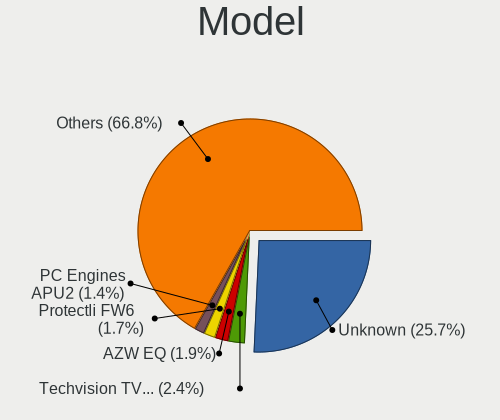
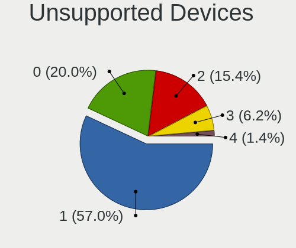

BSD - Hardware Trends (Desktops)
--------------------------------

A project to identify most popular hardware characteristics and track their change
over time based on data collected by BSD users at https://BSD-Hardware.info.

Anyone can contribute to this report by the [hw-probe](https://github.com/linuxhw/hw-probe/blob/master/INSTALL.BSD.md) tool:

    hw-probe -all -upload

This report is for one last month. Overall report since the beginning of time: [TestDays](https://github.com/bsdhw/TestDays)

Period: Jul, 2023.

Contents
--------

* [ System ](#system)
  - [ OS                       ](#os)
  - [ OS Family                ](#os-family)
  - [ Arch                     ](#arch)
  - [ DE                       ](#de)
  - [ Display Server           ](#display-server)
  - [ Display Manager          ](#display-manager)
  - [ OS Lang                  ](#os-lang)
  - [ Boot Mode                ](#boot-mode)
  - [ Filesystem               ](#filesystem)
  - [ Part. scheme             ](#part-scheme)

* [ Board ](#board)
  - [ Vendor                   ](#vendor)
  - [ Model                    ](#model)
  - [ Model Family             ](#model-family)
  - [ MFG Year                 ](#mfg-year)
  - [ Form Factor              ](#form-factor)
  - [ Coreboot                 ](#coreboot)
  - [ RAM Size                 ](#ram-size)
  - [ RAM Used                 ](#ram-used)
  - [ Total Drives             ](#total-drives)
  - [ Has CD-ROM               ](#has-cd-rom)
  - [ Has Ethernet             ](#has-ethernet)
  - [ Has WiFi                 ](#has-wifi)
  - [ Has Bluetooth            ](#has-bluetooth)

* [ Location ](#location)
  - [ Country                  ](#country)
  - [ City                     ](#city)

* [ Drives ](#drives)
  - [ Drive Vendor             ](#drive-vendor)
  - [ Drive Model              ](#drive-model)
  - [ HDD Vendor               ](#hdd-vendor)
  - [ SSD Vendor               ](#ssd-vendor)
  - [ Drive Kind               ](#drive-kind)
  - [ Drive Connector          ](#drive-connector)
  - [ Drive Size               ](#drive-size)
  - [ Space Total              ](#space-total)
  - [ Space Used               ](#space-used)
  - [ Malfunc. Drives          ](#malfunc-drives)
  - [ Malfunc. Drive Vendor    ](#malfunc-drive-vendor)
  - [ Malfunc. HDD Vendor      ](#malfunc-hdd-vendor)
  - [ Malfunc. Drive Kind      ](#malfunc-drive-kind)
  - [ Failed Drives            ](#failed-drives)
  - [ Failed Drive Vendor      ](#failed-drive-vendor)
  - [ Drive Status             ](#drive-status)

* [ Storage controller ](#storage-controller)
  - [ Storage Vendor           ](#storage-vendor)
  - [ Storage Model            ](#storage-model)
  - [ Storage Kind             ](#storage-kind)

* [ Processor ](#processor)
  - [ CPU Vendor               ](#cpu-vendor)
  - [ CPU Model                ](#cpu-model)
  - [ CPU Model Family         ](#cpu-model-family)
  - [ CPU Cores                ](#cpu-cores)
  - [ CPU Sockets              ](#cpu-sockets)
  - [ CPU Threads              ](#cpu-threads)
  - [ CPU Microarch            ](#cpu-microarch)

* [ Graphics ](#graphics)
  - [ GPU Vendor               ](#gpu-vendor)
  - [ GPU Model                ](#gpu-model)
  - [ GPU Combo                ](#gpu-combo)
  - [ GPU Driver               ](#gpu-driver)
  - [ GPU Memory               ](#gpu-memory)

* [ Monitor ](#monitor)
  - [ Monitor Vendor           ](#monitor-vendor)
  - [ Monitor Model            ](#monitor-model)
  - [ Monitor Resolution       ](#monitor-resolution)
  - [ Monitor Diagonal         ](#monitor-diagonal)
  - [ Monitor Width            ](#monitor-width)
  - [ Aspect Ratio             ](#aspect-ratio)
  - [ Monitor Area             ](#monitor-area)
  - [ Pixel Density            ](#pixel-density)
  - [ Multiple Monitors        ](#multiple-monitors)

* [ Network ](#network)
  - [ Net Controller Vendor    ](#net-controller-vendor)
  - [ Net Controller Model     ](#net-controller-model)
  - [ Wireless Vendor          ](#wireless-vendor)
  - [ Wireless Model           ](#wireless-model)
  - [ Ethernet Vendor          ](#ethernet-vendor)
  - [ Ethernet Model           ](#ethernet-model)
  - [ Net Controller Kind      ](#net-controller-kind)
  - [ Used Controller          ](#used-controller)
  - [ NICs                     ](#nics)
  - [ IPv6                     ](#ipv6)

* [ Bluetooth ](#bluetooth)
  - [ Bluetooth Vendor         ](#bluetooth-vendor)
  - [ Bluetooth Model          ](#bluetooth-model)

* [ Sound ](#sound)
  - [ Sound Vendor             ](#sound-vendor)
  - [ Sound Model              ](#sound-model)

* [ Memory ](#memory)
  - [ Memory Vendor            ](#memory-vendor)
  - [ Memory Model             ](#memory-model)
  - [ Memory Kind              ](#memory-kind)
  - [ Memory Form Factor       ](#memory-form-factor)
  - [ Memory Size              ](#memory-size)
  - [ Memory Speed             ](#memory-speed)

* [ Printers & scanners ](#printers--scanners)
  - [ Printer Vendor           ](#printer-vendor)
  - [ Printer Model            ](#printer-model)
  - [ Scanner Vendor           ](#scanner-vendor)
  - [ Scanner Model            ](#scanner-model)

* [ Camera ](#camera)
  - [ Camera Vendor            ](#camera-vendor)
  - [ Camera Model             ](#camera-model)

* [ Security ](#security)
  - [ Fingerprint Vendor       ](#fingerprint-vendor)
  - [ Fingerprint Model        ](#fingerprint-model)
  - [ Chipcard Vendor          ](#chipcard-vendor)
  - [ Chipcard Model           ](#chipcard-model)

* [ Unsupported ](#unsupported)
  - [ Unsupported Devices      ](#unsupported-devices)
  - [ Unsupported Device Types ](#unsupported-device-types)

System
------

OS
--

Installed operating systems

| Name                 | Desktops | Percent |
|----------------------|----------|---------|
| OPNsense 23.1.11     | 215      | 69.81%  |
| FreeBSD 13.2         | 16       | 5.19%   |
| OPNsense 23.7        | 15       | 4.87%   |
| helloSystem 0.8.1    | 10       | 3.25%   |
| FreeBSD 13.1-p8      | 10       | 3.25%   |
| FreeBSD 13.2-p1      | 7        | 2.27%   |
| OPNsense 23.1.9      | 4        | 1.3%    |
| OPNsense 23.1.7      | 4        | 1.3%    |
| OPNsense 22.7.11     | 4        | 1.3%    |
| helloSystem 0.8.2    | 3        | 0.97%   |
| OPNsense 23.1.5      | 2        | 0.65%   |
| OPNsense 23.1        | 2        | 0.65%   |
| OpenBSD 7.3          | 2        | 0.65%   |
| helloSystem 0.8.0    | 2        | 0.65%   |
| Ting 22.7            | 1        | 0.32%   |
| OPNsense 23.1.10     | 1        | 0.32%   |
| OPNsense 22.7.10     | 1        | 0.32%   |
| OPNsense 22.7        | 1        | 0.32%   |
| OPNsense 22.1.10     | 1        | 0.32%   |
| OpenBSD 6.9          | 1        | 0.32%   |
| NetBSD 9.3           | 1        | 0.32%   |
| GhostBSD 23.06.22    | 1        | 0.32%   |
| FreeBSD 14.0-CURRENT | 1        | 0.32%   |
| FreeBSD 13.1-p5      | 1        | 0.32%   |
| FreeBSD 13.1         | 1        | 0.32%   |
| ClonOS 14.0-CURRENT  | 1        | 0.32%   |

OS Family
---------

OS without a version

| Name        | Desktops | Percent |
|-------------|----------|---------|
| OPNsense    | 250      | 81.17%  |
| FreeBSD     | 36       | 11.69%  |
| helloSystem | 15       | 4.87%   |
| OpenBSD     | 3        | 0.97%   |
| Ting        | 1        | 0.32%   |
| NetBSD      | 1        | 0.32%   |
| GhostBSD    | 1        | 0.32%   |
| ClonOS      | 1        | 0.32%   |

Arch
----

OS architecture (x86_64, i586, etc.)

| Name  | Desktops | Percent |
|-------|----------|---------|
| amd64 | 304      | 98.7%   |
| arm64 | 4        | 1.3%    |

DE
--

Desktop Environment

| Name         | Desktops | Percent |
|--------------|----------|---------|
| Console      | 263      | 85.39%  |
| helloDesktop | 15       | 4.87%   |
| GNOME        | 9        | 2.92%   |
| KDE5         | 6        | 1.95%   |
| XFCE         | 5        | 1.62%   |
| TWM          | 3        | 0.97%   |
| Openbox      | 2        | 0.65%   |
| Picom        | 1        | 0.32%   |
| MATE         | 1        | 0.32%   |
| LXQt         | 1        | 0.32%   |
| LXDE         | 1        | 0.32%   |
| DWM          | 1        | 0.32%   |

Display Server
--------------

X11 or Wayland

| Name    | Desktops | Percent |
|---------|----------|---------|
| Console | 271      | 87.99%  |
| X11     | 37       | 12.01%  |

Display Manager
---------------

SDDM, LightDM, etc.

| Name    | Desktops | Percent |
|---------|----------|---------|
| Console | 272      | 88.31%  |
| SLiM    | 16       | 5.19%   |
| SDDM    | 7        | 2.27%   |
| GDM     | 6        | 1.95%   |
| LightDM | 4        | 1.3%    |
| XDM     | 3        | 0.97%   |

OS Lang
-------

Language

| Lang    | Desktops | Percent |
|---------|----------|---------|
| Unknown | 250      | 81.17%  |
| C       | 34       | 11.04%  |
| en_US   | 12       | 3.9%    |
| ru_RU   | 3        | 0.97%   |
| fr_FR   | 2        | 0.65%   |
| de_DE   | 2        | 0.65%   |
| pl_PL   | 1        | 0.32%   |
| ko      | 1        | 0.32%   |
| it_IT   | 1        | 0.32%   |
| fr      | 1        | 0.32%   |
| fi_FI   | 1        | 0.32%   |

Boot Mode
---------

EFI or BIOS

| Mode | Desktops | Percent |
|------|----------|---------|
| EFI  | 298      | 96.75%  |
| BIOS | 10       | 3.25%   |

Filesystem
----------

Type of filesystem

| Type   | Desktops | Percent |
|--------|----------|---------|
| Ufs    | 151      | 49.03%  |
| Zfs    | 146      | 47.4%   |
| Cd9660 | 8        | 2.6%    |
| Ffs    | 3        | 0.97%   |

Part. scheme
------------

Scheme of partitioning

| Type    | Desktops | Percent |
|---------|----------|---------|
| GPT     | 301      | 97.73%  |
| MBR     | 6        | 1.95%   |
| Unknown | 1        | 0.32%   |

Board
-----

Vendor
------

Motherboard manufacturer

| Name                | Desktops | Percent |
|---------------------|----------|---------|
| Unknown             | 49       | 15.91%  |
| Hewlett-Packard     | 29       | 9.42%   |
| Dell                | 28       | 9.09%   |
| ASUSTek Computer    | 26       | 8.44%   |
| Protectli           | 23       | 7.47%   |
| Gigabyte Technology | 21       | 6.82%   |
| ASRock              | 17       | 5.52%   |
| Intel               | 16       | 5.19%   |
| Techvision          | 12       | 3.9%    |
| PC Engines          | 11       | 3.57%   |
| Fujitsu             | 9        | 2.92%   |
| AZW                 | 7        | 2.27%   |
| MSI                 | 6        | 1.95%   |
| Lenovo              | 6        | 1.95%   |
| MW                  | 5        | 1.62%   |
| Shuttle             | 4        | 1.3%    |
| IceWhale Technology | 4        | 1.3%    |
| Yanling             | 3        | 0.97%   |
| Supermicro          | 3        | 0.97%   |
| Hardkernel          | 3        | 0.97%   |
| Seeed Studio        | 2        | 0.65%   |
| CWWK                | 2        | 0.65%   |
| ASRockRack          | 2        | 0.65%   |
| YANYU               | 1        | 0.32%   |
| Radxa               | 1        | 0.32%   |
| Premio              | 1        | 0.32%   |
| PICO PC             | 1        | 0.32%   |
| OEM                 | 1        | 0.32%   |
| NF541               | 1        | 0.32%   |
| NEC Computers       | 1        | 0.32%   |
| MiTAC               | 1        | 0.32%   |
| Lex                 | 1        | 0.32%   |
| Iwill Norge AS      | 1        | 0.32%   |
| GoWin Solution      | 1        | 0.32%   |
| Foxconn             | 1        | 0.32%   |
| ECS                 | 1        | 0.32%   |
| CONTEC              | 1        | 0.32%   |
| CncTion             | 1        | 0.32%   |
| Cisco               | 1        | 0.32%   |
| ChangWang           | 1        | 0.32%   |

Model
-----

Motherboard model

| Name                        | Desktops | Percent |
|-----------------------------|----------|---------|
| Unknown                     | 49       | 15.91%  |
| Techvision TVI7309X         | 12       | 3.9%    |
| Protectli FW4B              | 7        | 2.27%   |
| PC Engines APU2             | 6        | 1.95%   |
| MW GMLK-2_5G4L              | 5        | 1.62%   |
| Gigabyte B360N WIFI         | 5        | 1.62%   |
| Fujitsu FUTRO S920          | 5        | 1.62%   |
| Protectli VP2420            | 4        | 1.3%    |
| Protectli FW6               | 4        | 1.3%    |
| PC Engines apu4             | 4        | 1.3%    |
| Dell OptiPlex 3020          | 4        | 1.3%    |
| AZW EQ                      | 4        | 1.3%    |
| Intel Q3XXG4-P V1.0         | 3        | 0.97%   |
| Intel CRESCENTBAY           | 3        | 0.97%   |
| HP EliteDesk 800 G3 SFF     | 3        | 0.97%   |
| Gigabyte B150N Phoenix-WIFI | 3        | 0.97%   |
| Dell OptiPlex 7060          | 3        | 0.97%   |
| Protectli VP2410            | 2        | 0.65%   |
| Protectli FW1               | 2        | 0.65%   |
| IceWhale ZimaBoard 832 ZMB  | 2        | 0.65%   |
| IceWhale ZimaBoard 432 ZMB  | 2        | 0.65%   |
| HP t620 PLUS Quad Core TC   | 2        | 0.65%   |
| HP EliteDesk 800 G1 TWR     | 2        | 0.65%   |
| HP Compaq Pro 6300 SFF      | 2        | 0.65%   |
| HP Compaq Elite 8300 SFF    | 2        | 0.65%   |
| HP Compaq 8200 Elite SFF PC | 2        | 0.65%   |
| HP 500-459                  | 2        | 0.65%   |
| Hardkernel ODROID-H3        | 2        | 0.65%   |
| Gigabyte H270N-WIFI         | 2        | 0.65%   |
| Dell OptiPlex 9020          | 2        | 0.65%   |
| Dell OptiPlex 7040          | 2        | 0.65%   |
| Dell OptiPlex 3060          | 2        | 0.65%   |
| Dell OptiPlex 3040          | 2        | 0.65%   |
| AZW U59                     | 2        | 0.65%   |
| ASRock Z690 PG Riptide      | 2        | 0.65%   |
| ASRock J3455B-ITX           | 2        | 0.65%   |
| YANYU H67SL                 | 1        | 0.32%   |
| Yanling YL-GML4 V1          | 1        | 0.32%   |
| Yanling YL-CLU6L-V1         | 1        | 0.32%   |
| Yanling LES v4              | 1        | 0.32%   |

Model Family
------------

Motherboard model prefix

| Name                          | Desktops | Percent |
|-------------------------------|----------|---------|
| Unknown                       | 49       | 15.91%  |
| Dell OptiPlex                 | 25       | 8.12%   |
| Techvision TVI7309X           | 12       | 3.9%    |
| HP EliteDesk                  | 11       | 3.57%   |
| ASUS PRIME                    | 8        | 2.6%    |
| Protectli FW4B                | 7        | 2.27%   |
| HP Compaq                     | 7        | 2.27%   |
| PC Engines APU2               | 6        | 1.95%   |
| Fujitsu FUTRO                 | 6        | 1.95%   |
| MW GMLK-2                     | 5        | 1.62%   |
| Gigabyte B360N                | 5        | 1.62%   |
| Protectli VP2420              | 4        | 1.3%    |
| Protectli FW6                 | 4        | 1.3%    |
| PC Engines apu4               | 4        | 1.3%    |
| Lenovo ThinkCentre            | 4        | 1.3%    |
| IceWhale ZimaBoard            | 4        | 1.3%    |
| AZW EQ                        | 4        | 1.3%    |
| Intel Q3XXG4-P                | 3        | 0.97%   |
| Intel CRESCENTBAY             | 3        | 0.97%   |
| HP ProDesk                    | 3        | 0.97%   |
| Gigabyte B150N                | 3        | 0.97%   |
| ASUS ROG                      | 3        | 0.97%   |
| Protectli VP2410              | 2        | 0.65%   |
| Protectli FW1                 | 2        | 0.65%   |
| HP t620                       | 2        | 0.65%   |
| HP 500-459                    | 2        | 0.65%   |
| Hardkernel ODROID-H3          | 2        | 0.65%   |
| Gigabyte H270N-WIFI           | 2        | 0.65%   |
| Gigabyte B450M                | 2        | 0.65%   |
| Fujitsu ESPRIMO               | 2        | 0.65%   |
| AZW U59                       | 2        | 0.65%   |
| ASUS TUF                      | 2        | 0.65%   |
| ASRock Z690                   | 2        | 0.65%   |
| ASRock J3455B-ITX             | 2        | 0.65%   |
| YANYU H67SL                   | 1        | 0.32%   |
| Yanling YL-GML4               | 1        | 0.32%   |
| Yanling YL-CLU6L-V1           | 1        | 0.32%   |
| Yanling LES                   | 1        | 0.32%   |
| Supermicro X7SLA              | 1        | 0.32%   |
| Supermicro SYS-E300-9A-4CN10P | 1        | 0.32%   |

MFG Year
--------

Motherboard manufacture year

| Year    | Desktops | Percent |
|---------|----------|---------|
| 2022    | 64       | 20.78%  |
| 2018    | 39       | 12.66%  |
| 2021    | 34       | 11.04%  |
| 2023    | 26       | 8.44%   |
| 2016    | 21       | 6.82%   |
| 2014    | 19       | 6.17%   |
| 2019    | 17       | 5.52%   |
| 2017    | 16       | 5.19%   |
| 2013    | 14       | 4.55%   |
| 2012    | 10       | 3.25%   |
| 2011    | 10       | 3.25%   |
| 2015    | 9        | 2.92%   |
| 2020    | 8        | 2.6%    |
| 2009    | 7        | 2.27%   |
| 2008    | 7        | 2.27%   |
| 2010    | 3        | 0.97%   |
| Unknown | 3        | 0.97%   |
| 2006    | 1        | 0.32%   |

Form Factor
-----------

Physical design of the computer

| Name    | Desktops | Percent |
|---------|----------|---------|
| Desktop | 308      | 100%    |

Coreboot
--------

Have coreboot on board

| Used | Desktops | Percent |
|------|----------|---------|
| No   | 294      | 95.45%  |
| Yes  | 14       | 4.55%   |

RAM Size
--------

Total RAM memory

| Size in GB  | Desktops | Percent |
|-------------|----------|---------|
| 8.01-16.0   | 106      | 34.42%  |
| 16.01-24.0  | 104      | 33.77%  |
| 4.01-8.0    | 49       | 15.91%  |
| 32.01-64.0  | 28       | 9.09%   |
| 64.01-256.0 | 8        | 2.6%    |
| 2.01-3.0    | 7        | 2.27%   |
| 24.01-32.0  | 3        | 0.97%   |
| 0.51-1.0    | 2        | 0.65%   |
| 3.01-4.0    | 1        | 0.32%   |

RAM Used
--------

Used RAM memory

| Used GB    | Desktops | Percent |
|------------|----------|---------|
| 0.01-0.5   | 135      | 43.83%  |
| 0.51-1.0   | 128      | 41.56%  |
| 1.01-2.0   | 32       | 10.39%  |
| 2.01-3.0   | 6        | 1.95%   |
| 3.01-4.0   | 3        | 0.97%   |
| 4.01-8.0   | 2        | 0.65%   |
| 32.01-64.0 | 1        | 0.32%   |
| Unknown    | 1        | 0.32%   |

Total Drives
------------

Number of drives on board

| Drives | Desktops | Percent |
|--------|----------|---------|
| 1      | 220      | 71.43%  |
| 2      | 37       | 12.01%  |
| 0      | 34       | 11.04%  |
| 3      | 9        | 2.92%   |
| 4      | 4        | 1.3%    |
| 13     | 1        | 0.32%   |
| 10     | 1        | 0.32%   |
| 6      | 1        | 0.32%   |
| 5      | 1        | 0.32%   |

Has CD-ROM
----------

Has CD-ROM on board

| Presented | Desktops | Percent |
|-----------|----------|---------|
| No        | 258      | 83.77%  |
| Yes       | 50       | 16.23%  |

Has Ethernet
------------

Has Ethernet on board

| Presented | Desktops | Percent |
|-----------|----------|---------|
| Yes       | 306      | 99.35%  |
| No        | 2        | 0.65%   |

Has WiFi
--------

Has WiFi module

| Presented | Desktops | Percent |
|-----------|----------|---------|
| No        | 238      | 77.27%  |
| Yes       | 70       | 22.73%  |

Has Bluetooth
-------------

Has Bluetooth module

| Presented | Desktops | Percent |
|-----------|----------|---------|
| No        | 254      | 82.47%  |
| Yes       | 54       | 17.53%  |

Location
--------

Country
-------

Geographic location (country)

| Country      | Desktops | Percent |
|--------------|----------|---------|
| USA          | 104      | 33.77%  |
| Germany      | 38       | 12.34%  |
| Canada       | 16       | 5.19%   |
| Russia       | 15       | 4.87%   |
| Poland       | 15       | 4.87%   |
| Netherlands  | 14       | 4.55%   |
| Brazil       | 10       | 3.25%   |
| Australia    | 10       | 3.25%   |
| UK           | 8        | 2.6%    |
| Italy        | 7        | 2.27%   |
| France       | 7        | 2.27%   |
| Belgium      | 6        | 1.95%   |
| Sweden       | 5        | 1.62%   |
| India        | 4        | 1.3%    |
| China        | 4        | 1.3%    |
| Switzerland  | 3        | 0.97%   |
| Romania      | 3        | 0.97%   |
| Denmark      | 3        | 0.97%   |
| Uruguay      | 2        | 0.65%   |
| Thailand     | 2        | 0.65%   |
| Spain        | 2        | 0.65%   |
| South Korea  | 2        | 0.65%   |
| South Africa | 2        | 0.65%   |
| Portugal     | 2        | 0.65%   |
| Austria      | 2        | 0.65%   |
| Vietnam      | 1        | 0.32%   |
| Uganda       | 1        | 0.32%   |
| Turkey       | 1        | 0.32%   |
| Taiwan       | 1        | 0.32%   |
| Serbia       | 1        | 0.32%   |
| Philippines  | 1        | 0.32%   |
| Pakistan     | 1        | 0.32%   |
| Norway       | 1        | 0.32%   |
| New Zealand  | 1        | 0.32%   |
| Latvia       | 1        | 0.32%   |
| Kyrgyzstan   | 1        | 0.32%   |
| Kazakhstan   | 1        | 0.32%   |
| Indonesia    | 1        | 0.32%   |
| Hungary      | 1        | 0.32%   |
| Hong Kong    | 1        | 0.32%   |

City
----

Geographic location (city)

| City                 | Desktops | Percent |
|----------------------|----------|---------|
| St Petersburg        | 7        | 2.27%   |
| Lublin               | 6        | 1.95%   |
| Sydney               | 5        | 1.62%   |
| Melbourne            | 4        | 1.3%    |
| Los Angeles          | 3        | 0.97%   |
| Longueuil            | 3        | 0.97%   |
| Gmina Świebodzin    | 3        | 0.97%   |
| Tucson               | 2        | 0.65%   |
| Tampa                | 2        | 0.65%   |
| Stavropol            | 2        | 0.65%   |
| Shenzhen             | 2        | 0.65%   |
| Seattle              | 2        | 0.65%   |
| Salem                | 2        | 0.65%   |
| Redmond              | 2        | 0.65%   |
| Reading              | 2        | 0.65%   |
| Portland             | 2        | 0.65%   |
| Pittsburgh           | 2        | 0.65%   |
| Penza                | 2        | 0.65%   |
| Oakland              | 2        | 0.65%   |
| Montevideo           | 2        | 0.65%   |
| Milan                | 2        | 0.65%   |
| Louisville           | 2        | 0.65%   |
| Jinrongjie           | 2        | 0.65%   |
| Indianapolis         | 2        | 0.65%   |
| Hamburg              | 2        | 0.65%   |
| Dresden              | 2        | 0.65%   |
| Dearborn Heights     | 2        | 0.65%   |
| Columbus             | 2        | 0.65%   |
| Campinas             | 2        | 0.65%   |
| Brussels             | 2        | 0.65%   |
| Boston               | 2        | 0.65%   |
| Bietigheim-Bissingen | 2        | 0.65%   |
| Bangkok              | 2        | 0.65%   |
| Zottegem             | 1        | 0.32%   |
| Zgierz               | 1        | 0.32%   |
| Youngsville          | 1        | 0.32%   |
| York Haven           | 1        | 0.32%   |
| Wroclaw              | 1        | 0.32%   |
| Woodbury             | 1        | 0.32%   |
| Woodbridge           | 1        | 0.32%   |

Drives
------

Drive Vendor
------------

Hard drive vendors

| Vendor              | Desktops | Drives | Percent |
|---------------------|----------|--------|---------|
| Samsung Electronics | 57       | 67     | 17.59%  |
| WDC                 | 38       | 58     | 11.73%  |
| Kingston            | 36       | 40     | 11.11%  |
| Seagate             | 21       | 23     | 6.48%   |
| Intel               | 16       | 18     | 4.94%   |
| Crucial             | 16       | 20     | 4.94%   |
| Transcend           | 11       | 12     | 3.4%    |
| China               | 10       | 10     | 3.09%   |
| Toshiba             | 8        | 9      | 2.47%   |
| SPCC                | 7        | 7      | 2.16%   |
| SanDisk             | 6        | 6      | 1.85%   |
| Protectli           | 6        | 6      | 1.85%   |
| Hoodisk             | 6        | 6      | 1.85%   |
| Fanxiang            | 6        | 6      | 1.85%   |
| SK hynix            | 5        | 5      | 1.54%   |
| Innodisk            | 5        | 5      | 1.54%   |
| Hitachi             | 5        | 6      | 1.54%   |
| A-DATA Technology   | 5        | 6      | 1.54%   |
| Patriot             | 4        | 4      | 1.23%   |
| Micron Technology   | 4        | 4      | 1.23%   |
| FORESEE             | 4        | 4      | 1.23%   |
| Team                | 3        | 3      | 0.93%   |
| Silicon Motion      | 3        | 3      | 0.93%   |
| PNY                 | 3        | 3      | 0.93%   |
| Verbatim            | 2        | 2      | 0.62%   |
| Vaseky              | 2        | 2      | 0.62%   |
| Phison              | 2        | 2      | 0.62%   |
| OCZ                 | 2        | 2      | 0.62%   |
| KIOXIA              | 2        | 2      | 0.62%   |
| HGST                | 2        | 3      | 0.62%   |
| Dogfish             | 2        | 2      | 0.62%   |
| Corsair             | 2        | 2      | 0.62%   |
| BIWIN               | 2        | 2      | 0.62%   |
| Apacer              | 2        | 3      | 0.62%   |
| TAMMUZ              | 1        | 1      | 0.31%   |
| T-FORCE             | 1        | 1      | 0.31%   |
| SSSTC               | 1        | 1      | 0.31%   |
| Qunion              | 1        | 1      | 0.31%   |
| NVMe                | 1        | 1      | 0.31%   |
| Netac               | 1        | 1      | 0.31%   |

Drive Model
-----------

Hard drive models

| Model                           | Desktops | Percent |
|---------------------------------|----------|---------|
| WDC WDS500G1R0A-68A4W0 500GB    | 6        | 1.71%   |
| Kingston SKC600MS256G 256GB     | 6        | 1.71%   |
| WDC WD5000LPLX-22ZNTT0 500GB    | 5        | 1.42%   |
| Samsung SSD 870 QVO 1TB         | 5        | 1.42%   |
| Samsung SSD 850 EVO 250GB       | 5        | 1.42%   |
| Kingston SA400S37240G 240GB     | 5        | 1.42%   |
| Fanxiang S501 128GB             | 5        | 1.42%   |
| Seagate ST500DM002-1BD142 496GB | 4        | 1.14%   |
| Samsung SSD 870 EVO 500GB       | 4        | 1.14%   |
| Samsung SSD 850 EVO 500GB       | 4        | 1.14%   |
| Kingston SA400S37120G 120GB     | 4        | 1.14%   |
| Innodisk DEMSR- 08GB mSATA 3ME3 | 4        | 1.14%   |
| Transcend TS64GMSA230S 64GB     | 3        | 0.85%   |
| SPCC Solid State Disk 128GB     | 3        | 0.85%   |
| Samsung SSD 970 EVO Plus 500GB  | 3        | 0.85%   |
| PNY CS900 120GB SSD             | 3        | 0.85%   |
| Kingston SUV500MS120G 120GB     | 3        | 0.85%   |
| Kingston SA400S37480G 480GB     | 3        | 0.85%   |
| Hoodisk SSD 64GB                | 3        | 0.85%   |
| Crucial CT500MX500SSD1 500GB    | 3        | 0.85%   |
| WDC WDS500G2B0B-00YS70 500GB    | 2        | 0.57%   |
| WDC WD80EMAZ-00WJTA0 8TB        | 2        | 0.57%   |
| WDC WD6400AAKS-00A7B0 640GB     | 2        | 0.57%   |
| WDC WD10JPLX-00MBPT0 1TB        | 2        | 0.57%   |
| Transcend TS32GMSA370 32GB      | 2        | 0.57%   |
| Transcend TS256GMSA230S 256GB   | 2        | 0.57%   |
| Toshiba MQ01ABD050 500GB        | 2        | 0.57%   |
| SPCC Solid State Disk 256GB     | 2        | 0.57%   |
| Seagate ST4000LM024-2U817V 4TB  | 2        | 0.57%   |
| Seagate ST4000LM024-2AN17V 4TB  | 2        | 0.57%   |
| Seagate ST4000DM000-1F2168 4TB  | 2        | 0.57%   |
| Samsung SSD 980 PRO 1TB         | 2        | 0.57%   |
| Samsung SSD 970 EVO Plus 2TB    | 2        | 0.57%   |
| Samsung SSD 960 EVO 250GB       | 2        | 0.57%   |
| Samsung SSD 860 EVO 500GB       | 2        | 0.57%   |
| Patriot Burst Elite 120GB       | 2        | 0.57%   |
| KIOXIA KBG50ZNS256G NVMe 256GB  | 2        | 0.57%   |
| Hoodisk SSD 32GB                | 2        | 0.57%   |
| FORESEE 128GB SSD               | 2        | 0.57%   |
| Crucial CT500P3SSD8 500GB       | 2        | 0.57%   |

HDD Vendor
----------

Hard disk drive vendors

| Vendor              | Desktops | Drives | Percent |
|---------------------|----------|--------|---------|
| WDC                 | 25       | 39     | 40.98%  |
| Seagate             | 21       | 23     | 34.43%  |
| Toshiba             | 5        | 6      | 8.2%    |
| Hitachi             | 4        | 5      | 6.56%   |
| Samsung Electronics | 2        | 2      | 3.28%   |
| HGST                | 2        | 3      | 3.28%   |
| Maxtor              | 1        | 1      | 1.64%   |
| CLOVER              | 1        | 1      | 1.64%   |

SSD Vendor
----------

Solid state drive vendors

| Vendor              | Desktops | Drives | Percent |
|---------------------|----------|--------|---------|
| Samsung Electronics | 39       | 45     | 19.4%   |
| Kingston            | 32       | 35     | 15.92%  |
| WDC                 | 12       | 12     | 5.97%   |
| Crucial             | 12       | 14     | 5.97%   |
| Transcend           | 11       | 12     | 5.47%   |
| Intel               | 10       | 12     | 4.98%   |
| China               | 10       | 10     | 4.98%   |
| SPCC                | 6        | 6      | 2.99%   |
| SanDisk             | 6        | 6      | 2.99%   |
| Protectli           | 6        | 6      | 2.99%   |
| Hoodisk             | 6        | 6      | 2.99%   |
| Innodisk            | 5        | 5      | 2.49%   |
| FORESEE             | 4        | 4      | 1.99%   |
| PNY                 | 3        | 3      | 1.49%   |
| Patriot             | 3        | 3      | 1.49%   |
| A-DATA Technology   | 3        | 4      | 1.49%   |
| Verbatim            | 2        | 2      | 1%      |
| Vaseky              | 2        | 2      | 1%      |
| Team                | 2        | 2      | 1%      |
| OCZ                 | 2        | 2      | 1%      |
| Micron Technology   | 2        | 2      | 1%      |
| Dogfish             | 2        | 2      | 1%      |
| BIWIN               | 2        | 2      | 1%      |
| Toshiba             | 1        | 1      | 0.5%    |
| TAMMUZ              | 1        | 1      | 0.5%    |
| T-FORCE             | 1        | 1      | 0.5%    |
| SSSTC               | 1        | 1      | 0.5%    |
| SK hynix            | 1        | 1      | 0.5%    |
| Qunion              | 1        | 1      | 0.5%    |
| NVMe                | 1        | 1      | 0.5%    |
| Netac               | 1        | 1      | 0.5%    |
| LITEON              | 1        | 2      | 0.5%    |
| KingSpec            | 1        | 1      | 0.5%    |
| KingDian            | 1        | 1      | 0.5%    |
| Indilinx            | 1        | 1      | 0.5%    |
| Hitachi             | 1        | 1      | 0.5%    |
| Emtec               | 1        | 1      | 0.5%    |
| Drevo               | 1        | 1      | 0.5%    |
| Corsair             | 1        | 1      | 0.5%    |
| ATP                 | 1        | 1      | 0.5%    |

Drive Kind
----------

HDD or SSD

| Kind | Desktops | Drives | Percent |
|------|----------|--------|---------|
| SSD  | 188      | 218    | 60.84%  |
| NVMe | 69       | 75     | 22.33%  |
| HDD  | 52       | 80     | 16.83%  |

Drive Connector
---------------

SATA, SAS, NVMe, etc.

| Type | Desktops | Drives | Percent |
|------|----------|--------|---------|
| SATA | 223      | 298    | 76.37%  |
| NVMe | 69       | 75     | 23.63%  |

Drive Size
----------

Size of hard drive

| Size in TB | Desktops | Drives | Percent |
|------------|----------|--------|---------|
| 0.01-0.5   | 195      | 227    | 79.92%  |
| 0.51-1.0   | 28       | 34     | 11.48%  |
| 1.01-2.0   | 9        | 15     | 3.69%   |
| 3.01-4.0   | 8        | 9      | 3.28%   |
| 4.01-10.0  | 3        | 11     | 1.23%   |
| 10.01-20.0 | 1        | 2      | 0.41%   |

Space Total
-----------

Amount of disk space available on the file system

| Size in GB     | Desktops | Percent |
|----------------|----------|---------|
| 101-250        | 120      | 38.96%  |
| 251-500        | 67       | 21.75%  |
| 501-1000       | 36       | 11.69%  |
| 51-100         | 36       | 11.69%  |
| 21-50          | 22       | 7.14%   |
| 1-20           | 22       | 7.14%   |
| More than 3000 | 2        | 0.65%   |
| 1001-2000      | 2        | 0.65%   |
| 2001-3000      | 1        | 0.32%   |

Space Used
----------

Amount of used disk space

| Used GB        | Desktops | Percent |
|----------------|----------|---------|
| 1-20           | 280      | 90.91%  |
| 21-50          | 12       | 3.9%    |
| 251-500        | 6        | 1.95%   |
| 101-250        | 6        | 1.95%   |
| 51-100         | 3        | 0.97%   |
| More than 3000 | 1        | 0.32%   |

Malfunc. Drives
---------------

Drive models with a malfunction

| Model                                   | Desktops | Drives | Percent |
|-----------------------------------------|----------|--------|---------|
| WDC WD5000LPLX-22ZNTT0 500GB            | 2        | 2      | 7.14%   |
| Seagate ST500DM002-1BD142 496GB         | 2        | 2      | 7.14%   |
| Patriot Burst Elite 120GB               | 2        | 2      | 7.14%   |
| WDC WD7500BPKT-00PK4T0 752GB            | 1        | 1      | 3.57%   |
| WDC WD6400AAKS-00A7B0 640GB             | 1        | 1      | 3.57%   |
| WDC WD20NPVX-00EA4T0 2TB                | 1        | 2      | 3.57%   |
| WDC WD1002FAEX-00Y9A0 1TB               | 1        | 1      | 3.57%   |
| SSSTC CVB-8D128-HP 128GB                | 1        | 1      | 3.57%   |
| Seagate ST9320325AS 320GB               | 1        | 1      | 3.57%   |
| Seagate ST3250312AS 250GB               | 1        | 1      | 3.57%   |
| Seagate ST3160827AS 160GB               | 1        | 1      | 3.57%   |
| Seagate ST2000LM015-2E8174 2TB          | 1        | 2      | 3.57%   |
| Seagate ST2000DM006-2DM164 2TB          | 1        | 1      | 3.57%   |
| Seagate ST1000DM010-2EP102 1TB          | 1        | 1      | 3.57%   |
| SanDisk SSD P4 16GB                     | 1        | 1      | 3.57%   |
| Samsung Electronics 470 Series SSD 64GB | 1        | 1      | 3.57%   |
| Maxtor 6L080P0 82GB                     | 1        | 1      | 3.57%   |
| Kingston SMS200S360G 64GB               | 1        | 1      | 3.57%   |
| KingDian S100 32GB                      | 1        | 1      | 3.57%   |
| Intel SSDSC2BW480H6 480GB               | 1        | 1      | 3.57%   |
| Intel SSDPEKKW256G7 256GB               | 1        | 1      | 3.57%   |
| Hitachi HUA722020ALA330 2TB             | 1        | 1      | 3.57%   |
| Hitachi HDP725025GLA380 250GB           | 1        | 1      | 3.57%   |
| Crucial CT525MX300SSD1 528GB            | 1        | 1      | 3.57%   |
| Crucial CT500MX500SSD1 500GB            | 1        | 1      | 3.57%   |

Malfunc. Drive Vendor
---------------------

Vendors of faulty drives

| Vendor              | Desktops | Drives | Percent |
|---------------------|----------|--------|---------|
| Seagate             | 8        | 9      | 29.63%  |
| WDC                 | 5        | 7      | 18.52%  |
| Patriot             | 2        | 2      | 7.41%   |
| Intel               | 2        | 2      | 7.41%   |
| Hitachi             | 2        | 2      | 7.41%   |
| Crucial             | 2        | 2      | 7.41%   |
| SSSTC               | 1        | 1      | 3.7%    |
| SanDisk             | 1        | 1      | 3.7%    |
| Samsung Electronics | 1        | 1      | 3.7%    |
| Maxtor              | 1        | 1      | 3.7%    |
| Kingston            | 1        | 1      | 3.7%    |
| KingDian            | 1        | 1      | 3.7%    |

Malfunc. HDD Vendor
-------------------

Vendors of faulty HDD drives

| Vendor  | Desktops | Drives | Percent |
|---------|----------|--------|---------|
| Seagate | 8        | 9      | 50%     |
| WDC     | 5        | 7      | 31.25%  |
| Hitachi | 2        | 2      | 12.5%   |
| Maxtor  | 1        | 1      | 6.25%   |

Malfunc. Drive Kind
-------------------

Kinds of faulty drives

| Kind | Desktops | Drives | Percent |
|------|----------|--------|---------|
| HDD  | 15       | 19     | 57.69%  |
| SSD  | 10       | 10     | 38.46%  |
| NVMe | 1        | 1      | 3.85%   |

Failed Drives
-------------

Failed drive models

| Model                                            | Desktops | Drives | Percent |
|--------------------------------------------------|----------|--------|---------|
| WDC WD3200L 320GB                                | 1        | 1      | 16.67%  |
| Transcend TS32GSSD370S 32GB                      | 1        | 1      | 16.67%  |
| SK hynix BC501 HFM256GDJTNG-8310A 256GB          | 1        | 1      | 16.67%  |
| Samsung Electronics SSD PM830 2.5-inch 7mm 256GB | 1        | 1      | 16.67%  |
| Samsung Electronics MZVLW256HEHP-00000 256GB     | 1        | 1      | 16.67%  |
| Crucial CT500P3SSD8 500GB                        | 1        | 1      | 16.67%  |

Failed Drive Vendor
-------------------

Failed drive vendors

| Vendor              | Desktops | Drives | Percent |
|---------------------|----------|--------|---------|
| Samsung Electronics | 2        | 2      | 33.33%  |
| WDC                 | 1        | 1      | 16.67%  |
| Transcend           | 1        | 1      | 16.67%  |
| SK hynix            | 1        | 1      | 16.67%  |
| Crucial             | 1        | 1      | 16.67%  |

Drive Status
------------

Number of failed and malfunc. drives

| Status   | Desktops | Drives | Percent |
|----------|----------|--------|---------|
| Works    | 250      | 332    | 87.11%  |
| Malfunc  | 26       | 30     | 9.06%   |
| Failed   | 6        | 6      | 2.09%   |
| Detected | 5        | 5      | 1.74%   |

Storage controller
------------------

Storage Vendor
--------------

Storage controller vendors

| Vendor                       | Desktops | Percent |
|------------------------------|----------|---------|
| Intel                        | 248      | 62.16%  |
| AMD                          | 48       | 12.03%  |
| Samsung Electronics          | 19       | 4.76%   |
| SanDisk                      | 12       | 3.01%   |
| Silicon Motion               | 11       | 2.76%   |
| MAXIO Technology (Hangzhou)  | 8        | 2.01%   |
| Marvell Technology Group     | 8        | 2.01%   |
| ASMedia Technology           | 7        | 1.75%   |
| Micron/Crucial Technology    | 6        | 1.5%    |
| Kingston Technology Company  | 5        | 1.25%   |
| SK hynix                     | 4        | 1%      |
| JMicron Technology           | 4        | 1%      |
| Phison Electronics           | 3        | 0.75%   |
| KIOXIA                       | 3        | 0.75%   |
| Shenzhen Longsys Electronics | 2        | 0.5%    |
| Nvidia                       | 2        | 0.5%    |
| Micron Technology            | 2        | 0.5%    |
| ADATA Technology             | 2        | 0.5%    |
| Toshiba                      | 1        | 0.25%   |
| Realtek Semiconductor        | 1        | 0.25%   |
| Chelsio Communications       | 1        | 0.25%   |
| Broadcom / LSI               | 1        | 0.25%   |
| Adaptec                      | 1        | 0.25%   |

Storage Model
-------------

Storage controller models

| Model                                                                                   | Desktops | Percent |
|-----------------------------------------------------------------------------------------|----------|---------|
| AMD FCH SATA Controller [AHCI mode]                                                     | 37       | 8.45%   |
| Intel Celeron/Pentium Silver Processor SATA Controller                                  | 26       | 5.94%   |
| Intel 8 Series/C220 Series Chipset Family 6-port SATA Controller 1 [AHCI mode]          | 24       | 5.48%   |
| Intel Jasper Lake SATA AHCI Controller                                                  | 21       | 4.79%   |
| Intel 6 Series/C200 Series Chipset Family 6 port Desktop SATA AHCI Controller           | 15       | 3.42%   |
| Intel Cannon Lake PCH SATA AHCI Controller                                              | 13       | 2.97%   |
| Silicon Motion SM2263EN/SM2263XT (DRAM-less) NVMe SSD Controllers                       | 11       | 2.51%   |
| Intel SATA Controller [RAID mode]                                                       | 11       | 2.51%   |
| Intel Atom/Celeron/Pentium Processor x5-E8000/J3xxx/N3xxx Series SATA Controller        | 11       | 2.51%   |
| Intel Q170/Q150/B150/H170/H110/Z170/CM236 Chipset SATA Controller [AHCI Mode]           | 10       | 2.28%   |
| Intel 7 Series/C210 Series Chipset Family 6-port SATA Controller [AHCI mode]            | 9        | 2.05%   |
| Intel 200 Series PCH SATA controller [AHCI mode]                                        | 9        | 2.05%   |
| Unknown                                                                                 | 9        | 2.05%   |
| Samsung NVMe SSD Controller SM981/PM981/PM983                                           | 8        | 1.83%   |
| MAXIO (Hangzhou) NVMe SSD Controller MAP1202                                            | 8        | 1.83%   |
| Intel Sunrise Point-LP SATA Controller [AHCI mode]                                      | 8        | 1.83%   |
| Intel Tiger Lake-LP SATA Controller                                                     | 7        | 1.6%    |
| Intel Elkhart Lake SATA AHCI                                                            | 7        | 1.6%    |
| Intel Celeron N3350/Pentium N4200/Atom E3900 Series SATA AHCI Controller                | 7        | 1.6%    |
| Intel Atom Processor E3800 Series SATA AHCI Controller                                  | 7        | 1.6%    |
| AMD 400 Series Chipset SATA Controller                                                  | 7        | 1.6%    |
| Micron/Crucial P2 [Nick P2] / P3 / P3 Plus NVMe PCIe SSD (DRAM-less)                    | 6        | 1.37%   |
| Samsung NVMe SSD Controller SM961/PM961/SM963                                           | 5        | 1.14%   |
| Intel Comet Lake SATA AHCI Controller                                                   | 5        | 1.14%   |
| Intel 500 Series Chipset Family SATA AHCI Controller                                    | 5        | 1.14%   |
| ASMedia ASM1062 Serial ATA Controller                                                   | 5        | 1.14%   |
| Intel Alder Lake-S PCH SATA Controller [AHCI Mode]                                      | 4        | 0.91%   |
| Intel 82801G (ICH7 Family) IDE Controller                                               | 4        | 0.91%   |
| Intel 8 Series SATA Controller 1 [AHCI mode]                                            | 4        | 0.91%   |
| AMD 500 Series Chipset SATA Controller                                                  | 4        | 0.91%   |
| SanDisk WD Blue SN570 NVMe SSD 1TB                                                      | 3        | 0.68%   |
| Marvell Group 88SE9230 PCIe 2.0 x2 4-port SATA 6 Gb/s RAID Controller                   | 3        | 0.68%   |
| Intel NM10/ICH7 Family SATA Controller [IDE mode]                                       | 3        | 0.68%   |
| Intel 82801JI (ICH10 Family) 4 port SATA IDE Controller #1                              | 3        | 0.68%   |
| Intel 82801JI (ICH10 Family) 2 port SATA IDE Controller #2                              | 3        | 0.68%   |
| Intel 6 Series/C200 Series Chipset Family Desktop SATA Controller (IDE mode, ports 4-5) | 3        | 0.68%   |
| Intel 6 Series/C200 Series Chipset Family Desktop SATA Controller (IDE mode, ports 0-3) | 3        | 0.68%   |
| Intel 5 Series/3400 Series Chipset 6 port SATA AHCI Controller                          | 3        | 0.68%   |
| AMD 300 Series Chipset SATA Controller                                                  | 3        | 0.68%   |
| SK hynix Gold P31/BC711/PC711 NVMe Solid State Drive                                    | 2        | 0.46%   |

Storage Kind
------------

Kind of storage controller (IDE, SATA, NVMe, SAS, ...)

| Kind | Desktops | Percent |
|------|----------|---------|
| SATA | 269      | 68.45%  |
| NVMe | 81       | 20.61%  |
| IDE  | 24       | 6.11%   |
| RAID | 16       | 4.07%   |
| SAS  | 2        | 0.51%   |
| SCSI | 1        | 0.25%   |

Processor
---------

CPU Vendor
----------

Processor vendors

| Vendor | Desktops | Percent |
|--------|----------|---------|
| Intel  | 253      | 82.14%  |
| AMD    | 51       | 16.56%  |
| ARM    | 4        | 1.3%    |

CPU Model
---------

Processor models

| Model                                       | Desktops | Percent |
|---------------------------------------------|----------|---------|
| Intel Celeron J4125 CPU @ 2.00GHz           | 23       | 7.47%   |
| Intel Celeron N5105 @ 2.00GHz               | 21       | 6.82%   |
| AMD GX-412TC SOC                            | 10       | 3.25%   |
| Intel Core i5-6500 CPU @ 3.20GHz            | 8        | 2.6%    |
| Intel Celeron CPU J3160 @ 1.60GHz           | 8        | 2.6%    |
| Intel N100                                  | 6        | 1.95%   |
| Intel Celeron J6412 @ 2.00GHz               | 6        | 1.95%   |
| Intel Core i5-4570 CPU @ 3.20GHz            | 5        | 1.62%   |
| Intel 11th Gen Core i7-1165G7 @ 2.80GHz     | 5        | 1.62%   |
| Intel Core i5-8500 CPU @ 3.00GHz            | 4        | 1.3%    |
| Intel Core i5-7500 CPU @ 3.40GHz            | 4        | 1.3%    |
| Intel Core i5-4590 CPU @ 3.30GHz            | 4        | 1.3%    |
| Intel Core i5-3470 CPU @ 3.20GHz            | 4        | 1.3%    |
| Intel Core i3-8300T CPU @ 3.20GHz           | 4        | 1.3%    |
| Intel Celeron CPU N3450 @ 1.10GHz           | 4        | 1.3%    |
| Intel Celeron CPU J1900 @ 1.99GHz           | 4        | 1.3%    |
| AMD Ryzen 5 5600G with Radeon Graphics      | 4        | 1.3%    |
| Intel Pentium Silver N6005 @ 2.00GHz        | 3        | 0.97%   |
| Intel Core i7-3770 CPU @ 3.40GHz            | 3        | 0.97%   |
| Intel Core i5-3570 CPU @ 3.40GHz            | 3        | 0.97%   |
| Intel Core i3-6100 CPU @ 3.70GHz            | 3        | 0.97%   |
| Intel Core i3-4130 CPU @ 3.40GHz            | 3        | 0.97%   |
| Intel Core i3-10110U CPU @ 2.10GHz          | 3        | 0.97%   |
| Intel Core 2 Quad CPU Q6600 @ 2.40GHz       | 3        | 0.97%   |
| ARM Cortex-A55 r2p0                         | 3        | 0.97%   |
| AMD Ryzen 3 3200G with Radeon Vega Graphics | 3        | 0.97%   |
| AMD GX-222GC SOC with Radeon R5E Graphics   | 3        | 0.97%   |
| Intel Pentium CPU G4600T @ 3.00GHz          | 2        | 0.65%   |
| Intel N95                                   | 2        | 0.65%   |
| Intel Core i7-8550U CPU @ 1.80GHz           | 2        | 0.65%   |
| Intel Core i7-6700 CPU @ 3.40GHz            | 2        | 0.65%   |
| Intel Core i7-4790 CPU @ 3.60GHz            | 2        | 0.65%   |
| Intel Core i7-2600K CPU @ 3.40GHz           | 2        | 0.65%   |
| Intel Core i5-4460 CPU @ 3.20GHz            | 2        | 0.65%   |
| Intel Core i5-4430 CPU @ 3.00GHz            | 2        | 0.65%   |
| Intel Core i5-2400 CPU @ 3.10GHz            | 2        | 0.65%   |
| Intel Core i3-N305                          | 2        | 0.65%   |
| Intel Core i3-7100U CPU @ 2.40GHz           | 2        | 0.65%   |
| Intel Core i3-4010U CPU @ 1.70GHz           | 2        | 0.65%   |
| Intel Core i3-2120 CPU @ 3.30GHz            | 2        | 0.65%   |

CPU Model Family
----------------

Processor model prefix

| Model                   | Desktops | Percent |
|-------------------------|----------|---------|
| Intel Celeron           | 78       | 25.32%  |
| Intel Core i5           | 55       | 17.86%  |
| Intel Core i3           | 38       | 12.34%  |
| Other                   | 24       | 7.79%   |
| Intel Core i7           | 21       | 6.82%   |
| AMD GX                  | 18       | 5.84%   |
| Intel Xeon              | 8        | 2.6%    |
| Intel Atom              | 8        | 2.6%    |
| AMD Ryzen 7             | 7        | 2.27%   |
| Intel Pentium           | 6        | 1.95%   |
| Intel Core 2 Quad       | 5        | 1.62%   |
| AMD Ryzen 5             | 5        | 1.62%   |
| Intel Pentium Silver    | 4        | 1.3%    |
| ARM Cortex              | 4        | 1.3%    |
| AMD Ryzen 9             | 4        | 1.3%    |
| AMD Ryzen 3             | 4        | 1.3%    |
| Intel Pentium Gold      | 2        | 0.65%   |
| Intel Core 2 Duo        | 2        | 0.65%   |
| AMD Ryzen 5 PRO         | 2        | 0.65%   |
| Intel Pentium Dual-Core | 1        | 0.32%   |
| Intel Genuine           | 1        | 0.32%   |
| Intel Core 2            | 1        | 0.32%   |
| AMD Ryzen 7 PRO         | 1        | 0.32%   |
| AMD Ryzen 3 PRO         | 1        | 0.32%   |
| AMD G                   | 1        | 0.32%   |
| AMD FX                  | 1        | 0.32%   |
| AMD EPYC                | 1        | 0.32%   |
| AMD E1                  | 1        | 0.32%   |
| AMD Athlon X2           | 1        | 0.32%   |
| AMD Athlon 64           | 1        | 0.32%   |
| AMD A8                  | 1        | 0.32%   |
| AMD A6                  | 1        | 0.32%   |

CPU Cores
---------

Number of processor cores

| Number  | Desktops | Percent |
|---------|----------|---------|
| 4       | 205      | 66.56%  |
| 2       | 56       | 18.18%  |
| 6       | 13       | 4.22%   |
| 16      | 8        | 2.6%    |
| 8       | 7        | 2.27%   |
| Unknown | 7        | 2.27%   |
| 12      | 5        | 1.62%   |
| 24      | 3        | 0.97%   |
| 10      | 2        | 0.65%   |
| 32      | 1        | 0.32%   |
| 1       | 1        | 0.32%   |

CPU Sockets
-----------

Number of sockets

| Number  | Desktops | Percent |
|---------|----------|---------|
| 1       | 303      | 98.38%  |
| Unknown | 5        | 1.62%   |

CPU Threads
-----------

Threads per core (Hyper-Threading)

| Number  | Desktops | Percent |
|---------|----------|---------|
| 1       | 215      | 69.81%  |
| 2       | 86       | 27.92%  |
| Unknown | 7        | 2.27%   |

CPU Microarch
-------------

Microarchitecture

| Name          | Desktops | Percent |
|---------------|----------|---------|
| Unknown       | 58       | 18.83%  |
| Haswell       | 32       | 10.39%  |
| KabyLake      | 30       | 9.74%   |
| Goldmont plus | 26       | 8.44%   |
| Skylake       | 19       | 6.17%   |
| Silvermont    | 18       | 5.84%   |
| SandyBridge   | 16       | 5.19%   |
| Puma          | 15       | 4.87%   |
| IvyBridge     | 15       | 4.87%   |
| Goldmont      | 9        | 2.92%   |
| TigerLake     | 8        | 2.6%    |
| CometLake     | 8        | 2.6%    |
| Zen 3         | 7        | 2.27%   |
| Zen+          | 6        | 1.95%   |
| Zen           | 6        | 1.95%   |
| Penryn        | 5        | 1.62%   |
| Zen 2         | 4        | 1.3%    |
| Jaguar        | 4        | 1.3%    |
| Core          | 4        | 1.3%    |
| Bonnell       | 4        | 1.3%    |
| Westmere      | 3        | 0.97%   |
| Piledriver    | 2        | 0.65%   |
| Nehalem       | 2        | 0.65%   |
| Broadwell     | 2        | 0.65%   |
| Steamroller   | 1        | 0.32%   |
| K8 Hammer     | 1        | 0.32%   |
| K10           | 1        | 0.32%   |
| Excavator     | 1        | 0.32%   |
| Bobcat        | 1        | 0.32%   |

Graphics
--------

GPU Vendor
----------

Vendors of graphics cards

| Vendor                     | Desktops | Percent |
|----------------------------|----------|---------|
| Intel                      | 224      | 76.45%  |
| AMD                        | 42       | 14.33%  |
| Nvidia                     | 22       | 7.51%   |
| ASPEED Technology          | 4        | 1.37%   |
| Matrox Electronics Systems | 1        | 0.34%   |

GPU Model
---------

Graphics card models

| Model                                                                                    | Desktops | Percent |
|------------------------------------------------------------------------------------------|----------|---------|
| Intel JasperLake [UHD Graphics]                                                          | 26       | 8.87%   |
| Intel GeminiLake [UHD Graphics 600]                                                      | 25       | 8.53%   |
| Intel Xeon E3-1200 v3/4th Gen Core Processor Integrated Graphics Controller              | 19       | 6.48%   |
| Intel HD Graphics 530                                                                    | 16       | 5.46%   |
| Intel CoffeeLake-S GT2 [UHD Graphics 630]                                                | 14       | 4.78%   |
| Intel Atom/Celeron/Pentium Processor x5-E8000/J3xxx/N3xxx Integrated Graphics Controller | 11       | 3.75%   |
| Intel Alder Lake-N [UHD Graphics]                                                        | 10       | 3.41%   |
| Intel 2nd Generation Core Processor Family Integrated Graphics Controller                | 9        | 3.07%   |
| Intel Xeon E3-1200 v2/3rd Gen Core processor Graphics Controller                         | 8        | 2.73%   |
| Intel TigerLake-LP GT2 [Iris Xe Graphics]                                                | 7        | 2.39%   |
| Intel HD Graphics 630                                                                    | 7        | 2.39%   |
| Intel Elkhart Lake [UHD Graphics Gen11 16EU]                                             | 7        | 2.39%   |
| Intel Atom Processor Z36xxx/Z37xxx Series Graphics & Display                             | 7        | 2.39%   |
| Intel HD Graphics 500                                                                    | 6        | 2.05%   |
| Intel 4th Generation Core Processor Family Integrated Graphics Controller                | 6        | 2.05%   |
| AMD Cezanne [Radeon Vega Series / Radeon Vega Mobile Series]                             | 5        | 1.71%   |
| Intel Haswell-ULT Integrated Graphics Controller                                         | 4        | 1.37%   |
| Intel CometLake-S GT2 [UHD Graphics 630]                                                 | 4        | 1.37%   |
| ASPEED Technology ASPEED Graphics Family                                                 | 4        | 1.37%   |
| AMD Picasso/Raven 2 [Radeon Vega Series / Radeon Vega Mobile Series]                     | 4        | 1.37%   |
| AMD Mullins [Radeon R4/R5 Graphics]                                                      | 4        | 1.37%   |
| Intel UHD Graphics 620                                                                   | 3        | 1.02%   |
| Intel HD Graphics 620                                                                    | 3        | 1.02%   |
| Nvidia GT218 [GeForce 210]                                                               | 2        | 0.68%   |
| Nvidia GK208B [GeForce GT 710]                                                           | 2        | 0.68%   |
| Intel Skylake GT2 [HD Graphics 520]                                                      | 2        | 0.68%   |
| Intel IvyBridge GT2 [HD Graphics 4000]                                                   | 2        | 0.68%   |
| Intel Core Processor Integrated Graphics Controller                                      | 2        | 0.68%   |
| Intel CometLake-U GT2 [UHD Graphics]                                                     | 2        | 0.68%   |
| Intel Comet Lake UHD Graphics                                                            | 2        | 0.68%   |
| Intel Atom Processor D4xx/D5xx/N4xx/N5xx Integrated Graphics Controller                  | 2        | 0.68%   |
| Intel Alder Lake-UP3 GT1 [UHD Graphics]                                                  | 2        | 0.68%   |
| Intel Alder Lake-S GT1 [UHD Graphics 730]                                                | 2        | 0.68%   |
| Intel 4 Series Chipset Integrated Graphics Controller                                    | 2        | 0.68%   |
| AMD Renoir                                                                               | 2        | 0.68%   |
| AMD Raven Ridge [Radeon Vega Series / Radeon Vega Mobile Series]                         | 2        | 0.68%   |
| AMD Raphael                                                                              | 2        | 0.68%   |
| AMD Navi 21 [Radeon RX 6800/6800 XT / 6900 XT]                                           | 2        | 0.68%   |
| AMD Kabini [Radeon HD 8400E]                                                             | 2        | 0.68%   |
| AMD Kabini [Radeon HD 8330E]                                                             | 2        | 0.68%   |

GPU Combo
---------

Combinations of graphics cards

| Name         | Desktops | Percent |
|--------------|----------|---------|
| 1 x Intel    | 220      | 71.43%  |
| 1 x AMD      | 39       | 12.66%  |
| 1 x Nvidia   | 21       | 6.82%   |
| Other        | 18       | 5.84%   |
| 1 x ASPEED   | 4        | 1.3%    |
| 2 x Intel    | 2        | 0.65%   |
| Intel + AMD  | 2        | 0.65%   |
| 1 x Matrox   | 1        | 0.32%   |
| AMD + Nvidia | 1        | 0.32%   |

GPU Driver
----------

Free vs proprietary

| Driver      | Desktops | Percent |
|-------------|----------|---------|
| Free        | 277      | 89.94%  |
| Unknown     | 20       | 6.49%   |
| Proprietary | 11       | 3.57%   |

GPU Memory
----------

Total video memory

| Size in GB | Desktops | Percent |
|------------|----------|---------|
| Unknown    | 290      | 94.16%  |
| 1.01-2.0   | 5        | 1.62%   |
| 0.51-1.0   | 4        | 1.3%    |
| 7.01-8.0   | 3        | 0.97%   |
| 3.01-4.0   | 3        | 0.97%   |
| 8.01-16.0  | 2        | 0.65%   |
| 0.01-0.5   | 1        | 0.32%   |

Monitor
-------

Monitor Vendor
--------------

Monitor vendors

| Vendor              | Desktops | Percent |
|---------------------|----------|---------|
| Samsung Electronics | 8        | 22.86%  |
| Iiyama              | 8        | 22.86%  |
| Goldstar            | 3        | 8.57%   |
| Lenovo              | 2        | 5.71%   |
| Hewlett-Packard     | 2        | 5.71%   |
| Dell                | 2        | 5.71%   |
| Acer                | 2        | 5.71%   |
| ViewSonic           | 1        | 2.86%   |
| Philips             | 1        | 2.86%   |
| Mi                  | 1        | 2.86%   |
| Eizo                | 1        | 2.86%   |
| CVT                 | 1        | 2.86%   |
| ASRock              | 1        | 2.86%   |
| Apple               | 1        | 2.86%   |
| AOC                 | 1        | 2.86%   |

Monitor Model
-------------

Monitor models

| Model                                                                  | Desktops | Percent |
|------------------------------------------------------------------------|----------|---------|
| Iiyama PL2775HD IVM6604 1920x1080 600x340mm 27.2-inch                  | 6        | 16.67%  |
| ViewSonic VA2418-FHD VSCD739 1920x1080 530x300mm 24.0-inch             | 1        | 2.78%   |
| Samsung Electronics SA300/SA350 SAM078D 1600x900 440x250mm 19.9-inch   | 1        | 2.78%   |
| Samsung Electronics S19B150 SAM08A2 1366x768 410x230mm 18.5-inch       | 1        | 2.78%   |
| Samsung Electronics Odyssey G50A SAM7181 2560x1440 600x340mm 27.2-inch | 1        | 2.78%   |
| Samsung Electronics LCD Monitor SyncMaster 1920x1200                   | 1        | 2.78%   |
| Samsung Electronics LCD Monitor SAM0C3C 1366x768 530x300mm 24.0-inch   | 1        | 2.78%   |
| Samsung Electronics LCD Monitor B2430L 1920x1080                       | 1        | 2.78%   |
| Samsung Electronics C27JG5x SAM0FDB 2560x1440 600x340mm 27.2-inch      | 1        | 2.78%   |
| Samsung Electronics C27FG7x SAM0E42 1920x1080 600x340mm 27.2-inch      | 1        | 2.78%   |
| Philips PHL 276E8V PHLC18F 3840x2160 600x340mm 27.2-inch               | 1        | 2.78%   |
| Mi 27 NFGL XMIB004 1920x1080 600x330mm 27.0-inch                       | 1        | 2.78%   |
| Lenovo LEN S22e-19 LEN61C9 1920x1080 480x270mm 21.7-inch               | 1        | 2.78%   |
| Lenovo D27-30 LEN66B8 1920x1080 600x340mm 27.2-inch                    | 1        | 2.78%   |
| Iiyama PLE2607WS IVM5608 1920x1080 550x340mm 25.5-inch                 | 1        | 2.78%   |
| Iiyama PL2283H IVM562E 1920x1080 500x290mm 22.8-inch                   | 1        | 2.78%   |
| Hewlett-Packard E221c HWP3092 1920x1080 500x290mm 22.8-inch            | 1        | 2.78%   |
| Hewlett-Packard 20kd HWP332F 1440x900 420x260mm 19.4-inch              | 1        | 2.78%   |
| Goldstar LG ULTRAWIDE GSM59F1 2560x1080 670x280mm 28.6-inch            | 1        | 2.78%   |
| Goldstar LG ULTRAGEAR GSM775B 1920x1080 700x390mm 31.5-inch            | 1        | 2.78%   |
| Goldstar 34GK950F GSM7727 3440x1440 800x330mm 34.1-inch                | 1        | 2.78%   |
| Eizo FS2331 ENC2211 1920x1080 510x290mm 23.1-inch                      | 1        | 2.78%   |
| Dell P2418HZ DELD0AF 1920x1080 530x300mm 24.0-inch                     | 1        | 2.78%   |
| Dell P2414H DELA09B 1920x1080 530x300mm 24.0-inch                      | 1        | 2.78%   |
| Dell P2219H DELA115 1920x1080 480x270mm 21.7-inch                      | 1        | 2.78%   |
| CVT LM201XD CVT0001 1680x1050 410x256mm 19.0-inch                      | 1        | 2.78%   |
| ASRock PG34WQ15R2B ASRAAA2 3440x1440 800x330mm 34.1-inch               | 1        | 2.78%   |
| Apple Cinema HD Dis APP921F 1920x1200 490x310mm 22.8-inch              | 1        | 2.78%   |
| AOC G2460 AOC2460 1920x1080 530x300mm 24.0-inch                        | 1        | 2.78%   |
| Acer LCD Monitor V243HL 1920x1080                                      | 1        | 2.78%   |
| Acer G246HL ACR02FF 1920x1080 530x300mm 24.0-inch                      | 1        | 2.78%   |

Monitor Resolution
------------------

Monitor screen resolution

| Resolution         | Desktops | Percent |
|--------------------|----------|---------|
| 1920x1080 (FHD)    | 22       | 62.86%  |
| 3440x1440          | 2        | 5.71%   |
| 2560x1440 (QHD)    | 2        | 5.71%   |
| 1920x1200 (WUXGA)  | 2        | 5.71%   |
| 1366x768 (WXGA)    | 2        | 5.71%   |
| 3840x2160 (4K)     | 1        | 2.86%   |
| 2560x1080          | 1        | 2.86%   |
| 1680x1050 (WSXGA+) | 1        | 2.86%   |
| 1600x900 (HD+)     | 1        | 2.86%   |
| 1440x900 (WXGA+)   | 1        | 2.86%   |

Monitor Diagonal
----------------

Diagonal size in inches

| Inches  | Desktops | Percent |
|---------|----------|---------|
| 27      | 12       | 34.29%  |
| 24      | 5        | 14.29%  |
| 34      | 3        | 8.57%   |
| 22      | 3        | 8.57%   |
| 19      | 3        | 8.57%   |
| Unknown | 3        | 8.57%   |
| 21      | 2        | 5.71%   |
| 31      | 1        | 2.86%   |
| 25      | 1        | 2.86%   |
| 23      | 1        | 2.86%   |
| 18      | 1        | 2.86%   |

Monitor Width
-------------

Physical width

| Width in mm | Desktops | Percent |
|-------------|----------|---------|
| 501-600     | 18       | 52.94%  |
| 401-500     | 9        | 26.47%  |
| 701-800     | 3        | 8.82%   |
| Unknown     | 3        | 8.82%   |
| 601-700     | 1        | 2.94%   |

Aspect Ratio
------------

Proportional relationship between the width and the height

| Ratio   | Desktops | Percent |
|---------|----------|---------|
| 16/9    | 23       | 69.7%   |
| 16/10   | 4        | 12.12%  |
| 21/9    | 3        | 9.09%   |
| Unknown | 3        | 9.09%   |

Monitor Area
------------

Area in inch²

| Area in inch² | Desktops | Percent |
|----------------|----------|---------|
| 301-350        | 12       | 35.29%  |
| 201-250        | 10       | 29.41%  |
| 351-500        | 4        | 11.76%  |
| 151-200        | 3        | 8.82%   |
| Unknown        | 3        | 8.82%   |
| 251-300        | 1        | 2.94%   |
| 141-150        | 1        | 2.94%   |

Pixel Density
-------------

Pixels per inch

| Density | Desktops | Percent |
|---------|----------|---------|
| 51-100  | 24       | 68.57%  |
| 101-120 | 7        | 20%     |
| Unknown | 3        | 8.57%   |
| 161-240 | 1        | 2.86%   |

Multiple Monitors
-----------------

Total monitors connected

| Total | Desktops | Percent |
|-------|----------|---------|
| 0     | 276      | 89.61%  |
| 1     | 28       | 9.09%   |
| 2     | 4        | 1.3%    |

Network
-------

Net Controller Vendor
---------------------

Controller vendors

| Vendor                          | Desktops | Percent |
|---------------------------------|----------|---------|
| Intel                           | 248      | 59.33%  |
| Realtek Semiconductor           | 110      | 26.32%  |
| Qualcomm Atheros                | 20       | 4.78%   |
| Broadcom                        | 11       | 2.63%   |
| Mellanox Technologies           | 4        | 0.96%   |
| IMC Networks                    | 4        | 0.96%   |
| Solarflare Communications       | 2        | 0.48%   |
| Ralink Technology               | 2        | 0.48%   |
| Marvell Technology Group        | 2        | 0.48%   |
| American Megatrends             | 2        | 0.48%   |
| ZTE WCDMA Technologies MSM      | 1        | 0.24%   |
| U-Blox                          | 1        | 0.24%   |
| TP-Link                         | 1        | 0.24%   |
| Seeed Technology                | 1        | 0.24%   |
| Qualcomm Atheros Communications | 1        | 0.24%   |
| OnePlus Technology (Shenzhen)   | 1        | 0.24%   |
| Nvidia                          | 1        | 0.24%   |
| MediaTek                        | 1        | 0.24%   |
| Emulex                          | 1        | 0.24%   |
| D-Link System                   | 1        | 0.24%   |
| Chelsio Communications          | 1        | 0.24%   |
| Aquantia                        | 1        | 0.24%   |
| 3Com                            | 1        | 0.24%   |

Net Controller Model
--------------------

Controller models

| Model                                                                         | Desktops | Percent |
|-------------------------------------------------------------------------------|----------|---------|
| Realtek RTL8111/8168/8411 PCI Express Gigabit Ethernet Controller             | 86       | 16.38%  |
| Intel I211 Gigabit Network Connection                                         | 45       | 8.57%   |
| Intel Ethernet Controller I225-V                                              | 42       | 8%      |
| Intel Ethernet Controller I226-V                                              | 31       | 5.9%    |
| Intel I210 Gigabit Network Connection                                         | 18       | 3.43%   |
| Intel 82579LM Gigabit Network Connection (Lewisville)                         | 17       | 3.24%   |
| Realtek RTL8125 2.5GbE Controller                                             | 16       | 3.05%   |
| Intel I350 Gigabit Network Connection                                         | 14       | 2.67%   |
| Intel 82576 Gigabit Network Connection                                        | 10       | 1.9%    |
| Intel 82574L Gigabit Network Connection                                       | 10       | 1.9%    |
| Intel Ethernet Connection I217-LM                                             | 9        | 1.71%   |
| Intel 82599ES 10-Gigabit SFI/SFP+ Network Connection                          | 9        | 1.71%   |
| Intel Ethernet Connection (2) I219-V                                          | 8        | 1.52%   |
| Intel 82583V Gigabit Network Connection                                       | 8        | 1.52%   |
| Intel 82580 Gigabit Network Connection                                        | 8        | 1.52%   |
| Intel Wi-Fi 6 AX200                                                           | 7        | 1.33%   |
| Intel Ethernet Connection (2) I219-LM                                         | 7        | 1.33%   |
| Intel 82571EB/82571GB Gigabit Ethernet Controller (Copper)                    | 6        | 1.14%   |
| Intel Ethernet Controller X550                                                | 5        | 0.95%   |
| Intel Ethernet Connection (7) I219-V                                          | 5        | 0.95%   |
| Intel Ethernet Connection (7) I219-LM                                         | 5        | 0.95%   |
| Intel Cannon Lake PCH CNVi WiFi                                               | 5        | 0.95%   |
| Intel 82575EB Gigabit Network Connection                                      | 5        | 0.95%   |
| Intel 82571EB/82571GB Gigabit Ethernet Controller D0/D1 (copper applications) | 5        | 0.95%   |
| Broadcom NetXtreme BCM5719 Gigabit Ethernet PCIe                              | 5        | 0.95%   |
| Realtek RTL8821CE 802.11ac PCIe Wireless Network Adapter                      | 4        | 0.76%   |
| Intel Wireless 8260                                                           | 4        | 0.76%   |
| Intel CNVi: Wi-Fi                                                             | 4        | 0.76%   |
| IMC Networks 802.11 n/g/b Wireless LAN USB Mini-Card                          | 4        | 0.76%   |
| Broadcom NetXtreme II BCM5709 Gigabit Ethernet                                | 4        | 0.76%   |
| Realtek RTL8188EE Wireless Network Adapter                                    | 3        | 0.57%   |
| Realtek RTL810xE PCI Express Fast Ethernet controller                         | 3        | 0.57%   |
| Qualcomm Atheros QCA6174 802.11ac Wireless Network Adapter                    | 3        | 0.57%   |
| Qualcomm Atheros AR9485 Wireless Network Adapter                              | 3        | 0.57%   |
| Qualcomm Atheros AR9287 Wireless Network Adapter (PCI-Express)                | 3        | 0.57%   |
| Qualcomm Atheros AR8151 v2.0 Gigabit Ethernet                                 | 3        | 0.57%   |
| Mellanox MT27500 Family [ConnectX-3]                                          | 3        | 0.57%   |
| Intel Wireless 8265 / 8275                                                    | 3        | 0.57%   |
| Intel Wi-Fi 6 AX201 160MHz                                                    | 3        | 0.57%   |
| Intel Ethernet Controller X710 for 10GbE SFP+                                 | 3        | 0.57%   |

Wireless Vendor
---------------

Wireless vendors

| Vendor                          | Desktops | Percent |
|---------------------------------|----------|---------|
| Intel                           | 40       | 54.79%  |
| Qualcomm Atheros                | 13       | 17.81%  |
| Realtek Semiconductor           | 10       | 13.7%   |
| IMC Networks                    | 4        | 5.48%   |
| Ralink Technology               | 2        | 2.74%   |
| Broadcom                        | 2        | 2.74%   |
| Qualcomm Atheros Communications | 1        | 1.37%   |
| MediaTek                        | 1        | 1.37%   |

Wireless Model
--------------

Wireless models

| Model                                                          | Desktops | Percent |
|----------------------------------------------------------------|----------|---------|
| Intel Wi-Fi 6 AX200                                            | 7        | 9.59%   |
| Intel Cannon Lake PCH CNVi WiFi                                | 5        | 6.85%   |
| Realtek RTL8821CE 802.11ac PCIe Wireless Network Adapter       | 4        | 5.48%   |
| Intel Wireless 8260                                            | 4        | 5.48%   |
| Intel CNVi: Wi-Fi                                              | 4        | 5.48%   |
| IMC Networks 802.11 n/g/b Wireless LAN USB Mini-Card           | 4        | 5.48%   |
| Realtek RTL8188EE Wireless Network Adapter                     | 3        | 4.11%   |
| Qualcomm Atheros QCA6174 802.11ac Wireless Network Adapter     | 3        | 4.11%   |
| Qualcomm Atheros AR9485 Wireless Network Adapter               | 3        | 4.11%   |
| Qualcomm Atheros AR9287 Wireless Network Adapter (PCI-Express) | 3        | 4.11%   |
| Intel Wireless 8265 / 8275                                     | 3        | 4.11%   |
| Intel Wi-Fi 6 AX201 160MHz                                     | 3        | 4.11%   |
| Qualcomm Atheros QCA9377 802.11ac Wireless Network Adapter     | 2        | 2.74%   |
| Intel Wireless-AC 9260                                         | 2        | 2.74%   |
| Intel Wireless 7260                                            | 2        | 2.74%   |
| Intel Tiger Lake PCH CNVi WiFi                                 | 2        | 2.74%   |
| Intel Centrino Advanced-N 6200                                 | 2        | 2.74%   |
| Realtek RTL8812AU 802.11a/b/g/n/ac 2T2R DB WLAN Adapter        | 1        | 1.37%   |
| Realtek RTL8192CE PCIe Wireless Network Adapter                | 1        | 1.37%   |
| Realtek RTL8188EUS 802.11n Wireless Network Adapter            | 1        | 1.37%   |
| Ralink RT2870/RT3070 Wireless Adapter                          | 1        | 1.37%   |
| Ralink MT7601U Wireless Adapter                                | 1        | 1.37%   |
| Qualcomm Atheros AR9271 802.11n                                | 1        | 1.37%   |
| Qualcomm Atheros AR93xx Wireless Network Adapter               | 1        | 1.37%   |
| Qualcomm Atheros AR928X Wireless Network Adapter (PCI-Express) | 1        | 1.37%   |
| MediaTek MT7612U 802.11a/b/g/n/ac Wireless Adapter             | 1        | 1.37%   |
| Intel Wi-Fi 6 AX210/AX211/AX411 160MHz                         | 1        | 1.37%   |
| Intel Wi-Fi 6 AX201                                            | 1        | 1.37%   |
| Intel PRO/Wireless 5100 AGN [Shiloh] Network Connection        | 1        | 1.37%   |
| Intel Gemini Lake PCH CNVi WiFi                                | 1        | 1.37%   |
| Intel Dual Band Wireless-AC 3168NGW [Stone Peak]               | 1        | 1.37%   |
| Intel Dual Band Wireless-AC 3165 Plus Bluetooth                | 1        | 1.37%   |
| Broadcom BCM4322 802.11a/b/g/n Wireless LAN Controller         | 1        | 1.37%   |
| Broadcom BCM43142 802.11b/g/n                                  | 1        | 1.37%   |

Ethernet Vendor
---------------

Ethernet vendors

| Vendor                        | Desktops | Percent |
|-------------------------------|----------|---------|
| Intel                         | 239      | 63.73%  |
| Realtek Semiconductor         | 106      | 28.27%  |
| Broadcom                      | 10       | 2.67%   |
| Qualcomm Atheros              | 7        | 1.87%   |
| Solarflare Communications     | 2        | 0.53%   |
| Marvell Technology Group      | 2        | 0.53%   |
| American Megatrends           | 2        | 0.53%   |
| TP-Link                       | 1        | 0.27%   |
| OnePlus Technology (Shenzhen) | 1        | 0.27%   |
| Nvidia                        | 1        | 0.27%   |
| Emulex                        | 1        | 0.27%   |
| D-Link System                 | 1        | 0.27%   |
| Chelsio Communications        | 1        | 0.27%   |
| 3Com                          | 1        | 0.27%   |

Ethernet Model
--------------

Ethernet models

| Model                                                                         | Desktops | Percent |
|-------------------------------------------------------------------------------|----------|---------|
| Realtek RTL8111/8168/8411 PCI Express Gigabit Ethernet Controller             | 86       | 19.46%  |
| Intel I211 Gigabit Network Connection                                         | 45       | 10.18%  |
| Intel Ethernet Controller I225-V                                              | 42       | 9.5%    |
| Intel Ethernet Controller I226-V                                              | 31       | 7.01%   |
| Intel I210 Gigabit Network Connection                                         | 18       | 4.07%   |
| Intel 82579LM Gigabit Network Connection (Lewisville)                         | 17       | 3.85%   |
| Realtek RTL8125 2.5GbE Controller                                             | 14       | 3.17%   |
| Intel I350 Gigabit Network Connection                                         | 14       | 3.17%   |
| Intel 82576 Gigabit Network Connection                                        | 10       | 2.26%   |
| Intel 82574L Gigabit Network Connection                                       | 10       | 2.26%   |
| Intel Ethernet Connection I217-LM                                             | 9        | 2.04%   |
| Intel 82599ES 10-Gigabit SFI/SFP+ Network Connection                          | 9        | 2.04%   |
| Intel Ethernet Connection (2) I219-V                                          | 8        | 1.81%   |
| Intel 82583V Gigabit Network Connection                                       | 8        | 1.81%   |
| Intel 82580 Gigabit Network Connection                                        | 8        | 1.81%   |
| Intel Ethernet Connection (2) I219-LM                                         | 7        | 1.58%   |
| Intel 82571EB/82571GB Gigabit Ethernet Controller (Copper)                    | 6        | 1.36%   |
| Intel Ethernet Controller X550                                                | 5        | 1.13%   |
| Intel Ethernet Connection (7) I219-V                                          | 5        | 1.13%   |
| Intel Ethernet Connection (7) I219-LM                                         | 5        | 1.13%   |
| Intel 82575EB Gigabit Network Connection                                      | 5        | 1.13%   |
| Intel 82571EB/82571GB Gigabit Ethernet Controller D0/D1 (copper applications) | 5        | 1.13%   |
| Broadcom NetXtreme BCM5719 Gigabit Ethernet PCIe                              | 5        | 1.13%   |
| Broadcom NetXtreme II BCM5709 Gigabit Ethernet                                | 4        | 0.9%    |
| Realtek RTL810xE PCI Express Fast Ethernet controller                         | 3        | 0.68%   |
| Qualcomm Atheros AR8151 v2.0 Gigabit Ethernet                                 | 3        | 0.68%   |
| Intel Ethernet Controller X710 for 10GbE SFP+                                 | 3        | 0.68%   |
| Intel Ethernet Connection I217-V                                              | 3        | 0.68%   |
| Intel Ethernet Connection (5) I219-LM                                         | 3        | 0.68%   |
| Intel Ethernet Connection (14) I219-V                                         | 3        | 0.68%   |
| Realtek RTL8169 PCI Gigabit Ethernet Controller                               | 2        | 0.45%   |
| Realtek Killer E3000 2.5GbE Controller                                        | 2        | 0.45%   |
| Marvell Group 88E8056 PCI-E Gigabit Ethernet Controller                       | 2        | 0.45%   |
| Intel Ethernet Connection X553 1GbE                                           | 2        | 0.45%   |
| American Megatrends Virtual Ethernet                                          | 2        | 0.45%   |
| TP-Link M7350 4G Mi-Fi Router                                                 | 1        | 0.23%   |
| Solarflare SFC9120 10G Ethernet Controller                                    | 1        | 0.23%   |
| Solarflare SFC9020 10G Ethernet Controller                                    | 1        | 0.23%   |
| Realtek RTL-8100/8101L/8139 PCI Fast Ethernet Adapter                         | 1        | 0.23%   |
| Qualcomm Atheros QCA8171 Gigabit Ethernet                                     | 1        | 0.23%   |

Net Controller Kind
-------------------

Ethernet, WiFi or modem

| Kind     | Desktops | Percent |
|----------|----------|---------|
| Ethernet | 306      | 79.27%  |
| WiFi     | 70       | 18.13%  |
| Unknown  | 7        | 1.81%   |
| Modem    | 3        | 0.78%   |

Used Controller
---------------

Currently used network controller

| Kind     | Desktops | Percent |
|----------|----------|---------|
| Ethernet | 302      | 99.02%  |
| WiFi     | 3        | 0.98%   |

NICs
----

Total network controllers on board

| Total | Desktops | Percent |
|-------|----------|---------|
| 4     | 75       | 24.35%  |
| 3     | 60       | 19.48%  |
| 2     | 57       | 18.51%  |
| 5     | 37       | 12.01%  |
| 1     | 32       | 10.39%  |
| 6     | 30       | 9.74%   |
| 7     | 9        | 2.92%   |
| 10    | 3        | 0.97%   |
| 8     | 2        | 0.65%   |
| 11    | 1        | 0.32%   |
| 9     | 1        | 0.32%   |
| 0     | 1        | 0.32%   |

IPv6
----

IPv6 vs IPv4

| Used | Desktops | Percent |
|------|----------|---------|
| No   | 239      | 77.6%   |
| Yes  | 69       | 22.4%   |

Bluetooth
---------

Bluetooth Vendor
----------------

Controller vendors

| Vendor                          | Desktops | Percent |
|---------------------------------|----------|---------|
| Intel                           | 41       | 75.93%  |
| Realtek Semiconductor           | 3        | 5.56%   |
| Qualcomm Atheros Communications | 2        | 3.7%    |
| Broadcom                        | 2        | 3.7%    |
| Lite-On Technology              | 1        | 1.85%   |
| IMC Networks                    | 1        | 1.85%   |
| Dell                            | 1        | 1.85%   |
| Cambridge Silicon Radio         | 1        | 1.85%   |
| ASUSTek Computer                | 1        | 1.85%   |
| Apple                           | 1        | 1.85%   |

Bluetooth Model
---------------

Controller models

| Model                                               | Desktops | Percent |
|-----------------------------------------------------|----------|---------|
| Intel Bluetooth wireless interface                  | 12       | 22.22%  |
| Intel AX201 Bluetooth                               | 9        | 16.67%  |
| Intel Bluetooth 9460/9560 Jefferson Peak (JfP)      | 7        | 12.96%  |
| Intel AX200 Bluetooth                               | 7        | 12.96%  |
| Realtek Bluetooth Adapter                           | 2        | 3.7%    |
| Intel Wireless-AC 9260 Bluetooth Adapter            | 2        | 3.7%    |
| Intel Wireless-AC 3168 Bluetooth                    | 2        | 3.7%    |
| Realtek  Bluetooth 4.2 Adapter                      | 1        | 1.85%   |
| Qualcomm Atheros QCA61x4 Bluetooth 4.0              | 1        | 1.85%   |
| Qualcomm Atheros AR3012 Bluetooth 4.0               | 1        | 1.85%   |
| Lite-On Qualcomm Atheros QCA9377 Bluetooth          | 1        | 1.85%   |
| Intel Centrino Bluetooth Wireless Transceiver       | 1        | 1.85%   |
| Intel AX210 Bluetooth                               | 1        | 1.85%   |
| IMC Networks Realtek Bluetooth Adapter              | 1        | 1.85%   |
| Dell Wireless 355C Bluetooth 2.0 + EDR module       | 1        | 1.85%   |
| Cambridge Silicon Radio Bluetooth Dongle (HCI mode) | 1        | 1.85%   |
| Broadcom BCM43142 Bluetooth 4.0                     | 1        | 1.85%   |
| Broadcom BCM20702A0 Bluetooth 4.0                   | 1        | 1.85%   |
| ASUS Qualcomm Bluetooth 4.1                         | 1        | 1.85%   |
| Apple Built-in Bluetooth 2.0+EDR HCI                | 1        | 1.85%   |

Sound
-----

Sound Vendor
------------

Sound card vendors

| Vendor                                       | Desktops | Percent |
|----------------------------------------------|----------|---------|
| Intel                                        | 218      | 74.66%  |
| AMD                                          | 45       | 15.41%  |
| Nvidia                                       | 20       | 6.85%   |
| Zoran Co. Personal Media Division (Nogatech) | 3        | 1.03%   |
| KTMicro                                      | 2        | 0.68%   |
| Samson Technologies                          | 1        | 0.34%   |
| Plantronics                                  | 1        | 0.34%   |
| Harman                                       | 1        | 0.34%   |
| Corsair                                      | 1        | 0.34%   |

Sound Model
-----------

Sound card models

| Model                                                                                             | Desktops | Percent |
|---------------------------------------------------------------------------------------------------|----------|---------|
| Intel Jasper Lake HD Audio                                                                        | 26       | 7.62%   |
| Intel 8 Series/C220 Series Chipset High Definition Audio Controller                               | 24       | 7.04%   |
| Intel Celeron/Pentium Silver Processor High Definition Audio                                      | 23       | 6.74%   |
| Intel Xeon E3-1200 v3/4th Gen Core Processor HD Audio Controller                                  | 21       | 6.16%   |
| Intel 6 Series/C200 Series Chipset Family High Definition Audio Controller                        | 15       | 4.4%    |
| AMD Family 17h/19h HD Audio Controller                                                            | 14       | 4.11%   |
| Intel Cannon Lake PCH cAVS                                                                        | 11       | 3.23%   |
| Intel 100 Series/C230 Series Chipset Family HD Audio Controller                                   | 11       | 3.23%   |
| Intel Atom/Celeron/Pentium Processor x5-E8000/J3xxx/N3xxx Series High Definition Audio Controller | 10       | 2.93%   |
| Intel 7 Series/C216 Chipset Family High Definition Audio Controller                               | 10       | 2.93%   |
| Intel 200 Series PCH HD Audio                                                                     | 10       | 2.93%   |
| AMD Kabini HDMI/DP Audio                                                                          | 10       | 2.93%   |
| Intel Alder Lake-N HD Graphics SGPC                                                               | 8        | 2.35%   |
| AMD Renoir Radeon High Definition Audio Controller                                                | 8        | 2.35%   |
| Intel Tiger Lake-LP Smart Sound Technology Audio Controller                                       | 7        | 2.05%   |
| Intel Elkhart Lake High Density Audio bus interface                                               | 7        | 2.05%   |
| AMD FCH Azalia Controller                                                                         | 7        | 2.05%   |
| Intel Celeron N3350/Pentium N4200/Atom E3900 Series Audio Cluster                                 | 6        | 1.76%   |
| AMD Raven/Raven2/Fenghuang HDMI/DP Audio Controller                                               | 6        | 1.76%   |
| Intel Sunrise Point-LP HD Audio                                                                   | 5        | 1.47%   |
| Intel Atom Processor Z36xxx/Z37xxx Series High Definition Audio Controller                        | 5        | 1.47%   |
| Nvidia GK208 HDMI/DP Audio Controller                                                             | 4        | 1.17%   |
| Intel Smart Sound Technology (SST) Audio Controller                                               | 4        | 1.17%   |
| Intel Comet Lake PCH-LP cAVS                                                                      | 4        | 1.17%   |
| Intel Alder Lake-S HD Audio Controller                                                            | 4        | 1.17%   |
| Intel 82801JI (ICH10 Family) HD Audio Controller                                                  | 4        | 1.17%   |
| Intel 8 Series HD Audio Controller                                                                | 4        | 1.17%   |
| AMD Family 17h (Models 00h-0fh) HD Audio Controller                                               | 4        | 1.17%   |
| Zoran Co. Personal Media Division (Nogatech) USB Audio and HID                                    | 3        | 0.88%   |
| Nvidia High Definition Audio Controller                                                           | 3        | 0.88%   |
| Intel Haswell-ULT HD Audio Controller                                                             | 3        | 0.88%   |
| Intel 82801H (ICH8 Family) HD Audio Controller                                                    | 3        | 0.88%   |
| AMD Starship/Matisse HD Audio Controller                                                          | 3        | 0.88%   |
| AMD Navi 21/23 HDMI/DP Audio Controller                                                           | 3        | 0.88%   |
| Nvidia GF119 HDMI Audio Controller                                                                | 2        | 0.59%   |
| KTMicro KT USB Audio                                                                              | 2        | 0.59%   |
| Intel Wildcat Point-LP High Definition Audio Controller                                           | 2        | 0.59%   |
| Intel Tiger Lake-H HD Audio Controller                                                            | 2        | 0.59%   |
| Intel NM10/ICH7 Family High Definition Audio Controller                                           | 2        | 0.59%   |
| Intel Alder Lake PCH-P High Definition Audio Controller                                           | 2        | 0.59%   |

Memory
------

Memory Vendor
-------------

Memory module vendors

| Vendor                       | Desktops | Percent |
|------------------------------|----------|---------|
| Samsung Electronics          | 56       | 16.97%  |
| Crucial                      | 45       | 13.64%  |
| Kingston                     | 41       | 12.42%  |
| SK hynix                     | 30       | 9.09%   |
| Unknown                      | 29       | 8.79%   |
| Micron Technology            | 26       | 7.88%   |
| G.Skill                      | 19       | 5.76%   |
| Unknown                      | 16       | 4.85%   |
| Corsair                      | 12       | 3.64%   |
| Team                         | 7        | 2.12%   |
| Unknown (ABCD)               | 6        | 1.82%   |
| Patriot                      | 5        | 1.52%   |
| Ramaxel Technology           | 3        | 0.91%   |
| Patriot Memory (PDP Systems) | 3        | 0.91%   |
| Kimtigo                      | 3        | 0.91%   |
| A-DATA Technology            | 3        | 0.91%   |
| Wodposit                     | 2        | 0.61%   |
| Unknown (AB)                 | 2        | 0.61%   |
| Transcend                    | 2        | 0.61%   |
| GOODRAM                      | 2        | 0.61%   |
| Elpida                       | 2        | 0.61%   |
| CSX                          | 2        | 0.61%   |
| ATP                          | 2        | 0.61%   |
| AMD                          | 2        | 0.61%   |
| Vasekey                      | 1        | 0.3%    |
| Timetec                      | 1        | 0.3%    |
| Smart                        | 1        | 0.3%    |
| Silicon Power                | 1        | 0.3%    |
| Shenzhen Longsys             | 1        | 0.3%    |
| Nanya Technology             | 1        | 0.3%    |
| Kingmax                      | 1        | 0.3%    |
| GeIL                         | 1        | 0.3%    |
| Essencore Limited            | 1        | 0.3%    |
| Apacer                       | 1        | 0.3%    |

Memory Model
------------

Memory module models

| Model                                                                  | Desktops | Percent |
|------------------------------------------------------------------------|----------|---------|
| Unknown                                                                | 16       | 4.64%   |
| Unknown RAM Module 4GB SODIMM DDR3 1333MT/s                            | 9        | 2.61%   |
| Unknown (ABCD) RAM 123456789012345678 2GB DIMM LPDDR4 2400MT/s         | 6        | 1.74%   |
| Samsung RAM M378B5173DB0-CK0 4GB DIMM DDR3 1600MT/s                    | 5        | 1.45%   |
| Kingston RAM KHX2400C15/8G 8GB DIMM DDR4 2400MT/s                      | 4        | 1.16%   |
| SK hynix RAM HMT41GU6BFR8A-PB 8GB DIMM DDR3 1600MT/s                   | 3        | 0.87%   |
| SK hynix RAM HMA81GS6AFR8N-UH 8GB SODIMM DDR4 2400MT/s                 | 3        | 0.87%   |
| Samsung RAM M378B5173QH0-CK0 4GB DIMM DDR3 1600MT/s                    | 3        | 0.87%   |
| Samsung RAM M378B1G73EB0-YK0 8GB DIMM DDR3 1600MT/s                    | 3        | 0.87%   |
| Micron RAM 8JTF51264AZ-1G6E1 4GB DIMM DDR3 1600MT/s                    | 3        | 0.87%   |
| Crucial RAM CT8G48C40S5.M4A1 8GB SODIMM DDR5 4800MT/s                  | 3        | 0.87%   |
| Wodposit RAM WPBH26D408SWA-8G 8GB SODIMM DDR4 2400MT/s                 | 2        | 0.58%   |
| Unknown RAM Module 4GB DIMM DDR3 1333MT/s                              | 2        | 0.58%   |
| Unknown RAM Module 2GB DIMM DDR2 800MT/s                               | 2        | 0.58%   |
| Unknown (AB) RAM Module 2GB DIMM LPDDR4 1600MT/s                       | 2        | 0.58%   |
| SK hynix RAM Module 4GB DIMM DDR3 1333MT/s                             | 2        | 0.58%   |
| SK hynix RAM HMT451U6AFR8C-PB 4GB DIMM DDR3 1600MT/s                   | 2        | 0.58%   |
| SK hynix RAM HMA451S6AFR8N-TF 4GB SODIMM DDR4 2133MT/s                 | 2        | 0.58%   |
| Samsung RAM Module 2GB Row Of Chips LPDDR5 6400MT/s                    | 2        | 0.58%   |
| Samsung RAM Module 2GB DIMM DDR3 1333MT/s                              | 2        | 0.58%   |
| Samsung RAM M471B5173QH0-YK0 4GB SODIMM DDR3 1600MT/s                  | 2        | 0.58%   |
| Samsung RAM M471B5173EB0-YK0 4GB SODIMM DDR3 1600MT/s                  | 2        | 0.58%   |
| Samsung RAM M471B1G73DB0-YK0 8GB DIMM DDR3 1600MT/s                    | 2        | 0.58%   |
| Samsung RAM M471A2K43EB1-CWE 16GB SODIMM DDR4 3200MT/s                 | 2        | 0.58%   |
| Samsung RAM M471A2K43DB1-CWE 16GB SODIMM DDR4 3200MT/s                 | 2        | 0.58%   |
| Samsung RAM M471A2K43CB1-CTD 16GB SODIMM DDR4 2667MT/s                 | 2        | 0.58%   |
| Samsung RAM M471A1K43DB1-CWE 8GB SODIMM DDR4 3200MT/s                  | 2        | 0.58%   |
| Samsung RAM M471A1K43DB1-CTD 8GB SODIMM DDR4 2667MT/s                  | 2        | 0.58%   |
| Samsung RAM M471A1K43CB1-CWE 8GB SODIMM DDR4 3200MT/s                  | 2        | 0.58%   |
| Samsung RAM M378B5273DH0-CH9 4GB DIMM DDR3 1333MT/s                    | 2        | 0.58%   |
| Samsung RAM M378B5173EB0-YK0 4GB DIMM DDR3 1600MT/s                    | 2        | 0.58%   |
| Samsung RAM M378A5244CB0-CRC 4GB DIMM DDR4 2666MT/s                    | 2        | 0.58%   |
| Patriot Memory (PDP Systems) RAM PSD416G320081 16GB DIMM DDR4 3200MT/s | 2        | 0.58%   |
| Micron RAM Module 4GB DIMM DDR3 1333MT/s                               | 2        | 0.58%   |
| Micron RAM 8ATF1G64AZ-2G6E1 8GB DIMM DDR4 2667MT/s                     | 2        | 0.58%   |
| Kingston RAM KHX1866C11S3L/4G 4GB SODIMM DDR3 1866MT/s                 | 2        | 0.58%   |
| Kingston RAM 9965745-002.A00G 16GB DIMM DDR4 3000MT/s                  | 2        | 0.58%   |
| Kimtigo RAM KT8GS3EDF 8GB SODIMM DDR3 1600MT/s                         | 2        | 0.58%   |
| G.Skill RAM Module 16GB DIMM DDR4 2133MT/s                             | 2        | 0.58%   |
| G.Skill RAM F4-2400C15-16GIS 16GB DIMM DDR4 2400MT/s                   | 2        | 0.58%   |

Memory Kind
-----------

Memory module kinds

| Kind    | Desktops | Percent |
|---------|----------|---------|
| DDR4    | 150      | 50%     |
| DDR3    | 113      | 37.67%  |
| DDR5    | 9        | 3%      |
| LPDDR4  | 7        | 2.33%   |
| SDRAM   | 6        | 2%      |
| Unknown | 6        | 2%      |
| DDR2    | 5        | 1.67%   |
| LPDDR5  | 2        | 0.67%   |
| DDR     | 2        | 0.67%   |

Memory Form Factor
------------------

Physical design of the memory module

| Name         | Desktops | Percent |
|--------------|----------|---------|
| DIMM         | 166      | 55.52%  |
| SODIMM       | 128      | 42.81%  |
| Row Of Chips | 3        | 1%      |
| Unknown      | 2        | 0.67%   |

Memory Size
-----------

Memory module size

| Size  | Desktops | Percent |
|-------|----------|---------|
| 8192  | 127      | 40.32%  |
| 4096  | 85       | 26.98%  |
| 16384 | 58       | 18.41%  |
| 2048  | 25       | 7.94%   |
| 32768 | 13       | 4.13%   |
| 1024  | 7        | 2.22%   |

Memory Speed
------------

Memory module speed

| Speed   | Desktops | Percent |
|---------|----------|---------|
| 1600    | 80       | 25.56%  |
| 2400    | 47       | 15.02%  |
| 3200    | 45       | 14.38%  |
| 2667    | 35       | 11.18%  |
| 1333    | 28       | 8.95%   |
| 2133    | 25       | 7.99%   |
| 4800    | 8        | 2.56%   |
| 2666    | 6        | 1.92%   |
| 800     | 6        | 1.92%   |
| Unknown | 5        | 1.6%    |
| 1067    | 4        | 1.28%   |
| 667     | 4        | 1.28%   |
| 3600    | 3        | 0.96%   |
| 3000    | 3        | 0.96%   |
| 1867    | 3        | 0.96%   |
| 1866    | 3        | 0.96%   |
| 6400    | 2        | 0.64%   |
| 1066    | 2        | 0.64%   |
| 5600    | 1        | 0.32%   |
| 4267    | 1        | 0.32%   |
| 1033    | 1        | 0.32%   |
| 400     | 1        | 0.32%   |

Printers & scanners
-------------------

Printer Vendor
--------------

Printer device vendors

Zero info for selected period =(

Printer Model
-------------

Printer device models

Zero info for selected period =(

Scanner Vendor
--------------

Scanner device vendors

Zero info for selected period =(

Scanner Model
-------------

Scanner device models

Zero info for selected period =(

Camera
------

Camera Vendor
-------------

Camera device vendors

| Vendor | Desktops | Percent |
|--------|----------|---------|
| Trust  | 1        | 100%    |

Camera Model
------------

Camera device models

| Model                  | Desktops | Percent |
|------------------------|----------|---------|
| Trust Trust QHD Webcam | 1        | 100%    |

Security
--------

Fingerprint Vendor
------------------

Fingerprint sensor vendors

Zero info for selected period =(

Fingerprint Model
-----------------

Fingerprint sensor models

Zero info for selected period =(

Chipcard Vendor
---------------

Chipcard module vendors

Zero info for selected period =(

Chipcard Model
--------------

Chipcard module models

Zero info for selected period =(

Unsupported
-----------

Unsupported Devices
-------------------

Total unsupported devices on board

| Total | Desktops | Percent |
|-------|----------|---------|
| 1     | 166      | 53.9%   |
| 0     | 86       | 27.92%  |
| 2     | 40       | 12.99%  |
| 3     | 12       | 3.9%    |
| 4     | 4        | 1.3%    |

Unsupported Device Types
------------------------

Types of unsupported devices

| Type                     | Desktops | Percent |
|--------------------------|----------|---------|
| Communication controller | 207      | 76.1%   |
| Bluetooth                | 32       | 11.76%  |
| Net/wireless             | 17       | 6.25%   |
| Network                  | 5        | 1.84%   |
| Net/ethernet             | 3        | 1.1%    |
| Firewire controller      | 3        | 1.1%    |
| Sound                    | 2        | 0.74%   |
| Storage/raid             | 1        | 0.37%   |
| Graphics card            | 1        | 0.37%   |
| Card reader              | 1        | 0.37%   |

