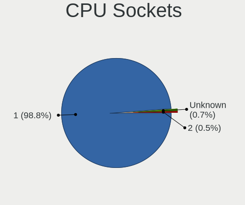
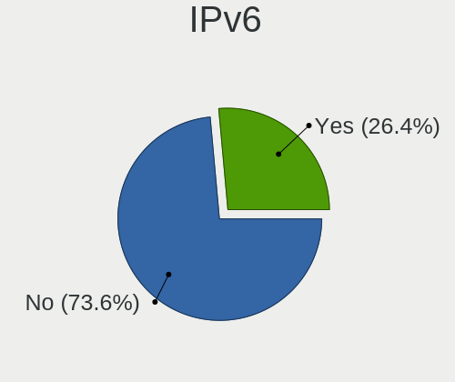

BSD - Hardware Trends (Desktops)
--------------------------------

A project to identify most popular hardware characteristics and track their change
over time based on data collected by BSD users at https://BSD-Hardware.info.

Anyone can contribute to this report by the [hw-probe](https://github.com/linuxhw/hw-probe/blob/master/INSTALL.BSD.md) tool:

    hw-probe -all -upload

This report is for one last month. Overall report since the beginning of time: [TestDays](https://github.com/bsdhw/TestDays)

Period: May, 2023.

Contents
--------

* [ System ](#system)
  - [ OS                       ](#os)
  - [ OS Family                ](#os-family)
  - [ Arch                     ](#arch)
  - [ DE                       ](#de)
  - [ Display Server           ](#display-server)
  - [ Display Manager          ](#display-manager)
  - [ OS Lang                  ](#os-lang)
  - [ Boot Mode                ](#boot-mode)
  - [ Filesystem               ](#filesystem)
  - [ Part. scheme             ](#part-scheme)

* [ Board ](#board)
  - [ Vendor                   ](#vendor)
  - [ Model                    ](#model)
  - [ Model Family             ](#model-family)
  - [ MFG Year                 ](#mfg-year)
  - [ Form Factor              ](#form-factor)
  - [ Coreboot                 ](#coreboot)
  - [ RAM Size                 ](#ram-size)
  - [ RAM Used                 ](#ram-used)
  - [ Total Drives             ](#total-drives)
  - [ Has CD-ROM               ](#has-cd-rom)
  - [ Has Ethernet             ](#has-ethernet)
  - [ Has WiFi                 ](#has-wifi)
  - [ Has Bluetooth            ](#has-bluetooth)

* [ Location ](#location)
  - [ Country                  ](#country)
  - [ City                     ](#city)

* [ Drives ](#drives)
  - [ Drive Vendor             ](#drive-vendor)
  - [ Drive Model              ](#drive-model)
  - [ HDD Vendor               ](#hdd-vendor)
  - [ SSD Vendor               ](#ssd-vendor)
  - [ Drive Kind               ](#drive-kind)
  - [ Drive Connector          ](#drive-connector)
  - [ Drive Size               ](#drive-size)
  - [ Space Total              ](#space-total)
  - [ Space Used               ](#space-used)
  - [ Malfunc. Drives          ](#malfunc-drives)
  - [ Malfunc. Drive Vendor    ](#malfunc-drive-vendor)
  - [ Malfunc. HDD Vendor      ](#malfunc-hdd-vendor)
  - [ Malfunc. Drive Kind      ](#malfunc-drive-kind)
  - [ Failed Drives            ](#failed-drives)
  - [ Failed Drive Vendor      ](#failed-drive-vendor)
  - [ Drive Status             ](#drive-status)

* [ Storage controller ](#storage-controller)
  - [ Storage Vendor           ](#storage-vendor)
  - [ Storage Model            ](#storage-model)
  - [ Storage Kind             ](#storage-kind)

* [ Processor ](#processor)
  - [ CPU Vendor               ](#cpu-vendor)
  - [ CPU Model                ](#cpu-model)
  - [ CPU Model Family         ](#cpu-model-family)
  - [ CPU Cores                ](#cpu-cores)
  - [ CPU Sockets              ](#cpu-sockets)
  - [ CPU Threads              ](#cpu-threads)
  - [ CPU Microarch            ](#cpu-microarch)

* [ Graphics ](#graphics)
  - [ GPU Vendor               ](#gpu-vendor)
  - [ GPU Model                ](#gpu-model)
  - [ GPU Combo                ](#gpu-combo)
  - [ GPU Driver               ](#gpu-driver)
  - [ GPU Memory               ](#gpu-memory)

* [ Monitor ](#monitor)
  - [ Monitor Vendor           ](#monitor-vendor)
  - [ Monitor Model            ](#monitor-model)
  - [ Monitor Resolution       ](#monitor-resolution)
  - [ Monitor Diagonal         ](#monitor-diagonal)
  - [ Monitor Width            ](#monitor-width)
  - [ Aspect Ratio             ](#aspect-ratio)
  - [ Monitor Area             ](#monitor-area)
  - [ Pixel Density            ](#pixel-density)
  - [ Multiple Monitors        ](#multiple-monitors)

* [ Network ](#network)
  - [ Net Controller Vendor    ](#net-controller-vendor)
  - [ Net Controller Model     ](#net-controller-model)
  - [ Wireless Vendor          ](#wireless-vendor)
  - [ Wireless Model           ](#wireless-model)
  - [ Ethernet Vendor          ](#ethernet-vendor)
  - [ Ethernet Model           ](#ethernet-model)
  - [ Net Controller Kind      ](#net-controller-kind)
  - [ Used Controller          ](#used-controller)
  - [ NICs                     ](#nics)
  - [ IPv6                     ](#ipv6)

* [ Bluetooth ](#bluetooth)
  - [ Bluetooth Vendor         ](#bluetooth-vendor)
  - [ Bluetooth Model          ](#bluetooth-model)

* [ Sound ](#sound)
  - [ Sound Vendor             ](#sound-vendor)
  - [ Sound Model              ](#sound-model)

* [ Memory ](#memory)
  - [ Memory Vendor            ](#memory-vendor)
  - [ Memory Model             ](#memory-model)
  - [ Memory Kind              ](#memory-kind)
  - [ Memory Form Factor       ](#memory-form-factor)
  - [ Memory Size              ](#memory-size)
  - [ Memory Speed             ](#memory-speed)

* [ Printers & scanners ](#printers--scanners)
  - [ Printer Vendor           ](#printer-vendor)
  - [ Printer Model            ](#printer-model)
  - [ Scanner Vendor           ](#scanner-vendor)
  - [ Scanner Model            ](#scanner-model)

* [ Camera ](#camera)
  - [ Camera Vendor            ](#camera-vendor)
  - [ Camera Model             ](#camera-model)

* [ Security ](#security)
  - [ Fingerprint Vendor       ](#fingerprint-vendor)
  - [ Fingerprint Model        ](#fingerprint-model)
  - [ Chipcard Vendor          ](#chipcard-vendor)
  - [ Chipcard Model           ](#chipcard-model)

* [ Unsupported ](#unsupported)
  - [ Unsupported Devices      ](#unsupported-devices)
  - [ Unsupported Device Types ](#unsupported-device-types)

System
------

OS
--

Installed operating systems

| Name                 | Desktops | Percent |
|----------------------|----------|---------|
| OPNsense 23.1.7      | 145      | 46.33%  |
| OPNsense 23.1.8      | 61       | 19.49%  |
| OPNsense 23.1.6      | 21       | 6.71%   |
| helloSystem 0.8.1    | 20       | 6.39%   |
| FreeBSD 13.2         | 20       | 6.39%   |
| OpenBSD 7.3          | 8        | 2.56%   |
| OPNsense 22.7.11     | 6        | 1.92%   |
| helloSystem 0.8.2    | 6        | 1.92%   |
| FreeBSD 14.0-CURRENT | 3        | 0.96%   |
| OPNsense 23.1.9      | 2        | 0.64%   |
| OPNsense 23.1        | 2        | 0.64%   |
| MyBee 13.2           | 2        | 0.64%   |
| helloSystem 0.8.0    | 2        | 0.64%   |
| FreeBSD 13.1-p5      | 2        | 0.64%   |
| pfSense 2.6.0        | 1        | 0.32%   |
| OPNsense 23.7        | 1        | 0.32%   |
| OPNsense 23.4        | 1        | 0.32%   |
| OPNsense 23.1.5      | 1        | 0.32%   |
| OPNsense 23.1.1      | 1        | 0.32%   |
| OPNsense 22.7.10     | 1        | 0.32%   |
| NetBSD 10.0_BETA     | 1        | 0.32%   |
| MidnightBSD 3.0.1    | 1        | 0.32%   |
| helloSystem 0.6.0    | 1        | 0.32%   |
| GhostBSD 23.05.18    | 1        | 0.32%   |
| GhostBSD 23.04.23    | 1        | 0.32%   |
| FreeBSD 13.2-STABLE  | 1        | 0.32%   |
| FreeBSD 13.1         | 1        | 0.32%   |

OS Family
---------

OS without a version

| Name        | Desktops | Percent |
|-------------|----------|---------|
| OPNsense    | 242      | 77.32%  |
| helloSystem | 29       | 9.27%   |
| FreeBSD     | 27       | 8.63%   |
| OpenBSD     | 8        | 2.56%   |
| MyBee       | 2        | 0.64%   |
| GhostBSD    | 2        | 0.64%   |
| pfSense     | 1        | 0.32%   |
| NetBSD      | 1        | 0.32%   |
| MidnightBSD | 1        | 0.32%   |

Arch
----

OS architecture (x86_64, i586, etc.)

| Name  | Desktops | Percent |
|-------|----------|---------|
| amd64 | 311      | 99.36%  |
| i386  | 1        | 0.32%   |
| arm64 | 1        | 0.32%   |

DE
--

Desktop Environment

| Name         | Desktops | Percent |
|--------------|----------|---------|
| Console      | 258      | 82.43%  |
| helloDesktop | 35       | 11.18%  |
| XFCE         | 7        | 2.24%   |
| KDE5         | 4        | 1.28%   |
| MATE         | 2        | 0.64%   |
| i3           | 2        | 0.64%   |
| GNOME        | 2        | 0.64%   |
| Cinnamon     | 1        | 0.32%   |
| Blackbox     | 1        | 0.32%   |
| AwesomeWM    | 1        | 0.32%   |

Display Server
--------------

X11 or Wayland

| Name    | Desktops | Percent |
|---------|----------|---------|
| Console | 258      | 82.43%  |
| X11     | 54       | 17.25%  |
| Wayland | 1        | 0.32%   |

Display Manager
---------------

SDDM, LightDM, etc.

| Name    | Desktops | Percent |
|---------|----------|---------|
| Console | 271      | 86.58%  |
| SLiM    | 31       | 9.9%    |
| SDDM    | 4        | 1.28%   |
| LightDM | 3        | 0.96%   |
| GDM     | 2        | 0.64%   |
| XDM     | 1        | 0.32%   |
| Ly      | 1        | 0.32%   |

OS Lang
-------

Language

| Lang    | Desktops | Percent |
|---------|----------|---------|
| Unknown | 248      | 79.23%  |
| en_US   | 27       | 8.63%   |
| C       | 19       | 6.07%   |
| fr_FR   | 6        | 1.92%   |
| ru_RU   | 3        | 0.96%   |
| de_DE   | 3        | 0.96%   |
| en_IE   | 2        | 0.64%   |
| pt_BR   | 1        | 0.32%   |
| it_IT   | 1        | 0.32%   |
| fr      | 1        | 0.32%   |
| en_AU   | 1        | 0.32%   |
| en      | 1        | 0.32%   |

Boot Mode
---------

EFI or BIOS

| Mode | Desktops | Percent |
|------|----------|---------|
| EFI  | 282      | 90.1%   |
| BIOS | 31       | 9.9%    |

Filesystem
----------

Type of filesystem

| Type   | Desktops | Percent |
|--------|----------|---------|
| Zfs    | 145      | 46.33%  |
| Ufs    | 145      | 46.33%  |
| Cd9660 | 15       | 4.79%   |
| Ffs    | 8        | 2.56%   |

Part. scheme
------------

Scheme of partitioning

| Type    | Desktops | Percent |
|---------|----------|---------|
| GPT     | 299      | 95.53%  |
| MBR     | 12       | 3.83%   |
| Unknown | 2        | 0.64%   |

Board
-----

Vendor
------

Motherboard manufacturer

| Name                       | Desktops | Percent |
|----------------------------|----------|---------|
| Unknown                    | 46       | 14.7%   |
| ASUSTek Computer           | 31       | 9.9%    |
| Dell                       | 28       | 8.95%   |
| Hewlett-Packard            | 26       | 8.31%   |
| Intel                      | 25       | 7.99%   |
| Gigabyte Technology        | 18       | 5.75%   |
| ASRock                     | 18       | 5.75%   |
| Protectli                  | 15       | 4.79%   |
| Supermicro                 | 13       | 4.15%   |
| Lenovo                     | 12       | 3.83%   |
| PC Engines                 | 10       | 3.19%   |
| MSI                        | 8        | 2.56%   |
| Fujitsu                    | 8        | 2.56%   |
| Techvision                 | 7        | 2.24%   |
| MW                         | 6        | 1.92%   |
| CWWK                       | 6        | 1.92%   |
| ASRockRack                 | 5        | 1.6%    |
| Acer                       | 3        | 0.96%   |
| Hardkernel                 | 2        | 0.64%   |
| AZW                        | 2        | 0.64%   |
| ZOTAC                      | 1        | 0.32%   |
| YENTEK                     | 1        | 0.32%   |
| VIA Technologies           | 1        | 0.32%   |
| Shuttle                    | 1        | 0.32%   |
| ShenZhen MinWin Technology | 1        | 0.32%   |
| NU591R                     | 1        | 0.32%   |
| NORCO                      | 1        | 0.32%   |
| Nitrokey                   | 1        | 0.32%   |
| Medion                     | 1        | 0.32%   |
| Lanner                     | 1        | 0.32%   |
| JHZD                       | 1        | 0.32%   |
| Inventec                   | 1        | 0.32%   |
| IceWhale Technology        | 1        | 0.32%   |
| GuoGuang                   | 1        | 0.32%   |
| GoWin Solution             | 1        | 0.32%   |
| Google                     | 1        | 0.32%   |
| DS                         | 1        | 0.32%   |
| Colorful Technology        | 1        | 0.32%   |
| CncTion                    | 1        | 0.32%   |
| ChangWang                  | 1        | 0.32%   |

Model
-----

Motherboard model

| Name                              | Desktops | Percent |
|-----------------------------------|----------|---------|
| Unknown                           | 47       | 15.02%  |
| Techvision TVI7309X               | 7        | 2.24%   |
| Protectli FW6                     | 7        | 2.24%   |
| Dell OptiPlex 7040                | 7        | 2.24%   |
| MW GMLK-2_5G4L                    | 6        | 1.92%   |
| Intel Q3XXG4-P V1.0               | 5        | 1.6%    |
| Fujitsu FUTRO S920                | 5        | 1.6%    |
| PC Engines apu4                   | 4        | 1.28%   |
| Intel Jasper Lake Client Platform | 4        | 1.28%   |
| HP EliteDesk 800 G3 SFF           | 4        | 1.28%   |
| Supermicro X8SIL                  | 3        | 0.96%   |
| Protectli FW4B                    | 3        | 0.96%   |
| PC Engines APU2                   | 3        | 0.96%   |
| HP ProDesk 600 G3 SFF             | 3        | 0.96%   |
| CWWK CW-MBX-AD12                  | 3        | 0.96%   |
| Supermicro SYS-6028R-TRT          | 2        | 0.64%   |
| Protectli VP2420                  | 2        | 0.64%   |
| PC Engines apu6                   | 2        | 0.64%   |
| Intel S1200KP AAG34877-201        | 2        | 0.64%   |
| Intel CRESCENTBAY                 | 2        | 0.64%   |
| HP ProDesk 600 G1 SFF             | 2        | 0.64%   |
| HP Compaq Elite 8300 SFF          | 2        | 0.64%   |
| Dell OptiPlex 9020                | 2        | 0.64%   |
| Dell OptiPlex 9010                | 2        | 0.64%   |
| Dell OptiPlex 7010                | 2        | 0.64%   |
| Dell OptiPlex 390                 | 2        | 0.64%   |
| Dell OptiPlex 3040                | 2        | 0.64%   |
| CWWK CW-AD4L-N V1                 | 2        | 0.64%   |
| ASUS ROG STRIX B550-F GAMING      | 2        | 0.64%   |
| ASUS PRIME B460M-A                | 2        | 0.64%   |
| ASUS All Series                   | 2        | 0.64%   |
| ASRockRack X470D4U2-2T            | 2        | 0.64%   |
| ASRock Z590 Pro4                  | 2        | 0.64%   |
| ASRock X570 Phantom Gaming 4      | 2        | 0.64%   |
| YENTEK R250                       | 1        | 0.32%   |
| VIA VT82C597                      | 1        | 0.32%   |
| Supermicro X9SCL/X9SCM            | 1        | 0.32%   |
| Supermicro X7SBL                  | 1        | 0.32%   |
| Supermicro SYS-E302-9D            | 1        | 0.32%   |
| Supermicro SYS-E300-9C            | 1        | 0.32%   |

Model Family
------------

Motherboard model prefix

| Name                     | Desktops | Percent |
|--------------------------|----------|---------|
| Unknown                  | 47       | 15.02%  |
| Dell OptiPlex            | 24       | 7.67%   |
| ASUS PRIME               | 11       | 3.51%   |
| HP ProDesk               | 8        | 2.56%   |
| Techvision TVI7309X      | 7        | 2.24%   |
| Protectli FW6            | 7        | 2.24%   |
| Lenovo ThinkCentre       | 7        | 2.24%   |
| MW GMLK-2                | 6        | 1.92%   |
| ASUS ROG                 | 6        | 1.92%   |
| Intel Q3XXG4-P           | 5        | 1.6%    |
| HP EliteDesk             | 5        | 1.6%    |
| Fujitsu FUTRO            | 5        | 1.6%    |
| PC Engines apu4          | 4        | 1.28%   |
| Intel Jasper             | 4        | 1.28%   |
| HP Compaq                | 4        | 1.28%   |
| Supermicro X8SIL         | 3        | 0.96%   |
| Protectli FW4B           | 3        | 0.96%   |
| PC Engines APU2          | 3        | 0.96%   |
| Dell Inspiron            | 3        | 0.96%   |
| CWWK CW-MBX-AD12         | 3        | 0.96%   |
| ASRock X570              | 3        | 0.96%   |
| Supermicro SYS-6028R-TRT | 2        | 0.64%   |
| Protectli VP2420         | 2        | 0.64%   |
| PC Engines apu6          | 2        | 0.64%   |
| Intel S1200KP            | 2        | 0.64%   |
| Intel CRESCENTBAY        | 2        | 0.64%   |
| HP Z240                  | 2        | 0.64%   |
| Gigabyte GA-78LMT-USB3   | 2        | 0.64%   |
| Fujitsu ESPRIMO          | 2        | 0.64%   |
| CWWK CW-AD4L-N           | 2        | 0.64%   |
| ASUS TUF                 | 2        | 0.64%   |
| ASUS All                 | 2        | 0.64%   |
| ASRockRack X470D4U2-2T   | 2        | 0.64%   |
| ASRock Z590              | 2        | 0.64%   |
| Acer Aspire              | 2        | 0.64%   |
| YENTEK R250              | 1        | 0.32%   |
| VIA VT82C597             | 1        | 0.32%   |
| Supermicro X9SCL         | 1        | 0.32%   |
| Supermicro X7SBL         | 1        | 0.32%   |
| Supermicro SYS-E302-9D   | 1        | 0.32%   |

MFG Year
--------

Motherboard manufacture year

| Year    | Desktops | Percent |
|---------|----------|---------|
| 2022    | 52       | 16.61%  |
| 2021    | 38       | 12.14%  |
| 2018    | 30       | 9.58%   |
| 2019    | 28       | 8.95%   |
| 2020    | 26       | 8.31%   |
| 2023    | 21       | 6.71%   |
| 2016    | 19       | 6.07%   |
| 2013    | 18       | 5.75%   |
| 2014    | 17       | 5.43%   |
| 2017    | 16       | 5.11%   |
| 2012    | 12       | 3.83%   |
| 2015    | 9        | 2.88%   |
| 2008    | 8        | 2.56%   |
| 2011    | 5        | 1.6%    |
| 2010    | 5        | 1.6%    |
| 2009    | 5        | 1.6%    |
| 2006    | 2        | 0.64%   |
| Unknown | 2        | 0.64%   |

Form Factor
-----------

Physical design of the computer

| Name    | Desktops | Percent |
|---------|----------|---------|
| Desktop | 313      | 100%    |

Coreboot
--------

Have coreboot on board

| Used | Desktops | Percent |
|------|----------|---------|
| No   | 297      | 94.89%  |
| Yes  | 16       | 5.11%   |

RAM Size
--------

Total RAM memory

| Size in GB      | Desktops | Percent |
|-----------------|----------|---------|
| 8.01-16.0       | 119      | 38.02%  |
| 16.01-24.0      | 86       | 27.48%  |
| 4.01-8.0        | 52       | 16.61%  |
| 32.01-64.0      | 32       | 10.22%  |
| 64.01-256.0     | 16       | 5.11%   |
| More than 256.0 | 2        | 0.64%   |
| 3.01-4.0        | 2        | 0.64%   |
| 2.01-3.0        | 2        | 0.64%   |
| 24.01-32.0      | 1        | 0.32%   |
| 0.01-0.5        | 1        | 0.32%   |

RAM Used
--------

Used RAM memory

| Used GB  | Desktops | Percent |
|----------|----------|---------|
| 0.01-0.5 | 147      | 46.96%  |
| 0.51-1.0 | 106      | 33.87%  |
| 1.01-2.0 | 42       | 13.42%  |
| 2.01-3.0 | 9        | 2.88%   |
| 3.01-4.0 | 4        | 1.28%   |
| 4.01-8.0 | 3        | 0.96%   |
| 0        | 1        | 0.32%   |
| Unknown  | 1        | 0.32%   |

Total Drives
------------

Number of drives on board

| Drives | Desktops | Percent |
|--------|----------|---------|
| 1      | 233      | 74.44%  |
| 2      | 36       | 11.5%   |
| 0      | 20       | 6.39%   |
| 3      | 14       | 4.47%   |
| 4      | 5        | 1.6%    |
| 5      | 3        | 0.96%   |
| 13     | 1        | 0.32%   |
| 8      | 1        | 0.32%   |

Has CD-ROM
----------

Has CD-ROM on board

| Presented | Desktops | Percent |
|-----------|----------|---------|
| No        | 258      | 82.43%  |
| Yes       | 55       | 17.57%  |

Has Ethernet
------------

Has Ethernet on board

| Presented | Desktops | Percent |
|-----------|----------|---------|
| Yes       | 311      | 99.36%  |
| No        | 2        | 0.64%   |

Has WiFi
--------

Has WiFi module

| Presented | Desktops | Percent |
|-----------|----------|---------|
| No        | 251      | 80.19%  |
| Yes       | 62       | 19.81%  |

Has Bluetooth
-------------

Has Bluetooth module

| Presented | Desktops | Percent |
|-----------|----------|---------|
| No        | 272      | 86.9%   |
| Yes       | 41       | 13.1%   |

Location
--------

Country
-------

Geographic location (country)

| Country       | Desktops | Percent |
|---------------|----------|---------|
| USA           | 99       | 31.63%  |
| Germany       | 38       | 12.14%  |
| France        | 16       | 5.11%   |
| Russia        | 13       | 4.15%   |
| Netherlands   | 12       | 3.83%   |
| Australia     | 12       | 3.83%   |
| Brazil        | 11       | 3.51%   |
| UK            | 10       | 3.19%   |
| Poland        | 10       | 3.19%   |
| Italy         | 9        | 2.88%   |
| Canada        | 8        | 2.56%   |
| Switzerland   | 7        | 2.24%   |
| Romania       | 5        | 1.6%    |
| Sweden        | 4        | 1.28%   |
| South Africa  | 4        | 1.28%   |
| Belgium       | 4        | 1.28%   |
| Austria       | 4        | 1.28%   |
| Spain         | 3        | 0.96%   |
| Slovakia      | 3        | 0.96%   |
| New Zealand   | 3        | 0.96%   |
| Croatia       | 3        | 0.96%   |
| China         | 3        | 0.96%   |
| Argentina     | 3        | 0.96%   |
| Turkey        | 2        | 0.64%   |
| Taiwan        | 2        | 0.64%   |
| South Korea   | 2        | 0.64%   |
| Norway        | 2        | 0.64%   |
| Lithuania     | 2        | 0.64%   |
| Ireland       | 2        | 0.64%   |
| Indonesia     | 2        | 0.64%   |
| Czechia       | 2        | 0.64%   |
| Vietnam       | 1        | 0.32%   |
| Thailand      | 1        | 0.32%   |
| Slovenia      | 1        | 0.32%   |
| Singapore     | 1        | 0.32%   |
| Peru          | 1        | 0.32%   |
| Paraguay      | 1        | 0.32%   |
| New Caledonia | 1        | 0.32%   |
| Kazakhstan    | 1        | 0.32%   |
| India         | 1        | 0.32%   |

City
----

Geographic location (city)

| City                | Desktops | Percent |
|---------------------|----------|---------|
| Sydney              | 5        | 1.6%    |
| Denver              | 5        | 1.6%    |
| Paris               | 4        | 1.28%   |
| Moscow              | 4        | 1.28%   |
| Berlin              | 4        | 1.28%   |
| Warsaw              | 3        | 0.96%   |
| St Petersburg       | 3        | 0.96%   |
| South San Francisco | 3        | 0.96%   |
| Gothenburg          | 3        | 0.96%   |
| Brooklyn            | 3        | 0.96%   |
| Zurich              | 2        | 0.64%   |
| Wroclaw             | 2        | 0.64%   |
| Vilnius             | 2        | 0.64%   |
| Seattle             | 2        | 0.64%   |
| Sao Paulo           | 2        | 0.64%   |
| Salem               | 2        | 0.64%   |
| Redmond             | 2        | 0.64%   |
| Police              | 2        | 0.64%   |
| Pezinok             | 2        | 0.64%   |
| Nuremberg           | 2        | 0.64%   |
| Mountain View       | 2        | 0.64%   |
| Medan               | 2        | 0.64%   |
| Mankato             | 2        | 0.64%   |
| Kraaifontein        | 2        | 0.64%   |
| Hoofddorp           | 2        | 0.64%   |
| Frankfurt (Oder)    | 2        | 0.64%   |
| Dublin              | 2        | 0.64%   |
| Calgary             | 2        | 0.64%   |
| Brisbane            | 2        | 0.64%   |
| Boston              | 2        | 0.64%   |
| Blumenau            | 2        | 0.64%   |
| Bangor              | 2        | 0.64%   |
| Auckland            | 2        | 0.64%   |
| Atlanta             | 2        | 0.64%   |
| Ankara              | 2        | 0.64%   |
| Abingdon            | 2        | 0.64%   |
| Zhongli District    | 1        | 0.32%   |
| Zagreb              | 1        | 0.32%   |
| Zaandam             | 1        | 0.32%   |
| Xi'an               | 1        | 0.32%   |

Drives
------

Drive Vendor
------------

Hard drive vendors

| Vendor              | Desktops | Drives | Percent |
|---------------------|----------|--------|---------|
| Samsung Electronics | 68       | 81     | 19.1%   |
| WDC                 | 31       | 46     | 8.71%   |
| Kingston            | 29       | 31     | 8.15%   |
| Seagate             | 19       | 21     | 5.34%   |
| Crucial             | 18       | 18     | 5.06%   |
| China               | 18       | 18     | 5.06%   |
| Transcend           | 15       | 16     | 4.21%   |
| Toshiba             | 13       | 15     | 3.65%   |
| SanDisk             | 11       | 12     | 3.09%   |
| Intel               | 11       | 13     | 3.09%   |
| A-DATA Technology   | 8        | 9      | 2.25%   |
| Phison              | 7        | 7      | 1.97%   |
| Hitachi             | 6        | 13     | 1.69%   |
| SPCC                | 5        | 5      | 1.4%    |
| Protectli           | 5        | 5      | 1.4%    |
| Patriot             | 5        | 7      | 1.4%    |
| Hoodisk             | 5        | 5      | 1.4%    |
| FORESEE             | 5        | 5      | 1.4%    |
| SK hynix            | 4        | 4      | 1.12%   |
| ShiJi               | 4        | 4      | 1.12%   |
| HGST                | 4        | 4      | 1.12%   |
| Dogfish             | 4        | 4      | 1.12%   |
| UMIS                | 3        | 3      | 0.84%   |
| PNY                 | 3        | 3      | 0.84%   |
| NVMe                | 3        | 3      | 0.84%   |
| LITEONIT            | 3        | 3      | 0.84%   |
| Corsair             | 3        | 3      | 0.84%   |
| Vaseky              | 2        | 2      | 0.56%   |
| Silicon Motion      | 2        | 2      | 0.56%   |
| OCZ                 | 2        | 2      | 0.56%   |
| MidasForce          | 2        | 2      | 0.56%   |
| Lexar               | 2        | 2      | 0.56%   |
| Kston               | 2        | 2      | 0.56%   |
| KIOXIA              | 2        | 2      | 0.56%   |
| Intenso             | 2        | 2      | 0.56%   |
| Innodisk            | 2        | 2      | 0.56%   |
| GOODRAM             | 2        | 2      | 0.56%   |
| Fanxiang            | 2        | 2      | 0.56%   |
| Team                | 1        | 1      | 0.28%   |
| TCSUNBOW            | 1        | 1      | 0.28%   |

Drive Model
-----------

Hard drive models

| Model                             | Desktops | Percent |
|-----------------------------------|----------|---------|
| Samsung SSD 970 EVO Plus 1TB      | 7        | 1.88%   |
| Transcend TS128GMSA230S 128GB     | 5        | 1.34%   |
| Kingston SA400S37240G 240GB       | 5        | 1.34%   |
| Kingston SA400S37120G 120GB       | 5        | 1.34%   |
| Samsung SSD 860 EVO 500GB         | 4        | 1.08%   |
| Samsung SSD 850 EVO 250GB         | 4        | 1.08%   |
| Crucial CT240BX500SSD1 240GB      | 4        | 1.08%   |
| Transcend TS64GMSA230S 64GB       | 3        | 0.81%   |
| ShiJi SSD 128GB                   | 3        | 0.81%   |
| Samsung SSD 860 EVO 250GB         | 3        | 0.81%   |
| Samsung SSD 850 EVO 120GB         | 3        | 0.81%   |
| Kingston SUV500MS120G 120GB       | 3        | 0.81%   |
| Kingston SA400S37480G 480GB       | 3        | 0.81%   |
| FORESEE 128GB SSD                 | 3        | 0.81%   |
| China SATA SSD 32GB               | 3        | 0.81%   |
| UMIS RPJTJ128MED1MWX 128GB        | 2        | 0.54%   |
| Toshiba MQ01ABD050 500GB          | 2        | 0.54%   |
| Toshiba MK6475GSX 640GB           | 2        | 0.54%   |
| Toshiba HDWD110 1TB               | 2        | 0.54%   |
| SPCC Solid State Disk 128GB       | 2        | 0.54%   |
| SK hynix SC311 SATA 128GB         | 2        | 0.54%   |
| Seagate ST500DM002-1BD142 500GB   | 2        | 0.54%   |
| Seagate ST4000DM000-1F2168 4TB    | 2        | 0.54%   |
| SanDisk X400 M.2 2280 128GB       | 2        | 0.54%   |
| Samsung SSD 980 500GB             | 2        | 0.54%   |
| Samsung SSD 970 EVO Plus 500GB    | 2        | 0.54%   |
| Samsung SSD 970 EVO Plus 250GB    | 2        | 0.54%   |
| Samsung SSD 870 EVO 500GB         | 2        | 0.54%   |
| Samsung SSD 860 EVO mSATA 250GB   | 2        | 0.54%   |
| Samsung SSD 850 EVO 500GB         | 2        | 0.54%   |
| Samsung SSD 850 EVO 1TB           | 2        | 0.54%   |
| Samsung SSD 840 EVO 500GB         | 2        | 0.54%   |
| Samsung 980 PRO with Heatsink 2TB | 2        | 0.54%   |
| Protectli 240GB mSATA             | 2        | 0.54%   |
| Phison PCIe SSD 256GB             | 2        | 0.54%   |
| MidasForce SSD 512GB              | 2        | 0.54%   |
| Kston SSD 128GB                   | 2        | 0.54%   |
| KIOXIA KXG60ZNV256G 256GB         | 2        | 0.54%   |
| Hoodisk SSD 128GB                 | 2        | 0.54%   |
| FORESEE 64GB SSD                  | 2        | 0.54%   |

HDD Vendor
----------

Hard disk drive vendors

| Vendor              | Desktops | Drives | Percent |
|---------------------|----------|--------|---------|
| WDC                 | 24       | 39     | 34.78%  |
| Seagate             | 19       | 21     | 27.54%  |
| Toshiba             | 10       | 12     | 14.49%  |
| Hitachi             | 6        | 13     | 8.7%    |
| HGST                | 4        | 4      | 5.8%    |
| Samsung Electronics | 2        | 4      | 2.9%    |
| NVMe                | 2        | 2      | 2.9%    |
| Maxtor              | 1        | 1      | 1.45%   |
| China               | 1        | 1      | 1.45%   |

SSD Vendor
----------

Solid state drive vendors

| Vendor              | Desktops | Drives | Percent |
|---------------------|----------|--------|---------|
| Samsung Electronics | 43       | 49     | 19.82%  |
| Kingston            | 27       | 29     | 12.44%  |
| China               | 17       | 17     | 7.83%   |
| Transcend           | 15       | 16     | 6.91%   |
| Crucial             | 15       | 15     | 6.91%   |
| SanDisk             | 11       | 12     | 5.07%   |
| Intel               | 7        | 8      | 3.23%   |
| Protectli           | 5        | 5      | 2.3%    |
| Hoodisk             | 5        | 5      | 2.3%    |
| FORESEE             | 5        | 5      | 2.3%    |
| ShiJi               | 4        | 4      | 1.84%   |
| Patriot             | 4        | 6      | 1.84%   |
| Dogfish             | 4        | 4      | 1.84%   |
| A-DATA Technology   | 4        | 5      | 1.84%   |
| SPCC                | 3        | 3      | 1.38%   |
| SK hynix            | 3        | 3      | 1.38%   |
| PNY                 | 3        | 3      | 1.38%   |
| LITEONIT            | 3        | 3      | 1.38%   |
| WDC                 | 2        | 2      | 0.92%   |
| Vaseky              | 2        | 2      | 0.92%   |
| Phison              | 2        | 2      | 0.92%   |
| OCZ                 | 2        | 2      | 0.92%   |
| MidasForce          | 2        | 2      | 0.92%   |
| Kston               | 2        | 2      | 0.92%   |
| Intenso             | 2        | 2      | 0.92%   |
| Innodisk            | 2        | 2      | 0.92%   |
| Toshiba             | 1        | 1      | 0.46%   |
| Team                | 1        | 1      | 0.46%   |
| TCSUNBOW            | 1        | 1      | 0.46%   |
| SSSTC               | 1        | 1      | 0.46%   |
| SHAREVDI            | 1        | 1      | 0.46%   |
| Philips             | 1        | 1      | 0.46%   |
| Pccooler            | 1        | 1      | 0.46%   |
| NVMe                | 1        | 1      | 0.46%   |
| Mushkin             | 1        | 1      | 0.46%   |
| MSI                 | 1        | 1      | 0.46%   |
| LuminouTek          | 1        | 1      | 0.46%   |
| LSI                 | 1        | 1      | 0.46%   |
| Lexar               | 1        | 1      | 0.46%   |
| KingSpec            | 1        | 1      | 0.46%   |

Drive Kind
----------

HDD or SSD

| Kind | Desktops | Drives | Percent |
|------|----------|--------|---------|
| SSD  | 201      | 231    | 60.73%  |
| NVMe | 71       | 77     | 21.45%  |
| HDD  | 59       | 97     | 17.82%  |

Drive Connector
---------------

SATA, SAS, NVMe, etc.

| Type | Desktops | Drives | Percent |
|------|----------|--------|---------|
| SATA | 241      | 328    | 77.24%  |
| NVMe | 71       | 77     | 22.76%  |

Drive Size
----------

Size of hard drive

| Size in TB | Desktops | Drives | Percent |
|------------|----------|--------|---------|
| 0.01-0.5   | 213      | 259    | 81.92%  |
| 0.51-1.0   | 30       | 33     | 11.54%  |
| 1.01-2.0   | 9        | 15     | 3.46%   |
| 3.01-4.0   | 5        | 10     | 1.92%   |
| 4.01-10.0  | 2        | 9      | 0.77%   |
| 10.01-20.0 | 1        | 2      | 0.38%   |

Space Total
-----------

Amount of disk space available on the file system

| Size in GB     | Desktops | Percent |
|----------------|----------|---------|
| 101-250        | 141      | 45.05%  |
| 251-500        | 47       | 15.02%  |
| 501-1000       | 31       | 9.9%    |
| 1-20           | 29       | 9.27%   |
| 51-100         | 28       | 8.95%   |
| 21-50          | 27       | 8.63%   |
| 1001-2000      | 6        | 1.92%   |
| 2001-3000      | 2        | 0.64%   |
| More than 3000 | 1        | 0.32%   |
| Unknown        | 1        | 0.32%   |

Space Used
----------

Amount of used disk space

| Used GB  | Desktops | Percent |
|----------|----------|---------|
| 1-20     | 291      | 92.97%  |
| 21-50    | 15       | 4.79%   |
| 251-500  | 3        | 0.96%   |
| 501-1000 | 1        | 0.32%   |
| 51-100   | 1        | 0.32%   |
| 0        | 1        | 0.32%   |
| Unknown  | 1        | 0.32%   |

Malfunc. Drives
---------------

Drive models with a malfunction

| Model                                 | Desktops | Drives | Percent |
|---------------------------------------|----------|--------|---------|
| WDC WD5000LPVX-22V0TT0 500GB          | 1        | 1      | 3.57%   |
| WDC WD5000AAKX-00ERMA0 500GB          | 1        | 1      | 3.57%   |
| WDC WD2500AAJS-75M0A0 250GB           | 1        | 1      | 3.57%   |
| WDC WD2000FYYZ-01UL1B2 2TB            | 1        | 1      | 3.57%   |
| WDC WD1600YS-01SHB1 164GB             | 1        | 1      | 3.57%   |
| WDC WD10EZRZ-00HTKB0 1TB              | 1        | 1      | 3.57%   |
| Transcend TS128GMSA230S 128GB         | 1        | 1      | 3.57%   |
| Toshiba MQ01ABD050 500GB              | 1        | 1      | 3.57%   |
| SSSTC CVB-8D128-HP 128GB              | 1        | 1      | 3.57%   |
| ShiJi SSD 32GB                        | 1        | 1      | 3.57%   |
| Seagate ST9160314AS 160GB             | 1        | 1      | 3.57%   |
| Seagate ST1000LM010-9YH146 1TB        | 1        | 1      | 3.57%   |
| SanDisk SDSSDP064G 64GB               | 1        | 1      | 3.57%   |
| SanDisk SD8TB8U-256G-1006 256GB       | 1        | 1      | 3.57%   |
| Samsung Electronics SSD 870 EVO 500GB | 1        | 1      | 3.57%   |
| Samsung Electronics HD154UI 1.5TB     | 1        | 2      | 3.57%   |
| PNY SSD2SC120GM1DH16T2-T 120GB        | 1        | 1      | 3.57%   |
| Maxtor 7B300S0 304GB                  | 1        | 1      | 3.57%   |
| Kingston SHPM2280P2H-240G             | 1        | 1      | 3.57%   |
| Hitachi HTS543232A7A384 320GB         | 1        | 1      | 3.57%   |
| Hitachi HDS722516VLAT80 164GB         | 1        | 1      | 3.57%   |
| HGST HTS545050A7E680 500GB            | 1        | 1      | 3.57%   |
| HGST HTS541075A9E680 752GB            | 1        | 1      | 3.57%   |
| GK SM2244LTAB ,TC58TEG6DDKTA00 8GB    | 1        | 1      | 3.57%   |
| Crucial CT480BX500SSD1 480GB          | 1        | 1      | 3.57%   |
| Crucial CT1050MX300SSD4 1TB           | 1        | 1      | 3.57%   |
| Centerm SSD 8GB                       | 1        | 1      | 3.57%   |
| A-DATA Technology SP550 240GB         | 1        | 1      | 3.57%   |

Malfunc. Drive Vendor
---------------------

Vendors of faulty drives

| Vendor              | Desktops | Drives | Percent |
|---------------------|----------|--------|---------|
| WDC                 | 6        | 6      | 21.43%  |
| Seagate             | 2        | 2      | 7.14%   |
| SanDisk             | 2        | 2      | 7.14%   |
| Samsung Electronics | 2        | 3      | 7.14%   |
| Hitachi             | 2        | 2      | 7.14%   |
| HGST                | 2        | 2      | 7.14%   |
| Crucial             | 2        | 2      | 7.14%   |
| Transcend           | 1        | 1      | 3.57%   |
| Toshiba             | 1        | 1      | 3.57%   |
| SSSTC               | 1        | 1      | 3.57%   |
| ShiJi               | 1        | 1      | 3.57%   |
| PNY                 | 1        | 1      | 3.57%   |
| Maxtor              | 1        | 1      | 3.57%   |
| Kingston            | 1        | 1      | 3.57%   |
| GK                  | 1        | 1      | 3.57%   |
| Centerm             | 1        | 1      | 3.57%   |
| A-DATA Technology   | 1        | 1      | 3.57%   |

Malfunc. HDD Vendor
-------------------

Vendors of faulty HDD drives

| Vendor              | Desktops | Drives | Percent |
|---------------------|----------|--------|---------|
| WDC                 | 6        | 6      | 40%     |
| Seagate             | 2        | 2      | 13.33%  |
| Hitachi             | 2        | 2      | 13.33%  |
| HGST                | 2        | 2      | 13.33%  |
| Toshiba             | 1        | 1      | 6.67%   |
| Samsung Electronics | 1        | 2      | 6.67%   |
| Maxtor              | 1        | 1      | 6.67%   |

Malfunc. Drive Kind
-------------------

Kinds of faulty drives

| Kind | Desktops | Drives | Percent |
|------|----------|--------|---------|
| HDD  | 15       | 16     | 53.57%  |
| SSD  | 13       | 13     | 46.43%  |

Failed Drives
-------------

Failed drive models

| Model                                | Desktops | Drives | Percent |
|--------------------------------------|----------|--------|---------|
| Seagate ST3160318AS 160GB            | 1        | 1      | 50%     |
| Samsung Electronics PM981 NVMe 256GB | 1        | 1      | 50%     |

Failed Drive Vendor
-------------------

Failed drive vendors

| Vendor              | Desktops | Drives | Percent |
|---------------------|----------|--------|---------|
| Seagate             | 1        | 1      | 50%     |
| Samsung Electronics | 1        | 1      | 50%     |

Drive Status
------------

Number of failed and malfunc. drives

| Status   | Desktops | Drives | Percent |
|----------|----------|--------|---------|
| Works    | 266      | 363    | 87.5%   |
| Malfunc  | 27       | 29     | 8.88%   |
| Detected | 9        | 11     | 2.96%   |
| Failed   | 2        | 2      | 0.66%   |

Storage controller
------------------

Storage Vendor
--------------

Storage controller vendors

| Vendor                                  | Desktops | Percent |
|-----------------------------------------|----------|---------|
| Intel                                   | 247      | 60.69%  |
| AMD                                     | 54       | 13.27%  |
| Samsung Electronics                     | 28       | 6.88%   |
| SanDisk                                 | 14       | 3.44%   |
| Phison Electronics                      | 10       | 2.46%   |
| Silicon Motion                          | 6        | 1.47%   |
| MAXIO Technology (Hangzhou)             | 6        | 1.47%   |
| Marvell Technology Group                | 5        | 1.23%   |
| Broadcom / LSI                          | 5        | 1.23%   |
| ASMedia Technology                      | 5        | 1.23%   |
| ADATA Technology                        | 4        | 0.98%   |
| Micron/Crucial Technology               | 3        | 0.74%   |
| Kingston Technology Company             | 3        | 0.74%   |
| Toshiba                                 | 2        | 0.49%   |
| Shenzhen Unionmemory Information System | 2        | 0.49%   |
| KIOXIA                                  | 2        | 0.49%   |
| JMicron Technology                      | 2        | 0.49%   |
| VIA Technologies                        | 1        | 0.25%   |
| Union Memory (Shenzhen)                 | 1        | 0.25%   |
| Solid State Storage Technology          | 1        | 0.25%   |
| SK hynix                                | 1        | 0.25%   |
| OCZ Technology Group                    | 1        | 0.25%   |
| Micron Technology                       | 1        | 0.25%   |
| Lite-On Technology                      | 1        | 0.25%   |
| Artop Electronic                        | 1        | 0.25%   |
| Adaptec                                 | 1        | 0.25%   |

Storage Model
-------------

Storage controller models

| Model                                                                            | Desktops | Percent |
|----------------------------------------------------------------------------------|----------|---------|
| AMD FCH SATA Controller [AHCI mode]                                              | 31       | 6.84%   |
| Intel Celeron/Pentium Silver Processor SATA Controller                           | 28       | 6.18%   |
| Intel Q170/Q150/B150/H170/H110/Z170/CM236 Chipset SATA Controller [AHCI Mode]    | 18       | 3.97%   |
| Intel Jasper Lake SATA AHCI Controller                                           | 18       | 3.97%   |
| Samsung NVMe SSD Controller SM981/PM981/PM983                                    | 16       | 3.53%   |
| Intel 8 Series/C220 Series Chipset Family 6-port SATA Controller 1 [AHCI mode]   | 16       | 3.53%   |
| Intel SATA Controller [RAID mode]                                                | 15       | 3.31%   |
| Intel 200 Series PCH SATA controller [AHCI mode]                                 | 15       | 3.31%   |
| Intel Sunrise Point-LP SATA Controller [AHCI mode]                               | 12       | 2.65%   |
| Intel 6 Series/C200 Series Chipset Family 6 port Desktop SATA AHCI Controller    | 12       | 2.65%   |
| Intel Cannon Lake PCH SATA AHCI Controller                                       | 9        | 1.99%   |
| Intel Atom/Celeron/Pentium Processor x5-E8000/J3xxx/N3xxx Series SATA Controller | 9        | 1.99%   |
| AMD 500 Series Chipset SATA Controller                                           | 9        | 1.99%   |
| Intel Atom Processor E3800 Series SATA AHCI Controller                           | 8        | 1.77%   |
| Intel 500 Series Chipset Family SATA AHCI Controller                             | 7        | 1.55%   |
| Unknown                                                                          | 7        | 1.55%   |
| Silicon Motion SM2263EN/SM2263XT SSD Controller                                  | 6        | 1.32%   |
| MAXIO (Hangzhou) NVMe SSD Controller MAP1202                                     | 6        | 1.32%   |
| Intel 7 Series/C210 Series Chipset Family 6-port SATA Controller [AHCI mode]     | 6        | 1.32%   |
| AMD SB7x0/SB8x0/SB9x0 IDE Controller                                             | 6        | 1.32%   |
| Intel Alder Lake-P SATA AHCI Controller                                          | 5        | 1.1%    |
| Intel 8 Series SATA Controller 1 [AHCI mode]                                     | 5        | 1.1%    |
| Intel 400 Series Chipset Family SATA AHCI Controller                             | 5        | 1.1%    |
| AMD 400 Series Chipset SATA Controller                                           | 5        | 1.1%    |
| SanDisk WD Blue SN570 NVMe SSD 1TB                                               | 4        | 0.88%   |
| Samsung NVMe SSD Controller SM961/PM961/SM963                                    | 4        | 0.88%   |
| Samsung NVMe SSD Controller PM9A1/PM9A3/980PRO                                   | 4        | 0.88%   |
| Samsung NVMe SSD Controller 980                                                  | 4        | 0.88%   |
| Phison PS5013 E13 NVMe Controller                                                | 4        | 0.88%   |
| Intel Wildcat Point-LP SATA Controller [AHCI Mode]                               | 4        | 0.88%   |
| Intel Elkhart Lake SATA AHCI                                                     | 4        | 0.88%   |
| ASMedia ASM1062 Serial ATA Controller                                            | 4        | 0.88%   |
| AMD SB7x0/SB8x0/SB9x0 SATA Controller [AHCI mode]                                | 4        | 0.88%   |
| AMD FCH SATA Controller [IDE mode]                                               | 4        | 0.88%   |
| SanDisk WD Blue SN550 NVMe SSD                                                   | 3        | 0.66%   |
| Sandisk WD Black SN770 NVMe SSD                                                  | 3        | 0.66%   |
| Phison E12 NVMe Controller                                                       | 3        | 0.66%   |
| Intel Tiger Lake-LP SATA Controller                                              | 3        | 0.66%   |
| Intel NM10/ICH7 Family SATA Controller [IDE mode]                                | 3        | 0.66%   |
| Intel C610/X99 series chipset 6-Port SATA Controller [AHCI mode]                 | 3        | 0.66%   |

Storage Kind
------------

Kind of storage controller (IDE, SATA, NVMe, SAS, ...)

| Kind | Desktops | Percent |
|------|----------|---------|
| SATA | 259      | 63.48%  |
| NVMe | 86       | 21.08%  |
| IDE  | 33       | 8.09%   |
| RAID | 23       | 5.64%   |
| SAS  | 4        | 0.98%   |
| SCSI | 3        | 0.74%   |

Processor
---------

CPU Vendor
----------

Processor vendors

| Vendor | Desktops | Percent |
|--------|----------|---------|
| Intel  | 254      | 81.15%  |
| AMD    | 58       | 18.53%  |
| ARM    | 1        | 0.32%   |

CPU Model
---------

Processor models

| Model                                    | Desktops | Percent |
|------------------------------------------|----------|---------|
| Intel Celeron J4125 CPU @ 2.00GHz        | 25       | 7.99%   |
| Intel Celeron N5105 @ 2.00GHz            | 12       | 3.83%   |
| AMD GX-412TC SOC                         | 10       | 3.19%   |
| Intel Pentium Silver N6005 @ 2.00GHz     | 8        | 2.56%   |
| Intel Core i5-6500 CPU @ 3.20GHz         | 6        | 1.92%   |
| Intel Core i5-3470 CPU @ 3.20GHz         | 6        | 1.92%   |
| Intel Celeron CPU J1900 @ 1.99GHz        | 6        | 1.92%   |
| Intel Celeron CPU J3160 @ 1.60GHz        | 5        | 1.6%    |
| AMD Ryzen 5 5600G with Radeon Graphics   | 5        | 1.6%    |
| Intel Core i7-6700 CPU @ 3.40GHz         | 4        | 1.28%   |
| Intel Core i5-6500T CPU @ 2.50GHz        | 4        | 1.28%   |
| Intel Core i3-10100 CPU @ 3.60GHz        | 4        | 1.28%   |
| AMD GX-415GA SOC with Radeon HD Graphics | 4        | 1.28%   |
| Intel Core i7-8550U CPU @ 1.80GHz        | 3        | 0.96%   |
| Intel Core i7-7500U CPU @ 2.70GHz        | 3        | 0.96%   |
| Intel Core i5-7500 CPU @ 3.40GHz         | 3        | 0.96%   |
| Intel Core i3-4130 CPU @ 3.40GHz         | 3        | 0.96%   |
| Intel Core 2 Quad CPU Q6600 @ 2.40GHz    | 3        | 0.96%   |
| Intel Celeron N5095 @ 2.00GHz            | 3        | 0.96%   |
| Intel 12th Gen Core i3-1215U             | 3        | 0.96%   |
| Intel Xeon CPU X3430 @ 2.40GHz           | 2        | 0.64%   |
| Intel Xeon CPU E3-1225 V2 @ 3.20GHz      | 2        | 0.64%   |
| Intel N200                               | 2        | 0.64%   |
| Intel Core i7-7700T CPU @ 2.90GHz        | 2        | 0.64%   |
| Intel Core i7-7700 CPU @ 3.60GHz         | 2        | 0.64%   |
| Intel Core i7-3770 CPU @ 3.40GHz         | 2        | 0.64%   |
| Intel Core i7-10700K CPU @ 3.80GHz       | 2        | 0.64%   |
| Intel Core i5-8500 CPU @ 3.00GHz         | 2        | 0.64%   |
| Intel Core i5-7400 CPU @ 3.00GHz         | 2        | 0.64%   |
| Intel Core i5-4590 CPU @ 3.30GHz         | 2        | 0.64%   |
| Intel Core i3-7100U CPU @ 2.40GHz        | 2        | 0.64%   |
| Intel Core i3-7100 CPU @ 3.90GHz         | 2        | 0.64%   |
| Intel Core i3-6100 CPU @ 3.70GHz         | 2        | 0.64%   |
| Intel Core i3-2120 CPU @ 3.30GHz         | 2        | 0.64%   |
| Intel Celeron N4000 CPU @ 1.10GHz        | 2        | 0.64%   |
| Intel Celeron J6413 @ 1.80GHz            | 2        | 0.64%   |
| Intel Celeron J6412 @ 2.00GHz            | 2        | 0.64%   |
| Intel Atom CPU D2550 @ 1.86GHz           | 2        | 0.64%   |
| Intel 11th Gen Core i5-1135G7 @ 2.40GHz  | 2        | 0.64%   |
| AMD Ryzen 9 3900X 12-Core Processor      | 2        | 0.64%   |

CPU Model Family
----------------

Processor model prefix

| Model                   | Desktops | Percent |
|-------------------------|----------|---------|
| Intel Celeron           | 70       | 22.36%  |
| Intel Core i5           | 59       | 18.85%  |
| Intel Core i7           | 29       | 9.27%   |
| Intel Core i3           | 26       | 8.31%   |
| Intel Xeon              | 22       | 7.03%   |
| Other                   | 21       | 6.71%   |
| AMD GX                  | 16       | 5.11%   |
| AMD Ryzen 7             | 11       | 3.51%   |
| Intel Pentium Silver    | 8        | 2.56%   |
| AMD Ryzen 5             | 8        | 2.56%   |
| Intel Pentium           | 7        | 2.24%   |
| Intel Core 2 Quad       | 5        | 1.6%    |
| Intel Atom              | 4        | 1.28%   |
| AMD Ryzen 9             | 4        | 1.28%   |
| AMD FX                  | 3        | 0.96%   |
| Intel Pentium Dual-Core | 2        | 0.64%   |
| Intel Core 2 Duo        | 2        | 0.64%   |
| AMD Ryzen 5 PRO         | 2        | 0.64%   |
| AMD Ryzen 3             | 2        | 0.64%   |
| AMD EPYC                | 2        | 0.64%   |
| Intel Pentium Gold      | 1        | 0.32%   |
| Intel Core 2            | 1        | 0.32%   |
| ARM Cortex              | 1        | 0.32%   |
| AMD Turion II Neo       | 1        | 0.32%   |
| AMD Ryzen Threadripper  | 1        | 0.32%   |
| AMD Ryzen Embedded      | 1        | 0.32%   |
| AMD Phenom II X4        | 1        | 0.32%   |
| AMD Phenom              | 1        | 0.32%   |
| AMD Athlon              | 1        | 0.32%   |
| AMD A6                  | 1        | 0.32%   |

CPU Cores
---------

Number of processor cores

| Number  | Desktops | Percent |
|---------|----------|---------|
| 4       | 186      | 59.42%  |
| 2       | 60       | 19.17%  |
| 6       | 18       | 5.75%   |
| 16      | 14       | 4.47%   |
| 8       | 12       | 3.83%   |
| 12      | 9        | 2.88%   |
| Unknown | 4        | 1.28%   |
| 24      | 3        | 0.96%   |
| 1       | 2        | 0.64%   |
| 64      | 1        | 0.32%   |
| 32      | 1        | 0.32%   |
| 28      | 1        | 0.32%   |
| 20      | 1        | 0.32%   |
| 10      | 1        | 0.32%   |

CPU Sockets
-----------

Number of sockets

| Number  | Desktops | Percent |
|---------|----------|---------|
| 1       | 307      | 98.08%  |
| 2       | 5        | 1.6%    |
| Unknown | 1        | 0.32%   |

CPU Threads
-----------

Threads per core (Hyper-Threading)

| Number  | Desktops | Percent |
|---------|----------|---------|
| 1       | 210      | 67.09%  |
| 2       | 99       | 31.63%  |
| Unknown | 4        | 1.28%   |

CPU Microarch
-------------

Microarchitecture

| Name          | Desktops | Percent |
|---------------|----------|---------|
| Unknown       | 48       | 15.34%  |
| KabyLake      | 39       | 12.46%  |
| Haswell       | 30       | 9.58%   |
| Goldmont plus | 28       | 8.95%   |
| Skylake       | 25       | 7.99%   |
| IvyBridge     | 22       | 7.03%   |
| Silvermont    | 17       | 5.43%   |
| Zen 3         | 12       | 3.83%   |
| Puma          | 11       | 3.51%   |
| CometLake     | 11       | 3.51%   |
| SandyBridge   | 8        | 2.56%   |
| Penryn        | 7        | 2.24%   |
| Zen 2         | 6        | 1.92%   |
| Jaguar        | 6        | 1.92%   |
| Broadwell     | 6        | 1.92%   |
| Zen+          | 5        | 1.6%    |
| Zen           | 4        | 1.28%   |
| TigerLake     | 4        | 1.28%   |
| Nehalem       | 4        | 1.28%   |
| Core          | 4        | 1.28%   |
| K10           | 3        | 0.96%   |
| Goldmont      | 3        | 0.96%   |
| Bonnell       | 3        | 0.96%   |
| Piledriver    | 2        | 0.64%   |
| K8 Hammer     | 2        | 0.64%   |
| Geode         | 1        | 0.32%   |
| Excavator     | 1        | 0.32%   |
| Bulldozer     | 1        | 0.32%   |

Graphics
--------

GPU Vendor
----------

Vendors of graphics cards

| Vendor                                       | Desktops | Percent |
|----------------------------------------------|----------|---------|
| Intel                                        | 216      | 70.59%  |
| AMD                                          | 41       | 13.4%   |
| Nvidia                                       | 31       | 10.13%  |
| ASPEED Technology                            | 12       | 3.92%   |
| Matrox Electronics Systems                   | 5        | 1.63%   |
| XGI Technology (eXtreme Graphics Innovation) | 1        | 0.33%   |

GPU Model
---------

Graphics card models

| Model                                                                                    | Desktops | Percent |
|------------------------------------------------------------------------------------------|----------|---------|
| Intel GeminiLake [UHD Graphics 600]                                                      | 28       | 9.09%   |
| Intel JasperLake [UHD Graphics]                                                          | 24       | 7.79%   |
| Intel HD Graphics 530                                                                    | 18       | 5.84%   |
| Intel Xeon E3-1200 v3/4th Gen Core Processor Integrated Graphics Controller              | 14       | 4.55%   |
| Intel Xeon E3-1200 v2/3rd Gen Core processor Graphics Controller                         | 12       | 3.9%    |
| Intel HD Graphics 630                                                                    | 12       | 3.9%    |
| ASPEED Technology ASPEED Graphics Family                                                 | 12       | 3.9%    |
| Intel CoffeeLake-S GT2 [UHD Graphics 630]                                                | 9        | 2.92%   |
| Intel Atom/Celeron/Pentium Processor x5-E8000/J3xxx/N3xxx Integrated Graphics Controller | 9        | 2.92%   |
| Intel CometLake-S GT2 [UHD Graphics 630]                                                 | 7        | 2.27%   |
| Intel Atom Processor Z36xxx/Z37xxx Series Graphics & Display                             | 7        | 2.27%   |
| Intel 2nd Generation Core Processor Family Integrated Graphics Controller                | 7        | 2.27%   |
| AMD Cezanne [Radeon Vega Series / Radeon Vega Mobile Series]                             | 7        | 2.27%   |
| Matrox Electronics Systems MGA G200eW WPCM450                                            | 5        | 1.62%   |
| Intel HD Graphics 620                                                                    | 5        | 1.62%   |
| Intel UHD Graphics 620                                                                   | 4        | 1.3%    |
| Intel Haswell-ULT Integrated Graphics Controller                                         | 4        | 1.3%    |
| Intel Elkhart Lake [UHD Graphics Gen11 16EU]                                             | 4        | 1.3%    |
| Intel Alder Lake-N [UHD Graphics]                                                        | 4        | 1.3%    |
| Intel 4th Generation Core Processor Family Integrated Graphics Controller                | 4        | 1.3%    |
| Intel 4 Series Chipset Integrated Graphics Controller                                    | 4        | 1.3%    |
| AMD Kabini [Radeon HD 8330E]                                                             | 4        | 1.3%    |
| Nvidia GP108 [GeForce GT 1030]                                                           | 3        | 0.97%   |
| Intel TigerLake-LP GT2 [Iris Xe Graphics]                                                | 3        | 0.97%   |
| Intel Alder Lake-UP3 GT1 [UHD Graphics]                                                  | 3        | 0.97%   |
| AMD Renoir                                                                               | 3        | 0.97%   |
| AMD Raphael                                                                              | 3        | 0.97%   |
| AMD Picasso/Raven 2 [Radeon Vega Series / Radeon Vega Mobile Series]                     | 3        | 0.97%   |
| AMD Lexa PRO [Radeon 540/540X/550/550X / RX 540X/550/550X]                               | 3        | 0.97%   |
| Nvidia GP107 [GeForce GTX 1050 Ti]                                                       | 2        | 0.65%   |
| Nvidia GK208B [GeForce GT 710]                                                           | 2        | 0.65%   |
| Nvidia GA104 [GeForce RTX 3060 Ti Lite Hash Rate]                                        | 2        | 0.65%   |
| Intel Xeon E3-1200 v3 Processor Integrated Graphics Controller                           | 2        | 0.65%   |
| Intel RocketLake-S GT1 [UHD Graphics 730]                                                | 2        | 0.65%   |
| Intel IvyBridge GT2 [HD Graphics 4000]                                                   | 2        | 0.65%   |
| Intel HD Graphics 610                                                                    | 2        | 0.65%   |
| Intel HD Graphics 6000                                                                   | 2        | 0.65%   |
| Intel HD Graphics 5500                                                                   | 2        | 0.65%   |
| Intel HD Graphics 510                                                                    | 2        | 0.65%   |
| Intel HD Graphics 500                                                                    | 2        | 0.65%   |

GPU Combo
---------

Combinations of graphics cards

| Name           | Desktops | Percent |
|----------------|----------|---------|
| 1 x Intel      | 206      | 65.81%  |
| 1 x AMD        | 37       | 11.82%  |
| 1 x Nvidia     | 24       | 7.67%   |
| Other          | 15       | 4.79%   |
| 1 x ASPEED     | 12       | 3.83%   |
| 1 x Matrox     | 5        | 1.6%    |
| Intel + Nvidia | 5        | 1.6%    |
| 2 x Intel      | 4        | 1.28%   |
| 2 x AMD        | 2        | 0.64%   |
| 1 x XGI        | 1        | 0.32%   |
| Intel + AMD    | 1        | 0.32%   |
| AMD + Nvidia   | 1        | 0.32%   |

GPU Driver
----------

Free vs proprietary

| Driver      | Desktops | Percent |
|-------------|----------|---------|
| Free        | 280      | 89.46%  |
| Proprietary | 17       | 5.43%   |
| Unknown     | 16       | 5.11%   |

GPU Memory
----------

Total video memory

| Size in GB | Desktops | Percent |
|------------|----------|---------|
| Unknown    | 289      | 92.33%  |
| 0.01-0.5   | 7        | 2.24%   |
| 1.01-2.0   | 6        | 1.92%   |
| 3.01-4.0   | 4        | 1.28%   |
| 0.51-1.0   | 3        | 0.96%   |
| 7.01-8.0   | 2        | 0.64%   |
| 5.01-6.0   | 2        | 0.64%   |

Monitor
-------

Monitor Vendor
--------------

Monitor vendors

| Vendor               | Desktops | Percent |
|----------------------|----------|---------|
| Hewlett-Packard      | 7        | 13.73%  |
| Philips              | 6        | 11.76%  |
| Samsung Electronics  | 5        | 9.8%    |
| ViewSonic            | 4        | 7.84%   |
| Goldstar             | 4        | 7.84%   |
| Dell                 | 4        | 7.84%   |
| Acer                 | 4        | 7.84%   |
| MSI                  | 3        | 5.88%   |
| BenQ                 | 3        | 5.88%   |
| ASUSTek Computer     | 2        | 3.92%   |
| Ancor Communications | 2        | 3.92%   |
| Semp Toshiba         | 1        | 1.96%   |
| Microstep            | 1        | 1.96%   |
| Lenovo               | 1        | 1.96%   |
| Insignia             | 1        | 1.96%   |
| Iiyama               | 1        | 1.96%   |
| IBM                  | 1        | 1.96%   |
| Chimei Innolux       | 1        | 1.96%   |

Monitor Model
-------------

Monitor models

| Model                                                                | Desktops | Percent |
|----------------------------------------------------------------------|----------|---------|
| MSI G241 MSI3BA4 1920x1080 530x300mm 24.0-inch                       | 2        | 3.77%   |
| ViewSonic VG2439 Series VSCD22B 1920x1080 520x290mm 23.4-inch        | 1        | 1.89%   |
| ViewSonic VA703-4SERIES VSC6A1E 1280x1024 340x270mm 17.1-inch        | 1        | 1.89%   |
| ViewSonic VA2403-FHD VSCF136 1920x1080 520x290mm 23.4-inch           | 1        | 1.89%   |
| ViewSonic VA1912w-3 VSC711C 1440x900 410x260mm 19.1-inch             | 1        | 1.89%   |
| Semp Toshiba MLE1951 STI1951 1366x768 410x230mm 18.5-inch            | 1        | 1.89%   |
| Samsung Electronics SyncMaster SAM056A 1680x1050 470x300mm 22.0-inch | 1        | 1.89%   |
| Samsung Electronics SyncMaster SAM050B 1920x1080 480x270mm 21.7-inch | 1        | 1.89%   |
| Samsung Electronics S27F350 SAM0D22 1920x1080 600x340mm 27.2-inch    | 1        | 1.89%   |
| Samsung Electronics S24C350 SAM0A3A 1920x1080 530x300mm 24.0-inch    | 1        | 1.89%   |
| Samsung Electronics S20B300 SAM08A7 1600x900 440x250mm 19.9-inch     | 1        | 1.89%   |
| Philips PHL 247E6 PHLC0E7 1920x1080 520x290mm 23.4-inch              | 1        | 1.89%   |
| Philips PHL 243V5 PHLC0D1 1920x1080 520x290mm 23.4-inch              | 1        | 1.89%   |
| Philips PHL 223V7 PHLC154 1920x1080 480x270mm 21.7-inch              | 1        | 1.89%   |
| Philips PHL 221S8L PHL091C 1920x1080 480x270mm 21.7-inch             | 1        | 1.89%   |
| Philips 227E4LH PHLC0AC 1920x1080 480x270mm 21.7-inch                | 1        | 1.89%   |
| Philips 150S PHL0820 1024x768 300x230mm 14.9-inch                    | 1        | 1.89%   |
| MSI MP242 MSI30A1 1920x1080 530x300mm 24.0-inch                      | 1        | 1.89%   |
| Microstep LCD Monitor MSI G241 1920x1080                             | 1        | 1.89%   |
| Lenovo L24e-30 LEN66BC 1920x1080 530x300mm 24.0-inch                 | 1        | 1.89%   |
| Insignia TV BBY0030 3840x2160 940x530mm 42.5-inch                    | 1        | 1.89%   |
| Iiyama PL2530H IVM6131 1920x1080 540x300mm 24.3-inch                 | 1        | 1.89%   |
| IBM L150 IBM19EC 1024x768 300x230mm 14.9-inch                        | 1        | 1.89%   |
| Hewlett-Packard ZR2740w HWP2957 2560x1440 600x340mm 27.2-inch        | 1        | 1.89%   |
| Hewlett-Packard Z24nq HWP3239 2560x1440 530x300mm 24.0-inch          | 1        | 1.89%   |
| Hewlett-Packard Z24i HWP309F 1920x1200 520x320mm 24.0-inch           | 1        | 1.89%   |
| Hewlett-Packard LP2475w HWP26F9 1920x1200 540x350mm 25.3-inch        | 1        | 1.89%   |
| Hewlett-Packard LP2475w HWP26F8 1920x1200 540x350mm 25.3-inch        | 1        | 1.89%   |
| Hewlett-Packard L1955 HWP262C 1280x1024 380x300mm 19.1-inch          | 1        | 1.89%   |
| Hewlett-Packard E272q HWP326B 2560x1440 600x340mm 27.2-inch          | 1        | 1.89%   |
| Hewlett-Packard 27w HPN3494 1920x1080 600x340mm 27.2-inch            | 1        | 1.89%   |
| Goldstar LG ULTRAWIDE GSM76F9 2560x1080 800x340mm 34.2-inch          | 1        | 1.89%   |
| Goldstar LG HDR 4K GSM7707 3840x2160 600x340mm 27.2-inch             | 1        | 1.89%   |
| Goldstar LG HDR 4K GSM7706 3840x2160 600x340mm 27.2-inch             | 1        | 1.89%   |
| Goldstar LG FULL HD GSM5B55 1920x1080 480x270mm 21.7-inch            | 1        | 1.89%   |
| Dell SE2419HR DELF113 1920x1080 530x300mm 24.0-inch                  | 1        | 1.89%   |
| Dell SE2416H DELD082 1920x1080 530x300mm 24.0-inch                   | 1        | 1.89%   |
| Dell S2721DS DELA19C 2560x1440 590x330mm 26.6-inch                   | 1        | 1.89%   |
| Dell P2317H DEL40F3 1920x1080 510x290mm 23.1-inch                    | 1        | 1.89%   |
| Dell LCD Monitor SE2416H 1920x1080                                   | 1        | 1.89%   |

Monitor Resolution
------------------

Monitor screen resolution

| Resolution         | Desktops | Percent |
|--------------------|----------|---------|
| 1920x1080 (FHD)    | 27       | 54%     |
| 2560x1440 (QHD)    | 4        | 8%      |
| 1366x768 (WXGA)    | 4        | 8%      |
| 3840x2160 (4K)     | 3        | 6%      |
| 1920x1200 (WUXGA)  | 3        | 6%      |
| 1440x900 (WXGA+)   | 2        | 4%      |
| 1280x1024 (SXGA)   | 2        | 4%      |
| 1024x768 (XGA)     | 2        | 4%      |
| 2560x1080          | 1        | 2%      |
| 1680x1050 (WSXGA+) | 1        | 2%      |
| 1600x900 (HD+)     | 1        | 2%      |

Monitor Diagonal
----------------

Diagonal size in inches

| Inches  | Desktops | Percent |
|---------|----------|---------|
| 24      | 12       | 23.53%  |
| 27      | 7        | 13.73%  |
| 23      | 7        | 13.73%  |
| 21      | 6        | 11.76%  |
| 19      | 4        | 7.84%   |
| 18      | 4        | 7.84%   |
| 14      | 2        | 3.92%   |
| Unknown | 2        | 3.92%   |
| 42      | 1        | 1.96%   |
| 34      | 1        | 1.96%   |
| 26      | 1        | 1.96%   |
| 25      | 1        | 1.96%   |
| 22      | 1        | 1.96%   |
| 17      | 1        | 1.96%   |
| 13      | 1        | 1.96%   |

Monitor Width
-------------

Physical width

| Width in mm | Desktops | Percent |
|-------------|----------|---------|
| 501-600     | 27       | 55.1%   |
| 401-500     | 13       | 26.53%  |
| 301-350     | 2        | 4.08%   |
| 201-300     | 2        | 4.08%   |
| Unknown     | 2        | 4.08%   |
| 701-800     | 1        | 2.04%   |
| 351-400     | 1        | 2.04%   |
| 901-1000    | 1        | 2.04%   |

Aspect Ratio
------------

Proportional relationship between the width and the height

| Ratio   | Desktops | Percent |
|---------|----------|---------|
| 16/9    | 36       | 73.47%  |
| 16/10   | 5        | 10.2%   |
| 5/4     | 2        | 4.08%   |
| 4/3     | 2        | 4.08%   |
| Unknown | 2        | 4.08%   |
| 3/2     | 1        | 2.04%   |
| 21/9    | 1        | 2.04%   |

Monitor Area
------------

Area in inch

| Area in inch | Desktops | Percent |
|----------------|----------|---------|
| 201-250        | 22       | 43.14%  |
| 301-350        | 8        | 15.69%  |
| 251-300        | 5        | 9.8%    |
| 141-150        | 5        | 9.8%    |
| 151-200        | 4        | 7.84%   |
| 101-110        | 2        | 3.92%   |
| Unknown        | 2        | 3.92%   |
| 81-90          | 1        | 1.96%   |
| 351-500        | 1        | 1.96%   |
| 501-1000       | 1        | 1.96%   |

Pixel Density
-------------

Pixels per inch

| Density | Desktops | Percent |
|---------|----------|---------|
| 51-100  | 34       | 69.39%  |
| 101-120 | 9        | 18.37%  |
| 161-240 | 2        | 4.08%   |
| 121-160 | 2        | 4.08%   |
| Unknown | 2        | 4.08%   |

Multiple Monitors
-----------------

Total monitors connected

| Total | Desktops | Percent |
|-------|----------|---------|
| 0     | 264      | 84.35%  |
| 1     | 45       | 14.38%  |
| 2     | 4        | 1.28%   |

Network
-------

Net Controller Vendor
---------------------

Controller vendors

| Vendor                            | Desktops | Percent |
|-----------------------------------|----------|---------|
| Intel                             | 249      | 59%     |
| Realtek Semiconductor             | 107      | 25.36%  |
| Broadcom                          | 16       | 3.79%   |
| Qualcomm Atheros                  | 7        | 1.66%   |
| TP-Link                           | 4        | 0.95%   |
| Mellanox Technologies             | 4        | 0.95%   |
| MediaTek                          | 4        | 0.95%   |
| Aquantia                          | 4        | 0.95%   |
| American Megatrends               | 4        | 0.95%   |
| Samsung Electronics               | 3        | 0.71%   |
| Edimax Technology                 | 3        | 0.71%   |
| D-Link System                     | 3        | 0.71%   |
| U-Blox                            | 2        | 0.47%   |
| Ralink Technology                 | 2        | 0.47%   |
| Marvell Technology Group          | 2        | 0.47%   |
| IMC Networks                      | 2        | 0.47%   |
| Texas Instruments                 | 1        | 0.24%   |
| Sundance Technology Inc / IC Plus | 1        | 0.24%   |
| Sigma Designs                     | 1        | 0.24%   |
| Huawei Technologies               | 1        | 0.24%   |
| D-Link                            | 1        | 0.24%   |
| ASUSTek Computer                  | 1        | 0.24%   |

Net Controller Model
--------------------

Controller models

| Model                                                                         | Desktops | Percent |
|-------------------------------------------------------------------------------|----------|---------|
| Realtek RTL8111/8168/8411 PCI Express Gigabit Ethernet Controller             | 86       | 16.23%  |
| Intel I211 Gigabit Network Connection                                         | 46       | 8.68%   |
| Intel Ethernet Controller I226-V                                              | 33       | 6.23%   |
| Intel Ethernet Controller I225-V                                              | 31       | 5.85%   |
| Intel I210 Gigabit Network Connection                                         | 20       | 3.77%   |
| Intel I350 Gigabit Network Connection                                         | 18       | 3.4%    |
| Intel 82579LM Gigabit Network Connection (Lewisville)                         | 17       | 3.21%   |
| Intel 82574L Gigabit Network Connection                                       | 13       | 2.45%   |
| Intel Ethernet Connection I217-LM                                             | 12       | 2.26%   |
| Intel Ethernet Connection (2) I219-LM                                         | 11       | 2.08%   |
| Intel Ethernet Controller 10-Gigabit X540-AT2                                 | 9        | 1.7%    |
| Intel 82599ES 10-Gigabit SFI/SFP+ Network Connection                          | 9        | 1.7%    |
| Intel 82580 Gigabit Network Connection                                        | 9        | 1.7%    |
| Intel 82576 Gigabit Network Connection                                        | 9        | 1.7%    |
| Realtek RTL8125 2.5GbE Controller                                             | 8        | 1.51%   |
| Intel Ethernet Controller X550                                                | 7        | 1.32%   |
| Intel Ethernet Connection (5) I219-LM                                         | 7        | 1.32%   |
| Intel Ethernet Connection (2) I219-V                                          | 6        | 1.13%   |
| Intel 82583V Gigabit Network Connection                                       | 6        | 1.13%   |
| Realtek RTL8821CE 802.11ac PCIe Wireless Network Adapter                      | 5        | 0.94%   |
| Intel Ethernet Controller I225-LM                                             | 5        | 0.94%   |
| Intel Ethernet Connection (7) I219-LM                                         | 5        | 0.94%   |
| Intel 82571EB/82571GB Gigabit Ethernet Controller D0/D1 (copper applications) | 5        | 0.94%   |
| Realtek RTL-8100/8101L/8139 PCI Fast Ethernet Adapter                         | 4        | 0.75%   |
| Intel Ethernet Controller X710 for 10GbE SFP+                                 | 4        | 0.75%   |
| Intel 82571EB/82571GB Gigabit Ethernet Controller (Copper)                    | 4        | 0.75%   |
| Broadcom NetXtreme BCM5719 Gigabit Ethernet PCIe                              | 4        | 0.75%   |
| Aquantia AQC107 NBase-T/IEEE 802.3bz Ethernet Controller [AQtion]             | 4        | 0.75%   |
| American Megatrends Virtual Ethernet                                          | 4        | 0.75%   |
| Samsung Galaxy series, misc. (tethering mode)                                 | 3        | 0.57%   |
| Realtek RTL8192EE PCIe Wireless Network Adapter                               | 3        | 0.57%   |
| Mellanox MT27500 Family [ConnectX-3]                                          | 3        | 0.57%   |
| Intel Wireless 8260                                                           | 3        | 0.57%   |
| Intel I210 Gigabit Fiber Network Connection                                   | 3        | 0.57%   |
| Intel Dual Band Wireless-AC 3168NGW [Stone Peak]                              | 3        | 0.57%   |
| Broadcom NetXtreme BCM5720 Gigabit Ethernet PCIe                              | 3        | 0.57%   |
| U-Blox [u-blox 7]                                                             | 2        | 0.38%   |
| TP-Link TL-WN722N v2/v3 [Realtek RTL8188EUS]                                  | 2        | 0.38%   |
| Realtek RTL810xE PCI Express Fast Ethernet controller                         | 2        | 0.38%   |
| Realtek RTL-8110SC/8169SC Gigabit Ethernet                                    | 2        | 0.38%   |

Wireless Vendor
---------------

Wireless vendors

| Vendor                | Desktops | Percent |
|-----------------------|----------|---------|
| Intel                 | 26       | 40%     |
| Realtek Semiconductor | 13       | 20%     |
| Qualcomm Atheros      | 6        | 9.23%   |
| TP-Link               | 4        | 6.15%   |
| MediaTek              | 3        | 4.62%   |
| Edimax Technology     | 3        | 4.62%   |
| Broadcom              | 3        | 4.62%   |
| Ralink Technology     | 2        | 3.08%   |
| IMC Networks          | 2        | 3.08%   |
| D-Link System         | 1        | 1.54%   |
| D-Link                | 1        | 1.54%   |
| ASUSTek Computer      | 1        | 1.54%   |

Wireless Model
--------------

Wireless models

| Model                                                                                 | Desktops | Percent |
|---------------------------------------------------------------------------------------|----------|---------|
| Realtek RTL8821CE 802.11ac PCIe Wireless Network Adapter                              | 5        | 7.69%   |
| Realtek RTL8192EE PCIe Wireless Network Adapter                                       | 3        | 4.62%   |
| Intel Wireless 8260                                                                   | 3        | 4.62%   |
| Intel Dual Band Wireless-AC 3168NGW [Stone Peak]                                      | 3        | 4.62%   |
| TP-Link TL-WN722N v2/v3 [Realtek RTL8188EUS]                                          | 2        | 3.08%   |
| Ralink RT2870/RT3070 Wireless Adapter                                                 | 2        | 3.08%   |
| Qualcomm Atheros AR928X Wireless Network Adapter (PCI-Express)                        | 2        | 3.08%   |
| MediaTek MT7921K (RZ608) Wi-Fi 6E 80MHz                                               | 2        | 3.08%   |
| Intel Wireless-AC 9260                                                                | 2        | 3.08%   |
| Intel Wireless 8265 / 8275                                                            | 2        | 3.08%   |
| Intel Wireless 7265                                                                   | 2        | 3.08%   |
| Intel Wi-Fi 6 AX200                                                                   | 2        | 3.08%   |
| Intel Tiger Lake PCH CNVi WiFi                                                        | 2        | 3.08%   |
| Intel Centrino Advanced-N 6235                                                        | 2        | 3.08%   |
| IMC Networks 802.11 n/g/b Wireless LAN USB Mini-Card                                  | 2        | 3.08%   |
| Broadcom BCM43228 802.11a/b/g/n                                                       | 2        | 3.08%   |
| TP-Link Archer T2U PLUS [RTL8821AU]                                                   | 1        | 1.54%   |
| TP-Link AC600 wireless Realtek RTL8811AU [Archer T2U Nano]                            | 1        | 1.54%   |
| Realtek RTL8852BE PCIe 802.11ax Wireless Network Controller                           | 1        | 1.54%   |
| Realtek RTL8812AU 802.11a/b/g/n/ac 2T2R DB WLAN Adapter                               | 1        | 1.54%   |
| Realtek RTL8191SU 802.11n Wireless Adapter                                            | 1        | 1.54%   |
| Realtek RTL8188FTV 802.11b/g/n 1T1R 2.4G WLAN Adapter                                 | 1        | 1.54%   |
| Realtek RTL8188EE Wireless Network Adapter                                            | 1        | 1.54%   |
| Qualcomm Atheros QCA9565 / AR9565 Wireless Network Adapter                            | 1        | 1.54%   |
| Qualcomm Atheros AR93xx Wireless Network Adapter                                      | 1        | 1.54%   |
| Qualcomm Atheros AR5418 Wireless Network Adapter [AR5008E 802.11(a)bgn] (PCI-Express) | 1        | 1.54%   |
| Qualcomm Atheros AR242x / AR542x Wireless Network Adapter (PCI-Express)               | 1        | 1.54%   |
| MediaTek MT7922 802.11ax PCI Express Wireless Network Adapter                         | 1        | 1.54%   |
| Intel Wireless 7260                                                                   | 1        | 1.54%   |
| Intel Wireless 3165                                                                   | 1        | 1.54%   |
| Intel Wireless 3160                                                                   | 1        | 1.54%   |
| Intel Wi-Fi 6 AX210/AX211/AX411 160MHz                                                | 1        | 1.54%   |
| Intel Wi-Fi 6 AX201                                                                   | 1        | 1.54%   |
| Intel Centrino Wireless-N 2230                                                        | 1        | 1.54%   |
| Intel Cannon Lake PCH CNVi WiFi                                                       | 1        | 1.54%   |
| Intel Alder Lake-S PCH CNVi WiFi                                                      | 1        | 1.54%   |
| Edimax EW-7811Un 802.11n Wireless Adapter [Realtek RTL8188CUS]                        | 1        | 1.54%   |
| Edimax EW-7711UTn nLite Wireless Adapter [Ralink RT3070]                              | 1        | 1.54%   |
| Edimax AC600 Wireless LAN USB Adapter                                                 | 1        | 1.54%   |
| D-Link System WUA-1340                                                                | 1        | 1.54%   |

Ethernet Vendor
---------------

Ethernet vendors

| Vendor                            | Desktops | Percent |
|-----------------------------------|----------|---------|
| Intel                             | 238      | 63.98%  |
| Realtek Semiconductor             | 102      | 27.42%  |
| Broadcom                          | 13       | 3.49%   |
| Aquantia                          | 4        | 1.08%   |
| American Megatrends               | 4        | 1.08%   |
| Samsung Electronics               | 3        | 0.81%   |
| Marvell Technology Group          | 2        | 0.54%   |
| D-Link System                     | 2        | 0.54%   |
| Sundance Technology Inc / IC Plus | 1        | 0.27%   |
| Qualcomm Atheros                  | 1        | 0.27%   |
| MediaTek                          | 1        | 0.27%   |
| Huawei Technologies               | 1        | 0.27%   |

Ethernet Model
--------------

Ethernet models

| Model                                                                         | Desktops | Percent |
|-------------------------------------------------------------------------------|----------|---------|
| Realtek RTL8111/8168/8411 PCI Express Gigabit Ethernet Controller             | 86       | 18.86%  |
| Intel I211 Gigabit Network Connection                                         | 46       | 10.09%  |
| Intel Ethernet Controller I226-V                                              | 33       | 7.24%   |
| Intel Ethernet Controller I225-V                                              | 31       | 6.8%    |
| Intel I210 Gigabit Network Connection                                         | 20       | 4.39%   |
| Intel I350 Gigabit Network Connection                                         | 18       | 3.95%   |
| Intel 82579LM Gigabit Network Connection (Lewisville)                         | 17       | 3.73%   |
| Intel 82574L Gigabit Network Connection                                       | 13       | 2.85%   |
| Intel Ethernet Connection I217-LM                                             | 12       | 2.63%   |
| Intel Ethernet Connection (2) I219-LM                                         | 11       | 2.41%   |
| Intel Ethernet Controller 10-Gigabit X540-AT2                                 | 9        | 1.97%   |
| Intel 82599ES 10-Gigabit SFI/SFP+ Network Connection                          | 9        | 1.97%   |
| Intel 82580 Gigabit Network Connection                                        | 9        | 1.97%   |
| Intel 82576 Gigabit Network Connection                                        | 9        | 1.97%   |
| Realtek RTL8125 2.5GbE Controller                                             | 8        | 1.75%   |
| Intel Ethernet Controller X550                                                | 7        | 1.54%   |
| Intel Ethernet Connection (5) I219-LM                                         | 7        | 1.54%   |
| Intel Ethernet Connection (2) I219-V                                          | 6        | 1.32%   |
| Intel 82583V Gigabit Network Connection                                       | 6        | 1.32%   |
| Intel Ethernet Controller I225-LM                                             | 5        | 1.1%    |
| Intel Ethernet Connection (7) I219-LM                                         | 5        | 1.1%    |
| Intel 82571EB/82571GB Gigabit Ethernet Controller D0/D1 (copper applications) | 5        | 1.1%    |
| Realtek RTL-8100/8101L/8139 PCI Fast Ethernet Adapter                         | 4        | 0.88%   |
| Intel Ethernet Controller X710 for 10GbE SFP+                                 | 4        | 0.88%   |
| Intel 82571EB/82571GB Gigabit Ethernet Controller (Copper)                    | 4        | 0.88%   |
| Broadcom NetXtreme BCM5719 Gigabit Ethernet PCIe                              | 4        | 0.88%   |
| Aquantia AQC107 NBase-T/IEEE 802.3bz Ethernet Controller [AQtion]             | 4        | 0.88%   |
| American Megatrends Virtual Ethernet                                          | 4        | 0.88%   |
| Samsung Galaxy series, misc. (tethering mode)                                 | 3        | 0.66%   |
| Intel I210 Gigabit Fiber Network Connection                                   | 3        | 0.66%   |
| Broadcom NetXtreme BCM5720 Gigabit Ethernet PCIe                              | 3        | 0.66%   |
| Realtek RTL810xE PCI Express Fast Ethernet controller                         | 2        | 0.44%   |
| Realtek RTL-8110SC/8169SC Gigabit Ethernet                                    | 2        | 0.44%   |
| Intel Ethernet Connection X722 for 10GbE SFP+                                 | 2        | 0.44%   |
| Intel Ethernet Connection (14) I219-V                                         | 2        | 0.44%   |
| Intel Ethernet Connection (12) I219-V                                         | 2        | 0.44%   |
| Intel 82575GB Gigabit Network Connection                                      | 2        | 0.44%   |
| Intel 82575EB Gigabit Network Connection                                      | 2        | 0.44%   |
| Intel 82573L Gigabit Ethernet Controller                                      | 2        | 0.44%   |
| Intel 82567LM-3 Gigabit Network Connection                                    | 2        | 0.44%   |

Net Controller Kind
-------------------

Ethernet, WiFi or modem

| Kind     | Desktops | Percent |
|----------|----------|---------|
| Ethernet | 311      | 81.41%  |
| WiFi     | 62       | 16.23%  |
| Unknown  | 5        | 1.31%   |
| Modem    | 4        | 1.05%   |

Used Controller
---------------

Currently used network controller

| Kind     | Desktops | Percent |
|----------|----------|---------|
| Ethernet | 297      | 98.67%  |
| WiFi     | 4        | 1.33%   |

NICs
----

Total network controllers on board

| Total | Desktops | Percent |
|-------|----------|---------|
| 4     | 78       | 24.92%  |
| 3     | 56       | 17.89%  |
| 2     | 51       | 16.29%  |
| 1     | 47       | 15.02%  |
| 6     | 33       | 10.54%  |
| 5     | 24       | 7.67%   |
| 10    | 4        | 1.28%   |
| 9     | 4        | 1.28%   |
| 8     | 4        | 1.28%   |
| 7     | 4        | 1.28%   |
| 0     | 4        | 1.28%   |
| 12    | 2        | 0.64%   |
| 13    | 1        | 0.32%   |
| 11    | 1        | 0.32%   |

IPv6
----

IPv6 vs IPv4

| Used | Desktops | Percent |
|------|----------|---------|
| No   | 254      | 81.15%  |
| Yes  | 59       | 18.85%  |

Bluetooth
---------

Bluetooth Vendor
----------------

Controller vendors

| Vendor                          | Desktops | Percent |
|---------------------------------|----------|---------|
| Intel                           | 26       | 61.9%   |
| Realtek Semiconductor           | 6        | 14.29%  |
| Cambridge Silicon Radio         | 4        | 9.52%   |
| Qualcomm Atheros Communications | 2        | 4.76%   |
| MediaTek                        | 2        | 4.76%   |
| Foxconn / Hon Hai               | 1        | 2.38%   |
| ASUSTek Computer                | 1        | 2.38%   |

Bluetooth Model
---------------

Controller models

| Model                                                       | Desktops | Percent |
|-------------------------------------------------------------|----------|---------|
| Intel Bluetooth wireless interface                          | 10       | 23.81%  |
| Realtek Bluetooth Adapter                                   | 6        | 14.29%  |
| Intel Wireless-AC 3168 Bluetooth                            | 4        | 9.52%   |
| Cambridge Silicon Radio Bluetooth Dongle (HCI mode)         | 4        | 9.52%   |
| Intel Centrino Bluetooth Wireless Transceiver               | 3        | 7.14%   |
| Intel Bluetooth 9460/9560 Jefferson Peak (JfP)              | 3        | 7.14%   |
| MediaTek RZ608 Bluetooth Adapter                            | 2        | 4.76%   |
| Intel AX201 Bluetooth                                       | 2        | 4.76%   |
| Intel AX200 Bluetooth                                       | 2        | 4.76%   |
| Qualcomm Atheros Dell Wireless 1707 Bluetooth 4.0 LE Device | 1        | 2.38%   |
| Qualcomm Atheros AR3011 Bluetooth (no firmware)             | 1        | 2.38%   |
| Intel Wireless-AC 9260 Bluetooth Adapter                    | 1        | 2.38%   |
| Intel AX210 Bluetooth                                       | 1        | 2.38%   |
| Foxconn / Hon Hai RZ616 Bluetooth Adapter                   | 1        | 2.38%   |
| ASUS USB-BT500                                              | 1        | 2.38%   |

Sound
-----

Sound Vendor
------------

Sound card vendors

| Vendor                                       | Desktops | Percent |
|----------------------------------------------|----------|---------|
| Intel                                        | 204      | 67.55%  |
| AMD                                          | 47       | 15.56%  |
| Nvidia                                       | 28       | 9.27%   |
| C-Media Electronics                          | 10       | 3.31%   |
| Zoran Co. Personal Media Division (Nogatech) | 2        | 0.66%   |
| Texas Instruments                            | 2        | 0.66%   |
| RODE Microphones                             | 1        | 0.33%   |
| Realtek Semiconductor                        | 1        | 0.33%   |
| Razer USA                                    | 1        | 0.33%   |
| Plantronics                                  | 1        | 0.33%   |
| Nordic Semiconductor ASA                     | 1        | 0.33%   |
| GN Netcom                                    | 1        | 0.33%   |
| AudioQuest                                   | 1        | 0.33%   |
| ASUSTek Computer                             | 1        | 0.33%   |
| Unknown                                      | 1        | 0.33%   |

Sound Model
-----------

Sound card models

| Model                                                                                             | Desktops | Percent |
|---------------------------------------------------------------------------------------------------|----------|---------|
| Intel Celeron/Pentium Silver Processor High Definition Audio                                      | 26       | 7.39%   |
| Intel Jasper Lake HD Audio                                                                        | 23       | 6.53%   |
| Intel 8 Series/C220 Series Chipset High Definition Audio Controller                               | 17       | 4.83%   |
| Intel 100 Series/C230 Series Chipset Family HD Audio Controller                                   | 17       | 4.83%   |
| Intel Xeon E3-1200 v3/4th Gen Core Processor HD Audio Controller                                  | 16       | 4.55%   |
| AMD Family 17h/19h HD Audio Controller                                                            | 16       | 4.55%   |
| Intel 200 Series PCH HD Audio                                                                     | 13       | 3.69%   |
| AMD Renoir Radeon High Definition Audio Controller                                                | 12       | 3.41%   |
| Intel 7 Series/C216 Chipset Family High Definition Audio Controller                               | 11       | 3.13%   |
| Intel 6 Series/C200 Series Chipset Family High Definition Audio Controller                        | 10       | 2.84%   |
| Intel Sunrise Point-LP HD Audio                                                                   | 9        | 2.56%   |
| Intel Atom/Celeron/Pentium Processor x5-E8000/J3xxx/N3xxx Series High Definition Audio Controller | 8        | 2.27%   |
| AMD Kabini HDMI/DP Audio                                                                          | 8        | 2.27%   |
| C-Media Electronics Audio Adapter (Unitek Y-247A)                                                 | 7        | 1.99%   |
| Intel Cannon Lake PCH cAVS                                                                        | 6        | 1.7%    |
| Intel Atom Processor Z36xxx/Z37xxx Series High Definition Audio Controller                        | 6        | 1.7%    |
| AMD Starship/Matisse HD Audio Controller                                                          | 6        | 1.7%    |
| AMD FCH Azalia Controller                                                                         | 6        | 1.7%    |
| Intel Smart Sound Technology (SST) Audio Controller                                               | 5        | 1.42%   |
| Intel Haswell-ULT HD Audio Controller                                                             | 5        | 1.42%   |
| Intel Alder Lake PCH-P High Definition Audio Controller                                           | 5        | 1.42%   |
| AMD SBx00 Azalia (Intel HDA)                                                                      | 5        | 1.42%   |
| Nvidia GK107 HDMI Audio Controller                                                                | 4        | 1.14%   |
| Intel Wildcat Point-LP High Definition Audio Controller                                           | 4        | 1.14%   |
| Intel Tiger Lake-LP Smart Sound Technology Audio Controller                                       | 4        | 1.14%   |
| Intel NM10/ICH7 Family High Definition Audio Controller                                           | 4        | 1.14%   |
| Intel Elkhart Lake High Density Audio bus interface                                               | 4        | 1.14%   |
| Intel Comet Lake PCH-V cAVS                                                                       | 4        | 1.14%   |
| Intel Broadwell-U Audio Controller                                                                | 4        | 1.14%   |
| Intel 8 Series HD Audio Controller                                                                | 4        | 1.14%   |
| AMD Raven/Raven2/Fenghuang HDMI/DP Audio Controller                                               | 4        | 1.14%   |
| Nvidia GP108 High Definition Audio Controller                                                     | 3        | 0.85%   |
| Nvidia GK208 HDMI/DP Audio Controller                                                             | 3        | 0.85%   |
| Nvidia GF119 HDMI Audio Controller                                                                | 3        | 0.85%   |
| Nvidia GA104 High Definition Audio Controller                                                     | 3        | 0.85%   |
| AMD Oland/Hainan/Cape Verde/Pitcairn HDMI Audio [Radeon HD 7000 Series]                           | 3        | 0.85%   |
| AMD Family 17h (Models 00h-0fh) HD Audio Controller                                               | 3        | 0.85%   |
| AMD Baffin HDMI/DP Audio [Radeon RX 550 640SP / RX 560/560X]                                      | 3        | 0.85%   |
| Zoran Co. Personal Media Division (Nogatech) USB Audio and HID                                    | 2        | 0.57%   |
| Texas Instruments PCM2902 Audio Codec                                                             | 2        | 0.57%   |

Memory
------

Memory Vendor
-------------

Memory module vendors

| Vendor                                  | Desktops | Percent |
|-----------------------------------------|----------|---------|
| Crucial                                 | 52       | 15.95%  |
| Samsung Electronics                     | 46       | 14.11%  |
| SK hynix                                | 39       | 11.96%  |
| Kingston                                | 33       | 10.12%  |
| Unknown                                 | 26       | 7.98%   |
| Corsair                                 | 25       | 7.67%   |
| Micron Technology                       | 23       | 7.06%   |
| G.Skill                                 | 17       | 5.21%   |
| Unknown                                 | 7        | 2.15%   |
| Ramaxel Technology                      | 6        | 1.84%   |
| Patriot                                 | 5        | 1.53%   |
| Unknown (ABCD)                          | 4        | 1.23%   |
| A-DATA Technology                       | 4        | 1.23%   |
| Team                                    | 3        | 0.92%   |
| Kimtigo                                 | 3        | 0.92%   |
| Transcend                               | 2        | 0.61%   |
| Smart                                   | 2        | 0.61%   |
| SK_Hynix                                | 2        | 0.61%   |
| Silicon Power                           | 2        | 0.61%   |
| Nanya Technology                        | 2        | 0.61%   |
| Innodisk                                | 2        | 0.61%   |
| GOODRAM                                 | 2        | 0.61%   |
| Avant                                   | 2        | 0.61%   |
| Apacer                                  | 2        | 0.61%   |
| Wilk                                    | 1        | 0.31%   |
| Uroad                                   | 1        | 0.31%   |
| Unknown (D386)                          | 1        | 0.31%   |
| Unknown (AB)                            | 1        | 0.31%   |
| Unknown (0x0B15)                        | 1        | 0.31%   |
| Unknown (07FB)                          | 1        | 0.31%   |
| tigo                                    | 1        | 0.31%   |
| Silicon Power Computer & Communications | 1        | 0.31%   |
| Ramsta                                  | 1        | 0.31%   |
| Lexar                                   | 1        | 0.31%   |
| Hikvision                               | 1        | 0.31%   |
| Galaxy                                  | 1        | 0.31%   |
| Elpida                                  | 1        | 0.31%   |
| ATP                                     | 1        | 0.31%   |
| AMD                                     | 1        | 0.31%   |

Memory Model
------------

Memory module models

| Model                                                          | Desktops | Percent |
|----------------------------------------------------------------|----------|---------|
| Unknown                                                        | 7        | 2.06%   |
| Unknown RAM Module 4GB SODIMM DDR3 1333MT/s                    | 5        | 1.47%   |
| Unknown (ABCD) RAM 123456789012345678 2GB DIMM LPDDR4 2400MT/s | 4        | 1.18%   |
| SK hynix RAM HMA81GS6AFR8N-UH 8GB SODIMM DDR4 2400MT/s         | 4        | 1.18%   |
| Unknown RAM Module 8GB 1600MT/s                                | 3        | 0.88%   |
| Unknown RAM Module 2GB DIMM DDR2 800MT/s                       | 3        | 0.88%   |
| SK hynix RAM HMT451U6AFR8C-PB 4GB DIMM DDR3 1600MT/s           | 3        | 0.88%   |
| Samsung RAM M471B5173QH0-YK0 4GB SODIMM DDR3 1600MT/s          | 3        | 0.88%   |
| Samsung RAM 53D512M64D4RQ-046 4GB Row Of Chips LPDDR4 3200MT/s | 3        | 0.88%   |
| Samsung RAM 3UH7H70AM~AGCL 8GB Row Of Chips LPDDR4 2933MT/s    | 3        | 0.88%   |
| Micron RAM 8ATF1G64HZ-3G2R1 8GB SODIMM DDR4 3200MT/s           | 3        | 0.88%   |
| Crucial RAM CT8G4SFRA32A.M8FR 8GB SODIMM DDR4 3200MT/s         | 3        | 0.88%   |
| Corsair RAM CMSX32GX4M2A3200C22 16GB SODIMM DDR4 3200MT/s      | 3        | 0.88%   |
| Corsair RAM CMK16GX4M2E3200C16 8GB DIMM DDR4 3200MT/s          | 3        | 0.88%   |
| Unknown RAM Module 8GB DIMM 1333MT/s                           | 2        | 0.59%   |
| Unknown RAM Module 2GB DIMM SDRAM                              | 2        | 0.59%   |
| SK hynix RAM Module 8GB DIMM DDR4 2400MT/s                     | 2        | 0.59%   |
| SK hynix RAM Module 8GB DIMM DDR4 2133MT/s                     | 2        | 0.59%   |
| SK hynix RAM HMT451U6BFR8C-PB 4GB DIMM DDR3 1600MT/s           | 2        | 0.59%   |
| SK hynix RAM HMT451U6BFR8A-PB 4GB DIMM DDR3 1600MT/s           | 2        | 0.59%   |
| SK hynix RAM HMT351S6EFR8A-PB 4GB SODIMM DDR3 1600MT/s         | 2        | 0.59%   |
| SK hynix RAM HMA451U6AFR8N-TF 4GB DIMM DDR4 2133MT/s           | 2        | 0.59%   |
| Samsung RAM M471A5244CB0-CTD 4GB SODIMM DDR4 2667MT/s          | 2        | 0.59%   |
| Samsung RAM M471A2K43BB1-CPB 16GB SODIMM DDR4 2133MT/s         | 2        | 0.59%   |
| Samsung RAM M471A1K43BB1-CRC 8GB SODIMM DDR4 2400MT/s          | 2        | 0.59%   |
| Micron RAM 16ATF1G64HZ-2G1B1 8GB SODIMM DDR4 2133MT/s          | 2        | 0.59%   |
| Kingston RAM 9965745-002.A00G 16GB DIMM DDR4 3000MT/s          | 2        | 0.59%   |
| Kimtigo RAM KT8GS3EDF 8GB SODIMM DDR3 1600MT/s                 | 2        | 0.59%   |
| Crucial RAM CT8G4SFRA32A.M4FF 8GB SODIMM DDR4 3200MT/s         | 2        | 0.59%   |
| Crucial RAM CT8G4DFD824A.M16FB 8GB DIMM DDR4 2400MT/s          | 2        | 0.59%   |
| Crucial RAM CT51272BA1067.M18F 4GB DIMM DDR3 1066MT/s          | 2        | 0.59%   |
| Crucial RAM CT16G4SFD824A.C16FDD 16GB SODIMM DDR4 2400MT/s     | 2        | 0.59%   |
| Crucial RAM CT102464BF160B.C16 8GB SODIMM DDR3 1600MT/s        | 2        | 0.59%   |
| Crucial RAM CT102464BA160B.M16 8GB DIMM DDR3 1600MT/s          | 2        | 0.59%   |
| Crucial RAM BLS4G3D1609DS1S00. 4GB DIMM DDR3 1600MT/s          | 2        | 0.59%   |
| Corsair RAM CML16GX3M2A1600C10 8GB DIMM DDR3 1600MT/s          | 2        | 0.59%   |
| Wilk RAM IR2400D464L15S/8G 8GB DIMM DDR4 2400MT/s              | 1        | 0.29%   |
| Uroad RAM WJD4G8M16N12800 4GB DIMM DDR3 1600MT/s               | 1        | 0.29%   |
| Unknown RAM Module 8GB DIMM DDR3 1600MT/s                      | 1        | 0.29%   |
| Unknown RAM Module 8GB DIMM 1600MT/s                           | 1        | 0.29%   |

Memory Kind
-----------

Memory module kinds

| Kind    | Desktops | Percent |
|---------|----------|---------|
| DDR4    | 163      | 54.88%  |
| DDR3    | 93       | 31.31%  |
| LPDDR4  | 12       | 4.04%   |
| Unknown | 10       | 3.37%   |
| DDR2    | 9        | 3.03%   |
| DDR5    | 6        | 2.02%   |
| SDRAM   | 2        | 0.67%   |
| LPDDR5  | 1        | 0.34%   |
| DDR     | 1        | 0.34%   |

Memory Form Factor
------------------

Physical design of the memory module

| Name         | Desktops | Percent |
|--------------|----------|---------|
| DIMM         | 172      | 57.91%  |
| SODIMM       | 112      | 37.71%  |
| Row Of Chips | 9        | 3.03%   |
| Unknown      | 4        | 1.35%   |

Memory Size
-----------

Memory module size

| Size  | Desktops | Percent |
|-------|----------|---------|
| 8192  | 136      | 44.01%  |
| 4096  | 84       | 27.18%  |
| 16384 | 49       | 15.86%  |
| 2048  | 22       | 7.12%   |
| 32768 | 13       | 4.21%   |
| 1024  | 4        | 1.29%   |
| 65536 | 1        | 0.32%   |

Memory Speed
------------

Memory module speed

| Speed   | Desktops | Percent |
|---------|----------|---------|
| 1600    | 76       | 24.84%  |
| 2400    | 54       | 17.65%  |
| 3200    | 51       | 16.67%  |
| 2667    | 26       | 8.5%    |
| 2133    | 26       | 8.5%    |
| 1333    | 19       | 6.21%   |
| 2666    | 10       | 3.27%   |
| 800     | 9        | 2.94%   |
| 4800    | 5        | 1.63%   |
| 2933    | 5        | 1.63%   |
| 1066    | 4        | 1.31%   |
| 3600    | 3        | 0.98%   |
| 667     | 3        | 0.98%   |
| Unknown | 3        | 0.98%   |
| 4267    | 2        | 0.65%   |
| 3000    | 2        | 0.65%   |
| 1866    | 2        | 0.65%   |
| 6400    | 1        | 0.33%   |
| 5600    | 1        | 0.33%   |
| 4400    | 1        | 0.33%   |
| 2866    | 1        | 0.33%   |
| 400     | 1        | 0.33%   |
| 333     | 1        | 0.33%   |

Printers & scanners
-------------------

Printer Vendor
--------------

Printer device vendors

| Vendor          | Desktops | Percent |
|-----------------|----------|---------|
| Hewlett-Packard | 1        | 100%    |

Printer Model
-------------

Printer device models

| Model            | Desktops | Percent |
|------------------|----------|---------|
| HP LaserJet 3390 | 1        | 100%    |

Scanner Vendor
--------------

Scanner device vendors

| Vendor | Desktops | Percent |
|--------|----------|---------|
| Canon  | 1        | 100%    |

Scanner Model
-------------

Scanner device models

| Model                    | Desktops | Percent |
|--------------------------|----------|---------|
| Canon CanoScan LiDE 700F | 1        | 100%    |

Camera
------

Camera Vendor
-------------

Camera device vendors

| Vendor                   | Desktops | Percent |
|--------------------------|----------|---------|
| Logitech                 | 2        | 50%     |
| SHENZHEN AONI ELECTRONIC | 1        | 25%     |
| Chicony Electronics      | 1        | 25%     |

Camera Model
------------

Camera device models

| Model                                          | Desktops | Percent |
|------------------------------------------------|----------|---------|
| SHENZHEN AONI ELECTRONIC NexiGo N990 4K Camera | 1        | 25%     |
| Logitech Webcam C270                           | 1        | 25%     |
| Logitech Logitech Webcam C925e                 | 1        | 25%     |
| Chicony Integrated Camera                      | 1        | 25%     |

Security
--------

Fingerprint Vendor
------------------

Fingerprint sensor vendors

Zero info for selected period =(

Fingerprint Model
-----------------

Fingerprint sensor models

Zero info for selected period =(

Chipcard Vendor
---------------

Chipcard module vendors

Zero info for selected period =(

Chipcard Model
--------------

Chipcard module models

Zero info for selected period =(

Unsupported
-----------

Unsupported Devices
-------------------

Total unsupported devices on board

| Total | Desktops | Percent |
|-------|----------|---------|
| 1     | 173      | 55.27%  |
| 0     | 82       | 26.2%   |
| 2     | 40       | 12.78%  |
| 3     | 16       | 5.11%   |
| 6     | 1        | 0.32%   |
| 4     | 1        | 0.32%   |

Unsupported Device Types
------------------------

Types of unsupported devices

| Type                     | Desktops | Percent |
|--------------------------|----------|---------|
| Communication controller | 212      | 77.94%  |
| Net/wireless             | 18       | 6.62%   |
| Bluetooth                | 15       | 5.51%   |
| Sound                    | 5        | 1.84%   |
| Net/ethernet             | 5        | 1.84%   |
| Card reader              | 5        | 1.84%   |
| Firewire controller      | 4        | 1.47%   |
| Storage/raid             | 2        | 0.74%   |
| Network                  | 2        | 0.74%   |
| Graphics card            | 2        | 0.74%   |
| Storage                  | 1        | 0.37%   |
| Dvb card                 | 1        | 0.37%   |

