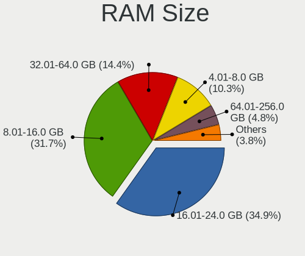
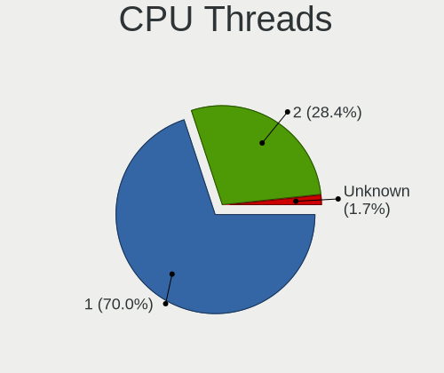

BSD Hardware Trends (Desktop)
-----------------------------

A project to identify most popular hardware characteristics and track their change
over time based on data collected by BSD users at https://BSD-Hardware.info.

Anyone can contribute to the study by uploading probes of their computers by
the [hw-probe](https://github.com/linuxhw/hw-probe/blob/master/INSTALL.BSD.md) tool:

    hw-probe -all -upload

Full-feature report is available here: https://bsd-hardware.info/?view=trends&formfactor=desktop

Period: May, 2020.

Contents
--------

- [ OS                       ](#os)
- [ OS Family                ](#os-family)
- [ Arch                     ](#arch)
- [ DE                       ](#de)
- [ Display Server           ](#display-server)
- [ Display Manager          ](#display-manager)
- [ OS Lang                  ](#os-lang)
- [ Boot Mode                ](#boot-mode)
- [ Filesystem               ](#filesystem)
- [ Part. scheme             ](#part-scheme)
- [ Country                  ](#country)
- [ City                     ](#city)
- [ Vendor                   ](#vendor)
- [ Model                    ](#model)
- [ Model Family             ](#model-family)
- [ MFG Year                 ](#mfg-year)
- [ Form Factor              ](#form-factor)
- [ Coreboot                 ](#coreboot)
- [ RAM Size                 ](#ram-size)
- [ RAM Used                 ](#ram-used)
- [ Drive Vendor             ](#drive-vendor)
- [ Drive Model              ](#drive-model)
- [ Drive Kind               ](#drive-kind)
- [ Drive Connector          ](#drive-connector)
- [ Drive Size               ](#drive-size)
- [ Space Total              ](#space-total)
- [ Space Used               ](#space-used)
- [ Malfunc. Drives          ](#malfunc-drives)
- [ Malfunc. Drive Vendor    ](#malfunc-drive-vendor)
- [ Malfunc. HDD Vendor      ](#malfunc-hdd-vendor)
- [ Malfunc. Drive Kind      ](#malfunc-drive-kind)
- [ Failed Drives            ](#failed-drives)
- [ Failed Drive Vendor      ](#failed-drive-vendor)
- [ Drive Status             ](#drive-status)
- [ Storage Vendor           ](#storage-vendor)
- [ Storage Model            ](#storage-model)
- [ Storage Kind             ](#storage-kind)
- [ CPU Vendor               ](#cpu-vendor)
- [ CPU Model                ](#cpu-model)
- [ CPU Model Family         ](#cpu-model-family)
- [ CPU Cores                ](#cpu-cores)
- [ CPU Sockets              ](#cpu-sockets)
- [ CPU Threads              ](#cpu-threads)
- [ CPU Microarch            ](#cpu-microarch)
- [ GPU Vendor               ](#gpu-vendor)
- [ GPU Model                ](#gpu-model)
- [ GPU Combo                ](#gpu-combo)
- [ GPU Driver               ](#gpu-driver)
- [ GPU Memory               ](#gpu-memory)
- [ Monitor Vendor           ](#monitor-vendor)
- [ Monitor Model            ](#monitor-model)
- [ Monitor Resolution       ](#monitor-resolution)
- [ Monitor Diagonal         ](#monitor-diagonal)
- [ Monitor Width            ](#monitor-width)
- [ Aspect Ratio             ](#aspect-ratio)
- [ Monitor Area             ](#monitor-area)
- [ Pixel Density            ](#pixel-density)
- [ Multiple Monitors        ](#multiple-monitors)
- [ Net Controller Vendor    ](#net-controller-vendor)
- [ Net Controller Model     ](#net-controller-model)
- [ Wireless Vendor          ](#wireless-vendor)
- [ Wireless Model           ](#wireless-model)
- [ Ethernet Vendor          ](#ethernet-vendor)
- [ Ethernet Model           ](#ethernet-model)
- [ Net Controller Kind      ](#net-controller-kind)
- [ Used Controller          ](#used-controller)
- [ NICs                     ](#nics)
- [ Bluetooth Vendor         ](#bluetooth-vendor)
- [ Bluetooth Model          ](#bluetooth-model)
- [ Unsupported Devices      ](#unsupported-devices)
- [ Unsupported Device Types ](#unsupported-device-types)

OS
--

Installed operating systems

| Name                 | Computers | Percent |
|----------------------|-----------|---------|
| FreeBSD 12.1-p5      | 28        | 33.33%  |
| OpenBSD 6.7          | 9         | 10.71%  |
| FreeBSD 12.1-STABLE  | 9         | 10.71%  |
| FreeBSD 13.0-CURRENT | 4         | 4.76%   |
| MidnightBSD 1.2      | 3         | 3.57%   |
| FreeBSD 12.1-p4      | 3         | 3.57%   |
| FreeBSD 12.1-p3      | 3         | 3.57%   |
| FreeBSD 10.4-p13     | 3         | 3.57%   |
| NetBSD 9.0           | 2         | 2.38%   |
| FreeNAS 11.3-p9      | 2         | 2.38%   |
| FreeNAS 11.3-p7      | 2         | 2.38%   |
| FreeBSD 12.1         | 2         | 2.38%   |
| pfSense 2.4.4        | 1         | 1.19%   |
| NomadBSD 1.3.1       | 1         | 1.19%   |
| NetBSD 9.99.61       | 1         | 1.19%   |
| NetBSD 9.99.23       | 1         | 1.19%   |
| NetBSD 9.0_STABLE    | 1         | 1.19%   |
| GhostBSD 19.12       | 1         | 1.19%   |
| FreeNAS 11.3-p8      | 1         | 1.19%   |
| FreeNAS 10.3         | 1         | 1.19%   |
| FreeBSD 12.1-p2      | 1         | 1.19%   |
| FreeBSD 12.1-p1      | 1         | 1.19%   |
| FreeBSD 12.0-p10     | 1         | 1.19%   |
| FreeBSD 11.3-p5      | 1         | 1.19%   |
| FreeBSD 10.3-p16     | 1         | 1.19%   |
| DragonFly 5.8        | 1         | 1.19%   |

OS Family
---------

OS without a version

| Name        | Computers | Percent |
|-------------|-----------|---------|
| FreeBSD     | 57        | 67.86%  |
| OpenBSD     | 9         | 10.71%  |
| FreeNAS     | 6         | 7.14%   |
| NetBSD      | 5         | 5.95%   |
| MidnightBSD | 3         | 3.57%   |
| pfSense     | 1         | 1.19%   |
| NomadBSD    | 1         | 1.19%   |
| GhostBSD    | 1         | 1.19%   |
| DragonFly   | 1         | 1.19%   |

Arch
----

OS architecture (x86_64, i586, etc.)

| Name   | Computers | Percent |
|--------|-----------|---------|
| amd64  | 73        | 86.9%   |
| i386   | 5         | 5.95%   |
| arm64  | 2         | 2.38%   |
| x86_64 | 1         | 1.19%   |
| evbarm | 1         | 1.19%   |
| armv7  | 1         | 1.19%   |
| arm    | 1         | 1.19%   |

DE
--

Desktop Environment

| Name     | Computers | Percent |
|----------|-----------|---------|
| Terminal | 65        | 77.38%  |
| XFCE     | 9         | 10.71%  |
| GNOME    | 6         | 7.14%   |
| KDE5     | 2         | 2.38%   |
| MATE     | 1         | 1.19%   |
| KDE      | 1         | 1.19%   |

Display Server
--------------

X11 or Wayland

| Name     | Computers | Percent |
|----------|-----------|---------|
| Terminal | 51        | 60.71%  |
| X11      | 33        | 39.29%  |

Display Manager
---------------

SDDM, LightDM, etc.

| Name     | Computers | Percent |
|----------|-----------|---------|
| Terminal | 66        | 78.57%  |
| SDDM     | 8         | 9.52%   |
| SLiM     | 3         | 3.57%   |
| LightDM  | 3         | 3.57%   |
| GDM      | 3         | 3.57%   |
| XDM      | 1         | 1.19%   |

OS Lang
-------

Language

| Lang         | Computers | Percent |
|--------------|-----------|---------|
| Unknown      | 35        | 41.67%  |
| ru_RU        | 21        | 25%     |
| en_US        | 19        | 22.62%  |
| ja_JP        | 4         | 4.76%   |
| de_DE        | 2         | 2.38%   |
| ""           | 2         | 2.38%   |
| ru_RU.KOI8-R | 1         | 1.19%   |

Boot Mode
---------

EFI or BIOS

| Mode | Computers | Percent |
|------|-----------|---------|
| BIOS | 53        | 63.1%   |
| EFI  | 31        | 36.9%   |

Filesystem
----------

Type of filesystem

| Type    | Computers | Percent |
|---------|-----------|---------|
| Zfs     | 42        | 50%     |
| Ufs     | 40        | 47.62%  |
| Hammer2 | 1         | 1.19%   |
| Unknown | 1         | 1.19%   |

Part. scheme
------------

Scheme of partitioning

| Type    | Computers | Percent |
|---------|-----------|---------|
| GPT     | 67        | 79.76%  |
| MBR     | 13        | 15.48%  |
| Unknown | 3         | 3.57%   |
| BSD     | 1         | 1.19%   |

Country
-------

Geographic location (country)

| Country     | Computers | Percent |
|-------------|-----------|---------|
| Russia      | 30        | 35.71%  |
| USA         | 17        | 20.24%  |
| Germany     | 9         | 10.71%  |
| Japan       | 4         | 4.76%   |
| France      | 4         | 4.76%   |
| UK          | 3         | 3.57%   |
| Switzerland | 3         | 3.57%   |
| Ukraine     | 2         | 2.38%   |
| Spain       | 2         | 2.38%   |
| Netherlands | 2         | 2.38%   |
| Canada      | 2         | 2.38%   |
| Sweden      | 1         | 1.19%   |
| Romania     | 1         | 1.19%   |
| Latvia      | 1         | 1.19%   |
| Finland     | 1         | 1.19%   |
| Belgium     | 1         | 1.19%   |
| Australia   | 1         | 1.19%   |

City
----

Geographic location (city)

| City              | Computers | Percent |
|-------------------|-----------|---------|
| Moscow            | 15        | 17.86%  |
| Ypsilanti         | 3         | 3.57%   |
| Zurich            | 2         | 2.38%   |
| Stuttgart         | 2         | 2.38%   |
| St Petersburg     | 2         | 2.38%   |
| Ozersk            | 2         | 2.38%   |
| Orsk              | 2         | 2.38%   |
| Ekaterinburg      | 2         | 2.38%   |
| Bellevue          | 2         | 2.38%   |
| Yverdon-les-Bains | 1         | 1.19%   |
| Yegor'yevsk       | 1         | 1.19%   |
| West Hartford     | 1         | 1.19%   |
| Walthamstow       | 1         | 1.19%   |
| Waldbrunn         | 1         | 1.19%   |
| Vol'sk            | 1         | 1.19%   |
| Vitry-sur-Seine   | 1         | 1.19%   |
| Tokyo             | 1         | 1.19%   |
| Tenhult           | 1         | 1.19%   |
| Slijk-Ewijk       | 1         | 1.19%   |
| Seattle           | 1         | 1.19%   |
| Sayville          | 1         | 1.19%   |
| Saratov           | 1         | 1.19%   |
| Saone             | 1         | 1.19%   |
| San Diego         | 1         | 1.19%   |
| Riga              | 1         | 1.19%   |
| Revonnas          | 1         | 1.19%   |
| Pittsford         | 1         | 1.19%   |
| Oradea            | 1         | 1.19%   |
| Novosibirsk       | 1         | 1.19%   |
| Nottingham        | 1         | 1.19%   |
| Northeim          | 1         | 1.19%   |
| Nishinomiya       | 1         | 1.19%   |
| Millinocket       | 1         | 1.19%   |
| Manchester        | 1         | 1.19%   |
| Madrid            | 1         | 1.19%   |
| Limonest          | 1         | 1.19%   |
| Kyiv              | 1         | 1.19%   |
| Krasnogorsk       | 1         | 1.19%   |
| Kouvola           | 1         | 1.19%   |
| Kobe              | 1         | 1.19%   |
| Kiliya            | 1         | 1.19%   |
| Idstein           | 1         | 1.19%   |
| Hope              | 1         | 1.19%   |
| Hamilton          | 1         | 1.19%   |
| Georgetown        | 1         | 1.19%   |
| Elda              | 1         | 1.19%   |
| Eindhoven         | 1         | 1.19%   |
| East Malvern      | 1         | 1.19%   |
| Dortmund          | 1         | 1.19%   |
| Denver            | 1         | 1.19%   |
| Concord           | 1         | 1.19%   |
| Chiyoda           | 1         | 1.19%   |
| Chemnitz          | 1         | 1.19%   |
| Chattanooga       | 1         | 1.19%   |
| Burkardroth       | 1         | 1.19%   |
| Brussels          | 1         | 1.19%   |
| Bromskirchen      | 1         | 1.19%   |
| Boucherville      | 1         | 1.19%   |
| Armeyskiy         | 1         | 1.19%   |
| Alstead           | 1         | 1.19%   |

Vendor
------

Motherboard manufacturer

| Name                | Computers | Percent |
|---------------------|-----------|---------|
| ASUSTek Computer    | 21        | 25%     |
| Gigabyte Technology | 20        | 23.81%  |
| Unknown             | 11        | 13.1%   |
| MSI                 | 6         | 7.14%   |
| Hewlett-Packard     | 5         | 5.95%   |
| ASRock              | 5         | 5.95%   |
| Supermicro          | 4         | 4.76%   |
| Intel               | 3         | 3.57%   |
| Dell                | 3         | 3.57%   |
| VIA Technologies    | 1         | 1.19%   |
| Sony UK             | 1         | 1.19%   |
| MiTAC               | 1         | 1.19%   |
| Lenovo              | 1         | 1.19%   |
| IBM                 | 1         | 1.19%   |
| Acer                | 1         | 1.19%   |

Model
-----

Motherboard model

| Name                                | Computers | Percent |
|-------------------------------------|-----------|---------|
| Unknown                             | 12        | 14.29%  |
| Supermicro SSG-6029P-E1CR12L        | 2         | 2.38%   |
| Gigabyte M68MT-S2P                  | 2         | 2.38%   |
| ASUS TUF B350M-PLUS GAMING          | 2         | 2.38%   |
| ASUS P6T SE                         | 2         | 2.38%   |
| ASUS All Series                     | 2         | 2.38%   |
| VIA Technologies VT8623-8235        | 1         | 1.19%   |
| Supermicro X7SPA-HF                 | 1         | 1.19%   |
| Supermicro SSG-2028R-E1CR24N        | 1         | 1.19%   |
| Sony UK Raspberry Pi 4 Model B      | 1         | 1.19%   |
| MSI MS-7B90                         | 1         | 1.19%   |
| MSI MS-7B89                         | 1         | 1.19%   |
| MSI MS-7887                         | 1         | 1.19%   |
| MSI MS-7817                         | 1         | 1.19%   |
| MSI MS-7693                         | 1         | 1.19%   |
| MSI MS-7255                         | 1         | 1.19%   |
| MiTAC PH12SI                        | 1         | 1.19%   |
| Lenovo 70AQ0009UX ThinkServer TS440 | 1         | 1.19%   |
| Intel DN2820FYK H24582-203          | 1         | 1.19%   |
| Intel DG41RQ AAE54511-205           | 1         | 1.19%   |
| Intel D54250WYK H13922-303          | 1         | 1.19%   |
| IBM 81832BG                         | 1         | 1.19%   |
| HP Z620 Workstation                 | 1         | 1.19%   |
| HP Z600 Workstation                 | 1         | 1.19%   |
| HP t620 PLUS Quad Core TC           | 1         | 1.19%   |
| HP ProLiant ML10 v2                 | 1         | 1.19%   |
| HP Compaq 8100 Elite CMT PC         | 1         | 1.19%   |
| Gigabyte Z68P-DS3                   | 1         | 1.19%   |
| Gigabyte Z68MA-D2H-B3               | 1         | 1.19%   |
| Gigabyte Z170X-UD5 TH               | 1         | 1.19%   |
| Gigabyte X570 AORUS ELITE           | 1         | 1.19%   |
| Gigabyte H77N-WIFI                  | 1         | 1.19%   |
| Gigabyte H61M-S2PV                  | 1         | 1.19%   |
| Gigabyte GB-BXi7-5500               | 1         | 1.19%   |
| Gigabyte GA-MA78GM-UD2H             | 1         | 1.19%   |
| Gigabyte GA-780T-D3L                | 1         | 1.19%   |
| Gigabyte F2A75M-HD2                 | 1         | 1.19%   |
| Gigabyte EX58-UD4                   | 1         | 1.19%   |
| Gigabyte C1007UN-D                  | 1         | 1.19%   |
| Gigabyte B450M S2H                  | 1         | 1.19%   |
| Gigabyte B450M GAMING               | 1         | 1.19%   |
| Gigabyte B450M DS3H                 | 1         | 1.19%   |
| Gigabyte AB350-Gaming 3             | 1         | 1.19%   |
| Gigabyte 945GM-S2                   | 1         | 1.19%   |
| Dell PowerEdge T320                 | 1         | 1.19%   |
| Dell OptiPlex 9020                  | 1         | 1.19%   |
| Dell OptiPlex 3010                  | 1         | 1.19%   |
| ASUS PRIME X399-A                   | 1         | 1.19%   |
| ASUS PRIME X370-PRO                 | 1         | 1.19%   |
| ASUS PRIME A320M-K                  | 1         | 1.19%   |
| ASUS P8Z77-V LK                     | 1         | 1.19%   |
| ASUS P8H61 PRO                      | 1         | 1.19%   |
| ASUS P5Q-E                          | 1         | 1.19%   |
| ASUS P5Q SE PLUS                    | 1         | 1.19%   |
| ASUS P5Q                            | 1         | 1.19%   |
| ASUS P5M2                           | 1         | 1.19%   |
| ASUS P5K-E                          | 1         | 1.19%   |
| ASUS P5GD2-Deluxe                   | 1         | 1.19%   |
| ASUS P4P800-VM                      | 1         | 1.19%   |
| ASUS M5A99FX PRO R2.0               | 1         | 1.19%   |

Model Family
------------

Motherboard model prefix

| Name                         | Computers | Percent |
|------------------------------|-----------|---------|
| Unknown                      | 12        | 14.29%  |
| Gigabyte B450M               | 3         | 3.57%   |
| ASUS PRIME                   | 3         | 3.57%   |
| Supermicro SSG-6029P-E1CR12L | 2         | 2.38%   |
| Gigabyte M68MT-S2P           | 2         | 2.38%   |
| Dell OptiPlex                | 2         | 2.38%   |
| ASUS TUF                     | 2         | 2.38%   |
| ASUS P6T                     | 2         | 2.38%   |
| ASUS P5Q                     | 2         | 2.38%   |
| ASUS All                     | 2         | 2.38%   |
| VIA Technologies VT8623-8235 | 1         | 1.19%   |
| Supermicro X7SPA-HF          | 1         | 1.19%   |
| Supermicro SSG-2028R-E1CR24N | 1         | 1.19%   |
| Sony UK Raspberry            | 1         | 1.19%   |
| MSI MS-7B90                  | 1         | 1.19%   |
| MSI MS-7B89                  | 1         | 1.19%   |
| MSI MS-7887                  | 1         | 1.19%   |
| MSI MS-7817                  | 1         | 1.19%   |
| MSI MS-7693                  | 1         | 1.19%   |
| MSI MS-7255                  | 1         | 1.19%   |
| MiTAC PH12SI                 | 1         | 1.19%   |
| Lenovo 70AQ0009UX            | 1         | 1.19%   |
| Intel DN2820FYK              | 1         | 1.19%   |
| Intel DG41RQ                 | 1         | 1.19%   |
| Intel D54250WYK              | 1         | 1.19%   |
| IBM 81832BG                  | 1         | 1.19%   |
| HP Z620                      | 1         | 1.19%   |
| HP Z600                      | 1         | 1.19%   |
| HP t620                      | 1         | 1.19%   |
| HP ProLiant                  | 1         | 1.19%   |
| HP Compaq                    | 1         | 1.19%   |
| Gigabyte Z68P-DS3            | 1         | 1.19%   |
| Gigabyte Z68MA-D2H-B3        | 1         | 1.19%   |
| Gigabyte Z170X-UD5           | 1         | 1.19%   |
| Gigabyte X570                | 1         | 1.19%   |
| Gigabyte H77N-WIFI           | 1         | 1.19%   |
| Gigabyte H61M-S2PV           | 1         | 1.19%   |
| Gigabyte GB-BXi7-5500        | 1         | 1.19%   |
| Gigabyte GA-MA78GM-UD2H      | 1         | 1.19%   |
| Gigabyte GA-780T-D3L         | 1         | 1.19%   |
| Gigabyte F2A75M-HD2          | 1         | 1.19%   |
| Gigabyte EX58-UD4            | 1         | 1.19%   |
| Gigabyte C1007UN-D           | 1         | 1.19%   |
| Gigabyte AB350-Gaming        | 1         | 1.19%   |
| Gigabyte 945GM-S2            | 1         | 1.19%   |
| Dell PowerEdge               | 1         | 1.19%   |
| ASUS P8Z77-V                 | 1         | 1.19%   |
| ASUS P8H61                   | 1         | 1.19%   |
| ASUS P5Q-E                   | 1         | 1.19%   |
| ASUS P5M2                    | 1         | 1.19%   |
| ASUS P5K-E                   | 1         | 1.19%   |
| ASUS P5GD2-Deluxe            | 1         | 1.19%   |
| ASUS P4P800-VM               | 1         | 1.19%   |
| ASUS M5A99FX                 | 1         | 1.19%   |
| ASUS M5A78L-M                | 1         | 1.19%   |
| ASUS B75M-PLUS               | 1         | 1.19%   |
| ASRock Q1900M                | 1         | 1.19%   |
| ASRock Q1900B-ITX            | 1         | 1.19%   |
| ASRock J4205-ITX             | 1         | 1.19%   |
| ASRock B450M                 | 1         | 1.19%   |

MFG Year
--------

Motherboard manufacture year

| Year    | Computers | Percent |
|---------|-----------|---------|
| 2019    | 13        | 15.48%  |
| Unknown | 9         | 10.71%  |
| 2018    | 8         | 9.52%   |
| 2014    | 8         | 9.52%   |
| 2013    | 6         | 7.14%   |
| 2009    | 6         | 7.14%   |
| 2020    | 5         | 5.95%   |
| 2012    | 5         | 5.95%   |
| 2010    | 5         | 5.95%   |
| 2015    | 4         | 4.76%   |
| 2016    | 3         | 3.57%   |
| 2007    | 3         | 3.57%   |
| 2017    | 2         | 2.38%   |
| 2008    | 2         | 2.38%   |
| 2005    | 2         | 2.38%   |
| 2011    | 1         | 1.19%   |
| 2006    | 1         | 1.19%   |
| 2004    | 1         | 1.19%   |

Form Factor
-----------

Physical design of the computer

| Name    | Computers | Percent |
|---------|-----------|---------|
| Desktop | 84        | 100%    |

Coreboot
--------

Have coreboot on board

| Used | Computers | Percent |
|------|-----------|---------|
| No   | 84        | 100%    |

RAM Size
--------

Total RAM memory

| Size in GB  | Computers | Percent |
|-------------|-----------|---------|
| 16.01-24.0  | 20        | 23.81%  |
| 32.01-64.0  | 15        | 17.86%  |
| 4.01-8.0    | 13        | 15.48%  |
| 8.01-16.0   | 10        | 11.9%   |
| 0.01-1.0    | 6         | 7.14%   |
| 3.01-4.0    | 5         | 5.95%   |
| 2.01-3.0    | 5         | 5.95%   |
| 64.01-256.0 | 5         | 5.95%   |
| 24.01-32.0  | 2         | 2.38%   |
| 1.01-2.0    | 2         | 2.38%   |
| Unknown     | 1         | 1.19%   |

RAM Used
--------

Used RAM memory

| Used GB     | Computers | Percent |
|-------------|-----------|---------|
| 0.01-1.0    | 39        | 46.43%  |
| 1.01-2.0    | 10        | 11.9%   |
| 4.01-8.0    | 7         | 8.33%   |
| Unknown     | 6         | 7.14%   |
| 3.01-4.0    | 5         | 5.95%   |
| 24.01-32.0  | 4         | 4.76%   |
| 16.01-24.0  | 3         | 3.57%   |
| 8.01-16.0   | 3         | 3.57%   |
| 0           | 3         | 3.57%   |
| 32.01-64.0  | 2         | 2.38%   |
| 2.01-3.0    | 1         | 1.19%   |
| 64.01-256.0 | 1         | 1.19%   |

Drive Vendor
------------

Hard drive vendors

| Vendor              | Computers | Drives | Percent |
|---------------------|-----------|--------|---------|
| WDC                 | 32        | 97     | 27.59%  |
| Seagate             | 25        | 56     | 21.55%  |
| Samsung Electronics | 18        | 31     | 15.52%  |
| Hitachi             | 7         | 11     | 6.03%   |
| Toshiba             | 6         | 10     | 5.17%   |
| Crucial             | 6         | 7      | 5.17%   |
| Intel               | 4         | 7      | 3.45%   |
| SanDisk             | 3         | 5      | 2.59%   |
| Micron Technology   | 3         | 5      | 2.59%   |
| Kingston            | 3         | 5      | 2.59%   |
| HGST                | 2         | 7      | 1.72%   |
| PLEXTOR             | 1         | 1      | 0.86%   |
| OPENBSD             | 1         | 1      | 0.86%   |
| LSI                 | 1         | 1      | 0.86%   |
| KingSpec            | 1         | 1      | 0.86%   |
| Hoodisk             | 1         | 1      | 0.86%   |
| Corsair             | 1         | 1      | 0.86%   |
| AEGO                | 1         | 1      | 0.86%   |

Drive Model
-----------

Hard drive models

| Model                    | Computers | Percent |
|--------------------------|-----------|---------|
| WD40EFRX-68N32N0 4TB     | 4         | 2.48%   |
| ST3300657SS 304GB        | 4         | 2.48%   |
| WD20EZRZ-00Z5HB0 2TB     | 3         | 1.86%   |
| WD15EADS-00P8B0 1.5TB    | 3         | 1.86%   |
| ST2000DM001-1CH164 2TB   | 3         | 1.86%   |
| SSD 850 EVO 500GB        | 3         | 1.86%   |
| SSD 850 EVO 250GB        | 3         | 1.86%   |
| WD6400AARS-00Y5B1 640GB  | 2         | 1.24%   |
| WD60EFAX-68SHWN0 6TB     | 2         | 1.24%   |
| WD40EFRX-68WT0N0 4TB     | 2         | 1.24%   |
| WD20EARX-00PASB0 2TB     | 2         | 1.24%   |
| WD2002FYPS-01U1B0 2TB    | 2         | 1.24%   |
| ST4000DM000-1F2168 4TB   | 2         | 1.24%   |
| ST250DM000-1BD141 250GB  | 2         | 1.24%   |
| SSD 860 EVO 500GB        | 2         | 1.24%   |
| SSD 860 EVO 1TB          | 2         | 1.24%   |
| SSD 850 EVO 1TB          | 2         | 1.24%   |
| 5100_MTFDDAK240TCB 240GB | 2         | 1.24%   |
| WDS100T2B0A-00SM50 1TB   | 1         | 0.62%   |
| WD7500AYYS-01RCA0 752GB  | 1         | 0.62%   |
| WD6002FRYZ-01WD5B1 6TB   | 1         | 0.62%   |
| WD5003AZEX-00MK2A0 500GB | 1         | 0.62%   |
| WD5003AZEX-00K3CA0 500GB | 1         | 0.62%   |
| WD5003AZEX-00K1GA0 500GB | 1         | 0.62%   |
| WD5000LPLX-00ZNTT0 500GB | 1         | 0.62%   |
| WD5000AAKX-08U6AA0 500GB | 1         | 0.62%   |
| WD5000AAKS-00A7B0 500GB  | 1         | 0.62%   |
| WD40EZRZ-75GXCB0 4TB     | 1         | 0.62%   |
| WD40EZRZ-22GXCB0 4TB     | 1         | 0.62%   |
| WD4002FFWX-68TZ4N0 4TB   | 1         | 0.62%   |
| WD30EZRX-00SPEB0 3TB     | 1         | 0.62%   |
| WD30EZRX-00DC0B0 3TB     | 1         | 0.62%   |
| WD30EZRX-00D8PB0 3TB     | 1         | 0.62%   |
| WD30EFRX-68EUZN0 3TB     | 1         | 0.62%   |
| WD20EZRX-00DC0B0 2TB     | 1         | 0.62%   |
| WD20EZRX-00D8PB0 2TB     | 1         | 0.62%   |
| WD20EFRX-68AX9N0 2TB     | 1         | 0.62%   |
| WD20EARS-00MVWB0 2TB     | 1         | 0.62%   |
| WD2003FZEX-00SRLA0 2TB   | 1         | 0.62%   |
| WD1600JD-00GBB0 160GB    | 1         | 0.62%   |
| WD10EZRZ-00HTKB0 1TB     | 1         | 0.62%   |
| WD10EZRX-00L4HB0 1TB     | 1         | 0.62%   |
| WD10EZEX-60WN4A0 1TB     | 1         | 0.62%   |
| WD10EZEX-21WN4A0 1TB     | 1         | 0.62%   |
| WD10EZEX-08M2NA0 1TB     | 1         | 0.62%   |
| WD10EZEX-07WN4A0 1TB     | 1         | 0.62%   |
| WD10EZEX-00BN5A0 1TB     | 1         | 0.62%   |
| WD10EARX-00N0YB0 1TB     | 1         | 0.62%   |
| WD10EALX-009BA0 1TB      | 1         | 0.62%   |
| WD100EMAZ-00WJTA0 10TB   | 1         | 0.62%   |
| WD1002FBYS-02A6B0 1TB    | 1         | 0.62%   |
| WD1001FALS-00J7B0 1TB    | 1         | 0.62%   |
| Ultra II 960GB           | 1         | 0.62%   |
| Ultra Fit 64GB           | 1         | 0.62%   |
| TR200 240GB              | 1         | 0.62%   |
| THNSNJ128GCSU 128GB      | 1         | 0.62%   |
| SUV500MS240G 240GB       | 1         | 0.62%   |
| SUV400S37240G 240GB      | 1         | 0.62%   |
| ST91000640NS 1TB         | 1         | 0.62%   |
| ST8000VN0022-2EL112 8TB  | 1         | 0.62%   |

Drive Kind
----------

HDD or SSD

| Kind | Computers | Drives | Percent |
|------|-----------|--------|---------|
| HDD  | 56        | 159    | 58.95%  |
| SSD  | 37        | 87     | 38.95%  |
| NVMe | 2         | 2      | 2.11%   |

Drive Connector
---------------

SATA, SAS, NVMe, etc.

| Type | Computers | Drives | Percent |
|------|-----------|--------|---------|
| SATA | 69        | 246    | 97.18%  |
| NVMe | 2         | 2      | 2.82%   |

Drive Size
----------

Size of hard drive

| Size in TB | Computers | Drives | Percent |
|------------|-----------|--------|---------|
| 0.01-0.5   | 50        | 87     | 41.67%  |
| 0.51-1.0   | 24        | 61     | 20%     |
| 1.01-2.0   | 20        | 37     | 16.67%  |
| 3.01-4.0   | 13        | 24     | 10.83%  |
| 2.01-3.0   | 6         | 8      | 5%      |
| 4.01-10.0  | 6         | 15     | 5%      |
| 10.01-20.0 | 1         | 16     | 0.83%   |

Space Total
-----------

Amount of disk space available on the file system

| Size in GB     | Computers | Percent |
|----------------|-----------|---------|
| 251-500        | 23        | 27.38%  |
| 101-250        | 15        | 17.86%  |
| 1-20           | 9         | 10.71%  |
| 501-1000       | 8         | 9.52%   |
| 21-50          | 7         | 8.33%   |
| 2001-3000      | 6         | 7.14%   |
| More than 3000 | 5         | 5.95%   |
| 51-100         | 5         | 5.95%   |
| 1001-2000      | 4         | 4.76%   |
| Unknown        | 2         | 2.38%   |

Space Used
----------

Amount of used disk space

| Used GB        | Computers | Percent |
|----------------|-----------|---------|
| 1-20           | 48        | 57.14%  |
| 21-50          | 14        | 16.67%  |
| 51-100         | 5         | 5.95%   |
| 251-500        | 4         | 4.76%   |
| 501-1000       | 4         | 4.76%   |
| More than 3000 | 3         | 3.57%   |
| 101-250        | 2         | 2.38%   |
| 1001-2000      | 2         | 2.38%   |
| Unknown        | 2         | 2.38%   |

Malfunc. Drives
---------------

Drive models with a malfunction

| Model                    | Computers | Drives | Percent |
|--------------------------|-----------|--------|---------|
| WD2002FYPS-01U1B0 2TB    | 2         | 2      | 10.53%  |
| WD15EADS-00P8B0 1.5TB    | 2         | 2      | 10.53%  |
| WD6002FRYZ-01WD5B1 6TB   | 1         | 1      | 5.26%   |
| WD5003AZEX-00MK2A0 500GB | 1         | 1      | 5.26%   |
| WD40EFRX-68N32N0 4TB     | 1         | 3      | 5.26%   |
| WD20EFRX-68AX9N0 2TB     | 1         | 1      | 5.26%   |
| WD2003FZEX-00SRLA0 2TB   | 1         | 1      | 5.26%   |
| ST3500514NS 500GB        | 1         | 1      | 5.26%   |
| ST2000DM008-2FR102 2TB   | 1         | 1      | 5.26%   |
| ST2000DM001-1CH164 2TB   | 1         | 1      | 5.26%   |
| SSDSC2KW480H6 480GB      | 1         | 1      | 5.26%   |
| SSDSA2M080G2GC 80GB      | 1         | 1      | 5.26%   |
| SSD 850 EVO mSATA 1TB    | 1         | 1      | 5.26%   |
| SSD 850 EVO 1TB          | 1         | 1      | 5.26%   |
| HTS541075A7E630 752GB    | 1         | 1      | 5.26%   |
| HDS721010CLA332 1TB      | 1         | 1      | 5.26%   |
| HD501LJ 500GB            | 1         | 2      | 5.26%   |

Malfunc. Drive Vendor
---------------------

Vendors of faulty drives

| Vendor              | Computers | Drives | Percent |
|---------------------|-----------|--------|---------|
| WDC                 | 7         | 11     | 43.75%  |
| Seagate             | 3         | 3      | 18.75%  |
| Samsung Electronics | 2         | 4      | 12.5%   |
| Intel               | 2         | 2      | 12.5%   |
| Hitachi             | 1         | 1      | 6.25%   |
| HGST                | 1         | 1      | 6.25%   |

Malfunc. HDD Vendor
-------------------

Vendors of faulty HDD drives

| Vendor              | Computers | Drives | Percent |
|---------------------|-----------|--------|---------|
| WDC                 | 7         | 11     | 53.85%  |
| Seagate             | 3         | 3      | 23.08%  |
| Samsung Electronics | 1         | 2      | 7.69%   |
| Hitachi             | 1         | 1      | 7.69%   |
| HGST                | 1         | 1      | 7.69%   |

Malfunc. Drive Kind
-------------------

Kinds of faulty drives

| Kind | Computers | Drives | Percent |
|------|-----------|--------|---------|
| HDD  | 13        | 18     | 81.25%  |
| SSD  | 3         | 4      | 18.75%  |

Failed Drives
-------------

Failed drive models

Zero info for selected period =(

Failed Drive Vendor
-------------------

Failed drive vendors

Zero info for selected period =(

Drive Status
------------

Number of failed and malfunc. drives

| Status   | Computers | Drives | Percent |
|----------|-----------|--------|---------|
| Works    | 64        | 219    | 76.19%  |
| Malfunc  | 16        | 22     | 19.05%  |
| Detected | 4         | 7      | 4.76%   |

Storage Vendor
--------------

Storage controller vendors

| Vendor                   | Computers | Percent |
|--------------------------|-----------|---------|
| Intel                    | 53        | 44.17%  |
| AMD                      | 23        | 19.17%  |
| Marvell Technology Group | 7         | 5.83%   |
| ASMedia Technology       | 7         | 5.83%   |
| Samsung Electronics      | 5         | 4.17%   |
| Broadcom / LSI           | 5         | 4.17%   |
| Areca Technology         | 5         | 4.17%   |
| JMicron Technology       | 4         | 3.33%   |
| VIA Technologies         | 3         | 2.5%    |
| Nvidia                   | 3         | 2.5%    |
| Silicon Image            | 1         | 0.83%   |
| Realtek Semiconductor    | 1         | 0.83%   |
| Phison Electronics       | 1         | 0.83%   |
| Lite-On Technology       | 1         | 0.83%   |
| KIOXIA                   | 1         | 0.83%   |

Storage Model
-------------

Storage controller models

| Model                                                                      | Computers | Percent |
|----------------------------------------------------------------------------|-----------|---------|
| FCH SATA Controller [AHCI mode]                                            | 16        | 10.67%  |
| ASM1062 Serial ATA Controller                                              | 7         | 4.67%   |
| 82801JI (ICH10 Family) SATA AHCI Controller                                | 6         | 4%      |
| 8 Series/C220 Series Chipset Family 6-port SATA Controller 1 [AHCI mode]   | 6         | 4%      |
| 400 Series Chipset SATA Controller                                         | 6         | 4%      |
| SB7x0/SB8x0/SB9x0 SATA Controller [AHCI mode]                              | 5         | 3.33%   |
| 6 Series/C200 Series Chipset Family 6 port Desktop SATA AHCI Controller    | 5         | 3.33%   |
| ARC-1300ix-16 16-Port PCI-Express to SAS Non-RAID Host Adapter             | 4         | 2.67%   |
| SB7x0/SB8x0/SB9x0 IDE Controller                                           | 3         | 2%      |
| SAS3008 PCI-Express Fusion-MPT SAS-3                                       | 3         | 2%      |
| NVMe SSD Controller SM981/PM981/PM983                                      | 3         | 2%      |
| JMB363 SATA/IDE Controller                                                 | 3         | 2%      |
| Atom Processor E3800 Series SATA AHCI Controller                           | 3         | 2%      |
| 92xx SATA 6G Controller                                                    | 3         | 2%      |
| 7 Series/C210 Series Chipset Family 6-port SATA Controller [AHCI mode]     | 3         | 2%      |
| 300 Series Chipset SATA Controller                                         | 3         | 2%      |
| SATA Controller [RAID mode]                                                | 2         | 1.33%   |
| Q170/Q150/B150/H170/H110/Z170/CM236 Chipset SATA Controller [AHCI Mode]    | 2         | 1.33%   |
| Optane SSD 900P Series                                                     | 2         | 1.33%   |
| NVMe SSD Controller SM961/PM961                                            | 2         | 1.33%   |
| MCP61 SATA Controller                                                      | 2         | 1.33%   |
| FCH SATA Controller D                                                      | 2         | 1.33%   |
| Celeron N3350/Pentium N4200/Atom E3900 Series SATA AHCI Controller         | 2         | 1.33%   |
| C620 Series Chipset Family SSATA Controller [AHCI mode]                    | 2         | 1.33%   |
| C620 Series Chipset Family SATA Controller [AHCI mode]                     | 2         | 1.33%   |
| C600/X79 series chipset SATA RAID Controller                               | 2         | 1.33%   |
| Atom/Celeron/Pentium Processor x5-E8000/J3xxx/N3xxx Series SATA Controller | 2         | 1.33%   |
| 88SE6111/6121 SATA II / PATA Controller                                    | 2         | 1.33%   |
| 82801IR/IO/IH (ICH9R/DO/DH) 6 port SATA Controller [AHCI mode]             | 2         | 1.33%   |
| 82801G (ICH7 Family) IDE Controller                                        | 2         | 1.33%   |
| 82801EB/ER (ICH5/ICH5R) IDE Controller                                     | 2         | 1.33%   |
| 82801EB (ICH5) SATA Controller                                             | 2         | 1.33%   |
| Unknown                                                                    | 2         | 1.33%   |
| X399 Series Chipset SATA Controller                                        | 1         | 0.67%   |
| X370 Series Chipset SATA Controller                                        | 1         | 0.67%   |
| Wildcat Point-LP SATA Controller [AHCI Mode]                               | 1         | 0.67%   |
| VT82C586A/B/VT82C686/A/B/VT823x/A/C PIPC Bus Master IDE                    | 1         | 0.67%   |
| VT6421 IDE/SATA Controller                                                 | 1         | 0.67%   |
| SSD 660P Series                                                            | 1         | 0.67%   |
| SiI 3114 [SATALink/SATARaid] Serial ATA Controller                         | 1         | 0.67%   |
| Serial ATA Controller                                                      | 1         | 0.67%   |
| SB7x0/SB8x0/SB9x0 SATA Controller [IDE mode]                               | 1         | 0.67%   |
| SAS2008 PCI-Express Fusion-MPT SAS-2 [Falcon]                              | 1         | 0.67%   |
| PCIe Data Center SSD                                                       | 1         | 0.67%   |
| NM10/ICH7 Family SATA Controller [IDE mode]                                | 1         | 0.67%   |
| NM10/ICH7 Family SATA Controller [AHCI mode]                               | 1         | 0.67%   |
| MegaRAID SAS-3 3108 [Invader]                                              | 1         | 0.67%   |
| MCP78S [GeForce 8200] IDE                                                  | 1         | 0.67%   |
| MCP78S [GeForce 8200] AHCI Controller                                      | 1         | 0.67%   |
| M8Pe Series NVMe SSD                                                       | 1         | 0.67%   |
| JMB368 IDE controller                                                      | 1         | 0.67%   |
| FCH IDE Controller                                                         | 1         | 0.67%   |
| E12 NVMe Controller                                                        | 1         | 0.67%   |
| CS5536 [Geode companion] IDE                                               | 1         | 0.67%   |
| C610/X99 series chipset sSATA Controller [AHCI mode]                       | 1         | 0.67%   |
| C610/X99 series chipset 6-Port SATA Controller [AHCI mode]                 | 1         | 0.67%   |
| C602 chipset 4-Port SATA Storage Control Unit                              | 1         | 0.67%   |
| C600/X79 series chipset 6-Port SATA AHCI Controller                        | 1         | 0.67%   |
| ARC-1280/1280ML 24-Port PCI-Express to SATA II RAID Controller             | 1         | 0.67%   |
| 88SE9230 PCIe SATA 6Gb/s Controller                                        | 1         | 0.67%   |

Storage Kind
------------

Kind of storage controller (IDE, SATA, NVMe, SAS, ...)

| Kind | Computers | Percent |
|------|-----------|---------|
| SATA | 64        | 56.14%  |
| IDE  | 23        | 20.18%  |
| NVMe | 11        | 9.65%   |
| RAID | 6         | 5.26%   |
| SAS  | 6         | 5.26%   |
| SCSI | 4         | 3.51%   |

CPU Vendor
----------

Processor vendors

| Vendor | Computers | Percent |
|--------|-----------|---------|
| Intel  | 52        | 61.9%   |
| AMD    | 26        | 30.95%  |
| ARM    | 5         | 5.95%   |
| VIA    | 1         | 1.19%   |

CPU Model
---------

Processor models

| Model                                                  | Computers | Percent |
|--------------------------------------------------------|-----------|---------|
| Intel Core 2 Quad CPU Q6600 @ 2.40GHz                  | 3         | 3.57%   |
| Intel Xeon Bronze 3104 CPU @ 1.70GHz                   | 2         | 2.38%   |
| Intel Core i7-4770 CPU @ 3.40GHz                       | 2         | 2.38%   |
| Intel Core i7-3770 CPU @ 3.40GHz                       | 2         | 2.38%   |
| Intel Core i7 CPU 920 @ 2.67GHz                        | 2         | 2.38%   |
| Intel Celeron CPU J1900 @ 1.99GHz                      | 2         | 2.38%   |
| AMD Athlon II X3 455 Processor                         | 2         | 2.38%   |
| AMD AMD Ryzen 7 2700X Eight-Core Processor             | 2         | 2.38%   |
| AMD AMD Ryzen 7 2700 Eight-Core Processor              | 2         | 2.38%   |
| AMD AMD Ryzen 7 1700 Eight-Core Processor              | 2         | 2.38%   |
| VIA C3                                                 | 1         | 1.19%   |
| Intel Xeon CPU L5630 @ 2.13GHz                         | 1         | 1.19%   |
| Intel Xeon CPU E5630 @ 2.53GHz                         | 1         | 1.19%   |
| Intel Xeon CPU E5-2690 @ 2.90GHz                       | 1         | 1.19%   |
| Intel Xeon CPU E5-2660 v4 @ 2.00GHz                    | 1         | 1.19%   |
| Intel Xeon CPU E5-2403 0 @ 1.80GHz                     | 1         | 1.19%   |
| Intel Xeon CPU E3-1225 v3 @ 3.20GHz                    | 1         | 1.19%   |
| Intel Xeon CPU D-1541 @ 2.10GHz                        | 1         | 1.19%   |
| Intel Pentium D CPU                                    | 1         | 1.19%   |
| Intel Pentium CPU J4205 @ 1.50GHz                      | 1         | 1.19%   |
| Intel Pentium CPU G3240 @ 3.10GHz                      | 1         | 1.19%   |
| Intel Pentium CPU G3220 @ 3.00GHz                      | 1         | 1.19%   |
| Intel Pentium CPU G2120 @ 3.10GHz                      | 1         | 1.19%   |
| Intel Pentium 4 CPU 3.00GHz                            | 1         | 1.19%   |
| Intel Pentium 4 CPU 2.80GHz ("GenuineIntel" 686-class) | 1         | 1.19%   |
| Intel Pentium 4 CPU 2.66GHz                            | 1         | 1.19%   |
| Intel Core i7-7700K CPU @ 4.20GHz                      | 1         | 1.19%   |
| Intel Core i7-6700K CPU @ 4.00GHz                      | 1         | 1.19%   |
| Intel Core i7-5500U CPU @ 2.40GHz                      | 1         | 1.19%   |
| Intel Core i7-2700K CPU @ 3.50GHz                      | 1         | 1.19%   |
| Intel Core i7-2600K CPU @ 3.40GHz                      | 1         | 1.19%   |
| Intel Core i7 CPU                                      | 1         | 1.19%   |
| Intel Core i5-4570S CPU @ 2.90GHz                      | 1         | 1.19%   |
| Intel Core i5-4250U CPU @ 1.30GHz                      | 1         | 1.19%   |
| Intel Core i5-3570 CPU                                 | 1         | 1.19%   |
| Intel Core i5-3470 CPU @ 3.20GHz                       | 1         | 1.19%   |
| Intel Core i5-2320 CPU @ 3.00GHz                       | 1         | 1.19%   |
| Intel Core i3-3225 CPU @ 3.30GHz                       | 1         | 1.19%   |
| Intel Core i3 CPU 530 @ 2.93GHz                        | 1         | 1.19%   |
| Intel Core 2 Duo CPU E8500 @ 3.16GHz                   | 1         | 1.19%   |
| Intel Core 2 Duo CPU E7200 @ 2.53GHz                   | 1         | 1.19%   |
| Intel Core 2 CPU 6320 @ 1.86GHz                        | 1         | 1.19%   |
| Intel Core 2 CPU 4300 @ 1.80GHz                        | 1         | 1.19%   |
| Intel Celeron CPU N2830 @ 2.16GHz                      | 1         | 1.19%   |
| Intel Celeron CPU J3455 @ 1.50GHz                      | 1         | 1.19%   |
| Intel Celeron CPU J3060 @ 1.60GHz                      | 1         | 1.19%   |
| Intel Celeron CPU G1820 @ 2.70GHz                      | 1         | 1.19%   |
| Intel Celeron CPU 1007U @ 1.50GHz                      | 1         | 1.19%   |
| Intel Atom CPU D510 @ 1.66GHz                          | 1         | 1.19%   |
| Intel 686-class                                        | 1         | 1.19%   |
| ARM Cortex-A8 r3p2                                     | 1         | 1.19%   |
| ARM Cortex-A72 r0p3                                    | 1         | 1.19%   |
| ARM Cortex-A7 r0p5 (ECO: 0x00000000)                   | 1         | 1.19%   |
| Arm Cortex-A53 r0p4 (v8-A)                             | 1         | 1.19%   |
| ARM Cortex-A53 r0p4                                    | 1         | 1.19%   |
| AMD Sempron 145 Processor                              | 1         | 1.19%   |
| AMD Ryzen 3 2200G with Radeon Vega Graphics            | 1         | 1.19%   |
| AMD Phenom 9550 Quad-Core Processor                    | 1         | 1.19%   |
| AMD Phenom 9150e Quad-Core Processor                   | 1         | 1.19%   |
| AMD GX-420CA SOC with Radeon HD Graphics               | 1         | 1.19%   |

CPU Model Family
----------------

Processor model prefix

| Model                | Computers | Percent |
|----------------------|-----------|---------|
| Other                | 20        | 23.81%  |
| Intel Core i7        | 12        | 14.29%  |
| Intel Xeon           | 7         | 8.33%   |
| Intel Celeron        | 7         | 8.33%   |
| Intel Core i5        | 5         | 5.95%   |
| Intel Pentium        | 4         | 4.76%   |
| Intel Pentium 4      | 3         | 3.57%   |
| Intel Core 2 Quad    | 3         | 3.57%   |
| AMD FX               | 3         | 3.57%   |
| Intel Xeon Bronze    | 2         | 2.38%   |
| Intel Core i3        | 2         | 2.38%   |
| Intel Core 2 Duo     | 2         | 2.38%   |
| Intel Core 2         | 2         | 2.38%   |
| AMD Phenom           | 2         | 2.38%   |
| AMD Athlon II X3     | 2         | 2.38%   |
| Intel Pentium D      | 1         | 1.19%   |
| Intel Atom           | 1         | 1.19%   |
| AMD Sempron          | 1         | 1.19%   |
| AMD Ryzen 3          | 1         | 1.19%   |
| AMD GX               | 1         | 1.19%   |
| AMD Geode Integrated | 1         | 1.19%   |
| AMD Athlon X4        | 1         | 1.19%   |
| AMD Athlon II X2     | 1         | 1.19%   |

CPU Cores
---------

Number of processor cores

| Number  | Computers | Percent |
|---------|-----------|---------|
| 4       | 29        | 34.52%  |
| Unknown | 15        | 17.86%  |
| 2       | 11        | 13.1%   |
| 8       | 9         | 10.71%  |
| 16      | 6         | 7.14%   |
| 1       | 6         | 7.14%   |
| 32      | 2         | 2.38%   |
| 6       | 2         | 2.38%   |
| 3       | 2         | 2.38%   |
| 28      | 1         | 1.19%   |
| 12      | 1         | 1.19%   |

CPU Sockets
-----------

Number of sockets

| Number  | Computers | Percent |
|---------|-----------|---------|
| 1       | 71        | 84.52%  |
| Unknown | 8         | 9.52%   |
| 2       | 5         | 5.95%   |

CPU Threads
-----------

Threads per core (Hyper-Threading)

| Number  | Computers | Percent |
|---------|-----------|---------|
| 1       | 42        | 50%     |
| 2       | 24        | 28.57%  |
| Unknown | 18        | 21.43%  |

CPU Microarch
-------------

Microarchitecture

| Name        | Computers | Percent |
|-------------|-----------|---------|
| Unknown     | 12        | 14.29%  |
| Haswell     | 8         | 9.52%   |
| K10         | 6         | 7.14%   |
| IvyBridge   | 6         | 7.14%   |
| Zen         | 5         | 5.95%   |
| SandyBridge | 5         | 5.95%   |
| Core        | 5         | 5.95%   |
| Silvermont  | 4         | 4.76%   |
| Piledriver  | 4         | 4.76%   |
| NetBurst    | 4         | 4.76%   |
| Zen+        | 3         | 3.57%   |
| Westmere    | 3         | 3.57%   |
| Skylake     | 3         | 3.57%   |
| Nehalem     | 3         | 3.57%   |
| Broadwell   | 3         | 3.57%   |
| Zen 2       | 2         | 2.38%   |
| Penryn      | 2         | 2.38%   |
| Goldmont    | 2         | 2.38%   |
| KabyLake    | 1         | 1.19%   |
| Jaguar      | 1         | 1.19%   |
| Geode       | 1         | 1.19%   |
| Bonnell     | 1         | 1.19%   |

GPU Vendor
----------

Vendors of graphics cards

| Vendor                     | Computers | Percent |
|----------------------------|-----------|---------|
| Intel                      | 27        | 34.18%  |
| Nvidia                     | 23        | 29.11%  |
| AMD                        | 20        | 25.32%  |
| ASPEED Technology          | 5         | 6.33%   |
| VIA Technologies           | 2         | 2.53%   |
| Matrox Electronics Systems | 2         | 2.53%   |

GPU Model
---------

Graphics card models

| Model                                                                              | Computers | Percent |
|------------------------------------------------------------------------------------|-----------|---------|
| Xeon E3-1200 v2/3rd Gen Core processor Graphics Controller                         | 6         | 7.5%    |
| Ellesmere [Radeon RX 470/480/570/570X/580/580X/590]                                | 5         | 6.25%   |
| ASPEED Graphics Family                                                             | 5         | 6.25%   |
| G98 [GeForce 8400 GS Rev. 2]                                                       | 4         | 5%      |
| GK208B [GeForce GT 710]                                                            | 3         | 3.75%   |
| GK107 [GeForce GT 640]                                                             | 3         | 3.75%   |
| Atom Processor Z36xxx/Z37xxx Series Graphics & Display                             | 3         | 3.75%   |
| Xeon E3-1200 v3/4th Gen Core Processor Integrated Graphics Controller              | 2         | 2.5%    |
| RV710/M92 [Mobility Radeon HD 4350/4550]                                           | 2         | 2.5%    |
| Raven Ridge [Radeon Vega Series / Radeon Vega Mobile Series]                       | 2         | 2.5%    |
| GP108 [GeForce GT 1030]                                                            | 2         | 2.5%    |
| GM107 [GeForce GTX 750 Ti]                                                         | 2         | 2.5%    |
| Caicos PRO [Radeon HD 7450]                                                        | 2         | 2.5%    |
| Atom/Celeron/Pentium Processor x5-E8000/J3xxx/N3xxx Integrated Graphics Controller | 2         | 2.5%    |
| 82865G Integrated Graphics Controller                                              | 2         | 2.5%    |
| Xeon E3-1200 v3 Processor Integrated Graphics Controller                           | 1         | 1.25%   |
| VT8623 [Apollo CLE266] integrated CastleRock graphics                              | 1         | 1.25%   |
| Vega 20 [Radeon VII]                                                               | 1         | 1.25%   |
| Tahiti PRO [Radeon HD 7950/8950 OEM / R9 280]                                      | 1         | 1.25%   |
| RV370 [Radeon X300]                                                                | 1         | 1.25%   |
| RV370 [Radeon X300 SE]                                                             | 1         | 1.25%   |
| RS780L [Radeon 3000]                                                               | 1         | 1.25%   |
| RS780 [Radeon HD 3200]                                                             | 1         | 1.25%   |
| Oland [Radeon HD 8570 / R7 240/340 / Radeon 520 OEM]                               | 1         | 1.25%   |
| NV18 [GeForce4 MX 4000]                                                            | 1         | 1.25%   |
| MGA G200EH                                                                         | 1         | 1.25%   |
| Kabini [Radeon HD 8400E]                                                           | 1         | 1.25%   |
| HD Graphics 630                                                                    | 1         | 1.25%   |
| HD Graphics 5500                                                                   | 1         | 1.25%   |
| HD Graphics 500                                                                    | 1         | 1.25%   |
| Haswell-ULT Integrated Graphics Controller                                         | 1         | 1.25%   |
| GP104 [GeForce GTX 1070]                                                           | 1         | 1.25%   |
| GP102 [GeForce GTX 1080 Ti]                                                        | 1         | 1.25%   |
| GM206 [GeForce GTX 960]                                                            | 1         | 1.25%   |
| GK107 [GeForce GTX 650]                                                            | 1         | 1.25%   |
| GK106GL [Quadro K4000]                                                             | 1         | 1.25%   |
| GF119 [GeForce GT 610]                                                             | 1         | 1.25%   |
| GF108 [GeForce GT 630]                                                             | 1         | 1.25%   |
| G200eR2                                                                            | 1         | 1.25%   |
| ES1000                                                                             | 1         | 1.25%   |
| Core Processor Integrated Graphics Controller                                      | 1         | 1.25%   |
| CN896/VN896/P4M900 [Chrome 9 HC]                                                   | 1         | 1.25%   |
| Celeron N3350/Pentium N4200/Atom E3900 Series Integrated Graphics Controller       | 1         | 1.25%   |
| Cedar [Radeon HD 5000/6000/7350/8350 Series]                                       | 1         | 1.25%   |
| C77 [GeForce 8200]                                                                 | 1         | 1.25%   |
| Atom Processor D4xx/D5xx/N4xx/N5xx Integrated Graphics Controller                  | 1         | 1.25%   |
| 82945G/GZ Integrated Graphics Controller                                           | 1         | 1.25%   |
| 4 Series Chipset Integrated Graphics Controller                                    | 1         | 1.25%   |
| 3rd Gen Core processor Graphics Controller                                         | 1         | 1.25%   |
| 2nd Generation Core Processor Family Integrated Graphics Controller                | 1         | 1.25%   |

GPU Combo
---------

Combinations of graphics cards

| Name           | Computers | Percent |
|----------------|-----------|---------|
| 1 x Intel      | 25        | 29.76%  |
| 1 x Nvidia     | 22        | 26.19%  |
| 1 x AMD        | 19        | 22.62%  |
| Other          | 6         | 7.14%   |
| 1 x ASPEED     | 5         | 5.95%   |
| 1 x VIA        | 2         | 2.38%   |
| 1 x Matrox     | 2         | 2.38%   |
| 2 x Intel      | 1         | 1.19%   |
| 2 x AMD        | 1         | 1.19%   |
| Intel + Nvidia | 1         | 1.19%   |

GPU Driver
----------

Free vs proprietary

| Driver  | Computers | Percent |
|---------|-----------|---------|
| Free    | 78        | 92.86%  |
| Unknown | 6         | 7.14%   |

GPU Memory
----------

Total video memory

| Size in GB | Computers | Percent |
|------------|-----------|---------|
| Unknown    | 59        | 70.24%  |
| 1.01-2.0   | 11        | 13.1%   |
| 7.01-8.0   | 4         | 4.76%   |
| 0.51-1.0   | 3         | 3.57%   |
| 3.01-4.0   | 2         | 2.38%   |
| 2.01-3.0   | 2         | 2.38%   |
| 8.01-16.0  | 2         | 2.38%   |
| 0.01-0.5   | 1         | 1.19%   |

Monitor Vendor
--------------

Monitor vendors

| Vendor               | Computers | Percent |
|----------------------|-----------|---------|
| Samsung Electronics  | 5         | 15.15%  |
| Goldstar             | 4         | 12.12%  |
| Ancor Communications | 4         | 12.12%  |
| Dell                 | 3         | 9.09%   |
| Acer                 | 3         | 9.09%   |
| NEC Computers        | 2         | 6.06%   |
| Lenovo               | 2         | 6.06%   |
| BenQ                 | 2         | 6.06%   |
| AOC                  | 2         | 6.06%   |
| Unknown (CDD)        | 1         | 3.03%   |
| Philips              | 1         | 3.03%   |
| LG Electronics       | 1         | 3.03%   |
| Impression           | 1         | 3.03%   |
| Hewlett-Packard      | 1         | 3.03%   |
| Eizo                 | 1         | 3.03%   |

Monitor Model
-------------

Monitor models

| Model                                             | Computers | Percent |
|---------------------------------------------------|-----------|---------|
| FE791SB NEC61D7 1600x1200 330x240mm 16.1-inch     | 2         | 6.06%   |
| ASUS VW199 ACI19ED 1440x900 410x260mm 19.1-inch   | 2         | 6.06%   |
| XB271HU A ACR052F 2560x1440 600x340mm 27.2-inch   | 1         | 3.03%   |
| VGA CDD0030 1920x1080 1150x650mm 52.0-inch        | 1         | 3.03%   |
| U2312HM DEL4071 1920x1080 510x290mm 23.1-inch     | 1         | 3.03%   |
| SyncMaster SAM037C 1680x1050 470x300mm 22.0-inch  | 1         | 3.03%   |
| SyncMaster SAM011E 1280x1024 340x270mm 17.1-inch  | 1         | 3.03%   |
| SW2700 BNQ7F47 2560x1440 600x340mm 27.2-inch      | 1         | 3.03%   |
| S24E650 SAM0CC1 1920x1200 520x320mm 24.0-inch     | 1         | 3.03%   |
| R240HY ACR046F 1920x1080 530x300mm 24.0-inch      | 1         | 3.03%   |
| R19W11 IMP1911 1440x900 410x260mm 19.1-inch       | 1         | 3.03%   |
| PHL 328E1 PHLC204 3840x2160 700x390mm 31.5-inch   | 1         | 3.03%   |
| LG Ultra HD GSM5B09 3840x2160 600x340mm 27.2-inch | 1         | 3.03%   |
| LG FULL HD GSM5B55 1920x1080 480x270mm 21.7-inch  | 1         | 3.03%   |
| LEN P27q-10 LEN61A8 2560x1440 600x340mm 27.2-inch | 1         | 3.03%   |
| LCD Monitor U2414H 1920x1080                      | 1         | 3.03%   |
| LCD Monitor U2414H                                | 1         | 3.03%   |
| LCD Monitor SyncMaster 3520x1200                  | 1         | 3.03%   |
| LCD Monitor LG ULTRAWIDE 3440x1440                | 1         | 3.03%   |
| LCD Monitor LEN0990 1440x900 410x260mm 19.1-inch  | 1         | 3.03%   |
| LCD Monitor GSM5AB6 1920x1080 480x270mm 21.7-inch | 1         | 3.03%   |
| LCD Monitor CF791 3440x1440                       | 1         | 3.03%   |
| LCD Monitor ACI22F1 1680x1050 470x300mm 22.0-inch | 1         | 3.03%   |
| LCD Monitor 2236 1920x1080                        | 1         | 3.03%   |
| LA2405 HWP284B 1920x1200 520x320mm 24.0-inch      | 1         | 3.03%   |
| KG241 ACR0699 1920x1080 530x300mm 24.0-inch       | 1         | 3.03%   |
| FX2431 ENC2036 1920x1200 520x330mm 24.2-inch      | 1         | 3.03%   |
| EW3270U BNQ7950 3840x2160 700x390mm 31.5-inch     | 1         | 3.03%   |
| E2211 GSM5839 1920x1080 480x270mm 21.7-inch       | 1         | 3.03%   |
| ASUS MX239 ACI23C2 1920x1080 530x310mm 24.2-inch  | 1         | 3.03%   |
| 2360 AOC2360 1920x1080 510x290mm 23.1-inch        | 1         | 3.03%   |

Monitor Resolution
------------------

Monitor screen resolution

| Resolution         | Computers | Percent |
|--------------------|-----------|---------|
| 1920x1080 (FHD)    | 12        | 36.36%  |
| 1440x900 (WXGA+)   | 4         | 12.12%  |
| 3840x2160 (4K)     | 3         | 9.09%   |
| 2560x1440 (QHD)    | 3         | 9.09%   |
| 1920x1200 (WUXGA)  | 3         | 9.09%   |
| 3440x1440          | 2         | 6.06%   |
| 1600x1200          | 2         | 6.06%   |
| 3520x1200          | 1         | 3.03%   |
| 1680x1050 (WSXGA+) | 1         | 3.03%   |
| 1280x1024 (SXGA)   | 1         | 3.03%   |
| Unknown            | 1         | 3.03%   |

Monitor Diagonal
----------------

Diagonal size in inches

| Inches  | Computers | Percent |
|---------|-----------|---------|
| 24      | 6         | 18.75%  |
| Unknown | 5         | 15.63%  |
| 27      | 4         | 12.5%   |
| 19      | 4         | 12.5%   |
| 21      | 3         | 9.38%   |
| 31      | 2         | 6.25%   |
| 23      | 2         | 6.25%   |
| 22      | 2         | 6.25%   |
| 16      | 2         | 6.25%   |
| 52      | 1         | 3.13%   |
| 17      | 1         | 3.13%   |

Monitor Width
-------------

Physical width

| Width in mm | Computers | Percent |
|-------------|-----------|---------|
| 501-600     | 12        | 38.71%  |
| 401-500     | 8         | 25.81%  |
| Unknown     | 5         | 16.13%  |
| 301-350     | 3         | 9.68%   |
| 601-700     | 2         | 6.45%   |
| 1001-1500   | 1         | 3.23%   |

Aspect Ratio
------------

Proportional relationship between the width and the height

| Ratio   | Computers | Percent |
|---------|-----------|---------|
| 16/9    | 15        | 48.39%  |
| 16/10   | 8         | 25.81%  |
| Unknown | 5         | 16.13%  |
| 4/3     | 2         | 6.45%   |
| 5/4     | 1         | 3.23%   |

Monitor Area
------------

Area in inch

| Area in inch | Computers | Percent |
|----------------|-----------|---------|
| 201-250        | 9         | 28.13%  |
| Unknown        | 5         | 15.63%  |
| 301-350        | 4         | 12.5%   |
| 251-300        | 4         | 12.5%   |
| 151-200        | 4         | 12.5%   |
| 351-500        | 2         | 6.25%   |
| 121-130        | 2         | 6.25%   |
| More than 1000 | 1         | 3.13%   |
| 141-150        | 1         | 3.13%   |

Pixel Density
-------------

Pixels per inch

| Density | Computers | Percent |
|---------|-----------|---------|
| 51-100  | 13        | 41.94%  |
| 101-120 | 7         | 22.58%  |
| Unknown | 5         | 16.13%  |
| 121-160 | 4         | 12.9%   |
| 1-50    | 1         | 3.23%   |
| 161-240 | 1         | 3.23%   |

Multiple Monitors
-----------------

Total monitors connected

| Total | Computers | Percent |
|-------|-----------|---------|
| 0     | 49        | 58.33%  |
| 1     | 33        | 39.29%  |
| 3     | 1         | 1.19%   |
| 2     | 1         | 1.19%   |

Net Controller Vendor
---------------------

Controller vendors

| Vendor                          | Computers | Percent |
|---------------------------------|-----------|---------|
| Realtek Semiconductor           | 42        | 41.58%  |
| Intel                           | 35        | 34.65%  |
| Qualcomm Atheros                | 7         | 6.93%   |
| Broadcom Inc. and subsidiaries  | 5         | 4.95%   |
| VIA Technologies                | 3         | 2.97%   |
| Marvell Technology Group        | 3         | 2.97%   |
| Qualcomm Atheros Communications | 1         | 0.99%   |
| Nvidia                          | 1         | 0.99%   |
| Emulex                          | 1         | 0.99%   |
| D-Link System                   | 1         | 0.99%   |
| Atmel                           | 1         | 0.99%   |
| Accton Technology               | 1         | 0.99%   |

Net Controller Model
--------------------

Controller models

| Model                                                                   | Computers | Percent |
|-------------------------------------------------------------------------|-----------|---------|
| RTL8111/8168/8411 PCI Express Gigabit Ethernet Controller               | 38        | 34.55%  |
| 82574L Gigabit Network Connection                                       | 5         | 4.55%   |
| I211 Gigabit Network Connection                                         | 4         | 3.64%   |
| RTL-8100/8101L/8139 PCI Fast Ethernet Adapter                           | 3         | 2.73%   |
| 82571EB/82571GB Gigabit Ethernet Controller D0/D1 (copper applications) | 3         | 2.73%   |
| 82557/8/9/0/1 Ethernet Pro 100                                          | 3         | 2.73%   |
| VT6102/VT6103 [Rhine-II]                                                | 2         | 1.82%   |
| NetXtreme BCM5721 Gigabit Ethernet PCI Express                          | 2         | 1.82%   |
| NetXtreme BCM5720 2-port Gigabit Ethernet PCIe                          | 2         | 1.82%   |
| Killer E220x Gigabit Ethernet Controller                                | 2         | 1.82%   |
| Ethernet Controller 10-Gigabit X540-AT2                                 | 2         | 1.82%   |
| Ethernet Connection X722 for 10GBASE-T                                  | 2         | 1.82%   |
| Ethernet Connection I217-LM                                             | 2         | 1.82%   |
| 88E8056 PCI-E Gigabit Ethernet Controller                               | 2         | 1.82%   |
| Wireless-AC 9260                                                        | 1         | 0.91%   |
| Wireless 7260                                                           | 1         | 0.91%   |
| Wireless 3160                                                           | 1         | 0.91%   |
| Wi-Fi 6 AX200                                                           | 1         | 0.91%   |
| VT6105M [Rhine-III]                                                     | 1         | 0.91%   |
| VT6105/VT6106S [Rhine-III]                                              | 1         | 0.91%   |
| TP-Link TL-WN821N v3 / TL-WN822N v2 802.11n [Atheros AR7010+AR9287]     | 1         | 0.91%   |
| SMC2-1211TX                                                             | 1         | 0.91%   |
| RTL8192CU 802.11n WLAN Adapter                                          | 1         | 0.91%   |
| RTL8188EUS 802.11n Wireless Network Adapter                             | 1         | 0.91%   |
| RTL8139 Ethernet                                                        | 1         | 0.91%   |
| OneConnect 10Gb NIC (be3)                                               | 1         | 0.91%   |
| NetXtreme BCM5764M Gigabit Ethernet PCIe                                | 1         | 0.91%   |
| NetXtreme BCM5719 Gigabit Ethernet PCIe                                 | 1         | 0.91%   |
| MCP77 Ethernet                                                          | 1         | 0.91%   |
| LUFA CDC Demo Application                                               | 1         | 0.91%   |
| I210 Gigabit Network Connection                                         | 1         | 0.91%   |
| Ethernet Controller 10G X550T                                           | 1         | 0.91%   |
| Ethernet Connection X552 10 GbE SFP+                                    | 1         | 0.91%   |
| Ethernet Connection I218-V                                              | 1         | 0.91%   |
| Ethernet Connection I217-V                                              | 1         | 0.91%   |
| Ethernet Connection (2) I219-V                                          | 1         | 0.91%   |
| Ethernet Connection (2) I219-LM                                         | 1         | 0.91%   |
| AR9462 Wireless Network Adapter                                         | 1         | 0.91%   |
| AR93xx Wireless Network Adapter                                         | 1         | 0.91%   |
| AR8161 Gigabit Ethernet                                                 | 1         | 0.91%   |
| AR8151 v2.0 Gigabit Ethernet                                            | 1         | 0.91%   |
| AR8121/AR8113/AR8114 Gigabit or Fast Ethernet                           | 1         | 0.91%   |
| 88E8053 PCI-E Gigabit Ethernet Controller                               | 1         | 0.91%   |
| 88E8001 Gigabit Ethernet Controller                                     | 1         | 0.91%   |
| 82599ES 10-Gigabit SFI/SFP+ Network Connection                          | 1         | 0.91%   |
| 82580 Gigabit Network Connection                                        | 1         | 0.91%   |
| 82578DM Gigabit Network Connection                                      | 1         | 0.91%   |
| 82576 Gigabit Network Connection                                        | 1         | 0.91%   |
| 82562EZ 10/100 Ethernet Controller                                      | 1         | 0.91%   |
| 82541PI Gigabit Ethernet Controller                                     | 1         | 0.91%   |
| 82541EI Gigabit Ethernet Controller                                     | 1         | 0.91%   |
| 802.11n WLAN Adapter                                                    | 1         | 0.91%   |

Wireless Vendor
---------------

Wireless vendors

| Vendor                          | Computers | Percent |
|---------------------------------|-----------|---------|
| Intel                           | 4         | 40%     |
| Realtek Semiconductor           | 3         | 30%     |
| Qualcomm Atheros                | 2         | 20%     |
| Qualcomm Atheros Communications | 1         | 10%     |

Wireless Model
--------------

Wireless models

| Model                                                               | Computers | Percent |
|---------------------------------------------------------------------|-----------|---------|
| Wireless-AC 9260                                                    | 1         | 10%     |
| Wireless 7260                                                       | 1         | 10%     |
| Wireless 3160                                                       | 1         | 10%     |
| Wi-Fi 6 AX200                                                       | 1         | 10%     |
| TP-Link TL-WN821N v3 / TL-WN822N v2 802.11n [Atheros AR7010+AR9287] | 1         | 10%     |
| RTL8192CU 802.11n WLAN Adapter                                      | 1         | 10%     |
| RTL8188EUS 802.11n Wireless Network Adapter                         | 1         | 10%     |
| AR9462 Wireless Network Adapter                                     | 1         | 10%     |
| AR93xx Wireless Network Adapter                                     | 1         | 10%     |
| 802.11n WLAN Adapter                                                | 1         | 10%     |

Ethernet Vendor
---------------

Ethernet vendors

| Vendor                         | Computers | Percent |
|--------------------------------|-----------|---------|
| Realtek Semiconductor          | 40        | 43.01%  |
| Intel                          | 33        | 35.48%  |
| Qualcomm Atheros               | 5         | 5.38%   |
| Broadcom Inc. and subsidiaries | 5         | 5.38%   |
| VIA Technologies               | 3         | 3.23%   |
| Marvell Technology Group       | 3         | 3.23%   |
| Nvidia                         | 1         | 1.08%   |
| Emulex                         | 1         | 1.08%   |
| D-Link System                  | 1         | 1.08%   |
| Accton Technology              | 1         | 1.08%   |

Ethernet Model
--------------

Ethernet models

| Model                                                                   | Computers | Percent |
|-------------------------------------------------------------------------|-----------|---------|
| RTL8111/8168/8411 PCI Express Gigabit Ethernet Controller               | 38        | 38.38%  |
| 82574L Gigabit Network Connection                                       | 5         | 5.05%   |
| I211 Gigabit Network Connection                                         | 4         | 4.04%   |
| RTL-8100/8101L/8139 PCI Fast Ethernet Adapter                           | 3         | 3.03%   |
| 82571EB/82571GB Gigabit Ethernet Controller D0/D1 (copper applications) | 3         | 3.03%   |
| 82557/8/9/0/1 Ethernet Pro 100                                          | 3         | 3.03%   |
| VT6102/VT6103 [Rhine-II]                                                | 2         | 2.02%   |
| NetXtreme BCM5721 Gigabit Ethernet PCI Express                          | 2         | 2.02%   |
| NetXtreme BCM5720 2-port Gigabit Ethernet PCIe                          | 2         | 2.02%   |
| Killer E220x Gigabit Ethernet Controller                                | 2         | 2.02%   |
| Ethernet Controller 10-Gigabit X540-AT2                                 | 2         | 2.02%   |
| Ethernet Connection X722 for 10GBASE-T                                  | 2         | 2.02%   |
| Ethernet Connection I217-LM                                             | 2         | 2.02%   |
| 88E8056 PCI-E Gigabit Ethernet Controller                               | 2         | 2.02%   |
| VT6105M [Rhine-III]                                                     | 1         | 1.01%   |
| VT6105/VT6106S [Rhine-III]                                              | 1         | 1.01%   |
| SMC2-1211TX                                                             | 1         | 1.01%   |
| RTL8139 Ethernet                                                        | 1         | 1.01%   |
| OneConnect 10Gb NIC (be3)                                               | 1         | 1.01%   |
| NetXtreme BCM5764M Gigabit Ethernet PCIe                                | 1         | 1.01%   |
| NetXtreme BCM5719 Gigabit Ethernet PCIe                                 | 1         | 1.01%   |
| MCP77 Ethernet                                                          | 1         | 1.01%   |
| I210 Gigabit Network Connection                                         | 1         | 1.01%   |
| Ethernet Controller 10G X550T                                           | 1         | 1.01%   |
| Ethernet Connection X552 10 GbE SFP+                                    | 1         | 1.01%   |
| Ethernet Connection I218-V                                              | 1         | 1.01%   |
| Ethernet Connection I217-V                                              | 1         | 1.01%   |
| Ethernet Connection (2) I219-V                                          | 1         | 1.01%   |
| Ethernet Connection (2) I219-LM                                         | 1         | 1.01%   |
| AR8161 Gigabit Ethernet                                                 | 1         | 1.01%   |
| AR8151 v2.0 Gigabit Ethernet                                            | 1         | 1.01%   |
| AR8121/AR8113/AR8114 Gigabit or Fast Ethernet                           | 1         | 1.01%   |
| 88E8053 PCI-E Gigabit Ethernet Controller                               | 1         | 1.01%   |
| 88E8001 Gigabit Ethernet Controller                                     | 1         | 1.01%   |
| 82599ES 10-Gigabit SFI/SFP+ Network Connection                          | 1         | 1.01%   |
| 82580 Gigabit Network Connection                                        | 1         | 1.01%   |
| 82578DM Gigabit Network Connection                                      | 1         | 1.01%   |
| 82576 Gigabit Network Connection                                        | 1         | 1.01%   |
| 82562EZ 10/100 Ethernet Controller                                      | 1         | 1.01%   |
| 82541PI Gigabit Ethernet Controller                                     | 1         | 1.01%   |
| 82541EI Gigabit Ethernet Controller                                     | 1         | 1.01%   |

Net Controller Kind
-------------------

Ethernet, WiFi or modem

| Kind     | Computers | Percent |
|----------|-----------|---------|
| Ethernet | 77        | 87.5%   |
| WiFi     | 10        | 11.36%  |
| Modem    | 1         | 1.14%   |

Used Controller
---------------

Currently used network controller

| Kind     | Computers | Percent |
|----------|-----------|---------|
| Ethernet | 75        | 92.59%  |
| WiFi     | 6         | 7.41%   |

NICs
----

Total network controllers on board

| Total | Computers | Percent |
|-------|-----------|---------|
| 1     | 51        | 60.71%  |
| 2     | 22        | 26.19%  |
| 0     | 7         | 8.33%   |
| 3     | 4         | 4.76%   |

Bluetooth Vendor
----------------

Controller vendors

| Vendor                  | Computers | Percent |
|-------------------------|-----------|---------|
| Intel                   | 3         | 50%     |
| ASUSTek Computer        | 2         | 33.33%  |
| Cambridge Silicon Radio | 1         | 16.67%  |

Bluetooth Model
---------------

Controller models

| Model                                              | Computers | Percent |
|----------------------------------------------------|-----------|---------|
| Intel Wireless Bluetooth                           | 2         | 33.33%  |
| Qualcomm Atheros AR9462 Bluetooth 4.0 + HS Adapter | 1         | 16.67%  |
| Broadcom BCM20702A0 Bluetooth                      | 1         | 16.67%  |
| Bluetooth V4.0 Module                              | 1         | 16.67%  |
| Bluetooth Dongle (HCI mode)                        | 1         | 16.67%  |

Unsupported Devices
-------------------

Total unsupported devices on board

| Total | Computers | Percent |
|-------|-----------|---------|
| 0     | 50        | 59.52%  |
| 1     | 25        | 29.76%  |
| 2     | 7         | 8.33%   |
| 3     | 2         | 2.38%   |

Unsupported Device Types
------------------------

Types of unsupported devices

| Type                     | Computers | Percent |
|--------------------------|-----------|---------|
| Communication controller | 27        | 72.97%  |
| Sound                    | 4         | 10.81%  |
| Net/wireless             | 3         | 8.11%   |
| Firewire controller      | 2         | 5.41%   |
| Network                  | 1         | 2.7%    |

