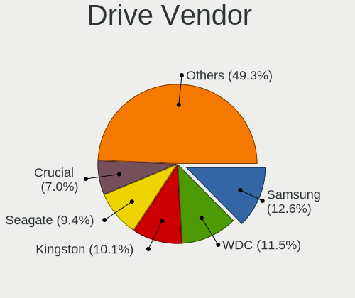
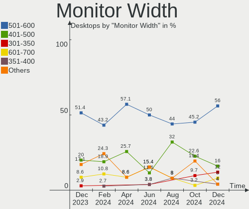
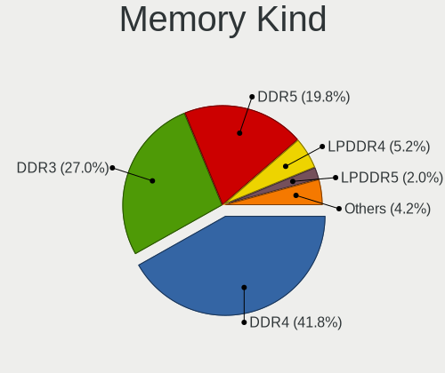
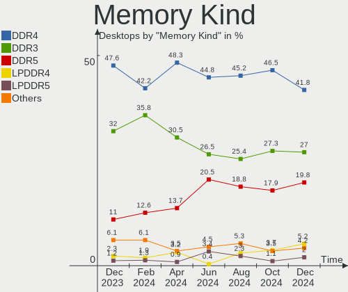

BSD - Hardware Trends (Desktops)
--------------------------------

A project to identify most popular hardware characteristics and track their change
over time based on data collected by BSD users at https://BSD-Hardware.info.

Anyone can contribute to this report by the [hw-probe](https://github.com/linuxhw/hw-probe/blob/master/INSTALL.BSD.md) tool:

    hw-probe -all -upload

This report is for one last month. Overall report since the beginning of time: [TestCoverage](https://github.com/bsdhw/TestCoverage)

Period: Oct, 2022.

Contents
--------

* [ System ](#system)
  - [ OS                       ](#os)
  - [ OS Family                ](#os-family)
  - [ Arch                     ](#arch)
  - [ DE                       ](#de)
  - [ Display Server           ](#display-server)
  - [ Display Manager          ](#display-manager)
  - [ OS Lang                  ](#os-lang)
  - [ Boot Mode                ](#boot-mode)
  - [ Filesystem               ](#filesystem)
  - [ Part. scheme             ](#part-scheme)

* [ Board ](#board)
  - [ Vendor                   ](#vendor)
  - [ Model                    ](#model)
  - [ Model Family             ](#model-family)
  - [ MFG Year                 ](#mfg-year)
  - [ Form Factor              ](#form-factor)
  - [ Coreboot                 ](#coreboot)
  - [ RAM Size                 ](#ram-size)
  - [ RAM Used                 ](#ram-used)
  - [ Total Drives             ](#total-drives)
  - [ Has CD-ROM               ](#has-cd-rom)
  - [ Has Ethernet             ](#has-ethernet)
  - [ Has WiFi                 ](#has-wifi)
  - [ Has Bluetooth            ](#has-bluetooth)

* [ Location ](#location)
  - [ Country                  ](#country)
  - [ City                     ](#city)

* [ Drives ](#drives)
  - [ Drive Vendor             ](#drive-vendor)
  - [ Drive Model              ](#drive-model)
  - [ HDD Vendor               ](#hdd-vendor)
  - [ SSD Vendor               ](#ssd-vendor)
  - [ Drive Kind               ](#drive-kind)
  - [ Drive Connector          ](#drive-connector)
  - [ Drive Size               ](#drive-size)
  - [ Space Total              ](#space-total)
  - [ Space Used               ](#space-used)
  - [ Malfunc. Drives          ](#malfunc-drives)
  - [ Malfunc. Drive Vendor    ](#malfunc-drive-vendor)
  - [ Malfunc. HDD Vendor      ](#malfunc-hdd-vendor)
  - [ Malfunc. Drive Kind      ](#malfunc-drive-kind)
  - [ Failed Drives            ](#failed-drives)
  - [ Failed Drive Vendor      ](#failed-drive-vendor)
  - [ Drive Status             ](#drive-status)

* [ Storage controller ](#storage-controller)
  - [ Storage Vendor           ](#storage-vendor)
  - [ Storage Model            ](#storage-model)
  - [ Storage Kind             ](#storage-kind)

* [ Processor ](#processor)
  - [ CPU Vendor               ](#cpu-vendor)
  - [ CPU Model                ](#cpu-model)
  - [ CPU Model Family         ](#cpu-model-family)
  - [ CPU Cores                ](#cpu-cores)
  - [ CPU Sockets              ](#cpu-sockets)
  - [ CPU Threads              ](#cpu-threads)
  - [ CPU Microarch            ](#cpu-microarch)

* [ Graphics ](#graphics)
  - [ GPU Vendor               ](#gpu-vendor)
  - [ GPU Model                ](#gpu-model)
  - [ GPU Combo                ](#gpu-combo)
  - [ GPU Driver               ](#gpu-driver)
  - [ GPU Memory               ](#gpu-memory)

* [ Monitor ](#monitor)
  - [ Monitor Vendor           ](#monitor-vendor)
  - [ Monitor Model            ](#monitor-model)
  - [ Monitor Resolution       ](#monitor-resolution)
  - [ Monitor Diagonal         ](#monitor-diagonal)
  - [ Monitor Width            ](#monitor-width)
  - [ Aspect Ratio             ](#aspect-ratio)
  - [ Monitor Area             ](#monitor-area)
  - [ Pixel Density            ](#pixel-density)
  - [ Multiple Monitors        ](#multiple-monitors)

* [ Network ](#network)
  - [ Net Controller Vendor    ](#net-controller-vendor)
  - [ Net Controller Model     ](#net-controller-model)
  - [ Wireless Vendor          ](#wireless-vendor)
  - [ Wireless Model           ](#wireless-model)
  - [ Ethernet Vendor          ](#ethernet-vendor)
  - [ Ethernet Model           ](#ethernet-model)
  - [ Net Controller Kind      ](#net-controller-kind)
  - [ Used Controller          ](#used-controller)
  - [ NICs                     ](#nics)
  - [ IPv6                     ](#ipv6)

* [ Bluetooth ](#bluetooth)
  - [ Bluetooth Vendor         ](#bluetooth-vendor)
  - [ Bluetooth Model          ](#bluetooth-model)

* [ Sound ](#sound)
  - [ Sound Vendor             ](#sound-vendor)
  - [ Sound Model              ](#sound-model)

* [ Memory ](#memory)
  - [ Memory Vendor            ](#memory-vendor)
  - [ Memory Model             ](#memory-model)
  - [ Memory Kind              ](#memory-kind)
  - [ Memory Form Factor       ](#memory-form-factor)
  - [ Memory Size              ](#memory-size)
  - [ Memory Speed             ](#memory-speed)

* [ Printers & scanners ](#printers--scanners)
  - [ Printer Vendor           ](#printer-vendor)
  - [ Printer Model            ](#printer-model)
  - [ Scanner Vendor           ](#scanner-vendor)
  - [ Scanner Model            ](#scanner-model)

* [ Camera ](#camera)
  - [ Camera Vendor            ](#camera-vendor)
  - [ Camera Model             ](#camera-model)

* [ Security ](#security)
  - [ Fingerprint Vendor       ](#fingerprint-vendor)
  - [ Fingerprint Model        ](#fingerprint-model)
  - [ Chipcard Vendor          ](#chipcard-vendor)
  - [ Chipcard Model           ](#chipcard-model)

* [ Unsupported ](#unsupported)
  - [ Unsupported Devices      ](#unsupported-devices)
  - [ Unsupported Device Types ](#unsupported-device-types)

System
------

OS
--

Installed operating systems

| Name                 | Desktops | Percent |
|----------------------|----------|---------|
| OPNsense 22.7.6      | 109      | 40.98%  |
| OPNsense 22.7.5      | 55       | 20.68%  |
| OPNsense 22.7.4      | 33       | 12.41%  |
| FreeBSD 13.1-p2      | 16       | 6.02%   |
| OPNsense 22.1.10     | 9        | 3.38%   |
| OpenBSD 7.2          | 7        | 2.63%   |
| OpenBSD 7.1          | 6        | 2.26%   |
| helloSystem 0.8.0    | 4        | 1.5%    |
| helloSystem 0.7.0    | 3        | 1.13%   |
| FreeBSD 13.1         | 3        | 1.13%   |
| OPNsense 23.1        | 2        | 0.75%   |
| OPNsense 22.7.2      | 2        | 0.75%   |
| OPNsense 22.4.3      | 2        | 0.75%   |
| FreeBSD 13.1-p1      | 2        | 0.75%   |
| pfSense 12.3-STABLE  | 1        | 0.38%   |
| OPNsense 22.7        | 1        | 0.38%   |
| OPNsense 22.1.9      | 1        | 0.38%   |
| OPNsense 22.1        | 1        | 0.38%   |
| OPNsense 20.7.5      | 1        | 0.38%   |
| NetBSD 9.3           | 1        | 0.38%   |
| helloSystem 13.1-p2  | 1        | 0.38%   |
| GhostBSD 22.10.12    | 1        | 0.38%   |
| GhostBSD 22.09.16    | 1        | 0.38%   |
| FreeBSD 14.0-CURRENT | 1        | 0.38%   |
| FreeBSD 13.0-p10     | 1        | 0.38%   |
| FreeBSD 12.4-BETA1   | 1        | 0.38%   |
| FreeBSD 12.3         | 1        | 0.38%   |

OS Family
---------

OS without a version

| Name        | Desktops | Percent |
|-------------|----------|---------|
| OPNsense    | 216      | 81.2%   |
| FreeBSD     | 25       | 9.4%    |
| OpenBSD     | 13       | 4.89%   |
| helloSystem | 8        | 3.01%   |
| GhostBSD    | 2        | 0.75%   |
| pfSense     | 1        | 0.38%   |
| NetBSD      | 1        | 0.38%   |

Arch
----

OS architecture (x86_64, i586, etc.)

| Name  | Desktops | Percent |
|-------|----------|---------|
| amd64 | 261      | 98.12%  |
| i386  | 3        | 1.13%   |
| arm64 | 2        | 0.75%   |

DE
--

Desktop Environment

| Name         | Desktops | Percent |
|--------------|----------|---------|
| Console      | 229      | 86.09%  |
| helloDesktop | 19       | 7.14%   |
| XFCE         | 5        | 1.88%   |
| TWM          | 5        | 1.88%   |
| MATE         | 3        | 1.13%   |
| KDE5         | 3        | 1.13%   |
| LXQt         | 1        | 0.38%   |
| Cinnamon     | 1        | 0.38%   |

Display Server
--------------

X11 or Wayland

| Name    | Desktops | Percent |
|---------|----------|---------|
| Console | 233      | 87.59%  |
| X11     | 33       | 12.41%  |

Display Manager
---------------

SDDM, LightDM, etc.

| Name    | Desktops | Percent |
|---------|----------|---------|
| Console | 252      | 94.74%  |
| SLiM    | 8        | 3.01%   |
| LightDM | 3        | 1.13%   |
| XDM     | 1        | 0.38%   |
| SDDM    | 1        | 0.38%   |
| GDM     | 1        | 0.38%   |

OS Lang
-------

Language

| Lang    | Desktops | Percent |
|---------|----------|---------|
| Unknown | 223      | 83.83%  |
| C       | 25       | 9.4%    |
| en_US   | 11       | 4.14%   |
| ru_RU   | 2        | 0.75%   |
| de_DE   | 2        | 0.75%   |
| it_IT   | 1        | 0.38%   |
| fr_FR   | 1        | 0.38%   |
| fi_FI   | 1        | 0.38%   |

Boot Mode
---------

EFI or BIOS

| Mode | Desktops | Percent |
|------|----------|---------|
| EFI  | 231      | 86.84%  |
| BIOS | 35       | 13.16%  |

Filesystem
----------

Type of filesystem

| Type   | Desktops | Percent |
|--------|----------|---------|
| Ufs    | 141      | 53.01%  |
| Zfs    | 109      | 40.98%  |
| Ffs    | 13       | 4.89%   |
| Cd9660 | 3        | 1.13%   |

Part. scheme
------------

Scheme of partitioning

| Type    | Desktops | Percent |
|---------|----------|---------|
| GPT     | 244      | 91.73%  |
| MBR     | 17       | 6.39%   |
| Unknown | 4        | 1.5%    |
| BSD     | 1        | 0.38%   |

Board
-----

Vendor
------

Motherboard manufacturer

| Name                       | Desktops | Percent |
|----------------------------|----------|---------|
| Unknown                    | 48       | 18.05%  |
| ASUSTek Computer           | 19       | 7.14%   |
| ASRock                     | 19       | 7.14%   |
| Protectli                  | 18       | 6.77%   |
| Hewlett-Packard            | 18       | 6.77%   |
| Dell                       | 18       | 6.77%   |
| PC Engines                 | 14       | 5.26%   |
| Lenovo                     | 10       | 3.76%   |
| Intel                      | 10       | 3.76%   |
| Supermicro                 | 8        | 3.01%   |
| Gigabyte Technology        | 8        | 3.01%   |
| MSI                        | 7        | 2.63%   |
| Fujitsu                    | 6        | 2.26%   |
| Techvision                 | 5        | 1.88%   |
| MW                         | 5        | 1.88%   |
| CncTion                    | 5        | 1.88%   |
| YANYU                      | 3        | 1.13%   |
| maiyunda                   | 3        | 1.13%   |
| Hardkernel                 | 3        | 1.13%   |
| Cisco                      | 3        | 1.13%   |
| TYAN Computer              | 2        | 0.75%   |
| Shuttle                    | 2        | 0.75%   |
| Seeed Studio               | 2        | 0.75%   |
| AZW                        | 2        | 0.75%   |
| ASRockRack                 | 2        | 0.75%   |
| Acer                       | 2        | 0.75%   |
| Yanling                    | 1        | 0.38%   |
| Thomas-Krenn.AG            | 1        | 0.38%   |
| Soekris Engineering        | 1        | 0.38%   |
| ShenZhen MinWin Technology | 1        | 0.38%   |
| Quanmax                    | 1        | 0.38%   |
| Pegatron                   | 1        | 0.38%   |
| PCWare                     | 1        | 0.38%   |
| NU941                      | 1        | 0.38%   |
| NF541                      | 1        | 0.38%   |
| MiTAC                      | 1        | 0.38%   |
| Jingsha                    | 1        | 0.38%   |
| Iomega                     | 1        | 0.38%   |
| IBM                        | 1        | 0.38%   |
| HPE                        | 1        | 0.38%   |

Model
-----

Motherboard model

| Name                                   | Desktops | Percent |
|----------------------------------------|----------|---------|
| Unknown                                | 48       | 18.05%  |
| Protectli FW4B                         | 10       | 3.76%   |
| PC Engines APU2                        | 9        | 3.38%   |
| Protectli FW6                          | 6        | 2.26%   |
| Dell OptiPlex 3020                     | 6        | 2.26%   |
| Techvision TVI7309X                    | 5        | 1.88%   |
| MW GMLK-2_5G4L                         | 5        | 1.88%   |
| Fujitsu FUTRO S920                     | 4        | 1.5%    |
| PC Engines apu1                        | 3        | 1.13%   |
| maiyunda www.maiyunda.com              | 3        | 1.13%   |
| Intel Q3XXG4-P V1.0                    | 3        | 1.13%   |
| Dell OptiPlex 9020                     | 3        | 1.13%   |
| CncTion N5105-4L                       | 3        | 1.13%   |
| Cisco SALEEN                           | 3        | 1.13%   |
| Seeed Studio ODYSSEY-X86J4125          | 2        | 0.75%   |
| PC Engines apu4                        | 2        | 0.75%   |
| HP ProDesk 600 G1 SFF                  | 2        | 0.75%   |
| Hardkernel ODROID-H2                   | 2        | 0.75%   |
| Dell OptiPlex 7040                     | 2        | 0.75%   |
| YANYU R250                             | 1        | 0.38%   |
| YANYU ITX-M9F VER:1.1                  | 1        | 0.38%   |
| YANYU H67SL                            | 1        | 0.38%   |
| Yanling YL-KBR6L                       | 1        | 0.38%   |
| TYAN Tiger K8W Dual AMD Opteron, S2875 | 1        | 0.38%   |
| TYAN Intel 440BX/GX Rev. 4             | 1        | 0.38%   |
| Thomas-Krenn.AG LES network 6L         | 1        | 0.38%   |
| Supermicro X8DTH-i/6/iF/6F             | 1        | 0.38%   |
| Supermicro X7SPA-HF                    | 1        | 0.38%   |
| Supermicro SYS-E200-9A                 | 1        | 0.38%   |
| Supermicro SYS-5019S-L                 | 1        | 0.38%   |
| Supermicro SYS-5019D-FN8TP-2-NC041     | 1        | 0.38%   |
| Supermicro SYS-5018D-MF                | 1        | 0.38%   |
| Supermicro PIO-618U-T4T+-ST031         | 1        | 0.38%   |
| Supermicro PIO-518D-N6TRF-ST031        | 1        | 0.38%   |
| Soekris Engineering net6501            | 1        | 0.38%   |
| Shuttle XH61V                          | 1        | 0.38%   |
| Shuttle DH170                          | 1        | 0.38%   |
| ShenZhen MinWin MW-NANO-APL-4L         | 1        | 0.38%   |
| Quanmax spo-book TECH QUAD             | 1        | 0.38%   |
| Protectli VP4650                       | 1        | 0.38%   |

Model Family
------------

Motherboard model prefix

| Name                               | Desktops | Percent |
|------------------------------------|----------|---------|
| Unknown                            | 48       | 18.05%  |
| Dell OptiPlex                      | 15       | 5.64%   |
| Protectli FW4B                     | 10       | 3.76%   |
| PC Engines APU2                    | 9        | 3.38%   |
| Protectli FW6                      | 6        | 2.26%   |
| Lenovo ThinkCentre                 | 6        | 2.26%   |
| Techvision TVI7309X                | 5        | 1.88%   |
| MW GMLK-2                          | 5        | 1.88%   |
| HP ProDesk                         | 5        | 1.88%   |
| Fujitsu FUTRO                      | 4        | 1.5%    |
| PC Engines apu1                    | 3        | 1.13%   |
| maiyunda www.maiyunda.com          | 3        | 1.13%   |
| Intel Q3XXG4-P                     | 3        | 1.13%   |
| HP Compaq                          | 3        | 1.13%   |
| CncTion N5105-4L                   | 3        | 1.13%   |
| Cisco SALEEN                       | 3        | 1.13%   |
| ASUS TUF                           | 3        | 1.13%   |
| Seeed Studio ODYSSEY-X86J4125      | 2        | 0.75%   |
| PC Engines apu4                    | 2        | 0.75%   |
| HP Pavilion                        | 2        | 0.75%   |
| HP EliteDesk                       | 2        | 0.75%   |
| Hardkernel ODROID-H2               | 2        | 0.75%   |
| ASUS ROG                           | 2        | 0.75%   |
| ASUS PRIME                         | 2        | 0.75%   |
| ASUS P8Z68-V                       | 2        | 0.75%   |
| YANYU R250                         | 1        | 0.38%   |
| YANYU ITX-M9F                      | 1        | 0.38%   |
| YANYU H67SL                        | 1        | 0.38%   |
| Yanling YL-KBR6L                   | 1        | 0.38%   |
| TYAN Tiger                         | 1        | 0.38%   |
| TYAN Intel                         | 1        | 0.38%   |
| Thomas-Krenn.AG LES                | 1        | 0.38%   |
| Supermicro X8DTH-i                 | 1        | 0.38%   |
| Supermicro X7SPA-HF                | 1        | 0.38%   |
| Supermicro SYS-E200-9A             | 1        | 0.38%   |
| Supermicro SYS-5019S-L             | 1        | 0.38%   |
| Supermicro SYS-5019D-FN8TP-2-NC041 | 1        | 0.38%   |
| Supermicro SYS-5018D-MF            | 1        | 0.38%   |
| Supermicro PIO-618U-T4T+-ST031     | 1        | 0.38%   |
| Supermicro PIO-518D-N6TRF-ST031    | 1        | 0.38%   |

MFG Year
--------

Motherboard manufacture year

| Year    | Desktops | Percent |
|---------|----------|---------|
| 2022    | 50       | 18.8%   |
| 2018    | 33       | 12.41%  |
| 2021    | 31       | 11.65%  |
| 2019    | 25       | 9.4%    |
| 2013    | 21       | 7.89%   |
| 2016    | 17       | 6.39%   |
| 2020    | 15       | 5.64%   |
| 2014    | 15       | 5.64%   |
| 2017    | 14       | 5.26%   |
| 2012    | 11       | 4.14%   |
| 2015    | 8        | 3.01%   |
| 2008    | 6        | 2.26%   |
| Unknown | 5        | 1.88%   |
| 2011    | 4        | 1.5%    |
| 2010    | 3        | 1.13%   |
| 2009    | 2        | 0.75%   |
| 2007    | 2        | 0.75%   |
| 2006    | 2        | 0.75%   |
| 2004    | 1        | 0.38%   |
| 2003    | 1        | 0.38%   |

Form Factor
-----------

Physical design of the computer

| Name    | Desktops | Percent |
|---------|----------|---------|
| Desktop | 266      | 100%    |

Coreboot
--------

Have coreboot on board

| Used | Desktops | Percent |
|------|----------|---------|
| No   | 245      | 92.11%  |
| Yes  | 21       | 7.89%   |

RAM Size
--------

Total RAM memory

| Size in GB  | Desktops | Percent |
|-------------|----------|---------|
| 8.01-16.0   | 108      | 40.6%   |
| 16.01-24.0  | 61       | 22.93%  |
| 4.01-8.0    | 51       | 19.17%  |
| 32.01-64.0  | 18       | 6.77%   |
| 64.01-256.0 | 9        | 3.38%   |
| 2.01-3.0    | 7        | 2.63%   |
| 0.51-1.0    | 6        | 2.26%   |
| 3.01-4.0    | 3        | 1.13%   |
| 24.01-32.0  | 2        | 0.75%   |
| 1.01-2.0    | 1        | 0.38%   |

RAM Used
--------

Used RAM memory

| Used GB  | Desktops | Percent |
|----------|----------|---------|
| 0.01-0.5 | 137      | 51.5%   |
| 0.51-1.0 | 94       | 35.34%  |
| 1.01-2.0 | 23       | 8.65%   |
| 3.01-4.0 | 4        | 1.5%    |
| 2.01-3.0 | 4        | 1.5%    |
| 4.01-8.0 | 2        | 0.75%   |
| 0        | 1        | 0.38%   |
| Unknown  | 1        | 0.38%   |

Total Drives
------------

Number of drives on board

| Drives | Desktops | Percent |
|--------|----------|---------|
| 1      | 197      | 74.06%  |
| 0      | 27       | 10.15%  |
| 2      | 21       | 7.89%   |
| 3      | 7        | 2.63%   |
| 5      | 4        | 1.5%    |
| 4      | 4        | 1.5%    |
| 6      | 3        | 1.13%   |
| 14     | 1        | 0.38%   |
| 13     | 1        | 0.38%   |
| 8      | 1        | 0.38%   |

Has CD-ROM
----------

Has CD-ROM on board

| Presented | Desktops | Percent |
|-----------|----------|---------|
| No        | 233      | 87.59%  |
| Yes       | 33       | 12.41%  |

Has Ethernet
------------

Has Ethernet on board

| Presented | Desktops | Percent |
|-----------|----------|---------|
| Yes       | 263      | 98.87%  |
| No        | 3        | 1.13%   |

Has WiFi
--------

Has WiFi module

| Presented | Desktops | Percent |
|-----------|----------|---------|
| No        | 218      | 81.95%  |
| Yes       | 48       | 18.05%  |

Has Bluetooth
-------------

Has Bluetooth module

| Presented | Desktops | Percent |
|-----------|----------|---------|
| No        | 238      | 89.47%  |
| Yes       | 28       | 10.53%  |

Location
--------

Country
-------

Geographic location (country)

| Country     | Desktops | Percent |
|-------------|----------|---------|
| USA         | 82       | 30.83%  |
| Germany     | 48       | 18.05%  |
| Australia   | 14       | 5.26%   |
| Russia      | 10       | 3.76%   |
| Brazil      | 10       | 3.76%   |
| UK          | 9        | 3.38%   |
| Canada      | 9        | 3.38%   |
| Italy       | 8        | 3.01%   |
| France      | 8        | 3.01%   |
| Poland      | 7        | 2.63%   |
| China       | 6        | 2.26%   |
| Netherlands | 4        | 1.5%    |
| Switzerland | 3        | 1.13%   |
| Spain       | 3        | 1.13%   |
| Greece      | 3        | 1.13%   |
| Finland     | 3        | 1.13%   |
| Czechia     | 3        | 1.13%   |
| Belgium     | 3        | 1.13%   |
| Austria     | 3        | 1.13%   |
| Sweden      | 2        | 0.75%   |
| Romania     | 2        | 0.75%   |
| Portugal    | 2        | 0.75%   |
| New Zealand | 2        | 0.75%   |
| Latvia      | 2        | 0.75%   |
| Israel      | 2        | 0.75%   |
| Iran        | 2        | 0.75%   |
| Denmark     | 2        | 0.75%   |
| Venezuela   | 1        | 0.38%   |
| Ukraine     | 1        | 0.38%   |
| Turkey      | 1        | 0.38%   |
| Thailand    | 1        | 0.38%   |
| Norway      | 1        | 0.38%   |
| Mexico      | 1        | 0.38%   |
| Luxembourg  | 1        | 0.38%   |
| Jersey      | 1        | 0.38%   |
| Japan       | 1        | 0.38%   |
| Indonesia   | 1        | 0.38%   |
| India       | 1        | 0.38%   |
| Iceland     | 1        | 0.38%   |
| Bulgaria    | 1        | 0.38%   |

City
----

Geographic location (city)

| City                               | Desktops | Percent |
|------------------------------------|----------|---------|
| Berlin                             | 7        | 2.63%   |
| Sydney                             | 6        | 2.26%   |
| Wiesbaden                          | 3        | 1.13%   |
| Temple                             | 3        | 1.13%   |
| Paris                              | 3        | 1.13%   |
| Moscow                             | 3        | 1.13%   |
| Melbourne                          | 3        | 1.13%   |
| City of Saint Peters               | 3        | 1.13%   |
| Beijing                            | 3        | 1.13%   |
| Adelaide                           | 3        | 1.13%   |
| Wels                               | 2        | 0.75%   |
| Salem                              | 2        | 0.75%   |
| Redmond                            | 2        | 0.75%   |
| Portland                           | 2        | 0.75%   |
| Oakland                            | 2        | 0.75%   |
| Munich                             | 2        | 0.75%   |
| Milwaukee                          | 2        | 0.75%   |
| Miami                              | 2        | 0.75%   |
| Dallas                             | 2        | 0.75%   |
| Cologne                            | 2        | 0.75%   |
| Auckland                           | 2        | 0.75%   |
| Anglet                             | 2        | 0.75%   |
| Zhengzhou                          | 1        | 0.38%   |
| Zele                               | 1        | 0.38%   |
| Yehud                              | 1        | 0.38%   |
| Wroclaw                            | 1        | 0.38%   |
| Woodstock                          | 1        | 0.38%   |
| Winterthur                         | 1        | 0.38%   |
| Wijchen                            | 1        | 0.38%   |
| Wiesendangen / Wiesendangen (Dorf) | 1        | 0.38%   |
| Wenatchee                          | 1        | 0.38%   |
| Weippe                             | 1        | 0.38%   |
| Warminster                         | 1        | 0.38%   |
| Waconia                            | 1        | 0.38%   |
| Villa Regina                       | 1        | 0.38%   |
| Vienna                             | 1        | 0.38%   |
| Vidnoye                            | 1        | 0.38%   |
| Venlo                              | 1        | 0.38%   |
| Venice                             | 1        | 0.38%   |
| Veliko Tarnovo                     | 1        | 0.38%   |

Drives
------

Drive Vendor
------------

Hard drive vendors

| Vendor              | Desktops | Drives | Percent |
|---------------------|----------|--------|---------|
| Samsung Electronics | 48       | 66     | 16.78%  |
| WDC                 | 33       | 52     | 11.54%  |
| Kingston            | 26       | 26     | 9.09%   |
| Seagate             | 20       | 33     | 6.99%   |
| Crucial             | 20       | 21     | 6.99%   |
| China               | 14       | 15     | 4.9%    |
| Transcend           | 13       | 13     | 4.55%   |
| Hoodisk             | 8        | 8      | 2.8%    |
| Toshiba             | 6        | 10     | 2.1%    |
| SanDisk             | 6        | 6      | 2.1%    |
| PNY                 | 6        | 8      | 2.1%    |
| SPCC                | 5        | 5      | 1.75%   |
| NVMe                | 5        | 5      | 1.75%   |
| Intel               | 5        | 6      | 1.75%   |
| FORESEE             | 5        | 5      | 1.75%   |
| A-DATA Technology   | 5        | 5      | 1.75%   |
| Micron Technology   | 4        | 4      | 1.4%    |
| HGST                | 4        | 7      | 1.4%    |
| Dogfish             | 4        | 4      | 1.4%    |
| ShiJi               | 3        | 3      | 1.05%   |
| Protectli           | 3        | 3      | 1.05%   |
| OPENBSD             | 3        | 3      | 1.05%   |
| Vaseky              | 2        | 2      | 0.7%    |
| Silicon Motion      | 2        | 2      | 0.7%    |
| Phison              | 2        | 2      | 0.7%    |
| OCZ                 | 2        | 2      | 0.7%    |
| Netac               | 2        | 2      | 0.7%    |
| Innodisk            | 2        | 2      | 0.7%    |
| Hitachi             | 2        | 2      | 0.7%    |
| Corsair             | 2        | 2      | 0.7%    |
| BIWIN               | 2        | 2      | 0.7%    |
| Zheino              | 1        | 1      | 0.35%   |
| V-GeN               | 1        | 1      | 0.35%   |
| Team                | 1        | 1      | 0.35%   |
| SK hynix            | 1        | 1      | 0.35%   |
| Silicon             | 1        | 1      | 0.35%   |
| QUANTUM             | 1        | 1      | 0.35%   |
| Patriot             | 1        | 1      | 0.35%   |
| ORICO               | 1        | 1      | 0.35%   |
| Mushkin             | 1        | 1      | 0.35%   |

Drive Model
-----------

Hard drive models

| Model                           | Desktops | Percent |
|---------------------------------|----------|---------|
| China SATA SSD 16GB             | 8        | 2.55%   |
| Kingston SA400S37240G 240GB     | 5        | 1.59%   |
| Crucial CT240BX500SSD1 240GB    | 5        | 1.59%   |
| Seagate ST500DM002-1BD142 500GB | 4        | 1.27%   |
| Hoodisk SSD 128GB               | 4        | 1.27%   |
| Transcend TS128GMSA230S 128GB   | 3        | 0.96%   |
| Samsung SSD 850 EVO 250GB       | 3        | 0.96%   |
| Kingston SV300S37A120G 120GB    | 3        | 0.96%   |
| Hoodisk SSD 64GB                | 3        | 0.96%   |
| Dogfish SSD 128GB               | 3        | 0.96%   |
| Crucial CT250P2SSD8 250GB       | 3        | 0.96%   |
| WDC WDS100T3X0C-00SJG0 1TB      | 2        | 0.64%   |
| WDC WD30EFRX-68EUZN0 3TB        | 2        | 0.64%   |
| Transcend TS64GMSA230S 64GB     | 2        | 0.64%   |
| Transcend TS256GMSA230S 256GB   | 2        | 0.64%   |
| Toshiba DT01ACA100 1TB          | 2        | 0.64%   |
| SPCC Solid State Disk 128GB     | 2        | 0.64%   |
| ShiJi SSD 128GB                 | 2        | 0.64%   |
| Seagate ST4000DM000-1F2168 4TB  | 2        | 0.64%   |
| Seagate ST3500413AS 500GB       | 2        | 0.64%   |
| Seagate ST1000DM003-1CH162 1TB  | 2        | 0.64%   |
| SanDisk SSD PLUS 120GB          | 2        | 0.64%   |
| Samsung SSD 980 500GB           | 2        | 0.64%   |
| Samsung SSD 970 EVO 250GB       | 2        | 0.64%   |
| Samsung SSD 870 QVO 2TB         | 2        | 0.64%   |
| Samsung SSD 860 EVO 500GB       | 2        | 0.64%   |
| Samsung HM320II 320GB           | 2        | 0.64%   |
| Samsung HD501LJ 500GB           | 2        | 0.64%   |
| Protectli 32GB mSATA            | 2        | 0.64%   |
| PNY CS900 500GB SSD             | 2        | 0.64%   |
| Phison Sabrent 2TB              | 2        | 0.64%   |
| OPENBSD SR RAID 1 2TB           | 2        | 0.64%   |
| Kingston SUV500MS120G 120GB     | 2        | 0.64%   |
| Kingston SNVS250G 250GB         | 2        | 0.64%   |
| Kingston SKC600MS256G 256GB     | 2        | 0.64%   |
| FORESEE 128GB SSD               | 2        | 0.64%   |
| Crucial CT275MX300SSD1 275GB    | 2        | 0.64%   |
| Crucial CT250MX500SSD1 250GB    | 2        | 0.64%   |
| China SATA SSD 128GB            | 2        | 0.64%   |
| Zheino CHN-mSATAQ3-120 120GB    | 1        | 0.32%   |

HDD Vendor
----------

Hard disk drive vendors

| Vendor              | Desktops | Drives | Percent |
|---------------------|----------|--------|---------|
| WDC                 | 20       | 37     | 29.85%  |
| Seagate             | 20       | 33     | 29.85%  |
| Toshiba             | 5        | 8      | 7.46%   |
| Samsung Electronics | 5        | 6      | 7.46%   |
| HGST                | 4        | 7      | 5.97%   |
| OPENBSD             | 3        | 3      | 4.48%   |
| NVMe                | 3        | 3      | 4.48%   |
| Hitachi             | 2        | 2      | 2.99%   |
| QUANTUM             | 1        | 1      | 1.49%   |
| Maxtor              | 1        | 1      | 1.49%   |
| LSI                 | 1        | 1      | 1.49%   |
| Hewlett-Packard     | 1        | 1      | 1.49%   |
| Fujitsu             | 1        | 1      | 1.49%   |

SSD Vendor
----------

Solid state drive vendors

| Vendor              | Desktops | Drives | Percent |
|---------------------|----------|--------|---------|
| Samsung Electronics | 29       | 41     | 16.96%  |
| Kingston            | 19       | 19     | 11.11%  |
| Crucial             | 16       | 17     | 9.36%   |
| China               | 14       | 15     | 8.19%   |
| Transcend           | 13       | 13     | 7.6%    |
| Hoodisk             | 8        | 8      | 4.68%   |
| SanDisk             | 6        | 6      | 3.51%   |
| WDC                 | 5        | 7      | 2.92%   |
| PNY                 | 5        | 7      | 2.92%   |
| A-DATA Technology   | 5        | 5      | 2.92%   |
| Micron Technology   | 4        | 4      | 2.34%   |
| FORESEE             | 4        | 4      | 2.34%   |
| Dogfish             | 4        | 4      | 2.34%   |
| SPCC                | 3        | 3      | 1.75%   |
| ShiJi               | 3        | 3      | 1.75%   |
| Protectli           | 3        | 3      | 1.75%   |
| Intel               | 3        | 3      | 1.75%   |
| Vaseky              | 2        | 2      | 1.17%   |
| OCZ                 | 2        | 2      | 1.17%   |
| NVMe                | 2        | 2      | 1.17%   |
| Netac               | 2        | 2      | 1.17%   |
| Innodisk            | 2        | 2      | 1.17%   |
| BIWIN               | 2        | 2      | 1.17%   |
| Zheino              | 1        | 1      | 0.58%   |
| V-GeN               | 1        | 1      | 0.58%   |
| SK hynix            | 1        | 1      | 0.58%   |
| Silicon             | 1        | 1      | 0.58%   |
| Patriot             | 1        | 1      | 0.58%   |
| ORICO               | 1        | 1      | 0.58%   |
| Mushkin             | 1        | 1      | 0.58%   |
| LITEON              | 1        | 1      | 0.58%   |
| Intenso             | 1        | 1      | 0.58%   |
| Fordisk             | 1        | 1      | 0.58%   |
| Drevo               | 1        | 1      | 0.58%   |
| Corsair             | 1        | 1      | 0.58%   |
| BORY                | 1        | 1      | 0.58%   |
| Apacer              | 1        | 1      | 0.58%   |
| Advantech           | 1        | 1      | 0.58%   |

Drive Kind
----------

HDD or SSD

| Kind | Desktops | Drives | Percent |
|------|----------|--------|---------|
| SSD  | 164      | 189    | 61.19%  |
| HDD  | 53       | 104    | 19.78%  |
| NVMe | 51       | 55     | 19.03%  |

Drive Connector
---------------

SATA, SAS, NVMe, etc.

| Type | Desktops | Drives | Percent |
|------|----------|--------|---------|
| SATA | 204      | 293    | 80%     |
| NVMe | 51       | 55     | 20%     |

Drive Size
----------

Size of hard drive

| Size in TB | Desktops | Drives | Percent |
|------------|----------|--------|---------|
| 0.01-0.5   | 174      | 193    | 78.03%  |
| 0.51-1.0   | 26       | 39     | 11.66%  |
| 1.01-2.0   | 7        | 22     | 3.14%   |
| 3.01-4.0   | 6        | 10     | 2.69%   |
| 4.01-10.0  | 5        | 18     | 2.24%   |
| 2.01-3.0   | 3        | 5      | 1.35%   |
| 10.01-20.0 | 2        | 6      | 0.9%    |

Space Total
-----------

Amount of disk space available on the file system

| Size in GB     | Desktops | Percent |
|----------------|----------|---------|
| 101-250        | 122      | 45.86%  |
| 251-500        | 49       | 18.42%  |
| 21-50          | 29       | 10.9%   |
| 51-100         | 23       | 8.65%   |
| 1-20           | 21       | 7.89%   |
| 501-1000       | 12       | 4.51%   |
| More than 3000 | 5        | 1.88%   |
| 2001-3000      | 2        | 0.75%   |
| 1001-2000      | 2        | 0.75%   |
| Unknown        | 1        | 0.38%   |

Space Used
----------

Amount of used disk space

| Used GB        | Desktops | Percent |
|----------------|----------|---------|
| 1-20           | 243      | 91.35%  |
| 21-50          | 13       | 4.89%   |
| 101-250        | 3        | 1.13%   |
| 51-100         | 3        | 1.13%   |
| More than 3000 | 2        | 0.75%   |
| 2001-3000      | 1        | 0.38%   |
| Unknown        | 1        | 0.38%   |

Malfunc. Drives
---------------

Drive models with a malfunction

| Model                                        | Desktops | Drives | Percent |
|----------------------------------------------|----------|--------|---------|
| Seagate ST500DM002-1BD142 500GB              | 2        | 2      | 5.41%   |
| Samsung Electronics HD501LJ 500GB            | 2        | 2      | 5.41%   |
| Crucial CT275MX300SSD1 275GB                 | 2        | 2      | 5.41%   |
| WDC WD7500AACS-00ZJB0 752GB                  | 1        | 1      | 2.7%    |
| WDC WD3200AAJS-00YZCA0 320GB                 | 1        | 1      | 2.7%    |
| WDC WD30EFRX-68EUZN0 3TB                     | 1        | 1      | 2.7%    |
| WDC WD15EARS-00Z5B1 1.5TB                    | 1        | 1      | 2.7%    |
| Toshiba MK6034GSX 64GB                       | 1        | 1      | 2.7%    |
| Toshiba MK5065GSX 500GB                      | 1        | 1      | 2.7%    |
| Toshiba DT01ACA100 1TB                       | 1        | 1      | 2.7%    |
| SK hynix SC308 SATA 128GB                    | 1        | 1      | 2.7%    |
| Seagate ST96812AS 64GB                       | 1        | 1      | 2.7%    |
| Seagate ST4000NM0033-9ZM170 4TB              | 1        | 2      | 2.7%    |
| Seagate ST4000DM004-2CV104 4TB               | 1        | 1      | 2.7%    |
| Seagate ST3500413AS 500GB                    | 1        | 1      | 2.7%    |
| Seagate ST2000DL001-9VT156 2TB               | 1        | 1      | 2.7%    |
| Seagate ST1000DM003-1CH162 1TB               | 1        | 1      | 2.7%    |
| SanDisk SD7SB3Q128G1001 128GB                | 1        | 1      | 2.7%    |
| Samsung Electronics SSD PM810 2.5-inch 256GB | 1        | 1      | 2.7%    |
| Samsung Electronics SSD 960 PRO 512GB        | 1        | 1      | 2.7%    |
| Samsung Electronics HM320II 320GB            | 1        | 1      | 2.7%    |
| OCZ VERTEX3 120GB                            | 1        | 1      | 2.7%    |
| Netac SSD 128GB                              | 1        | 1      | 2.7%    |
| Mushkin MKNSSDEC512GB                        | 1        | 1      | 2.7%    |
| Micron Technology C400-MTFDDAT064MAM 64GB    | 1        | 1      | 2.7%    |
| Maxtor 6E030L0 32GB                          | 1        | 1      | 2.7%    |
| Kingston SV300S37A120G 120GB                 | 1        | 1      | 2.7%    |
| Kingston SMS200S330G 32GB                    | 1        | 1      | 2.7%    |
| Kingston SA400S37120G 120GB                  | 1        | 1      | 2.7%    |
| HGST HTS725050A7E630 500GB                   | 1        | 1      | 2.7%    |
| HGST HTS721010A9E630 1TB                     | 1        | 1      | 2.7%    |
| Crucial CT1050MX300SSD1 1TB                  | 1        | 1      | 2.7%    |
| Corsair Force LS SSD 120GB                   | 1        | 1      | 2.7%    |
| BIWIN SSD 8GB                                | 1        | 1      | 2.7%    |

Malfunc. Drive Vendor
---------------------

Vendors of faulty drives

| Vendor              | Desktops | Drives | Percent |
|---------------------|----------|--------|---------|
| Seagate             | 8        | 9      | 22.22%  |
| Samsung Electronics | 5        | 5      | 13.89%  |
| WDC                 | 3        | 4      | 8.33%   |
| Toshiba             | 3        | 3      | 8.33%   |
| Kingston            | 3        | 3      | 8.33%   |
| Crucial             | 3        | 3      | 8.33%   |
| HGST                | 2        | 2      | 5.56%   |
| SK hynix            | 1        | 1      | 2.78%   |
| SanDisk             | 1        | 1      | 2.78%   |
| OCZ                 | 1        | 1      | 2.78%   |
| Netac               | 1        | 1      | 2.78%   |
| Mushkin             | 1        | 1      | 2.78%   |
| Micron Technology   | 1        | 1      | 2.78%   |
| Maxtor              | 1        | 1      | 2.78%   |
| Corsair             | 1        | 1      | 2.78%   |
| BIWIN               | 1        | 1      | 2.78%   |

Malfunc. HDD Vendor
-------------------

Vendors of faulty HDD drives

| Vendor              | Desktops | Drives | Percent |
|---------------------|----------|--------|---------|
| Seagate             | 8        | 9      | 40%     |
| WDC                 | 3        | 4      | 15%     |
| Toshiba             | 3        | 3      | 15%     |
| Samsung Electronics | 3        | 3      | 15%     |
| HGST                | 2        | 2      | 10%     |
| Maxtor              | 1        | 1      | 5%      |

Malfunc. Drive Kind
-------------------

Kinds of faulty drives

| Kind | Desktops | Drives | Percent |
|------|----------|--------|---------|
| HDD  | 19       | 22     | 54.29%  |
| SSD  | 15       | 15     | 42.86%  |
| NVMe | 1        | 1      | 2.86%   |

Failed Drives
-------------

Failed drive models

Zero info for selected period =(

Failed Drive Vendor
-------------------

Failed drive vendors

Zero info for selected period =(

Drive Status
------------

Number of failed and malfunc. drives

| Status   | Desktops | Drives | Percent |
|----------|----------|--------|---------|
| Works    | 206      | 283    | 80.78%  |
| Malfunc  | 34       | 38     | 13.33%  |
| Detected | 15       | 27     | 5.88%   |

Storage controller
------------------

Storage Vendor
--------------

Storage controller vendors

| Vendor                       | Desktops | Percent |
|------------------------------|----------|---------|
| Intel                        | 215      | 64.56%  |
| AMD                          | 43       | 12.91%  |
| Samsung Electronics          | 19       | 5.71%   |
| Sandisk                      | 10       | 3%      |
| Kingston Technology Company  | 6        | 1.8%    |
| Silicon Motion               | 5        | 1.5%    |
| Phison Electronics           | 5        | 1.5%    |
| Micron/Crucial Technology    | 5        | 1.5%    |
| ASMedia Technology           | 5        | 1.5%    |
| Marvell Technology Group     | 4        | 1.2%    |
| Broadcom / LSI               | 3        | 0.9%    |
| Toshiba                      | 2        | 0.6%    |
| Adaptec                      | 2        | 0.6%    |
| Silicon Image                | 1        | 0.3%    |
| Shenzhen Longsys Electronics | 1        | 0.3%    |
| Realtek Semiconductor        | 1        | 0.3%    |
| Nvidia                       | 1        | 0.3%    |
| MAXIO Technology (Hangzhou)  | 1        | 0.3%    |
| KIOXIA                       | 1        | 0.3%    |
| JMicron Technology           | 1        | 0.3%    |
| Chelsio Communications       | 1        | 0.3%    |
| ADATA Technology             | 1        | 0.3%    |

Storage Model
-------------

Storage controller models

| Model                                                                            | Desktops | Percent |
|----------------------------------------------------------------------------------|----------|---------|
| AMD FCH SATA Controller [AHCI mode]                                              | 27       | 7.32%   |
| Intel Jasper Lake SATA AHCI Controller                                           | 25       | 6.78%   |
| Intel Celeron/Pentium Silver Processor SATA Controller                           | 24       | 6.5%    |
| Intel 8 Series/C220 Series Chipset Family 6-port SATA Controller 1 [AHCI mode]   | 19       | 5.15%   |
| Intel Q170/Q150/B150/H170/H110/Z170/CM236 Chipset SATA Controller [AHCI Mode]    | 14       | 3.79%   |
| Intel Atom/Celeron/Pentium Processor x5-E8000/J3xxx/N3xxx Series SATA Controller | 14       | 3.79%   |
| Intel Sunrise Point-LP SATA Controller [AHCI mode]                               | 13       | 3.52%   |
| Intel 6 Series/C200 Series Chipset Family 6 port Desktop SATA AHCI Controller    | 10       | 2.71%   |
| Intel Atom Processor E3800 Series SATA AHCI Controller                           | 9        | 2.44%   |
| Unknown                                                                          | 8        | 2.17%   |
| Samsung NVMe SSD Controller SM981/PM981/PM983                                    | 7        | 1.9%    |
| Samsung NVMe SSD Controller 980                                                  | 7        | 1.9%    |
| Intel NM10/ICH7 Family SATA Controller [IDE mode]                                | 7        | 1.9%    |
| Intel SATA Controller [RAID mode]                                                | 6        | 1.63%   |
| Intel Cannon Lake PCH SATA AHCI Controller                                       | 6        | 1.63%   |
| Intel 82801G (ICH7 Family) IDE Controller                                        | 6        | 1.63%   |
| Intel 200 Series PCH SATA controller [AHCI mode]                                 | 6        | 1.63%   |
| AMD FCH SATA Controller [IDE mode]                                               | 6        | 1.63%   |
| Silicon Motion SM2263EN/SM2263XT SSD Controller                                  | 5        | 1.36%   |
| Micron/Crucial P2 NVMe PCIe SSD                                                  | 5        | 1.36%   |
| Intel Comet Lake SATA AHCI Controller                                            | 5        | 1.36%   |
| Intel Celeron N3350/Pentium N4200/Atom E3900 Series SATA AHCI Controller         | 5        | 1.36%   |
| ASMedia ASM1062 Serial ATA Controller                                            | 5        | 1.36%   |
| AMD 400 Series Chipset SATA Controller                                           | 5        | 1.36%   |
| SanDisk WD Black SN750 / PC SN730 NVMe SSD                                       | 4        | 1.08%   |
| Intel 8 Series SATA Controller 1 [AHCI mode]                                     | 4        | 1.08%   |
| Intel 7 Series/C210 Series Chipset Family 6-port SATA Controller [AHCI mode]     | 4        | 1.08%   |
| Intel 5 Series/3400 Series Chipset 6 port SATA AHCI Controller                   | 4        | 1.08%   |
| AMD SB7x0/SB8x0/SB9x0 SATA Controller [AHCI mode]                                | 4        | 1.08%   |
| AMD SB7x0/SB8x0/SB9x0 IDE Controller                                             | 4        | 1.08%   |
| Samsung NVMe SSD Controller PM9A1/PM9A3/980PRO                                   | 3        | 0.81%   |
| Intel C610/X99 series chipset sSATA Controller [AHCI mode]                       | 3        | 0.81%   |
| Intel 7 Series/C210 Series Chipset Family 4-port SATA Controller [IDE mode]      | 3        | 0.81%   |
| Intel 7 Series/C210 Series Chipset Family 2-port SATA Controller [IDE mode]      | 3        | 0.81%   |
| Intel 500 Series Chipset Family SATA AHCI Controller                             | 3        | 0.81%   |
| Intel 400 Series Chipset Family SATA AHCI Controller                             | 3        | 0.81%   |
| AMD 500 Series Chipset SATA Controller                                           | 3        | 0.81%   |
| SanDisk WD Blue SN550 NVMe SSD                                                   | 2        | 0.54%   |
| Samsung NVMe SSD Controller SM961/PM961/SM963                                    | 2        | 0.54%   |
| Phison E12 NVMe Controller                                                       | 2        | 0.54%   |

Storage Kind
------------

Kind of storage controller (IDE, SATA, NVMe, SAS, ...)

| Kind | Desktops | Percent |
|------|----------|---------|
| SATA | 228      | 67.26%  |
| NVMe | 59       | 17.4%   |
| IDE  | 36       | 10.62%  |
| RAID | 11       | 3.24%   |
| SAS  | 3        | 0.88%   |
| SCSI | 2        | 0.59%   |

Processor
---------

CPU Vendor
----------

Processor vendors

| Vendor | Desktops | Percent |
|--------|----------|---------|
| Intel  | 219      | 82.33%  |
| AMD    | 44       | 16.54%  |
| ARM    | 2        | 0.75%   |
| i      | 1        | 0.38%   |

CPU Model
---------

Processor models

| Model                                     | Desktops | Percent |
|-------------------------------------------|----------|---------|
| Intel Celeron N5105 @ 2.00GHz             | 24       | 9.02%   |
| Intel Celeron J4125 CPU @ 2.00GHz         | 18       | 6.77%   |
| Intel Celeron CPU J3160 @ 1.60GHz         | 12       | 4.51%   |
| AMD GX-412TC SOC                          | 11       | 4.14%   |
| Intel Celeron CPU J1900 @ 1.99GHz         | 6        | 2.26%   |
| Intel Pentium Silver N6005 @ 2.00GHz      | 4        | 1.5%    |
| Intel Core i7-7700 CPU @ 3.60GHz          | 4        | 1.5%    |
| Intel Core i5-6500 CPU @ 3.20GHz          | 4        | 1.5%    |
| Intel Core i5-4570 CPU @ 3.20GHz          | 4        | 1.5%    |
| Intel Core i5-3470 CPU @ 3.20GHz          | 4        | 1.5%    |
| Intel Core i5-7400 CPU @ 3.00GHz          | 3        | 1.13%   |
| Intel Core i5-4590 CPU @ 3.30GHz          | 3        | 1.13%   |
| Intel Core i5-10400 CPU @ 2.90GHz         | 3        | 1.13%   |
| Intel Core i3-8100 CPU @ 3.60GHz          | 3        | 1.13%   |
| Intel Core i3-4010U CPU @ 1.70GHz         | 3        | 1.13%   |
| Intel Celeron J6413 @ 1.80GHz             | 3        | 1.13%   |
| Intel Celeron J4105 CPU @ 1.50GHz         | 3        | 1.13%   |
| AMD GX-222GC SOC with Radeon R5E Graphics | 3        | 1.13%   |
| AMD G-T40E Processor                      | 3        | 1.13%   |
| Intel Pentium CPU G3220 @ 3.00GHz         | 2        | 0.75%   |
| Intel Core i7-8550U CPU @ 1.80GHz         | 2        | 0.75%   |
| Intel Core i7-4770 CPU @ 3.40GHz          | 2        | 0.75%   |
| Intel Core i7-3770 CPU @ 3.40GHz          | 2        | 0.75%   |
| Intel Core i5-8250U CPU @ 1.60GHz         | 2        | 0.75%   |
| Intel Core i5-7200U CPU @ 2.50GHz         | 2        | 0.75%   |
| Intel Core i5-6500T CPU @ 2.50GHz         | 2        | 0.75%   |
| Intel Core i5-10210U CPU @ 1.60GHz        | 2        | 0.75%   |
| Intel Core i3-4130 CPU @ 3.40GHz          | 2        | 0.75%   |
| Intel Celeron J4115 CPU @ 1.80GHz         | 2        | 0.75%   |
| Intel Celeron CPU J3455 @ 1.50GHz         | 2        | 0.75%   |
| Intel Celeron CPU J3355 @ 2.00GHz         | 2        | 0.75%   |
| Intel Celeron CPU 3865U @ 1.80GHz         | 2        | 0.75%   |
| Intel Atom CPU D525 @ 1.80GHz             | 2        | 0.75%   |
| Intel Atom CPU C2358 @ 1.74GHz            | 2        | 0.75%   |
| ARM Cortex-A53 r0p4                       | 2        | 0.75%   |
| AMD Ryzen 9 5950X 16-Core Processor       | 2        | 0.75%   |
| AMD Ryzen 9 3900X 12-Core Processor       | 2        | 0.75%   |
| AMD Ryzen 5 5600G with Radeon Graphics    | 2        | 0.75%   |
| AMD Ryzen 5 2600 Six-Core Processor       | 2        | 0.75%   |
| AMD GX-415GA SOC with Radeon HD Graphics  | 2        | 0.75%   |

CPU Model Family
----------------

Processor model prefix

| Model                   | Desktops | Percent |
|-------------------------|----------|---------|
| Intel Celeron           | 84       | 31.58%  |
| Intel Core i5           | 48       | 18.05%  |
| Intel Core i3           | 21       | 7.89%   |
| Intel Xeon              | 16       | 6.02%   |
| AMD GX                  | 16       | 6.02%   |
| Intel Core i7           | 14       | 5.26%   |
| Intel Atom              | 8        | 3.01%   |
| Intel Pentium           | 7        | 2.63%   |
| AMD Ryzen 5             | 6        | 2.26%   |
| AMD G                   | 5        | 1.88%   |
| Other                   | 4        | 1.5%    |
| Intel Pentium Silver    | 4        | 1.5%    |
| AMD Ryzen 9             | 4        | 1.5%    |
| Intel Core 2 Duo        | 3        | 1.13%   |
| Intel Core 2            | 3        | 1.13%   |
| Intel Pentium 4         | 2        | 0.75%   |
| Intel Core 2 Quad       | 2        | 0.75%   |
| ARM Cortex              | 2        | 0.75%   |
| AMD Ryzen 3             | 2        | 0.75%   |
| Intel Pentium Gold      | 1        | 0.38%   |
| Intel Pentium Dual-Core | 1        | 0.38%   |
| Intel Pentium D         | 1        | 0.38%   |
| Intel Genuine           | 1        | 0.38%   |
| AMD Ryzen Threadripper  | 1        | 0.38%   |
| AMD Ryzen 7 PRO         | 1        | 0.38%   |
| AMD Ryzen 7             | 1        | 0.38%   |
| AMD Ryzen 5 PRO         | 1        | 0.38%   |
| AMD Phenom II X4        | 1        | 0.38%   |
| AMD Opteron             | 1        | 0.38%   |
| AMD FX                  | 1        | 0.38%   |
| AMD EPYC                | 1        | 0.38%   |
| AMD E2                  | 1        | 0.38%   |
| AMD E                   | 1        | 0.38%   |
| AMD Athlon              | 1        | 0.38%   |

CPU Cores
---------

Number of processor cores

| Number  | Desktops | Percent |
|---------|----------|---------|
| 4       | 160      | 60.15%  |
| 2       | 61       | 22.93%  |
| Unknown | 13       | 4.89%   |
| 6       | 11       | 4.14%   |
| 12      | 6        | 2.26%   |
| 8       | 4        | 1.5%    |
| 32      | 3        | 1.13%   |
| 16      | 3        | 1.13%   |
| 24      | 2        | 0.75%   |
| 20      | 2        | 0.75%   |
| 1       | 1        | 0.38%   |

CPU Sockets
-----------

Number of sockets

| Number  | Desktops | Percent |
|---------|----------|---------|
| 1       | 255      | 95.86%  |
| Unknown | 7        | 2.63%   |
| 2       | 4        | 1.5%    |

CPU Threads
-----------

Threads per core (Hyper-Threading)

| Number  | Desktops | Percent |
|---------|----------|---------|
| 1       | 186      | 69.92%  |
| 2       | 66       | 24.81%  |
| Unknown | 14       | 5.26%   |

CPU Microarch
-------------

Microarchitecture

| Name          | Desktops | Percent |
|---------------|----------|---------|
| Unknown       | 37       | 13.91%  |
| KabyLake      | 34       | 12.78%  |
| Silvermont    | 26       | 9.77%   |
| Haswell       | 26       | 9.77%   |
| Goldmont plus | 24       | 9.02%   |
| Puma          | 14       | 5.26%   |
| IvyBridge     | 14       | 5.26%   |
| Skylake       | 11       | 4.14%   |
| CometLake     | 9        | 3.38%   |
| SandyBridge   | 8        | 3.01%   |
| Zen+          | 6        | 2.26%   |
| Goldmont      | 6        | 2.26%   |
| Bobcat        | 6        | 2.26%   |
| Penryn        | 5        | 1.88%   |
| Core          | 5        | 1.88%   |
| Zen 3         | 4        | 1.5%    |
| Zen 2         | 4        | 1.5%    |
| NetBurst      | 4        | 1.5%    |
| Bonnell       | 4        | 1.5%    |
| Zen           | 3        | 1.13%   |
| Westmere      | 3        | 1.13%   |
| Jaguar        | 3        | 1.13%   |
| Nehalem       | 2        | 0.75%   |
| Broadwell     | 2        | 0.75%   |
| TigerLake     | 1        | 0.38%   |
| K8 Hammer     | 1        | 0.38%   |
| K10 Llano     | 1        | 0.38%   |
| K10           | 1        | 0.38%   |
| IceLake       | 1        | 0.38%   |
| Bulldozer     | 1        | 0.38%   |

Graphics
--------

GPU Vendor
----------

Vendors of graphics cards

| Vendor                                       | Desktops | Percent |
|----------------------------------------------|----------|---------|
| Intel                                        | 187      | 75.1%   |
| AMD                                          | 27       | 10.84%  |
| Nvidia                                       | 18       | 7.23%   |
| ASPEED Technology                            | 12       | 4.82%   |
| Matrox Electronics Systems                   | 4        | 1.61%   |
| XGI Technology (eXtreme Graphics Innovation) | 1        | 0.4%    |

GPU Model
---------

Graphics card models

| Model                                                                                    | Desktops | Percent |
|------------------------------------------------------------------------------------------|----------|---------|
| Intel JasperLake [UHD Graphics]                                                          | 28       | 11.16%  |
| Intel GeminiLake [UHD Graphics 600]                                                      | 24       | 9.56%   |
| Intel Atom/Celeron/Pentium Processor x5-E8000/J3xxx/N3xxx Integrated Graphics Controller | 15       | 5.98%   |
| Intel Xeon E3-1200 v3/4th Gen Core Processor Integrated Graphics Controller              | 14       | 5.58%   |
| ASPEED Technology ASPEED Graphics Family                                                 | 12       | 4.78%   |
| Intel HD Graphics 530                                                                    | 9        | 3.59%   |
| Intel Atom Processor Z36xxx/Z37xxx Series Graphics & Display                             | 9        | 3.59%   |
| Intel Xeon E3-1200 v2/3rd Gen Core processor Graphics Controller                         | 7        | 2.79%   |
| Intel CoffeeLake-S GT2 [UHD Graphics 630]                                                | 7        | 2.79%   |
| Intel HD Graphics 630                                                                    | 6        | 2.39%   |
| Intel CometLake-S GT2 [UHD Graphics 630]                                                 | 6        | 2.39%   |
| Intel HD Graphics 620                                                                    | 5        | 1.99%   |
| Intel HD Graphics 500                                                                    | 5        | 1.99%   |
| Intel UHD Graphics 620                                                                   | 4        | 1.59%   |
| Intel IvyBridge GT2 [HD Graphics 4000]                                                   | 4        | 1.59%   |
| Intel 4th Generation Core Processor Family Integrated Graphics Controller                | 4        | 1.59%   |
| Intel 2nd Generation Core Processor Family Integrated Graphics Controller                | 4        | 1.59%   |
| Nvidia GK208B [GeForce GT 710]                                                           | 3        | 1.2%    |
| Intel Kaby Lake-U GT1 Integrated Graphics Controller                                     | 3        | 1.2%    |
| Intel Haswell-ULT Integrated Graphics Controller                                         | 3        | 1.2%    |
| Intel 4 Series Chipset Integrated Graphics Controller                                    | 3        | 1.2%    |
| AMD Mullins [Radeon R4/R5 Graphics]                                                      | 3        | 1.2%    |
| Unknown                                                                                  | 3        | 1.2%    |
| Nvidia TU116 [GeForce GTX 1660]                                                          | 2        | 0.8%    |
| Nvidia GP108 [GeForce GT 1030]                                                           | 2        | 0.8%    |
| Matrox Electronics Systems MGA G200eW WPCM450                                            | 2        | 0.8%    |
| Intel RocketLake-S GT1 [UHD Graphics 750]                                                | 2        | 0.8%    |
| Intel CometLake-U GT2 [UHD Graphics]                                                     | 2        | 0.8%    |
| Intel Comet Lake UHD Graphics                                                            | 2        | 0.8%    |
| Intel 82945G/GZ Integrated Graphics Controller                                           | 2        | 0.8%    |
| AMD Renoir                                                                               | 2        | 0.8%    |
| AMD Picasso/Raven 2 [Radeon Vega Series / Radeon Vega Mobile Series]                     | 2        | 0.8%    |
| AMD Kabini [Radeon HD 8330E]                                                             | 2        | 0.8%    |
| AMD Cezanne                                                                              | 2        | 0.8%    |
| XGI Technology (eXtreme Graphics Innovation) Z7/Z9 (XG20 core)                           | 1        | 0.4%    |
| Nvidia TU104 [GeForce RTX 2080 Rev. A]                                                   | 1        | 0.4%    |
| Nvidia NV44 [GeForce 6200 LE]                                                            | 1        | 0.4%    |
| Nvidia GT218 [NVS 300]                                                                   | 1        | 0.4%    |
| Nvidia GP107 [GeForce GTX 1050 Ti]                                                       | 1        | 0.4%    |
| Nvidia GP106 [GeForce GTX 1060 6GB]                                                      | 1        | 0.4%    |

GPU Combo
---------

Combinations of graphics cards

| Name            | Desktops | Percent |
|-----------------|----------|---------|
| 1 x Intel       | 180      | 67.67%  |
| 1 x AMD         | 25       | 9.4%    |
| Other           | 22       | 8.27%   |
| 1 x Nvidia      | 14       | 5.26%   |
| 1 x ASPEED      | 11       | 4.14%   |
| 2 x Intel       | 4        | 1.5%    |
| 1 x Matrox      | 3        | 1.13%   |
| Intel + Nvidia  | 3        | 1.13%   |
| 2 x AMD         | 1        | 0.38%   |
| 1 x XGI         | 1        | 0.38%   |
| Nvidia + ASPEED | 1        | 0.38%   |
| AMD + Matrox    | 1        | 0.38%   |

GPU Driver
----------

Free vs proprietary

| Driver      | Desktops | Percent |
|-------------|----------|---------|
| Free        | 234      | 87.97%  |
| Unknown     | 24       | 9.02%   |
| Proprietary | 8        | 3.01%   |

GPU Memory
----------

Total video memory

| Size in GB | Desktops | Percent |
|------------|----------|---------|
| Unknown    | 257      | 96.62%  |
| 1.01-2.0   | 4        | 1.5%    |
| 7.01-8.0   | 1        | 0.38%   |
| 5.01-6.0   | 1        | 0.38%   |
| 3.01-4.0   | 1        | 0.38%   |
| 2.01-3.0   | 1        | 0.38%   |
| 0.51-1.0   | 1        | 0.38%   |

Monitor
-------

Monitor Vendor
--------------

Monitor vendors

| Vendor               | Desktops | Percent |
|----------------------|----------|---------|
| Goldstar             | 5        | 16.13%  |
| Samsung Electronics  | 3        | 9.68%   |
| MSI                  | 3        | 9.68%   |
| Dell                 | 3        | 9.68%   |
| Ancor Communications | 3        | 9.68%   |
| Acer                 | 3        | 9.68%   |
| Philips              | 2        | 6.45%   |
| ViewSonic            | 1        | 3.23%   |
| Toshiba              | 1        | 3.23%   |
| Sony                 | 1        | 3.23%   |
| LG Display           | 1        | 3.23%   |
| Lenovo               | 1        | 3.23%   |
| Iiyama               | 1        | 3.23%   |
| BOE                  | 1        | 3.23%   |
| AU Optronics         | 1        | 3.23%   |
| Apple                | 1        | 3.23%   |

Monitor Model
-------------

Monitor models

| Model                                                                 | Desktops | Percent |
|-----------------------------------------------------------------------|----------|---------|
| MSI G32C4 MSI3DA6 1920x1080 700x390mm 31.5-inch                       | 3        | 9.09%   |
| Acer V223HQ ACR0070 1920x1080 470x270mm 21.3-inch                     | 2        | 6.06%   |
| ViewSonic LCD Monitor VSCD22B 1920x1080 520x290mm 23.4-inch           | 1        | 3.03%   |
| Toshiba TV TSB0200 1920x1080 530x300mm 24.0-inch                      | 1        | 3.03%   |
| Sony SDM-E76D SNYB200 1280x1024 340x270mm 17.1-inch                   | 1        | 3.03%   |
| Samsung Electronics SyncMaster SAM00A4 1024x768 300x230mm 14.9-inch   | 1        | 3.03%   |
| Samsung Electronics S24E650 SAM0CC3 1920x1200 520x320mm 24.0-inch     | 1        | 3.03%   |
| Samsung Electronics LCD Monitor S27D850                               | 1        | 3.03%   |
| Philips LCD Monitor PHL2051 1600x900 440x250mm 19.9-inch              | 1        | 3.03%   |
| Philips 227E4LH PHLC0AC 1920x1080 480x270mm 21.7-inch                 | 1        | 3.03%   |
| LG Display LCD Monitor LGD045E 1366x768 310x170mm 13.9-inch           | 1        | 3.03%   |
| Lenovo LCD Monitor LEN4022 1400x1050 290x210mm 14.1-inch              | 1        | 3.03%   |
| Iiyama PL2773HD IVM6606 1920x1080 600x340mm 27.2-inch                 | 1        | 3.03%   |
| Goldstar W2261 GSM56CF 1920x1080 530x300mm 24.0-inch                  | 1        | 3.03%   |
| Goldstar MP59G GSM5B35 1920x1080 600x340mm 27.2-inch                  | 1        | 3.03%   |
| Goldstar MP59G GSM5B34 1920x1080 480x270mm 21.7-inch                  | 1        | 3.03%   |
| Goldstar LG ULTRAWIDE GSM59F2 2560x1080 800x340mm 34.2-inch           | 1        | 3.03%   |
| Goldstar 34GL750 GSM773B 2560x1080 800x340mm 34.2-inch                | 1        | 3.03%   |
| Goldstar 22MP55 GSM5A24 1920x1080 480x270mm 21.7-inch                 | 1        | 3.03%   |
| Dell LCD Monitor U2412M 3840x1200                                     | 1        | 3.03%   |
| Dell LCD Monitor U2412M                                               | 1        | 3.03%   |
| Dell LCD Monitor P2314H 2560x2520                                     | 1        | 3.03%   |
| Dell E228WFP DELD015 1680x1050 470x300mm 22.0-inch                    | 1        | 3.03%   |
| BOE LCD Monitor BOE06E2 1920x1080 310x170mm 13.9-inch                 | 1        | 3.03%   |
| AU Optronics LCD Monitor AUOE48D 1920x1080 340x190mm 15.3-inch        | 1        | 3.03%   |
| Apple LCD Monitor APP9C73 1280x800 290x180mm 13.4-inch                | 1        | 3.03%   |
| Ancor Communications ROG PG27AQ ACI27B3 3840x2160 600x340mm 27.2-inch | 1        | 3.03%   |
| Ancor Communications ASUS VS247 ACI249A 1920x1080 520x290mm 23.4-inch | 1        | 3.03%   |
| Ancor Communications ASUS VE278 ACI27F6 1920x1080 600x340mm 27.2-inch | 1        | 3.03%   |
| Acer VG270U ACR0695 2560x1440 600x340mm 27.2-inch                     | 1        | 3.03%   |

Monitor Resolution
------------------

Monitor screen resolution

| Resolution         | Desktops | Percent |
|--------------------|----------|---------|
| 1920x1080 (FHD)    | 16       | 50%     |
| 2560x1080          | 2        | 6.25%   |
| Unknown            | 2        | 6.25%   |
| 3840x2160 (4K)     | 1        | 3.13%   |
| 3840x1200          | 1        | 3.13%   |
| 2560x2520          | 1        | 3.13%   |
| 2560x1440 (QHD)    | 1        | 3.13%   |
| 1920x1200 (WUXGA)  | 1        | 3.13%   |
| 1680x1050 (WSXGA+) | 1        | 3.13%   |
| 1600x900 (HD+)     | 1        | 3.13%   |
| 1400x1050          | 1        | 3.13%   |
| 1366x768 (WXGA)    | 1        | 3.13%   |
| 1280x800 (WXGA)    | 1        | 3.13%   |
| 1280x1024 (SXGA)   | 1        | 3.13%   |
| 1024x768 (XGA)     | 1        | 3.13%   |

Monitor Diagonal
----------------

Diagonal size in inches

| Inches  | Desktops | Percent |
|---------|----------|---------|
| 27      | 5        | 16.13%  |
| 21      | 5        | 16.13%  |
| 31      | 3        | 9.68%   |
| 24      | 3        | 9.68%   |
| 13      | 3        | 9.68%   |
| 34      | 2        | 6.45%   |
| 23      | 2        | 6.45%   |
| 14      | 2        | 6.45%   |
| Unknown | 2        | 6.45%   |
| 22      | 1        | 3.23%   |
| 19      | 1        | 3.23%   |
| 17      | 1        | 3.23%   |
| 15      | 1        | 3.23%   |

Monitor Width
-------------

Physical width

| Width in mm | Desktops | Percent |
|-------------|----------|---------|
| 501-600     | 10       | 32.26%  |
| 401-500     | 7        | 22.58%  |
| 301-350     | 4        | 12.9%   |
| 601-700     | 3        | 9.68%   |
| 201-300     | 3        | 9.68%   |
| 701-800     | 2        | 6.45%   |
| Unknown     | 2        | 6.45%   |

Aspect Ratio
------------

Proportional relationship between the width and the height

| Ratio   | Desktops | Percent |
|---------|----------|---------|
| 16/9    | 20       | 66.67%  |
| 16/10   | 3        | 10%     |
| 4/3     | 2        | 6.67%   |
| 21/9    | 2        | 6.67%   |
| Unknown | 2        | 6.67%   |
| 5/4     | 1        | 3.33%   |

Monitor Area
------------

Area in inch

| Area in inch | Desktops | Percent |
|----------------|----------|---------|
| 201-250        | 8        | 25.81%  |
| 351-500        | 5        | 16.13%  |
| 301-350        | 5        | 16.13%  |
| 81-90          | 3        | 9.68%   |
| 151-200        | 3        | 9.68%   |
| 91-100         | 2        | 6.45%   |
| Unknown        | 2        | 6.45%   |
| 251-300        | 1        | 3.23%   |
| 141-150        | 1        | 3.23%   |
| 101-110        | 1        | 3.23%   |

Pixel Density
-------------

Pixels per inch

| Density | Desktops | Percent |
|---------|----------|---------|
| 51-100  | 17       | 54.84%  |
| 101-120 | 8        | 25.81%  |
| 121-160 | 3        | 9.68%   |
| Unknown | 2        | 6.45%   |
| 161-240 | 1        | 3.23%   |

Multiple Monitors
-----------------

Total monitors connected

| Total | Desktops | Percent |
|-------|----------|---------|
| 0     | 236      | 88.72%  |
| 1     | 27       | 10.15%  |
| 2     | 3        | 1.13%   |

Network
-------

Net Controller Vendor
---------------------

Controller vendors

| Vendor                     | Desktops | Percent |
|----------------------------|----------|---------|
| Intel                      | 224      | 63.64%  |
| Realtek Semiconductor      | 82       | 23.3%   |
| Qualcomm Atheros           | 11       | 3.13%   |
| Broadcom                   | 10       | 2.84%   |
| IMC Networks               | 4        | 1.14%   |
| Seeed Technology           | 2        | 0.57%   |
| Mellanox Technologies      | 2        | 0.57%   |
| Aquantia                   | 2        | 0.57%   |
| 3Com                       | 2        | 0.57%   |
| ZTE WCDMA Technologies MSM | 1        | 0.28%   |
| U-Blox                     | 1        | 0.28%   |
| STMicroelectronics         | 1        | 0.28%   |
| Sierra Wireless            | 1        | 0.28%   |
| Ralink Technology          | 1        | 0.28%   |
| NetGear                    | 1        | 0.28%   |
| Marvell Technology Group   | 1        | 0.28%   |
| Huawei Technologies        | 1        | 0.28%   |
| Google                     | 1        | 0.28%   |
| D-Link System              | 1        | 0.28%   |
| Chelsio Communications     | 1        | 0.28%   |
| American Megatrends        | 1        | 0.28%   |
| ADMtek                     | 1        | 0.28%   |

Net Controller Model
--------------------

Controller models

| Model                                                                         | Desktops | Percent |
|-------------------------------------------------------------------------------|----------|---------|
| Realtek RTL8111/8168/8411 PCI Express Gigabit Ethernet Controller             | 73       | 17.1%   |
| Intel I211 Gigabit Network Connection                                         | 47       | 11.01%  |
| Intel Ethernet Controller I225-V                                              | 30       | 7.03%   |
| Intel I210 Gigabit Network Connection                                         | 24       | 5.62%   |
| Unknown                                                                       | 16       | 3.75%   |
| Intel 82574L Gigabit Network Connection                                       | 14       | 3.28%   |
| Intel I350 Gigabit Network Connection                                         | 12       | 2.81%   |
| Intel 82599ES 10-Gigabit SFI/SFP+ Network Connection                          | 11       | 2.58%   |
| Intel 82576 Gigabit Network Connection                                        | 9        | 2.11%   |
| Intel Ethernet Connection I217-LM                                             | 8        | 1.87%   |
| Intel Ethernet Connection (2) I219-LM                                         | 8        | 1.87%   |
| Realtek RTL8125 2.5GbE Controller                                             | 7        | 1.64%   |
| Intel 82583V Gigabit Network Connection                                       | 7        | 1.64%   |
| Intel 82571EB/82571GB Gigabit Ethernet Controller D0/D1 (copper applications) | 7        | 1.64%   |
| Intel 82580 Gigabit Network Connection                                        | 5        | 1.17%   |
| Intel 82579LM Gigabit Network Connection (Lewisville)                         | 5        | 1.17%   |
| Intel 82571EB/82571GB Gigabit Ethernet Controller (Copper)                    | 5        | 1.17%   |
| Qualcomm Atheros AR9485 Wireless Network Adapter                              | 4        | 0.94%   |
| Intel Wi-Fi 6 AX210/AX211/AX411 160MHz                                        | 4        | 0.94%   |
| Intel Ethernet Controller 10-Gigabit X540-AT2                                 | 4        | 0.94%   |
| Intel Dual Band Wireless-AC 3168NGW [Stone Peak]                              | 4        | 0.94%   |
| Intel 82579V Gigabit Network Connection                                       | 4        | 0.94%   |
| Intel 82575EB Gigabit Network Connection                                      | 4        | 0.94%   |
| IMC Networks 802.11 n/g/b Wireless LAN USB Mini-Card                          | 4        | 0.94%   |
| Intel Ethernet Controller X550                                                | 3        | 0.7%    |
| Intel Ethernet Connection (2) I219-V                                          | 3        | 0.7%    |
| Intel 82572EI Gigabit Ethernet Controller (Copper)                            | 3        | 0.7%    |
| Broadcom NetXtreme BCM5720 Gigabit Ethernet PCIe                              | 3        | 0.7%    |
| Seeed Seeeduino_Cortex_M0+                                                    | 2        | 0.47%   |
| Qualcomm Atheros AR9285 Wireless Network Adapter (PCI-Express)                | 2        | 0.47%   |
| Mellanox MT27500 Family [ConnectX-3]                                          | 2        | 0.47%   |
| Intel Wireless-AC 9260                                                        | 2        | 0.47%   |
| Intel Wireless 8260                                                           | 2        | 0.47%   |
| Intel Wireless 3165                                                           | 2        | 0.47%   |
| Intel Wi-Fi 6 AX200                                                           | 2        | 0.47%   |
| Intel PRO/Wireless 3945ABG [Golan] Network Connection                         | 2        | 0.47%   |
| Intel Ethernet Connection I354                                                | 2        | 0.47%   |
| Intel Ethernet Connection I217-V                                              | 2        | 0.47%   |
| Intel Ethernet Connection (7) I219-LM                                         | 2        | 0.47%   |
| Intel Ethernet Connection (12) I219-V                                         | 2        | 0.47%   |

Wireless Vendor
---------------

Wireless vendors

| Vendor                | Desktops | Percent |
|-----------------------|----------|---------|
| Intel                 | 27       | 54%     |
| Qualcomm Atheros      | 10       | 20%     |
| Realtek Semiconductor | 6        | 12%     |
| IMC Networks          | 4        | 8%      |
| Sierra Wireless       | 1        | 2%      |
| Ralink Technology     | 1        | 2%      |
| NetGear               | 1        | 2%      |

Wireless Model
--------------

Wireless models

| Model                                                               | Desktops | Percent |
|---------------------------------------------------------------------|----------|---------|
| Qualcomm Atheros AR9485 Wireless Network Adapter                    | 4        | 8%      |
| Intel Wi-Fi 6 AX210/AX211/AX411 160MHz                              | 4        | 8%      |
| Intel Dual Band Wireless-AC 3168NGW [Stone Peak]                    | 4        | 8%      |
| IMC Networks 802.11 n/g/b Wireless LAN USB Mini-Card                | 4        | 8%      |
| Qualcomm Atheros AR9285 Wireless Network Adapter (PCI-Express)      | 2        | 4%      |
| Intel Wireless-AC 9260                                              | 2        | 4%      |
| Intel Wireless 8260                                                 | 2        | 4%      |
| Intel Wireless 3165                                                 | 2        | 4%      |
| Intel Wi-Fi 6 AX200                                                 | 2        | 4%      |
| Intel PRO/Wireless 3945ABG [Golan] Network Connection               | 2        | 4%      |
| Intel Centrino Advanced-N 6235                                      | 2        | 4%      |
| Sierra Wireless EM7455                                              | 1        | 2%      |
| Realtek RTL8822CE 802.11ac PCIe Wireless Network Adapter            | 1        | 2%      |
| Realtek RTL8821CE 802.11ac PCIe Wireless Network Adapter            | 1        | 2%      |
| Realtek RTL8811AU 802.11a/b/g/n/ac WLAN Adapter                     | 1        | 2%      |
| Realtek RTL8192EE PCIe Wireless Network Adapter                     | 1        | 2%      |
| Realtek RTL8191SEvB Wireless LAN Controller                         | 1        | 2%      |
| Realtek RTL8188EUS 802.11n Wireless Network Adapter                 | 1        | 2%      |
| Ralink RT5370 Wireless Adapter                                      | 1        | 2%      |
| Qualcomm Atheros QCA6174 802.11ac Wireless Network Adapter          | 1        | 2%      |
| Qualcomm Atheros AR93xx Wireless Network Adapter                    | 1        | 2%      |
| Qualcomm Atheros AR928X Wireless Network Adapter (PCI-Express)      | 1        | 2%      |
| Qualcomm Atheros AR9287 Wireless Network Adapter (PCI-Express)      | 1        | 2%      |
| NetGear A6200 802.11a/b/g/n/ac Wireless Adapter [Broadcom BCM43526] | 1        | 2%      |
| Intel Wireless 7265                                                 | 1        | 2%      |
| Intel Wireless 7260                                                 | 1        | 2%      |
| Intel Wi-Fi 6 AX201                                                 | 1        | 2%      |
| Intel PRO/Wireless 4965 AG or AGN [Kedron] Network Connection       | 1        | 2%      |
| Intel Gemini Lake PCH CNVi WiFi                                     | 1        | 2%      |
| Intel Comet Lake PCH-LP CNVi WiFi                                   | 1        | 2%      |
| Intel Cannon Lake PCH CNVi WiFi                                     | 1        | 2%      |

Ethernet Vendor
---------------

Ethernet vendors

| Vendor                     | Desktops | Percent |
|----------------------------|----------|---------|
| Intel                      | 219      | 68.01%  |
| Realtek Semiconductor      | 82       | 25.47%  |
| Broadcom                   | 10       | 3.11%   |
| Aquantia                   | 2        | 0.62%   |
| 3Com                       | 2        | 0.62%   |
| ZTE WCDMA Technologies MSM | 1        | 0.31%   |
| Qualcomm Atheros           | 1        | 0.31%   |
| Marvell Technology Group   | 1        | 0.31%   |
| D-Link System              | 1        | 0.31%   |
| Chelsio Communications     | 1        | 0.31%   |
| American Megatrends        | 1        | 0.31%   |
| ADMtek                     | 1        | 0.31%   |

Ethernet Model
--------------

Ethernet models

| Model                                                                         | Desktops | Percent |
|-------------------------------------------------------------------------------|----------|---------|
| Realtek RTL8111/8168/8411 PCI Express Gigabit Ethernet Controller             | 73       | 19.78%  |
| Intel I211 Gigabit Network Connection                                         | 47       | 12.74%  |
| Intel Ethernet Controller I225-V                                              | 30       | 8.13%   |
| Intel I210 Gigabit Network Connection                                         | 24       | 6.5%    |
| Unknown                                                                       | 16       | 4.34%   |
| Intel 82574L Gigabit Network Connection                                       | 14       | 3.79%   |
| Intel I350 Gigabit Network Connection                                         | 12       | 3.25%   |
| Intel 82599ES 10-Gigabit SFI/SFP+ Network Connection                          | 11       | 2.98%   |
| Intel 82576 Gigabit Network Connection                                        | 9        | 2.44%   |
| Intel Ethernet Connection I217-LM                                             | 8        | 2.17%   |
| Intel Ethernet Connection (2) I219-LM                                         | 8        | 2.17%   |
| Realtek RTL8125 2.5GbE Controller                                             | 7        | 1.9%    |
| Intel 82583V Gigabit Network Connection                                       | 7        | 1.9%    |
| Intel 82571EB/82571GB Gigabit Ethernet Controller D0/D1 (copper applications) | 7        | 1.9%    |
| Intel 82580 Gigabit Network Connection                                        | 5        | 1.36%   |
| Intel 82579LM Gigabit Network Connection (Lewisville)                         | 5        | 1.36%   |
| Intel 82571EB/82571GB Gigabit Ethernet Controller (Copper)                    | 5        | 1.36%   |
| Intel Ethernet Controller 10-Gigabit X540-AT2                                 | 4        | 1.08%   |
| Intel 82579V Gigabit Network Connection                                       | 4        | 1.08%   |
| Intel 82575EB Gigabit Network Connection                                      | 4        | 1.08%   |
| Intel Ethernet Controller X550                                                | 3        | 0.81%   |
| Intel Ethernet Connection (2) I219-V                                          | 3        | 0.81%   |
| Intel 82572EI Gigabit Ethernet Controller (Copper)                            | 3        | 0.81%   |
| Broadcom NetXtreme BCM5720 Gigabit Ethernet PCIe                              | 3        | 0.81%   |
| Intel Ethernet Connection I354                                                | 2        | 0.54%   |
| Intel Ethernet Connection I217-V                                              | 2        | 0.54%   |
| Intel Ethernet Connection (7) I219-LM                                         | 2        | 0.54%   |
| Intel Ethernet Connection (12) I219-V                                         | 2        | 0.54%   |
| Broadcom NetXtreme BCM5721 Gigabit Ethernet PCI Express                       | 2        | 0.54%   |
| Aquantia AQC107 NBase-T/IEEE 802.3bz Ethernet Controller [AQtion]             | 2        | 0.54%   |
| ZTE WCDMA MSM AT Interface                                                    | 1        | 0.27%   |
| Realtek RTL8169 PCI Gigabit Ethernet Controller                               | 1        | 0.27%   |
| Realtek RTL810xE PCI Express Fast Ethernet controller                         | 1        | 0.27%   |
| Realtek RTL-8110SC/8169SC Gigabit Ethernet                                    | 1        | 0.27%   |
| Realtek RTL-8100/8101L/8139 PCI Fast Ethernet Adapter                         | 1        | 0.27%   |
| Qualcomm Atheros Attansic L1 Gigabit Ethernet                                 | 1        | 0.27%   |
| Marvell Group 88E8056 PCI-E Gigabit Ethernet Controller                       | 1        | 0.27%   |
| Marvell Group 88E8001 Gigabit Ethernet Controller                             | 1        | 0.27%   |
| Intel Platform Controller Hub EG20T Gigabit Ethernet Controller               | 1        | 0.27%   |
| Intel NM10/ICH7 Family LAN Controller                                         | 1        | 0.27%   |

Net Controller Kind
-------------------

Ethernet, WiFi or modem

| Kind     | Desktops | Percent |
|----------|----------|---------|
| Ethernet | 263      | 82.45%  |
| WiFi     | 48       | 15.05%  |
| Modem    | 4        | 1.25%   |
| Unknown  | 4        | 1.25%   |

Used Controller
---------------

Currently used network controller

| Kind     | Desktops | Percent |
|----------|----------|---------|
| Ethernet | 255      | 98.46%  |
| WiFi     | 4        | 1.54%   |

NICs
----

Total network controllers on board

| Total | Desktops | Percent |
|-------|----------|---------|
| 4     | 74       | 27.82%  |
| 2     | 47       | 17.67%  |
| 3     | 43       | 16.17%  |
| 6     | 30       | 11.28%  |
| 5     | 29       | 10.9%   |
| 1     | 26       | 9.77%   |
| 8     | 7        | 2.63%   |
| 7     | 4        | 1.5%    |
| 10    | 3        | 1.13%   |
| 0     | 2        | 0.75%   |
| 13    | 1        | 0.38%   |

IPv6
----

IPv6 vs IPv4

| Used | Desktops | Percent |
|------|----------|---------|
| No   | 210      | 78.95%  |
| Yes  | 56       | 21.05%  |

Bluetooth
---------

Bluetooth Vendor
----------------

Controller vendors

| Vendor                          | Desktops | Percent |
|---------------------------------|----------|---------|
| Intel                           | 22       | 75.86%  |
| Realtek Semiconductor           | 2        | 6.9%    |
| Qualcomm Atheros Communications | 1        | 3.45%   |
| IMC Networks                    | 1        | 3.45%   |
| Hewlett-Packard                 | 1        | 3.45%   |
| Cambridge Silicon Radio         | 1        | 3.45%   |
| Broadcom                        | 1        | 3.45%   |

Bluetooth Model
---------------

Controller models

| Model                                               | Desktops | Percent |
|-----------------------------------------------------|----------|---------|
| Intel Bluetooth wireless interface                  | 6        | 20.69%  |
| Intel Wireless-AC 3168 Bluetooth                    | 4        | 13.79%  |
| Intel AX210 Bluetooth                               | 3        | 10.34%  |
| Realtek  Bluetooth 4.2 Adapter                      | 2        | 6.9%    |
| Intel Centrino Bluetooth Wireless Transceiver       | 2        | 6.9%    |
| Intel Bluetooth 9460/9560 Jefferson Peak (JfP)      | 2        | 6.9%    |
| Intel AX201 Bluetooth                               | 2        | 6.9%    |
| Intel AX200 Bluetooth                               | 2        | 6.9%    |
| Qualcomm Atheros AR3012 Bluetooth 4.0               | 1        | 3.45%   |
| Intel Wireless-AC 9260 Bluetooth Adapter            | 1        | 3.45%   |
| IMC Networks Atheros AR3012 Bluetooth 4.0 Adapter   | 1        | 3.45%   |
| HP Bluetooth 2.0 Interface [Broadcom BCM2045]       | 1        | 3.45%   |
| Cambridge Silicon Radio Bluetooth Dongle (HCI mode) | 1        | 3.45%   |
| Broadcom BCM2045B (BDC-2) [Bluetooth Controller]    | 1        | 3.45%   |

Sound
-----

Sound Vendor
------------

Sound card vendors

| Vendor                   | Desktops | Percent |
|--------------------------|----------|---------|
| Intel                    | 169      | 75.45%  |
| AMD                      | 29       | 12.95%  |
| Nvidia                   | 16       | 7.14%   |
| Google                   | 2        | 0.89%   |
| C-Media Electronics      | 2        | 0.89%   |
| VIA Technologies         | 1        | 0.45%   |
| Micro Star International | 1        | 0.45%   |
| KTMicro                  | 1        | 0.45%   |
| JMTek                    | 1        | 0.45%   |
| Creative Labs            | 1        | 0.45%   |
| Corsair                  | 1        | 0.45%   |

Sound Model
-----------

Sound card models

| Model                                                                                             | Desktops | Percent |
|---------------------------------------------------------------------------------------------------|----------|---------|
| Intel Jasper Lake HD Audio                                                                        | 28       | 10.77%  |
| Intel Celeron/Pentium Silver Processor High Definition Audio                                      | 21       | 8.08%   |
| Intel Xeon E3-1200 v3/4th Gen Core Processor HD Audio Controller                                  | 17       | 6.54%   |
| Intel 8 Series/C220 Series Chipset High Definition Audio Controller                               | 16       | 6.15%   |
| Intel Atom/Celeron/Pentium Processor x5-E8000/J3xxx/N3xxx Series High Definition Audio Controller | 14       | 5.38%   |
| Intel Sunrise Point-LP HD Audio                                                                   | 10       | 3.85%   |
| Intel 7 Series/C216 Chipset Family High Definition Audio Controller                               | 9        | 3.46%   |
| Intel NM10/ICH7 Family High Definition Audio Controller                                           | 8        | 3.08%   |
| Intel 100 Series/C230 Series Chipset Family HD Audio Controller                                   | 7        | 2.69%   |
| AMD Family 17h/19h HD Audio Controller                                                            | 7        | 2.69%   |
| Intel Atom Processor Z36xxx/Z37xxx Series High Definition Audio Controller                        | 6        | 2.31%   |
| Intel 6 Series/C200 Series Chipset Family High Definition Audio Controller                        | 6        | 2.31%   |
| AMD Kabini HDMI/DP Audio                                                                          | 6        | 2.31%   |
| Intel Cannon Lake PCH cAVS                                                                        | 5        | 1.92%   |
| Intel 200 Series PCH HD Audio                                                                     | 5        | 1.92%   |
| Intel Haswell-ULT HD Audio Controller                                                             | 4        | 1.54%   |
| Intel Celeron N3350/Pentium N4200/Atom E3900 Series Audio Cluster                                 | 4        | 1.54%   |
| Intel 8 Series HD Audio Controller                                                                | 4        | 1.54%   |
| AMD SBx00 Azalia (Intel HDA)                                                                      | 4        | 1.54%   |
| AMD Renoir Radeon High Definition Audio Controller                                                | 4        | 1.54%   |
| AMD FCH Azalia Controller                                                                         | 4        | 1.54%   |
| AMD Family 17h (Models 00h-0fh) HD Audio Controller                                               | 4        | 1.54%   |
| Nvidia GK208 HDMI/DP Audio Controller                                                             | 3        | 1.15%   |
| Intel Comet Lake PCH-V cAVS                                                                       | 3        | 1.15%   |
| Intel Comet Lake PCH-LP cAVS                                                                      | 3        | 1.15%   |
| AMD Wrestler HDMI Audio                                                                           | 3        | 1.15%   |
| AMD Starship/Matisse HD Audio Controller                                                          | 3        | 1.15%   |
| AMD Raven/Raven2/Fenghuang HDMI/DP Audio Controller                                               | 3        | 1.15%   |
| Unknown                                                                                           | 3        | 1.15%   |
| Nvidia TU116 High Definition Audio Controller                                                     | 2        | 0.77%   |
| Nvidia GP108 High Definition Audio Controller                                                     | 2        | 0.77%   |
| Nvidia GP106 High Definition Audio Controller                                                     | 2        | 0.77%   |
| Intel Comet Lake PCH cAVS                                                                         | 2        | 0.77%   |
| Intel C600/X79 series chipset High Definition Audio Controller                                    | 2        | 0.77%   |
| Intel 82801I (ICH9 Family) HD Audio Controller                                                    | 2        | 0.77%   |
| Google Pixel earbuds                                                                              | 2        | 0.77%   |
| AMD Navi 21/23 HDMI/DP Audio Controller                                                           | 2        | 0.77%   |
| VIA Technologies VT1720/24 [Envy24PT/HT] PCI Multi-Channel Audio Controller                       | 1        | 0.38%   |
| Nvidia TU104 HD Audio Controller                                                                  | 1        | 0.38%   |
| Nvidia High Definition Audio Controller                                                           | 1        | 0.38%   |

Memory
------

Memory Vendor
-------------

Memory module vendors

| Vendor                                  | Desktops | Percent |
|-----------------------------------------|----------|---------|
| Samsung Electronics                     | 42       | 15.33%  |
| SK hynix                                | 34       | 12.41%  |
| Crucial                                 | 34       | 12.41%  |
| Kingston                                | 31       | 11.31%  |
| Unknown                                 | 28       | 10.22%  |
| Micron Technology                       | 22       | 8.03%   |
| Corsair                                 | 13       | 4.74%   |
| G.Skill                                 | 12       | 4.38%   |
| Unknown                                 | 8        | 2.92%   |
| A-DATA Technology                       | 5        | 1.82%   |
| Shenzhen Jinge Information              | 3        | 1.09%   |
| Patriot                                 | 3        | 1.09%   |
| Unknown (ABCD)                          | 2        | 0.73%   |
| Transcend                               | 2        | 0.73%   |
| Timetec                                 | 2        | 0.73%   |
| Team                                    | 2        | 0.73%   |
| Smart Modular                           | 2        | 0.73%   |
| Kimtigo                                 | 2        | 0.73%   |
| GOODRAM                                 | 2        | 0.73%   |
| Elpida                                  | 2        | 0.73%   |
| ATP                                     | 2        | 0.73%   |
| Unknown (0x5846)                        | 1        | 0.36%   |
| Unknown (0x0C26)                        | 1        | 0.36%   |
| Unknown (0B45)                          | 1        | 0.36%   |
| Unknown (0B38)                          | 1        | 0.36%   |
| Toshiba                                 | 1        | 0.36%   |
| Teikon                                  | 1        | 0.36%   |
| Smart                                   | 1        | 0.36%   |
| Silicon Power Computer & Communications | 1        | 0.36%   |
| Ramaxel Technology                      | 1        | 0.36%   |
| Patriot Memory (PDP Systems)            | 1        | 0.36%   |
| OCZ                                     | 1        | 0.36%   |
| Nanya Technology                        | 1        | 0.36%   |
| Mushkin                                 | 1        | 0.36%   |
| HPE                                     | 1        | 0.36%   |
| Hewlett-Packard                         | 1        | 0.36%   |
| GLOWAY                                  | 1        | 0.36%   |
| GeIL                                    | 1        | 0.36%   |
| DSL                                     | 1        | 0.36%   |
| Apacer                                  | 1        | 0.36%   |

Memory Model
------------

Memory module models

| Model                                                                     | Desktops | Percent |
|---------------------------------------------------------------------------|----------|---------|
| Unknown                                                                   | 8        | 2.83%   |
| Unknown RAM Module 4GB SODIMM DDR3 1333MT/s                               | 6        | 2.12%   |
| Unknown RAM Module 8GB 1600MT/s                                           | 3        | 1.06%   |
| Unknown RAM Module 4GB DIMM DDR3 1333MT/s                                 | 3        | 1.06%   |
| SK hynix RAM HMA81GU6AFR8N-UH 8GB DIMM DDR4 2400MT/s                      | 3        | 1.06%   |
| Samsung RAM M471B1G73DB0-YK0 8GB DIMM DDR3 1600MT/s                       | 3        | 1.06%   |
| Samsung RAM M471A1K43CB1-CTD 8GB SODIMM DDR4 2667MT/s                     | 3        | 1.06%   |
| Crucial RAM CT8G4SFRA32A.C8FN 8GB SODIMM DDR4 3200MT/s                    | 3        | 1.06%   |
| Unknown RAM Module 8GB DIMM DDR3 1600MT/s                                 | 2        | 0.71%   |
| Unknown RAM Module 2GB DIMM 667MT/s                                       | 2        | 0.71%   |
| Unknown RAM Module 1GB DIMM SDRAM                                         | 2        | 0.71%   |
| Unknown (ABCD) RAM 123456789012345678 1536MB DIMM LPDDR4 2400MT/s         | 2        | 0.71%   |
| Timetec RAM UD3-1600 8GB DIMM DDR3 1600MT/s                               | 2        | 0.71%   |
| Smart Modular RAM Module 4GB DIMM DDR3 1333MT/s                           | 2        | 0.71%   |
| SK hynix RAM Module 4GB DIMM DDR3 1333MT/s                                | 2        | 0.71%   |
| Shenzhen Jinge Information RAM BRBN2G816G8C3200 16GB SODIMM DDR4 3200MT/s | 2        | 0.71%   |
| Samsung RAM M471B5173QH0-YK0 4GB DIMM DDR3 1600MT/s                       | 2        | 0.71%   |
| Samsung RAM M471B1G73EB0-YK0 8GB DIMM DDR3 1600MT/s                       | 2        | 0.71%   |
| Samsung RAM M471A5244CB0-CTD 4GB SODIMM DDR4 2667MT/s                     | 2        | 0.71%   |
| Samsung RAM M378B5273DH0-CH9 4GB DIMM DDR3 1333MT/s                       | 2        | 0.71%   |
| Samsung RAM M378B5173DB0-CK0 4GB DIMM DDR3 1600MT/s                       | 2        | 0.71%   |
| Micron RAM 8KTF51264HZ-1G9P1 4GB SODIMM DDR3 1867MT/s                     | 2        | 0.71%   |
| Micron RAM 16ATF2G64HZ-2G6E1 16GB SODIMM DDR4 2667MT/s                    | 2        | 0.71%   |
| Kingston RAM KHX1866C10D3/8G 8GB DIMM DDR3 1867MT/s                       | 2        | 0.71%   |
| Kingston RAM 9965745-002.A00G 16GB DIMM DDR4 3000MT/s                     | 2        | 0.71%   |
| Kimtigo RAM KT8GS3EDF 8GB SODIMM DDR3 1600MT/s                            | 2        | 0.71%   |
| Crucial RAM CT8G4SFRA32A.M4FF 8GB SODIMM DDR4 3200MT/s                    | 2        | 0.71%   |
| Crucial RAM CT8G4SFRA32A.M4FE 8GB SODIMM DDR4 3200MT/s                    | 2        | 0.71%   |
| Crucial RAM CT8G4SFRA32A.C8FP 8GB SODIMM DDR4 3200MT/s                    | 2        | 0.71%   |
| Crucial RAM BLS4G4D240FSC.8FBD 4GB DIMM DDR4 2400MT/s                     | 2        | 0.71%   |
| Corsair RAM CMK16GX4M2B3200C16 8GB DIMM DDR4 3200MT/s                     | 2        | 0.71%   |
| Unknown RAM Module 8GB SODIMM DDR3 1600MT/s                               | 1        | 0.35%   |
| Unknown RAM Module 4GB DIMM SDRAM                                         | 1        | 0.35%   |
| Unknown RAM Module 4GB DIMM DDR3                                          | 1        | 0.35%   |
| Unknown RAM Module 2GB SODIMM DDR3 800MT/s                                | 1        | 0.35%   |
| Unknown RAM Module 2GB SODIMM DDR3 1333MT/s                               | 1        | 0.35%   |
| Unknown RAM Module 2GB DIMM SDRAM                                         | 1        | 0.35%   |
| Unknown RAM Module 2GB DIMM DDR3 1066MT/s                                 | 1        | 0.35%   |
| Unknown RAM Module 2GB DIMM DDR 800MT/s                                   | 1        | 0.35%   |
| Unknown RAM Module 2GB DIMM 800MT/s                                       | 1        | 0.35%   |

Memory Kind
-----------

Memory module kinds

| Kind    | Desktops | Percent |
|---------|----------|---------|
| DDR4    | 124      | 51.03%  |
| DDR3    | 100      | 41.15%  |
| Unknown | 7        | 2.88%   |
| SDRAM   | 5        | 2.06%   |
| LPDDR4  | 3        | 1.23%   |
| DDR2    | 2        | 0.82%   |
| DDR     | 2        | 0.82%   |

Memory Form Factor
------------------

Physical design of the memory module

| Name         | Desktops | Percent |
|--------------|----------|---------|
| DIMM         | 134      | 55.14%  |
| SODIMM       | 102      | 41.98%  |
| Unknown      | 5        | 2.06%   |
| Row Of Chips | 1        | 0.41%   |
| RIMM         | 1        | 0.41%   |

Memory Size
-----------

Memory module size

| Size  | Desktops | Percent |
|-------|----------|---------|
| 8192  | 108      | 42.69%  |
| 4096  | 75       | 29.64%  |
| 16384 | 32       | 12.65%  |
| 2048  | 25       | 9.88%   |
| 32768 | 6        | 2.37%   |
| 1024  | 5        | 1.98%   |
| 65536 | 1        | 0.4%    |
| 512   | 1        | 0.4%    |

Memory Speed
------------

Memory module speed

| Speed   | Desktops | Percent |
|---------|----------|---------|
| 1600    | 61       | 23.92%  |
| 2400    | 38       | 14.9%   |
| 3200    | 33       | 12.94%  |
| 1333    | 33       | 12.94%  |
| 2667    | 31       | 12.16%  |
| 2133    | 18       | 7.06%   |
| 2666    | 6        | 2.35%   |
| 800     | 6        | 2.35%   |
| Unknown | 6        | 2.35%   |
| 1867    | 4        | 1.57%   |
| 3000    | 3        | 1.18%   |
| 2933    | 3        | 1.18%   |
| 1066    | 3        | 1.18%   |
| 667     | 3        | 1.18%   |
| 1067    | 2        | 0.78%   |
| 3600    | 1        | 0.39%   |
| 1866    | 1        | 0.39%   |
| 1334    | 1        | 0.39%   |
| 400     | 1        | 0.39%   |
| 266     | 1        | 0.39%   |

Printers & scanners
-------------------

Printer Vendor
--------------

Printer device vendors

Zero info for selected period =(

Printer Model
-------------

Printer device models

Zero info for selected period =(

Scanner Vendor
--------------

Scanner device vendors

Zero info for selected period =(

Scanner Model
-------------

Scanner device models

Zero info for selected period =(

Camera
------

Camera Vendor
-------------

Camera device vendors

| Vendor              | Desktops | Percent |
|---------------------|----------|---------|
| Microdia            | 2        | 66.67%  |
| Chicony Electronics | 1        | 33.33%  |

Camera Model
------------

Camera device models

| Model                         | Desktops | Percent |
|-------------------------------|----------|---------|
| Microdia HP Integrated Webcam | 1        | 33.33%  |
| Microdia Camera               | 1        | 33.33%  |
| Chicony HP HD Webcam [Fixed]  | 1        | 33.33%  |

Security
--------

Fingerprint Vendor
------------------

Fingerprint sensor vendors

| Vendor                     | Desktops | Percent |
|----------------------------|----------|---------|
| Upek                       | 1        | 25%     |
| STMicroelectronics         | 1        | 25%     |
| Shenzhen Goodix Technology | 1        | 25%     |
| AuthenTec                  | 1        | 25%     |

Fingerprint Model
-----------------

Fingerprint sensor models

| Model                                                  | Desktops | Percent |
|--------------------------------------------------------|----------|---------|
| Upek Biometric Touchchip/Touchstrip Fingerprint Sensor | 1        | 25%     |
| STMicroelectronics Fingerprint Reader                  | 1        | 25%     |
| Shenzhen Goodix  FingerPrint Device                    | 1        | 25%     |
| AuthenTec AES2501 Fingerprint Sensor                   | 1        | 25%     |

Chipcard Vendor
---------------

Chipcard module vendors

Zero info for selected period =(

Chipcard Model
--------------

Chipcard module models

Zero info for selected period =(

Unsupported
-----------

Unsupported Devices
-------------------

Total unsupported devices on board

| Total | Desktops | Percent |
|-------|----------|---------|
| 1     | 144      | 54.14%  |
| 0     | 81       | 30.45%  |
| 2     | 27       | 10.15%  |
| 3     | 12       | 4.51%   |
| 4     | 2        | 0.75%   |

Unsupported Device Types
------------------------

Types of unsupported devices

| Type                     | Desktops | Percent |
|--------------------------|----------|---------|
| Communication controller | 171      | 77.73%  |
| Bluetooth                | 18       | 8.18%   |
| Net/wireless             | 9        | 4.09%   |
| Firewire controller      | 5        | 2.27%   |
| Net/ethernet             | 4        | 1.82%   |
| Graphics card            | 4        | 1.82%   |
| Card reader              | 4        | 1.82%   |
| Network                  | 2        | 0.91%   |
| Storage                  | 1        | 0.45%   |
| Sound                    | 1        | 0.45%   |
| Dvb card                 | 1        | 0.45%   |

