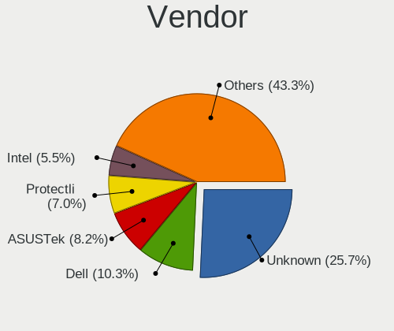
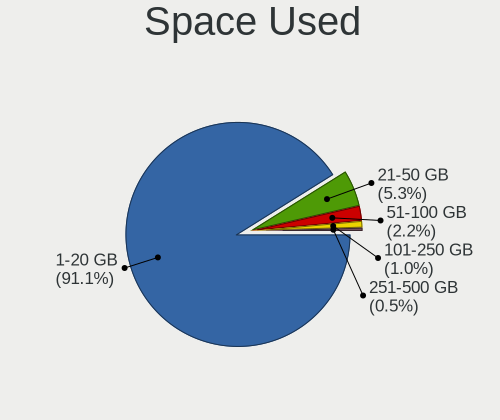
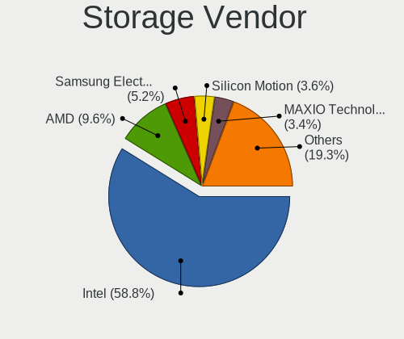
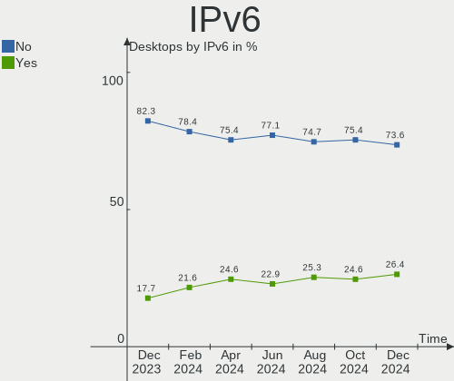
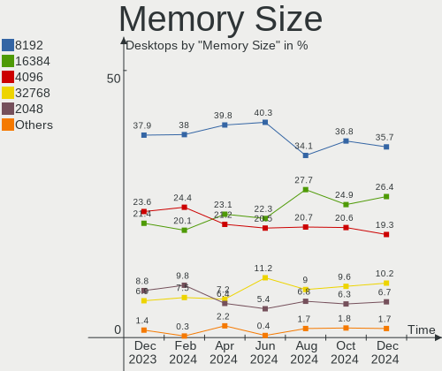
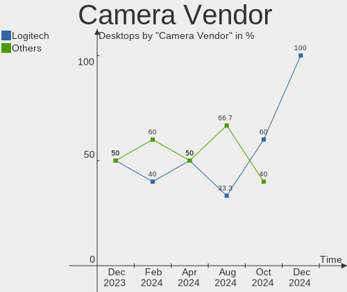

BSD - Hardware Trends (Desktops)
--------------------------------

A project to identify most popular hardware characteristics and track their change
over time based on data collected by BSD users at https://BSD-Hardware.info.

Anyone can contribute to this report by the [hw-probe](https://github.com/linuxhw/hw-probe/blob/master/INSTALL.BSD.md) tool:

    hw-probe -all -upload

This report is for one last month. Overall report since the beginning of time: [TestCoverage](https://github.com/bsdhw/TestCoverage)

Period: Jun, 2022.

Contents
--------

* [ System ](#system)
  - [ OS                       ](#os)
  - [ OS Family                ](#os-family)
  - [ Arch                     ](#arch)
  - [ DE                       ](#de)
  - [ Display Server           ](#display-server)
  - [ Display Manager          ](#display-manager)
  - [ OS Lang                  ](#os-lang)
  - [ Boot Mode                ](#boot-mode)
  - [ Filesystem               ](#filesystem)
  - [ Part. scheme             ](#part-scheme)

* [ Board ](#board)
  - [ Vendor                   ](#vendor)
  - [ Model                    ](#model)
  - [ Model Family             ](#model-family)
  - [ MFG Year                 ](#mfg-year)
  - [ Form Factor              ](#form-factor)
  - [ Coreboot                 ](#coreboot)
  - [ RAM Size                 ](#ram-size)
  - [ RAM Used                 ](#ram-used)
  - [ Total Drives             ](#total-drives)
  - [ Has CD-ROM               ](#has-cd-rom)
  - [ Has Ethernet             ](#has-ethernet)
  - [ Has WiFi                 ](#has-wifi)
  - [ Has Bluetooth            ](#has-bluetooth)

* [ Location ](#location)
  - [ Country                  ](#country)
  - [ City                     ](#city)

* [ Drives ](#drives)
  - [ Drive Vendor             ](#drive-vendor)
  - [ Drive Model              ](#drive-model)
  - [ HDD Vendor               ](#hdd-vendor)
  - [ SSD Vendor               ](#ssd-vendor)
  - [ Drive Kind               ](#drive-kind)
  - [ Drive Connector          ](#drive-connector)
  - [ Drive Size               ](#drive-size)
  - [ Space Total              ](#space-total)
  - [ Space Used               ](#space-used)
  - [ Malfunc. Drives          ](#malfunc-drives)
  - [ Malfunc. Drive Vendor    ](#malfunc-drive-vendor)
  - [ Malfunc. HDD Vendor      ](#malfunc-hdd-vendor)
  - [ Malfunc. Drive Kind      ](#malfunc-drive-kind)
  - [ Failed Drives            ](#failed-drives)
  - [ Failed Drive Vendor      ](#failed-drive-vendor)
  - [ Drive Status             ](#drive-status)

* [ Storage controller ](#storage-controller)
  - [ Storage Vendor           ](#storage-vendor)
  - [ Storage Model            ](#storage-model)
  - [ Storage Kind             ](#storage-kind)

* [ Processor ](#processor)
  - [ CPU Vendor               ](#cpu-vendor)
  - [ CPU Model                ](#cpu-model)
  - [ CPU Model Family         ](#cpu-model-family)
  - [ CPU Cores                ](#cpu-cores)
  - [ CPU Sockets              ](#cpu-sockets)
  - [ CPU Threads              ](#cpu-threads)
  - [ CPU Microarch            ](#cpu-microarch)

* [ Graphics ](#graphics)
  - [ GPU Vendor               ](#gpu-vendor)
  - [ GPU Model                ](#gpu-model)
  - [ GPU Combo                ](#gpu-combo)
  - [ GPU Driver               ](#gpu-driver)
  - [ GPU Memory               ](#gpu-memory)

* [ Monitor ](#monitor)
  - [ Monitor Vendor           ](#monitor-vendor)
  - [ Monitor Model            ](#monitor-model)
  - [ Monitor Resolution       ](#monitor-resolution)
  - [ Monitor Diagonal         ](#monitor-diagonal)
  - [ Monitor Width            ](#monitor-width)
  - [ Aspect Ratio             ](#aspect-ratio)
  - [ Monitor Area             ](#monitor-area)
  - [ Pixel Density            ](#pixel-density)
  - [ Multiple Monitors        ](#multiple-monitors)

* [ Network ](#network)
  - [ Net Controller Vendor    ](#net-controller-vendor)
  - [ Net Controller Model     ](#net-controller-model)
  - [ Wireless Vendor          ](#wireless-vendor)
  - [ Wireless Model           ](#wireless-model)
  - [ Ethernet Vendor          ](#ethernet-vendor)
  - [ Ethernet Model           ](#ethernet-model)
  - [ Net Controller Kind      ](#net-controller-kind)
  - [ Used Controller          ](#used-controller)
  - [ NICs                     ](#nics)
  - [ IPv6                     ](#ipv6)

* [ Bluetooth ](#bluetooth)
  - [ Bluetooth Vendor         ](#bluetooth-vendor)
  - [ Bluetooth Model          ](#bluetooth-model)

* [ Sound ](#sound)
  - [ Sound Vendor             ](#sound-vendor)
  - [ Sound Model              ](#sound-model)

* [ Memory ](#memory)
  - [ Memory Vendor            ](#memory-vendor)
  - [ Memory Model             ](#memory-model)
  - [ Memory Kind              ](#memory-kind)
  - [ Memory Form Factor       ](#memory-form-factor)
  - [ Memory Size              ](#memory-size)
  - [ Memory Speed             ](#memory-speed)

* [ Printers & scanners ](#printers--scanners)
  - [ Printer Vendor           ](#printer-vendor)
  - [ Printer Model            ](#printer-model)
  - [ Scanner Vendor           ](#scanner-vendor)
  - [ Scanner Model            ](#scanner-model)

* [ Camera ](#camera)
  - [ Camera Vendor            ](#camera-vendor)
  - [ Camera Model             ](#camera-model)

* [ Security ](#security)
  - [ Fingerprint Vendor       ](#fingerprint-vendor)
  - [ Fingerprint Model        ](#fingerprint-model)
  - [ Chipcard Vendor          ](#chipcard-vendor)
  - [ Chipcard Model           ](#chipcard-model)

* [ Unsupported ](#unsupported)
  - [ Unsupported Devices      ](#unsupported-devices)
  - [ Unsupported Device Types ](#unsupported-device-types)

System
------

OS
--

Installed operating systems

| Name                | Desktops | Percent |
|---------------------|----------|---------|
| OPNsense 22.1.8     | 109      | 55.33%  |
| OPNsense 22.1.9     | 30       | 15.23%  |
| FreeBSD 13.1        | 20       | 10.15%  |
| helloSystem 0.7.0   | 7        | 3.55%   |
| OpenBSD 7.1         | 5        | 2.54%   |
| OPNsense 22.1.7     | 4        | 2.03%   |
| NomadBSD 5806f915   | 3        | 1.52%   |
| OPNsense 22.7       | 2        | 1.02%   |
| OPNsense 22.4.1     | 2        | 1.02%   |
| OPNsense 22.1.6     | 2        | 1.02%   |
| MyBee 13.1          | 2        | 1.02%   |
| FreeBSD 13.0-p11    | 2        | 1.02%   |
| TrueNAS 12.2-p14    | 1        | 0.51%   |
| pfSense 12.3-STABLE | 1        | 0.51%   |
| OPNsense 22.1.3     | 1        | 0.51%   |
| OPNsense 22.1       | 1        | 0.51%   |
| OPNsense 21.7.6     | 1        | 0.51%   |
| MyBee 14.0-CURRENT  | 1        | 0.51%   |
| MidnightBSD 2.2.0   | 1        | 0.51%   |
| helloSystem 0.5.0   | 1        | 0.51%   |
| GhostBSD 22.01.12   | 1        | 0.51%   |

OS Family
---------

OS without a version

| Name        | Desktops | Percent |
|-------------|----------|---------|
| OPNsense    | 152      | 77.16%  |
| FreeBSD     | 22       | 11.17%  |
| helloSystem | 8        | 4.06%   |
| OpenBSD     | 5        | 2.54%   |
| NomadBSD    | 3        | 1.52%   |
| MyBee       | 3        | 1.52%   |
| TrueNAS     | 1        | 0.51%   |
| pfSense     | 1        | 0.51%   |
| MidnightBSD | 1        | 0.51%   |
| GhostBSD    | 1        | 0.51%   |

Arch
----

OS architecture (x86_64, i586, etc.)

| Name  | Desktops | Percent |
|-------|----------|---------|
| amd64 | 197      | 100%    |

DE
--

Desktop Environment

| Name         | Desktops | Percent |
|--------------|----------|---------|
| Console      | 170      | 86.29%  |
| helloDesktop | 12       | 6.09%   |
| Openbox      | 4        | 2.03%   |
| MATE         | 3        | 1.52%   |
| KDE5         | 3        | 1.52%   |
| XFCE         | 2        | 1.02%   |
| TWM          | 2        | 1.02%   |
| GNOME        | 1        | 0.51%   |

Display Server
--------------

X11 or Wayland

| Name    | Desktops | Percent |
|---------|----------|---------|
| Console | 171      | 86.8%   |
| X11     | 26       | 13.2%   |

Display Manager
---------------

SDDM, LightDM, etc.

| Name    | Desktops | Percent |
|---------|----------|---------|
| Console | 179      | 90.86%  |
| SLiM    | 14       | 7.11%   |
| LightDM | 2        | 1.02%   |
| XDM     | 1        | 0.51%   |
| SDDM    | 1        | 0.51%   |

OS Lang
-------

Language

| Lang    | Desktops | Percent |
|---------|----------|---------|
| Unknown | 159      | 80.71%  |
| C       | 22       | 11.17%  |
| en_US   | 14       | 7.11%   |
| ru_RU   | 1        | 0.51%   |
| fr_FR   | 1        | 0.51%   |

Boot Mode
---------

EFI or BIOS

| Mode | Desktops | Percent |
|------|----------|---------|
| EFI  | 179      | 90.86%  |
| BIOS | 18       | 9.14%   |

Filesystem
----------

Type of filesystem

| Type   | Desktops | Percent |
|--------|----------|---------|
| Ufs    | 117      | 59.39%  |
| Zfs    | 73       | 37.06%  |
| Ffs    | 5        | 2.54%   |
| Cd9660 | 2        | 1.02%   |

Part. scheme
------------

Scheme of partitioning

| Type    | Desktops | Percent |
|---------|----------|---------|
| GPT     | 188      | 95.43%  |
| MBR     | 8        | 4.06%   |
| Unknown | 1        | 0.51%   |

Board
-----

Vendor
------

Motherboard manufacturer

| Name                          | Desktops | Percent |
|-------------------------------|----------|---------|
| ASUSTek Computer              | 23       | 11.68%  |
| Unknown                       | 21       | 10.66%  |
| Dell                          | 20       | 10.15%  |
| Hewlett-Packard               | 17       | 8.63%   |
| Gigabyte Technology           | 16       | 8.12%   |
| Protectli                     | 14       | 7.11%   |
| ASRock                        | 14       | 7.11%   |
| Intel                         | 11       | 5.58%   |
| PC Engines                    | 8        | 4.06%   |
| MSI                           | 8        | 4.06%   |
| Supermicro                    | 5        | 2.54%   |
| Lenovo                        | 5        | 2.54%   |
| Fujitsu                       | 5        | 2.54%   |
| Biostar                       | 4        | 2.03%   |
| Seeed Studio                  | 2        | 1.02%   |
| Pegatron                      | 2        | 1.02%   |
| MW                            | 2        | 1.02%   |
| AZW                           | 2        | 1.02%   |
| Apple                         | 2        | 1.02%   |
| YANYU                         | 1        | 0.51%   |
| TYAN Computer                 | 1        | 0.51%   |
| Thomas-Krenn.AG               | 1        | 0.51%   |
| SmbiosType2_BoardManufacturer | 1        | 0.51%   |
| ShenZhen MinWin Technology    | 1        | 0.51%   |
| NF692                         | 1        | 0.51%   |
| Lanner                        | 1        | 0.51%   |
| Lanix                         | 1        | 0.51%   |
| IceWhale Technology           | 1        | 0.51%   |
| Cisco                         | 1        | 0.51%   |
| BESSTAR Tech                  | 1        | 0.51%   |
| AOpen                         | 1        | 0.51%   |
| AMD                           | 1        | 0.51%   |
| ALLEGIANCE GAMING             | 1        | 0.51%   |
| ADI                           | 1        | 0.51%   |
| Acer                          | 1        | 0.51%   |

Model
-----

Motherboard model

| Name                                                        | Desktops | Percent |
|-------------------------------------------------------------|----------|---------|
| Unknown                                                     | 21       | 10.66%  |
| Protectli FW6                                               | 6        | 3.05%   |
| Protectli FW4B                                              | 5        | 2.54%   |
| PC Engines APU2                                             | 5        | 2.54%   |
| Intel Q3XXG4-P V1.0                                         | 5        | 2.54%   |
| MSI MS-7817                                                 | 4        | 2.03%   |
| Dell OptiPlex 3020                                          | 4        | 2.03%   |
| HP EliteDesk 800 G1 SFF                                     | 3        | 1.52%   |
| ASUS All Series                                             | 3        | 1.52%   |
| Protectli VP2410                                            | 2        | 1.02%   |
| PC Engines apu4                                             | 2        | 1.02%   |
| MW GMLK-2_5G4L                                              | 2        | 1.02%   |
| Intel MAHOBAY                                               | 2        | 1.02%   |
| Fujitsu FUTRO S920                                          | 2        | 1.02%   |
| Dell OptiPlex 9020                                          | 2        | 1.02%   |
| Dell OptiPlex 790                                           | 2        | 1.02%   |
| Dell OptiPlex 7020                                          | 2        | 1.02%   |
| ASRock X570 Phantom Gaming 4                                | 2        | 1.02%   |
| YANYU EPIC-N31 Ver:1.1                                      | 1        | 0.51%   |
| TYAN Tiger K8W Dual AMD Opteron, S2875                      | 1        | 0.51%   |
| Thomas-Krenn.AG LES network 6L                              | 1        | 0.51%   |
| Supermicro X9SCL/X9SCM                                      | 1        | 0.51%   |
| Supermicro X7SPA-HF                                         | 1        | 0.51%   |
| Supermicro SYS-E300-9D-8CN8TP                               | 1        | 0.51%   |
| Supermicro SYS-5019A-12TN4                                  | 1        | 0.51%   |
| Supermicro Icebreaker 4824                                  | 1        | 0.51%   |
| SmbiosType2_BoardManufacturer SmbiosType1_SystemProductName | 1        | 0.51%   |
| ShenZhen MinWin MW-GMLK-2.5G6L                              | 1        | 0.51%   |
| Seeed Studio ODYSSEY-X86J4125                               | 1        | 0.51%   |
| Seeed Studio ODYSSEY-X86J4105                               | 1        | 0.51%   |
| Protectli FW6D                                              | 1        | 0.51%   |
| Pegatron Pro 3405 Series                                    | 1        | 0.51%   |
| Pegatron Pro 3010 Microtower PC                             | 1        | 0.51%   |
| PC Engines APU                                              | 1        | 0.51%   |
| NF692 1.0                                                   | 1        | 0.51%   |
| MSI MS-7D09                                                 | 1        | 0.51%   |
| MSI MS-7C02                                                 | 1        | 0.51%   |
| MSI MS-7B31                                                 | 1        | 0.51%   |
| MSI MS-7592                                                 | 1        | 0.51%   |
| Lenovo ThinkPad T530 24292VG                                | 1        | 0.51%   |
| Lenovo ThinkCentre XXXX Y                                   | 1        | 0.51%   |
| Lenovo ThinkCentre M93p 10A8S2F405                          | 1        | 0.51%   |
| Lenovo ThinkCentre M73 10B7S01300                           | 1        | 0.51%   |
| Lenovo IdeaCentre 3 07ADA05 90MV007UGE                      | 1        | 0.51%   |
| Lanner GP-7543                                              | 1        | 0.51%   |
| Lanix X7DVL-3                                               | 1        | 0.51%   |
| Intel SKYBAY                                                | 1        | 0.51%   |
| Intel NCB-4210WG                                            | 1        | 0.51%   |
| Intel D945GCLF2 AAE46416-104                                | 1        | 0.51%   |
| Intel CARLOW                                                | 1        | 0.51%   |
| IceWhale ZimaBoard 832 ZMB                                  | 1        | 0.51%   |
| HP Z420 Workstation                                         | 1        | 0.51%   |
| HP xw8600 Workstation                                       | 1        | 0.51%   |
| HP ProLiant ML10 v2                                         | 1        | 0.51%   |
| HP ProDesk 600 G4 SFF                                       | 1        | 0.51%   |
| HP ProDesk 400 G4 SFF                                       | 1        | 0.51%   |
| HP ProDesk 400 G2 MINI                                      | 1        | 0.51%   |
| HP Pavilion Desktop TP01-2xxx                               | 1        | 0.51%   |
| HP EliteDesk 800 G1 TWR                                     | 1        | 0.51%   |
| HP Desktop M01-F0xxx                                        | 1        | 0.51%   |

Model Family
------------

Motherboard model prefix

| Name                                      | Desktops | Percent |
|-------------------------------------------|----------|---------|
| Unknown                                   | 21       | 10.66%  |
| Dell OptiPlex                             | 16       | 8.12%   |
| Protectli FW6                             | 6        | 3.05%   |
| ASUS PRIME                                | 6        | 3.05%   |
| Protectli FW4B                            | 5        | 2.54%   |
| PC Engines APU2                           | 5        | 2.54%   |
| Intel Q3XXG4-P                            | 5        | 2.54%   |
| ASUS ROG                                  | 5        | 2.54%   |
| MSI MS-7817                               | 4        | 2.03%   |
| HP EliteDesk                              | 4        | 2.03%   |
| HP Compaq                                 | 4        | 2.03%   |
| Lenovo ThinkCentre                        | 3        | 1.52%   |
| HP ProDesk                                | 3        | 1.52%   |
| Fujitsu FUTRO                             | 3        | 1.52%   |
| ASUS All                                  | 3        | 1.52%   |
| Protectli VP2410                          | 2        | 1.02%   |
| Pegatron Pro                              | 2        | 1.02%   |
| PC Engines apu4                           | 2        | 1.02%   |
| MW GMLK-2                                 | 2        | 1.02%   |
| Intel MAHOBAY                             | 2        | 1.02%   |
| Dell Inspiron                             | 2        | 1.02%   |
| ASRock X570                               | 2        | 1.02%   |
| ASRock B550                               | 2        | 1.02%   |
| YANYU EPIC-N31                            | 1        | 0.51%   |
| TYAN Tiger                                | 1        | 0.51%   |
| Thomas-Krenn.AG LES                       | 1        | 0.51%   |
| Supermicro X9SCL                          | 1        | 0.51%   |
| Supermicro X7SPA-HF                       | 1        | 0.51%   |
| Supermicro SYS-E300-9D-8CN8TP             | 1        | 0.51%   |
| Supermicro SYS-5019A-12TN4                | 1        | 0.51%   |
| Supermicro Icebreaker                     | 1        | 0.51%   |
| SmbiosType2_BoardManufacturer SmbiosType1 | 1        | 0.51%   |
| ShenZhen MinWin MW-GMLK-2.5G6L            | 1        | 0.51%   |
| Seeed Studio ODYSSEY-X86J4125             | 1        | 0.51%   |
| Seeed Studio ODYSSEY-X86J4105             | 1        | 0.51%   |
| Protectli FW6D                            | 1        | 0.51%   |
| PC Engines APU                            | 1        | 0.51%   |
| NF692 1.0                                 | 1        | 0.51%   |
| MSI MS-7D09                               | 1        | 0.51%   |
| MSI MS-7C02                               | 1        | 0.51%   |
| MSI MS-7B31                               | 1        | 0.51%   |
| MSI MS-7592                               | 1        | 0.51%   |
| Lenovo ThinkPad                           | 1        | 0.51%   |
| Lenovo IdeaCentre                         | 1        | 0.51%   |
| Lanner GP-7543                            | 1        | 0.51%   |
| Lanix X7DVL-3                             | 1        | 0.51%   |
| Intel SKYBAY                              | 1        | 0.51%   |
| Intel NCB-4210WG                          | 1        | 0.51%   |
| Intel D945GCLF2                           | 1        | 0.51%   |
| Intel CARLOW                              | 1        | 0.51%   |
| IceWhale ZimaBoard                        | 1        | 0.51%   |
| HP Z420                                   | 1        | 0.51%   |
| HP xw8600                                 | 1        | 0.51%   |
| HP ProLiant                               | 1        | 0.51%   |
| HP Pavilion                               | 1        | 0.51%   |
| HP Desktop                                | 1        | 0.51%   |
| HP 550-a114                               | 1        | 0.51%   |
| Gigabyte Z690I                            | 1        | 0.51%   |
| Gigabyte Z390                             | 1        | 0.51%   |
| Gigabyte X570                             | 1        | 0.51%   |

MFG Year
--------

Motherboard manufacture year

| Year | Desktops | Percent |
|------|----------|---------|
| 2019 | 28       | 14.21%  |
| 2021 | 26       | 13.2%   |
| 2018 | 26       | 13.2%   |
| 2014 | 19       | 9.64%   |
| 2020 | 16       | 8.12%   |
| 2022 | 14       | 7.11%   |
| 2016 | 14       | 7.11%   |
| 2013 | 10       | 5.08%   |
| 2012 | 9        | 4.57%   |
| 2017 | 8        | 4.06%   |
| 2015 | 8        | 4.06%   |
| 2011 | 7        | 3.55%   |
| 2009 | 5        | 2.54%   |
| 2008 | 3        | 1.52%   |
| 2010 | 2        | 1.02%   |
| 2007 | 1        | 0.51%   |
| 2004 | 1        | 0.51%   |

Form Factor
-----------

Physical design of the computer

| Name    | Desktops | Percent |
|---------|----------|---------|
| Desktop | 197      | 100%    |

Coreboot
--------

Have coreboot on board

| Used | Desktops | Percent |
|------|----------|---------|
| No   | 188      | 95.43%  |
| Yes  | 9        | 4.57%   |

RAM Size
--------

Total RAM memory

| Size in GB  | Desktops | Percent |
|-------------|----------|---------|
| 8.01-16.0   | 74       | 37.56%  |
| 4.01-8.0    | 40       | 20.3%   |
| 16.01-24.0  | 38       | 19.29%  |
| 32.01-64.0  | 22       | 11.17%  |
| 64.01-256.0 | 11       | 5.58%   |
| 2.01-3.0    | 6        | 3.05%   |
| 24.01-32.0  | 4        | 2.03%   |
| 3.01-4.0    | 1        | 0.51%   |
| 0.51-1.0    | 1        | 0.51%   |

RAM Used
--------

Used RAM memory

| Used GB    | Desktops | Percent |
|------------|----------|---------|
| 0.01-0.5   | 111      | 56.35%  |
| 0.51-1.0   | 52       | 26.4%   |
| 1.01-2.0   | 23       | 11.68%  |
| 2.01-3.0   | 5        | 2.54%   |
| 3.01-4.0   | 4        | 2.03%   |
| 24.01-32.0 | 1        | 0.51%   |
| 16.01-24.0 | 1        | 0.51%   |

Total Drives
------------

Number of drives on board

| Drives | Desktops | Percent |
|--------|----------|---------|
| 1      | 145      | 73.6%   |
| 3      | 14       | 7.11%   |
| 2      | 13       | 6.6%    |
| 4      | 8        | 4.06%   |
| 0      | 8        | 4.06%   |
| 8      | 2        | 1.02%   |
| 6      | 2        | 1.02%   |
| 18     | 1        | 0.51%   |
| 15     | 1        | 0.51%   |
| 13     | 1        | 0.51%   |
| 10     | 1        | 0.51%   |
| 5      | 1        | 0.51%   |

Has CD-ROM
----------

Has CD-ROM on board

| Presented | Desktops | Percent |
|-----------|----------|---------|
| No        | 161      | 81.73%  |
| Yes       | 36       | 18.27%  |

Has Ethernet
------------

Has Ethernet on board

| Presented | Desktops | Percent |
|-----------|----------|---------|
| Yes       | 197      | 100%    |

Has WiFi
--------

Has WiFi module

| Presented | Desktops | Percent |
|-----------|----------|---------|
| No        | 161      | 81.73%  |
| Yes       | 36       | 18.27%  |

Has Bluetooth
-------------

Has Bluetooth module

| Presented | Desktops | Percent |
|-----------|----------|---------|
| No        | 173      | 87.82%  |
| Yes       | 24       | 12.18%  |

Location
--------

Country
-------

Geographic location (country)

| Country            | Desktops | Percent |
|--------------------|----------|---------|
| USA                | 60       | 30.46%  |
| Germany            | 38       | 19.29%  |
| Canada             | 12       | 6.09%   |
| UK                 | 7        | 3.55%   |
| Australia          | 7        | 3.55%   |
| Russia             | 6        | 3.05%   |
| Switzerland        | 5        | 2.54%   |
| Italy              | 5        | 2.54%   |
| France             | 5        | 2.54%   |
| Lithuania          | 4        | 2.03%   |
| Brazil             | 4        | 2.03%   |
| Hungary            | 3        | 1.52%   |
| Belgium            | 3        | 1.52%   |
| Austria            | 3        | 1.52%   |
| Thailand           | 2        | 1.02%   |
| Spain              | 2        | 1.02%   |
| Poland             | 2        | 1.02%   |
| Philippines        | 2        | 1.02%   |
| Paraguay           | 2        | 1.02%   |
| New Zealand        | 2        | 1.02%   |
| Netherlands        | 2        | 1.02%   |
| Finland            | 2        | 1.02%   |
| Sweden             | 1        | 0.51%   |
| South Korea        | 1        | 0.51%   |
| Singapore          | 1        | 0.51%   |
| Romania            | 1        | 0.51%   |
| Portugal           | 1        | 0.51%   |
| Morocco            | 1        | 0.51%   |
| Mexico             | 1        | 0.51%   |
| Malaysia           | 1        | 0.51%   |
| Japan              | 1        | 0.51%   |
| Isle of Man        | 1        | 0.51%   |
| Indonesia          | 1        | 0.51%   |
| Estonia            | 1        | 0.51%   |
| Dominican Republic | 1        | 0.51%   |
| Czechia            | 1        | 0.51%   |
| Croatia            | 1        | 0.51%   |
| Costa Rica         | 1        | 0.51%   |
| Colombia           | 1        | 0.51%   |
| China              | 1        | 0.51%   |
| Bolivia            | 1        | 0.51%   |

City
----

Geographic location (city)

| City                  | Desktops | Percent |
|-----------------------|----------|---------|
| Toronto               | 4        | 2.03%   |
| Wexford               | 2        | 1.02%   |
| Wellington            | 2        | 1.02%   |
| Vienna                | 2        | 1.02%   |
| Sydney                | 2        | 1.02%   |
| St Petersburg         | 2        | 1.02%   |
| Salem                 | 2        | 1.02%   |
| Redmond               | 2        | 1.02%   |
| Quezon City           | 2        | 1.02%   |
| Omaha                 | 2        | 1.02%   |
| Munich                | 2        | 1.02%   |
| Melbourne             | 2        | 1.02%   |
| Madrid                | 2        | 1.02%   |
| Himmelpforten         | 2        | 1.02%   |
| Gachnang              | 2        | 1.02%   |
| Duncan                | 2        | 1.02%   |
| Dovilai               | 2        | 1.02%   |
| Budapest              | 2        | 1.02%   |
| Bangkok               | 2        | 1.02%   |
| Austin                | 2        | 1.02%   |
| Zagreb                | 1        | 0.51%   |
| Ypsilanti             | 1        | 0.51%   |
| Worcester             | 1        | 0.51%   |
| Wolverhampton         | 1        | 0.51%   |
| Wolfhagen             | 1        | 0.51%   |
| Winter Haven          | 1        | 0.51%   |
| Winnipeg              | 1        | 0.51%   |
| Windsor               | 1        | 0.51%   |
| Willich               | 1        | 0.51%   |
| West Hanningfield     | 1        | 0.51%   |
| Wentorf bei Hamburg   | 1        | 0.51%   |
| Wenatchee             | 1        | 0.51%   |
| Webberville           | 1        | 0.51%   |
| Warminster            | 1        | 0.51%   |
| Wallan                | 1        | 0.51%   |
| Wallaceburg           | 1        | 0.51%   |
| Walkerton             | 1        | 0.51%   |
| Viersen               | 1        | 0.51%   |
| Vénissieux           | 1        | 0.51%   |
| Vaulx-en-Velin        | 1        | 0.51%   |
| Ulm                   | 1        | 0.51%   |
| Tiel                  | 1        | 0.51%   |
| Tewksbury             | 1        | 0.51%   |
| Tatabánya            | 1        | 0.51%   |
| Tamm                  | 1        | 0.51%   |
| Sunbury               | 1        | 0.51%   |
| Stouffville           | 1        | 0.51%   |
| Statesboro            | 1        | 0.51%   |
| Somersworth           | 1        | 0.51%   |
| Singapore             | 1        | 0.51%   |
| Shenzhen              | 1        | 0.51%   |
| Seto                  | 1        | 0.51%   |
| Scunthorpe            | 1        | 0.51%   |
| Sao Paulo             | 1        | 0.51%   |
| Santo Domingo Este    | 1        | 0.51%   |
| Sandhausen            | 1        | 0.51%   |
| San Miguel de Allende | 1        | 0.51%   |
| San José             | 1        | 0.51%   |
| Riihimäki            | 1        | 0.51%   |
| Rheine                | 1        | 0.51%   |

Drives
------

Drive Vendor
------------

Hard drive vendors

| Vendor              | Desktops | Drives | Percent |
|---------------------|----------|--------|---------|
| Samsung Electronics | 39       | 50     | 15.73%  |
| WDC                 | 32       | 59     | 12.9%   |
| Seagate             | 32       | 60     | 12.9%   |
| Kingston            | 22       | 23     | 8.87%   |
| Crucial             | 18       | 20     | 7.26%   |
| Transcend           | 12       | 12     | 4.84%   |
| Toshiba             | 12       | 26     | 4.84%   |
| Intel               | 11       | 13     | 4.44%   |
| China               | 6        | 6      | 2.42%   |
| ShiJi               | 4        | 4      | 1.61%   |
| SanDisk             | 4        | 4      | 1.61%   |
| OCZ                 | 4        | 4      | 1.61%   |
| Hoodisk             | 4        | 4      | 1.61%   |
| Protectli           | 3        | 3      | 1.21%   |
| KingSpec            | 3        | 3      | 1.21%   |
| Hitachi             | 3        | 4      | 1.21%   |
| Corsair             | 3        | 3      | 1.21%   |
| Team                | 2        | 2      | 0.81%   |
| SPCC                | 2        | 2      | 0.81%   |
| SK hynix            | 2        | 2      | 0.81%   |
| PNY                 | 2        | 2      | 0.81%   |
| Phison              | 2        | 2      | 0.81%   |
| Micron Technology   | 2        | 2      | 0.81%   |
| LITEONIT            | 2        | 2      | 0.81%   |
| Intenso             | 2        | 2      | 0.81%   |
| A-DATA Technology   | 2        | 3      | 0.81%   |
| Verbatim            | 1        | 1      | 0.4%    |
| Plextor             | 1        | 1      | 0.4%    |
| NVMe                | 1        | 1      | 0.4%    |
| Mushkin             | 1        | 1      | 0.4%    |
| Lexar               | 1        | 1      | 0.4%    |
| KIOXIA              | 1        | 1      | 0.4%    |
| Kingchuxing         | 1        | 1      | 0.4%    |
| INDMEM              | 1        | 1      | 0.4%    |
| HGST                | 1        | 1      | 0.4%    |
| Hewlett-Packard     | 1        | 1      | 0.4%    |
| Generic             | 1        | 1      | 0.4%    |
| FORESEE             | 1        | 1      | 0.4%    |
| Dogfish             | 1        | 1      | 0.4%    |
| BR                  | 1        | 1      | 0.4%    |
| BIWIN               | 1        | 1      | 0.4%    |
| ATP                 | 1        | 1      | 0.4%    |
| Apacer              | 1        | 1      | 0.4%    |
| Advantech           | 1        | 1      | 0.4%    |

Drive Model
-----------

Hard drive models

| Model                             | Desktops | Percent |
|-----------------------------------|----------|---------|
| Kingston SA400S37240G 240GB       | 6        | 2.17%   |
| Transcend TS128GMSA230S 128GB     | 5        | 1.81%   |
| Samsung SSD 850 EVO 500GB         | 4        | 1.45%   |
| Samsung SSD 850 EVO 250GB         | 4        | 1.45%   |
| WDC WD10EZEX-08WN4A0 1TB          | 3        | 1.09%   |
| Seagate ST1000DM010-2EP102 1TB    | 3        | 1.09%   |
| SanDisk SDSSDA120G 120GB          | 3        | 1.09%   |
| Samsung SSD 860 EVO 500GB         | 3        | 1.09%   |
| Kingston SA400S37120G 120GB       | 3        | 1.09%   |
| WDC WD30EFRX-68EUZN0 3TB          | 2        | 0.72%   |
| Transcend TS64GSSD370S 64GB       | 2        | 0.72%   |
| Toshiba MG06ACA800E 8TB           | 2        | 0.72%   |
| ShiJi SSD 128GB                   | 2        | 0.72%   |
| Seagate ST8000VN0022-2EL112 8TB   | 2        | 0.72%   |
| Seagate ST500DM002-1BD142 500GB   | 2        | 0.72%   |
| Seagate ST4000DM000-1F2168 4TB    | 2        | 0.72%   |
| Seagate ST3250318AS 250GB         | 2        | 0.72%   |
| Seagate ST16000NM001G-2KK103 16TB | 2        | 0.72%   |
| Seagate ST1000LM035-1RK172 1TB    | 2        | 0.72%   |
| Samsung SSD 960 EVO 500GB         | 2        | 0.72%   |
| Samsung SSD 850 EVO 120GB         | 2        | 0.72%   |
| Samsung MZMPC032HBCD-000H1 32GB   | 2        | 0.72%   |
| Protectli 120GB mSATA             | 2        | 0.72%   |
| Kingston SUV500MS120G 120GB       | 2        | 0.72%   |
| Hoodisk SSD 128GB                 | 2        | 0.72%   |
| Crucial CT500P2SSD8 500GB         | 2        | 0.72%   |
| Crucial CT500MX500SSD1 500GB      | 2        | 0.72%   |
| Crucial CT480BX500SSD1 480GB      | 2        | 0.72%   |
| Crucial CT250MX500SSD1 250GB      | 2        | 0.72%   |
| Crucial CT240BX500SSD1 240GB      | 2        | 0.72%   |
| Crucial CT1000MX500SSD1 1TB       | 2        | 0.72%   |
| Corsair Force MP600 500GB         | 2        | 0.72%   |
| China SATA SSD 16GB               | 2        | 0.72%   |
| WDC WDS500G2B0A-00SM50 500GB      | 1        | 0.36%   |
| WDC WDS120G2G0A-00JH30 120GB      | 1        | 0.36%   |
| WDC WDS100T3X0C-00SJG0 1TB        | 1        | 0.36%   |
| WDC WDS100T1X0E-00AFY0 1TB        | 1        | 0.36%   |
| WDC WD80EZZX-11CSGA0 8TB          | 1        | 0.36%   |
| WDC WD80EZAZ-11TDBA0 8TB          | 1        | 0.36%   |
| WDC WD80EMZZ-00TBGA0 8TB          | 1        | 0.36%   |
| WDC WD80EMAZ-00WJTA0 8TB          | 1        | 0.36%   |
| WDC WD80EFZX-68UW8N0 8TB          | 1        | 0.36%   |
| WDC WD80EFAX-68LHPN0 8TB          | 1        | 0.36%   |
| WDC WD80EDBZ-11B0ZA0 8TB          | 1        | 0.36%   |
| WDC WD6400AAKS-22A7B2 640GB       | 1        | 0.36%   |
| WDC WD60EZRZ-00GZ5B1 6TB          | 1        | 0.36%   |
| WDC WD60EFAX-68SHWN0 6TB          | 1        | 0.36%   |
| WDC WD5003ABYX-01WERA2 500GB      | 1        | 0.36%   |
| WDC WD5000AAKX-60U6AA0 500GB      | 1        | 0.36%   |
| WDC WD40PURX-64GVNY0 4TB          | 1        | 0.36%   |
| WDC WD40EZRZ-22GXCB0 4TB          | 1        | 0.36%   |
| WDC WD3200BPVT-22ZEST0 320GB      | 1        | 0.36%   |
| WDC WD30EFRX-68N32N0 3TB          | 1        | 0.36%   |
| WDC WD30EFRX-68AX9N0 3TB          | 1        | 0.36%   |
| WDC WD3000BLFS-01YBU0 304GB       | 1        | 0.36%   |
| WDC WD2503ABYX-01WERA0 256GB      | 1        | 0.36%   |
| WDC WD2500BEVT-75ZCT2 250GB       | 1        | 0.36%   |
| WDC WD20NMVW-11AV3S2 2TB          | 1        | 0.36%   |
| WDC WD20EURS-63S48Y0 2TB          | 1        | 0.36%   |
| WDC WD1600AAJS-60M0A0 160GB       | 1        | 0.36%   |

HDD Vendor
----------

Hard disk drive vendors

| Vendor              | Desktops | Drives | Percent |
|---------------------|----------|--------|---------|
| Seagate             | 31       | 59     | 39.74%  |
| WDC                 | 28       | 53     | 35.9%   |
| Toshiba             | 9        | 22     | 11.54%  |
| Samsung Electronics | 4        | 7      | 5.13%   |
| Hitachi             | 3        | 4      | 3.85%   |
| NVMe                | 1        | 1      | 1.28%   |
| HGST                | 1        | 1      | 1.28%   |
| Generic             | 1        | 1      | 1.28%   |

SSD Vendor
----------

Solid state drive vendors

| Vendor              | Desktops | Drives | Percent |
|---------------------|----------|--------|---------|
| Samsung Electronics | 28       | 33     | 19.31%  |
| Kingston            | 21       | 22     | 14.48%  |
| Crucial             | 15       | 15     | 10.34%  |
| Transcend           | 12       | 12     | 8.28%   |
| Intel               | 9        | 11     | 6.21%   |
| China               | 6        | 6      | 4.14%   |
| SanDisk             | 4        | 4      | 2.76%   |
| OCZ                 | 4        | 4      | 2.76%   |
| Hoodisk             | 4        | 4      | 2.76%   |
| ShiJi               | 3        | 3      | 2.07%   |
| Protectli           | 3        | 3      | 2.07%   |
| KingSpec            | 3        | 3      | 2.07%   |
| WDC                 | 2        | 2      | 1.38%   |
| Toshiba             | 2        | 2      | 1.38%   |
| Team                | 2        | 2      | 1.38%   |
| SPCC                | 2        | 2      | 1.38%   |
| SK hynix            | 2        | 2      | 1.38%   |
| PNY                 | 2        | 2      | 1.38%   |
| Micron Technology   | 2        | 2      | 1.38%   |
| LITEONIT            | 2        | 2      | 1.38%   |
| Intenso             | 2        | 2      | 1.38%   |
| A-DATA Technology   | 2        | 3      | 1.38%   |
| Verbatim            | 1        | 1      | 0.69%   |
| Plextor             | 1        | 1      | 0.69%   |
| Mushkin             | 1        | 1      | 0.69%   |
| Kingchuxing         | 1        | 1      | 0.69%   |
| INDMEM              | 1        | 1      | 0.69%   |
| FORESEE             | 1        | 1      | 0.69%   |
| Dogfish             | 1        | 1      | 0.69%   |
| Corsair             | 1        | 1      | 0.69%   |
| BR                  | 1        | 1      | 0.69%   |
| BIWIN               | 1        | 1      | 0.69%   |
| ATP                 | 1        | 1      | 0.69%   |
| Apacer              | 1        | 1      | 0.69%   |
| Advantech           | 1        | 1      | 0.69%   |

Drive Kind
----------

HDD or SSD

| Kind | Desktops | Drives | Percent |
|------|----------|--------|---------|
| SSD  | 138      | 154    | 62.44%  |
| HDD  | 57       | 148    | 25.79%  |
| NVMe | 26       | 33     | 11.76%  |

Drive Connector
---------------

SATA, SAS, NVMe, etc.

| Type | Desktops | Drives | Percent |
|------|----------|--------|---------|
| SATA | 173      | 302    | 86.93%  |
| NVMe | 26       | 33     | 13.07%  |

Drive Size
----------

Size of hard drive

| Size in TB | Desktops | Drives | Percent |
|------------|----------|--------|---------|
| 0.01-0.5   | 147      | 167    | 72.06%  |
| 0.51-1.0   | 32       | 45     | 15.69%  |
| 4.01-10.0  | 7        | 45     | 3.43%   |
| 3.01-4.0   | 6        | 11     | 2.94%   |
| 1.01-2.0   | 5        | 11     | 2.45%   |
| 10.01-20.0 | 4        | 7      | 1.96%   |
| 2.01-3.0   | 3        | 16     | 1.47%   |

Space Total
-----------

Amount of disk space available on the file system

| Size in GB     | Desktops | Percent |
|----------------|----------|---------|
| 101-250        | 93       | 47.21%  |
| 251-500        | 37       | 18.78%  |
| 21-50          | 20       | 10.15%  |
| 51-100         | 19       | 9.64%   |
| 1-20           | 11       | 5.58%   |
| 501-1000       | 11       | 5.58%   |
| 2001-3000      | 3        | 1.52%   |
| More than 3000 | 2        | 1.02%   |
| 1001-2000      | 1        | 0.51%   |

Space Used
----------

Amount of used disk space

| Used GB        | Desktops | Percent |
|----------------|----------|---------|
| 1-20           | 181      | 91.88%  |
| 21-50          | 9        | 4.57%   |
| 51-100         | 4        | 2.03%   |
| More than 3000 | 1        | 0.51%   |
| 251-500        | 1        | 0.51%   |
| 101-250        | 1        | 0.51%   |

Malfunc. Drives
---------------

Drive models with a malfunction

| Model                                 | Desktops | Drives | Percent |
|---------------------------------------|----------|--------|---------|
| WDC WDS500G2B0A-00SM50 500GB          | 1        | 1      | 3.7%    |
| WDC WD6400AAKS-22A7B2 640GB           | 1        | 1      | 3.7%    |
| WDC WD5000AAKX-60U6AA0 500GB          | 1        | 1      | 3.7%    |
| WDC WD40PURX-64GVNY0 4TB              | 1        | 1      | 3.7%    |
| WDC WD30EFRX-68EUZN0 3TB              | 1        | 3      | 3.7%    |
| WDC WD2503ABYX-01WERA0 256GB          | 1        | 1      | 3.7%    |
| WDC WD20EURS-63S48Y0 2TB              | 1        | 1      | 3.7%    |
| WDC WD1600AAJS-60M0A0 160GB           | 1        | 1      | 3.7%    |
| Toshiba MQ01ABD075 752GB              | 1        | 1      | 3.7%    |
| SPCC Solid State Disk 128GB           | 1        | 1      | 3.7%    |
| Seagate ST500DM002-1BD142 500GB       | 1        | 1      | 3.7%    |
| Seagate ST380811AS 80GB               | 1        | 1      | 3.7%    |
| Seagate ST380013AS 80GB               | 1        | 1      | 3.7%    |
| Seagate ST3500413AS 500GB             | 1        | 1      | 3.7%    |
| Samsung Electronics SSD 870 EVO 1TB   | 1        | 2      | 3.7%    |
| Samsung Electronics SSD 850 EVO 500GB | 1        | 1      | 3.7%    |
| Samsung Electronics HD753LJ 752GB     | 1        | 1      | 3.7%    |
| Samsung Electronics HD161HJ 160GB     | 1        | 1      | 3.7%    |
| Kingston SUV400S37120G 120GB          | 1        | 2      | 3.7%    |
| Kingston SMS200S360G 64GB             | 1        | 1      | 3.7%    |
| Kingston SH103S3240G 240GB            | 1        | 1      | 3.7%    |
| Kingston SA400S37120G 120GB           | 1        | 1      | 3.7%    |
| KingSpec P3-128 128GB                 | 1        | 1      | 3.7%    |
| Intel SSDSC2CT080A4 80GB              | 1        | 1      | 3.7%    |
| Intel SSDSA2M160G2GC 160GB            | 1        | 1      | 3.7%    |
| Hitachi HCS5C1032CLA382 320GB         | 1        | 1      | 3.7%    |
| Dogfish SSD 480GB                     | 1        | 1      | 3.7%    |

Malfunc. Drive Vendor
---------------------

Vendors of faulty drives

| Vendor              | Desktops | Drives | Percent |
|---------------------|----------|--------|---------|
| WDC                 | 8        | 10     | 29.63%  |
| Seagate             | 4        | 4      | 14.81%  |
| Samsung Electronics | 4        | 5      | 14.81%  |
| Kingston            | 4        | 5      | 14.81%  |
| Intel               | 2        | 2      | 7.41%   |
| Toshiba             | 1        | 1      | 3.7%    |
| SPCC                | 1        | 1      | 3.7%    |
| KingSpec            | 1        | 1      | 3.7%    |
| Hitachi             | 1        | 1      | 3.7%    |
| Dogfish             | 1        | 1      | 3.7%    |

Malfunc. HDD Vendor
-------------------

Vendors of faulty HDD drives

| Vendor              | Desktops | Drives | Percent |
|---------------------|----------|--------|---------|
| WDC                 | 7        | 9      | 46.67%  |
| Seagate             | 4        | 4      | 26.67%  |
| Samsung Electronics | 2        | 2      | 13.33%  |
| Toshiba             | 1        | 1      | 6.67%   |
| Hitachi             | 1        | 1      | 6.67%   |

Malfunc. Drive Kind
-------------------

Kinds of faulty drives

| Kind | Desktops | Drives | Percent |
|------|----------|--------|---------|
| HDD  | 14       | 17     | 53.85%  |
| SSD  | 12       | 14     | 46.15%  |

Failed Drives
-------------

Failed drive models

Zero info for selected period =(

Failed Drive Vendor
-------------------

Failed drive vendors

Zero info for selected period =(

Drive Status
------------

Number of failed and malfunc. drives

| Status   | Desktops | Drives | Percent |
|----------|----------|--------|---------|
| Works    | 169      | 296    | 84.92%  |
| Malfunc  | 26       | 31     | 13.07%  |
| Detected | 4        | 8      | 2.01%   |

Storage controller
------------------

Storage Vendor
--------------

Storage controller vendors

| Vendor                       | Desktops | Percent |
|------------------------------|----------|---------|
| Intel                        | 157      | 65.15%  |
| AMD                          | 39       | 16.18%  |
| Samsung Electronics          | 9        | 3.73%   |
| SanDisk                      | 5        | 2.07%   |
| ASMedia Technology           | 5        | 2.07%   |
| Phison Electronics           | 4        | 1.66%   |
| Micron/Crucial Technology    | 4        | 1.66%   |
| Broadcom / LSI               | 4        | 1.66%   |
| Marvell Technology Group     | 3        | 1.24%   |
| Silicon Image                | 2        | 0.83%   |
| Toshiba                      | 1        | 0.41%   |
| Silicon Motion               | 1        | 0.41%   |
| Shenzhen Longsys Electronics | 1        | 0.41%   |
| Seagate Technology           | 1        | 0.41%   |
| Nvidia                       | 1        | 0.41%   |
| KIOXIA                       | 1        | 0.41%   |
| Kingston Technology Company  | 1        | 0.41%   |
| Biwin Storage Technology     | 1        | 0.41%   |
| ADATA Technology             | 1        | 0.41%   |

Storage Model
-------------

Storage controller models

| Model                                                                            | Desktops | Percent |
|----------------------------------------------------------------------------------|----------|---------|
| AMD FCH SATA Controller [AHCI mode]                                              | 28       | 10.61%  |
| Intel 8 Series/C220 Series Chipset Family 6-port SATA Controller 1 [AHCI mode]   | 25       | 9.47%   |
| Intel Celeron/Pentium Silver Processor SATA Controller                           | 20       | 7.58%   |
| Intel Sunrise Point-LP SATA Controller [AHCI mode]                               | 14       | 5.3%    |
| Intel Q170/Q150/B150/H170/H110/Z170/CM236 Chipset SATA Controller [AHCI Mode]    | 9        | 3.41%   |
| Intel 6 Series/C200 Series Chipset Family 6 port Desktop SATA AHCI Controller    | 9        | 3.41%   |
| Intel Atom/Celeron/Pentium Processor x5-E8000/J3xxx/N3xxx Series SATA Controller | 8        | 3.03%   |
| Intel 7 Series/C210 Series Chipset Family 6-port SATA Controller [AHCI mode]     | 6        | 2.27%   |
| AMD 400 Series Chipset SATA Controller                                           | 6        | 2.27%   |
| Intel Atom Processor E3800 Series SATA AHCI Controller                           | 5        | 1.89%   |
| Intel Wildcat Point-LP SATA Controller [AHCI Mode]                               | 4        | 1.52%   |
| Intel NM10/ICH7 Family SATA Controller [IDE mode]                                | 4        | 1.52%   |
| Intel Cannon Lake PCH SATA AHCI Controller                                       | 4        | 1.52%   |
| Intel 82801JI (ICH10 Family) SATA AHCI Controller                                | 4        | 1.52%   |
| Intel 500 Series Chipset Family SATA AHCI Controller                             | 4        | 1.52%   |
| Intel 400 Series Chipset Family SATA AHCI Controller                             | 4        | 1.52%   |
| Intel 200 Series PCH SATA controller [AHCI mode]                                 | 4        | 1.52%   |
| ASMedia ASM1062 Serial ATA Controller                                            | 4        | 1.52%   |
| AMD SB7x0/SB8x0/SB9x0 SATA Controller [AHCI mode]                                | 4        | 1.52%   |
| AMD 500 Series Chipset SATA Controller                                           | 4        | 1.52%   |
| Samsung NVMe SSD Controller SM981/PM981/PM983                                    | 3        | 1.14%   |
| Samsung NVMe SSD Controller SM961/PM961/SM963                                    | 3        | 1.14%   |
| Intel SATA Controller [RAID mode]                                                | 3        | 1.14%   |
| Broadcom / LSI SAS2008 PCI-Express Fusion-MPT SAS-2 [Falcon]                     | 3        | 1.14%   |
| Unknown                                                                          | 3        | 1.14%   |
| Samsung NVMe SSD Controller PM9A1/PM9A3/980PRO                                   | 2        | 0.76%   |
| Samsung NVMe SSD Controller 980                                                  | 2        | 0.76%   |
| Phison E16 PCIe4 NVMe Controller                                                 | 2        | 0.76%   |
| Micron/Crucial P2 NVMe PCIe SSD                                                  | 2        | 0.76%   |
| Intel Comet Lake SATA AHCI Controller                                            | 2        | 0.76%   |
| Intel Celeron N3350/Pentium N4200/Atom E3900 Series SATA AHCI Controller         | 2        | 0.76%   |
| Intel C602 chipset 4-Port SATA Storage Control Unit                              | 2        | 0.76%   |
| Intel C600/X79 series chipset 6-Port SATA AHCI Controller                        | 2        | 0.76%   |
| Intel Alder Lake-S PCH SATA Controller [AHCI Mode]                               | 2        | 0.76%   |
| Intel 82801G (ICH7 Family) IDE Controller                                        | 2        | 0.76%   |
| Intel 7 Series Chipset Family 6-port SATA Controller [AHCI mode]                 | 2        | 0.76%   |
| Intel 5 Series/3400 Series Chipset 6 port SATA AHCI Controller                   | 2        | 0.76%   |
| Intel 4 Series Chipset PT IDER Controller                                        | 2        | 0.76%   |
| Toshiba unknown                                                                  | 1        | 0.38%   |
| Silicon Motion SM2263EN/SM2263XT SSD Controller                                  | 1        | 0.38%   |
| Silicon Image SiI 3124 PCI-X Serial ATA Controller                               | 1        | 0.38%   |
| Silicon Image SiI 3114 [SATALink/SATARaid] Serial ATA Controller                 | 1        | 0.38%   |
| Seagate FireCuda 520 SSD                                                         | 1        | 0.38%   |
| SanDisk WD PC SN810 / Black SN850 NVMe SSD                                       | 1        | 0.38%   |
| SanDisk WD Blue SN570 NVMe SSD                                                   | 1        | 0.38%   |
| SanDisk WD Blue SN550 NVMe SSD                                                   | 1        | 0.38%   |
| SanDisk WD Black SN750 / PC SN730 NVMe SSD                                       | 1        | 0.38%   |
| SanDisk PC SN530                                                                 | 1        | 0.38%   |
| Phison NVMe Storage Controller                                                   | 1        | 0.38%   |
| Phison E12 NVMe Controller                                                       | 1        | 0.38%   |
| Nvidia MCP61 SATA Controller                                                     | 1        | 0.38%   |
| Nvidia MCP61 IDE                                                                 | 1        | 0.38%   |
| Micron/Crucial P1 NVMe PCIe SSD                                                  | 1        | 0.38%   |
| Marvell Group 88SE9172 SATA 6Gb/s Controller                                     | 1        | 0.38%   |
| Marvell Group 88SE9120 SATA 6Gb/s Controller                                     | 1        | 0.38%   |
| Marvell Group 88SE6111/6121 SATA II / PATA Controller                            | 1        | 0.38%   |
| KIOXIA unknown                                                                   | 1        | 0.38%   |
| Kingston Company KC2000 NVMe SSD                                                 | 1        | 0.38%   |
| Intel Volume Management Device NVMe RAID Controller                              | 1        | 0.38%   |
| Intel Tiger Lake-LP SATA Controller [AHCI mode]                                  | 1        | 0.38%   |

Storage Kind
------------

Kind of storage controller (IDE, SATA, NVMe, SAS, ...)

| Kind | Desktops | Percent |
|------|----------|---------|
| SATA | 179      | 75.85%  |
| NVMe | 28       | 11.86%  |
| IDE  | 16       | 6.78%   |
| RAID | 8        | 3.39%   |
| SAS  | 4        | 1.69%   |
| SCSI | 1        | 0.42%   |

Processor
---------

CPU Vendor
----------

Processor vendors

| Vendor | Desktops | Percent |
|--------|----------|---------|
| Intel  | 157      | 79.7%   |
| AMD    | 40       | 20.3%   |

CPU Model
---------

Processor models

| Model                                       | Desktops | Percent |
|---------------------------------------------|----------|---------|
| Intel Celeron J4125 CPU @ 2.00GHz           | 16       | 8.12%   |
| AMD GX-412TC SOC                            | 7        | 3.55%   |
| Intel Celeron CPU J3160 @ 1.60GHz           | 6        | 3.05%   |
| Intel Core i5-4590 CPU @ 3.30GHz            | 5        | 2.54%   |
| Intel Core i5-4570 CPU @ 3.20GHz            | 4        | 2.03%   |
| Intel Core i7-4790 CPU @ 3.60GHz            | 3        | 1.52%   |
| Intel Core i5-7200U CPU @ 2.50GHz           | 3        | 1.52%   |
| Intel Celeron J4105 CPU @ 1.50GHz           | 3        | 1.52%   |
| AMD Ryzen 9 3900X 12-Core Processor         | 3        | 1.52%   |
| Intel Core i7-9700K CPU @ 3.60GHz           | 2        | 1.02%   |
| Intel Core i7-7700 CPU @ 3.60GHz            | 2        | 1.02%   |
| Intel Core i7-10510U CPU @ 1.80GHz          | 2        | 1.02%   |
| Intel Core i5-8500 CPU @ 3.00GHz            | 2        | 1.02%   |
| Intel Core i5-8250U CPU @ 1.60GHz           | 2        | 1.02%   |
| Intel Core i5-6500T CPU @ 2.50GHz           | 2        | 1.02%   |
| Intel Core i5-4460 CPU @ 3.20GHz            | 2        | 1.02%   |
| Intel Core i5-3570K CPU @ 3.40GHz           | 2        | 1.02%   |
| Intel Core i5-3470 CPU @ 3.20GHz            | 2        | 1.02%   |
| Intel Core i5-2400 CPU @ 3.10GH             | 2        | 1.02%   |
| Intel Core i5-10400 CPU @ 2.90GHz           | 2        | 1.02%   |
| Intel Core i3-7100U CPU @ 2.40GHz           | 2        | 1.02%   |
| Intel Core i3-4160 CPU @ 3.60GHz            | 2        | 1.02%   |
| Intel Core i3-4150 CPU @ 3.50GHz            | 2        | 1.02%   |
| Intel Celeron CPU N2930 @ 1.83GHz           | 2        | 1.02%   |
| Intel Celeron CPU 3865U @ 1.80GHz           | 2        | 1.02%   |
| AMD Ryzen 9 5900X 12-Core Processor         | 2        | 1.02%   |
| AMD Ryzen 7 5800X 8-Core Processor          | 2        | 1.02%   |
| AMD Ryzen 5 3600 6-Core Processor           | 2        | 1.02%   |
| AMD GX-415GA SOC with Radeon HD Graphics    | 2        | 1.02%   |
| Intel Xeon processor                        | 1        | 0.51%   |
| Intel Xeon D-2146NT CPU @ 2.30GHz           | 1        | 0.51%   |
| Intel Xeon CPU X3470 @ 2.93GHz              | 1        | 0.51%   |
| Intel Xeon CPU E5645 @ 2.40GHz              | 1        | 0.51%   |
| Intel Xeon CPU E5520 @ 2.27GHz              | 1        | 0.51%   |
| Intel Xeon CPU E5440 @ 2.83GHz              | 1        | 0.51%   |
| Intel Xeon CPU E5-2660 v3 @ 2.60GHz         | 1        | 0.51%   |
| Intel Xeon CPU E5-2650 v2 @ 2.60GHz         | 1        | 0.51%   |
| Intel Xeon CPU E5-2630L 0 @ 2.00GHz         | 1        | 0.51%   |
| Intel Xeon CPU E5-1620 v2 @ 3.70GHz         | 1        | 0.51%   |
| Intel Xeon CPU E31260L @ 2.40GHz            | 1        | 0.51%   |
| Intel Xeon CPU E3-1275 V2 @ 3.50GHz         | 1        | 0.51%   |
| Intel Xeon CPU E3-1241 v3 @ 3.50GHz         | 1        | 0.51%   |
| Intel Xeon CPU E3-1225 v5 @ 3.30GHz         | 1        | 0.51%   |
| Intel Xeon CPU E3-1220L V2 @ 2.30GHz        | 1        | 0.51%   |
| Intel Xeon CPU E3-1220 v3 @ 3.10GHz         | 1        | 0.51%   |
| Intel Xeon CPU E3-1220 V2 @ 3.10GHz         | 1        | 0.51%   |
| Intel Pentium Gold G7400                    | 1        | 0.51%   |
| Intel Pentium Dual-Core CPU E6600 @ 3.06GHz | 1        | 0.51%   |
| Intel Pentium Dual-Core CPU E5300 @ 2.60GHz | 1        | 0.51%   |
| Intel Pentium CPU N3700 @ 1.60GHz           | 1        | 0.51%   |
| Intel Pentium CPU G4560 @ 3.50GHz           | 1        | 0.51%   |
| Intel Pentium CPU G3220 @ 3.00GHz           | 1        | 0.51%   |
| Intel Core i7-8550U CPU @ 1.80GHz           | 1        | 0.51%   |
| Intel Core i7-6700 CPU @ 3.40GHz            | 1        | 0.51%   |
| Intel Core i7-6500U CPU @ 2.50GHz           | 1        | 0.51%   |
| Intel Core i7-5550U CPU @ 2.00GHz           | 1        | 0.51%   |
| Intel Core i7-4790K CPU @ 4.00GHz           | 1        | 0.51%   |
| Intel Core i7-4771 CPU @ 3.50GHz            | 1        | 0.51%   |
| Intel Core i7-4770 CPU @ 3.40GHz            | 1        | 0.51%   |
| Intel Core i7-3770 CPU @ 3.40GHz            | 1        | 0.51%   |

CPU Model Family
----------------

Processor model prefix

| Model                   | Desktops | Percent |
|-------------------------|----------|---------|
| Intel Celeron           | 41       | 20.81%  |
| Intel Core i5           | 36       | 18.27%  |
| Intel Core i7           | 22       | 11.17%  |
| Intel Core i3           | 21       | 10.66%  |
| Intel Xeon              | 17       | 8.63%   |
| AMD GX                  | 10       | 5.08%   |
| Intel Atom              | 5        | 2.54%   |
| AMD Ryzen 9             | 5        | 2.54%   |
| AMD Ryzen 7             | 5        | 2.54%   |
| AMD Ryzen 5             | 4        | 2.03%   |
| Other                   | 3        | 1.52%   |
| Intel Pentium           | 3        | 1.52%   |
| Intel Core 2 Quad       | 3        | 1.52%   |
| Intel Pentium Dual-Core | 2        | 1.02%   |
| Intel Core 2 Duo        | 2        | 1.02%   |
| AMD Ryzen 3             | 2        | 1.02%   |
| AMD G                   | 2        | 1.02%   |
| AMD FX                  | 2        | 1.02%   |
| AMD A10                 | 2        | 1.02%   |
| Intel Pentium Gold      | 1        | 0.51%   |
| Intel Core 2            | 1        | 0.51%   |
| AMD Ryzen Threadripper  | 1        | 0.51%   |
| AMD Ryzen 5 PRO         | 1        | 0.51%   |
| AMD Phenom II X4        | 1        | 0.51%   |
| AMD Opteron             | 1        | 0.51%   |
| AMD E2                  | 1        | 0.51%   |
| AMD Athlon 64 X2        | 1        | 0.51%   |
| AMD Athlon              | 1        | 0.51%   |
| AMD A8                  | 1        | 0.51%   |

CPU Cores
---------

Number of processor cores

| Number  | Desktops | Percent |
|---------|----------|---------|
| 4       | 110      | 55.84%  |
| 2       | 46       | 23.35%  |
| 8       | 12       | 6.09%   |
| 6       | 8        | 4.06%   |
| 24      | 5        | 2.54%   |
| 16      | 5        | 2.54%   |
| 12      | 5        | 2.54%   |
| Unknown | 3        | 1.52%   |
| 32      | 1        | 0.51%   |
| 10      | 1        | 0.51%   |
| 1       | 1        | 0.51%   |

CPU Sockets
-----------

Number of sockets

| Number  | Desktops | Percent |
|---------|----------|---------|
| 1       | 188      | 95.43%  |
| 2       | 7        | 3.55%   |
| Unknown | 2        | 1.02%   |

CPU Threads
-----------

Threads per core (Hyper-Threading)

| Number  | Desktops | Percent |
|---------|----------|---------|
| 1       | 128      | 64.97%  |
| 2       | 66       | 33.5%   |
| Unknown | 3        | 1.52%   |

CPU Microarch
-------------

Microarchitecture

| Name          | Desktops | Percent |
|---------------|----------|---------|
| KabyLake      | 29       | 14.72%  |
| Haswell       | 29       | 14.72%  |
| Goldmont plus | 20       | 10.15%  |
| IvyBridge     | 14       | 7.11%   |
| Silvermont    | 13       | 6.6%    |
| Skylake       | 8        | 4.06%   |
| SandyBridge   | 8        | 4.06%   |
| Puma          | 8        | 4.06%   |
| Penryn        | 8        | 4.06%   |
| Zen 2         | 7        | 3.55%   |
| CometLake     | 7        | 3.55%   |
| Zen 3         | 6        | 3.05%   |
| Unknown       | 5        | 2.54%   |
| Broadwell     | 4        | 2.03%   |
| Zen+          | 3        | 1.52%   |
| Zen           | 3        | 1.52%   |
| Jaguar        | 3        | 1.52%   |
| Goldmont      | 3        | 1.52%   |
| Westmere      | 2        | 1.02%   |
| Piledriver    | 2        | 1.02%   |
| Nehalem       | 2        | 1.02%   |
| K8 Hammer     | 2        | 1.02%   |
| Core          | 2        | 1.02%   |
| Bonnell       | 2        | 1.02%   |
| Bobcat        | 2        | 1.02%   |
| TigerLake     | 1        | 0.51%   |
| Steamroller   | 1        | 0.51%   |
| K10 Llano     | 1        | 0.51%   |
| K10           | 1        | 0.51%   |
| Excavator     | 1        | 0.51%   |

Graphics
--------

GPU Vendor
----------

Vendors of graphics cards

| Vendor                                       | Desktops | Percent |
|----------------------------------------------|----------|---------|
| Intel                                        | 128      | 68.82%  |
| AMD                                          | 29       | 15.59%  |
| Nvidia                                       | 20       | 10.75%  |
| Matrox Electronics Systems                   | 5        | 2.69%   |
| ASPEED Technology                            | 3        | 1.61%   |
| XGI Technology (eXtreme Graphics Innovation) | 1        | 0.54%   |

GPU Model
---------

Graphics card models

| Model                                                                                    | Desktops | Percent |
|------------------------------------------------------------------------------------------|----------|---------|
| Intel Xeon E3-1200 v3/4th Gen Core Processor Integrated Graphics Controller              | 20       | 10.7%   |
| Intel GeminiLake [UHD Graphics 600]                                                      | 20       | 10.7%   |
| Intel Atom/Celeron/Pentium Processor x5-E8000/J3xxx/N3xxx Integrated Graphics Controller | 8        | 4.28%   |
| Intel CoffeeLake-S GT2 [UHD Graphics 630]                                                | 7        | 3.74%   |
| Intel HD Graphics 620                                                                    | 6        | 3.21%   |
| Intel Atom Processor Z36xxx/Z37xxx Series Graphics & Display                             | 5        | 2.67%   |
| Intel 4th Generation Core Processor Family Integrated Graphics Controller                | 5        | 2.67%   |
| Intel 2nd Generation Core Processor Family Integrated Graphics Controller                | 5        | 2.67%   |
| Intel Xeon E3-1200 v2/3rd Gen Core processor Graphics Controller                         | 4        | 2.14%   |
| Intel Kaby Lake-U GT1 Integrated Graphics Controller                                     | 4        | 2.14%   |
| Intel CometLake-S GT2 [UHD Graphics 630]                                                 | 4        | 2.14%   |
| Intel 4 Series Chipset Integrated Graphics Controller                                    | 4        | 2.14%   |
| Nvidia GP108 [GeForce GT 1030]                                                           | 3        | 1.6%    |
| Matrox Electronics Systems MGA G200eW WPCM450                                            | 3        | 1.6%    |
| Intel UHD Graphics 620                                                                   | 3        | 1.6%    |
| Intel IvyBridge GT2 [HD Graphics 4000]                                                   | 3        | 1.6%    |
| Intel HD Graphics 530                                                                    | 3        | 1.6%    |
| ASPEED Technology ASPEED Graphics Family                                                 | 3        | 1.6%    |
| Unknown                                                                                  | 3        | 1.6%    |
| Nvidia GP107 [GeForce GTX 1050 Ti]                                                       | 2        | 1.07%   |
| Nvidia GP104 [GeForce GTX 1070]                                                          | 2        | 1.07%   |
| Nvidia GK208B [GeForce GT 710]                                                           | 2        | 1.07%   |
| Intel HD Graphics 610                                                                    | 2        | 1.07%   |
| Intel HD Graphics 6000                                                                   | 2        | 1.07%   |
| Intel HD Graphics 5500                                                                   | 2        | 1.07%   |
| Intel HD Graphics 500                                                                    | 2        | 1.07%   |
| Intel CometLake-U GT2 [UHD Graphics]                                                     | 2        | 1.07%   |
| AMD Picasso/Raven 2 [Radeon Vega Series / Radeon Vega Mobile Series]                     | 2        | 1.07%   |
| AMD Kabini [Radeon HD 8330E]                                                             | 2        | 1.07%   |
| AMD Juniper XT [Radeon HD 5770]                                                          | 2        | 1.07%   |
| AMD Cezanne                                                                              | 2        | 1.07%   |
| AMD Caicos XTX [Radeon HD 8490 / R5 235X OEM]                                            | 2        | 1.07%   |
| XGI Technology (eXtreme Graphics Innovation) Z7/Z9 (XG20 core)                           | 1        | 0.53%   |
| Nvidia TU102 [GeForce RTX 2080 Ti Rev. A]                                                | 1        | 0.53%   |
| Nvidia GT218 [NVS 300]                                                                   | 1        | 0.53%   |
| Nvidia GP107 [GeForce GTX 1050]                                                          | 1        | 0.53%   |
| Nvidia GP106 [GeForce GTX 1060 6GB]                                                      | 1        | 0.53%   |
| Nvidia GP106 [GeForce GTX 1060 3GB]                                                      | 1        | 0.53%   |
| Nvidia GK208B [GeForce GT 730]                                                           | 1        | 0.53%   |
| Nvidia GK107 [NVS 510]                                                                   | 1        | 0.53%   |
| Nvidia GF108M [NVS 5400M]                                                                | 1        | 0.53%   |
| Nvidia GF108 [GeForce GT 730]                                                            | 1        | 0.53%   |
| Nvidia GF108 [GeForce GT 430]                                                            | 1        | 0.53%   |
| Nvidia G96C [GeForce 9500 GT]                                                            | 1        | 0.53%   |
| Matrox Electronics Systems MGA G200EH                                                    | 1        | 0.53%   |
| Matrox Electronics Systems MGA G200e [Pilot] ServerEngines (SEP1)                        | 1        | 0.53%   |
| Intel Xeon E3-1200 Processor Family Integrated Graphics Controller                       | 1        | 0.53%   |
| Intel WhiskeyLake-U GT2 [UHD Graphics 620]                                               | 1        | 0.53%   |
| Intel TigerLake-LP GT2 [Iris Xe Graphics]                                                | 1        | 0.53%   |
| Intel Skylake GT2 [HD Graphics 520]                                                      | 1        | 0.53%   |
| Intel RocketLake-S GT1 [UHD Graphics 750]                                                | 1        | 0.53%   |
| Intel JasperLake [UHD Graphics]                                                          | 1        | 0.53%   |
| Intel HD Graphics P530                                                                   | 1        | 0.53%   |
| Intel HD Graphics 630                                                                    | 1        | 0.53%   |
| Intel HD Graphics 510                                                                    | 1        | 0.53%   |
| Intel Haswell-ULT Integrated Graphics Controller                                         | 1        | 0.53%   |
| Intel CometLake-H GT2 [UHD Graphics]                                                     | 1        | 0.53%   |
| Intel 82Q963/Q965 Integrated Graphics Controller                                         | 1        | 0.53%   |
| Intel 82945G/GZ Integrated Graphics Controller                                           | 1        | 0.53%   |
| Intel 3rd Gen Core processor Graphics Controller                                         | 1        | 0.53%   |

GPU Combo
---------

Combinations of graphics cards

| Name           | Desktops | Percent |
|----------------|----------|---------|
| 1 x Intel      | 124      | 62.94%  |
| 1 x AMD        | 28       | 14.21%  |
| 1 x Nvidia     | 18       | 9.14%   |
| Other          | 13       | 6.6%    |
| 1 x Matrox     | 5        | 2.54%   |
| 1 x ASPEED     | 3        | 1.52%   |
| 2 x Intel      | 2        | 1.02%   |
| Intel + Nvidia | 2        | 1.02%   |
| 2 x AMD        | 1        | 0.51%   |
| 1 x XGI        | 1        | 0.51%   |

GPU Driver
----------

Free vs proprietary

| Driver      | Desktops | Percent |
|-------------|----------|---------|
| Free        | 174      | 88.32%  |
| Unknown     | 15       | 7.61%   |
| Proprietary | 8        | 4.06%   |

GPU Memory
----------

Total video memory

| Size in GB | Desktops | Percent |
|------------|----------|---------|
| Unknown    | 182      | 92.39%  |
| 0.51-1.0   | 5        | 2.54%   |
| 1.01-2.0   | 4        | 2.03%   |
| 3.01-4.0   | 2        | 1.02%   |
| 0.01-0.5   | 2        | 1.02%   |
| 7.01-8.0   | 1        | 0.51%   |
| 5.01-6.0   | 1        | 0.51%   |

Monitor
-------

Monitor Vendor
--------------

Monitor vendors

| Vendor               | Desktops | Percent |
|----------------------|----------|---------|
| Samsung Electronics  | 4        | 14.81%  |
| Philips              | 3        | 11.11%  |
| Goldstar             | 3        | 11.11%  |
| Dell                 | 3        | 11.11%  |
| ASUSTek Computer     | 3        | 11.11%  |
| AOC                  | 2        | 7.41%   |
| Ancor Communications | 2        | 7.41%   |
| Vestel Elektronik    | 1        | 3.7%    |
| NEC Computers        | 1        | 3.7%    |
| MSI                  | 1        | 3.7%    |
| HannStar             | 1        | 3.7%    |
| Compal               | 1        | 3.7%    |
| BenQ                 | 1        | 3.7%    |
| Acer                 | 1        | 3.7%    |

Monitor Model
-------------

Monitor models

| Model                                                                | Desktops | Percent |
|----------------------------------------------------------------------|----------|---------|
| ASUSTek Computer VG245 AUS24A1 1920x1080 530x300mm 24.0-inch         | 2        | 7.14%   |
| Vestel Elektronik 32W_LCD_TV VES3700 1920x1080 710x400mm 32.1-inch   | 1        | 3.57%   |
| Samsung Electronics SyncMaster SAM02FA 1440x900 410x260mm 19.1-inch  | 1        | 3.57%   |
| Samsung Electronics SA300/SA350 SAM078C 1600x900 440x250mm 19.9-inch | 1        | 3.57%   |
| Samsung Electronics S22D390 SAM0B63 1920x1080 480x270mm 21.7-inch    | 1        | 3.57%   |
| Samsung Electronics LCD Monitor S24R35x 1920x1080                    | 1        | 3.57%   |
| Philips LCD Monitor PHLC01A 1680x1050 470x300mm 22.0-inch            | 1        | 3.57%   |
| Philips 22PFL3404D PHLD05D 1920x1080 640x360mm 28.9-inch             | 1        | 3.57%   |
| Philips 227E4LH PHLC0AC 1920x1080 480x270mm 21.7-inch                | 1        | 3.57%   |
| NEC Computers EA223WM NEC6891 1680x1050 470x300mm 22.0-inch          | 1        | 3.57%   |
| MSI MAG241C MSI3EA2 1920x1080 520x290mm 23.4-inch                    | 1        | 3.57%   |
| HannStar HL198DPB HSD629C 1440x900 410x260mm 19.1-inch               | 1        | 3.57%   |
| Goldstar LG ULTRAGEAR GSM776E 2560x1440 700x390mm 31.5-inch          | 1        | 3.57%   |
| Goldstar L1752T GSM4434 1280x1024 340x270mm 17.1-inch                | 1        | 3.57%   |
| Goldstar 22EA53 GSM59A5 1920x1080 480x270mm 21.7-inch                | 1        | 3.57%   |
| Dell LCD Monitor U2715H 2560x1440                                    | 1        | 3.57%   |
| Dell E151FPp DEL7006 1024x768 300x230mm 14.9-inch                    | 1        | 3.57%   |
| Dell 2001FP DELA008 1600x1200 410x310mm 20.2-inch                    | 1        | 3.57%   |
| Compal LCD Monitor WOR2760 2560x1440 600x340mm 27.2-inch             | 1        | 3.57%   |
| BenQ LCD Monitor PD3200Q                                             | 1        | 3.57%   |
| BenQ LCD Monitor GW2765                                              | 1        | 3.57%   |
| ASUSTek Computer ROG XG279Q AUS278D 2560x1440 600x340mm 27.2-inch    | 1        | 3.57%   |
| AOC U28P2G6B AOC2802 3840x2160 620x340mm 27.8-inch                   | 1        | 3.57%   |
| AOC 24G1WG4 AOC2401 1920x1080 520x290mm 23.4-inch                    | 1        | 3.57%   |
| Ancor Communications VG248 ACI24A5 1920x1080 530x300mm 24.0-inch     | 1        | 3.57%   |
| Ancor Communications PA248 ACI24B1 1920x1200 550x350mm 25.7-inch     | 1        | 3.57%   |
| Acer RG270 ACR061E 1920x1080 600x340mm 27.2-inch                     | 1        | 3.57%   |

Monitor Resolution
------------------

Monitor screen resolution

| Resolution         | Desktops | Percent |
|--------------------|----------|---------|
| 1920x1080 (FHD)    | 10       | 40%     |
| 2560x1440 (QHD)    | 4        | 16%     |
| 1440x900 (WXGA+)   | 2        | 8%      |
| 3840x2160 (4K)     | 1        | 4%      |
| 1920x540           | 1        | 4%      |
| 1920x1200 (WUXGA)  | 1        | 4%      |
| 1680x1050 (WSXGA+) | 1        | 4%      |
| 1600x900 (HD+)     | 1        | 4%      |
| 1600x1200          | 1        | 4%      |
| 1280x1024 (SXGA)   | 1        | 4%      |
| 1024x768 (XGA)     | 1        | 4%      |
| Unknown            | 1        | 4%      |

Monitor Diagonal
----------------

Diagonal size in inches

| Inches  | Desktops | Percent |
|---------|----------|---------|
| 27      | 4        | 15.38%  |
| 24      | 4        | 15.38%  |
| 21      | 3        | 11.54%  |
| 19      | 3        | 11.54%  |
| Unknown | 3        | 11.54%  |
| 42      | 1        | 3.85%   |
| 31      | 1        | 3.85%   |
| 28      | 1        | 3.85%   |
| 25      | 1        | 3.85%   |
| 23      | 1        | 3.85%   |
| 22      | 1        | 3.85%   |
| 20      | 1        | 3.85%   |
| 17      | 1        | 3.85%   |
| 14      | 1        | 3.85%   |

Monitor Width
-------------

Physical width

| Width in mm | Desktops | Percent |
|-------------|----------|---------|
| 501-600     | 8        | 33.33%  |
| 401-500     | 7        | 29.17%  |
| 601-700     | 3        | 12.5%   |
| Unknown     | 3        | 12.5%   |
| 301-350     | 1        | 4.17%   |
| 201-300     | 1        | 4.17%   |
| 901-1000    | 1        | 4.17%   |

Aspect Ratio
------------

Proportional relationship between the width and the height

| Ratio   | Desktops | Percent |
|---------|----------|---------|
| 16/9    | 15       | 60%     |
| 16/10   | 4        | 16%     |
| Unknown | 3        | 12%     |
| 4/3     | 2        | 8%      |
| 5/4     | 1        | 4%      |

Monitor Area
------------

Area in inch²

| Area in inch² | Desktops | Percent |
|----------------|----------|---------|
| 201-250        | 8        | 32%     |
| 301-350        | 4        | 16%     |
| 151-200        | 4        | 16%     |
| Unknown        | 3        | 12%     |
| 351-500        | 2        | 8%      |
| 251-300        | 1        | 4%      |
| 141-150        | 1        | 4%      |
| 101-110        | 1        | 4%      |
| 501-1000       | 1        | 4%      |

Pixel Density
-------------

Pixels per inch

| Density | Desktops | Percent |
|---------|----------|---------|
| 51-100  | 14       | 60.87%  |
| 101-120 | 5        | 21.74%  |
| Unknown | 3        | 13.04%  |
| 121-160 | 1        | 4.35%   |

Multiple Monitors
-----------------

Total monitors connected

| Total | Desktops | Percent |
|-------|----------|---------|
| 0     | 173      | 87.82%  |
| 1     | 19       | 9.64%   |
| 2     | 4        | 2.03%   |
| 3     | 1        | 0.51%   |

Network
-------

Net Controller Vendor
---------------------

Controller vendors

| Vendor                            | Desktops | Percent |
|-----------------------------------|----------|---------|
| Intel                             | 156      | 58.43%  |
| Realtek Semiconductor             | 80       | 29.96%  |
| Broadcom                          | 12       | 4.49%   |
| Qualcomm Atheros                  | 5        | 1.87%   |
| Marvell Technology Group          | 2        | 0.75%   |
| IMC Networks                      | 2        | 0.75%   |
| Aquantia                          | 2        | 0.75%   |
| Xiaomi                            | 1        | 0.37%   |
| U-Blox                            | 1        | 0.37%   |
| TP-Link                           | 1        | 0.37%   |
| Solarflare Communications         | 1        | 0.37%   |
| Seeed Technology                  | 1        | 0.37%   |
| Ralink Technology                 | 1        | 0.37%   |
| Ericsson Business Mobile Networks | 1        | 0.37%   |
| Edimax Technology                 | 1        | 0.37%   |

Net Controller Model
--------------------

Controller models

| Model                                                                         | Desktops | Percent |
|-------------------------------------------------------------------------------|----------|---------|
| Realtek RTL8111/8168/8411 PCI Express Gigabit Ethernet Controller             | 65       | 19.7%   |
| Intel I211 Gigabit Network Connection                                         | 40       | 12.12%  |
| Intel 82574L Gigabit Network Connection                                       | 15       | 4.55%   |
| Intel I350 Gigabit Network Connection                                         | 13       | 3.94%   |
| Intel I210 Gigabit Network Connection                                         | 13       | 3.94%   |
| Intel Ethernet Controller I225-V                                              | 13       | 3.94%   |
| Intel Ethernet Connection I217-LM                                             | 10       | 3.03%   |
| Intel 82571EB/82571GB Gigabit Ethernet Controller D0/D1 (copper applications) | 10       | 3.03%   |
| Realtek RTL8125 2.5GbE Controller                                             | 9        | 2.73%   |
| Intel 82579LM Gigabit Network Connection (Lewisville)                         | 9        | 2.73%   |
| Intel 82571EB/82571GB Gigabit Ethernet Controller (Copper)                    | 9        | 2.73%   |
| Intel 82583V Gigabit Network Connection                                       | 8        | 2.42%   |
| Intel 82599ES 10-Gigabit SFI/SFP+ Network Connection                          | 5        | 1.52%   |
| Intel 82576 Gigabit Network Connection                                        | 5        | 1.52%   |
| Intel Wireless 3165                                                           | 4        | 1.21%   |
| Intel Wi-Fi 6 AX200                                                           | 4        | 1.21%   |
| Intel 82580 Gigabit Network Connection                                        | 4        | 1.21%   |
| Intel Ethernet Controller 10-Gigabit X540-AT2                                 | 3        | 0.91%   |
| Intel 82572EI Gigabit Ethernet Controller (Copper)                            | 3        | 0.91%   |
| Realtek RTL8821CE 802.11ac PCIe Wireless Network Adapter                      | 2        | 0.61%   |
| Realtek RTL8188EUS 802.11n Wireless Network Adapter                           | 2        | 0.61%   |
| Realtek RTL8169 PCI Gigabit Ethernet Controller                               | 2        | 0.61%   |
| Marvell Group 88E8056 PCI-E Gigabit Ethernet Controller                       | 2        | 0.61%   |
| Intel I350 Gigabit Fiber Network Connection                                   | 2        | 0.61%   |
| Intel Ethernet Connection (7) I219-V                                          | 2        | 0.61%   |
| Intel Ethernet Connection (7) I219-LM                                         | 2        | 0.61%   |
| Intel Ethernet Connection (2) I219-V                                          | 2        | 0.61%   |
| Intel Ethernet Connection (2) I219-LM                                         | 2        | 0.61%   |
| Intel Ethernet Connection (17) I219-V                                         | 2        | 0.61%   |
| Intel Centrino Advanced-N 6235                                                | 2        | 0.61%   |
| Intel 82567LM-3 Gigabit Network Connection                                    | 2        | 0.61%   |
| IMC Networks 802.11 n/g/b Wireless LAN USB Mini-Card                          | 2        | 0.61%   |
| Broadcom NetXtreme BCM5720 Gigabit Ethernet PCIe                              | 2        | 0.61%   |
| Broadcom BCM4352 802.11ac Wireless Network Adapter                            | 2        | 0.61%   |
| Broadcom BCM4322 802.11a/b/g/n Wireless LAN Controller                        | 2        | 0.61%   |
| Aquantia AQC107 NBase-T/IEEE 802.3bz Ethernet Controller [AQtion]             | 2        | 0.61%   |
| Xiaomi Mi/Redmi series (RNDIS)                                                | 1        | 0.3%    |
| U-Blox [u-blox 7]                                                             | 1        | 0.3%    |
| TP-Link RTL8812AU Archer T4U 802.11ac                                         | 1        | 0.3%    |
| Solarflare SFC9020 10G Ethernet Controller                                    | 1        | 0.3%    |
| Seeed Seeeduino_Cortex_M0+                                                    | 1        | 0.3%    |
| Realtek RTL88x2bu [AC1200 Techkey]                                            | 1        | 0.3%    |
| Realtek RTL8821AE 802.11ac PCIe Wireless Network Adapter                      | 1        | 0.3%    |
| Realtek RTL8188EE Wireless Network Adapter                                    | 1        | 0.3%    |
| Realtek RTL810xE PCI Express Fast Ethernet controller                         | 1        | 0.3%    |
| Realtek RTL-8100/8101L/8139 PCI Fast Ethernet Adapter                         | 1        | 0.3%    |
| Ralink RT5572 Wireless Adapter                                                | 1        | 0.3%    |
| Qualcomm Atheros QCA9565 / AR9565 Wireless Network Adapter                    | 1        | 0.3%    |
| Qualcomm Atheros AR9462 Wireless Network Adapter                              | 1        | 0.3%    |
| Qualcomm Atheros AR928X Wireless Network Adapter (PCI-Express)                | 1        | 0.3%    |
| Qualcomm Atheros AR8151 v1.0 Gigabit Ethernet                                 | 1        | 0.3%    |
| Qualcomm Atheros AR8132 Fast Ethernet                                         | 1        | 0.3%    |
| Marvell Group 88E8001 Gigabit Ethernet Controller                             | 1        | 0.3%    |
| Intel Wireless-AC 9260                                                        | 1        | 0.3%    |
| Intel Wireless 8265 / 8275                                                    | 1        | 0.3%    |
| Intel Wireless 8260                                                           | 1        | 0.3%    |
| Intel Wireless 7265                                                           | 1        | 0.3%    |
| Intel Wi-Fi 6 AX210/AX211/AX411 160MHz                                        | 1        | 0.3%    |
| Intel Gemini Lake PCH CNVi WiFi                                               | 1        | 0.3%    |
| Intel Ethernet Controller X710 for 10GbE SFP+                                 | 1        | 0.3%    |

Wireless Vendor
---------------

Wireless vendors

| Vendor                | Desktops | Percent |
|-----------------------|----------|---------|
| Intel                 | 19       | 48.72%  |
| Realtek Semiconductor | 7        | 17.95%  |
| Broadcom              | 5        | 12.82%  |
| Qualcomm Atheros      | 3        | 7.69%   |
| IMC Networks          | 2        | 5.13%   |
| TP-Link               | 1        | 2.56%   |
| Ralink Technology     | 1        | 2.56%   |
| Edimax Technology     | 1        | 2.56%   |

Wireless Model
--------------

Wireless models

| Model                                                          | Desktops | Percent |
|----------------------------------------------------------------|----------|---------|
| Intel Wireless 3165                                            | 4        | 10.26%  |
| Intel Wi-Fi 6 AX200                                            | 4        | 10.26%  |
| Realtek RTL8821CE 802.11ac PCIe Wireless Network Adapter       | 2        | 5.13%   |
| Realtek RTL8188EUS 802.11n Wireless Network Adapter            | 2        | 5.13%   |
| Intel Centrino Advanced-N 6235                                 | 2        | 5.13%   |
| IMC Networks 802.11 n/g/b Wireless LAN USB Mini-Card           | 2        | 5.13%   |
| Broadcom BCM4352 802.11ac Wireless Network Adapter             | 2        | 5.13%   |
| Broadcom BCM4322 802.11a/b/g/n Wireless LAN Controller         | 2        | 5.13%   |
| TP-Link RTL8812AU Archer T4U 802.11ac                          | 1        | 2.56%   |
| Realtek RTL88x2bu [AC1200 Techkey]                             | 1        | 2.56%   |
| Realtek RTL8821AE 802.11ac PCIe Wireless Network Adapter       | 1        | 2.56%   |
| Realtek RTL8188EE Wireless Network Adapter                     | 1        | 2.56%   |
| Ralink RT5572 Wireless Adapter                                 | 1        | 2.56%   |
| Qualcomm Atheros QCA9565 / AR9565 Wireless Network Adapter     | 1        | 2.56%   |
| Qualcomm Atheros AR9462 Wireless Network Adapter               | 1        | 2.56%   |
| Qualcomm Atheros AR928X Wireless Network Adapter (PCI-Express) | 1        | 2.56%   |
| Intel Wireless-AC 9260                                         | 1        | 2.56%   |
| Intel Wireless 8265 / 8275                                     | 1        | 2.56%   |
| Intel Wireless 8260                                            | 1        | 2.56%   |
| Intel Wireless 7265                                            | 1        | 2.56%   |
| Intel Wi-Fi 6 AX210/AX211/AX411 160MHz                         | 1        | 2.56%   |
| Intel Gemini Lake PCH CNVi WiFi                                | 1        | 2.56%   |
| Intel Dual Band Wireless-AC 3168NGW [Stone Peak]               | 1        | 2.56%   |
| Intel Centrino Advanced-N 6205 [Taylor Peak]                   | 1        | 2.56%   |
| Intel Alder Lake-S PCH CNVi WiFi                               | 1        | 2.56%   |
| Edimax EW-7811Un 802.11n Wireless Adapter [Realtek RTL8188CUS] | 1        | 2.56%   |
| Broadcom BCM43142 802.11b/g/n                                  | 1        | 2.56%   |

Ethernet Vendor
---------------

Ethernet vendors

| Vendor                    | Desktops | Percent |
|---------------------------|----------|---------|
| Intel                     | 150      | 61.98%  |
| Realtek Semiconductor     | 77       | 31.82%  |
| Broadcom                  | 7        | 2.89%   |
| Qualcomm Atheros          | 2        | 0.83%   |
| Marvell Technology Group  | 2        | 0.83%   |
| Aquantia                  | 2        | 0.83%   |
| Xiaomi                    | 1        | 0.41%   |
| Solarflare Communications | 1        | 0.41%   |

Ethernet Model
--------------

Ethernet models

| Model                                                                         | Desktops | Percent |
|-------------------------------------------------------------------------------|----------|---------|
| Realtek RTL8111/8168/8411 PCI Express Gigabit Ethernet Controller             | 65       | 22.73%  |
| Intel I211 Gigabit Network Connection                                         | 40       | 13.99%  |
| Intel 82574L Gigabit Network Connection                                       | 15       | 5.24%   |
| Intel I350 Gigabit Network Connection                                         | 13       | 4.55%   |
| Intel I210 Gigabit Network Connection                                         | 13       | 4.55%   |
| Intel Ethernet Controller I225-V                                              | 13       | 4.55%   |
| Intel Ethernet Connection I217-LM                                             | 10       | 3.5%    |
| Intel 82571EB/82571GB Gigabit Ethernet Controller D0/D1 (copper applications) | 10       | 3.5%    |
| Realtek RTL8125 2.5GbE Controller                                             | 9        | 3.15%   |
| Intel 82579LM Gigabit Network Connection (Lewisville)                         | 9        | 3.15%   |
| Intel 82571EB/82571GB Gigabit Ethernet Controller (Copper)                    | 9        | 3.15%   |
| Intel 82583V Gigabit Network Connection                                       | 8        | 2.8%    |
| Intel 82599ES 10-Gigabit SFI/SFP+ Network Connection                          | 5        | 1.75%   |
| Intel 82576 Gigabit Network Connection                                        | 5        | 1.75%   |
| Intel 82580 Gigabit Network Connection                                        | 4        | 1.4%    |
| Intel Ethernet Controller 10-Gigabit X540-AT2                                 | 3        | 1.05%   |
| Intel 82572EI Gigabit Ethernet Controller (Copper)                            | 3        | 1.05%   |
| Realtek RTL8169 PCI Gigabit Ethernet Controller                               | 2        | 0.7%    |
| Marvell Group 88E8056 PCI-E Gigabit Ethernet Controller                       | 2        | 0.7%    |
| Intel I350 Gigabit Fiber Network Connection                                   | 2        | 0.7%    |
| Intel Ethernet Connection (7) I219-V                                          | 2        | 0.7%    |
| Intel Ethernet Connection (7) I219-LM                                         | 2        | 0.7%    |
| Intel Ethernet Connection (2) I219-V                                          | 2        | 0.7%    |
| Intel Ethernet Connection (2) I219-LM                                         | 2        | 0.7%    |
| Intel Ethernet Connection (17) I219-V                                         | 2        | 0.7%    |
| Intel 82567LM-3 Gigabit Network Connection                                    | 2        | 0.7%    |
| Broadcom NetXtreme BCM5720 Gigabit Ethernet PCIe                              | 2        | 0.7%    |
| Aquantia AQC107 NBase-T/IEEE 802.3bz Ethernet Controller [AQtion]             | 2        | 0.7%    |
| Xiaomi Mi/Redmi series (RNDIS)                                                | 1        | 0.35%   |
| Solarflare SFC9020 10G Ethernet Controller                                    | 1        | 0.35%   |
| Realtek RTL810xE PCI Express Fast Ethernet controller                         | 1        | 0.35%   |
| Realtek RTL-8100/8101L/8139 PCI Fast Ethernet Adapter                         | 1        | 0.35%   |
| Qualcomm Atheros AR8151 v1.0 Gigabit Ethernet                                 | 1        | 0.35%   |
| Qualcomm Atheros AR8132 Fast Ethernet                                         | 1        | 0.35%   |
| Marvell Group 88E8001 Gigabit Ethernet Controller                             | 1        | 0.35%   |
| Intel Ethernet Controller X710 for 10GbE SFP+                                 | 1        | 0.35%   |
| Intel Ethernet Controller X550                                                | 1        | 0.35%   |
| Intel Ethernet Controller E810-XXV for SFP                                    | 1        | 0.35%   |
| Intel Ethernet Connection X722 for 10GbE SFP+                                 | 1        | 0.35%   |
| Intel Ethernet Connection X722 for 10GBASE-T                                  | 1        | 0.35%   |
| Intel Ethernet Connection I217-V                                              | 1        | 0.35%   |
| Intel Ethernet Connection (2) I218-V                                          | 1        | 0.35%   |
| Intel Ethernet Connection (14) I219-V                                         | 1        | 0.35%   |
| Intel 82599 10 Gigabit Network Connection                                     | 1        | 0.35%   |
| Intel 82578DM Gigabit Network Connection                                      | 1        | 0.35%   |
| Intel 82576NS Gigabit Network Connection                                      | 1        | 0.35%   |
| Intel 82575GB Gigabit Network Connection                                      | 1        | 0.35%   |
| Intel 82571EB Gigabit Ethernet Controller                                     | 1        | 0.35%   |
| Intel 82566DM Gigabit Network Connection                                      | 1        | 0.35%   |
| Intel 82557/8/9/0/1 Ethernet Pro 100                                          | 1        | 0.35%   |
| Intel 82546EB Gigabit Ethernet Controller (Copper)                            | 1        | 0.35%   |
| Intel 82541GI Gigabit Ethernet Controller                                     | 1        | 0.35%   |
| Intel 80003ES2LAN Gigabit Ethernet Controller (Copper)                        | 1        | 0.35%   |
| Broadcom NetXtreme BCM5755 Gigabit Ethernet PCI Express                       | 1        | 0.35%   |
| Broadcom NetXtreme BCM5722 Gigabit Ethernet PCI Express                       | 1        | 0.35%   |
| Broadcom NetXtreme BCM5721 Gigabit Ethernet PCI Express                       | 1        | 0.35%   |
| Broadcom NetXtreme BCM5719 Gigabit Ethernet PCIe                              | 1        | 0.35%   |
| Broadcom NetXtreme BCM5718 Gigabit Ethernet PCIe                              | 1        | 0.35%   |

Net Controller Kind
-------------------

Ethernet, WiFi or modem

| Kind     | Desktops | Percent |
|----------|----------|---------|
| Ethernet | 197      | 82.77%  |
| WiFi     | 36       | 15.13%  |
| Modem    | 3        | 1.26%   |
| Unknown  | 2        | 0.84%   |

Used Controller
---------------

Currently used network controller

| Kind     | Desktops | Percent |
|----------|----------|---------|
| Ethernet | 188      | 98.95%  |
| WiFi     | 2        | 1.05%   |

NICs
----

Total network controllers on board

| Total | Desktops | Percent |
|-------|----------|---------|
| 3     | 37       | 18.78%  |
| 4     | 33       | 16.75%  |
| 5     | 31       | 15.74%  |
| 2     | 29       | 14.72%  |
| 1     | 28       | 14.21%  |
| 6     | 27       | 13.71%  |
| 7     | 3        | 1.52%   |
| 0     | 3        | 1.52%   |
| 9     | 2        | 1.02%   |
| 8     | 2        | 1.02%   |
| 12    | 1        | 0.51%   |
| 10    | 1        | 0.51%   |

IPv6
----

IPv6 vs IPv4

| Used | Desktops | Percent |
|------|----------|---------|
| No   | 160      | 81.22%  |
| Yes  | 37       | 18.78%  |

Bluetooth
---------

Bluetooth Vendor
----------------

Controller vendors

| Vendor                          | Desktops | Percent |
|---------------------------------|----------|---------|
| Intel                           | 16       | 64%     |
| Realtek Semiconductor           | 2        | 8%      |
| Apple                           | 2        | 8%      |
| Qualcomm Atheros Communications | 1        | 4%      |
| IMC Networks                    | 1        | 4%      |
| Cambridge Silicon Radio         | 1        | 4%      |
| Broadcom                        | 1        | 4%      |
| ASUSTek Computer                | 1        | 4%      |

Bluetooth Model
---------------

Controller models

| Model                                                       | Desktops | Percent |
|-------------------------------------------------------------|----------|---------|
| Intel Bluetooth wireless interface                          | 6        | 24%     |
| Intel AX200 Bluetooth                                       | 4        | 16%     |
| Realtek  Bluetooth 4.2 Adapter                              | 2        | 8%      |
| Intel Centrino Bluetooth Wireless Transceiver               | 2        | 8%      |
| Apple Built-in Bluetooth 2.0+EDR HCI                        | 2        | 8%      |
| Qualcomm Atheros Dell Wireless 1707 Bluetooth 4.0 LE Device | 1        | 4%      |
| Intel Wireless-AC 9260 Bluetooth Adapter                    | 1        | 4%      |
| Intel Wireless-AC 3168 Bluetooth                            | 1        | 4%      |
| Intel Bluetooth 9460/9560 Jefferson Peak (JfP)              | 1        | 4%      |
| Intel AX201 Bluetooth                                       | 1        | 4%      |
| IMC Networks Realtek Bluetooth 4.0 + High Speed Chip        | 1        | 4%      |
| Cambridge Silicon Radio Bluetooth Dongle (HCI mode)         | 1        | 4%      |
| Broadcom BCM43142A0 Bluetooth Device                        | 1        | 4%      |
| ASUS Bluetooth USB module                                   | 1        | 4%      |

Sound
-----

Sound Vendor
------------

Sound card vendors

| Vendor               | Desktops | Percent |
|----------------------|----------|---------|
| Intel                | 125      | 68.31%  |
| AMD                  | 35       | 19.13%  |
| Nvidia               | 19       | 10.38%  |
| XMOS                 | 1        | 0.55%   |
| Texas Instruments    | 1        | 0.55%   |
| Giga-Byte Technology | 1        | 0.55%   |
| Focusrite-Novation   | 1        | 0.55%   |

Sound Model
-----------

Sound card models

| Model                                                                                             | Desktops | Percent |
|---------------------------------------------------------------------------------------------------|----------|---------|
| Intel Xeon E3-1200 v3/4th Gen Core Processor HD Audio Controller                                  | 22       | 9.95%   |
| Intel 8 Series/C220 Series Chipset High Definition Audio Controller                               | 20       | 9.05%   |
| Intel Celeron/Pentium Silver Processor High Definition Audio                                      | 19       | 8.6%    |
| Intel Sunrise Point-LP HD Audio                                                                   | 10       | 4.52%   |
| AMD Starship/Matisse HD Audio Controller                                                          | 10       | 4.52%   |
| Intel 100 Series/C230 Series Chipset Family HD Audio Controller                                   | 7        | 3.17%   |
| Intel Cannon Lake PCH cAVS                                                                        | 6        | 2.71%   |
| Intel Atom/Celeron/Pentium Processor x5-E8000/J3xxx/N3xxx Series High Definition Audio Controller | 6        | 2.71%   |
| Intel 7 Series/C216 Chipset Family High Definition Audio Controller                               | 6        | 2.71%   |
| Intel 6 Series/C200 Series Chipset Family High Definition Audio Controller                        | 5        | 2.26%   |
| AMD FCH Azalia Controller                                                                         | 5        | 2.26%   |
| Intel Wildcat Point-LP High Definition Audio Controller                                           | 4        | 1.81%   |
| Intel NM10/ICH7 Family High Definition Audio Controller                                           | 4        | 1.81%   |
| Intel 82801JI (ICH10 Family) HD Audio Controller                                                  | 4        | 1.81%   |
| AMD Kabini HDMI/DP Audio                                                                          | 4        | 1.81%   |
| Nvidia GP108 High Definition Audio Controller                                                     | 3        | 1.36%   |
| Nvidia GP107GL High Definition Audio Controller                                                   | 3        | 1.36%   |
| Nvidia GK208 HDMI/DP Audio Controller                                                             | 3        | 1.36%   |
| Nvidia GF108 High Definition Audio Controller                                                     | 3        | 1.36%   |
| Intel Comet Lake PCH-V cAVS                                                                       | 3        | 1.36%   |
| Intel Atom Processor Z36xxx/Z37xxx Series High Definition Audio Controller                        | 3        | 1.36%   |
| Intel Alder Lake-S HD Audio Controller                                                            | 3        | 1.36%   |
| Intel 200 Series PCH HD Audio                                                                     | 3        | 1.36%   |
| AMD SBx00 Azalia (Intel HDA)                                                                      | 3        | 1.36%   |
| AMD Raven/Raven2/Fenghuang HDMI/DP Audio Controller                                               | 3        | 1.36%   |
| AMD Family 17h/19h HD Audio Controller                                                            | 3        | 1.36%   |
| AMD Caicos HDMI Audio [Radeon HD 6450 / 7450/8450/8490 OEM / R5 230/235/235X OEM]                 | 3        | 1.36%   |
| Nvidia GP106 High Definition Audio Controller                                                     | 2        | 0.9%    |
| Nvidia GP104 High Definition Audio Controller                                                     | 2        | 0.9%    |
| Intel Comet Lake PCH-LP cAVS                                                                      | 2        | 0.9%    |
| Intel Celeron N3350/Pentium N4200/Atom E3900 Series Audio Cluster                                 | 2        | 0.9%    |
| Intel C600/X79 series chipset High Definition Audio Controller                                    | 2        | 0.9%    |
| Intel Broadwell-U Audio Controller                                                                | 2        | 0.9%    |
| AMD Renoir Radeon High Definition Audio Controller                                                | 2        | 0.9%    |
| AMD Oland/Hainan/Cape Verde/Pitcairn HDMI Audio [Radeon HD 7000 Series]                           | 2        | 0.9%    |
| AMD Juniper HDMI Audio [Radeon HD 5700 Series]                                                    | 2        | 0.9%    |
| AMD Family 17h (Models 00h-0fh) HD Audio Controller                                               | 2        | 0.9%    |
| Unknown                                                                                           | 2        | 0.9%    |
| XMOS Shanling UA2                                                                                 | 1        | 0.45%   |
| Texas Instruments PCM2904 Audio Codec                                                             | 1        | 0.45%   |
| Nvidia TU102 High Definition Audio Controller                                                     | 1        | 0.45%   |
| Nvidia MCP61 High Definition Audio                                                                | 1        | 0.45%   |
| Nvidia High Definition Audio Controller                                                           | 1        | 0.45%   |
| Nvidia GK107 HDMI Audio Controller                                                                | 1        | 0.45%   |
| Intel Tiger Lake-LP Smart Sound Technology Audio Controller                                       | 1        | 0.45%   |
| Intel Tiger Lake-H HD Audio Controller                                                            | 1        | 0.45%   |
| Intel Jasper Lake HD Audio                                                                        | 1        | 0.45%   |
| Intel Haswell-ULT HD Audio Controller                                                             | 1        | 0.45%   |
| Intel Comet Lake PCH cAVS                                                                         | 1        | 0.45%   |
| Intel Cannon Point-LP High Definition Audio Controller                                            | 1        | 0.45%   |
| Intel C610/X99 series chipset HD Audio Controller                                                 | 1        | 0.45%   |
| Intel 9 Series Chipset Family HD Audio Controller                                                 | 1        | 0.45%   |
| Intel 82801JD/DO (ICH10 Family) HD Audio Controller                                               | 1        | 0.45%   |
| Intel 82801H (ICH8 Family) HD Audio Controller                                                    | 1        | 0.45%   |
| Intel 8 Series HD Audio Controller                                                                | 1        | 0.45%   |
| Intel 5 Series/3400 Series Chipset High Definition Audio                                          | 1        | 0.45%   |
| Giga-Byte Technology USB Audio                                                                    | 1        | 0.45%   |
| Focusrite-Novation Scarlett Solo USB                                                              | 1        | 0.45%   |
| AMD Wrestler HDMI Audio                                                                           | 1        | 0.45%   |
| AMD Turks HDMI Audio [Radeon HD 6500/6600 / 6700M Series]                                         | 1        | 0.45%   |

Memory
------

Memory Vendor
-------------

Memory module vendors

| Vendor                       | Desktops | Percent |
|------------------------------|----------|---------|
| Samsung Electronics          | 39       | 17.89%  |
| Kingston                     | 30       | 13.76%  |
| Unknown                      | 28       | 12.84%  |
| SK hynix                     | 24       | 11.01%  |
| Crucial                      | 23       | 10.55%  |
| G.Skill                      | 16       | 7.34%   |
| Micron Technology            | 14       | 6.42%   |
| Corsair                      | 9        | 4.13%   |
| Ramaxel Technology           | 4        | 1.83%   |
| A-DATA Technology            | 4        | 1.83%   |
| Unknown (ABCD)               | 3        | 1.38%   |
| Nanya Technology             | 3        | 1.38%   |
| Kimtigo                      | 2        | 0.92%   |
| Apacer                       | 2        | 0.92%   |
| V-GeN                        | 1        | 0.46%   |
| Transcend                    | 1        | 0.46%   |
| Toshiba                      | 1        | 0.46%   |
| Tigo                         | 1        | 0.46%   |
| Team                         | 1        | 0.46%   |
| Smart Modular                | 1        | 0.46%   |
| Silicon Power                | 1        | 0.46%   |
| Qimonda                      | 1        | 0.46%   |
| Patriot Memory (PDP Systems) | 1        | 0.46%   |
| OCZ                          | 1        | 0.46%   |
| Hyundai lnc                  | 1        | 0.46%   |
| Avant                        | 1        | 0.46%   |
| ATP                          | 1        | 0.46%   |
| 2C0C0843D7349CA2             | 1        | 0.46%   |
| 2C0C0843D7349C9D             | 1        | 0.46%   |
| 2C080815D82F5C7B             | 1        | 0.46%   |
| 2C0108214C359D20             | 1        | 0.46%   |

Memory Model
------------

Memory module models

| Model                                                             | Desktops | Percent |
|-------------------------------------------------------------------|----------|---------|
| Unknown                                                           | 28       | 12.33%  |
| Unknown (ABCD) RAM 123456789012345678 1536MB DIMM LPDDR3 2400MT/s | 3        | 1.32%   |
| Samsung RAM M378B1G73DB0-CK0 8GB DIMM DDR3 1600MT/s               | 3        | 1.32%   |
| SK hynix RAM HMT451U6BFR8C-PB 4GB DIMM DDR3 1600MT/s              | 2        | 0.88%   |
| SK hynix RAM HMT451U6BFR8A-PB 4GB DIMM DDR3 1600MT/s              | 2        | 0.88%   |
| SK hynix RAM HMT451S6BFR8A-PB 4GB SODIMM DDR3 1600MT/s            | 2        | 0.88%   |
| SK hynix RAM HMT325U6CFR8C-PB 2GB DIMM DDR3 1600MT/s              | 2        | 0.88%   |
| SK hynix RAM HMA81GU6AFR8N-UH 8GB DIMM DDR4 2400MT/s              | 2        | 0.88%   |
| Samsung RAM M471B1G73DB0-YK0 8GB DIMM DDR3 1600MT/s               | 2        | 0.88%   |
| Samsung RAM M471A5244CB0-CWE 4GB SODIMM DDR4 3200MT/s             | 2        | 0.88%   |
| Samsung RAM M471A2K43DB1-CWE 16GB SODIMM DDR4 3200MT/s            | 2        | 0.88%   |
| Samsung RAM M378B5173EB0-YK0 4GB DIMM DDR3 1600MT/s               | 2        | 0.88%   |
| Samsung RAM M378B5173DB0-CK0 4GB DIMM DDR3 1600MT/s               | 2        | 0.88%   |
| Nanya RAM NT2GC64B88G0NF-CG 2GB DIMM DDR3 1333MT/s                | 2        | 0.88%   |
| Micron RAM M471A1K43BB1-CRC 8GB SODIMM DDR4 2667MT/s              | 2        | 0.88%   |
| Kingston RAM KHX3200C16D4/32GX 32GB DIMM DDR4 3200MT/s            | 2        | 0.88%   |
| Kingston RAM 99U5471-052.A00LF 8GB DIMM DDR3 1333MT/s             | 2        | 0.88%   |
| Kimtigo RAM KT8GS3EDF 8GB SODIMM DDR3 1600MT/s                    | 2        | 0.88%   |
| G.Skill RAM F4-3200C16-8GVKB 8GB DIMM DDR4 3200MT/s               | 2        | 0.88%   |
| G.Skill RAM F3-1600C9-8GXM 8GB DIMM DDR3 1600MT/s                 | 2        | 0.88%   |
| Crucial RAM BLS4G4D240FSC.8FBD 4GB DIMM DDR4 2400MT/s             | 2        | 0.88%   |
| V-GeN RAM D4S8GL26A8 8GB DIMM DDR4 2667MT/s                       | 1        | 0.44%   |
| Transcend RAM TS128MSK64V1U 1GB SODIMM DDR3 1066MT/s              | 1        | 0.44%   |
| Toshiba RAM 9905665-017.A00G 4GB DIMM DDR4 2400MT/s               | 1        | 0.44%   |
| Tigo RAM 2666MHz-4G 4GB SODIMM DDR4 2400MT/s                      | 1        | 0.44%   |
| Team RAM TEAMGROUP-SD4-2400 8GB SODIMM DDR4 2400MT/s              | 1        | 0.44%   |
| Smart Modular RAM Module 4GB DIMM DDR3 1333MT/s                   | 1        | 0.44%   |
| SK hynix RAM Module 8GB DIMM DDR4 2400MT/s                        | 1        | 0.44%   |
| SK hynix RAM Module 8GB DIMM DDR3 1600MT/s                        | 1        | 0.44%   |
| SK hynix RAM Module 4GB DIMM DDR3 1333MT/s                        | 1        | 0.44%   |
| SK hynix RAM HYMP564U64CP8-Y5 512MB DIMM DDR2 667MT/s             | 1        | 0.44%   |
| SK hynix RAM HMT41GU7AFR8A-PB 4GB DIMM DDR3 1600MT/s              | 1        | 0.44%   |
| SK hynix RAM HMT351S6EFR8A-PB 4GB SODIMM DDR3 1600MT/s            | 1        | 0.44%   |
| SK hynix RAM HMT325U6EFR8C-PB 2GB DIMM DDR3 1600MT/s              | 1        | 0.44%   |
| SK hynix RAM HMT325U6BFR8C-H9 2GB DIMM 1066MT/s                   | 1        | 0.44%   |
| SK hynix RAM HMA851U6JJR6N-VK 4GB DIMM DDR4 2666MT/s              | 1        | 0.44%   |
| SK hynix RAM HMA851S6CJR6N-VK 4GB SODIMM DDR4 2667MT/s            | 1        | 0.44%   |
| SK hynix RAM HMA82GS6DJR8N-VK 16GB SODIMM DDR4 2667MT/s           | 1        | 0.44%   |
| SK hynix RAM HMA81GU7AFR8N-UH 8GB DIMM DDR4 2400MT/s              | 1        | 0.44%   |
| SK hynix RAM HMA81GS6AFR8N-UH 8GB SODIMM DDR4 2400MT/s            | 1        | 0.44%   |
| SK hynix RAM HMA451R7MFR8N-TF 4GB RIMM DDR4 2133MT/s              | 1        | 0.44%   |
| SK hynix RAM HMA451R7AFR8N-TF 4GB RIMM DDR4 2133MT/s              | 1        | 0.44%   |
| SK hynix RAM HMA41GU6AFR8N-TF 8GB DIMM DDR4 2133MT/s              | 1        | 0.44%   |
| Silicon Power RAM SP008GXLZU320BSA 8GB DIMM DDR4 2666MT/s         | 1        | 0.44%   |
| Samsung RAM Module 8GB DIMM DDR4 2667MT/s                         | 1        | 0.44%   |
| Samsung RAM Module 4GB SODIMM DDR4 2133MT/s                       | 1        | 0.44%   |
| Samsung RAM Module 4GB DIMM DDR3 1066MT/s                         | 1        | 0.44%   |
| Samsung RAM M471B1G73QH0-YK0 8GB DIMM DDR3 1600MT/s               | 1        | 0.44%   |
| Samsung RAM M471B1G73EB0-YK0 8GB DIMM DDR3 1600MT/s               | 1        | 0.44%   |
| Samsung RAM M471A5244CB0-CTD 4GB SODIMM DDR4 2667MT/s             | 1        | 0.44%   |
| Samsung RAM M471A5244CB0-CRC 4GB SODIMM DDR4 2400MT/s             | 1        | 0.44%   |
| Samsung RAM M471A4G43MB1-CTD 0kB SODIMM DDR4 2667MT/s             | 1        | 0.44%   |
| Samsung RAM M471A2K43CB1-CTD 16GB SODIMM DDR4 2667MT/s            | 1        | 0.44%   |
| Samsung RAM M471A1K43BB1-CRC 8GB SODIMM DDR4 2400MT/s             | 1        | 0.44%   |
| Samsung RAM M395T5160QZ4-CE66 4GB FB-DIMM DDR2 667MT/s            | 1        | 0.44%   |
| Samsung RAM M395T5160CZ4-CE66 4GB FB-DIMM DDR2 667MT/s            | 1        | 0.44%   |
| Samsung RAM M395T2953EZ4-CE66 1GB DIMM DDR2 667MT/s               | 1        | 0.44%   |
| Samsung RAM M393B2G70DB0 16GB DIMM DDR3 1333MT/s                  | 1        | 0.44%   |
| Samsung RAM M393A4K40CB1-CRC 32GB DIMM DDR4 2400MT/s              | 1        | 0.44%   |
| Samsung RAM M393A4K40BB1-CRC 32GB DIMM DDR4 2400MT/s              | 1        | 0.44%   |

Memory Kind
-----------

Memory module kinds

| Kind    | Desktops | Percent |
|---------|----------|---------|
| DDR3    | 87       | 46.77%  |
| DDR4    | 81       | 43.55%  |
| DDR2    | 6        | 3.23%   |
| Unknown | 5        | 2.69%   |
| LPDDR4  | 4        | 2.15%   |
| SDRAM   | 2        | 1.08%   |
| DDR     | 1        | 0.54%   |

Memory Form Factor
------------------

Physical design of the memory module

| Name    | Desktops | Percent |
|---------|----------|---------|
| DIMM    | 125      | 67.2%   |
| SODIMM  | 57       | 30.65%  |
| Unknown | 2        | 1.08%   |
| RIMM    | 1        | 0.54%   |
| FB-DIMM | 1        | 0.54%   |

Memory Size
-----------

Memory module size

| Size  | Desktops | Percent |
|-------|----------|---------|
| 8192  | 73       | 37.44%  |
| 4096  | 58       | 29.74%  |
| 16384 | 28       | 14.36%  |
| 2048  | 23       | 11.79%  |
| 32768 | 7        | 3.59%   |
| 1024  | 5        | 2.56%   |
| 512   | 1        | 0.51%   |

Memory Speed
------------

Memory module speed

| Speed   | Desktops | Percent |
|---------|----------|---------|
| 1600    | 54       | 27.55%  |
| 2400    | 34       | 17.35%  |
| 1333    | 27       | 13.78%  |
| 2667    | 17       | 8.67%   |
| 3200    | 16       | 8.16%   |
| 2133    | 11       | 5.61%   |
| 2666    | 6        | 3.06%   |
| 1066    | 5        | 2.55%   |
| 3600    | 4        | 2.04%   |
| 800     | 4        | 2.04%   |
| 667     | 4        | 2.04%   |
| Unknown | 3        | 1.53%   |
| 3000    | 2        | 1.02%   |
| 1867    | 2        | 1.02%   |
| 1067    | 2        | 1.02%   |
| 533     | 2        | 1.02%   |
| 65535   | 1        | 0.51%   |
| 5200    | 1        | 0.51%   |
| 933     | 1        | 0.51%   |

Printers & scanners
-------------------

Printer Vendor
--------------

Printer device vendors

| Vendor          | Desktops | Percent |
|-----------------|----------|---------|
| Hewlett-Packard | 1        | 100%    |

Printer Model
-------------

Printer device models

| Model            | Desktops | Percent |
|------------------|----------|---------|
| HP LaserJet 1012 | 1        | 100%    |

Scanner Vendor
--------------

Scanner device vendors

| Vendor | Desktops | Percent |
|--------|----------|---------|
| Canon  | 1        | 100%    |

Scanner Model
-------------

Scanner device models

| Model                   | Desktops | Percent |
|-------------------------|----------|---------|
| Canon CanoScan LiDE 220 | 1        | 100%    |

Camera
------

Camera Vendor
-------------

Camera device vendors

| Vendor                    | Desktops | Percent |
|---------------------------|----------|---------|
| SHENZHEN EMEET TECHNOLOGY | 1        | 50%     |
| Chicony Electronics       | 1        | 50%     |

Camera Model
------------

Camera device models

| Model                                          | Desktops | Percent |
|------------------------------------------------|----------|---------|
| SHENZHEN EMEET TECHNOLOGY HD Webcam eMeet C960 | 1        | 50%     |
| Chicony Integrated Camera [ThinkPad]           | 1        | 50%     |

Security
--------

Fingerprint Vendor
------------------

Fingerprint sensor vendors

Zero info for selected period =(

Fingerprint Model
-----------------

Fingerprint sensor models

Zero info for selected period =(

Chipcard Vendor
---------------

Chipcard module vendors

Zero info for selected period =(

Chipcard Model
--------------

Chipcard module models

Zero info for selected period =(

Unsupported
-----------

Unsupported Devices
-------------------

Total unsupported devices on board

| Total | Desktops | Percent |
|-------|----------|---------|
| 1     | 113      | 57.36%  |
| 0     | 54       | 27.41%  |
| 2     | 18       | 9.14%   |
| 3     | 10       | 5.08%   |
| 4     | 2        | 1.02%   |

Unsupported Device Types
------------------------

Types of unsupported devices

| Type                     | Desktops | Percent |
|--------------------------|----------|---------|
| Communication controller | 126      | 71.59%  |
| Bluetooth                | 14       | 7.95%   |
| Net/wireless             | 12       | 6.82%   |
| Firewire controller      | 7        | 3.98%   |
| Card reader              | 5        | 2.84%   |
| Network                  | 4        | 2.27%   |
| Net/ethernet             | 4        | 2.27%   |
| Sound                    | 2        | 1.14%   |
| Graphics card            | 2        | 1.14%   |

