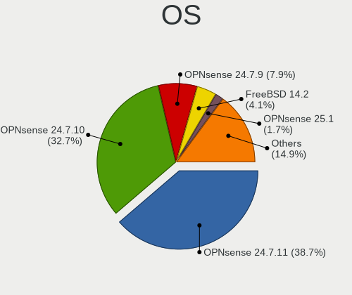
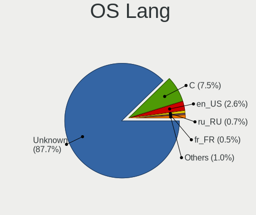
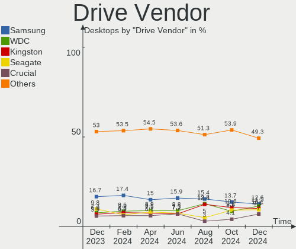

BSD Hardware Trends (Desktop)
-----------------------------

A project to identify most popular hardware characteristics and track their change
over time based on data collected by BSD users at https://BSD-Hardware.info.

Anyone can contribute to the study by uploading probes of their computers by
the [hw-probe](https://github.com/linuxhw/hw-probe/blob/master/INSTALL.BSD.md) tool:

    hw-probe -all -upload

Full-feature report is available here: https://bsd-hardware.info/?view=trends&formfactor=desktop

Period: Mar, 2021.

Contents
--------

- [ OS                       ](#os)
- [ OS Family                ](#os-family)
- [ Arch                     ](#arch)
- [ DE                       ](#de)
- [ Display Server           ](#display-server)
- [ Display Manager          ](#display-manager)
- [ OS Lang                  ](#os-lang)
- [ Boot Mode                ](#boot-mode)
- [ Filesystem               ](#filesystem)
- [ Part. scheme             ](#part-scheme)
- [ Country                  ](#country)
- [ City                     ](#city)
- [ Vendor                   ](#vendor)
- [ Model                    ](#model)
- [ Model Family             ](#model-family)
- [ MFG Year                 ](#mfg-year)
- [ Form Factor              ](#form-factor)
- [ Coreboot                 ](#coreboot)
- [ RAM Size                 ](#ram-size)
- [ RAM Used                 ](#ram-used)
- [ Has CD-ROM               ](#has-cd-rom)
- [ Total Drives             ](#total-drives)
- [ Has Ethernet             ](#has-ethernet)
- [ Has WiFi                 ](#has-wifi)
- [ Has Bluetooth            ](#has-bluetooth)
- [ Drive Vendor             ](#drive-vendor)
- [ Drive Model              ](#drive-model)
- [ HDD Vendor               ](#hdd-vendor)
- [ SSD Vendor               ](#ssd-vendor)
- [ Drive Kind               ](#drive-kind)
- [ Drive Connector          ](#drive-connector)
- [ Drive Size               ](#drive-size)
- [ Space Total              ](#space-total)
- [ Space Used               ](#space-used)
- [ Malfunc. Drives          ](#malfunc-drives)
- [ Malfunc. Drive Vendor    ](#malfunc-drive-vendor)
- [ Malfunc. HDD Vendor      ](#malfunc-hdd-vendor)
- [ Malfunc. Drive Kind      ](#malfunc-drive-kind)
- [ Failed Drives            ](#failed-drives)
- [ Failed Drive Vendor      ](#failed-drive-vendor)
- [ Drive Status             ](#drive-status)
- [ Storage Vendor           ](#storage-vendor)
- [ Storage Model            ](#storage-model)
- [ Storage Kind             ](#storage-kind)
- [ CPU Vendor               ](#cpu-vendor)
- [ CPU Model                ](#cpu-model)
- [ CPU Model Family         ](#cpu-model-family)
- [ CPU Cores                ](#cpu-cores)
- [ CPU Sockets              ](#cpu-sockets)
- [ CPU Threads              ](#cpu-threads)
- [ CPU Microarch            ](#cpu-microarch)
- [ GPU Vendor               ](#gpu-vendor)
- [ GPU Model                ](#gpu-model)
- [ GPU Combo                ](#gpu-combo)
- [ GPU Driver               ](#gpu-driver)
- [ GPU Memory               ](#gpu-memory)
- [ Monitor Vendor           ](#monitor-vendor)
- [ Monitor Model            ](#monitor-model)
- [ Monitor Resolution       ](#monitor-resolution)
- [ Monitor Diagonal         ](#monitor-diagonal)
- [ Monitor Width            ](#monitor-width)
- [ Aspect Ratio             ](#aspect-ratio)
- [ Monitor Area             ](#monitor-area)
- [ Pixel Density            ](#pixel-density)
- [ Multiple Monitors        ](#multiple-monitors)
- [ Net Controller Vendor    ](#net-controller-vendor)
- [ Net Controller Model     ](#net-controller-model)
- [ Wireless Vendor          ](#wireless-vendor)
- [ Wireless Model           ](#wireless-model)
- [ Ethernet Vendor          ](#ethernet-vendor)
- [ Ethernet Model           ](#ethernet-model)
- [ Net Controller Kind      ](#net-controller-kind)
- [ Used Controller          ](#used-controller)
- [ NICs                     ](#nics)
- [ IPv6                     ](#ipv6)
- [ Memory Vendor            ](#memory-vendor)
- [ Memory Model             ](#memory-model)
- [ Memory Kind              ](#memory-kind)
- [ Memory Form Factor       ](#memory-form-factor)
- [ Memory Size              ](#memory-size)
- [ Memory Speed             ](#memory-speed)
- [ Sound Vendor             ](#sound-vendor)
- [ Sound Model              ](#sound-model)
- [ Camera Vendor            ](#camera-vendor)
- [ Camera Model             ](#camera-model)
- [ Fingerprint Vendor       ](#fingerprint-vendor)
- [ Fingerprint Model        ](#fingerprint-model)
- [ Chipcard Vendor          ](#chipcard-vendor)
- [ Chipcard Model           ](#chipcard-model)
- [ Printer Vendor           ](#printer-vendor)
- [ Printer Model            ](#printer-model)
- [ Scanner Vendor           ](#scanner-vendor)
- [ Scanner Model            ](#scanner-model)
- [ Bluetooth Vendor         ](#bluetooth-vendor)
- [ Bluetooth Model          ](#bluetooth-model)
- [ Unsupported Devices      ](#unsupported-devices)
- [ Unsupported Device Types ](#unsupported-device-types)

OS
--

Installed operating systems

| Name                         | Desktops | Percent |
|------------------------------|----------|---------|
| OPNsense 21.1.3              | 146      | 44.51%  |
| OPNsense 21.1.2              | 57       | 17.38%  |
| helloSystem 0.4.0            | 16       | 4.88%   |
| helloSystem 0.5.0            | 15       | 4.57%   |
| FreeBSD 12.2-p4              | 15       | 4.57%   |
| OPNsense 21.1                | 12       | 3.66%   |
| OPNsense 21.1.4              | 9        | 2.74%   |
| GhostBSD 20.04.02            | 5        | 1.52%   |
| OPNsense 21.1.1              | 4        | 1.22%   |
| FreeBSD 14.0-CURRENT         | 4        | 1.22%   |
| FreeBSD 13.0-RC2             | 4        | 1.22%   |
| FreeBSD 12.2                 | 4        | 1.22%   |
| OPNsense 20.7.8              | 3        | 0.91%   |
| OpenBSD 6.8                  | 3        | 0.91%   |
| NomadBSD 1.4                 | 3        | 0.91%   |
| FreeBSD 12.2-p3              | 3        | 0.91%   |
| OPNsense 21.7                | 2        | 0.61%   |
| OpenBSD 6.9                  | 2        | 0.61%   |
| NetBSD 9.1                   | 2        | 0.61%   |
| FreeBSD 13.0-STABLE          | 2        | 0.61%   |
| FreeBSD 12.2-STABLE          | 2        | 0.61%   |
| pfSense 2.4.5                | 1        | 0.3%    |
| pfSense 12.2-STABLE          | 1        | 0.3%    |
| OPNsense 20.7.7              | 1        | 0.3%    |
| NomadBSD 1.4-RC1             | 1        | 0.3%    |
| NomadBSD 1.0                 | 1        | 0.3%    |
| helloSystem 0.3.0            | 1        | 0.3%    |
| HardenedBSD 13.0-STABLE-HBSD | 1        | 0.3%    |
| HardenedBSD 12.2--HBSD       | 1        | 0.3%    |
| FuryBSD 12.2-p3              | 1        | 0.3%    |
| FreeBSD 13.0-RC1             | 1        | 0.3%    |
| FreeBSD 13.0-BETA4           | 1        | 0.3%    |
| FreeBSD 13.0-BETA3-p1        | 1        | 0.3%    |
| FreeBSD 12.2-p2              | 1        | 0.3%    |
| FreeBSD 12.1-p12-HBSD        | 1        | 0.3%    |
| ClonOS 12.2-p4               | 1        | 0.3%    |

OS Family
---------

OS without a version

| Name        | Desktops | Percent |
|-------------|----------|---------|
| OPNsense    | 234      | 71.34%  |
| FreeBSD     | 39       | 11.89%  |
| helloSystem | 32       | 9.76%   |
| OpenBSD     | 5        | 1.52%   |
| NomadBSD    | 5        | 1.52%   |
| GhostBSD    | 5        | 1.52%   |
| pfSense     | 2        | 0.61%   |
| NetBSD      | 2        | 0.61%   |
| HardenedBSD | 2        | 0.61%   |
| FuryBSD     | 1        | 0.3%    |
| ClonOS      | 1        | 0.3%    |

Arch
----

OS architecture (x86_64, i586, etc.)

| Name  | Desktops | Percent |
|-------|----------|---------|
| amd64 | 322      | 98.17%  |
| arm64 | 4        | 1.22%   |
| i386  | 1        | 0.3%    |
| arm   | 1        | 0.3%    |

DE
--

Desktop Environment

| Name         | Desktops | Percent |
|--------------|----------|---------|
| Console      | 254      | 77.44%  |
| helloDesktop | 33       | 10.06%  |
| KDE5         | 10       | 3.05%   |
| MATE         | 7        | 2.13%   |
| XFCE         | 6        | 1.83%   |
| Openbox      | 6        | 1.83%   |
| GNOME        | 3        | 0.91%   |
| fvwm         | 3        | 0.91%   |
| Xfwm4        | 1        | 0.3%    |
| TWM          | 1        | 0.3%    |
| Lumina       | 1        | 0.3%    |
| dwm          | 1        | 0.3%    |
| Cinnamon     | 1        | 0.3%    |
| CDE          | 1        | 0.3%    |

Display Server
--------------

X11 or Wayland

| Name    | Desktops | Percent |
|---------|----------|---------|
| Console | 257      | 78.35%  |
| X11     | 71       | 21.65%  |

Display Manager
---------------

SDDM, LightDM, etc.

| Name    | Desktops | Percent |
|---------|----------|---------|
| Console | 263      | 80.18%  |
| SLiM    | 40       | 12.2%   |
| LightDM | 9        | 2.74%   |
| SDDM    | 8        | 2.44%   |
| XDM     | 4        | 1.22%   |
| GDM     | 4        | 1.22%   |

OS Lang
-------

Language

| Lang           | Desktops | Percent |
|----------------|----------|---------|
| Unknown        | 258      | 78.66%  |
| en_US          | 46       | 14.02%  |
| C              | 10       | 3.05%   |
| ru_RU          | 3        | 0.91%   |
| it_IT          | 3        | 0.91%   |
| sv_SE          | 2        | 0.61%   |
| zh_CN          | 1        | 0.3%    |
| tr_TR          | 1        | 0.3%    |
| sv_SE.US-ASCII | 1        | 0.3%    |
| pt_BR          | 1        | 0.3%    |
| en_AU          | 1        | 0.3%    |
| cv_RU.US-ASCII | 1        | 0.3%    |

Boot Mode
---------

EFI or BIOS

| Mode | Desktops | Percent |
|------|----------|---------|
| EFI  | 259      | 78.96%  |
| BIOS | 69       | 21.04%  |

Filesystem
----------

Type of filesystem

| Type | Desktops | Percent |
|------|----------|---------|
| Ufs  | 257      | 78.35%  |
| Zfs  | 66       | 20.12%  |
| Ffs  | 5        | 1.52%   |

Part. scheme
------------

Scheme of partitioning

| Type    | Desktops | Percent |
|---------|----------|---------|
| GPT     | 275      | 83.84%  |
| MBR     | 47       | 14.33%  |
| Unknown | 5        | 1.52%   |
| BSD     | 1        | 0.3%    |

Country
-------

Geographic location (country)

| Country      | Desktops | Percent |
|--------------|----------|---------|
| USA          | 84       | 25.61%  |
| Germany      | 60       | 18.29%  |
| Netherlands  | 15       | 4.57%   |
| Sweden       | 13       | 3.96%   |
| Canada       | 13       | 3.96%   |
| UK           | 11       | 3.35%   |
| Russia       | 11       | 3.35%   |
| Brazil       | 11       | 3.35%   |
| Italy        | 10       | 3.05%   |
| France       | 10       | 3.05%   |
| Switzerland  | 8        | 2.44%   |
| Austria      | 8        | 2.44%   |
| China        | 6        | 1.83%   |
| Poland       | 5        | 1.52%   |
| Australia    | 5        | 1.52%   |
| Turkey       | 4        | 1.22%   |
| Ukraine      | 3        | 0.91%   |
| Spain        | 3        | 0.91%   |
| Japan        | 3        | 0.91%   |
| Indonesia    | 3        | 0.91%   |
| Thailand     | 2        | 0.61%   |
| Taiwan       | 2        | 0.61%   |
| South Africa | 2        | 0.61%   |
| Slovakia     | 2        | 0.61%   |
| Romania      | 2        | 0.61%   |
| Portugal     | 2        | 0.61%   |
| Norway       | 2        | 0.61%   |
| New Zealand  | 2        | 0.61%   |
| Mexico       | 2        | 0.61%   |
| India        | 2        | 0.61%   |
| Finland      | 2        | 0.61%   |
| Egypt        | 2        | 0.61%   |
| Czechia      | 2        | 0.61%   |
| Bulgaria     | 2        | 0.61%   |
| Belgium      | 2        | 0.61%   |
| Singapore    | 1        | 0.3%    |
| Saudi Arabia | 1        | 0.3%    |
| Pakistan     | 1        | 0.3%    |
| Oman         | 1        | 0.3%    |
| Luxembourg   | 1        | 0.3%    |
| Hungary      | 1        | 0.3%    |
| Greece       | 1        | 0.3%    |
| Estonia      | 1        | 0.3%    |
| Denmark      | 1        | 0.3%    |
| Costa Rica   | 1        | 0.3%    |
| Colombia     | 1        | 0.3%    |
| Argentina    | 1        | 0.3%    |

City
----

Geographic location (city)

| City                  | Desktops | Percent |
|-----------------------|----------|---------|
| Munich                | 6        | 1.83%   |
| Berlin                | 6        | 1.83%   |
| Vienna                | 5        | 1.52%   |
| Cologne               | 4        | 1.22%   |
| Stockholm             | 3        | 0.91%   |
| Redmond               | 3        | 0.91%   |
| Portland              | 3        | 0.91%   |
| Paris                 | 3        | 0.91%   |
| Milan                 | 3        | 0.91%   |
| Malmo                 | 3        | 0.91%   |
| Las Vegas             | 3        | 0.91%   |
| Hamburg               | 3        | 0.91%   |
| Dallas                | 3        | 0.91%   |
| Columbus              | 3        | 0.91%   |
| Chicago               | 3        | 0.91%   |
| Ulyanovsk             | 2        | 0.61%   |
| Seattle               | 2        | 0.61%   |
| Salt Lake City        | 2        | 0.61%   |
| Rousse                | 2        | 0.61%   |
| Perth                 | 2        | 0.61%   |
| Moscow                | 2        | 0.61%   |
| Mannheim              | 2        | 0.61%   |
| Ludwigshafen am Rhein | 2        | 0.61%   |
| Jakarta               | 2        | 0.61%   |
| Istanbul              | 2        | 0.61%   |
| Hazel Green           | 2        | 0.61%   |
| Gordola               | 2        | 0.61%   |
| Fort Lauderdale       | 2        | 0.61%   |
| Falkenstein           | 2        | 0.61%   |
| Calgary               | 2        | 0.61%   |
| Barneveld             | 2        | 0.61%   |
| Bangkok               | 2        | 0.61%   |
| Austin                | 2        | 0.61%   |
| Ōta-ku               | 1        | 0.3%    |
| Älvängen            | 1        | 0.3%    |
| Zurich                | 1        | 0.3%    |
| Zhongshan             | 1        | 0.3%    |
| Zaragoza              | 1        | 0.3%    |
| Yokohama              | 1        | 0.3%    |
| Yekaterinburg         | 1        | 0.3%    |
| Xi'an                 | 1        | 0.3%    |
| Wolfratshausen        | 1        | 0.3%    |
| Wittingen             | 1        | 0.3%    |
| Wetzikon              | 1        | 0.3%    |
| Wettswil              | 1        | 0.3%    |
| Westland              | 1        | 0.3%    |
| Wesley Chapel         | 1        | 0.3%    |
| Wenatchee             | 1        | 0.3%    |
| Watford               | 1        | 0.3%    |
| Washington            | 1        | 0.3%    |
| Warsaw                | 1        | 0.3%    |
| Ware                  | 1        | 0.3%    |
| Vlaardingen           | 1        | 0.3%    |
| Vitória da Conquista | 1        | 0.3%    |
| Victoria              | 1        | 0.3%    |
| Vaughan               | 1        | 0.3%    |
| Valencia              | 1        | 0.3%    |
| Vaasa                 | 1        | 0.3%    |
| Turtle Creek          | 1        | 0.3%    |
| Tucson                | 1        | 0.3%    |

Vendor
------

Motherboard manufacturer

| Name                       | Desktops | Percent |
|----------------------------|----------|---------|
| Unknown                    | 43       | 13.11%  |
| ASUSTek Computer           | 42       | 12.8%   |
| Dell                       | 36       | 10.98%  |
| Gigabyte Technology        | 25       | 7.62%   |
| Hewlett-Packard            | 24       | 7.32%   |
| ASRock                     | 20       | 6.1%    |
| PC Engines                 | 19       | 5.79%   |
| Intel                      | 16       | 4.88%   |
| Protectli                  | 15       | 4.57%   |
| MSI                        | 13       | 3.96%   |
| Lenovo                     | 11       | 3.35%   |
| Shuttle                    | 8        | 2.44%   |
| Supermicro                 | 5        | 1.52%   |
| Fujitsu                    | 5        | 1.52%   |
| HARDKERNEL                 | 4        | 1.22%   |
| Acer                       | 4        | 1.22%   |
| Thomas-Krenn.AG            | 3        | 0.91%   |
| BESSTAR Tech               | 3        | 0.91%   |
| AMI                        | 3        | 0.91%   |
| ShenZhen MinWin Technology | 2        | 0.61%   |
| SeeedStudio                | 2        | 0.61%   |
| Pegatron                   | 2        | 0.61%   |
| ECS                        | 2        | 0.61%   |
| VeryPC                     | 1        | 0.3%    |
| TYAN Computer              | 1        | 0.3%    |
| Raspberry Pi Foundation    | 1        | 0.3%    |
| Quanmax                    | 1        | 0.3%    |
| pine64                     | 1        | 0.3%    |
| OEM                        | 1        | 0.3%    |
| NU941                      | 1        | 0.3%    |
| NF541                      | 1        | 0.3%    |
| MiTAC                      | 1        | 0.3%    |
| Medion                     | 1        | 0.3%    |
| Kontron                    | 1        | 0.3%    |
| iEi                        | 1        | 0.3%    |
| Huanan                     | 1        | 0.3%    |
| HPE                        | 1        | 0.3%    |
| Foxconn                    | 1        | 0.3%    |
| Deciso                     | 1        | 0.3%    |
| Biostar                    | 1        | 0.3%    |
| AZW                        | 1        | 0.3%    |
| ASRockRack                 | 1        | 0.3%    |
| ADI                        | 1        | 0.3%    |
| AAEON                      | 1        | 0.3%    |

Model
-----

Motherboard model

| Name                           | Desktops | Percent |
|--------------------------------|----------|---------|
| Unknown                        | 43       | 13.11%  |
| Protectli FW4B                 | 8        | 2.44%   |
| Intel Q3XXG4-P V1.0            | 8        | 2.44%   |
| PC Engines apu4                | 6        | 1.83%   |
| PC Engines apu2                | 6        | 1.83%   |
| Dell OptiPlex 3020             | 5        | 1.52%   |
| ASUS All Series                | 5        | 1.52%   |
| PC Engines APU                 | 4        | 1.22%   |
| HARDKERNEL ODROID-H2           | 4        | 1.22%   |
| Dell OptiPlex 9020             | 4        | 1.22%   |
| Thomas-Krenn.AG LES network+   | 3        | 0.91%   |
| Protectli FW6                  | 3        | 0.91%   |
| HP Compaq Elite 8300 SFF       | 3        | 0.91%   |
| Dell OptiPlex 380              | 3        | 0.91%   |
| ASUS P5Q-E                     | 3        | 0.91%   |
| Supermicro X9SCL/X9SCM         | 2        | 0.61%   |
| Shuttle DS10U                  | 2        | 0.61%   |
| ShenZhen MinWin MW-NANO-APL-4L | 2        | 0.61%   |
| SeeedStudio ODYSSEY-X86J4105   | 2        | 0.61%   |
| Protectli FW1                  | 2        | 0.61%   |
| PC Engines APU3                | 2        | 0.61%   |
| MSI MS-7693                    | 2        | 0.61%   |
| HP ProDesk 600 G1 SFF          | 2        | 0.61%   |
| HP EliteDesk 800 G1 SFF        | 2        | 0.61%   |
| Gigabyte 970A-DS3P             | 2        | 0.61%   |
| Fujitsu FUTRO S920             | 2        | 0.61%   |
| Dell OptiPlex 790              | 2        | 0.61%   |
| Dell OptiPlex 7020             | 2        | 0.61%   |
| Dell OptiPlex 7010             | 2        | 0.61%   |
| Dell OptiPlex 5040             | 2        | 0.61%   |
| BESSTAR Tech DMAF5             | 2        | 0.61%   |
| ASUS P8H61-M LE/USB3           | 2        | 0.61%   |
| ASUS H110M-K                   | 2        | 0.61%   |
| ASRock Q1900M                  | 2        | 0.61%   |
| ASRock B75M                    | 2        | 0.61%   |
| Acer Veriton M460              | 2        | 0.61%   |
| VeryPC S400-K7-N-O             | 1        | 0.3%    |
| TYAN S2925                     | 1        | 0.3%    |
| Supermicro X7SPA-HF            | 1        | 0.3%    |
| Supermicro X7SLA               | 1        | 0.3%    |
| Supermicro SYS-E300-9A         | 1        | 0.3%    |
| Shuttle SZ270                  | 1        | 0.3%    |
| Shuttle SH55J                  | 1        | 0.3%    |
| Shuttle DS81D                  | 1        | 0.3%    |
| Shuttle DS67U                  | 1        | 0.3%    |
| Shuttle DH310                  | 1        | 0.3%    |
| Shuttle DH110                  | 1        | 0.3%    |
| RPi rpi                        | 1        | 0.3%    |
| Quanmax spo-book TECH QUAD     | 1        | 0.3%    |
| Protectli FW6D                 | 1        | 0.3%    |
| Protectli FW4A                 | 1        | 0.3%    |
| pine64 pinebook-pro-rk3399     | 1        | 0.3%    |
| Pegatron IPM41-D3              | 1        | 0.3%    |
| Pegatron h8-1102nl             | 1        | 0.3%    |
| PC Engines apu1                | 1        | 0.3%    |
| OEM 2550L2D-MX V1.1            | 1        | 0.3%    |
| NU941 1.0                      | 1        | 0.3%    |
| NF541 1.0                      | 1        | 0.3%    |
| MSI WC776AA-UUW HPE-110sc      | 1        | 0.3%    |
| MSI MS-98I8                    | 1        | 0.3%    |

Model Family
------------

Motherboard model prefix

| Name                           | Desktops | Percent |
|--------------------------------|----------|---------|
| Unknown                        | 43       | 13.11%  |
| Dell OptiPlex                  | 28       | 8.54%   |
| Lenovo ThinkCentre             | 9        | 2.74%   |
| Protectli FW4B                 | 8        | 2.44%   |
| Intel Q3XXG4-P                 | 8        | 2.44%   |
| HP Compaq                      | 7        | 2.13%   |
| PC Engines apu4                | 6        | 1.83%   |
| PC Engines apu2                | 6        | 1.83%   |
| HP EliteDesk                   | 6        | 1.83%   |
| HP ProDesk                     | 5        | 1.52%   |
| ASUS All                       | 5        | 1.52%   |
| PC Engines APU                 | 4        | 1.22%   |
| HARDKERNEL ODROID-H2           | 4        | 1.22%   |
| ASUS PRIME                     | 4        | 1.22%   |
| ASUS P8H61-M                   | 4        | 1.22%   |
| Thomas-Krenn.AG LES            | 3        | 0.91%   |
| Protectli FW6                  | 3        | 0.91%   |
| ASUS P5Q-E                     | 3        | 0.91%   |
| Supermicro X9SCL               | 2        | 0.61%   |
| Shuttle DS10U                  | 2        | 0.61%   |
| ShenZhen MinWin MW-NANO-APL-4L | 2        | 0.61%   |
| SeeedStudio ODYSSEY-X86J4105   | 2        | 0.61%   |
| Protectli FW1                  | 2        | 0.61%   |
| PC Engines APU3                | 2        | 0.61%   |
| MSI MS-7693                    | 2        | 0.61%   |
| HP t620                        | 2        | 0.61%   |
| Gigabyte 970A-DS3P             | 2        | 0.61%   |
| Fujitsu FUTRO                  | 2        | 0.61%   |
| Dell Precision                 | 2        | 0.61%   |
| Dell Inspiron                  | 2        | 0.61%   |
| BESSTAR Tech DMAF5             | 2        | 0.61%   |
| ASUS ROG                       | 2        | 0.61%   |
| ASUS P8H67-M                   | 2        | 0.61%   |
| ASUS H110M-K                   | 2        | 0.61%   |
| ASRock Q1900M                  | 2        | 0.61%   |
| ASRock B75M                    | 2        | 0.61%   |
| Acer Veriton                   | 2        | 0.61%   |
| Acer Aspire                    | 2        | 0.61%   |
| VeryPC S400-K7-N-O             | 1        | 0.3%    |
| TYAN S2925                     | 1        | 0.3%    |
| Supermicro X7SPA-HF            | 1        | 0.3%    |
| Supermicro X7SLA               | 1        | 0.3%    |
| Supermicro SYS-E300-9A         | 1        | 0.3%    |
| Shuttle SZ270                  | 1        | 0.3%    |
| Shuttle SH55J                  | 1        | 0.3%    |
| Shuttle DS81D                  | 1        | 0.3%    |
| Shuttle DS67U                  | 1        | 0.3%    |
| Shuttle DH310                  | 1        | 0.3%    |
| Shuttle DH110                  | 1        | 0.3%    |
| RPi rpi                        | 1        | 0.3%    |
| Quanmax spo-book               | 1        | 0.3%    |
| Protectli FW6D                 | 1        | 0.3%    |
| Protectli FW4A                 | 1        | 0.3%    |
| pine64 pinebook-pro-rk3399     | 1        | 0.3%    |
| Pegatron IPM41-D3              | 1        | 0.3%    |
| Pegatron h8-1102nl             | 1        | 0.3%    |
| PC Engines apu1                | 1        | 0.3%    |
| OEM 2550L2D-MX                 | 1        | 0.3%    |
| NU941 1.0                      | 1        | 0.3%    |
| NF541 1.0                      | 1        | 0.3%    |

MFG Year
--------

Motherboard manufacture year

| Year    | Desktops | Percent |
|---------|----------|---------|
| 2020    | 64       | 19.51%  |
| 2019    | 53       | 16.16%  |
| 2018    | 45       | 13.72%  |
| 2014    | 28       | 8.54%   |
| 2012    | 20       | 6.1%    |
| 2017    | 17       | 5.18%   |
| 2013    | 16       | 4.88%   |
| 2016    | 15       | 4.57%   |
| 2010    | 14       | 4.27%   |
| 2021    | 13       | 3.96%   |
| 2015    | 13       | 3.96%   |
| 2009    | 10       | 3.05%   |
| 2011    | 7        | 2.13%   |
| 2008    | 5        | 1.52%   |
| Unknown | 4        | 1.22%   |
| 2007    | 3        | 0.91%   |
| 2005    | 1        | 0.3%    |

Form Factor
-----------

Physical design of the computer

| Name    | Desktops | Percent |
|---------|----------|---------|
| Desktop | 328      | 100%    |

Coreboot
--------

Have coreboot on board

| Used | Desktops | Percent |
|------|----------|---------|
| No   | 306      | 93.29%  |
| Yes  | 22       | 6.71%   |

RAM Size
--------

Total RAM memory

| Size in GB      | Desktops | Percent |
|-----------------|----------|---------|
| 8.01-16.0       | 119      | 36.28%  |
| 4.01-8.0        | 93       | 28.35%  |
| 16.01-24.0      | 72       | 21.95%  |
| 32.01-64.0      | 16       | 4.88%   |
| 2.01-3.0        | 10       | 3.05%   |
| 64.01-256.0     | 8        | 2.44%   |
| 3.01-4.0        | 3        | 0.91%   |
| 24.01-32.0      | 2        | 0.61%   |
| 1.01-2.0        | 2        | 0.61%   |
| More than 256.0 | 1        | 0.3%    |
| 0.51-1.0        | 1        | 0.3%    |
| 0.01-0.5        | 1        | 0.3%    |

RAM Used
--------

Used RAM memory

| Used GB    | Desktops | Percent |
|------------|----------|---------|
| 0.01-0.5   | 188      | 57.32%  |
| 0.51-1.0   | 93       | 28.35%  |
| 1.01-2.0   | 23       | 7.01%   |
| 4.01-8.0   | 7        | 2.13%   |
| 3.01-4.0   | 7        | 2.13%   |
| 8.01-16.0  | 4        | 1.22%   |
| 2.01-3.0   | 2        | 0.61%   |
| Unknown    | 2        | 0.61%   |
| 24.01-32.0 | 1        | 0.3%    |
| 0          | 1        | 0.3%    |

Has CD-ROM
----------

Has CD-ROM on board

| Presented | Desktops | Percent |
|-----------|----------|---------|
| No        | 261      | 79.57%  |
| Yes       | 67       | 20.43%  |

Total Drives
------------

Number of drives on board

| Drives | Desktops | Percent |
|--------|----------|---------|
| 1      | 230      | 70.12%  |
| 0      | 33       | 10.06%  |
| 2      | 31       | 9.45%   |
| 3      | 18       | 5.49%   |
| 4      | 9        | 2.74%   |
| 5      | 4        | 1.22%   |
| 8      | 1        | 0.3%    |
| 7      | 1        | 0.3%    |
| 6      | 1        | 0.3%    |

Has Ethernet
------------

Has Ethernet on board

| Presented | Desktops | Percent |
|-----------|----------|---------|
| Yes       | 322      | 98.17%  |
| No        | 6        | 1.83%   |

Has WiFi
--------

Has WiFi module

| Presented | Desktops | Percent |
|-----------|----------|---------|
| No        | 261      | 79.57%  |
| Yes       | 67       | 20.43%  |

Has Bluetooth
-------------

Has Bluetooth module

| Presented | Desktops | Percent |
|-----------|----------|---------|
| No        | 294      | 89.63%  |
| Yes       | 34       | 10.37%  |

Drive Vendor
------------

Hard drive vendors

| Vendor              | Desktops | Drives | Percent |
|---------------------|----------|--------|---------|
| WDC                 | 53       | 70     | 14.36%  |
| Samsung Electronics | 52       | 60     | 14.09%  |
| Seagate             | 44       | 55     | 11.92%  |
| Kingston            | 37       | 39     | 10.03%  |
| Intel               | 18       | 20     | 4.88%   |
| Crucial             | 18       | 18     | 4.88%   |
| SanDisk             | 17       | 18     | 4.61%   |
| Toshiba             | 14       | 17     | 3.79%   |
| Phison              | 13       | 13     | 3.52%   |
| Transcend           | 12       | 12     | 3.25%   |
| Hoodisk             | 11       | 11     | 2.98%   |
| Hitachi             | 10       | 10     | 2.71%   |
| A-DATA Technology   | 7        | 8      | 1.9%    |
| OCZ                 | 5        | 5      | 1.36%   |
| HGST                | 4        | 5      | 1.08%   |
| SPCC                | 3        | 3      | 0.81%   |
| PNY                 | 3        | 10     | 0.81%   |
| MAXTOR              | 3        | 3      | 0.81%   |
| Hewlett-Packard     | 3        | 4      | 0.81%   |
| Apacer              | 3        | 3      | 0.81%   |
| SK Hynix            | 2        | 2      | 0.54%   |
| Mushkin             | 2        | 2      | 0.54%   |
| Micron Technology   | 2        | 2      | 0.54%   |
| LITEON              | 2        | 2      | 0.54%   |
| Kston               | 2        | 2      | 0.54%   |
| KingDian            | 2        | 2      | 0.54%   |
| Intenso             | 2        | 2      | 0.54%   |
| Gigabyte Technology | 2        | 3      | 0.54%   |
| DREVO               | 2        | 2      | 0.54%   |
| Corsair             | 2        | 2      | 0.54%   |
| China               | 2        | 2      | 0.54%   |
| BIWIN               | 2        | 2      | 0.54%   |
| Apple               | 2        | 3      | 0.54%   |
| V-GeN               | 1        | 1      | 0.27%   |
| PLEXTOR             | 1        | 1      | 0.27%   |
| OPENBSD             | 1        | 1      | 0.27%   |
| NVMe                | 1        | 1      | 0.27%   |
| LEXAR               | 1        | 1      | 0.27%   |
| Innodisk            | 1        | 1      | 0.27%   |
| INDMEM              | 1        | 1      | 0.27%   |
| HPE                 | 1        | 1      | 0.27%   |
| GOODRAM             | 1        | 1      | 0.27%   |
| FORESEE             | 1        | 1      | 0.27%   |
| EMTEC               | 1        | 1      | 0.27%   |
| DOGFISH             | 1        | 1      | 0.27%   |
| AMD                 | 1        | 1      | 0.27%   |

Drive Model
-----------

Hard drive models

| Model                            | Desktops | Percent |
|----------------------------------|----------|---------|
| Phison SATA SSD 16GB             | 12       | 3.06%   |
| Seagate ST500DM002-1BD142 500GB  | 7        | 1.79%   |
| Kingston SA400S37240G 240GB      | 7        | 1.79%   |
| Kingston SA400S37120G 120GB      | 6        | 1.53%   |
| Kingston SUV500MS120G 120GB      | 5        | 1.28%   |
| Seagate ST4000DM000-1F2168 4TB   | 4        | 1.02%   |
| SanDisk SDSSDA240G 240GB         | 4        | 1.02%   |
| Samsung SSD 860 EVO 250GB        | 4        | 1.02%   |
| Kingston SUV500MS240G 240GB      | 4        | 1.02%   |
| Crucial CT240BX500SSD1 240GB     | 4        | 1.02%   |
| Crucial CT120BX500SSD1 120GB     | 4        | 1.02%   |
| Transcend TS64GMSA230S 64GB      | 3        | 0.77%   |
| Transcend TS128GMSA230S 128GB    | 3        | 0.77%   |
| Seagate ST1000DM010-2EP102 1TB   | 3        | 0.77%   |
| Seagate ST1000DM003-1SB102 1TB   | 3        | 0.77%   |
| Samsung SSD 860 PRO 256GB        | 3        | 0.77%   |
| Samsung SSD 850 EVO 500GB        | 3        | 0.77%   |
| Kingston SV300S37A120G 120GB     | 3        | 0.77%   |
| Intel SSDSC2KG240G8 240GB        | 3        | 0.77%   |
| Intel SSDSA2CT040G3 40GB         | 3        | 0.77%   |
| Hoodisk SSD 64GB                 | 3        | 0.77%   |
| Hoodisk SSD 32GB                 | 3        | 0.77%   |
| Hoodisk SSD 128GB                | 3        | 0.77%   |
| WDC WDS120G2G0A-00JH30 120GB     | 2        | 0.51%   |
| WDC WDS100T2B0A-00SM50 1TB       | 2        | 0.51%   |
| WDC WD1600AAJS-22L7A0 160GB      | 2        | 0.51%   |
| WDC WD10EZEX-08WN4A0 1TB         | 2        | 0.51%   |
| WDC WD10EZEX-00RKKA0 1TB         | 2        | 0.51%   |
| Toshiba DT01ACA100 1TB           | 2        | 0.51%   |
| SPCC Solid State Disk 128GB      | 2        | 0.51%   |
| Seagate ST250DM000-1BD141 250GB  | 2        | 0.51%   |
| SanDisk SSD PLUS 240 GB          | 2        | 0.51%   |
| Samsung SSD 970 EVO Plus 250GB   | 2        | 0.51%   |
| Samsung SSD 970 EVO 500GB        | 2        | 0.51%   |
| Samsung SSD 960 EVO 250GB        | 2        | 0.51%   |
| Samsung SSD 860 QVO 1TB          | 2        | 0.51%   |
| Samsung SSD 860 EVO 500GB        | 2        | 0.51%   |
| Samsung SSD 840 PRO Series 128GB | 2        | 0.51%   |
| Samsung SSD 840 EVO 250GB        | 2        | 0.51%   |
| Samsung HD103UJ 1TB              | 2        | 0.51%   |
| OCZ VERTEX3 120GB                | 2        | 0.51%   |
| Mushkin MKNSSDEC60GB 64GB        | 2        | 0.51%   |
| Kston SSD 128GB                  | 2        | 0.51%   |
| Intenso SSD Sata III 120GB       | 2        | 0.51%   |
| Crucial CT500P1SSD8 500GB        | 2        | 0.51%   |
| BIWIN SSD 128GB                  | 2        | 0.51%   |
| Apacer 16GB SATA Flash Drive     | 2        | 0.51%   |
| A-DATA SX300 128GB               | 2        | 0.51%   |
| A-DATA SU650 240GB               | 2        | 0.51%   |
| WDC WDS500G2B0A-00SM50 500GB     | 1        | 0.26%   |
| WDC WDS500G1X0E-00AFY0 500GB     | 1        | 0.26%   |
| WDC WDS250G1B0A-00H9H0 250GB     | 1        | 0.26%   |
| WDC WDS240G2G0B-00EPW0 240GB     | 1        | 0.26%   |
| WDC WDS240G2G0A-00JH30 240GB     | 1        | 0.26%   |
| WDC WDS120G2G0B-00EPW0 120GB     | 1        | 0.26%   |
| WDC WDS100T1X0E-00AFY0 1TB       | 1        | 0.26%   |
| WDC WD800JD-60LSA5 80GB          | 1        | 0.26%   |
| WDC WD7501AALS-00E8B0 752GB      | 1        | 0.26%   |
| WDC WD60EZRZ-00GZ5B1 6TB         | 1        | 0.26%   |
| WDC WD60EFRX-68L0BN1 6TB         | 1        | 0.26%   |

HDD Vendor
----------

Hard disk drive vendors

| Vendor              | Desktops | Drives | Percent |
|---------------------|----------|--------|---------|
| WDC                 | 44       | 58     | 36.07%  |
| Seagate             | 41       | 51     | 33.61%  |
| Hitachi             | 10       | 10     | 8.2%    |
| Toshiba             | 7        | 9      | 5.74%   |
| Samsung Electronics | 7        | 8      | 5.74%   |
| HGST                | 4        | 5      | 3.28%   |
| Maxtor              | 3        | 3      | 2.46%   |
| Hewlett-Packard     | 2        | 3      | 1.64%   |
| Apple               | 2        | 3      | 1.64%   |
| OPENBSD             | 1        | 1      | 0.82%   |
| NVMe                | 1        | 1      | 0.82%   |

SSD Vendor
----------

Solid state drive vendors

| Vendor              | Desktops | Drives | Percent |
|---------------------|----------|--------|---------|
| Samsung Electronics | 34       | 40     | 15.45%  |
| Kingston            | 32       | 34     | 14.55%  |
| SanDisk             | 17       | 18     | 7.73%   |
| Intel               | 17       | 19     | 7.73%   |
| Crucial             | 16       | 16     | 7.27%   |
| Transcend           | 12       | 12     | 5.45%   |
| Phison              | 12       | 12     | 5.45%   |
| Hoodisk             | 11       | 11     | 5%      |
| WDC                 | 8        | 10     | 3.64%   |
| Toshiba             | 6        | 6      | 2.73%   |
| A-DATA Technology   | 6        | 7      | 2.73%   |
| OCZ                 | 5        | 5      | 2.27%   |
| SPCC                | 3        | 3      | 1.36%   |
| Seagate             | 3        | 4      | 1.36%   |
| PNY                 | 3        | 8      | 1.36%   |
| Apacer              | 3        | 3      | 1.36%   |
| SK Hynix            | 2        | 2      | 0.91%   |
| Mushkin             | 2        | 2      | 0.91%   |
| Micron Technology   | 2        | 2      | 0.91%   |
| LITEON              | 2        | 2      | 0.91%   |
| Kston               | 2        | 2      | 0.91%   |
| KingDian            | 2        | 2      | 0.91%   |
| Intenso             | 2        | 2      | 0.91%   |
| DREVO               | 2        | 2      | 0.91%   |
| China               | 2        | 2      | 0.91%   |
| BIWIN               | 2        | 2      | 0.91%   |
| V-GeN               | 1        | 1      | 0.45%   |
| PLEXTOR             | 1        | 1      | 0.45%   |
| LEXAR               | 1        | 1      | 0.45%   |
| Innodisk            | 1        | 1      | 0.45%   |
| INDMEM              | 1        | 1      | 0.45%   |
| HPE                 | 1        | 1      | 0.45%   |
| GOODRAM             | 1        | 1      | 0.45%   |
| Gigabyte Technology | 1        | 1      | 0.45%   |
| FORESEE             | 1        | 1      | 0.45%   |
| DOGFISH             | 1        | 1      | 0.45%   |
| Corsair             | 1        | 1      | 0.45%   |
| AMD                 | 1        | 1      | 0.45%   |

Drive Kind
----------

HDD or SSD

| Kind | Desktops | Drives | Percent |
|------|----------|--------|---------|
| SSD  | 207      | 240    | 62.73%  |
| HDD  | 93       | 152    | 28.18%  |
| NVMe | 30       | 33     | 9.09%   |

Drive Connector
---------------

SATA, SAS, NVMe, etc.

| Type | Desktops | Drives | Percent |
|------|----------|--------|---------|
| SATA | 277      | 392    | 90.23%  |
| NVMe | 30       | 33     | 9.77%   |

Drive Size
----------

Size of hard drive

| Size in TB | Desktops | Drives | Percent |
|------------|----------|--------|---------|
| 0.01-0.5   | 253      | 298    | 80.06%  |
| 0.51-1.0   | 33       | 50     | 10.44%  |
| 1.01-2.0   | 13       | 17     | 4.11%   |
| 3.01-4.0   | 8        | 13     | 2.53%   |
| 2.01-3.0   | 5        | 6      | 1.58%   |
| 4.01-10.0  | 4        | 8      | 1.27%   |

Space Total
-----------

Amount of disk space available on the file system

| Size in GB     | Desktops | Percent |
|----------------|----------|---------|
| 101-250        | 119      | 36.28%  |
| 1-20           | 62       | 18.9%   |
| 21-50          | 44       | 13.41%  |
| 251-500        | 43       | 13.11%  |
| 51-100         | 38       | 11.59%  |
| 501-1000       | 10       | 3.05%   |
| 1001-2000      | 7        | 2.13%   |
| More than 3000 | 2        | 0.61%   |
| 2001-3000      | 2        | 0.61%   |
| Unknown        | 1        | 0.3%    |

Space Used
----------

Amount of used disk space

| Used GB   | Desktops | Percent |
|-----------|----------|---------|
| 1-20      | 300      | 91.46%  |
| 21-50     | 14       | 4.27%   |
| 101-250   | 4        | 1.22%   |
| 51-100    | 4        | 1.22%   |
| 251-500   | 3        | 0.91%   |
| 2001-3000 | 1        | 0.3%    |
| 501-1000  | 1        | 0.3%    |
| Unknown   | 1        | 0.3%    |

Malfunc. Drives
---------------

Drive models with a malfunction

| Model                                        | Desktops | Drives | Percent |
|----------------------------------------------|----------|--------|---------|
| Seagate ST500DM002-1BD142 500GB              | 3        | 3      | 5.45%   |
| Kingston SV300S37A120G 120GB                 | 2        | 2      | 3.64%   |
| WDC WDS240G2G0A-00JH30 240GB                 | 1        | 1      | 1.82%   |
| WDC WD800JD-60LSA5 80GB                      | 1        | 1      | 1.82%   |
| WDC WD7501AALS-00E8B0 752GB                  | 1        | 1      | 1.82%   |
| WDC WD6002FRYZ-01WD5B1 6TB                   | 1        | 1      | 1.82%   |
| WDC WD5000AAKX-001CA0 500GB                  | 1        | 1      | 1.82%   |
| WDC WD5000AAKS-00UU3A0 500GB                 | 1        | 1      | 1.82%   |
| WDC WD2500JS-22NCB1 250GB                    | 1        | 1      | 1.82%   |
| WDC WD20EARX-00ZUDB0 2TB                     | 1        | 1      | 1.82%   |
| WDC WD1600BEVS-00UST0 160GB                  | 1        | 1      | 1.82%   |
| WDC WD1600AAJS-75M0A0 160GB                  | 1        | 1      | 1.82%   |
| WDC WD1600AAJS-00WAA0 160GB                  | 1        | 1      | 1.82%   |
| WDC WD10JMVW-11AJGS1 1TB                     | 1        | 1      | 1.82%   |
| WDC WD10EZEX-00RKKA0 1TB                     | 1        | 1      | 1.82%   |
| Toshiba THNSNK128GCS8 SATA 128GB             | 1        | 1      | 1.82%   |
| Toshiba MQ01ABD050 500GB                     | 1        | 1      | 1.82%   |
| SK Hynix HFS256G3AMNB-2200A 256GB            | 1        | 1      | 1.82%   |
| Seagate ST9160314AS 160GB                    | 1        | 1      | 1.82%   |
| Seagate ST500LT012-9WS142 500GB              | 1        | 1      | 1.82%   |
| Seagate ST3320418AS 320GB                    | 1        | 1      | 1.82%   |
| Seagate ST320LM001 HN-M320MBB 320GB          | 1        | 1      | 1.82%   |
| Seagate ST31000333AS 1TB                     | 1        | 1      | 1.82%   |
| Seagate ST2000DM006-2DM164 2TB               | 1        | 1      | 1.82%   |
| Seagate ST1000LM024 HN-M101MBB 1TB           | 1        | 1      | 1.82%   |
| Seagate ST1000DX001-1CM162 1TB               | 1        | 1      | 1.82%   |
| Seagate ST1000DL002-9TT153 1TB               | 1        | 1      | 1.82%   |
| SanDisk SSD PLUS 240 GB                      | 1        | 1      | 1.82%   |
| Samsung Electronics SSD 840 PRO Series 128GB | 1        | 1      | 1.82%   |
| Samsung Electronics HM321HI 320GB            | 1        | 1      | 1.82%   |
| Samsung Electronics HD103UJ 1TB              | 1        | 1      | 1.82%   |
| OCZ VERTEX3 120GB                            | 1        | 1      | 1.82%   |
| OCZ AGILITY3 240GB                           | 1        | 1      | 1.82%   |
| MAXTOR STM3320613AS 320GB                    | 1        | 1      | 1.82%   |
| LEXAR CFAST 64GB CARD                        | 1        | 1      | 1.82%   |
| Kingston SNV425S2128GB                       | 1        | 1      | 1.82%   |
| KingDian S200 60GB                           | 1        | 1      | 1.82%   |
| Intel SSDSC2CT120A3 120GB                    | 1        | 1      | 1.82%   |
| Intel SSDSC2BW480A4 480GB                    | 1        | 1      | 1.82%   |
| Intel SSDSA2M120G2GC 120GB                   | 1        | 1      | 1.82%   |
| Hitachi HUA722020ALA331 2TB                  | 1        | 1      | 1.82%   |
| Hitachi HTS547575A9E384 752GB                | 1        | 1      | 1.82%   |
| Hitachi HTS543216L9A300 160GB                | 1        | 1      | 1.82%   |
| Hitachi HDS723015BLA642 1.5TB                | 1        | 1      | 1.82%   |
| HGST HTS545032A7E380 320GB                   | 1        | 1      | 1.82%   |
| Hewlett-Packard MB1000GCWCV 1TB              | 1        | 1      | 1.82%   |
| Crucial CT525MX300SSD1 528GB                 | 1        | 1      | 1.82%   |
| Crucial CT275MX300SSD1 275GB                 | 1        | 1      | 1.82%   |
| Crucial CT240M500SSD1 240GB                  | 1        | 1      | 1.82%   |
| Corsair Force 3 SSD 120GB                    | 1        | 1      | 1.82%   |
| A-DATA Technology SX300 128GB                | 1        | 1      | 1.82%   |
| A-DATA Technology SU630 240GB                | 1        | 2      | 1.82%   |

Malfunc. Drive Vendor
---------------------

Vendors of faulty drives

| Vendor              | Desktops | Drives | Percent |
|---------------------|----------|--------|---------|
| WDC                 | 13       | 13     | 23.64%  |
| Seagate             | 12       | 12     | 21.82%  |
| Hitachi             | 4        | 4      | 7.27%   |
| Samsung Electronics | 3        | 3      | 5.45%   |
| Kingston            | 3        | 3      | 5.45%   |
| Intel               | 3        | 3      | 5.45%   |
| Crucial             | 3        | 3      | 5.45%   |
| Toshiba             | 2        | 2      | 3.64%   |
| OCZ                 | 2        | 2      | 3.64%   |
| A-DATA Technology   | 2        | 3      | 3.64%   |
| SK Hynix            | 1        | 1      | 1.82%   |
| SanDisk             | 1        | 1      | 1.82%   |
| MAXTOR              | 1        | 1      | 1.82%   |
| LEXAR               | 1        | 1      | 1.82%   |
| KingDian            | 1        | 1      | 1.82%   |
| HGST                | 1        | 1      | 1.82%   |
| Hewlett-Packard     | 1        | 1      | 1.82%   |
| Corsair             | 1        | 1      | 1.82%   |

Malfunc. HDD Vendor
-------------------

Vendors of faulty HDD drives

| Vendor              | Desktops | Drives | Percent |
|---------------------|----------|--------|---------|
| WDC                 | 12       | 12     | 35.29%  |
| Seagate             | 12       | 12     | 35.29%  |
| Hitachi             | 4        | 4      | 11.76%  |
| Samsung Electronics | 2        | 2      | 5.88%   |
| Toshiba             | 1        | 1      | 2.94%   |
| MAXTOR              | 1        | 1      | 2.94%   |
| HGST                | 1        | 1      | 2.94%   |
| Hewlett-Packard     | 1        | 1      | 2.94%   |

Malfunc. Drive Kind
-------------------

Kinds of faulty drives

| Kind | Desktops | Drives | Percent |
|------|----------|--------|---------|
| HDD  | 30       | 34     | 58.82%  |
| SSD  | 21       | 22     | 41.18%  |

Failed Drives
-------------

Failed drive models

Zero info for selected period =(

Failed Drive Vendor
-------------------

Failed drive vendors

Zero info for selected period =(

Drive Status
------------

Number of failed and malfunc. drives

| Status   | Desktops | Drives | Percent |
|----------|----------|--------|---------|
| Works    | 257      | 361    | 82.11%  |
| Malfunc  | 50       | 56     | 15.97%  |
| Detected | 6        | 8      | 1.92%   |

Storage Vendor
--------------

Storage controller vendors

| Vendor                        | Desktops | Percent |
|-------------------------------|----------|---------|
| Intel                         | 263      | 69.95%  |
| AMD                           | 53       | 14.1%   |
| Samsung Electronics           | 13       | 3.46%   |
| Marvell Technology Group      | 7        | 1.86%   |
| ASMedia Technology            | 7        | 1.86%   |
| Phison Electronics            | 6        | 1.6%    |
| Kingston Technology Company   | 4        | 1.06%   |
| VIA Technologies              | 3        | 0.8%    |
| Silicon Motion                | 3        | 0.8%    |
| Sandisk                       | 3        | 0.8%    |
| Micron/Crucial Technology     | 2        | 0.53%   |
| Broadcom / LSI                | 2        | 0.53%   |
| Toshiba                       | 1        | 0.27%   |
| Silicon Image                 | 1        | 0.27%   |
| Nvidia                        | 1        | 0.27%   |
| JMicron Technology            | 1        | 0.27%   |
| Integrated Technology Express | 1        | 0.27%   |
| Hewlett-Packard               | 1        | 0.27%   |
| Chelsio Communications        | 1        | 0.27%   |
| Areca Technology              | 1        | 0.27%   |
| ADATA Technology              | 1        | 0.27%   |
| Adaptec                       | 1        | 0.27%   |

Storage Model
-------------

Storage controller models

| Model                                                                                   | Desktops | Percent |
|-----------------------------------------------------------------------------------------|----------|---------|
| AMD FCH SATA Controller [AHCI mode]                                                     | 30       | 6.98%   |
| Intel 8 Series/C220 Series Chipset Family 6-port SATA Controller 1 [AHCI mode]          | 28       | 6.51%   |
| Intel Sunrise Point-LP SATA Controller [AHCI mode]                                      | 23       | 5.35%   |
| Intel 7 Series/C210 Series Chipset Family 6-port SATA Controller [AHCI mode]            | 18       | 4.19%   |
| Intel 6 Series/C200 Series Chipset Family 6 port Desktop SATA AHCI Controller           | 18       | 4.19%   |
| Intel Atom Processor E3800 Series SATA AHCI Controller                                  | 17       | 3.95%   |
| Intel Q170/Q150/B150/H170/H110/Z170/CM236 Chipset SATA Controller [AHCI Mode]           | 16       | 3.72%   |
| Intel Atom/Celeron/Pentium Processor x5-E8000/J3xxx/N3xxx Series SATA Controller        | 15       | 3.49%   |
| Intel 82801G (ICH7 Family) IDE Controller                                               | 15       | 3.49%   |
| Intel NM10/ICH7 Family SATA Controller [IDE mode]                                       | 14       | 3.26%   |
| AMD SB7x0/SB8x0/SB9x0 SATA Controller [AHCI mode]                                       | 12       | 2.79%   |
| Samsung NVMe SSD Controller SM981/PM981/PM983                                           | 9        | 2.09%   |
| Intel SATA Controller [RAID mode]                                                       | 9        | 2.09%   |
| Intel Cannon Point-LP SATA Controller [AHCI Mode]                                       | 9        | 2.09%   |
| Intel Cannon Lake PCH SATA AHCI Controller                                              | 9        | 2.09%   |
| Intel Celeron/Pentium Silver Processor SATA Controller                                  | 8        | 1.86%   |
| AMD FCH SATA Controller [IDE mode]                                                      | 8        | 1.86%   |
| ASMedia ASM1062 Serial ATA Controller                                                   | 7        | 1.63%   |
| Intel Wildcat Point-LP SATA Controller [AHCI Mode]                                      | 6        | 1.4%    |
| Intel 82801JI (ICH10 Family) SATA AHCI Controller                                       | 6        | 1.4%    |
| Intel 6 Series/C200 Series Chipset Family Desktop SATA Controller (IDE mode, ports 4-5) | 6        | 1.4%    |
| Intel 6 Series/C200 Series Chipset Family Desktop SATA Controller (IDE mode, ports 0-3) | 6        | 1.4%    |
| Intel NM10/ICH7 Family SATA Controller [AHCI mode]                                      | 5        | 1.16%   |
| Intel 5 Series/3400 Series Chipset 6 port SATA AHCI Controller                          | 5        | 1.16%   |
| Intel 200 Series PCH SATA controller [AHCI mode]                                        | 5        | 1.16%   |
| AMD 400 Series Chipset SATA Controller                                                  | 5        | 1.16%   |
| Intel Celeron N3350/Pentium N4200/Atom E3900 Series SATA AHCI Controller                | 4        | 0.93%   |
| Intel Atom Processor C3000 Series SATA Controller 1                                     | 4        | 0.93%   |
| AMD SB7x0/SB8x0/SB9x0 IDE Controller                                                    | 4        | 0.93%   |
| Silicon Motion SM2263EN/SM2263XT SSD Controller                                         | 3        | 0.7%    |
| Samsung NVMe SSD Controller SM961/PM961/SM963                                           | 3        | 0.7%    |
| Phison E12 NVMe Controller                                                              | 3        | 0.7%    |
| Intel Comet Lake SATA AHCI Controller                                                   | 3        | 0.7%    |
| Intel Atom Processor C3000 Series SATA Controller 0                                     | 3        | 0.7%    |
| Intel 82801JI (ICH10 Family) 4 port SATA IDE Controller #1                              | 3        | 0.7%    |
| Intel 8 Series SATA Controller 1 [AHCI mode]                                            | 3        | 0.7%    |
| Intel 7 Series Chipset Family 6-port SATA Controller [AHCI mode]                        | 3        | 0.7%    |
| AMD SB7x0/SB8x0/SB9x0 SATA Controller [IDE mode]                                        | 3        | 0.7%    |
| VIA VT6415 PATA IDE Host Controller                                                     | 2        | 0.47%   |
| Sandisk WD Black SN850                                                                  | 2        | 0.47%   |
| Phison PS5013 E13 NVMe Controller                                                       | 2        | 0.47%   |
| Marvell Group 88SE6111/6121 SATA II / PATA Controller                                   | 2        | 0.47%   |
| Kingston Company OM3PDP3 NVMe SSD                                                       | 2        | 0.47%   |
| Kingston Company A2000 NVMe SSD                                                         | 2        | 0.47%   |
| Intel C610/X99 series chipset 6-Port SATA Controller [AHCI mode]                        | 2        | 0.47%   |
| Intel 82801JI (ICH10 Family) 2 port SATA IDE Controller #2                              | 2        | 0.47%   |
| Intel 82801IR/IO/IH (ICH9R/DO/DH) 6 port SATA Controller [AHCI mode]                    | 2        | 0.47%   |
| Intel 82801IR/IO/IH (ICH9R/DO/DH) 4 port SATA Controller [IDE mode]                     | 2        | 0.47%   |
| Intel 82801I (ICH9 Family) 2 port SATA Controller [IDE mode]                            | 2        | 0.47%   |
| Intel 82801HM/HEM (ICH8M/ICH8M-E) IDE Controller                                        | 2        | 0.47%   |
| Intel 82801GR/GDH (ICH7R/ICH7DH) SATA Controller [RAID mode]                            | 2        | 0.47%   |
| Intel 8 Series/C220 Series Chipset Family 4-port SATA Controller 1 [IDE mode]           | 2        | 0.47%   |
| Intel 400 Series Chipset Family SATA RAID Controller                                    | 2        | 0.47%   |
| Intel 400 Series Chipset Family SATA AHCI Controller                                    | 2        | 0.47%   |
| AMD 300 Series Chipset SATA Controller                                                  | 2        | 0.47%   |
| VIA VT6421 IDE/SATA Controller                                                          | 1        | 0.23%   |
| Toshiba XG6 NVMe SSD Controller                                                         | 1        | 0.23%   |
| Silicon Image SiI 3114 [SATALink/SATARaid] Serial ATA Controller                        | 1        | 0.23%   |
| Sandisk WD Blue SN550 NVMe SSD                                                          | 1        | 0.23%   |
| Samsung NVMe SSD Controller SM951/PM951                                                 | 1        | 0.23%   |

Storage Kind
------------

Kind of storage controller (IDE, SATA, NVMe, SAS, ...)

| Kind | Desktops | Percent |
|------|----------|---------|
| SATA | 260      | 70.46%  |
| IDE  | 52       | 14.09%  |
| NVMe | 34       | 9.21%   |
| RAID | 19       | 5.15%   |
| SCSI | 3        | 0.81%   |
| SAS  | 1        | 0.27%   |

CPU Vendor
----------

Processor vendors

| Vendor  | Desktops | Percent |
|---------|----------|---------|
| Intel   | 269      | 82.01%  |
| AMD     | 54       | 16.46%  |
| Unknown | 3        | 0.91%   |
| ARM     | 2        | 0.61%   |

CPU Model
---------

Processor models

| Model                                         | Desktops | Percent |
|-----------------------------------------------|----------|---------|
| AMD GX-412TC SOC                              | 14       | 4.27%   |
| Intel Celeron CPU J3160 @ 1.60GHz             | 11       | 3.35%   |
| Intel Celeron CPU J1900 @ 1.99GHz             | 10       | 3.05%   |
| Intel Core i5-8365U CPU @ 1.60GHz             | 6        | 1.83%   |
| Intel Core i5-4590 CPU @ 3.30GHz              | 6        | 1.83%   |
| Intel Core i3-7100U CPU @ 2.40GHz             | 6        | 1.83%   |
| Intel Core i7-3770 CPU @ 3.40GHz              | 5        | 1.52%   |
| Intel Core i5-7200U CPU @ 2.50GHz             | 5        | 1.52%   |
| Intel Core i5-3470 CPU @ 3.20GHz              | 5        | 1.52%   |
| Intel Core i3-3220 CPU @ 3.30GHz              | 5        | 1.52%   |
| AMD G-T40E Processor                          | 5        | 1.52%   |
| Intel Core i5-4570 CPU @ 3.20GHz              | 4        | 1.22%   |
| Intel Core i5-2400 CPU @ 3.10GHz              | 4        | 1.22%   |
| Intel Core 2 Duo CPU E7300 @ 2.66GHz          | 4        | 1.22%   |
| Intel Core 2 Duo                              | 4        | 1.22%   |
| Intel Celeron J4105 CPU @ 1.50GHz             | 4        | 1.22%   |
| Intel Core i5-7267U CPU @ 3.10GHz             | 3        | 0.91%   |
| Intel Core i5-6500 CPU @ 3.20GHz              | 3        | 0.91%   |
| Intel Core i3-6100 CPU @ 3.70GHz              | 3        | 0.91%   |
| Intel Celeron J4115 CPU @ 1.80GHz             | 3        | 0.91%   |
| Intel Celeron CPU J3455 @ 1.50GHz             | 3        | 0.91%   |
| Intel Celeron CPU 3855U @ 1.60GHz             | 3        | 0.91%   |
| Intel Atom CPU E3845 @ 1.91GHz                | 3        | 0.91%   |
| AMD FX-8320E Eight-Core Processor             | 3        | 0.91%   |
|                                               | 3        | 0.91%   |
| Intel Pentium Dual-Core CPU E6700 @ 3.20GHz   | 2        | 0.61%   |
| Intel Pentium Dual CPU E2180 @ 2.00GHz        | 2        | 0.61%   |
| Intel Pentium CPU G4560 @ 3.50GHz             | 2        | 0.61%   |
| Intel Pentium CPU G3220 @ 3.00GHz             | 2        | 0.61%   |
| Intel Core i7-8700 CPU @ 3.20GHz              | 2        | 0.61%   |
| Intel Core i7-6700 CPU @ 3.40GHz              | 2        | 0.61%   |
| Intel Core i7-5550U CPU @ 2.00GHz             | 2        | 0.61%   |
| Intel Core i7-4790K CPU @ 4.00GHz             | 2        | 0.61%   |
| Intel Core i7-4770 CPU @ 3.40GHz              | 2        | 0.61%   |
| Intel Core i7-2600K CPU @ 3.40GHz             | 2        | 0.61%   |
| Intel Core i7-2600 CPU @ 3.40GHz              | 2        | 0.61%   |
| Intel Core i5-7500 CPU @ 3.40GHz              | 2        | 0.61%   |
| Intel Core i5-3570K CPU @ 3.40GHz             | 2        | 0.61%   |
| Intel Core i5-2500 CPU @ 3.30GHz              | 2        | 0.61%   |
| Intel Core i5-2400 CPU @ 3.10GH               | 2        | 0.61%   |
| Intel Core i5-10400F CPU @ 2.90GHz            | 2        | 0.61%   |
| Intel Core i3-7100 CPU @ 3.90GHz              | 2        | 0.61%   |
| Intel Core i3-4360 CPU @ 3.70GHz              | 2        | 0.61%   |
| Intel Core i3-4160 CPU @ 3.60GHz              | 2        | 0.61%   |
| Intel Core i3-4030U CPU @ 1.90GHz             | 2        | 0.61%   |
| Intel Core i3-3217U CPU @ 1.80GHz             | 2        | 0.61%   |
| Intel Core 2 Quad CPU Q6600 @ 2.40GHz         | 2        | 0.61%   |
| Intel Celeron J4125 CPU @ 2.00GHz             | 2        | 0.61%   |
| Intel Celeron CPU N3160 @ 1.60GHz             | 2        | 0.61%   |
| Intel Celeron CPU N3150 @ 1.60GHz             | 2        | 0.61%   |
| Intel Celeron CPU J1800 @ 2.41GHz             | 2        | 0.61%   |
| Intel Atom CPU D525 @ 1.80GHz                 | 2        | 0.61%   |
| Intel Atom CPU D2550 @ 1.86GHz                | 2        | 0.61%   |
| Intel Atom CPU C3758 @ 2.20GHz                | 2        | 0.61%   |
| Intel 686-class                               | 2        | 0.61%   |
| AMD Ryzen 7 2700X Eight-Core Processor        | 2        | 0.61%   |
| AMD Ryzen 5 3550H with Radeon Vega Mobile Gfx | 2        | 0.61%   |
| AMD Ryzen 3 1200 Quad-Core Processor          | 2        | 0.61%   |
| AMD A4-5000 APU with Radeon HD Graphics       | 2        | 0.61%   |
| Intel Xeon E-2236 CPU @ 3.40GHz               | 1        | 0.3%    |

CPU Model Family
----------------

Processor model prefix

| Model                   | Desktops | Percent |
|-------------------------|----------|---------|
| Intel Core i5           | 68       | 20.73%  |
| Intel Celeron           | 51       | 15.55%  |
| Intel Core i3           | 45       | 13.72%  |
| Intel Core i7           | 29       | 8.84%   |
| AMD GX                  | 20       | 6.1%    |
| Intel Xeon              | 18       | 5.49%   |
| Intel Atom              | 16       | 4.88%   |
| Intel Core 2 Duo        | 12       | 3.66%   |
| Intel Pentium           | 9        | 2.74%   |
| AMD FX                  | 8        | 2.44%   |
| AMD Ryzen 5             | 6        | 1.83%   |
| Other                   | 5        | 1.52%   |
| Intel Core 2 Quad       | 5        | 1.52%   |
| AMD G                   | 5        | 1.52%   |
| AMD Ryzen 7             | 4        | 1.22%   |
| Intel Pentium Gold      | 3        | 0.91%   |
| Intel Pentium Dual-Core | 3        | 0.91%   |
| Intel Pentium Dual      | 3        | 0.91%   |
| Intel Pentium 4         | 2        | 0.61%   |
| Intel 686-class         | 2        | 0.61%   |
| AMD Ryzen 3             | 2        | 0.61%   |
| AMD Phenom II X4        | 2        | 0.61%   |
| AMD A4                  | 2        | 0.61%   |
| Intel Genuine           | 1        | 0.3%    |
| Intel Core i9           | 1        | 0.3%    |
| Intel Core 2            | 1        | 0.3%    |
| ARM Cortex              | 1        | 0.3%    |
| AMD Ryzen 9             | 1        | 0.3%    |
| AMD Opteron             | 1        | 0.3%    |
| AMD Athlon X4           | 1        | 0.3%    |
| AMD Athlon              | 1        | 0.3%    |

CPU Cores
---------

Number of processor cores

| Number  | Desktops | Percent |
|---------|----------|---------|
| 4       | 160      | 48.78%  |
| 2       | 109      | 33.23%  |
| Unknown | 18       | 5.49%   |
| 6       | 16       | 4.88%   |
| 8       | 15       | 4.57%   |
| 16      | 4        | 1.22%   |
| 12      | 3        | 0.91%   |
| 32      | 1        | 0.3%    |
| 10      | 1        | 0.3%    |
| 1       | 1        | 0.3%    |

CPU Sockets
-----------

Number of sockets

| Number  | Desktops | Percent |
|---------|----------|---------|
| 1       | 321      | 97.87%  |
| Unknown | 5        | 1.52%   |
| 2       | 2        | 0.61%   |

CPU Threads
-----------

Threads per core (Hyper-Threading)

| Number  | Desktops | Percent |
|---------|----------|---------|
| 1       | 189      | 57.62%  |
| 2       | 121      | 36.89%  |
| Unknown | 18       | 5.49%   |

CPU Microarch
-------------

Microarchitecture

| Name          | Desktops | Percent |
|---------------|----------|---------|
| KabyLake      | 47       | 14.33%  |
| Haswell       | 36       | 10.98%  |
| Silvermont    | 34       | 10.37%  |
| IvyBridge     | 28       | 8.54%   |
| SandyBridge   | 22       | 6.71%   |
| Skylake       | 20       | 6.1%    |
| Penryn        | 17       | 5.18%   |
| Puma          | 16       | 4.88%   |
| Goldmont plus | 10       | 3.05%   |
| Core          | 10       | 3.05%   |
| Piledriver    | 8        | 2.44%   |
| Goldmont      | 8        | 2.44%   |
| CometLake     | 8        | 2.44%   |
| Bonnell       | 8        | 2.44%   |
| Jaguar        | 7        | 2.13%   |
| Broadwell     | 7        | 2.13%   |
| Unknown       | 7        | 2.13%   |
| Zen+          | 6        | 1.83%   |
| Westmere      | 5        | 1.52%   |
| Bobcat        | 5        | 1.52%   |
| Zen           | 4        | 1.22%   |
| Nehalem       | 4        | 1.22%   |
| Zen 2         | 2        | 0.61%   |
| NetBurst      | 2        | 0.61%   |
| K10           | 2        | 0.61%   |
| Zen 3         | 1        | 0.3%    |
| K8 Hammer     | 1        | 0.3%    |
| IceLake       | 1        | 0.3%    |
| Excavator     | 1        | 0.3%    |
| Bulldozer     | 1        | 0.3%    |

GPU Vendor
----------

Vendors of graphics cards

| Vendor                                       | Desktops | Percent |
|----------------------------------------------|----------|---------|
| Intel                                        | 220      | 72.37%  |
| Nvidia                                       | 41       | 13.49%  |
| AMD                                          | 32       | 10.53%  |
| ASPEED Technology                            | 7        | 2.3%    |
| Matrox Electronics Systems                   | 3        | 0.99%   |
| XGI Technology (eXtreme Graphics Innovation) | 1        | 0.33%   |

GPU Model
---------

Graphics card models

| Model                                                                                    | Desktops | Percent |
|------------------------------------------------------------------------------------------|----------|---------|
| Intel Xeon E3-1200 v3/4th Gen Core Processor Integrated Graphics Controller              | 22       | 7.24%   |
| Intel Xeon E3-1200 v2/3rd Gen Core processor Graphics Controller                         | 20       | 6.58%   |
| Intel Atom Processor Z36xxx/Z37xxx Series Graphics & Display                             | 18       | 5.92%   |
| Intel Atom/Celeron/Pentium Processor x5-E8000/J3xxx/N3xxx Integrated Graphics Controller | 16       | 5.26%   |
| Intel 2nd Generation Core Processor Family Integrated Graphics Controller                | 14       | 4.61%   |
| Intel HD Graphics 620                                                                    | 12       | 3.95%   |
| Intel GeminiLake [UHD Graphics 600]                                                      | 10       | 3.29%   |
| Intel CometLake-S GT2 [UHD Graphics 630]                                                 | 10       | 3.29%   |
| Intel 4 Series Chipset Integrated Graphics Controller                                    | 9        | 2.96%   |
| Intel WhiskeyLake-U GT2 [UHD Graphics 620]                                               | 8        | 2.63%   |
| Intel HD Graphics 530                                                                    | 8        | 2.63%   |
| ASPEED Technology ASPEED Graphics Family                                                 | 7        | 2.3%    |
| Nvidia GK208B [GeForce GT 710]                                                           | 6        | 1.97%   |
| Intel HD Graphics 630                                                                    | 6        | 1.97%   |
| Intel Atom Processor D4xx/D5xx/N4xx/N5xx Integrated Graphics Controller                  | 5        | 1.64%   |
| Intel 4th Generation Core Processor Family Integrated Graphics Controller                | 5        | 1.64%   |
| Intel HD Graphics 510                                                                    | 4        | 1.32%   |
| Intel 82G33/G31 Express Integrated Graphics Controller                                   | 4        | 1.32%   |
| AMD Ellesmere [Radeon RX 470/480/570/570X/580/580X/590]                                  | 4        | 1.32%   |
| Nvidia GK107 [GeForce GTX 650]                                                           | 3        | 0.99%   |
| Intel Skylake GT2 [HD Graphics 520]                                                      | 3        | 0.99%   |
| Intel Iris Plus Graphics 650                                                             | 3        | 0.99%   |
| Intel HD Graphics 6000                                                                   | 3        | 0.99%   |
| Intel HD Graphics 5500                                                                   | 3        | 0.99%   |
| Intel HD Graphics 500                                                                    | 3        | 0.99%   |
| Intel Haswell-ULT Integrated Graphics Controller                                         | 3        | 0.99%   |
| Intel 82945G/GZ Integrated Graphics Controller                                           | 3        | 0.99%   |
| Intel 3rd Gen Core processor Graphics Controller                                         | 3        | 0.99%   |
| AMD Baffin [Radeon RX 460/560D / Pro 450/455/460/555/555X/560/560X]                      | 3        | 0.99%   |
| Nvidia GP107 [GeForce GTX 1050 Ti]                                                       | 2        | 0.66%   |
| Nvidia GP106 [GeForce GTX 1060 6GB]                                                      | 2        | 0.66%   |
| Nvidia GP104 [GeForce GTX 1070]                                                          | 2        | 0.66%   |
| Nvidia GM206 [GeForce GTX 960]                                                           | 2        | 0.66%   |
| Nvidia GM107 [GeForce GTX 750 Ti]                                                        | 2        | 0.66%   |
| Nvidia GF119 [GeForce GT 610]                                                            | 2        | 0.66%   |
| Nvidia GF108 [GeForce GT 530]                                                            | 2        | 0.66%   |
| Matrox Electronics Systems MGA G200eW WPCM450                                            | 2        | 0.66%   |
| Intel HD Graphics P530                                                                   | 2        | 0.66%   |
| Intel HD Graphics 610                                                                    | 2        | 0.66%   |
| Intel Core Processor Integrated Graphics Controller                                      | 2        | 0.66%   |
| Intel CoffeeLake-S GT2 [UHD Graphics 630]                                                | 2        | 0.66%   |
| Intel Atom Processor D2xxx/N2xxx Integrated Graphics Controller                          | 2        | 0.66%   |
| AMD Picasso                                                                              | 2        | 0.66%   |
| AMD Mullins [Radeon R4/R5 Graphics]                                                      | 2        | 0.66%   |
| AMD Kabini [Radeon HD 8330]                                                              | 2        | 0.66%   |
| AMD Caicos [Radeon HD 6450/7450/8450 / R5 230 OEM]                                       | 2        | 0.66%   |
| XGI Technology (eXtreme Graphics Innovation) Z7/Z9 (XG20 core)                           | 1        | 0.33%   |
| Nvidia TU116 [GeForce GTX 1660 SUPER]                                                    | 1        | 0.33%   |
| Nvidia TU116 [GeForce GTX 1650 SUPER]                                                    | 1        | 0.33%   |
| Nvidia GT218 [GeForce 8400 GS Rev. 3]                                                    | 1        | 0.33%   |
| Nvidia GT218 [GeForce 210]                                                               | 1        | 0.33%   |
| Nvidia GT200GL [Quadro FX 3800]                                                          | 1        | 0.33%   |
| Nvidia GP107M [GeForce GTX 1050 Mobile]                                                  | 1        | 0.33%   |
| Nvidia GP106 [GeForce GTX 1060 3GB]                                                      | 1        | 0.33%   |
| Nvidia GP104 [GeForce GTX 1080]                                                          | 1        | 0.33%   |
| Nvidia GM107GL [Quadro K2200]                                                            | 1        | 0.33%   |
| Nvidia GM107 [GeForce GTX 745]                                                           | 1        | 0.33%   |
| Nvidia GK208B [GeForce GT 730]                                                           | 1        | 0.33%   |
| Nvidia GK107 [GeForce GT 740]                                                            | 1        | 0.33%   |
| Nvidia GK106 [GeForce GTX 660]                                                           | 1        | 0.33%   |

GPU Combo
---------

Combinations of graphics cards

| Name           | Desktops | Percent |
|----------------|----------|---------|
| 1 x Intel      | 205      | 62.5%   |
| 1 x Nvidia     | 38       | 11.59%  |
| Other          | 30       | 9.15%   |
| 1 x AMD        | 30       | 9.15%   |
| 2 x Intel      | 10       | 3.05%   |
| 1 x ASPEED     | 7        | 2.13%   |
| 1 x Matrox     | 3        | 0.91%   |
| Intel + Nvidia | 2        | 0.61%   |
| Intel + AMD    | 2        | 0.61%   |
| 1 x XGI        | 1        | 0.3%    |

GPU Driver
----------

Free vs proprietary

| Driver      | Desktops | Percent |
|-------------|----------|---------|
| Free        | 270      | 82.32%  |
| Unknown     | 32       | 9.76%   |
| Proprietary | 26       | 7.93%   |

GPU Memory
----------

Total video memory

| Size in GB | Desktops | Percent |
|------------|----------|---------|
| Unknown    | 286      | 87.2%   |
| 3.01-4.0   | 13       | 3.96%   |
| 0.51-1.0   | 11       | 3.35%   |
| 1.01-2.0   | 9        | 2.74%   |
| 7.01-8.0   | 5        | 1.52%   |
| 0.01-0.5   | 2        | 0.61%   |
| 5.01-6.0   | 1        | 0.3%    |
| 2.01-3.0   | 1        | 0.3%    |

Monitor Vendor
--------------

Monitor vendors

| Vendor               | Desktops | Percent |
|----------------------|----------|---------|
| Samsung Electronics  | 10       | 15.15%  |
| Dell                 | 8        | 12.12%  |
| Hewlett-Packard      | 6        | 9.09%   |
| Goldstar             | 6        | 9.09%   |
| Acer                 | 6        | 9.09%   |
| BenQ                 | 4        | 6.06%   |
| AOC                  | 4        | 6.06%   |
| LG Electronics       | 3        | 4.55%   |
| Ancor Communications | 3        | 4.55%   |
| ViewSonic            | 2        | 3.03%   |
| Iiyama               | 2        | 3.03%   |
| Vestel Elektronik    | 1        | 1.52%   |
| Unknown              | 1        | 1.52%   |
| Toshiba              | 1        | 1.52%   |
| Sony                 | 1        | 1.52%   |
| RS                   | 1        | 1.52%   |
| PRI                  | 1        | 1.52%   |
| Philips              | 1        | 1.52%   |
| Packard Bell         | 1        | 1.52%   |
| Medion               | 1        | 1.52%   |
| LG Display           | 1        | 1.52%   |
| Eizo                 | 1        | 1.52%   |
| Apple                | 1        | 1.52%   |

Monitor Model
-------------

Monitor models

| Model                                                                 | Desktops | Percent |
|-----------------------------------------------------------------------|----------|---------|
| Hewlett-Packard 2310e HWP2909 1920x1080 510x290mm 23.1-inch           | 2        | 2.82%   |
| ViewSonic LCD Monitor VSCDC2E 1920x1080 480x270mm 21.7-inch           | 1        | 1.41%   |
| ViewSonic LCD Monitor VA1938 Series                                   | 1        | 1.41%   |
| Vestel Elektronik 22W_LCD_TV VES3700 1920x540                         | 1        | 1.41%   |
| Unknown LCD Monitor KJT4K2K60DP 3840x2160                             | 1        | 1.41%   |
| Toshiba LCD-MONITOR LCDC980 1280x1024 380x300mm 19.1-inch             | 1        | 1.41%   |
| Sony TV SNY5D01 1360x768                                              | 1        | 1.41%   |
| Samsung Electronics SyncMaster SAM0600 1600x900 440x250mm 19.9-inch   | 1        | 1.41%   |
| Samsung Electronics SyncMaster SAM05FC 1920x1080                      | 1        | 1.41%   |
| Samsung Electronics SyncMaster SAM0364 1360x768 340x190mm 15.3-inch   | 1        | 1.41%   |
| Samsung Electronics S27D590 SAM0B49 1920x1080 600x340mm 27.2-inch     | 1        | 1.41%   |
| Samsung Electronics LCD Monitor SyncMaster                            | 1        | 1.41%   |
| Samsung Electronics LCD Monitor SMT27A550 1920x1080                   | 1        | 1.41%   |
| Samsung Electronics LCD Monitor SAM4A75 1024x768 300x230mm 14.9-inch  | 1        | 1.41%   |
| Samsung Electronics LCD Monitor SAM07C0 1920x1080 480x270mm 21.7-inch | 1        | 1.41%   |
| Samsung Electronics LCD Monitor S23E650 3840x1080                     | 1        | 1.41%   |
| Samsung Electronics C27F390 SAM0D32 1920x1080 600x340mm 27.2-inch     | 1        | 1.41%   |
| Samsung Electronics C24F390 SAM0D2D 1920x1080 520x290mm 23.4-inch     | 1        | 1.41%   |
| RS LE2262 BTC2262 1680x1050 470x290mm 21.7-inch                       | 1        | 1.41%   |
| PRI LED-MONITOR PRI0828 3840x2160 1150x650mm 52.0-inch                | 1        | 1.41%   |
| Philips LCD Monitor PHL 240V5 1920x1080                               | 1        | 1.41%   |
| Packard Bell Viseo 193 Ws PKB008C 1440x900 410x260mm 19.1-inch        | 1        | 1.41%   |
| Medion MD21281 MED3947 1366x768 410x230mm 18.5-inch                   | 1        | 1.41%   |
| LG Electronics LCD Monitor W1952 2806x900                             | 1        | 1.41%   |
| LG Electronics LCD Monitor LG TV SSCR 1280x1024                       | 1        | 1.41%   |
| LG Electronics LCD Monitor LG HDR QHD 2560x1440                       | 1        | 1.41%   |
| LG Display LCD Monitor LGD040A 1920x1080 310x170mm 13.9-inch          | 1        | 1.41%   |
| Iiyama PL2779QQ IVM6641 3840x2160 600x330mm 27.0-inch                 | 1        | 1.41%   |
| Iiyama PL2740HS IVM6662 1920x1080 600x340mm 27.2-inch                 | 1        | 1.41%   |
| Hewlett-Packard w2216 HWP280C 1680x1050 470x290mm 21.7-inch           | 1        | 1.41%   |
| Hewlett-Packard vp17 HWP2699 1280x1024 340x270mm 17.1-inch            | 1        | 1.41%   |
| Hewlett-Packard LCD Monitor Z24n 1920x1200                            | 1        | 1.41%   |
| Hewlett-Packard L2335 HWP2615 1920x1200 500x310mm 23.2-inch           | 1        | 1.41%   |
| Hewlett-Packard 27fh HPN354A 1920x1080 600x340mm 27.2-inch            | 1        | 1.41%   |
| Hewlett-Packard 27er HWP3325 1920x1080 600x340mm 27.2-inch            | 1        | 1.41%   |
| Goldstar LG Ultra HD GSM5B08 3840x2160 600x340mm 27.2-inch            | 1        | 1.41%   |
| Goldstar LG HDR WQHD GSM7716 3840x1600 880x370mm 37.6-inch            | 1        | 1.41%   |
| Goldstar LG FULL HD GSM5ABA 1920x1080 480x270mm 21.7-inch             | 1        | 1.41%   |
| Goldstar L1953TR GSM4B44 1280x1024 340x270mm 17.1-inch                | 1        | 1.41%   |
| Goldstar E2340 GSM57C7 1920x1080 510x290mm 23.1-inch                  | 1        | 1.41%   |
| Goldstar E2211 GSM5839 1920x1080 480x270mm 21.7-inch                  | 1        | 1.41%   |
| Eizo L767 ENC1687 1280x1024 380x300mm 19.1-inch                       | 1        | 1.41%   |
| Dell UP2715K DEL40B8 3840x2160 600x340mm 27.2-inch                    | 1        | 1.41%   |
| Dell UP2715K DEL40B6 848x480 600x340mm 27.2-inch                      | 1        | 1.41%   |
| Dell U2715H DELD065 2560x1440 600x340mm 27.2-inch                     | 1        | 1.41%   |
| Dell U2518D DEL413C 2560x1440 550x310mm 24.9-inch                     | 1        | 1.41%   |
| Dell U2412M DELA07B 1920x1200 520x320mm 24.0-inch                     | 1        | 1.41%   |
| Dell S2309W DELA041 1920x1080 510x290mm 23.1-inch                     | 1        | 1.41%   |
| Dell P2414H DELA09A 1920x1080 530x300mm 24.0-inch                     | 1        | 1.41%   |
| Dell P1917S DELD092 1280x1024 380x300mm 19.1-inch                     | 1        | 1.41%   |
| Dell LCD Monitor ST2220L 1920x1080                                    | 1        | 1.41%   |
| Dell G2410 DEL404A 1920x1080 530x300mm 24.0-inch                      | 1        | 1.41%   |
| BenQ PD3200Q BNQ8026 2560x1440 710x400mm 32.1-inch                    | 1        | 1.41%   |
| BenQ GW2280 BNQ78E8 1920x1080 480x270mm 21.7-inch                     | 1        | 1.41%   |
| BenQ GL2450 BNQ78A4 1920x1080 530x300mm 24.0-inch                     | 1        | 1.41%   |
| BenQ FP91G+ BNQ76A6 1280x1024 380x300mm 19.1-inch                     | 1        | 1.41%   |
| Apple Color LCD APPA029 2560x1600 290x180mm 13.4-inch                 | 1        | 1.41%   |
| AOC 2770 AOC2770 1920x1080 600x340mm 27.2-inch                        | 1        | 1.41%   |
| AOC 2769M AOC2769 1920x1080 600x340mm 27.2-inch                       | 1        | 1.41%   |
| AOC 2479W AOC2479 1920x1080 520x290mm 23.4-inch                       | 1        | 1.41%   |

Monitor Resolution
------------------

Monitor screen resolution

| Resolution         | Desktops | Percent |
|--------------------|----------|---------|
| 1920x1080 (FHD)    | 28       | 41.79%  |
| 1280x1024 (SXGA)   | 8        | 11.94%  |
| 2560x1440 (QHD)    | 5        | 7.46%   |
| 3840x2160 (4K)     | 4        | 5.97%   |
| 1920x1200 (WUXGA)  | 3        | 4.48%   |
| 1680x1050 (WSXGA+) | 3        | 4.48%   |
| 1440x900 (WXGA+)   | 2        | 2.99%   |
| 1366x768 (WXGA)    | 2        | 2.99%   |
| 1360x768           | 2        | 2.99%   |
| Unknown            | 2        | 2.99%   |
| 848x480            | 1        | 1.49%   |
| 3840x1600          | 1        | 1.49%   |
| 3840x1080          | 1        | 1.49%   |
| 2806x900           | 1        | 1.49%   |
| 2560x1600          | 1        | 1.49%   |
| 1920x540           | 1        | 1.49%   |
| 1600x900 (HD+)     | 1        | 1.49%   |
| 1024x768 (XGA)     | 1        | 1.49%   |

Monitor Diagonal
----------------

Diagonal size in inches

| Inches  | Desktops | Percent |
|---------|----------|---------|
| Unknown | 12       | 18.75%  |
| 21      | 10       | 15.63%  |
| 27      | 9        | 14.06%  |
| 23      | 9        | 14.06%  |
| 19      | 7        | 10.94%  |
| 24      | 4        | 6.25%   |
| 17      | 3        | 4.69%   |
| 18      | 2        | 3.13%   |
| 13      | 2        | 3.13%   |
| 52      | 1        | 1.56%   |
| 37      | 1        | 1.56%   |
| 32      | 1        | 1.56%   |
| 22      | 1        | 1.56%   |
| 15      | 1        | 1.56%   |
| 14      | 1        | 1.56%   |

Monitor Width
-------------

Physical width

| Width in mm | Desktops | Percent |
|-------------|----------|---------|
| 501-600     | 21       | 33.33%  |
| 401-500     | 16       | 25.4%   |
| Unknown     | 12       | 19.05%  |
| 301-350     | 5        | 7.94%   |
| 351-400     | 4        | 6.35%   |
| 201-300     | 2        | 3.17%   |
| 801-900     | 1        | 1.59%   |
| 701-800     | 1        | 1.59%   |
| 1001-1500   | 1        | 1.59%   |

Aspect Ratio
------------

Proportional relationship between the width and the height

| Ratio   | Desktops | Percent |
|---------|----------|---------|
| 16/9    | 36       | 58.06%  |
| Unknown | 9        | 14.52%  |
| 5/4     | 7        | 11.29%  |
| 16/10   | 7        | 11.29%  |
| 4/3     | 1        | 1.61%   |
| 32/9    | 1        | 1.61%   |
| 21/9    | 1        | 1.61%   |

Monitor Area
------------

Area in inch²

| Area in inch² | Desktops | Percent |
|----------------|----------|---------|
| 201-250        | 20       | 32.26%  |
| Unknown        | 12       | 19.35%  |
| 301-350        | 9        | 14.52%  |
| 151-200        | 7        | 11.29%  |
| 141-150        | 5        | 8.06%   |
| 81-90          | 2        | 3.23%   |
| 251-300        | 2        | 3.23%   |
| More than 1000 | 1        | 1.61%   |
| 351-500        | 1        | 1.61%   |
| 101-110        | 1        | 1.61%   |
| 501-1000       | 1        | 1.61%   |
| 91-100         | 1        | 1.61%   |

Pixel Density
-------------

Pixels per inch

| Density | Desktops | Percent |
|---------|----------|---------|
| 51-100  | 33       | 53.23%  |
| 101-120 | 12       | 19.35%  |
| Unknown | 12       | 19.35%  |
| 161-240 | 3        | 4.84%   |
| 1-50    | 1        | 1.61%   |
| 121-160 | 1        | 1.61%   |

Multiple Monitors
-----------------

Total monitors connected

| Total | Desktops | Percent |
|-------|----------|---------|
| 0     | 269      | 82.01%  |
| 1     | 47       | 14.33%  |
| 2     | 12       | 3.66%   |

Net Controller Vendor
---------------------

Controller vendors

| Vendor                          | Desktops | Percent |
|---------------------------------|----------|---------|
| Intel                           | 240      | 52.63%  |
| Realtek Semiconductor           | 135      | 29.61%  |
| Broadcom Inc. and subsidiaries  | 23       | 5.04%   |
| Qualcomm Atheros                | 18       | 3.95%   |
| Ralink Technology               | 7        | 1.54%   |
| Marvell Technology Group        | 4        | 0.88%   |
| IMC Networks                    | 4        | 0.88%   |
| U-Blox                          | 3        | 0.66%   |
| Ralink                          | 3        | 0.66%   |
| Mellanox Technologies           | 3        | 0.66%   |
| TP-Link                         | 2        | 0.44%   |
| Solarflare Communications       | 2        | 0.44%   |
| Aquantia                        | 2        | 0.44%   |
| VIA Technologies                | 1        | 0.22%   |
| Silicom                         | 1        | 0.22%   |
| Qualcomm Atheros Communications | 1        | 0.22%   |
| Microsoft                       | 1        | 0.22%   |
| Dresden Elektronik              | 1        | 0.22%   |
| Digital Equipment               | 1        | 0.22%   |
| D-Link System                   | 1        | 0.22%   |
| Chelsio Communications          | 1        | 0.22%   |
| Brooktrout Technology           | 1        | 0.22%   |
| ASUSTek Computer                | 1        | 0.22%   |

Net Controller Model
--------------------

Controller models

| Model                                                                         | Desktops | Percent |
|-------------------------------------------------------------------------------|----------|---------|
| Realtek RTL8111/8168/8411 PCI Express Gigabit Ethernet Controller             | 113      | 20.66%  |
| Intel I211 Gigabit Network Connection                                         | 59       | 10.79%  |
| Intel I210 Gigabit Network Connection                                         | 33       | 6.03%   |
| Intel 82574L Gigabit Network Connection                                       | 28       | 5.12%   |
| Intel 82579LM Gigabit Network Connection (Lewisville)                         | 22       | 4.02%   |
| Intel I350 Gigabit Network Connection                                         | 19       | 3.47%   |
| Intel Ethernet Connection I217-LM                                             | 16       | 2.93%   |
| Intel 82583V Gigabit Network Connection                                       | 13       | 2.38%   |
| Intel 82576 Gigabit Network Connection                                        | 10       | 1.83%   |
| Intel 82571EB/82571GB Gigabit Ethernet Controller (Copper)                    | 9        | 1.65%   |
| Intel 82571EB/82571GB Gigabit Ethernet Controller D0/D1 (copper applications) | 8        | 1.46%   |
| Realtek RTL-8100/8101L/8139 PCI Fast Ethernet Adapter                         | 6        | 1.1%    |
| Ralink RT5370 Wireless Adapter                                                | 6        | 1.1%    |
| Intel NM10/ICH7 Family LAN Controller                                         | 6        | 1.1%    |
| Intel Ethernet Connection (2) I219-V                                          | 6        | 1.1%    |
| Intel 82580 Gigabit Network Connection                                        | 6        | 1.1%    |
| Realtek RTL8169 PCI Gigabit Ethernet Controller                               | 5        | 0.91%   |
| Realtek RTL8125 2.5GbE Controller                                             | 5        | 0.91%   |
| Intel Ethernet Connection I219-LM                                             | 5        | 0.91%   |
| Intel Ethernet Connection (2) I219-LM                                         | 5        | 0.91%   |
| Intel 82579V Gigabit Network Connection                                       | 5        | 0.91%   |
| Realtek RTL8188EUS 802.11n Wireless Network Adapter                           | 4        | 0.73%   |
| Marvell Group 88E8056 PCI-E Gigabit Ethernet Controller                       | 4        | 0.73%   |
| Intel Ethernet Connection (7) I219-LM                                         | 4        | 0.73%   |
| IMC Networks 802.11 n/g/b Wireless LAN USB Mini-Card                          | 4        | 0.73%   |
| U-Blox [u-blox 7]                                                             | 3        | 0.55%   |
| Realtek RTL8821CE 802.11ac PCIe Wireless Network Adapter                      | 3        | 0.55%   |
| Realtek RTL8821AE 802.11ac PCIe Wireless Network Adapter                      | 3        | 0.55%   |
| Qualcomm Atheros AR9462 Wireless Network Adapter                              | 3        | 0.55%   |
| Qualcomm Atheros AR9287 Wireless Network Adapter (PCI-Express)                | 3        | 0.55%   |
| Qualcomm Atheros AR8151 v2.0 Gigabit Ethernet                                 | 3        | 0.55%   |
| Marvell Group 88E8001 Gigabit Ethernet Controller                             | 3        | 0.55%   |
| Intel Wireless 7260                                                           | 3        | 0.55%   |
| Intel Wireless 3165                                                           | 3        | 0.55%   |
| Intel Wi-Fi 6 AX200                                                           | 3        | 0.55%   |
| Intel Ethernet Controller 10G X550T                                           | 3        | 0.55%   |
| Intel Ethernet Connection X553 10 GbE SFP+                                    | 3        | 0.55%   |
| Intel Ethernet Connection (11) I219-V                                         | 3        | 0.55%   |
| Intel 82575GB Gigabit Network Connection                                      | 3        | 0.55%   |
| Broadcom Inc. and subsidiaries NetXtreme II BCM5709 Gigabit Ethernet          | 3        | 0.55%   |
| Broadcom Inc. and subsidiaries NetXtreme BCM5719 Gigabit Ethernet PCIe        | 3        | 0.55%   |
| Broadcom Inc. and subsidiaries NetLink BCM57780 Gigabit Ethernet PCIe         | 3        | 0.55%   |
| Solarflare SFC9120 10G Ethernet Controller                                    | 2        | 0.37%   |
| Realtek RTL8188CUS 802.11n WLAN Adapter                                       | 2        | 0.37%   |
| Qualcomm Atheros AR9485 Wireless Network Adapter                              | 2        | 0.37%   |
| Qualcomm Atheros AR93xx Wireless Network Adapter                              | 2        | 0.37%   |
| Qualcomm Atheros AR928X Wireless Network Adapter (PCI-Express)                | 2        | 0.37%   |
| Mellanox MT26448 [ConnectX EN 10GigE, PCIe 2.0 5GT/s]                         | 2        | 0.37%   |
| Intel Wireless 8260                                                           | 2        | 0.37%   |
| Intel Ethernet Connection I217-V                                              | 2        | 0.37%   |
| Intel Ethernet Connection (7) I219-V                                          | 2        | 0.37%   |
| Intel Ethernet Connection (6) I219-LM                                         | 2        | 0.37%   |
| Intel 82599 10 Gigabit Network Connection                                     | 2        | 0.37%   |
| Intel 82573L Gigabit Ethernet Controller                                      | 2        | 0.37%   |
| Broadcom Inc. and subsidiaries NetXtreme BCM5761 Gigabit Ethernet PCIe        | 2        | 0.37%   |
| Broadcom Inc. and subsidiaries NetXtreme BCM5720 Gigabit Ethernet PCIe        | 2        | 0.37%   |
| Broadcom Inc. and subsidiaries BCM43228 802.11a/b/g/n                         | 2        | 0.37%   |
| Aquantia AQC107 NBase-T/IEEE 802.3bz Ethernet Controller [AQtion]             | 2        | 0.37%   |
| VIA VT6105/VT6106S [Rhine-III]                                                | 1        | 0.18%   |
| TP-Link TL-WN821N v5/v6 [RTL8192EU]                                           | 1        | 0.18%   |

Wireless Vendor
---------------

Wireless vendors

| Vendor                          | Desktops | Percent |
|---------------------------------|----------|---------|
| Intel                           | 19       | 26.03%  |
| Realtek Semiconductor           | 16       | 21.92%  |
| Qualcomm Atheros                | 14       | 19.18%  |
| Ralink Technology               | 7        | 9.59%   |
| Broadcom Inc. and subsidiaries  | 6        | 8.22%   |
| IMC Networks                    | 4        | 5.48%   |
| Ralink                          | 3        | 4.11%   |
| TP-Link                         | 2        | 2.74%   |
| Qualcomm Atheros Communications | 1        | 1.37%   |
| ASUSTek Computer                | 1        | 1.37%   |

Wireless Model
--------------

Wireless models

| Model                                                                                         | Desktops | Percent |
|-----------------------------------------------------------------------------------------------|----------|---------|
| Ralink RT5370 Wireless Adapter                                                                | 6        | 8.22%   |
| Realtek RTL8188EUS 802.11n Wireless Network Adapter                                           | 4        | 5.48%   |
| IMC Networks 802.11 n/g/b Wireless LAN USB Mini-Card                                          | 4        | 5.48%   |
| Realtek RTL8821CE 802.11ac PCIe Wireless Network Adapter                                      | 3        | 4.11%   |
| Realtek RTL8821AE 802.11ac PCIe Wireless Network Adapter                                      | 3        | 4.11%   |
| Qualcomm Atheros AR9462 Wireless Network Adapter                                              | 3        | 4.11%   |
| Qualcomm Atheros AR9287 Wireless Network Adapter (PCI-Express)                                | 3        | 4.11%   |
| Intel Wireless 7260                                                                           | 3        | 4.11%   |
| Intel Wireless 3165                                                                           | 3        | 4.11%   |
| Intel Wi-Fi 6 AX200                                                                           | 3        | 4.11%   |
| Realtek RTL8188CUS 802.11n WLAN Adapter                                                       | 2        | 2.74%   |
| Qualcomm Atheros AR9485 Wireless Network Adapter                                              | 2        | 2.74%   |
| Qualcomm Atheros AR93xx Wireless Network Adapter                                              | 2        | 2.74%   |
| Qualcomm Atheros AR928X Wireless Network Adapter (PCI-Express)                                | 2        | 2.74%   |
| Intel Wireless 8260                                                                           | 2        | 2.74%   |
| Broadcom Inc. and subsidiaries BCM43228 802.11a/b/g/n                                         | 2        | 2.74%   |
| TP-Link TL-WN821N v5/v6 [RTL8192EU]                                                           | 1        | 1.37%   |
| TP-Link TL-WN722N v2/v3 [Realtek RTL8188EUS]                                                  | 1        | 1.37%   |
| Realtek RTL8822BE 802.11a/b/g/n/ac WiFi adapter                                               | 1        | 1.37%   |
| Realtek RTL8812AE 802.11ac PCIe Wireless Network Adapter                                      | 1        | 1.37%   |
| Realtek RTL8192CE PCIe Wireless Network Adapter                                               | 1        | 1.37%   |
| Realtek Realtek 8812AU/8821AU 802.11ac WLAN Adapter [USB Wireless Dual-Band Adapter 2.4/5Ghz] | 1        | 1.37%   |
| Ralink MT7601U Wireless Adapter                                                               | 1        | 1.37%   |
| Ralink RT5390R 802.11bgn PCIe Wireless Network Adapter                                        | 1        | 1.37%   |
| Ralink RT3060 Wireless 802.11n 1T/1R                                                          | 1        | 1.37%   |
| Ralink RT2561/RT61 rev B 802.11g                                                              | 1        | 1.37%   |
| Qualcomm Atheros AR9271 802.11n                                                               | 1        | 1.37%   |
| Qualcomm Atheros AR9227 Wireless Network Adapter                                              | 1        | 1.37%   |
| Qualcomm Atheros AR5418 Wireless Network Adapter [AR5008E 802.11(a)bgn] (PCI-Express)         | 1        | 1.37%   |
| Intel Wireless-AC 9560 [Jefferson Peak]                                                       | 1        | 1.37%   |
| Intel Wireless 8265 / 8275                                                                    | 1        | 1.37%   |
| Intel Wireless 7265                                                                           | 1        | 1.37%   |
| Intel Wireless 3160                                                                           | 1        | 1.37%   |
| Intel Dual Band Wireless-AC 3168NGW [Stone Peak]                                              | 1        | 1.37%   |
| Intel Comet Lake PCH CNVi WiFi                                                                | 1        | 1.37%   |
| Intel Centrino Wireless-N 100                                                                 | 1        | 1.37%   |
| Intel AC 1550i Wireless                                                                       | 1        | 1.37%   |
| Broadcom Inc. and subsidiaries BCM43602 802.11ac Wireless LAN SoC                             | 1        | 1.37%   |
| Broadcom Inc. and subsidiaries BCM4360 802.11ac Wireless Network Adapter                      | 1        | 1.37%   |
| Broadcom Inc. and subsidiaries BCM43225 802.11b/g/n                                           | 1        | 1.37%   |
| Broadcom Inc. and subsidiaries BCM43224 802.11a/b/g/n                                         | 1        | 1.37%   |
| ASUS N10 Nano 802.11n Network Adapter [Realtek RTL8192CU]                                     | 1        | 1.37%   |

Ethernet Vendor
---------------

Ethernet vendors

| Vendor                         | Desktops | Percent |
|--------------------------------|----------|---------|
| Intel                          | 232      | 59.18%  |
| Realtek Semiconductor          | 126      | 32.14%  |
| Broadcom Inc. and subsidiaries | 17       | 4.34%   |
| Qualcomm Atheros               | 4        | 1.02%   |
| Marvell Technology Group       | 4        | 1.02%   |
| Solarflare Communications      | 2        | 0.51%   |
| Aquantia                       | 2        | 0.51%   |
| VIA Technologies               | 1        | 0.26%   |
| Silicom                        | 1        | 0.26%   |
| Microsoft                      | 1        | 0.26%   |
| Digital Equipment              | 1        | 0.26%   |
| Chelsio Communications         | 1        | 0.26%   |

Ethernet Model
--------------

Ethernet models

| Model                                                                             | Desktops | Percent |
|-----------------------------------------------------------------------------------|----------|---------|
| Realtek RTL8111/8168/8411 PCI Express Gigabit Ethernet Controller                 | 113      | 24.35%  |
| Intel I211 Gigabit Network Connection                                             | 59       | 12.72%  |
| Intel I210 Gigabit Network Connection                                             | 33       | 7.11%   |
| Intel 82574L Gigabit Network Connection                                           | 28       | 6.03%   |
| Intel 82579LM Gigabit Network Connection (Lewisville)                             | 22       | 4.74%   |
| Intel I350 Gigabit Network Connection                                             | 19       | 4.09%   |
| Intel Ethernet Connection I217-LM                                                 | 16       | 3.45%   |
| Intel 82583V Gigabit Network Connection                                           | 13       | 2.8%    |
| Intel 82576 Gigabit Network Connection                                            | 10       | 2.16%   |
| Intel 82571EB/82571GB Gigabit Ethernet Controller (Copper)                        | 9        | 1.94%   |
| Intel 82571EB/82571GB Gigabit Ethernet Controller D0/D1 (copper applications)     | 8        | 1.72%   |
| Realtek RTL-8100/8101L/8139 PCI Fast Ethernet Adapter                             | 6        | 1.29%   |
| Intel NM10/ICH7 Family LAN Controller                                             | 6        | 1.29%   |
| Intel Ethernet Connection (2) I219-V                                              | 6        | 1.29%   |
| Intel 82580 Gigabit Network Connection                                            | 6        | 1.29%   |
| Realtek RTL8169 PCI Gigabit Ethernet Controller                                   | 5        | 1.08%   |
| Realtek RTL8125 2.5GbE Controller                                                 | 5        | 1.08%   |
| Intel Ethernet Connection I219-LM                                                 | 5        | 1.08%   |
| Intel Ethernet Connection (2) I219-LM                                             | 5        | 1.08%   |
| Intel 82579V Gigabit Network Connection                                           | 5        | 1.08%   |
| Marvell Group 88E8056 PCI-E Gigabit Ethernet Controller                           | 4        | 0.86%   |
| Intel Ethernet Connection (7) I219-LM                                             | 4        | 0.86%   |
| Qualcomm Atheros AR8151 v2.0 Gigabit Ethernet                                     | 3        | 0.65%   |
| Marvell Group 88E8001 Gigabit Ethernet Controller                                 | 3        | 0.65%   |
| Intel Ethernet Controller 10G X550T                                               | 3        | 0.65%   |
| Intel Ethernet Connection X553 10 GbE SFP+                                        | 3        | 0.65%   |
| Intel Ethernet Connection (11) I219-V                                             | 3        | 0.65%   |
| Intel 82575GB Gigabit Network Connection                                          | 3        | 0.65%   |
| Broadcom Inc. and subsidiaries NetXtreme II BCM5709 Gigabit Ethernet              | 3        | 0.65%   |
| Broadcom Inc. and subsidiaries NetXtreme BCM5719 Gigabit Ethernet PCIe            | 3        | 0.65%   |
| Broadcom Inc. and subsidiaries NetLink BCM57780 Gigabit Ethernet PCIe             | 3        | 0.65%   |
| Solarflare SFC9120 10G Ethernet Controller                                        | 2        | 0.43%   |
| Intel Ethernet Connection I217-V                                                  | 2        | 0.43%   |
| Intel Ethernet Connection (7) I219-V                                              | 2        | 0.43%   |
| Intel Ethernet Connection (6) I219-LM                                             | 2        | 0.43%   |
| Intel 82599 10 Gigabit Network Connection                                         | 2        | 0.43%   |
| Intel 82573L Gigabit Ethernet Controller                                          | 2        | 0.43%   |
| Broadcom Inc. and subsidiaries NetXtreme BCM5761 Gigabit Ethernet PCIe            | 2        | 0.43%   |
| Broadcom Inc. and subsidiaries NetXtreme BCM5720 Gigabit Ethernet PCIe            | 2        | 0.43%   |
| Aquantia AQC107 NBase-T/IEEE 802.3bz Ethernet Controller [AQtion]                 | 2        | 0.43%   |
| VIA VT6105/VT6106S [Rhine-III]                                                    | 1        | 0.22%   |
| Silicom Silicom Dual port Copper Ethernet PCI-E Intel based Bypass Server Adapter | 1        | 0.22%   |
| Realtek Killer E2600 Gigabit Ethernet Controller                                  | 1        | 0.22%   |
| Qualcomm Atheros Killer E220x Gigabit Ethernet Controller                         | 1        | 0.22%   |
| Microsoft RTL8153 GigE [Surface Ethernet Adapter]                                 | 1        | 0.22%   |
| Intel I210 Gigabit Fiber Network Connection                                       | 1        | 0.22%   |
| Intel Ethernet Connection X553/X557-AT 10GBASE-T                                  | 1        | 0.22%   |
| Intel Ethernet Connection X553 1GbE                                               | 1        | 0.22%   |
| Intel Ethernet Connection I218-V                                                  | 1        | 0.22%   |
| Intel Ethernet Connection (5) I219-LM                                             | 1        | 0.22%   |
| Intel Ethernet Connection (2) I218-V                                              | 1        | 0.22%   |
| Intel Ethernet Connection (14) I219-V                                             | 1        | 0.22%   |
| Intel Ethernet Connection (12) I219-V                                             | 1        | 0.22%   |
| Intel 82578DC Gigabit Network Connection                                          | 1        | 0.22%   |
| Intel 82573V Gigabit Ethernet Controller (Copper)                                 | 1        | 0.22%   |
| Intel 82573E Gigabit Ethernet Controller (Copper)                                 | 1        | 0.22%   |
| Intel 82572EI Gigabit Ethernet Controller (Copper)                                | 1        | 0.22%   |
| Intel 82571EB Gigabit Ethernet Controller                                         | 1        | 0.22%   |
| Intel 82567V-2 Gigabit Network Connection                                         | 1        | 0.22%   |
| Intel 82567LM-3 Gigabit Network Connection                                        | 1        | 0.22%   |

Net Controller Kind
-------------------

Ethernet, WiFi or modem

| Kind     | Desktops | Percent |
|----------|----------|---------|
| Ethernet | 322      | 80.7%   |
| WiFi     | 67       | 16.79%  |
| Unknown  | 6        | 1.5%    |
| Modem    | 4        | 1%      |

Used Controller
---------------

Currently used network controller

| Kind     | Desktops | Percent |
|----------|----------|---------|
| Ethernet | 317      | 94.07%  |
| WiFi     | 20       | 5.93%   |

NICs
----

Total network controllers on board

| Total | Desktops | Percent |
|-------|----------|---------|
| 2     | 65       | 19.82%  |
| 1     | 62       | 18.9%   |
| 3     | 61       | 18.6%   |
| 4     | 49       | 14.94%  |
| 6     | 37       | 11.28%  |
| 5     | 28       | 8.54%   |
| 7     | 15       | 4.57%   |
| 0     | 5        | 1.52%   |
| 8     | 3        | 0.91%   |
| 14    | 1        | 0.3%    |
| 13    | 1        | 0.3%    |
| 12    | 1        | 0.3%    |

IPv6
----

IPv6 vs IPv4

| Used | Desktops | Percent |
|------|----------|---------|
| No   | 275      | 83.84%  |
| Yes  | 53       | 16.16%  |

Memory Vendor
-------------

Memory module vendors

| Vendor              | Desktops | Percent |
|---------------------|----------|---------|
| Kingston            | 58       | 17.96%  |
| Samsung Electronics | 50       | 15.48%  |
| Unknown             | 48       | 14.86%  |
| SK Hynix            | 37       | 11.46%  |
| Crucial             | 30       | 9.29%   |
| Micron Technology   | 25       | 7.74%   |
| Corsair             | 25       | 7.74%   |
| G.Skill             | 15       | 4.64%   |
| Unknown (ABCD)      | 6        | 1.86%   |
| Nanya Technology    | 5        | 1.55%   |
| Transcend           | 4        | 1.24%   |
| Silicon Power       | 2        | 0.62%   |
| Ramaxel Technology  | 2        | 0.62%   |
| Apacer              | 2        | 0.62%   |
| A-DATA Technology   | 2        | 0.62%   |
| Unknown (0A94)      | 1        | 0.31%   |
| Unknown (07FB)      | 1        | 0.31%   |
| Toshiba             | 1        | 0.31%   |
| Super Talent        | 1        | 0.31%   |
| S                   | 1        | 0.31%   |
| Qimonda             | 1        | 0.31%   |
| Nany                | 1        | 0.31%   |
| Goldkey             | 1        | 0.31%   |
| Elpida              | 1        | 0.31%   |
| Avant               | 1        | 0.31%   |
| ATP                 | 1        | 0.31%   |
| Atermiter           | 1        | 0.31%   |

Memory Model
------------

Memory module models

| Model                                                             | Desktops | Percent |
|-------------------------------------------------------------------|----------|---------|
| Unknown RAM Module 2GB DIMM DDR2 800MT/s                          | 6        | 1.71%   |
| Unknown (ABCD) RAM 123456789012345678 1536MB DIMM LPDDR3 2400MT/s | 6        | 1.71%   |
| SK Hynix RAM HMT451U6AFR8C-PB 4GB DIMM DDR3 1600MT/s              | 6        | 1.71%   |
| Unknown RAM Module 1GB DIMM SDRAM                                 | 5        | 1.42%   |
| Unknown RAM Module 4GB SODIMM DDR3 1333MT/s                       | 4        | 1.14%   |
| Samsung RAM M378B5173QH0-CK0 4GB DIMM DDR3 1600MT/s               | 4        | 1.14%   |
| Crucial RAM CT102464BF160B.M16 8GB DIMM DDR3 1600MT/s             | 4        | 1.14%   |
| Unknown RAM Module 4GB DIMM DDR3 1333MT/s                         | 3        | 0.85%   |
| Unknown RAM Module 2GB DIMM SDRAM                                 | 3        | 0.85%   |
| SK Hynix RAM HMT451U6BFR8C-PB 4GB DIMM DDR3 1600MT/s              | 3        | 0.85%   |
| Samsung RAM M471B1G73QH0-YK0 8GB DIMM DDR3 1600MT/s               | 3        | 0.85%   |
| Samsung RAM M378B5673FH0-CH9 2GB DIMM DDR3 1333MT/s               | 3        | 0.85%   |
| Micron RAM 4ATF51264HZ-2G3E1 4GB SODIMM DDR4 2400MT/s             | 3        | 0.85%   |
| Micron RAM 16KTF1G64HZ-1G6E1 8GB SODIMM DDR3 1600MT/s             | 3        | 0.85%   |
| Kingston RAM KHX1600C9D3/4GX 4GB DIMM DDR3 1600MT/s               | 3        | 0.85%   |
| Kingston RAM 99U5428-018.A00LF 8GB DIMM DDR3 1600MT/s             | 3        | 0.85%   |
| Corsair RAM CMZ8GX3M2A1600C9 4GB DIMM DDR3 1600MT/s               | 3        | 0.85%   |
| Unknown RAM Module 8GB 1600MT/s                                   | 2        | 0.57%   |
| Unknown RAM Module 4GB SODIMM DDR3 667MT/s                        | 2        | 0.57%   |
| SK Hynix RAM HMT451U6BFR8A-PB 4GB DIMM DDR3 1600MT/s              | 2        | 0.57%   |
| SK Hynix RAM HMT41GU6MFR8C-PB 8GB DIMM DDR3 1600MT/s              | 2        | 0.57%   |
| SK Hynix RAM HMT351U6EFR8C-PB 4GB DIMM DDR3 1600MT/s              | 2        | 0.57%   |
| SK Hynix RAM HMT325U6CFR8C-H9 2GB DIMM DDR3 1333MT/s              | 2        | 0.57%   |
| Samsung RAM Module 8GB DIMM DDR3 1600MT/s                         | 2        | 0.57%   |
| Samsung RAM M471B5173EB0-YK0 4GB SODIMM DDR3 1600MT/s             | 2        | 0.57%   |
| Samsung RAM M471B5173EB0-YK0 4GB DIMM DDR3 1600MT/s               | 2        | 0.57%   |
| Samsung RAM M471A1K43BB0-CPB 8GB SODIMM DDR4 2133MT/s             | 2        | 0.57%   |
| Samsung RAM M391A1K43BB2-CTD 8GB DIMM DDR4 2667MT/s               | 2        | 0.57%   |
| Samsung RAM M378B5173DB0-CK0 4GB DIMM DDR3 1600MT/s               | 2        | 0.57%   |
| Micron RAM Module 2GB DIMM DDR3 1333MT/s                          | 2        | 0.57%   |
| Micron RAM 8KTF25664AZ-1G4M1 2GB DIMM DDR3 1333MT/s               | 2        | 0.57%   |
| Micron RAM 8ATF1G64HZ-2G3E1 8GB SODIMM DDR4 2400MT/s              | 2        | 0.57%   |
| Kingston RAM KHX2666C15S4/8G 8GB SODIMM DDR4 2667MT/s             | 2        | 0.57%   |
| Kingston RAM KHX2400C14S4/8G 8GB SODIMM DDR4 2400MT/s             | 2        | 0.57%   |
| Kingston RAM CBD26D4S9S1ME-8 8GB SODIMM DDR4 2667MT/s             | 2        | 0.57%   |
| Kingston RAM 99U5471-054.A00LF 8GB DIMM DDR3 1600MT/s             | 2        | 0.57%   |
| G.Skill RAM F4-2666C19-8GNT 8192MB DIMM DDR4 2666MT/s             | 2        | 0.57%   |
| Crucial RAM CT8G4DFS8266.M8FJ 8GB DIMM DDR4 2666MT/s              | 2        | 0.57%   |
| Crucial RAM CT102464BF160B.C16 8GB SODIMM DDR3 1600MT/s           | 2        | 0.57%   |
| Crucial RAM CT102464BA160B.C16 8GB DIMM DDR3 1600MT/s             | 2        | 0.57%   |
| Corsair RAM CMZ4GX3M1A1600C9 4GB DIMM DDR3 1333MT/s               | 2        | 0.57%   |
| Unknown RAM XinJuHuo 8GB SODIMM DDR3 1600MT/s                     | 1        | 0.28%   |
| Unknown RAM TIMETEC-SD3-1600 8GB DIMM DDR3 1600MT/s               | 1        | 0.28%   |
| Unknown RAM SG564568FG8N6KF-Z1 2GB DIMM DDR2 800MT/s              | 1        | 0.28%   |
| Unknown RAM Module 8GB SODIMM DDR3 1600MT/s                       | 1        | 0.28%   |
| Unknown RAM Module 8GB DIMM DDR3 1600MT/s                         | 1        | 0.28%   |
| Unknown RAM Module 8GB DIMM DDR3 1066MT/s                         | 1        | 0.28%   |
| Unknown RAM Module 8GB DIMM 1333MT/s                              | 1        | 0.28%   |
| Unknown RAM Module 512MB DIMM DDR2                                | 1        | 0.28%   |
| Unknown RAM Module 512MB DIMM 400MT/s                             | 1        | 0.28%   |
| Unknown RAM Module 4GB DIMM SDRAM                                 | 1        | 0.28%   |
| Unknown RAM Module 4GB DIMM DDR3 1600MT/s                         | 1        | 0.28%   |
| Unknown RAM Module 4096MB DIMM DDR2                               | 1        | 0.28%   |
| Unknown RAM Module 4096MB DIMM 1333MT/s                           | 1        | 0.28%   |
| Unknown RAM Module 2GB SODIMM DDR3 800MT/s                        | 1        | 0.28%   |
| Unknown RAM Module 2GB SODIMM DDR3 667MT/s                        | 1        | 0.28%   |
| Unknown RAM Module 2GB SODIMM DDR2 667MT/s                        | 1        | 0.28%   |
| Unknown RAM Module 2GB DIMM SDRAM 1333MT/s                        | 1        | 0.28%   |
| Unknown RAM Module 2GB DIMM DDR2                                  | 1        | 0.28%   |
| Unknown RAM Module 2GB DIMM DDR 800MT/s                           | 1        | 0.28%   |

Memory Kind
-----------

Memory module kinds

| Kind    | Desktops | Percent |
|---------|----------|---------|
| DDR3    | 160      | 55.17%  |
| DDR4    | 88       | 30.34%  |
| DDR2    | 18       | 6.21%   |
| SDRAM   | 8        | 2.76%   |
| Unknown | 8        | 2.76%   |
| LPDDR4  | 7        | 2.41%   |
| DDR     | 1        | 0.34%   |

Memory Form Factor
------------------

Physical design of the memory module

| Name         | Desktops | Percent |
|--------------|----------|---------|
| DIMM         | 216      | 74.23%  |
| SODIMM       | 71       | 24.4%   |
| Unknown      | 2        | 0.69%   |
| Row Of Chips | 1        | 0.34%   |
| RIMM         | 1        | 0.34%   |

Memory Size
-----------

Memory module size

| Size  | Desktops | Percent |
|-------|----------|---------|
| 8192  | 110      | 35.48%  |
| 4096  | 101      | 32.58%  |
| 2048  | 56       | 18.06%  |
| 16384 | 27       | 8.71%   |
| 1024  | 11       | 3.55%   |
| 512   | 3        | 0.97%   |
| 32768 | 2        | 0.65%   |

Memory Speed
------------

Memory module speed

| Speed   | Desktops | Percent |
|---------|----------|---------|
| 1600    | 92       | 30.46%  |
| 1333    | 55       | 18.21%  |
| 2400    | 41       | 13.58%  |
| 2667    | 20       | 6.62%   |
| 2133    | 19       | 6.29%   |
| 800     | 16       | 5.3%    |
| 667     | 11       | 3.64%   |
| Unknown | 11       | 3.64%   |
| 2666    | 9        | 2.98%   |
| 1066    | 8        | 2.65%   |
| 3200    | 6        | 1.99%   |
| 1067    | 3        | 0.99%   |
| 1867    | 2        | 0.66%   |
| 400     | 2        | 0.66%   |
| 3066    | 1        | 0.33%   |
| 2933    | 1        | 0.33%   |
| 2800    | 1        | 0.33%   |
| 1866    | 1        | 0.33%   |
| 1800    | 1        | 0.33%   |
| 533     | 1        | 0.33%   |
| 192     | 1        | 0.33%   |

Sound Vendor
------------

Sound card vendors

| Vendor                 | Desktops | Percent |
|------------------------|----------|---------|
| Intel                  | 200      | 68.97%  |
| AMD                    | 41       | 14.14%  |
| Nvidia                 | 37       | 12.76%  |
| C-Media Electronics    | 2        | 0.69%   |
| XMOS                   | 1        | 0.34%   |
| Realtek Semiconductor  | 1        | 0.34%   |
| Philips (or NXP)       | 1        | 0.34%   |
| Logitech               | 1        | 0.34%   |
| Kingston Technology    | 1        | 0.34%   |
| JMTek                  | 1        | 0.34%   |
| GN Netcom              | 1        | 0.34%   |
| Generalplus Technology | 1        | 0.34%   |
| Creative Technology    | 1        | 0.34%   |
| Cirrus Logic           | 1        | 0.34%   |

Sound Model
-----------

Sound card models

| Model                                                                                             | Desktops | Percent |
|---------------------------------------------------------------------------------------------------|----------|---------|
| Intel 8 Series/C220 Series Chipset High Definition Audio Controller                               | 28       | 8.36%   |
| Intel Xeon E3-1200 v3/4th Gen Core Processor HD Audio Controller                                  | 25       | 7.46%   |
| Intel 6 Series/C200 Series Chipset Family High Definition Audio Controller                        | 22       | 6.57%   |
| Intel Sunrise Point-LP HD Audio                                                                   | 15       | 4.48%   |
| Intel Atom/Celeron/Pentium Processor x5-E8000/J3xxx/N3xxx Series High Definition Audio Controller | 15       | 4.48%   |
| Intel 7 Series/C216 Chipset Family High Definition Audio Controller                               | 13       | 3.88%   |
| Intel 100 Series/C230 Series Chipset Family HD Audio Controller                                   | 13       | 3.88%   |
| Intel Atom Processor Z36xxx/Z37xxx Series High Definition Audio Controller                        | 12       | 3.58%   |
| Intel NM10/ICH7 Family High Definition Audio Controller                                           | 10       | 2.99%   |
| Intel Cannon Point-LP High Definition Audio Controller                                            | 9        | 2.69%   |
| Intel Cannon Lake PCH cAVS                                                                        | 9        | 2.69%   |
| Intel 82801JI (ICH10 Family) HD Audio Controller                                                  | 9        | 2.69%   |
| AMD SBx00 Azalia (Intel HDA)                                                                      | 9        | 2.69%   |
| Intel Celeron/Pentium Silver Processor High Definition Audio                                      | 8        | 2.39%   |
| AMD FCH Azalia Controller                                                                         | 8        | 2.39%   |
| Nvidia GK208 HDMI/DP Audio Controller                                                             | 7        | 2.09%   |
| AMD Kabini HDMI/DP Audio                                                                          | 7        | 2.09%   |
| AMD Family 17h (Models 00h-0fh) HD Audio Controller                                               | 7        | 2.09%   |
| Intel 200 Series PCH HD Audio                                                                     | 6        | 1.79%   |
| Intel Wildcat Point-LP High Definition Audio Controller                                           | 5        | 1.49%   |
| Intel Broadwell-U Audio Controller                                                                | 5        | 1.49%   |
| AMD Baffin HDMI/DP Audio [Radeon RX 550 640SP / RX 560/560X]                                      | 5        | 1.49%   |
| Nvidia GM107 High Definition Audio Controller [GeForce 940MX]                                     | 4        | 1.19%   |
| Nvidia GK107 HDMI Audio Controller                                                                | 4        | 1.19%   |
| Intel Comet Lake PCH cAVS                                                                         | 4        | 1.19%   |
| Intel Celeron N3350/Pentium N4200/Atom E3900 Series Audio Cluster                                 | 4        | 1.19%   |
| AMD Ellesmere HDMI Audio [Radeon RX 470/480 / 570/580/590]                                        | 4        | 1.19%   |
| Nvidia GP107GL High Definition Audio Controller                                                   | 3        | 0.9%    |
| Nvidia GP106 High Definition Audio Controller                                                     | 3        | 0.9%    |
| Nvidia GP104 High Definition Audio Controller                                                     | 3        | 0.9%    |
| Nvidia GF108 High Definition Audio Controller                                                     | 3        | 0.9%    |
| Intel Haswell-ULT HD Audio Controller                                                             | 3        | 0.9%    |
| Intel 8 Series HD Audio Controller                                                                | 3        | 0.9%    |
| Intel 5 Series/3400 Series Chipset High Definition Audio                                          | 3        | 0.9%    |
| AMD Starship/Matisse HD Audio Controller                                                          | 3        | 0.9%    |
| AMD Family 17h (Models 10h-1fh) HD Audio Controller                                               | 3        | 0.9%    |
| Nvidia TU116 High Definition Audio Controller                                                     | 2        | 0.6%    |
| Nvidia High Definition Audio Controller                                                           | 2        | 0.6%    |
| Nvidia GM206 High Definition Audio Controller                                                     | 2        | 0.6%    |
| Nvidia GF119 HDMI Audio Controller                                                                | 2        | 0.6%    |
| Intel 82801H (ICH8 Family) HD Audio Controller                                                    | 2        | 0.6%    |
| AMD RV710/730 HDMI Audio [Radeon HD 4000 series]                                                  | 2        | 0.6%    |
| AMD Raven/Raven2/Fenghuang HDMI/DP Audio Controller                                               | 2        | 0.6%    |
| AMD Caicos HDMI Audio [Radeon HD 6450 / 7450/8450/8490 OEM / R5 230/235/235X OEM]                 | 2        | 0.6%    |
| XMOS XMOS XS1-U8 MFA (ST)                                                                         | 1        | 0.3%    |
| Realtek Semiconductor USB Audio Maono Elf retrieving string failed                                | 1        | 0.3%    |
| Philips (or NXP) Philips SHG7980                                                                  | 1        | 0.3%    |
| Nvidia GK106 HDMI Audio Controller                                                                | 1        | 0.3%    |
| Nvidia GF106 High Definition Audio Controller                                                     | 1        | 0.3%    |
| Logitech HD Webcam C910                                                                           | 1        | 0.3%    |
| Kingston Technology HyperX 7.1 Audio                                                              | 1        | 0.3%    |
| JMTek Sharkoon 7.1 Sound Extension                                                                | 1        | 0.3%    |
| Intel Ice Lake-LP Smart Sound Technology Audio Controller                                         | 1        | 0.3%    |
| Intel Comet Lake PCH-V Smart Sound Technology Audio Controller                                    | 1        | 0.3%    |
| Intel C610/X99 series chipset HD Audio Controller                                                 | 1        | 0.3%    |
| Intel C600/X79 series chipset High Definition Audio Controller                                    | 1        | 0.3%    |
| Intel 82801JD/DO (ICH10 Family) HD Audio Controller                                               | 1        | 0.3%    |
| Intel 82801I (ICH9 Family) HD Audio Controller                                                    | 1        | 0.3%    |
| GN Netcom GN 8110 USB                                                                             | 1        | 0.3%    |
| Generalplus Technology USB Audio Device                                                           | 1        | 0.3%    |

Camera Vendor
-------------

Camera device vendors

| Vendor                | Desktops | Percent |
|-----------------------|----------|---------|
| Microdia              | 3        | 33.33%  |
| Logitech              | 2        | 22.22%  |
| Realtek Semiconductor | 1        | 11.11%  |
| Linux Foundation      | 1        | 11.11%  |
| Chicony Electronics   | 1        | 11.11%  |
| Aveo Technology       | 1        | 11.11%  |

Camera Model
------------

Camera device models

| Model                         | Desktops | Percent |
|-------------------------------|----------|---------|
| Realtek USB Video Device      | 1        | 11.11%  |
| Microdia Webcam Vitade AF     | 1        | 11.11%  |
| Microdia HP Integrated Webcam | 1        | 11.11%  |
| Microdia ASUS USB2.0 Webcam   | 1        | 11.11%  |
| Logitech Webcam C270          | 1        | 11.11%  |
| Logitech C505 HD Webcam       | 1        | 11.11%  |
| Linux Foundation HD Camera    | 1        | 11.11%  |
| Chicony Integrated Camera     | 1        | 11.11%  |
| Aveo USB2.0 Camera            | 1        | 11.11%  |

Fingerprint Vendor
------------------

Fingerprint sensor vendors

Zero info for selected period =(

Fingerprint Model
-----------------

Fingerprint sensor models

Zero info for selected period =(

Chipcard Vendor
---------------

Chipcard module vendors

Zero info for selected period =(

Chipcard Model
--------------

Chipcard module models

Zero info for selected period =(

Printer Vendor
--------------

Printer device vendors

| Vendor          | Desktops | Percent |
|-----------------|----------|---------|
| Hewlett-Packard | 4        | 100%    |

Printer Model
-------------

Printer device models

| Model                    | Desktops | Percent |
|--------------------------|----------|---------|
| HP LaserJet P3005        | 1        | 20%     |
| HP LaserJet 1200         | 1        | 20%     |
| HP HP Laser 107w         | 1        | 20%     |
| HP DeskJet 5850c         | 1        | 20%     |
| HP Color LaserJet CP1215 | 1        | 20%     |

Scanner Vendor
--------------

Scanner device vendors

| Vendor | Desktops | Percent |
|--------|----------|---------|
| Canon  | 1        | 100%    |

Scanner Model
-------------

Scanner device models

| Model                   | Desktops | Percent |
|-------------------------|----------|---------|
| Canon CanoScan LiDE 110 | 1        | 100%    |

Bluetooth Vendor
----------------

Controller vendors

| Vendor                          | Desktops | Percent |
|---------------------------------|----------|---------|
| Intel                           | 14       | 38.89%  |
| Cambridge Silicon Radio         | 5        | 13.89%  |
| IMC Networks                    | 4        | 11.11%  |
| ASUSTek Computer                | 3        | 8.33%   |
| Realtek Semiconductor           | 2        | 5.56%   |
| Broadcom                        | 2        | 5.56%   |
| Apple                           | 2        | 5.56%   |
| Qualcomm Atheros Communications | 1        | 2.78%   |
| Lite-On Technology              | 1        | 2.78%   |
| Integrated System Solution      | 1        | 2.78%   |
| Foxconn / Hon Hai               | 1        | 2.78%   |

Bluetooth Model
---------------

Controller models

| Model                                                | Desktops | Percent |
|------------------------------------------------------|----------|---------|
| Intel Bluetooth wireless interface                   | 7        | 19.44%  |
| Cambridge Silicon Radio Bluetooth Dongle (HCI mode)  | 5        | 13.89%  |
| Intel AX200 Bluetooth                                | 3        | 8.33%   |
| Intel Bluetooth 9460/9560 Jefferson Peak (JfP)       | 2        | 5.56%   |
| IMC Networks Realtek Bluetooth Adapter               | 2        | 5.56%   |
| IMC Networks Realtek Bluetooth 4.0 + High Speed Chip | 2        | 5.56%   |
| ASUS Broadcom BCM20702A0 Bluetooth                   | 2        | 5.56%   |
| Realtek RTL8821A Bluetooth                           | 1        | 2.78%   |
| Realtek  Bluetooth 4.2 Adapter                       | 1        | 2.78%   |
| Qualcomm Atheros AR3012 Bluetooth 4.0                | 1        | 2.78%   |
| Lite-On Bluetooth USB Module                         | 1        | 2.78%   |
| Intel Wireless-AC 3168 Bluetooth                     | 1        | 2.78%   |
| Intel Intel Wireless Bluetooth                       | 1        | 2.78%   |
| Integrated System Solution Bluetooth Device          | 1        | 2.78%   |
| Foxconn / Hon Hai Bluetooth USB Module               | 1        | 2.78%   |
| Broadcom HP Bluethunder                              | 1        | 2.78%   |
| Broadcom BCM2045 Bluetooth                           | 1        | 2.78%   |
| ASUS Bluetooth Controller                            | 1        | 2.78%   |
| Apple Bluetooth Host Controller                      | 1        | 2.78%   |
| Apple Apple Broadcom Built-in Bluetooth              | 1        | 2.78%   |

Unsupported Devices
-------------------

Total unsupported devices on board

| Total | Desktops | Percent |
|-------|----------|---------|
| 1     | 160      | 48.78%  |
| 0     | 124      | 37.8%   |
| 2     | 30       | 9.15%   |
| 3     | 8        | 2.44%   |
| 4     | 4        | 1.22%   |
| 6     | 1        | 0.3%    |
| 5     | 1        | 0.3%    |

Unsupported Device Types
------------------------

Types of unsupported devices

| Type                     | Desktops | Percent |
|--------------------------|----------|---------|
| Communication controller | 184      | 73.31%  |
| Net/wireless             | 19       | 7.57%   |
| Card reader              | 11       | 4.38%   |
| Bluetooth                | 11       | 4.38%   |
| Firewire controller      | 10       | 3.98%   |
| Net/ethernet             | 9        | 3.59%   |
| Storage/raid             | 2        | 0.8%    |
| Wireless                 | 1        | 0.4%    |
| Storage/ata              | 1        | 0.4%    |
| Sound                    | 1        | 0.4%    |
| Network                  | 1        | 0.4%    |
| Graphics card            | 1        | 0.4%    |

