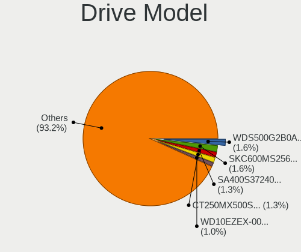
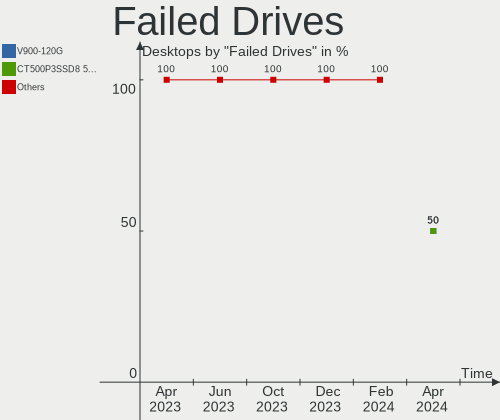
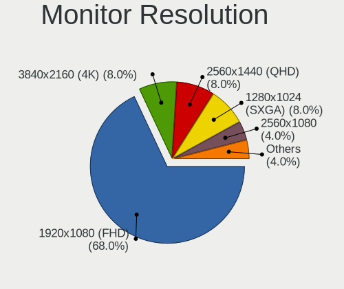
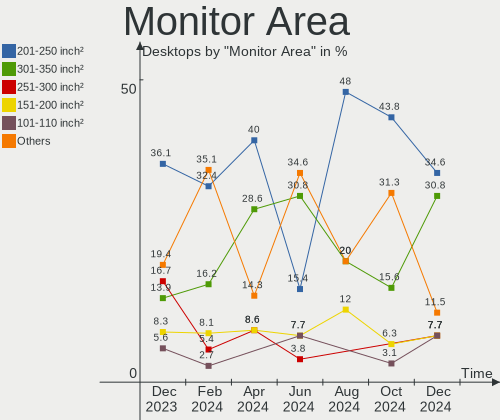
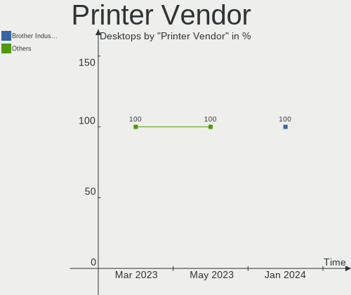

BSD Hardware Trends (Desktop)
-----------------------------

A project to identify most popular hardware characteristics and track their change
over time based on data collected by BSD users at https://BSD-Hardware.info.

Anyone can contribute to the study by uploading probes of their computers by
the [hw-probe](https://github.com/linuxhw/hw-probe/blob/master/INSTALL.BSD.md) tool:

    hw-probe -all -upload

Full-feature report is available here: https://bsd-hardware.info/?view=trends&formfactor=desktop

Period: Feb, 2021.

Contents
--------

- [ OS                       ](#os)
- [ OS Family                ](#os-family)
- [ Arch                     ](#arch)
- [ DE                       ](#de)
- [ Display Server           ](#display-server)
- [ Display Manager          ](#display-manager)
- [ OS Lang                  ](#os-lang)
- [ Boot Mode                ](#boot-mode)
- [ Filesystem               ](#filesystem)
- [ Part. scheme             ](#part-scheme)
- [ Country                  ](#country)
- [ City                     ](#city)
- [ Vendor                   ](#vendor)
- [ Model                    ](#model)
- [ Model Family             ](#model-family)
- [ MFG Year                 ](#mfg-year)
- [ Form Factor              ](#form-factor)
- [ Coreboot                 ](#coreboot)
- [ RAM Size                 ](#ram-size)
- [ RAM Used                 ](#ram-used)
- [ Has CD-ROM               ](#has-cd-rom)
- [ Total Drives             ](#total-drives)
- [ Has Ethernet             ](#has-ethernet)
- [ Drive Vendor             ](#drive-vendor)
- [ Drive Model              ](#drive-model)
- [ HDD Vendor               ](#hdd-vendor)
- [ SSD Vendor               ](#ssd-vendor)
- [ Drive Kind               ](#drive-kind)
- [ Drive Connector          ](#drive-connector)
- [ Drive Size               ](#drive-size)
- [ Space Total              ](#space-total)
- [ Space Used               ](#space-used)
- [ Malfunc. Drives          ](#malfunc-drives)
- [ Malfunc. Drive Vendor    ](#malfunc-drive-vendor)
- [ Malfunc. HDD Vendor      ](#malfunc-hdd-vendor)
- [ Malfunc. Drive Kind      ](#malfunc-drive-kind)
- [ Failed Drives            ](#failed-drives)
- [ Failed Drive Vendor      ](#failed-drive-vendor)
- [ Drive Status             ](#drive-status)
- [ Storage Vendor           ](#storage-vendor)
- [ Storage Model            ](#storage-model)
- [ Storage Kind             ](#storage-kind)
- [ CPU Vendor               ](#cpu-vendor)
- [ CPU Model                ](#cpu-model)
- [ CPU Model Family         ](#cpu-model-family)
- [ CPU Cores                ](#cpu-cores)
- [ CPU Sockets              ](#cpu-sockets)
- [ CPU Threads              ](#cpu-threads)
- [ CPU Microarch            ](#cpu-microarch)
- [ GPU Vendor               ](#gpu-vendor)
- [ GPU Model                ](#gpu-model)
- [ GPU Combo                ](#gpu-combo)
- [ GPU Driver               ](#gpu-driver)
- [ GPU Memory               ](#gpu-memory)
- [ Monitor Vendor           ](#monitor-vendor)
- [ Monitor Model            ](#monitor-model)
- [ Monitor Resolution       ](#monitor-resolution)
- [ Monitor Diagonal         ](#monitor-diagonal)
- [ Monitor Width            ](#monitor-width)
- [ Aspect Ratio             ](#aspect-ratio)
- [ Monitor Area             ](#monitor-area)
- [ Pixel Density            ](#pixel-density)
- [ Multiple Monitors        ](#multiple-monitors)
- [ Net Controller Vendor    ](#net-controller-vendor)
- [ Net Controller Model     ](#net-controller-model)
- [ Wireless Vendor          ](#wireless-vendor)
- [ Wireless Model           ](#wireless-model)
- [ Ethernet Vendor          ](#ethernet-vendor)
- [ Ethernet Model           ](#ethernet-model)
- [ Net Controller Kind      ](#net-controller-kind)
- [ Used Controller          ](#used-controller)
- [ NICs                     ](#nics)
- [ Memory Vendor            ](#memory-vendor)
- [ Memory Model             ](#memory-model)
- [ Memory Kind              ](#memory-kind)
- [ Memory Form Factor       ](#memory-form-factor)
- [ Memory Size              ](#memory-size)
- [ Memory Speed             ](#memory-speed)
- [ Sound Vendor             ](#sound-vendor)
- [ Sound Model              ](#sound-model)
- [ Camera Vendor            ](#camera-vendor)
- [ Camera Model             ](#camera-model)
- [ Fingerprint Vendor       ](#fingerprint-vendor)
- [ Fingerprint Model        ](#fingerprint-model)
- [ Chipcard Vendor          ](#chipcard-vendor)
- [ Chipcard Model           ](#chipcard-model)
- [ Printer Vendor           ](#printer-vendor)
- [ Printer Model            ](#printer-model)
- [ Scanner Vendor           ](#scanner-vendor)
- [ Scanner Model            ](#scanner-model)
- [ Bluetooth Vendor         ](#bluetooth-vendor)
- [ Bluetooth Model          ](#bluetooth-model)
- [ Unsupported Devices      ](#unsupported-devices)
- [ Unsupported Device Types ](#unsupported-device-types)

OS
--

Installed operating systems

| Name                      | Desktops | Percent |
|---------------------------|----------|---------|
| OPNsense 21.1.1           | 107      | 25.24%  |
| OPNsense 21.1             | 93       | 21.93%  |
| helloSystem 0.4.0         | 65       | 15.33%  |
| OPNsense 21.1.2           | 47       | 11.08%  |
| helloSystem 0.5.0         | 19       | 4.48%   |
| FreeBSD 12.2-p3           | 19       | 4.48%   |
| OPNsense 20.7.8           | 11       | 2.59%   |
| OpenBSD 6.8               | 8        | 1.89%   |
| GhostBSD 20.04.02         | 6        | 1.42%   |
| FreeBSD 14.0-CURRENT      | 6        | 1.42%   |
| FreeBSD 12.2              | 6        | 1.42%   |
| FreeBSD 13.0-STABLE       | 4        | 0.94%   |
| OPNsense 21.7             | 3        | 0.71%   |
| FreeBSD 13.0-BETA2        | 3        | 0.71%   |
| FreeBSD 12.2-STABLE       | 3        | 0.71%   |
| FreeBSD 12.1-p12          | 3        | 0.71%   |
| FreeBSD 13.0-CURRENT      | 2        | 0.47%   |
| FreeBSD 13.0-BETA3        | 2        | 0.47%   |
| FreeBSD 12.2-p2           | 2        | 0.47%   |
| XigmaNAS 12.2-p3          | 1        | 0.24%   |
| TrueNAS 12.2-p3           | 1        | 0.24%   |
| pfSense 12.2-STABLE       | 1        | 0.24%   |
| OPNsense 20.7.5           | 1        | 0.24%   |
| OPNsense 20.7.3           | 1        | 0.24%   |
| OPNsense 20.7             | 1        | 0.24%   |
| NomadBSD 1.4-RC1          | 1        | 0.24%   |
| NetBSD 9.1_STABLE         | 1        | 0.24%   |
| NetBSD 9.1                | 1        | 0.24%   |
| FreeBSD 13.0-BETA1        | 1        | 0.24%   |
| FreeBSD 13.0-ALPHA3       | 1        | 0.24%   |
| FreeBSD 12.2-p4           | 1        | 0.24%   |
| FreeBSD 12.1              | 1        | 0.24%   |
| DragonFly 5.9-DEVELOPMENT | 1        | 0.24%   |
| ClonOS 12.2-p3            | 1        | 0.24%   |

OS Family
---------

OS without a version

| Name        | Desktops | Percent |
|-------------|----------|---------|
| OPNsense    | 264      | 62.26%  |
| helloSystem | 84       | 19.81%  |
| FreeBSD     | 54       | 12.74%  |
| OpenBSD     | 8        | 1.89%   |
| GhostBSD    | 6        | 1.42%   |
| NetBSD      | 2        | 0.47%   |
| XigmaNAS    | 1        | 0.24%   |
| TrueNAS     | 1        | 0.24%   |
| pfSense     | 1        | 0.24%   |
| NomadBSD    | 1        | 0.24%   |
| DragonFly   | 1        | 0.24%   |
| ClonOS      | 1        | 0.24%   |

Arch
----

OS architecture (x86_64, i586, etc.)

| Name   | Desktops | Percent |
|--------|----------|---------|
| amd64  | 417      | 98.35%  |
| arm64  | 4        | 0.94%   |
| i386   | 2        | 0.47%   |
| evbarm | 1        | 0.24%   |

DE
--

Desktop Environment

| Name         | Desktops | Percent |
|--------------|----------|---------|
| Console      | 292      | 68.87%  |
| helloDesktop | 84       | 19.81%  |
| XFCE         | 10       | 2.36%   |
| KDE5         | 8        | 1.89%   |
| MATE         | 7        | 1.65%   |
| TWM          | 6        | 1.42%   |
| GNOME        | 5        | 1.18%   |
| fvwm         | 4        | 0.94%   |
| Openbox      | 3        | 0.71%   |
| i3           | 2        | 0.47%   |
| DWM          | 1        | 0.24%   |
| Cinnamon     | 1        | 0.24%   |
| AwesomeWM    | 1        | 0.24%   |

Display Server
--------------

X11 or Wayland

| Name    | Desktops | Percent |
|---------|----------|---------|
| Console | 296      | 69.81%  |
| X11     | 127      | 29.95%  |
| Wayland | 1        | 0.24%   |

Display Manager
---------------

SDDM, LightDM, etc.

| Name    | Desktops | Percent |
|---------|----------|---------|
| Console | 305      | 71.93%  |
| SLiM    | 91       | 21.46%  |
| LightDM | 12       | 2.83%   |
| SDDM    | 10       | 2.36%   |
| XDM     | 3        | 0.71%   |
| GDM     | 3        | 0.71%   |

OS Lang
-------

Language

| Lang    | Desktops | Percent |
|---------|----------|---------|
| Unknown | 290      | 68.4%   |
| en_US   | 105      | 24.76%  |
| C       | 12       | 2.83%   |
| ru_RU   | 7        | 1.65%   |
| en_GB   | 3        | 0.71%   |
| fr_FR   | 2        | 0.47%   |
| es_ES   | 2        | 0.47%   |
| pt_BR   | 1        | 0.24%   |
| pl_PL   | 1        | 0.24%   |
| de_DE   | 1        | 0.24%   |

Boot Mode
---------

EFI or BIOS

| Mode | Desktops | Percent |
|------|----------|---------|
| EFI  | 350      | 82.55%  |
| BIOS | 74       | 17.45%  |

Filesystem
----------

Type of filesystem

| Type    | Desktops | Percent |
|---------|----------|---------|
| Ufs     | 286      | 67.45%  |
| Zfs     | 128      | 30.19%  |
| Ffs     | 8        | 1.89%   |
| Hammer2 | 1        | 0.24%   |
| Unknown | 1        | 0.24%   |

Part. scheme
------------

Scheme of partitioning

| Type    | Desktops | Percent |
|---------|----------|---------|
| GPT     | 385      | 90.8%   |
| MBR     | 33       | 7.78%   |
| Unknown | 6        | 1.42%   |

Country
-------

Geographic location (country)

| Country                  | Desktops | Percent |
|--------------------------|----------|---------|
| Germany                  | 100      | 23.58%  |
| USA                      | 96       | 22.64%  |
| UK                       | 24       | 5.66%   |
| Russia                   | 20       | 4.72%   |
| France                   | 16       | 3.77%   |
| Brazil                   | 15       | 3.54%   |
| Netherlands              | 14       | 3.3%    |
| Australia                | 11       | 2.59%   |
| Canada                   | 10       | 2.36%   |
| Spain                    | 9        | 2.12%   |
| Italy                    | 8        | 1.89%   |
| China                    | 7        | 1.65%   |
| Switzerland              | 6        | 1.42%   |
| Portugal                 | 6        | 1.42%   |
| Poland                   | 6        | 1.42%   |
| Japan                    | 6        | 1.42%   |
| Ukraine                  | 5        | 1.18%   |
| Sweden                   | 5        | 1.18%   |
| Taiwan                   | 4        | 0.94%   |
| Mexico                   | 4        | 0.94%   |
| Indonesia                | 4        | 0.94%   |
| Hungary                  | 4        | 0.94%   |
| South Africa             | 3        | 0.71%   |
| Slovakia                 | 3        | 0.71%   |
| Romania                  | 3        | 0.71%   |
| Norway                   | 3        | 0.71%   |
| New Zealand              | 3        | 0.71%   |
| Latvia                   | 2        | 0.47%   |
| Korea, Republic of       | 2        | 0.47%   |
| Greece                   | 2        | 0.47%   |
| Belgium                  | 2        | 0.47%   |
| Austria                  | 2        | 0.47%   |
| Turks and Caicos Islands | 1        | 0.24%   |
| Turkey                   | 1        | 0.24%   |
| Peru                     | 1        | 0.24%   |
| Macau                    | 1        | 0.24%   |
| Kuwait                   | 1        | 0.24%   |
| Israel                   | 1        | 0.24%   |
| Iraq                     | 1        | 0.24%   |
| India                    | 1        | 0.24%   |
| Guatemala                | 1        | 0.24%   |
| Finland                  | 1        | 0.24%   |
| Estonia                  | 1        | 0.24%   |
| Czech Republic           | 1        | 0.24%   |
| Croatia                  | 1        | 0.24%   |
| Costa Rica               | 1        | 0.24%   |
| Colombia                 | 1        | 0.24%   |
| Chile                    | 1        | 0.24%   |
| Bulgaria                 | 1        | 0.24%   |
| Belarus                  | 1        | 0.24%   |
| Argentina                | 1        | 0.24%   |

City
----

Geographic location (city)

| City                  | Desktops | Percent |
|-----------------------|----------|---------|
| Berlin                | 10       | 2.36%   |
| Moscow                | 8        | 1.89%   |
| Hamburg               | 5        | 1.18%   |
| Paris                 | 4        | 0.94%   |
| Seattle               | 3        | 0.71%   |
| Madrid                | 3        | 0.71%   |
| Lingen                | 3        | 0.71%   |
| Hanover               | 3        | 0.71%   |
| Columbus              | 3        | 0.71%   |
| Bucharest             | 3        | 0.71%   |
| Valencia              | 2        | 0.47%   |
| Tokyo                 | 2        | 0.47%   |
| Taipei                | 2        | 0.47%   |
| São Paulo            | 2        | 0.47%   |
| São José dos Campos | 2        | 0.47%   |
| Surgut                | 2        | 0.47%   |
| Stuttgart             | 2        | 0.47%   |
| Stourbridge           | 2        | 0.47%   |
| St Petersburg         | 2        | 0.47%   |
| Simpsonville          | 2        | 0.47%   |
| Saint Paul            | 2        | 0.47%   |
| Rudersberg            | 2        | 0.47%   |
| Redmond               | 2        | 0.47%   |
| Pirapora              | 2        | 0.47%   |
| Peoria                | 2        | 0.47%   |
| Pensacola             | 2        | 0.47%   |
| Palo Alto             | 2        | 0.47%   |
| Ome                   | 2        | 0.47%   |
| Munich                | 2        | 0.47%   |
| Los Angeles           | 2        | 0.47%   |
| Kyiv                  | 2        | 0.47%   |
| Jelgava               | 2        | 0.47%   |
| Jakarta               | 2        | 0.47%   |
| Heidelberg            | 2        | 0.47%   |
| Hackney               | 2        | 0.47%   |
| Greenfield            | 2        | 0.47%   |
| Eisenach              | 2        | 0.47%   |
| Düsseldorf           | 2        | 0.47%   |
| Dresden               | 2        | 0.47%   |
| Dieppe                | 2        | 0.47%   |
| Darmstadt             | 2        | 0.47%   |
| Croydon               | 2        | 0.47%   |
| Cleveland             | 2        | 0.47%   |
| Brooklyn              | 2        | 0.47%   |
| Brisbane              | 2        | 0.47%   |
| Bremen                | 2        | 0.47%   |
| Bothell               | 2        | 0.47%   |
| Bellevue              | 2        | 0.47%   |
| Auckland              | 2        | 0.47%   |
| Athens                | 2        | 0.47%   |
| Aschaffenburg         | 2        | 0.47%   |
| Łódź               | 1        | 0.24%   |
| Čakovec              | 1        | 0.24%   |
| Échirolles           | 1        | 0.24%   |
| Zurich                | 1        | 0.24%   |
| Zovon                 | 1        | 0.24%   |
| Zaporizhia            | 1        | 0.24%   |
| Yekaterinburg         | 1        | 0.24%   |
| Wurmberg              | 1        | 0.24%   |
| Woodstock             | 1        | 0.24%   |

Vendor
------

Motherboard manufacturer

| Name                    | Desktops | Percent |
|-------------------------|----------|---------|
| ASUSTek Computer        | 59       | 13.92%  |
| ASRock                  | 39       | 9.2%    |
| Unknown                 | 38       | 8.96%   |
| Dell                    | 35       | 8.25%   |
| Intel                   | 27       | 6.37%   |
| Hewlett-Packard         | 27       | 6.37%   |
| PC Engines              | 26       | 6.13%   |
| Gigabyte Technology     | 26       | 6.13%   |
| Protectli               | 20       | 4.72%   |
| MSI                     | 18       | 4.25%   |
| Supermicro              | 16       | 3.77%   |
| Lenovo                  | 16       | 3.77%   |
| HARDKERNEL              | 8        | 1.89%   |
| Fujitsu                 | 7        | 1.65%   |
| Shuttle                 | 6        | 1.42%   |
| Acer                    | 6        | 1.42%   |
| Sophos                  | 5        | 1.18%   |
| BESSTAR Tech            | 4        | 0.94%   |
| Yanling                 | 3        | 0.71%   |
| Deciso                  | 3        | 0.71%   |
| Biostar                 | 3        | 0.71%   |
| YANYU                   | 2        | 0.47%   |
| Thomas-Krenn.AG         | 2        | 0.47%   |
| NEXCOM                  | 2        | 0.47%   |
| Google                  | 2        | 0.47%   |
| TYAN Computer           | 1        | 0.24%   |
| SeeedStudio             | 1        | 0.24%   |
| Sangoma Technologies    | 1        | 0.24%   |
| Raspberry Pi Foundation | 1        | 0.24%   |
| Radxa                   | 1        | 0.24%   |
| QOTOM                   | 1        | 0.24%   |
| Positivo                | 1        | 0.24%   |
| pine64                  | 1        | 0.24%   |
| Pegatron                | 1        | 0.24%   |
| Packard Bell            | 1        | 0.24%   |
| NU591                   | 1        | 0.24%   |
| NF541                   | 1        | 0.24%   |
| MiTAC                   | 1        | 0.24%   |
| Medion                  | 1        | 0.24%   |
| LattePanda              | 1        | 0.24%   |
| Huanan                  | 1        | 0.24%   |
| Gateway                 | 1        | 0.24%   |
| Foxconn                 | 1        | 0.24%   |
| ECS                     | 1        | 0.24%   |
| Beckhoff Automation     | 1        | 0.24%   |
| AZW                     | 1        | 0.24%   |
| ASRockRack              | 1        | 0.24%   |
| Apple                   | 1        | 0.24%   |
| AMI                     | 1        | 0.24%   |

Model
-----

Motherboard model

| Name                              | Desktops | Percent |
|-----------------------------------|----------|---------|
| Unknown                           | 38       | 8.96%   |
| Protectli FW6                     | 13       | 3.07%   |
| PC Engines apu2                   | 13       | 3.07%   |
| Intel Q3XXG4-P V1.0               | 10       | 2.36%   |
| HARDKERNEL ODROID-H2              | 8        | 1.89%   |
| PC Engines apu4                   | 7        | 1.65%   |
| ASUS All Series                   | 7        | 1.65%   |
| Sophos SG                         | 4        | 0.94%   |
| Protectli FW4B                    | 4        | 0.94%   |
| PC Engines apu3                   | 4        | 0.94%   |
| HP t620 PLUS Quad Core TC         | 4        | 0.94%   |
| Dell OptiPlex 9020                | 4        | 0.94%   |
| Yanling YL-KBR6L                  | 3        | 0.71%   |
| HP Compaq Elite 8300 SFF          | 3        | 0.71%   |
| BESSTAR Tech X35G                 | 3        | 0.71%   |
| ASUS PRIME X470-PRO               | 3        | 0.71%   |
| Thomas-Krenn.AG LES network+      | 2        | 0.47%   |
| Supermicro X9SCL/X9SCM            | 2        | 0.47%   |
| Supermicro X7SPA-HF               | 2        | 0.47%   |
| Supermicro SYS-5019A-FTN4         | 2        | 0.47%   |
| Shuttle DS61                      | 2        | 0.47%   |
| Protectli FW2B                    | 2        | 0.47%   |
| PC Engines APU                    | 2        | 0.47%   |
| NEXCOM UTM                        | 2        | 0.47%   |
| Lenovo ThinkCentre M73 10AY0020US | 2        | 0.47%   |
| Intel SKYBAY                      | 2        | 0.47%   |
| Intel Bearlake Bearlake Fab A     | 2        | 0.47%   |
| HP ProDesk 490 G3 MT Business PC  | 2        | 0.47%   |
| Dell OptiPlex 7040                | 2        | 0.47%   |
| Dell OptiPlex 380                 | 2        | 0.47%   |
| Dell OptiPlex 3020                | 2        | 0.47%   |
| ASUS TUF GAMING X570-PLUS         | 2        | 0.47%   |
| ASUS PRIME B450M-A                | 2        | 0.47%   |
| ASUS P5Q                          | 2        | 0.47%   |
| ASUS M5A78L-M LX PLUS             | 2        | 0.47%   |
| ASRock J3455M                     | 2        | 0.47%   |
| ASRock J3355B-ITX                 | 2        | 0.47%   |
| ASRock D1800B-ITX                 | 2        | 0.47%   |
| ASRock B450M Pro4                 | 2        | 0.47%   |
| ASRock B450 Steel Legend          | 2        | 0.47%   |
| ASRock AB350 Pro4                 | 2        | 0.47%   |
| YANYU H87SL VER:1.3               | 1        | 0.24%   |
| YANYU H67SL                       | 1        | 0.24%   |
| TYAN S2925                        | 1        | 0.24%   |
| Supermicro X8SIU                  | 1        | 0.24%   |
| Supermicro X8SIL                  | 1        | 0.24%   |
| Supermicro X7SBi                  | 1        | 0.24%   |
| Supermicro SYS-E50-9AP-N5         | 1        | 0.24%   |
| Supermicro SYS-E300-9D-8CN8TP     | 1        | 0.24%   |
| Supermicro SYS-E300-9D-4CN8TP     | 1        | 0.24%   |
| Supermicro SYS-E200-8D            | 1        | 0.24%   |
| Supermicro SYS-5018D-MTF          | 1        | 0.24%   |
| Supermicro SYS-5018A-FTN4         | 1        | 0.24%   |
| Supermicro A1SAi                  | 1        | 0.24%   |
| Sophos XG                         | 1        | 0.24%   |
| Shuttle SH61R                     | 1        | 0.24%   |
| Shuttle DS77U                     | 1        | 0.24%   |
| Shuttle DS10U                     | 1        | 0.24%   |
| Shuttle DH370                     | 1        | 0.24%   |
| SeeedStudio ODYSSEY-X86J4105      | 1        | 0.24%   |

Model Family
------------

Motherboard model prefix

| Name                          | Desktops | Percent |
|-------------------------------|----------|---------|
| Unknown                       | 38       | 8.96%   |
| Dell OptiPlex                 | 21       | 4.95%   |
| Protectli FW6                 | 13       | 3.07%   |
| PC Engines apu2               | 13       | 3.07%   |
| Lenovo ThinkCentre            | 13       | 3.07%   |
| Intel Q3XXG4-P                | 10       | 2.36%   |
| ASUS PRIME                    | 10       | 2.36%   |
| HARDKERNEL ODROID-H2          | 8        | 1.89%   |
| PC Engines apu4               | 7        | 1.65%   |
| ASUS All                      | 7        | 1.65%   |
| HP Compaq                     | 6        | 1.42%   |
| Acer Aspire                   | 6        | 1.42%   |
| Dell Precision                | 5        | 1.18%   |
| ASUS ROG                      | 5        | 1.18%   |
| Sophos SG                     | 4        | 0.94%   |
| Protectli FW4B                | 4        | 0.94%   |
| PC Engines apu3               | 4        | 0.94%   |
| HP t620                       | 4        | 0.94%   |
| HP ProDesk                    | 4        | 0.94%   |
| Dell Inspiron                 | 4        | 0.94%   |
| ASUS TUF                      | 4        | 0.94%   |
| ASUS P8Z77-V                  | 4        | 0.94%   |
| Yanling YL-KBR6L              | 3        | 0.71%   |
| HP ProLiant                   | 3        | 0.71%   |
| HP EliteDesk                  | 3        | 0.71%   |
| Deciso Netboard               | 3        | 0.71%   |
| BESSTAR Tech X35G             | 3        | 0.71%   |
| ASUS M5A78L-M                 | 3        | 0.71%   |
| ASRock AB350                  | 3        | 0.71%   |
| Thomas-Krenn.AG LES           | 2        | 0.47%   |
| Supermicro X9SCL              | 2        | 0.47%   |
| Supermicro X7SPA-HF           | 2        | 0.47%   |
| Supermicro SYS-5019A-FTN4     | 2        | 0.47%   |
| Shuttle DS61                  | 2        | 0.47%   |
| Protectli FW2B                | 2        | 0.47%   |
| PC Engines APU                | 2        | 0.47%   |
| NEXCOM UTM                    | 2        | 0.47%   |
| Intel SKYBAY                  | 2        | 0.47%   |
| Intel Bearlake                | 2        | 0.47%   |
| Gigabyte X570                 | 2        | 0.47%   |
| Fujitsu FUTRO                 | 2        | 0.47%   |
| Dell XPS                      | 2        | 0.47%   |
| ASUS SABERTOOTH               | 2        | 0.47%   |
| ASUS P8H61-M                  | 2        | 0.47%   |
| ASUS P5Q                      | 2        | 0.47%   |
| ASRock J3455M                 | 2        | 0.47%   |
| ASRock J3355B-ITX             | 2        | 0.47%   |
| ASRock D1800B-ITX             | 2        | 0.47%   |
| ASRock B450M                  | 2        | 0.47%   |
| ASRock B450                   | 2        | 0.47%   |
| YANYU H87SL                   | 1        | 0.24%   |
| YANYU H67SL                   | 1        | 0.24%   |
| TYAN S2925                    | 1        | 0.24%   |
| Supermicro X8SIU              | 1        | 0.24%   |
| Supermicro X8SIL              | 1        | 0.24%   |
| Supermicro X7SBi              | 1        | 0.24%   |
| Supermicro SYS-E50-9AP-N5     | 1        | 0.24%   |
| Supermicro SYS-E300-9D-8CN8TP | 1        | 0.24%   |
| Supermicro SYS-E300-9D-4CN8TP | 1        | 0.24%   |
| Supermicro SYS-E200-8D        | 1        | 0.24%   |

MFG Year
--------

Motherboard manufacture year

| Year    | Desktops | Percent |
|---------|----------|---------|
| 2020    | 92       | 21.7%   |
| 2019    | 68       | 16.04%  |
| 2018    | 53       | 12.5%   |
| 2014    | 31       | 7.31%   |
| 2016    | 25       | 5.9%    |
| 2013    | 23       | 5.42%   |
| 2012    | 20       | 4.72%   |
| 2010    | 20       | 4.72%   |
| 2021    | 18       | 4.25%   |
| 2015    | 17       | 4.01%   |
| 2011    | 17       | 4.01%   |
| 2017    | 14       | 3.3%    |
| 2008    | 10       | 2.36%   |
| 2009    | 7        | 1.65%   |
| Unknown | 7        | 1.65%   |
| 2007    | 1        | 0.24%   |
| 2005    | 1        | 0.24%   |

Form Factor
-----------

Physical design of the computer

| Name    | Desktops | Percent |
|---------|----------|---------|
| Desktop | 424      | 100%    |

Coreboot
--------

Have coreboot on board

| Used | Desktops | Percent |
|------|----------|---------|
| No   | 388      | 91.51%  |
| Yes  | 36       | 8.49%   |

RAM Size
--------

Total RAM memory

| Size in GB  | Desktops | Percent |
|-------------|----------|---------|
| 8.01-16.0   | 146      | 34.43%  |
| 4.01-8.0    | 114      | 26.89%  |
| 16.01-24.0  | 93       | 21.93%  |
| 32.01-64.0  | 34       | 8.02%   |
| 2.01-3.0    | 12       | 2.83%   |
| 64.01-256.0 | 11       | 2.59%   |
| 24.01-32.0  | 6        | 1.42%   |
| 3.01-4.0    | 4        | 0.94%   |
| 0.51-1.0    | 2        | 0.47%   |
| 1.01-2.0    | 1        | 0.24%   |
| 0.01-0.5    | 1        | 0.24%   |

RAM Used
--------

Used RAM memory

| Used GB    | Desktops | Percent |
|------------|----------|---------|
| 0.01-0.5   | 226      | 53.3%   |
| 0.51-1.0   | 126      | 29.72%  |
| 1.01-2.0   | 37       | 8.73%   |
| 4.01-8.0   | 10       | 2.36%   |
| 2.01-3.0   | 8        | 1.89%   |
| 3.01-4.0   | 6        | 1.42%   |
| 8.01-16.0  | 6        | 1.42%   |
| 16.01-24.0 | 2        | 0.47%   |
| Unknown    | 2        | 0.47%   |
| 24.01-32.0 | 1        | 0.24%   |

Has CD-ROM
----------

Has CD-ROM on board

| Presented | Desktops | Percent |
|-----------|----------|---------|
| No        | 344      | 81.13%  |
| Yes       | 80       | 18.87%  |

Total Drives
------------

Number of drives on board

| Drives | Desktops | Percent |
|--------|----------|---------|
| 1      | 281      | 66.27%  |
| 2      | 54       | 12.74%  |
| 3      | 28       | 6.6%    |
| 0      | 28       | 6.6%    |
| 4      | 15       | 3.54%   |
| 5      | 8        | 1.89%   |
| 6      | 5        | 1.18%   |
| 7      | 2        | 0.47%   |
| 11     | 1        | 0.24%   |
| 9      | 1        | 0.24%   |
| 8      | 1        | 0.24%   |

Has Ethernet
------------

Has Ethernet on board

| Presented | Desktops | Percent |
|-----------|----------|---------|
| Yes       | 419      | 98.82%  |
| No        | 5        | 1.18%   |

Drive Vendor
------------

Hard drive vendors

| Vendor              | Desktops | Drives | Percent |
|---------------------|----------|--------|---------|
| WDC                 | 83       | 124    | 15.37%  |
| Samsung Electronics | 74       | 97     | 13.7%   |
| Seagate             | 68       | 101    | 12.59%  |
| Kingston            | 58       | 61     | 10.74%  |
| Intel               | 26       | 26     | 4.81%   |
| Crucial             | 26       | 30     | 4.81%   |
| SanDisk             | 25       | 26     | 4.63%   |
| Transcend           | 19       | 19     | 3.52%   |
| Toshiba             | 19       | 24     | 3.52%   |
| Hoodisk             | 19       | 19     | 3.52%   |
| Phison              | 15       | 16     | 2.78%   |
| Hitachi             | 14       | 15     | 2.59%   |
| SPCC                | 7        | 7      | 1.3%    |
| A-DATA Technology   | 5        | 5      | 0.93%   |
| PNY                 | 4        | 4      | 0.74%   |
| PLEXTOR             | 4        | 4      | 0.74%   |
| OCZ                 | 4        | 4      | 0.74%   |
| Micron Technology   | 4        | 5      | 0.74%   |
| Hewlett-Packard     | 4        | 4      | 0.74%   |
| Fujitsu             | 4        | 4      | 0.74%   |
| DOGFISH             | 4        | 4      | 0.74%   |
| Corsair             | 4        | 4      | 0.74%   |
| TCSUNBOW            | 3        | 3      | 0.56%   |
| SK Hynix            | 3        | 3      | 0.56%   |
| KingSpec            | 3        | 3      | 0.56%   |
| Intenso             | 3        | 5      | 0.56%   |
| HGST                | 3        | 3      | 0.56%   |
| Gigabyte Technology | 3        | 3      | 0.56%   |
| FORESEE             | 3        | 3      | 0.56%   |
| BIWIN               | 3        | 3      | 0.56%   |
| Maxtor              | 2        | 2      | 0.37%   |
| LITEONIT            | 2        | 2      | 0.37%   |
| LITEON              | 2        | 2      | 0.37%   |
| Drevo               | 2        | 2      | 0.37%   |
| Apacer              | 2        | 2      | 0.37%   |
| Zheino              | 1        | 1      | 0.19%   |
| T-FORCE             | 1        | 1      | 0.19%   |
| SMI                 | 1        | 1      | 0.19%   |
| Silicon Motion      | 1        | 1      | 0.19%   |
| Pioneer             | 1        | 1      | 0.19%   |
| Patriot             | 1        | 1      | 0.19%   |
| MaxDigital          | 1        | 1      | 0.19%   |
| Lexar               | 1        | 1      | 0.19%   |
| Lenovo              | 1        | 1      | 0.19%   |
| Kston               | 1        | 1      | 0.19%   |
| Innodisk            | 1        | 1      | 0.19%   |
| GOODRAM             | 1        | 1      | 0.19%   |
| Enmotus             | 1        | 1      | 0.19%   |
| EMTEC               | 1        | 1      | 0.19%   |
| CLOVER              | 1        | 1      | 0.19%   |
| Apple               | 1        | 1      | 0.19%   |

Drive Model
-----------

Hard drive models

| Model                              | Desktops | Percent |
|------------------------------------|----------|---------|
| Kingston SUV500MS120G 120GB        | 11       | 1.86%   |
| Samsung SSD 850 EVO 250GB          | 10       | 1.69%   |
| Kingston SA400S37240G 240GB        | 10       | 1.69%   |
| Phison SATA SSD 16GB               | 8        | 1.35%   |
| Hoodisk SSD 64GB                   | 8        | 1.35%   |
| Kingston SA400S37120G 120GB        | 5        | 0.84%   |
| Hoodisk SSD 32GB                   | 5        | 0.84%   |
| Seagate ST500DM002-1BD142 500GB    | 4        | 0.68%   |
| Samsung SSD 860 EVO 500GB          | 4        | 0.68%   |
| Samsung SSD 860 EVO 250GB          | 4        | 0.68%   |
| Kingston SV300S37A60G 64GB         | 4        | 0.68%   |
| Kingston SV300S37A120G 120GB       | 4        | 0.68%   |
| Crucial CT500MX500SSD1 500GB       | 4        | 0.68%   |
| WDC WDS100T2B0A-00SM50 1TB         | 3        | 0.51%   |
| WDC WD20EARX-00PASB0 2TB           | 3        | 0.51%   |
| Transcend TS128GMSA230S 128GB      | 3        | 0.51%   |
| Seagate ST3500312CS 500GB          | 3        | 0.51%   |
| Seagate ST1000DM010-2EP102 1TB     | 3        | 0.51%   |
| Seagate ST1000DM003-9YN162 1TB     | 3        | 0.51%   |
| SanDisk SSD PLUS 120GB             | 3        | 0.51%   |
| Samsung SSD 970 EVO 1TB            | 3        | 0.51%   |
| Samsung SSD 860 PRO 256GB          | 3        | 0.51%   |
| Samsung SSD 840 EVO 250GB          | 3        | 0.51%   |
| Samsung HD103SI 1TB                | 3        | 0.51%   |
| Phison SATA SSD 32GB               | 3        | 0.51%   |
| Kingston SUV500MS240G 240GB        | 3        | 0.51%   |
| Kingston SA2000M8250G 250GB        | 3        | 0.51%   |
| Kingston OM8PDP3512B-A01 512GB     | 3        | 0.51%   |
| Intel SSDSC2BW120A4 120GB          | 3        | 0.51%   |
| Hoodisk SSD 128GB                  | 3        | 0.51%   |
| Crucial CT525MX300SSD1 528GB       | 3        | 0.51%   |
| Crucial CT256MX100SSD1 256GB       | 3        | 0.51%   |
| Crucial CT250MX500SSD1 250GB       | 3        | 0.51%   |
| BIWIN SSD 128GB                    | 3        | 0.51%   |
| WDC WDS250G2B0A-00SM50 250GB       | 2        | 0.34%   |
| WDC WDS120G2G0A-00JH30 120GB       | 2        | 0.34%   |
| WDC WD5003AZEX-00K3CA0 500GB       | 2        | 0.34%   |
| WDC WD5003ABYZ-011FA0 500GB        | 2        | 0.34%   |
| WDC WD40EZRZ-22GXCB0 4TB           | 2        | 0.34%   |
| WDC WD40EFRX-68WT0N0 4TB           | 2        | 0.34%   |
| WDC WD10EZRX-00A8LB0 1TB           | 2        | 0.34%   |
| WDC WD10EZEX-22MFCA0 1TB           | 2        | 0.34%   |
| Transcend TS64GMSA230S 64GB        | 2        | 0.34%   |
| Toshiba Q300 240GB                 | 2        | 0.34%   |
| Toshiba DT01ACA100 1TB             | 2        | 0.34%   |
| TCSUNBOW M1 32GB                   | 2        | 0.34%   |
| SPCC Solid State Disk 512GB        | 2        | 0.34%   |
| SPCC Solid State Disk 128GB        | 2        | 0.34%   |
| Seagate ST8000VN0022-2EL112 8TB    | 2        | 0.34%   |
| Seagate ST8000DM004-2CX188 8TB     | 2        | 0.34%   |
| Seagate ST8000AS0002-1NA17Z 8TB    | 2        | 0.34%   |
| Seagate ST500LX025-1U717D 500GB    | 2        | 0.34%   |
| Seagate ST500LM021-1KJ152 500GB    | 2        | 0.34%   |
| Seagate ST4000DM000-1F2168 4TB     | 2        | 0.34%   |
| Seagate ST3750528AS 752GB          | 2        | 0.34%   |
| Seagate ST3320418AS 320GB          | 2        | 0.34%   |
| Seagate ST31000524AS 1TB           | 2        | 0.34%   |
| Seagate ST2000DM006-2DM164 2TB     | 2        | 0.34%   |
| Seagate ST1000LM024 HN-M101MBB 1TB | 2        | 0.34%   |
| Seagate ST1000DM003-1ER162 1TB     | 2        | 0.34%   |

HDD Vendor
----------

Hard disk drive vendors

| Vendor              | Desktops | Drives | Percent |
|---------------------|----------|--------|---------|
| WDC                 | 71       | 105    | 36.98%  |
| Seagate             | 68       | 101    | 35.42%  |
| Toshiba             | 16       | 21     | 8.33%   |
| Hitachi             | 14       | 15     | 7.29%   |
| Samsung Electronics | 9        | 13     | 4.69%   |
| Fujitsu             | 4        | 4      | 2.08%   |
| HGST                | 3        | 3      | 1.56%   |
| MAXTOR              | 2        | 2      | 1.04%   |
| Hewlett-Packard     | 2        | 2      | 1.04%   |
| MaxDigital          | 1        | 1      | 0.52%   |
| CLOVER              | 1        | 1      | 0.52%   |
| Apple               | 1        | 1      | 0.52%   |

SSD Vendor
----------

Solid state drive vendors

| Vendor              | Desktops | Drives | Percent |
|---------------------|----------|--------|---------|
| Kingston            | 51       | 54     | 16.78%  |
| Samsung Electronics | 50       | 63     | 16.45%  |
| SanDisk             | 25       | 26     | 8.22%   |
| Crucial             | 23       | 27     | 7.57%   |
| Intel               | 22       | 22     | 7.24%   |
| Transcend           | 19       | 19     | 6.25%   |
| Hoodisk             | 19       | 19     | 6.25%   |
| WDC                 | 12       | 14     | 3.95%   |
| Phison              | 12       | 12     | 3.95%   |
| SPCC                | 6        | 6      | 1.97%   |
| PNY                 | 4        | 4      | 1.32%   |
| OCZ                 | 4        | 4      | 1.32%   |
| DOGFISH             | 4        | 4      | 1.32%   |
| A-DATA Technology   | 4        | 4      | 1.32%   |
| Toshiba             | 3        | 3      | 0.99%   |
| TCSUNBOW            | 3        | 3      | 0.99%   |
| PLEXTOR             | 3        | 3      | 0.99%   |
| Micron Technology   | 3        | 3      | 0.99%   |
| KingSpec            | 3        | 3      | 0.99%   |
| Intenso             | 3        | 5      | 0.99%   |
| FORESEE             | 3        | 3      | 0.99%   |
| BIWIN               | 3        | 3      | 0.99%   |
| LITEONIT            | 2        | 2      | 0.66%   |
| LITEON              | 2        | 2      | 0.66%   |
| Hewlett-Packard     | 2        | 2      | 0.66%   |
| Gigabyte Technology | 2        | 2      | 0.66%   |
| Drevo               | 2        | 2      | 0.66%   |
| Corsair             | 2        | 2      | 0.66%   |
| Apacer              | 2        | 2      | 0.66%   |
| Zheino              | 1        | 1      | 0.33%   |
| SMI                 | 1        | 1      | 0.33%   |
| SK Hynix            | 1        | 1      | 0.33%   |
| Pioneer             | 1        | 1      | 0.33%   |
| Patriot             | 1        | 1      | 0.33%   |
| Lexar               | 1        | 1      | 0.33%   |
| Lenovo              | 1        | 1      | 0.33%   |
| Kston               | 1        | 1      | 0.33%   |
| Innodisk            | 1        | 1      | 0.33%   |
| GOODRAM             | 1        | 1      | 0.33%   |
| EMTEC               | 1        | 1      | 0.33%   |

Drive Kind
----------

HDD or SSD

| Kind | Desktops | Drives | Percent |
|------|----------|--------|---------|
| SSD  | 271      | 329    | 57.42%  |
| HDD  | 152      | 269    | 32.2%   |
| NVMe | 49       | 57     | 10.38%  |

Drive Connector
---------------

SATA, SAS, NVMe, etc.

| Type | Desktops | Drives | Percent |
|------|----------|--------|---------|
| SATA | 372      | 598    | 88.36%  |
| NVMe | 49       | 57     | 11.64%  |

Drive Size
----------

Size of hard drive

| Size in TB | Desktops | Drives | Percent |
|------------|----------|--------|---------|
| 0.01-0.5   | 319      | 414    | 73.33%  |
| 0.51-1.0   | 63       | 90     | 14.48%  |
| 1.01-2.0   | 22       | 30     | 5.06%   |
| 4.01-10.0  | 12       | 26     | 2.76%   |
| 3.01-4.0   | 11       | 21     | 2.53%   |
| 2.01-3.0   | 6        | 14     | 1.38%   |
| 10.01-20.0 | 2        | 3      | 0.46%   |

Space Total
-----------

Amount of disk space available on the file system

| Size in GB     | Desktops | Percent |
|----------------|----------|---------|
| 101-250        | 138      | 32.55%  |
| 1-20           | 97       | 22.88%  |
| 51-100         | 51       | 12.03%  |
| 21-50          | 49       | 11.56%  |
| 251-500        | 47       | 11.08%  |
| 501-1000       | 25       | 5.9%    |
| More than 3000 | 8        | 1.89%   |
| 1001-2000      | 6        | 1.42%   |
| 2001-3000      | 2        | 0.47%   |
| Unknown        | 1        | 0.24%   |

Space Used
----------

Amount of used disk space

| Used GB        | Desktops | Percent |
|----------------|----------|---------|
| 1-20           | 390      | 91.98%  |
| 21-50          | 17       | 4.01%   |
| 101-250        | 5        | 1.18%   |
| More than 3000 | 3        | 0.71%   |
| 1001-2000      | 3        | 0.71%   |
| 251-500        | 2        | 0.47%   |
| 51-100         | 2        | 0.47%   |
| 501-1000       | 1        | 0.24%   |
| Unknown        | 1        | 0.24%   |

Malfunc. Drives
---------------

Drive models with a malfunction

| Model                                        | Desktops | Drives | Percent |
|----------------------------------------------|----------|--------|---------|
| Seagate ST500DM002-1BD142 500GB              | 3        | 3      | 4.55%   |
| Seagate ST1000DM003-9YN162 1TB               | 3        | 5      | 4.55%   |
| WDC WDS240G2G0A-00JH30 240GB                 | 1        | 1      | 1.52%   |
| WDC WD60EFRX-68MYMN1 6TB                     | 1        | 1      | 1.52%   |
| WDC WD5002ABYS-18B1B0 500GB                  | 1        | 1      | 1.52%   |
| WDC WD5000AVCS-632DY1 500GB                  | 1        | 1      | 1.52%   |
| WDC WD5000AAKS-22V1A0 500GB                  | 1        | 1      | 1.52%   |
| WDC WD5000AAKS-00E4A0 500GB                  | 1        | 1      | 1.52%   |
| WDC WD40EFRX-68WT0N0 4TB                     | 1        | 2      | 1.52%   |
| WDC WD4001FAEX-00MJRA0 4TB                   | 1        | 2      | 1.52%   |
| WDC WD3200AAJS-22B4A0 320GB                  | 1        | 1      | 1.52%   |
| WDC WD20EVDS-63T3B0 2TB                      | 1        | 1      | 1.52%   |
| WDC WD20EFRX-68EUZN0 2TB                     | 1        | 3      | 1.52%   |
| WDC WD20EARX-00PASB0 2TB                     | 1        | 1      | 1.52%   |
| WDC WD2002FYPS-01U1B1 2TB                    | 1        | 1      | 1.52%   |
| WDC WD2001FASS-00W2B0 2TB                    | 1        | 1      | 1.52%   |
| WDC WD1600AAJS-75M0A0 160GB                  | 1        | 1      | 1.52%   |
| WDC WD10EZEX-21M2NA0 1TB                     | 1        | 1      | 1.52%   |
| WDC WD10EAVS-00D7B0 1TB                      | 1        | 1      | 1.52%   |
| Toshiba MK3276GSX 320GB                      | 1        | 1      | 1.52%   |
| SMI SSD DISK 120GB                           | 1        | 1      | 1.52%   |
| SK Hynix SC210 mSATA 256GB                   | 1        | 1      | 1.52%   |
| Seagate ST380815AS 80GB                      | 1        | 1      | 1.52%   |
| Seagate ST3320418AS 320GB                    | 1        | 1      | 1.52%   |
| Seagate ST3250410AS 250GB                    | 1        | 1      | 1.52%   |
| Seagate ST3250318AS 250GB                    | 1        | 1      | 1.52%   |
| Seagate ST320LT007-9ZV142 320GB              | 1        | 1      | 1.52%   |
| Seagate ST3160815AS 160GB                    | 1        | 1      | 1.52%   |
| Seagate ST3160812A 160GB                     | 1        | 1      | 1.52%   |
| Seagate ST3160215AS 160GB                    | 1        | 1      | 1.52%   |
| Seagate ST31500341AS 1.5TB                   | 1        | 1      | 1.52%   |
| Seagate ST1000VM002-1CT162 1TB               | 1        | 1      | 1.52%   |
| Seagate ST1000LM024 HN-M101MBB 1TB           | 1        | 1      | 1.52%   |
| SanDisk SSD PLUS 480GB                       | 1        | 1      | 1.52%   |
| SanDisk SSD P4 16GB                          | 1        | 1      | 1.52%   |
| Samsung Electronics SSD 840 PRO Series 256GB | 1        | 1      | 1.52%   |
| Samsung Electronics SP2514N 250GB            | 1        | 1      | 1.52%   |
| Samsung Electronics HM320JI 320GB            | 1        | 1      | 1.52%   |
| Samsung Electronics HD753LJ 752GB            | 1        | 1      | 1.52%   |
| Samsung Electronics HD252HJ 250GB            | 1        | 1      | 1.52%   |
| Samsung Electronics HD154UI 1.5TB            | 1        | 1      | 1.52%   |
| Samsung Electronics HD103SI 1TB              | 1        | 1      | 1.52%   |
| OCZ VERTEX3 120GB                            | 1        | 1      | 1.52%   |
| Maxtor 6Y160M0 160GB                         | 1        | 1      | 1.52%   |
| LITEON CV8-8E128-HP 128GB                    | 1        | 1      | 1.52%   |
| Kingston SNS4151S316GD 16GB                  | 1        | 1      | 1.52%   |
| Kingston SNS4151S316G 16GB                   | 1        | 1      | 1.52%   |
| Kingston SMS200S360G 64GB                    | 1        | 1      | 1.52%   |
| Kingston SMS200S3120G 120GB                  | 1        | 1      | 1.52%   |
| Intel SSDSC2CT180A3 180GB                    | 1        | 1      | 1.52%   |
| Intel SSDSC2BF180A4L 180GB                   | 1        | 1      | 1.52%   |
| Intel SSDSC2BA200G3T 200GB                   | 1        | 1      | 1.52%   |
| Hitachi HTS725050A9A364 500GB                | 1        | 1      | 1.52%   |
| Hitachi HTS723232A7A364 320GB                | 1        | 1      | 1.52%   |
| Hitachi HTS723216L9A360 160GB                | 1        | 1      | 1.52%   |
| Hitachi HTS542525K9SA00 250GB                | 1        | 1      | 1.52%   |
| Hitachi HDP725025GLA380 250GB                | 1        | 1      | 1.52%   |
| Hitachi HCS5C1050CLA382 500GB                | 1        | 1      | 1.52%   |
| HGST HTS545032A7E380 320GB                   | 1        | 1      | 1.52%   |
| DOGFISH SSD 480GB                            | 1        | 1      | 1.52%   |

Malfunc. Drive Vendor
---------------------

Vendors of faulty drives

| Vendor              | Desktops | Drives | Percent |
|---------------------|----------|--------|---------|
| WDC                 | 17       | 21     | 26.98%  |
| Seagate             | 16       | 19     | 25.4%   |
| Hitachi             | 6        | 6      | 9.52%   |
| Samsung Electronics | 5        | 7      | 7.94%   |
| Kingston            | 4        | 4      | 6.35%   |
| Intel               | 3        | 3      | 4.76%   |
| SanDisk             | 2        | 2      | 3.17%   |
| Toshiba             | 1        | 1      | 1.59%   |
| SMI                 | 1        | 1      | 1.59%   |
| SK Hynix            | 1        | 1      | 1.59%   |
| OCZ                 | 1        | 1      | 1.59%   |
| Maxtor              | 1        | 1      | 1.59%   |
| LITEON              | 1        | 1      | 1.59%   |
| HGST                | 1        | 1      | 1.59%   |
| DOGFISH             | 1        | 1      | 1.59%   |
| Crucial             | 1        | 1      | 1.59%   |
| Corsair             | 1        | 1      | 1.59%   |

Malfunc. HDD Vendor
-------------------

Vendors of faulty HDD drives

| Vendor              | Desktops | Drives | Percent |
|---------------------|----------|--------|---------|
| WDC                 | 16       | 20     | 35.56%  |
| Seagate             | 16       | 19     | 35.56%  |
| Hitachi             | 6        | 6      | 13.33%  |
| Samsung Electronics | 4        | 6      | 8.89%   |
| Toshiba             | 1        | 1      | 2.22%   |
| Maxtor              | 1        | 1      | 2.22%   |
| HGST                | 1        | 1      | 2.22%   |

Malfunc. Drive Kind
-------------------

Kinds of faulty drives

| Kind | Desktops | Drives | Percent |
|------|----------|--------|---------|
| HDD  | 42       | 54     | 70%     |
| SSD  | 18       | 18     | 30%     |

Failed Drives
-------------

Failed drive models

| Model                      | Desktops | Drives | Percent |
|----------------------------|----------|--------|---------|
| Kingston SV300S37A60G 64GB | 1        | 1      | 50%     |
| HGST HTS725050A7E630 500GB | 1        | 1      | 50%     |

Failed Drive Vendor
-------------------

Failed drive vendors

| Vendor   | Desktops | Drives | Percent |
|----------|----------|--------|---------|
| Kingston | 1        | 1      | 50%     |
| HGST     | 1        | 1      | 50%     |

Drive Status
------------

Number of failed and malfunc. drives

| Status   | Desktops | Drives | Percent |
|----------|----------|--------|---------|
| Works    | 356      | 570    | 83.37%  |
| Malfunc  | 60       | 72     | 14.05%  |
| Detected | 9        | 11     | 2.11%   |
| Failed   | 2        | 2      | 0.47%   |

Storage Vendor
--------------

Storage controller vendors

| Vendor                        | Desktops | Percent |
|-------------------------------|----------|---------|
| Intel                         | 311      | 62.32%  |
| AMD                           | 99       | 19.84%  |
| Samsung Electronics           | 19       | 3.81%   |
| ASMedia Technology            | 18       | 3.61%   |
| Phison Electronics            | 7        | 1.4%    |
| Marvell Technology Group      | 7        | 1.4%    |
| Kingston Technology Company   | 7        | 1.4%    |
| Sandisk                       | 5        | 1%      |
| Nvidia                        | 5        | 1%      |
| JMicron Technology            | 4        | 0.8%    |
| SK Hynix                      | 2        | 0.4%    |
| Micron/Crucial Technology     | 2        | 0.4%    |
| Micron Technology             | 2        | 0.4%    |
| Hewlett-Packard               | 2        | 0.4%    |
| Broadcom / LSI                | 2        | 0.4%    |
| VIA Technologies              | 1        | 0.2%    |
| Silicon Motion                | 1        | 0.2%    |
| QLogic                        | 1        | 0.2%    |
| Lite-On Technology            | 1        | 0.2%    |
| Integrated Technology Express | 1        | 0.2%    |
| Enmotus                       | 1        | 0.2%    |
| ADATA Technology              | 1        | 0.2%    |

Storage Model
-------------

Storage controller models

| Model                                                                                   | Desktops | Percent |
|-----------------------------------------------------------------------------------------|----------|---------|
| AMD FCH SATA Controller [AHCI mode]                                                     | 63       | 10.81%  |
| Intel Sunrise Point-LP SATA Controller [AHCI mode]                                      | 36       | 6.17%   |
| Intel 8 Series/C220 Series Chipset Family 6-port SATA Controller 1 [AHCI mode]          | 32       | 5.49%   |
| Intel Q170/Q150/B150/H170/H110/Z170/CM236 Chipset SATA Controller [AHCI Mode]           | 20       | 3.43%   |
| Intel 7 Series/C210 Series Chipset Family 6-port SATA Controller [AHCI mode]            | 18       | 3.09%   |
| Intel 6 Series/C200 Series Chipset Family 6 port Desktop SATA AHCI Controller           | 18       | 3.09%   |
| ASMedia ASM1062 Serial ATA Controller                                                   | 18       | 3.09%   |
| Intel Atom Processor E3800 Series SATA AHCI Controller                                  | 14       | 2.4%    |
| AMD 400 Series Chipset SATA Controller                                                  | 14       | 2.4%    |
| Intel NM10/ICH7 Family SATA Controller [IDE mode]                                       | 13       | 2.23%   |
| Intel Celeron/Pentium Silver Processor SATA Controller                                  | 12       | 2.06%   |
| Intel Atom/Celeron/Pentium Processor x5-E8000/J3xxx/N3xxx Series SATA Controller        | 12       | 2.06%   |
| AMD SB7x0/SB8x0/SB9x0 SATA Controller [AHCI mode]                                       | 12       | 2.06%   |
| Intel 82801G (ICH7 Family) IDE Controller                                               | 11       | 1.89%   |
| Intel 200 Series PCH SATA controller [AHCI mode]                                        | 11       | 1.89%   |
| Intel Celeron N3350/Pentium N4200/Atom E3900 Series SATA AHCI Controller                | 10       | 1.72%   |
| AMD SB7x0/SB8x0/SB9x0 IDE Controller                                                    | 10       | 1.72%   |
| AMD FCH SATA Controller [IDE mode]                                                      | 10       | 1.72%   |
| Samsung NVMe SSD Controller SM981/PM981/PM983                                           | 9        | 1.54%   |
| Intel SATA Controller [RAID mode]                                                       | 9        | 1.54%   |
| Intel Cannon Lake PCH SATA AHCI Controller                                              | 9        | 1.54%   |
| Intel 8 Series SATA Controller 1 [AHCI mode]                                            | 9        | 1.54%   |
| Intel 400 Series Chipset Family SATA AHCI Controller                                    | 8        | 1.37%   |
| Unknown                                                                                 | 8        | 1.37%   |
| Intel 82801JI (ICH10 Family) SATA AHCI Controller                                       | 7        | 1.2%    |
| Samsung NVMe SSD Controller SM961/PM961/SM963                                           | 6        | 1.03%   |
| Intel Wildcat Point-LP SATA Controller [AHCI Mode]                                      | 6        | 1.03%   |
| Intel NM10/ICH7 Family SATA Controller [AHCI mode]                                      | 6        | 1.03%   |
| Intel 82801I (ICH9 Family) 2 port SATA Controller [IDE mode]                            | 6        | 1.03%   |
| Intel 5 Series/3400 Series Chipset 6 port SATA AHCI Controller                          | 6        | 1.03%   |
| AMD SB7x0/SB8x0/SB9x0 SATA Controller [IDE mode]                                        | 6        | 1.03%   |
| Intel 6 Series/C200 Series Chipset Family Desktop SATA Controller (IDE mode, ports 4-5) | 5        | 0.86%   |
| Intel 6 Series/C200 Series Chipset Family Desktop SATA Controller (IDE mode, ports 0-3) | 5        | 0.86%   |
| Samsung NVMe SSD Controller SM951/PM951                                                 | 4        | 0.69%   |
| Phison E12 NVMe Controller                                                              | 4        | 0.69%   |
| Kingston Company A2000 NVMe SSD                                                         | 4        | 0.69%   |
| Intel Atom Processor C3000 Series SATA Controller 1                                     | 4        | 0.69%   |
| Intel Atom Processor C3000 Series SATA Controller 0                                     | 4        | 0.69%   |
| Intel 82801JI (ICH10 Family) 2 port SATA IDE Controller #2                              | 4        | 0.69%   |
| Intel 7 Series Chipset Family 6-port SATA Controller [AHCI mode]                        | 4        | 0.69%   |
| Marvell Group 88SE6111/6121 SATA II / PATA Controller                                   | 3        | 0.51%   |
| Kingston Company OM3PDP3 NVMe SSD                                                       | 3        | 0.51%   |
| Intel SSD 660P Series                                                                   | 3        | 0.51%   |
| Intel 9 Series Chipset Family SATA Controller [AHCI Mode]                               | 3        | 0.51%   |
| Intel 82801JI (ICH10 Family) 4 port SATA IDE Controller #1                              | 3        | 0.51%   |
| Intel 82801IR/IO/IH (ICH9R/DO/DH) 4 port SATA Controller [IDE mode]                     | 3        | 0.51%   |
| Intel 82801IB (ICH9) 2 port SATA Controller [IDE mode]                                  | 3        | 0.51%   |
| Intel 82801 Mobile SATA Controller [RAID mode]                                          | 3        | 0.51%   |
| AMD FCH IDE Controller                                                                  | 3        | 0.51%   |
| AMD 300 Series Chipset SATA Controller                                                  | 3        | 0.51%   |
| Sandisk WD Blue SN550 NVMe SSD                                                          | 2        | 0.34%   |
| Phison E16 PCIe4 NVMe Controller                                                        | 2        | 0.34%   |
| Nvidia MCP61 SATA Controller                                                            | 2        | 0.34%   |
| Marvell Group 88SE9172 SATA 6Gb/s Controller                                            | 2        | 0.34%   |
| JMicron JMB368 IDE controller                                                           | 2        | 0.34%   |
| JMicron JMB363 SATA/IDE Controller                                                      | 2        | 0.34%   |
| Intel Cannon Point-LP SATA Controller [AHCI Mode]                                       | 2        | 0.34%   |
| Intel C620 Series Chipset Family SSATA Controller [AHCI mode]                           | 2        | 0.34%   |
| Intel C620 Series Chipset Family SATA Controller [AHCI mode]                            | 2        | 0.34%   |
| Intel C600/X79 series chipset SATA RAID Controller                                      | 2        | 0.34%   |

Storage Kind
------------

Kind of storage controller (IDE, SATA, NVMe, SAS, ...)

| Kind | Desktops | Percent |
|------|----------|---------|
| SATA | 347      | 70.67%  |
| IDE  | 73       | 14.87%  |
| NVMe | 50       | 10.18%  |
| RAID | 17       | 3.46%   |
| SAS  | 2        | 0.41%   |
| SCSI | 2        | 0.41%   |

CPU Vendor
----------

Processor vendors

| Vendor  | Desktops | Percent |
|---------|----------|---------|
| Intel   | 315      | 74.29%  |
| AMD     | 104      | 24.53%  |
| ARM     | 3        | 0.71%   |
| Unknown | 2        | 0.47%   |

CPU Model
---------

Processor models

| Model                                       | Desktops | Percent |
|---------------------------------------------|----------|---------|
| AMD GX-412TC SOC                            | 24       | 5.66%   |
| Intel Core i5-7200U CPU @ 2.50GHz           | 9        | 2.12%   |
| Intel Celeron J4115 CPU @ 1.80GHz           | 8        | 1.89%   |
| Intel Celeron CPU J3160 @ 1.60GHz           | 8        | 1.89%   |
| Intel Core i3-7100U CPU @ 2.40GHz           | 7        | 1.65%   |
| Intel Celeron CPU J1900 @ 1.99GHz           | 7        | 1.65%   |
| Intel Celeron CPU 3865U @ 1.80GHz           | 6        | 1.42%   |
| Intel Core i5-6500 CPU @ 3.20GHz            | 5        | 1.18%   |
| Intel Core i3-6100 CPU @ 3.70GHz            | 5        | 1.18%   |
| AMD GX-420CA SOC with Radeon HD Graphics    | 5        | 1.18%   |
| Intel Core i7-4770 CPU @ 3.40GHz            | 4        | 0.94%   |
| Intel Core i5-4590 CPU @ 3.30GHz            | 4        | 0.94%   |
| Intel Core i5-3470 CPU @ 3.20GHz            | 4        | 0.94%   |
| Intel Celeron CPU J3455 @ 1.50GHz           | 4        | 0.94%   |
| Intel Atom CPU E3845 @ 1.91GHz              | 4        | 0.94%   |
| Intel Atom CPU C3758 @ 2.20GHz              | 4        | 0.94%   |
| AMD Ryzen 5 3600 6-Core Processor           | 4        | 0.94%   |
| Intel Xeon                                  | 3        | 0.71%   |
| Intel Core i7-8700 CPU @ 3.20GHz            | 3        | 0.71%   |
| Intel Core i7-4790 CPU @ 3.60GHz            | 3        | 0.71%   |
| Intel Core i7-3770K CPU @ 3.50GHz           | 3        | 0.71%   |
| Intel Core i5-9400 CPU @ 2.90GHz            | 3        | 0.71%   |
| Intel Core i5-8250U CPU @ 1.60GHz           | 3        | 0.71%   |
| Intel Core i5-6200U CPU @ 2.30GHz           | 3        | 0.71%   |
| Intel Core i5-3570K CPU @ 3.40GHz           | 3        | 0.71%   |
| Intel Core i5-2320 CPU @ 3.00GHz            | 3        | 0.71%   |
| Intel Core i3-4130 CPU @ 3.40GHz            | 3        | 0.71%   |
| Intel Core i3-3240 CPU @ 3.40GHz            | 3        | 0.71%   |
| Intel Core i3-1005G1 CPU @ 1.20GHz          | 3        | 0.71%   |
| Intel Core 2 Duo                            | 3        | 0.71%   |
| Intel Atom CPU D525 @ 1.80GHz               | 3        | 0.71%   |
| AMD Ryzen 7 3700X 8-Core Processor          | 3        | 0.71%   |
| AMD Ryzen 7 2700X Eight-Core Processor      | 3        | 0.71%   |
| AMD Ryzen 5 1600 Six-Core Processor         | 3        | 0.71%   |
| AMD FX-8350 Eight-Core Processor            | 3        | 0.71%   |
| AMD A4-5000 APU with Radeon HD Graphics     | 3        | 0.71%   |
| Intel Pentium Gold G5420 CPU @ 3.80GHz      | 2        | 0.47%   |
| Intel Pentium Dual-Core CPU E6700 @ 3.20GHz | 2        | 0.47%   |
| Intel Pentium CPU G3420 @ 3.20GHz           | 2        | 0.47%   |
| Intel Pentium CPU G2020 @ 2.90GHz           | 2        | 0.47%   |
| Intel Core i7-7700 CPU @ 3.60GHz            | 2        | 0.47%   |
| Intel Core i7-7500U CPU @ 2.70GHz           | 2        | 0.47%   |
| Intel Core i7-6700K CPU @ 4.00GHz           | 2        | 0.47%   |
| Intel Core i7-4790K CPU @ 4.00GHz           | 2        | 0.47%   |
| Intel Core i7-10700 CPU @ 2.90GHz           | 2        | 0.47%   |
| Intel Core i5-9400F CPU @ 2.90GHz           | 2        | 0.47%   |
| Intel Core i5-4570T CPU @ 2.90GHz           | 2        | 0.47%   |
| Intel Core i5-4430 CPU @ 3.00GHz            | 2        | 0.47%   |
| Intel Core i5-4210U CPU @ 1.70GHz           | 2        | 0.47%   |
| Intel Core i5-3570 CPU @ 3.40GHz            | 2        | 0.47%   |
| Intel Core i5-2400 CPU @ 3.10GHz            | 2        | 0.47%   |
| Intel Core i3-6100T CPU @ 3.20GHz           | 2        | 0.47%   |
| Intel Core i3-4170 CPU @ 3.70GHz            | 2        | 0.47%   |
| Intel Core i3-4150 CPU @ 3.50GHz            | 2        | 0.47%   |
| Intel Core i3-4030U CPU @ 1.90GHz           | 2        | 0.47%   |
| Intel Core i3-10100 CPU @ 3.60GHz           | 2        | 0.47%   |
| Intel Core 2 Quad CPU Q9300 @ 2.50GHz       | 2        | 0.47%   |
| Intel Core 2 Quad CPU Q6600 @ 2.40GHz       | 2        | 0.47%   |
| Intel Core 2 Quad                           | 2        | 0.47%   |
| Intel Core 2 Duo CPU E8400 @ 3.00GHz        | 2        | 0.47%   |

CPU Model Family
----------------

Processor model prefix

| Model                   | Desktops | Percent |
|-------------------------|----------|---------|
| Intel Core i5           | 81       | 19.1%   |
| Intel Celeron           | 56       | 13.21%  |
| Intel Core i3           | 47       | 11.08%  |
| Intel Core i7           | 37       | 8.73%   |
| AMD GX                  | 33       | 7.78%   |
| Intel Xeon              | 26       | 6.13%   |
| Intel Atom              | 20       | 4.72%   |
| Intel Pentium           | 13       | 3.07%   |
| AMD Ryzen 5             | 11       | 2.59%   |
| Intel Core 2 Duo        | 9        | 2.12%   |
| Intel Core 2 Quad       | 8        | 1.89%   |
| AMD Ryzen 7             | 8        | 1.89%   |
| Intel Pentium Dual-Core | 7        | 1.65%   |
| AMD FX                  | 7        | 1.65%   |
| AMD Ryzen 9             | 5        | 1.18%   |
| Other                   | 4        | 0.94%   |
| AMD Ryzen 3             | 4        | 0.94%   |
| AMD Phenom II X4        | 4        | 0.94%   |
| Intel Pentium Gold      | 3        | 0.71%   |
| ARM Cortex              | 3        | 0.71%   |
| AMD Ryzen 5 PRO         | 3        | 0.71%   |
| AMD G                   | 3        | 0.71%   |
| AMD A8                  | 3        | 0.71%   |
| AMD A4                  | 3        | 0.71%   |
| Intel Pentium Dual      | 2        | 0.47%   |
| Intel Pentium 4         | 2        | 0.47%   |
| AMD Ryzen Threadripper  | 2        | 0.47%   |
| AMD E2                  | 2        | 0.47%   |
| AMD Athlon 64 X2        | 2        | 0.47%   |
| AMD Athlon              | 2        | 0.47%   |
| Intel Core m3           | 1        | 0.24%   |
| Intel Core 2            | 1        | 0.24%   |
| Intel 686-class         | 1        | 0.24%   |
| AMD Turion II Neo       | 1        | 0.24%   |
| AMD Ryzen Embedded      | 1        | 0.24%   |
| AMD PRO A8              | 1        | 0.24%   |
| AMD Phenom II X6        | 1        | 0.24%   |
| AMD Phenom              | 1        | 0.24%   |
| AMD E1                  | 1        | 0.24%   |
| AMD E                   | 1        | 0.24%   |
| AMD Athlon II X2        | 1        | 0.24%   |
| AMD Athlon Dual Core    | 1        | 0.24%   |
| AMD A6                  | 1        | 0.24%   |
| AMD A10                 | 1        | 0.24%   |

CPU Cores
---------

Number of processor cores

| Number  | Desktops | Percent |
|---------|----------|---------|
| 4       | 184      | 43.4%   |
| 2       | 147      | 34.67%  |
| 6       | 26       | 6.13%   |
| 8       | 21       | 4.95%   |
| Unknown | 20       | 4.72%   |
| 12      | 9        | 2.12%   |
| 16      | 8        | 1.89%   |
| 24      | 3        | 0.71%   |
| 48      | 2        | 0.47%   |
| 32      | 2        | 0.47%   |
| 1       | 2        | 0.47%   |

CPU Sockets
-----------

Number of sockets

| Number  | Desktops | Percent |
|---------|----------|---------|
| 1       | 415      | 97.88%  |
| Unknown | 6        | 1.42%   |
| 2       | 2        | 0.47%   |
| 8       | 1        | 0.24%   |

CPU Threads
-----------

Threads per core (Hyper-Threading)

| Number  | Desktops | Percent |
|---------|----------|---------|
| 1       | 260      | 61.32%  |
| 2       | 143      | 33.73%  |
| Unknown | 21       | 4.95%   |

CPU Microarch
-------------

Microarchitecture

| Name          | Desktops | Percent |
|---------------|----------|---------|
| KabyLake      | 57       | 13.44%  |
| Haswell       | 48       | 11.32%  |
| IvyBridge     | 32       | 7.55%   |
| Skylake       | 30       | 7.08%   |
| Silvermont    | 29       | 6.84%   |
| Penryn        | 27       | 6.37%   |
| Puma          | 26       | 6.13%   |
| SandyBridge   | 17       | 4.01%   |
| Zen 2         | 14       | 3.3%    |
| Jaguar        | 14       | 3.3%    |
| Goldmont      | 14       | 3.3%    |
| Goldmont plus | 12       | 2.83%   |
| Zen           | 9        | 2.12%   |
| Piledriver    | 9        | 2.12%   |
| Zen+          | 8        | 1.89%   |
| K10           | 8        | 1.89%   |
| Core          | 8        | 1.89%   |
| CometLake     | 8        | 1.89%   |
| Broadwell     | 8        | 1.89%   |
| Westmere      | 7        | 1.65%   |
| Bonnell       | 7        | 1.65%   |
| Unknown       | 6        | 1.42%   |
| Nehalem       | 5        | 1.18%   |
| Bobcat        | 5        | 1.18%   |
| K8 Hammer     | 4        | 0.94%   |
| Zen 3         | 3        | 0.71%   |
| IceLake       | 3        | 0.71%   |
| Steamroller   | 2        | 0.47%   |
| NetBurst      | 2        | 0.47%   |
| Bulldozer     | 2        | 0.47%   |

GPU Vendor
----------

Vendors of graphics cards

| Vendor                                       | Desktops | Percent |
|----------------------------------------------|----------|---------|
| Intel                                        | 232      | 59.34%  |
| Nvidia                                       | 71       | 18.16%  |
| AMD                                          | 68       | 17.39%  |
| ASPEED Technology                            | 11       | 2.81%   |
| Matrox Electronics Systems                   | 6        | 1.53%   |
| XGI Technology (eXtreme Graphics Innovation) | 1        | 0.26%   |
| Tseng Labs                                   | 1        | 0.26%   |
| S3 Graphics                                  | 1        | 0.26%   |

GPU Model
---------

Graphics card models

| Model                                                                                    | Desktops | Percent |
|------------------------------------------------------------------------------------------|----------|---------|
| Intel Xeon E3-1200 v3/4th Gen Core Processor Integrated Graphics Controller              | 22       | 5.6%    |
| Intel Xeon E3-1200 v2/3rd Gen Core processor Graphics Controller                         | 18       | 4.58%   |
| Intel HD Graphics 620                                                                    | 18       | 4.58%   |
| Intel HD Graphics 530                                                                    | 14       | 3.56%   |
| Intel Atom Processor Z36xxx/Z37xxx Series Graphics & Display                             | 14       | 3.56%   |
| Intel CometLake-S GT2 [UHD Graphics 630]                                                 | 13       | 3.31%   |
| Intel GeminiLake [UHD Graphics 600]                                                      | 12       | 3.05%   |
| Intel Atom/Celeron/Pentium Processor x5-E8000/J3xxx/N3xxx Integrated Graphics Controller | 12       | 3.05%   |
| Intel 4 Series Chipset Integrated Graphics Controller                                    | 11       | 2.8%    |
| Intel 2nd Generation Core Processor Family Integrated Graphics Controller                | 11       | 2.8%    |
| ASPEED Technology ASPEED Graphics Family                                                 | 11       | 2.8%    |
| Intel HD Graphics 500                                                                    | 8        | 2.04%   |
| Intel Haswell-ULT Integrated Graphics Controller                                         | 8        | 2.04%   |
| Intel Kaby Lake-U GT1 Integrated Graphics Controller                                     | 7        | 1.78%   |
| Nvidia GK208B [GeForce GT 710]                                                           | 6        | 1.53%   |
| Intel 4th Generation Core Processor Family Integrated Graphics Controller                | 6        | 1.53%   |
| AMD Ellesmere [Radeon RX 470/480/570/570X/580/580X/590]                                  | 6        | 1.53%   |
| Matrox Electronics Systems MGA G200eW WPCM450                                            | 5        | 1.27%   |
| Intel Skylake GT2 [HD Graphics 520]                                                      | 5        | 1.27%   |
| AMD Raven Ridge [Radeon Vega Series / Radeon Vega Mobile Series]                         | 5        | 1.27%   |
| AMD Kabini [Radeon HD 8400E]                                                             | 5        | 1.27%   |
| Nvidia GP107 [GeForce GTX 1050 Ti]                                                       | 4        | 1.02%   |
| Nvidia GM206 [GeForce GTX 960]                                                           | 4        | 1.02%   |
| Intel HD Graphics 5500                                                                   | 4        | 1.02%   |
| Intel 3rd Gen Core processor Graphics Controller                                         | 4        | 1.02%   |
| Nvidia TU116 [GeForce GTX 1660 SUPER]                                                    | 3        | 0.76%   |
| Nvidia GM107 [GeForce GTX 750 Ti]                                                        | 3        | 0.76%   |
| Nvidia GF119 [GeForce GT 610]                                                            | 3        | 0.76%   |
| Nvidia G98 [GeForce 8400 GS Rev. 2]                                                      | 3        | 0.76%   |
| Nvidia G84GL [Quadro FX 1700]                                                            | 3        | 0.76%   |
| Intel UHD Graphics 620                                                                   | 3        | 0.76%   |
| Intel Iris Plus Graphics G1 (Ice Lake)                                                   | 3        | 0.76%   |
| Intel HD Graphics 630                                                                    | 3        | 0.76%   |
| Intel Core Processor Integrated Graphics Controller                                      | 3        | 0.76%   |
| Intel CoffeeLake-S GT1 [UHD Graphics 610]                                                | 3        | 0.76%   |
| Intel Atom Processor D4xx/D5xx/N4xx/N5xx Integrated Graphics Controller                  | 3        | 0.76%   |
| AMD Picasso                                                                              | 3        | 0.76%   |
| AMD Kabini [Radeon HD 8330]                                                              | 3        | 0.76%   |
| AMD ES1000                                                                               | 3        | 0.76%   |
| Nvidia GT218 [GeForce 8400 GS Rev. 3]                                                    | 2        | 0.51%   |
| Nvidia GP108 [GeForce GT 1030]                                                           | 2        | 0.51%   |
| Nvidia GP106 [GeForce GTX 1060 6GB]                                                      | 2        | 0.51%   |
| Nvidia GP106 [GeForce GTX 1060 3GB]                                                      | 2        | 0.51%   |
| Nvidia GK208B [GeForce GT 730]                                                           | 2        | 0.51%   |
| Nvidia GK208B [GeForce GT 720]                                                           | 2        | 0.51%   |
| Nvidia GK107 [GeForce GTX 650]                                                           | 2        | 0.51%   |
| Nvidia GK107 [GeForce GT 640]                                                            | 2        | 0.51%   |
| Nvidia GF106 [GeForce GTS 450]                                                           | 2        | 0.51%   |
| Intel WhiskeyLake-U GT2 [UHD Graphics 620]                                               | 2        | 0.51%   |
| Intel HD Graphics P530                                                                   | 2        | 0.51%   |
| Intel HD Graphics 610                                                                    | 2        | 0.51%   |
| Intel HD Graphics 6000                                                                   | 2        | 0.51%   |
| Intel HD Graphics 510                                                                    | 2        | 0.51%   |
| Intel Celeron N3350/Pentium N4200/Atom E3900 Series Integrated Graphics Controller       | 2        | 0.51%   |
| Intel Atom Processor D2xxx/N2xxx Integrated Graphics Controller                          | 2        | 0.51%   |
| Intel 82Q35 Express Integrated Graphics Controller                                       | 2        | 0.51%   |
| Intel 82946GZ/GL Integrated Graphics Controller                                          | 2        | 0.51%   |
| AMD Oland PRO [Radeon R7 240/340]                                                        | 2        | 0.51%   |
| AMD Navi 10 [Radeon RX 5600 OEM/5600 XT / 5700/5700 XT]                                  | 2        | 0.51%   |
| AMD Lexa PRO [Radeon 540/540X/550/550X / RX 540X/550/550X]                               | 2        | 0.51%   |

GPU Combo
---------

Combinations of graphics cards

| Name            | Desktops | Percent |
|-----------------|----------|---------|
| 1 x Intel       | 216      | 50.94%  |
| 1 x AMD         | 66       | 15.57%  |
| 1 x Nvidia      | 65       | 15.33%  |
| Other           | 39       | 9.2%    |
| 1 x ASPEED      | 11       | 2.59%   |
| 2 x Intel       | 10       | 2.36%   |
| 1 x Matrox      | 6        | 1.42%   |
| Intel + Nvidia  | 4        | 0.94%   |
| 2 x Nvidia      | 2        | 0.47%   |
| Intel + AMD     | 2        | 0.47%   |
| 1 x XGI         | 1        | 0.24%   |
| 1 x Tseng Labs  | 1        | 0.24%   |
| 1 x S3 Graphics | 1        | 0.24%   |

GPU Driver
----------

Free vs proprietary

| Driver      | Desktops | Percent |
|-------------|----------|---------|
| Free        | 334      | 78.77%  |
| Unknown     | 46       | 10.85%  |
| Proprietary | 44       | 10.38%  |

GPU Memory
----------

Total video memory

| Size in GB | Desktops | Percent |
|------------|----------|---------|
| Unknown    | 355      | 83.73%  |
| 1.01-2.0   | 23       | 5.42%   |
| 0.51-1.0   | 15       | 3.54%   |
| 3.01-4.0   | 11       | 2.59%   |
| 5.01-6.0   | 6        | 1.42%   |
| 7.01-8.0   | 5        | 1.18%   |
| 2.01-3.0   | 4        | 0.94%   |
| 0.01-0.5   | 4        | 0.94%   |
| 8.01-16.0  | 1        | 0.24%   |

Monitor Vendor
--------------

Monitor vendors

| Vendor               | Desktops | Percent |
|----------------------|----------|---------|
| Goldstar             | 17       | 16.35%  |
| Samsung Electronics  | 15       | 14.42%  |
| Dell                 | 10       | 9.62%   |
| Hewlett-Packard      | 9        | 8.65%   |
| AOC                  | 7        | 6.73%   |
| Acer                 | 7        | 6.73%   |
| ViewSonic            | 5        | 4.81%   |
| Lenovo               | 4        | 3.85%   |
| Iiyama               | 4        | 3.85%   |
| Ancor Communications | 4        | 3.85%   |
| Philips              | 3        | 2.88%   |
| Eizo                 | 3        | 2.88%   |
| Sony                 | 2        | 1.92%   |
| Packard Bell         | 2        | 1.92%   |
| LG Electronics       | 2        | 1.92%   |
| BenQ                 | 2        | 1.92%   |
| Unknown              | 1        | 0.96%   |
| Toshiba              | 1        | 0.96%   |
| KJT                  | 1        | 0.96%   |
| HannStar             | 1        | 0.96%   |
| CVT                  | 1        | 0.96%   |
| CHD                  | 1        | 0.96%   |
| CAN                  | 1        | 0.96%   |
| ASUSTek Computer     | 1        | 0.96%   |

Monitor Model
-------------

Monitor models

| Model                                                                | Desktops | Percent |
|----------------------------------------------------------------------|----------|---------|
| Philips LCD Monitor PHLC0B1 1920x1080 480x270mm 21.7-inch            | 2        | 1.87%   |
| Goldstar LG ULTRAWIDE GSM59F1 2560x1080 670x280mm 28.6-inch          | 2        | 1.87%   |
| Goldstar E2441 GSM581F 1920x1080 530x300mm 24.0-inch                 | 2        | 1.87%   |
| Dell U2412M DELA07A 1920x1200 520x320mm 24.0-inch                    | 2        | 1.87%   |
| ViewSonic VX2433wm VSC3822 1920x1080 520x290mm 23.4-inch             | 1        | 0.93%   |
| ViewSonic VX1940w VSC6A20 1680x1050 410x260mm 19.1-inch              | 1        | 0.93%   |
| ViewSonic VP171s-2 VSC4B1B 1280x1024 340x270mm 17.1-inch             | 1        | 0.93%   |
| ViewSonic LCD Monitor VSCC42B 1920x1080 480x270mm 21.7-inch          | 1        | 0.93%   |
| ViewSonic LCD Monitor VSC5826 1366x768 410x230mm 18.5-inch           | 1        | 0.93%   |
| Unknown LCD Monitor YTH HS133PC 3840x2160                            | 1        | 0.93%   |
| Unknown LCD Monitor KJT4K2K60DP 3840x2160                            | 1        | 0.93%   |
| Toshiba TV TSB0218 3840x2160                                         | 1        | 0.93%   |
| Sony TV SNY9C01 1360x768                                             | 1        | 0.93%   |
| Sony TV SNY4B03 1920x1080 930x520mm 41.9-inch                        | 1        | 0.93%   |
| Samsung Electronics U32J59x SAM0F35 3840x2160 700x390mm 31.5-inch    | 1        | 0.93%   |
| Samsung Electronics U32H85x SAM0E3C 3840x2160 700x390mm 31.5-inch    | 1        | 0.93%   |
| Samsung Electronics SyncMaster SAM0600 1600x900 440x250mm 19.9-inch  | 1        | 0.93%   |
| Samsung Electronics SyncMaster SAM05C5 1920x1080                     | 1        | 0.93%   |
| Samsung Electronics SyncMaster SAM036C 1920x1200 550x340mm 25.5-inch | 1        | 0.93%   |
| Samsung Electronics SME1920NR SAM06A4 1280x1024 380x300mm 19.1-inch  | 1        | 0.93%   |
| Samsung Electronics SMBX2231 SAM076D 1920x1080 480x270mm 21.7-inch   | 1        | 0.93%   |
| Samsung Electronics SAMTRON STN0028 1280x1024 380x300mm 19.1-inch    | 1        | 0.93%   |
| Samsung Electronics S27C750 SAM0A60 1920x1080 600x340mm 27.2-inch    | 1        | 0.93%   |
| Samsung Electronics S24E390 SAM0C1A 1920x1080 520x290mm 23.4-inch    | 1        | 0.93%   |
| Samsung Electronics S24C350 SAM0A3A 1920x1080 530x300mm 24.0-inch    | 1        | 0.93%   |
| Samsung Electronics LCD Monitor SAM03A2 1440x900 410x260mm 19.1-inch | 1        | 0.93%   |
| Samsung Electronics LCD Monitor SAM02A4 1360x768                     | 1        | 0.93%   |
| Samsung Electronics LCD Monitor S24R35x 1920x1080                    | 1        | 0.93%   |
| Samsung Electronics C32JG5x SAM0FDF 2560x1440 700x390mm 31.5-inch    | 1        | 0.93%   |
| Philips PHL 278E9Q PHLC17F 1920x1080 600x340mm 27.2-inch             | 1        | 0.93%   |
| Packard Bell Viseo223DX PKB0385 1920x1080 480x270mm 21.7-inch        | 1        | 0.93%   |
| Packard Bell Viseo 200Ws PKB00C2 1600x900 440x250mm 19.9-inch        | 1        | 0.93%   |
| LG Electronics LCD Monitor LG ULTRAWIDE 2560x1080                    | 1        | 0.93%   |
| LG Electronics LCD Monitor LG Ultra HD 7680x2160                     | 1        | 0.93%   |
| LG Electronics LCD Monitor LG Ultra HD                               | 1        | 0.93%   |
| Lenovo LEN X24A LEN60CF 1920x1080 530x300mm 24.0-inch                | 1        | 0.93%   |
| Lenovo LEN S24e-10 LEN61CA 1920x1080 530x300mm 24.0-inch             | 1        | 0.93%   |
| Lenovo LCD Monitor LEN60A1 1920x1080 480x270mm 21.7-inch             | 1        | 0.93%   |
| Lenovo C24-25 LEN66B0 1920x1080 530x300mm 24.0-inch                  | 1        | 0.93%   |
| KJT KJT4K2K60DP KJT5AFD 3840x2160 600x340mm 27.2-inch                | 1        | 0.93%   |
| Iiyama PLG2888UH IVM710C 3840x2160 620x340mm 27.8-inch               | 1        | 0.93%   |
| Iiyama PL4071UH IVM000A 3840x2160 880x490mm 39.7-inch                | 1        | 0.93%   |
| Iiyama PL2783Q IVM661D 2560x1440 600x340mm 27.2-inch                 | 1        | 0.93%   |
| Iiyama PL2473HD IVM6107 1920x1080 520x290mm 23.4-inch                | 1        | 0.93%   |
| Hewlett-Packard ZR24w HWP286A 1920x1200 540x350mm 25.3-inch          | 1        | 0.93%   |
| Hewlett-Packard Z24nf HWP3209 1920x1080 530x300mm 24.0-inch          | 1        | 0.93%   |
| Hewlett-Packard w1907 HWP26A3 1440x900 410x260mm 19.1-inch           | 1        | 0.93%   |
| Hewlett-Packard LCD Monitor HWP2915 1920x1080 510x290mm 23.1-inch    | 1        | 0.93%   |
| Hewlett-Packard LA2405 HWP284A 1920x1200 520x320mm 24.0-inch         | 1        | 0.93%   |
| Hewlett-Packard All-in-One HWP4253 1920x1080 510x290mm 23.1-inch     | 1        | 0.93%   |
| Hewlett-Packard 27w HPN3494 1920x1080 600x340mm 27.2-inch            | 1        | 0.93%   |
| Hewlett-Packard 23xi HWP3031 1920x1080 510x290mm 23.1-inch           | 1        | 0.93%   |
| Hewlett-Packard 22cw HWP3183 1920x1080 480x270mm 21.7-inch           | 1        | 0.93%   |
| HannStar LCD Monitor HSD2469 1680x1050 470x300mm 22.0-inch           | 1        | 0.93%   |
| Goldstar W1942 GSM4B6F 1440x900 410x260mm 19.1-inch                  | 1        | 0.93%   |
| Goldstar MP59G GSM5B35 1920x1080 600x340mm 27.2-inch                 | 1        | 0.93%   |
| Goldstar M1721TA GSM4486 1280x1024 340x270mm 17.1-inch               | 1        | 0.93%   |
| Goldstar LG ULTRAWIDE GSM76FA 2560x1080 800x340mm 34.2-inch          | 1        | 0.93%   |
| Goldstar LG QHD GSM772A 2560x1440 700x390mm 31.5-inch                | 1        | 0.93%   |
| Goldstar LG HDR WFHD GSM7714 2560x1080 800x340mm 34.2-inch           | 1        | 0.93%   |

Monitor Resolution
------------------

Monitor screen resolution

| Resolution         | Desktops | Percent |
|--------------------|----------|---------|
| 1920x1080 (FHD)    | 48       | 47.06%  |
| 3840x2160 (4K)     | 9        | 8.82%   |
| 2560x1440 (QHD)    | 7        | 6.86%   |
| 1280x1024 (SXGA)   | 7        | 6.86%   |
| 2560x1080          | 6        | 5.88%   |
| 1920x1200 (WUXGA)  | 6        | 5.88%   |
| 1680x1050 (WSXGA+) | 5        | 4.9%    |
| 1440x900 (WXGA+)   | 3        | 2.94%   |
| 1366x768 (WXGA)    | 3        | 2.94%   |
| 1600x900 (HD+)     | 2        | 1.96%   |
| 1360x768           | 2        | 1.96%   |
| 7680x2160          | 1        | 0.98%   |
| 3440x1440          | 1        | 0.98%   |
| 2048x1152          | 1        | 0.98%   |
| Unknown            | 1        | 0.98%   |

Monitor Diagonal
----------------

Diagonal size in inches

| Inches  | Desktops | Percent |
|---------|----------|---------|
| 21      | 16       | 15.24%  |
| 27      | 15       | 14.29%  |
| 24      | 15       | 14.29%  |
| 23      | 12       | 11.43%  |
| 19      | 10       | 9.52%   |
| Unknown | 10       | 9.52%   |
| 31      | 5        | 4.76%   |
| 17      | 4        | 3.81%   |
| 34      | 3        | 2.86%   |
| 28      | 3        | 2.86%   |
| 22      | 3        | 2.86%   |
| 18      | 3        | 2.86%   |
| 25      | 2        | 1.9%    |
| 54      | 1        | 0.95%   |
| 41      | 1        | 0.95%   |
| 39      | 1        | 0.95%   |
| 32      | 1        | 0.95%   |

Monitor Width
-------------

Physical width

| Width in mm | Desktops | Percent |
|-------------|----------|---------|
| 501-600     | 40       | 39.22%  |
| 401-500     | 28       | 27.45%  |
| 601-700     | 10       | 9.8%    |
| Unknown     | 10       | 9.8%    |
| 701-800     | 4        | 3.92%   |
| 301-350     | 4        | 3.92%   |
| 351-400     | 3        | 2.94%   |
| 801-900     | 1        | 0.98%   |
| 1001-1500   | 1        | 0.98%   |
| 901-1000    | 1        | 0.98%   |

Aspect Ratio
------------

Proportional relationship between the width and the height

| Ratio   | Desktops | Percent |
|---------|----------|---------|
| 16/9    | 66       | 67.35%  |
| 16/10   | 12       | 12.24%  |
| 5/4     | 7        | 7.14%   |
| 21/9    | 6        | 6.12%   |
| Unknown | 6        | 6.12%   |
| 3/2     | 1        | 1.02%   |

Monitor Area
------------

Area in inch²

| Area in inch² | Desktops | Percent |
|----------------|----------|---------|
| 201-250        | 38       | 37.25%  |
| 301-350        | 15       | 14.71%  |
| 251-300        | 10       | 9.8%    |
| 151-200        | 10       | 9.8%    |
| Unknown        | 10       | 9.8%    |
| 351-500        | 9        | 8.82%   |
| 141-150        | 7        | 6.86%   |
| 501-1000       | 2        | 1.96%   |
| More than 1000 | 1        | 0.98%   |

Pixel Density
-------------

Pixels per inch

| Density | Desktops | Percent |
|---------|----------|---------|
| 51-100  | 62       | 62%     |
| 101-120 | 23       | 23%     |
| Unknown | 10       | 10%     |
| 121-160 | 4        | 4%      |
| 161-240 | 1        | 1%      |

Multiple Monitors
-----------------

Total monitors connected

| Total | Desktops | Percent |
|-------|----------|---------|
| 0     | 324      | 76.42%  |
| 1     | 91       | 21.46%  |
| 2     | 7        | 1.65%   |
| 3     | 2        | 0.47%   |

Net Controller Vendor
---------------------

Controller vendors

| Vendor                         | Desktops | Percent |
|--------------------------------|----------|---------|
| Intel                          | 295      | 53.25%  |
| Realtek Semiconductor          | 171      | 30.87%  |
| Qualcomm Atheros               | 26       | 4.69%   |
| Broadcom Inc. and subsidiaries | 21       | 3.79%   |
| Ralink Technology              | 7        | 1.26%   |
| Marvell Technology Group       | 6        | 1.08%   |
| IMC Networks                   | 5        | 0.9%    |
| TP-Link                        | 4        | 0.72%   |
| D-Link System                  | 4        | 0.72%   |
| Aquantia                       | 3        | 0.54%   |
| Ralink                         | 1        | 0.18%   |
| Qualcomm                       | 1        | 0.18%   |
| Nvidia                         | 1        | 0.18%   |
| Netchip Technology             | 1        | 0.18%   |
| Microchip Technology           | 1        | 0.18%   |
| MediaTek                       | 1        | 0.18%   |
| Huawei Technologies            | 1        | 0.18%   |
| Exar                           | 1        | 0.18%   |
| Emulex                         | 1        | 0.18%   |
| Davicom Semiconductor          | 1        | 0.18%   |
| Bluegiga Technologies          | 1        | 0.18%   |
| American Megatrends            | 1        | 0.18%   |

Net Controller Model
--------------------

Controller models

| Model                                                                         | Desktops | Percent |
|-------------------------------------------------------------------------------|----------|---------|
| Realtek RTL8111/8168/8411 PCI Express Gigabit Ethernet Controller             | 144      | 21.33%  |
| Intel I211 Gigabit Network Connection                                         | 72       | 10.67%  |
| Intel I210 Gigabit Network Connection                                         | 34       | 5.04%   |
| Intel 82574L Gigabit Network Connection                                       | 31       | 4.59%   |
| Intel I350 Gigabit Network Connection                                         | 27       | 4%      |
| Intel 82583V Gigabit Network Connection                                       | 21       | 3.11%   |
| Intel 82579LM Gigabit Network Connection (Lewisville)                         | 19       | 2.81%   |
| Intel 82580 Gigabit Network Connection                                        | 17       | 2.52%   |
| Realtek RTL8125 2.5GbE Controller                                             | 12       | 1.78%   |
| Intel 82571EB/82571GB Gigabit Ethernet Controller D0/D1 (copper applications) | 12       | 1.78%   |
| Intel Wi-Fi 6 AX200                                                           | 11       | 1.63%   |
| Intel Ethernet Connection I217-LM                                             | 10       | 1.48%   |
| Intel Ethernet Connection (2) I219-V                                          | 10       | 1.48%   |
| Intel Ethernet Connection (2) I219-LM                                         | 9        | 1.33%   |
| Intel Ethernet Connection (7) I219-V                                          | 7        | 1.04%   |
| Intel 82576 Gigabit Network Connection                                        | 7        | 1.04%   |
| Intel 82571EB/82571GB Gigabit Ethernet Controller (Copper)                    | 7        | 1.04%   |
| Intel Wireless 7260                                                           | 6        | 0.89%   |
| Intel Ethernet Connection I217-V                                              | 6        | 0.89%   |
| Intel 82599ES 10-Gigabit SFI/SFP+ Network Connection                          | 6        | 0.89%   |
| Intel Dual Band Wireless-AC 3168NGW [Stone Peak]                              | 5        | 0.74%   |
| Intel 82579V Gigabit Network Connection                                       | 5        | 0.74%   |
| Intel 82557/8/9/0/1 Ethernet Pro 100                                          | 5        | 0.74%   |
| IMC Networks 802.11 n/g/b Wireless LAN USB Mini-Card                          | 5        | 0.74%   |
| Realtek RTL810xE PCI Express Fast Ethernet controller                         | 4        | 0.59%   |
| Qualcomm Atheros AR928X Wireless Network Adapter (PCI-Express)                | 4        | 0.59%   |
| Intel Ethernet Controller 10G X550T                                           | 4        | 0.59%   |
| Realtek RTL8821CE 802.11ac PCIe Wireless Network Adapter                      | 3        | 0.44%   |
| Realtek RTL8188EE Wireless Network Adapter                                    | 3        | 0.44%   |
| Realtek RTL8169 PCI Gigabit Ethernet Controller                               | 3        | 0.44%   |
| Realtek RTL-8100/8101L/8139 PCI Fast Ethernet Adapter                         | 3        | 0.44%   |
| Ralink RT5370 Wireless Adapter                                                | 3        | 0.44%   |
| Qualcomm Atheros AR9462 Wireless Network Adapter                              | 3        | 0.44%   |
| Qualcomm Atheros AR8121/AR8113/AR8114 Gigabit or Fast Ethernet                | 3        | 0.44%   |
| Marvell Group 88E8056 PCI-E Gigabit Ethernet Controller                       | 3        | 0.44%   |
| Marvell Group 88E8001 Gigabit Ethernet Controller                             | 3        | 0.44%   |
| Intel Wireless-AC 9260                                                        | 3        | 0.44%   |
| Intel Ethernet Connection X553 1GbE                                           | 3        | 0.44%   |
| Intel Ethernet Connection I219-LM                                             | 3        | 0.44%   |
| Broadcom Inc. and subsidiaries NetLink BCM57780 Gigabit Ethernet PCIe         | 3        | 0.44%   |
| Aquantia AQC107 NBase-T/IEEE 802.3bz Ethernet Controller [AQtion]             | 3        | 0.44%   |
| Realtek RTL8821AE 802.11ac PCIe Wireless Network Adapter                      | 2        | 0.3%    |
| Realtek RTL8723BE PCIe Wireless Network Adapter                               | 2        | 0.3%    |
| Qualcomm Atheros QCA9377 802.11ac Wireless Network Adapter                    | 2        | 0.3%    |
| Qualcomm Atheros Attansic L1 Gigabit Ethernet                                 | 2        | 0.3%    |
| Qualcomm Atheros AR9485 Wireless Network Adapter                              | 2        | 0.3%    |
| Qualcomm Atheros AR93xx Wireless Network Adapter                              | 2        | 0.3%    |
| Qualcomm Atheros AR9285 Wireless Network Adapter (PCI-Express)                | 2        | 0.3%    |
| Intel Wireless 3165                                                           | 2        | 0.3%    |
| Intel Wireless 3160                                                           | 2        | 0.3%    |
| Intel I210 Gigabit Fiber Network Connection                                   | 2        | 0.3%    |
| Intel Ethernet Controller 10-Gigabit X540-AT2                                 | 2        | 0.3%    |
| Intel Ethernet Connection X722 for 10GbE SFP+                                 | 2        | 0.3%    |
| Intel Ethernet Connection X722 for 10GBASE-T                                  | 2        | 0.3%    |
| Intel Ethernet Connection I354                                                | 2        | 0.3%    |
| Intel Ethernet Connection (5) I219-LM                                         | 2        | 0.3%    |
| Intel Ethernet Connection (11) I219-LM                                        | 2        | 0.3%    |
| Intel 82578DM Gigabit Network Connection                                      | 2        | 0.3%    |
| Intel 82575EB Gigabit Backplane Connection                                    | 2        | 0.3%    |
| Intel 82572EI Gigabit Ethernet Controller (Copper)                            | 2        | 0.3%    |

Wireless Vendor
---------------

Wireless vendors

| Vendor                         | Desktops | Percent |
|--------------------------------|----------|---------|
| Intel                          | 36       | 40%     |
| Qualcomm Atheros               | 18       | 20%     |
| Realtek Semiconductor          | 16       | 17.78%  |
| Ralink Technology              | 7        | 7.78%   |
| IMC Networks                   | 5        | 5.56%   |
| TP-Link                        | 4        | 4.44%   |
| Broadcom Inc. and subsidiaries | 3        | 3.33%   |
| Ralink                         | 1        | 1.11%   |

Wireless Model
--------------

Wireless models

| Model                                                                                         | Desktops | Percent |
|-----------------------------------------------------------------------------------------------|----------|---------|
| Intel Wi-Fi 6 AX200                                                                           | 11       | 12.22%  |
| Intel Wireless 7260                                                                           | 6        | 6.67%   |
| Intel Dual Band Wireless-AC 3168NGW [Stone Peak]                                              | 5        | 5.56%   |
| IMC Networks 802.11 n/g/b Wireless LAN USB Mini-Card                                          | 5        | 5.56%   |
| Qualcomm Atheros AR928X Wireless Network Adapter (PCI-Express)                                | 4        | 4.44%   |
| Realtek RTL8821CE 802.11ac PCIe Wireless Network Adapter                                      | 3        | 3.33%   |
| Realtek RTL8188EE Wireless Network Adapter                                                    | 3        | 3.33%   |
| Ralink RT5370 Wireless Adapter                                                                | 3        | 3.33%   |
| Qualcomm Atheros AR9462 Wireless Network Adapter                                              | 3        | 3.33%   |
| Intel Wireless-AC 9260                                                                        | 3        | 3.33%   |
| Realtek RTL8821AE 802.11ac PCIe Wireless Network Adapter                                      | 2        | 2.22%   |
| Realtek RTL8723BE PCIe Wireless Network Adapter                                               | 2        | 2.22%   |
| Qualcomm Atheros QCA9377 802.11ac Wireless Network Adapter                                    | 2        | 2.22%   |
| Qualcomm Atheros AR9485 Wireless Network Adapter                                              | 2        | 2.22%   |
| Qualcomm Atheros AR93xx Wireless Network Adapter                                              | 2        | 2.22%   |
| Qualcomm Atheros AR9285 Wireless Network Adapter (PCI-Express)                                | 2        | 2.22%   |
| Intel Wireless 3165                                                                           | 2        | 2.22%   |
| Intel Wireless 3160                                                                           | 2        | 2.22%   |
| TP-Link TP-LINK Wireless USB Adapter                                                          | 1        | 1.11%   |
| TP-Link TL-WN722N v2/v3 [Realtek RTL8188EUS]                                                  | 1        | 1.11%   |
| TP-Link RTL8812AU Archer T4U 802.11ac                                                         | 1        | 1.11%   |
| TP-Link AC600 wireless Realtek RTL8811AU [Archer T2U Nano]                                    | 1        | 1.11%   |
| Realtek RTL8812AE 802.11ac PCIe Wireless Network Adapter                                      | 1        | 1.11%   |
| Realtek RTL8191SU 802.11n WLAN Adapter                                                        | 1        | 1.11%   |
| Realtek RTL8191SEvA Wireless LAN Controller                                                   | 1        | 1.11%   |
| Realtek RTL8188SU 802.11n WLAN Adapter                                                        | 1        | 1.11%   |
| Realtek RTL8188EUS 802.11n Wireless Network Adapter                                           | 1        | 1.11%   |
| Realtek Realtek 8812AU/8821AU 802.11ac WLAN Adapter [USB Wireless Dual-Band Adapter 2.4/5Ghz] | 1        | 1.11%   |
| Ralink RT5572 Wireless Adapter                                                                | 1        | 1.11%   |
| Ralink RT5372 Wireless Adapter                                                                | 1        | 1.11%   |
| Ralink RT3072 Wireless Adapter                                                                | 1        | 1.11%   |
| Ralink RT2501/RT2573 Wireless Adapter                                                         | 1        | 1.11%   |
| Ralink RT5360 Wireless 802.11n 1T/1R                                                          | 1        | 1.11%   |
| Qualcomm Atheros QCA6174 802.11ac Wireless Network Adapter                                    | 1        | 1.11%   |
| Qualcomm Atheros AR9287 Wireless Network Adapter (PCI-Express)                                | 1        | 1.11%   |
| Qualcomm Atheros AR5418 Wireless Network Adapter [AR5008E 802.11(a)bgn] (PCI-Express)         | 1        | 1.11%   |
| Intel Wireless 7265                                                                           | 1        | 1.11%   |
| Intel PRO/Wireless 4965 AG or AGN [Kedron] Network Connection                                 | 1        | 1.11%   |
| Intel Dual Band Wireless-AC 3165 Plus Bluetooth                                               | 1        | 1.11%   |
| Intel Comet Lake PCH CNVi WiFi                                                                | 1        | 1.11%   |
| Intel Centrino Wireless-N 2230                                                                | 1        | 1.11%   |
| Intel Centrino Advanced-N 6230 [Rainbow Peak]                                                 | 1        | 1.11%   |
| Intel AC 1550i Wireless                                                                       | 1        | 1.11%   |
| Broadcom Inc. and subsidiaries BCM4331 802.11a/b/g/n                                          | 1        | 1.11%   |
| Broadcom Inc. and subsidiaries BCM43224 802.11a/b/g/n                                         | 1        | 1.11%   |
| Broadcom Inc. and subsidiaries 802.11ac Network Adapter                                       | 1        | 1.11%   |

Ethernet Vendor
---------------

Ethernet vendors

| Vendor                         | Desktops | Percent |
|--------------------------------|----------|---------|
| Intel                          | 278      | 57.32%  |
| Realtek Semiconductor          | 162      | 33.4%   |
| Broadcom Inc. and subsidiaries | 19       | 3.92%   |
| Qualcomm Atheros               | 8        | 1.65%   |
| Marvell Technology Group       | 6        | 1.24%   |
| D-Link System                  | 3        | 0.62%   |
| Aquantia                       | 3        | 0.62%   |
| Qualcomm                       | 1        | 0.21%   |
| Nvidia                         | 1        | 0.21%   |
| MediaTek                       | 1        | 0.21%   |
| Emulex                         | 1        | 0.21%   |
| Davicom Semiconductor          | 1        | 0.21%   |
| American Megatrends            | 1        | 0.21%   |

Ethernet Model
--------------

Ethernet models

| Model                                                                         | Desktops | Percent |
|-------------------------------------------------------------------------------|----------|---------|
| Realtek RTL8111/8168/8411 PCI Express Gigabit Ethernet Controller             | 144      | 24.96%  |
| Intel I211 Gigabit Network Connection                                         | 72       | 12.48%  |
| Intel I210 Gigabit Network Connection                                         | 34       | 5.89%   |
| Intel 82574L Gigabit Network Connection                                       | 31       | 5.37%   |
| Intel I350 Gigabit Network Connection                                         | 27       | 4.68%   |
| Intel 82583V Gigabit Network Connection                                       | 21       | 3.64%   |
| Intel 82579LM Gigabit Network Connection (Lewisville)                         | 19       | 3.29%   |
| Intel 82580 Gigabit Network Connection                                        | 17       | 2.95%   |
| Intel 82571EB/82571GB Gigabit Ethernet Controller D0/D1 (copper applications) | 12       | 2.08%   |
| Realtek RTL8125 2.5GbE Controller                                             | 10       | 1.73%   |
| Intel Ethernet Connection I217-LM                                             | 10       | 1.73%   |
| Intel Ethernet Connection (2) I219-V                                          | 10       | 1.73%   |
| Intel Ethernet Connection (2) I219-LM                                         | 9        | 1.56%   |
| Intel Ethernet Connection (7) I219-V                                          | 7        | 1.21%   |
| Intel 82576 Gigabit Network Connection                                        | 7        | 1.21%   |
| Intel 82571EB/82571GB Gigabit Ethernet Controller (Copper)                    | 7        | 1.21%   |
| Intel Ethernet Connection I217-V                                              | 6        | 1.04%   |
| Intel 82599ES 10-Gigabit SFI/SFP+ Network Connection                          | 6        | 1.04%   |
| Intel 82579V Gigabit Network Connection                                       | 5        | 0.87%   |
| Intel 82557/8/9/0/1 Ethernet Pro 100                                          | 5        | 0.87%   |
| Realtek RTL810xE PCI Express Fast Ethernet controller                         | 4        | 0.69%   |
| Intel Ethernet Controller 10G X550T                                           | 4        | 0.69%   |
| Realtek RTL8169 PCI Gigabit Ethernet Controller                               | 3        | 0.52%   |
| Realtek RTL-8100/8101L/8139 PCI Fast Ethernet Adapter                         | 3        | 0.52%   |
| Qualcomm Atheros AR8121/AR8113/AR8114 Gigabit or Fast Ethernet                | 3        | 0.52%   |
| Marvell Group 88E8056 PCI-E Gigabit Ethernet Controller                       | 3        | 0.52%   |
| Marvell Group 88E8001 Gigabit Ethernet Controller                             | 3        | 0.52%   |
| Intel Ethernet Connection X553 1GbE                                           | 3        | 0.52%   |
| Intel Ethernet Connection I219-LM                                             | 3        | 0.52%   |
| Broadcom Inc. and subsidiaries NetLink BCM57780 Gigabit Ethernet PCIe         | 3        | 0.52%   |
| Aquantia AQC107 NBase-T/IEEE 802.3bz Ethernet Controller [AQtion]             | 3        | 0.52%   |
| Qualcomm Atheros Attansic L1 Gigabit Ethernet                                 | 2        | 0.35%   |
| Intel I210 Gigabit Fiber Network Connection                                   | 2        | 0.35%   |
| Intel Ethernet Controller 10-Gigabit X540-AT2                                 | 2        | 0.35%   |
| Intel Ethernet Connection X722 for 10GbE SFP+                                 | 2        | 0.35%   |
| Intel Ethernet Connection X722 for 10GBASE-T                                  | 2        | 0.35%   |
| Intel Ethernet Connection I354                                                | 2        | 0.35%   |
| Intel Ethernet Connection (5) I219-LM                                         | 2        | 0.35%   |
| Intel Ethernet Connection (11) I219-LM                                        | 2        | 0.35%   |
| Intel 82578DM Gigabit Network Connection                                      | 2        | 0.35%   |
| Intel 82575EB Gigabit Backplane Connection                                    | 2        | 0.35%   |
| Intel 82572EI Gigabit Ethernet Controller (Copper)                            | 2        | 0.35%   |
| Intel 82567V-2 Gigabit Network Connection                                     | 2        | 0.35%   |
| Intel 82567LM-3 Gigabit Network Connection                                    | 2        | 0.35%   |
| Intel 82541PI Gigabit Ethernet Controller                                     | 2        | 0.35%   |
| D-Link System DGE-528T Gigabit Ethernet Adapter                               | 2        | 0.35%   |
| Broadcom Inc. and subsidiaries NetXtreme BCM57762 Gigabit Ethernet PCIe       | 2        | 0.35%   |
| Broadcom Inc. and subsidiaries NetXtreme BCM5754 Gigabit Ethernet PCI Express | 2        | 0.35%   |
| Broadcom Inc. and subsidiaries NetXtreme BCM5719 Gigabit Ethernet PCIe        | 2        | 0.35%   |
| Broadcom Inc. and subsidiaries NetXtreme BCM5715 Gigabit Ethernet             | 2        | 0.35%   |
| Qualcomm Atheros AR8161 Gigabit Ethernet                                      | 1        | 0.17%   |
| Qualcomm Atheros AR8152 v2.0 Fast Ethernet                                    | 1        | 0.17%   |
| Qualcomm Atheros AR8151 v2.0 Gigabit Ethernet                                 | 1        | 0.17%   |
| Qualcomm ALCATEL Composite RNDIS Interface                                    | 1        | 0.17%   |
| Nvidia MCP73 Ethernet                                                         | 1        | 0.17%   |
| MediaTek USB Ethernet-RNDIS                                                   | 1        | 0.17%   |
| Marvell Group 88E8071 PCI-E Gigabit Ethernet Controller                       | 1        | 0.17%   |
| Marvell Group 88E8053 PCI-E Gigabit Ethernet Controller                       | 1        | 0.17%   |
| Intel NM10/ICH7 Family LAN Controller                                         | 1        | 0.17%   |
| Intel I350 Gigabit Fiber Network Connection                                   | 1        | 0.17%   |

Net Controller Kind
-------------------

Ethernet, WiFi or modem

| Kind     | Desktops | Percent |
|----------|----------|---------|
| Ethernet | 419      | 81.36%  |
| WiFi     | 88       | 17.09%  |
| Modem    | 4        | 0.78%   |
| Unknown  | 4        | 0.78%   |

Used Controller
---------------

Currently used network controller

| Kind     | Desktops | Percent |
|----------|----------|---------|
| Ethernet | 413      | 93.23%  |
| WiFi     | 29       | 6.55%   |
| Unknown  | 1        | 0.23%   |

NICs
----

Total network controllers on board

| Total | Desktops | Percent |
|-------|----------|---------|
| 1     | 101      | 23.82%  |
| 2     | 91       | 21.46%  |
| 3     | 71       | 16.75%  |
| 6     | 55       | 12.97%  |
| 4     | 53       | 12.5%   |
| 5     | 28       | 6.6%    |
| 7     | 6        | 1.42%   |
| 8     | 5        | 1.18%   |
| 0     | 5        | 1.18%   |
| 12    | 4        | 0.94%   |
| 10    | 2        | 0.47%   |
| 9     | 2        | 0.47%   |
| 14    | 1        | 0.24%   |

Memory Vendor
-------------

Memory module vendors

| Vendor                     | Desktops | Percent |
|----------------------------|----------|---------|
| Unknown                    | 82       | 19.57%  |
| Samsung Electronics        | 68       | 16.23%  |
| Kingston                   | 64       | 15.27%  |
| Crucial                    | 45       | 10.74%  |
| SK Hynix                   | 36       | 8.59%   |
| Corsair                    | 31       | 7.4%    |
| Micron Technology          | 24       | 5.73%   |
| G.Skill                    | 23       | 5.49%   |
| Unknown (ABCD)             | 6        | 1.43%   |
| Patriot                    | 6        | 1.43%   |
| Nanya Technology           | 5        | 1.19%   |
| Transcend                  | 4        | 0.95%   |
| Team                       | 4        | 0.95%   |
| Elpida                     | 2        | 0.48%   |
| Apacer                     | 2        | 0.48%   |
| A-DATA Technology          | 2        | 0.48%   |
| Unknown (7F7F7F94FFFFFFFF) | 1        | 0.24%   |
| Unknown (09A4)             | 1        | 0.24%   |
| Unknown (07FB)             | 1        | 0.24%   |
| Toshiba                    | 1        | 0.24%   |
| Teikon                     | 1        | 0.24%   |
| TakeMS                     | 1        | 0.24%   |
| RZX                        | 1        | 0.24%   |
| Ramaxel Technology         | 1        | 0.24%   |
| KomputerBay                | 1        | 0.24%   |
| InnoDisk                   | 1        | 0.24%   |
| GOODRAM                    | 1        | 0.24%   |
| Golden Empire              | 1        | 0.24%   |
| Avant                      | 1        | 0.24%   |
| ATP                        | 1        | 0.24%   |
| AMD                        | 1        | 0.24%   |

Memory Model
------------

Memory module models

| Model                                                             | Desktops | Percent |
|-------------------------------------------------------------------|----------|---------|
| Unknown RAM Module 4GB SODIMM DDR3 1333MT/s                       | 12       | 2.65%   |
| Samsung RAM M471B5173QH0-YK0 4GB SODIMM DDR3 1600MT/s             | 7        | 1.55%   |
| Unknown (ABCD) RAM 123456789012345678 1536MB DIMM LPDDR4 2400MT/s | 6        | 1.33%   |
| Samsung RAM M378B5173QH0-CK0 4GB DIMM DDR3 1600MT/s               | 4        | 0.88%   |
| Samsung RAM M378B5173EB0-CK0 4GB DIMM DDR3 1600MT/s               | 4        | 0.88%   |
| Unknown RAM Module 4GB SODIMM DDR3 667MT/s                        | 3        | 0.66%   |
| Unknown RAM Module 4GB DIMM DDR3 1333MT/s                         | 3        | 0.66%   |
| Unknown RAM Module 4GB DIMM 1333MT/s                              | 3        | 0.66%   |
| Unknown RAM Module 2GB DIMM DDR2 800MT/s                          | 3        | 0.66%   |
| Unknown RAM Module 2GB DIMM DDR2 667MT/s                          | 3        | 0.66%   |
| Unknown RAM Module 2048MB DIMM DDR2 800MT/s                       | 3        | 0.66%   |
| SK Hynix RAM HMT451S6BFR8A-PB 4GB SODIMM DDR3 1600MT/s            | 3        | 0.66%   |
| SK Hynix RAM HMA81GS6AFR8N-UH 8GB SODIMM DDR4 2400MT/s            | 3        | 0.66%   |
| Samsung RAM M471B5773DH0-CH9 2GB SODIMM DDR3 1333MT/s             | 3        | 0.66%   |
| Samsung RAM M378B5273DH0-CH9 4096MB DIMM DDR3 1333MT/s            | 3        | 0.66%   |
| Samsung RAM M378B5273CH0-CH9 4GB DIMM DDR3 1333MT/s               | 3        | 0.66%   |
| Samsung RAM M378B5173DB0-CK0 4GB DIMM DDR3 1600MT/s               | 3        | 0.66%   |
| Micron RAM Module 8GB Row Of Chips LPDDR4 3200MT/s                | 3        | 0.66%   |
| Micron RAM 8KTF51264HZ-1G6N1 4GB SODIMM DDR3 1600MT/s             | 3        | 0.66%   |
| Micron RAM 8JTF51264AZ-1G6E1 4GB DIMM DDR3 1600MT/s               | 3        | 0.66%   |
| Crucial RAM CT16G4SFD824A.C16FDD 16GB SODIMM DDR4 2400MT/s        | 3        | 0.66%   |
| Crucial RAM CT102464BA160B.C16 8GB DIMM DDR3 1600MT/s             | 3        | 0.66%   |
| Crucial RAM BLS8G3D1609DS1S00. 8GB DIMM DDR3 1600MT/s             | 3        | 0.66%   |
| Unknown RAM Module 4GB DIMM DDR3 1600MT/s                         | 2        | 0.44%   |
| Unknown RAM Module 4096MB DIMM 1600MT/s                           | 2        | 0.44%   |
| Unknown RAM Module 2GB SODIMM DDR3 1333MT/s                       | 2        | 0.44%   |
| Unknown RAM Module 2GB DIMM DDR3 1333MT/s                         | 2        | 0.44%   |
| Unknown RAM Module 1GB DIMM DDR2 800MT/s                          | 2        | 0.44%   |
| Unknown RAM Module 1GB DIMM 667MT/s                               | 2        | 0.44%   |
| Team RAM TEAMGROUP-UD4-3200 32GB DIMM DDR4 3200MT/s               | 2        | 0.44%   |
| SK Hynix RAM HMT451S6BFR8A-PB 4GB DIMM DDR3 1600MT/s              | 2        | 0.44%   |
| SK Hynix RAM HMT351U6CFR8C-PB 4GB DIMM DDR3 1600MT/s              | 2        | 0.44%   |
| SK Hynix RAM HMA81GU7AFR8N-UH 8GB DIMM DDR4 2400MT/s              | 2        | 0.44%   |
| Samsung RAM M471B5674QH0-YK0 2GB SODIMM DDR3 1600MT/s             | 2        | 0.44%   |
| Samsung RAM M471B5173CB0-YK0 4GB SODIMM DDR3 1600MT/s             | 2        | 0.44%   |
| Samsung RAM M471A1K43CB1-CTD 8GB SODIMM DDR4 2667MT/s             | 2        | 0.44%   |
| Samsung RAM M378B5673FH0-CH9 2GB DIMM DDR3 1333MT/s               | 2        | 0.44%   |
| Samsung RAM M378A1G43DB0-CPB 8GB DIMM DDR4 2133MT/s               | 2        | 0.44%   |
| Patriot RAM PSD38G1600L2S 8GB SODIMM DDR3 1600MT/s                | 2        | 0.44%   |
| Micron RAM 16JTF51264AZ-1G6M1 4GB DIMM DDR3 1600MT/s              | 2        | 0.44%   |
| Kingston RAM Module 4GB DIMM DDR3 1600MT/s                        | 2        | 0.44%   |
| Kingston RAM Module 2048MB DIMM DDR2 800MT/s                      | 2        | 0.44%   |
| Kingston RAM KHX3200C16D4/8GX 8192MB DIMM DDR4 3200MT/s           | 2        | 0.44%   |
| Kingston RAM KHX1866C10D3/8G 8192MB DIMM DDR3 1867MT/s            | 2        | 0.44%   |
| Kingston RAM CBD26D4S9S1ME-8 8GB SODIMM DDR4 2667MT/s             | 2        | 0.44%   |
| Kingston RAM 99U5700-028.A00G 8GB SODIMM DDR4 2400MT/s            | 2        | 0.44%   |
| Kingston RAM 99U5471-025.A00LF 4096MB DIMM DDR3                   | 2        | 0.44%   |
| Kingston RAM 9905428-401.A00LF 8GB DIMM DDR3 1600MT/s             | 2        | 0.44%   |
| G.Skill RAM F4-2400C16-16GRS 16GB SODIMM DDR4 2400MT/s            | 2        | 0.44%   |
| Crucial RAM CT102464BF160B.C16 8GB DIMM DDR3 1600MT/s             | 2        | 0.44%   |
| Corsair RAM CMZ8GX3M2A1600C9 4GB DIMM DDR3 1600MT/s               | 2        | 0.44%   |
| Corsair RAM CMZ4GX3M1A1600C9 4GB DIMM DDR3 1333MT/s               | 2        | 0.44%   |
| Corsair RAM CMK32GX4M2A2666C16 16GB DIMM DDR4 2667MT/s            | 2        | 0.44%   |
| Unknown RAM WPBS16D308SWD-4G 4GB DIMM DDR3 1600MT/s               | 1        | 0.22%   |
| Unknown RAM TMKS8G68ALFBCH-266 8192MB SODIMM DDR4 2400MT/s        | 1        | 0.22%   |
| Unknown RAM R3 4G 1600 CL11 4GB DIMM DDR3 1600MT/s                | 1        | 0.22%   |
| Unknown RAM Module 8GB SODIMM DDR4 2400MT/s                       | 1        | 0.22%   |
| Unknown RAM Module 8GB SODIMM DDR4 2133MT/s                       | 1        | 0.22%   |
| Unknown RAM Module 8GB SODIMM DDR3 1600MT/s                       | 1        | 0.22%   |
| Unknown RAM Module 8GB DIMM DDR4 2666MT/s                         | 1        | 0.22%   |

Memory Kind
-----------

Memory module kinds

| Kind    | Desktops | Percent |
|---------|----------|---------|
| DDR3    | 191      | 50.53%  |
| DDR4    | 127      | 33.6%   |
| DDR2    | 25       | 6.61%   |
| Unknown | 14       | 3.7%    |
| LPDDR4  | 9        | 2.38%   |
| SDRAM   | 7        | 1.85%   |
| DDR     | 4        | 1.06%   |
| LPDDR3  | 1        | 0.26%   |

Memory Form Factor
------------------

Physical design of the memory module

| Name         | Desktops | Percent |
|--------------|----------|---------|
| DIMM         | 256      | 67.72%  |
| SODIMM       | 112      | 29.63%  |
| Row Of Chips | 4        | 1.06%   |
| Unknown      | 4        | 1.06%   |
| FB-DIMM      | 2        | 0.53%   |

Memory Size
-----------

Memory module size

| Size  | Desktops | Percent |
|-------|----------|---------|
| 4096  | 145      | 36.16%  |
| 8192  | 128      | 31.92%  |
| 2048  | 67       | 16.71%  |
| 16384 | 42       | 10.47%  |
| 1024  | 12       | 2.99%   |
| 32768 | 6        | 1.5%    |
| 512   | 1        | 0.25%   |

Memory Speed
------------

Memory module speed

| Speed   | Desktops | Percent |
|---------|----------|---------|
| 1600    | 100      | 25.71%  |
| 1333    | 76       | 19.54%  |
| 2400    | 56       | 14.4%   |
| 2667    | 24       | 6.17%   |
| 2133    | 23       | 5.91%   |
| 800     | 22       | 5.66%   |
| 3200    | 20       | 5.14%   |
| 667     | 16       | 4.11%   |
| 2666    | 10       | 2.57%   |
| 1066    | 9        | 2.31%   |
| 1867    | 5        | 1.29%   |
| 1866    | 5        | 1.29%   |
| Unknown | 5        | 1.29%   |
| 1067    | 3        | 0.77%   |
| 2933    | 2        | 0.51%   |
| 2800    | 2        | 0.51%   |
| 1400    | 2        | 0.51%   |
| 533     | 2        | 0.51%   |
| 59392   | 1        | 0.26%   |
| 3600    | 1        | 0.26%   |
| 3066    | 1        | 0.26%   |
| 1419    | 1        | 0.26%   |
| 1334    | 1        | 0.26%   |
| 333     | 1        | 0.26%   |
| 133     | 1        | 0.26%   |

Sound Vendor
------------

Sound card vendors

| Vendor              | Desktops | Percent |
|---------------------|----------|---------|
| Intel               | 230      | 57.21%  |
| AMD                 | 86       | 21.39%  |
| Nvidia              | 60       | 14.93%  |
| C-Media Electronics | 10       | 2.49%   |
| Texas Instruments   | 3        | 0.75%   |
| Creative Labs       | 2        | 0.5%    |
| Yamaha              | 1        | 0.25%   |
| Sony                | 1        | 0.25%   |
| Microsoft           | 1        | 0.25%   |
| Logitech            | 1        | 0.25%   |
| JMTek               | 1        | 0.25%   |
| Focusrite-Novation  | 1        | 0.25%   |
| Elgato Systems      | 1        | 0.25%   |
| Bose                | 1        | 0.25%   |
| AudioQuest          | 1        | 0.25%   |
| Audio-Technica      | 1        | 0.25%   |
| ASUSTek Computer    | 1        | 0.25%   |

Sound Model
-----------

Sound card models

| Model                                                                                             | Desktops | Percent |
|---------------------------------------------------------------------------------------------------|----------|---------|
| Intel 8 Series/C220 Series Chipset High Definition Audio Controller                               | 27       | 5.68%   |
| Intel Xeon E3-1200 v3/4th Gen Core Processor HD Audio Controller                                  | 24       | 5.05%   |
| Intel Sunrise Point-LP HD Audio                                                                   | 20       | 4.21%   |
| Intel 7 Series/C216 Chipset Family High Definition Audio Controller                               | 19       | 4%      |
| AMD FCH Azalia Controller                                                                         | 19       | 4%      |
| Intel 100 Series/C230 Series Chipset Family HD Audio Controller                                   | 18       | 3.79%   |
| Intel 6 Series/C200 Series Chipset Family High Definition Audio Controller                        | 16       | 3.37%   |
| AMD Starship/Matisse HD Audio Controller                                                          | 16       | 3.37%   |
| AMD SBx00 Azalia (Intel HDA)                                                                      | 14       | 2.95%   |
| Intel NM10/ICH7 Family High Definition Audio Controller                                           | 13       | 2.74%   |
| Intel Celeron/Pentium Silver Processor High Definition Audio                                      | 12       | 2.53%   |
| Intel 200 Series PCH HD Audio                                                                     | 12       | 2.53%   |
| Nvidia GK208 HDMI/DP Audio Controller                                                             | 11       | 2.32%   |
| Intel Atom/Celeron/Pentium Processor x5-E8000/J3xxx/N3xxx Series High Definition Audio Controller | 10       | 2.11%   |
| Intel Atom Processor Z36xxx/Z37xxx Series High Definition Audio Controller                        | 10       | 2.11%   |
| AMD Kabini HDMI/DP Audio                                                                          | 10       | 2.11%   |
| Intel Haswell-ULT HD Audio Controller                                                             | 9        | 1.89%   |
| Intel Cannon Lake PCH cAVS                                                                        | 9        | 1.89%   |
| Intel 8 Series HD Audio Controller                                                                | 9        | 1.89%   |
| Intel 82801JI (ICH10 Family) HD Audio Controller                                                  | 8        | 1.68%   |
| AMD Raven/Raven2/Fenghuang HDMI/DP Audio Controller                                               | 8        | 1.68%   |
| AMD Family 17h (Models 00h-0fh) HD Audio Controller                                               | 8        | 1.68%   |
| AMD Family 17h (Models 10h-1fh) HD Audio Controller                                               | 7        | 1.47%   |
| Nvidia TU116 High Definition Audio Controller                                                     | 6        | 1.26%   |
| Nvidia GK107 HDMI Audio Controller                                                                | 6        | 1.26%   |
| AMD Oland/Hainan/Cape Verde/Pitcairn HDMI Audio [Radeon HD 7000 Series]                           | 6        | 1.26%   |
| AMD Ellesmere HDMI Audio [Radeon RX 470/480 / 570/580/590]                                        | 6        | 1.26%   |
| AMD Baffin HDMI/DP Audio [Radeon RX 550 640SP / RX 560/560X]                                      | 6        | 1.26%   |
| Intel Wildcat Point-LP High Definition Audio Controller                                           | 5        | 1.05%   |
| Intel Broadwell-U Audio Controller                                                                | 5        | 1.05%   |
| Nvidia High Definition Audio Controller                                                           | 4        | 0.84%   |
| Nvidia GP107GL High Definition Audio Controller                                                   | 4        | 0.84%   |
| Nvidia GP106 High Definition Audio Controller                                                     | 4        | 0.84%   |
| Nvidia GM206 High Definition Audio Controller                                                     | 4        | 0.84%   |
| Nvidia GF119 HDMI Audio Controller                                                                | 4        | 0.84%   |
| Intel Comet Lake PCH cAVS                                                                         | 4        | 0.84%   |
| Intel Celeron N3350/Pentium N4200/Atom E3900 Series Audio Cluster                                 | 4        | 0.84%   |
| Intel 9 Series Chipset Family HD Audio Controller                                                 | 4        | 0.84%   |
| Intel 5 Series/3400 Series Chipset High Definition Audio                                          | 4        | 0.84%   |
| Nvidia GM107 High Definition Audio Controller [GeForce 940MX]                                     | 3        | 0.63%   |
| Intel Ice Lake-LP Smart Sound Technology Audio Controller                                         | 3        | 0.63%   |
| Intel 82801I (ICH9 Family) HD Audio Controller                                                    | 3        | 0.63%   |
| Intel 82801H (ICH8 Family) HD Audio Controller                                                    | 3        | 0.63%   |
| AMD Wrestler HDMI Audio                                                                           | 3        | 0.63%   |
| AMD RV710/730 HDMI Audio [Radeon HD 4000 series]                                                  | 3        | 0.63%   |
| AMD Navi 10 HDMI Audio                                                                            | 3        | 0.63%   |
| AMD Cedar HDMI Audio [Radeon HD 5400/6300/7300 Series]                                            | 3        | 0.63%   |
| Texas Instruments PCM2902 Audio Codec                                                             | 2        | 0.42%   |
| Nvidia TU104 HD Audio Controller                                                                  | 2        | 0.42%   |
| Nvidia MCP61 High Definition Audio                                                                | 2        | 0.42%   |
| Nvidia GP108 High Definition Audio Controller                                                     | 2        | 0.42%   |
| Nvidia GF108 High Definition Audio Controller                                                     | 2        | 0.42%   |
| Nvidia GF106 High Definition Audio Controller                                                     | 2        | 0.42%   |
| Nvidia GA102 High Definition Audio Controller                                                     | 2        | 0.42%   |
| Intel Cannon Point-LP High Definition Audio Controller                                            | 2        | 0.42%   |
| Intel C600/X79 series chipset High Definition Audio Controller                                    | 2        | 0.42%   |
| Intel 82801JD/DO (ICH10 Family) HD Audio Controller                                               | 2        | 0.42%   |
| Intel 631xESB/632xESB High Definition Audio Controller                                            | 2        | 0.42%   |
| C-Media Electronics USB Audio Class 1.0 and 2.0 Device                                            | 2        | 0.42%   |
| C-Media Electronics CMI8788 [Oxygen HD Audio]                                                     | 2        | 0.42%   |

Camera Vendor
-------------

Camera device vendors

| Vendor                        | Desktops | Percent |
|-------------------------------|----------|---------|
| Microdia                      | 4        | 21.05%  |
| Logitech                      | 4        | 21.05%  |
| Z-Star Microelectronics       | 2        | 10.53%  |
| ARC International             | 2        | 10.53%  |
| WCM_USB                       | 1        | 5.26%   |
| Sunplus Innovation Technology | 1        | 5.26%   |
| KYE Systems (Mouse Systems)   | 1        | 5.26%   |
| Huawei Technologies           | 1        | 5.26%   |
| Generalplus Technology        | 1        | 5.26%   |
| Chicony Electronics           | 1        | 5.26%   |
| Alcor Micro                   | 1        | 5.26%   |

Camera Model
------------

Camera device models

| Model                                            | Desktops | Percent |
|--------------------------------------------------|----------|---------|
| Logitech Webcam C310                             | 3        | 15.79%  |
| ARC International Camera                         | 2        | 10.53%  |
| Z-Star Venus USB2.0 Camera                       | 1        | 5.26%   |
| Z-Star Vega USB 2.0 Camera                       | 1        | 5.26%   |
| WCM_USB WEB CAM                                  | 1        | 5.26%   |
| Sunplus Aukey-PC-LM1E Camera                     | 1        | 5.26%   |
| Microdia Webcam Vitade AF                        | 1        | 5.26%   |
| Microdia Sonix USB 2.0 Camera                    | 1        | 5.26%   |
| Microdia HP Integrated Webcam                    | 1        | 5.26%   |
| Microdia ASUS USB2.0 Webcam                      | 1        | 5.26%   |
| Logitech Labtec Webcam Pro                       | 1        | 5.26%   |
| KYE Systems (Mouse Systems) AUKEY PC-LM1E Camera | 1        | 5.26%   |
| Huawei HiCamera                                  | 1        | 5.26%   |
| Generalplus GENERAL WEBCAM                       | 1        | 5.26%   |
| Chicony HP Integrated Webcam                     | 1        | 5.26%   |
| Alcor Micro PC Camera                            | 1        | 5.26%   |

Fingerprint Vendor
------------------

Fingerprint sensor vendors

Zero info for selected period =(

Fingerprint Model
-----------------

Fingerprint sensor models

Zero info for selected period =(

Chipcard Vendor
---------------

Chipcard module vendors

Zero info for selected period =(

Chipcard Model
--------------

Chipcard module models

Zero info for selected period =(

Printer Vendor
--------------

Printer device vendors

| Vendor             | Desktops | Percent |
|--------------------|----------|---------|
| Ricoh              | 1        | 33.33%  |
| Kyocera            | 1        | 33.33%  |
| Brother Industries | 1        | 33.33%  |

Printer Model
-------------

Printer device models

| Model              | Desktops | Percent |
|--------------------|----------|---------|
| Ricoh SP 112       | 1        | 33.33%  |
| Kyocera FS-1025MFP | 1        | 33.33%  |
| Brother MFC-J200   | 1        | 33.33%  |

Scanner Vendor
--------------

Scanner device vendors

| Vendor      | Desktops | Percent |
|-------------|----------|---------|
| Seiko Epson | 1        | 50%     |
| Canon       | 1        | 50%     |

Scanner Model
-------------

Scanner device models

| Model                                                                               | Desktops | Percent |
|-------------------------------------------------------------------------------------|----------|---------|
| Seiko Epson WF-2860 Series EPSON Scanner USB2.0 Printer EPSON Utility USB2.0 Faxout | 1        | 50%     |
| Canon CanoScan LiDE 110                                                             | 1        | 50%     |

Bluetooth Vendor
----------------

Controller vendors

| Vendor                          | Desktops | Percent |
|---------------------------------|----------|---------|
| Intel                           | 28       | 45.9%   |
| Cambridge Silicon Radio         | 10       | 16.39%  |
| IMC Networks                    | 5        | 8.2%    |
| Realtek Semiconductor           | 4        | 6.56%   |
| ASUSTek Computer                | 4        | 6.56%   |
| Broadcom                        | 3        | 4.92%   |
| Apple                           | 2        | 3.28%   |
| Qualcomm Atheros Communications | 1        | 1.64%   |
| Lite-On Technology              | 1        | 1.64%   |
| Integrated System Solution      | 1        | 1.64%   |
| HTC (High Tech Computer)        | 1        | 1.64%   |
| Foxconn / Hon Hai               | 1        | 1.64%   |

Bluetooth Model
---------------

Controller models

| Model                                                                | Desktops | Percent |
|----------------------------------------------------------------------|----------|---------|
| Intel AX200 Bluetooth                                                | 11       | 18.03%  |
| Cambridge Silicon Radio Bluetooth Dongle (HCI mode)                  | 10       | 16.39%  |
| Intel Bluetooth wireless interface                                   | 7        | 11.48%  |
| Intel Wireless-AC 3168 Bluetooth                                     | 4        | 6.56%   |
| Intel Wireless-AC 9260 Bluetooth Adapter                             | 3        | 4.92%   |
| Realtek  Bluetooth 4.2 Adapter                                       | 2        | 3.28%   |
| IMC Networks Realtek Bluetooth 4.0 + High Speed Chip                 | 2        | 3.28%   |
| Broadcom BCM20702A0 Bluetooth 4.0                                    | 2        | 3.28%   |
| ASUS ASUS USB-BT500                                                  | 2        | 3.28%   |
| Realtek  Bluetooth Adapter                                           | 1        | 1.64%   |
| Realtek  Bluetooth 4.0 Adapter                                       | 1        | 1.64%   |
| Qualcomm Atheros Dell Wireless 1820 Bluetooth 4.1LE                  | 1        | 1.64%   |
| Lite-On Bluetooth USB Module                                         | 1        | 1.64%   |
| Intel Intel Wireless Bluetooth                                       | 1        | 1.64%   |
| Intel Centrino Bluetooth Wireless Transceiver                        | 1        | 1.64%   |
| Intel Bluetooth 9460/9560 Jefferson Peak (JfP)                       | 1        | 1.64%   |
| Integrated System Solution Bluetooth Device                          | 1        | 1.64%   |
| IMC Networks Realtek Bluetooth Adapter                               | 1        | 1.64%   |
| IMC Networks Qualcomm Atheros Bluetooth 4.1                          | 1        | 1.64%   |
| IMC Networks Qualcomm Atheros AR9462 Bluetooth 4.0 + HS              | 1        | 1.64%   |
| HTC (High Tech Computer) Vive Hub Bluetooth 4.1 (Broadcom BCM920703) | 1        | 1.64%   |
| Foxconn / Hon Hai Bluetooth USB Module                               | 1        | 1.64%   |
| Broadcom Broadcom 4371 Bluetooth 4.1 Adapter                         | 1        | 1.64%   |
| ASUS Realtek Bluetooth 4.0 + High Speed Chip                         | 1        | 1.64%   |
| ASUS Qualcomm Atheros AR9462 Bluetooth 4.0 + HS Adapter              | 1        | 1.64%   |
| Apple Built-in Bluetooth 2.0+EDR HCI                                 | 1        | 1.64%   |
| Apple Apple Broadcom Built-in Bluetooth                              | 1        | 1.64%   |

Unsupported Devices
-------------------

Total unsupported devices on board

| Total | Desktops | Percent |
|-------|----------|---------|
| 1     | 211      | 49.76%  |
| 0     | 161      | 37.97%  |
| 2     | 34       | 8.02%   |
| 3     | 13       | 3.07%   |
| 5     | 3        | 0.71%   |
| 4     | 2        | 0.47%   |

Unsupported Device Types
------------------------

Types of unsupported devices

| Type                     | Desktops | Percent |
|--------------------------|----------|---------|
| Communication controller | 224      | 70.22%  |
| Net/wireless             | 30       | 9.4%    |
| Bluetooth                | 17       | 5.33%   |
| Card reader              | 14       | 4.39%   |
| Firewire controller      | 13       | 4.08%   |
| Sound                    | 12       | 3.76%   |
| Net/ethernet             | 6        | 1.88%   |
| Network                  | 2        | 0.63%   |
| Modem                    | 1        | 0.31%   |

