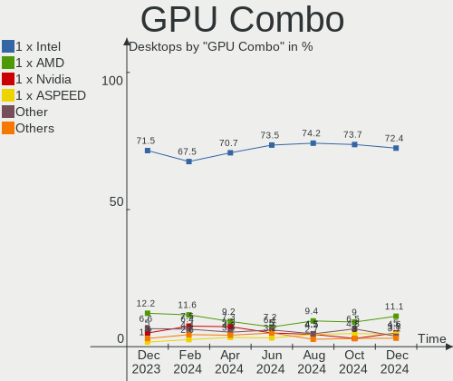

BSD - Hardware Trends (Desktops)
--------------------------------

A project to identify most popular hardware characteristics and track their change
over time based on data collected by BSD users at https://BSD-Hardware.info.

Anyone can contribute to this report by the [hw-probe](https://github.com/linuxhw/hw-probe/blob/master/INSTALL.BSD.md) tool:

    hw-probe -all -upload

This report is for one last month. Overall report since the beginning of time: [TestCoverage](https://github.com/bsdhw/TestCoverage)

Period: Jan, 2023.

Contents
--------

* [ System ](#system)
  - [ OS                       ](#os)
  - [ OS Family                ](#os-family)
  - [ Arch                     ](#arch)
  - [ DE                       ](#de)
  - [ Display Server           ](#display-server)
  - [ Display Manager          ](#display-manager)
  - [ OS Lang                  ](#os-lang)
  - [ Boot Mode                ](#boot-mode)
  - [ Filesystem               ](#filesystem)
  - [ Part. scheme             ](#part-scheme)

* [ Board ](#board)
  - [ Vendor                   ](#vendor)
  - [ Model                    ](#model)
  - [ Model Family             ](#model-family)
  - [ MFG Year                 ](#mfg-year)
  - [ Form Factor              ](#form-factor)
  - [ Coreboot                 ](#coreboot)
  - [ RAM Size                 ](#ram-size)
  - [ RAM Used                 ](#ram-used)
  - [ Total Drives             ](#total-drives)
  - [ Has CD-ROM               ](#has-cd-rom)
  - [ Has Ethernet             ](#has-ethernet)
  - [ Has WiFi                 ](#has-wifi)
  - [ Has Bluetooth            ](#has-bluetooth)

* [ Location ](#location)
  - [ Country                  ](#country)
  - [ City                     ](#city)

* [ Drives ](#drives)
  - [ Drive Vendor             ](#drive-vendor)
  - [ Drive Model              ](#drive-model)
  - [ HDD Vendor               ](#hdd-vendor)
  - [ SSD Vendor               ](#ssd-vendor)
  - [ Drive Kind               ](#drive-kind)
  - [ Drive Connector          ](#drive-connector)
  - [ Drive Size               ](#drive-size)
  - [ Space Total              ](#space-total)
  - [ Space Used               ](#space-used)
  - [ Malfunc. Drives          ](#malfunc-drives)
  - [ Malfunc. Drive Vendor    ](#malfunc-drive-vendor)
  - [ Malfunc. HDD Vendor      ](#malfunc-hdd-vendor)
  - [ Malfunc. Drive Kind      ](#malfunc-drive-kind)
  - [ Failed Drives            ](#failed-drives)
  - [ Failed Drive Vendor      ](#failed-drive-vendor)
  - [ Drive Status             ](#drive-status)

* [ Storage controller ](#storage-controller)
  - [ Storage Vendor           ](#storage-vendor)
  - [ Storage Model            ](#storage-model)
  - [ Storage Kind             ](#storage-kind)

* [ Processor ](#processor)
  - [ CPU Vendor               ](#cpu-vendor)
  - [ CPU Model                ](#cpu-model)
  - [ CPU Model Family         ](#cpu-model-family)
  - [ CPU Cores                ](#cpu-cores)
  - [ CPU Sockets              ](#cpu-sockets)
  - [ CPU Threads              ](#cpu-threads)
  - [ CPU Microarch            ](#cpu-microarch)

* [ Graphics ](#graphics)
  - [ GPU Vendor               ](#gpu-vendor)
  - [ GPU Model                ](#gpu-model)
  - [ GPU Combo                ](#gpu-combo)
  - [ GPU Driver               ](#gpu-driver)
  - [ GPU Memory               ](#gpu-memory)

* [ Monitor ](#monitor)
  - [ Monitor Vendor           ](#monitor-vendor)
  - [ Monitor Model            ](#monitor-model)
  - [ Monitor Resolution       ](#monitor-resolution)
  - [ Monitor Diagonal         ](#monitor-diagonal)
  - [ Monitor Width            ](#monitor-width)
  - [ Aspect Ratio             ](#aspect-ratio)
  - [ Monitor Area             ](#monitor-area)
  - [ Pixel Density            ](#pixel-density)
  - [ Multiple Monitors        ](#multiple-monitors)

* [ Network ](#network)
  - [ Net Controller Vendor    ](#net-controller-vendor)
  - [ Net Controller Model     ](#net-controller-model)
  - [ Wireless Vendor          ](#wireless-vendor)
  - [ Wireless Model           ](#wireless-model)
  - [ Ethernet Vendor          ](#ethernet-vendor)
  - [ Ethernet Model           ](#ethernet-model)
  - [ Net Controller Kind      ](#net-controller-kind)
  - [ Used Controller          ](#used-controller)
  - [ NICs                     ](#nics)
  - [ IPv6                     ](#ipv6)

* [ Bluetooth ](#bluetooth)
  - [ Bluetooth Vendor         ](#bluetooth-vendor)
  - [ Bluetooth Model          ](#bluetooth-model)

* [ Sound ](#sound)
  - [ Sound Vendor             ](#sound-vendor)
  - [ Sound Model              ](#sound-model)

* [ Memory ](#memory)
  - [ Memory Vendor            ](#memory-vendor)
  - [ Memory Model             ](#memory-model)
  - [ Memory Kind              ](#memory-kind)
  - [ Memory Form Factor       ](#memory-form-factor)
  - [ Memory Size              ](#memory-size)
  - [ Memory Speed             ](#memory-speed)

* [ Printers & scanners ](#printers--scanners)
  - [ Printer Vendor           ](#printer-vendor)
  - [ Printer Model            ](#printer-model)
  - [ Scanner Vendor           ](#scanner-vendor)
  - [ Scanner Model            ](#scanner-model)

* [ Camera ](#camera)
  - [ Camera Vendor            ](#camera-vendor)
  - [ Camera Model             ](#camera-model)

* [ Security ](#security)
  - [ Fingerprint Vendor       ](#fingerprint-vendor)
  - [ Fingerprint Model        ](#fingerprint-model)
  - [ Chipcard Vendor          ](#chipcard-vendor)
  - [ Chipcard Model           ](#chipcard-model)

* [ Unsupported ](#unsupported)
  - [ Unsupported Devices      ](#unsupported-devices)
  - [ Unsupported Device Types ](#unsupported-device-types)

System
------

OS
--

Installed operating systems

| Name                 | Desktops | Percent |
|----------------------|----------|---------|
| OPNsense 22.7.10     | 134      | 38.73%  |
| OPNsense 22.7.11     | 55       | 15.9%   |
| OPNsense 23.1        | 47       | 13.58%  |
| helloSystem 0.8.0    | 26       | 7.51%   |
| FreeBSD 13.1-p5      | 18       | 5.2%    |
| OpenBSD 7.2          | 11       | 3.18%   |
| helloSystem 0.7.0    | 11       | 3.18%   |
| OPNsense 22.1.10     | 6        | 1.73%   |
| FreeBSD 14.0-CURRENT | 4        | 1.16%   |
| FreeBSD 13.1-STABLE  | 4        | 1.16%   |
| FreeBSD 13.1         | 3        | 0.87%   |
| FreeBSD 12.3         | 3        | 0.87%   |
| NomadBSD 20221130    | 2        | 0.58%   |
| FreeBSD 12.4         | 2        | 0.58%   |
| FreeBSD 12.3-STABLE  | 2        | 0.58%   |
| XigmaNAS 12.3-p6     | 1        | 0.29%   |
| TrueNAS 13.1-p2      | 1        | 0.29%   |
| TrueNAS 12.3-p7      | 1        | 0.29%   |
| pfSense 2.6.0        | 1        | 0.29%   |
| OPNsense 22.7.9      | 1        | 0.29%   |
| OPNsense 22.7.8      | 1        | 0.29%   |
| OPNsense 22.7.5      | 1        | 0.29%   |
| OPNsense 22.7.2      | 1        | 0.29%   |
| OPNsense 22.7        | 1        | 0.29%   |
| OPNsense 22.10       | 1        | 0.29%   |
| OPNsense 21.7.8      | 1        | 0.29%   |
| OPNsense 21.1.9      | 1        | 0.29%   |
| OpenBSD 7.0          | 1        | 0.29%   |
| MyBee 13.1-p5        | 1        | 0.29%   |
| MidnightBSD 2.2.6    | 1        | 0.29%   |
| MidnightBSD 2.2.5    | 1        | 0.29%   |
| GhostBSD 22.12.20    | 1        | 0.29%   |
| FreeBSD 13.0-p7      | 1        | 0.29%   |

OS Family
---------

OS without a version

| Name        | Desktops | Percent |
|-------------|----------|---------|
| OPNsense    | 250      | 72.25%  |
| helloSystem | 37       | 10.69%  |
| FreeBSD     | 37       | 10.69%  |
| OpenBSD     | 12       | 3.47%   |
| TrueNAS     | 2        | 0.58%   |
| NomadBSD    | 2        | 0.58%   |
| MidnightBSD | 2        | 0.58%   |
| XigmaNAS    | 1        | 0.29%   |
| pfSense     | 1        | 0.29%   |
| MyBee       | 1        | 0.29%   |
| GhostBSD    | 1        | 0.29%   |

Arch
----

OS architecture (x86_64, i586, etc.)

| Name  | Desktops | Percent |
|-------|----------|---------|
| amd64 | 343      | 99.13%  |
| i386  | 2        | 0.58%   |
| arm64 | 1        | 0.29%   |

DE
--

Desktop Environment

| Name         | Desktops | Percent |
|--------------|----------|---------|
| Console      | 279      | 80.64%  |
| helloDesktop | 46       | 13.29%  |
| XFCE         | 7        | 2.02%   |
| Openbox      | 4        | 1.16%   |
| KDE5         | 3        | 0.87%   |
| GNOME        | 2        | 0.58%   |
| TWM          | 1        | 0.29%   |
| MATE         | 1        | 0.29%   |
| Lumina       | 1        | 0.29%   |
| i3           | 1        | 0.29%   |
| DWM          | 1        | 0.29%   |

Display Server
--------------

X11 or Wayland

| Name    | Desktops | Percent |
|---------|----------|---------|
| Console | 285      | 82.37%  |
| X11     | 61       | 17.63%  |

Display Manager
---------------

SDDM, LightDM, etc.

| Name    | Desktops | Percent |
|---------|----------|---------|
| Console | 297      | 85.84%  |
| SLiM    | 41       | 11.85%  |
| SDDM    | 3        | 0.87%   |
| XDM     | 2        | 0.58%   |
| Ly      | 2        | 0.58%   |
| LightDM | 1        | 0.29%   |

OS Lang
-------

Language

| Lang         | Desktops | Percent |
|--------------|----------|---------|
| Unknown      | 264      | 76.3%   |
| C            | 28       | 8.09%   |
| en_US        | 20       | 5.78%   |
| en           | 13       | 3.76%   |
| ru           | 4        | 1.16%   |
| en_GB        | 3        | 0.87%   |
| pt           | 2        | 0.58%   |
| en_CA        | 2        | 0.58%   |
| ru_RU.KOI8-R | 1        | 0.29%   |
| ru_RU        | 1        | 0.29%   |
| it           | 1        | 0.29%   |
| ISO8859-15   | 1        | 0.29%   |
| fr           | 1        | 0.29%   |
| es_ES        | 1        | 0.29%   |
| es           | 1        | 0.29%   |
| en_AU        | 1        | 0.29%   |
| de           | 1        | 0.29%   |
| bg_BG        | 1        | 0.29%   |

Boot Mode
---------

EFI or BIOS

| Mode | Desktops | Percent |
|------|----------|---------|
| EFI  | 310      | 89.6%   |
| BIOS | 36       | 10.4%   |

Filesystem
----------

Type of filesystem

| Type    | Desktops | Percent |
|---------|----------|---------|
| Ufs     | 179      | 51.73%  |
| Zfs     | 128      | 36.99%  |
| Cd9660  | 26       | 7.51%   |
| Ffs     | 12       | 3.47%   |
| Unknown | 1        | 0.29%   |

Part. scheme
------------

Scheme of partitioning

| Type    | Desktops | Percent |
|---------|----------|---------|
| GPT     | 323      | 93.35%  |
| MBR     | 18       | 5.2%    |
| Unknown | 5        | 1.45%   |

Board
-----

Vendor
------

Motherboard manufacturer

| Name                                 | Desktops | Percent |
|--------------------------------------|----------|---------|
| Unknown                              | 51       | 14.74%  |
| ASUSTek Computer                     | 41       | 11.85%  |
| Dell                                 | 40       | 11.56%  |
| Hewlett-Packard                      | 31       | 8.96%   |
| Gigabyte Technology                  | 24       | 6.94%   |
| Techvision                           | 18       | 5.2%    |
| Intel                                | 14       | 4.05%   |
| ASRock                               | 14       | 4.05%   |
| Protectli                            | 12       | 3.47%   |
| MSI                                  | 12       | 3.47%   |
| PC Engines                           | 10       | 2.89%   |
| Lenovo                               | 9        | 2.6%    |
| Supermicro                           | 8        | 2.31%   |
| Fujitsu                              | 8        | 2.31%   |
| CncTion                              | 7        | 2.02%   |
| Biostar                              | 5        | 1.45%   |
| MW                                   | 4        | 1.16%   |
| Shuttle                              | 2        | 0.58%   |
| ShenZhen MinWin Technology           | 2        | 0.58%   |
| AZW                                  | 2        | 0.58%   |
| ASRockRack                           | 2        | 0.58%   |
| AMD                                  | 2        | 0.58%   |
| YANYU                                | 1        | 0.29%   |
| Wortmann AG                          | 1        | 0.29%   |
| Winston Marriot                      | 1        | 0.29%   |
| TYAN Computer                        | 1        | 0.29%   |
| SmbiosType2_BoardManufacturer        | 1        | 0.29%   |
| Silicom                              | 1        | 0.29%   |
| Shenzhen Meigao Electronic Equipment | 1        | 0.29%   |
| Samsung Electronics                  | 1        | 0.29%   |
| MACHINIST                            | 1        | 0.29%   |
| Lanner                               | 1        | 0.29%   |
| IceWhale Technology                  | 1        | 0.29%   |
| IBM                                  | 1        | 0.29%   |
| Hardkernel                           | 1        | 0.29%   |
| Google                               | 1        | 0.29%   |
| Dell EMC                             | 1        | 0.29%   |
| CNCTION-IAF                          | 1        | 0.29%   |
| Citrix                               | 1        | 0.29%   |
| Cisco                                | 1        | 0.29%   |

Model
-----

Motherboard model

| Name                              | Desktops | Percent |
|-----------------------------------|----------|---------|
| Unknown                           | 51       | 14.74%  |
| Techvision TVI7309X               | 18       | 5.2%    |
| Protectli FW6                     | 7        | 2.02%   |
| ASUS All Series                   | 6        | 1.73%   |
| PC Engines APU2                   | 5        | 1.45%   |
| Fujitsu FUTRO S920                | 5        | 1.45%   |
| CncTion N5105-4L                  | 5        | 1.45%   |
| PC Engines apu4                   | 4        | 1.16%   |
| MW GMLK-2_5G4L                    | 4        | 1.16%   |
| HP t620 PLUS Quad Core TC         | 4        | 1.16%   |
| Dell OptiPlex 7020                | 4        | 1.16%   |
| Supermicro X9SCL/X9SCM            | 3        | 0.87%   |
| Protectli FW4B                    | 3        | 0.87%   |
| Intel Q3XXG4-P V1.0               | 3        | 0.87%   |
| HP EliteDesk 800 G3 SFF           | 3        | 0.87%   |
| HP EliteDesk 800 G1 SFF           | 3        | 0.87%   |
| Dell Precision Tower 5810         | 3        | 0.87%   |
| Dell OptiPlex 7050                | 3        | 0.87%   |
| Dell OptiPlex 3020                | 3        | 0.87%   |
| Intel SKYBAY                      | 2        | 0.58%   |
| Intel Nobilis                     | 2        | 0.58%   |
| HP ProDesk 400 G5 SFF             | 2        | 0.58%   |
| HP ProDesk 400 G4 MT              | 2        | 0.58%   |
| Gigabyte Z390 AORUS ELITE         | 2        | 0.58%   |
| Dell OptiPlex 790                 | 2        | 0.58%   |
| Dell OptiPlex 7040                | 2        | 0.58%   |
| Dell OptiPlex 7010                | 2        | 0.58%   |
| Dell OptiPlex 3060                | 2        | 0.58%   |
| Dell OptiPlex 3050                | 2        | 0.58%   |
| Dell OptiPlex 3040                | 2        | 0.58%   |
| CncTion J4125-4L-I225             | 2        | 0.58%   |
| ASUS TUF Gaming Z690-PLUS WIFI D4 | 2        | 0.58%   |
| ASUS ROG STRIX B450-F GAMING      | 2        | 0.58%   |
| ASRock X570 Phantom Gaming 4      | 2        | 0.58%   |
| YANYU R250                        | 1        | 0.29%   |
| Wortmann AG terra MiniPC          | 1        | 0.29%   |
| Winston Marriot PICO PC(R)        | 1        | 0.29%   |
| TYAN 1X8-X6 CACHEH                | 1        | 0.29%   |
| Supermicro X9SCI/X9SCA            | 1        | 0.29%   |
| Supermicro SYS-6028R-TRT          | 1        | 0.29%   |

Model Family
------------

Motherboard model prefix

| Name                                      | Desktops | Percent |
|-------------------------------------------|----------|---------|
| Unknown                                   | 51       | 14.74%  |
| Dell OptiPlex                             | 30       | 8.67%   |
| Techvision TVI7309X                       | 18       | 5.2%    |
| HP EliteDesk                              | 10       | 2.89%   |
| ASUS PRIME                                | 9        | 2.6%    |
| ASUS ROG                                  | 8        | 2.31%   |
| Protectli FW6                             | 7        | 2.02%   |
| HP ProDesk                                | 7        | 2.02%   |
| Fujitsu FUTRO                             | 6        | 1.73%   |
| ASUS All                                  | 6        | 1.73%   |
| PC Engines APU2                           | 5        | 1.45%   |
| Lenovo ThinkCentre                        | 5        | 1.45%   |
| HP t620                                   | 5        | 1.45%   |
| CncTion N5105-4L                          | 5        | 1.45%   |
| PC Engines apu4                           | 4        | 1.16%   |
| MW GMLK-2                                 | 4        | 1.16%   |
| HP Compaq                                 | 4        | 1.16%   |
| Dell Precision                            | 4        | 1.16%   |
| ASUS TUF                                  | 4        | 1.16%   |
| Supermicro X9SCL                          | 3        | 0.87%   |
| Protectli FW4B                            | 3        | 0.87%   |
| Intel Q3XXG4-P                            | 3        | 0.87%   |
| Dell Inspiron                             | 3        | 0.87%   |
| Intel SKYBAY                              | 2        | 0.58%   |
| Intel Nobilis                             | 2        | 0.58%   |
| Gigabyte Z390                             | 2        | 0.58%   |
| Dell Vostro                               | 2        | 0.58%   |
| CncTion J4125-4L-I225                     | 2        | 0.58%   |
| ASUS Pro                                  | 2        | 0.58%   |
| ASRock X570                               | 2        | 0.58%   |
| YANYU R250                                | 1        | 0.29%   |
| Wortmann AG terra                         | 1        | 0.29%   |
| Winston Marriot PICO                      | 1        | 0.29%   |
| TYAN 1X8-X6                               | 1        | 0.29%   |
| Supermicro X9SCI                          | 1        | 0.29%   |
| Supermicro SYS-6028R-TRT                  | 1        | 0.29%   |
| Supermicro SYS-6028R-T                    | 1        | 0.29%   |
| Supermicro Pro546267                      | 1        | 0.29%   |
| Supermicro AS                             | 1        | 0.29%   |
| SmbiosType2_BoardManufacturer SmbiosType1 | 1        | 0.29%   |

MFG Year
--------

Motherboard manufacture year

| Year    | Desktops | Percent |
|---------|----------|---------|
| 2022    | 80       | 23.12%  |
| 2018    | 42       | 12.14%  |
| 2021    | 34       | 9.83%   |
| 2019    | 32       | 9.25%   |
| 2014    | 25       | 7.23%   |
| 2017    | 21       | 6.07%   |
| 2020    | 19       | 5.49%   |
| 2013    | 18       | 5.2%    |
| 2012    | 17       | 4.91%   |
| 2016    | 16       | 4.62%   |
| 2015    | 11       | 3.18%   |
| 2011    | 10       | 2.89%   |
| 2010    | 10       | 2.89%   |
| 2008    | 5        | 1.45%   |
| Unknown | 3        | 0.87%   |
| 2023    | 1        | 0.29%   |
| 2009    | 1        | 0.29%   |
| 2006    | 1        | 0.29%   |

Form Factor
-----------

Physical design of the computer

| Name    | Desktops | Percent |
|---------|----------|---------|
| Desktop | 346      | 100%    |

Coreboot
--------

Have coreboot on board

| Used | Desktops | Percent |
|------|----------|---------|
| No   | 332      | 95.95%  |
| Yes  | 14       | 4.05%   |

RAM Size
--------

Total RAM memory

| Size in GB  | Desktops | Percent |
|-------------|----------|---------|
| 8.01-16.0   | 125      | 36.13%  |
| 16.01-24.0  | 95       | 27.46%  |
| 4.01-8.0    | 58       | 16.76%  |
| 32.01-64.0  | 40       | 11.56%  |
| 64.01-256.0 | 17       | 4.91%   |
| 2.01-3.0    | 4        | 1.16%   |
| 3.01-4.0    | 3        | 0.87%   |
| 24.01-32.0  | 2        | 0.58%   |
| 0.51-1.0    | 2        | 0.58%   |

RAM Used
--------

Used RAM memory

| Used GB    | Desktops | Percent |
|------------|----------|---------|
| 0.01-0.5   | 166      | 47.98%  |
| 0.51-1.0   | 106      | 30.64%  |
| 1.01-2.0   | 49       | 14.16%  |
| 3.01-4.0   | 8        | 2.31%   |
| 2.01-3.0   | 8        | 2.31%   |
| 8.01-16.0  | 3        | 0.87%   |
| 4.01-8.0   | 2        | 0.58%   |
| 16.01-24.0 | 2        | 0.58%   |
| 24.01-32.0 | 1        | 0.29%   |
| 0          | 1        | 0.29%   |

Total Drives
------------

Number of drives on board

| Drives | Desktops | Percent |
|--------|----------|---------|
| 1      | 251      | 72.54%  |
| 2      | 33       | 9.54%   |
| 3      | 25       | 7.23%   |
| 0      | 24       | 6.94%   |
| 5      | 5        | 1.45%   |
| 4      | 3        | 0.87%   |
| 13     | 1        | 0.29%   |
| 11     | 1        | 0.29%   |
| 10     | 1        | 0.29%   |
| 8      | 1        | 0.29%   |
| 7      | 1        | 0.29%   |

Has CD-ROM
----------

Has CD-ROM on board

| Presented | Desktops | Percent |
|-----------|----------|---------|
| No        | 292      | 84.39%  |
| Yes       | 54       | 15.61%  |

Has Ethernet
------------

Has Ethernet on board

| Presented | Desktops | Percent |
|-----------|----------|---------|
| Yes       | 345      | 99.71%  |
| No        | 1        | 0.29%   |

Has WiFi
--------

Has WiFi module

| Presented | Desktops | Percent |
|-----------|----------|---------|
| No        | 286      | 82.66%  |
| Yes       | 60       | 17.34%  |

Has Bluetooth
-------------

Has Bluetooth module

| Presented | Desktops | Percent |
|-----------|----------|---------|
| No        | 309      | 89.31%  |
| Yes       | 37       | 10.69%  |

Location
--------

Country
-------

Geographic location (country)

| Country     | Desktops | Percent |
|-------------|----------|---------|
| USA         | 111      | 32.08%  |
| Germany     | 52       | 15.03%  |
| Russia      | 28       | 8.09%   |
| Canada      | 20       | 5.78%   |
| UK          | 14       | 4.05%   |
| Netherlands | 9        | 2.6%    |
| Australia   | 9        | 2.6%    |
| Spain       | 8        | 2.31%   |
| France      | 8        | 2.31%   |
| Italy       | 7        | 2.02%   |
| Brazil      | 7        | 2.02%   |
| Poland      | 6        | 1.73%   |
| Bulgaria    | 6        | 1.73%   |
| Austria     | 6        | 1.73%   |
| Switzerland | 4        | 1.16%   |
| South Korea | 4        | 1.16%   |
| Norway      | 4        | 1.16%   |
| Sweden      | 3        | 0.87%   |
| Romania     | 3        | 0.87%   |
| Indonesia   | 3        | 0.87%   |
| Finland     | 3        | 0.87%   |
| Taiwan      | 2        | 0.58%   |
| Philippines | 2        | 0.58%   |
| Israel      | 2        | 0.58%   |
| Isle of Man | 2        | 0.58%   |
| India       | 2        | 0.58%   |
| Denmark     | 2        | 0.58%   |
| Czechia     | 2        | 0.58%   |
| Ukraine     | 1        | 0.29%   |
| Thailand    | 1        | 0.29%   |
| Serbia      | 1        | 0.29%   |
| Portugal    | 1        | 0.29%   |
| Peru        | 1        | 0.29%   |
| New Zealand | 1        | 0.29%   |
| Luxembourg  | 1        | 0.29%   |
| Lithuania   | 1        | 0.29%   |
| Hungary     | 1        | 0.29%   |
| Greece      | 1        | 0.29%   |
| Croatia     | 1        | 0.29%   |
| Costa Rica  | 1        | 0.29%   |

City
----

Geographic location (city)

| City             | Desktops | Percent |
|------------------|----------|---------|
| Moscow           | 9        | 2.6%    |
| Austin           | 8        | 2.31%   |
| Vienna           | 4        | 1.16%   |
| Sydney           | 4        | 1.16%   |
| St Petersburg    | 4        | 1.16%   |
| Seattle          | 4        | 1.16%   |
| Hamburg          | 3        | 0.87%   |
| Grand Rapids     | 3        | 0.87%   |
| Daly City        | 3        | 0.87%   |
| Berlin           | 3        | 0.87%   |
| Amsterdam        | 3        | 0.87%   |
| Zurich           | 2        | 0.58%   |
| Yekaterinburg    | 2        | 0.58%   |
| Winnipeg         | 2        | 0.58%   |
| Warsaw           | 2        | 0.58%   |
| Voronezh         | 2        | 0.58%   |
| Sofia            | 2        | 0.58%   |
| Saratov          | 2        | 0.58%   |
| Saratoga Springs | 2        | 0.58%   |
| Salem            | 2        | 0.58%   |
| Redmond          | 2        | 0.58%   |
| Prior Lake       | 2        | 0.58%   |
| Portland         | 2        | 0.58%   |
| Oslo             | 2        | 0.58%   |
| Oklahoma City    | 2        | 0.58%   |
| Novokuznetsk     | 2        | 0.58%   |
| London           | 2        | 0.58%   |
| Lafayette        | 2        | 0.58%   |
| Hull             | 2        | 0.58%   |
| Houston          | 2        | 0.58%   |
| Herne Bay        | 2        | 0.58%   |
| Heemskerk        | 2        | 0.58%   |
| Copenhagen       | 2        | 0.58%   |
| Chelyabinsk      | 2        | 0.58%   |
| Chandler         | 2        | 0.58%   |
| Calgary          | 2        | 0.58%   |
| Brisbane         | 2        | 0.58%   |
| Borken           | 2        | 0.58%   |
| Bayonne          | 2        | 0.58%   |
| Ypsilanti        | 1        | 0.29%   |

Drives
------

Drive Vendor
------------

Hard drive vendors

| Vendor              | Desktops | Drives | Percent |
|---------------------|----------|--------|---------|
| WDC                 | 53       | 75     | 13.18%  |
| Samsung Electronics | 52       | 72     | 12.94%  |
| Kingston            | 36       | 42     | 8.96%   |
| Seagate             | 32       | 45     | 7.96%   |
| Crucial             | 19       | 21     | 4.73%   |
| SanDisk             | 16       | 16     | 3.98%   |
| Intel               | 14       | 15     | 3.48%   |
| China               | 12       | 12     | 2.99%   |
| Transcend           | 10       | 10     | 2.49%   |
| Toshiba             | 9        | 9      | 2.24%   |
| Hoodisk             | 8        | 8      | 1.99%   |
| Hitachi             | 8        | 9      | 1.99%   |
| Phison              | 7        | 9      | 1.74%   |
| Team                | 6        | 6      | 1.49%   |
| Silicon Motion      | 6        | 6      | 1.49%   |
| PNY                 | 6        | 7      | 1.49%   |
| Patriot             | 6        | 6      | 1.49%   |
| Fanxiang            | 6        | 6      | 1.49%   |
| A-DATA Technology   | 6        | 6      | 1.49%   |
| SK hynix            | 5        | 5      | 1.24%   |
| Corsair             | 5        | 5      | 1.24%   |
| LITEON              | 4        | 4      | 1%      |
| SPCC                | 3        | 3      | 0.75%   |
| Protectli           | 3        | 3      | 0.75%   |
| Plextor             | 3        | 3      | 0.75%   |
| NVMe                | 3        | 4      | 0.75%   |
| Micron Technology   | 3        | 4      | 0.75%   |
| KingSpec            | 3        | 3      | 0.75%   |
| Innodisk            | 3        | 3      | 0.75%   |
| HGST                | 3        | 9      | 0.75%   |
| Hewlett-Packard     | 3        | 3      | 0.75%   |
| FORESEE             | 3        | 3      | 0.75%   |
| XrayDisk            | 2        | 2      | 0.5%    |
| Supermicro          | 2        | 2      | 0.5%    |
| OCZ                 | 2        | 2      | 0.5%    |
| Intenso             | 2        | 2      | 0.5%    |
| Gigabyte Technology | 2        | 2      | 0.5%    |
| Dogfish             | 2        | 2      | 0.5%    |
| BR                  | 2        | 2      | 0.5%    |
| BORY                | 2        | 2      | 0.5%    |

Drive Model
-----------

Hard drive models

| Model                           | Desktops | Percent |
|---------------------------------|----------|---------|
| Samsung SSD 980 500GB           | 5        | 1.14%   |
| Samsung SSD 850 EVO 250GB       | 5        | 1.14%   |
| Phison Sabrent 2TB              | 4        | 0.92%   |
| Kingston SA400S37240G 240GB     | 4        | 0.92%   |
| Hoodisk SSD 64GB                | 4        | 0.92%   |
| China SATA SSD 16GB             | 4        | 0.92%   |
| WDC WD800JD-75MSA3 80GB         | 3        | 0.69%   |
| Seagate ST500DM002-1BD142 500GB | 3        | 0.69%   |
| Seagate ST4000DM000-1F2168 4TB  | 3        | 0.69%   |
| Samsung SSD 970 EVO Plus 1TB    | 3        | 0.69%   |
| Samsung SSD 850 EVO 1TB         | 3        | 0.69%   |
| PNY CS900 120GB SSD             | 3        | 0.69%   |
| Kingston SUV500MS120G 120GB     | 3        | 0.69%   |
| Kingston SUV400S37240G 240GB    | 3        | 0.69%   |
| Kingston SUV400S37120G 120GB    | 3        | 0.69%   |
| Innodisk DEMSR- 08GB mSATA 3ME3 | 3        | 0.69%   |
| Hoodisk SSD 128GB               | 3        | 0.69%   |
| China SATA SSD 64GB             | 3        | 0.69%   |
| WDC WDBNCE5000PNC 500GB         | 2        | 0.46%   |
| WDC WD5000AAKX-08U6AA0 500GB    | 2        | 0.46%   |
| WDC WD30EFRX-68EUZN0 3TB        | 2        | 0.46%   |
| WDC WD10JFCX-68N6GN0 1TB        | 2        | 0.46%   |
| WDC WD10EZEX-08WN4A0 1TB        | 2        | 0.46%   |
| Transcend TS64GMSA370 64GB      | 2        | 0.46%   |
| Toshiba HDWD110 1TB             | 2        | 0.46%   |
| Team T253512GB                  | 2        | 0.46%   |
| Supermicro SSD 128GB            | 2        | 0.46%   |
| SK hynix SC311 SATA 256GB       | 2        | 0.46%   |
| Silicon Motion GV128 128GB      | 2        | 0.46%   |
| Seagate ST3500418AS 500GB       | 2        | 0.46%   |
| Seagate ST2000LM015-2E8174 2TB  | 2        | 0.46%   |
| Seagate ST2000DM008-2FR102 2TB  | 2        | 0.46%   |
| Seagate ST1000DM010-2EP102 1TB  | 2        | 0.46%   |
| SanDisk SDSSDP128G 128GB        | 2        | 0.46%   |
| Samsung SSD 980 PRO 2TB         | 2        | 0.46%   |
| Samsung SSD 980 250GB           | 2        | 0.46%   |
| Samsung SSD 970 PRO 512GB       | 2        | 0.46%   |
| Samsung SSD 970 EVO Plus 2TB    | 2        | 0.46%   |
| Samsung SSD 970 EVO 500GB       | 2        | 0.46%   |
| Samsung SSD 870 QVO 2TB         | 2        | 0.46%   |

HDD Vendor
----------

Hard disk drive vendors

| Vendor              | Desktops | Drives | Percent |
|---------------------|----------|--------|---------|
| WDC                 | 42       | 62     | 44.21%  |
| Seagate             | 31       | 44     | 32.63%  |
| Hitachi             | 8        | 9      | 8.42%   |
| Toshiba             | 5        | 5      | 5.26%   |
| HGST                | 3        | 9      | 3.16%   |
| Samsung Electronics | 2        | 2      | 2.11%   |
| OPENBSD             | 1        | 1      | 1.05%   |
| NVMe                | 1        | 1      | 1.05%   |
| Hewlett-Packard     | 1        | 1      | 1.05%   |
| Dell                | 1        | 2      | 1.05%   |

SSD Vendor
----------

Solid state drive vendors

| Vendor              | Desktops | Drives | Percent |
|---------------------|----------|--------|---------|
| Samsung Electronics | 31       | 42     | 13.54%  |
| Kingston            | 28       | 31     | 12.23%  |
| SanDisk             | 16       | 16     | 6.99%   |
| Crucial             | 16       | 17     | 6.99%   |
| Intel               | 12       | 13     | 5.24%   |
| China               | 12       | 12     | 5.24%   |
| Transcend           | 10       | 10     | 4.37%   |
| Hoodisk             | 8        | 8      | 3.49%   |
| WDC                 | 6        | 6      | 2.62%   |
| PNY                 | 6        | 7      | 2.62%   |
| Team                | 5        | 5      | 2.18%   |
| A-DATA Technology   | 5        | 5      | 2.18%   |
| Toshiba             | 3        | 3      | 1.31%   |
| SK hynix            | 3        | 3      | 1.31%   |
| Protectli           | 3        | 3      | 1.31%   |
| Plextor             | 3        | 3      | 1.31%   |
| Patriot             | 3        | 3      | 1.31%   |
| NVMe                | 3        | 3      | 1.31%   |
| Micron Technology   | 3        | 4      | 1.31%   |
| LITEON              | 3        | 3      | 1.31%   |
| KingSpec            | 3        | 3      | 1.31%   |
| Innodisk            | 3        | 3      | 1.31%   |
| Supermicro          | 2        | 2      | 0.87%   |
| OCZ                 | 2        | 2      | 0.87%   |
| Intenso             | 2        | 2      | 0.87%   |
| Hewlett-Packard     | 2        | 2      | 0.87%   |
| FORESEE             | 2        | 2      | 0.87%   |
| Dogfish             | 2        | 2      | 0.87%   |
| Corsair             | 2        | 2      | 0.87%   |
| BORY                | 2        | 2      | 0.87%   |
| BIWIN               | 2        | 2      | 0.87%   |
| Apacer              | 2        | 2      | 0.87%   |
| XrayDisk            | 1        | 1      | 0.44%   |
| Vaseky              | 1        | 1      | 0.44%   |
| Timetec             | 1        | 1      | 0.44%   |
| SPCC                | 1        | 1      | 0.44%   |
| Smartbuy            | 1        | 1      | 0.44%   |
| Seagate             | 1        | 1      | 0.44%   |
| SATADOM             | 1        | 1      | 0.44%   |
| Ramsta              | 1        | 1      | 0.44%   |

Drive Kind
----------

HDD or SSD

| Kind | Desktops | Drives | Percent |
|------|----------|--------|---------|
| SSD  | 207      | 248    | 55.8%   |
| NVMe | 82       | 96     | 22.1%   |
| HDD  | 82       | 136    | 22.1%   |

Drive Connector
---------------

SATA, SAS, NVMe, etc.

| Type | Desktops | Drives | Percent |
|------|----------|--------|---------|
| SATA | 261      | 384    | 76.09%  |
| NVMe | 82       | 96     | 23.91%  |

Drive Size
----------

Size of hard drive

| Size in TB | Desktops | Drives | Percent |
|------------|----------|--------|---------|
| 0.01-0.5   | 221      | 256    | 73.91%  |
| 0.51-1.0   | 38       | 59     | 12.71%  |
| 1.01-2.0   | 18       | 30     | 6.02%   |
| 3.01-4.0   | 8        | 12     | 2.68%   |
| 4.01-10.0  | 8        | 19     | 2.68%   |
| 2.01-3.0   | 4        | 5      | 1.34%   |
| 10.01-20.0 | 2        | 3      | 0.67%   |

Space Total
-----------

Amount of disk space available on the file system

| Size in GB     | Desktops | Percent |
|----------------|----------|---------|
| 101-250        | 159      | 45.95%  |
| 251-500        | 56       | 16.18%  |
| 1-20           | 46       | 13.29%  |
| 51-100         | 30       | 8.67%   |
| 21-50          | 23       | 6.65%   |
| 501-1000       | 15       | 4.34%   |
| 1001-2000      | 11       | 3.18%   |
| More than 3000 | 3        | 0.87%   |
| 2001-3000      | 2        | 0.58%   |
| Unknown        | 1        | 0.29%   |

Space Used
----------

Amount of used disk space

| Used GB  | Desktops | Percent |
|----------|----------|---------|
| 1-20     | 324      | 93.64%  |
| 21-50    | 12       | 3.47%   |
| 101-250  | 3        | 0.87%   |
| 501-1000 | 3        | 0.87%   |
| 251-500  | 2        | 0.58%   |
| 51-100   | 1        | 0.29%   |
| Unknown  | 1        | 0.29%   |

Malfunc. Drives
---------------

Drive models with a malfunction

| Model                                 | Desktops | Drives | Percent |
|---------------------------------------|----------|--------|---------|
| WDC WDS240G2G0A-00JH30 240GB          | 1        | 1      | 2.38%   |
| WDC WD6400AAKS-22A7B2 640GB           | 1        | 1      | 2.38%   |
| WDC WD5000LPCX-60VHAT0 500GB          | 1        | 1      | 2.38%   |
| WDC WD5000AAKX-001CA0 500GB           | 1        | 1      | 2.38%   |
| WDC WD3200AAKX-001CA0 320GB           | 1        | 1      | 2.38%   |
| WDC WD2001FASS-00W2B0 2TB             | 1        | 1      | 2.38%   |
| WDC WD1600AAJS-00YZCA0 160GB          | 1        | 1      | 2.38%   |
| WDC WD1600AABS-00PRA0 160GB           | 1        | 1      | 2.38%   |
| WDC WD10EZRZ-00HTKB0 1TB              | 1        | 1      | 2.38%   |
| WDC WD10EADS-65M2BX 1TB               | 1        | 1      | 2.38%   |
| WDC WD10EACS-00D6B1 1TB               | 1        | 1      | 2.38%   |
| Toshiba MK1255GSX H 120GB             | 1        | 1      | 2.38%   |
| Toshiba DT01ACA100 1TB                | 1        | 1      | 2.38%   |
| SK hynix SC210 2.5 7MM 256GB          | 1        | 1      | 2.38%   |
| Seagate ST500DM002-1ER14C 500GB       | 1        | 1      | 2.38%   |
| Seagate ST3500418AS 500GB             | 1        | 1      | 2.38%   |
| Seagate ST3000DM001-1ER166 3TB        | 1        | 2      | 2.38%   |
| Seagate ST250DM000-1BD141 250GB       | 1        | 1      | 2.38%   |
| Seagate ST2000LM015-2E8174 2TB        | 1        | 1      | 2.38%   |
| Seagate ST1000NM0011 1TB              | 1        | 1      | 2.38%   |
| SanDisk SD8TB8U-256G-1006 256GB       | 1        | 1      | 2.38%   |
| SanDisk SD8TB8U-128G-1006 128GB       | 1        | 1      | 2.38%   |
| Samsung Electronics SSD 850 EVO 250GB | 1        | 1      | 2.38%   |
| Samsung Electronics HM160HI 160GB     | 1        | 1      | 2.38%   |
| Pioneer APS-SL3N-240 240GB            | 1        | 1      | 2.38%   |
| MidasForce SSD 120GB                  | 1        | 1      | 2.38%   |
| LITEONIT LCT-128M3S 128GB             | 1        | 1      | 2.38%   |
| Kingston SNS4151S332GD 32GB           | 1        | 1      | 2.38%   |
| Kingston SMS200S3120G 120GB           | 1        | 1      | 2.38%   |
| KingSpec P3-512 512GB                 | 1        | 1      | 2.38%   |
| Intel SSDSC2CT060A3 64GB              | 1        | 1      | 2.38%   |
| Intel SSDSC2BW120H6 120GB             | 1        | 1      | 2.38%   |
| Intel SSDPEKKW128G7 128GB             | 1        | 1      | 2.38%   |
| Hitachi HTS725050A9A364 500GB         | 1        | 1      | 2.38%   |
| Hitachi HDS722580VLSA80 82GB          | 1        | 1      | 2.38%   |
| Hitachi HDS721010DLE630 1TB           | 1        | 1      | 2.38%   |
| Hewlett-Packard VB0250EAVER 250GB     | 1        | 1      | 2.38%   |
| Crucial CT128MX100SSD1 128GB          | 1        | 1      | 2.38%   |
| Corsair Force LS SSD 64GB             | 1        | 1      | 2.38%   |
| Corsair Force LE SSD 240GB            | 1        | 1      | 2.38%   |

Malfunc. Drive Vendor
---------------------

Vendors of faulty drives

| Vendor              | Desktops | Drives | Percent |
|---------------------|----------|--------|---------|
| WDC                 | 11       | 11     | 26.83%  |
| Seagate             | 5        | 7      | 12.2%   |
| Intel               | 3        | 3      | 7.32%   |
| Hitachi             | 3        | 3      | 7.32%   |
| Toshiba             | 2        | 2      | 4.88%   |
| SanDisk             | 2        | 2      | 4.88%   |
| Samsung Electronics | 2        | 2      | 4.88%   |
| Kingston            | 2        | 2      | 4.88%   |
| Corsair             | 2        | 2      | 4.88%   |
| A-DATA Technology   | 2        | 2      | 4.88%   |
| SK hynix            | 1        | 1      | 2.44%   |
| Pioneer             | 1        | 1      | 2.44%   |
| MidasForce          | 1        | 1      | 2.44%   |
| LITEONIT            | 1        | 1      | 2.44%   |
| KingSpec            | 1        | 1      | 2.44%   |
| Hewlett-Packard     | 1        | 1      | 2.44%   |
| Crucial             | 1        | 1      | 2.44%   |

Malfunc. HDD Vendor
-------------------

Vendors of faulty HDD drives

| Vendor              | Desktops | Drives | Percent |
|---------------------|----------|--------|---------|
| WDC                 | 10       | 10     | 45.45%  |
| Seagate             | 5        | 7      | 22.73%  |
| Hitachi             | 3        | 3      | 13.64%  |
| Toshiba             | 2        | 2      | 9.09%   |
| Samsung Electronics | 1        | 1      | 4.55%   |
| Hewlett-Packard     | 1        | 1      | 4.55%   |

Malfunc. Drive Kind
-------------------

Kinds of faulty drives

| Kind | Desktops | Drives | Percent |
|------|----------|--------|---------|
| HDD  | 21       | 24     | 52.5%   |
| SSD  | 17       | 17     | 42.5%   |
| NVMe | 2        | 2      | 5%      |

Failed Drives
-------------

Failed drive models

| Model                                      | Desktops | Drives | Percent |
|--------------------------------------------|----------|--------|---------|
| WDC PC SN530 SDBPMPZ-256G-1101 256GB       | 1        | 1      | 33.33%  |
| Samsung Electronics SSD 980 250GB          | 1        | 1      | 33.33%  |
| Samsung Electronics SSD 970 EVO Plus 500GB | 1        | 1      | 33.33%  |

Failed Drive Vendor
-------------------

Failed drive vendors

| Vendor              | Desktops | Drives | Percent |
|---------------------|----------|--------|---------|
| Samsung Electronics | 2        | 2      | 66.67%  |
| WDC                 | 1        | 1      | 33.33%  |

Drive Status
------------

Number of failed and malfunc. drives

| Status   | Desktops | Drives | Percent |
|----------|----------|--------|---------|
| Works    | 287      | 417    | 84.91%  |
| Malfunc  | 38       | 43     | 11.24%  |
| Detected | 10       | 17     | 2.96%   |
| Failed   | 3        | 3      | 0.89%   |

Storage controller
------------------

Storage Vendor
--------------

Storage controller vendors

| Vendor                         | Desktops | Percent |
|--------------------------------|----------|---------|
| Intel                          | 262      | 58.35%  |
| AMD                            | 69       | 15.37%  |
| Samsung Electronics            | 26       | 5.79%   |
| Silicon Motion                 | 19       | 4.23%   |
| Phison Electronics             | 13       | 2.9%    |
| SanDisk                        | 8        | 1.78%   |
| Kingston Technology Company    | 8        | 1.78%   |
| Broadcom / LSI                 | 8        | 1.78%   |
| ASMedia Technology             | 6        | 1.34%   |
| Micron/Crucial Technology      | 5        | 1.11%   |
| MAXIO Technology (Hangzhou)    | 5        | 1.11%   |
| JMicron Technology             | 3        | 0.67%   |
| Chelsio Communications         | 3        | 0.67%   |
| SK hynix                       | 2        | 0.45%   |
| Yangtze Memory Technologies    | 1        | 0.22%   |
| Toshiba                        | 1        | 0.22%   |
| Solid State Storage Technology | 1        | 0.22%   |
| Realtek Semiconductor          | 1        | 0.22%   |
| Nvidia                         | 1        | 0.22%   |
| Marvell Technology Group       | 1        | 0.22%   |
| Lite-On Technology             | 1        | 0.22%   |
| Lite-On IT Corp. / Plextor     | 1        | 0.22%   |
| Innodisk                       | 1        | 0.22%   |
| Biwin Storage Technology       | 1        | 0.22%   |
| ADATA Technology               | 1        | 0.22%   |
| Unknown                        | 1        | 0.22%   |

Storage Model
-------------

Storage controller models

| Model                                                                            | Desktops | Percent |
|----------------------------------------------------------------------------------|----------|---------|
| AMD FCH SATA Controller [AHCI mode]                                              | 43       | 8.6%    |
| Intel Jasper Lake SATA AHCI Controller                                           | 39       | 7.8%    |
| Intel 8 Series/C220 Series Chipset Family 6-port SATA Controller 1 [AHCI mode]   | 24       | 4.8%    |
| Intel Celeron/Pentium Silver Processor SATA Controller                           | 21       | 4.2%    |
| Silicon Motion SM2263EN/SM2263XT SSD Controller                                  | 18       | 3.6%    |
| Unknown                                                                          | 18       | 3.6%    |
| Intel 200 Series PCH SATA controller [AHCI mode]                                 | 17       | 3.4%    |
| Intel Q170/Q150/B150/H170/H110/Z170/CM236 Chipset SATA Controller [AHCI Mode]    | 16       | 3.2%    |
| Intel 6 Series/C200 Series Chipset Family 6 port Desktop SATA AHCI Controller    | 16       | 3.2%    |
| Intel Sunrise Point-LP SATA Controller [AHCI mode]                               | 15       | 3%      |
| Intel Cannon Lake PCH SATA AHCI Controller                                       | 15       | 3%      |
| Samsung NVMe SSD Controller SM981/PM981/PM983                                    | 11       | 2.2%    |
| Samsung NVMe SSD Controller 980                                                  | 9        | 1.8%    |
| AMD 400 Series Chipset SATA Controller                                           | 9        | 1.8%    |
| Phison E12 NVMe Controller                                                       | 8        | 1.6%    |
| Intel SATA Controller [RAID mode]                                                | 8        | 1.6%    |
| Intel Atom Processor E3800 Series SATA AHCI Controller                           | 8        | 1.6%    |
| AMD 500 Series Chipset SATA Controller                                           | 8        | 1.6%    |
| Intel NM10/ICH7 Family SATA Controller [IDE mode]                                | 7        | 1.4%    |
| Intel Alder Lake-S PCH SATA Controller [AHCI Mode]                               | 7        | 1.4%    |
| Samsung NVMe SSD Controller PM9A1/PM9A3/980PRO                                   | 6        | 1.2%    |
| Intel C610/X99 series chipset 6-Port SATA Controller [AHCI mode]                 | 6        | 1.2%    |
| AMD SB7x0/SB8x0/SB9x0 SATA Controller [AHCI mode]                                | 6        | 1.2%    |
| Micron/Crucial P2 NVMe PCIe SSD                                                  | 5        | 1%      |
| MAXIO (Hangzhou) NVMe SSD Controller MAP1202                                     | 5        | 1%      |
| Intel Celeron N3350/Pentium N4200/Atom E3900 Series SATA AHCI Controller         | 5        | 1%      |
| Intel C610/X99 series chipset sSATA Controller [AHCI mode]                       | 5        | 1%      |
| Intel 7 Series/C210 Series Chipset Family 6-port SATA Controller [AHCI mode]     | 5        | 1%      |
| Broadcom / LSI SAS2008 PCI-Express Fusion-MPT SAS-2 [Falcon]                     | 5        | 1%      |
| ASMedia ASM1062 Serial ATA Controller                                            | 5        | 1%      |
| SanDisk WD Black SN750 / PC SN730 NVMe SSD                                       | 4        | 0.8%    |
| Samsung NVMe SSD Controller SM961/PM961/SM963                                    | 4        | 0.8%    |
| Intel Volume Management Device NVMe RAID Controller                              | 4        | 0.8%    |
| Intel Atom/Celeron/Pentium Processor x5-E8000/J3xxx/N3xxx Series SATA Controller | 4        | 0.8%    |
| Intel 82801G (ICH7 Family) IDE Controller                                        | 4        | 0.8%    |
| AMD SB7x0/SB8x0/SB9x0 IDE Controller                                             | 4        | 0.8%    |
| AMD FCH SATA Controller [IDE mode]                                               | 4        | 0.8%    |
| AMD FCH SATA Controller D                                                        | 4        | 0.8%    |
| Intel Wildcat Point-LP SATA Controller [AHCI Mode]                               | 3        | 0.6%    |
| Intel Comet Lake SATA AHCI Controller                                            | 3        | 0.6%    |

Storage Kind
------------

Kind of storage controller (IDE, SATA, NVMe, SAS, ...)

| Kind | Desktops | Percent |
|------|----------|---------|
| SATA | 300      | 66.52%  |
| NVMe | 92       | 20.4%   |
| IDE  | 32       | 7.1%    |
| RAID | 20       | 4.43%   |
| SCSI | 4        | 0.89%   |
| SAS  | 3        | 0.67%   |

Processor
---------

CPU Vendor
----------

Processor vendors

| Vendor | Desktops | Percent |
|--------|----------|---------|
| Intel  | 271      | 78.32%  |
| AMD    | 74       | 21.39%  |
| ARM    | 1        | 0.29%   |

CPU Model
---------

Processor models

| Model                                     | Desktops | Percent |
|-------------------------------------------|----------|---------|
| Intel Celeron N5105 @ 2.00GHz             | 31       | 8.96%   |
| Intel Celeron J4125 CPU @ 2.00GHz         | 20       | 5.78%   |
| AMD GX-412TC SOC                          | 10       | 2.89%   |
| Intel Core i5-6500 CPU @ 3.20GHz          | 8        | 2.31%   |
| Intel Core i5-7500 CPU @ 3.40GHz          | 6        | 1.73%   |
| Intel Celeron N5100 @ 1.10GHz             | 5        | 1.45%   |
| Intel Pentium Silver N6005 @ 2.00GHz      | 4        | 1.16%   |
| Intel Core i5-4590 CPU @ 3.30GHz          | 4        | 1.16%   |
| Intel Core i3-7100U CPU @ 2.40GHz         | 4        | 1.16%   |
| Intel Atom CPU E3845 @ 1.91GHz            | 4        | 1.16%   |
| AMD GX-420CA SOC with Radeon HD Graphics  | 4        | 1.16%   |
| Intel Xeon CPU E5-2697A v4 @ 2.60GHz      | 3        | 0.87%   |
| Intel Xeon CPU E3-1230 V2 @ 3.30GHz       | 3        | 0.87%   |
| Intel Pentium CPU G3220 @ 3.00GHz         | 3        | 0.87%   |
| Intel Core i5-8400 CPU @ 2.80GHz          | 3        | 0.87%   |
| Intel Core i5-6600 CPU @ 3.30GHz          | 3        | 0.87%   |
| Intel Core i5-4570 CPU @ 3.20GHz          | 3        | 0.87%   |
| Intel Core i3-8100 CPU @ 3.60GHz          | 3        | 0.87%   |
| Intel Core i3-4130 CPU @ 3.40GHz          | 3        | 0.87%   |
| Intel Core 2 Duo CPU E7500 @ 2.93GHz      | 3        | 0.87%   |
| Intel Celeron J6413 @ 1.80GHz             | 3        | 0.87%   |
| Intel Celeron CPU J3160 @ 1.60GHz         | 3        | 0.87%   |
| AMD Ryzen 9 5950X 16-Core Processor       | 3        | 0.87%   |
| AMD GX-415GA SOC with Radeon HD Graphics  | 3        | 0.87%   |
| AMD GX-222GC SOC with Radeon R5E Graphics | 3        | 0.87%   |
| Intel Xeon CPU E5-1650 v3 @ 3.50GHz       | 2        | 0.58%   |
| Intel Core i9-9900K CPU @ 3.60GHz         | 2        | 0.58%   |
| Intel Core i7-8700 CPU @ 3.20GHz          | 2        | 0.58%   |
| Intel Core i7-7500U CPU @ 2.70GHz         | 2        | 0.58%   |
| Intel Core i7-3770 CPU @ 3.40GHz          | 2        | 0.58%   |
| Intel Core i5-9500 CPU @ 3.00GHz          | 2        | 0.58%   |
| Intel Core i5-8500 CPU @ 3.00GHz          | 2        | 0.58%   |
| Intel Core i5-8250U CPU @ 1.60GHz         | 2        | 0.58%   |
| Intel Core i5-6500T CPU @ 2.50GHz         | 2        | 0.58%   |
| Intel Core i5-4570T CPU @ 2.90GHz         | 2        | 0.58%   |
| Intel Core i5-3470 CPU @ 3.20GHz          | 2        | 0.58%   |
| Intel Core i3-7100 CPU @ 3.90GHz          | 2        | 0.58%   |
| Intel Core i3-6100 CPU @ 3.70GHz          | 2        | 0.58%   |
| Intel Core i3-4170 CPU @ 3.70GHz          | 2        | 0.58%   |
| Intel Core i3-4160 CPU @ 3.60GHz          | 2        | 0.58%   |

CPU Model Family
----------------

Processor model prefix

| Model                  | Desktops | Percent |
|------------------------|----------|---------|
| Intel Celeron          | 85       | 24.57%  |
| Intel Core i5          | 62       | 17.92%  |
| Intel Core i3          | 32       | 9.25%   |
| Intel Xeon             | 26       | 7.51%   |
| AMD GX                 | 23       | 6.65%   |
| Intel Core i7          | 18       | 5.2%    |
| Other                  | 11       | 3.18%   |
| Intel Atom             | 11       | 3.18%   |
| AMD Ryzen 5            | 9        | 2.6%    |
| AMD Ryzen 7            | 8        | 2.31%   |
| Intel Pentium          | 7        | 2.02%   |
| AMD Ryzen 9            | 7        | 2.02%   |
| Intel Core 2 Duo       | 5        | 1.45%   |
| Intel Pentium Silver   | 4        | 1.16%   |
| Intel Core i9          | 4        | 1.16%   |
| Intel Core 2 Quad      | 4        | 1.16%   |
| AMD Ryzen 3            | 4        | 1.16%   |
| AMD Phenom II X4       | 4        | 1.16%   |
| AMD A10                | 4        | 1.16%   |
| AMD Ryzen 5 PRO        | 3        | 0.87%   |
| AMD FX                 | 3        | 0.87%   |
| AMD EPYC               | 2        | 0.58%   |
| AMD A4                 | 2        | 0.58%   |
| Intel Xeon Silver      | 1        | 0.29%   |
| Intel Pentium 4        | 1        | 0.29%   |
| ARM Cortex             | 1        | 0.29%   |
| AMD Ryzen Threadripper | 1        | 0.29%   |
| AMD E1                 | 1        | 0.29%   |
| AMD E                  | 1        | 0.29%   |
| AMD Athlon II X2       | 1        | 0.29%   |
| AMD A6                 | 1        | 0.29%   |

CPU Cores
---------

Number of processor cores

| Number  | Desktops | Percent |
|---------|----------|---------|
| 4       | 189      | 54.62%  |
| 2       | 74       | 21.39%  |
| 6       | 22       | 6.36%   |
| 16      | 14       | 4.05%   |
| 8       | 13       | 3.76%   |
| 12      | 12       | 3.47%   |
| Unknown | 6        | 1.73%   |
| 32      | 4        | 1.16%   |
| 24      | 4        | 1.16%   |
| 1       | 4        | 1.16%   |
| 10      | 2        | 0.58%   |
| 64      | 1        | 0.29%   |
| 18      | 1        | 0.29%   |

CPU Sockets
-----------

Number of sockets

| Number  | Desktops | Percent |
|---------|----------|---------|
| 1       | 342      | 98.84%  |
| 2       | 3        | 0.87%   |
| Unknown | 1        | 0.29%   |

CPU Threads
-----------

Threads per core (Hyper-Threading)

| Number  | Desktops | Percent |
|---------|----------|---------|
| 1       | 244      | 70.52%  |
| 2       | 96       | 27.75%  |
| Unknown | 6        | 1.73%   |

CPU Microarch
-------------

Microarchitecture

| Name          | Desktops | Percent |
|---------------|----------|---------|
| Unknown       | 56       | 16.18%  |
| KabyLake      | 47       | 13.58%  |
| Haswell       | 36       | 10.4%   |
| Skylake       | 28       | 8.09%   |
| Goldmont plus | 21       | 6.07%   |
| Puma          | 15       | 4.34%   |
| IvyBridge     | 15       | 4.34%   |
| Silvermont    | 14       | 4.05%   |
| SandyBridge   | 14       | 4.05%   |
| Zen 3         | 11       | 3.18%   |
| Zen 2         | 10       | 2.89%   |
| Jaguar        | 9        | 2.6%    |
| Penryn        | 8        | 2.31%   |
| Goldmont      | 8        | 2.31%   |
| Zen+          | 7        | 2.02%   |
| Piledriver    | 7        | 2.02%   |
| Broadwell     | 6        | 1.73%   |
| Zen           | 5        | 1.45%   |
| Westmere      | 5        | 1.45%   |
| K10           | 5        | 1.45%   |
| Core          | 4        | 1.16%   |
| Nehalem       | 3        | 0.87%   |
| CometLake     | 3        | 0.87%   |
| TigerLake     | 2        | 0.58%   |
| Excavator     | 2        | 0.58%   |
| Steamroller   | 1        | 0.29%   |
| NetBurst      | 1        | 0.29%   |
| Geode         | 1        | 0.29%   |
| Bonnell       | 1        | 0.29%   |
| Bobcat        | 1        | 0.29%   |

Graphics
--------

GPU Vendor
----------

Vendors of graphics cards

| Vendor                     | Desktops | Percent |
|----------------------------|----------|---------|
| Intel                      | 225      | 67.57%  |
| AMD                        | 52       | 15.62%  |
| Nvidia                     | 37       | 11.11%  |
| ASPEED Technology          | 10       | 3%      |
| Matrox Electronics Systems | 8        | 2.4%    |
| S3 Graphics                | 1        | 0.3%    |

GPU Model
---------

Graphics card models

| Model                                                                                    | Desktops | Percent |
|------------------------------------------------------------------------------------------|----------|---------|
| Intel JasperLake [UHD Graphics]                                                          | 41       | 12.31%  |
| Intel GeminiLake [UHD Graphics 600]                                                      | 21       | 6.31%   |
| Intel HD Graphics 530                                                                    | 20       | 6.01%   |
| Intel Xeon E3-1200 v3/4th Gen Core Processor Integrated Graphics Controller              | 16       | 4.8%    |
| Intel CoffeeLake-S GT2 [UHD Graphics 630]                                                | 14       | 4.2%    |
| Intel HD Graphics 630                                                                    | 11       | 3.3%    |
| Intel 2nd Generation Core Processor Family Integrated Graphics Controller                | 11       | 3.3%    |
| ASPEED Technology ASPEED Graphics Family                                                 | 10       | 3%      |
| Intel 4th Generation Core Processor Family Integrated Graphics Controller                | 9        | 2.7%    |
| Intel Atom Processor Z36xxx/Z37xxx Series Graphics & Display                             | 8        | 2.4%    |
| Intel HD Graphics 620                                                                    | 7        | 2.1%    |
| Nvidia GK208B [GeForce GT 710]                                                           | 6        | 1.8%    |
| Matrox Electronics Systems MGA G200eW WPCM450                                            | 6        | 1.8%    |
| Intel 4 Series Chipset Integrated Graphics Controller                                    | 6        | 1.8%    |
| Intel HD Graphics 500                                                                    | 4        | 1.2%    |
| Intel Elkhart Lake [UHD Graphics Gen11 16EU]                                             | 4        | 1.2%    |
| Intel Atom/Celeron/Pentium Processor x5-E8000/J3xxx/N3xxx Integrated Graphics Controller | 4        | 1.2%    |
| AMD Kabini [Radeon HD 8400E]                                                             | 4        | 1.2%    |
| Nvidia GP108 [GeForce GT 1030]                                                           | 3        | 0.9%    |
| Nvidia GP107 [GeForce GTX 1050 Ti]                                                       | 3        | 0.9%    |
| Intel Xeon E3-1200 v2/3rd Gen Core processor Graphics Controller                         | 3        | 0.9%    |
| Intel UHD Graphics 620                                                                   | 3        | 0.9%    |
| Intel HD Graphics 610                                                                    | 3        | 0.9%    |
| Intel AlderLake-S GT1                                                                    | 3        | 0.9%    |
| Intel 82G33/G31 Express Integrated Graphics Controller                                   | 3        | 0.9%    |
| AMD Renoir                                                                               | 3        | 0.9%    |
| AMD Picasso/Raven 2 [Radeon Vega Series / Radeon Vega Mobile Series]                     | 3        | 0.9%    |
| AMD Mullins [Radeon R4/R5 Graphics]                                                      | 3        | 0.9%    |
| AMD Kabini [Radeon HD 8330E]                                                             | 3        | 0.9%    |
| AMD Ellesmere [Radeon RX 470/480/570/570X/580/580X/590]                                  | 3        | 0.9%    |
| AMD Cezanne [Radeon Vega Series / Radeon Vega Mobile Series]                             | 3        | 0.9%    |
| Nvidia GK107 [GeForce GTX 650]                                                           | 2        | 0.6%    |
| Intel Xeon E3-1200 v3 Processor Integrated Graphics Controller                           | 2        | 0.6%    |
| Intel TigerLake-LP GT2 [Iris Xe Graphics]                                                | 2        | 0.6%    |
| Intel Skylake GT2 [HD Graphics 520]                                                      | 2        | 0.6%    |
| Intel IvyBridge GT2 [HD Graphics 4000]                                                   | 2        | 0.6%    |
| Intel HD Graphics 5500                                                                   | 2        | 0.6%    |
| Intel HD Graphics 510                                                                    | 2        | 0.6%    |
| Intel CometLake-S GT2 [UHD Graphics 630]                                                 | 2        | 0.6%    |
| Intel 3rd Gen Core processor Graphics Controller                                         | 2        | 0.6%    |

GPU Combo
---------

Combinations of graphics cards

| Name            | Desktops | Percent |
|-----------------|----------|---------|
| 1 x Intel       | 214      | 61.85%  |
| 1 x AMD         | 49       | 14.16%  |
| 1 x Nvidia      | 35       | 10.12%  |
| Other           | 21       | 6.07%   |
| 1 x ASPEED      | 9        | 2.6%    |
| 1 x Matrox      | 8        | 2.31%   |
| 2 x Intel       | 4        | 1.16%   |
| Intel + AMD     | 3        | 0.87%   |
| 1 x S3 Graphics | 1        | 0.29%   |
| Intel + Nvidia  | 1        | 0.29%   |
| Intel + ASPEED  | 1        | 0.29%   |

GPU Driver
----------

Free vs proprietary

| Driver      | Desktops | Percent |
|-------------|----------|---------|
| Free        | 303      | 87.57%  |
| Unknown     | 23       | 6.65%   |
| Proprietary | 20       | 5.78%   |

GPU Memory
----------

Total video memory

| Size in GB | Desktops | Percent |
|------------|----------|---------|
| Unknown    | 318      | 91.91%  |
| 7.01-8.0   | 7        | 2.02%   |
| 1.01-2.0   | 6        | 1.73%   |
| 0.51-1.0   | 5        | 1.45%   |
| 3.01-4.0   | 4        | 1.16%   |
| 0.01-0.5   | 3        | 0.87%   |
| 8.01-16.0  | 2        | 0.58%   |
| 5.01-6.0   | 1        | 0.29%   |

Monitor
-------

Monitor Vendor
--------------

Monitor vendors

| Vendor               | Desktops | Percent |
|----------------------|----------|---------|
| Dell                 | 9        | 19.15%  |
| Goldstar             | 8        | 17.02%  |
| Samsung Electronics  | 4        | 8.51%   |
| Hewlett-Packard      | 4        | 8.51%   |
| Philips              | 3        | 6.38%   |
| AOC                  | 3        | 6.38%   |
| NEC Computers        | 2        | 4.26%   |
| LG Electronics       | 2        | 4.26%   |
| BenQ                 | 2        | 4.26%   |
| Ancor Communications | 2        | 4.26%   |
| Acer                 | 2        | 4.26%   |
| ViewSonic            | 1        | 2.13%   |
| Sony                 | 1        | 2.13%   |
| MSI                  | 1        | 2.13%   |
| CHD                  | 1        | 2.13%   |
| ASUSTek Computer     | 1        | 2.13%   |
| Apple                | 1        | 2.13%   |

Monitor Model
-------------

Monitor models

| Model                                                               | Desktops | Percent |
|---------------------------------------------------------------------|----------|---------|
| Goldstar LG ULTRAWIDE GSM5AFB 2560x1080 800x340mm 34.2-inch         | 2        | 4.17%   |
| ViewSonic VA2710-FHD VSCA736 1920x1080 600x340mm 27.2-inch          | 1        | 2.08%   |
| Sony TV  *30 SNY05D1 3840x2160 1660x930mm 74.9-inch                 | 1        | 2.08%   |
| Samsung Electronics SyncMaster SAM05C5 1920x1080                    | 1        | 2.08%   |
| Samsung Electronics SMT22A300 SAM087B 1920x1080 480x270mm 21.7-inch | 1        | 2.08%   |
| Samsung Electronics S27H85x SAM0E0F 2560x1440 600x340mm 27.2-inch   | 1        | 2.08%   |
| Samsung Electronics S24C550 SAM0A4B 1920x1080 520x290mm 23.4-inch   | 1        | 2.08%   |
| Philips PHL 241V8 PHLC212 1920x1080 530x300mm 24.0-inch             | 1        | 2.08%   |
| Philips LCD Monitor PHL0868 1680x1050 470x290mm 21.7-inch           | 1        | 2.08%   |
| Philips 227E4LH PHLC0AC 1920x1080 480x270mm 21.7-inch               | 1        | 2.08%   |
| NEC Computers LCD175VXM+ NEC66C0 1280x1024 340x270mm 17.1-inch      | 1        | 2.08%   |
| NEC Computers EA275WMi NEC2BA7 2560x1440 600x340mm 27.2-inch        | 1        | 2.08%   |
| MSI MP242 MSI30A1 1920x1080 530x300mm 24.0-inch                     | 1        | 2.08%   |
| LG Electronics LCD Monitor LG ULTRAGEAR 2560x1440                   | 1        | 2.08%   |
| LG Electronics LCD Monitor LG FULL HD 1920x1080                     | 1        | 2.08%   |
| Hewlett-Packard w1907 HWP26A3 1440x900 410x260mm 19.1-inch          | 1        | 2.08%   |
| Hewlett-Packard LA2306 HWP294A 1920x1080 510x290mm 23.1-inch        | 1        | 2.08%   |
| Hewlett-Packard 27w HPN3494 1920x1080 600x340mm 27.2-inch           | 1        | 2.08%   |
| Hewlett-Packard 24y HPN3504 1920x1080 530x300mm 24.0-inch           | 1        | 2.08%   |
| Goldstar W1934 GSM4B7A 1440x900 410x260mm 19.1-inch                 | 1        | 2.08%   |
| Goldstar LG ULTRAGEAR GSM7766 2560x1440 700x390mm 31.5-inch         | 1        | 2.08%   |
| Goldstar LG HDR WFHD GSM5BA0 2560x1080 800x340mm 34.2-inch          | 1        | 2.08%   |
| Goldstar L1918S GSM4B31 1280x1024 380x300mm 19.1-inch               | 1        | 2.08%   |
| Goldstar E2240 GSM57A4 1920x1080 480x270mm 21.7-inch                | 1        | 2.08%   |
| Goldstar E1642 GSM3E8C 1366x768 340x190mm 15.3-inch                 | 1        | 2.08%   |
| Goldstar 23EA53 GSM59A9 1920x1080 510x290mm 23.1-inch               | 1        | 2.08%   |
| Dell U3417W DELA0E0 3440x1440 800x330mm 34.1-inch                   | 1        | 2.08%   |
| Dell U2515H DELD06F 2560x1440 550x310mm 24.9-inch                   | 1        | 2.08%   |
| Dell SE2722H DELD116 1920x1080 600x340mm 27.2-inch                  | 1        | 2.08%   |
| Dell SE2719H DELF10D 1920x1080 600x340mm 27.2-inch                  | 1        | 2.08%   |
| Dell S3221QS DELD107 3840x2160 700x400mm 31.7-inch                  | 1        | 2.08%   |
| Dell P780 DEL510F 1600x1200 330x240mm 16.1-inch                     | 1        | 2.08%   |
| Dell LCD Monitor P2217H 1920x1080                                   | 1        | 2.08%   |
| Dell LCD Monitor LNK0001 1920x1080 300x230mm 14.9-inch              | 1        | 2.08%   |
| Dell E2016HV DELF06E 1600x900 430x240mm 19.4-inch                   | 1        | 2.08%   |
| CHD LCD Monitor CHD0320 2560x1440 700x390mm 31.5-inch               | 1        | 2.08%   |
| BenQ LCD Monitor BNQ78CA 1920x1080 600x340mm 27.2-inch              | 1        | 2.08%   |
| BenQ GL2450 BNQ78A4 1920x1080 530x300mm 24.0-inch                   | 1        | 2.08%   |
| ASUSTek Computer VP247 AUS24DA 1920x1080 520x290mm 23.4-inch        | 1        | 2.08%   |
| Apple Cinema Display APP921D 1680x1050 430x270mm 20.0-inch          | 1        | 2.08%   |

Monitor Resolution
------------------

Monitor screen resolution

| Resolution         | Desktops | Percent |
|--------------------|----------|---------|
| 1920x1080 (FHD)    | 23       | 48.94%  |
| 2560x1440 (QHD)    | 7        | 14.89%  |
| 2560x1080          | 3        | 6.38%   |
| 1440x900 (WXGA+)   | 3        | 6.38%   |
| 3840x2160 (4K)     | 2        | 4.26%   |
| 1680x1050 (WSXGA+) | 2        | 4.26%   |
| 1600x900 (HD+)     | 2        | 4.26%   |
| 1280x1024 (SXGA)   | 2        | 4.26%   |
| 3440x1440          | 1        | 2.13%   |
| 1600x1200          | 1        | 2.13%   |
| 1366x768 (WXGA)    | 1        | 2.13%   |

Monitor Diagonal
----------------

Diagonal size in inches

| Inches  | Desktops | Percent |
|---------|----------|---------|
| 24      | 8        | 17.02%  |
| 27      | 7        | 14.89%  |
| 19      | 5        | 10.64%  |
| Unknown | 5        | 10.64%  |
| 34      | 4        | 8.51%   |
| 23      | 4        | 8.51%   |
| 21      | 4        | 8.51%   |
| 31      | 3        | 6.38%   |
| 74      | 1        | 2.13%   |
| 20      | 1        | 2.13%   |
| 18      | 1        | 2.13%   |
| 17      | 1        | 2.13%   |
| 16      | 1        | 2.13%   |
| 15      | 1        | 2.13%   |
| 14      | 1        | 2.13%   |

Monitor Width
-------------

Physical width

| Width in mm | Desktops | Percent |
|-------------|----------|---------|
| 501-600     | 19       | 40.43%  |
| 401-500     | 9        | 19.15%  |
| Unknown     | 5        | 10.64%  |
| 701-800     | 4        | 8.51%   |
| 601-700     | 3        | 6.38%   |
| 301-350     | 3        | 6.38%   |
| 351-400     | 2        | 4.26%   |
| 201-300     | 1        | 2.13%   |
| 1501-2000   | 1        | 2.13%   |

Aspect Ratio
------------

Proportional relationship between the width and the height

| Ratio   | Desktops | Percent |
|---------|----------|---------|
| 16/9    | 29       | 61.7%   |
| 16/10   | 6        | 12.77%  |
| 21/9    | 4        | 8.51%   |
| Unknown | 4        | 8.51%   |
| 5/4     | 2        | 4.26%   |
| 4/3     | 2        | 4.26%   |

Monitor Area
------------

Area in inch

| Area in inch | Desktops | Percent |
|----------------|----------|---------|
| 201-250        | 14       | 30.43%  |
| 351-500        | 7        | 15.22%  |
| 301-350        | 7        | 15.22%  |
| 151-200        | 6        | 13.04%  |
| Unknown        | 5        | 10.87%  |
| 251-300        | 2        | 4.35%   |
| More than 1000 | 1        | 2.17%   |
| 141-150        | 1        | 2.17%   |
| 121-130        | 1        | 2.17%   |
| 101-110        | 1        | 2.17%   |
| 91-100         | 1        | 2.17%   |

Pixel Density
-------------

Pixels per inch

| Density | Desktops | Percent |
|---------|----------|---------|
| 51-100  | 30       | 65.22%  |
| 101-120 | 8        | 17.39%  |
| Unknown | 5        | 10.87%  |
| 121-160 | 3        | 6.52%   |

Multiple Monitors
-----------------

Total monitors connected

| Total | Desktops | Percent |
|-------|----------|---------|
| 0     | 296      | 85.55%  |
| 1     | 47       | 13.58%  |
| 2     | 3        | 0.87%   |

Network
-------

Net Controller Vendor
---------------------

Controller vendors

| Vendor                     | Desktops | Percent |
|----------------------------|----------|---------|
| Intel                      | 277      | 59.06%  |
| Realtek Semiconductor      | 117      | 24.95%  |
| Broadcom                   | 20       | 4.26%   |
| Qualcomm Atheros           | 18       | 3.84%   |
| Mellanox Technologies      | 6        | 1.28%   |
| TP-Link                    | 4        | 0.85%   |
| Chelsio Communications     | 3        | 0.64%   |
| VIA Technologies           | 2        | 0.43%   |
| Solarflare Communications  | 2        | 0.43%   |
| American Megatrends        | 2        | 0.43%   |
| ZTE WCDMA Technologies MSM | 1        | 0.21%   |
| T & A Mobile Phones        | 1        | 0.21%   |
| Sequans Communications     | 1        | 0.21%   |
| Samsung Electronics        | 1        | 0.21%   |
| Ralink Technology          | 1        | 0.21%   |
| QLogic                     | 1        | 0.21%   |
| OPPO Electronics           | 1        | 0.21%   |
| Nvidia                     | 1        | 0.21%   |
| Novatel Wireless           | 1        | 0.21%   |
| MediaTek                   | 1        | 0.21%   |
| Marvell Technology Group   | 1        | 0.21%   |
| IMC Networks               | 1        | 0.21%   |
| Huawei Technologies        | 1        | 0.21%   |
| Google                     | 1        | 0.21%   |
| Edimax Technology          | 1        | 0.21%   |
| Dell                       | 1        | 0.21%   |
| D-Link System              | 1        | 0.21%   |
| Aquantia                   | 1        | 0.21%   |

Net Controller Model
--------------------

Controller models

| Model                                                                         | Desktops | Percent |
|-------------------------------------------------------------------------------|----------|---------|
| Realtek RTL8111/8168/8411 PCI Express Gigabit Ethernet Controller             | 94       | 16.58%  |
| Intel Ethernet Controller I225-V                                              | 50       | 8.82%   |
| Intel I211 Gigabit Network Connection                                         | 45       | 7.94%   |
| Intel I350 Gigabit Network Connection                                         | 25       | 4.41%   |
| Intel Ethernet Controller I226-V                                              | 21       | 3.7%    |
| Intel 82574L Gigabit Network Connection                                       | 21       | 3.7%    |
| Intel I210 Gigabit Network Connection                                         | 17       | 3%      |
| Intel 82579LM Gigabit Network Connection (Lewisville)                         | 17       | 3%      |
| Realtek RTL8125 2.5GbE Controller                                             | 15       | 2.65%   |
| Intel Ethernet Connection I217-LM                                             | 14       | 2.47%   |
| Intel 82580 Gigabit Network Connection                                        | 13       | 2.29%   |
| Intel 82583V Gigabit Network Connection                                       | 10       | 1.76%   |
| Intel Ethernet Connection (2) I219-LM                                         | 7        | 1.23%   |
| Intel 82599ES 10-Gigabit SFI/SFP+ Network Connection                          | 7        | 1.23%   |
| Intel 82571EB/82571GB Gigabit Ethernet Controller (Copper)                    | 7        | 1.23%   |
| Intel Ethernet Connection (5) I219-LM                                         | 6        | 1.06%   |
| Intel 82576 Gigabit Network Connection                                        | 6        | 1.06%   |
| Intel Ethernet Controller 10-Gigabit X540-AT2                                 | 5        | 0.88%   |
| Intel Ethernet Connection (7) I219-V                                          | 5        | 0.88%   |
| Intel Ethernet Connection (2) I219-V                                          | 5        | 0.88%   |
| Intel 82571EB/82571GB Gigabit Ethernet Controller D0/D1 (copper applications) | 5        | 0.88%   |
| Broadcom NetXtreme II BCM5709 Gigabit Ethernet                                | 4        | 0.71%   |
| TP-Link Archer T2U PLUS [RTL8821AU]                                           | 3        | 0.53%   |
| Realtek RTL8188EUS 802.11n Wireless Network Adapter                           | 3        | 0.53%   |
| Realtek RTL810xE PCI Express Fast Ethernet controller                         | 3        | 0.53%   |
| Realtek RTL-8100/8101L/8139 PCI Fast Ethernet Adapter                         | 3        | 0.53%   |
| Qualcomm Atheros QCA986x/988x 802.11ac Wireless Network Adapter               | 3        | 0.53%   |
| Qualcomm Atheros AR9462 Wireless Network Adapter                              | 3        | 0.53%   |
| Qualcomm Atheros AR93xx Wireless Network Adapter                              | 3        | 0.53%   |
| Mellanox MT27520 Family [ConnectX-3 Pro]                                      | 3        | 0.53%   |
| Mellanox MT27500 Family [ConnectX-3]                                          | 3        | 0.53%   |
| Intel Wireless 3165                                                           | 3        | 0.53%   |
| Intel Wi-Fi 6 AX200                                                           | 3        | 0.53%   |
| Intel Ethernet Controller X550                                                | 3        | 0.53%   |
| Intel Ethernet Connection X553 1GbE                                           | 3        | 0.53%   |
| Intel Ethernet Connection (7) I219-LM                                         | 3        | 0.53%   |
| Intel Ethernet Connection (2) I218-V                                          | 3        | 0.53%   |
| Intel Ethernet 10G 2P X520 Adapter                                            | 3        | 0.53%   |
| Intel Alder Lake-S PCH CNVi WiFi                                              | 3        | 0.53%   |
| Intel 82575EB Gigabit Network Connection                                      | 3        | 0.53%   |

Wireless Vendor
---------------

Wireless vendors

| Vendor                | Desktops | Percent |
|-----------------------|----------|---------|
| Intel                 | 24       | 36.92%  |
| Qualcomm Atheros      | 16       | 24.62%  |
| Realtek Semiconductor | 11       | 16.92%  |
| TP-Link               | 4        | 6.15%   |
| Broadcom              | 4        | 6.15%   |
| Ralink Technology     | 1        | 1.54%   |
| MediaTek              | 1        | 1.54%   |
| IMC Networks          | 1        | 1.54%   |
| Edimax Technology     | 1        | 1.54%   |
| Dell                  | 1        | 1.54%   |
| D-Link System         | 1        | 1.54%   |

Wireless Model
--------------

Wireless models

| Model                                                           | Desktops | Percent |
|-----------------------------------------------------------------|----------|---------|
| TP-Link Archer T2U PLUS [RTL8821AU]                             | 3        | 4.55%   |
| Realtek RTL8188EUS 802.11n Wireless Network Adapter             | 3        | 4.55%   |
| Qualcomm Atheros QCA986x/988x 802.11ac Wireless Network Adapter | 3        | 4.55%   |
| Qualcomm Atheros AR9462 Wireless Network Adapter                | 3        | 4.55%   |
| Qualcomm Atheros AR93xx Wireless Network Adapter                | 3        | 4.55%   |
| Intel Wireless 3165                                             | 3        | 4.55%   |
| Intel Wi-Fi 6 AX200                                             | 3        | 4.55%   |
| Intel Alder Lake-S PCH CNVi WiFi                                | 3        | 4.55%   |
| Realtek RTL8192EE PCIe Wireless Network Adapter                 | 2        | 3.03%   |
| Qualcomm Atheros QCA9565 / AR9565 Wireless Network Adapter      | 2        | 3.03%   |
| Intel Wi-Fi 6 AX210/AX211/AX411 160MHz                          | 2        | 3.03%   |
| Intel Dual Band Wireless-AC 3168NGW [Stone Peak]                | 2        | 3.03%   |
| Intel Centrino Wireless-N 2230                                  | 2        | 3.03%   |
| Intel Centrino Advanced-N 6205 [Taylor Peak]                    | 2        | 3.03%   |
| Broadcom BCM43228 802.11a/b/g/n                                 | 2        | 3.03%   |
| TP-Link TL-WN722N v2/v3 [Realtek RTL8188EUS]                    | 1        | 1.52%   |
| TP-Link AC600 wireless Realtek RTL8811AU [Archer T2U Nano]      | 1        | 1.52%   |
| Realtek RTL88x2bu [AC1200 Techkey]                              | 1        | 1.52%   |
| Realtek RTL8822CE 802.11ac PCIe Wireless Network Adapter        | 1        | 1.52%   |
| Realtek RTL8723AE PCIe Wireless Network Adapter                 | 1        | 1.52%   |
| Realtek RTL8192CU 802.11n WLAN Adapter                          | 1        | 1.52%   |
| Realtek RTL8191SU 802.11n WLAN Adapter                          | 1        | 1.52%   |
| Realtek RTL8188EE Wireless Network Adapter                      | 1        | 1.52%   |
| Ralink RT5370 Wireless Adapter                                  | 1        | 1.52%   |
| Qualcomm Atheros QCA9377 802.11ac Wireless Network Adapter      | 1        | 1.52%   |
| Qualcomm Atheros AR9485 Wireless Network Adapter                | 1        | 1.52%   |
| Qualcomm Atheros AR928X Wireless Network Adapter (PCI-Express)  | 1        | 1.52%   |
| Qualcomm Atheros AR9285 Wireless Network Adapter (PCI-Express)  | 1        | 1.52%   |
| Qualcomm Atheros AR5212 802.11abg NIC                           | 1        | 1.52%   |
| MediaTek MT7921K (RZ608) Wi-Fi 6E 80MHz                         | 1        | 1.52%   |
| Intel Wireless 8265 / 8275                                      | 1        | 1.52%   |
| Intel Wireless 8260                                             | 1        | 1.52%   |
| Intel Wireless 7265                                             | 1        | 1.52%   |
| Intel Wireless 7260                                             | 1        | 1.52%   |
| Intel Ultimate N WiFi Link 5300                                 | 1        | 1.52%   |
| Intel Centrino Advanced-N 6235                                  | 1        | 1.52%   |
| Intel Cannon Lake PCH CNVi WiFi                                 | 1        | 1.52%   |
| IMC Networks 802.11 n/g/b Wireless LAN USB Mini-Card            | 1        | 1.52%   |
| Edimax EW-7711UTn nLite Wireless Adapter [Ralink RT3070]        | 1        | 1.52%   |
| Dell Dell Wireless 5550 HSPA+ Mini-Card Network Adapter         | 1        | 1.52%   |

Ethernet Vendor
---------------

Ethernet vendors

| Vendor                     | Desktops | Percent |
|----------------------------|----------|---------|
| Intel                      | 270      | 64.9%   |
| Realtek Semiconductor      | 109      | 26.2%   |
| Broadcom                   | 16       | 3.85%   |
| Chelsio Communications     | 3        | 0.72%   |
| VIA Technologies           | 2        | 0.48%   |
| Solarflare Communications  | 2        | 0.48%   |
| Qualcomm Atheros           | 2        | 0.48%   |
| American Megatrends        | 2        | 0.48%   |
| ZTE WCDMA Technologies MSM | 1        | 0.24%   |
| T & A Mobile Phones        | 1        | 0.24%   |
| Samsung Electronics        | 1        | 0.24%   |
| QLogic                     | 1        | 0.24%   |
| OPPO Electronics           | 1        | 0.24%   |
| Nvidia                     | 1        | 0.24%   |
| Novatel Wireless           | 1        | 0.24%   |
| Marvell Technology Group   | 1        | 0.24%   |
| Huawei Technologies        | 1        | 0.24%   |
| Aquantia                   | 1        | 0.24%   |

Ethernet Model
--------------

Ethernet models

| Model                                                                         | Desktops | Percent |
|-------------------------------------------------------------------------------|----------|---------|
| Realtek RTL8111/8168/8411 PCI Express Gigabit Ethernet Controller             | 94       | 19.14%  |
| Intel Ethernet Controller I225-V                                              | 50       | 10.18%  |
| Intel I211 Gigabit Network Connection                                         | 45       | 9.16%   |
| Intel I350 Gigabit Network Connection                                         | 25       | 5.09%   |
| Intel Ethernet Controller I226-V                                              | 21       | 4.28%   |
| Intel 82574L Gigabit Network Connection                                       | 21       | 4.28%   |
| Intel I210 Gigabit Network Connection                                         | 17       | 3.46%   |
| Intel 82579LM Gigabit Network Connection (Lewisville)                         | 17       | 3.46%   |
| Intel Ethernet Connection I217-LM                                             | 14       | 2.85%   |
| Realtek RTL8125 2.5GbE Controller                                             | 13       | 2.65%   |
| Intel 82580 Gigabit Network Connection                                        | 13       | 2.65%   |
| Intel 82583V Gigabit Network Connection                                       | 10       | 2.04%   |
| Intel Ethernet Connection (2) I219-LM                                         | 7        | 1.43%   |
| Intel 82599ES 10-Gigabit SFI/SFP+ Network Connection                          | 7        | 1.43%   |
| Intel 82571EB/82571GB Gigabit Ethernet Controller (Copper)                    | 7        | 1.43%   |
| Intel Ethernet Connection (5) I219-LM                                         | 6        | 1.22%   |
| Intel 82576 Gigabit Network Connection                                        | 6        | 1.22%   |
| Intel Ethernet Controller 10-Gigabit X540-AT2                                 | 5        | 1.02%   |
| Intel Ethernet Connection (7) I219-V                                          | 5        | 1.02%   |
| Intel Ethernet Connection (2) I219-V                                          | 5        | 1.02%   |
| Intel 82571EB/82571GB Gigabit Ethernet Controller D0/D1 (copper applications) | 5        | 1.02%   |
| Broadcom NetXtreme II BCM5709 Gigabit Ethernet                                | 4        | 0.81%   |
| Realtek RTL810xE PCI Express Fast Ethernet controller                         | 3        | 0.61%   |
| Realtek RTL-8100/8101L/8139 PCI Fast Ethernet Adapter                         | 3        | 0.61%   |
| Intel Ethernet Controller X550                                                | 3        | 0.61%   |
| Intel Ethernet Connection X553 1GbE                                           | 3        | 0.61%   |
| Intel Ethernet Connection (7) I219-LM                                         | 3        | 0.61%   |
| Intel Ethernet Connection (2) I218-V                                          | 3        | 0.61%   |
| Intel Ethernet 10G 2P X520 Adapter                                            | 3        | 0.61%   |
| Intel 82575EB Gigabit Network Connection                                      | 3        | 0.61%   |
| Intel 82567LM-3 Gigabit Network Connection                                    | 3        | 0.61%   |
| Broadcom NetXtreme BCM5720 Gigabit Ethernet PCIe                              | 3        | 0.61%   |
| Broadcom NetXtreme BCM5719 Gigabit Ethernet PCIe                              | 3        | 0.61%   |
| VIA VT6105/VT6106S [Rhine-III]                                                | 2        | 0.41%   |
| Solarflare SFC9120 10G Ethernet Controller                                    | 2        | 0.41%   |
| Realtek RTL8169 PCI Gigabit Ethernet Controller                               | 2        | 0.41%   |
| Qualcomm Atheros AR8151 v2.0 Gigabit Ethernet                                 | 2        | 0.41%   |
| Intel Ethernet Controller X710 for 10GbE SFP+                                 | 2        | 0.41%   |
| Intel Ethernet Controller I225-LM                                             | 2        | 0.41%   |
| Intel Ethernet Connection X553 10 GbE SFP+                                    | 2        | 0.41%   |

Net Controller Kind
-------------------

Ethernet, WiFi or modem

| Kind     | Desktops | Percent |
|----------|----------|---------|
| Ethernet | 345      | 83.13%  |
| WiFi     | 60       | 14.46%  |
| Unknown  | 10       | 2.41%   |

Used Controller
---------------

Currently used network controller

| Kind     | Desktops | Percent |
|----------|----------|---------|
| Ethernet | 335      | 99.11%  |
| WiFi     | 3        | 0.89%   |

NICs
----

Total network controllers on board

| Total | Desktops | Percent |
|-------|----------|---------|
| 4     | 83       | 23.99%  |
| 1     | 62       | 17.92%  |
| 2     | 58       | 16.76%  |
| 3     | 47       | 13.58%  |
| 5     | 42       | 12.14%  |
| 6     | 30       | 8.67%   |
| 8     | 8        | 2.31%   |
| 7     | 8        | 2.31%   |
| 10    | 3        | 0.87%   |
| 9     | 3        | 0.87%   |
| 16    | 1        | 0.29%   |
| 0     | 1        | 0.29%   |

IPv6
----

IPv6 vs IPv4

| Used | Desktops | Percent |
|------|----------|---------|
| No   | 282      | 81.5%   |
| Yes  | 64       | 18.5%   |

Bluetooth
---------

Bluetooth Vendor
----------------

Controller vendors

| Vendor                          | Desktops | Percent |
|---------------------------------|----------|---------|
| Intel                           | 19       | 48.72%  |
| Cambridge Silicon Radio         | 11       | 28.21%  |
| IMC Networks                    | 4        | 10.26%  |
| Qualcomm Atheros Communications | 2        | 5.13%   |
| MediaTek                        | 1        | 2.56%   |
| Broadcom                        | 1        | 2.56%   |
| Apple                           | 1        | 2.56%   |

Bluetooth Model
---------------

Controller models

| Model                                                       | Desktops | Percent |
|-------------------------------------------------------------|----------|---------|
| Cambridge Silicon Radio Bluetooth Dongle (HCI mode)         | 11       | 28.21%  |
| Intel Bluetooth wireless interface                          | 7        | 17.95%  |
| Intel Centrino Bluetooth Wireless Transceiver               | 3        | 7.69%   |
| Intel Wireless-AC 3168 Bluetooth                            | 2        | 5.13%   |
| Intel Intel Wireless Bluetooth                              | 2        | 5.13%   |
| Intel AX200 Bluetooth                                       | 2        | 5.13%   |
| Qualcomm Atheros Dell Wireless 1707 Bluetooth 4.0 LE Device | 1        | 2.56%   |
| Qualcomm Atheros AR3012 Bluetooth 4.0                       | 1        | 2.56%   |
| MediaTek Wireless_Device                                    | 1        | 2.56%   |
| Intel Bluetooth 9460/9560 Jefferson Peak (JfP)              | 1        | 2.56%   |
| Intel AX210 Bluetooth                                       | 1        | 2.56%   |
| Intel AX201 Bluetooth                                       | 1        | 2.56%   |
| IMC Networks Realtek Bluetooth Adapter                      | 1        | 2.56%   |
| IMC Networks Qualcomm Atheros AR9462 Bluetooth 4.0 + HS     | 1        | 2.56%   |
| IMC Networks Qualcomm Atheros AR9462 Bluetooth 4.0          | 1        | 2.56%   |
| IMC Networks Bluetooth                                      | 1        | 2.56%   |
| Broadcom BCM20702A0 Bluetooth 4.0                           | 1        | 2.56%   |
| Apple Built-in Bluetooth 2.0+EDR HCI                        | 1        | 2.56%   |

Sound
-----

Sound Vendor
------------

Sound card vendors

| Vendor                                       | Desktops | Percent |
|----------------------------------------------|----------|---------|
| Intel                                        | 209      | 62.95%  |
| AMD                                          | 67       | 20.18%  |
| Nvidia                                       | 37       | 11.14%  |
| C-Media Electronics                          | 3        | 0.9%    |
| Zoran Co. Personal Media Division (Nogatech) | 2        | 0.6%    |
| Texas Instruments                            | 2        | 0.6%    |
| BEHRINGER International                      | 2        | 0.6%    |
| Thesycon Systemsoftware & Consulting         | 1        | 0.3%    |
| RME                                          | 1        | 0.3%    |
| Micro Star International                     | 1        | 0.3%    |
| Logitech                                     | 1        | 0.3%    |
| KTMicro                                      | 1        | 0.3%    |
| Kingston Technology                          | 1        | 0.3%    |
| JMTek                                        | 1        | 0.3%    |
| Generalplus Technology                       | 1        | 0.3%    |
| Focusrite-Novation                           | 1        | 0.3%    |
| ASUSTek Computer                             | 1        | 0.3%    |

Sound Model
-----------

Sound card models

| Model                                                                                             | Desktops | Percent |
|---------------------------------------------------------------------------------------------------|----------|---------|
| Intel Jasper Lake HD Audio                                                                        | 41       | 10.57%  |
| Intel Xeon E3-1200 v3/4th Gen Core Processor HD Audio Controller                                  | 21       | 5.41%   |
| Intel Celeron/Pentium Silver Processor High Definition Audio                                      | 19       | 4.9%    |
| Intel 8 Series/C220 Series Chipset High Definition Audio Controller                               | 18       | 4.64%   |
| Intel 200 Series PCH HD Audio                                                                     | 18       | 4.64%   |
| AMD FCH Azalia Controller                                                                         | 15       | 3.87%   |
| Intel Cannon Lake PCH cAVS                                                                        | 13       | 3.35%   |
| AMD Kabini HDMI/DP Audio                                                                          | 13       | 3.35%   |
| Intel 6 Series/C200 Series Chipset Family High Definition Audio Controller                        | 12       | 3.09%   |
| AMD Starship/Matisse HD Audio Controller                                                          | 12       | 3.09%   |
| Intel 100 Series/C230 Series Chipset Family HD Audio Controller                                   | 11       | 2.84%   |
| AMD Family 17h/19h HD Audio Controller                                                            | 10       | 2.58%   |
| Intel 7 Series/C216 Chipset Family High Definition Audio Controller                               | 8        | 2.06%   |
| AMD Renoir Radeon High Definition Audio Controller                                                | 8        | 2.06%   |
| Nvidia GK208 HDMI/DP Audio Controller                                                             | 7        | 1.8%    |
| AMD SBx00 Azalia (Intel HDA)                                                                      | 7        | 1.8%    |
| Intel Sunrise Point-LP HD Audio                                                                   | 6        | 1.55%   |
| Intel C610/X99 series chipset HD Audio Controller                                                 | 6        | 1.55%   |
| Intel Atom Processor Z36xxx/Z37xxx Series High Definition Audio Controller                        | 5        | 1.29%   |
| Intel Alder Lake-S HD Audio Controller                                                            | 5        | 1.29%   |
| AMD Raven/Raven2/Fenghuang HDMI/DP Audio Controller                                               | 5        | 1.29%   |
| Unknown                                                                                           | 5        | 1.29%   |
| Intel NM10/ICH7 Family High Definition Audio Controller                                           | 4        | 1.03%   |
| Intel Celeron N3350/Pentium N4200/Atom E3900 Series Audio Cluster                                 | 4        | 1.03%   |
| Intel 82801JI (ICH10 Family) HD Audio Controller                                                  | 4        | 1.03%   |
| AMD Family 17h (Models 00h-0fh) HD Audio Controller                                               | 4        | 1.03%   |
| Nvidia GP108 High Definition Audio Controller                                                     | 3        | 0.77%   |
| Nvidia GP107GL High Definition Audio Controller                                                   | 3        | 0.77%   |
| Intel Wildcat Point-LP High Definition Audio Controller                                           | 3        | 0.77%   |
| Intel Comet Lake PCH-LP cAVS                                                                      | 3        | 0.77%   |
| Intel Broadwell-U Audio Controller                                                                | 3        | 0.77%   |
| Intel Atom/Celeron/Pentium Processor x5-E8000/J3xxx/N3xxx Series High Definition Audio Controller | 3        | 0.77%   |
| Intel 82801JD/DO (ICH10 Family) HD Audio Controller                                               | 3        | 0.77%   |
| AMD Trinity HDMI Audio Controller                                                                 | 3        | 0.77%   |
| AMD Oland/Hainan/Cape Verde/Pitcairn HDMI Audio [Radeon HD 7000 Series]                           | 3        | 0.77%   |
| AMD Navi 21/23 HDMI/DP Audio Controller                                                           | 3        | 0.77%   |
| AMD Ellesmere HDMI Audio [Radeon RX 470/480 / 570/580/590]                                        | 3        | 0.77%   |
| Zoran Co. Personal Media Division (Nogatech) USB Audio and HID                                    | 2        | 0.52%   |
| Nvidia TU104 HD Audio Controller                                                                  | 2        | 0.52%   |
| Nvidia High Definition Audio Controller                                                           | 2        | 0.52%   |

Memory
------

Memory Vendor
-------------

Memory module vendors

| Vendor                                  | Desktops | Percent |
|-----------------------------------------|----------|---------|
| Kingston                                | 49       | 13.54%  |
| Crucial                                 | 44       | 12.15%  |
| Samsung Electronics                     | 41       | 11.33%  |
| SK hynix                                | 39       | 10.77%  |
| Micron Technology                       | 33       | 9.12%   |
| Unknown                                 | 29       | 8.01%   |
| G.Skill                                 | 19       | 5.25%   |
| Unknown                                 | 17       | 4.7%    |
| Corsair                                 | 15       | 4.14%   |
| Ramaxel Technology                      | 5        | 1.38%   |
| Patriot                                 | 5        | 1.38%   |
| Nanya Technology                        | 5        | 1.38%   |
| Team                                    | 4        | 1.1%    |
| PNY                                     | 4        | 1.1%    |
| Silicon Power                           | 3        | 0.83%   |
| Heoriady                                | 3        | 0.83%   |
| GOODRAM                                 | 3        | 0.83%   |
| Apacer                                  | 3        | 0.83%   |
| AMD                                     | 3        | 0.83%   |
| A-DATA Technology                       | 3        | 0.83%   |
| Unknown (ABCD)                          | 2        | 0.55%   |
| Transcend                               | 2        | 0.55%   |
| Silicon Power Computer & Communications | 2        | 0.55%   |
| Kimtigo                                 | 2        | 0.55%   |
| Wilk                                    | 1        | 0.28%   |
| Unknown (AB)                            | 1        | 0.28%   |
| Unknown (0x0DD5)                        | 1        | 0.28%   |
| Unknown (0B45)                          | 1        | 0.28%   |
| Unknown (09C7)                          | 1        | 0.28%   |
| Timetec                                 | 1        | 0.28%   |
| Super Talent                            | 1        | 0.28%   |
| Smart Modular                           | 1        | 0.28%   |
| SK_Hynix                                | 1        | 0.28%   |
| Silicon_Power                           | 1        | 0.28%   |
| Shenzhen Jinge Information              | 1        | 0.28%   |
| Ramsta                                  | 1        | 0.28%   |
| Patriot Memory (PDP Systems)            | 1        | 0.28%   |
| Patriot Memory                          | 1        | 0.28%   |
| Netac                                   | 1        | 0.28%   |
| Mushkin                                 | 1        | 0.28%   |

Memory Model
------------

Memory module models

| Model                                                          | Desktops | Percent |
|----------------------------------------------------------------|----------|---------|
| Unknown                                                        | 17       | 4.44%   |
| Unknown RAM Module 4GB SODIMM DDR3 1333MT/s                    | 6        | 1.57%   |
| SK hynix RAM HMT451S6BFR8A-PB 4GB SODIMM DDR3 1600MT/s         | 5        | 1.31%   |
| Unknown RAM Module 4GB DIMM DDR3 1600MT/s                      | 4        | 1.04%   |
| SK hynix RAM HMT451U6BFR8A-PB 4GB DIMM DDR3 1600MT/s           | 4        | 1.04%   |
| Samsung RAM Module 8GB DIMM DDR4 2133MT/s                      | 4        | 1.04%   |
| Crucial RAM CT8G4SFRA32A.M4FF 8GB SODIMM DDR4 3200MT/s         | 4        | 1.04%   |
| Team RAM TEAMGROUP-SD4-3200 8GB SODIMM DDR4 3200MT/s           | 3        | 0.78%   |
| Micron RAM 8JTF51264AZ-1G6E1 4GB DIMM DDR3 1600MT/s            | 3        | 0.78%   |
| Kingston RAM KF3200C16D4/16GX 16GB DIMM DDR4 3200MT/s          | 3        | 0.78%   |
| Crucial RAM CT16G4SFS832A.C8FB 16GB SODIMM DDR4 3200MT/s       | 3        | 0.78%   |
| Unknown RAM Module 8GB DIMM DDR4 2400MT/s                      | 2        | 0.52%   |
| Unknown RAM Module 8GB DIMM DDR3 1333MT/s                      | 2        | 0.52%   |
| Unknown RAM Module 2GB DIMM DDR2 800MT/s                       | 2        | 0.52%   |
| Unknown RAM Module 2GB DIMM 800MT/s                            | 2        | 0.52%   |
| Unknown RAM Module 2GB DIMM 1333MT/s                           | 2        | 0.52%   |
| Unknown (ABCD) RAM 123456789012345678 2GB DIMM LPDDR4 2400MT/s | 2        | 0.52%   |
| SK hynix RAM Module 4GB DIMM DDR4 2133MT/s                     | 2        | 0.52%   |
| SK hynix RAM HMT41GU6BFR8A-PB 8GB DIMM DDR3 1600MT/s           | 2        | 0.52%   |
| SK hynix RAM HMT351U6EFR8C-PB 4GB DIMM DDR3 1600MT/s           | 2        | 0.52%   |
| SK hynix RAM HMT325U6CFR8C-H9 2GB DIMM DDR3                    | 2        | 0.52%   |
| SK hynix RAM HMA81GU6AFR8N-UH 8GB DIMM DDR4 2400MT/s           | 2        | 0.52%   |
| Silicon Power RAM SP008GXLZU320BSA 8GB DIMM DDR4 2666MT/s      | 2        | 0.52%   |
| Samsung RAM Module 4GB DIMM DDR4 2133MT/s                      | 2        | 0.52%   |
| Samsung RAM M471B5173DB0-YK0 4096MB SODIMM DDR3 1600MT/s       | 2        | 0.52%   |
| Samsung RAM M471A5244CB0-CWE 4GB SODIMM DDR4 3200MT/s          | 2        | 0.52%   |
| Samsung RAM M471A5244CB0-CTD 4GB SODIMM DDR4 2667MT/s          | 2        | 0.52%   |
| Samsung RAM M471A1K43CB1-CTD 8GB SODIMM DDR4 2667MT/s          | 2        | 0.52%   |
| Samsung RAM M378B5773SB0-CK0 2GB DIMM DDR3 1600MT/s            | 2        | 0.52%   |
| Patriot RAM PSD38G16002 8GB DIMM DDR3 1600MT/s                 | 2        | 0.52%   |
| Micron RAM 8ATF1G64HZ-2G3H1 8GB SODIMM DDR4 2400MT/s           | 2        | 0.52%   |
| Micron RAM 16KTF1G64HZ-1G6E1 8GB SODIMM DDR3 1600MT/s          | 2        | 0.52%   |
| Kingston RAM Module 2GB DIMM DDR2 800MT/s                      | 2        | 0.52%   |
| Kingston RAM KHX2666C16/8G 8GB DIMM DDR4 2667MT/s              | 2        | 0.52%   |
| Kingston RAM 99U5471-054.A00LF 8GB DIMM DDR3 1600MT/s          | 2        | 0.52%   |
| Kingston RAM 9965745-002.A00G 16GB DIMM DDR4 3000MT/s          | 2        | 0.52%   |
| Kingston RAM 9965525-026.A00LF 8GB DIMM DDR3 1333MT/s          | 2        | 0.52%   |
| Kingston RAM 9905471-011.A00LF 4GB DIMM DDR3 1333MT/s          | 2        | 0.52%   |
| Kimtigo RAM KT8GS3EDF 8GB SODIMM DDR3 1600MT/s                 | 2        | 0.52%   |
| Heoriady RAM Module 16GB SODIMM DDR4 3200MT/s                  | 2        | 0.52%   |

Memory Kind
-----------

Memory module kinds

| Kind    | Desktops | Percent |
|---------|----------|---------|
| DDR4    | 186      | 57.06%  |
| DDR3    | 117      | 35.89%  |
| Unknown | 7        | 2.15%   |
| DDR2    | 5        | 1.53%   |
| LPDDR4  | 3        | 0.92%   |
| DDR5    | 3        | 0.92%   |
| DDR     | 3        | 0.92%   |
| SDRAM   | 2        | 0.61%   |

Memory Form Factor
------------------

Physical design of the memory module

| Name         | Desktops | Percent |
|--------------|----------|---------|
| DIMM         | 192      | 58.9%   |
| SODIMM       | 128      | 39.26%  |
| RIMM         | 3        | 0.92%   |
| Unknown      | 2        | 0.61%   |
| Row Of Chips | 1        | 0.31%   |

Memory Size
-----------

Memory module size

| Size  | Desktops | Percent |
|-------|----------|---------|
| 8192  | 149      | 43.7%   |
| 4096  | 101      | 29.62%  |
| 16384 | 46       | 13.49%  |
| 2048  | 28       | 8.21%   |
| 32768 | 11       | 3.23%   |
| 1024  | 4        | 1.17%   |
| 512   | 1        | 0.29%   |
| 8     | 1        | 0.29%   |

Memory Speed
------------

Memory module speed

| Speed   | Desktops | Percent |
|---------|----------|---------|
| 1600    | 82       | 24.05%  |
| 2400    | 58       | 17.01%  |
| 3200    | 52       | 15.25%  |
| 2667    | 38       | 11.14%  |
| 1333    | 34       | 9.97%   |
| 2133    | 29       | 8.5%    |
| 2666    | 10       | 2.93%   |
| 800     | 10       | 2.93%   |
| 3000    | 3        | 0.88%   |
| 2933    | 3        | 0.88%   |
| 1867    | 3        | 0.88%   |
| 1066    | 3        | 0.88%   |
| 667     | 3        | 0.88%   |
| Unknown | 3        | 0.88%   |
| 3600    | 2        | 0.59%   |
| 1866    | 2        | 0.59%   |
| 6400    | 1        | 0.29%   |
| 5600    | 1        | 0.29%   |
| 4800    | 1        | 0.29%   |
| 3500    | 1        | 0.29%   |
| 1067    | 1        | 0.29%   |
| 400     | 1        | 0.29%   |

Printers & scanners
-------------------

Printer Vendor
--------------

Printer device vendors

Zero info for selected period =(

Printer Model
-------------

Printer device models

Zero info for selected period =(

Scanner Vendor
--------------

Scanner device vendors

| Vendor      | Desktops | Percent |
|-------------|----------|---------|
| Canon       | 2        | 66.67%  |
| Seiko Epson | 1        | 33.33%  |

Scanner Model
-------------

Scanner device models

| Model                                                                               | Desktops | Percent |
|-------------------------------------------------------------------------------------|----------|---------|
| Seiko Epson WF-2850 Series EPSON Scanner USB2.0 Printer EPSON Utility USB2.0 Faxout | 1        | 33.33%  |
| Canon CanoScan LiDE 220                                                             | 1        | 33.33%  |
| Canon CanoScan LiDE 100                                                             | 1        | 33.33%  |

Camera
------

Camera Vendor
-------------

Camera device vendors

| Vendor   | Desktops | Percent |
|----------|----------|---------|
| Logitech | 5        | 71.43%  |
| Microdia | 2        | 28.57%  |

Camera Model
------------

Camera device models

| Model                         | Desktops | Percent |
|-------------------------------|----------|---------|
| Microdia USB 2.0 Camera       | 2        | 28.57%  |
| Logitech Webcam C270          | 1        | 14.29%  |
| Logitech HD Webcam C525       | 1        | 14.29%  |
| Logitech HD Pro Webcam C920   | 1        | 14.29%  |
| Logitech C505 HD Webcam       | 1        | 14.29%  |
| Logitech BRIO Ultra HD Webcam | 1        | 14.29%  |

Security
--------

Fingerprint Vendor
------------------

Fingerprint sensor vendors

| Vendor             | Desktops | Percent |
|--------------------|----------|---------|
| Focal-systems.Corp | 1        | 100%    |

Fingerprint Model
-----------------

Fingerprint sensor models

| Model                                           | Desktops | Percent |
|-------------------------------------------------|----------|---------|
| Focal-systems.Corp FocalTech Fingerprint reader | 1        | 100%    |

Chipcard Vendor
---------------

Chipcard module vendors

Zero info for selected period =(

Chipcard Model
--------------

Chipcard module models

Zero info for selected period =(

Unsupported
-----------

Unsupported Devices
-------------------

Total unsupported devices on board

| Total | Desktops | Percent |
|-------|----------|---------|
| 1     | 205      | 59.25%  |
| 0     | 97       | 28.03%  |
| 2     | 38       | 10.98%  |
| 3     | 5        | 1.45%   |
| 4     | 1        | 0.29%   |

Unsupported Device Types
------------------------

Types of unsupported devices

| Type                     | Desktops | Percent |
|--------------------------|----------|---------|
| Communication controller | 223      | 80.22%  |
| Bluetooth                | 14       | 5.04%   |
| Net/wireless             | 12       | 4.32%   |
| Firewire controller      | 7        | 2.52%   |
| Net/ethernet             | 6        | 2.16%   |
| Card reader              | 5        | 1.8%    |
| Sound                    | 4        | 1.44%   |
| Network                  | 3        | 1.08%   |
| Storage/ata              | 1        | 0.36%   |
| Graphics card            | 1        | 0.36%   |
| Fingerprint reader       | 1        | 0.36%   |
| Dvb card                 | 1        | 0.36%   |

