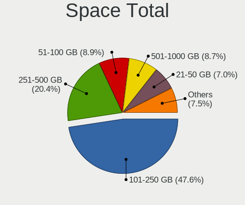
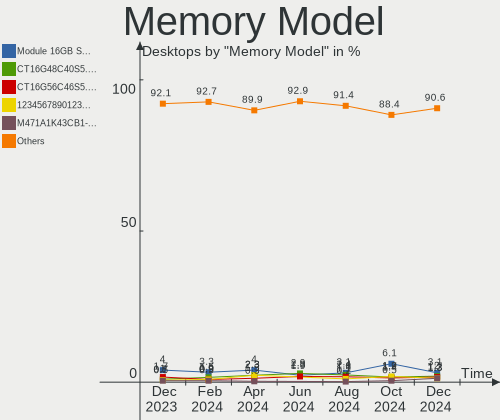

BSD Hardware Trends (Desktops)
------------------------------

A project to identify most popular hardware characteristics and track their change
over time based on data collected by BSD users at https://BSD-Hardware.info.

Anyone can contribute to this report by the [hw-probe](https://github.com/linuxhw/hw-probe/blob/master/INSTALL.BSD.md) tool:

    hw-probe -all -upload

Full-feature report is available here: https://bsd-hardware.info/?view=trends&formfactor=desktop

Period: Oct, 2021.

Contents
--------

* [ System ](#system)
  - [ OS                       ](#os)
  - [ OS Family                ](#os-family)
  - [ Arch                     ](#arch)
  - [ DE                       ](#de)
  - [ Display Server           ](#display-server)
  - [ Display Manager          ](#display-manager)
  - [ OS Lang                  ](#os-lang)
  - [ Boot Mode                ](#boot-mode)
  - [ Filesystem               ](#filesystem)
  - [ Part. scheme             ](#part-scheme)

* [ Board ](#board)
  - [ Vendor                   ](#vendor)
  - [ Model                    ](#model)
  - [ Model Family             ](#model-family)
  - [ MFG Year                 ](#mfg-year)
  - [ Form Factor              ](#form-factor)
  - [ Coreboot                 ](#coreboot)
  - [ RAM Size                 ](#ram-size)
  - [ RAM Used                 ](#ram-used)
  - [ Total Drives             ](#total-drives)
  - [ Has CD-ROM               ](#has-cd-rom)
  - [ Has Ethernet             ](#has-ethernet)
  - [ Has WiFi                 ](#has-wifi)
  - [ Has Bluetooth            ](#has-bluetooth)

* [ Location ](#location)
  - [ Country                  ](#country)
  - [ City                     ](#city)

* [ Drives ](#drives)
  - [ Drive Vendor             ](#drive-vendor)
  - [ Drive Model              ](#drive-model)
  - [ HDD Vendor               ](#hdd-vendor)
  - [ SSD Vendor               ](#ssd-vendor)
  - [ Drive Kind               ](#drive-kind)
  - [ Drive Connector          ](#drive-connector)
  - [ Drive Size               ](#drive-size)
  - [ Space Total              ](#space-total)
  - [ Space Used               ](#space-used)
  - [ Malfunc. Drives          ](#malfunc-drives)
  - [ Malfunc. Drive Vendor    ](#malfunc-drive-vendor)
  - [ Malfunc. HDD Vendor      ](#malfunc-hdd-vendor)
  - [ Malfunc. Drive Kind      ](#malfunc-drive-kind)
  - [ Failed Drives            ](#failed-drives)
  - [ Failed Drive Vendor      ](#failed-drive-vendor)
  - [ Drive Status             ](#drive-status)

* [ Storage controller ](#storage-controller)
  - [ Storage Vendor           ](#storage-vendor)
  - [ Storage Model            ](#storage-model)
  - [ Storage Kind             ](#storage-kind)

* [ Processor ](#processor)
  - [ CPU Vendor               ](#cpu-vendor)
  - [ CPU Model                ](#cpu-model)
  - [ CPU Model Family         ](#cpu-model-family)
  - [ CPU Cores                ](#cpu-cores)
  - [ CPU Sockets              ](#cpu-sockets)
  - [ CPU Threads              ](#cpu-threads)
  - [ CPU Microarch            ](#cpu-microarch)

* [ Graphics ](#graphics)
  - [ GPU Vendor               ](#gpu-vendor)
  - [ GPU Model                ](#gpu-model)
  - [ GPU Combo                ](#gpu-combo)
  - [ GPU Driver               ](#gpu-driver)
  - [ GPU Memory               ](#gpu-memory)

* [ Monitor ](#monitor)
  - [ Monitor Vendor           ](#monitor-vendor)
  - [ Monitor Model            ](#monitor-model)
  - [ Monitor Resolution       ](#monitor-resolution)
  - [ Monitor Diagonal         ](#monitor-diagonal)
  - [ Monitor Width            ](#monitor-width)
  - [ Aspect Ratio             ](#aspect-ratio)
  - [ Monitor Area             ](#monitor-area)
  - [ Pixel Density            ](#pixel-density)
  - [ Multiple Monitors        ](#multiple-monitors)

* [ Network ](#network)
  - [ Net Controller Vendor    ](#net-controller-vendor)
  - [ Net Controller Model     ](#net-controller-model)
  - [ Wireless Vendor          ](#wireless-vendor)
  - [ Wireless Model           ](#wireless-model)
  - [ Ethernet Vendor          ](#ethernet-vendor)
  - [ Ethernet Model           ](#ethernet-model)
  - [ Net Controller Kind      ](#net-controller-kind)
  - [ Used Controller          ](#used-controller)
  - [ NICs                     ](#nics)
  - [ IPv6                     ](#ipv6)

* [ Bluetooth ](#bluetooth)
  - [ Bluetooth Vendor         ](#bluetooth-vendor)
  - [ Bluetooth Model          ](#bluetooth-model)

* [ Sound ](#sound)
  - [ Sound Vendor             ](#sound-vendor)
  - [ Sound Model              ](#sound-model)

* [ Memory ](#memory)
  - [ Memory Vendor            ](#memory-vendor)
  - [ Memory Model             ](#memory-model)
  - [ Memory Kind              ](#memory-kind)
  - [ Memory Form Factor       ](#memory-form-factor)
  - [ Memory Size              ](#memory-size)
  - [ Memory Speed             ](#memory-speed)

* [ Printers & scanners ](#printers--scanners)
  - [ Printer Vendor           ](#printer-vendor)
  - [ Printer Model            ](#printer-model)
  - [ Scanner Vendor           ](#scanner-vendor)
  - [ Scanner Model            ](#scanner-model)

* [ Camera ](#camera)
  - [ Camera Vendor            ](#camera-vendor)
  - [ Camera Model             ](#camera-model)

* [ Security ](#security)
  - [ Fingerprint Vendor       ](#fingerprint-vendor)
  - [ Fingerprint Model        ](#fingerprint-model)
  - [ Chipcard Vendor          ](#chipcard-vendor)
  - [ Chipcard Model           ](#chipcard-model)

* [ Unsupported ](#unsupported)
  - [ Unsupported Devices      ](#unsupported-devices)
  - [ Unsupported Device Types ](#unsupported-device-types)

System
------

OS
--

Installed operating systems

| Name                   | Desktops | Percent |
|------------------------|----------|---------|
| OPNsense 21.7.3        | 122      | 51.26%  |
| OPNsense 21.7.4        | 24       | 10.08%  |
| helloSystem 0.6.0      | 24       | 10.08%  |
| FreeBSD 13.0-p4        | 13       | 5.46%   |
| OpenBSD 7.0            | 7        | 2.94%   |
| FreeBSD 13.0-STABLE    | 5        | 2.1%    |
| FreeBSD 13.0           | 5        | 2.1%    |
| helloSystem 0.5.0      | 4        | 1.68%   |
| OPNsense 21.7.2        | 3        | 1.26%   |
| OPNsense 21.1.9        | 3        | 1.26%   |
| OpenBSD 6.9            | 3        | 1.26%   |
| FreeBSD 12.2-p10       | 3        | 1.26%   |
| OPNsense 21.7          | 2        | 0.84%   |
| OPNsense 20.7.8        | 2        | 0.84%   |
| NomadBSD 5806f915      | 2        | 0.84%   |
| NetBSD 9.2             | 2        | 0.84%   |
| FreeBSD 14.0-CURRENT   | 2        | 0.84%   |
| XigmaNAS 12.2          | 1        | 0.42%   |
| TrueNAS 12.2-p9        | 1        | 0.42%   |
| TrueNAS 12.2-p10       | 1        | 0.42%   |
| pfSense 2.5.0          | 1        | 0.42%   |
| OPNsense 21.7.1        | 1        | 0.42%   |
| OPNsense 21.1.5        | 1        | 0.42%   |
| OPNsense 12.1-p20-HBSD | 1        | 0.42%   |
| MidnightBSD 2.1.1      | 1        | 0.42%   |
| helloSystem 0.7.0      | 1        | 0.42%   |
| FreeBSD 13.0-p2        | 1        | 0.42%   |
| FreeBSD 12.2-p6        | 1        | 0.42%   |
| FreeBSD 12.2           | 1        | 0.42%   |

OS Family
---------

OS without a version

| Name        | Desktops | Percent |
|-------------|----------|---------|
| OPNsense    | 159      | 66.81%  |
| FreeBSD     | 31       | 13.03%  |
| helloSystem | 29       | 12.18%  |
| OpenBSD     | 10       | 4.2%    |
| TrueNAS     | 2        | 0.84%   |
| NomadBSD    | 2        | 0.84%   |
| NetBSD      | 2        | 0.84%   |
| XigmaNAS    | 1        | 0.42%   |
| pfSense     | 1        | 0.42%   |
| MidnightBSD | 1        | 0.42%   |

Arch
----

OS architecture (x86_64, i586, etc.)

| Name  | Desktops | Percent |
|-------|----------|---------|
| amd64 | 233      | 97.9%   |
| arm64 | 4        | 1.68%   |
| i386  | 1        | 0.42%   |

DE
--

Desktop Environment

| Name         | Desktops | Percent |
|--------------|----------|---------|
| Console      | 180      | 75.63%  |
| helloDesktop | 29       | 12.18%  |
| fvwm         | 6        | 2.52%   |
| Openbox      | 5        | 2.1%    |
| XFCE         | 4        | 1.68%   |
| MATE         | 3        | 1.26%   |
| TWM          | 2        | 0.84%   |
| KDE5         | 2        | 0.84%   |
| i3           | 2        | 0.84%   |
| PekWM        | 1        | 0.42%   |
| LXQt         | 1        | 0.42%   |
| GNOME        | 1        | 0.42%   |
| ctwm         | 1        | 0.42%   |
| Cinnamon     | 1        | 0.42%   |

Display Server
--------------

X11 or Wayland

| Name    | Desktops | Percent |
|---------|----------|---------|
| Console | 181      | 76.05%  |
| X11     | 57       | 23.95%  |

Display Manager
---------------

SDDM, LightDM, etc.

| Name    | Desktops | Percent |
|---------|----------|---------|
| Console | 195      | 81.93%  |
| SLiM    | 35       | 14.71%  |
| GDM     | 3        | 1.26%   |
| XDM     | 2        | 0.84%   |
| SDDM    | 2        | 0.84%   |
| LightDM | 1        | 0.42%   |

OS Lang
-------

Language

| Lang    | Desktops | Percent |
|---------|----------|---------|
| Unknown | 176      | 73.95%  |
| en_US   | 39       | 16.39%  |
| C       | 17       | 7.14%   |
| de_DE   | 3        | 1.26%   |
| ru_RU   | 1        | 0.42%   |
| en_GB   | 1        | 0.42%   |
| en_AU   | 1        | 0.42%   |

Boot Mode
---------

EFI or BIOS

| Mode | Desktops | Percent |
|------|----------|---------|
| EFI  | 201      | 84.45%  |
| BIOS | 37       | 15.55%  |

Filesystem
----------

Type of filesystem

| Type    | Desktops | Percent |
|---------|----------|---------|
| Ufs     | 135      | 56.72%  |
| Zfs     | 92       | 38.66%  |
| Ffs     | 10       | 4.2%    |
| Unknown | 1        | 0.42%   |

Part. scheme
------------

Scheme of partitioning

| Type    | Desktops | Percent |
|---------|----------|---------|
| GPT     | 217      | 91.18%  |
| MBR     | 17       | 7.14%   |
| Unknown | 4        | 1.68%   |

Board
-----

Vendor
------

Motherboard manufacturer

| Name                                       | Desktops | Percent |
|--------------------------------------------|----------|---------|
| Hewlett-Packard                            | 26       | 10.92%  |
| Unknown                                    | 25       | 10.5%   |
| ASUSTek Computer                           | 22       | 9.24%   |
| Intel                                      | 17       | 7.14%   |
| MSI                                        | 16       | 6.72%   |
| Gigabyte Technology                        | 15       | 6.3%    |
| Dell                                       | 15       | 6.3%    |
| ASRock                                     | 14       | 5.88%   |
| Supermicro                                 | 12       | 5.04%   |
| Protectli                                  | 12       | 5.04%   |
| PC Engines                                 | 11       | 4.62%   |
| Lenovo                                     | 8        | 3.36%   |
| Acer                                       | 6        | 2.52%   |
| Fujitsu                                    | 4        | 1.68%   |
| Apple                                      | 3        | 1.26%   |
| Winston Marriot                            | 2        | 0.84%   |
| Shuttle                                    | 2        | 0.84%   |
| SeeedStudio                                | 2        | 0.84%   |
| HPE                                        | 2        | 0.84%   |
| HARDKERNEL                                 | 2        | 0.84%   |
| BESSTAR Tech                               | 2        | 0.84%   |
| Beckhoff Automation                        | 2        | 0.84%   |
| AZW                                        | 2        | 0.84%   |
| AOpen                                      | 2        | 0.84%   |
| Silicom                                    | 1        | 0.42%   |
| ShenZhen MinWin Technology                 | 1        | 0.42%   |
| Raspberry Pi Foundation                    | 1        | 0.42%   |
| radxa                                      | 1        | 0.42%   |
| Pegatron                                   | 1        | 0.42%   |
| Medion                                     | 1        | 0.42%   |
| Kontron Europe                             | 1        | 0.42%   |
| Foxconn                                    | 1        | 0.42%   |
| ECS                                        | 1        | 0.42%   |
| Colorful YuGong Technology And Development | 1        | 0.42%   |
| ASRockRack                                 | 1        | 0.42%   |
| AMI                                        | 1        | 0.42%   |
| ADI Engineering                            | 1        | 0.42%   |
| AAEON                                      | 1        | 0.42%   |

Model
-----

Motherboard model

| Name                                      | Desktops | Percent |
|-------------------------------------------|----------|---------|
| Unknown                                   | 25       | 10.5%   |
| Intel Q3XXG4-P V1.0                       | 10       | 4.2%    |
| PC Engines APU2                           | 7        | 2.94%   |
| Protectli FW4B                            | 6        | 2.52%   |
| Protectli FW6                             | 4        | 1.68%   |
| Supermicro X9SCI/X9SCA                    | 2        | 0.84%   |
| Supermicro X8SIL                          | 2        | 0.84%   |
| Supermicro X7SPA-HF                       | 2        | 0.84%   |
| SeeedStudio ODYSSEY-X86J4105              | 2        | 0.84%   |
| PC Engines APU                            | 2        | 0.84%   |
| HPE ProLiant MicroServer Gen10            | 2        | 0.84%   |
| HP EliteDesk 800 G1 SFF                   | 2        | 0.84%   |
| HP Compaq Elite 8300 SFF                  | 2        | 0.84%   |
| HARDKERNEL ODROID-H2                      | 2        | 0.84%   |
| Gigabyte J1900N-D3V                       | 2        | 0.84%   |
| Dell OptiPlex 9020                        | 2        | 0.84%   |
| Dell OptiPlex 7010                        | 2        | 0.84%   |
| Dell OptiPlex 3020                        | 2        | 0.84%   |
| AZW GK55                                  | 2        | 0.84%   |
| ASUS All Series                           | 2        | 0.84%   |
| Apple MacPro5,1                           | 2        | 0.84%   |
| Winston Marriot PICO PC  PICOPC           | 1        | 0.42%   |
| Winston Marriot PICO PC                   | 1        | 0.42%   |
| Supermicro X9SAE                          | 1        | 0.42%   |
| Supermicro X7SBL                          | 1        | 0.42%   |
| Supermicro SSG-5028R-E1CR12L-CE010        | 1        | 0.42%   |
| Supermicro ReadyDATA 5200                 | 1        | 0.42%   |
| Supermicro PIO-518D-N6TRF-ST031           | 1        | 0.42%   |
| Supermicro AS -5019D-FTN4                 | 1        | 0.42%   |
| Silicom Minnowboard Turbot D0/D1 PLATFORM | 1        | 0.42%   |
| Shuttle DS81D                             | 1        | 0.42%   |
| Shuttle DH170                             | 1        | 0.42%   |
| ShenZhen MinWin MW-NANO-APL-4L            | 1        | 0.42%   |
| RPi Raspberry Pi 4 Model B                | 1        | 0.42%   |
| radxa rock-pi-4                           | 1        | 0.42%   |
| Protectli FW6E                            | 1        | 0.42%   |
| Protectli FW4A                            | 1        | 0.42%   |
| Pegatron Pro 3405 Series                  | 1        | 0.42%   |
| PC Engines apu6                           | 1        | 0.42%   |
| PC Engines apu4                           | 1        | 0.42%   |
| MSI MS-9A45                               | 1        | 0.42%   |
| MSI MS-7D54                               | 1        | 0.42%   |
| MSI MS-7C82                               | 1        | 0.42%   |
| MSI MS-7C36                               | 1        | 0.42%   |
| MSI MS-7C08                               | 1        | 0.42%   |
| MSI MS-7B93                               | 1        | 0.42%   |
| MSI MS-7B53                               | 1        | 0.42%   |
| MSI MS-7B31                               | 1        | 0.42%   |
| MSI MS-7A72                               | 1        | 0.42%   |
| MSI MS-7A40                               | 1        | 0.42%   |
| MSI MS-7850                               | 1        | 0.42%   |
| MSI MS-7821                               | 1        | 0.42%   |
| MSI MS-7817                               | 1        | 0.42%   |
| MSI MS-7721                               | 1        | 0.42%   |
| MSI MS-7693                               | 1        | 0.42%   |
| MSI MS-7592                               | 1        | 0.42%   |
| Medion H61H2-LM3                          | 1        | 0.42%   |
| Lenovo ThinkSystem ST50 7Y48CTO1WW        | 1        | 0.42%   |
| Lenovo ThinkCentre M93p 10AA0020CN        | 1        | 0.42%   |
| Lenovo ThinkCentre M93p 10A9000SUS        | 1        | 0.42%   |

Model Family
------------

Motherboard model prefix

| Name                               | Desktops | Percent |
|------------------------------------|----------|---------|
| Unknown                            | 25       | 10.5%   |
| Dell OptiPlex                      | 14       | 5.88%   |
| Intel Q3XXG4-P                     | 10       | 4.2%    |
| PC Engines APU2                    | 7        | 2.94%   |
| Lenovo ThinkCentre                 | 7        | 2.94%   |
| HP ProDesk                         | 7        | 2.94%   |
| Protectli FW4B                     | 6        | 2.52%   |
| HP Compaq                          | 6        | 2.52%   |
| ASUS PRIME                         | 5        | 2.1%    |
| Protectli FW6                      | 4        | 1.68%   |
| HP ProLiant                        | 4        | 1.68%   |
| HP EliteDesk                       | 3        | 1.26%   |
| ASUS TUF                           | 3        | 1.26%   |
| Acer Veriton                       | 3        | 1.26%   |
| Acer Aspire                        | 3        | 1.26%   |
| Winston Marriot PICO               | 2        | 0.84%   |
| Supermicro X9SCI                   | 2        | 0.84%   |
| Supermicro X8SIL                   | 2        | 0.84%   |
| Supermicro X7SPA-HF                | 2        | 0.84%   |
| SeeedStudio ODYSSEY-X86J4105       | 2        | 0.84%   |
| PC Engines APU                     | 2        | 0.84%   |
| HPE ProLiant                       | 2        | 0.84%   |
| HARDKERNEL ODROID-H2               | 2        | 0.84%   |
| Gigabyte J1900N-D3V                | 2        | 0.84%   |
| Gigabyte B450M                     | 2        | 0.84%   |
| Fujitsu FUTRO                      | 2        | 0.84%   |
| Fujitsu ESPRIMO                    | 2        | 0.84%   |
| AZW GK55                           | 2        | 0.84%   |
| ASUS All                           | 2        | 0.84%   |
| ASRock X570                        | 2        | 0.84%   |
| Apple MacPro5                      | 2        | 0.84%   |
| Supermicro X9SAE                   | 1        | 0.42%   |
| Supermicro X7SBL                   | 1        | 0.42%   |
| Supermicro SSG-5028R-E1CR12L-CE010 | 1        | 0.42%   |
| Supermicro ReadyDATA               | 1        | 0.42%   |
| Supermicro PIO-518D-N6TRF-ST031    | 1        | 0.42%   |
| Supermicro AS                      | 1        | 0.42%   |
| Silicom Minnowboard                | 1        | 0.42%   |
| Shuttle DS81D                      | 1        | 0.42%   |
| Shuttle DH170                      | 1        | 0.42%   |
| ShenZhen MinWin MW-NANO-APL-4L     | 1        | 0.42%   |
| RPi Raspberry                      | 1        | 0.42%   |
| radxa rock-pi-4                    | 1        | 0.42%   |
| Protectli FW6E                     | 1        | 0.42%   |
| Protectli FW4A                     | 1        | 0.42%   |
| Pegatron Pro                       | 1        | 0.42%   |
| PC Engines apu6                    | 1        | 0.42%   |
| PC Engines apu4                    | 1        | 0.42%   |
| MSI MS-9A45                        | 1        | 0.42%   |
| MSI MS-7D54                        | 1        | 0.42%   |
| MSI MS-7C82                        | 1        | 0.42%   |
| MSI MS-7C36                        | 1        | 0.42%   |
| MSI MS-7C08                        | 1        | 0.42%   |
| MSI MS-7B93                        | 1        | 0.42%   |
| MSI MS-7B53                        | 1        | 0.42%   |
| MSI MS-7B31                        | 1        | 0.42%   |
| MSI MS-7A72                        | 1        | 0.42%   |
| MSI MS-7A40                        | 1        | 0.42%   |
| MSI MS-7850                        | 1        | 0.42%   |
| MSI MS-7821                        | 1        | 0.42%   |

MFG Year
--------

Motherboard manufacture year

| Year    | Desktops | Percent |
|---------|----------|---------|
| 2020    | 42       | 17.65%  |
| 2019    | 38       | 15.97%  |
| 2021    | 36       | 15.13%  |
| 2018    | 33       | 13.87%  |
| 2014    | 17       | 7.14%   |
| 2016    | 13       | 5.46%   |
| 2011    | 12       | 5.04%   |
| 2012    | 10       | 4.2%    |
| 2013    | 7        | 2.94%   |
| 2015    | 6        | 2.52%   |
| 2017    | 5        | 2.1%    |
| 2010    | 5        | 2.1%    |
| 2009    | 4        | 1.68%   |
| 2008    | 4        | 1.68%   |
| Unknown | 3        | 1.26%   |
| 2007    | 2        | 0.84%   |
| 2006    | 1        | 0.42%   |

Form Factor
-----------

Physical design of the computer

| Name    | Desktops | Percent |
|---------|----------|---------|
| Desktop | 238      | 100%    |

Coreboot
--------

Have coreboot on board

| Used | Desktops | Percent |
|------|----------|---------|
| No   | 219      | 92.02%  |
| Yes  | 19       | 7.98%   |

RAM Size
--------

Total RAM memory

| Size in GB  | Desktops | Percent |
|-------------|----------|---------|
| 8.01-16.0   | 87       | 36.55%  |
| 16.01-24.0  | 61       | 25.63%  |
| 4.01-8.0    | 50       | 21.01%  |
| 32.01-64.0  | 21       | 8.82%   |
| 2.01-3.0    | 6        | 2.52%   |
| 24.01-32.0  | 4        | 1.68%   |
| 64.01-256.0 | 3        | 1.26%   |
| 3.01-4.0    | 2        | 0.84%   |
| 1.01-2.0    | 2        | 0.84%   |
| 0.51-1.0    | 2        | 0.84%   |

RAM Used
--------

Used RAM memory

| Used GB    | Desktops | Percent |
|------------|----------|---------|
| 0.01-0.5   | 114      | 47.9%   |
| 0.51-1.0   | 75       | 31.51%  |
| 1.01-2.0   | 26       | 10.92%  |
| 3.01-4.0   | 8        | 3.36%   |
| 2.01-3.0   | 6        | 2.52%   |
| 4.01-8.0   | 3        | 1.26%   |
| 8.01-16.0  | 2        | 0.84%   |
| Unknown    | 2        | 0.84%   |
| 24.01-32.0 | 1        | 0.42%   |
| 0          | 1        | 0.42%   |

Total Drives
------------

Number of drives on board

| Drives | Desktops | Percent |
|--------|----------|---------|
| 1      | 151      | 63.45%  |
| 2      | 34       | 14.29%  |
| 0      | 20       | 8.4%    |
| 4      | 10       | 4.2%    |
| 3      | 10       | 4.2%    |
| 5      | 5        | 2.1%    |
| 6      | 3        | 1.26%   |
| 21     | 1        | 0.42%   |
| 14     | 1        | 0.42%   |
| 13     | 1        | 0.42%   |
| 9      | 1        | 0.42%   |
| 7      | 1        | 0.42%   |

Has CD-ROM
----------

Has CD-ROM on board

| Presented | Desktops | Percent |
|-----------|----------|---------|
| No        | 188      | 78.99%  |
| Yes       | 50       | 21.01%  |

Has Ethernet
------------

Has Ethernet on board

| Presented | Desktops | Percent |
|-----------|----------|---------|
| Yes       | 234      | 98.32%  |
| No        | 4        | 1.68%   |

Has WiFi
--------

Has WiFi module

| Presented | Desktops | Percent |
|-----------|----------|---------|
| No        | 189      | 79.41%  |
| Yes       | 49       | 20.59%  |

Has Bluetooth
-------------

Has Bluetooth module

| Presented | Desktops | Percent |
|-----------|----------|---------|
| No        | 210      | 88.24%  |
| Yes       | 28       | 11.76%  |

Location
--------

Country
-------

Geographic location (country)

| Country            | Desktops | Percent |
|--------------------|----------|---------|
| USA                | 72       | 30.25%  |
| Germany            | 34       | 14.29%  |
| Russia             | 15       | 6.3%    |
| France             | 10       | 4.2%    |
| Canada             | 10       | 4.2%    |
| Switzerland        | 9        | 3.78%   |
| Poland             | 8        | 3.36%   |
| Australia          | 8        | 3.36%   |
| Austria            | 7        | 2.94%   |
| UK                 | 6        | 2.52%   |
| Netherlands        | 6        | 2.52%   |
| China              | 6        | 2.52%   |
| Sweden             | 4        | 1.68%   |
| Spain              | 4        | 1.68%   |
| Italy              | 4        | 1.68%   |
| Denmark            | 3        | 1.26%   |
| Thailand           | 2        | 0.84%   |
| Romania            | 2        | 0.84%   |
| Japan              | 2        | 0.84%   |
| Chile              | 2        | 0.84%   |
| Brazil             | 2        | 0.84%   |
| Ukraine            | 1        | 0.42%   |
| Turkey             | 1        | 0.42%   |
| South Korea        | 1        | 0.42%   |
| Slovenia           | 1        | 0.42%   |
| Slovakia           | 1        | 0.42%   |
| Singapore          | 1        | 0.42%   |
| Serbia             | 1        | 0.42%   |
| Saudi Arabia       | 1        | 0.42%   |
| Qatar              | 1        | 0.42%   |
| Portugal           | 1        | 0.42%   |
| Peru               | 1        | 0.42%   |
| New Zealand        | 1        | 0.42%   |
| Jamaica            | 1        | 0.42%   |
| Indonesia          | 1        | 0.42%   |
| India              | 1        | 0.42%   |
| Hungary            | 1        | 0.42%   |
| Guatemala          | 1        | 0.42%   |
| Finland            | 1        | 0.42%   |
| Dominican Republic | 1        | 0.42%   |
| Czechia            | 1        | 0.42%   |
| Bulgaria           | 1        | 0.42%   |
| Argentina          | 1        | 0.42%   |

City
----

Geographic location (city)

| City                      | Desktops | Percent |
|---------------------------|----------|---------|
| Vienna                    | 3        | 1.26%   |
| New York                  | 3        | 1.26%   |
| Moscow                    | 3        | 1.26%   |
| Miedziana Gora            | 3        | 1.26%   |
| Krasnodar                 | 3        | 1.26%   |
| Irvine                    | 3        | 1.26%   |
| Gordola                   | 3        | 1.26%   |
| Berlin                    | 3        | 1.26%   |
| Warsaw                    | 2        | 0.84%   |
| Tumba                     | 2        | 0.84%   |
| Trenton                   | 2        | 0.84%   |
| Sydney                    | 2        | 0.84%   |
| Springfield               | 2        | 0.84%   |
| Seyssinet-Pariset         | 2        | 0.84%   |
| San Francisco             | 2        | 0.84%   |
| Salem                     | 2        | 0.84%   |
| Rochester                 | 2        | 0.84%   |
| Rietberg                  | 2        | 0.84%   |
| Riehen                    | 2        | 0.84%   |
| Perth                     | 2        | 0.84%   |
| Paris                     | 2        | 0.84%   |
| North Richland Hills      | 2        | 0.84%   |
| Munich                    | 2        | 0.84%   |
| Minneapolis               | 2        | 0.84%   |
| Melbourne                 | 2        | 0.84%   |
| Kongens Lyngby            | 2        | 0.84%   |
| Kirkland                  | 2        | 0.84%   |
| Denver                    | 2        | 0.84%   |
| Buchholz in der Nordheide | 2        | 0.84%   |
| Bucharest                 | 2        | 0.84%   |
| Zoetermeer                | 1        | 0.42%   |
| Zhukovskiy                | 1        | 0.42%   |
| Zaltbommel                | 1        | 0.42%   |
| Ypsilanti                 | 1        | 0.42%   |
| Yokohama                  | 1        | 0.42%   |
| Yekaterinburg             | 1        | 0.42%   |
| Xiamen                    | 1        | 0.42%   |
| Wolverhampton             | 1        | 0.42%   |
| Winnipeg                  | 1        | 0.42%   |
| Wiesbaden                 | 1        | 0.42%   |
| West Valley City          | 1        | 0.42%   |
| Wenatchee                 | 1        | 0.42%   |
| Voronezh                  | 1        | 0.42%   |
| V?¤ster??s                | 1        | 0.42%   |
| Upper Norwood             | 1        | 0.42%   |
| Udon Thani                | 1        | 0.42%   |
| Tychy                     | 1        | 0.42%   |
| Tulsa                     | 1        | 0.42%   |
| Torre del Mar             | 1        | 0.42%   |
| Tacoma                    | 1        | 0.42%   |
| Sz?©kesfeh?©rv??r         | 1        | 0.42%   |
| Stuttgart                 | 1        | 0.42%   |
| Steyr                     | 1        | 0.42%   |
| Sterling Heights          | 1        | 0.42%   |
| St. Catharines            | 1        | 0.42%   |
| St Petersburg             | 1        | 0.42%   |
| Spaubeek                  | 1        | 0.42%   |
| Smiths Falls              | 1        | 0.42%   |
| Siegendorf im Burgenland  | 1        | 0.42%   |
| Shepetivka                | 1        | 0.42%   |

Drives
------

Drive Vendor
------------

Hard drive vendors

| Vendor                             | Desktops | Drives | Percent |
|------------------------------------|----------|--------|---------|
| Samsung Electronics                | 39       | 46     | 13.18%  |
| WDC                                | 37       | 76     | 12.5%   |
| Seagate                            | 33       | 53     | 11.15%  |
| Kingston                           | 20       | 23     | 6.76%   |
| Toshiba                            | 17       | 23     | 5.74%   |
| Intel                              | 13       | 19     | 4.39%   |
| Crucial                            | 13       | 17     | 4.39%   |
| SanDisk                            | 11       | 11     | 3.72%   |
| Hitachi                            | 9        | 11     | 3.04%   |
| Phison                             | 7        | 7      | 2.36%   |
| Hoodisk                            | 7        | 7      | 2.36%   |
| HGST                               | 6        | 18     | 2.03%   |
| PNY                                | 5        | 5      | 1.69%   |
| Corsair                            | 5        | 5      | 1.69%   |
| Apacer                             | 5        | 5      | 1.69%   |
| Transcend                          | 4        | 4      | 1.35%   |
| A-DATA Technology                  | 4        | 4      | 1.35%   |
| SPCC                               | 3        | 3      | 1.01%   |
| SK Hynix                           | 3        | 3      | 1.01%   |
| NVMe                               | 3        | 3      | 1.01%   |
| Micron Technology                  | 3        | 3      | 1.01%   |
| LITEONIT                           | 3        | 3      | 1.01%   |
| Intenso                            | 3        | 3      | 1.01%   |
| Hewlett-Packard                    | 3        | 7      | 1.01%   |
| FORESEE                            | 3        | 3      | 1.01%   |
| Dogfish                            | 3        | 3      | 1.01%   |
| BIWIN                              | 3        | 3      | 1.01%   |
| Protectli                          | 2        | 2      | 0.68%   |
| PLEXTOR                            | 2        | 2      | 0.68%   |
| Patriot                            | 2        | 2      | 0.68%   |
| OPENBSD                            | 2        | 2      | 0.68%   |
| OCZ                                | 2        | 2      | 0.68%   |
| Kston                              | 2        | 2      | 0.68%   |
| KingSpec                           | 2        | 2      | 0.68%   |
| China                              | 2        | 2      | 0.68%   |
| VisionTek                          | 1        | 1      | 0.34%   |
| V-GeN                              | 1        | 1      | 0.34%   |
| Smartbuy                           | 1        | 1      | 0.34%   |
| Silicon Motion                     | 1        | 1      | 0.34%   |
| Product:              USB DISK 3.0 | 1        | 1      | 0.34%   |
| Netac                              | 1        | 1      | 0.34%   |
| Mushkin                            | 1        | 1      | 0.34%   |
| KIOXIA                             | 1        | 1      | 0.34%   |
| Indilinx                           | 1        | 1      | 0.34%   |
| HPE                                | 1        | 2      | 0.34%   |
| GLOWAY                             | 1        | 1      | 0.34%   |
| Fordisk                            | 1        | 1      | 0.34%   |
| EMTEC                              | 1        | 1      | 0.34%   |
| BAITITON                           | 1        | 1      | 0.34%   |
| Advantech                          | 1        | 1      | 0.34%   |

Drive Model
-----------

Hard drive models

| Model                            | Desktops | Percent |
|----------------------------------|----------|---------|
| Toshiba DT01ACA100 1TB           | 6        | 1.75%   |
| Samsung SSD 860 EVO 250GB        | 5        | 1.46%   |
| Phison SATA SSD 16GB             | 5        | 1.46%   |
| Seagate ST500DM002-1BD142 500GB  | 4        | 1.17%   |
| Samsung SSD 860 EVO 500GB        | 4        | 1.17%   |
| Kingston SA400S37240G 240GB      | 4        | 1.17%   |
| Hoodisk SSD 128GB                | 4        | 1.17%   |
| Transcend TS128GMSA230S 128GB    | 3        | 0.88%   |
| Seagate ST4000DM000-1F2168 4TB   | 3        | 0.88%   |
| Seagate ST1000LM035-1RK172 1TB   | 3        | 0.88%   |
| Samsung SSD 870 EVO 250GB        | 3        | 0.88%   |
| Samsung MZ7LN128HCHP-000H1 128GB | 3        | 0.88%   |
| PNY CS900 120GB SSD              | 3        | 0.88%   |
| WDC WD3200BPVT-22JJ5T0 320GB     | 2        | 0.58%   |
| WDC WD10EZEX-08WN4A0 1TB         | 2        | 0.58%   |
| Toshiba MQ04ABF100 1TB           | 2        | 0.58%   |
| Toshiba DT01ACA050 500GB         | 2        | 0.58%   |
| SPCC Solid State Disk 128GB      | 2        | 0.58%   |
| Seagate ST2000DL003-9VT166 2TB   | 2        | 0.58%   |
| Seagate ST1000LM048-2E7172 1TB   | 2        | 0.58%   |
| Samsung SSD 860 QVO 1TB          | 2        | 0.58%   |
| Samsung SSD 840 EVO 120GB        | 2        | 0.58%   |
| Samsung HD322HJ 320GB            | 2        | 0.58%   |
| Protectli 120GB mSATA            | 2        | 0.58%   |
| OPENBSD SR RAID 1 1TB            | 2        | 0.58%   |
| Kston SSD 128GB                  | 2        | 0.58%   |
| Kingston SUV500MS240G 240GB      | 2        | 0.58%   |
| Kingston SUV500MS120G 120GB      | 2        | 0.58%   |
| Intel SSDSC2KW256G8 256GB        | 2        | 0.58%   |
| Hoodisk SSD 64GB                 | 2        | 0.58%   |
| Hitachi HDS721050CLA360 500GB    | 2        | 0.58%   |
| HGST HUS726060ALE614 6TB         | 2        | 0.58%   |
| HP RAID 0 450GB                  | 2        | 0.58%   |
| FORESEE 64GB SSD                 | 2        | 0.58%   |
| Dogfish SSD 256GB                | 2        | 0.58%   |
| Crucial CT275MX300SSD1 275GB     | 2        | 0.58%   |
| Crucial CT240BX500SSD1 240GB     | 2        | 0.58%   |
| BIWIN SSD 128GB                  | 2        | 0.58%   |
| Apacer 64GB SATA Flash Drive     | 2        | 0.58%   |
| WDC WDS500G2B0A-00SM50 500GB     | 1        | 0.29%   |
| WDC WDS250G2B0A-00SM50 250GB     | 1        | 0.29%   |
| WDC WDS250G2B0A 250GB            | 1        | 0.29%   |
| WDC WDS250G1B0C-00S6U0 250GB     | 1        | 0.29%   |
| WDC WDS120G2G0A-00JH30 120GB     | 1        | 0.29%   |
| WDC WDS100T2B0C-00PXH0 1TB       | 1        | 0.29%   |
| WDC WDS100T1X0E-00AFY0 1TB       | 1        | 0.29%   |
| WDC WD80EZAZ-11TDBA0 8TB         | 1        | 0.29%   |
| WDC WD80EMAZ-00WJTA0 8TB         | 1        | 0.29%   |
| WDC WD80EFZX-68UW8N0 8TB         | 1        | 0.29%   |
| WDC WD80EFAX-68LHPN0 8TB         | 1        | 0.29%   |
| WDC WD80EDBZ-11B0ZA0 8TB         | 1        | 0.29%   |
| WDC WD7500LPCX-00KHST0 752GB     | 1        | 0.29%   |
| WDC WD60EZRZ-00GZ5B1 6TB         | 1        | 0.29%   |
| WDC WD6003FZBX-00K5WB0 6TB       | 1        | 0.29%   |
| WDC WD5000LPCX-00VHAT0 500GB     | 1        | 0.29%   |
| WDC WD5000AAKS-00V1A0 500GB      | 1        | 0.29%   |
| WDC WD40EZRZ-22GXCB0 4TB         | 1        | 0.29%   |
| WDC WD4002FYYZ-01B7CB0 4TB       | 1        | 0.29%   |
| WDC WD4000AAKS-00C8A0 400GB      | 1        | 0.29%   |
| WDC WD3200AAKS-00UU3A0 320GB     | 1        | 0.29%   |

HDD Vendor
----------

Hard disk drive vendors

| Vendor                             | Desktops | Drives | Percent |
|------------------------------------|----------|--------|---------|
| WDC                                | 32       | 68     | 30.77%  |
| Seagate                            | 31       | 51     | 29.81%  |
| Toshiba                            | 14       | 20     | 13.46%  |
| Hitachi                            | 9        | 11     | 8.65%   |
| HGST                               | 6        | 18     | 5.77%   |
| Samsung Electronics                | 4        | 6      | 3.85%   |
| Hewlett-Packard                    | 3        | 7      | 2.88%   |
| OPENBSD                            | 2        | 2      | 1.92%   |
| Product:              USB DISK 3.0 | 1        | 1      | 0.96%   |
| NVMe                               | 1        | 1      | 0.96%   |
| HPE                                | 1        | 2      | 0.96%   |

SSD Vendor
----------

Solid state drive vendors

| Vendor              | Desktops | Drives | Percent |
|---------------------|----------|--------|---------|
| Samsung Electronics | 29       | 33     | 16.96%  |
| Kingston            | 17       | 20     | 9.94%   |
| Intel               | 13       | 19     | 7.6%    |
| SanDisk             | 11       | 11     | 6.43%   |
| Crucial             | 11       | 14     | 6.43%   |
| Phison              | 7        | 7      | 4.09%   |
| Hoodisk             | 7        | 7      | 4.09%   |
| PNY                 | 5        | 5      | 2.92%   |
| Apacer              | 5        | 5      | 2.92%   |
| WDC                 | 4        | 4      | 2.34%   |
| Transcend           | 4        | 4      | 2.34%   |
| Micron Technology   | 3        | 3      | 1.75%   |
| LITEONIT            | 3        | 3      | 1.75%   |
| Intenso             | 3        | 3      | 1.75%   |
| FORESEE             | 3        | 3      | 1.75%   |
| Dogfish             | 3        | 3      | 1.75%   |
| Corsair             | 3        | 3      | 1.75%   |
| BIWIN               | 3        | 3      | 1.75%   |
| A-DATA Technology   | 3        | 3      | 1.75%   |
| Toshiba             | 2        | 2      | 1.17%   |
| SPCC                | 2        | 2      | 1.17%   |
| Seagate             | 2        | 2      | 1.17%   |
| Protectli           | 2        | 2      | 1.17%   |
| PLEXTOR             | 2        | 2      | 1.17%   |
| Patriot             | 2        | 2      | 1.17%   |
| OCZ                 | 2        | 2      | 1.17%   |
| NVMe                | 2        | 2      | 1.17%   |
| Kston               | 2        | 2      | 1.17%   |
| KingSpec            | 2        | 2      | 1.17%   |
| China               | 2        | 2      | 1.17%   |
| VisionTek           | 1        | 1      | 0.58%   |
| V-GeN               | 1        | 1      | 0.58%   |
| Smartbuy            | 1        | 1      | 0.58%   |
| SK Hynix            | 1        | 1      | 0.58%   |
| Netac               | 1        | 1      | 0.58%   |
| Mushkin             | 1        | 1      | 0.58%   |
| Indilinx            | 1        | 1      | 0.58%   |
| GLOWAY              | 1        | 1      | 0.58%   |
| Fordisk             | 1        | 1      | 0.58%   |
| EMTEC               | 1        | 1      | 0.58%   |
| BAITITON            | 1        | 1      | 0.58%   |
| Advantech           | 1        | 1      | 0.58%   |

Drive Kind
----------

HDD or SSD

| Kind | Desktops | Drives | Percent |
|------|----------|--------|---------|
| SSD  | 158      | 187    | 61.72%  |
| HDD  | 74       | 187    | 28.91%  |
| NVMe | 24       | 26     | 9.38%   |

Drive Connector
---------------

SATA, SAS, NVMe, etc.

| Type | Desktops | Drives | Percent |
|------|----------|--------|---------|
| SATA | 207      | 374    | 89.61%  |
| NVMe | 24       | 26     | 10.39%  |

Drive Size
----------

Size of hard drive

| Size in TB | Desktops | Drives | Percent |
|------------|----------|--------|---------|
| 0.01-0.5   | 182      | 234    | 71.94%  |
| 0.51-1.0   | 36       | 55     | 14.23%  |
| 1.01-2.0   | 13       | 20     | 5.14%   |
| 3.01-4.0   | 7        | 14     | 2.77%   |
| 2.01-3.0   | 7        | 21     | 2.77%   |
| 4.01-10.0  | 7        | 28     | 2.77%   |
| 10.01-20.0 | 1        | 2      | 0.4%    |

Space Total
-----------

Amount of disk space available on the file system

| Size in GB     | Desktops | Percent |
|----------------|----------|---------|
| 101-250        | 96       | 40.34%  |
| 1-20           | 45       | 18.91%  |
| 51-100         | 30       | 12.61%  |
| 251-500        | 25       | 10.5%   |
| 21-50          | 18       | 7.56%   |
| 501-1000       | 13       | 5.46%   |
| 1001-2000      | 5        | 2.1%    |
| More than 3000 | 4        | 1.68%   |
| 2001-3000      | 2        | 0.84%   |

Space Used
----------

Amount of used disk space

| Used GB   | Desktops | Percent |
|-----------|----------|---------|
| 1-20      | 215      | 90.34%  |
| 21-50     | 12       | 5.04%   |
| 101-250   | 4        | 1.68%   |
| 251-500   | 3        | 1.26%   |
| 51-100    | 2        | 0.84%   |
| 2001-3000 | 1        | 0.42%   |
| 501-1000  | 1        | 0.42%   |

Malfunc. Drives
---------------

Drive models with a malfunction

| Model                             | Desktops | Drives | Percent |
|-----------------------------------|----------|--------|---------|
| Toshiba MQ04ABF100 1TB            | 2        | 2      | 4.65%   |
| Toshiba DT01ACA100 1TB            | 2        | 2      | 4.65%   |
| Samsung Electronics HD322HJ 320GB | 2        | 2      | 4.65%   |
| Crucial CT275MX300SSD1 275GB      | 2        | 2      | 4.65%   |
| WDC WD5000AAKS-00V1A0 500GB       | 1        | 1      | 2.33%   |
| WDC WD4000AAKS-00C8A0 400GB       | 1        | 1      | 2.33%   |
| WDC WD3200BPVT-22JJ5T0 320GB      | 1        | 1      | 2.33%   |
| WDC WD3200AAKS-00UU3A0 320GB      | 1        | 1      | 2.33%   |
| WDC WD30EZRX-22D8PB0 3TB          | 1        | 1      | 2.33%   |
| WDC WD20EURX-63T0FY0 2TB          | 1        | 1      | 2.33%   |
| WDC WD2002FYPS-02W3B0 2TB         | 1        | 1      | 2.33%   |
| WDC WD1600BEKT-66F3T2 160GB       | 1        | 1      | 2.33%   |
| WDC WD1600AAJS-22L7A0 160GB       | 1        | 1      | 2.33%   |
| WDC WD10EADS-00M2B0 1TB           | 1        | 1      | 2.33%   |
| VisionTek mSATA 120GB             | 1        | 1      | 2.33%   |
| V-GeN V-GEN08AS19FS120IT 120GB    | 1        | 1      | 2.33%   |
| Toshiba MQ01UBD100 1TB            | 1        | 1      | 2.33%   |
| Toshiba MQ01ABD100 1TB            | 1        | 1      | 2.33%   |
| Seagate ST980310AS 80GB           | 1        | 1      | 2.33%   |
| Seagate ST9320325AS 320GB         | 1        | 1      | 2.33%   |
| Seagate ST500DM002-1BD142 500GB   | 1        | 1      | 2.33%   |
| Seagate ST3500413AS 500GB         | 1        | 1      | 2.33%   |
| Seagate ST3320311CS 320GB         | 1        | 1      | 2.33%   |
| Seagate ST2000DL003-9VT166 2TB    | 1        | 1      | 2.33%   |
| Seagate ST1000VM002-1SD102 1TB    | 1        | 1      | 2.33%   |
| SanDisk SSD P4 16GB               | 1        | 1      | 2.33%   |
| SanDisk SD8TB8U-256G-1006 256GB   | 1        | 1      | 2.33%   |
| Samsung Electronics HM320JI 320GB | 1        | 1      | 2.33%   |
| Samsung Electronics HD161HJ 160GB | 1        | 1      | 2.33%   |
| Intel SSDSC2BW120H6 120GB         | 1        | 1      | 2.33%   |
| Intel SSDSC2BF240A5 240GB         | 1        | 1      | 2.33%   |
| Intel SSDSA2M080G2GN 80GB         | 1        | 1      | 2.33%   |
| Intel SSDMCEAC060B3 64GB          | 1        | 1      | 2.33%   |
| Intel SSDMAEMC040G2 40GB          | 1        | 1      | 2.33%   |
| Hitachi HUA722020ALA330 2TB       | 1        | 2      | 2.33%   |
| Hitachi HTS725032A9A364 320GB     | 1        | 1      | 2.33%   |
| GLOWAY FER60GS3-S7 64GB           | 1        | 1      | 2.33%   |
| Crucial CT128M550SSD3 128GB       | 1        | 1      | 2.33%   |
| BIWIN SSD 32GB                    | 1        | 1      | 2.33%   |

Malfunc. Drive Vendor
---------------------

Vendors of faulty drives

| Vendor              | Desktops | Drives | Percent |
|---------------------|----------|--------|---------|
| WDC                 | 10       | 10     | 25%     |
| Toshiba             | 6        | 6      | 15%     |
| Seagate             | 5        | 7      | 12.5%   |
| Intel               | 5        | 5      | 12.5%   |
| Samsung Electronics | 3        | 4      | 7.5%    |
| Crucial             | 3        | 3      | 7.5%    |
| SanDisk             | 2        | 2      | 5%      |
| Hitachi             | 2        | 3      | 5%      |
| VisionTek           | 1        | 1      | 2.5%    |
| V-GeN               | 1        | 1      | 2.5%    |
| GLOWAY              | 1        | 1      | 2.5%    |
| BIWIN               | 1        | 1      | 2.5%    |

Malfunc. HDD Vendor
-------------------

Vendors of faulty HDD drives

| Vendor              | Desktops | Drives | Percent |
|---------------------|----------|--------|---------|
| WDC                 | 10       | 10     | 38.46%  |
| Toshiba             | 6        | 6      | 23.08%  |
| Seagate             | 5        | 7      | 19.23%  |
| Samsung Electronics | 3        | 4      | 11.54%  |
| Hitachi             | 2        | 3      | 7.69%   |

Malfunc. Drive Kind
-------------------

Kinds of faulty drives

| Kind | Desktops | Drives | Percent |
|------|----------|--------|---------|
| HDD  | 24       | 30     | 63.16%  |
| SSD  | 14       | 14     | 36.84%  |

Failed Drives
-------------

Failed drive models

| Model                        | Desktops | Drives | Percent |
|------------------------------|----------|--------|---------|
| WDC WD10SPZX-00Z10T0 1TB     | 1        | 1      | 50%     |
| Crucial M4-CT256M4SSD1 256GB | 1        | 1      | 50%     |

Failed Drive Vendor
-------------------

Failed drive vendors

| Vendor  | Desktops | Drives | Percent |
|---------|----------|--------|---------|
| WDC     | 1        | 1      | 50%     |
| Crucial | 1        | 1      | 50%     |

Drive Status
------------

Number of failed and malfunc. drives

| Status   | Desktops | Drives | Percent |
|----------|----------|--------|---------|
| Works    | 196      | 342    | 80.33%  |
| Malfunc  | 38       | 44     | 15.57%  |
| Detected | 8        | 12     | 3.28%   |
| Failed   | 2        | 2      | 0.82%   |

Storage controller
------------------

Storage Vendor
--------------

Storage controller vendors

| Vendor                      | Desktops | Percent |
|-----------------------------|----------|---------|
| Intel                       | 178      | 61.38%  |
| AMD                         | 53       | 18.28%  |
| ASMedia Technology          | 11       | 3.79%   |
| Samsung Electronics         | 7        | 2.41%   |
| Marvell Technology Group    | 6        | 2.07%   |
| Sandisk                     | 4        | 1.38%   |
| Phison Electronics          | 4        | 1.38%   |
| Silicon Motion              | 3        | 1.03%   |
| Kingston Technology Company | 3        | 1.03%   |
| Chelsio Communications      | 3        | 1.03%   |
| Broadcom / LSI              | 3        | 1.03%   |
| Toshiba                     | 2        | 0.69%   |
| Silicon Image               | 2        | 0.69%   |
| Micron/Crucial Technology   | 2        | 0.69%   |
| Hewlett-Packard             | 2        | 0.69%   |
| VIA Technologies            | 1        | 0.34%   |
| SK Hynix                    | 1        | 0.34%   |
| Realtek Semiconductor       | 1        | 0.34%   |
| Nvidia                      | 1        | 0.34%   |
| Lite-On IT Corp. / Plextor  | 1        | 0.34%   |
| KIOXIA                      | 1        | 0.34%   |
| JMicron Technology          | 1        | 0.34%   |

Storage Model
-------------

Storage controller models

| Model                                                                                   | Desktops | Percent |
|-----------------------------------------------------------------------------------------|----------|---------|
| AMD FCH SATA Controller [AHCI mode]                                                     | 35       | 10.77%  |
| Intel 8 Series/C220 Series Chipset Family 6-port SATA Controller 1 [AHCI mode]          | 24       | 7.38%   |
| Intel Sunrise Point-LP SATA Controller [AHCI mode]                                      | 13       | 4%      |
| Intel Q170/Q150/B150/H170/H110/Z170/CM236 Chipset SATA Controller [AHCI Mode]           | 12       | 3.69%   |
| Intel 6 Series/C200 Series Chipset Family 6 port Desktop SATA AHCI Controller           | 11       | 3.38%   |
| Intel Celeron/Pentium Silver Processor SATA Controller                                  | 10       | 3.08%   |
| Intel Atom/Celeron/Pentium Processor x5-E8000/J3xxx/N3xxx Series SATA Controller        | 10       | 3.08%   |
| Intel Wildcat Point-LP SATA Controller [AHCI Mode]                                      | 9        | 2.77%   |
| Intel Atom Processor E3800 Series SATA AHCI Controller                                  | 9        | 2.77%   |
| Intel 7 Series/C210 Series Chipset Family 6-port SATA Controller [AHCI mode]            | 9        | 2.77%   |
| ASMedia ASM1062 Serial ATA Controller                                                   | 9        | 2.77%   |
| AMD SB7x0/SB8x0/SB9x0 SATA Controller [AHCI mode]                                       | 8        | 2.46%   |
| AMD FCH SATA Controller [IDE mode]                                                      | 7        | 2.15%   |
| AMD 400 Series Chipset SATA Controller                                                  | 7        | 2.15%   |
| Intel SATA Controller [RAID mode]                                                       | 5        | 1.54%   |
| Intel NM10/ICH7 Family SATA Controller [IDE mode]                                       | 5        | 1.54%   |
| Intel Cannon Lake PCH SATA AHCI Controller                                              | 5        | 1.54%   |
| Intel 5 Series/3400 Series Chipset 6 port SATA AHCI Controller                          | 5        | 1.54%   |
| Samsung NVMe SSD Controller SM981/PM981/PM983                                           | 4        | 1.23%   |
| Intel Celeron N3350/Pentium N4200/Atom E3900 Series SATA AHCI Controller                | 4        | 1.23%   |
| Intel Cannon Point-LP SATA Controller [AHCI Mode]                                       | 4        | 1.23%   |
| Intel 82801JI (ICH10 Family) SATA AHCI Controller                                       | 4        | 1.23%   |
| Intel 82801IR/IO/IH (ICH9R/DO/DH) 6 port SATA Controller [AHCI mode]                    | 4        | 1.23%   |
| Intel 82801G (ICH7 Family) IDE Controller                                               | 4        | 1.23%   |
| Intel 8 Series SATA Controller 1 [AHCI mode]                                            | 4        | 1.23%   |
| Intel 200 Series PCH SATA controller [AHCI mode]                                        | 4        | 1.23%   |
| AMD FCH SATA Controller D                                                               | 4        | 1.23%   |
| Silicon Motion SM2263EN/SM2263XT SSD Controller                                         | 3        | 0.92%   |
| Unknown                                                                                 | 3        | 0.92%   |
| Phison E16 PCIe4 NVMe Controller                                                        | 2        | 0.62%   |
| Phison E12 NVMe Controller                                                              | 2        | 0.62%   |
| Marvell Group 88SE9230 PCIe 2.0 x2 4-port SATA 6 Gb/s RAID Controller                   | 2        | 0.62%   |
| Marvell Group 88SE9215 PCIe 2.0 x1 4-port SATA 6 Gb/s Controller                        | 2        | 0.62%   |
| Intel NM10/ICH7 Family SATA Controller [AHCI mode]                                      | 2        | 0.62%   |
| Intel Comet Lake SATA AHCI Controller                                                   | 2        | 0.62%   |
| Intel C600/X79 series chipset SATA RAID Controller                                      | 2        | 0.62%   |
| Intel C600/X79 series chipset 6-Port SATA AHCI Controller                               | 2        | 0.62%   |
| Intel Atom Processor C3000 Series SATA Controller 1                                     | 2        | 0.62%   |
| Intel 82801JD/DO (ICH10 Family) SATA AHCI Controller                                    | 2        | 0.62%   |
| Intel 631xESB/632xESB IDE Controller                                                    | 2        | 0.62%   |
| Intel 6 Series/C200 Series Chipset Family Desktop SATA Controller (IDE mode, ports 4-5) | 2        | 0.62%   |
| Intel 6 Series/C200 Series Chipset Family Desktop SATA Controller (IDE mode, ports 0-3) | 2        | 0.62%   |
| Intel 500 Series Chipset Family SATA AHCI Controller                                    | 2        | 0.62%   |
| Intel 400 Series Chipset Family SATA AHCI Controller                                    | 2        | 0.62%   |
| HP Smart Array Controller                                                               | 2        | 0.62%   |
| Chelsio T520-SO Unified Wire Storage Controller                                         | 2        | 0.62%   |
| Broadcom / LSI SAS2008 PCI-Express Fusion-MPT SAS-2 [Falcon]                            | 2        | 0.62%   |
| AMD Starship/Matisse Chipset SATA Controller [AHCI mode]                                | 2        | 0.62%   |
| AMD 300 Series Chipset SATA Controller                                                  | 2        | 0.62%   |
| VIA VT6415 PATA IDE Host Controller                                                     | 1        | 0.31%   |
| Toshiba XG4 NVMe SSD Controller                                                         | 1        | 0.31%   |
| Toshiba BG3 NVMe SSD Controller                                                         | 1        | 0.31%   |
| SK Hynix BC501 NVMe Solid State Drive                                                   | 1        | 0.31%   |
| Silicon Image SiI 3512 [SATALink/SATARaid] Serial ATA Controller                        | 1        | 0.31%   |
| Silicon Image SiI 3114 [SATALink/SATARaid] Serial ATA Controller                        | 1        | 0.31%   |
| Sandisk WD Blue SN550 NVMe SSD                                                          | 1        | 0.31%   |
| Sandisk WD Blue SN500 / PC SN520 NVMe SSD                                               | 1        | 0.31%   |
| Sandisk WD Black SN850                                                                  | 1        | 0.31%   |
| Sandisk PC SN520 NVMe SSD                                                               | 1        | 0.31%   |
| Samsung NVMe SSD Controller SM961/PM961/SM963                                           | 1        | 0.31%   |

Storage Kind
------------

Kind of storage controller (IDE, SATA, NVMe, SAS, ...)

| Kind | Desktops | Percent |
|------|----------|---------|
| SATA | 207      | 73.93%  |
| NVMe | 28       | 10%     |
| IDE  | 26       | 9.29%   |
| RAID | 12       | 4.29%   |
| SAS  | 4        | 1.43%   |
| SCSI | 3        | 1.07%   |

Processor
---------

CPU Vendor
----------

Processor vendors

| Vendor  | Desktops | Percent |
|---------|----------|---------|
| Intel   | 180      | 75.63%  |
| AMD     | 54       | 22.69%  |
| ARM     | 3        | 1.26%   |
| Unknown | 1        | 0.42%   |

CPU Model
---------

Processor models

| Model                                       | Desktops | Percent |
|---------------------------------------------|----------|---------|
| Intel Celeron CPU J3160 @ 1.60GHz           | 9        | 3.78%   |
| AMD GX-412TC SOC                            | 9        | 3.78%   |
| Intel Core i5-3470 CPU @ 3.20GHz            | 5        | 2.1%    |
| Intel Celeron J4125 CPU @ 2.00GHz           | 5        | 2.1%    |
| Intel Celeron CPU J1900 @ 1.99GHz           | 5        | 2.1%    |
| Intel Core i5-6500 CPU @ 3.20GHz            | 4        | 1.68%   |
| Intel Core i7-3770 CPU @ 3.40GHz            | 3        | 1.26%   |
| Intel Core i5-7200U CPU @ 2.50GHz           | 3        | 1.26%   |
| Intel Core i5-5300U CPU @ 2.30GHz           | 3        | 1.26%   |
| Intel Core i3-4130 CPU @ 3.40GHz            | 3        | 1.26%   |
| Intel Core i3-2120 CPU @ 3.30GHz            | 3        | 1.26%   |
| Intel Atom CPU E3845 @ 1.91GHz              | 3        | 1.26%   |
| Intel Xeon CPU E3-1220 v5 @ 3.00GHz         | 2        | 0.84%   |
| Intel Core i7-8565U CPU @ 1.80GHz           | 2        | 0.84%   |
| Intel Core i7-8550U CPU @ 1.80GHz           | 2        | 0.84%   |
| Intel Core i7-7700 CPU @ 3.60GHz            | 2        | 0.84%   |
| Intel Core i7-5550U CPU @ 2.00GHz           | 2        | 0.84%   |
| Intel Core i7-4790S CPU @ 3.20GHz           | 2        | 0.84%   |
| Intel Core i7-4790 CPU @ 3.60GHz            | 2        | 0.84%   |
| Intel Core i7-10700 CPU @ 2.90GHz           | 2        | 0.84%   |
| Intel Core i5-5250U CPU @ 1.60GHz           | 2        | 0.84%   |
| Intel Core i5-4670K CPU @ 3.40GHz           | 2        | 0.84%   |
| Intel Core i5-4590 CPU @ 3.30GHz            | 2        | 0.84%   |
| Intel Core i5-4460 CPU @ 3.20GHz            | 2        | 0.84%   |
| Intel Core i5-2400 CPU @ 3.10GHz            | 2        | 0.84%   |
| Intel Core i5-2400 CPU @ 3.10GH             | 2        | 0.84%   |
| Intel Core i3-7100U CPU @ 2.40GHz           | 2        | 0.84%   |
| Intel Core i3-4160 CPU @ 3.60GHz            | 2        | 0.84%   |
| Intel Core i3-10105 CPU @ 3.70GHz           | 2        | 0.84%   |
| Intel Core 2 Quad CPU Q6600 @ 2.40GHz       | 2        | 0.84%   |
| Intel Core 2 Duo                            | 2        | 0.84%   |
| Intel Celeron J4115 CPU @ 1.80GHz           | 2        | 0.84%   |
| Intel Celeron J4105 CPU @ 1.50GHz           | 2        | 0.84%   |
| Intel Celeron CPU J3455 @ 1.50GHz           | 2        | 0.84%   |
| Intel Celeron CPU 3865U @ 1.80GHz           | 2        | 0.84%   |
| AMD Ryzen 9 3900X 12-Core Processor         | 2        | 0.84%   |
| AMD Ryzen 5 PRO 4650G with Radeon Graphics  | 2        | 0.84%   |
| AMD Ryzen 5 1600 Six-Core Processor         | 2        | 0.84%   |
| AMD Ryzen 3 2200G with Radeon Vega Graphics | 2        | 0.84%   |
| AMD Phenom II X6 1045T Processor            | 2        | 0.84%   |
| AMD Opteron X3421 APU                       | 2        | 0.84%   |
| AMD G-T40E Processor                        | 2        | 0.84%   |
| Intel Xeon E-2124G CPU @ 3.40GHz            | 1        | 0.42%   |
| Intel Xeon CPU X5675 @ 3.07GHz              | 1        | 0.42%   |
| Intel Xeon CPU X3470 @ 2.93GHz              | 1        | 0.42%   |
| Intel Xeon CPU X3450 @ 2.67GHz              | 1        | 0.42%   |
| Intel Xeon CPU X3430 @ 2.40GHz              | 1        | 0.42%   |
| Intel Xeon CPU W3680 @ 3.33GHz              | 1        | 0.42%   |
| Intel Xeon CPU E5504 @ 2.00GHz              | 1        | 0.42%   |
| Intel Xeon CPU E5-2690 0 @ 2.90GHz          | 1        | 0.42%   |
| Intel Xeon CPU E5-2689 0 @ 2.60GHz          | 1        | 0.42%   |
| Intel Xeon CPU E5-2650 v3 @ 2.30GHz         | 1        | 0.42%   |
| Intel Xeon CPU E5-1650 @ 3.20GHz            | 1        | 0.42%   |
| Intel Xeon CPU E3-1290 V2 @ 3.70GHz         | 1        | 0.42%   |
| Intel Xeon CPU E3-1230 v5 @ 3.40GHz         | 1        | 0.42%   |
| Intel Xeon CPU E3-1225 v5 @ 3.30GHz         | 1        | 0.42%   |
| Intel Xeon CPU E3-1225 v3 @ 3.20GHz         | 1        | 0.42%   |
| Intel Xeon CPU E3-1220 V2 @ 3.10GHz         | 1        | 0.42%   |
| Intel Xeon CPU E                            | 1        | 0.42%   |
| Intel Xeon CPU D-1518 @ 2.20GHz             | 1        | 0.42%   |

CPU Model Family
----------------

Processor model prefix

| Model                   | Desktops | Percent |
|-------------------------|----------|---------|
| Intel Core i5           | 47       | 19.75%  |
| Intel Celeron           | 33       | 13.87%  |
| Intel Core i7           | 24       | 10.08%  |
| Intel Core i3           | 24       | 10.08%  |
| Intel Xeon              | 21       | 8.82%   |
| Intel Atom              | 12       | 5.04%   |
| AMD GX                  | 11       | 4.62%   |
| AMD Ryzen 5             | 8        | 3.36%   |
| AMD Ryzen 7             | 6        | 2.52%   |
| Intel Core 2 Duo        | 5        | 2.1%    |
| AMD FX                  | 4        | 1.68%   |
| Intel Pentium Dual-Core | 3        | 1.26%   |
| Intel Pentium           | 3        | 1.26%   |
| Intel Core 2 Quad       | 3        | 1.26%   |
| ARM Cortex              | 3        | 1.26%   |
| AMD Ryzen 9             | 3        | 1.26%   |
| AMD Ryzen 3             | 3        | 1.26%   |
| AMD G                   | 3        | 1.26%   |
| AMD A10                 | 3        | 1.26%   |
| Other                   | 2        | 0.84%   |
| AMD Ryzen Embedded      | 2        | 0.84%   |
| AMD Ryzen 5 PRO         | 2        | 0.84%   |
| AMD Phenom II X6        | 2        | 0.84%   |
| AMD Opteron             | 2        | 0.84%   |
| Intel Pentium Silver    | 1        | 0.42%   |
| Intel Genuine           | 1        | 0.42%   |
| Intel Core 2            | 1        | 0.42%   |
| Intel 686-class         | 1        | 0.42%   |
| AMD EPYC                | 1        | 0.42%   |
| AMD E2                  | 1        | 0.42%   |
| AMD E1                  | 1        | 0.42%   |
| AMD Athlon              | 1        | 0.42%   |
| AMD A4                  | 1        | 0.42%   |

CPU Cores
---------

Number of processor cores

| Number  | Desktops | Percent |
|---------|----------|---------|
| 4       | 117      | 49.16%  |
| 2       | 64       | 26.89%  |
| 8       | 16       | 6.72%   |
| Unknown | 11       | 4.62%   |
| 6       | 10       | 4.2%    |
| 12      | 9        | 3.78%   |
| 16      | 5        | 2.1%    |
| 24      | 2        | 0.84%   |
| 1       | 2        | 0.84%   |
| 32      | 1        | 0.42%   |
| 10      | 1        | 0.42%   |

CPU Sockets
-----------

Number of sockets

| Number  | Desktops | Percent |
|---------|----------|---------|
| 1       | 226      | 94.96%  |
| Unknown | 7        | 2.94%   |
| 2       | 4        | 1.68%   |
| 4       | 1        | 0.42%   |

CPU Threads
-----------

Threads per core (Hyper-Threading)

| Number  | Desktops | Percent |
|---------|----------|---------|
| 1       | 151      | 63.45%  |
| 2       | 76       | 31.93%  |
| Unknown | 11       | 4.62%   |

CPU Microarch
-------------

Microarchitecture

| Name          | Desktops | Percent |
|---------------|----------|---------|
| Haswell       | 30       | 12.61%  |
| KabyLake      | 28       | 11.76%  |
| Silvermont    | 20       | 8.4%    |
| IvyBridge     | 14       | 5.88%   |
| Skylake       | 13       | 5.46%   |
| SandyBridge   | 13       | 5.46%   |
| Zen           | 10       | 4.2%    |
| Penryn        | 10       | 4.2%    |
| Goldmont plus | 10       | 4.2%    |
| Puma          | 9        | 3.78%   |
| Broadwell     | 9        | 3.78%   |
| Unknown       | 8        | 3.36%   |
| Zen 2         | 7        | 2.94%   |
| Zen+          | 6        | 2.52%   |
| Piledriver    | 6        | 2.52%   |
| Goldmont      | 6        | 2.52%   |
| Core          | 5        | 2.1%    |
| CometLake     | 5        | 2.1%    |
| Bonnell       | 5        | 2.1%    |
| Westmere      | 4        | 1.68%   |
| Nehalem       | 4        | 1.68%   |
| Jaguar        | 3        | 1.26%   |
| Excavator     | 3        | 1.26%   |
| Bobcat        | 3        | 1.26%   |
| Zen 3         | 2        | 0.84%   |
| K10           | 2        | 0.84%   |
| Steamroller   | 1        | 0.42%   |
| K10 Llano     | 1        | 0.42%   |
| IceLake       | 1        | 0.42%   |

Graphics
--------

GPU Vendor
----------

Vendors of graphics cards

| Vendor                                       | Desktops | Percent |
|----------------------------------------------|----------|---------|
| Intel                                        | 138      | 60.53%  |
| AMD                                          | 41       | 17.98%  |
| Nvidia                                       | 33       | 14.47%  |
| Matrox Electronics Systems                   | 9        | 3.95%   |
| ASPEED Technology                            | 6        | 2.63%   |
| XGI Technology (eXtreme Graphics Innovation) | 1        | 0.44%   |

GPU Model
---------

Graphics card models

| Model                                                                                    | Desktops | Percent |
|------------------------------------------------------------------------------------------|----------|---------|
| Intel Xeon E3-1200 v3/4th Gen Core Processor Integrated Graphics Controller              | 16       | 7.02%   |
| Intel Xeon E3-1200 v2/3rd Gen Core processor Graphics Controller                         | 10       | 4.39%   |
| Intel Atom/Celeron/Pentium Processor x5-E8000/J3xxx/N3xxx Integrated Graphics Controller | 10       | 4.39%   |
| Intel GeminiLake [UHD Graphics 600]                                                      | 9        | 3.95%   |
| Intel Atom Processor Z36xxx/Z37xxx Series Graphics & Display                             | 9        | 3.95%   |
| Intel 2nd Generation Core Processor Family Integrated Graphics Controller                | 8        | 3.51%   |
| Intel HD Graphics 530                                                                    | 7        | 3.07%   |
| Intel 4th Generation Core Processor Family Integrated Graphics Controller                | 7        | 3.07%   |
| Matrox Electronics Systems MGA G200eW WPCM450                                            | 6        | 2.63%   |
| Intel HD Graphics 620                                                                    | 6        | 2.63%   |
| ASPEED Technology ASPEED Graphics Family                                                 | 6        | 2.63%   |
| AMD Raven Ridge [Radeon Vega Series / Radeon Vega Mobile Series]                         | 6        | 2.63%   |
| AMD Ellesmere [Radeon RX 470/480/570/570X/580/580X/590]                                  | 6        | 2.63%   |
| Intel HD Graphics 5500                                                                   | 5        | 2.19%   |
| Intel CometLake-S GT2 [UHD Graphics 630]                                                 | 5        | 2.19%   |
| Nvidia GK208B [GeForce GT 710]                                                           | 4        | 1.75%   |
| Intel WhiskeyLake-U GT2 [UHD Graphics 620]                                               | 4        | 1.75%   |
| Intel HD Graphics 6000                                                                   | 4        | 1.75%   |
| Intel 4 Series Chipset Integrated Graphics Controller                                    | 4        | 1.75%   |
| Nvidia TU116 [GeForce GTX 1660 SUPER]                                                    | 3        | 1.32%   |
| Nvidia GF119 [GeForce GT 610]                                                            | 3        | 1.32%   |
| Intel Kaby Lake-U GT1 Integrated Graphics Controller                                     | 3        | 1.32%   |
| Intel HD Graphics 630                                                                    | 3        | 1.32%   |
| Intel HD Graphics 500                                                                    | 3        | 1.32%   |
| Intel Haswell-ULT Integrated Graphics Controller                                         | 3        | 1.32%   |
| AMD Wani [Radeon R5/R6/R7 Graphics]                                                      | 3        | 1.32%   |
| AMD Renoir                                                                               | 3        | 1.32%   |
| AMD Oland PRO [Radeon R7 240/340]                                                        | 3        | 1.32%   |
| Nvidia TU116 [GeForce GTX 1660 Ti]                                                       | 2        | 0.88%   |
| Nvidia GP107 [GeForce GTX 1050 Ti]                                                       | 2        | 0.88%   |
| Nvidia GP106 [GeForce GTX 1060 3GB]                                                      | 2        | 0.88%   |
| Nvidia GM206 [GeForce GTX 950]                                                           | 2        | 0.88%   |
| Matrox Electronics Systems MGA G200EH                                                    | 2        | 0.88%   |
| Intel UHD Graphics 620                                                                   | 2        | 0.88%   |
| Intel Core Processor Integrated Graphics Controller                                      | 2        | 0.88%   |
| Intel CoffeeLake-S GT2 [UHD Graphics 630]                                                | 2        | 0.88%   |
| Intel Atom Processor D2xxx/N2xxx Integrated Graphics Controller                          | 2        | 0.88%   |
| AMD RS880 [Radeon HD 4250]                                                               | 2        | 0.88%   |
| XGI Technology (eXtreme Graphics Innovation) Z9s/Z9m (XG21 core)                         | 1        | 0.44%   |
| Nvidia TU104GL [Quadro RTX 4000]                                                         | 1        | 0.44%   |
| Nvidia GT218 [NVS 300]                                                                   | 1        | 0.44%   |
| Nvidia GT215 [GeForce GT 220]                                                            | 1        | 0.44%   |
| Nvidia GP108 [GeForce GT 1030]                                                           | 1        | 0.44%   |
| Nvidia GM206 [GeForce GTX 960]                                                           | 1        | 0.44%   |
| Nvidia GM204 [GeForce GTX 970]                                                           | 1        | 0.44%   |
| Nvidia GK208BM [GeForce 920M]                                                            | 1        | 0.44%   |
| Nvidia GK208B [GeForce GT 730]                                                           | 1        | 0.44%   |
| Nvidia GK208B [GeForce GT 720]                                                           | 1        | 0.44%   |
| Nvidia GK104 [GeForce GTX 770]                                                           | 1        | 0.44%   |
| Nvidia GK104 [GeForce GTX 680]                                                           | 1        | 0.44%   |
| Nvidia GF108 [GeForce GT 440]                                                            | 1        | 0.44%   |
| Nvidia G98 [Quadro NVS 295]                                                              | 1        | 0.44%   |
| Nvidia G98 [GeForce 8400 GS Rev. 2]                                                      | 1        | 0.44%   |
| Nvidia C73 [GeForce 7100 / nForce 630i]                                                  | 1        | 0.44%   |
| Matrox Electronics Systems MGA G200e [Pilot] ServerEngines (SEP1)                        | 1        | 0.44%   |
| Intel RocketLake-S GT1 [UHD Graphics 750]                                                | 1        | 0.44%   |
| Intel Iris Plus Graphics G1 (Ice Lake)                                                   | 1        | 0.44%   |
| Intel Iris Graphics 550                                                                  | 1        | 0.44%   |
| Intel HD Graphics P530                                                                   | 1        | 0.44%   |
| Intel HD Graphics 510                                                                    | 1        | 0.44%   |

GPU Combo
---------

Combinations of graphics cards

| Name           | Desktops | Percent |
|----------------|----------|---------|
| 1 x Intel      | 128      | 53.78%  |
| 1 x AMD        | 38       | 15.97%  |
| 1 x Nvidia     | 29       | 12.18%  |
| Other          | 17       | 7.14%   |
| 1 x Matrox     | 9        | 3.78%   |
| 1 x ASPEED     | 5        | 2.1%    |
| 2 x Intel      | 4        | 1.68%   |
| Intel + Nvidia | 4        | 1.68%   |
| Intel + AMD    | 2        | 0.84%   |
| 1 x XGI        | 1        | 0.42%   |
| AMD + ASPEED   | 1        | 0.42%   |

GPU Driver
----------

Free vs proprietary

| Driver      | Desktops | Percent |
|-------------|----------|---------|
| Free        | 199      | 83.61%  |
| Unknown     | 23       | 9.66%   |
| Proprietary | 16       | 6.72%   |

GPU Memory
----------

Total video memory

| Size in GB | Desktops | Percent |
|------------|----------|---------|
| Unknown    | 206      | 86.55%  |
| 1.01-2.0   | 12       | 5.04%   |
| 3.01-4.0   | 7        | 2.94%   |
| 5.01-6.0   | 5        | 2.1%    |
| 7.01-8.0   | 4        | 1.68%   |
| 0.51-1.0   | 2        | 0.84%   |
| 0.01-0.5   | 2        | 0.84%   |

Monitor
-------

Monitor Vendor
--------------

Monitor vendors

| Vendor               | Desktops | Percent |
|----------------------|----------|---------|
| Dell                 | 6        | 15.38%  |
| Samsung Electronics  | 3        | 7.69%   |
| Goldstar             | 3        | 7.69%   |
| BenQ                 | 3        | 7.69%   |
| Acer                 | 3        | 7.69%   |
| Hewlett-Packard      | 2        | 5.13%   |
| ASUSTek Computer     | 2        | 5.13%   |
| AOC                  | 2        | 5.13%   |
| Ancor Communications | 2        | 5.13%   |
| Vizio                | 1        | 2.56%   |
| ViewSonic            | 1        | 2.56%   |
| Unknown              | 1        | 2.56%   |
| Philips              | 1        | 2.56%   |
| NEC Computers        | 1        | 2.56%   |
| Medion               | 1        | 2.56%   |
| Lenovo               | 1        | 2.56%   |
| Iiyama               | 1        | 2.56%   |
| Idek Iiyama          | 1        | 2.56%   |
| Haier                | 1        | 2.56%   |
| Fujitsu Siemens      | 1        | 2.56%   |
| Eizo                 | 1        | 2.56%   |
| Chimei Innolux       | 1        | 2.56%   |

Monitor Model
-------------

Monitor models

| Model                                                                | Desktops | Percent |
|----------------------------------------------------------------------|----------|---------|
| Vizio LCD Monitor VIZ0022 1920x540 480x270mm 21.7-inch               | 1        | 2.44%   |
| ViewSonic VX2458-mhd VSC0437 1920x1080 520x290mm 23.4-inch           | 1        | 2.44%   |
| Unknown LCD Monitor KJT4K2K60DP 3840x2160                            | 1        | 2.44%   |
| Samsung Electronics U28E590 SAM0C4D 3840x2160 610x350mm 27.7-inch    | 1        | 2.44%   |
| Samsung Electronics T22D390 SAM0B69 1920x1080 480x270mm 21.7-inch    | 1        | 2.44%   |
| Samsung Electronics SyncMaster SAM05CD 1920x1080                     | 1        | 2.44%   |
| Philips PHL 193V5 PHLC0CD 1366x768 410x230mm 18.5-inch               | 1        | 2.44%   |
| NEC Computers LCD4020 NEC66EA 1920x540 890x500mm 40.2-inch           | 1        | 2.44%   |
| Medion MD21281 MED3947 1366x768 410x230mm 18.5-inch                  | 1        | 2.44%   |
| Lenovo LEN-M73Z-D LEN00A0 1600x900 440x240mm 19.7-inch               | 1        | 2.44%   |
| Iiyama PLE2407HDS IVM560D 1920x1080 520x300mm 23.6-inch              | 1        | 2.44%   |
| Idek Iiyama LCD Monitor PLX2783H 1920x1080                           | 1        | 2.44%   |
| Hewlett-Packard LP2475w HWP26F9 1920x1200 540x350mm 25.3-inch        | 1        | 2.44%   |
| Hewlett-Packard LP2475w HWP26F8 1920x1200 540x350mm 25.3-inch        | 1        | 2.44%   |
| Hewlett-Packard E243m HPN3465 1920x1080 530x300mm 24.0-inch          | 1        | 2.44%   |
| Haier HT-20216B(C) HAI2031 1920x1080 480x270mm 21.7-inch             | 1        | 2.44%   |
| Goldstar W2052 GSM4E88 1680x1050 470x300mm 22.0-inch                 | 1        | 2.44%   |
| Goldstar LG HDR 4K GSM7707 3840x2160 600x340mm 27.2-inch             | 1        | 2.44%   |
| Goldstar L1553S GSM3BB0 1024x768 300x230mm 14.9-inch                 | 1        | 2.44%   |
| Fujitsu Siemens P20-2S FUS0554 1600x1200 410x310mm 20.2-inch         | 1        | 2.44%   |
| Eizo EV2316W ENC2394 1920x1080 510x290mm 23.1-inch                   | 1        | 2.44%   |
| Dell U2518D DEL413C 2560x1440 550x310mm 24.9-inch                    | 1        | 2.44%   |
| Dell U2414H DELA0A2 1920x1080 530x300mm 24.0-inch                    | 1        | 2.44%   |
| Dell U2412M DELA07B 1920x1200 520x320mm 24.0-inch                    | 1        | 2.44%   |
| Dell S2721Q DELA195 3840x2160 600x340mm 27.2-inch                    | 1        | 2.44%   |
| Dell S2240M DELD055 1920x1080 480x270mm 21.7-inch                    | 1        | 2.44%   |
| Dell E2417H DELA0E1 1920x1080 530x300mm 24.0-inch                    | 1        | 2.44%   |
| Dell 1708FP DEL4024 1280x1024 340x270mm 17.1-inch                    | 1        | 2.44%   |
| Chimei Innolux LCD Monitor CMN15AB 1366x768 340x190mm 15.3-inch      | 1        | 2.44%   |
| BenQ GW2765 BNQ78D6 2560x1440 600x340mm 27.2-inch                    | 1        | 2.44%   |
| BenQ GW2260 BNQ78C4 1920x1080 480x270mm 21.7-inch                    | 1        | 2.44%   |
| BenQ GW2255 BNQ78CD 1920x1080 480x270mm 21.7-inch                    | 1        | 2.44%   |
| ASUSTek Computer VP247 AUS24CA 1920x1080 520x290mm 23.4-inch         | 1        | 2.44%   |
| ASUSTek Computer VP228 AUS22A1 1920x1080 480x270mm 21.7-inch         | 1        | 2.44%   |
| AOC U2879G6 AOC2879 3840x2160 620x340mm 27.8-inch                    | 1        | 2.44%   |
| AOC LE19W037 AOC1907 1360x768 410x230mm 18.5-inch                    | 1        | 2.44%   |
| Ancor Communications LCD Monitor PA248 1920x1200                     | 1        | 2.44%   |
| Ancor Communications ASUS VS197 ACI19F2 1366x768 410x230mm 18.5-inch | 1        | 2.44%   |
| Acer VG220Q ACR06D8 1920x1080 480x270mm 21.7-inch                    | 1        | 2.44%   |
| Acer R271 ACR0496 1920x1080 600x340mm 27.2-inch                      | 1        | 2.44%   |
| Acer B223W ACR0018 1680x1050 470x300mm 22.0-inch                     | 1        | 2.44%   |

Monitor Resolution
------------------

Monitor screen resolution

| Resolution         | Desktops | Percent |
|--------------------|----------|---------|
| 1920x1080 (FHD)    | 17       | 44.74%  |
| 1366x768 (WXGA)    | 4        | 10.53%  |
| 3840x2160 (4K)     | 3        | 7.89%   |
| 1920x1200 (WUXGA)  | 3        | 7.89%   |
| 2560x1440 (QHD)    | 2        | 5.26%   |
| 1920x540           | 2        | 5.26%   |
| 1680x1050 (WSXGA+) | 2        | 5.26%   |
| 1600x900 (HD+)     | 1        | 2.63%   |
| 1600x1200          | 1        | 2.63%   |
| 1360x768           | 1        | 2.63%   |
| 1280x1024 (SXGA)   | 1        | 2.63%   |
| 1024x768 (XGA)     | 1        | 2.63%   |

Monitor Diagonal
----------------

Diagonal size in inches

| Inches  | Desktops | Percent |
|---------|----------|---------|
| 21      | 8        | 21.62%  |
| 27      | 4        | 10.81%  |
| 24      | 4        | 10.81%  |
| 23      | 4        | 10.81%  |
| 18      | 4        | 10.81%  |
| Unknown | 4        | 10.81%  |
| 22      | 2        | 5.41%   |
| 40      | 1        | 2.7%    |
| 25      | 1        | 2.7%    |
| 20      | 1        | 2.7%    |
| 19      | 1        | 2.7%    |
| 17      | 1        | 2.7%    |
| 15      | 1        | 2.7%    |
| 14      | 1        | 2.7%    |

Monitor Width
-------------

Physical width

| Width in mm | Desktops | Percent |
|-------------|----------|---------|
| 401-500     | 16       | 42.11%  |
| 501-600     | 13       | 34.21%  |
| Unknown     | 4        | 10.53%  |
| 301-350     | 2        | 5.26%   |
| 801-900     | 1        | 2.63%   |
| 601-700     | 1        | 2.63%   |
| 201-300     | 1        | 2.63%   |

Aspect Ratio
------------

Proportional relationship between the width and the height

| Ratio   | Desktops | Percent |
|---------|----------|---------|
| 16/9    | 28       | 73.68%  |
| 16/10   | 3        | 7.89%   |
| Unknown | 3        | 7.89%   |
| 4/3     | 2        | 5.26%   |
| 5/4     | 1        | 2.63%   |
| 3/2     | 1        | 2.63%   |

Monitor Area
------------

Area in inch²

| Area in inch² | Desktops | Percent |
|----------------|----------|---------|
| 201-250        | 17       | 44.74%  |
| 141-150        | 5        | 13.16%  |
| 301-350        | 4        | 10.53%  |
| Unknown        | 4        | 10.53%  |
| 251-300        | 3        | 7.89%   |
| 151-200        | 2        | 5.26%   |
| 101-110        | 2        | 5.26%   |
| 501-1000       | 1        | 2.63%   |

Pixel Density
-------------

Pixels per inch

| Density | Desktops | Percent |
|---------|----------|---------|
| 51-100  | 21       | 55.26%  |
| 101-120 | 9        | 23.68%  |
| Unknown | 4        | 10.53%  |
| 161-240 | 2        | 5.26%   |
| 1-50    | 1        | 2.63%   |
| 121-160 | 1        | 2.63%   |

Multiple Monitors
-----------------

Total monitors connected

| Total | Desktops | Percent |
|-------|----------|---------|
| 0     | 199      | 83.61%  |
| 1     | 35       | 14.71%  |
| 2     | 3        | 1.26%   |
| 3     | 1        | 0.42%   |

Network
-------

Net Controller Vendor
---------------------

Controller vendors

| Vendor                          | Desktops | Percent |
|---------------------------------|----------|---------|
| Intel                           | 177      | 55.84%  |
| Realtek Semiconductor           | 92       | 29.02%  |
| Broadcom                        | 15       | 4.73%   |
| Qualcomm Atheros                | 13       | 4.1%    |
| Marvell Technology Group        | 3        | 0.95%   |
| Chelsio Communications          | 3        | 0.95%   |
| TP-Link                         | 2        | 0.63%   |
| Ralink Technology               | 2        | 0.63%   |
| IMC Networks                    | 2        | 0.63%   |
| Aquantia                        | 2        | 0.63%   |
| ZTE WCDMA Technologies MSM      | 1        | 0.32%   |
| VIA Technologies                | 1        | 0.32%   |
| Ralink                          | 1        | 0.32%   |
| Qualcomm Atheros Communications | 1        | 0.32%   |
| MediaTek                        | 1        | 0.32%   |
| D-Link System                   | 1        | 0.32%   |

Net Controller Model
--------------------

Controller models

| Model                                                                                         | Desktops | Percent |
|-----------------------------------------------------------------------------------------------|----------|---------|
| Realtek RTL8111/8168/8411 PCI Express Gigabit Ethernet Controller                             | 79       | 20.95%  |
| Intel I211 Gigabit Network Connection                                                         | 46       | 12.2%   |
| Intel I210 Gigabit Network Connection                                                         | 25       | 6.63%   |
| Intel 82574L Gigabit Network Connection                                                       | 22       | 5.84%   |
| Intel I350 Gigabit Network Connection                                                         | 12       | 3.18%   |
| Intel 82579LM Gigabit Network Connection (Lewisville)                                         | 12       | 3.18%   |
| Intel 82576 Gigabit Network Connection                                                        | 10       | 2.65%   |
| Intel Ethernet Connection I217-LM                                                             | 9        | 2.39%   |
| Intel 82583V Gigabit Network Connection                                                       | 7        | 1.86%   |
| Intel 82571EB/82571GB Gigabit Ethernet Controller D0/D1 (copper applications)                 | 7        | 1.86%   |
| Realtek RTL8125 2.5GbE Controller                                                             | 6        | 1.59%   |
| Intel Ethernet Connection (2) I219-LM                                                         | 6        | 1.59%   |
| Intel Wi-Fi 6 AX200                                                                           | 5        | 1.33%   |
| Intel Ethernet Connection (2) I219-V                                                          | 4        | 1.06%   |
| Intel Dual Band Wireless-AC 3168NGW [Stone Peak]                                              | 4        | 1.06%   |
| Intel 82580 Gigabit Network Connection                                                        | 4        | 1.06%   |
| Broadcom NetXtreme BCM5720 Gigabit Ethernet PCIe                                              | 4        | 1.06%   |
| Realtek RTL8169 PCI Gigabit Ethernet Controller                                               | 3        | 0.8%    |
| Intel 82579V Gigabit Network Connection                                                       | 3        | 0.8%    |
| Intel 82571EB/82571GB Gigabit Ethernet Controller (Copper)                                    | 3        | 0.8%    |
| Qualcomm Atheros QCA9565 / AR9565 Wireless Network Adapter                                    | 2        | 0.53%   |
| Qualcomm Atheros AR9485 Wireless Network Adapter                                              | 2        | 0.53%   |
| Qualcomm Atheros AR928X Wireless Network Adapter (PCI-Express)                                | 2        | 0.53%   |
| Qualcomm Atheros AR9287 Wireless Network Adapter (PCI-Express)                                | 2        | 0.53%   |
| Marvell Group 88E8056 PCI-E Gigabit Ethernet Controller                                       | 2        | 0.53%   |
| Intel Wireless 7265                                                                           | 2        | 0.53%   |
| Intel Wireless 3165                                                                           | 2        | 0.53%   |
| Intel I210 Gigabit Fiber Network Connection                                                   | 2        | 0.53%   |
| Intel Ethernet Controller X710 for 10GbE SFP+                                                 | 2        | 0.53%   |
| Intel Ethernet Controller 10-Gigabit X540-AT2                                                 | 2        | 0.53%   |
| Intel Ethernet Connection I217-V                                                              | 2        | 0.53%   |
| Intel Ethernet Connection (7) I219-V                                                          | 2        | 0.53%   |
| Intel Ethernet Connection (7) I219-LM                                                         | 2        | 0.53%   |
| Intel Ethernet Connection (14) I219-V                                                         | 2        | 0.53%   |
| Intel 82599 10 Gigabit Dual Port Network Connection                                           | 2        | 0.53%   |
| Intel 82575EB Gigabit Network Connection                                                      | 2        | 0.53%   |
| Intel 82572EI Gigabit Ethernet Controller (Copper)                                            | 2        | 0.53%   |
| Intel 82567LM-3 Gigabit Network Connection                                                    | 2        | 0.53%   |
| IMC Networks 802.11 n/g/b Wireless LAN USB Mini-Card                                          | 2        | 0.53%   |
| Chelsio T520-SO Unified Wire Ethernet Controller                                              | 2        | 0.53%   |
| Broadcom BCM4360 802.11ac Wireless Network Adapter                                            | 2        | 0.53%   |
| Aquantia AQC107 NBase-T/IEEE 802.3bz Ethernet Controller [AQtion]                             | 2        | 0.53%   |
| ZTE WCDMA MSM ZTE WCDMA MSM                                                                   | 1        | 0.27%   |
| VIA VT6105/VT6106S [Rhine-III]                                                                | 1        | 0.27%   |
| TP-Link TL-WN823N v2/v3 [Realtek RTL8192EU]                                                   | 1        | 0.27%   |
| TP-Link TL-WN722N v2/v3 [Realtek RTL8188EUS]                                                  | 1        | 0.27%   |
| TP-Link Archer T2U PLUS [RTL8821AU]                                                           | 1        | 0.27%   |
| Realtek RTL8822CE 802.11ac PCIe Wireless Network Adapter                                      | 1        | 0.27%   |
| Realtek RTL8822BE 802.11a/b/g/n/ac WiFi adapter                                               | 1        | 0.27%   |
| Realtek RTL8821CE 802.11ac PCIe Wireless Network Adapter                                      | 1        | 0.27%   |
| Realtek RTL8812AE 802.11ac PCIe Wireless Network Adapter                                      | 1        | 0.27%   |
| Realtek RTL8192CE PCIe Wireless Network Adapter                                               | 1        | 0.27%   |
| Realtek RTL8191SEvA Wireless LAN Controller                                                   | 1        | 0.27%   |
| Realtek RTL810xE PCI Express Fast Ethernet controller                                         | 1        | 0.27%   |
| Realtek RTL-8100/8101L/8139 PCI Fast Ethernet Adapter                                         | 1        | 0.27%   |
| Realtek Realtek Bluetooth Adapter                                                             | 1        | 0.27%   |
| Realtek Realtek 8812AU/8821AU 802.11ac WLAN Adapter [USB Wireless Dual-Band Adapter 2.4/5Ghz] | 1        | 0.27%   |
| Ralink RT5372 Wireless Adapter                                                                | 1        | 0.27%   |
| Ralink RT3072 Wireless Adapter                                                                | 1        | 0.27%   |
| Ralink RT2561/RT61 rev B 802.11g                                                              | 1        | 0.27%   |

Wireless Vendor
---------------

Wireless vendors

| Vendor                          | Desktops | Percent |
|---------------------------------|----------|---------|
| Intel                           | 20       | 40%     |
| Qualcomm Atheros                | 9        | 18%     |
| Realtek Semiconductor           | 8        | 16%     |
| Broadcom                        | 5        | 10%     |
| TP-Link                         | 2        | 4%      |
| Ralink Technology               | 2        | 4%      |
| IMC Networks                    | 2        | 4%      |
| Ralink                          | 1        | 2%      |
| Qualcomm Atheros Communications | 1        | 2%      |

Wireless Model
--------------

Wireless models

| Model                                                                                         | Desktops | Percent |
|-----------------------------------------------------------------------------------------------|----------|---------|
| Intel Wi-Fi 6 AX200                                                                           | 5        | 9.8%    |
| Intel Dual Band Wireless-AC 3168NGW [Stone Peak]                                              | 4        | 7.84%   |
| Qualcomm Atheros QCA9565 / AR9565 Wireless Network Adapter                                    | 2        | 3.92%   |
| Qualcomm Atheros AR9485 Wireless Network Adapter                                              | 2        | 3.92%   |
| Qualcomm Atheros AR928X Wireless Network Adapter (PCI-Express)                                | 2        | 3.92%   |
| Qualcomm Atheros AR9287 Wireless Network Adapter (PCI-Express)                                | 2        | 3.92%   |
| Intel Wireless 7265                                                                           | 2        | 3.92%   |
| Intel Wireless 3165                                                                           | 2        | 3.92%   |
| IMC Networks 802.11 n/g/b Wireless LAN USB Mini-Card                                          | 2        | 3.92%   |
| Broadcom BCM4360 802.11ac Wireless Network Adapter                                            | 2        | 3.92%   |
| TP-Link TL-WN823N v2/v3 [Realtek RTL8192EU]                                                   | 1        | 1.96%   |
| TP-Link TL-WN722N v2/v3 [Realtek RTL8188EUS]                                                  | 1        | 1.96%   |
| TP-Link Archer T2U PLUS [RTL8821AU]                                                           | 1        | 1.96%   |
| Realtek RTL8822CE 802.11ac PCIe Wireless Network Adapter                                      | 1        | 1.96%   |
| Realtek RTL8822BE 802.11a/b/g/n/ac WiFi adapter                                               | 1        | 1.96%   |
| Realtek RTL8821CE 802.11ac PCIe Wireless Network Adapter                                      | 1        | 1.96%   |
| Realtek RTL8812AE 802.11ac PCIe Wireless Network Adapter                                      | 1        | 1.96%   |
| Realtek RTL8192CE PCIe Wireless Network Adapter                                               | 1        | 1.96%   |
| Realtek RTL8191SEvA Wireless LAN Controller                                                   | 1        | 1.96%   |
| Realtek Realtek Bluetooth Adapter                                                             | 1        | 1.96%   |
| Realtek Realtek 8812AU/8821AU 802.11ac WLAN Adapter [USB Wireless Dual-Band Adapter 2.4/5Ghz] | 1        | 1.96%   |
| Ralink RT5372 Wireless Adapter                                                                | 1        | 1.96%   |
| Ralink RT3072 Wireless Adapter                                                                | 1        | 1.96%   |
| Ralink RT2561/RT61 rev B 802.11g                                                              | 1        | 1.96%   |
| Qualcomm Atheros TP-Link TL-WN821N v2 / TL-WN822N v1 802.11n [Atheros AR9170]                 | 1        | 1.96%   |
| Qualcomm Atheros AR242x / AR542x Wireless Network Adapter (PCI-Express)                       | 1        | 1.96%   |
| Intel Wireless 8260                                                                           | 1        | 1.96%   |
| Intel Wireless 7260                                                                           | 1        | 1.96%   |
| Intel Wi-Fi 6 AX210/AX211/AX411 160MHz                                                        | 1        | 1.96%   |
| Intel Gemini Lake PCH CNVi WiFi                                                               | 1        | 1.96%   |
| Intel Centrino Wireless-N 2230                                                                | 1        | 1.96%   |
| Intel Centrino Advanced-N 6235                                                                | 1        | 1.96%   |
| Intel Centrino Advanced-N 6205 [Taylor Peak]                                                  | 1        | 1.96%   |
| Broadcom BCM43228 802.11a/b/g/n                                                               | 1        | 1.96%   |
| Broadcom BCM43224 802.11a/b/g/n                                                               | 1        | 1.96%   |
| Broadcom BCM4322 802.11a/b/g/n Wireless LAN Controller                                        | 1        | 1.96%   |

Ethernet Vendor
---------------

Ethernet vendors

| Vendor                   | Desktops | Percent |
|--------------------------|----------|---------|
| Intel                    | 167      | 59.86%  |
| Realtek Semiconductor    | 88       | 31.54%  |
| Broadcom                 | 10       | 3.58%   |
| Qualcomm Atheros         | 4        | 1.43%   |
| Marvell Technology Group | 3        | 1.08%   |
| Chelsio Communications   | 3        | 1.08%   |
| Aquantia                 | 2        | 0.72%   |
| VIA Technologies         | 1        | 0.36%   |
| D-Link System            | 1        | 0.36%   |

Ethernet Model
--------------

Ethernet models

| Model                                                                         | Desktops | Percent |
|-------------------------------------------------------------------------------|----------|---------|
| Realtek RTL8111/8168/8411 PCI Express Gigabit Ethernet Controller             | 79       | 24.38%  |
| Intel I211 Gigabit Network Connection                                         | 46       | 14.2%   |
| Intel I210 Gigabit Network Connection                                         | 25       | 7.72%   |
| Intel 82574L Gigabit Network Connection                                       | 22       | 6.79%   |
| Intel I350 Gigabit Network Connection                                         | 12       | 3.7%    |
| Intel 82579LM Gigabit Network Connection (Lewisville)                         | 12       | 3.7%    |
| Intel 82576 Gigabit Network Connection                                        | 10       | 3.09%   |
| Intel Ethernet Connection I217-LM                                             | 9        | 2.78%   |
| Intel 82583V Gigabit Network Connection                                       | 7        | 2.16%   |
| Intel 82571EB/82571GB Gigabit Ethernet Controller D0/D1 (copper applications) | 7        | 2.16%   |
| Realtek RTL8125 2.5GbE Controller                                             | 6        | 1.85%   |
| Intel Ethernet Connection (2) I219-LM                                         | 6        | 1.85%   |
| Intel Ethernet Connection (2) I219-V                                          | 4        | 1.23%   |
| Intel 82580 Gigabit Network Connection                                        | 4        | 1.23%   |
| Broadcom NetXtreme BCM5720 Gigabit Ethernet PCIe                              | 4        | 1.23%   |
| Realtek RTL8169 PCI Gigabit Ethernet Controller                               | 3        | 0.93%   |
| Intel 82579V Gigabit Network Connection                                       | 3        | 0.93%   |
| Intel 82571EB/82571GB Gigabit Ethernet Controller (Copper)                    | 3        | 0.93%   |
| Marvell Group 88E8056 PCI-E Gigabit Ethernet Controller                       | 2        | 0.62%   |
| Intel I210 Gigabit Fiber Network Connection                                   | 2        | 0.62%   |
| Intel Ethernet Controller X710 for 10GbE SFP+                                 | 2        | 0.62%   |
| Intel Ethernet Controller 10-Gigabit X540-AT2                                 | 2        | 0.62%   |
| Intel Ethernet Connection I217-V                                              | 2        | 0.62%   |
| Intel Ethernet Connection (7) I219-V                                          | 2        | 0.62%   |
| Intel Ethernet Connection (7) I219-LM                                         | 2        | 0.62%   |
| Intel Ethernet Connection (14) I219-V                                         | 2        | 0.62%   |
| Intel 82599 10 Gigabit Dual Port Network Connection                           | 2        | 0.62%   |
| Intel 82575EB Gigabit Network Connection                                      | 2        | 0.62%   |
| Intel 82572EI Gigabit Ethernet Controller (Copper)                            | 2        | 0.62%   |
| Intel 82567LM-3 Gigabit Network Connection                                    | 2        | 0.62%   |
| Chelsio T520-SO Unified Wire Ethernet Controller                              | 2        | 0.62%   |
| Aquantia AQC107 NBase-T/IEEE 802.3bz Ethernet Controller [AQtion]             | 2        | 0.62%   |
| VIA VT6105/VT6106S [Rhine-III]                                                | 1        | 0.31%   |
| Realtek RTL810xE PCI Express Fast Ethernet controller                         | 1        | 0.31%   |
| Realtek RTL-8100/8101L/8139 PCI Fast Ethernet Adapter                         | 1        | 0.31%   |
| Qualcomm Atheros Killer E220x Gigabit Ethernet Controller                     | 1        | 0.31%   |
| Qualcomm Atheros AR8151 v2.0 Gigabit Ethernet                                 | 1        | 0.31%   |
| Qualcomm Atheros AR8151 v1.0 Gigabit Ethernet                                 | 1        | 0.31%   |
| Qualcomm Atheros AR8121/AR8113/AR8114 Gigabit or Fast Ethernet                | 1        | 0.31%   |
| Marvell Group 88E8057 PCI-E Gigabit Ethernet Controller                       | 1        | 0.31%   |
| Marvell Group 88E8001 Gigabit Ethernet Controller                             | 1        | 0.31%   |
| Intel NM10/ICH7 Family LAN Controller                                         | 1        | 0.31%   |
| Intel Ethernet Controller XXV710 for 25GbE SFP28                              | 1        | 0.31%   |
| Intel Ethernet Controller I225-V                                              | 1        | 0.31%   |
| Intel Ethernet Connection X553 1GbE                                           | 1        | 0.31%   |
| Intel Ethernet Connection X553 10 GbE SFP+                                    | 1        | 0.31%   |
| Intel Ethernet Connection I354                                                | 1        | 0.31%   |
| Intel Ethernet Connection (5) I219-LM                                         | 1        | 0.31%   |
| Intel Ethernet Connection (12) I219-V                                         | 1        | 0.31%   |
| Intel Ethernet Connection (11) I219-V                                         | 1        | 0.31%   |
| Intel 82599 10 Gigabit TN Network Connection                                  | 1        | 0.31%   |
| Intel 82577LM Gigabit Network Connection                                      | 1        | 0.31%   |
| Intel 82576NS Gigabit Network Connection                                      | 1        | 0.31%   |
| Intel 82575GB Gigabit Network Connection                                      | 1        | 0.31%   |
| Intel 82573L Gigabit Ethernet Controller                                      | 1        | 0.31%   |
| Intel 82573E Gigabit Ethernet Controller (Copper)                             | 1        | 0.31%   |
| Intel 82566DM-2 Gigabit Network Connection                                    | 1        | 0.31%   |
| Intel 80003ES2LAN Gigabit Ethernet Controller (Copper)                        | 1        | 0.31%   |
| D-Link System DGE-528T Gigabit Ethernet Adapter                               | 1        | 0.31%   |
| Chelsio T520-CR Unified Wire Ethernet Controller                              | 1        | 0.31%   |

Net Controller Kind
-------------------

Ethernet, WiFi or modem

| Kind     | Desktops | Percent |
|----------|----------|---------|
| Ethernet | 234      | 82.11%  |
| WiFi     | 49       | 17.19%  |
| Modem    | 2        | 0.7%    |

Used Controller
---------------

Currently used network controller

| Kind     | Desktops | Percent |
|----------|----------|---------|
| Ethernet | 229      | 94.63%  |
| WiFi     | 13       | 5.37%   |

NICs
----

Total network controllers on board

| Total | Desktops | Percent |
|-------|----------|---------|
| 2     | 56       | 23.53%  |
| 3     | 47       | 19.75%  |
| 1     | 42       | 17.65%  |
| 4     | 34       | 14.29%  |
| 6     | 24       | 10.08%  |
| 5     | 22       | 9.24%   |
| 0     | 4        | 1.68%   |
| 7     | 3        | 1.26%   |
| 11    | 2        | 0.84%   |
| 8     | 2        | 0.84%   |
| 14    | 1        | 0.42%   |
| 9     | 1        | 0.42%   |

IPv6
----

IPv6 vs IPv4

| Used | Desktops | Percent |
|------|----------|---------|
| No   | 199      | 83.61%  |
| Yes  | 39       | 16.39%  |

Bluetooth
---------

Bluetooth Vendor
----------------

Controller vendors

| Vendor                          | Desktops | Percent |
|---------------------------------|----------|---------|
| Intel                           | 16       | 57.14%  |
| Apple                           | 4        | 14.29%  |
| Realtek Semiconductor           | 3        | 10.71%  |
| Cambridge Silicon Radio         | 2        | 7.14%   |
| Qualcomm Atheros Communications | 1        | 3.57%   |
| IMC Networks                    | 1        | 3.57%   |
| Broadcom                        | 1        | 3.57%   |

Bluetooth Model
---------------

Controller models

| Model                                               | Desktops | Percent |
|-----------------------------------------------------|----------|---------|
| Intel AX200 Bluetooth                               | 5        | 17.86%  |
| Intel Wireless-AC 3168 Bluetooth                    | 4        | 14.29%  |
| Realtek  Bluetooth 4.2 Adapter                      | 3        | 10.71%  |
| Intel Bluetooth wireless interface                  | 3        | 10.71%  |
| Intel Centrino Bluetooth Wireless Transceiver       | 2        | 7.14%   |
| Cambridge Silicon Radio Bluetooth Dongle (HCI mode) | 2        | 7.14%   |
| Apple Built-in Bluetooth 2.0+EDR HCI                | 2        | 7.14%   |
| Apple Apple Broadcom Built-in Bluetooth             | 2        | 7.14%   |
| Qualcomm Atheros AR3012 Bluetooth                   | 1        | 3.57%   |
| Intel Bluetooth 9460/9560 Jefferson Peak (JfP)      | 1        | 3.57%   |
| Intel AX210 Bluetooth                               | 1        | 3.57%   |
| IMC Networks Qualcomm Atheros Bluetooth 4.0 + HS    | 1        | 3.57%   |
| Broadcom BCM92046DG-CL1ROM Bluetooth 2.1 Adapter    | 1        | 3.57%   |

Sound
-----

Sound Vendor
------------

Sound card vendors

| Vendor                  | Desktops | Percent |
|-------------------------|----------|---------|
| Intel                   | 134      | 60.36%  |
| AMD                     | 46       | 20.72%  |
| Nvidia                  | 30       | 13.51%  |
| C-Media Electronics     | 3        | 1.35%   |
| Trust                   | 1        | 0.45%   |
| Texas Instruments       | 1        | 0.45%   |
| Tenx Technology         | 1        | 0.45%   |
| Realtek Semiconductor   | 1        | 0.45%   |
| Plantronics             | 1        | 0.45%   |
| Hewlett-Packard         | 1        | 0.45%   |
| Creative Labs           | 1        | 0.45%   |
| Blue Microphones        | 1        | 0.45%   |
| BEHRINGER International | 1        | 0.45%   |

Sound Model
-----------

Sound card models

| Model                                                                                             | Desktops | Percent |
|---------------------------------------------------------------------------------------------------|----------|---------|
| Intel 8 Series/C220 Series Chipset High Definition Audio Controller                               | 22       | 7.89%   |
| Intel Xeon E3-1200 v3/4th Gen Core Processor HD Audio Controller                                  | 19       | 6.81%   |
| AMD Family 17h (Models 10h-1fh) HD Audio Controller                                               | 11       | 3.94%   |
| Intel 100 Series/C230 Series Chipset Family HD Audio Controller                                   | 10       | 3.58%   |
| Intel Wildcat Point-LP High Definition Audio Controller                                           | 9        | 3.23%   |
| Intel Broadwell-U Audio Controller                                                                | 9        | 3.23%   |
| Intel Atom/Celeron/Pentium Processor x5-E8000/J3xxx/N3xxx Series High Definition Audio Controller | 9        | 3.23%   |
| Intel 7 Series/C216 Chipset Family High Definition Audio Controller                               | 9        | 3.23%   |
| Intel 6 Series/C200 Series Chipset Family High Definition Audio Controller                        | 9        | 3.23%   |
| Intel Sunrise Point-LP HD Audio                                                                   | 8        | 2.87%   |
| Intel Celeron/Pentium Silver Processor High Definition Audio                                      | 8        | 2.87%   |
| Intel Cannon Lake PCH cAVS                                                                        | 7        | 2.51%   |
| AMD Raven/Raven2/Fenghuang HDMI/DP Audio Controller                                               | 7        | 2.51%   |
| Nvidia GK208 HDMI/DP Audio Controller                                                             | 6        | 2.15%   |
| Intel Atom Processor Z36xxx/Z37xxx Series High Definition Audio Controller                        | 6        | 2.15%   |
| AMD Starship/Matisse HD Audio Controller                                                          | 6        | 2.15%   |
| AMD SBx00 Azalia (Intel HDA)                                                                      | 6        | 2.15%   |
| AMD FCH Azalia Controller                                                                         | 6        | 2.15%   |
| AMD Family 17h (Models 00h-0fh) HD Audio Controller                                               | 6        | 2.15%   |
| AMD Ellesmere HDMI Audio [Radeon RX 470/480 / 570/580/590]                                        | 6        | 2.15%   |
| Nvidia TU116 High Definition Audio Controller                                                     | 5        | 1.79%   |
| AMD Oland/Hainan/Cape Verde/Pitcairn HDMI Audio [Radeon HD 7000 Series]                           | 5        | 1.79%   |
| Intel NM10/ICH7 Family High Definition Audio Controller                                           | 4        | 1.43%   |
| Intel Haswell-ULT HD Audio Controller                                                             | 4        | 1.43%   |
| Intel Cannon Point-LP High Definition Audio Controller                                            | 4        | 1.43%   |
| Intel 82801JI (ICH10 Family) HD Audio Controller                                                  | 4        | 1.43%   |
| Intel 8 Series HD Audio Controller                                                                | 4        | 1.43%   |
| Intel 200 Series PCH HD Audio                                                                     | 4        | 1.43%   |
| AMD Renoir Radeon High Definition Audio Controller                                                | 4        | 1.43%   |
| AMD Kabini HDMI/DP Audio                                                                          | 4        | 1.43%   |
| Nvidia GM206 High Definition Audio Controller                                                     | 3        | 1.08%   |
| Nvidia GF119 HDMI Audio Controller                                                                | 3        | 1.08%   |
| Nvidia High Definition Audio Controller                                                           | 2        | 0.72%   |
| Nvidia GP107GL High Definition Audio Controller                                                   | 2        | 0.72%   |
| Nvidia GP106 High Definition Audio Controller                                                     | 2        | 0.72%   |
| Nvidia GK104 HDMI Audio Controller                                                                | 2        | 0.72%   |
| Intel Comet Lake PCH-V Smart Sound Technology Audio Controller                                    | 2        | 0.72%   |
| Intel Comet Lake PCH cAVS                                                                         | 2        | 0.72%   |
| Intel Celeron N3350/Pentium N4200/Atom E3900 Series Audio Cluster                                 | 2        | 0.72%   |
| AMD Trinity HDMI Audio Controller                                                                 | 2        | 0.72%   |
| AMD RS880 HDMI Audio [Radeon HD 4200 Series]                                                      | 2        | 0.72%   |
| AMD Baffin HDMI/DP Audio [Radeon RX 550 640SP / RX 560/560X]                                      | 2        | 0.72%   |
| Trust Trust PC Headset                                                                            | 1        | 0.36%   |
| Texas Instruments PCM2902 Audio Codec                                                             | 1        | 0.36%   |
| Tenx Technology USB  AUDIO                                                                        | 1        | 0.36%   |
| Realtek Semiconductor TX-384Khz Hifi Type-C Audio                                                 | 1        | 0.36%   |
| Plantronics Plantronics Blackwire 325.1                                                           | 1        | 0.36%   |
| Nvidia TU104 HD Audio Controller                                                                  | 1        | 0.36%   |
| Nvidia MCP73 High Definition Audio                                                                | 1        | 0.36%   |
| Nvidia GP108 High Definition Audio Controller                                                     | 1        | 0.36%   |
| Nvidia GM204 High Definition Audio Controller                                                     | 1        | 0.36%   |
| Nvidia GF108 High Definition Audio Controller                                                     | 1        | 0.36%   |
| Intel Ice Lake-LP Smart Sound Technology Audio Controller                                         | 1        | 0.36%   |
| Intel Comet Lake PCH-LP cAVS                                                                      | 1        | 0.36%   |
| Intel C600/X79 series chipset High Definition Audio Controller                                    | 1        | 0.36%   |
| Intel 82801JD/DO (ICH10 Family) HD Audio Controller                                               | 1        | 0.36%   |
| Intel 82801I (ICH9 Family) HD Audio Controller                                                    | 1        | 0.36%   |
| Intel 82801H (ICH8 Family) HD Audio Controller                                                    | 1        | 0.36%   |
| Intel 631xESB/632xESB High Definition Audio Controller                                            | 1        | 0.36%   |
| Intel 5 Series/3400 Series Chipset High Definition Audio                                          | 1        | 0.36%   |

Memory
------

Memory Vendor
-------------

Memory module vendors

| Vendor              | Desktops | Percent |
|---------------------|----------|---------|
| Kingston            | 35       | 14.77%  |
| Samsung Electronics | 33       | 13.92%  |
| Unknown             | 31       | 13.08%  |
| SK Hynix            | 26       | 10.97%  |
| Crucial             | 26       | 10.97%  |
| Micron Technology   | 19       | 8.02%   |
| Corsair             | 17       | 7.17%   |
| Unknown             | 9        | 3.8%    |
| G.Skill             | 6        | 2.53%   |
| Unknown (ABCD)      | 3        | 1.27%   |
| Transcend           | 3        | 1.27%   |
| Team                | 3        | 1.27%   |
| Nanya Technology    | 3        | 1.27%   |
| Teikon              | 2        | 0.84%   |
| Ramaxel Technology  | 2        | 0.84%   |
| PNY                 | 2        | 0.84%   |
| Patriot             | 2        | 0.84%   |
| GeIL                | 2        | 0.84%   |
| A-DATA Technology   | 2        | 0.84%   |
| Unknown (8A26)      | 1        | 0.42%   |
| Unknown (0x05F7)    | 1        | 0.42%   |
| Toshiba             | 1        | 0.42%   |
| Sesame              | 1        | 0.42%   |
| Samsung / Micron    | 1        | 0.42%   |
| Ramsta              | 1        | 0.42%   |
| Kimtigo             | 1        | 0.42%   |
| Hewlett-Packard     | 1        | 0.42%   |
| Elpida              | 1        | 0.42%   |
| CSX                 | 1        | 0.42%   |
| Apacer              | 1        | 0.42%   |

Memory Model
------------

Memory module models

| Model                                                        | Desktops | Percent |
|--------------------------------------------------------------|----------|---------|
| Unknown                                                      | 9        | 3.7%    |
| Unknown RAM Module 8GB DIMM DDR3 1600MT/s                    | 4        | 1.65%   |
| Unknown RAM Module 4GB SODIMM DDR3 1333MT/s                  | 4        | 1.65%   |
| Unknown (ABCD) RAM 123456789012345678 4GB DIMM DDR4 2400MT/s | 3        | 1.23%   |
| SK Hynix RAM HMT451U6BFR8A-PB 4GB DIMM DDR3 1600MT/s         | 3        | 1.23%   |
| Micron RAM 9ASF1G72AZ-2G3B1 8GB DIMM DDR4 2400MT/s           | 3        | 1.23%   |
| Unknown RAM Module 8GB 1600MT/s                              | 2        | 0.82%   |
| Unknown RAM Module 2GB DIMM DDR3 1333MT/s                    | 2        | 0.82%   |
| Unknown RAM Module 2GB DIMM DDR3 1066MT/s                    | 2        | 0.82%   |
| Unknown RAM Module 2GB DIMM DDR 800MT/s                      | 2        | 0.82%   |
| SK Hynix RAM HMT451U6BFR8C-PB 4GB DIMM DDR3 1600MT/s         | 2        | 0.82%   |
| SK Hynix RAM HMT41GS6BFR8A-PB 8GB SODIMM DDR3 1600MT/s       | 2        | 0.82%   |
| SK Hynix RAM HMT325U6CFR8C-PB 2GB DIMM DDR3 1600MT/s         | 2        | 0.82%   |
| Samsung RAM Module 4GB DIMM DDR4 2133MT/s                    | 2        | 0.82%   |
| Samsung RAM M471B1G73DB0-YK0 8GB SODIMM DDR3 1600MT/s        | 2        | 0.82%   |
| Samsung RAM M471B1G73DB0-YK0 8GB DIMM DDR3 1600MT/s          | 2        | 0.82%   |
| Samsung RAM M471A1K43CB1-CTD 8GB SODIMM DDR4 2667MT/s        | 2        | 0.82%   |
| Ramaxel RAM RMR5030EF68F9W1600 4GB DIMM DDR3 1600MT/s        | 2        | 0.82%   |
| Kingston RAM KHX3200C16D4/8GX 8GB DIMM DDR4 3200MT/s         | 2        | 0.82%   |
| Kingston RAM KHX2400C15/8G 8GB DIMM DDR4 2400MT/s            | 2        | 0.82%   |
| Kingston RAM 99U5700-028.A00G 8GB SODIMM DDR4 2400MT/s       | 2        | 0.82%   |
| G.Skill RAM F4-3200C16-16GIS 16GB DIMM DDR4 3200MT/s         | 2        | 0.82%   |
| Crucial RAM BLS8G3D1609DS1S00. 8GB DIMM DDR3 1600MT/s        | 2        | 0.82%   |
| Corsair RAM CMSO16GX4M1A2133C15 16GB SODIMM DDR4 2133MT/s    | 2        | 0.82%   |
| Unknown RAM Module 8GB SODIMM DDR3 1600MT/s                  | 1        | 0.41%   |
| Unknown RAM Module 8GB DIMM DDR4 2400MT/s                    | 1        | 0.41%   |
| Unknown RAM Module 8GB DIMM DDR3 1333MT/s                    | 1        | 0.41%   |
| Unknown RAM Module 4GB FB-DIMM DDR2 667MT/s                  | 1        | 0.41%   |
| Unknown RAM Module 4GB DIMM 400MT/s                          | 1        | 0.41%   |
| Unknown RAM Module 2GB SODIMM DDR3 800MT/s                   | 1        | 0.41%   |
| Unknown RAM Module 2GB SODIMM DDR2 667MT/s                   | 1        | 0.41%   |
| Unknown RAM Module 2GB DIMM SDRAM                            | 1        | 0.41%   |
| Unknown RAM Module 2GB DIMM DDR 1333MT/s                     | 1        | 0.41%   |
| Unknown RAM Module 2GB DIMM 1333MT/s                         | 1        | 0.41%   |
| Unknown RAM Module 1GB DIMM SDRAM 667MT/s                    | 1        | 0.41%   |
| Unknown RAM Module 1GB DIMM SDRAM                            | 1        | 0.41%   |
| Unknown RAM Module 1GB DIMM DDR2 667MT/s                     | 1        | 0.41%   |
| Unknown RAM 7TE39AA# 8GB DIMM DDR4 2667MT/s                  | 1        | 0.41%   |
| Unknown RAM 2G-08-10-12-1333 2GB DIMM DDR3 1333MT/s          | 1        | 0.41%   |
| Unknown (8A26) RAM K000MD48S 8GB SODIMM DDR4 2667MT/s        | 1        | 0.41%   |
| Unknown (0x05F7) RAM Module 1GB FB-DIMM DDR2 800MT/s         | 1        | 0.41%   |
| Transcend RAM TS1GLH72V1H 8GB DIMM DDR4 2133MT/s             | 1        | 0.41%   |
| Transcend RAM TS128MLQ64V6J 1GB DIMM DDR2 667MT/s            | 1        | 0.41%   |
| Transcend RAM JM3200HSE-16G 16GB SODIMM DDR4 3200MT/s        | 1        | 0.41%   |
| Toshiba RAM 9905711-015.A00G 4GB SODIMM DDR4 2400MT/s        | 1        | 0.41%   |
| Teikon RAM TMTS8G58DFRBFTZ-16 8GB SODIMM DDR3 1600MT/s       | 1        | 0.41%   |
| Teikon RAM TMTS8G58DFRBFIR-16 8GB SODIMM DDR3 1600MT/s       | 1        | 0.41%   |
| Team RAM Vulcan-1600 8GB DIMM DDR3 1600MT/s                  | 1        | 0.41%   |
| Team RAM TEAMGROUP-UD4-3200 16GB DIMM DDR4 3200MT/s          | 1        | 0.41%   |
| Team RAM TEAMGROUP-SD4-2400 16GB SODIMM DDR4 2400MT/s        | 1        | 0.41%   |
| SK Hynix RAM Module 4GB DIMM DDR3 1333MT/s                   | 1        | 0.41%   |
| SK Hynix RAM Module 1GB FB-DIMM DDR2 800MT/s                 | 1        | 0.41%   |
| SK Hynix RAM HYMP112U64CP8-Y5 1GB DIMM DDR2 667MT/s          | 1        | 0.41%   |
| SK Hynix RAM HMT451U6DFR8A-PB 4GB DIMM DDR3 1600MT/s         | 1        | 0.41%   |
| SK Hynix RAM HMT451U6AFR8C-PB 4GB DIMM DDR3 1600MT/s         | 1        | 0.41%   |
| SK Hynix RAM HMT451S6BCFR8A-PB 4GB DIMM DDR3                 | 1        | 0.41%   |
| SK Hynix RAM HMT41GU7BFR8C-PB 8GB DIMM DDR3 1333MT/s         | 1        | 0.41%   |
| SK Hynix RAM HMT41GU7AFR8C-RD 8GB DIMM DDR3 1600MT/s         | 1        | 0.41%   |
| SK Hynix RAM HMT351U6CFR8C-H9 4GB DIMM DDR3 1333MT/s         | 1        | 0.41%   |
| SK Hynix RAM HMT351R7CFR8A-H9 4096MB DIMM DDR3 800MT/s       | 1        | 0.41%   |

Memory Kind
-----------

Memory module kinds

| Kind    | Desktops | Percent |
|---------|----------|---------|
| DDR3    | 108      | 51.43%  |
| DDR4    | 77       | 36.67%  |
| DDR2    | 8        | 3.81%   |
| LPDDR4  | 5        | 2.38%   |
| Unknown | 5        | 2.38%   |
| SDRAM   | 4        | 1.9%    |
| DDR     | 3        | 1.43%   |

Memory Form Factor
------------------

Physical design of the memory module

| Name         | Desktops | Percent |
|--------------|----------|---------|
| DIMM         | 145      | 69.05%  |
| SODIMM       | 58       | 27.62%  |
| Unknown      | 3        | 1.43%   |
| FB-DIMM      | 2        | 0.95%   |
| Row Of Chips | 1        | 0.48%   |
| Chip         | 1        | 0.48%   |

Memory Size
-----------

Memory module size

| Size  | Desktops | Percent |
|-------|----------|---------|
| 8192  | 92       | 41.26%  |
| 4096  | 62       | 27.8%   |
| 2048  | 33       | 14.8%   |
| 16384 | 26       | 11.66%  |
| 1024  | 8        | 3.59%   |
| 32768 | 2        | 0.9%    |

Memory Speed
------------

Memory module speed

| Speed   | Desktops | Percent |
|---------|----------|---------|
| 1600    | 68       | 31.19%  |
| 1333    | 39       | 17.89%  |
| 2400    | 27       | 12.39%  |
| 2667    | 18       | 8.26%   |
| 2133    | 15       | 6.88%   |
| 3200    | 11       | 5.05%   |
| 800     | 10       | 4.59%   |
| 2666    | 7        | 3.21%   |
| 667     | 5        | 2.29%   |
| 1066    | 4        | 1.83%   |
| Unknown | 4        | 1.83%   |
| 2933    | 2        | 0.92%   |
| 1866    | 2        | 0.92%   |
| 400     | 2        | 0.92%   |
| 3066    | 1        | 0.46%   |
| 3000    | 1        | 0.46%   |
| 1867    | 1        | 0.46%   |
| 1400    | 1        | 0.46%   |

Printers & scanners
-------------------

Printer Vendor
--------------

Printer device vendors

| Vendor          | Desktops | Percent |
|-----------------|----------|---------|
| Hewlett-Packard | 1        | 100%    |

Printer Model
-------------

Printer device models

| Model                                                                    | Desktops | Percent |
|--------------------------------------------------------------------------|----------|---------|
| HP PNP Fax Null                                                          | 1        | 50%     |
| HP HP LaserJet M101-M106 Printer HP LEDM HP LEDM IPP Printer IPP Printer | 1        | 50%     |

Scanner Vendor
--------------

Scanner device vendors

Zero info for selected period =(

Scanner Model
-------------

Scanner device models

Zero info for selected period =(

Camera
------

Camera Vendor
-------------

Camera device vendors

| Vendor                  | Desktops | Percent |
|-------------------------|----------|---------|
| Microdia                | 3        | 25%     |
| Z-Star Microelectronics | 2        | 16.67%  |
| Logitech                | 2        | 16.67%  |
| Realtek Semiconductor   | 1        | 8.33%   |
| IMC Networks            | 1        | 8.33%   |
| Hewlett-Packard         | 1        | 8.33%   |
| HD WEBCAM               | 1        | 8.33%   |
| Chicony Electronics     | 1        | 8.33%   |

Camera Model
------------

Camera device models

| Model                             | Desktops | Percent |
|-----------------------------------|----------|---------|
| Z-Star Integrated Camera          | 1        | 8.33%   |
| Z-Star A4 TECH USB2.0 PC Camera J | 1        | 8.33%   |
| Realtek USB Camera                | 1        | 8.33%   |
| Microdia USB 2.0 Camera           | 1        | 8.33%   |
| Microdia Ltd., USB  Live camera   | 1        | 8.33%   |
| Microdia ASUS USB2.0 Webcam       | 1        | 8.33%   |
| Logitech Webcam C270              | 1        | 8.33%   |
| Logitech C922 Pro Stream Webcam   | 1        | 8.33%   |
| IMC Networks XHC Camera           | 1        | 8.33%   |
| HP Premium Starter Webcam         | 1        | 8.33%   |
| HD WEBCAM HD WEBCAM               | 1        | 8.33%   |
| Chicony HP Display Camera         | 1        | 8.33%   |

Security
--------

Fingerprint Vendor
------------------

Fingerprint sensor vendors

Zero info for selected period =(

Fingerprint Model
-----------------

Fingerprint sensor models

Zero info for selected period =(

Chipcard Vendor
---------------

Chipcard module vendors

Zero info for selected period =(

Chipcard Model
--------------

Chipcard module models

Zero info for selected period =(

Unsupported
-----------

Unsupported Devices
-------------------

Total unsupported devices on board

| Total | Desktops | Percent |
|-------|----------|---------|
| 1     | 110      | 46.22%  |
| 0     | 89       | 37.39%  |
| 2     | 29       | 12.18%  |
| 3     | 8        | 3.36%   |
| 5     | 1        | 0.42%   |
| 4     | 1        | 0.42%   |

Unsupported Device Types
------------------------

Types of unsupported devices

| Type                     | Desktops | Percent |
|--------------------------|----------|---------|
| Communication controller | 126      | 71.19%  |
| Net/wireless             | 18       | 10.17%  |
| Firewire controller      | 8        | 4.52%   |
| Sound                    | 7        | 3.95%   |
| Card reader              | 5        | 2.82%   |
| Bluetooth                | 5        | 2.82%   |
| Net/ethernet             | 4        | 2.26%   |
| Graphics card            | 3        | 1.69%   |
| Network                  | 1        | 0.56%   |

