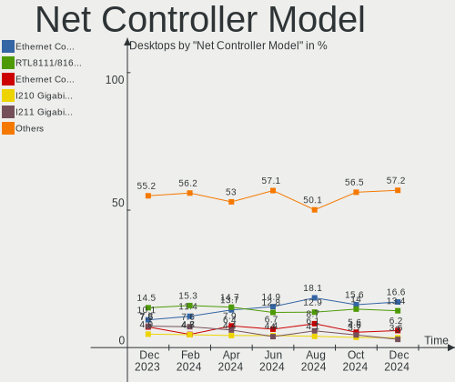
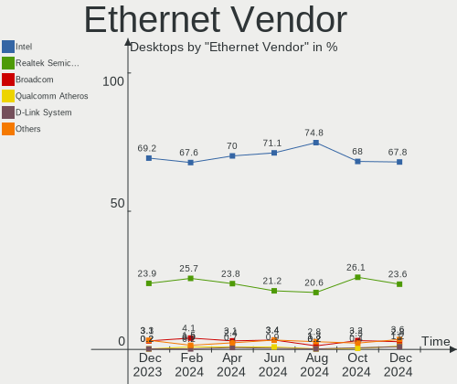
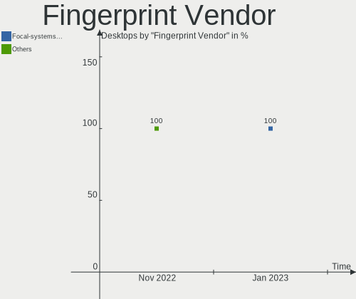

BSD Hardware Trends (Desktop)
-----------------------------

A project to identify most popular hardware characteristics and track their change
over time based on data collected by BSD users at https://BSD-Hardware.info.

Anyone can contribute to the study by uploading probes of their computers by
the [hw-probe](https://github.com/linuxhw/hw-probe/blob/master/INSTALL.BSD.md) tool:

    hw-probe -all -upload

Full-feature report is available here: https://bsd-hardware.info/?view=trends&formfactor=desktop

Period: Dec, 2020.

Contents
--------

- [ OS                       ](#os)
- [ OS Family                ](#os-family)
- [ Arch                     ](#arch)
- [ DE                       ](#de)
- [ Display Server           ](#display-server)
- [ Display Manager          ](#display-manager)
- [ OS Lang                  ](#os-lang)
- [ Boot Mode                ](#boot-mode)
- [ Filesystem               ](#filesystem)
- [ Part. scheme             ](#part-scheme)
- [ Country                  ](#country)
- [ City                     ](#city)
- [ Vendor                   ](#vendor)
- [ Model                    ](#model)
- [ Model Family             ](#model-family)
- [ MFG Year                 ](#mfg-year)
- [ Form Factor              ](#form-factor)
- [ Coreboot                 ](#coreboot)
- [ RAM Size                 ](#ram-size)
- [ RAM Used                 ](#ram-used)
- [ Has CD-ROM               ](#has-cd-rom)
- [ Total Drives             ](#total-drives)
- [ Has Ethernet             ](#has-ethernet)
- [ Drive Vendor             ](#drive-vendor)
- [ Drive Model              ](#drive-model)
- [ HDD Vendor               ](#hdd-vendor)
- [ SSD Vendor               ](#ssd-vendor)
- [ Drive Kind               ](#drive-kind)
- [ Drive Connector          ](#drive-connector)
- [ Drive Size               ](#drive-size)
- [ Space Total              ](#space-total)
- [ Space Used               ](#space-used)
- [ Malfunc. Drives          ](#malfunc-drives)
- [ Malfunc. Drive Vendor    ](#malfunc-drive-vendor)
- [ Malfunc. HDD Vendor      ](#malfunc-hdd-vendor)
- [ Malfunc. Drive Kind      ](#malfunc-drive-kind)
- [ Failed Drives            ](#failed-drives)
- [ Failed Drive Vendor      ](#failed-drive-vendor)
- [ Drive Status             ](#drive-status)
- [ Storage Vendor           ](#storage-vendor)
- [ Storage Model            ](#storage-model)
- [ Storage Kind             ](#storage-kind)
- [ CPU Vendor               ](#cpu-vendor)
- [ CPU Model                ](#cpu-model)
- [ CPU Model Family         ](#cpu-model-family)
- [ CPU Cores                ](#cpu-cores)
- [ CPU Sockets              ](#cpu-sockets)
- [ CPU Threads              ](#cpu-threads)
- [ CPU Microarch            ](#cpu-microarch)
- [ GPU Vendor               ](#gpu-vendor)
- [ GPU Model                ](#gpu-model)
- [ GPU Combo                ](#gpu-combo)
- [ GPU Driver               ](#gpu-driver)
- [ GPU Memory               ](#gpu-memory)
- [ Monitor Vendor           ](#monitor-vendor)
- [ Monitor Model            ](#monitor-model)
- [ Monitor Resolution       ](#monitor-resolution)
- [ Monitor Diagonal         ](#monitor-diagonal)
- [ Monitor Width            ](#monitor-width)
- [ Aspect Ratio             ](#aspect-ratio)
- [ Monitor Area             ](#monitor-area)
- [ Pixel Density            ](#pixel-density)
- [ Multiple Monitors        ](#multiple-monitors)
- [ Net Controller Vendor    ](#net-controller-vendor)
- [ Net Controller Model     ](#net-controller-model)
- [ Wireless Vendor          ](#wireless-vendor)
- [ Wireless Model           ](#wireless-model)
- [ Ethernet Vendor          ](#ethernet-vendor)
- [ Ethernet Model           ](#ethernet-model)
- [ Net Controller Kind      ](#net-controller-kind)
- [ Used Controller          ](#used-controller)
- [ NICs                     ](#nics)
- [ Memory Vendor            ](#memory-vendor)
- [ Memory Model             ](#memory-model)
- [ Memory Kind              ](#memory-kind)
- [ Memory Form Factor       ](#memory-form-factor)
- [ Memory Size              ](#memory-size)
- [ Memory Speed             ](#memory-speed)
- [ Sound Vendor             ](#sound-vendor)
- [ Sound Model              ](#sound-model)
- [ Camera Vendor            ](#camera-vendor)
- [ Camera Model             ](#camera-model)
- [ Fingerprint Vendor       ](#fingerprint-vendor)
- [ Fingerprint Model        ](#fingerprint-model)
- [ Chipcard Vendor          ](#chipcard-vendor)
- [ Chipcard Model           ](#chipcard-model)
- [ Printer Vendor           ](#printer-vendor)
- [ Printer Model            ](#printer-model)
- [ Scanner Vendor           ](#scanner-vendor)
- [ Scanner Model            ](#scanner-model)
- [ Bluetooth Vendor         ](#bluetooth-vendor)
- [ Bluetooth Model          ](#bluetooth-model)
- [ Unsupported Devices      ](#unsupported-devices)
- [ Unsupported Device Types ](#unsupported-device-types)

OS
--

Installed operating systems

| Name                 | Desktops | Percent |
|----------------------|----------|---------|
| FreeBSD 12.2-p2      | 26       | 24.53%  |
| OpenBSD 6.8          | 19       | 17.92%  |
| FreeBSD 12.2         | 11       | 10.38%  |
| FreeBSD 12.2-p1      | 6        | 5.66%   |
| pfSense 2.4.5        | 5        | 4.72%   |
| GhostBSD 20.04.02    | 5        | 4.72%   |
| FreeBSD 12.1-p12     | 5        | 4.72%   |
| MidnightBSD 2.0.2    | 4        | 3.77%   |
| FreeBSD 13.0-CURRENT | 4        | 3.77%   |
| OPNsense 12.1--HBSD  | 3        | 2.83%   |
| NomadBSD 1.3.2       | 2        | 1.89%   |
| NetBSD 9.0_STABLE    | 2        | 1.89%   |
| FreeBSD 12.2-RC3     | 2        | 1.89%   |
| FreeBSD 12.1-p9      | 2        | 1.89%   |
| FreeBSD 12.1         | 2        | 1.89%   |
| OPNsense 20.7.7      | 1        | 0.94%   |
| NetBSD 9.99.77       | 1        | 0.94%   |
| FreeNAS 11.4-p6      | 1        | 0.94%   |
| FreeNAS 11.3-p14     | 1        | 0.94%   |
| FreeBSD 12.2-STABLE  | 1        | 0.94%   |
| FreeBSD 12.1-STABLE  | 1        | 0.94%   |
| FreeBSD 12.1-p11     | 1        | 0.94%   |
| FreeBSD 12.1-p10     | 1        | 0.94%   |

OS Family
---------

OS without a version

| Name        | Desktops | Percent |
|-------------|----------|---------|
| FreeBSD     | 62       | 58.49%  |
| OpenBSD     | 19       | 17.92%  |
| pfSense     | 5        | 4.72%   |
| GhostBSD    | 5        | 4.72%   |
| OPNsense    | 4        | 3.77%   |
| MidnightBSD | 4        | 3.77%   |
| NetBSD      | 3        | 2.83%   |
| NomadBSD    | 2        | 1.89%   |
| FreeNAS     | 2        | 1.89%   |

Arch
----

OS architecture (x86_64, i586, etc.)

| Name   | Desktops | Percent |
|--------|----------|---------|
| amd64  | 99       | 93.4%   |
| i386   | 3        | 2.83%   |
| macppc | 1        | 0.94%   |
| evbarm | 1        | 0.94%   |
| arm64  | 1        | 0.94%   |
| arm    | 1        | 0.94%   |

DE
--

Desktop Environment

| Name     | Desktops | Percent |
|----------|----------|---------|
| Console  | 57       | 53.77%  |
| fvwm     | 14       | 13.21%  |
| XFCE     | 9        | 8.49%   |
| MATE     | 5        | 4.72%   |
| GNOME    | 5        | 4.72%   |
| KDE5     | 4        | 3.77%   |
| TWM      | 3        | 2.83%   |
| Openbox  | 2        | 1.89%   |
| CDE      | 2        | 1.89%   |
| Lumina   | 1        | 0.94%   |
| i3       | 1        | 0.94%   |
| GNUstep  | 1        | 0.94%   |
| Fluxbox  | 1        | 0.94%   |
| Cinnamon | 1        | 0.94%   |

Display Server
--------------

X11 or Wayland

| Name    | Desktops | Percent |
|---------|----------|---------|
| Console | 62       | 58.49%  |
| X11     | 44       | 41.51%  |

Display Manager
---------------

SDDM, LightDM, etc.

| Name    | Desktops | Percent |
|---------|----------|---------|
| Console | 81       | 76.42%  |
| XDM     | 6        | 5.66%   |
| LightDM | 6        | 5.66%   |
| SLiM    | 5        | 4.72%   |
| SDDM    | 5        | 4.72%   |
| GDM     | 3        | 2.83%   |

OS Lang
-------

Language

| Lang           | Desktops | Percent |
|----------------|----------|---------|
| Unknown        | 68       | 64.15%  |
| en_US          | 23       | 21.7%   |
| ru_RU          | 3        | 2.83%   |
| C              | 3        | 2.83%   |
| fr_FR          | 2        | 1.89%   |
| pt_BR          | 1        | 0.94%   |
| hu_HU          | 1        | 0.94%   |
| fi_FI          | 1        | 0.94%   |
| en_GB          | 1        | 0.94%   |
| en_GB.US-ASCII | 1        | 0.94%   |
| en_AU          | 1        | 0.94%   |
| de_DE          | 1        | 0.94%   |

Boot Mode
---------

EFI or BIOS

| Mode | Desktops | Percent |
|------|----------|---------|
| EFI  | 61       | 57.55%  |
| BIOS | 45       | 42.45%  |

Filesystem
----------

Type of filesystem

| Type | Desktops | Percent |
|------|----------|---------|
| Zfs  | 58       | 54.72%  |
| Ufs  | 29       | 27.36%  |
| Ffs  | 19       | 17.92%  |

Part. scheme
------------

Scheme of partitioning

| Type    | Desktops | Percent |
|---------|----------|---------|
| GPT     | 85       | 80.19%  |
| MBR     | 18       | 16.98%  |
| Unknown | 2        | 1.89%   |
| BSD     | 1        | 0.94%   |

Country
-------

Geographic location (country)

| Country        | Desktops | Percent |
|----------------|----------|---------|
| USA            | 38       | 35.85%  |
| Germany        | 10       | 9.43%   |
| Russia         | 7        | 6.6%    |
| Canada         | 6        | 5.66%   |
| UK             | 5        | 4.72%   |
| France         | 5        | 4.72%   |
| Poland         | 4        | 3.77%   |
| Australia      | 4        | 3.77%   |
| Greece         | 3        | 2.83%   |
| Ukraine        | 2        | 1.89%   |
| Switzerland    | 2        | 1.89%   |
| Norway         | 2        | 1.89%   |
| Taiwan         | 1        | 0.94%   |
| Sweden         | 1        | 0.94%   |
| Slovakia       | 1        | 0.94%   |
| Singapore      | 1        | 0.94%   |
| Serbia         | 1        | 0.94%   |
| Philippines    | 1        | 0.94%   |
| Malaysia       | 1        | 0.94%   |
| Luxembourg     | 1        | 0.94%   |
| Japan          | 1        | 0.94%   |
| Italy          | 1        | 0.94%   |
| India          | 1        | 0.94%   |
| Hungary        | 1        | 0.94%   |
| Finland        | 1        | 0.94%   |
| Czech Republic | 1        | 0.94%   |
| Colombia       | 1        | 0.94%   |
| Brazil         | 1        | 0.94%   |
| Belgium        | 1        | 0.94%   |
| Argentina      | 1        | 0.94%   |

City
----

Geographic location (city)

| City                 | Desktops | Percent |
|----------------------|----------|---------|
| Ypsilanti            | 4        | 3.77%   |
| City of Saint Peters | 4        | 3.77%   |
| Moscow               | 3        | 2.83%   |
| Toronto              | 2        | 1.89%   |
| Portland             | 2        | 1.89%   |
| Omaha                | 2        | 1.89%   |
| Nantes               | 2        | 1.89%   |
| London               | 2        | 1.89%   |
| Krasnoyarsk          | 2        | 1.89%   |
| Kitchener            | 2        | 1.89%   |
| Frankfurt am Main    | 2        | 1.89%   |
| Athens               | 2        | 1.89%   |
| Český Těšín     | 1        | 0.94%   |
| Wolfsburg            | 1        | 0.94%   |
| Warsaw               | 1        | 0.94%   |
| Vari                 | 1        | 0.94%   |
| Tokyo                | 1        | 0.94%   |
| The Bronx            | 1        | 0.94%   |
| Taoyuan District     | 1        | 0.94%   |
| São Paulo           | 1        | 0.94%   |
| Sydney               | 1        | 0.94%   |
| St Petersburg        | 1        | 0.94%   |
| St Kilda             | 1        | 0.94%   |
| Springfield          | 1        | 0.94%   |
| Soreide              | 1        | 0.94%   |
| Somerset             | 1        | 0.94%   |
| Sokal'               | 1        | 0.94%   |
| Smyrna               | 1        | 0.94%   |
| Singapore            | 1        | 0.94%   |
| Sevastopol           | 1        | 0.94%   |
| Seraing              | 1        | 0.94%   |
| Saro                 | 1        | 0.94%   |
| Salzano              | 1        | 0.94%   |
| Salem                | 1        | 0.94%   |
| Rotherham            | 1        | 0.94%   |
| Romont               | 1        | 0.94%   |
| Rohr                 | 1        | 0.94%   |
| Redmond              | 1        | 0.94%   |
| Raleigh              | 1        | 0.94%   |
| Poznan               | 1        | 0.94%   |
| Pasig                | 1        | 0.94%   |
| Paris                | 1        | 0.94%   |
| Palmira              | 1        | 0.94%   |
| Ozersk               | 1        | 0.94%   |
| Olching              | 1        | 0.94%   |
| Novi Sad             | 1        | 0.94%   |
| Nova Bana            | 1        | 0.94%   |
| Nontron              | 1        | 0.94%   |
| Munich               | 1        | 0.94%   |
| Montreal             | 1        | 0.94%   |
| Milwaukee            | 1        | 0.94%   |
| Menai                | 1        | 0.94%   |
| Maszewo              | 1        | 0.94%   |
| Marrickville         | 1        | 0.94%   |
| Marlborough          | 1        | 0.94%   |
| Mansfield            | 1        | 0.94%   |
| Mangrol              | 1        | 0.94%   |
| Luxembourg           | 1        | 0.94%   |
| Lawrenceville        | 1        | 0.94%   |
| Langen               | 1        | 0.94%   |

Vendor
------

Motherboard manufacturer

| Name                | Desktops | Percent |
|---------------------|----------|---------|
| ASUSTek Computer    | 19       | 17.92%  |
| Hewlett-Packard     | 14       | 13.21%  |
| Gigabyte Technology | 12       | 11.32%  |
| ASRock              | 11       | 10.38%  |
| Supermicro          | 8        | 7.55%   |
| Unknown             | 8        | 7.55%   |
| Lenovo              | 6        | 5.66%   |
| Dell                | 5        | 4.72%   |
| MSI                 | 4        | 3.77%   |
| Apple               | 3        | 2.83%   |
| PC Engines          | 2        | 1.89%   |
| Foxconn             | 2        | 1.89%   |
| ASRockRack          | 2        | 1.89%   |
| Acer                | 2        | 1.89%   |
| Wistron             | 1        | 0.94%   |
| TYAN Computer       | 1        | 0.94%   |
| Netgate             | 1        | 0.94%   |
| Intel               | 1        | 0.94%   |
| HPE                 | 1        | 0.94%   |
| HARDKERNEL          | 1        | 0.94%   |
| Clevo               | 1        | 0.94%   |
| Centerm             | 1        | 0.94%   |

Model
-----

Motherboard model

| Name                                     | Desktops | Percent |
|------------------------------------------|----------|---------|
| Unknown                                  | 9        | 8.49%   |
| Supermicro X7SPA-HF                      | 2        | 1.89%   |
| PC Engines apu2                          | 2        | 1.89%   |
| HP ProLiant MicroServer                  | 2        | 1.89%   |
| ASUS TUF GAMING B450M-PLUS II            | 2        | 1.89%   |
| ASUS All Series                          | 2        | 1.89%   |
| Wistron ProLiant ML110 G6                | 1        | 0.94%   |
| TYAN Intel 440BX/GX Rev. 4               | 1        | 0.94%   |
| Supermicro X9SPV-F/LN4F                  | 1        | 0.94%   |
| Supermicro X8STi                         | 1        | 0.94%   |
| Supermicro X11DDW-L                      | 1        | 0.94%   |
| Supermicro SYS-5019S-ML                  | 1        | 0.94%   |
| Supermicro SYS-5018R-M                   | 1        | 0.94%   |
| Supermicro Icebreaker 4824               | 1        | 0.94%   |
| Netgate SG-5100                          | 1        | 0.94%   |
| MSI MS-7B48                              | 1        | 0.94%   |
| MSI MS-7846                              | 1        | 0.94%   |
| MSI MS-7757                              | 1        | 0.94%   |
| MSI MS-7576                              | 1        | 0.94%   |
| Lenovo ThinkPad X201 3680FAG             | 1        | 0.94%   |
| Lenovo ThinkPad X1 Carbon 7th 20QD003MGE | 1        | 0.94%   |
| Lenovo ThinkPad T410 2537NB5             | 1        | 0.94%   |
| Lenovo ThinkPad T400 6475K43             | 1        | 0.94%   |
| Lenovo ThinkCentre M700 10GRCTO1WW       | 1        | 0.94%   |
| Lenovo IdeaPad L340-15API 81LW           | 1        | 0.94%   |
| Intel Q3XXG4-P V1.0                      | 1        | 0.94%   |
| HPE ProLiant ML30 Gen10                  | 1        | 0.94%   |
| HP Z600 Workstation                      | 1        | 0.94%   |
| HP Z440 Workstation                      | 1        | 0.94%   |
| HP Z420 Workstation                      | 1        | 0.94%   |
| HP Z400 Workstation                      | 1        | 0.94%   |
| HP t620 PLUS Quad Core TC                | 1        | 0.94%   |
| HP ProDesk 600 G2 MT                     | 1        | 0.94%   |
| HP ProDesk 600 G1 SFF                    | 1        | 0.94%   |
| HP OMEN Laptop 15-en0xxx                 | 1        | 0.94%   |
| HP Compaq Elite 8300 SFF                 | 1        | 0.94%   |
| HP Compaq Elite 8300 CMT                 | 1        | 0.94%   |
| HP Compaq 8200 Elite SFF PC              | 1        | 0.94%   |
| HP 240 G1                                | 1        | 0.94%   |
| HARDKERNEL ODROID-H2                     | 1        | 0.94%   |
| Gigabyte Z97P-D3                         | 1        | 0.94%   |
| Gigabyte Z68P-DS3                        | 1        | 0.94%   |
| Gigabyte Z370 AORUS Ultra Gaming         | 1        | 0.94%   |
| Gigabyte X79-UD3                         | 1        | 0.94%   |
| Gigabyte X570 AORUS PRO                  | 1        | 0.94%   |
| Gigabyte H97-D3H                         | 1        | 0.94%   |
| Gigabyte GA-A75-UD4H                     | 1        | 0.94%   |
| Gigabyte B85-HD3-A                       | 1        | 0.94%   |
| Gigabyte B450 I AORUS PRO WIFI           | 1        | 0.94%   |
| Gigabyte A320M-H                         | 1        | 0.94%   |
| Gigabyte 970A-DS3P                       | 1        | 0.94%   |
| Foxconn Pro3500 Series                   | 1        | 0.94%   |
| Foxconn KZ223AA-AB4 CQ2019AP             | 1        | 0.94%   |
| Dell PowerEdge T20                       | 1        | 0.94%   |
| Dell OptiPlex 780                        | 1        | 0.94%   |
| Dell OptiPlex 755                        | 1        | 0.94%   |
| Dell OptiPlex 320                        | 1        | 0.94%   |
| Dell Latitude 3300                       | 1        | 0.94%   |
| Clevo W240EU/W250EUQ/W270EUQ             | 1        | 0.94%   |
| Centerm C30                              | 1        | 0.94%   |

Model Family
------------

Motherboard model prefix

| Name                    | Desktops | Percent |
|-------------------------|----------|---------|
| Unknown                 | 9        | 8.49%   |
| ASUS TUF                | 5        | 4.72%   |
| ASUS PRIME              | 5        | 4.72%   |
| Lenovo ThinkPad         | 4        | 3.77%   |
| HP Compaq               | 3        | 2.83%   |
| Dell OptiPlex           | 3        | 2.83%   |
| ASRock X570             | 3        | 2.83%   |
| Supermicro X7SPA-HF     | 2        | 1.89%   |
| PC Engines APU2         | 2        | 1.89%   |
| HP ProLiant             | 2        | 1.89%   |
| HP ProDesk              | 2        | 1.89%   |
| ASUS All                | 2        | 1.89%   |
| Acer Aspire             | 2        | 1.89%   |
| Wistron ProLiant        | 1        | 0.94%   |
| TYAN Intel              | 1        | 0.94%   |
| Supermicro X9SPV-F      | 1        | 0.94%   |
| Supermicro X8STi        | 1        | 0.94%   |
| Supermicro X11DDW-L     | 1        | 0.94%   |
| Supermicro SYS-5019S-ML | 1        | 0.94%   |
| Supermicro SYS-5018R-M  | 1        | 0.94%   |
| Supermicro Icebreaker   | 1        | 0.94%   |
| Netgate SG-5100         | 1        | 0.94%   |
| MSI MS-7B48             | 1        | 0.94%   |
| MSI MS-7846             | 1        | 0.94%   |
| MSI MS-7757             | 1        | 0.94%   |
| MSI MS-7576             | 1        | 0.94%   |
| Lenovo ThinkCentre      | 1        | 0.94%   |
| Lenovo IdeaPad          | 1        | 0.94%   |
| Intel Q3XXG4-P          | 1        | 0.94%   |
| HPE ProLiant            | 1        | 0.94%   |
| HP Z600                 | 1        | 0.94%   |
| HP Z440                 | 1        | 0.94%   |
| HP Z420                 | 1        | 0.94%   |
| HP Z400                 | 1        | 0.94%   |
| HP t620                 | 1        | 0.94%   |
| HP OMEN                 | 1        | 0.94%   |
| HP 240                  | 1        | 0.94%   |
| HARDKERNEL ODROID-H2    | 1        | 0.94%   |
| Gigabyte Z97P-D3        | 1        | 0.94%   |
| Gigabyte Z68P-DS3       | 1        | 0.94%   |
| Gigabyte Z370           | 1        | 0.94%   |
| Gigabyte X79-UD3        | 1        | 0.94%   |
| Gigabyte X570           | 1        | 0.94%   |
| Gigabyte H97-D3H        | 1        | 0.94%   |
| Gigabyte GA-A75-UD4H    | 1        | 0.94%   |
| Gigabyte B85-HD3-A      | 1        | 0.94%   |
| Gigabyte B450           | 1        | 0.94%   |
| Gigabyte A320M-H        | 1        | 0.94%   |
| Gigabyte 970A-DS3P      | 1        | 0.94%   |
| Foxconn Pro3500         | 1        | 0.94%   |
| Foxconn KZ223AA-AB4     | 1        | 0.94%   |
| Dell PowerEdge          | 1        | 0.94%   |
| Dell Latitude           | 1        | 0.94%   |
| Clevo W240EU            | 1        | 0.94%   |
| Centerm C30             | 1        | 0.94%   |
| ASUS X102BA             | 1        | 0.94%   |
| ASUS SABERTOOTH         | 1        | 0.94%   |
| ASUS P4PE2-X            | 1        | 0.94%   |
| ASUS P4P800-VM          | 1        | 0.94%   |
| ASUS M3A78              | 1        | 0.94%   |

MFG Year
--------

Motherboard manufacture year

| Year    | Desktops | Percent |
|---------|----------|---------|
| 2020    | 16       | 15.09%  |
| 2019    | 16       | 15.09%  |
| 2018    | 14       | 13.21%  |
| 2013    | 10       | 9.43%   |
| 2016    | 8        | 7.55%   |
| Unknown | 7        | 6.6%    |
| 2015    | 6        | 5.66%   |
| 2012    | 6        | 5.66%   |
| 2011    | 6        | 5.66%   |
| 2014    | 5        | 4.72%   |
| 2010    | 4        | 3.77%   |
| 2017    | 3        | 2.83%   |
| 2009    | 2        | 1.89%   |
| 2008    | 1        | 0.94%   |
| 2005    | 1        | 0.94%   |
| 2004    | 1        | 0.94%   |

Form Factor
-----------

Physical design of the computer

| Name    | Desktops | Percent |
|---------|----------|---------|
| Desktop | 106      | 100%    |

Coreboot
--------

Have coreboot on board

| Used | Desktops | Percent |
|------|----------|---------|
| No   | 103      | 97.17%  |
| Yes  | 3        | 2.83%   |

RAM Size
--------

Total RAM memory

| Size in GB      | Desktops | Percent |
|-----------------|----------|---------|
| 8.01-16.0       | 26       | 24.53%  |
| 16.01-24.0      | 22       | 20.75%  |
| 32.01-64.0      | 21       | 19.81%  |
| 4.01-8.0        | 10       | 9.43%   |
| 64.01-256.0     | 9        | 8.49%   |
| 2.01-3.0        | 5        | 4.72%   |
| 24.01-32.0      | 4        | 3.77%   |
| 0.51-1.0        | 4        | 3.77%   |
| 3.01-4.0        | 2        | 1.89%   |
| 1.01-2.0        | 2        | 1.89%   |
| More than 256.0 | 1        | 0.94%   |

RAM Used
--------

Used RAM memory

| Used GB     | Desktops | Percent |
|-------------|----------|---------|
| 0.01-0.5    | 40       | 37.74%  |
| 0.51-1.0    | 27       | 25.47%  |
| 1.01-2.0    | 16       | 15.09%  |
| 2.01-3.0    | 4        | 3.77%   |
| 32.01-64.0  | 3        | 2.83%   |
| 24.01-32.0  | 3        | 2.83%   |
| 8.01-16.0   | 3        | 2.83%   |
| Unknown     | 3        | 2.83%   |
| 3.01-4.0    | 2        | 1.89%   |
| 64.01-256.0 | 2        | 1.89%   |
| 16.01-24.0  | 2        | 1.89%   |
| 4.01-8.0    | 1        | 0.94%   |

Has CD-ROM
----------

Has CD-ROM on board

| Presented | Desktops | Percent |
|-----------|----------|---------|
| No        | 88       | 83.02%  |
| Yes       | 18       | 16.98%  |

Total Drives
------------

Number of drives on board

| Drives | Desktops | Percent |
|--------|----------|---------|
| 1      | 29       | 27.36%  |
| 2      | 21       | 19.81%  |
| 3      | 14       | 13.21%  |
| 4      | 12       | 11.32%  |
| 5      | 10       | 9.43%   |
| 6      | 5        | 4.72%   |
| 0      | 5        | 4.72%   |
| 7      | 4        | 3.77%   |
| 10     | 2        | 1.89%   |
| 8      | 2        | 1.89%   |
| 17     | 1        | 0.94%   |
| 13     | 1        | 0.94%   |

Has Ethernet
------------

Has Ethernet on board

| Presented | Desktops | Percent |
|-----------|----------|---------|
| Yes       | 101      | 95.28%  |
| No        | 5        | 4.72%   |

Drive Vendor
------------

Hard drive vendors

| Vendor              | Desktops | Drives | Percent |
|---------------------|----------|--------|---------|
| WDC                 | 43       | 98     | 22.87%  |
| Seagate             | 30       | 62     | 15.96%  |
| Samsung Electronics | 18       | 30     | 9.57%   |
| Intel               | 13       | 18     | 6.91%   |
| SanDisk             | 10       | 11     | 5.32%   |
| Toshiba             | 9        | 15     | 4.79%   |
| Kingston            | 9        | 9      | 4.79%   |
| Crucial             | 7        | 7      | 3.72%   |
| NVMe                | 6        | 7      | 3.19%   |
| Hitachi             | 6        | 19     | 3.19%   |
| SK Hynix            | 3        | 3      | 1.6%    |
| Phison              | 3        | 3      | 1.6%    |
| Mushkin             | 3        | 4      | 1.6%    |
| HGST                | 3        | 5      | 1.6%    |
| A-DATA Technology   | 3        | 4      | 1.6%    |
| PLEXTOR             | 2        | 2      | 1.06%   |
| KingSpec            | 2        | 2      | 1.06%   |
| Hoodisk             | 2        | 2      | 1.06%   |
| Hewlett-Packard     | 2        | 2      | 1.06%   |
| WD MediaMax         | 1        | 3      | 0.53%   |
| Transcend           | 1        | 1      | 0.53%   |
| SATADOM             | 1        | 2      | 0.53%   |
| QUANTUM             | 1        | 1      | 0.53%   |
| PNY                 | 1        | 1      | 0.53%   |
| OWC                 | 1        | 4      | 0.53%   |
| OPENBSD             | 1        | 1      | 0.53%   |
| Micron Technology   | 1        | 4      | 0.53%   |
| Maxtor              | 1        | 4      | 0.53%   |
| JetFlash            | 1        | 1      | 0.53%   |
| Hikvision           | 1        | 1      | 0.53%   |
| Corsair             | 1        | 1      | 0.53%   |
| Apple               | 1        | 1      | 0.53%   |
| Apacer              | 1        | 1      | 0.53%   |

Drive Model
-----------

Hard drive models

| Model                           | Desktops | Percent |
|---------------------------------|----------|---------|
| WDC WD40EFRX-68N32N0 4TB        | 4        | 1.74%   |
| Seagate ST4000DM000-1F2168 4TB  | 4        | 1.74%   |
| WDC WD30EFRX-68EUZN0 3TB        | 3        | 1.3%    |
| Toshiba DT01ACA100 1TB          | 3        | 1.3%    |
| Seagate ST8000VN0022-2EL112 8TB | 3        | 1.3%    |
| Samsung SSD 970 PRO 512GB       | 3        | 1.3%    |
| Samsung SSD 860 EVO 500GB       | 3        | 1.3%    |
| Samsung HD204UI 2TB             | 3        | 1.3%    |
| WDC WDS500G2B0B-00YS70 500GB    | 2        | 0.87%   |
| WDC WDS250G2B0A-00SM50 250GB    | 2        | 0.87%   |
| WDC WDS240G2G0B-00EPW0 240GB    | 2        | 0.87%   |
| WDC WDS240G2G0A-00JH30 240GB    | 2        | 0.87%   |
| WDC WD40EZRZ-22GXCB0 4TB        | 2        | 0.87%   |
| WDC WD40EFRX-68WT0N0 4TB        | 2        | 0.87%   |
| WDC WD20EZRX-00D8PB0 2TB        | 2        | 0.87%   |
| WDC WD10EFRX-68PJCN0 1TB        | 2        | 0.87%   |
| Seagate ST4000DM004-2CV104 4TB  | 2        | 0.87%   |
| Seagate ST3500413AS 500GB       | 2        | 0.87%   |
| Seagate ST31000528AS 1TB        | 2        | 0.87%   |
| Seagate ST2000DM001-1CH164 2TB  | 2        | 0.87%   |
| SanDisk SSD PLUS 120GB          | 2        | 0.87%   |
| Samsung SSD 860 QVO 1TB         | 2        | 0.87%   |
| NVMe WDC PC SN730 SDB 512GB     | 2        | 0.87%   |
| NVMe Samsung SSD 970 1TB        | 2        | 0.87%   |
| Kingston SA400S37120G 120GB     | 2        | 0.87%   |
| Intel SSDSC2KG480G8 480GB       | 2        | 0.87%   |
| Hitachi HUA722020ALA330 2TB     | 2        | 0.87%   |
| Hitachi HDS721010CLA332 1TB     | 2        | 0.87%   |
| Crucial M4-CT064M4SSD2 64GB     | 2        | 0.87%   |
| WDC WDS256G1X0C-00ENX0 256GB    | 1        | 0.43%   |
| WDC WDS100T3X0C-00SJG0 1TB      | 1        | 0.43%   |
| WDC WDBNCE2500PNC 250GB         | 1        | 0.43%   |
| WDC WD80EFAX-68KNBN0 8TB        | 1        | 0.43%   |
| WDC WD800JB-00JJC0 80GB         | 1        | 0.43%   |
| WDC WD800EB-00DJF0 80GB         | 1        | 0.43%   |
| WDC WD7500BPKT-22PK4T0 752GB    | 1        | 0.43%   |
| WDC WD60EZRZ-00GZ5B1 6TB        | 1        | 0.43%   |
| WDC WD60EFRX-68MYMN1 6TB        | 1        | 0.43%   |
| WDC WD60EFAX-68SHWN0 6TB        | 1        | 0.43%   |
| WDC WD6002FRYZ-01WD5B1 6TB      | 1        | 0.43%   |
| WDC WD5000BPKT-00PK4T0 500GB    | 1        | 0.43%   |
| WDC WD5000AAKX-60U6AA0 500GB    | 1        | 0.43%   |
| WDC WD5000AAKX-221CA1 500GB     | 1        | 0.43%   |
| WDC WD5000AAKX-001CA0 500GB     | 1        | 0.43%   |
| WDC WD3200KS-00PFB0 320GB       | 1        | 0.43%   |
| WDC WD30EFRX-68N32N0 3TB        | 1        | 0.43%   |
| WDC WD2502ABYS-01B7A0 256GB     | 1        | 0.43%   |
| WDC WD2500AAKS-60L9A0 250GB     | 1        | 0.43%   |
| WDC WD20EZRZ-00Z5HB0 2TB        | 1        | 0.43%   |
| WDC WD20EZAZ-00GGJB0 2TB        | 1        | 0.43%   |
| WDC WD20EFRX-68EUZN0 2TB        | 1        | 0.43%   |
| WDC WD20EARX-00PASB0 2TB        | 1        | 0.43%   |
| WDC WD20EARX-008FB0 2TB         | 1        | 0.43%   |
| WDC WD1602ABJS-43P5A0 160GB     | 1        | 0.43%   |
| WDC WD1200JS-00MHB1 120GB       | 1        | 0.43%   |
| WDC WD1200BB-00HTA0 120GB       | 1        | 0.43%   |
| WDC WD10EZEX-75WN4A0 1TB        | 1        | 0.43%   |
| WDC WD10EZEX-22MFCA0 1TB        | 1        | 0.43%   |
| WDC WD10EZEX-08WN4A0 1TB        | 1        | 0.43%   |
| WDC WD10EALX-009BA0 1TB         | 1        | 0.43%   |

HDD Vendor
----------

Hard disk drive vendors

| Vendor              | Desktops | Drives | Percent |
|---------------------|----------|--------|---------|
| WDC                 | 37       | 84     | 37.37%  |
| Seagate             | 30       | 62     | 30.3%   |
| Toshiba             | 7        | 13     | 7.07%   |
| Hitachi             | 6        | 19     | 6.06%   |
| Samsung Electronics | 5        | 10     | 5.05%   |
| NVMe                | 4        | 4      | 4.04%   |
| HGST                | 3        | 5      | 3.03%   |
| WD MediaMax         | 1        | 3      | 1.01%   |
| QUANTUM             | 1        | 1      | 1.01%   |
| OPENBSD             | 1        | 1      | 1.01%   |
| Maxtor              | 1        | 4      | 1.01%   |
| JetFlash            | 1        | 1      | 1.01%   |
| Hewlett-Packard     | 1        | 1      | 1.01%   |
| Apple               | 1        | 1      | 1.01%   |

SSD Vendor
----------

Solid state drive vendors

| Vendor              | Desktops | Drives | Percent |
|---------------------|----------|--------|---------|
| Samsung Electronics | 10       | 14     | 13.16%  |
| Intel               | 10       | 14     | 13.16%  |
| SanDisk             | 9        | 10     | 11.84%  |
| Kingston            | 9        | 9      | 11.84%  |
| WDC                 | 8        | 10     | 10.53%  |
| Crucial             | 6        | 6      | 7.89%   |
| Toshiba             | 2        | 2      | 2.63%   |
| SK Hynix            | 2        | 2      | 2.63%   |
| PLEXTOR             | 2        | 2      | 2.63%   |
| NVMe                | 2        | 2      | 2.63%   |
| Mushkin             | 2        | 2      | 2.63%   |
| KingSpec            | 2        | 2      | 2.63%   |
| Hoodisk             | 2        | 2      | 2.63%   |
| A-DATA Technology   | 2        | 3      | 2.63%   |
| Transcend           | 1        | 1      | 1.32%   |
| SATADOM             | 1        | 2      | 1.32%   |
| PNY                 | 1        | 1      | 1.32%   |
| Phison              | 1        | 1      | 1.32%   |
| OWC                 | 1        | 4      | 1.32%   |
| Micron Technology   | 1        | 4      | 1.32%   |
| Hikvision           | 1        | 1      | 1.32%   |
| Apacer              | 1        | 1      | 1.32%   |

Drive Kind
----------

HDD or SSD

| Kind | Desktops | Drives | Percent |
|------|----------|--------|---------|
| HDD  | 66       | 209    | 44.59%  |
| SSD  | 64       | 95     | 43.24%  |
| NVMe | 18       | 25     | 12.16%  |

Drive Connector
---------------

SATA, SAS, NVMe, etc.

| Type | Desktops | Drives | Percent |
|------|----------|--------|---------|
| SATA | 98       | 304    | 84.48%  |
| NVMe | 18       | 25     | 15.52%  |

Drive Size
----------

Size of hard drive

| Size in TB | Desktops | Drives | Percent |
|------------|----------|--------|---------|
| 0.01-0.5   | 76       | 117    | 51.01%  |
| 0.51-1.0   | 26       | 52     | 17.45%  |
| 1.01-2.0   | 15       | 48     | 10.07%  |
| 3.01-4.0   | 14       | 28     | 9.4%    |
| 4.01-10.0  | 13       | 42     | 8.72%   |
| 2.01-3.0   | 4        | 13     | 2.68%   |
| 10.01-20.0 | 1        | 4      | 0.67%   |

Space Total
-----------

Amount of disk space available on the file system

| Size in GB     | Desktops | Percent |
|----------------|----------|---------|
| 101-250        | 35       | 33.02%  |
| 251-500        | 26       | 24.53%  |
| 1-20           | 13       | 12.26%  |
| 51-100         | 12       | 11.32%  |
| 501-1000       | 8        | 7.55%   |
| 1001-2000      | 4        | 3.77%   |
| 21-50          | 3        | 2.83%   |
| More than 3000 | 2        | 1.89%   |
| 2001-3000      | 2        | 1.89%   |
| Unknown        | 1        | 0.94%   |

Space Used
----------

Amount of used disk space

| Used GB   | Desktops | Percent |
|-----------|----------|---------|
| 1-20      | 77       | 72.64%  |
| 21-50     | 13       | 12.26%  |
| 51-100    | 5        | 4.72%   |
| 501-1000  | 4        | 3.77%   |
| 251-500   | 2        | 1.89%   |
| 101-250   | 2        | 1.89%   |
| 1001-2000 | 2        | 1.89%   |
| Unknown   | 1        | 0.94%   |

Malfunc. Drives
---------------

Drive models with a malfunction

| Model                                      | Desktops | Drives | Percent |
|--------------------------------------------|----------|--------|---------|
| WDC WD30EFRX-68EUZN0 3TB                   | 2        | 7      | 5.71%   |
| Seagate ST3500413AS 500GB                  | 2        | 2      | 5.71%   |
| Hitachi HDS721010CLA332 1TB                | 2        | 2      | 5.71%   |
| WDC WDS240G2G0A-00JH30 240GB               | 1        | 1      | 2.86%   |
| WDC WD800JB-00JJC0 80GB                    | 1        | 1      | 2.86%   |
| WDC WD6002FRYZ-01WD5B1 6TB                 | 1        | 1      | 2.86%   |
| WDC WD5000AAKX-221CA1 500GB                | 1        | 1      | 2.86%   |
| WDC WD40EFRX-68WT0N0 4TB                   | 1        | 1      | 2.86%   |
| WDC WD2500AAKS-60L9A0 250GB                | 1        | 1      | 2.86%   |
| WDC WD20EARX-008FB0 2TB                    | 1        | 1      | 2.86%   |
| WDC WD1200JS-00MHB1 120GB                  | 1        | 1      | 2.86%   |
| WDC WD1200BB-00HTA0 120GB                  | 1        | 2      | 2.86%   |
| WDC WD10EFRX-68PJCN0 1TB                   | 1        | 2      | 2.86%   |
| WDC WD1003FBYX-88 LEN 1TB                  | 1        | 1      | 2.86%   |
| WD MediaMax WL2000GSA6454 2TB              | 1        | 3      | 2.86%   |
| Seagate ST9320423AS 320GB                  | 1        | 1      | 2.86%   |
| Seagate ST4000DM000-1F2168 4TB             | 1        | 1      | 2.86%   |
| Seagate ST3500418AS 500GB                  | 1        | 2      | 2.86%   |
| Seagate ST32000542AS 2TB                   | 1        | 1      | 2.86%   |
| Seagate ST31000528AS 1TB                   | 1        | 1      | 2.86%   |
| Seagate ST3000VN007-2E4166 3TB             | 1        | 1      | 2.86%   |
| Seagate ST2000DL003-9VT166 2TB             | 1        | 1      | 2.86%   |
| Seagate ST2000DL001-9VT156 2TB             | 1        | 1      | 2.86%   |
| Samsung Electronics HD642JJ 640GB          | 1        | 1      | 2.86%   |
| Micron Technology M500_MTFDDAK960MAV 960GB | 1        | 4      | 2.86%   |
| Maxtor 6Y080P0 82GB                        | 1        | 1      | 2.86%   |
| MAXTOR 6L080J4 80GB                        | 1        | 3      | 2.86%   |
| Kingston SNS4151S316G 16GB                 | 1        | 1      | 2.86%   |
| Intel SSDSC2CW120A3 120GB                  | 1        | 1      | 2.86%   |
| Intel SSDSC2BA200G3T 200GB                 | 1        | 2      | 2.86%   |
| A-DATA Technology SU630 240GB              | 1        | 1      | 2.86%   |
| A-DATA Technology SP610 128GB              | 1        | 1      | 2.86%   |

Malfunc. Drive Vendor
---------------------

Vendors of faulty drives

| Vendor              | Desktops | Drives | Percent |
|---------------------|----------|--------|---------|
| WDC                 | 13       | 20     | 41.94%  |
| Seagate             | 8        | 11     | 25.81%  |
| Intel               | 2        | 3      | 6.45%   |
| Hitachi             | 2        | 2      | 6.45%   |
| WD MediaMax         | 1        | 3      | 3.23%   |
| Samsung Electronics | 1        | 1      | 3.23%   |
| Micron Technology   | 1        | 4      | 3.23%   |
| Maxtor              | 1        | 4      | 3.23%   |
| Kingston            | 1        | 1      | 3.23%   |
| A-DATA Technology   | 1        | 2      | 3.23%   |

Malfunc. HDD Vendor
-------------------

Vendors of faulty HDD drives

| Vendor              | Desktops | Drives | Percent |
|---------------------|----------|--------|---------|
| WDC                 | 12       | 19     | 48%     |
| Seagate             | 8        | 11     | 32%     |
| Hitachi             | 2        | 2      | 8%      |
| WD MediaMax         | 1        | 3      | 4%      |
| Samsung Electronics | 1        | 1      | 4%      |
| MAXTOR              | 1        | 4      | 4%      |

Malfunc. Drive Kind
-------------------

Kinds of faulty drives

| Kind | Desktops | Drives | Percent |
|------|----------|--------|---------|
| HDD  | 23       | 40     | 79.31%  |
| SSD  | 6        | 11     | 20.69%  |

Failed Drives
-------------

Failed drive models

Zero info for selected period =(

Failed Drive Vendor
-------------------

Failed drive vendors

Zero info for selected period =(

Drive Status
------------

Number of failed and malfunc. drives

| Status   | Desktops | Drives | Percent |
|----------|----------|--------|---------|
| Works    | 90       | 263    | 72%     |
| Malfunc  | 28       | 51     | 22.4%   |
| Detected | 7        | 15     | 5.6%    |

Storage Vendor
--------------

Storage controller vendors

| Vendor                       | Desktops | Percent |
|------------------------------|----------|---------|
| Intel                        | 63       | 42.57%  |
| AMD                          | 38       | 25.68%  |
| Samsung Electronics          | 8        | 5.41%   |
| Sandisk                      | 7        | 4.73%   |
| Broadcom / LSI               | 6        | 4.05%   |
| Marvell Technology Group     | 5        | 3.38%   |
| ASMedia Technology           | 5        | 3.38%   |
| Phison Electronics           | 3        | 2.03%   |
| SK Hynix                     | 2        | 1.35%   |
| Silicon Motion               | 2        | 1.35%   |
| Silicon Image                | 2        | 1.35%   |
| Adaptec                      | 2        | 1.35%   |
| VIA Technologies             | 1        | 0.68%   |
| Shenzhen Longsys Electronics | 1        | 0.68%   |
| Realtek Semiconductor        | 1        | 0.68%   |
| Nvidia                       | 1        | 0.68%   |
| Micron Technology            | 1        | 0.68%   |

Storage Model
-------------

Storage controller models

| Model                                                                          | Desktops | Percent |
|--------------------------------------------------------------------------------|----------|---------|
| AMD FCH SATA Controller [AHCI mode]                                            | 22       | 11.89%  |
| AMD SB7x0/SB8x0/SB9x0 SATA Controller [AHCI mode]                              | 10       | 5.41%   |
| Samsung NVMe SSD Controller SM981/PM981/PM983                                  | 8        | 4.32%   |
| AMD SB7x0/SB8x0/SB9x0 IDE Controller                                           | 7        | 3.78%   |
| Intel 8 Series/C220 Series Chipset Family 6-port SATA Controller 1 [AHCI mode] | 6        | 3.24%   |
| AMD 400 Series Chipset SATA Controller                                         | 6        | 3.24%   |
| Unknown                                                                        | 6        | 3.24%   |
| Intel 200 Series PCH SATA controller [AHCI mode]                               | 4        | 2.16%   |
| ASMedia ASM1062 Serial ATA Controller                                          | 4        | 2.16%   |
| AMD FCH SATA Controller D                                                      | 4        | 2.16%   |
| Marvell Group 88SE9172 SATA 6Gb/s Controller                                   | 3        | 1.62%   |
| Intel SATA Controller [RAID mode]                                              | 3        | 1.62%   |
| Intel Q170/Q150/B150/H170/H110/Z170/CM236 Chipset SATA Controller [AHCI Mode]  | 3        | 1.62%   |
| Intel C600/X79 series chipset 6-Port SATA AHCI Controller                      | 3        | 1.62%   |
| Intel 9 Series Chipset Family SATA Controller [AHCI Mode]                      | 3        | 1.62%   |
| Intel 82801JI (ICH10 Family) SATA AHCI Controller                              | 3        | 1.62%   |
| Intel 82801IR/IO/IH (ICH9R/DO/DH) 6 port SATA Controller [AHCI mode]           | 3        | 1.62%   |
| Intel 7 Series/C210 Series Chipset Family 6-port SATA Controller [AHCI mode]   | 3        | 1.62%   |
| Intel 7 Series Chipset Family 6-port SATA Controller [AHCI mode]               | 3        | 1.62%   |
| Intel 6 Series/C200 Series Chipset Family 6 port Desktop SATA AHCI Controller  | 3        | 1.62%   |
| Intel 5 Series/3400 Series Chipset 6 port SATA AHCI Controller                 | 3        | 1.62%   |
| Broadcom / LSI SAS2008 PCI-Express Fusion-MPT SAS-2 [Falcon]                   | 3        | 1.62%   |
| Sandisk WD Blue SN550 NVMe SSD                                                 | 2        | 1.08%   |
| Sandisk WD Black SN750 / PC SN730 NVMe SSD                                     | 2        | 1.08%   |
| Phison E12 NVMe Controller                                                     | 2        | 1.08%   |
| Intel Optane SSD 900P Series                                                   | 2        | 1.08%   |
| Intel NM10/ICH7 Family SATA Controller [IDE mode]                              | 2        | 1.08%   |
| Intel Celeron/Pentium Silver Processor SATA Controller                         | 2        | 1.08%   |
| Intel C610/X99 series chipset 6-Port SATA Controller [AHCI mode]               | 2        | 1.08%   |
| Intel C602 chipset 4-Port SATA Storage Control Unit                            | 2        | 1.08%   |
| Broadcom / LSI SAS3008 PCI-Express Fusion-MPT SAS-3                            | 2        | 1.08%   |
| AMD FCH SATA Controller [IDE mode]                                             | 2        | 1.08%   |
| VIA VT6415 PATA IDE Host Controller                                            | 1        | 0.54%   |
| SK Hynix BC501 NVMe Solid State Drive 512GB                                    | 1        | 0.54%   |
| Silicon Motion SM2263EN/SM2263XT SSD Controller                                | 1        | 0.54%   |
| Silicon Motion SM2262/SM2262EN SSD Controller                                  | 1        | 0.54%   |
| Silicon Image SiI 3112 [SATALink/SATARaid] Serial ATA Controller               | 1        | 0.54%   |
| Silicon Image AAR-1220SA Serial ATA HostRAID Controller                        | 1        | 0.54%   |
| Sandisk WD Black NVMe SSD                                                      | 1        | 0.54%   |
| Sandisk WD Black 2018 / PC SN720 NVMe SSD                                      | 1        | 0.54%   |
| Sandisk PC SN520 NVMe SSD                                                      | 1        | 0.54%   |
| Phison E16 PCIe4 NVMe Controller                                               | 1        | 0.54%   |
| Nvidia MCP61 SATA Controller                                                   | 1        | 0.54%   |
| Nvidia MCP61 IDE                                                               | 1        | 0.54%   |
| Marvell Group 92xx SATA 6G Controller                                          | 1        | 0.54%   |
| Marvell Group 88SE9230 PCIe SATA 6Gb/s Controller                              | 1        | 0.54%   |
| Marvell Group 88SE912x SATA 6Gb/s Controller [IDE mode]                        | 1        | 0.54%   |
| Intel SSD 660P Series                                                          | 1        | 0.54%   |
| Intel NVMe Optane Memory Series                                                | 1        | 0.54%   |
| Intel Celeron N3350/Pentium N4200/Atom E3900 Series SATA AHCI Controller       | 1        | 0.54%   |
| Intel Cannon Lake PCH SATA AHCI Controller                                     | 1        | 0.54%   |
| Intel C620 Series Chipset Family SSATA Controller [AHCI mode]                  | 1        | 0.54%   |
| Intel C620 Series Chipset Family SATA Controller [AHCI mode]                   | 1        | 0.54%   |
| Intel C610/X99 series chipset sSATA Controller [IDE mode]                      | 1        | 0.54%   |
| Intel C610/X99 series chipset sSATA Controller [AHCI mode]                     | 1        | 0.54%   |
| Intel C610/X99 series chipset 4-port SATA Controller [IDE mode]                | 1        | 0.54%   |
| Intel C600/X79 series chipset IDE-r Controller                                 | 1        | 0.54%   |
| Intel Atom Processor E3800 Series SATA AHCI Controller                         | 1        | 0.54%   |
| Intel Atom Processor C3000 Series SATA Controller 1                            | 1        | 0.54%   |
| Intel Atom Processor C3000 Series SATA Controller 0                            | 1        | 0.54%   |

Storage Kind
------------

Kind of storage controller (IDE, SATA, NVMe, SAS, ...)

| Kind | Desktops | Percent |
|------|----------|---------|
| SATA | 88       | 59.86%  |
| NVMe | 24       | 16.33%  |
| IDE  | 21       | 14.29%  |
| SAS  | 7        | 4.76%   |
| RAID | 5        | 3.4%    |
| SCSI | 2        | 1.36%   |

CPU Vendor
----------

Processor vendors

| Vendor  | Desktops | Percent |
|---------|----------|---------|
| Intel   | 63       | 59.43%  |
| AMD     | 38       | 35.85%  |
| ARM     | 3        | 2.83%   |
| PowerPC | 1        | 0.94%   |
| i       | 1        | 0.94%   |

CPU Model
---------

Processor models

| Model                                       | Desktops | Percent |
|---------------------------------------------|----------|---------|
| AMD Ryzen 3 3200G with Radeon Vega Graphics | 3        | 2.83%   |
| Intel Xeon CPU E5520 @ 2.27GHz              | 2        | 1.89%   |
| Intel Core i5-3470 CPU @ 3.20GHz            | 2        | 1.89%   |
| Intel Celeron J4105 CPU @ 1.50GHz           | 2        | 1.89%   |
| AMD Turion II Neo N40L Dual-Core Processor  | 2        | 1.89%   |
| AMD Ryzen 9 3950X 16-Core Processor         | 2        | 1.89%   |
| AMD Ryzen 7 2700X Eight-Core Processor      | 2        | 1.89%   |
| AMD Ryzen 5 2600 Six-Core Processor         | 2        | 1.89%   |
| AMD GX-412TC SOC                            | 2        | 1.89%   |
| AMD FX-8350 Eight-Core Processor            | 2        | 1.89%   |
| PowerPC 7447A (Revision 0x105)              | 1        | 0.94%   |
| Intel Xeon Gold 5220 CPU @ 2.20GHz          | 1        | 0.94%   |
| Intel Xeon E-2276G CPU @ 3.80GHz            | 1        | 0.94%   |
| Intel Xeon CPU W3680 @ 3.33GHz              | 1        | 0.94%   |
| Intel Xeon CPU W3530 @ 2.80GHz              | 1        | 0.94%   |
| Intel Xeon CPU E5630 @ 2.53GHz              | 1        | 0.94%   |
| Intel Xeon CPU E5-2650L v3 @ 1.80GHz        | 1        | 0.94%   |
| Intel Xeon CPU E5-2650 v2 @ 2.60GHz         | 1        | 0.94%   |
| Intel Xeon CPU E5-2630L v3 @ 1.80GHz        | 1        | 0.94%   |
| Intel Xeon CPU E5-1650 v3 @ 3.50GHz         | 1        | 0.94%   |
| Intel Xeon CPU E5-1620 @ 3.60GHz            | 1        | 0.94%   |
| Intel Xeon CPU E3-1240L v5 @ 2.10GHz        | 1        | 0.94%   |
| Intel Xeon CPU D-1541 @ 2.10GHz             | 1        | 0.94%   |
| Intel Xeon                                  | 1        | 0.94%   |
| Intel Pentium D CPU 3.00GHz                 | 1        | 0.94%   |
| Intel Pentium CPU N4200 @ 1.10GHz           | 1        | 0.94%   |
| Intel Pentium CPU G6950 @ 2.80GHz           | 1        | 0.94%   |
| Intel Pentium CPU G3220 @ 3.00GHz           | 1        | 0.94%   |
| Intel Pentium CPU G2120 @ 3.10GHz           | 1        | 0.94%   |
| Intel Pentium 4 CPU 2.80GHz                 | 1        | 0.94%   |
| Intel Core i9-7940X CPU @ 3.10GHz           | 1        | 0.94%   |
| Intel Core i7-8700 CPU @ 3.20GHz            | 1        | 0.94%   |
| Intel Core i7-8565U CPU @ 1.80GHz           | 1        | 0.94%   |
| Intel Core i7-6700 CPU @ 3.40GHz            | 1        | 0.94%   |
| Intel Core i7-4790K CPU @ 4.00GHz           | 1        | 0.94%   |
| Intel Core i7-4770K CPU @ 3.50GHz           | 1        | 0.94%   |
| Intel Core i7-3930K CPU @ 3.20GHz           | 1        | 0.94%   |
| Intel Core i7-3770K CPU @ 3.50GHz           | 1        | 0.94%   |
| Intel Core i7-3555LE CPU @ 2.50GHz          | 1        | 0.94%   |
| Intel Core i5-8600K CPU @ 3.60GHz           | 1        | 0.94%   |
| Intel Core i5-8250U CPU @ 1.60GHz           | 1        | 0.94%   |
| Intel Core i5-4690 CPU @ 3.50GHz            | 1        | 0.94%   |
| Intel Core i5-4590S CPU @ 3.00GHz           | 1        | 0.94%   |
| Intel Core i5-4590 CPU @ 3.30GHz            | 1        | 0.94%   |
| Intel Core i5-4460 CPU @ 3.20GHz            | 1        | 0.94%   |
| Intel Core i5-3570 CPU                      | 1        | 0.94%   |
| Intel Core i5-2520M CPU @ 2.50GHz           | 1        | 0.94%   |
| Intel Core i5-2500 CPU @ 3.30GHz            | 1        | 0.94%   |
| Intel Core i5-10400 CPU @ 2.90GHz           | 1        | 0.94%   |
| Intel Core i5 CPU M 560 @ 2.67GHz           | 1        | 0.94%   |
| Intel Core i5 CPU M 540 @ 2.53GHz           | 1        | 0.94%   |
| Intel Core i3-9100F CPU @ 3.60GHz           | 1        | 0.94%   |
| Intel Core i3-6100 CPU @ 3.70GHz            | 1        | 0.94%   |
| Intel Core i3-4330 CPU @ 3.50GHz            | 1        | 0.94%   |
| Intel Core i3-4030U CPU @ 1.90GHz           | 1        | 0.94%   |
| Intel Core i3-3130M CPU @ 2.60GHz           | 1        | 0.94%   |
| Intel Core i3-3110M CPU @ 2.40GHz           | 1        | 0.94%   |
| Intel Core 2 Duo CPU T9400 @ 2.53GHz        | 1        | 0.94%   |
| Intel Core 2 Duo                            | 1        | 0.94%   |
| Intel Celeron D CPU 2.40GHz                 | 1        | 0.94%   |

CPU Model Family
----------------

Processor model prefix

| Model             | Desktops | Percent |
|-------------------|----------|---------|
| Intel Xeon        | 14       | 13.21%  |
| Intel Core i5     | 14       | 13.21%  |
| Intel Core i7     | 8        | 7.55%   |
| Intel Core i3     | 6        | 5.66%   |
| AMD Ryzen 7       | 6        | 5.66%   |
| AMD Ryzen 3       | 6        | 5.66%   |
| Intel Celeron     | 5        | 4.72%   |
| Intel Atom        | 5        | 4.72%   |
| AMD Ryzen 5       | 5        | 4.72%   |
| Intel Pentium     | 4        | 3.77%   |
| Other             | 3        | 2.83%   |
| AMD Ryzen 9       | 3        | 2.83%   |
| AMD GX            | 3        | 2.83%   |
| AMD FX            | 3        | 2.83%   |
| Intel Core 2 Duo  | 2        | 1.89%   |
| ARM Cortex        | 2        | 1.89%   |
| AMD Turion II Neo | 2        | 1.89%   |
| Intel Xeon Gold   | 1        | 0.94%   |
| Intel Pentium D   | 1        | 0.94%   |
| Intel Pentium 4   | 1        | 0.94%   |
| Intel Core i9     | 1        | 0.94%   |
| Intel Celeron D   | 1        | 0.94%   |
| AMD Sempron       | 1        | 0.94%   |
| AMD Phenom II X6  | 1        | 0.94%   |
| AMD Phenom        | 1        | 0.94%   |
| AMD Opteron       | 1        | 0.94%   |
| AMD E2            | 1        | 0.94%   |
| AMD E             | 1        | 0.94%   |
| AMD C-70          | 1        | 0.94%   |
| AMD Athlon        | 1        | 0.94%   |
| AMD A8            | 1        | 0.94%   |
| AMD A4            | 1        | 0.94%   |

CPU Cores
---------

Number of processor cores

| Number  | Desktops | Percent |
|---------|----------|---------|
| 4       | 34       | 32.08%  |
| 2       | 22       | 20.75%  |
| 8       | 13       | 12.26%  |
| 6       | 8        | 7.55%   |
| Unknown | 8        | 7.55%   |
| 16      | 6        | 5.66%   |
| 12      | 5        | 4.72%   |
| 1       | 5        | 4.72%   |
| 36      | 1        | 0.94%   |
| 32      | 1        | 0.94%   |
| 24      | 1        | 0.94%   |
| 14      | 1        | 0.94%   |
| 3       | 1        | 0.94%   |

CPU Sockets
-----------

Number of sockets

| Number  | Desktops | Percent |
|---------|----------|---------|
| 1       | 96       | 90.57%  |
| 2       | 5        | 4.72%   |
| Unknown | 5        | 4.72%   |

CPU Threads
-----------

Threads per core (Hyper-Threading)

| Number  | Desktops | Percent |
|---------|----------|---------|
| 1       | 55       | 51.89%  |
| 2       | 40       | 37.74%  |
| Unknown | 11       | 10.38%  |

CPU Microarch
-------------

Microarchitecture

| Name          | Desktops | Percent |
|---------------|----------|---------|
| Haswell       | 13       | 12.26%  |
| Zen+          | 10       | 9.43%   |
| IvyBridge     | 9        | 8.49%   |
| Zen 2         | 7        | 6.6%    |
| Unknown       | 7        | 6.6%    |
| KabyLake      | 6        | 5.66%   |
| Westmere      | 5        | 4.72%   |
| Skylake       | 5        | 4.72%   |
| K10           | 5        | 4.72%   |
| Zen           | 4        | 3.77%   |
| SandyBridge   | 4        | 3.77%   |
| NetBurst      | 4        | 3.77%   |
| Piledriver    | 3        | 2.83%   |
| Penryn        | 3        | 2.83%   |
| Nehalem       | 3        | 2.83%   |
| Bonnell       | 3        | 2.83%   |
| Bobcat        | 3        | 2.83%   |
| Silvermont    | 2        | 1.89%   |
| Puma          | 2        | 1.89%   |
| Goldmont plus | 2        | 1.89%   |
| K10 Llano     | 1        | 0.94%   |
| Jaguar        | 1        | 0.94%   |
| Goldmont      | 1        | 0.94%   |
| CometLake     | 1        | 0.94%   |
| Bulldozer     | 1        | 0.94%   |
| Broadwell     | 1        | 0.94%   |

GPU Vendor
----------

Vendors of graphics cards

| Vendor                     | Desktops | Percent |
|----------------------------|----------|---------|
| Intel                      | 32       | 31.37%  |
| Nvidia                     | 30       | 29.41%  |
| AMD                        | 27       | 26.47%  |
| ASPEED Technology          | 7        | 6.86%   |
| Matrox Electronics Systems | 6        | 5.88%   |

GPU Model
---------

Graphics card models

| Model                                                                              | Desktops | Percent |
|------------------------------------------------------------------------------------|----------|---------|
| Intel Xeon E3-1200 v3/4th Gen Core Processor Integrated Graphics Controller        | 7        | 6.8%    |
| ASPEED Technology ASPEED Graphics Family                                           | 7        | 6.8%    |
| Nvidia GK208B [GeForce GT 710]                                                     | 6        | 5.83%   |
| Intel Xeon E3-1200 v2/3rd Gen Core processor Graphics Controller                   | 5        | 4.85%   |
| AMD Picasso                                                                        | 5        | 4.85%   |
| Matrox Electronics Systems MGA G200eW WPCM450                                      | 4        | 3.88%   |
| Nvidia GP108 [GeForce GT 1030]                                                     | 2        | 1.94%   |
| Nvidia GF114 [GeForce GTX 560 Ti]                                                  | 2        | 1.94%   |
| Intel UHD Graphics 605                                                             | 2        | 1.94%   |
| Intel HD Graphics 530                                                              | 2        | 1.94%   |
| Intel 3rd Gen Core processor Graphics Controller                                   | 2        | 1.94%   |
| AMD RS880M [Mobility Radeon HD 4225/4250]                                          | 2        | 1.94%   |
| AMD Ellesmere [Radeon RX 470/480/570/570X/580/580X/590]                            | 2        | 1.94%   |
| AMD Baffin [Radeon RX 460/560D / Pro 450/455/460/555/555X/560/560X]                | 2        | 1.94%   |
| Nvidia TU116M [GeForce GTX 1660 Ti Mobile]                                         | 1        | 0.97%   |
| Nvidia TU116 [GeForce GTX 1660]                                                    | 1        | 0.97%   |
| Nvidia TU104 [GeForce RTX 2080 Rev. A]                                             | 1        | 0.97%   |
| Nvidia NV34 [GeForce FX 5200]                                                      | 1        | 0.97%   |
| Nvidia GT218M [NVS 3100M]                                                          | 1        | 0.97%   |
| Nvidia GT218 [GeForce 210]                                                         | 1        | 0.97%   |
| Nvidia GP106 [GeForce GTX 1060 3GB]                                                | 1        | 0.97%   |
| Nvidia GP104 [GeForce GTX 1070]                                                    | 1        | 0.97%   |
| Nvidia GP102 [GeForce GTX 1080 Ti]                                                 | 1        | 0.97%   |
| Nvidia GM204 [GeForce GTX 970]                                                     | 1        | 0.97%   |
| Nvidia GM107GL [Quadro K620]                                                       | 1        | 0.97%   |
| Nvidia GM107 [GeForce GTX 750]                                                     | 1        | 0.97%   |
| Nvidia GK107GL [Quadro K2000]                                                      | 1        | 0.97%   |
| Nvidia GK107 [GeForce GTX 650]                                                     | 1        | 0.97%   |
| Nvidia GF100GL [Quadro 4000]                                                       | 1        | 0.97%   |
| Nvidia GA104 [GeForce RTX 3070]                                                    | 1        | 0.97%   |
| Nvidia G98 [Quadro NVS 295]                                                        | 1        | 0.97%   |
| Nvidia G96C [GeForce 9500 GT]                                                      | 1        | 0.97%   |
| Nvidia G96 [GeForce GT 120 Mac Edition]                                            | 1        | 0.97%   |
| Nvidia C61 [GeForce 7025 / nForce 630a]                                            | 1        | 0.97%   |
| Matrox Electronics Systems MGA G200eH3                                             | 1        | 0.97%   |
| Matrox Electronics Systems MGA G200e [Pilot] ServerEngines (SEP1)                  | 1        | 0.97%   |
| Intel UHD Graphics 630                                                             | 1        | 0.97%   |
| Intel UHD Graphics 620 (Whiskey Lake)                                              | 1        | 0.97%   |
| Intel UHD Graphics 620                                                             | 1        | 0.97%   |
| Intel Mobile 4 Series Chipset Integrated Graphics Controller                       | 1        | 0.97%   |
| Intel Haswell-ULT Integrated Graphics Controller                                   | 1        | 0.97%   |
| Intel Core Processor Integrated Graphics Controller                                | 1        | 0.97%   |
| Intel Celeron N3350/Pentium N4200/Atom E3900 Series Integrated Graphics Controller | 1        | 0.97%   |
| Intel Atom Processor Z36xxx/Z37xxx Series Graphics & Display                       | 1        | 0.97%   |
| Intel Atom Processor D4xx/D5xx/N4xx/N5xx Integrated Graphics Controller            | 1        | 0.97%   |
| Intel 82Q35 Express Integrated Graphics Controller                                 | 1        | 0.97%   |
| Intel 82945G/GZ Integrated Graphics Controller                                     | 1        | 0.97%   |
| Intel 82865G Integrated Graphics Controller                                        | 1        | 0.97%   |
| Intel 4 Series Chipset Integrated Graphics Controller                              | 1        | 0.97%   |
| Intel 2nd Generation Core Processor Family Integrated Graphics Controller          | 1        | 0.97%   |
| AMD Wrestler [Radeon HD 7340]                                                      | 1        | 0.97%   |
| AMD Wrestler [Radeon HD 7290]                                                      | 1        | 0.97%   |
| AMD Wrestler [Radeon HD 6320]                                                      | 1        | 0.97%   |
| AMD Sumo [Radeon HD 6550D]                                                         | 1        | 0.97%   |
| AMD RV515 [Radeon X1300/X1550]                                                     | 1        | 0.97%   |
| AMD RV515 [Radeon X1300/X1550 Series] (Secondary)                                  | 1        | 0.97%   |
| AMD RV350/M10 / RV360/M11 [Mobility Radeon 9600 (PRO) / 9700]                      | 1        | 0.97%   |
| AMD RV200 [Radeon 7500/7500 LE]                                                    | 1        | 0.97%   |
| AMD RS880 [Radeon HD 4250]                                                         | 1        | 0.97%   |
| AMD Renoir                                                                         | 1        | 0.97%   |

GPU Combo
---------

Combinations of graphics cards

| Name           | Desktops | Percent |
|----------------|----------|---------|
| 1 x Intel      | 28       | 26.42%  |
| 1 x Nvidia     | 27       | 25.47%  |
| 1 x AMD        | 25       | 23.58%  |
| Other          | 7        | 6.6%    |
| 1 x ASPEED     | 7        | 6.6%    |
| 1 x Matrox     | 6        | 5.66%   |
| 2 x Intel      | 3        | 2.83%   |
| 2 x AMD        | 1        | 0.94%   |
| Intel + Nvidia | 1        | 0.94%   |
| AMD + Nvidia   | 1        | 0.94%   |

GPU Driver
----------

Free vs proprietary

| Driver      | Desktops | Percent |
|-------------|----------|---------|
| Free        | 80       | 75.47%  |
| Proprietary | 17       | 16.04%  |
| Unknown     | 9        | 8.49%   |

GPU Memory
----------

Total video memory

| Size in GB | Desktops | Percent |
|------------|----------|---------|
| Unknown    | 81       | 76.42%  |
| 1.01-2.0   | 10       | 9.43%   |
| 0.01-0.5   | 5        | 4.72%   |
| 7.01-8.0   | 3        | 2.83%   |
| 3.01-4.0   | 2        | 1.89%   |
| 0.51-1.0   | 2        | 1.89%   |
| 5.01-6.0   | 1        | 0.94%   |
| 2.01-3.0   | 1        | 0.94%   |
| 8.01-16.0  | 1        | 0.94%   |

Monitor Vendor
--------------

Monitor vendors

| Vendor              | Desktops | Percent |
|---------------------|----------|---------|
| Samsung Electronics | 8        | 16%     |
| Goldstar            | 7        | 14%     |
| Dell                | 7        | 14%     |
| Hewlett-Packard     | 3        | 6%      |
| BOE                 | 3        | 6%      |
| Acer                | 3        | 6%      |
| ViewSonic           | 2        | 4%      |
| NEC Computers       | 2        | 4%      |
| LG Electronics      | 2        | 4%      |
| Lenovo              | 2        | 4%      |
| Iiyama              | 2        | 4%      |
| BenQ                | 2        | 4%      |
| AU Optronics        | 2        | 4%      |
| Apple               | 2        | 4%      |
| Toshiba             | 1        | 2%      |
| LG Display          | 1        | 2%      |
| Eizo                | 1        | 2%      |

Monitor Model
-------------

Monitor models

| Model                                                                  | Desktops | Percent |
|------------------------------------------------------------------------|----------|---------|
| Iiyama PL2474H IVM6137 1920x1080 520x290mm 23.4-inch                   | 2        | 3.7%    |
| ViewSonic N2635w-3M VSC1B24 1360x768 580x330mm 26.3-inch               | 1        | 1.85%   |
| ViewSonic LCD Monitor VSCE02C 1920x1080 480x270mm 21.7-inch            | 1        | 1.85%   |
| Toshiba TV TSB010E 1920x1080 1040x590mm 47.1-inch                      | 1        | 1.85%   |
| Samsung Electronics U28E590 SAM0C4D 3840x2160 610x350mm 27.7-inch      | 1        | 1.85%   |
| Samsung Electronics SyncMaster SAM011F 1280x1024 380x300mm 19.1-inch   | 1        | 1.85%   |
| Samsung Electronics SyncMaster SAM00A4 1024x768 300x230mm 14.9-inch    | 1        | 1.85%   |
| Samsung Electronics SMBX2231 SAM076D 1920x1080 480x270mm 21.7-inch     | 1        | 1.85%   |
| Samsung Electronics S20B300 SAM08A8 1600x900 440x250mm 19.9-inch       | 1        | 1.85%   |
| Samsung Electronics LCD Monitor SAM0FA2 3840x2160 1420x800mm 64.2-inch | 1        | 1.85%   |
| Samsung Electronics LCD Monitor SAM04FB 1920x1080                      | 1        | 1.85%   |
| Samsung Electronics LCD Monitor S27D850 2560x2520                      | 1        | 1.85%   |
| Samsung Electronics C34H89x SAM0E25 3440x1440 800x330mm 34.1-inch      | 1        | 1.85%   |
| NEC Computers LCD24WMCX NEC6720 1920x1200 520x320mm 24.0-inch          | 1        | 1.85%   |
| NEC Computers EA243WM NEC6866 1920x1200 520x320mm 24.0-inch            | 1        | 1.85%   |
| LG Electronics LCD Monitor LG ULTRAWIDE 3640x1920                      | 1        | 1.85%   |
| LG Electronics LCD Monitor LG Ultra HD 3840x2160                       | 1        | 1.85%   |
| LG Electronics LCD Monitor 23MP55                                      | 1        | 1.85%   |
| LG Display LCD Monitor LGD02AD 1366x768 340x190mm 15.3-inch            | 1        | 1.85%   |
| Lenovo LCD Monitor LEN4035 1280x800 300x190mm 14.0-inch                | 1        | 1.85%   |
| Lenovo LCD Monitor LEN4033 1440x900 300x190mm 14.0-inch                | 1        | 1.85%   |
| Hewlett-Packard W2071d HWP299C 1600x900 440x250mm 19.9-inch            | 1        | 1.85%   |
| Hewlett-Packard LCD Monitor LA2306                                     | 1        | 1.85%   |
| Hewlett-Packard LA2205 HWP2848 1680x1050 470x300mm 22.0-inch           | 1        | 1.85%   |
| Goldstar W2261 GSM56CF 1920x1080 530x300mm 24.0-inch                   | 1        | 1.85%   |
| Goldstar W1943 GSM4BAD 1360x768 410x230mm 18.5-inch                    | 1        | 1.85%   |
| Goldstar MP59G GSM5B34 1920x1080 480x270mm 21.7-inch                   | 1        | 1.85%   |
| Goldstar LG Ultra HD GSM5B08 3840x2160 600x340mm 27.2-inch             | 1        | 1.85%   |
| Goldstar L1753S GSM446F 1280x1024 340x270mm 17.1-inch                  | 1        | 1.85%   |
| Goldstar 22MP55 GSM5A26 1920x1080 480x270mm 21.7-inch                  | 1        | 1.85%   |
| Goldstar 22EN33 GSM597C 1920x1080 480x270mm 21.7-inch                  | 1        | 1.85%   |
| Eizo L767 ENC1687 1280x1024 380x300mm 19.1-inch                        | 1        | 1.85%   |
| Dell U2412M DELA07A 1920x1200 520x320mm 24.0-inch                      | 1        | 1.85%   |
| Dell S2417DG DELA0E7 2560x1440 530x300mm 24.0-inch                     | 1        | 1.85%   |
| Dell S2409W DELA039 1920x1080 530x300mm 24.0-inch                      | 1        | 1.85%   |
| Dell P1911 DELA073 1440x900 410x260mm 19.1-inch                        | 1        | 1.85%   |
| Dell E2011H DEL406C 1600x900 440x250mm 19.9-inch                       | 1        | 1.85%   |
| Dell E198WFP DELF005 1440x900 410x260mm 19.1-inch                      | 1        | 1.85%   |
| Dell E196FP DELA015 1280x1024 340x270mm 17.1-inch                      | 1        | 1.85%   |
| BOE LCD Monitor BOE0812 1920x1080 340x190mm 15.3-inch                  | 1        | 1.85%   |
| BOE LCD Monitor BOE07C8 3840x2160 310x170mm 13.9-inch                  | 1        | 1.85%   |
| BOE LCD Monitor BOE07C0 1366x768 290x160mm 13.0-inch                   | 1        | 1.85%   |
| BenQ LCD BNQ8024 2560x1440 600x340mm 27.2-inch                         | 1        | 1.85%   |
| BenQ GW2260 BNQ78C4 1920x1080 480x270mm 21.7-inch                      | 1        | 1.85%   |
| AU Optronics LCD Monitor AUO183C 1366x768 310x170mm 13.9-inch          | 1        | 1.85%   |
| AU Optronics LCD Monitor AUO10DC 1366x768 220x130mm 10.1-inch          | 1        | 1.85%   |
| Apple LED Cinema APP9236 1920x1200 520x320mm 24.0-inch                 | 1        | 1.85%   |
| Apple Color LCD APP9C4E 1440x960 320x220mm 15.3-inch                   | 1        | 1.85%   |
| Apple Apple Studio Display APP9214 1024x768 310x230mm 15.2-inch        | 1        | 1.85%   |
| Acer XB271HU A ACR052F 2560x1440 600x340mm 27.2-inch                   | 1        | 1.85%   |
| Acer V233H ACR0090 1920x1080 510x290mm 23.1-inch                       | 1        | 1.85%   |
| Acer K272HL ACR0523 1920x1080 600x340mm 27.2-inch                      | 1        | 1.85%   |
| Acer B276HL ACR0332 1920x1080 600x340mm 27.2-inch                      | 1        | 1.85%   |

Monitor Resolution
------------------

Monitor screen resolution

| Resolution         | Desktops | Percent |
|--------------------|----------|---------|
| 1920x1080 (FHD)    | 15       | 28.3%   |
| 3840x2160 (4K)     | 5        | 9.43%   |
| 1920x1200 (WUXGA)  | 4        | 7.55%   |
| 1366x768 (WXGA)    | 4        | 7.55%   |
| 1280x1024 (SXGA)   | 4        | 7.55%   |
| 2560x1440 (QHD)    | 3        | 5.66%   |
| 1600x900 (HD+)     | 3        | 5.66%   |
| 1440x900 (WXGA+)   | 3        | 5.66%   |
| 1360x768           | 2        | 3.77%   |
| 1024x768 (XGA)     | 2        | 3.77%   |
| Unknown            | 2        | 3.77%   |
| 3640x1920          | 1        | 1.89%   |
| 3440x1440          | 1        | 1.89%   |
| 2560x2520          | 1        | 1.89%   |
| 1680x1050 (WSXGA+) | 1        | 1.89%   |
| 1440x960           | 1        | 1.89%   |
| 1280x800 (WXGA)    | 1        | 1.89%   |

Monitor Diagonal
----------------

Diagonal size in inches

| Inches  | Desktops | Percent |
|---------|----------|---------|
| 19      | 7        | 14%     |
| 24      | 6        | 12%     |
| 21      | 6        | 12%     |
| 27      | 5        | 10%     |
| 15      | 4        | 8%      |
| Unknown | 4        | 8%      |
| 23      | 3        | 6%      |
| 14      | 3        | 6%      |
| 13      | 3        | 6%      |
| 17      | 2        | 4%      |
| 64      | 1        | 2%      |
| 47      | 1        | 2%      |
| 34      | 1        | 2%      |
| 26      | 1        | 2%      |
| 22      | 1        | 2%      |
| 18      | 1        | 2%      |
| 10      | 1        | 2%      |

Monitor Width
-------------

Physical width

| Width in mm | Desktops | Percent |
|-------------|----------|---------|
| 501-600     | 14       | 28%     |
| 401-500     | 13       | 26%     |
| 301-350     | 8        | 16%     |
| 201-300     | 5        | 10%     |
| Unknown     | 4        | 8%      |
| 351-400     | 2        | 4%      |
| 1001-1500   | 2        | 4%      |
| 701-800     | 1        | 2%      |
| 601-700     | 1        | 2%      |

Aspect Ratio
------------

Proportional relationship between the width and the height

| Ratio   | Desktops | Percent |
|---------|----------|---------|
| 16/9    | 27       | 57.45%  |
| 16/10   | 9        | 19.15%  |
| 5/4     | 4        | 8.51%   |
| Unknown | 3        | 6.38%   |
| 4/3     | 2        | 4.26%   |
| 3/2     | 1        | 2.13%   |
| 21/9    | 1        | 2.13%   |

Monitor Area
------------

Area in inch²

| Area in inch² | Desktops | Percent |
|----------------|----------|---------|
| 201-250        | 12       | 24%     |
| 151-200        | 7        | 14%     |
| 301-350        | 5        | 10%     |
| 251-300        | 5        | 10%     |
| 81-90          | 4        | 8%      |
| Unknown        | 4        | 8%      |
| 141-150        | 3        | 6%      |
| 101-110        | 2        | 4%      |
| 91-100         | 2        | 4%      |
| More than 1000 | 1        | 2%      |
| 71-80          | 1        | 2%      |
| 351-500        | 1        | 2%      |
| 41-50          | 1        | 2%      |
| 111-120        | 1        | 2%      |
| 501-1000       | 1        | 2%      |

Pixel Density
-------------

Pixels per inch

| Density       | Desktops | Percent |
|---------------|----------|---------|
| 51-100        | 23       | 46.94%  |
| 101-120       | 13       | 26.53%  |
| 121-160       | 6        | 12.24%  |
| Unknown       | 4        | 8.16%   |
| More than 240 | 1        | 2.04%   |
| 1-50          | 1        | 2.04%   |
| 161-240       | 1        | 2.04%   |

Multiple Monitors
-----------------

Total monitors connected

| Total | Desktops | Percent |
|-------|----------|---------|
| 0     | 59       | 55.66%  |
| 1     | 36       | 33.96%  |
| 2     | 11       | 10.38%  |

Net Controller Vendor
---------------------

Controller vendors

| Vendor                         | Desktops | Percent |
|--------------------------------|----------|---------|
| Intel                          | 61       | 48.03%  |
| Realtek Semiconductor          | 40       | 31.5%   |
| Broadcom Inc. and subsidiaries | 9        | 7.09%   |
| Qualcomm Atheros               | 5        | 3.94%   |
| Ralink                         | 2        | 1.57%   |
| U.S. Robotics                  | 1        | 0.79%   |
| Edimax Technology              | 1        | 0.79%   |
| D-Link System                  | 1        | 0.79%   |
| D-Link                         | 1        | 0.79%   |
| Aquantia                       | 1        | 0.79%   |
| Apple                          | 1        | 0.79%   |
| ADMtek                         | 1        | 0.79%   |
| Accton Technology              | 1        | 0.79%   |
| AboCom Systems                 | 1        | 0.79%   |
| 3Com                           | 1        | 0.79%   |

Net Controller Model
--------------------

Controller models

| Model                                                                         | Desktops | Percent |
|-------------------------------------------------------------------------------|----------|---------|
| Realtek RTL8111/8168/8411 PCI Express Gigabit Ethernet Controller             | 35       | 24.31%  |
| Intel I211 Gigabit Network Connection                                         | 9        | 6.25%   |
| Intel 82574L Gigabit Network Connection                                       | 9        | 6.25%   |
| Intel I210 Gigabit Network Connection                                         | 5        | 3.47%   |
| Intel I350 Gigabit Network Connection                                         | 4        | 2.78%   |
| Intel 82579LM Gigabit Network Connection (Lewisville)                         | 4        | 2.78%   |
| Intel Ethernet Connection I217-LM                                             | 3        | 2.08%   |
| Intel 82571EB/82571GB Gigabit Ethernet Controller D0/D1 (copper applications) | 3        | 2.08%   |
| Broadcom Inc. and subsidiaries NetXtreme BCM5723 Gigabit Ethernet PCIe        | 3        | 2.08%   |
| Realtek RTL810xE PCI Express Fast Ethernet controller                         | 2        | 1.39%   |
| Qualcomm Atheros AR9285 Wireless Network Adapter (PCI-Express)                | 2        | 1.39%   |
| Intel Wireless 8265 / 8275                                                    | 2        | 1.39%   |
| Intel Wi-Fi 6 AX200                                                           | 2        | 1.39%   |
| Intel Ethernet Controller 10G X550T                                           | 2        | 1.39%   |
| Intel Ethernet Connection (2) I219-V                                          | 2        | 1.39%   |
| Intel Centrino Advanced-N 6200                                                | 2        | 1.39%   |
| Intel 82580 Gigabit Network Connection                                        | 2        | 1.39%   |
| Intel 82579V Gigabit Network Connection                                       | 2        | 1.39%   |
| Intel 82577LM Gigabit Network Connection                                      | 2        | 1.39%   |
| Broadcom Inc. and subsidiaries NetXtreme BCM5764M Gigabit Ethernet PCIe       | 2        | 1.39%   |
| U.S. Robotics USR997902 10/100/1000 Mbps PCI Network Card                     | 1        | 0.69%   |
| Realtek RTL8821CE 802.11ac PCIe Wireless Network Adapter                      | 1        | 0.69%   |
| Realtek RTL8188EE Wireless Network Adapter                                    | 1        | 0.69%   |
| Realtek RTL8169 PCI Gigabit Ethernet Controller                               | 1        | 0.69%   |
| Realtek RTL8125 2.5GbE Controller                                             | 1        | 0.69%   |
| Realtek RTL-8100/8101L/8139 PCI Fast Ethernet Adapter                         | 1        | 0.69%   |
| Realtek RTL-8029(AS)                                                          | 1        | 0.69%   |
| Ralink RT3290 Wireless 802.11n 1T/1R PCIe                                     | 1        | 0.69%   |
| Ralink RT3090 Wireless 802.11n 1T/1R PCIe                                     | 1        | 0.69%   |
| Qualcomm Atheros AR9485 Wireless Network Adapter                              | 1        | 0.69%   |
| Qualcomm Atheros AR928X Wireless Network Adapter (PCI-Express)                | 1        | 0.69%   |
| Qualcomm Atheros AR9287 Wireless Network Adapter (PCI-Express)                | 1        | 0.69%   |
| Intel Wireless-AC 9260                                                        | 1        | 0.69%   |
| Intel PRO/Wireless 5100 AGN [Shiloh] Network Connection                       | 1        | 0.69%   |
| Intel Ethernet Controller 10-Gigabit X540-AT2                                 | 1        | 0.69%   |
| Intel Ethernet Connection X722 for 1GbE                                       | 1        | 0.69%   |
| Intel Ethernet Connection X553 1GbE                                           | 1        | 0.69%   |
| Intel Ethernet Connection X552 10 GbE SFP+                                    | 1        | 0.69%   |
| Intel Ethernet Connection I217-V                                              | 1        | 0.69%   |
| Intel Ethernet Connection (6) I219-V                                          | 1        | 0.69%   |
| Intel Ethernet Connection (2) I219-LM                                         | 1        | 0.69%   |
| Intel Ethernet Connection (2) I218-V                                          | 1        | 0.69%   |
| Intel Ethernet Connection (2) I218-LM                                         | 1        | 0.69%   |
| Intel Dual Band Wireless-AC 3168NGW [Stone Peak]                              | 1        | 0.69%   |
| Intel Dual Band Wireless-AC 3165 Plus Bluetooth                               | 1        | 0.69%   |
| Intel Centrino Wireless-N 2230                                                | 1        | 0.69%   |
| Intel Cannon Point-LP CNVi [Wireless-AC]                                      | 1        | 0.69%   |
| Intel 82583V Gigabit Network Connection                                       | 1        | 0.69%   |
| Intel 82576 Gigabit Network Connection                                        | 1        | 0.69%   |
| Intel 82571EB/82571GB Gigabit Ethernet Controller (Copper)                    | 1        | 0.69%   |
| Intel 82567LM-3 Gigabit Network Connection                                    | 1        | 0.69%   |
| Intel 82567LM Gigabit Network Connection                                      | 1        | 0.69%   |
| Intel 82566DM-2 Gigabit Network Connection                                    | 1        | 0.69%   |
| Intel 82562EZ 10/100 Ethernet Controller                                      | 1        | 0.69%   |
| Edimax EW-7811Un 802.11n Wireless Adapter [Realtek RTL8188CUS]                | 1        | 0.69%   |
| D-Link System DGE-528T Gigabit Ethernet Adapter                               | 1        | 0.69%   |
| D-Link DWA-140 RangeBooster N Adapter(rev.B3) [Ralink RT5372]                 | 1        | 0.69%   |
| Broadcom Inc. and subsidiaries NetXtreme BCM5720 2-port Gigabit Ethernet PCIe | 1        | 0.69%   |
| Broadcom Inc. and subsidiaries NetLink BCM57781 Gigabit Ethernet PCIe         | 1        | 0.69%   |
| Broadcom Inc. and subsidiaries BCM4401-B0 100Base-TX                          | 1        | 0.69%   |

Wireless Vendor
---------------

Wireless vendors

| Vendor                         | Desktops | Percent |
|--------------------------------|----------|---------|
| Intel                          | 12       | 50%     |
| Qualcomm Atheros               | 5        | 20.83%  |
| Realtek Semiconductor          | 2        | 8.33%   |
| Ralink                         | 2        | 8.33%   |
| Edimax Technology              | 1        | 4.17%   |
| Broadcom Inc. and subsidiaries | 1        | 4.17%   |
| AboCom Systems                 | 1        | 4.17%   |

Wireless Model
--------------

Wireless models

| Model                                                                    | Desktops | Percent |
|--------------------------------------------------------------------------|----------|---------|
| Qualcomm Atheros AR9285 Wireless Network Adapter (PCI-Express)           | 2        | 8.33%   |
| Intel Wireless 8265 / 8275                                               | 2        | 8.33%   |
| Intel Wi-Fi 6 AX200                                                      | 2        | 8.33%   |
| Intel Centrino Advanced-N 6200                                           | 2        | 8.33%   |
| Realtek RTL8821CE 802.11ac PCIe Wireless Network Adapter                 | 1        | 4.17%   |
| Realtek RTL8188EE Wireless Network Adapter                               | 1        | 4.17%   |
| Ralink RT3290 Wireless 802.11n 1T/1R PCIe                                | 1        | 4.17%   |
| Ralink RT3090 Wireless 802.11n 1T/1R PCIe                                | 1        | 4.17%   |
| Qualcomm Atheros AR9485 Wireless Network Adapter                         | 1        | 4.17%   |
| Qualcomm Atheros AR928X Wireless Network Adapter (PCI-Express)           | 1        | 4.17%   |
| Qualcomm Atheros AR9287 Wireless Network Adapter (PCI-Express)           | 1        | 4.17%   |
| Intel Wireless-AC 9260                                                   | 1        | 4.17%   |
| Intel PRO/Wireless 5100 AGN [Shiloh] Network Connection                  | 1        | 4.17%   |
| Intel Dual Band Wireless-AC 3168NGW [Stone Peak]                         | 1        | 4.17%   |
| Intel Dual Band Wireless-AC 3165 Plus Bluetooth                          | 1        | 4.17%   |
| Intel Centrino Wireless-N 2230                                           | 1        | 4.17%   |
| Intel Cannon Point-LP CNVi [Wireless-AC]                                 | 1        | 4.17%   |
| Edimax EW-7811Un 802.11n Wireless Adapter [Realtek RTL8188CUS]           | 1        | 4.17%   |
| Broadcom Inc. and subsidiaries BCM4306 802.11b/g Wireless LAN Controller | 1        | 4.17%   |
| AboCom Systems RT2573                                                    | 1        | 4.17%   |

Ethernet Vendor
---------------

Ethernet vendors

| Vendor                         | Desktops | Percent |
|--------------------------------|----------|---------|
| Intel                          | 57       | 51.35%  |
| Realtek Semiconductor          | 40       | 36.04%  |
| Broadcom Inc. and subsidiaries | 8        | 7.21%   |
| U.S. Robotics                  | 1        | 0.9%    |
| D-Link System                  | 1        | 0.9%    |
| Aquantia                       | 1        | 0.9%    |
| ADMtek                         | 1        | 0.9%    |
| Accton Technology              | 1        | 0.9%    |
| 3Com                           | 1        | 0.9%    |

Ethernet Model
--------------

Ethernet models

| Model                                                                         | Desktops | Percent |
|-------------------------------------------------------------------------------|----------|---------|
| Realtek RTL8111/8168/8411 PCI Express Gigabit Ethernet Controller             | 35       | 29.66%  |
| Intel I211 Gigabit Network Connection                                         | 9        | 7.63%   |
| Intel 82574L Gigabit Network Connection                                       | 9        | 7.63%   |
| Intel I210 Gigabit Network Connection                                         | 5        | 4.24%   |
| Intel I350 Gigabit Network Connection                                         | 4        | 3.39%   |
| Intel 82579LM Gigabit Network Connection (Lewisville)                         | 4        | 3.39%   |
| Intel Ethernet Connection I217-LM                                             | 3        | 2.54%   |
| Intel 82571EB/82571GB Gigabit Ethernet Controller D0/D1 (copper applications) | 3        | 2.54%   |
| Broadcom Inc. and subsidiaries NetXtreme BCM5723 Gigabit Ethernet PCIe        | 3        | 2.54%   |
| Realtek RTL810xE PCI Express Fast Ethernet controller                         | 2        | 1.69%   |
| Intel Ethernet Controller 10G X550T                                           | 2        | 1.69%   |
| Intel Ethernet Connection (2) I219-V                                          | 2        | 1.69%   |
| Intel 82580 Gigabit Network Connection                                        | 2        | 1.69%   |
| Intel 82579V Gigabit Network Connection                                       | 2        | 1.69%   |
| Intel 82577LM Gigabit Network Connection                                      | 2        | 1.69%   |
| Broadcom Inc. and subsidiaries NetXtreme BCM5764M Gigabit Ethernet PCIe       | 2        | 1.69%   |
| U.S. Robotics USR997902 10/100/1000 Mbps PCI Network Card                     | 1        | 0.85%   |
| Realtek RTL8169 PCI Gigabit Ethernet Controller                               | 1        | 0.85%   |
| Realtek RTL8125 2.5GbE Controller                                             | 1        | 0.85%   |
| Realtek RTL-8100/8101L/8139 PCI Fast Ethernet Adapter                         | 1        | 0.85%   |
| Realtek RTL-8029(AS)                                                          | 1        | 0.85%   |
| Intel Ethernet Controller 10-Gigabit X540-AT2                                 | 1        | 0.85%   |
| Intel Ethernet Connection X722 for 1GbE                                       | 1        | 0.85%   |
| Intel Ethernet Connection X553 1GbE                                           | 1        | 0.85%   |
| Intel Ethernet Connection X552 10 GbE SFP+                                    | 1        | 0.85%   |
| Intel Ethernet Connection I217-V                                              | 1        | 0.85%   |
| Intel Ethernet Connection (6) I219-V                                          | 1        | 0.85%   |
| Intel Ethernet Connection (2) I219-LM                                         | 1        | 0.85%   |
| Intel Ethernet Connection (2) I218-V                                          | 1        | 0.85%   |
| Intel Ethernet Connection (2) I218-LM                                         | 1        | 0.85%   |
| Intel 82583V Gigabit Network Connection                                       | 1        | 0.85%   |
| Intel 82576 Gigabit Network Connection                                        | 1        | 0.85%   |
| Intel 82571EB/82571GB Gigabit Ethernet Controller (Copper)                    | 1        | 0.85%   |
| Intel 82567LM-3 Gigabit Network Connection                                    | 1        | 0.85%   |
| Intel 82567LM Gigabit Network Connection                                      | 1        | 0.85%   |
| Intel 82566DM-2 Gigabit Network Connection                                    | 1        | 0.85%   |
| Intel 82562EZ 10/100 Ethernet Controller                                      | 1        | 0.85%   |
| D-Link System DGE-528T Gigabit Ethernet Adapter                               | 1        | 0.85%   |
| Broadcom Inc. and subsidiaries NetXtreme BCM5720 2-port Gigabit Ethernet PCIe | 1        | 0.85%   |
| Broadcom Inc. and subsidiaries NetLink BCM57781 Gigabit Ethernet PCIe         | 1        | 0.85%   |
| Broadcom Inc. and subsidiaries BCM4401-B0 100Base-TX                          | 1        | 0.85%   |
| Aquantia AQC107 NBase-T/IEEE 802.3bz Ethernet Controller [AQtion]             | 1        | 0.85%   |
| ADMtek NC100 Network Everywhere Fast Ethernet 10/100                          | 1        | 0.85%   |
| Accton SMC2-1211TX                                                            | 1        | 0.85%   |
| 3Com 3c905B 100BaseTX [Cyclone]                                               | 1        | 0.85%   |

Net Controller Kind
-------------------

Ethernet, WiFi or modem

| Kind     | Desktops | Percent |
|----------|----------|---------|
| Ethernet | 101      | 80.16%  |
| WiFi     | 23       | 18.25%  |
| Unknown  | 2        | 1.59%   |

Used Controller
---------------

Currently used network controller

| Kind     | Desktops | Percent |
|----------|----------|---------|
| Ethernet | 93       | 86.92%  |
| WiFi     | 13       | 12.15%  |
| Unknown  | 1        | 0.93%   |

NICs
----

Total network controllers on board

| Total | Desktops | Percent |
|-------|----------|---------|
| 1     | 63       | 59.43%  |
| 2     | 37       | 34.91%  |
| 0     | 4        | 3.77%   |
| 3     | 2        | 1.89%   |

Memory Vendor
-------------

Memory module vendors

| Vendor              | Desktops | Percent |
|---------------------|----------|---------|
| Unknown             | 18       | 21.18%  |
| Samsung Electronics | 11       | 12.94%  |
| Kingston            | 9        | 10.59%  |
| Crucial             | 8        | 9.41%   |
| Micron Technology   | 7        | 8.24%   |
| Corsair             | 7        | 8.24%   |
| SK Hynix            | 6        | 7.06%   |
| G.Skill             | 4        | 4.71%   |
| Patriot             | 3        | 3.53%   |
| Transcend           | 2        | 2.35%   |
| PNY                 | 2        | 2.35%   |
| A-DATA Technology   | 2        | 2.35%   |
| Unknown (ABCD)      | 1        | 1.18%   |
| Toshiba             | 1        | 1.18%   |
| Tigo                | 1        | 1.18%   |
| Nanya Technology    | 1        | 1.18%   |
| InnoDisk            | 1        | 1.18%   |
| HPE                 | 1        | 1.18%   |

Memory Model
------------

Memory module models

| Model                                                            | Desktops | Percent |
|------------------------------------------------------------------|----------|---------|
| Unknown RAM Module 8GB DIMM 1333MT/s                             | 2        | 2.11%   |
| Unknown RAM Module 4096MB DIMM 1333MT/s                          | 2        | 2.11%   |
| Kingston RAM KHX2400C15/8G 8GB DIMM DDR4 2400MT/s                | 2        | 2.11%   |
| Corsair RAM CMK32GX4M2B3200C16 16GB DIMM DDR4 2933MT/s           | 2        | 2.11%   |
| Unknown RAM Module 8GB DIMM DDR4 2133MT/s                        | 1        | 1.05%   |
| Unknown RAM Module 8192MB DIMM DDR3 1600MT/s                     | 1        | 1.05%   |
| Unknown RAM Module 8192MB DIMM 400MT/s                           | 1        | 1.05%   |
| Unknown RAM Module 8192MB DIMM 1600MT/s                          | 1        | 1.05%   |
| Unknown RAM Module 512MB DIMM SDRAM                              | 1        | 1.05%   |
| Unknown RAM Module 4GB DIMM SDRAM 1066MT/s                       | 1        | 1.05%   |
| Unknown RAM Module 4GB DIMM SDRAM                                | 1        | 1.05%   |
| Unknown RAM Module 4GB DIMM DDR3 1066MT/s                        | 1        | 1.05%   |
| Unknown RAM Module 4GB DIMM 1333MT/s                             | 1        | 1.05%   |
| Unknown RAM Module 4096MB SODIMM DDR3 800MT/s                    | 1        | 1.05%   |
| Unknown RAM Module 2048MB SODIMM DDR2 667MT/s                    | 1        | 1.05%   |
| Unknown RAM Module 2048MB DIMM DDR2 667MT/s                      | 1        | 1.05%   |
| Unknown RAM Module 2048MB DIMM 400MT/s                           | 1        | 1.05%   |
| Unknown RAM Module 1GB DIMM SDRAM                                | 1        | 1.05%   |
| Unknown RAM Module 1GB DIMM 1333MT/s                             | 1        | 1.05%   |
| Unknown RAM Module 16384MB DIMM DDR3 1066MT/s                    | 1        | 1.05%   |
| Unknown RAM Module 1024MB DIMM DDR2 667MT/s                      | 1        | 1.05%   |
| Unknown RAM CL18-22-22 D4-3600 16384MB DIMM 2667MT/s             | 1        | 1.05%   |
| Unknown (ABCD) RAM 123456789012345678 16384MB DIMM DDR4 2400MT/s | 1        | 1.05%   |
| Transcend RAM TS512MSH64V4H 4096MB DIMM DDR4 2400MT/s            | 1        | 1.05%   |
| Transcend RAM TS512MLK64V3N 4096MB DIMM DDR3 1333MT/s            | 1        | 1.05%   |
| Toshiba RAM 9965525-138.A00LF 8192MB DIMM DDR3 1600MT/s          | 1        | 1.05%   |
| Tigo RAM Module 1GB DIMM DDR3 667MT/s                            | 1        | 1.05%   |
| SK Hynix RAM Module 8GB DIMM DDR4 2133MT/s                       | 1        | 1.05%   |
| SK Hynix RAM HMT31GR7BFR4C-H9 8192MB DIMM DDR3 1333MT/s          | 1        | 1.05%   |
| SK Hynix RAM HMT125U6AFP8C-G7 2048MB DIMM DDR3 1066MT/s          | 1        | 1.05%   |
| SK Hynix RAM HMA81GS6CJR8N-VK 8192MB SODIMM DDR4 2667MT/s        | 1        | 1.05%   |
| SK Hynix RAM HMA42GR7MFR4N-TFT1 16GB RIMM 2133MT/s               | 1        | 1.05%   |
| SK Hynix RAM HMA41GR7MFR4N-TF 8192MB DIMM DDR4 2133MT/s          | 1        | 1.05%   |
| Samsung RAM M471B5173QH0-YK0 4096MB SODIMM DDR3 1600MT/s         | 1        | 1.05%   |
| Samsung RAM M471B1G73QH0-YK0 8GB DIMM DDR3 1600MT/s              | 1        | 1.05%   |
| Samsung RAM M393B2G70DB0-YK0 16384MB DIMM DDR3 800MT/s           | 1        | 1.05%   |
| Samsung RAM M393B2G70DB0 16384MB DIMM DDR3 1333MT/s              | 1        | 1.05%   |
| Samsung RAM M393B1K70CHD-CH9 8192MB DIMM DDR3 1333MT/s           | 1        | 1.05%   |
| Samsung RAM M393B1K70BH1-CH9 8GB DIMM DDR3 1333MT/s              | 1        | 1.05%   |
| Samsung RAM M391B5273DH0-CH9 4GB DIMM DDR3 1333MT/s              | 1        | 1.05%   |
| Samsung RAM M391B1G73BH0-YH9 8192MB DIMM DDR3 1333MT/s           | 1        | 1.05%   |
| Samsung RAM M391A1G43EB1-CPB 8GB DIMM DDR4 2133MT/s              | 1        | 1.05%   |
| Samsung RAM M378B5273DH0-CH9 4096MB DIMM DDR3 1333MT/s           | 1        | 1.05%   |
| Samsung RAM M378B5273CH0-CH9 4096MB DIMM DDR3 1333MT/s           | 1        | 1.05%   |
| Samsung RAM M378B5173DB0-CK0 4096MB DIMM DDR3 1600MT/s           | 1        | 1.05%   |
| PNY RAM Module 2048MB DIMM DDR 667MT/s                           | 1        | 1.05%   |
| PNY RAM 64C0JKHHJ 4GB DIMM DDR3 1600MT/s                         | 1        | 1.05%   |
| Patriot RAM PSD48G266681 8GB DIMM DDR4 3200MT/s                  | 1        | 1.05%   |
| Patriot RAM PSD34G13332 4096MB DIMM DDR3 1333MT/s                | 1        | 1.05%   |
| Patriot RAM 1600 CL9 Series 8GB DIMM DDR3 1600MT/s               | 1        | 1.05%   |
| Nanya RAM NT4GC64B8HG0NF-DI 4GB DIMM DDR3 1600MT/s               | 1        | 1.05%   |
| Micron RAM Module 8GB DIMM DDR4 3200MT/s                         | 1        | 1.05%   |
| Micron RAM Module 4096MB DIMM DDR3 1333MT/s                      | 1        | 1.05%   |
| Micron RAM ITC 4096MB DIMM DDR3 1066MT/s                         | 1        | 1.05%   |
| Micron RAM F7251U64F9333G 4096MB DIMM DDR3 1333MT/s              | 1        | 1.05%   |
| Micron RAM 8JTF51264AZ-1G6E1 4096MB DIMM DDR3 1600MT/s           | 1        | 1.05%   |
| Micron RAM 8HTF12864AY-800E1 1024MB DIMM DDR2 533MT/s            | 1        | 1.05%   |
| Micron RAM 36JSZF1G72PZ-1G4D 8192MB DIMM DDR3 1333MT/s           | 1        | 1.05%   |
| Kingston RAM KHX2666C16/8G 8192MB DIMM DDR4 2667MT/s             | 1        | 1.05%   |
| Kingston RAM KHX1600C10D3/4G 4GB DIMM DDR3 1600MT/s              | 1        | 1.05%   |

Memory Kind
-----------

Memory module kinds

| Kind    | Desktops | Percent |
|---------|----------|---------|
| DDR3    | 31       | 39.24%  |
| DDR4    | 30       | 37.97%  |
| Unknown | 8        | 10.13%  |
| SDRAM   | 4        | 5.06%   |
| DDR2    | 4        | 5.06%   |
| LPDDR4  | 1        | 1.27%   |
| DDR     | 1        | 1.27%   |

Memory Form Factor
------------------

Physical design of the memory module

| Name   | Desktops | Percent |
|--------|----------|---------|
| DIMM   | 72       | 91.14%  |
| SODIMM | 6        | 7.59%   |
| RIMM   | 1        | 1.27%   |

Memory Size
-----------

Memory module size

| Size  | Desktops | Percent |
|-------|----------|---------|
| 8192  | 32       | 36.78%  |
| 4096  | 24       | 27.59%  |
| 16384 | 18       | 20.69%  |
| 2048  | 7        | 8.05%   |
| 1024  | 5        | 5.75%   |
| 512   | 1        | 1.15%   |

Memory Speed
------------

Memory module speed

| Speed   | Desktops | Percent |
|---------|----------|---------|
| 1333    | 18       | 22.78%  |
| 1600    | 11       | 13.92%  |
| 2133    | 8        | 10.13%  |
| 2400    | 6        | 7.59%   |
| 2667    | 5        | 6.33%   |
| 1066    | 5        | 6.33%   |
| 667     | 5        | 6.33%   |
| 3200    | 4        | 5.06%   |
| 2666    | 4        | 5.06%   |
| 3600    | 3        | 3.8%    |
| Unknown | 3        | 3.8%    |
| 2933    | 2        | 2.53%   |
| 800     | 2        | 2.53%   |
| 3000    | 1        | 1.27%   |
| 533     | 1        | 1.27%   |
| 400     | 1        | 1.27%   |

Sound Vendor
------------

Sound card vendors

| Vendor                | Desktops | Percent |
|-----------------------|----------|---------|
| Intel                 | 42       | 39.62%  |
| AMD                   | 30       | 28.3%   |
| Nvidia                | 25       | 23.58%  |
| SteelSeries ApS       | 2        | 1.89%   |
| Realtek Semiconductor | 1        | 0.94%   |
| M-Audio               | 1        | 0.94%   |
| Creative Technology   | 1        | 0.94%   |
| Creative Labs         | 1        | 0.94%   |
| C-Media Electronics   | 1        | 0.94%   |
| Blue Microphones      | 1        | 0.94%   |
| Apple                 | 1        | 0.94%   |

Sound Model
-----------

Sound card models

| Model                                                                                 | Desktops | Percent |
|---------------------------------------------------------------------------------------|----------|---------|
| AMD SBx00 Azalia (Intel HDA)                                                          | 9        | 6.82%   |
| AMD Family 17h (Models 10h-1fh) HD Audio Controller                                   | 7        | 5.3%    |
| Nvidia GK208 HDMI/DP Audio Controller                                                 | 6        | 4.55%   |
| AMD Starship/Matisse HD Audio Controller                                              | 6        | 4.55%   |
| AMD Raven/Raven2/Fenghuang HDMI/DP Audio Controller                                   | 6        | 4.55%   |
| Intel Xeon E3-1200 v3/4th Gen Core Processor HD Audio Controller                      | 5        | 3.79%   |
| Intel 8 Series/C220 Series Chipset High Definition Audio Controller                   | 5        | 3.79%   |
| Intel 7 Series/C216 Chipset Family High Definition Audio Controller                   | 5        | 3.79%   |
| Intel 82801JI (ICH10 Family) HD Audio Controller                                      | 4        | 3.03%   |
| Intel 200 Series PCH HD Audio                                                         | 4        | 3.03%   |
| AMD Family 17h (Models 00h-0fh) HD Audio Controller                                   | 4        | 3.03%   |
| Intel 6 Series/C200 Series Chipset Family High Definition Audio Controller            | 3        | 2.27%   |
| AMD Wrestler HDMI Audio                                                               | 3        | 2.27%   |
| AMD FCH Azalia Controller                                                             | 3        | 2.27%   |
| AMD Ellesmere HDMI Audio [Radeon RX 470/480 / 570/580/590]                            | 3        | 2.27%   |
| Nvidia TU116 High Definition Audio Controller                                         | 2        | 1.52%   |
| Nvidia High Definition Audio Controller                                               | 2        | 1.52%   |
| Nvidia GP108 High Definition Audio Controller                                         | 2        | 1.52%   |
| Nvidia GM107 High Definition Audio Controller [GeForce 940MX]                         | 2        | 1.52%   |
| Nvidia GK107 HDMI Audio Controller                                                    | 2        | 1.52%   |
| Nvidia GF114 HDMI Audio Controller                                                    | 2        | 1.52%   |
| Intel NM10/ICH7 Family High Definition Audio Controller                               | 2        | 1.52%   |
| Intel 9 Series Chipset Family HD Audio Controller                                     | 2        | 1.52%   |
| Intel 82801I (ICH9 Family) HD Audio Controller                                        | 2        | 1.52%   |
| Intel 5 Series/3400 Series Chipset High Definition Audio                              | 2        | 1.52%   |
| Intel 100 Series/C230 Series Chipset Family HD Audio Controller                       | 2        | 1.52%   |
| AMD Kabini HDMI/DP Audio                                                              | 2        | 1.52%   |
| AMD Baffin HDMI/DP Audio [Radeon RX 550 640SP / RX 560/560X]                          | 2        | 1.52%   |
| SteelSeries ApS SteelSeries GameDAC GameDAC Hi-Res                                    | 1        | 0.76%   |
| SteelSeries ApS SteelSeries Arctis 7 Arctis 7 Chat Arctis 7 Game SteelSeries Arctis 7 | 1        | 0.76%   |
| Realtek Semiconductor USB Audio Maono Elf retrieving string failed                    | 1        | 0.76%   |
| Nvidia TU104 HD Audio Controller                                                      | 1        | 0.76%   |
| Nvidia GP106 High Definition Audio Controller                                         | 1        | 0.76%   |
| Nvidia GP104 High Definition Audio Controller                                         | 1        | 0.76%   |
| Nvidia GP102 HDMI Audio Controller                                                    | 1        | 0.76%   |
| Nvidia GM204 High Definition Audio Controller                                         | 1        | 0.76%   |
| Nvidia GF100 High Definition Audio Controller                                         | 1        | 0.76%   |
| Nvidia GA104 High Definition Audio Controller                                         | 1        | 0.76%   |
| M-Audio M-Audio Fast Track                                                            | 1        | 0.76%   |
| Intel USB PnP Sound Device                                                            | 1        | 0.76%   |
| Intel Sunrise Point-LP HD Audio                                                       | 1        | 0.76%   |
| Intel Haswell-ULT HD Audio Controller                                                 | 1        | 0.76%   |
| Intel Celeron/Pentium Silver Processor High Definition Audio                          | 1        | 0.76%   |
| Intel Celeron N3350/Pentium N4200/Atom E3900 Series Audio Cluster                     | 1        | 0.76%   |
| Intel Cannon Point-LP High Definition Audio Controller                                | 1        | 0.76%   |
| Intel C610/X99 series chipset HD Audio Controller                                     | 1        | 0.76%   |
| Intel C600/X79 series chipset High Definition Audio Controller                        | 1        | 0.76%   |
| Intel Atom Processor Z36xxx/Z37xxx Series High Definition Audio Controller            | 1        | 0.76%   |
| Intel 82801EB/ER (ICH5/ICH5R) AC'97 Audio Controller                                  | 1        | 0.76%   |
| Intel 82801DB/DBL/DBM (ICH4/ICH4-L/ICH4-M) AC'97 Audio Controller                     | 1        | 0.76%   |
| Intel 8 Series HD Audio Controller                                                    | 1        | 0.76%   |
| Creative Technology Sound Blaster Omni Surround 5.1                                   | 1        | 0.76%   |
| Creative Labs EMU10k1 [Sound Blaster Live! Series]                                    | 1        | 0.76%   |
| C-Media Electronics Audio Adapter                                                     | 1        | 0.76%   |
| Blue Microphones Yeti Stereo Microphone                                               | 1        | 0.76%   |
| Apple Apple USB audio device                                                          | 1        | 0.76%   |
| AMD RS880 HDMI Audio [Radeon HD 4200 Series]                                          | 1        | 0.76%   |
| AMD Cedar HDMI Audio [Radeon HD 5400/6300/7300 Series]                                | 1        | 0.76%   |
| AMD Caicos HDMI Audio [Radeon HD 6450 / 7450/8450/8490 OEM / R5 230/235/235X OEM]     | 1        | 0.76%   |
| AMD BeaverCreek HDMI Audio [Radeon HD 6500D and 6400G-6600G series]                   | 1        | 0.76%   |

Camera Vendor
-------------

Camera device vendors

| Vendor                                 | Desktops | Percent |
|----------------------------------------|----------|---------|
| Logitech                               | 3        | 23.08%  |
| Lenovo                                 | 2        | 15.38%  |
| Syntek                                 | 1        | 7.69%   |
| Realtek Semiconductor                  | 1        | 7.69%   |
| Microdia                               | 1        | 7.69%   |
| Luxvisions Innotech Limited            | 1        | 7.69%   |
| IMC Networks                           | 1        | 7.69%   |
| Cubeternet                             | 1        | 7.69%   |
| Chicony Electronics                    | 1        | 7.69%   |
| Cheng Uei Precision Industry (Foxlink) | 1        | 7.69%   |

Camera Model
------------

Camera device models

| Model                                                         | Desktops | Percent |
|---------------------------------------------------------------|----------|---------|
| Lenovo Integrated Webcam                                      | 2        | 15.38%  |
| Syntek EasyCamera                                             | 1        | 7.69%   |
| Realtek Integrated_Webcam_HD                                  | 1        | 7.69%   |
| Microdia Webcam Vitade AF                                     | 1        | 7.69%   |
| Luxvisions Innotech Limited HP Wide Vision HD Camera          | 1        | 7.69%   |
| Logitech Webcam C310                                          | 1        | 7.69%   |
| Logitech Webcam C270                                          | 1        | 7.69%   |
| Logitech HD Pro Webcam C920                                   | 1        | 7.69%   |
| IMC Networks Integrated Camera                                | 1        | 7.69%   |
| Cubeternet GL-UPC822 UVC WebCam                               | 1        | 7.69%   |
| Chicony Ltd., USB2.0 HD UVC WebCam                            | 1        | 7.69%   |
| Cheng Uei Precision Industry (Foxlink) USB2.0 UVC 1.3M WebCam | 1        | 7.69%   |

Fingerprint Vendor
------------------

Fingerprint sensor vendors

| Vendor | Desktops | Percent |
|--------|----------|---------|
| Upek   | 2        | 100%    |

Fingerprint Model
-----------------

Fingerprint sensor models

| Model                                                  | Desktops | Percent |
|--------------------------------------------------------|----------|---------|
| Upek Biometric Touchchip/Touchstrip Fingerprint Sensor | 2        | 100%    |

Chipcard Vendor
---------------

Chipcard module vendors

Zero info for selected period =(

Chipcard Model
--------------

Chipcard module models

Zero info for selected period =(

Printer Vendor
--------------

Printer device vendors

Zero info for selected period =(

Printer Model
-------------

Printer device models

Zero info for selected period =(

Scanner Vendor
--------------

Scanner device vendors

| Vendor          | Desktops | Percent |
|-----------------|----------|---------|
| Hewlett-Packard | 1        | 100%    |

Scanner Model
-------------

Scanner device models

| Model                  | Desktops | Percent |
|------------------------|----------|---------|
| HP ScanJet 5300c/5370c | 1        | 100%    |

Bluetooth Vendor
----------------

Controller vendors

| Vendor                  | Desktops | Percent |
|-------------------------|----------|---------|
| Intel                   | 5        | 38.46%  |
| Broadcom                | 2        | 15.38%  |
| Realtek Semiconductor   | 1        | 7.69%   |
| Ralink                  | 1        | 7.69%   |
| IMC Networks            | 1        | 7.69%   |
| Cambridge Silicon Radio | 1        | 7.69%   |
| ASUSTek Computer        | 1        | 7.69%   |
| Apple                   | 1        | 7.69%   |

Bluetooth Model
---------------

Controller models

| Model                                                  | Desktops | Percent |
|--------------------------------------------------------|----------|---------|
| Intel AX200 Bluetooth                                  | 2        | 15.38%  |
| Realtek  Bluetooth Adapter                             | 1        | 7.69%   |
| Ralink RT3290 Bluetooth                                | 1        | 7.69%   |
| Intel Wireless-AC 9260 Bluetooth Adapter               | 1        | 7.69%   |
| Intel Wireless-AC 3168 Bluetooth                       | 1        | 7.69%   |
| Intel Centrino Bluetooth Wireless Transceiver          | 1        | 7.69%   |
| IMC Networks Asus Integrated Bluetooth module [AR3011] | 1        | 7.69%   |
| Cambridge Silicon Radio Bluetooth Dongle (HCI mode)    | 1        | 7.69%   |
| Broadcom BCM20702A0 Bluetooth 4.0                      | 1        | 7.69%   |
| Broadcom BCM2045B (BDC-2.1)                            | 1        | 7.69%   |
| ASUS Broadcom BCM20702A0 Bluetooth                     | 1        | 7.69%   |
| Apple Built-in Bluetooth 2.0+EDR HCI                   | 1        | 7.69%   |

Unsupported Devices
-------------------

Total unsupported devices on board

| Total | Desktops | Percent |
|-------|----------|---------|
| 0     | 46       | 43.4%   |
| 1     | 36       | 33.96%  |
| 2     | 15       | 14.15%  |
| 3     | 6        | 5.66%   |
| 4     | 2        | 1.89%   |
| 6     | 1        | 0.94%   |

Unsupported Device Types
------------------------

Types of unsupported devices

| Type                     | Desktops | Percent |
|--------------------------|----------|---------|
| Communication controller | 47       | 59.49%  |
| Firewire controller      | 10       | 12.66%  |
| Sound                    | 6        | 7.59%   |
| Net/wireless             | 5        | 6.33%   |
| Network                  | 3        | 3.8%    |
| Graphics card            | 3        | 3.8%    |
| Storage/ata              | 2        | 2.53%   |
| Bluetooth                | 2        | 2.53%   |
| Net/ethernet             | 1        | 1.27%   |

