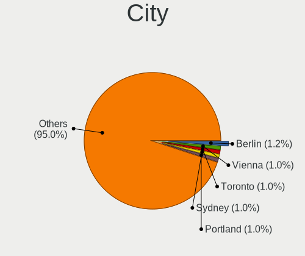
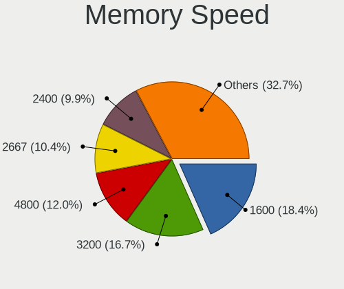

BSD - Hardware Trends (Desktops)
--------------------------------

A project to identify most popular hardware characteristics and track their change
over time based on data collected by BSD users at https://BSD-Hardware.info.

Anyone can contribute to this report by the [hw-probe](https://github.com/linuxhw/hw-probe/blob/master/INSTALL.BSD.md) tool:

    hw-probe -all -upload

This report is for one last month. Overall report since the beginning of time: [TestCoverage](https://github.com/bsdhw/TestCoverage)

Period: Sep, 2022.

Contents
--------

* [ System ](#system)
  - [ OS                       ](#os)
  - [ OS Family                ](#os-family)
  - [ Arch                     ](#arch)
  - [ DE                       ](#de)
  - [ Display Server           ](#display-server)
  - [ Display Manager          ](#display-manager)
  - [ OS Lang                  ](#os-lang)
  - [ Boot Mode                ](#boot-mode)
  - [ Filesystem               ](#filesystem)
  - [ Part. scheme             ](#part-scheme)

* [ Board ](#board)
  - [ Vendor                   ](#vendor)
  - [ Model                    ](#model)
  - [ Model Family             ](#model-family)
  - [ MFG Year                 ](#mfg-year)
  - [ Form Factor              ](#form-factor)
  - [ Coreboot                 ](#coreboot)
  - [ RAM Size                 ](#ram-size)
  - [ RAM Used                 ](#ram-used)
  - [ Total Drives             ](#total-drives)
  - [ Has CD-ROM               ](#has-cd-rom)
  - [ Has Ethernet             ](#has-ethernet)
  - [ Has WiFi                 ](#has-wifi)
  - [ Has Bluetooth            ](#has-bluetooth)

* [ Location ](#location)
  - [ Country                  ](#country)
  - [ City                     ](#city)

* [ Drives ](#drives)
  - [ Drive Vendor             ](#drive-vendor)
  - [ Drive Model              ](#drive-model)
  - [ HDD Vendor               ](#hdd-vendor)
  - [ SSD Vendor               ](#ssd-vendor)
  - [ Drive Kind               ](#drive-kind)
  - [ Drive Connector          ](#drive-connector)
  - [ Drive Size               ](#drive-size)
  - [ Space Total              ](#space-total)
  - [ Space Used               ](#space-used)
  - [ Malfunc. Drives          ](#malfunc-drives)
  - [ Malfunc. Drive Vendor    ](#malfunc-drive-vendor)
  - [ Malfunc. HDD Vendor      ](#malfunc-hdd-vendor)
  - [ Malfunc. Drive Kind      ](#malfunc-drive-kind)
  - [ Failed Drives            ](#failed-drives)
  - [ Failed Drive Vendor      ](#failed-drive-vendor)
  - [ Drive Status             ](#drive-status)

* [ Storage controller ](#storage-controller)
  - [ Storage Vendor           ](#storage-vendor)
  - [ Storage Model            ](#storage-model)
  - [ Storage Kind             ](#storage-kind)

* [ Processor ](#processor)
  - [ CPU Vendor               ](#cpu-vendor)
  - [ CPU Model                ](#cpu-model)
  - [ CPU Model Family         ](#cpu-model-family)
  - [ CPU Cores                ](#cpu-cores)
  - [ CPU Sockets              ](#cpu-sockets)
  - [ CPU Threads              ](#cpu-threads)
  - [ CPU Microarch            ](#cpu-microarch)

* [ Graphics ](#graphics)
  - [ GPU Vendor               ](#gpu-vendor)
  - [ GPU Model                ](#gpu-model)
  - [ GPU Combo                ](#gpu-combo)
  - [ GPU Driver               ](#gpu-driver)
  - [ GPU Memory               ](#gpu-memory)

* [ Monitor ](#monitor)
  - [ Monitor Vendor           ](#monitor-vendor)
  - [ Monitor Model            ](#monitor-model)
  - [ Monitor Resolution       ](#monitor-resolution)
  - [ Monitor Diagonal         ](#monitor-diagonal)
  - [ Monitor Width            ](#monitor-width)
  - [ Aspect Ratio             ](#aspect-ratio)
  - [ Monitor Area             ](#monitor-area)
  - [ Pixel Density            ](#pixel-density)
  - [ Multiple Monitors        ](#multiple-monitors)

* [ Network ](#network)
  - [ Net Controller Vendor    ](#net-controller-vendor)
  - [ Net Controller Model     ](#net-controller-model)
  - [ Wireless Vendor          ](#wireless-vendor)
  - [ Wireless Model           ](#wireless-model)
  - [ Ethernet Vendor          ](#ethernet-vendor)
  - [ Ethernet Model           ](#ethernet-model)
  - [ Net Controller Kind      ](#net-controller-kind)
  - [ Used Controller          ](#used-controller)
  - [ NICs                     ](#nics)
  - [ IPv6                     ](#ipv6)

* [ Bluetooth ](#bluetooth)
  - [ Bluetooth Vendor         ](#bluetooth-vendor)
  - [ Bluetooth Model          ](#bluetooth-model)

* [ Sound ](#sound)
  - [ Sound Vendor             ](#sound-vendor)
  - [ Sound Model              ](#sound-model)

* [ Memory ](#memory)
  - [ Memory Vendor            ](#memory-vendor)
  - [ Memory Model             ](#memory-model)
  - [ Memory Kind              ](#memory-kind)
  - [ Memory Form Factor       ](#memory-form-factor)
  - [ Memory Size              ](#memory-size)
  - [ Memory Speed             ](#memory-speed)

* [ Printers & scanners ](#printers--scanners)
  - [ Printer Vendor           ](#printer-vendor)
  - [ Printer Model            ](#printer-model)
  - [ Scanner Vendor           ](#scanner-vendor)
  - [ Scanner Model            ](#scanner-model)

* [ Camera ](#camera)
  - [ Camera Vendor            ](#camera-vendor)
  - [ Camera Model             ](#camera-model)

* [ Security ](#security)
  - [ Fingerprint Vendor       ](#fingerprint-vendor)
  - [ Fingerprint Model        ](#fingerprint-model)
  - [ Chipcard Vendor          ](#chipcard-vendor)
  - [ Chipcard Model           ](#chipcard-model)

* [ Unsupported ](#unsupported)
  - [ Unsupported Devices      ](#unsupported-devices)
  - [ Unsupported Device Types ](#unsupported-device-types)

System
------

OS
--

Installed operating systems

| Name                      | Desktops | Percent |
|---------------------------|----------|---------|
| OPNsense 22.7.4           | 138      | 56.1%   |
| OPNsense 22.7.3           | 38       | 15.45%  |
| FreeBSD 13.1-p2           | 17       | 6.91%   |
| OPNsense 22.7.2           | 12       | 4.88%   |
| OPNsense 22.1.10          | 8        | 3.25%   |
| helloSystem 0.7.0         | 5        | 2.03%   |
| FreeBSD 13.1              | 4        | 1.63%   |
| OpenBSD 7.1               | 3        | 1.22%   |
| FreeBSD 13.1-p1           | 3        | 1.22%   |
| FreeBSD 12.3-p5           | 3        | 1.22%   |
| OPNsense 22.4.3           | 2        | 0.81%   |
| OPNsense 21.7.8           | 2        | 0.81%   |
| helloSystem 0.8.0         | 2        | 0.81%   |
| FreeBSD 14.0-CURRENT      | 2        | 0.81%   |
| OPNsense 23.1             | 1        | 0.41%   |
| OpenBSD 7.2               | 1        | 0.41%   |
| helloSystem 13.1-p2       | 1        | 0.41%   |
| helloSystem 13.1          | 1        | 0.41%   |
| GhostBSD 22.09.16         | 1        | 0.41%   |
| FreeBSD 13.1-STABLE       | 1        | 0.41%   |
| DragonFly 6.3-DEVELOPMENT | 1        | 0.41%   |

OS Family
---------

OS without a version

| Name        | Desktops | Percent |
|-------------|----------|---------|
| OPNsense    | 201      | 81.71%  |
| FreeBSD     | 30       | 12.2%   |
| helloSystem | 9        | 3.66%   |
| OpenBSD     | 4        | 1.63%   |
| GhostBSD    | 1        | 0.41%   |
| DragonFly   | 1        | 0.41%   |

Arch
----

OS architecture (x86_64, i586, etc.)

| Name  | Desktops | Percent |
|-------|----------|---------|
| amd64 | 244      | 99.19%  |
| arm64 | 1        | 0.41%   |
| arm   | 1        | 0.41%   |

DE
--

Desktop Environment

| Name          | Desktops | Percent |
|---------------|----------|---------|
| Console       | 216      | 87.8%   |
| helloDesktop  | 13       | 5.28%   |
| KDE5          | 5        | 2.03%   |
| XFCE          | 3        | 1.22%   |
| MATE          | 2        | 0.81%   |
| TWM           | 1        | 0.41%   |
| spectrwm      | 1        | 0.41%   |
| plasma        | 1        | 0.41%   |
| LXDE          | 1        | 0.41%   |
| GNOME         | 1        | 0.41%   |
| Enlightenment | 1        | 0.41%   |
| AwesomeWM     | 1        | 0.41%   |

Display Server
--------------

X11 or Wayland

| Name    | Desktops | Percent |
|---------|----------|---------|
| Console | 219      | 89.02%  |
| X11     | 27       | 10.98%  |

Display Manager
---------------

SDDM, LightDM, etc.

| Name    | Desktops | Percent |
|---------|----------|---------|
| Console | 229      | 93.09%  |
| SLiM    | 8        | 3.25%   |
| SDDM    | 6        | 2.44%   |
| LightDM | 2        | 0.81%   |
| XDM     | 1        | 0.41%   |

OS Lang
-------

Language

| Lang    | Desktops | Percent |
|---------|----------|---------|
| Unknown | 210      | 85.37%  |
| C       | 20       | 8.13%   |
| en_US   | 10       | 4.07%   |
| ru_RU   | 3        | 1.22%   |
| zh_CN   | 2        | 0.81%   |
| de_DE   | 1        | 0.41%   |

Boot Mode
---------

EFI or BIOS

| Mode | Desktops | Percent |
|------|----------|---------|
| EFI  | 224      | 91.06%  |
| BIOS | 22       | 8.94%   |

Filesystem
----------

Type of filesystem

| Type    | Desktops | Percent |
|---------|----------|---------|
| Ufs     | 126      | 51.22%  |
| Zfs     | 109      | 44.31%  |
| Cd9660  | 6        | 2.44%   |
| Ffs     | 4        | 1.63%   |
| Hammer2 | 1        | 0.41%   |

Part. scheme
------------

Scheme of partitioning

| Type    | Desktops | Percent |
|---------|----------|---------|
| GPT     | 233      | 94.72%  |
| MBR     | 8        | 3.25%   |
| Unknown | 4        | 1.63%   |
| BSD     | 1        | 0.41%   |

Board
-----

Vendor
------

Motherboard manufacturer

| Name                       | Desktops | Percent |
|----------------------------|----------|---------|
| Unknown                    | 32       | 13.01%  |
| Intel                      | 21       | 8.54%   |
| Dell                       | 18       | 7.32%   |
| Hewlett-Packard            | 17       | 6.91%   |
| ASUSTek Computer           | 17       | 6.91%   |
| ASRock                     | 15       | 6.1%    |
| Gigabyte Technology        | 12       | 4.88%   |
| Supermicro                 | 11       | 4.47%   |
| Protectli                  | 11       | 4.47%   |
| MSI                        | 11       | 4.47%   |
| Techvision                 | 9        | 3.66%   |
| Lenovo                     | 8        | 3.25%   |
| Fujitsu                    | 8        | 3.25%   |
| PC Engines                 | 5        | 2.03%   |
| Deciso                     | 5        | 2.03%   |
| ASRockRack                 | 5        | 2.03%   |
| maiyunda                   | 3        | 1.22%   |
| CncTion                    | 3        | 1.22%   |
| Pegatron                   | 2        | 0.81%   |
| MW                         | 2        | 0.81%   |
| Cisco                      | 2        | 0.81%   |
| Biostar                    | 2        | 0.81%   |
| BESSTAR Tech               | 2        | 0.81%   |
| AZW                        | 2        | 0.81%   |
| AMD                        | 2        | 0.81%   |
| YANYU                      | 1        | 0.41%   |
| Yanling                    | 1        | 0.41%   |
| TYAN Computer              | 1        | 0.41%   |
| ShenZhen MinWin Technology | 1        | 0.41%   |
| NITRINOnet                 | 1        | 0.41%   |
| Maxtang                    | 1        | 0.41%   |
| Jingsha                    | 1        | 0.41%   |
| Intel BOXJ4117             | 1        | 0.41%   |
| iEi                        | 1        | 0.41%   |
| IceWhale Technology        | 1        | 0.41%   |
| Foxconn                    | 1        | 0.41%   |
| EPSON DIRECT               | 1        | 0.41%   |
| ECS                        | 1        | 0.41%   |
| EAGLE EYE NETWORKS         | 1        | 0.41%   |
| Dell EMC                   | 1        | 0.41%   |

Model
-----

Motherboard model

| Name                               | Desktops | Percent |
|------------------------------------|----------|---------|
| Unknown                            | 32       | 13.01%  |
| Techvision TVI7309X                | 9        | 3.66%   |
| Protectli FW4B                     | 9        | 3.66%   |
| Intel Q3XXG4-P V1.0                | 6        | 2.44%   |
| Fujitsu FUTRO S920                 | 5        | 2.03%   |
| PC Engines APU2                    | 4        | 1.63%   |
| maiyunda www.maiyunda.com          | 3        | 1.22%   |
| HP t620 PLUS Quad Core TC          | 3        | 1.22%   |
| HP ProDesk 600 G1 SFF              | 3        | 1.22%   |
| Dell OptiPlex 3010                 | 3        | 1.22%   |
| Deciso Netboard A10 V2             | 3        | 1.22%   |
| ASUS M5A78L-M/USB3                 | 3        | 1.22%   |
| Supermicro X9SCL/X9SCM             | 2        | 0.81%   |
| Supermicro PIO-518D-N6TRF-ST031    | 2        | 0.81%   |
| MW GMLK-2_5G4L                     | 2        | 0.81%   |
| MSI MS-7817                        | 2        | 0.81%   |
| MSI MS-7721                        | 2        | 0.81%   |
| Intel MAHOBAY                      | 2        | 0.81%   |
| Dell OptiPlex 3020                 | 2        | 0.81%   |
| Deciso Netboard A10 GEN2 Model G   | 2        | 0.81%   |
| CncTion N5105-4L                   | 2        | 0.81%   |
| Cisco SALEEN                       | 2        | 0.81%   |
| AZW Green G1                       | 2        | 0.81%   |
| ASUS Rampage II Extreme            | 2        | 0.81%   |
| ASUS All Series                    | 2        | 0.81%   |
| ASRockRack 520001                  | 2        | 0.81%   |
| ASRock X570 Phantom Gaming 4       | 2        | 0.81%   |
| YANYU H67SL                        | 1        | 0.41%   |
| Yanling YL-KBR6L                   | 1        | 0.41%   |
| TYAN 1X8-X6 CACHEH                 | 1        | 0.41%   |
| Supermicro X9SCI/X9SCA             | 1        | 0.41%   |
| Supermicro X7DB8                   | 1        | 0.41%   |
| Supermicro SYS-E300-9A             | 1        | 0.41%   |
| Supermicro SYS-E200-9B             | 1        | 0.41%   |
| Supermicro SYS-5019D-FN8TP-2-NC041 | 1        | 0.41%   |
| Supermicro SYS-5019A-FTN4          | 1        | 0.41%   |
| Supermicro AS -5019D-FTN4          | 1        | 0.41%   |
| ShenZhen MinWin MW-GMLK-2.5G6L     | 1        | 0.41%   |
| Protectli VP2410                   | 1        | 0.41%   |
| Protectli FW6                      | 1        | 0.41%   |

Model Family
------------

Motherboard model prefix

| Name                            | Desktops | Percent |
|---------------------------------|----------|---------|
| Unknown                         | 32       | 13.01%  |
| Dell OptiPlex                   | 14       | 5.69%   |
| Techvision TVI7309X             | 9        | 3.66%   |
| Protectli FW4B                  | 9        | 3.66%   |
| Fujitsu FUTRO                   | 7        | 2.85%   |
| Lenovo ThinkCentre              | 6        | 2.44%   |
| Intel Q3XXG4-P                  | 6        | 2.44%   |
| HP ProDesk                      | 5        | 2.03%   |
| Deciso Netboard                 | 5        | 2.03%   |
| PC Engines APU2                 | 4        | 1.63%   |
| ASUS PRIME                      | 4        | 1.63%   |
| maiyunda www.maiyunda.com       | 3        | 1.22%   |
| HP t620                         | 3        | 1.22%   |
| HP Compaq                       | 3        | 1.22%   |
| Dell Inspiron                   | 3        | 1.22%   |
| ASUS M5A78L-M                   | 3        | 1.22%   |
| Supermicro X9SCL                | 2        | 0.81%   |
| Supermicro PIO-518D-N6TRF-ST031 | 2        | 0.81%   |
| MW GMLK-2                       | 2        | 0.81%   |
| MSI MS-7817                     | 2        | 0.81%   |
| MSI MS-7721                     | 2        | 0.81%   |
| Intel MAHOBAY                   | 2        | 0.81%   |
| HP ProLiant                     | 2        | 0.81%   |
| HP EliteDesk                    | 2        | 0.81%   |
| Gigabyte X570                   | 2        | 0.81%   |
| CncTion N5105-4L                | 2        | 0.81%   |
| Cisco SALEEN                    | 2        | 0.81%   |
| AZW Green                       | 2        | 0.81%   |
| ASUS Rampage                    | 2        | 0.81%   |
| ASUS All                        | 2        | 0.81%   |
| ASRockRack 520001               | 2        | 0.81%   |
| ASRock Z97                      | 2        | 0.81%   |
| ASRock X570                     | 2        | 0.81%   |
| YANYU H67SL                     | 1        | 0.41%   |
| Yanling YL-KBR6L                | 1        | 0.41%   |
| TYAN 1X8-X6                     | 1        | 0.41%   |
| Supermicro X9SCI                | 1        | 0.41%   |
| Supermicro X7DB8                | 1        | 0.41%   |
| Supermicro SYS-E300-9A          | 1        | 0.41%   |
| Supermicro SYS-E200-9B          | 1        | 0.41%   |

MFG Year
--------

Motherboard manufacture year

| Year    | Desktops | Percent |
|---------|----------|---------|
| 2022    | 36       | 14.63%  |
| 2021    | 26       | 10.57%  |
| 2019    | 26       | 10.57%  |
| 2018    | 24       | 9.76%   |
| 2014    | 23       | 9.35%   |
| 2013    | 20       | 8.13%   |
| 2016    | 18       | 7.32%   |
| 2020    | 15       | 6.1%    |
| 2017    | 15       | 6.1%    |
| 2010    | 10       | 4.07%   |
| 2015    | 9        | 3.66%   |
| 2012    | 9        | 3.66%   |
| 2011    | 8        | 3.25%   |
| 2008    | 4        | 1.63%   |
| 2009    | 2        | 0.81%   |
| Unknown | 1        | 0.41%   |

Form Factor
-----------

Physical design of the computer

| Name    | Desktops | Percent |
|---------|----------|---------|
| Desktop | 246      | 100%    |

Coreboot
--------

Have coreboot on board

| Used | Desktops | Percent |
|------|----------|---------|
| No   | 231      | 93.9%   |
| Yes  | 15       | 6.1%    |

RAM Size
--------

Total RAM memory

| Size in GB  | Desktops | Percent |
|-------------|----------|---------|
| 8.01-16.0   | 100      | 40.65%  |
| 16.01-24.0  | 57       | 23.17%  |
| 4.01-8.0    | 47       | 19.11%  |
| 32.01-64.0  | 23       | 9.35%   |
| 64.01-256.0 | 9        | 3.66%   |
| 2.01-3.0    | 5        | 2.03%   |
| 24.01-32.0  | 3        | 1.22%   |
| 0.51-1.0    | 1        | 0.41%   |
| 0.01-0.5    | 1        | 0.41%   |

RAM Used
--------

Used RAM memory

| Used GB  | Desktops | Percent |
|----------|----------|---------|
| 0.01-0.5 | 122      | 49.59%  |
| 0.51-1.0 | 84       | 34.15%  |
| 1.01-2.0 | 29       | 11.79%  |
| 3.01-4.0 | 6        | 2.44%   |
| 4.01-8.0 | 3        | 1.22%   |
| 2.01-3.0 | 1        | 0.41%   |
| 0        | 1        | 0.41%   |

Total Drives
------------

Number of drives on board

| Drives | Desktops | Percent |
|--------|----------|---------|
| 1      | 183      | 74.39%  |
| 2      | 23       | 9.35%   |
| 0      | 20       | 8.13%   |
| 3      | 8        | 3.25%   |
| 4      | 7        | 2.85%   |
| 5      | 3        | 1.22%   |
| 13     | 1        | 0.41%   |
| 6      | 1        | 0.41%   |

Has CD-ROM
----------

Has CD-ROM on board

| Presented | Desktops | Percent |
|-----------|----------|---------|
| No        | 215      | 87.4%   |
| Yes       | 31       | 12.6%   |

Has Ethernet
------------

Has Ethernet on board

| Presented | Desktops | Percent |
|-----------|----------|---------|
| Yes       | 244      | 99.19%  |
| No        | 2        | 0.81%   |

Has WiFi
--------

Has WiFi module

| Presented | Desktops | Percent |
|-----------|----------|---------|
| No        | 201      | 81.71%  |
| Yes       | 45       | 18.29%  |

Has Bluetooth
-------------

Has Bluetooth module

| Presented | Desktops | Percent |
|-----------|----------|---------|
| No        | 218      | 88.62%  |
| Yes       | 28       | 11.38%  |

Location
--------

Country
-------

Geographic location (country)

| Country      | Desktops | Percent |
|--------------|----------|---------|
| USA          | 67       | 27.24%  |
| Germany      | 40       | 16.26%  |
| France       | 10       | 4.07%   |
| Russia       | 8        | 3.25%   |
| Canada       | 8        | 3.25%   |
| Brazil       | 8        | 3.25%   |
| Australia    | 8        | 3.25%   |
| UK           | 7        | 2.85%   |
| Poland       | 7        | 2.85%   |
| Italy        | 7        | 2.85%   |
| China        | 7        | 2.85%   |
| Netherlands  | 6        | 2.44%   |
| Austria      | 6        | 2.44%   |
| Switzerland  | 5        | 2.03%   |
| Spain        | 5        | 2.03%   |
| Indonesia    | 5        | 2.03%   |
| Israel       | 3        | 1.22%   |
| India        | 3        | 1.22%   |
| Vietnam      | 2        | 0.81%   |
| Thailand     | 2        | 0.81%   |
| South Korea  | 2        | 0.81%   |
| Portugal     | 2        | 0.81%   |
| Philippines  | 2        | 0.81%   |
| Norway       | 2        | 0.81%   |
| Greece       | 2        | 0.81%   |
| Finland      | 2        | 0.81%   |
| Denmark      | 2        | 0.81%   |
| UAE          | 1        | 0.41%   |
| Turkey       | 1        | 0.41%   |
| South Africa | 1        | 0.41%   |
| Slovenia     | 1        | 0.41%   |
| Romania      | 1        | 0.41%   |
| New Zealand  | 1        | 0.41%   |
| Moldova      | 1        | 0.41%   |
| Malaysia     | 1        | 0.41%   |
| Lithuania    | 1        | 0.41%   |
| Japan        | 1        | 0.41%   |
| Isle of Man  | 1        | 0.41%   |
| Hong Kong    | 1        | 0.41%   |
| Estonia      | 1        | 0.41%   |

City
----

Geographic location (city)

| City                 | Desktops | Percent |
|----------------------|----------|---------|
| Melbourne            | 4        | 1.63%   |
| Frankfurt am Main    | 4        | 1.63%   |
| Jakarta              | 3        | 1.22%   |
| Zurich               | 2        | 0.81%   |
| Tel Aviv             | 2        | 0.81%   |
| Sydney               | 2        | 0.81%   |
| Sao José dos Campos | 2        | 0.81%   |
| San Antonio          | 2        | 0.81%   |
| Salem                | 2        | 0.81%   |
| Redmond              | 2        | 0.81%   |
| Orenburg             | 2        | 0.81%   |
| Munich               | 2        | 0.81%   |
| Mountain View        | 2        | 0.81%   |
| Moscow               | 2        | 0.81%   |
| Madrid               | 2        | 0.81%   |
| Lodz                 | 2        | 0.81%   |
| Krasnodar            | 2        | 0.81%   |
| Kassel               | 2        | 0.81%   |
| Ho Chi Minh City     | 2        | 0.81%   |
| Hamburg              | 2        | 0.81%   |
| Fort Worth           | 2        | 0.81%   |
| Chengdu              | 2        | 0.81%   |
| Blitar               | 2        | 0.81%   |
| Berlin               | 2        | 0.81%   |
| Austin               | 2        | 0.81%   |
| Atlanta              | 2        | 0.81%   |
| Ancona               | 2        | 0.81%   |
| Unknown              | 2        | 0.81%   |
| Yehud                | 1        | 0.41%   |
| Xiamen               | 1        | 0.41%   |
| Xi'an                | 1        | 0.41%   |
| Wuhan                | 1        | 0.41%   |
| Woodstock            | 1        | 0.41%   |
| Winter Park          | 1        | 0.41%   |
| Wenatchee            | 1        | 0.41%   |
| Wembley              | 1        | 0.41%   |
| Wels                 | 1        | 0.41%   |
| Watsonville          | 1        | 0.41%   |
| Waterloo             | 1        | 0.41%   |
| Warminster           | 1        | 0.41%   |

Drives
------

Drive Vendor
------------

Hard drive vendors

| Vendor              | Desktops | Drives | Percent |
|---------------------|----------|--------|---------|
| Samsung Electronics | 39       | 50     | 14.61%  |
| WDC                 | 25       | 42     | 9.36%   |
| Seagate             | 24       | 26     | 8.99%   |
| Kingston            | 20       | 23     | 7.49%   |
| Transcend           | 16       | 16     | 5.99%   |
| SanDisk             | 11       | 11     | 4.12%   |
| Intel               | 10       | 11     | 3.75%   |
| Hoodisk             | 9        | 9      | 3.37%   |
| Crucial             | 9        | 10     | 3.37%   |
| Silicon Motion      | 8        | 8      | 3%      |
| China               | 7        | 7      | 2.62%   |
| Toshiba             | 6        | 6      | 2.25%   |
| PNY                 | 6        | 8      | 2.25%   |
| HGST                | 6        | 11     | 2.25%   |
| A-DATA Technology   | 6        | 7      | 2.25%   |
| Innodisk            | 5        | 5      | 1.87%   |
| Protectli           | 4        | 4      | 1.5%    |
| Patriot             | 4        | 4      | 1.5%    |
| Hitachi             | 4        | 4      | 1.5%    |
| Phison              | 3        | 3      | 1.12%   |
| KIOXIA              | 3        | 3      | 1.12%   |
| Apacer              | 3        | 3      | 1.12%   |
| SPCC                | 2        | 2      | 0.75%   |
| SK hynix            | 2        | 2      | 0.75%   |
| Plextor             | 2        | 2      | 0.75%   |
| OCZ                 | 2        | 2      | 0.75%   |
| NVMe                | 2        | 3      | 0.75%   |
| Maxtor              | 2        | 2      | 0.75%   |
| GOODRAM             | 2        | 2      | 0.75%   |
| Gigabyte Technology | 2        | 2      | 0.75%   |
| FORESEE             | 2        | 2      | 0.75%   |
| XrayDisk            | 1        | 1      | 0.37%   |
| Wicgtyp             | 1        | 1      | 0.37%   |
| WD MediaMax         | 1        | 1      | 0.37%   |
| Verbatim            | 1        | 1      | 0.37%   |
| Vaseky              | 1        | 1      | 0.37%   |
| V-GeN               | 1        | 1      | 0.37%   |
| ShiJi               | 1        | 1      | 0.37%   |
| SATADOM             | 1        | 1      | 0.37%   |
| Netac               | 1        | 1      | 0.37%   |

Drive Model
-----------

Hard drive models

| Model                              | Desktops | Percent |
|------------------------------------|----------|---------|
| Transcend TS128GMSA370 128GB       | 5        | 1.73%   |
| Samsung SSD 970 EVO Plus 500GB     | 5        | 1.73%   |
| Kingston SA400S37240G 240GB        | 5        | 1.73%   |
| Seagate ST500DM002-1BD142 500GB    | 4        | 1.38%   |
| Hoodisk SSD 128GB                  | 4        | 1.38%   |
| Transcend TS128GMSA230S 128GB      | 3        | 1.04%   |
| PNY CS900 120GB SSD                | 3        | 1.04%   |
| Phison Sabrent 256GB               | 3        | 1.04%   |
| Kingston SUV500MS120G 120GB        | 3        | 1.04%   |
| Silicon Motion Fanxiang S500 128GB | 2        | 0.69%   |
| Silicon Motion 128GB               | 2        | 0.69%   |
| Seagate ST500LT012-1DG142 500GB    | 2        | 0.69%   |
| Seagate ST4000DM000-1F2168 4TB     | 2        | 0.69%   |
| Seagate ST1000DM010-2EP102 1TB     | 2        | 0.69%   |
| SanDisk SSD PLUS 240GB             | 2        | 0.69%   |
| SanDisk SSD PLUS 120GB             | 2        | 0.69%   |
| SanDisk SDSSDA240G 240GB           | 2        | 0.69%   |
| SanDisk SDSSDA120G 120GB           | 2        | 0.69%   |
| Samsung SSD 980 500GB              | 2        | 0.69%   |
| Samsung SSD 980 1TB                | 2        | 0.69%   |
| Samsung SSD 870 EVO 250GB          | 2        | 0.69%   |
| Samsung SSD 860 EVO mSATA 250GB    | 2        | 0.69%   |
| Samsung SSD 860 EVO 250GB          | 2        | 0.69%   |
| Samsung SSD 850 EVO 500GB          | 2        | 0.69%   |
| Kingston OM8PDP3512B-A01 512GB     | 2        | 0.69%   |
| Intel SSDSC2KG240G8 240GB          | 2        | 0.69%   |
| Intel MEMPEK1W032GA 32GB           | 2        | 0.69%   |
| Innodisk DEMSR- 16GB mSATA 3ME3    | 2        | 0.69%   |
| Hoodisk SSD 32GB                   | 2        | 0.69%   |
| HGST HUS722T1TALA604 1TB           | 2        | 0.69%   |
| China NGFF 2280 128GB SSD          | 2        | 0.69%   |
| A-DATA SU650 240GB                 | 2        | 0.69%   |
| XrayDisk SSD 240GB                 | 1        | 0.35%   |
| Wicgtyp M900-128 128GB             | 1        | 0.35%   |
| WDC WDS500G3X0C-00SJG0 500GB       | 1        | 0.35%   |
| WDC WDS250G2X0C-00L350 250GB       | 1        | 0.35%   |
| WDC WDS240G2G0C-00AJM0 240GB       | 1        | 0.35%   |
| WDC WDS240G2G0B-00EPW0 240GB       | 1        | 0.35%   |
| WDC WDS100T3X0C-00SJG0 1TB         | 1        | 0.35%   |
| WDC WDS100T1X0E-00AFY0 1TB         | 1        | 0.35%   |

HDD Vendor
----------

Hard disk drive vendors

| Vendor              | Desktops | Drives | Percent |
|---------------------|----------|--------|---------|
| Seagate             | 24       | 26     | 36.92%  |
| WDC                 | 16       | 32     | 24.62%  |
| HGST                | 6        | 11     | 9.23%   |
| Toshiba             | 5        | 5      | 7.69%   |
| Samsung Electronics | 4        | 5      | 6.15%   |
| Hitachi             | 4        | 4      | 6.15%   |
| NVMe                | 2        | 3      | 3.08%   |
| Maxtor              | 2        | 2      | 3.08%   |
| WD MediaMax         | 1        | 1      | 1.54%   |
| Hewlett-Packard     | 1        | 5      | 1.54%   |

SSD Vendor
----------

Solid state drive vendors

| Vendor              | Desktops | Drives | Percent |
|---------------------|----------|--------|---------|
| Samsung Electronics | 22       | 25     | 14.1%   |
| Kingston            | 17       | 20     | 10.9%   |
| Transcend           | 16       | 16     | 10.26%  |
| SanDisk             | 11       | 11     | 7.05%   |
| Hoodisk             | 9        | 9      | 5.77%   |
| Intel               | 8        | 9      | 5.13%   |
| Crucial             | 8        | 9      | 5.13%   |
| China               | 7        | 7      | 4.49%   |
| PNY                 | 6        | 8      | 3.85%   |
| A-DATA Technology   | 6        | 7      | 3.85%   |
| Innodisk            | 5        | 5      | 3.21%   |
| Protectli           | 4        | 4      | 2.56%   |
| Patriot             | 3        | 3      | 1.92%   |
| Apacer              | 3        | 3      | 1.92%   |
| SPCC                | 2        | 2      | 1.28%   |
| OCZ                 | 2        | 2      | 1.28%   |
| GOODRAM             | 2        | 2      | 1.28%   |
| Gigabyte Technology | 2        | 2      | 1.28%   |
| FORESEE             | 2        | 2      | 1.28%   |
| XrayDisk            | 1        | 1      | 0.64%   |
| Wicgtyp             | 1        | 1      | 0.64%   |
| WDC                 | 1        | 1      | 0.64%   |
| Verbatim            | 1        | 1      | 0.64%   |
| Vaseky              | 1        | 1      | 0.64%   |
| V-GeN               | 1        | 1      | 0.64%   |
| Toshiba             | 1        | 1      | 0.64%   |
| SK hynix            | 1        | 1      | 0.64%   |
| ShiJi               | 1        | 1      | 0.64%   |
| SATADOM             | 1        | 1      | 0.64%   |
| Plextor             | 1        | 1      | 0.64%   |
| Netac               | 1        | 1      | 0.64%   |
| Mushkin             | 1        | 1      | 0.64%   |
| Lenovo              | 1        | 1      | 0.64%   |
| KingDian            | 1        | 1      | 0.64%   |
| Intenso             | 1        | 1      | 0.64%   |
| Indilinx            | 1        | 1      | 0.64%   |
| Dogfish             | 1        | 1      | 0.64%   |
| CWDISK              | 1        | 1      | 0.64%   |
| BIWIN               | 1        | 1      | 0.64%   |
| BAITITON            | 1        | 1      | 0.64%   |

Drive Kind
----------

HDD or SSD

| Kind | Desktops | Drives | Percent |
|------|----------|--------|---------|
| SSD  | 149      | 167    | 58.43%  |
| HDD  | 55       | 94     | 21.57%  |
| NVMe | 51       | 54     | 20%     |

Drive Connector
---------------

SATA, SAS, NVMe, etc.

| Type | Desktops | Drives | Percent |
|------|----------|--------|---------|
| SATA | 190      | 261    | 78.84%  |
| NVMe | 51       | 54     | 21.16%  |

Drive Size
----------

Size of hard drive

| Size in TB | Desktops | Drives | Percent |
|------------|----------|--------|---------|
| 0.01-0.5   | 167      | 192    | 81.07%  |
| 0.51-1.0   | 21       | 29     | 10.19%  |
| 1.01-2.0   | 6        | 12     | 2.91%   |
| 4.01-10.0  | 6        | 20     | 2.91%   |
| 3.01-4.0   | 4        | 5      | 1.94%   |
| 2.01-3.0   | 1        | 1      | 0.49%   |
| 10.01-20.0 | 1        | 2      | 0.49%   |

Space Total
-----------

Amount of disk space available on the file system

| Size in GB     | Desktops | Percent |
|----------------|----------|---------|
| 101-250        | 112      | 45.53%  |
| 251-500        | 42       | 17.07%  |
| 51-100         | 26       | 10.57%  |
| 1-20           | 24       | 9.76%   |
| 21-50          | 21       | 8.54%   |
| 501-1000       | 14       | 5.69%   |
| 1001-2000      | 4        | 1.63%   |
| More than 3000 | 1        | 0.41%   |
| 2001-3000      | 1        | 0.41%   |
| Unknown        | 1        | 0.41%   |

Space Used
----------

Amount of used disk space

| Used GB        | Desktops | Percent |
|----------------|----------|---------|
| 1-20           | 222      | 90.24%  |
| 21-50          | 13       | 5.28%   |
| 51-100         | 6        | 2.44%   |
| More than 3000 | 1        | 0.41%   |
| 251-500        | 1        | 0.41%   |
| 101-250        | 1        | 0.41%   |
| 501-1000       | 1        | 0.41%   |
| Unknown        | 1        | 0.41%   |

Malfunc. Drives
---------------

Drive models with a malfunction

| Model                                 | Desktops | Drives | Percent |
|---------------------------------------|----------|--------|---------|
| Seagate ST500DM002-1BD142 500GB       | 2        | 2      | 5.71%   |
| XrayDisk SSD 240GB                    | 1        | 1      | 2.86%   |
| WDC WD6400AAKS-22A7B2 640GB           | 1        | 1      | 2.86%   |
| WDC WD6400AAKS-22A7B0 640GB           | 1        | 1      | 2.86%   |
| WDC WD6002FRYZ-01WD5B1 6TB            | 1        | 1      | 2.86%   |
| WDC WD1600AAJS-08L7A0 160GB           | 1        | 1      | 2.86%   |
| WDC WD10EJRX-89N74Y0 1TB              | 1        | 1      | 2.86%   |
| Toshiba THNSNK256GCS8 SATA 256GB      | 1        | 1      | 2.86%   |
| Toshiba MQ01UBD100 1TB                | 1        | 1      | 2.86%   |
| SK hynix SC308 SATA 128GB             | 1        | 1      | 2.86%   |
| Seagate ST9500420ASG 500GB            | 1        | 1      | 2.86%   |
| Seagate ST3750330NS 752GB             | 1        | 1      | 2.86%   |
| Seagate ST3500413AS 500GB             | 1        | 1      | 2.86%   |
| Seagate ST3160318AS 160GB             | 1        | 1      | 2.86%   |
| Seagate ST31000520AS 1TB              | 1        | 1      | 2.86%   |
| Samsung Electronics SSD 970 EVO 500GB | 1        | 1      | 2.86%   |
| Samsung Electronics SSD 870 EVO 250GB | 1        | 1      | 2.86%   |
| Samsung Electronics HD204UI 2TB       | 1        | 1      | 2.86%   |
| Samsung Electronics HD103SJ 1TB       | 1        | 1      | 2.86%   |
| OCZ AGILITY2 64GB                     | 1        | 1      | 2.86%   |
| Maxtor STM380815AS 80GB               | 1        | 1      | 2.86%   |
| Maxtor STM3250820AS 250GB             | 1        | 1      | 2.86%   |
| Kingston SV300S37A60G 64GB            | 1        | 1      | 2.86%   |
| Kingston SV300S37A120G 120GB          | 1        | 1      | 2.86%   |
| KingDian S100 32GB                    | 1        | 1      | 2.86%   |
| Intel SSDSC2BW240A4 240GB             | 1        | 1      | 2.86%   |
| Intel SSDSA2M160G2GC 160GB            | 1        | 1      | 2.86%   |
| Hitachi HTS541680J9SA00 80GB          | 1        | 1      | 2.86%   |
| Hitachi HDT722516DLAT80 164GB         | 1        | 1      | 2.86%   |
| HGST HTS725050A7E630 500GB            | 1        | 1      | 2.86%   |
| HGST HTS541075A9E680 752GB            | 1        | 1      | 2.86%   |
| Crucial M4-CT064M4SSD2 64GB           | 1        | 1      | 2.86%   |
| Apacer 16GB SATA Flash Drive          | 1        | 1      | 2.86%   |
| A-DATA Technology SSD S510 120GB      | 1        | 1      | 2.86%   |

Malfunc. Drive Vendor
---------------------

Vendors of faulty drives

| Vendor              | Desktops | Drives | Percent |
|---------------------|----------|--------|---------|
| Seagate             | 7        | 7      | 20%     |
| WDC                 | 5        | 5      | 14.29%  |
| Samsung Electronics | 4        | 4      | 11.43%  |
| Toshiba             | 2        | 2      | 5.71%   |
| Maxtor              | 2        | 2      | 5.71%   |
| Kingston            | 2        | 2      | 5.71%   |
| Intel               | 2        | 2      | 5.71%   |
| Hitachi             | 2        | 2      | 5.71%   |
| HGST                | 2        | 2      | 5.71%   |
| XrayDisk            | 1        | 1      | 2.86%   |
| SK hynix            | 1        | 1      | 2.86%   |
| OCZ                 | 1        | 1      | 2.86%   |
| KingDian            | 1        | 1      | 2.86%   |
| Crucial             | 1        | 1      | 2.86%   |
| Apacer              | 1        | 1      | 2.86%   |
| A-DATA Technology   | 1        | 1      | 2.86%   |

Malfunc. HDD Vendor
-------------------

Vendors of faulty HDD drives

| Vendor              | Desktops | Drives | Percent |
|---------------------|----------|--------|---------|
| Seagate             | 7        | 7      | 33.33%  |
| WDC                 | 5        | 5      | 23.81%  |
| Samsung Electronics | 2        | 2      | 9.52%   |
| Maxtor              | 2        | 2      | 9.52%   |
| Hitachi             | 2        | 2      | 9.52%   |
| HGST                | 2        | 2      | 9.52%   |
| Toshiba             | 1        | 1      | 4.76%   |

Malfunc. Drive Kind
-------------------

Kinds of faulty drives

| Kind | Desktops | Drives | Percent |
|------|----------|--------|---------|
| HDD  | 21       | 21     | 60%     |
| SSD  | 13       | 13     | 37.14%  |
| NVMe | 1        | 1      | 2.86%   |

Failed Drives
-------------

Failed drive models

Zero info for selected period =(

Failed Drive Vendor
-------------------

Failed drive vendors

Zero info for selected period =(

Drive Status
------------

Number of failed and malfunc. drives

| Status   | Desktops | Drives | Percent |
|----------|----------|--------|---------|
| Works    | 197      | 268    | 82.77%  |
| Malfunc  | 33       | 35     | 13.87%  |
| Detected | 8        | 12     | 3.36%   |

Storage controller
------------------

Storage Vendor
--------------

Storage controller vendors

| Vendor                       | Desktops | Percent |
|------------------------------|----------|---------|
| Intel                        | 184      | 58.6%   |
| AMD                          | 57       | 18.15%  |
| Samsung Electronics          | 17       | 5.41%   |
| SanDisk                      | 13       | 4.14%   |
| Silicon Motion               | 8        | 2.55%   |
| Phison Electronics           | 4        | 1.27%   |
| Broadcom / LSI               | 4        | 1.27%   |
| ASMedia Technology           | 4        | 1.27%   |
| KIOXIA                       | 3        | 0.96%   |
| Kingston Technology Company  | 3        | 0.96%   |
| Nvidia                       | 2        | 0.64%   |
| Micron/Crucial Technology    | 2        | 0.64%   |
| JMicron Technology           | 2        | 0.64%   |
| Chelsio Communications       | 2        | 0.64%   |
| Toshiba                      | 1        | 0.32%   |
| SK hynix                     | 1        | 0.32%   |
| Shenzhen Longsys Electronics | 1        | 0.32%   |
| Seagate Technology           | 1        | 0.32%   |
| MAXIO Technology (Hangzhou)  | 1        | 0.32%   |
| Marvell Technology Group     | 1        | 0.32%   |
| Lite-On Technology           | 1        | 0.32%   |
| Hewlett-Packard              | 1        | 0.32%   |
| 3ware                        | 1        | 0.32%   |

Storage Model
-------------

Storage controller models

| Model                                                                            | Desktops | Percent |
|----------------------------------------------------------------------------------|----------|---------|
| AMD FCH SATA Controller [AHCI mode]                                              | 44       | 12.61%  |
| Intel 8 Series/C220 Series Chipset Family 6-port SATA Controller 1 [AHCI mode]   | 26       | 7.45%   |
| Intel Jasper Lake SATA AHCI Controller                                           | 20       | 5.73%   |
| Intel 6 Series/C200 Series Chipset Family 6 port Desktop SATA AHCI Controller    | 16       | 4.58%   |
| Intel Celeron/Pentium Silver Processor SATA Controller                           | 15       | 4.3%    |
| Intel Atom/Celeron/Pentium Processor x5-E8000/J3xxx/N3xxx Series SATA Controller | 15       | 4.3%    |
| Samsung NVMe SSD Controller SM981/PM981/PM983                                    | 9        | 2.58%   |
| Silicon Motion SM2263EN/SM2263XT SSD Controller                                  | 8        | 2.29%   |
| AMD SB7x0/SB8x0/SB9x0 SATA Controller [AHCI mode]                                | 8        | 2.29%   |
| Intel Atom Processor E3800 Series SATA AHCI Controller                           | 7        | 2.01%   |
| AMD 400 Series Chipset SATA Controller                                           | 7        | 2.01%   |
| Samsung NVMe SSD Controller 980                                                  | 5        | 1.43%   |
| Intel Q170/Q150/B150/H170/H110/Z170/CM236 Chipset SATA Controller [AHCI Mode]    | 5        | 1.43%   |
| Intel NM10/ICH7 Family SATA Controller [IDE mode]                                | 5        | 1.43%   |
| Intel Comet Lake SATA AHCI Controller                                            | 5        | 1.43%   |
| Intel Cannon Lake PCH SATA AHCI Controller                                       | 5        | 1.43%   |
| Intel Atom Processor C3000 Series SATA Controller 1                              | 5        | 1.43%   |
| Intel Atom Processor C3000 Series SATA Controller 0                              | 5        | 1.43%   |
| Intel 8 Series SATA Controller 1 [AHCI mode]                                     | 5        | 1.43%   |
| Intel 200 Series PCH SATA controller [AHCI mode]                                 | 5        | 1.43%   |
| AMD SB7x0/SB8x0/SB9x0 IDE Controller                                             | 5        | 1.43%   |
| SanDisk WD Black SN750 / PC SN730 NVMe SSD                                       | 4        | 1.15%   |
| Intel Sunrise Point-LP SATA Controller [AHCI mode]                               | 4        | 1.15%   |
| Intel 82801JI (ICH10 Family) SATA AHCI Controller                                | 4        | 1.15%   |
| Intel 82801G (ICH7 Family) IDE Controller                                        | 4        | 1.15%   |
| ASMedia ASM1062 Serial ATA Controller                                            | 4        | 1.15%   |
| SanDisk WD Blue SN570 NVMe SSD                                                   | 3        | 0.86%   |
| Phison E12 NVMe Controller                                                       | 3        | 0.86%   |
| Intel Wildcat Point-LP SATA Controller [AHCI Mode]                               | 3        | 0.86%   |
| Intel 400 Series Chipset Family SATA AHCI Controller                             | 3        | 0.86%   |
| Broadcom / LSI SAS2008 PCI-Express Fusion-MPT SAS-2 [Falcon]                     | 3        | 0.86%   |
| AMD 500 Series Chipset SATA Controller                                           | 3        | 0.86%   |
| Unknown                                                                          | 3        | 0.86%   |
| SanDisk WD Blue SN550 NVMe SSD                                                   | 2        | 0.57%   |
| SanDisk unknown                                                                  | 2        | 0.57%   |
| Samsung NVMe SSD Controller PM9A1/PM9A3/980PRO                                   | 2        | 0.57%   |
| KIOXIA NVMe SSD Controller BG4                                                   | 2        | 0.57%   |
| Kingston Company OM3PDP3 NVMe SSD                                                | 2        | 0.57%   |
| JMicron JMB363 SATA/IDE Controller                                               | 2        | 0.57%   |
| Intel Tiger Lake-LP SATA Controller                                              | 2        | 0.57%   |

Storage Kind
------------

Kind of storage controller (IDE, SATA, NVMe, SAS, ...)

| Kind | Desktops | Percent |
|------|----------|---------|
| SATA | 223      | 69.47%  |
| NVMe | 57       | 17.76%  |
| IDE  | 27       | 8.41%   |
| RAID | 10       | 3.12%   |
| SCSI | 3        | 0.93%   |
| SAS  | 1        | 0.31%   |

Processor
---------

CPU Vendor
----------

Processor vendors

| Vendor | Desktops | Percent |
|--------|----------|---------|
| Intel  | 185      | 75.2%   |
| AMD    | 59       | 23.98%  |
| ARM    | 2        | 0.81%   |

CPU Model
---------

Processor models

| Model                                       | Desktops | Percent |
|---------------------------------------------|----------|---------|
| Intel Celeron N5105 @ 2.00GHz               | 20       | 8.13%   |
| Intel Celeron J4125 CPU @ 2.00GHz           | 12       | 4.88%   |
| Intel Celeron CPU J3160 @ 1.60GHz           | 10       | 4.07%   |
| Intel Core i5-4570 CPU @ 3.20GHz            | 5        | 2.03%   |
| AMD GX-420MC SOC                            | 5        | 2.03%   |
| Intel Celeron CPU J1900 @ 1.99GHz           | 4        | 1.63%   |
| AMD GX-415GA SOC with Radeon HD Graphics    | 4        | 1.63%   |
| AMD GX-412TC SOC                            | 4        | 1.63%   |
| Intel Xeon CPU E3-1275 V2 @ 3.50GHz         | 3        | 1.22%   |
| AMD Ryzen 9 3900X 12-Core Processor         | 3        | 1.22%   |
| AMD GX-420CA SOC with Radeon HD Graphics    | 3        | 1.22%   |
| Intel Xeon CPU E31260L @ 2.40GHz            | 2        | 0.81%   |
| Intel Xeon CPU E3-1270 v3 @ 3.50GHz         | 2        | 0.81%   |
| Intel Pentium Dual-Core CPU E5200 @ 2.50GHz | 2        | 0.81%   |
| Intel Pentium CPU N3700 @ 1.60GHz           | 2        | 0.81%   |
| Intel Core i7-7700 CPU @ 3.60GHz            | 2        | 0.81%   |
| Intel Core i7-4770 CPU @ 3.40GHz            | 2        | 0.81%   |
| Intel Core i5-9500 CPU @ 3.00GHz            | 2        | 0.81%   |
| Intel Core i5-8250U CPU @ 1.60GHz           | 2        | 0.81%   |
| Intel Core i5-3470S CPU @ 2.90GHz           | 2        | 0.81%   |
| Intel Core i5-3470 CPU @ 3.20GHz            | 2        | 0.81%   |
| Intel Core i5-2400S CPU @ 2.50GHz           | 2        | 0.81%   |
| Intel Core i5-2400 CPU @ 3.10GHz            | 2        | 0.81%   |
| Intel Core i3-4160 CPU @ 3.60GHz            | 2        | 0.81%   |
| Intel Core i3-4130 CPU @ 3.40GHz            | 2        | 0.81%   |
| Intel Core i3-4010U CPU @ 1.70GHz           | 2        | 0.81%   |
| Intel Celeron J4105 CPU @ 1.50GHz           | 2        | 0.81%   |
| Intel Celeron CPU N3160 @ 1.60GHz           | 2        | 0.81%   |
| Intel Atom CPU E3845 @ 1.91GHz              | 2        | 0.81%   |
| Intel Atom CPU C3758 @ 2.20GHz              | 2        | 0.81%   |
| Intel Atom CPU C3558 @ 2.20GHz              | 2        | 0.81%   |
| AMD Ryzen 7 PRO 4750G with Radeon Graphics  | 2        | 0.81%   |
| AMD Ryzen 7 5700G with Radeon Graphics      | 2        | 0.81%   |
| AMD Ryzen 5 PRO 3600 6-Core Processor       | 2        | 0.81%   |
| AMD Ryzen 5 3600 6-Core Processor           | 2        | 0.81%   |
| AMD GX-222GC SOC with Radeon R5E Graphics   | 2        | 0.81%   |
| Intel Xeon processor                        | 1        | 0.41%   |
| Intel Xeon MP                               | 1        | 0.41%   |
| Intel Xeon D-2123IT CPU @ 2.20GHz           | 1        | 0.41%   |
| Intel Xeon CPU X5670 @ 2.93GHz              | 1        | 0.41%   |

CPU Model Family
----------------

Processor model prefix

| Model                   | Desktops | Percent |
|-------------------------|----------|---------|
| Intel Celeron           | 56       | 22.76%  |
| Intel Core i5           | 36       | 14.63%  |
| Intel Core i3           | 24       | 9.76%   |
| Intel Xeon              | 21       | 8.54%   |
| AMD GX                  | 20       | 8.13%   |
| Intel Atom              | 12       | 4.88%   |
| Intel Core i7           | 10       | 4.07%   |
| Intel Pentium           | 8        | 3.25%   |
| AMD Ryzen 7             | 7        | 2.85%   |
| AMD Ryzen 9             | 6        | 2.44%   |
| Other                   | 5        | 2.03%   |
| Intel Pentium Dual-Core | 5        | 2.03%   |
| AMD FX                  | 5        | 2.03%   |
| AMD Ryzen 5 PRO         | 3        | 1.22%   |
| AMD Ryzen 5             | 3        | 1.22%   |
| Intel Pentium Silver    | 2        | 0.81%   |
| Intel Core i9           | 2        | 0.81%   |
| Intel Core 2 Quad       | 2        | 0.81%   |
| Intel Core 2 Duo        | 2        | 0.81%   |
| AMD Ryzen 7 PRO         | 2        | 0.81%   |
| AMD Ryzen 3             | 2        | 0.81%   |
| AMD G                   | 2        | 0.81%   |
| AMD EPYC                | 2        | 0.81%   |
| Intel Pentium Gold      | 1        | 0.41%   |
| Intel Genuine           | 1        | 0.41%   |
| ARM Cortex              | 1        | 0.41%   |
| AMD Phenom II X4        | 1        | 0.41%   |
| AMD Athlon II X4        | 1        | 0.41%   |
| AMD Athlon II X3        | 1        | 0.41%   |
| AMD Athlon              | 1        | 0.41%   |
| AMD A4                  | 1        | 0.41%   |
| AMD A10                 | 1        | 0.41%   |

CPU Cores
---------

Number of processor cores

| Number  | Desktops | Percent |
|---------|----------|---------|
| 4       | 139      | 56.5%   |
| 2       | 50       | 20.33%  |
| 8       | 13       | 5.28%   |
| 16      | 12       | 4.88%   |
| 6       | 11       | 4.47%   |
| 12      | 7        | 2.85%   |
| Unknown | 5        | 2.03%   |
| 24      | 4        | 1.63%   |
| 1       | 2        | 0.81%   |
| 32      | 1        | 0.41%   |
| 10      | 1        | 0.41%   |
| 3       | 1        | 0.41%   |

CPU Sockets
-----------

Number of sockets

| Number  | Desktops | Percent |
|---------|----------|---------|
| 1       | 240      | 97.56%  |
| 2       | 3        | 1.22%   |
| Unknown | 2        | 0.81%   |
| 4       | 1        | 0.41%   |

CPU Threads
-----------

Threads per core (Hyper-Threading)

| Number  | Desktops | Percent |
|---------|----------|---------|
| 1       | 171      | 69.51%  |
| 2       | 70       | 28.46%  |
| Unknown | 5        | 2.03%   |

CPU Microarch
-------------

Microarchitecture

| Name          | Desktops | Percent |
|---------------|----------|---------|
| Haswell       | 34       | 13.82%  |
| Unknown       | 26       | 10.57%  |
| Silvermont    | 22       | 8.94%   |
| KabyLake      | 17       | 6.91%   |
| Goldmont plus | 15       | 6.1%    |
| IvyBridge     | 14       | 5.69%   |
| Zen 2         | 13       | 5.28%   |
| Puma          | 12       | 4.88%   |
| SandyBridge   | 11       | 4.47%   |
| Penryn        | 10       | 4.07%   |
| CometLake     | 9        | 3.66%   |
| Jaguar        | 8        | 3.25%   |
| Goldmont      | 8        | 3.25%   |
| Zen 3         | 6        | 2.44%   |
| Westmere      | 5        | 2.03%   |
| Skylake       | 5        | 2.03%   |
| Piledriver    | 5        | 2.03%   |
| Zen           | 4        | 1.63%   |
| Bonnell       | 4        | 1.63%   |
| Zen+          | 3        | 1.22%   |
| K10           | 3        | 1.22%   |
| Broadwell     | 3        | 1.22%   |
| TigerLake     | 2        | 0.81%   |
| Bobcat        | 2        | 0.81%   |
| Steamroller   | 1        | 0.41%   |
| Nehalem       | 1        | 0.41%   |
| IceLake       | 1        | 0.41%   |
| Core          | 1        | 0.41%   |
| Bulldozer     | 1        | 0.41%   |

Graphics
--------

GPU Vendor
----------

Vendors of graphics cards

| Vendor                     | Desktops | Percent |
|----------------------------|----------|---------|
| Intel                      | 146      | 64.89%  |
| AMD                        | 36       | 16%     |
| Nvidia                     | 23       | 10.22%  |
| ASPEED Technology          | 15       | 6.67%   |
| Matrox Electronics Systems | 5        | 2.22%   |

GPU Model
---------

Graphics card models

| Model                                                                                    | Desktops | Percent |
|------------------------------------------------------------------------------------------|----------|---------|
| Intel JasperLake [UHD Graphics]                                                          | 21       | 9.33%   |
| Intel Atom/Celeron/Pentium Processor x5-E8000/J3xxx/N3xxx Integrated Graphics Controller | 15       | 6.67%   |
| ASPEED Technology ASPEED Graphics Family                                                 | 15       | 6.67%   |
| Intel GeminiLake [UHD Graphics 600]                                                      | 14       | 6.22%   |
| Intel Xeon E3-1200 v3/4th Gen Core Processor Integrated Graphics Controller              | 13       | 5.78%   |
| Intel Xeon E3-1200 v2/3rd Gen Core processor Graphics Controller                         | 8        | 3.56%   |
| Intel Atom Processor Z36xxx/Z37xxx Series Graphics & Display                             | 7        | 3.11%   |
| Intel 4th Generation Core Processor Family Integrated Graphics Controller                | 7        | 3.11%   |
| Intel 2nd Generation Core Processor Family Integrated Graphics Controller                | 7        | 3.11%   |
| Intel Haswell-ULT Integrated Graphics Controller                                         | 5        | 2.22%   |
| Intel CometLake-S GT2 [UHD Graphics 630]                                                 | 5        | 2.22%   |
| Intel CoffeeLake-S GT2 [UHD Graphics 630]                                                | 5        | 2.22%   |
| Intel HD Graphics 530                                                                    | 4        | 1.78%   |
| AMD Renoir                                                                               | 4        | 1.78%   |
| AMD Kabini [Radeon HD 8330E]                                                             | 4        | 1.78%   |
| AMD Cezanne                                                                              | 4        | 1.78%   |
| Matrox Electronics Systems MGA G200eW WPCM450                                            | 3        | 1.33%   |
| Intel 4 Series Chipset Integrated Graphics Controller                                    | 3        | 1.33%   |
| AMD RS780L [Radeon 3000]                                                                 | 3        | 1.33%   |
| AMD Mullins [Radeon R4/R5 Graphics]                                                      | 3        | 1.33%   |
| AMD Kabini [Radeon HD 8400E]                                                             | 3        | 1.33%   |
| AMD Cedar [Radeon HD 5000/6000/7350/8350 Series]                                         | 3        | 1.33%   |
| Nvidia GT218 [NVS 300]                                                                   | 2        | 0.89%   |
| Nvidia GP108 [GeForce GT 1030]                                                           | 2        | 0.89%   |
| Nvidia GP107 [GeForce GTX 1050 Ti]                                                       | 2        | 0.89%   |
| Matrox Electronics Systems MGA G200EH                                                    | 2        | 0.89%   |
| Intel UHD Graphics 620                                                                   | 2        | 0.89%   |
| Intel TigerLake-LP GT2 [Iris Xe Graphics]                                                | 2        | 0.89%   |
| Intel HD Graphics 630                                                                    | 2        | 0.89%   |
| Intel HD Graphics 620                                                                    | 2        | 0.89%   |
| Intel HD Graphics 5500                                                                   | 2        | 0.89%   |
| Intel Atom Processor D4xx/D5xx/N4xx/N5xx Integrated Graphics Controller                  | 2        | 0.89%   |
| Intel 82G33/G31 Express Integrated Graphics Controller                                   | 2        | 0.89%   |
| Intel 3rd Gen Core processor Graphics Controller                                         | 2        | 0.89%   |
| AMD Picasso/Raven 2 [Radeon Vega Series / Radeon Vega Mobile Series]                     | 2        | 0.89%   |
| AMD Ellesmere [Radeon RX 470/480/570/570X/580/580X/590]                                  | 2        | 0.89%   |
| Nvidia TU116 [GeForce GTX 1660]                                                          | 1        | 0.44%   |
| Nvidia TU116 [GeForce GTX 1660 SUPER]                                                    | 1        | 0.44%   |
| Nvidia GT218 [GeForce 210]                                                               | 1        | 0.44%   |
| Nvidia GT216 [GeForce GT 220]                                                            | 1        | 0.44%   |

GPU Combo
---------

Combinations of graphics cards

| Name           | Desktops | Percent |
|----------------|----------|---------|
| 1 x Intel      | 140      | 56.91%  |
| 1 x AMD        | 34       | 13.82%  |
| Other          | 25       | 10.16%  |
| 1 x Nvidia     | 21       | 8.54%   |
| 1 x ASPEED     | 14       | 5.69%   |
| 1 x Matrox     | 5        | 2.03%   |
| 2 x Intel      | 4        | 1.63%   |
| Intel + ASPEED | 1        | 0.41%   |
| Intel + AMD    | 1        | 0.41%   |
| AMD + Nvidia   | 1        | 0.41%   |

GPU Driver
----------

Free vs proprietary

| Driver      | Desktops | Percent |
|-------------|----------|---------|
| Free        | 213      | 86.59%  |
| Unknown     | 24       | 9.76%   |
| Proprietary | 9        | 3.66%   |

GPU Memory
----------

Total video memory

| Size in GB | Desktops | Percent |
|------------|----------|---------|
| Unknown    | 230      | 93.5%   |
| 1.01-2.0   | 5        | 2.03%   |
| 3.01-4.0   | 4        | 1.63%   |
| 5.01-6.0   | 2        | 0.81%   |
| 0.51-1.0   | 2        | 0.81%   |
| 0.01-0.5   | 2        | 0.81%   |
| 7.01-8.0   | 1        | 0.41%   |

Monitor
-------

Monitor Vendor
--------------

Monitor vendors

| Vendor              | Desktops | Percent |
|---------------------|----------|---------|
| Dell                | 6        | 21.43%  |
| Philips             | 4        | 14.29%  |
| Goldstar            | 3        | 10.71%  |
| BenQ                | 3        | 10.71%  |
| Acer                | 3        | 10.71%  |
| Samsung Electronics | 2        | 7.14%   |
| AOC                 | 2        | 7.14%   |
| Unknown             | 1        | 3.57%   |
| Sceptre Tech        | 1        | 3.57%   |
| Lenovo              | 1        | 3.57%   |
| Hewlett-Packard     | 1        | 3.57%   |
| Fujitsu Siemens     | 1        | 3.57%   |

Monitor Model
-------------

Monitor models

| Model                                                               | Desktops | Percent |
|---------------------------------------------------------------------|----------|---------|
| Unknown LCD Monitor KJT4K2K60DP 3840x2160                           | 1        | 3.45%   |
| Sceptre Tech Sceptre C35 SPT0DB7 3440x1440 820x350mm 35.1-inch      | 1        | 3.45%   |
| Samsung Electronics SyncMaster SAM0601 1600x900                     | 1        | 3.45%   |
| Samsung Electronics SME1920NR SAM06A4 1280x1024 380x300mm 19.1-inch | 1        | 3.45%   |
| Philips PHL 243V7 PHLC155 1920x1080 530x300mm 24.0-inch             | 1        | 3.45%   |
| Philips PHL 221V8 PHLC211 1920x1080 480x270mm 21.7-inch             | 1        | 3.45%   |
| Philips LCD Monitor PHL086D 1440x900 400x250mm 18.6-inch            | 1        | 3.45%   |
| Philips LCD Monitor PHL BDM3470UP 3440x1440                         | 1        | 3.45%   |
| Lenovo L197 Wide LEN1152 1440x900 410x260mm 19.1-inch               | 1        | 3.45%   |
| Hewlett-Packard x23LED HWP2912 1920x1080 510x290mm 23.1-inch        | 1        | 3.45%   |
| Goldstar L1918S GSM4B31 1280x1024 380x300mm 19.1-inch               | 1        | 3.45%   |
| Goldstar E2041 GSM4EC9 1600x900 450x250mm 20.3-inch                 | 1        | 3.45%   |
| Goldstar 27GL650F GSM5B71 1920x1080 530x300mm 24.0-inch             | 1        | 3.45%   |
| Fujitsu Siemens S19-1 FUS0517 1280x1024 380x300mm 19.1-inch         | 1        | 3.45%   |
| Dell U4021QW DEL4206 2560x1080 930x390mm 39.7-inch                  | 1        | 3.45%   |
| Dell U2414H DELA0A4 1920x1080 530x300mm 24.0-inch                   | 1        | 3.45%   |
| Dell U2412M DELA07B 1920x1200 520x320mm 24.0-inch                   | 1        | 3.45%   |
| Dell U2412M DELA07A 1920x1200 520x320mm 24.0-inch                   | 1        | 3.45%   |
| Dell S2721QS DELA198 3840x2160 600x340mm 27.2-inch                  | 1        | 3.45%   |
| Dell S2240M DELD055 1920x1080 480x270mm 21.7-inch                   | 1        | 3.45%   |
| Dell LCD Monitor S2422HG 1920x1080                                  | 1        | 3.45%   |
| BenQ GW2765 BNQ78D6 2560x1440 600x340mm 27.2-inch                   | 1        | 3.45%   |
| BenQ G2255 BNQ78B7 1920x1080 480x270mm 21.7-inch                    | 1        | 3.45%   |
| BenQ EW2440L BNQ7938 1920x1080 530x300mm 24.0-inch                  | 1        | 3.45%   |
| AOC 24P1X AOC2401 1920x1200 520x320mm 24.0-inch                     | 1        | 3.45%   |
| AOC 2269WM AOC2269 1920x1080 480x270mm 21.7-inch                    | 1        | 3.45%   |
| Acer XB271HU A ACR052F 2560x1440 600x340mm 27.2-inch                | 1        | 3.45%   |
| Acer X223HQ ACR0098 1920x1080 470x270mm 21.3-inch                   | 1        | 3.45%   |
| Acer GN246HL ACR02FA 1920x1080 530x300mm 24.0-inch                  | 1        | 3.45%   |

Monitor Resolution
------------------

Monitor screen resolution

| Resolution        | Desktops | Percent |
|-------------------|----------|---------|
| 1920x1080 (FHD)   | 11       | 42.31%  |
| 1280x1024 (SXGA)  | 3        | 11.54%  |
| 3840x2160 (4K)    | 2        | 7.69%   |
| 3440x1440         | 2        | 7.69%   |
| 2560x1440 (QHD)   | 2        | 7.69%   |
| 1600x900 (HD+)    | 2        | 7.69%   |
| 1440x900 (WXGA+)  | 2        | 7.69%   |
| 2560x1080         | 1        | 3.85%   |
| 1920x1200 (WUXGA) | 1        | 3.85%   |

Monitor Diagonal
----------------

Diagonal size in inches

| Inches  | Desktops | Percent |
|---------|----------|---------|
| 24      | 7        | 25.93%  |
| 21      | 4        | 14.81%  |
| 19      | 4        | 14.81%  |
| Unknown | 4        | 14.81%  |
| 27      | 3        | 11.11%  |
| 39      | 1        | 3.7%    |
| 35      | 1        | 3.7%    |
| 23      | 1        | 3.7%    |
| 20      | 1        | 3.7%    |
| 18      | 1        | 3.7%    |

Monitor Width
-------------

Physical width

| Width in mm | Desktops | Percent |
|-------------|----------|---------|
| 501-600     | 11       | 40.74%  |
| 401-500     | 6        | 22.22%  |
| 351-400     | 4        | 14.81%  |
| Unknown     | 4        | 14.81%  |
| 801-900     | 1        | 3.7%    |
| 901-1000    | 1        | 3.7%    |

Aspect Ratio
------------

Proportional relationship between the width and the height

| Ratio   | Desktops | Percent |
|---------|----------|---------|
| 16/9    | 15       | 57.69%  |
| 5/4     | 3        | 11.54%  |
| 16/10   | 3        | 11.54%  |
| Unknown | 3        | 11.54%  |
| 21/9    | 2        | 7.69%   |

Monitor Area
------------

Area in inch²

| Area in inch² | Desktops | Percent |
|----------------|----------|---------|
| 201-250        | 9        | 34.62%  |
| 151-200        | 7        | 26.92%  |
| Unknown        | 4        | 15.38%  |
| 301-350        | 3        | 11.54%  |
| 351-500        | 1        | 3.85%   |
| 251-300        | 1        | 3.85%   |
| 501-1000       | 1        | 3.85%   |

Pixel Density
-------------

Pixels per inch

| Density | Desktops | Percent |
|---------|----------|---------|
| 51-100  | 15       | 55.56%  |
| 101-120 | 7        | 25.93%  |
| Unknown | 4        | 14.81%  |
| 161-240 | 1        | 3.7%    |

Multiple Monitors
-----------------

Total monitors connected

| Total | Desktops | Percent |
|-------|----------|---------|
| 0     | 220      | 89.43%  |
| 1     | 24       | 9.76%   |
| 3     | 1        | 0.41%   |
| 2     | 1        | 0.41%   |

Network
-------

Net Controller Vendor
---------------------

Controller vendors

| Vendor                     | Desktops | Percent |
|----------------------------|----------|---------|
| Intel                      | 203      | 59.88%  |
| Realtek Semiconductor      | 85       | 25.07%  |
| Qualcomm Atheros           | 10       | 2.95%   |
| Broadcom                   | 10       | 2.95%   |
| Marvell Technology Group   | 5        | 1.47%   |
| American Megatrends        | 4        | 1.18%   |
| Mellanox Technologies      | 3        | 0.88%   |
| IMC Networks               | 3        | 0.88%   |
| Ralink Technology          | 2        | 0.59%   |
| MediaTek                   | 2        | 0.59%   |
| Chelsio Communications     | 2        | 0.59%   |
| ZTE WCDMA Technologies MSM | 1        | 0.29%   |
| Xiaomi                     | 1        | 0.29%   |
| U-Blox                     | 1        | 0.29%   |
| Solarflare Communications  | 1        | 0.29%   |
| Samsung Electronics        | 1        | 0.29%   |
| Nvidia                     | 1        | 0.29%   |
| ASUSTek Computer           | 1        | 0.29%   |
| Aquantia                   | 1        | 0.29%   |
| ADMtek                     | 1        | 0.29%   |
| Unknown                    | 1        | 0.29%   |

Net Controller Model
--------------------

Controller models

| Model                                                                         | Desktops | Percent |
|-------------------------------------------------------------------------------|----------|---------|
| Realtek RTL8111/8168/8411 PCI Express Gigabit Ethernet Controller             | 77       | 18.42%  |
| Intel I211 Gigabit Network Connection                                         | 31       | 7.42%   |
| Intel Ethernet Controller I225-V                                              | 31       | 7.42%   |
| Intel I210 Gigabit Network Connection                                         | 29       | 6.94%   |
| Intel 82574L Gigabit Network Connection                                       | 19       | 4.55%   |
| Intel I350 Gigabit Network Connection                                         | 18       | 4.31%   |
| Intel 82599ES 10-Gigabit SFI/SFP+ Network Connection                          | 10       | 2.39%   |
| Intel 82579LM Gigabit Network Connection (Lewisville)                         | 10       | 2.39%   |
| Intel 82571EB/82571GB Gigabit Ethernet Controller D0/D1 (copper applications) | 10       | 2.39%   |
| Intel Wi-Fi 6 AX200                                                           | 9        | 2.15%   |
| Intel 82580 Gigabit Network Connection                                        | 8        | 1.91%   |
| Intel 82576 Gigabit Network Connection                                        | 8        | 1.91%   |
| Realtek RTL8125 2.5GbE Controller                                             | 7        | 1.67%   |
| Intel Ethernet Connection I217-LM                                             | 7        | 1.67%   |
| Intel 82583V Gigabit Network Connection                                       | 7        | 1.67%   |
| Unknown                                                                       | 6        | 1.44%   |
| Intel Wireless 3165                                                           | 5        | 1.2%    |
| Intel Ethernet Controller 10-Gigabit X540-AT2                                 | 5        | 1.2%    |
| Intel Ethernet Connection X553 1GbE                                           | 5        | 1.2%    |
| Marvell Group 88E8056 PCI-E Gigabit Ethernet Controller                       | 4        | 0.96%   |
| Intel Ethernet Controller X550                                                | 4        | 0.96%   |
| Intel Ethernet Connection I217-V                                              | 4        | 0.96%   |
| American Megatrends Virtual Ethernet                                          | 4        | 0.96%   |
| Mellanox MT27500 Family [ConnectX-3]                                          | 3        | 0.72%   |
| Intel Ethernet Connection (7) I219-LM                                         | 3        | 0.72%   |
| Intel 82571EB/82571GB Gigabit Ethernet Controller (Copper)                    | 3        | 0.72%   |
| IMC Networks 802.11 n/g/b Wireless LAN USB Mini-Card                          | 3        | 0.72%   |
| Realtek RTL8812AE 802.11ac PCIe Wireless Network Adapter                      | 2        | 0.48%   |
| Ralink RT5370 Wireless Adapter                                                | 2        | 0.48%   |
| Qualcomm Atheros QCA986x/988x 802.11ac Wireless Network Adapter               | 2        | 0.48%   |
| Qualcomm Atheros Killer E220x Gigabit Ethernet Controller                     | 2        | 0.48%   |
| MediaTek MT7921K (RZ608) Wi-Fi 6E 80MHz                                       | 2        | 0.48%   |
| Intel I350 Gigabit Fiber Network Connection                                   | 2        | 0.48%   |
| Intel I210 Gigabit Fiber Network Connection                                   | 2        | 0.48%   |
| Intel Ethernet Connection X553 10 GbE SFP+                                    | 2        | 0.48%   |
| Intel Ethernet Connection (2) I219-LM                                         | 2        | 0.48%   |
| Intel Ethernet Connection (11) I219-V                                         | 2        | 0.48%   |
| Intel 82575GB Gigabit Network Connection                                      | 2        | 0.48%   |
| Intel 82571EB Gigabit Ethernet Controller                                     | 2        | 0.48%   |
| Intel 82567LM-3 Gigabit Network Connection                                    | 2        | 0.48%   |

Wireless Vendor
---------------

Wireless vendors

| Vendor                | Desktops | Percent |
|-----------------------|----------|---------|
| Intel                 | 20       | 43.48%  |
| Qualcomm Atheros      | 8        | 17.39%  |
| Realtek Semiconductor | 7        | 15.22%  |
| IMC Networks          | 3        | 6.52%   |
| Broadcom              | 3        | 6.52%   |
| Ralink Technology     | 2        | 4.35%   |
| MediaTek              | 2        | 4.35%   |
| ASUSTek Computer      | 1        | 2.17%   |

Wireless Model
--------------

Wireless models

| Model                                                              | Desktops | Percent |
|--------------------------------------------------------------------|----------|---------|
| Intel Wi-Fi 6 AX200                                                | 9        | 19.57%  |
| Intel Wireless 3165                                                | 5        | 10.87%  |
| IMC Networks 802.11 n/g/b Wireless LAN USB Mini-Card               | 3        | 6.52%   |
| Realtek RTL8812AE 802.11ac PCIe Wireless Network Adapter           | 2        | 4.35%   |
| Ralink RT5370 Wireless Adapter                                     | 2        | 4.35%   |
| Qualcomm Atheros QCA986x/988x 802.11ac Wireless Network Adapter    | 2        | 4.35%   |
| MediaTek MT7921K (RZ608) Wi-Fi 6E 80MHz                            | 2        | 4.35%   |
| Realtek RTL88x2bu [AC1200 Techkey]                                 | 1        | 2.17%   |
| Realtek RTL8822CE 802.11ac PCIe Wireless Network Adapter           | 1        | 2.17%   |
| Realtek RTL8191SU 802.11n WLAN Adapter                             | 1        | 2.17%   |
| Realtek RTL8188EUS 802.11n Wireless Network Adapter                | 1        | 2.17%   |
| Realtek RTL8188EE Wireless Network Adapter                         | 1        | 2.17%   |
| Qualcomm Atheros QCA9565 / AR9565 Wireless Network Adapter         | 1        | 2.17%   |
| Qualcomm Atheros AR9462 Wireless Network Adapter                   | 1        | 2.17%   |
| Qualcomm Atheros AR93xx Wireless Network Adapter                   | 1        | 2.17%   |
| Qualcomm Atheros AR928X Wireless Network Adapter (PCI-Express)     | 1        | 2.17%   |
| Qualcomm Atheros AR9287 Wireless Network Adapter (PCI-Express)     | 1        | 2.17%   |
| Qualcomm Atheros AR5212/5213/2414 Wireless Network Adapter         | 1        | 2.17%   |
| Intel Wireless-AC 9260                                             | 1        | 2.17%   |
| Intel Wireless 8260                                                | 1        | 2.17%   |
| Intel Wireless 7260                                                | 1        | 2.17%   |
| Intel Dual Band Wireless-AC 3168NGW [Stone Peak]                   | 1        | 2.17%   |
| Intel Comet Lake PCH-LP CNVi WiFi                                  | 1        | 2.17%   |
| Intel Comet Lake PCH CNVi WiFi                                     | 1        | 2.17%   |
| Broadcom BCM4360 802.11ac Wireless Network Adapter                 | 1        | 2.17%   |
| Broadcom BCM43228 802.11a/b/g/n                                    | 1        | 2.17%   |
| Broadcom BCM43224 802.11a/b/g/n                                    | 1        | 2.17%   |
| ASUS USB-N13 802.11n Network Adapter (rev. B1) [Realtek RTL8192CU] | 1        | 2.17%   |

Ethernet Vendor
---------------

Ethernet vendors

| Vendor                    | Desktops | Percent |
|---------------------------|----------|---------|
| Intel                     | 196      | 64.9%   |
| Realtek Semiconductor     | 80       | 26.49%  |
| Broadcom                  | 7        | 2.32%   |
| Marvell Technology Group  | 5        | 1.66%   |
| American Megatrends       | 4        | 1.32%   |
| Qualcomm Atheros          | 2        | 0.66%   |
| Chelsio Communications    | 2        | 0.66%   |
| Xiaomi                    | 1        | 0.33%   |
| Solarflare Communications | 1        | 0.33%   |
| Samsung Electronics       | 1        | 0.33%   |
| Nvidia                    | 1        | 0.33%   |
| Aquantia                  | 1        | 0.33%   |
| ADMtek                    | 1        | 0.33%   |

Ethernet Model
--------------

Ethernet models

| Model                                                                         | Desktops | Percent |
|-------------------------------------------------------------------------------|----------|---------|
| Realtek RTL8111/8168/8411 PCI Express Gigabit Ethernet Controller             | 77       | 21.21%  |
| Intel I211 Gigabit Network Connection                                         | 31       | 8.54%   |
| Intel Ethernet Controller I225-V                                              | 31       | 8.54%   |
| Intel I210 Gigabit Network Connection                                         | 29       | 7.99%   |
| Intel 82574L Gigabit Network Connection                                       | 19       | 5.23%   |
| Intel I350 Gigabit Network Connection                                         | 18       | 4.96%   |
| Intel 82599ES 10-Gigabit SFI/SFP+ Network Connection                          | 10       | 2.75%   |
| Intel 82579LM Gigabit Network Connection (Lewisville)                         | 10       | 2.75%   |
| Intel 82571EB/82571GB Gigabit Ethernet Controller D0/D1 (copper applications) | 10       | 2.75%   |
| Intel 82580 Gigabit Network Connection                                        | 8        | 2.2%    |
| Intel 82576 Gigabit Network Connection                                        | 8        | 2.2%    |
| Intel Ethernet Connection I217-LM                                             | 7        | 1.93%   |
| Intel 82583V Gigabit Network Connection                                       | 7        | 1.93%   |
| Realtek RTL8125 2.5GbE Controller                                             | 6        | 1.65%   |
| Intel Ethernet Controller 10-Gigabit X540-AT2                                 | 5        | 1.38%   |
| Intel Ethernet Connection X553 1GbE                                           | 5        | 1.38%   |
| Unknown                                                                       | 5        | 1.38%   |
| Marvell Group 88E8056 PCI-E Gigabit Ethernet Controller                       | 4        | 1.1%    |
| Intel Ethernet Controller X550                                                | 4        | 1.1%    |
| Intel Ethernet Connection I217-V                                              | 4        | 1.1%    |
| American Megatrends Virtual Ethernet                                          | 4        | 1.1%    |
| Intel Ethernet Connection (7) I219-LM                                         | 3        | 0.83%   |
| Intel 82571EB/82571GB Gigabit Ethernet Controller (Copper)                    | 3        | 0.83%   |
| Qualcomm Atheros Killer E220x Gigabit Ethernet Controller                     | 2        | 0.55%   |
| Intel I350 Gigabit Fiber Network Connection                                   | 2        | 0.55%   |
| Intel I210 Gigabit Fiber Network Connection                                   | 2        | 0.55%   |
| Intel Ethernet Connection X553 10 GbE SFP+                                    | 2        | 0.55%   |
| Intel Ethernet Connection (2) I219-LM                                         | 2        | 0.55%   |
| Intel Ethernet Connection (11) I219-V                                         | 2        | 0.55%   |
| Intel 82575GB Gigabit Network Connection                                      | 2        | 0.55%   |
| Intel 82571EB Gigabit Ethernet Controller                                     | 2        | 0.55%   |
| Intel 82567LM-3 Gigabit Network Connection                                    | 2        | 0.55%   |
| Intel 80003ES2LAN Gigabit Ethernet Controller (Copper)                        | 2        | 0.55%   |
| Broadcom NetXtreme II BCM57810 10 Gigabit Ethernet                            | 2        | 0.55%   |
| Xiaomi Mi/Redmi series (RNDIS + ADB)                                          | 1        | 0.28%   |
| Solarflare SFC9120 10G Ethernet Controller                                    | 1        | 0.28%   |
| Samsung Galaxy series, misc. (tethering mode)                                 | 1        | 0.28%   |
| Nvidia MCP73 Ethernet                                                         | 1        | 0.28%   |
| Marvell Group 88E8057 PCI-E Gigabit Ethernet Controller                       | 1        | 0.28%   |
| Marvell Group 88E8001 Gigabit Ethernet Controller                             | 1        | 0.28%   |

Net Controller Kind
-------------------

Ethernet, WiFi or modem

| Kind     | Desktops | Percent |
|----------|----------|---------|
| Ethernet | 244      | 81.88%  |
| WiFi     | 45       | 15.1%   |
| Unknown  | 8        | 2.68%   |
| Modem    | 1        | 0.34%   |

Used Controller
---------------

Currently used network controller

| Kind     | Desktops | Percent |
|----------|----------|---------|
| Ethernet | 237      | 99.58%  |
| WiFi     | 1        | 0.42%   |

NICs
----

Total network controllers on board

| Total | Desktops | Percent |
|-------|----------|---------|
| 4     | 70       | 28.46%  |
| 2     | 44       | 17.89%  |
| 3     | 37       | 15.04%  |
| 1     | 30       | 12.2%   |
| 5     | 22       | 8.94%   |
| 6     | 21       | 8.54%   |
| 8     | 7        | 2.85%   |
| 7     | 5        | 2.03%   |
| 10    | 4        | 1.63%   |
| 9     | 4        | 1.63%   |
| 0     | 2        | 0.81%   |

IPv6
----

IPv6 vs IPv4

| Used | Desktops | Percent |
|------|----------|---------|
| No   | 194      | 78.86%  |
| Yes  | 52       | 21.14%  |

Bluetooth
---------

Bluetooth Vendor
----------------

Controller vendors

| Vendor                          | Desktops | Percent |
|---------------------------------|----------|---------|
| Intel                           | 18       | 64.29%  |
| Realtek Semiconductor           | 2        | 7.14%   |
| Qualcomm Atheros Communications | 2        | 7.14%   |
| MediaTek                        | 2        | 7.14%   |
| Apple                           | 2        | 7.14%   |
| Bluetooth Device                | 1        | 3.57%   |
| ASUSTek Computer                | 1        | 3.57%   |

Bluetooth Model
---------------

Controller models

| Model                                                      | Desktops | Percent |
|------------------------------------------------------------|----------|---------|
| Intel AX200 Bluetooth                                      | 8        | 28.57%  |
| Intel Bluetooth wireless interface                         | 6        | 21.43%  |
| MediaTek Wireless_Device                                   | 2        | 7.14%   |
| Intel AX201 Bluetooth                                      | 2        | 7.14%   |
| Realtek  Bluetooth Adapter                                 | 1        | 3.57%   |
| Realtek  Bluetooth 4.2 Adapter                             | 1        | 3.57%   |
| Qualcomm Atheros Atheros AR9462 Bluetooth 3.0 + HS Adapter | 1        | 3.57%   |
| Qualcomm Atheros AR9462 Bluetooth                          | 1        | 3.57%   |
| Intel Wireless-AC 9260 Bluetooth Adapter                   | 1        | 3.57%   |
| Intel Wireless-AC 3168 Bluetooth                           | 1        | 3.57%   |
| Bluetooth Device Silicon Wave Bluetooth Wireless Adapter   | 1        | 3.57%   |
| ASUS Broadcom BCM20702A0 Bluetooth                         | 1        | 3.57%   |
| Apple Built-in Bluetooth 2.0+EDR HCI                       | 1        | 3.57%   |
| Apple Apple Broadcom Built-in Bluetooth                    | 1        | 3.57%   |

Sound
-----

Sound Vendor
------------

Sound card vendors

| Vendor                                       | Desktops | Percent |
|----------------------------------------------|----------|---------|
| Intel                                        | 139      | 64.06%  |
| AMD                                          | 54       | 24.88%  |
| Nvidia                                       | 19       | 8.76%   |
| C-Media Electronics                          | 2        | 0.92%   |
| Zoran Co. Personal Media Division (Nogatech) | 1        | 0.46%   |
| Realtek Semiconductor                        | 1        | 0.46%   |
| BEHRINGER International                      | 1        | 0.46%   |

Sound Model
-----------

Sound card models

| Model                                                                                             | Desktops | Percent |
|---------------------------------------------------------------------------------------------------|----------|---------|
| Intel Jasper Lake HD Audio                                                                        | 21       | 7.98%   |
| Intel Xeon E3-1200 v3/4th Gen Core Processor HD Audio Controller                                  | 18       | 6.84%   |
| Intel 8 Series/C220 Series Chipset High Definition Audio Controller                               | 18       | 6.84%   |
| AMD FCH Azalia Controller                                                                         | 14       | 5.32%   |
| Intel Celeron/Pentium Silver Processor High Definition Audio                                      | 13       | 4.94%   |
| Intel Atom/Celeron/Pentium Processor x5-E8000/J3xxx/N3xxx Series High Definition Audio Controller | 12       | 4.56%   |
| AMD Starship/Matisse HD Audio Controller                                                          | 11       | 4.18%   |
| AMD Family 17h/19h HD Audio Controller                                                            | 11       | 4.18%   |
| AMD Kabini HDMI/DP Audio                                                                          | 10       | 3.8%    |
| Intel 6 Series/C200 Series Chipset Family High Definition Audio Controller                        | 8        | 3.04%   |
| AMD Renoir Radeon High Definition Audio Controller                                                | 8        | 3.04%   |
| Intel NM10/ICH7 Family High Definition Audio Controller                                           | 6        | 2.28%   |
| Intel Atom Processor Z36xxx/Z37xxx Series High Definition Audio Controller                        | 6        | 2.28%   |
| AMD SBx00 Azalia (Intel HDA)                                                                      | 6        | 2.28%   |
| Intel Haswell-ULT HD Audio Controller                                                             | 5        | 1.9%    |
| Intel Comet Lake PCH cAVS                                                                         | 5        | 1.9%    |
| Intel 8 Series HD Audio Controller                                                                | 5        | 1.9%    |
| Intel Cannon Lake PCH cAVS                                                                        | 4        | 1.52%   |
| Intel 7 Series/C216 Chipset Family High Definition Audio Controller                               | 4        | 1.52%   |
| Intel 200 Series PCH HD Audio                                                                     | 4        | 1.52%   |
| Intel 100 Series/C230 Series Chipset Family HD Audio Controller                                   | 4        | 1.52%   |
| Unknown                                                                                           | 4        | 1.52%   |
| Nvidia High Definition Audio Controller                                                           | 3        | 1.14%   |
| Nvidia GP107GL High Definition Audio Controller                                                   | 3        | 1.14%   |
| Intel Sunrise Point-LP HD Audio                                                                   | 3        | 1.14%   |
| Intel 82801JI (ICH10 Family) HD Audio Controller                                                  | 3        | 1.14%   |
| AMD RS780 HDMI Audio [Radeon 3000/3100 / HD 3200/3300]                                            | 3        | 1.14%   |
| AMD Raven/Raven2/Fenghuang HDMI/DP Audio Controller                                               | 3        | 1.14%   |
| AMD Cedar HDMI Audio [Radeon HD 5400/6300/7300 Series]                                            | 3        | 1.14%   |
| Nvidia TU116 High Definition Audio Controller                                                     | 2        | 0.76%   |
| Nvidia GP108 High Definition Audio Controller                                                     | 2        | 0.76%   |
| Intel Wildcat Point-LP High Definition Audio Controller                                           | 2        | 0.76%   |
| Intel Tiger Lake-LP Smart Sound Technology Audio Controller                                       | 2        | 0.76%   |
| Intel Comet Lake PCH-V cAVS                                                                       | 2        | 0.76%   |
| Intel Celeron N3350/Pentium N4200/Atom E3900 Series Audio Cluster                                 | 2        | 0.76%   |
| Intel Broadwell-U Audio Controller                                                                | 2        | 0.76%   |
| Intel 9 Series Chipset Family HD Audio Controller                                                 | 2        | 0.76%   |
| Intel 82801JD/DO (ICH10 Family) HD Audio Controller                                               | 2        | 0.76%   |
| AMD Ellesmere HDMI Audio [Radeon RX 470/480 / 570/580/590]                                        | 2        | 0.76%   |
| Zoran Co. Personal Media Division (Nogatech) USB Audio and HID                                    | 1        | 0.38%   |

Memory
------

Memory Vendor
-------------

Memory module vendors

| Vendor              | Desktops | Percent |
|---------------------|----------|---------|
| Samsung Electronics | 35       | 13.57%  |
| SK hynix            | 30       | 11.63%  |
| Unknown             | 28       | 10.85%  |
| Kingston            | 28       | 10.85%  |
| Crucial             | 28       | 10.85%  |
| Micron Technology   | 25       | 9.69%   |
| Unknown             | 18       | 6.98%   |
| Corsair             | 12       | 4.65%   |
| G.Skill             | 11       | 4.26%   |
| Kimtigo             | 4        | 1.55%   |
| Patriot             | 3        | 1.16%   |
| Nanya Technology    | 3        | 1.16%   |
| GOODRAM             | 3        | 1.16%   |
| Unknown (ABCD)      | 2        | 0.78%   |
| Timetec             | 2        | 0.78%   |
| Team                | 2        | 0.78%   |
| Ramaxel Technology  | 2        | 0.78%   |
| Hewlett-Packard     | 2        | 0.78%   |
| Apacer              | 2        | 0.78%   |
| A-DATA Technology   | 2        | 0.78%   |
| Vasekey             | 1        | 0.39%   |
| Unknown (0x0C26)    | 1        | 0.39%   |
| Transcend           | 1        | 0.39%   |
| Toshiba             | 1        | 0.39%   |
| Teikon              | 1        | 0.39%   |
| Smart Modular       | 1        | 0.39%   |
| Smart               | 1        | 0.39%   |
| SK_Hynix            | 1        | 0.39%   |
| PNY                 | 1        | 0.39%   |
| OSCOO               | 1        | 0.39%   |
| Mushkin             | 1        | 0.39%   |
| Goldenmars          | 1        | 0.39%   |
| GeIL                | 1        | 0.39%   |
| Elpida              | 1        | 0.39%   |
| Avant               | 1        | 0.39%   |
| AMD                 | 1        | 0.39%   |

Memory Model
------------

Memory module models

| Model                                                             | Desktops | Percent |
|-------------------------------------------------------------------|----------|---------|
| Unknown                                                           | 18       | 6.59%   |
| Unknown RAM Module 8GB 1600MT/s                                   | 3        | 1.1%    |
| SK hynix RAM HMT451S6BFR8A-PB 4GB SODIMM DDR3 1600MT/s            | 3        | 1.1%    |
| Samsung RAM M391A2K43BB1-CTD 16GB DIMM DDR4 3200MT/s              | 3        | 1.1%    |
| Kimtigo RAM KT8GS3EDF 8GB SODIMM DDR3 1600MT/s                    | 3        | 1.1%    |
| Unknown RAM Module 8GB DIMM DDR3 1600MT/s                         | 2        | 0.73%   |
| Unknown RAM Module 8GB DIMM 1333MT/s                              | 2        | 0.73%   |
| Unknown RAM Module 4GB SODIMM DDR3 1333MT/s                       | 2        | 0.73%   |
| Unknown RAM Module 4GB DIMM 1333MT/s                              | 2        | 0.73%   |
| Unknown RAM Module 4GB 1600MT/s                                   | 2        | 0.73%   |
| Unknown RAM Module 2GB DIMM DDR2 667MT/s                          | 2        | 0.73%   |
| Unknown (ABCD) RAM 123456789012345678 1536MB DIMM LPDDR3 2400MT/s | 2        | 0.73%   |
| SK hynix RAM HMT451U6AFR8C-PB 4GB DIMM DDR3 1600MT/s              | 2        | 0.73%   |
| SK hynix RAM HMT41GU7AFR8A-PB 8GB DIMM DDR3 1600MT/s              | 2        | 0.73%   |
| SK hynix RAM HMT41GS6BFR8A-PB 8GB SODIMM DDR3 1600MT/s            | 2        | 0.73%   |
| SK hynix RAM HMT351U6EFR8C-PB 4GB DIMM DDR3 1600MT/s              | 2        | 0.73%   |
| SK hynix RAM HMA81GS6AFR8N-UH 8GB SODIMM DDR4 2400MT/s            | 2        | 0.73%   |
| Samsung RAM M471B1G73DB0-YK0 8GB DIMM DDR3 1600MT/s               | 2        | 0.73%   |
| Samsung RAM M378B5173QH0-CK0 4GB DIMM DDR3 1600MT/s               | 2        | 0.73%   |
| Samsung RAM M378B5173DB0-CK0 4GB DIMM DDR3 1600MT/s               | 2        | 0.73%   |
| Kingston RAM 9965745-002.A00G 16GB DIMM DDR4 3000MT/s             | 2        | 0.73%   |
| Crucial RAM CT51264BA160B.C16F 4GB DIMM DDR3 1600MT/s             | 2        | 0.73%   |
| Crucial RAM CT16G4SFRA32A.C16FR 16GB SODIMM DDR4 3200MT/s         | 2        | 0.73%   |
| Corsair RAM CMK16GX4M2B3200C16 8GB DIMM DDR4 3200MT/s             | 2        | 0.73%   |
| Vasekey RAM M471A5244CB0-CTD 4GB SODIMM DDR4 2667MT/s             | 1        | 0.37%   |
| Unknown RAM Module 8GB SODIMM DDR3 1600MT/s                       | 1        | 0.37%   |
| Unknown RAM Module 8GB DIMM DDR4 2400MT/s                         | 1        | 0.37%   |
| Unknown RAM Module 4GB SODIMM DDR2 667MT/s                        | 1        | 0.37%   |
| Unknown RAM Module 4GB DIMM DDR3 1600MT/s                         | 1        | 0.37%   |
| Unknown RAM Module 4GB DIMM DDR3 1333MT/s                         | 1        | 0.37%   |
| Unknown RAM Module 4GB DIMM DDR3                                  | 1        | 0.37%   |
| Unknown RAM Module 4GB DIMM DDR2 667MT/s                          | 1        | 0.37%   |
| Unknown RAM Module 4GB DIMM 667MT/s                               | 1        | 0.37%   |
| Unknown RAM Module 4GB DIMM 1600MT/s                              | 1        | 0.37%   |
| Unknown RAM Module 2GB SODIMM DDR3 1333MT/s                       | 1        | 0.37%   |
| Unknown RAM Module 2GB SODIMM DDR2 667MT/s                        | 1        | 0.37%   |
| Unknown RAM Module 2GB DIMM SDRAM                                 | 1        | 0.37%   |
| Unknown RAM Module 2GB DIMM DDR2 800MT/s                          | 1        | 0.37%   |
| Unknown RAM Module 2GB DIMM DDR2                                  | 1        | 0.37%   |
| Unknown RAM Module 2GB DIMM DDR 800MT/s                           | 1        | 0.37%   |

Memory Kind
-----------

Memory module kinds

| Kind    | Desktops | Percent |
|---------|----------|---------|
| DDR3    | 99       | 43.23%  |
| DDR4    | 98       | 42.79%  |
| Unknown | 16       | 6.99%   |
| DDR2    | 8        | 3.49%   |
| LPDDR4  | 5        | 2.18%   |
| SDRAM   | 2        | 0.87%   |
| DDR     | 1        | 0.44%   |

Memory Form Factor
------------------

Physical design of the memory module

| Name         | Desktops | Percent |
|--------------|----------|---------|
| DIMM         | 138      | 60.26%  |
| SODIMM       | 82       | 35.81%  |
| Unknown      | 5        | 2.18%   |
| Row Of Chips | 2        | 0.87%   |
| Chip         | 2        | 0.87%   |

Memory Size
-----------

Memory module size

| Size  | Desktops | Percent |
|-------|----------|---------|
| 8192  | 102      | 41.98%  |
| 4096  | 69       | 28.4%   |
| 16384 | 37       | 15.23%  |
| 2048  | 28       | 11.52%  |
| 32768 | 5        | 2.06%   |
| 1024  | 2        | 0.82%   |

Memory Speed
------------

Memory module speed

| Speed   | Desktops | Percent |
|---------|----------|---------|
| 1600    | 79       | 32.38%  |
| 3200    | 32       | 13.11%  |
| 2400    | 28       | 11.48%  |
| 2667    | 25       | 10.25%  |
| 1333    | 25       | 10.25%  |
| 2133    | 12       | 4.92%   |
| 667     | 10       | 4.1%    |
| Unknown | 6        | 2.46%   |
| 2666    | 5        | 2.05%   |
| 3000    | 4        | 1.64%   |
| 800     | 4        | 1.64%   |
| 1867    | 3        | 1.23%   |
| 1067    | 3        | 1.23%   |
| 1066    | 2        | 0.82%   |
| 5354    | 1        | 0.41%   |
| 3600    | 1        | 0.41%   |
| 3066    | 1        | 0.41%   |
| 2933    | 1        | 0.41%   |
| 1866    | 1        | 0.41%   |
| 533     | 1        | 0.41%   |

Printers & scanners
-------------------

Printer Vendor
--------------

Printer device vendors

Zero info for selected period =(

Printer Model
-------------

Printer device models

Zero info for selected period =(

Scanner Vendor
--------------

Scanner device vendors

Zero info for selected period =(

Scanner Model
-------------

Scanner device models

Zero info for selected period =(

Camera
------

Camera Vendor
-------------

Camera device vendors

| Vendor                  | Desktops | Percent |
|-------------------------|----------|---------|
| Z-Star Microelectronics | 1        | 33.33%  |
| Logitech                | 1        | 33.33%  |
| Arkmicro Technologies   | 1        | 33.33%  |

Camera Model
------------

Camera device models

| Model                      | Desktops | Percent |
|----------------------------|----------|---------|
| Z-Star Venus USB2.0 Camera | 1        | 33.33%  |
| Logitech Webcam C270       | 1        | 33.33%  |
| Arkmicro Webcam Carrefour  | 1        | 33.33%  |

Security
--------

Fingerprint Vendor
------------------

Fingerprint sensor vendors

Zero info for selected period =(

Fingerprint Model
-----------------

Fingerprint sensor models

Zero info for selected period =(

Chipcard Vendor
---------------

Chipcard module vendors

Zero info for selected period =(

Chipcard Model
--------------

Chipcard module models

Zero info for selected period =(

Unsupported
-----------

Unsupported Devices
-------------------

Total unsupported devices on board

| Total | Desktops | Percent |
|-------|----------|---------|
| 1     | 116      | 47.15%  |
| 0     | 89       | 36.18%  |
| 2     | 34       | 13.82%  |
| 3     | 6        | 2.44%   |
| 4     | 1        | 0.41%   |

Unsupported Device Types
------------------------

Types of unsupported devices

| Type                     | Desktops | Percent |
|--------------------------|----------|---------|
| Communication controller | 139      | 74.73%  |
| Bluetooth                | 14       | 7.53%   |
| Net/wireless             | 11       | 5.91%   |
| Firewire controller      | 6        | 3.23%   |
| Network                  | 5        | 2.69%   |
| Net/ethernet             | 3        | 1.61%   |
| Storage/raid             | 2        | 1.08%   |
| Sound                    | 2        | 1.08%   |
| Card reader              | 2        | 1.08%   |
| Graphics card            | 1        | 0.54%   |
| Dvb card                 | 1        | 0.54%   |

