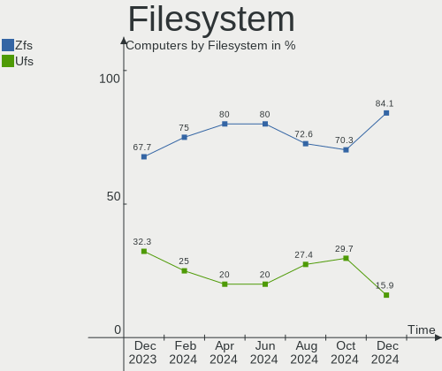
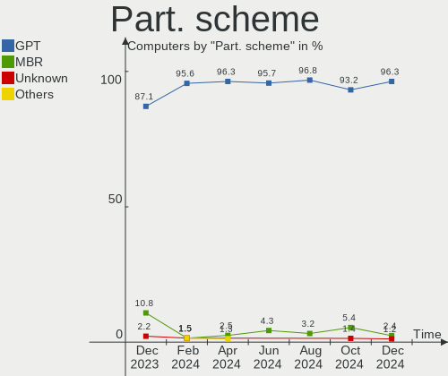
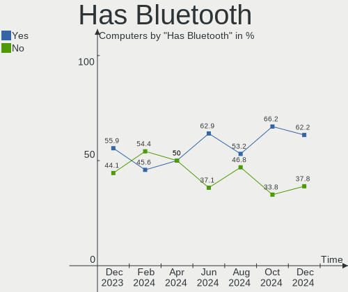
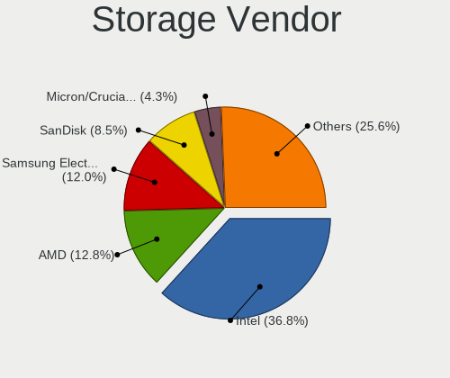
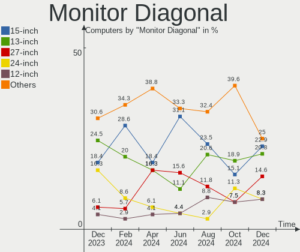
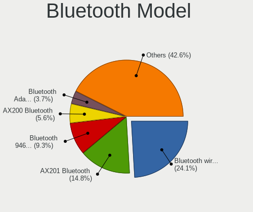

FreeBSD - Hardware Trends
-------------------------

A project to identify most popular hardware characteristics and track their change
over time based on data collected by BSD users at https://BSD-Hardware.info.

Anyone can contribute to this report by the [hw-probe](https://github.com/linuxhw/hw-probe/blob/master/INSTALL.BSD.md) tool:

    hw-probe -all -upload

This is a report for all computer types. See also reports for [desktops](/Dist/FreeBSD/Desktop/README.md) and [notebooks](/Dist/FreeBSD/Notebook/README.md).

This report is for one last month. Overall report since the beginning of time: [TestDays](https://github.com/bsdhw/TestDays)

Period: Aug, 2023.

Contents
--------

* [ System ](#system)
  - [ OS                       ](#os)
  - [ OS Family                ](#os-family)
  - [ Arch                     ](#arch)
  - [ DE                       ](#de)
  - [ Display Server           ](#display-server)
  - [ Display Manager          ](#display-manager)
  - [ OS Lang                  ](#os-lang)
  - [ Boot Mode                ](#boot-mode)
  - [ Filesystem               ](#filesystem)
  - [ Part. scheme             ](#part-scheme)

* [ Board ](#board)
  - [ Vendor                   ](#vendor)
  - [ Model                    ](#model)
  - [ Model Family             ](#model-family)
  - [ MFG Year                 ](#mfg-year)
  - [ Form Factor              ](#form-factor)
  - [ Coreboot                 ](#coreboot)
  - [ RAM Size                 ](#ram-size)
  - [ RAM Used                 ](#ram-used)
  - [ Total Drives             ](#total-drives)
  - [ Has CD-ROM               ](#has-cd-rom)
  - [ Has Ethernet             ](#has-ethernet)
  - [ Has WiFi                 ](#has-wifi)
  - [ Has Bluetooth            ](#has-bluetooth)

* [ Location ](#location)
  - [ Country                  ](#country)
  - [ City                     ](#city)

* [ Drives ](#drives)
  - [ Drive Vendor             ](#drive-vendor)
  - [ Drive Model              ](#drive-model)
  - [ HDD Vendor               ](#hdd-vendor)
  - [ SSD Vendor               ](#ssd-vendor)
  - [ Drive Kind               ](#drive-kind)
  - [ Drive Connector          ](#drive-connector)
  - [ Drive Size               ](#drive-size)
  - [ Space Total              ](#space-total)
  - [ Space Used               ](#space-used)
  - [ Malfunc. Drives          ](#malfunc-drives)
  - [ Malfunc. Drive Vendor    ](#malfunc-drive-vendor)
  - [ Malfunc. HDD Vendor      ](#malfunc-hdd-vendor)
  - [ Malfunc. Drive Kind      ](#malfunc-drive-kind)
  - [ Failed Drives            ](#failed-drives)
  - [ Failed Drive Vendor      ](#failed-drive-vendor)
  - [ Drive Status             ](#drive-status)

* [ Storage controller ](#storage-controller)
  - [ Storage Vendor           ](#storage-vendor)
  - [ Storage Model            ](#storage-model)
  - [ Storage Kind             ](#storage-kind)

* [ Processor ](#processor)
  - [ CPU Vendor               ](#cpu-vendor)
  - [ CPU Model                ](#cpu-model)
  - [ CPU Model Family         ](#cpu-model-family)
  - [ CPU Cores                ](#cpu-cores)
  - [ CPU Sockets              ](#cpu-sockets)
  - [ CPU Threads              ](#cpu-threads)
  - [ CPU Microarch            ](#cpu-microarch)

* [ Graphics ](#graphics)
  - [ GPU Vendor               ](#gpu-vendor)
  - [ GPU Model                ](#gpu-model)
  - [ GPU Combo                ](#gpu-combo)
  - [ GPU Driver               ](#gpu-driver)
  - [ GPU Memory               ](#gpu-memory)

* [ Monitor ](#monitor)
  - [ Monitor Vendor           ](#monitor-vendor)
  - [ Monitor Model            ](#monitor-model)
  - [ Monitor Resolution       ](#monitor-resolution)
  - [ Monitor Diagonal         ](#monitor-diagonal)
  - [ Monitor Width            ](#monitor-width)
  - [ Aspect Ratio             ](#aspect-ratio)
  - [ Monitor Area             ](#monitor-area)
  - [ Pixel Density            ](#pixel-density)
  - [ Multiple Monitors        ](#multiple-monitors)

* [ Network ](#network)
  - [ Net Controller Vendor    ](#net-controller-vendor)
  - [ Net Controller Model     ](#net-controller-model)
  - [ Wireless Vendor          ](#wireless-vendor)
  - [ Wireless Model           ](#wireless-model)
  - [ Ethernet Vendor          ](#ethernet-vendor)
  - [ Ethernet Model           ](#ethernet-model)
  - [ Net Controller Kind      ](#net-controller-kind)
  - [ Used Controller          ](#used-controller)
  - [ NICs                     ](#nics)
  - [ IPv6                     ](#ipv6)

* [ Bluetooth ](#bluetooth)
  - [ Bluetooth Vendor         ](#bluetooth-vendor)
  - [ Bluetooth Model          ](#bluetooth-model)

* [ Sound ](#sound)
  - [ Sound Vendor             ](#sound-vendor)
  - [ Sound Model              ](#sound-model)

* [ Memory ](#memory)
  - [ Memory Vendor            ](#memory-vendor)
  - [ Memory Model             ](#memory-model)
  - [ Memory Kind              ](#memory-kind)
  - [ Memory Form Factor       ](#memory-form-factor)
  - [ Memory Size              ](#memory-size)
  - [ Memory Speed             ](#memory-speed)

* [ Printers & scanners ](#printers--scanners)
  - [ Printer Vendor           ](#printer-vendor)
  - [ Printer Model            ](#printer-model)
  - [ Scanner Vendor           ](#scanner-vendor)
  - [ Scanner Model            ](#scanner-model)

* [ Camera ](#camera)
  - [ Camera Vendor            ](#camera-vendor)
  - [ Camera Model             ](#camera-model)

* [ Security ](#security)
  - [ Fingerprint Vendor       ](#fingerprint-vendor)
  - [ Fingerprint Model        ](#fingerprint-model)
  - [ Chipcard Vendor          ](#chipcard-vendor)
  - [ Chipcard Model           ](#chipcard-model)

* [ Unsupported ](#unsupported)
  - [ Unsupported Devices      ](#unsupported-devices)
  - [ Unsupported Device Types ](#unsupported-device-types)

System
------

OS
--

Installed operating systems

| Name                 | Computers | Percent |
|----------------------|-----------|---------|
| FreeBSD 13.2-p2      | 26        | 50%     |
| FreeBSD 13.2         | 7         | 13.46%  |
| FreeBSD 14.0-CURRENT | 6         | 11.54%  |
| FreeBSD 15.0-CURRENT | 2         | 3.85%   |
| FreeBSD 14.0-ALPHA3  | 2         | 3.85%   |
| FreeBSD 14.0-ALPHA2  | 2         | 3.85%   |
| FreeBSD 13.2-p1      | 2         | 3.85%   |
| FreeBSD 14.0-ALPHA1  | 1         | 1.92%   |
| FreeBSD 13.2-STABLE  | 1         | 1.92%   |
| FreeBSD 13.1-p9      | 1         | 1.92%   |
| FreeBSD 13.1-p5      | 1         | 1.92%   |
| FreeBSD 13.0         | 1         | 1.92%   |

OS Family
---------

OS without a version

| Name    | Computers | Percent |
|---------|-----------|---------|
| FreeBSD | 52        | 100%    |

Arch
----

OS architecture (x86_64, i586, etc.)

| Name  | Computers | Percent |
|-------|-----------|---------|
| amd64 | 50        | 96.15%  |
| i386  | 1         | 1.92%   |
| arm64 | 1         | 1.92%   |

DE
--

Desktop Environment

| Name       | Computers | Percent |
|------------|-----------|---------|
| Console    | 21        | 40.38%  |
| KDE5       | 9         | 17.31%  |
| XFCE       | 6         | 11.54%  |
| MATE       | 3         | 5.77%   |
| GNOME      | 3         | 5.77%   |
| TWM        | 2         | 3.85%   |
| LXQt       | 2         | 3.85%   |
| i3         | 2         | 3.85%   |
| X-Cinnamon | 1         | 1.92%   |
| Potato     | 1         | 1.92%   |
| Openbox    | 1         | 1.92%   |
| Budgie     | 1         | 1.92%   |

Display Server
--------------

X11 or Wayland

| Name    | Computers | Percent |
|---------|-----------|---------|
| X11     | 26        | 50%     |
| Console | 23        | 44.23%  |
| Wayland | 3         | 5.77%   |

Display Manager
---------------

SDDM, LightDM, etc.

| Name    | Computers | Percent |
|---------|-----------|---------|
| Console | 31        | 59.62%  |
| SDDM    | 5         | 9.62%   |
| GDM     | 5         | 9.62%   |
| XDM     | 4         | 7.69%   |
| LightDM | 4         | 7.69%   |
| SLiM    | 3         | 5.77%   |

OS Lang
-------

Language

| Lang    | Computers | Percent |
|---------|-----------|---------|
| C       | 38        | 73.08%  |
| Unknown | 4         | 7.69%   |
| en_US   | 3         | 5.77%   |
| fr_FR   | 2         | 3.85%   |
| ru_RU   | 1         | 1.92%   |
| es_ES   | 1         | 1.92%   |
| en_GB   | 1         | 1.92%   |
| en_AU   | 1         | 1.92%   |
| Default | 1         | 1.92%   |

Boot Mode
---------

EFI or BIOS

| Mode | Computers | Percent |
|------|-----------|---------|
| EFI  | 43        | 82.69%  |
| BIOS | 9         | 17.31%  |

Filesystem
----------

Type of filesystem

| Type | Computers | Percent |
|------|-----------|---------|
| Zfs  | 38        | 73.08%  |
| Ufs  | 14        | 26.92%  |

Part. scheme
------------

Scheme of partitioning

| Type | Computers | Percent |
|------|-----------|---------|
| GPT  | 50        | 96.15%  |
| MBR  | 1         | 1.92%   |
| BSD  | 1         | 1.92%   |

Board
-----

Vendor
------

Motherboard manufacturer

| Name                | Computers | Percent |
|---------------------|-----------|---------|
| Lenovo              | 10        | 19.23%  |
| MSI                 | 7         | 13.46%  |
| ASUSTek Computer    | 6         | 11.54%  |
| Dell                | 5         | 9.62%   |
| Supermicro          | 4         | 7.69%   |
| Hewlett-Packard     | 3         | 5.77%   |
| PC Engines          | 2         | 3.85%   |
| Intel               | 2         | 3.85%   |
| Gigabyte Technology | 2         | 3.85%   |
| ASRock              | 2         | 3.85%   |
| Acer                | 2         | 3.85%   |
| SolidRun            | 1         | 1.92%   |
| Shuttle             | 1         | 1.92%   |
| Nvidia              | 1         | 1.92%   |
| Notebook            | 1         | 1.92%   |
| AZW                 | 1         | 1.92%   |
| ASRockRack          | 1         | 1.92%   |
| Apple               | 1         | 1.92%   |

Model
-----

Motherboard model

| Name                                       | Computers | Percent |
|--------------------------------------------|-----------|---------|
| Supermicro X10DRi                          | 1         | 1.92%   |
| Supermicro SYS-6017R-TDF                   | 1         | 1.92%   |
| Supermicro Super Server                    | 1         | 1.92%   |
| Supermicro M12SWA-TF                       | 1         | 1.92%   |
| SolidRun CEX7 Platform                     | 1         | 1.92%   |
| Shuttle DS20U                              | 1         | 1.92%   |
| PC Engines APU2                            | 1         | 1.92%   |
| PC Engines apu1                            | 1         | 1.92%   |
| Nvidia MCP79                               | 1         | 1.92%   |
| Notebook N7x0WU                            | 1         | 1.92%   |
| MSI MS-7C37                                | 1         | 1.92%   |
| MSI MS-7C36                                | 1         | 1.92%   |
| MSI MS-7C35                                | 1         | 1.92%   |
| MSI MS-7817                                | 1         | 1.92%   |
| MSI MS-7529                                | 1         | 1.92%   |
| MSI Modern 14 B11SBL                       | 1         | 1.92%   |
| MSI 520A5GE                                | 1         | 1.92%   |
| Lenovo ThinkPad X1 Carbon Gen 9 20XXS2XW00 | 1         | 1.92%   |
| Lenovo ThinkPad X1 Carbon Gen 9 20XW00FUUS | 1         | 1.92%   |
| Lenovo ThinkPad T495s 20QKS1812F           | 1         | 1.92%   |
| Lenovo ThinkPad T480s 20L8S0UD00           | 1         | 1.92%   |
| Lenovo ThinkPad T460p 20FXS06A11           | 1         | 1.92%   |
| Lenovo ThinkPad T450 20BV000BUS            | 1         | 1.92%   |
| Lenovo ThinkPad T430 2347GR2               | 1         | 1.92%   |
| Lenovo ThinkCentre M90p 3853RN9            | 1         | 1.92%   |
| Lenovo IdeaPad Slim 9 14ITL5 82D2          | 1         | 1.92%   |
| Lenovo IdeaCentre 300-20ISH 90DA00HEMT     | 1         | 1.92%   |
| Intel NUC7PJYH                             | 1         | 1.92%   |
| Intel NUC12WSKi3                           | 1         | 1.92%   |
| HP Z240 Tower Workstation                  | 1         | 1.92%   |
| HP EliteDesk 800 G3 TWR                    | 1         | 1.92%   |
| HP EliteBook 8570p                         | 1         | 1.92%   |
| Gigabyte Z390 AORUS PRO WIFI               | 1         | 1.92%   |
| Gigabyte AX370M-DS3H                       | 1         | 1.92%   |
| Dell PowerEdge R720                        | 1         | 1.92%   |
| Dell PowerEdge R250                        | 1         | 1.92%   |
| Dell Latitude 3420                         | 1         | 1.92%   |
| Dell Inspiron 14-3467                      | 1         | 1.92%   |
| Dell G5 5590                               | 1         | 1.92%   |
| AZW SER                                    | 1         | 1.92%   |

Model Family
------------

Motherboard model prefix

| Name                      | Computers | Percent |
|---------------------------|-----------|---------|
| Lenovo ThinkPad           | 7         | 13.46%  |
| Dell PowerEdge            | 2         | 3.85%   |
| ASUS ROG                  | 2         | 3.85%   |
| Acer Aspire               | 2         | 3.85%   |
| Supermicro X10DRi         | 1         | 1.92%   |
| Supermicro SYS-6017R-TDF  | 1         | 1.92%   |
| Supermicro Super          | 1         | 1.92%   |
| Supermicro M12SWA-TF      | 1         | 1.92%   |
| SolidRun CEX7             | 1         | 1.92%   |
| Shuttle DS20U             | 1         | 1.92%   |
| PC Engines APU2           | 1         | 1.92%   |
| PC Engines apu1           | 1         | 1.92%   |
| Nvidia MCP79              | 1         | 1.92%   |
| Notebook N7x0WU           | 1         | 1.92%   |
| MSI MS-7C37               | 1         | 1.92%   |
| MSI MS-7C36               | 1         | 1.92%   |
| MSI MS-7C35               | 1         | 1.92%   |
| MSI MS-7817               | 1         | 1.92%   |
| MSI MS-7529               | 1         | 1.92%   |
| MSI Modern                | 1         | 1.92%   |
| MSI 520A5GE               | 1         | 1.92%   |
| Lenovo ThinkCentre        | 1         | 1.92%   |
| Lenovo IdeaPad            | 1         | 1.92%   |
| Lenovo IdeaCentre         | 1         | 1.92%   |
| Intel NUC7PJYH            | 1         | 1.92%   |
| Intel NUC12WSKi3          | 1         | 1.92%   |
| HP Z240                   | 1         | 1.92%   |
| HP EliteDesk              | 1         | 1.92%   |
| HP EliteBook              | 1         | 1.92%   |
| Gigabyte Z390             | 1         | 1.92%   |
| Gigabyte AX370M-DS3H      | 1         | 1.92%   |
| Dell Latitude             | 1         | 1.92%   |
| Dell Inspiron             | 1         | 1.92%   |
| Dell G5                   | 1         | 1.92%   |
| AZW SER                   | 1         | 1.92%   |
| ASUS PRIME                | 1         | 1.92%   |
| ASUS P5Q-E                | 1         | 1.92%   |
| ASUS N751JK               | 1         | 1.92%   |
| ASUS 1001P                | 1         | 1.92%   |
| ASRockRack EPYC3101D4I-2T | 1         | 1.92%   |

MFG Year
--------

Motherboard manufacture year

| Year | Computers | Percent |
|------|-----------|---------|
| 2023 | 10        | 19.23%  |
| 2021 | 8         | 15.38%  |
| 2019 | 8         | 15.38%  |
| 2022 | 5         | 9.62%   |
| 2020 | 3         | 5.77%   |
| 2018 | 3         | 5.77%   |
| 2016 | 3         | 5.77%   |
| 2010 | 3         | 5.77%   |
| 2015 | 2         | 3.85%   |
| 2014 | 2         | 3.85%   |
| 2013 | 2         | 3.85%   |
| 2017 | 1         | 1.92%   |
| 2009 | 1         | 1.92%   |
| 2008 | 1         | 1.92%   |

Form Factor
-----------

Physical design of the computer

| Name     | Computers | Percent |
|----------|-----------|---------|
| Desktop  | 25        | 48.08%  |
| Notebook | 20        | 38.46%  |
| Server   | 4         | 7.69%   |
| Mini pc  | 3         | 5.77%   |

Coreboot
--------

Have coreboot on board

| Used | Computers | Percent |
|------|-----------|---------|
| No   | 50        | 96.15%  |
| Yes  | 2         | 3.85%   |

RAM Size
--------

Total RAM memory

| Size in GB      | Computers | Percent |
|-----------------|-----------|---------|
| 16.01-24.0      | 17        | 32.69%  |
| 32.01-64.0      | 13        | 25%     |
| 8.01-16.0       | 8         | 15.38%  |
| 64.01-256.0     | 5         | 9.62%   |
| 4.01-8.0        | 4         | 7.69%   |
| 2.01-3.0        | 3         | 5.77%   |
| More than 256.0 | 2         | 3.85%   |

RAM Used
--------

Used RAM memory

| Used GB   | Computers | Percent |
|-----------|-----------|---------|
| 0.51-1.0  | 23        | 44.23%  |
| 1.01-2.0  | 10        | 19.23%  |
| 0.01-0.5  | 10        | 19.23%  |
| 4.01-8.0  | 3         | 5.77%   |
| 3.01-4.0  | 3         | 5.77%   |
| 2.01-3.0  | 2         | 3.85%   |
| 8.01-16.0 | 1         | 1.92%   |

Total Drives
------------

Number of drives on board

| Drives | Computers | Percent |
|--------|-----------|---------|
| 1      | 19        | 36.54%  |
| 2      | 10        | 19.23%  |
| 3      | 6         | 11.54%  |
| 0      | 6         | 11.54%  |
| 4      | 5         | 9.62%   |
| 24     | 1         | 1.92%   |
| 13     | 1         | 1.92%   |
| 8      | 1         | 1.92%   |
| 7      | 1         | 1.92%   |
| 6      | 1         | 1.92%   |
| 5      | 1         | 1.92%   |

Has CD-ROM
----------

Has CD-ROM on board

| Presented | Computers | Percent |
|-----------|-----------|---------|
| No        | 40        | 76.92%  |
| Yes       | 12        | 23.08%  |

Has Ethernet
------------

Has Ethernet on board

| Presented | Computers | Percent |
|-----------|-----------|---------|
| Yes       | 45        | 86.54%  |
| No        | 7         | 13.46%  |

Has WiFi
--------

Has WiFi module

| Presented | Computers | Percent |
|-----------|-----------|---------|
| Yes       | 29        | 55.77%  |
| No        | 23        | 44.23%  |

Has Bluetooth
-------------

Has Bluetooth module

| Presented | Computers | Percent |
|-----------|-----------|---------|
| No        | 31        | 59.62%  |
| Yes       | 21        | 40.38%  |

Location
--------

Country
-------

Geographic location (country)

| Country     | Computers | Percent |
|-------------|-----------|---------|
| USA         | 14        | 26.92%  |
| Russia      | 6         | 11.54%  |
| UK          | 4         | 7.69%   |
| France      | 4         | 7.69%   |
| Germany     | 3         | 5.77%   |
| Canada      | 3         | 5.77%   |
| Iceland     | 2         | 3.85%   |
| Czechia     | 2         | 3.85%   |
| China       | 2         | 3.85%   |
| Brazil      | 2         | 3.85%   |
| Australia   | 2         | 3.85%   |
| Turkey      | 1         | 1.92%   |
| Thailand    | 1         | 1.92%   |
| Sweden      | 1         | 1.92%   |
| Spain       | 1         | 1.92%   |
| Netherlands | 1         | 1.92%   |
| Nepal       | 1         | 1.92%   |
| Japan       | 1         | 1.92%   |
| Italy       | 1         | 1.92%   |

City
----

Geographic location (city)

| City                  | Computers | Percent |
|-----------------------|-----------|---------|
| St Petersburg         | 3         | 5.77%   |
| Hamburg               | 3         | 5.77%   |
| York                  | 2         | 3.85%   |
| Vancouver             | 2         | 3.85%   |
| Salem                 | 2         | 3.85%   |
| Reykjavik             | 2         | 3.85%   |
| Redmond               | 2         | 3.85%   |
| Moscow                | 2         | 3.85%   |
| Wenatchee             | 1         | 1.92%   |
| Umeda                 | 1         | 1.92%   |
| Sydney                | 1         | 1.92%   |
| Svanesund             | 1         | 1.92%   |
| Stourbridge           | 1         | 1.92%   |
| Saint-Ouen-du-Tilleul | 1         | 1.92%   |
| Recife                | 1         | 1.92%   |
| Prague                | 1         | 1.92%   |
| Portland              | 1         | 1.92%   |
| Paris                 | 1         | 1.92%   |
| Ozersk                | 1         | 1.92%   |
| Osasco                | 1         | 1.92%   |
| Manchester            | 1         | 1.92%   |
| Lorient               | 1         | 1.92%   |
| Las Vegas             | 1         | 1.92%   |
| Lancing               | 1         | 1.92%   |
| Izmir                 | 1         | 1.92%   |
| Grand Rapids          | 1         | 1.92%   |
| Fort Thomas           | 1         | 1.92%   |
| Clinton               | 1         | 1.92%   |
| Chongqing             | 1         | 1.92%   |
| Chengdu               | 1         | 1.92%   |
| Carbondale            | 1         | 1.92%   |
| Calgary               | 1         | 1.92%   |
| Cagliari              | 1         | 1.92%   |
| Brighton              | 1         | 1.92%   |
| Brdo                  | 1         | 1.92%   |
| Bharatpur             | 1         | 1.92%   |
| Bangkok               | 1         | 1.92%   |
| Austin                | 1         | 1.92%   |
| Amsterdam             | 1         | 1.92%   |
| Albacete              | 1         | 1.92%   |

Drives
------

Drive Vendor
------------

Hard drive vendors

| Vendor              | Computers | Drives | Percent |
|---------------------|-----------|--------|---------|
| WDC                 | 14        | 36     | 19.18%  |
| Samsung Electronics | 11        | 25     | 15.07%  |
| Seagate             | 10        | 17     | 13.7%   |
| Kingston            | 8         | 10     | 10.96%  |
| Crucial             | 7         | 12     | 9.59%   |
| Intel               | 3         | 3      | 4.11%   |
| Transcend           | 2         | 2      | 2.74%   |
| Micron Technology   | 2         | 3      | 2.74%   |
| Hitachi             | 2         | 2      | 2.74%   |
| HGST                | 2         | 2      | 2.74%   |
| Corsair             | 2         | 2      | 2.74%   |
| Toshiba             | 1         | 23     | 1.37%   |
| SPCC                | 1         | 1      | 1.37%   |
| SK hynix            | 1         | 1      | 1.37%   |
| Silicon Motion      | 1         | 1      | 1.37%   |
| SanDisk             | 1         | 1      | 1.37%   |
| Maxtor              | 1         | 1      | 1.37%   |
| KIOXIA              | 1         | 1      | 1.37%   |
| KingSpec            | 1         | 1      | 1.37%   |
| China               | 1         | 1      | 1.37%   |
| Apple               | 1         | 1      | 1.37%   |

Drive Model
-----------

Hard drive models

| Model                                | Computers | Percent |
|--------------------------------------|-----------|---------|
| Samsung SSD 860 EVO 500GB            | 4         | 3.92%   |
| Kingston SA400S37240G 240GB          | 3         | 2.94%   |
| Seagate ST4000DM000-1F2168 4TB       | 2         | 1.96%   |
| Samsung SSD 870 EVO 1TB              | 2         | 1.96%   |
| Crucial CT1000P1SSD8 1TB             | 2         | 1.96%   |
| WDC WDS500G2B0A-00SM50 500GB         | 1         | 0.98%   |
| WDC WDS120G2G0B-00EPW0 120GB         | 1         | 0.98%   |
| WDC WDS100T3X0C-00SJG0 1TB           | 1         | 0.98%   |
| WDC WDS100T1X0E-00AFY0 1TB           | 1         | 0.98%   |
| WDC WD80EZAZ-11TDBA0 8TB             | 1         | 0.98%   |
| WDC WD80EMAZ-00WJTA0 8TB             | 1         | 0.98%   |
| WDC WD80EFZX-68UW8N0 8TB             | 1         | 0.98%   |
| WDC WD80EFAX-68LHPN0 8TB             | 1         | 0.98%   |
| WDC WD80EDBZ-11B0ZA0 8TB             | 1         | 0.98%   |
| WDC WD60EZRZ-00GZ5B1 6TB             | 1         | 0.98%   |
| WDC WD5000HHTZ-04N21V0 500GB         | 1         | 0.98%   |
| WDC WD4500HLHX-01JJPV0 450GB         | 1         | 0.98%   |
| WDC WD40EZRZ-22GXCB0 4TB             | 1         | 0.98%   |
| WDC WD40EFRX-68N32N0 4TB             | 1         | 0.98%   |
| WDC WD4005FZBX-00K5WB0 4TB           | 1         | 0.98%   |
| WDC WD3003FZEX-00Z4SA0 3TB           | 1         | 0.98%   |
| WDC WD3000FYYZ-05UL1B0 3TB           | 1         | 0.98%   |
| WDC WD20EURX-63T0FY0 2TB             | 1         | 0.98%   |
| WDC WD1600AAJS-60WAA0 160GB          | 1         | 0.98%   |
| WDC WD15EARS-00Z5B1 1.5TB            | 1         | 0.98%   |
| WDC WD15EARS-00MVWB0 1.5TB           | 1         | 0.98%   |
| WDC WD15EADS-00P8B0 1.5TB            | 1         | 0.98%   |
| WDC WD120EMFZ-11A6JA0 12TB           | 1         | 0.98%   |
| WDC WD120EMAZ-11BLFA0 12TB           | 1         | 0.98%   |
| WDC WD1003FBYX-18Y7B0 1TB            | 1         | 0.98%   |
| WDC PC SN730 SDBQNTY-256G-1001 256GB | 1         | 0.98%   |
| Transcend TS256GMTS400 256GB         | 1         | 0.98%   |
| Transcend TS128GMTS400 128GB         | 1         | 0.98%   |
| Toshiba MG08ADA400E 4TB              | 1         | 0.98%   |
| Toshiba HDWQ140 4TB                  | 1         | 0.98%   |
| Toshiba HDWG440 4TB                  | 1         | 0.98%   |
| Toshiba HDWE140 4TB                  | 1         | 0.98%   |
| Toshiba HDWD130 3TB                  | 1         | 0.98%   |
| Toshiba DT01ACA300 3TB               | 1         | 0.98%   |
| SPCC Solid State Disk 2TB            | 1         | 0.98%   |

HDD Vendor
----------

Hard disk drive vendors

| Vendor  | Computers | Drives | Percent |
|---------|-----------|--------|---------|
| WDC     | 10        | 31     | 38.46%  |
| Seagate | 10        | 17     | 38.46%  |
| Hitachi | 2         | 2      | 7.69%   |
| HGST    | 2         | 2      | 7.69%   |
| Toshiba | 1         | 23     | 3.85%   |
| Maxtor  | 1         | 1      | 3.85%   |

SSD Vendor
----------

Solid state drive vendors

| Vendor              | Computers | Drives | Percent |
|---------------------|-----------|--------|---------|
| Samsung Electronics | 9         | 22     | 31.03%  |
| Kingston            | 3         | 5      | 10.34%  |
| Crucial             | 3         | 3      | 10.34%  |
| WDC                 | 2         | 2      | 6.9%    |
| Transcend           | 2         | 2      | 6.9%    |
| Micron Technology   | 2         | 3      | 6.9%    |
| Intel               | 2         | 2      | 6.9%    |
| SPCC                | 1         | 1      | 3.45%   |
| SanDisk             | 1         | 1      | 3.45%   |
| KingSpec            | 1         | 1      | 3.45%   |
| Corsair             | 1         | 1      | 3.45%   |
| China               | 1         | 1      | 3.45%   |
| Apple               | 1         | 1      | 3.45%   |

Drive Kind
----------

HDD or SSD

| Kind | Computers | Drives | Percent |
|------|-----------|--------|---------|
| SSD  | 22        | 45     | 36.67%  |
| NVMe | 19        | 25     | 31.67%  |
| HDD  | 19        | 76     | 31.67%  |

Drive Connector
---------------

SATA, SAS, NVMe, etc.

| Type | Computers | Drives | Percent |
|------|-----------|--------|---------|
| SATA | 36        | 121    | 65.45%  |
| NVMe | 19        | 25     | 34.55%  |

Drive Size
----------

Size of hard drive

| Size in TB | Computers | Drives | Percent |
|------------|-----------|--------|---------|
| 0.01-0.5   | 22        | 35     | 39.29%  |
| 0.51-1.0   | 10        | 15     | 17.86%  |
| 1.01-2.0   | 9         | 13     | 16.07%  |
| 3.01-4.0   | 7         | 24     | 12.5%   |
| 4.01-10.0  | 4         | 21     | 7.14%   |
| 2.01-3.0   | 3         | 11     | 5.36%   |
| 10.01-20.0 | 1         | 2      | 1.79%   |

Space Total
-----------

Amount of disk space available on the file system

| Size in GB     | Computers | Percent |
|----------------|-----------|---------|
| 101-250        | 19        | 36.54%  |
| 251-500        | 14        | 26.92%  |
| 501-1000       | 8         | 15.38%  |
| 1001-2000      | 4         | 7.69%   |
| 51-100         | 3         | 5.77%   |
| 1-20           | 2         | 3.85%   |
| More than 3000 | 1         | 1.92%   |
| 2001-3000      | 1         | 1.92%   |

Space Used
----------

Amount of used disk space

| Used GB   | Computers | Percent |
|-----------|-----------|---------|
| 1-20      | 35        | 67.31%  |
| 21-50     | 9         | 17.31%  |
| 501-1000  | 3         | 5.77%   |
| 51-100    | 2         | 3.85%   |
| 251-500   | 1         | 1.92%   |
| 101-250   | 1         | 1.92%   |
| 1001-2000 | 1         | 1.92%   |

Malfunc. Drives
---------------

Drive models with a malfunction

| Model                                      | Computers | Drives | Percent |
|--------------------------------------------|-----------|--------|---------|
| WDC WD4500HLHX-01JJPV0 450GB               | 1         | 1      | 7.69%   |
| WDC WD3000FYYZ-05UL1B0 3TB                 | 1         | 1      | 7.69%   |
| WDC WD15EARS-00Z5B1 1.5TB                  | 1         | 1      | 7.69%   |
| WDC WD15EARS-00MVWB0 1.5TB                 | 1         | 1      | 7.69%   |
| Toshiba HDWE140 4TB                        | 1         | 3      | 7.69%   |
| Seagate ST9100824AS 100GB                  | 1         | 1      | 7.69%   |
| Seagate ST8000AS0002-1NA17Z 8TB            | 1         | 1      | 7.69%   |
| Micron Technology P300-MTFDDAC200SAL 200GB | 1         | 2      | 7.69%   |
| Maxtor STM380215AS 80GB                    | 1         | 1      | 7.69%   |
| Hitachi HDS721680PLA380 80GB               | 1         | 1      | 7.69%   |
| HGST HTS721010A9E630 1TB                   | 1         | 1      | 7.69%   |
| HGST HTS541010A7E630 1TB                   | 1         | 1      | 7.69%   |
| Crucial CT2000MX500SSD1 2TB                | 1         | 1      | 7.69%   |

Malfunc. Drive Vendor
---------------------

Vendors of faulty drives

| Vendor            | Computers | Drives | Percent |
|-------------------|-----------|--------|---------|
| WDC               | 2         | 4      | 18.18%  |
| Seagate           | 2         | 2      | 18.18%  |
| HGST              | 2         | 2      | 18.18%  |
| Toshiba           | 1         | 3      | 9.09%   |
| Micron Technology | 1         | 2      | 9.09%   |
| Maxtor            | 1         | 1      | 9.09%   |
| Hitachi           | 1         | 1      | 9.09%   |
| Crucial           | 1         | 1      | 9.09%   |

Malfunc. HDD Vendor
-------------------

Vendors of faulty HDD drives

| Vendor  | Computers | Drives | Percent |
|---------|-----------|--------|---------|
| WDC     | 2         | 4      | 22.22%  |
| Seagate | 2         | 2      | 22.22%  |
| HGST    | 2         | 2      | 22.22%  |
| Toshiba | 1         | 3      | 11.11%  |
| Maxtor  | 1         | 1      | 11.11%  |
| Hitachi | 1         | 1      | 11.11%  |

Malfunc. Drive Kind
-------------------

Kinds of faulty drives

| Kind | Computers | Drives | Percent |
|------|-----------|--------|---------|
| HDD  | 7         | 13     | 77.78%  |
| SSD  | 2         | 3      | 22.22%  |

Failed Drives
-------------

Failed drive models

Zero info for selected period =(

Failed Drive Vendor
-------------------

Failed drive vendors

Zero info for selected period =(

Drive Status
------------

Number of failed and malfunc. drives

| Status   | Computers | Drives | Percent |
|----------|-----------|--------|---------|
| Works    | 42        | 129    | 80.77%  |
| Malfunc  | 9         | 16     | 17.31%  |
| Detected | 1         | 1      | 1.92%   |

Storage controller
------------------

Storage Vendor
--------------

Storage controller vendors

| Vendor                      | Computers | Percent |
|-----------------------------|-----------|---------|
| Intel                       | 29        | 32.22%  |
| AMD                         | 14        | 15.56%  |
| Broadcom / LSI              | 8         | 8.89%   |
| Samsung Electronics         | 6         | 6.67%   |
| SanDisk                     | 5         | 5.56%   |
| Kingston Technology Company | 5         | 5.56%   |
| Micron/Crucial Technology   | 4         | 4.44%   |
| ASMedia Technology          | 4         | 4.44%   |
| SK hynix                    | 2         | 2.22%   |
| Silicon Motion              | 2         | 2.22%   |
| Micron Technology           | 2         | 2.22%   |
| MAXIO Technology (Hangzhou) | 2         | 2.22%   |
| Marvell Technology Group    | 2         | 2.22%   |
| Chelsio Communications      | 2         | 2.22%   |
| Phison Electronics          | 1         | 1.11%   |
| Nvidia                      | 1         | 1.11%   |
| KIOXIA                      | 1         | 1.11%   |

Storage Model
-------------

Storage controller models

| Model                                                                          | Computers | Percent |
|--------------------------------------------------------------------------------|-----------|---------|
| AMD FCH SATA Controller [AHCI mode]                                            | 11        | 11%     |
| SanDisk WD Black SN750 / PC SN730 NVMe SSD                                     | 3         | 3%      |
| ASMedia ASM1062 Serial ATA Controller                                          | 3         | 3%      |
| Silicon Motion SM2263EN/SM2263XT (DRAM-less) NVMe SSD Controllers              | 2         | 2%      |
| Samsung NVMe SSD Controller SM981/PM981/PM983                                  | 2         | 2%      |
| Micron/Crucial P5 Plus NVMe PCIe SSD                                           | 2         | 2%      |
| Micron/Crucial P1 NVMe PCIe SSD[Frampton]                                      | 2         | 2%      |
| MAXIO (Hangzhou) NVMe SSD Controller MAP1202                                   | 2         | 2%      |
| Kingston Company OM8PCP Design-In PCIe 3 NVMe SSD (DRAM-less)                  | 2         | 2%      |
| Intel Volume Management Device NVMe RAID Controller                            | 2         | 2%      |
| Intel Tiger Lake-LP SATA Controller                                            | 2         | 2%      |
| Intel Sunrise Point-LP SATA Controller [AHCI mode]                             | 2         | 2%      |
| Intel Q170/Q150/B150/H170/H110/Z170/CM236 Chipset SATA Controller [AHCI Mode]  | 2         | 2%      |
| Intel C610/X99 series chipset 6-Port SATA Controller [AHCI mode]               | 2         | 2%      |
| Intel C600/X79 series chipset 6-Port SATA AHCI Controller                      | 2         | 2%      |
| Intel Alder Lake-P SATA AHCI Controller                                        | 2         | 2%      |
| Intel 8 Series/C220 Series Chipset Family 6-port SATA Controller 1 [AHCI mode] | 2         | 2%      |
| Intel 7 Series Chipset Family 6-port SATA Controller [AHCI mode]               | 2         | 2%      |
| Broadcom / LSI SAS3008 PCI-Express Fusion-MPT SAS-3                            | 2         | 2%      |
| Broadcom / LSI SAS2008 PCI-Express Fusion-MPT SAS-2 [Falcon]                   | 2         | 2%      |
| AMD X370 Series Chipset SATA Controller                                        | 2         | 2%      |
| AMD 500 Series Chipset SATA Controller                                         | 2         | 2%      |
| SK hynix Platinum P41/PC801 NVMe Solid State Drive                             | 1         | 1%      |
| SK hynix Gold P31/BC711/PC711 NVMe Solid State Drive                           | 1         | 1%      |
| SanDisk WD PC SN810 / Black SN850 NVMe SSD                                     | 1         | 1%      |
| Sandisk WD Green SN350 NVMe SSD 1 TB (DRAM-less)                               | 1         | 1%      |
| Samsung S4LN053X01 AHCI SSD Controller(Apple slot)                             | 1         | 1%      |
| Samsung NVMe SSD Controller SM961/PM961/SM963                                  | 1         | 1%      |
| Samsung NVMe SSD Controller PM9A1/PM9A3/980PRO                                 | 1         | 1%      |
| Samsung NVMe SSD Controller 980                                                | 1         | 1%      |
| Phison E16 PCIe4 NVMe Controller                                               | 1         | 1%      |
| Nvidia MCP79 AHCI Controller                                                   | 1         | 1%      |
| Micron/Crucial P2 [Nick P2] / P3 / P3 Plus NVMe PCIe SSD (DRAM-less)           | 1         | 1%      |
| Micron 2450 NVMe SSD [HendrixV] (DRAM-less)                                    | 1         | 1%      |
| Micron 2400 NVMe SSD (DRAM-less)                                               | 1         | 1%      |
| Marvell Group 88SE9215 PCIe 2.0 x1 4-port SATA 6 Gb/s Controller               | 1         | 1%      |
| Marvell Group 88SE6111/6121 SATA II / PATA Controller                          | 1         | 1%      |
| KIOXIA NVMe SSD Controller BG5 (DRAM-less)                                     | 1         | 1%      |
| Kingston Company OM3PDP3 NVMe SSD                                              | 1         | 1%      |
| Kingston Company KC3000/Renegade NVMe SSD                                      | 1         | 1%      |

Storage Kind
------------

Kind of storage controller (IDE, SATA, NVMe, SAS, ...)

| Kind | Computers | Percent |
|------|-----------|---------|
| SATA | 42        | 49.41%  |
| NVMe | 28        | 32.94%  |
| SAS  | 6         | 7.06%   |
| RAID | 4         | 4.71%   |
| SCSI | 3         | 3.53%   |
| IDE  | 2         | 2.35%   |

Processor
---------

CPU Vendor
----------

Processor vendors

| Vendor | Computers | Percent |
|--------|-----------|---------|
| Intel  | 35        | 67.31%  |
| AMD    | 16        | 30.77%  |
| NXP    | 1         | 1.92%   |

CPU Model
---------

Processor models

| Model                                           | Computers | Percent |
|-------------------------------------------------|-----------|---------|
| Intel 11th Gen Core i5-1135G7 @ 2.40GHz         | 3         | 5.77%   |
| Intel Xeon CPU E5-2630 v2 @ 2.60GHz             | 2         | 3.85%   |
| AMD Ryzen 9 3900X 12-Core Processor             | 2         | 3.85%   |
| AMD Ryzen 7 1700 Eight-Core Processor           | 2         | 3.85%   |
| NXP Cortex-A72                                  | 1         | 1.92%   |
| Intel Xeon E-2324G CPU @ 3.10GHz                | 1         | 1.92%   |
| Intel Xeon CPU E5-2697A v4 @ 2.60GHz            | 1         | 1.92%   |
| Intel Xeon CPU E5-2680 v3 @ 2.50GHz             | 1         | 1.92%   |
| Intel Pentium Silver J5005 CPU @ 1.50GHz        | 1         | 1.92%   |
| Intel Pentium CPU G3220 @ 3.00GHz               | 1         | 1.92%   |
| Intel Core i7-9750H CPU @ 2.60GHz               | 1         | 1.92%   |
| Intel Core i7-9700K CPU @ 3.60GHz               | 1         | 1.92%   |
| Intel Core i7-7700K CPU @ 4.20GHz               | 1         | 1.92%   |
| Intel Core i7-7700 CPU @ 3.60GHz                | 1         | 1.92%   |
| Intel Core i7-4710HQ CPU @ 2.50GHz              | 1         | 1.92%   |
| Intel Core i7-3520M CPU @ 2.90GHz               | 1         | 1.92%   |
| Intel Core i5-8350U CPU @ 1.70GHz               | 1         | 1.92%   |
| Intel Core i5-7200U CPU @ 2.50GHz               | 1         | 1.92%   |
| Intel Core i5-6400 CPU @ 2.70GHz                | 1         | 1.92%   |
| Intel Core i5-6300HQ CPU @ 2.30GHz              | 1         | 1.92%   |
| Intel Core i5-4300U CPU @ 1.90GHz               | 1         | 1.92%   |
| Intel Core i5-4258U CPU @ 2.40GHz               | 1         | 1.92%   |
| Intel Core i5-3320M CPU @ 2.60GHz               | 1         | 1.92%   |
| Intel Core i5 CPU 650 @ 3.20GHz                 | 1         | 1.92%   |
| Intel Core i3-8130U CPU @ 2.20GHz               | 1         | 1.92%   |
| Intel Core 2 Quad CPU Q8400 @ 2.66GHz           | 1         | 1.92%   |
| Intel Core 2 Quad CPU Q6600 @ 2.40GHz           | 1         | 1.92%   |
| Intel Celeron CPU 5205U @ 1.90GHz               | 1         | 1.92%   |
| Intel Atom CPU N450 @ 1.66GHz                   | 1         | 1.92%   |
| Intel Atom CPU 230 @ 1.60GHz                    | 1         | 1.92%   |
| Intel 12th Gen Core i5-1235U                    | 1         | 1.92%   |
| Intel 12th Gen Core i3-1220P                    | 1         | 1.92%   |
| Intel 11th Gen Core i7-1195G7 @ 2.90GHz         | 1         | 1.92%   |
| Intel 11th Gen Core i7-1165G7 @ 2.80GHz         | 1         | 1.92%   |
| Intel 11th Gen Core i5-1145G7 @ 2.60GHz         | 1         | 1.92%   |
| AMD Ryzen Threadripper PRO 3975WX 32-Cores      | 1         | 1.92%   |
| AMD Ryzen 9 5950X 16-Core Processor             | 1         | 1.92%   |
| AMD Ryzen 9 5900X 12-Core Processor             | 1         | 1.92%   |
| AMD Ryzen 9 5900HX with Radeon Graphics         | 1         | 1.92%   |
| AMD Ryzen 7 PRO 3700U w/ Radeon Vega Mobile Gfx | 1         | 1.92%   |

CPU Model Family
----------------

Processor model prefix

| Model                  | Computers | Percent |
|------------------------|-----------|---------|
| Other                  | 9         | 17.31%  |
| Intel Core i5          | 8         | 15.38%  |
| Intel Core i7          | 6         | 11.54%  |
| Intel Xeon             | 5         | 9.62%   |
| AMD Ryzen 9            | 5         | 9.62%   |
| AMD Ryzen 7            | 5         | 9.62%   |
| Intel Core 2 Quad      | 2         | 3.85%   |
| Intel Atom             | 2         | 3.85%   |
| Intel Pentium Silver   | 1         | 1.92%   |
| Intel Pentium          | 1         | 1.92%   |
| Intel Core i3          | 1         | 1.92%   |
| Intel Celeron          | 1         | 1.92%   |
| AMD Ryzen Threadripper | 1         | 1.92%   |
| AMD Ryzen 7 PRO        | 1         | 1.92%   |
| AMD Ryzen 5            | 1         | 1.92%   |
| AMD GX                 | 1         | 1.92%   |
| AMD G                  | 1         | 1.92%   |
| AMD EPYC               | 1         | 1.92%   |

CPU Cores
---------

Number of processor cores

| Number  | Computers | Percent |
|---------|-----------|---------|
| 4       | 18        | 34.62%  |
| 2       | 10        | 19.23%  |
| 16      | 7         | 13.46%  |
| 24      | 4         | 7.69%   |
| 12      | 3         | 5.77%   |
| 6       | 3         | 5.77%   |
| 32      | 2         | 3.85%   |
| 8       | 2         | 3.85%   |
| 1       | 2         | 3.85%   |
| Unknown | 1         | 1.92%   |

CPU Sockets
-----------

Number of sockets

| Number | Computers | Percent |
|--------|-----------|---------|
| 1      | 49        | 94.23%  |
| 2      | 3         | 5.77%   |

CPU Threads
-----------

Threads per core (Hyper-Threading)

| Number  | Computers | Percent |
|---------|-----------|---------|
| 2       | 26        | 50%     |
| 1       | 25        | 48.08%  |
| Unknown | 1         | 1.92%   |

CPU Microarch
-------------

Microarchitecture

| Name          | Computers | Percent |
|---------------|-----------|---------|
| KabyLake      | 8         | 15.38%  |
| TigerLake     | 6         | 11.54%  |
| Zen 2         | 5         | 9.62%   |
| Haswell       | 5         | 9.62%   |
| Unknown       | 5         | 9.62%   |
| Zen 3         | 4         | 7.69%   |
| IvyBridge     | 4         | 7.69%   |
| Zen           | 3         | 5.77%   |
| Skylake       | 2         | 3.85%   |
| Bonnell       | 2         | 3.85%   |
| Zen+          | 1         | 1.92%   |
| Westmere      | 1         | 1.92%   |
| Puma          | 1         | 1.92%   |
| Penryn        | 1         | 1.92%   |
| Goldmont plus | 1         | 1.92%   |
| Core          | 1         | 1.92%   |
| Broadwell     | 1         | 1.92%   |
| Bobcat        | 1         | 1.92%   |

Graphics
--------

GPU Vendor
----------

Vendors of graphics cards

| Vendor                     | Computers | Percent |
|----------------------------|-----------|---------|
| Intel                      | 26        | 47.27%  |
| Nvidia                     | 13        | 23.64%  |
| AMD                        | 10        | 18.18%  |
| ASPEED Technology          | 4         | 7.27%   |
| Matrox Electronics Systems | 2         | 3.64%   |

GPU Model
---------

Graphics card models

| Model                                                                         | Computers | Percent |
|-------------------------------------------------------------------------------|-----------|---------|
| Intel TigerLake-LP GT2 [Iris Xe Graphics]                                     | 6         | 10.91%  |
| ASPEED Technology ASPEED Graphics Family                                      | 4         | 7.27%   |
| Intel UHD Graphics 620                                                        | 2         | 3.64%   |
| Intel HD Graphics 630                                                         | 2         | 3.64%   |
| Intel HD Graphics 530                                                         | 2         | 3.64%   |
| Intel Haswell-ULT Integrated Graphics Controller                              | 2         | 3.64%   |
| AMD Cezanne [Radeon Vega Series / Radeon Vega Mobile Series]                  | 2         | 3.64%   |
| Nvidia TU117M [GeForce MX450]                                                 | 1         | 1.82%   |
| Nvidia TU116M [GeForce GTX 1660 Ti Mobile]                                    | 1         | 1.82%   |
| Nvidia TU104 [GeForce RTX 2080]                                               | 1         | 1.82%   |
| Nvidia GT218 [NVS 300]                                                        | 1         | 1.82%   |
| Nvidia GP108 [GeForce GT 1030]                                                | 1         | 1.82%   |
| Nvidia GP107 [GeForce GTX 1050]                                               | 1         | 1.82%   |
| Nvidia GP106 [GeForce GTX 1060 3GB]                                           | 1         | 1.82%   |
| Nvidia GM206 [GeForce GTX 960]                                                | 1         | 1.82%   |
| Nvidia GM107M [GeForce GTX 850M]                                              | 1         | 1.82%   |
| Nvidia GA107M [GeForce RTX 3050 Mobile]                                       | 1         | 1.82%   |
| Nvidia GA106 [GeForce RTX 3060]                                               | 1         | 1.82%   |
| Nvidia GA102 [GeForce RTX 3080 12GB]                                          | 1         | 1.82%   |
| Nvidia C79 [ION]                                                              | 1         | 1.82%   |
| Matrox Electronics Systems Integrated Matrox G200eW3 Graphics Controller      | 1         | 1.82%   |
| Matrox Electronics Systems G200eR2                                            | 1         | 1.82%   |
| Intel Xeon E3-1200 v3/4th Gen Core Processor Integrated Graphics Controller   | 1         | 1.82%   |
| Intel HD Graphics 620                                                         | 1         | 1.82%   |
| Intel GeminiLake [UHD Graphics 605]                                           | 1         | 1.82%   |
| Intel Core Processor Integrated Graphics Controller                           | 1         | 1.82%   |
| Intel Comet Lake-U GT2 [UHD Graphics 620]                                     | 1         | 1.82%   |
| Intel CoffeeLake-H GT2 [UHD Graphics 630]                                     | 1         | 1.82%   |
| Intel Atom Processor D4xx/D5xx/N4xx/N5xx Integrated Graphics Controller       | 1         | 1.82%   |
| Intel Alder Lake-UP3 GT2 [Iris Xe Graphics]                                   | 1         | 1.82%   |
| Intel Alder Lake-UP3 GT1 [UHD Graphics]                                       | 1         | 1.82%   |
| Intel 82G33/G31 Express Integrated Graphics Controller                        | 1         | 1.82%   |
| Intel 4th Gen Core Processor Integrated Graphics Controller                   | 1         | 1.82%   |
| Intel 3rd Gen Core processor Graphics Controller                              | 1         | 1.82%   |
| AMD Thames [Radeon HD 7550M/7570M/7650M]                                      | 1         | 1.82%   |
| AMD Sun XT [Radeon HD 8670A/8670M/8690M / R5 M330 / M430 / Radeon 520 Mobile] | 1         | 1.82%   |
| AMD RV730 XT [Radeon HD 4670]                                                 | 1         | 1.82%   |
| AMD Rembrandt [Radeon 680M]                                                   | 1         | 1.82%   |
| AMD Pitcairn PRO [Radeon HD 7850 / R7 265 / R9 270 1024SP]                    | 1         | 1.82%   |
| AMD Picasso/Raven 2 [Radeon Vega Series / Radeon Vega Mobile Series]          | 1         | 1.82%   |

GPU Combo
---------

Combinations of graphics cards

| Name            | Computers | Percent |
|-----------------|-----------|---------|
| 1 x Intel       | 21        | 40.38%  |
| 1 x Nvidia      | 8         | 15.38%  |
| 1 x AMD         | 8         | 15.38%  |
| Other           | 3         | 5.77%   |
| Intel + Nvidia  | 3         | 5.77%   |
| 1 x ASPEED      | 3         | 5.77%   |
| 1 x Matrox      | 2         | 3.85%   |
| 2 x Intel       | 1         | 1.92%   |
| Nvidia + ASPEED | 1         | 1.92%   |
| Intel + AMD     | 1         | 1.92%   |
| AMD + Nvidia    | 1         | 1.92%   |

GPU Driver
----------

Free vs proprietary

| Driver      | Computers | Percent |
|-------------|-----------|---------|
| Free        | 41        | 78.85%  |
| Proprietary | 7         | 13.46%  |
| Unknown     | 4         | 7.69%   |

GPU Memory
----------

Total video memory

| Size in GB | Computers | Percent |
|------------|-----------|---------|
| Unknown    | 41        | 78.85%  |
| 1.01-2.0   | 3         | 5.77%   |
| 7.01-8.0   | 2         | 3.85%   |
| 3.01-4.0   | 2         | 3.85%   |
| 0.51-1.0   | 2         | 3.85%   |
| 8.01-16.0  | 1         | 1.92%   |
| 0.01-0.5   | 1         | 1.92%   |

Monitor
-------

Monitor Vendor
--------------

Monitor vendors

| Vendor              | Computers | Percent |
|---------------------|-----------|---------|
| AU Optronics        | 5         | 16.67%  |
| LG Display          | 4         | 13.33%  |
| Dell                | 4         | 13.33%  |
| Goldstar            | 2         | 6.67%   |
| Unknown             | 1         | 3.33%   |
| Samsung Electronics | 1         | 3.33%   |
| Philips             | 1         | 3.33%   |
| Microstep           | 1         | 3.33%   |
| Lenovo              | 1         | 3.33%   |
| InfoVision          | 1         | 3.33%   |
| HKC                 | 1         | 3.33%   |
| Hewlett-Packard     | 1         | 3.33%   |
| HannStar            | 1         | 3.33%   |
| CTO                 | 1         | 3.33%   |
| Chimei Innolux      | 1         | 3.33%   |
| BOE                 | 1         | 3.33%   |
| Apple               | 1         | 3.33%   |
| AOC                 | 1         | 3.33%   |
| Acer                | 1         | 3.33%   |

Monitor Model
-------------

Monitor models

| Model                                                                 | Computers | Percent |
|-----------------------------------------------------------------------|-----------|---------|
| Unknown LCD Monitor KJT4K2K60DP 3840x2160                             | 1         | 3.23%   |
| Samsung Electronics LCD Monitor SAM0FEE 3840x2160 950x540mm 43.0-inch | 1         | 3.23%   |
| Philips 271P4 PHL08C3 1920x1080 600x340mm 27.2-inch                   | 1         | 3.23%   |
| Microstep LCD Monitor MSI G2412 1920x1080                             | 1         | 3.23%   |
| LG Display LCD Monitor LGD04FF 1920x1080 310x170mm 13.9-inch          | 1         | 3.23%   |
| LG Display LCD Monitor LGD04F9 1920x1080 310x170mm 13.9-inch          | 1         | 3.23%   |
| LG Display LCD Monitor LGD046C 1920x1080 380x210mm 17.1-inch          | 1         | 3.23%   |
| LG Display LCD Monitor LGD0258 1600x900 350x190mm 15.7-inch           | 1         | 3.23%   |
| Lenovo LCD Monitor LEN40A3 1920x1080 310x170mm 13.9-inch              | 1         | 3.23%   |
| InfoVision LCD Monitor IVO057D 1920x1080 310x170mm 13.9-inch          | 1         | 3.23%   |
| HKC 27E6QC HKC274F 2560x1440 600x330mm 27.0-inch                      | 1         | 3.23%   |
| Hewlett-Packard Z24i HWP309F 1920x1200 520x320mm 24.0-inch            | 1         | 3.23%   |
| HannStar LCD Monitor HSD03E9 1024x600 220x130mm 10.1-inch             | 1         | 3.23%   |
| Goldstar 2D FHD LG TV GSM59C4 1920x1080 510x290mm 23.1-inch           | 1         | 3.23%   |
| Goldstar 22MP55 GSM5A26 1920x1080 480x270mm 21.7-inch                 | 1         | 3.23%   |
| Dell U2414H DELA0A4 1920x1080 530x300mm 24.0-inch                     | 1         | 3.23%   |
| Dell U2412M DELA07A 1920x1200 520x320mm 24.0-inch                     | 1         | 3.23%   |
| Dell U2311H DELA060 1920x1080 510x290mm 23.1-inch                     | 1         | 3.23%   |
| Dell S2721DS DELA19C 2560x1440 590x330mm 26.6-inch                    | 1         | 3.23%   |
| Dell LCD Monitor U2412M 1920x1200                                     | 1         | 3.23%   |
| CTO LCD Monitor CTO1412 1920x1200 300x190mm 14.0-inch                 | 1         | 3.23%   |
| Chimei Innolux LCD Monitor CMN15F5 1920x1080 340x190mm 15.3-inch      | 1         | 3.23%   |
| BOE LCD Monitor BOE0729 1920x1080 340x190mm 15.3-inch                 | 1         | 3.23%   |
| AU Optronics LCD Monitor AUOD291 1920x1200 300x190mm 14.0-inch        | 1         | 3.23%   |
| AU Optronics LCD Monitor AUO8F8E 3840x2160 310x170mm 13.9-inch        | 1         | 3.23%   |
| AU Optronics LCD Monitor AUO80ED 1920x1080 340x190mm 15.3-inch        | 1         | 3.23%   |
| AU Optronics LCD Monitor AUO323D 1920x1080 310x170mm 13.9-inch        | 1         | 3.23%   |
| AU Optronics LCD Monitor AUO103D 1920x1080 310x170mm 13.9-inch        | 1         | 3.23%   |
| Apple Color LCD APPA018 2560x1600 290x180mm 13.4-inch                 | 1         | 3.23%   |
| AOC U2790B AOC2790 3840x2160 600x340mm 27.2-inch                      | 1         | 3.23%   |
| Acer S220HQL ACR0281 1920x1080 480x270mm 21.7-inch                    | 1         | 3.23%   |

Monitor Resolution
------------------

Monitor screen resolution

| Resolution        | Computers | Percent |
|-------------------|-----------|---------|
| 1920x1080 (FHD)   | 17        | 56.67%  |
| 3840x2160 (4K)    | 4         | 13.33%  |
| 1920x1200 (WUXGA) | 4         | 13.33%  |
| 2560x1440 (QHD)   | 2         | 6.67%   |
| 2560x1600         | 1         | 3.33%   |
| 1600x900 (HD+)    | 1         | 3.33%   |
| 1024x600          | 1         | 3.33%   |

Monitor Diagonal
----------------

Diagonal size in inches

| Inches  | Computers | Percent |
|---------|-----------|---------|
| 13      | 8         | 25.81%  |
| 15      | 4         | 12.9%   |
| 27      | 3         | 9.68%   |
| 24      | 3         | 9.68%   |
| Unknown | 3         | 9.68%   |
| 23      | 2         | 6.45%   |
| 21      | 2         | 6.45%   |
| 14      | 2         | 6.45%   |
| 43      | 1         | 3.23%   |
| 26      | 1         | 3.23%   |
| 17      | 1         | 3.23%   |
| 10      | 1         | 3.23%   |

Monitor Width
-------------

Physical width

| Width in mm | Computers | Percent |
|-------------|-----------|---------|
| 301-350     | 11        | 36.67%  |
| 501-600     | 8         | 26.67%  |
| 201-300     | 4         | 13.33%  |
| Unknown     | 3         | 10%     |
| 401-500     | 2         | 6.67%   |
| 351-400     | 1         | 3.33%   |
| 901-1000    | 1         | 3.33%   |

Aspect Ratio
------------

Proportional relationship between the width and the height

| Ratio   | Computers | Percent |
|---------|-----------|---------|
| 16/9    | 22        | 73.33%  |
| 16/10   | 5         | 16.67%  |
| Unknown | 3         | 10%     |

Monitor Area
------------

Area in inch

| Area in inch | Computers | Percent |
|----------------|-----------|---------|
| 81-90          | 10        | 32.26%  |
| 201-250        | 5         | 16.13%  |
| 301-350        | 4         | 12.9%   |
| 91-100         | 3         | 9.68%   |
| Unknown        | 3         | 9.68%   |
| 251-300        | 2         | 6.45%   |
| 41-50          | 1         | 3.23%   |
| 121-130        | 1         | 3.23%   |
| 101-110        | 1         | 3.23%   |
| 501-1000       | 1         | 3.23%   |

Pixel Density
-------------

Pixels per inch

| Density       | Computers | Percent |
|---------------|-----------|---------|
| 121-160       | 10        | 32.26%  |
| 101-120       | 7         | 22.58%  |
| 51-100        | 6         | 19.35%  |
| 161-240       | 4         | 12.9%   |
| Unknown       | 3         | 9.68%   |
| More than 240 | 1         | 3.23%   |

Multiple Monitors
-----------------

Total monitors connected

| Total | Computers | Percent |
|-------|-----------|---------|
| 1     | 28        | 53.85%  |
| 0     | 22        | 42.31%  |
| 2     | 2         | 3.85%   |

Network
-------

Net Controller Vendor
---------------------

Controller vendors

| Vendor                   | Computers | Percent |
|--------------------------|-----------|---------|
| Intel                    | 37        | 46.25%  |
| Realtek Semiconductor    | 21        | 26.25%  |
| Qualcomm Atheros         | 4         | 5%      |
| Broadcom                 | 3         | 3.75%   |
| Mellanox Technologies    | 2         | 2.5%    |
| MediaTek                 | 2         | 2.5%    |
| Chelsio Communications   | 2         | 2.5%    |
| Aquantia                 | 2         | 2.5%    |
| Xiaomi                   | 1         | 1.25%   |
| Nvidia                   | 1         | 1.25%   |
| MYRICOM                  | 1         | 1.25%   |
| Marvell Technology Group | 1         | 1.25%   |
| Hewlett-Packard          | 1         | 1.25%   |
| Dell                     | 1         | 1.25%   |
| American Megatrends      | 1         | 1.25%   |

Net Controller Model
--------------------

Controller models

| Model                                                             | Computers | Percent |
|-------------------------------------------------------------------|-----------|---------|
| Realtek RTL8111/8168/8411 PCI Express Gigabit Ethernet Controller | 13        | 13.83%  |
| Intel Wi-Fi 6 AX201                                               | 6         | 6.38%   |
| Intel I211 Gigabit Network Connection                             | 6         | 6.38%   |
| Realtek RTL8125 2.5GbE Controller                                 | 4         | 4.26%   |
| Intel Wi-Fi 6 AX200                                               | 3         | 3.19%   |
| Realtek RTL810xE PCI Express Fast Ethernet controller             | 2         | 2.13%   |
| Intel Wireless 7265                                               | 2         | 2.13%   |
| Intel I350 Gigabit Network Connection                             | 2         | 2.13%   |
| Intel I210 Gigabit Network Connection                             | 2         | 2.13%   |
| Intel Ethernet Connection (2) I219-LM                             | 2         | 2.13%   |
| Intel Dual Band Wireless-AC 3168NGW [Stone Peak]                  | 2         | 2.13%   |
| Intel Centrino Advanced-N 6205 [Taylor Peak]                      | 2         | 2.13%   |
| Intel Cannon Lake PCH CNVi WiFi                                   | 2         | 2.13%   |
| Intel Alder Lake-P PCH CNVi WiFi                                  | 2         | 2.13%   |
| Intel 82579LM Gigabit Network Connection (Lewisville)             | 2         | 2.13%   |
| Broadcom NetXtreme BCM5720 Gigabit Ethernet PCIe                  | 2         | 2.13%   |
| Xiaomi Mi/Redmi series (RNDIS)                                    | 1         | 1.06%   |
| Realtek RTL88x2bu [AC1200 Techkey]                                | 1         | 1.06%   |
| Realtek RTL8169 PCI Gigabit Ethernet Controller                   | 1         | 1.06%   |
| Realtek Killer E2500 Gigabit Ethernet Controller                  | 1         | 1.06%   |
| Realtek 8811CU Wireless LAN 802.11ac USB NIC                      | 1         | 1.06%   |
| Qualcomm Atheros QCA9377 802.11ac Wireless Network Adapter        | 1         | 1.06%   |
| Qualcomm Atheros AR9462 Wireless Network Adapter                  | 1         | 1.06%   |
| Qualcomm Atheros AR928X Wireless Network Adapter (PCI-Express)    | 1         | 1.06%   |
| Qualcomm Atheros AR8132 Fast Ethernet                             | 1         | 1.06%   |
| Nvidia MCP79 Ethernet                                             | 1         | 1.06%   |
| MYRICOM Myri-10G Dual-Protocol NIC                                | 1         | 1.06%   |
| Mellanox MT27520 Family [ConnectX-3 Pro]                          | 1         | 1.06%   |
| Mellanox MT27500 Family [ConnectX-3]                              | 1         | 1.06%   |
| MediaTek MT7921 802.11ax PCI Express Wireless Network Adapter     | 1         | 1.06%   |
| MediaTek MT7630e 802.11bgn Wireless Network Adapter               | 1         | 1.06%   |
| Marvell Group 88E8056 PCI-E Gigabit Ethernet Controller           | 1         | 1.06%   |
| Marvell Group 88E8001 Gigabit Ethernet Controller                 | 1         | 1.06%   |
| Intel Wireless-AC 9260                                            | 1         | 1.06%   |
| Intel Wireless 8265 / 8275                                        | 1         | 1.06%   |
| Intel Wireless 8260                                               | 1         | 1.06%   |
| Intel Ethernet Controller X550                                    | 1         | 1.06%   |
| Intel Ethernet Controller I225-V                                  | 1         | 1.06%   |
| Intel Ethernet Controller 10-Gigabit X540-AT2                     | 1         | 1.06%   |
| Intel Ethernet Connection I218-LM                                 | 1         | 1.06%   |

Wireless Vendor
---------------

Wireless vendors

| Vendor                | Computers | Percent |
|-----------------------|-----------|---------|
| Intel                 | 23        | 74.19%  |
| Qualcomm Atheros      | 3         | 9.68%   |
| Realtek Semiconductor | 2         | 6.45%   |
| MediaTek              | 2         | 6.45%   |
| Broadcom              | 1         | 3.23%   |

Wireless Model
--------------

Wireless models

| Model                                                          | Computers | Percent |
|----------------------------------------------------------------|-----------|---------|
| Intel Wi-Fi 6 AX201                                            | 6         | 19.35%  |
| Intel Wi-Fi 6 AX200                                            | 3         | 9.68%   |
| Intel Wireless 7265                                            | 2         | 6.45%   |
| Intel Dual Band Wireless-AC 3168NGW [Stone Peak]               | 2         | 6.45%   |
| Intel Centrino Advanced-N 6205 [Taylor Peak]                   | 2         | 6.45%   |
| Intel Cannon Lake PCH CNVi WiFi                                | 2         | 6.45%   |
| Intel Alder Lake-P PCH CNVi WiFi                               | 2         | 6.45%   |
| Realtek RTL88x2bu [AC1200 Techkey]                             | 1         | 3.23%   |
| Realtek 8811CU Wireless LAN 802.11ac USB NIC                   | 1         | 3.23%   |
| Qualcomm Atheros QCA9377 802.11ac Wireless Network Adapter     | 1         | 3.23%   |
| Qualcomm Atheros AR9462 Wireless Network Adapter               | 1         | 3.23%   |
| Qualcomm Atheros AR928X Wireless Network Adapter (PCI-Express) | 1         | 3.23%   |
| MediaTek MT7921 802.11ax PCI Express Wireless Network Adapter  | 1         | 3.23%   |
| MediaTek MT7630e 802.11bgn Wireless Network Adapter            | 1         | 3.23%   |
| Intel Wireless-AC 9260                                         | 1         | 3.23%   |
| Intel Wireless 8265 / 8275                                     | 1         | 3.23%   |
| Intel Wireless 8260                                            | 1         | 3.23%   |
| Intel Centrino Advanced-N 6200                                 | 1         | 3.23%   |
| Broadcom BCM4360 802.11ac Wireless Network Adapter             | 1         | 3.23%   |

Ethernet Vendor
---------------

Ethernet vendors

| Vendor                   | Computers | Percent |
|--------------------------|-----------|---------|
| Intel                    | 23        | 41.82%  |
| Realtek Semiconductor    | 20        | 36.36%  |
| Chelsio Communications   | 2         | 3.64%   |
| Broadcom                 | 2         | 3.64%   |
| Aquantia                 | 2         | 3.64%   |
| Xiaomi                   | 1         | 1.82%   |
| Qualcomm Atheros         | 1         | 1.82%   |
| Nvidia                   | 1         | 1.82%   |
| MYRICOM                  | 1         | 1.82%   |
| Marvell Technology Group | 1         | 1.82%   |
| American Megatrends      | 1         | 1.82%   |

Ethernet Model
--------------

Ethernet models

| Model                                                              | Computers | Percent |
|--------------------------------------------------------------------|-----------|---------|
| Realtek RTL8111/8168/8411 PCI Express Gigabit Ethernet Controller  | 13        | 22.41%  |
| Intel I211 Gigabit Network Connection                              | 6         | 10.34%  |
| Realtek RTL8125 2.5GbE Controller                                  | 3         | 5.17%   |
| Realtek RTL810xE PCI Express Fast Ethernet controller              | 2         | 3.45%   |
| Intel I350 Gigabit Network Connection                              | 2         | 3.45%   |
| Intel I210 Gigabit Network Connection                              | 2         | 3.45%   |
| Intel Ethernet Connection (2) I219-LM                              | 2         | 3.45%   |
| Intel 82579LM Gigabit Network Connection (Lewisville)              | 2         | 3.45%   |
| Broadcom NetXtreme BCM5720 Gigabit Ethernet PCIe                   | 2         | 3.45%   |
| Xiaomi Mi/Redmi series (RNDIS)                                     | 1         | 1.72%   |
| Realtek RTL8169 PCI Gigabit Ethernet Controller                    | 1         | 1.72%   |
| Realtek Killer E2500 Gigabit Ethernet Controller                   | 1         | 1.72%   |
| Qualcomm Atheros AR8132 Fast Ethernet                              | 1         | 1.72%   |
| Nvidia MCP79 Ethernet                                              | 1         | 1.72%   |
| MYRICOM Myri-10G Dual-Protocol NIC                                 | 1         | 1.72%   |
| Marvell Group 88E8056 PCI-E Gigabit Ethernet Controller            | 1         | 1.72%   |
| Marvell Group 88E8001 Gigabit Ethernet Controller                  | 1         | 1.72%   |
| Intel Ethernet Controller X550                                     | 1         | 1.72%   |
| Intel Ethernet Controller I225-V                                   | 1         | 1.72%   |
| Intel Ethernet Controller 10-Gigabit X540-AT2                      | 1         | 1.72%   |
| Intel Ethernet Connection I218-LM                                  | 1         | 1.72%   |
| Intel Ethernet Connection (7) I219-V                               | 1         | 1.72%   |
| Intel Ethernet Connection (5) I219-LM                              | 1         | 1.72%   |
| Intel Ethernet Connection (4) I219-LM                              | 1         | 1.72%   |
| Intel Ethernet Connection (10) I219-LM                             | 1         | 1.72%   |
| Intel 82599ES 10-Gigabit SFI/SFP+ Network Connection               | 1         | 1.72%   |
| Intel 82578DM Gigabit Network Connection                           | 1         | 1.72%   |
| Intel 82574L Gigabit Network Connection                            | 1         | 1.72%   |
| Chelsio T62100-SO-CR Unified Wire Ethernet Controller              | 1         | 1.72%   |
| Chelsio T520-CR Unified Wire Ethernet Controller                   | 1         | 1.72%   |
| Aquantia AQC113C NBase-T/IEEE 802.3bz Ethernet Controller [AQtion] | 1         | 1.72%   |
| Aquantia AQC107 NBase-T/IEEE 802.3bz Ethernet Controller [AQtion]  | 1         | 1.72%   |
| American Megatrends Virtual Ethernet                               | 1         | 1.72%   |

Net Controller Kind
-------------------

Ethernet, WiFi or modem

| Kind     | Computers | Percent |
|----------|-----------|---------|
| Ethernet | 45        | 56.96%  |
| WiFi     | 29        | 36.71%  |
| Unknown  | 4         | 5.06%   |
| Modem    | 1         | 1.27%   |

Used Controller
---------------

Currently used network controller

| Kind     | Computers | Percent |
|----------|-----------|---------|
| Ethernet | 33        | 73.33%  |
| WiFi     | 12        | 26.67%  |

NICs
----

Total network controllers on board

| Total | Computers | Percent |
|-------|-----------|---------|
| 2     | 23        | 44.23%  |
| 1     | 18        | 34.62%  |
| 3     | 5         | 9.62%   |
| 4     | 2         | 3.85%   |
| 10    | 1         | 1.92%   |
| 9     | 1         | 1.92%   |
| 5     | 1         | 1.92%   |
| 0     | 1         | 1.92%   |

IPv6
----

IPv6 vs IPv4

| Used | Computers | Percent |
|------|-----------|---------|
| No   | 45        | 86.54%  |
| Yes  | 7         | 13.46%  |

Bluetooth
---------

Bluetooth Vendor
----------------

Controller vendors

| Vendor             | Computers | Percent |
|--------------------|-----------|---------|
| Intel              | 18        | 85.71%  |
| Lite-On Technology | 1         | 4.76%   |
| IMC Networks       | 1         | 4.76%   |
| Apple              | 1         | 4.76%   |

Bluetooth Model
---------------

Controller models

| Model                                          | Computers | Percent |
|------------------------------------------------|-----------|---------|
| Intel AX201 Bluetooth                          | 6         | 28.57%  |
| Intel Bluetooth wireless interface             | 4         | 19.05%  |
| Intel Bluetooth 9460/9560 Jefferson Peak (JfP) | 3         | 14.29%  |
| Intel Wireless-AC 3168 Bluetooth               | 2         | 9.52%   |
| Intel AX200 Bluetooth                          | 2         | 9.52%   |
| Lite-On Atheros AR3012 Bluetooth               | 1         | 4.76%   |
| Intel Wireless Bluetooth                       | 1         | 4.76%   |
| IMC Networks MediaTek Bluetooth Adapter        | 1         | 4.76%   |
| Apple Bluetooth Host Controller                | 1         | 4.76%   |

Sound
-----

Sound Vendor
------------

Sound card vendors

| Vendor                 | Computers | Percent |
|------------------------|-----------|---------|
| Intel                  | 29        | 48.33%  |
| AMD                    | 15        | 25%     |
| Nvidia                 | 11        | 18.33%  |
| C-Media Electronics    | 2         | 3.33%   |
| Trust International    | 1         | 1.67%   |
| Generalplus Technology | 1         | 1.67%   |
| Creative Technology    | 1         | 1.67%   |

Sound Model
-----------

Sound card models

| Model                                                                   | Computers | Percent |
|-------------------------------------------------------------------------|-----------|---------|
| AMD Starship/Matisse HD Audio Controller                                | 7         | 10.14%  |
| Intel Tiger Lake-LP Smart Sound Technology Audio Controller             | 6         | 8.7%    |
| AMD Family 17h/19h HD Audio Controller                                  | 4         | 5.8%    |
| Intel Sunrise Point-LP HD Audio                                         | 3         | 4.35%   |
| Intel 100 Series/C230 Series Chipset Family HD Audio Controller         | 3         | 4.35%   |
| Intel NM10/ICH7 Family High Definition Audio Controller                 | 2         | 2.9%    |
| Intel Haswell-ULT HD Audio Controller                                   | 2         | 2.9%    |
| Intel Cannon Lake PCH cAVS                                              | 2         | 2.9%    |
| Intel Alder Lake PCH-P High Definition Audio Controller                 | 2         | 2.9%    |
| Intel 8 Series/C220 Series Chipset High Definition Audio Controller     | 2         | 2.9%    |
| Intel 8 Series HD Audio Controller                                      | 2         | 2.9%    |
| Intel 7 Series/C216 Chipset Family High Definition Audio Controller     | 2         | 2.9%    |
| AMD Renoir Radeon High Definition Audio Controller                      | 2         | 2.9%    |
| Trust International Realtek USB Audio                                   | 1         | 1.45%   |
| Nvidia TU116 High Definition Audio Controller                           | 1         | 1.45%   |
| Nvidia TU104 HD Audio Controller                                        | 1         | 1.45%   |
| Nvidia MCP79 High Definition Audio                                      | 1         | 1.45%   |
| Nvidia High Definition Audio Controller                                 | 1         | 1.45%   |
| Nvidia GP108 High Definition Audio Controller                           | 1         | 1.45%   |
| Nvidia GP107GL High Definition Audio Controller                         | 1         | 1.45%   |
| Nvidia GP106 High Definition Audio Controller                           | 1         | 1.45%   |
| Nvidia GM206 High Definition Audio Controller                           | 1         | 1.45%   |
| Nvidia GA106 High Definition Audio Controller                           | 1         | 1.45%   |
| Nvidia GA102 High Definition Audio Controller                           | 1         | 1.45%   |
| Intel Xeon E3-1200 v3/4th Gen Core Processor HD Audio Controller        | 1         | 1.45%   |
| Intel Comet Lake PCH-LP cAVS                                            | 1         | 1.45%   |
| Intel Celeron/Pentium Silver Processor High Definition Audio            | 1         | 1.45%   |
| Intel 82801JI (ICH10 Family) HD Audio Controller                        | 1         | 1.45%   |
| Intel 5 Series/3400 Series Chipset High Definition Audio                | 1         | 1.45%   |
| Intel 200 Series PCH HD Audio                                           | 1         | 1.45%   |
| Generalplus Technology USB Audio Device                                 | 1         | 1.45%   |
| Creative Technology E-MU XMidi2X2                                       | 1         | 1.45%   |
| C-Media Electronics USB Audio Class 1.0 and 2.0 Device                  | 1         | 1.45%   |
| C-Media Electronics Blue Snowball                                       | 1         | 1.45%   |
| AMD Turks HDMI Audio [Radeon HD 6500/6600 / 6700M Series]               | 1         | 1.45%   |
| AMD RV710/730 HDMI Audio [Radeon HD 4000 series]                        | 1         | 1.45%   |
| AMD Rembrandt Radeon High Definition Audio Controller                   | 1         | 1.45%   |
| AMD Raven/Raven2/Fenghuang HDMI/DP Audio Controller                     | 1         | 1.45%   |
| AMD Oland/Hainan/Cape Verde/Pitcairn HDMI Audio [Radeon HD 7000 Series] | 1         | 1.45%   |
| AMD Navi 10 HDMI Audio                                                  | 1         | 1.45%   |

Memory
------

Memory Vendor
-------------

Memory module vendors

| Vendor              | Computers | Percent |
|---------------------|-----------|---------|
| Kingston            | 11        | 19.3%   |
| SK hynix            | 8         | 14.04%  |
| Samsung Electronics | 7         | 12.28%  |
| Micron Technology   | 7         | 12.28%  |
| Unknown             | 6         | 10.53%  |
| Crucial             | 4         | 7.02%   |
| Corsair             | 4         | 7.02%   |
| G.Skill             | 3         | 5.26%   |
| Unknown             | 2         | 3.51%   |
| Ramaxel Technology  | 1         | 1.75%   |
| Patriot             | 1         | 1.75%   |
| Elpida              | 1         | 1.75%   |
| A-DATA Technology   | 1         | 1.75%   |
| 019400000C01        | 1         | 1.75%   |

Memory Model
------------

Memory module models

| Model                                                          | Computers | Percent |
|----------------------------------------------------------------|-----------|---------|
| Unknown RAM Module 4GB SODIMM DDR3 1333MT/s                    | 2         | 3.33%   |
| Kingston RAM KF3200C20S4/32GX 32GB SODIMM DDR4 3200MT/s        | 2         | 3.33%   |
| Kingston RAM 99U5428-018.A00LF 8GB SODIMM DDR3 1600MT/s        | 2         | 3.33%   |
| Kingston RAM 9965745-002.A00G 16GB DIMM DDR4 3000MT/s          | 2         | 3.33%   |
| Unknown                                                        | 2         | 3.33%   |
| Unknown RAM Module 2GB SODIMM DDR2 667MT/s                     | 1         | 1.67%   |
| Unknown RAM Module 2GB DIMM DDR 800MT/s                        | 1         | 1.67%   |
| Unknown RAM Module 1GB DIMM SDRAM 667MT/s                      | 1         | 1.67%   |
| Unknown RAM Module 1GB DIMM SDRAM                              | 1         | 1.67%   |
| SK hynix RAM HMT41GR7AFR4A-PB 8GB DIMM DDR3 1600MT/s           | 1         | 1.67%   |
| SK hynix RAM HMAA1GS6CJR6N-XN 8GB SODIMM DDR4 3200MT/s         | 1         | 1.67%   |
| SK hynix RAM HMA851S6AFR6N-UH 4GB SODIMM DDR4 2400MT/s         | 1         | 1.67%   |
| SK hynix RAM HMA81GS6JJR8N-VK 8GB SODIMM DDR4 2667MT/s         | 1         | 1.67%   |
| SK hynix RAM HMA81GS6DJR8N-XN 8GB SODIMM DDR4 3200MT/s         | 1         | 1.67%   |
| SK hynix RAM HMA81GS6CJR8N-VK 8GB SODIMM DDR4 2667MT/s         | 1         | 1.67%   |
| SK hynix RAM HMA81GS6CJR8N-VK 8GB Chip DDR4 2133MT/s           | 1         | 1.67%   |
| SK hynix RAM HCNNNCRMBLPR-NEE 2GB Row Of Chips LPDDR4 4267MT/s | 1         | 1.67%   |
| SK hynix RAM HCNNNCPMMLXR-NEE 2GB Row Of Chips LPDDR4 4267MT/s | 1         | 1.67%   |
| Samsung RAM Module 8GB DIMM DDR4 2400MT/s                      | 1         | 1.67%   |
| Samsung RAM M471B1G73QH0-YK0 8GB SODIMM DDR3 1867MT/s          | 1         | 1.67%   |
| Samsung RAM M471B1G73DB0-YK0 8GB SODIMM DDR3 1600MT/s          | 1         | 1.67%   |
| Samsung RAM M471A1K43DB1-CWE 8GB SODIMM DDR4 3200MT/s          | 1         | 1.67%   |
| Samsung RAM M471A1K43BB1-CRC 8GB SODIMM DDR4 2400MT/s          | 1         | 1.67%   |
| Samsung RAM M393A2G40EB1-CRC 16GB DIMM DDR4 2400MT/s           | 1         | 1.67%   |
| Samsung RAM M386A4G40DM0-CPB 32GB DIMM DDR4 2133MT/s           | 1         | 1.67%   |
| Ramaxel RAM RMUA5120MB86H9F2400 4GB DIMM DDR4 2400MT/s         | 1         | 1.67%   |
| Patriot RAM 3200 C16 Series 8GB DIMM DDR4 3200MT/s             | 1         | 1.67%   |
| Micron RAM Module 8GB DIMM DDR4 2400MT/s                       | 1         | 1.67%   |
| Micron RAM 8ATF1G64HZ-3G2J1 8GB SODIMM DDR4 3200MT/s           | 1         | 1.67%   |
| Micron RAM 53E1G32D2NP-046 2GB Row Of Chips LPDDR4 4267MT/s    | 1         | 1.67%   |
| Micron RAM 4ATS1G64HZ-2G6E1 8GB SODIMM DDR4 2667MT/s           | 1         | 1.67%   |
| Micron RAM 4ATF1G64HZ-3G2E1 8GB SODIMM DDR4 3200MT/s           | 1         | 1.67%   |
| Micron RAM 36KSF2G72PZ-1G6N1 16GB DIMM DDR3 1600MT/s           | 1         | 1.67%   |
| Micron RAM 16ATF2G64AZ-3G2E1 16GB DIMM DDR4 3200MT/s           | 1         | 1.67%   |
| Kingston RAM Module 1GB DIMM SDRAM 667MT/s                     | 1         | 1.67%   |
| Kingston RAM KHX1866C10D3/8G 8GB DIMM DDR3 1867MT/s            | 1         | 1.67%   |
| Kingston RAM 9905744-062.A00G 32GB SODIMM DDR4 2400MT/s        | 1         | 1.67%   |
| Kingston RAM 9905711-015.A00G 4GB SODIMM DDR4 2400MT/s         | 1         | 1.67%   |
| Kingston RAM 9905664-010.A00G 4GB SODIMM DDR4 2400MT/s         | 1         | 1.67%   |
| Kingston RAM 9905428-401.A00LF 8GB SODIMM DDR3 1600MT/s        | 1         | 1.67%   |

Memory Kind
-----------

Memory module kinds

| Kind   | Computers | Percent |
|--------|-----------|---------|
| DDR4   | 32        | 61.54%  |
| DDR3   | 12        | 23.08%  |
| LPDDR4 | 3         | 5.77%   |
| SDRAM  | 2         | 3.85%   |
| DDR5   | 1         | 1.92%   |
| DDR2   | 1         | 1.92%   |
| DDR    | 1         | 1.92%   |

Memory Form Factor
------------------

Physical design of the memory module

| Name         | Computers | Percent |
|--------------|-----------|---------|
| DIMM         | 26        | 49.06%  |
| SODIMM       | 23        | 43.4%   |
| Row Of Chips | 3         | 5.66%   |
| Chip         | 1         | 1.89%   |

Memory Size
-----------

Memory module size

| Size  | Computers | Percent |
|-------|-----------|---------|
| 8192  | 18        | 33.33%  |
| 16384 | 12        | 22.22%  |
| 32768 | 8         | 14.81%  |
| 4096  | 8         | 14.81%  |
| 2048  | 6         | 11.11%  |
| 1024  | 2         | 3.7%    |

Memory Speed
------------

Memory module speed

| Speed   | Computers | Percent |
|---------|-----------|---------|
| 3200    | 14        | 26.42%  |
| 2400    | 8         | 15.09%  |
| 1600    | 7         | 13.21%  |
| 2133    | 4         | 7.55%   |
| 4267    | 3         | 5.66%   |
| 2667    | 3         | 5.66%   |
| 1333    | 3         | 5.66%   |
| 3000    | 2         | 3.77%   |
| 1867    | 2         | 3.77%   |
| 667     | 2         | 3.77%   |
| 4800    | 1         | 1.89%   |
| 3600    | 1         | 1.89%   |
| 3066    | 1         | 1.89%   |
| 800     | 1         | 1.89%   |
| Unknown | 1         | 1.89%   |

Printers & scanners
-------------------

Printer Vendor
--------------

Printer device vendors

Zero info for selected period =(

Printer Model
-------------

Printer device models

Zero info for selected period =(

Scanner Vendor
--------------

Scanner device vendors

Zero info for selected period =(

Scanner Model
-------------

Scanner device models

Zero info for selected period =(

Camera
------

Camera Vendor
-------------

Camera device vendors

| Vendor                        | Computers | Percent |
|-------------------------------|-----------|---------|
| Chicony Electronics           | 5         | 31.25%  |
| Bison Electronics             | 3         | 18.75%  |
| Logitech                      | 2         | 12.5%   |
| IMC Networks                  | 2         | 12.5%   |
| Sunplus Innovation Technology | 1         | 6.25%   |
| Realtek Semiconductor         | 1         | 6.25%   |
| Microdia                      | 1         | 6.25%   |
| Lite-On Technology            | 1         | 6.25%   |

Camera Model
------------

Camera device models

| Model                             | Computers | Percent |
|-----------------------------------|-----------|---------|
| Chicony Integrated Camera         | 2         | 11.76%  |
| Bison Integrated Camera           | 2         | 11.76%  |
| Sunplus Integrated_Webcam_HD      | 1         | 5.88%   |
| Realtek Integrated Webcam         | 1         | 5.88%   |
| Microdia Integrated_Webcam_HD     | 1         | 5.88%   |
| Logitech C922 Pro Stream Webcam   | 1         | 5.88%   |
| Logitech BRIO Ultra HD Webcam     | 1         | 5.88%   |
| Lite-On Integrated Camera         | 1         | 5.88%   |
| IMC Networks Integrated Webcam    | 1         | 5.88%   |
| IMC Networks Integrated Camera    | 1         | 5.88%   |
| Chicony Realtek DMFT RGB          | 1         | 5.88%   |
| Chicony Integrated HP HD Webcam   | 1         | 5.88%   |
| Chicony HD WebCam (Asus N-series) | 1         | 5.88%   |
| Bison Integrated IR Camera        | 1         | 5.88%   |
| Bison HD Webcam                   | 1         | 5.88%   |

Security
--------

Fingerprint Vendor
------------------

Fingerprint sensor vendors

| Vendor           | Computers | Percent |
|------------------|-----------|---------|
| Validity Sensors | 1         | 50%     |
| Synaptics        | 1         | 50%     |

Fingerprint Model
-----------------

Fingerprint sensor models

| Model                                             | Computers | Percent |
|---------------------------------------------------|-----------|---------|
| Validity Sensors VFS7500 Touch Fingerprint Sensor | 1         | 50%     |
| Synaptics Metallica MIS Touch Fingerprint Reader  | 1         | 50%     |

Chipcard Vendor
---------------

Chipcard module vendors

Zero info for selected period =(

Chipcard Model
--------------

Chipcard module models

Zero info for selected period =(

Unsupported
-----------

Unsupported Devices
-------------------

Total unsupported devices on board

| Total | Computers | Percent |
|-------|-----------|---------|
| 1     | 16        | 30.77%  |
| 2     | 15        | 28.85%  |
| 0     | 12        | 23.08%  |
| 3     | 8         | 15.38%  |
| 4     | 1         | 1.92%   |

Unsupported Device Types
------------------------

Types of unsupported devices

| Type                     | Computers | Percent |
|--------------------------|-----------|---------|
| Communication controller | 31        | 50.82%  |
| Bluetooth                | 13        | 21.31%  |
| Net/wireless             | 6         | 9.84%   |
| Net/ethernet             | 3         | 4.92%   |
| Card reader              | 3         | 4.92%   |
| Fingerprint reader       | 2         | 3.28%   |
| Sound                    | 1         | 1.64%   |
| Network                  | 1         | 1.64%   |
| Firewire controller      | 1         | 1.64%   |

