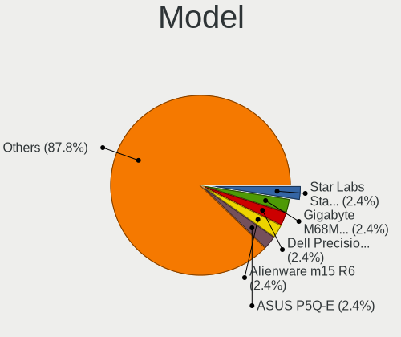
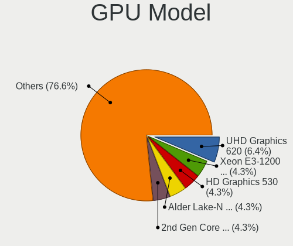
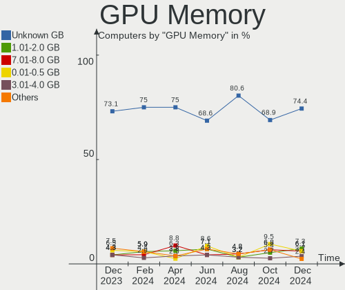
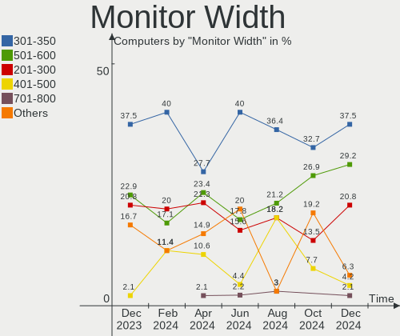
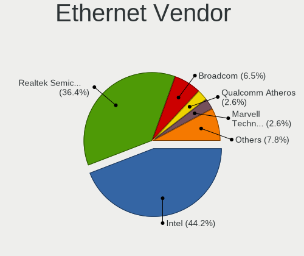
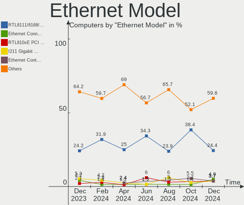

FreeBSD Hardware Trends
-----------------------

A project to identify most popular hardware characteristics and track their change
over time based on data collected by FreeBSD users at https://BSD-Hardware.info.

Anyone can contribute to the study by uploading probes of their computers by
the [hw-probe](https://github.com/linuxhw/hw-probe/blob/master/INSTALL.BSD.md) tool:

    hw-probe -all -upload

This is a report for all computer types. See also reports for [desktops](/Dist/FreeBSD/Desktop/README.md) and [notebooks](/Dist/FreeBSD/Notebook/README.md).

Full-feature report is available here: https://bsd-hardware.info/?view=trends

Period: Feb, 2021.

Contents
--------

- [ OS                       ](#os)
- [ OS Family                ](#os-family)
- [ Arch                     ](#arch)
- [ DE                       ](#de)
- [ Display Server           ](#display-server)
- [ Display Manager          ](#display-manager)
- [ OS Lang                  ](#os-lang)
- [ Boot Mode                ](#boot-mode)
- [ Filesystem               ](#filesystem)
- [ Part. scheme             ](#part-scheme)
- [ Country                  ](#country)
- [ City                     ](#city)
- [ Vendor                   ](#vendor)
- [ Model                    ](#model)
- [ Model Family             ](#model-family)
- [ MFG Year                 ](#mfg-year)
- [ Form Factor              ](#form-factor)
- [ Coreboot                 ](#coreboot)
- [ RAM Size                 ](#ram-size)
- [ RAM Used                 ](#ram-used)
- [ Has CD-ROM               ](#has-cd-rom)
- [ Total Drives             ](#total-drives)
- [ Has Ethernet             ](#has-ethernet)
- [ Drive Vendor             ](#drive-vendor)
- [ Drive Model              ](#drive-model)
- [ HDD Vendor               ](#hdd-vendor)
- [ SSD Vendor               ](#ssd-vendor)
- [ Drive Kind               ](#drive-kind)
- [ Drive Connector          ](#drive-connector)
- [ Drive Size               ](#drive-size)
- [ Space Total              ](#space-total)
- [ Space Used               ](#space-used)
- [ Malfunc. Drives          ](#malfunc-drives)
- [ Malfunc. Drive Vendor    ](#malfunc-drive-vendor)
- [ Malfunc. HDD Vendor      ](#malfunc-hdd-vendor)
- [ Malfunc. Drive Kind      ](#malfunc-drive-kind)
- [ Failed Drives            ](#failed-drives)
- [ Failed Drive Vendor      ](#failed-drive-vendor)
- [ Drive Status             ](#drive-status)
- [ Storage Vendor           ](#storage-vendor)
- [ Storage Model            ](#storage-model)
- [ Storage Kind             ](#storage-kind)
- [ CPU Vendor               ](#cpu-vendor)
- [ CPU Model                ](#cpu-model)
- [ CPU Model Family         ](#cpu-model-family)
- [ CPU Cores                ](#cpu-cores)
- [ CPU Sockets              ](#cpu-sockets)
- [ CPU Threads              ](#cpu-threads)
- [ CPU Microarch            ](#cpu-microarch)
- [ GPU Vendor               ](#gpu-vendor)
- [ GPU Model                ](#gpu-model)
- [ GPU Combo                ](#gpu-combo)
- [ GPU Driver               ](#gpu-driver)
- [ GPU Memory               ](#gpu-memory)
- [ Monitor Vendor           ](#monitor-vendor)
- [ Monitor Model            ](#monitor-model)
- [ Monitor Resolution       ](#monitor-resolution)
- [ Monitor Diagonal         ](#monitor-diagonal)
- [ Monitor Width            ](#monitor-width)
- [ Aspect Ratio             ](#aspect-ratio)
- [ Monitor Area             ](#monitor-area)
- [ Pixel Density            ](#pixel-density)
- [ Multiple Monitors        ](#multiple-monitors)
- [ Net Controller Vendor    ](#net-controller-vendor)
- [ Net Controller Model     ](#net-controller-model)
- [ Wireless Vendor          ](#wireless-vendor)
- [ Wireless Model           ](#wireless-model)
- [ Ethernet Vendor          ](#ethernet-vendor)
- [ Ethernet Model           ](#ethernet-model)
- [ Net Controller Kind      ](#net-controller-kind)
- [ Used Controller          ](#used-controller)
- [ NICs                     ](#nics)
- [ Memory Vendor            ](#memory-vendor)
- [ Memory Model             ](#memory-model)
- [ Memory Kind              ](#memory-kind)
- [ Memory Form Factor       ](#memory-form-factor)
- [ Memory Size              ](#memory-size)
- [ Memory Speed             ](#memory-speed)
- [ Sound Vendor             ](#sound-vendor)
- [ Sound Model              ](#sound-model)
- [ Camera Vendor            ](#camera-vendor)
- [ Camera Model             ](#camera-model)
- [ Fingerprint Vendor       ](#fingerprint-vendor)
- [ Fingerprint Model        ](#fingerprint-model)
- [ Chipcard Vendor          ](#chipcard-vendor)
- [ Chipcard Model           ](#chipcard-model)
- [ Printer Vendor           ](#printer-vendor)
- [ Printer Model            ](#printer-model)
- [ Scanner Vendor           ](#scanner-vendor)
- [ Scanner Model            ](#scanner-model)
- [ Bluetooth Vendor         ](#bluetooth-vendor)
- [ Bluetooth Model          ](#bluetooth-model)
- [ Unsupported Devices      ](#unsupported-devices)
- [ Unsupported Device Types ](#unsupported-device-types)

OS
--

Installed operating systems

| Name                    | Computers | Percent |
|-------------------------|-----------|---------|
| FreeBSD 12.2-p3         | 41        | 33.61%  |
| FreeBSD 14.0-CURRENT    | 13        | 10.66%  |
| FreeBSD 12.2            | 10        | 8.2%    |
| FreeBSD 13.0-STABLE     | 8         | 6.56%   |
| FreeBSD 12.2-p2         | 8         | 6.56%   |
| FreeBSD 13.0-BETA3      | 6         | 4.92%   |
| FreeBSD 13.0-BETA2      | 6         | 4.92%   |
| FreeBSD 13.0-BETA1      | 6         | 4.92%   |
| FreeBSD 12.2-STABLE     | 5         | 4.1%    |
| FreeBSD 12.2-p4         | 5         | 4.1%    |
| FreeBSD 13.0-CURRENT    | 3         | 2.46%   |
| FreeBSD 12.1-p12        | 3         | 2.46%   |
| FreeBSD 11.4-p4         | 3         | 2.46%   |
| FreeBSD 13.0-ALPHA3     | 2         | 1.64%   |
| FreeBSD 13.0-RTC-ALPHA2 | 1         | 0.82%   |
| FreeBSD 12.2-p1         | 1         | 0.82%   |
| FreeBSD 12.1            | 1         | 0.82%   |

OS Family
---------

OS without a version

| Name    | Computers | Percent |
|---------|-----------|---------|
| FreeBSD | 122       | 100%    |

Arch
----

OS architecture (x86_64, i586, etc.)

| Name  | Computers | Percent |
|-------|-----------|---------|
| amd64 | 112       | 91.8%   |
| i386  | 6         | 4.92%   |
| arm64 | 4         | 3.28%   |

DE
--

Desktop Environment

| Name          | Computers | Percent |
|---------------|-----------|---------|
| Console       | 32        | 26.23%  |
| KDE5          | 21        | 17.21%  |
| XFCE          | 19        | 15.57%  |
| TWM           | 13        | 10.66%  |
| GNOME         | 9         | 7.38%   |
| i3            | 7         | 5.74%   |
| MATE          | 6         | 4.92%   |
| Openbox       | 5         | 4.1%    |
| Fluxbox       | 2         | 1.64%   |
| Cinnamon      | 2         | 1.64%   |
| LXQt          | 1         | 0.82%   |
| LXDE          | 1         | 0.82%   |
| IceWM         | 1         | 0.82%   |
| Enlightenment | 1         | 0.82%   |
| DWM           | 1         | 0.82%   |
| AwesomeWM     | 1         | 0.82%   |

Display Server
--------------

X11 or Wayland

| Name    | Computers | Percent |
|---------|-----------|---------|
| X11     | 78        | 63.93%  |
| Console | 40        | 32.79%  |
| Wayland | 4         | 3.28%   |

Display Manager
---------------

SDDM, LightDM, etc.

| Name    | Computers | Percent |
|---------|-----------|---------|
| Console | 60        | 49.18%  |
| SDDM    | 21        | 17.21%  |
| SLiM    | 16        | 13.11%  |
| LightDM | 11        | 9.02%   |
| XDM     | 8         | 6.56%   |
| GDM     | 5         | 4.1%    |
| Ly      | 1         | 0.82%   |

OS Lang
-------

Language

| Lang            | Computers | Percent |
|-----------------|-----------|---------|
| Unknown         | 45        | 36.89%  |
| en_US           | 28        | 22.95%  |
| C               | 25        | 20.49%  |
| ru_RU           | 8         | 6.56%   |
| en_GB           | 6         | 4.92%   |
| fr_FR           | 3         | 2.46%   |
| pt_BR           | 2         | 1.64%   |
| de_DE           | 2         | 1.64%   |
| pl_PL           | 1         | 0.82%   |
| en_US.ISO8859-1 | 1         | 0.82%   |
| de_DE.ISO8859-1 | 1         | 0.82%   |

Boot Mode
---------

EFI or BIOS

| Mode | Computers | Percent |
|------|-----------|---------|
| EFI  | 69        | 56.56%  |
| BIOS | 53        | 43.44%  |

Filesystem
----------

Type of filesystem

| Type | Computers | Percent |
|------|-----------|---------|
| Zfs  | 76        | 62.3%   |
| Ufs  | 46        | 37.7%   |

Part. scheme
------------

Scheme of partitioning

| Type | Computers | Percent |
|------|-----------|---------|
| GPT  | 110       | 90.16%  |
| MBR  | 11        | 9.02%   |
| BSD  | 1         | 0.82%   |

Country
-------

Geographic location (country)

| Country      | Computers | Percent |
|--------------|-----------|---------|
| USA          | 32        | 26.23%  |
| Germany      | 15        | 12.3%   |
| UK           | 10        | 8.2%    |
| Russia       | 10        | 8.2%    |
| France       | 8         | 6.56%   |
| Norway       | 5         | 4.1%    |
| Japan        | 5         | 4.1%    |
| Indonesia    | 4         | 3.28%   |
| Ukraine      | 3         | 2.46%   |
| Poland       | 3         | 2.46%   |
| Canada       | 3         | 2.46%   |
| Brazil       | 3         | 2.46%   |
| Vietnam      | 2         | 1.64%   |
| Thailand     | 2         | 1.64%   |
| Netherlands  | 2         | 1.64%   |
| Finland      | 2         | 1.64%   |
| Belgium      | 2         | 1.64%   |
| Australia    | 2         | 1.64%   |
| Switzerland  | 1         | 0.82%   |
| Saudi Arabia | 1         | 0.82%   |
| Peru         | 1         | 0.82%   |
| New Zealand  | 1         | 0.82%   |
| Italy        | 1         | 0.82%   |
| Hungary      | 1         | 0.82%   |
| Croatia      | 1         | 0.82%   |
| Belarus      | 1         | 0.82%   |
| Bangladesh   | 1         | 0.82%   |

City
----

Geographic location (city)

| City               | Computers | Percent |
|--------------------|-----------|---------|
| Oslo               | 5         | 4.1%    |
| Moscow             | 4         | 3.28%   |
| The Bronx          | 3         | 2.46%   |
| Seattle            | 3         | 2.46%   |
| Bodelshausen       | 3         | 2.46%   |
| Tokyo              | 2         | 1.64%   |
| Teresina           | 2         | 1.64%   |
| Redmond            | 2         | 1.64%   |
| Paris              | 2         | 1.64%   |
| Palo Alto          | 2         | 1.64%   |
| Ome                | 2         | 1.64%   |
| Jakarta            | 2         | 1.64%   |
| Hackney            | 2         | 1.64%   |
| Glasgow            | 2         | 1.64%   |
| Gilbert            | 2         | 1.64%   |
| Falkenstein        | 2         | 1.64%   |
| Dieppe             | 2         | 1.64%   |
| Chicago            | 2         | 1.64%   |
| Berlin             | 2         | 1.64%   |
| Bellevue           | 2         | 1.64%   |
| Bandung            | 2         | 1.64%   |
| Zembrzyce          | 1         | 0.82%   |
| Zaporizhia         | 1         | 0.82%   |
| Zagreb             | 1         | 0.82%   |
| Weybridge          | 1         | 0.82%   |
| West Greenwich     | 1         | 0.82%   |
| Warsaw             | 1         | 0.82%   |
| Valencia           | 1         | 0.82%   |
| Uitikon            | 1         | 0.82%   |
| Turku              | 1         | 0.82%   |
| Tulle              | 1         | 0.82%   |
| Trowbridge         | 1         | 0.82%   |
| Telford            | 1         | 0.82%   |
| Sydney             | 1         | 0.82%   |
| Surgut             | 1         | 0.82%   |
| Sumida             | 1         | 0.82%   |
| St Petersburg      | 1         | 0.82%   |
| Sint-Genesius-Rode | 1         | 0.82%   |
| Sanford            | 1         | 0.82%   |
| Saint Paul         | 1         | 0.82%   |
| Rotorua            | 1         | 0.82%   |
| Rostock            | 1         | 0.82%   |
| Rochester          | 1         | 0.82%   |
| Roche-la-Moliere   | 1         | 0.82%   |
| Riyadh             | 1         | 0.82%   |
| Pordic             | 1         | 0.82%   |
| Partridge          | 1         | 0.82%   |
| Odesa              | 1         | 0.82%   |
| Novosibirsk        | 1         | 0.82%   |
| Nerang             | 1         | 0.82%   |
| Montreal           | 1         | 0.82%   |
| Meerbusch          | 1         | 0.82%   |
| Lübeck            | 1         | 0.82%   |
| Lons-le-Saunier    | 1         | 0.82%   |
| London             | 1         | 0.82%   |
| Lodi               | 1         | 0.82%   |
| Lipetsk            | 1         | 0.82%   |
| Lincoln            | 1         | 0.82%   |
| Lima               | 1         | 0.82%   |
| Langen             | 1         | 0.82%   |

Vendor
------

Motherboard manufacturer

| Name                           | Computers | Percent |
|--------------------------------|-----------|---------|
| Lenovo                         | 25        | 20.49%  |
| Dell                           | 18        | 14.75%  |
| ASUSTek Computer               | 18        | 14.75%  |
| ASRock                         | 8         | 6.56%   |
| Hewlett-Packard                | 7         | 5.74%   |
| Gigabyte Technology            | 6         | 4.92%   |
| MSI                            | 5         | 4.1%    |
| Acer                           | 5         | 4.1%    |
| Apple                          | 4         | 3.28%   |
| Supermicro                     | 3         | 2.46%   |
| Fujitsu                        | 3         | 2.46%   |
| Unknown                        | 3         | 2.46%   |
| System76                       | 2         | 1.64%   |
| Toshiba                        | 1         | 0.82%   |
| Raspberry Pi Foundation        | 1         | 0.82%   |
| PORSCHE DESIGN                 | 1         | 0.82%   |
| pine64                         | 1         | 0.82%   |
| PC Engines                     | 1         | 0.82%   |
| MOTILE                         | 1         | 0.82%   |
| Matsushita Electric Industrial | 1         | 0.82%   |
| LattePanda                     | 1         | 0.82%   |
| Intel                          | 1         | 0.82%   |
| IBM                            | 1         | 0.82%   |
| Huanan                         | 1         | 0.82%   |
| Gateway                        | 1         | 0.82%   |
| ECS                            | 1         | 0.82%   |
| Beckhoff Automation            | 1         | 0.82%   |
| A-DATA Technology              | 1         | 0.82%   |

Model
-----

Motherboard model

| Name                                                                  | Computers | Percent |
|-----------------------------------------------------------------------|-----------|---------|
| Unknown                                                               | 3         | 2.46%   |
| Dell PowerEdge R540                                                   | 2         | 1.64%   |
| ASUS TUF GAMING X570-PLUS                                             | 2         | 1.64%   |
| ASUS All Series                                                       | 2         | 1.64%   |
| Toshiba Satellite L50-C                                               | 1         | 0.82%   |
| System76 Lemur Pro                                                    | 1         | 0.82%   |
| System76 Galago Pro                                                   | 1         | 0.82%   |
| Supermicro X8DT6                                                      | 1         | 0.82%   |
| Supermicro X7SPA-HF                                                   | 1         | 0.82%   |
| Supermicro X11DPi-N(T)                                                | 1         | 0.82%   |
| RPi rpi                                                               | 1         | 0.82%   |
| PORSCHE DESIGN BOOK ONE                                               | 1         | 0.82%   |
| pine64 pinebook-pro-rk3399                                            | 1         | 0.82%   |
| PC Engines apu2                                                       | 1         | 0.82%   |
| MSI MS-7C73                                                           | 1         | 0.82%   |
| MSI MS-7B38                                                           | 1         | 0.82%   |
| MSI MS-7817                                                           | 1         | 0.82%   |
| MSI MS-7816                                                           | 1         | 0.82%   |
| MSI MS-7599                                                           | 1         | 0.82%   |
| MOTILE M142                                                           | 1         | 0.82%   |
| Matsushita Electric Industrial CF-T2BW1AXR                            | 1         | 0.82%   |
| Lenovo V130-15IKB 81HN                                                | 1         | 0.82%   |
| Lenovo ThinkPad X61s 766734A                                          | 1         | 0.82%   |
| Lenovo ThinkPad X280 20KFCTO1WW                                       | 1         | 0.82%   |
| Lenovo ThinkPad X230 Tablet 34371N3                                   | 1         | 0.82%   |
| Lenovo ThinkPad X220 42915CG                                          | 1         | 0.82%   |
| Lenovo ThinkPad X220 4290NE3                                          | 1         | 0.82%   |
| Lenovo ThinkPad X13 Gen 1 20UF000QRT                                  | 1         | 0.82%   |
| Lenovo ThinkPad X1 Yoga 1st 20FQ000RUS                                | 1         | 0.82%   |
| Lenovo ThinkPad X1 Extreme 20MF000BUS                                 | 1         | 0.82%   |
| Lenovo ThinkPad X1 Carbon 4th 48104P0100                              | 1         | 0.82%   |
| Lenovo ThinkPad X1 Carbon 4th 20FC0019AU                              | 1         | 0.82%   |
| Lenovo ThinkPad T61 6459CTO                                           | 1         | 0.82%   |
| Lenovo ThinkPad T530 2429J74                                          | 1         | 0.82%   |
| Lenovo ThinkPad T495s 20QKS1812F                                      | 1         | 0.82%   |
| Lenovo ThinkPad T450 20BUS08800                                       | 1         | 0.82%   |
| Lenovo ThinkPad T430 2349H2G                                          | 1         | 0.82%   |
| Lenovo ThinkPad T420 42368A3                                          | 1         | 0.82%   |
| Lenovo ThinkPad Edge 03282UA                                          | 1         | 0.82%   |
| Lenovo ThinkPad E490 20N8CTO1WW                                       | 1         | 0.82%   |
| Lenovo ThinkPad E420 1141CTO                                          | 1         | 0.82%   |
| Lenovo ThinkCentre M91p 5067AT1                                       | 1         | 0.82%   |
| Lenovo ThinkCentre M700 10GRCTO1WW                                    | 1         | 0.82%   |
| Lenovo IdeaPad 510-15IKB 80SV                                         | 1         | 0.82%   |
| Lenovo G505s 20255                                                    | 1         | 0.82%   |
| Lenovo 20QD0000US                                                     | 1         | 0.82%   |
| LattePanda Alpha                                                      | 1         | 0.82%   |
| Intel NUC6i5SYB H81131-503                                            | 1         | 0.82%   |
| IBM System X3250 M4 -[2583B2A]-                                       | 1         | 0.82%   |
| Huanan X79 INTEL (INTEL Xeon E5/Corei7 DMI2 - C600/C200 Cipset V2.49P | 1         | 0.82%   |
| HP Z800 Workstation                                                   | 1         | 0.82%   |
| HP ENVY dv7                                                           | 1         | 0.82%   |
| HP EliteDesk 800 G3 DM 65W                                            | 1         | 0.82%   |
| HP EliteBook 8570p                                                    | 1         | 0.82%   |
| HP EliteBook 8460p                                                    | 1         | 0.82%   |
| HP Desktop M01-F0xxx                                                  | 1         | 0.82%   |
| HP Compaq 6820s                                                       | 1         | 0.82%   |
| Gigabyte Z97X-UD3H                                                    | 1         | 0.82%   |
| Gigabyte X570 AORUS MASTER                                            | 1         | 0.82%   |
| Gigabyte P15FR7                                                       | 1         | 0.82%   |

Model Family
------------

Motherboard model prefix

| Name                                       | Computers | Percent |
|--------------------------------------------|-----------|---------|
| Lenovo ThinkPad                            | 19        | 15.57%  |
| Dell Latitude                              | 6         | 4.92%   |
| Dell PowerEdge                             | 4         | 3.28%   |
| ASUS TUF                                   | 3         | 2.46%   |
| Acer Aspire                                | 3         | 2.46%   |
| Unknown                                    | 3         | 2.46%   |
| Lenovo ThinkCentre                         | 2         | 1.64%   |
| HP EliteBook                               | 2         | 1.64%   |
| Dell OptiPlex                              | 2         | 1.64%   |
| Dell Inspiron                              | 2         | 1.64%   |
| ASUS PRIME                                 | 2         | 1.64%   |
| ASUS All                                   | 2         | 1.64%   |
| Toshiba Satellite                          | 1         | 0.82%   |
| System76 Lemur                             | 1         | 0.82%   |
| System76 Galago                            | 1         | 0.82%   |
| Supermicro X8DT6                           | 1         | 0.82%   |
| Supermicro X7SPA-HF                        | 1         | 0.82%   |
| Supermicro X11DPi-N(T)                     | 1         | 0.82%   |
| RPi rpi                                    | 1         | 0.82%   |
| PORSCHE DESIGN BOOK                        | 1         | 0.82%   |
| pine64 pinebook-pro-rk3399                 | 1         | 0.82%   |
| PC Engines apu2                            | 1         | 0.82%   |
| MSI MS-7C73                                | 1         | 0.82%   |
| MSI MS-7B38                                | 1         | 0.82%   |
| MSI MS-7817                                | 1         | 0.82%   |
| MSI MS-7816                                | 1         | 0.82%   |
| MSI MS-7599                                | 1         | 0.82%   |
| MOTILE M142                                | 1         | 0.82%   |
| Matsushita Electric Industrial CF-T2BW1AXR | 1         | 0.82%   |
| Lenovo V130-15IKB                          | 1         | 0.82%   |
| Lenovo IdeaPad                             | 1         | 0.82%   |
| Lenovo G505s                               | 1         | 0.82%   |
| Lenovo 20QD0000US                          | 1         | 0.82%   |
| LattePanda Alpha                           | 1         | 0.82%   |
| Intel NUC6i5SYB                            | 1         | 0.82%   |
| IBM System                                 | 1         | 0.82%   |
| Huanan X79                                 | 1         | 0.82%   |
| HP Z800                                    | 1         | 0.82%   |
| HP ENVY                                    | 1         | 0.82%   |
| HP EliteDesk                               | 1         | 0.82%   |
| HP Desktop                                 | 1         | 0.82%   |
| HP Compaq                                  | 1         | 0.82%   |
| Gigabyte Z97X-UD3H                         | 1         | 0.82%   |
| Gigabyte X570                              | 1         | 0.82%   |
| Gigabyte P15FR7                            | 1         | 0.82%   |
| Gigabyte M68MT-S2                          | 1         | 0.82%   |
| Gigabyte F2A55M-DS2                        | 1         | 0.82%   |
| Gigabyte 990FXA-UD3                        | 1         | 0.82%   |
| Gateway DX4870                             | 1         | 0.82%   |
| Fujitsu FMVNF70YJ                          | 1         | 0.82%   |
| Fujitsu D3417-B2                           | 1         | 0.82%   |
| Fujitsu D3417-B1                           | 1         | 0.82%   |
| ECS B672                                   | 1         | 0.82%   |
| Dell Vostro                                | 1         | 0.82%   |
| Dell Studio                                | 1         | 0.82%   |
| Dell PowerVault                            | 1         | 0.82%   |
| Dell G7                                    | 1         | 0.82%   |
| Beckhoff Automation Industrial             | 1         | 0.82%   |
| ASUS X553MA                                | 1         | 0.82%   |
| ASUS SABERTOOTH                            | 1         | 0.82%   |

MFG Year
--------

Motherboard manufacture year

| Year    | Computers | Percent |
|---------|-----------|---------|
| 2018    | 20        | 16.39%  |
| 2020    | 17        | 13.93%  |
| 2019    | 16        | 13.11%  |
| 2012    | 9         | 7.38%   |
| 2021    | 8         | 6.56%   |
| 2017    | 6         | 4.92%   |
| 2015    | 6         | 4.92%   |
| 2013    | 6         | 4.92%   |
| 2008    | 6         | 4.92%   |
| 2016    | 5         | 4.1%    |
| 2014    | 5         | 4.1%    |
| 2011    | 5         | 4.1%    |
| 2009    | 5         | 4.1%    |
| 2010    | 3         | 2.46%   |
| Unknown | 2         | 1.64%   |
| 2007    | 1         | 0.82%   |
| 2005    | 1         | 0.82%   |
| 2003    | 1         | 0.82%   |

Form Factor
-----------

Physical design of the computer

| Name        | Computers | Percent |
|-------------|-----------|---------|
| Desktop     | 54        | 44.26%  |
| Notebook    | 53        | 43.44%  |
| Server      | 8         | 6.56%   |
| Mini pc     | 3         | 2.46%   |
| Convertible | 2         | 1.64%   |
| All in one  | 2         | 1.64%   |

Coreboot
--------

Have coreboot on board

| Used | Computers | Percent |
|------|-----------|---------|
| No   | 120       | 98.36%  |
| Yes  | 2         | 1.64%   |

RAM Size
--------

Total RAM memory

| Size in GB  | Computers | Percent |
|-------------|-----------|---------|
| 8.01-16.0   | 35        | 28.69%  |
| 16.01-24.0  | 33        | 27.05%  |
| 4.01-8.0    | 18        | 14.75%  |
| 32.01-64.0  | 16        | 13.11%  |
| 64.01-256.0 | 10        | 8.2%    |
| 2.01-3.0    | 6         | 4.92%   |
| 24.01-32.0  | 2         | 1.64%   |
| 3.01-4.0    | 1         | 0.82%   |
| 1.01-2.0    | 1         | 0.82%   |

RAM Used
--------

Used RAM memory

| Used GB     | Computers | Percent |
|-------------|-----------|---------|
| 0.01-0.5    | 47        | 38.52%  |
| 0.51-1.0    | 34        | 27.87%  |
| 1.01-2.0    | 16        | 13.11%  |
| 4.01-8.0    | 6         | 4.92%   |
| 8.01-16.0   | 5         | 4.1%    |
| 3.01-4.0    | 4         | 3.28%   |
| 2.01-3.0    | 4         | 3.28%   |
| 64.01-256.0 | 3         | 2.46%   |
| 32.01-64.0  | 1         | 0.82%   |
| 24.01-32.0  | 1         | 0.82%   |
| 16.01-24.0  | 1         | 0.82%   |

Has CD-ROM
----------

Has CD-ROM on board

| Presented | Computers | Percent |
|-----------|-----------|---------|
| No        | 82        | 67.21%  |
| Yes       | 40        | 32.79%  |

Total Drives
------------

Number of drives on board

| Drives | Computers | Percent |
|--------|-----------|---------|
| 1      | 57        | 46.72%  |
| 2      | 30        | 24.59%  |
| 3      | 9         | 7.38%   |
| 4      | 6         | 4.92%   |
| 5      | 5         | 4.1%    |
| 0      | 5         | 4.1%    |
| 6      | 3         | 2.46%   |
| 25     | 1         | 0.82%   |
| 24     | 1         | 0.82%   |
| 12     | 1         | 0.82%   |
| 11     | 1         | 0.82%   |
| 9      | 1         | 0.82%   |
| 8      | 1         | 0.82%   |
| 7      | 1         | 0.82%   |

Has Ethernet
------------

Has Ethernet on board

| Presented | Computers | Percent |
|-----------|-----------|---------|
| Yes       | 113       | 92.62%  |
| No        | 9         | 7.38%   |

Drive Vendor
------------

Hard drive vendors

| Vendor              | Computers | Drives | Percent |
|---------------------|-----------|--------|---------|
| WDC                 | 37        | 65     | 20.56%  |
| Seagate             | 32        | 58     | 17.78%  |
| Samsung Electronics | 31        | 41     | 17.22%  |
| Toshiba             | 14        | 43     | 7.78%   |
| Kingston            | 9         | 11     | 5%      |
| Crucial             | 9         | 9      | 5%      |
| HGST                | 6         | 35     | 3.33%   |
| Intel               | 5         | 5      | 2.78%   |
| Hitachi             | 5         | 5      | 2.78%   |
| A-DATA Technology   | 5         | 5      | 2.78%   |
| SanDisk             | 4         | 4      | 2.22%   |
| Transcend           | 3         | 3      | 1.67%   |
| SK Hynix            | 2         | 2      | 1.11%   |
| Phison              | 2         | 3      | 1.11%   |
| Hewlett-Packard     | 2         | 2      | 1.11%   |
| Gigabyte Technology | 2         | 2      | 1.11%   |
| Fujitsu             | 2         | 2      | 1.11%   |
| Dell                | 2         | 5      | 1.11%   |
| T-FORCE             | 1         | 1      | 0.56%   |
| PLEXTOR             | 1         | 1      | 0.56%   |
| Patriot             | 1         | 1      | 0.56%   |
| OCZ                 | 1         | 1      | 0.56%   |
| Micron Technology   | 1         | 1      | 0.56%   |
| LITEON              | 1         | 1      | 0.56%   |
| KingSpec            | 1         | 1      | 0.56%   |
| BIWIN               | 1         | 1      | 0.56%   |

Drive Model
-----------

Hard drive models

| Model                                | Computers | Percent |
|--------------------------------------|-----------|---------|
| Samsung SSD 850 EVO 250GB            | 5         | 2.43%   |
| WDC WD40EZRZ-22GXCB0 4TB             | 2         | 0.97%   |
| WDC WD10EZRX-00A8LB0 1TB             | 2         | 0.97%   |
| WDC PC SN730 SDBQNTY-512G-1001 512GB | 2         | 0.97%   |
| Toshiba MQ04ABF100 1TB               | 2         | 0.97%   |
| Toshiba MQ01ABD100 1TB               | 2         | 0.97%   |
| Toshiba MG04SCA40ENY 4TB             | 2         | 0.97%   |
| Seagate ST8000AS0002-1NA17Z 8TB      | 2         | 0.97%   |
| Seagate ST4000DM000-1F2168 4TB       | 2         | 0.97%   |
| Seagate ST3500312CS 500GB            | 2         | 0.97%   |
| Seagate ST1000LM024 HN-M101MBB 1TB   | 2         | 0.97%   |
| Seagate ST1000DM003-9YN162 1TB       | 2         | 0.97%   |
| Samsung SSD 860 EVO 500GB            | 2         | 0.97%   |
| Samsung SSD 860 EVO 250GB            | 2         | 0.97%   |
| Samsung SSD 850 EVO 500GB            | 2         | 0.97%   |
| Samsung MZVLV128HCGR-00000 128GB     | 2         | 0.97%   |
| Kingston SV300S37A120G 120GB         | 2         | 0.97%   |
| Kingston SA400S37240G 240GB          | 2         | 0.97%   |
| HGST HTS725050A7E630 500GB           | 2         | 0.97%   |
| HGST HTS721010A9E630 1TB             | 2         | 0.97%   |
| Crucial CT250MX500SSD1 250GB         | 2         | 0.97%   |
| A-DATA SU650 240GB                   | 2         | 0.97%   |
| WDC WDS500G2B0C-00PXH0 500GB         | 1         | 0.49%   |
| WDC WDS500G2B0A-00SM50 500GB         | 1         | 0.49%   |
| WDC WDS480G2G0A-00JH30 480GB         | 1         | 0.49%   |
| WDC WDS250G2B0A-00SM50 250GB         | 1         | 0.49%   |
| WDC WDS100T1R0A-68A4W0 1TB           | 1         | 0.49%   |
| WDC WDBA3V5000ANC-WRSN 500GB         | 1         | 0.49%   |
| WDC WD80EFAX-68KNBN0 8TB             | 1         | 0.49%   |
| WDC WD7500BPKT-75PK4T0 752GB         | 1         | 0.49%   |
| WDC WD60EFRX-68MYMN1 6TB             | 1         | 0.49%   |
| WDC WD5003AZEX-00MK2A0 500GB         | 1         | 0.49%   |
| WDC WD5003AZEX-00K3CA0 500GB         | 1         | 0.49%   |
| WDC WD5003AZEX-00K1GA0 500GB         | 1         | 0.49%   |
| WDC WD5002ABYS-18B1B0 500GB          | 1         | 0.49%   |
| WDC WD5000AAKS-00UU3A0 500GB         | 1         | 0.49%   |
| WDC WD40NDZW-11MR8S1 4TB             | 1         | 0.49%   |
| WDC WD40EFRX-68WT0N0 4TB             | 1         | 0.49%   |
| WDC WD4001FAEX-00MJRA0 4TB           | 1         | 0.49%   |
| WDC WD4000BEVT-00ZAT0 400GB          | 1         | 0.49%   |
| WDC WD360GD-00FLC0 37GB              | 1         | 0.49%   |
| WDC WD3200AAJS-22B4A0 320GB          | 1         | 0.49%   |
| WDC WD30EFRX-68EUZN0 3TB             | 1         | 0.49%   |
| WDC WD2500AAJS-40RYA0 250GB          | 1         | 0.49%   |
| WDC WD20EFRX-68EUZN0 2TB             | 1         | 0.49%   |
| WDC WD2001FASS-00W2B0 2TB            | 1         | 0.49%   |
| WDC WD2001FASS-00U0B0 2TB            | 1         | 0.49%   |
| WDC WD120EMFZ-11A6JA0 12TB           | 1         | 0.49%   |
| WDC WD120EFAX-68UNTN0 12TB           | 1         | 0.49%   |
| WDC WD120EDAZ-11F3RA0 12TB           | 1         | 0.49%   |
| WDC WD10SPZX-24Z10 1TB               | 1         | 0.49%   |
| WDC WD10SPZX-21Z10T0 1TB             | 1         | 0.49%   |
| WDC WD10SDZW-11UMGS0 1TB             | 1         | 0.49%   |
| WDC WD10EZEX-75WN4A1 1TB             | 1         | 0.49%   |
| WDC WD10EZEX-75WN4A0 1TB             | 1         | 0.49%   |
| WDC WD10EZEX-08WN4A0 1TB             | 1         | 0.49%   |
| WDC WD10EZEX-08M2NA0 1TB             | 1         | 0.49%   |
| WDC WD10EZEX-00WN4A0 1TB             | 1         | 0.49%   |
| WDC WD1003FBYX-23 00W1143 1TB        | 1         | 0.49%   |
| WDC WD1001FALS-00J7B0 1TB            | 1         | 0.49%   |

HDD Vendor
----------

Hard disk drive vendors

| Vendor              | Computers | Drives | Percent |
|---------------------|-----------|--------|---------|
| Seagate             | 32        | 58     | 35.56%  |
| WDC                 | 29        | 55     | 32.22%  |
| Toshiba             | 13        | 42     | 14.44%  |
| HGST                | 6         | 35     | 6.67%   |
| Hitachi             | 5         | 5      | 5.56%   |
| Fujitsu             | 2         | 2      | 2.22%   |
| Dell                | 2         | 5      | 2.22%   |
| Samsung Electronics | 1         | 1      | 1.11%   |

SSD Vendor
----------

Solid state drive vendors

| Vendor              | Computers | Drives | Percent |
|---------------------|-----------|--------|---------|
| Samsung Electronics | 19        | 27     | 31.67%  |
| Kingston            | 8         | 10     | 13.33%  |
| Crucial             | 6         | 6      | 10%     |
| WDC                 | 4         | 5      | 6.67%   |
| SanDisk             | 4         | 4      | 6.67%   |
| A-DATA Technology   | 4         | 4      | 6.67%   |
| Transcend           | 3         | 3      | 5%      |
| SK Hynix            | 2         | 2      | 3.33%   |
| Intel               | 2         | 2      | 3.33%   |
| Hewlett-Packard     | 2         | 2      | 3.33%   |
| Patriot             | 1         | 1      | 1.67%   |
| OCZ                 | 1         | 1      | 1.67%   |
| LITEON              | 1         | 1      | 1.67%   |
| KingSpec            | 1         | 1      | 1.67%   |
| Gigabyte Technology | 1         | 1      | 1.67%   |
| BIWIN               | 1         | 1      | 1.67%   |

Drive Kind
----------

HDD or SSD

| Kind | Computers | Drives | Percent |
|------|-----------|--------|---------|
| HDD  | 66        | 203    | 44%     |
| SSD  | 53        | 71     | 35.33%  |
| NVMe | 31        | 34     | 20.67%  |

Drive Connector
---------------

SATA, SAS, NVMe, etc.

| Type | Computers | Drives | Percent |
|------|-----------|--------|---------|
| SATA | 98        | 274    | 75.97%  |
| NVMe | 31        | 34     | 24.03%  |

Drive Size
----------

Size of hard drive

| Size in TB | Computers | Drives | Percent |
|------------|-----------|--------|---------|
| 0.01-0.5   | 69        | 107    | 52.27%  |
| 0.51-1.0   | 29        | 46     | 21.97%  |
| 3.01-4.0   | 12        | 52     | 9.09%   |
| 4.01-10.0  | 7         | 35     | 5.3%    |
| 1.01-2.0   | 6         | 10     | 4.55%   |
| 2.01-3.0   | 4         | 12     | 3.03%   |
| 10.01-20.0 | 4         | 11     | 3.03%   |
| 20.01-50.0 | 1         | 1      | 0.76%   |

Space Total
-----------

Amount of disk space available on the file system

| Size in GB     | Computers | Percent |
|----------------|-----------|---------|
| 101-250        | 34        | 27.87%  |
| 251-500        | 26        | 21.31%  |
| 501-1000       | 20        | 16.39%  |
| 51-100         | 11        | 9.02%   |
| 21-50          | 8         | 6.56%   |
| 1-20           | 8         | 6.56%   |
| 1001-2000      | 7         | 5.74%   |
| More than 3000 | 6         | 4.92%   |
| 2001-3000      | 2         | 1.64%   |

Space Used
----------

Amount of used disk space

| Used GB        | Computers | Percent |
|----------------|-----------|---------|
| 1-20           | 77        | 63.11%  |
| 21-50          | 22        | 18.03%  |
| 101-250        | 11        | 9.02%   |
| 51-100         | 4         | 3.28%   |
| More than 3000 | 2         | 1.64%   |
| 251-500        | 2         | 1.64%   |
| 1001-2000      | 2         | 1.64%   |
| 501-1000       | 2         | 1.64%   |

Malfunc. Drives
---------------

Drive models with a malfunction

| Model                                       | Computers | Drives | Percent |
|---------------------------------------------|-----------|--------|---------|
| Seagate ST1000DM003-9YN162 1TB              | 2         | 4      | 8.33%   |
| WDC WD7500BPKT-75PK4T0 752GB                | 1         | 1      | 4.17%   |
| WDC WD60EFRX-68MYMN1 6TB                    | 1         | 1      | 4.17%   |
| WDC WD5002ABYS-18B1B0 500GB                 | 1         | 1      | 4.17%   |
| WDC WD40EFRX-68WT0N0 4TB                    | 1         | 2      | 4.17%   |
| WDC WD4001FAEX-00MJRA0 4TB                  | 1         | 2      | 4.17%   |
| WDC WD3200AAJS-22B4A0 320GB                 | 1         | 1      | 4.17%   |
| WDC WD20EFRX-68EUZN0 2TB                    | 1         | 3      | 4.17%   |
| WDC WD2001FASS-00W2B0 2TB                   | 1         | 1      | 4.17%   |
| Toshiba MK6475GSX 640GB                     | 1         | 1      | 4.17%   |
| Seagate ST9500325AS 500GB                   | 1         | 1      | 4.17%   |
| Seagate ST9250320AS 250GB                   | 1         | 1      | 4.17%   |
| Seagate ST9250315AS 250GB                   | 1         | 1      | 4.17%   |
| Seagate ST3250318AS 250GB                   | 1         | 1      | 4.17%   |
| Seagate ST3160812A 160GB                    | 1         | 1      | 4.17%   |
| Samsung Electronics SSD 840 EVO 500GB       | 1         | 1      | 4.17%   |
| Samsung Electronics MZ5PA064HMCD-01000 64GB | 1         | 1      | 4.17%   |
| Samsung Electronics HD154UI 1.5TB           | 1         | 1      | 4.17%   |
| Hitachi HTS723232A7A364 320GB               | 1         | 1      | 4.17%   |
| Hitachi HTS543232L9SA02 320GB               | 1         | 1      | 4.17%   |
| HGST HTS725050A7E630 500GB                  | 1         | 1      | 4.17%   |
| Fujitsu MHS2040AT D 40GB                    | 1         | 1      | 4.17%   |
| A-DATA Technology SP900 256GB               | 1         | 1      | 4.17%   |

Malfunc. Drive Vendor
---------------------

Vendors of faulty drives

| Vendor              | Computers | Drives | Percent |
|---------------------|-----------|--------|---------|
| WDC                 | 8         | 12     | 33.33%  |
| Seagate             | 7         | 9      | 29.17%  |
| Samsung Electronics | 3         | 3      | 12.5%   |
| Hitachi             | 2         | 2      | 8.33%   |
| Toshiba             | 1         | 1      | 4.17%   |
| HGST                | 1         | 1      | 4.17%   |
| Fujitsu             | 1         | 1      | 4.17%   |
| A-DATA Technology   | 1         | 1      | 4.17%   |

Malfunc. HDD Vendor
-------------------

Vendors of faulty HDD drives

| Vendor              | Computers | Drives | Percent |
|---------------------|-----------|--------|---------|
| WDC                 | 8         | 12     | 38.1%   |
| Seagate             | 7         | 9      | 33.33%  |
| Hitachi             | 2         | 2      | 9.52%   |
| Toshiba             | 1         | 1      | 4.76%   |
| Samsung Electronics | 1         | 1      | 4.76%   |
| HGST                | 1         | 1      | 4.76%   |
| Fujitsu             | 1         | 1      | 4.76%   |

Malfunc. Drive Kind
-------------------

Kinds of faulty drives

| Kind | Computers | Drives | Percent |
|------|-----------|--------|---------|
| HDD  | 20        | 27     | 86.96%  |
| SSD  | 3         | 3      | 13.04%  |

Failed Drives
-------------

Failed drive models

Zero info for selected period =(

Failed Drive Vendor
-------------------

Failed drive vendors

Zero info for selected period =(

Drive Status
------------

Number of failed and malfunc. drives

| Status   | Computers | Drives | Percent |
|----------|-----------|--------|---------|
| Works    | 106       | 270    | 80.3%   |
| Malfunc  | 23        | 30     | 17.42%  |
| Detected | 3         | 8      | 2.27%   |

Storage Vendor
--------------

Storage controller vendors

| Vendor                      | Computers | Percent |
|-----------------------------|-----------|---------|
| Intel                       | 83        | 53.21%  |
| AMD                         | 21        | 13.46%  |
| Samsung Electronics         | 10        | 6.41%   |
| Broadcom / LSI              | 8         | 5.13%   |
| Sandisk                     | 7         | 4.49%   |
| Marvell Technology Group    | 6         | 3.85%   |
| ASMedia Technology          | 5         | 3.21%   |
| Phison Electronics          | 4         | 2.56%   |
| Nvidia                      | 3         | 1.92%   |
| Micron/Crucial Technology   | 2         | 1.28%   |
| Micron Technology           | 2         | 1.28%   |
| VIA Technologies            | 1         | 0.64%   |
| Toshiba                     | 1         | 0.64%   |
| Lite-On Technology          | 1         | 0.64%   |
| Kingston Technology Company | 1         | 0.64%   |
| ADATA Technology            | 1         | 0.64%   |

Storage Model
-------------

Storage controller models

| Model                                                                                   | Computers | Percent |
|-----------------------------------------------------------------------------------------|-----------|---------|
| AMD FCH SATA Controller [AHCI mode]                                                     | 14        | 7.65%   |
| Intel Sunrise Point-LP SATA Controller [AHCI mode]                                      | 8         | 4.37%   |
| Intel 82801HM/HEM (ICH8M/ICH8M-E) SATA Controller [AHCI mode]                           | 7         | 3.83%   |
| Intel 82801HM/HEM (ICH8M/ICH8M-E) IDE Controller                                        | 7         | 3.83%   |
| Intel 7 Series Chipset Family 6-port SATA Controller [AHCI mode]                        | 7         | 3.83%   |
| Intel Q170/Q150/B150/H170/H110/Z170/CM236 Chipset SATA Controller [AHCI Mode]           | 6         | 3.28%   |
| Intel 6 Series/C200 Series Chipset Family 6 port Mobile SATA AHCI Controller            | 6         | 3.28%   |
| Samsung NVMe SSD Controller SM981/PM981/PM983                                           | 5         | 2.73%   |
| ASMedia ASM1062 Serial ATA Controller                                                   | 5         | 2.73%   |
| AMD SB7x0/SB8x0/SB9x0 SATA Controller [AHCI mode]                                       | 5         | 2.73%   |
| Intel C620 Series Chipset Family SSATA Controller [AHCI mode]                           | 4         | 2.19%   |
| Intel C620 Series Chipset Family SATA Controller [AHCI mode]                            | 4         | 2.19%   |
| Intel 8 Series/C220 Series Chipset Family 6-port SATA Controller 1 [AHCI mode]          | 4         | 2.19%   |
| Intel 400 Series Chipset Family SATA AHCI Controller                                    | 4         | 2.19%   |
| Unknown                                                                                 | 4         | 2.19%   |
| Sandisk WD Blue SN550 NVMe SSD                                                          | 3         | 1.64%   |
| Marvell Group 88SE9230 PCIe 2.0 x2 4-port SATA 6 Gb/s RAID Controller                   | 3         | 1.64%   |
| Intel 82801 Mobile SATA Controller [RAID mode]                                          | 3         | 1.64%   |
| Intel 6 Series/C200 Series Chipset Family 6 port Desktop SATA AHCI Controller           | 3         | 1.64%   |
| Intel 5 Series/3400 Series Chipset 4 port SATA AHCI Controller                          | 3         | 1.64%   |
| Sandisk WD Black SN750 / PC SN730 NVMe SSD                                              | 2         | 1.09%   |
| Sandisk WD Black 2018/SN750 / PC SN720 NVMe SSD                                         | 2         | 1.09%   |
| Samsung NVMe SSD Controller SM961/PM961/SM963                                           | 2         | 1.09%   |
| Samsung NVMe SSD Controller SM951/PM951                                                 | 2         | 1.09%   |
| Phison E16 PCIe4 NVMe Controller                                                        | 2         | 1.09%   |
| Phison E12 NVMe Controller                                                              | 2         | 1.09%   |
| Marvell Group 88SE6111/6121 SATA II / PATA Controller                                   | 2         | 1.09%   |
| Intel Wildcat Point-LP SATA Controller [AHCI Mode]                                      | 2         | 1.09%   |
| Intel SSD 660P Series                                                                   | 2         | 1.09%   |
| Intel SATA Controller [RAID mode]                                                       | 2         | 1.09%   |
| Intel Atom Processor E3800 Series SATA AHCI Controller                                  | 2         | 1.09%   |
| Intel 82801JI (ICH10 Family) SATA AHCI Controller                                       | 2         | 1.09%   |
| Intel 7 Series/C210 Series Chipset Family 6-port SATA Controller [AHCI mode]            | 2         | 1.09%   |
| Intel 6 Series/C200 Series Chipset Family Desktop SATA Controller (IDE mode, ports 4-5) | 2         | 1.09%   |
| Intel 6 Series/C200 Series Chipset Family Desktop SATA Controller (IDE mode, ports 0-3) | 2         | 1.09%   |
| Intel 200 Series PCH SATA controller [AHCI mode]                                        | 2         | 1.09%   |
| Broadcom / LSI SAS2008 PCI-Express Fusion-MPT SAS-2 [Falcon]                            | 2         | 1.09%   |
| Broadcom / LSI MegaRAID Tri-Mode SAS3508                                                | 2         | 1.09%   |
| AMD SB7x0/SB8x0/SB9x0 IDE Controller                                                    | 2         | 1.09%   |
| AMD FCH SATA Controller D                                                               | 2         | 1.09%   |
| AMD 400 Series Chipset SATA Controller                                                  | 2         | 1.09%   |
| VIA VT6415 PATA IDE Host Controller                                                     | 1         | 0.55%   |
| Toshiba BG3 NVMe SSD Controller                                                         | 1         | 0.55%   |
| Samsung NVMe SSD Controller PM9A1/980PRO                                                | 1         | 0.55%   |
| Nvidia MCP79 AHCI Controller                                                            | 1         | 0.55%   |
| Nvidia MCP61 SATA Controller                                                            | 1         | 0.55%   |
| Nvidia CK804 Serial ATA Controller                                                      | 1         | 0.55%   |
| Nvidia CK804 IDE                                                                        | 1         | 0.55%   |
| Micron/Crucial P1 NVMe PCIe SSD                                                         | 1         | 0.55%   |
| Marvell Group 88SE9172 SATA 6Gb/s Controller                                            | 1         | 0.55%   |
| Lite-On M8Pe Series NVMe SSD                                                            | 1         | 0.55%   |
| Kingston Company A2000 NVMe SSD                                                         | 1         | 0.55%   |
| Intel SSD 600P Series                                                                   | 1         | 0.55%   |
| Intel NVMe Optane Memory Series                                                         | 1         | 0.55%   |
| Intel Mobile PM965/GM965 PT IDER Controller                                             | 1         | 0.55%   |
| Intel HM170/QM170 Chipset SATA Controller [AHCI Mode]                                   | 1         | 0.55%   |
| Intel Cannon Lake PCH SATA AHCI Controller                                              | 1         | 0.55%   |
| Intel Cannon Lake Mobile PCH SATA AHCI Controller                                       | 1         | 0.55%   |
| Intel Atom/Celeron/Pentium Processor x5-E8000/J3xxx/N3xxx Series SATA Controller        | 1         | 0.55%   |
| Intel 9 Series Chipset Family SATA Controller [AHCI Mode]                               | 1         | 0.55%   |

Storage Kind
------------

Kind of storage controller (IDE, SATA, NVMe, SAS, ...)

| Kind | Computers | Percent |
|------|-----------|---------|
| SATA | 90        | 57.32%  |
| NVMe | 33        | 21.02%  |
| IDE  | 21        | 13.38%  |
| RAID | 8         | 5.1%    |
| SAS  | 4         | 2.55%   |
| SCSI | 1         | 0.64%   |

CPU Vendor
----------

Processor vendors

| Vendor  | Computers | Percent |
|---------|-----------|---------|
| Intel   | 93        | 76.23%  |
| AMD     | 25        | 20.49%  |
| ARM     | 3         | 2.46%   |
| Unknown | 1         | 0.82%   |

CPU Model
---------

Processor models

| Model                                  | Computers | Percent |
|----------------------------------------|-----------|---------|
| Intel Core i5-2520M CPU @ 2.50GHz      | 5         | 4.1%    |
| Intel Xeon Silver 4114 CPU @ 2.20GHz   | 3         | 2.46%   |
| Intel Core i7-7500U CPU @ 2.70GHz      | 3         | 2.46%   |
| Intel Core i7-3520M CPU @ 2.90GHz      | 3         | 2.46%   |
| Intel CPU Version                      | 2         | 1.64%   |
| Intel Core i7-8750H CPU @ 2.20GHz      | 2         | 1.64%   |
| Intel Core i7-8565U CPU @ 1.80GHz      | 2         | 1.64%   |
| Intel Core i7-6600U CPU @ 2.60GHz      | 2         | 1.64%   |
| Intel Core i5-7200U CPU @ 2.50GHz      | 2         | 1.64%   |
| Intel Core i5-3340M CPU @ 2.70GHz      | 2         | 1.64%   |
| Intel Core i5-3320M CPU @ 2.60GHz      | 2         | 1.64%   |
| Intel Core 2 Duo CPU T7300 @ 2.00GHz   | 2         | 1.64%   |
| Intel Core 2 Duo CPU T7250 @ 2.00GHz   | 2         | 1.64%   |
| ARM Cortex-A72 r0p3                    | 2         | 1.64%   |
| AMD Ryzen 7 2700X Eight-Core Processor | 2         | 1.64%   |
| Intel Xeon Silver 4214 CPU @ 2.20GHz   | 1         | 0.82%   |
| Intel Xeon CPU X5660 @ 2.80GHz         | 1         | 0.82%   |
| Intel Xeon CPU E5645 @ 2.40GHz         | 1         | 0.82%   |
| Intel Xeon CPU E5-2609 0 @ 2.40GHz     | 1         | 0.82%   |
| Intel Xeon CPU E5-1650 v2 @ 3.50GHz    | 1         | 0.82%   |
| Intel Xeon CPU E3-1275 v6 @ 3.80GHz    | 1         | 0.82%   |
| Intel Xeon CPU E3-1275 v5 @ 3.60GHz    | 1         | 0.82%   |
| Intel Xeon CPU E3-1270 V2 @ 3.50GHz    | 1         | 0.82%   |
| Intel Xeon CPU E3-1220 V2 @ 3.10GHz    | 1         | 0.82%   |
| Intel Pentium M processor 1000MHz      | 1         | 0.82%   |
| Intel Pentium CPU N3700 @ 1.60GHz      | 1         | 0.82%   |
| Intel Pentium CPU N3540 @ 2.16GHz      | 1         | 0.82%   |
| Intel Pentium CPU G3220 @ 3.00GHz      | 1         | 0.82%   |
| Intel Pentium CPU 967 @ 1.30GHz        | 1         | 0.82%   |
| Intel Pentium 4 CPU 3.20GHz            | 1         | 0.82%   |
| Intel Genuine CPU                      | 1         | 0.82%   |
| Intel Core m7-6Y75 CPU @ 1.20GHz       | 1         | 0.82%   |
| Intel Core m3-7Y30 CPU @ 1.00GHz       | 1         | 0.82%   |
| Intel Core i7-9750H CPU @ 2.60GHz      | 1         | 0.82%   |
| Intel Core i7-8550U CPU @ 1.80GHz      | 1         | 0.82%   |
| Intel Core i7-7700HQ CPU @ 2.80GHz     | 1         | 0.82%   |
| Intel Core i7-6700T CPU @ 2.80GHz      | 1         | 0.82%   |
| Intel Core i7-6700K CPU @ 4.00GHz      | 1         | 0.82%   |
| Intel Core i7-6700 CPU @ 3.40GHz       | 1         | 0.82%   |
| Intel Core i7-4790K CPU @ 4.00GHz      | 1         | 0.82%   |
| Intel Core i7-4770K CPU @ 3.50GHz      | 1         | 0.82%   |
| Intel Core i7-4770 CPU @ 3.40GHz       | 1         | 0.82%   |
| Intel Core i7-3610QM CPU @ 2.30GHz     | 1         | 0.82%   |
| Intel Core i7-2630QM CPU @ 2.00GHz     | 1         | 0.82%   |
| Intel Core i7-10750H CPU @ 2.60GHz     | 1         | 0.82%   |
| Intel Core i7-10700 CPU @ 2.90GHz      | 1         | 0.82%   |
| Intel Core i7 CPU Q 720 @ 1.60GH       | 1         | 0.82%   |
| Intel Core i5-9400 CPU @ 2.90GHz       | 1         | 0.82%   |
| Intel Core i5-8400 CPU @ 2.80GHz       | 1         | 0.82%   |
| Intel Core i5-7300U CPU @ 2.60GHz      | 1         | 0.82%   |
| Intel Core i5-6500 CPU @ 3.20GHz       | 1         | 0.82%   |
| Intel Core i5-6260U CPU @ 1.80GHz      | 1         | 0.82%   |
| Intel Core i5-6200U CPU @ 2.30GHz      | 1         | 0.82%   |
| Intel Core i5-5300U CPU @ 2.30GHz      | 1         | 0.82%   |
| Intel Core i5-5200U CPU @ 2.20GHz      | 1         | 0.82%   |
| Intel Core i5-4430 CPU @ 3.00GHz       | 1         | 0.82%   |
| Intel Core i5-3330 CPU @ 3.00GHz       | 1         | 0.82%   |
| Intel Core i5-2400 CPU @ 3.10GHz       | 1         | 0.82%   |
| Intel Core i5-2320 CPU @ 3.00GHz       | 1         | 0.82%   |
| Intel Core i5-10500T CPU @ 2.30GHz     | 1         | 0.82%   |

CPU Model Family
----------------

Processor model prefix

| Model                  | Computers | Percent |
|------------------------|-----------|---------|
| Intel Core i5          | 27        | 22.13%  |
| Intel Core i7          | 26        | 21.31%  |
| Intel Xeon             | 8         | 6.56%   |
| Intel Core 2 Duo       | 8         | 6.56%   |
| Other                  | 4         | 3.28%   |
| Intel Xeon Silver      | 4         | 3.28%   |
| Intel Pentium          | 4         | 3.28%   |
| Intel Atom             | 4         | 3.28%   |
| AMD Ryzen 7            | 4         | 3.28%   |
| ARM Cortex             | 3         | 2.46%   |
| AMD Ryzen 9            | 3         | 2.46%   |
| AMD Ryzen 5            | 3         | 2.46%   |
| Intel Core i3          | 2         | 1.64%   |
| AMD Ryzen 7 PRO        | 2         | 1.64%   |
| AMD Phenom II X4       | 2         | 1.64%   |
| AMD FX                 | 2         | 1.64%   |
| Intel Pentium M        | 1         | 0.82%   |
| Intel Pentium 4        | 1         | 0.82%   |
| Intel Genuine          | 1         | 0.82%   |
| Intel Core m7          | 1         | 0.82%   |
| Intel Core m3          | 1         | 0.82%   |
| Intel Core 2 Quad      | 1         | 0.82%   |
| Intel Celeron          | 1         | 0.82%   |
| AMD Ryzen Threadripper | 1         | 0.82%   |
| AMD Ryzen 3            | 1         | 0.82%   |
| AMD Phenom II X6       | 1         | 0.82%   |
| AMD Phenom             | 1         | 0.82%   |
| AMD GX                 | 1         | 0.82%   |
| AMD Athlon Dual Core   | 1         | 0.82%   |
| AMD Athlon             | 1         | 0.82%   |
| AMD A8                 | 1         | 0.82%   |
| AMD A10                | 1         | 0.82%   |

CPU Cores
---------

Number of processor cores

| Number  | Computers | Percent |
|---------|-----------|---------|
| 4       | 37        | 30.33%  |
| 2       | 37        | 30.33%  |
| Unknown | 14        | 11.48%  |
| 6       | 13        | 10.66%  |
| 16      | 5         | 4.1%    |
| 8       | 4         | 3.28%   |
| 24      | 3         | 2.46%   |
| 12      | 2         | 1.64%   |
| 10      | 2         | 1.64%   |
| 1       | 2         | 1.64%   |
| 48      | 1         | 0.82%   |
| 32      | 1         | 0.82%   |
| 20      | 1         | 0.82%   |

CPU Sockets
-----------

Number of sockets

| Number  | Computers | Percent |
|---------|-----------|---------|
| 1       | 114       | 93.44%  |
| 2       | 5         | 4.1%    |
| Unknown | 3         | 2.46%   |

CPU Threads
-----------

Threads per core (Hyper-Threading)

| Number  | Computers | Percent |
|---------|-----------|---------|
| 2       | 63        | 51.64%  |
| 1       | 44        | 36.07%  |
| Unknown | 15        | 12.3%   |

CPU Microarch
-------------

Microarchitecture

| Name        | Computers | Percent |
|-------------|-----------|---------|
| KabyLake    | 19        | 15.57%  |
| Skylake     | 15        | 12.3%   |
| IvyBridge   | 13        | 10.66%  |
| SandyBridge | 10        | 8.2%    |
| Core        | 7         | 5.74%   |
| Zen+        | 5         | 4.1%    |
| Zen 2       | 5         | 4.1%    |
| Haswell     | 5         | 4.1%    |
| Westmere    | 4         | 3.28%   |
| Silvermont  | 4         | 3.28%   |
| Penryn      | 4         | 3.28%   |
| K10         | 4         | 3.28%   |
| CometLake   | 4         | 3.28%   |
| Unknown     | 4         | 3.28%   |
| Bonnell     | 3         | 2.46%   |
| Zen 3       | 2         | 1.64%   |
| Zen         | 2         | 1.64%   |
| Piledriver  | 2         | 1.64%   |
| Broadwell   | 2         | 1.64%   |
| Steamroller | 1         | 0.82%   |
| Puma        | 1         | 0.82%   |
| P6          | 1         | 0.82%   |
| NetBurst    | 1         | 0.82%   |
| Nehalem     | 1         | 0.82%   |
| K8 Hammer   | 1         | 0.82%   |
| Jaguar      | 1         | 0.82%   |
| Bulldozer   | 1         | 0.82%   |

GPU Vendor
----------

Vendors of graphics cards

| Vendor                     | Computers | Percent |
|----------------------------|-----------|---------|
| Intel                      | 66        | 51.56%  |
| Nvidia                     | 29        | 22.66%  |
| AMD                        | 24        | 18.75%  |
| Matrox Electronics Systems | 7         | 5.47%   |
| S3 Graphics                | 1         | 0.78%   |
| ASPEED Technology          | 1         | 0.78%   |

GPU Model
---------

Graphics card models

| Model                                                                                    | Computers | Percent |
|------------------------------------------------------------------------------------------|-----------|---------|
| Intel 2nd Generation Core Processor Family Integrated Graphics Controller                | 9         | 6.72%   |
| Intel 3rd Gen Core processor Graphics Controller                                         | 7         | 5.22%   |
| Intel HD Graphics 620                                                                    | 6         | 4.48%   |
| Intel HD Graphics 530                                                                    | 5         | 3.73%   |
| Intel Xeon E3-1200 v3/4th Gen Core Processor Integrated Graphics Controller              | 4         | 2.99%   |
| Matrox Electronics Systems Integrated Matrox G200eW3 Graphics Controller                 | 3         | 2.24%   |
| Intel Skylake GT2 [HD Graphics 520]                                                      | 3         | 2.24%   |
| Intel Mobile GM965/GL960 Integrated Graphics Controller (secondary)                      | 3         | 2.24%   |
| Intel Mobile GM965/GL960 Integrated Graphics Controller (primary)                        | 3         | 2.24%   |
| Intel CoffeeLake-H GT2 [UHD Graphics 630]                                                | 3         | 2.24%   |
| Nvidia TU116 [GeForce GTX 1660 SUPER]                                                    | 2         | 1.49%   |
| Nvidia GP107 [GeForce GTX 1050 Ti]                                                       | 2         | 1.49%   |
| Nvidia GP106 [GeForce GTX 1060 3GB]                                                      | 2         | 1.49%   |
| Nvidia GK208B [GeForce GT 710]                                                           | 2         | 1.49%   |
| Nvidia GK107 [GeForce GT 640]                                                            | 2         | 1.49%   |
| Nvidia G84GL [Quadro FX 1700]                                                            | 2         | 1.49%   |
| Matrox Electronics Systems MGA G200eW WPCM450                                            | 2         | 1.49%   |
| Matrox Electronics Systems G200eR2                                                       | 2         | 1.49%   |
| Intel WhiskeyLake-U GT2 [UHD Graphics 620]                                               | 2         | 1.49%   |
| Intel Mobile 945GSE Express Integrated Graphics Controller                               | 2         | 1.49%   |
| Intel Mobile 945GM/GMS/GME, 943/940GML Express Integrated Graphics Controller            | 2         | 1.49%   |
| Intel HD Graphics 5500                                                                   | 2         | 1.49%   |
| Intel Core Processor Integrated Graphics Controller                                      | 2         | 1.49%   |
| Intel CometLake-S GT2 [UHD Graphics 630]                                                 | 2         | 1.49%   |
| Intel Atom/Celeron/Pentium Processor x5-E8000/J3xxx/N3xxx Integrated Graphics Controller | 2         | 1.49%   |
| Intel Atom Processor Z36xxx/Z37xxx Series Graphics & Display                             | 2         | 1.49%   |
| AMD RV610/M74 [Mobility Radeon HD 2400 XT]                                               | 2         | 1.49%   |
| AMD Picasso                                                                              | 2         | 1.49%   |
| AMD Ellesmere [Radeon RX 470/480/570/570X/580/580X/590]                                  | 2         | 1.49%   |
| AMD Baffin [Radeon RX 460/560D / Pro 450/455/460/555/555X/560/560X]                      | 2         | 1.49%   |
| S3 Graphics 86c764/765 [Trio32/64/64V+]                                                  | 1         | 0.75%   |
| Nvidia TU116M [GeForce GTX 1660 Ti Mobile]                                               | 1         | 0.75%   |
| Nvidia TU116 [GeForce GTX 1650 SUPER]                                                    | 1         | 0.75%   |
| Nvidia TU106M [GeForce RTX 2070 Mobile / Max-Q Refresh]                                  | 1         | 0.75%   |
| Nvidia GT216M [GeForce GT 330M]                                                          | 1         | 0.75%   |
| Nvidia GP107M [GeForce GTX 1050 Ti Mobile]                                               | 1         | 0.75%   |
| Nvidia GP107M [GeForce GTX 1050 Mobile]                                                  | 1         | 0.75%   |
| Nvidia GM108M [GeForce 940MX]                                                            | 1         | 0.75%   |
| Nvidia GM107M [GeForce GTX 950M]                                                         | 1         | 0.75%   |
| Nvidia GF119 [GeForce GT 610]                                                            | 1         | 0.75%   |
| Nvidia GF119 [GeForce GT 520]                                                            | 1         | 0.75%   |
| Nvidia GF108M [GeForce GT 635M]                                                          | 1         | 0.75%   |
| Nvidia GF108M [GeForce GT 525M]                                                          | 1         | 0.75%   |
| Nvidia GA102 [GeForce RTX 3090]                                                          | 1         | 0.75%   |
| Nvidia GA102 [GeForce RTX 3080]                                                          | 1         | 0.75%   |
| Nvidia G98 [GeForce 8400 GS Rev. 2]                                                      | 1         | 0.75%   |
| Nvidia G86M [Quadro NVS 140M]                                                            | 1         | 0.75%   |
| Nvidia C79 [GeForce 9400]                                                                | 1         | 0.75%   |
| Intel UHD Graphics 620                                                                   | 1         | 0.75%   |
| Intel Iris Graphics 540                                                                  | 1         | 0.75%   |
| Intel HD Graphics P630                                                                   | 1         | 0.75%   |
| Intel HD Graphics P530                                                                   | 1         | 0.75%   |
| Intel HD Graphics 630                                                                    | 1         | 0.75%   |
| Intel HD Graphics 615                                                                    | 1         | 0.75%   |
| Intel HD Graphics 515                                                                    | 1         | 0.75%   |
| Intel CometLake-U GT2 [UHD Graphics]                                                     | 1         | 0.75%   |
| Intel CometLake-H GT2 [UHD Graphics]                                                     | 1         | 0.75%   |
| Intel CoffeeLake-S GT1 [UHD Graphics 610]                                                | 1         | 0.75%   |
| Intel Atom Processor D4xx/D5xx/N4xx/N5xx Integrated Graphics Controller                  | 1         | 0.75%   |
| Intel 82852/855GM Integrated Graphics Device                                             | 1         | 0.75%   |

GPU Combo
---------

Combinations of graphics cards

| Name            | Computers | Percent |
|-----------------|-----------|---------|
| 1 x Intel       | 50        | 40.98%  |
| 1 x Nvidia      | 21        | 17.21%  |
| 1 x AMD         | 21        | 17.21%  |
| 1 x Matrox      | 7         | 5.74%   |
| Intel + Nvidia  | 7         | 5.74%   |
| 2 x Intel       | 6         | 4.92%   |
| Other           | 5         | 4.1%    |
| Intel + AMD     | 2         | 1.64%   |
| 2 x AMD         | 1         | 0.82%   |
| 1 x S3 Graphics | 1         | 0.82%   |
| 1 x ASPEED      | 1         | 0.82%   |

GPU Driver
----------

Free vs proprietary

| Driver      | Computers | Percent |
|-------------|-----------|---------|
| Free        | 99        | 81.15%  |
| Proprietary | 17        | 13.93%  |
| Unknown     | 6         | 4.92%   |

GPU Memory
----------

Total video memory

| Size in GB | Computers | Percent |
|------------|-----------|---------|
| Unknown    | 95        | 77.87%  |
| 1.01-2.0   | 8         | 6.56%   |
| 0.51-1.0   | 7         | 5.74%   |
| 3.01-4.0   | 4         | 3.28%   |
| 5.01-6.0   | 2         | 1.64%   |
| 2.01-3.0   | 2         | 1.64%   |
| 0.01-0.5   | 2         | 1.64%   |
| 7.01-8.0   | 1         | 0.82%   |
| 8.01-16.0  | 1         | 0.82%   |

Monitor Vendor
--------------

Monitor vendors

| Vendor                  | Computers | Percent |
|-------------------------|-----------|---------|
| LG Display              | 11        | 12.94%  |
| Samsung Electronics     | 10        | 11.76%  |
| AU Optronics            | 10        | 11.76%  |
| Goldstar                | 7         | 8.24%   |
| BOE                     | 5         | 5.88%   |
| AOC                     | 5         | 5.88%   |
| Chimei Innolux          | 4         | 4.71%   |
| ViewSonic               | 3         | 3.53%   |
| Lenovo                  | 3         | 3.53%   |
| Iiyama                  | 3         | 3.53%   |
| Hewlett-Packard         | 3         | 3.53%   |
| Dell                    | 3         | 3.53%   |
| Acer                    | 3         | 3.53%   |
| Sharp                   | 2         | 2.35%   |
| Apple                   | 2         | 2.35%   |
| Unknown                 | 1         | 1.18%   |
| Sony                    | 1         | 1.18%   |
| Panasonic               | 1         | 1.18%   |
| LG Philips              | 1         | 1.18%   |
| LG Electronics          | 1         | 1.18%   |
| InfoVision              | 1         | 1.18%   |
| IBM                     | 1         | 1.18%   |
| HannStar                | 1         | 1.18%   |
| Eizo                    | 1         | 1.18%   |
| Chi Mei Optoelectronics | 1         | 1.18%   |
| Ancor Communications    | 1         | 1.18%   |

Monitor Model
-------------

Monitor models

| Model                                                                    | Computers | Percent |
|--------------------------------------------------------------------------|-----------|---------|
| LG Display LCD Monitor LGD02D8 1366x768 280x160mm 12.7-inch              | 2         | 2.27%   |
| ViewSonic LCD Monitor VSCC42B 1920x1080 480x270mm 21.7-inch              | 1         | 1.14%   |
| ViewSonic LCD Monitor VSC6F2E 1920x1080 480x270mm 21.7-inch              | 1         | 1.14%   |
| ViewSonic LCD Monitor VSC5826 1366x768 410x230mm 18.5-inch               | 1         | 1.14%   |
| Unknown LCD Monitor YTH HS133PC 3840x2160                                | 1         | 1.14%   |
| Unknown LCD Monitor KJT4K2K60DP 3840x2160                                | 1         | 1.14%   |
| Sony TV SNY4B03 1920x1080 930x520mm 41.9-inch                            | 1         | 1.14%   |
| Sharp LCD Monitor SHP147D 3200x1800 290x170mm 13.2-inch                  | 1         | 1.14%   |
| Sharp LCD Monitor SHP1461 3200x1800 290x170mm 13.2-inch                  | 1         | 1.14%   |
| Samsung Electronics U32J59x SAM0F35 3840x2160 700x390mm 31.5-inch        | 1         | 1.14%   |
| Samsung Electronics U32H85x SAM0E3C 3840x2160 700x390mm 31.5-inch        | 1         | 1.14%   |
| Samsung Electronics SME1920NR SAM06A4 1280x1024 380x300mm 19.1-inch      | 1         | 1.14%   |
| Samsung Electronics SAMTRON STN0028 1280x1024 380x300mm 19.1-inch        | 1         | 1.14%   |
| Samsung Electronics S27C750 SAM0A60 1920x1080 600x340mm 27.2-inch        | 1         | 1.14%   |
| Samsung Electronics LCD Monitor SEC3847 1440x900 370x230mm 17.2-inch     | 1         | 1.14%   |
| Samsung Electronics LCD Monitor SDC424A 3200x1800 290x170mm 13.2-inch    | 1         | 1.14%   |
| Samsung Electronics LCD Monitor SDC4141 1366x768 340x190mm 15.3-inch     | 1         | 1.14%   |
| Samsung Electronics LCD Monitor S24R35x 1920x1080                        | 1         | 1.14%   |
| Samsung Electronics C32JG5x SAM0FDF 2560x1440 700x390mm 31.5-inch        | 1         | 1.14%   |
| Panasonic VVX13F009G00 MEI96A2 1920x1080 290x170mm 13.2-inch             | 1         | 1.14%   |
| LG Philips LCD Monitor LPL7F01 1024x600 190x110mm 8.6-inch               | 1         | 1.14%   |
| LG Electronics LCD Monitor LG Ultra HD 7680x2160                         | 1         | 1.14%   |
| LG Electronics LCD Monitor LG Ultra HD                                   | 1         | 1.14%   |
| LG Display LCD Monitor LGD060A 1920x1080 290x170mm 13.2-inch             | 1         | 1.14%   |
| LG Display LCD Monitor LGD04B1 1366x768 310x170mm 13.9-inch              | 1         | 1.14%   |
| LG Display LCD Monitor LGD04A9 1920x1080 310x170mm 13.9-inch             | 1         | 1.14%   |
| LG Display LCD Monitor LGD036C 1366x768 280x160mm 12.7-inch              | 1         | 1.14%   |
| LG Display LCD Monitor LGD033E 1366x768 310x170mm 13.9-inch              | 1         | 1.14%   |
| LG Display LCD Monitor LGD0303 1600x900 380x210mm 17.1-inch              | 1         | 1.14%   |
| LG Display LCD Monitor LGD02BE 1366x768 260x140mm 11.6-inch              | 1         | 1.14%   |
| LG Display LCD Monitor LGD0283 1920x1080 380x220mm 17.3-inch             | 1         | 1.14%   |
| LG Display LCD Monitor LGD0258 1600x900 350x190mm 15.7-inch              | 1         | 1.14%   |
| Lenovo LEN X24A LEN60CF 1920x1080 530x300mm 24.0-inch                    | 1         | 1.14%   |
| Lenovo LCD Monitor LEN40B1 1600x900 340x190mm 15.3-inch                  | 1         | 1.14%   |
| Lenovo LCD Monitor LEN4000 1024x768 250x180mm 12.1-inch                  | 1         | 1.14%   |
| InfoVision LCD Monitor IVO057D 1920x1080 310x170mm 13.9-inch             | 1         | 1.14%   |
| Iiyama PL2783Q IVM661D 2560x1440 600x340mm 27.2-inch                     | 1         | 1.14%   |
| Iiyama PL2474H IVM6146 1920x1080 520x290mm 23.4-inch                     | 1         | 1.14%   |
| Iiyama PL2473HD IVM6107 1920x1080 520x290mm 23.4-inch                    | 1         | 1.14%   |
| IBM LCD Monitor IBM2887 1680x1050 330x210mm 15.4-inch                    | 1         | 1.14%   |
| Hewlett-Packard ZR24w HWP286A 1920x1200 540x350mm 25.3-inch              | 1         | 1.14%   |
| Hewlett-Packard Z24nf HWP3209 1920x1080 530x300mm 24.0-inch              | 1         | 1.14%   |
| Hewlett-Packard 27w HPN3494 1920x1080 600x340mm 27.2-inch                | 1         | 1.14%   |
| HannStar HSD173PUW1 HSD06A5 1920x1080 390x230mm 17.8-inch                | 1         | 1.14%   |
| Goldstar M1721TA GSM4486 1280x1024 340x270mm 17.1-inch                   | 1         | 1.14%   |
| Goldstar LG HDR WFHD GSM7714 2560x1080 800x340mm 34.2-inch               | 1         | 1.14%   |
| Goldstar LG FULL HD GSM5B55 1920x1080 480x270mm 21.7-inch                | 1         | 1.14%   |
| Goldstar LCD Monitor GSM5AB6 1920x1080 480x270mm 21.7-inch               | 1         | 1.14%   |
| Goldstar L1753T GSM4433 1280x1024 340x270mm 17.1-inch                    | 1         | 1.14%   |
| Goldstar 27GK750F GSM770F 1920x1080 600x340mm 27.2-inch                  | 1         | 1.14%   |
| Goldstar 22EN33 GSM597C 1920x1080 480x270mm 21.7-inch                    | 1         | 1.14%   |
| Eizo EV2455 ENC2533 1920x1200 520x330mm 24.2-inch                        | 1         | 1.14%   |
| Dell U2412M DELA07A 1920x1200 520x320mm 24.0-inch                        | 1         | 1.14%   |
| Dell LCD Monitor S2740L 1920x1080                                        | 1         | 1.14%   |
| Dell LCD Monitor P2214H 1920x1080                                        | 1         | 1.14%   |
| Chimei Innolux LCD Monitor CMN15D5 1920x1080 340x190mm 15.3-inch         | 1         | 1.14%   |
| Chimei Innolux LCD Monitor CMN15B5 1366x768 340x190mm 15.3-inch          | 1         | 1.14%   |
| Chimei Innolux LCD Monitor CMN14D5 1920x1080 310x170mm 13.9-inch         | 1         | 1.14%   |
| Chimei Innolux LCD Monitor CMN14D4 1920x1080 310x170mm 13.9-inch         | 1         | 1.14%   |
| Chi Mei Optoelectronics LCD Monitor CMO15A7 1366x768 350x190mm 15.7-inch | 1         | 1.14%   |

Monitor Resolution
------------------

Monitor screen resolution

| Resolution         | Computers | Percent |
|--------------------|-----------|---------|
| 1920x1080 (FHD)    | 32        | 38.1%   |
| 1366x768 (WXGA)    | 14        | 16.67%  |
| 1600x900 (HD+)     | 6         | 7.14%   |
| 3840x2160 (4K)     | 5         | 5.95%   |
| 2560x1440 (QHD)    | 5         | 5.95%   |
| 1920x1200 (WUXGA)  | 4         | 4.76%   |
| 1680x1050 (WSXGA+) | 4         | 4.76%   |
| 1280x1024 (SXGA)   | 4         | 4.76%   |
| 3200x1800 (QHD+)   | 3         | 3.57%   |
| 7680x2160          | 1         | 1.19%   |
| 2560x1080          | 1         | 1.19%   |
| 1440x900 (WXGA+)   | 1         | 1.19%   |
| 1280x800 (WXGA)    | 1         | 1.19%   |
| 1024x768 (XGA)     | 1         | 1.19%   |
| 1024x600           | 1         | 1.19%   |
| Unknown            | 1         | 1.19%   |

Monitor Diagonal
----------------

Diagonal size in inches

| Inches  | Computers | Percent |
|---------|-----------|---------|
| 13      | 18        | 21.18%  |
| 15      | 13        | 15.29%  |
| 27      | 6         | 7.06%   |
| 21      | 6         | 7.06%   |
| 17      | 6         | 7.06%   |
| 12      | 6         | 7.06%   |
| 24      | 5         | 5.88%   |
| Unknown | 5         | 5.88%   |
| 31      | 4         | 4.71%   |
| 22      | 3         | 3.53%   |
| 23      | 2         | 2.35%   |
| 19      | 2         | 2.35%   |
| 41      | 1         | 1.18%   |
| 34      | 1         | 1.18%   |
| 33      | 1         | 1.18%   |
| 32      | 1         | 1.18%   |
| 25      | 1         | 1.18%   |
| 20      | 1         | 1.18%   |
| 18      | 1         | 1.18%   |
| 11      | 1         | 1.18%   |
| 8       | 1         | 1.18%   |

Monitor Width
-------------

Physical width

| Width in mm | Computers | Percent |
|-------------|-----------|---------|
| 301-350     | 29        | 34.94%  |
| 501-600     | 12        | 14.46%  |
| 201-300     | 11        | 13.25%  |
| 401-500     | 10        | 12.05%  |
| 351-400     | 6         | 7.23%   |
| 601-700     | 5         | 6.02%   |
| Unknown     | 5         | 6.02%   |
| 701-800     | 3         | 3.61%   |
| 101-200     | 1         | 1.2%    |
| 901-1000    | 1         | 1.2%    |

Aspect Ratio
------------

Proportional relationship between the width and the height

| Ratio   | Computers | Percent |
|---------|-----------|---------|
| 16/9    | 57        | 74.03%  |
| 16/10   | 8         | 10.39%  |
| Unknown | 5         | 6.49%   |
| 5/4     | 4         | 5.19%   |
| 4/3     | 1         | 1.3%    |
| 3/2     | 1         | 1.3%    |
| 21/9    | 1         | 1.3%    |

Monitor Area
------------

Area in inch²

| Area in inch² | Computers | Percent |
|----------------|-----------|---------|
| 81-90          | 14        | 16.67%  |
| 201-250        | 13        | 15.48%  |
| 91-100         | 9         | 10.71%  |
| 351-500        | 7         | 8.33%   |
| 61-70          | 6         | 7.14%   |
| 301-350        | 6         | 7.14%   |
| Unknown        | 5         | 5.95%   |
| 71-80          | 4         | 4.76%   |
| 101-110        | 4         | 4.76%   |
| 251-300        | 3         | 3.57%   |
| 151-200        | 3         | 3.57%   |
| 141-150        | 3         | 3.57%   |
| 131-140        | 2         | 2.38%   |
| 121-130        | 2         | 2.38%   |
| 51-60          | 1         | 1.19%   |
| 1-40           | 1         | 1.19%   |
| 501-1000       | 1         | 1.19%   |

Pixel Density
-------------

Pixels per inch

| Density       | Computers | Percent |
|---------------|-----------|---------|
| 121-160       | 26        | 32.5%   |
| 51-100        | 26        | 32.5%   |
| 101-120       | 17        | 21.25%  |
| Unknown       | 5         | 6.25%   |
| More than 240 | 3         | 3.75%   |
| 161-240       | 3         | 3.75%   |

Multiple Monitors
-----------------

Total monitors connected

| Total | Computers | Percent |
|-------|-----------|---------|
| 1     | 60        | 49.18%  |
| 0     | 50        | 40.98%  |
| 2     | 9         | 7.38%   |
| 3     | 3         | 2.46%   |

Net Controller Vendor
---------------------

Controller vendors

| Vendor                            | Computers | Percent |
|-----------------------------------|-----------|---------|
| Intel                             | 80        | 45.45%  |
| Realtek Semiconductor             | 51        | 28.98%  |
| Broadcom Inc. and subsidiaries    | 14        | 7.95%   |
| Qualcomm Atheros                  | 11        | 6.25%   |
| Marvell Technology Group          | 6         | 3.41%   |
| Ralink Technology                 | 3         | 1.7%    |
| Ericsson Business Mobile Networks | 3         | 1.7%    |
| Nvidia                            | 1         | 0.57%   |
| IBM                               | 1         | 0.57%   |
| Huawei Technologies               | 1         | 0.57%   |
| Hewlett-Packard                   | 1         | 0.57%   |
| Exar                              | 1         | 0.57%   |
| Emulex                            | 1         | 0.57%   |
| D-Link                            | 1         | 0.57%   |
| Aquantia                          | 1         | 0.57%   |

Net Controller Model
--------------------

Controller models

| Model                                                                         | Computers | Percent |
|-------------------------------------------------------------------------------|-----------|---------|
| Realtek RTL8111/8168/8411 PCI Express Gigabit Ethernet Controller             | 40        | 18.52%  |
| Intel 82579LM Gigabit Network Connection (Lewisville)                         | 12        | 5.56%   |
| Intel Centrino Advanced-N 6205 [Taylor Peak]                                  | 9         | 4.17%   |
| Intel Wireless 8260                                                           | 6         | 2.78%   |
| Intel Wireless-AC 9260                                                        | 5         | 2.31%   |
| Realtek RTL810xE PCI Express Fast Ethernet controller                         | 4         | 1.85%   |
| Intel Wi-Fi 6 AX200                                                           | 4         | 1.85%   |
| Intel 82574L Gigabit Network Connection                                       | 4         | 1.85%   |
| Qualcomm Atheros AR9462 Wireless Network Adapter                              | 3         | 1.39%   |
| Intel Wireless 8265 / 8275                                                    | 3         | 1.39%   |
| Intel I210 Gigabit Network Connection                                         | 3         | 1.39%   |
| Intel Ethernet Controller 10G X550T                                           | 3         | 1.39%   |
| Intel Ethernet Connection (2) I219-LM                                         | 3         | 1.39%   |
| Intel Dual Band Wireless-AC 3168NGW [Stone Peak]                              | 3         | 1.39%   |
| Intel Dual Band Wireless-AC 3165 Plus Bluetooth                               | 3         | 1.39%   |
| Broadcom Inc. and subsidiaries NetXtreme BCM5720 2-port Gigabit Ethernet PCIe | 3         | 1.39%   |
| Broadcom Inc. and subsidiaries BCM4321 802.11a/b/g/n                          | 3         | 1.39%   |
| Realtek RTL8125 2.5GbE Controller                                             | 2         | 0.93%   |
| Qualcomm Atheros QCA9565 / AR9565 Wireless Network Adapter                    | 2         | 0.93%   |
| Qualcomm Atheros QCA9377 802.11ac Wireless Network Adapter                    | 2         | 0.93%   |
| Qualcomm Atheros AR9285 Wireless Network Adapter (PCI-Express)                | 2         | 0.93%   |
| Marvell Group 88E8058 PCI-E Gigabit Ethernet Controller                       | 2         | 0.93%   |
| Intel Wireless-AC 9560 [Jefferson Peak]                                       | 2         | 0.93%   |
| Intel Wireless 7265                                                           | 2         | 0.93%   |
| Intel Wireless 7260                                                           | 2         | 0.93%   |
| Intel Wireless 3160                                                           | 2         | 0.93%   |
| Intel PRO/Wireless 4965 AG or AGN [Kedron] Network Connection                 | 2         | 0.93%   |
| Intel PRO/Wireless 3945ABG [Golan] Network Connection                         | 2         | 0.93%   |
| Intel I350 Gigabit Network Connection                                         | 2         | 0.93%   |
| Intel I211 Gigabit Network Connection                                         | 2         | 0.93%   |
| Intel Ethernet Connection I219-V                                              | 2         | 0.93%   |
| Intel Ethernet Connection I217-V                                              | 2         | 0.93%   |
| Intel Ethernet Connection (3) I218-LM                                         | 2         | 0.93%   |
| Intel Ethernet Connection (2) I219-V                                          | 2         | 0.93%   |
| Intel Comet Lake PCH CNVi WiFi                                                | 2         | 0.93%   |
| Intel 82571EB/82571GB Gigabit Ethernet Controller D0/D1 (copper applications) | 2         | 0.93%   |
| Intel 82566MM Gigabit Network Connection                                      | 2         | 0.93%   |
| Ericsson Business Mobile Networks F5521 gw Mobile Broadband Serial Port III   | 2         | 0.93%   |
| Broadcom Inc. and subsidiaries NetXtreme BCM5764M Gigabit Ethernet PCIe       | 2         | 0.93%   |
| Broadcom Inc. and subsidiaries BCM43224 802.11a/b/g/n                         | 2         | 0.93%   |
| Realtek RTL8821CE 802.11ac PCIe Wireless Network Adapter                      | 1         | 0.46%   |
| Realtek RTL8812AE 802.11ac PCIe Wireless Network Adapter                      | 1         | 0.46%   |
| Realtek RTL8188EUS 802.11n Wireless Network Adapter                           | 1         | 0.46%   |
| Realtek RTL8188CE 802.11b/g/n WiFi Adapter                                    | 1         | 0.46%   |
| Realtek RTL8169 PCI Gigabit Ethernet Controller                               | 1         | 0.46%   |
| Realtek RTL-8100/8101L/8139 PCI Fast Ethernet Adapter                         | 1         | 0.46%   |
| Realtek Killer E2500 Gigabit Ethernet Controller                              | 1         | 0.46%   |
| Ralink RT3072 Wireless Adapter                                                | 1         | 0.46%   |
| Ralink RT2870/RT3070 Wireless Adapter                                         | 1         | 0.46%   |
| Ralink RT2501/RT2573 Wireless Adapter                                         | 1         | 0.46%   |
| Qualcomm Atheros QCA8172 Fast Ethernet                                        | 1         | 0.46%   |
| Qualcomm Atheros AR8152 v2.0 Fast Ethernet                                    | 1         | 0.46%   |
| Qualcomm Atheros AR8131 Gigabit Ethernet                                      | 1         | 0.46%   |
| Qualcomm Atheros AR8121/AR8113/AR8114 Gigabit or Fast Ethernet                | 1         | 0.46%   |
| Nvidia MCP79 Ethernet                                                         | 1         | 0.46%   |
| Marvell Group 88E8071 PCI-E Gigabit Ethernet Controller                       | 1         | 0.46%   |
| Marvell Group 88E8056 PCI-E Gigabit Ethernet Controller                       | 1         | 0.46%   |
| Marvell Group 88E8055 PCI-E Gigabit Ethernet Controller                       | 1         | 0.46%   |
| Marvell Group 88E8053 PCI-E Gigabit Ethernet Controller                       | 1         | 0.46%   |
| Marvell Group 88E8001 Gigabit Ethernet Controller                             | 1         | 0.46%   |

Wireless Vendor
---------------

Wireless vendors

| Vendor                         | Computers | Percent |
|--------------------------------|-----------|---------|
| Intel                          | 55        | 69.62%  |
| Qualcomm Atheros               | 9         | 11.39%  |
| Broadcom Inc. and subsidiaries | 7         | 8.86%   |
| Realtek Semiconductor          | 4         | 5.06%   |
| Ralink Technology              | 3         | 3.8%    |
| D-Link                         | 1         | 1.27%   |

Wireless Model
--------------

Wireless models

| Model                                                                     | Computers | Percent |
|---------------------------------------------------------------------------|-----------|---------|
| Intel Centrino Advanced-N 6205 [Taylor Peak]                              | 9         | 11.25%  |
| Intel Wireless 8260                                                       | 6         | 7.5%    |
| Intel Wireless-AC 9260                                                    | 5         | 6.25%   |
| Intel Wi-Fi 6 AX200                                                       | 4         | 5%      |
| Qualcomm Atheros AR9462 Wireless Network Adapter                          | 3         | 3.75%   |
| Intel Wireless 8265 / 8275                                                | 3         | 3.75%   |
| Intel Dual Band Wireless-AC 3168NGW [Stone Peak]                          | 3         | 3.75%   |
| Intel Dual Band Wireless-AC 3165 Plus Bluetooth                           | 3         | 3.75%   |
| Broadcom Inc. and subsidiaries BCM4321 802.11a/b/g/n                      | 3         | 3.75%   |
| Qualcomm Atheros QCA9565 / AR9565 Wireless Network Adapter                | 2         | 2.5%    |
| Qualcomm Atheros QCA9377 802.11ac Wireless Network Adapter                | 2         | 2.5%    |
| Qualcomm Atheros AR9285 Wireless Network Adapter (PCI-Express)            | 2         | 2.5%    |
| Intel Wireless-AC 9560 [Jefferson Peak]                                   | 2         | 2.5%    |
| Intel Wireless 7265                                                       | 2         | 2.5%    |
| Intel Wireless 7260                                                       | 2         | 2.5%    |
| Intel Wireless 3160                                                       | 2         | 2.5%    |
| Intel PRO/Wireless 4965 AG or AGN [Kedron] Network Connection             | 2         | 2.5%    |
| Intel PRO/Wireless 3945ABG [Golan] Network Connection                     | 2         | 2.5%    |
| Intel Comet Lake PCH CNVi WiFi                                            | 2         | 2.5%    |
| Broadcom Inc. and subsidiaries BCM43224 802.11a/b/g/n                     | 2         | 2.5%    |
| Realtek RTL8821CE 802.11ac PCIe Wireless Network Adapter                  | 1         | 1.25%   |
| Realtek RTL8812AE 802.11ac PCIe Wireless Network Adapter                  | 1         | 1.25%   |
| Realtek RTL8188EUS 802.11n Wireless Network Adapter                       | 1         | 1.25%   |
| Realtek RTL8188CE 802.11b/g/n WiFi Adapter                                | 1         | 1.25%   |
| Ralink RT3072 Wireless Adapter                                            | 1         | 1.25%   |
| Ralink RT2870/RT3070 Wireless Adapter                                     | 1         | 1.25%   |
| Ralink RT2501/RT2573 Wireless Adapter                                     | 1         | 1.25%   |
| Intel Wireless Gigabit 17265 Device                                       | 1         | 1.25%   |
| Intel Wireless 3165                                                       | 1         | 1.25%   |
| Intel WiFi Link 5100                                                      | 1         | 1.25%   |
| Intel PRO/Wireless 2915ABG [Calexico2] Network Connection                 | 1         | 1.25%   |
| Intel Comet Lake PCH-LP CNVi WiFi                                         | 1         | 1.25%   |
| Intel Centrino Wireless-N 1030 [Rainbow Peak]                             | 1         | 1.25%   |
| Intel Centrino Wireless-N 1000 [Condor Peak]                              | 1         | 1.25%   |
| Intel Centrino Advanced-N 6230 [Rainbow Peak]                             | 1         | 1.25%   |
| Intel Cannon Point-LP CNVi [Wireless-AC]                                  | 1         | 1.25%   |
| D-Link DWA-131 Wireless N Nano Adapter (Rev. E1) [Realtek RTL8192EU]      | 1         | 1.25%   |
| Broadcom Inc. and subsidiaries BCM4352 802.11ac Wireless Network Adapter  | 1         | 1.25%   |
| Broadcom Inc. and subsidiaries BCM4313 802.11bgn Wireless Network Adapter | 1         | 1.25%   |

Ethernet Vendor
---------------

Ethernet vendors

| Vendor                         | Computers | Percent |
|--------------------------------|-----------|---------|
| Intel                          | 52        | 42.62%  |
| Realtek Semiconductor          | 48        | 39.34%  |
| Broadcom Inc. and subsidiaries | 8         | 6.56%   |
| Marvell Technology Group       | 6         | 4.92%   |
| Qualcomm Atheros               | 4         | 3.28%   |
| Nvidia                         | 1         | 0.82%   |
| IBM                            | 1         | 0.82%   |
| Emulex                         | 1         | 0.82%   |
| Aquantia                       | 1         | 0.82%   |

Ethernet Model
--------------

Ethernet models

| Model                                                                         | Computers | Percent |
|-------------------------------------------------------------------------------|-----------|---------|
| Realtek RTL8111/8168/8411 PCI Express Gigabit Ethernet Controller             | 40        | 31.25%  |
| Intel 82579LM Gigabit Network Connection (Lewisville)                         | 12        | 9.38%   |
| Realtek RTL810xE PCI Express Fast Ethernet controller                         | 4         | 3.13%   |
| Intel 82574L Gigabit Network Connection                                       | 4         | 3.13%   |
| Intel I210 Gigabit Network Connection                                         | 3         | 2.34%   |
| Intel Ethernet Controller 10G X550T                                           | 3         | 2.34%   |
| Intel Ethernet Connection (2) I219-LM                                         | 3         | 2.34%   |
| Broadcom Inc. and subsidiaries NetXtreme BCM5720 2-port Gigabit Ethernet PCIe | 3         | 2.34%   |
| Marvell Group 88E8058 PCI-E Gigabit Ethernet Controller                       | 2         | 1.56%   |
| Intel I350 Gigabit Network Connection                                         | 2         | 1.56%   |
| Intel I211 Gigabit Network Connection                                         | 2         | 1.56%   |
| Intel Ethernet Connection I219-V                                              | 2         | 1.56%   |
| Intel Ethernet Connection I217-V                                              | 2         | 1.56%   |
| Intel Ethernet Connection (3) I218-LM                                         | 2         | 1.56%   |
| Intel Ethernet Connection (2) I219-V                                          | 2         | 1.56%   |
| Intel 82571EB/82571GB Gigabit Ethernet Controller D0/D1 (copper applications) | 2         | 1.56%   |
| Intel 82566MM Gigabit Network Connection                                      | 2         | 1.56%   |
| Broadcom Inc. and subsidiaries NetXtreme BCM5764M Gigabit Ethernet PCIe       | 2         | 1.56%   |
| Realtek RTL8169 PCI Gigabit Ethernet Controller                               | 1         | 0.78%   |
| Realtek RTL8125 2.5GbE Controller                                             | 1         | 0.78%   |
| Realtek RTL-8100/8101L/8139 PCI Fast Ethernet Adapter                         | 1         | 0.78%   |
| Realtek Killer E2500 Gigabit Ethernet Controller                              | 1         | 0.78%   |
| Qualcomm Atheros QCA8172 Fast Ethernet                                        | 1         | 0.78%   |
| Qualcomm Atheros AR8152 v2.0 Fast Ethernet                                    | 1         | 0.78%   |
| Qualcomm Atheros AR8131 Gigabit Ethernet                                      | 1         | 0.78%   |
| Qualcomm Atheros AR8121/AR8113/AR8114 Gigabit or Fast Ethernet                | 1         | 0.78%   |
| Nvidia MCP79 Ethernet                                                         | 1         | 0.78%   |
| Marvell Group 88E8071 PCI-E Gigabit Ethernet Controller                       | 1         | 0.78%   |
| Marvell Group 88E8056 PCI-E Gigabit Ethernet Controller                       | 1         | 0.78%   |
| Marvell Group 88E8055 PCI-E Gigabit Ethernet Controller                       | 1         | 0.78%   |
| Marvell Group 88E8053 PCI-E Gigabit Ethernet Controller                       | 1         | 0.78%   |
| Marvell Group 88E8001 Gigabit Ethernet Controller                             | 1         | 0.78%   |
| Intel Ethernet Controller I225-V                                              | 1         | 0.78%   |
| Intel Ethernet Connection X722 for 10GBASE-T                                  | 1         | 0.78%   |
| Intel Ethernet Connection I219-LM                                             | 1         | 0.78%   |
| Intel Ethernet Connection (7) I219-V                                          | 1         | 0.78%   |
| Intel Ethernet Connection (6) I219-V                                          | 1         | 0.78%   |
| Intel Ethernet Connection (5) I219-LM                                         | 1         | 0.78%   |
| Intel Ethernet Connection (4) I219-V                                          | 1         | 0.78%   |
| Intel Ethernet Connection (4) I219-LM                                         | 1         | 0.78%   |
| Intel Ethernet Connection (11) I219-V                                         | 1         | 0.78%   |
| Intel Ethernet Connection (11) I219-LM                                        | 1         | 0.78%   |
| Intel 82599ES 10-Gigabit SFI/SFP+ Network Connection                          | 1         | 0.78%   |
| Intel 82580 Gigabit Network Connection                                        | 1         | 0.78%   |
| Intel 82579V Gigabit Network Connection                                       | 1         | 0.78%   |
| Intel 82572EI Gigabit Ethernet Controller (Copper)                            | 1         | 0.78%   |
| Intel 82562GT 10/100 Network Connection                                       | 1         | 0.78%   |
| IBM IBM USB Remote NDIS Network Device                                        | 1         | 0.78%   |
| Emulex OneConnect 10Gb NIC (be3)                                              | 1         | 0.78%   |
| Broadcom Inc. and subsidiaries NetXtreme II BCM57810 10 Gigabit Ethernet      | 1         | 0.78%   |
| Broadcom Inc. and subsidiaries NetXtreme II BCM5716 Gigabit Ethernet          | 1         | 0.78%   |
| Broadcom Inc. and subsidiaries NetLink BCM5787M Gigabit Ethernet PCI Express  | 1         | 0.78%   |
| Broadcom Inc. and subsidiaries NetLink BCM5784M Gigabit Ethernet PCIe         | 1         | 0.78%   |
| Aquantia AQC107 NBase-T/IEEE 802.3bz Ethernet Controller [AQtion]             | 1         | 0.78%   |

Net Controller Kind
-------------------

Ethernet, WiFi or modem

| Kind     | Computers | Percent |
|----------|-----------|---------|
| Ethernet | 113       | 57.36%  |
| WiFi     | 76        | 38.58%  |
| Modem    | 4         | 2.03%   |
| Unknown  | 4         | 2.03%   |

Used Controller
---------------

Currently used network controller

| Kind     | Computers | Percent |
|----------|-----------|---------|
| Ethernet | 110       | 62.5%   |
| WiFi     | 62        | 35.23%  |
| Unknown  | 3         | 1.7%    |
| Modem    | 1         | 0.57%   |

NICs
----

Total network controllers on board

| Total | Computers | Percent |
|-------|-----------|---------|
| 2     | 73        | 59.84%  |
| 1     | 29        | 23.77%  |
| 3     | 10        | 8.2%    |
| 4     | 5         | 4.1%    |
| 0     | 4         | 3.28%   |
| 6     | 1         | 0.82%   |

Memory Vendor
-------------

Memory module vendors

| Vendor                       | Computers | Percent |
|------------------------------|-----------|---------|
| SK Hynix                     | 27        | 20.15%  |
| Samsung Electronics          | 25        | 18.66%  |
| Unknown                      | 24        | 17.91%  |
| Kingston                     | 17        | 12.69%  |
| Crucial                      | 13        | 9.7%    |
| Micron Technology            | 10        | 7.46%   |
| Corsair                      | 7         | 5.22%   |
| A-DATA Technology            | 3         | 2.24%   |
| V-Color                      | 1         | 0.75%   |
| Unknown (0x7F7F7F94FFFFFFFF) | 1         | 0.75%   |
| Transcend                    | 1         | 0.75%   |
| Team                         | 1         | 0.75%   |
| Ramaxel Technology           | 1         | 0.75%   |
| Nanya Technology             | 1         | 0.75%   |
| Goldkey                      | 1         | 0.75%   |
| Golden Empire                | 1         | 0.75%   |

Memory Model
------------

Memory module models

| Model                                                           | Computers | Percent |
|-----------------------------------------------------------------|-----------|---------|
| SK Hynix RAM HMT41GS6BFR8A-PB 8GB SODIMM DDR3 1600MT/s          | 3         | 2.14%   |
| SK Hynix RAM HMA84GR7JJR4N-VK 32GB DIMM DDR4 2666MT/s           | 3         | 2.14%   |
| Unknown RAM Module 4GB DIMM 1333MT/s                            | 2         | 1.43%   |
| Unknown RAM Module 2GB SODIMM DDR3 1600MT/s                     | 2         | 1.43%   |
| Unknown RAM Module 2GB SODIMM DDR2 667MT/s                      | 2         | 1.43%   |
| SK Hynix RAM HMT351S6CFR8C-H9 4GB SODIMM DDR3 1333MT/s          | 2         | 1.43%   |
| SK Hynix RAM HMA82GS6CJR8N-VK 16GB SODIMM DDR4 2667MT/s         | 2         | 1.43%   |
| SK Hynix RAM HMA81GS6AFR8N-UH 8GB SODIMM DDR4 2400MT/s          | 2         | 1.43%   |
| Samsung RAM M471B5173QH0-YK0 4GB SODIMM DDR3 1600MT/s           | 2         | 1.43%   |
| Samsung RAM M393B2G70BH0-CK0 16GB DIMM DDR3 1600MT/s            | 2         | 1.43%   |
| Crucial RAM CT51264BF160B.C16F 4096MB SODIMM DDR3 1600MT/s      | 2         | 1.43%   |
| Corsair RAM CMSX8GX3M1A1600C10 8GB SODIMM DDR3 1333MT/s         | 2         | 1.43%   |
| V-Color RAM TN48G24S817-VHA/R 8GB SODIMM DDR4 2400MT/s          | 1         | 0.71%   |
| Unknown SODIMM 1GB SODIMM DDR2 667MT/s                          | 1         | 0.71%   |
| Unknown RAM Module 8GB SODIMM LPDDR3 1867MT/s                   | 1         | 0.71%   |
| Unknown RAM Module 8GB SODIMM DDR4 2400MT/s                     | 1         | 0.71%   |
| Unknown RAM Module 8GB SODIMM DDR3 1333MT/s                     | 1         | 0.71%   |
| Unknown RAM Module 4GB SODIMM DDR3 1333MT/s                     | 1         | 0.71%   |
| Unknown RAM Module 4GB DIMM SDRAM 667MT/s                       | 1         | 0.71%   |
| Unknown RAM Module 4GB DIMM DDR3 1600MT/s                       | 1         | 0.71%   |
| Unknown RAM Module 4GB DIMM DDR3 1067MT/s                       | 1         | 0.71%   |
| Unknown RAM Module 4GB DIMM DDR 667MT/s                         | 1         | 0.71%   |
| Unknown RAM Module 2GB DIMM SDRAM 667MT/s                       | 1         | 0.71%   |
| Unknown RAM Module 2GB DIMM DDR2 800MT/s                        | 1         | 0.71%   |
| Unknown RAM Module 2GB DIMM DDR 800MT/s                         | 1         | 0.71%   |
| Unknown RAM Module 2048MB SODIMM DDR2 667MT/s                   | 1         | 0.71%   |
| Unknown RAM Module 1GB SODIMM DDR2 333MT/s                      | 1         | 0.71%   |
| Unknown RAM Module 1GB SODIMM DDR                               | 1         | 0.71%   |
| Unknown RAM Module 1GB DIMM SDRAM                               | 1         | 0.71%   |
| Unknown RAM Module 1GB DIMM DDR2 800MT/s                        | 1         | 0.71%   |
| Unknown RAM AG38G2130U2S 8GB DIMM DDR3 1866MT/s                 | 1         | 0.71%   |
| Unknown RAM 992072 (99707 8GB DIMM DDR3 800MT/s                 | 1         | 0.71%   |
| Unknown (0x7F7F7F94FFFFFFFF) RAM Module 2GB SODIMM DDR2 667MT/s | 1         | 0.71%   |
| Transcend RAM JM667QSU-2G 2GB SODIMM DDR2 667MT/s               | 1         | 0.71%   |
| Team RAM TEAMGROUP-UD4-3200 32GB DIMM DDR4 3200MT/s             | 1         | 0.71%   |
| SK Hynix RAM Module 8GB SODIMM LPDDR3 1867MT/s                  | 1         | 0.71%   |
| SK Hynix RAM Module 4GB SODIMM DDR3 1067MT/s                    | 1         | 0.71%   |
| SK Hynix RAM Module 4GB Row Of Chips LPDDR3 1867MT/s            | 1         | 0.71%   |
| SK Hynix RAM HMT42GR7MFR4C-PB 16GB DIMM DDR3 1333MT/s           | 1         | 0.71%   |
| SK Hynix RAM HMT41GS6AFR8A-PB 8GB SODIMM DDR3 1600MT/s          | 1         | 0.71%   |
| SK Hynix RAM HMT351S6EFR8C-PB 4GB SODIMM DDR3 1600MT/s          | 1         | 0.71%   |
| SK Hynix RAM HMT351S6EFR8A-PB 4GB SODIMM DDR3 1600MT/s          | 1         | 0.71%   |
| SK Hynix RAM HMT351S6BFR8C-H9 4GB SODIMM DDR3 1333MT/s          | 1         | 0.71%   |
| SK Hynix RAM HMT351R7CFR4A-H9 4096MB DIMM DDR3 1333MT/s         | 1         | 0.71%   |
| SK Hynix RAM HMA82GS6DJR8N-XN 16GB SODIMM DDR4 3200MT/s         | 1         | 0.71%   |
| SK Hynix RAM HMA82GR7AFR8N-VK 16GB DIMM DDR4 2666MT/s           | 1         | 0.71%   |
| SK Hynix RAM HMA81GU7AFR8N-UH 8GB DIMM DDR4 2400MT/s            | 1         | 0.71%   |
| SK Hynix RAM HMA81GS6DJR8N-XN 8GB SODIMM DDR4 3200MT/s          | 1         | 0.71%   |
| SK Hynix RAM HMA81GS6CJR8N-VK 8GB SODIMM DDR4 2667MT/s          | 1         | 0.71%   |
| SK Hynix RAM HMA41GS6AFR8N-TF 8GB SODIMM DDR4 2133MT/s          | 1         | 0.71%   |
| SK Hynix RAM GKE160SO102408-2400 16GB SODIMM DDR4 2133MT/s      | 1         | 0.71%   |
| Samsung RAM Module 8GB Row Of Chips LPDDR3 2133MT/s             | 1         | 0.71%   |
| Samsung RAM Module 8GB DIMM DDR4 2667MT/s                       | 1         | 0.71%   |
| Samsung RAM M471B5273DH0-CH9 4GB SODIMM DDR3 1334MT/s           | 1         | 0.71%   |
| Samsung RAM M471B5273CH0-CK0 4GB SODIMM DDR3 1600MT/s           | 1         | 0.71%   |
| Samsung RAM M471B1G73QH0-YK0 8GB SODIMM DDR3 1600MT/s           | 1         | 0.71%   |
| Samsung RAM M471B1G73QH0-CH9 8GB SODIMM DDR3 1333MT/s           | 1         | 0.71%   |
| Samsung RAM M471A5244CB0-CRC 4GB SODIMM DDR4 2400MT/s           | 1         | 0.71%   |
| Samsung RAM M471A5244BB0-CPB 4GB SODIMM DDR4 2133MT/s           | 1         | 0.71%   |
| Samsung RAM M471A2K43DB1-CTD 16GB SODIMM DDR4 2667MT/s          | 1         | 0.71%   |

Memory Kind
-----------

Memory module kinds

| Kind    | Computers | Percent |
|---------|-----------|---------|
| DDR3    | 47        | 39.83%  |
| DDR4    | 44        | 37.29%  |
| DDR2    | 13        | 11.02%  |
| LPDDR3  | 7         | 5.93%   |
| DDR     | 3         | 2.54%   |
| SDRAM   | 2         | 1.69%   |
| Unknown | 2         | 1.69%   |

Memory Form Factor
------------------

Physical design of the memory module

| Name         | Computers | Percent |
|--------------|-----------|---------|
| SODIMM       | 66        | 55%     |
| DIMM         | 49        | 40.83%  |
| Row Of Chips | 3         | 2.5%    |
| Chip         | 2         | 1.67%   |

Memory Size
-----------

Memory module size

| Size  | Computers | Percent |
|-------|-----------|---------|
| 8192  | 47        | 37.3%   |
| 4096  | 29        | 23.02%  |
| 16384 | 20        | 15.87%  |
| 2048  | 19        | 15.08%  |
| 1024  | 6         | 4.76%   |
| 32768 | 5         | 3.97%   |

Memory Speed
------------

Memory module speed

| Speed   | Computers | Percent |
|---------|-----------|---------|
| 1600    | 27        | 21.6%   |
| 1333    | 16        | 12.8%   |
| 2667    | 13        | 10.4%   |
| 2400    | 12        | 9.6%    |
| 667     | 9         | 7.2%    |
| 2666    | 8         | 6.4%    |
| 2133    | 8         | 6.4%    |
| 1867    | 7         | 5.6%    |
| 3200    | 6         | 4.8%    |
| 800     | 6         | 4.8%    |
| 1067    | 3         | 2.4%    |
| 1866    | 2         | 1.6%    |
| 533     | 2         | 1.6%    |
| Unknown | 2         | 1.6%    |
| 3600    | 1         | 0.8%    |
| 2800    | 1         | 0.8%    |
| 1334    | 1         | 0.8%    |
| 333     | 1         | 0.8%    |

Sound Vendor
------------

Sound card vendors

| Vendor                               | Computers | Percent |
|--------------------------------------|-----------|---------|
| Intel                                | 79        | 56.83%  |
| AMD                                  | 27        | 19.42%  |
| Nvidia                               | 21        | 15.11%  |
| C-Media Electronics                  | 3         | 2.16%   |
| Yamaha                               | 1         | 0.72%   |
| Thesycon Systemsoftware & Consulting | 1         | 0.72%   |
| Texas Instruments                    | 1         | 0.72%   |
| Sony                                 | 1         | 0.72%   |
| Microsoft                            | 1         | 0.72%   |
| JMTek                                | 1         | 0.72%   |
| AudioQuest                           | 1         | 0.72%   |
| Audio-Technica                       | 1         | 0.72%   |
| ASUSTek Computer                     | 1         | 0.72%   |

Sound Model
-----------

Sound card models

| Model                                                                                             | Computers | Percent |
|---------------------------------------------------------------------------------------------------|-----------|---------|
| Intel Sunrise Point-LP HD Audio                                                                   | 13        | 8.33%   |
| Intel 7 Series/C216 Chipset Family High Definition Audio Controller                               | 11        | 7.05%   |
| Intel 6 Series/C200 Series Chipset Family High Definition Audio Controller                        | 9         | 5.77%   |
| Intel 82801H (ICH8 Family) HD Audio Controller                                                    | 7         | 4.49%   |
| AMD Starship/Matisse HD Audio Controller                                                          | 6         | 3.85%   |
| AMD SBx00 Azalia (Intel HDA)                                                                      | 5         | 3.21%   |
| Nvidia TU116 High Definition Audio Controller                                                     | 4         | 2.56%   |
| Nvidia GP107GL High Definition Audio Controller                                                   | 4         | 2.56%   |
| Intel Comet Lake PCH cAVS                                                                         | 4         | 2.56%   |
| Intel Cannon Lake PCH cAVS                                                                        | 4         | 2.56%   |
| Intel 100 Series/C230 Series Chipset Family HD Audio Controller                                   | 4         | 2.56%   |
| AMD Family 17h (Models 00h-0fh) HD Audio Controller                                               | 4         | 2.56%   |
| AMD Baffin HDMI/DP Audio [Radeon RX 550 640SP / RX 560/560X]                                      | 4         | 2.56%   |
| Intel 82801JI (ICH10 Family) HD Audio Controller                                                  | 3         | 1.92%   |
| Intel 8 Series/C220 Series Chipset High Definition Audio Controller                               | 3         | 1.92%   |
| Intel 5 Series/3400 Series Chipset High Definition Audio                                          | 3         | 1.92%   |
| Intel 200 Series PCH HD Audio                                                                     | 3         | 1.92%   |
| AMD FCH Azalia Controller                                                                         | 3         | 1.92%   |
| AMD Family 17h (Models 10h-1fh) HD Audio Controller                                               | 3         | 1.92%   |
| Nvidia GP106 High Definition Audio Controller                                                     | 2         | 1.28%   |
| Nvidia GK208 HDMI/DP Audio Controller                                                             | 2         | 1.28%   |
| Nvidia GK107 HDMI Audio Controller                                                                | 2         | 1.28%   |
| Nvidia GF119 HDMI Audio Controller                                                                | 2         | 1.28%   |
| Nvidia GA102 High Definition Audio Controller                                                     | 2         | 1.28%   |
| Intel Xeon E3-1200 v3/4th Gen Core Processor HD Audio Controller                                  | 2         | 1.28%   |
| Intel Wildcat Point-LP High Definition Audio Controller                                           | 2         | 1.28%   |
| Intel NM10/ICH7 Family High Definition Audio Controller                                           | 2         | 1.28%   |
| Intel Cannon Point-LP High Definition Audio Controller                                            | 2         | 1.28%   |
| Intel Broadwell-U Audio Controller                                                                | 2         | 1.28%   |
| Intel Atom Processor Z36xxx/Z37xxx Series High Definition Audio Controller                        | 2         | 1.28%   |
| AMD RV710/730 HDMI Audio [Radeon HD 4000 series]                                                  | 2         | 1.28%   |
| AMD Raven/Raven2/Fenghuang HDMI/DP Audio Controller                                               | 2         | 1.28%   |
| AMD Ellesmere HDMI Audio [Radeon RX 470/480 / 570/580/590]                                        | 2         | 1.28%   |
| Yamaha Steinberg UR12                                                                             | 1         | 0.64%   |
| Thesycon Systemsoftware & Consulting Topping DX3 Pro Audio Control                                | 1         | 0.64%   |
| Texas Instruments PCM2902 Audio Codec                                                             | 1         | 0.64%   |
| Sony DualShock 4 [CUH-ZCT2x]                                                                      | 1         | 0.64%   |
| Nvidia TU106 High Definition Audio Controller                                                     | 1         | 0.64%   |
| Nvidia MCP79 High Definition Audio                                                                | 1         | 0.64%   |
| Nvidia MCP61 High Definition Audio                                                                | 1         | 0.64%   |
| Nvidia GT216 HDMI Audio Controller                                                                | 1         | 0.64%   |
| Microsoft LifeChat LX-3000 Headset                                                                | 1         | 0.64%   |
| JMTek USB PnP Audio Device                                                                        | 1         | 0.64%   |
| Intel Comet Lake PCH-LP cAVS                                                                      | 1         | 0.64%   |
| Intel CM238 HD Audio Controller                                                                   | 1         | 0.64%   |
| Intel Atom/Celeron/Pentium Processor x5-E8000/J3xxx/N3xxx Series High Definition Audio Controller | 1         | 0.64%   |
| Intel 9 Series Chipset Family HD Audio Controller                                                 | 1         | 0.64%   |
| Intel 82801I (ICH9 Family) HD Audio Controller                                                    | 1         | 0.64%   |
| Intel 82801FB/FBM/FR/FW/FRW (ICH6 Family) High Definition Audio Controller                        | 1         | 0.64%   |
| Intel 82801DB/DBL/DBM (ICH4/ICH4-L/ICH4-M) AC'97 Audio Controller                                 | 1         | 0.64%   |
| C-Media Electronics CMI8788 [Oxygen HD Audio]                                                     | 1         | 0.64%   |
| C-Media Electronics CM6501                                                                        | 1         | 0.64%   |
| C-Media Electronics BIRD UM1                                                                      | 1         | 0.64%   |
| AudioQuest DragonFly                                                                              | 1         | 0.64%   |
| Audio-Technica AT2020USB+                                                                         | 1         | 0.64%   |
| ASUSTek Computer USB Audio                                                                        | 1         | 0.64%   |
| AMD Turks HDMI Audio [Radeon HD 6500/6600 / 6700M Series]                                         | 1         | 0.64%   |
| AMD Trinity HDMI Audio Controller                                                                 | 1         | 0.64%   |
| AMD RV620 HDMI Audio [Radeon HD 3450/3470/3550/3570]                                              | 1         | 0.64%   |
| AMD Renoir Radeon High Definition Audio Controller                                                | 1         | 0.64%   |

Camera Vendor
-------------

Camera device vendors

| Vendor                        | Computers | Percent |
|-------------------------------|-----------|---------|
| Chicony Electronics           | 22        | 46.81%  |
| Microdia                      | 5         | 10.64%  |
| Realtek Semiconductor         | 4         | 8.51%   |
| Acer                          | 4         | 8.51%   |
| Sunplus Innovation Technology | 3         | 6.38%   |
| Suyin                         | 2         | 4.26%   |
| Quanta                        | 2         | 4.26%   |
| Logitech                      | 2         | 4.26%   |
| WCM_USB                       | 1         | 2.13%   |
| Lite-On Technology            | 1         | 2.13%   |
| Huawei Technologies           | 1         | 2.13%   |

Camera Model
------------

Camera device models

| Model                                    | Computers | Percent |
|------------------------------------------|-----------|---------|
| Chicony Integrated Camera                | 7         | 14.58%  |
| Sunplus Integrated_Webcam_HD             | 2         | 4.17%   |
| Realtek Integrated_Webcam_HD             | 2         | 4.17%   |
| Microdia Dell Integrated HD Webcam       | 2         | 4.17%   |
| Chicony Lenovo Integrated Camera (0.3MP) | 2         | 4.17%   |
| Chicony Integrated HP HD Webcam          | 2         | 4.17%   |
| Chicony HD Webcam                        | 2         | 4.17%   |
| Chicony Chicony USB2.0 Camera            | 2         | 4.17%   |
| WCM_USB WEB CAM                          | 1         | 2.08%   |
| Suyin USB 2.0 UVC 1.3M WebCam            | 1         | 2.08%   |
| Suyin 1.3M HD Webcam                     | 1         | 2.08%   |
| Sunplus Laptop_Integrated_Webcam_FHD     | 1         | 2.08%   |
| Realtek USB Camera                       | 1         | 2.08%   |
| Realtek Lenovo EasyCamera                | 1         | 2.08%   |
| Quanta Realtek DMFT - RGB                | 1         | 2.08%   |
| Quanta Realtek DMFT - IR                 | 1         | 2.08%   |
| Quanta HD WebCam                         | 1         | 2.08%   |
| Microdia Laptop_Integrated_Webcam_E4HD   | 1         | 2.08%   |
| Microdia Integrated Webcam               | 1         | 2.08%   |
| Microdia HP Integrated Webcam            | 1         | 2.08%   |
| Logitech Webcam C310                     | 1         | 2.08%   |
| Logitech Labtec Webcam Pro               | 1         | 2.08%   |
| Lite-On Integrated Camera                | 1         | 2.08%   |
| Huawei HiCamera                          | 1         | 2.08%   |
| Chicony USB2.0 VGA UVC WebCam            | 1         | 2.08%   |
| Chicony USB 2.0 2.0M UVC WebCam          | 1         | 2.08%   |
| Chicony TOSHIBA Web Camera - HD          | 1         | 2.08%   |
| Chicony Lenovo Integrated Camera         | 1         | 2.08%   |
| Chicony Integrated Camera [ThinkPad]     | 1         | 2.08%   |
| Chicony Integrated Camera (1280x720@30)  | 1         | 2.08%   |
| Chicony EasyCamera                       | 1         | 2.08%   |
| Acer ThinkPad Integrated Camera          | 1         | 2.08%   |
| Acer SunplusIT Integrated Camera         | 1         | 2.08%   |
| Acer Lenovo Integrated Webcam            | 1         | 2.08%   |
| Acer Integrated Camera                   | 1         | 2.08%   |

Fingerprint Vendor
------------------

Fingerprint sensor vendors

| Vendor             | Computers | Percent |
|--------------------|-----------|---------|
| Validity Sensors   | 4         | 33.33%  |
| Synaptics          | 3         | 25%     |
| AuthenTec          | 2         | 16.67%  |
| Upek               | 1         | 8.33%   |
| STMicroelectronics | 1         | 8.33%   |
| Broadcom           | 1         | 8.33%   |

Fingerprint Model
-----------------

Fingerprint sensor models

| Model                                                                        | Computers | Percent |
|------------------------------------------------------------------------------|-----------|---------|
| Validity Sensors VFS7500 Touch Fingerprint Sensor                            | 2         | 16.67%  |
| Synaptics Prometheus MIS Touch Fingerprint Reader                            | 2         | 16.67%  |
| Validity Sensors VFS 5011 fingerprint sensor                                 | 1         | 8.33%   |
| Validity Sensors Fingerprint scanner                                         | 1         | 8.33%   |
| Upek Biometric Touchchip/Touchstrip Fingerprint Sensor                       | 1         | 8.33%   |
| Synaptics Metallica MIS Touch Fingerprint Reader                             | 1         | 8.33%   |
| STMicroelectronics Fingerprint Reader                                        | 1         | 8.33%   |
| Broadcom BCM5880 Secure Applications Processor with fingerprint swipe sensor | 1         | 8.33%   |
| AuthenTec AES2810                                                            | 1         | 8.33%   |
| AuthenTec AES2501 Fingerprint Sensor                                         | 1         | 8.33%   |

Chipcard Vendor
---------------

Chipcard module vendors

Zero info for selected period =(

Chipcard Model
--------------

Chipcard module models

Zero info for selected period =(

Printer Vendor
--------------

Printer device vendors

Zero info for selected period =(

Printer Model
-------------

Printer device models

Zero info for selected period =(

Scanner Vendor
--------------

Scanner device vendors

Zero info for selected period =(

Scanner Model
-------------

Scanner device models

Zero info for selected period =(

Bluetooth Vendor
----------------

Controller vendors

| Vendor                  | Computers | Percent |
|-------------------------|-----------|---------|
| Intel                   | 32        | 62.75%  |
| Broadcom                | 7         | 13.73%  |
| Apple                   | 3         | 5.88%   |
| Lite-On Technology      | 2         | 3.92%   |
| Realtek Semiconductor   | 1         | 1.96%   |
| IMC Networks            | 1         | 1.96%   |
| Hewlett-Packard         | 1         | 1.96%   |
| Foxconn / Hon Hai       | 1         | 1.96%   |
| Dell                    | 1         | 1.96%   |
| Cambridge Silicon Radio | 1         | 1.96%   |
| ASUSTek Computer        | 1         | 1.96%   |

Bluetooth Model
---------------

Controller models

| Model                                                   | Computers | Percent |
|---------------------------------------------------------|-----------|---------|
| Intel Bluetooth wireless interface                      | 13        | 25.49%  |
| Intel AX200 Bluetooth                                   | 5         | 9.8%    |
| Intel Bluetooth 9460/9560 Jefferson Peak (JfP)          | 4         | 7.84%   |
| Intel Wireless-AC 9260 Bluetooth Adapter                | 3         | 5.88%   |
| Intel Wireless-AC 3168 Bluetooth                        | 3         | 5.88%   |
| Broadcom BCM20702 Bluetooth 4.0 [ThinkPad]              | 3         | 5.88%   |
| Intel Intel Wireless Bluetooth                          | 2         | 3.92%   |
| Intel Centrino Advanced-N 6230 Bluetooth adapter        | 2         | 3.92%   |
| Realtek  Bluetooth 4.2 Adapter                          | 1         | 1.96%   |
| Lite-On Qualcomm Atheros Bluetooth 4.0 + HS             | 1         | 1.96%   |
| Lite-On Bluetooth USB Module                            | 1         | 1.96%   |
| IMC Networks Qualcomm Atheros Bluetooth 4.1             | 1         | 1.96%   |
| HP Broadcom 2070 Bluetooth Combo                        | 1         | 1.96%   |
| Foxconn / Hon Hai Bluetooth USB Module                  | 1         | 1.96%   |
| Dell Dell Wireless 380 Bluetooth 4.0 Module             | 1         | 1.96%   |
| Cambridge Silicon Radio Bluetooth Dongle (HCI mode)     | 1         | 1.96%   |
| Broadcom BCM20702A0 Bluetooth 4.0                       | 1         | 1.96%   |
| Broadcom BCM20702A0 Bluetooth                           | 1         | 1.96%   |
| Broadcom BCM2045B (BDC-2.1)                             | 1         | 1.96%   |
| Broadcom BCM2045B (BDC-2) [Bluetooth Controller]        | 1         | 1.96%   |
| ASUS Qualcomm Atheros AR9462 Bluetooth 4.0 + HS Adapter | 1         | 1.96%   |
| Apple Bluetooth USB Host Controller                     | 1         | 1.96%   |
| Apple Bluetooth Host Controller                         | 1         | 1.96%   |
| Apple Bluetooth HCI                                     | 1         | 1.96%   |

Unsupported Devices
-------------------

Total unsupported devices on board

| Total | Computers | Percent |
|-------|-----------|---------|
| 1     | 41        | 33.61%  |
| 2     | 30        | 24.59%  |
| 0     | 27        | 22.13%  |
| 3     | 17        | 13.93%  |
| 4     | 4         | 3.28%   |
| 6     | 2         | 1.64%   |
| 5     | 1         | 0.82%   |

Unsupported Device Types
------------------------

Types of unsupported devices

| Type                     | Computers | Percent |
|--------------------------|-----------|---------|
| Communication controller | 69        | 41.82%  |
| Bluetooth                | 20        | 12.12%  |
| Card reader              | 17        | 10.3%   |
| Net/wireless             | 16        | 9.7%    |
| Firewire controller      | 15        | 9.09%   |
| Fingerprint reader       | 13        | 7.88%   |
| Sound                    | 7         | 4.24%   |
| Net/ethernet             | 3         | 1.82%   |
| Storage                  | 2         | 1.21%   |
| Network                  | 2         | 1.21%   |
| Modem                    | 1         | 0.61%   |

