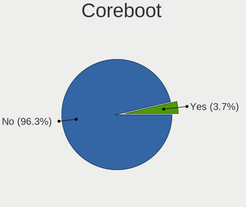
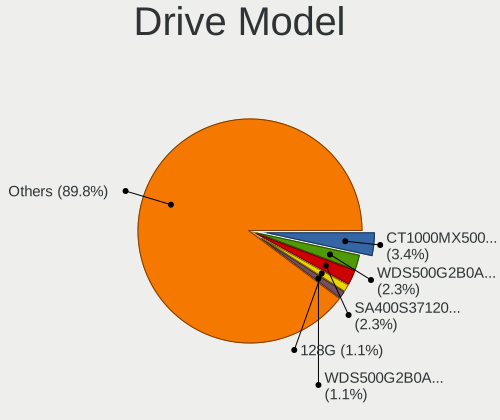
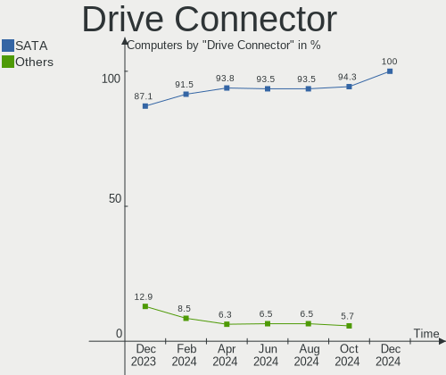
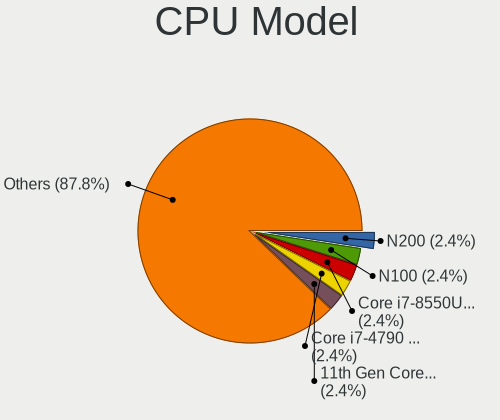
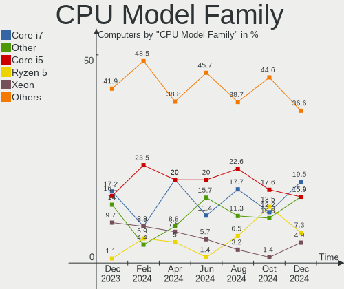
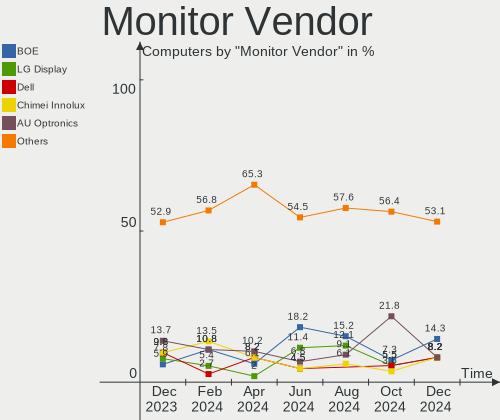
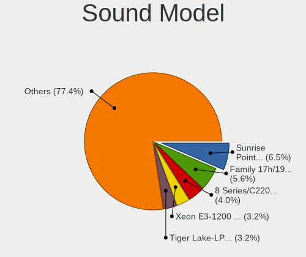
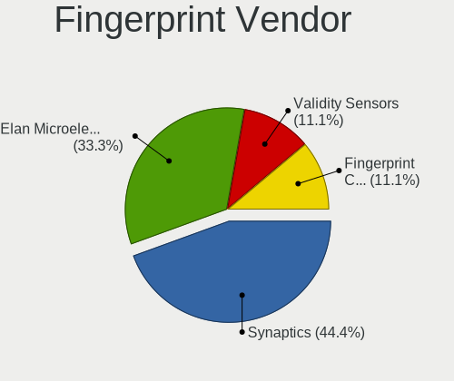

FreeBSD - Hardware Trends
-------------------------

A project to identify most popular hardware characteristics and track their change
over time based on data collected by BSD users at https://BSD-Hardware.info.

Anyone can contribute to this report by the [hw-probe](https://github.com/linuxhw/hw-probe/blob/master/INSTALL.BSD.md) tool:

    hw-probe -all -upload

This is a report for all computer types. See also reports for [desktops](/Dist/FreeBSD/Desktop/README.md) and [notebooks](/Dist/FreeBSD/Notebook/README.md).

This report is for one last month. Overall report since the beginning of time: [TestCoverage](https://github.com/bsdhw/TestCoverage)

Period: May, 2022.

Contents
--------

* [ System ](#system)
  - [ OS                       ](#os)
  - [ OS Family                ](#os-family)
  - [ Arch                     ](#arch)
  - [ DE                       ](#de)
  - [ Display Server           ](#display-server)
  - [ Display Manager          ](#display-manager)
  - [ OS Lang                  ](#os-lang)
  - [ Boot Mode                ](#boot-mode)
  - [ Filesystem               ](#filesystem)
  - [ Part. scheme             ](#part-scheme)

* [ Board ](#board)
  - [ Vendor                   ](#vendor)
  - [ Model                    ](#model)
  - [ Model Family             ](#model-family)
  - [ MFG Year                 ](#mfg-year)
  - [ Form Factor              ](#form-factor)
  - [ Coreboot                 ](#coreboot)
  - [ RAM Size                 ](#ram-size)
  - [ RAM Used                 ](#ram-used)
  - [ Total Drives             ](#total-drives)
  - [ Has CD-ROM               ](#has-cd-rom)
  - [ Has Ethernet             ](#has-ethernet)
  - [ Has WiFi                 ](#has-wifi)
  - [ Has Bluetooth            ](#has-bluetooth)

* [ Location ](#location)
  - [ Country                  ](#country)
  - [ City                     ](#city)

* [ Drives ](#drives)
  - [ Drive Vendor             ](#drive-vendor)
  - [ Drive Model              ](#drive-model)
  - [ HDD Vendor               ](#hdd-vendor)
  - [ SSD Vendor               ](#ssd-vendor)
  - [ Drive Kind               ](#drive-kind)
  - [ Drive Connector          ](#drive-connector)
  - [ Drive Size               ](#drive-size)
  - [ Space Total              ](#space-total)
  - [ Space Used               ](#space-used)
  - [ Malfunc. Drives          ](#malfunc-drives)
  - [ Malfunc. Drive Vendor    ](#malfunc-drive-vendor)
  - [ Malfunc. HDD Vendor      ](#malfunc-hdd-vendor)
  - [ Malfunc. Drive Kind      ](#malfunc-drive-kind)
  - [ Failed Drives            ](#failed-drives)
  - [ Failed Drive Vendor      ](#failed-drive-vendor)
  - [ Drive Status             ](#drive-status)

* [ Storage controller ](#storage-controller)
  - [ Storage Vendor           ](#storage-vendor)
  - [ Storage Model            ](#storage-model)
  - [ Storage Kind             ](#storage-kind)

* [ Processor ](#processor)
  - [ CPU Vendor               ](#cpu-vendor)
  - [ CPU Model                ](#cpu-model)
  - [ CPU Model Family         ](#cpu-model-family)
  - [ CPU Cores                ](#cpu-cores)
  - [ CPU Sockets              ](#cpu-sockets)
  - [ CPU Threads              ](#cpu-threads)
  - [ CPU Microarch            ](#cpu-microarch)

* [ Graphics ](#graphics)
  - [ GPU Vendor               ](#gpu-vendor)
  - [ GPU Model                ](#gpu-model)
  - [ GPU Combo                ](#gpu-combo)
  - [ GPU Driver               ](#gpu-driver)
  - [ GPU Memory               ](#gpu-memory)

* [ Monitor ](#monitor)
  - [ Monitor Vendor           ](#monitor-vendor)
  - [ Monitor Model            ](#monitor-model)
  - [ Monitor Resolution       ](#monitor-resolution)
  - [ Monitor Diagonal         ](#monitor-diagonal)
  - [ Monitor Width            ](#monitor-width)
  - [ Aspect Ratio             ](#aspect-ratio)
  - [ Monitor Area             ](#monitor-area)
  - [ Pixel Density            ](#pixel-density)
  - [ Multiple Monitors        ](#multiple-monitors)

* [ Network ](#network)
  - [ Net Controller Vendor    ](#net-controller-vendor)
  - [ Net Controller Model     ](#net-controller-model)
  - [ Wireless Vendor          ](#wireless-vendor)
  - [ Wireless Model           ](#wireless-model)
  - [ Ethernet Vendor          ](#ethernet-vendor)
  - [ Ethernet Model           ](#ethernet-model)
  - [ Net Controller Kind      ](#net-controller-kind)
  - [ Used Controller          ](#used-controller)
  - [ NICs                     ](#nics)
  - [ IPv6                     ](#ipv6)

* [ Bluetooth ](#bluetooth)
  - [ Bluetooth Vendor         ](#bluetooth-vendor)
  - [ Bluetooth Model          ](#bluetooth-model)

* [ Sound ](#sound)
  - [ Sound Vendor             ](#sound-vendor)
  - [ Sound Model              ](#sound-model)

* [ Memory ](#memory)
  - [ Memory Vendor            ](#memory-vendor)
  - [ Memory Model             ](#memory-model)
  - [ Memory Kind              ](#memory-kind)
  - [ Memory Form Factor       ](#memory-form-factor)
  - [ Memory Size              ](#memory-size)
  - [ Memory Speed             ](#memory-speed)

* [ Printers & scanners ](#printers--scanners)
  - [ Printer Vendor           ](#printer-vendor)
  - [ Printer Model            ](#printer-model)
  - [ Scanner Vendor           ](#scanner-vendor)
  - [ Scanner Model            ](#scanner-model)

* [ Camera ](#camera)
  - [ Camera Vendor            ](#camera-vendor)
  - [ Camera Model             ](#camera-model)

* [ Security ](#security)
  - [ Fingerprint Vendor       ](#fingerprint-vendor)
  - [ Fingerprint Model        ](#fingerprint-model)
  - [ Chipcard Vendor          ](#chipcard-vendor)
  - [ Chipcard Model           ](#chipcard-model)

* [ Unsupported ](#unsupported)
  - [ Unsupported Devices      ](#unsupported-devices)
  - [ Unsupported Device Types ](#unsupported-device-types)

System
------

OS
--

Installed operating systems

| Name                 | Computers | Percent |
|----------------------|-----------|---------|
| FreeBSD 13.1         | 46        | 51.11%  |
| FreeBSD 13.0-p11     | 11        | 12.22%  |
| FreeBSD 14.0-CURRENT | 9         | 10%     |
| FreeBSD 13.1-STABLE  | 5         | 5.56%   |
| FreeBSD 13.1-RC6     | 5         | 5.56%   |
| FreeBSD 13.0         | 4         | 4.44%   |
| FreeBSD 13.0-p10     | 3         | 3.33%   |
| FreeBSD 12.3-p5      | 2         | 2.22%   |
| FreeBSD 13.1-RC5     | 1         | 1.11%   |
| FreeBSD 13.1-RC3     | 1         | 1.11%   |
| FreeBSD 13.0-STABLE  | 1         | 1.11%   |
| FreeBSD 13.0-p8      | 1         | 1.11%   |
| FreeBSD 13.0-p2      | 1         | 1.11%   |

OS Family
---------

OS without a version

| Name    | Computers | Percent |
|---------|-----------|---------|
| FreeBSD | 90        | 100%    |

Arch
----

OS architecture (x86_64, i586, etc.)

| Name  | Computers | Percent |
|-------|-----------|---------|
| amd64 | 81        | 90%     |
| arm64 | 5         | 5.56%   |
| i386  | 3         | 3.33%   |
| arm   | 1         | 1.11%   |

DE
--

Desktop Environment

| Name         | Computers | Percent |
|--------------|-----------|---------|
| Console      | 34        | 37.78%  |
| KDE5         | 21        | 23.33%  |
| XFCE         | 12        | 13.33%  |
| GNOME        | 6         | 6.67%   |
| i3           | 3         | 3.33%   |
| TWM          | 2         | 2.22%   |
| Openbox      | 2         | 2.22%   |
| MATE         | 2         | 2.22%   |
| Cinnamon     | 2         | 2.22%   |
| X-Cinnamon   | 1         | 1.11%   |
| Window Maker | 1         | 1.11%   |
| LXQt         | 1         | 1.11%   |
| LXDE         | 1         | 1.11%   |
| IceWM        | 1         | 1.11%   |
| Compton      | 1         | 1.11%   |

Display Server
--------------

X11 or Wayland

| Name    | Computers | Percent |
|---------|-----------|---------|
| X11     | 49        | 54.44%  |
| Console | 39        | 43.33%  |
| Wayland | 2         | 2.22%   |

Display Manager
---------------

SDDM, LightDM, etc.

| Name    | Computers | Percent |
|---------|-----------|---------|
| Console | 52        | 57.78%  |
| SDDM    | 17        | 18.89%  |
| SLiM    | 10        | 11.11%  |
| GDM     | 5         | 5.56%   |
| LightDM | 4         | 4.44%   |
| XDM     | 1         | 1.11%   |
| PCDM    | 1         | 1.11%   |

OS Lang
-------

Language

| Lang             | Computers | Percent |
|------------------|-----------|---------|
| C                | 62        | 68.89%  |
| en_US            | 11        | 12.22%  |
| Unknown          | 5         | 5.56%   |
| ru_RU            | 3         | 3.33%   |
| en_US.ISO8859-1  | 2         | 2.22%   |
| zh_CN            | 1         | 1.11%   |
| no_NO.ISO8859-15 | 1         | 1.11%   |
| fr_FR            | 1         | 1.11%   |
| en_CA            | 1         | 1.11%   |
| en_AU            | 1         | 1.11%   |
| de_DE            | 1         | 1.11%   |
| de_CH            | 1         | 1.11%   |

Boot Mode
---------

EFI or BIOS

| Mode | Computers | Percent |
|------|-----------|---------|
| EFI  | 67        | 74.44%  |
| BIOS | 23        | 25.56%  |

Filesystem
----------

Type of filesystem

| Type | Computers | Percent |
|------|-----------|---------|
| Zfs  | 62        | 68.89%  |
| Ufs  | 28        | 31.11%  |

Part. scheme
------------

Scheme of partitioning

| Type | Computers | Percent |
|------|-----------|---------|
| GPT  | 82        | 91.11%  |
| MBR  | 7         | 7.78%   |
| BSD  | 1         | 1.11%   |

Board
-----

Vendor
------

Motherboard manufacturer

| Name                    | Computers | Percent |
|-------------------------|-----------|---------|
| Dell                    | 17        | 18.89%  |
| Lenovo                  | 14        | 15.56%  |
| ASUSTek Computer        | 12        | 13.33%  |
| Unknown                 | 6         | 6.67%   |
| Intel                   | 5         | 5.56%   |
| Hewlett-Packard         | 5         | 5.56%   |
| ASRock                  | 5         | 5.56%   |
| Acer                    | 4         | 4.44%   |
| MSI                     | 3         | 3.33%   |
| Gigabyte Technology     | 3         | 3.33%   |
| TUXEDO                  | 2         | 2.22%   |
| Supermicro              | 2         | 2.22%   |
| Toshiba                 | 1         | 1.11%   |
| System76                | 1         | 1.11%   |
| Raspberry Pi Foundation | 1         | 1.11%   |
| PC Engines              | 1         | 1.11%   |
| Notebook                | 1         | 1.11%   |
| NF-M2S                  | 1         | 1.11%   |
| khadas                  | 1         | 1.11%   |
| GVC                     | 1         | 1.11%   |
| GPD                     | 1         | 1.11%   |
| Fujitsu                 | 1         | 1.11%   |
| BESSTAR Tech            | 1         | 1.11%   |
| ASRockRack              | 1         | 1.11%   |

Model
-----

Motherboard model

| Name                                     | Computers | Percent |
|------------------------------------------|-----------|---------|
| Unknown                                  | 6         | 6.67%   |
| ASRock X570 Phantom Gaming 4             | 2         | 2.22%   |
| TUXEDO InfinityBook13V3                  | 1         | 1.11%   |
| TUXEDO Aura 15 Gen1                      | 1         | 1.11%   |
| Toshiba Satellite P25                    | 1         | 1.11%   |
| System76 Galago Pro                      | 1         | 1.11%   |
| Supermicro X9SRW-F                       | 1         | 1.11%   |
| Supermicro Super Server                  | 1         | 1.11%   |
| RPi Raspberry Pi                         | 1         | 1.11%   |
| PC Engines APU3                          | 1         | 1.11%   |
| Notebook N7x0WU                          | 1         | 1.11%   |
| NF-M2S ABIT                              | 1         | 1.11%   |
| MSI MS-7817                              | 1         | 1.11%   |
| MSI MS-7369                              | 1         | 1.11%   |
| MSI MS-7309                              | 1         | 1.11%   |
| Lenovo ThinkSystem SR650 -[7X06CTO1WW]-  | 1         | 1.11%   |
| Lenovo ThinkPad X270 20HMCTO1WW          | 1         | 1.11%   |
| Lenovo ThinkPad X250 20CMS0FA00          | 1         | 1.11%   |
| Lenovo ThinkPad X250 20CLS02V00          | 1         | 1.11%   |
| Lenovo ThinkPad X220 42872WU             | 1         | 1.11%   |
| Lenovo ThinkPad X13 Gen 1 20UF000QRT     | 1         | 1.11%   |
| Lenovo ThinkPad X1 Carbon 3rd 20BTS0BT00 | 1         | 1.11%   |
| Lenovo ThinkPad T495s 20QKS1812F         | 1         | 1.11%   |
| Lenovo ThinkPad T420s 41732AU            | 1         | 1.11%   |
| Lenovo ThinkPad L420 7854CTO             | 1         | 1.11%   |
| Lenovo ThinkPad E490 20N8CTO1WW          | 1         | 1.11%   |
| Lenovo IdeaPad Y700-15ISK 80NV           | 1         | 1.11%   |
| Lenovo IdeaPad S510p 20298               | 1         | 1.11%   |
| Lenovo C440 10104                        | 1         | 1.11%   |
| khadas edge-v                            | 1         | 1.11%   |
| Intel NUC9i7QNX                          | 1         | 1.11%   |
| Intel NUC11PHi7                          | 1         | 1.11%   |
| Intel NUC10i7FNK                         | 1         | 1.11%   |
| Intel NUC10i3FNH                         | 1         | 1.11%   |
| Intel DH67BL AAG10189-213                | 1         | 1.11%   |
| HP Z620 Workstation                      | 1         | 1.11%   |
| HP ProLiant MicroServer                  | 1         | 1.11%   |
| HP ProBook 455 G7                        | 1         | 1.11%   |
| HP Pavilion g6                           | 1         | 1.11%   |
| HP EliteBook 8570p                       | 1         | 1.11%   |
| GVC EQUIUM 3200M                         | 1         | 1.11%   |
| GPD MicroPC                              | 1         | 1.11%   |
| Gigabyte X470 AORUS GAMING 7 WIFI        | 1         | 1.11%   |
| Gigabyte H67MA-USB3-B3                   | 1         | 1.11%   |
| Gigabyte B450M DS3H                      | 1         | 1.11%   |
| Fujitsu D3401-H2 S26361-D3401-H2         | 1         | 1.11%   |
| Dell XPS 13 9343                         | 1         | 1.11%   |
| Dell Vostro 5590                         | 1         | 1.11%   |
| Dell Precision M4800                     | 1         | 1.11%   |
| Dell PowerEdge T30                       | 1         | 1.11%   |
| Dell PowerEdge R440                      | 1         | 1.11%   |
| Dell OptiPlex 7050                       | 1         | 1.11%   |
| Dell Latitude E7240                      | 1         | 1.11%   |
| Dell Latitude E6540                      | 1         | 1.11%   |
| Dell Latitude E6430                      | 1         | 1.11%   |
| Dell Latitude E5570                      | 1         | 1.11%   |
| Dell Latitude 5520                       | 1         | 1.11%   |
| Dell Latitude 2100                       | 1         | 1.11%   |
| Dell Inspiron 5559                       | 1         | 1.11%   |
| Dell Inspiron 3505                       | 1         | 1.11%   |

Model Family
------------

Motherboard model prefix

| Name                     | Computers | Percent |
|--------------------------|-----------|---------|
| Lenovo ThinkPad          | 10        | 11.11%  |
| Dell Latitude            | 6         | 6.67%   |
| Unknown                  | 6         | 6.67%   |
| ASUS PRIME               | 4         | 4.44%   |
| Acer Aspire              | 4         | 4.44%   |
| Dell Inspiron            | 3         | 3.33%   |
| ASUS ROG                 | 3         | 3.33%   |
| Lenovo IdeaPad           | 2         | 2.22%   |
| Dell PowerEdge           | 2         | 2.22%   |
| Dell G5                  | 2         | 2.22%   |
| ASUS TUF                 | 2         | 2.22%   |
| ASRock X570              | 2         | 2.22%   |
| TUXEDO InfinityBook13V3  | 1         | 1.11%   |
| TUXEDO Aura              | 1         | 1.11%   |
| Toshiba Satellite        | 1         | 1.11%   |
| System76 Galago          | 1         | 1.11%   |
| Supermicro X9SRW-F       | 1         | 1.11%   |
| Supermicro Super         | 1         | 1.11%   |
| RPi Raspberry            | 1         | 1.11%   |
| PC Engines APU3          | 1         | 1.11%   |
| Notebook N7x0WU          | 1         | 1.11%   |
| NF-M2S ABIT              | 1         | 1.11%   |
| MSI MS-7817              | 1         | 1.11%   |
| MSI MS-7369              | 1         | 1.11%   |
| MSI MS-7309              | 1         | 1.11%   |
| Lenovo ThinkSystem       | 1         | 1.11%   |
| Lenovo C440              | 1         | 1.11%   |
| khadas edge-v            | 1         | 1.11%   |
| Intel NUC9i7QNX          | 1         | 1.11%   |
| Intel NUC11PHi7          | 1         | 1.11%   |
| Intel NUC10i7FNK         | 1         | 1.11%   |
| Intel NUC10i3FNH         | 1         | 1.11%   |
| Intel DH67BL             | 1         | 1.11%   |
| HP Z620                  | 1         | 1.11%   |
| HP ProLiant              | 1         | 1.11%   |
| HP ProBook               | 1         | 1.11%   |
| HP Pavilion              | 1         | 1.11%   |
| HP EliteBook             | 1         | 1.11%   |
| GVC EQUIUM               | 1         | 1.11%   |
| GPD MicroPC              | 1         | 1.11%   |
| Gigabyte X470            | 1         | 1.11%   |
| Gigabyte H67MA-USB3-B3   | 1         | 1.11%   |
| Gigabyte B450M           | 1         | 1.11%   |
| Fujitsu D3401-H2         | 1         | 1.11%   |
| Dell XPS                 | 1         | 1.11%   |
| Dell Vostro              | 1         | 1.11%   |
| Dell Precision           | 1         | 1.11%   |
| Dell OptiPlex            | 1         | 1.11%   |
| BESSTAR Tech N40         | 1         | 1.11%   |
| ASUS P5Q-E               | 1         | 1.11%   |
| ASUS All                 | 1         | 1.11%   |
| ASUS 1001P               | 1         | 1.11%   |
| ASRockRack E3C242D4U2-2T | 1         | 1.11%   |
| ASRock E350M1            | 1         | 1.11%   |
| ASRock B550              | 1         | 1.11%   |
| ASRock A320M             | 1         | 1.11%   |

MFG Year
--------

Motherboard manufacture year

| Year    | Computers | Percent |
|---------|-----------|---------|
| 2021    | 13        | 14.44%  |
| 2020    | 12        | 13.33%  |
| 2018    | 9         | 10%     |
| 2017    | 7         | 7.78%   |
| 2019    | 6         | 6.67%   |
| 2022    | 5         | 5.56%   |
| 2016    | 5         | 5.56%   |
| 2015    | 5         | 5.56%   |
| 2011    | 5         | 5.56%   |
| Unknown | 5         | 5.56%   |
| 2013    | 4         | 4.44%   |
| 2012    | 4         | 4.44%   |
| 2014    | 3         | 3.33%   |
| 2010    | 2         | 2.22%   |
| 2008    | 2         | 2.22%   |
| 2009    | 1         | 1.11%   |
| 2007    | 1         | 1.11%   |
| 2004    | 1         | 1.11%   |

Form Factor
-----------

Physical design of the computer

| Name           | Computers | Percent |
|----------------|-----------|---------|
| Notebook       | 40        | 44.44%  |
| Desktop        | 39        | 43.33%  |
| Mini pc        | 5         | 5.56%   |
| Server         | 4         | 4.44%   |
| System on chip | 1         | 1.11%   |
| All in one     | 1         | 1.11%   |

Coreboot
--------

Have coreboot on board

| Used | Computers | Percent |
|------|-----------|---------|
| No   | 88        | 97.78%  |
| Yes  | 2         | 2.22%   |

RAM Size
--------

Total RAM memory

| Size in GB  | Computers | Percent |
|-------------|-----------|---------|
| 8.01-16.0   | 22        | 24.44%  |
| 16.01-24.0  | 21        | 23.33%  |
| 64.01-256.0 | 14        | 15.56%  |
| 32.01-64.0  | 12        | 13.33%  |
| 4.01-8.0    | 10        | 11.11%  |
| 2.01-3.0    | 5         | 5.56%   |
| 3.01-4.0    | 3         | 3.33%   |
| 0.01-0.5    | 2         | 2.22%   |
| 0.51-1.0    | 1         | 1.11%   |

RAM Used
--------

Used RAM memory

| Used GB    | Computers | Percent |
|------------|-----------|---------|
| 0.01-0.5   | 35        | 38.89%  |
| 0.51-1.0   | 24        | 26.67%  |
| 1.01-2.0   | 13        | 14.44%  |
| 2.01-3.0   | 11        | 12.22%  |
| 0          | 3         | 3.33%   |
| 3.01-4.0   | 2         | 2.22%   |
| 4.01-8.0   | 1         | 1.11%   |
| 24.01-32.0 | 1         | 1.11%   |

Total Drives
------------

Number of drives on board

| Drives | Computers | Percent |
|--------|-----------|---------|
| 1      | 38        | 42.22%  |
| 2      | 27        | 30%     |
| 3      | 6         | 6.67%   |
| 0      | 6         | 6.67%   |
| 4      | 5         | 5.56%   |
| 5      | 2         | 2.22%   |
| 15     | 1         | 1.11%   |
| 13     | 1         | 1.11%   |
| 10     | 1         | 1.11%   |
| 8      | 1         | 1.11%   |
| 7      | 1         | 1.11%   |
| 6      | 1         | 1.11%   |

Has CD-ROM
----------

Has CD-ROM on board

| Presented | Computers | Percent |
|-----------|-----------|---------|
| No        | 68        | 75.56%  |
| Yes       | 22        | 24.44%  |

Has Ethernet
------------

Has Ethernet on board

| Presented | Computers | Percent |
|-----------|-----------|---------|
| Yes       | 80        | 88.89%  |
| No        | 10        | 11.11%  |

Has WiFi
--------

Has WiFi module

| Presented | Computers | Percent |
|-----------|-----------|---------|
| Yes       | 53        | 58.89%  |
| No        | 37        | 41.11%  |

Has Bluetooth
-------------

Has Bluetooth module

| Presented | Computers | Percent |
|-----------|-----------|---------|
| No        | 53        | 58.89%  |
| Yes       | 37        | 41.11%  |

Location
--------

Country
-------

Geographic location (country)

| Country     | Computers | Percent |
|-------------|-----------|---------|
| USA         | 28        | 31.11%  |
| Russia      | 10        | 11.11%  |
| Germany     | 7         | 7.78%   |
| UK          | 5         | 5.56%   |
| France      | 5         | 5.56%   |
| Japan       | 4         | 4.44%   |
| Netherlands | 2         | 2.22%   |
| Italy       | 2         | 2.22%   |
| India       | 2         | 2.22%   |
| Greece      | 2         | 2.22%   |
| China       | 2         | 2.22%   |
| Canada      | 2         | 2.22%   |
| Belgium     | 2         | 2.22%   |
| Australia   | 2         | 2.22%   |
| Ukraine     | 1         | 1.11%   |
| Thailand    | 1         | 1.11%   |
| Switzerland | 1         | 1.11%   |
| Sweden      | 1         | 1.11%   |
| Spain       | 1         | 1.11%   |
| Portugal    | 1         | 1.11%   |
| Norway      | 1         | 1.11%   |
| New Zealand | 1         | 1.11%   |
| Kenya       | 1         | 1.11%   |
| Ireland     | 1         | 1.11%   |
| Hong Kong   | 1         | 1.11%   |
| Guadeloupe  | 1         | 1.11%   |
| Colombia    | 1         | 1.11%   |
| Brazil      | 1         | 1.11%   |
| Austria     | 1         | 1.11%   |

City
----

Geographic location (city)

| City                        | Computers | Percent |
|-----------------------------|-----------|---------|
| St Petersburg               | 4         | 4.44%   |
| Paris                       | 4         | 4.44%   |
| Frisco                      | 4         | 4.44%   |
| Salem                       | 2         | 2.22%   |
| Redmond                     | 2         | 2.22%   |
| Moscow                      | 2         | 2.22%   |
| London                      | 2         | 2.22%   |
| Diest                       | 2         | 2.22%   |
| Dallas                      | 2         | 2.22%   |
| Zhumadian                   | 1         | 1.11%   |
| Woerdense Verlaat           | 1         | 1.11%   |
| Wheatland                   | 1         | 1.11%   |
| Wenatchee                   | 1         | 1.11%   |
| Vila Real de Santo António | 1         | 1.11%   |
| Valladolid                  | 1         | 1.11%   |
| Trivandrum                  | 1         | 1.11%   |
| Tomball                     | 1         | 1.11%   |
| Thousand Oaks               | 1         | 1.11%   |
| Thessaloniki                | 1         | 1.11%   |
| Taito                       | 1         | 1.11%   |
| St. Albert                  | 1         | 1.11%   |
| Shinjuku                    | 1         | 1.11%   |
| Setagaya-ku                 | 1         | 1.11%   |
| San Francisco               | 1         | 1.11%   |
| Saarbrücken                | 1         | 1.11%   |
| Roubaix                     | 1         | 1.11%   |
| Perth                       | 1         | 1.11%   |
| Oslo                        | 1         | 1.11%   |
| Novosibirsk                 | 1         | 1.11%   |
| Newbury Park                | 1         | 1.11%   |
| Nakano                      | 1         | 1.11%   |
| Nairobi                     | 1         | 1.11%   |
| Munich                      | 1         | 1.11%   |
| Munchenstein                | 1         | 1.11%   |
| Mossingen                   | 1         | 1.11%   |
| Methuen                     | 1         | 1.11%   |
| Medford                     | 1         | 1.11%   |
| Medellín                   | 1         | 1.11%   |
| Manassas                    | 1         | 1.11%   |
| Lüneburg                   | 1         | 1.11%   |
| Lübeck                     | 1         | 1.11%   |
| Lower Hutt                  | 1         | 1.11%   |
| Lee's Summit                | 1         | 1.11%   |
| Le Gosier                   | 1         | 1.11%   |
| Kyiv                        | 1         | 1.11%   |
| Krasnodar                   | 1         | 1.11%   |
| Kornwestheim                | 1         | 1.11%   |
| Kislovodsk                  | 1         | 1.11%   |
| Khimki                      | 1         | 1.11%   |
| Kensington                  | 1         | 1.11%   |
| Karlshamn                   | 1         | 1.11%   |
| Indore                      | 1         | 1.11%   |
| Gmunden                     | 1         | 1.11%   |
| Glasgow                     | 1         | 1.11%   |
| Galliera Veneta             | 1         | 1.11%   |
| Gainesville                 | 1         | 1.11%   |
| Fulham                      | 1         | 1.11%   |
| Fresno                      | 1         | 1.11%   |
| Frederick                   | 1         | 1.11%   |
| Falkenstein                 | 1         | 1.11%   |

Drives
------

Drive Vendor
------------

Hard drive vendors

| Vendor              | Computers | Drives | Percent |
|---------------------|-----------|--------|---------|
| Samsung Electronics | 30        | 43     | 23.26%  |
| WDC                 | 26        | 41     | 20.16%  |
| Seagate             | 14        | 28     | 10.85%  |
| Crucial             | 10        | 15     | 7.75%   |
| Kingston            | 6         | 6      | 4.65%   |
| Intel               | 6         | 13     | 4.65%   |
| Toshiba             | 5         | 9      | 3.88%   |
| Hitachi             | 3         | 12     | 2.33%   |
| HGST                | 3         | 5      | 2.33%   |
| Hewlett-Packard     | 3         | 3      | 2.33%   |
| A-DATA Technology   | 3         | 3      | 2.33%   |
| SanDisk             | 2         | 2      | 1.55%   |
| Verbatim            | 1         | 1      | 0.78%   |
| Transcend           | 1         | 1      | 0.78%   |
| T-FORCE             | 1         | 1      | 0.78%   |
| SK Hynix            | 1         | 1      | 0.78%   |
| Patriot             | 1         | 1      | 0.78%   |
| ORICO               | 1         | 1      | 0.78%   |
| OCZ                 | 1         | 1      | 0.78%   |
| Micron Technology   | 1         | 2      | 0.78%   |
| LITEON              | 1         | 1      | 0.78%   |
| Lexar               | 1         | 1      | 0.78%   |
| KIOXIA              | 1         | 1      | 0.78%   |
| IBM/Hitachi         | 1         | 1      | 0.78%   |
| Gigabyte Technology | 1         | 1      | 0.78%   |
| Corsair             | 1         | 1      | 0.78%   |
| China               | 1         | 1      | 0.78%   |
| CFD                 | 1         | 1      | 0.78%   |
| BR                  | 1         | 1      | 0.78%   |
| BIWIN               | 1         | 1      | 0.78%   |

Drive Model
-----------

Hard drive models

| Model                                | Computers | Percent |
|--------------------------------------|-----------|---------|
| Samsung SSD 970 EVO Plus 2TB         | 3         | 2.03%   |
| WDC WD8003FFBX-68B9AN0 8TB           | 2         | 1.35%   |
| Seagate ST4000DM000-1F2168 4TB       | 2         | 1.35%   |
| Seagate ST1000LM024 HN-M101MBB 1TB   | 2         | 1.35%   |
| Seagate ST1000DM003-1CH162 1TB       | 2         | 1.35%   |
| Samsung SSD 980 PRO 1TB              | 2         | 1.35%   |
| Samsung SSD 870 QVO 2TB              | 2         | 1.35%   |
| Samsung SSD 870 EVO 1TB              | 2         | 1.35%   |
| Samsung SSD 860 EVO 500GB            | 2         | 1.35%   |
| Samsung SSD 850 EVO 500GB            | 2         | 1.35%   |
| Samsung SSD 850 EVO 1TB              | 2         | 1.35%   |
| Samsung HD161HJ 160GB                | 2         | 1.35%   |
| Kingston SA400S37240G 240GB          | 2         | 1.35%   |
| Kingston SA400S37120G 120GB          | 2         | 1.35%   |
| HGST HTS721010A9E630 1TB             | 2         | 1.35%   |
| Crucial CT250MX500SSD1 250GB         | 2         | 1.35%   |
| Crucial CT1000P5SSD8 1TB             | 2         | 1.35%   |
| Crucial CT1000MX500SSD1 1TB          | 2         | 1.35%   |
| A-DATA SU650 240GB                   | 2         | 1.35%   |
| WDC WDS500G2B0A-00SM50 500GB         | 1         | 0.68%   |
| WDC WDS250G2B0C-00PXH0 250GB         | 1         | 0.68%   |
| WDC WDS250G2B0B-00YS70 250GB         | 1         | 0.68%   |
| WDC WDS120G2G0B-00EPW0 120GB         | 1         | 0.68%   |
| WDC WDS100T3X0C-00SJG0 1TB           | 1         | 0.68%   |
| WDC WDS100T1X0E-00AFY0 1TB           | 1         | 0.68%   |
| WDC WD80EMAZ-00WJTA0 8TB             | 1         | 0.68%   |
| WDC WD80EFZX-68UW8N0 8TB             | 1         | 0.68%   |
| WDC WD80EFBX-68AZZN0 8TB             | 1         | 0.68%   |
| WDC WD80EFAX-68LHPN0 8TB             | 1         | 0.68%   |
| WDC WD80EDBZ-11B0ZA0 8TB             | 1         | 0.68%   |
| WDC WD40EZRZ-22GXCB0 4TB             | 1         | 0.68%   |
| WDC WD40EFZX-68AWUN0 4TB             | 1         | 0.68%   |
| WDC WD40EFRX-68N32N0 4TB             | 1         | 0.68%   |
| WDC WD2503ABYX-01WERA1 256GB         | 1         | 0.68%   |
| WDC WD20NMVW-11AV3S2 2TB             | 1         | 0.68%   |
| WDC WD1600BEVT-80A23T0 160GB         | 1         | 0.68%   |
| WDC WD15EADS-00P8B0 1.5TB            | 1         | 0.68%   |
| WDC WD120EMFZ-11A6JA0 12TB           | 1         | 0.68%   |
| WDC WD120EMAZ-11BLFA0 12TB           | 1         | 0.68%   |
| WDC WD10SPZX-75Z10T3 1TB             | 1         | 0.68%   |
| WDC WD10SPZX-21Z10T0 1TB             | 1         | 0.68%   |
| WDC WD10JPVX-22JC3T0 1TB             | 1         | 0.68%   |
| WDC WD10JPCX-24UE4T0 1TB             | 1         | 0.68%   |
| WDC WD10JMVW-11AJGS1 1TB             | 1         | 0.68%   |
| WDC WD10EZEX-60M2NA0 1TB             | 1         | 0.68%   |
| WDC WD10EZEX-08WN4A0 1TB             | 1         | 0.68%   |
| WDC WD1001FALS-00J7B1 1TB            | 1         | 0.68%   |
| WDC PC SN730 SDBQNTY-512G-1001 512GB | 1         | 0.68%   |
| WDC PC SN530 NVMe 256GB              | 1         | 0.68%   |
| WDC PC SN520 NVMe 256GB              | 1         | 0.68%   |
| WDC CL SN720 SDAQNTW-512G-2000 512GB | 1         | 0.68%   |
| Verbatim Vi550 S3 SSD 512GB          | 1         | 0.68%   |
| Transcend TS256GMTS430S 256GB        | 1         | 0.68%   |
| Toshiba TR200 240GB                  | 1         | 0.68%   |
| Toshiba MG06ACA800E 8TB              | 1         | 0.68%   |
| Toshiba KBG30ZMT512G 512GB           | 1         | 0.68%   |
| Toshiba HDWR180 8TB                  | 1         | 0.68%   |
| Toshiba HDWN180 8TB                  | 1         | 0.68%   |
| Toshiba HDWG180 8TB                  | 1         | 0.68%   |
| T-FORCE TM8FP8002T 2TB               | 1         | 0.68%   |

HDD Vendor
----------

Hard disk drive vendors

| Vendor              | Computers | Drives | Percent |
|---------------------|-----------|--------|---------|
| WDC                 | 18        | 30     | 40.91%  |
| Seagate             | 13        | 27     | 29.55%  |
| Toshiba             | 3         | 7      | 6.82%   |
| Hitachi             | 3         | 12     | 6.82%   |
| HGST                | 3         | 5      | 6.82%   |
| Samsung Electronics | 2         | 3      | 4.55%   |
| IBM/Hitachi         | 1         | 1      | 2.27%   |
| Hewlett-Packard     | 1         | 1      | 2.27%   |

SSD Vendor
----------

Solid state drive vendors

| Vendor              | Computers | Drives | Percent |
|---------------------|-----------|--------|---------|
| Samsung Electronics | 17        | 23     | 29.31%  |
| Crucial             | 8         | 9      | 13.79%  |
| Kingston            | 6         | 6      | 10.34%  |
| Intel               | 5         | 12     | 8.62%   |
| WDC                 | 3         | 3      | 5.17%   |
| A-DATA Technology   | 3         | 3      | 5.17%   |
| SanDisk             | 2         | 2      | 3.45%   |
| Verbatim            | 1         | 1      | 1.72%   |
| Transcend           | 1         | 1      | 1.72%   |
| Toshiba             | 1         | 1      | 1.72%   |
| Patriot             | 1         | 1      | 1.72%   |
| ORICO               | 1         | 1      | 1.72%   |
| OCZ                 | 1         | 1      | 1.72%   |
| Micron Technology   | 1         | 2      | 1.72%   |
| LITEON              | 1         | 1      | 1.72%   |
| Lexar               | 1         | 1      | 1.72%   |
| Hewlett-Packard     | 1         | 1      | 1.72%   |
| China               | 1         | 1      | 1.72%   |
| CFD                 | 1         | 1      | 1.72%   |
| BR                  | 1         | 1      | 1.72%   |
| BIWIN               | 1         | 1      | 1.72%   |

Drive Kind
----------

HDD or SSD

| Kind | Computers | Drives | Percent |
|------|-----------|--------|---------|
| SSD  | 48        | 73     | 42.11%  |
| HDD  | 37        | 86     | 32.46%  |
| NVMe | 29        | 40     | 25.44%  |

Drive Connector
---------------

SATA, SAS, NVMe, etc.

| Type | Computers | Drives | Percent |
|------|-----------|--------|---------|
| SATA | 69        | 159    | 70.41%  |
| NVMe | 29        | 40     | 29.59%  |

Drive Size
----------

Size of hard drive

| Size in TB | Computers | Drives | Percent |
|------------|-----------|--------|---------|
| 0.01-0.5   | 42        | 53     | 45.16%  |
| 0.51-1.0   | 28        | 41     | 30.11%  |
| 1.01-2.0   | 8         | 17     | 8.6%    |
| 4.01-10.0  | 7         | 31     | 7.53%   |
| 3.01-4.0   | 6         | 14     | 6.45%   |
| 2.01-3.0   | 1         | 1      | 1.08%   |
| 10.01-20.0 | 1         | 2      | 1.08%   |

Space Total
-----------

Amount of disk space available on the file system

| Size in GB     | Computers | Percent |
|----------------|-----------|---------|
| 251-500        | 23        | 25.56%  |
| 101-250        | 21        | 23.33%  |
| 501-1000       | 17        | 18.89%  |
| 1001-2000      | 9         | 10%     |
| 51-100         | 7         | 7.78%   |
| 21-50          | 6         | 6.67%   |
| 1-20           | 3         | 3.33%   |
| More than 3000 | 2         | 2.22%   |
| 2001-3000      | 1         | 1.11%   |
| Unknown        | 1         | 1.11%   |

Space Used
----------

Amount of used disk space

| Used GB        | Computers | Percent |
|----------------|-----------|---------|
| 1-20           | 60        | 66.67%  |
| 21-50          | 15        | 16.67%  |
| 51-100         | 7         | 7.78%   |
| 101-250        | 5         | 5.56%   |
| More than 3000 | 1         | 1.11%   |
| 251-500        | 1         | 1.11%   |
| Unknown        | 1         | 1.11%   |

Malfunc. Drives
---------------

Drive models with a malfunction

| Model                                      | Computers | Drives | Percent |
|--------------------------------------------|-----------|--------|---------|
| Samsung Electronics SSD 870 EVO 1TB        | 2         | 4      | 14.29%  |
| HGST HTS721010A9E630 1TB                   | 2         | 2      | 14.29%  |
| WDC WD10JMVW-11AJGS1 1TB                   | 1         | 1      | 7.14%   |
| WDC WD1001FALS-00J7B1 1TB                  | 1         | 1      | 7.14%   |
| Seagate ST1000LM024 HN-M101MBB 1TB         | 1         | 1      | 7.14%   |
| Seagate ST1000DM003-1ER162 1TB             | 1         | 1      | 7.14%   |
| Samsung Electronics HD321KJ 320GB          | 1         | 1      | 7.14%   |
| Samsung Electronics HD161HJ 160GB          | 1         | 1      | 7.14%   |
| Micron Technology 1100_MTFDDAK512TBN 512GB | 1         | 2      | 7.14%   |
| Kingston SA400S37120G 120GB                | 1         | 1      | 7.14%   |
| IBM/Hitachi IC25N080ATMR04-0 80GB          | 1         | 1      | 7.14%   |
| Hewlett-Packard MB1000GCWCV 1TB            | 1         | 1      | 7.14%   |

Malfunc. Drive Vendor
---------------------

Vendors of faulty drives

| Vendor              | Computers | Drives | Percent |
|---------------------|-----------|--------|---------|
| Samsung Electronics | 4         | 6      | 28.57%  |
| WDC                 | 2         | 2      | 14.29%  |
| Seagate             | 2         | 2      | 14.29%  |
| HGST                | 2         | 2      | 14.29%  |
| Micron Technology   | 1         | 2      | 7.14%   |
| Kingston            | 1         | 1      | 7.14%   |
| IBM/Hitachi         | 1         | 1      | 7.14%   |
| Hewlett-Packard     | 1         | 1      | 7.14%   |

Malfunc. HDD Vendor
-------------------

Vendors of faulty HDD drives

| Vendor              | Computers | Drives | Percent |
|---------------------|-----------|--------|---------|
| WDC                 | 2         | 2      | 20%     |
| Seagate             | 2         | 2      | 20%     |
| Samsung Electronics | 2         | 2      | 20%     |
| HGST                | 2         | 2      | 20%     |
| IBM/Hitachi         | 1         | 1      | 10%     |
| Hewlett-Packard     | 1         | 1      | 10%     |

Malfunc. Drive Kind
-------------------

Kinds of faulty drives

| Kind | Computers | Drives | Percent |
|------|-----------|--------|---------|
| HDD  | 9         | 10     | 75%     |
| SSD  | 3         | 7      | 25%     |

Failed Drives
-------------

Failed drive models

| Model                       | Computers | Drives | Percent |
|-----------------------------|-----------|--------|---------|
| Hitachi HUS724040ALE641 4TB | 1         | 7      | 100%    |

Failed Drive Vendor
-------------------

Failed drive vendors

| Vendor  | Computers | Drives | Percent |
|---------|-----------|--------|---------|
| Hitachi | 1         | 7      | 100%    |

Drive Status
------------

Number of failed and malfunc. drives

| Status  | Computers | Drives | Percent |
|---------|-----------|--------|---------|
| Works   | 77        | 175    | 85.56%  |
| Malfunc | 12        | 17     | 13.33%  |
| Failed  | 1         | 7      | 1.11%   |

Storage controller
------------------

Storage Vendor
--------------

Storage controller vendors

| Vendor                    | Computers | Percent |
|---------------------------|-----------|---------|
| Intel                     | 58        | 49.57%  |
| AMD                       | 17        | 14.53%  |
| Samsung Electronics       | 14        | 11.97%  |
| Sandisk                   | 6         | 5.13%   |
| Nvidia                    | 4         | 3.42%   |
| Broadcom / LSI            | 4         | 3.42%   |
| Silicon Motion            | 2         | 1.71%   |
| Phison Electronics        | 2         | 1.71%   |
| Micron/Crucial Technology | 2         | 1.71%   |
| Marvell Technology Group  | 2         | 1.71%   |
| Toshiba                   | 1         | 0.85%   |
| Seagate Technology        | 1         | 0.85%   |
| Realtek Semiconductor     | 1         | 0.85%   |
| Micron Technology         | 1         | 0.85%   |
| KIOXIA                    | 1         | 0.85%   |
| ASMedia Technology        | 1         | 0.85%   |

Storage Model
-------------

Storage controller models

| Model                                                                            | Computers | Percent |
|----------------------------------------------------------------------------------|-----------|---------|
| AMD FCH SATA Controller [AHCI mode]                                              | 12        | 8.7%    |
| Intel Sunrise Point-LP SATA Controller [AHCI mode]                               | 6         | 4.35%   |
| Samsung NVMe SSD Controller SM981/PM981/PM983                                    | 5         | 3.62%   |
| Intel Comet Lake SATA AHCI Controller                                            | 5         | 3.62%   |
| Samsung NVMe SSD Controller SM961/PM961/SM963                                    | 4         | 2.9%    |
| Intel Wildcat Point-LP SATA Controller [AHCI Mode]                               | 4         | 2.9%    |
| Unknown                                                                          | 4         | 2.9%    |
| Intel Cannon Lake PCH SATA AHCI Controller                                       | 3         | 2.17%   |
| Intel 82801 Mobile SATA Controller [RAID mode]                                   | 3         | 2.17%   |
| Intel 7 Series Chipset Family 6-port SATA Controller [AHCI mode]                 | 3         | 2.17%   |
| Intel 6 Series/C200 Series Chipset Family 6 port Mobile SATA AHCI Controller     | 3         | 2.17%   |
| Intel 6 Series/C200 Series Chipset Family 6 port Desktop SATA AHCI Controller    | 3         | 2.17%   |
| Silicon Motion SM2263EN/SM2263XT SSD Controller                                  | 2         | 1.45%   |
| Sandisk WD Black 2018/SN750 / PC SN720 NVMe SSD                                  | 2         | 1.45%   |
| Sandisk unknown                                                                  | 2         | 1.45%   |
| Samsung NVMe SSD Controller PM9A1/PM9A3/980PRO                                   | 2         | 1.45%   |
| Samsung NVMe SSD Controller 980                                                  | 2         | 1.45%   |
| Phison E16 PCIe4 NVMe Controller                                                 | 2         | 1.45%   |
| Nvidia MCP61 SATA Controller                                                     | 2         | 1.45%   |
| Nvidia MCP61 IDE                                                                 | 2         | 1.45%   |
| Intel SSD 660P Series                                                            | 2         | 1.45%   |
| Intel Q170/Q150/B150/H170/H110/Z170/CM236 Chipset SATA Controller [AHCI Mode]    | 2         | 1.45%   |
| Intel Celeron/Pentium Silver Processor SATA Controller                           | 2         | 1.45%   |
| Intel C620 Series Chipset Family SSATA Controller [AHCI mode]                    | 2         | 1.45%   |
| Intel C620 Series Chipset Family SATA Controller [AHCI mode]                     | 2         | 1.45%   |
| Intel C602 chipset 4-Port SATA Storage Control Unit                              | 2         | 1.45%   |
| Intel 8 Series/C220 Series Chipset Family 6-port SATA Controller 1 [AHCI mode]   | 2         | 1.45%   |
| Broadcom / LSI SAS2008 PCI-Express Fusion-MPT SAS-2 [Falcon]                     | 2         | 1.45%   |
| AMD SB7x0/SB8x0/SB9x0 SATA Controller [AHCI mode]                                | 2         | 1.45%   |
| AMD SB7x0/SB8x0/SB9x0 IDE Controller                                             | 2         | 1.45%   |
| AMD 500 Series Chipset SATA Controller                                           | 2         | 1.45%   |
| AMD 400 Series Chipset SATA Controller                                           | 2         | 1.45%   |
| AMD 300 Series Chipset SATA Controller                                           | 2         | 1.45%   |
| Toshiba BG3 NVMe SSD Controller                                                  | 1         | 0.72%   |
| Sandisk WD PC SN810 / Black SN850 NVMe SSD                                       | 1         | 0.72%   |
| Sandisk WD Black SN750 / PC SN730 NVMe SSD                                       | 1         | 0.72%   |
| Sandisk PC SN520 NVMe SSD                                                        | 1         | 0.72%   |
| Samsung NVMe SSD Controller SM951/PM951                                          | 1         | 0.72%   |
| Nvidia MCP65 SATA Controller                                                     | 1         | 0.72%   |
| Nvidia MCP65 IDE                                                                 | 1         | 0.72%   |
| Nvidia CK804 Serial ATA Controller                                               | 1         | 0.72%   |
| Nvidia CK804 IDE                                                                 | 1         | 0.72%   |
| Micron/Crucial P2 NVMe PCIe SSD                                                  | 1         | 0.72%   |
| Marvell Group 88SE9230 PCIe 2.0 x2 4-port SATA 6 Gb/s RAID Controller            | 1         | 0.72%   |
| Marvell Group 88SE6111/6121 SATA II / PATA Controller                            | 1         | 0.72%   |
| KIOXIA unknown                                                                   | 1         | 0.72%   |
| Intel NM10/ICH7 Family SATA Controller [AHCI mode]                               | 1         | 0.72%   |
| Intel HM170/QM170 Chipset SATA Controller [AHCI Mode]                            | 1         | 0.72%   |
| Intel Celeron N3350/Pentium N4200/Atom E3900 Series SATA AHCI Controller         | 1         | 0.72%   |
| Intel Cannon Lake Mobile PCH SATA AHCI Controller                                | 1         | 0.72%   |
| Intel C610/X99 series chipset sSATA Controller [AHCI mode]                       | 1         | 0.72%   |
| Intel C610/X99 series chipset 6-Port SATA Controller [AHCI mode]                 | 1         | 0.72%   |
| Intel C600/X79 series chipset SATA RAID Controller                               | 1         | 0.72%   |
| Intel C600/X79 series chipset IDE-r Controller                                   | 1         | 0.72%   |
| Intel C600/X79 series chipset 6-Port SATA AHCI Controller                        | 1         | 0.72%   |
| Intel Atom/Celeron/Pentium Processor x5-E8000/J3xxx/N3xxx Series SATA Controller | 1         | 0.72%   |
| Intel Alder Lake-S PCH SATA Controller [AHCI Mode]                               | 1         | 0.72%   |
| Intel 9 Series Chipset Family SATA Controller [AHCI Mode]                        | 1         | 0.72%   |
| Intel 82801JI (ICH10 Family) SATA AHCI Controller                                | 1         | 0.72%   |
| Intel 82801GBM/GHM (ICH7-M Family) SATA Controller [AHCI mode]                   | 1         | 0.72%   |

Storage Kind
------------

Kind of storage controller (IDE, SATA, NVMe, SAS, ...)

| Kind | Computers | Percent |
|------|-----------|---------|
| SATA | 66        | 55.93%  |
| NVMe | 31        | 26.27%  |
| IDE  | 11        | 9.32%   |
| RAID | 6         | 5.08%   |
| SAS  | 4         | 3.39%   |

Processor
---------

CPU Vendor
----------

Processor vendors

| Vendor | Computers | Percent |
|--------|-----------|---------|
| Intel  | 61        | 67.78%  |
| AMD    | 23        | 25.56%  |
| ARM    | 6         | 6.67%   |

CPU Model
---------

Processor models

| Model                                      | Computers | Percent |
|--------------------------------------------|-----------|---------|
| Intel Core i7-6500U CPU @ 2.50GHz          | 3         | 3.33%   |
| ARM Cortex-A53 r0p4                        | 3         | 3.33%   |
| AMD Ryzen 9 3900X 12-Core Processor        | 3         | 3.33%   |
| AMD Athlon 64 X2 Dual Core Processor 6000+ | 3         | 3.33%   |
| Intel Core i7-9750H CPU @ 2.60GHz          | 2         | 2.22%   |
| Intel Core i7-5600U CPU @ 2.60GHz          | 2         | 2.22%   |
| Intel Core i7-10510U CPU @ 1.80GHz         | 2         | 2.22%   |
| Intel Core i5-2520M CPU @ 2.50GHz          | 2         | 2.22%   |
| Intel 11th Gen Core i7-1165G7 @ 2.80GHz    | 2         | 2.22%   |
| AMD Ryzen 7 4700U with Radeon Graphics     | 2         | 2.22%   |
| AMD Ryzen 7 2700X Eight-Core Processor     | 2         | 2.22%   |
| AMD Ryzen 7 1700 Eight-Core Processor      | 2         | 2.22%   |
| AMD Ryzen 5 5600G with Radeon Graphics     | 2         | 2.22%   |
| AMD Ryzen 5 2600 Six-Core Processor        | 2         | 2.22%   |
| Intel Xeon Silver 4208 CPU @ 2.10GHz       | 1         | 1.11%   |
| Intel Xeon Gold 6226R CPU @ 2.90GHz        | 1         | 1.11%   |
| Intel Xeon E-2136 CPU @ 3.30GHz            | 1         | 1.11%   |
| Intel Xeon CPU E5-2670 @ 2.60GHz           | 1         | 1.11%   |
| Intel Xeon CPU E5-2630 v2 @ 2.60GHz        | 1         | 1.11%   |
| Intel Xeon CPU E5-1650 v3 @ 3.50GHz        | 1         | 1.11%   |
| Intel Xeon CPU E3-1225 v5 @ 3.30GHz        | 1         | 1.11%   |
| Intel Xeon CPU E3-1225 V2 @ 3.20GHz        | 1         | 1.11%   |
| Intel Pentium II                           | 1         | 1.11%   |
| Intel Pentium CPU N4200 @ 1.10GHz          | 1         | 1.11%   |
| Intel Pentium CPU G3220 @ 3.00GHz          | 1         | 1.11%   |
| Intel Pentium 4                            | 1         | 1.11%   |
| Intel D1                                   | 1         | 1.11%   |
| Intel Core i9-9900K CPU @ 3.60GHz          | 1         | 1.11%   |
| Intel Core i7-9700K CPU @ 3.60GHz          | 1         | 1.11%   |
| Intel Core i7-8565U CPU @ 1.80GHz          | 1         | 1.11%   |
| Intel Core i7-7700 CPU @ 3.60GHz           | 1         | 1.11%   |
| Intel Core i7-7500U CPU @ 2.70GHz          | 1         | 1.11%   |
| Intel Core i7-6700HQ CPU @ 2.60GHz         | 1         | 1.11%   |
| Intel Core i7-4810MQ CPU @ 2.80GHz         | 1         | 1.11%   |
| Intel Core i7-4790K CPU @ 4.00GHz          | 1         | 1.11%   |
| Intel Core i7-4610M CPU @ 3.00GHz          | 1         | 1.11%   |
| Intel Core i7-4600U CPU @ 2.10GHz          | 1         | 1.11%   |
| Intel Core i7-4500U CPU @ 1.80GHz          | 1         | 1.11%   |
| Intel Core i7-3537U CPU @ 2.00GHz          | 1         | 1.11%   |
| Intel Core i7-3520M CPU @ 2.90GHz          | 1         | 1.11%   |
| Intel Core i7-2640M CPU @ 2.80GHz          | 1         | 1.11%   |
| Intel Core i7-10710U CPU @ 1.10GHz         | 1         | 1.11%   |
| Intel Core i5-7500 CPU @ 3.40GHz           | 1         | 1.11%   |
| Intel Core i5-7200U CPU @ 2.50GHz          | 1         | 1.11%   |
| Intel Core i5-6300U CPU @ 2.40GHz          | 1         | 1.11%   |
| Intel Core i5-5300U CPU @ 2.30GHz          | 1         | 1.11%   |
| Intel Core i5-5200U CPU @ 2.20GHz          | 1         | 1.11%   |
| Intel Core i5-3320M CPU @ 2.60GHz          | 1         | 1.11%   |
| Intel Core i5-3230M CPU @ 2.60GHz          | 1         | 1.11%   |
| Intel Core i5-2400 CPU                     | 1         | 1.11%   |
| Intel Core i5-10400 CPU @ 2.90GHz          | 1         | 1.11%   |
| Intel Core i5 CPU M 460 @ 2.53GHz          | 1         | 1.11%   |
| Intel Core i3-8130U CPU @ 2.20GHz          | 1         | 1.11%   |
| Intel Core i3-3240 CPU @ 3.40GHz           | 1         | 1.11%   |
| Intel Core i3-10110U CPU @ 2.10GHz         | 1         | 1.11%   |
| Intel Core 2 Quad CPU Q6600 @ 2.40GHz      | 1         | 1.11%   |
| Intel Celeron N4120 CPU @ 1.10GHz          | 1         | 1.11%   |
| Intel Celeron N4020 CPU @ 1.10GHz          | 1         | 1.11%   |
| Intel Celeron CPU N3150 @ 1.60GHz          | 1         | 1.11%   |
| Intel Atom CPU N450 @ 1.66GHz              | 1         | 1.11%   |

CPU Model Family
----------------

Processor model prefix

| Model             | Computers | Percent |
|-------------------|-----------|---------|
| Intel Core i7     | 23        | 25.56%  |
| Intel Core i5     | 12        | 13.33%  |
| Other             | 6         | 6.67%   |
| Intel Xeon        | 6         | 6.67%   |
| AMD Ryzen 7       | 6         | 6.67%   |
| AMD Ryzen 5       | 6         | 6.67%   |
| ARM Cortex        | 5         | 5.56%   |
| AMD Athlon 64 X2  | 4         | 4.44%   |
| Intel Pentium     | 3         | 3.33%   |
| Intel Core i3     | 3         | 3.33%   |
| Intel Celeron     | 3         | 3.33%   |
| AMD Ryzen 9       | 3         | 3.33%   |
| AMD Ryzen 7 PRO   | 2         | 2.22%   |
| Intel Xeon Silver | 1         | 1.11%   |
| Intel Xeon Gold   | 1         | 1.11%   |
| Intel Pentium 4   | 1         | 1.11%   |
| Intel Core i9     | 1         | 1.11%   |
| Intel Core 2 Quad | 1         | 1.11%   |
| Intel Atom        | 1         | 1.11%   |
| AMD Turion II Neo | 1         | 1.11%   |
| AMD GX            | 1         | 1.11%   |

CPU Cores
---------

Number of processor cores

| Number  | Computers | Percent |
|---------|-----------|---------|
| 2       | 31        | 34.44%  |
| 4       | 18        | 20%     |
| 8       | 8         | 8.89%   |
| 16      | 7         | 7.78%   |
| 6       | 7         | 7.78%   |
| Unknown | 7         | 7.78%   |
| 12      | 5         | 5.56%   |
| 24      | 3         | 3.33%   |
| 1       | 3         | 3.33%   |
| 11      | 1         | 1.11%   |

CPU Sockets
-----------

Number of sockets

| Number  | Computers | Percent |
|---------|-----------|---------|
| 1       | 83        | 92.22%  |
| Unknown | 6         | 6.67%   |
| 2       | 1         | 1.11%   |

CPU Threads
-----------

Threads per core (Hyper-Threading)

| Number  | Computers | Percent |
|---------|-----------|---------|
| 2       | 48        | 53.33%  |
| 1       | 34        | 37.78%  |
| Unknown | 8         | 8.89%   |

CPU Microarch
-------------

Microarchitecture

| Name          | Computers | Percent |
|---------------|-----------|---------|
| KabyLake      | 14        | 15.56%  |
| Unknown       | 9         | 10%     |
| Skylake       | 8         | 8.89%   |
| IvyBridge     | 7         | 7.78%   |
| Haswell       | 7         | 7.78%   |
| Zen+          | 6         | 6.67%   |
| Zen 2         | 6         | 6.67%   |
| SandyBridge   | 5         | 5.56%   |
| K8 Hammer     | 4         | 4.44%   |
| Broadwell     | 4         | 4.44%   |
| Zen 3         | 2         | 2.22%   |
| Zen           | 2         | 2.22%   |
| TigerLake     | 2         | 2.22%   |
| Goldmont plus | 2         | 2.22%   |
| CometLake     | 2         | 2.22%   |
| Bonnell       | 2         | 2.22%   |
| Westmere      | 1         | 1.11%   |
| Silvermont    | 1         | 1.11%   |
| Puma          | 1         | 1.11%   |
| P6            | 1         | 1.11%   |
| NetBurst      | 1         | 1.11%   |
| K10           | 1         | 1.11%   |
| Goldmont      | 1         | 1.11%   |
| Core          | 1         | 1.11%   |

Graphics
--------

GPU Vendor
----------

Vendors of graphics cards

| Vendor                               | Computers | Percent |
|--------------------------------------|-----------|---------|
| Intel                                | 45        | 47.87%  |
| Nvidia                               | 26        | 27.66%  |
| AMD                                  | 17        | 18.09%  |
| Matrox Electronics Systems           | 3         | 3.19%   |
| ASPEED Technology                    | 2         | 2.13%   |
| NVidia / SGS Thomson (Joint Venture) | 1         | 1.06%   |

GPU Model
---------

Graphics card models

| Model                                                                                    | Computers | Percent |
|------------------------------------------------------------------------------------------|-----------|---------|
| Intel Skylake GT2 [HD Graphics 520]                                                      | 4         | 4.17%   |
| Intel HD Graphics 5500                                                                   | 4         | 4.17%   |
| Intel 2nd Generation Core Processor Family Integrated Graphics Controller                | 4         | 4.17%   |
| Intel CometLake-U GT2 [UHD Graphics]                                                     | 3         | 3.13%   |
| AMD Renoir                                                                               | 3         | 3.13%   |
| Nvidia TU117 [GeForce GTX 1650]                                                          | 2         | 2.08%   |
| Nvidia GP108 [GeForce GT 1030]                                                           | 2         | 2.08%   |
| Nvidia GP106 [GeForce GTX 1060 3GB]                                                      | 2         | 2.08%   |
| Intel Xeon E3-1200 v3/4th Gen Core Processor Integrated Graphics Controller              | 2         | 2.08%   |
| Intel TigerLake-LP GT2 [Iris Xe Graphics]                                                | 2         | 2.08%   |
| Intel HD Graphics 630                                                                    | 2         | 2.08%   |
| Intel HD Graphics 620                                                                    | 2         | 2.08%   |
| Intel Haswell-ULT Integrated Graphics Controller                                         | 2         | 2.08%   |
| Intel GeminiLake [UHD Graphics 600]                                                      | 2         | 2.08%   |
| Intel CoffeeLake-H GT2 [UHD Graphics 630]                                                | 2         | 2.08%   |
| Intel 4th Gen Core Processor Integrated Graphics Controller                              | 2         | 2.08%   |
| Intel 3rd Gen Core processor Graphics Controller                                         | 2         | 2.08%   |
| ASPEED Technology ASPEED Graphics Family                                                 | 2         | 2.08%   |
| AMD Picasso/Raven 2 [Radeon Vega Series / Radeon Vega Mobile Series]                     | 2         | 2.08%   |
| Nvidia TU117M [GeForce GTX 1650 Mobile / Max-Q]                                          | 1         | 1.04%   |
| Nvidia TU116M [GeForce GTX 1660 Ti Mobile]                                               | 1         | 1.04%   |
| Nvidia TU106M [GeForce RTX 2060 Mobile]                                                  | 1         | 1.04%   |
| Nvidia TU102 [GeForce RTX 2080 Ti Rev. A]                                                | 1         | 1.04%   |
| Nvidia NV34M [GeForce FX Go5200 64M]                                                     | 1         | 1.04%   |
| Nvidia GT218 [NVS 300]                                                                   | 1         | 1.04%   |
| Nvidia GT218 [GeForce 210]                                                               | 1         | 1.04%   |
| Nvidia GT215 [GeForce GT 240]                                                            | 1         | 1.04%   |
| Nvidia GP108M [GeForce MX250]                                                            | 1         | 1.04%   |
| Nvidia GP106 [GeForce GTX 1060 6GB]                                                      | 1         | 1.04%   |
| Nvidia GM107GL [Quadro K2200]                                                            | 1         | 1.04%   |
| Nvidia GK208B [GeForce GT 710]                                                           | 1         | 1.04%   |
| Nvidia GK104 [GeForce GTX 770]                                                           | 1         | 1.04%   |
| Nvidia GF117M [GeForce 610M/710M/810M/820M / GT 620M/625M/630M/720M]                     | 1         | 1.04%   |
| Nvidia GF108M [GeForce 610M]                                                             | 1         | 1.04%   |
| Nvidia GF108GLM [NVS 5200M]                                                              | 1         | 1.04%   |
| Nvidia GF108 [GeForce GT 430]                                                            | 1         | 1.04%   |
| Nvidia GA106 [GeForce RTX 3060 Lite Hash Rate]                                           | 1         | 1.04%   |
| Nvidia GA102 [GeForce RTX 3080 Lite Hash Rate]                                           | 1         | 1.04%   |
| Nvidia C61 [GeForce 6150SE nForce 430]                                                   | 1         | 1.04%   |
| NVidia / SGS Thomson (Joint Venture) Riva128                                             | 1         | 1.04%   |
| Matrox Electronics Systems MGA G200eW WPCM450                                            | 1         | 1.04%   |
| Matrox Electronics Systems MGA G200e [Pilot] ServerEngines (SEP1)                        | 1         | 1.04%   |
| Matrox Electronics Systems Integrated Matrox G200eW3 Graphics Controller                 | 1         | 1.04%   |
| Intel Xeon E3-1200 v2/3rd Gen Core processor Graphics Controller                         | 1         | 1.04%   |
| Intel WhiskeyLake-U GT2 [UHD Graphics 620]                                               | 1         | 1.04%   |
| Intel UHD Graphics 620                                                                   | 1         | 1.04%   |
| Intel Mobile 945GSE Express Integrated Graphics Controller                               | 1         | 1.04%   |
| Intel Mobile 945GM/GMS/GME, 943/940GML Express Integrated Graphics Controller            | 1         | 1.04%   |
| Intel HD Graphics P530                                                                   | 1         | 1.04%   |
| Intel HD Graphics 530                                                                    | 1         | 1.04%   |
| Intel Core Processor Integrated Graphics Controller                                      | 1         | 1.04%   |
| Intel CometLake-S GT2 [UHD Graphics 630]                                                 | 1         | 1.04%   |
| Intel Comet Lake UHD Graphics                                                            | 1         | 1.04%   |
| Intel Celeron N3350/Pentium N4200/Atom E3900 Series Integrated Graphics Controller       | 1         | 1.04%   |
| Intel Atom/Celeron/Pentium Processor x5-E8000/J3xxx/N3xxx Integrated Graphics Controller | 1         | 1.04%   |
| Intel Atom Processor D4xx/D5xx/N4xx/N5xx Integrated Graphics Controller                  | 1         | 1.04%   |
| AMD Wrestler [Radeon HD 6310]                                                            | 1         | 1.04%   |
| AMD Venus XT [Radeon HD 8870M / R9 M270X/M370X]                                          | 1         | 1.04%   |
| AMD Thames [Radeon HD 7550M/7570M/7650M]                                                 | 1         | 1.04%   |
| AMD Thames [Radeon HD 7500M/7600M Series]                                                | 1         | 1.04%   |

GPU Combo
---------

Combinations of graphics cards

| Name                                     | Computers | Percent |
|------------------------------------------|-----------|---------|
| 1 x Intel                                | 34        | 37.78%  |
| 1 x Nvidia                               | 19        | 21.11%  |
| 1 x AMD                                  | 11        | 12.22%  |
| Other                                    | 7         | 7.78%   |
| Intel + Nvidia                           | 6         | 6.67%   |
| 1 x Matrox                               | 3         | 3.33%   |
| Intel + AMD                              | 3         | 3.33%   |
| 2 x Intel                                | 2         | 2.22%   |
| 1 x ASPEED                               | 2         | 2.22%   |
| 2 x AMD                                  | 1         | 1.11%   |
| 1 x NVidia / SGS Thomson (Joint Venture) | 1         | 1.11%   |
| AMD + Nvidia                             | 1         | 1.11%   |

GPU Driver
----------

Free vs proprietary

| Driver      | Computers | Percent |
|-------------|-----------|---------|
| Free        | 66        | 73.33%  |
| Proprietary | 17        | 18.89%  |
| Unknown     | 7         | 7.78%   |

GPU Memory
----------

Total video memory

| Size in GB | Computers | Percent |
|------------|-----------|---------|
| Unknown    | 71        | 78.89%  |
| 1.01-2.0   | 5         | 5.56%   |
| 3.01-4.0   | 3         | 3.33%   |
| 7.01-8.0   | 2         | 2.22%   |
| 5.01-6.0   | 2         | 2.22%   |
| 8.01-16.0  | 2         | 2.22%   |
| 0.51-1.0   | 2         | 2.22%   |
| 0.01-0.5   | 2         | 2.22%   |
| 2.01-3.0   | 1         | 1.11%   |

Monitor
-------

Monitor Vendor
--------------

Monitor vendors

| Vendor               | Computers | Percent |
|----------------------|-----------|---------|
| LG Display           | 7         | 12.96%  |
| Samsung Electronics  | 6         | 11.11%  |
| BOE                  | 6         | 11.11%  |
| AU Optronics         | 5         | 9.26%   |
| Dell                 | 4         | 7.41%   |
| Chimei Innolux       | 4         | 7.41%   |
| Acer                 | 4         | 7.41%   |
| Sharp                | 2         | 3.7%    |
| Philips              | 2         | 3.7%    |
| Lenovo               | 2         | 3.7%    |
| YTH                  | 1         | 1.85%   |
| USR                  | 1         | 1.85%   |
| Unknown (XXX)        | 1         | 1.85%   |
| Sceptre Tech         | 1         | 1.85%   |
| LG Electronics       | 1         | 1.85%   |
| InfoVision           | 1         | 1.85%   |
| Idek Iiyama          | 1         | 1.85%   |
| Hewlett-Packard      | 1         | 1.85%   |
| HannStar             | 1         | 1.85%   |
| Goldstar             | 1         | 1.85%   |
| Ancor Communications | 1         | 1.85%   |
| Unknown              | 1         | 1.85%   |

Monitor Model
-------------

Monitor models

| Model                                                                  | Computers | Percent |
|------------------------------------------------------------------------|-----------|---------|
| YTH HS133PC YTH1330 1920x1080 250x220mm 13.1-inch                      | 1         | 1.85%   |
| USR LCD Monitor USR0100 1920x1080 510x290mm 23.1-inch                  | 1         | 1.85%   |
| Unknown (XXX) SMART TV XXX2851 3840x2160                               | 1         | 1.85%   |
| Sharp LCD Monitor SHP143A 3840x2160 350x190mm 15.7-inch                | 1         | 1.85%   |
| Sharp LCD Monitor SHP1421 3200x1800 290x170mm 13.2-inch                | 1         | 1.85%   |
| Sceptre Tech Sceptre P30 SPT0BCC 2560x1080 690x290mm 29.5-inch         | 1         | 1.85%   |
| Samsung Electronics U28E590 SAM0C4E 3840x2160 610x350mm 27.7-inch      | 1         | 1.85%   |
| Samsung Electronics S24F350 SAM0D21 1920x1080 520x290mm 23.4-inch      | 1         | 1.85%   |
| Samsung Electronics LCD Monitor SyncMaster 1920x1200                   | 1         | 1.85%   |
| Samsung Electronics LCD Monitor SyncMaster 1280x1024                   | 1         | 1.85%   |
| Samsung Electronics LCD Monitor SDC8B4F 1920x1080 340x190mm 15.3-inch  | 1         | 1.85%   |
| Samsung Electronics LCD Monitor SAM7004 3840x2160 1210x680mm 54.6-inch | 1         | 1.85%   |
| Philips PHL 221V8 PHLC211 1920x1080 480x270mm 21.7-inch                | 1         | 1.85%   |
| Philips LCD Monitor PHL08C3 1920x1080 600x340mm 27.2-inch              | 1         | 1.85%   |
| LG Electronics LCD Monitor LG HDR QHD 2560x1440                        | 1         | 1.85%   |
| LG Display LCD Monitor LGD062E 1920x1080 340x190mm 15.3-inch           | 1         | 1.85%   |
| LG Display LCD Monitor LGD060A 1920x1080 290x170mm 13.2-inch           | 1         | 1.85%   |
| LG Display LCD Monitor LGD049B 1920x1080 340x190mm 15.3-inch           | 1         | 1.85%   |
| LG Display LCD Monitor LGD046F 1920x1080 340x190mm 15.3-inch           | 1         | 1.85%   |
| LG Display LCD Monitor LGD0408 1920x1080 280x160mm 12.7-inch           | 1         | 1.85%   |
| LG Display LCD Monitor LGD03DD 1366x768 340x190mm 15.3-inch            | 1         | 1.85%   |
| LG Display LCD Monitor LGD03C4 1366x768 350x190mm 15.7-inch            | 1         | 1.85%   |
| Lenovo LEN T24i-10 LEN61CE 1920x1080 530x300mm 24.0-inch               | 1         | 1.85%   |
| Lenovo LCD Monitor LEN2000 1920x1080 480x270mm 21.7-inch               | 1         | 1.85%   |
| InfoVision LCD Monitor IVO057D 1920x1080 310x170mm 13.9-inch           | 1         | 1.85%   |
| Idek Iiyama LCD Monitor PL2730Q 2560x1440                              | 1         | 1.85%   |
| Hewlett-Packard E243i HPN3463 1920x1200 520x320mm 24.0-inch            | 1         | 1.85%   |
| HannStar LCD Monitor HSD03E9 1024x600 220x130mm 10.1-inch              | 1         | 1.85%   |
| Goldstar LG ULTRAWIDE GSM76E3 3440x1440 800x340mm 34.2-inch            | 1         | 1.85%   |
| Dell P3222QE DEL4246 3840x2160 700x390mm 31.5-inch                     | 1         | 1.85%   |
| Dell P2418D DELD0C2 2560x1440 530x300mm 24.0-inch                      | 1         | 1.85%   |
| Dell LCD Monitor U2715H 2560x1440                                      | 1         | 1.85%   |
| Dell IN2020M DELF030 1600x900 440x250mm 19.9-inch                      | 1         | 1.85%   |
| Chimei Innolux LCD Monitor CMN15D5 1920x1080 340x190mm 15.3-inch       | 1         | 1.85%   |
| Chimei Innolux LCD Monitor CMN14D4 1920x1080 310x170mm 13.9-inch       | 1         | 1.85%   |
| Chimei Innolux LCD Monitor CMN1343 1920x1080 280x160mm 12.7-inch       | 1         | 1.85%   |
| Chimei Innolux LCD Monitor CMN1239 1920x1080 280x160mm 12.7-inch       | 1         | 1.85%   |
| BOE LCD Monitor BOE0928 1920x1080 340x190mm 15.3-inch                  | 1         | 1.85%   |
| BOE LCD Monitor BOE0742 1920x1080 310x170mm 13.9-inch                  | 1         | 1.85%   |
| BOE LCD Monitor BOE0729 1920x1080 340x190mm 15.3-inch                  | 1         | 1.85%   |
| BOE LCD Monitor BOE0691 1920x1080 280x160mm 12.7-inch                  | 1         | 1.85%   |
| BOE LCD Monitor BOE0690 1920x1080 340x190mm 15.3-inch                  | 1         | 1.85%   |
| BOE LCD Monitor BOE05B0 1366x768 310x170mm 13.9-inch                   | 1         | 1.85%   |
| AU Optronics LCD Monitor AUO26EC 1366x768 340x190mm 15.3-inch          | 1         | 1.85%   |
| AU Optronics LCD Monitor AUO23ED 1920x1080 340x190mm 15.3-inch         | 1         | 1.85%   |
| AU Optronics LCD Monitor AUO193C 1366x768 310x170mm 13.9-inch          | 1         | 1.85%   |
| AU Optronics LCD Monitor AUO123D 1920x1080 310x170mm 13.9-inch         | 1         | 1.85%   |
| AU Optronics LCD Monitor AUO106C 1366x768 280x160mm 12.7-inch          | 1         | 1.85%   |
| Ancor Communications ASUS MG279 ACI27A7 2560x1440 600x340mm 27.2-inch  | 1         | 1.85%   |
| Acer XB271HU ACR0490 2560x1440 600x340mm 27.2-inch                     | 1         | 1.85%   |
| Acer V193W ACR0025 1440x900 400x250mm 18.6-inch                        | 1         | 1.85%   |
| Acer K272HUL ACR0524 2560x1440 600x340mm 27.2-inch                     | 1         | 1.85%   |
| Acer AL1916 ACR077C 1280x1024 380x310mm 19.3-inch                      | 1         | 1.85%   |
| Unknown                                                                | 1         | 1.85%   |

Monitor Resolution
------------------

Monitor screen resolution

| Resolution        | Computers | Percent |
|-------------------|-----------|---------|
| 1920x1080 (FHD)   | 24        | 45.28%  |
| 2560x1440 (QHD)   | 8         | 15.09%  |
| 1366x768 (WXGA)   | 6         | 11.32%  |
| 3840x2160 (4K)    | 5         | 9.43%   |
| 1920x1200 (WUXGA) | 2         | 3.77%   |
| 1280x1024 (SXGA)  | 2         | 3.77%   |
| 3440x1440         | 1         | 1.89%   |
| 3200x1800 (QHD+)  | 1         | 1.89%   |
| 2560x1080         | 1         | 1.89%   |
| 1600x900 (HD+)    | 1         | 1.89%   |
| 1440x900 (WXGA+)  | 1         | 1.89%   |
| 1024x600          | 1         | 1.89%   |

Monitor Diagonal
----------------

Diagonal size in inches

| Inches  | Computers | Percent |
|---------|-----------|---------|
| 15      | 13        | 24.53%  |
| 13      | 9         | 16.98%  |
| Unknown | 7         | 13.21%  |
| 27      | 5         | 9.43%   |
| 12      | 5         | 9.43%   |
| 24      | 4         | 7.55%   |
| 23      | 2         | 3.77%   |
| 54      | 1         | 1.89%   |
| 34      | 1         | 1.89%   |
| 31      | 1         | 1.89%   |
| 29      | 1         | 1.89%   |
| 21      | 1         | 1.89%   |
| 19      | 1         | 1.89%   |
| 18      | 1         | 1.89%   |
| 10      | 1         | 1.89%   |

Monitor Width
-------------

Physical width

| Width in mm | Computers | Percent |
|-------------|-----------|---------|
| 301-350     | 19        | 35.85%  |
| 501-600     | 10        | 18.87%  |
| 201-300     | 8         | 15.09%  |
| Unknown     | 7         | 13.21%  |
| 601-700     | 3         | 5.66%   |
| 401-500     | 2         | 3.77%   |
| 351-400     | 2         | 3.77%   |
| 701-800     | 1         | 1.89%   |
| 1001-1500   | 1         | 1.89%   |

Aspect Ratio
------------

Proportional relationship between the width and the height

| Ratio   | Computers | Percent |
|---------|-----------|---------|
| 16/9    | 37        | 75.51%  |
| Unknown | 6         | 12.24%  |
| 21/9    | 2         | 4.08%   |
| 16/10   | 2         | 4.08%   |
| 6/5     | 1         | 2.04%   |
| 11/10   | 1         | 2.04%   |

Monitor Area
------------

Area in inch²

| Area in inch² | Computers | Percent |
|----------------|-----------|---------|
| 91-100         | 10        | 18.87%  |
| 81-90          | 7         | 13.21%  |
| Unknown        | 7         | 13.21%  |
| 301-350        | 6         | 11.32%  |
| 201-250        | 6         | 11.32%  |
| 61-70          | 5         | 9.43%   |
| 101-110        | 3         | 5.66%   |
| 71-80          | 2         | 3.77%   |
| 351-500        | 2         | 3.77%   |
| 151-200        | 2         | 3.77%   |
| More than 1000 | 1         | 1.89%   |
| 41-50          | 1         | 1.89%   |
| 251-300        | 1         | 1.89%   |

Pixel Density
-------------

Pixels per inch

| Density       | Computers | Percent |
|---------------|-----------|---------|
| 121-160       | 16        | 32%     |
| 101-120       | 10        | 20%     |
| 51-100        | 10        | 20%     |
| Unknown       | 7         | 14%     |
| 161-240       | 5         | 10%     |
| More than 240 | 2         | 4%      |

Multiple Monitors
-----------------

Total monitors connected

| Total | Computers | Percent |
|-------|-----------|---------|
| 0     | 43        | 47.78%  |
| 1     | 40        | 44.44%  |
| 2     | 6         | 6.67%   |
| 3     | 1         | 1.11%   |

Network
-------

Net Controller Vendor
---------------------

Controller vendors

| Vendor                          | Computers | Percent |
|---------------------------------|-----------|---------|
| Intel                           | 63        | 48.84%  |
| Realtek Semiconductor           | 36        | 27.91%  |
| Qualcomm Atheros                | 9         | 6.98%   |
| Broadcom                        | 6         | 4.65%   |
| Xiaomi                          | 2         | 1.55%   |
| Qualcomm                        | 2         | 1.55%   |
| TP-Link                         | 1         | 0.78%   |
| Samsung Electronics             | 1         | 0.78%   |
| Ralink Technology               | 1         | 0.78%   |
| Qualcomm Atheros Communications | 1         | 0.78%   |
| OPPO Electronics                | 1         | 0.78%   |
| Marvell Technology Group        | 1         | 0.78%   |
| Huawei Technologies             | 1         | 0.78%   |
| Hewlett-Packard                 | 1         | 0.78%   |
| D-Link System                   | 1         | 0.78%   |
| Arduino SA                      | 1         | 0.78%   |
| Aquantia                        | 1         | 0.78%   |

Net Controller Model
--------------------

Controller models

| Model                                                                         | Computers | Percent |
|-------------------------------------------------------------------------------|-----------|---------|
| Realtek RTL8111/8168/8411 PCI Express Gigabit Ethernet Controller             | 23        | 14.47%  |
| Intel Wi-Fi 6 AX200                                                           | 7         | 4.4%    |
| Intel I211 Gigabit Network Connection                                         | 6         | 3.77%   |
| Realtek RTL810xE PCI Express Fast Ethernet controller                         | 5         | 3.14%   |
| Intel 82579LM Gigabit Network Connection (Lewisville)                         | 5         | 3.14%   |
| Intel Wireless-AC 9260                                                        | 4         | 2.52%   |
| Intel Comet Lake PCH-LP CNVi WiFi                                             | 4         | 2.52%   |
| Intel 82574L Gigabit Network Connection                                       | 4         | 2.52%   |
| Intel Wireless 7265                                                           | 3         | 1.89%   |
| Intel I210 Gigabit Network Connection                                         | 3         | 1.89%   |
| Intel Ethernet Controller I225-V                                              | 3         | 1.89%   |
| Intel Ethernet Connection (3) I218-LM                                         | 3         | 1.89%   |
| Intel Dual Band Wireless-AC 3168NGW [Stone Peak]                              | 3         | 1.89%   |
| Intel Centrino Advanced-N 6205 [Taylor Peak]                                  | 3         | 1.89%   |
| Realtek RTL8125 2.5GbE Controller                                             | 2         | 1.26%   |
| Realtek Killer E2500 Gigabit Ethernet Controller                              | 2         | 1.26%   |
| Qualcomm Atheros QCA9565 / AR9565 Wireless Network Adapter                    | 2         | 1.26%   |
| Qualcomm Atheros AR9485 Wireless Network Adapter                              | 2         | 1.26%   |
| Qualcomm ALCATEL Composite RNDIS Interface                                    | 2         | 1.26%   |
| Intel Wireless 8260                                                           | 2         | 1.26%   |
| Intel Wi-Fi 6 AX201                                                           | 2         | 1.26%   |
| Intel I350 Gigabit Network Connection                                         | 2         | 1.26%   |
| Intel Ethernet Connection I217-LM                                             | 2         | 1.26%   |
| Intel Ethernet Connection (2) I219-LM                                         | 2         | 1.26%   |
| Intel Ethernet Connection (10) I219-V                                         | 2         | 1.26%   |
| Intel Cannon Lake PCH CNVi WiFi                                               | 2         | 1.26%   |
| Xiaomi Mi/Redmi series (RNDIS)                                                | 1         | 0.63%   |
| Xiaomi Mi/Redmi series (RNDIS + ADB)                                          | 1         | 0.63%   |
| TP-Link AC600 wireless Realtek RTL8811AU [Archer T2U Nano]                    | 1         | 0.63%   |
| Samsung Galaxy series, misc. (tethering mode)                                 | 1         | 0.63%   |
| Realtek RTL8822CE 802.11ac PCIe Wireless Network Adapter                      | 1         | 0.63%   |
| Realtek RTL8188FTV 802.11b/g/n 1T1R 2.4G WLAN Adapter                         | 1         | 0.63%   |
| Realtek RTL8188EUS 802.11n Wireless Network Adapter                           | 1         | 0.63%   |
| Realtek RTL8188EE Wireless Network Adapter                                    | 1         | 0.63%   |
| Realtek RTL-8100/8101L/8139 PCI Fast Ethernet Adapter                         | 1         | 0.63%   |
| Realtek 802.11n WLAN Adapter                                                  | 1         | 0.63%   |
| Ralink RT5370 Wireless Adapter                                                | 1         | 0.63%   |
| Qualcomm Atheros QCA9377 802.11ac Wireless Network Adapter                    | 1         | 0.63%   |
| Qualcomm Atheros TP-Link TL-WN322G v3 / TL-WN422G v2 802.11g [Atheros AR9271] | 1         | 0.63%   |
| Qualcomm Atheros AR9287 Wireless Network Adapter (PCI-Express)                | 1         | 0.63%   |
| Qualcomm Atheros AR9227 Wireless Network Adapter                              | 1         | 0.63%   |
| Qualcomm Atheros AR8162 Fast Ethernet                                         | 1         | 0.63%   |
| Qualcomm Atheros AR8132 Fast Ethernet                                         | 1         | 0.63%   |
| Qualcomm Atheros AR5212/5213/2414 Wireless Network Adapter                    | 1         | 0.63%   |
| Qualcomm Atheros AR2427 802.11bg Wireless Network Adapter (PCI-Express)       | 1         | 0.63%   |
| OPPO SDM720G-IDP _SN:8A58D65F RNDIS Control RNDIS Ethernet Data               | 1         | 0.63%   |
| Marvell Group 88E8056 PCI-E Gigabit Ethernet Controller                       | 1         | 0.63%   |
| Marvell Group 88E8001 Gigabit Ethernet Controller                             | 1         | 0.63%   |
| Intel Wireless 8265 / 8275                                                    | 1         | 0.63%   |
| Intel Wireless 7260                                                           | 1         | 0.63%   |
| Intel Wireless 3165                                                           | 1         | 0.63%   |
| Intel Wireless 3160                                                           | 1         | 0.63%   |
| Intel Ethernet Controller XL710 for 40GbE QSFP+                               | 1         | 0.63%   |
| Intel Ethernet Controller X550                                                | 1         | 0.63%   |
| Intel Ethernet Controller I225-LM                                             | 1         | 0.63%   |
| Intel Ethernet Controller 10-Gigabit X540-AT2                                 | 1         | 0.63%   |
| Intel Ethernet Connection X722 for 10GBASE-T                                  | 1         | 0.63%   |
| Intel Ethernet Connection I219-LM                                             | 1         | 0.63%   |
| Intel Ethernet Connection I218-LM                                             | 1         | 0.63%   |
| Intel Ethernet Connection (7) I219-V                                          | 1         | 0.63%   |

Wireless Vendor
---------------

Wireless vendors

| Vendor                          | Computers | Percent |
|---------------------------------|-----------|---------|
| Intel                           | 37        | 64.91%  |
| Qualcomm Atheros                | 9         | 15.79%  |
| Realtek Semiconductor           | 5         | 8.77%   |
| Broadcom                        | 3         | 5.26%   |
| TP-Link                         | 1         | 1.75%   |
| Ralink Technology               | 1         | 1.75%   |
| Qualcomm Atheros Communications | 1         | 1.75%   |

Wireless Model
--------------

Wireless models

| Model                                                                         | Computers | Percent |
|-------------------------------------------------------------------------------|-----------|---------|
| Intel Wi-Fi 6 AX200                                                           | 7         | 12.28%  |
| Intel Wireless-AC 9260                                                        | 4         | 7.02%   |
| Intel Comet Lake PCH-LP CNVi WiFi                                             | 4         | 7.02%   |
| Intel Wireless 7265                                                           | 3         | 5.26%   |
| Intel Dual Band Wireless-AC 3168NGW [Stone Peak]                              | 3         | 5.26%   |
| Intel Centrino Advanced-N 6205 [Taylor Peak]                                  | 3         | 5.26%   |
| Qualcomm Atheros QCA9565 / AR9565 Wireless Network Adapter                    | 2         | 3.51%   |
| Qualcomm Atheros AR9485 Wireless Network Adapter                              | 2         | 3.51%   |
| Intel Wireless 8260                                                           | 2         | 3.51%   |
| Intel Wi-Fi 6 AX201                                                           | 2         | 3.51%   |
| Intel Cannon Lake PCH CNVi WiFi                                               | 2         | 3.51%   |
| TP-Link AC600 wireless Realtek RTL8811AU [Archer T2U Nano]                    | 1         | 1.75%   |
| Realtek RTL8822CE 802.11ac PCIe Wireless Network Adapter                      | 1         | 1.75%   |
| Realtek RTL8188FTV 802.11b/g/n 1T1R 2.4G WLAN Adapter                         | 1         | 1.75%   |
| Realtek RTL8188EUS 802.11n Wireless Network Adapter                           | 1         | 1.75%   |
| Realtek RTL8188EE Wireless Network Adapter                                    | 1         | 1.75%   |
| Realtek 802.11n WLAN Adapter                                                  | 1         | 1.75%   |
| Ralink RT5370 Wireless Adapter                                                | 1         | 1.75%   |
| Qualcomm Atheros QCA9377 802.11ac Wireless Network Adapter                    | 1         | 1.75%   |
| Qualcomm Atheros TP-Link TL-WN322G v3 / TL-WN422G v2 802.11g [Atheros AR9271] | 1         | 1.75%   |
| Qualcomm Atheros AR9287 Wireless Network Adapter (PCI-Express)                | 1         | 1.75%   |
| Qualcomm Atheros AR9227 Wireless Network Adapter                              | 1         | 1.75%   |
| Qualcomm Atheros AR5212/5213/2414 Wireless Network Adapter                    | 1         | 1.75%   |
| Qualcomm Atheros AR2427 802.11bg Wireless Network Adapter (PCI-Express)       | 1         | 1.75%   |
| Intel Wireless 8265 / 8275                                                    | 1         | 1.75%   |
| Intel Wireless 7260                                                           | 1         | 1.75%   |
| Intel Wireless 3165                                                           | 1         | 1.75%   |
| Intel Wireless 3160                                                           | 1         | 1.75%   |
| Intel Dual Band Wireless-AC 3165 Plus Bluetooth                               | 1         | 1.75%   |
| Intel Centrino Wireless-N 1000 [Condor Peak]                                  | 1         | 1.75%   |
| Intel Alder Lake-S PCH CNVi WiFi                                              | 1         | 1.75%   |
| Broadcom BCM4352 802.11ac Wireless Network Adapter                            | 1         | 1.75%   |
| Broadcom BCM43228 802.11a/b/g/n                                               | 1         | 1.75%   |
| Broadcom BCM4322 802.11a/b/g/n Wireless LAN Controller                        | 1         | 1.75%   |

Ethernet Vendor
---------------

Ethernet vendors

| Vendor                   | Computers | Percent |
|--------------------------|-----------|---------|
| Intel                    | 43        | 47.25%  |
| Realtek Semiconductor    | 33        | 36.26%  |
| Broadcom                 | 4         | 4.4%    |
| Xiaomi                   | 2         | 2.2%    |
| Qualcomm Atheros         | 2         | 2.2%    |
| Qualcomm                 | 2         | 2.2%    |
| Samsung Electronics      | 1         | 1.1%    |
| OPPO Electronics         | 1         | 1.1%    |
| Marvell Technology Group | 1         | 1.1%    |
| D-Link System            | 1         | 1.1%    |
| Aquantia                 | 1         | 1.1%    |

Ethernet Model
--------------

Ethernet models

| Model                                                                 | Computers | Percent |
|-----------------------------------------------------------------------|-----------|---------|
| Realtek RTL8111/8168/8411 PCI Express Gigabit Ethernet Controller     | 23        | 23.47%  |
| Intel I211 Gigabit Network Connection                                 | 6         | 6.12%   |
| Realtek RTL810xE PCI Express Fast Ethernet controller                 | 5         | 5.1%    |
| Intel 82579LM Gigabit Network Connection (Lewisville)                 | 5         | 5.1%    |
| Intel 82574L Gigabit Network Connection                               | 4         | 4.08%   |
| Intel I210 Gigabit Network Connection                                 | 3         | 3.06%   |
| Intel Ethernet Controller I225-V                                      | 3         | 3.06%   |
| Intel Ethernet Connection (3) I218-LM                                 | 3         | 3.06%   |
| Realtek RTL8125 2.5GbE Controller                                     | 2         | 2.04%   |
| Realtek Killer E2500 Gigabit Ethernet Controller                      | 2         | 2.04%   |
| Qualcomm ALCATEL Composite RNDIS Interface                            | 2         | 2.04%   |
| Intel I350 Gigabit Network Connection                                 | 2         | 2.04%   |
| Intel Ethernet Connection I217-LM                                     | 2         | 2.04%   |
| Intel Ethernet Connection (2) I219-LM                                 | 2         | 2.04%   |
| Intel Ethernet Connection (10) I219-V                                 | 2         | 2.04%   |
| Xiaomi Mi/Redmi series (RNDIS)                                        | 1         | 1.02%   |
| Xiaomi Mi/Redmi series (RNDIS + ADB)                                  | 1         | 1.02%   |
| Samsung Galaxy series, misc. (tethering mode)                         | 1         | 1.02%   |
| Realtek RTL-8100/8101L/8139 PCI Fast Ethernet Adapter                 | 1         | 1.02%   |
| Qualcomm Atheros AR8162 Fast Ethernet                                 | 1         | 1.02%   |
| Qualcomm Atheros AR8132 Fast Ethernet                                 | 1         | 1.02%   |
| OPPO SDM720G-IDP _SN:8A58D65F RNDIS Control RNDIS Ethernet Data       | 1         | 1.02%   |
| Marvell Group 88E8056 PCI-E Gigabit Ethernet Controller               | 1         | 1.02%   |
| Marvell Group 88E8001 Gigabit Ethernet Controller                     | 1         | 1.02%   |
| Intel Ethernet Controller XL710 for 40GbE QSFP+                       | 1         | 1.02%   |
| Intel Ethernet Controller X550                                        | 1         | 1.02%   |
| Intel Ethernet Controller I225-LM                                     | 1         | 1.02%   |
| Intel Ethernet Controller 10-Gigabit X540-AT2                         | 1         | 1.02%   |
| Intel Ethernet Connection X722 for 10GBASE-T                          | 1         | 1.02%   |
| Intel Ethernet Connection I219-LM                                     | 1         | 1.02%   |
| Intel Ethernet Connection I218-LM                                     | 1         | 1.02%   |
| Intel Ethernet Connection (7) I219-V                                  | 1         | 1.02%   |
| Intel Ethernet Connection (7) I219-LM                                 | 1         | 1.02%   |
| Intel Ethernet Connection (5) I219-LM                                 | 1         | 1.02%   |
| Intel Ethernet Connection (4) I219-V                                  | 1         | 1.02%   |
| Intel Ethernet Connection (2) I218-V                                  | 1         | 1.02%   |
| Intel Ethernet Connection (13) I219-V                                 | 1         | 1.02%   |
| Intel Ethernet Connection (11) I219-V                                 | 1         | 1.02%   |
| Intel 82579V Gigabit Network Connection                               | 1         | 1.02%   |
| Intel 82571EB/82571GB Gigabit Ethernet Controller (Copper)            | 1         | 1.02%   |
| D-Link System DGE-528T Gigabit Ethernet Adapter                       | 1         | 1.02%   |
| Broadcom NetXtreme BCM5764M Gigabit Ethernet PCIe                     | 1         | 1.02%   |
| Broadcom NetXtreme BCM5723 Gigabit Ethernet PCIe                      | 1         | 1.02%   |
| Broadcom NetXtreme BCM5720 Gigabit Ethernet PCIe                      | 1         | 1.02%   |
| Broadcom NetLink BCM57780 Gigabit Ethernet PCIe                       | 1         | 1.02%   |
| Broadcom BCM57416 NetXtreme-E Dual-Media 10G RDMA Ethernet Controller | 1         | 1.02%   |
| Aquantia AQC107 NBase-T/IEEE 802.3bz Ethernet Controller [AQtion]     | 1         | 1.02%   |

Net Controller Kind
-------------------

Ethernet, WiFi or modem

| Kind     | Computers | Percent |
|----------|-----------|---------|
| Ethernet | 80        | 58.39%  |
| WiFi     | 53        | 38.69%  |
| Modem    | 4         | 2.92%   |

Used Controller
---------------

Currently used network controller

| Kind     | Computers | Percent |
|----------|-----------|---------|
| Ethernet | 55        | 69.62%  |
| WiFi     | 24        | 30.38%  |

NICs
----

Total network controllers on board

| Total | Computers | Percent |
|-------|-----------|---------|
| 2     | 52        | 57.78%  |
| 1     | 22        | 24.44%  |
| 3     | 7         | 7.78%   |
| 0     | 7         | 7.78%   |
| 5     | 1         | 1.11%   |
| 4     | 1         | 1.11%   |

IPv6
----

IPv6 vs IPv4

| Used | Computers | Percent |
|------|-----------|---------|
| No   | 67        | 74.44%  |
| Yes  | 23        | 25.56%  |

Bluetooth
---------

Bluetooth Vendor
----------------

Controller vendors

| Vendor                          | Computers | Percent |
|---------------------------------|-----------|---------|
| Intel                           | 28        | 75.68%  |
| Cambridge Silicon Radio         | 3         | 8.11%   |
| Qualcomm Atheros Communications | 2         | 5.41%   |
| Dell                            | 2         | 5.41%   |
| IMC Networks                    | 1         | 2.7%    |
| Broadcom                        | 1         | 2.7%    |

Bluetooth Model
---------------

Controller models

| Model                                                       | Computers | Percent |
|-------------------------------------------------------------|-----------|---------|
| Intel Bluetooth wireless interface                          | 8         | 21.62%  |
| Intel AX200 Bluetooth                                       | 7         | 18.92%  |
| Intel Bluetooth 9460/9560 Jefferson Peak (JfP)              | 4         | 10.81%  |
| Intel AX201 Bluetooth                                       | 4         | 10.81%  |
| Intel Wireless-AC 3168 Bluetooth                            | 3         | 8.11%   |
| Cambridge Silicon Radio Bluetooth Dongle (HCI mode)         | 3         | 8.11%   |
| Intel Wireless-AC 9260 Bluetooth Adapter                    | 2         | 5.41%   |
| Qualcomm Atheros Dell Wireless 1707 Bluetooth 4.0 LE Device | 1         | 2.7%    |
| Qualcomm Atheros AR3012 Bluetooth 4.0                       | 1         | 2.7%    |
| IMC Networks Bluetooth Radio                                | 1         | 2.7%    |
| Dell Dell Wireless 380 Bluetooth 4.0 Module                 | 1         | 2.7%    |
| Dell Broadcom BCM20702A0 Bluetooth                          | 1         | 2.7%    |
| Broadcom BCM2045B (BDC-2.1)                                 | 1         | 2.7%    |

Sound
-----

Sound Vendor
------------

Sound card vendors

| Vendor                      | Computers | Percent |
|-----------------------------|-----------|---------|
| Intel                       | 50        | 47.17%  |
| Nvidia                      | 22        | 20.75%  |
| AMD                         | 19        | 17.92%  |
| Sony                        | 2         | 1.89%   |
| Kingston Technology         | 2         | 1.89%   |
| C-Media Electronics         | 2         | 1.89%   |
| XMOS                        | 1         | 0.94%   |
| Realtek Semiconductor       | 1         | 0.94%   |
| Razer USA                   | 1         | 0.94%   |
| Micronas                    | 1         | 0.94%   |
| Logitech                    | 1         | 0.94%   |
| Lenovo                      | 1         | 0.94%   |
| Generalplus Technology      | 1         | 0.94%   |
| FiiO Electronics Technology | 1         | 0.94%   |
| Ensoniq                     | 1         | 0.94%   |

Sound Model
-----------

Sound card models

| Model                                                                                             | Computers | Percent |
|---------------------------------------------------------------------------------------------------|-----------|---------|
| AMD Family 17h/19h HD Audio Controller                                                            | 8         | 6.4%    |
| Intel Sunrise Point-LP HD Audio                                                                   | 7         | 5.6%    |
| AMD Renoir Radeon High Definition Audio Controller                                                | 6         | 4.8%    |
| Intel 6 Series/C200 Series Chipset Family High Definition Audio Controller                        | 5         | 4%      |
| Intel Broadwell-U Audio Controller                                                                | 4         | 3.2%    |
| Intel 7 Series/C216 Chipset Family High Definition Audio Controller                               | 4         | 3.2%    |
| AMD Family 17h (Models 00h-0fh) HD Audio Controller                                               | 4         | 3.2%    |
| Nvidia High Definition Audio Controller                                                           | 3         | 2.4%    |
| Nvidia GP106 High Definition Audio Controller                                                     | 3         | 2.4%    |
| Nvidia GF108 High Definition Audio Controller                                                     | 3         | 2.4%    |
| Intel Xeon E3-1200 v3/4th Gen Core Processor HD Audio Controller                                  | 3         | 2.4%    |
| Intel Wildcat Point-LP High Definition Audio Controller                                           | 3         | 2.4%    |
| Intel Comet Lake PCH-LP cAVS                                                                      | 3         | 2.4%    |
| Intel Cannon Lake PCH cAVS                                                                        | 3         | 2.4%    |
| Intel 8 Series/C220 Series Chipset High Definition Audio Controller                               | 3         | 2.4%    |
| AMD Starship/Matisse HD Audio Controller                                                          | 3         | 2.4%    |
| Nvidia TU107 GeForce GTX 1650 High Definition Audio Controller                                    | 2         | 1.6%    |
| Nvidia MCP61 High Definition Audio                                                                | 2         | 1.6%    |
| Nvidia GP108 High Definition Audio Controller                                                     | 2         | 1.6%    |
| Intel Tiger Lake-LP Smart Sound Technology Audio Controller                                       | 2         | 1.6%    |
| Intel NM10/ICH7 Family High Definition Audio Controller                                           | 2         | 1.6%    |
| Intel Haswell-ULT HD Audio Controller                                                             | 2         | 1.6%    |
| Intel Celeron/Pentium Silver Processor High Definition Audio                                      | 2         | 1.6%    |
| Intel 8 Series HD Audio Controller                                                                | 2         | 1.6%    |
| AMD Raven/Raven2/Fenghuang HDMI/DP Audio Controller                                               | 2         | 1.6%    |
| XMOS XMOS XS1-U8 MFA (ST)                                                                         | 1         | 0.8%    |
| Sony UAB-80                                                                                       | 1         | 0.8%    |
| Sony DualShock 4 [CUH-ZCT2x]                                                                      | 1         | 0.8%    |
| Realtek Semiconductor Realtek USB Audio                                                           | 1         | 0.8%    |
| Razer USA Razer BlackShark V2 Pro Razer BlackShark V2 Pro                                         | 1         | 0.8%    |
| Nvidia TU116 High Definition Audio Controller                                                     | 1         | 0.8%    |
| Nvidia TU106 High Definition Audio Controller                                                     | 1         | 0.8%    |
| Nvidia TU102 High Definition Audio Controller                                                     | 1         | 0.8%    |
| Nvidia MCP65 High Definition Audio                                                                | 1         | 0.8%    |
| Nvidia GM107 High Definition Audio Controller [GeForce 940MX]                                     | 1         | 0.8%    |
| Nvidia GK208 HDMI/DP Audio Controller                                                             | 1         | 0.8%    |
| Nvidia GK104 HDMI Audio Controller                                                                | 1         | 0.8%    |
| Nvidia GA102 High Definition Audio Controller                                                     | 1         | 0.8%    |
| Micronas Blue USB Audio 2.0                                                                       | 1         | 0.8%    |
| Logitech Yeti X                                                                                   | 1         | 0.8%    |
| Lenovo Realtek USB Audio                                                                          | 1         | 0.8%    |
| Kingston Technology HyperX QuadCast S                                                             | 1         | 0.8%    |
| Kingston Technology HyperX 7.1 Audio                                                              | 1         | 0.8%    |
| Intel Tiger Lake-H HD Audio Controller                                                            | 1         | 0.8%    |
| Intel Comet Lake PCH cAVS                                                                         | 1         | 0.8%    |
| Intel Celeron N3350/Pentium N4200/Atom E3900 Series Audio Cluster                                 | 1         | 0.8%    |
| Intel Cannon Point-LP High Definition Audio Controller                                            | 1         | 0.8%    |
| Intel C600/X79 series chipset High Definition Audio Controller                                    | 1         | 0.8%    |
| Intel Atom/Celeron/Pentium Processor x5-E8000/J3xxx/N3xxx Series High Definition Audio Controller | 1         | 0.8%    |
| Intel Alder Lake-S HD Audio Controller                                                            | 1         | 0.8%    |
| Intel 9 Series Chipset Family HD Audio Controller                                                 | 1         | 0.8%    |
| Intel 82801JI (ICH10 Family) HD Audio Controller                                                  | 1         | 0.8%    |
| Intel 82801EB/ER (ICH5/ICH5R) AC'97 Audio Controller                                              | 1         | 0.8%    |
| Intel 5 Series/3400 Series Chipset High Definition Audio                                          | 1         | 0.8%    |
| Intel 200 Series PCH HD Audio                                                                     | 1         | 0.8%    |
| Intel 100 Series/C230 Series Chipset Family HD Audio Controller                                   | 1         | 0.8%    |
| Generalplus Technology USB Audio Device                                                           | 1         | 0.8%    |
| FiiO Electronics Technology K3                                                                    | 1         | 0.8%    |
| Ensoniq 5880B / Creative Labs CT5880                                                              | 1         | 0.8%    |
| C-Media Electronics CMI8738/CMI8768 PCI Audio                                                     | 1         | 0.8%    |

Memory
------

Memory Vendor
-------------

Memory module vendors

| Vendor              | Computers | Percent |
|---------------------|-----------|---------|
| SK Hynix            | 15        | 16.67%  |
| Samsung Electronics | 15        | 16.67%  |
| Kingston            | 12        | 13.33%  |
| Crucial             | 8         | 8.89%   |
| Unknown             | 7         | 7.78%   |
| Corsair             | 7         | 7.78%   |
| Micron Technology   | 6         | 6.67%   |
| G.Skill             | 5         | 5.56%   |
| Unknown (ABCD)      | 2         | 2.22%   |
| Transcend           | 2         | 2.22%   |
| Ramaxel Technology  | 2         | 2.22%   |
| KomputerBay         | 2         | 2.22%   |
| Elpida              | 2         | 2.22%   |
| Unknown             | 2         | 2.22%   |
| Team                | 1         | 1.11%   |
| PNY                 | 1         | 1.11%   |
| Nanya Technology    | 1         | 1.11%   |

Memory Model
------------

Memory module models

| Model                                                            | Computers | Percent |
|------------------------------------------------------------------|-----------|---------|
| Unknown RAM Module 4GB DIMM 1333MT/s                             | 2         | 2.13%   |
| SK Hynix RAM HMT451S6BFR8A-PB 4GB SODIMM DDR3 1600MT/s           | 2         | 2.13%   |
| SK Hynix RAM HMA41GS6AFR8N-TF 8GB SODIMM DDR4 2133MT/s           | 2         | 2.13%   |
| Samsung RAM M471A4G43MB1-CTD 32GB SODIMM DDR4 2667MT/s           | 2         | 2.13%   |
| Ramaxel RAM RMT3170EB68F9W1600 4GB SODIMM DDR3 1600MT/s          | 2         | 2.13%   |
| KomputerBay RAM KB_8G_D3_1333_C9 8GB SODIMM DDR3 1334MT/s        | 2         | 2.13%   |
| Crucial RAM CT102464BF160B.M16 8GB SODIMM DDR3 1600MT/s          | 2         | 2.13%   |
| Corsair RAM CMK16GX4M2B3200C16 8GB DIMM DDR4 3200MT/s            | 2         | 2.13%   |
| Unknown                                                          | 2         | 2.13%   |
| Unknown RAM PartNum 0 512MB Chip DDR2 533MT/s                    | 1         | 1.06%   |
| Unknown RAM Module 2GB SODIMM DDR2 667MT/s                       | 1         | 1.06%   |
| Unknown RAM Module 2GB DIMM DDR 800MT/s                          | 1         | 1.06%   |
| Unknown RAM Module 2GB DIMM 1333MT/s                             | 1         | 1.06%   |
| Unknown RAM Module 2GB DIMM                                      | 1         | 1.06%   |
| Unknown RAM Module 1GB DIMM DDR2 333MT/s                         | 1         | 1.06%   |
| Unknown (ABCD) RAM 123456789012345678 4GB SODIMM LPDDR4 2133MT/s | 1         | 1.06%   |
| Unknown (ABCD) RAM 123456789012345678 2GB DIMM LPDDR4 2400MT/s   | 1         | 1.06%   |
| Transcend RAM TS2GSH64V1B 16GB SODIMM DDR4 2133MT/s              | 1         | 1.06%   |
| Transcend RAM JM2666HLE-32G 32GB DIMM DDR4 2666MT/s              | 1         | 1.06%   |
| Team RAM TEAMGROUP-SD4-3200 16GB SODIMM DDR4 3200MT/s            | 1         | 1.06%   |
| SK Hynix RAM HMT451S6AFR8A-PB 4GB SODIMM DDR3 1600MT/s           | 1         | 1.06%   |
| SK Hynix RAM HMT41GS6BFR8A-PB 8GB SODIMM DDR3 1600MT/s           | 1         | 1.06%   |
| SK Hynix RAM HMT41GS6AFR8A-PB 8GB SODIMM DDR3 1600MT/s           | 1         | 1.06%   |
| SK Hynix RAM HMT31GR7BFR4C-H9 8GB DIMM DDR3 1333MT/s             | 1         | 1.06%   |
| SK Hynix RAM HMT31GR7AFR4C-H9 8GB DIMM DDR3 1333MT/s             | 1         | 1.06%   |
| SK Hynix RAM HMAA1GS6CJR6N-XN 8GB SODIMM DDR4 3200MT/s           | 1         | 1.06%   |
| SK Hynix RAM HMA84GR7DJR4N-XN 32GB DIMM DDR4 3200MT/s            | 1         | 1.06%   |
| SK Hynix RAM HMA82GS6CJR8N-VK 16GB SODIMM DDR4 2667MT/s          | 1         | 1.06%   |
| SK Hynix RAM HMA81GU6JJR8N-VK 8GB DIMM DDR4 2666MT/s             | 1         | 1.06%   |
| SK Hynix RAM HMA81GS6JJR8N-VK 8GB SODIMM DDR4 2667MT/s           | 1         | 1.06%   |
| SK Hynix RAM HMA81GR7CJR8N-XN 8GB DIMM DDR4 3200MT/s             | 1         | 1.06%   |
| SK Hynix RAM HMA41GR7MFR4N-TF 8GB DIMM DDR4 2133MT/s             | 1         | 1.06%   |
| Samsung RAM M471B5674-M0-YK0 4GB Chip DDR3 1600MT/s              | 1         | 1.06%   |
| Samsung RAM M471B5273EB0-CK0 4GB SODIMM DDR3 1600MT/s            | 1         | 1.06%   |
| Samsung RAM M471B5273DH0-CH9 4GB SODIMM DDR3 1334MT/s            | 1         | 1.06%   |
| Samsung RAM M471B5273CH0-YK0 4GB SODIMM DDR3 1600MT/s            | 1         | 1.06%   |
| Samsung RAM M471B1G73QH0-YK0 8GB SODIMM DDR3 1867MT/s            | 1         | 1.06%   |
| Samsung RAM M471A4G43AB1-CWE 32GB SODIMM DDR4 3200MT/s           | 1         | 1.06%   |
| Samsung RAM M471A2G43AB2-CWE 16GB SODIMM DDR4 3200MT/s           | 1         | 1.06%   |
| Samsung RAM M471A1K43BB1-CTD 8GB SODIMM DDR4 2667MT/s            | 1         | 1.06%   |
| Samsung RAM M471A1G44AB0-CWE 8GB SODIMM DDR4 3200MT/s            | 1         | 1.06%   |
| Samsung RAM M4 70T2864QZ3-CF7 1GB SODIMM DDR2 800MT/s            | 1         | 1.06%   |
| Samsung RAM M393A4K40EB3-CWE 32GB DIMM DDR4 3200MT/s             | 1         | 1.06%   |
| Samsung RAM M391A2K43BB1-CTD 16GB DIMM DDR4 2667MT/s             | 1         | 1.06%   |
| Samsung RAM M378B5773CH0-CH9 2GB DIMM DDR3 1333MT/s              | 1         | 1.06%   |
| Samsung RAM M08GD04P1600C1 8GB SODIMM DDR3 1333MT/s              | 1         | 1.06%   |
| PNY RAM 64C0JKHNJ 4GB SODIMM DDR3 1600MT/s                       | 1         | 1.06%   |
| Nanya RAM NT2GC64B88B0NS-CG 2GB SODIMM DDR3 1334MT/s             | 1         | 1.06%   |
| Micron RAM 8ATF1G64HZ-2G6J1 8GB SODIMM DDR4 2667MT/s             | 1         | 1.06%   |
| Micron RAM 8ATF1G64HZ-2G3E1 8GB SODIMM DDR4 2400MT/s             | 1         | 1.06%   |
| Micron RAM 4ATS1G64HZ-2G6E1 8GB SODIMM DDR4 2667MT/s             | 1         | 1.06%   |
| Micron RAM 4ATF51264HZ-2G6E3 4GB SODIMM DDR4 2667MT/s            | 1         | 1.06%   |
| Micron RAM 36ASF4G72PZ-3G2R1 32GB DIMM DDR4 3200MT/s             | 1         | 1.06%   |
| Micron RAM 16KTF1G64HZ-1G6E1 8GB SODIMM DDR3 1600MT/s            | 1         | 1.06%   |
| Kingston RAM Module 16GB SODIMM DDR4 2667MT/s                    | 1         | 1.06%   |
| Kingston RAM KHX3200C16D4/32GX 32GB DIMM DDR4 3200MT/s           | 1         | 1.06%   |
| Kingston RAM KHX2666C16/8G 8GB DIMM DDR4 2667MT/s                | 1         | 1.06%   |
| Kingston RAM KFYHV1-HYC 4GB SODIMM DDR3 1600MT/s                 | 1         | 1.06%   |
| Kingston RAM KF552C40-16 16GB DIMM 5200MT/s                      | 1         | 1.06%   |
| Kingston RAM KF3200C20S4/16GX 16GB SODIMM DDR4 3200MT/s          | 1         | 1.06%   |

Memory Kind
-----------

Memory module kinds

| Kind    | Computers | Percent |
|---------|-----------|---------|
| DDR4    | 41        | 50.62%  |
| DDR3    | 28        | 34.57%  |
| DDR2    | 4         | 4.94%   |
| Unknown | 4         | 4.94%   |
| LPDDR4  | 2         | 2.47%   |
| DDR     | 2         | 2.47%   |

Memory Form Factor
------------------

Physical design of the memory module

| Name   | Computers | Percent |
|--------|-----------|---------|
| SODIMM | 44        | 53.66%  |
| DIMM   | 35        | 42.68%  |
| Chip   | 3         | 3.66%   |

Memory Size
-----------

Memory module size

| Size  | Computers | Percent |
|-------|-----------|---------|
| 8192  | 32        | 38.1%   |
| 4096  | 17        | 20.24%  |
| 16384 | 14        | 16.67%  |
| 32768 | 10        | 11.9%   |
| 2048  | 7         | 8.33%   |
| 1024  | 4         | 4.76%   |

Memory Speed
------------

Memory module speed

| Speed   | Computers | Percent |
|---------|-----------|---------|
| 1600    | 19        | 22.89%  |
| 3200    | 12        | 14.46%  |
| 2667    | 11        | 13.25%  |
| 2133    | 8         | 9.64%   |
| 1333    | 7         | 8.43%   |
| 2666    | 4         | 4.82%   |
| 2400    | 4         | 4.82%   |
| 1334    | 4         | 4.82%   |
| 800     | 3         | 3.61%   |
| 5200    | 1         | 1.2%    |
| 3600    | 1         | 1.2%    |
| 3500    | 1         | 1.2%    |
| 3000    | 1         | 1.2%    |
| 2933    | 1         | 1.2%    |
| 1867    | 1         | 1.2%    |
| 667     | 1         | 1.2%    |
| 533     | 1         | 1.2%    |
| 333     | 1         | 1.2%    |
| 166     | 1         | 1.2%    |
| Unknown | 1         | 1.2%    |

Printers & scanners
-------------------

Printer Vendor
--------------

Printer device vendors

Zero info for selected period =(

Printer Model
-------------

Printer device models

Zero info for selected period =(

Scanner Vendor
--------------

Scanner device vendors

| Vendor | Computers | Percent |
|--------|-----------|---------|
| Canon  | 1         | 100%    |

Scanner Model
-------------

Scanner device models

| Model                   | Computers | Percent |
|-------------------------|-----------|---------|
| Canon CanoScan LiDE 110 | 1         | 100%    |

Camera
------

Camera Vendor
-------------

Camera device vendors

| Vendor                        | Computers | Percent |
|-------------------------------|-----------|---------|
| Chicony Electronics           | 7         | 24.14%  |
| Microdia                      | 5         | 17.24%  |
| Realtek Semiconductor         | 3         | 10.34%  |
| Lite-On Technology            | 3         | 10.34%  |
| Acer                          | 3         | 10.34%  |
| Sunplus Innovation Technology | 2         | 6.9%    |
| Z-Star Microelectronics       | 1         | 3.45%   |
| Quanta                        | 1         | 3.45%   |
| Logitech                      | 1         | 3.45%   |
| Intel                         | 1         | 3.45%   |
| IMC Networks                  | 1         | 3.45%   |
| Genesys Logic                 | 1         | 3.45%   |

Camera Model
------------

Camera device models

| Model                                  | Computers | Percent |
|----------------------------------------|-----------|---------|
| Microdia Integrated Webcam             | 3         | 10.34%  |
| Acer Integrated Camera                 | 3         | 10.34%  |
| Realtek Integrated_Webcam_HD           | 2         | 6.9%    |
| Microdia Integrated_Webcam_HD          | 2         | 6.9%    |
| Lite-On Integrated Camera              | 2         | 6.9%    |
| Chicony Lenovo EasyCamera              | 2         | 6.9%    |
| Chicony Integrated Camera              | 2         | 6.9%    |
| Z-Star Lenovo USB2.0 UVC Camera        | 1         | 3.45%   |
| Sunplus Laptop Integrated Webcam HD    | 1         | 3.45%   |
| Sunplus Integrated_Webcam_HD           | 1         | 3.45%   |
| Realtek Acer 640 x 480 laptop camera   | 1         | 3.45%   |
| Quanta HD WebCam                       | 1         | 3.45%   |
| Logitech HD Pro Webcam C920            | 1         | 3.45%   |
| Lite-On HP HD Camera                   | 1         | 3.45%   |
| Intel RealSense 3D Camera (Front F200) | 1         | 3.45%   |
| IMC Networks Integrated Webcam         | 1         | 3.45%   |
| Genesys Logic Camera                   | 1         | 3.45%   |
| Chicony Integrated HP HD Webcam        | 1         | 3.45%   |
| Chicony Chicony USB2.0 Camera          | 1         | 3.45%   |
| Chicony 1.3M Webcam                    | 1         | 3.45%   |

Security
--------

Fingerprint Vendor
------------------

Fingerprint sensor vendors

| Vendor                     | Computers | Percent |
|----------------------------|-----------|---------|
| Validity Sensors           | 2         | 40%     |
| Synaptics                  | 2         | 40%     |
| Shenzhen Goodix Technology | 1         | 20%     |

Fingerprint Model
-----------------

Fingerprint sensor models

| Model                                                     | Computers | Percent |
|-----------------------------------------------------------|-----------|---------|
| Validity Sensors VFS 5011 fingerprint sensor              | 1         | 20%     |
| Validity Sensors Synaptics WBDI                           | 1         | 20%     |
| Synaptics  FS7604 Touch Fingerprint Sensor with PurePrint | 1         | 20%     |
| Synaptics Prometheus MIS Touch Fingerprint Reader         | 1         | 20%     |
| Shenzhen Goodix Fingerprint Reader                        | 1         | 20%     |

Chipcard Vendor
---------------

Chipcard module vendors

Zero info for selected period =(

Chipcard Model
--------------

Chipcard module models

Zero info for selected period =(

Unsupported
-----------

Unsupported Devices
-------------------

Total unsupported devices on board

| Total | Computers | Percent |
|-------|-----------|---------|
| 1     | 29        | 32.22%  |
| 2     | 25        | 27.78%  |
| 0     | 22        | 24.44%  |
| 3     | 10        | 11.11%  |
| 4     | 3         | 3.33%   |
| 5     | 1         | 1.11%   |

Unsupported Device Types
------------------------

Types of unsupported devices

| Type                     | Computers | Percent |
|--------------------------|-----------|---------|
| Communication controller | 57        | 50.89%  |
| Bluetooth                | 23        | 20.54%  |
| Net/wireless             | 10        | 8.93%   |
| Card reader              | 6         | 5.36%   |
| Fingerprint reader       | 5         | 4.46%   |
| Net/ethernet             | 4         | 3.57%   |
| Firewire controller      | 4         | 3.57%   |
| Sound                    | 1         | 0.89%   |
| Network                  | 1         | 0.89%   |
| Modem                    | 1         | 0.89%   |

