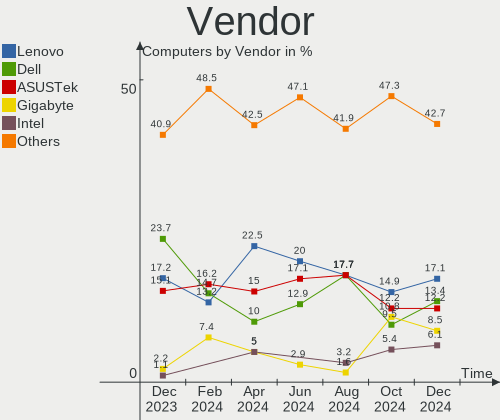
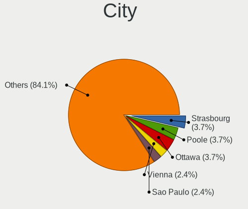
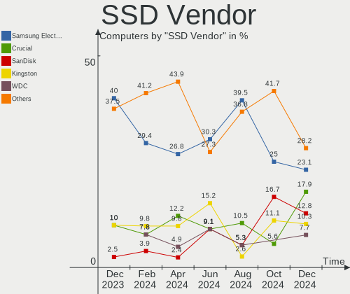
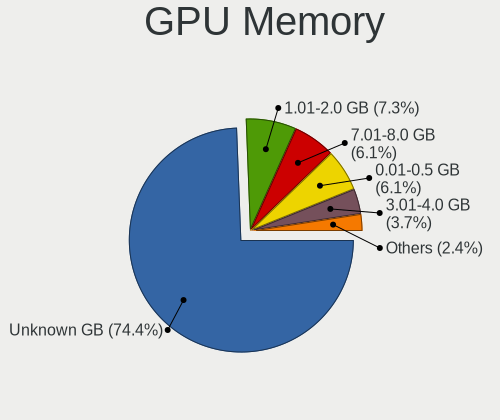
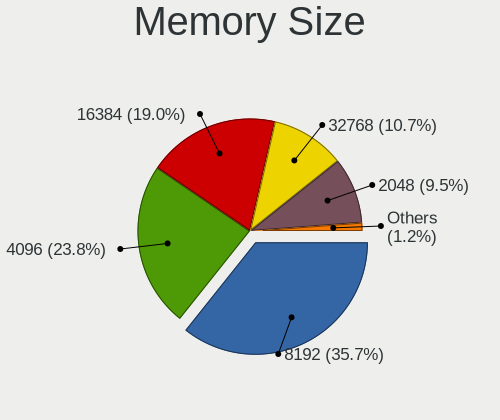
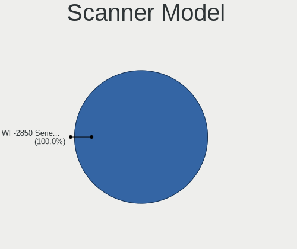

FreeBSD - Hardware Trends
-------------------------

A project to identify most popular hardware characteristics and track their change
over time based on data collected by BSD users at https://BSD-Hardware.info.

Anyone can contribute to this report by the [hw-probe](https://github.com/linuxhw/hw-probe/blob/master/INSTALL.BSD.md) tool:

    hw-probe -all -upload

This is a report for all computer types. See also reports for [desktops](/Dist/FreeBSD/Desktop/README.md) and [notebooks](/Dist/FreeBSD/Notebook/README.md).

This report is for one last month. Overall report since the beginning of time: [TestDays](https://github.com/bsdhw/TestDays)

Period: Jun, 2023.

Contents
--------

* [ System ](#system)
  - [ OS                       ](#os)
  - [ OS Family                ](#os-family)
  - [ Arch                     ](#arch)
  - [ DE                       ](#de)
  - [ Display Server           ](#display-server)
  - [ Display Manager          ](#display-manager)
  - [ OS Lang                  ](#os-lang)
  - [ Boot Mode                ](#boot-mode)
  - [ Filesystem               ](#filesystem)
  - [ Part. scheme             ](#part-scheme)

* [ Board ](#board)
  - [ Vendor                   ](#vendor)
  - [ Model                    ](#model)
  - [ Model Family             ](#model-family)
  - [ MFG Year                 ](#mfg-year)
  - [ Form Factor              ](#form-factor)
  - [ Coreboot                 ](#coreboot)
  - [ RAM Size                 ](#ram-size)
  - [ RAM Used                 ](#ram-used)
  - [ Total Drives             ](#total-drives)
  - [ Has CD-ROM               ](#has-cd-rom)
  - [ Has Ethernet             ](#has-ethernet)
  - [ Has WiFi                 ](#has-wifi)
  - [ Has Bluetooth            ](#has-bluetooth)

* [ Location ](#location)
  - [ Country                  ](#country)
  - [ City                     ](#city)

* [ Drives ](#drives)
  - [ Drive Vendor             ](#drive-vendor)
  - [ Drive Model              ](#drive-model)
  - [ HDD Vendor               ](#hdd-vendor)
  - [ SSD Vendor               ](#ssd-vendor)
  - [ Drive Kind               ](#drive-kind)
  - [ Drive Connector          ](#drive-connector)
  - [ Drive Size               ](#drive-size)
  - [ Space Total              ](#space-total)
  - [ Space Used               ](#space-used)
  - [ Malfunc. Drives          ](#malfunc-drives)
  - [ Malfunc. Drive Vendor    ](#malfunc-drive-vendor)
  - [ Malfunc. HDD Vendor      ](#malfunc-hdd-vendor)
  - [ Malfunc. Drive Kind      ](#malfunc-drive-kind)
  - [ Failed Drives            ](#failed-drives)
  - [ Failed Drive Vendor      ](#failed-drive-vendor)
  - [ Drive Status             ](#drive-status)

* [ Storage controller ](#storage-controller)
  - [ Storage Vendor           ](#storage-vendor)
  - [ Storage Model            ](#storage-model)
  - [ Storage Kind             ](#storage-kind)

* [ Processor ](#processor)
  - [ CPU Vendor               ](#cpu-vendor)
  - [ CPU Model                ](#cpu-model)
  - [ CPU Model Family         ](#cpu-model-family)
  - [ CPU Cores                ](#cpu-cores)
  - [ CPU Sockets              ](#cpu-sockets)
  - [ CPU Threads              ](#cpu-threads)
  - [ CPU Microarch            ](#cpu-microarch)

* [ Graphics ](#graphics)
  - [ GPU Vendor               ](#gpu-vendor)
  - [ GPU Model                ](#gpu-model)
  - [ GPU Combo                ](#gpu-combo)
  - [ GPU Driver               ](#gpu-driver)
  - [ GPU Memory               ](#gpu-memory)

* [ Monitor ](#monitor)
  - [ Monitor Vendor           ](#monitor-vendor)
  - [ Monitor Model            ](#monitor-model)
  - [ Monitor Resolution       ](#monitor-resolution)
  - [ Monitor Diagonal         ](#monitor-diagonal)
  - [ Monitor Width            ](#monitor-width)
  - [ Aspect Ratio             ](#aspect-ratio)
  - [ Monitor Area             ](#monitor-area)
  - [ Pixel Density            ](#pixel-density)
  - [ Multiple Monitors        ](#multiple-monitors)

* [ Network ](#network)
  - [ Net Controller Vendor    ](#net-controller-vendor)
  - [ Net Controller Model     ](#net-controller-model)
  - [ Wireless Vendor          ](#wireless-vendor)
  - [ Wireless Model           ](#wireless-model)
  - [ Ethernet Vendor          ](#ethernet-vendor)
  - [ Ethernet Model           ](#ethernet-model)
  - [ Net Controller Kind      ](#net-controller-kind)
  - [ Used Controller          ](#used-controller)
  - [ NICs                     ](#nics)
  - [ IPv6                     ](#ipv6)

* [ Bluetooth ](#bluetooth)
  - [ Bluetooth Vendor         ](#bluetooth-vendor)
  - [ Bluetooth Model          ](#bluetooth-model)

* [ Sound ](#sound)
  - [ Sound Vendor             ](#sound-vendor)
  - [ Sound Model              ](#sound-model)

* [ Memory ](#memory)
  - [ Memory Vendor            ](#memory-vendor)
  - [ Memory Model             ](#memory-model)
  - [ Memory Kind              ](#memory-kind)
  - [ Memory Form Factor       ](#memory-form-factor)
  - [ Memory Size              ](#memory-size)
  - [ Memory Speed             ](#memory-speed)

* [ Printers & scanners ](#printers--scanners)
  - [ Printer Vendor           ](#printer-vendor)
  - [ Printer Model            ](#printer-model)
  - [ Scanner Vendor           ](#scanner-vendor)
  - [ Scanner Model            ](#scanner-model)

* [ Camera ](#camera)
  - [ Camera Vendor            ](#camera-vendor)
  - [ Camera Model             ](#camera-model)

* [ Security ](#security)
  - [ Fingerprint Vendor       ](#fingerprint-vendor)
  - [ Fingerprint Model        ](#fingerprint-model)
  - [ Chipcard Vendor          ](#chipcard-vendor)
  - [ Chipcard Model           ](#chipcard-model)

* [ Unsupported ](#unsupported)
  - [ Unsupported Devices      ](#unsupported-devices)
  - [ Unsupported Device Types ](#unsupported-device-types)

System
------

OS
--

Installed operating systems

| Name                 | Computers | Percent |
|----------------------|-----------|---------|
| FreeBSD 13.2         | 36        | 67.92%  |
| FreeBSD 14.0-CURRENT | 10        | 18.87%  |
| FreeBSD 13.2-p1      | 3         | 5.66%   |
| FreeBSD 13.2-STABLE  | 1         | 1.89%   |
| FreeBSD 13.1-p8      | 1         | 1.89%   |
| FreeBSD 13.1-p5      | 1         | 1.89%   |
| FreeBSD 13.1         | 1         | 1.89%   |

OS Family
---------

OS without a version

| Name    | Computers | Percent |
|---------|-----------|---------|
| FreeBSD | 53        | 100%    |

Arch
----

OS architecture (x86_64, i586, etc.)

| Name  | Computers | Percent |
|-------|-----------|---------|
| amd64 | 45        | 84.91%  |
| arm64 | 5         | 9.43%   |
| i386  | 3         | 5.66%   |

DE
--

Desktop Environment

| Name    | Computers | Percent |
|---------|-----------|---------|
| Console | 15        | 28.3%   |
| KDE5    | 14        | 26.42%  |
| XFCE    | 6         | 11.32%  |
| TWM     | 5         | 9.43%   |
| MATE    | 4         | 7.55%   |
| LXQt    | 2         | 3.77%   |
| KDE     | 2         | 3.77%   |
| GNOME   | 2         | 3.77%   |
| Budgie  | 2         | 3.77%   |
| i3      | 1         | 1.89%   |

Display Server
--------------

X11 or Wayland

| Name    | Computers | Percent |
|---------|-----------|---------|
| X11     | 36        | 67.92%  |
| Console | 17        | 32.08%  |

Display Manager
---------------

SDDM, LightDM, etc.

| Name    | Computers | Percent |
|---------|-----------|---------|
| Console | 23        | 43.4%   |
| SDDM    | 17        | 32.08%  |
| SLiM    | 5         | 9.43%   |
| LightDM | 5         | 9.43%   |
| GDM     | 2         | 3.77%   |
| XDM     | 1         | 1.89%   |

OS Lang
-------

Language

| Lang    | Computers | Percent |
|---------|-----------|---------|
| C       | 38        | 71.7%   |
| en_US   | 8         | 15.09%  |
| Unknown | 3         | 5.66%   |
| pt_BR   | 1         | 1.89%   |
| pl_PL   | 1         | 1.89%   |
| de_DE   | 1         | 1.89%   |
| Default | 1         | 1.89%   |

Boot Mode
---------

EFI or BIOS

| Mode | Computers | Percent |
|------|-----------|---------|
| EFI  | 41        | 77.36%  |
| BIOS | 12        | 22.64%  |

Filesystem
----------

Type of filesystem

| Type | Computers | Percent |
|------|-----------|---------|
| Zfs  | 38        | 71.7%   |
| Ufs  | 15        | 28.3%   |

Part. scheme
------------

Scheme of partitioning

| Type | Computers | Percent |
|------|-----------|---------|
| GPT  | 49        | 92.45%  |
| MBR  | 4         | 7.55%   |

Board
-----

Vendor
------

Motherboard manufacturer

| Name                    | Computers | Percent |
|-------------------------|-----------|---------|
| Lenovo                  | 15        | 28.3%   |
| Hewlett-Packard         | 6         | 11.32%  |
| ASUSTek Computer        | 6         | 11.32%  |
| Dell                    | 5         | 9.43%   |
| ASRock                  | 4         | 7.55%   |
| Unknown                 | 4         | 7.55%   |
| MSI                     | 2         | 3.77%   |
| Toshiba                 | 1         | 1.89%   |
| Raspberry Pi Foundation | 1         | 1.89%   |
| Notebook                | 1         | 1.89%   |
| Intel                   | 1         | 1.89%   |
| IBM                     | 1         | 1.89%   |
| Gigabyte Technology     | 1         | 1.89%   |
| Fujitsu Siemens         | 1         | 1.89%   |
| AZW                     | 1         | 1.89%   |
| ASRockRack              | 1         | 1.89%   |
| Apple                   | 1         | 1.89%   |
| Acer                    | 1         | 1.89%   |

Model
-----

Motherboard model

| Name                                      | Computers | Percent |
|-------------------------------------------|-----------|---------|
| Unknown                                   | 4         | 7.55%   |
| ASRock Z590 Pro4                          | 2         | 3.77%   |
| ASRock X570 Phantom Gaming 4              | 2         | 3.77%   |
| Toshiba Satellite C70-B                   | 1         | 1.89%   |
| RPi Raspberry Pi                          | 1         | 1.89%   |
| Notebook NL5xRU                           | 1         | 1.89%   |
| MSI MS-7C36                               | 1         | 1.89%   |
| MSI MS-7817                               | 1         | 1.89%   |
| Lenovo ThinkPad X1 Extreme 2nd 20QV001CPB | 1         | 1.89%   |
| Lenovo ThinkPad X1 Carbon 6th 20KH002LUS  | 1         | 1.89%   |
| Lenovo ThinkPad W520 4284GZ1              | 1         | 1.89%   |
| Lenovo ThinkPad T500 2082BNU              | 1         | 1.89%   |
| Lenovo ThinkPad T480 20L6S5VP4C           | 1         | 1.89%   |
| Lenovo ThinkPad T480 20L6S2S800           | 1         | 1.89%   |
| Lenovo ThinkPad T450 20BV000BUS           | 1         | 1.89%   |
| Lenovo ThinkPad T440p 20AW000BUS          | 1         | 1.89%   |
| Lenovo ThinkPad T430 2347GR2              | 1         | 1.89%   |
| Lenovo ThinkCentre M700 10HYS0Q400        | 1         | 1.89%   |
| Lenovo ThinkCentre A70 7099A5P            | 1         | 1.89%   |
| Lenovo ThinkBook 14 G4+ ARA 21D0          | 1         | 1.89%   |
| Lenovo IdeaPad Slim 9 14ITL5 82D2         | 1         | 1.89%   |
| Lenovo B590 20208                         | 1         | 1.89%   |
| Lenovo B40-30 80F10002BR                  | 1         | 1.89%   |
| Intel NUC12WSKi3                          | 1         | 1.89%   |
| IBM System x3550 M3 -[7944AC1]-           | 1         | 1.89%   |
| HP Z440 Workstation                       | 1         | 1.89%   |
| HP Pavilion g4                            | 1         | 1.89%   |
| HP EliteBook 8570p                        | 1         | 1.89%   |
| HP EliteBook 850 G5                       | 1         | 1.89%   |
| HP EliteBook 840 G6                       | 1         | 1.89%   |
| HP 1000                                   | 1         | 1.89%   |
| Gigabyte B360M-D2V                        | 1         | 1.89%   |
| Fujitsu Siemens AMILO Li3710              | 1         | 1.89%   |
| Dell Vostro 3681                          | 1         | 1.89%   |
| Dell Latitude E6520                       | 1         | 1.89%   |
| Dell Latitude 3420                        | 1         | 1.89%   |
| Dell Inspiron 5559                        | 1         | 1.89%   |
| Dell G5 5505                              | 1         | 1.89%   |
| AZW SER                                   | 1         | 1.89%   |
| ASUS TUF Gaming B450-PLUS II              | 1         | 1.89%   |

Model Family
------------

Motherboard model prefix

| Name                      | Computers | Percent |
|---------------------------|-----------|---------|
| Lenovo ThinkPad           | 9         | 16.98%  |
| Unknown                   | 4         | 7.55%   |
| HP EliteBook              | 3         | 5.66%   |
| Lenovo ThinkCentre        | 2         | 3.77%   |
| Dell Latitude             | 2         | 3.77%   |
| ASUS ROG                  | 2         | 3.77%   |
| ASRock Z590               | 2         | 3.77%   |
| ASRock X570               | 2         | 3.77%   |
| Toshiba Satellite         | 1         | 1.89%   |
| RPi Raspberry             | 1         | 1.89%   |
| Notebook NL5xRU           | 1         | 1.89%   |
| MSI MS-7C36               | 1         | 1.89%   |
| MSI MS-7817               | 1         | 1.89%   |
| Lenovo ThinkBook          | 1         | 1.89%   |
| Lenovo IdeaPad            | 1         | 1.89%   |
| Lenovo B590               | 1         | 1.89%   |
| Lenovo B40-30             | 1         | 1.89%   |
| Intel NUC12WSKi3          | 1         | 1.89%   |
| IBM System                | 1         | 1.89%   |
| HP Z440                   | 1         | 1.89%   |
| HP Pavilion               | 1         | 1.89%   |
| HP 1000                   | 1         | 1.89%   |
| Gigabyte B360M-D2V        | 1         | 1.89%   |
| Fujitsu Siemens AMILO     | 1         | 1.89%   |
| Dell Vostro               | 1         | 1.89%   |
| Dell Inspiron             | 1         | 1.89%   |
| Dell G5                   | 1         | 1.89%   |
| AZW SER                   | 1         | 1.89%   |
| ASUS TUF                  | 1         | 1.89%   |
| ASUS PRIME                | 1         | 1.89%   |
| ASUS P5Q-E                | 1         | 1.89%   |
| ASUS P5K                  | 1         | 1.89%   |
| ASRockRack EPYC3101D4I-2T | 1         | 1.89%   |
| Apple MacBook2            | 1         | 1.89%   |
| Acer Aspire               | 1         | 1.89%   |

MFG Year
--------

Motherboard manufacture year

| Year    | Computers | Percent |
|---------|-----------|---------|
| 2022    | 5         | 9.43%   |
| 2021    | 5         | 9.43%   |
| 2019    | 5         | 9.43%   |
| 2018    | 5         | 9.43%   |
| 2013    | 5         | 9.43%   |
| Unknown | 5         | 9.43%   |
| 2020    | 3         | 5.66%   |
| 2015    | 3         | 5.66%   |
| 2014    | 3         | 5.66%   |
| 2023    | 2         | 3.77%   |
| 2016    | 2         | 3.77%   |
| 2012    | 2         | 3.77%   |
| 2010    | 2         | 3.77%   |
| 2008    | 2         | 3.77%   |
| 2017    | 1         | 1.89%   |
| 2011    | 1         | 1.89%   |
| 2009    | 1         | 1.89%   |
| 2007    | 1         | 1.89%   |

Form Factor
-----------

Physical design of the computer

| Name           | Computers | Percent |
|----------------|-----------|---------|
| Notebook       | 27        | 50.94%  |
| Desktop        | 22        | 41.51%  |
| Mini pc        | 2         | 3.77%   |
| System on chip | 1         | 1.89%   |
| Server         | 1         | 1.89%   |

Coreboot
--------

Have coreboot on board

| Used | Computers | Percent |
|------|-----------|---------|
| No   | 53        | 100%    |

RAM Size
--------

Total RAM memory

| Size in GB  | Computers | Percent |
|-------------|-----------|---------|
| 16.01-24.0  | 12        | 22.64%  |
| 64.01-256.0 | 10        | 18.87%  |
| 8.01-16.0   | 10        | 18.87%  |
| 32.01-64.0  | 8         | 15.09%  |
| 4.01-8.0    | 7         | 13.21%  |
| 3.01-4.0    | 2         | 3.77%   |
| 2.01-3.0    | 2         | 3.77%   |
| 0.51-1.0    | 2         | 3.77%   |

RAM Used
--------

Used RAM memory

| Used GB  | Computers | Percent |
|----------|-----------|---------|
| 0.01-0.5 | 21        | 39.62%  |
| 0.51-1.0 | 15        | 28.3%   |
| 1.01-2.0 | 9         | 16.98%  |
| 3.01-4.0 | 3         | 5.66%   |
| 2.01-3.0 | 3         | 5.66%   |
| 4.01-8.0 | 2         | 3.77%   |

Total Drives
------------

Number of drives on board

| Drives | Computers | Percent |
|--------|-----------|---------|
| 1      | 20        | 37.74%  |
| 2      | 14        | 26.42%  |
| 0      | 7         | 13.21%  |
| 3      | 6         | 11.32%  |
| 6      | 2         | 3.77%   |
| 13     | 1         | 1.89%   |
| 7      | 1         | 1.89%   |
| 5      | 1         | 1.89%   |
| 4      | 1         | 1.89%   |

Has CD-ROM
----------

Has CD-ROM on board

| Presented | Computers | Percent |
|-----------|-----------|---------|
| No        | 35        | 66.04%  |
| Yes       | 18        | 33.96%  |

Has Ethernet
------------

Has Ethernet on board

| Presented | Computers | Percent |
|-----------|-----------|---------|
| Yes       | 49        | 92.45%  |
| No        | 4         | 7.55%   |

Has WiFi
--------

Has WiFi module

| Presented | Computers | Percent |
|-----------|-----------|---------|
| Yes       | 34        | 64.15%  |
| No        | 19        | 35.85%  |

Has Bluetooth
-------------

Has Bluetooth module

| Presented | Computers | Percent |
|-----------|-----------|---------|
| No        | 29        | 54.72%  |
| Yes       | 24        | 45.28%  |

Location
--------

Country
-------

Geographic location (country)

| Country     | Computers | Percent |
|-------------|-----------|---------|
| USA         | 14        | 26.42%  |
| Brazil      | 5         | 9.43%   |
| UK          | 4         | 7.55%   |
| Russia      | 4         | 7.55%   |
| Poland      | 4         | 7.55%   |
| Netherlands | 2         | 3.77%   |
| Indonesia   | 2         | 3.77%   |
| Iceland     | 2         | 3.77%   |
| Germany     | 2         | 3.77%   |
| China       | 2         | 3.77%   |
| Vietnam     | 1         | 1.89%   |
| Thailand    | 1         | 1.89%   |
| Taiwan      | 1         | 1.89%   |
| Spain       | 1         | 1.89%   |
| Nepal       | 1         | 1.89%   |
| Japan       | 1         | 1.89%   |
| Hungary     | 1         | 1.89%   |
| France      | 1         | 1.89%   |
| Canada      | 1         | 1.89%   |
| Bulgaria    | 1         | 1.89%   |
| Austria     | 1         | 1.89%   |
| Australia   | 1         | 1.89%   |

City
----

Geographic location (city)

| City                  | Computers | Percent |
|-----------------------|-----------|---------|
| Salem                 | 2         | 3.77%   |
| Reykjavik             | 2         | 3.77%   |
| Redmond               | 2         | 3.77%   |
| Medan                 | 2         | 3.77%   |
| Flushing              | 2         | 3.77%   |
| East Grinstead        | 2         | 3.77%   |
| Cordeiropolis         | 2         | 3.77%   |
| Choroszcz             | 2         | 3.77%   |
| Xom Pho               | 1         | 1.89%   |
| Würzburg             | 1         | 1.89%   |
| Wuerselen             | 1         | 1.89%   |
| Wenatchee             | 1         | 1.89%   |
| Warsaw                | 1         | 1.89%   |
| Vienna                | 1         | 1.89%   |
| Vancouver             | 1         | 1.89%   |
| Umeda                 | 1         | 1.89%   |
| Sydney                | 1         | 1.89%   |
| Stavropol             | 1         | 1.89%   |
| South Croydon         | 1         | 1.89%   |
| Sofia                 | 1         | 1.89%   |
| Seattle               | 1         | 1.89%   |
| Saratov               | 1         | 1.89%   |
| Sao Paulo             | 1         | 1.89%   |
| Santa Barbara d'Oeste | 1         | 1.89%   |
| Saint-Ouen-du-Tilleul | 1         | 1.89%   |
| Nieuw-Vennep          | 1         | 1.89%   |
| Moscow                | 1         | 1.89%   |
| Madrid                | 1         | 1.89%   |
| Macaiba               | 1         | 1.89%   |
| Las Vegas             | 1         | 1.89%   |
| Krasnodar             | 1         | 1.89%   |
| Krakow                | 1         | 1.89%   |
| Hsinchu County        | 1         | 1.89%   |
| Haywards Heath        | 1         | 1.89%   |
| Harbin                | 1         | 1.89%   |
| Eureka                | 1         | 1.89%   |
| Edmond                | 1         | 1.89%   |
| Eagan                 | 1         | 1.89%   |
| Coral Springs         | 1         | 1.89%   |
| Chongqing             | 1         | 1.89%   |

Drives
------

Drive Vendor
------------

Hard drive vendors

| Vendor              | Computers | Drives | Percent |
|---------------------|-----------|--------|---------|
| Samsung Electronics | 17        | 29     | 23.94%  |
| WDC                 | 10        | 27     | 14.08%  |
| Seagate             | 8         | 8      | 11.27%  |
| Toshiba             | 6         | 10     | 8.45%   |
| Kingston            | 4         | 4      | 5.63%   |
| Crucial             | 4         | 5      | 5.63%   |
| SK hynix            | 2         | 2      | 2.82%   |
| SanDisk             | 2         | 2      | 2.82%   |
| MidasForce          | 2         | 2      | 2.82%   |
| Intel               | 2         | 2      | 2.82%   |
| Hitachi             | 2         | 2      | 2.82%   |
| Transcend           | 1         | 1      | 1.41%   |
| SPCC                | 1         | 1      | 1.41%   |
| Silicon Motion      | 1         | 1      | 1.41%   |
| PNY                 | 1         | 1      | 1.41%   |
| Phison              | 1         | 2      | 1.41%   |
| MSI                 | 1         | 1      | 1.41%   |
| Micron Technology   | 1         | 1      | 1.41%   |
| KIOXIA-EXCERIA      | 1         | 1      | 1.41%   |
| KingSpec            | 1         | 2      | 1.41%   |
| HGST                | 1         | 1      | 1.41%   |
| Corsair             | 1         | 1      | 1.41%   |
| A-DATA Technology   | 1         | 1      | 1.41%   |

Drive Model
-----------

Hard drive models

| Model                                  | Computers | Percent |
|----------------------------------------|-----------|---------|
| Samsung SSD 860 EVO 500GB              | 3         | 3.33%   |
| WDC WD80EFAX-68LHPN0 8TB               | 2         | 2.22%   |
| Toshiba MK5076GSXN 500GB               | 2         | 2.22%   |
| Seagate ST4000DM000-1F2168 4TB         | 2         | 2.22%   |
| Samsung SSD 970 EVO Plus 1TB           | 2         | 2.22%   |
| MidasForce SSD 512GB                   | 2         | 2.22%   |
| Kingston SA400S37480G 480GB            | 2         | 2.22%   |
| WDC WDS100T3X0C-00SJG0 1TB             | 1         | 1.11%   |
| WDC WDS100T1X0E-00AFY0 1TB             | 1         | 1.11%   |
| WDC WD80EMAZ-00WJTA0 8TB               | 1         | 1.11%   |
| WDC WD80EFZX-68UW8N0 8TB               | 1         | 1.11%   |
| WDC WD80EDBZ-11B0ZA0 8TB               | 1         | 1.11%   |
| WDC WD80EDAZ-11TA3A0 8TB               | 1         | 1.11%   |
| WDC WD80EAZZ-00BKLB0 8TB               | 1         | 1.11%   |
| WDC WD60EZRZ-00GZ5B1 6TB               | 1         | 1.11%   |
| WDC WD40EZRZ-22GXCB0 4TB               | 1         | 1.11%   |
| WDC WD2003FZEX-00SRLA0 2TB             | 1         | 1.11%   |
| WDC WD1600BEVT-22ZCT0 160GB            | 1         | 1.11%   |
| WDC WD15EADS-00P8B0 1.5TB              | 1         | 1.11%   |
| WDC WD140EDGZ-11B2DA2 14TB             | 1         | 1.11%   |
| WDC WD120EMFZ-11A6JA0 12TB             | 1         | 1.11%   |
| WDC WD120EMAZ-11BLFA0 12TB             | 1         | 1.11%   |
| WDC WD10EZRZ-00HTKB0 1TB               | 1         | 1.11%   |
| WDC WD10EZEX-00BBHA0 1TB               | 1         | 1.11%   |
| Transcend TS256GMTS400 256GB           | 1         | 1.11%   |
| Toshiba MQ01ABF050 500GB               | 1         | 1.11%   |
| Toshiba MQ01ABD075 752GB               | 1         | 1.11%   |
| Toshiba MG07ACA14TE 14TB               | 1         | 1.11%   |
| Toshiba KBG30ZMV256G 256GB             | 1         | 1.11%   |
| SPCC Solid State Disk 240GB            | 1         | 1.11%   |
| SK hynix SKHynix_HFS512GDE9X084N 512GB | 1         | 1.11%   |
| SK hynix BC511 NVMe 256GB              | 1         | 1.11%   |
| Silicon Motion whalekom 256GB          | 1         | 1.11%   |
| Seagate ST500LT012-9WS142 500GB        | 1         | 1.11%   |
| Seagate ST500LM021-1KJ152 500GB        | 1         | 1.11%   |
| Seagate ST4000LM024-2AN17V 4TB         | 1         | 1.11%   |
| Seagate ST3500418AS 500GB              | 1         | 1.11%   |
| Seagate ST2000DM008-2FR102 2TB         | 1         | 1.11%   |
| Seagate ST1000LM024 HN-M101MBB 1TB     | 1         | 1.11%   |
| SanDisk SDSSDH3 500G                   | 1         | 1.11%   |

HDD Vendor
----------

Hard disk drive vendors

| Vendor              | Computers | Drives | Percent |
|---------------------|-----------|--------|---------|
| WDC                 | 9         | 25     | 33.33%  |
| Seagate             | 8         | 8      | 29.63%  |
| Toshiba             | 5         | 9      | 18.52%  |
| Samsung Electronics | 2         | 3      | 7.41%   |
| Hitachi             | 2         | 2      | 7.41%   |
| HGST                | 1         | 1      | 3.7%    |

SSD Vendor
----------

Solid state drive vendors

| Vendor              | Computers | Drives | Percent |
|---------------------|-----------|--------|---------|
| Samsung Electronics | 9         | 15     | 34.62%  |
| Kingston            | 4         | 4      | 15.38%  |
| SanDisk             | 2         | 2      | 7.69%   |
| MidasForce          | 2         | 2      | 7.69%   |
| Crucial             | 2         | 2      | 7.69%   |
| Transcend           | 1         | 1      | 3.85%   |
| SPCC                | 1         | 1      | 3.85%   |
| PNY                 | 1         | 1      | 3.85%   |
| MSI                 | 1         | 1      | 3.85%   |
| KIOXIA-EXCERIA      | 1         | 1      | 3.85%   |
| KingSpec            | 1         | 2      | 3.85%   |
| Intel               | 1         | 1      | 3.85%   |

Drive Kind
----------

HDD or SSD

| Kind | Computers | Drives | Percent |
|------|-----------|--------|---------|
| SSD  | 24        | 33     | 37.5%   |
| HDD  | 21        | 48     | 32.81%  |
| NVMe | 19        | 26     | 29.69%  |

Drive Connector
---------------

SATA, SAS, NVMe, etc.

| Type | Computers | Drives | Percent |
|------|-----------|--------|---------|
| SATA | 36        | 81     | 65.45%  |
| NVMe | 19        | 26     | 34.55%  |

Drive Size
----------

Size of hard drive

| Size in TB | Computers | Drives | Percent |
|------------|-----------|--------|---------|
| 0.01-0.5   | 26        | 32     | 50.98%  |
| 0.51-1.0   | 9         | 11     | 17.65%  |
| 3.01-4.0   | 5         | 6      | 9.8%    |
| 1.01-2.0   | 5         | 8      | 9.8%    |
| 10.01-20.0 | 3         | 8      | 5.88%   |
| 4.01-10.0  | 3         | 16     | 5.88%   |

Space Total
-----------

Amount of disk space available on the file system

| Size in GB | Computers | Percent |
|------------|-----------|---------|
| 251-500    | 20        | 37.74%  |
| 101-250    | 15        | 28.3%   |
| 501-1000   | 9         | 16.98%  |
| 21-50      | 4         | 7.55%   |
| 2001-3000  | 2         | 3.77%   |
| 51-100     | 2         | 3.77%   |
| 1001-2000  | 1         | 1.89%   |

Space Used
----------

Amount of used disk space

| Used GB  | Computers | Percent |
|----------|-----------|---------|
| 1-20     | 42        | 79.25%  |
| 21-50    | 5         | 9.43%   |
| 101-250  | 2         | 3.77%   |
| 501-1000 | 2         | 3.77%   |
| 51-100   | 2         | 3.77%   |

Malfunc. Drives
---------------

Drive models with a malfunction

| Model                           | Computers | Drives | Percent |
|---------------------------------|-----------|--------|---------|
| Toshiba MK5076GSXN 500GB        | 2         | 2      | 20%     |
| WDC WD80EDAZ-11TA3A0 8TB        | 1         | 1      | 10%     |
| WDC WD10EZRZ-00HTKB0 1TB        | 1         | 1      | 10%     |
| Seagate ST500LT012-9WS142 500GB | 1         | 1      | 10%     |
| Seagate ST500LM021-1KJ152 500GB | 1         | 1      | 10%     |
| Samsung Electronics HD203WI 2TB | 1         | 1      | 10%     |
| Hitachi HTS547550A9E384 500GB   | 1         | 1      | 10%     |
| Hitachi HTS542512K9SA00 120GB   | 1         | 1      | 10%     |
| HGST HTS721010A9E630 1TB        | 1         | 1      | 10%     |

Malfunc. Drive Vendor
---------------------

Vendors of faulty drives

| Vendor              | Computers | Drives | Percent |
|---------------------|-----------|--------|---------|
| WDC                 | 2         | 2      | 20%     |
| Toshiba             | 2         | 2      | 20%     |
| Seagate             | 2         | 2      | 20%     |
| Hitachi             | 2         | 2      | 20%     |
| Samsung Electronics | 1         | 1      | 10%     |
| HGST                | 1         | 1      | 10%     |

Malfunc. HDD Vendor
-------------------

Vendors of faulty HDD drives

| Vendor              | Computers | Drives | Percent |
|---------------------|-----------|--------|---------|
| WDC                 | 2         | 2      | 20%     |
| Toshiba             | 2         | 2      | 20%     |
| Seagate             | 2         | 2      | 20%     |
| Hitachi             | 2         | 2      | 20%     |
| Samsung Electronics | 1         | 1      | 10%     |
| HGST                | 1         | 1      | 10%     |

Malfunc. Drive Kind
-------------------

Kinds of faulty drives

| Kind | Computers | Drives | Percent |
|------|-----------|--------|---------|
| HDD  | 10        | 10     | 100%    |

Failed Drives
-------------

Failed drive models

Zero info for selected period =(

Failed Drive Vendor
-------------------

Failed drive vendors

Zero info for selected period =(

Drive Status
------------

Number of failed and malfunc. drives

| Status  | Computers | Drives | Percent |
|---------|-----------|--------|---------|
| Works   | 43        | 97     | 81.13%  |
| Malfunc | 10        | 10     | 18.87%  |

Storage controller
------------------

Storage Vendor
--------------

Storage controller vendors

| Vendor                    | Computers | Percent |
|---------------------------|-----------|---------|
| Intel                     | 31        | 42.47%  |
| AMD                       | 10        | 13.7%   |
| Samsung Electronics       | 9         | 12.33%  |
| Sandisk                   | 4         | 5.48%   |
| SK hynix                  | 3         | 4.11%   |
| Broadcom / LSI            | 3         | 4.11%   |
| Toshiba                   | 2         | 2.74%   |
| Realtek Semiconductor     | 2         | 2.74%   |
| Phison Electronics        | 2         | 2.74%   |
| Micron Technology         | 2         | 2.74%   |
| Marvell Technology Group  | 2         | 2.74%   |
| Silicon Motion            | 1         | 1.37%   |
| Micron/Crucial Technology | 1         | 1.37%   |
| ASMedia Technology        | 1         | 1.37%   |

Storage Model
-------------

Storage controller models

| Model                                                                          | Computers | Percent |
|--------------------------------------------------------------------------------|-----------|---------|
| AMD FCH SATA Controller [AHCI mode]                                            | 9         | 11.25%  |
| Samsung NVMe SSD Controller SM981/PM981/PM983                                  | 6         | 7.5%    |
| Intel 7 Series Chipset Family 6-port SATA Controller [AHCI mode]               | 5         | 6.25%   |
| Intel 8 Series SATA Controller 1 [AHCI mode]                                   | 3         | 3.75%   |
| SK hynix BC511 NVMe SSD                                                        | 2         | 2.5%    |
| Sandisk WD Black SN770 NVMe SSD                                                | 2         | 2.5%    |
| Samsung NVMe SSD Controller SM961/PM961/SM963                                  | 2         | 2.5%    |
| Realtek NVMe Controller                                                        | 2         | 2.5%    |
| Intel Sunrise Point-LP SATA Controller [AHCI mode]                             | 2         | 2.5%    |
| Intel 82801JI (ICH10 Family) 4 port SATA IDE Controller #1                     | 2         | 2.5%    |
| Intel 82801JI (ICH10 Family) 2 port SATA IDE Controller #2                     | 2         | 2.5%    |
| Intel 82801IBM/IEM (ICH9M/ICH9M-E) 4 port SATA Controller [AHCI mode]          | 2         | 2.5%    |
| Intel 8 Series/C220 Series Chipset Family 6-port SATA Controller 1 [AHCI mode] | 2         | 2.5%    |
| Intel 500 Series Chipset Family SATA AHCI Controller                           | 2         | 2.5%    |
| Broadcom / LSI SAS2008 PCI-Express Fusion-MPT SAS-2 [Falcon]                   | 2         | 2.5%    |
| Toshiba XG5 NVMe SSD Controller                                                | 1         | 1.25%   |
| Toshiba BG3 NVMe SSD Controller                                                | 1         | 1.25%   |
| SK hynix Gold P31/BC711/PC711 NVMe Solid State Drive                           | 1         | 1.25%   |
| Silicon Motion SM2263EN/SM2263XT SSD Controller                                | 1         | 1.25%   |
| SanDisk WD PC SN810 / Black SN850 NVMe SSD                                     | 1         | 1.25%   |
| SanDisk WD Black SN750 / PC SN730 NVMe SSD                                     | 1         | 1.25%   |
| Samsung NVMe SSD Controller PM9A1/PM9A3/980PRO                                 | 1         | 1.25%   |
| Samsung NVMe SSD Controller 980                                                | 1         | 1.25%   |
| Phison E16 PCIe4 NVMe Controller                                               | 1         | 1.25%   |
| Phison E12 NVMe Controller                                                     | 1         | 1.25%   |
| Micron/Crucial P5 Plus NVMe PCIe SSD                                           | 1         | 1.25%   |
| Micron/Crucial P2 NVMe PCIe SSD                                                | 1         | 1.25%   |
| Micron NVMe Storage Controller                                                 | 1         | 1.25%   |
| Micron NVMe Controller                                                         | 1         | 1.25%   |
| Marvell Group 88SE6111/6121 SATA II / PATA Controller                          | 1         | 1.25%   |
| Marvell Group 88SE6101/6102 single-port PATA133 interface                      | 1         | 1.25%   |
| Intel Tiger Lake-LP SATA Controller                                            | 1         | 1.25%   |
| Intel SSD Pro 7600p/760p/E 6100p Series                                        | 1         | 1.25%   |
| Intel Q170/Q150/B150/H170/H110/Z170/CM236 Chipset SATA Controller [AHCI Mode]  | 1         | 1.25%   |
| Intel NM10/ICH7 Family SATA Controller [IDE mode]                              | 1         | 1.25%   |
| Intel Cannon Lake PCH SATA AHCI Controller                                     | 1         | 1.25%   |
| Intel C610/X99 series chipset sSATA Controller [AHCI mode]                     | 1         | 1.25%   |
| Intel Atom Processor E3800 Series SATA AHCI Controller                         | 1         | 1.25%   |
| Intel Alder Lake-P SATA AHCI Controller                                        | 1         | 1.25%   |
| Intel 82801IR/IO/IH (ICH9R/DO/DH) 4 port SATA Controller [IDE mode]            | 1         | 1.25%   |

Storage Kind
------------

Kind of storage controller (IDE, SATA, NVMe, SAS, ...)

| Kind | Computers | Percent |
|------|-----------|---------|
| SATA | 34        | 50.75%  |
| NVMe | 24        | 35.82%  |
| IDE  | 5         | 7.46%   |
| RAID | 2         | 2.99%   |
| SAS  | 2         | 2.99%   |

Processor
---------

CPU Vendor
----------

Processor vendors

| Vendor | Computers | Percent |
|--------|-----------|---------|
| Intel  | 36        | 67.92%  |
| AMD    | 12        | 22.64%  |
| ARM    | 5         | 9.43%   |

CPU Model
---------

Processor models

| Model                                   | Computers | Percent |
|-----------------------------------------|-----------|---------|
| ARM Cortex-A55 r2p0                     | 4         | 7.55%   |
| Intel Core i7-10700K CPU @ 3.80GHz      | 2         | 3.77%   |
| Intel Core i5-8350U CPU @ 1.70GHz       | 2         | 3.77%   |
| AMD Ryzen 9 5950X 16-Core Processor     | 2         | 3.77%   |
| AMD Ryzen 9 3900X 12-Core Processor     | 2         | 3.77%   |
| Intel Xeon CPU E5620 @ 2.40GHz          | 1         | 1.89%   |
| Intel Xeon CPU E5-2690 v4 @ 2.60GHz     | 1         | 1.89%   |
| Intel Pentium CPU G3220 @ 3.00GHz       | 1         | 1.89%   |
| Intel Core i7-8650U CPU @ 1.90GHz       | 1         | 1.89%   |
| Intel Core i7-8550U CPU @ 1.80GHz       | 1         | 1.89%   |
| Intel Core i7-6500U CPU @ 2.50GHz       | 1         | 1.89%   |
| Intel Core i7-4702MQ CPU @ 2.20GHz      | 1         | 1.89%   |
| Intel Core i7-3520M CPU @ 2.90GHz       | 1         | 1.89%   |
| Intel Core i7-2630QM CPU @ 2.00GHz      | 1         | 1.89%   |
| Intel Core i5-9400F CPU @ 2.90GHz       | 1         | 1.89%   |
| Intel Core i5-9300H CPU @ 2.40GHz       | 1         | 1.89%   |
| Intel Core i5-8365U CPU @ 1.60GHz       | 1         | 1.89%   |
| Intel Core i5-6400T CPU @ 2.20GHz       | 1         | 1.89%   |
| Intel Core i5-4300U CPU @ 1.90GHz       | 1         | 1.89%   |
| Intel Core i5-4210U CPU @ 1.70GHz       | 1         | 1.89%   |
| Intel Core i5-3320M CPU @ 2.60GHz       | 1         | 1.89%   |
| Intel Core i5-3210M CPU @ 2.50GHz       | 1         | 1.89%   |
| Intel Core i5-2520M CPU @ 2.50GH        | 1         | 1.89%   |
| Intel Core i5-10400 CPU @ 2.90GHz       | 1         | 1.89%   |
| Intel Core i3-4005U CPU @ 1.70GHz       | 1         | 1.89%   |
| Intel Core i3-3120M CPU @ 2.50GHz       | 1         | 1.89%   |
| Intel Core i3-2350M CPU @ 2.30GHz       | 1         | 1.89%   |
| Intel Core 2 Quad CPU Q6600 @ 2.40GHz   | 1         | 1.89%   |
| Intel Core 2 Duo CPU T9600 @ 2.80GHz    | 1         | 1.89%   |
| Intel Core 2 Duo CPU T6400 @ 2.00GHz    | 1         | 1.89%   |
| Intel Core 2 Duo CPU E7500 @ 2.93GHz    | 1         | 1.89%   |
| Intel Core 2 Duo CPU E6750 @ 2.66GHz    | 1         | 1.89%   |
| Intel Core 2 CPU                        | 1         | 1.89%   |
| Intel Celeron CPU N2840 @ 2.16GHz       | 1         | 1.89%   |
| Intel 12th Gen Core i3-1220P            | 1         | 1.89%   |
| Intel 11th Gen Core i7-1195G7 @ 2.90GHz | 1         | 1.89%   |
| Intel 11th Gen Core i5-1135G7 @ 2.40GHz | 1         | 1.89%   |
| ARM Cortex-A72 r0p3                     | 1         | 1.89%   |
| AMD Ryzen 7 7735HS with Radeon Graphics | 1         | 1.89%   |
| AMD Ryzen 7 6800H with Radeon Graphics  | 1         | 1.89%   |

CPU Model Family
----------------

Processor model prefix

| Model             | Computers | Percent |
|-------------------|-----------|---------|
| Intel Core i5     | 12        | 22.64%  |
| Intel Core i7     | 8         | 15.09%  |
| AMD Ryzen 7       | 7         | 13.21%  |
| ARM Cortex        | 5         | 9.43%   |
| Intel Core 2 Duo  | 4         | 7.55%   |
| AMD Ryzen 9       | 4         | 7.55%   |
| Other             | 3         | 5.66%   |
| Intel Core i3     | 3         | 5.66%   |
| Intel Xeon        | 2         | 3.77%   |
| Intel Pentium     | 1         | 1.89%   |
| Intel Core 2 Quad | 1         | 1.89%   |
| Intel Core 2      | 1         | 1.89%   |
| Intel Celeron     | 1         | 1.89%   |
| AMD EPYC          | 1         | 1.89%   |

CPU Cores
---------

Number of processor cores

| Number  | Computers | Percent |
|---------|-----------|---------|
| 4       | 14        | 26.42%  |
| 2       | 14        | 26.42%  |
| Unknown | 8         | 15.09%  |
| 16      | 6         | 11.32%  |
| 8       | 3         | 5.66%   |
| 32      | 2         | 3.77%   |
| 24      | 2         | 3.77%   |
| 6       | 2         | 3.77%   |
| 14      | 1         | 1.89%   |
| 12      | 1         | 1.89%   |

CPU Sockets
-----------

Number of sockets

| Number  | Computers | Percent |
|---------|-----------|---------|
| 1       | 47        | 88.68%  |
| Unknown | 5         | 9.43%   |
| 2       | 1         | 1.89%   |

CPU Threads
-----------

Threads per core (Hyper-Threading)

| Number  | Computers | Percent |
|---------|-----------|---------|
| 2       | 25        | 47.17%  |
| 1       | 20        | 37.74%  |
| Unknown | 8         | 15.09%  |

CPU Microarch
-------------

Microarchitecture

| Name        | Computers | Percent |
|-------------|-----------|---------|
| Unknown     | 8         | 15.09%  |
| KabyLake    | 7         | 13.21%  |
| Zen 2       | 5         | 9.43%   |
| Haswell     | 5         | 9.43%   |
| IvyBridge   | 4         | 7.55%   |
| SandyBridge | 3         | 5.66%   |
| Penryn      | 3         | 5.66%   |
| Core        | 3         | 5.66%   |
| CometLake   | 3         | 5.66%   |
| Zen 3       | 2         | 3.77%   |
| Zen         | 2         | 3.77%   |
| TigerLake   | 2         | 3.77%   |
| Skylake     | 2         | 3.77%   |
| Zen+        | 1         | 1.89%   |
| Westmere    | 1         | 1.89%   |
| Silvermont  | 1         | 1.89%   |
| Broadwell   | 1         | 1.89%   |

Graphics
--------

GPU Vendor
----------

Vendors of graphics cards

| Vendor                     | Computers | Percent |
|----------------------------|-----------|---------|
| Intel                      | 29        | 52.73%  |
| Nvidia                     | 14        | 25.45%  |
| AMD                        | 10        | 18.18%  |
| Matrox Electronics Systems | 1         | 1.82%   |
| ASPEED Technology          | 1         | 1.82%   |

GPU Model
---------

Graphics card models

| Model                                                                                 | Computers | Percent |
|---------------------------------------------------------------------------------------|-----------|---------|
| Intel UHD Graphics 620                                                                | 4         | 7.02%   |
| Intel Haswell-ULT Integrated Graphics Controller                                      | 3         | 5.26%   |
| Intel CometLake-S GT2 [UHD Graphics 630]                                              | 3         | 5.26%   |
| Intel 3rd Gen Core processor Graphics Controller                                      | 3         | 5.26%   |
| Intel 2nd Generation Core Processor Family Integrated Graphics Controller             | 3         | 5.26%   |
| Nvidia GK208B [GeForce GT 710]                                                        | 2         | 3.51%   |
| Nvidia GA104 [GeForce RTX 3060 Ti Lite Hash Rate]                                     | 2         | 3.51%   |
| Intel TigerLake-LP GT2 [Iris Xe Graphics]                                             | 2         | 3.51%   |
| Intel Mobile 4 Series Chipset Integrated Graphics Controller                          | 2         | 3.51%   |
| AMD Renoir                                                                            | 2         | 3.51%   |
| AMD Rembrandt [Radeon 680M]                                                           | 2         | 3.51%   |
| Nvidia TU117M [GeForce GTX 1650 Mobile / Max-Q]                                       | 1         | 1.75%   |
| Nvidia GT218 [NVS 300]                                                                | 1         | 1.75%   |
| Nvidia GP108 [GeForce GT 1030]                                                        | 1         | 1.75%   |
| Nvidia GP107 [GeForce GTX 1050 Ti]                                                    | 1         | 1.75%   |
| Nvidia GP106 [GeForce GTX 1060 3GB]                                                   | 1         | 1.75%   |
| Nvidia GM206 [GeForce GTX 960]                                                        | 1         | 1.75%   |
| Nvidia GM108M [GeForce 840M]                                                          | 1         | 1.75%   |
| Nvidia GK208M [GeForce GT 730M]                                                       | 1         | 1.75%   |
| Nvidia GF108GLM [Quadro 1000M]                                                        | 1         | 1.75%   |
| Nvidia GA104 [GeForce RTX 3070 Ti]                                                    | 1         | 1.75%   |
| Matrox Electronics Systems MGA G200EV                                                 | 1         | 1.75%   |
| Intel Xeon E3-1200 v3/4th Gen Core Processor Integrated Graphics Controller           | 1         | 1.75%   |
| Intel WhiskeyLake-U GT2 [UHD Graphics 620]                                            | 1         | 1.75%   |
| Intel Skylake GT2 [HD Graphics 520]                                                   | 1         | 1.75%   |
| Intel Mobile 945GM/GMS/GME, 943/940GML Express Integrated Graphics Controller         | 1         | 1.75%   |
| Intel Mobile 945GM/GMS, 943/940GML Express Integrated Graphics Controller             | 1         | 1.75%   |
| Intel HD Graphics 530                                                                 | 1         | 1.75%   |
| Intel Atom Processor Z36xxx/Z37xxx Series Graphics & Display                          | 1         | 1.75%   |
| Intel Alder Lake-UP3 GT1 [UHD Graphics]                                               | 1         | 1.75%   |
| Intel 4th Gen Core Processor Integrated Graphics Controller                           | 1         | 1.75%   |
| Intel 4 Series Chipset Integrated Graphics Controller                                 | 1         | 1.75%   |
| ASPEED Technology ASPEED Graphics Family                                              | 1         | 1.75%   |
| AMD Topaz XT [Radeon R7 M260/M265 / M340/M360 / M440/M445 / 530/535 / 620/625 Mobile] | 1         | 1.75%   |
| AMD Thames [Radeon HD 7550M/7570M/7650M]                                              | 1         | 1.75%   |
| AMD Sun XT [Radeon HD 8670A/8670M/8690M / R5 M330 / M430 / Radeon 520 Mobile]         | 1         | 1.75%   |
| AMD Navi 22 [Radeon RX 6700/6700 XT/6750 XT / 6800M/6850M XT]                         | 1         | 1.75%   |
| AMD Navi 10 [Radeon RX 5600 OEM/5600 XT / 5700/5700 XT]                               | 1         | 1.75%   |
| AMD Cedar [Radeon HD 5000/6000/7350/8350 Series]                                      | 1         | 1.75%   |
| AMD Caicos [Radeon HD 6450/7450/8450 / R5 230 OEM]                                    | 1         | 1.75%   |

GPU Combo
---------

Combinations of graphics cards

| Name           | Computers | Percent |
|----------------|-----------|---------|
| 1 x Intel      | 19        | 35.85%  |
| 1 x Nvidia     | 9         | 16.98%  |
| 1 x AMD        | 7         | 13.21%  |
| Other          | 5         | 9.43%   |
| Intel + Nvidia | 5         | 9.43%   |
| 2 x Intel      | 3         | 5.66%   |
| Intel + AMD    | 2         | 3.77%   |
| 2 x AMD        | 1         | 1.89%   |
| 1 x Matrox     | 1         | 1.89%   |
| 1 x ASPEED     | 1         | 1.89%   |

GPU Driver
----------

Free vs proprietary

| Driver      | Computers | Percent |
|-------------|-----------|---------|
| Free        | 40        | 75.47%  |
| Proprietary | 7         | 13.21%  |
| Unknown     | 6         | 11.32%  |

GPU Memory
----------

Total video memory

| Size in GB | Computers | Percent |
|------------|-----------|---------|
| Unknown    | 40        | 75.47%  |
| 3.01-4.0   | 4         | 7.55%   |
| 7.01-8.0   | 3         | 5.66%   |
| 1.01-2.0   | 2         | 3.77%   |
| 0.51-1.0   | 2         | 3.77%   |
| 5.01-6.0   | 1         | 1.89%   |
| 8.01-16.0  | 1         | 1.89%   |

Monitor
-------

Monitor Vendor
--------------

Monitor vendors

| Vendor                  | Computers | Percent |
|-------------------------|-----------|---------|
| AU Optronics            | 7         | 17.95%  |
| LG Display              | 5         | 12.82%  |
| Chimei Innolux          | 5         | 12.82%  |
| Samsung Electronics     | 2         | 5.13%   |
| MSI                     | 2         | 5.13%   |
| Lenovo                  | 2         | 5.13%   |
| Goldstar                | 2         | 5.13%   |
| BenQ                    | 2         | 5.13%   |
| Acer                    | 2         | 5.13%   |
| Unknown                 | 1         | 2.56%   |
| Philips                 | 1         | 2.56%   |
| Konka                   | 1         | 2.56%   |
| HKC                     | 1         | 2.56%   |
| Hewlett-Packard         | 1         | 2.56%   |
| Dell                    | 1         | 2.56%   |
| Chi Mei Optoelectronics | 1         | 2.56%   |
| BOE Technology Group    | 1         | 2.56%   |
| BOE                     | 1         | 2.56%   |
| Apple                   | 1         | 2.56%   |

Monitor Model
-------------

Monitor models

| Model                                                                    | Computers | Percent |
|--------------------------------------------------------------------------|-----------|---------|
| MSI G241 MSI3BA4 1920x1080 530x300mm 24.0-inch                           | 2         | 5.13%   |
| Unknown LCD Monitor KJT4K2K60DP 3840x2160                                | 1         | 2.56%   |
| Samsung Electronics LCD Monitor SEC504B 1600x900 380x210mm 17.1-inch     | 1         | 2.56%   |
| Samsung Electronics LCD Monitor SDC8B4F 1920x1080 340x190mm 15.3-inch    | 1         | 2.56%   |
| Philips 271P4 PHL08C3 1920x1080 600x340mm 27.2-inch                      | 1         | 2.56%   |
| LG Display LCD Monitor LGD6E01 1366x768 340x190mm 15.3-inch              | 1         | 2.56%   |
| LG Display LCD Monitor LGD04FF 1920x1080 310x170mm 13.9-inch             | 1         | 2.56%   |
| LG Display LCD Monitor LGD0385 1366x768 310x170mm 13.9-inch              | 1         | 2.56%   |
| LG Display LCD Monitor LGD0258 1600x900 350x190mm 15.7-inch              | 1         | 2.56%   |
| LG Display LCD Monitor LGD0214 1600x900 340x190mm 15.3-inch              | 1         | 2.56%   |
| Lenovo LCD Monitor LEN40A3 1920x1080 310x170mm 13.9-inch                 | 1         | 2.56%   |
| Lenovo LCD Monitor LEN4053 1680x1050 330x210mm 15.4-inch                 | 1         | 2.56%   |
| Konka TV_MONITOR KOA0030 2288x1430 1150x650mm 52.0-inch                  | 1         | 2.56%   |
| HKC 27E6QC HKC274F 2560x1440 600x330mm 27.0-inch                         | 1         | 2.56%   |
| Hewlett-Packard LA2405x HWP301F 1920x1200 520x320mm 24.0-inch            | 1         | 2.56%   |
| Goldstar LG HDR WQHD GSM772B 3440x1440 800x340mm 34.2-inch               | 1         | 2.56%   |
| Goldstar LG HDR WFHD GSM7714 2560x1080 800x340mm 34.2-inch               | 1         | 2.56%   |
| Dell P2417H DELA0DB 1920x1080 530x300mm 24.0-inch                        | 1         | 2.56%   |
| Chimei Innolux LCD Monitor CMN15BF 1366x768 340x190mm 15.3-inch          | 1         | 2.56%   |
| Chimei Innolux LCD Monitor CMN14FF 1920x1080 310x170mm 13.9-inch         | 1         | 2.56%   |
| Chimei Innolux LCD Monitor CMN14F2 1920x1080 310x170mm 13.9-inch         | 1         | 2.56%   |
| Chimei Innolux LCD Monitor CMN14C9 1920x1080 310x170mm 13.9-inch         | 1         | 2.56%   |
| Chimei Innolux LCD Monitor CMN1493 1366x768 310x170mm 13.9-inch          | 1         | 2.56%   |
| Chi Mei Optoelectronics LCD Monitor CMO15A7 1366x768 350x190mm 15.7-inch | 1         | 2.56%   |
| BOE Technology Group LCD Monitor 1920x1080                               | 1         | 2.56%   |
| BOE LCD Monitor BOE0AC1 2560x1600 340x210mm 15.7-inch                    | 1         | 2.56%   |
| BenQ PD3200Q BNQ8026 2560x1440 710x400mm 32.1-inch                       | 1         | 2.56%   |
| BenQ GW2765 BNQ78D6 2560x1440 600x340mm 27.2-inch                        | 1         | 2.56%   |
| AU Optronics LCD Monitor AUO8F8E 3840x2160 310x170mm 13.9-inch           | 1         | 2.56%   |
| AU Optronics LCD Monitor AUO80ED 1920x1080 340x190mm 15.3-inch           | 1         | 2.56%   |
| AU Optronics LCD Monitor AUO323D 1920x1080 310x170mm 13.9-inch           | 1         | 2.56%   |
| AU Optronics LCD Monitor AUO23ED 1920x1080 340x190mm 15.3-inch           | 1         | 2.56%   |
| AU Optronics LCD Monitor AUO183C 1366x768 310x170mm 13.9-inch            | 1         | 2.56%   |
| AU Optronics LCD Monitor AUO133D 1920x1080 310x170mm 13.9-inch           | 1         | 2.56%   |
| AU Optronics LCD Monitor AUO103D 1920x1080 310x170mm 13.9-inch           | 1         | 2.56%   |
| Apple LCD Monitor APP9C73 1280x800 290x180mm 13.4-inch                   | 1         | 2.56%   |
| Acer QG241Y ACR079C 1920x1080 520x320mm 24.0-inch                        | 1         | 2.56%   |
| Acer KA240Y ACR0970 1920x1080 530x300mm 24.0-inch                        | 1         | 2.56%   |

Monitor Resolution
------------------

Monitor screen resolution

| Resolution         | Computers | Percent |
|--------------------|-----------|---------|
| 1920x1080 (FHD)    | 18        | 46.15%  |
| 1366x768 (WXGA)    | 6         | 15.38%  |
| 2560x1440 (QHD)    | 3         | 7.69%   |
| 1600x900 (HD+)     | 3         | 7.69%   |
| 3840x2160 (4K)     | 2         | 5.13%   |
| 3440x1440          | 1         | 2.56%   |
| 2560x1600          | 1         | 2.56%   |
| 2560x1080          | 1         | 2.56%   |
| 2288x1430          | 1         | 2.56%   |
| 1920x1200 (WUXGA)  | 1         | 2.56%   |
| 1680x1050 (WSXGA+) | 1         | 2.56%   |
| 1280x800 (WXGA)    | 1         | 2.56%   |

Monitor Diagonal
----------------

Diagonal size in inches

| Inches  | Computers | Percent |
|---------|-----------|---------|
| 13      | 13        | 33.33%  |
| 15      | 10        | 25.64%  |
| 24      | 6         | 15.38%  |
| 27      | 3         | 7.69%   |
| 34      | 2         | 5.13%   |
| Unknown | 2         | 5.13%   |
| 52      | 1         | 2.56%   |
| 32      | 1         | 2.56%   |
| 17      | 1         | 2.56%   |

Monitor Width
-------------

Physical width

| Width in mm | Computers | Percent |
|-------------|-----------|---------|
| 301-350     | 22        | 56.41%  |
| 501-600     | 9         | 23.08%  |
| 701-800     | 3         | 7.69%   |
| Unknown     | 2         | 5.13%   |
| 351-400     | 1         | 2.56%   |
| 201-300     | 1         | 2.56%   |
| 1001-1500   | 1         | 2.56%   |

Aspect Ratio
------------

Proportional relationship between the width and the height

| Ratio   | Computers | Percent |
|---------|-----------|---------|
| 16/9    | 28        | 75.68%  |
| 16/10   | 5         | 13.51%  |
| 21/9    | 2         | 5.41%   |
| Unknown | 2         | 5.41%   |

Monitor Area
------------

Area in inch²

| Area in inch² | Computers | Percent |
|----------------|-----------|---------|
| 81-90          | 13        | 33.33%  |
| 91-100         | 5         | 12.82%  |
| 201-250        | 4         | 10.26%  |
| 101-110        | 4         | 10.26%  |
| 351-500        | 3         | 7.69%   |
| 301-350        | 3         | 7.69%   |
| 251-300        | 2         | 5.13%   |
| Unknown        | 2         | 5.13%   |
| More than 1000 | 1         | 2.56%   |
| 121-130        | 1         | 2.56%   |
| 111-120        | 1         | 2.56%   |

Pixel Density
-------------

Pixels per inch

| Density       | Computers | Percent |
|---------------|-----------|---------|
| 121-160       | 12        | 30.77%  |
| 101-120       | 12        | 30.77%  |
| 51-100        | 11        | 28.21%  |
| Unknown       | 2         | 5.13%   |
| More than 240 | 1         | 2.56%   |
| 161-240       | 1         | 2.56%   |

Multiple Monitors
-----------------

Total monitors connected

| Total | Computers | Percent |
|-------|-----------|---------|
| 1     | 32        | 60.38%  |
| 0     | 17        | 32.08%  |
| 2     | 4         | 7.55%   |

Network
-------

Net Controller Vendor
---------------------

Controller vendors

| Vendor                   | Computers | Percent |
|--------------------------|-----------|---------|
| Intel                    | 31        | 40.79%  |
| Realtek Semiconductor    | 23        | 30.26%  |
| Qualcomm Atheros         | 5         | 6.58%   |
| Marvell Technology Group | 3         | 3.95%   |
| Broadcom                 | 3         | 3.95%   |
| Samsung Electronics      | 2         | 2.63%   |
| Ralink                   | 2         | 2.63%   |
| Hewlett-Packard          | 2         | 2.63%   |
| TP-Link                  | 1         | 1.32%   |
| IBM                      | 1         | 1.32%   |
| Huawei Technologies      | 1         | 1.32%   |
| Aquantia                 | 1         | 1.32%   |
| American Megatrends      | 1         | 1.32%   |

Net Controller Model
--------------------

Controller models

| Model                                                                                 | Computers | Percent |
|---------------------------------------------------------------------------------------|-----------|---------|
| Realtek RTL8111/8168/8411 PCI Express Gigabit Ethernet Controller                     | 13        | 13.83%  |
| Intel I211 Gigabit Network Connection                                                 | 6         | 6.38%   |
| Intel Wi-Fi 6 AX200                                                                   | 5         | 5.32%   |
| Realtek RTL8125 2.5GbE Controller                                                     | 4         | 4.26%   |
| Realtek RTL810xE PCI Express Fast Ethernet controller                                 | 4         | 4.26%   |
| Intel Wireless 8265 / 8275                                                            | 4         | 4.26%   |
| Intel 82579LM Gigabit Network Connection (Lewisville)                                 | 4         | 4.26%   |
| Intel Ethernet Connection (4) I219-LM                                                 | 3         | 3.19%   |
| Intel Centrino Advanced-N 6205 [Taylor Peak]                                          | 3         | 3.19%   |
| Samsung Galaxy series, misc. (tethering mode)                                         | 2         | 2.13%   |
| Realtek RTL8192EE PCIe Wireless Network Adapter                                       | 2         | 2.13%   |
| Qualcomm Atheros QCA9565 / AR9565 Wireless Network Adapter                            | 2         | 2.13%   |
| Marvell Group 88E8056 PCI-E Gigabit Ethernet Controller                               | 2         | 2.13%   |
| Intel Wi-Fi 6 AX201                                                                   | 2         | 2.13%   |
| TP-Link AC600 wireless Realtek RTL8811AU [Archer T2U Nano]                            | 1         | 1.06%   |
| Ralink RT5390 [802.11 b/g/n 1T1R G-band PCI Express Single Chip]                      | 1         | 1.06%   |
| Ralink RT3290 Wireless 802.11n 1T/1R PCIe                                             | 1         | 1.06%   |
| Qualcomm Atheros AR9485 Wireless Network Adapter                                      | 1         | 1.06%   |
| Qualcomm Atheros AR5418 Wireless Network Adapter [AR5008E 802.11(a)bgn] (PCI-Express) | 1         | 1.06%   |
| Qualcomm Atheros AR242x / AR542x Wireless Network Adapter (PCI-Express)               | 1         | 1.06%   |
| Marvell Group 88E8053 PCI-E Gigabit Ethernet Controller                               | 1         | 1.06%   |
| Marvell Group 88E8001 Gigabit Ethernet Controller                                     | 1         | 1.06%   |
| Intel Wireless 7265                                                                   | 1         | 1.06%   |
| Intel Wireless 7260                                                                   | 1         | 1.06%   |
| Intel Wireless 3160                                                                   | 1         | 1.06%   |
| Intel Wi-Fi 6 AX210/AX211/AX411 160MHz                                                | 1         | 1.06%   |
| Intel PRO/Wireless 5100 AGN [Shiloh] Network Connection                               | 1         | 1.06%   |
| Intel Ethernet Controller X550                                                        | 1         | 1.06%   |
| Intel Ethernet Controller I225-V                                                      | 1         | 1.06%   |
| Intel Ethernet Connection I218-LM                                                     | 1         | 1.06%   |
| Intel Ethernet Connection I217-LM                                                     | 1         | 1.06%   |
| Intel Ethernet Connection (7) I219-V                                                  | 1         | 1.06%   |
| Intel Ethernet Connection (6) I219-LM                                                 | 1         | 1.06%   |
| Intel Ethernet Connection (4) I219-V                                                  | 1         | 1.06%   |
| Intel Ethernet Connection (2) I219-V                                                  | 1         | 1.06%   |
| Intel Ethernet Connection (2) I218-LM                                                 | 1         | 1.06%   |
| Intel Centrino Ultimate-N 6300                                                        | 1         | 1.06%   |
| Intel Cannon Point-LP CNVi [Wireless-AC]                                              | 1         | 1.06%   |
| Intel Alder Lake-P PCH CNVi WiFi                                                      | 1         | 1.06%   |
| Intel 82599ES 10-Gigabit SFI/SFP+ Network Connection                                  | 1         | 1.06%   |

Wireless Vendor
---------------

Wireless vendors

| Vendor                | Computers | Percent |
|-----------------------|-----------|---------|
| Intel                 | 22        | 64.71%  |
| Qualcomm Atheros      | 5         | 14.71%  |
| Realtek Semiconductor | 2         | 5.88%   |
| Ralink                | 2         | 5.88%   |
| Broadcom              | 2         | 5.88%   |
| TP-Link               | 1         | 2.94%   |

Wireless Model
--------------

Wireless models

| Model                                                                                 | Computers | Percent |
|---------------------------------------------------------------------------------------|-----------|---------|
| Intel Wi-Fi 6 AX200                                                                   | 5         | 14.71%  |
| Intel Wireless 8265 / 8275                                                            | 4         | 11.76%  |
| Intel Centrino Advanced-N 6205 [Taylor Peak]                                          | 3         | 8.82%   |
| Realtek RTL8192EE PCIe Wireless Network Adapter                                       | 2         | 5.88%   |
| Qualcomm Atheros QCA9565 / AR9565 Wireless Network Adapter                            | 2         | 5.88%   |
| Intel Wi-Fi 6 AX201                                                                   | 2         | 5.88%   |
| TP-Link AC600 wireless Realtek RTL8811AU [Archer T2U Nano]                            | 1         | 2.94%   |
| Ralink RT5390 [802.11 b/g/n 1T1R G-band PCI Express Single Chip]                      | 1         | 2.94%   |
| Ralink RT3290 Wireless 802.11n 1T/1R PCIe                                             | 1         | 2.94%   |
| Qualcomm Atheros AR9485 Wireless Network Adapter                                      | 1         | 2.94%   |
| Qualcomm Atheros AR5418 Wireless Network Adapter [AR5008E 802.11(a)bgn] (PCI-Express) | 1         | 2.94%   |
| Qualcomm Atheros AR242x / AR542x Wireless Network Adapter (PCI-Express)               | 1         | 2.94%   |
| Intel Wireless 7265                                                                   | 1         | 2.94%   |
| Intel Wireless 7260                                                                   | 1         | 2.94%   |
| Intel Wireless 3160                                                                   | 1         | 2.94%   |
| Intel Wi-Fi 6 AX210/AX211/AX411 160MHz                                                | 1         | 2.94%   |
| Intel PRO/Wireless 5100 AGN [Shiloh] Network Connection                               | 1         | 2.94%   |
| Intel Centrino Ultimate-N 6300                                                        | 1         | 2.94%   |
| Intel Cannon Point-LP CNVi [Wireless-AC]                                              | 1         | 2.94%   |
| Intel Alder Lake-P PCH CNVi WiFi                                                      | 1         | 2.94%   |
| Broadcom BCM43142 802.11b/g/n                                                         | 1         | 2.94%   |
| Broadcom BCM4313 802.11bgn Wireless Network Adapter                                   | 1         | 2.94%   |

Ethernet Vendor
---------------

Ethernet vendors

| Vendor                   | Computers | Percent |
|--------------------------|-----------|---------|
| Intel                    | 25        | 46.3%   |
| Realtek Semiconductor    | 21        | 38.89%  |
| Marvell Technology Group | 3         | 5.56%   |
| Samsung Electronics      | 2         | 3.7%    |
| Broadcom                 | 1         | 1.85%   |
| Aquantia                 | 1         | 1.85%   |
| American Megatrends      | 1         | 1.85%   |

Ethernet Model
--------------

Ethernet models

| Model                                                                         | Computers | Percent |
|-------------------------------------------------------------------------------|-----------|---------|
| Realtek RTL8111/8168/8411 PCI Express Gigabit Ethernet Controller             | 13        | 23.21%  |
| Intel I211 Gigabit Network Connection                                         | 6         | 10.71%  |
| Realtek RTL8125 2.5GbE Controller                                             | 4         | 7.14%   |
| Realtek RTL810xE PCI Express Fast Ethernet controller                         | 4         | 7.14%   |
| Intel 82579LM Gigabit Network Connection (Lewisville)                         | 4         | 7.14%   |
| Intel Ethernet Connection (4) I219-LM                                         | 3         | 5.36%   |
| Samsung Galaxy series, misc. (tethering mode)                                 | 2         | 3.57%   |
| Marvell Group 88E8056 PCI-E Gigabit Ethernet Controller                       | 2         | 3.57%   |
| Marvell Group 88E8053 PCI-E Gigabit Ethernet Controller                       | 1         | 1.79%   |
| Marvell Group 88E8001 Gigabit Ethernet Controller                             | 1         | 1.79%   |
| Intel Ethernet Controller X550                                                | 1         | 1.79%   |
| Intel Ethernet Controller I225-V                                              | 1         | 1.79%   |
| Intel Ethernet Connection I218-LM                                             | 1         | 1.79%   |
| Intel Ethernet Connection I217-LM                                             | 1         | 1.79%   |
| Intel Ethernet Connection (7) I219-V                                          | 1         | 1.79%   |
| Intel Ethernet Connection (6) I219-LM                                         | 1         | 1.79%   |
| Intel Ethernet Connection (4) I219-V                                          | 1         | 1.79%   |
| Intel Ethernet Connection (2) I219-V                                          | 1         | 1.79%   |
| Intel Ethernet Connection (2) I218-LM                                         | 1         | 1.79%   |
| Intel 82599ES 10-Gigabit SFI/SFP+ Network Connection                          | 1         | 1.79%   |
| Intel 82574L Gigabit Network Connection                                       | 1         | 1.79%   |
| Intel 82571EB/82571GB Gigabit Ethernet Controller D0/D1 (copper applications) | 1         | 1.79%   |
| Intel 82567LF Gigabit Network Connection                                      | 1         | 1.79%   |
| Broadcom NetXtreme II BCM5709 Gigabit Ethernet                                | 1         | 1.79%   |
| Aquantia AQC107 NBase-T/IEEE 802.3bz Ethernet Controller [AQtion]             | 1         | 1.79%   |
| American Megatrends Virtual Ethernet                                          | 1         | 1.79%   |

Net Controller Kind
-------------------

Ethernet, WiFi or modem

| Kind     | Computers | Percent |
|----------|-----------|---------|
| Ethernet | 49        | 56.32%  |
| WiFi     | 34        | 39.08%  |
| Modem    | 2         | 2.3%    |
| Unknown  | 2         | 2.3%    |

Used Controller
---------------

Currently used network controller

| Kind     | Computers | Percent |
|----------|-----------|---------|
| Ethernet | 37        | 75.51%  |
| WiFi     | 12        | 24.49%  |

NICs
----

Total network controllers on board

| Total | Computers | Percent |
|-------|-----------|---------|
| 2     | 31        | 58.49%  |
| 1     | 14        | 26.42%  |
| 3     | 4         | 7.55%   |
| 0     | 3         | 5.66%   |
| 4     | 1         | 1.89%   |

IPv6
----

IPv6 vs IPv4

| Used | Computers | Percent |
|------|-----------|---------|
| No   | 46        | 86.79%  |
| Yes  | 7         | 13.21%  |

Bluetooth
---------

Bluetooth Vendor
----------------

Controller vendors

| Vendor                          | Computers | Percent |
|---------------------------------|-----------|---------|
| Intel                           | 14        | 58.33%  |
| Cambridge Silicon Radio         | 2         | 8.33%   |
| Broadcom                        | 2         | 8.33%   |
| TP-Link                         | 1         | 4.17%   |
| Ralink Technology               | 1         | 4.17%   |
| Ralink                          | 1         | 4.17%   |
| Qualcomm Atheros Communications | 1         | 4.17%   |
| Lite-On Technology              | 1         | 4.17%   |
| Apple                           | 1         | 4.17%   |

Bluetooth Model
---------------

Controller models

| Model                                               | Computers | Percent |
|-----------------------------------------------------|-----------|---------|
| Intel Bluetooth wireless interface                  | 5         | 20.83%  |
| Intel AX200 Bluetooth                               | 4         | 16.67%  |
| Intel AX201 Bluetooth                               | 2         | 8.33%   |
| Cambridge Silicon Radio Bluetooth Dongle (HCI mode) | 2         | 8.33%   |
| TP-Link Bluetooth 5.0 USB Adapter                   | 1         | 4.17%   |
| Ralink Motorola BC8 Bluetooth 3.0+HS Adapter        | 1         | 4.17%   |
| Ralink RT3290 Bluetooth                             | 1         | 4.17%   |
| Qualcomm Atheros AR3012 Bluetooth 4.0               | 1         | 4.17%   |
| Lite-On Atheros AR3012 Bluetooth                    | 1         | 4.17%   |
| Intel Wireless Bluetooth                            | 1         | 4.17%   |
| Intel Bluetooth 9460/9560 Jefferson Peak (JfP)      | 1         | 4.17%   |
| Intel AX210 Bluetooth                               | 1         | 4.17%   |
| Broadcom BCM2045B (BDC-2.1) [Bluetooth Controller]  | 1         | 4.17%   |
| Broadcom BCM2045B (BDC-2.1)                         | 1         | 4.17%   |
| Apple Built-in iSight (no firmware loaded)          | 1         | 4.17%   |

Sound
-----

Sound Vendor
------------

Sound card vendors

| Vendor              | Computers | Percent |
|---------------------|-----------|---------|
| Intel               | 34        | 55.74%  |
| AMD                 | 13        | 21.31%  |
| Nvidia              | 11        | 18.03%  |
| C-Media Electronics | 2         | 3.28%   |
| Lenovo              | 1         | 1.64%   |

Sound Model
-----------

Sound card models

| Model                                                                             | Computers | Percent |
|-----------------------------------------------------------------------------------|-----------|---------|
| Intel Sunrise Point-LP HD Audio                                                   | 5         | 7.04%   |
| Intel 7 Series/C216 Chipset Family High Definition Audio Controller               | 5         | 7.04%   |
| AMD Starship/Matisse HD Audio Controller                                          | 5         | 7.04%   |
| AMD Family 17h/19h HD Audio Controller                                            | 4         | 5.63%   |
| Nvidia GA104 High Definition Audio Controller                                     | 3         | 4.23%   |
| Intel Haswell-ULT HD Audio Controller                                             | 3         | 4.23%   |
| Intel 82801I (ICH9 Family) HD Audio Controller                                    | 3         | 4.23%   |
| Intel 8 Series HD Audio Controller                                                | 3         | 4.23%   |
| Nvidia GK208 HDMI/DP Audio Controller                                             | 2         | 2.82%   |
| Intel Tiger Lake-LP Smart Sound Technology Audio Controller                       | 2         | 2.82%   |
| Intel Smart Sound Technology (SST) Audio Controller                               | 2         | 2.82%   |
| Intel Cannon Lake PCH cAVS                                                        | 2         | 2.82%   |
| Intel 8 Series/C220 Series Chipset High Definition Audio Controller               | 2         | 2.82%   |
| Intel 6 Series/C200 Series Chipset Family High Definition Audio Controller        | 2         | 2.82%   |
| AMD Renoir Radeon High Definition Audio Controller                                | 2         | 2.82%   |
| AMD Rembrandt Radeon High Definition Audio Controller                             | 2         | 2.82%   |
| Nvidia TU107 GeForce GTX 1650 High Definition Audio Controller                    | 1         | 1.41%   |
| Nvidia High Definition Audio Controller                                           | 1         | 1.41%   |
| Nvidia GP108 High Definition Audio Controller                                     | 1         | 1.41%   |
| Nvidia GP107GL High Definition Audio Controller                                   | 1         | 1.41%   |
| Nvidia GP106 High Definition Audio Controller                                     | 1         | 1.41%   |
| Nvidia GM206 High Definition Audio Controller                                     | 1         | 1.41%   |
| Lenovo Realtek USB Audio                                                          | 1         | 1.41%   |
| Intel Xeon E3-1200 v3/4th Gen Core Processor HD Audio Controller                  | 1         | 1.41%   |
| Intel NM10/ICH7 Family High Definition Audio Controller                           | 1         | 1.41%   |
| Intel Comet Lake PCH-V cAVS                                                       | 1         | 1.41%   |
| Intel Cannon Point-LP High Definition Audio Controller                            | 1         | 1.41%   |
| Intel C610/X99 series chipset HD Audio Controller                                 | 1         | 1.41%   |
| Intel Atom Processor Z36xxx/Z37xxx Series High Definition Audio Controller        | 1         | 1.41%   |
| Intel Alder Lake PCH-P High Definition Audio Controller                           | 1         | 1.41%   |
| Intel 82801JI (ICH10 Family) HD Audio Controller                                  | 1         | 1.41%   |
| Intel 100 Series/C230 Series Chipset Family HD Audio Controller                   | 1         | 1.41%   |
| C-Media Electronics USB Audio Class 1.0 and 2.0 Device                            | 1         | 1.41%   |
| C-Media Electronics Blue Snowball                                                 | 1         | 1.41%   |
| AMD Turks HDMI Audio [Radeon HD 6500/6600 / 6700M Series]                         | 1         | 1.41%   |
| AMD Navi 21/23 HDMI/DP Audio Controller                                           | 1         | 1.41%   |
| AMD Navi 10 HDMI Audio                                                            | 1         | 1.41%   |
| AMD Family 17h (Models 00h-0fh) HD Audio Controller                               | 1         | 1.41%   |
| AMD Cedar HDMI Audio [Radeon HD 5400/6300/7300 Series]                            | 1         | 1.41%   |
| AMD Caicos HDMI Audio [Radeon HD 6450 / 7450/8450/8490 OEM / R5 230/235/235X OEM] | 1         | 1.41%   |

Memory
------

Memory Vendor
-------------

Memory module vendors

| Vendor              | Computers | Percent |
|---------------------|-----------|---------|
| Samsung Electronics | 10        | 18.87%  |
| SK hynix            | 9         | 16.98%  |
| Micron Technology   | 7         | 13.21%  |
| Kingston            | 7         | 13.21%  |
| Crucial             | 6         | 11.32%  |
| Corsair             | 5         | 9.43%   |
| Unknown             | 3         | 5.66%   |
| G.Skill             | 3         | 5.66%   |
| Smart               | 1         | 1.89%   |
| GOODRAM             | 1         | 1.89%   |
| Unknown             | 1         | 1.89%   |

Memory Model
------------

Memory module models

| Model                                                            | Computers | Percent |
|------------------------------------------------------------------|-----------|---------|
| Kingston RAM 99U5428-018.A00LF 8GB SODIMM DDR3 1600MT/s          | 2         | 3.45%   |
| Kingston RAM 9965745-002.A00G 16GB DIMM DDR4 3000MT/s            | 2         | 3.45%   |
| Corsair RAM CMK16GX4M2E3200C16 8GB DIMM DDR4 3200MT/s            | 2         | 3.45%   |
| Unknown RAM Module 2GB SODIMM DDR2 667MT/s                       | 1         | 1.72%   |
| Unknown RAM Module 2GB DIMM DDR2 800MT/s                         | 1         | 1.72%   |
| Unknown RAM Module 2GB DIMM DDR 800MT/s                          | 1         | 1.72%   |
| Unknown RAM Module 1GB DIMM DDR2 800MT/s                         | 1         | 1.72%   |
| Smart RAM SH564128FH8NZQNSCG 4GB SODIMM DDR3 1600MT/s            | 1         | 1.72%   |
| SK hynix RAM Module 512MB SODIMM DDR2 667MT/s                    | 1         | 1.72%   |
| SK hynix RAM HMT451S6BFR8A-PB 4GB SODIMM DDR3 1600MT/s           | 1         | 1.72%   |
| SK hynix RAM HMT351S6CFR8C-PB 4GB SODIMM DDR3 1600MT/s           | 1         | 1.72%   |
| SK hynix RAM HMT351S6CFR8C-PB 4GB SODIMM DDR3 1333MT/s           | 1         | 1.72%   |
| SK hynix RAM HMT31GR7BFR4A-H9 8GB DIMM 1067MT/s                  | 1         | 1.72%   |
| SK hynix RAM HMAA1GS6CJR6N-XN 8GB SODIMM DDR4 3200MT/s           | 1         | 1.72%   |
| SK hynix RAM HMA82GS6CJR8N-VK 16GB SODIMM DDR4 2667MT/s          | 1         | 1.72%   |
| SK hynix RAM HMA82GS6AFR8N-UH 16GB SODIMM DDR4 2400MT/s          | 1         | 1.72%   |
| SK hynix RAM HCNNNCRMBLPR-NEE 2GB Row Of Chips LPDDR4 4267MT/s   | 1         | 1.72%   |
| Samsung RAM M471B5773DH0-CH9 2GB SODIMM DDR3 1334MT/s            | 1         | 1.72%   |
| Samsung RAM M471B5673FH0-CF8 2GB SODIMM DDR3 1067MT/s            | 1         | 1.72%   |
| Samsung RAM M471B5273DH0-CH9 4GB SODIMM DDR3 1334MT/s            | 1         | 1.72%   |
| Samsung RAM M471B5173QH0-YK0 4GB SODIMM DDR3 1600MT/s            | 1         | 1.72%   |
| Samsung RAM M471B5173EB0-YK0 4GB SODIMM DDR3 1600MT/s            | 1         | 1.72%   |
| Samsung RAM M471B5173BH0-CK0 4GB SODIMM DDR3 1600MT/s            | 1         | 1.72%   |
| Samsung RAM M471B1G73QH0-YK0 8GB SODIMM DDR3 1867MT/s            | 1         | 1.72%   |
| Samsung RAM M471A2K43BB1-CRC 16GB SODIMM DDR4 2400MT/s           | 1         | 1.72%   |
| Samsung RAM M471A1K43CB1-CRC 8GB SODIMM DDR4 2667MT/s            | 1         | 1.72%   |
| Samsung RAM M393B5170FH0-CH9 4GB DIMM 1333MT/s                   | 1         | 1.72%   |
| Samsung RAM M393A2K40CB1-CRC 16GB DIMM DDR4 2400MT/s             | 1         | 1.72%   |
| Samsung RAM M393A2K40BB1-CRC 16GB DIMM DDR4 2400MT/s             | 1         | 1.72%   |
| Micron RAM MT62F2G32D8DR-031 WT 8GB Row Of Chips LPDDR5 6400MT/s | 1         | 1.72%   |
| Micron RAM MT52L1G32D4PG-093 8GB Row Of Chips LPDDR3 2133MT/s    | 1         | 1.72%   |
| Micron RAM Module 8GB SODIMM DDR4 3200MT/s                       | 1         | 1.72%   |
| Micron RAM Module 2GB SODIMM DDR2 667MT/s                        | 1         | 1.72%   |
| Micron RAM Module 16GB SODIMM DDR4 2400MT/s                      | 1         | 1.72%   |
| Micron RAM 8KTF51264HZ-1G6N1 4GB SODIMM DDR3 1600MT/s            | 1         | 1.72%   |
| Micron RAM 36JSZF51272PZ1G4G1 4GB DIMM 1333MT/s                  | 1         | 1.72%   |
| Kingston RAM KF3000C16D4/32GX 32GB DIMM DDR4 2400MT/s            | 1         | 1.72%   |
| Kingston RAM ACR16D3LS1KFG/4G 4GB SODIMM DDR3 1600MT/s           | 1         | 1.72%   |
| Kingston RAM 99U5469-045.A00LF 4GB SODIMM DDR3 1600MT/s          | 1         | 1.72%   |
| Kingston RAM 9905744-066.A00G 32GB SODIMM DDR4 3200MT/s          | 1         | 1.72%   |

Memory Kind
-----------

Memory module kinds

| Kind    | Computers | Percent |
|---------|-----------|---------|
| DDR4    | 23        | 47.92%  |
| DDR3    | 15        | 31.25%  |
| DDR2    | 3         | 6.25%   |
| SDRAM   | 1         | 2.08%   |
| LPDDR5  | 1         | 2.08%   |
| LPDDR4  | 1         | 2.08%   |
| LPDDR3  | 1         | 2.08%   |
| DDR5    | 1         | 2.08%   |
| DDR     | 1         | 2.08%   |
| Unknown | 1         | 2.08%   |

Memory Form Factor
------------------

Physical design of the memory module

| Name         | Computers | Percent |
|--------------|-----------|---------|
| SODIMM       | 26        | 55.32%  |
| DIMM         | 18        | 38.3%   |
| Row Of Chips | 3         | 6.38%   |

Memory Size
-----------

Memory module size

| Size  | Computers | Percent |
|-------|-----------|---------|
| 8192  | 14        | 27.45%  |
| 16384 | 10        | 19.61%  |
| 4096  | 9         | 17.65%  |
| 2048  | 9         | 17.65%  |
| 32768 | 7         | 13.73%  |
| 1024  | 1         | 1.96%   |
| 512   | 1         | 1.96%   |

Memory Speed
------------

Memory module speed

| Speed | Computers | Percent |
|-------|-----------|---------|
| 1600  | 11        | 22%     |
| 3200  | 9         | 18%     |
| 2400  | 5         | 10%     |
| 2667  | 3         | 6%      |
| 3600  | 2         | 4%      |
| 3000  | 2         | 4%      |
| 2133  | 2         | 4%      |
| 1334  | 2         | 4%      |
| 1333  | 2         | 4%      |
| 1067  | 2         | 4%      |
| 800   | 2         | 4%      |
| 667   | 2         | 4%      |
| 6400  | 1         | 2%      |
| 4800  | 1         | 2%      |
| 4267  | 1         | 2%      |
| 3066  | 1         | 2%      |
| 1867  | 1         | 2%      |
| 1066  | 1         | 2%      |

Printers & scanners
-------------------

Printer Vendor
--------------

Printer device vendors

| Vendor              | Computers | Percent |
|---------------------|-----------|---------|
| Prolific Technology | 1         | 100%    |

Printer Model
-------------

Printer device models

| Model                         | Computers | Percent |
|-------------------------------|-----------|---------|
| Prolific PL2305 Parallel Port | 1         | 100%    |

Scanner Vendor
--------------

Scanner device vendors

| Vendor | Computers | Percent |
|--------|-----------|---------|
| Canon  | 1         | 100%    |

Scanner Model
-------------

Scanner device models

| Model                   | Computers | Percent |
|-------------------------|-----------|---------|
| Canon CanoScan LiDE 120 | 1         | 100%    |

Camera
------

Camera Vendor
-------------

Camera device vendors

| Vendor                        | Computers | Percent |
|-------------------------------|-----------|---------|
| Chicony Electronics           | 9         | 47.37%  |
| Sunplus Innovation Technology | 3         | 15.79%  |
| Bison Electronics             | 2         | 10.53%  |
| Suyin                         | 1         | 5.26%   |
| Luxvisions Innotech Limited   | 1         | 5.26%   |
| Logitech                      | 1         | 5.26%   |
| Intel                         | 1         | 5.26%   |
| IMC Networks                  | 1         | 5.26%   |

Camera Model
------------

Camera device models

| Model                                         | Computers | Percent |
|-----------------------------------------------|-----------|---------|
| Chicony Integrated Camera                     | 4         | 20%     |
| Sunplus Integrated_Webcam_HD                  | 2         | 10%     |
| Chicony HP Universal Camera                   | 2         | 10%     |
| Suyin USB Video Device                        | 1         | 5%      |
| Sunplus Laptop_Integrated_Webcam_FHD          | 1         | 5%      |
| Luxvisions Innotech Limited Integrated Camera | 1         | 5%      |
| Logitech BRIO Ultra HD Webcam                 | 1         | 5%      |
| Intel RealSense 3D Camera (Front F200)        | 1         | 5%      |
| IMC Networks EasyCamera                       | 1         | 5%      |
| Chicony Lenovo Integrated Camera (0.3MP)      | 1         | 5%      |
| Chicony Integrated IR Camera                  | 1         | 5%      |
| Chicony Integrated HP HD Webcam               | 1         | 5%      |
| Chicony HD WebCam                             | 1         | 5%      |
| Bison SunplusIT Integrated Camera             | 1         | 5%      |
| Bison Lenovo EasyCamera                       | 1         | 5%      |

Security
--------

Fingerprint Vendor
------------------

Fingerprint sensor vendors

| Vendor                | Computers | Percent |
|-----------------------|-----------|---------|
| Synaptics             | 4         | 57.14%  |
| Validity Sensors      | 1         | 14.29%  |
| Elan Microelectronics | 1         | 14.29%  |
| AuthenTec             | 1         | 14.29%  |

Fingerprint Model
-----------------

Fingerprint sensor models

| Model                                                     | Computers | Percent |
|-----------------------------------------------------------|-----------|---------|
| Synaptics Metallica MIS Touch Fingerprint Reader          | 2         | 28.57%  |
| Validity Sensors VFS 5011 fingerprint sensor              | 1         | 14.29%  |
| Synaptics VFS7552 Touch Fingerprint Sensor with PurePrint | 1         | 14.29%  |
| Synaptics Prometheus MIS Touch Fingerprint Reader         | 1         | 14.29%  |
| Elan Fingerprint Sensor                                   | 1         | 14.29%  |
| AuthenTec AES2810                                         | 1         | 14.29%  |

Chipcard Vendor
---------------

Chipcard module vendors

Zero info for selected period =(

Chipcard Model
--------------

Chipcard module models

Zero info for selected period =(

Unsupported
-----------

Unsupported Devices
-------------------

Total unsupported devices on board

| Total | Computers | Percent |
|-------|-----------|---------|
| 1     | 16        | 30.19%  |
| 0     | 16        | 30.19%  |
| 2     | 14        | 26.42%  |
| 3     | 4         | 7.55%   |
| 4     | 2         | 3.77%   |
| 5     | 1         | 1.89%   |

Unsupported Device Types
------------------------

Types of unsupported devices

| Type                     | Computers | Percent |
|--------------------------|-----------|---------|
| Communication controller | 28        | 43.75%  |
| Bluetooth                | 13        | 20.31%  |
| Firewire controller      | 7         | 10.94%  |
| Fingerprint reader       | 7         | 10.94%  |
| Net/wireless             | 5         | 7.81%   |
| Card reader              | 2         | 3.13%   |
| Storage                  | 1         | 1.56%   |
| Net/ethernet             | 1         | 1.56%   |

