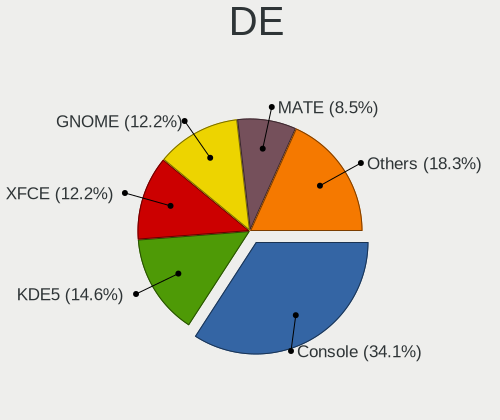
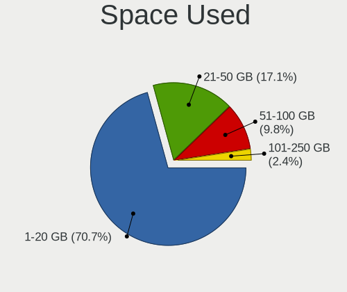
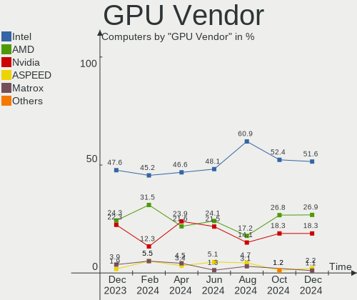
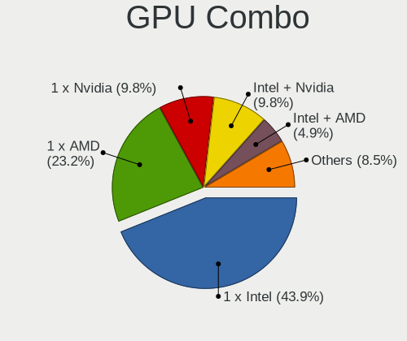

FreeBSD Hardware Trends
-----------------------

A project to identify most popular hardware characteristics and track their change
over time based on data collected by FreeBSD users at https://BSD-Hardware.info.

Anyone can contribute to this report by the [hw-probe](https://github.com/linuxhw/hw-probe/blob/master/INSTALL.BSD.md) tool:

    hw-probe -all -upload

This is a report for all computer types. See also reports for [desktops](/Dist/FreeBSD/Desktop/README.md) and [notebooks](/Dist/FreeBSD/Notebook/README.md).

Full-feature report is available here: https://bsd-hardware.info/?view=trends

Period: Sep, 2021.

Contents
--------

* [ System ](#system)
  - [ OS                       ](#os)
  - [ OS Family                ](#os-family)
  - [ Arch                     ](#arch)
  - [ DE                       ](#de)
  - [ Display Server           ](#display-server)
  - [ Display Manager          ](#display-manager)
  - [ OS Lang                  ](#os-lang)
  - [ Boot Mode                ](#boot-mode)
  - [ Filesystem               ](#filesystem)
  - [ Part. scheme             ](#part-scheme)

* [ Board ](#board)
  - [ Vendor                   ](#vendor)
  - [ Model                    ](#model)
  - [ Model Family             ](#model-family)
  - [ MFG Year                 ](#mfg-year)
  - [ Form Factor              ](#form-factor)
  - [ Coreboot                 ](#coreboot)
  - [ RAM Size                 ](#ram-size)
  - [ RAM Used                 ](#ram-used)
  - [ Total Drives             ](#total-drives)
  - [ Has CD-ROM               ](#has-cd-rom)
  - [ Has Ethernet             ](#has-ethernet)
  - [ Has WiFi                 ](#has-wifi)
  - [ Has Bluetooth            ](#has-bluetooth)

* [ Location ](#location)
  - [ Country                  ](#country)
  - [ City                     ](#city)

* [ Drives ](#drives)
  - [ Drive Vendor             ](#drive-vendor)
  - [ Drive Model              ](#drive-model)
  - [ HDD Vendor               ](#hdd-vendor)
  - [ SSD Vendor               ](#ssd-vendor)
  - [ Drive Kind               ](#drive-kind)
  - [ Drive Connector          ](#drive-connector)
  - [ Drive Size               ](#drive-size)
  - [ Space Total              ](#space-total)
  - [ Space Used               ](#space-used)
  - [ Malfunc. Drives          ](#malfunc-drives)
  - [ Malfunc. Drive Vendor    ](#malfunc-drive-vendor)
  - [ Malfunc. HDD Vendor      ](#malfunc-hdd-vendor)
  - [ Malfunc. Drive Kind      ](#malfunc-drive-kind)
  - [ Failed Drives            ](#failed-drives)
  - [ Failed Drive Vendor      ](#failed-drive-vendor)
  - [ Drive Status             ](#drive-status)

* [ Storage controller ](#storage-controller)
  - [ Storage Vendor           ](#storage-vendor)
  - [ Storage Model            ](#storage-model)
  - [ Storage Kind             ](#storage-kind)

* [ Processor ](#processor)
  - [ CPU Vendor               ](#cpu-vendor)
  - [ CPU Model                ](#cpu-model)
  - [ CPU Model Family         ](#cpu-model-family)
  - [ CPU Cores                ](#cpu-cores)
  - [ CPU Sockets              ](#cpu-sockets)
  - [ CPU Threads              ](#cpu-threads)
  - [ CPU Microarch            ](#cpu-microarch)

* [ Graphics ](#graphics)
  - [ GPU Vendor               ](#gpu-vendor)
  - [ GPU Model                ](#gpu-model)
  - [ GPU Combo                ](#gpu-combo)
  - [ GPU Driver               ](#gpu-driver)
  - [ GPU Memory               ](#gpu-memory)

* [ Monitor ](#monitor)
  - [ Monitor Vendor           ](#monitor-vendor)
  - [ Monitor Model            ](#monitor-model)
  - [ Monitor Resolution       ](#monitor-resolution)
  - [ Monitor Diagonal         ](#monitor-diagonal)
  - [ Monitor Width            ](#monitor-width)
  - [ Aspect Ratio             ](#aspect-ratio)
  - [ Monitor Area             ](#monitor-area)
  - [ Pixel Density            ](#pixel-density)
  - [ Multiple Monitors        ](#multiple-monitors)

* [ Network ](#network)
  - [ Net Controller Vendor    ](#net-controller-vendor)
  - [ Net Controller Model     ](#net-controller-model)
  - [ Wireless Vendor          ](#wireless-vendor)
  - [ Wireless Model           ](#wireless-model)
  - [ Ethernet Vendor          ](#ethernet-vendor)
  - [ Ethernet Model           ](#ethernet-model)
  - [ Net Controller Kind      ](#net-controller-kind)
  - [ Used Controller          ](#used-controller)
  - [ NICs                     ](#nics)
  - [ IPv6                     ](#ipv6)

* [ Bluetooth ](#bluetooth)
  - [ Bluetooth Vendor         ](#bluetooth-vendor)
  - [ Bluetooth Model          ](#bluetooth-model)

* [ Sound ](#sound)
  - [ Sound Vendor             ](#sound-vendor)
  - [ Sound Model              ](#sound-model)

* [ Memory ](#memory)
  - [ Memory Vendor            ](#memory-vendor)
  - [ Memory Model             ](#memory-model)
  - [ Memory Kind              ](#memory-kind)
  - [ Memory Form Factor       ](#memory-form-factor)
  - [ Memory Size              ](#memory-size)
  - [ Memory Speed             ](#memory-speed)

* [ Printers & scanners ](#printers--scanners)
  - [ Printer Vendor           ](#printer-vendor)
  - [ Printer Model            ](#printer-model)
  - [ Scanner Vendor           ](#scanner-vendor)
  - [ Scanner Model            ](#scanner-model)

* [ Camera ](#camera)
  - [ Camera Vendor            ](#camera-vendor)
  - [ Camera Model             ](#camera-model)

* [ Security ](#security)
  - [ Fingerprint Vendor       ](#fingerprint-vendor)
  - [ Fingerprint Model        ](#fingerprint-model)
  - [ Chipcard Vendor          ](#chipcard-vendor)
  - [ Chipcard Model           ](#chipcard-model)

* [ Unsupported ](#unsupported)
  - [ Unsupported Devices      ](#unsupported-devices)
  - [ Unsupported Device Types ](#unsupported-device-types)

System
------

OS
--

Installed operating systems

| Name                 | Computers | Percent |
|----------------------|-----------|---------|
| FreeBSD 13.0-p4      | 30        | 39.47%  |
| FreeBSD 13.0         | 19        | 25%     |
| FreeBSD 13.0-STABLE  | 9         | 11.84%  |
| FreeBSD 13.0-p3      | 7         | 9.21%   |
| FreeBSD 12.2-p10     | 5         | 6.58%   |
| FreeBSD 14.0-CURRENT | 4         | 5.26%   |
| FreeBSD 12.2-STABLE  | 1         | 1.32%   |
| FreeBSD 12.2-p6      | 1         | 1.32%   |

OS Family
---------

OS without a version

| Name    | Computers | Percent |
|---------|-----------|---------|
| FreeBSD | 76        | 100%    |

Arch
----

OS architecture (x86_64, i586, etc.)

| Name  | Computers | Percent |
|-------|-----------|---------|
| amd64 | 68        | 89.47%  |
| arm64 | 7         | 9.21%   |
| i386  | 1         | 1.32%   |

DE
--

Desktop Environment

| Name          | Computers | Percent |
|---------------|-----------|---------|
| Console       | 19        | 25%     |
| KDE5          | 14        | 18.42%  |
| XFCE          | 12        | 15.79%  |
| MATE          | 7         | 9.21%   |
| GNOME         | 6         | 7.89%   |
| TWM           | 4         | 5.26%   |
| Openbox       | 3         | 3.95%   |
| i3            | 3         | 3.95%   |
| Cinnamon      | 3         | 3.95%   |
| AwesomeWM     | 2         | 2.63%   |
| Lumina        | 1         | 1.32%   |
| Fluxbox       | 1         | 1.32%   |
| Enlightenment | 1         | 1.32%   |

Display Server
--------------

X11 or Wayland

| Name    | Computers | Percent |
|---------|-----------|---------|
| X11     | 55        | 72.37%  |
| Console | 20        | 26.32%  |
| Wayland | 1         | 1.32%   |

Display Manager
---------------

SDDM, LightDM, etc.

| Name    | Computers | Percent |
|---------|-----------|---------|
| Console | 39        | 51.32%  |
| SLiM    | 11        | 14.47%  |
| SDDM    | 10        | 13.16%  |
| XDM     | 7         | 9.21%   |
| LightDM | 5         | 6.58%   |
| GDM     | 4         | 5.26%   |

OS Lang
-------

Language

| Lang             | Computers | Percent |
|------------------|-----------|---------|
| C                | 42        | 55.26%  |
| en_US            | 13        | 17.11%  |
| Unknown          | 7         | 9.21%   |
| en_GB            | 3         | 3.95%   |
| de_CH            | 2         | 2.63%   |
| uk_UA            | 1         | 1.32%   |
| ru_RU            | 1         | 1.32%   |
| pt_PT            | 1         | 1.32%   |
| pt_BR            | 1         | 1.32%   |
| it_IT.ISO8859-15 | 1         | 1.32%   |
| fr_FR            | 1         | 1.32%   |
| fi_FI            | 1         | 1.32%   |
| en_AU            | 1         | 1.32%   |
| de_DE            | 1         | 1.32%   |

Boot Mode
---------

EFI or BIOS

| Mode | Computers | Percent |
|------|-----------|---------|
| EFI  | 54        | 71.05%  |
| BIOS | 22        | 28.95%  |

Filesystem
----------

Type of filesystem

| Type | Computers | Percent |
|------|-----------|---------|
| Zfs  | 51        | 67.11%  |
| Ufs  | 25        | 32.89%  |

Part. scheme
------------

Scheme of partitioning

| Type | Computers | Percent |
|------|-----------|---------|
| GPT  | 66        | 86.84%  |
| MBR  | 10        | 13.16%  |

Board
-----

Vendor
------

Motherboard manufacturer

| Name                | Computers | Percent |
|---------------------|-----------|---------|
| Dell                | 13        | 17.11%  |
| ASUSTek Computer    | 13        | 17.11%  |
| Lenovo              | 9         | 11.84%  |
| Hewlett-Packard     | 7         | 9.21%   |
| Unknown             | 7         | 9.21%   |
| MSI                 | 6         | 7.89%   |
| Gigabyte Technology | 5         | 6.58%   |
| Apple               | 3         | 3.95%   |
| System76            | 2         | 2.63%   |
| Intel               | 2         | 2.63%   |
| ASRock              | 2         | 2.63%   |
| Toshiba             | 1         | 1.32%   |
| Supermicro          | 1         | 1.32%   |
| QTQD                | 1         | 1.32%   |
| Panasonic           | 1         | 1.32%   |
| IBM                 | 1         | 1.32%   |
| Foxconn             | 1         | 1.32%   |
| BESSTAR Tech        | 1         | 1.32%   |

Model
-----

Motherboard model

| Name                                   | Computers | Percent |
|----------------------------------------|-----------|---------|
| Unknown                                | 7         | 9.21%   |
| Dell Precision 3630 Tower              | 2         | 2.63%   |
| Toshiba Dakar10FW8                     | 1         | 1.32%   |
| System76 Galago Pro                    | 1         | 1.32%   |
| System76 Darter Pro                    | 1         | 1.32%   |
| Supermicro X7SPA-HF                    | 1         | 1.32%   |
| QTQD Board                             | 1         | 1.32%   |
| Panasonic CF-F9KWHZZQ2                 | 1         | 1.32%   |
| MSI P65 Creator 8RE                    | 1         | 1.32%   |
| MSI MS-7D09                            | 1         | 1.32%   |
| MSI MS-7C36                            | 1         | 1.32%   |
| MSI MS-7C02                            | 1         | 1.32%   |
| MSI MS-7B22                            | 1         | 1.32%   |
| MSI MS-7817                            | 1         | 1.32%   |
| Lenovo ThinkPad X395 20NL000GPG        | 1         | 1.32%   |
| Lenovo ThinkPad T61 6459CTO            | 1         | 1.32%   |
| Lenovo ThinkPad T490 20N2CTO1WW        | 1         | 1.32%   |
| Lenovo ThinkPad T440s 20AR003SMN       | 1         | 1.32%   |
| Lenovo ThinkPad E15 Gen 3 20YG006GGE   | 1         | 1.32%   |
| Lenovo ThinkPad E14 Gen 3 20Y7CTO1WW   | 1         | 1.32%   |
| Lenovo IdeaPad Y700-15ISK 80NV         | 1         | 1.32%   |
| Lenovo IdeaPad 320-15AST 80XV          | 1         | 1.32%   |
| Lenovo G40-70 20369                    | 1         | 1.32%   |
| Intel NUC7i7BNB J31145-304             | 1         | 1.32%   |
| Intel NUC5CPYB H61145-413              | 1         | 1.32%   |
| IBM ThinkPad X41 2525FAG               | 1         | 1.32%   |
| HP Z620 Workstation                    | 1         | 1.32%   |
| HP Z600 Workstation                    | 1         | 1.32%   |
| HP Z440 Workstation                    | 1         | 1.32%   |
| HP Stream Notebook PC 11               | 1         | 1.32%   |
| HP Pavilion Gaming Laptop 15-ec1xxx    | 1         | 1.32%   |
| HP EliteDesk 800 G3 DM 35W             | 1         | 1.32%   |
| HP 2000                                | 1         | 1.32%   |
| Gigabyte Z68P-DS3                      | 1         | 1.32%   |
| Gigabyte X470 AORUS GAMING 5 WIFI      | 1         | 1.32%   |
| Gigabyte X399 DESIGNARE EX             | 1         | 1.32%   |
| Gigabyte F2A88XM-D3H                   | 1         | 1.32%   |
| Gigabyte EP45-UD3R                     | 1         | 1.32%   |
| Foxconn HPE-570f                       | 1         | 1.32%   |
| Dell XPS 15 9570                       | 1         | 1.32%   |
| Dell XPS 15 9500                       | 1         | 1.32%   |
| Dell XPS 13 9343                       | 1         | 1.32%   |
| Dell Precision 7710                    | 1         | 1.32%   |
| Dell PowerEdge R410                    | 1         | 1.32%   |
| Dell OptiPlex 980                      | 1         | 1.32%   |
| Dell OptiPlex 9020                     | 1         | 1.32%   |
| Dell Latitude E7450                    | 1         | 1.32%   |
| Dell Latitude E6530                    | 1         | 1.32%   |
| Dell Latitude 5491                     | 1         | 1.32%   |
| Dell Latitude 5490                     | 1         | 1.32%   |
| BESSTAR Tech N40                       | 1         | 1.32%   |
| ASUS VX7SX                             | 1         | 1.32%   |
| ASUS VivoBook_ASUSLaptop X512DA_F512DA | 1         | 1.32%   |
| ASUS TP300LD                           | 1         | 1.32%   |
| ASUS ROG STRIX X570-F GAMING           | 1         | 1.32%   |
| ASUS PRIME Z590-A                      | 1         | 1.32%   |
| ASUS PRIME X370-PRO                    | 1         | 1.32%   |
| ASUS PRIME H310M-D R2.0                | 1         | 1.32%   |
| ASUS P8Z68-V LX                        | 1         | 1.32%   |
| ASUS P8H61-M LE/USB3                   | 1         | 1.32%   |

Model Family
------------

Motherboard model prefix

| Name                   | Computers | Percent |
|------------------------|-----------|---------|
| Unknown                | 7         | 9.21%   |
| Lenovo ThinkPad        | 6         | 7.89%   |
| Dell Latitude          | 4         | 5.26%   |
| Dell XPS               | 3         | 3.95%   |
| Dell Precision         | 3         | 3.95%   |
| ASUS PRIME             | 3         | 3.95%   |
| Lenovo IdeaPad         | 2         | 2.63%   |
| Dell OptiPlex          | 2         | 2.63%   |
| Toshiba Dakar10FW8     | 1         | 1.32%   |
| System76 Galago        | 1         | 1.32%   |
| System76 Darter        | 1         | 1.32%   |
| Supermicro X7SPA-HF    | 1         | 1.32%   |
| QTQD Board             | 1         | 1.32%   |
| Panasonic CF-F9KWHZZQ2 | 1         | 1.32%   |
| MSI P65                | 1         | 1.32%   |
| MSI MS-7D09            | 1         | 1.32%   |
| MSI MS-7C36            | 1         | 1.32%   |
| MSI MS-7C02            | 1         | 1.32%   |
| MSI MS-7B22            | 1         | 1.32%   |
| MSI MS-7817            | 1         | 1.32%   |
| Lenovo G40-70          | 1         | 1.32%   |
| Intel NUC7i7BNB        | 1         | 1.32%   |
| Intel NUC5CPYB         | 1         | 1.32%   |
| IBM ThinkPad           | 1         | 1.32%   |
| HP Z620                | 1         | 1.32%   |
| HP Z600                | 1         | 1.32%   |
| HP Z440                | 1         | 1.32%   |
| HP Stream              | 1         | 1.32%   |
| HP Pavilion            | 1         | 1.32%   |
| HP EliteDesk           | 1         | 1.32%   |
| HP 2000                | 1         | 1.32%   |
| Gigabyte Z68P-DS3      | 1         | 1.32%   |
| Gigabyte X470          | 1         | 1.32%   |
| Gigabyte X399          | 1         | 1.32%   |
| Gigabyte F2A88XM-D3H   | 1         | 1.32%   |
| Gigabyte EP45-UD3R     | 1         | 1.32%   |
| Foxconn HPE-570f       | 1         | 1.32%   |
| Dell PowerEdge         | 1         | 1.32%   |
| BESSTAR Tech N40       | 1         | 1.32%   |
| ASUS VX7SX             | 1         | 1.32%   |
| ASUS VivoBook          | 1         | 1.32%   |
| ASUS TP300LD           | 1         | 1.32%   |
| ASUS ROG               | 1         | 1.32%   |
| ASUS P8Z68-V           | 1         | 1.32%   |
| ASUS P8H61-M           | 1         | 1.32%   |
| ASUS P5Q-E             | 1         | 1.32%   |
| ASUS G551JW            | 1         | 1.32%   |
| ASUS ASUS              | 1         | 1.32%   |
| ASUS All               | 1         | 1.32%   |
| ASRock X58             | 1         | 1.32%   |
| ASRock X570            | 1         | 1.32%   |
| Apple MacBookPro5      | 1         | 1.32%   |
| Apple MacBookPro13     | 1         | 1.32%   |
| Apple iMac10           | 1         | 1.32%   |

MFG Year
--------

Motherboard manufacture year

| Year    | Computers | Percent |
|---------|-----------|---------|
| 2020    | 16        | 21.05%  |
| 2019    | 12        | 15.79%  |
| 2021    | 10        | 13.16%  |
| 2018    | 8         | 10.53%  |
| 2011    | 6         | 7.89%   |
| Unknown | 6         | 7.89%   |
| 2015    | 3         | 3.95%   |
| 2014    | 3         | 3.95%   |
| 2012    | 3         | 3.95%   |
| 2010    | 3         | 3.95%   |
| 2016    | 2         | 2.63%   |
| 2013    | 2         | 2.63%   |
| 2008    | 1         | 1.32%   |
| 2006    | 1         | 1.32%   |

Form Factor
-----------

Physical design of the computer

| Name           | Computers | Percent |
|----------------|-----------|---------|
| Desktop        | 35        | 46.05%  |
| Notebook       | 33        | 43.42%  |
| Mini pc        | 4         | 5.26%   |
| System on chip | 2         | 2.63%   |
| All in one     | 1         | 1.32%   |
| Server         | 1         | 1.32%   |

Coreboot
--------

Have coreboot on board

| Used | Computers | Percent |
|------|-----------|---------|
| No   | 74        | 97.37%  |
| Yes  | 2         | 2.63%   |

RAM Size
--------

Total RAM memory

| Size in GB  | Computers | Percent |
|-------------|-----------|---------|
| 8.01-16.0   | 20        | 26.32%  |
| 16.01-24.0  | 18        | 23.68%  |
| 32.01-64.0  | 11        | 14.47%  |
| 4.01-8.0    | 10        | 13.16%  |
| 64.01-256.0 | 9         | 11.84%  |
| 2.01-3.0    | 3         | 3.95%   |
| 24.01-32.0  | 2         | 2.63%   |
| 0.51-1.0    | 2         | 2.63%   |
| 1.01-2.0    | 1         | 1.32%   |

RAM Used
--------

Used RAM memory

| Used GB    | Computers | Percent |
|------------|-----------|---------|
| 0.01-0.5   | 24        | 31.58%  |
| 0.51-1.0   | 20        | 26.32%  |
| 1.01-2.0   | 18        | 23.68%  |
| 3.01-4.0   | 5         | 6.58%   |
| 2.01-3.0   | 3         | 3.95%   |
| 4.01-8.0   | 2         | 2.63%   |
| 16.01-24.0 | 2         | 2.63%   |
| 0          | 2         | 2.63%   |

Total Drives
------------

Number of drives on board

| Drives | Computers | Percent |
|--------|-----------|---------|
| 1      | 37        | 48.68%  |
| 2      | 13        | 17.11%  |
| 3      | 6         | 7.89%   |
| 6      | 5         | 6.58%   |
| 0      | 5         | 6.58%   |
| 5      | 4         | 5.26%   |
| 4      | 4         | 5.26%   |
| 14     | 1         | 1.32%   |
| 13     | 1         | 1.32%   |

Has CD-ROM
----------

Has CD-ROM on board

| Presented | Computers | Percent |
|-----------|-----------|---------|
| No        | 51        | 67.11%  |
| Yes       | 25        | 32.89%  |

Has Ethernet
------------

Has Ethernet on board

| Presented | Computers | Percent |
|-----------|-----------|---------|
| Yes       | 64        | 84.21%  |
| No        | 12        | 15.79%  |

Has WiFi
--------

Has WiFi module

| Presented | Computers | Percent |
|-----------|-----------|---------|
| Yes       | 43        | 56.58%  |
| No        | 33        | 43.42%  |

Has Bluetooth
-------------

Has Bluetooth module

| Presented | Computers | Percent |
|-----------|-----------|---------|
| No        | 43        | 56.58%  |
| Yes       | 33        | 43.42%  |

Location
--------

Country
-------

Geographic location (country)

| Country      | Computers | Percent |
|--------------|-----------|---------|
| USA          | 29        | 38.16%  |
| Russia       | 6         | 7.89%   |
| UK           | 4         | 5.26%   |
| France       | 4         | 5.26%   |
| Italy        | 3         | 3.95%   |
| Germany      | 3         | 3.95%   |
| Australia    | 3         | 3.95%   |
| Switzerland  | 2         | 2.63%   |
| Spain        | 2         | 2.63%   |
| Slovakia     | 2         | 2.63%   |
| Poland       | 2         | 2.63%   |
| Japan        | 2         | 2.63%   |
| Canada       | 2         | 2.63%   |
| Austria      | 2         | 2.63%   |
| Ukraine      | 1         | 1.32%   |
| Sweden       | 1         | 1.32%   |
| South Africa | 1         | 1.32%   |
| Portugal     | 1         | 1.32%   |
| Indonesia    | 1         | 1.32%   |
| India        | 1         | 1.32%   |
| Hungary      | 1         | 1.32%   |
| Greece       | 1         | 1.32%   |
| Finland      | 1         | 1.32%   |
| Brazil       | 1         | 1.32%   |

City
----

Geographic location (city)

| City                   | Computers | Percent |
|------------------------|-----------|---------|
| Apex                   | 4         | 5.26%   |
| Lake Forest            | 3         | 3.95%   |
| Seattle                | 2         | 2.63%   |
| Salem                  | 2         | 2.63%   |
| Moscow                 | 2         | 2.63%   |
| London                 | 2         | 2.63%   |
| Krasnoyarsk            | 2         | 2.63%   |
| Ko??ice                | 2         | 2.63%   |
| Kirkland               | 2         | 2.63%   |
| Dallas                 | 2         | 2.63%   |
| Brookline              | 2         | 2.63%   |
| Zurich                 | 1         | 1.32%   |
| Yokohama               | 1         | 1.32%   |
| West Kelowna           | 1         | 1.32%   |
| Wenatchee              | 1         | 1.32%   |
| Warsaw                 | 1         | 1.32%   |
| Vienna                 | 1         | 1.32%   |
| V?¤ster??s             | 1         | 1.32%   |
| Vadodara               | 1         | 1.32%   |
| Tyumen                 | 1         | 1.32%   |
| Turin                  | 1         | 1.32%   |
| Tatab??nya             | 1         | 1.32%   |
| Tampere                | 1         | 1.32%   |
| Sydney                 | 1         | 1.32%   |
| St. Catharines         | 1         | 1.32%   |
| Spring                 | 1         | 1.32%   |
| Spokane                | 1         | 1.32%   |
| Shell Cove             | 1         | 1.32%   |
| San Vicent del Raspeig | 1         | 1.32%   |
| San Bernardino         | 1         | 1.32%   |
| Plouzane               | 1         | 1.32%   |
| Paris                  | 1         | 1.32%   |
| Minneapolis            | 1         | 1.32%   |
| Milan                  | 1         | 1.32%   |
| Metz                   | 1         | 1.32%   |
| Mattapoisett           | 1         | 1.32%   |
| Mascalucia             | 1         | 1.32%   |
| Maia                   | 1         | 1.32%   |
| Madrid                 | 1         | 1.32%   |
| Linz                   | 1         | 1.32%   |
| Lavras                 | 1         | 1.32%   |
| Krasnodar              | 1         | 1.32%   |
| Hull                   | 1         | 1.32%   |
| Highland Park          | 1         | 1.32%   |
| Hamburg                | 1         | 1.32%   |
| Green Valley           | 1         | 1.32%   |
| Grapevine              | 1         | 1.32%   |
| Garching bei Munchen   | 1         | 1.32%   |
| Fujinomiya             | 1         | 1.32%   |
| Frisco                 | 1         | 1.32%   |
| Fairfax                | 1         | 1.32%   |
| Denpasar               | 1         | 1.32%   |
| Chrzan??w              | 1         | 1.32%   |
| Cherkasy               | 1         | 1.32%   |
| Chaudeney-sur-Moselle  | 1         | 1.32%   |
| Brooklyn               | 1         | 1.32%   |
| Basel                  | 1         | 1.32%   |
| Bardowick              | 1         | 1.32%   |
| Barberton              | 1         | 1.32%   |
| Athens                 | 1         | 1.32%   |

Drives
------

Drive Vendor
------------

Hard drive vendors

| Vendor              | Computers | Drives | Percent |
|---------------------|-----------|--------|---------|
| Seagate             | 19        | 35     | 16.81%  |
| Samsung Electronics | 19        | 24     | 16.81%  |
| WDC                 | 17        | 44     | 15.04%  |
| Kingston            | 10        | 10     | 8.85%   |
| Crucial             | 9         | 17     | 7.96%   |
| Toshiba             | 6         | 8      | 5.31%   |
| Intel               | 5         | 6      | 4.42%   |
| Transcend           | 3         | 3      | 2.65%   |
| SanDisk             | 3         | 3      | 2.65%   |
| Hitachi             | 3         | 5      | 2.65%   |
| SK Hynix            | 2         | 2      | 1.77%   |
| PNY                 | 2         | 2      | 1.77%   |
| Micron Technology   | 2         | 3      | 1.77%   |
| A-DATA Technology   | 2         | 2      | 1.77%   |
| VMware              | 1         | 1      | 0.88%   |
| TCSUNBOW            | 1         | 1      | 0.88%   |
| PLEXTOR             | 1         | 1      | 0.88%   |
| Phison              | 1         | 1      | 0.88%   |
| LITEON              | 1         | 1      | 0.88%   |
| KIOXIA              | 1         | 1      | 0.88%   |
| KingSpec            | 1         | 1      | 0.88%   |
| KingDian            | 1         | 1      | 0.88%   |
| HGST                | 1         | 1      | 0.88%   |
| Hewlett-Packard     | 1         | 1      | 0.88%   |
| Corsair             | 1         | 1      | 0.88%   |

Drive Model
-----------

Hard drive models

| Model                                | Computers | Percent |
|--------------------------------------|-----------|---------|
| Seagate ST4000DM000-1F2168 4TB       | 3         | 2.26%   |
| WDC WD10EZEX-08WN4A0 1TB             | 2         | 1.5%    |
| Seagate ST3000DM001-1ER166 3TB       | 2         | 1.5%    |
| Seagate ST1000LM024 HN-M101MBB 1TB   | 2         | 1.5%    |
| Seagate ST1000DM010-2EP102 1TB       | 2         | 1.5%    |
| Samsung SSD 970 EVO Plus 500GB       | 2         | 1.5%    |
| Samsung SSD 860 QVO 1TB              | 2         | 1.5%    |
| Samsung SSD 860 EVO 500GB            | 2         | 1.5%    |
| Samsung SSD 860 EVO 1TB              | 2         | 1.5%    |
| Samsung SSD 850 EVO 1TB              | 2         | 1.5%    |
| Samsung MZALQ512HBLU-00BL1 512GB     | 2         | 1.5%    |
| Kingston SA400S37480G 480GB          | 2         | 1.5%    |
| Kingston SA400S37240G 240GB          | 2         | 1.5%    |
| Kingston SA400S37120G 120GB          | 2         | 1.5%    |
| Intel SSDSC2KW256G8 256GB            | 2         | 1.5%    |
| Crucial CT1000P1SSD8 1TB             | 2         | 1.5%    |
| WDC WDS500G2B0C-00PXH0 500GB         | 1         | 0.75%   |
| WDC WDS250G2B0B-00YS70 250GB         | 1         | 0.75%   |
| WDC WDS250G2B0A 250GB                | 1         | 0.75%   |
| WDC WDS100T1X0E-00AFY0 1TB           | 1         | 0.75%   |
| WDC WD80EMAZ-00WJTA0 8TB             | 1         | 0.75%   |
| WDC WD80EFZX-68UW8N0 8TB             | 1         | 0.75%   |
| WDC WD80EFAX-68LHPN0 8TB             | 1         | 0.75%   |
| WDC WD80EDBZ-11B0ZA0 8TB             | 1         | 0.75%   |
| WDC WD60EZRZ-00GZ5B1 6TB             | 1         | 0.75%   |
| WDC WD6003FZBX-00K5WB0 6TB           | 1         | 0.75%   |
| WDC WD40EZRZ-22GXCB0 4TB             | 1         | 0.75%   |
| WDC WD40EFRX-68N32N0 4TB             | 1         | 0.75%   |
| WDC WD4003FFBX-68MU3N0 4TB           | 1         | 0.75%   |
| WDC WD4000AAKS-00TMA0 400GB          | 1         | 0.75%   |
| WDC WD20SPZX-22UA7T0 2TB             | 1         | 0.75%   |
| WDC WD20EARS-60MVWB0 2TB             | 1         | 0.75%   |
| WDC WD120EMFZ-11A6JA0 12TB           | 1         | 0.75%   |
| WDC WD120EMAZ-11BLFA0 12TB           | 1         | 0.75%   |
| WDC WD10JPVX-22JC3T0 1TB             | 1         | 0.75%   |
| WDC WD10JMVW-11AJGS3 1TB             | 1         | 0.75%   |
| WDC WD10EZEX-00UD2A0 1TB             | 1         | 0.75%   |
| WDC WD102KRYZ-01A5AB0 10TB           | 1         | 0.75%   |
| WDC WD1003FBYX-01Y7B0 1TB            | 1         | 0.75%   |
| WDC WD1001FALS-00J7B0 1TB            | 1         | 0.75%   |
| VMware Virtual disk 112GB            | 1         | 0.75%   |
| Transcend TS512GSSD370 512GB         | 1         | 0.75%   |
| Transcend TS32GMSA370 32GB           | 1         | 0.75%   |
| Transcend TS256GMTS430S 256GB        | 1         | 0.75%   |
| Toshiba MQ01ABF050 500GB             | 1         | 0.75%   |
| Toshiba MQ01ABD100 1TB               | 1         | 0.75%   |
| Toshiba MQ01ABD032 320GB             | 1         | 0.75%   |
| Toshiba HDWQ140 4TB                  | 1         | 0.75%   |
| Toshiba HDWD120 2TB                  | 1         | 0.75%   |
| Toshiba DT01ACA200 2TB               | 1         | 0.75%   |
| Toshiba DT01ACA100 1TB               | 1         | 0.75%   |
| TCSUNBOW X3 480GB                    | 1         | 0.75%   |
| SK Hynix SKHynix_HFS001TDE9X081N 1TB | 1         | 0.75%   |
| SK Hynix SC401 SATA 512GB            | 1         | 0.75%   |
| Seagate ST8000DM004-2CX188 8TB       | 1         | 0.75%   |
| Seagate ST8000AS0002-1NA17Z 8TB      | 1         | 0.75%   |
| Seagate ST500LM000-1EJ162-SSHD 500GB | 1         | 0.75%   |
| Seagate ST500DM002-1BD142 500GB      | 1         | 0.75%   |
| Seagate ST4000VN008-2DR166 4TB       | 1         | 0.75%   |
| Seagate ST4000DM004-2CV104 4TB       | 1         | 0.75%   |

HDD Vendor
----------

Hard disk drive vendors

| Vendor              | Computers | Drives | Percent |
|---------------------|-----------|--------|---------|
| Seagate             | 19        | 35     | 40.43%  |
| WDC                 | 15        | 40     | 31.91%  |
| Toshiba             | 6         | 8      | 12.77%  |
| Hitachi             | 3         | 5      | 6.38%   |
| Samsung Electronics | 2         | 3      | 4.26%   |
| HGST                | 1         | 1      | 2.13%   |
| Hewlett-Packard     | 1         | 1      | 2.13%   |

SSD Vendor
----------

Solid state drive vendors

| Vendor              | Computers | Drives | Percent |
|---------------------|-----------|--------|---------|
| Samsung Electronics | 10        | 12     | 21.28%  |
| Kingston            | 7         | 7      | 14.89%  |
| Crucial             | 7         | 15     | 14.89%  |
| Intel               | 4         | 5      | 8.51%   |
| Transcend           | 3         | 3      | 6.38%   |
| SanDisk             | 3         | 3      | 6.38%   |
| WDC                 | 2         | 2      | 4.26%   |
| A-DATA Technology   | 2         | 2      | 4.26%   |
| VMware              | 1         | 1      | 2.13%   |
| TCSUNBOW            | 1         | 1      | 2.13%   |
| SK Hynix            | 1         | 1      | 2.13%   |
| PNY                 | 1         | 1      | 2.13%   |
| PLEXTOR             | 1         | 1      | 2.13%   |
| Micron Technology   | 1         | 1      | 2.13%   |
| LITEON              | 1         | 1      | 2.13%   |
| KingSpec            | 1         | 1      | 2.13%   |
| KingDian            | 1         | 1      | 2.13%   |

Drive Kind
----------

HDD or SSD

| Kind | Computers | Drives | Percent |
|------|-----------|--------|---------|
| SSD  | 39        | 58     | 41.05%  |
| HDD  | 36        | 93     | 37.89%  |
| NVMe | 20        | 24     | 21.05%  |

Drive Connector
---------------

SATA, SAS, NVMe, etc.

| Type | Computers | Drives | Percent |
|------|-----------|--------|---------|
| SATA | 59        | 151    | 74.68%  |
| NVMe | 20        | 24     | 25.32%  |

Drive Size
----------

Size of hard drive

| Size in TB | Computers | Drives | Percent |
|------------|-----------|--------|---------|
| 0.01-0.5   | 36        | 53     | 44.44%  |
| 0.51-1.0   | 21        | 37     | 25.93%  |
| 1.01-2.0   | 9         | 14     | 11.11%  |
| 3.01-4.0   | 8         | 14     | 9.88%   |
| 4.01-10.0  | 4         | 28     | 4.94%   |
| 2.01-3.0   | 2         | 3      | 2.47%   |
| 10.01-20.0 | 1         | 2      | 1.23%   |

Space Total
-----------

Amount of disk space available on the file system

| Size in GB     | Computers | Percent |
|----------------|-----------|---------|
| 251-500        | 24        | 31.58%  |
| 501-1000       | 15        | 19.74%  |
| 101-250        | 11        | 14.47%  |
| 1-20           | 7         | 9.21%   |
| 21-50          | 5         | 6.58%   |
| 1001-2000      | 5         | 6.58%   |
| 51-100         | 5         | 6.58%   |
| 2001-3000      | 3         | 3.95%   |
| More than 3000 | 1         | 1.32%   |

Space Used
----------

Amount of used disk space

| Used GB   | Computers | Percent |
|-----------|-----------|---------|
| 1-20      | 56        | 73.68%  |
| 21-50     | 8         | 10.53%  |
| 101-250   | 4         | 5.26%   |
| 51-100    | 3         | 3.95%   |
| 251-500   | 2         | 2.63%   |
| 2001-3000 | 2         | 2.63%   |
| 1001-2000 | 1         | 1.32%   |

Malfunc. Drives
---------------

Drive models with a malfunction

| Model                               | Computers | Drives | Percent |
|-------------------------------------|-----------|--------|---------|
| WDC WD10EZEX-08WN4A0 1TB            | 1         | 1      | 6.67%   |
| Toshiba MQ01ABD032 320GB            | 1         | 1      | 6.67%   |
| Toshiba DT01ACA200 2TB              | 1         | 1      | 6.67%   |
| Seagate ST32000542AS 2TB            | 1         | 1      | 6.67%   |
| Seagate ST3000DM001-1ER166 3TB      | 1         | 1      | 6.67%   |
| Seagate ST2000DM001-9YN164 2TB      | 1         | 1      | 6.67%   |
| SanDisk SSD PLUS 480GB              | 1         | 1      | 6.67%   |
| Samsung Electronics SSD 870 EVO 1TB | 1         | 1      | 6.67%   |
| Samsung Electronics HD103UJ 1TB     | 1         | 1      | 6.67%   |
| Intel SSDSC2KW256G8 256GB           | 1         | 1      | 6.67%   |
| Hitachi HDT721010SLA360 1TB         | 1         | 1      | 6.67%   |
| Hewlett-Packard MB1000GCWCV 1TB     | 1         | 1      | 6.67%   |
| Crucial CT275MX300SSD1 275GB        | 1         | 3      | 6.67%   |
| Crucial CT1050MX300SSD4 1TB         | 1         | 1      | 6.67%   |
| Crucial CT1000P1SSD8 1TB            | 1         | 1      | 6.67%   |

Malfunc. Drive Vendor
---------------------

Vendors of faulty drives

| Vendor              | Computers | Drives | Percent |
|---------------------|-----------|--------|---------|
| Seagate             | 3         | 3      | 20%     |
| Crucial             | 3         | 5      | 20%     |
| Toshiba             | 2         | 2      | 13.33%  |
| Samsung Electronics | 2         | 2      | 13.33%  |
| WDC                 | 1         | 1      | 6.67%   |
| SanDisk             | 1         | 1      | 6.67%   |
| Intel               | 1         | 1      | 6.67%   |
| Hitachi             | 1         | 1      | 6.67%   |
| Hewlett-Packard     | 1         | 1      | 6.67%   |

Malfunc. HDD Vendor
-------------------

Vendors of faulty HDD drives

| Vendor              | Computers | Drives | Percent |
|---------------------|-----------|--------|---------|
| Seagate             | 3         | 3      | 33.33%  |
| Toshiba             | 2         | 2      | 22.22%  |
| WDC                 | 1         | 1      | 11.11%  |
| Samsung Electronics | 1         | 1      | 11.11%  |
| Hitachi             | 1         | 1      | 11.11%  |
| Hewlett-Packard     | 1         | 1      | 11.11%  |

Malfunc. Drive Kind
-------------------

Kinds of faulty drives

| Kind | Computers | Drives | Percent |
|------|-----------|--------|---------|
| HDD  | 8         | 9      | 57.14%  |
| SSD  | 5         | 7      | 35.71%  |
| NVMe | 1         | 1      | 7.14%   |

Failed Drives
-------------

Failed drive models

Zero info for selected period =(

Failed Drive Vendor
-------------------

Failed drive vendors

Zero info for selected period =(

Drive Status
------------

Number of failed and malfunc. drives

| Status   | Computers | Drives | Percent |
|----------|-----------|--------|---------|
| Works    | 65        | 155    | 82.28%  |
| Malfunc  | 12        | 17     | 15.19%  |
| Detected | 2         | 3      | 2.53%   |

Storage controller
------------------

Storage Vendor
--------------

Storage controller vendors

| Vendor                      | Computers | Percent |
|-----------------------------|-----------|---------|
| Intel                       | 48        | 48.98%  |
| AMD                         | 13        | 13.27%  |
| Samsung Electronics         | 10        | 10.2%   |
| Phison Electronics          | 3         | 3.06%   |
| Marvell Technology Group    | 3         | 3.06%   |
| Kingston Technology Company | 3         | 3.06%   |
| VMware                      | 2         | 2.04%   |
| Sandisk                     | 2         | 2.04%   |
| Nvidia                      | 2         | 2.04%   |
| Micron/Crucial Technology   | 2         | 2.04%   |
| Broadcom / LSI              | 2         | 2.04%   |
| ASMedia Technology          | 2         | 2.04%   |
| SK Hynix                    | 1         | 1.02%   |
| Micron Technology           | 1         | 1.02%   |
| KIOXIA                      | 1         | 1.02%   |
| JMicron Technology          | 1         | 1.02%   |
| Apple                       | 1         | 1.02%   |
| Adaptec                     | 1         | 1.02%   |

Storage Model
-------------

Storage controller models

| Model                                                                            | Computers | Percent |
|----------------------------------------------------------------------------------|-----------|---------|
| AMD FCH SATA Controller [AHCI mode]                                              | 11        | 10%     |
| Samsung NVMe SSD Controller SM981/PM981/PM983                                    | 5         | 4.55%   |
| Intel 7 Series Chipset Family 6-port SATA Controller [AHCI mode]                 | 5         | 4.55%   |
| Intel SATA Controller [RAID mode]                                                | 4         | 3.64%   |
| Unknown                                                                          | 4         | 3.64%   |
| Samsung NVMe SSD Controller SM961/PM961/SM963                                    | 3         | 2.73%   |
| Intel 82801JI (ICH10 Family) SATA AHCI Controller                                | 3         | 2.73%   |
| Intel 8 Series/C220 Series Chipset Family 6-port SATA Controller 1 [AHCI mode]   | 3         | 2.73%   |
| Intel 8 Series SATA Controller 1 [AHCI mode]                                     | 3         | 2.73%   |
| Intel 6 Series/C200 Series Chipset Family 6 port Desktop SATA AHCI Controller    | 3         | 2.73%   |
| VMware SATA AHCI controller                                                      | 2         | 1.82%   |
| Samsung NVMe SSD Controller 980                                                  | 2         | 1.82%   |
| Phison E12 NVMe Controller                                                       | 2         | 1.82%   |
| Micron/Crucial P1 NVMe PCIe SSD                                                  | 2         | 1.82%   |
| Kingston Company U-SNS8154P3 NVMe SSD                                            | 2         | 1.82%   |
| Intel Sunrise Point-LP SATA Controller [AHCI mode]                               | 2         | 1.82%   |
| Intel Comet Lake SATA AHCI Controller                                            | 2         | 1.82%   |
| Intel Cannon Lake PCH SATA AHCI Controller                                       | 2         | 1.82%   |
| Intel Cannon Lake Mobile PCH SATA AHCI Controller                                | 2         | 1.82%   |
| Intel 500 Series Chipset Family SATA AHCI Controller                             | 2         | 1.82%   |
| Intel 200 Series PCH SATA controller [AHCI mode]                                 | 2         | 1.82%   |
| AMD 400 Series Chipset SATA Controller                                           | 2         | 1.82%   |
| VMware PVSCSI SCSI Controller                                                    | 1         | 0.91%   |
| SK Hynix Gold P31 SSD                                                            | 1         | 0.91%   |
| Sandisk WD Blue SN550 NVMe SSD                                                   | 1         | 0.91%   |
| Sandisk WD Black SN850                                                           | 1         | 0.91%   |
| Phison E16 PCIe4 NVMe Controller                                                 | 1         | 0.91%   |
| Nvidia MCP79 SATA Controller                                                     | 1         | 0.91%   |
| Nvidia MCP79 AHCI Controller                                                     | 1         | 0.91%   |
| Marvell Group 88SE9215 PCIe 2.0 x1 4-port SATA 6 Gb/s Controller                 | 1         | 0.91%   |
| Marvell Group 88SE912x IDE Controller                                            | 1         | 0.91%   |
| Marvell Group 88SE9123 PCIe SATA 6.0 Gb/s controller                             | 1         | 0.91%   |
| Marvell Group 88SE6111/6121 SATA II / PATA Controller                            | 1         | 0.91%   |
| KIOXIA unknown                                                                   | 1         | 0.91%   |
| JMicron JMB363 SATA/IDE Controller                                               | 1         | 0.91%   |
| Intel Wildcat Point-LP SATA Controller [AHCI Mode]                               | 1         | 0.91%   |
| Intel SSD Pro 7600p/760p/E 6100p Series                                          | 1         | 0.91%   |
| Intel Q170/Q150/B150/H170/H110/Z170/CM236 Chipset SATA Controller [AHCI Mode]    | 1         | 0.91%   |
| Intel HM170/QM170 Chipset SATA Controller [AHCI Mode]                            | 1         | 0.91%   |
| Intel Celeron/Pentium Silver Processor SATA Controller                           | 1         | 0.91%   |
| Intel C610/X99 series chipset sSATA Controller [AHCI mode]                       | 1         | 0.91%   |
| Intel C610/X99 series chipset 6-Port SATA Controller [AHCI mode]                 | 1         | 0.91%   |
| Intel C602 chipset 4-Port SATA Storage Control Unit                              | 1         | 0.91%   |
| Intel C600/X79 series chipset SATA RAID Controller                               | 1         | 0.91%   |
| Intel C600/X79 series chipset IDE-r Controller                                   | 1         | 0.91%   |
| Intel Atom/Celeron/Pentium Processor x5-E8000/J3xxx/N3xxx Series SATA Controller | 1         | 0.91%   |
| Intel 82801JI (ICH10 Family) 4 port SATA IDE Controller #1                       | 1         | 0.91%   |
| Intel 82801JI (ICH10 Family) 2 port SATA IDE Controller #2                       | 1         | 0.91%   |
| Intel 82801IR/IO/IH (ICH9R/DO/DH) 6 port SATA Controller [AHCI mode]             | 1         | 0.91%   |
| Intel 82801HM/HEM (ICH8M/ICH8M-E) SATA Controller [AHCI mode]                    | 1         | 0.91%   |
| Intel 82801HM/HEM (ICH8M/ICH8M-E) IDE Controller                                 | 1         | 0.91%   |
| Intel 82801FBM (ICH6M) SATA Controller                                           | 1         | 0.91%   |
| Intel 82801 Mobile SATA Controller [RAID mode]                                   | 1         | 0.91%   |
| Intel 6 Series/C200 Series Chipset Family 6 port Mobile SATA AHCI Controller     | 1         | 0.91%   |
| Intel 5 Series/3400 Series Chipset PT IDER Controller                            | 1         | 0.91%   |
| Intel 5 Series/3400 Series Chipset 6 port SATA AHCI Controller                   | 1         | 0.91%   |
| Broadcom / LSI SAS2008 PCI-Express Fusion-MPT SAS-2 [Falcon]                     | 1         | 0.91%   |
| Broadcom / LSI SAS1068E PCI-Express Fusion-MPT SAS                               | 1         | 0.91%   |
| ASMedia ASM1062 Serial ATA Controller                                            | 1         | 0.91%   |
| Apple S3X NVMe Controller                                                        | 1         | 0.91%   |

Storage Kind
------------

Kind of storage controller (IDE, SATA, NVMe, SAS, ...)

| Kind | Computers | Percent |
|------|-----------|---------|
| SATA | 55        | 55.56%  |
| NVMe | 23        | 23.23%  |
| IDE  | 9         | 9.09%   |
| RAID | 7         | 7.07%   |
| SAS  | 3         | 3.03%   |
| SCSI | 2         | 2.02%   |

Processor
---------

CPU Vendor
----------

Processor vendors

| Vendor  | Computers | Percent |
|---------|-----------|---------|
| Intel   | 53        | 69.74%  |
| AMD     | 16        | 21.05%  |
| ARM     | 5         | 6.58%   |
| Unknown | 1         | 1.32%   |
| Unknown | 1         | 1.32%   |

CPU Model
---------

Processor models

| Model                                          | Computers | Percent |
|------------------------------------------------|-----------|---------|
| Intel Core i7-4510U CPU @ 2.00GHz              | 2         | 2.63%   |
| Intel Core i7-10510U CPU @ 1.80GHz             | 2         | 2.63%   |
| ARM Cortex-A57 r1p3                            | 2         | 2.63%   |
| ARM Cortex-A53 r0p4                            | 2         | 2.63%   |
| AMD Ryzen 9 3900X 12-Core Processor            | 2         | 2.63%   |
| Unknown Implementer Processor r0p0             | 1         | 1.32%   |
| Intel Xeon CPU X5570 @ 2.93GHz                 | 1         | 1.32%   |
| Intel Xeon CPU L5520 @ 2.27GHz                 | 1         | 1.32%   |
| Intel Xeon CPU E5-2670 @ 2.60GHz               | 1         | 1.32%   |
| Intel Xeon CPU E5-1620 v3 @ 3.50GHz            | 1         | 1.32%   |
| Intel Pentium M processor                      | 1         | 1.32%   |
| Intel Pentium CPU G3220 @ 3.00GHz              | 1         | 1.32%   |
| Intel Core i7-9700 CPU @ 3.00GHz               | 1         | 1.32%   |
| Intel Core i7-8850H CPU @ 2.60GHz              | 1         | 1.32%   |
| Intel Core i7-8750H CPU @ 2.20GHz              | 1         | 1.32%   |
| Intel Core i7-8665U CPU @ 1.90GHz              | 1         | 1.32%   |
| Intel Core i7-8650U CPU @ 1.90GHz              | 1         | 1.32%   |
| Intel Core i7-7567U CPU @ 3.50GHz              | 1         | 1.32%   |
| Intel Core i7-6820HQ CPU @ 2.70GHz             | 1         | 1.32%   |
| Intel Core i7-6700HQ CPU @ 2.60GHz             | 1         | 1.32%   |
| Intel Core i7-5600U CPU @ 2.60GHz              | 1         | 1.32%   |
| Intel Core i7-4720HQ CPU @ 2.60GHz             | 1         | 1.32%   |
| Intel Core i7-4600U CPU @ 2.10GHz              | 1         | 1.32%   |
| Intel Core i7-3630QM CPU @ 2.40GHz             | 1         | 1.32%   |
| Intel Core i7-2670QM CPU @ 2.20GHz             | 1         | 1.32%   |
| Intel Core i7-10750H CPU @ 2.60GHz             | 1         | 1.32%   |
| Intel Core i7-10700K CPU @ 3.80GHz             | 1         | 1.32%   |
| Intel Core i7-10700 CPU @ 2.90GHz              | 1         | 1.32%   |
| Intel Core i7 CPU 960 @ 3.20GHz                | 1         | 1.32%   |
| Intel Core i5-9600 CPU @ 3.10GHz               | 1         | 1.32%   |
| Intel Core i5-8300H CPU @ 2.30GHz              | 1         | 1.32%   |
| Intel Core i5-6500T CPU @ 2.50GHz              | 1         | 1.32%   |
| Intel Core i5-6287U CPU @ 3.10GHz              | 1         | 1.32%   |
| Intel Core i5-5300U CPU @ 2.30GHz              | 1         | 1.32%   |
| Intel Core i5-4590 CPU @ 3.30GHz               | 1         | 1.32%   |
| Intel Core i5-4460 CPU @ 3.20GHz               | 1         | 1.32%   |
| Intel Core i5-3570 CPU                         | 1         | 1.32%   |
| Intel Core i5-3317U CPU @ 1.70GHz              | 1         | 1.32%   |
| Intel Core i5-2500 CPU @ 3.30GHz               | 1         | 1.32%   |
| Intel Core i5-2400 CPU @ 3.10GHz               | 1         | 1.32%   |
| Intel Core i5 CPU M 520 @ 2.40GHz              | 1         | 1.32%   |
| Intel Core i5                                  | 1         | 1.32%   |
| Intel Core i3-9100F CPU @ 3.60GHz              | 1         | 1.32%   |
| Intel Core i3-8100 CPU @ 3.60GHz               | 1         | 1.32%   |
| Intel Core i3-3110M CPU @ 2.40GHz              | 1         | 1.32%   |
| Intel Core 2 Quad CPU Q6600 @ 2.40GHz          | 1         | 1.32%   |
| Intel Core 2 Quad CPU Q6600 @                  | 1         | 1.32%   |
| Intel Core 2 Extreme CPU X7900 @ 2.80GHz       | 1         | 1.32%   |
| Intel Core 2 Duo CPU P8600 @ 2.40GHz           | 1         | 1.32%   |
| Intel Core 2 Duo CPU E7600 @ 3.06GHz           | 1         | 1.32%   |
| Intel Celeron N4020 CPU @ 1.10GHz              | 1         | 1.32%   |
| Intel Celeron CPU N3060 @ 1.60GHz              | 1         | 1.32%   |
| Intel Celeron CPU N2840 @ 2.16GHz              | 1         | 1.32%   |
| Intel Celeron CPU 847 @ 1.10GHz                | 1         | 1.32%   |
| Intel Atom CPU D510 @ 1.66GHz                  | 1         | 1.32%   |
| ARM Cortex-A72 r0p3                            | 1         | 1.32%   |
| AMD Ryzen Threadripper 1950X 16-Core Processor | 1         | 1.32%   |
| AMD Ryzen 9 5950X 16-Core Processor            | 1         | 1.32%   |
| AMD Ryzen 7 5700U with Radeon Graphics         | 1         | 1.32%   |
| AMD Ryzen 7 4800H with Radeon Graphics         | 1         | 1.32%   |

CPU Model Family
----------------

Processor model prefix

| Model                  | Computers | Percent |
|------------------------|-----------|---------|
| Intel Core i7          | 21        | 27.63%  |
| Intel Core i5          | 13        | 17.11%  |
| ARM Cortex             | 5         | 6.58%   |
| AMD Ryzen 7            | 5         | 6.58%   |
| Intel Xeon             | 4         | 5.26%   |
| Intel Celeron          | 4         | 5.26%   |
| Other                  | 3         | 3.95%   |
| Intel Core i3          | 3         | 3.95%   |
| AMD Ryzen 9            | 3         | 3.95%   |
| AMD Ryzen 5            | 3         | 3.95%   |
| Intel Core 2 Quad      | 2         | 2.63%   |
| Intel Core 2 Duo       | 2         | 2.63%   |
| Intel Pentium M        | 1         | 1.32%   |
| Intel Pentium          | 1         | 1.32%   |
| Intel Core 2 Extreme   | 1         | 1.32%   |
| Intel Atom             | 1         | 1.32%   |
| AMD Ryzen Threadripper | 1         | 1.32%   |
| AMD Ryzen 5 PRO        | 1         | 1.32%   |
| AMD Phenom II X6       | 1         | 1.32%   |
| AMD A8                 | 1         | 1.32%   |

CPU Cores
---------

Number of processor cores

| Number  | Computers | Percent |
|---------|-----------|---------|
| 4       | 22        | 28.95%  |
| 2       | 18        | 23.68%  |
| Unknown | 11        | 14.47%  |
| 8       | 8         | 10.53%  |
| 16      | 5         | 6.58%   |
| 6       | 5         | 6.58%   |
| 32      | 2         | 2.63%   |
| 24      | 2         | 2.63%   |
| 12      | 2         | 2.63%   |
| 1       | 1         | 1.32%   |

CPU Sockets
-----------

Number of sockets

| Number  | Computers | Percent |
|---------|-----------|---------|
| 1       | 66        | 86.84%  |
| Unknown | 6         | 7.89%   |
| 2       | 4         | 5.26%   |

CPU Threads
-----------

Threads per core (Hyper-Threading)

| Number  | Computers | Percent |
|---------|-----------|---------|
| 2       | 32        | 42.11%  |
| 1       | 32        | 42.11%  |
| Unknown | 12        | 15.79%  |

CPU Microarch
-------------

Microarchitecture

| Name          | Computers | Percent |
|---------------|-----------|---------|
| KabyLake      | 12        | 15.79%  |
| Unknown       | 9         | 11.84%  |
| Haswell       | 8         | 10.53%  |
| Zen 2         | 5         | 6.58%   |
| SandyBridge   | 5         | 6.58%   |
| Skylake       | 4         | 5.26%   |
| IvyBridge     | 4         | 5.26%   |
| Zen           | 3         | 3.95%   |
| Nehalem       | 3         | 3.95%   |
| Core          | 3         | 3.95%   |
| CometLake     | 3         | 3.95%   |
| Zen+          | 2         | 2.63%   |
| Westmere      | 2         | 2.63%   |
| Silvermont    | 2         | 2.63%   |
| Penryn        | 2         | 2.63%   |
| Broadwell     | 2         | 2.63%   |
| Zen 3         | 1         | 1.32%   |
| Steamroller   | 1         | 1.32%   |
| P6            | 1         | 1.32%   |
| K10           | 1         | 1.32%   |
| Goldmont plus | 1         | 1.32%   |
| Excavator     | 1         | 1.32%   |
| Bonnell       | 1         | 1.32%   |

Graphics
--------

GPU Vendor
----------

Vendors of graphics cards

| Vendor                     | Computers | Percent |
|----------------------------|-----------|---------|
| Intel                      | 37        | 44.58%  |
| Nvidia                     | 28        | 33.73%  |
| AMD                        | 15        | 18.07%  |
| VMware                     | 2         | 2.41%   |
| Matrox Electronics Systems | 1         | 1.2%    |

GPU Model
---------

Graphics card models

| Model                                                                                    | Computers | Percent |
|------------------------------------------------------------------------------------------|-----------|---------|
| Nvidia GM206 [GeForce GTX 960]                                                           | 3         | 3.53%   |
| Nvidia GK208B [GeForce GT 710]                                                           | 3         | 3.53%   |
| Intel Xeon E3-1200 v3/4th Gen Core Processor Integrated Graphics Controller              | 3         | 3.53%   |
| Intel HD Graphics 530                                                                    | 3         | 3.53%   |
| Intel Haswell-ULT Integrated Graphics Controller                                         | 3         | 3.53%   |
| Intel CoffeeLake-H GT2 [UHD Graphics 630]                                                | 3         | 3.53%   |
| Intel 3rd Gen Core processor Graphics Controller                                         | 3         | 3.53%   |
| Nvidia TU117M [GeForce GTX 1650 Ti Mobile]                                               | 2         | 2.35%   |
| Intel HD Graphics 5500                                                                   | 2         | 2.35%   |
| Intel Core Processor Integrated Graphics Controller                                      | 2         | 2.35%   |
| Intel CometLake-U GT2 [UHD Graphics]                                                     | 2         | 2.35%   |
| Intel CometLake-S GT2 [UHD Graphics 630]                                                 | 2         | 2.35%   |
| AMD Renoir                                                                               | 2         | 2.35%   |
| AMD Picasso                                                                              | 2         | 2.35%   |
| AMD Lucienne                                                                             | 2         | 2.35%   |
| Unknown                                                                                  | 2         | 2.35%   |
| Nvidia TU117M                                                                            | 1         | 1.18%   |
| Nvidia GT218 [NVS 300]                                                                   | 1         | 1.18%   |
| Nvidia GT216 [GeForce GT 220]                                                            | 1         | 1.18%   |
| Nvidia GP108 [GeForce GT 1030]                                                           | 1         | 1.18%   |
| Nvidia GP107M [GeForce GTX 1050 Mobile]                                                  | 1         | 1.18%   |
| Nvidia GP107GL [Quadro P620]                                                             | 1         | 1.18%   |
| Nvidia GP106M [GeForce GTX 1060 Mobile]                                                  | 1         | 1.18%   |
| Nvidia GP106 [GeForce GTX 1060 3GB]                                                      | 1         | 1.18%   |
| Nvidia GM108M [GeForce MX130]                                                            | 1         | 1.18%   |
| Nvidia GM107M [GeForce GTX 960M]                                                         | 1         | 1.18%   |
| Nvidia GM107GL [Quadro K620]                                                             | 1         | 1.18%   |
| Nvidia GM107GL [Quadro K2200]                                                            | 1         | 1.18%   |
| Nvidia GM107 [GeForce GTX 750]                                                           | 1         | 1.18%   |
| Nvidia GK208B [GeForce GT 730]                                                           | 1         | 1.18%   |
| Nvidia GF117M [GeForce 610M/710M/810M/820M / GT 620M/625M/630M/720M]                     | 1         | 1.18%   |
| Nvidia GF116M [GeForce GT 560M]                                                          | 1         | 1.18%   |
| Nvidia GF108GLM [NVS 5200M]                                                              | 1         | 1.18%   |
| Nvidia G98 [GeForce 8400 GS Rev. 2]                                                      | 1         | 1.18%   |
| Nvidia G96CM [GeForce 9600M GT]                                                          | 1         | 1.18%   |
| Nvidia G86M [Quadro NVS 140M]                                                            | 1         | 1.18%   |
| Nvidia C79 [GeForce 9400M]                                                               | 1         | 1.18%   |
| Matrox Electronics Systems MGA G200eW WPCM450                                            | 1         | 1.18%   |
| Intel Xeon E3-1200 v2/3rd Gen Core processor Graphics Controller                         | 1         | 1.18%   |
| Intel WhiskeyLake-U GT2 [UHD Graphics 620]                                               | 1         | 1.18%   |
| Intel UHD Graphics 620                                                                   | 1         | 1.18%   |
| Intel Mobile 915GM/GMS/910GML Express Graphics Controller                                | 1         | 1.18%   |
| Intel Iris Plus Graphics 650                                                             | 1         | 1.18%   |
| Intel Iris Graphics 550                                                                  | 1         | 1.18%   |
| Intel GeminiLake [UHD Graphics 600]                                                      | 1         | 1.18%   |
| Intel CometLake-H GT2 [UHD Graphics]                                                     | 1         | 1.18%   |
| Intel CoffeeLake-S GT2 [UHD Graphics 630]                                                | 1         | 1.18%   |
| Intel Atom/Celeron/Pentium Processor x5-E8000/J3xxx/N3xxx Integrated Graphics Controller | 1         | 1.18%   |
| Intel Atom Processor Z36xxx/Z37xxx Series Graphics & Display                             | 1         | 1.18%   |
| Intel Atom Processor D4xx/D5xx/N4xx/N5xx Integrated Graphics Controller                  | 1         | 1.18%   |
| Intel 4th Gen Core Processor Integrated Graphics Controller                              | 1         | 1.18%   |
| Intel 2nd Generation Core Processor Family Integrated Graphics Controller                | 1         | 1.18%   |
| AMD Venus XTX [Radeon HD 8890M / R9 M275X/M375X]                                         | 1         | 1.18%   |
| AMD Stoney [Radeon R2/R3/R4/R5 Graphics]                                                 | 1         | 1.18%   |
| AMD RV730/M96-XT [Mobility Radeon HD 4670]                                               | 1         | 1.18%   |
| AMD RV560 [Radeon X1650 XT] (Secondary)                                                  | 1         | 1.18%   |
| AMD RV560 [Radeon X1650 XT]                                                              | 1         | 1.18%   |
| AMD Navi 10 [Radeon RX 5600 OEM/5600 XT / 5700/5700 XT]                                  | 1         | 1.18%   |
| AMD Lexa XT [Radeon PRO WX 2100]                                                         | 1         | 1.18%   |
| AMD Kaveri [Radeon R7 Graphics]                                                          | 1         | 1.18%   |

GPU Combo
---------

Combinations of graphics cards

| Name           | Computers | Percent |
|----------------|-----------|---------|
| 1 x Intel      | 25        | 32.89%  |
| 1 x Nvidia     | 17        | 22.37%  |
| 1 x AMD        | 10        | 13.16%  |
| Intel + Nvidia | 8         | 10.53%  |
| Other          | 5         | 6.58%   |
| 2 x Intel      | 2         | 2.63%   |
| 1 x VMware     | 2         | 2.63%   |
| Intel + AMD    | 2         | 2.63%   |
| AMD + Nvidia   | 2         | 2.63%   |
| 2 x Nvidia     | 1         | 1.32%   |
| 2 x AMD        | 1         | 1.32%   |
| 1 x Matrox     | 1         | 1.32%   |

GPU Driver
----------

Free vs proprietary

| Driver      | Computers | Percent |
|-------------|-----------|---------|
| Free        | 54        | 71.05%  |
| Proprietary | 17        | 22.37%  |
| Unknown     | 5         | 6.58%   |

GPU Memory
----------

Total video memory

| Size in GB | Computers | Percent |
|------------|-----------|---------|
| Unknown    | 54        | 71.05%  |
| 1.01-2.0   | 7         | 9.21%   |
| 0.51-1.0   | 5         | 6.58%   |
| 0.01-0.5   | 5         | 6.58%   |
| 3.01-4.0   | 3         | 3.95%   |
| 5.01-6.0   | 1         | 1.32%   |
| 2.01-3.0   | 1         | 1.32%   |

Monitor
-------

Monitor Vendor
--------------

Monitor vendors

| Vendor              | Computers | Percent |
|---------------------|-----------|---------|
| LG Display          | 6         | 10.34%  |
| AU Optronics        | 6         | 10.34%  |
| Samsung Electronics | 5         | 8.62%   |
| Sceptre Tech        | 4         | 6.9%    |
| Goldstar            | 4         | 6.9%    |
| Dell                | 4         | 6.9%    |
| Chimei Innolux      | 4         | 6.9%    |
| Sharp               | 3         | 5.17%   |
| Philips             | 3         | 5.17%   |
| BOE                 | 3         | 5.17%   |
| LG Electronics      | 2         | 3.45%   |
| Hewlett-Packard     | 2         | 3.45%   |
| BenQ                | 2         | 3.45%   |
| Acer                | 2         | 3.45%   |
| Unknown             | 1         | 1.72%   |
| NEC Computers       | 1         | 1.72%   |
| Lenovo              | 1         | 1.72%   |
| InfoVision          | 1         | 1.72%   |
| Idek Iiyama         | 1         | 1.72%   |
| IBM                 | 1         | 1.72%   |
| Apple               | 1         | 1.72%   |
| AOC                 | 1         | 1.72%   |

Monitor Model
-------------

Monitor models

| Model                                                                 | Computers | Percent |
|-----------------------------------------------------------------------|-----------|---------|
| Sceptre Tech Sceptre P30 SPT0BCC 2560x1080 690x290mm 29.5-inch        | 3         | 5%      |
| Unknown LCD Monitor KJT4K2K60DP 3840x2160                             | 1         | 1.67%   |
| Sharp LCD Monitor SHP14D1 1920x1200 340x210mm 15.7-inch               | 1         | 1.67%   |
| Sharp LCD Monitor SHP143A 3840x2160 350x190mm 15.7-inch               | 1         | 1.67%   |
| Sharp LCD Monitor SHP1421 3200x1800 290x170mm 13.2-inch               | 1         | 1.67%   |
| Sceptre Tech Sceptre C35 SPT0DB7 3440x1440 820x350mm 35.1-inch        | 1         | 1.67%   |
| Samsung Electronics S24C650 SAM09E9 1920x1080 520x290mm 23.4-inch     | 1         | 1.67%   |
| Samsung Electronics S24C650 SAM09E8 1920x1080 520x290mm 23.4-inch     | 1         | 1.67%   |
| Samsung Electronics LF32TU87 SAM706B 3840x2160 700x400mm 31.7-inch    | 1         | 1.67%   |
| Samsung Electronics LCD Monitor SEC3150 1366x768 340x190mm 15.3-inch  | 1         | 1.67%   |
| Samsung Electronics LCD Monitor SEC314C 1920x1080 340x190mm 15.3-inch | 1         | 1.67%   |
| Samsung Electronics C34J79x SAM0F1E 3440x1440 800x330mm 34.1-inch     | 1         | 1.67%   |
| Philips PHL 276E8V PHLC18F 3840x2160 600x340mm 27.2-inch              | 1         | 1.67%   |
| Philips PHL 273V7 PHLC156 1920x1080 600x340mm 27.2-inch               | 1         | 1.67%   |
| Philips LCD Monitor PHL08C3 1920x1080 600x340mm 27.2-inch             | 1         | 1.67%   |
| NEC Computers LCD24WMCX NEC6720 1920x1200 520x320mm 24.0-inch         | 1         | 1.67%   |
| LG Electronics LCD Monitor LG Ultra HD 11520x2160                     | 1         | 1.67%   |
| LG Electronics LCD Monitor LG Ultra HD                                | 1         | 1.67%   |
| LG Electronics LCD Monitor LG HDR QHD 2560x1440                       | 1         | 1.67%   |
| LG Display LCD Monitor LGD060A 1920x1080 290x170mm 13.2-inch          | 1         | 1.67%   |
| LG Display LCD Monitor LGD05E5 1920x1080 340x190mm 15.3-inch          | 1         | 1.67%   |
| LG Display LCD Monitor LGD0459 1920x1080 380x210mm 17.1-inch          | 1         | 1.67%   |
| LG Display LCD Monitor LGD034D 1366x768 340x190mm 15.3-inch           | 1         | 1.67%   |
| LG Display LCD Monitor LGD032C 1920x1080 340x190mm 15.3-inch          | 1         | 1.67%   |
| LG Display LCD Monitor LGD0258 1600x900 350x190mm 15.7-inch           | 1         | 1.67%   |
| Lenovo LEN P44w-10 LEN61D5 3840x1200 1050x330mm 43.3-inch             | 1         | 1.67%   |
| InfoVision LCD Monitor IVO0533 1366x768 290x160mm 13.0-inch           | 1         | 1.67%   |
| Idek Iiyama LCD Monitor PL2206W 1680x1050                             | 1         | 1.67%   |
| IBM LCD Monitor IBM2887 1680x1050 330x210mm 15.4-inch                 | 1         | 1.67%   |
| Hewlett-Packard E243i HPN3462 1920x1200 520x320mm 24.0-inch           | 1         | 1.67%   |
| Hewlett-Packard 24xw HWP3256 1920x1080 530x300mm 24.0-inch            | 1         | 1.67%   |
| Goldstar W2246 GSM5784 1920x1080 480x270mm 21.7-inch                  | 1         | 1.67%   |
| Goldstar W2052 GSM4E88 1680x1050 470x300mm 22.0-inch                  | 1         | 1.67%   |
| Goldstar MP59G GSM5B34 1920x1080 480x270mm 21.7-inch                  | 1         | 1.67%   |
| Goldstar LG Ultra HD GSM5B09 3840x2160 600x340mm 27.2-inch            | 1         | 1.67%   |
| Dell U2412M DELA07A 1920x1200 520x320mm 24.0-inch                     | 1         | 1.67%   |
| Dell SE2216H DELF070 1920x1080 480x270mm 21.7-inch                    | 1         | 1.67%   |
| Dell 2408WFP DELA02B 1920x1200 520x320mm 24.0-inch                    | 1         | 1.67%   |
| Dell 2007FP DELA021 1600x1200 410x310mm 20.2-inch                     | 1         | 1.67%   |
| Chimei Innolux LCD Monitor CMN15F5 1920x1080 340x190mm 15.3-inch      | 1         | 1.67%   |
| Chimei Innolux LCD Monitor CMN15E8 1920x1080 340x190mm 15.3-inch      | 1         | 1.67%   |
| Chimei Innolux LCD Monitor CMN15DB 1366x768 340x190mm 15.3-inch       | 1         | 1.67%   |
| Chimei Innolux LCD Monitor CMN14D4 1920x1080 310x170mm 13.9-inch      | 1         | 1.67%   |
| BOE LCD Monitor BOE0810 1920x1080 310x170mm 13.9-inch                 | 1         | 1.67%   |
| BOE LCD Monitor BOE07F1 1920x1080 340x190mm 15.3-inch                 | 1         | 1.67%   |
| BOE LCD Monitor BOE05F0 1366x768 310x170mm 13.9-inch                  | 1         | 1.67%   |
| BenQ GW2475H BNQ78EE 1920x1080 530x300mm 24.0-inch                    | 1         | 1.67%   |
| BenQ GW2270 BNQ78DB 1920x1080 480x270mm 21.7-inch                     | 1         | 1.67%   |
| AU Optronics LCD Monitor AUO36ED 1920x1080 340x190mm 15.3-inch        | 1         | 1.67%   |
| AU Optronics LCD Monitor AUO315C 1366x768 260x140mm 11.6-inch         | 1         | 1.67%   |
| AU Optronics LCD Monitor AUO303E 1600x900 310x170mm 13.9-inch         | 1         | 1.67%   |
| AU Optronics LCD Monitor AUO263D 1920x1080 310x170mm 13.9-inch        | 1         | 1.67%   |
| AU Optronics LCD Monitor AUO2036 2560x1440 310x170mm 13.9-inch        | 1         | 1.67%   |
| AU Optronics LCD Monitor AUO133D 1920x1080 310x170mm 13.9-inch        | 1         | 1.67%   |
| Apple Color LCD APP9CB5 2560x1440 600x340mm 27.2-inch                 | 1         | 1.67%   |
| AOC 24B1W AOC2401 1920x1080 520x290mm 23.4-inch                       | 1         | 1.67%   |
| Acer V246HQL ACR0424 1920x1080 520x290mm 23.4-inch                    | 1         | 1.67%   |
| Acer V193W ACR0025 1440x900 400x250mm 18.6-inch                       | 1         | 1.67%   |

Monitor Resolution
------------------

Monitor screen resolution

| Resolution         | Computers | Percent |
|--------------------|-----------|---------|
| 1920x1080 (FHD)    | 23        | 39.66%  |
| 1366x768 (WXGA)    | 6         | 10.34%  |
| 3840x2160 (4K)     | 5         | 8.62%   |
| 1920x1200 (WUXGA)  | 5         | 8.62%   |
| 2560x1440 (QHD)    | 3         | 5.17%   |
| 2560x1080          | 3         | 5.17%   |
| 1680x1050 (WSXGA+) | 3         | 5.17%   |
| 3440x1440          | 2         | 3.45%   |
| 1600x900 (HD+)     | 2         | 3.45%   |
| 3840x1200          | 1         | 1.72%   |
| 3200x1800 (QHD+)   | 1         | 1.72%   |
| 1600x1200          | 1         | 1.72%   |
| 1440x900 (WXGA+)   | 1         | 1.72%   |
| 11520x2160         | 1         | 1.72%   |
| Unknown            | 1         | 1.72%   |

Monitor Diagonal
----------------

Diagonal size in inches

| Inches  | Computers | Percent |
|---------|-----------|---------|
| 15      | 14        | 24.14%  |
| 13      | 10        | 17.24%  |
| 24      | 6         | 10.34%  |
| 27      | 5         | 8.62%   |
| 21      | 4         | 6.9%    |
| Unknown | 4         | 6.9%    |
| 29      | 3         | 5.17%   |
| 23      | 3         | 5.17%   |
| 43      | 1         | 1.72%   |
| 35      | 1         | 1.72%   |
| 34      | 1         | 1.72%   |
| 31      | 1         | 1.72%   |
| 22      | 1         | 1.72%   |
| 20      | 1         | 1.72%   |
| 18      | 1         | 1.72%   |
| 17      | 1         | 1.72%   |
| 11      | 1         | 1.72%   |

Monitor Width
-------------

Physical width

| Width in mm | Computers | Percent |
|-------------|-----------|---------|
| 301-350     | 21        | 36.21%  |
| 501-600     | 14        | 24.14%  |
| 401-500     | 6         | 10.34%  |
| 601-700     | 4         | 6.9%    |
| 201-300     | 4         | 6.9%    |
| Unknown     | 4         | 6.9%    |
| 351-400     | 2         | 3.45%   |
| 801-900     | 1         | 1.72%   |
| 701-800     | 1         | 1.72%   |
| 1001-1500   | 1         | 1.72%   |

Aspect Ratio
------------

Proportional relationship between the width and the height

| Ratio   | Computers | Percent |
|---------|-----------|---------|
| 16/9    | 37        | 66.07%  |
| 16/10   | 8         | 14.29%  |
| 21/9    | 5         | 8.93%   |
| Unknown | 4         | 7.14%   |
| 4/3     | 1         | 1.79%   |
| 3.18    | 1         | 1.79%   |

Monitor Area
------------

Area in inch²

| Area in inch² | Computers | Percent |
|----------------|-----------|---------|
| 201-250        | 10        | 17.54%  |
| 91-100         | 10        | 17.54%  |
| 301-350        | 8         | 14.04%  |
| 81-90          | 7         | 12.28%  |
| 251-300        | 4         | 7.02%   |
| Unknown        | 4         | 7.02%   |
| 71-80          | 3         | 5.26%   |
| 351-500        | 3         | 5.26%   |
| 101-110        | 3         | 5.26%   |
| 51-60          | 1         | 1.75%   |
| 151-200        | 1         | 1.75%   |
| 121-130        | 1         | 1.75%   |
| 111-120        | 1         | 1.75%   |
| 501-1000       | 1         | 1.75%   |

Pixel Density
-------------

Pixels per inch

| Density       | Computers | Percent |
|---------------|-----------|---------|
| 121-160       | 17        | 29.82%  |
| 51-100        | 17        | 29.82%  |
| 101-120       | 13        | 22.81%  |
| 161-240       | 4         | 7.02%   |
| Unknown       | 4         | 7.02%   |
| More than 240 | 2         | 3.51%   |

Multiple Monitors
-----------------

Total monitors connected

| Total | Computers | Percent |
|-------|-----------|---------|
| 1     | 37        | 48.68%  |
| 0     | 28        | 36.84%  |
| 2     | 11        | 14.47%  |

Network
-------

Net Controller Vendor
---------------------

Controller vendors

| Vendor                   | Computers | Percent |
|--------------------------|-----------|---------|
| Intel                    | 42        | 42.42%  |
| Realtek Semiconductor    | 33        | 33.33%  |
| Qualcomm Atheros         | 7         | 7.07%   |
| Broadcom                 | 5         | 5.05%   |
| TP-Link                  | 2         | 2.02%   |
| Ralink                   | 2         | 2.02%   |
| Nvidia                   | 2         | 2.02%   |
| Marvell Technology Group | 1         | 1.01%   |
| Lenovo                   | 1         | 1.01%   |
| Google                   | 1         | 1.01%   |
| ASUSTek Computer         | 1         | 1.01%   |
| Aquantia                 | 1         | 1.01%   |
| Accton Technology        | 1         | 1.01%   |

Net Controller Model
--------------------

Controller models

| Model                                                             | Computers | Percent |
|-------------------------------------------------------------------|-----------|---------|
| Realtek RTL8111/8168/8411 PCI Express Gigabit Ethernet Controller | 28        | 22.95%  |
| Intel I211 Gigabit Network Connection                             | 6         | 4.92%   |
| Intel 82574L Gigabit Network Connection                           | 5         | 4.1%    |
| Realtek RTL8822CE 802.11ac PCIe Wireless Network Adapter          | 4         | 3.28%   |
| Intel Wireless 8265 / 8275                                        | 4         | 3.28%   |
| Intel Wireless 7260                                               | 3         | 2.46%   |
| Intel Wi-Fi 6 AX200                                               | 3         | 2.46%   |
| Intel Ethernet Connection (7) I219-LM                             | 3         | 2.46%   |
| TP-Link AC600 wireless Realtek RTL8811AU [Archer T2U Nano]        | 2         | 1.64%   |
| Realtek RTL8188EUS 802.11n Wireless Network Adapter               | 2         | 1.64%   |
| Realtek RTL810xE PCI Express Fast Ethernet controller             | 2         | 1.64%   |
| Qualcomm Atheros AR9285 Wireless Network Adapter (PCI-Express)    | 2         | 1.64%   |
| Nvidia MCP79 Ethernet                                             | 2         | 1.64%   |
| Intel Wireless-AC 9260                                            | 2         | 1.64%   |
| Intel Ethernet Controller I225-V                                  | 2         | 1.64%   |
| Intel Comet Lake PCH-LP CNVi WiFi                                 | 2         | 1.64%   |
| Intel Cannon Lake PCH CNVi WiFi                                   | 2         | 1.64%   |
| Realtek RTL8822BE 802.11a/b/g/n/ac WiFi adapter                   | 1         | 0.82%   |
| Realtek RTL8723BU 802.11b/g/n WLAN Adapter                        | 1         | 0.82%   |
| Realtek RTL8723AE PCIe Wireless Network Adapter                   | 1         | 0.82%   |
| Realtek Realtek Bluetooth Adapter                                 | 1         | 0.82%   |
| Ralink RT5390R 802.11bgn PCIe Wireless Network Adapter            | 1         | 0.82%   |
| Ralink RT3090 Wireless 802.11n 1T/1R PCIe                         | 1         | 0.82%   |
| Qualcomm Atheros QCA9377 802.11ac Wireless Network Adapter        | 1         | 0.82%   |
| Qualcomm Atheros QCA6174 802.11ac Wireless Network Adapter        | 1         | 0.82%   |
| Qualcomm Atheros AR9462 Wireless Network Adapter                  | 1         | 0.82%   |
| Qualcomm Atheros AR928X Wireless Network Adapter (PCI-Express)    | 1         | 0.82%   |
| Qualcomm Atheros AR8162 Fast Ethernet                             | 1         | 0.82%   |
| Marvell Group 88E8056 PCI-E Gigabit Ethernet Controller           | 1         | 0.82%   |
| Marvell Group 88E8001 Gigabit Ethernet Controller                 | 1         | 0.82%   |
| Lenovo ThinkPad Dock Ethernet [Realtek RTL8153B]                  | 1         | 0.82%   |
| Intel Wireless 8260                                               | 1         | 0.82%   |
| Intel Wireless 7265                                               | 1         | 0.82%   |
| Intel PRO/Wireless 4965 AG or AGN [Kedron] Network Connection     | 1         | 0.82%   |
| Intel PRO/Wireless 2915ABG [Calexico2] Network Connection         | 1         | 0.82%   |
| Intel Ethernet Connection I218-LM                                 | 1         | 0.82%   |
| Intel Ethernet Connection I217-LM                                 | 1         | 0.82%   |
| Intel Ethernet Connection (7) I219-V                              | 1         | 0.82%   |
| Intel Ethernet Connection (6) I219-LM                             | 1         | 0.82%   |
| Intel Ethernet Connection (5) I219-LM                             | 1         | 0.82%   |
| Intel Ethernet Connection (4) I219-V                              | 1         | 0.82%   |
| Intel Ethernet Connection (4) I219-LM                             | 1         | 0.82%   |
| Intel Ethernet Connection (3) I218-LM                             | 1         | 0.82%   |
| Intel Ethernet Connection (2) I219-LM                             | 1         | 0.82%   |
| Intel Ethernet Connection (2) I218-LM                             | 1         | 0.82%   |
| Intel Dual Band Wireless-AC 3165 Plus Bluetooth                   | 1         | 0.82%   |
| Intel Comet Lake PCH CNVi WiFi                                    | 1         | 0.82%   |
| Intel Centrino Ultimate-N 6300                                    | 1         | 0.82%   |
| Intel Centrino Advanced-N 6200                                    | 1         | 0.82%   |
| Intel Cannon Point-LP CNVi [Wireless-AC]                          | 1         | 0.82%   |
| Intel 82801FB/FBM/FR/FW/FRW (ICH6 Family) AC'97 Modem Controller  | 1         | 0.82%   |
| Intel 82579LM Gigabit Network Connection (Lewisville)             | 1         | 0.82%   |
| Intel 82578DM Gigabit Network Connection                          | 1         | 0.82%   |
| Intel 82577LM Gigabit Network Connection                          | 1         | 0.82%   |
| Intel 82571EB/82571GB Gigabit Ethernet Controller (Copper)        | 1         | 0.82%   |
| Intel 82566MM Gigabit Network Connection                          | 1         | 0.82%   |
| Google Nexus/Pixel Device (tether)                                | 1         | 0.82%   |
| Broadcom NetXtreme II BCM5716 Gigabit Ethernet                    | 1         | 0.82%   |
| Broadcom NetXtreme BCM5764M Gigabit Ethernet PCIe                 | 1         | 0.82%   |
| Broadcom NetXtreme BCM5751M Gigabit Ethernet PCI Express          | 1         | 0.82%   |

Wireless Vendor
---------------

Wireless vendors

| Vendor                | Computers | Percent |
|-----------------------|-----------|---------|
| Intel                 | 25        | 53.19%  |
| Realtek Semiconductor | 9         | 19.15%  |
| Qualcomm Atheros      | 6         | 12.77%  |
| TP-Link               | 2         | 4.26%   |
| Ralink                | 2         | 4.26%   |
| Broadcom              | 2         | 4.26%   |
| ASUSTek Computer      | 1         | 2.13%   |

Wireless Model
--------------

Wireless models

| Model                                                               | Computers | Percent |
|---------------------------------------------------------------------|-----------|---------|
| Realtek RTL8822CE 802.11ac PCIe Wireless Network Adapter            | 4         | 8.33%   |
| Intel Wireless 8265 / 8275                                          | 4         | 8.33%   |
| Intel Wireless 7260                                                 | 3         | 6.25%   |
| Intel Wi-Fi 6 AX200                                                 | 3         | 6.25%   |
| TP-Link AC600 wireless Realtek RTL8811AU [Archer T2U Nano]          | 2         | 4.17%   |
| Realtek RTL8188EUS 802.11n Wireless Network Adapter                 | 2         | 4.17%   |
| Qualcomm Atheros AR9285 Wireless Network Adapter (PCI-Express)      | 2         | 4.17%   |
| Intel Wireless-AC 9260                                              | 2         | 4.17%   |
| Intel Comet Lake PCH-LP CNVi WiFi                                   | 2         | 4.17%   |
| Intel Cannon Lake PCH CNVi WiFi                                     | 2         | 4.17%   |
| Realtek RTL8822BE 802.11a/b/g/n/ac WiFi adapter                     | 1         | 2.08%   |
| Realtek RTL8723BU 802.11b/g/n WLAN Adapter                          | 1         | 2.08%   |
| Realtek RTL8723AE PCIe Wireless Network Adapter                     | 1         | 2.08%   |
| Realtek Realtek Bluetooth Adapter                                   | 1         | 2.08%   |
| Ralink RT5390R 802.11bgn PCIe Wireless Network Adapter              | 1         | 2.08%   |
| Ralink RT3090 Wireless 802.11n 1T/1R PCIe                           | 1         | 2.08%   |
| Qualcomm Atheros QCA9377 802.11ac Wireless Network Adapter          | 1         | 2.08%   |
| Qualcomm Atheros QCA6174 802.11ac Wireless Network Adapter          | 1         | 2.08%   |
| Qualcomm Atheros AR9462 Wireless Network Adapter                    | 1         | 2.08%   |
| Qualcomm Atheros AR928X Wireless Network Adapter (PCI-Express)      | 1         | 2.08%   |
| Intel Wireless 8260                                                 | 1         | 2.08%   |
| Intel Wireless 7265                                                 | 1         | 2.08%   |
| Intel PRO/Wireless 4965 AG or AGN [Kedron] Network Connection       | 1         | 2.08%   |
| Intel PRO/Wireless 2915ABG [Calexico2] Network Connection           | 1         | 2.08%   |
| Intel Dual Band Wireless-AC 3165 Plus Bluetooth                     | 1         | 2.08%   |
| Intel Comet Lake PCH CNVi WiFi                                      | 1         | 2.08%   |
| Intel Centrino Ultimate-N 6300                                      | 1         | 2.08%   |
| Intel Centrino Advanced-N 6200                                      | 1         | 2.08%   |
| Intel Cannon Point-LP CNVi [Wireless-AC]                            | 1         | 2.08%   |
| Broadcom BCM43602 802.11ac Wireless LAN SoC                         | 1         | 2.08%   |
| Broadcom BCM4322 802.11a/b/g/n Wireless LAN Controller              | 1         | 2.08%   |
| ASUS USB-AC56 802.11a/b/g/n/ac Wireless Adapter [Realtek RTL8812AU] | 1         | 2.08%   |

Ethernet Vendor
---------------

Ethernet vendors

| Vendor                   | Computers | Percent |
|--------------------------|-----------|---------|
| Realtek Semiconductor    | 30        | 43.48%  |
| Intel                    | 29        | 42.03%  |
| Broadcom                 | 3         | 4.35%   |
| Nvidia                   | 2         | 2.9%    |
| Qualcomm Atheros         | 1         | 1.45%   |
| Marvell Technology Group | 1         | 1.45%   |
| Lenovo                   | 1         | 1.45%   |
| Google                   | 1         | 1.45%   |
| Aquantia                 | 1         | 1.45%   |

Ethernet Model
--------------

Ethernet models

| Model                                                             | Computers | Percent |
|-------------------------------------------------------------------|-----------|---------|
| Realtek RTL8111/8168/8411 PCI Express Gigabit Ethernet Controller | 28        | 38.89%  |
| Intel I211 Gigabit Network Connection                             | 6         | 8.33%   |
| Intel 82574L Gigabit Network Connection                           | 5         | 6.94%   |
| Intel Ethernet Connection (7) I219-LM                             | 3         | 4.17%   |
| Realtek RTL810xE PCI Express Fast Ethernet controller             | 2         | 2.78%   |
| Nvidia MCP79 Ethernet                                             | 2         | 2.78%   |
| Intel Ethernet Controller I225-V                                  | 2         | 2.78%   |
| Qualcomm Atheros AR8162 Fast Ethernet                             | 1         | 1.39%   |
| Marvell Group 88E8056 PCI-E Gigabit Ethernet Controller           | 1         | 1.39%   |
| Marvell Group 88E8001 Gigabit Ethernet Controller                 | 1         | 1.39%   |
| Lenovo ThinkPad Dock Ethernet [Realtek RTL8153B]                  | 1         | 1.39%   |
| Intel Ethernet Connection I218-LM                                 | 1         | 1.39%   |
| Intel Ethernet Connection I217-LM                                 | 1         | 1.39%   |
| Intel Ethernet Connection (7) I219-V                              | 1         | 1.39%   |
| Intel Ethernet Connection (6) I219-LM                             | 1         | 1.39%   |
| Intel Ethernet Connection (5) I219-LM                             | 1         | 1.39%   |
| Intel Ethernet Connection (4) I219-V                              | 1         | 1.39%   |
| Intel Ethernet Connection (4) I219-LM                             | 1         | 1.39%   |
| Intel Ethernet Connection (3) I218-LM                             | 1         | 1.39%   |
| Intel Ethernet Connection (2) I219-LM                             | 1         | 1.39%   |
| Intel Ethernet Connection (2) I218-LM                             | 1         | 1.39%   |
| Intel 82579LM Gigabit Network Connection (Lewisville)             | 1         | 1.39%   |
| Intel 82578DM Gigabit Network Connection                          | 1         | 1.39%   |
| Intel 82577LM Gigabit Network Connection                          | 1         | 1.39%   |
| Intel 82571EB/82571GB Gigabit Ethernet Controller (Copper)        | 1         | 1.39%   |
| Intel 82566MM Gigabit Network Connection                          | 1         | 1.39%   |
| Google Nexus/Pixel Device (tether)                                | 1         | 1.39%   |
| Broadcom NetXtreme II BCM5716 Gigabit Ethernet                    | 1         | 1.39%   |
| Broadcom NetXtreme BCM5764M Gigabit Ethernet PCIe                 | 1         | 1.39%   |
| Broadcom NetXtreme BCM5751M Gigabit Ethernet PCI Express          | 1         | 1.39%   |
| Aquantia AQC107 NBase-T/IEEE 802.3bz Ethernet Controller [AQtion] | 1         | 1.39%   |

Net Controller Kind
-------------------

Ethernet, WiFi or modem

| Kind     | Computers | Percent |
|----------|-----------|---------|
| Ethernet | 64        | 58.72%  |
| WiFi     | 43        | 39.45%  |
| Modem    | 1         | 0.92%   |
| Unknown  | 1         | 0.92%   |

Used Controller
---------------

Currently used network controller

| Kind     | Computers | Percent |
|----------|-----------|---------|
| Ethernet | 58        | 65.91%  |
| WiFi     | 30        | 34.09%  |

NICs
----

Total network controllers on board

| Total | Computers | Percent |
|-------|-----------|---------|
| 2     | 35        | 46.05%  |
| 1     | 31        | 40.79%  |
| 0     | 5         | 6.58%   |
| 3     | 3         | 3.95%   |
| 7     | 1         | 1.32%   |
| 5     | 1         | 1.32%   |

IPv6
----

IPv6 vs IPv4

| Used | Computers | Percent |
|------|-----------|---------|
| No   | 63        | 82.89%  |
| Yes  | 13        | 17.11%  |

Bluetooth
---------

Bluetooth Vendor
----------------

Controller vendors

| Vendor                          | Computers | Percent |
|---------------------------------|-----------|---------|
| Intel                           | 18        | 54.55%  |
| Realtek Semiconductor           | 3         | 9.09%   |
| Qualcomm Atheros Communications | 3         | 9.09%   |
| IMC Networks                    | 2         | 6.06%   |
| Broadcom                        | 2         | 6.06%   |
| Apple                           | 2         | 6.06%   |
| VMware                          | 1         | 3.03%   |
| ASUSTek Computer                | 1         | 3.03%   |
| Alps Electric                   | 1         | 3.03%   |

Bluetooth Model
---------------

Controller models

| Model                                                      | Computers | Percent |
|------------------------------------------------------------|-----------|---------|
| Intel Bluetooth wireless interface                         | 8         | 24.24%  |
| Intel Bluetooth 9460/9560 Jefferson Peak (JfP)             | 5         | 15.15%  |
| Intel Wireless-AC 9260 Bluetooth Adapter                   | 2         | 6.06%   |
| Intel AX200 Bluetooth                                      | 2         | 6.06%   |
| VMware Virtual Bluetooth Adapter                           | 1         | 3.03%   |
| Realtek RTL8822BE Bluetooth 4.2 Adapter                    | 1         | 3.03%   |
| Realtek  Bluetooth Adapter                                 | 1         | 3.03%   |
| Realtek  Bluetooth 4.2 Adapter                             | 1         | 3.03%   |
| Qualcomm Atheros  QCA9377 Bluetooth 4.1                    | 1         | 3.03%   |
| Qualcomm Atheros QCA61x4 Bluetooth 4.0                     | 1         | 3.03%   |
| Qualcomm Atheros Atheros AR9462 Bluetooth 3.0 + HS Adapter | 1         | 3.03%   |
| Intel AX201 Bluetooth                                      | 1         | 3.03%   |
| IMC Networks Realtek Bluetooth Adapter                     | 1         | 3.03%   |
| IMC Networks Bluetooth Radio                               | 1         | 3.03%   |
| Broadcom BCM20702A0 Bluetooth 4.0                          | 1         | 3.03%   |
| Broadcom BCM2045B (BDC-2) [Bluetooth Controller]           | 1         | 3.03%   |
| ASUS BT-270 Bluetooth Adapter                              | 1         | 3.03%   |
| Apple Built-in Bluetooth 2.0+EDR HCI                       | 1         | 3.03%   |
| Apple Bluetooth Host Controller                            | 1         | 3.03%   |
| Alps Electric UGTZ4 Bluetooth                              | 1         | 3.03%   |

Sound
-----

Sound Vendor
------------

Sound card vendors

| Vendor                  | Computers | Percent |
|-------------------------|-----------|---------|
| Intel                   | 44        | 49.44%  |
| Nvidia                  | 20        | 22.47%  |
| AMD                     | 18        | 20.22%  |
| XMOS                    | 1         | 1.12%   |
| VMware                  | 1         | 1.12%   |
| Texas Instruments       | 1         | 1.12%   |
| Logitech                | 1         | 1.12%   |
| Lenovo                  | 1         | 1.12%   |
| Generalplus Technology  | 1         | 1.12%   |
| AKAI  Professional M.I. | 1         | 1.12%   |

Sound Model
-----------

Sound card models

| Model                                                                      | Computers | Percent |
|----------------------------------------------------------------------------|-----------|---------|
| Intel Cannon Lake PCH cAVS                                                 | 6         | 5.71%   |
| AMD Family 17h (Models 10h-1fh) HD Audio Controller                        | 6         | 5.71%   |
| Nvidia GK208 HDMI/DP Audio Controller                                      | 4         | 3.81%   |
| Intel 8 Series/C220 Series Chipset High Definition Audio Controller        | 4         | 3.81%   |
| Intel 6 Series/C200 Series Chipset Family High Definition Audio Controller | 4         | 3.81%   |
| AMD Starship/Matisse HD Audio Controller                                   | 4         | 3.81%   |
| Nvidia GM206 High Definition Audio Controller                              | 3         | 2.86%   |
| Nvidia GM107 High Definition Audio Controller [GeForce 940MX]              | 3         | 2.86%   |
| Intel Sunrise Point-LP HD Audio                                            | 3         | 2.86%   |
| Intel Haswell-ULT HD Audio Controller                                      | 3         | 2.86%   |
| Intel 82801JI (ICH10 Family) HD Audio Controller                           | 3         | 2.86%   |
| Intel 8 Series HD Audio Controller                                         | 3         | 2.86%   |
| Intel 7 Series/C216 Chipset Family High Definition Audio Controller        | 3         | 2.86%   |
| AMD Renoir Radeon High Definition Audio Controller                         | 3         | 2.86%   |
| Nvidia TU107 GeForce GTX 1650 High Definition Audio Controller             | 2         | 1.9%    |
| Nvidia MCP79 High Definition Audio                                         | 2         | 1.9%    |
| Intel Xeon E3-1200 v3/4th Gen Core Processor HD Audio Controller           | 2         | 1.9%    |
| Intel Comet Lake PCH-LP cAVS                                               | 2         | 1.9%    |
| Intel Broadwell-U Audio Controller                                         | 2         | 1.9%    |
| Intel 5 Series/3400 Series Chipset High Definition Audio                   | 2         | 1.9%    |
| Intel 200 Series PCH HD Audio                                              | 2         | 1.9%    |
| Intel 100 Series/C230 Series Chipset Family HD Audio Controller            | 2         | 1.9%    |
| AMD Raven/Raven2/Fenghuang HDMI/DP Audio Controller                        | 2         | 1.9%    |
| AMD Family 17h (Models 00h-0fh) HD Audio Controller                        | 2         | 1.9%    |
| AMD Baffin HDMI/DP Audio [Radeon RX 550 640SP / RX 560/560X]               | 2         | 1.9%    |
| XMOS XMOS XS1-U8 MFA (ST)                                                  | 1         | 0.95%   |
| VMware HD Audio Controller                                                 | 1         | 0.95%   |
| Texas Instruments PCM2902 Audio Codec                                      | 1         | 0.95%   |
| Nvidia High Definition Audio Controller                                    | 1         | 0.95%   |
| Nvidia GT216 HDMI Audio Controller                                         | 1         | 0.95%   |
| Nvidia GP108 High Definition Audio Controller                              | 1         | 0.95%   |
| Nvidia GP107GL High Definition Audio Controller                            | 1         | 0.95%   |
| Nvidia GP106 High Definition Audio Controller                              | 1         | 0.95%   |
| Nvidia GF116 High Definition Audio Controller                              | 1         | 0.95%   |
| Logitech H390 headset with microphone                                      | 1         | 0.95%   |
| Lenovo ThinkPad Dock Audio                                                 | 1         | 0.95%   |
| Intel Wildcat Point-LP High Definition Audio Controller                    | 1         | 0.95%   |
| Intel Comet Lake PCH cAVS                                                  | 1         | 0.95%   |
| Intel Celeron/Pentium Silver Processor High Definition Audio               | 1         | 0.95%   |
| Intel Cannon Point-LP High Definition Audio Controller                     | 1         | 0.95%   |
| Intel C600/X79 series chipset High Definition Audio Controller             | 1         | 0.95%   |
| Intel Atom Processor Z36xxx/Z37xxx Series High Definition Audio Controller | 1         | 0.95%   |
| Intel 82801H (ICH8 Family) HD Audio Controller                             | 1         | 0.95%   |
| Intel 82801FB/FBM/FR/FW/FRW (ICH6 Family) AC'97 Audio Controller           | 1         | 0.95%   |
| Generalplus Technology USB Audio Device                                    | 1         | 0.95%   |
| AMD SBx00 Azalia (Intel HDA)                                               | 1         | 0.95%   |
| AMD RV710/730 HDMI Audio [Radeon HD 4000 series]                           | 1         | 0.95%   |
| AMD Oland/Hainan/Cape Verde/Pitcairn HDMI Audio [Radeon HD 7000 Series]    | 1         | 0.95%   |
| AMD Navi 10 HDMI Audio                                                     | 1         | 0.95%   |
| AMD Kaveri HDMI/DP Audio Controller                                        | 1         | 0.95%   |
| AMD Juniper HDMI Audio [Radeon HD 5700 Series]                             | 1         | 0.95%   |
| AMD High Definition Audio Controller                                       | 1         | 0.95%   |
| AMD FCH Azalia Controller                                                  | 1         | 0.95%   |
| AMD Family 15h (Models 60h-6fh) Audio Controller                           | 1         | 0.95%   |
| AKAI  Professional M.I. LPK25 MIDI Keyboard                                | 1         | 0.95%   |
| Unknown                                                                    | 1         | 0.95%   |

Memory
------

Memory Vendor
-------------

Memory module vendors

| Vendor                       | Computers | Percent |
|------------------------------|-----------|---------|
| SK Hynix                     | 19        | 22.62%  |
| Samsung Electronics          | 15        | 17.86%  |
| Unknown                      | 11        | 13.1%   |
| Kingston                     | 10        | 11.9%   |
| G.Skill                      | 7         | 8.33%   |
| Crucial                      | 7         | 8.33%   |
| Corsair                      | 5         | 5.95%   |
| Micron Technology            | 4         | 4.76%   |
| Unknown (ABCD)               | 1         | 1.19%   |
| Tigo                         | 1         | 1.19%   |
| Patriot Memory (PDP Systems) | 1         | 1.19%   |
| Nanya Technology             | 1         | 1.19%   |
| Goldkey                      | 1         | 1.19%   |
| Elpida                       | 1         | 1.19%   |

Memory Model
------------

Memory module models

| Model                                                                   | Computers | Percent |
|-------------------------------------------------------------------------|-----------|---------|
| Unknown RAM Module 4GB DIMM 1333MT/s                                    | 2         | 2.11%   |
| SK Hynix RAM HMT41GS6BFR8A-PB 8GB SODIMM DDR3 1600MT/s                  | 2         | 2.11%   |
| Samsung RAM M471A4G43MB1-CTD 32GB SODIMM DDR4 2667MT/s                  | 2         | 2.11%   |
| Samsung RAM M471A1K43DB1-CWE 8GB SODIMM DDR4 3200MT/s                   | 2         | 2.11%   |
| Unknown RAM Module 8GB SODIMM DDR4 2133MT/s                             | 1         | 1.05%   |
| Unknown RAM Module 8GB DIMM DDR4 2666MT/s                               | 1         | 1.05%   |
| Unknown RAM Module 8GB DIMM DDR3 1333MT/s                               | 1         | 1.05%   |
| Unknown RAM Module 8GB DIMM 1333MT/s                                    | 1         | 1.05%   |
| Unknown RAM Module 512MB SODIMM DDR                                     | 1         | 1.05%   |
| Unknown RAM Module 4GB SODIMM DDR3 800MT/s                              | 1         | 1.05%   |
| Unknown RAM Module 4GB SODIMM DDR2 667MT/s                              | 1         | 1.05%   |
| Unknown RAM Module 2GB SODIMM DDR2 667MT/s                              | 1         | 1.05%   |
| Unknown RAM Module 2GB SODIMM DDR                                       | 1         | 1.05%   |
| Unknown RAM Module 2GB DIMM DDR 800MT/s                                 | 1         | 1.05%   |
| Unknown RAM Module 2GB DIMM 800MT/s                                     | 1         | 1.05%   |
| Unknown RAM Module 1GB DIMM 800MT/s                                     | 1         | 1.05%   |
| Unknown RAM Module 1GB DIMM 1333MT/s                                    | 1         | 1.05%   |
| Unknown (ABCD) RAM 123456789012345678 2GB DIMM LPDDR4 2400MT/s          | 1         | 1.05%   |
| Tigo RAM 1600MHz-4G 4GB SODIMM DDR3 1600MT/s                            | 1         | 1.05%   |
| SK Hynix RAM Module 8GB SODIMM DDR4 2133MT/s                            | 1         | 1.05%   |
| SK Hynix RAM Module 4GB SODIMM DDR3 1600MT/s                            | 1         | 1.05%   |
| SK Hynix RAM Module 2GB SODIMM DDR3 1067MT/s                            | 1         | 1.05%   |
| SK Hynix RAM HMT451S6BFR8A-PB 4GB SODIMM DDR3 1600MT/s                  | 1         | 1.05%   |
| SK Hynix RAM HMT42GR7BMR4A-G7 16GB DIMM DDR3 1066MT/s                   | 1         | 1.05%   |
| SK Hynix RAM HMT425S6AFR6A-PB 2GB SODIMM DDR3 1600MT/s                  | 1         | 1.05%   |
| SK Hynix RAM HMT351S6EFR8A-PB 4GB SODIMM DDR3 1333MT/s                  | 1         | 1.05%   |
| SK Hynix RAM HMT351S6CFR8C-PB 4GB SODIMM DDR3 1600MT/s                  | 1         | 1.05%   |
| SK Hynix RAM HMT351S6BFR8C-H9 4GB SODIMM DDR3 1333MT/s                  | 1         | 1.05%   |
| SK Hynix RAM HMT325S6BFR8C-H9 2GB SODIMM DDR3 1333MT/s                  | 1         | 1.05%   |
| SK Hynix RAM HMT31GR7BFR4C-H9 8GB DIMM DDR3 1333MT/s                    | 1         | 1.05%   |
| SK Hynix RAM HMT31GR7AFR4C-H9 8GB DIMM DDR3 1333MT/s                    | 1         | 1.05%   |
| SK Hynix RAM HMT125U6TFR8C-H9 2GB DIMM DDR3 1333MT/s                    | 1         | 1.05%   |
| SK Hynix RAM HMAA2GS6CJR8N-XN 16GB SODIMM DDR4 3200MT/s                 | 1         | 1.05%   |
| SK Hynix RAM HMAA1GS6CJR6N-XN 8GB SODIMM DDR4 3200MT/s                  | 1         | 1.05%   |
| SK Hynix RAM HMA851S6CJR6N-VK 4GB SODIMM DDR4 2667MT/s                  | 1         | 1.05%   |
| SK Hynix RAM HMA851S6AFR6N-UH 4GB SODIMM DDR4 2400MT/s                  | 1         | 1.05%   |
| SK Hynix RAM HMA81GU6JJR8N-VK 8GB DIMM DDR4 2666MT/s                    | 1         | 1.05%   |
| SK Hynix RAM HMA81GU6DJR8N-VK 8GB DIMM DDR4 2666MT/s                    | 1         | 1.05%   |
| SK Hynix RAM HMA41GS6AFR8N-TF 8GB SODIMM DDR4 2133MT/s                  | 1         | 1.05%   |
| Samsung RAM M471B1G73DB0-YK0 8GB SODIMM DDR3 1600MT/s                   | 1         | 1.05%   |
| Samsung RAM M471A5244CB0-CTD 4GB SODIMM DDR4 2667MT/s                   | 1         | 1.05%   |
| Samsung RAM M471A2K43DB1-CTD 16GB SODIMM DDR4 2667MT/s                  | 1         | 1.05%   |
| Samsung RAM M471A2K43CB1-CTD 16GB SODIMM DDR4 2667MT/s                  | 1         | 1.05%   |
| Samsung RAM M471A2G44AM0-CTD 16GB SODIMM DDR4 2667MT/s                  | 1         | 1.05%   |
| Samsung RAM M471A1G44AB0-CWE 8GB SODIMM DDR4 3200MT/s                   | 1         | 1.05%   |
| Samsung RAM M471A1G44AB0-CTD 8GB SODIMM DDR4 2667MT/s                   | 1         | 1.05%   |
| Samsung RAM M393A1G40DB0-CPB 8GB DIMM DDR4 2133MT/s                     | 1         | 1.05%   |
| Samsung RAM M378B5773DH0-CH9 2GB DIMM DDR3 1333MT/s                     | 1         | 1.05%   |
| Samsung RAM M378B5773CH0-CH9 2GB DIMM DDR3 1333MT/s                     | 1         | 1.05%   |
| Samsung RAM M378A1K43BB1-CPB 8GB DIMM DDR4 3000MT/s                     | 1         | 1.05%   |
| Samsung RAM K4B8G1646B-MYK0 4GB Chip DDR3 1600MT/s                      | 1         | 1.05%   |
| Patriot Memory (PDP Systems) RAM 3733 C17 Series 8GB DIMM DDR4 2133MT/s | 1         | 1.05%   |
| Nanya RAM NT2GC64B88B0NF-CG 2GB DIMM DDR3 1333MT/s                      | 1         | 1.05%   |
| Micron RAM Module 8GB SODIMM LPDDR3 2133MT/s                            | 1         | 1.05%   |
| Micron RAM 4ATF51264HZ-3G2J1 4GB SODIMM DDR4 3200MT/s                   | 1         | 1.05%   |
| Micron RAM 4ATF1G64HZ-3G2E1 8GB SODIMM DDR4 3200MT/s                    | 1         | 1.05%   |
| Micron RAM 16ATF1G64HZ-2G1A2 8GB SODIMM DDR4 2133MT/s                   | 1         | 1.05%   |
| Kingston RAM TSB1600D3S11ELD/2G 2GB SODIMM DDR3 1600MT/s                | 1         | 1.05%   |
| Kingston RAM MSI16D3LS1MNG/8G 8GB SODIMM DDR3 1600MT/s                  | 1         | 1.05%   |
| Kingston RAM Module 8GB DIMM DDR3 800MT/s                               | 1         | 1.05%   |

Memory Kind
-----------

Memory module kinds

| Kind    | Computers | Percent |
|---------|-----------|---------|
| DDR4    | 32        | 46.38%  |
| DDR3    | 28        | 40.58%  |
| Unknown | 3         | 4.35%   |
| DDR2    | 2         | 2.9%    |
| DDR     | 2         | 2.9%    |
| LPDDR4  | 1         | 1.45%   |
| LPDDR3  | 1         | 1.45%   |

Memory Form Factor
------------------

Physical design of the memory module

| Name   | Computers | Percent |
|--------|-----------|---------|
| SODIMM | 37        | 53.62%  |
| DIMM   | 30        | 43.48%  |
| Chip   | 2         | 2.9%    |

Memory Size
-----------

Memory module size

| Size  | Computers | Percent |
|-------|-----------|---------|
| 8192  | 33        | 40.74%  |
| 4096  | 17        | 20.99%  |
| 2048  | 13        | 16.05%  |
| 16384 | 12        | 14.81%  |
| 32768 | 3         | 3.7%    |
| 1024  | 2         | 2.47%   |
| 512   | 1         | 1.23%   |

Memory Speed
------------

Memory module speed

| Speed   | Computers | Percent |
|---------|-----------|---------|
| 1600    | 17        | 22.97%  |
| 2133    | 10        | 13.51%  |
| 1333    | 10        | 13.51%  |
| 3200    | 8         | 10.81%  |
| 2667    | 8         | 10.81%  |
| 2400    | 5         | 6.76%   |
| 800     | 4         | 5.41%   |
| 3000    | 2         | 2.7%    |
| 2666    | 2         | 2.7%    |
| 1067    | 2         | 2.7%    |
| 667     | 2         | 2.7%    |
| 3066    | 1         | 1.35%   |
| 1867    | 1         | 1.35%   |
| 1066    | 1         | 1.35%   |
| Unknown | 1         | 1.35%   |

Printers & scanners
-------------------

Printer Vendor
--------------

Printer device vendors

| Vendor              | Computers | Percent |
|---------------------|-----------|---------|
| Prolific Technology | 1         | 100%    |

Printer Model
-------------

Printer device models

| Model                         | Computers | Percent |
|-------------------------------|-----------|---------|
| Prolific PL2305 Parallel Port | 1         | 100%    |

Scanner Vendor
--------------

Scanner device vendors

| Vendor | Computers | Percent |
|--------|-----------|---------|
| Canon  | 1         | 100%    |

Scanner Model
-------------

Scanner device models

| Model                  | Computers | Percent |
|------------------------|-----------|---------|
| Canon CanoScan LIDE 25 | 1         | 100%    |

Camera
------

Camera Vendor
-------------

Camera device vendors

| Vendor                        | Computers | Percent |
|-------------------------------|-----------|---------|
| IMC Networks                  | 5         | 18.52%  |
| Chicony Electronics           | 5         | 18.52%  |
| Realtek Semiconductor         | 4         | 14.81%  |
| Sunplus Innovation Technology | 3         | 11.11%  |
| Microdia                      | 2         | 7.41%   |
| Lite-On Technology            | 2         | 7.41%   |
| Syntek                        | 1         | 3.7%    |
| Suyin                         | 1         | 3.7%    |
| SHENZHEN EMEET TECHNOLOGY     | 1         | 3.7%    |
| Quanta                        | 1         | 3.7%    |
| Importek                      | 1         | 3.7%    |
| Acer                          | 1         | 3.7%    |

Camera Model
------------

Camera device models

| Model                                          | Computers | Percent |
|------------------------------------------------|-----------|---------|
| Sunplus Integrated_Webcam_HD                   | 2         | 7.41%   |
| Realtek Integrated_Webcam_HD                   | 2         | 7.41%   |
| Lite-On Integrated Camera                      | 2         | 7.41%   |
| IMC Networks USB2.0 HD UVC WebCam              | 2         | 7.41%   |
| Chicony Chicony USB2.0 Camera                  | 2         | 7.41%   |
| Syntek EasyCamera                              | 1         | 3.7%    |
| Suyin Asus Integrated Webcam                   | 1         | 3.7%    |
| Sunplus Dell E5570 integrated webcam           | 1         | 3.7%    |
| SHENZHEN EMEET TECHNOLOGY HD Webcam eMeet C960 | 1         | 3.7%    |
| Realtek Realtek USB2.0 PC Camera               | 1         | 3.7%    |
| Realtek Realtek PC Camera                      | 1         | 3.7%    |
| Quanta HP TrueVision HD Camera                 | 1         | 3.7%    |
| Microdia Webcam Vitade AF                      | 1         | 3.7%    |
| Microdia Integrated Webcam                     | 1         | 3.7%    |
| Importek TOSHIBA Web Camera - HD               | 1         | 3.7%    |
| IMC Networks USB2.0 UVC HD Webcam              | 1         | 3.7%    |
| IMC Networks USB2.0 UVC 2M WebCam              | 1         | 3.7%    |
| IMC Networks Integrated Camera                 | 1         | 3.7%    |
| Chicony ThinkPad T490 Webcam                   | 1         | 3.7%    |
| Chicony Lenovo EasyCamera                      | 1         | 3.7%    |
| Chicony Integrated Camera                      | 1         | 3.7%    |
| Acer Lenovo EasyCamera                         | 1         | 3.7%    |

Security
--------

Fingerprint Vendor
------------------

Fingerprint sensor vendors

| Vendor                     | Computers | Percent |
|----------------------------|-----------|---------|
| Synaptics                  | 2         | 28.57%  |
| Shenzhen Goodix Technology | 2         | 28.57%  |
| Validity Sensors           | 1         | 14.29%  |
| STMicroelectronics         | 1         | 14.29%  |
| Elan Microelectronics      | 1         | 14.29%  |

Fingerprint Model
-----------------

Fingerprint sensor models

| Model                                             | Computers | Percent |
|---------------------------------------------------|-----------|---------|
| Synaptics Prometheus MIS Touch Fingerprint Reader | 2         | 28.57%  |
| Validity Sensors VFS 5011 fingerprint sensor      | 1         | 14.29%  |
| STMicroelectronics Fingerprint Reader             | 1         | 14.29%  |
| Shenzhen Goodix Fingerprint Reader                | 1         | 14.29%  |
| Shenzhen Goodix FingerPrint                       | 1         | 14.29%  |
| Elan ELAN WBF Fingerprint Sensor                  | 1         | 14.29%  |

Chipcard Vendor
---------------

Chipcard module vendors

Zero info for selected period =(

Chipcard Model
--------------

Chipcard module models

Zero info for selected period =(

Unsupported
-----------

Unsupported Devices
-------------------

Total unsupported devices on board

| Total | Computers | Percent |
|-------|-----------|---------|
| 1     | 31        | 40.79%  |
| 0     | 21        | 27.63%  |
| 2     | 11        | 14.47%  |
| 3     | 9         | 11.84%  |
| 4     | 3         | 3.95%   |
| 6     | 1         | 1.32%   |

Unsupported Device Types
------------------------

Types of unsupported devices

| Type                     | Computers | Percent |
|--------------------------|-----------|---------|
| Communication controller | 40        | 43.01%  |
| Net/wireless             | 15        | 16.13%  |
| Bluetooth                | 11        | 11.83%  |
| Card reader              | 10        | 10.75%  |
| Firewire controller      | 6         | 6.45%   |
| Fingerprint reader       | 6         | 6.45%   |
| Sound                    | 2         | 2.15%   |
| Storage/nvme             | 1         | 1.08%   |
| Net/ethernet             | 1         | 1.08%   |
| Modem                    | 1         | 1.08%   |

