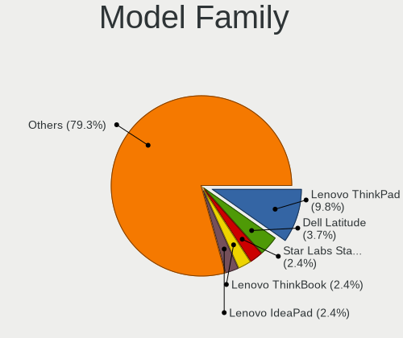
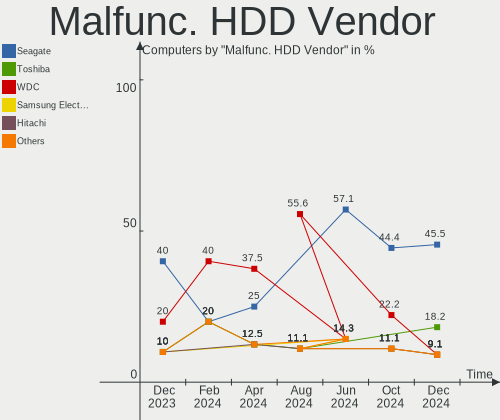
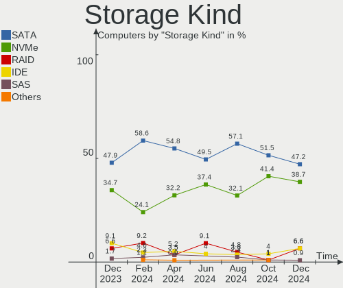
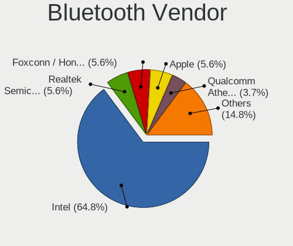
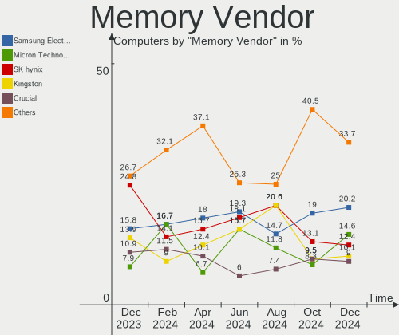

FreeBSD Hardware Trends
-----------------------

A project to identify most popular hardware characteristics and track their change
over time based on data collected by FreeBSD users at https://BSD-Hardware.info.

Anyone can contribute to this report by the [hw-probe](https://github.com/linuxhw/hw-probe/blob/master/INSTALL.BSD.md) tool:

    hw-probe -all -upload

This is a report for all computer types. See also reports for [desktops](/Dist/FreeBSD/Desktop/README.md) and [notebooks](/Dist/FreeBSD/Notebook/README.md).

Full-feature report is available here: https://bsd-hardware.info/?view=trends

Period: Jan, 2022.

Contents
--------

* [ System ](#system)
  - [ OS                       ](#os)
  - [ OS Family                ](#os-family)
  - [ Arch                     ](#arch)
  - [ DE                       ](#de)
  - [ Display Server           ](#display-server)
  - [ Display Manager          ](#display-manager)
  - [ OS Lang                  ](#os-lang)
  - [ Boot Mode                ](#boot-mode)
  - [ Filesystem               ](#filesystem)
  - [ Part. scheme             ](#part-scheme)

* [ Board ](#board)
  - [ Vendor                   ](#vendor)
  - [ Model                    ](#model)
  - [ Model Family             ](#model-family)
  - [ MFG Year                 ](#mfg-year)
  - [ Form Factor              ](#form-factor)
  - [ Coreboot                 ](#coreboot)
  - [ RAM Size                 ](#ram-size)
  - [ RAM Used                 ](#ram-used)
  - [ Total Drives             ](#total-drives)
  - [ Has CD-ROM               ](#has-cd-rom)
  - [ Has Ethernet             ](#has-ethernet)
  - [ Has WiFi                 ](#has-wifi)
  - [ Has Bluetooth            ](#has-bluetooth)

* [ Location ](#location)
  - [ Country                  ](#country)
  - [ City                     ](#city)

* [ Drives ](#drives)
  - [ Drive Vendor             ](#drive-vendor)
  - [ Drive Model              ](#drive-model)
  - [ HDD Vendor               ](#hdd-vendor)
  - [ SSD Vendor               ](#ssd-vendor)
  - [ Drive Kind               ](#drive-kind)
  - [ Drive Connector          ](#drive-connector)
  - [ Drive Size               ](#drive-size)
  - [ Space Total              ](#space-total)
  - [ Space Used               ](#space-used)
  - [ Malfunc. Drives          ](#malfunc-drives)
  - [ Malfunc. Drive Vendor    ](#malfunc-drive-vendor)
  - [ Malfunc. HDD Vendor      ](#malfunc-hdd-vendor)
  - [ Malfunc. Drive Kind      ](#malfunc-drive-kind)
  - [ Failed Drives            ](#failed-drives)
  - [ Failed Drive Vendor      ](#failed-drive-vendor)
  - [ Drive Status             ](#drive-status)

* [ Storage controller ](#storage-controller)
  - [ Storage Vendor           ](#storage-vendor)
  - [ Storage Model            ](#storage-model)
  - [ Storage Kind             ](#storage-kind)

* [ Processor ](#processor)
  - [ CPU Vendor               ](#cpu-vendor)
  - [ CPU Model                ](#cpu-model)
  - [ CPU Model Family         ](#cpu-model-family)
  - [ CPU Cores                ](#cpu-cores)
  - [ CPU Sockets              ](#cpu-sockets)
  - [ CPU Threads              ](#cpu-threads)
  - [ CPU Microarch            ](#cpu-microarch)

* [ Graphics ](#graphics)
  - [ GPU Vendor               ](#gpu-vendor)
  - [ GPU Model                ](#gpu-model)
  - [ GPU Combo                ](#gpu-combo)
  - [ GPU Driver               ](#gpu-driver)
  - [ GPU Memory               ](#gpu-memory)

* [ Monitor ](#monitor)
  - [ Monitor Vendor           ](#monitor-vendor)
  - [ Monitor Model            ](#monitor-model)
  - [ Monitor Resolution       ](#monitor-resolution)
  - [ Monitor Diagonal         ](#monitor-diagonal)
  - [ Monitor Width            ](#monitor-width)
  - [ Aspect Ratio             ](#aspect-ratio)
  - [ Monitor Area             ](#monitor-area)
  - [ Pixel Density            ](#pixel-density)
  - [ Multiple Monitors        ](#multiple-monitors)

* [ Network ](#network)
  - [ Net Controller Vendor    ](#net-controller-vendor)
  - [ Net Controller Model     ](#net-controller-model)
  - [ Wireless Vendor          ](#wireless-vendor)
  - [ Wireless Model           ](#wireless-model)
  - [ Ethernet Vendor          ](#ethernet-vendor)
  - [ Ethernet Model           ](#ethernet-model)
  - [ Net Controller Kind      ](#net-controller-kind)
  - [ Used Controller          ](#used-controller)
  - [ NICs                     ](#nics)
  - [ IPv6                     ](#ipv6)

* [ Bluetooth ](#bluetooth)
  - [ Bluetooth Vendor         ](#bluetooth-vendor)
  - [ Bluetooth Model          ](#bluetooth-model)

* [ Sound ](#sound)
  - [ Sound Vendor             ](#sound-vendor)
  - [ Sound Model              ](#sound-model)

* [ Memory ](#memory)
  - [ Memory Vendor            ](#memory-vendor)
  - [ Memory Model             ](#memory-model)
  - [ Memory Kind              ](#memory-kind)
  - [ Memory Form Factor       ](#memory-form-factor)
  - [ Memory Size              ](#memory-size)
  - [ Memory Speed             ](#memory-speed)

* [ Printers & scanners ](#printers--scanners)
  - [ Printer Vendor           ](#printer-vendor)
  - [ Printer Model            ](#printer-model)
  - [ Scanner Vendor           ](#scanner-vendor)
  - [ Scanner Model            ](#scanner-model)

* [ Camera ](#camera)
  - [ Camera Vendor            ](#camera-vendor)
  - [ Camera Model             ](#camera-model)

* [ Security ](#security)
  - [ Fingerprint Vendor       ](#fingerprint-vendor)
  - [ Fingerprint Model        ](#fingerprint-model)
  - [ Chipcard Vendor          ](#chipcard-vendor)
  - [ Chipcard Model           ](#chipcard-model)

* [ Unsupported ](#unsupported)
  - [ Unsupported Devices      ](#unsupported-devices)
  - [ Unsupported Device Types ](#unsupported-device-types)

System
------

OS
--

Installed operating systems

| Name                 | Computers | Percent |
|----------------------|-----------|---------|
| FreeBSD 13.0-p6      | 20        | 22.99%  |
| FreeBSD 13.0-p5      | 19        | 21.84%  |
| FreeBSD 14.0-CURRENT | 10        | 11.49%  |
| FreeBSD 13.0         | 9         | 10.34%  |
| FreeBSD 12.3         | 7         | 8.05%   |
| FreeBSD 12.3-p1      | 6         | 6.9%    |
| FreeBSD 13.0-STABLE  | 5         | 5.75%   |
| FreeBSD 13.0-p4      | 4         | 4.6%    |
| FreeBSD 12.3-STABLE  | 2         | 2.3%    |
| FreeBSD 12.2-p11     | 2         | 2.3%    |
| FreeBSD 12.2-p12     | 1         | 1.15%   |
| FreeBSD 11.4-p7      | 1         | 1.15%   |
| FreeBSD 11.4-p13     | 1         | 1.15%   |

OS Family
---------

OS without a version

| Name    | Computers | Percent |
|---------|-----------|---------|
| FreeBSD | 87        | 100%    |

Arch
----

OS architecture (x86_64, i586, etc.)

| Name  | Computers | Percent |
|-------|-----------|---------|
| amd64 | 81        | 93.1%   |
| arm64 | 5         | 5.75%   |
| i386  | 1         | 1.15%   |

DE
--

Desktop Environment

| Name          | Computers | Percent |
|---------------|-----------|---------|
| Console       | 33        | 37.93%  |
| KDE5          | 12        | 13.79%  |
| GNOME         | 10        | 11.49%  |
| XFCE          | 8         | 9.2%    |
| TWM           | 6         | 6.9%    |
| MATE          | 5         | 5.75%   |
| Openbox       | 4         | 4.6%    |
| Enlightenment | 3         | 3.45%   |
| i3            | 2         | 2.3%    |
| Picom         | 1         | 1.15%   |
| helloDesktop  | 1         | 1.15%   |
| Fluxbox       | 1         | 1.15%   |
| Cinnamon      | 1         | 1.15%   |

Display Server
--------------

X11 or Wayland

| Name    | Computers | Percent |
|---------|-----------|---------|
| X11     | 47        | 54.02%  |
| Console | 38        | 43.68%  |
| Wayland | 2         | 2.3%    |

Display Manager
---------------

SDDM, LightDM, etc.

| Name    | Computers | Percent |
|---------|-----------|---------|
| Console | 52        | 59.77%  |
| SDDM    | 12        | 13.79%  |
| XDM     | 7         | 8.05%   |
| GDM     | 7         | 8.05%   |
| SLiM    | 5         | 5.75%   |
| LightDM | 3         | 3.45%   |
| WDM     | 1         | 1.15%   |

OS Lang
-------

Language

| Lang         | Computers | Percent |
|--------------|-----------|---------|
| C            | 47        | 54.02%  |
| Unknown      | 21        | 24.14%  |
| en_US        | 9         | 10.34%  |
| ru_RU        | 3         | 3.45%   |
| ru_RU.KOI8-R | 2         | 2.3%    |
| pl_PL        | 1         | 1.15%   |
| it_IT        | 1         | 1.15%   |
| en_CA        | 1         | 1.15%   |
| de_DE        | 1         | 1.15%   |
| de_CH        | 1         | 1.15%   |

Boot Mode
---------

EFI or BIOS

| Mode | Computers | Percent |
|------|-----------|---------|
| EFI  | 51        | 58.62%  |
| BIOS | 36        | 41.38%  |

Filesystem
----------

Type of filesystem

| Type | Computers | Percent |
|------|-----------|---------|
| Zfs  | 60        | 68.97%  |
| Ufs  | 27        | 31.03%  |

Part. scheme
------------

Scheme of partitioning

| Type | Computers | Percent |
|------|-----------|---------|
| GPT  | 79        | 90.8%   |
| MBR  | 8         | 9.2%    |

Board
-----

Vendor
------

Motherboard manufacturer

| Name                    | Computers | Percent |
|-------------------------|-----------|---------|
| ASUSTek Computer        | 20        | 22.99%  |
| Dell                    | 12        | 13.79%  |
| Lenovo                  | 8         | 9.2%    |
| Hewlett-Packard         | 7         | 8.05%   |
| Gigabyte Technology     | 7         | 8.05%   |
| MSI                     | 5         | 5.75%   |
| Intel                   | 5         | 5.75%   |
| Supermicro              | 4         | 4.6%    |
| ASRock                  | 4         | 4.6%    |
| Unknown                 | 4         | 4.6%    |
| TUXEDO                  | 1         | 1.15%   |
| Toshiba                 | 1         | 1.15%   |
| Raspberry Pi Foundation | 1         | 1.15%   |
| Kontron                 | 1         | 1.15%   |
| GPD                     | 1         | 1.15%   |
| Fujitsu Siemens         | 1         | 1.15%   |
| Framework               | 1         | 1.15%   |
| Firefly                 | 1         | 1.15%   |
| Cisco Systems           | 1         | 1.15%   |
| Apple                   | 1         | 1.15%   |
| Acer                    | 1         | 1.15%   |

Model
-----

Motherboard model

| Name                                   | Computers | Percent |
|----------------------------------------|-----------|---------|
| Unknown                                | 4         | 4.6%    |
| HP ProLiant MicroServer                | 2         | 2.3%    |
| TUXEDO N14xWU                          | 1         | 1.15%   |
| Toshiba TECRA Z40-B                    | 1         | 1.15%   |
| Supermicro X8DTH-i/6/iF/6F             | 1         | 1.15%   |
| Supermicro X7SBL                       | 1         | 1.15%   |
| Supermicro SYS-5018A-TN4               | 1         | 1.15%   |
| Supermicro Super Server                | 1         | 1.15%   |
| RPi Raspberry Pi                       | 1         | 1.15%   |
| MSI Summit E13FlipEvo A11MT            | 1         | 1.15%   |
| MSI MS-7817                            | 1         | 1.15%   |
| MSI MS-7529                            | 1         | 1.15%   |
| MSI GT75VR 7RF                         | 1         | 1.15%   |
| MSI GE76 Raider 10UG                   | 1         | 1.15%   |
| Lenovo ThinkPad X250 20CL001GUS        | 1         | 1.15%   |
| Lenovo ThinkPad X13 Gen 1 20T2003PRT   | 1         | 1.15%   |
| Lenovo ThinkPad T480s 20L8S1GX00       | 1         | 1.15%   |
| Lenovo ThinkPad T470s W10DG 20JTS0A900 | 1         | 1.15%   |
| Lenovo ThinkPad T460p 20FXS09D11       | 1         | 1.15%   |
| Lenovo ThinkPad L570 W10DG 20JRS0RC02  | 1         | 1.15%   |
| Lenovo ThinkPad E480 20KN0048IA        | 1         | 1.15%   |
| Lenovo ThinkPad E14 Gen 3 20Y7003SGE   | 1         | 1.15%   |
| Kontron KT965/ATXP                     | 1         | 1.15%   |
| Intel S3420GP                          | 1         | 1.15%   |
| Intel pro396949                        | 1         | 1.15%   |
| Intel Nobilis                          | 1         | 1.15%   |
| Intel DQ35JO AAD82085-804              | 1         | 1.15%   |
| Intel D2500CC AAG81477-401             | 1         | 1.15%   |
| HP ProLiant DL180 G6                   | 1         | 1.15%   |
| HP Pavilion Gaming Laptop 15-ec2xxx    | 1         | 1.15%   |
| HP Notebook                            | 1         | 1.15%   |
| HP ENVY x360 Convertible 15m-eu0xxx    | 1         | 1.15%   |
| HP EliteBook 8570p                     | 1         | 1.15%   |
| GPD G1621-02                           | 1         | 1.15%   |
| Gigabyte Z68X-UD7-B3                   | 1         | 1.15%   |
| Gigabyte X570 I AORUS PRO WIFI         | 1         | 1.15%   |
| Gigabyte X470 AORUS ULTRA GAMING       | 1         | 1.15%   |
| Gigabyte H470 HD3                      | 1         | 1.15%   |
| Gigabyte H310M S2 2.0                  | 1         | 1.15%   |
| Gigabyte B450M DS3H                    | 1         | 1.15%   |
| Gigabyte B150-HD3P-CF                  | 1         | 1.15%   |
| Fujitsu Siemens AMILO Li 2727          | 1         | 1.15%   |
| Framework Laptop                       | 1         | 1.15%   |
| Firefly ROC-RK3566-PC                  | 1         | 1.15%   |
| Dell XPS 15 9575                       | 1         | 1.15%   |
| Dell Precision 7530                    | 1         | 1.15%   |
| Dell PowerEdge R730                    | 1         | 1.15%   |
| Dell OptiPlex FX160                    | 1         | 1.15%   |
| Dell OptiPlex 790                      | 1         | 1.15%   |
| Dell OptiPlex 7080                     | 1         | 1.15%   |
| Dell Latitude E6430                    | 1         | 1.15%   |
| Dell Latitude E5450                    | 1         | 1.15%   |
| Dell Inspiron 5558                     | 1         | 1.15%   |
| Dell Inspiron 5555                     | 1         | 1.15%   |
| Dell Inspiron 15 7000 Gaming           | 1         | 1.15%   |
| Dell G3 3500                           | 1         | 1.15%   |
| Cisco Systems UCSC-C240-M4L            | 1         | 1.15%   |
| ASUS U31SD                             | 1         | 1.15%   |
| ASUS TUF GAMING B550-PLUS              | 1         | 1.15%   |
| ASUS TUF B365M-PLUS GAMING             | 1         | 1.15%   |

Model Family
------------

Motherboard model prefix

| Name                        | Computers | Percent |
|-----------------------------|-----------|---------|
| Lenovo ThinkPad             | 8         | 9.2%    |
| ASUS PRIME                  | 5         | 5.75%   |
| Unknown                     | 4         | 4.6%    |
| HP ProLiant                 | 3         | 3.45%   |
| Dell OptiPlex               | 3         | 3.45%   |
| Dell Inspiron               | 3         | 3.45%   |
| Dell Latitude               | 2         | 2.3%    |
| ASUS TUF                    | 2         | 2.3%    |
| ASUS ROG                    | 2         | 2.3%    |
| TUXEDO N14xWU               | 1         | 1.15%   |
| Toshiba TECRA               | 1         | 1.15%   |
| Supermicro X8DTH-i          | 1         | 1.15%   |
| Supermicro X7SBL            | 1         | 1.15%   |
| Supermicro SYS-5018A-TN4    | 1         | 1.15%   |
| Supermicro Super            | 1         | 1.15%   |
| RPi Raspberry               | 1         | 1.15%   |
| MSI Summit                  | 1         | 1.15%   |
| MSI MS-7817                 | 1         | 1.15%   |
| MSI MS-7529                 | 1         | 1.15%   |
| MSI GT75VR                  | 1         | 1.15%   |
| MSI GE76                    | 1         | 1.15%   |
| Kontron KT965               | 1         | 1.15%   |
| Intel S3420GP               | 1         | 1.15%   |
| Intel pro396949             | 1         | 1.15%   |
| Intel Nobilis               | 1         | 1.15%   |
| Intel DQ35JO                | 1         | 1.15%   |
| Intel D2500CC               | 1         | 1.15%   |
| HP Pavilion                 | 1         | 1.15%   |
| HP Notebook                 | 1         | 1.15%   |
| HP ENVY                     | 1         | 1.15%   |
| HP EliteBook                | 1         | 1.15%   |
| GPD G1621-02                | 1         | 1.15%   |
| Gigabyte Z68X-UD7-B3        | 1         | 1.15%   |
| Gigabyte X570               | 1         | 1.15%   |
| Gigabyte X470               | 1         | 1.15%   |
| Gigabyte H470               | 1         | 1.15%   |
| Gigabyte H310M              | 1         | 1.15%   |
| Gigabyte B450M              | 1         | 1.15%   |
| Gigabyte B150-HD3P-CF       | 1         | 1.15%   |
| Fujitsu Siemens AMILO       | 1         | 1.15%   |
| Framework Laptop            | 1         | 1.15%   |
| Firefly ROC-RK3566-PC       | 1         | 1.15%   |
| Dell XPS                    | 1         | 1.15%   |
| Dell Precision              | 1         | 1.15%   |
| Dell PowerEdge              | 1         | 1.15%   |
| Dell G3                     | 1         | 1.15%   |
| Cisco Systems UCSC-C240-M4L | 1         | 1.15%   |
| ASUS U31SD                  | 1         | 1.15%   |
| ASUS P8H67-M                | 1         | 1.15%   |
| ASUS P5Q-E                  | 1         | 1.15%   |
| ASUS P5M2                   | 1         | 1.15%   |
| ASUS P5G41T-M               | 1         | 1.15%   |
| ASUS N50Vc                  | 1         | 1.15%   |
| ASUS MINIPC                 | 1         | 1.15%   |
| ASUS M5A97                  | 1         | 1.15%   |
| ASUS All                    | 1         | 1.15%   |
| ASUS A68HM-PLUS             | 1         | 1.15%   |
| ASUS 1015PEM                | 1         | 1.15%   |
| ASRock Z170M                | 1         | 1.15%   |
| ASRock X570                 | 1         | 1.15%   |

MFG Year
--------

Motherboard manufacture year

| Year    | Computers | Percent |
|---------|-----------|---------|
| 2021    | 17        | 19.54%  |
| 2019    | 8         | 9.2%    |
| 2018    | 8         | 9.2%    |
| 2011    | 8         | 9.2%    |
| 2020    | 6         | 6.9%    |
| 2015    | 5         | 5.75%   |
| 2017    | 4         | 4.6%    |
| 2016    | 4         | 4.6%    |
| 2012    | 4         | 4.6%    |
| 2008    | 4         | 4.6%    |
| Unknown | 4         | 4.6%    |
| 2014    | 3         | 3.45%   |
| 2013    | 3         | 3.45%   |
| 2010    | 3         | 3.45%   |
| 2009    | 3         | 3.45%   |
| 2022    | 1         | 1.15%   |
| 2007    | 1         | 1.15%   |
| 2006    | 1         | 1.15%   |

Form Factor
-----------

Physical design of the computer

| Name           | Computers | Percent |
|----------------|-----------|---------|
| Desktop        | 44        | 50.57%  |
| Notebook       | 32        | 36.78%  |
| Server         | 6         | 6.9%    |
| System on chip | 2         | 2.3%    |
| Mini pc        | 2         | 2.3%    |
| Convertible    | 1         | 1.15%   |

Coreboot
--------

Have coreboot on board

| Used | Computers | Percent |
|------|-----------|---------|
| No   | 87        | 100%    |

RAM Size
--------

Total RAM memory

| Size in GB      | Computers | Percent |
|-----------------|-----------|---------|
| 8.01-16.0       | 21        | 24.14%  |
| 16.01-24.0      | 20        | 22.99%  |
| 32.01-64.0      | 18        | 20.69%  |
| 4.01-8.0        | 8         | 9.2%    |
| 64.01-256.0     | 7         | 8.05%   |
| 0.51-1.0        | 5         | 5.75%   |
| 2.01-3.0        | 3         | 3.45%   |
| 3.01-4.0        | 2         | 2.3%    |
| 24.01-32.0      | 2         | 2.3%    |
| More than 256.0 | 1         | 1.15%   |

RAM Used
--------

Used RAM memory

| Used GB     | Computers | Percent |
|-------------|-----------|---------|
| 0.51-1.0    | 28        | 32.18%  |
| 0.01-0.5    | 26        | 29.89%  |
| 1.01-2.0    | 17        | 19.54%  |
| 4.01-8.0    | 4         | 4.6%    |
| 2.01-3.0    | 4         | 4.6%    |
| 0           | 3         | 3.45%   |
| 3.01-4.0    | 2         | 2.3%    |
| 64.01-256.0 | 2         | 2.3%    |
| 8.01-16.0   | 1         | 1.15%   |

Total Drives
------------

Number of drives on board

| Drives | Computers | Percent |
|--------|-----------|---------|
| 1      | 37        | 42.53%  |
| 2      | 17        | 19.54%  |
| 4      | 8         | 9.2%    |
| 3      | 8         | 9.2%    |
| 0      | 7         | 8.05%   |
| 6      | 2         | 2.3%    |
| 5      | 2         | 2.3%    |
| 18     | 1         | 1.15%   |
| 14     | 1         | 1.15%   |
| 13     | 1         | 1.15%   |
| 12     | 1         | 1.15%   |
| 9      | 1         | 1.15%   |
| 7      | 1         | 1.15%   |

Has CD-ROM
----------

Has CD-ROM on board

| Presented | Computers | Percent |
|-----------|-----------|---------|
| No        | 65        | 74.71%  |
| Yes       | 22        | 25.29%  |

Has Ethernet
------------

Has Ethernet on board

| Presented | Computers | Percent |
|-----------|-----------|---------|
| Yes       | 78        | 89.66%  |
| No        | 9         | 10.34%  |

Has WiFi
--------

Has WiFi module

| Presented | Computers | Percent |
|-----------|-----------|---------|
| No        | 48        | 55.17%  |
| Yes       | 39        | 44.83%  |

Has Bluetooth
-------------

Has Bluetooth module

| Presented | Computers | Percent |
|-----------|-----------|---------|
| No        | 58        | 66.67%  |
| Yes       | 29        | 33.33%  |

Location
--------

Country
-------

Geographic location (country)

| Country     | Computers | Percent |
|-------------|-----------|---------|
| USA         | 26        | 29.89%  |
| Russia      | 12        | 13.79%  |
| Germany     | 6         | 6.9%    |
| UK          | 5         | 5.75%   |
| Canada      | 5         | 5.75%   |
| Romania     | 4         | 4.6%    |
| Italy       | 3         | 3.45%   |
| Austria     | 3         | 3.45%   |
| UAE         | 2         | 2.3%    |
| Switzerland | 2         | 2.3%    |
| Poland      | 2         | 2.3%    |
| Indonesia   | 2         | 2.3%    |
| France      | 2         | 2.3%    |
| Turkey      | 1         | 1.15%   |
| Sweden      | 1         | 1.15%   |
| Singapore   | 1         | 1.15%   |
| Portugal    | 1         | 1.15%   |
| Netherlands | 1         | 1.15%   |
| Malaysia    | 1         | 1.15%   |
| Hungary     | 1         | 1.15%   |
| Greece      | 1         | 1.15%   |
| Finland     | 1         | 1.15%   |
| Eswatini    | 1         | 1.15%   |
| Belarus     | 1         | 1.15%   |
| Australia   | 1         | 1.15%   |
| Armenia     | 1         | 1.15%   |

City
----

Geographic location (city)

| City                  | Computers | Percent |
|-----------------------|-----------|---------|
| Grand Rapids          | 5         | 5.75%   |
| Chicago               | 4         | 4.6%    |
| Armavir               | 4         | 4.6%    |
| Cluj-Napoca           | 3         | 3.45%   |
| Berlin                | 3         | 3.45%   |
| Vienna                | 2         | 2.3%    |
| Silea                 | 2         | 2.3%    |
| Salem                 | 2         | 2.3%    |
| Ruthin                | 2         | 2.3%    |
| Redmond               | 2         | 2.3%    |
| Moscow                | 2         | 2.3%    |
| Jakarta               | 2         | 2.3%    |
| Egham                 | 2         | 2.3%    |
| Dubai                 | 2         | 2.3%    |
| Calgary               | 2         | 2.3%    |
| Yerevan               | 1         | 1.15%   |
| Wenatchee             | 1         | 1.15%   |
| Warsaw                | 1         | 1.15%   |
| Ume??                 | 1         | 1.15%   |
| Ulyanovsk             | 1         | 1.15%   |
| Thousand Oaks         | 1         | 1.15%   |
| Therwil               | 1         | 1.15%   |
| Sydney                | 1         | 1.15%   |
| Stuttgart             | 1         | 1.15%   |
| Smolenshchina         | 1         | 1.15%   |
| Singapore             | 1         | 1.15%   |
| Sherwood Park         | 1         | 1.15%   |
| Saint-Germain-en-Laye | 1         | 1.15%   |
| Rostov-on-Don         | 1         | 1.15%   |
| Queens Village        | 1         | 1.15%   |
| Queens                | 1         | 1.15%   |
| Preveza               | 1         | 1.15%   |
| Palo Alto             | 1         | 1.15%   |
| Novosibirsk           | 1         | 1.15%   |
| Noordwijk aan Zee     | 1         | 1.15%   |
| Newark                | 1         | 1.15%   |
| New Westminster       | 1         | 1.15%   |
| Montclair             | 1         | 1.15%   |
| Menlo Park            | 1         | 1.15%   |
| Mbabane               | 1         | 1.15%   |
| Malnate               | 1         | 1.15%   |
| Macon                 | 1         | 1.15%   |
| London                | 1         | 1.15%   |
| Lisbon                | 1         | 1.15%   |
| Lexington             | 1         | 1.15%   |
| Krakow                | 1         | 1.15%   |
| Kamensk-Ural'skiy     | 1         | 1.15%   |
| Jenjarum              | 1         | 1.15%   |
| Istanbul              | 1         | 1.15%   |
| Hyattsville           | 1         | 1.15%   |
| Hrodna                | 1         | 1.15%   |
| Helsinki              | 1         | 1.15%   |
| Halifax               | 1         | 1.15%   |
| Graz                  | 1         | 1.15%   |
| Frankfurt am Main     | 1         | 1.15%   |
| Concord               | 1         | 1.15%   |
| Colombes              | 1         | 1.15%   |
| Cologne               | 1         | 1.15%   |
| Budapest              | 1         | 1.15%   |
| Bucharest             | 1         | 1.15%   |

Drives
------

Drive Vendor
------------

Hard drive vendors

| Vendor              | Computers | Drives | Percent |
|---------------------|-----------|--------|---------|
| WDC                 | 33        | 60     | 25.38%  |
| Samsung Electronics | 24        | 31     | 18.46%  |
| Seagate             | 16        | 36     | 12.31%  |
| Crucial             | 8         | 8      | 6.15%   |
| Toshiba             | 7         | 12     | 5.38%   |
| Hitachi             | 6         | 18     | 4.62%   |
| Intel               | 5         | 6      | 3.85%   |
| HGST                | 5         | 21     | 3.85%   |
| A-DATA Technology   | 4         | 6      | 3.08%   |
| Kingston            | 3         | 3      | 2.31%   |
| PNY                 | 2         | 3      | 1.54%   |
| KIOXIA              | 2         | 2      | 1.54%   |
| Vaseky              | 1         | 1      | 0.77%   |
| Transcend           | 1         | 2      | 0.77%   |
| Silicon Motion      | 1         | 1      | 0.77%   |
| SanDisk             | 1         | 1      | 0.77%   |
| PLEXTOR             | 1         | 1      | 0.77%   |
| Phison              | 1         | 1      | 0.77%   |
| Patriot             | 1         | 2      | 0.77%   |
| Micron Technology   | 1         | 1      | 0.77%   |
| Lexar               | 1         | 1      | 0.77%   |
| Hewlett-Packard     | 1         | 1      | 0.77%   |
| Fujitsu             | 1         | 1      | 0.77%   |
| EMTEC               | 1         | 1      | 0.77%   |
| Corsair             | 1         | 1      | 0.77%   |
| BIWIN               | 1         | 1      | 0.77%   |
| AMD                 | 1         | 2      | 0.77%   |

Drive Model
-----------

Hard drive models

| Model                                 | Computers | Percent |
|---------------------------------------|-----------|---------|
| WDC WD800JD-75MSA3 80GB               | 5         | 3.16%   |
| HGST HTS721010A9E630 1TB              | 3         | 1.9%    |
| WDC WD80EFAX-68LHPN0 8TB              | 2         | 1.27%   |
| WDC WD20EZAZ-00GGJB0 2TB              | 2         | 1.27%   |
| WDC PC SN730 SDBQNTY-256G-1001 256GB  | 2         | 1.27%   |
| Seagate ST4000DM000-1F2168 4TB        | 2         | 1.27%   |
| Samsung SSD 860 QVO 1TB               | 2         | 1.27%   |
| Samsung SSD 860 EVO 500GB             | 2         | 1.27%   |
| Kingston SA400S37240G 240GB           | 2         | 1.27%   |
| Crucial CT1000P1SSD8 1TB              | 2         | 1.27%   |
| WDC WDS500G3X0C-00SJG0 500GB          | 1         | 0.63%   |
| WDC WDS500G2B0A 500GB                 | 1         | 0.63%   |
| WDC WDS240G2G0A-00JH30 240GB          | 1         | 0.63%   |
| WDC WD80EMAZ-00WJTA0 8TB              | 1         | 0.63%   |
| WDC WD80EFZX-68UW8N0 8TB              | 1         | 0.63%   |
| WDC WD80EDBZ-11B0ZA0 8TB              | 1         | 0.63%   |
| WDC WD6400BEVT-22A0RT0 640GB          | 1         | 0.63%   |
| WDC WD60EFRX-68TGBN1 6TB              | 1         | 0.63%   |
| WDC WD5000LPCX-24C6HT0 500GB          | 1         | 0.63%   |
| WDC WD5000BPKT-00PK4T0 500GB          | 1         | 0.63%   |
| WDC WD5000AZRZ-00HTKB0 500GB          | 1         | 0.63%   |
| WDC WD40EZRZ-22GXCB0 4TB              | 1         | 0.63%   |
| WDC WD40EFRX-68N32N0 4TB              | 1         | 0.63%   |
| WDC WD2500AAJS-00V4A0 250GB           | 1         | 0.63%   |
| WDC WD20NMVW-11AV3S2 2TB              | 1         | 0.63%   |
| WDC WD20EZRZ-22Z5HB0 2TB              | 1         | 0.63%   |
| WDC WD20EZRX-00D8PB0 2TB              | 1         | 0.63%   |
| WDC WD20EFRX-68EUZN0 2TB              | 1         | 0.63%   |
| WDC WD20EFRX-68AX9N0 2TB              | 1         | 0.63%   |
| WDC WD20EARX-00PASB0 2TB              | 1         | 0.63%   |
| WDC WD20EARX-008FB0 2TB               | 1         | 0.63%   |
| WDC WD20EARS-00MVWB0 2TB              | 1         | 0.63%   |
| WDC WD2003FYYS-18W0B0 2TB             | 1         | 0.63%   |
| WDC WD2002FYPS-02W3B0 2TB             | 1         | 0.63%   |
| WDC WD1600BEVT-75ZCT2 160GB           | 1         | 0.63%   |
| WDC WD1600AAJS-00YZCA0 160GB          | 1         | 0.63%   |
| WDC WD15EADS-00P8B0 1.5TB             | 1         | 0.63%   |
| WDC WD120EMFZ-11A6JA0 12TB            | 1         | 0.63%   |
| WDC WD120EMAZ-11BLFA0 12TB            | 1         | 0.63%   |
| WDC WD120EFBX-68B0EN0 12TB            | 1         | 0.63%   |
| WDC WD10JPVX-60JC3T0 1TB              | 1         | 0.63%   |
| WDC WD10JPVX-00JC3T0 1TB              | 1         | 0.63%   |
| WDC WD10EZEX-21M2NA0 1TB              | 1         | 0.63%   |
| WDC WD1005FBYZ-01YCBB3 1TB            | 1         | 0.63%   |
| WDC WD1003FZEX-00K3CA0 1TB            | 1         | 0.63%   |
| WDC PC SN730 SDBQNTY-1T00-1001 1TB    | 1         | 0.63%   |
| WDC AC31600H 2GB                      | 1         | 0.63%   |
| Vaseky V800-120G                      | 1         | 0.63%   |
| Transcend TS2TMTE220S 2TB             | 1         | 0.63%   |
| Toshiba MQ02ABD100H 1TB               | 1         | 0.63%   |
| Toshiba MQ01ABF050 500GB              | 1         | 0.63%   |
| Toshiba MQ01ABD100 1TB                | 1         | 0.63%   |
| Toshiba MK3263GSX 320GB               | 1         | 0.63%   |
| Toshiba MG09ACA18TE 18TB              | 1         | 0.63%   |
| Toshiba MG04ACA600E 6TB               | 1         | 0.63%   |
| Toshiba HDWN180 8TB                   | 1         | 0.63%   |
| Toshiba HDWG480 8TB                   | 1         | 0.63%   |
| Toshiba HDWG180 8TB                   | 1         | 0.63%   |
| Silicon Motion 512GB PCS PCIe M.2 SSD | 1         | 0.63%   |
| Seagate ST9320325AS 320GB             | 1         | 0.63%   |

HDD Vendor
----------

Hard disk drive vendors

| Vendor          | Computers | Drives | Percent |
|-----------------|-----------|--------|---------|
| WDC             | 28        | 54     | 43.75%  |
| Seagate         | 16        | 36     | 25%     |
| Toshiba         | 7         | 12     | 10.94%  |
| Hitachi         | 6         | 18     | 9.38%   |
| HGST            | 5         | 21     | 7.81%   |
| Hewlett-Packard | 1         | 1      | 1.56%   |
| Fujitsu         | 1         | 1      | 1.56%   |

SSD Vendor
----------

Solid state drive vendors

| Vendor              | Computers | Drives | Percent |
|---------------------|-----------|--------|---------|
| Samsung Electronics | 15        | 20     | 42.86%  |
| Crucial             | 4         | 4      | 11.43%  |
| Kingston            | 3         | 3      | 8.57%   |
| WDC                 | 2         | 2      | 5.71%   |
| Intel               | 2         | 3      | 5.71%   |
| A-DATA Technology   | 2         | 3      | 5.71%   |
| Vaseky              | 1         | 1      | 2.86%   |
| SanDisk             | 1         | 1      | 2.86%   |
| PNY                 | 1         | 2      | 2.86%   |
| Patriot             | 1         | 2      | 2.86%   |
| Lexar               | 1         | 1      | 2.86%   |
| EMTEC               | 1         | 1      | 2.86%   |
| AMD                 | 1         | 2      | 2.86%   |

Drive Kind
----------

HDD or SSD

| Kind | Computers | Drives | Percent |
|------|-----------|--------|---------|
| HDD  | 47        | 143    | 42.73%  |
| SSD  | 33        | 45     | 30%     |
| NVMe | 30        | 36     | 27.27%  |

Drive Connector
---------------

SATA, SAS, NVMe, etc.

| Type | Computers | Drives | Percent |
|------|-----------|--------|---------|
| SATA | 64        | 188    | 68.09%  |
| NVMe | 30        | 36     | 31.91%  |

Drive Size
----------

Size of hard drive

| Size in TB | Computers | Drives | Percent |
|------------|-----------|--------|---------|
| 0.01-0.5   | 44        | 66     | 47.31%  |
| 0.51-1.0   | 18        | 29     | 19.35%  |
| 1.01-2.0   | 13        | 24     | 13.98%  |
| 4.01-10.0  | 8         | 45     | 8.6%    |
| 3.01-4.0   | 6         | 13     | 6.45%   |
| 10.01-20.0 | 4         | 11     | 4.3%    |

Space Total
-----------

Amount of disk space available on the file system

| Size in GB     | Computers | Percent |
|----------------|-----------|---------|
| 101-250        | 26        | 29.89%  |
| 501-1000       | 17        | 19.54%  |
| 251-500        | 15        | 17.24%  |
| 51-100         | 10        | 11.49%  |
| 21-50          | 8         | 9.2%    |
| 1001-2000      | 6         | 6.9%    |
| 1-20           | 3         | 3.45%   |
| More than 3000 | 1         | 1.15%   |
| 2001-3000      | 1         | 1.15%   |

Space Used
----------

Amount of used disk space

| Used GB  | Computers | Percent |
|----------|-----------|---------|
| 1-20     | 68        | 78.16%  |
| 21-50    | 11        | 12.64%  |
| 251-500  | 2         | 2.3%    |
| 501-1000 | 2         | 2.3%    |
| 51-100   | 2         | 2.3%    |
| 101-250  | 1         | 1.15%   |
| 0        | 1         | 1.15%   |

Malfunc. Drives
---------------

Drive models with a malfunction

| Model                        | Computers | Drives | Percent |
|------------------------------|-----------|--------|---------|
| WDC WD6400BEVT-22A0RT0 640GB | 1         | 1      | 5.88%   |
| WDC WD60EFRX-68TGBN1 6TB     | 1         | 3      | 5.88%   |
| WDC WD5000AZRZ-00HTKB0 500GB | 1         | 1      | 5.88%   |
| WDC WD20EARX-008FB0 2TB      | 1         | 1      | 5.88%   |
| WDC WD20EARS-00MVWB0 2TB     | 1         | 1      | 5.88%   |
| WDC WD2002FYPS-02W3B0 2TB    | 1         | 1      | 5.88%   |
| WDC WD10JPVX-60JC3T0 1TB     | 1         | 1      | 5.88%   |
| Toshiba MK3263GSX 320GB      | 1         | 1      | 5.88%   |
| Seagate ST9320325AS 320GB    | 1         | 1      | 5.88%   |
| Seagate ST3750528AS 752GB    | 1         | 1      | 5.88%   |
| Seagate ST3500413AS 500GB    | 1         | 1      | 5.88%   |
| Seagate ST3200822AS 200GB    | 1         | 1      | 5.88%   |
| Seagate ST3160815AS 160GB    | 1         | 1      | 5.88%   |
| SanDisk SSD P4 64GB          | 1         | 1      | 5.88%   |
| HGST HTS721010A9E630 1TB     | 1         | 1      | 5.88%   |
| Fujitsu MHZ2160BH G2 160GB   | 1         | 1      | 5.88%   |
| AMD R5SL240G 240GB           | 1         | 2      | 5.88%   |

Malfunc. Drive Vendor
---------------------

Vendors of faulty drives

| Vendor  | Computers | Drives | Percent |
|---------|-----------|--------|---------|
| WDC     | 7         | 9      | 43.75%  |
| Seagate | 4         | 5      | 25%     |
| Toshiba | 1         | 1      | 6.25%   |
| SanDisk | 1         | 1      | 6.25%   |
| HGST    | 1         | 1      | 6.25%   |
| Fujitsu | 1         | 1      | 6.25%   |
| AMD     | 1         | 2      | 6.25%   |

Malfunc. HDD Vendor
-------------------

Vendors of faulty HDD drives

| Vendor  | Computers | Drives | Percent |
|---------|-----------|--------|---------|
| WDC     | 7         | 9      | 50%     |
| Seagate | 4         | 5      | 28.57%  |
| Toshiba | 1         | 1      | 7.14%   |
| HGST    | 1         | 1      | 7.14%   |
| Fujitsu | 1         | 1      | 7.14%   |

Malfunc. Drive Kind
-------------------

Kinds of faulty drives

| Kind | Computers | Drives | Percent |
|------|-----------|--------|---------|
| HDD  | 14        | 17     | 87.5%   |
| SSD  | 2         | 3      | 12.5%   |

Failed Drives
-------------

Failed drive models

Zero info for selected period =(

Failed Drive Vendor
-------------------

Failed drive vendors

Zero info for selected period =(

Drive Status
------------

Number of failed and malfunc. drives

| Status   | Computers | Drives | Percent |
|----------|-----------|--------|---------|
| Works    | 74        | 202    | 80.43%  |
| Malfunc  | 16        | 20     | 17.39%  |
| Detected | 2         | 2      | 2.17%   |

Storage controller
------------------

Storage Vendor
--------------

Storage controller vendors

| Vendor                           | Computers | Percent |
|----------------------------------|-----------|---------|
| Intel                            | 54        | 44.63%  |
| AMD                              | 17        | 14.05%  |
| Samsung Electronics              | 12        | 9.92%   |
| Broadcom / LSI                   | 6         | 4.96%   |
| Silicon Motion                   | 4         | 3.31%   |
| Sandisk                          | 4         | 3.31%   |
| Phison Electronics               | 3         | 2.48%   |
| Marvell Technology Group         | 3         | 2.48%   |
| ASMedia Technology               | 3         | 2.48%   |
| Nvidia                           | 2         | 1.65%   |
| Micron/Crucial Technology        | 2         | 1.65%   |
| KIOXIA                           | 2         | 1.65%   |
| ADATA Technology                 | 2         | 1.65%   |
| VIA Technologies                 | 1         | 0.83%   |
| Silicon Integrated Systems [SiS] | 1         | 0.83%   |
| Silicon Image                    | 1         | 0.83%   |
| Micron Technology                | 1         | 0.83%   |
| Lite-On Technology               | 1         | 0.83%   |
| Hewlett-Packard                  | 1         | 0.83%   |
| Adaptec                          | 1         | 0.83%   |

Storage Model
-------------

Storage controller models

| Model                                                                          | Computers | Percent |
|--------------------------------------------------------------------------------|-----------|---------|
| AMD FCH SATA Controller [AHCI mode]                                            | 12        | 8.22%   |
| Samsung NVMe SSD Controller SM981/PM981/PM983                                  | 6         | 4.11%   |
| Intel Sunrise Point-LP SATA Controller [AHCI mode]                             | 5         | 3.42%   |
| Sandisk WD Black SN750 / PC SN730 NVMe SSD                                     | 4         | 2.74%   |
| Samsung NVMe SSD Controller 980                                                | 4         | 2.74%   |
| Intel Wildcat Point-LP SATA Controller [AHCI Mode]                             | 4         | 2.74%   |
| Intel Q170/Q150/B150/H170/H110/Z170/CM236 Chipset SATA Controller [AHCI Mode]  | 4         | 2.74%   |
| Intel NM10/ICH7 Family SATA Controller [AHCI mode]                             | 3         | 2.05%   |
| Intel 82801JI (ICH10 Family) SATA AHCI Controller                              | 3         | 2.05%   |
| Intel 82801G (ICH7 Family) IDE Controller                                      | 3         | 2.05%   |
| Intel 6 Series/C200 Series Chipset Family 6 port Desktop SATA AHCI Controller  | 3         | 2.05%   |
| Intel 200 Series PCH SATA controller [AHCI mode]                               | 3         | 2.05%   |
| Broadcom / LSI SAS2008 PCI-Express Fusion-MPT SAS-2 [Falcon]                   | 3         | 2.05%   |
| AMD SB7x0/SB8x0/SB9x0 SATA Controller [AHCI mode]                              | 3         | 2.05%   |
| AMD 400 Series Chipset SATA Controller                                         | 3         | 2.05%   |
| Silicon Motion SM2263EN/SM2263XT SSD Controller                                | 2         | 1.37%   |
| Silicon Motion SM2262/SM2262EN SSD Controller                                  | 2         | 1.37%   |
| Samsung NVMe SSD Controller SM961/PM961/SM963                                  | 2         | 1.37%   |
| Phison E12 NVMe Controller                                                     | 2         | 1.37%   |
| Micron/Crucial P2 NVMe PCIe SSD                                                | 2         | 1.37%   |
| KIOXIA unknown                                                                 | 2         | 1.37%   |
| Intel NM10/ICH7 Family SATA Controller [IDE mode]                              | 2         | 1.37%   |
| Intel Comet Lake SATA AHCI Controller                                          | 2         | 1.37%   |
| Intel C610/X99 series chipset 6-Port SATA Controller [AHCI mode]               | 2         | 1.37%   |
| Intel 82801IR/IO/IH (ICH9R/DO/DH) 4 port SATA Controller [IDE mode]            | 2         | 1.37%   |
| Intel 82801I (ICH9 Family) 2 port SATA Controller [IDE mode]                   | 2         | 1.37%   |
| Intel 8 Series/C220 Series Chipset Family 6-port SATA Controller 1 [AHCI mode] | 2         | 1.37%   |
| Intel 7 Series Chipset Family 6-port SATA Controller [AHCI mode]               | 2         | 1.37%   |
| Intel 6 Series/C200 Series Chipset Family 6 port Mobile SATA AHCI Controller   | 2         | 1.37%   |
| Intel 400 Series Chipset Family SATA AHCI Controller                           | 2         | 1.37%   |
| ASMedia ASM1062 Serial ATA Controller                                          | 2         | 1.37%   |
| AMD Starship/Matisse Chipset SATA Controller [AHCI mode]                       | 2         | 1.37%   |
| AMD SB7x0/SB8x0/SB9x0 IDE Controller                                           | 2         | 1.37%   |
| ADATA XPG SX8200 Pro PCIe Gen3x4 M.2 2280 Solid State Drive                    | 2         | 1.37%   |
| Unknown                                                                        | 2         | 1.37%   |
| VIA VT6415 PATA IDE Host Controller                                            | 1         | 0.68%   |
| Silicon Integrated Systems [SiS] AHCI IDE Controller (0106)                    | 1         | 0.68%   |
| Silicon Image AAR-1220SA Serial ATA HostRAID Controller                        | 1         | 0.68%   |
| Phison E16 PCIe4 NVMe Controller                                               | 1         | 0.68%   |
| Nvidia MCP79 AHCI Controller                                                   | 1         | 0.68%   |
| Nvidia MCP51 Serial ATA Controller                                             | 1         | 0.68%   |
| Nvidia MCP51 IDE                                                               | 1         | 0.68%   |
| Marvell Group 88SE9128 PCIe SATA 6 Gb/s RAID controller with HyperDuo          | 1         | 0.68%   |
| Marvell Group 88SE6111/6121 SATA II / PATA Controller                          | 1         | 0.68%   |
| Marvell Group 88SE6101/6102 single-port PATA133 interface                      | 1         | 0.68%   |
| Lite-On M8Pe Series NVMe SSD                                                   | 1         | 0.68%   |
| Intel SSD Pro 7600p/760p/E 6100p Series                                        | 1         | 0.68%   |
| Intel SSD 660P Series                                                          | 1         | 0.68%   |
| Intel SATA Controller [RAID mode]                                              | 1         | 0.68%   |
| Intel Optane SSD 900P Series                                                   | 1         | 0.68%   |
| Intel HM170/QM170 Chipset SATA Controller [AHCI Mode]                          | 1         | 0.68%   |
| Intel Cannon Lake PCH SATA AHCI Controller                                     | 1         | 0.68%   |
| Intel Cannon Lake Mobile PCH SATA AHCI Controller                              | 1         | 0.68%   |
| Intel C610/X99 series chipset sSATA Controller [AHCI mode]                     | 1         | 0.68%   |
| Intel Atom processor C2000 AHCI SATA3 Controller                               | 1         | 0.68%   |
| Intel Atom processor C2000 AHCI SATA2 Controller                               | 1         | 0.68%   |
| Intel 82Q35 Express PT IDER Controller                                         | 1         | 0.68%   |
| Intel 82801IBM/IEM (ICH9M/ICH9M-E) 4 port SATA Controller [AHCI mode]          | 1         | 0.68%   |
| Intel 82801HR/HO/HH (ICH8R/DO/DH) 2 port SATA Controller [IDE mode]            | 1         | 0.68%   |
| Intel 82801HM/HEM (ICH8M/ICH8M-E) SATA Controller [AHCI mode]                  | 1         | 0.68%   |

Storage Kind
------------

Kind of storage controller (IDE, SATA, NVMe, SAS, ...)

| Kind | Computers | Percent |
|------|-----------|---------|
| SATA | 64        | 51.61%  |
| NVMe | 32        | 25.81%  |
| IDE  | 15        | 12.1%   |
| RAID | 6         | 4.84%   |
| SAS  | 5         | 4.03%   |
| SCSI | 2         | 1.61%   |

Processor
---------

CPU Vendor
----------

Processor vendors

| Vendor   | Computers | Percent |
|----------|-----------|---------|
| Intel    | 62        | 71.26%  |
| AMD      | 20        | 22.99%  |
| ARM      | 4         | 4.6%    |
| Rockchip | 1         | 1.15%   |

CPU Model
---------

Processor models

| Model                                       | Computers | Percent |
|---------------------------------------------|-----------|---------|
| ARM Cortex-A53 r0p4                         | 3         | 3.45%   |
| AMD Ryzen 5 5600G with Radeon Graphics      | 3         | 3.45%   |
| Intel Pentium Gold G5400 CPU @ 3.70GHz      | 2         | 2.3%    |
| Intel Core i5-8250U CPU @ 1.60GHz           | 2         | 2.3%    |
| Intel Core i5-5300U CPU @ 2.30GHz           | 2         | 2.3%    |
| Intel Core i5-2320 CPU @ 3.00GHz            | 2         | 2.3%    |
| Intel Core i5-10400 CPU @ 2.90GHz           | 2         | 2.3%    |
| Intel Core 2 Quad CPU Q6600 @ 2.40GHz       | 2         | 2.3%    |
| Intel 11th Gen Core i7-1195G7 @ 2.90GHz     | 2         | 2.3%    |
| AMD Turion II Neo N40L Dual-Core Processor  | 2         | 2.3%    |
| AMD Ryzen 9 3900X 12-Core Processor         | 2         | 2.3%    |
| Rockchip RK3566 (Cortex-A55)                | 1         | 1.15%   |
| Intel Xeon CPU X5680 @ 3.33GHz              | 1         | 1.15%   |
| Intel Xeon CPU X3450 @ 2.67GHz              | 1         | 1.15%   |
| Intel Xeon CPU E5620 @ 2.40GHz              | 1         | 1.15%   |
| Intel Xeon CPU E5-2643 v3 @ 3.40GHz         | 1         | 1.15%   |
| Intel Xeon CPU E5-2630 v3 @ 2.40GHz         | 1         | 1.15%   |
| Intel Pentium Dual-Core CPU E5800 @ 3.20GHz | 1         | 1.15%   |
| Intel Pentium CPU G4600 @ 3.60GHz           | 1         | 1.15%   |
| Intel Pentium CPU G3220 @ 3.00GHz           | 1         | 1.15%   |
| Intel CPU Version                           | 1         | 1.15%   |
| Intel Core i7-8850H CPU @ 2.60GHz           | 1         | 1.15%   |
| Intel Core i7-8705G CPU @ 3.10GHz           | 1         | 1.15%   |
| Intel Core i7-8700T CPU @ 2.40GHz           | 1         | 1.15%   |
| Intel Core i7-7700HQ CPU @ 2.80GHz          | 1         | 1.15%   |
| Intel Core i7-6700K CPU @ 4.00GHz           | 1         | 1.15%   |
| Intel Core i7-5500U CPU @ 2.40GHz           | 1         | 1.15%   |
| Intel Core i7-4770K CPU @ 3.50GHz           | 1         | 1.15%   |
| Intel Core i7-3720QM CPU @ 2.60GHz          | 1         | 1.15%   |
| Intel Core i7-3520M CPU @ 2.90GHz           | 1         | 1.15%   |
| Intel Core i7-2677M CPU @ 1.80GHz           | 1         | 1.15%   |
| Intel Core i7-10870H CPU @ 2.20GHz          | 1         | 1.15%   |
| Intel Core i7-10700 CPU @ 2.90GHz           | 1         | 1.15%   |
| Intel Core i7-10510U CPU @ 1.80GHz          | 1         | 1.15%   |
| Intel Core i5-8350U CPU @ 1.70GHz           | 1         | 1.15%   |
| Intel Core i5-7300HQ CPU @ 2.50GHz          | 1         | 1.15%   |
| Intel Core i5-7200U CPU @ 2.50GHz           | 1         | 1.15%   |
| Intel Core i5-6600 CPU @ 3.30GHz            | 1         | 1.15%   |
| Intel Core i5-6440HQ CPU @ 2.60GHz          | 1         | 1.15%   |
| Intel Core i5-6300U CPU @ 2.40GHz           | 1         | 1.15%   |
| Intel Core i5-6200U CPU @ 2.30GHz           | 1         | 1.15%   |
| Intel Core i5-5200U CPU @ 2.20GHz           | 1         | 1.15%   |
| Intel Core i5-2400 CPU @ 3.10GHz            | 1         | 1.15%   |
| Intel Core i5-2400 CPU @ 3.10GH             | 1         | 1.15%   |
| Intel Core i5-2300 CPU                      | 1         | 1.15%   |
| Intel Core i5-10300H CPU @ 2.50GHz          | 1         | 1.15%   |
| Intel Core i3-2310M CPU @ 2.10GHz           | 1         | 1.15%   |
| Intel Core 2 Duo CPU P8400 @ 2.26GHz        | 1         | 1.15%   |
| Intel Core 2 Duo CPU P7350 @ 2.00GHz        | 1         | 1.15%   |
| Intel Core 2 Duo CPU E8500 @ 3.16GHz        | 1         | 1.15%   |
| Intel Core 2 Duo CPU E7300 @ 2.66GHz        | 1         | 1.15%   |
| Intel Celeron G4900 CPU @ 3.10GHz           | 1         | 1.15%   |
| Intel Celeron CPU E3300 @ 2.50GHz           | 1         | 1.15%   |
| Intel Atom CPU N550 @ 1.50GHz               | 1         | 1.15%   |
| Intel Atom CPU D2500 @ 1.86GHz              | 1         | 1.15%   |
| Intel Atom CPU C2750 @ 2.40GHz              | 1         | 1.15%   |
| Intel Atom CPU 230 @ 1.60GHz                | 1         | 1.15%   |
| Intel 11th Gen Core i5-11600K @ 3.90GHz     | 1         | 1.15%   |
| Intel 11th Gen Core i5-1135G7 @ 2.40GHz     | 1         | 1.15%   |
| Intel 00000000000000000000000000000000      | 1         | 1.15%   |

CPU Model Family
----------------

Processor model prefix

| Model                   | Computers | Percent |
|-------------------------|-----------|---------|
| Intel Core i5           | 20        | 22.99%  |
| Intel Core i7           | 13        | 14.94%  |
| Other                   | 7         | 8.05%   |
| AMD Ryzen 5             | 6         | 6.9%    |
| Intel Xeon              | 5         | 5.75%   |
| Intel Core 2 Duo        | 4         | 4.6%    |
| Intel Atom              | 4         | 4.6%    |
| ARM Cortex              | 4         | 4.6%    |
| AMD Ryzen 7             | 4         | 4.6%    |
| AMD Ryzen 9             | 3         | 3.45%   |
| Intel Pentium Gold      | 2         | 2.3%    |
| Intel Pentium           | 2         | 2.3%    |
| Intel Core 2 Quad       | 2         | 2.3%    |
| Intel Celeron           | 2         | 2.3%    |
| AMD Turion II Neo       | 2         | 2.3%    |
| AMD A10                 | 2         | 2.3%    |
| Intel Pentium Dual-Core | 1         | 1.15%   |
| Intel Core i3           | 1         | 1.15%   |
| AMD Phenom II X6        | 1         | 1.15%   |
| AMD Athlon X4           | 1         | 1.15%   |
| AMD Athlon 64 X2        | 1         | 1.15%   |

CPU Cores
---------

Number of processor cores

| Number  | Computers | Percent |
|---------|-----------|---------|
| 4       | 28        | 32.18%  |
| 2       | 23        | 26.44%  |
| Unknown | 10        | 11.49%  |
| 6       | 8         | 9.2%    |
| 12      | 6         | 6.9%    |
| 8       | 5         | 5.75%   |
| 16      | 3         | 3.45%   |
| 24      | 2         | 2.3%    |
| 32      | 1         | 1.15%   |
| 1       | 1         | 1.15%   |

CPU Sockets
-----------

Number of sockets

| Number  | Computers | Percent |
|---------|-----------|---------|
| 1       | 81        | 93.1%   |
| Unknown | 4         | 4.6%    |
| 2       | 2         | 2.3%    |

CPU Threads
-----------

Threads per core (Hyper-Threading)

| Number  | Computers | Percent |
|---------|-----------|---------|
| 2       | 40        | 45.98%  |
| 1       | 37        | 42.53%  |
| Unknown | 10        | 11.49%  |

CPU Microarch
-------------

Microarchitecture

| Name        | Computers | Percent |
|-------------|-----------|---------|
| KabyLake    | 14        | 16.09%  |
| Unknown     | 8         | 9.2%    |
| SandyBridge | 7         | 8.05%   |
| Penryn      | 7         | 8.05%   |
| Zen 3       | 5         | 5.75%   |
| Skylake     | 5         | 5.75%   |
| CometLake   | 5         | 5.75%   |
| Zen 2       | 4         | 4.6%    |
| Haswell     | 4         | 4.6%    |
| Broadwell   | 4         | 4.6%    |
| TigerLake   | 3         | 3.45%   |
| K10         | 3         | 3.45%   |
| Core        | 3         | 3.45%   |
| Bonnell     | 3         | 3.45%   |
| Westmere    | 2         | 2.3%    |
| IvyBridge   | 2         | 2.3%    |
| Zen+        | 1         | 1.15%   |
| Zen         | 1         | 1.15%   |
| Steamroller | 1         | 1.15%   |
| Silvermont  | 1         | 1.15%   |
| Piledriver  | 1         | 1.15%   |
| Nehalem     | 1         | 1.15%   |
| K8 Hammer   | 1         | 1.15%   |
| Excavator   | 1         | 1.15%   |

Graphics
--------

GPU Vendor
----------

Vendors of graphics cards

| Vendor                                       | Computers | Percent |
|----------------------------------------------|-----------|---------|
| Intel                                        | 41        | 43.62%  |
| AMD                                          | 23        | 24.47%  |
| Nvidia                                       | 22        | 23.4%   |
| Matrox Electronics Systems                   | 5         | 5.32%   |
| XGI Technology (eXtreme Graphics Innovation) | 1         | 1.06%   |
| Silicon Integrated Systems [SiS]             | 1         | 1.06%   |
| ASPEED Technology                            | 1         | 1.06%   |

GPU Model
---------

Graphics card models

| Model                                                                         | Computers | Percent |
|-------------------------------------------------------------------------------|-----------|---------|
| Intel 2nd Generation Core Processor Family Integrated Graphics Controller     | 5         | 5.26%   |
| Intel HD Graphics 5500                                                        | 4         | 4.21%   |
| AMD Cezanne                                                                   | 4         | 4.21%   |
| Matrox Electronics Systems MGA G200e [Pilot] ServerEngines (SEP1)             | 3         | 3.16%   |
| Intel UHD Graphics 620                                                        | 3         | 3.16%   |
| Intel TigerLake-LP GT2 [Iris Xe Graphics]                                     | 3         | 3.16%   |
| Intel HD Graphics 530                                                         | 3         | 3.16%   |
| Intel CometLake-S GT2 [UHD Graphics 630]                                      | 3         | 3.16%   |
| Intel CoffeeLake-S GT1 [UHD Graphics 610]                                     | 3         | 3.16%   |
| AMD RV730 XT [Radeon HD 4670]                                                 | 3         | 3.16%   |
| Nvidia TU117M                                                                 | 2         | 2.11%   |
| Nvidia GK208B [GeForce GT 710]                                                | 2         | 2.11%   |
| Nvidia GF119M [GeForce GT 520M]                                               | 2         | 2.11%   |
| Intel Skylake GT2 [HD Graphics 520]                                           | 2         | 2.11%   |
| Intel HD Graphics 630                                                         | 2         | 2.11%   |
| Intel CometLake-H GT2 [UHD Graphics]                                          | 2         | 2.11%   |
| AMD RS880M [Mobility Radeon HD 4225/4250]                                     | 2         | 2.11%   |
| AMD Lucienne                                                                  | 2         | 2.11%   |
| AMD Ellesmere [Radeon RX 470/480/570/570X/580/580X/590]                       | 2         | 2.11%   |
| XGI Technology (eXtreme Graphics Innovation) Z9s/Z9m (XG21 core)              | 1         | 1.05%   |
| Silicon Integrated Systems [SiS] 771/671 PCIE VGA Display Adapter             | 1         | 1.05%   |
| Nvidia TU116 [GeForce GTX 1660 Ti]                                            | 1         | 1.05%   |
| Nvidia NV43 [GeForce 6600]                                                    | 1         | 1.05%   |
| Nvidia GT218 [NVS 300]                                                        | 1         | 1.05%   |
| Nvidia GT218 [GeForce 210]                                                    | 1         | 1.05%   |
| Nvidia GT215 [GeForce GT 240]                                                 | 1         | 1.05%   |
| Nvidia GP108 [GeForce GT 1030]                                                | 1         | 1.05%   |
| Nvidia GP107M [GeForce GTX 1050 Mobile]                                       | 1         | 1.05%   |
| Nvidia GP107GLM [Quadro P2000 Mobile]                                         | 1         | 1.05%   |
| Nvidia GP106 [GeForce GTX 1060 3GB]                                           | 1         | 1.05%   |
| Nvidia GP104BM [GeForce GTX 1080 Mobile]                                      | 1         | 1.05%   |
| Nvidia GK208BM [GeForce 920M]                                                 | 1         | 1.05%   |
| Nvidia GK107 [GeForce GT 640]                                                 | 1         | 1.05%   |
| Nvidia GF108GLM [NVS 5200M]                                                   | 1         | 1.05%   |
| Nvidia GA104M [GeForce RTX 3070 Mobile / Max-Q]                               | 1         | 1.05%   |
| Nvidia G98M [GeForce 9300M GS]                                                | 1         | 1.05%   |
| Nvidia C79 [GeForce 9400M]                                                    | 1         | 1.05%   |
| Matrox Electronics Systems MGA G200eW WPCM450                                 | 1         | 1.05%   |
| Matrox Electronics Systems G200eR2                                            | 1         | 1.05%   |
| Intel Xeon E3-1200 v3/4th Gen Core Processor Integrated Graphics Controller   | 1         | 1.05%   |
| Intel Mobile GM965/GL960 Integrated Graphics Controller (secondary)           | 1         | 1.05%   |
| Intel Mobile GM965/GL960 Integrated Graphics Controller (primary)             | 1         | 1.05%   |
| Intel HD Graphics 620                                                         | 1         | 1.05%   |
| Intel CometLake-U GT2 [UHD Graphics]                                          | 1         | 1.05%   |
| Intel CoffeeLake-S GT2 [UHD Graphics 630]                                     | 1         | 1.05%   |
| Intel Atom Processor D4xx/D5xx/N4xx/N5xx Integrated Graphics Controller       | 1         | 1.05%   |
| Intel Atom Processor D2xxx/N2xxx Integrated Graphics Controller               | 1         | 1.05%   |
| Intel 82Q963/Q965 Integrated Graphics Controller                              | 1         | 1.05%   |
| Intel 82G33/G31 Express Integrated Graphics Controller                        | 1         | 1.05%   |
| Intel 4 Series Chipset Integrated Graphics Controller                         | 1         | 1.05%   |
| Intel 3rd Gen Core processor Graphics Controller                              | 1         | 1.05%   |
| ASPEED Technology ASPEED Graphics Family                                      | 1         | 1.05%   |
| AMD Wani [Radeon R5/R6/R7 Graphics]                                           | 1         | 1.05%   |
| AMD Trinity [Radeon HD 7660D]                                                 | 1         | 1.05%   |
| AMD Thames [Radeon HD 7550M/7570M/7650M]                                      | 1         | 1.05%   |
| AMD Sun XT [Radeon HD 8670A/8670M/8690M / R5 M330 / M430 / Radeon 520 Mobile] | 1         | 1.05%   |
| AMD Renoir                                                                    | 1         | 1.05%   |
| AMD Polaris 22 XL [Radeon RX Vega M GL]                                       | 1         | 1.05%   |
| AMD Navi 10 [Radeon RX 5600 OEM/5600 XT / 5700/5700 XT]                       | 1         | 1.05%   |
| AMD ES1000                                                                    | 1         | 1.05%   |

GPU Combo
---------

Combinations of graphics cards

| Name           | Computers | Percent |
|----------------|-----------|---------|
| 1 x Intel      | 29        | 33.33%  |
| 1 x AMD        | 18        | 20.69%  |
| 1 x Nvidia     | 14        | 16.09%  |
| Intel + Nvidia | 7         | 8.05%   |
| Other          | 5         | 5.75%   |
| 1 x Matrox     | 5         | 5.75%   |
| Intel + AMD    | 3         | 3.45%   |
| 2 x Intel      | 2         | 2.3%    |
| 1 x XGI        | 1         | 1.15%   |
| 1 x SiS        | 1         | 1.15%   |
| 1 x ASPEED     | 1         | 1.15%   |
| AMD + Nvidia   | 1         | 1.15%   |

GPU Driver
----------

Free vs proprietary

| Driver      | Computers | Percent |
|-------------|-----------|---------|
| Free        | 72        | 82.76%  |
| Proprietary | 9         | 10.34%  |
| Unknown     | 6         | 6.9%    |

GPU Memory
----------

Total video memory

| Size in GB | Computers | Percent |
|------------|-----------|---------|
| Unknown    | 73        | 83.91%  |
| 7.01-8.0   | 4         | 4.6%    |
| 0.01-0.5   | 3         | 3.45%   |
| 3.01-4.0   | 2         | 2.3%    |
| 1.01-2.0   | 2         | 2.3%    |
| 0.51-1.0   | 2         | 2.3%    |
| 5.01-6.0   | 1         | 1.15%   |

Monitor
-------

Monitor Vendor
--------------

Monitor vendors

| Vendor                  | Computers | Percent |
|-------------------------|-----------|---------|
| Dell                    | 5         | 10.87%  |
| Chimei Innolux          | 5         | 10.87%  |
| Samsung Electronics     | 4         | 8.7%    |
| BOE                     | 4         | 8.7%    |
| Sharp                   | 3         | 6.52%   |
| LG Display              | 3         | 6.52%   |
| AU Optronics            | 3         | 6.52%   |
| ViewSonic               | 2         | 4.35%   |
| Hewlett-Packard         | 2         | 4.35%   |
| Goldstar                | 2         | 4.35%   |
| Chi Mei Optoelectronics | 2         | 4.35%   |
| Acer                    | 2         | 4.35%   |
| Unknown                 | 1         | 2.17%   |
| Sony                    | 1         | 2.17%   |
| Philips                 | 1         | 2.17%   |
| NEC Computers           | 1         | 2.17%   |
| Lenovo                  | 1         | 2.17%   |
| Iiyama                  | 1         | 2.17%   |
| BenQ                    | 1         | 2.17%   |
| ASUSTek Computer        | 1         | 2.17%   |
| Apple                   | 1         | 2.17%   |

Monitor Model
-------------

Monitor models

| Model                                                                    | Computers | Percent |
|--------------------------------------------------------------------------|-----------|---------|
| ViewSonic LCD Monitor VX2451 SERIES 1920x1080                            | 1         | 2.17%   |
| ViewSonic LCD Monitor VSCFA2B 1920x1080 510x290mm 23.1-inch              | 1         | 2.17%   |
| Unknown LCD Monitor Sharp 3840x2160                                      | 1         | 2.17%   |
| Sony TV  *00 SNY7C04 3840x2160 1080x610mm 48.8-inch                      | 1         | 2.17%   |
| Sharp LQ173M1JW05 SHP14EC 1920x1080 380x210mm 17.1-inch                  | 1         | 2.17%   |
| Sharp LQ134N1JW53 SHP1521 1920x1200 290x180mm 13.4-inch                  | 1         | 2.17%   |
| Sharp LCD Monitor SHP148E 1920x1080 340x190mm 15.3-inch                  | 1         | 2.17%   |
| Samsung Electronics SyncMaster SAM027F 1680x1050 470x300mm 22.0-inch     | 1         | 2.17%   |
| Samsung Electronics LCD Monitor SEC544B 1600x900 310x170mm 13.9-inch     | 1         | 2.17%   |
| Samsung Electronics LCD Monitor SEC4545 1280x800 330x210mm 15.4-inch     | 1         | 2.17%   |
| Samsung Electronics LCD Monitor SDC364D 1920x1080 310x170mm 13.9-inch    | 1         | 2.17%   |
| Philips LCD Monitor PHL08C3 1920x1080 600x340mm 27.2-inch                | 1         | 2.17%   |
| NEC Computers E438 NEC335C 3840x2160 940x530mm 42.5-inch                 | 1         | 2.17%   |
| LG Display LCD Monitor LGD03CD 1366x768 280x160mm 12.7-inch              | 1         | 2.17%   |
| LG Display LCD Monitor LGD031B 1366x768 310x170mm 13.9-inch              | 1         | 2.17%   |
| LG Display LCD Monitor LGD0258 1600x900 350x190mm 15.7-inch              | 1         | 2.17%   |
| Lenovo LEN X24A LEN60CF 1920x1080 530x300mm 24.0-inch                    | 1         | 2.17%   |
| Iiyama PL2474H IVM6146 1920x1080 520x290mm 23.4-inch                     | 1         | 2.17%   |
| Hewlett-Packard LE2002x HWP2963 1600x900 440x250mm 19.9-inch             | 1         | 2.17%   |
| Hewlett-Packard 24mq HPN366F 2560x1440 530x300mm 24.0-inch               | 1         | 2.17%   |
| Goldstar LG Ultra HD GSM5B08 3840x2160 600x340mm 27.2-inch               | 1         | 2.17%   |
| Goldstar LCD Monitor GSM5AB6 1920x1080 480x270mm 21.7-inch               | 1         | 2.17%   |
| Dell U3417W DELA0DF 3440x1440 800x330mm 34.1-inch                        | 1         | 2.17%   |
| Dell U3011 DEL4064 1920x1200 640x400mm 29.7-inch                         | 1         | 2.17%   |
| Dell U2515H DELD070 2560x1440 550x310mm 24.9-inch                        | 1         | 2.17%   |
| Dell S2419HGF DELD0E3 1920x1080 530x300mm 24.0-inch                      | 1         | 2.17%   |
| Dell LCD Monitor S2740L 1920x1080                                        | 1         | 2.17%   |
| Chimei Innolux LCD Monitor CMN1747 1920x1080 380x210mm 17.1-inch         | 1         | 2.17%   |
| Chimei Innolux LCD Monitor CMN15CA 1366x768 340x190mm 15.3-inch          | 1         | 2.17%   |
| Chimei Innolux LCD Monitor CMN14D2 1920x1080 310x170mm 13.9-inch         | 1         | 2.17%   |
| Chimei Innolux LCD Monitor CMN14C3 1366x768 310x170mm 13.9-inch          | 1         | 2.17%   |
| Chimei Innolux LCD Monitor CMN14B7 1366x768 310x170mm 13.9-inch          | 1         | 2.17%   |
| Chi Mei Optoelectronics LCD Monitor CMO1561 1280x800 330x210mm 15.4-inch | 1         | 2.17%   |
| Chi Mei Optoelectronics LCD Monitor CMO1333 1366x768 290x160mm 13.0-inch | 1         | 2.17%   |
| BOE LCD Monitor BOE095F 2256x1504 280x190mm 13.3-inch                    | 1         | 2.17%   |
| BOE LCD Monitor BOE08D7 1920x1080 310x170mm 13.9-inch                    | 1         | 2.17%   |
| BOE LCD Monitor BOE0791 1920x1080 310x170mm 13.9-inch                    | 1         | 2.17%   |
| BOE LCD Monitor BOE0742 1920x1080 310x170mm 13.9-inch                    | 1         | 2.17%   |
| BenQ GW2480 BNQ78E7 1920x1080 530x300mm 24.0-inch                        | 1         | 2.17%   |
| AU Optronics LCD Monitor AUO71EC 1366x768 340x190mm 15.3-inch            | 1         | 2.17%   |
| AU Optronics LCD Monitor AUO5A2D 1920x1080 290x170mm 13.2-inch           | 1         | 2.17%   |
| AU Optronics LCD Monitor AUO243D 1920x1080 310x170mm 13.9-inch           | 1         | 2.17%   |
| ASUSTek Computer VZ249 AUS24CC 1920x1080 530x300mm 24.0-inch             | 1         | 2.17%   |
| Apple LCD Monitor APP9C89 1280x800 290x180mm 13.4-inch                   | 1         | 2.17%   |
| Acer V233H ACR0090 1920x1080 510x290mm 23.1-inch                         | 1         | 2.17%   |
| Acer ET241Y ACR056C 1920x1080 480x270mm 21.7-inch                        | 1         | 2.17%   |

Monitor Resolution
------------------

Monitor screen resolution

| Resolution         | Computers | Percent |
|--------------------|-----------|---------|
| 1920x1080 (FHD)    | 21        | 46.67%  |
| 1366x768 (WXGA)    | 7         | 15.56%  |
| 3840x2160 (4K)     | 4         | 8.89%   |
| 1600x900 (HD+)     | 3         | 6.67%   |
| 1280x800 (WXGA)    | 3         | 6.67%   |
| 2560x1440 (QHD)    | 2         | 4.44%   |
| 1920x1200 (WUXGA)  | 2         | 4.44%   |
| 3440x1440          | 1         | 2.22%   |
| 2256x1504          | 1         | 2.22%   |
| 1680x1050 (WSXGA+) | 1         | 2.22%   |

Monitor Diagonal
----------------

Diagonal size in inches

| Inches  | Computers | Percent |
|---------|-----------|---------|
| 13      | 15        | 32.61%  |
| 24      | 6         | 13.04%  |
| 15      | 6         | 13.04%  |
| 23      | 3         | 6.52%   |
| Unknown | 3         | 6.52%   |
| 27      | 2         | 4.35%   |
| 21      | 2         | 4.35%   |
| 17      | 2         | 4.35%   |
| 48      | 1         | 2.17%   |
| 42      | 1         | 2.17%   |
| 34      | 1         | 2.17%   |
| 29      | 1         | 2.17%   |
| 22      | 1         | 2.17%   |
| 19      | 1         | 2.17%   |
| 12      | 1         | 2.17%   |

Monitor Width
-------------

Physical width

| Width in mm | Computers | Percent |
|-------------|-----------|---------|
| 301-350     | 16        | 34.78%  |
| 501-600     | 11        | 23.91%  |
| 201-300     | 6         | 13.04%  |
| 401-500     | 4         | 8.7%    |
| Unknown     | 3         | 6.52%   |
| 351-400     | 2         | 4.35%   |
| 701-800     | 1         | 2.17%   |
| 601-700     | 1         | 2.17%   |
| 1001-1500   | 1         | 2.17%   |
| 901-1000    | 1         | 2.17%   |

Aspect Ratio
------------

Proportional relationship between the width and the height

| Ratio   | Computers | Percent |
|---------|-----------|---------|
| 16/9    | 31        | 73.81%  |
| 16/10   | 6         | 14.29%  |
| Unknown | 3         | 7.14%   |
| 3/2     | 1         | 2.38%   |
| 21/9    | 1         | 2.38%   |

Monitor Area
------------

Area in inch

| Area in inch | Computers | Percent |
|----------------|-----------|---------|
| 81-90          | 13        | 28.26%  |
| 201-250        | 11        | 23.91%  |
| 101-110        | 3         | 6.52%   |
| 91-100         | 3         | 6.52%   |
| Unknown        | 3         | 6.52%   |
| 71-80          | 2         | 4.35%   |
| 351-500        | 2         | 4.35%   |
| 301-350        | 2         | 4.35%   |
| 121-130        | 2         | 4.35%   |
| More than 1000 | 1         | 2.17%   |
| 61-70          | 1         | 2.17%   |
| 251-300        | 1         | 2.17%   |
| 151-200        | 1         | 2.17%   |
| 501-1000       | 1         | 2.17%   |

Pixel Density
-------------

Pixels per inch

| Density | Computers | Percent |
|---------|-----------|---------|
| 51-100  | 14        | 31.11%  |
| 121-160 | 13        | 28.89%  |
| 101-120 | 11        | 24.44%  |
| 161-240 | 4         | 8.89%   |
| Unknown | 3         | 6.67%   |

Multiple Monitors
-----------------

Total monitors connected

| Total | Computers | Percent |
|-------|-----------|---------|
| 0     | 45        | 51.72%  |
| 1     | 38        | 43.68%  |
| 2     | 4         | 4.6%    |

Network
-------

Net Controller Vendor
---------------------

Controller vendors

| Vendor                   | Computers | Percent |
|--------------------------|-----------|---------|
| Intel                    | 53        | 44.54%  |
| Realtek Semiconductor    | 32        | 26.89%  |
| Broadcom                 | 9         | 7.56%   |
| Qualcomm Atheros         | 8         | 6.72%   |
| Sierra Wireless          | 2         | 1.68%   |
| Ralink Technology        | 2         | 1.68%   |
| Xiaomi                   | 1         | 0.84%   |
| TP-Link                  | 1         | 0.84%   |
| Ralink                   | 1         | 0.84%   |
| Nvidia                   | 1         | 0.84%   |
| Mellanox Technologies    | 1         | 0.84%   |
| Marvell Technology Group | 1         | 0.84%   |
| Huawei Technologies      | 1         | 0.84%   |
| Hewlett-Packard          | 1         | 0.84%   |
| Dresden Elektronik       | 1         | 0.84%   |
| Dell                     | 1         | 0.84%   |
| Cisco Systems            | 1         | 0.84%   |
| Aquantia                 | 1         | 0.84%   |
| 3Com                     | 1         | 0.84%   |

Net Controller Model
--------------------

Controller models

| Model                                                                   | Computers | Percent |
|-------------------------------------------------------------------------|-----------|---------|
| Realtek RTL8111/8168/8411 PCI Express Gigabit Ethernet Controller       | 23        | 15.86%  |
| Realtek RTL810xE PCI Express Fast Ethernet controller                   | 5         | 3.45%   |
| Intel I211 Gigabit Network Connection                                   | 5         | 3.45%   |
| Realtek RTL8125 2.5GbE Controller                                       | 4         | 2.76%   |
| Intel Wireless 8260                                                     | 4         | 2.76%   |
| Intel Wi-Fi 6 AX210/AX211/AX411 160MHz                                  | 4         | 2.76%   |
| Intel 82574L Gigabit Network Connection                                 | 4         | 2.76%   |
| Intel Wi-Fi 6 AX200                                                     | 3         | 2.07%   |
| Intel Ethernet Connection (2) I219-V                                    | 3         | 2.07%   |
| Intel 82579LM Gigabit Network Connection (Lewisville)                   | 3         | 2.07%   |
| Intel 82576 Gigabit Network Connection                                  | 3         | 2.07%   |
| Intel 82572EI Gigabit Ethernet Controller (Copper)                      | 3         | 2.07%   |
| Sierra Wireless EM7455                                                  | 2         | 1.38%   |
| Realtek RTL8852AE 802.11ax PCIe Wireless Network Adapter                | 2         | 1.38%   |
| Qualcomm Atheros QCA6174 802.11ac Wireless Network Adapter              | 2         | 1.38%   |
| Intel Wireless 8265 / 8275                                              | 2         | 1.38%   |
| Intel Wireless 7265                                                     | 2         | 1.38%   |
| Intel I350 Gigabit Network Connection                                   | 2         | 1.38%   |
| Intel I210 Gigabit Network Connection                                   | 2         | 1.38%   |
| Intel Ethernet Controller 10-Gigabit X540-AT2                           | 2         | 1.38%   |
| Intel Ethernet Connection (3) I218-LM                                   | 2         | 1.38%   |
| Intel Centrino Advanced-N 6205 [Taylor Peak]                            | 2         | 1.38%   |
| Intel 82579V Gigabit Network Connection                                 | 2         | 1.38%   |
| Broadcom NetXtreme BCM5723 Gigabit Ethernet PCIe                        | 2         | 1.38%   |
| Xiaomi Mi/Redmi series (RNDIS + ADB)                                    | 1         | 0.69%   |
| TP-Link Archer T2U PLUS [RTL8821AU]                                     | 1         | 0.69%   |
| Realtek RTL8723BE PCIe Wireless Network Adapter                         | 1         | 0.69%   |
| Realtek RTL8169 PCI Gigabit Ethernet Controller                         | 1         | 0.69%   |
| Realtek RTL-8100/8101L/8139 PCI Fast Ethernet Adapter                   | 1         | 0.69%   |
| Ralink RT5370 Wireless Adapter                                          | 1         | 0.69%   |
| Ralink MT7601U Wireless Adapter                                         | 1         | 0.69%   |
| Ralink RT3090 Wireless 802.11n 1T/1R PCIe                               | 1         | 0.69%   |
| Qualcomm Atheros QCA9565 / AR9565 Wireless Network Adapter              | 1         | 0.69%   |
| Qualcomm Atheros AR9462 Wireless Network Adapter                        | 1         | 0.69%   |
| Qualcomm Atheros AR9287 Wireless Network Adapter (PCI-Express)          | 1         | 0.69%   |
| Qualcomm Atheros AR8151 v2.0 Gigabit Ethernet                           | 1         | 0.69%   |
| Qualcomm Atheros AR8132 Fast Ethernet                                   | 1         | 0.69%   |
| Qualcomm Atheros AR242x / AR542x Wireless Network Adapter (PCI-Express) | 1         | 0.69%   |
| Nvidia MCP79 Ethernet                                                   | 1         | 0.69%   |
| Mellanox MT27500 Family [ConnectX-3]                                    | 1         | 0.69%   |
| Marvell Group 88E8056 PCI-E Gigabit Ethernet Controller                 | 1         | 0.69%   |
| Marvell Group 88E8001 Gigabit Ethernet Controller                       | 1         | 0.69%   |
| Intel Wireless-AC 9260                                                  | 1         | 0.69%   |
| Intel Wireless 3165                                                     | 1         | 0.69%   |
| Intel Wireless 3160                                                     | 1         | 0.69%   |
| Intel WiFi Link 5100                                                    | 1         | 0.69%   |
| Intel Ethernet Controller I225-V                                        | 1         | 0.69%   |
| Intel Ethernet Connection I354                                          | 1         | 0.69%   |
| Intel Ethernet Connection I219-V                                        | 1         | 0.69%   |
| Intel Ethernet Connection I219-LM                                       | 1         | 0.69%   |
| Intel Ethernet Connection I217-V                                        | 1         | 0.69%   |
| Intel Ethernet Connection (7) I219-LM                                   | 1         | 0.69%   |
| Intel Ethernet Connection (4) I219-LM                                   | 1         | 0.69%   |
| Intel Ethernet Connection (3) I218-V                                    | 1         | 0.69%   |
| Intel Ethernet Connection (2) I219-LM                                   | 1         | 0.69%   |
| Intel Ethernet Connection (11) I219-V                                   | 1         | 0.69%   |
| Intel Ethernet Connection (11) I219-LM                                  | 1         | 0.69%   |
| Intel Ethernet Connection (10) I219-V                                   | 1         | 0.69%   |
| Intel Dual Band Wireless-AC 3165 Plus Bluetooth                         | 1         | 0.69%   |
| Intel Comet Lake PCH-LP CNVi WiFi                                       | 1         | 0.69%   |

Wireless Vendor
---------------

Wireless vendors

| Vendor                | Computers | Percent |
|-----------------------|-----------|---------|
| Intel                 | 25        | 56.82%  |
| Qualcomm Atheros      | 6         | 13.64%  |
| Realtek Semiconductor | 3         | 6.82%   |
| Broadcom              | 3         | 6.82%   |
| Sierra Wireless       | 2         | 4.55%   |
| Ralink Technology     | 2         | 4.55%   |
| TP-Link               | 1         | 2.27%   |
| Ralink                | 1         | 2.27%   |
| Dell                  | 1         | 2.27%   |

Wireless Model
--------------

Wireless models

| Model                                                                   | Computers | Percent |
|-------------------------------------------------------------------------|-----------|---------|
| Intel Wireless 8260                                                     | 4         | 9.09%   |
| Intel Wi-Fi 6 AX210/AX211/AX411 160MHz                                  | 4         | 9.09%   |
| Intel Wi-Fi 6 AX200                                                     | 3         | 6.82%   |
| Sierra Wireless EM7455                                                  | 2         | 4.55%   |
| Realtek RTL8852AE 802.11ax PCIe Wireless Network Adapter                | 2         | 4.55%   |
| Qualcomm Atheros QCA6174 802.11ac Wireless Network Adapter              | 2         | 4.55%   |
| Intel Wireless 8265 / 8275                                              | 2         | 4.55%   |
| Intel Wireless 7265                                                     | 2         | 4.55%   |
| Intel Centrino Advanced-N 6205 [Taylor Peak]                            | 2         | 4.55%   |
| TP-Link Archer T2U PLUS [RTL8821AU]                                     | 1         | 2.27%   |
| Realtek RTL8723BE PCIe Wireless Network Adapter                         | 1         | 2.27%   |
| Ralink RT5370 Wireless Adapter                                          | 1         | 2.27%   |
| Ralink MT7601U Wireless Adapter                                         | 1         | 2.27%   |
| Ralink RT3090 Wireless 802.11n 1T/1R PCIe                               | 1         | 2.27%   |
| Qualcomm Atheros QCA9565 / AR9565 Wireless Network Adapter              | 1         | 2.27%   |
| Qualcomm Atheros AR9462 Wireless Network Adapter                        | 1         | 2.27%   |
| Qualcomm Atheros AR9287 Wireless Network Adapter (PCI-Express)          | 1         | 2.27%   |
| Qualcomm Atheros AR242x / AR542x Wireless Network Adapter (PCI-Express) | 1         | 2.27%   |
| Intel Wireless-AC 9260                                                  | 1         | 2.27%   |
| Intel Wireless 3165                                                     | 1         | 2.27%   |
| Intel Wireless 3160                                                     | 1         | 2.27%   |
| Intel WiFi Link 5100                                                    | 1         | 2.27%   |
| Intel Dual Band Wireless-AC 3165 Plus Bluetooth                         | 1         | 2.27%   |
| Intel Comet Lake PCH-LP CNVi WiFi                                       | 1         | 2.27%   |
| Intel Comet Lake PCH CNVi WiFi                                          | 1         | 2.27%   |
| Intel Centrino Wireless-N 100                                           | 1         | 2.27%   |
| Dell Dell Wireless 5560 Single-mode HSPA Mini Card with A-GPS           | 1         | 2.27%   |
| Broadcom BCM4360 802.11ac Wireless Network Adapter                      | 1         | 2.27%   |
| Broadcom BCM4322 802.11a/b/g/n Wireless LAN Controller                  | 1         | 2.27%   |
| Broadcom BCM4321 802.11b/g/n                                            | 1         | 2.27%   |

Ethernet Vendor
---------------

Ethernet vendors

| Vendor                   | Computers | Percent |
|--------------------------|-----------|---------|
| Intel                    | 42        | 47.73%  |
| Realtek Semiconductor    | 32        | 36.36%  |
| Broadcom                 | 6         | 6.82%   |
| Qualcomm Atheros         | 2         | 2.27%   |
| Xiaomi                   | 1         | 1.14%   |
| Nvidia                   | 1         | 1.14%   |
| Marvell Technology Group | 1         | 1.14%   |
| Cisco Systems            | 1         | 1.14%   |
| Aquantia                 | 1         | 1.14%   |
| 3Com                     | 1         | 1.14%   |

Ethernet Model
--------------

Ethernet models

| Model                                                             | Computers | Percent |
|-------------------------------------------------------------------|-----------|---------|
| Realtek RTL8111/8168/8411 PCI Express Gigabit Ethernet Controller | 23        | 23.71%  |
| Realtek RTL810xE PCI Express Fast Ethernet controller             | 5         | 5.15%   |
| Intel I211 Gigabit Network Connection                             | 5         | 5.15%   |
| Realtek RTL8125 2.5GbE Controller                                 | 4         | 4.12%   |
| Intel 82574L Gigabit Network Connection                           | 4         | 4.12%   |
| Intel Ethernet Connection (2) I219-V                              | 3         | 3.09%   |
| Intel 82579LM Gigabit Network Connection (Lewisville)             | 3         | 3.09%   |
| Intel 82576 Gigabit Network Connection                            | 3         | 3.09%   |
| Intel 82572EI Gigabit Ethernet Controller (Copper)                | 3         | 3.09%   |
| Intel I350 Gigabit Network Connection                             | 2         | 2.06%   |
| Intel I210 Gigabit Network Connection                             | 2         | 2.06%   |
| Intel Ethernet Controller 10-Gigabit X540-AT2                     | 2         | 2.06%   |
| Intel Ethernet Connection (3) I218-LM                             | 2         | 2.06%   |
| Intel 82579V Gigabit Network Connection                           | 2         | 2.06%   |
| Broadcom NetXtreme BCM5723 Gigabit Ethernet PCIe                  | 2         | 2.06%   |
| Xiaomi Mi/Redmi series (RNDIS + ADB)                              | 1         | 1.03%   |
| Realtek RTL8169 PCI Gigabit Ethernet Controller                   | 1         | 1.03%   |
| Realtek RTL-8100/8101L/8139 PCI Fast Ethernet Adapter             | 1         | 1.03%   |
| Qualcomm Atheros AR8151 v2.0 Gigabit Ethernet                     | 1         | 1.03%   |
| Qualcomm Atheros AR8132 Fast Ethernet                             | 1         | 1.03%   |
| Nvidia MCP79 Ethernet                                             | 1         | 1.03%   |
| Marvell Group 88E8056 PCI-E Gigabit Ethernet Controller           | 1         | 1.03%   |
| Marvell Group 88E8001 Gigabit Ethernet Controller                 | 1         | 1.03%   |
| Intel Ethernet Controller I225-V                                  | 1         | 1.03%   |
| Intel Ethernet Connection I354                                    | 1         | 1.03%   |
| Intel Ethernet Connection I219-V                                  | 1         | 1.03%   |
| Intel Ethernet Connection I219-LM                                 | 1         | 1.03%   |
| Intel Ethernet Connection I217-V                                  | 1         | 1.03%   |
| Intel Ethernet Connection (7) I219-LM                             | 1         | 1.03%   |
| Intel Ethernet Connection (4) I219-LM                             | 1         | 1.03%   |
| Intel Ethernet Connection (3) I218-V                              | 1         | 1.03%   |
| Intel Ethernet Connection (2) I219-LM                             | 1         | 1.03%   |
| Intel Ethernet Connection (11) I219-V                             | 1         | 1.03%   |
| Intel Ethernet Connection (11) I219-LM                            | 1         | 1.03%   |
| Intel Ethernet Connection (10) I219-V                             | 1         | 1.03%   |
| Intel 82599ES 10-Gigabit SFI/SFP+ Network Connection              | 1         | 1.03%   |
| Intel 82573L Gigabit Ethernet Controller                          | 1         | 1.03%   |
| Intel 82573E Gigabit Ethernet Controller (Copper)                 | 1         | 1.03%   |
| Intel 82566DM-2 Gigabit Network Connection                        | 1         | 1.03%   |
| Cisco Systems VIC Ethernet NIC                                    | 1         | 1.03%   |
| Broadcom NetXtreme BCM57761 Gigabit Ethernet PCIe                 | 1         | 1.03%   |
| Broadcom NetXtreme BCM5764M Gigabit Ethernet PCIe                 | 1         | 1.03%   |
| Broadcom NetXtreme BCM5721 Gigabit Ethernet PCI Express           | 1         | 1.03%   |
| Broadcom NetXtreme BCM5705_2 Gigabit Ethernet                     | 1         | 1.03%   |
| Aquantia AQC107 NBase-T/IEEE 802.3bz Ethernet Controller [AQtion] | 1         | 1.03%   |
| 3Com 3c905C-TX/TX-M [Tornado]                                     | 1         | 1.03%   |
| Unknown                                                           | 1         | 1.03%   |

Net Controller Kind
-------------------

Ethernet, WiFi or modem

| Kind     | Computers | Percent |
|----------|-----------|---------|
| Ethernet | 78        | 64.46%  |
| WiFi     | 39        | 32.23%  |
| Modem    | 3         | 2.48%   |
| Unknown  | 1         | 0.83%   |

Used Controller
---------------

Currently used network controller

| Kind     | Computers | Percent |
|----------|-----------|---------|
| Ethernet | 77        | 72.64%  |
| WiFi     | 28        | 26.42%  |
| Modem    | 1         | 0.94%   |

NICs
----

Total network controllers on board

| Total | Computers | Percent |
|-------|-----------|---------|
| 2     | 44        | 50.57%  |
| 1     | 26        | 29.89%  |
| 3     | 8         | 9.2%    |
| 0     | 5         | 5.75%   |
| 4     | 3         | 3.45%   |
| 5     | 1         | 1.15%   |

IPv6
----

IPv6 vs IPv4

| Used | Computers | Percent |
|------|-----------|---------|
| No   | 70        | 80.46%  |
| Yes  | 17        | 19.54%  |

Bluetooth
---------

Bluetooth Vendor
----------------

Controller vendors

| Vendor                          | Computers | Percent |
|---------------------------------|-----------|---------|
| Intel                           | 16        | 57.14%  |
| Realtek Semiconductor           | 3         | 10.71%  |
| ASUSTek Computer                | 3         | 10.71%  |
| Qualcomm Atheros Communications | 2         | 7.14%   |
| Apple                           | 2         | 7.14%   |
| Foxconn / Hon Hai               | 1         | 3.57%   |
| Dell                            | 1         | 3.57%   |

Bluetooth Model
---------------

Controller models

| Model                                                       | Computers | Percent |
|-------------------------------------------------------------|-----------|---------|
| Intel Bluetooth wireless interface                          | 6         | 21.43%  |
| Intel AX210 Bluetooth                                       | 4         | 14.29%  |
| Intel AX200 Bluetooth                                       | 3         | 10.71%  |
| Realtek Bluetooth Radio                                     | 2         | 7.14%   |
| Intel AX201 Bluetooth                                       | 2         | 7.14%   |
| Realtek  Bluetooth 4.0 Adapter                              | 1         | 3.57%   |
| Qualcomm Atheros QCA61x4 Bluetooth 4.0                      | 1         | 3.57%   |
| Qualcomm Atheros Dell Wireless 1707 Bluetooth 4.0 LE Device | 1         | 3.57%   |
| Intel Wireless-AC 9260 Bluetooth Adapter                    | 1         | 3.57%   |
| Foxconn / Hon Hai Bluetooth USB Module                      | 1         | 3.57%   |
| Dell Dell Wireless 380 Bluetooth 4.0 Module                 | 1         | 3.57%   |
| ASUS Qualcomm Atheros AR9462 Bluetooth 4.0 + HS Adapter     | 1         | 3.57%   |
| ASUS BT-253 Bluetooth Adapter                               | 1         | 3.57%   |
| ASUS As}weUSB-BT500                                         | 1         | 3.57%   |
| Apple Bluetooth Host Controller                             | 1         | 3.57%   |
| Apple Apple Broadcom Built-in Bluetooth                     | 1         | 3.57%   |

Sound
-----

Sound Vendor
------------

Sound card vendors

| Vendor                           | Computers | Percent |
|----------------------------------|-----------|---------|
| Intel                            | 47        | 50%     |
| AMD                              | 22        | 23.4%   |
| Nvidia                           | 15        | 15.96%  |
| Creative Labs                    | 3         | 3.19%   |
| SteelSeries ApS                  | 1         | 1.06%   |
| Silicon Integrated Systems [SiS] | 1         | 1.06%   |
| Microsoft                        | 1         | 1.06%   |
| JMTek                            | 1         | 1.06%   |
| Huawei Technologies              | 1         | 1.06%   |
| GN Netcom                        | 1         | 1.06%   |
| BEHRINGER International          | 1         | 1.06%   |

Sound Model
-----------

Sound card models

| Model                                                                      | Computers | Percent |
|----------------------------------------------------------------------------|-----------|---------|
| AMD Family 17h (Models 10h-1fh) HD Audio Controller                        | 7         | 6.42%   |
| Intel Sunrise Point-LP HD Audio                                            | 6         | 5.5%    |
| AMD Renoir Radeon High Definition Audio Controller                         | 6         | 5.5%    |
| Intel 6 Series/C200 Series Chipset Family High Definition Audio Controller | 5         | 4.59%   |
| Intel Wildcat Point-LP High Definition Audio Controller                    | 4         | 3.67%   |
| Intel Comet Lake PCH cAVS                                                  | 4         | 3.67%   |
| Intel Broadwell-U Audio Controller                                         | 4         | 3.67%   |
| AMD Starship/Matisse HD Audio Controller                                   | 4         | 3.67%   |
| Nvidia High Definition Audio Controller                                    | 3         | 2.75%   |
| Intel Tiger Lake-LP Smart Sound Technology Audio Controller                | 3         | 2.75%   |
| Intel NM10/ICH7 Family High Definition Audio Controller                    | 3         | 2.75%   |
| Intel CM238 HD Audio Controller                                            | 3         | 2.75%   |
| Intel 200 Series PCH HD Audio                                              | 3         | 2.75%   |
| Intel 100 Series/C230 Series Chipset Family HD Audio Controller            | 3         | 2.75%   |
| Creative Labs EMU10k2/CA0100/CA0102/CA10200 [Sound Blaster Audigy Series]  | 3         | 2.75%   |
| AMD RV710/730 HDMI Audio [Radeon HD 4000 series]                           | 3         | 2.75%   |
| Nvidia TU107 GeForce GTX 1650 High Definition Audio Controller             | 2         | 1.83%   |
| Nvidia GK208 HDMI/DP Audio Controller                                      | 2         | 1.83%   |
| Intel Cannon Lake PCH cAVS                                                 | 2         | 1.83%   |
| Intel 82801H (ICH8 Family) HD Audio Controller                             | 2         | 1.83%   |
| Intel 8 Series/C220 Series Chipset High Definition Audio Controller        | 2         | 1.83%   |
| Intel 7 Series/C216 Chipset Family High Definition Audio Controller        | 2         | 1.83%   |
| AMD FCH Azalia Controller                                                  | 2         | 1.83%   |
| AMD Ellesmere HDMI Audio [Radeon RX 470/480 / 570/580/590]                 | 2         | 1.83%   |
| SteelSeries ApS SteelSeries Siberia 350                                    | 1         | 0.92%   |
| Silicon Integrated Systems [SiS] Azalia Audio Controller                   | 1         | 0.92%   |
| Nvidia TU116 High Definition Audio Controller                              | 1         | 0.92%   |
| Nvidia MCP79 High Definition Audio                                         | 1         | 0.92%   |
| Nvidia MCP51 AC97 Audio Controller                                         | 1         | 0.92%   |
| Nvidia GP108 High Definition Audio Controller                              | 1         | 0.92%   |
| Nvidia GP107GL High Definition Audio Controller                            | 1         | 0.92%   |
| Nvidia GP106 High Definition Audio Controller                              | 1         | 0.92%   |
| Nvidia GK107 HDMI Audio Controller                                         | 1         | 0.92%   |
| Nvidia GF119 HDMI Audio Controller                                         | 1         | 0.92%   |
| Nvidia GA104 High Definition Audio Controller                              | 1         | 0.92%   |
| Microsoft LifeChat LX-6000 Headset                                         | 1         | 0.92%   |
| JMTek USB PnP Audio Device                                                 | 1         | 0.92%   |
| Intel Tiger Lake-H HD Audio Controller                                     | 1         | 0.92%   |
| Intel Comet Lake PCH-V cAVS                                                | 1         | 0.92%   |
| Intel Comet Lake PCH-LP cAVS                                               | 1         | 0.92%   |
| Intel 82801JI (ICH10 Family) HD Audio Controller                           | 1         | 0.92%   |
| Intel 82801I (ICH9 Family) HD Audio Controller                             | 1         | 0.92%   |
| Huawei Technologies KT USB Audio                                           | 1         | 0.92%   |
| GN Netcom Jabra UC VOICE 550 MS mono USB                                   | 1         | 0.92%   |
| BEHRINGER International X18/XR18                                           | 1         | 0.92%   |
| AMD Turks HDMI Audio [Radeon HD 6500/6600 / 6700M Series]                  | 1         | 0.92%   |
| AMD Trinity HDMI Audio Controller                                          | 1         | 0.92%   |
| AMD Oland/Hainan/Cape Verde/Pitcairn HDMI Audio [Radeon HD 7000 Series]    | 1         | 0.92%   |
| AMD Navi 10 HDMI Audio                                                     | 1         | 0.92%   |
| AMD Kabini HDMI/DP Audio                                                   | 1         | 0.92%   |
| AMD Family 17h (Models 00h-0fh) HD Audio Controller                        | 1         | 0.92%   |
| AMD Family 15h (Models 60h-6fh) Audio Controller                           | 1         | 0.92%   |
| AMD Cedar HDMI Audio [Radeon HD 5400/6300/7300 Series]                     | 1         | 0.92%   |

Memory
------

Memory Vendor
-------------

Memory module vendors

| Vendor                       | Computers | Percent |
|------------------------------|-----------|---------|
| Kingston                     | 18        | 18.56%  |
| Samsung Electronics          | 15        | 15.46%  |
| SK Hynix                     | 12        | 12.37%  |
| Unknown                      | 11        | 11.34%  |
| Corsair                      | 10        | 10.31%  |
| Micron Technology            | 6         | 6.19%   |
| Crucial                      | 6         | 6.19%   |
| G.Skill                      | 3         | 3.09%   |
| Unknown                      | 2         | 2.06%   |
| V-GeN                        | 1         | 1.03%   |
| Unknown (0x0191)             | 1         | 1.03%   |
| Toshiba                      | 1         | 1.03%   |
| TIMETEC                      | 1         | 1.03%   |
| Team                         | 1         | 1.03%   |
| Patriot Memory (PDP Systems) | 1         | 1.03%   |
| Patriot                      | 1         | 1.03%   |
| Nanya Technology             | 1         | 1.03%   |
| Lexar                        | 1         | 1.03%   |
| Klevv                        | 1         | 1.03%   |
| GeIL                         | 1         | 1.03%   |
| Elpida                       | 1         | 1.03%   |
| AVEXIR                       | 1         | 1.03%   |
| A-DATA Technology            | 1         | 1.03%   |

Memory Model
------------

Memory module models

| Model                                                                    | Computers | Percent |
|--------------------------------------------------------------------------|-----------|---------|
| Samsung RAM M471B1G73QH0-YK0 8GB SODIMM DDR3 1600MT/s                    | 3         | 2.91%   |
| Unknown RAM Module 8GB DIMM 1333MT/s                                     | 2         | 1.94%   |
| Unknown RAM Module 1GB DIMM SDRAM                                        | 2         | 1.94%   |
| Samsung RAM M471A1K43BB1-CRC 8GB SODIMM DDR4 2400MT/s                    | 2         | 1.94%   |
| Samsung RAM M393A2G40DB0-CPB 16GB DIMM DDR4 2133MT/s                     | 2         | 1.94%   |
| Micron RAM 4ATF1G64HZ-3G2E1 8GB SODIMM DDR4 3200MT/s                     | 2         | 1.94%   |
| Kingston RAM KHX2400C15/16G 16GB DIMM DDR4 2400MT/s                      | 2         | 1.94%   |
| Corsair RAM CMK32GX4M2D3200C16 16GB DIMM DDR4 3200MT/s                   | 2         | 1.94%   |
| Unknown                                                                  | 2         | 1.94%   |
| V-GeN RAM D4H16GS24A8 16GB SODIMM DDR4 2400MT/s                          | 1         | 0.97%   |
| Unknown RAM Module 4GB DIMM 1333MT/s                                     | 1         | 0.97%   |
| Unknown RAM Module 2GB SODIMM DDR2 800MT/s                               | 1         | 0.97%   |
| Unknown RAM Module 2GB SODIMM 667MT/s                                    | 1         | 0.97%   |
| Unknown RAM Module 2GB DIMM DDR3 1066MT/s                                | 1         | 0.97%   |
| Unknown RAM Module 2GB DIMM DDR2 800MT/s                                 | 1         | 0.97%   |
| Unknown RAM Module 2GB DIMM DDR2 667MT/s                                 | 1         | 0.97%   |
| Unknown RAM Module 2GB DIMM DDR 800MT/s                                  | 1         | 0.97%   |
| Unknown (0x0191) RAM DATARAM 64408 8GB DIMM 1333MT/s                     | 1         | 0.97%   |
| Toshiba RAM 9965527-029.A00LF 8GB SODIMM DDR3 1600MT/s                   | 1         | 0.97%   |
| TIMETEC RAM UD3-1333 4GB DIMM DDR3 1333MT/s                              | 1         | 0.97%   |
| Team RAM TEAMGROUP-UD4-4133 8GB DIMM DDR4 4133MT/s                       | 1         | 0.97%   |
| SK Hynix RAM Module 4GB Chip LPDDR4                                      | 1         | 0.97%   |
| SK Hynix RAM HYMP125U72CP8-S6 2GB DIMM DDR2 800MT/s                      | 1         | 0.97%   |
| SK Hynix RAM HMT451S6AFR8A-PB 4GB SODIMM DDR3 1600MT/s                   | 1         | 0.97%   |
| SK Hynix RAM HMT41GS6BFR8A-PB 8GB SODIMM DDR3 1600MT/s                   | 1         | 0.97%   |
| SK Hynix RAM HMT351S6BFR8C-H9 4GB SODIMM DDR3 1333MT/s                   | 1         | 0.97%   |
| SK Hynix RAM HMT31GR7BFR4C-H9 8GB DIMM DDR3 1333MT/s                     | 1         | 0.97%   |
| SK Hynix RAM HMAA51S6AMR6N-UH 16GB Row Of Chips DDR4 2400MT/s            | 1         | 0.97%   |
| SK Hynix RAM HMAA1GS6CJR6N-XN 8GB SODIMM DDR4 3200MT/s                   | 1         | 0.97%   |
| SK Hynix RAM HMA851S6AFR6N-UH 4GB SODIMM DDR4 2133MT/s                   | 1         | 0.97%   |
| SK Hynix RAM HMA82GS6CJR8N-VK 16GB SODIMM DDR4 2667MT/s                  | 1         | 0.97%   |
| SK Hynix RAM HMA82GS6AFR8N-UH 16GB SODIMM DDR4 2400MT/s                  | 1         | 0.97%   |
| SK Hynix RAM HMA81GS6AFR8N-UH 8GB SODIMM DDR4 2400MT/s                   | 1         | 0.97%   |
| SK Hynix RAM HCNNNFAMMLXR-NEE 4GB Row Of Chips LPDDR4 4267MT/s           | 1         | 0.97%   |
| Samsung RAM Module 2GB Row Of Chips LPDDR4 4267MT/s                      | 1         | 0.97%   |
| Samsung RAM M471B5173QH0-YK0 4GB SODIMM DDR3 1600MT/s                    | 1         | 0.97%   |
| Samsung RAM M471B1G73EB0-YK0 8GB SODIMM DDR3 1600MT/s                    | 1         | 0.97%   |
| Samsung RAM M471B1G73BH0-CK0 8GB SODIMM DDR3 1600MT/s                    | 1         | 0.97%   |
| Samsung RAM M471A5244CB0-CWE 4GB SODIMM DDR4 3200MT/s                    | 1         | 0.97%   |
| Samsung RAM M471A2K43CB1-CTD 16GB SODIMM DDR4 2667MT/s                   | 1         | 0.97%   |
| Samsung RAM M471A2G43AB2-CWE 16GB SODIMM DDR4 3200MT/s                   | 1         | 0.97%   |
| Samsung RAM M471A1K43CB1-CTD 8GB SODIMM DDR4 2667MT/s                    | 1         | 0.97%   |
| Samsung RAM M471A1K43CB1-CRC 8GB SODIMM DDR4 2400MT/s                    | 1         | 0.97%   |
| Samsung RAM M393B1K70DH0-YK0 8GB DIMM DDR3 1600MT/s                      | 1         | 0.97%   |
| Samsung RAM M393B1K70DH0-CK0 8GB DIMM DDR3 1600MT/s                      | 1         | 0.97%   |
| Patriot RAM PSD34G13332 4GB DIMM DDR3 1333MT/s                           | 1         | 0.97%   |
| Patriot Memory (PDP Systems) RAM 3200 C16 Series 16GB DIMM DDR4 2400MT/s | 1         | 0.97%   |
| Nanya RAM Module 2GB SODIMM DDR3 1333MT/s                                | 1         | 0.97%   |
| Micron RAM 4ATF51264HZ-3G2J1 4GB SODIMM DDR4 3200MT/s                    | 1         | 0.97%   |
| Micron RAM 4ATF51264HZ-2G3B2 4GB SODIMM DDR4 2400MT/s                    | 1         | 0.97%   |
| Micron RAM 16KTF1G64HZ-1G6E1 8GB SODIMM DDR3 1600MT/s                    | 1         | 0.97%   |
| Micron RAM 16JTF51264AZ-1G4M1 4GB DIMM DDR3 1333MT/s                     | 1         | 0.97%   |
| Lexar RAM LD4AU016G-H3200GST 16GB DIMM DDR4 3200MT/s                     | 1         | 0.97%   |
| Klevv RAM KD4AGSA8M-32N220A 16GB SODIMM DDR4 3200MT/s                    | 1         | 0.97%   |
| Kingston RAM MSI24D4S7D8MH-16 16GB SODIMM DDR4 2400MT/s                  | 1         | 0.97%   |
| Kingston RAM Module 4GB SODIMM DDR3 1333MT/s                             | 1         | 0.97%   |
| Kingston RAM KNWMX1-ETB 4GB SODIMM DDR3 1600MT/s                         | 1         | 0.97%   |
| Kingston RAM KHX3200C16D4/8GX 8GB DIMM DDR4 3200MT/s                     | 1         | 0.97%   |
| Kingston RAM KHX2666C16/16G 16GB DIMM DDR4 2666MT/s                      | 1         | 0.97%   |
| Kingston RAM KCRXJ6-MIE 16GB SODIMM DDR4 2667MT/s                        | 1         | 0.97%   |

Memory Kind
-----------

Memory module kinds

| Kind    | Computers | Percent |
|---------|-----------|---------|
| DDR4    | 41        | 50%     |
| DDR3    | 23        | 28.05%  |
| DDR2    | 6         | 7.32%   |
| Unknown | 6         | 7.32%   |
| LPDDR4  | 3         | 3.66%   |
| SDRAM   | 2         | 2.44%   |
| DDR     | 1         | 1.22%   |

Memory Form Factor
------------------

Physical design of the memory module

| Name         | Computers | Percent |
|--------------|-----------|---------|
| DIMM         | 46        | 55.42%  |
| SODIMM       | 32        | 38.55%  |
| Row Of Chips | 3         | 3.61%   |
| Chip         | 2         | 2.41%   |

Memory Size
-----------

Memory module size

| Size  | Computers | Percent |
|-------|-----------|---------|
| 8192  | 29        | 32.22%  |
| 16384 | 23        | 25.56%  |
| 4096  | 21        | 23.33%  |
| 2048  | 10        | 11.11%  |
| 1024  | 4         | 4.44%   |
| 32768 | 3         | 3.33%   |

Memory Speed
------------

Memory module speed

| Speed   | Computers | Percent |
|---------|-----------|---------|
| 3200    | 14        | 16.28%  |
| 1333    | 14        | 16.28%  |
| 2400    | 12        | 13.95%  |
| 1600    | 12        | 13.95%  |
| 2133    | 6         | 6.98%   |
| 800     | 6         | 6.98%   |
| 2667    | 5         | 5.81%   |
| 2666    | 3         | 3.49%   |
| 667     | 3         | 3.49%   |
| Unknown | 3         | 3.49%   |
| 4267    | 2         | 2.33%   |
| 4133    | 1         | 1.16%   |
| 3600    | 1         | 1.16%   |
| 3000    | 1         | 1.16%   |
| 2933    | 1         | 1.16%   |
| 1066    | 1         | 1.16%   |
| 533     | 1         | 1.16%   |

Printers & scanners
-------------------

Printer Vendor
--------------

Printer device vendors

Zero info for selected period =(

Printer Model
-------------

Printer device models

Zero info for selected period =(

Scanner Vendor
--------------

Scanner device vendors

Zero info for selected period =(

Scanner Model
-------------

Scanner device models

Zero info for selected period =(

Camera
------

Camera Vendor
-------------

Camera device vendors

| Vendor                        | Computers | Percent |
|-------------------------------|-----------|---------|
| Chicony Electronics           | 7         | 23.33%  |
| Acer                          | 5         | 16.67%  |
| IMC Networks                  | 4         | 13.33%  |
| Sunplus Innovation Technology | 3         | 10%     |
| Microdia                      | 3         | 10%     |
| Logitech                      | 3         | 10%     |
| Realtek Semiconductor         | 2         | 6.67%   |
| YGTek                         | 1         | 3.33%   |
| Suyin                         | 1         | 3.33%   |
| Alcor Micro                   | 1         | 3.33%   |

Camera Model
------------

Camera device models

| Model                                   | Computers | Percent |
|-----------------------------------------|-----------|---------|
| Acer Integrated Camera                  | 4         | 13.33%  |
| Sunplus Integrated_Webcam_HD            | 2         | 6.67%   |
| Realtek Realtek USB2.0 PC Camera        | 2         | 6.67%   |
| IMC Networks UVC VGA Webcam             | 2         | 6.67%   |
| Chicony Integrated Camera               | 2         | 6.67%   |
| YGTek Webcam                            | 1         | 3.33%   |
| Suyin Integrated_Webcam_HD              | 1         | 3.33%   |
| Sunplus HP HD Webcam [Fixed]            | 1         | 3.33%   |
| Microdia Integrated_Webcam_HD           | 1         | 3.33%   |
| Microdia Integrated Webcam HD           | 1         | 3.33%   |
| Microdia Dell Integrated HD Webcam      | 1         | 3.33%   |
| Logitech Webcam C270                    | 1         | 3.33%   |
| Logitech HD Pro Webcam C920             | 1         | 3.33%   |
| Logitech C920 PRO HD Webcam             | 1         | 3.33%   |
| IMC Networks Integrated Camera          | 1         | 3.33%   |
| IMC Networks HP TrueVision HD Camera    | 1         | 3.33%   |
| Chicony USB 2.0 2.0M UVC WebCam         | 1         | 3.33%   |
| Chicony TOSHIBA Web Camera - FHD        | 1         | 3.33%   |
| Chicony Integrated HP HD Webcam         | 1         | 3.33%   |
| Chicony Integrated Camera (1280x720@30) | 1         | 3.33%   |
| Chicony HP Wide Vision HD Camera        | 1         | 3.33%   |
| Alcor Micro SHUNCCM2MP                  | 1         | 3.33%   |
| Acer SunplusIT Integrated Camera        | 1         | 3.33%   |

Security
--------

Fingerprint Vendor
------------------

Fingerprint sensor vendors

| Vendor                     | Computers | Percent |
|----------------------------|-----------|---------|
| Validity Sensors           | 5         | 45.45%  |
| Synaptics                  | 2         | 18.18%  |
| Shenzhen Goodix Technology | 2         | 18.18%  |
| Upek                       | 1         | 9.09%   |
| AuthenTec                  | 1         | 9.09%   |

Fingerprint Model
-----------------

Fingerprint sensor models

| Model                                                  | Computers | Percent |
|--------------------------------------------------------|-----------|---------|
| Validity Sensors VFS 5011 fingerprint sensor           | 2         | 18.18%  |
| Validity Sensors VFS7500 Touch Fingerprint Sensor      | 1         | 9.09%   |
| Validity Sensors VFS Fingerprint sensor                | 1         | 9.09%   |
| Validity Sensors Synaptics WBDI                        | 1         | 9.09%   |
| Upek Biometric Touchchip/Touchstrip Fingerprint Sensor | 1         | 9.09%   |
| Synaptics Prometheus MIS Touch Fingerprint Reader      | 1         | 9.09%   |
| Synaptics Metallica MIS Touch Fingerprint Reader       | 1         | 9.09%   |
| Shenzhen Goodix  FingerPrint Device                    | 1         | 9.09%   |
| Shenzhen Goodix Fingerprint Reader                     | 1         | 9.09%   |
| AuthenTec AuthenTec Inc. AES1660                       | 1         | 9.09%   |

Chipcard Vendor
---------------

Chipcard module vendors

Zero info for selected period =(

Chipcard Model
--------------

Chipcard module models

Zero info for selected period =(

Unsupported
-----------

Unsupported Devices
-------------------

Total unsupported devices on board

| Total | Computers | Percent |
|-------|-----------|---------|
| 0     | 29        | 33.33%  |
| 1     | 25        | 28.74%  |
| 2     | 18        | 20.69%  |
| 3     | 8         | 9.2%    |
| 4     | 5         | 5.75%   |
| 5     | 2         | 2.3%    |

Unsupported Device Types
------------------------

Types of unsupported devices

| Type                     | Computers | Percent |
|--------------------------|-----------|---------|
| Communication controller | 47        | 44.76%  |
| Bluetooth                | 13        | 12.38%  |
| Net/wireless             | 12        | 11.43%  |
| Fingerprint reader       | 10        | 9.52%   |
| Card reader              | 9         | 8.57%   |
| Firewire controller      | 6         | 5.71%   |
| Network                  | 3         | 2.86%   |
| Net/ethernet             | 3         | 2.86%   |
| Sound                    | 2         | 1.9%    |

