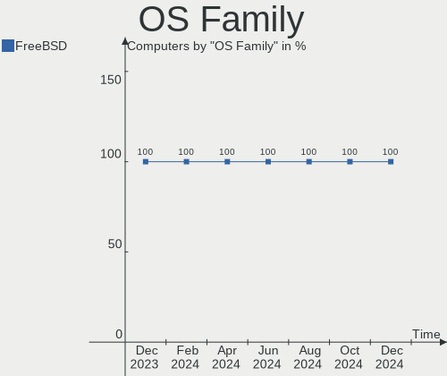
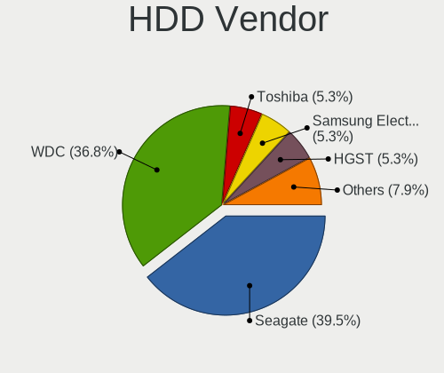
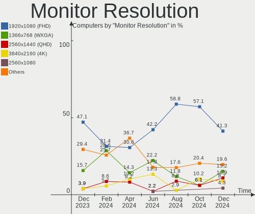

FreeBSD Hardware Trends
-----------------------

A project to identify most popular hardware characteristics and track their change
over time based on data collected by FreeBSD users at https://BSD-Hardware.info.

Anyone can contribute to this report by the [hw-probe](https://github.com/linuxhw/hw-probe/blob/master/INSTALL.BSD.md) tool:

    hw-probe -all -upload

This is a report for all computer types. See also reports for [desktops](/Dist/FreeBSD/Desktop/README.md) and [notebooks](/Dist/FreeBSD/Notebook/README.md).

Full-feature report is available here: https://bsd-hardware.info/?view=trends

Period: Dec, 2021.

Contents
--------

* [ System ](#system)
  - [ OS                       ](#os)
  - [ OS Family                ](#os-family)
  - [ Arch                     ](#arch)
  - [ DE                       ](#de)
  - [ Display Server           ](#display-server)
  - [ Display Manager          ](#display-manager)
  - [ OS Lang                  ](#os-lang)
  - [ Boot Mode                ](#boot-mode)
  - [ Filesystem               ](#filesystem)
  - [ Part. scheme             ](#part-scheme)

* [ Board ](#board)
  - [ Vendor                   ](#vendor)
  - [ Model                    ](#model)
  - [ Model Family             ](#model-family)
  - [ MFG Year                 ](#mfg-year)
  - [ Form Factor              ](#form-factor)
  - [ Coreboot                 ](#coreboot)
  - [ RAM Size                 ](#ram-size)
  - [ RAM Used                 ](#ram-used)
  - [ Total Drives             ](#total-drives)
  - [ Has CD-ROM               ](#has-cd-rom)
  - [ Has Ethernet             ](#has-ethernet)
  - [ Has WiFi                 ](#has-wifi)
  - [ Has Bluetooth            ](#has-bluetooth)

* [ Location ](#location)
  - [ Country                  ](#country)
  - [ City                     ](#city)

* [ Drives ](#drives)
  - [ Drive Vendor             ](#drive-vendor)
  - [ Drive Model              ](#drive-model)
  - [ HDD Vendor               ](#hdd-vendor)
  - [ SSD Vendor               ](#ssd-vendor)
  - [ Drive Kind               ](#drive-kind)
  - [ Drive Connector          ](#drive-connector)
  - [ Drive Size               ](#drive-size)
  - [ Space Total              ](#space-total)
  - [ Space Used               ](#space-used)
  - [ Malfunc. Drives          ](#malfunc-drives)
  - [ Malfunc. Drive Vendor    ](#malfunc-drive-vendor)
  - [ Malfunc. HDD Vendor      ](#malfunc-hdd-vendor)
  - [ Malfunc. Drive Kind      ](#malfunc-drive-kind)
  - [ Failed Drives            ](#failed-drives)
  - [ Failed Drive Vendor      ](#failed-drive-vendor)
  - [ Drive Status             ](#drive-status)

* [ Storage controller ](#storage-controller)
  - [ Storage Vendor           ](#storage-vendor)
  - [ Storage Model            ](#storage-model)
  - [ Storage Kind             ](#storage-kind)

* [ Processor ](#processor)
  - [ CPU Vendor               ](#cpu-vendor)
  - [ CPU Model                ](#cpu-model)
  - [ CPU Model Family         ](#cpu-model-family)
  - [ CPU Cores                ](#cpu-cores)
  - [ CPU Sockets              ](#cpu-sockets)
  - [ CPU Threads              ](#cpu-threads)
  - [ CPU Microarch            ](#cpu-microarch)

* [ Graphics ](#graphics)
  - [ GPU Vendor               ](#gpu-vendor)
  - [ GPU Model                ](#gpu-model)
  - [ GPU Combo                ](#gpu-combo)
  - [ GPU Driver               ](#gpu-driver)
  - [ GPU Memory               ](#gpu-memory)

* [ Monitor ](#monitor)
  - [ Monitor Vendor           ](#monitor-vendor)
  - [ Monitor Model            ](#monitor-model)
  - [ Monitor Resolution       ](#monitor-resolution)
  - [ Monitor Diagonal         ](#monitor-diagonal)
  - [ Monitor Width            ](#monitor-width)
  - [ Aspect Ratio             ](#aspect-ratio)
  - [ Monitor Area             ](#monitor-area)
  - [ Pixel Density            ](#pixel-density)
  - [ Multiple Monitors        ](#multiple-monitors)

* [ Network ](#network)
  - [ Net Controller Vendor    ](#net-controller-vendor)
  - [ Net Controller Model     ](#net-controller-model)
  - [ Wireless Vendor          ](#wireless-vendor)
  - [ Wireless Model           ](#wireless-model)
  - [ Ethernet Vendor          ](#ethernet-vendor)
  - [ Ethernet Model           ](#ethernet-model)
  - [ Net Controller Kind      ](#net-controller-kind)
  - [ Used Controller          ](#used-controller)
  - [ NICs                     ](#nics)
  - [ IPv6                     ](#ipv6)

* [ Bluetooth ](#bluetooth)
  - [ Bluetooth Vendor         ](#bluetooth-vendor)
  - [ Bluetooth Model          ](#bluetooth-model)

* [ Sound ](#sound)
  - [ Sound Vendor             ](#sound-vendor)
  - [ Sound Model              ](#sound-model)

* [ Memory ](#memory)
  - [ Memory Vendor            ](#memory-vendor)
  - [ Memory Model             ](#memory-model)
  - [ Memory Kind              ](#memory-kind)
  - [ Memory Form Factor       ](#memory-form-factor)
  - [ Memory Size              ](#memory-size)
  - [ Memory Speed             ](#memory-speed)

* [ Printers & scanners ](#printers--scanners)
  - [ Printer Vendor           ](#printer-vendor)
  - [ Printer Model            ](#printer-model)
  - [ Scanner Vendor           ](#scanner-vendor)
  - [ Scanner Model            ](#scanner-model)

* [ Camera ](#camera)
  - [ Camera Vendor            ](#camera-vendor)
  - [ Camera Model             ](#camera-model)

* [ Security ](#security)
  - [ Fingerprint Vendor       ](#fingerprint-vendor)
  - [ Fingerprint Model        ](#fingerprint-model)
  - [ Chipcard Vendor          ](#chipcard-vendor)
  - [ Chipcard Model           ](#chipcard-model)

* [ Unsupported ](#unsupported)
  - [ Unsupported Devices      ](#unsupported-devices)
  - [ Unsupported Device Types ](#unsupported-device-types)

System
------

OS
--

Installed operating systems

| Name                 | Computers | Percent |
|----------------------|-----------|---------|
| FreeBSD 13.0-p5      | 31        | 43.06%  |
| FreeBSD 13.0-STABLE  | 13        | 18.06%  |
| FreeBSD 14.0-CURRENT | 10        | 13.89%  |
| FreeBSD 13.0         | 10        | 13.89%  |
| FreeBSD 13.0-p4      | 4         | 5.56%   |
| FreeBSD 13.0-p3      | 1         | 1.39%   |
| FreeBSD 12.3         | 1         | 1.39%   |
| FreeBSD 12.2-p11     | 1         | 1.39%   |
| FreeBSD 12.2         | 1         | 1.39%   |

OS Family
---------

OS without a version

| Name    | Computers | Percent |
|---------|-----------|---------|
| FreeBSD | 72        | 100%    |

Arch
----

OS architecture (x86_64, i586, etc.)

| Name  | Computers | Percent |
|-------|-----------|---------|
| amd64 | 64        | 88.89%  |
| arm64 | 6         | 8.33%   |
| i386  | 1         | 1.39%   |
| arm   | 1         | 1.39%   |

DE
--

Desktop Environment

| Name       | Computers | Percent |
|------------|-----------|---------|
| Console    | 23        | 31.94%  |
| KDE5       | 14        | 19.44%  |
| XFCE       | 11        | 15.28%  |
| TWM        | 7         | 9.72%   |
| GNOME      | 4         | 5.56%   |
| Openbox    | 3         | 4.17%   |
| MATE       | 3         | 4.17%   |
| i3         | 3         | 4.17%   |
| Fluxbox    | 2         | 2.78%   |
| X-Cinnamon | 1         | 1.39%   |
| LXQt       | 1         | 1.39%   |

Display Server
--------------

X11 or Wayland

| Name    | Computers | Percent |
|---------|-----------|---------|
| X11     | 46        | 63.89%  |
| Console | 25        | 34.72%  |
| Wayland | 1         | 1.39%   |

Display Manager
---------------

SDDM, LightDM, etc.

| Name    | Computers | Percent |
|---------|-----------|---------|
| Console | 45        | 62.5%   |
| SDDM    | 9         | 12.5%   |
| SLiM    | 7         | 9.72%   |
| LightDM | 6         | 8.33%   |
| XDM     | 4         | 5.56%   |
| GDM     | 1         | 1.39%   |

OS Lang
-------

Language

| Lang    | Computers | Percent |
|---------|-----------|---------|
| C       | 50        | 69.44%  |
| en_US   | 6         | 8.33%   |
| uk_UA   | 5         | 6.94%   |
| Unknown | 4         | 5.56%   |
| ru_RU   | 3         | 4.17%   |
| zh_CN   | 1         | 1.39%   |
| fr_FR   | 1         | 1.39%   |
| en_GB   | 1         | 1.39%   |
| en_CA   | 1         | 1.39%   |

Boot Mode
---------

EFI or BIOS

| Mode | Computers | Percent |
|------|-----------|---------|
| EFI  | 47        | 65.28%  |
| BIOS | 25        | 34.72%  |

Filesystem
----------

Type of filesystem

| Type | Computers | Percent |
|------|-----------|---------|
| Zfs  | 52        | 72.22%  |
| Ufs  | 20        | 27.78%  |

Part. scheme
------------

Scheme of partitioning

| Type | Computers | Percent |
|------|-----------|---------|
| GPT  | 63        | 87.5%   |
| MBR  | 8         | 11.11%  |
| BSD  | 1         | 1.39%   |

Board
-----

Vendor
------

Motherboard manufacturer

| Name                    | Computers | Percent |
|-------------------------|-----------|---------|
| ASUSTek Computer        | 15        | 20.83%  |
| Lenovo                  | 14        | 19.44%  |
| Hewlett-Packard         | 8         | 11.11%  |
| Gigabyte Technology     | 7         | 9.72%   |
| MSI                     | 4         | 5.56%   |
| Unknown                 | 3         | 4.17%   |
| Raspberry Pi Foundation | 2         | 2.78%   |
| Intel                   | 2         | 2.78%   |
| HPE                     | 2         | 2.78%   |
| ASRock                  | 2         | 2.78%   |
| TOXIC by BTO            | 1         | 1.39%   |
| Toshiba                 | 1         | 1.39%   |
| Supermicro              | 1         | 1.39%   |
| Purism                  | 1         | 1.39%   |
| PC Engines              | 1         | 1.39%   |
| khadas                  | 1         | 1.39%   |
| HUAWEI                  | 1         | 1.39%   |
| friendlyelec            | 1         | 1.39%   |
| Framework               | 1         | 1.39%   |
| Dell                    | 1         | 1.39%   |
| Cisco Systems           | 1         | 1.39%   |
| AMI                     | 1         | 1.39%   |
| Acer                    | 1         | 1.39%   |

Model
-----

Motherboard model

| Name                                       | Computers | Percent |
|--------------------------------------------|-----------|---------|
| Unknown                                    | 3         | 4.17%   |
| RPi Raspberry Pi                           | 2         | 2.78%   |
| TOXIC by BTO 15CL872 1050TI                | 1         | 1.39%   |
| Toshiba Satellite P755                     | 1         | 1.39%   |
| Supermicro Super Server                    | 1         | 1.39%   |
| Purism Librem Mini v2                      | 1         | 1.39%   |
| PC Engines apu4                            | 1         | 1.39%   |
| MSI MS-9A25                                | 1         | 1.39%   |
| MSI MS-7C36                                | 1         | 1.39%   |
| MSI MS-7885                                | 1         | 1.39%   |
| MSI MS-7817                                | 1         | 1.39%   |
| Lenovo Yoga 720-15IKB 80X7                 | 1         | 1.39%   |
| Lenovo ThinkPad X380 Yoga S1 20LJS1FD01    | 1         | 1.39%   |
| Lenovo ThinkPad X280 20KF001UUS            | 1         | 1.39%   |
| Lenovo ThinkPad X270 20HMCTO1WW            | 1         | 1.39%   |
| Lenovo ThinkPad X220 42915CG               | 1         | 1.39%   |
| Lenovo ThinkPad X1 Yoga 1st 20FRS11T00     | 1         | 1.39%   |
| Lenovo ThinkPad X1 Carbon Gen 9 20XWCTO1WW | 1         | 1.39%   |
| Lenovo ThinkPad T590 20N4CTO1WW            | 1         | 1.39%   |
| Lenovo ThinkPad T470s 20HGS18V00           | 1         | 1.39%   |
| Lenovo ThinkPad L470 20J40013US            | 1         | 1.39%   |
| Lenovo ThinkPad A285 20MW000JMH            | 1         | 1.39%   |
| Lenovo ThinkBook 14 G3 ACL 21A2            | 1         | 1.39%   |
| Lenovo IdeaPad 330-15IGM 81D1              | 1         | 1.39%   |
| Lenovo IdeaPad 320S-13IKB 81AK             | 1         | 1.39%   |
| khadas edge-v                              | 1         | 1.39%   |
| Intel NUC7CJYS                             | 1         | 1.39%   |
| Intel D54250WYK H13922-304                 | 1         | 1.39%   |
| HUAWEI KLVL-WXX9                           | 1         | 1.39%   |
| HPE ProLiant MicroServer Gen10             | 1         | 1.39%   |
| HPE ProLiant DL380 Gen10                   | 1         | 1.39%   |
| HP Z600 Workstation                        | 1         | 1.39%   |
| HP ProLiant MicroServer                    | 1         | 1.39%   |
| HP ProBook 650 G5                          | 1         | 1.39%   |
| HP ProBook 440 G6                          | 1         | 1.39%   |
| HP EliteOne 800 G1 AiO                     | 1         | 1.39%   |
| HP EliteBook Folio 9470m                   | 1         | 1.39%   |
| HP EliteBook 8570p                         | 1         | 1.39%   |
| HP Compaq Pro 6305 SFF                     | 1         | 1.39%   |
| Gigabyte X570 AORUS PRO                    | 1         | 1.39%   |
| Gigabyte X470 AORUS ULTRA GAMING           | 1         | 1.39%   |
| Gigabyte OFFICEPRO 7000                    | 1         | 1.39%   |
| Gigabyte MZ32-AR0-00                       | 1         | 1.39%   |
| Gigabyte GA-8S661FXM-775                   | 1         | 1.39%   |
| Gigabyte B550M AORUS PRO-P                 | 1         | 1.39%   |
| Gigabyte B550M AORUS ELITE                 | 1         | 1.39%   |
| friendlyelec nanopi-m4                     | 1         | 1.39%   |
| Framework Laptop                           | 1         | 1.39%   |
| Dell OptiPlex 9020M                        | 1         | 1.39%   |
| Cisco Systems UCSC-C240-M3L                | 1         | 1.39%   |
| ASUS ROG STRIX X570-E GAMING               | 1         | 1.39%   |
| ASUS ROG Maximus XI HERO                   | 1         | 1.39%   |
| ASUS ROG Maximus X FORMULA                 | 1         | 1.39%   |
| ASUS ROG CROSSHAIR VIII HERO               | 1         | 1.39%   |
| ASUS PRIME X570-PRO                        | 1         | 1.39%   |
| ASUS PRIME X370-PRO                        | 1         | 1.39%   |
| ASUS P8B75-M                               | 1         | 1.39%   |
| ASUS P7P55D                                | 1         | 1.39%   |
| ASUS P5Q-E                                 | 1         | 1.39%   |
| ASUS P5B                                   | 1         | 1.39%   |

Model Family
------------

Motherboard model prefix

| Name                        | Computers | Percent |
|-----------------------------|-----------|---------|
| Lenovo ThinkPad             | 10        | 13.89%  |
| ASUS ROG                    | 4         | 5.56%   |
| Unknown                     | 3         | 4.17%   |
| RPi Raspberry               | 2         | 2.78%   |
| Lenovo IdeaPad              | 2         | 2.78%   |
| HPE ProLiant                | 2         | 2.78%   |
| HP ProBook                  | 2         | 2.78%   |
| HP EliteBook                | 2         | 2.78%   |
| Gigabyte B550M              | 2         | 2.78%   |
| ASUS PRIME                  | 2         | 2.78%   |
| TOXIC by BTO 15CL872        | 1         | 1.39%   |
| Toshiba Satellite           | 1         | 1.39%   |
| Supermicro Super            | 1         | 1.39%   |
| Purism Librem               | 1         | 1.39%   |
| PC Engines apu4             | 1         | 1.39%   |
| MSI MS-9A25                 | 1         | 1.39%   |
| MSI MS-7C36                 | 1         | 1.39%   |
| MSI MS-7885                 | 1         | 1.39%   |
| MSI MS-7817                 | 1         | 1.39%   |
| Lenovo Yoga                 | 1         | 1.39%   |
| Lenovo ThinkBook            | 1         | 1.39%   |
| khadas edge-v               | 1         | 1.39%   |
| Intel NUC7CJYS              | 1         | 1.39%   |
| Intel D54250WYK             | 1         | 1.39%   |
| HUAWEI KLVL-WXX9            | 1         | 1.39%   |
| HP Z600                     | 1         | 1.39%   |
| HP ProLiant                 | 1         | 1.39%   |
| HP EliteOne                 | 1         | 1.39%   |
| HP Compaq                   | 1         | 1.39%   |
| Gigabyte X570               | 1         | 1.39%   |
| Gigabyte X470               | 1         | 1.39%   |
| Gigabyte OFFICEPRO          | 1         | 1.39%   |
| Gigabyte MZ32-AR0-00        | 1         | 1.39%   |
| Gigabyte GA-8S661FXM-775    | 1         | 1.39%   |
| friendlyelec nanopi-m4      | 1         | 1.39%   |
| Framework Laptop            | 1         | 1.39%   |
| Dell OptiPlex               | 1         | 1.39%   |
| Cisco Systems UCSC-C240-M3L | 1         | 1.39%   |
| ASUS P8B75-M                | 1         | 1.39%   |
| ASUS P7P55D                 | 1         | 1.39%   |
| ASUS P5Q-E                  | 1         | 1.39%   |
| ASUS P5B                    | 1         | 1.39%   |
| ASUS M5A99X                 | 1         | 1.39%   |
| ASUS M4A785TD-V             | 1         | 1.39%   |
| ASUS All                    | 1         | 1.39%   |
| ASUS 1215B                  | 1         | 1.39%   |
| ASUS 1005P                  | 1         | 1.39%   |
| ASRock X570                 | 1         | 1.39%   |
| ASRock B450                 | 1         | 1.39%   |
| AMI PEISIA                  | 1         | 1.39%   |
| Acer Aspire                 | 1         | 1.39%   |

MFG Year
--------

Motherboard manufacture year

| Year    | Computers | Percent |
|---------|-----------|---------|
| 2021    | 16        | 22.22%  |
| 2020    | 14        | 19.44%  |
| 2019    | 10        | 13.89%  |
| 2018    | 9         | 12.5%   |
| Unknown | 5         | 6.94%   |
| 2011    | 4         | 5.56%   |
| 2013    | 3         | 4.17%   |
| 2014    | 2         | 2.78%   |
| 2010    | 2         | 2.78%   |
| 2017    | 1         | 1.39%   |
| 2016    | 1         | 1.39%   |
| 2012    | 1         | 1.39%   |
| 2009    | 1         | 1.39%   |
| 2008    | 1         | 1.39%   |
| 2006    | 1         | 1.39%   |
| 2005    | 1         | 1.39%   |

Form Factor
-----------

Physical design of the computer

| Name           | Computers | Percent |
|----------------|-----------|---------|
| Desktop        | 40        | 55.56%  |
| Notebook       | 21        | 29.17%  |
| Server         | 4         | 5.56%   |
| Convertible    | 3         | 4.17%   |
| System on chip | 2         | 2.78%   |
| Mini pc        | 1         | 1.39%   |
| All in one     | 1         | 1.39%   |

Coreboot
--------

Have coreboot on board

| Used | Computers | Percent |
|------|-----------|---------|
| No   | 70        | 97.22%  |
| Yes  | 2         | 2.78%   |

RAM Size
--------

Total RAM memory

| Size in GB  | Computers | Percent |
|-------------|-----------|---------|
| 16.01-24.0  | 15        | 20.83%  |
| 8.01-16.0   | 14        | 19.44%  |
| 64.01-256.0 | 12        | 16.67%  |
| 32.01-64.0  | 11        | 15.28%  |
| 4.01-8.0    | 7         | 9.72%   |
| 2.01-3.0    | 4         | 5.56%   |
| 3.01-4.0    | 3         | 4.17%   |
| 0.51-1.0    | 3         | 4.17%   |
| 24.01-32.0  | 2         | 2.78%   |
| 1.01-2.0    | 1         | 1.39%   |

RAM Used
--------

Used RAM memory

| Used GB     | Computers | Percent |
|-------------|-----------|---------|
| 0.01-0.5    | 21        | 29.17%  |
| 1.01-2.0    | 18        | 25%     |
| 0.51-1.0    | 16        | 22.22%  |
| 3.01-4.0    | 5         | 6.94%   |
| 32.01-64.0  | 3         | 4.17%   |
| 2.01-3.0    | 3         | 4.17%   |
| 0           | 2         | 2.78%   |
| 4.01-8.0    | 1         | 1.39%   |
| 64.01-256.0 | 1         | 1.39%   |
| 16.01-24.0  | 1         | 1.39%   |
| 8.01-16.0   | 1         | 1.39%   |

Total Drives
------------

Number of drives on board

| Drives | Computers | Percent |
|--------|-----------|---------|
| 1      | 32        | 44.44%  |
| 2      | 14        | 19.44%  |
| 4      | 9         | 12.5%   |
| 6      | 5         | 6.94%   |
| 0      | 5         | 6.94%   |
| 8      | 2         | 2.78%   |
| 3      | 2         | 2.78%   |
| 13     | 1         | 1.39%   |
| 7      | 1         | 1.39%   |
| 5      | 1         | 1.39%   |

Has CD-ROM
----------

Has CD-ROM on board

| Presented | Computers | Percent |
|-----------|-----------|---------|
| No        | 60        | 83.33%  |
| Yes       | 12        | 16.67%  |

Has Ethernet
------------

Has Ethernet on board

| Presented | Computers | Percent |
|-----------|-----------|---------|
| Yes       | 62        | 86.11%  |
| No        | 10        | 13.89%  |

Has WiFi
--------

Has WiFi module

| Presented | Computers | Percent |
|-----------|-----------|---------|
| Yes       | 38        | 52.78%  |
| No        | 34        | 47.22%  |

Has Bluetooth
-------------

Has Bluetooth module

| Presented | Computers | Percent |
|-----------|-----------|---------|
| No        | 45        | 62.5%   |
| Yes       | 27        | 37.5%   |

Location
--------

Country
-------

Geographic location (country)

| Country     | Computers | Percent |
|-------------|-----------|---------|
| USA         | 12        | 16.67%  |
| Russia      | 10        | 13.89%  |
| Ukraine     | 9         | 12.5%   |
| Netherlands | 5         | 6.94%   |
| UK          | 3         | 4.17%   |
| Japan       | 3         | 4.17%   |
| France      | 3         | 4.17%   |
| Australia   | 3         | 4.17%   |
| Spain       | 2         | 2.78%   |
| Poland      | 2         | 2.78%   |
| Germany     | 2         | 2.78%   |
| Canada      | 2         | 2.78%   |
| Austria     | 2         | 2.78%   |
| Thailand    | 1         | 1.39%   |
| Switzerland | 1         | 1.39%   |
| Sweden      | 1         | 1.39%   |
| Romania     | 1         | 1.39%   |
| Portugal    | 1         | 1.39%   |
| Philippines | 1         | 1.39%   |
| New Zealand | 1         | 1.39%   |
| Ireland     | 1         | 1.39%   |
| Indonesia   | 1         | 1.39%   |
| Denmark     | 1         | 1.39%   |
| Czechia     | 1         | 1.39%   |
| Croatia     | 1         | 1.39%   |
| China       | 1         | 1.39%   |
| Bulgaria    | 1         | 1.39%   |

City
----

Geographic location (city)

| City             | Computers | Percent |
|------------------|-----------|---------|
| Kyiv             | 8         | 11.11%  |
| Moscow           | 4         | 5.56%   |
| Amsterdam        | 4         | 5.56%   |
| Vienna           | 2         | 2.78%   |
| Vancouver        | 2         | 2.78%   |
| Salem            | 2         | 2.78%   |
| Redmond          | 2         | 2.78%   |
| Montgeron        | 2         | 2.78%   |
| Madrid           | 2         | 2.78%   |
| London           | 2         | 2.78%   |
| Zadar            | 1         | 1.39%   |
| Yokohama         | 1         | 1.39%   |
| Yekaterinburg    | 1         | 1.39%   |
| Wenatchee        | 1         | 1.39%   |
| Warsaw           | 1         | 1.39%   |
| Ufa              | 1         | 1.39%   |
| Tarlac City      | 1         | 1.39%   |
| Tangerang        | 1         | 1.39%   |
| Tambov           | 1         | 1.39%   |
| Sydney           | 1         | 1.39%   |
| Sofia            | 1         | 1.39%   |
| Sakitama         | 1         | 1.39%   |
| Plano            | 1         | 1.39%   |
| Perth            | 1         | 1.39%   |
| Palmer           | 1         | 1.39%   |
| Pak Kret         | 1         | 1.39%   |
| Ozersk           | 1         | 1.39%   |
| Otley            | 1         | 1.39%   |
| Ostrzeszow       | 1         | 1.39%   |
| Ostrava          | 1         | 1.39%   |
| Olin             | 1         | 1.39%   |
| Novosibirsk      | 1         | 1.39%   |
| Nizhniy Novgorod | 1         | 1.39%   |
| Montgomery       | 1         | 1.39%   |
| Melbourne        | 1         | 1.39%   |
| Lexington        | 1         | 1.39%   |
| Koto             | 1         | 1.39%   |
| Hyattsville      | 1         | 1.39%   |
| Horsens          | 1         | 1.39%   |
| Hangzhou         | 1         | 1.39%   |
| Hamburg          | 1         | 1.39%   |
| Glattbrugg       | 1         | 1.39%   |
| Eker?¶           | 1         | 1.39%   |
| Eindhoven        | 1         | 1.39%   |
| Dublin           | 1         | 1.39%   |
| Dnipro           | 1         | 1.39%   |
| Dallas           | 1         | 1.39%   |
| Bucharest        | 1         | 1.39%   |
| Berlin           | 1         | 1.39%   |
| Bage-la-Ville    | 1         | 1.39%   |
| Auckland         | 1         | 1.39%   |
| Almada           | 1         | 1.39%   |

Drives
------

Drive Vendor
------------

Hard drive vendors

| Vendor              | Computers | Drives | Percent |
|---------------------|-----------|--------|---------|
| Samsung Electronics | 27        | 37     | 25.47%  |
| WDC                 | 23        | 51     | 21.7%   |
| Seagate             | 14        | 23     | 13.21%  |
| Kingston            | 6         | 7      | 5.66%   |
| Toshiba             | 5         | 8      | 4.72%   |
| Intel               | 5         | 5      | 4.72%   |
| HGST                | 4         | 9      | 3.77%   |
| GOODRAM             | 3         | 8      | 2.83%   |
| Crucial             | 3         | 3      | 2.83%   |
| Transcend           | 2         | 2      | 1.89%   |
| Micron Technology   | 2         | 3      | 1.89%   |
| V-GeN               | 1         | 1      | 0.94%   |
| Smartbuy            | 1         | 1      | 0.94%   |
| SK Hynix            | 1         | 1      | 0.94%   |
| Silicon Motion      | 1         | 1      | 0.94%   |
| SanDisk             | 1         | 1      | 0.94%   |
| OCZ                 | 1         | 1      | 0.94%   |
| LITEONIT            | 1         | 1      | 0.94%   |
| Lenovo              | 1         | 1      | 0.94%   |
| HPE                 | 1         | 8      | 0.94%   |
| Hitachi             | 1         | 1      | 0.94%   |
| FORESEE             | 1         | 1      | 0.94%   |
| Corsair             | 1         | 1      | 0.94%   |

Drive Model
-----------

Hard drive models

| Model                                | Computers | Percent |
|--------------------------------------|-----------|---------|
| Toshiba MQ01ABF050 500GB             | 2         | 1.55%   |
| Seagate ST4000DM000-1F2168 4TB       | 2         | 1.55%   |
| Seagate ST1000DM003-1CH162 1TB       | 2         | 1.55%   |
| Samsung SSD 850 EVO 500GB            | 2         | 1.55%   |
| Kingston SUV500MS120G 120GB          | 2         | 1.55%   |
| WDC WDS500G3X0C-00SJG0 500GB         | 1         | 0.78%   |
| WDC WDS500G2B0C-00PXH0 500GB         | 1         | 0.78%   |
| WDC WDS100T3X0C-00SJG0 1TB           | 1         | 0.78%   |
| WDC WDS100T1X0E-00AFY0 1TB           | 1         | 0.78%   |
| WDC WDS100T1R0B-68A4Z0 1TB           | 1         | 0.78%   |
| WDC WD80EMAZ-00WJTA0 8TB             | 1         | 0.78%   |
| WDC WD80EFZX-68UW8N0 8TB             | 1         | 0.78%   |
| WDC WD80EFAX-68LHPN0 8TB             | 1         | 0.78%   |
| WDC WD80EDBZ-11B0ZA0 8TB             | 1         | 0.78%   |
| WDC WD60EZRZ-00GZ5B1 6TB             | 1         | 0.78%   |
| WDC WD5000BPKT-00PK4T0 500GB         | 1         | 0.78%   |
| WDC WD5000AAKX-00ERMA0 500GB         | 1         | 0.78%   |
| WDC WD5000AAKS-00A7B2 500GB          | 1         | 0.78%   |
| WDC WD40EZRZ-22GXCB0 4TB             | 1         | 0.78%   |
| WDC WD40EZRZ-00GXCB0 4TB             | 1         | 0.78%   |
| WDC WD40EFZX-68AWUN0 4TB             | 1         | 0.78%   |
| WDC WD40EFRX-68N32N0 4TB             | 1         | 0.78%   |
| WDC WD30EFRX-68AX9N0 3TB             | 1         | 0.78%   |
| WDC WD20NMVW-11AV3S2 2TB             | 1         | 0.78%   |
| WDC WD20EZRX-00D8PB0 2TB             | 1         | 0.78%   |
| WDC WD20EFRX-68EUZN0 2TB             | 1         | 0.78%   |
| WDC WD20EARX-00PASB0 2TB             | 1         | 0.78%   |
| WDC WD20EARX-008FB0 2TB              | 1         | 0.78%   |
| WDC WD20EARS-00MVWB0 2TB             | 1         | 0.78%   |
| WDC WD1600BEVT-22A23T0 160GB         | 1         | 0.78%   |
| WDC WD15EADS-00P8B0 1.5TB            | 1         | 0.78%   |
| WDC WD120EMFZ-11A6JA0 12TB           | 1         | 0.78%   |
| WDC WD120EMAZ-11BLFA0 12TB           | 1         | 0.78%   |
| WDC WD10SPZX-60Z10T0 1TB             | 1         | 0.78%   |
| WDC WD10SMZW-11Y0TS0 1TB             | 1         | 0.78%   |
| WDC WD10EZRX-00L4HB0 1TB             | 1         | 0.78%   |
| WDC WD10EZEX-08WN4A0 1TB             | 1         | 0.78%   |
| WDC WD10EZEX-08M2NA0 1TB             | 1         | 0.78%   |
| WDC WD10EFRX-68FYTN0 1TB             | 1         | 0.78%   |
| WDC WD1001FALS-00J7B1 1TB            | 1         | 0.78%   |
| WDC PC SN730 SDBQNTY-1T00-1001 1TB   | 1         | 0.78%   |
| WDC PC SN530 SDBPNPZ-256G-1014 256GB | 1         | 0.78%   |
| WDC PC SN530 SDBPMPZ-512G-1101 512GB | 1         | 0.78%   |
| V-GeN V-GEN06SM21AR512MTNV 512GB     | 1         | 0.78%   |
| Transcend TS128GMTE110S 128GB        | 1         | 0.78%   |
| Transcend TS120GESD240C 120GB        | 1         | 0.78%   |
| Toshiba MQ01ACF050 500GB             | 1         | 0.78%   |
| Toshiba HDWE140 4TB                  | 1         | 0.78%   |
| Toshiba DT01ACA100 1TB               | 1         | 0.78%   |
| Smartbuy SSD 60GB                    | 1         | 0.78%   |
| SK Hynix HFS128G32TNF-N3A0A 128GB    | 1         | 0.78%   |
| Silicon Motion NE-256 256GB          | 1         | 0.78%   |
| Seagate ST9500423AS 500GB            | 1         | 0.78%   |
| Seagate ST6000DM003-2CY186 6TB       | 1         | 0.78%   |
| Seagate ST4000NE001-2MA101 4TB       | 1         | 0.78%   |
| Seagate ST380011A 80GB               | 1         | 0.78%   |
| Seagate ST3750640AS 752GB            | 1         | 0.78%   |
| Seagate ST3500418AS 500GB            | 1         | 0.78%   |
| Seagate ST3500312CS 500GB            | 1         | 0.78%   |
| Seagate ST32000645NS 2TB             | 1         | 0.78%   |

HDD Vendor
----------

Hard disk drive vendors

| Vendor  | Computers | Drives | Percent |
|---------|-----------|--------|---------|
| WDC     | 17        | 43     | 41.46%  |
| Seagate | 13        | 22     | 31.71%  |
| Toshiba | 5         | 8      | 12.2%   |
| HGST    | 4         | 9      | 9.76%   |
| HPE     | 1         | 8      | 2.44%   |
| Hitachi | 1         | 1      | 2.44%   |

SSD Vendor
----------

Solid state drive vendors

| Vendor              | Computers | Drives | Percent |
|---------------------|-----------|--------|---------|
| Samsung Electronics | 13        | 19     | 36.11%  |
| Kingston            | 5         | 6      | 13.89%  |
| Intel               | 4         | 4      | 11.11%  |
| Crucial             | 3         | 3      | 8.33%   |
| GOODRAM             | 2         | 7      | 5.56%   |
| WDC                 | 1         | 1      | 2.78%   |
| Transcend           | 1         | 1      | 2.78%   |
| Smartbuy            | 1         | 1      | 2.78%   |
| SK Hynix            | 1         | 1      | 2.78%   |
| SanDisk             | 1         | 1      | 2.78%   |
| OCZ                 | 1         | 1      | 2.78%   |
| Micron Technology   | 1         | 1      | 2.78%   |
| LITEONIT            | 1         | 1      | 2.78%   |
| FORESEE             | 1         | 1      | 2.78%   |

Drive Kind
----------

HDD or SSD

| Kind | Computers | Drives | Percent |
|------|-----------|--------|---------|
| SSD  | 31        | 48     | 34.83%  |
| NVMe | 29        | 36     | 32.58%  |
| HDD  | 29        | 91     | 32.58%  |

Drive Connector
---------------

SATA, SAS, NVMe, etc.

| Type | Computers | Drives | Percent |
|------|-----------|--------|---------|
| SATA | 49        | 139    | 62.82%  |
| NVMe | 29        | 36     | 37.18%  |

Drive Size
----------

Size of hard drive

| Size in TB | Computers | Drives | Percent |
|------------|-----------|--------|---------|
| 0.01-0.5   | 34        | 52     | 47.89%  |
| 0.51-1.0   | 14        | 20     | 19.72%  |
| 3.01-4.0   | 7         | 22     | 9.86%   |
| 1.01-2.0   | 7         | 17     | 9.86%   |
| 4.01-10.0  | 4         | 20     | 5.63%   |
| 2.01-3.0   | 3         | 4      | 4.23%   |
| 10.01-20.0 | 2         | 4      | 2.82%   |

Space Total
-----------

Amount of disk space available on the file system

| Size in GB     | Computers | Percent |
|----------------|-----------|---------|
| 251-500        | 22        | 30.56%  |
| 101-250        | 18        | 25%     |
| 501-1000       | 12        | 16.67%  |
| 51-100         | 7         | 9.72%   |
| 1-20           | 6         | 8.33%   |
| More than 3000 | 3         | 4.17%   |
| 21-50          | 2         | 2.78%   |
| 1001-2000      | 1         | 1.39%   |
| Unknown        | 1         | 1.39%   |

Space Used
----------

Amount of used disk space

| Used GB | Computers | Percent |
|---------|-----------|---------|
| 1-20    | 59        | 81.94%  |
| 21-50   | 4         | 5.56%   |
| 101-250 | 4         | 5.56%   |
| 251-500 | 2         | 2.78%   |
| 51-100  | 2         | 2.78%   |
| Unknown | 1         | 1.39%   |

Malfunc. Drives
---------------

Drive models with a malfunction

| Model                          | Computers | Drives | Percent |
|--------------------------------|-----------|--------|---------|
| WDC WD5000AAKX-00ERMA0 500GB   | 1         | 1      | 11.11%  |
| WDC WD20EZRX-00D8PB0 2TB       | 1         | 2      | 11.11%  |
| WDC WD20EARX-008FB0 2TB        | 1         | 1      | 11.11%  |
| WDC WD20EARS-00MVWB0 2TB       | 1         | 1      | 11.11%  |
| WDC WD10SPZX-60Z10T0 1TB       | 1         | 1      | 11.11%  |
| WDC WD1001FALS-00J7B1 1TB      | 1         | 1      | 11.11%  |
| Toshiba HDWE140 4TB            | 1         | 4      | 11.11%  |
| Seagate ST1000DM003-1CH162 1TB | 1         | 1      | 11.11%  |
| HGST HTS721010A9E630 1TB       | 1         | 1      | 11.11%  |

Malfunc. Drive Vendor
---------------------

Vendors of faulty drives

| Vendor  | Computers | Drives | Percent |
|---------|-----------|--------|---------|
| WDC     | 5         | 7      | 62.5%   |
| Toshiba | 1         | 4      | 12.5%   |
| Seagate | 1         | 1      | 12.5%   |
| HGST    | 1         | 1      | 12.5%   |

Malfunc. HDD Vendor
-------------------

Vendors of faulty HDD drives

| Vendor  | Computers | Drives | Percent |
|---------|-----------|--------|---------|
| WDC     | 5         | 7      | 62.5%   |
| Toshiba | 1         | 4      | 12.5%   |
| Seagate | 1         | 1      | 12.5%   |
| HGST    | 1         | 1      | 12.5%   |

Malfunc. Drive Kind
-------------------

Kinds of faulty drives

| Kind | Computers | Drives | Percent |
|------|-----------|--------|---------|
| HDD  | 8         | 13     | 100%    |

Failed Drives
-------------

Failed drive models

Zero info for selected period =(

Failed Drive Vendor
-------------------

Failed drive vendors

Zero info for selected period =(

Drive Status
------------

Number of failed and malfunc. drives

| Status   | Computers | Drives | Percent |
|----------|-----------|--------|---------|
| Works    | 66        | 160    | 88%     |
| Malfunc  | 8         | 13     | 10.67%  |
| Detected | 1         | 2      | 1.33%   |

Storage controller
------------------

Storage Vendor
--------------

Storage controller vendors

| Vendor                           | Computers | Percent |
|----------------------------------|-----------|---------|
| Intel                            | 34        | 33.66%  |
| AMD                              | 21        | 20.79%  |
| Samsung Electronics              | 17        | 16.83%  |
| Sandisk                          | 7         | 6.93%   |
| Silicon Motion                   | 4         | 3.96%   |
| JMicron Technology               | 3         | 2.97%   |
| Broadcom / LSI                   | 3         | 2.97%   |
| Marvell Technology Group         | 2         | 1.98%   |
| ASMedia Technology               | 2         | 1.98%   |
| Silicon Integrated Systems [SiS] | 1         | 0.99%   |
| Silicon Image                    | 1         | 0.99%   |
| Seagate Technology               | 1         | 0.99%   |
| Phison Electronics               | 1         | 0.99%   |
| Micron Technology                | 1         | 0.99%   |
| Lenovo                           | 1         | 0.99%   |
| Kingston Technology Company      | 1         | 0.99%   |
| Adaptec                          | 1         | 0.99%   |

Storage Model
-------------

Storage controller models

| Model                                                                          | Computers | Percent |
|--------------------------------------------------------------------------------|-----------|---------|
| AMD FCH SATA Controller [AHCI mode]                                            | 13        | 11.61%  |
| Samsung NVMe SSD Controller SM981/PM981/PM983                                  | 11        | 9.82%   |
| AMD SB7x0/SB8x0/SB9x0 SATA Controller [AHCI mode]                              | 4         | 3.57%   |
| Silicon Motion SM2263EN/SM2263XT SSD Controller                                | 3         | 2.68%   |
| Sandisk WD Black SN750 / PC SN730 NVMe SSD                                     | 3         | 2.68%   |
| Samsung NVMe SSD Controller SM961/PM961/SM963                                  | 3         | 2.68%   |
| Intel Sunrise Point-LP SATA Controller [AHCI mode]                             | 3         | 2.68%   |
| Intel 8 Series/C220 Series Chipset Family 6-port SATA Controller 1 [AHCI mode] | 3         | 2.68%   |
| Unknown                                                                        | 3         | 2.68%   |
| Sandisk WD Blue SN550 NVMe SSD                                                 | 2         | 1.79%   |
| Samsung NVMe SSD Controller 980                                                | 2         | 1.79%   |
| JMicron JMB363 SATA/IDE Controller                                             | 2         | 1.79%   |
| Intel Celeron/Pentium Silver Processor SATA Controller                         | 2         | 1.79%   |
| Intel Cannon Point-LP SATA Controller [AHCI Mode]                              | 2         | 1.79%   |
| Intel Cannon Lake PCH SATA AHCI Controller                                     | 2         | 1.79%   |
| Intel C610/X99 series chipset 6-Port SATA Controller [AHCI mode]               | 2         | 1.79%   |
| Intel 6 Series/C200 Series Chipset Family 6 port Mobile SATA AHCI Controller   | 2         | 1.79%   |
| Broadcom / LSI SAS2308 PCI-Express Fusion-MPT SAS-2                            | 2         | 1.79%   |
| ASMedia ASM1062 Serial ATA Controller                                          | 2         | 1.79%   |
| AMD Starship/Matisse Chipset SATA Controller [AHCI mode]                       | 2         | 1.79%   |
| AMD SB7x0/SB8x0/SB9x0 IDE Controller                                           | 2         | 1.79%   |
| AMD 400 Series Chipset SATA Controller                                         | 2         | 1.79%   |
| Silicon Motion SM2262/SM2262EN SSD Controller                                  | 1         | 0.89%   |
| Silicon Integrated Systems [SiS] RAID bus controller 180 SATA/PATA  [SiS]      | 1         | 0.89%   |
| Silicon Integrated Systems [SiS] 5513 IDE Controller                           | 1         | 0.89%   |
| Silicon Image AAR-1220SA Serial ATA HostRAID Controller                        | 1         | 0.89%   |
| Sandisk WD PC SN810 / Black SN850 NVMe SSD                                     | 1         | 0.89%   |
| Samsung NVMe SSD Controller PM9A1/PM9A3/980PRO                                 | 1         | 0.89%   |
| Phison E16 PCIe4 NVMe Controller                                               | 1         | 0.89%   |
| Marvell Group 88SE9230 PCIe 2.0 x2 4-port SATA 6 Gb/s RAID Controller          | 1         | 0.89%   |
| Marvell Group 88SE6111/6121 SATA II / PATA Controller                          | 1         | 0.89%   |
| Lenovo unknown                                                                 | 1         | 0.89%   |
| JMicron JMB362 SATA Controller                                                 | 1         | 0.89%   |
| Intel SSD Pro 7600p/760p/E 6100p Series                                        | 1         | 0.89%   |
| Intel SATA Controller [RAID mode]                                              | 1         | 0.89%   |
| Intel NM10/ICH7 Family SATA Controller [AHCI mode]                             | 1         | 0.89%   |
| Intel Comet Lake SATA AHCI Controller                                          | 1         | 0.89%   |
| Intel Cannon Lake Mobile PCH SATA AHCI Controller                              | 1         | 0.89%   |
| Intel C620 Series Chipset Family SATA Controller [AHCI mode]                   | 1         | 0.89%   |
| Intel C610/X99 series chipset sSATA Controller [AHCI mode]                     | 1         | 0.89%   |
| Intel Atom Processor E3800 Series SATA AHCI Controller                         | 1         | 0.89%   |
| Intel 82801JI (ICH10 Family) SATA AHCI Controller                              | 1         | 0.89%   |
| Intel 82801HR/HO/HH (ICH8R/DO/DH) 2 port SATA Controller [IDE mode]            | 1         | 0.89%   |
| Intel 82801H (ICH8 Family) 4 port SATA Controller [IDE mode]                   | 1         | 0.89%   |
| Intel 82801GBM/GHM (ICH7-M Family) SATA Controller [IDE mode]                  | 1         | 0.89%   |
| Intel 82801G (ICH7 Family) IDE Controller                                      | 1         | 0.89%   |
| Intel 8 Series SATA Controller 1 [AHCI mode]                                   | 1         | 0.89%   |
| Intel 7 Series/C210 Series Chipset Family 4-port SATA Controller [IDE mode]    | 1         | 0.89%   |
| Intel 7 Series/C210 Series Chipset Family 2-port SATA Controller [IDE mode]    | 1         | 0.89%   |
| Intel 7 Series Chipset Family 6-port SATA Controller [AHCI mode]               | 1         | 0.89%   |
| Intel 7 Series Chipset Family 4-port SATA Controller [IDE mode]                | 1         | 0.89%   |
| Intel 7 Series Chipset Family 2-port SATA Controller [IDE mode]                | 1         | 0.89%   |
| Intel 6 Series/C200 Series Chipset Family 6 port Desktop SATA AHCI Controller  | 1         | 0.89%   |
| Intel 5 Series/3400 Series Chipset 6 port SATA AHCI Controller                 | 1         | 0.89%   |
| Intel 400 Series Chipset Family SATA AHCI Controller                           | 1         | 0.89%   |
| Intel 200 Series PCH SATA controller [AHCI mode]                               | 1         | 0.89%   |
| Broadcom / LSI SAS2008 PCI-Express Fusion-MPT SAS-2 [Falcon]                   | 1         | 0.89%   |
| Broadcom / LSI MegaRAID SAS 2208 [Thunderbolt]                                 | 1         | 0.89%   |
| Broadcom / LSI MegaRAID SAS 2008 [Falcon]                                      | 1         | 0.89%   |
| AMD X370 Series Chipset SATA Controller                                        | 1         | 0.89%   |

Storage Kind
------------

Kind of storage controller (IDE, SATA, NVMe, SAS, ...)

| Kind | Computers | Percent |
|------|-----------|---------|
| SATA | 48        | 49.48%  |
| NVMe | 31        | 31.96%  |
| IDE  | 11        | 11.34%  |
| SAS  | 4         | 4.12%   |
| RAID | 3         | 3.09%   |

Processor
---------

CPU Vendor
----------

Processor vendors

| Vendor  | Computers | Percent |
|---------|-----------|---------|
| Intel   | 43        | 59.72%  |
| AMD     | 22        | 30.56%  |
| ARM     | 4         | 5.56%   |
| Unknown | 3         | 4.17%   |

CPU Model
---------

Processor models

| Model                                           | Computers | Percent |
|-------------------------------------------------|-----------|---------|
|                                                 | 3         | 4.17%   |
| Intel Core i7-8565U CPU @ 1.80GHz               | 2         | 2.78%   |
| Intel Core i5-7200U CPU @ 2.50GHz               | 2         | 2.78%   |
| ARM Cortex-A53 r0p4                             | 2         | 2.78%   |
| AMD Ryzen 9 3900X 12-Core Processor             | 2         | 2.78%   |
| Intel Xeon W-3245 CPU @ 3.20GHz                 | 1         | 1.39%   |
| Intel Xeon Silver 4110 CPU @ 2.10GHz            | 1         | 1.39%   |
| Intel Xeon CPU E5649 @ 2.53GHz                  | 1         | 1.39%   |
| Intel Xeon CPU E5-2620 v2 @ 2.10GHz             | 1         | 1.39%   |
| Intel Xeon CPU E5-1650 v4 @ 3.60GHz             | 1         | 1.39%   |
| Intel Pentium Silver N5000 CPU @ 1.10GHz        | 1         | 1.39%   |
| Intel Pentium CPU G3220 @ 3.00GHz               | 1         | 1.39%   |
| Intel Pentium 4 CPU                             | 1         | 1.39%   |
| Intel Core i9-9900K CPU @ 3.60GHz               | 1         | 1.39%   |
| Intel Core i7-8750H CPU @ 2.20GHz               | 1         | 1.39%   |
| Intel Core i7-8700K CPU @ 3.70GHz               | 1         | 1.39%   |
| Intel Core i7-8650U CPU @ 1.90GHz               | 1         | 1.39%   |
| Intel Core i7-7700HQ CPU @ 2.80GHz              | 1         | 1.39%   |
| Intel Core i7-7600U CPU @ 2.80GHz               | 1         | 1.39%   |
| Intel Core i7-6600U CPU @ 2.60GHz               | 1         | 1.39%   |
| Intel Core i7-5820K CPU @ 3.30GHz               | 1         | 1.39%   |
| Intel Core i7-3687U CPU @ 2.10GHz               | 1         | 1.39%   |
| Intel Core i7-3520M CPU @ 2.90GHz               | 1         | 1.39%   |
| Intel Core i7-2670QM CPU @ 2.20GHz              | 1         | 1.39%   |
| Intel Core i7-2600 CPU                          | 1         | 1.39%   |
| Intel Core i7-10510U CPU @ 1.80GHz              | 1         | 1.39%   |
| Intel Core i5-8350U CPU @ 1.70GHz               | 1         | 1.39%   |
| Intel Core i5-8265U CPU @ 1.60GHz               | 1         | 1.39%   |
| Intel Core i5-4670S CPU @ 3.10GHz               | 1         | 1.39%   |
| Intel Core i5-4590T CPU @ 2.00GHz               | 1         | 1.39%   |
| Intel Core i5-4250U CPU @ 1.30GHz               | 1         | 1.39%   |
| Intel Core i5-3470 CPU @ 3.20GHz                | 1         | 1.39%   |
| Intel Core i5-2520M CPU @ 2.50GHz               | 1         | 1.39%   |
| Intel Core i5-10400 CPU @ 2.90GHz               | 1         | 1.39%   |
| Intel Core i5 CPU 650 @ 3.20GHz                 | 1         | 1.39%   |
| Intel Core i3-7100U CPU @ 2.40GHz               | 1         | 1.39%   |
| Intel Core 2 Quad CPU Q6600 @ 2.40GHz           | 1         | 1.39%   |
| Intel Core 2 CPU 6300 @ 1.86GHz                 | 1         | 1.39%   |
| Intel Celeron J4005 CPU @ 2.00GHz               | 1         | 1.39%   |
| Intel Atom CPU N450 @ 1.66GHz                   | 1         | 1.39%   |
| Intel Atom CPU N270 @ 1.60GHz                   | 1         | 1.39%   |
| Intel Atom CPU E3845 @ 1.91GHz                  | 1         | 1.39%   |
| Intel 11th Gen Core i7-1185G7 @ 3.00GHz         | 1         | 1.39%   |
| Intel 11th Gen Core i5-1135G7 @ 2.40GHz         | 1         | 1.39%   |
| ARM Cortex-A72 r0p3                             | 1         | 1.39%   |
| ARM Cortex-A57 r1p3                             | 1         | 1.39%   |
| AMD Turion II Neo N40L Dual-Core Processor      | 1         | 1.39%   |
| AMD Ryzen 9 5950X 16-Core Processor             | 1         | 1.39%   |
| AMD Ryzen 9 5900X 12-Core Processor             | 1         | 1.39%   |
| AMD Ryzen 7 5800X 8-Core Processor              | 1         | 1.39%   |
| AMD Ryzen 7 5700U with Radeon Graphics          | 1         | 1.39%   |
| AMD Ryzen 7 4800H with Radeon Graphics          | 1         | 1.39%   |
| AMD Ryzen 7 3700X 8-Core Processor              | 1         | 1.39%   |
| AMD Ryzen 7 2700X Eight-Core Processor          | 1         | 1.39%   |
| AMD Ryzen 7 1700 Eight-Core Processor           | 1         | 1.39%   |
| AMD Ryzen 5 PRO 2500U w/ Radeon Vega Mobile Gfx | 1         | 1.39%   |
| AMD Ryzen 5 5600G with Radeon Graphics          | 1         | 1.39%   |
| AMD Ryzen 3 3100 4-Core Processor               | 1         | 1.39%   |
| AMD Phenom II X6 1090T Processor                | 1         | 1.39%   |
| AMD Opteron X3216 APU                           | 1         | 1.39%   |

CPU Model Family
----------------

Processor model prefix

| Model                | Computers | Percent |
|----------------------|-----------|---------|
| Intel Core i7        | 14        | 19.44%  |
| Intel Core i5        | 11        | 15.28%  |
| AMD Ryzen 7          | 6         | 8.33%   |
| Other                | 5         | 6.94%   |
| Intel Xeon           | 4         | 5.56%   |
| ARM Cortex           | 4         | 5.56%   |
| AMD Ryzen 9          | 4         | 5.56%   |
| Intel Atom           | 3         | 4.17%   |
| Intel Xeon Silver    | 1         | 1.39%   |
| Intel Pentium Silver | 1         | 1.39%   |
| Intel Pentium 4      | 1         | 1.39%   |
| Intel Pentium        | 1         | 1.39%   |
| Intel Core i9        | 1         | 1.39%   |
| Intel Core i3        | 1         | 1.39%   |
| Intel Core 2 Quad    | 1         | 1.39%   |
| Intel Core 2         | 1         | 1.39%   |
| Intel Celeron        | 1         | 1.39%   |
| AMD Turion II Neo    | 1         | 1.39%   |
| AMD Ryzen 5 PRO      | 1         | 1.39%   |
| AMD Ryzen 5          | 1         | 1.39%   |
| AMD Ryzen 3          | 1         | 1.39%   |
| AMD Phenom II X6     | 1         | 1.39%   |
| AMD Opteron          | 1         | 1.39%   |
| AMD GX               | 1         | 1.39%   |
| AMD EPYC             | 1         | 1.39%   |
| AMD E                | 1         | 1.39%   |
| AMD Athlon II X2     | 1         | 1.39%   |
| AMD Athlon           | 1         | 1.39%   |
| AMD A4               | 1         | 1.39%   |

CPU Cores
---------

Number of processor cores

| Number  | Computers | Percent |
|---------|-----------|---------|
| 4       | 19        | 26.39%  |
| 2       | 17        | 23.61%  |
| Unknown | 9         | 12.5%   |
| 16      | 8         | 11.11%  |
| 6       | 6         | 8.33%   |
| 8       | 4         | 5.56%   |
| 24      | 3         | 4.17%   |
| 12      | 3         | 4.17%   |
| 1       | 2         | 2.78%   |
| 32      | 1         | 1.39%   |

CPU Sockets
-----------

Number of sockets

| Number  | Computers | Percent |
|---------|-----------|---------|
| 1       | 64        | 88.89%  |
| Unknown | 5         | 6.94%   |
| 2       | 3         | 4.17%   |

CPU Threads
-----------

Threads per core (Hyper-Threading)

| Number  | Computers | Percent |
|---------|-----------|---------|
| 2       | 32        | 44.44%  |
| 1       | 30        | 41.67%  |
| Unknown | 10        | 13.89%  |

CPU Microarch
-------------

Microarchitecture

| Name          | Computers | Percent |
|---------------|-----------|---------|
| KabyLake      | 14        | 19.44%  |
| Unknown       | 8         | 11.11%  |
| Zen 2         | 6         | 8.33%   |
| Haswell       | 5         | 6.94%   |
| Zen 3         | 4         | 5.56%   |
| IvyBridge     | 4         | 5.56%   |
| Skylake       | 3         | 4.17%   |
| SandyBridge   | 3         | 4.17%   |
| K10           | 3         | 4.17%   |
| Zen+          | 2         | 2.78%   |
| Zen           | 2         | 2.78%   |
| Westmere      | 2         | 2.78%   |
| TigerLake     | 2         | 2.78%   |
| Goldmont plus | 2         | 2.78%   |
| Core          | 2         | 2.78%   |
| Bonnell       | 2         | 2.78%   |
| Silvermont    | 1         | 1.39%   |
| Puma          | 1         | 1.39%   |
| Piledriver    | 1         | 1.39%   |
| NetBurst      | 1         | 1.39%   |
| Excavator     | 1         | 1.39%   |
| CometLake     | 1         | 1.39%   |
| Broadwell     | 1         | 1.39%   |
| Bobcat        | 1         | 1.39%   |

Graphics
--------

GPU Vendor
----------

Vendors of graphics cards

| Vendor                     | Computers | Percent |
|----------------------------|-----------|---------|
| Intel                      | 31        | 43.66%  |
| Nvidia                     | 19        | 26.76%  |
| AMD                        | 17        | 23.94%  |
| Matrox Electronics Systems | 2         | 2.82%   |
| ASPEED Technology          | 2         | 2.82%   |

GPU Model
---------

Graphics card models

| Model                                                                         | Computers | Percent |
|-------------------------------------------------------------------------------|-----------|---------|
| Intel HD Graphics 620                                                         | 4         | 5.48%   |
| Nvidia GM206 [GeForce GTX 960]                                                | 3         | 4.11%   |
| Intel Xeon E3-1200 v3/4th Gen Core Processor Integrated Graphics Controller   | 3         | 4.11%   |
| Intel WhiskeyLake-U GT2 [UHD Graphics 620]                                    | 3         | 4.11%   |
| Intel UHD Graphics 620                                                        | 2         | 2.74%   |
| Intel TigerLake-LP GT2 [Iris Xe Graphics]                                     | 2         | 2.74%   |
| Intel CoffeeLake-S GT2 [UHD Graphics 630]                                     | 2         | 2.74%   |
| Intel 2nd Generation Core Processor Family Integrated Graphics Controller     | 2         | 2.74%   |
| ASPEED Technology ASPEED Graphics Family                                      | 2         | 2.74%   |
| Nvidia TU116 [GeForce GTX 1660 Ti]                                            | 1         | 1.37%   |
| Nvidia TU102 [GeForce RTX 2080 Ti Rev. A]                                     | 1         | 1.37%   |
| Nvidia GT218 [NVS 300]                                                        | 1         | 1.37%   |
| Nvidia GP108 [GeForce GT 1030]                                                | 1         | 1.37%   |
| Nvidia GP107M [GeForce GTX 1050 Ti Mobile]                                    | 1         | 1.37%   |
| Nvidia GP107M [GeForce GTX 1050 Mobile]                                       | 1         | 1.37%   |
| Nvidia GP107GL [Quadro P620]                                                  | 1         | 1.37%   |
| Nvidia GP106 [GeForce GTX 1060 6GB]                                           | 1         | 1.37%   |
| Nvidia GP106 [GeForce GTX 1060 3GB]                                           | 1         | 1.37%   |
| Nvidia GP104 [GeForce GTX 1080]                                               | 1         | 1.37%   |
| Nvidia GM108M [GeForce MX130]                                                 | 1         | 1.37%   |
| Nvidia GK208B [GeForce GT 730]                                                | 1         | 1.37%   |
| Nvidia GK106 [GeForce GTX 660]                                                | 1         | 1.37%   |
| Nvidia GF100GL [Quadro 4000]                                                  | 1         | 1.37%   |
| Nvidia G96C [GeForce 9400 GT]                                                 | 1         | 1.37%   |
| Nvidia G86 [GeForce 8500 GT]                                                  | 1         | 1.37%   |
| Matrox Electronics Systems MGA G200eH3                                        | 1         | 1.37%   |
| Matrox Electronics Systems MGA G200e [Pilot] ServerEngines (SEP1)             | 1         | 1.37%   |
| Intel Xeon E3-1200 v2/3rd Gen Core processor Graphics Controller              | 1         | 1.37%   |
| Intel Skylake GT2 [HD Graphics 520]                                           | 1         | 1.37%   |
| Intel Mobile 945GSE Express Integrated Graphics Controller                    | 1         | 1.37%   |
| Intel Mobile 945GM/GMS/GME, 943/940GML Express Integrated Graphics Controller | 1         | 1.37%   |
| Intel HD Graphics 630                                                         | 1         | 1.37%   |
| Intel Haswell-ULT Integrated Graphics Controller                              | 1         | 1.37%   |
| Intel GeminiLake [UHD Graphics 605]                                           | 1         | 1.37%   |
| Intel GeminiLake [UHD Graphics 600]                                           | 1         | 1.37%   |
| Intel CometLake-U GT2 [UHD Graphics]                                          | 1         | 1.37%   |
| Intel CometLake-S GT2 [UHD Graphics 630]                                      | 1         | 1.37%   |
| Intel CoffeeLake-H GT2 [UHD Graphics 630]                                     | 1         | 1.37%   |
| Intel Atom Processor Z36xxx/Z37xxx Series Graphics & Display                  | 1         | 1.37%   |
| Intel Atom Processor D4xx/D5xx/N4xx/N5xx Integrated Graphics Controller       | 1         | 1.37%   |
| Intel 3rd Gen Core processor Graphics Controller                              | 1         | 1.37%   |
| AMD Wrestler [Radeon HD 6320]                                                 | 1         | 1.37%   |
| AMD Wani [Radeon R5/R6/R7 Graphics]                                           | 1         | 1.37%   |
| AMD Trinity 2 [Radeon HD 7480D]                                               | 1         | 1.37%   |
| AMD Thames [Radeon HD 7550M/7570M/7650M]                                      | 1         | 1.37%   |
| AMD RV630 XT [Radeon HD 2600 XT]                                              | 1         | 1.37%   |
| AMD RV280 [Radeon 9200 PRO] (Secondary)                                       | 1         | 1.37%   |
| AMD RV280 [Radeon 9200 PRO / 9250]                                            | 1         | 1.37%   |
| AMD RS880M [Mobility Radeon HD 4225/4250]                                     | 1         | 1.37%   |
| AMD Renoir                                                                    | 1         | 1.37%   |
| AMD Redwood PRO [Radeon HD 5550/5570/5630/6510/6610/7570]                     | 1         | 1.37%   |
| AMD Raven Ridge [Radeon Vega Series / Radeon Vega Mobile Series]              | 1         | 1.37%   |
| AMD Picasso/Raven 2 [Radeon Vega Series / Radeon Vega Mobile Series]          | 1         | 1.37%   |
| AMD Navi 14 [Radeon RX 5500/5500M / Pro 5500M]                                | 1         | 1.37%   |
| AMD Lucienne                                                                  | 1         | 1.37%   |
| AMD Lexa PRO [Radeon 540/540X/550/550X / RX 540X/550/550X]                    | 1         | 1.37%   |
| AMD Ellesmere [Radeon RX 470/480/570/570X/580/580X/590]                       | 1         | 1.37%   |
| AMD Cezanne                                                                   | 1         | 1.37%   |
| AMD Cedar [Radeon HD 5000/6000/7350/8350 Series]                              | 1         | 1.37%   |

GPU Combo
---------

Combinations of graphics cards

| Name            | Computers | Percent |
|-----------------|-----------|---------|
| 1 x Intel       | 24        | 33.33%  |
| 1 x AMD         | 16        | 22.22%  |
| 1 x Nvidia      | 13        | 18.06%  |
| Other           | 8         | 11.11%  |
| Intel + Nvidia  | 4         | 5.56%   |
| 2 x Intel       | 2         | 2.78%   |
| 1 x Matrox      | 2         | 2.78%   |
| 2 x AMD         | 1         | 1.39%   |
| Nvidia + ASPEED | 1         | 1.39%   |
| 1 x ASPEED      | 1         | 1.39%   |

GPU Driver
----------

Free vs proprietary

| Driver      | Computers | Percent |
|-------------|-----------|---------|
| Free        | 52        | 72.22%  |
| Proprietary | 12        | 16.67%  |
| Unknown     | 8         | 11.11%  |

GPU Memory
----------

Total video memory

| Size in GB | Computers | Percent |
|------------|-----------|---------|
| Unknown    | 57        | 79.17%  |
| 1.01-2.0   | 6         | 8.33%   |
| 0.51-1.0   | 3         | 4.17%   |
| 5.01-6.0   | 2         | 2.78%   |
| 7.01-8.0   | 1         | 1.39%   |
| 3.01-4.0   | 1         | 1.39%   |
| 8.01-16.0  | 1         | 1.39%   |
| 0.01-0.5   | 1         | 1.39%   |

Monitor
-------

Monitor Vendor
--------------

Monitor vendors

| Vendor               | Computers | Percent |
|----------------------|-----------|---------|
| LG Display           | 6         | 12.24%  |
| BOE                  | 6         | 12.24%  |
| Samsung Electronics  | 5         | 10.2%   |
| Hewlett-Packard      | 4         | 8.16%   |
| Dell                 | 4         | 8.16%   |
| Philips              | 3         | 6.12%   |
| Goldstar             | 3         | 6.12%   |
| Chimei Innolux       | 3         | 6.12%   |
| Acer                 | 3         | 6.12%   |
| Unknown              | 2         | 4.08%   |
| RTK                  | 2         | 4.08%   |
| AU Optronics         | 2         | 4.08%   |
| YTH                  | 1         | 2.04%   |
| ViewSonic            | 1         | 2.04%   |
| Panasonic            | 1         | 2.04%   |
| Iiyama               | 1         | 2.04%   |
| Hitachi              | 1         | 2.04%   |
| Ancor Communications | 1         | 2.04%   |

Monitor Model
-------------

Monitor models

| Model                                                                 | Computers | Percent |
|-----------------------------------------------------------------------|-----------|---------|
| RTK WCS Display RTK1A1B 1920x1080 344x195mm 15.6-inch                 | 2         | 3.77%   |
| Chimei Innolux LCD Monitor CMN1239 1920x1080 280x160mm 12.7-inch      | 2         | 3.77%   |
| YTH HS133PC YTH1330 1920x1080 250x220mm 13.1-inch                     | 1         | 1.89%   |
| ViewSonic LCD Monitor VX2451 SERIES 1920x1080                         | 1         | 1.89%   |
| Unknown LCD Monitor SAMSUNG 5760x2160                                 | 1         | 1.89%   |
| Unknown LCD Monitor SAMSUNG                                           | 1         | 1.89%   |
| Unknown LCD Monitor KJT4K2K60DP 3840x2160                             | 1         | 1.89%   |
| Samsung Electronics SyncMaster SAM027E 1680x1050 470x300mm 22.0-inch  | 1         | 1.89%   |
| Samsung Electronics S24H85x SAM0E0C 2560x1440 530x300mm 24.0-inch     | 1         | 1.89%   |
| Samsung Electronics S19C170 SAM0B01 1366x768 410x230mm 18.5-inch      | 1         | 1.89%   |
| Samsung Electronics LCD Monitor SEC5541 1366x768 340x190mm 15.3-inch  | 1         | 1.89%   |
| Samsung Electronics F27G3xTF SAM710D 1920x1080 600x330mm 27.0-inch    | 1         | 1.89%   |
| Philips PHL BDM4037U PHLC142 3840x2160 890x500mm 40.2-inch            | 1         | 1.89%   |
| Philips PHL 233V5 PHLC0D0 1920x1080 510x290mm 23.1-inch               | 1         | 1.89%   |
| Philips LCD Monitor PHLC050 1366x768 410x230mm 18.5-inch              | 1         | 1.89%   |
| Philips LCD Monitor PHL08C3 1920x1080 600x340mm 27.2-inch             | 1         | 1.89%   |
| Panasonic VVX13F009G00 MEI96A2 1920x1080 290x170mm 13.2-inch          | 1         | 1.89%   |
| LG Display LCD Monitor LGD05F1 1920x1080 310x170mm 13.9-inch          | 1         | 1.89%   |
| LG Display LCD Monitor LGD05C0 1920x1080 344x194mm 15.5-inch          | 1         | 1.89%   |
| LG Display LCD Monitor LGD05B3 1920x1080 290x170mm 13.2-inch          | 1         | 1.89%   |
| LG Display LCD Monitor LGD0521 1920x1080 310x170mm 13.9-inch          | 1         | 1.89%   |
| LG Display LCD Monitor LGD02D8 1366x768 280x160mm 12.7-inch           | 1         | 1.89%   |
| LG Display LCD Monitor LGD0258 1600x900 350x190mm 15.7-inch           | 1         | 1.89%   |
| Iiyama PL2292H IVM563C 1920x1080 480x270mm 21.7-inch                  | 1         | 1.89%   |
| Hitachi HISENSE HEC0030 3840x2160 1150x650mm 52.0-inch                | 1         | 1.89%   |
| Hewlett-Packard ZR24w HWP286A 1920x1200 540x350mm 25.3-inch           | 1         | 1.89%   |
| Hewlett-Packard M27f FHD HPN370A 1920x1080 610x360mm 27.9-inch        | 1         | 1.89%   |
| Hewlett-Packard HPQ 800 AIO HWP1080 1920x1080 510x290mm 23.1-inch     | 1         | 1.89%   |
| Hewlett-Packard E221 HWP3060 1920x1080 500x290mm 22.8-inch            | 1         | 1.89%   |
| Goldstar MP59G GSM5B35 1920x1080 600x340mm 27.2-inch                  | 1         | 1.89%   |
| Goldstar MP59G GSM5B34 1920x1080 480x270mm 21.7-inch                  | 1         | 1.89%   |
| Goldstar LG HDR WQHD GSM7716 3840x1600 880x370mm 37.6-inch            | 1         | 1.89%   |
| Goldstar LG HDR WFHD GSM7714 2560x1080 800x340mm 34.2-inch            | 1         | 1.89%   |
| Dell U2719DC DEL417C 2560x1440 600x340mm 27.2-inch                    | 1         | 1.89%   |
| Dell U2719D DEL415F 2560x1440 600x340mm 27.2-inch                     | 1         | 1.89%   |
| Dell U2212HM DELD047 1920x1080 480x270mm 21.7-inch                    | 1         | 1.89%   |
| Dell P2715Q DEL40BD 3840x2160 600x340mm 27.2-inch                     | 1         | 1.89%   |
| Dell LCD Monitor DELD110 2560x1440 700x400mm 31.7-inch                | 1         | 1.89%   |
| Chimei Innolux LCD Monitor CMN1484 1600x900 310x170mm 13.9-inch       | 1         | 1.89%   |
| BOE LCD Monitor BOE095F 2256x1504 280x190mm 13.3-inch                 | 1         | 1.89%   |
| BOE LCD Monitor BOE0893 2160x1440 300x200mm 14.2-inch                 | 1         | 1.89%   |
| BOE LCD Monitor BOE06FA 1920x1080 290x170mm 13.2-inch                 | 1         | 1.89%   |
| BOE LCD Monitor BOE06F4 3840x2160 350x190mm 15.7-inch                 | 1         | 1.89%   |
| BOE LCD Monitor BOE06B3 1920x1080                                     | 1         | 1.89%   |
| BOE LCD Monitor BOE06A5 1366x768 340x190mm 15.3-inch                  | 1         | 1.89%   |
| AU Optronics LCD Monitor AUOD291 1920x1200 300x190mm 14.0-inch        | 1         | 1.89%   |
| AU Optronics LCD Monitor AUO71EC 1366x768 340x190mm 15.3-inch         | 1         | 1.89%   |
| Ancor Communications ASUS VG27A ACI27C2 1920x1080 600x340mm 27.2-inch | 1         | 1.89%   |
| Acer XB271HU ACR0490 2560x1440 600x340mm 27.2-inch                    | 1         | 1.89%   |
| Acer V233H ACR0090 1920x1080 510x290mm 23.1-inch                      | 1         | 1.89%   |
| Acer EG220Q ACR06A1 1920x1080 480x270mm 21.7-inch                     | 1         | 1.89%   |

Monitor Resolution
------------------

Monitor screen resolution

| Resolution         | Computers | Percent |
|--------------------|-----------|---------|
| 1920x1080 (FHD)    | 22        | 44.9%   |
| 1366x768 (WXGA)    | 6         | 12.24%  |
| 3840x2160 (4K)     | 5         | 10.2%   |
| 2560x1440 (QHD)    | 4         | 8.16%   |
| 1920x1200 (WUXGA)  | 2         | 4.08%   |
| 1600x900 (HD+)     | 2         | 4.08%   |
| 5760x2160          | 1         | 2.04%   |
| 3840x1600          | 1         | 2.04%   |
| 2880x1620          | 1         | 2.04%   |
| 2560x1080          | 1         | 2.04%   |
| 2256x1504          | 1         | 2.04%   |
| 2160x1440          | 1         | 2.04%   |
| 1680x1050 (WSXGA+) | 1         | 2.04%   |
| Unknown            | 1         | 2.04%   |

Monitor Diagonal
----------------

Diagonal size in inches

| Inches  | Computers | Percent |
|---------|-----------|---------|
| 15      | 9         | 18%     |
| 27      | 8         | 16%     |
| 13      | 7         | 14%     |
| Unknown | 4         | 8%      |
| 23      | 3         | 6%      |
| 21      | 3         | 6%      |
| 12      | 3         | 6%      |
| 22      | 2         | 4%      |
| 18      | 2         | 4%      |
| 14      | 2         | 4%      |
| 52      | 1         | 2%      |
| 40      | 1         | 2%      |
| 37      | 1         | 2%      |
| 34      | 1         | 2%      |
| 31      | 1         | 2%      |
| 25      | 1         | 2%      |
| 24      | 1         | 2%      |

Monitor Width
-------------

Physical width

| Width in mm | Computers | Percent |
|-------------|-----------|---------|
| 501-600     | 12        | 24.49%  |
| 301-350     | 12        | 24.49%  |
| 201-300     | 8         | 16.33%  |
| 401-500     | 7         | 14.29%  |
| Unknown     | 4         | 8.16%   |
| 801-900     | 2         | 4.08%   |
| 601-700     | 2         | 4.08%   |
| 701-800     | 1         | 2.04%   |
| 1001-1500   | 1         | 2.04%   |

Aspect Ratio
------------

Proportional relationship between the width and the height

| Ratio   | Computers | Percent |
|---------|-----------|---------|
| 16/9    | 33        | 75%     |
| 3/2     | 3         | 6.82%   |
| Unknown | 3         | 6.82%   |
| 21/9    | 2         | 4.55%   |
| 16/10   | 2         | 4.55%   |
| 11/10   | 1         | 2.27%   |

Monitor Area
------------

Area in inch²

| Area in inch² | Computers | Percent |
|----------------|-----------|---------|
| 201-250        | 9         | 18%     |
| 301-350        | 8         | 16%     |
| 81-90          | 6         | 12%     |
| 101-110        | 5         | 10%     |
| 91-100         | 5         | 10%     |
| Unknown        | 4         | 8%      |
| 61-70          | 3         | 6%      |
| 71-80          | 2         | 4%      |
| 351-500        | 2         | 4%      |
| 141-150        | 2         | 4%      |
| 501-1000       | 2         | 4%      |
| More than 1000 | 1         | 2%      |
| 251-300        | 1         | 2%      |

Pixel Density
-------------

Pixels per inch

| Density       | Computers | Percent |
|---------------|-----------|---------|
| 51-100        | 15        | 31.25%  |
| 101-120       | 11        | 22.92%  |
| 161-240       | 9         | 18.75%  |
| 121-160       | 8         | 16.67%  |
| Unknown       | 4         | 8.33%   |
| More than 240 | 1         | 2.08%   |

Multiple Monitors
-----------------

Total monitors connected

| Total | Computers | Percent |
|-------|-----------|---------|
| 1     | 34        | 47.22%  |
| 0     | 28        | 38.89%  |
| 2     | 10        | 13.89%  |

Network
-------

Net Controller Vendor
---------------------

Controller vendors

| Vendor                            | Computers | Percent |
|-----------------------------------|-----------|---------|
| Intel                             | 46        | 45.1%   |
| Realtek Semiconductor             | 24        | 23.53%  |
| Qualcomm Atheros                  | 7         | 6.86%   |
| Broadcom                          | 7         | 6.86%   |
| Hewlett-Packard                   | 3         | 2.94%   |
| Ralink Technology                 | 2         | 1.96%   |
| Aquantia                          | 2         | 1.96%   |
| VIA Technologies                  | 1         | 0.98%   |
| Sundance Technology Inc / IC Plus | 1         | 0.98%   |
| Silicon Integrated Systems [SiS]  | 1         | 0.98%   |
| Sierra Wireless                   | 1         | 0.98%   |
| Samsung Electronics               | 1         | 0.98%   |
| Ralink                            | 1         | 0.98%   |
| Pulse-Eight                       | 1         | 0.98%   |
| Marvell Technology Group          | 1         | 0.98%   |
| Edimax Technology                 | 1         | 0.98%   |
| ASUSTek Computer                  | 1         | 0.98%   |
| Arduino SA                        | 1         | 0.98%   |

Net Controller Model
--------------------

Controller models

| Model                                                                      | Computers | Percent |
|----------------------------------------------------------------------------|-----------|---------|
| Realtek RTL8111/8168/8411 PCI Express Gigabit Ethernet Controller          | 17        | 13.71%  |
| Intel I211 Gigabit Network Connection                                      | 10        | 8.06%   |
| Intel Wireless 8265 / 8275                                                 | 6         | 4.84%   |
| Intel Wi-Fi 6 AX200                                                        | 5         | 4.03%   |
| Intel 82574L Gigabit Network Connection                                    | 5         | 4.03%   |
| Realtek RTL8125 2.5GbE Controller                                          | 3         | 2.42%   |
| Intel I350 Gigabit Network Connection                                      | 3         | 2.42%   |
| Intel Ethernet Connection (4) I219-LM                                      | 3         | 2.42%   |
| Intel Cannon Lake PCH CNVi WiFi                                            | 3         | 2.42%   |
| Intel 82579LM Gigabit Network Connection (Lewisville)                      | 3         | 2.42%   |
| Realtek RTL8188EUS 802.11n Wireless Network Adapter                        | 2         | 1.61%   |
| Realtek RTL810xE PCI Express Fast Ethernet controller                      | 2         | 1.61%   |
| Qualcomm Atheros AR9285 Wireless Network Adapter (PCI-Express)             | 2         | 1.61%   |
| Intel Wireless-AC 9260                                                     | 2         | 1.61%   |
| Intel I210 Gigabit Network Connection                                      | 2         | 1.61%   |
| Intel Ethernet Connection I217-LM                                          | 2         | 1.61%   |
| Intel Ethernet Connection (6) I219-V                                       | 2         | 1.61%   |
| Intel Ethernet Connection (4) I219-V                                       | 2         | 1.61%   |
| Intel Centrino Advanced-N 6235                                             | 2         | 1.61%   |
| Intel Centrino Advanced-N 6205 [Taylor Peak]                               | 2         | 1.61%   |
| HP hs2350 HSPA+ Mobile Broadband Module Network Adapter                    | 2         | 1.61%   |
| Aquantia AQC107 NBase-T/IEEE 802.3bz Ethernet Controller [AQtion]          | 2         | 1.61%   |
| VIA VT6105/VT6106S [Rhine-III]                                             | 1         | 0.81%   |
| Sundance Inc / IC Plus IC Plus IP100A Integrated 10/100 Ethernet MAC + PHY | 1         | 0.81%   |
| Silicon Integrated Systems [SiS] SiS900 PCI Fast Ethernet                  | 1         | 0.81%   |
| Sierra Wireless EM7455                                                     | 1         | 0.81%   |
| Samsung Galaxy series, misc. (tethering mode)                              | 1         | 0.81%   |
| Realtek RTL8188CE 802.11b/g/n WiFi Adapter                                 | 1         | 0.81%   |
| Ralink RT5370 Wireless Adapter                                             | 1         | 0.81%   |
| Ralink MT7601U Wireless Adapter                                            | 1         | 0.81%   |
| Ralink RT2561/RT61 802.11g PCI                                             | 1         | 0.81%   |
| Qualcomm Atheros QCA9377 802.11ac Wireless Network Adapter                 | 1         | 0.81%   |
| Qualcomm Atheros AR9462 Wireless Network Adapter                           | 1         | 0.81%   |
| Qualcomm Atheros AR93xx Wireless Network Adapter                           | 1         | 0.81%   |
| Qualcomm Atheros AR9287 Wireless Network Adapter (PCI-Express)             | 1         | 0.81%   |
| Qualcomm Atheros AR8152 v2.0 Fast Ethernet                                 | 1         | 0.81%   |
| Qualcomm Atheros AR8132 Fast Ethernet                                      | 1         | 0.81%   |
| Pulse-Eight CEC Adapter                                                    | 1         | 0.81%   |
| Marvell Group 88E8056 PCI-E Gigabit Ethernet Controller                    | 1         | 0.81%   |
| Marvell Group 88E8001 Gigabit Ethernet Controller                          | 1         | 0.81%   |
| Intel Wireless 8260                                                        | 1         | 0.81%   |
| Intel Wi-Fi 6 AX210/AX211/AX411 160MHz                                     | 1         | 0.81%   |
| Intel Wi-Fi 6 AX201                                                        | 1         | 0.81%   |
| Intel Gemini Lake PCH CNVi WiFi                                            | 1         | 0.81%   |
| Intel Ethernet Controller X710 for 10GbE SFP+                              | 1         | 0.81%   |
| Intel Ethernet Controller 10G X550T                                        | 1         | 0.81%   |
| Intel Ethernet Connection I219-LM                                          | 1         | 0.81%   |
| Intel Ethernet Connection I218-V                                           | 1         | 0.81%   |
| Intel Ethernet Connection (7) I219-V                                       | 1         | 0.81%   |
| Intel Ethernet Connection (2) I219-V                                       | 1         | 0.81%   |
| Intel Dual Band Wireless-AC 3165 Plus Bluetooth                            | 1         | 0.81%   |
| Intel Cannon Point-LP CNVi [Wireless-AC]                                   | 1         | 0.81%   |
| Intel 82599ES 10-Gigabit SFI/SFP+ Network Connection                       | 1         | 0.81%   |
| HP Virtual NIC                                                             | 1         | 0.81%   |
| Edimax EW-7711MAC 802.11ac Wireless Adapter                                | 1         | 0.81%   |
| Broadcom NetXtreme BCM5764M Gigabit Ethernet PCIe                          | 1         | 0.81%   |
| Broadcom NetXtreme BCM5761 Gigabit Ethernet PCIe                           | 1         | 0.81%   |
| Broadcom NetXtreme BCM5723 Gigabit Ethernet PCIe                           | 1         | 0.81%   |
| Broadcom NetXtreme BCM5720 Gigabit Ethernet PCIe                           | 1         | 0.81%   |
| Broadcom NetXtreme BCM5719 Gigabit Ethernet PCIe                           | 1         | 0.81%   |

Wireless Vendor
---------------

Wireless vendors

| Vendor                | Computers | Percent |
|-----------------------|-----------|---------|
| Intel                 | 26        | 60.47%  |
| Qualcomm Atheros      | 6         | 13.95%  |
| Realtek Semiconductor | 3         | 6.98%   |
| Ralink Technology     | 2         | 4.65%   |
| Broadcom              | 2         | 4.65%   |
| Sierra Wireless       | 1         | 2.33%   |
| Ralink                | 1         | 2.33%   |
| Edimax Technology     | 1         | 2.33%   |
| ASUSTek Computer      | 1         | 2.33%   |

Wireless Model
--------------

Wireless models

| Model                                                          | Computers | Percent |
|----------------------------------------------------------------|-----------|---------|
| Intel Wireless 8265 / 8275                                     | 6         | 13.95%  |
| Intel Wi-Fi 6 AX200                                            | 5         | 11.63%  |
| Intel Cannon Lake PCH CNVi WiFi                                | 3         | 6.98%   |
| Realtek RTL8188EUS 802.11n Wireless Network Adapter            | 2         | 4.65%   |
| Qualcomm Atheros AR9285 Wireless Network Adapter (PCI-Express) | 2         | 4.65%   |
| Intel Wireless-AC 9260                                         | 2         | 4.65%   |
| Intel Centrino Advanced-N 6235                                 | 2         | 4.65%   |
| Intel Centrino Advanced-N 6205 [Taylor Peak]                   | 2         | 4.65%   |
| Sierra Wireless EM7455                                         | 1         | 2.33%   |
| Realtek RTL8188CE 802.11b/g/n WiFi Adapter                     | 1         | 2.33%   |
| Ralink RT5370 Wireless Adapter                                 | 1         | 2.33%   |
| Ralink MT7601U Wireless Adapter                                | 1         | 2.33%   |
| Ralink RT2561/RT61 802.11g PCI                                 | 1         | 2.33%   |
| Qualcomm Atheros QCA9377 802.11ac Wireless Network Adapter     | 1         | 2.33%   |
| Qualcomm Atheros AR9462 Wireless Network Adapter               | 1         | 2.33%   |
| Qualcomm Atheros AR93xx Wireless Network Adapter               | 1         | 2.33%   |
| Qualcomm Atheros AR9287 Wireless Network Adapter (PCI-Express) | 1         | 2.33%   |
| Intel Wireless 8260                                            | 1         | 2.33%   |
| Intel Wi-Fi 6 AX210/AX211/AX411 160MHz                         | 1         | 2.33%   |
| Intel Wi-Fi 6 AX201                                            | 1         | 2.33%   |
| Intel Gemini Lake PCH CNVi WiFi                                | 1         | 2.33%   |
| Intel Dual Band Wireless-AC 3165 Plus Bluetooth                | 1         | 2.33%   |
| Intel Cannon Point-LP CNVi [Wireless-AC]                       | 1         | 2.33%   |
| Edimax EW-7711MAC 802.11ac Wireless Adapter                    | 1         | 2.33%   |
| Broadcom BCM4360 802.11ac Wireless Network Adapter             | 1         | 2.33%   |
| Broadcom BCM4313 802.11bgn Wireless Network Adapter            | 1         | 2.33%   |
| ASUS Realtek 8188EUS [USB-N10 Nano]                            | 1         | 2.33%   |

Ethernet Vendor
---------------

Ethernet vendors

| Vendor                            | Computers | Percent |
|-----------------------------------|-----------|---------|
| Intel                             | 36        | 50.7%   |
| Realtek Semiconductor             | 21        | 29.58%  |
| Broadcom                          | 5         | 7.04%   |
| Qualcomm Atheros                  | 2         | 2.82%   |
| Aquantia                          | 2         | 2.82%   |
| VIA Technologies                  | 1         | 1.41%   |
| Sundance Technology Inc / IC Plus | 1         | 1.41%   |
| Silicon Integrated Systems [SiS]  | 1         | 1.41%   |
| Samsung Electronics               | 1         | 1.41%   |
| Marvell Technology Group          | 1         | 1.41%   |

Ethernet Model
--------------

Ethernet models

| Model                                                                      | Computers | Percent |
|----------------------------------------------------------------------------|-----------|---------|
| Realtek RTL8111/8168/8411 PCI Express Gigabit Ethernet Controller          | 17        | 22.67%  |
| Intel I211 Gigabit Network Connection                                      | 10        | 13.33%  |
| Intel 82574L Gigabit Network Connection                                    | 5         | 6.67%   |
| Intel I350 Gigabit Network Connection                                      | 3         | 4%      |
| Intel Ethernet Connection (4) I219-LM                                      | 3         | 4%      |
| Intel 82579LM Gigabit Network Connection (Lewisville)                      | 3         | 4%      |
| Realtek RTL8125 2.5GbE Controller                                          | 2         | 2.67%   |
| Realtek RTL810xE PCI Express Fast Ethernet controller                      | 2         | 2.67%   |
| Intel I210 Gigabit Network Connection                                      | 2         | 2.67%   |
| Intel Ethernet Connection I217-LM                                          | 2         | 2.67%   |
| Intel Ethernet Connection (6) I219-V                                       | 2         | 2.67%   |
| Intel Ethernet Connection (4) I219-V                                       | 2         | 2.67%   |
| Aquantia AQC107 NBase-T/IEEE 802.3bz Ethernet Controller [AQtion]          | 2         | 2.67%   |
| VIA VT6105/VT6106S [Rhine-III]                                             | 1         | 1.33%   |
| Sundance Inc / IC Plus IC Plus IP100A Integrated 10/100 Ethernet MAC + PHY | 1         | 1.33%   |
| Silicon Integrated Systems [SiS] SiS900 PCI Fast Ethernet                  | 1         | 1.33%   |
| Samsung Galaxy series, misc. (tethering mode)                              | 1         | 1.33%   |
| Qualcomm Atheros AR8152 v2.0 Fast Ethernet                                 | 1         | 1.33%   |
| Qualcomm Atheros AR8132 Fast Ethernet                                      | 1         | 1.33%   |
| Marvell Group 88E8056 PCI-E Gigabit Ethernet Controller                    | 1         | 1.33%   |
| Marvell Group 88E8001 Gigabit Ethernet Controller                          | 1         | 1.33%   |
| Intel Ethernet Controller X710 for 10GbE SFP+                              | 1         | 1.33%   |
| Intel Ethernet Controller 10G X550T                                        | 1         | 1.33%   |
| Intel Ethernet Connection I219-LM                                          | 1         | 1.33%   |
| Intel Ethernet Connection I218-V                                           | 1         | 1.33%   |
| Intel Ethernet Connection (7) I219-V                                       | 1         | 1.33%   |
| Intel Ethernet Connection (2) I219-V                                       | 1         | 1.33%   |
| Intel 82599ES 10-Gigabit SFI/SFP+ Network Connection                       | 1         | 1.33%   |
| Broadcom NetXtreme BCM5764M Gigabit Ethernet PCIe                          | 1         | 1.33%   |
| Broadcom NetXtreme BCM5761 Gigabit Ethernet PCIe                           | 1         | 1.33%   |
| Broadcom NetXtreme BCM5723 Gigabit Ethernet PCIe                           | 1         | 1.33%   |
| Broadcom NetXtreme BCM5720 Gigabit Ethernet PCIe                           | 1         | 1.33%   |
| Broadcom NetXtreme BCM5719 Gigabit Ethernet PCIe                           | 1         | 1.33%   |

Net Controller Kind
-------------------

Ethernet, WiFi or modem

| Kind     | Computers | Percent |
|----------|-----------|---------|
| Ethernet | 63        | 58.33%  |
| WiFi     | 39        | 36.11%  |
| Modem    | 4         | 3.7%    |
| Unknown  | 2         | 1.85%   |

Used Controller
---------------

Currently used network controller

| Kind     | Computers | Percent |
|----------|-----------|---------|
| Ethernet | 60        | 68.97%  |
| WiFi     | 25        | 28.74%  |
| Modem    | 2         | 2.3%    |

NICs
----

Total network controllers on board

| Total | Computers | Percent |
|-------|-----------|---------|
| 2     | 33        | 45.83%  |
| 1     | 23        | 31.94%  |
| 0     | 6         | 8.33%   |
| 3     | 5         | 6.94%   |
| 5     | 2         | 2.78%   |
| 4     | 2         | 2.78%   |
| 6     | 1         | 1.39%   |

IPv6
----

IPv6 vs IPv4

| Used | Computers | Percent |
|------|-----------|---------|
| No   | 58        | 80.56%  |
| Yes  | 14        | 19.44%  |

Bluetooth
---------

Bluetooth Vendor
----------------

Controller vendors

| Vendor                          | Computers | Percent |
|---------------------------------|-----------|---------|
| Intel                           | 21        | 77.78%  |
| Cambridge Silicon Radio         | 2         | 7.41%   |
| Qualcomm Atheros Communications | 1         | 3.7%    |
| Lite-On Technology              | 1         | 3.7%    |
| IMC Networks                    | 1         | 3.7%    |
| Apple                           | 1         | 3.7%    |

Bluetooth Model
---------------

Controller models

| Model                                               | Computers | Percent |
|-----------------------------------------------------|-----------|---------|
| Intel Bluetooth wireless interface                  | 7         | 25.93%  |
| Intel Bluetooth 9460/9560 Jefferson Peak (JfP)      | 4         | 14.81%  |
| Intel AX200 Bluetooth                               | 4         | 14.81%  |
| Intel Wireless-AC 9260 Bluetooth Adapter            | 2         | 7.41%   |
| Intel Centrino Bluetooth Wireless Transceiver       | 2         | 7.41%   |
| Cambridge Silicon Radio Bluetooth Dongle (HCI mode) | 2         | 7.41%   |
| Qualcomm Atheros  QCA9377 Bluetooth 4.1             | 1         | 3.7%    |
| Lite-On Atheros AR3012 Bluetooth                    | 1         | 3.7%    |
| Intel AX210 Bluetooth                               | 1         | 3.7%    |
| Intel AX201 Bluetooth                               | 1         | 3.7%    |
| IMC Networks Bluetooth module                       | 1         | 3.7%    |
| Apple Apple Broadcom Built-in Bluetooth             | 1         | 3.7%    |

Sound
-----

Sound Vendor
------------

Sound card vendors

| Vendor                           | Computers | Percent |
|----------------------------------|-----------|---------|
| Intel                            | 38        | 46.91%  |
| AMD                              | 19        | 23.46%  |
| Nvidia                           | 14        | 17.28%  |
| Sony                             | 2         | 2.47%   |
| Logitech                         | 2         | 2.47%   |
| Silicon Integrated Systems [SiS] | 1         | 1.23%   |
| Samsung Electronics              | 1         | 1.23%   |
| ROCCAT                           | 1         | 1.23%   |
| Lenovo                           | 1         | 1.23%   |
| Focusrite-Novation               | 1         | 1.23%   |
| Creative Labs                    | 1         | 1.23%   |

Sound Model
-----------

Sound card models

| Model                                                                      | Computers | Percent |
|----------------------------------------------------------------------------|-----------|---------|
| Intel Sunrise Point-LP HD Audio                                            | 7         | 7.29%   |
| AMD Starship/Matisse HD Audio Controller                                   | 7         | 7.29%   |
| AMD Family 17h (Models 10h-1fh) HD Audio Controller                        | 5         | 5.21%   |
| Nvidia GM206 High Definition Audio Controller                              | 3         | 3.13%   |
| Intel Cannon Point-LP High Definition Audio Controller                     | 3         | 3.13%   |
| Intel Cannon Lake PCH cAVS                                                 | 3         | 3.13%   |
| Intel 8 Series/C220 Series Chipset High Definition Audio Controller        | 3         | 3.13%   |
| Intel 7 Series/C216 Chipset Family High Definition Audio Controller        | 3         | 3.13%   |
| Intel 6 Series/C200 Series Chipset Family High Definition Audio Controller | 3         | 3.13%   |
| AMD SBx00 Azalia (Intel HDA)                                               | 3         | 3.13%   |
| AMD Renoir Radeon High Definition Audio Controller                         | 3         | 3.13%   |
| Nvidia GP106 High Definition Audio Controller                              | 2         | 2.08%   |
| Intel Xeon E3-1200 v3/4th Gen Core Processor HD Audio Controller           | 2         | 2.08%   |
| Intel Tiger Lake-LP Smart Sound Technology Audio Controller                | 2         | 2.08%   |
| Intel NM10/ICH7 Family High Definition Audio Controller                    | 2         | 2.08%   |
| Intel Celeron/Pentium Silver Processor High Definition Audio               | 2         | 2.08%   |
| Intel 82801JI (ICH10 Family) HD Audio Controller                           | 2         | 2.08%   |
| AMD Raven/Raven2/Fenghuang HDMI/DP Audio Controller                        | 2         | 2.08%   |
| Sony UAB-80                                                                | 1         | 1.04%   |
| Sony DualShock 4 [CUH-ZCT2x]                                               | 1         | 1.04%   |
| Silicon Integrated Systems [SiS] SiS7012 AC'97 Sound Controller            | 1         | 1.04%   |
| Samsung Electronics Samsung Type-C to 3.5pi gender adapter                 | 1         | 1.04%   |
| ROCCAT USB PnP Sound Device                                                | 1         | 1.04%   |
| Nvidia TU116 High Definition Audio Controller                              | 1         | 1.04%   |
| Nvidia TU102 High Definition Audio Controller                              | 1         | 1.04%   |
| Nvidia High Definition Audio Controller                                    | 1         | 1.04%   |
| Nvidia GP108 High Definition Audio Controller                              | 1         | 1.04%   |
| Nvidia GP107GL High Definition Audio Controller                            | 1         | 1.04%   |
| Nvidia GP104 High Definition Audio Controller                              | 1         | 1.04%   |
| Nvidia GK208 HDMI/DP Audio Controller                                      | 1         | 1.04%   |
| Nvidia GK106 HDMI Audio Controller                                         | 1         | 1.04%   |
| Nvidia GF100 High Definition Audio Controller                              | 1         | 1.04%   |
| Logitech Logitech G PRO X Gaming Headset                                   | 1         | 1.04%   |
| Logitech Blue Snowball                                                     | 1         | 1.04%   |
| Lenovo Realtek USB Audio                                                   | 1         | 1.04%   |
| Intel Lewisburg MROM 0                                                     | 1         | 1.04%   |
| Intel Haswell-ULT HD Audio Controller                                      | 1         | 1.04%   |
| Intel Comet Lake PCH-V cAVS                                                | 1         | 1.04%   |
| Intel Comet Lake PCH-LP cAVS                                               | 1         | 1.04%   |
| Intel CM238 HD Audio Controller                                            | 1         | 1.04%   |
| Intel C610/X99 series chipset HD Audio Controller                          | 1         | 1.04%   |
| Intel 82801H (ICH8 Family) HD Audio Controller                             | 1         | 1.04%   |
| Intel 8 Series HD Audio Controller                                         | 1         | 1.04%   |
| Intel 5 Series/3400 Series Chipset High Definition Audio                   | 1         | 1.04%   |
| Focusrite-Novation Scarlett Solo (3rd Gen.)                                | 1         | 1.04%   |
| Creative Labs EMU10k1 [Sound Blaster Live! Series]                         | 1         | 1.04%   |
| AMD Wrestler HDMI Audio                                                    | 1         | 1.04%   |
| AMD Turks HDMI Audio [Radeon HD 6500/6600 / 6700M Series]                  | 1         | 1.04%   |
| AMD Trinity HDMI Audio Controller                                          | 1         | 1.04%   |
| AMD RV630 HDMI Audio [Radeon HD 2600 PRO/XT / HD 3610]                     | 1         | 1.04%   |
| AMD Redwood HDMI Audio [Radeon HD 5000 Series]                             | 1         | 1.04%   |
| AMD Navi 10 HDMI Audio                                                     | 1         | 1.04%   |
| AMD FCH Azalia Controller                                                  | 1         | 1.04%   |
| AMD Family 17h (Models 00h-0fh) HD Audio Controller                        | 1         | 1.04%   |
| AMD Ellesmere HDMI Audio [Radeon RX 470/480 / 570/580/590]                 | 1         | 1.04%   |
| AMD Cedar HDMI Audio [Radeon HD 5400/6300/7300 Series]                     | 1         | 1.04%   |
| AMD Baffin HDMI/DP Audio [Radeon RX 550 640SP / RX 560/560X]               | 1         | 1.04%   |

Memory
------

Memory Vendor
-------------

Memory module vendors

| Vendor              | Computers | Percent |
|---------------------|-----------|---------|
| Samsung Electronics | 16        | 21.33%  |
| Unknown             | 11        | 14.67%  |
| Micron Technology   | 11        | 14.67%  |
| Kingston            | 8         | 10.67%  |
| Corsair             | 6         | 8%      |
| SK Hynix            | 5         | 6.67%   |
| G.Skill             | 5         | 6.67%   |
| Crucial             | 5         | 6.67%   |
| Transcend           | 1         | 1.33%   |
| S                   | 1         | 1.33%   |
| Ramaxel Technology  | 1         | 1.33%   |
| Kimtigo             | 1         | 1.33%   |
| HPE                 | 1         | 1.33%   |
| H                   | 1         | 1.33%   |
| A-DATA Technology   | 1         | 1.33%   |
| Unknown             | 1         | 1.33%   |

Memory Model
------------

Memory module models

| Model                                                       | Computers | Percent |
|-------------------------------------------------------------|-----------|---------|
| Unknown RAM Module 4GB DIMM 1333MT/s                        | 2         | 2.53%   |
| SK Hynix RAM HMAA51S6AMR6N-UH 8GB SODIMM DDR4 2400MT/s      | 2         | 2.53%   |
| Samsung RAM M471A5244CB0-CTD 4GB SODIMM DDR4 2667MT/s       | 2         | 2.53%   |
| Unknown RAM Module 8GB SODIMM DDR4 2400MT/s                 | 1         | 1.27%   |
| Unknown RAM Module 8GB DIMM DDR3 1600MT/s                   | 1         | 1.27%   |
| Unknown RAM Module 8GB DIMM 1333MT/s                        | 1         | 1.27%   |
| Unknown RAM Module 4GB DIMM DDR 1333MT/s                    | 1         | 1.27%   |
| Unknown RAM Module 2GB SODIMM DDR3 667MT/s                  | 1         | 1.27%   |
| Unknown RAM Module 2GB SODIMM DDR2 667MT/s                  | 1         | 1.27%   |
| Unknown RAM Module 2GB DIMM SDRAM                           | 1         | 1.27%   |
| Unknown RAM Module 2GB DIMM DDR 800MT/s                     | 1         | 1.27%   |
| Unknown RAM Module 2GB DIMM 1333MT/s                        | 1         | 1.27%   |
| Unknown RAM Module 1GB DIMM 400MT/s                         | 1         | 1.27%   |
| Transcend RAM TS2GSH64V1B 16GB SODIMM DDR4 2133MT/s         | 1         | 1.27%   |
| SK Hynix RAM HMT31GR7BFR4A-H9 8GB DIMM DDR3 1333MT/s        | 1         | 1.27%   |
| SK Hynix RAM HMAA1GS6CJR6N-XN 8GB SODIMM DDR4 3200MT/s      | 1         | 1.27%   |
| SK Hynix RAM HMA82GS6CJR8N-VK 16GB SODIMM DDR4 2667MT/s     | 1         | 1.27%   |
| Samsung RAM Module 16GB DIMM DDR3 1600MT/s                  | 1         | 1.27%   |
| Samsung RAM M473B5273DH0-YK0 4GB SODIMM DDR3 1333MT/s       | 1         | 1.27%   |
| Samsung RAM M471B5773DH0-CH9 2GB SODIMM 1334MT/s            | 1         | 1.27%   |
| Samsung RAM M471B5273EB0-CK0 4GB SODIMM DDR3 1600MT/s       | 1         | 1.27%   |
| Samsung RAM M471B5273DH0-CH9 4GB SODIMM DDR3 1334MT/s       | 1         | 1.27%   |
| Samsung RAM M471B5173DB0-YK0 4GB SODIMM DDR3 1600MT/s       | 1         | 1.27%   |
| Samsung RAM M471B1G73QH0-YK0 8GB SODIMM DDR3 1600MT/s       | 1         | 1.27%   |
| Samsung RAM M471B1G73DB0-YK0 8GB SODIMM DDR3 1600MT/s       | 1         | 1.27%   |
| Samsung RAM M471A5244BB0-CRC 4GB SODIMM DDR4 2400MT/s       | 1         | 1.27%   |
| Samsung RAM M471A4G43MB1-CTD 32GB SODIMM DDR4 2667MT/s      | 1         | 1.27%   |
| Samsung RAM M471A2G44AM0-CTD 16GB SODIMM DDR4 2667MT/s      | 1         | 1.27%   |
| Samsung RAM M471A1G44AB0-CWE 8GB Row Of Chips DDR4 3200MT/s | 1         | 1.27%   |
| Samsung RAM M471A1G44AB0-CTD 8GB Row Of Chips DDR4 2667MT/s | 1         | 1.27%   |
| Samsung RAM M393A4K40CB2-CVF 32GB DIMM DDR4 2933MT/s        | 1         | 1.27%   |
| Samsung RAM K4EBE304EE-EGCF 8GB SODIMM LPDDR3 1867MT/s      | 1         | 1.27%   |
| Samsung RAM K4EBE304EE-EGCF 8GB Chip LPDDR3 1867MT/s        | 1         | 1.27%   |
| S RAM Module 4GB DIMM DDR3 800MT/s                          | 1         | 1.27%   |
| Ramaxel RAM RMSA3260MH78HAF-2666 8GB SODIMM DDR4 2133MT/s   | 1         | 1.27%   |
| Micron RAM Module 8GB SODIMM DDR4 3200MT/s                  | 1         | 1.27%   |
| Micron RAM Module 8GB DIMM DDR4 3200MT/s                    | 1         | 1.27%   |
| Micron RAM 9ASF1G72AZ-2G3B1 8GB DIMM DDR4 2400MT/s          | 1         | 1.27%   |
| Micron RAM 8KTF51264HZ-1G6N1 4GB SODIMM DDR3 1600MT/s       | 1         | 1.27%   |
| Micron RAM 8ATF51264AZ-2G1A1 4GB DIMM DDR4 2133MT/s         | 1         | 1.27%   |
| Micron RAM 8ATF1G64HZ-2G6H1 8GB SODIMM DDR4 2133MT/s        | 1         | 1.27%   |
| Micron RAM 53E2G32D4NQ-046 4GB Row Of Chips LPDDR4 4267MT/s | 1         | 1.27%   |
| Micron RAM 4ATF25664HZ-2G3B1 2GB SODIMM DDR4 2133MT/s       | 1         | 1.27%   |
| Micron RAM 18ASF4G72AZ-3G2B1 32GB DIMM DDR4 3200MT/s        | 1         | 1.27%   |
| Micron RAM 16KTF51264HZ-1G6K1 4GB SODIMM DDR3 1600MT/s      | 1         | 1.27%   |
| Micron RAM 16ATF4G64HZ-2G6B2 32GB SODIMM DDR4 2667MT/s      | 1         | 1.27%   |
| Kingston RAM Module 8GB SODIMM DDR4 2667MT/s                | 1         | 1.27%   |
| Kingston RAM Module 16GB SODIMM DDR4 2400MT/s               | 1         | 1.27%   |
| Kingston RAM KNWMX1-ETB 4GB SODIMM DDR3 1600MT/s            | 1         | 1.27%   |
| Kingston RAM KHX3200C16D4/8GX 8GB DIMM DDR4 3200MT/s        | 1         | 1.27%   |
| Kingston RAM KHX2666C16/8G 8GB DIMM DDR4 2667MT/s           | 1         | 1.27%   |
| Kingston RAM ACR26D4S9S8ME-8 8GB SODIMM DDR4 2667MT/s       | 1         | 1.27%   |
| Kingston RAM 9965745-002.A00G 16GB DIMM DDR4 3000MT/s       | 1         | 1.27%   |
| Kingston RAM 9965698-029.A00G 16GB DIMM DDR4 3200MT/s       | 1         | 1.27%   |
| Kingston RAM 9965600-033.A00G 16GB RIMM DDR4 2133MT/s       | 1         | 1.27%   |
| Kimtigo RAM KT4GS3ED8 4GB DIMM DDR3 1600MT/s                | 1         | 1.27%   |
| HPE RAM 840757-091 16GB DIMM DDR4 2666MT/s                  | 1         | 1.27%   |
| H RAM Module 4GB DIMM DDR3 800MT/s                          | 1         | 1.27%   |
| G.Skill RAM F4-4000C19-16GTZSW 16GB DIMM DDR4 3500MT/s      | 1         | 1.27%   |
| G.Skill RAM F4-3200C16-8GIS 8GB DIMM DDR4 3200MT/s          | 1         | 1.27%   |

Memory Kind
-----------

Memory module kinds

| Kind    | Computers | Percent |
|---------|-----------|---------|
| DDR4    | 39        | 58.21%  |
| DDR3    | 17        | 25.37%  |
| Unknown | 4         | 5.97%   |
| SDRAM   | 2         | 2.99%   |
| DDR     | 2         | 2.99%   |
| LPDDR4  | 1         | 1.49%   |
| LPDDR3  | 1         | 1.49%   |
| DDR2    | 1         | 1.49%   |

Memory Form Factor
------------------

Physical design of the memory module

| Name         | Computers | Percent |
|--------------|-----------|---------|
| DIMM         | 34        | 49.28%  |
| SODIMM       | 30        | 43.48%  |
| Row Of Chips | 3         | 4.35%   |
| RIMM         | 1         | 1.45%   |
| Chip         | 1         | 1.45%   |

Memory Size
-----------

Memory module size

| Size  | Computers | Percent |
|-------|-----------|---------|
| 8192  | 24        | 33.33%  |
| 4096  | 17        | 23.61%  |
| 16384 | 13        | 18.06%  |
| 32768 | 8         | 11.11%  |
| 2048  | 8         | 11.11%  |
| 1024  | 2         | 2.78%   |

Memory Speed
------------

Memory module speed

| Speed   | Computers | Percent |
|---------|-----------|---------|
| 3200    | 10        | 14.08%  |
| 2667    | 10        | 14.08%  |
| 1600    | 10        | 14.08%  |
| 2400    | 8         | 11.27%  |
| 1333    | 8         | 11.27%  |
| 2133    | 7         | 9.86%   |
| 800     | 3         | 4.23%   |
| 2666    | 2         | 2.82%   |
| 1334    | 2         | 2.82%   |
| 667     | 2         | 2.82%   |
| 4267    | 1         | 1.41%   |
| 3600    | 1         | 1.41%   |
| 3500    | 1         | 1.41%   |
| 3066    | 1         | 1.41%   |
| 3000    | 1         | 1.41%   |
| 2933    | 1         | 1.41%   |
| 1867    | 1         | 1.41%   |
| 400     | 1         | 1.41%   |
| Unknown | 1         | 1.41%   |

Printers & scanners
-------------------

Printer Vendor
--------------

Printer device vendors

| Vendor             | Computers | Percent |
|--------------------|-----------|---------|
| Hewlett-Packard    | 1         | 50%     |
| Brother Industries | 1         | 50%     |

Printer Model
-------------

Printer device models

| Model                                                                                      | Computers | Percent |
|--------------------------------------------------------------------------------------------|-----------|---------|
| HP HP LaserJet M14-M17 Printer HP LEDM IPP Printer HP LEDM IPP Printer HP LEDM IPP Printer | 1         | 50%     |
| Brother HL-L5200DW series                                                                  | 1         | 50%     |

Scanner Vendor
--------------

Scanner device vendors

Zero info for selected period =(

Scanner Model
-------------

Scanner device models

Zero info for selected period =(

Camera
------

Camera Vendor
-------------

Camera device vendors

| Vendor                                 | Computers | Percent |
|----------------------------------------|-----------|---------|
| Chicony Electronics                    | 9         | 36%     |
| IMC Networks                           | 5         | 20%     |
| Logitech                               | 3         | 12%     |
| Cheng Uei Precision Industry (Foxlink) | 3         | 12%     |
| Acer                                   | 3         | 12%     |
| Realtek Semiconductor                  | 1         | 4%      |
| Lite-On Technology                     | 1         | 4%      |

Camera Model
------------

Camera device models

| Model                                                                      | Computers | Percent |
|----------------------------------------------------------------------------|-----------|---------|
| Chicony EasyCamera                                                         | 3         | 12%     |
| Acer Integrated Camera                                                     | 3         | 12%     |
| IMC Networks Integrated Camera                                             | 2         | 8%      |
| Chicony Integrated Camera                                                  | 2         | 8%      |
| Cheng Uei Precision Industry (Foxlink) HP Wide Vision HD Integrated Webcam | 2         | 8%      |
| Realtek HP 2.0MP High Definition Webcam                                    | 1         | 4%      |
| Logitech Labtec Webcam Pro                                                 | 1         | 4%      |
| Logitech HD Webcam C525                                                    | 1         | 4%      |
| Logitech HD Pro Webcam C920                                                | 1         | 4%      |
| Lite-On Integrated Camera                                                  | 1         | 4%      |
| IMC Networks Integrated Webcam                                             | 1         | 4%      |
| IMC Networks HD Camera                                                     | 1         | 4%      |
| IMC Networks EasyCamera                                                    | 1         | 4%      |
| Chicony USB2.0 0.3M UVC WebCam                                             | 1         | 4%      |
| Chicony Integrated HP HD Webcam                                            | 1         | 4%      |
| Chicony Integrated Camera (1280x720@30)                                    | 1         | 4%      |
| Chicony HD Webcam                                                          | 1         | 4%      |
| Cheng Uei Precision Industry (Foxlink) HP HD Webcam [Fixed]                | 1         | 4%      |

Security
--------

Fingerprint Vendor
------------------

Fingerprint sensor vendors

| Vendor                     | Computers | Percent |
|----------------------------|-----------|---------|
| Validity Sensors           | 5         | 50%     |
| Synaptics                  | 4         | 40%     |
| Shenzhen Goodix Technology | 1         | 10%     |

Fingerprint Model
-----------------

Fingerprint sensor models

| Model                                                                      | Computers | Percent |
|----------------------------------------------------------------------------|-----------|---------|
| Validity Sensors Synaptics WBDI                                            | 2         | 20%     |
| Synaptics Metallica MIS Touch Fingerprint Reader                           | 2         | 20%     |
| Validity Sensors VFS7500 Touch Fingerprint Sensor                          | 1         | 10%     |
| Validity Sensors VFS5011 Fingerprint Reader                                | 1         | 10%     |
| Validity Sensors Synaptics VFS7552 Touch Fingerprint Sensor with PurePrint | 1         | 10%     |
| Synaptics  WBDI                                                            | 1         | 10%     |
| Synaptics Prometheus MIS Touch Fingerprint Reader                          | 1         | 10%     |
| Shenzhen Goodix  Fingerprint Device                                        | 1         | 10%     |

Chipcard Vendor
---------------

Chipcard module vendors

Zero info for selected period =(

Chipcard Model
--------------

Chipcard module models

Zero info for selected period =(

Unsupported
-----------

Unsupported Devices
-------------------

Total unsupported devices on board

| Total | Computers | Percent |
|-------|-----------|---------|
| 0     | 27        | 37.5%   |
| 1     | 23        | 31.94%  |
| 2     | 8         | 11.11%  |
| 3     | 7         | 9.72%   |
| 4     | 6         | 8.33%   |
| 5     | 1         | 1.39%   |

Unsupported Device Types
------------------------

Types of unsupported devices

| Type                     | Computers | Percent |
|--------------------------|-----------|---------|
| Communication controller | 35        | 44.87%  |
| Bluetooth                | 12        | 15.38%  |
| Net/wireless             | 11        | 14.1%   |
| Fingerprint reader       | 10        | 12.82%  |
| Firewire controller      | 3         | 3.85%   |
| Card reader              | 3         | 3.85%   |
| Net/ethernet             | 2         | 2.56%   |
| Sound                    | 1         | 1.28%   |
| Network                  | 1         | 1.28%   |

