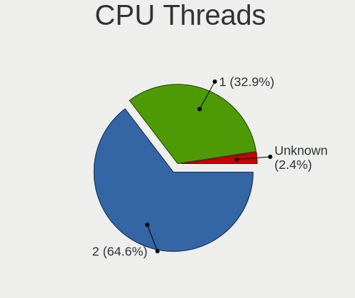

FreeBSD Hardware Trends
-----------------------

A project to identify most popular hardware characteristics and track their change
over time based on data collected by FreeBSD users at https://BSD-Hardware.info.

Anyone can contribute to this report by the [hw-probe](https://github.com/linuxhw/hw-probe/blob/master/INSTALL.BSD.md) tool:

    hw-probe -all -upload

This is a report for all computer types. See also reports for [desktops](/Dist/FreeBSD/Desktop/README.md) and [notebooks](/Dist/FreeBSD/Notebook/README.md).

Full-feature report is available here: https://bsd-hardware.info/?view=trends

Period: Nov, 2021.

Contents
--------

* [ System ](#system)
  - [ OS                       ](#os)
  - [ OS Family                ](#os-family)
  - [ Arch                     ](#arch)
  - [ DE                       ](#de)
  - [ Display Server           ](#display-server)
  - [ Display Manager          ](#display-manager)
  - [ OS Lang                  ](#os-lang)
  - [ Boot Mode                ](#boot-mode)
  - [ Filesystem               ](#filesystem)
  - [ Part. scheme             ](#part-scheme)

* [ Board ](#board)
  - [ Vendor                   ](#vendor)
  - [ Model                    ](#model)
  - [ Model Family             ](#model-family)
  - [ MFG Year                 ](#mfg-year)
  - [ Form Factor              ](#form-factor)
  - [ Coreboot                 ](#coreboot)
  - [ RAM Size                 ](#ram-size)
  - [ RAM Used                 ](#ram-used)
  - [ Total Drives             ](#total-drives)
  - [ Has CD-ROM               ](#has-cd-rom)
  - [ Has Ethernet             ](#has-ethernet)
  - [ Has WiFi                 ](#has-wifi)
  - [ Has Bluetooth            ](#has-bluetooth)

* [ Location ](#location)
  - [ Country                  ](#country)
  - [ City                     ](#city)

* [ Drives ](#drives)
  - [ Drive Vendor             ](#drive-vendor)
  - [ Drive Model              ](#drive-model)
  - [ HDD Vendor               ](#hdd-vendor)
  - [ SSD Vendor               ](#ssd-vendor)
  - [ Drive Kind               ](#drive-kind)
  - [ Drive Connector          ](#drive-connector)
  - [ Drive Size               ](#drive-size)
  - [ Space Total              ](#space-total)
  - [ Space Used               ](#space-used)
  - [ Malfunc. Drives          ](#malfunc-drives)
  - [ Malfunc. Drive Vendor    ](#malfunc-drive-vendor)
  - [ Malfunc. HDD Vendor      ](#malfunc-hdd-vendor)
  - [ Malfunc. Drive Kind      ](#malfunc-drive-kind)
  - [ Failed Drives            ](#failed-drives)
  - [ Failed Drive Vendor      ](#failed-drive-vendor)
  - [ Drive Status             ](#drive-status)

* [ Storage controller ](#storage-controller)
  - [ Storage Vendor           ](#storage-vendor)
  - [ Storage Model            ](#storage-model)
  - [ Storage Kind             ](#storage-kind)

* [ Processor ](#processor)
  - [ CPU Vendor               ](#cpu-vendor)
  - [ CPU Model                ](#cpu-model)
  - [ CPU Model Family         ](#cpu-model-family)
  - [ CPU Cores                ](#cpu-cores)
  - [ CPU Sockets              ](#cpu-sockets)
  - [ CPU Threads              ](#cpu-threads)
  - [ CPU Microarch            ](#cpu-microarch)

* [ Graphics ](#graphics)
  - [ GPU Vendor               ](#gpu-vendor)
  - [ GPU Model                ](#gpu-model)
  - [ GPU Combo                ](#gpu-combo)
  - [ GPU Driver               ](#gpu-driver)
  - [ GPU Memory               ](#gpu-memory)

* [ Monitor ](#monitor)
  - [ Monitor Vendor           ](#monitor-vendor)
  - [ Monitor Model            ](#monitor-model)
  - [ Monitor Resolution       ](#monitor-resolution)
  - [ Monitor Diagonal         ](#monitor-diagonal)
  - [ Monitor Width            ](#monitor-width)
  - [ Aspect Ratio             ](#aspect-ratio)
  - [ Monitor Area             ](#monitor-area)
  - [ Pixel Density            ](#pixel-density)
  - [ Multiple Monitors        ](#multiple-monitors)

* [ Network ](#network)
  - [ Net Controller Vendor    ](#net-controller-vendor)
  - [ Net Controller Model     ](#net-controller-model)
  - [ Wireless Vendor          ](#wireless-vendor)
  - [ Wireless Model           ](#wireless-model)
  - [ Ethernet Vendor          ](#ethernet-vendor)
  - [ Ethernet Model           ](#ethernet-model)
  - [ Net Controller Kind      ](#net-controller-kind)
  - [ Used Controller          ](#used-controller)
  - [ NICs                     ](#nics)
  - [ IPv6                     ](#ipv6)

* [ Bluetooth ](#bluetooth)
  - [ Bluetooth Vendor         ](#bluetooth-vendor)
  - [ Bluetooth Model          ](#bluetooth-model)

* [ Sound ](#sound)
  - [ Sound Vendor             ](#sound-vendor)
  - [ Sound Model              ](#sound-model)

* [ Memory ](#memory)
  - [ Memory Vendor            ](#memory-vendor)
  - [ Memory Model             ](#memory-model)
  - [ Memory Kind              ](#memory-kind)
  - [ Memory Form Factor       ](#memory-form-factor)
  - [ Memory Size              ](#memory-size)
  - [ Memory Speed             ](#memory-speed)

* [ Printers & scanners ](#printers--scanners)
  - [ Printer Vendor           ](#printer-vendor)
  - [ Printer Model            ](#printer-model)
  - [ Scanner Vendor           ](#scanner-vendor)
  - [ Scanner Model            ](#scanner-model)

* [ Camera ](#camera)
  - [ Camera Vendor            ](#camera-vendor)
  - [ Camera Model             ](#camera-model)

* [ Security ](#security)
  - [ Fingerprint Vendor       ](#fingerprint-vendor)
  - [ Fingerprint Model        ](#fingerprint-model)
  - [ Chipcard Vendor          ](#chipcard-vendor)
  - [ Chipcard Model           ](#chipcard-model)

* [ Unsupported ](#unsupported)
  - [ Unsupported Devices      ](#unsupported-devices)
  - [ Unsupported Device Types ](#unsupported-device-types)

System
------

OS
--

Installed operating systems

| Name                 | Computers | Percent |
|----------------------|-----------|---------|
| FreeBSD 13.0-p5      | 26        | 28.89%  |
| FreeBSD 13.0-p4      | 13        | 14.44%  |
| FreeBSD 12.2-p6      | 13        | 14.44%  |
| FreeBSD 13.0         | 8         | 8.89%   |
| FreeBSD 12.2-p10     | 8         | 8.89%   |
| FreeBSD 13.0-STABLE  | 7         | 7.78%   |
| FreeBSD 14.0-CURRENT | 4         | 4.44%   |
| FreeBSD 12.2-p11     | 4         | 4.44%   |
| FreeBSD 12.1-p13     | 2         | 2.22%   |
| FreeBSD 12.2-STABLE  | 1         | 1.11%   |
| FreeBSD 12.2-p9      | 1         | 1.11%   |
| FreeBSD 12.2-p4      | 1         | 1.11%   |
| FreeBSD 12.2         | 1         | 1.11%   |
| FreeBSD 12.1-p9      | 1         | 1.11%   |

OS Family
---------

OS without a version

| Name    | Computers | Percent |
|---------|-----------|---------|
| FreeBSD | 90        | 100%    |

Arch
----

OS architecture (x86_64, i586, etc.)

| Name  | Computers | Percent |
|-------|-----------|---------|
| amd64 | 80        | 88.89%  |
| i386  | 7         | 7.78%   |
| arm64 | 3         | 3.33%   |

DE
--

Desktop Environment

| Name      | Computers | Percent |
|-----------|-----------|---------|
| Console   | 53        | 58.89%  |
| XFCE      | 9         | 10%     |
| KDE5      | 9         | 10%     |
| i3        | 8         | 8.89%   |
| MATE      | 7         | 7.78%   |
| Openbox   | 1         | 1.11%   |
| LXQt      | 1         | 1.11%   |
| GNOME     | 1         | 1.11%   |
| AwesomeWM | 1         | 1.11%   |

Display Server
--------------

X11 or Wayland

| Name    | Computers | Percent |
|---------|-----------|---------|
| Console | 52        | 57.78%  |
| X11     | 35        | 38.89%  |
| Wayland | 3         | 3.33%   |

Display Manager
---------------

SDDM, LightDM, etc.

| Name    | Computers | Percent |
|---------|-----------|---------|
| Console | 64        | 71.11%  |
| SDDM    | 10        | 11.11%  |
| SLiM    | 7         | 7.78%   |
| LightDM | 5         | 5.56%   |
| XDM     | 4         | 4.44%   |

OS Lang
-------

Language

| Lang    | Computers | Percent |
|---------|-----------|---------|
| C       | 42        | 46.67%  |
| Unknown | 35        | 38.89%  |
| en_US   | 6         | 6.67%   |
| nl_NL   | 2         | 2.22%   |
| es_ES   | 2         | 2.22%   |
| uk_UA   | 1         | 1.11%   |
| en_GB   | 1         | 1.11%   |
| de_DE   | 1         | 1.11%   |

Boot Mode
---------

EFI or BIOS

| Mode | Computers | Percent |
|------|-----------|---------|
| BIOS | 49        | 54.44%  |
| EFI  | 41        | 45.56%  |

Filesystem
----------

Type of filesystem

| Type | Computers | Percent |
|------|-----------|---------|
| Zfs  | 49        | 54.44%  |
| Ufs  | 41        | 45.56%  |

Part. scheme
------------

Scheme of partitioning

| Type | Computers | Percent |
|------|-----------|---------|
| GPT  | 72        | 80%     |
| MBR  | 16        | 17.78%  |
| BSD  | 2         | 2.22%   |

Board
-----

Vendor
------

Motherboard manufacturer

| Name                | Computers | Percent |
|---------------------|-----------|---------|
| Dell                | 12        | 13.33%  |
| Lenovo              | 11        | 12.22%  |
| ASUSTek Computer    | 11        | 12.22%  |
| Hewlett-Packard     | 10        | 11.11%  |
| IBM                 | 8         | 8.89%   |
| PC Engines          | 6         | 6.67%   |
| ASRock              | 5         | 5.56%   |
| MSI                 | 4         | 4.44%   |
| Gigabyte Technology | 4         | 4.44%   |
| Sun Microsystems    | 3         | 3.33%   |
| Acer                | 3         | 3.33%   |
| Unknown             | 3         | 3.33%   |
| Supermicro          | 2         | 2.22%   |
| Shuttle             | 2         | 2.22%   |
| TUXEDO              | 1         | 1.11%   |
| Toshiba             | 1         | 1.11%   |
| Intel               | 1         | 1.11%   |
| firefly             | 1         | 1.11%   |
| ASRockRack          | 1         | 1.11%   |
| Apple               | 1         | 1.11%   |

Model
-----

Motherboard model

| Name                                        | Computers | Percent |
|---------------------------------------------|-----------|---------|
| Sun Microsystems Sun Fire X4150             | 3         | 3.33%   |
| PC Engines APU2                             | 3         | 3.33%   |
| PC Engines APU                              | 3         | 3.33%   |
| Dell OEM-R 720xd                            | 3         | 3.33%   |
| Unknown                                     | 3         | 3.33%   |
| MSI MS-9129                                 | 2         | 2.22%   |
| IBM System x3650 -[797941Y]-                | 2         | 2.22%   |
| IBM System x3550 M3 -[7944ZJN]-             | 2         | 2.22%   |
| HP Compaq 6720s                             | 2         | 2.22%   |
| ASUS P5Q-E                                  | 2         | 2.22%   |
| ASRock Q1900B-ITX                           | 2         | 2.22%   |
| TUXEDO Pulse 15 Gen1                        | 1         | 1.11%   |
| Toshiba Satellite Pro L510                  | 1         | 1.11%   |
| Supermicro X9SRE/X9SRE-3F/X9SRi/X9SRi-3F    | 1         | 1.11%   |
| Supermicro SYS-5018A-TN4                    | 1         | 1.11%   |
| Shuttle XH270                               | 1         | 1.11%   |
| Shuttle SZ270R9                             | 1         | 1.11%   |
| MSI MS-7817                                 | 1         | 1.11%   |
| MSI MS-7597                                 | 1         | 1.11%   |
| Lenovo ThinkStation E31 255526G             | 1         | 1.11%   |
| Lenovo ThinkPad X270 20HMCTO1WW             | 1         | 1.11%   |
| Lenovo ThinkPad X220 42915CG                | 1         | 1.11%   |
| Lenovo ThinkPad X1 Extreme Gen 3 20TLA055CD | 1         | 1.11%   |
| Lenovo ThinkPad X1 Carbon Gen 9 20XWA003CD  | 1         | 1.11%   |
| Lenovo ThinkPad W530 2447AV9                | 1         | 1.11%   |
| Lenovo ThinkPad T430 2347G7G                | 1         | 1.11%   |
| Lenovo ThinkPad R60e 0658W2M                | 1         | 1.11%   |
| Lenovo IdeaPad S510p 20298                  | 1         | 1.11%   |
| Lenovo IdeaPad S130-14IGM 81J2              | 1         | 1.11%   |
| Lenovo IdeaPad 330-15ARR 81D2               | 1         | 1.11%   |
| Intel NUC7i7BNB J31145-304                  | 1         | 1.11%   |
| IBM ThinkPad R52 185869G                    | 1         | 1.11%   |
| IBM System x3650 -[7979B1G]-                | 1         | 1.11%   |
| IBM System x3550 -[7978KLG]-                | 1         | 1.11%   |
| IBM System x3550 -[7978B9G]-                | 1         | 1.11%   |
| HP Spectre x360 Convertible 13-aw0xxx       | 1         | 1.11%   |
| HP ProLiant MicroServer Gen8                | 1         | 1.11%   |
| HP Pavilion Desktop TP01-1xxx               | 1         | 1.11%   |
| HP Mini 110-1000                            | 1         | 1.11%   |
| HP Laptop 15s-du1xxx                        | 1         | 1.11%   |
| HP EliteBook 8570p                          | 1         | 1.11%   |
| HP Compaq Elite 8300 SFF                    | 1         | 1.11%   |
| HP Compaq 6000 Pro SFF PC                   | 1         | 1.11%   |
| Gigabyte MZ32-AR0-00                        | 1         | 1.11%   |
| Gigabyte MX33-BS1-V1                        | 1         | 1.11%   |
| Gigabyte GB-BACE-3150                       | 1         | 1.11%   |
| Gigabyte G41M-Combo                         | 1         | 1.11%   |
| firefly roc-rk3399-pc-plus                  | 1         | 1.11%   |
| Dell XPS 13 9350                            | 1         | 1.11%   |
| Dell XPS 13 9343                            | 1         | 1.11%   |
| Dell XPS 13 7390 2-in-1                     | 1         | 1.11%   |
| Dell Vostro 1400                            | 1         | 1.11%   |
| Dell Vostro 14-5480                         | 1         | 1.11%   |
| Dell PowerEdge R610                         | 1         | 1.11%   |
| Dell OptiPlex 390                           | 1         | 1.11%   |
| Dell Latitude E6430                         | 1         | 1.11%   |
| Dell Inspiron N5050                         | 1         | 1.11%   |
| ASUS TUF GAMING X570-PLUS                   | 1         | 1.11%   |
| ASUS ROG CROSSHAIR VIII HERO                | 1         | 1.11%   |
| ASUS PRIME X370-PRO                         | 1         | 1.11%   |

Model Family
------------

Motherboard model prefix

| Name                       | Computers | Percent |
|----------------------------|-----------|---------|
| Lenovo ThinkPad            | 7         | 7.78%   |
| IBM System                 | 7         | 7.78%   |
| HP Compaq                  | 4         | 4.44%   |
| Sun Microsystems Sun       | 3         | 3.33%   |
| PC Engines APU2            | 3         | 3.33%   |
| PC Engines APU             | 3         | 3.33%   |
| Lenovo IdeaPad             | 3         | 3.33%   |
| Dell XPS                   | 3         | 3.33%   |
| Dell OEM-R                 | 3         | 3.33%   |
| Acer Aspire                | 3         | 3.33%   |
| Unknown                    | 3         | 3.33%   |
| MSI MS-9129                | 2         | 2.22%   |
| Dell Vostro                | 2         | 2.22%   |
| ASUS P5Q-E                 | 2         | 2.22%   |
| ASRock Q1900B-ITX          | 2         | 2.22%   |
| TUXEDO Pulse               | 1         | 1.11%   |
| Toshiba Satellite          | 1         | 1.11%   |
| Supermicro X9SRE           | 1         | 1.11%   |
| Supermicro SYS-5018A-TN4   | 1         | 1.11%   |
| Shuttle XH270              | 1         | 1.11%   |
| Shuttle SZ270R9            | 1         | 1.11%   |
| MSI MS-7817                | 1         | 1.11%   |
| MSI MS-7597                | 1         | 1.11%   |
| Lenovo ThinkStation        | 1         | 1.11%   |
| Intel NUC7i7BNB            | 1         | 1.11%   |
| IBM ThinkPad               | 1         | 1.11%   |
| HP Spectre                 | 1         | 1.11%   |
| HP ProLiant                | 1         | 1.11%   |
| HP Pavilion                | 1         | 1.11%   |
| HP Mini                    | 1         | 1.11%   |
| HP Laptop                  | 1         | 1.11%   |
| HP EliteBook               | 1         | 1.11%   |
| Gigabyte MZ32-AR0-00       | 1         | 1.11%   |
| Gigabyte MX33-BS1-V1       | 1         | 1.11%   |
| Gigabyte GB-BACE-3150      | 1         | 1.11%   |
| Gigabyte G41M-Combo        | 1         | 1.11%   |
| firefly roc-rk3399-pc-plus | 1         | 1.11%   |
| Dell PowerEdge             | 1         | 1.11%   |
| Dell OptiPlex              | 1         | 1.11%   |
| Dell Latitude              | 1         | 1.11%   |
| Dell Inspiron              | 1         | 1.11%   |
| ASUS TUF                   | 1         | 1.11%   |
| ASUS ROG                   | 1         | 1.11%   |
| ASUS PRIME                 | 1         | 1.11%   |
| ASUS P9X79                 | 1         | 1.11%   |
| ASUS P8B-E                 | 1         | 1.11%   |
| ASUS P7P55D                | 1         | 1.11%   |
| ASUS P4PE2-X               | 1         | 1.11%   |
| ASUS 1015BX                | 1         | 1.11%   |
| ASUS 1001P                 | 1         | 1.11%   |
| ASRockRack E3C246D4U2-2T   | 1         | 1.11%   |
| ASRock X570M               | 1         | 1.11%   |
| ASRock X570                | 1         | 1.11%   |
| ASRock 970                 | 1         | 1.11%   |
| Apple MacBook3             | 1         | 1.11%   |

MFG Year
--------

Motherboard manufacture year

| Year    | Computers | Percent |
|---------|-----------|---------|
| 2021    | 11        | 12.22%  |
| 2014    | 10        | 11.11%  |
| 2008    | 10        | 11.11%  |
| 2018    | 9         | 10%     |
| 2019    | 8         | 8.89%   |
| 2015    | 7         | 7.78%   |
| 2020    | 5         | 5.56%   |
| 2011    | 5         | 5.56%   |
| 2009    | 5         | 5.56%   |
| 2013    | 4         | 4.44%   |
| 2012    | 4         | 4.44%   |
| 2017    | 2         | 2.22%   |
| 2010    | 2         | 2.22%   |
| 2002    | 2         | 2.22%   |
| Unknown | 2         | 2.22%   |
| 2016    | 1         | 1.11%   |
| 2007    | 1         | 1.11%   |
| 2006    | 1         | 1.11%   |
| 2004    | 1         | 1.11%   |

Form Factor
-----------

Physical design of the computer

| Name        | Computers | Percent |
|-------------|-----------|---------|
| Desktop     | 39        | 43.33%  |
| Notebook    | 30        | 33.33%  |
| Server      | 17        | 18.89%  |
| Convertible | 2         | 2.22%   |
| Mini pc     | 2         | 2.22%   |

Coreboot
--------

Have coreboot on board

| Used | Computers | Percent |
|------|-----------|---------|
| No   | 84        | 93.33%  |
| Yes  | 6         | 6.67%   |

RAM Size
--------

Total RAM memory

| Size in GB  | Computers | Percent |
|-------------|-----------|---------|
| 4.01-8.0    | 23        | 25.56%  |
| 16.01-24.0  | 16        | 17.78%  |
| 8.01-16.0   | 15        | 16.67%  |
| 64.01-256.0 | 11        | 12.22%  |
| 32.01-64.0  | 8         | 8.89%   |
| 24.01-32.0  | 5         | 5.56%   |
| 2.01-3.0    | 5         | 5.56%   |
| 0.51-1.0    | 3         | 3.33%   |
| 3.01-4.0    | 2         | 2.22%   |
| 1.01-2.0    | 1         | 1.11%   |
| 0.01-0.5    | 1         | 1.11%   |

RAM Used
--------

Used RAM memory

| Used GB     | Computers | Percent |
|-------------|-----------|---------|
| 0.01-0.5    | 32        | 35.56%  |
| 0.51-1.0    | 18        | 20%     |
| 1.01-2.0    | 14        | 15.56%  |
| 4.01-8.0    | 7         | 7.78%   |
| 2.01-3.0    | 5         | 5.56%   |
| 3.01-4.0    | 3         | 3.33%   |
| 16.01-24.0  | 3         | 3.33%   |
| 32.01-64.0  | 2         | 2.22%   |
| 24.01-32.0  | 2         | 2.22%   |
| 64.01-256.0 | 2         | 2.22%   |
| 8.01-16.0   | 2         | 2.22%   |

Total Drives
------------

Number of drives on board

| Drives | Computers | Percent |
|--------|-----------|---------|
| 1      | 41        | 45.56%  |
| 0      | 16        | 17.78%  |
| 2      | 13        | 14.44%  |
| 4      | 5         | 5.56%   |
| 3      | 5         | 5.56%   |
| 5      | 4         | 4.44%   |
| 6      | 3         | 3.33%   |
| 23     | 1         | 1.11%   |
| 17     | 1         | 1.11%   |
| 13     | 1         | 1.11%   |

Has CD-ROM
----------

Has CD-ROM on board

| Presented | Computers | Percent |
|-----------|-----------|---------|
| No        | 54        | 60%     |
| Yes       | 36        | 40%     |

Has Ethernet
------------

Has Ethernet on board

| Presented | Computers | Percent |
|-----------|-----------|---------|
| Yes       | 81        | 90%     |
| No        | 9         | 10%     |

Has WiFi
--------

Has WiFi module

| Presented | Computers | Percent |
|-----------|-----------|---------|
| No        | 53        | 58.89%  |
| Yes       | 37        | 41.11%  |

Has Bluetooth
-------------

Has Bluetooth module

| Presented | Computers | Percent |
|-----------|-----------|---------|
| No        | 67        | 74.44%  |
| Yes       | 23        | 25.56%  |

Location
--------

Country
-------

Geographic location (country)

| Country        | Computers | Percent |
|----------------|-----------|---------|
| Czechia        | 20        | 22.22%  |
| USA            | 17        | 18.89%  |
| Poland         | 10        | 11.11%  |
| UK             | 6         | 6.67%   |
| Germany        | 4         | 4.44%   |
| Netherlands    | 3         | 3.33%   |
| Czech Republic | 3         | 3.33%   |
| China          | 3         | 3.33%   |
| Ukraine        | 2         | 2.22%   |
| Switzerland    | 2         | 2.22%   |
| Russia         | 2         | 2.22%   |
| Norway         | 2         | 2.22%   |
| Japan          | 2         | 2.22%   |
| Indonesia      | 2         | 2.22%   |
| Finland        | 2         | 2.22%   |
| Singapore      | 1         | 1.11%   |
| Romania        | 1         | 1.11%   |
| Peru           | 1         | 1.11%   |
| Namibia        | 1         | 1.11%   |
| Mexico         | 1         | 1.11%   |
| France         | 1         | 1.11%   |
| Denmark        | 1         | 1.11%   |
| Colombia       | 1         | 1.11%   |
| Bulgaria       | 1         | 1.11%   |
| Australia      | 1         | 1.11%   |

City
----

Geographic location (city)

| City                  | Computers | Percent |
|-----------------------|-----------|---------|
| Tuklaty               | 12        | 13.33%  |
| Prague                | 4         | 4.44%   |
| Redmond               | 3         | 3.33%   |
| New Town              | 3         | 3.33%   |
| Gdynia                | 3         | 3.33%   |
| Warsaw                | 2         | 2.22%   |
| Salem                 | 2         | 2.22%   |
| Rochester             | 2         | 2.22%   |
| Macon                 | 2         | 2.22%   |
| London                | 2         | 2.22%   |
| Glincz                | 2         | 2.22%   |
| Cheb                  | 2         | 2.22%   |
| Amsterdam             | 2         | 2.22%   |
| Yens                  | 1         | 1.11%   |
| Yekaterinburg         | 1         | 1.11%   |
| Windhoek              | 1         | 1.11%   |
| Wenatchee             | 1         | 1.11%   |
| Turku                 | 1         | 1.11%   |
| Sokal'                | 1         | 1.11%   |
| Sofia                 | 1         | 1.11%   |
| Singapore             | 1         | 1.11%   |
| Shanghai              | 1         | 1.11%   |
| Saarbr??cken          | 1         | 1.11%   |
| Ruthin                | 1         | 1.11%   |
| Rionegro              | 1         | 1.11%   |
| Portland              | 1         | 1.11%   |
| Oxford                | 1         | 1.11%   |
| Ostrzeszow            | 1         | 1.11%   |
| Oslo                  | 1         | 1.11%   |
| Okehampton            | 1         | 1.11%   |
| Moscow                | 1         | 1.11%   |
| Minato                | 1         | 1.11%   |
| Melbourne             | 1         | 1.11%   |
| Maysel                | 1         | 1.11%   |
| Lucerne               | 1         | 1.11%   |
| Limburg an der Lahn   | 1         | 1.11%   |
| Lima                  | 1         | 1.11%   |
| Kvetnice              | 1         | 1.11%   |
| Koto                  | 1         | 1.11%   |
| Kingsport             | 1         | 1.11%   |
| Katy                  | 1         | 1.11%   |
| Jakarta               | 1         | 1.11%   |
| Isernhagen            | 1         | 1.11%   |
| Irving                | 1         | 1.11%   |
| Helsinki              | 1         | 1.11%   |
| Hayden                | 1         | 1.11%   |
| Guangzhou Shi         | 1         | 1.11%   |
| Gdansk                | 1         | 1.11%   |
| Falkenstein           | 1         | 1.11%   |
| Drobeta-Turnu Severin | 1         | 1.11%   |
| Den Dolder            | 1         | 1.11%   |
| Chengdu               | 1         | 1.11%   |
| Cercany               | 1         | 1.11%   |
| Calne                 | 1         | 1.11%   |
| Brovary               | 1         | 1.11%   |
| Brooklyn              | 1         | 1.11%   |
| Beckton               | 1         | 1.11%   |
| Batam                 | 1         | 1.11%   |
| Baerums verk          | 1         | 1.11%   |
| Acapulco de Ju??rez   | 1         | 1.11%   |

Drives
------

Drive Vendor
------------

Hard drive vendors

| Vendor              | Computers | Drives | Percent |
|---------------------|-----------|--------|---------|
| WDC                 | 26        | 75     | 23.85%  |
| Samsung Electronics | 21        | 31     | 19.27%  |
| Toshiba             | 10        | 11     | 9.17%   |
| Seagate             | 9         | 27     | 8.26%   |
| Kingston            | 8         | 9      | 7.34%   |
| HGST                | 6         | 14     | 5.5%    |
| Crucial             | 6         | 7      | 5.5%    |
| Intel               | 3         | 4      | 2.75%   |
| Hitachi             | 3         | 3      | 2.75%   |
| SK Hynix            | 2         | 2      | 1.83%   |
| SanDisk             | 2         | 2      | 1.83%   |
| GOODRAM             | 2         | 3      | 1.83%   |
| Transcend           | 1         | 1      | 0.92%   |
| PNY                 | 1         | 2      | 0.92%   |
| Phison              | 1         | 1      | 0.92%   |
| MAXTOR              | 1         | 1      | 0.92%   |
| LSI                 | 1         | 1      | 0.92%   |
| KIOXIA              | 1         | 1      | 0.92%   |
| Intenso             | 1         | 1      | 0.92%   |
| Gigabyte Technology | 1         | 1      | 0.92%   |
| Fujitsu             | 1         | 1      | 0.92%   |
| Corsair             | 1         | 1      | 0.92%   |
| A-DATA Technology   | 1         | 1      | 0.92%   |

Drive Model
-----------

Hard drive models

| Model                                   | Computers | Percent |
|-----------------------------------------|-----------|---------|
| WDC WD20EFRX-68EUZN0 2TB                | 3         | 2.17%   |
| Seagate ST4000DM000-1F2168 4TB          | 3         | 2.17%   |
| Kingston SMS200S360G 64GB               | 3         | 2.17%   |
| WDC WD80EFZX-68UW8N0 8TB                | 2         | 1.45%   |
| WDC WD5000AAKX-08U6AA0 500GB            | 2         | 1.45%   |
| WDC WD40EFRX-68WT0N0 4TB                | 2         | 1.45%   |
| Toshiba MQ01ABF050 500GB                | 2         | 1.45%   |
| Toshiba MK2546GSX 250GB                 | 2         | 1.45%   |
| Seagate ST1000LM024 HN-M101MBB 1TB      | 2         | 1.45%   |
| Samsung SSD 960 EVO 500GB               | 2         | 1.45%   |
| Samsung SSD 860 QVO 1TB                 | 2         | 1.45%   |
| Samsung SSD 850 EVO 1TB                 | 2         | 1.45%   |
| Kingston SA400S37240G 240GB             | 2         | 1.45%   |
| HGST HUS726T6TALE6L1 6TB                | 2         | 1.45%   |
| WDC WDS250G2B0B-00YS70 250GB            | 1         | 0.72%   |
| WDC WDS240G2G0A-00JH30 240GB            | 1         | 0.72%   |
| WDC WDBNCE5000PNC 500GB                 | 1         | 0.72%   |
| WDC WD80EMAZ-00WJTA0 8TB                | 1         | 0.72%   |
| WDC WD80EFAX-68LHPN0 8TB                | 1         | 0.72%   |
| WDC WD80EDBZ-11B0ZA0 8TB                | 1         | 0.72%   |
| WDC WD800JD-75MSA3 80GB                 | 1         | 0.72%   |
| WDC WD800JB-00JJC0 80GB                 | 1         | 0.72%   |
| WDC WD6002FRYZ-01WD5B1 6TB              | 1         | 0.72%   |
| WDC WD6002FRYZ-01WD5B0 6TB              | 1         | 0.72%   |
| WDC WD5000AAKX-60U6AA0 500GB            | 1         | 0.72%   |
| WDC WD5000AAKX-001CA0 500GB             | 1         | 0.72%   |
| WDC WD5000AADS-00S9B0 500GB             | 1         | 0.72%   |
| WDC WD40EZRZ-22GXCB0 4TB                | 1         | 0.72%   |
| WDC WD40EZRZ-00WN9B0 4TB                | 1         | 0.72%   |
| WDC WD40EZRZ-00GXCB0 4TB                | 1         | 0.72%   |
| WDC WD40EZRX-00SPEB0 4TB                | 1         | 0.72%   |
| WDC WD30EFRX-68EUZN0 3TB                | 1         | 0.72%   |
| WDC WD30EFRX-68AX9N0 3TB                | 1         | 0.72%   |
| WDC WD20NMVW-11AV3S2 2TB                | 1         | 0.72%   |
| WDC WD20EZRX-00D8PB0 2TB                | 1         | 0.72%   |
| WDC WD20EFRX-68AX9N0 2TB                | 1         | 0.72%   |
| WDC WD20EARX-00PASB0 2TB                | 1         | 0.72%   |
| WDC WD2000FYYZ-05UL1B0 2TB              | 1         | 0.72%   |
| WDC WD2000FYYZ-01UL1B1 2TB              | 1         | 0.72%   |
| WDC WD1600BEVT-80A23T0 160GB            | 1         | 0.72%   |
| WDC WD1600AAJS-60M0A1 160GB             | 1         | 0.72%   |
| WDC WD1600AAJS-22PSA0 160GB             | 1         | 0.72%   |
| WDC WD120EMFZ-11A6JA0 12TB              | 1         | 0.72%   |
| WDC WD120EMAZ-11BLFA0 12TB              | 1         | 0.72%   |
| WDC WD10JPVX-22JC3T0 1TB                | 1         | 0.72%   |
| WDC WD10JPCX-24UE4T0 1TB                | 1         | 0.72%   |
| WDC WD10EZEX-08WN4A0 1TB                | 1         | 0.72%   |
| WDC WD101KRYZ-01JPDB1 10TB              | 1         | 0.72%   |
| WDC WD1001FALS-00J7B0 1TB               | 1         | 0.72%   |
| WDC PC SN530 NVMe 512GB                 | 1         | 0.72%   |
| Transcend TS32GMSA370 32GB              | 1         | 0.72%   |
| Toshiba Q300 120GB                      | 1         | 0.72%   |
| Toshiba MQ01ACF032 320GB                | 1         | 0.72%   |
| Toshiba MQ01ABD100 1TB                  | 1         | 0.72%   |
| Toshiba MK3261GSYN 320GB                | 1         | 0.72%   |
| Toshiba MK1637GSX 160GB                 | 1         | 0.72%   |
| Toshiba KXG6APNV2T04 2TB                | 1         | 0.72%   |
| Toshiba DT01ACA100 1TB                  | 1         | 0.72%   |
| SK Hynix HFS128G39TNF-N3A0A 128GB       | 1         | 0.72%   |
| SK Hynix BC511 HFM256GDJTNI-82A0A 256GB | 1         | 0.72%   |

HDD Vendor
----------

Hard disk drive vendors

| Vendor              | Computers | Drives | Percent |
|---------------------|-----------|--------|---------|
| WDC                 | 22        | 68     | 43.14%  |
| Seagate             | 9         | 27     | 17.65%  |
| Toshiba             | 8         | 9      | 15.69%  |
| HGST                | 6         | 14     | 11.76%  |
| Hitachi             | 3         | 3      | 5.88%   |
| Samsung Electronics | 1         | 1      | 1.96%   |
| MAXTOR              | 1         | 1      | 1.96%   |
| Fujitsu             | 1         | 1      | 1.96%   |

SSD Vendor
----------

Solid state drive vendors

| Vendor              | Computers | Drives | Percent |
|---------------------|-----------|--------|---------|
| Samsung Electronics | 12        | 19     | 27.27%  |
| Kingston            | 8         | 9      | 18.18%  |
| Crucial             | 6         | 7      | 13.64%  |
| WDC                 | 3         | 6      | 6.82%   |
| SanDisk             | 2         | 2      | 4.55%   |
| Intel               | 2         | 2      | 4.55%   |
| GOODRAM             | 2         | 3      | 4.55%   |
| Transcend           | 1         | 1      | 2.27%   |
| Toshiba             | 1         | 1      | 2.27%   |
| SK Hynix            | 1         | 1      | 2.27%   |
| PNY                 | 1         | 2      | 2.27%   |
| Phison              | 1         | 1      | 2.27%   |
| LSI                 | 1         | 1      | 2.27%   |
| Intenso             | 1         | 1      | 2.27%   |
| Gigabyte Technology | 1         | 1      | 2.27%   |
| A-DATA Technology   | 1         | 1      | 2.27%   |

Drive Kind
----------

HDD or SSD

| Kind | Computers | Drives | Percent |
|------|-----------|--------|---------|
| HDD  | 41        | 124    | 43.62%  |
| SSD  | 38        | 58     | 40.43%  |
| NVMe | 15        | 18     | 15.96%  |

Drive Connector
---------------

SATA, SAS, NVMe, etc.

| Type | Computers | Drives | Percent |
|------|-----------|--------|---------|
| SATA | 66        | 182    | 81.48%  |
| NVMe | 15        | 18     | 18.52%  |

Drive Size
----------

Size of hard drive

| Size in TB | Computers | Drives | Percent |
|------------|-----------|--------|---------|
| 0.01-0.5   | 52        | 71     | 57.78%  |
| 0.51-1.0   | 12        | 23     | 13.33%  |
| 1.01-2.0   | 8         | 16     | 8.89%   |
| 4.01-10.0  | 8         | 46     | 8.89%   |
| 3.01-4.0   | 7         | 17     | 7.78%   |
| 2.01-3.0   | 2         | 7      | 2.22%   |
| 10.01-20.0 | 1         | 2      | 1.11%   |

Space Total
-----------

Amount of disk space available on the file system

| Size in GB     | Computers | Percent |
|----------------|-----------|---------|
| 101-250        | 21        | 23.33%  |
| 501-1000       | 17        | 18.89%  |
| 251-500        | 16        | 17.78%  |
| 51-100         | 16        | 17.78%  |
| More than 3000 | 6         | 6.67%   |
| 21-50          | 5         | 5.56%   |
| 1-20           | 4         | 4.44%   |
| 1001-2000      | 3         | 3.33%   |
| 2001-3000      | 2         | 2.22%   |

Space Used
----------

Amount of used disk space

| Used GB        | Computers | Percent |
|----------------|-----------|---------|
| 1-20           | 67        | 74.44%  |
| 51-100         | 8         | 8.89%   |
| 21-50          | 7         | 7.78%   |
| 101-250        | 2         | 2.22%   |
| 1001-2000      | 2         | 2.22%   |
| 501-1000       | 2         | 2.22%   |
| More than 3000 | 1         | 1.11%   |
| 2001-3000      | 1         | 1.11%   |

Malfunc. Drives
---------------

Drive models with a malfunction

| Model                                    | Computers | Drives | Percent |
|------------------------------------------|-----------|--------|---------|
| WDC WD20EFRX-68EUZN0 2TB                 | 2         | 2      | 10.53%  |
| Kingston SMS200S360G 64GB                | 2         | 2      | 10.53%  |
| WDC WD800JB-00JJC0 80GB                  | 1         | 1      | 5.26%   |
| WDC WD5000AAKX-60U6AA0 500GB             | 1         | 1      | 5.26%   |
| WDC WD5000AAKX-001CA0 500GB              | 1         | 1      | 5.26%   |
| WDC WD5000AADS-00S9B0 500GB              | 1         | 1      | 5.26%   |
| WDC WD40EFRX-68WT0N0 4TB                 | 1         | 4      | 5.26%   |
| WDC WD2000FYYZ-01UL1B1 2TB               | 1         | 2      | 5.26%   |
| Toshiba MK3261GSYN 320GB                 | 1         | 1      | 5.26%   |
| Toshiba MK2546GSX 250GB                  | 1         | 1      | 5.26%   |
| Toshiba MK1637GSX 160GB                  | 1         | 1      | 5.26%   |
| Seagate ST96812AS 64GB                   | 1         | 4      | 5.26%   |
| Samsung Electronics SSD 840 Series 250GB | 1         | 1      | 5.26%   |
| Samsung Electronics HM251JX 250GB        | 1         | 1      | 5.26%   |
| MAXTOR 6Y080M0 82GB                      | 1         | 1      | 5.26%   |
| HGST HTS721010A9E630 1TB                 | 1         | 1      | 5.26%   |
| Crucial CT1050MX300SSD4 1TB              | 1         | 1      | 5.26%   |

Malfunc. Drive Vendor
---------------------

Vendors of faulty drives

| Vendor              | Computers | Drives | Percent |
|---------------------|-----------|--------|---------|
| WDC                 | 8         | 12     | 42.11%  |
| Toshiba             | 3         | 3      | 15.79%  |
| Samsung Electronics | 2         | 2      | 10.53%  |
| Kingston            | 2         | 2      | 10.53%  |
| Seagate             | 1         | 4      | 5.26%   |
| MAXTOR              | 1         | 1      | 5.26%   |
| HGST                | 1         | 1      | 5.26%   |
| Crucial             | 1         | 1      | 5.26%   |

Malfunc. HDD Vendor
-------------------

Vendors of faulty HDD drives

| Vendor              | Computers | Drives | Percent |
|---------------------|-----------|--------|---------|
| WDC                 | 8         | 12     | 53.33%  |
| Toshiba             | 3         | 3      | 20%     |
| Seagate             | 1         | 4      | 6.67%   |
| Samsung Electronics | 1         | 1      | 6.67%   |
| MAXTOR              | 1         | 1      | 6.67%   |
| HGST                | 1         | 1      | 6.67%   |

Malfunc. Drive Kind
-------------------

Kinds of faulty drives

| Kind | Computers | Drives | Percent |
|------|-----------|--------|---------|
| HDD  | 13        | 22     | 76.47%  |
| SSD  | 4         | 4      | 23.53%  |

Failed Drives
-------------

Failed drive models

Zero info for selected period =(

Failed Drive Vendor
-------------------

Failed drive vendors

Zero info for selected period =(

Drive Status
------------

Number of failed and malfunc. drives

| Status   | Computers | Drives | Percent |
|----------|-----------|--------|---------|
| Works    | 67        | 170    | 77.01%  |
| Malfunc  | 17        | 26     | 19.54%  |
| Detected | 3         | 4      | 3.45%   |

Storage controller
------------------

Storage Vendor
--------------

Storage controller vendors

| Vendor                   | Computers | Percent |
|--------------------------|-----------|---------|
| Intel                    | 58        | 48.33%  |
| AMD                      | 21        | 17.5%   |
| Broadcom / LSI           | 10        | 8.33%   |
| Samsung Electronics      | 9         | 7.5%    |
| Adaptec                  | 8         | 6.67%   |
| Marvell Technology Group | 3         | 2.5%    |
| Silicon Image            | 2         | 1.67%   |
| Promise Technology       | 2         | 1.67%   |
| VMware                   | 1         | 0.83%   |
| Toshiba                  | 1         | 0.83%   |
| SK Hynix                 | 1         | 0.83%   |
| Phison Electronics       | 1         | 0.83%   |
| Nvidia                   | 1         | 0.83%   |
| KIOXIA                   | 1         | 0.83%   |
| JMicron Technology       | 1         | 0.83%   |

Storage Model
-------------

Storage controller models

| Model                                                                                   | Computers | Percent |
|-----------------------------------------------------------------------------------------|-----------|---------|
| AMD FCH SATA Controller [AHCI mode]                                                     | 12        | 8.57%   |
| Intel 631xESB/632xESB IDE Controller                                                    | 5         | 3.57%   |
| Adaptec AAC-RAID (Rocket)                                                               | 5         | 3.57%   |
| Intel 82801HM/HEM (ICH8M/ICH8M-E) SATA Controller [AHCI mode]                           | 4         | 2.86%   |
| Intel 82801HM/HEM (ICH8M/ICH8M-E) IDE Controller                                        | 4         | 2.86%   |
| Intel 7 Series Chipset Family 6-port SATA Controller [AHCI mode]                        | 4         | 2.86%   |
| AMD SB7x0/SB8x0/SB9x0 SATA Controller [AHCI mode]                                       | 4         | 2.86%   |
| Samsung NVMe SSD Controller SM961/PM961/SM963                                           | 3         | 2.14%   |
| Samsung NVMe SSD Controller PM9A1/PM9A3/980PRO                                          | 3         | 2.14%   |
| Intel 82801DB (ICH4) IDE Controller                                                     | 3         | 2.14%   |
| Intel 8 Series SATA Controller 1 [AHCI mode]                                            | 3         | 2.14%   |
| Intel 631xESB/632xESB/3100 Chipset SATA IDE Controller                                  | 3         | 2.14%   |
| Intel 631xESB/632xESB SATA AHCI Controller                                              | 3         | 2.14%   |
| Broadcom / LSI SAS2008 PCI-Express Fusion-MPT SAS-2 [Falcon]                            | 3         | 2.14%   |
| AMD FCH SATA Controller [IDE mode]                                                      | 3         | 2.14%   |
| Adaptec AAC-RAID                                                                        | 3         | 2.14%   |
| Samsung NVMe SSD Controller SM981/PM981/PM983                                           | 2         | 1.43%   |
| Promise PDC20276 (MBFastTrak133 Lite)                                                   | 2         | 1.43%   |
| Marvell Group 88SE6111/6121 SATA II / PATA Controller                                   | 2         | 1.43%   |
| Intel Sunrise Point-LP SATA Controller [AHCI mode]                                      | 2         | 1.43%   |
| Intel C600/X79 series chipset 6-Port SATA AHCI Controller                               | 2         | 1.43%   |
| Intel Atom Processor E3800 Series SATA AHCI Controller                                  | 2         | 1.43%   |
| Intel 82801JI (ICH10 Family) SATA AHCI Controller                                       | 2         | 1.43%   |
| Intel 82801JI (ICH10 Family) 4 port SATA IDE Controller #1                              | 2         | 1.43%   |
| Intel 82801JI (ICH10 Family) 2 port SATA IDE Controller #2                              | 2         | 1.43%   |
| Intel 82801GBM/GHM (ICH7-M Family) SATA Controller [IDE mode]                           | 2         | 1.43%   |
| Intel 82801 Mobile SATA Controller [RAID mode]                                          | 2         | 1.43%   |
| Intel 7 Series/C210 Series Chipset Family 6-port SATA Controller [AHCI mode]            | 2         | 1.43%   |
| Intel 6 Series/C200 Series Chipset Family Desktop SATA Controller (IDE mode, ports 4-5) | 2         | 1.43%   |
| Intel 6 Series/C200 Series Chipset Family Desktop SATA Controller (IDE mode, ports 0-3) | 2         | 1.43%   |
| Intel 6 Series/C200 Series Chipset Family 6 port Mobile SATA AHCI Controller            | 2         | 1.43%   |
| Intel 200 Series PCH SATA controller [AHCI mode]                                        | 2         | 1.43%   |
| Broadcom / LSI MegaRAID SAS 2108 [Liberator]                                            | 2         | 1.43%   |
| Broadcom / LSI MegaRAID SAS 2008 [Falcon]                                               | 2         | 1.43%   |
| Unknown                                                                                 | 2         | 1.43%   |
| VMware SATA AHCI controller                                                             | 1         | 0.71%   |
| Toshiba XG6 NVMe SSD Controller                                                         | 1         | 0.71%   |
| SK Hynix BC511                                                                          | 1         | 0.71%   |
| Silicon Image SiI 3114 [SATALink/SATARaid] Serial ATA Controller                        | 1         | 0.71%   |
| Silicon Image SiI 3112 [SATALink/SATARaid] Serial ATA Controller                        | 1         | 0.71%   |
| Samsung NVMe SSD Controller SM951/PM951                                                 | 1         | 0.71%   |
| Phison E16 PCIe4 NVMe Controller                                                        | 1         | 0.71%   |
| Nvidia MCP61 SATA Controller                                                            | 1         | 0.71%   |
| Nvidia MCP61 IDE                                                                        | 1         | 0.71%   |
| Marvell Group 88SE9128 PCIe SATA 6 Gb/s RAID controller with HyperDuo                   | 1         | 0.71%   |
| KIOXIA unknown                                                                          | 1         | 0.71%   |
| JMicron JMB363 SATA/IDE Controller                                                      | 1         | 0.71%   |
| Intel Wildcat Point-LP SATA Controller [AHCI Mode]                                      | 1         | 0.71%   |
| Intel NM10/ICH7 Family SATA Controller [IDE mode]                                       | 1         | 0.71%   |
| Intel NM10/ICH7 Family SATA Controller [AHCI mode]                                      | 1         | 0.71%   |
| Intel Celeron/Pentium Silver Processor SATA Controller                                  | 1         | 0.71%   |
| Intel Cannon Lake PCH SATA AHCI Controller                                              | 1         | 0.71%   |
| Intel Atom/Celeron/Pentium Processor x5-E8000/J3xxx/N3xxx Series SATA Controller        | 1         | 0.71%   |
| Intel Atom processor C2000 AHCI SATA3 Controller                                        | 1         | 0.71%   |
| Intel Atom processor C2000 AHCI SATA2 Controller                                        | 1         | 0.71%   |
| Intel 82801JD/DO (ICH10 Family) SATA AHCI Controller                                    | 1         | 0.71%   |
| Intel 82801IR/IO/IH (ICH9R/DO/DH) 6 port SATA Controller [AHCI mode]                    | 1         | 0.71%   |
| Intel 82801IBM/IEM (ICH9M/ICH9M-E) 2 port SATA Controller [IDE mode]                    | 1         | 0.71%   |
| Intel 82801IB (ICH9) 2 port SATA Controller [IDE mode]                                  | 1         | 0.71%   |
| Intel 82801FBM (ICH6M) SATA Controller                                                  | 1         | 0.71%   |

Storage Kind
------------

Kind of storage controller (IDE, SATA, NVMe, SAS, ...)

| Kind | Computers | Percent |
|------|-----------|---------|
| SATA | 56        | 44.09%  |
| IDE  | 34        | 26.77%  |
| RAID | 18        | 14.17%  |
| NVMe | 15        | 11.81%  |
| SAS  | 3         | 2.36%   |
| SCSI | 1         | 0.79%   |

Processor
---------

CPU Vendor
----------

Processor vendors

| Vendor  | Computers | Percent |
|---------|-----------|---------|
| Intel   | 65        | 72.22%  |
| AMD     | 22        | 24.44%  |
| Unknown | 3         | 3.33%   |

CPU Model
---------

Processor models

| Model                                      | Computers | Percent |
|--------------------------------------------|-----------|---------|
| Intel Xeon                                 | 5         | 5.56%   |
| Intel Xeon CPU E5-2650 v2 @ 2.60GHz        | 3         | 3.33%   |
| AMD Ryzen 9 3900X 12-Core Processor        | 3         | 3.33%   |
| AMD GX-412TC SOC                           | 3         | 3.33%   |
| AMD G-T40E Processor                       | 3         | 3.33%   |
|                                            | 3         | 3.33%   |
| Intel Xeon CPU X5450 @ 3.00GHz             | 2         | 2.22%   |
| Intel Xeon CPU L5640 @ 2.27GHz             | 2         | 2.22%   |
| Intel Pentium Dual CPU T2390 @ 1.86GHz     | 2         | 2.22%   |
| Intel Core i7-3720QM CPU @ 2.60GHz         | 2         | 2.22%   |
| Intel Core i7-3520M CPU @ 2.90GHz          | 2         | 2.22%   |
| Intel Core 2 Quad CPU Q6600 @ 2.40GHz      | 2         | 2.22%   |
| Intel Celeron CPU J1900 @ 1.99GHz          | 2         | 2.22%   |
| Intel Xeon E-2388G CPU @ 3.20GHz           | 1         | 1.11%   |
| Intel Xeon E-2288G CPU @ 3.70GHz           | 1         | 1.11%   |
| Intel Xeon CPU E5645 @ 2.40GHz             | 1         | 1.11%   |
| Intel Xeon CPU E5440 @ 2.83GHz             | 1         | 1.11%   |
| Intel Xeon CPU E5-1650 v2 @ 3.50GHz        | 1         | 1.11%   |
| Intel Xeon CPU E31270 @ 3.40GHz            | 1         | 1.11%   |
| Intel Pentium Silver N5000 CPU @ 1.10GHz   | 1         | 1.11%   |
| Intel Pentium M processor                  | 1         | 1.11%   |
| Intel Pentium CPU G3220 @ 3.00GHz          | 1         | 1.11%   |
| Intel Pentium 4                            | 1         | 1.11%   |
| Intel Core i7-7567U CPU @ 3.50GHz          | 1         | 1.11%   |
| Intel Core i7-5600U CPU @ 2.60GHz          | 1         | 1.11%   |
| Intel Core i7-4500U CPU @ 1.80GHz          | 1         | 1.11%   |
| Intel Core i7-3820 CPU @ 3.60GHz           | 1         | 1.11%   |
| Intel Core i7-3770 CPU @ 3.40GHz           | 1         | 1.11%   |
| Intel Core i7-10750H CPU @ 2.60GHz         | 1         | 1.11%   |
| Intel Core i7-1065G7 CPU @ 1.30GHz         | 1         | 1.11%   |
| Intel Core i7-10510U CPU @ 1.80GHz         | 1         | 1.11%   |
| Intel Core i5-7200U CPU @ 2.50GHz          | 1         | 1.11%   |
| Intel Core i5-6600 CPU @ 3.30GHz           | 1         | 1.11%   |
| Intel Core i5-6200U CPU @ 2.30GHz          | 1         | 1.11%   |
| Intel Core i5-4210Y CPU @ 1.50GHz          | 1         | 1.11%   |
| Intel Core i5-3550 CPU @ 3.30GHz           | 1         | 1.11%   |
| Intel Core i5-2520M CPU @ 2.50GHz          | 1         | 1.11%   |
| Intel Core i5-2450M CPU @ 2.50GHz          | 1         | 1.11%   |
| Intel Core i5-2400 CPU @ 3.10GH            | 1         | 1.11%   |
| Intel Core i5 CPU 650 @ 3.20GHz            | 1         | 1.11%   |
| Intel Core i3-6100 CPU @ 3.70GHz           | 1         | 1.11%   |
| Intel Core i3-4005U CPU @ 1.70GHz          | 1         | 1.11%   |
| Intel Core 2 Quad CPU Q8400 @ 2.66GHz      | 1         | 1.11%   |
| Intel Core 2 Duo CPU T7500 @ 2.20GHz       | 1         | 1.11%   |
| Intel Core 2 Duo CPU T6570 @ 2.10GHz       | 1         | 1.11%   |
| Intel Core 2 Duo CPU E8400 @               | 1         | 1.11%   |
| Intel Core 2 Duo                           | 1         | 1.11%   |
| Intel Celeron M CPU                        | 1         | 1.11%   |
| Intel Celeron D CPU 2.40GHz                | 1         | 1.11%   |
| Intel Celeron CPU N3150 @ 1.60GHz          | 1         | 1.11%   |
| Intel Celeron CPU G1610T @ 2.30GHz         | 1         | 1.11%   |
| Intel Celeron                              | 1         | 1.11%   |
| Intel Atom CPU N450 @ 1.66GHz              | 1         | 1.11%   |
| Intel Atom CPU N270 @ 1.60GHz              | 1         | 1.11%   |
| Intel Atom CPU C2750 @ 2.40GHz             | 1         | 1.11%   |
| Intel 11th Gen Core i7-1165G7 @ 2.80GHz    | 1         | 1.11%   |
| AMD Sempron 130 Processor                  | 1         | 1.11%   |
| AMD Ryzen 7 4800H with Radeon Graphics     | 1         | 1.11%   |
| AMD Ryzen 7 1700 Eight-Core Processor      | 1         | 1.11%   |
| AMD Ryzen 5 PRO 5650G with Radeon Graphics | 1         | 1.11%   |

CPU Model Family
----------------

Processor model prefix

| Model                | Computers | Percent |
|----------------------|-----------|---------|
| Intel Xeon           | 18        | 20%     |
| Intel Core i7        | 12        | 13.33%  |
| Intel Core i5        | 9         | 10%     |
| Other                | 5         | 5.56%   |
| Intel Celeron        | 5         | 5.56%   |
| Intel Core 2 Duo     | 4         | 4.44%   |
| Intel Core 2 Quad    | 3         | 3.33%   |
| Intel Atom           | 3         | 3.33%   |
| AMD Ryzen 9          | 3         | 3.33%   |
| AMD GX               | 3         | 3.33%   |
| AMD G                | 3         | 3.33%   |
| Intel Pentium Dual   | 2         | 2.22%   |
| Intel Core i3        | 2         | 2.22%   |
| AMD Ryzen 7          | 2         | 2.22%   |
| Intel Pentium Silver | 1         | 1.11%   |
| Intel Pentium M      | 1         | 1.11%   |
| Intel Pentium 4      | 1         | 1.11%   |
| Intel Pentium        | 1         | 1.11%   |
| Intel Celeron M      | 1         | 1.11%   |
| Intel Celeron D      | 1         | 1.11%   |
| AMD Sempron          | 1         | 1.11%   |
| AMD Ryzen 5 PRO      | 1         | 1.11%   |
| AMD Ryzen 5          | 1         | 1.11%   |
| AMD Ryzen 3          | 1         | 1.11%   |
| AMD Geode Integrated | 1         | 1.11%   |
| AMD FX               | 1         | 1.11%   |
| AMD EPYC             | 1         | 1.11%   |
| AMD C-50             | 1         | 1.11%   |
| AMD A6               | 1         | 1.11%   |
| AMD A4               | 1         | 1.11%   |

CPU Cores
---------

Number of processor cores

| Number  | Computers | Percent |
|---------|-----------|---------|
| 4       | 23        | 25.56%  |
| 2       | 22        | 24.44%  |
| Unknown | 17        | 18.89%  |
| 1       | 8         | 8.89%   |
| 16      | 6         | 6.67%   |
| 12      | 5         | 5.56%   |
| 8       | 4         | 4.44%   |
| 24      | 3         | 3.33%   |
| 6       | 2         | 2.22%   |

CPU Sockets
-----------

Number of sockets

| Number  | Computers | Percent |
|---------|-----------|---------|
| 1       | 75        | 83.33%  |
| 2       | 14        | 15.56%  |
| Unknown | 1         | 1.11%   |

CPU Threads
-----------

Threads per core (Hyper-Threading)

| Number  | Computers | Percent |
|---------|-----------|---------|
| 1       | 36        | 40%     |
| 2       | 32        | 35.56%  |
| Unknown | 22        | 24.44%  |

CPU Microarch
-------------

Microarchitecture

| Name          | Computers | Percent |
|---------------|-----------|---------|
| IvyBridge     | 11        | 12.22%  |
| Core          | 9         | 10%     |
| Penryn        | 8         | 8.89%   |
| Zen 2         | 6         | 6.67%   |
| SandyBridge   | 5         | 5.56%   |
| Westmere      | 4         | 4.44%   |
| Silvermont    | 4         | 4.44%   |
| Puma          | 4         | 4.44%   |
| KabyLake      | 4         | 4.44%   |
| Haswell       | 4         | 4.44%   |
| Bobcat        | 4         | 4.44%   |
| Unknown       | 4         | 4.44%   |
| Skylake       | 3         | 3.33%   |
| NetBurst      | 3         | 3.33%   |
| Zen           | 2         | 2.22%   |
| P6            | 2         | 2.22%   |
| Bonnell       | 2         | 2.22%   |
| Zen 3         | 1         | 1.11%   |
| TigerLake     | 1         | 1.11%   |
| Piledriver    | 1         | 1.11%   |
| K10 Llano     | 1         | 1.11%   |
| K10           | 1         | 1.11%   |
| IceLake       | 1         | 1.11%   |
| Goldmont plus | 1         | 1.11%   |
| Geode         | 1         | 1.11%   |
| Excavator     | 1         | 1.11%   |
| CometLake     | 1         | 1.11%   |
| Broadwell     | 1         | 1.11%   |

Graphics
--------

GPU Vendor
----------

Vendors of graphics cards

| Vendor                     | Computers | Percent |
|----------------------------|-----------|---------|
| Intel                      | 36        | 40.45%  |
| AMD                        | 20        | 22.47%  |
| Nvidia                     | 16        | 17.98%  |
| Matrox Electronics Systems | 8         | 8.99%   |
| ASPEED Technology          | 8         | 8.99%   |
| VMware                     | 1         | 1.12%   |

GPU Model
---------

Graphics card models

| Model                                                                                    | Computers | Percent |
|------------------------------------------------------------------------------------------|-----------|---------|
| ASPEED Technology ASPEED Graphics Family                                                 | 8         | 8.42%   |
| AMD ES1000                                                                               | 5         | 5.26%   |
| Matrox Electronics Systems G200eR2                                                       | 3         | 3.16%   |
| Intel 2nd Generation Core Processor Family Integrated Graphics Controller                | 3         | 3.16%   |
| Matrox Electronics Systems MGA G200eW WPCM450                                            | 2         | 2.11%   |
| Matrox Electronics Systems MGA G200EV                                                    | 2         | 2.11%   |
| Intel Mobile GME965/GLE960 Integrated Graphics Controller                                | 2         | 2.11%   |
| Intel Mobile GM965/GL960 Integrated Graphics Controller (secondary)                      | 2         | 2.11%   |
| Intel Mobile GM965/GL960 Integrated Graphics Controller (primary)                        | 2         | 2.11%   |
| Intel Mobile 945GM/GMS/GME, 943/940GML Express Integrated Graphics Controller            | 2         | 2.11%   |
| Intel Iris Plus Graphics G7                                                              | 2         | 2.11%   |
| Intel HD Graphics 530                                                                    | 2         | 2.11%   |
| Intel Haswell-ULT Integrated Graphics Controller                                         | 2         | 2.11%   |
| Intel Atom Processor Z36xxx/Z37xxx Series Graphics & Display                             | 2         | 2.11%   |
| Intel Atom Processor D4xx/D5xx/N4xx/N5xx Integrated Graphics Controller                  | 2         | 2.11%   |
| Intel 4 Series Chipset Integrated Graphics Controller                                    | 2         | 2.11%   |
| Intel 3rd Gen Core processor Graphics Controller                                         | 2         | 2.11%   |
| AMD Renoir                                                                               | 2         | 2.11%   |
| AMD Rage 3 [Rage XL PCI]                                                                 | 2         | 2.11%   |
| Nvidia TU117M [GeForce GTX 1650 Ti Mobile]                                               | 1         | 1.05%   |
| Nvidia TU117 [GeForce GTX 1650]                                                          | 1         | 1.05%   |
| Nvidia NV34 [GeForce FX 5200]                                                            | 1         | 1.05%   |
| Nvidia GT218 [NVS 300]                                                                   | 1         | 1.05%   |
| Nvidia GT218 [GeForce 210]                                                               | 1         | 1.05%   |
| Nvidia GP108M [GeForce MX250]                                                            | 1         | 1.05%   |
| Nvidia GP108 [GeForce GT 1030]                                                           | 1         | 1.05%   |
| Nvidia GP106 [GeForce GTX 1060 3GB]                                                      | 1         | 1.05%   |
| Nvidia GP104 [GeForce GTX 1080]                                                          | 1         | 1.05%   |
| Nvidia GK107GLM [Quadro K1000M]                                                          | 1         | 1.05%   |
| Nvidia GF117M [GeForce 610M/710M/810M/820M / GT 620M/625M/630M/720M]                     | 1         | 1.05%   |
| Nvidia GF108M [NVS 5400M]                                                                | 1         | 1.05%   |
| Nvidia GF108GLM [NVS 5200M]                                                              | 1         | 1.05%   |
| Nvidia G98 [GeForce 8400 GS Rev. 2]                                                      | 1         | 1.05%   |
| Nvidia G96C [GeForce 9400 GT]                                                            | 1         | 1.05%   |
| Nvidia C61 [GeForce 7025 / nForce 630a]                                                  | 1         | 1.05%   |
| Matrox Electronics Systems MGA G200EH                                                    | 1         | 1.05%   |
| Intel Xeon E3-1200 v3/4th Gen Core Processor Integrated Graphics Controller              | 1         | 1.05%   |
| Intel TigerLake-LP GT2 [Iris Xe Graphics]                                                | 1         | 1.05%   |
| Intel Skylake GT2 [HD Graphics 520]                                                      | 1         | 1.05%   |
| Intel Mobile 945GSE Express Integrated Graphics Controller                               | 1         | 1.05%   |
| Intel Mobile 945GM/GMS, 943/940GML Express Integrated Graphics Controller                | 1         | 1.05%   |
| Intel Mobile 915GM/GMS/910GML Express Graphics Controller                                | 1         | 1.05%   |
| Intel IvyBridge GT2 [HD Graphics 4000]                                                   | 1         | 1.05%   |
| Intel Iris Plus Graphics 650                                                             | 1         | 1.05%   |
| Intel HD Graphics 620                                                                    | 1         | 1.05%   |
| Intel HD Graphics 5500                                                                   | 1         | 1.05%   |
| Intel Haswell-ULT High Definition Audio Controller [HD Graphics]                         | 1         | 1.05%   |
| Intel GeminiLake [UHD Graphics 605]                                                      | 1         | 1.05%   |
| Intel CometLake-U GT2 [UHD Graphics]                                                     | 1         | 1.05%   |
| Intel CometLake-H GT2 [UHD Graphics]                                                     | 1         | 1.05%   |
| Intel Coffee Lake UHD Graphics                                                           | 1         | 1.05%   |
| Intel Atom/Celeron/Pentium Processor x5-E8000/J3xxx/N3xxx Integrated Graphics Controller | 1         | 1.05%   |
| AMD Wrestler [Radeon HD 6250]                                                            | 1         | 1.05%   |
| AMD Thames [Radeon HD 7550M/7570M/7650M]                                                 | 1         | 1.05%   |
| AMD SuperSumo [Radeon HD 6480G]                                                          | 1         | 1.05%   |
| AMD Stoney [Radeon R2/R3/R4/R5 Graphics]                                                 | 1         | 1.05%   |
| AMD RV710/M92 [Mobility Radeon HD 4530/4570/545v]                                        | 1         | 1.05%   |
| AMD Raven Ridge [Radeon Vega Series / Radeon Vega Mobile Series]                         | 1         | 1.05%   |
| AMD Park [Mobility Radeon HD 5430]                                                       | 1         | 1.05%   |
| AMD Oland XT [Radeon HD 8670 / R5 340X OEM / R7 250/350/350X OEM]                        | 1         | 1.05%   |

GPU Combo
---------

Combinations of graphics cards

| Name           | Computers | Percent |
|----------------|-----------|---------|
| 1 x Intel      | 19        | 21.11%  |
| 1 x AMD        | 19        | 21.11%  |
| 1 x Nvidia     | 10        | 11.11%  |
| Other          | 9         | 10%     |
| 2 x Intel      | 9         | 10%     |
| 1 x Matrox     | 8         | 8.89%   |
| 1 x ASPEED     | 7         | 7.78%   |
| Intel + Nvidia | 6         | 6.67%   |
| 2 x AMD        | 1         | 1.11%   |
| 1 x VMware     | 1         | 1.11%   |
| Intel + ASPEED | 1         | 1.11%   |

GPU Driver
----------

Free vs proprietary

| Driver      | Computers | Percent |
|-------------|-----------|---------|
| Free        | 74        | 82.22%  |
| Unknown     | 10        | 11.11%  |
| Proprietary | 6         | 6.67%   |

GPU Memory
----------

Total video memory

| Size in GB | Computers | Percent |
|------------|-----------|---------|
| Unknown    | 79        | 87.78%  |
| 0.01-0.5   | 5         | 5.56%   |
| 0.51-1.0   | 3         | 3.33%   |
| 7.01-8.0   | 1         | 1.11%   |
| 3.01-4.0   | 1         | 1.11%   |
| 1.01-2.0   | 1         | 1.11%   |

Monitor
-------

Monitor Vendor
--------------

Monitor vendors

| Vendor              | Computers | Percent |
|---------------------|-----------|---------|
| Samsung Electronics | 5         | 14.71%  |
| LG Display          | 5         | 14.71%  |
| AU Optronics        | 3         | 8.82%   |
| Sharp               | 2         | 5.88%   |
| Philips             | 2         | 5.88%   |
| Lenovo              | 2         | 5.88%   |
| Hewlett-Packard     | 2         | 5.88%   |
| Chimei Innolux      | 2         | 5.88%   |
| BOE                 | 2         | 5.88%   |
| Acer                | 2         | 5.88%   |
| ViewSonic           | 1         | 2.94%   |
| Toshiba             | 1         | 2.94%   |
| LG Electronics      | 1         | 2.94%   |
| InfoVision          | 1         | 2.94%   |
| HannStar            | 1         | 2.94%   |
| CSO                 | 1         | 2.94%   |
| Apple               | 1         | 2.94%   |

Monitor Model
-------------

Monitor models

| Model                                                                 | Computers | Percent |
|-----------------------------------------------------------------------|-----------|---------|
| ViewSonic LCD Monitor VX3276-QHD 2560x1440                            | 1         | 2.94%   |
| Toshiba TV TSB0108 1360x768 480x270mm 21.7-inch                       | 1         | 2.94%   |
| Sharp LCD Monitor SHP1449 1920x1080 290x170mm 13.2-inch               | 1         | 2.94%   |
| Sharp LCD Monitor SHP1421 3200x1800 290x170mm 13.2-inch               | 1         | 2.94%   |
| Samsung Electronics S27E390 SAM0C1B 1920x1080 600x340mm 27.2-inch     | 1         | 2.94%   |
| Samsung Electronics LCD Monitor SEC544B 1600x900 310x170mm 13.9-inch  | 1         | 2.94%   |
| Samsung Electronics LCD Monitor SEC324C 1600x900 310x170mm 13.9-inch  | 1         | 2.94%   |
| Samsung Electronics LCD Monitor SEC3157 1280x800 300x190mm 14.0-inch  | 1         | 2.94%   |
| Samsung Electronics LCD Monitor SDC4142 3840x2160 290x170mm 13.2-inch | 1         | 2.94%   |
| Philips PHL 221V8 PHLC211 1920x1080 480x270mm 21.7-inch               | 1         | 2.94%   |
| Philips LCD Monitor PHL08C3 1920x1080 600x340mm 27.2-inch             | 1         | 2.94%   |
| LG Electronics LCD Monitor LG HDR WQHD 3440x1440                      | 1         | 2.94%   |
| LG Display LCD Monitor LGD03C4 1366x768 350x190mm 15.7-inch           | 1         | 2.94%   |
| LG Display LCD Monitor LGD02DC 1366x768 340x190mm 15.3-inch           | 1         | 2.94%   |
| LG Display LCD Monitor LGD02D8 1366x768 280x160mm 12.7-inch           | 1         | 2.94%   |
| LG Display LCD Monitor LGD0258 1600x900 350x190mm 15.7-inch           | 1         | 2.94%   |
| LG Display LCD Monitor LGD01E6 1366x768 310x170mm 13.9-inch           | 1         | 2.94%   |
| Lenovo LCD Monitor LEN40B2 1920x1080 340x190mm 15.3-inch              | 1         | 2.94%   |
| Lenovo LCD Monitor LEN4040 1024x768 300x230mm 14.9-inch               | 1         | 2.94%   |
| InfoVision LCD Monitor IVO03F4 1024x600 220x130mm 10.1-inch           | 1         | 2.94%   |
| Hewlett-Packard V24 HPN36B5 1920x1080 540x300mm 24.3-inch             | 1         | 2.94%   |
| Hewlett-Packard LA2306 HWP294B 1920x1080 510x290mm 23.1-inch          | 1         | 2.94%   |
| HannStar HSD100IFW1 HSD03E9 1024x600 220x130mm 10.1-inch              | 1         | 2.94%   |
| CSO LCD Monitor CSO1404 1920x1200 300x190mm 14.0-inch                 | 1         | 2.94%   |
| Chimei Innolux LCD Monitor CMN15DB 1366x768 340x190mm 15.3-inch       | 1         | 2.94%   |
| Chimei Innolux LCD Monitor CMN1239 1920x1080 280x160mm 12.7-inch      | 1         | 2.94%   |
| BOE LCD Monitor BOE07A3 1920x1080 340x190mm 15.3-inch                 | 1         | 2.94%   |
| BOE LCD Monitor BOE06BB 1920x1080 310x170mm 13.9-inch                 | 1         | 2.94%   |
| AU Optronics LCD Monitor AUO2E3C 1366x768 310x170mm 13.9-inch         | 1         | 2.94%   |
| AU Optronics LCD Monitor AUO22EC 1366x768 340x190mm 15.3-inch         | 1         | 2.94%   |
| AU Optronics LCD Monitor AUO205C 1366x768 260x140mm 11.6-inch         | 1         | 2.94%   |
| Apple LCD Monitor APP9C5F 1280x800 290x180mm 13.4-inch                | 1         | 2.94%   |
| Acer G236HL ACR02EB 1920x1080 510x290mm 23.1-inch                     | 1         | 2.94%   |
| Acer AL1716 ACRAD46 1280x1024 340x270mm 17.1-inch                     | 1         | 2.94%   |

Monitor Resolution
------------------

Monitor screen resolution

| Resolution        | Computers | Percent |
|-------------------|-----------|---------|
| 1920x1080 (FHD)   | 11        | 32.35%  |
| 1366x768 (WXGA)   | 8         | 23.53%  |
| 1600x900 (HD+)    | 3         | 8.82%   |
| 1280x800 (WXGA)   | 2         | 5.88%   |
| 1024x600          | 2         | 5.88%   |
| 3840x2160 (4K)    | 1         | 2.94%   |
| 3440x1440         | 1         | 2.94%   |
| 3200x1800 (QHD+)  | 1         | 2.94%   |
| 2560x1440 (QHD)   | 1         | 2.94%   |
| 1920x540          | 1         | 2.94%   |
| 1920x1200 (WUXGA) | 1         | 2.94%   |
| 1280x1024 (SXGA)  | 1         | 2.94%   |
| 1024x768 (XGA)    | 1         | 2.94%   |

Monitor Diagonal
----------------

Diagonal size in inches

| Inches  | Computers | Percent |
|---------|-----------|---------|
| 13      | 9         | 26.47%  |
| 15      | 7         | 20.59%  |
| 14      | 3         | 8.82%   |
| 27      | 2         | 5.88%   |
| 23      | 2         | 5.88%   |
| 12      | 2         | 5.88%   |
| 10      | 2         | 5.88%   |
| Unknown | 2         | 5.88%   |
| 31      | 1         | 2.94%   |
| 24      | 1         | 2.94%   |
| 21      | 1         | 2.94%   |
| 17      | 1         | 2.94%   |
| 11      | 1         | 2.94%   |

Monitor Width
-------------

Physical width

| Width in mm | Computers | Percent |
|-------------|-----------|---------|
| 301-350     | 13        | 39.39%  |
| 201-300     | 11        | 33.33%  |
| 501-600     | 5         | 15.15%  |
| Unknown     | 2         | 6.06%   |
| 601-700     | 1         | 3.03%   |
| 401-500     | 1         | 3.03%   |

Aspect Ratio
------------

Proportional relationship between the width and the height

| Ratio   | Computers | Percent |
|---------|-----------|---------|
| 16/9    | 23        | 76.67%  |
| 16/10   | 3         | 10%     |
| Unknown | 2         | 6.67%   |
| 5/4     | 1         | 3.33%   |
| 4/3     | 1         | 3.33%   |

Monitor Area
------------

Area in inch

| Area in inch | Computers | Percent |
|----------------|-----------|---------|
| 81-90          | 8         | 23.53%  |
| 91-100         | 5         | 14.71%  |
| 71-80          | 3         | 8.82%   |
| 201-250        | 3         | 8.82%   |
| 101-110        | 3         | 8.82%   |
| 61-70          | 2         | 5.88%   |
| 41-50          | 2         | 5.88%   |
| 301-350        | 2         | 5.88%   |
| Unknown        | 2         | 5.88%   |
| 51-60          | 1         | 2.94%   |
| 351-500        | 1         | 2.94%   |
| 251-300        | 1         | 2.94%   |
| 141-150        | 1         | 2.94%   |

Pixel Density
-------------

Pixels per inch

| Density       | Computers | Percent |
|---------------|-----------|---------|
| 101-120       | 11        | 32.35%  |
| 51-100        | 9         | 26.47%  |
| 121-160       | 7         | 20.59%  |
| 161-240       | 3         | 8.82%   |
| More than 240 | 2         | 5.88%   |
| Unknown       | 2         | 5.88%   |

Multiple Monitors
-----------------

Total monitors connected

| Total | Computers | Percent |
|-------|-----------|---------|
| 0     | 60        | 66.67%  |
| 1     | 27        | 30%     |
| 2     | 3         | 3.33%   |

Network
-------

Net Controller Vendor
---------------------

Controller vendors

| Vendor                            | Computers | Percent |
|-----------------------------------|-----------|---------|
| Intel                             | 48        | 39.02%  |
| Realtek Semiconductor             | 30        | 24.39%  |
| Broadcom                          | 20        | 16.26%  |
| Qualcomm Atheros                  | 10        | 8.13%   |
| Marvell Technology Group          | 3         | 2.44%   |
| TP-Link                           | 2         | 1.63%   |
| IBM                               | 2         | 1.63%   |
| Xiaomi                            | 1         | 0.81%   |
| VIA Technologies                  | 1         | 0.81%   |
| OPPO Electronics                  | 1         | 0.81%   |
| NetGear                           | 1         | 0.81%   |
| Hewlett-Packard                   | 1         | 0.81%   |
| Ericsson Business Mobile Networks | 1         | 0.81%   |
| Dell                              | 1         | 0.81%   |
| American Megatrends               | 1         | 0.81%   |

Net Controller Model
--------------------

Controller models

| Model                                                                         | Computers | Percent |
|-------------------------------------------------------------------------------|-----------|---------|
| Realtek RTL8111/8168/8411 PCI Express Gigabit Ethernet Controller             | 19        | 12.75%  |
| Intel I211 Gigabit Network Connection                                         | 7         | 4.7%    |
| Intel 82579LM Gigabit Network Connection (Lewisville)                         | 7         | 4.7%    |
| Realtek RTL8188EUS 802.11n Wireless Network Adapter                           | 6         | 4.03%   |
| Intel Centrino Advanced-N 6205 [Taylor Peak]                                  | 5         | 3.36%   |
| Intel 82574L Gigabit Network Connection                                       | 5         | 3.36%   |
| Broadcom NetXtreme II BCM5708 Gigabit Ethernet                                | 5         | 3.36%   |
| Broadcom NetXtreme BCM5720 Gigabit Ethernet PCIe                              | 4         | 2.68%   |
| Intel 82571EB/82571GB Gigabit Ethernet Controller D0/D1 (copper applications) | 3         | 2.01%   |
| Intel 80003ES2LAN Gigabit Ethernet Controller (Copper)                        | 3         | 2.01%   |
| Broadcom NetXtreme II BCM5709 Gigabit Ethernet                                | 3         | 2.01%   |
| Realtek RTL8821CE 802.11ac PCIe Wireless Network Adapter                      | 2         | 1.34%   |
| Realtek RTL810xE PCI Express Fast Ethernet controller                         | 2         | 1.34%   |
| Qualcomm Atheros QCA9565 / AR9565 Wireless Network Adapter                    | 2         | 1.34%   |
| Qualcomm Atheros AR8132 Fast Ethernet                                         | 2         | 1.34%   |
| Marvell Group 88E8056 PCI-E Gigabit Ethernet Controller                       | 2         | 1.34%   |
| Marvell Group 88E8001 Gigabit Ethernet Controller                             | 2         | 1.34%   |
| Intel Wireless 8265 / 8275                                                    | 2         | 1.34%   |
| Intel Wi-Fi 6 AX200                                                           | 2         | 1.34%   |
| Intel Ice Lake-LP PCH CNVi WiFi                                               | 2         | 1.34%   |
| Intel I350 Gigabit Network Connection                                         | 2         | 1.34%   |
| Intel I210 Gigabit Network Connection                                         | 2         | 1.34%   |
| Intel Ethernet Controller 10G X550T                                           | 2         | 1.34%   |
| Intel Ethernet Connection (4) I219-V                                          | 2         | 1.34%   |
| Intel 82562GT 10/100 Network Connection                                       | 2         | 1.34%   |
| Intel 82557/8/9/0/1 Ethernet Pro 100                                          | 2         | 1.34%   |
| Intel 82540EM Gigabit Ethernet Controller                                     | 2         | 1.34%   |
| IBM IBM USB Remote NDIS Network Device                                        | 2         | 1.34%   |
| Broadcom NetXtreme BCM5751M Gigabit Ethernet PCI Express                      | 2         | 1.34%   |
| Broadcom BCM4311 802.11a/b/g                                                  | 2         | 1.34%   |
| Xiaomi Mi/Redmi series (RNDIS)                                                | 1         | 0.67%   |
| VIA VT6105M [Rhine-III]                                                       | 1         | 0.67%   |
| TP-Link TP-LINK Wireless USB Adapter                                          | 1         | 0.67%   |
| TP-Link AC600 wireless Realtek RTL8811AU [Archer T2U Nano]                    | 1         | 0.67%   |
| Realtek RTL8822CE 802.11ac PCIe Wireless Network Adapter                      | 1         | 0.67%   |
| Realtek RTL8723AU 802.11n WLAN Adapter                                        | 1         | 0.67%   |
| Realtek RTL8188FTV 802.11b/g/n 1T1R 2.4G WLAN Adapter                         | 1         | 0.67%   |
| Realtek RTL8125 2.5GbE Controller                                             | 1         | 0.67%   |
| Realtek RTL-8100/8101L/8139 PCI Fast Ethernet Adapter                         | 1         | 0.67%   |
| Realtek RTL-8029(AS)                                                          | 1         | 0.67%   |
| Realtek Realtek Bluetooth Adapter                                             | 1         | 0.67%   |
| Qualcomm Atheros QCA9377 802.11ac Wireless Network Adapter                    | 1         | 0.67%   |
| Qualcomm Atheros AR9485 Wireless Network Adapter                              | 1         | 0.67%   |
| Qualcomm Atheros AR928X Wireless Network Adapter (PCI-Express)                | 1         | 0.67%   |
| Qualcomm Atheros AR9285 Wireless Network Adapter (PCI-Express)                | 1         | 0.67%   |
| Qualcomm Atheros AR8162 Fast Ethernet                                         | 1         | 0.67%   |
| Qualcomm Atheros AR8152 v2.0 Fast Ethernet                                    | 1         | 0.67%   |
| Qualcomm Atheros AR8151 v2.0 Gigabit Ethernet                                 | 1         | 0.67%   |
| Qualcomm Atheros AR5212 802.11abg NIC                                         | 1         | 0.67%   |
| Qualcomm Atheros AR2427 802.11bg Wireless Network Adapter (PCI-Express)       | 1         | 0.67%   |
| OPPO SDM720G-IDP _SN:8A58D65F RNDIS Control RNDIS Ethernet Data               | 1         | 0.67%   |
| NetGear A6100 AC600 DB Wireless Adapter [Realtek RTL8811AU]                   | 1         | 0.67%   |
| Marvell Group 88E8058 PCI-E Gigabit Ethernet Controller                       | 1         | 0.67%   |
| Intel Wireless-AC 9260                                                        | 1         | 0.67%   |
| Intel Wireless 7265                                                           | 1         | 0.67%   |
| Intel Wi-Fi 6 AX201                                                           | 1         | 0.67%   |
| Intel PRO/Wireless 2200BG [Calexico2] Network Connection                      | 1         | 0.67%   |
| Intel Ethernet Connection I354                                                | 1         | 0.67%   |
| Intel Dual Band Wireless-AC 3168NGW [Stone Peak]                              | 1         | 0.67%   |
| Intel Dual Band Wireless-AC 3165 Plus Bluetooth                               | 1         | 0.67%   |

Wireless Vendor
---------------

Wireless vendors

| Vendor                | Computers | Percent |
|-----------------------|-----------|---------|
| Intel                 | 18        | 38.3%   |
| Realtek Semiconductor | 12        | 25.53%  |
| Qualcomm Atheros      | 8         | 17.02%  |
| Broadcom              | 5         | 10.64%  |
| TP-Link               | 2         | 4.26%   |
| NetGear               | 1         | 2.13%   |
| Dell                  | 1         | 2.13%   |

Wireless Model
--------------

Wireless models

| Model                                                                   | Computers | Percent |
|-------------------------------------------------------------------------|-----------|---------|
| Realtek RTL8188EUS 802.11n Wireless Network Adapter                     | 6         | 12.77%  |
| Intel Centrino Advanced-N 6205 [Taylor Peak]                            | 5         | 10.64%  |
| Realtek RTL8821CE 802.11ac PCIe Wireless Network Adapter                | 2         | 4.26%   |
| Qualcomm Atheros QCA9565 / AR9565 Wireless Network Adapter              | 2         | 4.26%   |
| Intel Wireless 8265 / 8275                                              | 2         | 4.26%   |
| Intel Wi-Fi 6 AX200                                                     | 2         | 4.26%   |
| Intel Ice Lake-LP PCH CNVi WiFi                                         | 2         | 4.26%   |
| Broadcom BCM4311 802.11a/b/g                                            | 2         | 4.26%   |
| TP-Link TP-LINK Wireless USB Adapter                                    | 1         | 2.13%   |
| TP-Link AC600 wireless Realtek RTL8811AU [Archer T2U Nano]              | 1         | 2.13%   |
| Realtek RTL8822CE 802.11ac PCIe Wireless Network Adapter                | 1         | 2.13%   |
| Realtek RTL8723AU 802.11n WLAN Adapter                                  | 1         | 2.13%   |
| Realtek RTL8188FTV 802.11b/g/n 1T1R 2.4G WLAN Adapter                   | 1         | 2.13%   |
| Realtek Realtek Bluetooth Adapter                                       | 1         | 2.13%   |
| Qualcomm Atheros QCA9377 802.11ac Wireless Network Adapter              | 1         | 2.13%   |
| Qualcomm Atheros AR9485 Wireless Network Adapter                        | 1         | 2.13%   |
| Qualcomm Atheros AR928X Wireless Network Adapter (PCI-Express)          | 1         | 2.13%   |
| Qualcomm Atheros AR9285 Wireless Network Adapter (PCI-Express)          | 1         | 2.13%   |
| Qualcomm Atheros AR5212 802.11abg NIC                                   | 1         | 2.13%   |
| Qualcomm Atheros AR2427 802.11bg Wireless Network Adapter (PCI-Express) | 1         | 2.13%   |
| NetGear A6100 AC600 DB Wireless Adapter [Realtek RTL8811AU]             | 1         | 2.13%   |
| Intel Wireless-AC 9260                                                  | 1         | 2.13%   |
| Intel Wireless 7265                                                     | 1         | 2.13%   |
| Intel Wi-Fi 6 AX201                                                     | 1         | 2.13%   |
| Intel PRO/Wireless 2200BG [Calexico2] Network Connection                | 1         | 2.13%   |
| Intel Dual Band Wireless-AC 3168NGW [Stone Peak]                        | 1         | 2.13%   |
| Intel Dual Band Wireless-AC 3165 Plus Bluetooth                         | 1         | 2.13%   |
| Intel Comet Lake PCH CNVi WiFi                                          | 1         | 2.13%   |
| Dell Dell Wireless 5560 Single-mode HSPA Mini Card with A-GPS           | 1         | 2.13%   |
| Broadcom BCM43227 802.11b/g/n                                           | 1         | 2.13%   |
| Broadcom BCM4321 802.11a/b/g/n                                          | 1         | 2.13%   |
| Broadcom BCM4312 802.11b/g LP-PHY                                       | 1         | 2.13%   |

Ethernet Vendor
---------------

Ethernet vendors

| Vendor                   | Computers | Percent |
|--------------------------|-----------|---------|
| Intel                    | 37        | 42.05%  |
| Realtek Semiconductor    | 23        | 26.14%  |
| Broadcom                 | 16        | 18.18%  |
| Qualcomm Atheros         | 5         | 5.68%   |
| Marvell Technology Group | 3         | 3.41%   |
| Xiaomi                   | 1         | 1.14%   |
| VIA Technologies         | 1         | 1.14%   |
| OPPO Electronics         | 1         | 1.14%   |
| American Megatrends      | 1         | 1.14%   |

Ethernet Model
--------------

Ethernet models

| Model                                                                         | Computers | Percent |
|-------------------------------------------------------------------------------|-----------|---------|
| Realtek RTL8111/8168/8411 PCI Express Gigabit Ethernet Controller             | 19        | 19.59%  |
| Intel I211 Gigabit Network Connection                                         | 7         | 7.22%   |
| Intel 82579LM Gigabit Network Connection (Lewisville)                         | 7         | 7.22%   |
| Intel 82574L Gigabit Network Connection                                       | 5         | 5.15%   |
| Broadcom NetXtreme II BCM5708 Gigabit Ethernet                                | 5         | 5.15%   |
| Broadcom NetXtreme BCM5720 Gigabit Ethernet PCIe                              | 4         | 4.12%   |
| Intel 82571EB/82571GB Gigabit Ethernet Controller D0/D1 (copper applications) | 3         | 3.09%   |
| Intel 80003ES2LAN Gigabit Ethernet Controller (Copper)                        | 3         | 3.09%   |
| Broadcom NetXtreme II BCM5709 Gigabit Ethernet                                | 3         | 3.09%   |
| Realtek RTL810xE PCI Express Fast Ethernet controller                         | 2         | 2.06%   |
| Qualcomm Atheros AR8132 Fast Ethernet                                         | 2         | 2.06%   |
| Marvell Group 88E8056 PCI-E Gigabit Ethernet Controller                       | 2         | 2.06%   |
| Marvell Group 88E8001 Gigabit Ethernet Controller                             | 2         | 2.06%   |
| Intel I350 Gigabit Network Connection                                         | 2         | 2.06%   |
| Intel I210 Gigabit Network Connection                                         | 2         | 2.06%   |
| Intel Ethernet Controller 10G X550T                                           | 2         | 2.06%   |
| Intel Ethernet Connection (4) I219-V                                          | 2         | 2.06%   |
| Intel 82562GT 10/100 Network Connection                                       | 2         | 2.06%   |
| Intel 82557/8/9/0/1 Ethernet Pro 100                                          | 2         | 2.06%   |
| Intel 82540EM Gigabit Ethernet Controller                                     | 2         | 2.06%   |
| Broadcom NetXtreme BCM5751M Gigabit Ethernet PCI Express                      | 2         | 2.06%   |
| Xiaomi Mi/Redmi series (RNDIS)                                                | 1         | 1.03%   |
| VIA VT6105M [Rhine-III]                                                       | 1         | 1.03%   |
| Realtek RTL8125 2.5GbE Controller                                             | 1         | 1.03%   |
| Realtek RTL-8100/8101L/8139 PCI Fast Ethernet Adapter                         | 1         | 1.03%   |
| Realtek RTL-8029(AS)                                                          | 1         | 1.03%   |
| Qualcomm Atheros AR8162 Fast Ethernet                                         | 1         | 1.03%   |
| Qualcomm Atheros AR8152 v2.0 Fast Ethernet                                    | 1         | 1.03%   |
| Qualcomm Atheros AR8151 v2.0 Gigabit Ethernet                                 | 1         | 1.03%   |
| OPPO SDM720G-IDP _SN:8A58D65F RNDIS Control RNDIS Ethernet Data               | 1         | 1.03%   |
| Marvell Group 88E8058 PCI-E Gigabit Ethernet Controller                       | 1         | 1.03%   |
| Intel Ethernet Connection I354                                                | 1         | 1.03%   |
| Intel 82579V Gigabit Network Connection                                       | 1         | 1.03%   |
| Intel 82572EI Gigabit Ethernet Controller (Copper)                            | 1         | 1.03%   |
| Intel 82567LM-3 Gigabit Network Connection                                    | 1         | 1.03%   |
| Broadcom NetLink BCM5906M Fast Ethernet PCI Express                           | 1         | 1.03%   |
| Broadcom NetLink BCM57785 Gigabit Ethernet PCIe                               | 1         | 1.03%   |
| American Megatrends Virtual Ethernet                                          | 1         | 1.03%   |

Net Controller Kind
-------------------

Ethernet, WiFi or modem

| Kind     | Computers | Percent |
|----------|-----------|---------|
| Ethernet | 81        | 65.85%  |
| WiFi     | 37        | 30.08%  |
| Modem    | 4         | 3.25%   |
| Unknown  | 1         | 0.81%   |

Used Controller
---------------

Currently used network controller

| Kind     | Computers | Percent |
|----------|-----------|---------|
| Ethernet | 77        | 74.76%  |
| WiFi     | 25        | 24.27%  |
| Unknown  | 1         | 0.97%   |

NICs
----

Total network controllers on board

| Total | Computers | Percent |
|-------|-----------|---------|
| 2     | 46        | 51.11%  |
| 1     | 24        | 26.67%  |
| 4     | 10        | 11.11%  |
| 3     | 7         | 7.78%   |
| 0     | 3         | 3.33%   |

IPv6
----

IPv6 vs IPv4

| Used | Computers | Percent |
|------|-----------|---------|
| No   | 66        | 73.33%  |
| Yes  | 24        | 26.67%  |

Bluetooth
---------

Bluetooth Vendor
----------------

Controller vendors

| Vendor                          | Computers | Percent |
|---------------------------------|-----------|---------|
| Intel                           | 10        | 43.48%  |
| Realtek Semiconductor           | 3         | 13.04%  |
| Qualcomm Atheros Communications | 2         | 8.7%    |
| Lite-On Technology              | 2         | 8.7%    |
| Hewlett-Packard                 | 2         | 8.7%    |
| Dell                            | 1         | 4.35%   |
| Cambridge Silicon Radio         | 1         | 4.35%   |
| Broadcom                        | 1         | 4.35%   |
| Apple                           | 1         | 4.35%   |

Bluetooth Model
---------------

Controller models

| Model                                               | Computers | Percent |
|-----------------------------------------------------|-----------|---------|
| Intel AX201 Bluetooth                               | 4         | 17.39%  |
| Realtek  Bluetooth 4.2 Adapter                      | 2         | 8.7%    |
| Intel Bluetooth wireless interface                  | 2         | 8.7%    |
| Intel AX200 Bluetooth                               | 2         | 8.7%    |
| HP Bluetooth 2.0 Interface [Broadcom BCM2045]       | 2         | 8.7%    |
| Realtek  Bluetooth Adapter                          | 1         | 4.35%   |
| Qualcomm Atheros Dell Wireless 1703 Bluetooth       | 1         | 4.35%   |
| Qualcomm Atheros AR3012 Bluetooth 4.0               | 1         | 4.35%   |
| Lite-On Qualcomm Atheros QCA9377 Bluetooth          | 1         | 4.35%   |
| Lite-On Atheros AR3012 Bluetooth                    | 1         | 4.35%   |
| Intel Wireless-AC 9260 Bluetooth Adapter            | 1         | 4.35%   |
| Intel Wireless-AC 3168 Bluetooth                    | 1         | 4.35%   |
| Dell Dell Wireless 380 Bluetooth 4.0 Module         | 1         | 4.35%   |
| Cambridge Silicon Radio Bluetooth Dongle (HCI mode) | 1         | 4.35%   |
| Broadcom BCM20702 Bluetooth 4.0 [ThinkPad]          | 1         | 4.35%   |
| Apple Built-in iSight (no firmware loaded)          | 1         | 4.35%   |

Sound
-----

Sound Vendor
------------

Sound card vendors

| Vendor | Computers | Percent |
|--------|-----------|---------|
| Intel  | 39        | 60%     |
| AMD    | 15        | 23.08%  |
| Nvidia | 10        | 15.38%  |
| VMware | 1         | 1.54%   |

Sound Model
-----------

Sound card models

| Model                                                                                             | Computers | Percent |
|---------------------------------------------------------------------------------------------------|-----------|---------|
| Intel 7 Series/C216 Chipset Family High Definition Audio Controller                               | 6         | 7.69%   |
| Intel NM10/ICH7 Family High Definition Audio Controller                                           | 4         | 5.13%   |
| Intel 82801H (ICH8 Family) HD Audio Controller                                                    | 4         | 5.13%   |
| AMD Family 17h (Models 10h-1fh) HD Audio Controller                                               | 4         | 5.13%   |
| Intel Sunrise Point-LP HD Audio                                                                   | 3         | 3.85%   |
| Intel Haswell-ULT HD Audio Controller                                                             | 3         | 3.85%   |
| Intel 8 Series HD Audio Controller                                                                | 3         | 3.85%   |
| Intel 6 Series/C200 Series Chipset Family High Definition Audio Controller                        | 3         | 3.85%   |
| AMD Starship/Matisse HD Audio Controller                                                          | 3         | 3.85%   |
| AMD Renoir Radeon High Definition Audio Controller                                                | 3         | 3.85%   |
| Nvidia TU107 GeForce GTX 1650 High Definition Audio Controller                                    | 2         | 2.56%   |
| Nvidia High Definition Audio Controller                                                           | 2         | 2.56%   |
| Intel Ice Lake-LP Smart Sound Technology Audio Controller                                         | 2         | 2.56%   |
| Intel 82801JI (ICH10 Family) HD Audio Controller                                                  | 2         | 2.56%   |
| AMD SBx00 Azalia (Intel HDA)                                                                      | 2         | 2.56%   |
| AMD FCH Azalia Controller                                                                         | 2         | 2.56%   |
| AMD Cedar HDMI Audio [Radeon HD 5400/6300/7300 Series]                                            | 2         | 2.56%   |
| VMware HD Audio Controller                                                                        | 1         | 1.28%   |
| Nvidia MCP61 High Definition Audio                                                                | 1         | 1.28%   |
| Nvidia GP108 High Definition Audio Controller                                                     | 1         | 1.28%   |
| Nvidia GP106 High Definition Audio Controller                                                     | 1         | 1.28%   |
| Nvidia GP104 High Definition Audio Controller                                                     | 1         | 1.28%   |
| Nvidia GF108 High Definition Audio Controller                                                     | 1         | 1.28%   |
| Intel Tiger Lake-LP Smart Sound Technology Audio Controller                                       | 1         | 1.28%   |
| Intel Comet Lake PCH-LP cAVS                                                                      | 1         | 1.28%   |
| Intel Comet Lake PCH cAVS                                                                         | 1         | 1.28%   |
| Intel Celeron/Pentium Silver Processor High Definition Audio                                      | 1         | 1.28%   |
| Intel Broadwell-U Audio Controller                                                                | 1         | 1.28%   |
| Intel Atom/Celeron/Pentium Processor x5-E8000/J3xxx/N3xxx Series High Definition Audio Controller | 1         | 1.28%   |
| Intel Atom Processor Z36xxx/Z37xxx Series High Definition Audio Controller                        | 1         | 1.28%   |
| Intel 82801JD/DO (ICH10 Family) HD Audio Controller                                               | 1         | 1.28%   |
| Intel 82801I (ICH9 Family) HD Audio Controller                                                    | 1         | 1.28%   |
| Intel 82801FB/FBM/FR/FW/FRW (ICH6 Family) AC'97 Audio Controller                                  | 1         | 1.28%   |
| Intel 82801DB/DBL/DBM (ICH4/ICH4-L/ICH4-M) AC'97 Audio Controller                                 | 1         | 1.28%   |
| Intel 8 Series/C220 Series Chipset High Definition Audio Controller                               | 1         | 1.28%   |
| Intel 5 Series/3400 Series Chipset High Definition Audio                                          | 1         | 1.28%   |
| AMD Wrestler HDMI Audio                                                                           | 1         | 1.28%   |
| AMD Turks HDMI Audio [Radeon HD 6500/6600 / 6700M Series]                                         | 1         | 1.28%   |
| AMD Raven/Raven2/Fenghuang HDMI/DP Audio Controller                                               | 1         | 1.28%   |
| AMD Oland/Hainan/Cape Verde/Pitcairn HDMI Audio [Radeon HD 7000 Series]                           | 1         | 1.28%   |
| AMD Kabini HDMI/DP Audio                                                                          | 1         | 1.28%   |
| AMD High Definition Audio Controller                                                              | 1         | 1.28%   |
| AMD Family 15h (Models 60h-6fh) Audio Controller                                                  | 1         | 1.28%   |
| AMD BeaverCreek HDMI Audio [Radeon HD 6500D and 6400G-6600G series]                               | 1         | 1.28%   |
| Unknown                                                                                           | 1         | 1.28%   |

Memory
------

Memory Vendor
-------------

Memory module vendors

| Vendor              | Computers | Percent |
|---------------------|-----------|---------|
| Samsung Electronics | 23        | 25%     |
| Unknown             | 16        | 17.39%  |
| Kingston            | 11        | 11.96%  |
| SK Hynix            | 8         | 8.7%    |
| Micron Technology   | 6         | 6.52%   |
| Unknown             | 6         | 6.52%   |
| G.Skill             | 4         | 4.35%   |
| GOODRAM             | 3         | 3.26%   |
| Elpida              | 3         | 3.26%   |
| Transcend           | 2         | 2.17%   |
| Ramaxel Technology  | 2         | 2.17%   |
| Corsair             | 2         | 2.17%   |
| Toshiba             | 1         | 1.09%   |
| Team                | 1         | 1.09%   |
| Patriot             | 1         | 1.09%   |
| Hewlett-Packard     | 1         | 1.09%   |
| Crucial             | 1         | 1.09%   |
| A-DATA Technology   | 1         | 1.09%   |

Memory Model
------------

Memory module models

| Model                                                            | Computers | Percent |
|------------------------------------------------------------------|-----------|---------|
| Unknown                                                          | 6         | 5.77%   |
| Samsung RAM M471B1G73QH0-YK0 8GB SODIMM DDR3 1600MT/s            | 4         | 3.85%   |
| Unknown RAM Module 2GB FB-DIMM DDR2 667MT/s                      | 3         | 2.88%   |
| Samsung RAM M393B1G70QH0-YK0 8GB DIMM DDR3 1600MT/s              | 3         | 2.88%   |
| Unknown RAM Module 512MB DIMM SDRAM                              | 2         | 1.92%   |
| Unknown RAM Module 4GB FB-DIMM DDR2 667MT/s                      | 2         | 1.92%   |
| Unknown RAM Module 2GB SODIMM DDR2 667MT/s                       | 2         | 1.92%   |
| Unknown RAM Module 2GB DIMM DDR 800MT/s                          | 2         | 1.92%   |
| Samsung RAM M393B5170FH0-CH9 4GB DIMM 1333MT/s                   | 2         | 1.92%   |
| G.Skill RAM F4-3200C16-32GVK 32GB DIMM DDR4 2666MT/s             | 2         | 1.92%   |
| Unknown RAM Module 4GB SODIMM DDR3 1333MT/s                      | 1         | 0.96%   |
| Unknown RAM Module 4GB DIMM DDR 1333MT/s                         | 1         | 0.96%   |
| Unknown RAM Module 4GB DIMM 400MT/s                              | 1         | 0.96%   |
| Unknown RAM Module 2GB SODIMM DDR2                               | 1         | 0.96%   |
| Unknown RAM Module 2GB DIMM DDR2 667MT/s                         | 1         | 0.96%   |
| Unknown RAM Module 1GB SODIMM DDR2 667MT/s                       | 1         | 0.96%   |
| Unknown RAM Module 1GB SODIMM DDR2                               | 1         | 0.96%   |
| Unknown RAM Module 1GB SODIMM DDR                                | 1         | 0.96%   |
| Unknown RAM Module 1GB DIMM SDRAM                                | 1         | 0.96%   |
| Transcend RAM TS2GSH64V1B 16GB SODIMM DDR4 2133MT/s              | 1         | 0.96%   |
| Transcend RAM JM1066KSN-4G 4GB SODIMM DDR3 1066MT/s              | 1         | 0.96%   |
| Toshiba RAM 9965527-029.A00LF 8GB SODIMM DDR3 1600MT/s           | 1         | 0.96%   |
| Team RAM Dark-1600 4GB DIMM DDR3 1333MT/s                        | 1         | 0.96%   |
| SK Hynix RAM HYMP125S64CP8-Y5 2GB SODIMM DDR2 667MT/s            | 1         | 0.96%   |
| SK Hynix RAM HMT425S6AFR6A-PB 2GB SODIMM DDR3 1600MT/s           | 1         | 0.96%   |
| SK Hynix RAM HMT351S6EFR8C-PB 4GB SODIMM DDR3 1600MT/s           | 1         | 0.96%   |
| SK Hynix RAM HMT151R7TFR4C-H9 4GB DIMM 1333MT/s                  | 1         | 0.96%   |
| SK Hynix RAM HMAA1GS6CJR6N-XN 8GB SODIMM DDR4 3200MT/s           | 1         | 0.96%   |
| SK Hynix RAM HMA851S6AFR6N-UH 4GB SODIMM DDR4 2400MT/s           | 1         | 0.96%   |
| SK Hynix RAM HMA82GS6DJR8N-XN 16GB SODIMM DDR4 3200MT/s          | 1         | 0.96%   |
| SK Hynix RAM HMA425S6BJR6N-UH 2GB SODIMM DDR4 1200MT/s           | 1         | 0.96%   |
| SK Hynix RAM H9HCNNNCPMALHR-NEE 8GB Row Of Chips LPDDR4 4267MT/s | 1         | 0.96%   |
| Samsung RAM Module 4GB SODIMM DDR2 667MT/s                       | 1         | 0.96%   |
| Samsung RAM M471B5773CHS-CH9 2GB SODIMM DDR3 1333MT/s            | 1         | 0.96%   |
| Samsung RAM M471B5673EH1-CF8 2GB SODIMM DDR3 1067MT/s            | 1         | 0.96%   |
| Samsung RAM M471B5273DH0-CH9 4GB SODIMM DDR3 1334MT/s            | 1         | 0.96%   |
| Samsung RAM M471B5173QH0-YK0 4GB SODIMM DDR3 1600MT/s            | 1         | 0.96%   |
| Samsung RAM M471B1G73BH0-CK0 8GB SODIMM DDR3 1600MT/s            | 1         | 0.96%   |
| Samsung RAM M471A4G43AB1-CWE 32GB SODIMM DDR4 3200MT/s           | 1         | 0.96%   |
| Samsung RAM M471A1K43CB1-CTD 8GB SODIMM DDR4 2667MT/s            | 1         | 0.96%   |
| Samsung RAM M4 70T5663QZ3-CE6 2GB SODIMM DDR2 667MT/s            | 1         | 0.96%   |
| Samsung RAM M393B2G70QH0-YK0 16GB DIMM DDR3 1866MT/s             | 1         | 0.96%   |
| Samsung RAM M391A4G43AB1-CWE 32GB DIMM DDR4 3200MT/s             | 1         | 0.96%   |
| Samsung RAM M391A4G43AB1-CVF 32GB DIMM DDR4 2933MT/s             | 1         | 0.96%   |
| Samsung RAM M378B5773DH0-CH9 2GB DIMM DDR3 1333MT/s              | 1         | 0.96%   |
| Samsung RAM M378B5273DH0-CK0 4GB DIMM DDR3 1600MT/s              | 1         | 0.96%   |
| Samsung RAM M378B5173QH0-CK0 4GB DIMM DDR3 1600MT/s              | 1         | 0.96%   |
| Samsung RAM K4UBE3D4AA-MGCL 8GB Row Of Chips LPDDR4 4267MT/s     | 1         | 0.96%   |
| Samsung RAM K4F8E304HB-MGCJ 1GB DIMM LPDDR4 2133MT/s             | 1         | 0.96%   |
| Ramaxel RAM RMT3170EB68F9W1600 4GB SODIMM DDR3 1600MT/s          | 1         | 0.96%   |
| Ramaxel RAM RMR5040ED58E9W1600 4GB DIMM DDR3 1600MT/s            | 1         | 0.96%   |
| Patriot RAM PSD38G1600L2S 8GB SODIMM DDR3 1600MT/s               | 1         | 0.96%   |
| Micron RAM 8KTF51264HZ-1G6N1 4GB SODIMM DDR3 1600MT/s            | 1         | 0.96%   |
| Micron RAM 8JTF25664AZ-1G4M1 2GB DIMM DDR3 1333MT/s              | 1         | 0.96%   |
| Micron RAM 8JTF25664AZ-1G4D1 2GB DIMM DDR3 1333MT/s              | 1         | 0.96%   |
| Micron RAM 8ATF1G64AZ-3G2J1 8GB DIMM DDR4 3200MT/s               | 1         | 0.96%   |
| Micron RAM 53E1G32D2NP-046 2GB Row Of Chips LPDDR4 4267MT/s      | 1         | 0.96%   |
| Micron RAM 4ATF51264HZ-2G6E! 4GB SODIMM DDR4 2400MT/s            | 1         | 0.96%   |
| Micron RAM 16HTF25664HY-800E1 2GB SODIMM DDR 800MT/s             | 1         | 0.96%   |
| Kingston RAM KHX1600C10D3/8GX 8GB DIMM DDR3 1600MT/s             | 1         | 0.96%   |

Memory Kind
-----------

Memory module kinds

| Kind    | Computers | Percent |
|---------|-----------|---------|
| DDR3    | 35        | 41.18%  |
| DDR4    | 19        | 22.35%  |
| DDR2    | 14        | 16.47%  |
| SDRAM   | 5         | 5.88%   |
| DDR     | 5         | 5.88%   |
| LPDDR4  | 4         | 4.71%   |
| Unknown | 2         | 2.35%   |
| LPDDR3  | 1         | 1.18%   |

Memory Form Factor
------------------

Physical design of the memory module

| Name         | Computers | Percent |
|--------------|-----------|---------|
| DIMM         | 43        | 51.19%  |
| SODIMM       | 33        | 39.29%  |
| Row Of Chips | 3         | 3.57%   |
| FB-DIMM      | 3         | 3.57%   |
| Chip         | 2         | 2.38%   |

Memory Size
-----------

Memory module size

| Size  | Computers | Percent |
|-------|-----------|---------|
| 4096  | 26        | 27.66%  |
| 8192  | 24        | 25.53%  |
| 2048  | 21        | 22.34%  |
| 1024  | 10        | 10.64%  |
| 16384 | 6         | 6.38%   |
| 32768 | 5         | 5.32%   |
| 512   | 2         | 2.13%   |

Memory Speed
------------

Memory module speed

| Speed   | Computers | Percent |
|---------|-----------|---------|
| 1600    | 22        | 25%     |
| 1333    | 12        | 13.64%  |
| 3200    | 8         | 9.09%   |
| 667     | 8         | 9.09%   |
| Unknown | 6         | 6.82%   |
| 2400    | 4         | 4.55%   |
| 266     | 4         | 4.55%   |
| 4267    | 3         | 3.41%   |
| 2133    | 3         | 3.41%   |
| 800     | 3         | 3.41%   |
| 2666    | 2         | 2.27%   |
| 1066    | 2         | 2.27%   |
| 3000    | 1         | 1.14%   |
| 2933    | 1         | 1.14%   |
| 2667    | 1         | 1.14%   |
| 1867    | 1         | 1.14%   |
| 1866    | 1         | 1.14%   |
| 1400    | 1         | 1.14%   |
| 1334    | 1         | 1.14%   |
| 1200    | 1         | 1.14%   |
| 1067    | 1         | 1.14%   |
| 975     | 1         | 1.14%   |
| 400     | 1         | 1.14%   |

Printers & scanners
-------------------

Printer Vendor
--------------

Printer device vendors

Zero info for selected period =(

Printer Model
-------------

Printer device models

Zero info for selected period =(

Scanner Vendor
--------------

Scanner device vendors

Zero info for selected period =(

Scanner Model
-------------

Scanner device models

Zero info for selected period =(

Camera
------

Camera Vendor
-------------

Camera device vendors

| Vendor                      | Computers | Percent |
|-----------------------------|-----------|---------|
| Chicony Electronics         | 8         | 32%     |
| Acer                        | 4         | 16%     |
| IMC Networks                | 3         | 12%     |
| Microdia                    | 2         | 8%      |
| Importek                    | 2         | 8%      |
| Suyin                       | 1         | 4%      |
| Sonix Technology            | 1         | 4%      |
| Realtek Semiconductor       | 1         | 4%      |
| OmniVision Technologies     | 1         | 4%      |
| Luxvisions Innotech Limited | 1         | 4%      |
| Logitech                    | 1         | 4%      |

Camera Model
------------

Camera device models

| Model                                               | Computers | Percent |
|-----------------------------------------------------|-----------|---------|
| Chicony HD WebCam                                   | 2         | 8%      |
| Suyin 1.3M HD WebCam                                | 1         | 4%      |
| Sonix FHD Webcam                                    | 1         | 4%      |
| Realtek Integrated_Webcam_HD                        | 1         | 4%      |
| OmniVision OV2640 Webcam                            | 1         | 4%      |
| Microdia Laptop_Integrated_Webcam_HD                | 1         | 4%      |
| Microdia Integrated Webcam HD                       | 1         | 4%      |
| Luxvisions Innotech Limited HP TrueVision HD Camera | 1         | 4%      |
| Logitech Webcam C270                                | 1         | 4%      |
| Importek Webcam-101                                 | 1         | 4%      |
| Importek USB 2.0 Camera                             | 1         | 4%      |
| IMC Networks USB2.0 UVC VGA WebCam                  | 1         | 4%      |
| IMC Networks Integrated Webcam                      | 1         | 4%      |
| IMC Networks Integrated Camera                      | 1         | 4%      |
| Chicony VGA WebCam                                  | 1         | 4%      |
| Chicony thinkpad t430s camera                       | 1         | 4%      |
| Chicony Lenovo Integrated Camera (0.3MP)            | 1         | 4%      |
| Chicony Lenovo EasyCamera                           | 1         | 4%      |
| Chicony Integrated HP HD Webcam                     | 1         | 4%      |
| Chicony Integrated Camera                           | 1         | 4%      |
| Acer ThinkPad Integrated Camera                     | 1         | 4%      |
| Acer Lenovo EasyCamera                              | 1         | 4%      |
| Acer Integrated Camera                              | 1         | 4%      |
| Acer EasyCamera                                     | 1         | 4%      |

Security
--------

Fingerprint Vendor
------------------

Fingerprint sensor vendors

| Vendor           | Computers | Percent |
|------------------|-----------|---------|
| Validity Sensors | 2         | 40%     |
| Synaptics        | 2         | 40%     |
| Upek             | 1         | 20%     |

Fingerprint Model
-----------------

Fingerprint sensor models

| Model                                                  | Computers | Percent |
|--------------------------------------------------------|-----------|---------|
| Validity Sensors VFS5011 Fingerprint Reader            | 1         | 20%     |
| Validity Sensors Synaptics WBDI                        | 1         | 20%     |
| Upek Biometric Touchchip/Touchstrip Fingerprint Sensor | 1         | 20%     |
| Synaptics Prometheus MIS Touch Fingerprint Reader      | 1         | 20%     |
| Unknown                                                | 1         | 20%     |

Chipcard Vendor
---------------

Chipcard module vendors

Zero info for selected period =(

Chipcard Model
--------------

Chipcard module models

Zero info for selected period =(

Unsupported
-----------

Unsupported Devices
-------------------

Total unsupported devices on board

| Total | Computers | Percent |
|-------|-----------|---------|
| 0     | 41        | 45.56%  |
| 1     | 23        | 25.56%  |
| 2     | 16        | 17.78%  |
| 4     | 5         | 5.56%   |
| 3     | 4         | 4.44%   |
| 6     | 1         | 1.11%   |

Unsupported Device Types
------------------------

Types of unsupported devices

| Type                     | Computers | Percent |
|--------------------------|-----------|---------|
| Communication controller | 32        | 41.03%  |
| Net/wireless             | 15        | 19.23%  |
| Bluetooth                | 12        | 15.38%  |
| Firewire controller      | 7         | 8.97%   |
| Fingerprint reader       | 5         | 6.41%   |
| Sound                    | 2         | 2.56%   |
| Net/ethernet             | 2         | 2.56%   |
| Card reader              | 2         | 2.56%   |
| Modem                    | 1         | 1.28%   |

