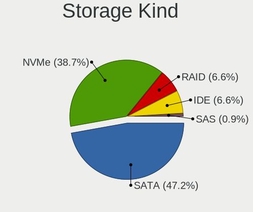
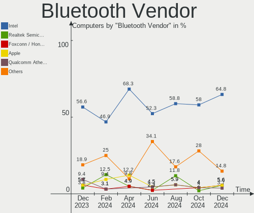
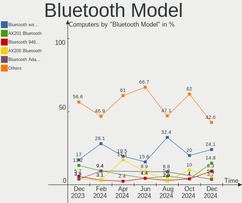
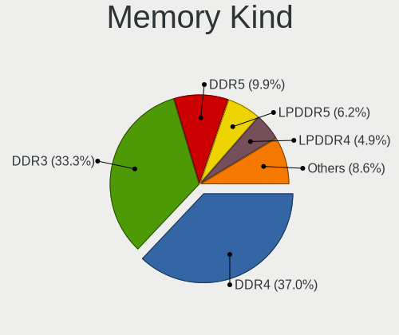
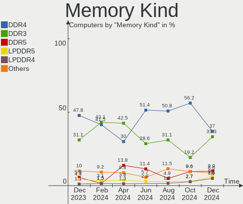
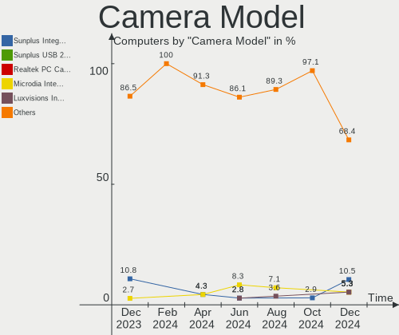

FreeBSD - Hardware Trends
-------------------------

A project to identify most popular hardware characteristics and track their change
over time based on data collected by BSD users at https://BSD-Hardware.info.

Anyone can contribute to this report by the [hw-probe](https://github.com/linuxhw/hw-probe/blob/master/INSTALL.BSD.md) tool:

    hw-probe -all -upload

This is a report for all computer types. See also reports for [desktops](/Dist/FreeBSD/Desktop/README.md) and [notebooks](/Dist/FreeBSD/Notebook/README.md).

This report is for one last month. Overall report since the beginning of time: [TestDays](https://github.com/bsdhw/TestDays)

Period: Dec, 2025.

Contents
--------

* [ System ](#system)
  - [ OS                       ](#os)
  - [ OS Family                ](#os-family)
  - [ Arch                     ](#arch)
  - [ DE                       ](#de)
  - [ Display Server           ](#display-server)
  - [ Display Manager          ](#display-manager)
  - [ OS Lang                  ](#os-lang)
  - [ Boot Mode                ](#boot-mode)
  - [ Filesystem               ](#filesystem)
  - [ Part. scheme             ](#part-scheme)

* [ Board ](#board)
  - [ Vendor                   ](#vendor)
  - [ Model                    ](#model)
  - [ Model Family             ](#model-family)
  - [ MFG Year                 ](#mfg-year)
  - [ Form Factor              ](#form-factor)
  - [ Coreboot                 ](#coreboot)
  - [ RAM Size                 ](#ram-size)
  - [ RAM Used                 ](#ram-used)
  - [ Total Drives             ](#total-drives)
  - [ Has CD-ROM               ](#has-cd-rom)
  - [ Has Ethernet             ](#has-ethernet)
  - [ Has WiFi                 ](#has-wifi)
  - [ Has Bluetooth            ](#has-bluetooth)

* [ Location ](#location)
  - [ Country                  ](#country)
  - [ City                     ](#city)

* [ Drives ](#drives)
  - [ Drive Vendor             ](#drive-vendor)
  - [ Drive Model              ](#drive-model)
  - [ HDD Vendor               ](#hdd-vendor)
  - [ SSD Vendor               ](#ssd-vendor)
  - [ Drive Kind               ](#drive-kind)
  - [ Drive Connector          ](#drive-connector)
  - [ Drive Size               ](#drive-size)
  - [ Space Total              ](#space-total)
  - [ Space Used               ](#space-used)
  - [ Malfunc. Drives          ](#malfunc-drives)
  - [ Malfunc. Drive Vendor    ](#malfunc-drive-vendor)
  - [ Malfunc. HDD Vendor      ](#malfunc-hdd-vendor)
  - [ Malfunc. Drive Kind      ](#malfunc-drive-kind)
  - [ Failed Drives            ](#failed-drives)
  - [ Failed Drive Vendor      ](#failed-drive-vendor)
  - [ Drive Status             ](#drive-status)

* [ Storage controller ](#storage-controller)
  - [ Storage Vendor           ](#storage-vendor)
  - [ Storage Model            ](#storage-model)
  - [ Storage Kind             ](#storage-kind)

* [ Processor ](#processor)
  - [ CPU Vendor               ](#cpu-vendor)
  - [ CPU Model                ](#cpu-model)
  - [ CPU Model Family         ](#cpu-model-family)
  - [ CPU Cores                ](#cpu-cores)
  - [ CPU Sockets              ](#cpu-sockets)
  - [ CPU Threads              ](#cpu-threads)
  - [ CPU Microarch            ](#cpu-microarch)

* [ Graphics ](#graphics)
  - [ GPU Vendor               ](#gpu-vendor)
  - [ GPU Model                ](#gpu-model)
  - [ GPU Combo                ](#gpu-combo)
  - [ GPU Driver               ](#gpu-driver)
  - [ GPU Memory               ](#gpu-memory)

* [ Monitor ](#monitor)
  - [ Monitor Vendor           ](#monitor-vendor)
  - [ Monitor Model            ](#monitor-model)
  - [ Monitor Resolution       ](#monitor-resolution)
  - [ Monitor Diagonal         ](#monitor-diagonal)
  - [ Monitor Width            ](#monitor-width)
  - [ Aspect Ratio             ](#aspect-ratio)
  - [ Monitor Area             ](#monitor-area)
  - [ Pixel Density            ](#pixel-density)
  - [ Multiple Monitors        ](#multiple-monitors)

* [ Network ](#network)
  - [ Net Controller Vendor    ](#net-controller-vendor)
  - [ Net Controller Model     ](#net-controller-model)
  - [ Wireless Vendor          ](#wireless-vendor)
  - [ Wireless Model           ](#wireless-model)
  - [ Ethernet Vendor          ](#ethernet-vendor)
  - [ Ethernet Model           ](#ethernet-model)
  - [ Net Controller Kind      ](#net-controller-kind)
  - [ Used Controller          ](#used-controller)
  - [ NICs                     ](#nics)
  - [ IPv6                     ](#ipv6)

* [ Bluetooth ](#bluetooth)
  - [ Bluetooth Vendor         ](#bluetooth-vendor)
  - [ Bluetooth Model          ](#bluetooth-model)

* [ Sound ](#sound)
  - [ Sound Vendor             ](#sound-vendor)
  - [ Sound Model              ](#sound-model)

* [ Memory ](#memory)
  - [ Memory Vendor            ](#memory-vendor)
  - [ Memory Model             ](#memory-model)
  - [ Memory Kind              ](#memory-kind)
  - [ Memory Form Factor       ](#memory-form-factor)
  - [ Memory Size              ](#memory-size)
  - [ Memory Speed             ](#memory-speed)

* [ Printers & scanners ](#printers--scanners)
  - [ Printer Vendor           ](#printer-vendor)
  - [ Printer Model            ](#printer-model)
  - [ Scanner Vendor           ](#scanner-vendor)
  - [ Scanner Model            ](#scanner-model)

* [ Camera ](#camera)
  - [ Camera Vendor            ](#camera-vendor)
  - [ Camera Model             ](#camera-model)

* [ Security ](#security)
  - [ Fingerprint Vendor       ](#fingerprint-vendor)
  - [ Fingerprint Model        ](#fingerprint-model)
  - [ Chipcard Vendor          ](#chipcard-vendor)
  - [ Chipcard Model           ](#chipcard-model)

* [ Unsupported ](#unsupported)
  - [ Unsupported Devices      ](#unsupported-devices)
  - [ Unsupported Device Types ](#unsupported-device-types)

System
------

OS
--

Installed operating systems

| Name                 | Computers | Percent |
|----------------------|-----------|---------|
| FreeBSD 15.0         | 32        | 39.02%  |
| FreeBSD 15.0-p1      | 18        | 21.95%  |
| FreeBSD 15.0-STABLE  | 7         | 8.54%   |
| FreeBSD 14.3-p6      | 6         | 7.32%   |
| FreeBSD 16.0-CURRENT | 5         | 6.1%    |
| FreeBSD 14.3-p7      | 5         | 6.1%    |
| FreeBSD 14.3-p5      | 3         | 3.66%   |
| FreeBSD 14.3         | 3         | 3.66%   |
| FreeBSD 15.0-RC4-p1  | 1         | 1.22%   |
| FreeBSD 14.3-STABLE  | 1         | 1.22%   |
| FreeBSD 13.5-p3      | 1         | 1.22%   |

OS Family
---------

OS without a version

| Name    | Computers | Percent |
|---------|-----------|---------|
| FreeBSD | 82        | 100%    |

Arch
----

OS architecture (x86_64, i586, etc.)

| Name  | Computers | Percent |
|-------|-----------|---------|
| amd64 | 76        | 92.68%  |
| arm64 | 4         | 4.88%   |
| i386  | 2         | 2.44%   |

DE
--

Desktop Environment

| Name         | Computers | Percent |
|--------------|-----------|---------|
| Console      | 26        | 31.71%  |
| TWM          | 17        | 20.73%  |
| XFCE         | 14        | 17.07%  |
| MATE         | 7         | 8.54%   |
| KDE6         | 4         | 4.88%   |
| GNOME        | 4         | 4.88%   |
| i3           | 2         | 2.44%   |
| AwesomeWM    | 2         | 2.44%   |
| sway:wlroots | 1         | 1.22%   |
| Openbox      | 1         | 1.22%   |
| mango        | 1         | 1.22%   |
| LXQt         | 1         | 1.22%   |
| KDE          | 1         | 1.22%   |
| cwm          | 1         | 1.22%   |

Display Server
--------------

X11 or Wayland

| Name    | Computers | Percent |
|---------|-----------|---------|
| X11     | 50        | 60.98%  |
| Console | 23        | 28.05%  |
| Wayland | 9         | 10.98%  |

Display Manager
---------------

SDDM, LightDM, etc.

| Name    | Computers | Percent |
|---------|-----------|---------|
| Console | 47        | 57.32%  |
| SDDM    | 23        | 28.05%  |
| LightDM | 6         | 7.32%   |
| SLiM    | 2         | 2.44%   |
| Ly      | 2         | 2.44%   |
| XDM     | 1         | 1.22%   |
| GDM     | 1         | 1.22%   |

OS Lang
-------

Language

| Lang    | Computers | Percent |
|---------|-----------|---------|
| C       | 55        | 67.07%  |
| Unknown | 13        | 15.85%  |
| en_US   | 7         | 8.54%   |
| es_ES   | 3         | 3.66%   |
| ru_RU   | 1         | 1.22%   |
| fr_FR   | 1         | 1.22%   |
| en_CA   | 1         | 1.22%   |
| de_DE   | 1         | 1.22%   |

Boot Mode
---------

EFI or BIOS

| Mode | Computers | Percent |
|------|-----------|---------|
| EFI  | 64        | 78.05%  |
| BIOS | 18        | 21.95%  |

Filesystem
----------

Type of filesystem

| Type | Computers | Percent |
|------|-----------|---------|
| Zfs  | 63        | 76.83%  |
| Ufs  | 19        | 23.17%  |

Part. scheme
------------

Scheme of partitioning

| Type | Computers | Percent |
|------|-----------|---------|
| GPT  | 76        | 92.68%  |
| MBR  | 6         | 7.32%   |

Board
-----

Vendor
------

Motherboard manufacturer

| Name                                    | Computers | Percent |
|-----------------------------------------|-----------|---------|
| Lenovo                                  | 20        | 24.39%  |
| Dell                                    | 11        | 13.41%  |
| ASUSTek Computer                        | 10        | 12.2%   |
| Hewlett-Packard                         | 9         | 10.98%  |
| Unknown                                 | 5         | 6.1%    |
| Gigabyte Technology                     | 3         | 3.66%   |
| Toshiba                                 | 2         | 2.44%   |
| MSI                                     | 2         | 2.44%   |
| Intel                                   | 2         | 2.44%   |
| Framework                               | 2         | 2.44%   |
| Foxconn                                 | 2         | 2.44%   |
| ASRock                                  | 2         | 2.44%   |
| Sony                                    | 1         | 1.22%   |
| Shenzhen Meigao Electronic Equipment    | 1         | 1.22%   |
| Radio Victoria Fueguina                 | 1         | 1.22%   |
| Pegatron                                | 1         | 1.22%   |
| Panasonic                               | 1         | 1.22%   |
| Monster                                 | 1         | 1.22%   |
| Meigao Innovation Technology (Shenzhen) | 1         | 1.22%   |
| LG Electronics                          | 1         | 1.22%   |
| GEEKOM                                  | 1         | 1.22%   |
| Biostar                                 | 1         | 1.22%   |
| ASRockRack                              | 1         | 1.22%   |
| Apple                                   | 1         | 1.22%   |

Model
-----

Motherboard model

| Name                                              | Computers | Percent |
|---------------------------------------------------|-----------|---------|
| Unknown                                           | 5         | 6.1%    |
| Lenovo Tablet 10 20L4S00U00                       | 2         | 2.44%   |
| Toshiba Satellite A205                            | 1         | 1.22%   |
| Toshiba Satellite A110                            | 1         | 1.22%   |
| Sony SVE1512H1RW                                  | 1         | 1.22%   |
| Shenzhen Meigao Electronic Equipment Venus Series | 1         | 1.22%   |
| Radio Victoria Fueguina A24Win8                   | 1         | 1.22%   |
| Pegatron FQ425AA-ABA a6655f                       | 1         | 1.22%   |
| Panasonic CF-54-3                                 | 1         | 1.22%   |
| MSI Prestige 15 A10SC                             | 1         | 1.22%   |
| MSI MS-7817                                       | 1         | 1.22%   |
| Monster ABRA A5 V20.4                             | 1         | 1.22%   |
| Meigao (Shenzhen) MS-R1                           | 1         | 1.22%   |
| LG X110-L.A715HS                                  | 1         | 1.22%   |
| Lenovo ThinkStation S20 4157A5G                   | 1         | 1.22%   |
| Lenovo ThinkPad Yoga 370 20JH0017AU               | 1         | 1.22%   |
| Lenovo ThinkPad X260 20F6006XUK                   | 1         | 1.22%   |
| Lenovo ThinkPad X230 2325I63                      | 1         | 1.22%   |
| Lenovo ThinkPad X200 7459PQ3                      | 1         | 1.22%   |
| Lenovo ThinkPad T480s 20L8S2340E                  | 1         | 1.22%   |
| Lenovo ThinkPad T480 20L5000UUS                   | 1         | 1.22%   |
| Lenovo ThinkPad T470 20HES5800H                   | 1         | 1.22%   |
| Lenovo ThinkPad T450s 20BXCTO1WW                  | 1         | 1.22%   |
| Lenovo ThinkPad T440s 20AQ006HUS                  | 1         | 1.22%   |
| Lenovo ThinkPad T420 4180W1A                      | 1         | 1.22%   |
| Lenovo ThinkPad T14s Gen 6 21QXCTO1WW             | 1         | 1.22%   |
| Lenovo ThinkPad T14 Gen 1 20S1S80300              | 1         | 1.22%   |
| Lenovo ThinkPad T14 Gen 1 20S1S4K500              | 1         | 1.22%   |
| Lenovo ThinkCentre M75q Gen 2 11JN0099GE          | 1         | 1.22%   |
| Lenovo IdeaPad 5 15ITL05 82FG                     | 1         | 1.22%   |
| Lenovo IdeaPad 3 14ITL05 81X7                     | 1         | 1.22%   |
| Lenovo 3098                                       | 1         | 1.22%   |
| Intel NUC8i3CYS                                   | 1         | 1.22%   |
| Intel NUC13RNGi9                                  | 1         | 1.22%   |
| HP ProDesk 600 G3 DM                              | 1         | 1.22%   |
| HP ProBook 640 G3                                 | 1         | 1.22%   |
| HP ProBook 455 G2                                 | 1         | 1.22%   |
| HP EliteDesk 705 G2 SFF                           | 1         | 1.22%   |
| HP EliteBook 860 16 inch G9 Notebook PC           | 1         | 1.22%   |
| HP EliteBook 840 G7 Notebook PC                   | 1         | 1.22%   |

Model Family
------------

Motherboard model prefix

| Name                                       | Computers | Percent |
|--------------------------------------------|-----------|---------|
| Lenovo ThinkPad                            | 13        | 15.85%  |
| Unknown                                    | 5         | 6.1%    |
| Toshiba Satellite                          | 2         | 2.44%   |
| Lenovo Tablet                              | 2         | 2.44%   |
| Lenovo IdeaPad                             | 2         | 2.44%   |
| HP ProBook                                 | 2         | 2.44%   |
| HP EliteBook                               | 2         | 2.44%   |
| Framework Laptop                           | 2         | 2.44%   |
| Dell XPS                                   | 2         | 2.44%   |
| Dell Precision                             | 2         | 2.44%   |
| Dell PowerEdge                             | 2         | 2.44%   |
| ASUS PRIME                                 | 2         | 2.44%   |
| Sony SVE1512H1RW                           | 1         | 1.22%   |
| Shenzhen Meigao Electronic Equipment Venus | 1         | 1.22%   |
| Radio Victoria Fueguina A24Win8            | 1         | 1.22%   |
| Pegatron FQ425AA-ABA                       | 1         | 1.22%   |
| Panasonic CF-54-3                          | 1         | 1.22%   |
| MSI Prestige                               | 1         | 1.22%   |
| MSI MS-7817                                | 1         | 1.22%   |
| Monster ABRA                               | 1         | 1.22%   |
| Meigao (Shenzhen) MS-R1                    | 1         | 1.22%   |
| LG X110-L.A715HS                           | 1         | 1.22%   |
| Lenovo ThinkStation                        | 1         | 1.22%   |
| Lenovo ThinkCentre                         | 1         | 1.22%   |
| Lenovo 3098                                | 1         | 1.22%   |
| Intel NUC8i3CYS                            | 1         | 1.22%   |
| Intel NUC13RNGi9                           | 1         | 1.22%   |
| HP ProDesk                                 | 1         | 1.22%   |
| HP EliteDesk                               | 1         | 1.22%   |
| HP Compaq                                  | 1         | 1.22%   |
| HP 550-a114                                | 1         | 1.22%   |
| HP 255                                     | 1         | 1.22%   |
| Gigabyte Z690                              | 1         | 1.22%   |
| Gigabyte Z590                              | 1         | 1.22%   |
| Gigabyte B550                              | 1         | 1.22%   |
| GEEKOM Mini                                | 1         | 1.22%   |
| Foxconn OEM                                | 1         | 1.22%   |
| Foxconn Napa                               | 1         | 1.22%   |
| Dell Vostro                                | 1         | 1.22%   |
| Dell OptiPlex                              | 1         | 1.22%   |

MFG Year
--------

Motherboard manufacture year

| Year    | Computers | Percent |
|---------|-----------|---------|
| 2025    | 9         | 10.98%  |
| 2021    | 9         | 10.98%  |
| 2020    | 9         | 10.98%  |
| 2018    | 7         | 8.54%   |
| 2024    | 5         | 6.1%    |
| 2019    | 5         | 6.1%    |
| 2008    | 5         | 6.1%    |
| 2022    | 4         | 4.88%   |
| 2016    | 4         | 4.88%   |
| 2013    | 4         | 4.88%   |
| 2023    | 3         | 3.66%   |
| 2015    | 3         | 3.66%   |
| Unknown | 3         | 3.66%   |
| 2011    | 2         | 2.44%   |
| 2010    | 2         | 2.44%   |
| 2009    | 2         | 2.44%   |
| 2007    | 2         | 2.44%   |
| 2017    | 1         | 1.22%   |
| 2014    | 1         | 1.22%   |
| 2012    | 1         | 1.22%   |
| 2006    | 1         | 1.22%   |

Form Factor
-----------

Physical design of the computer

| Name        | Computers | Percent |
|-------------|-----------|---------|
| Notebook    | 39        | 47.56%  |
| Desktop     | 32        | 39.02%  |
| Mini pc     | 4         | 4.88%   |
| Server      | 4         | 4.88%   |
| Tablet      | 2         | 2.44%   |
| Convertible | 1         | 1.22%   |

Coreboot
--------

Have coreboot on board

| Used | Computers | Percent |
|------|-----------|---------|
| No   | 81        | 98.78%  |
| Yes  | 1         | 1.22%   |

RAM Size
--------

Total RAM memory

| Size in GB      | Computers | Percent |
|-----------------|-----------|---------|
| 16.01-24.0      | 24        | 29.27%  |
| 32.01-64.0      | 13        | 15.85%  |
| 8.01-16.0       | 13        | 15.85%  |
| 4.01-8.0        | 12        | 14.63%  |
| 64.01-256.0     | 12        | 14.63%  |
| 2.01-3.0        | 3         | 3.66%   |
| More than 256.0 | 2         | 2.44%   |
| 0.51-1.0        | 2         | 2.44%   |
| 24.01-32.0      | 1         | 1.22%   |

RAM Used
--------

Used RAM memory

| Used GB    | Computers | Percent |
|------------|-----------|---------|
| 0.01-0.5   | 27        | 32.93%  |
| 0.51-1.0   | 23        | 28.05%  |
| 1.01-2.0   | 19        | 23.17%  |
| 3.01-4.0   | 4         | 4.88%   |
| 4.01-8.0   | 3         | 3.66%   |
| 2.01-3.0   | 3         | 3.66%   |
| 16.01-24.0 | 1         | 1.22%   |
| 8.01-16.0  | 1         | 1.22%   |
| 0          | 1         | 1.22%   |

Total Drives
------------

Number of drives on board

| Drives | Computers | Percent |
|--------|-----------|---------|
| 0      | 32        | 39.02%  |
| 1      | 27        | 32.93%  |
| 2      | 10        | 12.2%   |
| 4      | 5         | 6.1%    |
| 3      | 4         | 4.88%   |
| 11     | 1         | 1.22%   |
| 7      | 1         | 1.22%   |
| 6      | 1         | 1.22%   |
| 5      | 1         | 1.22%   |

Has CD-ROM
----------

Has CD-ROM on board

| Presented | Computers | Percent |
|-----------|-----------|---------|
| No        | 66        | 80.49%  |
| Yes       | 16        | 19.51%  |

Has Ethernet
------------

Has Ethernet on board

| Presented | Computers | Percent |
|-----------|-----------|---------|
| Yes       | 67        | 81.71%  |
| No        | 15        | 18.29%  |

Has WiFi
--------

Has WiFi module

| Presented | Computers | Percent |
|-----------|-----------|---------|
| Yes       | 59        | 71.95%  |
| No        | 23        | 28.05%  |

Has Bluetooth
-------------

Has Bluetooth module

| Presented | Computers | Percent |
|-----------|-----------|---------|
| Yes       | 50        | 60.98%  |
| No        | 32        | 39.02%  |

Location
--------

Country
-------

Geographic location (country)

| Country         | Computers | Percent |
|-----------------|-----------|---------|
| USA             | 25        | 30.49%  |
| Canada          | 6         | 7.32%   |
| UK              | 5         | 6.1%    |
| France          | 5         | 6.1%    |
| Venezuela       | 4         | 4.88%   |
| Russia          | 4         | 4.88%   |
| Mexico          | 4         | 4.88%   |
| Italy           | 4         | 4.88%   |
| Germany         | 4         | 4.88%   |
| Poland          | 3         | 3.66%   |
| Turkey          | 2         | 2.44%   |
| Spain           | 2         | 2.44%   |
| Netherlands     | 2         | 2.44%   |
| Tunisia         | 1         | 1.22%   |
| The Netherlands | 1         | 1.22%   |
| Slovakia        | 1         | 1.22%   |
| Japan           | 1         | 1.22%   |
| Indonesia       | 1         | 1.22%   |
| Hungary         | 1         | 1.22%   |
| Greece          | 1         | 1.22%   |
| Bulgaria        | 1         | 1.22%   |
| Brazil          | 1         | 1.22%   |
| Austria         | 1         | 1.22%   |
| Australia       | 1         | 1.22%   |
| Argentina       | 1         | 1.22%   |

City
----

Geographic location (city)

| City                  | Computers | Percent |
|-----------------------|-----------|---------|
| Hornsea               | 3         | 3.66%   |
| Duncan                | 3         | 3.66%   |
| Cambridge             | 3         | 3.66%   |
| Tacoma                | 2         | 2.44%   |
| Seattle               | 2         | 2.44%   |
| San Fernando de Apure | 2         | 2.44%   |
| Rockville             | 2         | 2.44%   |
| Redmond               | 2         | 2.44%   |
| Paris                 | 2         | 2.44%   |
| Monterrey             | 2         | 2.44%   |
| Amsterdam             | 2         | 2.44%   |
| Zabrze                | 1         | 1.22%   |
| Wroclaw               | 1         | 1.22%   |
| Wilmington            | 1         | 1.22%   |
| Wenatchee             | 1         | 1.22%   |
| Weissenfels           | 1         | 1.22%   |
| Waterloo              | 1         | 1.22%   |
| Vitry-sur-Seine       | 1         | 1.22%   |
| Turin                 | 1         | 1.22%   |
| Sykesville            | 1         | 1.22%   |
| Surabaya              | 1         | 1.22%   |
| St Petersburg         | 1         | 1.22%   |
| Seville               | 1         | 1.22%   |
| Seberi                | 1         | 1.22%   |
| Rosario               | 1         | 1.22%   |
| Richardson            | 1         | 1.22%   |
| Redondo Beach         | 1         | 1.22%   |
| Playa del Carmen      | 1         | 1.22%   |
| Palermo               | 1         | 1.22%   |
| Oxnard                | 1         | 1.22%   |
| Olympia               | 1         | 1.22%   |
| North Augusta         | 1         | 1.22%   |
| Norfolk               | 1         | 1.22%   |
| Newham                | 1         | 1.22%   |
| Newberg               | 1         | 1.22%   |
| Nagoya                | 1         | 1.22%   |
| Minneapolis           | 1         | 1.22%   |
| Milan                 | 1         | 1.22%   |
| Mielec                | 1         | 1.22%   |
| Mexico City           | 1         | 1.22%   |

Drives
------

Drive Vendor
------------

Hard drive vendors

| Vendor              | Computers | Drives | Percent |
|---------------------|-----------|--------|---------|
| WDC                 | 13        | 23     | 17.81%  |
| Seagate             | 13        | 24     | 17.81%  |
| Samsung Electronics | 13        | 19     | 17.81%  |
| Crucial             | 6         | 8      | 8.22%   |
| Kingston            | 4         | 5      | 5.48%   |
| Hitachi             | 4         | 4      | 5.48%   |
| SanDisk             | 2         | 2      | 2.74%   |
| Patriot             | 2         | 2      | 2.74%   |
| XrayDisk            | 1         | 1      | 1.37%   |
| SK hynix            | 1         | 1      | 1.37%   |
| PNY                 | 1         | 1      | 1.37%   |
| Netac               | 1         | 1      | 1.37%   |
| Micron Technology   | 1         | 1      | 1.37%   |
| LITEON              | 1         | 1      | 1.37%   |
| KLEVV               | 1         | 1      | 1.37%   |
| KIOXIA-EXCERIA      | 1         | 1      | 1.37%   |
| Intel               | 1         | 1      | 1.37%   |
| HPE                 | 1         | 6      | 1.37%   |
| Hewlett-Packard     | 1         | 1      | 1.37%   |
| GOLDEN MEMORY       | 1         | 1      | 1.37%   |
| Fujitsu             | 1         | 1      | 1.37%   |
| Dogfish             | 1         | 1      | 1.37%   |
| Apple               | 1         | 1      | 1.37%   |
| A-DATA Technology   | 1         | 1      | 1.37%   |

Drive Model
-----------

Hard drive models

| Model                                       | Computers | Percent |
|---------------------------------------------|-----------|---------|
| Crucial CT240BX500SSD1 240GB                | 3         | 3.8%    |
| Samsung SSD 860 EVO 1TB                     | 2         | 2.53%   |
| XrayDisk SSD 256GB                          | 1         | 1.27%   |
| WDC WDS500G2B0A-00SM50 500GB                | 1         | 1.27%   |
| WDC WD6004FZWX-00BKVA0 6TB                  | 1         | 1.27%   |
| WDC WD5000AAKX-75U6AA0 500GB                | 1         | 1.27%   |
| WDC WD5000AAKX-221CA1 500GB                 | 1         | 1.27%   |
| WDC WD40EZRZ-22GXCB0 4TB                    | 1         | 1.27%   |
| WDC WD40EZRX-00SPEB0 4TB                    | 1         | 1.27%   |
| WDC WD40EZAZ-00SF3B0 4TB                    | 1         | 1.27%   |
| WDC WD3200BPVT-75JJ5T0 320GB                | 1         | 1.27%   |
| WDC WD2500BEVT-22A23T0 250GB                | 1         | 1.27%   |
| WDC WD15EADS-00P8B0 1.5TB                   | 1         | 1.27%   |
| WDC WD120EFBX-68B0EN0 12TB                  | 1         | 1.27%   |
| WDC WD10EZEX-21WN4A0 1TB                    | 1         | 1.27%   |
| WDC WD100EMAZ-00WJTA0 10TB                  | 1         | 1.27%   |
| WDC WD1001FALS-00J7B1 1TB                   | 1         | 1.27%   |
| WDC WD1001FALS-00J7B0 1TB                   | 1         | 1.27%   |
| SK hynix SC311 SATA 256GB                   | 1         | 1.27%   |
| Seagate ST8000VN004-2M2101 8TB              | 1         | 1.27%   |
| Seagate ST8000DM004-2U9188 8TB              | 1         | 1.27%   |
| Seagate ST8000DM004-2CX188 8TB              | 1         | 1.27%   |
| Seagate ST500LM012 HN-M500MBB 500GB         | 1         | 1.27%   |
| Seagate ST4000DM000-1F2168 4TB              | 1         | 1.27%   |
| Seagate ST320LT007-9ZV142 320GB             | 1         | 1.27%   |
| Seagate ST24000VE002-3TR101 24TB            | 1         | 1.27%   |
| Seagate ST2000DM001-1CH164 2TB              | 1         | 1.27%   |
| Seagate ST18000NM014J-2WS103 18TB           | 1         | 1.27%   |
| Seagate ST18000NM003D-3DL103 18TB           | 1         | 1.27%   |
| Seagate ST18000NE000-3G6101 18TB            | 1         | 1.27%   |
| Seagate ST1000LM035-1RK172 1TB              | 1         | 1.27%   |
| Seagate ST1000DM010-2EP102 1TB              | 1         | 1.27%   |
| Seagate ST1000DM003-1CH162 1TB              | 1         | 1.27%   |
| Seagate BarraCuda 120 SSD ZA1000CM10003 1TB | 1         | 1.27%   |
| SanDisk SDSSDA240G 240GB                    | 1         | 1.27%   |
| SanDisk SD8SB8U128G1001 128GB               | 1         | 1.27%   |
| Samsung SSD 870 QVO 2TB                     | 1         | 1.27%   |
| Samsung SSD 870 EVO 500GB                   | 1         | 1.27%   |
| Samsung SSD 870 EVO 2TB                     | 1         | 1.27%   |
| Samsung SSD 870 EVO 1TB                     | 1         | 1.27%   |

HDD Vendor
----------

Hard disk drive vendors

| Vendor  | Computers | Drives | Percent |
|---------|-----------|--------|---------|
| WDC     | 12        | 21     | 40%     |
| Seagate | 12        | 23     | 40%     |
| Hitachi | 4         | 4      | 13.33%  |
| HPE     | 1         | 6      | 3.33%   |
| Fujitsu | 1         | 1      | 3.33%   |

SSD Vendor
----------

Solid state drive vendors

| Vendor              | Computers | Drives | Percent |
|---------------------|-----------|--------|---------|
| Samsung Electronics | 13        | 19     | 30.23%  |
| Crucial             | 6         | 8      | 13.95%  |
| Kingston            | 4         | 5      | 9.3%    |
| SanDisk             | 2         | 2      | 4.65%   |
| Patriot             | 2         | 2      | 4.65%   |
| XrayDisk            | 1         | 1      | 2.33%   |
| WDC                 | 1         | 2      | 2.33%   |
| SK hynix            | 1         | 1      | 2.33%   |
| Seagate             | 1         | 1      | 2.33%   |
| PNY                 | 1         | 1      | 2.33%   |
| Netac               | 1         | 1      | 2.33%   |
| Micron Technology   | 1         | 1      | 2.33%   |
| LITEON              | 1         | 1      | 2.33%   |
| KLEVV               | 1         | 1      | 2.33%   |
| KIOXIA-EXCERIA      | 1         | 1      | 2.33%   |
| Intel               | 1         | 1      | 2.33%   |
| Hewlett-Packard     | 1         | 1      | 2.33%   |
| GOLDEN MEMORY       | 1         | 1      | 2.33%   |
| Dogfish             | 1         | 1      | 2.33%   |
| Apple               | 1         | 1      | 2.33%   |
| A-DATA Technology   | 1         | 1      | 2.33%   |

Drive Kind
----------

HDD or SSD

| Kind | Computers | Drives | Percent |
|------|-----------|--------|---------|
| SSD  | 37        | 53     | 56.06%  |
| HDD  | 29        | 55     | 43.94%  |

Drive Connector
---------------

SATA, SAS, NVMe, etc.

| Type | Computers | Drives | Percent |
|------|-----------|--------|---------|
| SATA | 50        | 108    | 100%    |

Drive Size
----------

Size of hard drive

| Size in TB | Computers | Drives | Percent |
|------------|-----------|--------|---------|
| 0.01-0.5   | 34        | 43     | 51.52%  |
| 0.51-1.0   | 14        | 19     | 21.21%  |
| 1.01-2.0   | 6         | 13     | 9.09%   |
| 4.01-10.0  | 5         | 7      | 7.58%   |
| 3.01-4.0   | 4         | 8      | 6.06%   |
| 10.01-20.0 | 2         | 17     | 3.03%   |
| 20.01-50.0 | 1         | 1      | 1.52%   |

Space Total
-----------

Amount of disk space available on the file system

| Size in GB     | Computers | Percent |
|----------------|-----------|---------|
| 101-250        | 28        | 34.15%  |
| 501-1000       | 20        | 24.39%  |
| 251-500        | 14        | 17.07%  |
| 1001-2000      | 6         | 7.32%   |
| 51-100         | 5         | 6.1%    |
| More than 3000 | 3         | 3.66%   |
| 21-50          | 3         | 3.66%   |
| 1-20           | 2         | 2.44%   |
| Unknown        | 1         | 1.22%   |

Space Used
----------

Amount of used disk space

| Used GB   | Computers | Percent |
|-----------|-----------|---------|
| 1-20      | 62        | 75.61%  |
| 21-50     | 11        | 13.41%  |
| 51-100    | 5         | 6.1%    |
| 2001-3000 | 1         | 1.22%   |
| 101-250   | 1         | 1.22%   |
| 501-1000  | 1         | 1.22%   |
| Unknown   | 1         | 1.22%   |

Malfunc. Drives
---------------

Drive models with a malfunction

| Model                             | Computers | Drives | Percent |
|-----------------------------------|-----------|--------|---------|
| XrayDisk SSD 256GB                | 1         | 1      | 8.33%   |
| WDC WD5000AAKX-75U6AA0 500GB      | 1         | 1      | 8.33%   |
| WDC WD5000AAKX-221CA1 500GB       | 1         | 1      | 8.33%   |
| WDC WD3200BPVT-75JJ5T0 320GB      | 1         | 1      | 8.33%   |
| Seagate ST8000DM004-2CX188 8TB    | 1         | 2      | 8.33%   |
| Seagate ST4000DM000-1F2168 4TB    | 1         | 1      | 8.33%   |
| Seagate ST320LT007-9ZV142 320GB   | 1         | 1      | 8.33%   |
| Seagate ST18000NM014J-2WS103 18TB | 1         | 5      | 8.33%   |
| Hitachi HTS723225A7A364 250GB     | 1         | 1      | 8.33%   |
| Hitachi HTS723216L9SA60 160GB     | 1         | 1      | 8.33%   |
| Hitachi HTS543216L9SA00 160GB     | 1         | 1      | 8.33%   |
| Apple SSD SM0128G 121GB           | 1         | 1      | 8.33%   |

Malfunc. Drive Vendor
---------------------

Vendors of faulty drives

| Vendor   | Computers | Drives | Percent |
|----------|-----------|--------|---------|
| Seagate  | 4         | 9      | 33.33%  |
| WDC      | 3         | 3      | 25%     |
| Hitachi  | 3         | 3      | 25%     |
| XrayDisk | 1         | 1      | 8.33%   |
| Apple    | 1         | 1      | 8.33%   |

Malfunc. HDD Vendor
-------------------

Vendors of faulty HDD drives

| Vendor  | Computers | Drives | Percent |
|---------|-----------|--------|---------|
| Seagate | 4         | 9      | 40%     |
| WDC     | 3         | 3      | 30%     |
| Hitachi | 3         | 3      | 30%     |

Malfunc. Drive Kind
-------------------

Kinds of faulty drives

| Kind | Computers | Drives | Percent |
|------|-----------|--------|---------|
| HDD  | 10        | 15     | 83.33%  |
| SSD  | 2         | 2      | 16.67%  |

Failed Drives
-------------

Failed drive models

Zero info for selected period =(

Failed Drive Vendor
-------------------

Failed drive vendors

Zero info for selected period =(

Drive Status
------------

Number of failed and malfunc. drives

| Status  | Computers | Drives | Percent |
|---------|-----------|--------|---------|
| Works   | 43        | 91     | 78.18%  |
| Malfunc | 12        | 17     | 21.82%  |

Storage controller
------------------

Storage Vendor
--------------

Storage controller vendors

| Vendor                         | Computers | Percent |
|--------------------------------|-----------|---------|
| Intel                          | 45        | 42.06%  |
| Samsung Electronics            | 10        | 9.35%   |
| AMD                            | 9         | 8.41%   |
| Sandisk                        | 8         | 7.48%   |
| Kingston Technology Company    | 6         | 5.61%   |
| Broadcom / LSI                 | 4         | 3.74%   |
| MAXIO Technology (Hangzhou)    | 3         | 2.8%    |
| Shenzhen Longsys Electronics   | 2         | 1.87%   |
| Nvidia                         | 2         | 1.87%   |
| Micron/Crucial Technology      | 2         | 1.87%   |
| Marvell Technology Group       | 2         | 1.87%   |
| KIOXIA                         | 2         | 1.87%   |
| INNOGRIT                       | 2         | 1.87%   |
| Yangtze Memory Technologies    | 1         | 0.93%   |
| VIA Technologies               | 1         | 0.93%   |
| Solidigm                       | 1         | 0.93%   |
| Solid State Storage Technology | 1         | 0.93%   |
| Realtek Semiconductor          | 1         | 0.93%   |
| Phison Electronics             | 1         | 0.93%   |
| Micron Technology              | 1         | 0.93%   |
| Integrated Technology Express  | 1         | 0.93%   |
| ASMedia Technology             | 1         | 0.93%   |
| ADATA Technology               | 1         | 0.93%   |

Storage Model
-------------

Storage controller models

| Model                                                                          | Computers | Percent |
|--------------------------------------------------------------------------------|-----------|---------|
| Intel Sunrise Point-LP SATA Controller [AHCI mode]                             | 5         | 4.1%    |
| AMD FCH SATA Controller [AHCI mode]                                            | 5         | 4.1%    |
| Intel 7 Series Chipset Family 6-port SATA Controller [AHCI mode]               | 4         | 3.28%   |
| Sandisk WD Black SN850X NVMe SSD                                               | 3         | 2.46%   |
| SanDisk Extreme Pro / WD Black SN750 / PC SN730 / Red SN700 NVMe SSD           | 3         | 2.46%   |
| Kingston Company KC3000/FURY Renegade NVMe SSD [E18]                           | 3         | 2.46%   |
| Intel 8 Series/C220 Series Chipset Family 6-port SATA Controller 1 [AHCI mode] | 3         | 2.46%   |
| Intel 500 Series Chipset Family SATA AHCI Controller                           | 3         | 2.46%   |
| Shenzhen Longsys Lexar NM790 / Patriot Viper VP4300 Lite NVMe SSD (DRAM-less)  | 2         | 1.64%   |
| Samsung NVMe SSD Controller SM981/PM981/PM983                                  | 2         | 1.64%   |
| Samsung NVMe SSD Controller SM961/PM961/SM963                                  | 2         | 1.64%   |
| Samsung NVMe SSD Controller S4LV008[Pascal]                                    | 2         | 1.64%   |
| Samsung NVMe SSD Controller PM9A1/PM9A3/980PRO                                 | 2         | 1.64%   |
| Micron/Crucial P3 Plus NVMe PCIe SSD (DRAM-less)                               | 2         | 1.64%   |
| MAXIO (Hangzhou) NVMe SSD Controller MAP1202 (DRAM-less)                       | 2         | 1.64%   |
| KIOXIA NVMe SSD Controller BG4 (DRAM-less)                                     | 2         | 1.64%   |
| Intel Volume Management Device NVMe RAID Controller                            | 2         | 1.64%   |
| Intel Tiger Lake-LP SATA Controller                                            | 2         | 1.64%   |
| Intel Cannon Lake Mobile PCH SATA AHCI Controller                              | 2         | 1.64%   |
| Intel C610/X99 series chipset 6-Port SATA Controller [AHCI mode]               | 2         | 1.64%   |
| Intel 82801JI (ICH10 Family) SATA AHCI Controller                              | 2         | 1.64%   |
| Intel 82801HM/HEM (ICH8M/ICH8M-E) SATA Controller [AHCI mode]                  | 2         | 1.64%   |
| Intel 82801GBM/GHM (ICH7-M Family) SATA Controller [IDE mode]                  | 2         | 1.64%   |
| Intel 200 Series PCH SATA controller [AHCI mode]                               | 2         | 1.64%   |
| INNOGRIT NVMe SSD Controller IG5236 [RainierPC]                                | 2         | 1.64%   |
| Broadcom / LSI SAS3008 PCI-Express Fusion-MPT SAS-3                            | 2         | 1.64%   |
| AMD 600 Series Chipset SATA Controller                                         | 2         | 1.64%   |
| AMD 400 Series Chipset SATA Controller                                         | 2         | 1.64%   |
| Yangtze Memory PC210 M.2 2242 NVMe SSD                                         | 1         | 0.82%   |
| VIA VT82C586A/B/VT82C686/A/B/VT823x/A/C PIPC Bus Master IDE                    | 1         | 0.82%   |
| VIA VT8237A Integrated SATA Controller                                         | 1         | 0.82%   |
| Solidigm P41 Plus NVMe SSD (DRAM-less) [Echo Harbor]                           | 1         | 0.82%   |
| Solid State Storage CL1-3D256-Q11 NVMe SSD M.2                                 | 1         | 0.82%   |
| Sandisk WD PC SN5000S M.2 2280 NVMe SSD (DRAM-less)                            | 1         | 0.82%   |
| SanDisk Ultra 3D / WD PC SN530, IX SN530, Blue SN550 NVMe SSD (DRAM-less)      | 1         | 0.82%   |
| SanDisk Extreme Pro / WD Black 2018/SN750/PC SN720 NVMe SSD                    | 1         | 0.82%   |
| Samsung S4LN058A01[SSUBX] AHCI SSD Controller (Apple slot)                     | 1         | 0.82%   |
| Samsung NVMe SSD 9100 PRO [PM9E1]                                              | 1         | 0.82%   |
| Realtek RTS5772DL NVMe SSD Controller (DRAM-less)                              | 1         | 0.82%   |
| Phison PS5021-E21 PCIe4 NVMe Controller (DRAM-less)                            | 1         | 0.82%   |

Storage Kind
------------

Kind of storage controller (IDE, SATA, NVMe, SAS, ...)

| Kind | Computers | Percent |
|------|-----------|---------|
| SATA | 50        | 48.08%  |
| NVMe | 37        | 35.58%  |
| IDE  | 10        | 9.62%   |
| RAID | 4         | 3.85%   |
| SAS  | 3         | 2.88%   |

Processor
---------

CPU Vendor
----------

Processor vendors

| Vendor               | Computers | Percent |
|----------------------|-----------|---------|
| Intel                | 63        | 76.83%  |
| AMD                  | 15        | 18.29%  |
| ARM                  | 3         | 3.66%   |
| Cix Technology Group | 1         | 1.22%   |

CPU Model
---------

Processor models

| Model                                   | Computers | Percent |
|-----------------------------------------|-----------|---------|
| Intel Core i5-9400 CPU @ 2.90GHz        | 2         | 2.44%   |
| Intel Core i5-7300U CPU @ 2.60GHz       | 2         | 2.44%   |
| Intel Core i5-10210U CPU @ 1.60GHz      | 2         | 2.44%   |
| Intel Celeron N4100 CPU @ 1.10GHz       | 2         | 2.44%   |
| Intel 11th Gen Core i5-1135G7 @ 2.40GHz | 2         | 2.44%   |
| Intel Xeon Gold 6230 CPU @ 2.10GHz      | 1         | 1.22%   |
| Intel Xeon E-2356G CPU @ 3.20GHz        | 1         | 1.22%   |
| Intel Xeon CPU X5675 @ 3.07GHz          | 1         | 1.22%   |
| Intel Xeon CPU W3580 @ 3.33GHz          | 1         | 1.22%   |
| Intel Xeon CPU E5-2699 v4 @ 2.20GHz     | 1         | 1.22%   |
| Intel Xeon CPU E5-2695 v4 @ 2.10GHz     | 1         | 1.22%   |
| Intel Xeon CPU E3-1535M v5 @ 2.90GHz    | 1         | 1.22%   |
| Intel Pentium CPU G3220 @ 3.00GHz       | 1         | 1.22%   |
| Intel Genuine CPU T2                    | 1         | 1.22%   |
| Intel Genuine CPU                       | 1         | 1.22%   |
| Intel CPU Version                       | 1         | 1.22%   |
| Intel Core Ultra 7 258V                 | 1         | 1.22%   |
| Intel Core i7-9850H CPU @ 2.60GHz       | 1         | 1.22%   |
| Intel Core i7-8750H CPU @ 2.20GHz       | 1         | 1.22%   |
| Intel Core i7-8550U CPU @ 1.80GHz       | 1         | 1.22%   |
| Intel Core i7-7500U CPU @ 2.70GHz       | 1         | 1.22%   |
| Intel Core i7-6500U CPU @ 2.50GHz       | 1         | 1.22%   |
| Intel Core i7-4790 CPU @ 3.60GHz        | 1         | 1.22%   |
| Intel Core i7-4600U CPU @ 2.10GHz       | 1         | 1.22%   |
| Intel Core i7-3632QM CPU @ 2.20GHz      | 1         | 1.22%   |
| Intel Core i7-14700F                    | 1         | 1.22%   |
| Intel Core i7-10710U CPU @ 1.10GHz      | 1         | 1.22%   |
| Intel Core i5-8250U CPU @ 1.60GHz       | 1         | 1.22%   |
| Intel Core i5-7500T CPU @ 2.70GHz       | 1         | 1.22%   |
| Intel Core i5-7200U CPU @ 2.50GHz       | 1         | 1.22%   |
| Intel Core i5-5257U CPU @ 2.70GHz       | 1         | 1.22%   |
| Intel Core i5-5200U CPU @ 2.20GHz       | 1         | 1.22%   |
| Intel Core i5-4570 CPU @ 3.20GHz        | 1         | 1.22%   |
| Intel Core i5-4300M CPU @ 2.60GHz       | 1         | 1.22%   |
| Intel Core i5-3210M CPU @ 2.50GHz       | 1         | 1.22%   |
| Intel Core i5-2520M CPU @ 2.50GHz       | 1         | 1.22%   |
| Intel Core i5-2400 CPU @ 3.10GH         | 1         | 1.22%   |
| Intel Core i5-10310U CPU @ 1.70GHz      | 1         | 1.22%   |
| Intel Core i3-8121U CPU @ 2.20GHz       | 1         | 1.22%   |
| Intel Core i3-6006U CPU @ 2.00GHz       | 1         | 1.22%   |

CPU Model Family
----------------

Processor model prefix

| Model                  | Computers | Percent |
|------------------------|-----------|---------|
| Intel Core i5          | 17        | 20.73%  |
| Other                  | 13        | 15.85%  |
| Intel Core i7          | 10        | 12.2%   |
| Intel Xeon             | 6         | 7.32%   |
| Intel Core i3          | 6         | 7.32%   |
| Intel Core 2 Duo       | 3         | 3.66%   |
| ARM Cortex             | 3         | 3.66%   |
| AMD Ryzen 9            | 3         | 3.66%   |
| Intel Genuine          | 2         | 2.44%   |
| Intel Celeron          | 2         | 2.44%   |
| AMD Ryzen 5            | 2         | 2.44%   |
| AMD A8                 | 2         | 2.44%   |
| Intel Xeon Gold        | 1         | 1.22%   |
| Intel Pentium          | 1         | 1.22%   |
| Intel Core 2 Quad      | 1         | 1.22%   |
| Intel Core             | 1         | 1.22%   |
| Intel Atom             | 1         | 1.22%   |
| AMD Ryzen Threadripper | 1         | 1.22%   |
| AMD Ryzen 7            | 1         | 1.22%   |
| AMD Ryzen 3            | 1         | 1.22%   |
| AMD PRO A8             | 1         | 1.22%   |
| AMD Phenom             | 1         | 1.22%   |
| AMD Opteron            | 1         | 1.22%   |
| AMD Athlon 64 X2       | 1         | 1.22%   |
| AMD Athlon             | 1         | 1.22%   |

CPU Cores
---------

Number of processor cores

| Number  | Computers | Percent |
|---------|-----------|---------|
| 2       | 24        | 29.27%  |
| 4       | 20        | 24.39%  |
| 6       | 9         | 10.98%  |
| Unknown | 9         | 10.98%  |
| 12      | 5         | 6.1%    |
| 8       | 4         | 4.88%   |
| 32      | 2         | 2.44%   |
| 16      | 2         | 2.44%   |
| 10      | 2         | 2.44%   |
| 44      | 1         | 1.22%   |
| 40      | 1         | 1.22%   |
| 28      | 1         | 1.22%   |
| 18      | 1         | 1.22%   |
| 1       | 1         | 1.22%   |

CPU Sockets
-----------

Number of sockets

| Number  | Computers | Percent |
|---------|-----------|---------|
| 1       | 76        | 92.68%  |
| 2       | 3         | 3.66%   |
| Unknown | 3         | 3.66%   |

CPU Threads
-----------

Threads per core (Hyper-Threading)

| Number  | Computers | Percent |
|---------|-----------|---------|
| 2       | 55        | 67.07%  |
| 1       | 18        | 21.95%  |
| Unknown | 9         | 10.98%  |

CPU Microarch
-------------

Microarchitecture

| Name          | Computers | Percent |
|---------------|-----------|---------|
| Unknown       | 18        | 21.95%  |
| KabyLake      | 14        | 17.07%  |
| Haswell       | 5         | 6.1%    |
| Skylake       | 4         | 4.88%   |
| IvyBridge     | 4         | 4.88%   |
| Broadwell     | 4         | 4.88%   |
| Zen 3         | 3         | 3.66%   |
| TigerLake     | 3         | 3.66%   |
| SandyBridge   | 3         | 3.66%   |
| Core          | 3         | 3.66%   |
| Zen 2         | 2         | 2.44%   |
| Westmere      | 2         | 2.44%   |
| Steamroller   | 2         | 2.44%   |
| Penryn        | 2         | 2.44%   |
| Goldmont plus | 2         | 2.44%   |
| CometLake     | 2         | 2.44%   |
| Zen+          | 1         | 1.22%   |
| Puma          | 1         | 1.22%   |
| P6            | 1         | 1.22%   |
| Nehalem       | 1         | 1.22%   |
| K8 Hammer     | 1         | 1.22%   |
| K10           | 1         | 1.22%   |
| Excavator     | 1         | 1.22%   |
| CannonLake    | 1         | 1.22%   |
| Bonnell       | 1         | 1.22%   |

Graphics
--------

GPU Vendor
----------

Vendors of graphics cards

| Vendor                     | Computers | Percent |
|----------------------------|-----------|---------|
| Intel                      | 48        | 52.75%  |
| Nvidia                     | 19        | 20.88%  |
| AMD                        | 18        | 19.78%  |
| ASPEED Technology          | 3         | 3.3%    |
| Matrox Electronics Systems | 2         | 2.2%    |
| VIA Technologies           | 1         | 1.1%    |

GPU Model
---------

Graphics card models

| Model                                                                         | Computers | Percent |
|-------------------------------------------------------------------------------|-----------|---------|
| Intel Kaby Lake-U GT2 [HD Graphics 620]                                       | 4         | 4.26%   |
| Intel 3rd Gen Core processor Graphics Controller                              | 4         | 4.26%   |
| Intel CometLake-U GT2 [UHD Graphics]                                          | 3         | 3.19%   |
| Intel 2nd Generation Core Processor Family Integrated Graphics Controller     | 3         | 3.19%   |
| ASPEED Technology ASPEED Graphics Family                                      | 3         | 3.19%   |
| Intel Xeon E3-1200 v3/4th Gen Core Processor Integrated Graphics Controller   | 2         | 2.13%   |
| Intel TigerLake-LP GT2 [Iris Xe Graphics]                                     | 2         | 2.13%   |
| Intel Skylake-U GT2 [HD Graphics 520]                                         | 2         | 2.13%   |
| Intel Raptor Lake-P [Iris Xe Graphics]                                        | 2         | 2.13%   |
| Intel Mobile 945GM/GMS/GME, 943/940GML Express Integrated Graphics Controller | 2         | 2.13%   |
| Intel Kaby Lake-R GT2 [UHD Graphics 620]                                      | 2         | 2.13%   |
| Intel GeminiLake [UHD Graphics 600]                                           | 2         | 2.13%   |
| Intel CoffeeLake-S GT2 [UHD Graphics 630]                                     | 2         | 2.13%   |
| Intel CoffeeLake-H GT2 [UHD Graphics 630]                                     | 2         | 2.13%   |
| AMD Granite Ridge [Radeon Graphics]                                           | 2         | 2.13%   |
| AMD Cezanne [Radeon Vega Series / Radeon Vega Mobile Series]                  | 2         | 2.13%   |
| AMD Cedar [Radeon HD 5000/6000/7350/8350 Series]                              | 2         | 2.13%   |
| VIA Technologies K8M890CE/K8N890CE [Chrome 9]                                 | 1         | 1.06%   |
| Nvidia TU117M [GeForce GTX 1650 Mobile / Max-Q]                               | 1         | 1.06%   |
| Nvidia TU117GLM [Quadro T1000 Mobile]                                         | 1         | 1.06%   |
| Nvidia TU116 [GeForce GTX 1660 Ti]                                            | 1         | 1.06%   |
| Nvidia TU116 [GeForce GTX 1650 SUPER]                                         | 1         | 1.06%   |
| Nvidia GP108M [GeForce MX330]                                                 | 1         | 1.06%   |
| Nvidia GP108 [GeForce GT 1030]                                                | 1         | 1.06%   |
| Nvidia GP107M [GeForce GTX 1050 Ti Mobile]                                    | 1         | 1.06%   |
| Nvidia GP107 [GeForce GTX 1050 Ti]                                            | 1         | 1.06%   |
| Nvidia GP106 [GeForce GTX 1060 6GB]                                           | 1         | 1.06%   |
| Nvidia GM108M [GeForce MX110]                                                 | 1         | 1.06%   |
| Nvidia GM107GLM [Quadro M1000M]                                               | 1         | 1.06%   |
| Nvidia GK107 [GeForce GTX 650]                                                | 1         | 1.06%   |
| Nvidia GF108M [GeForce GT 620M/630M/635M/640M LE]                             | 1         | 1.06%   |
| Nvidia GA107GL [RTX A400]                                                     | 1         | 1.06%   |
| Nvidia GA106 [GeForce RTX 3060 Lite Hash Rate]                                | 1         | 1.06%   |
| Nvidia GA104GL [RTX A4000]                                                    | 1         | 1.06%   |
| Nvidia AD107M [GeForce RTX 4050 Max-Q / Mobile]                               | 1         | 1.06%   |
| Nvidia AD107 [GeForce RTX 4060]                                               | 1         | 1.06%   |
| Nvidia AD104 [GeForce RTX 4070]                                               | 1         | 1.06%   |
| Matrox Electronics Systems Integrated Matrox G200eW3 Graphics Controller      | 1         | 1.06%   |
| Matrox Electronics Systems G200eR2                                            | 1         | 1.06%   |
| Intel Tiger Lake-LP GT2 [UHD Graphics G4]                                     | 1         | 1.06%   |

GPU Combo
---------

Combinations of graphics cards

| Name            | Computers | Percent |
|-----------------|-----------|---------|
| 1 x Intel       | 33        | 40.24%  |
| 1 x AMD         | 15        | 18.29%  |
| Intel + Nvidia  | 9         | 10.98%  |
| 1 x Nvidia      | 8         | 9.76%   |
| Other           | 5         | 6.1%    |
| 2 x Intel       | 4         | 4.88%   |
| 1 x ASPEED      | 2         | 2.44%   |
| 1 x VIA         | 1         | 1.22%   |
| Nvidia + Matrox | 1         | 1.22%   |
| 1 x Matrox      | 1         | 1.22%   |
| Intel + ASPEED  | 1         | 1.22%   |
| Intel + AMD     | 1         | 1.22%   |
| AMD + Nvidia    | 1         | 1.22%   |

GPU Driver
----------

Free vs proprietary

| Driver      | Computers | Percent |
|-------------|-----------|---------|
| Free        | 66        | 80.49%  |
| Proprietary | 11        | 13.41%  |
| Unknown     | 5         | 6.1%    |

GPU Memory
----------

Total video memory

| Size in GB | Computers | Percent |
|------------|-----------|---------|
| Unknown    | 63        | 76.83%  |
| 1.01-2.0   | 4         | 4.88%   |
| 0.01-0.5   | 4         | 4.88%   |
| 3.01-4.0   | 3         | 3.66%   |
| 0.51-1.0   | 3         | 3.66%   |
| 8.01-16.0  | 2         | 2.44%   |
| 7.01-8.0   | 1         | 1.22%   |
| 5.01-6.0   | 1         | 1.22%   |
| 16.01-24.0 | 1         | 1.22%   |

Monitor
-------

Monitor Vendor
--------------

Monitor vendors

| Vendor                  | Computers | Percent |
|-------------------------|-----------|---------|
| Samsung Electronics     | 6         | 11.54%  |
| Chimei Innolux          | 6         | 11.54%  |
| LG Display              | 5         | 9.62%   |
| Dell                    | 5         | 9.62%   |
| AU Optronics            | 5         | 9.62%   |
| BOE                     | 4         | 7.69%   |
| HKC                     | 2         | 3.85%   |
| Hewlett-Packard         | 2         | 3.85%   |
| HannStar                | 2         | 3.85%   |
| Goldstar                | 2         | 3.85%   |
| Unknown                 | 2         | 3.85%   |
| LG Philips              | 1         | 1.92%   |
| LG Electronics          | 1         | 1.92%   |
| Lenovo                  | 1         | 1.92%   |
| IPS                     | 1         | 1.92%   |
| InfoVision              | 1         | 1.92%   |
| Chi Mei Optoelectronics | 1         | 1.92%   |
| ASUSTek Computer        | 1         | 1.92%   |
| Apple                   | 1         | 1.92%   |
| AOC                     | 1         | 1.92%   |
| Ancor Communications    | 1         | 1.92%   |
| Acer                    | 1         | 1.92%   |

Monitor Model
-------------

Monitor models

| Model                                                                    | Computers | Percent |
|--------------------------------------------------------------------------|-----------|---------|
| Chimei Innolux LCD Monitor CMN14C9 1920x1080 310x170mm 13.9-inch         | 2         | 3.85%   |
| BOE LCD Monitor BOE095F 2256x1504 280x190mm 13.3-inch                    | 2         | 3.85%   |
| Unknown                                                                  | 2         | 3.85%   |
| Samsung Electronics U28E590 SAM0C4E 3840x2160 610x350mm 27.7-inch        | 1         | 1.92%   |
| Samsung Electronics SyncMaster SAM0471 1360x768 340x190mm 15.3-inch      | 1         | 1.92%   |
| Samsung Electronics SyncMaster SAM0286 1280x720 370x210mm 16.7-inch      | 1         | 1.92%   |
| Samsung Electronics S27C500 SAM0AF3 1920x1080 600x340mm 27.2-inch        | 1         | 1.92%   |
| Samsung Electronics LCD Monitor SEC3633 1280x800 330x210mm 15.4-inch     | 1         | 1.92%   |
| Samsung Electronics C24F390 SAM0D2C 1920x1080 520x290mm 23.4-inch        | 1         | 1.92%   |
| LG Philips LCD Monitor LPLDC00 1280x800 330x210mm 15.4-inch              | 1         | 1.92%   |
| LG Electronics LCD Monitor LG HDR WQHD 3440x1440                         | 1         | 1.92%   |
| LG Display LCD Monitor LGD06EF 1920x1080 310x170mm 13.9-inch             | 1         | 1.92%   |
| LG Display LCD Monitor LGD05D0 1920x1080 340x190mm 15.3-inch             | 1         | 1.92%   |
| LG Display LCD Monitor LGD04B9 1920x1080 340x190mm 15.3-inch             | 1         | 1.92%   |
| LG Display LCD Monitor LGD040A 1920x1080 310x170mm 13.9-inch             | 1         | 1.92%   |
| LG Display LCD Monitor LGD03A3 1366x768 280x160mm 12.7-inch              | 1         | 1.92%   |
| Lenovo LCD Monitor LEN4010 1280x800 260x160mm 12.0-inch                  | 1         | 1.92%   |
| IPS HDMI IPS0001 1280x1024 340x270mm 17.1-inch                           | 1         | 1.92%   |
| InfoVision LCD Monitor IVO0536 1920x1080 290x170mm 13.2-inch             | 1         | 1.92%   |
| HKC S01 HKC2113 1920x1080 480x260mm 21.5-inch                            | 1         | 1.92%   |
| HKC LCD Monitor HKC023D 1920x1080 340x190mm 15.3-inch                    | 1         | 1.92%   |
| Hewlett-Packard w1907 HWP26A2 1440x900 410x260mm 19.1-inch               | 1         | 1.92%   |
| Hewlett-Packard 22w HPN342E 1920x1080 480x270mm 21.7-inch                | 1         | 1.92%   |
| HannStar HSD140PHW1 HSD0583 1366x768 310x170mm 13.9-inch                 | 1         | 1.92%   |
| HannStar Hanns.G HH191 HSD213F 1280x1024 380x300mm 19.1-inch             | 1         | 1.92%   |
| Goldstar LG ULTRAGEAR+ GSM5C34 2560x1440 590x330mm 26.6-inch             | 1         | 1.92%   |
| Goldstar LG ULTRAFINE GSM5BC1 3840x2160 700x400mm 31.7-inch              | 1         | 1.92%   |
| Dell U3023E DEL425B 2560x1600 640x400mm 29.7-inch                        | 1         | 1.92%   |
| Dell P2723QE DELF13D 3840x2160 600x340mm 27.2-inch                       | 1         | 1.92%   |
| Dell P2422HE DELA1C7 1920x1080 530x300mm 24.0-inch                       | 1         | 1.92%   |
| Dell P2217H DELA0D7 1920x1080 480x270mm 21.7-inch                        | 1         | 1.92%   |
| Dell LCD Monitor P2415Q 1920x1080                                        | 1         | 1.92%   |
| Chimei Innolux LCD Monitor CMN160F 1920x1200 340x220mm 15.9-inch         | 1         | 1.92%   |
| Chimei Innolux LCD Monitor CMN15D5 1920x1080 340x190mm 15.3-inch         | 1         | 1.92%   |
| Chimei Innolux LCD Monitor CMN1521 1920x1080 340x190mm 15.3-inch         | 1         | 1.92%   |
| Chimei Innolux LCD Monitor CMN14D6 1366x768 310x170mm 13.9-inch          | 1         | 1.92%   |
| Chi Mei Optoelectronics LCD Monitor CMO15AB 1366x768 340x190mm 15.3-inch | 1         | 1.92%   |
| BOE LCD Monitor BOE09F0 1920x1080 310x170mm 13.9-inch                    | 1         | 1.92%   |
| BOE LCD Monitor BOE08F2 1920x1080 310x170mm 13.9-inch                    | 1         | 1.92%   |
| AU Optronics LCD Monitor AUOB79F 1920x1080 340x190mm 15.3-inch           | 1         | 1.92%   |

Monitor Resolution
------------------

Monitor screen resolution

| Resolution        | Computers | Percent |
|-------------------|-----------|---------|
| 1920x1080 (FHD)   | 25        | 49.02%  |
| 1366x768 (WXGA)   | 5         | 9.8%    |
| 3840x2160 (4K)    | 4         | 7.84%   |
| 2560x1440 (QHD)   | 3         | 5.88%   |
| 1280x800 (WXGA)   | 3         | 5.88%   |
| 2560x1600         | 2         | 3.92%   |
| 2256x1504         | 2         | 3.92%   |
| 1280x1024 (SXGA)  | 2         | 3.92%   |
| 3440x1440         | 1         | 1.96%   |
| 1920x1200 (WUXGA) | 1         | 1.96%   |
| 1440x900 (WXGA+)  | 1         | 1.96%   |
| 1360x768          | 1         | 1.96%   |
| 1280x720 (HD)     | 1         | 1.96%   |

Monitor Diagonal
----------------

Diagonal size in inches

| Inches  | Computers | Percent |
|---------|-----------|---------|
| 13      | 14        | 26.92%  |
| 15      | 12        | 23.08%  |
| 27      | 5         | 9.62%   |
| Unknown | 4         | 7.69%   |
| 21      | 3         | 5.77%   |
| 12      | 3         | 5.77%   |
| 24      | 2         | 3.85%   |
| 23      | 2         | 3.85%   |
| 19      | 2         | 3.85%   |
| 31      | 1         | 1.92%   |
| 29      | 1         | 1.92%   |
| 26      | 1         | 1.92%   |
| 17      | 1         | 1.92%   |
| 16      | 1         | 1.92%   |

Monitor Width
-------------

Physical width

| Width in mm | Computers | Percent |
|-------------|-----------|---------|
| 301-350     | 23        | 45.1%   |
| 501-600     | 8         | 15.69%  |
| 201-300     | 7         | 13.73%  |
| 401-500     | 4         | 7.84%   |
| Unknown     | 4         | 7.84%   |
| 601-700     | 3         | 5.88%   |
| 351-400     | 2         | 3.92%   |

Aspect Ratio
------------

Proportional relationship between the width and the height

| Ratio   | Computers | Percent |
|---------|-----------|---------|
| 16/9    | 33        | 68.75%  |
| 16/10   | 6         | 12.5%   |
| Unknown | 4         | 8.33%   |
| 3/2     | 3         | 6.25%   |
| 5/4     | 2         | 4.17%   |

Monitor Area
------------

Area in inch

| Area in inch | Computers | Percent |
|----------------|-----------|---------|
| 81-90          | 13        | 25.49%  |
| 91-100         | 9         | 17.65%  |
| 201-250        | 6         | 11.76%  |
| 301-350        | 5         | 9.8%    |
| Unknown        | 4         | 7.84%   |
| 61-70          | 3         | 5.88%   |
| 151-200        | 3         | 5.88%   |
| 351-500        | 2         | 3.92%   |
| 111-120        | 2         | 3.92%   |
| 101-110        | 2         | 3.92%   |
| 71-80          | 1         | 1.96%   |
| 141-150        | 1         | 1.96%   |

Pixel Density
-------------

Pixels per inch

| Density | Computers | Percent |
|---------|-----------|---------|
| 121-160 | 19        | 38.78%  |
| 51-100  | 11        | 22.45%  |
| 101-120 | 9         | 18.37%  |
| 161-240 | 6         | 12.24%  |
| Unknown | 4         | 8.16%   |

Multiple Monitors
-----------------

Total monitors connected

| Total | Computers | Percent |
|-------|-----------|---------|
| 1     | 42        | 51.22%  |
| 0     | 35        | 42.68%  |
| 2     | 5         | 6.1%    |

Network
-------

Net Controller Vendor
---------------------

Controller vendors

| Vendor                     | Computers | Percent |
|----------------------------|-----------|---------|
| Intel                      | 50        | 45.45%  |
| Realtek Semiconductor      | 30        | 27.27%  |
| Qualcomm Atheros           | 8         | 7.27%   |
| Broadcom                   | 6         | 5.45%   |
| MediaTek                   | 3         | 2.73%   |
| Mellanox Technologies      | 2         | 1.82%   |
| Marvell Technology Group   | 2         | 1.82%   |
| VIA Technologies           | 1         | 0.91%   |
| U-Blox                     | 1         | 0.91%   |
| Sierra Wireless            | 1         | 0.91%   |
| Qualcomm Technologies      | 1         | 0.91%   |
| QinHeng Electronics        | 1         | 0.91%   |
| Nvidia                     | 1         | 0.91%   |
| Aquantia                   | 1         | 0.91%   |
| American Megatrends        | 1         | 0.91%   |
| American Future Technology | 1         | 0.91%   |

Net Controller Model
--------------------

Controller models

| Model                                                                  | Computers | Percent |
|------------------------------------------------------------------------|-----------|---------|
| Realtek RTL8111/8168/8211/8411 PCI Express Gigabit Ethernet Controller | 14        | 9.52%   |
| Intel Wireless 8265 / 8275                                             | 6         | 4.08%   |
| Realtek RTL8125 2.5GbE Controller                                      | 5         | 3.4%    |
| Realtek RTL810xE PCI Express Fast Ethernet controller                  | 4         | 2.72%   |
| Intel Ethernet Connection (4) I219-V                                   | 4         | 2.72%   |
| Intel Comet Lake PCH-LP CNVi WiFi                                      | 4         | 2.72%   |
| Qualcomm Atheros AR9485 Wireless Network Adapter                       | 3         | 2.04%   |
| MediaTek MT7922 802.11ax PCI Express Wireless Network Adapter          | 3         | 2.04%   |
| Intel Wireless 7265                                                    | 3         | 2.04%   |
| Intel Wi-Fi 6 AX200                                                    | 3         | 2.04%   |
| Intel 82574L Gigabit Network Connection                                | 3         | 2.04%   |
| Realtek RTL8822CE 802.11ac PCIe Wireless Network Adapter               | 2         | 1.36%   |
| Realtek RTL8822BE 802.11a/b/g/n/ac WiFi adapter                        | 2         | 1.36%   |
| Realtek RTL8188EUS 802.11n Wireless Network Adapter                    | 2         | 1.36%   |
| Qualcomm Atheros QCA9377 802.11ac Wireless Network Adapter             | 2         | 1.36%   |
| Qualcomm Atheros Killer E2400 Gigabit Ethernet Controller              | 2         | 1.36%   |
| Intel Wi-Fi 6 AX201                                                    | 2         | 1.36%   |
| Intel PRO/Wireless 3945ABG [Golan] Network Connection                  | 2         | 1.36%   |
| Intel I211 Gigabit Network Connection                                  | 2         | 1.36%   |
| Intel Ethernet Controller X550                                         | 2         | 1.36%   |
| Intel Ethernet Controller I226-V                                       | 2         | 1.36%   |
| Intel Ethernet Controller 10-Gigabit X540-AT2                          | 2         | 1.36%   |
| Intel Ethernet Connection (4) I219-LM                                  | 2         | 1.36%   |
| Intel Centrino Ultimate-N 6300                                         | 2         | 1.36%   |
| Intel Alder Lake-S PCH CNVi WiFi                                       | 2         | 1.36%   |
| Intel Alder Lake-P PCH CNVi WiFi                                       | 2         | 1.36%   |
| Intel 82579LM Gigabit Network Connection (Lewisville)                  | 2         | 1.36%   |
| VIA VT6105/VT6106S [Rhine-III]                                         | 1         | 0.68%   |
| U-Blox [u-blox 8]                                                      | 1         | 0.68%   |
| Sierra Wireless EM7455                                                 | 1         | 0.68%   |
| Realtek USB 2.5GbE Controller                                          | 1         | 0.68%   |
| Realtek RTL8851BE PCIe 802.11ax Wireless Network Controller            | 1         | 0.68%   |
| Realtek RTL8723BE PCIe Wireless Network Adapter                        | 1         | 0.68%   |
| Realtek RTL8191SEvB Wireless LAN Controller                            | 1         | 0.68%   |
| Realtek RTL8188CE 802.11b/g/n WiFi Adapter                             | 1         | 0.68%   |
| Realtek RTL8187SE Wireless LAN Controller                              | 1         | 0.68%   |
| Realtek RTL8127 10GbE Controller                                       | 1         | 0.68%   |
| Realtek RTL-8100/8101L/8139 PCI Fast Ethernet Adapter                  | 1         | 0.68%   |
| Qualcomm QCNFA765 Wireless Network Adapter                             | 1         | 0.68%   |
| Qualcomm Atheros QCA9565 / AR9565 Wireless Network Adapter             | 1         | 0.68%   |

Wireless Vendor
---------------

Wireless vendors

| Vendor                | Computers | Percent |
|-----------------------|-----------|---------|
| Intel                 | 35        | 57.38%  |
| Realtek Semiconductor | 11        | 18.03%  |
| Qualcomm Atheros      | 7         | 11.48%  |
| MediaTek              | 3         | 4.92%   |
| Broadcom              | 3         | 4.92%   |
| Sierra Wireless       | 1         | 1.64%   |
| Qualcomm Technologies | 1         | 1.64%   |

Wireless Model
--------------

Wireless models

| Model                                                           | Computers | Percent |
|-----------------------------------------------------------------|-----------|---------|
| Intel Wireless 8265 / 8275                                      | 6         | 9.84%   |
| Intel Comet Lake PCH-LP CNVi WiFi                               | 4         | 6.56%   |
| Qualcomm Atheros AR9485 Wireless Network Adapter                | 3         | 4.92%   |
| MediaTek MT7922 802.11ax PCI Express Wireless Network Adapter   | 3         | 4.92%   |
| Intel Wireless 7265                                             | 3         | 4.92%   |
| Intel Wi-Fi 6 AX200                                             | 3         | 4.92%   |
| Realtek RTL8822CE 802.11ac PCIe Wireless Network Adapter        | 2         | 3.28%   |
| Realtek RTL8822BE 802.11a/b/g/n/ac WiFi adapter                 | 2         | 3.28%   |
| Realtek RTL8188EUS 802.11n Wireless Network Adapter             | 2         | 3.28%   |
| Qualcomm Atheros QCA9377 802.11ac Wireless Network Adapter      | 2         | 3.28%   |
| Intel Wi-Fi 6 AX201                                             | 2         | 3.28%   |
| Intel PRO/Wireless 3945ABG [Golan] Network Connection           | 2         | 3.28%   |
| Intel Centrino Ultimate-N 6300                                  | 2         | 3.28%   |
| Intel Alder Lake-S PCH CNVi WiFi                                | 2         | 3.28%   |
| Intel Alder Lake-P PCH CNVi WiFi                                | 2         | 3.28%   |
| Sierra Wireless EM7455                                          | 1         | 1.64%   |
| Realtek RTL8851BE PCIe 802.11ax Wireless Network Controller     | 1         | 1.64%   |
| Realtek RTL8723BE PCIe Wireless Network Adapter                 | 1         | 1.64%   |
| Realtek RTL8191SEvB Wireless LAN Controller                     | 1         | 1.64%   |
| Realtek RTL8188CE 802.11b/g/n WiFi Adapter                      | 1         | 1.64%   |
| Realtek RTL8187SE Wireless LAN Controller                       | 1         | 1.64%   |
| Qualcomm QCNFA765 Wireless Network Adapter                      | 1         | 1.64%   |
| Qualcomm Atheros QCA9565 / AR9565 Wireless Network Adapter      | 1         | 1.64%   |
| Qualcomm Atheros AR9285 Wireless Network Adapter (PCI-Express)  | 1         | 1.64%   |
| Intel Wireless 8260                                             | 1         | 1.64%   |
| Intel Wireless 7260                                             | 1         | 1.64%   |
| Intel Wi-Fi 7(802.11be) AX1775*/AX1790*/BE20*/BE401/BE1750* 2x2 | 1         | 1.64%   |
| Intel Wi-Fi 6E(802.11ax) AX210/AX1675* 2x2 [Typhoon Peak]       | 1         | 1.64%   |
| Intel Tiger Lake PCH CNVi WiFi                                  | 1         | 1.64%   |
| Intel PRO/Wireless 5100 AGN [Shiloh] Network Connection         | 1         | 1.64%   |
| Intel Cannon Point-LP CNVi [Wireless-AC]                        | 1         | 1.64%   |
| Intel Cannon Lake PCH CNVi WiFi                                 | 1         | 1.64%   |
| Intel BE201 320MHz                                              | 1         | 1.64%   |
| Broadcom BCM43602 802.11ac Wireless LAN SoC                     | 1         | 1.64%   |
| Broadcom BCM43142 802.11b/g/n                                   | 1         | 1.64%   |
| Broadcom BCM4313 802.11bgn Wireless Network Adapter             | 1         | 1.64%   |

Ethernet Vendor
---------------

Ethernet vendors

| Vendor                   | Computers | Percent |
|--------------------------|-----------|---------|
| Intel                    | 37        | 49.33%  |
| Realtek Semiconductor    | 26        | 34.67%  |
| Qualcomm Atheros         | 3         | 4%      |
| Broadcom                 | 3         | 4%      |
| Marvell Technology Group | 2         | 2.67%   |
| VIA Technologies         | 1         | 1.33%   |
| Nvidia                   | 1         | 1.33%   |
| Aquantia                 | 1         | 1.33%   |
| American Megatrends      | 1         | 1.33%   |

Ethernet Model
--------------

Ethernet models

| Model                                                                  | Computers | Percent |
|------------------------------------------------------------------------|-----------|---------|
| Realtek RTL8111/8168/8211/8411 PCI Express Gigabit Ethernet Controller | 14        | 17.28%  |
| Realtek RTL8125 2.5GbE Controller                                      | 5         | 6.17%   |
| Realtek RTL810xE PCI Express Fast Ethernet controller                  | 4         | 4.94%   |
| Intel Ethernet Connection (4) I219-V                                   | 4         | 4.94%   |
| Intel 82574L Gigabit Network Connection                                | 3         | 3.7%    |
| Qualcomm Atheros Killer E2400 Gigabit Ethernet Controller              | 2         | 2.47%   |
| Intel I211 Gigabit Network Connection                                  | 2         | 2.47%   |
| Intel Ethernet Controller X550                                         | 2         | 2.47%   |
| Intel Ethernet Controller I226-V                                       | 2         | 2.47%   |
| Intel Ethernet Controller 10-Gigabit X540-AT2                          | 2         | 2.47%   |
| Intel Ethernet Connection (4) I219-LM                                  | 2         | 2.47%   |
| Intel 82579LM Gigabit Network Connection (Lewisville)                  | 2         | 2.47%   |
| VIA VT6105/VT6106S [Rhine-III]                                         | 1         | 1.23%   |
| Realtek USB 2.5GbE Controller                                          | 1         | 1.23%   |
| Realtek RTL8127 10GbE Controller                                       | 1         | 1.23%   |
| Realtek RTL-8100/8101L/8139 PCI Fast Ethernet Adapter                  | 1         | 1.23%   |
| Qualcomm Atheros AR8161 Gigabit Ethernet                               | 1         | 1.23%   |
| Nvidia MCP73 Ethernet                                                  | 1         | 1.23%   |
| Marvell Group 88E8056 PCI-E Gigabit Ethernet Controller                | 1         | 1.23%   |
| Marvell Group 88E8039 PCI-E Fast Ethernet Controller                   | 1         | 1.23%   |
| Marvell Group 88E8001 Gigabit Ethernet Controller                      | 1         | 1.23%   |
| Intel I350 Gigabit Network Connection                                  | 1         | 1.23%   |
| Intel I210 Gigabit Network Connection                                  | 1         | 1.23%   |
| Intel Ethernet Controller X710 for 10GbE SFP+                          | 1         | 1.23%   |
| Intel Ethernet Controller I226-LM                                      | 1         | 1.23%   |
| Intel Ethernet Controller I225-V                                       | 1         | 1.23%   |
| Intel Ethernet Connection I219-V                                       | 1         | 1.23%   |
| Intel Ethernet Connection I218-LM                                      | 1         | 1.23%   |
| Intel Ethernet Connection I217-LM                                      | 1         | 1.23%   |
| Intel Ethernet Connection (7) I219-V                                   | 1         | 1.23%   |
| Intel Ethernet Connection (7) I219-LM                                  | 1         | 1.23%   |
| Intel Ethernet Connection (6) I219-V                                   | 1         | 1.23%   |
| Intel Ethernet Connection (5) I219-LM                                  | 1         | 1.23%   |
| Intel Ethernet Connection (3) I218-V                                   | 1         | 1.23%   |
| Intel Ethernet Connection (2) I219-LM                                  | 1         | 1.23%   |
| Intel Ethernet Connection (14) I219-V                                  | 1         | 1.23%   |
| Intel Ethernet Connection (10) I219-V                                  | 1         | 1.23%   |
| Intel Ethernet Connection (10) I219-LM                                 | 1         | 1.23%   |
| Intel 82599ES 10-Gigabit SFI/SFP+ Network Connection                   | 1         | 1.23%   |
| Intel 82580 Gigabit Network Connection                                 | 1         | 1.23%   |

Net Controller Kind
-------------------

Ethernet, WiFi or modem

| Kind     | Computers | Percent |
|----------|-----------|---------|
| Ethernet | 67        | 51.15%  |
| WiFi     | 59        | 45.04%  |
| Modem    | 3         | 2.29%   |
| Unknown  | 2         | 1.53%   |

Used Controller
---------------

Currently used network controller

| Kind     | Computers | Percent |
|----------|-----------|---------|
| Ethernet | 40        | 57.97%  |
| WiFi     | 29        | 42.03%  |

NICs
----

Total network controllers on board

| Total | Computers | Percent |
|-------|-----------|---------|
| 2     | 46        | 56.1%   |
| 1     | 18        | 21.95%  |
| 3     | 8         | 9.76%   |
| 0     | 5         | 6.1%    |
| 5     | 2         | 2.44%   |
| 4     | 2         | 2.44%   |
| 6     | 1         | 1.22%   |

IPv6
----

IPv6 vs IPv4

| Used | Computers | Percent |
|------|-----------|---------|
| No   | 59        | 71.95%  |
| Yes  | 23        | 28.05%  |

Bluetooth
---------

Bluetooth Vendor
----------------

Controller vendors

| Vendor                          | Computers | Percent |
|---------------------------------|-----------|---------|
| Intel                           | 30        | 57.69%  |
| Realtek Semiconductor           | 5         | 9.62%   |
| Broadcom                        | 4         | 7.69%   |
| Qualcomm Atheros Communications | 3         | 5.77%   |
| Cambridge Silicon Radio         | 3         | 5.77%   |
| MediaTek                        | 2         | 3.85%   |
| IMC Networks                    | 2         | 3.85%   |
| Foxconn / Hon Hai               | 2         | 3.85%   |
| Apple                           | 1         | 1.92%   |

Bluetooth Model
---------------

Controller models

| Model                                                       | Computers | Percent |
|-------------------------------------------------------------|-----------|---------|
| Intel Bluetooth wireless interface                          | 10        | 19.23%  |
| Intel AX201 Bluetooth                                       | 6         | 11.54%  |
| Intel Bluetooth 9460/9560 Jefferson Peak (JfP)              | 4         | 7.69%   |
| Intel AX211 Bluetooth                                       | 3         | 5.77%   |
| Intel AX200 Bluetooth                                       | 3         | 5.77%   |
| Cambridge Silicon Radio Bluetooth Dongle (HCI mode)         | 3         | 5.77%   |
| Realtek RTL8822BE Bluetooth 4.2 Adapter                     | 2         | 3.85%   |
| Qualcomm Atheros Dell Wireless 1703 Bluetooth               | 2         | 3.85%   |
| Intel AX210 Bluetooth                                       | 2         | 3.85%   |
| Realtek Bluetooth Adapter                                   | 1         | 1.92%   |
| Realtek Bluetooth 4.2 Adapter                               | 1         | 1.92%   |
| Realtek Bluetooth 4.0 + High Speed Chip                     | 1         | 1.92%   |
| Qualcomm Atheros AR9462 Bluetooth                           | 1         | 1.92%   |
| MediaTek Wireless_Device                                    | 1         | 1.92%   |
| MediaTek RZ616 Bluetooth Adapter                            | 1         | 1.92%   |
| Intel BE200 Bluetooth                                       | 1         | 1.92%   |
| IMC Networks Qualcomm Atheros Bluetooth 4.1                 | 1         | 1.92%   |
| IMC Networks MediaTek Bluetooth Adapter                     | 1         | 1.92%   |
| Foxconn / Hon Hai Qualcomm Atheros AR3012 Bluetooth Adapter | 1         | 1.92%   |
| Foxconn / Hon Hai Android ADB Interface                     | 1         | 1.92%   |
| Broadcom BCM43142A0 Bluetooth Device                        | 1         | 1.92%   |
| Broadcom BCM20702 Bluetooth 4.0 [ThinkPad]                  | 1         | 1.92%   |
| Broadcom BCM2045B (BDC-2.1) [Bluetooth Controller]          | 1         | 1.92%   |
| Broadcom BCM2045B (BDC-2.1)                                 | 1         | 1.92%   |
| Apple Bluetooth Host Controller                             | 1         | 1.92%   |
| Unknown                                                     | 1         | 1.92%   |

Sound
-----

Sound Vendor
------------

Sound card vendors

| Vendor                | Computers | Percent |
|-----------------------|-----------|---------|
| Intel                 | 57        | 58.16%  |
| AMD                   | 18        | 18.37%  |
| Nvidia                | 16        | 16.33%  |
| VIA Technologies      | 1         | 1.02%   |
| Realtek Semiconductor | 1         | 1.02%   |
| Plantronics           | 1         | 1.02%   |
| Kingston Technology   | 1         | 1.02%   |
| Focusrite-Novation    | 1         | 1.02%   |
| Creative Labs         | 1         | 1.02%   |
| ASUSTek Computer      | 1         | 1.02%   |

Sound Model
-----------

Sound card models

| Model                                                                      | Computers | Percent |
|----------------------------------------------------------------------------|-----------|---------|
| Intel Sunrise Point-LP HD Audio                                            | 8         | 7.08%   |
| Intel 7 Series/C216 Chipset Family High Definition Audio Controller        | 5         | 4.42%   |
| AMD Ryzen HD Audio Controller                                              | 5         | 4.42%   |
| Intel Comet Lake PCH-LP cAVS                                               | 4         | 3.54%   |
| Intel 8 Series/C220 Series Chipset High Definition Audio Controller        | 4         | 3.54%   |
| AMD Starship/Matisse HD Audio Controller                                   | 4         | 3.54%   |
| Intel Tiger Lake-LP Smart Sound Technology Audio Controller                | 3         | 2.65%   |
| Intel Cannon Lake PCH cAVS                                                 | 3         | 2.65%   |
| Intel Alder Lake PCH-P High Definition Audio Controller                    | 3         | 2.65%   |
| Intel 82801JI (ICH10 Family) HD Audio Controller                           | 3         | 2.65%   |
| AMD FCH Azalia Controller                                                  | 3         | 2.65%   |
| Nvidia TU116 High Definition Audio Controller                              | 2         | 1.77%   |
| Nvidia AD107 High Definition Audio Controller                              | 2         | 1.77%   |
| Intel Xeon E3-1200 v3/4th Gen Core Processor HD Audio Controller           | 2         | 1.77%   |
| Intel Wildcat Point-LP High Definition Audio Controller                    | 2         | 1.77%   |
| Intel Raptor Lake-P/U/H cAVS                                               | 2         | 1.77%   |
| Intel NM10/ICH7 Family High Definition Audio Controller                    | 2         | 1.77%   |
| Intel Celeron/Pentium Silver Processor High Definition Audio               | 2         | 1.77%   |
| Intel Broadwell-U Audio Controller                                         | 2         | 1.77%   |
| Intel 82801H (ICH8 Family) HD Audio Controller                             | 2         | 1.77%   |
| Intel 6 Series/C200 Series Chipset Family High Definition Audio Controller | 2         | 1.77%   |
| Intel 200 Series PCH HD Audio                                              | 2         | 1.77%   |
| AMD Renoir/Cezanne HDMI/DP Audio Controller                                | 2         | 1.77%   |
| AMD Radeon High Definition Audio Controller                                | 2         | 1.77%   |
| AMD Navi 31 HDMI/DP Audio                                                  | 2         | 1.77%   |
| AMD Kaveri HDMI/DP Audio Controller                                        | 2         | 1.77%   |
| AMD Cedar HDMI Audio [Radeon HD 5400/6300/7300 Series]                     | 2         | 1.77%   |
| AMD Baffin HDMI/DP Audio [Radeon RX 550 640SP / RX 560/560X]               | 2         | 1.77%   |
| VIA Technologies VX900/VT8xxx High Definition Audio Controller             | 1         | 0.88%   |
| Realtek Semiconductor USB Audio                                            | 1         | 0.88%   |
| Plantronics Poly BT700                                                     | 1         | 0.88%   |
| Nvidia TU107 GeForce GTX 1650 High Definition Audio Controller             | 1         | 0.88%   |
| Nvidia MCP73 High Definition Audio                                         | 1         | 0.88%   |
| Nvidia MCP61 High Definition Audio                                         | 1         | 0.88%   |
| Nvidia GP108 High Definition Audio Controller                              | 1         | 0.88%   |
| Nvidia GP107GL High Definition Audio Controller                            | 1         | 0.88%   |
| Nvidia GP106 High Definition Audio Controller                              | 1         | 0.88%   |
| Nvidia GM107 High Definition Audio Controller [GeForce 940MX]              | 1         | 0.88%   |
| Nvidia GK107 HDMI Audio Controller                                         | 1         | 0.88%   |
| Nvidia GA107 High Definition Audio Controller                              | 1         | 0.88%   |

Memory
------

Memory Vendor
-------------

Memory module vendors

| Vendor                       | Computers | Percent |
|------------------------------|-----------|---------|
| Samsung Electronics          | 21        | 22.11%  |
| SK hynix                     | 14        | 14.74%  |
| Kingston                     | 10        | 10.53%  |
| Micron Technology            | 9         | 9.47%   |
| Unknown                      | 8         | 8.42%   |
| Crucial                      | 6         | 6.32%   |
| G.Skill                      | 4         | 4.21%   |
| Unknown                      | 4         | 4.21%   |
| Elpida                       | 3         | 3.16%   |
| Corsair                      | 3         | 3.16%   |
| A-DATA Technology            | 2         | 2.11%   |
| Wilk                         | 1         | 1.05%   |
| Unknown (0x0B45)             | 1         | 1.05%   |
| Unknown (00009B001100)       | 1         | 1.05%   |
| Transcend                    | 1         | 1.05%   |
| Team                         | 1         | 1.05%   |
| Ramaxel Technology           | 1         | 1.05%   |
| Patriot Memory (PDP Systems) | 1         | 1.05%   |
| Novatech                     | 1         | 1.05%   |
| KLEVV                        | 1         | 1.05%   |
| KingFast                     | 1         | 1.05%   |
| Apacer                       | 1         | 1.05%   |

Memory Model
------------

Memory module models

| Model                                                                 | Computers | Percent |
|-----------------------------------------------------------------------|-----------|---------|
| Unknown                                                               | 4         | 4.12%   |
| SK hynix RAM HMT451S6BFR8A-PB 4GB SODIMM DDR3 1600MT/s                | 2         | 2.06%   |
| SK hynix RAM HMA81GS6CJR8N-VK 8GB SODIMM DDR4 2667MT/s                | 2         | 2.06%   |
| Samsung RAM M378B1G73EB0-YK0 8GB DIMM DDR3 1600MT/s                   | 2         | 2.06%   |
| Wilk RAM GR3200S464L22S/16G 16GB SODIMM DDR4 3200MT/s                 | 1         | 1.03%   |
| Unknown RAM Module 8GB SODIMM DDR3 1333MT/s                           | 1         | 1.03%   |
| Unknown RAM Module 8GB DIMM DDR3 1600MT/s                             | 1         | 1.03%   |
| Unknown RAM Module 8GB DIMM DDR3 1333MT/s                             | 1         | 1.03%   |
| Unknown RAM Module 4GB SODIMM DDR3                                    | 1         | 1.03%   |
| Unknown RAM Module 4GB DIMM DDR3 1066MT/s                             | 1         | 1.03%   |
| Unknown RAM Module 2GB SODIMM DDR                                     | 1         | 1.03%   |
| Unknown RAM Module 2GB DIMM DDR2                                      | 1         | 1.03%   |
| Unknown RAM Module 2GB DIMM DDR 800MT/s                               | 1         | 1.03%   |
| Unknown (0x0B45) RAM WPBH32D408SWM-16G 16GB SODIMM DDR4 3200MT/s      | 1         | 1.03%   |
| Unknown (00009B001100) RAM CP16G4DFRA32A.C8FF 16GB DIMM DDR4 2666MT/s | 1         | 1.03%   |
| Transcend RAM JM667QSU-2G 2GB SODIMM DDR2 667MT/s                     | 1         | 1.03%   |
| Team RAM TEAMGROUP-SD4-3200 32GB SODIMM DDR4 3200MT/s                 | 1         | 1.03%   |
| SK hynix RAM Module 8GB SODIMM DDR4 2133MT/s                          | 1         | 1.03%   |
| SK hynix RAM HYMP125U64CP8-S6 2GB DIMM DDR2 800MT/s                   | 1         | 1.03%   |
| SK hynix RAM HMT451U6BFR8A-PB 4GB DIMM DDR3 1600MT/s                  | 1         | 1.03%   |
| SK hynix RAM HMT351U6CFR8C-H9 4GB DIMM DDR3 1333MT/s                  | 1         | 1.03%   |
| SK hynix RAM HMT351U6BFR8C-H9 4GB DIMM DDR3 1333MT/s                  | 1         | 1.03%   |
| SK hynix RAM HMT351S6CFR8C-PB 4GB SODIMM DDR3 1600MT/s                | 1         | 1.03%   |
| SK hynix RAM HMAA1GS6CJR6N-XN 8GB SODIMM DDR4 3200MT/s                | 1         | 1.03%   |
| SK hynix RAM HMA84GR7MFR4N-UH 32GB DIMM DDR4 2400MT/s                 | 1         | 1.03%   |
| SK hynix RAM HMA82GS6AFR8N-UH 16GB SODIMM DDR4 2400MT/s               | 1         | 1.03%   |
| SK hynix RAM HMA81GS6AFR8N-UH 8GB SODIMM DDR4 2400MT/s                | 1         | 1.03%   |
| SK hynix RAM HMA451S7AFR8N-TF 4GB SODIMM DDR4 2133MT/s                | 1         | 1.03%   |
| Samsung RAM Module 8GB SODIMM DDR4 3200MT/s                           | 1         | 1.03%   |
| Samsung RAM Module 8GB SODIMM DDR4 2400MT/s                           | 1         | 1.03%   |
| Samsung RAM Module 32GB SODIMM DDR5 4800MT/s                          | 1         | 1.03%   |
| Samsung RAM M471B5173EB0-YK0 4GB SODIMM DDR3 1600MT/s                 | 1         | 1.03%   |
| Samsung RAM M471B1G73QH0-YK0 8GB SODIMM DDR3 1867MT/s                 | 1         | 1.03%   |
| Samsung RAM M471B1G73EB0-YK0 8GB SODIMM DDR3 1600MT/s                 | 1         | 1.03%   |
| Samsung RAM M471A5244CB0-CWE 4GB SODIMM DDR4 3200MT/s                 | 1         | 1.03%   |
| Samsung RAM M471A5244CB0-CWE 4GB Row Of Chips DDR4 3200MT/s           | 1         | 1.03%   |
| Samsung RAM M471A5244CB0-CRC 4GB SODIMM DDR4 2400MT/s                 | 1         | 1.03%   |
| Samsung RAM M471A5244CB0-CPB 4GB SODIMM DDR4 2133MT/s                 | 1         | 1.03%   |
| Samsung RAM M471A2K43BB1-CRC 16GB SODIMM DDR4 2400MT/s                | 1         | 1.03%   |
| Samsung RAM M471A2G44AM0-CWE 16GiB SODIMM DDR4 3200MT/s               | 1         | 1.03%   |

Memory Kind
-----------

Memory module kinds

| Kind   | Computers | Percent |
|--------|-----------|---------|
| DDR4   | 36        | 48%     |
| DDR3   | 20        | 26.67%  |
| DDR5   | 7         | 9.33%   |
| DDR2   | 4         | 5.33%   |
| LPDDR4 | 3         | 4%      |
| LPDDR5 | 2         | 2.67%   |
| DDR    | 2         | 2.67%   |
| DRAM   | 1         | 1.33%   |

Memory Form Factor
------------------

Physical design of the memory module

| Name         | Computers | Percent |
|--------------|-----------|---------|
| SODIMM       | 41        | 53.25%  |
| DIMM         | 30        | 38.96%  |
| Row Of Chips | 5         | 6.49%   |
| Chip         | 1         | 1.3%    |

Memory Size
-----------

Memory module size

| Size  | Computers | Percent |
|-------|-----------|---------|
| 8192  | 22        | 27.5%   |
| 4096  | 18        | 22.5%   |
| 16384 | 16        | 20%     |
| 32768 | 10        | 12.5%   |
| 2048  | 9         | 11.25%  |
| 1024  | 3         | 3.75%   |
| 49152 | 2         | 2.5%    |

Memory Speed
------------

Memory module speed

| Speed   | Computers | Percent |
|---------|-----------|---------|
| 3200    | 17        | 21.25%  |
| 1600    | 13        | 16.25%  |
| 2400    | 9         | 11.25%  |
| 2133    | 7         | 8.75%   |
| 2667    | 6         | 7.5%    |
| 1333    | 5         | 6.25%   |
| 5600    | 4         | 5%      |
| 4800    | 3         | 3.75%   |
| 800     | 3         | 3.75%   |
| Unknown | 3         | 3.75%   |
| 3600    | 2         | 2.5%    |
| 1867    | 2         | 2.5%    |
| 8533    | 1         | 1.25%   |
| 5500    | 1         | 1.25%   |
| 3733    | 1         | 1.25%   |
| 2666    | 1         | 1.25%   |
| 1066    | 1         | 1.25%   |
| 667     | 1         | 1.25%   |

Printers & scanners
-------------------

Printer Vendor
--------------

Printer device vendors

Zero info for selected period =(

Printer Model
-------------

Printer device models

Zero info for selected period =(

Scanner Vendor
--------------

Scanner device vendors

Zero info for selected period =(

Scanner Model
-------------

Scanner device models

Zero info for selected period =(

Camera
------

Camera Vendor
-------------

Camera device vendors

| Vendor                           | Computers | Percent |
|----------------------------------|-----------|---------|
| Chicony Electronics              | 10        | 32.26%  |
| Bison Electronics                | 5         | 16.13%  |
| Syntek                           | 3         | 9.68%   |
| Microdia                         | 3         | 9.68%   |
| Luxvisions Innotech Limited      | 2         | 6.45%   |
| Lite-On Technology               | 2         | 6.45%   |
| Suyin                            | 1         | 3.23%   |
| Sunplus Innovation Technology    | 1         | 3.23%   |
| Shenzhen Kingcome Optoelectronic | 1         | 3.23%   |
| Realtek Semiconductor            | 1         | 3.23%   |
| Logitech                         | 1         | 3.23%   |
| IMC Networks                     | 1         | 3.23%   |

Camera Model
------------

Camera device models

| Model                                               | Computers | Percent |
|-----------------------------------------------------|-----------|---------|
| Chicony Integrated Camera                           | 6         | 19.35%  |
| Syntek Integrated Camera                            | 3         | 9.68%   |
| Suyin Laptop_Integrated_Webcam_HD                   | 1         | 3.23%   |
| Sunplus SPCA2281 Web Camera                         | 1         | 3.23%   |
| Shenzhen Kingcome Optoelectronic HD Webcam          | 1         | 3.23%   |
| Realtek Integrated_Webcam_HD                        | 1         | 3.23%   |
| Microdia Laptop_Integrated_Webcam_HD                | 1         | 3.23%   |
| Microdia Laptop_Integrated_Webcam_E4HD              | 1         | 3.23%   |
| Microdia Integrated_Webcam_HD                       | 1         | 3.23%   |
| Luxvisions Innotech Limited Integrated Camera       | 1         | 3.23%   |
| Luxvisions Innotech Limited HP TrueVision HD Camera | 1         | 3.23%   |
| Logitech C922 Pro Stream Webcam                     | 1         | 3.23%   |
| Lite-On Integrated Camera                           | 1         | 3.23%   |
| Lite-On HP HD Webcam [Fixed]                        | 1         | 3.23%   |
| IMC Networks EasyCamera                             | 1         | 3.23%   |
| Chicony USB2.0 VGA UVC WebCam                       | 1         | 3.23%   |
| Chicony Integrated Camera (1280x720@30)             | 1         | 3.23%   |
| Chicony HP Universal Camera                         | 1         | 3.23%   |
| Chicony HP HD Camera                                | 1         | 3.23%   |
| Bison USB2.0 Camera                                 | 1         | 3.23%   |
| Bison USB HD Webcam                                 | 1         | 3.23%   |
| Bison ThinkPad Integrated Camera                    | 1         | 3.23%   |
| Bison Integrated Camera                             | 1         | 3.23%   |
| Bison HD Webcam                                     | 1         | 3.23%   |

Security
--------

Fingerprint Vendor
------------------

Fingerprint sensor vendors

| Vendor           | Computers | Percent |
|------------------|-----------|---------|
| Synaptics        | 6         | 54.55%  |
| Validity Sensors | 5         | 45.45%  |

Fingerprint Model
-----------------

Fingerprint sensor models

| Model                                                    | Computers | Percent |
|----------------------------------------------------------|-----------|---------|
| Validity Sensors VFS 5011 fingerprint sensor             | 2         | 18.18%  |
| Synaptics Metallica MIS Touch Fingerprint Reader         | 2         | 18.18%  |
| Validity Sensors VFS5011 Fingerprint Reader              | 1         | 9.09%   |
| Validity Sensors VFS495 Fingerprint Reader               | 1         | 9.09%   |
| Validity Sensors Synaptics WBDI                          | 1         | 9.09%   |
| Synaptics WBDI Fingerprint Reader USB 086                | 1         | 9.09%   |
| Synaptics UWP WBDI Device                                | 1         | 9.09%   |
| Synaptics Prometheus MIS Touch Fingerprint Reader        | 1         | 9.09%   |
| Synaptics FS7604 Touch Fingerprint Sensor with PurePrint | 1         | 9.09%   |

Chipcard Vendor
---------------

Chipcard module vendors

Zero info for selected period =(

Chipcard Model
--------------

Chipcard module models

Zero info for selected period =(

Unsupported
-----------

Unsupported Devices
-------------------

Total unsupported devices on board

| Total | Computers | Percent |
|-------|-----------|---------|
| 1     | 25        | 30.49%  |
| 2     | 22        | 26.83%  |
| 3     | 15        | 18.29%  |
| 0     | 15        | 18.29%  |
| 4     | 5         | 6.1%    |

Unsupported Device Types
------------------------

Types of unsupported devices

| Type                     | Computers | Percent |
|--------------------------|-----------|---------|
| Communication controller | 52        | 44.83%  |
| Bluetooth                | 30        | 25.86%  |
| Net/wireless             | 12        | 10.34%  |
| Fingerprint reader       | 11        | 9.48%   |
| Firewire controller      | 4         | 3.45%   |
| Card reader              | 3         | 2.59%   |
| Net/ethernet             | 2         | 1.72%   |
| Sound                    | 1         | 0.86%   |
| Network                  | 1         | 0.86%   |

