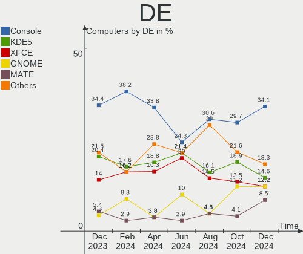
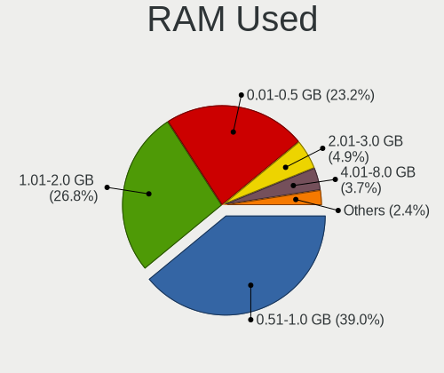
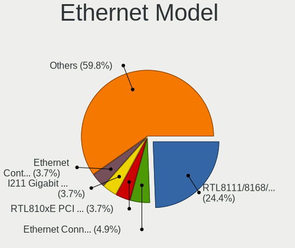

FreeBSD - Hardware Trends
-------------------------

A project to identify most popular hardware characteristics and track their change
over time based on data collected by BSD users at https://BSD-Hardware.info.

Anyone can contribute to this report by the [hw-probe](https://github.com/linuxhw/hw-probe/blob/master/INSTALL.BSD.md) tool:

    hw-probe -all -upload

This is a report for all computer types. See also reports for [desktops](/Dist/FreeBSD/Desktop/README.md) and [notebooks](/Dist/FreeBSD/Notebook/README.md).

This report is for one last month. Overall report since the beginning of time: [TestDays](https://github.com/bsdhw/TestDays)

Period: May, 2023.

Contents
--------

* [ System ](#system)
  - [ OS                       ](#os)
  - [ OS Family                ](#os-family)
  - [ Arch                     ](#arch)
  - [ DE                       ](#de)
  - [ Display Server           ](#display-server)
  - [ Display Manager          ](#display-manager)
  - [ OS Lang                  ](#os-lang)
  - [ Boot Mode                ](#boot-mode)
  - [ Filesystem               ](#filesystem)
  - [ Part. scheme             ](#part-scheme)

* [ Board ](#board)
  - [ Vendor                   ](#vendor)
  - [ Model                    ](#model)
  - [ Model Family             ](#model-family)
  - [ MFG Year                 ](#mfg-year)
  - [ Form Factor              ](#form-factor)
  - [ Coreboot                 ](#coreboot)
  - [ RAM Size                 ](#ram-size)
  - [ RAM Used                 ](#ram-used)
  - [ Total Drives             ](#total-drives)
  - [ Has CD-ROM               ](#has-cd-rom)
  - [ Has Ethernet             ](#has-ethernet)
  - [ Has WiFi                 ](#has-wifi)
  - [ Has Bluetooth            ](#has-bluetooth)

* [ Location ](#location)
  - [ Country                  ](#country)
  - [ City                     ](#city)

* [ Drives ](#drives)
  - [ Drive Vendor             ](#drive-vendor)
  - [ Drive Model              ](#drive-model)
  - [ HDD Vendor               ](#hdd-vendor)
  - [ SSD Vendor               ](#ssd-vendor)
  - [ Drive Kind               ](#drive-kind)
  - [ Drive Connector          ](#drive-connector)
  - [ Drive Size               ](#drive-size)
  - [ Space Total              ](#space-total)
  - [ Space Used               ](#space-used)
  - [ Malfunc. Drives          ](#malfunc-drives)
  - [ Malfunc. Drive Vendor    ](#malfunc-drive-vendor)
  - [ Malfunc. HDD Vendor      ](#malfunc-hdd-vendor)
  - [ Malfunc. Drive Kind      ](#malfunc-drive-kind)
  - [ Failed Drives            ](#failed-drives)
  - [ Failed Drive Vendor      ](#failed-drive-vendor)
  - [ Drive Status             ](#drive-status)

* [ Storage controller ](#storage-controller)
  - [ Storage Vendor           ](#storage-vendor)
  - [ Storage Model            ](#storage-model)
  - [ Storage Kind             ](#storage-kind)

* [ Processor ](#processor)
  - [ CPU Vendor               ](#cpu-vendor)
  - [ CPU Model                ](#cpu-model)
  - [ CPU Model Family         ](#cpu-model-family)
  - [ CPU Cores                ](#cpu-cores)
  - [ CPU Sockets              ](#cpu-sockets)
  - [ CPU Threads              ](#cpu-threads)
  - [ CPU Microarch            ](#cpu-microarch)

* [ Graphics ](#graphics)
  - [ GPU Vendor               ](#gpu-vendor)
  - [ GPU Model                ](#gpu-model)
  - [ GPU Combo                ](#gpu-combo)
  - [ GPU Driver               ](#gpu-driver)
  - [ GPU Memory               ](#gpu-memory)

* [ Monitor ](#monitor)
  - [ Monitor Vendor           ](#monitor-vendor)
  - [ Monitor Model            ](#monitor-model)
  - [ Monitor Resolution       ](#monitor-resolution)
  - [ Monitor Diagonal         ](#monitor-diagonal)
  - [ Monitor Width            ](#monitor-width)
  - [ Aspect Ratio             ](#aspect-ratio)
  - [ Monitor Area             ](#monitor-area)
  - [ Pixel Density            ](#pixel-density)
  - [ Multiple Monitors        ](#multiple-monitors)

* [ Network ](#network)
  - [ Net Controller Vendor    ](#net-controller-vendor)
  - [ Net Controller Model     ](#net-controller-model)
  - [ Wireless Vendor          ](#wireless-vendor)
  - [ Wireless Model           ](#wireless-model)
  - [ Ethernet Vendor          ](#ethernet-vendor)
  - [ Ethernet Model           ](#ethernet-model)
  - [ Net Controller Kind      ](#net-controller-kind)
  - [ Used Controller          ](#used-controller)
  - [ NICs                     ](#nics)
  - [ IPv6                     ](#ipv6)

* [ Bluetooth ](#bluetooth)
  - [ Bluetooth Vendor         ](#bluetooth-vendor)
  - [ Bluetooth Model          ](#bluetooth-model)

* [ Sound ](#sound)
  - [ Sound Vendor             ](#sound-vendor)
  - [ Sound Model              ](#sound-model)

* [ Memory ](#memory)
  - [ Memory Vendor            ](#memory-vendor)
  - [ Memory Model             ](#memory-model)
  - [ Memory Kind              ](#memory-kind)
  - [ Memory Form Factor       ](#memory-form-factor)
  - [ Memory Size              ](#memory-size)
  - [ Memory Speed             ](#memory-speed)

* [ Printers & scanners ](#printers--scanners)
  - [ Printer Vendor           ](#printer-vendor)
  - [ Printer Model            ](#printer-model)
  - [ Scanner Vendor           ](#scanner-vendor)
  - [ Scanner Model            ](#scanner-model)

* [ Camera ](#camera)
  - [ Camera Vendor            ](#camera-vendor)
  - [ Camera Model             ](#camera-model)

* [ Security ](#security)
  - [ Fingerprint Vendor       ](#fingerprint-vendor)
  - [ Fingerprint Model        ](#fingerprint-model)
  - [ Chipcard Vendor          ](#chipcard-vendor)
  - [ Chipcard Model           ](#chipcard-model)

* [ Unsupported ](#unsupported)
  - [ Unsupported Devices      ](#unsupported-devices)
  - [ Unsupported Device Types ](#unsupported-device-types)

System
------

OS
--

Installed operating systems

| Name                 | Computers | Percent |
|----------------------|-----------|---------|
| FreeBSD 13.2         | 36        | 67.92%  |
| FreeBSD 14.0-CURRENT | 9         | 16.98%  |
| FreeBSD 13.1-p5      | 3         | 5.66%   |
| FreeBSD 13.2-STABLE  | 1         | 1.89%   |
| FreeBSD 13.2-RC6     | 1         | 1.89%   |
| FreeBSD 13.1-p7      | 1         | 1.89%   |
| FreeBSD 13.1         | 1         | 1.89%   |
| FreeBSD 12.4-p2      | 1         | 1.89%   |

OS Family
---------

OS without a version

| Name    | Computers | Percent |
|---------|-----------|---------|
| FreeBSD | 53        | 100%    |

Arch
----

OS architecture (x86_64, i586, etc.)

| Name  | Computers | Percent |
|-------|-----------|---------|
| amd64 | 51        | 96.23%  |
| i386  | 1         | 1.89%   |
| arm64 | 1         | 1.89%   |

DE
--

Desktop Environment

| Name      | Computers | Percent |
|-----------|-----------|---------|
| Console   | 16        | 30.19%  |
| XFCE      | 9         | 16.98%  |
| GNOME     | 9         | 16.98%  |
| KDE5      | 7         | 13.21%  |
| MATE      | 4         | 7.55%   |
| i3        | 3         | 5.66%   |
| TWM       | 1         | 1.89%   |
| Cinnamon  | 1         | 1.89%   |
| Budgie    | 1         | 1.89%   |
| Blackbox  | 1         | 1.89%   |
| AwesomeWM | 1         | 1.89%   |

Display Server
--------------

X11 or Wayland

| Name    | Computers | Percent |
|---------|-----------|---------|
| X11     | 37        | 69.81%  |
| Console | 15        | 28.3%   |
| Wayland | 1         | 1.89%   |

Display Manager
---------------

SDDM, LightDM, etc.

| Name    | Computers | Percent |
|---------|-----------|---------|
| Console | 27        | 50.94%  |
| SDDM    | 6         | 11.32%  |
| LightDM | 6         | 11.32%  |
| GDM     | 5         | 9.43%   |
| XDM     | 4         | 7.55%   |
| SLiM    | 4         | 7.55%   |
| Ly      | 1         | 1.89%   |

OS Lang
-------

Language

| Lang    | Computers | Percent |
|---------|-----------|---------|
| C       | 30        | 56.6%   |
| en_US   | 7         | 13.21%  |
| fr_FR   | 5         | 9.43%   |
| Unknown | 4         | 7.55%   |
| ru_RU   | 3         | 5.66%   |
| en_IE   | 2         | 3.77%   |
| it_IT   | 1         | 1.89%   |
| de_DE   | 1         | 1.89%   |

Boot Mode
---------

EFI or BIOS

| Mode | Computers | Percent |
|------|-----------|---------|
| EFI  | 40        | 75.47%  |
| BIOS | 13        | 24.53%  |

Filesystem
----------

Type of filesystem

| Type | Computers | Percent |
|------|-----------|---------|
| Zfs  | 40        | 75.47%  |
| Ufs  | 13        | 24.53%  |

Part. scheme
------------

Scheme of partitioning

| Type | Computers | Percent |
|------|-----------|---------|
| GPT  | 51        | 96.23%  |
| MBR  | 1         | 1.89%   |
| BSD  | 1         | 1.89%   |

Board
-----

Vendor
------

Motherboard manufacturer

| Name                | Computers | Percent |
|---------------------|-----------|---------|
| Lenovo              | 10        | 18.87%  |
| ASUSTek Computer    | 8         | 15.09%  |
| Hewlett-Packard     | 6         | 11.32%  |
| ASRock              | 5         | 9.43%   |
| Supermicro          | 3         | 5.66%   |
| MSI                 | 3         | 5.66%   |
| Acer                | 3         | 5.66%   |
| ASRockRack          | 2         | 3.77%   |
| Unknown             | 2         | 3.77%   |
| Valve               | 1         | 1.89%   |
| Samsung Electronics | 1         | 1.89%   |
| Panasonic           | 1         | 1.89%   |
| Notebook            | 1         | 1.89%   |
| Microsoft           | 1         | 1.89%   |
| Medion              | 1         | 1.89%   |
| Intel               | 1         | 1.89%   |
| Gigabyte Technology | 1         | 1.89%   |
| Fujitsu             | 1         | 1.89%   |
| Dell                | 1         | 1.89%   |
| Alienware           | 1         | 1.89%   |

Model
-----

Motherboard model

| Name                                  | Computers | Percent |
|---------------------------------------|-----------|---------|
| HP EliteBook 8570p                    | 2         | 3.77%   |
| ASRock Z590 Pro4                      | 2         | 3.77%   |
| ASRock X570 Phantom Gaming 4          | 2         | 3.77%   |
| Unknown                               | 2         | 3.77%   |
| Valve Jupiter                         | 1         | 1.89%   |
| Supermicro X10SLL-F                   | 1         | 1.89%   |
| Supermicro SYS-6028R-TRT              | 1         | 1.89%   |
| Supermicro Super Server               | 1         | 1.89%   |
| Samsung NC110P/NC108P/NC111P          | 1         | 1.89%   |
| Panasonic CF-30KAPAXAM                | 1         | 1.89%   |
| Notebook N7x0WU                       | 1         | 1.89%   |
| MSI MS-7B89                           | 1         | 1.89%   |
| MSI MS-7823                           | 1         | 1.89%   |
| MSI MS-7817                           | 1         | 1.89%   |
| Microsoft Surface Go 3                | 1         | 1.89%   |
| Medion Major X10                      | 1         | 1.89%   |
| Lenovo ThinkPad X270 W10DG 20K5S5Q507 | 1         | 1.89%   |
| Lenovo ThinkPad X270 20HMCTO1WW       | 1         | 1.89%   |
| Lenovo ThinkPad X13 Gen 1 20UGS48105  | 1         | 1.89%   |
| Lenovo ThinkPad T560 20FJS03Q00       | 1         | 1.89%   |
| Lenovo ThinkPad T430 2347CTO          | 1         | 1.89%   |
| Lenovo ThinkPad T15p Gen 3 21DA000QUS | 1         | 1.89%   |
| Lenovo ThinkPad T14s Gen 1 20UH0019PB | 1         | 1.89%   |
| Lenovo ThinkPad T14 Gen 1 20S1SFJH09  | 1         | 1.89%   |
| Lenovo ThinkPad P14s Gen 1 20S4001JFR | 1         | 1.89%   |
| Lenovo ThinkCentre M900 10FLS0FU00    | 1         | 1.89%   |
| Intel NUC11PHi7                       | 1         | 1.89%   |
| HP Z820 Workstation                   | 1         | 1.89%   |
| HP Z420 Workstation                   | 1         | 1.89%   |
| HP Z240 Tower Workstation             | 1         | 1.89%   |
| HP ProDesk 600 G2 SFF                 | 1         | 1.89%   |
| Gigabyte H170-D3HP                    | 1         | 1.89%   |
| Fujitsu ESPRIMO P400                  | 1         | 1.89%   |
| Dell Inspiron 3581                    | 1         | 1.89%   |
| ASUS WS-C621E-SAGE Series             | 1         | 1.89%   |
| ASUS ROG STRIX X670E-F GAMING WIFI    | 1         | 1.89%   |
| ASUS ROG CROSSHAIR VIII HERO          | 1         | 1.89%   |
| ASUS PRO B460M-C                      | 1         | 1.89%   |
| ASUS PRIME X370-PRO                   | 1         | 1.89%   |
| ASUS PRIME A520M-A II                 | 1         | 1.89%   |

Model Family
------------

Motherboard model prefix

| Name                      | Computers | Percent |
|---------------------------|-----------|---------|
| Lenovo ThinkPad           | 9         | 16.98%  |
| HP EliteBook              | 2         | 3.77%   |
| ASUS ROG                  | 2         | 3.77%   |
| ASUS PRIME                | 2         | 3.77%   |
| ASRock Z590               | 2         | 3.77%   |
| ASRock X570               | 2         | 3.77%   |
| Acer Aspire               | 2         | 3.77%   |
| Unknown                   | 2         | 3.77%   |
| Valve Jupiter             | 1         | 1.89%   |
| Supermicro X10SLL-F       | 1         | 1.89%   |
| Supermicro SYS-6028R-TRT  | 1         | 1.89%   |
| Supermicro Super          | 1         | 1.89%   |
| Samsung NC110P            | 1         | 1.89%   |
| Panasonic CF-30KAPAXAM    | 1         | 1.89%   |
| Notebook N7x0WU           | 1         | 1.89%   |
| MSI MS-7B89               | 1         | 1.89%   |
| MSI MS-7823               | 1         | 1.89%   |
| MSI MS-7817               | 1         | 1.89%   |
| Microsoft Surface         | 1         | 1.89%   |
| Medion Major              | 1         | 1.89%   |
| Lenovo ThinkCentre        | 1         | 1.89%   |
| Intel NUC11PHi7           | 1         | 1.89%   |
| HP Z820                   | 1         | 1.89%   |
| HP Z420                   | 1         | 1.89%   |
| HP Z240                   | 1         | 1.89%   |
| HP ProDesk                | 1         | 1.89%   |
| Gigabyte H170-D3HP        | 1         | 1.89%   |
| Fujitsu ESPRIMO           | 1         | 1.89%   |
| Dell Inspiron             | 1         | 1.89%   |
| ASUS WS-C621E-SAGE        | 1         | 1.89%   |
| ASUS PRO                  | 1         | 1.89%   |
| ASUS P5Q-E                | 1         | 1.89%   |
| ASUS P5K                  | 1         | 1.89%   |
| ASRockRack EPYC3101D4I-2T | 1         | 1.89%   |
| ASRockRack 1U4L4E-GENOA   | 1         | 1.89%   |
| ASRock Z790M-ITX          | 1         | 1.89%   |
| Alienware 17              | 1         | 1.89%   |
| Acer Nitro                | 1         | 1.89%   |

MFG Year
--------

Motherboard manufacture year

| Year    | Computers | Percent |
|---------|-----------|---------|
| 2021    | 10        | 18.87%  |
| 2022    | 8         | 15.09%  |
| 2020    | 5         | 9.43%   |
| 2013    | 5         | 9.43%   |
| 2019    | 4         | 7.55%   |
| 2023    | 3         | 5.66%   |
| 2018    | 3         | 5.66%   |
| 2017    | 3         | 5.66%   |
| 2016    | 2         | 3.77%   |
| 2015    | 2         | 3.77%   |
| 2014    | 2         | 3.77%   |
| 2012    | 2         | 3.77%   |
| 2008    | 2         | 3.77%   |
| 2009    | 1         | 1.89%   |
| Unknown | 1         | 1.89%   |

Form Factor
-----------

Physical design of the computer

| Name     | Computers | Percent |
|----------|-----------|---------|
| Desktop  | 27        | 50.94%  |
| Notebook | 21        | 39.62%  |
| Server   | 3         | 5.66%   |
| Tablet   | 1         | 1.89%   |
| Mini pc  | 1         | 1.89%   |

Coreboot
--------

Have coreboot on board

| Used | Computers | Percent |
|------|-----------|---------|
| No   | 53        | 100%    |

RAM Size
--------

Total RAM memory

| Size in GB      | Computers | Percent |
|-----------------|-----------|---------|
| 16.01-24.0      | 13        | 24.53%  |
| 32.01-64.0      | 12        | 22.64%  |
| 64.01-256.0     | 11        | 20.75%  |
| 8.01-16.0       | 8         | 15.09%  |
| 4.01-8.0        | 5         | 9.43%   |
| More than 256.0 | 2         | 3.77%   |
| 3.01-4.0        | 1         | 1.89%   |
| 2.01-3.0        | 1         | 1.89%   |

RAM Used
--------

Used RAM memory

| Used GB   | Computers | Percent |
|-----------|-----------|---------|
| 1.01-2.0  | 21        | 39.62%  |
| 0.51-1.0  | 12        | 22.64%  |
| 0.01-0.5  | 11        | 20.75%  |
| 2.01-3.0  | 4         | 7.55%   |
| 4.01-8.0  | 3         | 5.66%   |
| 3.01-4.0  | 1         | 1.89%   |
| 8.01-16.0 | 1         | 1.89%   |

Total Drives
------------

Number of drives on board

| Drives | Computers | Percent |
|--------|-----------|---------|
| 1      | 20        | 37.74%  |
| 2      | 15        | 28.3%   |
| 3      | 7         | 13.21%  |
| 5      | 3         | 5.66%   |
| 4      | 3         | 5.66%   |
| 13     | 1         | 1.89%   |
| 10     | 1         | 1.89%   |
| 8      | 1         | 1.89%   |
| 6      | 1         | 1.89%   |
| 0      | 1         | 1.89%   |

Has CD-ROM
----------

Has CD-ROM on board

| Presented | Computers | Percent |
|-----------|-----------|---------|
| No        | 41        | 77.36%  |
| Yes       | 12        | 22.64%  |

Has Ethernet
------------

Has Ethernet on board

| Presented | Computers | Percent |
|-----------|-----------|---------|
| Yes       | 50        | 94.34%  |
| No        | 3         | 5.66%   |

Has WiFi
--------

Has WiFi module

| Presented | Computers | Percent |
|-----------|-----------|---------|
| Yes       | 31        | 58.49%  |
| No        | 22        | 41.51%  |

Has Bluetooth
-------------

Has Bluetooth module

| Presented | Computers | Percent |
|-----------|-----------|---------|
| No        | 32        | 60.38%  |
| Yes       | 21        | 39.62%  |

Location
--------

Country
-------

Geographic location (country)

| Country       | Computers | Percent |
|---------------|-----------|---------|
| USA           | 12        | 22.64%  |
| Germany       | 6         | 11.32%  |
| France        | 5         | 9.43%   |
| Russia        | 4         | 7.55%   |
| Ireland       | 3         | 5.66%   |
| Canada        | 3         | 5.66%   |
| UK            | 2         | 3.77%   |
| Thailand      | 2         | 3.77%   |
| Poland        | 2         | 3.77%   |
| Indonesia     | 2         | 3.77%   |
| Venezuela     | 1         | 1.89%   |
| Taiwan        | 1         | 1.89%   |
| Slovakia      | 1         | 1.89%   |
| Romania       | 1         | 1.89%   |
| New Caledonia | 1         | 1.89%   |
| Netherlands   | 1         | 1.89%   |
| Jordan        | 1         | 1.89%   |
| Japan         | 1         | 1.89%   |
| Italy         | 1         | 1.89%   |
| Czechia       | 1         | 1.89%   |
| Croatia       | 1         | 1.89%   |
| Austria       | 1         | 1.89%   |

City
----

Geographic location (city)

| City               | Computers | Percent |
|--------------------|-----------|---------|
| Dublin             | 3         | 5.66%   |
| Bordeaux           | 3         | 5.66%   |
| Salem              | 2         | 3.77%   |
| Redmond            | 2         | 3.77%   |
| Medan              | 2         | 3.77%   |
| Berlin             | 2         | 3.77%   |
| Bangkok            | 2         | 3.77%   |
| Zgierz             | 1         | 1.89%   |
| Wenatchee          | 1         | 1.89%   |
| Warsaw             | 1         | 1.89%   |
| Veendam            | 1         | 1.89%   |
| Toronto            | 1         | 1.89%   |
| Tolyatti           | 1         | 1.89%   |
| Takasago           | 1         | 1.89%   |
| Taipei             | 1         | 1.89%   |
| St. Albert         | 1         | 1.89%   |
| Sesto San Giovanni | 1         | 1.89%   |
| Seattle            | 1         | 1.89%   |
| San Francisco      | 1         | 1.89%   |
| San Diego          | 1         | 1.89%   |
| Portland           | 1         | 1.89%   |
| Paris              | 1         | 1.89%   |
| Ottawa             | 1         | 1.89%   |
| Noumea             | 1         | 1.89%   |
| Munich             | 1         | 1.89%   |
| Moscow             | 1         | 1.89%   |
| Ludwigsburg        | 1         | 1.89%   |
| Lorient            | 1         | 1.89%   |
| Lepoglava          | 1         | 1.89%   |
| Lanzenkirchen      | 1         | 1.89%   |
| Krasnodar          | 1         | 1.89%   |
| Ivanovo            | 1         | 1.89%   |
| Fayetteville       | 1         | 1.89%   |
| Falkenstein        | 1         | 1.89%   |
| Edmonton           | 1         | 1.89%   |
| East Grinstead     | 1         | 1.89%   |
| Denver             | 1         | 1.89%   |
| Craiova            | 1         | 1.89%   |
| Brno               | 1         | 1.89%   |
| Bratislava         | 1         | 1.89%   |

Drives
------

Drive Vendor
------------

Hard drive vendors

| Vendor              | Computers | Drives | Percent |
|---------------------|-----------|--------|---------|
| Samsung Electronics | 18        | 28     | 20.45%  |
| WDC                 | 14        | 37     | 15.91%  |
| Seagate             | 10        | 12     | 11.36%  |
| HGST                | 7         | 22     | 7.95%   |
| Kingston            | 6         | 6      | 6.82%   |
| Intel               | 5         | 7      | 5.68%   |
| Toshiba             | 4         | 6      | 4.55%   |
| Hitachi             | 3         | 10     | 3.41%   |
| Crucial             | 3         | 5      | 3.41%   |
| SK hynix            | 2         | 2      | 2.27%   |
| Phison              | 2         | 2      | 2.27%   |
| MidasForce          | 2         | 2      | 2.27%   |
| KIOXIA              | 2         | 2      | 2.27%   |
| UMIS                | 1         | 1      | 1.14%   |
| SanDisk             | 1         | 1      | 1.14%   |
| PNY                 | 1         | 1      | 1.14%   |
| Patriot             | 1         | 1      | 1.14%   |
| OCZ                 | 1         | 1      | 1.14%   |
| Maxtor              | 1         | 1      | 1.14%   |
| KIOXIA-EXCERIA      | 1         | 2      | 1.14%   |
| Corsair             | 1         | 1      | 1.14%   |
| addlink             | 1         | 1      | 1.14%   |
| 2-Power             | 1         | 1      | 1.14%   |

Drive Model
-----------

Hard drive models

| Model                                  | Computers | Percent |
|----------------------------------------|-----------|---------|
| Samsung SSD 970 EVO Plus 1TB           | 3         | 2.78%   |
| Seagate ST4000DM000-1F2168 4TB         | 2         | 1.85%   |
| Samsung SSD 850 EVO 1TB                | 2         | 1.85%   |
| MidasForce SSD 512GB                   | 2         | 1.85%   |
| HGST HTS725050A7E630 500GB             | 2         | 1.85%   |
| HGST HTS721010A9E630 1TB               | 2         | 1.85%   |
| Crucial CT500P2SSD8 500GB              | 2         | 1.85%   |
| WDC WUH721816AL5204 16TB               | 1         | 0.93%   |
| WDC WDS200T3X0C-00SJG0 2TB             | 1         | 0.93%   |
| WDC WDS120G2G0B-00EPW0 120GB           | 1         | 0.93%   |
| WDC WDS100T3X0C-00SJG0 1TB             | 1         | 0.93%   |
| WDC WDBNCE0010PNC 1TB                  | 1         | 0.93%   |
| WDC WDBA3V5000ANC-WRSN 500GB           | 1         | 0.93%   |
| WDC WD80EMAZ-00WJTA0 8TB               | 1         | 0.93%   |
| WDC WD80EFZX-68UW8N0 8TB               | 1         | 0.93%   |
| WDC WD80EFAX-68LHPN0 8TB               | 1         | 0.93%   |
| WDC WD80EDBZ-11B0ZA0 8TB               | 1         | 0.93%   |
| WDC WD8004FRYZ-01VAEB0 8TB             | 1         | 0.93%   |
| WDC WD6003FRYZ-01F0DB0 6TB             | 1         | 0.93%   |
| WDC WD40EZRZ-22GXCB0 4TB               | 1         | 0.93%   |
| WDC WD40EFZX-68AWUN0 4TB               | 1         | 0.93%   |
| WDC WD40EFRX-68N32N0 4TB               | 1         | 0.93%   |
| WDC WD4003FRYZ-01F0DB0 4TB             | 1         | 0.93%   |
| WDC WD4002FYYZ-01B7CB1 4TB             | 1         | 0.93%   |
| WDC WD4002FYYZ-01B7CB0 4TB             | 1         | 0.93%   |
| WDC WD4000FYYZ-01UL1B3 4TB             | 1         | 0.93%   |
| WDC WD20EFRX-68EUZN0 2TB               | 1         | 0.93%   |
| WDC WD2005FBYZ-01YCBB2 2TB             | 1         | 0.93%   |
| WDC WD2000FYYZ-01UL1B2 2TB             | 1         | 0.93%   |
| WDC WD15EADS-00P8B0 1.5TB              | 1         | 0.93%   |
| WDC WD120EMFZ-11A6JA0 12TB             | 1         | 0.93%   |
| WDC WD120EMAZ-11BLFA0 12TB             | 1         | 0.93%   |
| WDC WD10EFRX-68FYTN0 1TB               | 1         | 0.93%   |
| WDC PC SN730 SDBQNTY-256G-1001 256GB   | 1         | 0.93%   |
| UMIS RPETJ1T24MGE2QDQ 1TB              | 1         | 0.93%   |
| Toshiba THNSN51T02DUK NVMe 1024GB      | 1         | 0.93%   |
| Toshiba MQ04ABF100 1TB                 | 1         | 0.93%   |
| Toshiba HDWD105 500GB                  | 1         | 0.93%   |
| Toshiba DT01ACA050 500GB               | 1         | 0.93%   |
| SK hynix SKHynix_HFS512GDE9X084N 512GB | 1         | 0.93%   |

HDD Vendor
----------

Hard disk drive vendors

| Vendor              | Computers | Drives | Percent |
|---------------------|-----------|--------|---------|
| Seagate             | 10        | 12     | 30.3%   |
| WDC                 | 8         | 31     | 24.24%  |
| HGST                | 7         | 18     | 21.21%  |
| Toshiba             | 3         | 4      | 9.09%   |
| Hitachi             | 3         | 10     | 9.09%   |
| Samsung Electronics | 1         | 2      | 3.03%   |
| Maxtor              | 1         | 1      | 3.03%   |

SSD Vendor
----------

Solid state drive vendors

| Vendor              | Computers | Drives | Percent |
|---------------------|-----------|--------|---------|
| Samsung Electronics | 8         | 14     | 30.77%  |
| Kingston            | 4         | 4      | 15.38%  |
| WDC                 | 2         | 2      | 7.69%   |
| MidasForce          | 2         | 2      | 7.69%   |
| Intel               | 2         | 3      | 7.69%   |
| SK hynix            | 1         | 1      | 3.85%   |
| SanDisk             | 1         | 1      | 3.85%   |
| PNY                 | 1         | 1      | 3.85%   |
| Patriot             | 1         | 1      | 3.85%   |
| OCZ                 | 1         | 1      | 3.85%   |
| HGST                | 1         | 4      | 3.85%   |
| Crucial             | 1         | 3      | 3.85%   |
| 2-Power             | 1         | 1      | 3.85%   |

Drive Kind
----------

HDD or SSD

| Kind | Computers | Drives | Percent |
|------|-----------|--------|---------|
| NVMe | 29        | 36     | 38.16%  |
| HDD  | 25        | 78     | 32.89%  |
| SSD  | 22        | 38     | 28.95%  |

Drive Connector
---------------

SATA, SAS, NVMe, etc.

| Type | Computers | Drives | Percent |
|------|-----------|--------|---------|
| SATA | 37        | 116    | 56.06%  |
| NVMe | 29        | 36     | 43.94%  |

Drive Size
----------

Size of hard drive

| Size in TB | Computers | Drives | Percent |
|------------|-----------|--------|---------|
| 0.01-0.5   | 20        | 44     | 37.74%  |
| 0.51-1.0   | 12        | 14     | 22.64%  |
| 1.01-2.0   | 8         | 14     | 15.09%  |
| 3.01-4.0   | 6         | 15     | 11.32%  |
| 4.01-10.0  | 4         | 13     | 7.55%   |
| 10.01-20.0 | 2         | 4      | 3.77%   |
| 2.01-3.0   | 1         | 12     | 1.89%   |

Space Total
-----------

Amount of disk space available on the file system

| Size in GB     | Computers | Percent |
|----------------|-----------|---------|
| 501-1000       | 14        | 26.42%  |
| 251-500        | 13        | 24.53%  |
| 101-250        | 12        | 22.64%  |
| 1001-2000      | 3         | 5.66%   |
| 51-100         | 3         | 5.66%   |
| More than 3000 | 2         | 3.77%   |
| 21-50          | 2         | 3.77%   |
| 2001-3000      | 2         | 3.77%   |
| 1-20           | 2         | 3.77%   |

Space Used
----------

Amount of used disk space

| Used GB        | Computers | Percent |
|----------------|-----------|---------|
| 1-20           | 32        | 60.38%  |
| 21-50          | 11        | 20.75%  |
| 251-500        | 3         | 5.66%   |
| 101-250        | 2         | 3.77%   |
| 51-100         | 2         | 3.77%   |
| More than 3000 | 1         | 1.89%   |
| 501-1000       | 1         | 1.89%   |
| 0              | 1         | 1.89%   |

Malfunc. Drives
---------------

Drive models with a malfunction

| Model                             | Computers | Drives | Percent |
|-----------------------------------|-----------|--------|---------|
| WDC WD2000FYYZ-01UL1B2 2TB        | 1         | 1      | 16.67%  |
| Samsung Electronics HD154UI 1.5TB | 1         | 2      | 16.67%  |
| Maxtor 7B300S0 304GB              | 1         | 1      | 16.67%  |
| Kingston SHPM2280P2H-240G         | 1         | 1      | 16.67%  |
| HGST HTS725050A7E630 500GB        | 1         | 1      | 16.67%  |
| HGST HTS721010A9E630 1TB          | 1         | 1      | 16.67%  |

Malfunc. Drive Vendor
---------------------

Vendors of faulty drives

| Vendor              | Computers | Drives | Percent |
|---------------------|-----------|--------|---------|
| HGST                | 2         | 2      | 33.33%  |
| WDC                 | 1         | 1      | 16.67%  |
| Samsung Electronics | 1         | 2      | 16.67%  |
| Maxtor              | 1         | 1      | 16.67%  |
| Kingston            | 1         | 1      | 16.67%  |

Malfunc. HDD Vendor
-------------------

Vendors of faulty HDD drives

| Vendor              | Computers | Drives | Percent |
|---------------------|-----------|--------|---------|
| HGST                | 2         | 2      | 40%     |
| WDC                 | 1         | 1      | 20%     |
| Samsung Electronics | 1         | 2      | 20%     |
| Maxtor              | 1         | 1      | 20%     |

Malfunc. Drive Kind
-------------------

Kinds of faulty drives

| Kind | Computers | Drives | Percent |
|------|-----------|--------|---------|
| HDD  | 5         | 6      | 83.33%  |
| SSD  | 1         | 1      | 16.67%  |

Failed Drives
-------------

Failed drive models

Zero info for selected period =(

Failed Drive Vendor
-------------------

Failed drive vendors

Zero info for selected period =(

Drive Status
------------

Number of failed and malfunc. drives

| Status  | Computers | Drives | Percent |
|---------|-----------|--------|---------|
| Works   | 51        | 145    | 91.07%  |
| Malfunc | 5         | 7      | 8.93%   |

Storage controller
------------------

Storage Vendor
--------------

Storage controller vendors

| Vendor                                  | Computers | Percent |
|-----------------------------------------|-----------|---------|
| Intel                                   | 30        | 37.04%  |
| AMD                                     | 12        | 14.81%  |
| Samsung Electronics                     | 10        | 12.35%  |
| SanDisk                                 | 6         | 7.41%   |
| Broadcom / LSI                          | 5         | 6.17%   |
| Phison Electronics                      | 4         | 4.94%   |
| KIOXIA                                  | 3         | 3.7%    |
| Kingston Technology Company             | 3         | 3.7%    |
| Micron/Crucial Technology               | 2         | 2.47%   |
| Marvell Technology Group                | 2         | 2.47%   |
| Toshiba                                 | 1         | 1.23%   |
| SK hynix                                | 1         | 1.23%   |
| Shenzhen Unionmemory Information System | 1         | 1.23%   |
| ASMedia Technology                      | 1         | 1.23%   |

Storage Model
-------------

Storage controller models

| Model                                                                          | Computers | Percent |
|--------------------------------------------------------------------------------|-----------|---------|
| AMD FCH SATA Controller [AHCI mode]                                            | 9         | 9.57%   |
| Samsung NVMe SSD Controller SM981/PM981/PM983                                  | 5         | 5.32%   |
| Intel Q170/Q150/B150/H170/H110/Z170/CM236 Chipset SATA Controller [AHCI Mode]  | 5         | 5.32%   |
| Intel 8 Series/C220 Series Chipset Family 6-port SATA Controller 1 [AHCI mode] | 3         | 3.19%   |
| Sandisk WD Black SN770 NVMe SSD                                                | 2         | 2.13%   |
| SanDisk WD Black SN750 / PC SN730 NVMe SSD                                     | 2         | 2.13%   |
| Samsung NVMe SSD Controller SM961/PM961/SM963                                  | 2         | 2.13%   |
| Samsung NVMe SSD Controller 980                                                | 2         | 2.13%   |
| Micron/Crucial P2 NVMe PCIe SSD                                                | 2         | 2.13%   |
| Marvell Group 88SE6111/6121 SATA II / PATA Controller                          | 2         | 2.13%   |
| KIOXIA NVMe SSD Controller BG4                                                 | 2         | 2.13%   |
| Intel Sunrise Point-LP SATA Controller [AHCI mode]                             | 2         | 2.13%   |
| Intel C602 chipset 4-Port SATA Storage Control Unit                            | 2         | 2.13%   |
| Intel C600/X79 series chipset IDE-r Controller                                 | 2         | 2.13%   |
| Intel 7 Series Chipset Family 6-port SATA Controller [AHCI mode]               | 2         | 2.13%   |
| Intel 500 Series Chipset Family SATA AHCI Controller                           | 2         | 2.13%   |
| Broadcom / LSI SAS2308 PCI-Express Fusion-MPT SAS-2                            | 2         | 2.13%   |
| Broadcom / LSI SAS2008 PCI-Express Fusion-MPT SAS-2 [Falcon]                   | 2         | 2.13%   |
| Unknown                                                                        | 2         | 2.13%   |
| Toshiba XG4 NVMe SSD Controller                                                | 1         | 1.06%   |
| SK hynix Gold P31/PC711 NVMe Solid State Drive                                 | 1         | 1.06%   |
| SanDisk WD Blue SN550 NVMe SSD                                                 | 1         | 1.06%   |
| SanDisk WD Black 2018/SN750 / PC SN720 NVMe SSD                                | 1         | 1.06%   |
| Samsung NVMe SSD Controller PM9A1/PM9A3/980PRO                                 | 1         | 1.06%   |
| Phison E18 PCIe4 NVMe Controller                                               | 1         | 1.06%   |
| Phison E16 PCIe4 NVMe Controller                                               | 1         | 1.06%   |
| Phison E12 NVMe Controller                                                     | 1         | 1.06%   |
| KIOXIA NVMe SSD                                                                | 1         | 1.06%   |
| Kingston Company unknown                                                       | 1         | 1.06%   |
| Kingston Company OM3PDP3 NVMe SSD                                              | 1         | 1.06%   |
| Kingston Company HyperX Predator PCIe AHCI SSD                                 | 1         | 1.06%   |
| Intel Volume Management Device NVMe RAID Controller                            | 1         | 1.06%   |
| Intel Tiger Lake-LP SATA Controller                                            | 1         | 1.06%   |
| Intel SSD Pro 7600p/760p/E 6100p Series                                        | 1         | 1.06%   |
| Intel NVMe DC SSD [3DNAND, Sentinel Rock Controller]                           | 1         | 1.06%   |
| Intel NVMe Datacenter SSD [Optane]                                             | 1         | 1.06%   |
| Intel NVMe Datacenter SSD [3DNAND, Beta Rock Controller]                       | 1         | 1.06%   |
| Intel NM10/ICH7 Family SATA Controller [IDE mode]                              | 1         | 1.06%   |
| Intel C620 Series Chipset Family SATA Controller [AHCI mode]                   | 1         | 1.06%   |
| Intel C610/X99 series chipset 6-Port SATA Controller [AHCI mode]               | 1         | 1.06%   |

Storage Kind
------------

Kind of storage controller (IDE, SATA, NVMe, SAS, ...)

| Kind | Computers | Percent |
|------|-----------|---------|
| SATA | 34        | 42.5%   |
| NVMe | 31        | 38.75%  |
| IDE  | 6         | 7.5%    |
| SAS  | 5         | 6.25%   |
| RAID | 4         | 5%      |

Processor
---------

CPU Vendor
----------

Processor vendors

| Vendor | Computers | Percent |
|--------|-----------|---------|
| Intel  | 37        | 69.81%  |
| AMD    | 15        | 28.3%   |
| ARM    | 1         | 1.89%   |

CPU Model
---------

Processor models

| Model                                   | Computers | Percent |
|-----------------------------------------|-----------|---------|
| Intel Core i7-10700K CPU @ 3.80GHz      | 2         | 3.77%   |
| Intel Core 2 Quad CPU Q6600 @ 2.40GHz   | 2         | 3.77%   |
| AMD Ryzen 9 3900X 12-Core Processor     | 2         | 3.77%   |
| Intel Xeon Gold 5120 CPU @ 2.20GHz      | 1         | 1.89%   |
| Intel Xeon CPU E5-2697 v2 @ 2.70GHz     | 1         | 1.89%   |
| Intel Xeon CPU E5-2630 v4 @ 2.20GHz     | 1         | 1.89%   |
| Intel Xeon CPU E5-1650 v2 @ 3.50GHz     | 1         | 1.89%   |
| Intel Xeon CPU E3-1270 v3 @ 3.50GHz     | 1         | 1.89%   |
| Intel Xeon CPU E3-1246 v3 @ 3.50GHz     | 1         | 1.89%   |
| Intel Pentium CPU GOLD 6500Y @ 1.10GHz  | 1         | 1.89%   |
| Intel Pentium CPU G3220 @ 3.00GHz       | 1         | 1.89%   |
| Intel Core i7-7820HK CPU @ 2.90GHz      | 1         | 1.89%   |
| Intel Core i7-7700K CPU @ 4.20GHz       | 1         | 1.89%   |
| Intel Core i7-6700T CPU @ 2.80GHz       | 1         | 1.89%   |
| Intel Core i7-6700 CPU @ 3.40GHz        | 1         | 1.89%   |
| Intel Core i7-3520M CPU @ 2.90GHz       | 1         | 1.89%   |
| Intel Core i7-10610U CPU @ 1.80GHz      | 1         | 1.89%   |
| Intel Core i5-7200U CPU @ 2.50GHz       | 1         | 1.89%   |
| Intel Core i5-6300U CPU @ 2.40GHz       | 1         | 1.89%   |
| Intel Core i5-6200U CPU @ 2.30GHz       | 1         | 1.89%   |
| Intel Core i5-4210U CPU @ 1.70GHz       | 1         | 1.89%   |
| Intel Core i5-3470 CPU @ 3.20GHz        | 1         | 1.89%   |
| Intel Core i5-3360M CPU @ 2.80GHz       | 1         | 1.89%   |
| Intel Core i5-3320M CPU @ 2.60GHz       | 1         | 1.89%   |
| Intel Core i5-10210U CPU @ 1.60GHz      | 1         | 1.89%   |
| Intel Core i3-8130U CPU @ 2.20GHz       | 1         | 1.89%   |
| Intel Core i3-7020U CPU @ 2.30GHz       | 1         | 1.89%   |
| Intel Core i3-6100 CPU @ 3.70GHz        | 1         | 1.89%   |
| Intel Core i3-10100 CPU @ 3.60GHz       | 1         | 1.89%   |
| Intel Core 2 Duo CPU L9300 @ 1.60GHz    | 1         | 1.89%   |
| Intel Atom CPU N2600 @ 1.60GHz          | 1         | 1.89%   |
| Intel 13th Gen Core i5-13400            | 1         | 1.89%   |
| Intel 12th Gen Core i7-12800H           | 1         | 1.89%   |
| Intel 12th Gen Core i7-12700H           | 1         | 1.89%   |
| Intel 11th Gen Core i7-1165G7 @ 2.80GHz | 1         | 1.89%   |
| Intel 11th Gen Core i5-1135G7 @ 2.40GHz | 1         | 1.89%   |
| ARM Cortex-A55 r2p0                     | 1         | 1.89%   |
| AMD Ryzen 9 7950X 16-Core Processor     | 1         | 1.89%   |
| AMD Ryzen 9 5900HX with Radeon Graphics | 1         | 1.89%   |
| AMD Ryzen 7 5700G with Radeon Graphics  | 1         | 1.89%   |

CPU Model Family
----------------

Processor model prefix

| Model             | Computers | Percent |
|-------------------|-----------|---------|
| Intel Core i7     | 8         | 15.09%  |
| Intel Core i5     | 8         | 15.09%  |
| Other             | 6         | 11.32%  |
| Intel Xeon        | 5         | 9.43%   |
| Intel Core i3     | 4         | 7.55%   |
| AMD Ryzen 9       | 4         | 7.55%   |
| AMD Ryzen 5       | 3         | 5.66%   |
| AMD EPYC          | 3         | 5.66%   |
| Intel Pentium     | 2         | 3.77%   |
| Intel Core 2 Quad | 2         | 3.77%   |
| AMD Ryzen 7       | 2         | 3.77%   |
| Intel Xeon Gold   | 1         | 1.89%   |
| Intel Core 2 Duo  | 1         | 1.89%   |
| Intel Atom        | 1         | 1.89%   |
| ARM Cortex        | 1         | 1.89%   |
| AMD Ryzen 5 PRO   | 1         | 1.89%   |
| AMD Ryzen 3 PRO   | 1         | 1.89%   |

CPU Cores
---------

Number of processor cores

| Number  | Computers | Percent |
|---------|-----------|---------|
| 4       | 14        | 26.42%  |
| 2       | 13        | 24.53%  |
| 8       | 7         | 13.21%  |
| 16      | 4         | 7.55%   |
| 12      | 3         | 5.66%   |
| Unknown | 3         | 5.66%   |
| 24      | 2         | 3.77%   |
| 20      | 2         | 3.77%   |
| 64      | 1         | 1.89%   |
| 32      | 1         | 1.89%   |
| 28      | 1         | 1.89%   |
| 10      | 1         | 1.89%   |
| 6       | 1         | 1.89%   |

CPU Sockets
-----------

Number of sockets

| Number  | Computers | Percent |
|---------|-----------|---------|
| 1       | 50        | 94.34%  |
| 2       | 2         | 3.77%   |
| Unknown | 1         | 1.89%   |

CPU Threads
-----------

Threads per core (Hyper-Threading)

| Number  | Computers | Percent |
|---------|-----------|---------|
| 2       | 30        | 56.6%   |
| 1       | 20        | 37.74%  |
| Unknown | 3         | 5.66%   |

CPU Microarch
-------------

Microarchitecture

| Name      | Computers | Percent |
|-----------|-----------|---------|
| KabyLake  | 8         | 15.09%  |
| Unknown   | 7         | 13.21%  |
| Skylake   | 6         | 11.32%  |
| IvyBridge | 6         | 11.32%  |
| Zen 2     | 4         | 7.55%   |
| Zen       | 4         | 7.55%   |
| Haswell   | 4         | 7.55%   |
| Zen 3     | 3         | 5.66%   |
| CometLake | 3         | 5.66%   |
| TigerLake | 2         | 3.77%   |
| Core      | 2         | 3.77%   |
| Zen+      | 1         | 1.89%   |
| Penryn    | 1         | 1.89%   |
| Broadwell | 1         | 1.89%   |
| Bonnell   | 1         | 1.89%   |

Graphics
--------

GPU Vendor
----------

Vendors of graphics cards

| Vendor            | Computers | Percent |
|-------------------|-----------|---------|
| Intel             | 27        | 44.26%  |
| Nvidia            | 15        | 24.59%  |
| AMD               | 13        | 21.31%  |
| ASPEED Technology | 6         | 9.84%   |

GPU Model
---------

Graphics card models

| Model                                                                         | Computers | Percent |
|-------------------------------------------------------------------------------|-----------|---------|
| ASPEED Technology ASPEED Graphics Family                                      | 6         | 9.38%   |
| Intel CometLake-S GT2 [UHD Graphics 630]                                      | 3         | 4.69%   |
| Nvidia GP108 [GeForce GT 1030]                                                | 2         | 3.13%   |
| Nvidia GA104 [GeForce RTX 3060 Ti Lite Hash Rate]                             | 2         | 3.13%   |
| Intel TigerLake-LP GT2 [Iris Xe Graphics]                                     | 2         | 3.13%   |
| Intel Skylake GT2 [HD Graphics 520]                                           | 2         | 3.13%   |
| Intel HD Graphics 630                                                         | 2         | 3.13%   |
| Intel HD Graphics 620                                                         | 2         | 3.13%   |
| Intel HD Graphics 530                                                         | 2         | 3.13%   |
| Intel CometLake-U GT2 [UHD Graphics]                                          | 2         | 3.13%   |
| Intel Alder Lake-P Integrated Graphics Controller                             | 2         | 3.13%   |
| AMD Thames [Radeon HD 7550M/7570M/7650M]                                      | 2         | 3.13%   |
| AMD Renoir                                                                    | 2         | 3.13%   |
| AMD Cezanne [Radeon Vega Series / Radeon Vega Mobile Series]                  | 2         | 3.13%   |
| Nvidia TU106M [GeForce RTX 2060 Mobile]                                       | 1         | 1.56%   |
| Nvidia TU106 [GeForce GTX 1650]                                               | 1         | 1.56%   |
| Nvidia GT218 [NVS 300]                                                        | 1         | 1.56%   |
| Nvidia GT215 [GeForce GT 240]                                                 | 1         | 1.56%   |
| Nvidia GP108GLM [Quadro P520]                                                 | 1         | 1.56%   |
| Nvidia GP106 [GeForce GTX 1060 3GB]                                           | 1         | 1.56%   |
| Nvidia GP104BM [GeForce GTX 1080 Mobile]                                      | 1         | 1.56%   |
| Nvidia GP104 [GeForce GTX 1070]                                               | 1         | 1.56%   |
| Nvidia GK107GL [Quadro K600]                                                  | 1         | 1.56%   |
| Nvidia GF119 [NVS 310]                                                        | 1         | 1.56%   |
| Nvidia GA107M [GeForce RTX 3050 Mobile]                                       | 1         | 1.56%   |
| Intel Xeon E3-1200 v3/4th Gen Core Processor Integrated Graphics Controller   | 1         | 1.56%   |
| Intel Xeon E3-1200 v3 Processor Integrated Graphics Controller                | 1         | 1.56%   |
| Intel Xeon E3-1200 v2/3rd Gen Core processor Graphics Controller              | 1         | 1.56%   |
| Intel UHD Graphics 620                                                        | 1         | 1.56%   |
| Intel UHD Graphics 615                                                        | 1         | 1.56%   |
| Intel Mobile 4 Series Chipset Integrated Graphics Controller                  | 1         | 1.56%   |
| Intel Haswell-ULT Integrated Graphics Controller                              | 1         | 1.56%   |
| Intel DG2 [Arc A730M]                                                         | 1         | 1.56%   |
| Intel Atom Processor D2xxx/N2xxx Integrated Graphics Controller               | 1         | 1.56%   |
| Intel Alder Lake-S GT1 [UHD Graphics 730]                                     | 1         | 1.56%   |
| Intel 3rd Gen Core processor Graphics Controller                              | 1         | 1.56%   |
| AMD VanGogh [AMD Custom GPU 0405]                                             | 1         | 1.56%   |
| AMD Sun XT [Radeon HD 8670A/8670M/8690M / R5 M330 / M430 / Radeon 520 Mobile] | 1         | 1.56%   |
| AMD Raven Ridge [Radeon Vega Series / Radeon Vega Mobile Series]              | 1         | 1.56%   |
| AMD Raphael                                                                   | 1         | 1.56%   |

GPU Combo
---------

Combinations of graphics cards

| Name            | Computers | Percent |
|-----------------|-----------|---------|
| 1 x Intel       | 19        | 35.85%  |
| 1 x AMD         | 10        | 18.87%  |
| 1 x Nvidia      | 7         | 13.21%  |
| Intel + Nvidia  | 6         | 11.32%  |
| 1 x ASPEED      | 5         | 9.43%   |
| 2 x Intel       | 2         | 3.77%   |
| 2 x AMD         | 2         | 3.77%   |
| Other           | 1         | 1.89%   |
| Nvidia + ASPEED | 1         | 1.89%   |

GPU Driver
----------

Free vs proprietary

| Driver      | Computers | Percent |
|-------------|-----------|---------|
| Free        | 42        | 79.25%  |
| Proprietary | 9         | 16.98%  |
| Unknown     | 2         | 3.77%   |

GPU Memory
----------

Total video memory

| Size in GB | Computers | Percent |
|------------|-----------|---------|
| Unknown    | 35        | 66.04%  |
| 0.01-0.5   | 6         | 11.32%  |
| 0.51-1.0   | 5         | 9.43%   |
| 7.01-8.0   | 3         | 5.66%   |
| 3.01-4.0   | 2         | 3.77%   |
| 5.01-6.0   | 1         | 1.89%   |
| 1.01-2.0   | 1         | 1.89%   |

Monitor
-------

Monitor Vendor
--------------

Monitor vendors

| Vendor               | Computers | Percent |
|----------------------|-----------|---------|
| BOE                  | 5         | 13.51%  |
| Hewlett-Packard      | 4         | 10.81%  |
| Chimei Innolux       | 4         | 10.81%  |
| Goldstar             | 3         | 8.11%   |
| Dell                 | 3         | 8.11%   |
| AU Optronics         | 3         | 8.11%   |
| MSI                  | 2         | 5.41%   |
| LG Display           | 2         | 5.41%   |
| Acer                 | 2         | 5.41%   |
| YTH                  | 1         | 2.7%    |
| ViewSonic            | 1         | 2.7%    |
| Samsung Electronics  | 1         | 2.7%    |
| Philips              | 1         | 2.7%    |
| Microstep            | 1         | 2.7%    |
| Lenovo Group Limited | 1         | 2.7%    |
| Insignia             | 1         | 2.7%    |
| IBM                  | 1         | 2.7%    |
| ASUSTek Computer     | 1         | 2.7%    |

Monitor Model
-------------

Monitor models

| Model                                                                | Computers | Percent |
|----------------------------------------------------------------------|-----------|---------|
| MSI G241 MSI3BA4 1920x1080 530x300mm 24.0-inch                       | 2         | 5.26%   |
| YTH HS133PC YTH1330 1920x1080 250x220mm 13.1-inch                    | 1         | 2.63%   |
| ViewSonic VA2403-FHD VSCF136 1920x1080 520x290mm 23.4-inch           | 1         | 2.63%   |
| Samsung Electronics LCD Monitor SEC3659 1600x900 340x190mm 15.3-inch | 1         | 2.63%   |
| Philips 271P4 PHL08C3 1920x1080 600x340mm 27.2-inch                  | 1         | 2.63%   |
| Microstep LCD Monitor MSI G241 1920x1080                             | 1         | 2.63%   |
| LG Display LCD Monitor LGD0456 1366x768 340x190mm 15.3-inch          | 1         | 2.63%   |
| LG Display LCD Monitor LGD0258 1600x900 350x190mm 15.7-inch          | 1         | 2.63%   |
| Lenovo Group Limited LCD Monitor LEN P27u-10 3840x2160               | 1         | 2.63%   |
| Insignia TV BBY0030 3840x2160 940x530mm 42.5-inch                    | 1         | 2.63%   |
| IBM L150 IBM19EC 1024x768 300x230mm 14.9-inch                        | 1         | 2.63%   |
| Hewlett-Packard Z24i HWP309F 1920x1200 520x320mm 24.0-inch           | 1         | 2.63%   |
| Hewlett-Packard vs15 HWP2646 1024x768 300x220mm 14.6-inch            | 1         | 2.63%   |
| Hewlett-Packard LP2475w HWP26F9 1920x1200 540x350mm 25.3-inch        | 1         | 2.63%   |
| Hewlett-Packard LP2475w HWP26F8 1920x1200 540x350mm 25.3-inch        | 1         | 2.63%   |
| Hewlett-Packard E272q HWP326B 2560x1440 600x340mm 27.2-inch          | 1         | 2.63%   |
| Goldstar LG HDR 4K GSM7707 3840x2160 600x340mm 27.2-inch             | 1         | 2.63%   |
| Goldstar LG HDR 4K GSM7706 3840x2160 600x340mm 27.2-inch             | 1         | 2.63%   |
| Goldstar LG FULL HD GSM5B55 1920x1080 480x270mm 21.7-inch            | 1         | 2.63%   |
| Dell UP2718Q DEL4116 3840x2160 600x340mm 27.2-inch                   | 1         | 2.63%   |
| Dell S2721DS DELA19C 2560x1440 590x330mm 26.6-inch                   | 1         | 2.63%   |
| Dell S2718D DEL410F 2560x1440 610x350mm 27.7-inch                    | 1         | 2.63%   |
| Chimei Innolux LCD Monitor CMN15C5 1366x768 340x190mm 15.3-inch      | 1         | 2.63%   |
| Chimei Innolux LCD Monitor CMN14F2 1920x1080 310x170mm 13.9-inch     | 1         | 2.63%   |
| Chimei Innolux LCD Monitor CMN1394 1366x768 290x170mm 13.2-inch      | 1         | 2.63%   |
| Chimei Innolux LCD Monitor CMN1239 1920x1080 280x160mm 12.7-inch     | 1         | 2.63%   |
| BOE LCD Monitor BOE088B 1920x1280 220x150mm 10.5-inch                | 1         | 2.63%   |
| BOE LCD Monitor BOE081D 1920x1080 310x170mm 13.9-inch                | 1         | 2.63%   |
| BOE LCD Monitor BOE0802 1920x1080 340x190mm 15.3-inch                | 1         | 2.63%   |
| BOE LCD Monitor BOE07DB 1920x1080 310x170mm 13.9-inch                | 1         | 2.63%   |
| BOE LCD Monitor BOE0729 1920x1080 340x190mm 15.3-inch                | 1         | 2.63%   |
| AU Optronics LCD Monitor AUO323D 1920x1080 310x170mm 13.9-inch       | 1         | 2.63%   |
| AU Optronics LCD Monitor AUO313C 1366x768 310x170mm 13.9-inch        | 1         | 2.63%   |
| AU Optronics LCD Monitor 2560x1440                                   | 1         | 2.63%   |
| ASUSTek Computer PA248QV AUS2400 1920x1200 520x320mm 24.0-inch       | 1         | 2.63%   |
| Acer S271HL ACR02CA 1920x1080 600x340mm 27.2-inch                    | 1         | 2.63%   |
| Acer KA242Y ACR0743 1920x1080 530x300mm 24.0-inch                    | 1         | 2.63%   |

Monitor Resolution
------------------

Monitor screen resolution

| Resolution        | Computers | Percent |
|-------------------|-----------|---------|
| 1920x1080 (FHD)   | 14        | 40%     |
| 3840x2160 (4K)    | 5         | 14.29%  |
| 2560x1440 (QHD)   | 4         | 11.43%  |
| 1366x768 (WXGA)   | 4         | 11.43%  |
| 1920x1200 (WUXGA) | 3         | 8.57%   |
| 1600x900 (HD+)    | 2         | 5.71%   |
| 1024x768 (XGA)    | 2         | 5.71%   |
| 1920x1280         | 1         | 2.86%   |

Monitor Diagonal
----------------

Diagonal size in inches

| Inches  | Computers | Percent |
|---------|-----------|---------|
| 27      | 7         | 18.92%  |
| 13      | 7         | 18.92%  |
| 15      | 6         | 16.22%  |
| 24      | 5         | 13.51%  |
| Unknown | 3         | 8.11%   |
| 14      | 2         | 5.41%   |
| 42      | 1         | 2.7%    |
| 26      | 1         | 2.7%    |
| 25      | 1         | 2.7%    |
| 23      | 1         | 2.7%    |
| 21      | 1         | 2.7%    |
| 12      | 1         | 2.7%    |
| 10      | 1         | 2.7%    |

Monitor Width
-------------

Physical width

| Width in mm | Computers | Percent |
|-------------|-----------|---------|
| 501-600     | 13        | 37.14%  |
| 301-350     | 11        | 31.43%  |
| 201-300     | 5         | 14.29%  |
| Unknown     | 3         | 8.57%   |
| 601-700     | 1         | 2.86%   |
| 401-500     | 1         | 2.86%   |
| 901-1000    | 1         | 2.86%   |

Aspect Ratio
------------

Proportional relationship between the width and the height

| Ratio   | Computers | Percent |
|---------|-----------|---------|
| 16/9    | 23        | 69.7%   |
| Unknown | 3         | 9.09%   |
| 4/3     | 2         | 6.06%   |
| 3/2     | 2         | 6.06%   |
| 16/10   | 2         | 6.06%   |
| 11/10   | 1         | 3.03%   |

Monitor Area
------------

Area in inch

| Area in inch | Computers | Percent |
|----------------|-----------|---------|
| 301-350        | 8         | 21.62%  |
| 81-90          | 6         | 16.22%  |
| 201-250        | 5         | 13.51%  |
| 91-100         | 5         | 13.51%  |
| 251-300        | 3         | 8.11%   |
| 101-110        | 3         | 8.11%   |
| Unknown        | 3         | 8.11%   |
| 71-80          | 1         | 2.7%    |
| 61-70          | 1         | 2.7%    |
| 51-60          | 1         | 2.7%    |
| 501-1000       | 1         | 2.7%    |

Pixel Density
-------------

Pixels per inch

| Density | Computers | Percent |
|---------|-----------|---------|
| 51-100  | 11        | 31.43%  |
| 101-120 | 10        | 28.57%  |
| 121-160 | 6         | 17.14%  |
| 161-240 | 5         | 14.29%  |
| Unknown | 3         | 8.57%   |

Multiple Monitors
-----------------

Total monitors connected

| Total | Computers | Percent |
|-------|-----------|---------|
| 1     | 27        | 50.94%  |
| 0     | 21        | 39.62%  |
| 2     | 4         | 7.55%   |
| 3     | 1         | 1.89%   |

Network
-------

Net Controller Vendor
---------------------

Controller vendors

| Vendor                   | Computers | Percent |
|--------------------------|-----------|---------|
| Intel                    | 37        | 46.84%  |
| Realtek Semiconductor    | 19        | 24.05%  |
| Qualcomm Atheros         | 7         | 8.86%   |
| MediaTek                 | 3         | 3.8%    |
| TP-Link                  | 2         | 2.53%   |
| Samsung Electronics      | 2         | 2.53%   |
| American Megatrends      | 2         | 2.53%   |
| Sigma Designs            | 1         | 1.27%   |
| Sierra Wireless          | 1         | 1.27%   |
| Mellanox Technologies    | 1         | 1.27%   |
| Marvell Technology Group | 1         | 1.27%   |
| Huawei Technologies      | 1         | 1.27%   |
| Hewlett-Packard          | 1         | 1.27%   |
| D-Link                   | 1         | 1.27%   |

Net Controller Model
--------------------

Controller models

| Model                                                                                 | Computers | Percent |
|---------------------------------------------------------------------------------------|-----------|---------|
| Realtek RTL8111/8168/8411 PCI Express Gigabit Ethernet Controller                     | 10        | 10.2%   |
| Intel 82579LM Gigabit Network Connection (Lewisville)                                 | 5         | 5.1%    |
| Intel I211 Gigabit Network Connection                                                 | 4         | 4.08%   |
| Intel I210 Gigabit Network Connection                                                 | 3         | 3.06%   |
| Intel 82574L Gigabit Network Connection                                               | 3         | 3.06%   |
| Samsung Galaxy series, misc. (tethering mode)                                         | 2         | 2.04%   |
| Realtek RTL8192EE PCIe Wireless Network Adapter                                       | 2         | 2.04%   |
| Realtek RTL8125 2.5GbE Controller                                                     | 2         | 2.04%   |
| Realtek RTL810xE PCI Express Fast Ethernet controller                                 | 2         | 2.04%   |
| Qualcomm Atheros QCA9377 802.11ac Wireless Network Adapter                            | 2         | 2.04%   |
| Qualcomm Atheros QCA6174 802.11ac Wireless Network Adapter                            | 2         | 2.04%   |
| Intel Wireless 8260                                                                   | 2         | 2.04%   |
| Intel Wi-Fi 6 AX200                                                                   | 2         | 2.04%   |
| Intel Ethernet Controller X550                                                        | 2         | 2.04%   |
| Intel Ethernet Controller I225-V                                                      | 2         | 2.04%   |
| Intel Ethernet Connection (2) I219-LM                                                 | 2         | 2.04%   |
| Intel Comet Lake PCH-LP CNVi WiFi                                                     | 2         | 2.04%   |
| Intel Centrino Advanced-N 6205 [Taylor Peak]                                          | 2         | 2.04%   |
| American Megatrends Virtual Ethernet                                                  | 2         | 2.04%   |
| TP-Link TL-WN823N v2/v3 [Realtek RTL8192EU]                                           | 1         | 1.02%   |
| TP-Link TL-WN722N v2/v3 [Realtek RTL8188EUS]                                          | 1         | 1.02%   |
| Sigma Designs Aeotec Z-Stick Gen5 (ZW090) - UZB                                       | 1         | 1.02%   |
| Sierra Wireless EM7455                                                                | 1         | 1.02%   |
| Realtek RTL8852AE 802.11ax PCIe Wireless Network Adapter                              | 1         | 1.02%   |
| Realtek RTL8822CE 802.11ac PCIe Wireless Network Adapter                              | 1         | 1.02%   |
| Realtek RTL8188CUS 802.11n WLAN Adapter                                               | 1         | 1.02%   |
| Realtek RTL8188CE 802.11b/g/n WiFi Adapter                                            | 1         | 1.02%   |
| Qualcomm Atheros Killer E2500 Gigabit Ethernet Controller                             | 1         | 1.02%   |
| Qualcomm Atheros Attansic L1 Gigabit Ethernet                                         | 1         | 1.02%   |
| Qualcomm Atheros AR928X Wireless Network Adapter (PCI-Express)                        | 1         | 1.02%   |
| Qualcomm Atheros AR5418 Wireless Network Adapter [AR5008E 802.11(a)bgn] (PCI-Express) | 1         | 1.02%   |
| Mellanox MT27500 Family [ConnectX-3]                                                  | 1         | 1.02%   |
| MediaTek MT7922 802.11ax PCI Express Wireless Network Adapter                         | 1         | 1.02%   |
| MediaTek MT7921K (RZ608) Wi-Fi 6E 80MHz                                               | 1         | 1.02%   |
| MediaTek MT7921 802.11ax PCI Express Wireless Network Adapter                         | 1         | 1.02%   |
| Marvell Group 88E8056 PCI-E Gigabit Ethernet Controller                               | 1         | 1.02%   |
| Marvell Group 88E8001 Gigabit Ethernet Controller                                     | 1         | 1.02%   |
| Intel Wireless 8265 / 8275                                                            | 1         | 1.02%   |
| Intel WiFi Link 5100                                                                  | 1         | 1.02%   |
| Intel Wi-Fi 6 AX210/AX211/AX411 160MHz                                                | 1         | 1.02%   |

Wireless Vendor
---------------

Wireless vendors

| Vendor                | Computers | Percent |
|-----------------------|-----------|---------|
| Intel                 | 15        | 44.12%  |
| Realtek Semiconductor | 6         | 17.65%  |
| Qualcomm Atheros      | 6         | 17.65%  |
| MediaTek              | 3         | 8.82%   |
| TP-Link               | 2         | 5.88%   |
| Sierra Wireless       | 1         | 2.94%   |
| D-Link                | 1         | 2.94%   |

Wireless Model
--------------

Wireless models

| Model                                                                                 | Computers | Percent |
|---------------------------------------------------------------------------------------|-----------|---------|
| Realtek RTL8192EE PCIe Wireless Network Adapter                                       | 2         | 5.88%   |
| Qualcomm Atheros QCA9377 802.11ac Wireless Network Adapter                            | 2         | 5.88%   |
| Qualcomm Atheros QCA6174 802.11ac Wireless Network Adapter                            | 2         | 5.88%   |
| Intel Wireless 8260                                                                   | 2         | 5.88%   |
| Intel Wi-Fi 6 AX200                                                                   | 2         | 5.88%   |
| Intel Comet Lake PCH-LP CNVi WiFi                                                     | 2         | 5.88%   |
| Intel Centrino Advanced-N 6205 [Taylor Peak]                                          | 2         | 5.88%   |
| TP-Link TL-WN823N v2/v3 [Realtek RTL8192EU]                                           | 1         | 2.94%   |
| TP-Link TL-WN722N v2/v3 [Realtek RTL8188EUS]                                          | 1         | 2.94%   |
| Sierra Wireless EM7455                                                                | 1         | 2.94%   |
| Realtek RTL8852AE 802.11ax PCIe Wireless Network Adapter                              | 1         | 2.94%   |
| Realtek RTL8822CE 802.11ac PCIe Wireless Network Adapter                              | 1         | 2.94%   |
| Realtek RTL8188CUS 802.11n WLAN Adapter                                               | 1         | 2.94%   |
| Realtek RTL8188CE 802.11b/g/n WiFi Adapter                                            | 1         | 2.94%   |
| Qualcomm Atheros AR928X Wireless Network Adapter (PCI-Express)                        | 1         | 2.94%   |
| Qualcomm Atheros AR5418 Wireless Network Adapter [AR5008E 802.11(a)bgn] (PCI-Express) | 1         | 2.94%   |
| MediaTek MT7922 802.11ax PCI Express Wireless Network Adapter                         | 1         | 2.94%   |
| MediaTek MT7921K (RZ608) Wi-Fi 6E 80MHz                                               | 1         | 2.94%   |
| MediaTek MT7921 802.11ax PCI Express Wireless Network Adapter                         | 1         | 2.94%   |
| Intel Wireless 8265 / 8275                                                            | 1         | 2.94%   |
| Intel WiFi Link 5100                                                                  | 1         | 2.94%   |
| Intel Wi-Fi 6 AX210/AX211/AX411 160MHz                                                | 1         | 2.94%   |
| Intel Wi-Fi 6 AX201                                                                   | 1         | 2.94%   |
| Intel Dual Band Wireless-AC 3168NGW [Stone Peak]                                      | 1         | 2.94%   |
| Intel Centrino Wireless-N 130                                                         | 1         | 2.94%   |
| Intel Alder Lake-P PCH CNVi WiFi                                                      | 1         | 2.94%   |
| D-Link DWA-162 Wireless N900 Dual Band Adapter                                        | 1         | 2.94%   |

Ethernet Vendor
---------------

Ethernet vendors

| Vendor                   | Computers | Percent |
|--------------------------|-----------|---------|
| Intel                    | 33        | 60%     |
| Realtek Semiconductor    | 14        | 25.45%  |
| Samsung Electronics      | 2         | 3.64%   |
| Qualcomm Atheros         | 2         | 3.64%   |
| American Megatrends      | 2         | 3.64%   |
| Marvell Technology Group | 1         | 1.82%   |
| Huawei Technologies      | 1         | 1.82%   |

Ethernet Model
--------------

Ethernet models

| Model                                                             | Computers | Percent |
|-------------------------------------------------------------------|-----------|---------|
| Realtek RTL8111/8168/8411 PCI Express Gigabit Ethernet Controller | 10        | 16.39%  |
| Intel 82579LM Gigabit Network Connection (Lewisville)             | 5         | 8.2%    |
| Intel I211 Gigabit Network Connection                             | 4         | 6.56%   |
| Intel I210 Gigabit Network Connection                             | 3         | 4.92%   |
| Intel 82574L Gigabit Network Connection                           | 3         | 4.92%   |
| Samsung Galaxy series, misc. (tethering mode)                     | 2         | 3.28%   |
| Realtek RTL8125 2.5GbE Controller                                 | 2         | 3.28%   |
| Realtek RTL810xE PCI Express Fast Ethernet controller             | 2         | 3.28%   |
| Intel Ethernet Controller X550                                    | 2         | 3.28%   |
| Intel Ethernet Controller I225-V                                  | 2         | 3.28%   |
| Intel Ethernet Connection (2) I219-LM                             | 2         | 3.28%   |
| American Megatrends Virtual Ethernet                              | 2         | 3.28%   |
| Qualcomm Atheros Killer E2500 Gigabit Ethernet Controller         | 1         | 1.64%   |
| Qualcomm Atheros Attansic L1 Gigabit Ethernet                     | 1         | 1.64%   |
| Marvell Group 88E8056 PCI-E Gigabit Ethernet Controller           | 1         | 1.64%   |
| Marvell Group 88E8001 Gigabit Ethernet Controller                 | 1         | 1.64%   |
| Intel I350 Gigabit Network Connection                             | 1         | 1.64%   |
| Intel Ethernet Controller I226-V                                  | 1         | 1.64%   |
| Intel Ethernet Controller I225-LM                                 | 1         | 1.64%   |
| Intel Ethernet Controller I219-V                                  | 1         | 1.64%   |
| Intel Ethernet Controller 10-Gigabit X540-AT2                     | 1         | 1.64%   |
| Intel Ethernet Connection I219-V                                  | 1         | 1.64%   |
| Intel Ethernet Connection I219-LM                                 | 1         | 1.64%   |
| Intel Ethernet Connection I217-LM                                 | 1         | 1.64%   |
| Intel Ethernet Connection (4) I219-V                              | 1         | 1.64%   |
| Intel Ethernet Connection (2) I219-V                              | 1         | 1.64%   |
| Intel Ethernet Connection (16) I219-V                             | 1         | 1.64%   |
| Intel Ethernet Connection (16) I219-LM                            | 1         | 1.64%   |
| Intel Ethernet Connection (12) I219-V                             | 1         | 1.64%   |
| Intel Ethernet Connection (10) I219-V                             | 1         | 1.64%   |
| Intel Ethernet Connection (10) I219-LM                            | 1         | 1.64%   |
| Intel 82580 Gigabit Network Connection                            | 1         | 1.64%   |
| Intel 82567LM Gigabit Network Connection                          | 1         | 1.64%   |
| Huawei USB Device                                                 | 1         | 1.64%   |

Net Controller Kind
-------------------

Ethernet, WiFi or modem

| Kind     | Computers | Percent |
|----------|-----------|---------|
| Ethernet | 50        | 59.52%  |
| WiFi     | 31        | 36.9%   |
| Modem    | 2         | 2.38%   |
| Unknown  | 1         | 1.19%   |

Used Controller
---------------

Currently used network controller

| Kind     | Computers | Percent |
|----------|-----------|---------|
| Ethernet | 36        | 76.6%   |
| WiFi     | 11        | 23.4%   |

NICs
----

Total network controllers on board

| Total | Computers | Percent |
|-------|-----------|---------|
| 2     | 31        | 58.49%  |
| 1     | 15        | 28.3%   |
| 3     | 4         | 7.55%   |
| 5     | 1         | 1.89%   |
| 4     | 1         | 1.89%   |
| 0     | 1         | 1.89%   |

IPv6
----

IPv6 vs IPv4

| Used | Computers | Percent |
|------|-----------|---------|
| No   | 47        | 88.68%  |
| Yes  | 6         | 11.32%  |

Bluetooth
---------

Bluetooth Vendor
----------------

Controller vendors

| Vendor                          | Computers | Percent |
|---------------------------------|-----------|---------|
| Intel                           | 11        | 52.38%  |
| Lite-On Technology              | 3         | 14.29%  |
| Realtek Semiconductor           | 1         | 4.76%   |
| Qualcomm Atheros Communications | 1         | 4.76%   |
| MediaTek                        | 1         | 4.76%   |
| IMC Networks                    | 1         | 4.76%   |
| Foxconn / Hon Hai               | 1         | 4.76%   |
| Broadcom                        | 1         | 4.76%   |
| Alps Electric                   | 1         | 4.76%   |

Bluetooth Model
---------------

Controller models

| Model                                            | Computers | Percent |
|--------------------------------------------------|-----------|---------|
| Intel Bluetooth wireless interface               | 3         | 14.29%  |
| Intel AX201 Bluetooth                            | 2         | 9.52%   |
| Intel AX200 Bluetooth                            | 2         | 9.52%   |
| Realtek Bluetooth Adapter                        | 1         | 4.76%   |
| Qualcomm Atheros QCA61x4 Bluetooth 4.0           | 1         | 4.76%   |
| MediaTek RZ608 Bluetooth Adapter                 | 1         | 4.76%   |
| Lite-On Qualcomm Atheros QCA9377 Bluetooth       | 1         | 4.76%   |
| Lite-On MediaTek Bluetooth MT7921                | 1         | 4.76%   |
| Lite-On Bluetooth USB Module                     | 1         | 4.76%   |
| Intel Wireless-AC 3168 Bluetooth                 | 1         | 4.76%   |
| Intel Wireless Bluetooth                         | 1         | 4.76%   |
| Intel Centrino Advanced-N 6230 Bluetooth adapter | 1         | 4.76%   |
| Intel AX210 Bluetooth                            | 1         | 4.76%   |
| IMC Networks Realtek Bluetooth Adapter           | 1         | 4.76%   |
| Foxconn / Hon Hai RZ616 Bluetooth Adapter        | 1         | 4.76%   |
| Broadcom BCM20702 Bluetooth 4.0 [ThinkPad]       | 1         | 4.76%   |
| Alps Electric UGTZ4 Bluetooth                    | 1         | 4.76%   |

Sound
-----

Sound Vendor
------------

Sound card vendors

| Vendor              | Computers | Percent |
|---------------------|-----------|---------|
| Intel               | 32        | 46.38%  |
| AMD                 | 15        | 21.74%  |
| Nvidia              | 12        | 17.39%  |
| C-Media Electronics | 3         | 4.35%   |
| Texas Instruments   | 1         | 1.45%   |
| Sony                | 1         | 1.45%   |
| RODE Microphones    | 1         | 1.45%   |
| Plantronics         | 1         | 1.45%   |
| GN Netcom           | 1         | 1.45%   |
| CMX Systems         | 1         | 1.45%   |
| ASUSTek Computer    | 1         | 1.45%   |

Sound Model
-----------

Sound card models

| Model                                                                        | Computers | Percent |
|------------------------------------------------------------------------------|-----------|---------|
| AMD Family 17h/19h HD Audio Controller                                       | 7         | 8.86%   |
| Intel Sunrise Point-LP HD Audio                                              | 6         | 7.59%   |
| AMD Renoir Radeon High Definition Audio Controller                           | 5         | 6.33%   |
| Intel 7 Series/C216 Chipset Family High Definition Audio Controller          | 3         | 3.8%    |
| Intel 100 Series/C230 Series Chipset Family HD Audio Controller              | 3         | 3.8%    |
| Nvidia TU106 High Definition Audio Controller                                | 2         | 2.53%   |
| Nvidia High Definition Audio Controller                                      | 2         | 2.53%   |
| Nvidia GP108 High Definition Audio Controller                                | 2         | 2.53%   |
| Nvidia GA104 High Definition Audio Controller                                | 2         | 2.53%   |
| Intel Tiger Lake-LP Smart Sound Technology Audio Controller                  | 2         | 2.53%   |
| Intel Smart Sound Technology (SST) Audio Controller                          | 2         | 2.53%   |
| Intel Comet Lake PCH-LP cAVS                                                 | 2         | 2.53%   |
| Intel C600/X79 series chipset High Definition Audio Controller               | 2         | 2.53%   |
| Intel Alder Lake PCH-P High Definition Audio Controller                      | 2         | 2.53%   |
| Intel 82801I (ICH9 Family) HD Audio Controller                               | 2         | 2.53%   |
| C-Media Electronics Audio Adapter (Unitek Y-247A)                            | 2         | 2.53%   |
| AMD Turks HDMI Audio [Radeon HD 6500/6600 / 6700M Series]                    | 2         | 2.53%   |
| AMD Starship/Matisse HD Audio Controller                                     | 2         | 2.53%   |
| AMD Rembrandt Radeon High Definition Audio Controller                        | 2         | 2.53%   |
| AMD Raven/Raven2/Fenghuang HDMI/DP Audio Controller                          | 2         | 2.53%   |
| Texas Instruments PCM2902 Audio Codec                                        | 1         | 1.27%   |
| Sony UAB-80                                                                  | 1         | 1.27%   |
| RODE Microphones RODE AI-1                                                   | 1         | 1.27%   |
| Plantronics Blackwire C5220 headset (remote control and 3.5mm audio adapter) | 1         | 1.27%   |
| Nvidia GP106 High Definition Audio Controller                                | 1         | 1.27%   |
| Nvidia GP104 High Definition Audio Controller                                | 1         | 1.27%   |
| Nvidia GK107 HDMI Audio Controller                                           | 1         | 1.27%   |
| Nvidia GF119 HDMI Audio Controller                                           | 1         | 1.27%   |
| Intel NM10/ICH7 Family High Definition Audio Controller                      | 1         | 1.27%   |
| Intel Lewisburg MROM 0                                                       | 1         | 1.27%   |
| Intel Haswell-ULT HD Audio Controller                                        | 1         | 1.27%   |
| Intel DG2 Audio Controller                                                   | 1         | 1.27%   |
| Intel CM238 HD Audio Controller                                              | 1         | 1.27%   |
| Intel 82801JI (ICH10 Family) HD Audio Controller                             | 1         | 1.27%   |
| Intel 8 Series/C220 Series Chipset High Definition Audio Controller          | 1         | 1.27%   |
| Intel 8 Series HD Audio Controller                                           | 1         | 1.27%   |
| Intel 700 Series Chipset Family Precise Touch and Stylus Port #1             | 1         | 1.27%   |
| Intel 6 Series/C200 Series Chipset Family High Definition Audio Controller   | 1         | 1.27%   |
| GN Netcom GN 2000 Stereo Corded Headset                                      | 1         | 1.27%   |
| CMX Systems USB PnP Audio Device                                             | 1         | 1.27%   |

Memory
------

Memory Vendor
-------------

Memory module vendors

| Vendor              | Computers | Percent |
|---------------------|-----------|---------|
| Samsung Electronics | 13        | 23.64%  |
| SK hynix            | 7         | 12.73%  |
| Corsair             | 7         | 12.73%  |
| Micron Technology   | 6         | 10.91%  |
| Unknown             | 5         | 9.09%   |
| Crucial             | 5         | 9.09%   |
| Kingston            | 3         | 5.45%   |
| Team                | 2         | 3.64%   |
| G.Skill             | 2         | 3.64%   |
| Transcend           | 1         | 1.82%   |
| Ramaxel Technology  | 1         | 1.82%   |
| A-DATA Technology   | 1         | 1.82%   |
| 0B45000080CE        | 1         | 1.82%   |
| Unknown             | 1         | 1.82%   |

Memory Model
------------

Memory module models

| Model                                                            | Computers | Percent |
|------------------------------------------------------------------|-----------|---------|
| Micron RAM 36ASF4G72PZ-2G6E1 32GB DIMM DDR4 2667MT/s             | 2         | 3.39%   |
| Kingston RAM 9965745-002.A00G 16GB DIMM DDR4 3000MT/s            | 2         | 3.39%   |
| Corsair RAM CMK16GX4M2E3200C16 8GB DIMM DDR4 3200MT/s            | 2         | 3.39%   |
| Unknown RAM Module 8GB SODIMM DDR3 1600MT/s                      | 1         | 1.69%   |
| Unknown RAM Module 8GB DIMM DDR3 1600MT/s                        | 1         | 1.69%   |
| Unknown RAM Module 2GB SODIMM DDR2                               | 1         | 1.69%   |
| Unknown RAM Module 2GB DIMM DDR2 800MT/s                         | 1         | 1.69%   |
| Unknown RAM Module 2GB DIMM DDR 800MT/s                          | 1         | 1.69%   |
| Transcend RAM TS2GSH64V1B 16GB SODIMM DDR4 2133MT/s              | 1         | 1.69%   |
| Team RAM TEAMGROUP-SD4-3200 32GB SODIMM DDR4 3200MT/s            | 1         | 1.69%   |
| Team RAM TEAMGROUP-SD4-2666 8GB SODIMM DDR4 2667MT/s             | 1         | 1.69%   |
| SK hynix RAM HMT451S6MFR8C-PB 4GB SODIMM DDR3 1600MT/s           | 1         | 1.69%   |
| SK hynix RAM HMT451S6BFR8A-PB 4GB SODIMM DDR3 1600MT/s           | 1         | 1.69%   |
| SK hynix RAM HMT41GR7AFR4C-RD 8GB DIMM DDR3 1866MT/s             | 1         | 1.69%   |
| SK hynix RAM HMCG78MEBSA092N 16GB SODIMM DDR5 4800MT/s           | 1         | 1.69%   |
| SK hynix RAM HMA851S6JJR6N-VK 4GB SODIMM DDR4 2667MT/s           | 1         | 1.69%   |
| SK hynix RAM HMA81GS6CJR8N-VK 8GB SODIMM DDR4 2667MT/s           | 1         | 1.69%   |
| SK hynix RAM H9CCNNNCPTALBR-NUD 4GB Row Of Chips LPDDR3 1867MT/s | 1         | 1.69%   |
| Samsung RAM M471B1G73QH0-YK0 8GB SODIMM DDR3 1867MT/s            | 1         | 1.69%   |
| Samsung RAM M471A5244CB0-CWE 4GB SODIMM DDR4 3200MT/s            | 1         | 1.69%   |
| Samsung RAM M471A2K43EB1-CWE 16GB SODIMM DDR4 3200MT/s           | 1         | 1.69%   |
| Samsung RAM M471A2K43DB1-CWE 16GB SODIMM DDR4 3200MT/s           | 1         | 1.69%   |
| Samsung RAM M471A2K43CB1-CRC 16GB SODIMM DDR4 2400MT/s           | 1         | 1.69%   |
| Samsung RAM M471A2G44AM0-CWE 16GB SODIMM DDR4 3200MT/s           | 1         | 1.69%   |
| Samsung RAM M471A1G44AB0-CWE 8GB SODIMM DDR4 3200MT/s            | 1         | 1.69%   |
| Samsung RAM M425R1GB4BB0-CQKOL 8GB SODIMM DDR5 4800MT/s          | 1         | 1.69%   |
| Samsung RAM M393A2K40BB1-CRC 16GB DIMM DDR4 2400MT/s             | 1         | 1.69%   |
| Samsung RAM M391B1G73QH0-YK0 8GB DIMM DDR3 1600MT/s              | 1         | 1.69%   |
| Samsung RAM M386B4G70DM0-CMA4 32GB DIMM DDR3 1866MT/s            | 1         | 1.69%   |
| Samsung RAM M378A5143DB0-CPB 4GB DIMM DDR4 2133MT/s              | 1         | 1.69%   |
| Samsung RAM M378A4G43MB1-CTD 32GB DIMM DDR4 2666MT/s             | 1         | 1.69%   |
| Samsung RAM K3LK7K70BM-BGCP000 4GB SODIMM LPDDR5 4266MT/s        | 1         | 1.69%   |
| Ramaxel RAM RMT3160ED58E9W1600 4GB SODIMM DDR3 1600MT/s          | 1         | 1.69%   |
| Micron RAM MTC10F1084S1RC48BA1 16GB DIMM DDR5 4800MT/s           | 1         | 1.69%   |
| Micron RAM Module 8GB DIMM DDR4 2400MT/s                         | 1         | 1.69%   |
| Micron RAM 8ATF2G64HZ-3G2E1 16GB SODIMM DDR4 3200MT/s            | 1         | 1.69%   |
| Micron RAM 4ATS2G64HZ-3G2B1 16GB SODIMM DDR4 3200MT/s            | 1         | 1.69%   |
| Micron RAM 4ATF51264HZ-3G2J1 4GB SODIMM DDR4 3200MT/s            | 1         | 1.69%   |
| Kingston RAM KHX2666C16D4/16GX 16GB DIMM DDR4 2667MT/s           | 1         | 1.69%   |
| Kingston RAM KHX2133C14/16G 16GB DIMM DDR4 2133MT/s              | 1         | 1.69%   |

Memory Kind
-----------

Memory module kinds

| Kind   | Computers | Percent |
|--------|-----------|---------|
| DDR4   | 30        | 58.82%  |
| DDR3   | 11        | 21.57%  |
| DDR5   | 5         | 9.8%    |
| DDR2   | 2         | 3.92%   |
| LPDDR5 | 1         | 1.96%   |
| LPDDR3 | 1         | 1.96%   |
| DDR    | 1         | 1.96%   |

Memory Form Factor
------------------

Physical design of the memory module

| Name         | Computers | Percent |
|--------------|-----------|---------|
| DIMM         | 27        | 51.92%  |
| SODIMM       | 23        | 44.23%  |
| Row Of Chips | 1         | 1.92%   |
| Chip         | 1         | 1.92%   |

Memory Size
-----------

Memory module size

| Size  | Computers | Percent |
|-------|-----------|---------|
| 8192  | 17        | 32.69%  |
| 16384 | 13        | 25%     |
| 32768 | 9         | 17.31%  |
| 4096  | 9         | 17.31%  |
| 2048  | 4         | 7.69%   |

Memory Speed
------------

Memory module speed

| Speed   | Computers | Percent |
|---------|-----------|---------|
| 3200    | 13        | 25%     |
| 1600    | 8         | 15.38%  |
| 2667    | 6         | 11.54%  |
| 4800    | 5         | 9.62%   |
| 2400    | 4         | 7.69%   |
| 2133    | 3         | 5.77%   |
| 3000    | 2         | 3.85%   |
| 1867    | 2         | 3.85%   |
| 1866    | 2         | 3.85%   |
| 800     | 2         | 3.85%   |
| 4266    | 1         | 1.92%   |
| 3600    | 1         | 1.92%   |
| 2933    | 1         | 1.92%   |
| 2666    | 1         | 1.92%   |
| Unknown | 1         | 1.92%   |

Printers & scanners
-------------------

Printer Vendor
--------------

Printer device vendors

Zero info for selected period =(

Printer Model
-------------

Printer device models

Zero info for selected period =(

Scanner Vendor
--------------

Scanner device vendors

Zero info for selected period =(

Scanner Model
-------------

Scanner device models

Zero info for selected period =(

Camera
------

Camera Vendor
-------------

Camera device vendors

| Vendor                | Computers | Percent |
|-----------------------|-----------|---------|
| Chicony Electronics   | 6         | 28.57%  |
| Logitech              | 4         | 19.05%  |
| IMC Networks          | 4         | 19.05%  |
| Realtek Semiconductor | 2         | 9.52%   |
| Bison Electronics     | 2         | 9.52%   |
| Silicon Motion        | 1         | 4.76%   |
| Quanta                | 1         | 4.76%   |
| Microdia              | 1         | 4.76%   |

Camera Model
------------

Camera device models

| Model                            | Computers | Percent |
|----------------------------------|-----------|---------|
| IMC Networks Integrated Camera   | 4         | 19.05%  |
| Chicony Integrated HP HD Webcam  | 2         | 9.52%   |
| Chicony Integrated Camera        | 2         | 9.52%   |
| Bison Integrated Camera          | 2         | 9.52%   |
| Silicon Motion WebCam SCX Series | 1         | 4.76%   |
| Realtek USB 2.0 Webcam           | 1         | 4.76%   |
| Realtek HD Webcam - Realtek      | 1         | 4.76%   |
| Quanta HD Webcam                 | 1         | 4.76%   |
| Microdia Integrated_Webcam_FHD   | 1         | 4.76%   |
| Logitech Webcam C930e            | 1         | 4.76%   |
| Logitech Webcam C270             | 1         | 4.76%   |
| Logitech Logitech Webcam C925e   | 1         | 4.76%   |
| Logitech HD Pro Webcam C920      | 1         | 4.76%   |
| Chicony thinkpad t430s camera    | 1         | 4.76%   |
| Chicony Realtek DMFT RGB         | 1         | 4.76%   |

Security
--------

Fingerprint Vendor
------------------

Fingerprint sensor vendors

| Vendor           | Computers | Percent |
|------------------|-----------|---------|
| Synaptics        | 3         | 60%     |
| Validity Sensors | 2         | 40%     |

Fingerprint Model
-----------------

Fingerprint sensor models

| Model                                             | Computers | Percent |
|---------------------------------------------------|-----------|---------|
| Synaptics Prometheus MIS Touch Fingerprint Reader | 3         | 60%     |
| Validity Sensors VFS491                           | 1         | 20%     |
| Validity Sensors Synaptics WBDI                   | 1         | 20%     |

Chipcard Vendor
---------------

Chipcard module vendors

Zero info for selected period =(

Chipcard Model
--------------

Chipcard module models

Zero info for selected period =(

Unsupported
-----------

Unsupported Devices
-------------------

Total unsupported devices on board

| Total | Computers | Percent |
|-------|-----------|---------|
| 0     | 15        | 28.3%   |
| 2     | 14        | 26.42%  |
| 1     | 13        | 24.53%  |
| 3     | 8         | 15.09%  |
| 4     | 3         | 5.66%   |

Unsupported Device Types
------------------------

Types of unsupported devices

| Type                     | Computers | Percent |
|--------------------------|-----------|---------|
| Communication controller | 31        | 46.27%  |
| Net/wireless             | 12        | 17.91%  |
| Firewire controller      | 6         | 8.96%   |
| Card reader              | 6         | 8.96%   |
| Fingerprint reader       | 5         | 7.46%   |
| Bluetooth                | 4         | 5.97%   |
| Storage/raid             | 1         | 1.49%   |
| Net/ethernet             | 1         | 1.49%   |
| Dvb card                 | 1         | 1.49%   |

