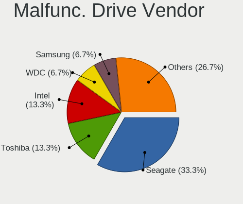
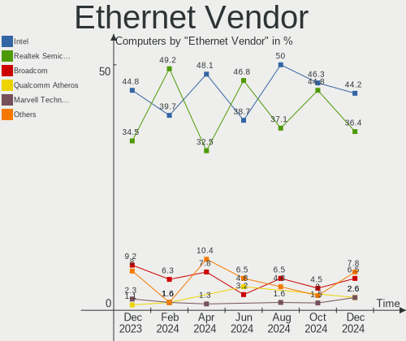

FreeBSD - Hardware Trends
-------------------------

A project to identify most popular hardware characteristics and track their change
over time based on data collected by BSD users at https://BSD-Hardware.info.

Anyone can contribute to this report by the [hw-probe](https://github.com/linuxhw/hw-probe/blob/master/INSTALL.BSD.md) tool:

    hw-probe -all -upload

This is a report for all computer types. See also reports for [desktops](/Dist/FreeBSD/Desktop/README.md) and [notebooks](/Dist/FreeBSD/Notebook/README.md).

This report is for one last month. Overall report since the beginning of time: [TestDays](https://github.com/bsdhw/TestDays)

Period: Dec, 2024.

Contents
--------

* [ System ](#system)
  - [ OS                       ](#os)
  - [ OS Family                ](#os-family)
  - [ Arch                     ](#arch)
  - [ DE                       ](#de)
  - [ Display Server           ](#display-server)
  - [ Display Manager          ](#display-manager)
  - [ OS Lang                  ](#os-lang)
  - [ Boot Mode                ](#boot-mode)
  - [ Filesystem               ](#filesystem)
  - [ Part. scheme             ](#part-scheme)

* [ Board ](#board)
  - [ Vendor                   ](#vendor)
  - [ Model                    ](#model)
  - [ Model Family             ](#model-family)
  - [ MFG Year                 ](#mfg-year)
  - [ Form Factor              ](#form-factor)
  - [ Coreboot                 ](#coreboot)
  - [ RAM Size                 ](#ram-size)
  - [ RAM Used                 ](#ram-used)
  - [ Total Drives             ](#total-drives)
  - [ Has CD-ROM               ](#has-cd-rom)
  - [ Has Ethernet             ](#has-ethernet)
  - [ Has WiFi                 ](#has-wifi)
  - [ Has Bluetooth            ](#has-bluetooth)

* [ Location ](#location)
  - [ Country                  ](#country)
  - [ City                     ](#city)

* [ Drives ](#drives)
  - [ Drive Vendor             ](#drive-vendor)
  - [ Drive Model              ](#drive-model)
  - [ HDD Vendor               ](#hdd-vendor)
  - [ SSD Vendor               ](#ssd-vendor)
  - [ Drive Kind               ](#drive-kind)
  - [ Drive Connector          ](#drive-connector)
  - [ Drive Size               ](#drive-size)
  - [ Space Total              ](#space-total)
  - [ Space Used               ](#space-used)
  - [ Malfunc. Drives          ](#malfunc-drives)
  - [ Malfunc. Drive Vendor    ](#malfunc-drive-vendor)
  - [ Malfunc. HDD Vendor      ](#malfunc-hdd-vendor)
  - [ Malfunc. Drive Kind      ](#malfunc-drive-kind)
  - [ Failed Drives            ](#failed-drives)
  - [ Failed Drive Vendor      ](#failed-drive-vendor)
  - [ Drive Status             ](#drive-status)

* [ Storage controller ](#storage-controller)
  - [ Storage Vendor           ](#storage-vendor)
  - [ Storage Model            ](#storage-model)
  - [ Storage Kind             ](#storage-kind)

* [ Processor ](#processor)
  - [ CPU Vendor               ](#cpu-vendor)
  - [ CPU Model                ](#cpu-model)
  - [ CPU Model Family         ](#cpu-model-family)
  - [ CPU Cores                ](#cpu-cores)
  - [ CPU Sockets              ](#cpu-sockets)
  - [ CPU Threads              ](#cpu-threads)
  - [ CPU Microarch            ](#cpu-microarch)

* [ Graphics ](#graphics)
  - [ GPU Vendor               ](#gpu-vendor)
  - [ GPU Model                ](#gpu-model)
  - [ GPU Combo                ](#gpu-combo)
  - [ GPU Driver               ](#gpu-driver)
  - [ GPU Memory               ](#gpu-memory)

* [ Monitor ](#monitor)
  - [ Monitor Vendor           ](#monitor-vendor)
  - [ Monitor Model            ](#monitor-model)
  - [ Monitor Resolution       ](#monitor-resolution)
  - [ Monitor Diagonal         ](#monitor-diagonal)
  - [ Monitor Width            ](#monitor-width)
  - [ Aspect Ratio             ](#aspect-ratio)
  - [ Monitor Area             ](#monitor-area)
  - [ Pixel Density            ](#pixel-density)
  - [ Multiple Monitors        ](#multiple-monitors)

* [ Network ](#network)
  - [ Net Controller Vendor    ](#net-controller-vendor)
  - [ Net Controller Model     ](#net-controller-model)
  - [ Wireless Vendor          ](#wireless-vendor)
  - [ Wireless Model           ](#wireless-model)
  - [ Ethernet Vendor          ](#ethernet-vendor)
  - [ Ethernet Model           ](#ethernet-model)
  - [ Net Controller Kind      ](#net-controller-kind)
  - [ Used Controller          ](#used-controller)
  - [ NICs                     ](#nics)
  - [ IPv6                     ](#ipv6)

* [ Bluetooth ](#bluetooth)
  - [ Bluetooth Vendor         ](#bluetooth-vendor)
  - [ Bluetooth Model          ](#bluetooth-model)

* [ Sound ](#sound)
  - [ Sound Vendor             ](#sound-vendor)
  - [ Sound Model              ](#sound-model)

* [ Memory ](#memory)
  - [ Memory Vendor            ](#memory-vendor)
  - [ Memory Model             ](#memory-model)
  - [ Memory Kind              ](#memory-kind)
  - [ Memory Form Factor       ](#memory-form-factor)
  - [ Memory Size              ](#memory-size)
  - [ Memory Speed             ](#memory-speed)

* [ Printers & scanners ](#printers--scanners)
  - [ Printer Vendor           ](#printer-vendor)
  - [ Printer Model            ](#printer-model)
  - [ Scanner Vendor           ](#scanner-vendor)
  - [ Scanner Model            ](#scanner-model)

* [ Camera ](#camera)
  - [ Camera Vendor            ](#camera-vendor)
  - [ Camera Model             ](#camera-model)

* [ Security ](#security)
  - [ Fingerprint Vendor       ](#fingerprint-vendor)
  - [ Fingerprint Model        ](#fingerprint-model)
  - [ Chipcard Vendor          ](#chipcard-vendor)
  - [ Chipcard Model           ](#chipcard-model)

* [ Unsupported ](#unsupported)
  - [ Unsupported Devices      ](#unsupported-devices)
  - [ Unsupported Device Types ](#unsupported-device-types)

System
------

OS
--

Installed operating systems

| Name                 | Computers | Percent |
|----------------------|-----------|---------|
| FreeBSD 14.2         | 45        | 54.88%  |
| FreeBSD 14.1-p6      | 18        | 21.95%  |
| FreeBSD 14.1         | 6         | 7.32%   |
| FreeBSD 15.0-CURRENT | 4         | 4.88%   |
| FreeBSD 14.1-STABLE  | 4         | 4.88%   |
| FreeBSD 14.2-STABLE  | 2         | 2.44%   |
| FreeBSD 14.1-p5      | 2         | 2.44%   |
| FreeBSD 14.1-p3      | 1         | 1.22%   |

OS Family
---------

OS without a version

| Name    | Computers | Percent |
|---------|-----------|---------|
| FreeBSD | 82        | 100%    |

Arch
----

OS architecture (x86_64, i586, etc.)

| Name  | Computers | Percent |
|-------|-----------|---------|
| amd64 | 80        | 97.56%  |
| i386  | 1         | 1.22%   |
| arm64 | 1         | 1.22%   |

DE
--

Desktop Environment

| Name    | Computers | Percent |
|---------|-----------|---------|
| Console | 28        | 34.15%  |
| KDE5    | 12        | 14.63%  |
| XFCE    | 10        | 12.2%   |
| GNOME   | 10        | 12.2%   |
| MATE    | 7         | 8.54%   |
| TWM     | 5         | 6.1%    |
| KDE     | 2         | 2.44%   |
| Fluxbox | 2         | 2.44%   |
| openbox | 1         | 1.22%   |
| LXQt    | 1         | 1.22%   |
| LXDE    | 1         | 1.22%   |
| KDE6    | 1         | 1.22%   |
| i3      | 1         | 1.22%   |
| EXWM    | 1         | 1.22%   |

Display Server
--------------

X11 or Wayland

| Name    | Computers | Percent |
|---------|-----------|---------|
| X11     | 49        | 59.76%  |
| Console | 27        | 32.93%  |
| Wayland | 6         | 7.32%   |

Display Manager
---------------

SDDM, LightDM, etc.

| Name    | Computers | Percent |
|---------|-----------|---------|
| Console | 39        | 47.56%  |
| SDDM    | 21        | 25.61%  |
| LightDM | 9         | 10.98%  |
| GDM     | 5         | 6.1%    |
| SLiM    | 4         | 4.88%   |
| XDM     | 2         | 2.44%   |
| Ly      | 2         | 2.44%   |

OS Lang
-------

Language

| Lang    | Computers | Percent |
|---------|-----------|---------|
| C       | 58        | 70.73%  |
| en_US   | 9         | 10.98%  |
| ru_RU   | 3         | 3.66%   |
| fr_FR   | 3         | 3.66%   |
| de_DE   | 3         | 3.66%   |
| Unknown | 3         | 3.66%   |
| zh_CN   | 1         | 1.22%   |
| es_AR   | 1         | 1.22%   |
| en_CA   | 1         | 1.22%   |

Boot Mode
---------

EFI or BIOS

| Mode | Computers | Percent |
|------|-----------|---------|
| EFI  | 65        | 79.27%  |
| BIOS | 17        | 20.73%  |

Filesystem
----------

Type of filesystem

| Type | Computers | Percent |
|------|-----------|---------|
| Zfs  | 69        | 84.15%  |
| Ufs  | 13        | 15.85%  |

Part. scheme
------------

Scheme of partitioning

| Type    | Computers | Percent |
|---------|-----------|---------|
| GPT     | 79        | 96.34%  |
| MBR     | 2         | 2.44%   |
| Unknown | 1         | 1.22%   |

Board
-----

Vendor
------

Motherboard manufacturer

| Name                                | Computers | Percent |
|-------------------------------------|-----------|---------|
| Lenovo                              | 14        | 17.07%  |
| Dell                                | 11        | 13.41%  |
| ASUSTek Computer                    | 10        | 12.2%   |
| Gigabyte Technology                 | 7         | 8.54%   |
| Intel                               | 5         | 6.1%    |
| Hewlett-Packard                     | 5         | 6.1%    |
| MSI                                 | 4         | 4.88%   |
| Star Labs                           | 2         | 2.44%   |
| Apple                               | 2         | 2.44%   |
| Alienware                           | 2         | 2.44%   |
| WeiBu                               | 1         | 1.22%   |
| UD                                  | 1         | 1.22%   |
| TUXEDO                              | 1         | 1.22%   |
| Timi                                | 1         | 1.22%   |
| Supermicro                          | 1         | 1.22%   |
| Sony                                | 1         | 1.22%   |
| Shenzhen suqiao computer technology | 1         | 1.22%   |
| Razer                               | 1         | 1.22%   |
| Raspberry Pi Foundation             | 1         | 1.22%   |
| PC Engines                          | 1         | 1.22%   |
| Notebook                            | 1         | 1.22%   |
| NF533MS                             | 1         | 1.22%   |
| JGINYUE                             | 1         | 1.22%   |
| HUAWEI                              | 1         | 1.22%   |
| Gateway                             | 1         | 1.22%   |
| Fujitsu                             | 1         | 1.22%   |
| Framework                           | 1         | 1.22%   |
| ASRockRack                          | 1         | 1.22%   |
| Acer                                | 1         | 1.22%   |
| Unknown                             | 1         | 1.22%   |

Model
-----

Motherboard model

| Name                                                         | Computers | Percent |
|--------------------------------------------------------------|-----------|---------|
| Star Labs StarLite                                           | 2         | 2.44%   |
| Gigabyte M68MT-S2                                            | 2         | 2.44%   |
| Dell Precision 5510                                          | 2         | 2.44%   |
| ASUS P5Q-E                                                   | 2         | 2.44%   |
| Alienware m15 R6                                             | 2         | 2.44%   |
| WeiBu ADL-N                                                  | 1         | 1.22%   |
| UD eisy home next                                            | 1         | 1.22%   |
| TUXEDO Pulse 14 Gen3                                         | 1         | 1.22%   |
| Timi TM1703                                                  | 1         | 1.22%   |
| Supermicro Super Server                                      | 1         | 1.22%   |
| Sony SVE11115ELW                                             | 1         | 1.22%   |
| Shenzhen suqiao computer technology miniPC                   | 1         | 1.22%   |
| Razer Blade 16 - RZ09-0510                                   | 1         | 1.22%   |
| RPi Raspberry Pi                                             | 1         | 1.22%   |
| PC Engines APU2                                              | 1         | 1.22%   |
| Notebook N7x0WU                                              | 1         | 1.22%   |
| NF533MS 1.0                                                  | 1         | 1.22%   |
| MSI MS-7C95                                                  | 1         | 1.22%   |
| MSI MS-7817                                                  | 1         | 1.22%   |
| MSI MS-7758                                                  | 1         | 1.22%   |
| MSI MS-7680                                                  | 1         | 1.22%   |
| Lenovo ThinkStation P300 30AJS0G500                          | 1         | 1.22%   |
| Lenovo ThinkPad X250 20CLS14400                              | 1         | 1.22%   |
| Lenovo ThinkPad X1 Yoga 3rd 20LD003JGE                       | 1         | 1.22%   |
| Lenovo ThinkPad X1 Carbon Gen 9 20XW006FSP                   | 1         | 1.22%   |
| Lenovo ThinkPad X1 Carbon 7th 20R1CTO1WW                     | 1         | 1.22%   |
| Lenovo ThinkPad T490 20N3S61A13                              | 1         | 1.22%   |
| Lenovo ThinkPad T480 20L6S29D1V                              | 1         | 1.22%   |
| Lenovo ThinkPad T430 2344BPU                                 | 1         | 1.22%   |
| Lenovo ThinkPad P14s Gen 1 20Y1CTO1WW                        | 1         | 1.22%   |
| Lenovo ThinkCentre M710q 10MR006XUS                          | 1         | 1.22%   |
| Lenovo ThinkBook 14 G6 IRL 21KG                              | 1         | 1.22%   |
| Lenovo ThinkBook 14 G2 ARE 20VF                              | 1         | 1.22%   |
| Lenovo IdeaPad 320-15IKB Touch 81BH                          | 1         | 1.22%   |
| Lenovo IdeaPad 320-14IKB 80YF                                | 1         | 1.22%   |
| JGINYUE X99-8D4/2.5G Server                                  | 1         | 1.22%   |
| Intel X79_PLUS                                               | 1         | 1.22%   |
| Intel X79 (INTEL Xeon E5/Corei7 DMI2 - C600/C200 Cipset V308 | 1         | 1.22%   |
| Intel NUC11TNHi3                                             | 1         | 1.22%   |
| Intel NUC11ATKC2                                             | 1         | 1.22%   |

Model Family
------------

Motherboard model prefix

| Name                                       | Computers | Percent |
|--------------------------------------------|-----------|---------|
| Lenovo ThinkPad                            | 8         | 9.76%   |
| Dell Latitude                              | 3         | 3.66%   |
| Star Labs StarLite                         | 2         | 2.44%   |
| Lenovo ThinkBook                           | 2         | 2.44%   |
| Lenovo IdeaPad                             | 2         | 2.44%   |
| Intel X79                                  | 2         | 2.44%   |
| HP EliteDesk                               | 2         | 2.44%   |
| Gigabyte M68MT-S2                          | 2         | 2.44%   |
| Dell Precision                             | 2         | 2.44%   |
| Dell OptiPlex                              | 2         | 2.44%   |
| ASUS ROG                                   | 2         | 2.44%   |
| ASUS PRIME                                 | 2         | 2.44%   |
| ASUS P5Q-E                                 | 2         | 2.44%   |
| Alienware m15                              | 2         | 2.44%   |
| WeiBu ADL-N                                | 1         | 1.22%   |
| UD eisy                                    | 1         | 1.22%   |
| TUXEDO Pulse                               | 1         | 1.22%   |
| Timi TM1703                                | 1         | 1.22%   |
| Supermicro Super                           | 1         | 1.22%   |
| Sony SVE11115ELW                           | 1         | 1.22%   |
| Shenzhen suqiao computer technology miniPC | 1         | 1.22%   |
| Razer Blade                                | 1         | 1.22%   |
| RPi Raspberry                              | 1         | 1.22%   |
| PC Engines APU2                            | 1         | 1.22%   |
| Notebook N7x0WU                            | 1         | 1.22%   |
| NF533MS 1.0                                | 1         | 1.22%   |
| MSI MS-7C95                                | 1         | 1.22%   |
| MSI MS-7817                                | 1         | 1.22%   |
| MSI MS-7758                                | 1         | 1.22%   |
| MSI MS-7680                                | 1         | 1.22%   |
| Lenovo ThinkStation                        | 1         | 1.22%   |
| Lenovo ThinkCentre                         | 1         | 1.22%   |
| JGINYUE X99-8D4                            | 1         | 1.22%   |
| Intel NUC11TNHi3                           | 1         | 1.22%   |
| Intel NUC11ATKC2                           | 1         | 1.22%   |
| Intel HURONRIVER                           | 1         | 1.22%   |
| HUAWEI MRGFG-XX                            | 1         | 1.22%   |
| HP t630                                    | 1         | 1.22%   |
| HP Pavilion                                | 1         | 1.22%   |
| HP Laptop                                  | 1         | 1.22%   |

MFG Year
--------

Motherboard manufacture year

| Year    | Computers | Percent |
|---------|-----------|---------|
| 2024    | 13        | 15.85%  |
| 2023    | 9         | 10.98%  |
| 2019    | 9         | 10.98%  |
| 2020    | 8         | 9.76%   |
| 2014    | 7         | 8.54%   |
| 2012    | 7         | 8.54%   |
| 2021    | 6         | 7.32%   |
| 2016    | 4         | 4.88%   |
| 2013    | 4         | 4.88%   |
| 2022    | 2         | 2.44%   |
| 2018    | 2         | 2.44%   |
| 2017    | 2         | 2.44%   |
| 2015    | 2         | 2.44%   |
| 2008    | 2         | 2.44%   |
| 2006    | 2         | 2.44%   |
| 2011    | 1         | 1.22%   |
| 2010    | 1         | 1.22%   |
| Unknown | 1         | 1.22%   |

Form Factor
-----------

Physical design of the computer

| Name           | Computers | Percent |
|----------------|-----------|---------|
| Desktop        | 35        | 42.68%  |
| Notebook       | 34        | 41.46%  |
| Mini pc        | 5         | 6.1%    |
| Tablet         | 2         | 2.44%   |
| Convertible    | 2         | 2.44%   |
| Server         | 2         | 2.44%   |
| System on chip | 1         | 1.22%   |
| All in one     | 1         | 1.22%   |

Coreboot
--------

Have coreboot on board

| Used | Computers | Percent |
|------|-----------|---------|
| No   | 79        | 96.34%  |
| Yes  | 3         | 3.66%   |

RAM Size
--------

Total RAM memory

| Size in GB  | Computers | Percent |
|-------------|-----------|---------|
| 16.01-24.0  | 27        | 32.93%  |
| 8.01-16.0   | 19        | 23.17%  |
| 32.01-64.0  | 15        | 18.29%  |
| 64.01-256.0 | 12        | 14.63%  |
| 4.01-8.0    | 7         | 8.54%   |
| 3.01-4.0    | 1         | 1.22%   |
| 2.01-3.0    | 1         | 1.22%   |

RAM Used
--------

Used RAM memory

| Used GB  | Computers | Percent |
|----------|-----------|---------|
| 0.51-1.0 | 32        | 39.02%  |
| 1.01-2.0 | 22        | 26.83%  |
| 0.01-0.5 | 19        | 23.17%  |
| 2.01-3.0 | 4         | 4.88%   |
| 4.01-8.0 | 3         | 3.66%   |
| 3.01-4.0 | 2         | 2.44%   |

Total Drives
------------

Number of drives on board

| Drives | Computers | Percent |
|--------|-----------|---------|
| 0      | 35        | 42.68%  |
| 1      | 24        | 29.27%  |
| 2      | 11        | 13.41%  |
| 4      | 6         | 7.32%   |
| 3      | 3         | 3.66%   |
| 10     | 1         | 1.22%   |
| 6      | 1         | 1.22%   |
| 5      | 1         | 1.22%   |

Has CD-ROM
----------

Has CD-ROM on board

| Presented | Computers | Percent |
|-----------|-----------|---------|
| No        | 67        | 81.71%  |
| Yes       | 15        | 18.29%  |

Has Ethernet
------------

Has Ethernet on board

| Presented | Computers | Percent |
|-----------|-----------|---------|
| Yes       | 67        | 81.71%  |
| No        | 15        | 18.29%  |

Has WiFi
--------

Has WiFi module

| Presented | Computers | Percent |
|-----------|-----------|---------|
| Yes       | 57        | 69.51%  |
| No        | 25        | 30.49%  |

Has Bluetooth
-------------

Has Bluetooth module

| Presented | Computers | Percent |
|-----------|-----------|---------|
| Yes       | 51        | 62.2%   |
| No        | 31        | 37.8%   |

Location
--------

Country
-------

Geographic location (country)

| Country         | Computers | Percent |
|-----------------|-----------|---------|
| USA             | 17        | 20.73%  |
| France          | 7         | 8.54%   |
| Canada          | 7         | 8.54%   |
| UK              | 6         | 7.32%   |
| Spain           | 6         | 7.32%   |
| Germany         | 6         | 7.32%   |
| Russia          | 5         | 6.1%    |
| Poland          | 3         | 3.66%   |
| China           | 2         | 2.44%   |
| Brazil          | 2         | 2.44%   |
| Austria         | 2         | 2.44%   |
| Australia       | 2         | 2.44%   |
| UAE             | 1         | 1.22%   |
| The Netherlands | 1         | 1.22%   |
| Thailand        | 1         | 1.22%   |
| Serbia          | 1         | 1.22%   |
| Netherlands     | 1         | 1.22%   |
| Malta           | 1         | 1.22%   |
| Malaysia        | 1         | 1.22%   |
| Lithuania       | 1         | 1.22%   |
| Jersey          | 1         | 1.22%   |
| Italy           | 1         | 1.22%   |
| India           | 1         | 1.22%   |
| Hungary         | 1         | 1.22%   |
| Chile           | 1         | 1.22%   |
| Belarus         | 1         | 1.22%   |
| Argentina       | 1         | 1.22%   |
| Andorra         | 1         | 1.22%   |
| Algeria         | 1         | 1.22%   |

City
----

Geographic location (city)

| City             | Computers | Percent |
|------------------|-----------|---------|
| Strasbourg       | 3         | 3.66%   |
| Poole            | 3         | 3.66%   |
| Ottawa           | 3         | 3.66%   |
| Vienna           | 2         | 2.44%   |
| Sao Paulo        | 2         | 2.44%   |
| Paris            | 2         | 2.44%   |
| Moscow           | 2         | 2.44%   |
| Los Realejos     | 2         | 2.44%   |
| Los Angeles      | 2         | 2.44%   |
| Bellingham       | 2         | 2.44%   |
| Barcelona        | 2         | 2.44%   |
| Wenatchee        | 1         | 1.22%   |
| Vilnius          | 1         | 1.22%   |
| Victoria         | 1         | 1.22%   |
| Vancouver        | 1         | 1.22%   |
| Ulm              | 1         | 1.22%   |
| Temuco           | 1         | 1.22%   |
| Taylor           | 1         | 1.22%   |
| Sydney           | 1         | 1.22%   |
| Suzhou           | 1         | 1.22%   |
| Subotica         | 1         | 1.22%   |
| Stockport        | 1         | 1.22%   |
| Sherwood Park    | 1         | 1.22%   |
| Sertolovo        | 1         | 1.22%   |
| Seattle          | 1         | 1.22%   |
| San Clemente     | 1         | 1.22%   |
| Rybnik           | 1         | 1.22%   |
| Rossville        | 1         | 1.22%   |
| Richmond         | 1         | 1.22%   |
| Pune             | 1         | 1.22%   |
| Pognana Lario    | 1         | 1.22%   |
| Plasencia        | 1         | 1.22%   |
| Palm Springs     | 1         | 1.22%   |
| Oran             | 1         | 1.22%   |
| Oklahoma City    | 1         | 1.22%   |
| Nuremberg        | 1         | 1.22%   |
| Nizhniy Novgorod | 1         | 1.22%   |
| Nijeveen         | 1         | 1.22%   |
| New York         | 1         | 1.22%   |
| Neustadt         | 1         | 1.22%   |

Drives
------

Drive Vendor
------------

Hard drive vendors

| Vendor              | Computers | Drives | Percent |
|---------------------|-----------|--------|---------|
| WDC                 | 15        | 25     | 20.27%  |
| Seagate             | 15        | 21     | 20.27%  |
| Samsung Electronics | 10        | 15     | 13.51%  |
| Crucial             | 7         | 7      | 9.46%   |
| SanDisk             | 5         | 6      | 6.76%   |
| Kingston            | 4         | 6      | 5.41%   |
| Intel               | 3         | 3      | 4.05%   |
| Toshiba             | 2         | 3      | 2.7%    |
| SPCC                | 2         | 3      | 2.7%    |
| HGST                | 2         | 3      | 2.7%    |
| A-DATA Technology   | 2         | 2      | 2.7%    |
| walram              | 1         | 1      | 1.35%   |
| SK hynix            | 1         | 1      | 1.35%   |
| PNY                 | 1         | 2      | 1.35%   |
| Hitachi             | 1         | 1      | 1.35%   |
| Hewlett-Packard     | 1         | 1      | 1.35%   |
| China               | 1         | 1      | 1.35%   |
| ASMedia             | 1         | 1      | 1.35%   |

Drive Model
-----------

Hard drive models

| Model                           | Computers | Percent |
|---------------------------------|-----------|---------|
| Crucial CT1000MX500SSD1 1TB     | 3         | 3.41%   |
| WDC WDS500G2B0A-00SM50 500GB    | 2         | 2.27%   |
| Kingston SA400S37120G 120GB     | 2         | 2.27%   |
| WDC WDS500G2B0A 500GB           | 1         | 1.14%   |
| WDC WDS120G2G0B-00EPW0 120GB    | 1         | 1.14%   |
| WDC WD80EFAX-68KNBN0 8TB        | 1         | 1.14%   |
| WDC WD5000LPZX-22Z10T0 500GB    | 1         | 1.14%   |
| WDC WD5000AAKX-60U6AA0 500GB    | 1         | 1.14%   |
| WDC WD40NDZW-11BCSS1 4TB        | 1         | 1.14%   |
| WDC WD40EZRZ-22GXCB0 4TB        | 1         | 1.14%   |
| WDC WD40EZRZ-00WN9B0 4TB        | 1         | 1.14%   |
| WDC WD40EZAZ-00SF3B0 4TB        | 1         | 1.14%   |
| WDC WD40EFRX-68N32N0 4TB        | 1         | 1.14%   |
| WDC WD4003FRYZ-01F0DB0 4TB      | 1         | 1.14%   |
| WDC WD20SDRW-11VUUS0 2TB        | 1         | 1.14%   |
| WDC WD20EZRZ-00Z5HB0 2TB        | 1         | 1.14%   |
| WDC WD20EZAZ-00GGJB0 2TB        | 1         | 1.14%   |
| WDC WD2002FAEX-007BA0 2TB       | 1         | 1.14%   |
| WDC WD1600AAJS-00YZCA0 160GB    | 1         | 1.14%   |
| WDC WD15EADS-00P8B0 1.5TB       | 1         | 1.14%   |
| WDC WD10JPVT-80A1YT0 1TB        | 1         | 1.14%   |
| WDC WD10EZEX-00BN5A0 1TB        | 1         | 1.14%   |
| WDC WD1002FAEX-00Z3A0 1TB       | 1         | 1.14%   |
| walram SSD 128G                 | 1         | 1.14%   |
| Toshiba MK3252GSX 320GB         | 1         | 1.14%   |
| Toshiba DT01ACA300 3TB          | 1         | 1.14%   |
| Toshiba DT01ACA200V 2TB         | 1         | 1.14%   |
| SPCC Solid State Disk 512GB     | 1         | 1.14%   |
| SPCC Solid State Disk 128GB     | 1         | 1.14%   |
| SK hynix SC308 SATA 128GB       | 1         | 1.14%   |
| Seagate ST8000DM004-2U9188 8TB  | 1         | 1.14%   |
| Seagate ST500LM021-1KJ152 500GB | 1         | 1.14%   |
| Seagate ST4000DM005-2DP166 4TB  | 1         | 1.14%   |
| Seagate ST4000DM000-1F2168 4TB  | 1         | 1.14%   |
| Seagate ST380811AS 80GB         | 1         | 1.14%   |
| Seagate ST3500830AS 500GB       | 1         | 1.14%   |
| Seagate ST3250410AS 250GB       | 1         | 1.14%   |
| Seagate ST320LT020-9YG142 320GB | 1         | 1.14%   |
| Seagate ST3160815AS 160GB       | 1         | 1.14%   |
| Seagate ST31000525SV 1TB        | 1         | 1.14%   |

HDD Vendor
----------

Hard disk drive vendors

| Vendor              | Computers | Drives | Percent |
|---------------------|-----------|--------|---------|
| Seagate             | 15        | 21     | 39.47%  |
| WDC                 | 14        | 21     | 36.84%  |
| Toshiba             | 2         | 3      | 5.26%   |
| Samsung Electronics | 2         | 2      | 5.26%   |
| HGST                | 2         | 3      | 5.26%   |
| Hitachi             | 1         | 1      | 2.63%   |
| Hewlett-Packard     | 1         | 1      | 2.63%   |
| ASMedia             | 1         | 1      | 2.63%   |

SSD Vendor
----------

Solid state drive vendors

| Vendor              | Computers | Drives | Percent |
|---------------------|-----------|--------|---------|
| Samsung Electronics | 9         | 13     | 23.08%  |
| Crucial             | 7         | 7      | 17.95%  |
| SanDisk             | 5         | 6      | 12.82%  |
| Kingston            | 4         | 6      | 10.26%  |
| WDC                 | 3         | 4      | 7.69%   |
| Intel               | 3         | 3      | 7.69%   |
| SPCC                | 2         | 3      | 5.13%   |
| A-DATA Technology   | 2         | 2      | 5.13%   |
| walram              | 1         | 1      | 2.56%   |
| SK hynix            | 1         | 1      | 2.56%   |
| PNY                 | 1         | 2      | 2.56%   |
| China               | 1         | 1      | 2.56%   |

Drive Kind
----------

HDD or SSD

| Kind | Computers | Drives | Percent |
|------|-----------|--------|---------|
| SSD  | 34        | 49     | 54.84%  |
| HDD  | 28        | 53     | 45.16%  |

Drive Connector
---------------

SATA, SAS, NVMe, etc.

| Type | Computers | Drives | Percent |
|------|-----------|--------|---------|
| SATA | 47        | 102    | 100%    |

Drive Size
----------

Size of hard drive

| Size in TB | Computers | Drives | Percent |
|------------|-----------|--------|---------|
| 0.01-0.5   | 33        | 48     | 48.53%  |
| 0.51-1.0   | 15        | 20     | 22.06%  |
| 1.01-2.0   | 10        | 18     | 14.71%  |
| 3.01-4.0   | 6         | 9      | 8.82%   |
| 4.01-10.0  | 3         | 6      | 4.41%   |
| 2.01-3.0   | 1         | 1      | 1.47%   |

Space Total
-----------

Amount of disk space available on the file system

| Size in GB     | Computers | Percent |
|----------------|-----------|---------|
| 101-250        | 25        | 30.49%  |
| 251-500        | 20        | 24.39%  |
| 501-1000       | 15        | 18.29%  |
| 1001-2000      | 9         | 10.98%  |
| 21-50          | 4         | 4.88%   |
| 51-100         | 4         | 4.88%   |
| More than 3000 | 2         | 2.44%   |
| 1-20           | 2         | 2.44%   |
| 2001-3000      | 1         | 1.22%   |

Space Used
----------

Amount of used disk space

| Used GB | Computers | Percent |
|---------|-----------|---------|
| 1-20    | 58        | 70.73%  |
| 21-50   | 14        | 17.07%  |
| 51-100  | 8         | 9.76%   |
| 101-250 | 2         | 2.44%   |

Malfunc. Drives
---------------

Drive models with a malfunction

| Model                              | Computers | Drives | Percent |
|------------------------------------|-----------|--------|---------|
| WDC WD40EZRZ-00WN9B0 4TB           | 1         | 1      | 5.56%   |
| Toshiba MK3252GSX 320GB            | 1         | 1      | 5.56%   |
| Toshiba DT01ACA300 3TB             | 1         | 1      | 5.56%   |
| Toshiba DT01ACA200V 2TB            | 1         | 1      | 5.56%   |
| SK hynix SC308 SATA 128GB          | 1         | 1      | 5.56%   |
| Seagate ST500LM021-1KJ152 500GB    | 1         | 3      | 5.56%   |
| Seagate ST380811AS 80GB            | 1         | 1      | 5.56%   |
| Seagate ST3250410AS 250GB          | 1         | 1      | 5.56%   |
| Seagate ST3160815AS 160GB          | 1         | 1      | 5.56%   |
| Seagate ST31000525SV 1TB           | 1         | 1      | 5.56%   |
| Seagate ST2000DM001-9YN164 2TB     | 1         | 1      | 5.56%   |
| Seagate ST1000LM024 HN-M101MBB 1TB | 1         | 1      | 5.56%   |
| Samsung Electronics HD403LJ 400GB  | 1         | 1      | 5.56%   |
| Intel SSDSC2BW480A4 480GB          | 1         | 1      | 5.56%   |
| Intel SSDSA2M040G2GC 40GB          | 1         | 1      | 5.56%   |
| Hitachi HTS727575A9E362 752GB      | 1         | 1      | 5.56%   |
| HGST HTS725050A7E630 500GB         | 1         | 1      | 5.56%   |
| A-DATA Technology SU650 240GB      | 1         | 1      | 5.56%   |

Malfunc. Drive Vendor
---------------------

Vendors of faulty drives

| Vendor              | Computers | Drives | Percent |
|---------------------|-----------|--------|---------|
| Seagate             | 5         | 9      | 33.33%  |
| Toshiba             | 2         | 3      | 13.33%  |
| Intel               | 2         | 2      | 13.33%  |
| WDC                 | 1         | 1      | 6.67%   |
| SK hynix            | 1         | 1      | 6.67%   |
| Samsung Electronics | 1         | 1      | 6.67%   |
| Hitachi             | 1         | 1      | 6.67%   |
| HGST                | 1         | 1      | 6.67%   |
| A-DATA Technology   | 1         | 1      | 6.67%   |

Malfunc. HDD Vendor
-------------------

Vendors of faulty HDD drives

| Vendor              | Computers | Drives | Percent |
|---------------------|-----------|--------|---------|
| Seagate             | 5         | 9      | 45.45%  |
| Toshiba             | 2         | 3      | 18.18%  |
| WDC                 | 1         | 1      | 9.09%   |
| Samsung Electronics | 1         | 1      | 9.09%   |
| Hitachi             | 1         | 1      | 9.09%   |
| HGST                | 1         | 1      | 9.09%   |

Malfunc. Drive Kind
-------------------

Kinds of faulty drives

| Kind | Computers | Drives | Percent |
|------|-----------|--------|---------|
| HDD  | 11        | 16     | 73.33%  |
| SSD  | 4         | 4      | 26.67%  |

Failed Drives
-------------

Failed drive models

Zero info for selected period =(

Failed Drive Vendor
-------------------

Failed drive vendors

Zero info for selected period =(

Drive Status
------------

Number of failed and malfunc. drives

| Status  | Computers | Drives | Percent |
|---------|-----------|--------|---------|
| Works   | 41        | 82     | 75.93%  |
| Malfunc | 13        | 20     | 24.07%  |

Storage controller
------------------

Storage Vendor
--------------

Storage controller vendors

| Vendor                      | Computers | Percent |
|-----------------------------|-----------|---------|
| Intel                       | 43        | 36.75%  |
| AMD                         | 15        | 12.82%  |
| Samsung Electronics         | 14        | 11.97%  |
| SanDisk                     | 10        | 8.55%   |
| Micron/Crucial Technology   | 5         | 4.27%   |
| SK hynix                    | 3         | 2.56%   |
| Realtek Semiconductor       | 3         | 2.56%   |
| Marvell Technology Group    | 3         | 2.56%   |
| ASMedia Technology          | 3         | 2.56%   |
| Nvidia                      | 2         | 1.71%   |
| Micron Technology           | 2         | 1.71%   |
| MAXIO Technology (Hangzhou) | 2         | 1.71%   |
| Kingston Technology Company | 2         | 1.71%   |
| Broadcom / LSI              | 2         | 1.71%   |
| Silicon Motion              | 1         | 0.85%   |
| Seagate Technology          | 1         | 0.85%   |
| Phison Electronics          | 1         | 0.85%   |
| Netac Technology            | 1         | 0.85%   |
| KIOXIA                      | 1         | 0.85%   |
| INNOGRIT                    | 1         | 0.85%   |
| Hosin Global Electronics    | 1         | 0.85%   |
| ADATA Technology            | 1         | 0.85%   |

Storage Model
-------------

Storage controller models

| Model                                                                          | Computers | Percent |
|--------------------------------------------------------------------------------|-----------|---------|
| AMD FCH SATA Controller [AHCI mode]                                            | 10        | 7.94%   |
| Samsung NVMe SSD Controller PM9A1/PM9A3/980PRO                                 | 4         | 3.17%   |
| Samsung NVMe SSD Controller 980 (DRAM-less)                                    | 4         | 3.17%   |
| Intel 8 Series/C220 Series Chipset Family 6-port SATA Controller 1 [AHCI mode] | 4         | 3.17%   |
| SanDisk Extreme Pro / WD Black SN750 / PC SN730 / Red SN700 NVMe SSD           | 3         | 2.38%   |
| Realtek RTS5765DL NVMe SSD Controller (DRAM-less)                              | 3         | 2.38%   |
| Intel Sunrise Point-LP SATA Controller [AHCI mode]                             | 3         | 2.38%   |
| Intel Q170/Q150/B150/H170/H110/Z170/CM236 Chipset SATA Controller [AHCI Mode]  | 3         | 2.38%   |
| Intel 7 Series Chipset Family 6-port SATA Controller [AHCI mode]               | 3         | 2.38%   |
| AMD SB7x0/SB8x0/SB9x0 SATA Controller [AHCI mode]                              | 3         | 2.38%   |
| SanDisk Ultra 3D / WD PC SN530, IX SN530, Blue SN550 NVMe SSD (DRAM-less)      | 2         | 1.59%   |
| Samsung NVMe SSD Controller SM981/PM981/PM983                                  | 2         | 1.59%   |
| Nvidia MCP61 SATA Controller                                                   | 2         | 1.59%   |
| Micron/Crucial P2 [Nick P2] / P3 / P3 Plus NVMe PCIe SSD (DRAM-less)           | 2         | 1.59%   |
| MAXIO (Hangzhou) NVMe SSD Controller MAP1202 (DRAM-less)                       | 2         | 1.59%   |
| Marvell Group 88SE9215 PCIe 2.0 x1 4-port SATA 6 Gb/s Controller               | 2         | 1.59%   |
| Intel Tiger Lake SATA AHCI Controller                                          | 2         | 1.59%   |
| Intel SATA Controller [RAID mode]                                              | 2         | 1.59%   |
| Intel Jasper Lake SATA AHCI Controller                                         | 2         | 1.59%   |
| Intel 82801 Mobile SATA Controller [RAID mode]                                 | 2         | 1.59%   |
| Intel 6 Series/C200 Series Chipset Family 6 port Mobile SATA AHCI Controller   | 2         | 1.59%   |
| Intel 6 Series/C200 Series Chipset Family 6 port Desktop SATA AHCI Controller  | 2         | 1.59%   |
| ASMedia ASM1061/ASM1062 Serial ATA Controller                                  | 2         | 1.59%   |
| AMD SB7x0/SB8x0/SB9x0 IDE Controller                                           | 2         | 1.59%   |
| AMD 600 Series Chipset SATA Controller                                         | 2         | 1.59%   |
| SK hynix Platinum P41/PC801 NVMe Solid State Drive                             | 1         | 0.79%   |
| SK hynix PC611 NVMe Solid State Drive                                          | 1         | 0.79%   |
| SK hynix Gold P31/BC711/PC711 NVMe Solid State Drive                           | 1         | 0.79%   |
| Silicon Motion SM2263EN/SM2263XT (DRAM-less) NVMe SSD Controllers              | 1         | 0.79%   |
| Seagate FireCuda 520/IronWolf 525 SSD                                          | 1         | 0.79%   |
| Sandisk WD PC SN740 NVMe SSD 512GB (DRAM-less)                                 | 1         | 0.79%   |
| Sandisk WD Blue SN580 NVMe SSD (DRAM-less)                                     | 1         | 0.79%   |
| Sandisk WD Black SN850X NVMe SSD                                               | 1         | 0.79%   |
| Sandisk WD Black SN770 / PC SN740 256GB / PC SN560 (DRAM-less) NVMe SSD        | 1         | 0.79%   |
| SanDisk Extreme Pro / WD Black 2018/SN750/PC SN720 NVMe SSD                    | 1         | 0.79%   |
| Samsung S4LN053X01 AHCI SSD Controller(Apple slot)                             | 1         | 0.79%   |
| Samsung NVMe SSD Controller SM961/PM961/SM963                                  | 1         | 0.79%   |
| Samsung NVMe SSD Controller S4LV008[Pascal]                                    | 1         | 0.79%   |
| Samsung NVMe SSD Controller PM9C1a (DRAM-less)                                 | 1         | 0.79%   |
| Phison PS5013-E13 PCIe3 NVMe Controller (DRAM-less)                            | 1         | 0.79%   |

Storage Kind
------------

Kind of storage controller (IDE, SATA, NVMe, SAS, ...)

| Kind | Computers | Percent |
|------|-----------|---------|
| SATA | 50        | 47.17%  |
| NVMe | 41        | 38.68%  |
| RAID | 7         | 6.6%    |
| IDE  | 7         | 6.6%    |
| SAS  | 1         | 0.94%   |

Processor
---------

CPU Vendor
----------

Processor vendors

| Vendor | Computers | Percent |
|--------|-----------|---------|
| Intel  | 60        | 73.17%  |
| AMD    | 21        | 25.61%  |
| ARM    | 1         | 1.22%   |

CPU Model
---------

Processor models

| Model                                   | Computers | Percent |
|-----------------------------------------|-----------|---------|
| Intel N200                              | 2         | 2.44%   |
| Intel N100                              | 2         | 2.44%   |
| Intel Core i7-8550U CPU @ 1.80GHz       | 2         | 2.44%   |
| Intel Core i7-4790 CPU @ 3.60GHz        | 2         | 2.44%   |
| Intel 11th Gen Core i7-11800H @ 2.30GHz | 2         | 2.44%   |
| AMD Ryzen 5 4500U with Radeon Graphics  | 2         | 2.44%   |
| AMD FX-4100 Quad-Core Processor         | 2         | 2.44%   |
| Intel Xeon Silver 4210 CPU @ 2.20GHz    | 1         | 1.22%   |
| Intel Xeon CPU E5-2680 v4 @ 2.40GHz     | 1         | 1.22%   |
| Intel Xeon CPU E5-2650L v2 @ 1.70GHz    | 1         | 1.22%   |
| Intel Xeon CPU E5-2650 v2 @ 2.60GHz     | 1         | 1.22%   |
| Intel Xeon CPU E5-2450 v2 @ 2.50GHz     | 1         | 1.22%   |
| Intel Pentium CPU G3220 @ 3.00GHz       | 1         | 1.22%   |
| Intel Core i9-14900K                    | 1         | 1.22%   |
| Intel Core i9-14900HX                   | 1         | 1.22%   |
| Intel Core i7-8650U CPU @ 1.90GHz       | 1         | 1.22%   |
| Intel Core i7-6820HQ CPU @ 2.70GHz      | 1         | 1.22%   |
| Intel Core i7-4800MQ CPU @ 2.70GHz      | 1         | 1.22%   |
| Intel Core i7-4785T CPU @ 2.20GHz       | 1         | 1.22%   |
| Intel Core i7-4650U CPU @ 1.70GHz       | 1         | 1.22%   |
| Intel Core i7-3770 CPU @ 3.40GHz        | 1         | 1.22%   |
| Intel Core i7-3520M CPU @ 2.90GHz       | 1         | 1.22%   |
| Intel Core i7-2760QM CPU @ 2.40GHz      | 1         | 1.22%   |
| Intel Core i7-2600 CPU @ 3.40GHz        | 1         | 1.22%   |
| Intel Core i7-14700KF                   | 1         | 1.22%   |
| Intel Core i7-1065G7 CPU @ 1.30GHz      | 1         | 1.22%   |
| Intel Core i7-10510U CPU @ 1.80GHz      | 1         | 1.22%   |
| Intel Core i5-8365U CPU @ 1.60GHz       | 1         | 1.22%   |
| Intel Core i5-8350U CPU @ 1.70GHz       | 1         | 1.22%   |
| Intel Core i5-8250U CPU @ 1.60GHz       | 1         | 1.22%   |
| Intel Core i5-7500T CPU @ 2.70GHz       | 1         | 1.22%   |
| Intel Core i5-6500T CPU @ 2.50GHz       | 1         | 1.22%   |
| Intel Core i5-6500 CPU @ 3.20GHz        | 1         | 1.22%   |
| Intel Core i5-6300HQ CPU @ 2.30GHz      | 1         | 1.22%   |
| Intel Core i5-6200U CPU @ 2.30GHz       | 1         | 1.22%   |
| Intel Core i5-5300U CPU @ 2.30GHz       | 1         | 1.22%   |
| Intel Core i5-4690 CPU @ 3.50GHz        | 1         | 1.22%   |
| Intel Core i5-4200U CPU @ 1.60GHz       | 1         | 1.22%   |
| Intel Core i5-3230M CPU @ 2.60GHz       | 1         | 1.22%   |
| Intel Core i5-2520M CPU @ 2.50GHz       | 1         | 1.22%   |

CPU Model Family
----------------

Processor model prefix

| Model             | Computers | Percent |
|-------------------|-----------|---------|
| Intel Core i7     | 16        | 19.51%  |
| Other             | 13        | 15.85%  |
| Intel Core i5     | 13        | 15.85%  |
| AMD Ryzen 5       | 6         | 7.32%   |
| Intel Xeon        | 4         | 4.88%   |
| Intel Core i3     | 3         | 3.66%   |
| Intel Celeron     | 3         | 3.66%   |
| AMD FX            | 3         | 3.66%   |
| Intel Core i9     | 2         | 2.44%   |
| Intel Core 2 Quad | 2         | 2.44%   |
| AMD Ryzen 9       | 2         | 2.44%   |
| AMD Ryzen 7       | 2         | 2.44%   |
| AMD E             | 2         | 2.44%   |
| Intel Xeon Silver | 1         | 1.22%   |
| Intel Pentium     | 1         | 1.22%   |
| Intel Core 2 Duo  | 1         | 1.22%   |
| Intel Atom        | 1         | 1.22%   |
| ARM Cortex        | 1         | 1.22%   |
| AMD Ryzen 7 PRO   | 1         | 1.22%   |
| AMD Phenom II X6  | 1         | 1.22%   |
| AMD GX            | 1         | 1.22%   |
| AMD EPYC          | 1         | 1.22%   |
| AMD Embedded      | 1         | 1.22%   |
| AMD E2            | 1         | 1.22%   |

CPU Cores
---------

Number of processor cores

| Number  | Computers | Percent |
|---------|-----------|---------|
| 4       | 35        | 42.68%  |
| 2       | 18        | 21.95%  |
| 8       | 9         | 10.98%  |
| 6       | 7         | 8.54%   |
| 16      | 4         | 4.88%   |
| 10      | 4         | 4.88%   |
| 28      | 2         | 2.44%   |
| Unknown | 2         | 2.44%   |
| 12      | 1         | 1.22%   |

CPU Sockets
-----------

Number of sockets

| Number  | Computers | Percent |
|---------|-----------|---------|
| 1       | 79        | 96.34%  |
| 2       | 2         | 2.44%   |
| Unknown | 1         | 1.22%   |

CPU Threads
-----------

Threads per core (Hyper-Threading)

| Number  | Computers | Percent |
|---------|-----------|---------|
| 2       | 53        | 64.63%  |
| 1       | 27        | 32.93%  |
| Unknown | 2         | 2.44%   |

CPU Microarch
-------------

Microarchitecture

| Name        | Computers | Percent |
|-------------|-----------|---------|
| Unknown     | 19        | 23.17%  |
| KabyLake    | 9         | 10.98%  |
| Haswell     | 8         | 9.76%   |
| Skylake     | 7         | 8.54%   |
| Zen 2       | 6         | 7.32%   |
| IvyBridge   | 6         | 7.32%   |
| TigerLake   | 4         | 4.88%   |
| SandyBridge | 4         | 4.88%   |
| Bulldozer   | 3         | 3.66%   |
| Zen         | 2         | 2.44%   |
| Penryn      | 2         | 2.44%   |
| Broadwell   | 2         | 2.44%   |
| Bobcat      | 2         | 2.44%   |
| Zen 3       | 1         | 1.22%   |
| Silvermont  | 1         | 1.22%   |
| Puma        | 1         | 1.22%   |
| K10         | 1         | 1.22%   |
| IceLake     | 1         | 1.22%   |
| Excavator   | 1         | 1.22%   |
| Core        | 1         | 1.22%   |
| Bonnell     | 1         | 1.22%   |

Graphics
--------

GPU Vendor
----------

Vendors of graphics cards

| Vendor                     | Computers | Percent |
|----------------------------|-----------|---------|
| Intel                      | 48        | 51.61%  |
| AMD                        | 25        | 26.88%  |
| Nvidia                     | 17        | 18.28%  |
| ASPEED Technology          | 2         | 2.15%   |
| Matrox Electronics Systems | 1         | 1.08%   |

GPU Model
---------

Graphics card models

| Model                                                                       | Computers | Percent |
|-----------------------------------------------------------------------------|-----------|---------|
| Intel UHD Graphics 620                                                      | 6         | 6.38%   |
| Intel Xeon E3-1200 v3/4th Gen Core Processor Integrated Graphics Controller | 4         | 4.26%   |
| Intel HD Graphics 530                                                       | 4         | 4.26%   |
| Intel Alder Lake-N [UHD Graphics]                                           | 4         | 4.26%   |
| Intel 2nd Generation Core Processor Family Integrated Graphics Controller   | 4         | 4.26%   |
| AMD Ellesmere [Radeon RX 470/480/570/570X/580/580X/590]                     | 4         | 4.26%   |
| AMD Renoir [Radeon Vega Series / Radeon Vega Mobile Series]                 | 3         | 3.19%   |
| Nvidia GP108M [GeForce MX150]                                               | 2         | 2.13%   |
| Nvidia GM107GLM [Quadro M1000M]                                             | 2         | 2.13%   |
| Intel TigerLake-LP GT2 [Iris Xe Graphics]                                   | 2         | 2.13%   |
| Intel TigerLake-H GT1 [UHD Graphics]                                        | 2         | 2.13%   |
| Intel Tiger Lake-LP GT2 [UHD Graphics G4]                                   | 2         | 2.13%   |
| Intel Raptor Lake-P [Iris Xe Graphics]                                      | 2         | 2.13%   |
| Intel JasperLake [UHD Graphics]                                             | 2         | 2.13%   |
| Intel Haswell-ULT Integrated Graphics Controller                            | 2         | 2.13%   |
| Intel 3rd Gen Core processor Graphics Controller                            | 2         | 2.13%   |
| ASPEED Technology ASPEED Graphics Family                                    | 2         | 2.13%   |
| AMD Phoenix1                                                                | 2         | 2.13%   |
| Nvidia TU106 [GeForce RTX 2060 Rev. A]                                      | 1         | 1.06%   |
| Nvidia GP108 [GeForce GT 1030]                                              | 1         | 1.06%   |
| Nvidia GP106 [GeForce GTX 1060 6GB]                                         | 1         | 1.06%   |
| Nvidia GP104 [GeForce GTX 1070]                                             | 1         | 1.06%   |
| Nvidia GM107 [GeForce GTX 750 Ti]                                           | 1         | 1.06%   |
| Nvidia GK208B [GeForce GT 730]                                              | 1         | 1.06%   |
| Nvidia GK107 [GeForce GTX 650]                                              | 1         | 1.06%   |
| Nvidia GF119 [GeForce GT 610]                                               | 1         | 1.06%   |
| Nvidia GF108M [NVS 5400M]                                                   | 1         | 1.06%   |
| Nvidia GA106M [GeForce RTX 3060 Mobile / Max-Q]                             | 1         | 1.06%   |
| Nvidia GA104M [GeForce RTX 3070 Mobile / Max-Q]                             | 1         | 1.06%   |
| Nvidia AD106 [GeForce RTX 4060 Ti 16GB]                                     | 1         | 1.06%   |
| Nvidia AD104M [GeForce RTX 4080 Max-Q / Mobile]                             | 1         | 1.06%   |
| Matrox Electronics Systems G200eR2                                          | 1         | 1.06%   |
| Intel WhiskeyLake-U GT2 [UHD Graphics 620]                                  | 1         | 1.06%   |
| Intel Skylake GT2 [HD Graphics 520]                                         | 1         | 1.06%   |
| Intel IvyBridge GT2 [HD Graphics 4000]                                      | 1         | 1.06%   |
| Intel Iris Plus Graphics G7                                                 | 1         | 1.06%   |
| Intel HD Graphics 630                                                       | 1         | 1.06%   |
| Intel HD Graphics 5500                                                      | 1         | 1.06%   |
| Intel HD Graphics 520                                                       | 1         | 1.06%   |
| Intel CometLake-U GT2 [UHD Graphics]                                        | 1         | 1.06%   |

GPU Combo
---------

Combinations of graphics cards

| Name           | Computers | Percent |
|----------------|-----------|---------|
| 1 x Intel      | 36        | 43.9%   |
| 1 x AMD        | 19        | 23.17%  |
| 1 x Nvidia     | 8         | 9.76%   |
| Intel + Nvidia | 8         | 9.76%   |
| Intel + AMD    | 4         | 4.88%   |
| Other          | 2         | 2.44%   |
| 1 x ASPEED     | 2         | 2.44%   |
| 2 x AMD        | 1         | 1.22%   |
| 1 x Matrox     | 1         | 1.22%   |
| AMD + Nvidia   | 1         | 1.22%   |

GPU Driver
----------

Free vs proprietary

| Driver      | Computers | Percent |
|-------------|-----------|---------|
| Free        | 70        | 85.37%  |
| Proprietary | 9         | 10.98%  |
| Unknown     | 3         | 3.66%   |

GPU Memory
----------

Total video memory

| Size in GB | Computers | Percent |
|------------|-----------|---------|
| Unknown    | 61        | 74.39%  |
| 1.01-2.0   | 6         | 7.32%   |
| 7.01-8.0   | 5         | 6.1%    |
| 0.01-0.5   | 5         | 6.1%    |
| 3.01-4.0   | 3         | 3.66%   |
| 5.01-6.0   | 1         | 1.22%   |
| 8.01-16.0  | 1         | 1.22%   |

Monitor
-------

Monitor Vendor
--------------

Monitor vendors

| Vendor                  | Computers | Percent |
|-------------------------|-----------|---------|
| BOE                     | 7         | 14.29%  |
| LG Display              | 4         | 8.16%   |
| Dell                    | 4         | 8.16%   |
| Chimei Innolux          | 4         | 8.16%   |
| AU Optronics            | 4         | 8.16%   |
| ViewSonic               | 3         | 6.12%   |
| Sharp                   | 3         | 6.12%   |
| Philips                 | 3         | 6.12%   |
| Goldstar                | 3         | 6.12%   |
| Samsung Electronics     | 2         | 4.08%   |
| RTK                     | 2         | 4.08%   |
| CSO                     | 2         | 4.08%   |
| BenQ                    | 2         | 4.08%   |
| Lenovo                  | 1         | 2.04%   |
| InfoVision              | 1         | 2.04%   |
| Hewlett-Packard         | 1         | 2.04%   |
| CHO                     | 1         | 2.04%   |
| Chi Mei Optoelectronics | 1         | 2.04%   |
| Acer                    | 1         | 2.04%   |

Monitor Model
-------------

Monitor models

| Model                                                                    | Computers | Percent |
|--------------------------------------------------------------------------|-----------|---------|
| ViewSonic VA2342 SERIES VSCFA2B 1920x1080 510x290mm 23.1-inch            | 2         | 4.08%   |
| Sharp LCD Monitor SHP143E 3840x2160 350x190mm 15.7-inch                  | 2         | 4.08%   |
| BOE LCD Monitor BOE0B36 2160x1440 270x180mm 12.8-inch                    | 2         | 4.08%   |
| ViewSonic VG2755 VSC2B37 1920x1080 600x340mm 27.2-inch                   | 1         | 2.04%   |
| Sharp LCD Monitor SHP14AF 1920x1200 290x180mm 13.4-inch                  | 1         | 2.04%   |
| Samsung Electronics SyncMaster SAM01D0 1600x1200 430x320mm 21.1-inch     | 1         | 2.04%   |
| Samsung Electronics LCD Monitor SDC41AB 2560x1600 340x220mm 15.9-inch    | 1         | 2.04%   |
| RTK FHD RTK0013 1920x1080 340x200mm 15.5-inch                            | 1         | 2.04%   |
| RTK '' RTK1920 1920x1080 336x210mm 15.6-inch                             | 1         | 2.04%   |
| Philips PHL 221V8 PHLC211 1920x1080 480x270mm 21.7-inch                  | 1         | 2.04%   |
| Philips 27M1C5500V PHLC29B 2560x1440 600x340mm 27.2-inch                 | 1         | 2.04%   |
| Philips 273ELH PHLC07D 1920x1080 600x340mm 27.2-inch                     | 1         | 2.04%   |
| LG Display LCD Monitor LGD0773 1920x1200 340x220mm 15.9-inch             | 1         | 2.04%   |
| LG Display LCD Monitor LGD068F 1920x1080 310x170mm 13.9-inch             | 1         | 2.04%   |
| LG Display LCD Monitor LGD0521 1920x1080 310x170mm 13.9-inch             | 1         | 2.04%   |
| LG Display LCD Monitor LGD03ED 1366x768 280x160mm 12.7-inch              | 1         | 2.04%   |
| Lenovo P24h-10 LEN61AE 2560x1440 530x300mm 24.0-inch                     | 1         | 2.04%   |
| InfoVision LCD Monitor IVO057D 1920x1080 310x170mm 13.9-inch             | 1         | 2.04%   |
| Hewlett-Packard E272q HWP326A 2560x1440 600x340mm 27.2-inch              | 1         | 2.04%   |
| Goldstar LG ULTRAWIDE GSM7770 2560x1080 800x340mm 34.2-inch              | 1         | 2.04%   |
| Goldstar LG ULTRAWIDE GSM5BF7 2560x1080 670x280mm 28.6-inch              | 1         | 2.04%   |
| Goldstar LG FHD GSM5C66 1920x1080 530x300mm 24.0-inch                    | 1         | 2.04%   |
| Dell U2720Q DEL41B4 3840x2160 600x340mm 27.2-inch                        | 1         | 2.04%   |
| Dell U2414H DELA0A4 1920x1080 530x300mm 24.0-inch                        | 1         | 2.04%   |
| Dell S2721DGF DEL41DA 2560x1440 600x340mm 27.2-inch                      | 1         | 2.04%   |
| Dell P2422HE DELA1C8 1920x1080 530x300mm 24.0-inch                       | 1         | 2.04%   |
| CSO LCD Monitor CSO1415 3120x2080 300x200mm 14.2-inch                    | 1         | 2.04%   |
| CSO LCD Monitor CSO1403 3840x2400 300x190mm 14.0-inch                    | 1         | 2.04%   |
| CHO Smart TV CHO0030 3840x2160 1150x650mm 52.0-inch                      | 1         | 2.04%   |
| Chimei Innolux LCD Monitor CMN15CC 1366x768 340x190mm 15.3-inch          | 1         | 2.04%   |
| Chimei Innolux LCD Monitor CMN15BA 1920x1080 340x190mm 15.3-inch         | 1         | 2.04%   |
| Chimei Innolux LCD Monitor CMN1409 1920x1080 310x170mm 13.9-inch         | 1         | 2.04%   |
| Chimei Innolux LCD Monitor CMN1119 1366x768 260x140mm 11.6-inch          | 1         | 2.04%   |
| Chi Mei Optoelectronics LCD Monitor CMO15A2 1366x768 340x190mm 15.3-inch | 1         | 2.04%   |
| BOE LCD Monitor BOE0868 1920x1080 310x170mm 13.9-inch                    | 1         | 2.04%   |
| BOE LCD Monitor BOE0729 1920x1080 340x190mm 15.3-inch                    | 1         | 2.04%   |
| BOE LCD Monitor BOE06D9 1366x768 280x160mm 12.7-inch                     | 1         | 2.04%   |
| BOE LCD Monitor BOE06BD 1366x768 310x170mm 13.9-inch                     | 1         | 2.04%   |
| BOE LCD Monitor BOE06B7 1920x1080 290x170mm 13.2-inch                    | 1         | 2.04%   |
| BenQ LCD BNQ8024 2560x1440 600x340mm 27.2-inch                           | 1         | 2.04%   |

Monitor Resolution
------------------

Monitor screen resolution

| Resolution        | Computers | Percent |
|-------------------|-----------|---------|
| 1920x1080 (FHD)   | 19        | 41.3%   |
| 1366x768 (WXGA)   | 7         | 15.22%  |
| 2560x1440 (QHD)   | 5         | 10.87%  |
| 3840x2160 (4K)    | 4         | 8.7%    |
| 2560x1080         | 2         | 4.35%   |
| 2160x1440         | 2         | 4.35%   |
| 1920x1200 (WUXGA) | 2         | 4.35%   |
| 3840x2400         | 1         | 2.17%   |
| 3120x2080         | 1         | 2.17%   |
| 2560x1600         | 1         | 2.17%   |
| 1600x900 (HD+)    | 1         | 2.17%   |
| 1600x1200         | 1         | 2.17%   |

Monitor Diagonal
----------------

Diagonal size in inches

| Inches | Computers | Percent |
|--------|-----------|---------|
| 15     | 11        | 22.92%  |
| 13     | 10        | 20.83%  |
| 27     | 7         | 14.58%  |
| 24     | 4         | 8.33%   |
| 12     | 4         | 8.33%   |
| 23     | 3         | 6.25%   |
| 21     | 2         | 4.17%   |
| 14     | 2         | 4.17%   |
| 52     | 1         | 2.08%   |
| 34     | 1         | 2.08%   |
| 28     | 1         | 2.08%   |
| 17     | 1         | 2.08%   |
| 11     | 1         | 2.08%   |

Monitor Width
-------------

Physical width

| Width in mm | Computers | Percent |
|-------------|-----------|---------|
| 301-350     | 18        | 37.5%   |
| 501-600     | 14        | 29.17%  |
| 201-300     | 10        | 20.83%  |
| 401-500     | 2         | 4.17%   |
| 701-800     | 1         | 2.08%   |
| 601-700     | 1         | 2.08%   |
| 351-400     | 1         | 2.08%   |
| 1001-1500   | 1         | 2.08%   |

Aspect Ratio
------------

Proportional relationship between the width and the height

| Ratio | Computers | Percent |
|-------|-----------|---------|
| 16/9  | 33        | 75%     |
| 3/2   | 5         | 11.36%  |
| 16/10 | 3         | 6.82%   |
| 21/9  | 2         | 4.55%   |
| 4/3   | 1         | 2.27%   |

Monitor Area
------------

Area in inch

| Area in inch | Computers | Percent |
|----------------|-----------|---------|
| 81-90          | 9         | 18.37%  |
| 201-250        | 9         | 18.37%  |
| 301-350        | 7         | 14.29%  |
| 101-110        | 5         | 10.2%   |
| 91-100         | 5         | 10.2%   |
| 71-80          | 4         | 8.16%   |
| 61-70          | 2         | 4.08%   |
| 111-120        | 2         | 4.08%   |
| More than 1000 | 1         | 2.04%   |
| 51-60          | 1         | 2.04%   |
| 351-500        | 1         | 2.04%   |
| 251-300        | 1         | 2.04%   |
| 151-200        | 1         | 2.04%   |
| 121-130        | 1         | 2.04%   |

Pixel Density
-------------

Pixels per inch

| Density       | Computers | Percent |
|---------------|-----------|---------|
| 121-160       | 13        | 28.26%  |
| 51-100        | 12        | 26.09%  |
| 101-120       | 9         | 19.57%  |
| 161-240       | 8         | 17.39%  |
| More than 240 | 4         | 8.7%    |

Multiple Monitors
-----------------

Total monitors connected

| Total | Computers | Percent |
|-------|-----------|---------|
| 0     | 39        | 47.56%  |
| 1     | 35        | 42.68%  |
| 2     | 8         | 9.76%   |

Network
-------

Net Controller Vendor
---------------------

Controller vendors

| Vendor                   | Computers | Percent |
|--------------------------|-----------|---------|
| Intel                    | 58        | 48.74%  |
| Realtek Semiconductor    | 33        | 27.73%  |
| Qualcomm Atheros         | 7         | 5.88%   |
| Broadcom                 | 6         | 5.04%   |
| Marvell Technology Group | 2         | 1.68%   |
| Sierra Wireless          | 1         | 0.84%   |
| Ralink                   | 1         | 0.84%   |
| Qualcomm Technologies    | 1         | 0.84%   |
| QinHeng Electronics      | 1         | 0.84%   |
| OPPO Electronics         | 1         | 0.84%   |
| Motorola PCS             | 1         | 0.84%   |
| MediaTek                 | 1         | 0.84%   |
| LG Electronics           | 1         | 0.84%   |
| Lenovo                   | 1         | 0.84%   |
| D-Link System            | 1         | 0.84%   |
| Aquantia                 | 1         | 0.84%   |
| American Megatrends      | 1         | 0.84%   |
| 3Com                     | 1         | 0.84%   |

Net Controller Model
--------------------

Controller models

| Model                                                                  | Computers | Percent |
|------------------------------------------------------------------------|-----------|---------|
| Realtek RTL8111/8168/8211/8411 PCI Express Gigabit Ethernet Controller | 20        | 13.7%   |
| Intel Wireless 8265 / 8275                                             | 5         | 3.42%   |
| Intel Wireless 8260                                                    | 4         | 2.74%   |
| Intel Ethernet Connection I217-LM                                      | 4         | 2.74%   |
| Realtek RTL810xE PCI Express Fast Ethernet controller                  | 3         | 2.05%   |
| Intel Wi-Fi 6 AX201                                                    | 3         | 2.05%   |
| Intel Wi-Fi 6 AX200                                                    | 3         | 2.05%   |
| Intel I211 Gigabit Network Connection                                  | 3         | 2.05%   |
| Intel Ethernet Controller I226-V                                       | 3         | 2.05%   |
| Intel Ethernet Controller I225-V                                       | 3         | 2.05%   |
| Intel CNVi: Wi-Fi                                                      | 3         | 2.05%   |
| Intel 82574L Gigabit Network Connection                                | 3         | 2.05%   |
| Realtek RTL8852BE PCIe 802.11ax Wireless Network Controller            | 2         | 1.37%   |
| Realtek RTL8188EUS 802.11n Wireless Network Adapter                    | 2         | 1.37%   |
| Realtek RTL8125 2.5GbE Controller                                      | 2         | 1.37%   |
| Realtek Killer E2600 GbE Controller                                    | 2         | 1.37%   |
| Realtek 8811CU Wireless LAN 802.11ac USB NIC                           | 2         | 1.37%   |
| Marvell Group 88E8001 Gigabit Ethernet Controller                      | 2         | 1.37%   |
| Intel Wireless 7265                                                    | 2         | 1.37%   |
| Intel Wi-Fi 6E(802.11ax) AX210/AX1675* 2x2 [Typhoon Peak]              | 2         | 1.37%   |
| Intel Wi-Fi 6 AX201 160MHz                                             | 2         | 1.37%   |
| Intel Wi-Fi 5(802.11ac) Wireless-AC 9x6x [Thunder Peak]                | 2         | 1.37%   |
| Intel Tiger Lake PCH CNVi WiFi                                         | 2         | 1.37%   |
| Intel Raptor Lake PCH CNVi WiFi                                        | 2         | 1.37%   |
| Intel Ethernet Connection (4) I219-LM                                  | 2         | 1.37%   |
| Intel Ethernet Connection (2) I219-V                                   | 2         | 1.37%   |
| Intel Dual Band Wireless-AC 3165 Plus Bluetooth                        | 2         | 1.37%   |
| Intel 82579LM Gigabit Network Connection (Lewisville)                  | 2         | 1.37%   |
| Broadcom NetXtreme BCM5720 Gigabit Ethernet PCIe                       | 2         | 1.37%   |
| Broadcom BCM4360 802.11ac Dual Band Wireless Network Adapter           | 2         | 1.37%   |
| Sierra Wireless EM7305 Modem                                           | 1         | 0.68%   |
| Realtek RTL8822CE 802.11ac PCIe Wireless Network Adapter               | 1         | 0.68%   |
| Realtek RTL8192EE PCIe Wireless Network Adapter                        | 1         | 0.68%   |
| Realtek RTL8192CU 802.11n WLAN Adapter                                 | 1         | 0.68%   |
| Realtek RTL8111/8168/8411 PCI Express Gigabit Ethernet Controller      | 1         | 0.68%   |
| Realtek RT8126 PCIe Ethernet Controller                                | 1         | 0.68%   |
| Ralink RT3290 Wireless 802.11n 1T/1R PCIe                              | 1         | 0.68%   |
| Qualcomm WCN785x Wi-Fi 7(802.11be) 320MHz 2x2 [FastConnect 7800]       | 1         | 0.68%   |
| Qualcomm Atheros QCA986x/988x 802.11ac Wireless Network Adapter        | 1         | 0.68%   |
| Qualcomm Atheros QCA9565 / AR9565 Wireless Network Adapter             | 1         | 0.68%   |

Wireless Vendor
---------------

Wireless vendors

| Vendor                | Computers | Percent |
|-----------------------|-----------|---------|
| Intel                 | 40        | 67.8%   |
| Realtek Semiconductor | 8         | 13.56%  |
| Qualcomm Atheros      | 5         | 8.47%   |
| Broadcom              | 3         | 5.08%   |
| Ralink                | 1         | 1.69%   |
| Qualcomm Technologies | 1         | 1.69%   |
| D-Link System         | 1         | 1.69%   |

Wireless Model
--------------

Wireless models

| Model                                                                      | Computers | Percent |
|----------------------------------------------------------------------------|-----------|---------|
| Intel Wireless 8265 / 8275                                                 | 5         | 8.33%   |
| Intel Wireless 8260                                                        | 4         | 6.67%   |
| Intel Wi-Fi 6 AX201                                                        | 3         | 5%      |
| Intel Wi-Fi 6 AX200                                                        | 3         | 5%      |
| Intel CNVi: Wi-Fi                                                          | 3         | 5%      |
| Realtek RTL8852BE PCIe 802.11ax Wireless Network Controller                | 2         | 3.33%   |
| Realtek RTL8188EUS 802.11n Wireless Network Adapter                        | 2         | 3.33%   |
| Realtek 8811CU Wireless LAN 802.11ac USB NIC                               | 2         | 3.33%   |
| Intel Wireless 7265                                                        | 2         | 3.33%   |
| Intel Wi-Fi 6E(802.11ax) AX210/AX1675* 2x2 [Typhoon Peak]                  | 2         | 3.33%   |
| Intel Wi-Fi 6 AX201 160MHz                                                 | 2         | 3.33%   |
| Intel Wi-Fi 5(802.11ac) Wireless-AC 9x6x [Thunder Peak]                    | 2         | 3.33%   |
| Intel Tiger Lake PCH CNVi WiFi                                             | 2         | 3.33%   |
| Intel Raptor Lake PCH CNVi WiFi                                            | 2         | 3.33%   |
| Intel Dual Band Wireless-AC 3165 Plus Bluetooth                            | 2         | 3.33%   |
| Broadcom BCM4360 802.11ac Dual Band Wireless Network Adapter               | 2         | 3.33%   |
| Realtek RTL8822CE 802.11ac PCIe Wireless Network Adapter                   | 1         | 1.67%   |
| Realtek RTL8192EE PCIe Wireless Network Adapter                            | 1         | 1.67%   |
| Realtek RTL8192CU 802.11n WLAN Adapter                                     | 1         | 1.67%   |
| Ralink RT3290 Wireless 802.11n 1T/1R PCIe                                  | 1         | 1.67%   |
| Qualcomm WCN785x Wi-Fi 7(802.11be) 320MHz 2x2 [FastConnect 7800]           | 1         | 1.67%   |
| Qualcomm Atheros QCA986x/988x 802.11ac Wireless Network Adapter            | 1         | 1.67%   |
| Qualcomm Atheros QCA9565 / AR9565 Wireless Network Adapter                 | 1         | 1.67%   |
| Qualcomm Atheros AR9485 Wireless Network Adapter                           | 1         | 1.67%   |
| Qualcomm Atheros AR9462 Wireless Network Adapter                           | 1         | 1.67%   |
| Qualcomm Atheros AR9285 Wireless Network Adapter (PCI-Express)             | 1         | 1.67%   |
| Intel WiFi Link 5100                                                       | 1         | 1.67%   |
| Intel Wi-Fi 7(802.11be) AX1775*/AX1790*/BE20*/BE401/BE1750* 2x2            | 1         | 1.67%   |
| Intel Raptor Lake-S PCH CNVi WiFi                                          | 1         | 1.67%   |
| Intel Ice Lake-LP PCH CNVi WiFi                                            | 1         | 1.67%   |
| Intel Dual Band Wireless-AC 3168NGW [Stone Peak]                           | 1         | 1.67%   |
| Intel Comet Lake PCH-LP CNVi WiFi                                          | 1         | 1.67%   |
| Intel Centrino Advanced-N 6205 [Taylor Peak]                               | 1         | 1.67%   |
| Intel Cannon Point-LP CNVi [Wireless-AC]                                   | 1         | 1.67%   |
| D-Link System AirPlus G DWL-G122 Wireless Adapter(rev.C1) [Ralink RT2571W] | 1         | 1.67%   |
| Broadcom BCM4331 802.11a/b/g/n                                             | 1         | 1.67%   |

Ethernet Vendor
---------------

Ethernet vendors

| Vendor                   | Computers | Percent |
|--------------------------|-----------|---------|
| Intel                    | 34        | 44.16%  |
| Realtek Semiconductor    | 28        | 36.36%  |
| Broadcom                 | 5         | 6.49%   |
| Qualcomm Atheros         | 2         | 2.6%    |
| Marvell Technology Group | 2         | 2.6%    |
| OPPO Electronics         | 1         | 1.3%    |
| Motorola PCS             | 1         | 1.3%    |
| Lenovo                   | 1         | 1.3%    |
| Aquantia                 | 1         | 1.3%    |
| American Megatrends      | 1         | 1.3%    |
| 3Com                     | 1         | 1.3%    |

Ethernet Model
--------------

Ethernet models

| Model                                                                  | Computers | Percent |
|------------------------------------------------------------------------|-----------|---------|
| Realtek RTL8111/8168/8211/8411 PCI Express Gigabit Ethernet Controller | 20        | 24.39%  |
| Intel Ethernet Connection I217-LM                                      | 4         | 4.88%   |
| Realtek RTL810xE PCI Express Fast Ethernet controller                  | 3         | 3.66%   |
| Intel I211 Gigabit Network Connection                                  | 3         | 3.66%   |
| Intel Ethernet Controller I226-V                                       | 3         | 3.66%   |
| Intel Ethernet Controller I225-V                                       | 3         | 3.66%   |
| Intel 82574L Gigabit Network Connection                                | 3         | 3.66%   |
| Realtek RTL8125 2.5GbE Controller                                      | 2         | 2.44%   |
| Realtek Killer E2600 GbE Controller                                    | 2         | 2.44%   |
| Marvell Group 88E8001 Gigabit Ethernet Controller                      | 2         | 2.44%   |
| Intel Ethernet Connection (4) I219-LM                                  | 2         | 2.44%   |
| Intel Ethernet Connection (2) I219-V                                   | 2         | 2.44%   |
| Intel 82579LM Gigabit Network Connection (Lewisville)                  | 2         | 2.44%   |
| Broadcom NetXtreme BCM5720 Gigabit Ethernet PCIe                       | 2         | 2.44%   |
| Realtek RTL8111/8168/8411 PCI Express Gigabit Ethernet Controller      | 1         | 1.22%   |
| Realtek RT8126 PCIe Ethernet Controller                                | 1         | 1.22%   |
| Qualcomm Atheros AR8152 v2.0 Fast Ethernet                             | 1         | 1.22%   |
| Qualcomm Atheros AR8151 v2.0 Gigabit Ethernet                          | 1         | 1.22%   |
| OPPO KALAMA-MTP_CID:0437_SN:B2767D06 RNDIS Control RNDIS Ethernet Data | 1         | 1.22%   |
| Motorola PCS USB RNDIS Device                                          | 1         | 1.22%   |
| Marvell Group 88E8056 PCI-E Gigabit Ethernet Controller                | 1         | 1.22%   |
| Lenovo USB-C Dock Ethernet                                             | 1         | 1.22%   |
| Intel I210 Gigabit Network Connection                                  | 1         | 1.22%   |
| Intel Ethernet Controller X550                                         | 1         | 1.22%   |
| Intel Ethernet Controller I225-LM                                      | 1         | 1.22%   |
| Intel Ethernet Connection X722 for 1GbE                                | 1         | 1.22%   |
| Intel Ethernet Connection X722                                         | 1         | 1.22%   |
| Intel Ethernet Connection I219-LM                                      | 1         | 1.22%   |
| Intel Ethernet Connection (6) I219-LM                                  | 1         | 1.22%   |
| Intel Ethernet Connection (4) I219-V                                   | 1         | 1.22%   |
| Intel Ethernet Connection (3) I218-LM                                  | 1         | 1.22%   |
| Intel Ethernet Connection (23) I219-V                                  | 1         | 1.22%   |
| Intel Ethernet Connection (2) I219-LM                                  | 1         | 1.22%   |
| Intel Ethernet Connection (13) I219-LM                                 | 1         | 1.22%   |
| Intel Ethernet Connection (10) I219-V                                  | 1         | 1.22%   |
| Intel 82583V Gigabit Network Connection                                | 1         | 1.22%   |
| Intel 82571EB/82571GB Gigabit Ethernet Controller (Copper)             | 1         | 1.22%   |
| Broadcom NetXtreme BCM57765 Gigabit Ethernet PCIe                      | 1         | 1.22%   |
| Broadcom NetXtreme BCM57762 Gigabit Ethernet PCIe                      | 1         | 1.22%   |
| Broadcom NetLink BCM57788 Gigabit Ethernet PCIe                        | 1         | 1.22%   |

Net Controller Kind
-------------------

Ethernet, WiFi or modem

| Kind     | Computers | Percent |
|----------|-----------|---------|
| Ethernet | 67        | 52.34%  |
| WiFi     | 57        | 44.53%  |
| Modem    | 2         | 1.56%   |
| Unknown  | 2         | 1.56%   |

Used Controller
---------------

Currently used network controller

| Kind     | Computers | Percent |
|----------|-----------|---------|
| Ethernet | 44        | 57.89%  |
| WiFi     | 32        | 42.11%  |

NICs
----

Total network controllers on board

| Total | Computers | Percent |
|-------|-----------|---------|
| 2     | 41        | 50%     |
| 1     | 29        | 35.37%  |
| 3     | 7         | 8.54%   |
| 4     | 3         | 3.66%   |
| 6     | 1         | 1.22%   |
| 0     | 1         | 1.22%   |

IPv6
----

IPv6 vs IPv4

| Used | Computers | Percent |
|------|-----------|---------|
| No   | 68        | 82.93%  |
| Yes  | 14        | 17.07%  |

Bluetooth
---------

Bluetooth Vendor
----------------

Controller vendors

| Vendor                          | Computers | Percent |
|---------------------------------|-----------|---------|
| Intel                           | 35        | 64.81%  |
| Realtek Semiconductor           | 3         | 5.56%   |
| Foxconn / Hon Hai               | 3         | 5.56%   |
| Apple                           | 3         | 5.56%   |
| Qualcomm Atheros Communications | 2         | 3.7%    |
| Cambridge Silicon Radio         | 2         | 3.7%    |
| Broadcom                        | 2         | 3.7%    |
| ASUSTek Computer                | 2         | 3.7%    |
| Ralink                          | 1         | 1.85%   |
| Unknown                         | 1         | 1.85%   |

Bluetooth Model
---------------

Controller models

| Model                                                       | Computers | Percent |
|-------------------------------------------------------------|-----------|---------|
| Intel Bluetooth wireless interface                          | 13        | 24.07%  |
| Intel AX201 Bluetooth                                       | 8         | 14.81%  |
| Intel Bluetooth 9460/9560 Jefferson Peak (JfP)              | 5         | 9.26%   |
| Intel AX200 Bluetooth                                       | 3         | 5.56%   |
| Realtek Bluetooth Adapter                                   | 2         | 3.7%    |
| Intel Wireless-AC 9260 Bluetooth Adapter                    | 2         | 3.7%    |
| Intel AX210 Bluetooth                                       | 2         | 3.7%    |
| Cambridge Silicon Radio Bluetooth Dongle (HCI mode)         | 2         | 3.7%    |
| ASUS Broadcom BCM20702A0 Bluetooth                          | 2         | 3.7%    |
| Apple Bluetooth Host Controller                             | 2         | 3.7%    |
| Realtek Bluetooth 4.2 Adapter                               | 1         | 1.85%   |
| Ralink RT3290 Bluetooth                                     | 1         | 1.85%   |
| Qualcomm Atheros Dell Wireless 1802 Bluetooth 4.0 LE        | 1         | 1.85%   |
| Qualcomm Atheros AR9462 Bluetooth                           | 1         | 1.85%   |
| Intel Wireless-AC 3168 Bluetooth                            | 1         | 1.85%   |
| Intel AX211 Bluetooth                                       | 1         | 1.85%   |
| Foxconn / Hon Hai Wireless_Device                           | 1         | 1.85%   |
| Foxconn / Hon Hai Qualcomm Atheros AR3012 Bluetooth Adapter | 1         | 1.85%   |
| Foxconn / Hon Hai Android ADB Interface                     | 1         | 1.85%   |
| Broadcom BCM20702A0 Bluetooth 4.0                           | 1         | 1.85%   |
| Broadcom BCM20702 Bluetooth 4.0 [ThinkPad]                  | 1         | 1.85%   |
| Apple Broadcom Built-in Bluetooth                           | 1         | 1.85%   |
| Unknown                                                     | 1         | 1.85%   |

Sound
-----

Sound Vendor
------------

Sound card vendors

| Vendor                               | Computers | Percent |
|--------------------------------------|-----------|---------|
| Intel                                | 55        | 54.46%  |
| AMD                                  | 24        | 23.76%  |
| Nvidia                               | 12        | 11.88%  |
| Realtek Semiconductor                | 2         | 1.98%   |
| C-Media Electronics                  | 2         | 1.98%   |
| Thesycon Systemsoftware & Consulting | 1         | 0.99%   |
| Plantronics                          | 1         | 0.99%   |
| Logitech                             | 1         | 0.99%   |
| Lenovo                               | 1         | 0.99%   |
| Focusrite-Novation                   | 1         | 0.99%   |
| ASUSTek Computer                     | 1         | 0.99%   |

Sound Model
-----------

Sound card models

| Model                                                                      | Computers | Percent |
|----------------------------------------------------------------------------|-----------|---------|
| Intel Sunrise Point-LP HD Audio                                            | 8         | 6.45%   |
| AMD Family 17h/19h/1ah HD Audio Controller                                 | 7         | 5.65%   |
| Intel 8 Series/C220 Series Chipset High Definition Audio Controller        | 5         | 4.03%   |
| Intel Xeon E3-1200 v3/4th Gen Core Processor HD Audio Controller           | 4         | 3.23%   |
| Intel Tiger Lake-LP Smart Sound Technology Audio Controller                | 4         | 3.23%   |
| Intel Alder Lake-N PCH High Definition Audio Controller                    | 4         | 3.23%   |
| Intel 7 Series/C216 Chipset Family High Definition Audio Controller        | 4         | 3.23%   |
| Intel 6 Series/C200 Series Chipset Family High Definition Audio Controller | 4         | 3.23%   |
| Intel 100 Series/C230 Series Chipset Family HD Audio Controller            | 4         | 3.23%   |
| AMD Renoir Radeon High Definition Audio Controller                         | 4         | 3.23%   |
| AMD Ellesmere HDMI Audio [Radeon RX 470/480 / 570/580/590]                 | 4         | 3.23%   |
| Intel Raptor Lake High Definition Audio Controller                         | 3         | 2.42%   |
| AMD Starship/Matisse HD Audio Controller                                   | 3         | 2.42%   |
| AMD Rembrandt Radeon High Definition Audio Controller                      | 3         | 2.42%   |
| Realtek Semiconductor USB Audio                                            | 2         | 1.61%   |
| Intel Tiger Lake-H HD Audio Controller                                     | 2         | 1.61%   |
| Intel Raptor Lake-P/U/H cAVS                                               | 2         | 1.61%   |
| Intel NM10/ICH7 Family High Definition Audio Controller                    | 2         | 1.61%   |
| Intel Jasper Lake HD Audio                                                 | 2         | 1.61%   |
| Intel Haswell-ULT HD Audio Controller                                      | 2         | 1.61%   |
| Intel 82801JI (ICH10 Family) HD Audio Controller                           | 2         | 1.61%   |
| Intel 8 Series HD Audio Controller                                         | 2         | 1.61%   |
| C-Media Electronics CMI8788 [Oxygen HD Audio]                              | 2         | 1.61%   |
| AMD Wrestler HDMI Audio                                                    | 2         | 1.61%   |
| AMD SBx00 Azalia (Intel HDA)                                               | 2         | 1.61%   |
| AMD Cedar HDMI Audio [Radeon HD 5400/6300/7300 Series]                     | 2         | 1.61%   |
| Thesycon Systemsoftware & Consulting Topping DX3 Pro Audio Control         | 1         | 0.81%   |
| Plantronics Plantronics Blackwire 315.1                                    | 1         | 0.81%   |
| Nvidia TU106 High Definition Audio Controller                              | 1         | 0.81%   |
| Nvidia MCP61 High Definition Audio                                         | 1         | 0.81%   |
| Nvidia GP108 High Definition Audio Controller                              | 1         | 0.81%   |
| Nvidia GP106 High Definition Audio Controller                              | 1         | 0.81%   |
| Nvidia GP104 High Definition Audio Controller                              | 1         | 0.81%   |
| Nvidia GM107 High Definition Audio Controller [GeForce 940MX]              | 1         | 0.81%   |
| Nvidia GK208 HDMI/DP Audio Controller                                      | 1         | 0.81%   |
| Nvidia GK107 HDMI Audio Controller                                         | 1         | 0.81%   |
| Nvidia GF119 HDMI Audio Controller                                         | 1         | 0.81%   |
| Nvidia GA106 High Definition Audio Controller                              | 1         | 0.81%   |
| Nvidia GA104 High Definition Audio Controller                              | 1         | 0.81%   |
| Nvidia AD106M High Definition Audio Controller                             | 1         | 0.81%   |

Memory
------

Memory Vendor
-------------

Memory module vendors

| Vendor              | Computers | Percent |
|---------------------|-----------|---------|
| Samsung Electronics | 18        | 20.22%  |
| Micron Technology   | 13        | 14.61%  |
| SK hynix            | 11        | 12.36%  |
| Kingston            | 9         | 10.11%  |
| Crucial             | 8         | 8.99%   |
| Unknown             | 7         | 7.87%   |
| G.Skill             | 7         | 7.87%   |
| Unknown             | 4         | 4.49%   |
| Corsair             | 3         | 3.37%   |
| Ramaxel Technology  | 2         | 2.25%   |
| Team                | 1         | 1.12%   |
| Nanya Technology    | 1         | 1.12%   |
| Lexar Co Limited    | 1         | 1.12%   |
| Lexar               | 1         | 1.12%   |
| GeIL                | 1         | 1.12%   |
| AMD                 | 1         | 1.12%   |
| A-DATA Technology   | 1         | 1.12%   |

Memory Model
------------

Memory module models

| Model                                                            | Computers | Percent |
|------------------------------------------------------------------|-----------|---------|
| Unknown                                                          | 4         | 4.3%    |
| SK hynix RAM HMCG78AGBSA092N 16GB SODIMM DDR5 5600MT/s           | 2         | 2.15%   |
| Samsung RAM M471A5244CB0-CRC 4GB SODIMM DDR4 2400MT/s            | 2         | 2.15%   |
| Micron RAM Module 4GB Row Of Chips LPDDR5 5200MT/s               | 2         | 2.15%   |
| Micron RAM 4ATF1G64HZ-3G2E2 8GB SODIMM DDR4 3200MT/s             | 2         | 2.15%   |
| Unknown RAM Module 8GB DIMM 1600MT/s                             | 1         | 1.08%   |
| Unknown RAM Module 4GB SODIMM DDR3 1333MT/s                      | 1         | 1.08%   |
| Unknown RAM Module 4GB DIMM 1333MT/s                             | 1         | 1.08%   |
| Unknown RAM Module 2GB SODIMM DDR3                               | 1         | 1.08%   |
| Unknown RAM Module 2GB DIMM DDR2 667MT/s                         | 1         | 1.08%   |
| Unknown RAM Module 2GB DIMM DDR 800MT/s                          | 1         | 1.08%   |
| Unknown RAM Module 2GB DIMM 400MT/s                              | 1         | 1.08%   |
| Team RAM Elite-1333 8GB DIMM DDR3 1333MT/s                       | 1         | 1.08%   |
| SK hynix RAM Module 4GB SODIMM DDR4 2133MT/s                     | 1         | 1.08%   |
| SK hynix RAM Module 4GB SODIMM DDR3 1600MT/s                     | 1         | 1.08%   |
| SK hynix RAM Module 4GB SODIMM DDR3 1333MT/s                     | 1         | 1.08%   |
| SK hynix RAM HMT451U6DFR8A-PB 4GB DIMM DDR3 1600MT/s             | 1         | 1.08%   |
| SK hynix RAM HMT41GU6BFR8A-PB 8GB DIMM DDR3 1600MT/s             | 1         | 1.08%   |
| SK hynix RAM HMT351U6EFR8C-PB 4GB DIMM DDR3 1600MT/s             | 1         | 1.08%   |
| SK hynix RAM HMAA2GS6AJR8N-XN 16GB SODIMM DDR4 3200MT/s          | 1         | 1.08%   |
| SK hynix RAM HMA81GS6JJR8N-VK 8GB SODIMM DDR4 2667MT/s           | 1         | 1.08%   |
| SK hynix RAM H9JCNNNCP3MLYR-N6E 2GB Row Of Chips LPDDR5 6400MT/s | 1         | 1.08%   |
| Samsung RAM Module 8GB Row Of Chips LPDDR3 2133MT/s              | 1         | 1.08%   |
| Samsung RAM M471B1G73EB0-YK0 8GB SODIMM DDR3 1600MT/s            | 1         | 1.08%   |
| Samsung RAM M471A5244CB0-CWE 4GB SODIMM DDR4 3200MT/s            | 1         | 1.08%   |
| Samsung RAM M471A2K43CB1-CRC 16GB SODIMM DDR4 2400MT/s           | 1         | 1.08%   |
| Samsung RAM M471A2G44AM0-CWE 16GB SODIMM DDR4 3200MT/s           | 1         | 1.08%   |
| Samsung RAM M471A1K43BB1-CTD 8GB SODIMM DDR4 2667MT/s            | 1         | 1.08%   |
| Samsung RAM M471A1K43BB1-CRC 8GB SODIMM DDR4 2400MT/s            | 1         | 1.08%   |
| Samsung RAM M425R1GB4BB0-CQKOD 8GB SODIMM DDR5 4800MT/s          | 1         | 1.08%   |
| Samsung RAM M393B1G70QH0-YK0 8GB DIMM DDR3 1600MT/s              | 1         | 1.08%   |
| Samsung RAM M393A4K40CB2-CTD 32GB DIMM DDR4 2667MT/s             | 1         | 1.08%   |
| Samsung RAM M386B4G70BM0 32GB DIMM DDR3 1333MT/s                 | 1         | 1.08%   |
| Samsung RAM M386A4G40DM0-CPB 32GB DIMM DDR4 2133MT/s             | 1         | 1.08%   |
| Samsung RAM M378B5673FH0 2GB DIMM DDR3 1333MT/s                  | 1         | 1.08%   |
| Samsung RAM K4UBE3D4AA-MGCR 8GB DIMM LPDDR4 4266MT/s             | 1         | 1.08%   |
| Samsung RAM K4UBE3D4AA-MGCL 8GB Row Of Chips LPDDR4 4267MT/s     | 1         | 1.08%   |
| Samsung RAM K4EBE304EB-EGCG 8GB Row Of Chips LPDDR3 2133MT/s     | 1         | 1.08%   |
| Ramaxel RAM RMSA3320ME88HBF-3200 16GB SODIMM DDR4 3200MT/s       | 1         | 1.08%   |
| Ramaxel RAM RMSA3260MH78HAF-2666 8GB SODIMM DDR4 2667MT/s        | 1         | 1.08%   |

Memory Kind
-----------

Memory module kinds

| Kind    | Computers | Percent |
|---------|-----------|---------|
| DDR4    | 30        | 37.04%  |
| DDR3    | 27        | 33.33%  |
| DDR5    | 8         | 9.88%   |
| LPDDR5  | 5         | 6.17%   |
| LPDDR4  | 4         | 4.94%   |
| Unknown | 3         | 3.7%    |
| LPDDR3  | 2         | 2.47%   |
| DDR2    | 1         | 1.23%   |
| DDR     | 1         | 1.23%   |

Memory Form Factor
------------------

Physical design of the memory module

| Name         | Computers | Percent |
|--------------|-----------|---------|
| SODIMM       | 38        | 46.91%  |
| DIMM         | 34        | 41.98%  |
| Row Of Chips | 9         | 11.11%  |

Memory Size
-----------

Memory module size

| Size  | Computers | Percent |
|-------|-----------|---------|
| 8192  | 30        | 35.71%  |
| 4096  | 20        | 23.81%  |
| 16384 | 16        | 19.05%  |
| 32768 | 9         | 10.71%  |
| 2048  | 8         | 9.52%   |
| 49152 | 1         | 1.19%   |

Memory Speed
------------

Memory module speed

| Speed   | Computers | Percent |
|---------|-----------|---------|
| 1600    | 16        | 19.05%  |
| 3200    | 13        | 15.48%  |
| 1333    | 10        | 11.9%   |
| 2400    | 9         | 10.71%  |
| 2667    | 5         | 5.95%   |
| 2133    | 5         | 5.95%   |
| 4800    | 4         | 4.76%   |
| 800     | 4         | 4.76%   |
| 5600    | 3         | 3.57%   |
| 5200    | 3         | 3.57%   |
| 6400    | 2         | 2.38%   |
| 4267    | 2         | 2.38%   |
| 7500    | 1         | 1.19%   |
| 4266    | 1         | 1.19%   |
| 3600    | 1         | 1.19%   |
| 3000    | 1         | 1.19%   |
| 1866    | 1         | 1.19%   |
| 667     | 1         | 1.19%   |
| 400     | 1         | 1.19%   |
| Unknown | 1         | 1.19%   |

Printers & scanners
-------------------

Printer Vendor
--------------

Printer device vendors

Zero info for selected period =(

Printer Model
-------------

Printer device models

Zero info for selected period =(

Scanner Vendor
--------------

Scanner device vendors

Zero info for selected period =(

Scanner Model
-------------

Scanner device models

Zero info for selected period =(

Camera
------

Camera Vendor
-------------

Camera device vendors

| Vendor                           | Computers | Percent |
|----------------------------------|-----------|---------|
| Chicony Electronics              | 9         | 24.32%  |
| Sunplus Innovation Technology    | 6         | 16.22%  |
| Realtek Semiconductor            | 4         | 10.81%  |
| Microdia                         | 3         | 8.11%   |
| Bison Electronics                | 3         | 8.11%   |
| Luxvisions Innotech Limited      | 2         | 5.41%   |
| Logitech                         | 2         | 5.41%   |
| Unknown (3730304233343731345430) | 1         | 2.7%    |
| Syntek                           | 1         | 2.7%    |
| Ricoh                            | 1         | 2.7%    |
| Quanta                           | 1         | 2.7%    |
| Lite-On Technology               | 1         | 2.7%    |
| IMC Networks                     | 1         | 2.7%    |
| Apple                            | 1         | 2.7%    |
| Alcor Micro                      | 1         | 2.7%    |

Camera Model
------------

Camera device models

| Model                                         | Computers | Percent |
|-----------------------------------------------|-----------|---------|
| Sunplus Integrated_Webcam_HD                  | 4         | 10.53%  |
| Sunplus USB 2.0 Camera                        | 2         | 5.26%   |
| Realtek PC Camera                             | 2         | 5.26%   |
| Microdia Integrated_Webcam_HD                 | 2         | 5.26%   |
| Luxvisions Innotech Limited Integrated Camera | 2         | 5.26%   |
| Chicony Integrated Camera                     | 2         | 5.26%   |
| Bison Integrated Camera                       | 2         | 5.26%   |
| Unknown (3730304233343731345430) USB Camera   | 1         | 2.63%   |
| Syntek Integrated Camera                      | 1         | 2.63%   |
| Ricoh USB2.0 Camera                           | 1         | 2.63%   |
| Realtek LG Camera                             | 1         | 2.63%   |
| Realtek Integrated Webcam HD                  | 1         | 2.63%   |
| Quanta HP TrueVision HD Camera                | 1         | 2.63%   |
| Microdia USB 2.0 Camera                       | 1         | 2.63%   |
| Logitech QuickCam OEM Cisco VT Camera II      | 1         | 2.63%   |
| Logitech C920 HD Pro Webcam                   | 1         | 2.63%   |
| Lite-On Integrated Camera                     | 1         | 2.63%   |
| IMC Networks Integrated Camera                | 1         | 2.63%   |
| Chicony XiaoMi USB 2.0 Webcam                 | 1         | 2.63%   |
| Chicony WebCam                                | 1         | 2.63%   |
| Chicony ThinkPad T490 Webcam                  | 1         | 2.63%   |
| Chicony thinkpad t430s camera                 | 1         | 2.63%   |
| Chicony Realtek DMFT RGB                      | 1         | 2.63%   |
| Chicony FJ Camera                             | 1         | 2.63%   |
| Chicony EasyCamera                            | 1         | 2.63%   |
| Bison SunplusIT Integrated Camera             | 1         | 2.63%   |
| Bison EasyCamera                              | 1         | 2.63%   |
| Apple FaceTime HD Camera                      | 1         | 2.63%   |
| Alcor Micro ASUS USB2.0 WebCam                | 1         | 2.63%   |

Security
--------

Fingerprint Vendor
------------------

Fingerprint sensor vendors

| Vendor                | Computers | Percent |
|-----------------------|-----------|---------|
| Synaptics             | 4         | 44.44%  |
| Elan Microelectronics | 3         | 33.33%  |
| Validity Sensors      | 1         | 11.11%  |
| Fingerprint Cards     | 1         | 11.11%  |

Fingerprint Model
-----------------

Fingerprint sensor models

| Model                                             | Computers | Percent |
|---------------------------------------------------|-----------|---------|
| Elan Fingerprint Sensor                           | 3         | 33.33%  |
| Synaptics Prometheus MIS Touch Fingerprint Reader | 2         | 22.22%  |
| Synaptics Metallica MIS Touch Fingerprint Reader  | 2         | 22.22%  |
| Validity Sensors VFS 5011 fingerprint sensor      | 1         | 11.11%  |
| Fingerprint Cards FPC Fingerprint Reader          | 1         | 11.11%  |

Chipcard Vendor
---------------

Chipcard module vendors

Zero info for selected period =(

Chipcard Model
--------------

Chipcard module models

Zero info for selected period =(

Unsupported
-----------

Unsupported Devices
-------------------

Total unsupported devices on board

| Total | Computers | Percent |
|-------|-----------|---------|
| 2     | 27        | 32.93%  |
| 1     | 23        | 28.05%  |
| 0     | 17        | 20.73%  |
| 3     | 14        | 17.07%  |
| 4     | 1         | 1.22%   |

Unsupported Device Types
------------------------

Types of unsupported devices

| Type                     | Computers | Percent |
|--------------------------|-----------|---------|
| Communication controller | 53        | 46.49%  |
| Bluetooth                | 24        | 21.05%  |
| Net/wireless             | 10        | 8.77%   |
| Fingerprint reader       | 9         | 7.89%   |
| Card reader              | 6         | 5.26%   |
| Sound                    | 5         | 4.39%   |
| Net/ethernet             | 3         | 2.63%   |
| Firewire controller      | 2         | 1.75%   |
| Network                  | 1         | 0.88%   |
| Dvb card                 | 1         | 0.88%   |

