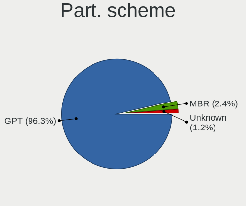
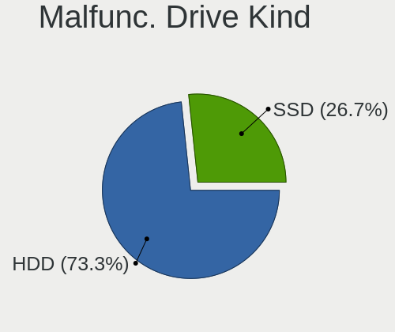
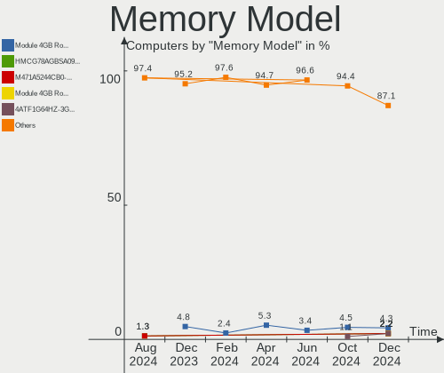

FreeBSD - Hardware Trends
-------------------------

A project to identify most popular hardware characteristics and track their change
over time based on data collected by BSD users at https://BSD-Hardware.info.

Anyone can contribute to this report by the [hw-probe](https://github.com/linuxhw/hw-probe/blob/master/INSTALL.BSD.md) tool:

    hw-probe -all -upload

This is a report for all computer types. See also reports for [desktops](/Dist/FreeBSD/Desktop/README.md) and [notebooks](/Dist/FreeBSD/Notebook/README.md).

This report is for one last month. Overall report since the beginning of time: [TestCoverage](https://github.com/bsdhw/TestCoverage)

Period: Aug, 2022.

Contents
--------

* [ System ](#system)
  - [ OS                       ](#os)
  - [ OS Family                ](#os-family)
  - [ Arch                     ](#arch)
  - [ DE                       ](#de)
  - [ Display Server           ](#display-server)
  - [ Display Manager          ](#display-manager)
  - [ OS Lang                  ](#os-lang)
  - [ Boot Mode                ](#boot-mode)
  - [ Filesystem               ](#filesystem)
  - [ Part. scheme             ](#part-scheme)

* [ Board ](#board)
  - [ Vendor                   ](#vendor)
  - [ Model                    ](#model)
  - [ Model Family             ](#model-family)
  - [ MFG Year                 ](#mfg-year)
  - [ Form Factor              ](#form-factor)
  - [ Coreboot                 ](#coreboot)
  - [ RAM Size                 ](#ram-size)
  - [ RAM Used                 ](#ram-used)
  - [ Total Drives             ](#total-drives)
  - [ Has CD-ROM               ](#has-cd-rom)
  - [ Has Ethernet             ](#has-ethernet)
  - [ Has WiFi                 ](#has-wifi)
  - [ Has Bluetooth            ](#has-bluetooth)

* [ Location ](#location)
  - [ Country                  ](#country)
  - [ City                     ](#city)

* [ Drives ](#drives)
  - [ Drive Vendor             ](#drive-vendor)
  - [ Drive Model              ](#drive-model)
  - [ HDD Vendor               ](#hdd-vendor)
  - [ SSD Vendor               ](#ssd-vendor)
  - [ Drive Kind               ](#drive-kind)
  - [ Drive Connector          ](#drive-connector)
  - [ Drive Size               ](#drive-size)
  - [ Space Total              ](#space-total)
  - [ Space Used               ](#space-used)
  - [ Malfunc. Drives          ](#malfunc-drives)
  - [ Malfunc. Drive Vendor    ](#malfunc-drive-vendor)
  - [ Malfunc. HDD Vendor      ](#malfunc-hdd-vendor)
  - [ Malfunc. Drive Kind      ](#malfunc-drive-kind)
  - [ Failed Drives            ](#failed-drives)
  - [ Failed Drive Vendor      ](#failed-drive-vendor)
  - [ Drive Status             ](#drive-status)

* [ Storage controller ](#storage-controller)
  - [ Storage Vendor           ](#storage-vendor)
  - [ Storage Model            ](#storage-model)
  - [ Storage Kind             ](#storage-kind)

* [ Processor ](#processor)
  - [ CPU Vendor               ](#cpu-vendor)
  - [ CPU Model                ](#cpu-model)
  - [ CPU Model Family         ](#cpu-model-family)
  - [ CPU Cores                ](#cpu-cores)
  - [ CPU Sockets              ](#cpu-sockets)
  - [ CPU Threads              ](#cpu-threads)
  - [ CPU Microarch            ](#cpu-microarch)

* [ Graphics ](#graphics)
  - [ GPU Vendor               ](#gpu-vendor)
  - [ GPU Model                ](#gpu-model)
  - [ GPU Combo                ](#gpu-combo)
  - [ GPU Driver               ](#gpu-driver)
  - [ GPU Memory               ](#gpu-memory)

* [ Monitor ](#monitor)
  - [ Monitor Vendor           ](#monitor-vendor)
  - [ Monitor Model            ](#monitor-model)
  - [ Monitor Resolution       ](#monitor-resolution)
  - [ Monitor Diagonal         ](#monitor-diagonal)
  - [ Monitor Width            ](#monitor-width)
  - [ Aspect Ratio             ](#aspect-ratio)
  - [ Monitor Area             ](#monitor-area)
  - [ Pixel Density            ](#pixel-density)
  - [ Multiple Monitors        ](#multiple-monitors)

* [ Network ](#network)
  - [ Net Controller Vendor    ](#net-controller-vendor)
  - [ Net Controller Model     ](#net-controller-model)
  - [ Wireless Vendor          ](#wireless-vendor)
  - [ Wireless Model           ](#wireless-model)
  - [ Ethernet Vendor          ](#ethernet-vendor)
  - [ Ethernet Model           ](#ethernet-model)
  - [ Net Controller Kind      ](#net-controller-kind)
  - [ Used Controller          ](#used-controller)
  - [ NICs                     ](#nics)
  - [ IPv6                     ](#ipv6)

* [ Bluetooth ](#bluetooth)
  - [ Bluetooth Vendor         ](#bluetooth-vendor)
  - [ Bluetooth Model          ](#bluetooth-model)

* [ Sound ](#sound)
  - [ Sound Vendor             ](#sound-vendor)
  - [ Sound Model              ](#sound-model)

* [ Memory ](#memory)
  - [ Memory Vendor            ](#memory-vendor)
  - [ Memory Model             ](#memory-model)
  - [ Memory Kind              ](#memory-kind)
  - [ Memory Form Factor       ](#memory-form-factor)
  - [ Memory Size              ](#memory-size)
  - [ Memory Speed             ](#memory-speed)

* [ Printers & scanners ](#printers--scanners)
  - [ Printer Vendor           ](#printer-vendor)
  - [ Printer Model            ](#printer-model)
  - [ Scanner Vendor           ](#scanner-vendor)
  - [ Scanner Model            ](#scanner-model)

* [ Camera ](#camera)
  - [ Camera Vendor            ](#camera-vendor)
  - [ Camera Model             ](#camera-model)

* [ Security ](#security)
  - [ Fingerprint Vendor       ](#fingerprint-vendor)
  - [ Fingerprint Model        ](#fingerprint-model)
  - [ Chipcard Vendor          ](#chipcard-vendor)
  - [ Chipcard Model           ](#chipcard-model)

* [ Unsupported ](#unsupported)
  - [ Unsupported Devices      ](#unsupported-devices)
  - [ Unsupported Device Types ](#unsupported-device-types)

System
------

OS
--

Installed operating systems

| Name                 | Computers | Percent |
|----------------------|-----------|---------|
| FreeBSD 13.1-p1      | 23        | 41.82%  |
| FreeBSD 13.1         | 18        | 32.73%  |
| FreeBSD 14.0-CURRENT | 3         | 5.45%   |
| FreeBSD 13.1-STABLE  | 2         | 3.64%   |
| FreeBSD 13.0-p12     | 2         | 3.64%   |
| FreeBSD 13.0-p11     | 2         | 3.64%   |
| FreeBSD 13.0         | 1         | 1.82%   |
| FreeBSD 12.3-p6      | 1         | 1.82%   |
| FreeBSD 12.3-p5      | 1         | 1.82%   |
| FreeBSD 12.3         | 1         | 1.82%   |
| FreeBSD 12.1-p2      | 1         | 1.82%   |

OS Family
---------

OS without a version

| Name    | Computers | Percent |
|---------|-----------|---------|
| FreeBSD | 55        | 100%    |

Arch
----

OS architecture (x86_64, i586, etc.)

| Name  | Computers | Percent |
|-------|-----------|---------|
| amd64 | 51        | 92.73%  |
| i386  | 3         | 5.45%   |
| arm64 | 1         | 1.82%   |

DE
--

Desktop Environment

| Name          | Computers | Percent |
|---------------|-----------|---------|
| Console       | 23        | 41.82%  |
| KDE5          | 11        | 20%     |
| XFCE          | 6         | 10.91%  |
| MATE          | 5         | 9.09%   |
| GNOME         | 3         | 5.45%   |
| Openbox       | 2         | 3.64%   |
| xfwm          | 1         | 1.82%   |
| i3            | 1         | 1.82%   |
| Enlightenment | 1         | 1.82%   |
| dwm           | 1         | 1.82%   |
| Cinnamon      | 1         | 1.82%   |

Display Server
--------------

X11 or Wayland

| Name    | Computers | Percent |
|---------|-----------|---------|
| X11     | 29        | 52.73%  |
| Console | 25        | 45.45%  |
| Wayland | 1         | 1.82%   |

Display Manager
---------------

SDDM, LightDM, etc.

| Name    | Computers | Percent |
|---------|-----------|---------|
| Console | 31        | 56.36%  |
| SDDM    | 13        | 23.64%  |
| SLiM    | 4         | 7.27%   |
| XDM     | 3         | 5.45%   |
| LightDM | 2         | 3.64%   |
| GDM     | 2         | 3.64%   |

OS Lang
-------

Language

| Lang    | Computers | Percent |
|---------|-----------|---------|
| C       | 32        | 58.18%  |
| en_US   | 10        | 18.18%  |
| Unknown | 4         | 7.27%   |
| ru_RU   | 3         | 5.45%   |
| es_ES   | 1         | 1.82%   |
| es_AR   | 1         | 1.82%   |
| en_GB   | 1         | 1.82%   |
| de_DE   | 1         | 1.82%   |
| da_DK   | 1         | 1.82%   |
| cs_CZ   | 1         | 1.82%   |

Boot Mode
---------

EFI or BIOS

| Mode | Computers | Percent |
|------|-----------|---------|
| EFI  | 33        | 60%     |
| BIOS | 22        | 40%     |

Filesystem
----------

Type of filesystem

| Type | Computers | Percent |
|------|-----------|---------|
| Zfs  | 36        | 65.45%  |
| Ufs  | 19        | 34.55%  |

Part. scheme
------------

Scheme of partitioning

| Type | Computers | Percent |
|------|-----------|---------|
| GPT  | 47        | 85.45%  |
| MBR  | 8         | 14.55%  |

Board
-----

Vendor
------

Motherboard manufacturer

| Name                | Computers | Percent |
|---------------------|-----------|---------|
| Lenovo              | 9         | 16.36%  |
| ASUSTek Computer    | 9         | 16.36%  |
| Dell                | 7         | 12.73%  |
| Gigabyte Technology | 5         | 9.09%   |
| ASRock              | 5         | 9.09%   |
| Hewlett-Packard     | 4         | 7.27%   |
| Fujitsu             | 3         | 5.45%   |
| Supermicro          | 2         | 3.64%   |
| MSI                 | 2         | 3.64%   |
| Intel               | 2         | 3.64%   |
| Unknown             | 2         | 3.64%   |
| Toshiba             | 1         | 1.82%   |
| Sony                | 1         | 1.82%   |
| GVC                 | 1         | 1.82%   |
| Google              | 1         | 1.82%   |
| Acer                | 1         | 1.82%   |

Model
-----

Motherboard model

| Name                                     | Computers | Percent |
|------------------------------------------|-----------|---------|
| Gigabyte H61M-DS2                        | 2         | 3.64%   |
| Fujitsu PRIMERGY RX200 S6                | 2         | 3.64%   |
| Dell PowerEdge T30                       | 2         | 3.64%   |
| ASUS PRIME X370-PRO                      | 2         | 3.64%   |
| Unknown                                  | 2         | 3.64%   |
| Toshiba Satellite A300                   | 1         | 1.82%   |
| Supermicro X10SLH-F/X10SLM+-F            | 1         | 1.82%   |
| Supermicro SwyxExpress                   | 1         | 1.82%   |
| Sony VGN-UX1XRN                          | 1         | 1.82%   |
| MSI MS-7817                              | 1         | 1.82%   |
| MSI GF63 Thin 9SC                        | 1         | 1.82%   |
| Lenovo Yoga Slim 7 Pro 14ACH5 82MS       | 1         | 1.82%   |
| Lenovo ThinkPad X1 Carbon 7th 20QES42E0L | 1         | 1.82%   |
| Lenovo ThinkPad T480 20L6S29E0T          | 1         | 1.82%   |
| Lenovo ThinkPad R60e 0658W2M             | 1         | 1.82%   |
| Lenovo ThinkCentre M91p 4512A47          | 1         | 1.82%   |
| Lenovo IdeaPad Gaming 3 15ARH05 82EY     | 1         | 1.82%   |
| Lenovo IdeaPad Gaming 3 15ACH6 82K2      | 1         | 1.82%   |
| Lenovo IdeaPad 530S-14ARR 81H1           | 1         | 1.82%   |
| Lenovo IdeaPad 5 14ITL05 82FE            | 1         | 1.82%   |
| Intel X79 V2.72A                         | 1         | 1.82%   |
| Intel S2600WTTR                          | 1         | 1.82%   |
| HP Pavilion g6                           | 1         | 1.82%   |
| HP ENVY x360 Convertible 13-ay0xxx       | 1         | 1.82%   |
| HP ENVY Notebook                         | 1         | 1.82%   |
| HP EliteBook 850 G7 Notebook PC          | 1         | 1.82%   |
| GVC EQUIUM 3200M                         | 1         | 1.82%   |
| Google Peppy                             | 1         | 1.82%   |
| Gigabyte P85-D3                          | 1         | 1.82%   |
| Gigabyte H97M-HD3                        | 1         | 1.82%   |
| Gigabyte H81M-DS2                        | 1         | 1.82%   |
| Fujitsu PRIMERGY TX1320 M3               | 1         | 1.82%   |
| Dell Precision 7550                      | 1         | 1.82%   |
| Dell OptiPlex 5090                       | 1         | 1.82%   |
| Dell OptiPlex 3010                       | 1         | 1.82%   |
| Dell Latitude 7390                       | 1         | 1.82%   |
| Dell Inspiron 3581                       | 1         | 1.82%   |
| ASUS ZenBook 14 UX410UFR                 | 1         | 1.82%   |
| ASUS VivoBook_ASUSLaptop X570ZD_F570ZD   | 1         | 1.82%   |
| ASUS ROG CROSSHAIR VIII HERO             | 1         | 1.82%   |
| ASUS PRIME Z690-P D4                     | 1         | 1.82%   |
| ASUS P5Q-E                               | 1         | 1.82%   |
| ASUS M4A87TD EVO                         | 1         | 1.82%   |
| ASUS All Series                          | 1         | 1.82%   |
| ASRock X570 Phantom Gaming 4             | 1         | 1.82%   |
| ASRock X399 Taichi                       | 1         | 1.82%   |
| ASRock H110M-DGS R3.0                    | 1         | 1.82%   |
| ASRock B550 Extreme4                     | 1         | 1.82%   |
| ASRock AD2550-ITX                        | 1         | 1.82%   |
| Acer Aspire 4552G                        | 1         | 1.82%   |

Model Family
------------

Motherboard model prefix

| Name                   | Computers | Percent |
|------------------------|-----------|---------|
| Lenovo IdeaPad         | 4         | 7.27%   |
| Lenovo ThinkPad        | 3         | 5.45%   |
| Fujitsu PRIMERGY       | 3         | 5.45%   |
| ASUS PRIME             | 3         | 5.45%   |
| HP ENVY                | 2         | 3.64%   |
| Gigabyte H61M-DS2      | 2         | 3.64%   |
| Dell PowerEdge         | 2         | 3.64%   |
| Dell OptiPlex          | 2         | 3.64%   |
| Unknown                | 2         | 3.64%   |
| Toshiba Satellite      | 1         | 1.82%   |
| Supermicro X10SLH-F    | 1         | 1.82%   |
| Supermicro SwyxExpress | 1         | 1.82%   |
| Sony VGN-UX1XRN        | 1         | 1.82%   |
| MSI MS-7817            | 1         | 1.82%   |
| MSI GF63               | 1         | 1.82%   |
| Lenovo Yoga            | 1         | 1.82%   |
| Lenovo ThinkCentre     | 1         | 1.82%   |
| Intel X79              | 1         | 1.82%   |
| Intel S2600WTTR        | 1         | 1.82%   |
| HP Pavilion            | 1         | 1.82%   |
| HP EliteBook           | 1         | 1.82%   |
| GVC EQUIUM             | 1         | 1.82%   |
| Google Peppy           | 1         | 1.82%   |
| Gigabyte P85-D3        | 1         | 1.82%   |
| Gigabyte H97M-HD3      | 1         | 1.82%   |
| Gigabyte H81M-DS2      | 1         | 1.82%   |
| Dell Precision         | 1         | 1.82%   |
| Dell Latitude          | 1         | 1.82%   |
| Dell Inspiron          | 1         | 1.82%   |
| ASUS ZenBook           | 1         | 1.82%   |
| ASUS VivoBook          | 1         | 1.82%   |
| ASUS ROG               | 1         | 1.82%   |
| ASUS P5Q-E             | 1         | 1.82%   |
| ASUS M4A87TD           | 1         | 1.82%   |
| ASUS All               | 1         | 1.82%   |
| ASRock X570            | 1         | 1.82%   |
| ASRock X399            | 1         | 1.82%   |
| ASRock H110M-DGS       | 1         | 1.82%   |
| ASRock B550            | 1         | 1.82%   |
| ASRock AD2550-ITX      | 1         | 1.82%   |
| Acer Aspire            | 1         | 1.82%   |

MFG Year
--------

Motherboard manufacture year

| Year    | Computers | Percent |
|---------|-----------|---------|
| 2021    | 8         | 14.55%  |
| 2020    | 8         | 14.55%  |
| 2018    | 7         | 12.73%  |
| 2022    | 4         | 7.27%   |
| 2019    | 3         | 5.45%   |
| 2017    | 3         | 5.45%   |
| 2014    | 3         | 5.45%   |
| 2011    | 3         | 5.45%   |
| 2016    | 2         | 3.64%   |
| 2015    | 2         | 3.64%   |
| 2010    | 2         | 3.64%   |
| 2009    | 2         | 3.64%   |
| 2008    | 2         | 3.64%   |
| Unknown | 2         | 3.64%   |
| 2013    | 1         | 1.82%   |
| 2012    | 1         | 1.82%   |
| 2007    | 1         | 1.82%   |
| 2006    | 1         | 1.82%   |

Form Factor
-----------

Physical design of the computer

| Name        | Computers | Percent |
|-------------|-----------|---------|
| Desktop     | 27        | 49.09%  |
| Notebook    | 21        | 38.18%  |
| Server      | 6         | 10.91%  |
| Convertible | 1         | 1.82%   |

Coreboot
--------

Have coreboot on board

| Used | Computers | Percent |
|------|-----------|---------|
| No   | 54        | 98.18%  |
| Yes  | 1         | 1.82%   |

RAM Size
--------

Total RAM memory

| Size in GB  | Computers | Percent |
|-------------|-----------|---------|
| 16.01-24.0  | 19        | 34.55%  |
| 32.01-64.0  | 8         | 14.55%  |
| 64.01-256.0 | 8         | 14.55%  |
| 8.01-16.0   | 8         | 14.55%  |
| 4.01-8.0    | 4         | 7.27%   |
| 24.01-32.0  | 3         | 5.45%   |
| 2.01-3.0    | 2         | 3.64%   |
| 0.51-1.0    | 2         | 3.64%   |
| 0.01-0.5    | 1         | 1.82%   |

RAM Used
--------

Used RAM memory

| Used GB  | Computers | Percent |
|----------|-----------|---------|
| 0.51-1.0 | 19        | 34.55%  |
| 0.01-0.5 | 17        | 30.91%  |
| 1.01-2.0 | 10        | 18.18%  |
| 2.01-3.0 | 5         | 9.09%   |
| 3.01-4.0 | 2         | 3.64%   |
| 4.01-8.0 | 1         | 1.82%   |
| 0        | 1         | 1.82%   |

Total Drives
------------

Number of drives on board

| Drives | Computers | Percent |
|--------|-----------|---------|
| 1      | 19        | 34.55%  |
| 2      | 12        | 21.82%  |
| 3      | 8         | 14.55%  |
| 4      | 7         | 12.73%  |
| 0      | 4         | 7.27%   |
| 6      | 2         | 3.64%   |
| 19     | 1         | 1.82%   |
| 13     | 1         | 1.82%   |
| 8      | 1         | 1.82%   |

Has CD-ROM
----------

Has CD-ROM on board

| Presented | Computers | Percent |
|-----------|-----------|---------|
| No        | 40        | 72.73%  |
| Yes       | 15        | 27.27%  |

Has Ethernet
------------

Has Ethernet on board

| Presented | Computers | Percent |
|-----------|-----------|---------|
| Yes       | 47        | 85.45%  |
| No        | 8         | 14.55%  |

Has WiFi
--------

Has WiFi module

| Presented | Computers | Percent |
|-----------|-----------|---------|
| No        | 28        | 50.91%  |
| Yes       | 27        | 49.09%  |

Has Bluetooth
-------------

Has Bluetooth module

| Presented | Computers | Percent |
|-----------|-----------|---------|
| No        | 37        | 67.27%  |
| Yes       | 18        | 32.73%  |

Location
--------

Country
-------

Geographic location (country)

| Country     | Computers | Percent |
|-------------|-----------|---------|
| Russia      | 12        | 21.82%  |
| USA         | 8         | 14.55%  |
| Germany     | 8         | 14.55%  |
| Spain       | 4         | 7.27%   |
| India       | 3         | 5.45%   |
| Czechia     | 3         | 5.45%   |
| Italy       | 2         | 3.64%   |
| Israel      | 2         | 3.64%   |
| UK          | 1         | 1.82%   |
| Thailand    | 1         | 1.82%   |
| Sweden      | 1         | 1.82%   |
| Romania     | 1         | 1.82%   |
| Poland      | 1         | 1.82%   |
| Philippines | 1         | 1.82%   |
| Lithuania   | 1         | 1.82%   |
| Greece      | 1         | 1.82%   |
| Denmark     | 1         | 1.82%   |
| China       | 1         | 1.82%   |
| Austria     | 1         | 1.82%   |
| Australia   | 1         | 1.82%   |
| Argentina   | 1         | 1.82%   |

City
----

Geographic location (city)

| City              | Computers | Percent |
|-------------------|-----------|---------|
| Ludwigsburg       | 4         | 7.27%   |
| St Petersburg     | 3         | 5.45%   |
| Moscow            | 3         | 5.45%   |
| Tel Aviv          | 2         | 3.64%   |
| Salem             | 2         | 3.64%   |
| Redmond           | 2         | 3.64%   |
| Kamensk-Ural'skiy | 2         | 3.64%   |
| Brno              | 2         | 3.64%   |
| Barcelona         | 2         | 3.64%   |
| Wenatchee         | 1         | 1.82%   |
| Warsaw            | 1         | 1.82%   |
| Waldbrunn         | 1         | 1.82%   |
| Vilnius           | 1         | 1.82%   |
| Vienna            | 1         | 1.82%   |
| Valladolid        | 1         | 1.82%   |
| Tyumen            | 1         | 1.82%   |
| Tynda             | 1         | 1.82%   |
| Trivandrum        | 1         | 1.82%   |
| Sayre             | 1         | 1.82%   |
| Resistencia       | 1         | 1.82%   |
| Oviedo            | 1         | 1.82%   |
| Oswego            | 1         | 1.82%   |
| Ostrava           | 1         | 1.82%   |
| Nakhodka          | 1         | 1.82%   |
| Münster          | 1         | 1.82%   |
| Milan             | 1         | 1.82%   |
| Melbourne         | 1         | 1.82%   |
| Legazpi           | 1         | 1.82%   |
| Kolkata           | 1         | 1.82%   |
| Göttingen        | 1         | 1.82%   |
| Esbjerg           | 1         | 1.82%   |
| Düsseldorf       | 1         | 1.82%   |
| Chiang Mai        | 1         | 1.82%   |
| Chennai           | 1         | 1.82%   |
| Cambridge         | 1         | 1.82%   |
| Bucharest         | 1         | 1.82%   |
| Bromma            | 1         | 1.82%   |
| Beijing           | 1         | 1.82%   |
| Athens            | 1         | 1.82%   |
| Ashburn           | 1         | 1.82%   |
| Arkhangelsk       | 1         | 1.82%   |
| Airola            | 1         | 1.82%   |

Drives
------

Drive Vendor
------------

Hard drive vendors

| Vendor              | Computers | Drives | Percent |
|---------------------|-----------|--------|---------|
| WDC                 | 18        | 42     | 20.93%  |
| Seagate             | 17        | 39     | 19.77%  |
| Samsung Electronics | 14        | 20     | 16.28%  |
| Intel               | 7         | 10     | 8.14%   |
| Kingston            | 5         | 5      | 5.81%   |
| Crucial             | 4         | 5      | 4.65%   |
| SK hynix            | 3         | 3      | 3.49%   |
| Hitachi             | 3         | 8      | 3.49%   |
| Toshiba             | 2         | 2      | 2.33%   |
| SanDisk             | 2         | 2      | 2.33%   |
| Transcend           | 1         | 1      | 1.16%   |
| SPCC                | 1         | 1      | 1.16%   |
| Silicon Motion      | 1         | 1      | 1.16%   |
| PNY                 | 1         | 1      | 1.16%   |
| Patriot             | 1         | 1      | 1.16%   |
| Micron Technology   | 1         | 1      | 1.16%   |
| Maxtor              | 1         | 1      | 1.16%   |
| Lenovo              | 1         | 1      | 1.16%   |
| Kston               | 1         | 1      | 1.16%   |
| EAGET               | 1         | 1      | 1.16%   |
| Corsair             | 1         | 1      | 1.16%   |

Drive Model
-----------

Hard drive models

| Model                                   | Computers | Percent |
|-----------------------------------------|-----------|---------|
| WDC WD40EFRX-68N32N0 4TB                | 3         | 2.73%   |
| Seagate ST4000DM000-1F2168 4TB          | 2         | 1.82%   |
| Seagate ST2000DM008-2FR102 2TB          | 2         | 1.82%   |
| Seagate ST1000DM010-2EP102 1TB          | 2         | 1.82%   |
| Intel SSDSC2BB080G4 80GB                | 2         | 1.82%   |
| Crucial CT120BX500SSD1 120GB            | 2         | 1.82%   |
| WDC WDS500G3X0C-00SJG0 500GB            | 1         | 0.91%   |
| WDC WD80EMAZ-00WJTA0 8TB                | 1         | 0.91%   |
| WDC WD80EFZZ-68BTXN0 8TB                | 1         | 0.91%   |
| WDC WD80EFZX-68UW8N0 8TB                | 1         | 0.91%   |
| WDC WD80EFAX-68LHPN0 8TB                | 1         | 0.91%   |
| WDC WD80EDBZ-11B0ZA0 8TB                | 1         | 0.91%   |
| WDC WD800AAJS-00PSA0 80GB               | 1         | 0.91%   |
| WDC WD6400AARS-00Y5B1 640GB             | 1         | 0.91%   |
| WDC WD5000LUCT-63Y8HY0 500GB            | 1         | 0.91%   |
| WDC WD5000LPLX-00ZNTT0 500GB            | 1         | 0.91%   |
| WDC WD40EZRZ-22GXCB0 4TB                | 1         | 0.91%   |
| WDC WD40EFRX-68WT0N0 4TB                | 1         | 0.91%   |
| WDC WD4003FRYZ-01F0DB0 4TB              | 1         | 0.91%   |
| WDC WD30NMRW-11YL9S4 3TB                | 1         | 0.91%   |
| WDC WD20SPZX-00UA7T0 2TB                | 1         | 0.91%   |
| WDC WD20EZRZ-00Z5HB0 2TB                | 1         | 0.91%   |
| WDC WD20EFRX-68EUZN0 2TB                | 1         | 0.91%   |
| WDC WD15EADS-00P8B0 1.5TB               | 1         | 0.91%   |
| WDC WD120EMFZ-11A6JA0 12TB              | 1         | 0.91%   |
| WDC WD120EMAZ-11BLFA0 12TB              | 1         | 0.91%   |
| WDC WD10SPZX-17Z10T1 1TB                | 1         | 0.91%   |
| WDC WD10EZEX-00RKKA0 1TB                | 1         | 0.91%   |
| WDC WD10EZEX-00MFCA0 1TB                | 1         | 0.91%   |
| WDC WD10EZEX-00BBHA0 1TB                | 1         | 0.91%   |
| WDC WD10EURX-63UY4Y0 1TB                | 1         | 0.91%   |
| WDC WD1000FYPS-01ZKB0 1TB               | 1         | 0.91%   |
| WDC WD1000DHTZ-04N21V1 1TB              | 1         | 0.91%   |
| Transcend TS128GMTS430S 128GB           | 1         | 0.91%   |
| Toshiba MQ04ABF100 1TB                  | 1         | 0.91%   |
| Toshiba MG05ACA800E 8TB                 | 1         | 0.91%   |
| SPCC M.2 SSD 256GB                      | 1         | 0.91%   |
| SK hynix SKHynix_HFS001TDE9X084N 1TB    | 1         | 0.91%   |
| SK hynix PC801 NVMe 2TB                 | 1         | 0.91%   |
| SK hynix BC511 HFM512GDJTNI-82A0A 512GB | 1         | 0.91%   |
| Silicon Motion 512GB MEGA S3 512GB      | 1         | 0.91%   |
| Seagate ST9500325AS 500GB               | 1         | 0.91%   |
| Seagate ST9200420ASG 200GB              | 1         | 0.91%   |
| Seagate ST9146803SS 146GB               | 1         | 0.91%   |
| Seagate ST4000DM004-2U9104 4TB          | 1         | 0.91%   |
| Seagate ST4000DM004-2CV104 4TB          | 1         | 0.91%   |
| Seagate ST3160318AS 160GB               | 1         | 0.91%   |
| Seagate ST250DM000-1BD141 250GB         | 1         | 0.91%   |
| Seagate ST2000VM003-1CT164 2TB          | 1         | 0.91%   |
| Seagate ST2000DM001-9YN164 2TB          | 1         | 0.91%   |
| Seagate ST2000DM001-1ER164 2TB          | 1         | 0.91%   |
| Seagate ST2000DM001-1CH164 2TB          | 1         | 0.91%   |
| Seagate ST16000NM001G-2KK103 16TB       | 1         | 0.91%   |
| Seagate ST1000NM0008-2F2100 1TB         | 1         | 0.91%   |
| Seagate ST1000LM049-2GH172 1TB          | 1         | 0.91%   |
| Seagate ST1000LM048-2E7172 1TB          | 1         | 0.91%   |
| Seagate ST1000LM035-1RK172 1TB          | 1         | 0.91%   |
| Seagate ST1000LM024 HN-M101MBB 1TB      | 1         | 0.91%   |
| Seagate ST1000DM003-9YN162 1TB          | 1         | 0.91%   |
| Seagate ST1000DM003-1CH162 1TB          | 1         | 0.91%   |

HDD Vendor
----------

Hard disk drive vendors

| Vendor  | Computers | Drives | Percent |
|---------|-----------|--------|---------|
| WDC     | 17        | 41     | 43.59%  |
| Seagate | 17        | 39     | 43.59%  |
| Toshiba | 2         | 2      | 5.13%   |
| Hitachi | 2         | 4      | 5.13%   |
| Maxtor  | 1         | 1      | 2.56%   |

SSD Vendor
----------

Solid state drive vendors

| Vendor              | Computers | Drives | Percent |
|---------------------|-----------|--------|---------|
| Samsung Electronics | 7         | 12     | 28%     |
| Intel               | 6         | 9      | 24%     |
| Crucial             | 3         | 4      | 12%     |
| SanDisk             | 2         | 2      | 8%      |
| Kingston            | 2         | 2      | 8%      |
| Transcend           | 1         | 1      | 4%      |
| SPCC                | 1         | 1      | 4%      |
| Patriot             | 1         | 1      | 4%      |
| Kston               | 1         | 1      | 4%      |
| Hitachi             | 1         | 4      | 4%      |

Drive Kind
----------

HDD or SSD

| Kind | Computers | Drives | Percent |
|------|-----------|--------|---------|
| HDD  | 31        | 87     | 41.89%  |
| SSD  | 22        | 37     | 29.73%  |
| NVMe | 21        | 23     | 28.38%  |

Drive Connector
---------------

SATA, SAS, NVMe, etc.

| Type | Computers | Drives | Percent |
|------|-----------|--------|---------|
| SATA | 40        | 124    | 65.57%  |
| NVMe | 21        | 23     | 34.43%  |

Drive Size
----------

Size of hard drive

| Size in TB | Computers | Drives | Percent |
|------------|-----------|--------|---------|
| 0.01-0.5   | 27        | 42     | 40.3%   |
| 0.51-1.0   | 18        | 23     | 26.87%  |
| 1.01-2.0   | 9         | 27     | 13.43%  |
| 3.01-4.0   | 7         | 16     | 10.45%  |
| 4.01-10.0  | 3         | 10     | 4.48%   |
| 10.01-20.0 | 2         | 5      | 2.99%   |
| 2.01-3.0   | 1         | 1      | 1.49%   |

Space Total
-----------

Amount of disk space available on the file system

| Size in GB     | Computers | Percent |
|----------------|-----------|---------|
| 251-500        | 16        | 29.09%  |
| 101-250        | 13        | 23.64%  |
| 501-1000       | 6         | 10.91%  |
| 51-100         | 6         | 10.91%  |
| 21-50          | 5         | 9.09%   |
| 1-20           | 3         | 5.45%   |
| 2001-3000      | 2         | 3.64%   |
| 1001-2000      | 2         | 3.64%   |
| More than 3000 | 1         | 1.82%   |
| Unknown        | 1         | 1.82%   |

Space Used
----------

Amount of used disk space

| Used GB   | Computers | Percent |
|-----------|-----------|---------|
| 1-20      | 42        | 76.36%  |
| 21-50     | 6         | 10.91%  |
| 51-100    | 2         | 3.64%   |
| 2001-3000 | 1         | 1.82%   |
| 101-250   | 1         | 1.82%   |
| 1001-2000 | 1         | 1.82%   |
| 501-1000  | 1         | 1.82%   |
| Unknown   | 1         | 1.82%   |

Malfunc. Drives
---------------

Drive models with a malfunction

| Model                                 | Computers | Drives | Percent |
|---------------------------------------|-----------|--------|---------|
| WDC WD6400AARS-00Y5B1 640GB           | 1         | 1      | 7.69%   |
| WDC WD40EFRX-68N32N0 4TB              | 1         | 2      | 7.69%   |
| WDC WD20EFRX-68EUZN0 2TB              | 1         | 2      | 7.69%   |
| WDC WD1000DHTZ-04N21V1 1TB            | 1         | 2      | 7.69%   |
| SPCC M.2 SSD 256GB                    | 1         | 1      | 7.69%   |
| Seagate ST9500325AS 500GB             | 1         | 1      | 7.69%   |
| Seagate ST2000DM001-9YN164 2TB        | 1         | 1      | 7.69%   |
| Seagate ST1000LM024 HN-M101MBB 1TB    | 1         | 1      | 7.69%   |
| Seagate ST1000DM003-1CH162 1TB        | 1         | 1      | 7.69%   |
| Samsung Electronics SSD 870 EVO 500GB | 1         | 2      | 7.69%   |
| Kingston SUV400S37480G 480GB          | 1         | 1      | 7.69%   |
| Hitachi HTS543232L9SA00 320GB         | 1         | 1      | 7.69%   |
| Hitachi HDS723020BLA642 2TB           | 1         | 3      | 7.69%   |

Malfunc. Drive Vendor
---------------------

Vendors of faulty drives

| Vendor              | Computers | Drives | Percent |
|---------------------|-----------|--------|---------|
| Seagate             | 4         | 4      | 36.36%  |
| WDC                 | 2         | 7      | 18.18%  |
| Hitachi             | 2         | 4      | 18.18%  |
| SPCC                | 1         | 1      | 9.09%   |
| Samsung Electronics | 1         | 2      | 9.09%   |
| Kingston            | 1         | 1      | 9.09%   |

Malfunc. HDD Vendor
-------------------

Vendors of faulty HDD drives

| Vendor  | Computers | Drives | Percent |
|---------|-----------|--------|---------|
| Seagate | 4         | 4      | 50%     |
| WDC     | 2         | 7      | 25%     |
| Hitachi | 2         | 4      | 25%     |

Malfunc. Drive Kind
-------------------

Kinds of faulty drives

| Kind | Computers | Drives | Percent |
|------|-----------|--------|---------|
| HDD  | 7         | 15     | 70%     |
| SSD  | 3         | 4      | 30%     |

Failed Drives
-------------

Failed drive models

| Model                   | Computers | Drives | Percent |
|-------------------------|-----------|--------|---------|
| Toshiba MG05ACA800E 8TB | 1         | 1      | 100%    |

Failed Drive Vendor
-------------------

Failed drive vendors

| Vendor  | Computers | Drives | Percent |
|---------|-----------|--------|---------|
| Toshiba | 1         | 1      | 100%    |

Drive Status
------------

Number of failed and malfunc. drives

| Status  | Computers | Drives | Percent |
|---------|-----------|--------|---------|
| Works   | 49        | 127    | 83.05%  |
| Malfunc | 9         | 19     | 15.25%  |
| Failed  | 1         | 1      | 1.69%   |

Storage controller
------------------

Storage Vendor
--------------

Storage controller vendors

| Vendor                      | Computers | Percent |
|-----------------------------|-----------|---------|
| Intel                       | 35        | 44.87%  |
| AMD                         | 11        | 14.1%   |
| Samsung Electronics         | 8         | 10.26%  |
| Broadcom / LSI              | 5         | 6.41%   |
| SK hynix                    | 3         | 3.85%   |
| Marvell Technology Group    | 3         | 3.85%   |
| Kingston Technology Company | 3         | 3.85%   |
| Silicon Motion              | 2         | 2.56%   |
| Phison Electronics          | 2         | 2.56%   |
| SanDisk                     | 1         | 1.28%   |
| Micron/Crucial Technology   | 1         | 1.28%   |
| Micron Technology           | 1         | 1.28%   |
| Lenovo                      | 1         | 1.28%   |
| JMicron Technology          | 1         | 1.28%   |
| ASMedia Technology          | 1         | 1.28%   |

Storage Model
-------------

Storage controller models

| Model                                                                          | Computers | Percent |
|--------------------------------------------------------------------------------|-----------|---------|
| AMD FCH SATA Controller [AHCI mode]                                            | 8         | 9.52%   |
| Intel 8 Series/C220 Series Chipset Family 6-port SATA Controller 1 [AHCI mode] | 6         | 7.14%   |
| Samsung NVMe SSD Controller 980                                                | 4         | 4.76%   |
| Intel 6 Series/C200 Series Chipset Family 6 port Desktop SATA AHCI Controller  | 4         | 4.76%   |
| Broadcom / LSI SAS2008 PCI-Express Fusion-MPT SAS-2 [Falcon]                   | 4         | 4.76%   |
| Intel Q170/Q150/B150/H170/H110/Z170/CM236 Chipset SATA Controller [AHCI Mode]  | 3         | 3.57%   |
| Silicon Motion SM2263EN/SM2263XT SSD Controller                                | 2         | 2.38%   |
| Samsung NVMe SSD Controller SM981/PM981/PM983                                  | 2         | 2.38%   |
| Samsung NVMe SSD Controller SM961/PM961/SM963                                  | 2         | 2.38%   |
| Kingston Company A2000 NVMe SSD                                                | 2         | 2.38%   |
| Intel Sunrise Point-LP SATA Controller [AHCI mode]                             | 2         | 2.38%   |
| AMD X370 Series Chipset SATA Controller                                        | 2         | 2.38%   |
| AMD SB7x0/SB8x0/SB9x0 SATA Controller [AHCI mode]                              | 2         | 2.38%   |
| Unknown                                                                        | 2         | 2.38%   |
| SK hynix Gold P31 SSD                                                          | 1         | 1.19%   |
| SK hynix BC511                                                                 | 1         | 1.19%   |
| SanDisk WD Black SN750 / PC SN730 NVMe SSD                                     | 1         | 1.19%   |
| Phison E16 PCIe4 NVMe Controller                                               | 1         | 1.19%   |
| Phison E12 NVMe Controller                                                     | 1         | 1.19%   |
| Micron/Crucial P2 NVMe PCIe SSD                                                | 1         | 1.19%   |
| Marvell Group 88SE9215 PCIe 2.0 x1 4-port SATA 6 Gb/s Controller               | 1         | 1.19%   |
| Marvell Group 88SE9170 PCIe 2.0 x1 2-port SATA 6 Gb/s Controller               | 1         | 1.19%   |
| Marvell Group 88SE6111/6121 SATA II / PATA Controller                          | 1         | 1.19%   |
| Lenovo unknown                                                                 | 1         | 1.19%   |
| Kingston Company SNVS2000G [NV1 NVMe PCIe SSD 2TB]                             | 1         | 1.19%   |
| JMicron JMB361 AHCI/IDE                                                        | 1         | 1.19%   |
| Intel Volume Management Device NVMe RAID Controller                            | 1         | 1.19%   |
| Intel SSD 660P Series                                                          | 1         | 1.19%   |
| Intel SATA Controller [RAID mode]                                              | 1         | 1.19%   |
| Intel NM10/ICH7 Family SATA Controller [IDE mode]                              | 1         | 1.19%   |
| Intel Cannon Lake Mobile PCH SATA AHCI Controller                              | 1         | 1.19%   |
| Intel C610/X99 series chipset sSATA Controller [AHCI mode]                     | 1         | 1.19%   |
| Intel C610/X99 series chipset 6-Port SATA Controller [AHCI mode]               | 1         | 1.19%   |
| Intel C600/X79 series chipset 6-Port SATA AHCI Controller                      | 1         | 1.19%   |
| Intel Atom Processor E3800 Series SATA AHCI Controller                         | 1         | 1.19%   |
| Intel Alder Lake-S PCH SATA Controller [AHCI Mode]                             | 1         | 1.19%   |
| Intel 9 Series Chipset Family SATA Controller [AHCI Mode]                      | 1         | 1.19%   |
| Intel 82801JIR (ICH10R) SATA RAID Controller                                   | 1         | 1.19%   |
| Intel 82801JI (ICH10 Family) SATA AHCI Controller                              | 1         | 1.19%   |
| Intel 82801JI (ICH10 Family) 4 port SATA IDE Controller #1                     | 1         | 1.19%   |
| Intel 82801JI (ICH10 Family) 2 port SATA IDE Controller #2                     | 1         | 1.19%   |
| Intel 82801IBM/IEM (ICH9M/ICH9M-E) 4 port SATA Controller [AHCI mode]          | 1         | 1.19%   |
| Intel 82801GBM/GHM (ICH7-M Family) SATA Controller [IDE mode]                  | 1         | 1.19%   |
| Intel 82801G (ICH7 Family) IDE Controller                                      | 1         | 1.19%   |
| Intel 82801 Mobile SATA Controller [RAID mode]                                 | 1         | 1.19%   |
| Intel 82371AB/EB/MB PIIX4 IDE                                                  | 1         | 1.19%   |
| Intel 8 Series SATA Controller 1 [AHCI mode]                                   | 1         | 1.19%   |
| Intel 7 Series Chipset Family 6-port SATA Controller [AHCI mode]               | 1         | 1.19%   |
| Intel 500 Series Chipset Family SATA AHCI Controller                           | 1         | 1.19%   |
| Broadcom / LSI MegaRAID SAS 2008 [Falcon]                                      | 1         | 1.19%   |
| ASMedia ASM1062 Serial ATA Controller                                          | 1         | 1.19%   |
| AMD X399 Series Chipset SATA Controller                                        | 1         | 1.19%   |
| AMD 500 Series Chipset SATA Controller                                         | 1         | 1.19%   |

Storage Kind
------------

Kind of storage controller (IDE, SATA, NVMe, SAS, ...)

| Kind | Computers | Percent |
|------|-----------|---------|
| SATA | 38        | 50.67%  |
| NVMe | 21        | 28%     |
| IDE  | 7         | 9.33%   |
| RAID | 5         | 6.67%   |
| SAS  | 2         | 2.67%   |
| SCSI | 2         | 2.67%   |

Processor
---------

CPU Vendor
----------

Processor vendors

| Vendor   | Computers | Percent |
|----------|-----------|---------|
| Intel    | 40        | 72.73%  |
| AMD      | 14        | 25.45%  |
| Research | 1         | 1.82%   |

CPU Model
---------

Processor models

| Model                                          | Computers | Percent |
|------------------------------------------------|-----------|---------|
| Intel Xeon CPU E31270 @ 3.40GHz                | 2         | 3.64%   |
| Intel Xeon CPU E3-1225 v5 @ 3.30GHz            | 2         | 3.64%   |
| Intel Xeon CPU E3-1220 v3 @ 3.10GHz            | 2         | 3.64%   |
| Intel Core i5-8350U CPU @ 1.70GHz              | 2         | 3.64%   |
| AMD Ryzen 9 3900X 12-Core Processor            | 2         | 3.64%   |
| AMD Ryzen 7 1700 Eight-Core Processor          | 2         | 3.64%   |
| AMD Ryzen 5 2500U with Radeon Vega Mobile Gfx  | 2         | 3.64%   |
| Research Morello SoC r0p0                      | 1         | 1.82%   |
| Intel Xeon CPU X5690                           | 1         | 1.82%   |
| Intel Xeon CPU E5606                           | 1         | 1.82%   |
| Intel Xeon CPU E5-2620 v4 @ 2.10GHz            | 1         | 1.82%   |
| Intel Xeon CPU E5-2620 v2 @ 2.10GHz            | 1         | 1.82%   |
| Intel Xeon CPU E3-1220 v6 @ 3.00GHz            | 1         | 1.82%   |
| Intel Pentium II                               | 1         | 1.82%   |
| Intel Pentium CPU G3220 @ 3.00GHz              | 1         | 1.82%   |
| Intel Core Solo CPU U1500 @ 1.33GHz            | 1         | 1.82%   |
| Intel Core i9-10885H CPU @ 2.40GHz             | 1         | 1.82%   |
| Intel Core i7-9750H CPU @ 2.60GHz              | 1         | 1.82%   |
| Intel Core i7-8665U CPU @ 1.90GHz              | 1         | 1.82%   |
| Intel Core i7-8550U CPU @ 1.80GHz              | 1         | 1.82%   |
| Intel Core i7-6500U CPU @ 2.50GHz              | 1         | 1.82%   |
| Intel Core i7-4785T CPU @ 2.20GHz              | 1         | 1.82%   |
| Intel Core i5-4670K CPU @ 3.40GHz              | 1         | 1.82%   |
| Intel Core i5-4440 CPU @ 3.10GHz               | 1         | 1.82%   |
| Intel Core i5-3470 CPU @ 3.20GHz               | 1         | 1.82%   |
| Intel Core i5-3230M CPU @ 2.60GHz              | 1         | 1.82%   |
| Intel Core i5-2400 CPU @ 3.10GHz               | 1         | 1.82%   |
| Intel Core i5-10310U CPU @ 1.70GHz             | 1         | 1.82%   |
| Intel Core i3-7100 CPU @ 3.90GHz               | 1         | 1.82%   |
| Intel Core i3-7020U CPU @ 2.30GHz              | 1         | 1.82%   |
| Intel Core 2 Quad CPU Q6600 @ 2.40GHz          | 1         | 1.82%   |
| Intel Core 2 Duo CPU T5800 @ 2.00GHz           | 1         | 1.82%   |
| Intel Celeron M CPU                            | 1         | 1.82%   |
| Intel Celeron CPU J1900 @ 1.99GHz              | 1         | 1.82%   |
| Intel Celeron CPU G1840 @ 2.80GHz              | 1         | 1.82%   |
| Intel Celeron 2955U @ 1.40GHz                  | 1         | 1.82%   |
| Intel Atom CPU D2550 @ 1.86GHz                 | 1         | 1.82%   |
| Intel 12th Gen Core i7-12700K                  | 1         | 1.82%   |
| Intel 11th Gen Core i7-11700 @ 2.50GHz         | 1         | 1.82%   |
| Intel 11th Gen Core i7-1165G7 @ 2.80GHz        | 1         | 1.82%   |
| AMD Ryzen Threadripper 1920X 12-Core Processor | 1         | 1.82%   |
| AMD Ryzen 7 5800H with Radeon Graphics         | 1         | 1.82%   |
| AMD Ryzen 7 4700U with Radeon Graphics         | 1         | 1.82%   |
| AMD Ryzen 7 3800XT 8-Core Processor            | 1         | 1.82%   |
| AMD Ryzen 5 5600H with Radeon Graphics         | 1         | 1.82%   |
| AMD Ryzen 5 4600H with Radeon Graphics         | 1         | 1.82%   |
| AMD Phenom II X4 965 Processor                 | 1         | 1.82%   |
| AMD New Processor Technology                   | 1         | 1.82%   |

CPU Model Family
----------------

Processor model prefix

| Model                  | Computers | Percent |
|------------------------|-----------|---------|
| Intel Xeon             | 11        | 20%     |
| Intel Core i5          | 8         | 14.55%  |
| Other                  | 5         | 9.09%   |
| Intel Core i7          | 5         | 9.09%   |
| AMD Ryzen 7            | 5         | 9.09%   |
| AMD Ryzen 5            | 4         | 7.27%   |
| Intel Celeron          | 3         | 5.45%   |
| Intel Pentium          | 2         | 3.64%   |
| Intel Core i3          | 2         | 3.64%   |
| AMD Ryzen 9            | 2         | 3.64%   |
| Intel Core Solo        | 1         | 1.82%   |
| Intel Core i9          | 1         | 1.82%   |
| Intel Core 2 Quad      | 1         | 1.82%   |
| Intel Core 2 Duo       | 1         | 1.82%   |
| Intel Celeron M        | 1         | 1.82%   |
| Intel Atom             | 1         | 1.82%   |
| AMD Ryzen Threadripper | 1         | 1.82%   |
| AMD Phenom II X4       | 1         | 1.82%   |

CPU Cores
---------

Number of processor cores

| Number  | Computers | Percent |
|---------|-----------|---------|
| 4       | 21        | 38.18%  |
| 2       | 9         | 16.36%  |
| 8       | 6         | 10.91%  |
| 16      | 5         | 9.09%   |
| 24      | 3         | 5.45%   |
| 12      | 3         | 5.45%   |
| 1       | 3         | 5.45%   |
| 6       | 2         | 3.64%   |
| Unknown | 2         | 3.64%   |
| 10      | 1         | 1.82%   |

CPU Sockets
-----------

Number of sockets

| Number  | Computers | Percent |
|---------|-----------|---------|
| 1       | 51        | 92.73%  |
| 2       | 3         | 5.45%   |
| Unknown | 1         | 1.82%   |

CPU Threads
-----------

Threads per core (Hyper-Threading)

| Number  | Computers | Percent |
|---------|-----------|---------|
| 1       | 30        | 54.55%  |
| 2       | 20        | 36.36%  |
| Unknown | 5         | 9.09%   |

CPU Microarch
-------------

Microarchitecture

| Name        | Computers | Percent |
|-------------|-----------|---------|
| KabyLake    | 9         | 16.36%  |
| Haswell     | 8         | 14.55%  |
| Zen 2       | 5         | 9.09%   |
| Zen         | 5         | 9.09%   |
| Skylake     | 3         | 5.45%   |
| SandyBridge | 3         | 5.45%   |
| P6          | 3         | 5.45%   |
| IvyBridge   | 3         | 5.45%   |
| Unknown     | 3         | 5.45%   |
| Zen 3       | 2         | 3.64%   |
| Westmere    | 2         | 3.64%   |
| K10         | 2         | 3.64%   |
| Core        | 2         | 3.64%   |
| TigerLake   | 1         | 1.82%   |
| Silvermont  | 1         | 1.82%   |
| CometLake   | 1         | 1.82%   |
| Broadwell   | 1         | 1.82%   |
| Bonnell     | 1         | 1.82%   |

Graphics
--------

GPU Vendor
----------

Vendors of graphics cards

| Vendor                               | Computers | Percent |
|--------------------------------------|-----------|---------|
| Intel                                | 25        | 39.06%  |
| Nvidia                               | 17        | 26.56%  |
| AMD                                  | 15        | 23.44%  |
| Matrox Electronics Systems           | 4         | 6.25%   |
| ASPEED Technology                    | 2         | 3.13%   |
| NVidia / SGS Thomson (Joint Venture) | 1         | 1.56%   |

GPU Model
---------

Graphics card models

| Model                                                                         | Computers | Percent |
|-------------------------------------------------------------------------------|-----------|---------|
| Matrox Electronics Systems MGA G200e [Pilot] ServerEngines (SEP1)             | 4         | 6.06%   |
| Intel Xeon E3-1200 v3/4th Gen Core Processor Integrated Graphics Controller   | 4         | 6.06%   |
| Intel UHD Graphics 620                                                        | 3         | 4.55%   |
| Nvidia GP108 [GeForce GT 1030]                                                | 2         | 3.03%   |
| Intel Mobile 945GM/GMS/GME, 943/940GML Express Integrated Graphics Controller | 2         | 3.03%   |
| Intel Mobile 945GM/GMS, 943/940GML Express Integrated Graphics Controller     | 2         | 3.03%   |
| Intel HD Graphics P530                                                        | 2         | 3.03%   |
| ASPEED Technology ASPEED Graphics Family                                      | 2         | 3.03%   |
| AMD Renoir                                                                    | 2         | 3.03%   |
| AMD Raven Ridge [Radeon Vega Series / Radeon Vega Mobile Series]              | 2         | 3.03%   |
| AMD Cezanne                                                                   | 2         | 3.03%   |
| AMD Cedar [Radeon HD 5000/6000/7350/8350 Series]                              | 2         | 3.03%   |
| Nvidia TU117M [GeForce GTX 1650 Ti Mobile]                                    | 1         | 1.52%   |
| Nvidia TU117M [GeForce GTX 1650 Mobile / Max-Q]                               | 1         | 1.52%   |
| Nvidia TU106GLM [Quadro RTX 3000 Mobile / Max-Q]                              | 1         | 1.52%   |
| Nvidia TU104 [GeForce RTX 2060]                                               | 1         | 1.52%   |
| Nvidia NV43 [GeForce 6600]                                                    | 1         | 1.52%   |
| Nvidia GT218 [NVS 300]                                                        | 1         | 1.52%   |
| Nvidia GP107M [GeForce GTX 1050 Mobile]                                       | 1         | 1.52%   |
| Nvidia GP107 [GeForce GTX 1050]                                               | 1         | 1.52%   |
| Nvidia GP106 [GeForce GTX 1060 3GB]                                           | 1         | 1.52%   |
| Nvidia GP104 [GeForce GTX 1080]                                               | 1         | 1.52%   |
| Nvidia GM108M [GeForce MX130]                                                 | 1         | 1.52%   |
| Nvidia GM108M [GeForce 940M]                                                  | 1         | 1.52%   |
| Nvidia GM107 [GeForce GTX 750 Ti]                                             | 1         | 1.52%   |
| Nvidia GF119 [GeForce GT 520]                                                 | 1         | 1.52%   |
| Nvidia GA107M [GeForce RTX 3050 Mobile]                                       | 1         | 1.52%   |
| NVidia / SGS Thomson (Joint Venture) Riva128                                  | 1         | 1.52%   |
| Intel WhiskeyLake-U GT2 [UHD Graphics 620]                                    | 1         | 1.52%   |
| Intel TigerLake-LP GT2 [Iris Xe Graphics]                                     | 1         | 1.52%   |
| Intel Skylake GT2 [HD Graphics 520]                                           | 1         | 1.52%   |
| Intel RocketLake-S GT1 [UHD Graphics 750]                                     | 1         | 1.52%   |
| Intel Kaby Lake-U GT2f HD 620 Graphics Controller                             | 1         | 1.52%   |
| Intel HD Graphics 630                                                         | 1         | 1.52%   |
| Intel Haswell-ULT Integrated Graphics Controller                              | 1         | 1.52%   |
| Intel CometLake-U GT2 [UHD Graphics]                                          | 1         | 1.52%   |
| Intel CometLake-H GT2 [UHD Graphics]                                          | 1         | 1.52%   |
| Intel CoffeeLake-H GT2 [UHD Graphics 630]                                     | 1         | 1.52%   |
| Intel Atom Processor Z36xxx/Z37xxx Series Graphics & Display                  | 1         | 1.52%   |
| Intel Atom Processor D2xxx/N2xxx Integrated Graphics Controller               | 1         | 1.52%   |
| Intel 3rd Gen Core processor Graphics Controller                              | 1         | 1.52%   |
| Intel 2nd Generation Core Processor Family Integrated Graphics Controller     | 1         | 1.52%   |
| AMD Turks XT [Radeon HD 6670/7670]                                            | 1         | 1.52%   |
| AMD Turks PRO [Radeon HD 7570]                                                | 1         | 1.52%   |
| AMD Thames [Radeon HD 7500M/7600M Series]                                     | 1         | 1.52%   |
| AMD Seymour [Radeon HD 6400M/7400M Series]                                    | 1         | 1.52%   |
| AMD RV620/M82 [Mobility Radeon HD 3450/3470]                                  | 1         | 1.52%   |
| AMD Pitcairn PRO [Radeon HD 7850 / R7 265 / R9 270 1024SP]                    | 1         | 1.52%   |
| AMD Baffin [Radeon RX 550 640SP / RX 560/560X]                                | 1         | 1.52%   |

GPU Combo
---------

Combinations of graphics cards

| Name                                     | Computers | Percent |
|------------------------------------------|-----------|---------|
| 1 x Intel                                | 16        | 29.09%  |
| 1 x AMD                                  | 11        | 20%     |
| 1 x Nvidia                               | 8         | 14.55%  |
| Intel + Nvidia                           | 6         | 10.91%  |
| 1 x Matrox                               | 4         | 7.27%   |
| AMD + Nvidia                             | 3         | 5.45%   |
| 2 x Intel                                | 2         | 3.64%   |
| 1 x ASPEED                               | 2         | 3.64%   |
| Other                                    | 1         | 1.82%   |
| 1 x NVidia / SGS Thomson (Joint Venture) | 1         | 1.82%   |
| Intel + AMD                              | 1         | 1.82%   |

GPU Driver
----------

Free vs proprietary

| Driver      | Computers | Percent |
|-------------|-----------|---------|
| Free        | 45        | 81.82%  |
| Proprietary | 9         | 16.36%  |
| Unknown     | 1         | 1.82%   |

GPU Memory
----------

Total video memory

| Size in GB | Computers | Percent |
|------------|-----------|---------|
| Unknown    | 42        | 76.36%  |
| 1.01-2.0   | 5         | 9.09%   |
| 3.01-4.0   | 2         | 3.64%   |
| 0.51-1.0   | 2         | 3.64%   |
| 0.01-0.5   | 2         | 3.64%   |
| 7.01-8.0   | 1         | 1.82%   |
| 5.01-6.0   | 1         | 1.82%   |

Monitor
-------

Monitor Vendor
--------------

Monitor vendors

| Vendor              | Computers | Percent |
|---------------------|-----------|---------|
| Samsung Electronics | 3         | 11.11%  |
| Philips             | 3         | 11.11%  |
| LG Display          | 3         | 11.11%  |
| Chimei Innolux      | 3         | 11.11%  |
| BOE                 | 3         | 11.11%  |
| AU Optronics        | 3         | 11.11%  |
| Sceptre Tech        | 1         | 3.7%    |
| Panasonic           | 1         | 3.7%    |
| LG Philips          | 1         | 3.7%    |
| LG Electronics      | 1         | 3.7%    |
| Lenovo              | 1         | 3.7%    |
| Goldstar            | 1         | 3.7%    |
| Dell                | 1         | 3.7%    |
| AOC                 | 1         | 3.7%    |
| Acer                | 1         | 3.7%    |

Monitor Model
-------------

Monitor models

| Model                                                               | Computers | Percent |
|---------------------------------------------------------------------|-----------|---------|
| Sceptre Tech C305W-2560UN SPT0C0D 2560x1080 690x290mm 29.5-inch     | 1         | 3.7%    |
| Samsung Electronics S22B300 SAM08AC 1920x1080 480x270mm 21.7-inch   | 1         | 3.7%    |
| Samsung Electronics LS24A40xU SAM71D1 1920x1080 530x300mm 24.0-inch | 1         | 3.7%    |
| Samsung Electronics LCD Monitor T27C370 1920x1080                   | 1         | 3.7%    |
| Philips PHL 243V5 PHLC0D1 1920x1080 520x290mm 23.4-inch             | 1         | 3.7%    |
| Philips PHL 240V5 PHLC10A 1920x1080 530x300mm 24.0-inch             | 1         | 3.7%    |
| Philips PHL 221B6Q PHL08DF 1920x1080 480x270mm 21.7-inch            | 1         | 3.7%    |
| Panasonic TV MEIA296 1920x1080 1280x720mm 57.8-inch                 | 1         | 3.7%    |
| LG Philips LCD Monitor LPL0120 1280x800 330x210mm 15.4-inch         | 1         | 3.7%    |
| LG Electronics LCD Monitor E2360 1920x1080                          | 1         | 3.7%    |
| LG Display LCD Monitor LGD064C 1920x1080 340x190mm 15.3-inch        | 1         | 3.7%    |
| LG Display LCD Monitor LGD05EE 2560x1440 310x170mm 13.9-inch        | 1         | 3.7%    |
| LG Display LCD Monitor LGD0599 1920x1080 310x170mm 13.9-inch        | 1         | 3.7%    |
| Lenovo LCD Monitor LEN4040 1024x768 300x230mm 14.9-inch             | 1         | 3.7%    |
| Goldstar LG ULTRAWIDE GSM76F9 2560x1080 800x340mm 34.2-inch         | 1         | 3.7%    |
| Dell U2412M DELA07A 1920x1200 520x320mm 24.0-inch                   | 1         | 3.7%    |
| Chimei Innolux LCD Monitor CMN1738 1920x1080 380x210mm 17.1-inch    | 1         | 3.7%    |
| Chimei Innolux LCD Monitor CMN14D2 1920x1080 310x170mm 13.9-inch    | 1         | 3.7%    |
| Chimei Innolux LCD Monitor CMN140A 1920x1080 310x170mm 13.9-inch    | 1         | 3.7%    |
| BOE LCD Monitor BOE0931 2240x1400 300x190mm 14.0-inch               | 1         | 3.7%    |
| BOE LCD Monitor BOE0802 1920x1080 340x190mm 15.3-inch               | 1         | 3.7%    |
| BOE LCD Monitor BOE074F 1920x1080 310x170mm 13.9-inch               | 1         | 3.7%    |
| AU Optronics LCD Monitor AUOD0ED 1920x1080 340x190mm 15.3-inch      | 1         | 3.7%    |
| AU Optronics LCD Monitor AUO4A99 1920x1080 340x190mm 15.3-inch      | 1         | 3.7%    |
| AU Optronics LCD Monitor AUO462D 1920x1080 290x170mm 13.2-inch      | 1         | 3.7%    |
| AOC Q32G2WG3 AOC3202 2560x1440 700x390mm 31.5-inch                  | 1         | 3.7%    |
| Acer H223HQ ACR0086 1920x1080 480x270mm 21.7-inch                   | 1         | 3.7%    |

Monitor Resolution
------------------

Monitor screen resolution

| Resolution        | Computers | Percent |
|-------------------|-----------|---------|
| 1920x1080 (FHD)   | 18        | 69.23%  |
| 2560x1440 (QHD)   | 2         | 7.69%   |
| 2560x1080         | 2         | 7.69%   |
| 2240x1400         | 1         | 3.85%   |
| 1920x1200 (WUXGA) | 1         | 3.85%   |
| 1280x800 (WXGA)   | 1         | 3.85%   |
| 1024x768 (XGA)    | 1         | 3.85%   |

Monitor Diagonal
----------------

Diagonal size in inches

| Inches  | Computers | Percent |
|---------|-----------|---------|
| 13      | 6         | 22.22%  |
| 15      | 5         | 18.52%  |
| 24      | 3         | 11.11%  |
| 21      | 3         | 11.11%  |
| 14      | 2         | 7.41%   |
| Unknown | 2         | 7.41%   |
| 57      | 1         | 3.7%    |
| 34      | 1         | 3.7%    |
| 31      | 1         | 3.7%    |
| 29      | 1         | 3.7%    |
| 23      | 1         | 3.7%    |
| 17      | 1         | 3.7%    |

Monitor Width
-------------

Physical width

| Width in mm | Computers | Percent |
|-------------|-----------|---------|
| 301-350     | 10        | 37.04%  |
| 501-600     | 4         | 14.81%  |
| 401-500     | 3         | 11.11%  |
| 201-300     | 3         | 11.11%  |
| 601-700     | 2         | 7.41%   |
| Unknown     | 2         | 7.41%   |
| 701-800     | 1         | 3.7%    |
| 351-400     | 1         | 3.7%    |
| 1001-1500   | 1         | 3.7%    |

Aspect Ratio
------------

Proportional relationship between the width and the height

| Ratio   | Computers | Percent |
|---------|-----------|---------|
| 16/9    | 18        | 69.23%  |
| 16/10   | 3         | 11.54%  |
| 21/9    | 2         | 7.69%   |
| Unknown | 2         | 7.69%   |
| 4/3     | 1         | 3.85%   |

Monitor Area
------------

Area in inch²

| Area in inch² | Computers | Percent |
|----------------|-----------|---------|
| 81-90          | 6         | 22.22%  |
| 201-250        | 6         | 22.22%  |
| 91-100         | 4         | 14.81%  |
| 351-500        | 2         | 7.41%   |
| 101-110        | 2         | 7.41%   |
| Unknown        | 2         | 7.41%   |
| More than 1000 | 1         | 3.7%    |
| 71-80          | 1         | 3.7%    |
| 301-350        | 1         | 3.7%    |
| 251-300        | 1         | 3.7%    |
| 121-130        | 1         | 3.7%    |

Pixel Density
-------------

Pixels per inch

| Density | Computers | Percent |
|---------|-----------|---------|
| 121-160 | 9         | 33.33%  |
| 51-100  | 9         | 33.33%  |
| 161-240 | 3         | 11.11%  |
| 101-120 | 3         | 11.11%  |
| Unknown | 2         | 7.41%   |
| 1-50    | 1         | 3.7%    |

Multiple Monitors
-----------------

Total monitors connected

| Total | Computers | Percent |
|-------|-----------|---------|
| 1     | 27        | 49.09%  |
| 0     | 27        | 49.09%  |
| 2     | 1         | 1.82%   |

Network
-------

Net Controller Vendor
---------------------

Controller vendors

| Vendor                   | Computers | Percent |
|--------------------------|-----------|---------|
| Intel                    | 33        | 42.86%  |
| Realtek Semiconductor    | 25        | 32.47%  |
| Qualcomm Atheros         | 8         | 10.39%  |
| Broadcom                 | 3         | 3.9%    |
| Xiaomi                   | 2         | 2.6%    |
| Marvell Technology Group | 2         | 2.6%    |
| TP-Link                  | 1         | 1.3%    |
| MediaTek                 | 1         | 1.3%    |
| Google                   | 1         | 1.3%    |
| D-Link                   | 1         | 1.3%    |

Net Controller Model
--------------------

Controller models

| Model                                                                         | Computers | Percent |
|-------------------------------------------------------------------------------|-----------|---------|
| Realtek RTL8111/8168/8411 PCI Express Gigabit Ethernet Controller             | 17        | 19.1%   |
| Intel I211 Gigabit Network Connection                                         | 5         | 5.62%   |
| Realtek RTL810xE PCI Express Fast Ethernet controller                         | 4         | 4.49%   |
| Intel Wireless 8265 / 8275                                                    | 4         | 4.49%   |
| Intel I210 Gigabit Network Connection                                         | 4         | 4.49%   |
| Realtek RTL8125 2.5GbE Controller                                             | 3         | 3.37%   |
| Qualcomm Atheros QCA9377 802.11ac Wireless Network Adapter                    | 2         | 2.25%   |
| Intel I350 Gigabit Network Connection                                         | 2         | 2.25%   |
| Intel Ethernet Connection (4) I219-LM                                         | 2         | 2.25%   |
| Intel Ethernet Connection (2) I219-LM                                         | 2         | 2.25%   |
| Intel 82575EB Gigabit Network Connection                                      | 2         | 2.25%   |
| Xiaomi Mi/Redmi series (RNDIS)                                                | 1         | 1.12%   |
| Xiaomi Mi/Redmi series (RNDIS + ADB)                                          | 1         | 1.12%   |
| TP-Link TL-WN722N v2/v3 [Realtek RTL8188EUS]                                  | 1         | 1.12%   |
| Realtek RTL8822CE 802.11ac PCIe Wireless Network Adapter                      | 1         | 1.12%   |
| Realtek RTL8191SU 802.11n WLAN Adapter                                        | 1         | 1.12%   |
| Qualcomm Atheros QCA6174 802.11ac Wireless Network Adapter                    | 1         | 1.12%   |
| Qualcomm Atheros AR9462 Wireless Network Adapter                              | 1         | 1.12%   |
| Qualcomm Atheros AR93xx Wireless Network Adapter                              | 1         | 1.12%   |
| Qualcomm Atheros AR9287 Wireless Network Adapter (PCI-Express)                | 1         | 1.12%   |
| Qualcomm Atheros AR9227 Wireless Network Adapter                              | 1         | 1.12%   |
| Qualcomm Atheros AR5212 802.11abg NIC                                         | 1         | 1.12%   |
| MediaTek MT7921 802.11ax PCI Express Wireless Network Adapter                 | 1         | 1.12%   |
| Marvell Group 88E8056 PCI-E Gigabit Ethernet Controller                       | 1         | 1.12%   |
| Marvell Group 88E8036 PCI-E Fast Ethernet Controller                          | 1         | 1.12%   |
| Marvell Group 88E8001 Gigabit Ethernet Controller                             | 1         | 1.12%   |
| Intel Wireless 7265                                                           | 1         | 1.12%   |
| Intel Wireless 3165                                                           | 1         | 1.12%   |
| Intel WiFi Link 5100                                                          | 1         | 1.12%   |
| Intel Wi-Fi 6 AX201                                                           | 1         | 1.12%   |
| Intel PRO/Wireless 3945ABG [Golan] Network Connection                         | 1         | 1.12%   |
| Intel Ethernet Controller X710 for 10GbE SFP+                                 | 1         | 1.12%   |
| Intel Ethernet Controller 10-Gigabit X540-AT2                                 | 1         | 1.12%   |
| Intel Ethernet Connection I217-V                                              | 1         | 1.12%   |
| Intel Ethernet Connection (6) I219-LM                                         | 1         | 1.12%   |
| Intel Ethernet Connection (14) I219-LM                                        | 1         | 1.12%   |
| Intel Ethernet Connection (11) I219-LM                                        | 1         | 1.12%   |
| Intel Dual Band Wireless-AC 3168NGW [Stone Peak]                              | 1         | 1.12%   |
| Intel Comet Lake PCH-LP CNVi WiFi                                             | 1         | 1.12%   |
| Intel Comet Lake PCH CNVi WiFi                                                | 1         | 1.12%   |
| Intel Centrino Advanced-N 6235                                                | 1         | 1.12%   |
| Intel Cannon Point-LP CNVi [Wireless-AC]                                      | 1         | 1.12%   |
| Intel Cannon Lake PCH CNVi WiFi                                               | 1         | 1.12%   |
| Intel 82599ES 10-Gigabit SFI/SFP+ Network Connection                          | 1         | 1.12%   |
| Intel 82579LM Gigabit Network Connection (Lewisville)                         | 1         | 1.12%   |
| Intel 82576 Gigabit Network Connection                                        | 1         | 1.12%   |
| Intel 82574L Gigabit Network Connection                                       | 1         | 1.12%   |
| Intel 82571EB/82571GB Gigabit Ethernet Controller D0/D1 (copper applications) | 1         | 1.12%   |
| Google Nexus/Pixel Device (tether+ debug)                                     | 1         | 1.12%   |
| D-Link DWA-131 Wireless N Nano Adapter (Rev. E1) [Realtek RTL8192EU]          | 1         | 1.12%   |
| Broadcom NetXtreme BCM5751M Gigabit Ethernet PCI Express                      | 1         | 1.12%   |
| Broadcom NetLink BCM57780 Gigabit Ethernet PCIe                               | 1         | 1.12%   |
| Broadcom BCM4360 802.11ac Wireless Network Adapter                            | 1         | 1.12%   |

Wireless Vendor
---------------

Wireless vendors

| Vendor                | Computers | Percent |
|-----------------------|-----------|---------|
| Intel                 | 15        | 51.72%  |
| Qualcomm Atheros      | 8         | 27.59%  |
| Realtek Semiconductor | 2         | 6.9%    |
| TP-Link               | 1         | 3.45%   |
| MediaTek              | 1         | 3.45%   |
| D-Link                | 1         | 3.45%   |
| Broadcom              | 1         | 3.45%   |

Wireless Model
--------------

Wireless models

| Model                                                                | Computers | Percent |
|----------------------------------------------------------------------|-----------|---------|
| Intel Wireless 8265 / 8275                                           | 4         | 13.79%  |
| Qualcomm Atheros QCA9377 802.11ac Wireless Network Adapter           | 2         | 6.9%    |
| TP-Link TL-WN722N v2/v3 [Realtek RTL8188EUS]                         | 1         | 3.45%   |
| Realtek RTL8822CE 802.11ac PCIe Wireless Network Adapter             | 1         | 3.45%   |
| Realtek RTL8191SU 802.11n WLAN Adapter                               | 1         | 3.45%   |
| Qualcomm Atheros QCA6174 802.11ac Wireless Network Adapter           | 1         | 3.45%   |
| Qualcomm Atheros AR9462 Wireless Network Adapter                     | 1         | 3.45%   |
| Qualcomm Atheros AR93xx Wireless Network Adapter                     | 1         | 3.45%   |
| Qualcomm Atheros AR9287 Wireless Network Adapter (PCI-Express)       | 1         | 3.45%   |
| Qualcomm Atheros AR9227 Wireless Network Adapter                     | 1         | 3.45%   |
| Qualcomm Atheros AR5212 802.11abg NIC                                | 1         | 3.45%   |
| MediaTek MT7921 802.11ax PCI Express Wireless Network Adapter        | 1         | 3.45%   |
| Intel Wireless 7265                                                  | 1         | 3.45%   |
| Intel Wireless 3165                                                  | 1         | 3.45%   |
| Intel WiFi Link 5100                                                 | 1         | 3.45%   |
| Intel Wi-Fi 6 AX201                                                  | 1         | 3.45%   |
| Intel PRO/Wireless 3945ABG [Golan] Network Connection                | 1         | 3.45%   |
| Intel Dual Band Wireless-AC 3168NGW [Stone Peak]                     | 1         | 3.45%   |
| Intel Comet Lake PCH-LP CNVi WiFi                                    | 1         | 3.45%   |
| Intel Comet Lake PCH CNVi WiFi                                       | 1         | 3.45%   |
| Intel Centrino Advanced-N 6235                                       | 1         | 3.45%   |
| Intel Cannon Point-LP CNVi [Wireless-AC]                             | 1         | 3.45%   |
| Intel Cannon Lake PCH CNVi WiFi                                      | 1         | 3.45%   |
| D-Link DWA-131 Wireless N Nano Adapter (Rev. E1) [Realtek RTL8192EU] | 1         | 3.45%   |
| Broadcom BCM4360 802.11ac Wireless Network Adapter                   | 1         | 3.45%   |

Ethernet Vendor
---------------

Ethernet vendors

| Vendor                   | Computers | Percent |
|--------------------------|-----------|---------|
| Realtek Semiconductor    | 24        | 44.44%  |
| Intel                    | 23        | 42.59%  |
| Xiaomi                   | 2         | 3.7%    |
| Marvell Technology Group | 2         | 3.7%    |
| Broadcom                 | 2         | 3.7%    |
| Google                   | 1         | 1.85%   |

Ethernet Model
--------------

Ethernet models

| Model                                                                         | Computers | Percent |
|-------------------------------------------------------------------------------|-----------|---------|
| Realtek RTL8111/8168/8411 PCI Express Gigabit Ethernet Controller             | 17        | 28.33%  |
| Intel I211 Gigabit Network Connection                                         | 5         | 8.33%   |
| Realtek RTL810xE PCI Express Fast Ethernet controller                         | 4         | 6.67%   |
| Intel I210 Gigabit Network Connection                                         | 4         | 6.67%   |
| Realtek RTL8125 2.5GbE Controller                                             | 3         | 5%      |
| Intel I350 Gigabit Network Connection                                         | 2         | 3.33%   |
| Intel Ethernet Connection (4) I219-LM                                         | 2         | 3.33%   |
| Intel Ethernet Connection (2) I219-LM                                         | 2         | 3.33%   |
| Intel 82575EB Gigabit Network Connection                                      | 2         | 3.33%   |
| Xiaomi Mi/Redmi series (RNDIS)                                                | 1         | 1.67%   |
| Xiaomi Mi/Redmi series (RNDIS + ADB)                                          | 1         | 1.67%   |
| Marvell Group 88E8056 PCI-E Gigabit Ethernet Controller                       | 1         | 1.67%   |
| Marvell Group 88E8036 PCI-E Fast Ethernet Controller                          | 1         | 1.67%   |
| Marvell Group 88E8001 Gigabit Ethernet Controller                             | 1         | 1.67%   |
| Intel Ethernet Controller X710 for 10GbE SFP+                                 | 1         | 1.67%   |
| Intel Ethernet Controller 10-Gigabit X540-AT2                                 | 1         | 1.67%   |
| Intel Ethernet Connection I217-V                                              | 1         | 1.67%   |
| Intel Ethernet Connection (6) I219-LM                                         | 1         | 1.67%   |
| Intel Ethernet Connection (14) I219-LM                                        | 1         | 1.67%   |
| Intel Ethernet Connection (11) I219-LM                                        | 1         | 1.67%   |
| Intel 82599ES 10-Gigabit SFI/SFP+ Network Connection                          | 1         | 1.67%   |
| Intel 82579LM Gigabit Network Connection (Lewisville)                         | 1         | 1.67%   |
| Intel 82576 Gigabit Network Connection                                        | 1         | 1.67%   |
| Intel 82574L Gigabit Network Connection                                       | 1         | 1.67%   |
| Intel 82571EB/82571GB Gigabit Ethernet Controller D0/D1 (copper applications) | 1         | 1.67%   |
| Google Nexus/Pixel Device (tether+ debug)                                     | 1         | 1.67%   |
| Broadcom NetXtreme BCM5751M Gigabit Ethernet PCI Express                      | 1         | 1.67%   |
| Broadcom NetLink BCM57780 Gigabit Ethernet PCIe                               | 1         | 1.67%   |

Net Controller Kind
-------------------

Ethernet, WiFi or modem

| Kind     | Computers | Percent |
|----------|-----------|---------|
| Ethernet | 47        | 63.51%  |
| WiFi     | 27        | 36.49%  |

Used Controller
---------------

Currently used network controller

| Kind     | Computers | Percent |
|----------|-----------|---------|
| Ethernet | 36        | 73.47%  |
| WiFi     | 13        | 26.53%  |

NICs
----

Total network controllers on board

| Total | Computers | Percent |
|-------|-----------|---------|
| 1     | 26        | 47.27%  |
| 2     | 22        | 40%     |
| 3     | 4         | 7.27%   |
| 6     | 1         | 1.82%   |
| 5     | 1         | 1.82%   |
| 4     | 1         | 1.82%   |

IPv6
----

IPv6 vs IPv4

| Used | Computers | Percent |
|------|-----------|---------|
| No   | 45        | 81.82%  |
| Yes  | 10        | 18.18%  |

Bluetooth
---------

Bluetooth Vendor
----------------

Controller vendors

| Vendor                          | Computers | Percent |
|---------------------------------|-----------|---------|
| Intel                           | 12        | 66.67%  |
| Qualcomm Atheros Communications | 2         | 11.11%  |
| Foxconn / Hon Hai               | 2         | 11.11%  |
| Realtek Semiconductor           | 1         | 5.56%   |
| Alps Electric                   | 1         | 5.56%   |

Bluetooth Model
---------------

Controller models

| Model                                           | Computers | Percent |
|-------------------------------------------------|-----------|---------|
| Intel Bluetooth wireless interface              | 5         | 27.78%  |
| Intel AX201 Bluetooth                           | 3         | 16.67%  |
| Intel Bluetooth 9460/9560 Jefferson Peak (JfP)  | 2         | 11.11%  |
| Realtek  Bluetooth 4.2 Adapter                  | 1         | 5.56%   |
| Qualcomm Atheros  QCA9377 Bluetooth 4.1         | 1         | 5.56%   |
| Qualcomm Atheros QCA61x4 Bluetooth 4.0          | 1         | 5.56%   |
| Intel Wireless-AC 3168 Bluetooth                | 1         | 5.56%   |
| Intel Centrino Bluetooth Wireless Transceiver   | 1         | 5.56%   |
| Foxconn / Hon Hai Wireless_Device               | 1         | 5.56%   |
| Foxconn / Hon Hai Bluetooth USB Module          | 1         | 5.56%   |
| Alps Electric Bluetooth Controller (ALPS/UGPZ6) | 1         | 5.56%   |

Sound
-----

Sound Vendor
------------

Sound card vendors

| Vendor      | Computers | Percent |
|-------------|-----------|---------|
| Intel       | 33        | 50.77%  |
| AMD         | 18        | 27.69%  |
| Nvidia      | 11        | 16.92%  |
| Plantronics | 1         | 1.54%   |
| Lenovo      | 1         | 1.54%   |
| Ensoniq     | 1         | 1.54%   |

Sound Model
-----------

Sound card models

| Model                                                                             | Computers | Percent |
|-----------------------------------------------------------------------------------|-----------|---------|
| AMD Family 17h/19h HD Audio Controller                                            | 6         | 7.79%   |
| Intel Sunrise Point-LP HD Audio                                                   | 5         | 6.49%   |
| Intel 6 Series/C200 Series Chipset Family High Definition Audio Controller        | 4         | 5.19%   |
| Intel Xeon E3-1200 v3/4th Gen Core Processor HD Audio Controller                  | 3         | 3.9%    |
| Intel NM10/ICH7 Family High Definition Audio Controller                           | 3         | 3.9%    |
| Intel 8 Series/C220 Series Chipset High Definition Audio Controller               | 3         | 3.9%    |
| Intel 100 Series/C230 Series Chipset Family HD Audio Controller                   | 3         | 3.9%    |
| AMD Starship/Matisse HD Audio Controller                                          | 3         | 3.9%    |
| AMD Renoir Radeon High Definition Audio Controller                                | 3         | 3.9%    |
| Nvidia GP108 High Definition Audio Controller                                     | 2         | 2.6%    |
| AMD Turks HDMI Audio [Radeon HD 6500/6600 / 6700M Series]                         | 2         | 2.6%    |
| AMD SBx00 Azalia (Intel HDA)                                                      | 2         | 2.6%    |
| AMD Raven/Raven2/Fenghuang HDMI/DP Audio Controller                               | 2         | 2.6%    |
| AMD Family 17h (Models 00h-0fh) HD Audio Controller                               | 2         | 2.6%    |
| AMD Cedar HDMI Audio [Radeon HD 5400/6300/7300 Series]                            | 2         | 2.6%    |
| Plantronics Plantronics Blackwire 315.1                                           | 1         | 1.3%    |
| Nvidia TU107 GeForce GTX 1650 High Definition Audio Controller                    | 1         | 1.3%    |
| Nvidia TU106 High Definition Audio Controller                                     | 1         | 1.3%    |
| Nvidia TU104 HD Audio Controller                                                  | 1         | 1.3%    |
| Nvidia High Definition Audio Controller                                           | 1         | 1.3%    |
| Nvidia GP107GL High Definition Audio Controller                                   | 1         | 1.3%    |
| Nvidia GP106 High Definition Audio Controller                                     | 1         | 1.3%    |
| Nvidia GP104 High Definition Audio Controller                                     | 1         | 1.3%    |
| Nvidia GM107 High Definition Audio Controller [GeForce 940MX]                     | 1         | 1.3%    |
| Nvidia GF119 HDMI Audio Controller                                                | 1         | 1.3%    |
| Lenovo Realtek USB Audio                                                          | 1         | 1.3%    |
| Intel Tiger Lake-LP Smart Sound Technology Audio Controller                       | 1         | 1.3%    |
| Intel Tiger Lake-H HD Audio Controller                                            | 1         | 1.3%    |
| Intel Haswell-ULT HD Audio Controller                                             | 1         | 1.3%    |
| Intel Comet Lake PCH-LP cAVS                                                      | 1         | 1.3%    |
| Intel Comet Lake PCH cAVS                                                         | 1         | 1.3%    |
| Intel Cannon Point-LP High Definition Audio Controller                            | 1         | 1.3%    |
| Intel Cannon Lake PCH cAVS                                                        | 1         | 1.3%    |
| Intel C600/X79 series chipset High Definition Audio Controller                    | 1         | 1.3%    |
| Intel Atom Processor Z36xxx/Z37xxx Series LPE Audio Controller                    | 1         | 1.3%    |
| Intel Atom Processor Z36xxx/Z37xxx Series High Definition Audio Controller        | 1         | 1.3%    |
| Intel Alder Lake-S HD Audio Controller                                            | 1         | 1.3%    |
| Intel 9 Series Chipset Family HD Audio Controller                                 | 1         | 1.3%    |
| Intel 82801JI (ICH10 Family) HD Audio Controller                                  | 1         | 1.3%    |
| Intel 82801I (ICH9 Family) HD Audio Controller                                    | 1         | 1.3%    |
| Intel 8 Series HD Audio Controller                                                | 1         | 1.3%    |
| Intel 7 Series/C216 Chipset Family High Definition Audio Controller               | 1         | 1.3%    |
| Ensoniq 5880B / Creative Labs CT5880                                              | 1         | 1.3%    |
| AMD RV620 HDMI Audio [Radeon HD 3450/3470/3550/3570]                              | 1         | 1.3%    |
| AMD Oland/Hainan/Cape Verde/Pitcairn HDMI Audio [Radeon HD 7000 Series]           | 1         | 1.3%    |
| AMD Caicos HDMI Audio [Radeon HD 6450 / 7450/8450/8490 OEM / R5 230/235/235X OEM] | 1         | 1.3%    |
| AMD Baffin HDMI/DP Audio [Radeon RX 550 640SP / RX 560/560X]                      | 1         | 1.3%    |

Memory
------

Memory Vendor
-------------

Memory module vendors

| Vendor              | Computers | Percent |
|---------------------|-----------|---------|
| SK hynix            | 11        | 16.67%  |
| Samsung Electronics | 11        | 16.67%  |
| Kingston            | 9         | 13.64%  |
| Micron Technology   | 8         | 12.12%  |
| Unknown             | 7         | 10.61%  |
| Crucial             | 4         | 6.06%   |
| Corsair             | 3         | 4.55%   |
| Ramaxel Technology  | 2         | 3.03%   |
| Goldkey             | 2         | 3.03%   |
| G.Skill             | 2         | 3.03%   |
| A-DATA Technology   | 2         | 3.03%   |
| Transcend           | 1         | 1.52%   |
| Patriot             | 1         | 1.52%   |
| Kingmax             | 1         | 1.52%   |
| Apacer              | 1         | 1.52%   |
| AMD                 | 1         | 1.52%   |

Memory Model
------------

Memory module models

| Model                                                                     | Computers | Percent |
|---------------------------------------------------------------------------|-----------|---------|
| Unknown RAM Module 8GB DIMM DDR3 1333MT/s                                 | 3         | 3.95%   |
| SK hynix RAM HMT351S6BFR8C-H9 4GB SODIMM DDR3 1333MT/s                    | 2         | 2.63%   |
| Samsung RAM M391B1G73QH0-YK0 8GB DIMM DDR3 1600MT/s                       | 2         | 2.63%   |
| Goldkey RAM BKH400SO51208-1333 4GB SODIMM DDR3 1333MT/s                   | 2         | 2.63%   |
| Unknown RAM Module 8GB DIMM DDR3 1600MT/s                                 | 1         | 1.32%   |
| Unknown RAM Module 8GB DIMM DDR3 1066MT/s                                 | 1         | 1.32%   |
| Unknown RAM Module 512MB SODIMM DDR                                       | 1         | 1.32%   |
| Unknown RAM Module 2GB DIMM DDR 800MT/s                                   | 1         | 1.32%   |
| Unknown RAM Module 1GB SODIMM DDR2                                        | 1         | 1.32%   |
| Transcend RAM JM1333KSN-2G 2GB SODIMM DDR3 1066MT/s                       | 1         | 1.32%   |
| SK hynix RAM Module 8GB Row Of Chips LPDDR3 2133MT/s                      | 1         | 1.32%   |
| SK hynix RAM Module 16GB SODIMM DDR4 3200MT/s                             | 1         | 1.32%   |
| SK hynix RAM HMT451S6BFR8A-PB 4GB SODIMM DDR3 1600MT/s                    | 1         | 1.32%   |
| SK hynix RAM HMT425S6AFR6A-PB 2GB SODIMM DDR3 3200MT/s                    | 1         | 1.32%   |
| SK hynix RAM HMT112S6BFR6C-G7 1GB SODIMM DDR3 533MT/s                     | 1         | 1.32%   |
| SK hynix RAM HMAA4GU6CJR8N-XN 32GB DIMM DDR4 3200MT/s                     | 1         | 1.32%   |
| SK hynix RAM HMAA1GS6CJR6N-XN 8GB Row Of Chips DDR4 3200MT/s              | 1         | 1.32%   |
| SK hynix RAM HMA81GS6AFR8N-UH 8GB SODIMM DDR4 2400MT/s                    | 1         | 1.32%   |
| SK hynix RAM HMA41GU7AFR8N-TF 8GB DIMM DDR4 2133MT/s                      | 1         | 1.32%   |
| SK hynix RAM 161616161616161616161616161616161616 2GB SODIMM DDR2 800MT/s | 1         | 1.32%   |
| SK hynix RAM 080808080808080808080808080808080808 2GB SODIMM DDR2 800MT/s | 1         | 1.32%   |
| Samsung RAM M471B5273EB0-CK0 4GB SODIMM DDR3 1600MT/s                     | 1         | 1.32%   |
| Samsung RAM M471B5273CH0-YK0 4GB SODIMM DDR3 1600MT/s                     | 1         | 1.32%   |
| Samsung RAM M471A2K43DB1-CWE 16GB SODIMM DDR4 3200MT/s                    | 1         | 1.32%   |
| Samsung RAM M471A1K43DB1-CWE 8GB SODIMM DDR4 3200MT/s                     | 1         | 1.32%   |
| Samsung RAM M471A1K43BB0-CPB 8GB SODIMM DDR4 2133MT/s                     | 1         | 1.32%   |
| Samsung RAM M471A1G44AB0-CWE 8GB SODIMM DDR4 3200MT/s                     | 1         | 1.32%   |
| Samsung RAM M471A1G44AB0-CWE 8GB Row Of Chips DDR4 3200MT/s               | 1         | 1.32%   |
| Samsung RAM M393B5170GB0 4GB DIMM DDR3 1333MT/s                           | 1         | 1.32%   |
| Samsung RAM M391A1K43BB1-CRC 8GB DIMM DDR4 2400MT/s                       | 1         | 1.32%   |
| Samsung RAM M378B5273DH0-CK0 4GB DIMM DDR3 1600MT/s                       | 1         | 1.32%   |
| Ramaxel RAM RMSA3260ME78HAF-2666 8GB SODIMM DDR4 2667MT/s                 | 1         | 1.32%   |
| Ramaxel RAM RMR5030ME68F9F1600 4GB DIMM DDR3 1600MT/s                     | 1         | 1.32%   |
| Ramaxel RAM RMR1870EC58E9F1333 4GB DIMM DDR3 1333MT/s                     | 1         | 1.32%   |
| Patriot RAM PSD38G16002 8GB DIMM DDR3 1600MT/s                            | 1         | 1.32%   |
| Patriot RAM PSD34G160081 4GB DIMM DDR3 1333MT/s                           | 1         | 1.32%   |
| Micron RAM MT40A1G16RC-062E:B 8GB Row Of Chips DDR4 3200MT/s              | 1         | 1.32%   |
| Micron RAM Module 16GB DIMM DDR4 2400MT/s                                 | 1         | 1.32%   |
| Micron RAM 9ASF1G72AZ-2G3B1 8GB DIMM DDR4 2400MT/s                        | 1         | 1.32%   |
| Micron RAM 8JTF51264AZ-1G6E1 4GB DIMM DDR3 1600MT/s                       | 1         | 1.32%   |
| Micron RAM 8ATF1G64HZ-2G6H1 8GB SODIMM DDR4 2667MT/s                      | 1         | 1.32%   |
| Micron RAM 36KSF1G72PZ-1 8GB DIMM DDR3 1333MT/s                           | 1         | 1.32%   |
| Micron RAM 18ASF2G72AZ-2G6D1 16GB DIMM DDR4 2667MT/s                      | 1         | 1.32%   |
| Micron RAM 16KTF1G64HZ-1G9P1 8GB SODIMM DDR3 1777MT/s                     | 1         | 1.32%   |
| Micron RAM 16JTF1G64AZ-1G6E1 8GB DIMM DDR3 1600MT/s                       | 1         | 1.32%   |
| Kingston RAM 99U5474-016.A00LF 4GB DIMM 667MT/s                           | 1         | 1.32%   |
| Kingston RAM 99U5471-047.A00LF 8GB DIMM DDR3 1333MT/s                     | 1         | 1.32%   |
| Kingston RAM 99U5469-046.A00LF 4GB DIMM 1333MT/s                          | 1         | 1.32%   |
| Kingston RAM 9965745-020.A00G 32GB DIMM DDR4 3200MT/s                     | 1         | 1.32%   |
| Kingston RAM 9965745-002.A00G 16GB DIMM DDR4 3000MT/s                     | 1         | 1.32%   |
| Kingston RAM 9965669-033.A00G 16GB DIMM DDR4 2400MT/s                     | 1         | 1.32%   |
| Kingston RAM 9905744-108.A00G 16GB SODIMM DDR4 3200MT/s                   | 1         | 1.32%   |
| Kingston RAM 9905734-060.A00G 16GB DIMM DDR4 2400MT/s                     | 1         | 1.32%   |
| Kingston RAM 9905703-008.A00G 16GB SODIMM DDR4 2400MT/s                   | 1         | 1.32%   |
| Kingston RAM 9905625-029.A00G 8GB SODIMM DDR4 2400MT/s                    | 1         | 1.32%   |
| Kingston RAM 9905471-006.A01LF 4GB DIMM 1333MT/s                          | 1         | 1.32%   |
| Kingmax RAM FLFF65F-C8KL9 4GB DIMM DDR3 1333MT/s                          | 1         | 1.32%   |
| G.Skill RAM F4-3200C16-32GVK 32GB DIMM DDR4 2666MT/s                      | 1         | 1.32%   |
| G.Skill RAM F3-12800CL7-2GBRM 2GB DIMM DDR3 1600MT/s                      | 1         | 1.32%   |
| Crucial RAM CT8G4SFD824A.M16FF 8GB SODIMM DDR4 2400MT/s                   | 1         | 1.32%   |

Memory Kind
-----------

Memory module kinds

| Kind    | Computers | Percent |
|---------|-----------|---------|
| DDR4    | 27        | 49.09%  |
| DDR3    | 22        | 40%     |
| DDR2    | 2         | 3.64%   |
| DDR     | 2         | 3.64%   |
| LPDDR3  | 1         | 1.82%   |
| Unknown | 1         | 1.82%   |

Memory Form Factor
------------------

Physical design of the memory module

| Name         | Computers | Percent |
|--------------|-----------|---------|
| DIMM         | 29        | 53.7%   |
| SODIMM       | 21        | 38.89%  |
| Row Of Chips | 4         | 7.41%   |

Memory Size
-----------

Memory module size

| Size  | Computers | Percent |
|-------|-----------|---------|
| 8192  | 28        | 45.16%  |
| 16384 | 12        | 19.35%  |
| 4096  | 11        | 17.74%  |
| 2048  | 5         | 8.06%   |
| 32768 | 3         | 4.84%   |
| 1024  | 2         | 3.23%   |
| 512   | 1         | 1.61%   |

Memory Speed
------------

Memory module speed

| Speed   | Computers | Percent |
|---------|-----------|---------|
| 3200    | 13        | 20.31%  |
| 2400    | 12        | 18.75%  |
| 1600    | 11        | 17.19%  |
| 1333    | 10        | 15.63%  |
| 2667    | 3         | 4.69%   |
| 2133    | 3         | 4.69%   |
| 2666    | 2         | 3.13%   |
| 1066    | 2         | 3.13%   |
| 800     | 2         | 3.13%   |
| Unknown | 2         | 3.13%   |
| 3000    | 1         | 1.56%   |
| 1777    | 1         | 1.56%   |
| 667     | 1         | 1.56%   |
| 533     | 1         | 1.56%   |

Printers & scanners
-------------------

Printer Vendor
--------------

Printer device vendors

| Vendor             | Computers | Percent |
|--------------------|-----------|---------|
| Brother Industries | 1         | 100%    |

Printer Model
-------------

Printer device models

| Model                         | Computers | Percent |
|-------------------------------|-----------|---------|
| Brother HL-1430 Laser Printer | 1         | 100%    |

Scanner Vendor
--------------

Scanner device vendors

Zero info for selected period =(

Scanner Model
-------------

Scanner device models

Zero info for selected period =(

Camera
------

Camera Vendor
-------------

Camera device vendors

| Vendor                        | Computers | Percent |
|-------------------------------|-----------|---------|
| IMC Networks                  | 5         | 23.81%  |
| Chicony Electronics           | 4         | 19.05%  |
| Logitech                      | 3         | 14.29%  |
| Acer                          | 3         | 14.29%  |
| Sunplus Innovation Technology | 2         | 9.52%   |
| Ricoh                         | 1         | 4.76%   |
| Realtek Semiconductor         | 1         | 4.76%   |
| Microdia                      | 1         | 4.76%   |
| ALi                           | 1         | 4.76%   |

Camera Model
------------

Camera device models

| Model                                               | Computers | Percent |
|-----------------------------------------------------|-----------|---------|
| IMC Networks Integrated Camera                      | 4         | 18.18%  |
| Acer Integrated Camera                              | 3         | 13.64%  |
| Sunplus Integrated_Webcam_HD                        | 1         | 4.55%   |
| Sunplus HD WebCam                                   | 1         | 4.55%   |
| Ricoh Visual Communication Camera VGP-VCC3 [R5U870] | 1         | 4.55%   |
| Realtek Integrated_Webcam_HD                        | 1         | 4.55%   |
| Microdia Integrated_Webcam_HD                       | 1         | 4.55%   |
| Logitech Webcam C270                                | 1         | 4.55%   |
| Logitech HD Webcam C525                             | 1         | 4.55%   |
| Logitech C505 HD Webcam                             | 1         | 4.55%   |
| IMC Networks USB2.0 VGA UVC WebCam                  | 1         | 4.55%   |
| Chicony USB2.0 HD UVC WebCam                        | 1         | 4.55%   |
| Chicony USB 2.0 Camera                              | 1         | 4.55%   |
| Chicony HP Wide Vision HD Camera                    | 1         | 4.55%   |
| Chicony HP HD Camera                                | 1         | 4.55%   |
| ALi Gateway Webcam                                  | 1         | 4.55%   |
| Acer SunplusIT Integrated Camera                    | 1         | 4.55%   |

Security
--------

Fingerprint Vendor
------------------

Fingerprint sensor vendors

| Vendor             | Computers | Percent |
|--------------------|-----------|---------|
| Synaptics          | 2         | 66.67%  |
| STMicroelectronics | 1         | 33.33%  |

Fingerprint Model
-----------------

Fingerprint sensor models

| Model                                                     | Computers | Percent |
|-----------------------------------------------------------|-----------|---------|
| Synaptics  FS7604 Touch Fingerprint Sensor with PurePrint | 1         | 33.33%  |
| Synaptics Prometheus MIS Touch Fingerprint Reader         | 1         | 33.33%  |
| STMicroelectronics Fingerprint Reader                     | 1         | 33.33%  |

Chipcard Vendor
---------------

Chipcard module vendors

Zero info for selected period =(

Chipcard Model
--------------

Chipcard module models

Zero info for selected period =(

Unsupported
-----------

Unsupported Devices
-------------------

Total unsupported devices on board

| Total | Computers | Percent |
|-------|-----------|---------|
| 1     | 30        | 54.55%  |
| 0     | 12        | 21.82%  |
| 2     | 8         | 14.55%  |
| 3     | 5         | 9.09%   |

Unsupported Device Types
------------------------

Types of unsupported devices

| Type                     | Computers | Percent |
|--------------------------|-----------|---------|
| Communication controller | 29        | 52.73%  |
| Net/wireless             | 7         | 12.73%  |
| Bluetooth                | 7         | 12.73%  |
| Firewire controller      | 4         | 7.27%   |
| Fingerprint reader       | 3         | 5.45%   |
| Sound                    | 2         | 3.64%   |
| Storage                  | 1         | 1.82%   |
| Net/ethernet             | 1         | 1.82%   |
| Card reader              | 1         | 1.82%   |

