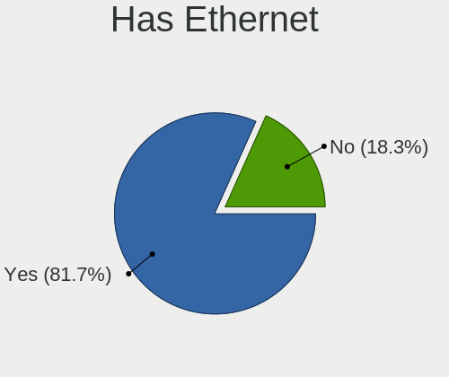

FreeBSD Hardware Trends
-----------------------

A project to identify most popular hardware characteristics and track their change
over time based on data collected by FreeBSD users at https://BSD-Hardware.info.

Anyone can contribute to the study by uploading probes of their computers by
the [hw-probe](https://github.com/linuxhw/hw-probe/blob/master/INSTALL.BSD.md) tool:

    hw-probe -all -upload

This is a report for all computer types. See also reports for [desktops](/Dist/FreeBSD/Desktop/README.md) and [notebooks](/Dist/FreeBSD/Notebook/README.md).

Full-feature report is available here: https://bsd-hardware.info/?view=trends

Period: Apr, 2021.

Contents
--------

- [ OS                       ](#os)
- [ OS Family                ](#os-family)
- [ Arch                     ](#arch)
- [ DE                       ](#de)
- [ Display Server           ](#display-server)
- [ Display Manager          ](#display-manager)
- [ OS Lang                  ](#os-lang)
- [ Boot Mode                ](#boot-mode)
- [ Filesystem               ](#filesystem)
- [ Part. scheme             ](#part-scheme)
- [ Country                  ](#country)
- [ City                     ](#city)
- [ Vendor                   ](#vendor)
- [ Model                    ](#model)
- [ Model Family             ](#model-family)
- [ MFG Year                 ](#mfg-year)
- [ Form Factor              ](#form-factor)
- [ Coreboot                 ](#coreboot)
- [ RAM Size                 ](#ram-size)
- [ RAM Used                 ](#ram-used)
- [ Has CD-ROM               ](#has-cd-rom)
- [ Total Drives             ](#total-drives)
- [ Has Ethernet             ](#has-ethernet)
- [ Has WiFi                 ](#has-wifi)
- [ Has Bluetooth            ](#has-bluetooth)
- [ Drive Vendor             ](#drive-vendor)
- [ Drive Model              ](#drive-model)
- [ HDD Vendor               ](#hdd-vendor)
- [ SSD Vendor               ](#ssd-vendor)
- [ Drive Kind               ](#drive-kind)
- [ Drive Connector          ](#drive-connector)
- [ Drive Size               ](#drive-size)
- [ Space Total              ](#space-total)
- [ Space Used               ](#space-used)
- [ Malfunc. Drives          ](#malfunc-drives)
- [ Malfunc. Drive Vendor    ](#malfunc-drive-vendor)
- [ Malfunc. HDD Vendor      ](#malfunc-hdd-vendor)
- [ Malfunc. Drive Kind      ](#malfunc-drive-kind)
- [ Failed Drives            ](#failed-drives)
- [ Failed Drive Vendor      ](#failed-drive-vendor)
- [ Drive Status             ](#drive-status)
- [ Storage Vendor           ](#storage-vendor)
- [ Storage Model            ](#storage-model)
- [ Storage Kind             ](#storage-kind)
- [ CPU Vendor               ](#cpu-vendor)
- [ CPU Model                ](#cpu-model)
- [ CPU Model Family         ](#cpu-model-family)
- [ CPU Cores                ](#cpu-cores)
- [ CPU Sockets              ](#cpu-sockets)
- [ CPU Threads              ](#cpu-threads)
- [ CPU Microarch            ](#cpu-microarch)
- [ GPU Vendor               ](#gpu-vendor)
- [ GPU Model                ](#gpu-model)
- [ GPU Combo                ](#gpu-combo)
- [ GPU Driver               ](#gpu-driver)
- [ GPU Memory               ](#gpu-memory)
- [ Monitor Vendor           ](#monitor-vendor)
- [ Monitor Model            ](#monitor-model)
- [ Monitor Resolution       ](#monitor-resolution)
- [ Monitor Diagonal         ](#monitor-diagonal)
- [ Monitor Width            ](#monitor-width)
- [ Aspect Ratio             ](#aspect-ratio)
- [ Monitor Area             ](#monitor-area)
- [ Pixel Density            ](#pixel-density)
- [ Multiple Monitors        ](#multiple-monitors)
- [ Net Controller Vendor    ](#net-controller-vendor)
- [ Net Controller Model     ](#net-controller-model)
- [ Wireless Vendor          ](#wireless-vendor)
- [ Wireless Model           ](#wireless-model)
- [ Ethernet Vendor          ](#ethernet-vendor)
- [ Ethernet Model           ](#ethernet-model)
- [ Net Controller Kind      ](#net-controller-kind)
- [ Used Controller          ](#used-controller)
- [ NICs                     ](#nics)
- [ IPv6                     ](#ipv6)
- [ Memory Vendor            ](#memory-vendor)
- [ Memory Model             ](#memory-model)
- [ Memory Kind              ](#memory-kind)
- [ Memory Form Factor       ](#memory-form-factor)
- [ Memory Size              ](#memory-size)
- [ Memory Speed             ](#memory-speed)
- [ Sound Vendor             ](#sound-vendor)
- [ Sound Model              ](#sound-model)
- [ Camera Vendor            ](#camera-vendor)
- [ Camera Model             ](#camera-model)
- [ Fingerprint Vendor       ](#fingerprint-vendor)
- [ Fingerprint Model        ](#fingerprint-model)
- [ Chipcard Vendor          ](#chipcard-vendor)
- [ Chipcard Model           ](#chipcard-model)
- [ Printer Vendor           ](#printer-vendor)
- [ Printer Model            ](#printer-model)
- [ Scanner Vendor           ](#scanner-vendor)
- [ Scanner Model            ](#scanner-model)
- [ Bluetooth Vendor         ](#bluetooth-vendor)
- [ Bluetooth Model          ](#bluetooth-model)
- [ Unsupported Devices      ](#unsupported-devices)
- [ Unsupported Device Types ](#unsupported-device-types)

OS
--

Installed operating systems

| Name                 | Computers | Percent |
|----------------------|-----------|---------|
| FreeBSD 13.0         | 47        | 45.63%  |
| FreeBSD 12.2-p6      | 13        | 12.62%  |
| FreeBSD 13.0-STABLE  | 9         | 8.74%   |
| FreeBSD 13.0-RC5     | 7         | 6.8%    |
| FreeBSD 14.0-CURRENT | 6         | 5.83%   |
| FreeBSD 12.2-p5      | 5         | 4.85%   |
| FreeBSD 12.2-p4      | 3         | 2.91%   |
| FreeBSD 13.0-RC4     | 2         | 1.94%   |
| FreeBSD 12.2-p3      | 2         | 1.94%   |
| FreeBSD 12.2-p2      | 2         | 1.94%   |
| FreeBSD 12.2         | 2         | 1.94%   |
| FreeBSD 12.1         | 2         | 1.94%   |
| FreeBSD 13.0-RC3     | 1         | 0.97%   |
| FreeBSD 12.1-p13     | 1         | 0.97%   |
| FreeBSD 11.4-p8      | 1         | 0.97%   |

OS Family
---------

OS without a version

| Name    | Computers | Percent |
|---------|-----------|---------|
| FreeBSD | 103       | 100%    |

Arch
----

OS architecture (x86_64, i586, etc.)

| Name  | Computers | Percent |
|-------|-----------|---------|
| amd64 | 94        | 91.26%  |
| arm64 | 5         | 4.85%   |
| i386  | 4         | 3.88%   |

DE
--

Desktop Environment

| Name          | Computers | Percent |
|---------------|-----------|---------|
| Console       | 36        | 34.95%  |
| KDE5          | 20        | 19.42%  |
| XFCE          | 12        | 11.65%  |
| TWM           | 7         | 6.8%    |
| GNOME         | 6         | 5.83%   |
| Cinnamon      | 5         | 4.85%   |
| MATE          | 4         | 3.88%   |
| Openbox       | 3         | 2.91%   |
| i3            | 3         | 2.91%   |
| Fluxbox       | 2         | 1.94%   |
| Enlightenment | 2         | 1.94%   |
| DWM           | 1         | 0.97%   |
| CDE           | 1         | 0.97%   |
| AwesomeWM     | 1         | 0.97%   |

Display Server
--------------

X11 or Wayland

| Name    | Computers | Percent |
|---------|-----------|---------|
| X11     | 67        | 65.05%  |
| Console | 36        | 34.95%  |

Display Manager
---------------

SDDM, LightDM, etc.

| Name    | Computers | Percent |
|---------|-----------|---------|
| Console | 64        | 62.14%  |
| SDDM    | 17        | 16.5%   |
| SLiM    | 11        | 10.68%  |
| XDM     | 4         | 3.88%   |
| LightDM | 4         | 3.88%   |
| GDM     | 3         | 2.91%   |

OS Lang
-------

Language

| Lang             | Computers | Percent |
|------------------|-----------|---------|
| C                | 44        | 42.72%  |
| Unknown          | 22        | 21.36%  |
| en_US            | 17        | 16.5%   |
| de_DE            | 4         | 3.88%   |
| en_GB            | 3         | 2.91%   |
| ru_RU            | 2         | 1.94%   |
| nb_NO            | 2         | 1.94%   |
| fr_FR            | 2         | 1.94%   |
| pt_PT            | 1         | 0.97%   |
| pl_PL            | 1         | 0.97%   |
| hu_HU.US-ASCII   | 1         | 0.97%   |
| en_US.utf-8      | 1         | 0.97%   |
| en_US.US-ASCII   | 1         | 0.97%   |
| de_DE.ISO8859-15 | 1         | 0.97%   |
| de_CH            | 1         | 0.97%   |

Boot Mode
---------

EFI or BIOS

| Mode | Computers | Percent |
|------|-----------|---------|
| EFI  | 72        | 69.9%   |
| BIOS | 31        | 30.1%   |

Filesystem
----------

Type of filesystem

| Type | Computers | Percent |
|------|-----------|---------|
| Zfs  | 71        | 68.93%  |
| Ufs  | 32        | 31.07%  |

Part. scheme
------------

Scheme of partitioning

| Type | Computers | Percent |
|------|-----------|---------|
| GPT  | 94        | 91.26%  |
| MBR  | 8         | 7.77%   |
| BSD  | 1         | 0.97%   |

Country
-------

Geographic location (country)

| Country     | Computers | Percent |
|-------------|-----------|---------|
| USA         | 39        | 37.86%  |
| Germany     | 11        | 10.68%  |
| UK          | 10        | 9.71%   |
| Russia      | 7         | 6.8%    |
| France      | 4         | 3.88%   |
| Thailand    | 3         | 2.91%   |
| Norway      | 3         | 2.91%   |
| Japan       | 3         | 2.91%   |
| China       | 3         | 2.91%   |
| Switzerland | 2         | 1.94%   |
| Netherlands | 2         | 1.94%   |
| Ukraine     | 1         | 0.97%   |
| Spain       | 1         | 0.97%   |
| Romania     | 1         | 0.97%   |
| Portugal    | 1         | 0.97%   |
| Poland      | 1         | 0.97%   |
| New Zealand | 1         | 0.97%   |
| Namibia     | 1         | 0.97%   |
| India       | 1         | 0.97%   |
| Hungary     | 1         | 0.97%   |
| Finland     | 1         | 0.97%   |
| Croatia     | 1         | 0.97%   |
| Colombia    | 1         | 0.97%   |
| Brazil      | 1         | 0.97%   |
| Austria     | 1         | 0.97%   |
| Australia   | 1         | 0.97%   |
| Argentina   | 1         | 0.97%   |

City
----

Geographic location (city)

| City                     | Computers | Percent |
|--------------------------|-----------|---------|
| Lübeck                  | 3         | 2.91%   |
| Villeneuve-Saint-Georges | 2         | 1.94%   |
| Salem                    | 2         | 1.94%   |
| Redmond                  | 2         | 1.94%   |
| Irkutsk                  | 2         | 1.94%   |
| Hemel Hempstead          | 2         | 1.94%   |
| Glasgow                  | 2         | 1.94%   |
| Frisco                   | 2         | 1.94%   |
| Chicago                  | 2         | 1.94%   |
| Brighton                 | 2         | 1.94%   |
| Beijing                  | 2         | 1.94%   |
| Bangkok                  | 2         | 1.94%   |
| Zurich                   | 1         | 0.97%   |
| Wenatchee                | 1         | 0.97%   |
| Vostochnoe Degunino      | 1         | 0.97%   |
| Toledo                   | 1         | 0.97%   |
| Tahara                   | 1         | 0.97%   |
| São José dos Campos    | 1         | 0.97%   |
| Székesfehérvár        | 1         | 0.97%   |
| Sundebru                 | 1         | 0.97%   |
| Suginami-ku              | 1         | 0.97%   |
| Stuttgart                | 1         | 0.97%   |
| Solbergelva              | 1         | 0.97%   |
| Slavonski Brod           | 1         | 0.97%   |
| Sierra Madre             | 1         | 0.97%   |
| Scottsdale               | 1         | 0.97%   |
| Saint Paul               | 1         | 0.97%   |
| Rochester                | 1         | 0.97%   |
| Roanoke                  | 1         | 0.97%   |
| Rionegro                 | 1         | 0.97%   |
| Ploieşti                | 1         | 0.97%   |
| Parndorf                 | 1         | 0.97%   |
| Ozersk                   | 1         | 0.97%   |
| Otjiwarongo              | 1         | 0.97%   |
| Oslo                     | 1         | 0.97%   |
| Omsk                     | 1         | 0.97%   |
| Oakland                  | 1         | 0.97%   |
| Northeim                 | 1         | 0.97%   |
| New Delhi                | 1         | 0.97%   |
| Munich                   | 1         | 0.97%   |
| Moses Lake               | 1         | 0.97%   |
| Montserrat               | 1         | 0.97%   |
| Minneapolis              | 1         | 0.97%   |
| Midvale                  | 1         | 0.97%   |
| Markt Indersdorf         | 1         | 0.97%   |
| Maia                     | 1         | 0.97%   |
| Los Altos                | 1         | 0.97%   |
| Lexington                | 1         | 0.97%   |
| Leicester                | 1         | 0.97%   |
| Langen                   | 1         | 0.97%   |
| Kunitachi                | 1         | 0.97%   |
| Krommenie                | 1         | 0.97%   |
| Krasnoyarsk              | 1         | 0.97%   |
| Klobuck                  | 1         | 0.97%   |
| Kez                      | 1         | 0.97%   |
| Jackson                  | 1         | 0.97%   |
| Indio                    | 1         | 0.97%   |
| Henderson                | 1         | 0.97%   |
| Helsinki                 | 1         | 0.97%   |
| Hazel Green              | 1         | 0.97%   |

Vendor
------

Motherboard manufacturer

| Name                | Computers | Percent |
|---------------------|-----------|---------|
| Dell                | 21        | 20.39%  |
| Lenovo              | 20        | 19.42%  |
| ASUSTek Computer    | 11        | 10.68%  |
| Hewlett-Packard     | 9         | 8.74%   |
| Unknown             | 6         | 5.83%   |
| ASRock              | 5         | 4.85%   |
| Supermicro          | 4         | 3.88%   |
| Gigabyte Technology | 4         | 3.88%   |
| Intel               | 3         | 2.91%   |
| Beckhoff Automation | 3         | 2.91%   |
| Toshiba             | 2         | 1.94%   |
| System76            | 1         | 0.97%   |
| Sony                | 1         | 0.97%   |
| Samsung Electronics | 1         | 0.97%   |
| Quanta              | 1         | 0.97%   |
| pine64              | 1         | 0.97%   |
| Pegatron            | 1         | 0.97%   |
| MSI                 | 1         | 0.97%   |
| HUAWEI              | 1         | 0.97%   |
| HPE                 | 1         | 0.97%   |
| Fujitsu             | 1         | 0.97%   |
| Colorful Technology | 1         | 0.97%   |
| Clevo               | 1         | 0.97%   |
| ASRockRack          | 1         | 0.97%   |
| Alienware           | 1         | 0.97%   |
| Acer                | 1         | 0.97%   |

Model
-----

Motherboard model

| Name                                     | Computers | Percent |
|------------------------------------------|-----------|---------|
| Unknown                                  | 6         | 5.83%   |
| Supermicro Super Server                  | 2         | 1.94%   |
| Dell Latitude E5420                      | 2         | 1.94%   |
| Dell Inspiron 3793                       | 2         | 1.94%   |
| Beckhoff Automation Industrial PC        | 2         | 1.94%   |
| ASUS SABERTOOTH 990FX R2.0               | 2         | 1.94%   |
| ASUS All Series                          | 2         | 1.94%   |
| Toshiba Satellite L50-C                  | 1         | 0.97%   |
| Toshiba Satellite C655D                  | 1         | 0.97%   |
| System76 Lemur Pro                       | 1         | 0.97%   |
| Supermicro X7SPA-HF                      | 1         | 0.97%   |
| Supermicro SYS-5018D-FN4T                | 1         | 0.97%   |
| Sony VGN-FW290J                          | 1         | 0.97%   |
| Samsung NC10                             | 1         | 0.97%   |
| Quanta JASPER12                          | 1         | 0.97%   |
| pine64 pinebook-pro-rk3399               | 1         | 0.97%   |
| Pegatron T12Ah                           | 1         | 0.97%   |
| MSI MS-7817                              | 1         | 0.97%   |
| Lenovo ThinkPad X380 Yoga 20LH000NPG     | 1         | 0.97%   |
| Lenovo ThinkPad X270 20HMS0NS00          | 1         | 0.97%   |
| Lenovo ThinkPad X270 20HMCTO1WW          | 1         | 0.97%   |
| Lenovo ThinkPad X220 4290NE3             | 1         | 0.97%   |
| Lenovo ThinkPad X1 Carbon 5th 20HQS1QC00 | 1         | 0.97%   |
| Lenovo ThinkPad T590 20N4CTO1WW          | 1         | 0.97%   |
| Lenovo ThinkPad T430 23495P8             | 1         | 0.97%   |
| Lenovo ThinkPad T420 4236NUG             | 1         | 0.97%   |
| Lenovo ThinkPad P52 20M9CTO1WW           | 1         | 0.97%   |
| Lenovo ThinkPad P14s Gen 1 20Y1CTO1WW    | 1         | 0.97%   |
| Lenovo ThinkPad L15 Gen 1 20U3CTO1WW     | 1         | 0.97%   |
| Lenovo ThinkPad Edge E320 1298RJ1        | 1         | 0.97%   |
| Lenovo ThinkPad E490 20N9001SBR          | 1         | 0.97%   |
| Lenovo ThinkPad E490 20N8CTO1WW          | 1         | 0.97%   |
| Lenovo ThinkPad E14 20RAS0F600           | 1         | 0.97%   |
| Lenovo ThinkPad A485 20MUS07E00          | 1         | 0.97%   |
| Lenovo ThinkCentre M93p 10AAS0F201       | 1         | 0.97%   |
| Lenovo IdeaPad Y700-15ISK 80NV           | 1         | 0.97%   |
| Lenovo IdeaCentre 5 14ARE05 90Q30008US   | 1         | 0.97%   |
| Lenovo IdeaCentre 310S-08ASR 90G90068US  | 1         | 0.97%   |
| Intel NUC7i5BNB J31144-303               | 1         | 0.97%   |
| Intel NUC5i5MYBE H47797-205              | 1         | 0.97%   |
| Intel NUC5i3RYB H41000-503               | 1         | 0.97%   |
| HUAWEI HN-WX9X                           | 1         | 0.97%   |
| HPE ProLiant MicroServer Gen10           | 1         | 0.97%   |
| HP Z620 Workstation                      | 1         | 0.97%   |
| HP ProBook 4530s                         | 1         | 0.97%   |
| HP Laptop 17-by0xxx                      | 1         | 0.97%   |
| HP EliteBook Folio 9470m                 | 1         | 0.97%   |
| HP EliteBook 8570p                       | 1         | 0.97%   |
| HP EliteBook 840 G3                      | 1         | 0.97%   |
| HP Compaq Presario CQ71                  | 1         | 0.97%   |
| HP Compaq Elite 8300 SFF                 | 1         | 0.97%   |
| HP All-in-One 22-c0xx                    | 1         | 0.97%   |
| Gigabyte X570 AORUS ELITE                | 1         | 0.97%   |
| Gigabyte F2A75M-HD2                      | 1         | 0.97%   |
| Gigabyte B450M DS3H                      | 1         | 0.97%   |
| Gigabyte 990FXA-UD3                      | 1         | 0.97%   |
| Fujitsu D3417-B2 S26361-D3417-B2         | 1         | 0.97%   |
| Dell XPS 8940                            | 1         | 0.97%   |
| Dell XPS 8930                            | 1         | 0.97%   |
| Dell XPS 13 9360                         | 1         | 0.97%   |

Model Family
------------

Motherboard model prefix

| Name                            | Computers | Percent |
|---------------------------------|-----------|---------|
| Lenovo ThinkPad                 | 16        | 15.53%  |
| Dell Latitude                   | 8         | 7.77%   |
| Unknown                         | 6         | 5.83%   |
| Dell Inspiron                   | 4         | 3.88%   |
| HP EliteBook                    | 3         | 2.91%   |
| Dell XPS                        | 3         | 2.91%   |
| Dell Precision                  | 3         | 2.91%   |
| Toshiba Satellite               | 2         | 1.94%   |
| Supermicro Super                | 2         | 1.94%   |
| Lenovo IdeaCentre               | 2         | 1.94%   |
| HP Compaq                       | 2         | 1.94%   |
| Beckhoff Automation Industrial  | 2         | 1.94%   |
| ASUS SABERTOOTH                 | 2         | 1.94%   |
| ASUS All                        | 2         | 1.94%   |
| System76 Lemur                  | 1         | 0.97%   |
| Supermicro X7SPA-HF             | 1         | 0.97%   |
| Supermicro SYS-5018D-FN4T       | 1         | 0.97%   |
| Sony VGN-FW290J                 | 1         | 0.97%   |
| Samsung NC10                    | 1         | 0.97%   |
| Quanta JASPER12                 | 1         | 0.97%   |
| pine64 pinebook-pro-rk3399      | 1         | 0.97%   |
| Pegatron T12Ah                  | 1         | 0.97%   |
| MSI MS-7817                     | 1         | 0.97%   |
| Lenovo ThinkCentre              | 1         | 0.97%   |
| Lenovo IdeaPad                  | 1         | 0.97%   |
| Intel NUC7i5BNB                 | 1         | 0.97%   |
| Intel NUC5i5MYBE                | 1         | 0.97%   |
| Intel NUC5i3RYB                 | 1         | 0.97%   |
| HUAWEI HN-WX9X                  | 1         | 0.97%   |
| HPE ProLiant                    | 1         | 0.97%   |
| HP Z620                         | 1         | 0.97%   |
| HP ProBook                      | 1         | 0.97%   |
| HP Laptop                       | 1         | 0.97%   |
| HP All-in-One                   | 1         | 0.97%   |
| Gigabyte X570                   | 1         | 0.97%   |
| Gigabyte F2A75M-HD2             | 1         | 0.97%   |
| Gigabyte B450M                  | 1         | 0.97%   |
| Gigabyte 990FXA-UD3             | 1         | 0.97%   |
| Fujitsu D3417-B2                | 1         | 0.97%   |
| Dell OptiPlex                   | 1         | 0.97%   |
| Dell G5                         | 1         | 0.97%   |
| Dell DXP051                     | 1         | 0.97%   |
| Colorful C.Q1900M               | 1         | 0.97%   |
| Clevo W55xEU                    | 1         | 0.97%   |
| Beckhoff Automation CX5130-0120 | 1         | 0.97%   |
| ASUS TUF                        | 1         | 0.97%   |
| ASUS Q500A                      | 1         | 0.97%   |
| ASUS PRIME                      | 1         | 0.97%   |
| ASUS P5Q-E                      | 1         | 0.97%   |
| ASUS P5KPL-AM                   | 1         | 0.97%   |
| ASUS Maximus                    | 1         | 0.97%   |
| ASUS M5A78L-M                   | 1         | 0.97%   |
| ASRockRack EPYC3101D4I-2T       | 1         | 0.97%   |
| ASRock Z390M-ITX                | 1         | 0.97%   |
| ASRock X570                     | 1         | 0.97%   |
| ASRock J4105-ITX                | 1         | 0.97%   |
| ASRock H110M-STX                | 1         | 0.97%   |
| ASRock AM1H-ITX                 | 1         | 0.97%   |
| Alienware M15x                  | 1         | 0.97%   |
| Acer Extensa                    | 1         | 0.97%   |

MFG Year
--------

Motherboard manufacture year

| Year    | Computers | Percent |
|---------|-----------|---------|
| 2020    | 23        | 22.33%  |
| 2019    | 17        | 16.5%   |
| 2018    | 13        | 12.62%  |
| 2016    | 7         | 6.8%    |
| 2014    | 5         | 4.85%   |
| 2021    | 4         | 3.88%   |
| 2017    | 4         | 3.88%   |
| 2015    | 4         | 3.88%   |
| 2013    | 4         | 3.88%   |
| 2012    | 4         | 3.88%   |
| 2011    | 4         | 3.88%   |
| 2010    | 4         | 3.88%   |
| Unknown | 4         | 3.88%   |
| 2008    | 3         | 2.91%   |
| 2009    | 1         | 0.97%   |
| 2007    | 1         | 0.97%   |
| 2005    | 1         | 0.97%   |

Form Factor
-----------

Physical design of the computer

| Name           | Computers | Percent |
|----------------|-----------|---------|
| Notebook       | 49        | 47.57%  |
| Desktop        | 41        | 39.81%  |
| System on chip | 4         | 3.88%   |
| Server         | 4         | 3.88%   |
| Mini pc        | 3         | 2.91%   |
| Convertible    | 1         | 0.97%   |
| All in one     | 1         | 0.97%   |

Coreboot
--------

Have coreboot on board

| Used | Computers | Percent |
|------|-----------|---------|
| No   | 102       | 99.03%  |
| Yes  | 1         | 0.97%   |

RAM Size
--------

Total RAM memory

| Size in GB  | Computers | Percent |
|-------------|-----------|---------|
| 16.01-24.0  | 33        | 32.04%  |
| 8.01-16.0   | 28        | 27.18%  |
| 4.01-8.0    | 15        | 14.56%  |
| 32.01-64.0  | 12        | 11.65%  |
| 64.01-256.0 | 7         | 6.8%    |
| 2.01-3.0    | 3         | 2.91%   |
| 24.01-32.0  | 2         | 1.94%   |
| 0.51-1.0    | 2         | 1.94%   |
| 3.01-4.0    | 1         | 0.97%   |

RAM Used
--------

Used RAM memory

| Used GB    | Computers | Percent |
|------------|-----------|---------|
| 0.51-1.0   | 42        | 40.78%  |
| 0.01-0.5   | 35        | 33.98%  |
| 1.01-2.0   | 16        | 15.53%  |
| 3.01-4.0   | 3         | 2.91%   |
| 2.01-3.0   | 2         | 1.94%   |
| 0          | 2         | 1.94%   |
| 32.01-64.0 | 1         | 0.97%   |
| 24.01-32.0 | 1         | 0.97%   |
| 8.01-16.0  | 1         | 0.97%   |

Has CD-ROM
----------

Has CD-ROM on board

| Presented | Computers | Percent |
|-----------|-----------|---------|
| No        | 72        | 69.9%   |
| Yes       | 31        | 30.1%   |

Total Drives
------------

Number of drives on board

| Drives | Computers | Percent |
|--------|-----------|---------|
| 1      | 52        | 50.49%  |
| 2      | 25        | 24.27%  |
| 5      | 7         | 6.8%    |
| 3      | 5         | 4.85%   |
| 4      | 4         | 3.88%   |
| 0      | 4         | 3.88%   |
| 6      | 2         | 1.94%   |
| 17     | 1         | 0.97%   |
| 12     | 1         | 0.97%   |
| 11     | 1         | 0.97%   |
| 10     | 1         | 0.97%   |

Has Ethernet
------------

Has Ethernet on board

| Presented | Computers | Percent |
|-----------|-----------|---------|
| Yes       | 92        | 89.32%  |
| No        | 11        | 10.68%  |

Has WiFi
--------

Has WiFi module

| Presented | Computers | Percent |
|-----------|-----------|---------|
| Yes       | 67        | 65.05%  |
| No        | 36        | 34.95%  |

Has Bluetooth
-------------

Has Bluetooth module

| Presented | Computers | Percent |
|-----------|-----------|---------|
| No        | 57        | 55.34%  |
| Yes       | 46        | 44.66%  |

Drive Vendor
------------

Hard drive vendors

| Vendor              | Computers | Drives | Percent |
|---------------------|-----------|--------|---------|
| Samsung Electronics | 29        | 37     | 19.73%  |
| WDC                 | 27        | 63     | 18.37%  |
| Seagate             | 26        | 37     | 17.69%  |
| Toshiba             | 11        | 11     | 7.48%   |
| Crucial             | 10        | 11     | 6.8%    |
| Kingston            | 8         | 8      | 5.44%   |
| Intel               | 6         | 8      | 4.08%   |
| Hitachi             | 6         | 17     | 4.08%   |
| A-DATA Technology   | 4         | 4      | 2.72%   |
| SK Hynix            | 3         | 3      | 2.04%   |
| SanDisk             | 3         | 3      | 2.04%   |
| HGST                | 2         | 2      | 1.36%   |
| Transcend           | 1         | 1      | 0.68%   |
| SPCC                | 1         | 16     | 0.68%   |
| Solid State Storage | 1         | 1      | 0.68%   |
| PNY                 | 1         | 1      | 0.68%   |
| PLEXTOR             | 1         | 1      | 0.68%   |
| Phison              | 1         | 1      | 0.68%   |
| Patriot             | 1         | 1      | 0.68%   |
| LITEON              | 1         | 1      | 0.68%   |
| KingSpec            | 1         | 1      | 0.68%   |
| Intenso             | 1         | 1      | 0.68%   |
| Fujitsu             | 1         | 1      | 0.68%   |
| China               | 1         | 1      | 0.68%   |

Drive Model
-----------

Hard drive models

| Model                           | Computers | Percent |
|---------------------------------|-----------|---------|
| WDC WD40EFRX-68N32N0 4TB        | 3         | 1.73%   |
| Seagate ST1000LM035-1RK172 1TB  | 3         | 1.73%   |
| Samsung SSD 970 EVO Plus 250GB  | 3         | 1.73%   |
| Samsung SSD 860 EVO 500GB       | 3         | 1.73%   |
| WDC WD20EFRX-68EUZN0 2TB        | 2         | 1.16%   |
| WDC WD120EMAZ-11BLFA0 12TB      | 2         | 1.16%   |
| Toshiba KXG50ZNV256G NVMe 256GB | 2         | 1.16%   |
| Seagate ST4000DM004-2CV104 4TB  | 2         | 1.16%   |
| Seagate ST4000DM000-1F2168 4TB  | 2         | 1.16%   |
| Seagate ST2000LM007-1R8174 2TB  | 2         | 1.16%   |
| Seagate ST2000DM008-2FR102 2TB  | 2         | 1.16%   |
| Samsung SSD PM851 mSATA 256GB   | 2         | 1.16%   |
| Samsung SSD 970 EVO 500GB       | 2         | 1.16%   |
| Samsung SSD 960 EVO 250GB       | 2         | 1.16%   |
| Samsung SSD 850 EVO 500GB       | 2         | 1.16%   |
| Kingston SA400S37480G 480GB     | 2         | 1.16%   |
| Kingston SA400S37120G 120GB     | 2         | 1.16%   |
| Crucial CT500MX500SSD1 500GB    | 2         | 1.16%   |
| Crucial CT250MX500SSD1 250GB    | 2         | 1.16%   |
| Crucial CT120BX500SSD1 120GB    | 2         | 1.16%   |
| WDC WUH721414ALE6L4 14TB        | 1         | 0.58%   |
| WDC WDS500G2B0C-00PXH0 500GB    | 1         | 0.58%   |
| WDC WDS480G2G0A-00JH30 480GB    | 1         | 0.58%   |
| WDC WDS120G2G0B-00EPW0 120GB    | 1         | 0.58%   |
| WDC WDS100T3X0C-00SJG0 1TB      | 1         | 0.58%   |
| WDC WD80EMAZ-00WJTA0 8TB        | 1         | 0.58%   |
| WDC WD80EFZX-68UW8N0 8TB        | 1         | 0.58%   |
| WDC WD80EFAX-68LHPN0 8TB        | 1         | 0.58%   |
| WDC WD7500BPVT-80HXZT3 752GB    | 1         | 0.58%   |
| WDC WD60EFRX-68L0BN1 6TB        | 1         | 0.58%   |
| WDC WD5003AZEX-00MK2A0 500GB    | 1         | 0.58%   |
| WDC WD5003AZEX-00K3CA0 500GB    | 1         | 0.58%   |
| WDC WD5003AZEX-00K1GA0 500GB    | 1         | 0.58%   |
| WDC WD5000LPCX-00VHAT0 500GB    | 1         | 0.58%   |
| WDC WD40EZRZ-75GXCB0 4TB        | 1         | 0.58%   |
| WDC WD40EZRZ-22GXCB0 4TB        | 1         | 0.58%   |
| WDC WD40EZAZ-00SF3B0 4TB        | 1         | 0.58%   |
| WDC WD4001FAEX-00MJRA0 4TB      | 1         | 0.58%   |
| WDC WD30EZRX-00MMMB0 3TB        | 1         | 0.58%   |
| WDC WD20EZRZ-00Z5HB0 2TB        | 1         | 0.58%   |
| WDC WD20EARX-00PASB0 2TB        | 1         | 0.58%   |
| WDC WD2005FBYZ-01YCBB3 2TB      | 1         | 0.58%   |
| WDC WD1600BEVT-22ZCT0 160GB     | 1         | 0.58%   |
| WDC WD120EMFZ-11A6JA0 12TB      | 1         | 0.58%   |
| WDC WD120EDAZ-11F3RA0 12TB      | 1         | 0.58%   |
| WDC WD10SPZX-08Z10 1TB          | 1         | 0.58%   |
| WDC WD10SDRW-34A0XS0 1TB        | 1         | 0.58%   |
| WDC WD10EZRX-00L4HB0 1TB        | 1         | 0.58%   |
| WDC WD10EZEX-75WN4A1 1TB        | 1         | 0.58%   |
| WDC WD10EAVS-00D7B1 1TB         | 1         | 0.58%   |
| WDC WD10EARX-00N0YB0 1TB        | 1         | 0.58%   |
| WDC WD100EZAZ-11TDBA0 10TB      | 1         | 0.58%   |
| WDC WD1001FALS-00J7B0 1TB       | 1         | 0.58%   |
| Transcend TS8GSSD500 8GB        | 1         | 0.58%   |
| Toshiba THNSNJ256GCSY 256GB     | 1         | 0.58%   |
| Toshiba MQ01ACF050 500GB        | 1         | 0.58%   |
| Toshiba MQ01ABF050 500GB        | 1         | 0.58%   |
| Toshiba MK4032GAX 40GB          | 1         | 0.58%   |
| Toshiba MK3265GSXN 320GB        | 1         | 0.58%   |
| Toshiba MG03ACA100 1TB          | 1         | 0.58%   |

HDD Vendor
----------

Hard disk drive vendors

| Vendor              | Computers | Drives | Percent |
|---------------------|-----------|--------|---------|
| Seagate             | 25        | 36     | 38.46%  |
| WDC                 | 23        | 59     | 35.38%  |
| Toshiba             | 7         | 7      | 10.77%  |
| Hitachi             | 6         | 17     | 9.23%   |
| HGST                | 2         | 2      | 3.08%   |
| Samsung Electronics | 1         | 1      | 1.54%   |
| Fujitsu             | 1         | 1      | 1.54%   |

SSD Vendor
----------

Solid state drive vendors

| Vendor              | Computers | Drives | Percent |
|---------------------|-----------|--------|---------|
| Samsung Electronics | 14        | 16     | 25%     |
| Crucial             | 10        | 11     | 17.86%  |
| Kingston            | 8         | 8      | 14.29%  |
| Intel               | 5         | 7      | 8.93%   |
| A-DATA Technology   | 4         | 4      | 7.14%   |
| SanDisk             | 3         | 3      | 5.36%   |
| WDC                 | 2         | 2      | 3.57%   |
| Transcend           | 1         | 1      | 1.79%   |
| Toshiba             | 1         | 1      | 1.79%   |
| SPCC                | 1         | 16     | 1.79%   |
| SK Hynix            | 1         | 1      | 1.79%   |
| PLEXTOR             | 1         | 1      | 1.79%   |
| Patriot             | 1         | 1      | 1.79%   |
| LITEON              | 1         | 1      | 1.79%   |
| KingSpec            | 1         | 1      | 1.79%   |
| Intenso             | 1         | 1      | 1.79%   |
| China               | 1         | 1      | 1.79%   |

Drive Kind
----------

HDD or SSD

| Kind | Computers | Drives | Percent |
|------|-----------|--------|---------|
| HDD  | 55        | 123    | 41.35%  |
| SSD  | 48        | 76     | 36.09%  |
| NVMe | 30        | 32     | 22.56%  |

Drive Connector
---------------

SATA, SAS, NVMe, etc.

| Type | Computers | Drives | Percent |
|------|-----------|--------|---------|
| SATA | 83        | 199    | 73.45%  |
| NVMe | 30        | 32     | 26.55%  |

Drive Size
----------

Size of hard drive

| Size in TB | Computers | Drives | Percent |
|------------|-----------|--------|---------|
| 0.01-0.5   | 56        | 78     | 47.86%  |
| 0.51-1.0   | 22        | 30     | 18.8%   |
| 1.01-2.0   | 14        | 34     | 11.97%  |
| 3.01-4.0   | 12        | 25     | 10.26%  |
| 4.01-10.0  | 5         | 14     | 4.27%   |
| 2.01-3.0   | 4         | 8      | 3.42%   |
| 10.01-20.0 | 4         | 10     | 3.42%   |

Space Total
-----------

Amount of disk space available on the file system

| Size in GB     | Computers | Percent |
|----------------|-----------|---------|
| 251-500        | 28        | 27.18%  |
| 101-250        | 22        | 21.36%  |
| 501-1000       | 15        | 14.56%  |
| 51-100         | 11        | 10.68%  |
| 21-50          | 8         | 7.77%   |
| More than 3000 | 6         | 5.83%   |
| 1001-2000      | 5         | 4.85%   |
| 1-20           | 4         | 3.88%   |
| 2001-3000      | 3         | 2.91%   |
| Unknown        | 1         | 0.97%   |

Space Used
----------

Amount of used disk space

| Used GB        | Computers | Percent |
|----------------|-----------|---------|
| 1-20           | 76        | 73.79%  |
| 21-50          | 8         | 7.77%   |
| 51-100         | 8         | 7.77%   |
| More than 3000 | 3         | 2.91%   |
| 251-500        | 3         | 2.91%   |
| 101-250        | 3         | 2.91%   |
| 1001-2000      | 1         | 0.97%   |
| Unknown        | 1         | 0.97%   |

Malfunc. Drives
---------------

Drive models with a malfunction

| Model                                            | Computers | Drives | Percent |
|--------------------------------------------------|-----------|--------|---------|
| WDC WD7500BPVT-80HXZT3 752GB                     | 1         | 1      | 6.67%   |
| WDC WD4001FAEX-00MJRA0 4TB                       | 1         | 2      | 6.67%   |
| Toshiba MK3265GSXN 320GB                         | 1         | 1      | 6.67%   |
| Seagate ST500DM002-1BD142 500GB                  | 1         | 1      | 6.67%   |
| Seagate ST3500418AS 500GB                        | 1         | 1      | 6.67%   |
| Seagate ST31500541AS 1.5TB                       | 1         | 1      | 6.67%   |
| Seagate ST3000DM008-2DM166 3TB                   | 1         | 1      | 6.67%   |
| Seagate ST2000DM008-2FR102 2TB                   | 1         | 1      | 6.67%   |
| Samsung Electronics SSD PM841 2.5-inch 7mm 256GB | 1         | 1      | 6.67%   |
| Samsung Electronics SP0411N 40GB                 | 1         | 1      | 6.67%   |
| PLEXTOR PX-128M5S 128GB                          | 1         | 1      | 6.67%   |
| Intel SSDSCKKF256G8H 256GB                       | 1         | 1      | 6.67%   |
| Hitachi HTS545032B9A300 320GB                    | 1         | 1      | 6.67%   |
| Hitachi HDS721010CLA332 1TB                      | 1         | 1      | 6.67%   |
| HGST HTS725050A7E630 500GB                       | 1         | 1      | 6.67%   |

Malfunc. Drive Vendor
---------------------

Vendors of faulty drives

| Vendor              | Computers | Drives | Percent |
|---------------------|-----------|--------|---------|
| Seagate             | 5         | 5      | 33.33%  |
| WDC                 | 2         | 3      | 13.33%  |
| Samsung Electronics | 2         | 2      | 13.33%  |
| Hitachi             | 2         | 2      | 13.33%  |
| Toshiba             | 1         | 1      | 6.67%   |
| PLEXTOR             | 1         | 1      | 6.67%   |
| Intel               | 1         | 1      | 6.67%   |
| HGST                | 1         | 1      | 6.67%   |

Malfunc. HDD Vendor
-------------------

Vendors of faulty HDD drives

| Vendor              | Computers | Drives | Percent |
|---------------------|-----------|--------|---------|
| Seagate             | 5         | 5      | 41.67%  |
| WDC                 | 2         | 3      | 16.67%  |
| Hitachi             | 2         | 2      | 16.67%  |
| Toshiba             | 1         | 1      | 8.33%   |
| Samsung Electronics | 1         | 1      | 8.33%   |
| HGST                | 1         | 1      | 8.33%   |

Malfunc. Drive Kind
-------------------

Kinds of faulty drives

| Kind | Computers | Drives | Percent |
|------|-----------|--------|---------|
| HDD  | 11        | 13     | 78.57%  |
| SSD  | 3         | 3      | 21.43%  |

Failed Drives
-------------

Failed drive models

Zero info for selected period =(

Failed Drive Vendor
-------------------

Failed drive vendors

Zero info for selected period =(

Drive Status
------------

Number of failed and malfunc. drives

| Status   | Computers | Drives | Percent |
|----------|-----------|--------|---------|
| Works    | 93        | 211    | 85.32%  |
| Malfunc  | 14        | 16     | 12.84%  |
| Detected | 2         | 4      | 1.83%   |

Storage Vendor
--------------

Storage controller vendors

| Vendor                         | Computers | Percent |
|--------------------------------|-----------|---------|
| Intel                          | 72        | 54.14%  |
| Samsung Electronics            | 18        | 13.53%  |
| AMD                            | 18        | 13.53%  |
| ASMedia Technology             | 6         | 4.51%   |
| Broadcom / LSI                 | 5         | 3.76%   |
| Toshiba                        | 3         | 2.26%   |
| Sandisk                        | 3         | 2.26%   |
| Marvell Technology Group       | 3         | 2.26%   |
| Phison Electronics             | 2         | 1.5%    |
| Solid State Storage Technology | 1         | 0.75%   |
| SK Hynix                       | 1         | 0.75%   |
| Seagate Technology             | 1         | 0.75%   |

Storage Model
-------------

Storage controller models

| Model                                                                            | Computers | Percent |
|----------------------------------------------------------------------------------|-----------|---------|
| AMD FCH SATA Controller [AHCI mode]                                              | 12        | 8.16%   |
| Samsung NVMe SSD Controller SM981/PM981/PM983                                    | 10        | 6.8%    |
| Intel Sunrise Point-LP SATA Controller [AHCI mode]                               | 9         | 6.12%   |
| Intel 6 Series/C200 Series Chipset Family 6 port Mobile SATA AHCI Controller     | 8         | 5.44%   |
| Intel Q170/Q150/B150/H170/H110/Z170/CM236 Chipset SATA Controller [AHCI Mode]    | 7         | 4.76%   |
| ASMedia ASM1062 Serial ATA Controller                                            | 6         | 4.08%   |
| Samsung NVMe SSD Controller SM961/PM961/SM963                                    | 5         | 3.4%    |
| Intel 8 Series/C220 Series Chipset Family 6-port SATA Controller 1 [AHCI mode]   | 5         | 3.4%    |
| Intel 82801 Mobile SATA Controller [RAID mode]                                   | 4         | 2.72%   |
| Intel 7 Series Chipset Family 6-port SATA Controller [AHCI mode]                 | 4         | 2.72%   |
| AMD SB7x0/SB8x0/SB9x0 SATA Controller [AHCI mode]                                | 4         | 2.72%   |
| Intel Comet Lake SATA AHCI Controller                                            | 3         | 2.04%   |
| Intel Atom Processor E3800 Series SATA AHCI Controller                           | 3         | 2.04%   |
| Intel 82801IBM/IEM (ICH9M/ICH9M-E) 4 port SATA Controller [AHCI mode]            | 3         | 2.04%   |
| Toshiba unknown                                                                  | 2         | 1.36%   |
| Sandisk WD Blue SN550 NVMe SSD                                                   | 2         | 1.36%   |
| Samsung NVMe Controller                                                          | 2         | 1.36%   |
| Phison E12 NVMe Controller                                                       | 2         | 1.36%   |
| Intel Wildcat Point-LP SATA Controller [AHCI Mode]                               | 2         | 1.36%   |
| Intel C602 chipset 4-Port SATA Storage Control Unit                              | 2         | 1.36%   |
| Intel 82801G (ICH7 Family) IDE Controller                                        | 2         | 1.36%   |
| Intel 7 Series Chipset Family 4-port SATA Controller [IDE mode]                  | 2         | 1.36%   |
| Intel 7 Series Chipset Family 2-port SATA Controller [IDE mode]                  | 2         | 1.36%   |
| Broadcom / LSI SAS2008 PCI-Express Fusion-MPT SAS-2 [Falcon]                     | 2         | 1.36%   |
| Toshiba BG3 NVMe SSD Controller                                                  | 1         | 0.68%   |
| SK Hynix PC300 NVMe Solid State Drive 512GB                                      | 1         | 0.68%   |
| Seagate FireCuda 520 SSD                                                         | 1         | 0.68%   |
| Sandisk WD Black SN750 / PC SN730 NVMe SSD                                       | 1         | 0.68%   |
| Samsung NVMe SSD Controller SM951/PM951                                          | 1         | 0.68%   |
| Marvell Group 88SE9230 PCIe 2.0 x2 4-port SATA 6 Gb/s RAID Controller            | 1         | 0.68%   |
| Marvell Group 88SE9172 SATA 6Gb/s Controller                                     | 1         | 0.68%   |
| Marvell Group 88SE6111/6121 SATA II / PATA Controller                            | 1         | 0.68%   |
| Intel SSD Pro 7600p/760p/E 6100p Series                                          | 1         | 0.68%   |
| Intel SATA Controller [RAID mode]                                                | 1         | 0.68%   |
| Intel NM10/ICH7 Family SATA Controller [IDE mode]                                | 1         | 0.68%   |
| Intel Ice Lake-LP SATA Controller [AHCI mode]                                    | 1         | 0.68%   |
| Intel HM170/QM170 Chipset SATA Controller [AHCI Mode]                            | 1         | 0.68%   |
| Intel Celeron/Pentium Silver Processor SATA Controller                           | 1         | 0.68%   |
| Intel Cannon Point-LP SATA Controller [AHCI Mode]                                | 1         | 0.68%   |
| Intel Cannon Lake PCH SATA AHCI Controller                                       | 1         | 0.68%   |
| Intel Cannon Lake Mobile PCH SATA AHCI Controller                                | 1         | 0.68%   |
| Intel C610/X99 series chipset sSATA Controller [AHCI mode]                       | 1         | 0.68%   |
| Intel C610/X99 series chipset 6-Port SATA Controller [AHCI mode]                 | 1         | 0.68%   |
| Intel C600/X79 series chipset IDE-r Controller                                   | 1         | 0.68%   |
| Intel C600/X79 series chipset 6-Port SATA AHCI Controller                        | 1         | 0.68%   |
| Intel C600/X79 series chipset 4-Port SATA IDE Controller                         | 1         | 0.68%   |
| Intel C600/X79 series chipset 2-Port SATA IDE Controller                         | 1         | 0.68%   |
| Intel Atom/Celeron/Pentium Processor x5-E8000/J3xxx/N3xxx Series SATA Controller | 1         | 0.68%   |
| Intel 9 Series Chipset Family SATA Controller [AHCI Mode]                        | 1         | 0.68%   |
| Intel 82801JI (ICH10 Family) SATA AHCI Controller                                | 1         | 0.68%   |
| Intel 82801IR/IO/IH (ICH9R/DO/DH) 6 port SATA Controller [AHCI mode]             | 1         | 0.68%   |
| Intel 82801GR/GDH (ICH7R/ICH7DH) SATA Controller [RAID mode]                     | 1         | 0.68%   |
| Intel 82801GBM/GHM (ICH7-M Family) SATA Controller [IDE mode]                    | 1         | 0.68%   |
| Intel 82801FBM (ICH6M) SATA Controller                                           | 1         | 0.68%   |
| Intel 7 Series/C210 Series Chipset Family 6-port SATA Controller [AHCI mode]     | 1         | 0.68%   |
| Intel 6 Series/C200 Series Chipset Family 6 port Desktop SATA AHCI Controller    | 1         | 0.68%   |
| Intel 5 Series/3400 Series Chipset 6 port SATA AHCI Controller                   | 1         | 0.68%   |
| Intel 400 Series Chipset Family SATA RAID Controller                             | 1         | 0.68%   |
| Broadcom / LSI SAS3416 Fusion-MPT Tri-Mode I/O Controller Chip (IOC)             | 1         | 0.68%   |
| Broadcom / LSI SAS3008 PCI-Express Fusion-MPT SAS-3                              | 1         | 0.68%   |

Storage Kind
------------

Kind of storage controller (IDE, SATA, NVMe, SAS, ...)

| Kind | Computers | Percent |
|------|-----------|---------|
| SATA | 76        | 58.46%  |
| NVMe | 30        | 23.08%  |
| IDE  | 10        | 7.69%   |
| RAID | 7         | 5.38%   |
| SAS  | 7         | 5.38%   |

CPU Vendor
----------

Processor vendors

| Vendor  | Computers | Percent |
|---------|-----------|---------|
| Intel   | 78        | 75.73%  |
| AMD     | 20        | 19.42%  |
| ARM     | 4         | 3.88%   |
| Unknown | 1         | 0.97%   |

CPU Model
---------

Processor models

| Model                                | Computers | Percent |
|--------------------------------------|-----------|---------|
| Intel Core i7-8565U CPU @ 1.80GHz    | 3         | 2.91%   |
| Intel Core i5-10210U CPU @ 1.60GHz   | 3         | 2.91%   |
| Intel Core i7-1065G7 CPU @ 1.30GHz   | 2         | 1.94%   |
| Intel Core i5-8350U CPU @ 1.70GHz    | 2         | 1.94%   |
| Intel Core i5-8250U CPU @ 1.60GHz    | 2         | 1.94%   |
| Intel Core i5-7200U CPU @ 2.50GHz    | 2         | 1.94%   |
| Intel Core i5-6200U CPU @ 2.30GHz    | 2         | 1.94%   |
| Intel Core i5-2520M CPU @ 2.50GHz    | 2         | 1.94%   |
| Intel Core i3-9100 CPU @ 3.60GHz     | 2         | 1.94%   |
| ARM Cortex-A72 r0p3                  | 2         | 1.94%   |
| ARM Cortex-A53 r0p4                  | 2         | 1.94%   |
| AMD FX-8350 Eight-Core Processor     | 2         | 1.94%   |
| Intel Xeon CPU E5410 @ 2.33GHz       | 1         | 0.97%   |
| Intel Xeon CPU E5-2670 @ 2.60GHz     | 1         | 0.97%   |
| Intel Xeon CPU E5-2660 v2 @ 2.20GHz  | 1         | 0.97%   |
| Intel Xeon CPU E5-1650 v3 @ 3.50GHz  | 1         | 0.97%   |
| Intel Xeon CPU E3-1275 v5 @ 3.60GHz  | 1         | 0.97%   |
| Intel Xeon CPU E3-1240L v5 @ 2.10GHz | 1         | 0.97%   |
| Intel Xeon CPU D-1541 @ 2.10GHz      | 1         | 0.97%   |
| Intel Pentium M                      | 1         | 0.97%   |
| Intel Pentium CPU N3700 @ 1.60GHz    | 1         | 0.97%   |
| Intel Pentium CPU G3220 @ 3.00GHz    | 1         | 0.97%   |
| Intel Pentium 4                      | 1         | 0.97%   |
| Intel Genuine CPU                    | 1         | 0.97%   |
| Intel CPU Version                    | 1         | 0.97%   |
| Intel Core i7-9750H CPU @ 2.60GHz    | 1         | 0.97%   |
| Intel Core i7-8750H CPU @ 2.20GHz    | 1         | 0.97%   |
| Intel Core i7-8550U CPU @ 1.80GHz    | 1         | 0.97%   |
| Intel Core i7-7820HQ CPU @ 2.90GHz   | 1         | 0.97%   |
| Intel Core i7-7600U CPU @ 2.80GHz    | 1         | 0.97%   |
| Intel Core i7-6700K CPU @ 4.00GHz    | 1         | 0.97%   |
| Intel Core i7-6700HQ CPU @ 2.60GHz   | 1         | 0.97%   |
| Intel Core i7-6700 CPU @ 3.40GHz     | 1         | 0.97%   |
| Intel Core i7-6600U CPU @ 2.60GHz    | 1         | 0.97%   |
| Intel Core i7-4770K CPU @ 3.50GHz    | 1         | 0.97%   |
| Intel Core i7-4600U CPU @ 2.10GHz    | 1         | 0.97%   |
| Intel Core i7-3770 CPU @ 3.40GHz     | 1         | 0.97%   |
| Intel Core i7-3740QM CPU @ 2.70GHz   | 1         | 0.97%   |
| Intel Core i7-3687U CPU @ 2.10GHz    | 1         | 0.97%   |
| Intel Core i7-3632QM CPU @ 2.20GHz   | 1         | 0.97%   |
| Intel Core i7-3610QE CPU @ 2.30GHz   | 1         | 0.97%   |
| Intel Core i7-3520M CPU @ 2.90GHz    | 1         | 0.97%   |
| Intel Core i7-10700 CPU @ 2.90GHz    | 1         | 0.97%   |
| Intel Core i5-7300U CPU @ 2.60GHz    | 1         | 0.97%   |
| Intel Core i5-7260U CPU @ 2.20GHz    | 1         | 0.97%   |
| Intel Core i5-6500 CPU @ 3.20GHz     | 1         | 0.97%   |
| Intel Core i5-6440HQ CPU @ 2.60GHz   | 1         | 0.97%   |
| Intel Core i5-5300U CPU @ 2.30GHz    | 1         | 0.97%   |
| Intel Core i5-4690 CPU @ 3.50GHz     | 1         | 0.97%   |
| Intel Core i5-4570T CPU @ 2.90GHz    | 1         | 0.97%   |
| Intel Core i5-4300M CPU @ 2.60GHz    | 1         | 0.97%   |
| Intel Core i5-3230M CPU @ 2.60GHz    | 1         | 0.97%   |
| Intel Core i5-2520M CPU @ 2.50GH     | 1         | 0.97%   |
| Intel Core i5-2450M CPU @ 2.50GHz    | 1         | 0.97%   |
| Intel Core i5-2430M CPU @ 2.40GH     | 1         | 0.97%   |
| Intel Core i3-6006U CPU @ 2.00GHz    | 1         | 0.97%   |
| Intel Core i3-5010U CPU @ 2.10GHz    | 1         | 0.97%   |
| Intel Core i3-3227U CPU @ 1.90GHz    | 1         | 0.97%   |
| Intel Core i3-3220 CPU @ 3.30GHz     | 1         | 0.97%   |
| Intel Core i3-2330M CPU @ 2.20GHz    | 1         | 0.97%   |

CPU Model Family
----------------

Processor model prefix

| Model             | Computers | Percent |
|-------------------|-----------|---------|
| Intel Core i5     | 25        | 24.27%  |
| Intel Core i7     | 23        | 22.33%  |
| Intel Core i3     | 8         | 7.77%   |
| Intel Xeon        | 7         | 6.8%    |
| ARM Cortex        | 4         | 3.88%   |
| Other             | 3         | 2.91%   |
| Intel Core 2 Duo  | 3         | 2.91%   |
| Intel Atom        | 3         | 2.91%   |
| AMD Ryzen 9       | 3         | 2.91%   |
| AMD Ryzen 7       | 3         | 2.91%   |
| Intel Pentium     | 2         | 1.94%   |
| Intel Celeron     | 2         | 1.94%   |
| AMD Ryzen 7 PRO   | 2         | 1.94%   |
| AMD FX            | 2         | 1.94%   |
| Intel Pentium M   | 1         | 0.97%   |
| Intel Pentium 4   | 1         | 0.97%   |
| Intel Genuine     | 1         | 0.97%   |
| Intel Core 2 Quad | 1         | 0.97%   |
| AMD Ryzen 5       | 1         | 0.97%   |
| AMD Phenom II X6  | 1         | 0.97%   |
| AMD Opteron       | 1         | 0.97%   |
| AMD EPYC          | 1         | 0.97%   |
| AMD C-50          | 1         | 0.97%   |
| AMD Athlon X4     | 1         | 0.97%   |
| AMD Athlon II X2  | 1         | 0.97%   |
| AMD Athlon        | 1         | 0.97%   |
| AMD A6            | 1         | 0.97%   |

CPU Cores
---------

Number of processor cores

| Number  | Computers | Percent |
|---------|-----------|---------|
| 4       | 38        | 36.89%  |
| 2       | 34        | 33.01%  |
| Unknown | 10        | 9.71%   |
| 8       | 7         | 6.8%    |
| 16      | 4         | 3.88%   |
| 6       | 4         | 3.88%   |
| 24      | 2         | 1.94%   |
| 1       | 2         | 1.94%   |
| 32      | 1         | 0.97%   |
| 20      | 1         | 0.97%   |

CPU Sockets
-----------

Number of sockets

| Number  | Computers | Percent |
|---------|-----------|---------|
| 1       | 98        | 95.15%  |
| Unknown | 4         | 3.88%   |
| 2       | 1         | 0.97%   |

CPU Threads
-----------

Threads per core (Hyper-Threading)

| Number  | Computers | Percent |
|---------|-----------|---------|
| 2       | 60        | 58.25%  |
| 1       | 32        | 31.07%  |
| Unknown | 11        | 10.68%  |

CPU Microarch
-------------

Microarchitecture

| Name          | Computers | Percent |
|---------------|-----------|---------|
| KabyLake      | 21        | 20.39%  |
| Skylake       | 11        | 10.68%  |
| IvyBridge     | 10        | 9.71%   |
| SandyBridge   | 8         | 7.77%   |
| Haswell       | 7         | 6.8%    |
| Zen 2         | 5         | 4.85%   |
| Unknown       | 5         | 4.85%   |
| Silvermont    | 4         | 3.88%   |
| Zen           | 3         | 2.91%   |
| Piledriver    | 3         | 2.91%   |
| Penryn        | 3         | 2.91%   |
| Excavator     | 3         | 2.91%   |
| Broadwell     | 3         | 2.91%   |
| Zen+          | 2         | 1.94%   |
| K10           | 2         | 1.94%   |
| IceLake       | 2         | 1.94%   |
| Core          | 2         | 1.94%   |
| Bonnell       | 2         | 1.94%   |
| P6            | 1         | 0.97%   |
| NetBurst      | 1         | 0.97%   |
| Nehalem       | 1         | 0.97%   |
| Jaguar        | 1         | 0.97%   |
| Goldmont plus | 1         | 0.97%   |
| CometLake     | 1         | 0.97%   |
| Bobcat        | 1         | 0.97%   |

GPU Vendor
----------

Vendors of graphics cards

| Vendor            | Computers | Percent |
|-------------------|-----------|---------|
| Intel             | 64        | 59.81%  |
| Nvidia            | 21        | 19.63%  |
| AMD               | 17        | 15.89%  |
| ASPEED Technology | 5         | 4.67%   |

GPU Model
---------

Graphics card models

| Model                                                                                    | Computers | Percent |
|------------------------------------------------------------------------------------------|-----------|---------|
| Intel 2nd Generation Core Processor Family Integrated Graphics Controller                | 7         | 6.36%   |
| Intel 3rd Gen Core processor Graphics Controller                                         | 6         | 5.45%   |
| Intel UHD Graphics 620                                                                   | 5         | 4.55%   |
| ASPEED Technology ASPEED Graphics Family                                                 | 5         | 4.55%   |
| Intel Skylake GT2 [HD Graphics 520]                                                      | 4         | 3.64%   |
| Intel HD Graphics 620                                                                    | 4         | 3.64%   |
| Intel HD Graphics 530                                                                    | 4         | 3.64%   |
| Intel Xeon E3-1200 v3/4th Gen Core Processor Integrated Graphics Controller              | 3         | 2.73%   |
| Intel WhiskeyLake-U GT2 [UHD Graphics 620]                                               | 3         | 2.73%   |
| Intel CometLake-U GT2 [UHD Graphics]                                                     | 3         | 2.73%   |
| Intel Atom Processor Z36xxx/Z37xxx Series Graphics & Display                             | 3         | 2.73%   |
| AMD Ellesmere [Radeon RX 470/480/570/570X/580/580X/590]                                  | 3         | 2.73%   |
| Nvidia GP108M [GeForce MX230]                                                            | 2         | 1.82%   |
| Intel Xeon E3-1200 v2/3rd Gen Core processor Graphics Controller                         | 2         | 1.82%   |
| Intel Mobile 4 Series Chipset Integrated Graphics Controller                             | 2         | 1.82%   |
| Intel Iris Plus Graphics G7                                                              | 2         | 1.82%   |
| Intel HD Graphics 5500                                                                   | 2         | 1.82%   |
| Intel CoffeeLake-S GT2 [UHD Graphics 630]                                                | 2         | 1.82%   |
| AMD Stoney [Radeon R2/R3/R4/R5 Graphics]                                                 | 2         | 1.82%   |
| AMD Renoir                                                                               | 2         | 1.82%   |
| Nvidia TU116M [GeForce GTX 1660 Ti Mobile]                                               | 1         | 0.91%   |
| Nvidia TU116 [GeForce GTX 1660 SUPER]                                                    | 1         | 0.91%   |
| Nvidia TU116 [GeForce GTX 1650 SUPER]                                                    | 1         | 0.91%   |
| Nvidia GT218 [NVS 300]                                                                   | 1         | 0.91%   |
| Nvidia GT218 [GeForce 210]                                                               | 1         | 0.91%   |
| Nvidia GT216M [GeForce GT 240M]                                                          | 1         | 0.91%   |
| Nvidia GP108 [GeForce GT 1030]                                                           | 1         | 0.91%   |
| Nvidia GP107GLM [Quadro P1000 Mobile]                                                    | 1         | 0.91%   |
| Nvidia GP107GL [Quadro P600]                                                             | 1         | 0.91%   |
| Nvidia GP106 [GeForce GTX 1060 6GB]                                                      | 1         | 0.91%   |
| Nvidia GM107GLM [Quadro M1200 Mobile]                                                    | 1         | 0.91%   |
| Nvidia GM107GL [Quadro K2200]                                                            | 1         | 0.91%   |
| Nvidia GM107 [GeForce GTX 750 Ti]                                                        | 1         | 0.91%   |
| Nvidia GK208B [GeForce GT 710]                                                           | 1         | 0.91%   |
| Nvidia GK107 [GeForce GT 640]                                                            | 1         | 0.91%   |
| Nvidia GF119 [GeForce GT 610]                                                            | 1         | 0.91%   |
| Nvidia G98M [GeForce G 103M]                                                             | 1         | 0.91%   |
| Nvidia G98 [GeForce 8400 GS Rev. 2]                                                      | 1         | 0.91%   |
| Nvidia G72 [GeForce 7300 LE]                                                             | 1         | 0.91%   |
| Intel Mobile 945GSE Express Integrated Graphics Controller                               | 1         | 0.91%   |
| Intel Mobile 945GM/GMS/GME, 943/940GML Express Integrated Graphics Controller            | 1         | 0.91%   |
| Intel Iris Plus Graphics 640                                                             | 1         | 0.91%   |
| Intel HD Graphics P530                                                                   | 1         | 0.91%   |
| Intel HD Graphics 630                                                                    | 1         | 0.91%   |
| Intel Haswell-ULT Integrated Graphics Controller                                         | 1         | 0.91%   |
| Intel GeminiLake [UHD Graphics 600]                                                      | 1         | 0.91%   |
| Intel CometLake-S GT2 [UHD Graphics 630]                                                 | 1         | 0.91%   |
| Intel CoffeeLake-H GT2 [UHD Graphics 630]                                                | 1         | 0.91%   |
| Intel Atom/Celeron/Pentium Processor x5-E8000/J3xxx/N3xxx Integrated Graphics Controller | 1         | 0.91%   |
| Intel Atom Processor D4xx/D5xx/N4xx/N5xx Integrated Graphics Controller                  | 1         | 0.91%   |
| Intel 82G33/G31 Express Integrated Graphics Controller                                   | 1         | 0.91%   |
| Intel 4th Gen Core Processor Integrated Graphics Controller                              | 1         | 0.91%   |
| AMD Wrestler [Radeon HD 6250]                                                            | 1         | 0.91%   |
| AMD Wani [Radeon R5/R6/R7 Graphics]                                                      | 1         | 0.91%   |
| AMD Thames [Radeon HD 7550M/7570M/7650M]                                                 | 1         | 0.91%   |
| AMD RV370/M22 [Mobility Radeon X300]                                                     | 1         | 0.91%   |
| AMD Raven Ridge [Radeon Vega Series / Radeon Vega Mobile Series]                         | 1         | 0.91%   |
| AMD Rage 3 [Rage XL PCI]                                                                 | 1         | 0.91%   |
| AMD Picasso                                                                              | 1         | 0.91%   |
| AMD Park [Mobility Radeon HD 5430]                                                       | 1         | 0.91%   |

GPU Combo
---------

Combinations of graphics cards

| Name           | Computers | Percent |
|----------------|-----------|---------|
| 1 x Intel      | 51        | 49.51%  |
| 1 x Nvidia     | 14        | 13.59%  |
| 1 x AMD        | 13        | 12.62%  |
| Intel + Nvidia | 7         | 6.8%    |
| Other          | 5         | 4.85%   |
| 1 x ASPEED     | 5         | 4.85%   |
| 2 x Intel      | 4         | 3.88%   |
| 2 x AMD        | 2         | 1.94%   |
| Intel + AMD    | 2         | 1.94%   |

GPU Driver
----------

Free vs proprietary

| Driver      | Computers | Percent |
|-------------|-----------|---------|
| Free        | 85        | 82.52%  |
| Proprietary | 13        | 12.62%  |
| Unknown     | 5         | 4.85%   |

GPU Memory
----------

Total video memory

| Size in GB | Computers | Percent |
|------------|-----------|---------|
| Unknown    | 82        | 79.61%  |
| 1.01-2.0   | 6         | 5.83%   |
| 0.51-1.0   | 5         | 4.85%   |
| 3.01-4.0   | 3         | 2.91%   |
| 0.01-0.5   | 3         | 2.91%   |
| 7.01-8.0   | 2         | 1.94%   |
| 5.01-6.0   | 2         | 1.94%   |

Monitor Vendor
--------------

Monitor vendors

| Vendor               | Computers | Percent |
|----------------------|-----------|---------|
| LG Display           | 11        | 16.42%  |
| AU Optronics         | 9         | 13.43%  |
| Dell                 | 6         | 8.96%   |
| BOE                  | 5         | 7.46%   |
| Sharp                | 4         | 5.97%   |
| Samsung Electronics  | 4         | 5.97%   |
| Chimei Innolux       | 4         | 5.97%   |
| InfoVision           | 3         | 4.48%   |
| Goldstar             | 3         | 4.48%   |
| LG Electronics       | 2         | 2.99%   |
| Hewlett-Packard      | 2         | 2.99%   |
| Eizo                 | 2         | 2.99%   |
| AOC                  | 2         | 2.99%   |
| Ancor Communications | 2         | 2.99%   |
| Acer                 | 2         | 2.99%   |
| Unknown              | 1         | 1.49%   |
| Philips              | 1         | 1.49%   |
| Lenovo               | 1         | 1.49%   |
| Insignia             | 1         | 1.49%   |
| CPT                  | 1         | 1.49%   |
| BenQ                 | 1         | 1.49%   |

Monitor Model
-------------

Monitor models

| Model                                                                | Computers | Percent |
|----------------------------------------------------------------------|-----------|---------|
| Unknown LCD Monitor Sharp 3840x2160                                  | 1         | 1.49%   |
| Sharp LCD Monitor SHP1476 3840x2160 350x190mm 15.7-inch              | 1         | 1.49%   |
| Sharp LCD Monitor SHP1449 1920x1080 290x170mm 13.2-inch              | 1         | 1.49%   |
| Sharp LCD Monitor SHP143E 3840x2160 350x190mm 15.7-inch              | 1         | 1.49%   |
| Sharp LCD Monitor SHP143A 3840x2160 350x190mm 15.7-inch              | 1         | 1.49%   |
| Samsung Electronics U32J59x SAM0F35 3840x2160 700x390mm 31.5-inch    | 1         | 1.49%   |
| Samsung Electronics SyncMaster SAM0236 2560x1600 640x400mm 29.7-inch | 1         | 1.49%   |
| Samsung Electronics LCD Monitor SEC4351 1366x768 340x190mm 15.3-inch | 1         | 1.49%   |
| Samsung Electronics LCD Monitor SDC4141 1366x768 340x190mm 15.3-inch | 1         | 1.49%   |
| Philips LCD Monitor PHL08C3 1920x1080 600x340mm 27.2-inch            | 1         | 1.49%   |
| LG Electronics LCD Monitor LG HDR QHD 2560x1440                      | 1         | 1.49%   |
| LG Electronics LCD Monitor 4K@30Hz 1920x1080                         | 1         | 1.49%   |
| LG Display LCD Monitor LGD04B1 1366x768 310x170mm 13.9-inch          | 1         | 1.49%   |
| LG Display LCD Monitor LGD04AF 1366x768 340x190mm 15.3-inch          | 1         | 1.49%   |
| LG Display LCD Monitor LGD03D3 1600x900 310x170mm 13.9-inch          | 1         | 1.49%   |
| LG Display LCD Monitor LGD03AB 1366x768 340x190mm 15.3-inch          | 1         | 1.49%   |
| LG Display LCD Monitor LGD0366 1600x900 310x170mm 13.9-inch          | 1         | 1.49%   |
| LG Display LCD Monitor LGD0353 1366x768 350x190mm 15.7-inch          | 1         | 1.49%   |
| LG Display LCD Monitor LGD0314 1366x768 290x160mm 13.0-inch          | 1         | 1.49%   |
| LG Display LCD Monitor LGD02DC 1366x768 340x190mm 15.3-inch          | 1         | 1.49%   |
| LG Display LCD Monitor LGD02D9 1920x1080 340x190mm 15.3-inch         | 1         | 1.49%   |
| LG Display LCD Monitor LGD0258 1600x900 350x190mm 15.7-inch          | 1         | 1.49%   |
| LG Display LCD Monitor LGD0214 1600x900 350x190mm 15.7-inch          | 1         | 1.49%   |
| Lenovo LCD Monitor LEN0990 1440x900 410x260mm 19.1-inch              | 1         | 1.49%   |
| Insignia LCD Monitor BBY0032 1680x1050 610x350mm 27.7-inch           | 1         | 1.49%   |
| InfoVision LCD Monitor IVO057D 1920x1080 310x170mm 13.9-inch         | 1         | 1.49%   |
| InfoVision LCD Monitor IVO0536 1920x1080 290x170mm 13.2-inch         | 1         | 1.49%   |
| InfoVision LCD Monitor IVO04E5 1366x768 280x160mm 12.7-inch          | 1         | 1.49%   |
| Hewlett-Packard Z24nf HWP3209 1920x1080 530x300mm 24.0-inch          | 1         | 1.49%   |
| Hewlett-Packard LCD Monitor HPN401E 1920x1080 480x270mm 21.7-inch    | 1         | 1.49%   |
| Goldstar LG HDR WFHD GSM7714 2560x1080 800x340mm 34.2-inch           | 1         | 1.49%   |
| Goldstar 23MP65 GSM5A45 1920x1080 510x290mm 23.1-inch                | 1         | 1.49%   |
| Goldstar 22EA53 GSM59A6 1920x1080 480x270mm 21.7-inch                | 1         | 1.49%   |
| Eizo FX2431 ENC2036 1920x1200 520x330mm 24.2-inch                    | 1         | 1.49%   |
| Eizo CS2420 ENC2741 1920x1200 520x330mm 24.2-inch                    | 1         | 1.49%   |
| Dell U2718Q DELA0E9 3840x2160 610x350mm 27.7-inch                    | 1         | 1.49%   |
| Dell U2412M DELA07B 1920x1200 520x320mm 24.0-inch                    | 1         | 1.49%   |
| Dell SE2717H/HX DELD0A1 1920x1080 600x340mm 27.2-inch                | 1         | 1.49%   |
| Dell P2415Q DELA0BE 3840x2160 530x300mm 24.0-inch                    | 1         | 1.49%   |
| Dell LCD Monitor SP2309W 2048x1152                                   | 1         | 1.49%   |
| Dell LCD Monitor S2740L 1920x1080                                    | 1         | 1.49%   |
| CPT LCD Monitor CPT04C4 1024x600 230x140mm 10.6-inch                 | 1         | 1.49%   |
| Chimei Innolux P130ZFA-BA1 CMN8201 2160x1440 280x180mm 13.1-inch     | 1         | 1.49%   |
| Chimei Innolux LCD Monitor CMN14D5 1920x1080 310x170mm 13.9-inch     | 1         | 1.49%   |
| Chimei Innolux LCD Monitor CMN1484 1600x900 310x170mm 13.9-inch      | 1         | 1.49%   |
| Chimei Innolux LCD Monitor CMN1239 1920x1080 280x160mm 12.7-inch     | 1         | 1.49%   |
| BOE LCD Monitor BOE07BD 1920x1080 310x170mm 13.9-inch                | 1         | 1.49%   |
| BOE LCD Monitor BOE0742 1920x1080 310x170mm 13.9-inch                | 1         | 1.49%   |
| BOE LCD Monitor BOE06CB 1920x1080 340x190mm 15.3-inch                | 1         | 1.49%   |
| BOE LCD Monitor BOE06BA 1920x1080 340x190mm 15.3-inch                | 1         | 1.49%   |
| BOE LCD Monitor BOE069B 1600x900 380x210mm 17.1-inch                 | 1         | 1.49%   |
| BenQ BL2411 BNQ8011 1920x1200 520x320mm 24.0-inch                    | 1         | 1.49%   |
| AU Optronics LCD Monitor AUO8174 1280x800 330x210mm 15.4-inch        | 1         | 1.49%   |
| AU Optronics LCD Monitor AUO80ED 1920x1080 340x190mm 15.3-inch       | 1         | 1.49%   |
| AU Optronics LCD Monitor AUO423D 1920x1080 310x170mm 13.9-inch       | 1         | 1.49%   |
| AU Optronics LCD Monitor AUO313C 1366x768 310x170mm 13.9-inch        | 1         | 1.49%   |
| AU Optronics LCD Monitor AUO2E8D 1920x1080 340x190mm 15.3-inch       | 1         | 1.49%   |
| AU Optronics LCD Monitor AUO22EC 1366x768 340x190mm 15.3-inch        | 1         | 1.49%   |
| AU Optronics LCD Monitor AUO139D 1920x1080 380x210mm 17.1-inch       | 1         | 1.49%   |
| AU Optronics LCD Monitor AUO106C 1366x768 280x160mm 12.7-inch        | 1         | 1.49%   |

Monitor Resolution
------------------

Monitor screen resolution

| Resolution         | Computers | Percent |
|--------------------|-----------|---------|
| 1920x1080 (FHD)    | 25        | 38.46%  |
| 1366x768 (WXGA)    | 12        | 18.46%  |
| 3840x2160 (4K)     | 7         | 10.77%  |
| 1600x900 (HD+)     | 7         | 10.77%  |
| 1920x1200 (WUXGA)  | 4         | 6.15%   |
| 2560x1440 (QHD)    | 2         | 3.08%   |
| 2560x1600          | 1         | 1.54%   |
| 2560x1080          | 1         | 1.54%   |
| 2160x1440          | 1         | 1.54%   |
| 2048x1152          | 1         | 1.54%   |
| 1680x1050 (WSXGA+) | 1         | 1.54%   |
| 1440x900 (WXGA+)   | 1         | 1.54%   |
| 1280x800 (WXGA)    | 1         | 1.54%   |
| 1024x600           | 1         | 1.54%   |

Monitor Diagonal
----------------

Diagonal size in inches

| Inches  | Computers | Percent |
|---------|-----------|---------|
| 15      | 18        | 27.69%  |
| 13      | 14        | 21.54%  |
| 24      | 7         | 10.77%  |
| 27      | 6         | 9.23%   |
| Unknown | 6         | 9.23%   |
| 12      | 3         | 4.62%   |
| 31      | 2         | 3.08%   |
| 21      | 2         | 3.08%   |
| 17      | 2         | 3.08%   |
| 34      | 1         | 1.54%   |
| 29      | 1         | 1.54%   |
| 23      | 1         | 1.54%   |
| 19      | 1         | 1.54%   |
| 10      | 1         | 1.54%   |

Monitor Width
-------------

Physical width

| Width in mm | Computers | Percent |
|-------------|-----------|---------|
| 301-350     | 28        | 43.08%  |
| 501-600     | 12        | 18.46%  |
| 201-300     | 8         | 12.31%  |
| Unknown     | 6         | 9.23%   |
| 601-700     | 5         | 7.69%   |
| 401-500     | 3         | 4.62%   |
| 351-400     | 2         | 3.08%   |
| 701-800     | 1         | 1.54%   |

Aspect Ratio
------------

Proportional relationship between the width and the height

| Ratio   | Computers | Percent |
|---------|-----------|---------|
| 16/9    | 45        | 75%     |
| 16/10   | 8         | 13.33%  |
| Unknown | 6         | 10%     |
| 21/9    | 1         | 1.67%   |

Monitor Area
------------

Area in inch²

| Area in inch² | Computers | Percent |
|----------------|-----------|---------|
| 91-100         | 11        | 16.67%  |
| 81-90          | 10        | 15.15%  |
| 101-110        | 7         | 10.61%  |
| 301-350        | 6         | 9.09%   |
| 201-250        | 6         | 9.09%   |
| Unknown        | 6         | 9.09%   |
| 251-300        | 5         | 7.58%   |
| 71-80          | 4         | 6.06%   |
| 351-500        | 4         | 6.06%   |
| 61-70          | 3         | 4.55%   |
| 121-130        | 2         | 3.03%   |
| 41-50          | 1         | 1.52%   |
| 151-200        | 1         | 1.52%   |

Pixel Density
-------------

Pixels per inch

| Density       | Computers | Percent |
|---------------|-----------|---------|
| 121-160       | 19        | 29.23%  |
| 51-100        | 17        | 26.15%  |
| 101-120       | 15        | 23.08%  |
| Unknown       | 6         | 9.23%   |
| 161-240       | 5         | 7.69%   |
| More than 240 | 3         | 4.62%   |

Multiple Monitors
-----------------

Total monitors connected

| Total | Computers | Percent |
|-------|-----------|---------|
| 1     | 52        | 50.49%  |
| 0     | 42        | 40.78%  |
| 2     | 8         | 7.77%   |
| 3     | 1         | 0.97%   |

Net Controller Vendor
---------------------

Controller vendors

| Vendor                            | Computers | Percent |
|-----------------------------------|-----------|---------|
| Intel                             | 71        | 50.35%  |
| Realtek Semiconductor             | 41        | 29.08%  |
| Qualcomm Atheros                  | 13        | 9.22%   |
| Broadcom                          | 4         | 2.84%   |
| Marvell Technology Group          | 3         | 2.13%   |
| Hewlett-Packard                   | 2         | 1.42%   |
| TP-Link                           | 1         | 0.71%   |
| Ralink Technology                 | 1         | 0.71%   |
| Ralink                            | 1         | 0.71%   |
| QLogic                            | 1         | 0.71%   |
| NetGear                           | 1         | 0.71%   |
| Ericsson Business Mobile Networks | 1         | 0.71%   |
| Broadcom Inc. and subsidiaries    | 1         | 0.71%   |

Net Controller Model
--------------------

Controller models

| Model                                                                         | Computers | Percent |
|-------------------------------------------------------------------------------|-----------|---------|
| Realtek RTL8111/8168/8411 PCI Express Gigabit Ethernet Controller             | 27        | 15.08%  |
| Intel Wireless 8265 / 8275                                                    | 9         | 5.03%   |
| Intel 82579LM Gigabit Network Connection (Lewisville)                         | 8         | 4.47%   |
| Realtek RTL810xE PCI Express Fast Ethernet controller                         | 6         | 3.35%   |
| Intel Wireless 8260                                                           | 4         | 2.23%   |
| Intel I211 Gigabit Network Connection                                         | 4         | 2.23%   |
| Intel I210 Gigabit Network Connection                                         | 4         | 2.23%   |
| Intel Ethernet Connection (4) I219-V                                          | 4         | 2.23%   |
| Intel 82574L Gigabit Network Connection                                       | 4         | 2.23%   |
| Realtek RTL8821CE 802.11ac PCIe Wireless Network Adapter                      | 3         | 1.68%   |
| Realtek RTL8188CE 802.11b/g/n WiFi Adapter                                    | 3         | 1.68%   |
| Intel Wireless-AC 9260                                                        | 3         | 1.68%   |
| Intel Wi-Fi 6 AX200                                                           | 3         | 1.68%   |
| Intel Ethernet Connection I219-LM                                             | 3         | 1.68%   |
| Intel Centrino Advanced-N 6205 [Taylor Peak]                                  | 3         | 1.68%   |
| Intel 82571EB/82571GB Gigabit Ethernet Controller D0/D1 (copper applications) | 3         | 1.68%   |
| Realtek RTL8822CE 802.11ac PCIe Wireless Network Adapter                      | 2         | 1.12%   |
| Realtek RTL8188EUS 802.11n Wireless Network Adapter                           | 2         | 1.12%   |
| Qualcomm Atheros QCA9377 802.11ac Wireless Network Adapter                    | 2         | 1.12%   |
| Qualcomm Atheros AR93xx Wireless Network Adapter                              | 2         | 1.12%   |
| Qualcomm Atheros AR9285 Wireless Network Adapter (PCI-Express)                | 2         | 1.12%   |
| Intel Wireless-AC 9560 [Jefferson Peak]                                       | 2         | 1.12%   |
| Intel Wireless 3160                                                           | 2         | 1.12%   |
| Intel WiFi Link 5100                                                          | 2         | 1.12%   |
| Intel Ethernet Connection I217-LM                                             | 2         | 1.12%   |
| Intel Ethernet Connection (7) I219-V                                          | 2         | 1.12%   |
| Intel Ethernet Connection (4) I219-LM                                         | 2         | 1.12%   |
| Intel Ethernet Connection (2) I219-V                                          | 2         | 1.12%   |
| Intel Ethernet Connection (2) I219-LM                                         | 2         | 1.12%   |
| Intel Dual Band Wireless-AC 3168NGW [Stone Peak]                              | 2         | 1.12%   |
| Intel Comet Lake PCH-LP CNVi WiFi                                             | 2         | 1.12%   |
| Intel Centrino Advanced-N 6235                                                | 2         | 1.12%   |
| Intel 82572EI Gigabit Ethernet Controller (Copper)                            | 2         | 1.12%   |
| HP hs2350 HSPA+ Mobile Broadband Module Network Adapter                       | 2         | 1.12%   |
| Broadcom NetXtreme BCM5761 Gigabit Ethernet PCIe                              | 2         | 1.12%   |
| TP-Link AC600 wireless Realtek RTL8811AU [Archer T2U Nano]                    | 1         | 0.56%   |
| Realtek RTL8822BE 802.11a/b/g/n/ac WiFi adapter                               | 1         | 0.56%   |
| Realtek RTL-8100/8101L/8139 PCI Fast Ethernet Adapter                         | 1         | 0.56%   |
| Realtek Killer E2600 Gigabit Ethernet Controller                              | 1         | 0.56%   |
| Realtek Killer E2500 Gigabit Ethernet Controller                              | 1         | 0.56%   |
| Ralink RT5370 Wireless Adapter                                                | 1         | 0.56%   |
| Ralink RT2500 Wireless 802.11bg                                               | 1         | 0.56%   |
| Qualcomm Atheros QCA9565 / AR9565 Wireless Network Adapter                    | 1         | 0.56%   |
| Qualcomm Atheros QCA6174 802.11ac Wireless Network Adapter                    | 1         | 0.56%   |
| Qualcomm Atheros Killer E2400 Gigabit Ethernet Controller                     | 1         | 0.56%   |
| Qualcomm Atheros AR9485 Wireless Network Adapter                              | 1         | 0.56%   |
| Qualcomm Atheros AR9462 Wireless Network Adapter                              | 1         | 0.56%   |
| Qualcomm Atheros AR8152 v2.0 Fast Ethernet                                    | 1         | 0.56%   |
| Qualcomm Atheros AR8151 v2.0 Gigabit Ethernet                                 | 1         | 0.56%   |
| Qualcomm Atheros AR242x / AR542x Wireless Network Adapter (PCI-Express)       | 1         | 0.56%   |
| QLogic cLOM8214 1/10GbE Controller                                            | 1         | 0.56%   |
| NetGear A6100 AC600 DB Wireless Adapter [Realtek RTL8811AU]                   | 1         | 0.56%   |
| Marvell Group 88E8056 PCI-E Gigabit Ethernet Controller                       | 1         | 0.56%   |
| Marvell Group 88E8055 PCI-E Gigabit Ethernet Controller                       | 1         | 0.56%   |
| Marvell Group 88E8040 PCI-E Fast Ethernet Controller                          | 1         | 0.56%   |
| Marvell Group 88E8001 Gigabit Ethernet Controller                             | 1         | 0.56%   |
| Intel Wireless 7265                                                           | 1         | 0.56%   |
| Intel Wireless 7260                                                           | 1         | 0.56%   |
| Intel I350 Gigabit Network Connection                                         | 1         | 0.56%   |
| Intel Ethernet Controller 10G X550T                                           | 1         | 0.56%   |

Wireless Vendor
---------------

Wireless vendors

| Vendor                         | Computers | Percent |
|--------------------------------|-----------|---------|
| Intel                          | 42        | 59.15%  |
| Realtek Semiconductor          | 11        | 15.49%  |
| Qualcomm Atheros               | 11        | 15.49%  |
| Broadcom                       | 2         | 2.82%   |
| TP-Link                        | 1         | 1.41%   |
| Ralink Technology              | 1         | 1.41%   |
| Ralink                         | 1         | 1.41%   |
| NetGear                        | 1         | 1.41%   |
| Broadcom Inc. and subsidiaries | 1         | 1.41%   |

Wireless Model
--------------

Wireless models

| Model                                                                                     | Computers | Percent |
|-------------------------------------------------------------------------------------------|-----------|---------|
| Intel Wireless 8265 / 8275                                                                | 9         | 12.68%  |
| Intel Wireless 8260                                                                       | 4         | 5.63%   |
| Realtek RTL8821CE 802.11ac PCIe Wireless Network Adapter                                  | 3         | 4.23%   |
| Realtek RTL8188CE 802.11b/g/n WiFi Adapter                                                | 3         | 4.23%   |
| Intel Wireless-AC 9260                                                                    | 3         | 4.23%   |
| Intel Wi-Fi 6 AX200                                                                       | 3         | 4.23%   |
| Intel Centrino Advanced-N 6205 [Taylor Peak]                                              | 3         | 4.23%   |
| Realtek RTL8822CE 802.11ac PCIe Wireless Network Adapter                                  | 2         | 2.82%   |
| Realtek RTL8188EUS 802.11n Wireless Network Adapter                                       | 2         | 2.82%   |
| Qualcomm Atheros QCA9377 802.11ac Wireless Network Adapter                                | 2         | 2.82%   |
| Qualcomm Atheros AR93xx Wireless Network Adapter                                          | 2         | 2.82%   |
| Qualcomm Atheros AR9285 Wireless Network Adapter (PCI-Express)                            | 2         | 2.82%   |
| Intel Wireless-AC 9560 [Jefferson Peak]                                                   | 2         | 2.82%   |
| Intel Wireless 3160                                                                       | 2         | 2.82%   |
| Intel WiFi Link 5100                                                                      | 2         | 2.82%   |
| Intel Dual Band Wireless-AC 3168NGW [Stone Peak]                                          | 2         | 2.82%   |
| Intel Comet Lake PCH-LP CNVi WiFi                                                         | 2         | 2.82%   |
| Intel Centrino Advanced-N 6235                                                            | 2         | 2.82%   |
| TP-Link AC600 wireless Realtek RTL8811AU [Archer T2U Nano]                                | 1         | 1.41%   |
| Realtek RTL8822BE 802.11a/b/g/n/ac WiFi adapter                                           | 1         | 1.41%   |
| Ralink RT5370 Wireless Adapter                                                            | 1         | 1.41%   |
| Ralink RT2500 Wireless 802.11bg                                                           | 1         | 1.41%   |
| Qualcomm Atheros QCA9565 / AR9565 Wireless Network Adapter                                | 1         | 1.41%   |
| Qualcomm Atheros QCA6174 802.11ac Wireless Network Adapter                                | 1         | 1.41%   |
| Qualcomm Atheros AR9485 Wireless Network Adapter                                          | 1         | 1.41%   |
| Qualcomm Atheros AR9462 Wireless Network Adapter                                          | 1         | 1.41%   |
| Qualcomm Atheros AR242x / AR542x Wireless Network Adapter (PCI-Express)                   | 1         | 1.41%   |
| NetGear A6100 AC600 DB Wireless Adapter [Realtek RTL8811AU]                               | 1         | 1.41%   |
| Intel Wireless 7265                                                                       | 1         | 1.41%   |
| Intel Wireless 7260                                                                       | 1         | 1.41%   |
| Intel Dual Band Wireless-AC 3165 Plus Bluetooth                                           | 1         | 1.41%   |
| Intel Comet Lake PCH CNVi WiFi                                                            | 1         | 1.41%   |
| Intel Centrino Wireless-N 2230                                                            | 1         | 1.41%   |
| Intel Centrino Wireless-N 135                                                             | 1         | 1.41%   |
| Intel Cannon Point-LP CNVi [Wireless-AC]                                                  | 1         | 1.41%   |
| Intel AC 1550i Wireless                                                                   | 1         | 1.41%   |
| Broadcom Inc. and subsidiaries BCM4318 [AirForce One 54g] 802.11g Wireless LAN Controller | 1         | 1.41%   |
| Broadcom BCM43224 802.11a/b/g/n                                                           | 1         | 1.41%   |
| Broadcom BCM4313 802.11bgn Wireless Network Adapter                                       | 1         | 1.41%   |

Ethernet Vendor
---------------

Ethernet vendors

| Vendor                         | Computers | Percent |
|--------------------------------|-----------|---------|
| Intel                          | 51        | 52.58%  |
| Realtek Semiconductor          | 35        | 36.08%  |
| Qualcomm Atheros               | 3         | 3.09%   |
| Marvell Technology Group       | 3         | 3.09%   |
| Broadcom                       | 3         | 3.09%   |
| QLogic                         | 1         | 1.03%   |
| Broadcom Inc. and subsidiaries | 1         | 1.03%   |

Ethernet Model
--------------

Ethernet models

| Model                                                                         | Computers | Percent |
|-------------------------------------------------------------------------------|-----------|---------|
| Realtek RTL8111/8168/8411 PCI Express Gigabit Ethernet Controller             | 27        | 25.96%  |
| Intel 82579LM Gigabit Network Connection (Lewisville)                         | 8         | 7.69%   |
| Realtek RTL810xE PCI Express Fast Ethernet controller                         | 6         | 5.77%   |
| Intel I211 Gigabit Network Connection                                         | 4         | 3.85%   |
| Intel I210 Gigabit Network Connection                                         | 4         | 3.85%   |
| Intel Ethernet Connection (4) I219-V                                          | 4         | 3.85%   |
| Intel 82574L Gigabit Network Connection                                       | 4         | 3.85%   |
| Intel Ethernet Connection I219-LM                                             | 3         | 2.88%   |
| Intel 82571EB/82571GB Gigabit Ethernet Controller D0/D1 (copper applications) | 3         | 2.88%   |
| Intel Ethernet Connection I217-LM                                             | 2         | 1.92%   |
| Intel Ethernet Connection (7) I219-V                                          | 2         | 1.92%   |
| Intel Ethernet Connection (4) I219-LM                                         | 2         | 1.92%   |
| Intel Ethernet Connection (2) I219-V                                          | 2         | 1.92%   |
| Intel Ethernet Connection (2) I219-LM                                         | 2         | 1.92%   |
| Intel 82572EI Gigabit Ethernet Controller (Copper)                            | 2         | 1.92%   |
| Broadcom NetXtreme BCM5761 Gigabit Ethernet PCIe                              | 2         | 1.92%   |
| Realtek RTL-8100/8101L/8139 PCI Fast Ethernet Adapter                         | 1         | 0.96%   |
| Realtek Killer E2600 Gigabit Ethernet Controller                              | 1         | 0.96%   |
| Realtek Killer E2500 Gigabit Ethernet Controller                              | 1         | 0.96%   |
| Qualcomm Atheros Killer E2400 Gigabit Ethernet Controller                     | 1         | 0.96%   |
| Qualcomm Atheros AR8152 v2.0 Fast Ethernet                                    | 1         | 0.96%   |
| Qualcomm Atheros AR8151 v2.0 Gigabit Ethernet                                 | 1         | 0.96%   |
| QLogic cLOM8214 1/10GbE Controller                                            | 1         | 0.96%   |
| Marvell Group 88E8056 PCI-E Gigabit Ethernet Controller                       | 1         | 0.96%   |
| Marvell Group 88E8055 PCI-E Gigabit Ethernet Controller                       | 1         | 0.96%   |
| Marvell Group 88E8040 PCI-E Fast Ethernet Controller                          | 1         | 0.96%   |
| Marvell Group 88E8001 Gigabit Ethernet Controller                             | 1         | 0.96%   |
| Intel I350 Gigabit Network Connection                                         | 1         | 0.96%   |
| Intel Ethernet Controller 10G X550T                                           | 1         | 0.96%   |
| Intel Ethernet Connection X552/X557-AT 10GBASE-T                              | 1         | 0.96%   |
| Intel Ethernet Connection I218-LM                                             | 1         | 0.96%   |
| Intel Ethernet Connection I217-V                                              | 1         | 0.96%   |
| Intel Ethernet Connection (6) I219-V                                          | 1         | 0.96%   |
| Intel Ethernet Connection (3) I218-V                                          | 1         | 0.96%   |
| Intel Ethernet Connection (3) I218-LM                                         | 1         | 0.96%   |
| Intel Ethernet Connection (2) I218-V                                          | 1         | 0.96%   |
| Intel Ethernet Connection (10) I219-V                                         | 1         | 0.96%   |
| Intel 82599 10 Gigabit Network Connection                                     | 1         | 0.96%   |
| Intel 82577LC Gigabit Network Connection                                      | 1         | 0.96%   |
| Intel 82576 Gigabit Network Connection                                        | 1         | 0.96%   |
| Intel 82573L Gigabit Ethernet Controller                                      | 1         | 0.96%   |
| Broadcom NetXtreme BCM5720 Gigabit Ethernet PCIe                              | 1         | 0.96%   |
| Broadcom Inc. and subsidiaries NetXtreme BCM5751 Gigabit Ethernet PCI Express | 1         | 0.96%   |

Net Controller Kind
-------------------

Ethernet, WiFi or modem

| Kind     | Computers | Percent |
|----------|-----------|---------|
| Ethernet | 92        | 56.44%  |
| WiFi     | 67        | 41.1%   |
| Modem    | 3         | 1.84%   |
| Unknown  | 1         | 0.61%   |

Used Controller
---------------

Currently used network controller

| Kind     | Computers | Percent |
|----------|-----------|---------|
| Ethernet | 86        | 63.7%   |
| WiFi     | 48        | 35.56%  |
| Modem    | 1         | 0.74%   |

NICs
----

Total network controllers on board

| Total | Computers | Percent |
|-------|-----------|---------|
| 2     | 66        | 64.08%  |
| 1     | 21        | 20.39%  |
| 3     | 8         | 7.77%   |
| 0     | 5         | 4.85%   |
| 4     | 3         | 2.91%   |

IPv6
----

IPv6 vs IPv4

| Used | Computers | Percent |
|------|-----------|---------|
| No   | 91        | 88.35%  |
| Yes  | 12        | 11.65%  |

Memory Vendor
-------------

Memory module vendors

| Vendor              | Computers | Percent |
|---------------------|-----------|---------|
| SK Hynix            | 21        | 20%     |
| Samsung Electronics | 21        | 20%     |
| Kingston            | 15        | 14.29%  |
| Micron Technology   | 12        | 11.43%  |
| Unknown             | 11        | 10.48%  |
| Crucial             | 9         | 8.57%   |
| Ramaxel Technology  | 4         | 3.81%   |
| Corsair             | 4         | 3.81%   |
| G.Skill             | 2         | 1.9%    |
| Transcend           | 1         | 0.95%   |
| Team                | 1         | 0.95%   |
| PUSKILL             | 1         | 0.95%   |
| Nanya Technology    | 1         | 0.95%   |
| GOODRAM             | 1         | 0.95%   |
| A-DATA Technology   | 1         | 0.95%   |

Memory Model
------------

Memory module models

| Model                                                        | Computers | Percent |
|--------------------------------------------------------------|-----------|---------|
| Unknown RAM Module 2GB SODIMM DDR2 667MT/s                   | 2         | 1.74%   |
| SK Hynix RAM HMT41GS6BFR8A-PB 8GB SODIMM DDR3 1600MT/s       | 2         | 1.74%   |
| SK Hynix RAM HMT351S6EFR8C-PB 4GB SODIMM DDR3 1600MT/s       | 2         | 1.74%   |
| SK Hynix RAM HMA82GS6CJR8N-VK 16GB SODIMM DDR4 2667MT/s      | 2         | 1.74%   |
| SK Hynix RAM HMA81GS6JJR8N-VK 8GB SODIMM DDR4 2667MT/s       | 2         | 1.74%   |
| SK Hynix RAM HMA41GS6AFR8N-TF 8GB SODIMM DDR4 2133MT/s       | 2         | 1.74%   |
| Samsung RAM M471B5273DH0-CH9 4GB SODIMM DDR3 1334MT/s        | 2         | 1.74%   |
| Samsung RAM M471B1G73QH0-YK0 8GB SODIMM DDR3 1600MT/s        | 2         | 1.74%   |
| Samsung RAM M471B1G73DB0-YK0 8GB SODIMM DDR3 1600MT/s        | 2         | 1.74%   |
| Samsung RAM M471A1K43CB1-CTD 8GB SODIMM DDR4 2667MT/s        | 2         | 1.74%   |
| Kingston RAM 9965745-002.A00G 16GB DIMM DDR4 3000MT/s        | 2         | 1.74%   |
| Crucial RAM CT8G4SFS824A.C8BD1 8GB SODIMM DDR4 2400MT/s      | 2         | 1.74%   |
| Unknown SODIMM 2GB SODIMM DDR2 533MT/s                       | 1         | 0.87%   |
| Unknown RAM Module 4GB SODIMM DDR2                           | 1         | 0.87%   |
| Unknown RAM Module 4GB DIMM DDR3 1600MT/s                    | 1         | 0.87%   |
| Unknown RAM Module 4GB DIMM 1333MT/s                         | 1         | 0.87%   |
| Unknown RAM Module 4096MB DIMM DDR4 2133MT/s                 | 1         | 0.87%   |
| Unknown RAM Module 2GB DIMM DDR2 800MT/s                     | 1         | 0.87%   |
| Unknown RAM Module 2GB DIMM DDR 800MT/s                      | 1         | 0.87%   |
| Unknown RAM 992072 (99707 8GB DIMM DDR3 800MT/s              | 1         | 0.87%   |
| Unknown RAM 2G-08-10-12-1333 2GB DIMM DDR3 1333MT/s          | 1         | 0.87%   |
| Transcend RAM TS2GSH64V1B 16GB SODIMM DDR4 2133MT/s          | 1         | 0.87%   |
| Team RAM TEAMGROUP-UD4-3200 8GB DIMM DDR4 3200MT/s           | 1         | 0.87%   |
| SK Hynix RAM HMT451U6BFR8A-PB 4GB DIMM DDR3 1600MT/s         | 1         | 0.87%   |
| SK Hynix RAM HMT451S6AFR8A-PB 4GB SODIMM DDR3 1600MT/s       | 1         | 0.87%   |
| SK Hynix RAM HMT351S6CFR8C-PB 4GB SODIMM DDR3 1600MT/s       | 1         | 0.87%   |
| SK Hynix RAM HMT351S6BFR8C-H9 4GB SODIMM DDR3 1333MT/s       | 1         | 0.87%   |
| SK Hynix RAM HMT31GR7BFR4C-H9 8GB DIMM DDR3 1333MT/s         | 1         | 0.87%   |
| SK Hynix RAM HMT31GR7AFR4C-H9 8GB DIMM DDR3 1333MT/s         | 1         | 0.87%   |
| SK Hynix RAM HMT151R7BFR4C-H9 4GB DIMM DDR3 1066MT/s         | 1         | 0.87%   |
| SK Hynix RAM HMA82GU6DJR8N-XN 16GB DIMM DDR4 3200MT/s        | 1         | 0.87%   |
| SK Hynix RAM HMA82GU6AFR8N-UH 16GB DIMM DDR4 2400MT/s        | 1         | 0.87%   |
| SK Hynix RAM HMA81GR7CJR8N-VK 8GB DIMM DDR4 2667MT/s         | 1         | 0.87%   |
| SK Hynix RAM HMA451S6AFR8N-TF 4GB SODIMM DDR4 2133MT/s       | 1         | 0.87%   |
| SK Hynix RAM HMA41GR7MFR4N-TF 8GB DIMM DDR4 2133MT/s         | 1         | 0.87%   |
| Samsung RAM Module 8GB SODIMM DDR4 2133MT/s                  | 1         | 0.87%   |
| Samsung RAM Module 1GB SODIMM DDR 667MT/s                    | 1         | 0.87%   |
| Samsung RAM M471B5773DH0-CH9 2GB SODIMM DDR3 1333MT/s        | 1         | 0.87%   |
| Samsung RAM M471B5273CM0-CH9 4GB SODIMM DDR3 1333MT/s        | 1         | 0.87%   |
| Samsung RAM M471B2873FHS-CH9 1GB SODIMM DDR3 1066MT/s        | 1         | 0.87%   |
| Samsung RAM M471A5244CB0-CWE 4GB SODIMM DDR4 3200MT/s        | 1         | 0.87%   |
| Samsung RAM M471A5244CB0-CTD 4GB SODIMM DDR4 2667MT/s        | 1         | 0.87%   |
| Samsung RAM M471A5244CB0-CRC 4GB SODIMM DDR4 2400MT/s        | 1         | 0.87%   |
| Samsung RAM M471A2G44AM0-CTD 16GB SODIMM DDR4 2667MT/s       | 1         | 0.87%   |
| Samsung RAM M393B5270CH0-CH9 4GB DIMM DDR3 1333MT/s          | 1         | 0.87%   |
| Samsung RAM M393B5170FH0-CH9 4GB DIMM DDR3 1333MT/s          | 1         | 0.87%   |
| Samsung RAM M393B5170EH1-CF8 4GB DIMM DDR3 1066MT/s          | 1         | 0.87%   |
| Samsung RAM M393B2G70DB0-CMA 16GB DIMM DDR3 1066MT/s         | 1         | 0.87%   |
| Samsung RAM M391A2K43BB1-CPB 16GB DIMM DDR4 2133MT/s         | 1         | 0.87%   |
| Samsung RAM M378B5273DH0-CH9 4GB DIMM DDR3 1333MT/s          | 1         | 0.87%   |
| Samsung RAM M378B5273CH0-CH9 4GB DIMM DDR3 1333MT/s          | 1         | 0.87%   |
| Samsung RAM M378A4G43MB1-CTD 32GB DIMM DDR4 2666MT/s         | 1         | 0.87%   |
| Samsung RAM K4EBE304EB-EGCF 8GB Row Of Chips LPDDR3 1867MT/s | 1         | 0.87%   |
| Samsung RAM K4AAG165WA-BCTD 8GB SODIMM DDR4 2667MT/s         | 1         | 0.87%   |
| Ramaxel RAM RMUA5120ME86H9F-2666 4096MB DIMM DDR4 2400MT/s   | 1         | 0.87%   |
| Ramaxel RAM RMT3160EB68FAW1600 8GB SODIMM DDR3 1600MT/s      | 1         | 0.87%   |
| Ramaxel RAM RMSA3260ME78HAF-2666 8GB SODIMM DDR4 2667MT/s    | 1         | 0.87%   |
| Ramaxel RAM RMN1740EF48D8W-800 2GB SODIMM DDR2 800MT/s       | 1         | 0.87%   |
| PUSKILL RAM PJ16TFK1GM8 16GB SODIMM DDR4 2133MT/s            | 1         | 0.87%   |
| Nanya RAM NT4GC64B8HG0NS-DI 4GB SODIMM DDR3 1600MT/s         | 1         | 0.87%   |

Memory Kind
-----------

Memory module kinds

| Kind    | Computers | Percent |
|---------|-----------|---------|
| DDR4    | 47        | 49.47%  |
| DDR3    | 36        | 37.89%  |
| DDR2    | 6         | 6.32%   |
| DDR     | 3         | 3.16%   |
| LPDDR3  | 2         | 2.11%   |
| Unknown | 1         | 1.05%   |

Memory Form Factor
------------------

Physical design of the memory module

| Name         | Computers | Percent |
|--------------|-----------|---------|
| SODIMM       | 57        | 60%     |
| DIMM         | 36        | 37.89%  |
| Row Of Chips | 2         | 2.11%   |

Memory Size
-----------

Memory module size

| Size  | Computers | Percent |
|-------|-----------|---------|
| 8192  | 42        | 41.58%  |
| 4096  | 24        | 23.76%  |
| 16384 | 21        | 20.79%  |
| 2048  | 9         | 8.91%   |
| 1024  | 3         | 2.97%   |
| 32768 | 2         | 1.98%   |

Memory Speed
------------

Memory module speed

| Speed   | Computers | Percent |
|---------|-----------|---------|
| 1600    | 25        | 24.51%  |
| 2667    | 14        | 13.73%  |
| 2133    | 13        | 12.75%  |
| 1333    | 12        | 11.76%  |
| 2400    | 11        | 10.78%  |
| 3200    | 7         | 6.86%   |
| 800     | 4         | 3.92%   |
| 667     | 3         | 2.94%   |
| 3000    | 2         | 1.96%   |
| 2666    | 2         | 1.96%   |
| 1867    | 2         | 1.96%   |
| 1334    | 2         | 1.96%   |
| 1066    | 2         | 1.96%   |
| 533     | 2         | 1.96%   |
| Unknown | 1         | 0.98%   |

Sound Vendor
------------

Sound card vendors

| Vendor                  | Computers | Percent |
|-------------------------|-----------|---------|
| Intel                   | 70        | 61.4%   |
| AMD                     | 18        | 15.79%  |
| Nvidia                  | 15        | 13.16%  |
| Texas Instruments       | 3         | 2.63%   |
| C-Media Electronics     | 2         | 1.75%   |
| XMOS                    | 1         | 0.88%   |
| Lenovo                  | 1         | 0.88%   |
| JMTek                   | 1         | 0.88%   |
| Creative Technology     | 1         | 0.88%   |
| Creative Labs           | 1         | 0.88%   |
| Cambridge Silicon Radio | 1         | 0.88%   |

Sound Model
-----------

Sound card models

| Model                                                                                             | Computers | Percent |
|---------------------------------------------------------------------------------------------------|-----------|---------|
| Intel Sunrise Point-LP HD Audio                                                                   | 14        | 10.69%  |
| Intel 6 Series/C200 Series Chipset Family High Definition Audio Controller                        | 8         | 6.11%   |
| Intel 7 Series/C216 Chipset Family High Definition Audio Controller                               | 7         | 5.34%   |
| Intel 100 Series/C230 Series Chipset Family HD Audio Controller                                   | 5         | 3.82%   |
| Intel 8 Series/C220 Series Chipset High Definition Audio Controller                               | 4         | 3.05%   |
| AMD SBx00 Azalia (Intel HDA)                                                                      | 4         | 3.05%   |
| AMD Family 17h (Models 10h-1fh) HD Audio Controller                                               | 4         | 3.05%   |
| Nvidia TU116 High Definition Audio Controller                                                     | 3         | 2.29%   |
| Intel Xeon E3-1200 v3/4th Gen Core Processor HD Audio Controller                                  | 3         | 2.29%   |
| Intel NM10/ICH7 Family High Definition Audio Controller                                           | 3         | 2.29%   |
| Intel Comet Lake PCH-LP cAVS                                                                      | 3         | 2.29%   |
| Intel Cannon Point-LP High Definition Audio Controller                                            | 3         | 2.29%   |
| Intel Cannon Lake PCH cAVS                                                                        | 3         | 2.29%   |
| Intel 82801I (ICH9 Family) HD Audio Controller                                                    | 3         | 2.29%   |
| AMD Ellesmere HDMI Audio [Radeon RX 470/480 / 570/580/590]                                        | 3         | 2.29%   |
| Texas Instruments PCM2704 16-bit stereo audio DAC                                                 | 2         | 1.53%   |
| Nvidia High Definition Audio Controller                                                           | 2         | 1.53%   |
| Nvidia GP107GL High Definition Audio Controller                                                   | 2         | 1.53%   |
| Nvidia GM107 High Definition Audio Controller [GeForce 940MX]                                     | 2         | 1.53%   |
| Intel Wildcat Point-LP High Definition Audio Controller                                           | 2         | 1.53%   |
| Intel Ice Lake-LP Smart Sound Technology Audio Controller                                         | 2         | 1.53%   |
| Intel Broadwell-U Audio Controller                                                                | 2         | 1.53%   |
| Intel Atom Processor Z36xxx/Z37xxx Series High Definition Audio Controller                        | 2         | 1.53%   |
| AMD Starship/Matisse HD Audio Controller                                                          | 2         | 1.53%   |
| AMD Renoir Radeon High Definition Audio Controller                                                | 2         | 1.53%   |
| AMD Raven/Raven2/Fenghuang HDMI/DP Audio Controller                                               | 2         | 1.53%   |
| AMD High Definition Audio Controller                                                              | 2         | 1.53%   |
| AMD FCH Azalia Controller                                                                         | 2         | 1.53%   |
| AMD Family 17h (Models 00h-0fh) HD Audio Controller                                               | 2         | 1.53%   |
| AMD Family 15h (Models 60h-6fh) Audio Controller                                                  | 2         | 1.53%   |
| XMOS XMOS XS1-U8 MFA (ST)                                                                         | 1         | 0.76%   |
| Texas Instruments PCM2900C Audio CODEC                                                            | 1         | 0.76%   |
| Nvidia GT216 HDMI Audio Controller                                                                | 1         | 0.76%   |
| Nvidia GP108 High Definition Audio Controller                                                     | 1         | 0.76%   |
| Nvidia GP106 High Definition Audio Controller                                                     | 1         | 0.76%   |
| Nvidia GK208 HDMI/DP Audio Controller                                                             | 1         | 0.76%   |
| Nvidia GK107 HDMI Audio Controller                                                                | 1         | 0.76%   |
| Nvidia GF119 HDMI Audio Controller                                                                | 1         | 0.76%   |
| Lenovo Realtek USB Audio                                                                          | 1         | 0.76%   |
| JMTek USB PnP Audio Device                                                                        | 1         | 0.76%   |
| Intel Haswell-ULT HD Audio Controller                                                             | 1         | 0.76%   |
| Intel Comet Lake PCH cAVS                                                                         | 1         | 0.76%   |
| Intel CM238 HD Audio Controller                                                                   | 1         | 0.76%   |
| Intel Celeron/Pentium Silver Processor High Definition Audio                                      | 1         | 0.76%   |
| Intel C600/X79 series chipset High Definition Audio Controller                                    | 1         | 0.76%   |
| Intel Atom/Celeron/Pentium Processor x5-E8000/J3xxx/N3xxx Series High Definition Audio Controller | 1         | 0.76%   |
| Intel 9 Series Chipset Family HD Audio Controller                                                 | 1         | 0.76%   |
| Intel 82801JI (ICH10 Family) HD Audio Controller                                                  | 1         | 0.76%   |
| Intel 82801FB/FBM/FR/FW/FRW (ICH6 Family) AC'97 Audio Controller                                  | 1         | 0.76%   |
| Intel 8 Series HD Audio Controller                                                                | 1         | 0.76%   |
| Intel 5 Series/3400 Series Chipset High Definition Audio                                          | 1         | 0.76%   |
| Intel 200 Series PCH HD Audio                                                                     | 1         | 0.76%   |
| Creative Technology Sound Blaster Play! 3                                                         | 1         | 0.76%   |
| Creative Labs Sound Core3D [Sound Blaster Recon3D / Z-Series]                                     | 1         | 0.76%   |
| Cambridge Silicon Radio B10                                                                       | 1         | 0.76%   |
| C-Media Electronics Audio Adapter (Unitek Y-247A)                                                 | 1         | 0.76%   |
| C-Media Electronics Audio Adapter (Planet UP-100, Genius G-Talk)                                  | 1         | 0.76%   |
| AMD Turks HDMI Audio [Radeon HD 6500/6600 / 6700M Series]                                         | 1         | 0.76%   |
| AMD Cedar HDMI Audio [Radeon HD 5400/6300/7300 Series]                                            | 1         | 0.76%   |
| AMD Caicos HDMI Audio [Radeon HD 6450 / 7450/8450/8490 OEM / R5 230/235/235X OEM]                 | 1         | 0.76%   |

Camera Vendor
-------------

Camera device vendors

| Vendor                                 | Computers | Percent |
|----------------------------------------|-----------|---------|
| Chicony Electronics                    | 12        | 26.67%  |
| Microdia                               | 6         | 13.33%  |
| IMC Networks                           | 5         | 11.11%  |
| Realtek Semiconductor                  | 4         | 8.89%   |
| Suyin                                  | 3         | 6.67%   |
| Sunplus Innovation Technology          | 3         | 6.67%   |
| Logitech                               | 2         | 4.44%   |
| Acer                                   | 2         | 4.44%   |
| Z-Star Microelectronics                | 1         | 2.22%   |
| Primax Electronics                     | 1         | 2.22%   |
| OmniVision Technologies                | 1         | 2.22%   |
| Luxvisions Innotech Limited            | 1         | 2.22%   |
| Lite-On Technology                     | 1         | 2.22%   |
| Importek                               | 1         | 2.22%   |
| Cheng Uei Precision Industry (Foxlink) | 1         | 2.22%   |
| ARC International                      | 1         | 2.22%   |

Camera Model
------------

Camera device models

| Model                                                       | Computers | Percent |
|-------------------------------------------------------------|-----------|---------|
| Chicony Integrated Camera                                   | 3         | 6.38%   |
| Realtek USB 2 Webcam                                        | 2         | 4.26%   |
| Microdia Integrated Webcam                                  | 2         | 4.26%   |
| IMC Networks EasyCamera                                     | 2         | 4.26%   |
| Chicony Integrated IR Camera                                | 2         | 4.26%   |
| Acer Integrated Camera                                      | 2         | 4.26%   |
| Z-Star Namuga 1.3M Webcam                                   | 1         | 2.13%   |
| Suyin Integrated Camera                                     | 1         | 2.13%   |
| Suyin HP Webcam-101                                         | 1         | 2.13%   |
| Suyin Acer Crystal Eye webcam                               | 1         | 2.13%   |
| Sunplus Laptop_Integrated_Webcam_FHD                        | 1         | 2.13%   |
| Sunplus Integrated_Webcam_HD                                | 1         | 2.13%   |
| Sunplus Dell E5570 integrated webcam                        | 1         | 2.13%   |
| Realtek Integrated_Webcam_HD                                | 1         | 2.13%   |
| Realtek Acer 640 x 480 laptop camera                        | 1         | 2.13%   |
| Primax HP HD Webcam [Fixed]                                 | 1         | 2.13%   |
| OmniVision Monitor Webcam                                   | 1         | 2.13%   |
| Microdia Laptop_Integrated_Webcam_2M                        | 1         | 2.13%   |
| Microdia Integrated_Webcam_HD                               | 1         | 2.13%   |
| Microdia HP Integrated Webcam                               | 1         | 2.13%   |
| Microdia Dell Laptop Integrated Webcam HD                   | 1         | 2.13%   |
| Luxvisions Innotech Limited Integrated Camera               | 1         | 2.13%   |
| Logitech HD Webcam C615                                     | 1         | 2.13%   |
| Logitech HD Pro Webcam C920                                 | 1         | 2.13%   |
| Lite-On HP TrueVision HD Camera                             | 1         | 2.13%   |
| Importek TOSHIBA Web Camera                                 | 1         | 2.13%   |
| IMC Networks USB2.0 UVC HD Webcam                           | 1         | 2.13%   |
| IMC Networks Integrated Camera                              | 1         | 2.13%   |
| IMC Networks HD Camera                                      | 1         | 2.13%   |
| Chicony TOSHIBA Web Camera - HD                             | 1         | 2.13%   |
| Chicony Ltd., Integrated Camera                             | 1         | 2.13%   |
| Chicony Lenovo Integrated Camera (0.3MP)                    | 1         | 2.13%   |
| Chicony Lenovo EasyCamera                                   | 1         | 2.13%   |
| Chicony Integrated HP HD Webcam                             | 1         | 2.13%   |
| Chicony Integrated Camera (1280x720@30)                     | 1         | 2.13%   |
| Chicony HP Universal Camera                                 | 1         | 2.13%   |
| Chicony HP TrueVision HD Camera                             | 1         | 2.13%   |
| Chicony Chicony USB2.0 Camera                               | 1         | 2.13%   |
| Cheng Uei Precision Industry (Foxlink) HP HD Webcam [Fixed] | 1         | 2.13%   |
| ARC International Camera                                    | 1         | 2.13%   |

Fingerprint Vendor
------------------

Fingerprint sensor vendors

| Vendor                     | Computers | Percent |
|----------------------------|-----------|---------|
| Validity Sensors           | 5         | 38.46%  |
| Synaptics                  | 3         | 23.08%  |
| Shenzhen Goodix Technology | 3         | 23.08%  |
| Upek                       | 1         | 7.69%   |
| Broadcom                   | 1         | 7.69%   |

Fingerprint Model
-----------------

Fingerprint sensor models

| Model                                                                        | Computers | Percent |
|------------------------------------------------------------------------------|-----------|---------|
| Validity Sensors Synaptics WBDI                                              | 3         | 23.08%  |
| Shenzhen Goodix Fingerprint Reader                                           | 2         | 15.38%  |
| Validity Sensors VFS491                                                      | 1         | 7.69%   |
| Validity Sensors VFS471 Fingerprint Reader                                   | 1         | 7.69%   |
| Upek Biometric Touchchip/Touchstrip Fingerprint Sensor                       | 1         | 7.69%   |
| Synaptics Prometheus MIS Touch Fingerprint Reader                            | 1         | 7.69%   |
| Synaptics Metallica MOH Touch Fingerprint Reader                             | 1         | 7.69%   |
| Synaptics Metallica MIS Touch Fingerprint Reader                             | 1         | 7.69%   |
| Shenzhen Goodix  FingerPrint Device                                          | 1         | 7.69%   |
| Broadcom BCM5880 Secure Applications Processor with fingerprint swipe sensor | 1         | 7.69%   |

Chipcard Vendor
---------------

Chipcard module vendors

Zero info for selected period =(

Chipcard Model
--------------

Chipcard module models

Zero info for selected period =(

Printer Vendor
--------------

Printer device vendors

Zero info for selected period =(

Printer Model
-------------

Printer device models

Zero info for selected period =(

Scanner Vendor
--------------

Scanner device vendors

Zero info for selected period =(

Scanner Model
-------------

Scanner device models

Zero info for selected period =(

Bluetooth Vendor
----------------

Controller vendors

| Vendor                          | Computers | Percent |
|---------------------------------|-----------|---------|
| Intel                           | 31        | 67.39%  |
| Realtek Semiconductor           | 4         | 8.7%    |
| Qualcomm Atheros Communications | 3         | 6.52%   |
| Broadcom                        | 3         | 6.52%   |
| ASUSTek Computer                | 2         | 4.35%   |
| Realtek                         | 1         | 2.17%   |
| Hewlett-Packard                 | 1         | 2.17%   |
| Alps Electric                   | 1         | 2.17%   |

Bluetooth Model
---------------

Controller models

| Model                                                   | Computers | Percent |
|---------------------------------------------------------|-----------|---------|
| Intel Bluetooth wireless interface                      | 13        | 28.26%  |
| Intel Bluetooth 9460/9560 Jefferson Peak (JfP)          | 5         | 10.87%  |
| Intel Wireless-AC 9260 Bluetooth Adapter                | 3         | 6.52%   |
| Intel Centrino Bluetooth Wireless Transceiver           | 3         | 6.52%   |
| Intel AX200 Bluetooth                                   | 3         | 6.52%   |
| Realtek  Bluetooth Adapter                              | 2         | 4.35%   |
| Realtek  Bluetooth 4.2 Adapter                          | 2         | 4.35%   |
| Intel Wireless-AC 3168 Bluetooth                        | 2         | 4.35%   |
| Intel Intel Wireless Bluetooth                          | 2         | 4.35%   |
| Realtek Bluetooth Radio                                 | 1         | 2.17%   |
| Qualcomm Atheros  QCA61x4 Bluetooth 4.1                 | 1         | 2.17%   |
| Qualcomm Atheros Dell Wireless 1703 Bluetooth           | 1         | 2.17%   |
| Qualcomm Atheros AR9462 Bluetooth                       | 1         | 2.17%   |
| HP Atheros AR9285 Malbec Bluetooth Adapter              | 1         | 2.17%   |
| Broadcom BCM20702 Bluetooth 4.0 [ThinkPad]              | 1         | 2.17%   |
| Broadcom BCM2045B (BDC-2.1)                             | 1         | 2.17%   |
| Broadcom BCM2045 Bluetooth                              | 1         | 2.17%   |
| ASUS Qualcomm Atheros AR9462 Bluetooth 4.0 + HS Adapter | 1         | 2.17%   |
| ASUS BT-253 Bluetooth Adapter                           | 1         | 2.17%   |
| Alps Electric BCM2046 Bluetooth Device                  | 1         | 2.17%   |

Unsupported Devices
-------------------

Total unsupported devices on board

| Total | Computers | Percent |
|-------|-----------|---------|
| 2     | 32        | 31.07%  |
| 0     | 26        | 25.24%  |
| 1     | 25        | 24.27%  |
| 3     | 13        | 12.62%  |
| 4     | 5         | 4.85%   |
| 6     | 1         | 0.97%   |
| 5     | 1         | 0.97%   |

Unsupported Device Types
------------------------

Types of unsupported devices

| Type                     | Computers | Percent |
|--------------------------|-----------|---------|
| Communication controller | 66        | 44.9%   |
| Bluetooth                | 20        | 13.61%  |
| Net/wireless             | 19        | 12.93%  |
| Card reader              | 14        | 9.52%   |
| Fingerprint reader       | 13        | 8.84%   |
| Firewire controller      | 9         | 6.12%   |
| Storage                  | 2         | 1.36%   |
| Net/ethernet             | 2         | 1.36%   |
| Storage/raid             | 1         | 0.68%   |
| Modem                    | 1         | 0.68%   |

