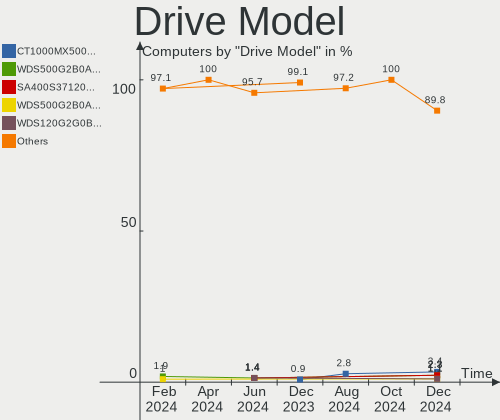
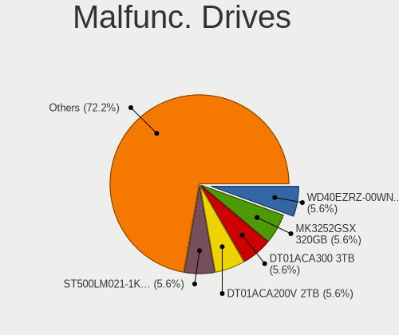
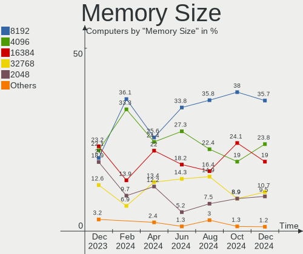
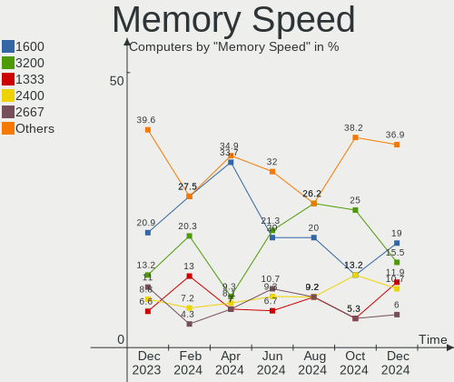
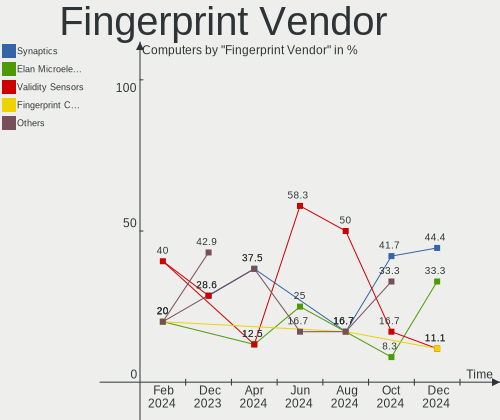

FreeBSD - Hardware Trends
-------------------------

A project to identify most popular hardware characteristics and track their change
over time based on data collected by BSD users at https://BSD-Hardware.info.

Anyone can contribute to this report by the [hw-probe](https://github.com/linuxhw/hw-probe/blob/master/INSTALL.BSD.md) tool:

    hw-probe -all -upload

This is a report for all computer types. See also reports for [desktops](/Dist/FreeBSD/Desktop/README.md) and [notebooks](/Dist/FreeBSD/Notebook/README.md).

This report is for one last month. Overall report since the beginning of time: [TestCoverage](https://github.com/bsdhw/TestCoverage)

Period: Nov, 2022.

Contents
--------

* [ System ](#system)
  - [ OS                       ](#os)
  - [ OS Family                ](#os-family)
  - [ Arch                     ](#arch)
  - [ DE                       ](#de)
  - [ Display Server           ](#display-server)
  - [ Display Manager          ](#display-manager)
  - [ OS Lang                  ](#os-lang)
  - [ Boot Mode                ](#boot-mode)
  - [ Filesystem               ](#filesystem)
  - [ Part. scheme             ](#part-scheme)

* [ Board ](#board)
  - [ Vendor                   ](#vendor)
  - [ Model                    ](#model)
  - [ Model Family             ](#model-family)
  - [ MFG Year                 ](#mfg-year)
  - [ Form Factor              ](#form-factor)
  - [ Coreboot                 ](#coreboot)
  - [ RAM Size                 ](#ram-size)
  - [ RAM Used                 ](#ram-used)
  - [ Total Drives             ](#total-drives)
  - [ Has CD-ROM               ](#has-cd-rom)
  - [ Has Ethernet             ](#has-ethernet)
  - [ Has WiFi                 ](#has-wifi)
  - [ Has Bluetooth            ](#has-bluetooth)

* [ Location ](#location)
  - [ Country                  ](#country)
  - [ City                     ](#city)

* [ Drives ](#drives)
  - [ Drive Vendor             ](#drive-vendor)
  - [ Drive Model              ](#drive-model)
  - [ HDD Vendor               ](#hdd-vendor)
  - [ SSD Vendor               ](#ssd-vendor)
  - [ Drive Kind               ](#drive-kind)
  - [ Drive Connector          ](#drive-connector)
  - [ Drive Size               ](#drive-size)
  - [ Space Total              ](#space-total)
  - [ Space Used               ](#space-used)
  - [ Malfunc. Drives          ](#malfunc-drives)
  - [ Malfunc. Drive Vendor    ](#malfunc-drive-vendor)
  - [ Malfunc. HDD Vendor      ](#malfunc-hdd-vendor)
  - [ Malfunc. Drive Kind      ](#malfunc-drive-kind)
  - [ Failed Drives            ](#failed-drives)
  - [ Failed Drive Vendor      ](#failed-drive-vendor)
  - [ Drive Status             ](#drive-status)

* [ Storage controller ](#storage-controller)
  - [ Storage Vendor           ](#storage-vendor)
  - [ Storage Model            ](#storage-model)
  - [ Storage Kind             ](#storage-kind)

* [ Processor ](#processor)
  - [ CPU Vendor               ](#cpu-vendor)
  - [ CPU Model                ](#cpu-model)
  - [ CPU Model Family         ](#cpu-model-family)
  - [ CPU Cores                ](#cpu-cores)
  - [ CPU Sockets              ](#cpu-sockets)
  - [ CPU Threads              ](#cpu-threads)
  - [ CPU Microarch            ](#cpu-microarch)

* [ Graphics ](#graphics)
  - [ GPU Vendor               ](#gpu-vendor)
  - [ GPU Model                ](#gpu-model)
  - [ GPU Combo                ](#gpu-combo)
  - [ GPU Driver               ](#gpu-driver)
  - [ GPU Memory               ](#gpu-memory)

* [ Monitor ](#monitor)
  - [ Monitor Vendor           ](#monitor-vendor)
  - [ Monitor Model            ](#monitor-model)
  - [ Monitor Resolution       ](#monitor-resolution)
  - [ Monitor Diagonal         ](#monitor-diagonal)
  - [ Monitor Width            ](#monitor-width)
  - [ Aspect Ratio             ](#aspect-ratio)
  - [ Monitor Area             ](#monitor-area)
  - [ Pixel Density            ](#pixel-density)
  - [ Multiple Monitors        ](#multiple-monitors)

* [ Network ](#network)
  - [ Net Controller Vendor    ](#net-controller-vendor)
  - [ Net Controller Model     ](#net-controller-model)
  - [ Wireless Vendor          ](#wireless-vendor)
  - [ Wireless Model           ](#wireless-model)
  - [ Ethernet Vendor          ](#ethernet-vendor)
  - [ Ethernet Model           ](#ethernet-model)
  - [ Net Controller Kind      ](#net-controller-kind)
  - [ Used Controller          ](#used-controller)
  - [ NICs                     ](#nics)
  - [ IPv6                     ](#ipv6)

* [ Bluetooth ](#bluetooth)
  - [ Bluetooth Vendor         ](#bluetooth-vendor)
  - [ Bluetooth Model          ](#bluetooth-model)

* [ Sound ](#sound)
  - [ Sound Vendor             ](#sound-vendor)
  - [ Sound Model              ](#sound-model)

* [ Memory ](#memory)
  - [ Memory Vendor            ](#memory-vendor)
  - [ Memory Model             ](#memory-model)
  - [ Memory Kind              ](#memory-kind)
  - [ Memory Form Factor       ](#memory-form-factor)
  - [ Memory Size              ](#memory-size)
  - [ Memory Speed             ](#memory-speed)

* [ Printers & scanners ](#printers--scanners)
  - [ Printer Vendor           ](#printer-vendor)
  - [ Printer Model            ](#printer-model)
  - [ Scanner Vendor           ](#scanner-vendor)
  - [ Scanner Model            ](#scanner-model)

* [ Camera ](#camera)
  - [ Camera Vendor            ](#camera-vendor)
  - [ Camera Model             ](#camera-model)

* [ Security ](#security)
  - [ Fingerprint Vendor       ](#fingerprint-vendor)
  - [ Fingerprint Model        ](#fingerprint-model)
  - [ Chipcard Vendor          ](#chipcard-vendor)
  - [ Chipcard Model           ](#chipcard-model)

* [ Unsupported ](#unsupported)
  - [ Unsupported Devices      ](#unsupported-devices)
  - [ Unsupported Device Types ](#unsupported-device-types)

System
------

OS
--

Installed operating systems

| Name                 | Computers | Percent |
|----------------------|-----------|---------|
| FreeBSD 13.1-p4      | 19        | 26.76%  |
| FreeBSD 13.1-p3      | 13        | 18.31%  |
| FreeBSD 13.1         | 11        | 15.49%  |
| FreeBSD 13.1-p2      | 10        | 14.08%  |
| FreeBSD 14.0-CURRENT | 4         | 5.63%   |
| FreeBSD 12.3-p2      | 4         | 5.63%   |
| FreeBSD 12.3-p7      | 2         | 2.82%   |
| FreeBSD 12.1-p13     | 2         | 2.82%   |
| FreeBSD 13.1-STABLE  | 1         | 1.41%   |
| FreeBSD 13.1-RC4     | 1         | 1.41%   |
| FreeBSD 13.1-p1      | 1         | 1.41%   |
| FreeBSD 12.3-p9      | 1         | 1.41%   |
| FreeBSD 12.3-p8      | 1         | 1.41%   |
| FreeBSD 12.3         | 1         | 1.41%   |

OS Family
---------

OS without a version

| Name    | Computers | Percent |
|---------|-----------|---------|
| FreeBSD | 71        | 100%    |

Arch
----

OS architecture (x86_64, i586, etc.)

| Name  | Computers | Percent |
|-------|-----------|---------|
| amd64 | 70        | 98.59%  |
| arm   | 1         | 1.41%   |

DE
--

Desktop Environment

| Name      | Computers | Percent |
|-----------|-----------|---------|
| Console   | 34        | 47.89%  |
| XFCE      | 12        | 16.9%   |
| KDE5      | 11        | 15.49%  |
| MATE      | 4         | 5.63%   |
| i3        | 3         | 4.23%   |
| Fluxbox   | 2         | 2.82%   |
| LXQt      | 1         | 1.41%   |
| GNUstep   | 1         | 1.41%   |
| GNOME     | 1         | 1.41%   |
| Cinnamon  | 1         | 1.41%   |
| AwesomeWM | 1         | 1.41%   |

Display Server
--------------

X11 or Wayland

| Name    | Computers | Percent |
|---------|-----------|---------|
| Console | 36        | 50.7%   |
| X11     | 33        | 46.48%  |
| Wayland | 2         | 2.82%   |

Display Manager
---------------

SDDM, LightDM, etc.

| Name    | Computers | Percent |
|---------|-----------|---------|
| Console | 40        | 56.34%  |
| SDDM    | 11        | 15.49%  |
| SLiM    | 7         | 9.86%   |
| XDM     | 6         | 8.45%   |
| LightDM | 5         | 7.04%   |
| GDM     | 2         | 2.82%   |

OS Lang
-------

Language

| Lang    | Computers | Percent |
|---------|-----------|---------|
| C       | 44        | 61.97%  |
| Unknown | 12        | 16.9%   |
| en_US   | 8         | 11.27%  |
| zh_CN   | 2         | 2.82%   |
| nl_NL   | 2         | 2.82%   |
| pt_BR   | 1         | 1.41%   |
| fr_FR   | 1         | 1.41%   |
| en_CA   | 1         | 1.41%   |

Boot Mode
---------

EFI or BIOS

| Mode | Computers | Percent |
|------|-----------|---------|
| EFI  | 50        | 70.42%  |
| BIOS | 21        | 29.58%  |

Filesystem
----------

Type of filesystem

| Type | Computers | Percent |
|------|-----------|---------|
| Zfs  | 58        | 81.69%  |
| Ufs  | 13        | 18.31%  |

Part. scheme
------------

Scheme of partitioning

| Type | Computers | Percent |
|------|-----------|---------|
| GPT  | 68        | 95.77%  |
| MBR  | 3         | 4.23%   |

Board
-----

Vendor
------

Motherboard manufacturer

| Name                | Computers | Percent |
|---------------------|-----------|---------|
| Lenovo              | 9         | 12.68%  |
| Dell                | 9         | 12.68%  |
| ASUSTek Computer    | 9         | 12.68%  |
| Hewlett-Packard     | 7         | 9.86%   |
| ASRock              | 6         | 8.45%   |
| Shuttle             | 3         | 4.23%   |
| MSI                 | 3         | 4.23%   |
| Samsung Electronics | 2         | 2.82%   |
| Google              | 2         | 2.82%   |
| Gigabyte Technology | 2         | 2.82%   |
| Fujitsu             | 2         | 2.82%   |
| ASRockRack          | 2         | 2.82%   |
| Apple               | 2         | 2.82%   |
| Acer                | 2         | 2.82%   |
| ZOTAC               | 1         | 1.41%   |
| TOPFEEL             | 1         | 1.41%   |
| Supermicro          | 1         | 1.41%   |
| Sony                | 1         | 1.41%   |
| Panasonic           | 1         | 1.41%   |
| ONDA                | 1         | 1.41%   |
| Medion              | 1         | 1.41%   |
| Huanan              | 1         | 1.41%   |
| Foxconn             | 1         | 1.41%   |
| BESSTAR Tech        | 1         | 1.41%   |
| Unknown             | 1         | 1.41%   |

Model
-----

Motherboard model

| Name                                               | Computers | Percent |
|----------------------------------------------------|-----------|---------|
| HP t620 Quad Core TC                               | 3         | 4.23%   |
| Dell OEM-R 720xd                                   | 3         | 4.23%   |
| ASRock Q1900B-ITX                                  | 3         | 4.23%   |
| Fujitsu FUTRO S920                                 | 2         | 2.82%   |
| ZOTAC ZBOX-QCM7T3000/EN072080S/EN072070S/EN052060C | 1         | 1.41%   |
| TOPFEEL Topone series                              | 1         | 1.41%   |
| Supermicro Super Server                            | 1         | 1.41%   |
| Sony SVP1321V9RB                                   | 1         | 1.41%   |
| Shuttle XH270                                      | 1         | 1.41%   |
| Shuttle SZ270R9                                    | 1         | 1.41%   |
| Shuttle SZ270                                      | 1         | 1.41%   |
| Samsung 750TDA                                     | 1         | 1.41%   |
| Samsung 3570R/370R/470R/450R/510R/4450RV           | 1         | 1.41%   |
| Panasonic CF-31-5                                  | 1         | 1.41%   |
| ONDA N78G5D3 Ver:5.00                              | 1         | 1.41%   |
| MSI MS-7D46                                        | 1         | 1.41%   |
| MSI MS-7B89                                        | 1         | 1.41%   |
| MSI MS-7817                                        | 1         | 1.41%   |
| Medion E15415                                      | 1         | 1.41%   |
| Lenovo Yoga Slim 7 Pro 14ACH5 O 82N5               | 1         | 1.41%   |
| Lenovo YangTianM6880N                              | 1         | 1.41%   |
| Lenovo ThinkStation E31 255526G                    | 1         | 1.41%   |
| Lenovo ThinkPad X270 W10DG 20K5S0PY04              | 1         | 1.41%   |
| Lenovo ThinkPad X270 20HMCTO1WW                    | 1         | 1.41%   |
| Lenovo ThinkPad T430 2347G7G                       | 1         | 1.41%   |
| Lenovo ThinkPad T430 23446FP                       | 1         | 1.41%   |
| Lenovo Legion Y530-15ICH 81FV                      | 1         | 1.41%   |
| Lenovo IdeaPad 110-15ACL 80TJ                      | 1         | 1.41%   |
| Huanan X99-F8D V2.4                                | 1         | 1.41%   |
| HP ProLiant DL180 G6                               | 1         | 1.41%   |
| HP ProBook 4540s                                   | 1         | 1.41%   |
| HP EliteBook 8570p                                 | 1         | 1.41%   |
| HP EliteBook 840 G3                                | 1         | 1.41%   |
| Google Zako                                        | 1         | 1.41%   |
| Google Akemi                                       | 1         | 1.41%   |
| Gigabyte Z97X-UD5H                                 | 1         | 1.41%   |
| Gigabyte Z590I AORUS ULTRA                         | 1         | 1.41%   |
| Foxconn p6823w                                     | 1         | 1.41%   |
| Dell XPS 13 9343                                   | 1         | 1.41%   |
| Dell Vostro 3550                                   | 1         | 1.41%   |

Model Family
------------

Motherboard model prefix

| Name                  | Computers | Percent |
|-----------------------|-----------|---------|
| Lenovo ThinkPad       | 4         | 5.63%   |
| HP t620               | 3         | 4.23%   |
| Dell OEM-R            | 3         | 4.23%   |
| ASRock Q1900B-ITX     | 3         | 4.23%   |
| HP EliteBook          | 2         | 2.82%   |
| Fujitsu FUTRO         | 2         | 2.82%   |
| Dell Precision        | 2         | 2.82%   |
| ASUS PRIME            | 2         | 2.82%   |
| ZOTAC ZBOX-QCM7T3000  | 1         | 1.41%   |
| TOPFEEL Topone        | 1         | 1.41%   |
| Supermicro Super      | 1         | 1.41%   |
| Sony SVP1321V9RB      | 1         | 1.41%   |
| Shuttle XH270         | 1         | 1.41%   |
| Shuttle SZ270R9       | 1         | 1.41%   |
| Shuttle SZ270         | 1         | 1.41%   |
| Samsung 750TDA        | 1         | 1.41%   |
| Samsung 3570R         | 1         | 1.41%   |
| Panasonic CF-31-5     | 1         | 1.41%   |
| ONDA N78G5D3          | 1         | 1.41%   |
| MSI MS-7D46           | 1         | 1.41%   |
| MSI MS-7B89           | 1         | 1.41%   |
| MSI MS-7817           | 1         | 1.41%   |
| Medion E15415         | 1         | 1.41%   |
| Lenovo Yoga           | 1         | 1.41%   |
| Lenovo YangTianM6880N | 1         | 1.41%   |
| Lenovo ThinkStation   | 1         | 1.41%   |
| Lenovo Legion         | 1         | 1.41%   |
| Lenovo IdeaPad        | 1         | 1.41%   |
| Huanan X99-F8D        | 1         | 1.41%   |
| HP ProLiant           | 1         | 1.41%   |
| HP ProBook            | 1         | 1.41%   |
| Google Zako           | 1         | 1.41%   |
| Google Akemi          | 1         | 1.41%   |
| Gigabyte Z97X-UD5H    | 1         | 1.41%   |
| Gigabyte Z590I        | 1         | 1.41%   |
| Foxconn p6823w        | 1         | 1.41%   |
| Dell XPS              | 1         | 1.41%   |
| Dell Vostro           | 1         | 1.41%   |
| Dell OptiPlex         | 1         | 1.41%   |
| Dell Latitude         | 1         | 1.41%   |

MFG Year
--------

Motherboard manufacture year

| Year    | Computers | Percent |
|---------|-----------|---------|
| 2014    | 13        | 18.31%  |
| 2019    | 9         | 12.68%  |
| 2018    | 7         | 9.86%   |
| 2021    | 6         | 8.45%   |
| 2022    | 5         | 7.04%   |
| 2017    | 5         | 7.04%   |
| 2016    | 5         | 7.04%   |
| 2020    | 4         | 5.63%   |
| 2013    | 4         | 5.63%   |
| 2012    | 3         | 4.23%   |
| 2015    | 2         | 2.82%   |
| 2011    | 2         | 2.82%   |
| 2010    | 2         | 2.82%   |
| 2008    | 2         | 2.82%   |
| 2009    | 1         | 1.41%   |
| Unknown | 1         | 1.41%   |

Form Factor
-----------

Physical design of the computer

| Name     | Computers | Percent |
|----------|-----------|---------|
| Desktop  | 42        | 59.15%  |
| Notebook | 22        | 30.99%  |
| Server   | 5         | 7.04%   |
| Mini pc  | 2         | 2.82%   |

Coreboot
--------

Have coreboot on board

| Used | Computers | Percent |
|------|-----------|---------|
| No   | 69        | 97.18%  |
| Yes  | 2         | 2.82%   |

RAM Size
--------

Total RAM memory

| Size in GB      | Computers | Percent |
|-----------------|-----------|---------|
| 8.01-16.0       | 24        | 33.8%   |
| 4.01-8.0        | 13        | 18.31%  |
| 16.01-24.0      | 13        | 18.31%  |
| 32.01-64.0      | 9         | 12.68%  |
| 64.01-256.0     | 9         | 12.68%  |
| 2.01-3.0        | 2         | 2.82%   |
| More than 256.0 | 1         | 1.41%   |

RAM Used
--------

Used RAM memory

| Used GB   | Computers | Percent |
|-----------|-----------|---------|
| 0.01-0.5  | 27        | 38.03%  |
| 0.51-1.0  | 22        | 30.99%  |
| 1.01-2.0  | 12        | 16.9%   |
| 3.01-4.0  | 4         | 5.63%   |
| 2.01-3.0  | 3         | 4.23%   |
| 8.01-16.0 | 2         | 2.82%   |
| 4.01-8.0  | 1         | 1.41%   |

Total Drives
------------

Number of drives on board

| Drives | Computers | Percent |
|--------|-----------|---------|
| 1      | 32        | 45.07%  |
| 2      | 14        | 19.72%  |
| 3      | 10        | 14.08%  |
| 4      | 6         | 8.45%   |
| 0      | 6         | 8.45%   |
| 13     | 1         | 1.41%   |
| 11     | 1         | 1.41%   |
| 5      | 1         | 1.41%   |

Has CD-ROM
----------

Has CD-ROM on board

| Presented | Computers | Percent |
|-----------|-----------|---------|
| No        | 58        | 81.69%  |
| Yes       | 13        | 18.31%  |

Has Ethernet
------------

Has Ethernet on board

| Presented | Computers | Percent |
|-----------|-----------|---------|
| Yes       | 63        | 88.73%  |
| No        | 8         | 11.27%  |

Has WiFi
--------

Has WiFi module

| Presented | Computers | Percent |
|-----------|-----------|---------|
| No        | 42        | 59.15%  |
| Yes       | 29        | 40.85%  |

Has Bluetooth
-------------

Has Bluetooth module

| Presented | Computers | Percent |
|-----------|-----------|---------|
| No        | 43        | 60.56%  |
| Yes       | 28        | 39.44%  |

Location
--------

Country
-------

Geographic location (country)

| Country     | Computers | Percent |
|-------------|-----------|---------|
| USA         | 13        | 18.31%  |
| Poland      | 9         | 12.68%  |
| Germany     | 8         | 11.27%  |
| Russia      | 7         | 9.86%   |
| UK          | 4         | 5.63%   |
| China       | 4         | 5.63%   |
| Netherlands | 3         | 4.23%   |
| Canada      | 3         | 4.23%   |
| Japan       | 2         | 2.82%   |
| Italy       | 2         | 2.82%   |
| France      | 2         | 2.82%   |
| Thailand    | 1         | 1.41%   |
| Taiwan      | 1         | 1.41%   |
| Spain       | 1         | 1.41%   |
| Slovenia    | 1         | 1.41%   |
| Mexico      | 1         | 1.41%   |
| Malta       | 1         | 1.41%   |
| India       | 1         | 1.41%   |
| Guadeloupe  | 1         | 1.41%   |
| Greece      | 1         | 1.41%   |
| Finland     | 1         | 1.41%   |
| Denmark     | 1         | 1.41%   |
| Bulgaria    | 1         | 1.41%   |
| Brazil      | 1         | 1.41%   |
| Austria     | 1         | 1.41%   |

City
----

Geographic location (city)

| City                   | Computers | Percent |
|------------------------|-----------|---------|
| Ludwigsburg            | 6         | 8.45%   |
| Moscow                 | 4         | 5.63%   |
| Papendrecht            | 3         | 4.23%   |
| Lezno                  | 3         | 4.23%   |
| Gdynia                 | 3         | 4.23%   |
| Gdansk                 | 3         | 4.23%   |
| Springfield            | 2         | 2.82%   |
| Salem                  | 2         | 2.82%   |
| Redmond                | 2         | 2.82%   |
| London                 | 2         | 2.82%   |
| Jiangbei               | 2         | 2.82%   |
| Youngstown             | 1         | 1.41%   |
| Xanthi                 | 1         | 1.41%   |
| Winnipeg               | 1         | 1.41%   |
| Wenatchee              | 1         | 1.41%   |
| Toronto                | 1         | 1.41%   |
| Tlalnepantla           | 1         | 1.41%   |
| Taoyuan District       | 1         | 1.41%   |
| Taastrup               | 1         | 1.41%   |
| Swieqi                 | 1         | 1.41%   |
| St Petersburg          | 1         | 1.41%   |
| Shenzhen               | 1         | 1.41%   |
| Sarcelles              | 1         | 1.41%   |
| Sant Cugat del Vallès | 1         | 1.41%   |
| San Vincenzo La Costa  | 1         | 1.41%   |
| Samokov                | 1         | 1.41%   |
| Salisbury              | 1         | 1.41%   |
| Saint Paul             | 1         | 1.41%   |
| Rio de Janeiro         | 1         | 1.41%   |
| Queens                 | 1         | 1.41%   |
| New Delhi              | 1         | 1.41%   |
| Neumünster            | 1         | 1.41%   |
| Narashino-shi          | 1         | 1.41%   |
| Nakano                 | 1         | 1.41%   |
| Lexington              | 1         | 1.41%   |
| Le Gosier              | 1         | 1.41%   |
| Kingsburg              | 1         | 1.41%   |
| Irkutsk                | 1         | 1.41%   |
| Innsbruck              | 1         | 1.41%   |
| Hindman                | 1         | 1.41%   |

Drives
------

Drive Vendor
------------

Hard drive vendors

| Vendor              | Computers | Drives | Percent |
|---------------------|-----------|--------|---------|
| WDC                 | 18        | 48     | 18.75%  |
| Samsung Electronics | 15        | 24     | 15.63%  |
| Seagate             | 13        | 17     | 13.54%  |
| Crucial             | 8         | 9      | 8.33%   |
| Toshiba             | 5         | 7      | 5.21%   |
| SanDisk             | 5         | 5      | 5.21%   |
| Intel               | 4         | 4      | 4.17%   |
| Kingston            | 3         | 4      | 3.13%   |
| Hitachi             | 3         | 3      | 3.13%   |
| HGST                | 3         | 4      | 3.13%   |
| GOODRAM             | 3         | 4      | 3.13%   |
| Phison              | 2         | 2      | 2.08%   |
| Intenso             | 2         | 2      | 2.08%   |
| Innodisk            | 2         | 2      | 2.08%   |
| Transcend           | 1         | 1      | 1.04%   |
| SK hynix            | 1         | 1      | 1.04%   |
| Silicon Motion      | 1         | 1      | 1.04%   |
| PNY                 | 1         | 1      | 1.04%   |
| Patriot             | 1         | 1      | 1.04%   |
| LITEON              | 1         | 1      | 1.04%   |
| KingSpec            | 1         | 1      | 1.04%   |
| Hewlett-Packard     | 1         | 1      | 1.04%   |
| Corsair             | 1         | 1      | 1.04%   |
| A-DATA Technology   | 1         | 1      | 1.04%   |

Drive Model
-----------

Hard drive models

| Model                           | Computers | Percent |
|---------------------------------|-----------|---------|
| SanDisk SDSA6MM-008G-1006 8GB   | 3         | 2.63%   |
| Crucial CT1000MX500SSD1 1TB     | 3         | 2.63%   |
| WDC WDS240G2G0A-00JH30 240GB    | 2         | 1.75%   |
| Toshiba MQ01ABF050 500GB        | 2         | 1.75%   |
| Seagate ST4000DM000-1F2168 4TB  | 2         | 1.75%   |
| Samsung SSD 860 EVO 500GB       | 2         | 1.75%   |
| Innodisk DEMSR- 08GB mSATA 3ME3 | 2         | 1.75%   |
| Crucial CT1000BX500SSD1 1TB     | 2         | 1.75%   |
| WDC WDS500G2B0C-00PXH0 500GB    | 1         | 0.88%   |
| WDC WDS250G2B0B-00YS70 250GB    | 1         | 0.88%   |
| WDC WDS100T3X0C-00SJG0 1TB      | 1         | 0.88%   |
| WDC WDS100T2B0C-00PXH0 1TB      | 1         | 0.88%   |
| WDC WD80EMAZ-00WJTA0 8TB        | 1         | 0.88%   |
| WDC WD80EFZX-68UW8N0 8TB        | 1         | 0.88%   |
| WDC WD80EFAX-68LHPN0 8TB        | 1         | 0.88%   |
| WDC WD80EDBZ-11B0ZA0 8TB        | 1         | 0.88%   |
| WDC WD5003AZEX-00MK2A0 500GB    | 1         | 0.88%   |
| WDC WD5003AZEX-00K3CA0 500GB    | 1         | 0.88%   |
| WDC WD5003AZEX-00K1GA0 500GB    | 1         | 0.88%   |
| WDC WD5000LPCX-24C6HT0 500GB    | 1         | 0.88%   |
| WDC WD5000AAKX-603CA0 500GB     | 1         | 0.88%   |
| WDC WD5000AAKS-00A7B2 500GB     | 1         | 0.88%   |
| WDC WD40PURZ-85TTDY0 4TB        | 1         | 0.88%   |
| WDC WD40EZRZ-22GXCB0 4TB        | 1         | 0.88%   |
| WDC WD30EZRX-00D8PB0 3TB        | 1         | 0.88%   |
| WDC WD3000JS-63PDB1 304GB       | 1         | 0.88%   |
| WDC WD20SDZW-11JJ8S0 2TB        | 1         | 0.88%   |
| WDC WD20SDRW-11VUUS0 2TB        | 1         | 0.88%   |
| WDC WD20NMVW-59EDZS7 2TB        | 1         | 0.88%   |
| WDC WD2000FYYZ-01UL1B0 2TB      | 1         | 0.88%   |
| WDC WD15EADS-00P8B0 1.5TB       | 1         | 0.88%   |
| WDC WD120EMFZ-11A6JA0 12TB      | 1         | 0.88%   |
| WDC WD120EMAZ-11BLFA0 12TB      | 1         | 0.88%   |
| WDC WD10JPCX-24UE4T0 1TB        | 1         | 0.88%   |
| WDC WD10EZEX-60WN4A1 1TB        | 1         | 0.88%   |
| WDC WD10EFRX-68FYTN0 1TB        | 1         | 0.88%   |
| Transcend TS8GSSD500 8GB        | 1         | 0.88%   |
| Toshiba THNSNJ256GCSY 256GB     | 1         | 0.88%   |
| Toshiba MQ01ABF032 320GB        | 1         | 0.88%   |
| Toshiba MK3254GSY 320GB         | 1         | 0.88%   |

HDD Vendor
----------

Hard disk drive vendors

| Vendor  | Computers | Drives | Percent |
|---------|-----------|--------|---------|
| WDC     | 13        | 39     | 37.14%  |
| Seagate | 12        | 15     | 34.29%  |
| Toshiba | 4         | 6      | 11.43%  |
| Hitachi | 3         | 3      | 8.57%   |
| HGST    | 3         | 4      | 8.57%   |

SSD Vendor
----------

Solid state drive vendors

| Vendor              | Computers | Drives | Percent |
|---------------------|-----------|--------|---------|
| Samsung Electronics | 11        | 17     | 22%     |
| Crucial             | 8         | 9      | 16%     |
| SanDisk             | 5         | 5      | 10%     |
| WDC                 | 3         | 6      | 6%      |
| Kingston            | 3         | 4      | 6%      |
| Intel               | 3         | 3      | 6%      |
| GOODRAM             | 3         | 4      | 6%      |
| Intenso             | 2         | 2      | 4%      |
| Innodisk            | 2         | 2      | 4%      |
| Transcend           | 1         | 1      | 2%      |
| Toshiba             | 1         | 1      | 2%      |
| SK hynix            | 1         | 1      | 2%      |
| Seagate             | 1         | 1      | 2%      |
| PNY                 | 1         | 1      | 2%      |
| Patriot             | 1         | 1      | 2%      |
| LITEON              | 1         | 1      | 2%      |
| KingSpec            | 1         | 1      | 2%      |
| Hewlett-Packard     | 1         | 1      | 2%      |
| A-DATA Technology   | 1         | 1      | 2%      |

Drive Kind
----------

HDD or SSD

| Kind | Computers | Drives | Percent |
|------|-----------|--------|---------|
| SSD  | 41        | 62     | 47.67%  |
| HDD  | 30        | 67     | 34.88%  |
| NVMe | 15        | 16     | 17.44%  |

Drive Connector
---------------

SATA, SAS, NVMe, etc.

| Type | Computers | Drives | Percent |
|------|-----------|--------|---------|
| SATA | 58        | 129    | 79.45%  |
| NVMe | 15        | 16     | 20.55%  |

Drive Size
----------

Size of hard drive

| Size in TB | Computers | Drives | Percent |
|------------|-----------|--------|---------|
| 0.01-0.5   | 43        | 71     | 55.84%  |
| 0.51-1.0   | 17        | 25     | 22.08%  |
| 3.01-4.0   | 6         | 8      | 7.79%   |
| 1.01-2.0   | 6         | 12     | 7.79%   |
| 2.01-3.0   | 2         | 2      | 2.6%    |
| 4.01-10.0  | 2         | 9      | 2.6%    |
| 10.01-20.0 | 1         | 2      | 1.3%    |

Space Total
-----------

Amount of disk space available on the file system

| Size in GB     | Computers | Percent |
|----------------|-----------|---------|
| 251-500        | 17        | 23.94%  |
| 101-250        | 16        | 22.54%  |
| 51-100         | 13        | 18.31%  |
| 501-1000       | 10        | 14.08%  |
| 1-20           | 6         | 8.45%   |
| 21-50          | 4         | 5.63%   |
| 1001-2000      | 3         | 4.23%   |
| More than 3000 | 1         | 1.41%   |
| 2001-3000      | 1         | 1.41%   |

Space Used
----------

Amount of used disk space

| Used GB  | Computers | Percent |
|----------|-----------|---------|
| 1-20     | 58        | 81.69%  |
| 21-50    | 6         | 8.45%   |
| 251-500  | 3         | 4.23%   |
| 51-100   | 3         | 4.23%   |
| 501-1000 | 1         | 1.41%   |

Malfunc. Drives
---------------

Drive models with a malfunction

| Model                                     | Computers | Drives | Percent |
|-------------------------------------------|-----------|--------|---------|
| WDC WD30EZRX-00D8PB0 3TB                  | 1         | 1      | 7.14%   |
| WDC WD10EZEX-60WN4A1 1TB                  | 1         | 1      | 7.14%   |
| Toshiba MQ01ABF032 320GB                  | 1         | 1      | 7.14%   |
| Toshiba MK3254GSY 320GB                   | 1         | 1      | 7.14%   |
| SK hynix SC308 SATA 128GB                 | 1         | 1      | 7.14%   |
| Seagate ST9750420AS 752GB                 | 1         | 1      | 7.14%   |
| Seagate ST9320325ASG 320GB                | 1         | 1      | 7.14%   |
| Samsung Electronics SSD PM851 mSATA 256GB | 1         | 1      | 7.14%   |
| LITEON IT LST-16S9G-HP 16GB               | 1         | 1      | 7.14%   |
| Intel SSDSC2CT120A3 120GB                 | 1         | 1      | 7.14%   |
| Hitachi HDS721010CLA332 1TB               | 1         | 1      | 7.14%   |
| HGST HTS725050A7E630 500GB                | 1         | 1      | 7.14%   |
| HGST HTS721010A9E630 1TB                  | 1         | 1      | 7.14%   |
| A-DATA Technology SU650 120GB             | 1         | 1      | 7.14%   |

Malfunc. Drive Vendor
---------------------

Vendors of faulty drives

| Vendor              | Computers | Drives | Percent |
|---------------------|-----------|--------|---------|
| WDC                 | 2         | 2      | 14.29%  |
| Toshiba             | 2         | 2      | 14.29%  |
| Seagate             | 2         | 2      | 14.29%  |
| HGST                | 2         | 2      | 14.29%  |
| SK hynix            | 1         | 1      | 7.14%   |
| Samsung Electronics | 1         | 1      | 7.14%   |
| LITEON              | 1         | 1      | 7.14%   |
| Intel               | 1         | 1      | 7.14%   |
| Hitachi             | 1         | 1      | 7.14%   |
| A-DATA Technology   | 1         | 1      | 7.14%   |

Malfunc. HDD Vendor
-------------------

Vendors of faulty HDD drives

| Vendor  | Computers | Drives | Percent |
|---------|-----------|--------|---------|
| WDC     | 2         | 2      | 22.22%  |
| Toshiba | 2         | 2      | 22.22%  |
| Seagate | 2         | 2      | 22.22%  |
| HGST    | 2         | 2      | 22.22%  |
| Hitachi | 1         | 1      | 11.11%  |

Malfunc. Drive Kind
-------------------

Kinds of faulty drives

| Kind | Computers | Drives | Percent |
|------|-----------|--------|---------|
| HDD  | 9         | 9      | 64.29%  |
| SSD  | 5         | 5      | 35.71%  |

Failed Drives
-------------

Failed drive models

Zero info for selected period =(

Failed Drive Vendor
-------------------

Failed drive vendors

Zero info for selected period =(

Drive Status
------------

Number of failed and malfunc. drives

| Status   | Computers | Drives | Percent |
|----------|-----------|--------|---------|
| Works    | 56        | 129    | 80%     |
| Malfunc  | 12        | 14     | 17.14%  |
| Detected | 2         | 2      | 2.86%   |

Storage controller
------------------

Storage Vendor
--------------

Storage controller vendors

| Vendor                   | Computers | Percent |
|--------------------------|-----------|---------|
| Intel                    | 41        | 46.07%  |
| AMD                      | 21        | 23.6%   |
| Samsung Electronics      | 6         | 6.74%   |
| Broadcom / LSI           | 5         | 5.62%   |
| SanDisk                  | 3         | 3.37%   |
| Phison Electronics       | 3         | 3.37%   |
| ASMedia Technology       | 3         | 3.37%   |
| Nvidia                   | 2         | 2.25%   |
| Marvell Technology Group | 2         | 2.25%   |
| Silicon Motion           | 1         | 1.12%   |
| Seagate Technology       | 1         | 1.12%   |
| Hewlett-Packard          | 1         | 1.12%   |

Storage Model
-------------

Storage controller models

| Model                                                                          | Computers | Percent |
|--------------------------------------------------------------------------------|-----------|---------|
| AMD FCH SATA Controller [AHCI mode]                                            | 14        | 14.89%  |
| Intel 7 Series Chipset Family 6-port SATA Controller [AHCI mode]               | 5         | 5.32%   |
| AMD 400 Series Chipset SATA Controller                                         | 5         | 5.32%   |
| Intel Atom Processor E3800 Series SATA AHCI Controller                         | 4         | 4.26%   |
| Intel 82801JI (ICH10 Family) SATA AHCI Controller                              | 3         | 3.19%   |
| Intel 8 Series SATA Controller 1 [AHCI mode]                                   | 3         | 3.19%   |
| Intel 200 Series PCH SATA controller [AHCI mode]                               | 3         | 3.19%   |
| Broadcom / LSI MegaRAID SAS 2208 [Thunderbolt]                                 | 3         | 3.19%   |
| ASMedia ASM1062 Serial ATA Controller                                          | 3         | 3.19%   |
| Samsung NVMe SSD Controller SM981/PM981/PM983                                  | 2         | 2.13%   |
| Samsung NVMe SSD Controller SM961/PM961/SM963                                  | 2         | 2.13%   |
| Samsung NVMe SSD Controller 980                                                | 2         | 2.13%   |
| Intel Wildcat Point-LP SATA Controller [AHCI Mode]                             | 2         | 2.13%   |
| Intel Sunrise Point-LP SATA Controller [AHCI mode]                             | 2         | 2.13%   |
| Intel Q170/Q150/B150/H170/H110/Z170/CM236 Chipset SATA Controller [AHCI Mode]  | 2         | 2.13%   |
| Intel Comet Lake SATA AHCI Controller                                          | 2         | 2.13%   |
| Intel C610/X99 series chipset sSATA Controller [AHCI mode]                     | 2         | 2.13%   |
| Intel 6 Series/C200 Series Chipset Family 6 port Mobile SATA AHCI Controller   | 2         | 2.13%   |
| AMD SB7x0/SB8x0/SB9x0 SATA Controller [AHCI mode]                              | 2         | 2.13%   |
| Silicon Motion SM2263EN/SM2263XT SSD Controller                                | 1         | 1.06%   |
| Seagate FireCuda 530 SSD                                                       | 1         | 1.06%   |
| SanDisk WD Blue SN550 NVMe SSD                                                 | 1         | 1.06%   |
| SanDisk WD Black SN750 / PC SN730 NVMe SSD                                     | 1         | 1.06%   |
| SanDisk unknown                                                                | 1         | 1.06%   |
| Phison PS5013 E13 NVMe Controller                                              | 1         | 1.06%   |
| Phison E16 PCIe4 NVMe Controller                                               | 1         | 1.06%   |
| Nvidia MCP89 SATA Controller (AHCI mode)                                       | 1         | 1.06%   |
| Nvidia MCP61 SATA Controller                                                   | 1         | 1.06%   |
| Nvidia MCP61 IDE                                                               | 1         | 1.06%   |
| Marvell Group 88SE9172 SATA 6Gb/s Controller                                   | 1         | 1.06%   |
| Marvell Group 88SE6111/6121 SATA II / PATA Controller                          | 1         | 1.06%   |
| Intel SSD 660P Series                                                          | 1         | 1.06%   |
| Intel NM10/ICH7 Family SATA Controller [IDE mode]                              | 1         | 1.06%   |
| Intel Cannon Lake Mobile PCH SATA AHCI Controller                              | 1         | 1.06%   |
| Intel C600/X79 series chipset 6-Port SATA AHCI Controller                      | 1         | 1.06%   |
| Intel Alder Lake-S PCH SATA Controller [AHCI Mode]                             | 1         | 1.06%   |
| Intel 9 Series Chipset Family SATA Controller [AHCI Mode]                      | 1         | 1.06%   |
| Intel 82801HR/HO/HH (ICH8R/DO/DH) 6 port SATA Controller [AHCI mode]           | 1         | 1.06%   |
| Intel 8 Series/C220 Series Chipset Family 6-port SATA Controller 1 [AHCI mode] | 1         | 1.06%   |
| Intel 7 Series/C210 Series Chipset Family 6-port SATA Controller [AHCI mode]   | 1         | 1.06%   |

Storage Kind
------------

Kind of storage controller (IDE, SATA, NVMe, SAS, ...)

| Kind | Computers | Percent |
|------|-----------|---------|
| SATA | 60        | 70.59%  |
| NVMe | 15        | 17.65%  |
| RAID | 4         | 4.71%   |
| IDE  | 4         | 4.71%   |
| SAS  | 2         | 2.35%   |

Processor
---------

CPU Vendor
----------

Processor vendors

| Vendor | Computers | Percent |
|--------|-----------|---------|
| Intel  | 47        | 66.2%   |
| AMD    | 23        | 32.39%  |
| ARM    | 1         | 1.41%   |

CPU Model
---------

Processor models

| Model                                       | Computers | Percent |
|---------------------------------------------|-----------|---------|
| Intel Xeon CPU E5-2650 v2 @ 2.60GHz         | 3         | 4.23%   |
| Intel Celeron CPU J1900 @ 1.99GHz           | 3         | 4.23%   |
| AMD GX-415GA SOC with Radeon HD Graphics    | 3         | 4.23%   |
| Intel Core i7-6600U CPU @ 2.60GHz           | 2         | 2.82%   |
| Intel Core i7-3520M CPU @ 2.90GHz           | 2         | 2.82%   |
| Intel Core i5-10210U CPU @ 1.60GHz          | 2         | 2.82%   |
| Intel Core i3-6100 CPU @ 3.70GHz            | 2         | 2.82%   |
| AMD Ryzen 9 3900X 12-Core Processor         | 2         | 2.82%   |
| AMD Ryzen 3 2200G with Radeon Vega Graphics | 2         | 2.82%   |
| AMD GX-222GC SOC with Radeon R5E Graphics   | 2         | 2.82%   |
| Intel Xeon CPU E5620 @ 2.40GHz              | 1         | 1.41%   |
| Intel Xeon CPU E5450 @ 3.00GHz              | 1         | 1.41%   |
| Intel Xeon CPU E5-2680 v4 @ 2.40GHz         | 1         | 1.41%   |
| Intel Xeon CPU E5-1620 0 @ 3.60GH           | 1         | 1.41%   |
| Intel Xeon                                  | 1         | 1.41%   |
| Intel Pentium CPU G3220 @ 3.00GHz           | 1         | 1.41%   |
| Intel Core i7-8750H CPU @ 2.20GHz           | 1         | 1.41%   |
| Intel Core i7-6900K CPU @ 3.20GHz           | 1         | 1.41%   |
| Intel Core i7-5600U CPU @ 2.60GHz           | 1         | 1.41%   |
| Intel Core i7-4790K CPU @ 4.00GHz           | 1         | 1.41%   |
| Intel Core i7-4600U CPU @ 2.10GHz           | 1         | 1.41%   |
| Intel Core i7-3632QM CPU @ 2.20GHz          | 1         | 1.41%   |
| Intel Core i7-3612QM CPU @ 2.10GHz          | 1         | 1.41%   |
| Intel Core i7-10750H CPU @ 2.60GHz          | 1         | 1.41%   |
| Intel Core i5-8265U CPU @ 1.60GHz           | 1         | 1.41%   |
| Intel Core i5-7200U CPU @ 2.50GHz           | 1         | 1.41%   |
| Intel Core i5-6600 CPU @ 3.30GHz            | 1         | 1.41%   |
| Intel Core i5-6500 CPU @ 3.20GHz            | 1         | 1.41%   |
| Intel Core i5-5300U CPU @ 2.30GHz           | 1         | 1.41%   |
| Intel Core i5-4200U CPU @ 1.60GHz           | 1         | 1.41%   |
| Intel Core i5-3550 CPU @ 3.30GHz            | 1         | 1.41%   |
| Intel Core i5-3210M CPU @ 2.50GHz           | 1         | 1.41%   |
| Intel Core i5-2520M CPU @ 2.50GHz           | 1         | 1.41%   |
| Intel Core i5-2415M CPU @ 2.30GHz           | 1         | 1.41%   |
| Intel Core i3-7100 CPU @ 3.90GHz            | 1         | 1.41%   |
| Intel Core 2 Quad CPU Q6600 @ 2.40GHz       | 1         | 1.41%   |
| Intel Core 2 Duo CPU P8800 @ 2.66GHz        | 1         | 1.41%   |
| Intel Core 2 Duo CPU E7500 @ 2.93GHz        | 1         | 1.41%   |
| Intel Celeron CPU N2840 @ 2.16GHz           | 1         | 1.41%   |
| Intel Celeron 2955U @ 1.40GHz               | 1         | 1.41%   |

CPU Model Family
----------------

Processor model prefix

| Model             | Computers | Percent |
|-------------------|-----------|---------|
| Intel Core i7     | 12        | 16.9%   |
| Intel Core i5     | 12        | 16.9%   |
| Intel Xeon        | 8         | 11.27%  |
| Intel Celeron     | 5         | 7.04%   |
| AMD GX            | 5         | 7.04%   |
| AMD Ryzen 7       | 4         | 5.63%   |
| Other             | 3         | 4.23%   |
| Intel Core i3     | 3         | 4.23%   |
| AMD Ryzen 3       | 3         | 4.23%   |
| Intel Core 2 Duo  | 2         | 2.82%   |
| AMD Ryzen 9       | 2         | 2.82%   |
| AMD Phenom II X6  | 2         | 2.82%   |
| AMD EPYC          | 2         | 2.82%   |
| Intel Pentium     | 1         | 1.41%   |
| Intel Core 2 Quad | 1         | 1.41%   |
| ARM Cortex        | 1         | 1.41%   |
| AMD Ryzen 5       | 1         | 1.41%   |
| AMD Phenom II X2  | 1         | 1.41%   |
| AMD Athlon II X4  | 1         | 1.41%   |
| AMD Athlon        | 1         | 1.41%   |
| AMD A8            | 1         | 1.41%   |

CPU Cores
---------

Number of processor cores

| Number  | Computers | Percent |
|---------|-----------|---------|
| 4       | 26        | 36.62%  |
| 2       | 22        | 30.99%  |
| 16      | 8         | 11.27%  |
| 6       | 6         | 8.45%   |
| Unknown | 3         | 4.23%   |
| 24      | 2         | 2.82%   |
| 8       | 2         | 2.82%   |
| 28      | 1         | 1.41%   |
| 12      | 1         | 1.41%   |

CPU Sockets
-----------

Number of sockets

| Number  | Computers | Percent |
|---------|-----------|---------|
| 1       | 65        | 91.55%  |
| 2       | 5         | 7.04%   |
| Unknown | 1         | 1.41%   |

CPU Threads
-----------

Threads per core (Hyper-Threading)

| Number  | Computers | Percent |
|---------|-----------|---------|
| 2       | 34        | 47.89%  |
| 1       | 34        | 47.89%  |
| Unknown | 3         | 4.23%   |

CPU Microarch
-------------

Microarchitecture

| Name        | Computers | Percent |
|-------------|-----------|---------|
| IvyBridge   | 9         | 12.68%  |
| Skylake     | 6         | 8.45%   |
| KabyLake    | 6         | 8.45%   |
| Zen 2       | 5         | 7.04%   |
| Zen         | 5         | 7.04%   |
| Haswell     | 5         | 7.04%   |
| Silvermont  | 4         | 5.63%   |
| K10         | 4         | 5.63%   |
| Broadwell   | 4         | 5.63%   |
| SandyBridge | 3         | 4.23%   |
| Puma        | 3         | 4.23%   |
| Penryn      | 3         | 4.23%   |
| Jaguar      | 3         | 4.23%   |
| Unknown     | 3         | 4.23%   |
| Zen+        | 2         | 2.82%   |
| Westmere    | 2         | 2.82%   |
| Zen 3       | 1         | 1.41%   |
| TigerLake   | 1         | 1.41%   |
| Core        | 1         | 1.41%   |
| CometLake   | 1         | 1.41%   |

Graphics
--------

GPU Vendor
----------

Vendors of graphics cards

| Vendor                     | Computers | Percent |
|----------------------------|-----------|---------|
| Intel                      | 32        | 43.24%  |
| AMD                        | 24        | 32.43%  |
| Nvidia                     | 10        | 13.51%  |
| Matrox Electronics Systems | 4         | 5.41%   |
| ASPEED Technology          | 4         | 5.41%   |

GPU Model
---------

Graphics card models

| Model                                                                       | Computers | Percent |
|-----------------------------------------------------------------------------|-----------|---------|
| Intel HD Graphics 530                                                       | 4         | 5.33%   |
| Intel Atom Processor Z36xxx/Z37xxx Series Graphics & Display                | 4         | 5.33%   |
| Intel 3rd Gen Core processor Graphics Controller                            | 4         | 5.33%   |
| ASPEED Technology ASPEED Graphics Family                                    | 4         | 5.33%   |
| Matrox Electronics Systems G200eR2                                          | 3         | 4%      |
| Intel Haswell-ULT Integrated Graphics Controller                            | 3         | 4%      |
| AMD Mullins [Radeon R4/R5 Graphics]                                         | 3         | 4%      |
| AMD Kabini [Radeon HD 8330E]                                                | 3         | 4%      |
| Intel Skylake GT2 [HD Graphics 520]                                         | 2         | 2.67%   |
| Intel HD Graphics 5500                                                      | 2         | 2.67%   |
| Intel CometLake-U GT2 [UHD Graphics]                                        | 2         | 2.67%   |
| Intel 2nd Generation Core Processor Family Integrated Graphics Controller   | 2         | 2.67%   |
| AMD Thames [Radeon HD 7550M/7570M/7650M]                                    | 2         | 2.67%   |
| AMD Ellesmere [Radeon RX 470/480/570/570X/580/580X/590]                     | 2         | 2.67%   |
| Nvidia TU117 [GeForce GTX 1650]                                             | 1         | 1.33%   |
| Nvidia TU104M [GeForce RTX 2080 SUPER Mobile / Max-Q]                       | 1         | 1.33%   |
| Nvidia MCP89 [GeForce 320M]                                                 | 1         | 1.33%   |
| Nvidia GT218 [NVS 300]                                                      | 1         | 1.33%   |
| Nvidia GP108BM [GeForce MX250]                                              | 1         | 1.33%   |
| Nvidia GP108 [GeForce GT 1030]                                              | 1         | 1.33%   |
| Nvidia GP107M [GeForce GTX 1050 Ti Mobile]                                  | 1         | 1.33%   |
| Nvidia GP106 [GeForce GTX 1060 3GB]                                         | 1         | 1.33%   |
| Nvidia GF108 [GeForce GT 620]                                               | 1         | 1.33%   |
| Nvidia C61 [GeForce 7025 / nForce 630a]                                     | 1         | 1.33%   |
| Matrox Electronics Systems MGA G200e [Pilot] ServerEngines (SEP1)           | 1         | 1.33%   |
| Intel Xeon E3-1200 v3/4th Gen Core Processor Integrated Graphics Controller | 1         | 1.33%   |
| Intel WhiskeyLake-U GT2 [UHD Graphics 620]                                  | 1         | 1.33%   |
| Intel TigerLake-LP GT2 [Iris Xe Graphics]                                   | 1         | 1.33%   |
| Intel RocketLake-S GT1 [UHD Graphics 750]                                   | 1         | 1.33%   |
| Intel HD Graphics 630                                                       | 1         | 1.33%   |
| Intel HD Graphics 620                                                       | 1         | 1.33%   |
| Intel DG1 [Iris Xe MAX Graphics]                                            | 1         | 1.33%   |
| Intel CoffeeLake-H GT2 [UHD Graphics 630]                                   | 1         | 1.33%   |
| Intel Alder Lake-S GT1 [UHD Graphics 730]                                   | 1         | 1.33%   |
| Intel 82G33/G31 Express Integrated Graphics Controller                      | 1         | 1.33%   |
| AMD Whistler [Radeon HD 6630M/6650M/6750M/7670M/7690M]                      | 1         | 1.33%   |
| AMD Turks [Radeon HD 7600 Series]                                           | 1         | 1.33%   |
| AMD RV770 [Radeon HD 4850]                                                  | 1         | 1.33%   |
| AMD RS880 [Radeon HD 4250]                                                  | 1         | 1.33%   |
| AMD RS880 [Radeon HD 4200]                                                  | 1         | 1.33%   |

GPU Combo
---------

Combinations of graphics cards

| Name           | Computers | Percent |
|----------------|-----------|---------|
| 1 x Intel      | 26        | 36.62%  |
| 1 x AMD        | 21        | 29.58%  |
| 1 x Nvidia     | 8         | 11.27%  |
| 1 x Matrox     | 4         | 5.63%   |
| 1 x ASPEED     | 4         | 5.63%   |
| Intel + AMD    | 3         | 4.23%   |
| Other          | 2         | 2.82%   |
| Intel + Nvidia | 2         | 2.82%   |
| 2 x Intel      | 1         | 1.41%   |

GPU Driver
----------

Free vs proprietary

| Driver      | Computers | Percent |
|-------------|-----------|---------|
| Free        | 63        | 88.73%  |
| Proprietary | 5         | 7.04%   |
| Unknown     | 3         | 4.23%   |

GPU Memory
----------

Total video memory

| Size in GB | Computers | Percent |
|------------|-----------|---------|
| Unknown    | 62        | 87.32%  |
| 0.51-1.0   | 6         | 8.45%   |
| 7.01-8.0   | 1         | 1.41%   |
| 3.01-4.0   | 1         | 1.41%   |
| 1.01-2.0   | 1         | 1.41%   |

Monitor
-------

Monitor Vendor
--------------

Monitor vendors

| Vendor              | Computers | Percent |
|---------------------|-----------|---------|
| Samsung Electronics | 5         | 15.15%  |
| Chimei Innolux      | 4         | 12.12%  |
| AU Optronics        | 4         | 12.12%  |
| BOE                 | 3         | 9.09%   |
| LG Display          | 2         | 6.06%   |
| Dell                | 2         | 6.06%   |
| YTH                 | 1         | 3.03%   |
| ViewSonic           | 1         | 3.03%   |
| unknown             | 1         | 3.03%   |
| Toshiba             | 1         | 3.03%   |
| Sharp               | 1         | 3.03%   |
| Philips             | 1         | 3.03%   |
| Panasonic           | 1         | 3.03%   |
| Mi                  | 1         | 3.03%   |
| Lenovo              | 1         | 3.03%   |
| InfoVision          | 1         | 3.03%   |
| Iiyama              | 1         | 3.03%   |
| Apple               | 1         | 3.03%   |
| AOC                 | 1         | 3.03%   |

Monitor Model
-------------

Monitor models

| Model                                                                 | Computers | Percent |
|-----------------------------------------------------------------------|-----------|---------|
| Chimei Innolux LCD Monitor CMN14A8 1920x1080 310x170mm 13.9-inch      | 2         | 5.88%   |
| YTH HS133PC YTH1330 1920x1080 250x220mm 13.1-inch                     | 1         | 2.94%   |
| ViewSonic LCD Monitor VX3276-QHD 2560x1440                            | 1         | 2.94%   |
| unknown LCD Monitor SAMSUNG 1920x1080                                 | 1         | 2.94%   |
| Toshiba ScreenXpert- TSB8888 1080x2160 60x130mm 5.6-inch              | 1         | 2.94%   |
| Sharp LCD Monitor SHP1421 3200x1800 290x170mm 13.2-inch               | 1         | 2.94%   |
| Samsung Electronics SyncMaster SAM030D 1680x1050 470x300mm 22.0-inch  | 1         | 2.94%   |
| Samsung Electronics SyncMaster SAM021E 1680x1050 430x270mm 20.0-inch  | 1         | 2.94%   |
| Samsung Electronics S24B300 SAM08B3 1920x1080 520x290mm 23.4-inch     | 1         | 2.94%   |
| Samsung Electronics LCD Monitor SEC324C 1600x900 310x170mm 13.9-inch  | 1         | 2.94%   |
| Samsung Electronics LCD Monitor SAM0D4F 1920x1080 890x500mm 40.2-inch | 1         | 2.94%   |
| Philips LCD Monitor PHL08C3 1920x1080 600x340mm 27.2-inch             | 1         | 2.94%   |
| Panasonic VVX13F009G00 MEI96A2 1920x1080 290x170mm 13.2-inch          | 1         | 2.94%   |
| Mi 27 NFGL XMIB004 1920x1080 600x330mm 27.0-inch                      | 1         | 2.94%   |
| LG Display LCD Monitor LGD0395 1366x768 340x190mm 15.3-inch           | 1         | 2.94%   |
| LG Display LCD Monitor LGD0258 1600x900 350x190mm 15.7-inch           | 1         | 2.94%   |
| Lenovo L197 Wide LEN1152 1440x900 410x260mm 19.1-inch                 | 1         | 2.94%   |
| InfoVision LCD Monitor IVO8544 1920x1080 290x170mm 13.2-inch          | 1         | 2.94%   |
| Iiyama PL2280 IVM562F 1920x1080 480x270mm 21.7-inch                   | 1         | 2.94%   |
| Dell UP3216Q DEL40C1 3840x2160 700x400mm 31.7-inch                    | 1         | 2.94%   |
| Dell U2413 DELF046 1920x1200 520x320mm 24.0-inch                      | 1         | 2.94%   |
| Dell P2415Q DELA0C0 3840x2160 530x300mm 24.0-inch                     | 1         | 2.94%   |
| Chimei Innolux LCD Monitor CMN15B8 1366x768 340x190mm 15.3-inch       | 1         | 2.94%   |
| Chimei Innolux LCD Monitor CMN1239 1920x1080 280x160mm 12.7-inch      | 1         | 2.94%   |
| BOE LCD Monitor BOE0A39 1920x1080 340x190mm 15.3-inch                 | 1         | 2.94%   |
| BOE LCD Monitor BOE0700 1920x1080 340x190mm 15.3-inch                 | 1         | 2.94%   |
| BOE LCD Monitor BOE05DA 1366x768 280x160mm 12.7-inch                  | 1         | 2.94%   |
| AU Optronics LCD Monitor AUO323D 1920x1080 310x170mm 13.9-inch        | 1         | 2.94%   |
| AU Optronics LCD Monitor AUO313C 1366x768 310x170mm 13.9-inch         | 1         | 2.94%   |
| AU Optronics LCD Monitor AUO235C 1366x768 260x140mm 11.6-inch         | 1         | 2.94%   |
| AU Optronics LCD Monitor AUO226D 1920x1080 280x160mm 12.7-inch        | 1         | 2.94%   |
| Apple LCD Monitor APP9CC5 1280x800 290x180mm 13.4-inch                | 1         | 2.94%   |
| AOC 24G1WG4 AOC2401 1920x1080 520x290mm 23.4-inch                     | 1         | 2.94%   |

Monitor Resolution
------------------

Monitor screen resolution

| Resolution         | Computers | Percent |
|--------------------|-----------|---------|
| 1920x1080 (FHD)    | 15        | 45.45%  |
| 1366x768 (WXGA)    | 5         | 15.15%  |
| 3840x2160 (4K)     | 2         | 6.06%   |
| 1680x1050 (WSXGA+) | 2         | 6.06%   |
| 1600x900 (HD+)     | 2         | 6.06%   |
| 3200x1800 (QHD+)   | 1         | 3.03%   |
| 2880x1620          | 1         | 3.03%   |
| 2560x1440 (QHD)    | 1         | 3.03%   |
| 1920x1200 (WUXGA)  | 1         | 3.03%   |
| 1440x900 (WXGA+)   | 1         | 3.03%   |
| 1280x800 (WXGA)    | 1         | 3.03%   |
| 1080x2160          | 1         | 3.03%   |

Monitor Diagonal
----------------

Diagonal size in inches

| Inches  | Computers | Percent |
|---------|-----------|---------|
| 13      | 9         | 26.47%  |
| 15      | 6         | 17.65%  |
| 24      | 3         | 8.82%   |
| 12      | 3         | 8.82%   |
| 27      | 2         | 5.88%   |
| Unknown | 2         | 5.88%   |
| 46      | 1         | 2.94%   |
| 31      | 1         | 2.94%   |
| 23      | 1         | 2.94%   |
| 22      | 1         | 2.94%   |
| 21      | 1         | 2.94%   |
| 20      | 1         | 2.94%   |
| 19      | 1         | 2.94%   |
| 11      | 1         | 2.94%   |
| 5       | 1         | 2.94%   |

Monitor Width
-------------

Physical width

| Width in mm | Computers | Percent |
|-------------|-----------|---------|
| 301-350     | 11        | 33.33%  |
| 201-300     | 7         | 21.21%  |
| 501-600     | 6         | 18.18%  |
| 401-500     | 4         | 12.12%  |
| Unknown     | 2         | 6.06%   |
| 601-700     | 1         | 3.03%   |
| 1001-1500   | 1         | 3.03%   |
| 1-100       | 1         | 3.03%   |

Aspect Ratio
------------

Proportional relationship between the width and the height

| Ratio   | Computers | Percent |
|---------|-----------|---------|
| 16/9    | 24        | 72.73%  |
| 16/10   | 5         | 15.15%  |
| Unknown | 2         | 6.06%   |
| 11/10   | 1         | 3.03%   |
| 0.46    | 1         | 3.03%   |

Monitor Area
------------

Area in inch²

| Area in inch² | Computers | Percent |
|----------------|-----------|---------|
| 81-90          | 7         | 20.59%  |
| 201-250        | 5         | 14.71%  |
| 91-100         | 5         | 14.71%  |
| 61-70          | 3         | 8.82%   |
| 71-80          | 2         | 5.88%   |
| 301-350        | 2         | 5.88%   |
| 151-200        | 2         | 5.88%   |
| Unknown        | 2         | 5.88%   |
| 51-60          | 1         | 2.94%   |
| 351-500        | 1         | 2.94%   |
| 1-40           | 1         | 2.94%   |
| 251-300        | 1         | 2.94%   |
| 101-110        | 1         | 2.94%   |
| 501-1000       | 1         | 2.94%   |

Pixel Density
-------------

Pixels per inch

| Density       | Computers | Percent |
|---------------|-----------|---------|
| 121-160       | 9         | 27.27%  |
| 51-100        | 8         | 24.24%  |
| 101-120       | 6         | 18.18%  |
| 161-240       | 5         | 15.15%  |
| More than 240 | 2         | 6.06%   |
| Unknown       | 2         | 6.06%   |
| 1-50          | 1         | 3.03%   |

Multiple Monitors
-----------------

Total monitors connected

| Total | Computers | Percent |
|-------|-----------|---------|
| 0     | 40        | 56.34%  |
| 1     | 26        | 36.62%  |
| 2     | 5         | 7.04%   |

Network
-------

Net Controller Vendor
---------------------

Controller vendors

| Vendor                   | Computers | Percent |
|--------------------------|-----------|---------|
| Intel                    | 38        | 41.3%   |
| Realtek Semiconductor    | 28        | 30.43%  |
| Broadcom                 | 8         | 8.7%    |
| Qualcomm Atheros         | 6         | 6.52%   |
| Marvell Technology Group | 3         | 3.26%   |
| MediaTek                 | 2         | 2.17%   |
| TP-Link                  | 1         | 1.09%   |
| Sierra Wireless          | 1         | 1.09%   |
| Ralink Technology        | 1         | 1.09%   |
| Ralink                   | 1         | 1.09%   |
| LG Electronics           | 1         | 1.09%   |
| Hewlett-Packard          | 1         | 1.09%   |
| American Megatrends      | 1         | 1.09%   |

Net Controller Model
--------------------

Controller models

| Model                                                                         | Computers | Percent |
|-------------------------------------------------------------------------------|-----------|---------|
| Realtek RTL8111/8168/8411 PCI Express Gigabit Ethernet Controller             | 24        | 21.62%  |
| Intel I211 Gigabit Network Connection                                         | 7         | 6.31%   |
| Intel 82579LM Gigabit Network Connection (Lewisville)                         | 5         | 4.5%    |
| Intel Centrino Advanced-N 6205 [Taylor Peak]                                  | 4         | 3.6%    |
| Realtek RTL810xE PCI Express Fast Ethernet controller                         | 3         | 2.7%    |
| Marvell Group 88E8056 PCI-E Gigabit Ethernet Controller                       | 3         | 2.7%    |
| Intel Wi-Fi 6 AX200                                                           | 3         | 2.7%    |
| Broadcom NetXtreme BCM5720 Gigabit Ethernet PCIe                              | 3         | 2.7%    |
| Marvell Group 88E8001 Gigabit Ethernet Controller                             | 2         | 1.8%    |
| Intel Wireless 8265 / 8275                                                    | 2         | 1.8%    |
| Intel Wireless 8260                                                           | 2         | 1.8%    |
| Intel I350 Gigabit Network Connection                                         | 2         | 1.8%    |
| Intel I210 Gigabit Network Connection                                         | 2         | 1.8%    |
| Intel Ethernet Controller I225-V                                              | 2         | 1.8%    |
| Intel Ethernet Connection I219-LM                                             | 2         | 1.8%    |
| Intel Comet Lake PCH-LP CNVi WiFi                                             | 2         | 1.8%    |
| Intel 82572EI Gigabit Ethernet Controller (Copper)                            | 2         | 1.8%    |
| Intel 82571EB/82571GB Gigabit Ethernet Controller D0/D1 (copper applications) | 2         | 1.8%    |
| Broadcom NetXtreme BCM57765 Gigabit Ethernet PCIe                             | 2         | 1.8%    |
| TP-Link TL-WN823N v2/v3 [Realtek RTL8192EU]                                   | 1         | 0.9%    |
| Sierra Wireless EM7305 Modem                                                  | 1         | 0.9%    |
| Realtek RTL8822BE 802.11a/b/g/n/ac WiFi adapter                               | 1         | 0.9%    |
| Realtek RTL8125 2.5GbE Controller                                             | 1         | 0.9%    |
| Realtek Killer E3000 2.5GbE Controller                                        | 1         | 0.9%    |
| Ralink RT5370 Wireless Adapter                                                | 1         | 0.9%    |
| Ralink RT3290 Wireless 802.11n 1T/1R PCIe                                     | 1         | 0.9%    |
| Qualcomm Atheros QCA9565 / AR9565 Wireless Network Adapter                    | 1         | 0.9%    |
| Qualcomm Atheros QCA9377 802.11ac Wireless Network Adapter                    | 1         | 0.9%    |
| Qualcomm Atheros Killer E220x Gigabit Ethernet Controller                     | 1         | 0.9%    |
| Qualcomm Atheros AR9485 Wireless Network Adapter                              | 1         | 0.9%    |
| Qualcomm Atheros AR9462 Wireless Network Adapter                              | 1         | 0.9%    |
| Qualcomm Atheros AR9285 Wireless Network Adapter (PCI-Express)                | 1         | 0.9%    |
| MediaTek MT7921K (RZ608) Wi-Fi 6E 80MHz                                       | 1         | 0.9%    |
| MediaTek MT7921 802.11ax PCI Express Wireless Network Adapter                 | 1         | 0.9%    |
| LG Optimus Android Phone [USB tethering mode]                                 | 1         | 0.9%    |
| Intel Wireless 7265                                                           | 1         | 0.9%    |
| Intel Wireless 3165                                                           | 1         | 0.9%    |
| Intel Wi-Fi 6 AX201                                                           | 1         | 0.9%    |
| Intel Ethernet Controller X550                                                | 1         | 0.9%    |
| Intel Ethernet Connection I218-LM                                             | 1         | 0.9%    |

Wireless Vendor
---------------

Wireless vendors

| Vendor                | Computers | Percent |
|-----------------------|-----------|---------|
| Intel                 | 17        | 53.13%  |
| Qualcomm Atheros      | 5         | 15.63%  |
| Broadcom              | 4         | 12.5%   |
| MediaTek              | 2         | 6.25%   |
| TP-Link               | 1         | 3.13%   |
| Realtek Semiconductor | 1         | 3.13%   |
| Ralink Technology     | 1         | 3.13%   |
| Ralink                | 1         | 3.13%   |

Wireless Model
--------------

Wireless models

| Model                                                          | Computers | Percent |
|----------------------------------------------------------------|-----------|---------|
| Intel Centrino Advanced-N 6205 [Taylor Peak]                   | 4         | 12.5%   |
| Intel Wi-Fi 6 AX200                                            | 3         | 9.38%   |
| Intel Wireless 8265 / 8275                                     | 2         | 6.25%   |
| Intel Wireless 8260                                            | 2         | 6.25%   |
| Intel Comet Lake PCH-LP CNVi WiFi                              | 2         | 6.25%   |
| TP-Link TL-WN823N v2/v3 [Realtek RTL8192EU]                    | 1         | 3.13%   |
| Realtek RTL8822BE 802.11a/b/g/n/ac WiFi adapter                | 1         | 3.13%   |
| Ralink RT5370 Wireless Adapter                                 | 1         | 3.13%   |
| Ralink RT3290 Wireless 802.11n 1T/1R PCIe                      | 1         | 3.13%   |
| Qualcomm Atheros QCA9565 / AR9565 Wireless Network Adapter     | 1         | 3.13%   |
| Qualcomm Atheros QCA9377 802.11ac Wireless Network Adapter     | 1         | 3.13%   |
| Qualcomm Atheros AR9485 Wireless Network Adapter               | 1         | 3.13%   |
| Qualcomm Atheros AR9462 Wireless Network Adapter               | 1         | 3.13%   |
| Qualcomm Atheros AR9285 Wireless Network Adapter (PCI-Express) | 1         | 3.13%   |
| MediaTek MT7921K (RZ608) Wi-Fi 6E 80MHz                        | 1         | 3.13%   |
| MediaTek MT7921 802.11ax PCI Express Wireless Network Adapter  | 1         | 3.13%   |
| Intel Wireless 7265                                            | 1         | 3.13%   |
| Intel Wireless 3165                                            | 1         | 3.13%   |
| Intel Wi-Fi 6 AX201                                            | 1         | 3.13%   |
| Intel Cannon Point-LP CNVi [Wireless-AC]                       | 1         | 3.13%   |
| Broadcom BCM4360 802.11ac Wireless Network Adapter             | 1         | 3.13%   |
| Broadcom BCM4331 802.11a/b/g/n                                 | 1         | 3.13%   |
| Broadcom BCM43228 802.11a/b/g/n                                | 1         | 3.13%   |
| Broadcom BCM43224 802.11a/b/g/n                                | 1         | 3.13%   |

Ethernet Vendor
---------------

Ethernet vendors

| Vendor                   | Computers | Percent |
|--------------------------|-----------|---------|
| Intel                    | 30        | 43.48%  |
| Realtek Semiconductor    | 28        | 40.58%  |
| Broadcom                 | 6         | 8.7%    |
| Marvell Technology Group | 3         | 4.35%   |
| Qualcomm Atheros         | 1         | 1.45%   |
| American Megatrends      | 1         | 1.45%   |

Ethernet Model
--------------

Ethernet models

| Model                                                                         | Computers | Percent |
|-------------------------------------------------------------------------------|-----------|---------|
| Realtek RTL8111/8168/8411 PCI Express Gigabit Ethernet Controller             | 24        | 32%     |
| Intel I211 Gigabit Network Connection                                         | 7         | 9.33%   |
| Intel 82579LM Gigabit Network Connection (Lewisville)                         | 5         | 6.67%   |
| Realtek RTL810xE PCI Express Fast Ethernet controller                         | 3         | 4%      |
| Marvell Group 88E8056 PCI-E Gigabit Ethernet Controller                       | 3         | 4%      |
| Broadcom NetXtreme BCM5720 Gigabit Ethernet PCIe                              | 3         | 4%      |
| Marvell Group 88E8001 Gigabit Ethernet Controller                             | 2         | 2.67%   |
| Intel I350 Gigabit Network Connection                                         | 2         | 2.67%   |
| Intel I210 Gigabit Network Connection                                         | 2         | 2.67%   |
| Intel Ethernet Controller I225-V                                              | 2         | 2.67%   |
| Intel Ethernet Connection I219-LM                                             | 2         | 2.67%   |
| Intel 82572EI Gigabit Ethernet Controller (Copper)                            | 2         | 2.67%   |
| Intel 82571EB/82571GB Gigabit Ethernet Controller D0/D1 (copper applications) | 2         | 2.67%   |
| Broadcom NetXtreme BCM57765 Gigabit Ethernet PCIe                             | 2         | 2.67%   |
| Realtek RTL8125 2.5GbE Controller                                             | 1         | 1.33%   |
| Qualcomm Atheros Killer E220x Gigabit Ethernet Controller                     | 1         | 1.33%   |
| Intel Ethernet Controller X550                                                | 1         | 1.33%   |
| Intel Ethernet Connection I218-LM                                             | 1         | 1.33%   |
| Intel Ethernet Connection I217-V                                              | 1         | 1.33%   |
| Intel Ethernet Connection (4) I219-V                                          | 1         | 1.33%   |
| Intel Ethernet Connection (3) I218-LM                                         | 1         | 1.33%   |
| Intel Ethernet Connection (2) I219-V                                          | 1         | 1.33%   |
| Intel Ethernet Connection (2) I218-V                                          | 1         | 1.33%   |
| Intel Ethernet Connection (17) I219-V                                         | 1         | 1.33%   |
| Intel 82576 Gigabit Network Connection                                        | 1         | 1.33%   |
| Intel 82574L Gigabit Network Connection                                       | 1         | 1.33%   |
| Broadcom NetXtreme BCM5761 Gigabit Ethernet PCIe                              | 1         | 1.33%   |
| American Megatrends Virtual Ethernet                                          | 1         | 1.33%   |

Net Controller Kind
-------------------

Ethernet, WiFi or modem

| Kind     | Computers | Percent |
|----------|-----------|---------|
| Ethernet | 63        | 65.63%  |
| WiFi     | 29        | 30.21%  |
| Modem    | 2         | 2.08%   |
| Unknown  | 2         | 2.08%   |

Used Controller
---------------

Currently used network controller

| Kind     | Computers | Percent |
|----------|-----------|---------|
| Ethernet | 52        | 75.36%  |
| WiFi     | 17        | 24.64%  |

NICs
----

Total network controllers on board

| Total | Computers | Percent |
|-------|-----------|---------|
| 1     | 31        | 43.66%  |
| 2     | 28        | 39.44%  |
| 4     | 6         | 8.45%   |
| 3     | 5         | 7.04%   |
| 0     | 1         | 1.41%   |

IPv6
----

IPv6 vs IPv4

| Used | Computers | Percent |
|------|-----------|---------|
| No   | 63        | 88.73%  |
| Yes  | 8         | 11.27%  |

Bluetooth
---------

Bluetooth Vendor
----------------

Controller vendors

| Vendor                          | Computers | Percent |
|---------------------------------|-----------|---------|
| Intel                           | 13        | 44.83%  |
| Qualcomm Atheros Communications | 4         | 13.79%  |
| Foxconn / Hon Hai               | 2         | 6.9%    |
| Cambridge Silicon Radio         | 2         | 6.9%    |
| Apple                           | 2         | 6.9%    |
| Realtek Semiconductor           | 1         | 3.45%   |
| Ralink                          | 1         | 3.45%   |
| MediaTek                        | 1         | 3.45%   |
| IMC Networks                    | 1         | 3.45%   |
| Broadcom                        | 1         | 3.45%   |
| ASUSTek Computer                | 1         | 3.45%   |

Bluetooth Model
---------------

Controller models

| Model                                                      | Computers | Percent |
|------------------------------------------------------------|-----------|---------|
| Intel Bluetooth wireless interface                         | 6         | 20.69%  |
| Intel AX200 Bluetooth                                      | 3         | 10.34%  |
| Intel Bluetooth 9460/9560 Jefferson Peak (JfP)             | 2         | 6.9%    |
| Intel AX201 Bluetooth                                      | 2         | 6.9%    |
| Cambridge Silicon Radio Bluetooth Dongle (HCI mode)        | 2         | 6.9%    |
| Apple Bluetooth Host Controller                            | 2         | 6.9%    |
| Realtek RTL8822BE Bluetooth 4.2 Adapter                    | 1         | 3.45%   |
| Ralink RT3290 Bluetooth                                    | 1         | 3.45%   |
| Qualcomm Atheros  QCA9377 Bluetooth 4.1                    | 1         | 3.45%   |
| Qualcomm Atheros Atheros AR9462 Bluetooth 3.0 + HS Adapter | 1         | 3.45%   |
| Qualcomm Atheros AR3012 Bluetooth 4.0                      | 1         | 3.45%   |
| Qualcomm Atheros AR3011 Bluetooth                          | 1         | 3.45%   |
| MediaTek Wireless_Device                                   | 1         | 3.45%   |
| IMC Networks Qualcomm Atheros Bluetooth 4.0 + HS           | 1         | 3.45%   |
| Foxconn / Hon Hai Wireless_Device                          | 1         | 3.45%   |
| Foxconn / Hon Hai Broadcom Bluetooth 4.0 USB               | 1         | 3.45%   |
| Broadcom BCM20702 Bluetooth 4.0 [ThinkPad]                 | 1         | 3.45%   |
| ASUS Broadcom BCM20702 Single-Chip Bluetooth 4.0 + LE      | 1         | 3.45%   |

Sound
-----

Sound Vendor
------------

Sound card vendors

| Vendor              | Computers | Percent |
|---------------------|-----------|---------|
| Intel               | 37        | 49.33%  |
| AMD                 | 24        | 32%     |
| Nvidia              | 8         | 10.67%  |
| Sony                | 1         | 1.33%   |
| Logitech            | 1         | 1.33%   |
| Kingston Technology | 1         | 1.33%   |
| Hewlett-Packard     | 1         | 1.33%   |
| GN Netcom           | 1         | 1.33%   |
| C-Media Electronics | 1         | 1.33%   |

Sound Model
-----------

Sound card models

| Model                                                                                                 | Computers | Percent |
|-------------------------------------------------------------------------------------------------------|-----------|---------|
| Intel 7 Series/C216 Chipset Family High Definition Audio Controller                                   | 6         | 6.59%   |
| AMD Kabini HDMI/DP Audio                                                                              | 6         | 6.59%   |
| AMD Family 17h/19h HD Audio Controller                                                                | 6         | 6.59%   |
| Intel Sunrise Point-LP HD Audio                                                                       | 3         | 3.3%    |
| Intel Haswell-ULT HD Audio Controller                                                                 | 3         | 3.3%    |
| Intel 8 Series HD Audio Controller                                                                    | 3         | 3.3%    |
| AMD Starship/Matisse HD Audio Controller                                                              | 3         | 3.3%    |
| AMD SBx00 Azalia (Intel HDA)                                                                          | 3         | 3.3%    |
| AMD FCH Azalia Controller                                                                             | 3         | 3.3%    |
| Intel Comet Lake PCH-LP cAVS                                                                          | 2         | 2.2%    |
| Intel C610/X99 series chipset HD Audio Controller                                                     | 2         | 2.2%    |
| Intel Broadwell-U Audio Controller                                                                    | 2         | 2.2%    |
| Intel Atom Processor Z36xxx/Z37xxx Series High Definition Audio Controller                            | 2         | 2.2%    |
| Intel 82801JI (ICH10 Family) HD Audio Controller                                                      | 2         | 2.2%    |
| Intel 6 Series/C200 Series Chipset Family High Definition Audio Controller                            | 2         | 2.2%    |
| Intel 100 Series/C230 Series Chipset Family HD Audio Controller                                       | 2         | 2.2%    |
| AMD Turks HDMI Audio [Radeon HD 6500/6600 / 6700M Series]                                             | 2         | 2.2%    |
| AMD RS880 HDMI Audio [Radeon HD 4200 Series]                                                          | 2         | 2.2%    |
| AMD Renoir Radeon High Definition Audio Controller                                                    | 2         | 2.2%    |
| AMD Raven/Raven2/Fenghuang HDMI/DP Audio Controller                                                   | 2         | 2.2%    |
| AMD Ellesmere HDMI Audio [Radeon RX 470/480 / 570/580/590]                                            | 2         | 2.2%    |
| AMD Barts HDMI Audio [Radeon HD 6790/6850/6870 / 7720 OEM]                                            | 2         | 2.2%    |
| Sony UAB-80                                                                                           | 1         | 1.1%    |
| Nvidia TU107 GeForce GTX 1650 High Definition Audio Controller                                        | 1         | 1.1%    |
| Nvidia TU104 HD Audio Controller                                                                      | 1         | 1.1%    |
| Nvidia MCP89 High Definition Audio                                                                    | 1         | 1.1%    |
| Nvidia MCP61 High Definition Audio                                                                    | 1         | 1.1%    |
| Nvidia High Definition Audio Controller                                                               | 1         | 1.1%    |
| Nvidia GP108 High Definition Audio Controller                                                         | 1         | 1.1%    |
| Nvidia GP106 High Definition Audio Controller                                                         | 1         | 1.1%    |
| Nvidia GF108 High Definition Audio Controller                                                         | 1         | 1.1%    |
| Logitech G433 Gaming Headset                                                                          | 1         | 1.1%    |
| Kingston Technology HyperX Cloud Stinger Core Wireless + 7.1 HyperX Cloud Stinger Core Wireless + 7.1 | 1         | 1.1%    |
| Intel Wildcat Point-LP High Definition Audio Controller                                               | 1         | 1.1%    |
| Intel Tiger Lake-LP Smart Sound Technology Audio Controller                                           | 1         | 1.1%    |
| Intel Tiger Lake-H HD Audio Controller                                                                | 1         | 1.1%    |
| Intel NM10/ICH7 Family High Definition Audio Controller                                               | 1         | 1.1%    |
| Intel Comet Lake PCH cAVS                                                                             | 1         | 1.1%    |
| Intel Cannon Point-LP High Definition Audio Controller                                                | 1         | 1.1%    |
| Intel Cannon Lake PCH cAVS                                                                            | 1         | 1.1%    |

Memory
------

Memory Vendor
-------------

Memory module vendors

| Vendor                                  | Computers | Percent |
|-----------------------------------------|-----------|---------|
| Samsung Electronics                     | 20        | 26.67%  |
| SK hynix                                | 10        | 13.33%  |
| Kingston                                | 10        | 13.33%  |
| Unknown                                 | 6         | 8%      |
| Micron Technology                       | 4         | 5.33%   |
| GOODRAM                                 | 4         | 5.33%   |
| G.Skill                                 | 4         | 5.33%   |
| Corsair                                 | 3         | 4%      |
| Elpida                                  | 2         | 2.67%   |
| A-DATA Technology                       | 2         | 2.67%   |
| Unknown                                 | 2         | 2.67%   |
| Transcend                               | 1         | 1.33%   |
| Team                                    | 1         | 1.33%   |
| Silicon Power Computer & Communications | 1         | 1.33%   |
| Silicon Power                           | 1         | 1.33%   |
| Ramaxel Technology                      | 1         | 1.33%   |
| Patriot                                 | 1         | 1.33%   |
| Kllisre                                 | 1         | 1.33%   |
| Crucial                                 | 1         | 1.33%   |

Memory Model
------------

Memory module models

| Model                                                        | Computers | Percent |
|--------------------------------------------------------------|-----------|---------|
| SK hynix RAM HMT451S6BFR8A-PB 4GB SODIMM DDR3 1600MT/s       | 3         | 3.75%   |
| Samsung RAM M393B1G70QH0-YK0 8192MB DIMM DDR3 1600MT/s       | 3         | 3.75%   |
| Samsung RAM M471B5173QH0-YK0 4GB SODIMM DDR3 1600MT/s        | 2         | 2.5%    |
| Samsung RAM M471B5173EB0-YK0 4GB SODIMM DDR3 1600MT/s        | 2         | 2.5%    |
| Kingston RAM 9965745-002.A00G 16GB DIMM DDR4 3000MT/s        | 2         | 2.5%    |
| GOODRAM RAM GR2400D464L17S/8G 8GB DIMM DDR4 2400MT/s         | 2         | 2.5%    |
| Unknown                                                      | 2         | 2.5%    |
| Unknown RAM Module 4GB SODIMM DDR4 2667MT/s                  | 1         | 1.25%   |
| Unknown RAM Module 4GB SODIMM DDR3 1600MT/s                  | 1         | 1.25%   |
| Unknown RAM Module 2GB SODIMM DDR3                           | 1         | 1.25%   |
| Unknown RAM Module 2GB DIMM SDRAM 533MT/s                    | 1         | 1.25%   |
| Unknown RAM Module 2GB DIMM DDR2 800MT/s                     | 1         | 1.25%   |
| Unknown RAM Module 2GB DIMM DDR 800MT/s                      | 1         | 1.25%   |
| Transcend RAM TS2GSH64V1B 16GB SODIMM DDR4 2133MT/s          | 1         | 1.25%   |
| Team RAM TEAMGROUP-UD4-3000 4GB DIMM DDR4 2400MT/s           | 1         | 1.25%   |
| SK hynix RAM HMT451U6DFR8A-PB 4GB DIMM DDR3 1600MT/s         | 1         | 1.25%   |
| SK hynix RAM HMT351S6EFR8C-PB 4GB SODIMM DDR3 1600MT/s       | 1         | 1.25%   |
| SK hynix RAM HMT351S6CFR8C-PB 4GB SODIMM DDR3 1600MT/s       | 1         | 1.25%   |
| SK hynix RAM HMT325S6BFR8C-H9 2GB SODIMM DDR3 1333MT/s       | 1         | 1.25%   |
| SK hynix RAM HMAA1GS6CJR6N-XN 8GB Row Of Chips DDR4 3200MT/s | 1         | 1.25%   |
| SK hynix RAM HMA851S6CJR6N-VK 4GB SODIMM DDR4 2667MT/s       | 1         | 1.25%   |
| SK hynix RAM HMA82GS6CJR8N-VK 16GB SODIMM DDR4 2667MT/s      | 1         | 1.25%   |
| Silicon Power RAM SP016GBLFU266F02 16GB DIMM DDR4 2133MT/s   | 1         | 1.25%   |
| Silicon Power & RAM Module 8GB DIMM DDR4 3200MT/s            | 1         | 1.25%   |
| Samsung RAM U6E3S4AA-MGCR 1GB Row Of Chips LPDDR4 4267MT/s   | 1         | 1.25%   |
| Samsung RAM Module 2GB DIMM DDR3 533MT/s                     | 1         | 1.25%   |
| Samsung RAM M471B5173DB0-YK0 4GB SODIMM DDR3 1600MT/s        | 1         | 1.25%   |
| Samsung RAM M471B1G73QH0-YK0 8GB SODIMM DDR3 1867MT/s        | 1         | 1.25%   |
| Samsung RAM M471B1G73DB0-YK0 8GB SODIMM DDR3 1600MT/s        | 1         | 1.25%   |
| Samsung RAM M471A1K43CB1-CTD 8GB SODIMM DDR4 2667MT/s        | 1         | 1.25%   |
| Samsung RAM M393B5273DH0-CK0 4GB DIMM DDR3 1600MT/s          | 1         | 1.25%   |
| Samsung RAM M393B1K70DH0-YK0 8GB DIMM DDR3 1600MT/s          | 1         | 1.25%   |
| Samsung RAM M393B1K70DH0-CK0 8GB DIMM DDR3 1600MT/s          | 1         | 1.25%   |
| Samsung RAM M393A2G40EB1-CPB 16GB DIMM DDR4 2133MT/s         | 1         | 1.25%   |
| Samsung RAM M391A2K43BB1-CTD 16GB DIMM DDR4 3200MT/s         | 1         | 1.25%   |
| Samsung RAM M386AAG40MMB-CVF 128GB DIMM DDR4 2933MT/s        | 1         | 1.25%   |
| Samsung RAM M378B5273DH0-CK0 4GB DIMM DDR3 1600MT/s          | 1         | 1.25%   |
| Samsung RAM M378A4G43AB2-CWE 32GB DIMM DDR4 3200MT/s         | 1         | 1.25%   |
| Samsung RAM K4E6E304EC-EGCG 4GB Row Of Chips LPDDR3 2133MT/s | 1         | 1.25%   |
| Ramaxel RAM RMT3160MP68FAF1600 8GB SODIMM DDR3 1600MT/s      | 1         | 1.25%   |

Memory Kind
-----------

Memory module kinds

| Kind    | Computers | Percent |
|---------|-----------|---------|
| DDR3    | 36        | 51.43%  |
| DDR4    | 28        | 40%     |
| SDRAM   | 1         | 1.43%   |
| LPDDR4  | 1         | 1.43%   |
| LPDDR3  | 1         | 1.43%   |
| DDR2    | 1         | 1.43%   |
| DDR     | 1         | 1.43%   |
| Unknown | 1         | 1.43%   |

Memory Form Factor
------------------

Physical design of the memory module

| Name         | Computers | Percent |
|--------------|-----------|---------|
| DIMM         | 37        | 52.86%  |
| SODIMM       | 29        | 41.43%  |
| Row Of Chips | 3         | 4.29%   |
| Chip         | 1         | 1.43%   |

Memory Size
-----------

Memory module size

| Size   | Computers | Percent |
|--------|-----------|---------|
| 8192   | 24        | 32.43%  |
| 4096   | 24        | 32.43%  |
| 16384  | 12        | 16.22%  |
| 2048   | 9         | 12.16%  |
| 32768  | 3         | 4.05%   |
| 131072 | 1         | 1.35%   |
| 1024   | 1         | 1.35%   |

Memory Speed
------------

Memory module speed

| Speed   | Computers | Percent |
|---------|-----------|---------|
| 1600    | 26        | 36.11%  |
| 3200    | 7         | 9.72%   |
| 2133    | 7         | 9.72%   |
| 1333    | 7         | 9.72%   |
| 2667    | 5         | 6.94%   |
| 2400    | 5         | 6.94%   |
| 3000    | 2         | 2.78%   |
| 1867    | 2         | 2.78%   |
| 800     | 2         | 2.78%   |
| 533     | 2         | 2.78%   |
| 4267    | 1         | 1.39%   |
| 3400    | 1         | 1.39%   |
| 2933    | 1         | 1.39%   |
| 2666    | 1         | 1.39%   |
| 1067    | 1         | 1.39%   |
| 667     | 1         | 1.39%   |
| Unknown | 1         | 1.39%   |

Printers & scanners
-------------------

Printer Vendor
--------------

Printer device vendors

Zero info for selected period =(

Printer Model
-------------

Printer device models

Zero info for selected period =(

Scanner Vendor
--------------

Scanner device vendors

Zero info for selected period =(

Scanner Model
-------------

Scanner device models

Zero info for selected period =(

Camera
------

Camera Vendor
-------------

Camera device vendors

| Vendor                                 | Computers | Percent |
|----------------------------------------|-----------|---------|
| Chicony Electronics                    | 4         | 16.67%  |
| Sunplus Innovation Technology          | 3         | 12.5%   |
| IMC Networks                           | 3         | 12.5%   |
| Syntek                                 | 2         | 8.33%   |
| Realtek Semiconductor                  | 2         | 8.33%   |
| Microdia                               | 2         | 8.33%   |
| Logitech                               | 2         | 8.33%   |
| Acer                                   | 2         | 8.33%   |
| Sonix Technology                       | 1         | 4.17%   |
| Silicon Motion                         | 1         | 4.17%   |
| Cheng Uei Precision Industry (Foxlink) | 1         | 4.17%   |
| Apple                                  | 1         | 4.17%   |

Camera Model
------------

Camera device models

| Model                                               | Computers | Percent |
|-----------------------------------------------------|-----------|---------|
| Chicony thinkpad t430s camera                       | 2         | 8.33%   |
| Acer Integrated Camera                              | 2         | 8.33%   |
| Syntek Integrated Camera                            | 1         | 4.17%   |
| Syntek EasyCamera                                   | 1         | 4.17%   |
| Sunplus Laptop_Integrated_Webcam_FHD                | 1         | 4.17%   |
| Sunplus HP HD Webcam [Fixed]                        | 1         | 4.17%   |
| Sunplus HD WebCam                                   | 1         | 4.17%   |
| Sonix FHD Webcam                                    | 1         | 4.17%   |
| Silicon Motion Realtek USB2.0 PC Camera             | 1         | 4.17%   |
| Realtek USB Webcam                                  | 1         | 4.17%   |
| Realtek Integrated_Webcam_HD                        | 1         | 4.17%   |
| Microdia Integrated Webcam                          | 1         | 4.17%   |
| Microdia FHD Webcam                                 | 1         | 4.17%   |
| Logitech HD Pro Webcam C920                         | 1         | 4.17%   |
| Logitech BRIO Ultra HD Webcam                       | 1         | 4.17%   |
| IMC Networks USB2.0 HD IR UVC WebCam                | 1         | 4.17%   |
| IMC Networks HD Camera                              | 1         | 4.17%   |
| IMC Networks EasyCamera                             | 1         | 4.17%   |
| Chicony Integrated HP HD Webcam                     | 1         | 4.17%   |
| Chicony Integrated Camera                           | 1         | 4.17%   |
| Cheng Uei Precision Industry (Foxlink) HP HD Camera | 1         | 4.17%   |
| Apple FaceTime HD Camera                            | 1         | 4.17%   |

Security
--------

Fingerprint Vendor
------------------

Fingerprint sensor vendors

| Vendor           | Computers | Percent |
|------------------|-----------|---------|
| Validity Sensors | 4         | 80%     |
| DigitalPersona   | 1         | 20%     |

Fingerprint Model
-----------------

Fingerprint sensor models

| Model                                       | Computers | Percent |
|---------------------------------------------|-----------|---------|
| Validity Sensors Synaptics WBDI             | 2         | 40%     |
| Validity Sensors VFS5011 Fingerprint Reader | 1         | 20%     |
| Validity Sensors VFS Fingerprint sensor     | 1         | 20%     |
| DigitalPersona Fingerprint Reader           | 1         | 20%     |

Chipcard Vendor
---------------

Chipcard module vendors

Zero info for selected period =(

Chipcard Model
--------------

Chipcard module models

Zero info for selected period =(

Unsupported
-----------

Unsupported Devices
-------------------

Total unsupported devices on board

| Total | Computers | Percent |
|-------|-----------|---------|
| 0     | 26        | 36.62%  |
| 1     | 23        | 32.39%  |
| 2     | 12        | 16.9%   |
| 3     | 7         | 9.86%   |
| 4     | 2         | 2.82%   |
| 6     | 1         | 1.41%   |

Unsupported Device Types
------------------------

Types of unsupported devices

| Type                     | Computers | Percent |
|--------------------------|-----------|---------|
| Communication controller | 36        | 49.32%  |
| Bluetooth                | 16        | 21.92%  |
| Net/wireless             | 7         | 9.59%   |
| Fingerprint reader       | 5         | 6.85%   |
| Firewire controller      | 3         | 4.11%   |
| Card reader              | 3         | 4.11%   |
| Sound                    | 1         | 1.37%   |
| Network                  | 1         | 1.37%   |
| Net/ethernet             | 1         | 1.37%   |

