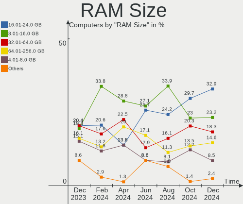
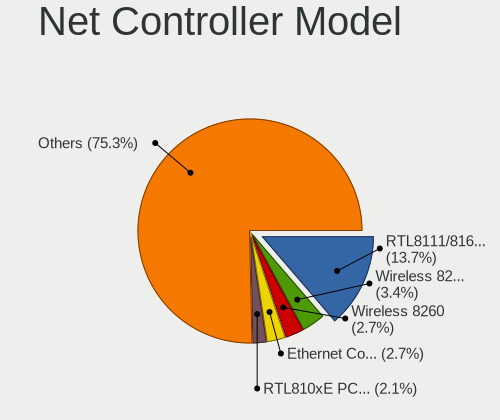

FreeBSD Hardware Trends
-----------------------

A project to identify most popular hardware characteristics and track their change
over time based on data collected by FreeBSD users at https://BSD-Hardware.info.

Anyone can contribute to this report by the [hw-probe](https://github.com/linuxhw/hw-probe/blob/master/INSTALL.BSD.md) tool:

    hw-probe -all -upload

This is a report for all computer types. See also reports for [desktops](/Dist/FreeBSD/Desktop/README.md) and [notebooks](/Dist/FreeBSD/Notebook/README.md).

Full-feature report is available here: https://bsd-hardware.info/?view=trends

Period: Feb, 2022.

Contents
--------

* [ System ](#system)
  - [ OS                       ](#os)
  - [ OS Family                ](#os-family)
  - [ Arch                     ](#arch)
  - [ DE                       ](#de)
  - [ Display Server           ](#display-server)
  - [ Display Manager          ](#display-manager)
  - [ OS Lang                  ](#os-lang)
  - [ Boot Mode                ](#boot-mode)
  - [ Filesystem               ](#filesystem)
  - [ Part. scheme             ](#part-scheme)

* [ Board ](#board)
  - [ Vendor                   ](#vendor)
  - [ Model                    ](#model)
  - [ Model Family             ](#model-family)
  - [ MFG Year                 ](#mfg-year)
  - [ Form Factor              ](#form-factor)
  - [ Coreboot                 ](#coreboot)
  - [ RAM Size                 ](#ram-size)
  - [ RAM Used                 ](#ram-used)
  - [ Total Drives             ](#total-drives)
  - [ Has CD-ROM               ](#has-cd-rom)
  - [ Has Ethernet             ](#has-ethernet)
  - [ Has WiFi                 ](#has-wifi)
  - [ Has Bluetooth            ](#has-bluetooth)

* [ Location ](#location)
  - [ Country                  ](#country)
  - [ City                     ](#city)

* [ Drives ](#drives)
  - [ Drive Vendor             ](#drive-vendor)
  - [ Drive Model              ](#drive-model)
  - [ HDD Vendor               ](#hdd-vendor)
  - [ SSD Vendor               ](#ssd-vendor)
  - [ Drive Kind               ](#drive-kind)
  - [ Drive Connector          ](#drive-connector)
  - [ Drive Size               ](#drive-size)
  - [ Space Total              ](#space-total)
  - [ Space Used               ](#space-used)
  - [ Malfunc. Drives          ](#malfunc-drives)
  - [ Malfunc. Drive Vendor    ](#malfunc-drive-vendor)
  - [ Malfunc. HDD Vendor      ](#malfunc-hdd-vendor)
  - [ Malfunc. Drive Kind      ](#malfunc-drive-kind)
  - [ Failed Drives            ](#failed-drives)
  - [ Failed Drive Vendor      ](#failed-drive-vendor)
  - [ Drive Status             ](#drive-status)

* [ Storage controller ](#storage-controller)
  - [ Storage Vendor           ](#storage-vendor)
  - [ Storage Model            ](#storage-model)
  - [ Storage Kind             ](#storage-kind)

* [ Processor ](#processor)
  - [ CPU Vendor               ](#cpu-vendor)
  - [ CPU Model                ](#cpu-model)
  - [ CPU Model Family         ](#cpu-model-family)
  - [ CPU Cores                ](#cpu-cores)
  - [ CPU Sockets              ](#cpu-sockets)
  - [ CPU Threads              ](#cpu-threads)
  - [ CPU Microarch            ](#cpu-microarch)

* [ Graphics ](#graphics)
  - [ GPU Vendor               ](#gpu-vendor)
  - [ GPU Model                ](#gpu-model)
  - [ GPU Combo                ](#gpu-combo)
  - [ GPU Driver               ](#gpu-driver)
  - [ GPU Memory               ](#gpu-memory)

* [ Monitor ](#monitor)
  - [ Monitor Vendor           ](#monitor-vendor)
  - [ Monitor Model            ](#monitor-model)
  - [ Monitor Resolution       ](#monitor-resolution)
  - [ Monitor Diagonal         ](#monitor-diagonal)
  - [ Monitor Width            ](#monitor-width)
  - [ Aspect Ratio             ](#aspect-ratio)
  - [ Monitor Area             ](#monitor-area)
  - [ Pixel Density            ](#pixel-density)
  - [ Multiple Monitors        ](#multiple-monitors)

* [ Network ](#network)
  - [ Net Controller Vendor    ](#net-controller-vendor)
  - [ Net Controller Model     ](#net-controller-model)
  - [ Wireless Vendor          ](#wireless-vendor)
  - [ Wireless Model           ](#wireless-model)
  - [ Ethernet Vendor          ](#ethernet-vendor)
  - [ Ethernet Model           ](#ethernet-model)
  - [ Net Controller Kind      ](#net-controller-kind)
  - [ Used Controller          ](#used-controller)
  - [ NICs                     ](#nics)
  - [ IPv6                     ](#ipv6)

* [ Bluetooth ](#bluetooth)
  - [ Bluetooth Vendor         ](#bluetooth-vendor)
  - [ Bluetooth Model          ](#bluetooth-model)

* [ Sound ](#sound)
  - [ Sound Vendor             ](#sound-vendor)
  - [ Sound Model              ](#sound-model)

* [ Memory ](#memory)
  - [ Memory Vendor            ](#memory-vendor)
  - [ Memory Model             ](#memory-model)
  - [ Memory Kind              ](#memory-kind)
  - [ Memory Form Factor       ](#memory-form-factor)
  - [ Memory Size              ](#memory-size)
  - [ Memory Speed             ](#memory-speed)

* [ Printers & scanners ](#printers--scanners)
  - [ Printer Vendor           ](#printer-vendor)
  - [ Printer Model            ](#printer-model)
  - [ Scanner Vendor           ](#scanner-vendor)
  - [ Scanner Model            ](#scanner-model)

* [ Camera ](#camera)
  - [ Camera Vendor            ](#camera-vendor)
  - [ Camera Model             ](#camera-model)

* [ Security ](#security)
  - [ Fingerprint Vendor       ](#fingerprint-vendor)
  - [ Fingerprint Model        ](#fingerprint-model)
  - [ Chipcard Vendor          ](#chipcard-vendor)
  - [ Chipcard Model           ](#chipcard-model)

* [ Unsupported ](#unsupported)
  - [ Unsupported Devices      ](#unsupported-devices)
  - [ Unsupported Device Types ](#unsupported-device-types)

System
------

OS
--

Installed operating systems

| Name                     | Computers | Percent |
|--------------------------|-----------|---------|
| FreeBSD 13.0-p7          | 27        | 42.19%  |
| FreeBSD 13.0-STABLE      | 11        | 17.19%  |
| FreeBSD 13.0             | 9         | 14.06%  |
| FreeBSD 14.0-CURRENT     | 5         | 7.81%   |
| FreeBSD 13.0-p6          | 3         | 4.69%   |
| FreeBSD 13.0-p4          | 3         | 4.69%   |
| FreeBSD 13.0-p5          | 2         | 3.13%   |
| FreeBSD 12.3-p2          | 2         | 3.13%   |
| FreeBSD 13.0-STABLE-HBSD | 1         | 1.56%   |
| FreeBSD 12.3             | 1         | 1.56%   |

OS Family
---------

OS without a version

| Name    | Computers | Percent |
|---------|-----------|---------|
| FreeBSD | 64        | 100%    |

Arch
----

OS architecture (x86_64, i586, etc.)

| Name  | Computers | Percent |
|-------|-----------|---------|
| amd64 | 60        | 93.75%  |
| i386  | 2         | 3.13%   |
| arm64 | 2         | 3.13%   |

DE
--

Desktop Environment

| Name         | Computers | Percent |
|--------------|-----------|---------|
| Console      | 25        | 39.06%  |
| KDE5         | 14        | 21.88%  |
| XFCE         | 6         | 9.38%   |
| i3           | 4         | 6.25%   |
| xfwm         | 2         | 3.13%   |
| Lumina       | 2         | 3.13%   |
| GNOME        | 2         | 3.13%   |
| Xfwm4        | 1         | 1.56%   |
| MATE         | 1         | 1.56%   |
| LXQt         | 1         | 1.56%   |
| KWin         | 1         | 1.56%   |
| GNUstep      | 1         | 1.56%   |
| Compton      | 1         | 1.56%   |
| AwesomeWM    | 1         | 1.56%   |
| awesome      | 1         | 1.56%   |
| akonadi_newm | 1         | 1.56%   |

Display Server
--------------

X11 or Wayland

| Name    | Computers | Percent |
|---------|-----------|---------|
| X11     | 36        | 56.25%  |
| Console | 25        | 39.06%  |
| Wayland | 3         | 4.69%   |

Display Manager
---------------

SDDM, LightDM, etc.

| Name    | Computers | Percent |
|---------|-----------|---------|
| Console | 33        | 51.56%  |
| SDDM    | 16        | 25%     |
| SLiM    | 8         | 12.5%   |
| LightDM | 3         | 4.69%   |
| XDM     | 2         | 3.13%   |
| GDM     | 2         | 3.13%   |

OS Lang
-------

Language

| Lang    | Computers | Percent |
|---------|-----------|---------|
| C       | 37        | 57.81%  |
| en_US   | 10        | 15.63%  |
| Unknown | 7         | 10.94%  |
| ru_RU   | 5         | 7.81%   |
| pl_PL   | 1         | 1.56%   |
| fr_FR   | 1         | 1.56%   |
| en_NZ   | 1         | 1.56%   |
| en_GB   | 1         | 1.56%   |
| en_AU   | 1         | 1.56%   |

Boot Mode
---------

EFI or BIOS

| Mode | Computers | Percent |
|------|-----------|---------|
| EFI  | 44        | 68.75%  |
| BIOS | 20        | 31.25%  |

Filesystem
----------

Type of filesystem

| Type | Computers | Percent |
|------|-----------|---------|
| Zfs  | 43        | 67.19%  |
| Ufs  | 21        | 32.81%  |

Part. scheme
------------

Scheme of partitioning

| Type | Computers | Percent |
|------|-----------|---------|
| GPT  | 61        | 95.31%  |
| MBR  | 3         | 4.69%   |

Board
-----

Vendor
------

Motherboard manufacturer

| Name                    | Computers | Percent |
|-------------------------|-----------|---------|
| Dell                    | 9         | 14.06%  |
| ASUSTek Computer        | 9         | 14.06%  |
| Lenovo                  | 6         | 9.38%   |
| Hewlett-Packard         | 5         | 7.81%   |
| MSI                     | 3         | 4.69%   |
| Intel                   | 3         | 4.69%   |
| ASRock                  | 3         | 4.69%   |
| Apple                   | 3         | 4.69%   |
| Supermicro              | 2         | 3.13%   |
| Raspberry Pi Foundation | 2         | 3.13%   |
| Notebook                | 2         | 3.13%   |
| Gigabyte Technology     | 2         | 3.13%   |
| Gateway                 | 2         | 3.13%   |
| Cisco Systems           | 2         | 3.13%   |
| WOOKING                 | 1         | 1.56%   |
| System76                | 1         | 1.56%   |
| Shuttle                 | 1         | 1.56%   |
| Kontron                 | 1         | 1.56%   |
| HUAWEI                  | 1         | 1.56%   |
| GALAX                   | 1         | 1.56%   |
| Fujitsu                 | 1         | 1.56%   |
| Biostar                 | 1         | 1.56%   |
| ASRockRack              | 1         | 1.56%   |
| Acidanthera             | 1         | 1.56%   |
| Unknown                 | 1         | 1.56%   |

Model
-----

Motherboard model

| Name                                 | Computers | Percent |
|--------------------------------------|-----------|---------|
| RPi Raspberry Pi                     | 2         | 3.13%   |
| Gateway DX4870                       | 2         | 3.13%   |
| WOOKING X5                           | 1         | 1.56%   |
| System76 Lemur Pro                   | 1         | 1.56%   |
| Supermicro X9SCL/X9SCM               | 1         | 1.56%   |
| Supermicro Super Server              | 1         | 1.56%   |
| Shuttle SZ270                        | 1         | 1.56%   |
| Notebook NS50_70MU                   | 1         | 1.56%   |
| Notebook N7x0WU                      | 1         | 1.56%   |
| MSI MS-7C95                          | 1         | 1.56%   |
| MSI MS-7C39                          | 1         | 1.56%   |
| MSI MS-7817                          | 1         | 1.56%   |
| Lenovo Yoga S730-13IWL 81J0          | 1         | 1.56%   |
| Lenovo V145-15AST 81MT               | 1         | 1.56%   |
| Lenovo ThinkPad X250 20CMCTO1WW      | 1         | 1.56%   |
| Lenovo ThinkPad T440p 20AWS1JN00     | 1         | 1.56%   |
| Lenovo ThinkPad P51 20HHCTO1WW       | 1         | 1.56%   |
| Lenovo IdeaPad Gaming 3 15ARH05 82EY | 1         | 1.56%   |
| Kontron KT965/ATXP                   | 1         | 1.56%   |
| Intel NUC8i7HNK                      | 1         | 1.56%   |
| Intel NUC6i5SYB H81131-503           | 1         | 1.56%   |
| Intel NUC5i5MYBE H47797-205          | 1         | 1.56%   |
| HUAWEI MACHD-WXX9                    | 1         | 1.56%   |
| HP Z600 Workstation                  | 1         | 1.56%   |
| HP Z240 SFF Workstation              | 1         | 1.56%   |
| HP ProLiant ML350p Gen8              | 1         | 1.56%   |
| HP ProBook 445 G7                    | 1         | 1.56%   |
| HP EliteDesk 800 G4 SFF              | 1         | 1.56%   |
| Gigabyte X570 I AORUS PRO WIFI       | 1         | 1.56%   |
| Gigabyte 990FXA-UD3                  | 1         | 1.56%   |
| GALAX B365M                          | 1         | 1.56%   |
| Fujitsu CELSIUS M720                 | 1         | 1.56%   |
| Dell Studio XPS 9100                 | 1         | 1.56%   |
| Dell OptiPlex 5490 AIO               | 1         | 1.56%   |
| Dell OptiPlex 5060                   | 1         | 1.56%   |
| Dell Latitude E7450                  | 1         | 1.56%   |
| Dell Latitude E6430                  | 1         | 1.56%   |
| Dell Latitude E5440                  | 1         | 1.56%   |
| Dell Latitude 7480                   | 1         | 1.56%   |
| Dell Latitude 3420                   | 1         | 1.56%   |
| Dell Inspiron 5559                   | 1         | 1.56%   |
| Cisco Systems UCSC-C3K-M4SRB         | 1         | 1.56%   |
| Cisco Systems UCSC-C240-M4L          | 1         | 1.56%   |
| Biostar X470GTA                      | 1         | 1.56%   |
| ASUS ROG STRIX X570-F GAMING         | 1         | 1.56%   |
| ASUS ROG CROSSHAIR VIII HERO         | 1         | 1.56%   |
| ASUS PRIME Z270-P                    | 1         | 1.56%   |
| ASUS PRIME X370-PRO                  | 1         | 1.56%   |
| ASUS PRIME B450M-GAMING/BR           | 1         | 1.56%   |
| ASUS P5Q-E                           | 1         | 1.56%   |
| ASUS P4P800-VM                       | 1         | 1.56%   |
| ASUS A9T                             | 1         | 1.56%   |
| ASUS 1215B                           | 1         | 1.56%   |
| ASRockRack EPYC3101D4I-2T            | 1         | 1.56%   |
| ASRock X570 Phantom Gaming 4         | 1         | 1.56%   |
| ASRock X370 Gaming X                 | 1         | 1.56%   |
| ASRock A88M-G                        | 1         | 1.56%   |
| Apple MacBookPro8,1                  | 1         | 1.56%   |
| Apple MacBookPro10,1                 | 1         | 1.56%   |
| Apple iMac7,1                        | 1         | 1.56%   |

Model Family
------------

Motherboard model prefix

| Name                         | Computers | Percent |
|------------------------------|-----------|---------|
| Dell Latitude                | 5         | 7.81%   |
| Lenovo ThinkPad              | 3         | 4.69%   |
| ASUS PRIME                   | 3         | 4.69%   |
| RPi Raspberry                | 2         | 3.13%   |
| Gateway DX4870               | 2         | 3.13%   |
| Dell OptiPlex                | 2         | 3.13%   |
| ASUS ROG                     | 2         | 3.13%   |
| WOOKING X5                   | 1         | 1.56%   |
| System76 Lemur               | 1         | 1.56%   |
| Supermicro X9SCL             | 1         | 1.56%   |
| Supermicro Super             | 1         | 1.56%   |
| Shuttle SZ270                | 1         | 1.56%   |
| Notebook NS50                | 1         | 1.56%   |
| Notebook N7x0WU              | 1         | 1.56%   |
| MSI MS-7C95                  | 1         | 1.56%   |
| MSI MS-7C39                  | 1         | 1.56%   |
| MSI MS-7817                  | 1         | 1.56%   |
| Lenovo Yoga                  | 1         | 1.56%   |
| Lenovo V145-15AST            | 1         | 1.56%   |
| Lenovo IdeaPad               | 1         | 1.56%   |
| Kontron KT965                | 1         | 1.56%   |
| Intel NUC8i7HNK              | 1         | 1.56%   |
| Intel NUC6i5SYB              | 1         | 1.56%   |
| Intel NUC5i5MYBE             | 1         | 1.56%   |
| HUAWEI MACHD-WXX9            | 1         | 1.56%   |
| HP Z600                      | 1         | 1.56%   |
| HP Z240                      | 1         | 1.56%   |
| HP ProLiant                  | 1         | 1.56%   |
| HP ProBook                   | 1         | 1.56%   |
| HP EliteDesk                 | 1         | 1.56%   |
| Gigabyte X570                | 1         | 1.56%   |
| Gigabyte 990FXA-UD3          | 1         | 1.56%   |
| GALAX B365M                  | 1         | 1.56%   |
| Fujitsu CELSIUS              | 1         | 1.56%   |
| Dell Studio                  | 1         | 1.56%   |
| Dell Inspiron                | 1         | 1.56%   |
| Cisco Systems UCSC-C3K-M4SRB | 1         | 1.56%   |
| Cisco Systems UCSC-C240-M4L  | 1         | 1.56%   |
| Biostar X470GTA              | 1         | 1.56%   |
| ASUS P5Q-E                   | 1         | 1.56%   |
| ASUS P4P800-VM               | 1         | 1.56%   |
| ASUS A9T                     | 1         | 1.56%   |
| ASUS 1215B                   | 1         | 1.56%   |
| ASRockRack EPYC3101D4I-2T    | 1         | 1.56%   |
| ASRock X570                  | 1         | 1.56%   |
| ASRock X370                  | 1         | 1.56%   |
| ASRock A88M-G                | 1         | 1.56%   |
| Apple MacBookPro8            | 1         | 1.56%   |
| Apple MacBookPro10           | 1         | 1.56%   |
| Apple iMac7                  | 1         | 1.56%   |
| Acidanthera iMacPro1         | 1         | 1.56%   |
| Unknown                      | 1         | 1.56%   |

MFG Year
--------

Motherboard manufacture year

| Year    | Computers | Percent |
|---------|-----------|---------|
| 2021    | 15        | 23.44%  |
| 2020    | 8         | 12.5%   |
| 2019    | 8         | 12.5%   |
| 2018    | 7         | 10.94%  |
| 2017    | 5         | 7.81%   |
| 2015    | 4         | 6.25%   |
| 2013    | 3         | 4.69%   |
| 2008    | 3         | 4.69%   |
| 2016    | 2         | 3.13%   |
| 2012    | 2         | 3.13%   |
| 2011    | 2         | 3.13%   |
| 2014    | 1         | 1.56%   |
| 2010    | 1         | 1.56%   |
| 2005    | 1         | 1.56%   |
| 2004    | 1         | 1.56%   |
| Unknown | 1         | 1.56%   |

Form Factor
-----------

Physical design of the computer

| Name           | Computers | Percent |
|----------------|-----------|---------|
| Desktop        | 31        | 48.44%  |
| Notebook       | 22        | 34.38%  |
| Mini pc        | 3         | 4.69%   |
| All in one     | 3         | 4.69%   |
| Server         | 3         | 4.69%   |
| System on chip | 2         | 3.13%   |

Coreboot
--------

Have coreboot on board

| Used | Computers | Percent |
|------|-----------|---------|
| No   | 63        | 98.44%  |
| Yes  | 1         | 1.56%   |

RAM Size
--------

Total RAM memory

| Size in GB      | Computers | Percent |
|-----------------|-----------|---------|
| 16.01-24.0      | 21        | 32.81%  |
| 32.01-64.0      | 12        | 18.75%  |
| 8.01-16.0       | 10        | 15.63%  |
| 64.01-256.0     | 7         | 10.94%  |
| 4.01-8.0        | 6         | 9.38%   |
| More than 256.0 | 2         | 3.13%   |
| 24.01-32.0      | 2         | 3.13%   |
| 1.01-2.0        | 2         | 3.13%   |
| 2.01-3.0        | 1         | 1.56%   |
| 0.51-1.0        | 1         | 1.56%   |

RAM Used
--------

Used RAM memory

| Used GB     | Computers | Percent |
|-------------|-----------|---------|
| 0.51-1.0    | 28        | 43.75%  |
| 0.01-0.5    | 15        | 23.44%  |
| 1.01-2.0    | 12        | 18.75%  |
| 4.01-8.0    | 3         | 4.69%   |
| 8.01-16.0   | 2         | 3.13%   |
| 3.01-4.0    | 1         | 1.56%   |
| 24.01-32.0  | 1         | 1.56%   |
| 64.01-256.0 | 1         | 1.56%   |
| 0           | 1         | 1.56%   |

Total Drives
------------

Number of drives on board

| Drives | Computers | Percent |
|--------|-----------|---------|
| 1      | 25        | 39.06%  |
| 2      | 18        | 28.13%  |
| 3      | 10        | 15.63%  |
| 4      | 3         | 4.69%   |
| 6      | 2         | 3.13%   |
| 5      | 2         | 3.13%   |
| 14     | 1         | 1.56%   |
| 13     | 1         | 1.56%   |
| 7      | 1         | 1.56%   |
| 0      | 1         | 1.56%   |

Has CD-ROM
----------

Has CD-ROM on board

| Presented | Computers | Percent |
|-----------|-----------|---------|
| No        | 45        | 70.31%  |
| Yes       | 19        | 29.69%  |

Has Ethernet
------------

Has Ethernet on board

| Presented | Computers | Percent |
|-----------|-----------|---------|
| Yes       | 59        | 92.19%  |
| No        | 5         | 7.81%   |

Has WiFi
--------

Has WiFi module

| Presented | Computers | Percent |
|-----------|-----------|---------|
| Yes       | 32        | 50%     |
| No        | 32        | 50%     |

Has Bluetooth
-------------

Has Bluetooth module

| Presented | Computers | Percent |
|-----------|-----------|---------|
| No        | 38        | 59.38%  |
| Yes       | 26        | 40.63%  |

Location
--------

Country
-------

Geographic location (country)

| Country     | Computers | Percent |
|-------------|-----------|---------|
| USA         | 24        | 37.5%   |
| Russia      | 5         | 7.81%   |
| Ukraine     | 4         | 6.25%   |
| Switzerland | 4         | 6.25%   |
| Brazil      | 4         | 6.25%   |
| Poland      | 3         | 4.69%   |
| UK          | 2         | 3.13%   |
| Thailand    | 2         | 3.13%   |
| France      | 2         | 3.13%   |
| China       | 2         | 3.13%   |
| Australia   | 2         | 3.13%   |
| Sweden      | 1         | 1.56%   |
| New Zealand | 1         | 1.56%   |
| Netherlands | 1         | 1.56%   |
| Italy       | 1         | 1.56%   |
| India       | 1         | 1.56%   |
| Guadeloupe  | 1         | 1.56%   |
| Germany     | 1         | 1.56%   |
| Denmark     | 1         | 1.56%   |
| Canada      | 1         | 1.56%   |
| Bulgaria    | 1         | 1.56%   |

City
----

Geographic location (city)

| City               | Computers | Percent |
|--------------------|-----------|---------|
| Teaneck            | 5         | 7.81%   |
| Zurich             | 4         | 6.25%   |
| Moscow             | 3         | 4.69%   |
| Shenzhen           | 2         | 3.13%   |
| Salem              | 2         | 3.13%   |
| Rio de Janeiro     | 2         | 3.13%   |
| Redmond            | 2         | 3.13%   |
| Lexington          | 2         | 3.13%   |
| Bangkok            | 2         | 3.13%   |
| Wenatchee          | 1         | 1.56%   |
| Washington         | 1         | 1.56%   |
| Warsaw             | 1         | 1.56%   |
| Västerås     | 1         | 1.56%   |
| Ulyanovsk          | 1         | 1.56%   |
| Toronto            | 1         | 1.56%   |
| Toledo             | 1         | 1.56%   |
| Sofia              | 1         | 1.56%   |
| Sevastopol         | 1         | 1.56%   |
| Sao Vicente        | 1         | 1.56%   |
| Perth              | 1         | 1.56%   |
| Omaha              | 1         | 1.56%   |
| New York           | 1         | 1.56%   |
| New Plymouth       | 1         | 1.56%   |
| Melbourne          | 1         | 1.56%   |
| Mead               | 1         | 1.56%   |
| Lubin              | 1         | 1.56%   |
| Lezno              | 1         | 1.56%   |
| Leeds              | 1         | 1.56%   |
| Le Gosier          | 1         | 1.56%   |
| Kyiv               | 1         | 1.56%   |
| Kozhikode          | 1         | 1.56%   |
| Kastrup            | 1         | 1.56%   |
| Ivano-Frankivsk    | 1         | 1.56%   |
| Hoogeveen          | 1         | 1.56%   |
| Guyancourt         | 1         | 1.56%   |
| Glenmoore          | 1         | 1.56%   |
| Falkenstein        | 1         | 1.56%   |
| Enerhodar          | 1         | 1.56%   |
| Cranberry Township | 1         | 1.56%   |
| Chicago            | 1         | 1.56%   |
| Chattanooga        | 1         | 1.56%   |
| Carnelian Bay      | 1         | 1.56%   |
| Campinas           | 1         | 1.56%   |
| Burke              | 1         | 1.56%   |
| Bologna            | 1         | 1.56%   |
| Beaminster         | 1         | 1.56%   |
| Baulne             | 1         | 1.56%   |
| Barnaul            | 1         | 1.56%   |
| Arcata             | 1         | 1.56%   |

Drives
------

Drive Vendor
------------

Hard drive vendors

| Vendor              | Computers | Drives | Percent |
|---------------------|-----------|--------|---------|
| Samsung Electronics | 22        | 29     | 20.56%  |
| WDC                 | 21        | 38     | 19.63%  |
| Seagate             | 17        | 20     | 15.89%  |
| Toshiba             | 6         | 7      | 5.61%   |
| Kingston            | 6         | 6      | 5.61%   |
| Intel               | 5         | 10     | 4.67%   |
| Hitachi             | 5         | 16     | 4.67%   |
| Crucial             | 3         | 4      | 2.8%    |
| Transcend           | 2         | 3      | 1.87%   |
| SPCC                | 2         | 3      | 1.87%   |
| SanDisk             | 2         | 2      | 1.87%   |
| Hikvision           | 2         | 2      | 1.87%   |
| HGST                | 2         | 3      | 1.87%   |
| Apple               | 2         | 2      | 1.87%   |
| A-DATA Technology   | 2         | 2      | 1.87%   |
| SSSTC               | 1         | 1      | 0.93%   |
| SK Hynix            | 1         | 1      | 0.93%   |
| Phison              | 1         | 1      | 0.93%   |
| Patriot             | 1         | 1      | 0.93%   |
| Micron Technology   | 1         | 1      | 0.93%   |
| Hewlett-Packard     | 1         | 5      | 0.93%   |
| GOODRAM             | 1         | 1      | 0.93%   |
| Corsair             | 1         | 1      | 0.93%   |

Drive Model
-----------

Hard drive models

| Model                                   | Computers | Percent |
|-----------------------------------------|-----------|---------|
| Samsung SSD 970 EVO Plus 1TB            | 4         | 3.17%   |
| WDC WD6002FRYZ-01WD5B1 6TB              | 2         | 1.59%   |
| WDC WD10EZEX-08WN4A0 1TB                | 2         | 1.59%   |
| Toshiba MQ04ABF100 1TB                  | 2         | 1.59%   |
| SPCC Solid State Disk 256GB             | 2         | 1.59%   |
| Seagate ST4000DM000-1F2168 4TB          | 2         | 1.59%   |
| Seagate ST2000DM008-2FR102 2TB          | 2         | 1.59%   |
| Samsung SSD 960 EVO 500GB               | 2         | 1.59%   |
| Samsung SSD 870 EVO 1TB                 | 2         | 1.59%   |
| Samsung SSD 860 QVO 1TB                 | 2         | 1.59%   |
| Samsung SSD 850 EVO 1TB                 | 2         | 1.59%   |
| Kingston SA400S37240G 240GB             | 2         | 1.59%   |
| Kingston SA400S37120G 120GB             | 2         | 1.59%   |
| Hikvision HS-SSD-C2000ECO 1024G         | 2         | 1.59%   |
| WDC WDS500G3X0C-00SJG0 500GB            | 1         | 0.79%   |
| WDC WDS500G1B0A-00H9H0 500GB            | 1         | 0.79%   |
| WDC WDS120G2G0B-00EPW0 120GB            | 1         | 0.79%   |
| WDC WDS100T3X0C-00SJG0 1TB              | 1         | 0.79%   |
| WDC WD80EMAZ-00WJTA0 8TB                | 1         | 0.79%   |
| WDC WD80EFZX-68UW8N0 8TB                | 1         | 0.79%   |
| WDC WD80EFAX-68LHPN0 8TB                | 1         | 0.79%   |
| WDC WD80EDBZ-11B0ZA0 8TB                | 1         | 0.79%   |
| WDC WD6003FZBX-00K5WB0 6TB              | 1         | 0.79%   |
| WDC WD5000BPVT-16HXZT3 500GB            | 1         | 0.79%   |
| WDC WD5000BHTZ-50JCPV0 500GB            | 1         | 0.79%   |
| WDC WD40EZRZ-22GXCB0 4TB                | 1         | 0.79%   |
| WDC WD400BB-00JHC0 40GB                 | 1         | 0.79%   |
| WDC WD20NMVW-11AV3S2 2TB                | 1         | 0.79%   |
| WDC WD20EZRX-00D8PB0 2TB                | 1         | 0.79%   |
| WDC WD2000FYYZ-01UL1B2 2TB              | 1         | 0.79%   |
| WDC WD15EADS-00P8B0 1.5TB               | 1         | 0.79%   |
| WDC WD120EMFZ-11A6JA0 12TB              | 1         | 0.79%   |
| WDC WD120EMAZ-11BLFA0 12TB              | 1         | 0.79%   |
| WDC WD120EDAZ-11F3RA0 12TB              | 1         | 0.79%   |
| WDC WD10SDZW-11UMGS0 1TB                | 1         | 0.79%   |
| WDC WD10EZEX-60WN4A0 1TB                | 1         | 0.79%   |
| WDC WD10EZEX-00BN5A0 1TB                | 1         | 0.79%   |
| WDC WD10EZEX-00BBHA0 1TB                | 1         | 0.79%   |
| WDC WD10EFRX-68FYTN0 1TB                | 1         | 0.79%   |
| Transcend TS500GMTE240S 500GB           | 1         | 0.79%   |
| Transcend TS240GMTS420S 240GB           | 1         | 0.79%   |
| Toshiba THNSFJ256GCSU 256GB             | 1         | 0.79%   |
| Toshiba MQ01ABD100 1TB                  | 1         | 0.79%   |
| Toshiba KSG60ZMV256G M.2 2280 256GB     | 1         | 0.79%   |
| Toshiba HDWQ140 4TB                     | 1         | 0.79%   |
| SSSTC CL1-3D256-Q11 NVMe 256GB          | 1         | 0.79%   |
| SK Hynix BC511 HFM256GDJTNI-82A0A 256GB | 1         | 0.79%   |
| Seagate ST9500420AS 500GB               | 1         | 0.79%   |
| Seagate ST9320325ASG 320GB              | 1         | 0.79%   |
| Seagate ST500DM002-1BC142 500GB         | 1         | 0.79%   |
| Seagate ST4000LM024-2AN17V 4TB          | 1         | 0.79%   |
| Seagate ST380815AS 80GB                 | 1         | 0.79%   |
| Seagate ST3750528AS 752GB               | 1         | 0.79%   |
| Seagate ST33000651AS 3TB                | 1         | 0.79%   |
| Seagate ST32000641AS 2TB                | 1         | 0.79%   |
| Seagate ST3160813AS 160GB               | 1         | 0.79%   |
| Seagate ST3000DM008-2DM166 3TB          | 1         | 0.79%   |
| Seagate ST2000DM006-2DM164 2TB          | 1         | 0.79%   |
| Seagate ST16000NM001G-2KK103 16TB       | 1         | 0.79%   |
| Seagate ST1000LM048-2E7172 1TB          | 1         | 0.79%   |

HDD Vendor
----------

Hard disk drive vendors

| Vendor          | Computers | Drives | Percent |
|-----------------|-----------|--------|---------|
| WDC             | 18        | 34     | 37.5%   |
| Seagate         | 17        | 20     | 35.42%  |
| Hitachi         | 5         | 16     | 10.42%  |
| Toshiba         | 4         | 5      | 8.33%   |
| HGST            | 2         | 3      | 4.17%   |
| Hewlett-Packard | 1         | 5      | 2.08%   |
| Apple           | 1         | 1      | 2.08%   |

SSD Vendor
----------

Solid state drive vendors

| Vendor              | Computers | Drives | Percent |
|---------------------|-----------|--------|---------|
| Samsung Electronics | 13        | 16     | 32.5%   |
| Kingston            | 6         | 6      | 15%     |
| Intel               | 5         | 10     | 12.5%   |
| Crucial             | 3         | 4      | 7.5%    |
| WDC                 | 2         | 2      | 5%      |
| Toshiba             | 2         | 2      | 5%      |
| SPCC                | 2         | 3      | 5%      |
| SanDisk             | 2         | 2      | 5%      |
| Transcend           | 1         | 1      | 2.5%    |
| Phison              | 1         | 1      | 2.5%    |
| Patriot             | 1         | 1      | 2.5%    |
| Micron Technology   | 1         | 1      | 2.5%    |
| Apple               | 1         | 1      | 2.5%    |

Drive Kind
----------

HDD or SSD

| Kind | Computers | Drives | Percent |
|------|-----------|--------|---------|
| SSD  | 36        | 50     | 39.56%  |
| HDD  | 34        | 84     | 37.36%  |
| NVMe | 21        | 25     | 23.08%  |

Drive Connector
---------------

SATA, SAS, NVMe, etc.

| Type | Computers | Drives | Percent |
|------|-----------|--------|---------|
| SATA | 52        | 134    | 71.23%  |
| NVMe | 21        | 25     | 28.77%  |

Drive Size
----------

Size of hard drive

| Size in TB | Computers | Drives | Percent |
|------------|-----------|--------|---------|
| 0.01-0.5   | 32        | 58     | 42.67%  |
| 0.51-1.0   | 21        | 35     | 28%     |
| 1.01-2.0   | 8         | 14     | 10.67%  |
| 4.01-10.0  | 5         | 12     | 6.67%   |
| 3.01-4.0   | 4         | 6      | 5.33%   |
| 10.01-20.0 | 3         | 5      | 4%      |
| 2.01-3.0   | 2         | 4      | 2.67%   |

Space Total
-----------

Amount of disk space available on the file system

| Size in GB     | Computers | Percent |
|----------------|-----------|---------|
| 101-250        | 18        | 28.13%  |
| 251-500        | 16        | 25%     |
| 501-1000       | 13        | 20.31%  |
| 51-100         | 8         | 12.5%   |
| More than 3000 | 3         | 4.69%   |
| 1-20           | 3         | 4.69%   |
| 21-50          | 1         | 1.56%   |
| 2001-3000      | 1         | 1.56%   |
| 1001-2000      | 1         | 1.56%   |

Space Used
----------

Amount of used disk space

| Used GB        | Computers | Percent |
|----------------|-----------|---------|
| 1-20           | 40        | 62.5%   |
| 21-50          | 18        | 28.13%  |
| 101-250        | 3         | 4.69%   |
| More than 3000 | 2         | 3.13%   |
| 251-500        | 1         | 1.56%   |

Malfunc. Drives
---------------

Drive models with a malfunction

| Model                           | Computers | Drives | Percent |
|---------------------------------|-----------|--------|---------|
| WDC WD6003FZBX-00K5WB0 6TB      | 1         | 1      | 6.67%   |
| WDC WD6002FRYZ-01WD5B1 6TB      | 1         | 1      | 6.67%   |
| WDC WD2000FYYZ-01UL1B2 2TB      | 1         | 2      | 6.67%   |
| Seagate ST9500420AS 500GB       | 1         | 1      | 6.67%   |
| Seagate ST9320325ASG 320GB      | 1         | 1      | 6.67%   |
| Seagate ST500DM002-1BC142 500GB | 1         | 1      | 6.67%   |
| Seagate ST3750528AS 752GB       | 1         | 1      | 6.67%   |
| Seagate ST3000DM008-2DM166 3TB  | 1         | 1      | 6.67%   |
| Seagate ST1000LM035-1RK172 1TB  | 1         | 1      | 6.67%   |
| Seagate ST1000DM003-9YN162 1TB  | 1         | 1      | 6.67%   |
| Intel SSDSC2BW240A4 240GB       | 1         | 1      | 6.67%   |
| Intel SSDSC2BB012T7 1.2TB       | 1         | 2      | 6.67%   |
| Hitachi HTS421260H9AT00 64GB    | 1         | 1      | 6.67%   |
| Hitachi HDS723030ALA640 3TB     | 1         | 2      | 6.67%   |
| Apple HDD HTS547550A9E384 500GB | 1         | 1      | 6.67%   |

Malfunc. Drive Vendor
---------------------

Vendors of faulty drives

| Vendor  | Computers | Drives | Percent |
|---------|-----------|--------|---------|
| Seagate | 7         | 7      | 46.67%  |
| WDC     | 3         | 4      | 20%     |
| Intel   | 2         | 3      | 13.33%  |
| Hitachi | 2         | 3      | 13.33%  |
| Apple   | 1         | 1      | 6.67%   |

Malfunc. HDD Vendor
-------------------

Vendors of faulty HDD drives

| Vendor  | Computers | Drives | Percent |
|---------|-----------|--------|---------|
| Seagate | 7         | 7      | 53.85%  |
| WDC     | 3         | 4      | 23.08%  |
| Hitachi | 2         | 3      | 15.38%  |
| Apple   | 1         | 1      | 7.69%   |

Malfunc. Drive Kind
-------------------

Kinds of faulty drives

| Kind | Computers | Drives | Percent |
|------|-----------|--------|---------|
| HDD  | 12        | 15     | 85.71%  |
| SSD  | 2         | 3      | 14.29%  |

Failed Drives
-------------

Failed drive models

Zero info for selected period =(

Failed Drive Vendor
-------------------

Failed drive vendors

Zero info for selected period =(

Drive Status
------------

Number of failed and malfunc. drives

| Status   | Computers | Drives | Percent |
|----------|-----------|--------|---------|
| Works    | 58        | 134    | 79.45%  |
| Malfunc  | 13        | 18     | 17.81%  |
| Detected | 2         | 7      | 2.74%   |

Storage controller
------------------

Storage Vendor
--------------

Storage controller vendors

| Vendor                           | Computers | Percent |
|----------------------------------|-----------|---------|
| Intel                            | 38        | 42.7%   |
| AMD                              | 19        | 21.35%  |
| Samsung Electronics              | 13        | 14.61%  |
| Broadcom / LSI                   | 3         | 3.37%   |
| Sandisk                          | 2         | 2.25%   |
| MAXIO Technology (Hangzhou)      | 2         | 2.25%   |
| Marvell Technology Group         | 2         | 2.25%   |
| Solid State Storage Technology   | 1         | 1.12%   |
| SK Hynix                         | 1         | 1.12%   |
| Silicon Motion                   | 1         | 1.12%   |
| Silicon Integrated Systems [SiS] | 1         | 1.12%   |
| Realtek Semiconductor            | 1         | 1.12%   |
| Phison Electronics               | 1         | 1.12%   |
| Hewlett-Packard                  | 1         | 1.12%   |
| ADATA Technology                 | 1         | 1.12%   |
| Adaptec                          | 1         | 1.12%   |
| Unknown                          | 1         | 1.12%   |

Storage Model
-------------

Storage controller models

| Model                                                                          | Computers | Percent |
|--------------------------------------------------------------------------------|-----------|---------|
| AMD FCH SATA Controller [AHCI mode]                                            | 13        | 13.27%  |
| Samsung NVMe SSD Controller SM981/PM981/PM983                                  | 8         | 8.16%   |
| Intel Sunrise Point-LP SATA Controller [AHCI mode]                             | 4         | 4.08%   |
| Intel 200 Series PCH SATA controller [AHCI mode]                               | 4         | 4.08%   |
| Intel Wildcat Point-LP SATA Controller [AHCI Mode]                             | 3         | 3.06%   |
| Intel 8 Series/C220 Series Chipset Family 6-port SATA Controller 1 [AHCI mode] | 3         | 3.06%   |
| AMD 400 Series Chipset SATA Controller                                         | 3         | 3.06%   |
| Unknown                                                                        | 3         | 3.06%   |
| Sandisk WD Black SN750 / PC SN730 NVMe SSD                                     | 2         | 2.04%   |
| Samsung NVMe SSD Controller SM961/PM961/SM963                                  | 2         | 2.04%   |
| Samsung NVMe SSD Controller 980                                                | 2         | 2.04%   |
| MAXIO (Hangzhou) NVMe SSD Controller MAP1202                                   | 2         | 2.04%   |
| Intel SATA Controller [RAID mode]                                              | 2         | 2.04%   |
| Intel Q170/Q150/B150/H170/H110/Z170/CM236 Chipset SATA Controller [AHCI Mode]  | 2         | 2.04%   |
| Intel C610/X99 series chipset 6-Port SATA Controller [AHCI mode]               | 2         | 2.04%   |
| Intel 82801JI (ICH10 Family) SATA AHCI Controller                              | 2         | 2.04%   |
| Intel 7 Series/C210 Series Chipset Family 6-port SATA Controller [AHCI mode]   | 2         | 2.04%   |
| Intel 7 Series Chipset Family 6-port SATA Controller [AHCI mode]               | 2         | 2.04%   |
| AMD X370 Series Chipset SATA Controller                                        | 2         | 2.04%   |
| AMD Starship/Matisse Chipset SATA Controller [AHCI mode]                       | 2         | 2.04%   |
| AMD SB7x0/SB8x0/SB9x0 SATA Controller [AHCI mode]                              | 2         | 2.04%   |
| SK Hynix BC511                                                                 | 1         | 1.02%   |
| Silicon Motion SM2263EN/SM2263XT SSD Controller                                | 1         | 1.02%   |
| Silicon Integrated Systems [SiS] 5513 IDE Controller                           | 1         | 1.02%   |
| Samsung NVMe SSD Controller PM9A1/PM9A3/980PRO                                 | 1         | 1.02%   |
| Phison E16 PCIe4 NVMe Controller                                               | 1         | 1.02%   |
| Marvell Group 88SE9172 SATA 6Gb/s Controller                                   | 1         | 1.02%   |
| Marvell Group 88SE6111/6121 SATA II / PATA Controller                          | 1         | 1.02%   |
| Intel Tiger Lake-LP SATA Controller [AHCI mode]                                | 1         | 1.02%   |
| Intel Comet Lake SATA AHCI Controller                                          | 1         | 1.02%   |
| Intel Cannon Lake PCH SATA AHCI Controller                                     | 1         | 1.02%   |
| Intel C602 chipset 4-Port SATA Storage Control Unit                            | 1         | 1.02%   |
| Intel C600/X79 series chipset 6-Port SATA AHCI Controller                      | 1         | 1.02%   |
| Intel C600/X79 series chipset 4-Port SATA IDE Controller                       | 1         | 1.02%   |
| Intel C600/X79 series chipset 2-Port SATA IDE Controller                       | 1         | 1.02%   |
| Intel 82801HR/HO/HH (ICH8R/DO/DH) 2 port SATA Controller [IDE mode]            | 1         | 1.02%   |
| Intel 82801HM/HEM (ICH8M/ICH8M-E) SATA Controller [AHCI mode]                  | 1         | 1.02%   |
| Intel 82801HM/HEM (ICH8M/ICH8M-E) IDE Controller                               | 1         | 1.02%   |
| Intel 82801H (ICH8 Family) 4 port SATA Controller [IDE mode]                   | 1         | 1.02%   |
| Intel 82801EB/ER (ICH5/ICH5R) IDE Controller                                   | 1         | 1.02%   |
| Intel 82801EB (ICH5) SATA Controller                                           | 1         | 1.02%   |
| Intel 8 Series SATA Controller 1 [AHCI mode]                                   | 1         | 1.02%   |
| Intel 6 Series/C200 Series Chipset Family 6 port Mobile SATA AHCI Controller   | 1         | 1.02%   |
| Intel 6 Series/C200 Series Chipset Family 6 port Desktop SATA AHCI Controller  | 1         | 1.02%   |
| Intel 500 Series Chipset Family SATA AHCI Controller                           | 1         | 1.02%   |
| HP Smart Array Gen8 Controllers                                                | 1         | 1.02%   |
| Broadcom / LSI SAS3108 PCI-Express Fusion-MPT SAS-3                            | 1         | 1.02%   |
| Broadcom / LSI SAS2008 PCI-Express Fusion-MPT SAS-2 [Falcon]                   | 1         | 1.02%   |
| Broadcom / LSI MegaRAID SAS-3 3316 [Intruder]                                  | 1         | 1.02%   |
| AMD SB7x0/SB8x0/SB9x0 IDE Controller                                           | 1         | 1.02%   |
| ADATA XPG SX8200 Pro PCIe Gen3x4 M.2 2280 Solid State Drive                    | 1         | 1.02%   |
| Adaptec AIC-7870P/7881U [AHA-2940U/UW/D/S76]                                   | 1         | 1.02%   |

Storage Kind
------------

Kind of storage controller (IDE, SATA, NVMe, SAS, ...)

| Kind | Computers | Percent |
|------|-----------|---------|
| SATA | 52        | 58.43%  |
| NVMe | 22        | 24.72%  |
| IDE  | 7         | 7.87%   |
| RAID | 4         | 4.49%   |
| SAS  | 3         | 3.37%   |
| SCSI | 1         | 1.12%   |

Processor
---------

CPU Vendor
----------

Processor vendors

| Vendor | Computers | Percent |
|--------|-----------|---------|
| Intel  | 43        | 67.19%  |
| AMD    | 19        | 29.69%  |
| ARM    | 2         | 3.13%   |

CPU Model
---------

Processor models

| Model                                        | Computers | Percent |
|----------------------------------------------|-----------|---------|
| AMD Ryzen 9 3900X 12-Core Processor          | 3         | 4.69%   |
| Intel Core i5-5300U CPU @ 2.30GHz            | 2         | 3.13%   |
| Intel Core i5-3330 CPU @ 3.00GHz             | 2         | 3.13%   |
| Intel 11th Gen Core i7-1165G7 @ 2.80GHz      | 2         | 3.13%   |
| Intel Xeon CPU E5630 @ 2.53GHz               | 1         | 1.56%   |
| Intel Xeon CPU E5-2640 v4 @ 2.40GHz          | 1         | 1.56%   |
| Intel Xeon CPU E5-2630 v3 @ 2.40GHz          | 1         | 1.56%   |
| Intel Xeon CPU E5-2609 0 @ 2.40GHz           | 1         | 1.56%   |
| Intel Xeon CPU E5-1620 0 @ 3.60GHz           | 1         | 1.56%   |
| Intel Xeon CPU E31230 @ 3.20GHz              | 1         | 1.56%   |
| Intel Xeon CPU E3-1535M v6 @ 3.10GHz         | 1         | 1.56%   |
| Intel Xeon CPU E3-1246 v3 @ 3.50GHz          | 1         | 1.56%   |
| Intel Pentium CPU G4560 @ 3.50GHz            | 1         | 1.56%   |
| Intel Pentium CPU G3220 @ 3.00GHz            | 1         | 1.56%   |
| Intel Pentium 4 CPU 1.80GHz                  | 1         | 1.56%   |
| Intel Core i7-8705G CPU @ 3.10GHz            | 1         | 1.56%   |
| Intel Core i7-8700 CPU @ 3.20GHz             | 1         | 1.56%   |
| Intel Core i7-8565U CPU @ 1.80GHz            | 1         | 1.56%   |
| Intel Core i7-6500U CPU @ 2.50GHz            | 1         | 1.56%   |
| Intel Core i7-5600U CPU @ 2.60GHz            | 1         | 1.56%   |
| Intel Core i7-3720QM CPU @ 2.60GHz           | 1         | 1.56%   |
| Intel Core i7-3615QM CPU @ 2.30GHz           | 1         | 1.56%   |
| Intel Core i7 CPU 960 @ 3.20GHz              | 1         | 1.56%   |
| Intel Core i5-9600K CPU @ 3.70GHz            | 1         | 1.56%   |
| Intel Core i5-9400 CPU @ 2.90GHz             | 1         | 1.56%   |
| Intel Core i5-8500 CPU @ 3.00GHz             | 1         | 1.56%   |
| Intel Core i5-7300U CPU @ 2.60GHz            | 1         | 1.56%   |
| Intel Core i5-6260U CPU @ 1.80GHz            | 1         | 1.56%   |
| Intel Core i5-4300U CPU @ 1.90GHz            | 1         | 1.56%   |
| Intel Core i5-4300M CPU @ 2.60GHz            | 1         | 1.56%   |
| Intel Core i5-2415M CPU @ 2.30GHz            | 1         | 1.56%   |
| Intel Core i5-10500T CPU @ 2.30GHz           | 1         | 1.56%   |
| Intel Core i5-10210U CPU @ 1.60GHz           | 1         | 1.56%   |
| Intel Core i3-8130U CPU @ 2.20GHz            | 1         | 1.56%   |
| Intel Core i3-6300 CPU @ 3.80GHz             | 1         | 1.56%   |
| Intel Core i3-6100 CPU @ 3.70GHz             | 1         | 1.56%   |
| Intel Core 2 Quad CPU Q6600 @ 2.40GHz        | 1         | 1.56%   |
| Intel Core 2 Duo CPU T7700 @ 2.40GHz         | 1         | 1.56%   |
| Intel Core 2 Duo CPU E7300 @ 2.66GHz         | 1         | 1.56%   |
| Intel Celeron M processor 1.70GHz            | 1         | 1.56%   |
| Intel 11th Gen Core i5-1145G7 @ 2.60GHz      | 1         | 1.56%   |
| ARM Cortex-A72 r0p3                          | 1         | 1.56%   |
| ARM Cortex-A53 r0p4                          | 1         | 1.56%   |
| AMD Ryzen 9 5950X 16-Core Processor          | 1         | 1.56%   |
| AMD Ryzen 9 5900X 12-Core Processor          | 1         | 1.56%   |
| AMD Ryzen 7 5800X 8-Core Processor           | 1         | 1.56%   |
| AMD Ryzen 7 3800XT 8-Core Processor          | 1         | 1.56%   |
| AMD Ryzen 7 1700 Eight-Core Processor        | 1         | 1.56%   |
| AMD Ryzen 5 5600G with Radeon Graphics       | 1         | 1.56%   |
| AMD Ryzen 5 4600H with Radeon Graphics       | 1         | 1.56%   |
| AMD Ryzen 5 2600 Six-Core Processor          | 1         | 1.56%   |
| AMD Ryzen 3 4300U with Radeon Graphics       | 1         | 1.56%   |
| AMD Ryzen 3 3200G with Radeon Vega Graphics  | 1         | 1.56%   |
| AMD FX-8350 Eight-Core Processor             | 1         | 1.56%   |
| AMD EPYC 7302 16-Core Processor              | 1         | 1.56%   |
| AMD EPYC 3101 4-Core Processor               | 1         | 1.56%   |
| AMD E-350 Processor                          | 1         | 1.56%   |
| AMD A6-9225 RADEON R4, 5 COMPUTE CORES 2C+3G | 1         | 1.56%   |
| AMD A10-5800K APU with Radeon HD Graphics    | 1         | 1.56%   |

CPU Model Family
----------------

Processor model prefix

| Model             | Computers | Percent |
|-------------------|-----------|---------|
| Intel Core i5     | 14        | 21.88%  |
| Intel Xeon        | 8         | 12.5%   |
| Intel Core i7     | 8         | 12.5%   |
| AMD Ryzen 9       | 5         | 7.81%   |
| Other             | 3         | 4.69%   |
| Intel Core i3     | 3         | 4.69%   |
| AMD Ryzen 7       | 3         | 4.69%   |
| AMD Ryzen 5       | 3         | 4.69%   |
| Intel Pentium     | 2         | 3.13%   |
| Intel Core 2 Duo  | 2         | 3.13%   |
| ARM Cortex        | 2         | 3.13%   |
| AMD Ryzen 3       | 2         | 3.13%   |
| AMD EPYC          | 2         | 3.13%   |
| Intel Pentium 4   | 1         | 1.56%   |
| Intel Core 2 Quad | 1         | 1.56%   |
| Intel Celeron M   | 1         | 1.56%   |
| AMD FX            | 1         | 1.56%   |
| AMD E             | 1         | 1.56%   |
| AMD A6            | 1         | 1.56%   |
| AMD A10           | 1         | 1.56%   |

CPU Cores
---------

Number of processor cores

| Number  | Computers | Percent |
|---------|-----------|---------|
| 4       | 21        | 32.81%  |
| 2       | 16        | 25%     |
| 6       | 5         | 7.81%   |
| 24      | 4         | 6.25%   |
| Unknown | 4         | 6.25%   |
| 16      | 3         | 4.69%   |
| 12      | 3         | 4.69%   |
| 8       | 3         | 4.69%   |
| 1       | 2         | 3.13%   |
| 64      | 1         | 1.56%   |
| 32      | 1         | 1.56%   |
| 20      | 1         | 1.56%   |

CPU Sockets
-----------

Number of sockets

| Number  | Computers | Percent |
|---------|-----------|---------|
| 1       | 58        | 90.63%  |
| 2       | 4         | 6.25%   |
| Unknown | 2         | 3.13%   |

CPU Threads
-----------

Threads per core (Hyper-Threading)

| Number  | Computers | Percent |
|---------|-----------|---------|
| 2       | 31        | 48.44%  |
| 1       | 27        | 42.19%  |
| Unknown | 6         | 9.38%   |

CPU Microarch
-------------

Microarchitecture

| Name        | Computers | Percent |
|-------------|-----------|---------|
| KabyLake    | 11        | 17.19%  |
| Zen 2       | 7         | 10.94%  |
| Haswell     | 5         | 7.81%   |
| Zen 3       | 4         | 6.25%   |
| Skylake     | 4         | 6.25%   |
| SandyBridge | 4         | 6.25%   |
| IvyBridge   | 4         | 6.25%   |
| Broadwell   | 4         | 6.25%   |
| TigerLake   | 3         | 4.69%   |
| Zen+        | 2         | 3.13%   |
| Zen         | 2         | 3.13%   |
| Piledriver  | 2         | 3.13%   |
| Core        | 2         | 3.13%   |
| Unknown     | 2         | 3.13%   |
| Westmere    | 1         | 1.56%   |
| Penryn      | 1         | 1.56%   |
| P6          | 1         | 1.56%   |
| NetBurst    | 1         | 1.56%   |
| Nehalem     | 1         | 1.56%   |
| Excavator   | 1         | 1.56%   |
| CometLake   | 1         | 1.56%   |
| Bobcat      | 1         | 1.56%   |

Graphics
--------

GPU Vendor
----------

Vendors of graphics cards

| Vendor                           | Computers | Percent |
|----------------------------------|-----------|---------|
| Intel                            | 31        | 44.29%  |
| AMD                              | 22        | 31.43%  |
| Nvidia                           | 10        | 14.29%  |
| Matrox Electronics Systems       | 4         | 5.71%   |
| ASPEED Technology                | 2         | 2.86%   |
| Silicon Integrated Systems [SiS] | 1         | 1.43%   |

GPU Model
---------

Graphics card models

| Model                                                                                      | Computers | Percent |
|--------------------------------------------------------------------------------------------|-----------|---------|
| Intel TigerLake-LP GT2 [Iris Xe Graphics]                                                  | 3         | 4.23%   |
| Intel HD Graphics 5500                                                                     | 3         | 4.23%   |
| Intel CoffeeLake-S GT2 [UHD Graphics 630]                                                  | 3         | 4.23%   |
| AMD Ellesmere [Radeon RX 470/480/570/570X/580/580X/590]                                    | 3         | 4.23%   |
| Nvidia GF119 [GeForce GT 610]                                                              | 2         | 2.82%   |
| Matrox Electronics Systems MGA G200e [Pilot] ServerEngines (SEP1)                          | 2         | 2.82%   |
| Intel HD Graphics 530                                                                      | 2         | 2.82%   |
| Intel 3rd Gen Core processor Graphics Controller                                           | 2         | 2.82%   |
| ASPEED Technology ASPEED Graphics Family                                                   | 2         | 2.82%   |
| AMD Renoir                                                                                 | 2         | 2.82%   |
| AMD Lexa PRO [Radeon 540/540X/550/550X / RX 540X/550/550X]                                 | 2         | 2.82%   |
| Silicon Integrated Systems [SiS] 661/741/760 PCI/AGP or 662/761Gx PCIE VGA Display Adapter | 1         | 1.41%   |
| Nvidia TU117M [GeForce GTX 1650 Ti Mobile]                                                 | 1         | 1.41%   |
| Nvidia GT218 [NVS 300]                                                                     | 1         | 1.41%   |
| Nvidia GP108 [GeForce GT 1030]                                                             | 1         | 1.41%   |
| Nvidia GP106 [GeForce GTX 1060 3GB]                                                        | 1         | 1.41%   |
| Nvidia GM206GLM [Quadro M2200 Mobile]                                                      | 1         | 1.41%   |
| Nvidia GK107M [GeForce GT 650M Mac Edition]                                                | 1         | 1.41%   |
| Nvidia GF108GLM [NVS 5200M]                                                                | 1         | 1.41%   |
| Nvidia GA104M [GeForce RTX 3070 Mobile / Max-Q]                                            | 1         | 1.41%   |
| Matrox Electronics Systems MGA G200eW WPCM450                                              | 1         | 1.41%   |
| Matrox Electronics Systems MGA G200EH                                                      | 1         | 1.41%   |
| Intel Xeon E3-1200 v3/4th Gen Core Processor Integrated Graphics Controller                | 1         | 1.41%   |
| Intel Xeon E3-1200 v3 Processor Integrated Graphics Controller                             | 1         | 1.41%   |
| Intel Xeon E3-1200 v2/3rd Gen Core processor Graphics Controller                           | 1         | 1.41%   |
| Intel WhiskeyLake-U GT2 [UHD Graphics 620]                                                 | 1         | 1.41%   |
| Intel UHD Graphics 620                                                                     | 1         | 1.41%   |
| Intel Skylake GT2 [HD Graphics 520]                                                        | 1         | 1.41%   |
| Intel Iris Graphics 540                                                                    | 1         | 1.41%   |
| Intel HD Graphics P630                                                                     | 1         | 1.41%   |
| Intel HD Graphics 630                                                                      | 1         | 1.41%   |
| Intel HD Graphics 620                                                                      | 1         | 1.41%   |
| Intel HD Graphics 610                                                                      | 1         | 1.41%   |
| Intel Haswell-ULT Integrated Graphics Controller                                           | 1         | 1.41%   |
| Intel CometLake-U GT2 [UHD Graphics]                                                       | 1         | 1.41%   |
| Intel CometLake-S GT2 [UHD Graphics 630]                                                   | 1         | 1.41%   |
| Intel 82Q963/Q965 Integrated Graphics Controller                                           | 1         | 1.41%   |
| Intel 82865G Integrated Graphics Controller                                                | 1         | 1.41%   |
| Intel 4th Gen Core Processor Integrated Graphics Controller                                | 1         | 1.41%   |
| Intel 2nd Generation Core Processor Family Integrated Graphics Controller                  | 1         | 1.41%   |
| AMD Wrestler [Radeon HD 6310]                                                              | 1         | 1.41%   |
| AMD Sun XT [Radeon HD 8670A/8670M/8690M / R5 M330 / M430 / Radeon 520 Mobile]              | 1         | 1.41%   |
| AMD Stoney [Radeon R2/R3/R4/R5 Graphics]                                                   | 1         | 1.41%   |
| AMD RV710 [Radeon HD 4350/4550]                                                            | 1         | 1.41%   |
| AMD RV630/M76 [Mobility Radeon HD 2600 XT/2700]                                            | 1         | 1.41%   |
| AMD Rage 3 [Rage XL PCI]                                                                   | 1         | 1.41%   |
| AMD Polaris 22 XL [Radeon RX Vega M GL]                                                    | 1         | 1.41%   |
| AMD Oland [Radeon HD 8570 / R5 430 OEM / R7 240/340 / Radeon 520 OEM]                      | 1         | 1.41%   |
| AMD Navi 23 [Radeon RX 6600/6600 XT/6600M]                                                 | 1         | 1.41%   |
| AMD Navi 21 [Radeon RX 6800/6800 XT / 6900 XT]                                             | 1         | 1.41%   |
| AMD Navi 10 [Radeon RX 5600 OEM/5600 XT / 5700/5700 XT]                                    | 1         | 1.41%   |
| AMD Lexa XT [Radeon PRO WX 2100]                                                           | 1         | 1.41%   |
| AMD Cypress XT [Radeon HD 5870]                                                            | 1         | 1.41%   |
| AMD Cezanne                                                                                | 1         | 1.41%   |
| AMD Cedar [Radeon HD 5000/6000/7350/8350 Series]                                           | 1         | 1.41%   |
| AMD Cape Verde PRO / Venus LE / Tropo PRO-L [Radeon HD 8830M / R7 250 / R7 M465X]          | 1         | 1.41%   |

GPU Combo
---------

Combinations of graphics cards

| Name           | Computers | Percent |
|----------------|-----------|---------|
| 1 x Intel      | 25        | 39.06%  |
| 1 x AMD        | 16        | 25%     |
| 1 x Nvidia     | 6         | 9.38%   |
| 1 x Matrox     | 4         | 6.25%   |
| Intel + Nvidia | 3         | 4.69%   |
| Intel + AMD    | 3         | 4.69%   |
| Other          | 2         | 3.13%   |
| 2 x AMD        | 1         | 1.56%   |
| 1 x SiS        | 1         | 1.56%   |
| 1 x ASPEED     | 1         | 1.56%   |
| AMD + Nvidia   | 1         | 1.56%   |
| AMD + ASPEED   | 1         | 1.56%   |

GPU Driver
----------

Free vs proprietary

| Driver      | Computers | Percent |
|-------------|-----------|---------|
| Free        | 58        | 90.63%  |
| Proprietary | 4         | 6.25%   |
| Unknown     | 2         | 3.13%   |

GPU Memory
----------

Total video memory

| Size in GB | Computers | Percent |
|------------|-----------|---------|
| Unknown    | 49        | 76.56%  |
| 1.01-2.0   | 4         | 6.25%   |
| 7.01-8.0   | 3         | 4.69%   |
| 3.01-4.0   | 3         | 4.69%   |
| 0.01-0.5   | 3         | 4.69%   |
| 5.01-6.0   | 1         | 1.56%   |
| 0.51-1.0   | 1         | 1.56%   |

Monitor
-------

Monitor Vendor
--------------

Monitor vendors

| Vendor              | Computers | Percent |
|---------------------|-----------|---------|
| AU Optronics        | 5         | 15.15%  |
| Samsung Electronics | 4         | 12.12%  |
| Goldstar            | 3         | 9.09%   |
| Dell                | 3         | 9.09%   |
| BOE                 | 3         | 9.09%   |
| Philips             | 2         | 6.06%   |
| LG Display          | 2         | 6.06%   |
| Hewlett-Packard     | 2         | 6.06%   |
| Chimei Innolux      | 2         | 6.06%   |
| Acer                | 2         | 6.06%   |
| Sharp               | 1         | 3.03%   |
| Pixio               | 1         | 3.03%   |
| Panasonic           | 1         | 3.03%   |
| InfoVision          | 1         | 3.03%   |
| Apple               | 1         | 3.03%   |

Monitor Model
-------------

Monitor models

| Model                                                                 | Computers | Percent |
|-----------------------------------------------------------------------|-----------|---------|
| Sharp LCD Monitor SHP1542 1920x1080 310x170mm 13.9-inch               | 1         | 3.03%   |
| Samsung Electronics S27C750 SAM0A60 1920x1080 600x340mm 27.2-inch     | 1         | 3.03%   |
| Samsung Electronics LCD Monitor SEC544B 1600x900 310x170mm 13.9-inch  | 1         | 3.03%   |
| Samsung Electronics LCD Monitor SDC8B4F 1920x1080 340x190mm 15.3-inch | 1         | 3.03%   |
| Samsung Electronics LCD Monitor SDC5441 1366x768 310x170mm 13.9-inch  | 1         | 3.03%   |
| Pixio PX7 Prime HYC2700 2560x1440 600x340mm 27.2-inch                 | 1         | 3.03%   |
| Philips PHL 276E8V PHLC18F 3840x2160 600x340mm 27.2-inch              | 1         | 3.03%   |
| Philips PHL 243V5 PHLC0D1 1920x1080 520x290mm 23.4-inch               | 1         | 3.03%   |
| Panasonic TV MEIC136 1280x720 698x392mm 31.5-inch                     | 1         | 3.03%   |
| LG Display LCD Monitor LGD046D 1920x1080 310x170mm 13.9-inch          | 1         | 3.03%   |
| LG Display LCD Monitor LGD0437 1920x1080 280x160mm 12.7-inch          | 1         | 3.03%   |
| InfoVision LCD Monitor IVO8C5F 1920x1080 310x170mm 13.9-inch          | 1         | 3.03%   |
| Hewlett-Packard E233 HPN345F 1920x1080 510x290mm 23.1-inch            | 1         | 3.03%   |
| Hewlett-Packard 24ea HPN3393 1920x1080 530x300mm 24.0-inch            | 1         | 3.03%   |
| Goldstar LG Ultra HD GSM5B09 3840x2160 600x340mm 27.2-inch            | 1         | 3.03%   |
| Goldstar L1751SQ GSM43F1 1280x1024 340x270mm 17.1-inch                | 1         | 3.03%   |
| Goldstar E2411 GSM583B 1920x1080 530x300mm 24.0-inch                  | 1         | 3.03%   |
| Dell P2719H DEL4184 1920x1080 600x340mm 27.2-inch                     | 1         | 3.03%   |
| Dell LCD Monitor ST2420L 1920x1080                                    | 1         | 3.03%   |
| Dell LCD Monitor DEL9408 1920x1080 520x290mm 23.4-inch                | 1         | 3.03%   |
| Chimei Innolux LCD Monitor CMN14D5 1920x1080 310x170mm 13.9-inch      | 1         | 3.03%   |
| Chimei Innolux LCD Monitor CMN1482 1600x900 310x170mm 13.9-inch       | 1         | 3.03%   |
| BOE LCD Monitor BOE0973 2560x1440 340x190mm 15.3-inch                 | 1         | 3.03%   |
| BOE LCD Monitor BOE0729 1920x1080 340x190mm 15.3-inch                 | 1         | 3.03%   |
| BOE LCD Monitor BOE06B9 1920x1080 340x190mm 15.3-inch                 | 1         | 3.03%   |
| AU Optronics LCD Monitor AUOD1ED 1920x1080 340x190mm 15.3-inch        | 1         | 3.03%   |
| AU Optronics LCD Monitor AUO71EC 1366x768 340x190mm 15.3-inch         | 1         | 3.03%   |
| AU Optronics LCD Monitor AUO5699 1920x1080 340x190mm 15.3-inch        | 1         | 3.03%   |
| AU Optronics LCD Monitor AUO512D 1920x1080 290x170mm 13.2-inch        | 1         | 3.03%   |
| AU Optronics LCD Monitor AUO333D 1920x1080 310x170mm 13.9-inch        | 1         | 3.03%   |
| Apple LCD Monitor APP9CC5 1280x800 290x180mm 13.4-inch                | 1         | 3.03%   |
| Acer XB271HU A ACR052F 2560x1440 600x340mm 27.2-inch                  | 1         | 3.03%   |
| Acer KA220HQ ACR0497 1920x1080 480x270mm 21.7-inch                    | 1         | 3.03%   |

Monitor Resolution
------------------

Monitor screen resolution

| Resolution       | Computers | Percent |
|------------------|-----------|---------|
| 1920x1080 (FHD)  | 20        | 62.5%   |
| 2560x1440 (QHD)  | 3         | 9.38%   |
| 3840x2160 (4K)   | 2         | 6.25%   |
| 1600x900 (HD+)   | 2         | 6.25%   |
| 1366x768 (WXGA)  | 2         | 6.25%   |
| 1280x800 (WXGA)  | 1         | 3.13%   |
| 1280x720 (HD)    | 1         | 3.13%   |
| 1280x1024 (SXGA) | 1         | 3.13%   |

Monitor Diagonal
----------------

Diagonal size in inches

| Inches  | Computers | Percent |
|---------|-----------|---------|
| 13      | 9         | 27.27%  |
| 15      | 8         | 24.24%  |
| 27      | 6         | 18.18%  |
| 23      | 3         | 9.09%   |
| 24      | 2         | 6.06%   |
| 31      | 1         | 3.03%   |
| 21      | 1         | 3.03%   |
| 17      | 1         | 3.03%   |
| 12      | 1         | 3.03%   |
| Unknown | 1         | 3.03%   |

Monitor Width
-------------

Physical width

| Width in mm | Computers | Percent |
|-------------|-----------|---------|
| 301-350     | 16        | 48.48%  |
| 501-600     | 11        | 33.33%  |
| 201-300     | 3         | 9.09%   |
| 601-700     | 1         | 3.03%   |
| 401-500     | 1         | 3.03%   |
| Unknown     | 1         | 3.03%   |

Aspect Ratio
------------

Proportional relationship between the width and the height

| Ratio   | Computers | Percent |
|---------|-----------|---------|
| 16/9    | 27        | 90%     |
| 5/4     | 1         | 3.33%   |
| 16/10   | 1         | 3.33%   |
| Unknown | 1         | 3.33%   |

Monitor Area
------------

Area in inch²

| Area in inch² | Computers | Percent |
|----------------|-----------|---------|
| 81-90          | 8         | 24.24%  |
| 91-100         | 8         | 24.24%  |
| 301-350        | 6         | 18.18%  |
| 201-250        | 6         | 18.18%  |
| 71-80          | 1         | 3.03%   |
| 61-70          | 1         | 3.03%   |
| 351-500        | 1         | 3.03%   |
| 141-150        | 1         | 3.03%   |
| Unknown        | 1         | 3.03%   |

Pixel Density
-------------

Pixels per inch

| Density | Computers | Percent |
|---------|-----------|---------|
| 121-160 | 12        | 37.5%   |
| 51-100  | 8         | 25%     |
| 161-240 | 5         | 15.63%  |
| 101-120 | 5         | 15.63%  |
| 1-50    | 1         | 3.13%   |
| Unknown | 1         | 3.13%   |

Multiple Monitors
-----------------

Total monitors connected

| Total | Computers | Percent |
|-------|-----------|---------|
| 0     | 34        | 53.13%  |
| 1     | 27        | 42.19%  |
| 2     | 3         | 4.69%   |

Network
-------

Net Controller Vendor
---------------------

Controller vendors

| Vendor                           | Computers | Percent |
|----------------------------------|-----------|---------|
| Intel                            | 41        | 43.16%  |
| Realtek Semiconductor            | 26        | 27.37%  |
| Broadcom                         | 6         | 6.32%   |
| Qualcomm Atheros                 | 3         | 3.16%   |
| TP-Link                          | 2         | 2.11%   |
| Samsung Electronics              | 2         | 2.11%   |
| Marvell Technology Group         | 2         | 2.11%   |
| Dell                             | 2         | 2.11%   |
| VIA Technologies                 | 1         | 1.05%   |
| Tehuti Networks                  | 1         | 1.05%   |
| Silicon Integrated Systems [SiS] | 1         | 1.05%   |
| Ralink Technology                | 1         | 1.05%   |
| Google                           | 1         | 1.05%   |
| D-Link System                    | 1         | 1.05%   |
| Cisco Systems                    | 1         | 1.05%   |
| Cavium QLogic                    | 1         | 1.05%   |
| Apple                            | 1         | 1.05%   |
| American Megatrends              | 1         | 1.05%   |
| 3Com                             | 1         | 1.05%   |

Net Controller Model
--------------------

Controller models

| Model                                                                         | Computers | Percent |
|-------------------------------------------------------------------------------|-----------|---------|
| Realtek RTL8111/8168/8411 PCI Express Gigabit Ethernet Controller             | 21        | 17.65%  |
| Intel I211 Gigabit Network Connection                                         | 7         | 5.88%   |
| Intel Wireless 7265                                                           | 4         | 3.36%   |
| Intel Wi-Fi 6 AX201                                                           | 3         | 2.52%   |
| Intel Ethernet Connection (3) I218-LM                                         | 3         | 2.52%   |
| Intel 82579LM Gigabit Network Connection (Lewisville)                         | 3         | 2.52%   |
| Intel 82571EB/82571GB Gigabit Ethernet Controller D0/D1 (copper applications) | 3         | 2.52%   |
| TP-Link AC600 wireless Realtek RTL8811AU [Archer T2U Nano]                    | 2         | 1.68%   |
| Samsung GT-I9070 (network tethering, USB debugging enabled)                   | 2         | 1.68%   |
| Realtek RTL8188EUS 802.11n Wireless Network Adapter                           | 2         | 1.68%   |
| Realtek Realtek 8811CU Wireless LAN 802.11ac USB NIC                          | 2         | 1.68%   |
| Intel Wireless 8265 / 8275                                                    | 2         | 1.68%   |
| Intel Wireless 8260                                                           | 2         | 1.68%   |
| Intel Wireless 7260                                                           | 2         | 1.68%   |
| Intel Wi-Fi 6 AX200                                                           | 2         | 1.68%   |
| Intel I350 Gigabit Network Connection                                         | 2         | 1.68%   |
| Intel Ethernet Connection (2) I219-LM                                         | 2         | 1.68%   |
| Intel 82579V Gigabit Network Connection                                       | 2         | 1.68%   |
| Intel 82574L Gigabit Network Connection                                       | 2         | 1.68%   |
| Broadcom BCM4331 802.11a/b/g/n                                                | 2         | 1.68%   |
| VIA VT6105/VT6106S [Rhine-III]                                                | 1         | 0.84%   |
| Tehuti Networks TN9710P 10GBase-T/NBASE-T Ethernet Adapter                    | 1         | 0.84%   |
| Silicon Integrated Systems [SiS] SiS900 PCI Fast Ethernet                     | 1         | 0.84%   |
| Realtek RTL8822CE 802.11ac PCIe Wireless Network Adapter                      | 1         | 0.84%   |
| Realtek RTL8822BE 802.11a/b/g/n/ac WiFi adapter                               | 1         | 0.84%   |
| Realtek RTL8821CE 802.11ac PCIe Wireless Network Adapter                      | 1         | 0.84%   |
| Realtek RTL8812AE 802.11ac PCIe Wireless Network Adapter                      | 1         | 0.84%   |
| Realtek RTL8125 2.5GbE Controller                                             | 1         | 0.84%   |
| Realtek RTL810xE PCI Express Fast Ethernet controller                         | 1         | 0.84%   |
| Ralink RT5370 Wireless Adapter                                                | 1         | 0.84%   |
| Qualcomm Atheros QCA6174 802.11ac Wireless Network Adapter                    | 1         | 0.84%   |
| Qualcomm Atheros AR9462 Wireless Network Adapter                              | 1         | 0.84%   |
| Qualcomm Atheros AR8152 v2.0 Fast Ethernet                                    | 1         | 0.84%   |
| Marvell Group 88E8058 PCI-E Gigabit Ethernet Controller                       | 1         | 0.84%   |
| Marvell Group 88E8056 PCI-E Gigabit Ethernet Controller                       | 1         | 0.84%   |
| Marvell Group 88E8001 Gigabit Ethernet Controller                             | 1         | 0.84%   |
| Intel Wireless 3160                                                           | 1         | 0.84%   |
| Intel Tiger Lake PCH CNVi WiFi                                                | 1         | 0.84%   |
| Intel I210 Gigabit Network Connection                                         | 1         | 0.84%   |
| Intel Ethernet Controller 10G X550T                                           | 1         | 0.84%   |
| Intel Ethernet Connection I219-V                                              | 1         | 0.84%   |
| Intel Ethernet Connection I218-LM                                             | 1         | 0.84%   |
| Intel Ethernet Connection I217-LM                                             | 1         | 0.84%   |
| Intel Ethernet Connection (7) I219-V                                          | 1         | 0.84%   |
| Intel Ethernet Connection (7) I219-LM                                         | 1         | 0.84%   |
| Intel Ethernet Connection (5) I219-LM                                         | 1         | 0.84%   |
| Intel Ethernet Connection (4) I219-LM                                         | 1         | 0.84%   |
| Intel Ethernet Connection (14) I219-LM                                        | 1         | 0.84%   |
| Intel Dual Band Wireless-AC 3168NGW [Stone Peak]                              | 1         | 0.84%   |
| Intel Comet Lake PCH-LP CNVi WiFi                                             | 1         | 0.84%   |
| Intel Centrino Advanced-N 6205 [Taylor Peak]                                  | 1         | 0.84%   |
| Intel Cannon Point-LP CNVi [Wireless-AC]                                      | 1         | 0.84%   |
| Intel 82599ES 10-Gigabit SFI/SFP+ Network Connection                          | 1         | 0.84%   |
| Intel 82562EZ 10/100 Ethernet Controller                                      | 1         | 0.84%   |
| Google Nexus/Pixel Device (charging + debug)                                  | 1         | 0.84%   |
| Dell Hub of E-Port Replicator                                                 | 1         | 0.84%   |
| Dell Dell Wireless 5560 Single-mode HSPA Mini Card with A-GPS                 | 1         | 0.84%   |
| D-Link System DL10050 Sundance Ethernet                                       | 1         | 0.84%   |
| Cisco Systems VIC Ethernet NIC                                                | 1         | 0.84%   |
| Cavium QLogic 1010/1020/1007/1741 10Gbps CNA                                  | 1         | 0.84%   |

Wireless Vendor
---------------

Wireless vendors

| Vendor                | Computers | Percent |
|-----------------------|-----------|---------|
| Intel                 | 21        | 52.5%   |
| Realtek Semiconductor | 8         | 20%     |
| Broadcom              | 4         | 10%     |
| TP-Link               | 2         | 5%      |
| Qualcomm Atheros      | 2         | 5%      |
| Dell                  | 2         | 5%      |
| Ralink Technology     | 1         | 2.5%    |

Wireless Model
--------------

Wireless models

| Model                                                         | Computers | Percent |
|---------------------------------------------------------------|-----------|---------|
| Intel Wireless 7265                                           | 4         | 10%     |
| Intel Wi-Fi 6 AX201                                           | 3         | 7.5%    |
| TP-Link AC600 wireless Realtek RTL8811AU [Archer T2U Nano]    | 2         | 5%      |
| Realtek RTL8188EUS 802.11n Wireless Network Adapter           | 2         | 5%      |
| Realtek Realtek 8811CU Wireless LAN 802.11ac USB NIC          | 2         | 5%      |
| Intel Wireless 8265 / 8275                                    | 2         | 5%      |
| Intel Wireless 8260                                           | 2         | 5%      |
| Intel Wireless 7260                                           | 2         | 5%      |
| Intel Wi-Fi 6 AX200                                           | 2         | 5%      |
| Broadcom BCM4331 802.11a/b/g/n                                | 2         | 5%      |
| Realtek RTL8822CE 802.11ac PCIe Wireless Network Adapter      | 1         | 2.5%    |
| Realtek RTL8822BE 802.11a/b/g/n/ac WiFi adapter               | 1         | 2.5%    |
| Realtek RTL8821CE 802.11ac PCIe Wireless Network Adapter      | 1         | 2.5%    |
| Realtek RTL8812AE 802.11ac PCIe Wireless Network Adapter      | 1         | 2.5%    |
| Ralink RT5370 Wireless Adapter                                | 1         | 2.5%    |
| Qualcomm Atheros QCA6174 802.11ac Wireless Network Adapter    | 1         | 2.5%    |
| Qualcomm Atheros AR9462 Wireless Network Adapter              | 1         | 2.5%    |
| Intel Wireless 3160                                           | 1         | 2.5%    |
| Intel Tiger Lake PCH CNVi WiFi                                | 1         | 2.5%    |
| Intel Dual Band Wireless-AC 3168NGW [Stone Peak]              | 1         | 2.5%    |
| Intel Comet Lake PCH-LP CNVi WiFi                             | 1         | 2.5%    |
| Intel Centrino Advanced-N 6205 [Taylor Peak]                  | 1         | 2.5%    |
| Intel Cannon Point-LP CNVi [Wireless-AC]                      | 1         | 2.5%    |
| Dell Hub of E-Port Replicator                                 | 1         | 2.5%    |
| Dell Dell Wireless 5560 Single-mode HSPA Mini Card with A-GPS | 1         | 2.5%    |
| Broadcom BCM4321 802.11a/b/g/n                                | 1         | 2.5%    |
| Broadcom BCM4313 802.11bgn Wireless Network Adapter           | 1         | 2.5%    |

Ethernet Vendor
---------------

Ethernet vendors

| Vendor                           | Computers | Percent |
|----------------------------------|-----------|---------|
| Intel                            | 33        | 44.59%  |
| Realtek Semiconductor            | 23        | 31.08%  |
| Broadcom                         | 4         | 5.41%   |
| Samsung Electronics              | 2         | 2.7%    |
| Marvell Technology Group         | 2         | 2.7%    |
| VIA Technologies                 | 1         | 1.35%   |
| Tehuti Networks                  | 1         | 1.35%   |
| Silicon Integrated Systems [SiS] | 1         | 1.35%   |
| Qualcomm Atheros                 | 1         | 1.35%   |
| Google                           | 1         | 1.35%   |
| D-Link System                    | 1         | 1.35%   |
| Cisco Systems                    | 1         | 1.35%   |
| Apple                            | 1         | 1.35%   |
| American Megatrends              | 1         | 1.35%   |
| 3Com                             | 1         | 1.35%   |

Ethernet Model
--------------

Ethernet models

| Model                                                                         | Computers | Percent |
|-------------------------------------------------------------------------------|-----------|---------|
| Realtek RTL8111/8168/8411 PCI Express Gigabit Ethernet Controller             | 21        | 26.92%  |
| Intel I211 Gigabit Network Connection                                         | 7         | 8.97%   |
| Intel Ethernet Connection (3) I218-LM                                         | 3         | 3.85%   |
| Intel 82579LM Gigabit Network Connection (Lewisville)                         | 3         | 3.85%   |
| Intel 82571EB/82571GB Gigabit Ethernet Controller D0/D1 (copper applications) | 3         | 3.85%   |
| Samsung GT-I9070 (network tethering, USB debugging enabled)                   | 2         | 2.56%   |
| Intel I350 Gigabit Network Connection                                         | 2         | 2.56%   |
| Intel Ethernet Connection (2) I219-LM                                         | 2         | 2.56%   |
| Intel 82579V Gigabit Network Connection                                       | 2         | 2.56%   |
| Intel 82574L Gigabit Network Connection                                       | 2         | 2.56%   |
| VIA VT6105/VT6106S [Rhine-III]                                                | 1         | 1.28%   |
| Tehuti Networks TN9710P 10GBase-T/NBASE-T Ethernet Adapter                    | 1         | 1.28%   |
| Silicon Integrated Systems [SiS] SiS900 PCI Fast Ethernet                     | 1         | 1.28%   |
| Realtek RTL8125 2.5GbE Controller                                             | 1         | 1.28%   |
| Realtek RTL810xE PCI Express Fast Ethernet controller                         | 1         | 1.28%   |
| Qualcomm Atheros AR8152 v2.0 Fast Ethernet                                    | 1         | 1.28%   |
| Marvell Group 88E8058 PCI-E Gigabit Ethernet Controller                       | 1         | 1.28%   |
| Marvell Group 88E8056 PCI-E Gigabit Ethernet Controller                       | 1         | 1.28%   |
| Marvell Group 88E8001 Gigabit Ethernet Controller                             | 1         | 1.28%   |
| Intel I210 Gigabit Network Connection                                         | 1         | 1.28%   |
| Intel Ethernet Controller 10G X550T                                           | 1         | 1.28%   |
| Intel Ethernet Connection I219-V                                              | 1         | 1.28%   |
| Intel Ethernet Connection I218-LM                                             | 1         | 1.28%   |
| Intel Ethernet Connection I217-LM                                             | 1         | 1.28%   |
| Intel Ethernet Connection (7) I219-V                                          | 1         | 1.28%   |
| Intel Ethernet Connection (7) I219-LM                                         | 1         | 1.28%   |
| Intel Ethernet Connection (5) I219-LM                                         | 1         | 1.28%   |
| Intel Ethernet Connection (4) I219-LM                                         | 1         | 1.28%   |
| Intel Ethernet Connection (14) I219-LM                                        | 1         | 1.28%   |
| Intel 82599ES 10-Gigabit SFI/SFP+ Network Connection                          | 1         | 1.28%   |
| Intel 82562EZ 10/100 Ethernet Controller                                      | 1         | 1.28%   |
| Google Nexus/Pixel Device (charging + debug)                                  | 1         | 1.28%   |
| D-Link System DL10050 Sundance Ethernet                                       | 1         | 1.28%   |
| Cisco Systems VIC Ethernet NIC                                                | 1         | 1.28%   |
| Broadcom NetXtreme BCM57786 Gigabit Ethernet PCIe                             | 1         | 1.28%   |
| Broadcom NetXtreme BCM57765 Gigabit Ethernet PCIe                             | 1         | 1.28%   |
| Broadcom NetXtreme BCM5764M Gigabit Ethernet PCIe                             | 1         | 1.28%   |
| Broadcom NetXtreme BCM5719 Gigabit Ethernet PCIe                              | 1         | 1.28%   |
| Apple Ethernet Adapter [A1277]                                                | 1         | 1.28%   |
| American Megatrends Virtual Ethernet                                          | 1         | 1.28%   |
| 3Com 3c905B 100BaseTX [Cyclone]                                               | 1         | 1.28%   |

Net Controller Kind
-------------------

Ethernet, WiFi or modem

| Kind     | Computers | Percent |
|----------|-----------|---------|
| Ethernet | 59        | 64.13%  |
| WiFi     | 32        | 34.78%  |
| Unknown  | 1         | 1.09%   |

Used Controller
---------------

Currently used network controller

| Kind     | Computers | Percent |
|----------|-----------|---------|
| Ethernet | 54        | 72.97%  |
| WiFi     | 20        | 27.03%  |

NICs
----

Total network controllers on board

| Total | Computers | Percent |
|-------|-----------|---------|
| 2     | 34        | 53.13%  |
| 1     | 19        | 29.69%  |
| 4     | 4         | 6.25%   |
| 3     | 4         | 6.25%   |
| 0     | 2         | 3.13%   |
| 7     | 1         | 1.56%   |

IPv6
----

IPv6 vs IPv4

| Used | Computers | Percent |
|------|-----------|---------|
| No   | 55        | 85.94%  |
| Yes  | 9         | 14.06%  |

Bluetooth
---------

Bluetooth Vendor
----------------

Controller vendors

| Vendor                          | Computers | Percent |
|---------------------------------|-----------|---------|
| Intel                           | 17        | 62.96%  |
| Realtek Semiconductor           | 2         | 7.41%   |
| Cambridge Silicon Radio         | 2         | 7.41%   |
| Apple                           | 2         | 7.41%   |
| Qualcomm Atheros Communications | 1         | 3.7%    |
| IMC Networks                    | 1         | 3.7%    |
| Dell                            | 1         | 3.7%    |
| ASUSTek Computer                | 1         | 3.7%    |

Bluetooth Model
---------------

Controller models

| Model                                               | Computers | Percent |
|-----------------------------------------------------|-----------|---------|
| Intel Bluetooth wireless interface                  | 8         | 29.63%  |
| Intel AX201 Bluetooth                               | 4         | 14.81%  |
| Intel Bluetooth 9460/9560 Jefferson Peak (JfP)      | 2         | 7.41%   |
| Intel AX200 Bluetooth                               | 2         | 7.41%   |
| Cambridge Silicon Radio Bluetooth Dongle (HCI mode) | 2         | 7.41%   |
| Apple Bluetooth Host Controller                     | 2         | 7.41%   |
| Realtek RTL8822BE Bluetooth 4.2 Adapter             | 1         | 3.7%    |
| Realtek  Bluetooth Adapter                          | 1         | 3.7%    |
| Qualcomm Atheros QCA61x4 Bluetooth 4.0              | 1         | 3.7%    |
| Intel Wireless-AC 3168 Bluetooth                    | 1         | 3.7%    |
| IMC Networks Bluetooth module                       | 1         | 3.7%    |
| Dell Dell Wireless 380 Bluetooth 4.0 Module         | 1         | 3.7%    |
| ASUS Broadcom BCM20702A0 Bluetooth                  | 1         | 3.7%    |

Sound
-----

Sound Vendor
------------

Sound card vendors

| Vendor                           | Computers | Percent |
|----------------------------------|-----------|---------|
| Intel                            | 34        | 45.33%  |
| AMD                              | 23        | 30.67%  |
| Nvidia                           | 8         | 10.67%  |
| Realtek Semiconductor            | 4         | 5.33%   |
| Creative Labs                    | 2         | 2.67%   |
| C-Media Electronics              | 2         | 2.67%   |
| Silicon Integrated Systems [SiS] | 1         | 1.33%   |
| Generalplus Technology           | 1         | 1.33%   |

Sound Model
-----------

Sound card models

| Model                                                                      | Computers | Percent |
|----------------------------------------------------------------------------|-----------|---------|
| AMD Starship/Matisse HD Audio Controller                                   | 7         | 7.61%   |
| Intel Sunrise Point-LP HD Audio                                            | 4         | 4.35%   |
| Intel 7 Series/C216 Chipset Family High Definition Audio Controller        | 4         | 4.35%   |
| AMD Family 17h/19h HD Audio Controller                                     | 4         | 4.35%   |
| Realtek Semiconductor Realtek USB Audio                                    | 3         | 3.26%   |
| Intel Wildcat Point-LP High Definition Audio Controller                    | 3         | 3.26%   |
| Intel Tiger Lake-LP Smart Sound Technology Audio Controller                | 3         | 3.26%   |
| Intel Broadwell-U Audio Controller                                         | 3         | 3.26%   |
| AMD Ellesmere HDMI Audio [Radeon RX 470/480 / 570/580/590]                 | 3         | 3.26%   |
| AMD Baffin HDMI/DP Audio [Radeon RX 550 640SP / RX 560/560X]               | 3         | 3.26%   |
| Nvidia GF119 HDMI Audio Controller                                         | 2         | 2.17%   |
| Intel CM238 HD Audio Controller                                            | 2         | 2.17%   |
| Intel Cannon Lake PCH cAVS                                                 | 2         | 2.17%   |
| Intel 82801JI (ICH10 Family) HD Audio Controller                           | 2         | 2.17%   |
| Intel 82801H (ICH8 Family) HD Audio Controller                             | 2         | 2.17%   |
| Intel 8 Series/C220 Series Chipset High Definition Audio Controller        | 2         | 2.17%   |
| Intel 200 Series PCH HD Audio                                              | 2         | 2.17%   |
| AMD SBx00 Azalia (Intel HDA)                                               | 2         | 2.17%   |
| AMD Renoir Radeon High Definition Audio Controller                         | 2         | 2.17%   |
| AMD Oland/Hainan/Cape Verde/Pitcairn HDMI Audio [Radeon HD 7000 Series]    | 2         | 2.17%   |
| AMD Navi 21 HDMI Audio [Radeon RX 6800/6800 XT / 6900 XT]                  | 2         | 2.17%   |
| Silicon Integrated Systems [SiS] SiS7012 AC'97 Sound Controller            | 1         | 1.09%   |
| Realtek Semiconductor USB Audio Maono Elf retrieving string failed         | 1         | 1.09%   |
| Nvidia TU107 GeForce GTX 1650 High Definition Audio Controller             | 1         | 1.09%   |
| Nvidia High Definition Audio Controller                                    | 1         | 1.09%   |
| Nvidia GP108 High Definition Audio Controller                              | 1         | 1.09%   |
| Nvidia GP106 High Definition Audio Controller                              | 1         | 1.09%   |
| Nvidia GK107 HDMI Audio Controller                                         | 1         | 1.09%   |
| Nvidia GA104 High Definition Audio Controller                              | 1         | 1.09%   |
| Intel Xeon E3-1200 v3/4th Gen Core Processor HD Audio Controller           | 1         | 1.09%   |
| Intel Haswell-ULT HD Audio Controller                                      | 1         | 1.09%   |
| Intel Comet Lake PCH-LP cAVS                                               | 1         | 1.09%   |
| Intel Cannon Point-LP High Definition Audio Controller                     | 1         | 1.09%   |
| Intel C600/X79 series chipset High Definition Audio Controller             | 1         | 1.09%   |
| Intel 82801EB/ER (ICH5/ICH5R) AC'97 Audio Controller                       | 1         | 1.09%   |
| Intel 8 Series HD Audio Controller                                         | 1         | 1.09%   |
| Intel 6 Series/C200 Series Chipset Family High Definition Audio Controller | 1         | 1.09%   |
| Intel 100 Series/C230 Series Chipset Family HD Audio Controller            | 1         | 1.09%   |
| Generalplus Technology USB Audio Device                                    | 1         | 1.09%   |
| Creative Labs EMU20k2 [Sound Blaster X-Fi Titanium Series]                 | 1         | 1.09%   |
| Creative Labs EMU10k2/CA0100/CA0102/CA10200 [Sound Blaster Audigy Series]  | 1         | 1.09%   |
| C-Media Electronics CM108 Audio Controller                                 | 1         | 1.09%   |
| C-Media Electronics Audio Adapter (Unitek Y-247A)                          | 1         | 1.09%   |
| AMD Wrestler HDMI Audio                                                    | 1         | 1.09%   |
| AMD RV710/730 HDMI Audio [Radeon HD 4000 series]                           | 1         | 1.09%   |
| AMD Polaris 22 HDMI Audio                                                  | 1         | 1.09%   |
| AMD Navi 10 HDMI Audio                                                     | 1         | 1.09%   |
| AMD High Definition Audio Controller                                       | 1         | 1.09%   |
| AMD FCH Azalia Controller                                                  | 1         | 1.09%   |
| AMD Family 17h (Models 00h-0fh) HD Audio Controller                        | 1         | 1.09%   |
| AMD Family 15h (Models 60h-6fh) Audio Controller                           | 1         | 1.09%   |
| AMD Cypress HDMI Audio [Radeon HD 5830/5850/5870 / 6850/6870 Rebrand]      | 1         | 1.09%   |
| AMD Cedar HDMI Audio [Radeon HD 5400/6300/7300 Series]                     | 1         | 1.09%   |
| Unknown                                                                    | 1         | 1.09%   |

Memory
------

Memory Vendor
-------------

Memory module vendors

| Vendor              | Computers | Percent |
|---------------------|-----------|---------|
| Samsung Electronics | 15        | 20.83%  |
| Kingston            | 13        | 18.06%  |
| SK Hynix            | 7         | 9.72%   |
| Micron Technology   | 7         | 9.72%   |
| G.Skill             | 6         | 8.33%   |
| Crucial             | 6         | 8.33%   |
| Unknown             | 5         | 6.94%   |
| Corsair             | 4         | 5.56%   |
| GOODRAM             | 2         | 2.78%   |
| A-DATA Technology   | 2         | 2.78%   |
| SMART               | 1         | 1.39%   |
| Neo Forza           | 1         | 1.39%   |
| Hewlett-Packard     | 1         | 1.39%   |
| Gold Key            | 1         | 1.39%   |
| Unknown             | 1         | 1.39%   |

Memory Model
------------

Memory module models

| Model                                                         | Computers | Percent |
|---------------------------------------------------------------|-----------|---------|
| Samsung RAM M471B1G73QH0-YK0 8GB SODIMM DDR3 1600MT/s         | 2         | 2.63%   |
| Kingston RAM Module 4GB DIMM DDR3 1600MT/s                    | 2         | 2.63%   |
| Kingston RAM 9965745-002.A00G 16GB DIMM DDR4 3000MT/s         | 2         | 2.63%   |
| Corsair RAM CMK16GX4M2B3200C16 8GB DIMM DDR4 3200MT/s         | 2         | 2.63%   |
| Unknown RAM Module 512MB SODIMM SDRAM                         | 1         | 1.32%   |
| Unknown RAM Module 512MB DIMM SDRAM                           | 1         | 1.32%   |
| Unknown RAM Module 2GB DIMM DDR 800MT/s                       | 1         | 1.32%   |
| Unknown RAM Module 1GB DIMM SDRAM                             | 1         | 1.32%   |
| Unknown RAM 992072 (99707 8GB DIMM DDR3 800MT/s               | 1         | 1.32%   |
| SMART RAM Module 8GB DIMM DDR4 2667MT/s                       | 1         | 1.32%   |
| SK Hynix RAM Module 4GB SODIMM DDR3 1600MT/s                  | 1         | 1.32%   |
| SK Hynix RAM HMT41GS6BFR8A-PB 8GB SODIMM DDR3 1600MT/s        | 1         | 1.32%   |
| SK Hynix RAM HMT351U6BFR8C-H9 4GB DIMM 1333MT/s               | 1         | 1.32%   |
| SK Hynix RAM HMAA2GS6CJR8N-XN 16GB SODIMM DDR4 3200MT/s       | 1         | 1.32%   |
| SK Hynix RAM HMA851S6CJR6N-VK 4GB SODIMM DDR4 2133MT/s        | 1         | 1.32%   |
| SK Hynix RAM HMA82GR7DJR8N-XN 16GB DIMM DDR4 3200MT/s         | 1         | 1.32%   |
| SK Hynix RAM HMA81GS6AFR8N-UH 8GB SODIMM DDR4 2400MT/s        | 1         | 1.32%   |
| Samsung RAM Module 4GB DIMM DDR4 2133MT/s                     | 1         | 1.32%   |
| Samsung RAM M471B5173QH0-YK0 4GB SODIMM DDR3 1600MT/s         | 1         | 1.32%   |
| Samsung RAM M471B1G73EB0-YK0 8GB SODIMM DDR3 1600MT/s         | 1         | 1.32%   |
| Samsung RAM M471B1G73BH0-CK0 8GB SODIMM DDR3 1600MT/s         | 1         | 1.32%   |
| Samsung RAM M471A5244BB0-CWE 4GB SODIMM DDR4 3200MT/s         | 1         | 1.32%   |
| Samsung RAM M471A4G43AB1-CWE 32GB SODIMM DDR4 3200MT/s        | 1         | 1.32%   |
| Samsung RAM M471A2K43CB1-CTD 16GB SODIMM DDR4 2667MT/s        | 1         | 1.32%   |
| Samsung RAM M471A1K43DB1-CWE 8GB SODIMM DDR4 3200MT/s         | 1         | 1.32%   |
| Samsung RAM M471A1K43BB1-CRC 8GB SODIMM DDR4 2400MT/s         | 1         | 1.32%   |
| Samsung RAM M393B2G70BH0 16GB DIMM DDR3 1600MT/s              | 1         | 1.32%   |
| Samsung RAM M393B1K70BH1-CH9 8GB DIMM DDR3 1333MT/s           | 1         | 1.32%   |
| Samsung RAM M393A2K40CB1-CRC 16GB DIMM DDR4 2400MT/s          | 1         | 1.32%   |
| Samsung RAM M393A2K40BB1-CRC 16GB DIMM DDR4 2400MT/s          | 1         | 1.32%   |
| Samsung RAM M393A2G40DB0-CPB 16GB DIMM DDR4 2133MT/s          | 1         | 1.32%   |
| Samsung RAM M378A1K43CB2-CTD 8GB DIMM DDR4 2666MT/s           | 1         | 1.32%   |
| Samsung RAM K4AAG165WA-BCTD 8GB SODIMM DDR4 2667MT/s          | 1         | 1.32%   |
| Neo Forza RAM NMSO480E82-2666E 8GB SODIMM DDR4 2667MT/s       | 1         | 1.32%   |
| Micron RAM MT52L1G32D4PG-093 8GB Row Of Chips LPDDR3 2133MT/s | 1         | 1.32%   |
| Micron RAM Module 8GB SODIMM DDR4 3200MT/s                    | 1         | 1.32%   |
| Micron RAM 8KTF51264HZ-1G6N1 4GB SODIMM DDR3 1600MT/s         | 1         | 1.32%   |
| Micron RAM 8KTF51264HZ-1G6E1 4GB SODIMM DDR3 1600MT/s         | 1         | 1.32%   |
| Micron RAM 8ATF1G64HZ-2G3E1 8GB SODIMM DDR4 2400MT/s          | 1         | 1.32%   |
| Micron RAM 53E1G32D2NP-046 2GB Row Of Chips LPDDR4 4267MT/s   | 1         | 1.32%   |
| Micron RAM 4ATF1G64HZ-3G2B2 8GB SODIMM DDR4 3200MT/s          | 1         | 1.32%   |
| Micron RAM 16KTF2G64HZ-1G6A1 16GB SODIMM DDR3 1600MT/s        | 1         | 1.32%   |
| Kingston RAM Module 4GB SODIMM DDR3 1333MT/s                  | 1         | 1.32%   |
| Kingston RAM Module 2GB SODIMM DDR2 667MT/s                   | 1         | 1.32%   |
| Kingston RAM KP223C-ELF 2GB DIMM 1333MT/s                     | 1         | 1.32%   |
| Kingston RAM KHX2133C14/8G 8GB DIMM DDR4 2133MT/s             | 1         | 1.32%   |
| Kingston RAM KF3200C16D4/16GX 16GB DIMM DDR4 2400MT/s         | 1         | 1.32%   |
| Kingston RAM 99U5428-078.A00LF 8GB SODIMM DDR3 1600MT/s       | 1         | 1.32%   |
| Kingston RAM 99U5402-462.A00LF 4GB DIMM DDR3 1333MT/s         | 1         | 1.32%   |
| Kingston RAM 9965525-037.A00LF 8GB DIMM DDR3 1333MT/s         | 1         | 1.32%   |
| Kingston RAM 9905603-020.A00G 4GB SODIMM DDR3 1600MT/s        | 1         | 1.32%   |
| HP RAM 647647-071 4GB DIMM DDR3 1333MT/s                      | 1         | 1.32%   |
| GOODRAM RAM GR3200S464L22S/8G 8GB SODIMM DDR4 3200MT/s        | 1         | 1.32%   |
| GOODRAM RAM GR2400D464L17S/8G 8GB DIMM DDR4 2400MT/s          | 1         | 1.32%   |
| Gold Key RAM NMSO416E82-3200E 16GB SODIMM DDR4 3200MT/s       | 1         | 1.32%   |
| G.Skill RAM F4-4000C18-32GVK 32GB DIMM DDR4 3200MT/s          | 1         | 1.32%   |
| G.Skill RAM F4-3600C18-16GVK 16GB DIMM DDR4 2133MT/s          | 1         | 1.32%   |
| G.Skill RAM F4-3200C16-32GVK 32GB DIMM DDR4 2666MT/s          | 1         | 1.32%   |
| G.Skill RAM F4-3200C16-16GTZSW 16GB DIMM DDR4 2133MT/s        | 1         | 1.32%   |
| G.Skill RAM F3-12800CL9-4 4GB DIMM DDR3 1333MT/s              | 1         | 1.32%   |

Memory Kind
-----------

Memory module kinds

| Kind    | Computers | Percent |
|---------|-----------|---------|
| DDR4    | 35        | 55.56%  |
| DDR3    | 20        | 31.75%  |
| SDRAM   | 3         | 4.76%   |
| LPDDR4  | 1         | 1.59%   |
| LPDDR3  | 1         | 1.59%   |
| DDR2    | 1         | 1.59%   |
| DDR     | 1         | 1.59%   |
| Unknown | 1         | 1.59%   |

Memory Form Factor
------------------

Physical design of the memory module

| Name         | Computers | Percent |
|--------------|-----------|---------|
| DIMM         | 35        | 55.56%  |
| SODIMM       | 26        | 41.27%  |
| Row Of Chips | 2         | 3.17%   |

Memory Size
-----------

Memory module size

| Size  | Computers | Percent |
|-------|-----------|---------|
| 8192  | 26        | 38.81%  |
| 16384 | 16        | 23.88%  |
| 4096  | 13        | 19.4%   |
| 2048  | 5         | 7.46%   |
| 32768 | 3         | 4.48%   |
| 1024  | 2         | 2.99%   |
| 512   | 2         | 2.99%   |

Memory Speed
------------

Memory module speed

| Speed   | Computers | Percent |
|---------|-----------|---------|
| 1600    | 14        | 21.54%  |
| 3200    | 11        | 16.92%  |
| 2133    | 9         | 13.85%  |
| 2400    | 7         | 10.77%  |
| 1333    | 7         | 10.77%  |
| 2667    | 4         | 6.15%   |
| 2666    | 4         | 6.15%   |
| Unknown | 3         | 4.62%   |
| 3000    | 2         | 3.08%   |
| 800     | 2         | 3.08%   |
| 4267    | 1         | 1.54%   |
| 667     | 1         | 1.54%   |

Printers & scanners
-------------------

Printer Vendor
--------------

Printer device vendors

Zero info for selected period =(

Printer Model
-------------

Printer device models

Zero info for selected period =(

Scanner Vendor
--------------

Scanner device vendors

Zero info for selected period =(

Scanner Model
-------------

Scanner device models

Zero info for selected period =(

Camera
------

Camera Vendor
-------------

Camera device vendors

| Vendor                                 | Computers | Percent |
|----------------------------------------|-----------|---------|
| Sunplus Innovation Technology          | 3         | 14.29%  |
| Chicony Electronics                    | 3         | 14.29%  |
| Realtek Semiconductor                  | 2         | 9.52%   |
| Lite-On Technology                     | 2         | 9.52%   |
| IMC Networks                           | 2         | 9.52%   |
| Apple                                  | 2         | 9.52%   |
| Acer                                   | 2         | 9.52%   |
| WCM_USB                                | 1         | 4.76%   |
| Microdia                               | 1         | 4.76%   |
| Logitech                               | 1         | 4.76%   |
| Intel                                  | 1         | 4.76%   |
| Cheng Uei Precision Industry (Foxlink) | 1         | 4.76%   |

Camera Model
------------

Camera device models

| Model                                               | Computers | Percent |
|-----------------------------------------------------|-----------|---------|
| Chicony Chicony USB2.0 Camera                       | 3         | 14.29%  |
| Lite-On Integrated Camera                           | 2         | 9.52%   |
| WCM_USB WEB CAM                                     | 1         | 4.76%   |
| Sunplus Laptop_Integrated_Webcam_HD                 | 1         | 4.76%   |
| Sunplus Laptop Integrated Webcam HD                 | 1         | 4.76%   |
| Sunplus Integrated_Webcam_FHD                       | 1         | 4.76%   |
| Realtek Realtek USB2.0 PC Camera                    | 1         | 4.76%   |
| Realtek Integrated_Webcam_HD                        | 1         | 4.76%   |
| Microdia Camera                                     | 1         | 4.76%   |
| Logitech Webcam C270                                | 1         | 4.76%   |
| Intel Intel(R) RealSense(TM) 3D Camera (Front F200) | 1         | 4.76%   |
| IMC Networks USB2.0 UVC VGA WebCam                  | 1         | 4.76%   |
| IMC Networks Integrated Camera                      | 1         | 4.76%   |
| Cheng Uei Precision Industry (Foxlink) HD Camera    | 1         | 4.76%   |
| Apple FaceTime HD Camera (Built-in)                 | 1         | 4.76%   |
| Apple FaceTime HD Camera                            | 1         | 4.76%   |
| Acer Integrated Camera                              | 1         | 4.76%   |
| Acer EasyCamera                                     | 1         | 4.76%   |

Security
--------

Fingerprint Vendor
------------------

Fingerprint sensor vendors

| Vendor                     | Computers | Percent |
|----------------------------|-----------|---------|
| Validity Sensors           | 2         | 66.67%  |
| Shenzhen Goodix Technology | 1         | 33.33%  |

Fingerprint Model
-----------------

Fingerprint sensor models

| Model                                        | Computers | Percent |
|----------------------------------------------|-----------|---------|
| Validity Sensors VFS 5011 fingerprint sensor | 1         | 33.33%  |
| Validity Sensors Synaptics WBDI              | 1         | 33.33%  |
| Shenzhen Goodix Fingerprint Reader           | 1         | 33.33%  |

Chipcard Vendor
---------------

Chipcard module vendors

Zero info for selected period =(

Chipcard Model
--------------

Chipcard module models

Zero info for selected period =(

Unsupported
-----------

Unsupported Devices
-------------------

Total unsupported devices on board

| Total | Computers | Percent |
|-------|-----------|---------|
| 1     | 30        | 46.88%  |
| 2     | 14        | 21.88%  |
| 0     | 13        | 20.31%  |
| 3     | 6         | 9.38%   |
| 4     | 1         | 1.56%   |

Unsupported Device Types
------------------------

Types of unsupported devices

| Type                     | Computers | Percent |
|--------------------------|-----------|---------|
| Communication controller | 34        | 46.58%  |
| Net/wireless             | 12        | 16.44%  |
| Bluetooth                | 8         | 10.96%  |
| Firewire controller      | 7         | 9.59%   |
| Net/ethernet             | 4         | 5.48%   |
| Fingerprint reader       | 3         | 4.11%   |
| Sound                    | 2         | 2.74%   |
| Card reader              | 2         | 2.74%   |
| Network                  | 1         | 1.37%   |

