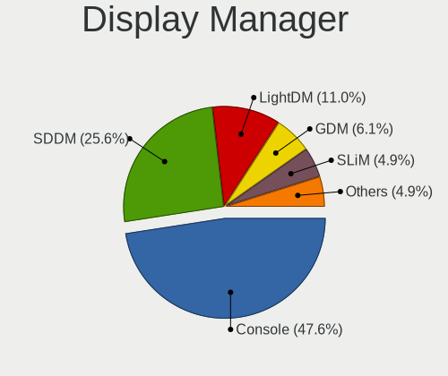
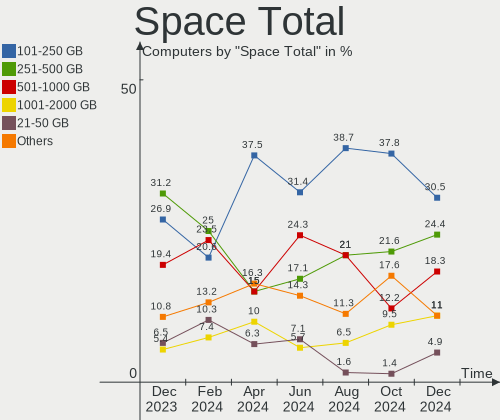
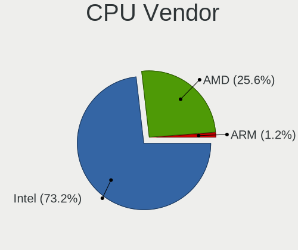
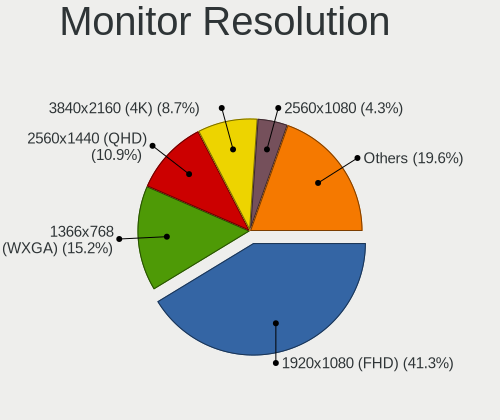

FreeBSD Hardware Trends
-----------------------

A project to identify most popular hardware characteristics and track their change
over time based on data collected by FreeBSD users at https://BSD-Hardware.info.

Anyone can contribute to the study by uploading probes of their computers by
the [hw-probe](https://github.com/linuxhw/hw-probe/blob/master/INSTALL.BSD.md) tool:

    hw-probe -all -upload

This is a report for all computer types. See also reports for [desktops](/Dist/FreeBSD/Desktop/README.md) and [notebooks](/Dist/FreeBSD/Notebook/README.md).

Full-feature report is available here: https://bsd-hardware.info/?view=trends

Period: Mar, 2021.

Contents
--------

- [ OS                       ](#os)
- [ OS Family                ](#os-family)
- [ Arch                     ](#arch)
- [ DE                       ](#de)
- [ Display Server           ](#display-server)
- [ Display Manager          ](#display-manager)
- [ OS Lang                  ](#os-lang)
- [ Boot Mode                ](#boot-mode)
- [ Filesystem               ](#filesystem)
- [ Part. scheme             ](#part-scheme)
- [ Country                  ](#country)
- [ City                     ](#city)
- [ Vendor                   ](#vendor)
- [ Model                    ](#model)
- [ Model Family             ](#model-family)
- [ MFG Year                 ](#mfg-year)
- [ Form Factor              ](#form-factor)
- [ Coreboot                 ](#coreboot)
- [ RAM Size                 ](#ram-size)
- [ RAM Used                 ](#ram-used)
- [ Has CD-ROM               ](#has-cd-rom)
- [ Total Drives             ](#total-drives)
- [ Has Ethernet             ](#has-ethernet)
- [ Has WiFi                 ](#has-wifi)
- [ Has Bluetooth            ](#has-bluetooth)
- [ Drive Vendor             ](#drive-vendor)
- [ Drive Model              ](#drive-model)
- [ HDD Vendor               ](#hdd-vendor)
- [ SSD Vendor               ](#ssd-vendor)
- [ Drive Kind               ](#drive-kind)
- [ Drive Connector          ](#drive-connector)
- [ Drive Size               ](#drive-size)
- [ Space Total              ](#space-total)
- [ Space Used               ](#space-used)
- [ Malfunc. Drives          ](#malfunc-drives)
- [ Malfunc. Drive Vendor    ](#malfunc-drive-vendor)
- [ Malfunc. HDD Vendor      ](#malfunc-hdd-vendor)
- [ Malfunc. Drive Kind      ](#malfunc-drive-kind)
- [ Failed Drives            ](#failed-drives)
- [ Failed Drive Vendor      ](#failed-drive-vendor)
- [ Drive Status             ](#drive-status)
- [ Storage Vendor           ](#storage-vendor)
- [ Storage Model            ](#storage-model)
- [ Storage Kind             ](#storage-kind)
- [ CPU Vendor               ](#cpu-vendor)
- [ CPU Model                ](#cpu-model)
- [ CPU Model Family         ](#cpu-model-family)
- [ CPU Cores                ](#cpu-cores)
- [ CPU Sockets              ](#cpu-sockets)
- [ CPU Threads              ](#cpu-threads)
- [ CPU Microarch            ](#cpu-microarch)
- [ GPU Vendor               ](#gpu-vendor)
- [ GPU Model                ](#gpu-model)
- [ GPU Combo                ](#gpu-combo)
- [ GPU Driver               ](#gpu-driver)
- [ GPU Memory               ](#gpu-memory)
- [ Monitor Vendor           ](#monitor-vendor)
- [ Monitor Model            ](#monitor-model)
- [ Monitor Resolution       ](#monitor-resolution)
- [ Monitor Diagonal         ](#monitor-diagonal)
- [ Monitor Width            ](#monitor-width)
- [ Aspect Ratio             ](#aspect-ratio)
- [ Monitor Area             ](#monitor-area)
- [ Pixel Density            ](#pixel-density)
- [ Multiple Monitors        ](#multiple-monitors)
- [ Net Controller Vendor    ](#net-controller-vendor)
- [ Net Controller Model     ](#net-controller-model)
- [ Wireless Vendor          ](#wireless-vendor)
- [ Wireless Model           ](#wireless-model)
- [ Ethernet Vendor          ](#ethernet-vendor)
- [ Ethernet Model           ](#ethernet-model)
- [ Net Controller Kind      ](#net-controller-kind)
- [ Used Controller          ](#used-controller)
- [ NICs                     ](#nics)
- [ IPv6                     ](#ipv6)
- [ Memory Vendor            ](#memory-vendor)
- [ Memory Model             ](#memory-model)
- [ Memory Kind              ](#memory-kind)
- [ Memory Form Factor       ](#memory-form-factor)
- [ Memory Size              ](#memory-size)
- [ Memory Speed             ](#memory-speed)
- [ Sound Vendor             ](#sound-vendor)
- [ Sound Model              ](#sound-model)
- [ Camera Vendor            ](#camera-vendor)
- [ Camera Model             ](#camera-model)
- [ Fingerprint Vendor       ](#fingerprint-vendor)
- [ Fingerprint Model        ](#fingerprint-model)
- [ Chipcard Vendor          ](#chipcard-vendor)
- [ Chipcard Model           ](#chipcard-model)
- [ Printer Vendor           ](#printer-vendor)
- [ Printer Model            ](#printer-model)
- [ Scanner Vendor           ](#scanner-vendor)
- [ Scanner Model            ](#scanner-model)
- [ Bluetooth Vendor         ](#bluetooth-vendor)
- [ Bluetooth Model          ](#bluetooth-model)
- [ Unsupported Devices      ](#unsupported-devices)
- [ Unsupported Device Types ](#unsupported-device-types)

OS
--

Installed operating systems

| Name                  | Computers | Percent |
|-----------------------|-----------|---------|
| FreeBSD 12.2-p4       | 35        | 33.98%  |
| FreeBSD 12.2          | 10        | 9.71%   |
| FreeBSD 14.0-CURRENT  | 9         | 8.74%   |
| FreeBSD 13.0-RC2      | 9         | 8.74%   |
| FreeBSD 13.0-STABLE   | 6         | 5.83%   |
| FreeBSD 13.0-RC1      | 6         | 5.83%   |
| FreeBSD 12.2-p3       | 5         | 4.85%   |
| FreeBSD 12.2-STABLE   | 4         | 3.88%   |
| FreeBSD 13.0-RC3      | 3         | 2.91%   |
| FreeBSD 13.0-BETA4    | 3         | 2.91%   |
| FreeBSD 12.2-p5       | 3         | 2.91%   |
| FreeBSD 12.2-p2       | 3         | 2.91%   |
| FreeBSD 11.4-p8       | 2         | 1.94%   |
| FreeBSD 13.0-BETA3-p1 | 1         | 0.97%   |
| FreeBSD 12.1-p8       | 1         | 0.97%   |
| FreeBSD 12.1-p12-HBSD | 1         | 0.97%   |
| FreeBSD 12.1-p10      | 1         | 0.97%   |
| FreeBSD 12.1          | 1         | 0.97%   |

OS Family
---------

OS without a version

| Name    | Computers | Percent |
|---------|-----------|---------|
| FreeBSD | 103       | 100%    |

Arch
----

OS architecture (x86_64, i586, etc.)

| Name  | Computers | Percent |
|-------|-----------|---------|
| amd64 | 93        | 90.29%  |
| i386  | 5         | 4.85%   |
| arm64 | 4         | 3.88%   |
| arm   | 1         | 0.97%   |

DE
--

Desktop Environment

| Name          | Computers | Percent |
|---------------|-----------|---------|
| Console       | 26        | 25.24%  |
| XFCE          | 19        | 18.45%  |
| KDE5          | 18        | 17.48%  |
| GNOME         | 10        | 9.71%   |
| TWM           | 8         | 7.77%   |
| MATE          | 4         | 3.88%   |
| i3            | 3         | 2.91%   |
| Cinnamon      | 3         | 2.91%   |
| LXDE          | 2         | 1.94%   |
| Lumina        | 2         | 1.94%   |
| Enlightenment | 2         | 1.94%   |
| AwesomeWM     | 2         | 1.94%   |
| Openbox       | 1         | 0.97%   |
| LXQt          | 1         | 0.97%   |
| dwm           | 1         | 0.97%   |
| CDE           | 1         | 0.97%   |

Display Server
--------------

X11 or Wayland

| Name    | Computers | Percent |
|---------|-----------|---------|
| X11     | 72        | 69.9%   |
| Console | 30        | 29.13%  |
| Wayland | 1         | 0.97%   |

Display Manager
---------------

SDDM, LightDM, etc.

| Name    | Computers | Percent |
|---------|-----------|---------|
| Console | 50        | 48.54%  |
| SLiM    | 16        | 15.53%  |
| SDDM    | 13        | 12.62%  |
| XDM     | 8         | 7.77%   |
| GDM     | 8         | 7.77%   |
| LightDM | 7         | 6.8%    |
| Ly      | 1         | 0.97%   |

OS Lang
-------

Language

| Lang             | Computers | Percent |
|------------------|-----------|---------|
| Unknown          | 38        | 36.89%  |
| C                | 22        | 21.36%  |
| en_US            | 18        | 17.48%  |
| ru_RU            | 6         | 5.83%   |
| zh_CN            | 2         | 1.94%   |
| uk_UA            | 2         | 1.94%   |
| fr_FR            | 2         | 1.94%   |
| sv_SE.US-ASCII   | 1         | 0.97%   |
| sv_SE            | 1         | 0.97%   |
| ru_RU.KOI8-R     | 1         | 0.97%   |
| pt_BR            | 1         | 0.97%   |
| pl_PL            | 1         | 0.97%   |
| en_NZ            | 1         | 0.97%   |
| en_GB.US-ASCII   | 1         | 0.97%   |
| en_GB            | 1         | 0.97%   |
| en_AU            | 1         | 0.97%   |
| de_DE.ISO8859-15 | 1         | 0.97%   |
| de_DE.ISO8859-1  | 1         | 0.97%   |
| de_CH            | 1         | 0.97%   |
| cv_RU.US-ASCII   | 1         | 0.97%   |

Boot Mode
---------

EFI or BIOS

| Mode | Computers | Percent |
|------|-----------|---------|
| EFI  | 67        | 65.05%  |
| BIOS | 36        | 34.95%  |

Filesystem
----------

Type of filesystem

| Type | Computers | Percent |
|------|-----------|---------|
| Zfs  | 59        | 57.28%  |
| Ufs  | 44        | 42.72%  |

Part. scheme
------------

Scheme of partitioning

| Type | Computers | Percent |
|------|-----------|---------|
| GPT  | 88        | 85.44%  |
| MBR  | 14        | 13.59%  |
| BSD  | 1         | 0.97%   |

Country
-------

Geographic location (country)

| Country     | Computers | Percent |
|-------------|-----------|---------|
| USA         | 26        | 25.24%  |
| Russia      | 16        | 15.53%  |
| France      | 9         | 8.74%   |
| Germany     | 7         | 6.8%    |
| Ukraine     | 4         | 3.88%   |
| Brazil      | 4         | 3.88%   |
| UK          | 3         | 2.91%   |
| Switzerland | 3         | 2.91%   |
| Sweden      | 3         | 2.91%   |
| Spain       | 3         | 2.91%   |
| Netherlands | 3         | 2.91%   |
| Japan       | 3         | 2.91%   |
| Czechia     | 3         | 2.91%   |
| China       | 3         | 2.91%   |
| Austria     | 3         | 2.91%   |
| Portugal    | 2         | 1.94%   |
| Italy       | 2         | 1.94%   |
| Indonesia   | 2         | 1.94%   |
| Poland      | 1         | 0.97%   |
| New Zealand | 1         | 0.97%   |
| Canada      | 1         | 0.97%   |
| Australia   | 1         | 0.97%   |

City
----

Geographic location (city)

| City                     | Computers | Percent |
|--------------------------|-----------|---------|
| Moscow                   | 5         | 4.85%   |
| Brooklyn                 | 4         | 3.88%   |
| Ulyanovsk                | 3         | 2.91%   |
| Villeneuve-Saint-Georges | 2         | 1.94%   |
| Vienna                   | 2         | 1.94%   |
| Redmond                  | 2         | 1.94%   |
| Prague                   | 2         | 1.94%   |
| Paris                    | 2         | 1.94%   |
| Manaus                   | 2         | 1.94%   |
| Hazel Green              | 2         | 1.94%   |
| Gibraleón               | 2         | 1.94%   |
| Chicago                  | 2         | 1.94%   |
| Carlsbad                 | 2         | 1.94%   |
| Brovary                  | 2         | 1.94%   |
| Beaumes-de-Venise        | 2         | 1.94%   |
| Armavir                  | 2         | 1.94%   |
| Ōta-ku                  | 1         | 0.97%   |
| Zurich                   | 1         | 0.97%   |
| Yokohama                 | 1         | 0.97%   |
| Yekaterinburg            | 1         | 0.97%   |
| Wuxi                     | 1         | 0.97%   |
| Wenatchee                | 1         | 0.97%   |
| Vyshhorod                | 1         | 0.97%   |
| Vorkuta                  | 1         | 0.97%   |
| Trosa                    | 1         | 0.97%   |
| Tongshan                 | 1         | 0.97%   |
| Tolyatti                 | 1         | 0.97%   |
| Tangerang                | 1         | 0.97%   |
| Södertälje             | 1         | 0.97%   |
| Stockholm                | 1         | 0.97%   |
| Springe                  | 1         | 0.97%   |
| Shibuya                  | 1         | 0.97%   |
| Seattle                  | 1         | 0.97%   |
| Santa Monica             | 1         | 0.97%   |
| Salem                    | 1         | 0.97%   |
| Ramerberg                | 1         | 0.97%   |
| Perth                    | 1         | 0.97%   |
| Parndorf                 | 1         | 0.97%   |
| Opfikon                  | 1         | 0.97%   |
| Novosibirsk              | 1         | 0.97%   |
| Mions                    | 1         | 0.97%   |
| Medford                  | 1         | 0.97%   |
| Marseille                | 1         | 0.97%   |
| Markt Indersdorf         | 1         | 0.97%   |
| Lübeck                  | 1         | 0.97%   |
| Louisville               | 1         | 0.97%   |
| Lanton                   | 1         | 0.97%   |
| Laguna Niguel            | 1         | 0.97%   |
| Kyiv                     | 1         | 0.97%   |
| Kingman                  | 1         | 0.97%   |
| Khimki                   | 1         | 0.97%   |
| João Pessoa             | 1         | 0.97%   |
| Jakarta                  | 1         | 0.97%   |
| Jaboatao dos Guararapes  | 1         | 0.97%   |
| Ilhavo                   | 1         | 0.97%   |
| Horovice                 | 1         | 0.97%   |
| Hoek van Holland         | 1         | 0.97%   |
| Hamburg                  | 1         | 0.97%   |
| Guimarães               | 1         | 0.97%   |
| Glasgow                  | 1         | 0.97%   |

Vendor
------

Motherboard manufacturer

| Name                    | Computers | Percent |
|-------------------------|-----------|---------|
| Lenovo                  | 22        | 21.36%  |
| Hewlett-Packard         | 13        | 12.62%  |
| ASUSTek Computer        | 10        | 9.71%   |
| Dell                    | 9         | 8.74%   |
| Gigabyte Technology     | 8         | 7.77%   |
| MSI                     | 6         | 5.83%   |
| Intel                   | 4         | 3.88%   |
| ASRock                  | 4         | 3.88%   |
| Unknown                 | 4         | 3.88%   |
| Supermicro              | 3         | 2.91%   |
| Samsung Electronics     | 3         | 2.91%   |
| Clevo                   | 2         | 1.94%   |
| Apple                   | 2         | 1.94%   |
| Toshiba                 | 1         | 0.97%   |
| Raspberry Pi Foundation | 1         | 0.97%   |
| pine64                  | 1         | 0.97%   |
| Packard Bell            | 1         | 0.97%   |
| Notebook                | 1         | 0.97%   |
| Kontron                 | 1         | 0.97%   |
| IBM                     | 1         | 0.97%   |
| HUAWEI                  | 1         | 0.97%   |
| HPE                     | 1         | 0.97%   |
| Gateway                 | 1         | 0.97%   |
| Avell High Performance  | 1         | 0.97%   |
| Alienware               | 1         | 0.97%   |
| Acer                    | 1         | 0.97%   |

Model
-----

Motherboard model

| Name                                     | Computers | Percent |
|------------------------------------------|-----------|---------|
| Unknown                                  | 4         | 3.88%   |
| Toshiba Satellite L50-C                  | 1         | 0.97%   |
| Supermicro X7SPA-HF                      | 1         | 0.97%   |
| Supermicro Super Server                  | 1         | 0.97%   |
| Supermicro IXWS-733TQ-665B-IXN           | 1         | 0.97%   |
| Samsung N150P                            | 1         | 0.97%   |
| Samsung N145P/N250P/N260P                | 1         | 0.97%   |
| Samsung 950XCJ/951XCJ/950XCR             | 1         | 0.97%   |
| RPi rpi                                  | 1         | 0.97%   |
| pine64 pinebook-pro-rk3399               | 1         | 0.97%   |
| Packard Bell AOA110                      | 1         | 0.97%   |
| Notebook N85_N87HCHNHZ                   | 1         | 0.97%   |
| MSI MS-7C36                              | 1         | 0.97%   |
| MSI MS-7B86                              | 1         | 0.97%   |
| MSI MS-7972                              | 1         | 0.97%   |
| MSI MS-7817                              | 1         | 0.97%   |
| MSI MS-7693                              | 1         | 0.97%   |
| MSI GE75 Raider 10SGS                    | 1         | 0.97%   |
| Lenovo ThinkPad X395 20NL001SMX          | 1         | 0.97%   |
| Lenovo ThinkPad X270 W10DG 20K5S0DS00    | 1         | 0.97%   |
| Lenovo ThinkPad X220 4291IR6             | 1         | 0.97%   |
| Lenovo ThinkPad X220 4290EE8             | 1         | 0.97%   |
| Lenovo ThinkPad X200s 7470W1V            | 1         | 0.97%   |
| Lenovo ThinkPad X1 Carbon 7th 20QDCTO1WW | 1         | 0.97%   |
| Lenovo ThinkPad X1 Carbon 3rd 20BT0018US | 1         | 0.97%   |
| Lenovo ThinkPad X1 Carbon 3rd 20BT000BUS | 1         | 0.97%   |
| Lenovo ThinkPad T60 20076PU              | 1         | 0.97%   |
| Lenovo ThinkPad T590 20N4CTO1WW          | 1         | 0.97%   |
| Lenovo ThinkPad T490 20N3X50500          | 1         | 0.97%   |
| Lenovo ThinkPad T490 20N20009FR          | 1         | 0.97%   |
| Lenovo ThinkPad T480s 20L7001HRT         | 1         | 0.97%   |
| Lenovo ThinkPad T470 20HES5PK00          | 1         | 0.97%   |
| Lenovo ThinkPad R61 77331CU              | 1         | 0.97%   |
| Lenovo ThinkPad P15 Gen 1 20ST005VRT     | 1         | 0.97%   |
| Lenovo ThinkPad L590 20Q7000YSP          | 1         | 0.97%   |
| Lenovo ThinkPad L530 24812TG             | 1         | 0.97%   |
| Lenovo ThinkPad E490 20N8CTO1WW          | 1         | 0.97%   |
| Lenovo ThinkPad E460 20ETA00DCD          | 1         | 0.97%   |
| Lenovo Legion 5 15IMH05 82AU             | 1         | 0.97%   |
| Lenovo IdeaPad Y700-15ISK 80NV           | 1         | 0.97%   |
| Kontron KT965/ATXP                       | 1         | 0.97%   |
| Intel X64                                | 1         | 0.97%   |
| Intel S3420GP                            | 1         | 0.97%   |
| Intel Q3XXG4-P V1.0                      | 1         | 0.97%   |
| Intel NUC6i5SYB H81131-503               | 1         | 0.97%   |
| IBM System x3650 M3 -[7945K3G]-          | 1         | 0.97%   |
| HUAWEI MACH-WX9                          | 1         | 0.97%   |
| HPE ProLiant MicroServer Gen10           | 1         | 0.97%   |
| HP Z600 Workstation                      | 1         | 0.97%   |
| HP Slim Desktop 290-p0xxx                | 1         | 0.97%   |
| HP ProLiant DL385 G2                     | 1         | 0.97%   |
| HP ProLiant DL360 G6                     | 1         | 0.97%   |
| HP ProLiant DL180 G6                     | 1         | 0.97%   |
| HP ProBook 455 G7                        | 1         | 0.97%   |
| HP Pavilion Gaming Laptop 17-cd0xxx      | 1         | 0.97%   |
| HP EliteDesk 800 G2 TWR                  | 1         | 0.97%   |
| HP EliteDesk 800 G1 SFF                  | 1         | 0.97%   |
| HP EliteBook Folio 9470m                 | 1         | 0.97%   |
| HP EliteBook 8570p                       | 1         | 0.97%   |
| HP EliteBook 820 G1                      | 1         | 0.97%   |

Model Family
------------

Motherboard model prefix

| Name                           | Computers | Percent |
|--------------------------------|-----------|---------|
| Lenovo ThinkPad                | 20        | 19.42%  |
| Dell Latitude                  | 4         | 3.88%   |
| Unknown                        | 4         | 3.88%   |
| HP ProLiant                    | 3         | 2.91%   |
| HP EliteBook                   | 3         | 2.91%   |
| HP EliteDesk                   | 2         | 1.94%   |
| Dell Precision                 | 2         | 1.94%   |
| Toshiba Satellite              | 1         | 0.97%   |
| Supermicro X7SPA-HF            | 1         | 0.97%   |
| Supermicro Super               | 1         | 0.97%   |
| Supermicro IXWS-733TQ-665B-IXN | 1         | 0.97%   |
| Samsung N150P                  | 1         | 0.97%   |
| Samsung N145P                  | 1         | 0.97%   |
| Samsung 950XCJ                 | 1         | 0.97%   |
| RPi rpi                        | 1         | 0.97%   |
| pine64 pinebook-pro-rk3399     | 1         | 0.97%   |
| Packard Bell AOA110            | 1         | 0.97%   |
| Notebook N85                   | 1         | 0.97%   |
| MSI MS-7C36                    | 1         | 0.97%   |
| MSI MS-7B86                    | 1         | 0.97%   |
| MSI MS-7972                    | 1         | 0.97%   |
| MSI MS-7817                    | 1         | 0.97%   |
| MSI MS-7693                    | 1         | 0.97%   |
| MSI GE75                       | 1         | 0.97%   |
| Lenovo Legion                  | 1         | 0.97%   |
| Lenovo IdeaPad                 | 1         | 0.97%   |
| Kontron KT965                  | 1         | 0.97%   |
| Intel X64                      | 1         | 0.97%   |
| Intel S3420GP                  | 1         | 0.97%   |
| Intel Q3XXG4-P                 | 1         | 0.97%   |
| Intel NUC6i5SYB                | 1         | 0.97%   |
| IBM System                     | 1         | 0.97%   |
| HUAWEI MACH-WX9                | 1         | 0.97%   |
| HPE ProLiant                   | 1         | 0.97%   |
| HP Z600                        | 1         | 0.97%   |
| HP Slim                        | 1         | 0.97%   |
| HP ProBook                     | 1         | 0.97%   |
| HP Pavilion                    | 1         | 0.97%   |
| HP 255                         | 1         | 0.97%   |
| Gigabyte Z87-D3HP              | 1         | 0.97%   |
| Gigabyte H61M-DS2              | 1         | 0.97%   |
| Gigabyte B360                  | 1         | 0.97%   |
| Gigabyte AB350M-Gaming         | 1         | 0.97%   |
| Gigabyte 990FXA-UD3            | 1         | 0.97%   |
| Gigabyte 970A-UD3P             | 1         | 0.97%   |
| Gigabyte 970A-DS3P             | 1         | 0.97%   |
| Gigabyte 8IG1000MK             | 1         | 0.97%   |
| Gateway Solo                   | 1         | 0.97%   |
| Dell XPS                       | 1         | 0.97%   |
| Dell PowerEdge                 | 1         | 0.97%   |
| Dell Inspiron                  | 1         | 0.97%   |
| Clevo W55xEU                   | 1         | 0.97%   |
| Clevo W240EU                   | 1         | 0.97%   |
| Avell High Performance A62     | 1         | 0.97%   |
| ASUS STRIX                     | 1         | 0.97%   |
| ASUS RJ030AV-ABA               | 1         | 0.97%   |
| ASUS P8Z68-V                   | 1         | 0.97%   |
| ASUS P8H77-I                   | 1         | 0.97%   |
| ASUS P8H67-V                   | 1         | 0.97%   |
| ASUS P5Q-E                     | 1         | 0.97%   |

MFG Year
--------

Motherboard manufacture year

| Year    | Computers | Percent |
|---------|-----------|---------|
| 2020    | 25        | 24.27%  |
| 2018    | 13        | 12.62%  |
| 2019    | 10        | 9.71%   |
| 2014    | 8         | 7.77%   |
| 2015    | 5         | 4.85%   |
| 2008    | 5         | 4.85%   |
| 2021    | 4         | 3.88%   |
| 2017    | 4         | 3.88%   |
| 2013    | 4         | 3.88%   |
| 2012    | 4         | 3.88%   |
| 2011    | 4         | 3.88%   |
| 2010    | 4         | 3.88%   |
| 2016    | 3         | 2.91%   |
| Unknown | 3         | 2.91%   |
| 2009    | 2         | 1.94%   |
| 2007    | 2         | 1.94%   |
| 2006    | 1         | 0.97%   |
| 2005    | 1         | 0.97%   |
| 2002    | 1         | 0.97%   |

Form Factor
-----------

Physical design of the computer

| Name     | Computers | Percent |
|----------|-----------|---------|
| Notebook | 54        | 52.43%  |
| Desktop  | 39        | 37.86%  |
| Server   | 9         | 8.74%   |
| Mini pc  | 1         | 0.97%   |

Coreboot
--------

Have coreboot on board

| Used | Computers | Percent |
|------|-----------|---------|
| No   | 103       | 100%    |

RAM Size
--------

Total RAM memory

| Size in GB      | Computers | Percent |
|-----------------|-----------|---------|
| 16.01-24.0      | 31        | 30.1%   |
| 8.01-16.0       | 20        | 19.42%  |
| 4.01-8.0        | 16        | 15.53%  |
| 32.01-64.0      | 14        | 13.59%  |
| 64.01-256.0     | 7         | 6.8%    |
| 2.01-3.0        | 5         | 4.85%   |
| 24.01-32.0      | 3         | 2.91%   |
| 3.01-4.0        | 2         | 1.94%   |
| 0.01-0.5        | 2         | 1.94%   |
| More than 256.0 | 1         | 0.97%   |
| 1.01-2.0        | 1         | 0.97%   |
| 0.51-1.0        | 1         | 0.97%   |

RAM Used
--------

Used RAM memory

| Used GB     | Computers | Percent |
|-------------|-----------|---------|
| 0.51-1.0    | 41        | 39.81%  |
| 0.01-0.5    | 30        | 29.13%  |
| 1.01-2.0    | 11        | 10.68%  |
| 8.01-16.0   | 6         | 5.83%   |
| 3.01-4.0    | 4         | 3.88%   |
| 4.01-8.0    | 3         | 2.91%   |
| 2.01-3.0    | 2         | 1.94%   |
| 0           | 2         | 1.94%   |
| 32.01-64.0  | 1         | 0.97%   |
| 24.01-32.0  | 1         | 0.97%   |
| 64.01-256.0 | 1         | 0.97%   |
| 16.01-24.0  | 1         | 0.97%   |

Has CD-ROM
----------

Has CD-ROM on board

| Presented | Computers | Percent |
|-----------|-----------|---------|
| No        | 72        | 69.9%   |
| Yes       | 31        | 30.1%   |

Total Drives
------------

Number of drives on board

| Drives | Computers | Percent |
|--------|-----------|---------|
| 1      | 50        | 48.54%  |
| 2      | 25        | 24.27%  |
| 0      | 8         | 7.77%   |
| 4      | 7         | 6.8%    |
| 3      | 7         | 6.8%    |
| 6      | 2         | 1.94%   |
| 5      | 2         | 1.94%   |
| 12     | 1         | 0.97%   |
| 7      | 1         | 0.97%   |

Has Ethernet
------------

Has Ethernet on board

| Presented | Computers | Percent |
|-----------|-----------|---------|
| Yes       | 95        | 92.23%  |
| No        | 8         | 7.77%   |

Has WiFi
--------

Has WiFi module

| Presented | Computers | Percent |
|-----------|-----------|---------|
| Yes       | 62        | 60.19%  |
| No        | 41        | 39.81%  |

Has Bluetooth
-------------

Has Bluetooth module

| Presented | Computers | Percent |
|-----------|-----------|---------|
| No        | 60        | 58.25%  |
| Yes       | 43        | 41.75%  |

Drive Vendor
------------

Hard drive vendors

| Vendor              | Computers | Drives | Percent |
|---------------------|-----------|--------|---------|
| WDC                 | 29        | 56     | 20.86%  |
| Samsung Electronics | 21        | 24     | 15.11%  |
| Seagate             | 18        | 25     | 12.95%  |
| Toshiba             | 11        | 15     | 7.91%   |
| Intel               | 11        | 13     | 7.91%   |
| Hitachi             | 5         | 6      | 3.6%    |
| SanDisk             | 4         | 4      | 2.88%   |
| Kingston            | 4         | 4      | 2.88%   |
| Crucial             | 4         | 4      | 2.88%   |
| HGST                | 3         | 7      | 2.16%   |
| Hewlett-Packard     | 3         | 5      | 2.16%   |
| SK Hynix            | 2         | 2      | 1.44%   |
| Phison              | 2         | 2      | 1.44%   |
| OWC                 | 2         | 2      | 1.44%   |
| Micron Technology   | 2         | 2      | 1.44%   |
| LITEON              | 2         | 2      | 1.44%   |
| A-DATA Technology   | 2         | 2      | 1.44%   |
| Zheino              | 1         | 1      | 0.72%   |
| Union Memory        | 1         | 1      | 0.72%   |
| Transcend           | 1         | 1      | 0.72%   |
| OCZ                 | 1         | 1      | 0.72%   |
| LEXAR               | 1         | 1      | 0.72%   |
| Kston               | 1         | 1      | 0.72%   |
| KingSpec            | 1         | 1      | 0.72%   |
| Hoodisk             | 1         | 1      | 0.72%   |
| GOODRAM             | 1         | 1      | 0.72%   |
| Gigabyte Technology | 1         | 1      | 0.72%   |
| Corsair             | 1         | 1      | 0.72%   |
| China               | 1         | 1      | 0.72%   |
| Apple               | 1         | 2      | 0.72%   |
| Apacer              | 1         | 1      | 0.72%   |

Drive Model
-----------

Hard drive models

| Model                                           | Computers | Percent |
|-------------------------------------------------|-----------|---------|
| Seagate ST4000DM000-1F2168 4TB                  | 3         | 1.83%   |
| Seagate ST1000DM003-1SB102 1TB                  | 3         | 1.83%   |
| WDC WDS120G2G0A-00JH30 120GB                    | 2         | 1.22%   |
| WDC WDS100T2B0A-00SM50 1TB                      | 2         | 1.22%   |
| SK Hynix BC511 NVMe 512GB                       | 2         | 1.22%   |
| Seagate ST500DM002-1BD142 500GB                 | 2         | 1.22%   |
| Seagate ST2000LM007-1R8174 2TB                  | 2         | 1.22%   |
| Seagate ST1000LM048-2E7172 1TB                  | 2         | 1.22%   |
| Seagate ST1000LM024 HN-M101MBB 1TB              | 2         | 1.22%   |
| Samsung SSD 850 EVO 500GB                       | 2         | 1.22%   |
| Samsung SSD 850 EVO 250GB                       | 2         | 1.22%   |
| Phison PCIe SSD 2TB                             | 2         | 1.22%   |
| OWC Mercury Electra 6G SSD                      | 2         | 1.22%   |
| Intel SSDSA2CT040G3 40GB                        | 2         | 1.22%   |
| Intel SSDPEKNW512G8H 512GB                      | 2         | 1.22%   |
| HP RAID 1(1+0) 73GB                             | 2         | 1.22%   |
| Zheino CHN mSATA01M 060 64GB                    | 1         | 0.61%   |
| WDC WDS100T3X0C-00SJG0 1TB                      | 1         | 0.61%   |
| WDC WDS100T1X0E-00AFY0 1TB                      | 1         | 0.61%   |
| WDC WD80EMAZ-00WJTA0 8TB                        | 1         | 0.61%   |
| WDC WD80EFZX-68UW8N0 8TB                        | 1         | 0.61%   |
| WDC WD80EFAX-68LHPN0 8TB                        | 1         | 0.61%   |
| WDC WD7501AALS-00E8B0 752GB                     | 1         | 0.61%   |
| WDC WD7500BPKX-75HPJT0 752GB                    | 1         | 0.61%   |
| WDC WD60EZRZ-00GZ5B1 6TB                        | 1         | 0.61%   |
| WDC WD6002FRYZ-01WD5B1 6TB                      | 1         | 0.61%   |
| WDC WD5003AZEX-00MK2A0 500GB                    | 1         | 0.61%   |
| WDC WD5000AZLX-60K2TA0 500GB                    | 1         | 0.61%   |
| WDC WD40EZRZ-22GXCB0 4TB                        | 1         | 0.61%   |
| WDC WD40EFRX-68N32N0 4TB                        | 1         | 0.61%   |
| WDC WD40E31X-00HY4A0 4TB                        | 1         | 0.61%   |
| WDC WD30EZRX-00SPEB0 3TB                        | 1         | 0.61%   |
| WDC WD20SPZX-75UA7T0 2TB                        | 1         | 0.61%   |
| WDC WD20SPZX-22UA7T0 2TB                        | 1         | 0.61%   |
| WDC WD20SPZX-22CRAT0 2TB                        | 1         | 0.61%   |
| WDC WD20EZRZ-00Z5HB0 2TB                        | 1         | 0.61%   |
| WDC WD20EFRX-68EUZN0 2TB                        | 1         | 0.61%   |
| WDC WD20EARX-00PASB0 2TB                        | 1         | 0.61%   |
| WDC WD2002FAEX-007BA0 2TB                       | 1         | 0.61%   |
| WDC WD1600YD-01NVB1 164GB                       | 1         | 0.61%   |
| WDC WD15EARS-00Z5B1 1.5TB                       | 1         | 0.61%   |
| WDC WD120EMFZ-11A6JA0 12TB                      | 1         | 0.61%   |
| WDC WD120EMAZ-11BLFA0 12TB                      | 1         | 0.61%   |
| WDC WD10SPZX-21Z10T0 1TB                        | 1         | 0.61%   |
| WDC WD10SDZW-11UMGS0 1TB                        | 1         | 0.61%   |
| WDC WD10JMVW-11AJGS1 1TB                        | 1         | 0.61%   |
| WDC WD10EZRX-00L4HB0 1TB                        | 1         | 0.61%   |
| WDC WD10EZEX-08WN4A0 1TB                        | 1         | 0.61%   |
| WDC WD10EZEX-00RKKA0 1TB                        | 1         | 0.61%   |
| WDC WD10EADS-00L5B1 1TB                         | 1         | 0.61%   |
| WDC WD1003FZEX-00K3CA0 1TB                      | 1         | 0.61%   |
| WDC WD1001FALS-00J7B0 1TB                       | 1         | 0.61%   |
| WDC PC SN730 SDBQNTY-256G-1001 256GB            | 1         | 0.61%   |
| WDC PC SN730 SDBPNTY-1T00-1032 1TB              | 1         | 0.61%   |
| Union Memory UMIS LENSE40256GMSP34MESTB3A 256GB | 1         | 0.61%   |
| Transcend TS128GMTS430S 128GB                   | 1         | 0.61%   |
| Toshiba THNSFJ256GDNU 256GB                     | 1         | 0.61%   |
| Toshiba MQ04ABF100 1TB                          | 1         | 0.61%   |
| Toshiba MQ01ABF050 500GB                        | 1         | 0.61%   |
| Toshiba MQ01ABD100 1TB                          | 1         | 0.61%   |

HDD Vendor
----------

Hard disk drive vendors

| Vendor              | Computers | Drives | Percent |
|---------------------|-----------|--------|---------|
| WDC                 | 23        | 46     | 38.33%  |
| Seagate             | 18        | 25     | 30%     |
| Toshiba             | 6         | 9      | 10%     |
| Hitachi             | 5         | 6      | 8.33%   |
| HGST                | 3         | 7      | 5%      |
| Hewlett-Packard     | 3         | 5      | 5%      |
| Samsung Electronics | 1         | 1      | 1.67%   |
| Apple               | 1         | 2      | 1.67%   |

SSD Vendor
----------

Solid state drive vendors

| Vendor              | Computers | Drives | Percent |
|---------------------|-----------|--------|---------|
| Samsung Electronics | 12        | 14     | 23.08%  |
| Intel               | 6         | 8      | 11.54%  |
| SanDisk             | 4         | 4      | 7.69%   |
| WDC                 | 3         | 5      | 5.77%   |
| Kingston            | 3         | 3      | 5.77%   |
| Crucial             | 3         | 3      | 5.77%   |
| Toshiba             | 2         | 2      | 3.85%   |
| OWC                 | 2         | 2      | 3.85%   |
| Micron Technology   | 2         | 2      | 3.85%   |
| LITEON              | 2         | 2      | 3.85%   |
| Zheino              | 1         | 1      | 1.92%   |
| Transcend           | 1         | 1      | 1.92%   |
| OCZ                 | 1         | 1      | 1.92%   |
| LEXAR               | 1         | 1      | 1.92%   |
| Kston               | 1         | 1      | 1.92%   |
| KingSpec            | 1         | 1      | 1.92%   |
| Hoodisk             | 1         | 1      | 1.92%   |
| GOODRAM             | 1         | 1      | 1.92%   |
| Gigabyte Technology | 1         | 1      | 1.92%   |
| Corsair             | 1         | 1      | 1.92%   |
| China               | 1         | 1      | 1.92%   |
| Apacer              | 1         | 1      | 1.92%   |
| A-DATA Technology   | 1         | 1      | 1.92%   |

Drive Kind
----------

HDD or SSD

| Kind | Computers | Drives | Percent |
|------|-----------|--------|---------|
| SSD  | 48        | 58     | 38.71%  |
| HDD  | 47        | 101    | 37.9%   |
| NVMe | 29        | 31     | 23.39%  |

Drive Connector
---------------

SATA, SAS, NVMe, etc.

| Type | Computers | Drives | Percent |
|------|-----------|--------|---------|
| SATA | 80        | 159    | 73.39%  |
| NVMe | 29        | 31     | 26.61%  |

Drive Size
----------

Size of hard drive

| Size in TB | Computers | Drives | Percent |
|------------|-----------|--------|---------|
| 0.01-0.5   | 57        | 68     | 52.78%  |
| 0.51-1.0   | 23        | 38     | 21.3%   |
| 1.01-2.0   | 12        | 17     | 11.11%  |
| 3.01-4.0   | 6         | 13     | 5.56%   |
| 4.01-10.0  | 6         | 18     | 5.56%   |
| 2.01-3.0   | 3         | 3      | 2.78%   |
| 10.01-20.0 | 1         | 2      | 0.93%   |

Space Total
-----------

Amount of disk space available on the file system

| Size in GB     | Computers | Percent |
|----------------|-----------|---------|
| 251-500        | 29        | 28.16%  |
| 101-250        | 24        | 23.3%   |
| 21-50          | 11        | 10.68%  |
| 501-1000       | 10        | 9.71%   |
| 1001-2000      | 8         | 7.77%   |
| 1-20           | 8         | 7.77%   |
| 51-100         | 8         | 7.77%   |
| 2001-3000      | 3         | 2.91%   |
| More than 3000 | 1         | 0.97%   |
| Unknown        | 1         | 0.97%   |

Space Used
----------

Amount of used disk space

| Used GB   | Computers | Percent |
|-----------|-----------|---------|
| 1-20      | 64        | 62.14%  |
| 21-50     | 18        | 17.48%  |
| 101-250   | 7         | 6.8%    |
| 51-100    | 6         | 5.83%   |
| 251-500   | 3         | 2.91%   |
| 501-1000  | 3         | 2.91%   |
| 2001-3000 | 1         | 0.97%   |
| Unknown   | 1         | 0.97%   |

Malfunc. Drives
---------------

Drive models with a malfunction

| Model                              | Computers | Drives | Percent |
|------------------------------------|-----------|--------|---------|
| WDC WD7501AALS-00E8B0 752GB        | 1         | 1      | 8.33%   |
| WDC WD6002FRYZ-01WD5B1 6TB         | 1         | 1      | 8.33%   |
| WDC WD15EARS-00Z5B1 1.5TB          | 1         | 1      | 8.33%   |
| WDC WD10JMVW-11AJGS1 1TB           | 1         | 1      | 8.33%   |
| Toshiba MQ01ABD050 500GB           | 1         | 1      | 8.33%   |
| Seagate ST500LT012-1DG142 500GB    | 1         | 1      | 8.33%   |
| Seagate ST2000DM006-2DM164 2TB     | 1         | 1      | 8.33%   |
| Seagate ST1000LM024 HN-M101MBB 1TB | 1         | 1      | 8.33%   |
| LEXAR CFAST 64GB CARD              | 1         | 1      | 8.33%   |
| Intel SSDSC2BW480A4 480GB          | 1         | 1      | 8.33%   |
| Hitachi HTS543225L9A300 250GB      | 1         | 1      | 8.33%   |
| HGST HTS725050A7E630 500GB         | 1         | 1      | 8.33%   |

Malfunc. Drive Vendor
---------------------

Vendors of faulty drives

| Vendor  | Computers | Drives | Percent |
|---------|-----------|--------|---------|
| WDC     | 4         | 4      | 33.33%  |
| Seagate | 3         | 3      | 25%     |
| Toshiba | 1         | 1      | 8.33%   |
| LEXAR   | 1         | 1      | 8.33%   |
| Intel   | 1         | 1      | 8.33%   |
| Hitachi | 1         | 1      | 8.33%   |
| HGST    | 1         | 1      | 8.33%   |

Malfunc. HDD Vendor
-------------------

Vendors of faulty HDD drives

| Vendor  | Computers | Drives | Percent |
|---------|-----------|--------|---------|
| WDC     | 4         | 4      | 40%     |
| Seagate | 3         | 3      | 30%     |
| Toshiba | 1         | 1      | 10%     |
| Hitachi | 1         | 1      | 10%     |
| HGST    | 1         | 1      | 10%     |

Malfunc. Drive Kind
-------------------

Kinds of faulty drives

| Kind | Computers | Drives | Percent |
|------|-----------|--------|---------|
| HDD  | 9         | 10     | 81.82%  |
| SSD  | 2         | 2      | 18.18%  |

Failed Drives
-------------

Failed drive models

Zero info for selected period =(

Failed Drive Vendor
-------------------

Failed drive vendors

Zero info for selected period =(

Drive Status
------------

Number of failed and malfunc. drives

| Status   | Computers | Drives | Percent |
|----------|-----------|--------|---------|
| Works    | 88        | 169    | 85.44%  |
| Malfunc  | 10        | 12     | 9.71%   |
| Detected | 5         | 9      | 4.85%   |

Storage Vendor
--------------

Storage controller vendors

| Vendor                      | Computers | Percent |
|-----------------------------|-----------|---------|
| Intel                       | 74        | 57.81%  |
| AMD                         | 13        | 10.16%  |
| Samsung Electronics         | 9         | 7.03%   |
| Sandisk                     | 4         | 3.13%   |
| Toshiba                     | 3         | 2.34%   |
| Marvell Technology Group    | 3         | 2.34%   |
| Hewlett-Packard             | 3         | 2.34%   |
| Broadcom / LSI              | 3         | 2.34%   |
| ASMedia Technology          | 3         | 2.34%   |
| SK Hynix                    | 2         | 1.56%   |
| Phison Electronics          | 2         | 1.56%   |
| VIA Technologies            | 1         | 0.78%   |
| Union Memory (Shenzhen)     | 1         | 0.78%   |
| Silicon Motion              | 1         | 0.78%   |
| Micron/Crucial Technology   | 1         | 0.78%   |
| Lite-On Technology          | 1         | 0.78%   |
| Kingston Technology Company | 1         | 0.78%   |
| Broadcom                    | 1         | 0.78%   |
| Areca Technology            | 1         | 0.78%   |
| ADATA Technology            | 1         | 0.78%   |

Storage Model
-------------

Storage controller models

| Model                                                                            | Computers | Percent |
|----------------------------------------------------------------------------------|-----------|---------|
| Samsung NVMe SSD Controller SM981/PM981/PM983                                    | 7         | 4.9%    |
| AMD FCH SATA Controller [AHCI mode]                                              | 7         | 4.9%    |
| AMD SB7x0/SB8x0/SB9x0 SATA Controller [AHCI mode]                                | 6         | 4.2%    |
| Intel Sunrise Point-LP SATA Controller [AHCI mode]                               | 5         | 3.5%    |
| Intel 8 Series/C220 Series Chipset Family 6-port SATA Controller 1 [AHCI mode]   | 4         | 2.8%    |
| Intel 7 Series Chipset Family 6-port SATA Controller [AHCI mode]                 | 4         | 2.8%    |
| Intel Q170/Q150/B150/H170/H110/Z170/CM236 Chipset SATA Controller [AHCI Mode]    | 3         | 2.1%    |
| Intel HM170/QM170 Chipset SATA Controller [AHCI Mode]                            | 3         | 2.1%    |
| Intel Atom Processor E3800 Series SATA AHCI Controller                           | 3         | 2.1%    |
| Intel 82801 Mobile SATA Controller [RAID mode]                                   | 3         | 2.1%    |
| Intel 6 Series/C200 Series Chipset Family 6 port Mobile SATA AHCI Controller     | 3         | 2.1%    |
| Intel 6 Series/C200 Series Chipset Family 6 port Desktop SATA AHCI Controller    | 3         | 2.1%    |
| ASMedia ASM1062 Serial ATA Controller                                            | 3         | 2.1%    |
| Toshiba XG6 NVMe SSD Controller                                                  | 2         | 1.4%    |
| SK Hynix BC511                                                                   | 2         | 1.4%    |
| Sandisk WD Black SN750 / PC SN730 NVMe SSD                                       | 2         | 1.4%    |
| Samsung NVMe SSD Controller SM961/PM961/SM963                                    | 2         | 1.4%    |
| Phison E12 NVMe Controller                                                       | 2         | 1.4%    |
| Intel Wildcat Point-LP SATA Controller [AHCI Mode]                               | 2         | 1.4%    |
| Intel SSD Pro 7600p/760p/E 6100p Series                                          | 2         | 1.4%    |
| Intel SSD 660P Series                                                            | 2         | 1.4%    |
| Intel NM10/ICH7 Family SATA Controller [AHCI mode]                               | 2         | 1.4%    |
| Intel Comet Lake SATA AHCI Controller                                            | 2         | 1.4%    |
| Intel Cannon Lake PCH SATA AHCI Controller                                       | 2         | 1.4%    |
| Intel C610/X99 series chipset 6-Port SATA Controller [AHCI mode]                 | 2         | 1.4%    |
| Intel Atom/Celeron/Pentium Processor x5-E8000/J3xxx/N3xxx Series SATA Controller | 2         | 1.4%    |
| Intel 82801JI (ICH10 Family) SATA AHCI Controller                                | 2         | 1.4%    |
| Intel 82801IBM/IEM (ICH9M/ICH9M-E) 4 port SATA Controller [AHCI mode]            | 2         | 1.4%    |
| Intel 82801HM/HEM (ICH8M/ICH8M-E) SATA Controller [AHCI mode]                    | 2         | 1.4%    |
| Intel 82801HM/HEM (ICH8M/ICH8M-E) IDE Controller                                 | 2         | 1.4%    |
| Intel 82801GBM/GHM (ICH7-M Family) SATA Controller [IDE mode]                    | 2         | 1.4%    |
| Intel 82801G (ICH7 Family) IDE Controller                                        | 2         | 1.4%    |
| Intel 8 Series SATA Controller 1 [AHCI mode]                                     | 2         | 1.4%    |
| Intel 400 Series Chipset Family SATA AHCI Controller                             | 2         | 1.4%    |
| HP Smart Array G6 controllers                                                    | 2         | 1.4%    |
| VIA VT6421 IDE/SATA Controller                                                   | 1         | 0.7%    |
| Union Memory (Shenzhen) NVMe 256G SSD device                                     | 1         | 0.7%    |
| Toshiba BG3 NVMe SSD Controller                                                  | 1         | 0.7%    |
| Silicon Motion SM2263EN/SM2263XT SSD Controller                                  | 1         | 0.7%    |
| Sandisk WD Blue SN550 NVMe SSD                                                   | 1         | 0.7%    |
| Sandisk WD Black SN850                                                           | 1         | 0.7%    |
| Micron/Crucial P1 NVMe PCIe SSD                                                  | 1         | 0.7%    |
| Marvell Group 88SE9230 PCIe 2.0 x2 4-port SATA 6 Gb/s RAID Controller            | 1         | 0.7%    |
| Marvell Group 88SE9172 SATA 6Gb/s Controller                                     | 1         | 0.7%    |
| Marvell Group 88SE6111/6121 SATA II / PATA Controller                            | 1         | 0.7%    |
| Lite-On M8Pe Series NVMe SSD                                                     | 1         | 0.7%    |
| Kingston Company A2000 NVMe SSD                                                  | 1         | 0.7%    |
| Intel SSD 600P Series                                                            | 1         | 0.7%    |
| Intel SATA Controller [RAID mode]                                                | 1         | 0.7%    |
| Intel Cannon Lake Mobile PCH SATA AHCI Controller                                | 1         | 0.7%    |
| Intel C610/X99 series chipset sSATA Controller [AHCI mode]                       | 1         | 0.7%    |
| Intel C600/X79 series chipset 6-Port SATA AHCI Controller                        | 1         | 0.7%    |
| Intel 82801JI (ICH10 Family) 4 port SATA IDE Controller #1                       | 1         | 0.7%    |
| Intel 82801JI (ICH10 Family) 2 port SATA IDE Controller #2                       | 1         | 0.7%    |
| Intel 82801IR/IO/IH (ICH9R/DO/DH) 6 port SATA Controller [AHCI mode]             | 1         | 0.7%    |
| Intel 82801HR/HO/HH (ICH8R/DO/DH) 2 port SATA Controller [IDE mode]              | 1         | 0.7%    |
| Intel 82801H (ICH8 Family) 4 port SATA Controller [IDE mode]                     | 1         | 0.7%    |
| Intel 82801GR/GDH (ICH7R/ICH7DH) SATA Controller [RAID mode]                     | 1         | 0.7%    |
| Intel 82801GBM/GHM (ICH7-M Family) SATA Controller [AHCI mode]                   | 1         | 0.7%    |
| Intel 82801EB (ICH5) SATA Controller                                             | 1         | 0.7%    |

Storage Kind
------------

Kind of storage controller (IDE, SATA, NVMe, SAS, ...)

| Kind | Computers | Percent |
|------|-----------|---------|
| SATA | 70        | 54.26%  |
| NVMe | 31        | 24.03%  |
| IDE  | 14        | 10.85%  |
| RAID | 12        | 9.3%    |
| SAS  | 1         | 0.78%   |
| SCSI | 1         | 0.78%   |

CPU Vendor
----------

Processor vendors

| Vendor  | Computers | Percent |
|---------|-----------|---------|
| Intel   | 83        | 80.58%  |
| AMD     | 15        | 14.56%  |
| Unknown | 3         | 2.91%   |
| ARM     | 2         | 1.94%   |

CPU Model
---------

Processor models

| Model                                | Computers | Percent |
|--------------------------------------|-----------|---------|
|                                      | 3         | 2.91%   |
| Intel Xeon CPU E5620 @ 2.40GHz       | 2         | 1.94%   |
| Intel Core i7-8700 CPU @ 3.20GHz     | 2         | 1.94%   |
| Intel Core i7-8565U CPU @ 1.80GHz    | 2         | 1.94%   |
| Intel Core i7-8550U CPU @ 1.80GHz    | 2         | 1.94%   |
| Intel Core i7-6700HQ CPU @ 2.60GHz   | 2         | 1.94%   |
| Intel Core i7-10750H CPU @ 2.60GHz   | 2         | 1.94%   |
| Intel Core i5-8265U CPU @ 1.60GHz    | 2         | 1.94%   |
| Intel C1                             | 2         | 1.94%   |
| Intel Atom CPU N270 @ 1.60GHz        | 2         | 1.94%   |
| AMD FX-8320E Eight-Core Processor    | 2         | 1.94%   |
| Intel Xeon W-10885M CPU @ 2.40GHz    | 1         | 0.97%   |
| Intel Xeon CPU X5550 @ 2.67GHz       | 1         | 0.97%   |
| Intel Xeon CPU X3450 @ 2.67GHz       | 1         | 0.97%   |
| Intel Xeon CPU E5630 @ 2.53GHz       | 1         | 0.97%   |
| Intel Xeon CPU E5-2667 v4 @ 3.20GHz  | 1         | 0.97%   |
| Intel Xeon CPU E5-2660 0 @ 2.20GHz   | 1         | 0.97%   |
| Intel Xeon CPU E5-1650 v4 @ 3.60GHz  | 1         | 0.97%   |
| Intel Xeon CPU E3-1240L v5 @ 2.10GHz | 1         | 0.97%   |
| Intel Unknown                        | 1         | 0.97%   |
| Intel Pentium CPU N3700 @ 1.60GHz    | 1         | 0.97%   |
| Intel Pentium CPU G3220 @ 3.00GHz    | 1         | 0.97%   |
| Intel Pentium 4 CPU                  | 1         | 0.97%   |
| Intel Mobile Pentium 4               | 1         | 0.97%   |
| Intel CPU Version                    | 1         | 0.97%   |
| Intel Core i7-9750H CPU @ 2.60GHz    | 1         | 0.97%   |
| Intel Core i7-8665U CPU @ 1.90GHz    | 1         | 0.97%   |
| Intel Core i7-7700K CPU @ 4.20GHz    | 1         | 0.97%   |
| Intel Core i7-7600U CPU @ 2.80GHz    | 1         | 0.97%   |
| Intel Core i7-7500U CPU @ 2.70GHz    | 1         | 0.97%   |
| Intel Core i7-6700 CPU @ 3.40GHz     | 1         | 0.97%   |
| Intel Core i7-5600U CPU @ 2.60GHz    | 1         | 0.97%   |
| Intel Core i7-4700MQ CPU @ 2.40GHz   | 1         | 0.97%   |
| Intel Core i7-3770 CPU @ 3.40GHz     | 1         | 0.97%   |
| Intel Core i7-3687U CPU @ 2.10GHz    | 1         | 0.97%   |
| Intel Core i7-3520M CPU @ 2.90GHz    | 1         | 0.97%   |
| Intel Core i7-2960XM CPU @ 2.70GH    | 1         | 0.97%   |
| Intel Core i7-2600K CPU @ 3.40GHz    | 1         | 0.97%   |
| Intel Core i7-10875H CPU @ 2.30GHz   | 1         | 0.97%   |
| Intel Core i7-10700 CPU @ 2.90GHz    | 1         | 0.97%   |
| Intel Core i7-10510U CPU @ 1.80GHz   | 1         | 0.97%   |
| Intel Core i5-9300H CPU @ 2.40GHz    | 1         | 0.97%   |
| Intel Core i5-8365U CPU @ 1.60GHz    | 1         | 0.97%   |
| Intel Core i5-7300U CPU @ 2.60GHz    | 1         | 0.97%   |
| Intel Core i5-7300HQ CPU @ 2.50GHz   | 1         | 0.97%   |
| Intel Core i5-6500 CPU @ 3.20GHz     | 1         | 0.97%   |
| Intel Core i5-6300U CPU @ 2.40GHz    | 1         | 0.97%   |
| Intel Core i5-6260U CPU @ 1.80GHz    | 1         | 0.97%   |
| Intel Core i5-6200U CPU @ 2.30GHz    | 1         | 0.97%   |
| Intel Core i5-5300U CPU @ 2.30GHz    | 1         | 0.97%   |
| Intel Core i5-4690 CPU @ 3.50GHz     | 1         | 0.97%   |
| Intel Core i5-4670K CPU @ 3.40GHz    | 1         | 0.97%   |
| Intel Core i5-4300M CPU @ 2.60GHz    | 1         | 0.97%   |
| Intel Core i5-4200U CPU @ 1.60GHz    | 1         | 0.97%   |
| Intel Core i5-3230M CPU @ 2.60GHz    | 1         | 0.97%   |
| Intel Core i5-3210M CPU @ 2.50GHz    | 1         | 0.97%   |
| Intel Core i5-2520M CPU @ 2.50GHz    | 1         | 0.97%   |
| Intel Core i5-2500 CPU @ 3.30GHz     | 1         | 0.97%   |
| Intel Core i5-2450M CPU @ 2.50GHz    | 1         | 0.97%   |
| Intel Core i5-10600K CPU @ 4.10GHz   | 1         | 0.97%   |

CPU Model Family
----------------

Processor model prefix

| Model                  | Computers | Percent |
|------------------------|-----------|---------|
| Intel Core i7          | 26        | 25.24%  |
| Intel Core i5          | 23        | 22.33%  |
| Intel Xeon             | 10        | 9.71%   |
| Other                  | 8         | 7.77%   |
| Intel Core 2 Duo       | 4         | 3.88%   |
| Intel Celeron          | 4         | 3.88%   |
| AMD FX                 | 4         | 3.88%   |
| Intel Core i3          | 3         | 2.91%   |
| Intel Atom             | 3         | 2.91%   |
| Intel Pentium          | 2         | 1.94%   |
| AMD Ryzen 7            | 2         | 1.94%   |
| AMD Ryzen 5            | 2         | 1.94%   |
| AMD Opteron            | 2         | 1.94%   |
| Intel Pentium 4        | 1         | 0.97%   |
| Intel Mobile Pentium 4 | 1         | 0.97%   |
| Intel Core 2 Quad      | 1         | 0.97%   |
| Intel Core 2           | 1         | 0.97%   |
| ARM Cortex             | 1         | 0.97%   |
| AMD Ryzen 9            | 1         | 0.97%   |
| AMD Ryzen 5 PRO        | 1         | 0.97%   |
| AMD E1                 | 1         | 0.97%   |
| AMD E                  | 1         | 0.97%   |
| AMD C-50               | 1         | 0.97%   |

CPU Cores
---------

Number of processor cores

| Number  | Computers | Percent |
|---------|-----------|---------|
| 4       | 33        | 32.04%  |
| 2       | 28        | 27.18%  |
| Unknown | 14        | 13.59%  |
| 8       | 13        | 12.62%  |
| 6       | 8         | 7.77%   |
| 1       | 3         | 2.91%   |
| 16      | 2         | 1.94%   |
| 32      | 1         | 0.97%   |
| 12      | 1         | 0.97%   |

CPU Sockets
-----------

Number of sockets

| Number  | Computers | Percent |
|---------|-----------|---------|
| 1       | 93        | 90.29%  |
| 2       | 7         | 6.8%    |
| Unknown | 3         | 2.91%   |

CPU Threads
-----------

Threads per core (Hyper-Threading)

| Number  | Computers | Percent |
|---------|-----------|---------|
| 2       | 60        | 58.25%  |
| 1       | 28        | 27.18%  |
| Unknown | 15        | 14.56%  |

CPU Microarch
-------------

Microarchitecture

| Name        | Computers | Percent |
|-------------|-----------|---------|
| KabyLake    | 19        | 18.45%  |
| Skylake     | 8         | 7.77%   |
| IvyBridge   | 7         | 6.8%    |
| Haswell     | 7         | 6.8%    |
| SandyBridge | 6         | 5.83%   |
| CometLake   | 6         | 5.83%   |
| Silvermont  | 5         | 4.85%   |
| Core        | 5         | 4.85%   |
| Bonnell     | 5         | 4.85%   |
| Unknown     | 5         | 4.85%   |
| Westmere    | 4         | 3.88%   |
| Piledriver  | 4         | 3.88%   |
| Broadwell   | 4         | 3.88%   |
| Penryn      | 3         | 2.91%   |
| Zen+        | 2         | 1.94%   |
| Zen         | 2         | 1.94%   |
| NetBurst    | 2         | 1.94%   |
| Nehalem     | 2         | 1.94%   |
| Bobcat      | 2         | 1.94%   |
| Zen 3       | 1         | 0.97%   |
| Zen 2       | 1         | 0.97%   |
| Puma        | 1         | 0.97%   |
| K8 Hammer   | 1         | 0.97%   |
| Excavator   | 1         | 0.97%   |

GPU Vendor
----------

Vendors of graphics cards

| Vendor                     | Computers | Percent |
|----------------------------|-----------|---------|
| Intel                      | 62        | 55.36%  |
| Nvidia                     | 27        | 24.11%  |
| AMD                        | 16        | 14.29%  |
| Matrox Electronics Systems | 4         | 3.57%   |
| ASPEED Technology          | 3         | 2.68%   |

GPU Model
---------

Graphics card models

| Model                                                                                    | Computers | Percent |
|------------------------------------------------------------------------------------------|-----------|---------|
| Intel WhiskeyLake-U GT2 [UHD Graphics 620]                                               | 6         | 5.17%   |
| Intel CometLake-S GT2 [UHD Graphics 630]                                                 | 4         | 3.45%   |
| Intel 3rd Gen Core processor Graphics Controller                                         | 4         | 3.45%   |
| Intel HD Graphics 620                                                                    | 3         | 2.59%   |
| Intel HD Graphics 530                                                                    | 3         | 2.59%   |
| Intel Atom Processor Z36xxx/Z37xxx Series Graphics & Display                             | 3         | 2.59%   |
| Intel Atom Processor D4xx/D5xx/N4xx/N5xx Integrated Graphics Controller                  | 3         | 2.59%   |
| ASPEED Technology ASPEED Graphics Family                                                 | 3         | 2.59%   |
| Nvidia TU117M                                                                            | 2         | 1.72%   |
| Nvidia GP107 [GeForce GTX 1050 Ti]                                                       | 2         | 1.72%   |
| Nvidia GP104 [GeForce GTX 1070]                                                          | 2         | 1.72%   |
| Nvidia GK208B [GeForce GT 710]                                                           | 2         | 1.72%   |
| Matrox Electronics Systems MGA G200e [Pilot] ServerEngines (SEP1)                        | 2         | 1.72%   |
| Intel Xeon E3-1200 v3/4th Gen Core Processor Integrated Graphics Controller              | 2         | 1.72%   |
| Intel Xeon E3-1200 v2/3rd Gen Core processor Graphics Controller                         | 2         | 1.72%   |
| Intel UHD Graphics 620                                                                   | 2         | 1.72%   |
| Intel Skylake GT2 [HD Graphics 520]                                                      | 2         | 1.72%   |
| Intel Mobile GM965/GL960 Integrated Graphics Controller (secondary)                      | 2         | 1.72%   |
| Intel Mobile GM965/GL960 Integrated Graphics Controller (primary)                        | 2         | 1.72%   |
| Intel Mobile 945GSE Express Integrated Graphics Controller                               | 2         | 1.72%   |
| Intel Mobile 945GM/GMS/GME, 943/940GML Express Integrated Graphics Controller            | 2         | 1.72%   |
| Intel Mobile 4 Series Chipset Integrated Graphics Controller                             | 2         | 1.72%   |
| Intel HD Graphics 5500                                                                   | 2         | 1.72%   |
| Intel Haswell-ULT Integrated Graphics Controller                                         | 2         | 1.72%   |
| Intel CometLake-U GT2 [UHD Graphics]                                                     | 2         | 1.72%   |
| Intel CometLake-H GT2 [UHD Graphics]                                                     | 2         | 1.72%   |
| Intel CoffeeLake-H GT2 [UHD Graphics 630]                                                | 2         | 1.72%   |
| Intel Atom/Celeron/Pentium Processor x5-E8000/J3xxx/N3xxx Integrated Graphics Controller | 2         | 1.72%   |
| Intel 4th Gen Core Processor Integrated Graphics Controller                              | 2         | 1.72%   |
| Intel 2nd Generation Core Processor Family Integrated Graphics Controller                | 2         | 1.72%   |
| AMD ES1000                                                                               | 2         | 1.72%   |
| Nvidia TU117M [GeForce GTX 1650 Mobile / Max-Q]                                          | 1         | 0.86%   |
| Nvidia TU116 [GeForce GTX 1650 SUPER]                                                    | 1         | 0.86%   |
| Nvidia TU104M [GeForce RTX 2080 SUPER Mobile / Max-Q]                                    | 1         | 0.86%   |
| Nvidia TU104GLM [Quadro RTX 5000 Mobile / Max-Q]                                         | 1         | 0.86%   |
| Nvidia GT218 [GeForce 210]                                                               | 1         | 0.86%   |
| Nvidia GT216M [GeForce GT 330M]                                                          | 1         | 0.86%   |
| Nvidia GT200GL [Quadro FX 3800]                                                          | 1         | 0.86%   |
| Nvidia GP108M [GeForce MX150]                                                            | 1         | 0.86%   |
| Nvidia GP107GLM [Quadro P620]                                                            | 1         | 0.86%   |
| Nvidia GP104 [GeForce GTX 1080]                                                          | 1         | 0.86%   |
| Nvidia GM206 [GeForce GTX 960]                                                           | 1         | 0.86%   |
| Nvidia GM107M [GeForce GTX 960M]                                                         | 1         | 0.86%   |
| Nvidia GM107M [GeForce GTX 950M]                                                         | 1         | 0.86%   |
| Nvidia GM107 [GeForce GTX 750 Ti]                                                        | 1         | 0.86%   |
| Nvidia GK107 [GeForce GTX 650]                                                           | 1         | 0.86%   |
| Nvidia GK106M [GeForce GTX 765M]                                                         | 1         | 0.86%   |
| Nvidia GF108 [GeForce GT 430]                                                            | 1         | 0.86%   |
| Nvidia GF106GLM [Quadro 2000M]                                                           | 1         | 0.86%   |
| Nvidia G98 [GeForce 8400 GS Rev. 2]                                                      | 1         | 0.86%   |
| Matrox Electronics Systems MGA G200EV                                                    | 1         | 0.86%   |
| Matrox Electronics Systems G200eR2                                                       | 1         | 0.86%   |
| Intel Iris Graphics 540                                                                  | 1         | 0.86%   |
| Intel HD Graphics 630                                                                    | 1         | 0.86%   |
| Intel Core Processor Integrated Graphics Controller                                      | 1         | 0.86%   |
| Intel Comet Lake-H WS GT2 Integrated UHD Graphics Controller                             | 1         | 0.86%   |
| Intel 82Q963/Q965 Integrated Graphics Controller                                         | 1         | 0.86%   |
| Intel 82865G Integrated Graphics Controller                                              | 1         | 0.86%   |
| AMD Wrestler [Radeon HD 6320]                                                            | 1         | 0.86%   |
| AMD Wrestler [Radeon HD 6250]                                                            | 1         | 0.86%   |

GPU Combo
---------

Combinations of graphics cards

| Name            | Computers | Percent |
|-----------------|-----------|---------|
| 1 x Intel       | 41        | 39.81%  |
| 1 x Nvidia      | 15        | 14.56%  |
| 1 x AMD         | 15        | 14.56%  |
| Intel + Nvidia  | 11        | 10.68%  |
| 2 x Intel       | 9         | 8.74%   |
| Other           | 4         | 3.88%   |
| 1 x Matrox      | 4         | 3.88%   |
| 1 x ASPEED      | 2         | 1.94%   |
| Nvidia + ASPEED | 1         | 0.97%   |
| Intel + AMD     | 1         | 0.97%   |

GPU Driver
----------

Free vs proprietary

| Driver      | Computers | Percent |
|-------------|-----------|---------|
| Free        | 82        | 79.61%  |
| Proprietary | 17        | 16.5%   |
| Unknown     | 4         | 3.88%   |

GPU Memory
----------

Total video memory

| Size in GB | Computers | Percent |
|------------|-----------|---------|
| Unknown    | 74        | 71.84%  |
| 1.01-2.0   | 8         | 7.77%   |
| 0.01-0.5   | 6         | 5.83%   |
| 7.01-8.0   | 5         | 4.85%   |
| 3.01-4.0   | 5         | 4.85%   |
| 0.51-1.0   | 5         | 4.85%   |

Monitor Vendor
--------------

Monitor vendors

| Vendor               | Computers | Percent |
|----------------------|-----------|---------|
| LG Display           | 11        | 14.47%  |
| Samsung Electronics  | 7         | 9.21%   |
| Dell                 | 6         | 7.89%   |
| Chimei Innolux       | 6         | 7.89%   |
| Hewlett-Packard      | 5         | 6.58%   |
| AU Optronics         | 5         | 6.58%   |
| Lenovo               | 4         | 5.26%   |
| BOE                  | 4         | 5.26%   |
| AOC                  | 4         | 5.26%   |
| LGD                  | 2         | 2.63%   |
| LG Electronics       | 2         | 2.63%   |
| InfoVision           | 2         | 2.63%   |
| Goldstar             | 2         | 2.63%   |
| Ancor Communications | 2         | 2.63%   |
| Acer                 | 2         | 2.63%   |
| ViewSonic            | 1         | 1.32%   |
| Unknown              | 1         | 1.32%   |
| Sharp                | 1         | 1.32%   |
| Philips              | 1         | 1.32%   |
| PANDA                | 1         | 1.32%   |
| JDI                  | 1         | 1.32%   |
| Iiyama               | 1         | 1.32%   |
| Fujitsu Siemens      | 1         | 1.32%   |
| Eizo                 | 1         | 1.32%   |
| CSO                  | 1         | 1.32%   |
| BenQ                 | 1         | 1.32%   |
| Apple                | 1         | 1.32%   |

Monitor Model
-------------

Monitor models

| Model                                                                | Computers | Percent |
|----------------------------------------------------------------------|-----------|---------|
| ViewSonic LCD Monitor VSCDC2E 1920x1080 480x270mm 21.7-inch          | 1         | 1.27%   |
| Unknown LCD Monitor KJT4K2K60DP 3840x2160                            | 1         | 1.27%   |
| Sharp LCD Monitor SHP143A 3840x2160 350x190mm 15.7-inch              | 1         | 1.27%   |
| Samsung Electronics SyncMaster SAM05FC 1920x1080                     | 1         | 1.27%   |
| Samsung Electronics S27D590 SAM0B49 1920x1080 600x340mm 27.2-inch    | 1         | 1.27%   |
| Samsung Electronics S22E390 SAM0C18 1920x1080 480x270mm 21.7-inch    | 1         | 1.27%   |
| Samsung Electronics LCD Monitor SMT27A550 1920x1080                  | 1         | 1.27%   |
| Samsung Electronics LCD Monitor SEC3030 1024x600 220x130mm 10.1-inch | 1         | 1.27%   |
| Samsung Electronics LCD Monitor SDC4141 1366x768 340x190mm 15.3-inch | 1         | 1.27%   |
| Samsung Electronics C27F390 SAM0D32 1920x1080 600x340mm 27.2-inch    | 1         | 1.27%   |
| Philips LCD Monitor PHL08C3 1920x1080 600x340mm 27.2-inch            | 1         | 1.27%   |
| PANDA LCD Monitor NCP002B 1920x1080 310x170mm 13.9-inch              | 1         | 1.27%   |
| LGD LCD Monitor 4480x1080                                            | 1         | 1.27%   |
| LGD LCD Monitor 1920x1080                                            | 1         | 1.27%   |
| LG Electronics LCD Monitor LG ULTRAWIDE                              | 1         | 1.27%   |
| LG Electronics LCD Monitor LG TV SSCR 1280x1024                      | 1         | 1.27%   |
| LG Display LCD Monitor LGD063F 1920x1080 380x210mm 17.1-inch         | 1         | 1.27%   |
| LG Display LCD Monitor LGD062E 1920x1080 340x190mm 15.3-inch         | 1         | 1.27%   |
| LG Display LCD Monitor LGD05FA 1920x1080 310x170mm 13.9-inch         | 1         | 1.27%   |
| LG Display LCD Monitor LGD04B6 1366x768 310x170mm 13.9-inch          | 1         | 1.27%   |
| LG Display LCD Monitor LGD046B 1366x768 340x190mm 15.3-inch          | 1         | 1.27%   |
| LG Display LCD Monitor LGD0418 2560x1440 310x170mm 13.9-inch         | 1         | 1.27%   |
| LG Display LCD Monitor LGD03EE 1366x768 280x160mm 12.7-inch          | 1         | 1.27%   |
| LG Display LCD Monitor LGD03D3 1600x900 310x170mm 13.9-inch          | 1         | 1.27%   |
| LG Display LCD Monitor LGD0353 1366x768 350x190mm 15.7-inch          | 1         | 1.27%   |
| LG Display LCD Monitor LGD02D3 1366x768 280x160mm 12.7-inch          | 1         | 1.27%   |
| LG Display LCD Monitor LGD0258 1600x900 350x190mm 15.7-inch          | 1         | 1.27%   |
| Lenovo LCD Monitor LEN40B1 1600x900 340x190mm 15.3-inch              | 1         | 1.27%   |
| Lenovo LCD Monitor LEN4031 1280x800 300x190mm 14.0-inch              | 1         | 1.27%   |
| Lenovo LCD Monitor LEN4022 1400x1050 290x210mm 14.1-inch             | 1         | 1.27%   |
| Lenovo LCD Monitor LEN4010 1280x800 260x160mm 12.0-inch              | 1         | 1.27%   |
| JDI LCD Monitor JDI422A 3000x2000 290x200mm 13.9-inch                | 1         | 1.27%   |
| InfoVision M116NWR1 R0  IVO0489 1366x768 260x140mm 11.6-inch         | 1         | 1.27%   |
| InfoVision LCD Monitor IVO03F4 1024x600 220x130mm 10.1-inch          | 1         | 1.27%   |
| Iiyama PL2740HS IVM6662 1920x1080 600x340mm 27.2-inch                | 1         | 1.27%   |
| Hewlett-Packard w2216 HWP280C 1680x1050 470x290mm 21.7-inch          | 1         | 1.27%   |
| Hewlett-Packard vp17 HWP2699 1280x1024 340x270mm 17.1-inch           | 1         | 1.27%   |
| Hewlett-Packard LCD Monitor Z24n 1920x1200                           | 1         | 1.27%   |
| Hewlett-Packard L2335 HWP2615 1920x1200 500x310mm 23.2-inch          | 1         | 1.27%   |
| Hewlett-Packard E242 HWP326E 1920x1200 520x320mm 24.0-inch           | 1         | 1.27%   |
| Hewlett-Packard 2310e HWP2909 1920x1080 510x290mm 23.1-inch          | 1         | 1.27%   |
| Goldstar LG HDR WQHD GSM7716 3840x1600 880x370mm 37.6-inch           | 1         | 1.27%   |
| Goldstar E2211 GSM5839 1920x1080 480x270mm 21.7-inch                 | 1         | 1.27%   |
| Fujitsu Siemens B23T-6 LED FUS07FB 1920x1080 510x290mm 23.1-inch     | 1         | 1.27%   |
| Eizo L767 ENC1687 1280x1024 380x300mm 19.1-inch                      | 1         | 1.27%   |
| Dell U2718Q DELA0EC 3840x2160 610x350mm 27.7-inch                    | 1         | 1.27%   |
| Dell U2715H DELD069 2560x1440 600x340mm 27.2-inch                    | 1         | 1.27%   |
| Dell U2715H DELD066 2560x1440 600x340mm 27.2-inch                    | 1         | 1.27%   |
| Dell U2518D DEL413C 2560x1440 550x310mm 24.9-inch                    | 1         | 1.27%   |
| Dell U2412M DELA07B 1920x1200 520x320mm 24.0-inch                    | 1         | 1.27%   |
| Dell P2715Q DEL40BD 3840x2160 600x340mm 27.2-inch                    | 1         | 1.27%   |
| Dell P2414H DELA09A 1920x1080 530x300mm 24.0-inch                    | 1         | 1.27%   |
| Dell LCD Monitor ST2220L 1920x1080                                   | 1         | 1.27%   |
| CSO LCD Monitor CSO1500 3840x2160 340x190mm 15.3-inch                | 1         | 1.27%   |
| Chimei Innolux LCD Monitor CMN15D3 1920x1080 340x190mm 15.3-inch     | 1         | 1.27%   |
| Chimei Innolux LCD Monitor CMN15C4 1920x1080 340x190mm 15.3-inch     | 1         | 1.27%   |
| Chimei Innolux LCD Monitor CMN14D4 1920x1080 310x170mm 13.9-inch     | 1         | 1.27%   |
| Chimei Innolux LCD Monitor CMN14C9 1920x1080 310x170mm 13.9-inch     | 1         | 1.27%   |
| Chimei Innolux LCD Monitor CMN1484 1600x900 310x170mm 13.9-inch      | 1         | 1.27%   |
| Chimei Innolux LCD Monitor CMN13A2 1920x1080 290x170mm 13.2-inch     | 1         | 1.27%   |

Monitor Resolution
------------------

Monitor screen resolution

| Resolution         | Computers | Percent |
|--------------------|-----------|---------|
| 1920x1080 (FHD)    | 29        | 39.73%  |
| 1366x768 (WXGA)    | 8         | 10.96%  |
| 3840x2160 (4K)     | 6         | 8.22%   |
| 2560x1440 (QHD)    | 5         | 6.85%   |
| 1920x1200 (WUXGA)  | 4         | 5.48%   |
| 1600x900 (HD+)     | 4         | 5.48%   |
| 1280x800 (WXGA)    | 4         | 5.48%   |
| 1280x1024 (SXGA)   | 4         | 5.48%   |
| 1024x600           | 3         | 4.11%   |
| 4480x1080          | 1         | 1.37%   |
| 3840x1600          | 1         | 1.37%   |
| 3000x2000          | 1         | 1.37%   |
| 1680x1050 (WSXGA+) | 1         | 1.37%   |
| 1400x1050          | 1         | 1.37%   |
| Unknown            | 1         | 1.37%   |

Monitor Diagonal
----------------

Diagonal size in inches

| Inches  | Computers | Percent |
|---------|-----------|---------|
| 13      | 15        | 20.27%  |
| 15      | 13        | 17.57%  |
| 27      | 9         | 12.16%  |
| Unknown | 8         | 10.81%  |
| 21      | 6         | 8.11%   |
| 23      | 5         | 6.76%   |
| 12      | 4         | 5.41%   |
| 24      | 3         | 4.05%   |
| 17      | 3         | 4.05%   |
| 14      | 2         | 2.7%    |
| 10      | 2         | 2.7%    |
| 37      | 1         | 1.35%   |
| 19      | 1         | 1.35%   |
| 11      | 1         | 1.35%   |
| 9       | 1         | 1.35%   |

Monitor Width
-------------

Physical width

| Width in mm | Computers | Percent |
|-------------|-----------|---------|
| 301-350     | 26        | 35.62%  |
| 501-600     | 15        | 20.55%  |
| 201-300     | 13        | 17.81%  |
| Unknown     | 8         | 10.96%  |
| 401-500     | 6         | 8.22%   |
| 351-400     | 2         | 2.74%   |
| 801-900     | 1         | 1.37%   |
| 601-700     | 1         | 1.37%   |
| 101-200     | 1         | 1.37%   |

Aspect Ratio
------------

Proportional relationship between the width and the height

| Ratio   | Computers | Percent |
|---------|-----------|---------|
| 16/9    | 47        | 70.15%  |
| 16/10   | 7         | 10.45%  |
| Unknown | 7         | 10.45%  |
| 5/4     | 3         | 4.48%   |
| 4/3     | 2         | 2.99%   |
| 21/9    | 1         | 1.49%   |

Monitor Area
------------

Area in inch²

| Area in inch² | Computers | Percent |
|----------------|-----------|---------|
| 81-90          | 14        | 19.18%  |
| 201-250        | 10        | 13.7%   |
| 301-350        | 9         | 12.33%  |
| 91-100         | 9         | 12.33%  |
| Unknown        | 8         | 10.96%  |
| 101-110        | 5         | 6.85%   |
| 61-70          | 4         | 5.48%   |
| 251-300        | 3         | 4.11%   |
| 71-80          | 2         | 2.74%   |
| 41-50          | 2         | 2.74%   |
| 141-150        | 2         | 2.74%   |
| 51-60          | 1         | 1.37%   |
| 1-40           | 1         | 1.37%   |
| 151-200        | 1         | 1.37%   |
| 121-130        | 1         | 1.37%   |
| 501-1000       | 1         | 1.37%   |

Pixel Density
-------------

Pixels per inch

| Density       | Computers | Percent |
|---------------|-----------|---------|
| 121-160       | 21        | 29.17%  |
| 101-120       | 17        | 23.61%  |
| 51-100        | 17        | 23.61%  |
| Unknown       | 8         | 11.11%  |
| 161-240       | 5         | 6.94%   |
| More than 240 | 4         | 5.56%   |

Multiple Monitors
-----------------

Total monitors connected

| Total | Computers | Percent |
|-------|-----------|---------|
| 1     | 52        | 50.49%  |
| 0     | 37        | 35.92%  |
| 2     | 12        | 11.65%  |
| 3     | 2         | 1.94%   |

Net Controller Vendor
---------------------

Controller vendors

| Vendor                            | Computers | Percent |
|-----------------------------------|-----------|---------|
| Intel                             | 63        | 45%     |
| Realtek Semiconductor             | 36        | 25.71%  |
| Qualcomm Atheros                  | 15        | 10.71%  |
| Broadcom Inc. and subsidiaries    | 10        | 7.14%   |
| Marvell Technology Group          | 4         | 2.86%   |
| TP-Link                           | 2         | 1.43%   |
| Ralink Technology                 | 1         | 0.71%   |
| NetGear                           | 1         | 0.71%   |
| Mellanox Technologies             | 1         | 0.71%   |
| IBM                               | 1         | 0.71%   |
| Hewlett-Packard                   | 1         | 0.71%   |
| Fibocom                           | 1         | 0.71%   |
| Ericsson Business Mobile Networks | 1         | 0.71%   |
| Dresden Elektronik                | 1         | 0.71%   |
| BUFFALO                           | 1         | 0.71%   |
| Aquantia                          | 1         | 0.71%   |

Net Controller Model
--------------------

Controller models

| Model                                                                                         | Computers | Percent |
|-----------------------------------------------------------------------------------------------|-----------|---------|
| Realtek RTL8111/8168/8411 PCI Express Gigabit Ethernet Controller                             | 29        | 15.93%  |
| Intel Comet Lake PCH CNVi WiFi                                                                | 5         | 2.75%   |
| Intel 82579LM Gigabit Network Connection (Lewisville)                                         | 5         | 2.75%   |
| Realtek RTL810xE PCI Express Fast Ethernet controller                                         | 4         | 2.2%    |
| Intel Wireless 8265 / 8275                                                                    | 4         | 2.2%    |
| Intel Cannon Point-LP CNVi [Wireless-AC]                                                      | 4         | 2.2%    |
| Realtek RTL8188EUS 802.11n Wireless Network Adapter                                           | 3         | 1.65%   |
| Qualcomm Atheros AR9285 Wireless Network Adapter (PCI-Express)                                | 3         | 1.65%   |
| Intel Wireless-AC 9260                                                                        | 3         | 1.65%   |
| Intel Wireless 8260                                                                           | 3         | 1.65%   |
| Intel I210 Gigabit Network Connection                                                         | 3         | 1.65%   |
| Intel Ethernet Connection (6) I219-V                                                          | 3         | 1.65%   |
| Intel 82574L Gigabit Network Connection                                                       | 3         | 1.65%   |
| Broadcom Inc. and subsidiaries NetXtreme BCM5764M Gigabit Ethernet PCIe                       | 3         | 1.65%   |
| Realtek RTL8188CE 802.11b/g/n WiFi Adapter                                                    | 2         | 1.1%    |
| Qualcomm Atheros Killer E220x Gigabit Ethernet Controller                                     | 2         | 1.1%    |
| Qualcomm Atheros AR242x / AR542x Wireless Network Adapter (PCI-Express)                       | 2         | 1.1%    |
| Marvell Group 88E8040 PCI-E Fast Ethernet Controller                                          | 2         | 1.1%    |
| Intel Wireless-AC 9560 [Jefferson Peak]                                                       | 2         | 1.1%    |
| Intel Wi-Fi 6 AX200                                                                           | 2         | 1.1%    |
| Intel I211 Gigabit Network Connection                                                         | 2         | 1.1%    |
| Intel Ethernet Connection I219-V                                                              | 2         | 1.1%    |
| Intel Ethernet Connection I217-LM                                                             | 2         | 1.1%    |
| Intel Ethernet Connection (6) I219-LM                                                         | 2         | 1.1%    |
| Intel Ethernet Connection (4) I219-V                                                          | 2         | 1.1%    |
| Intel Ethernet Connection (4) I219-LM                                                         | 2         | 1.1%    |
| Intel Dual Band Wireless-AC 3165 Plus Bluetooth                                               | 2         | 1.1%    |
| Intel Comet Lake PCH-LP CNVi WiFi                                                             | 2         | 1.1%    |
| Intel Centrino Advanced-N 6235                                                                | 2         | 1.1%    |
| Intel Centrino Advanced-N 6205 [Taylor Peak]                                                  | 2         | 1.1%    |
| Intel 82576 Gigabit Network Connection                                                        | 2         | 1.1%    |
| Intel 82572EI Gigabit Ethernet Controller (Copper)                                            | 2         | 1.1%    |
| Broadcom Inc. and subsidiaries NetXtreme II BCM5709 Gigabit Ethernet                          | 2         | 1.1%    |
| Broadcom Inc. and subsidiaries NetXtreme BCM5720 Gigabit Ethernet PCIe                        | 2         | 1.1%    |
| TP-Link Archer T1U 802.11a/n/ac Wireless Adapter [MediaTek MT7610U]                           | 1         | 0.55%   |
| TP-Link AC600 wireless Realtek RTL8811AU [Archer T2U Nano]                                    | 1         | 0.55%   |
| Realtek RTL8821CE 802.11ac PCIe Wireless Network Adapter                                      | 1         | 0.55%   |
| Realtek RTL8821AE 802.11ac PCIe Wireless Network Adapter                                      | 1         | 0.55%   |
| Realtek RTL8169 PCI Gigabit Ethernet Controller                                               | 1         | 0.55%   |
| Realtek Realtek 8812AU/8821AU 802.11ac WLAN Adapter [USB Wireless Dual-Band Adapter 2.4/5Ghz] | 1         | 0.55%   |
| Realtek Killer E2600 Gigabit Ethernet Controller                                              | 1         | 0.55%   |
| Ralink MT7601U Wireless Adapter                                                               | 1         | 0.55%   |
| Qualcomm Atheros QCA9565 / AR9565 Wireless Network Adapter                                    | 1         | 0.55%   |
| Qualcomm Atheros Killer E2500 Gigabit Ethernet Controller                                     | 1         | 0.55%   |
| Qualcomm Atheros AR9485 Wireless Network Adapter                                              | 1         | 0.55%   |
| Qualcomm Atheros AR9462 Wireless Network Adapter                                              | 1         | 0.55%   |
| Qualcomm Atheros AR928X Wireless Network Adapter (PCI-Express)                                | 1         | 0.55%   |
| Qualcomm Atheros AR9287 Wireless Network Adapter (PCI-Express)                                | 1         | 0.55%   |
| Qualcomm Atheros AR922X Wireless Network Adapter                                              | 1         | 0.55%   |
| Qualcomm Atheros AR8152 v2.0 Fast Ethernet                                                    | 1         | 0.55%   |
| Qualcomm Atheros AR8151 v2.0 Gigabit Ethernet                                                 | 1         | 0.55%   |
| Qualcomm Atheros AR8121/AR8113/AR8114 Gigabit or Fast Ethernet                                | 1         | 0.55%   |
| Qualcomm Atheros AR5212 802.11abg NIC                                                         | 1         | 0.55%   |
| NetGear A6100 AC600 DB Wireless Adapter [Realtek RTL8811AU]                                   | 1         | 0.55%   |
| Mellanox MT27710 Family [ConnectX-4 Lx]                                                       | 1         | 0.55%   |
| Marvell Group 88E8058 PCI-E Gigabit Ethernet Controller                                       | 1         | 0.55%   |
| Marvell Group 88E8056 PCI-E Gigabit Ethernet Controller                                       | 1         | 0.55%   |
| Marvell Group 88E8001 Gigabit Ethernet Controller                                             | 1         | 0.55%   |
| Intel Wireless 7265                                                                           | 1         | 0.55%   |
| Intel Wireless 7260                                                                           | 1         | 0.55%   |

Wireless Vendor
---------------

Wireless vendors

| Vendor                         | Computers | Percent |
|--------------------------------|-----------|---------|
| Intel                          | 41        | 59.42%  |
| Qualcomm Atheros               | 12        | 17.39%  |
| Realtek Semiconductor          | 8         | 11.59%  |
| Broadcom Inc. and subsidiaries | 3         | 4.35%   |
| TP-Link                        | 2         | 2.9%    |
| Ralink Technology              | 1         | 1.45%   |
| NetGear                        | 1         | 1.45%   |
| BUFFALO                        | 1         | 1.45%   |

Wireless Model
--------------

Wireless models

| Model                                                                                         | Computers | Percent |
|-----------------------------------------------------------------------------------------------|-----------|---------|
| Intel Comet Lake PCH CNVi WiFi                                                                | 5         | 7.25%   |
| Intel Wireless 8265 / 8275                                                                    | 4         | 5.8%    |
| Intel Cannon Point-LP CNVi [Wireless-AC]                                                      | 4         | 5.8%    |
| Realtek RTL8188EUS 802.11n Wireless Network Adapter                                           | 3         | 4.35%   |
| Qualcomm Atheros AR9285 Wireless Network Adapter (PCI-Express)                                | 3         | 4.35%   |
| Intel Wireless-AC 9260                                                                        | 3         | 4.35%   |
| Intel Wireless 8260                                                                           | 3         | 4.35%   |
| Realtek RTL8188CE 802.11b/g/n WiFi Adapter                                                    | 2         | 2.9%    |
| Qualcomm Atheros AR242x / AR542x Wireless Network Adapter (PCI-Express)                       | 2         | 2.9%    |
| Intel Wireless-AC 9560 [Jefferson Peak]                                                       | 2         | 2.9%    |
| Intel Wi-Fi 6 AX200                                                                           | 2         | 2.9%    |
| Intel Dual Band Wireless-AC 3165 Plus Bluetooth                                               | 2         | 2.9%    |
| Intel Comet Lake PCH-LP CNVi WiFi                                                             | 2         | 2.9%    |
| Intel Centrino Advanced-N 6235                                                                | 2         | 2.9%    |
| Intel Centrino Advanced-N 6205 [Taylor Peak]                                                  | 2         | 2.9%    |
| TP-Link Archer T1U 802.11a/n/ac Wireless Adapter [MediaTek MT7610U]                           | 1         | 1.45%   |
| TP-Link AC600 wireless Realtek RTL8811AU [Archer T2U Nano]                                    | 1         | 1.45%   |
| Realtek RTL8821CE 802.11ac PCIe Wireless Network Adapter                                      | 1         | 1.45%   |
| Realtek RTL8821AE 802.11ac PCIe Wireless Network Adapter                                      | 1         | 1.45%   |
| Realtek Realtek 8812AU/8821AU 802.11ac WLAN Adapter [USB Wireless Dual-Band Adapter 2.4/5Ghz] | 1         | 1.45%   |
| Ralink MT7601U Wireless Adapter                                                               | 1         | 1.45%   |
| Qualcomm Atheros QCA9565 / AR9565 Wireless Network Adapter                                    | 1         | 1.45%   |
| Qualcomm Atheros AR9485 Wireless Network Adapter                                              | 1         | 1.45%   |
| Qualcomm Atheros AR9462 Wireless Network Adapter                                              | 1         | 1.45%   |
| Qualcomm Atheros AR928X Wireless Network Adapter (PCI-Express)                                | 1         | 1.45%   |
| Qualcomm Atheros AR9287 Wireless Network Adapter (PCI-Express)                                | 1         | 1.45%   |
| Qualcomm Atheros AR922X Wireless Network Adapter                                              | 1         | 1.45%   |
| Qualcomm Atheros AR5212 802.11abg NIC                                                         | 1         | 1.45%   |
| NetGear A6100 AC600 DB Wireless Adapter [Realtek RTL8811AU]                                   | 1         | 1.45%   |
| Intel Wireless 7265                                                                           | 1         | 1.45%   |
| Intel Wireless 7260                                                                           | 1         | 1.45%   |
| Intel Wireless 3165                                                                           | 1         | 1.45%   |
| Intel Wireless 3160                                                                           | 1         | 1.45%   |
| Intel PRO/Wireless 5100 AGN [Shiloh] Network Connection                                       | 1         | 1.45%   |
| Intel PRO/Wireless 3945ABG [Golan] Network Connection                                         | 1         | 1.45%   |
| Intel Dual Band Wireless-AC 3168NGW [Stone Peak]                                              | 1         | 1.45%   |
| Intel Centrino Wireless-N 2230                                                                | 1         | 1.45%   |
| Intel Centrino Wireless-N 135                                                                 | 1         | 1.45%   |
| Intel Centrino Ultimate-N 6300                                                                | 1         | 1.45%   |
| BUFFALO WLI-UC-GNM2 Wireless LAN Adapter [Ralink RT3070]                                      | 1         | 1.45%   |
| Broadcom Inc. and subsidiaries BCM43228 802.11a/b/g/n                                         | 1         | 1.45%   |
| Broadcom Inc. and subsidiaries BCM43224 802.11a/b/g/n                                         | 1         | 1.45%   |
| Broadcom Inc. and subsidiaries BCM4321 802.11a/b/g/n                                          | 1         | 1.45%   |

Ethernet Vendor
---------------

Ethernet vendors

| Vendor                         | Computers | Percent |
|--------------------------------|-----------|---------|
| Intel                          | 47        | 47%     |
| Realtek Semiconductor          | 34        | 34%     |
| Broadcom Inc. and subsidiaries | 8         | 8%      |
| Qualcomm Atheros               | 6         | 6%      |
| Marvell Technology Group       | 4         | 4%      |
| Aquantia                       | 1         | 1%      |

Ethernet Model
--------------

Ethernet models

| Model                                                                         | Computers | Percent |
|-------------------------------------------------------------------------------|-----------|---------|
| Realtek RTL8111/8168/8411 PCI Express Gigabit Ethernet Controller             | 29        | 27.36%  |
| Intel 82579LM Gigabit Network Connection (Lewisville)                         | 5         | 4.72%   |
| Realtek RTL810xE PCI Express Fast Ethernet controller                         | 4         | 3.77%   |
| Intel I210 Gigabit Network Connection                                         | 3         | 2.83%   |
| Intel Ethernet Connection (6) I219-V                                          | 3         | 2.83%   |
| Intel 82574L Gigabit Network Connection                                       | 3         | 2.83%   |
| Broadcom Inc. and subsidiaries NetXtreme BCM5764M Gigabit Ethernet PCIe       | 3         | 2.83%   |
| Qualcomm Atheros Killer E220x Gigabit Ethernet Controller                     | 2         | 1.89%   |
| Marvell Group 88E8040 PCI-E Fast Ethernet Controller                          | 2         | 1.89%   |
| Intel I211 Gigabit Network Connection                                         | 2         | 1.89%   |
| Intel Ethernet Connection I219-V                                              | 2         | 1.89%   |
| Intel Ethernet Connection I217-LM                                             | 2         | 1.89%   |
| Intel Ethernet Connection (6) I219-LM                                         | 2         | 1.89%   |
| Intel Ethernet Connection (4) I219-V                                          | 2         | 1.89%   |
| Intel Ethernet Connection (4) I219-LM                                         | 2         | 1.89%   |
| Intel 82576 Gigabit Network Connection                                        | 2         | 1.89%   |
| Intel 82572EI Gigabit Ethernet Controller (Copper)                            | 2         | 1.89%   |
| Broadcom Inc. and subsidiaries NetXtreme II BCM5709 Gigabit Ethernet          | 2         | 1.89%   |
| Broadcom Inc. and subsidiaries NetXtreme BCM5720 Gigabit Ethernet PCIe        | 2         | 1.89%   |
| Realtek RTL8169 PCI Gigabit Ethernet Controller                               | 1         | 0.94%   |
| Realtek Killer E2600 Gigabit Ethernet Controller                              | 1         | 0.94%   |
| Qualcomm Atheros Killer E2500 Gigabit Ethernet Controller                     | 1         | 0.94%   |
| Qualcomm Atheros AR8152 v2.0 Fast Ethernet                                    | 1         | 0.94%   |
| Qualcomm Atheros AR8151 v2.0 Gigabit Ethernet                                 | 1         | 0.94%   |
| Qualcomm Atheros AR8121/AR8113/AR8114 Gigabit or Fast Ethernet                | 1         | 0.94%   |
| Marvell Group 88E8058 PCI-E Gigabit Ethernet Controller                       | 1         | 0.94%   |
| Marvell Group 88E8056 PCI-E Gigabit Ethernet Controller                       | 1         | 0.94%   |
| Marvell Group 88E8001 Gigabit Ethernet Controller                             | 1         | 0.94%   |
| Intel NM10/ICH7 Family LAN Controller                                         | 1         | 0.94%   |
| Intel I350 Gigabit Network Connection                                         | 1         | 0.94%   |
| Intel Ethernet Controller 10G X550T                                           | 1         | 0.94%   |
| Intel Ethernet Connection I219-LM                                             | 1         | 0.94%   |
| Intel Ethernet Connection I218-LM                                             | 1         | 0.94%   |
| Intel Ethernet Connection I217-V                                              | 1         | 0.94%   |
| Intel Ethernet Connection (7) I219-V                                          | 1         | 0.94%   |
| Intel Ethernet Connection (7) I219-LM                                         | 1         | 0.94%   |
| Intel Ethernet Connection (3) I218-LM                                         | 1         | 0.94%   |
| Intel Ethernet Connection (2) I219-V                                          | 1         | 0.94%   |
| Intel Ethernet Connection (2) I219-LM                                         | 1         | 0.94%   |
| Intel Ethernet Connection (11) I219-V                                         | 1         | 0.94%   |
| Intel Ethernet Connection (11) I219-LM                                        | 1         | 0.94%   |
| Intel Ethernet 10G 2P X520 Adapter                                            | 1         | 0.94%   |
| Intel 82801CAM (ICH3) PRO/100 VE (LOM) Ethernet Controller                    | 1         | 0.94%   |
| Intel 82573L Gigabit Ethernet Controller                                      | 1         | 0.94%   |
| Intel 82571EB/82571GB Gigabit Ethernet Controller D0/D1 (copper applications) | 1         | 0.94%   |
| Intel 82567LM Gigabit Network Connection                                      | 1         | 0.94%   |
| Intel 82566MM Gigabit Network Connection                                      | 1         | 0.94%   |
| Intel 82562EZ 10/100 Ethernet Controller                                      | 1         | 0.94%   |
| Intel 82540EM Gigabit Ethernet Controller                                     | 1         | 0.94%   |
| Broadcom Inc. and subsidiaries NetXtreme II BCM5708 Gigabit Ethernet          | 1         | 0.94%   |
| Aquantia AQC107 NBase-T/IEEE 802.3bz Ethernet Controller [AQtion]             | 1         | 0.94%   |

Net Controller Kind
-------------------

Ethernet, WiFi or modem

| Kind     | Computers | Percent |
|----------|-----------|---------|
| Ethernet | 95        | 57.93%  |
| WiFi     | 62        | 37.8%   |
| Modem    | 4         | 2.44%   |
| Unknown  | 3         | 1.83%   |

Used Controller
---------------

Currently used network controller

| Kind     | Computers | Percent |
|----------|-----------|---------|
| Ethernet | 91        | 66.91%  |
| WiFi     | 44        | 32.35%  |
| Modem    | 1         | 0.74%   |

NICs
----

Total network controllers on board

| Total | Computers | Percent |
|-------|-----------|---------|
| 2     | 62        | 60.19%  |
| 1     | 22        | 21.36%  |
| 3     | 10        | 9.71%   |
| 0     | 6         | 5.83%   |
| 5     | 2         | 1.94%   |
| 10    | 1         | 0.97%   |

IPv6
----

IPv6 vs IPv4

| Used | Computers | Percent |
|------|-----------|---------|
| No   | 91        | 88.35%  |
| Yes  | 12        | 11.65%  |

Memory Vendor
-------------

Memory module vendors

| Vendor              | Computers | Percent |
|---------------------|-----------|---------|
| Samsung Electronics | 30        | 26.79%  |
| SK Hynix            | 17        | 15.18%  |
| Kingston            | 17        | 15.18%  |
| Unknown             | 13        | 11.61%  |
| Micron Technology   | 9         | 8.04%   |
| Corsair             | 8         | 7.14%   |
| Crucial             | 7         | 6.25%   |
| G.Skill             | 3         | 2.68%   |
| A-DATA Technology   | 2         | 1.79%   |
| 48spaces            | 2         | 1.79%   |
| Unknown (0x0191)    | 1         | 0.89%   |
| Unknown (0A94)      | 1         | 0.89%   |
| Transcend           | 1         | 0.89%   |
| Ramaxel Technology  | 1         | 0.89%   |

Memory Model
------------

Memory module models

| Model                                                                        | Computers | Percent |
|------------------------------------------------------------------------------|-----------|---------|
| Unknown RAM Module 2GB SODIMM DDR2 667MT/s                                   | 2         | 1.61%   |
| Samsung RAM M471B5674-M0-YK0 4GB Chip DDR3 1600MT/s                          | 2         | 1.61%   |
| Samsung RAM M471B5273CH0-CH9 4GB SODIMM DDR3 1333MT/s                        | 2         | 1.61%   |
| Samsung RAM M471B1G73QH0-YK0 8GB SODIMM DDR3 1600MT/s                        | 2         | 1.61%   |
| Samsung RAM M471A1K43CB1-CTD 8GB SODIMM DDR4 2667MT/s                        | 2         | 1.61%   |
| Samsung RAM M471A1K43CB1-CRC 8GB SODIMM DDR4 2400MT/s                        | 2         | 1.61%   |
| Micron RAM 4ATS1G64HZ-2G6E1 8GB SODIMM DDR4 2667MT/s                         | 2         | 1.61%   |
| Kingston RAM 99U5469-045.A00LF 4GB SODIMM DDR3 1600MT/s                      | 2         | 1.61%   |
| 48spaces RAM 012345678901234567890123456789012345 2048MB SODIMM DDR2 667MT/s | 2         | 1.61%   |
| Unknown RAM Module 512MB DIMM 400MT/s                                        | 1         | 0.81%   |
| Unknown RAM Module 4GB SODIMM DDR3 1600MT/s                                  | 1         | 0.81%   |
| Unknown RAM Module 4GB SODIMM DDR3 1333MT/s                                  | 1         | 0.81%   |
| Unknown RAM Module 4GB DIMM DDR2 667MT/s                                     | 1         | 0.81%   |
| Unknown RAM Module 2GB SODIMM DDR2                                           | 1         | 0.81%   |
| Unknown RAM Module 2GB DIMM DDR3 1333MT/s                                    | 1         | 0.81%   |
| Unknown RAM Module 2GB DIMM DDR2 667MT/s                                     | 1         | 0.81%   |
| Unknown RAM Module 2GB DIMM DDR 800MT/s                                      | 1         | 0.81%   |
| Unknown RAM Module 256MB SODIMM SRAM 200MT/s                                 | 1         | 0.81%   |
| Unknown RAM Module 2048MB SODIMM SDRAM                                       | 1         | 0.81%   |
| Unknown RAM Module 2048MB SODIMM DDR2 667MT/s                                | 1         | 0.81%   |
| Unknown RAM Module 1GB DIMM SDRAM                                            | 1         | 0.81%   |
| Unknown RAM Module 1GB DIMM DDR2 533MT/s                                     | 1         | 0.81%   |
| Unknown RAM Module 16GB DIMM DDR3 1067MT/s                                   | 1         | 0.81%   |
| Unknown (0x0191) RAM DATARAM 64408 8GB DIMM 1333MT/s                         | 1         | 0.81%   |
| Unknown (0A94) RAM D3R8GL16A8R 8GB DIMM DDR3 1600MT/s                        | 1         | 0.81%   |
| Transcend RAM JM1066KSN-4G 4GB SODIMM DDR3 1066MT/s                          | 1         | 0.81%   |
| SK Hynix RAM MPPU8GBPC1600 8GB SODIMM DDR3 1600MT/s                          | 1         | 0.81%   |
| SK Hynix RAM Module 512MB SODIMM DDR2 533MT/s                                | 1         | 0.81%   |
| SK Hynix RAM Module 4GB SODIMM DDR3 1067MT/s                                 | 1         | 0.81%   |
| SK Hynix RAM HYMP125S64CP8-Y5 2GB SODIMM DDR2 667MT/s                        | 1         | 0.81%   |
| SK Hynix RAM HMT451U6BFR8C-PB 4GB DIMM DDR3 1600MT/s                         | 1         | 0.81%   |
| SK Hynix RAM HMT451U6AFR8C-PB 4GB DIMM DDR3 1600MT/s                         | 1         | 0.81%   |
| SK Hynix RAM HMT425S6AFR6A-PB 2GB SODIMM DDR3 1600MT/s                       | 1         | 0.81%   |
| SK Hynix RAM HMT41GS6BFR8A-PB 8GB SODIMM DDR3 1600MT/s                       | 1         | 0.81%   |
| SK Hynix RAM HMT41GS6AFR8A-PB 8192MB SODIMM DDR3 1600MT/s                    | 1         | 0.81%   |
| SK Hynix RAM HMT351S6CFR8C-PB 4GB SODIMM DDR3 1600MT/s                       | 1         | 0.81%   |
| SK Hynix RAM HMT31GR7BFR4A-H9 8GB DIMM DDR3 1333MT/s                         | 1         | 0.81%   |
| SK Hynix RAM HMAA51S6AMR6N-UH 8GB SODIMM DDR4 2400MT/s                       | 1         | 0.81%   |
| SK Hynix RAM HMA84GR7MFR4N-UH 32GB DIMM DDR4 2400MT/s                        | 1         | 0.81%   |
| SK Hynix RAM HMA82GU6DJR8N-XN 16GB DIMM DDR4 3200MT/s                        | 1         | 0.81%   |
| SK Hynix RAM HMA82GS6CJR8N-VK 16GB SODIMM DDR4 2667MT/s                      | 1         | 0.81%   |
| SK Hynix RAM HMA82GS6AFR8N-UH 16GB SODIMM DDR4 2400MT/s                      | 1         | 0.81%   |
| SK Hynix RAM HMA81GS6AFR8N-UH 8GB SODIMM DDR4 2400MT/s                       | 1         | 0.81%   |
| SK Hynix RAM HMA41GS6AFR8N-TF 8GB SODIMM DDR4 2133MT/s                       | 1         | 0.81%   |
| Samsung RAM Module 8GB Row Of Chips LPDDR3 2133MT/s                          | 1         | 0.81%   |
| Samsung RAM Module 8GB DIMM DDR3 1600MT/s                                    | 1         | 0.81%   |
| Samsung RAM Module 4GB DIMM DDR4 2133MT/s                                    | 1         | 0.81%   |
| Samsung RAM Module 1GB SODIMM DDR2 533MT/s                                   | 1         | 0.81%   |
| Samsung RAM M474A4G43AB1-CVF 32GB SODIMM DDR4 2933MT/s                       | 1         | 0.81%   |
| Samsung RAM M471B5273DH0-CK0 4GB SODIMM DDR3 1600MT/s                        | 1         | 0.81%   |
| Samsung RAM M471B5273DH0-CH9 4GB SODIMM DDR3 1334MT/s                        | 1         | 0.81%   |
| Samsung RAM M471B5173DB0-YK0 4GB SODIMM DDR3 1600MT/s                        | 1         | 0.81%   |
| Samsung RAM M471B1G73DB0-YK0 8GB SODIMM DDR3 1600MT/s                        | 1         | 0.81%   |
| Samsung RAM M471A2K43CB1-CRC 16GB SODIMM DDR4 2400MT/s                       | 1         | 0.81%   |
| Samsung RAM M471A2G44AM0-CTD 16GB SODIMM DDR4 2667MT/s                       | 1         | 0.81%   |
| Samsung RAM M471A2G43AB2-CWE 16GB SODIMM DDR4 3200MT/s                       | 1         | 0.81%   |
| Samsung RAM M471A1K43DB1-CWE 8GB SODIMM DDR4 3200MT/s                        | 1         | 0.81%   |
| Samsung RAM M471A1K43DB1-CTD 8GB SODIMM DDR4 2667MT/s                        | 1         | 0.81%   |
| Samsung RAM M471A1K43BB1-CTD 8192MB SODIMM DDR4 2667MT/s                     | 1         | 0.81%   |
| Samsung RAM M471A1G44AB0-CTD 8GB DDR4 2667MT/s                               | 1         | 0.81%   |

Memory Kind
-----------

Memory module kinds

| Kind    | Computers | Percent |
|---------|-----------|---------|
| DDR4    | 39        | 41.49%  |
| DDR3    | 36        | 38.3%   |
| DDR2    | 10        | 10.64%  |
| Unknown | 3         | 3.19%   |
| SDRAM   | 2         | 2.13%   |
| LPDDR3  | 2         | 2.13%   |
| SRAM    | 1         | 1.06%   |
| DDR     | 1         | 1.06%   |

Memory Form Factor
------------------

Physical design of the memory module

| Name         | Computers | Percent |
|--------------|-----------|---------|
| SODIMM       | 51        | 53.68%  |
| DIMM         | 38        | 40%     |
| Row Of Chips | 2         | 2.11%   |
| Chip         | 2         | 2.11%   |
| RIMM         | 1         | 1.05%   |
| Unknown      | 1         | 1.05%   |

Memory Size
-----------

Memory module size

| Size  | Computers | Percent |
|-------|-----------|---------|
| 8192  | 38        | 36.19%  |
| 4096  | 25        | 23.81%  |
| 16384 | 17        | 16.19%  |
| 2048  | 14        | 13.33%  |
| 32768 | 5         | 4.76%   |
| 1024  | 3         | 2.86%   |
| 512   | 2         | 1.9%    |
| 256   | 1         | 0.95%   |

Memory Speed
------------

Memory module speed

| Speed   | Computers | Percent |
|---------|-----------|---------|
| 1600    | 26        | 25%     |
| 2667    | 12        | 11.54%  |
| 2133    | 12        | 11.54%  |
| 2400    | 10        | 9.62%   |
| 1333    | 10        | 9.62%   |
| 667     | 8         | 7.69%   |
| 3200    | 5         | 4.81%   |
| 2666    | 3         | 2.88%   |
| 1067    | 3         | 2.88%   |
| 800     | 3         | 2.88%   |
| Unknown | 3         | 2.88%   |
| 2933    | 2         | 1.92%   |
| 533     | 2         | 1.92%   |
| 3066    | 1         | 0.96%   |
| 1334    | 1         | 0.96%   |
| 1066    | 1         | 0.96%   |
| 400     | 1         | 0.96%   |
| 200     | 1         | 0.96%   |

Sound Vendor
------------

Sound card vendors

| Vendor                 | Computers | Percent |
|------------------------|-----------|---------|
| Intel                  | 72        | 62.61%  |
| Nvidia                 | 20        | 17.39%  |
| AMD                    | 15        | 13.04%  |
| Lenovo                 | 2         | 1.74%   |
| Realtek Semiconductor  | 1         | 0.87%   |
| Kingston Technology    | 1         | 0.87%   |
| Generalplus Technology | 1         | 0.87%   |
| ESS Technology         | 1         | 0.87%   |
| Creative Technology    | 1         | 0.87%   |
| Cirrus Logic           | 1         | 0.87%   |

Sound Model
-----------

Sound card models

| Model                                                                                             | Computers | Percent |
|---------------------------------------------------------------------------------------------------|-----------|---------|
| Intel Sunrise Point-LP HD Audio                                                                   | 8         | 6.2%    |
| Intel NM10/ICH7 Family High Definition Audio Controller                                           | 6         | 4.65%   |
| Intel Comet Lake PCH cAVS                                                                         | 6         | 4.65%   |
| Intel Cannon Point-LP High Definition Audio Controller                                            | 6         | 4.65%   |
| Intel 6 Series/C200 Series Chipset Family High Definition Audio Controller                        | 6         | 4.65%   |
| Intel 8 Series/C220 Series Chipset High Definition Audio Controller                               | 5         | 3.88%   |
| Intel 7 Series/C216 Chipset Family High Definition Audio Controller                               | 5         | 3.88%   |
| AMD SBx00 Azalia (Intel HDA)                                                                      | 5         | 3.88%   |
| Intel 100 Series/C230 Series Chipset Family HD Audio Controller                                   | 4         | 3.1%    |
| Nvidia TU107 GeForce GTX 1650 High Definition Audio Controller                                    | 3         | 2.33%   |
| Nvidia GP104 High Definition Audio Controller                                                     | 3         | 2.33%   |
| Intel Xeon E3-1200 v3/4th Gen Core Processor HD Audio Controller                                  | 3         | 2.33%   |
| Intel Cannon Lake PCH cAVS                                                                        | 3         | 2.33%   |
| Intel Atom Processor Z36xxx/Z37xxx Series High Definition Audio Controller                        | 3         | 2.33%   |
| Intel 82801H (ICH8 Family) HD Audio Controller                                                    | 3         | 2.33%   |
| AMD Family 17h (Models 00h-0fh) HD Audio Controller                                               | 3         | 2.33%   |
| Nvidia TU104 HD Audio Controller                                                                  | 2         | 1.55%   |
| Nvidia GP107GL High Definition Audio Controller                                                   | 2         | 1.55%   |
| Nvidia GK208 HDMI/DP Audio Controller                                                             | 2         | 1.55%   |
| Lenovo Realtek USB Audio                                                                          | 2         | 1.55%   |
| Intel Wildcat Point-LP High Definition Audio Controller                                           | 2         | 1.55%   |
| Intel Haswell-ULT HD Audio Controller                                                             | 2         | 1.55%   |
| Intel Comet Lake PCH-LP cAVS                                                                      | 2         | 1.55%   |
| Intel C610/X99 series chipset HD Audio Controller                                                 | 2         | 1.55%   |
| Intel Broadwell-U Audio Controller                                                                | 2         | 1.55%   |
| Intel Atom/Celeron/Pentium Processor x5-E8000/J3xxx/N3xxx Series High Definition Audio Controller | 2         | 1.55%   |
| Intel 82801JI (ICH10 Family) HD Audio Controller                                                  | 2         | 1.55%   |
| Intel 82801I (ICH9 Family) HD Audio Controller                                                    | 2         | 1.55%   |
| Intel 8 Series HD Audio Controller                                                                | 2         | 1.55%   |
| AMD Wrestler HDMI Audio                                                                           | 2         | 1.55%   |
| AMD Family 17h (Models 10h-1fh) HD Audio Controller                                               | 2         | 1.55%   |
| Realtek Semiconductor USB Audio Maono Elf retrieving string failed                                | 1         | 0.78%   |
| Nvidia TU116 High Definition Audio Controller                                                     | 1         | 0.78%   |
| Nvidia High Definition Audio Controller                                                           | 1         | 0.78%   |
| Nvidia GT216 HDMI Audio Controller                                                                | 1         | 0.78%   |
| Nvidia GM206 High Definition Audio Controller                                                     | 1         | 0.78%   |
| Nvidia GM107 High Definition Audio Controller [GeForce 940MX]                                     | 1         | 0.78%   |
| Nvidia GK107 HDMI Audio Controller                                                                | 1         | 0.78%   |
| Nvidia GF108 High Definition Audio Controller                                                     | 1         | 0.78%   |
| Nvidia GF106 High Definition Audio Controller                                                     | 1         | 0.78%   |
| Kingston Technology HyperX 7.1 Audio                                                              | 1         | 0.78%   |
| Intel CM238 HD Audio Controller                                                                   | 1         | 0.78%   |
| Intel 5 Series/3400 Series Chipset High Definition Audio                                          | 1         | 0.78%   |
| Intel 200 Series PCH HD Audio                                                                     | 1         | 0.78%   |
| Generalplus Technology USB Audio Device                                                           | 1         | 0.78%   |
| ESS Technology ES1988 Allegro-1                                                                   | 1         | 0.78%   |
| Creative Technology USB Sound Blaster HD                                                          | 1         | 0.78%   |
| Cirrus Logic CS 4614/22/24/30 [CrystalClear SoundFusion Audio Accelerator]                        | 1         | 0.78%   |
| AMD Turks HDMI Audio [Radeon HD 6500/6600 / 6700M Series]                                         | 1         | 0.78%   |
| AMD Tonga HDMI Audio [Radeon R9 285/380]                                                          | 1         | 0.78%   |
| AMD Starship/Matisse HD Audio Controller                                                          | 1         | 0.78%   |
| AMD Renoir Radeon High Definition Audio Controller                                                | 1         | 0.78%   |
| AMD Raven/Raven2/Fenghuang HDMI/DP Audio Controller                                               | 1         | 0.78%   |
| AMD Kabini HDMI/DP Audio                                                                          | 1         | 0.78%   |
| AMD Hawaii HDMI Audio [Radeon R9 290/290X / 390/390X]                                             | 1         | 0.78%   |
| AMD FCH Azalia Controller                                                                         | 1         | 0.78%   |
| AMD Ellesmere HDMI Audio [Radeon RX 470/480 / 570/580/590]                                        | 1         | 0.78%   |
| AMD Baffin HDMI/DP Audio [Radeon RX 550 640SP / RX 560/560X]                                      | 1         | 0.78%   |

Camera Vendor
-------------

Camera device vendors

| Vendor                                 | Computers | Percent |
|----------------------------------------|-----------|---------|
| Chicony Electronics                    | 14        | 31.82%  |
| IMC Networks                           | 6         | 13.64%  |
| Microdia                               | 5         | 11.36%  |
| Logitech                               | 3         | 6.82%   |
| Lite-On Technology                     | 3         | 6.82%   |
| Sunplus Innovation Technology          | 2         | 4.55%   |
| Realtek Semiconductor                  | 2         | 4.55%   |
| Cheng Uei Precision Industry (Foxlink) | 2         | 4.55%   |
| Acer                                   | 2         | 4.55%   |
| Z-Star Microelectronics                | 1         | 2.27%   |
| Unknown                                | 1         | 2.27%   |
| Suyin                                  | 1         | 2.27%   |
| Silicon Motion                         | 1         | 2.27%   |
| Aveo Technology                        | 1         | 2.27%   |

Camera Model
------------

Camera device models

| Model                                                       | Computers | Percent |
|-------------------------------------------------------------|-----------|---------|
| Chicony Integrated Camera                                   | 5         | 11.11%  |
| IMC Networks Integrated Camera                              | 3         | 6.67%   |
| Microdia Integrated_Webcam_HD                               | 2         | 4.44%   |
| Logitech Webcam C270                                        | 2         | 4.44%   |
| Chicony Lenovo Integrated Camera (0.3MP)                    | 2         | 4.44%   |
| Acer Integrated Camera                                      | 2         | 4.44%   |
| Z-Star Webcam                                               | 1         | 2.22%   |
| Unknown 720p HD Camera                                      | 1         | 2.22%   |
| Suyin HP Webcam                                             | 1         | 2.22%   |
| Sunplus Laptop_Integrated_Webcam_FHD                        | 1         | 2.22%   |
| Sunplus Integrated_Webcam_HD                                | 1         | 2.22%   |
| Silicon Motion WebCam SCX Series                            | 1         | 2.22%   |
| Realtek USB Video Device                                    | 1         | 2.22%   |
| Realtek Integrated_Webcam_HD                                | 1         | 2.22%   |
| Microdia Webcam Vitade AF                                   | 1         | 2.22%   |
| Microdia Integrated Webcam                                  | 1         | 2.22%   |
| Microdia HP Integrated Webcam                               | 1         | 2.22%   |
| Logitech HD Pro Webcam C920                                 | 1         | 2.22%   |
| Lite-On Realtek DMFT - RGB                                  | 1         | 2.22%   |
| Lite-On Integrated Camera                                   | 1         | 2.22%   |
| Lite-On HP HD Camera                                        | 1         | 2.22%   |
| IMC Networks UVC VGA Webcam                                 | 1         | 2.22%   |
| IMC Networks USB2.0 UVC VGA WebCam                          | 1         | 2.22%   |
| IMC Networks EasyCamera                                     | 1         | 2.22%   |
| Chicony Webcam                                              | 1         | 2.22%   |
| Chicony TOSHIBA Web Camera - HD                             | 1         | 2.22%   |
| Chicony ThinkPad T490 Webcam                                | 1         | 2.22%   |
| Chicony Lenovo EasyCamera                                   | 1         | 2.22%   |
| Chicony Integrated IR Camera                                | 1         | 2.22%   |
| Chicony Integrated HP HD Webcam                             | 1         | 2.22%   |
| Chicony Integrated Camera [ThinkPad]                        | 1         | 2.22%   |
| Chicony HD Webcam                                           | 1         | 2.22%   |
| Cheng Uei Precision Industry (Foxlink) HP HD Webcam [Fixed] | 1         | 2.22%   |
| Cheng Uei Precision Industry (Foxlink) HP HD Webcam         | 1         | 2.22%   |
| Aveo USB2.0 Camera                                          | 1         | 2.22%   |

Fingerprint Vendor
------------------

Fingerprint sensor vendors

| Vendor              | Computers | Percent |
|---------------------|-----------|---------|
| Synaptics           | 7         | 53.85%  |
| Upek                | 2         | 15.38%  |
| STMicroelectronics  | 2         | 15.38%  |
| Validity Sensors    | 1         | 7.69%   |
| Samsung Electronics | 1         | 7.69%   |

Fingerprint Model
-----------------

Fingerprint sensor models

| Model                                                     | Computers | Percent |
|-----------------------------------------------------------|-----------|---------|
| Synaptics Prometheus MIS Touch Fingerprint Reader         | 5         | 38.46%  |
| Upek Biometric Touchchip/Touchstrip Fingerprint Sensor    | 2         | 15.38%  |
| STMicroelectronics Fingerprint Reader                     | 2         | 15.38%  |
| Validity Sensors VFS 5011 fingerprint sensor              | 1         | 7.69%   |
| Synaptics  FS7604 Touch Fingerprint Sensor with PurePrint | 1         | 7.69%   |
| Synaptics Metallica MIS Touch Fingerprint Reader          | 1         | 7.69%   |
| Samsung Fingerprint Sensor Device - 730B                  | 1         | 7.69%   |

Chipcard Vendor
---------------

Chipcard module vendors

Zero info for selected period =(

Chipcard Model
--------------

Chipcard module models

Zero info for selected period =(

Printer Vendor
--------------

Printer device vendors

| Vendor              | Computers | Percent |
|---------------------|-----------|---------|
| ELGIN               | 2         | 66.67%  |
| Samsung Electronics | 1         | 33.33%  |

Printer Model
-------------

Printer device models

| Model                              | Computers | Percent |
|------------------------------------|-----------|---------|
| ELGIN L42PRO                       | 2         | 66.67%  |
| Samsung ML-1610 Mono Laser Printer | 1         | 33.33%  |

Scanner Vendor
--------------

Scanner device vendors

Zero info for selected period =(

Scanner Model
-------------

Scanner device models

Zero info for selected period =(

Bluetooth Vendor
----------------

Controller vendors

| Vendor                          | Computers | Percent |
|---------------------------------|-----------|---------|
| Intel                           | 29        | 67.44%  |
| Broadcom                        | 3         | 6.98%   |
| Qualcomm Atheros Communications | 2         | 4.65%   |
| Cambridge Silicon Radio         | 2         | 4.65%   |
| Apple                           | 2         | 4.65%   |
| Realtek Semiconductor           | 1         | 2.33%   |
| IMC Networks                    | 1         | 2.33%   |
| Hewlett-Packard                 | 1         | 2.33%   |
| Dell                            | 1         | 2.33%   |
| ASUSTek Computer                | 1         | 2.33%   |

Bluetooth Model
---------------

Controller models

| Model                                                | Computers | Percent |
|------------------------------------------------------|-----------|---------|
| Intel Bluetooth wireless interface                   | 12        | 27.91%  |
| Intel Intel Wireless Bluetooth                       | 7         | 16.28%  |
| Intel Bluetooth 9460/9560 Jefferson Peak (JfP)       | 6         | 13.95%  |
| Cambridge Silicon Radio Bluetooth Dongle (HCI mode)  | 2         | 4.65%   |
| Broadcom BCM2045B (BDC-2.1)                          | 2         | 4.65%   |
| Realtek  Bluetooth 4.2 Adapter                       | 1         | 2.33%   |
| Qualcomm Atheros  QCA9565 Bluetooth 4.0 + HS Adapter | 1         | 2.33%   |
| Qualcomm Atheros AR3012 Bluetooth 4.0                | 1         | 2.33%   |
| Intel Wireless-AC 9260 Bluetooth Adapter             | 1         | 2.33%   |
| Intel Wireless-AC 3168 Bluetooth                     | 1         | 2.33%   |
| Intel Centrino Bluetooth Wireless Transceiver        | 1         | 2.33%   |
| Intel AX200 Bluetooth                                | 1         | 2.33%   |
| IMC Networks Realtek Bluetooth 4.0 + High Speed Chip | 1         | 2.33%   |
| HP Atheros AR9285 Malbec Bluetooth Adapter           | 1         | 2.33%   |
| Dell DW375 Bluetooth Module                          | 1         | 2.33%   |
| Broadcom BCM2045B (BDC-2) [Bluetooth Controller]     | 1         | 2.33%   |
| ASUS Broadcom BCM20702A0 Bluetooth                   | 1         | 2.33%   |
| Apple Built-in iSight (no firmware loaded)           | 1         | 2.33%   |
| Apple Bluetooth Host Controller                      | 1         | 2.33%   |

Unsupported Devices
-------------------

Total unsupported devices on board

| Total | Computers | Percent |
|-------|-----------|---------|
| 1     | 35        | 33.98%  |
| 0     | 32        | 31.07%  |
| 2     | 15        | 14.56%  |
| 3     | 9         | 8.74%   |
| 4     | 6         | 5.83%   |
| 5     | 3         | 2.91%   |
| 6     | 2         | 1.94%   |
| 9     | 1         | 0.97%   |

Unsupported Device Types
------------------------

Types of unsupported devices

| Type                     | Computers | Percent |
|--------------------------|-----------|---------|
| Communication controller | 57        | 42.86%  |
| Bluetooth                | 20        | 15.04%  |
| Card reader              | 18        | 13.53%  |
| Net/wireless             | 14        | 10.53%  |
| Fingerprint reader       | 13        | 9.77%   |
| Firewire controller      | 5         | 3.76%   |
| Storage/raid             | 1         | 0.75%   |
| Storage                  | 1         | 0.75%   |
| Sound                    | 1         | 0.75%   |
| Network                  | 1         | 0.75%   |
| Net/ethernet             | 1         | 0.75%   |
| Modem                    | 1         | 0.75%   |

