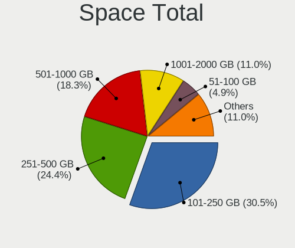
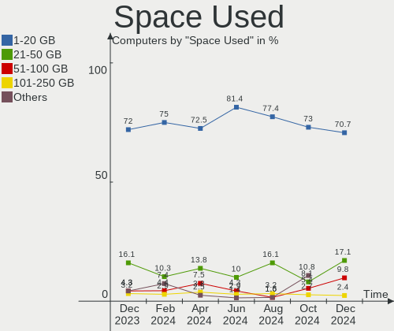
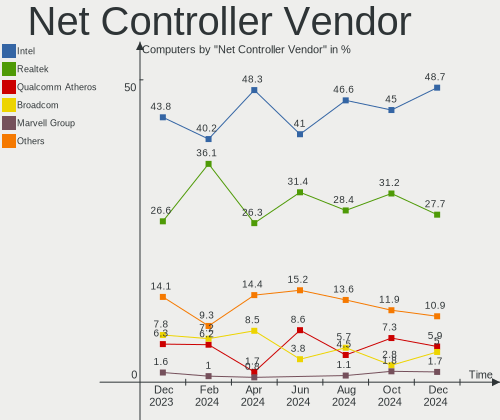

FreeBSD Hardware Trends
-----------------------

A project to identify most popular hardware characteristics and track their change
over time based on data collected by FreeBSD users at https://BSD-Hardware.info.

Anyone can contribute to this report by the [hw-probe](https://github.com/linuxhw/hw-probe/blob/master/INSTALL.BSD.md) tool:

    hw-probe -all -upload

This is a report for all computer types. See also reports for [desktops](/Dist/FreeBSD/Desktop/README.md) and [notebooks](/Dist/FreeBSD/Notebook/README.md).

Full-feature report is available here: https://bsd-hardware.info/?view=trends

Period: Mar, 2022.

Contents
--------

* [ System ](#system)
  - [ OS                       ](#os)
  - [ OS Family                ](#os-family)
  - [ Arch                     ](#arch)
  - [ DE                       ](#de)
  - [ Display Server           ](#display-server)
  - [ Display Manager          ](#display-manager)
  - [ OS Lang                  ](#os-lang)
  - [ Boot Mode                ](#boot-mode)
  - [ Filesystem               ](#filesystem)
  - [ Part. scheme             ](#part-scheme)

* [ Board ](#board)
  - [ Vendor                   ](#vendor)
  - [ Model                    ](#model)
  - [ Model Family             ](#model-family)
  - [ MFG Year                 ](#mfg-year)
  - [ Form Factor              ](#form-factor)
  - [ Coreboot                 ](#coreboot)
  - [ RAM Size                 ](#ram-size)
  - [ RAM Used                 ](#ram-used)
  - [ Total Drives             ](#total-drives)
  - [ Has CD-ROM               ](#has-cd-rom)
  - [ Has Ethernet             ](#has-ethernet)
  - [ Has WiFi                 ](#has-wifi)
  - [ Has Bluetooth            ](#has-bluetooth)

* [ Location ](#location)
  - [ Country                  ](#country)
  - [ City                     ](#city)

* [ Drives ](#drives)
  - [ Drive Vendor             ](#drive-vendor)
  - [ Drive Model              ](#drive-model)
  - [ HDD Vendor               ](#hdd-vendor)
  - [ SSD Vendor               ](#ssd-vendor)
  - [ Drive Kind               ](#drive-kind)
  - [ Drive Connector          ](#drive-connector)
  - [ Drive Size               ](#drive-size)
  - [ Space Total              ](#space-total)
  - [ Space Used               ](#space-used)
  - [ Malfunc. Drives          ](#malfunc-drives)
  - [ Malfunc. Drive Vendor    ](#malfunc-drive-vendor)
  - [ Malfunc. HDD Vendor      ](#malfunc-hdd-vendor)
  - [ Malfunc. Drive Kind      ](#malfunc-drive-kind)
  - [ Failed Drives            ](#failed-drives)
  - [ Failed Drive Vendor      ](#failed-drive-vendor)
  - [ Drive Status             ](#drive-status)

* [ Storage controller ](#storage-controller)
  - [ Storage Vendor           ](#storage-vendor)
  - [ Storage Model            ](#storage-model)
  - [ Storage Kind             ](#storage-kind)

* [ Processor ](#processor)
  - [ CPU Vendor               ](#cpu-vendor)
  - [ CPU Model                ](#cpu-model)
  - [ CPU Model Family         ](#cpu-model-family)
  - [ CPU Cores                ](#cpu-cores)
  - [ CPU Sockets              ](#cpu-sockets)
  - [ CPU Threads              ](#cpu-threads)
  - [ CPU Microarch            ](#cpu-microarch)

* [ Graphics ](#graphics)
  - [ GPU Vendor               ](#gpu-vendor)
  - [ GPU Model                ](#gpu-model)
  - [ GPU Combo                ](#gpu-combo)
  - [ GPU Driver               ](#gpu-driver)
  - [ GPU Memory               ](#gpu-memory)

* [ Monitor ](#monitor)
  - [ Monitor Vendor           ](#monitor-vendor)
  - [ Monitor Model            ](#monitor-model)
  - [ Monitor Resolution       ](#monitor-resolution)
  - [ Monitor Diagonal         ](#monitor-diagonal)
  - [ Monitor Width            ](#monitor-width)
  - [ Aspect Ratio             ](#aspect-ratio)
  - [ Monitor Area             ](#monitor-area)
  - [ Pixel Density            ](#pixel-density)
  - [ Multiple Monitors        ](#multiple-monitors)

* [ Network ](#network)
  - [ Net Controller Vendor    ](#net-controller-vendor)
  - [ Net Controller Model     ](#net-controller-model)
  - [ Wireless Vendor          ](#wireless-vendor)
  - [ Wireless Model           ](#wireless-model)
  - [ Ethernet Vendor          ](#ethernet-vendor)
  - [ Ethernet Model           ](#ethernet-model)
  - [ Net Controller Kind      ](#net-controller-kind)
  - [ Used Controller          ](#used-controller)
  - [ NICs                     ](#nics)
  - [ IPv6                     ](#ipv6)

* [ Bluetooth ](#bluetooth)
  - [ Bluetooth Vendor         ](#bluetooth-vendor)
  - [ Bluetooth Model          ](#bluetooth-model)

* [ Sound ](#sound)
  - [ Sound Vendor             ](#sound-vendor)
  - [ Sound Model              ](#sound-model)

* [ Memory ](#memory)
  - [ Memory Vendor            ](#memory-vendor)
  - [ Memory Model             ](#memory-model)
  - [ Memory Kind              ](#memory-kind)
  - [ Memory Form Factor       ](#memory-form-factor)
  - [ Memory Size              ](#memory-size)
  - [ Memory Speed             ](#memory-speed)

* [ Printers & scanners ](#printers--scanners)
  - [ Printer Vendor           ](#printer-vendor)
  - [ Printer Model            ](#printer-model)
  - [ Scanner Vendor           ](#scanner-vendor)
  - [ Scanner Model            ](#scanner-model)

* [ Camera ](#camera)
  - [ Camera Vendor            ](#camera-vendor)
  - [ Camera Model             ](#camera-model)

* [ Security ](#security)
  - [ Fingerprint Vendor       ](#fingerprint-vendor)
  - [ Fingerprint Model        ](#fingerprint-model)
  - [ Chipcard Vendor          ](#chipcard-vendor)
  - [ Chipcard Model           ](#chipcard-model)

* [ Unsupported ](#unsupported)
  - [ Unsupported Devices      ](#unsupported-devices)
  - [ Unsupported Device Types ](#unsupported-device-types)

System
------

OS
--

Installed operating systems

| Name                    | Computers | Percent |
|-------------------------|-----------|---------|
| FreeBSD 13.0-p7         | 14        | 20.59%  |
| FreeBSD 13.0            | 13        | 19.12%  |
| FreeBSD 13.0-p10        | 8         | 11.76%  |
| FreeBSD 14.0-CURRENT    | 7         | 10.29%  |
| FreeBSD 13.1-BETA2      | 5         | 7.35%   |
| FreeBSD 13.0-p8         | 5         | 7.35%   |
| FreeBSD 13.1-BETA1      | 3         | 4.41%   |
| FreeBSD 12.1-p22-HBSD   | 3         | 4.41%   |
| FreeBSD 13.1-PRERELEASE | 2         | 2.94%   |
| FreeBSD 13.0-STABLE     | 2         | 2.94%   |
| FreeBSD 13.1-BETA3      | 1         | 1.47%   |
| FreeBSD 13.0-p6         | 1         | 1.47%   |
| FreeBSD 13.0-p5         | 1         | 1.47%   |
| FreeBSD 13.0-p4         | 1         | 1.47%   |
| FreeBSD 12.3-p4         | 1         | 1.47%   |
| FreeBSD 12.3-p2         | 1         | 1.47%   |

OS Family
---------

OS without a version

| Name    | Computers | Percent |
|---------|-----------|---------|
| FreeBSD | 68        | 100%    |

Arch
----

OS architecture (x86_64, i586, etc.)

| Name  | Computers | Percent |
|-------|-----------|---------|
| amd64 | 64        | 94.12%  |
| i386  | 3         | 4.41%   |
| arm64 | 1         | 1.47%   |

DE
--

Desktop Environment

| Name         | Computers | Percent |
|--------------|-----------|---------|
| Console      | 23        | 33.82%  |
| XFCE         | 12        | 17.65%  |
| KDE5         | 11        | 16.18%  |
| MATE         | 4         | 5.88%   |
| i3           | 4         | 5.88%   |
| TWM          | 3         | 4.41%   |
| Openbox      | 3         | 4.41%   |
| GNOME        | 2         | 2.94%   |
| spectrwm     | 1         | 1.47%   |
| IceWM        | 1         | 1.47%   |
| Fluxbox      | 1         | 1.47%   |
| ctwm         | 1         | 1.47%   |
| AwesomeWM    | 1         | 1.47%   |
| akonadi_newm | 1         | 1.47%   |

Display Server
--------------

X11 or Wayland

| Name    | Computers | Percent |
|---------|-----------|---------|
| X11     | 46        | 67.65%  |
| Console | 22        | 32.35%  |

Display Manager
---------------

SDDM, LightDM, etc.

| Name    | Computers | Percent |
|---------|-----------|---------|
| Console | 38        | 55.88%  |
| SDDM    | 11        | 16.18%  |
| SLiM    | 7         | 10.29%  |
| XDM     | 5         | 7.35%   |
| LightDM | 5         | 7.35%   |
| PCDM    | 1         | 1.47%   |
| GDM     | 1         | 1.47%   |

OS Lang
-------

Language

| Lang    | Computers | Percent |
|---------|-----------|---------|
| C       | 46        | 67.65%  |
| Unknown | 9         | 13.24%  |
| en_US   | 7         | 10.29%  |
| de_CH   | 2         | 2.94%   |
| zh_CN   | 1         | 1.47%   |
| ru_RU   | 1         | 1.47%   |
| es_MX   | 1         | 1.47%   |
| de_DE   | 1         | 1.47%   |

Boot Mode
---------

EFI or BIOS

| Mode | Computers | Percent |
|------|-----------|---------|
| EFI  | 51        | 75%     |
| BIOS | 17        | 25%     |

Filesystem
----------

Type of filesystem

| Type | Computers | Percent |
|------|-----------|---------|
| Zfs  | 42        | 61.76%  |
| Ufs  | 26        | 38.24%  |

Part. scheme
------------

Scheme of partitioning

| Type | Computers | Percent |
|------|-----------|---------|
| GPT  | 64        | 94.12%  |
| MBR  | 3         | 4.41%   |
| BSD  | 1         | 1.47%   |

Board
-----

Vendor
------

Motherboard manufacturer

| Name                    | Computers | Percent |
|-------------------------|-----------|---------|
| ASUSTek Computer        | 15        | 22.06%  |
| Lenovo                  | 12        | 17.65%  |
| MSI                     | 4         | 5.88%   |
| Gigabyte Technology     | 4         | 5.88%   |
| Dell                    | 4         | 5.88%   |
| ASRock                  | 4         | 5.88%   |
| Supermicro              | 3         | 4.41%   |
| Intel                   | 3         | 4.41%   |
| Acer                    | 3         | 4.41%   |
| Hewlett-Packard         | 2         | 2.94%   |
| Gateway                 | 2         | 2.94%   |
| Deciso                  | 2         | 2.94%   |
| Toshiba                 | 1         | 1.47%   |
| Raspberry Pi Foundation | 1         | 1.47%   |
| HUAWEI                  | 1         | 1.47%   |
| Huanan                  | 1         | 1.47%   |
| Fujitsu                 | 1         | 1.47%   |
| Framework               | 1         | 1.47%   |
| Cisco Systems           | 1         | 1.47%   |
| BESSTAR Tech            | 1         | 1.47%   |
| Apple                   | 1         | 1.47%   |
| Unknown                 | 1         | 1.47%   |

Model
-----

Motherboard model

| Name                                   | Computers | Percent |
|----------------------------------------|-----------|---------|
| ASUS PRO B460M-C                       | 2         | 2.94%   |
| ASUS PRIME B550M-A                     | 2         | 2.94%   |
| Toshiba Satellite Pro L40              | 1         | 1.47%   |
| Supermicro SYS-5019A-12TN4             | 1         | 1.47%   |
| Supermicro Super Server                | 1         | 1.47%   |
| Supermicro A1SAi                       | 1         | 1.47%   |
| RPi Raspberry Pi                       | 1         | 1.47%   |
| MSI U-100                              | 1         | 1.47%   |
| MSI MS-A62211                          | 1         | 1.47%   |
| MSI MS-7C02                            | 1         | 1.47%   |
| MSI MS-7817                            | 1         | 1.47%   |
| Lenovo XiaoXinPro-13ARE 2020 82DM      | 1         | 1.47%   |
| Lenovo ThinkPad X260 20F5A28AUK        | 1         | 1.47%   |
| Lenovo ThinkPad X230 2325BV9           | 1         | 1.47%   |
| Lenovo ThinkPad X13 Gen 1 20UF0014US   | 1         | 1.47%   |
| Lenovo ThinkPad X1 Yoga 3rd 20LES2RG1A | 1         | 1.47%   |
| Lenovo ThinkPad T460s 20FAS4KH02       | 1         | 1.47%   |
| Lenovo ThinkPad T420 4236MBU           | 1         | 1.47%   |
| Lenovo ThinkPad T14s Gen 2i 20WM00B7MX | 1         | 1.47%   |
| Lenovo ThinkPad R60e 0658W2M           | 1         | 1.47%   |
| Lenovo ThinkPad E580 20KSCTO1WW        | 1         | 1.47%   |
| Lenovo ThinkPad E490 20N8CTO1WW        | 1         | 1.47%   |
| Lenovo IdeaPad Y700-15ISK 80NV         | 1         | 1.47%   |
| Intel NUC8i5BEH                        | 1         | 1.47%   |
| Intel DX79TO AAG28805-401              | 1         | 1.47%   |
| Intel D865PERL AAC27646-213            | 1         | 1.47%   |
| HUAWEI CREM-WXX9                       | 1         | 1.47%   |
| Huanan X99-F8D V2.4                    | 1         | 1.47%   |
| HP Z620 Workstation                    | 1         | 1.47%   |
| HP EliteBook 8570p                     | 1         | 1.47%   |
| Gigabyte GA-78LMT-USB3 6.0             | 1         | 1.47%   |
| Gigabyte C246-WU4                      | 1         | 1.47%   |
| Gigabyte B550I AORUS PRO AX            | 1         | 1.47%   |
| Gigabyte AB350M-Gaming 3               | 1         | 1.47%   |
| Gateway NV55C                          | 1         | 1.47%   |
| Gateway LT27                           | 1         | 1.47%   |
| Fujitsu LIFEBOOK A544                  | 1         | 1.47%   |
| Framework Laptop                       | 1         | 1.47%   |
| Dell OptiPlex 5490 AIO                 | 1         | 1.47%   |
| Dell Latitude E7440                    | 1         | 1.47%   |
| Dell Inspiron 5502                     | 1         | 1.47%   |
| Dell G5 5590                           | 1         | 1.47%   |
| Deciso OPNsense Appliance              | 1         | 1.47%   |
| Deciso Netboard A20                    | 1         | 1.47%   |
| Cisco Systems UCSC-C3K-M4SRB           | 1         | 1.47%   |
| BESSTAR Tech N40                       | 1         | 1.47%   |
| ASUS ROG Zephyrus G14 GA402RJ_GA402RJ  | 1         | 1.47%   |
| ASUS ROG CROSSHAIR VIII HERO           | 1         | 1.47%   |
| ASUS PRIME Z590-P                      | 1         | 1.47%   |
| ASUS PRIME X370-PRO                    | 1         | 1.47%   |
| ASUS PRIME B350M-A                     | 1         | 1.47%   |
| ASUS P5Q-E                             | 1         | 1.47%   |
| ASUS P5KPL-CM                          | 1         | 1.47%   |
| ASUS P5K PRO                           | 1         | 1.47%   |
| ASUS N50Vc                             | 1         | 1.47%   |
| ASUS M4A78T-E                          | 1         | 1.47%   |
| ASUS ASUS EXPERTCENTER D700SA_D700SA   | 1         | 1.47%   |
| ASRock X570 Pro4                       | 1         | 1.47%   |
| ASRock X570 Phantom Gaming 4           | 1         | 1.47%   |
| ASRock Q1900B-ITX                      | 1         | 1.47%   |

Model Family
------------

Motherboard model prefix

| Name                         | Computers | Percent |
|------------------------------|-----------|---------|
| Lenovo ThinkPad              | 10        | 14.71%  |
| ASUS PRIME                   | 5         | 7.35%   |
| ASUS ROG                     | 2         | 2.94%   |
| ASUS PRO                     | 2         | 2.94%   |
| ASRock X570                  | 2         | 2.94%   |
| Acer Aspire                  | 2         | 2.94%   |
| Toshiba Satellite            | 1         | 1.47%   |
| Supermicro SYS-5019A-12TN4   | 1         | 1.47%   |
| Supermicro Super             | 1         | 1.47%   |
| Supermicro A1SAi             | 1         | 1.47%   |
| RPi Raspberry                | 1         | 1.47%   |
| MSI U-100                    | 1         | 1.47%   |
| MSI MS-A62211                | 1         | 1.47%   |
| MSI MS-7C02                  | 1         | 1.47%   |
| MSI MS-7817                  | 1         | 1.47%   |
| Lenovo XiaoXinPro-13ARE      | 1         | 1.47%   |
| Lenovo IdeaPad               | 1         | 1.47%   |
| Intel NUC8i5BEH              | 1         | 1.47%   |
| Intel DX79TO                 | 1         | 1.47%   |
| Intel D865PERL               | 1         | 1.47%   |
| HUAWEI CREM-WXX9             | 1         | 1.47%   |
| Huanan X99-F8D               | 1         | 1.47%   |
| HP Z620                      | 1         | 1.47%   |
| HP EliteBook                 | 1         | 1.47%   |
| Gigabyte GA-78LMT-USB3       | 1         | 1.47%   |
| Gigabyte C246-WU4            | 1         | 1.47%   |
| Gigabyte B550I               | 1         | 1.47%   |
| Gigabyte AB350M-Gaming       | 1         | 1.47%   |
| Gateway NV55C                | 1         | 1.47%   |
| Gateway LT27                 | 1         | 1.47%   |
| Fujitsu LIFEBOOK             | 1         | 1.47%   |
| Framework Laptop             | 1         | 1.47%   |
| Dell OptiPlex                | 1         | 1.47%   |
| Dell Latitude                | 1         | 1.47%   |
| Dell Inspiron                | 1         | 1.47%   |
| Dell G5                      | 1         | 1.47%   |
| Deciso OPNsense              | 1         | 1.47%   |
| Deciso Netboard              | 1         | 1.47%   |
| Cisco Systems UCSC-C3K-M4SRB | 1         | 1.47%   |
| BESSTAR Tech N40             | 1         | 1.47%   |
| ASUS P5Q-E                   | 1         | 1.47%   |
| ASUS P5KPL-CM                | 1         | 1.47%   |
| ASUS P5K                     | 1         | 1.47%   |
| ASUS N50Vc                   | 1         | 1.47%   |
| ASUS M4A78T-E                | 1         | 1.47%   |
| ASUS ASUS                    | 1         | 1.47%   |
| ASRock Q1900B-ITX            | 1         | 1.47%   |
| ASRock H61M-VG3              | 1         | 1.47%   |
| Apple MacBookPro12           | 1         | 1.47%   |
| Acer Swift                   | 1         | 1.47%   |
| Unknown                      | 1         | 1.47%   |

MFG Year
--------

Motherboard manufacture year

| Year    | Computers | Percent |
|---------|-----------|---------|
| 2021    | 16        | 23.53%  |
| 2020    | 9         | 13.24%  |
| 2014    | 6         | 8.82%   |
| 2019    | 5         | 7.35%   |
| 2022    | 4         | 5.88%   |
| 2017    | 4         | 5.88%   |
| 2011    | 4         | 5.88%   |
| 2016    | 3         | 4.41%   |
| 2008    | 3         | 4.41%   |
| 2015    | 2         | 2.94%   |
| 2013    | 2         | 2.94%   |
| 2012    | 2         | 2.94%   |
| 2009    | 2         | 2.94%   |
| 2018    | 1         | 1.47%   |
| 2010    | 1         | 1.47%   |
| 2007    | 1         | 1.47%   |
| 2006    | 1         | 1.47%   |
| 2004    | 1         | 1.47%   |
| Unknown | 1         | 1.47%   |

Form Factor
-----------

Physical design of the computer

| Name           | Computers | Percent |
|----------------|-----------|---------|
| Desktop        | 31        | 45.59%  |
| Notebook       | 29        | 42.65%  |
| Mini pc        | 3         | 4.41%   |
| Server         | 2         | 2.94%   |
| System on chip | 1         | 1.47%   |
| Convertible    | 1         | 1.47%   |
| All in one     | 1         | 1.47%   |

Coreboot
--------

Have coreboot on board

| Used | Computers | Percent |
|------|-----------|---------|
| No   | 68        | 100%    |

RAM Size
--------

Total RAM memory

| Size in GB  | Computers | Percent |
|-------------|-----------|---------|
| 16.01-24.0  | 20        | 29.41%  |
| 4.01-8.0    | 12        | 17.65%  |
| 32.01-64.0  | 12        | 17.65%  |
| 8.01-16.0   | 9         | 13.24%  |
| 64.01-256.0 | 8         | 11.76%  |
| 2.01-3.0    | 4         | 5.88%   |
| 3.01-4.0    | 1         | 1.47%   |
| 24.01-32.0  | 1         | 1.47%   |
| 0.51-1.0    | 1         | 1.47%   |

RAM Used
--------

Used RAM memory

| Used GB     | Computers | Percent |
|-------------|-----------|---------|
| 0.01-0.5    | 24        | 35.29%  |
| 0.51-1.0    | 19        | 27.94%  |
| 1.01-2.0    | 14        | 20.59%  |
| 3.01-4.0    | 5         | 7.35%   |
| 2.01-3.0    | 4         | 5.88%   |
| 64.01-256.0 | 1         | 1.47%   |
| 0           | 1         | 1.47%   |

Total Drives
------------

Number of drives on board

| Drives | Computers | Percent |
|--------|-----------|---------|
| 1      | 42        | 61.76%  |
| 2      | 10        | 14.71%  |
| 3      | 7         | 10.29%  |
| 4      | 3         | 4.41%   |
| 58     | 1         | 1.47%   |
| 13     | 1         | 1.47%   |
| 9      | 1         | 1.47%   |
| 6      | 1         | 1.47%   |
| 5      | 1         | 1.47%   |
| 0      | 1         | 1.47%   |

Has CD-ROM
----------

Has CD-ROM on board

| Presented | Computers | Percent |
|-----------|-----------|---------|
| No        | 53        | 77.94%  |
| Yes       | 15        | 22.06%  |

Has Ethernet
------------

Has Ethernet on board

| Presented | Computers | Percent |
|-----------|-----------|---------|
| Yes       | 60        | 88.24%  |
| No        | 8         | 11.76%  |

Has WiFi
--------

Has WiFi module

| Presented | Computers | Percent |
|-----------|-----------|---------|
| Yes       | 36        | 52.94%  |
| No        | 32        | 47.06%  |

Has Bluetooth
-------------

Has Bluetooth module

| Presented | Computers | Percent |
|-----------|-----------|---------|
| No        | 45        | 66.18%  |
| Yes       | 23        | 33.82%  |

Location
--------

Country
-------

Geographic location (country)

| Country     | Computers | Percent |
|-------------|-----------|---------|
| USA         | 21        | 30.88%  |
| Germany     | 10        | 14.71%  |
| Russia      | 4         | 5.88%   |
| UK          | 3         | 4.41%   |
| Switzerland | 3         | 4.41%   |
| Poland      | 3         | 4.41%   |
| France      | 3         | 4.41%   |
| Denmark     | 3         | 4.41%   |
| Sweden      | 2         | 2.94%   |
| Bulgaria    | 2         | 2.94%   |
| Vietnam     | 1         | 1.47%   |
| Thailand    | 1         | 1.47%   |
| Spain       | 1         | 1.47%   |
| Serbia      | 1         | 1.47%   |
| Mexico      | 1         | 1.47%   |
| Japan       | 1         | 1.47%   |
| Italy       | 1         | 1.47%   |
| Hungary     | 1         | 1.47%   |
| Croatia     | 1         | 1.47%   |
| China       | 1         | 1.47%   |
| Canada      | 1         | 1.47%   |
| Brazil      | 1         | 1.47%   |
| Belgium     | 1         | 1.47%   |
| Australia   | 1         | 1.47%   |

City
----

Geographic location (city)

| City           | Computers | Percent |
|----------------|-----------|---------|
| Tamm           | 3         | 4.41%   |
| Stockholm      | 2         | 2.94%   |
| Salem          | 2         | 2.94%   |
| Redmond        | 2         | 2.94%   |
| Paris          | 2         | 2.94%   |
| Munchenstein   | 2         | 2.94%   |
| Lüneburg      | 2         | 2.94%   |
| Chicago        | 2         | 2.94%   |
| Zagreb         | 1         | 1.47%   |
| Wenatchee      | 1         | 1.47%   |
| Vratsa         | 1         | 1.47%   |
| Tsarskoye Selo | 1         | 1.47%   |
| Toronto        | 1         | 1.47%   |
| Teaneck        | 1         | 1.47%   |
| Taito          | 1         | 1.47%   |
| Świnoujście  | 1         | 1.47%   |
| Swindon        | 1         | 1.47%   |
| St. Moritz     | 1         | 1.47%   |
| St Petersburg  | 1         | 1.47%   |
| Sofia          | 1         | 1.47%   |
| Shanghai       | 1         | 1.47%   |
| San Benito     | 1         | 1.47%   |
| Rochefort      | 1         | 1.47%   |
| Rio de Janeiro | 1         | 1.47%   |
| Ragusa         | 1         | 1.47%   |
| Portland       | 1         | 1.47%   |
| Paducah        | 1         | 1.47%   |
| Oviedo         | 1         | 1.47%   |
| Omaha          | 1         | 1.47%   |
| Odense         | 1         | 1.47%   |
| Nashville      | 1         | 1.47%   |
| Moscow         | 1         | 1.47%   |
| Mexico City    | 1         | 1.47%   |
| Mexico         | 1         | 1.47%   |
| Majadahonda    | 1         | 1.47%   |
| Lubin          | 1         | 1.47%   |
| Lübeck        | 1         | 1.47%   |
| London         | 1         | 1.47%   |
| Lexington      | 1         | 1.47%   |
| Islington      | 1         | 1.47%   |
| Gdansk         | 1         | 1.47%   |
| Fürth         | 1         | 1.47%   |
| Frisco         | 1         | 1.47%   |
| Fresno         | 1         | 1.47%   |
| Fjenneslev     | 1         | 1.47%   |
| Dormagen       | 1         | 1.47%   |
| Dolgoprudnyy   | 1         | 1.47%   |
| Corvallis      | 1         | 1.47%   |
| Copenhagen     | 1         | 1.47%   |
| Clovis         | 1         | 1.47%   |
| Chachoengsao   | 1         | 1.47%   |
| Canton         | 1         | 1.47%   |
| Buon Ma Thuot  | 1         | 1.47%   |
| Budapest       | 1         | 1.47%   |
| Brussels       | 1         | 1.47%   |
| Bonn           | 1         | 1.47%   |
| Belgrade       | 1         | 1.47%   |
| Augsburg       | 1         | 1.47%   |
| Adelaide       | 1         | 1.47%   |

Drives
------

Drive Vendor
------------

Hard drive vendors

| Vendor              | Computers | Drives | Percent |
|---------------------|-----------|--------|---------|
| WDC                 | 23        | 50     | 23%     |
| Samsung Electronics | 17        | 23     | 17%     |
| Seagate             | 11        | 57     | 11%     |
| Toshiba             | 7         | 9      | 7%      |
| Intel               | 7         | 9      | 7%      |
| Kingston            | 5         | 5      | 5%      |
| Transcend           | 3         | 3      | 3%      |
| SanDisk             | 3         | 3      | 3%      |
| Crucial             | 3         | 4      | 3%      |
| SPCC                | 2         | 2      | 2%      |
| Micron Technology   | 2         | 3      | 2%      |
| KIOXIA-EXCERIA      | 2         | 4      | 2%      |
| Hitachi             | 2         | 2      | 2%      |
| Corsair             | 2         | 2      | 2%      |
| SSSTC               | 1         | 1      | 1%      |
| SK Hynix            | 1         | 1      | 1%      |
| LITEON              | 1         | 1      | 1%      |
| LDLC                | 1         | 1      | 1%      |
| Hoodisk             | 1         | 1      | 1%      |
| HGST                | 1         | 1      | 1%      |
| Hewlett-Packard     | 1         | 1      | 1%      |
| GOODRAM             | 1         | 1      | 1%      |
| Apple               | 1         | 1      | 1%      |
| Apacer              | 1         | 1      | 1%      |
| A-DATA Technology   | 1         | 1      | 1%      |

Drive Model
-----------

Hard drive models

| Model                                | Computers | Percent |
|--------------------------------------|-----------|---------|
| Seagate ST4000DM000-1F2168 4TB       | 3         | 2.27%   |
| WDC PC SN730 SDBQNTY-1T00-1001 1TB   | 2         | 1.52%   |
| Seagate ST12000NM0007-2A1101 12TB    | 2         | 1.52%   |
| KIOXIA-EXCERIA SSD 500GB             | 2         | 1.52%   |
| Intel SSDSC2BB120G4 120GB            | 2         | 1.52%   |
| WDC WDS500G3X0C-00SJG0 500GB         | 1         | 0.76%   |
| WDC WDS500G1X0E-00AFY0 500GB         | 1         | 0.76%   |
| WDC WDBRPG5000ANC-WRSN 500GB         | 1         | 0.76%   |
| WDC WD80EMAZ-00WJTA0 8TB             | 1         | 0.76%   |
| WDC WD80EFZX-68UW8N0 8TB             | 1         | 0.76%   |
| WDC WD80EFAX-68LHPN0 8TB             | 1         | 0.76%   |
| WDC WD80EDBZ-11B0ZA0 8TB             | 1         | 0.76%   |
| WDC WD60EZRZ-00GZ5B1 6TB             | 1         | 0.76%   |
| WDC WD6002FFWX-68TZ4N0 6TB           | 1         | 0.76%   |
| WDC WD50EFRX-68L0BN1 5TB             | 1         | 0.76%   |
| WDC WD5000LPVX-16V0TT3 500GB         | 1         | 0.76%   |
| WDC WD5000LPVT-08G33T1 500GB         | 1         | 0.76%   |
| WDC WD40PURZ-85TTDY0 4TB             | 1         | 0.76%   |
| WDC WD40EZRZ-22GXCB0 4TB             | 1         | 0.76%   |
| WDC WD40EFRX-68WT0N0 4TB             | 1         | 0.76%   |
| WDC WD3200AAJS-65B4A0 320GB          | 1         | 0.76%   |
| WDC WD2500BEVT-22A23T0 250GB         | 1         | 0.76%   |
| WDC WD20SDZW-11JJ8S0 2TB             | 1         | 0.76%   |
| WDC WD20SDRW-11VUUS0 2TB             | 1         | 0.76%   |
| WDC WD20NMVW-59EDZS7 2TB             | 1         | 0.76%   |
| WDC WD20NMVW-11AV3S2 2TB             | 1         | 0.76%   |
| WDC WD20EZRZ-00Z5HB0 2TB             | 1         | 0.76%   |
| WDC WD2000JD-00FYB0 200GB            | 1         | 0.76%   |
| WDC WD181KFGX-68AFPN0 18TB           | 1         | 0.76%   |
| WDC WD15EADS-00P8B0 1.5TB            | 1         | 0.76%   |
| WDC WD120EMFZ-11A6JA0 12TB           | 1         | 0.76%   |
| WDC WD120EMAZ-11BLFA0 12TB           | 1         | 0.76%   |
| WDC WD1200BEVT-22ZCT0 120GB          | 1         | 0.76%   |
| WDC WD10JPVX-75JC3T0 1TB             | 1         | 0.76%   |
| WDC WD10EZEX-08WN4A0 1TB             | 1         | 0.76%   |
| WDC WD10EZEX-00RKKA0 1TB             | 1         | 0.76%   |
| WDC WD10EZEX-00BBHA0 1TB             | 1         | 0.76%   |
| WDC PC SN730 SDBPNTY-512G-1101 512GB | 1         | 0.76%   |
| WDC PC SN730 SDBPNTY-512G            | 1         | 0.76%   |
| Transcend TS256GMTS952T2 256GB       | 1         | 0.76%   |
| Transcend TS256GMTS430S 256GB        | 1         | 0.76%   |
| Transcend TS256GMTE652T2 256GB       | 1         | 0.76%   |
| Toshiba THNSNJ128GMCU 128GB          | 1         | 0.76%   |
| Toshiba MQ04ABF100 1TB               | 1         | 0.76%   |
| Toshiba MQ01ABF050 500GB             | 1         | 0.76%   |
| Toshiba MG04SCA20EN 2TB              | 1         | 0.76%   |
| Toshiba MG03SCA300 3TB               | 1         | 0.76%   |
| Toshiba KBG30ZMT512G 512GB           | 1         | 0.76%   |
| Toshiba KBG30ZMT128G 128GB           | 1         | 0.76%   |
| Toshiba DT01ACA100 1TB               | 1         | 0.76%   |
| SSSTC CL1-3D256-Q11 NVMe 256GB       | 1         | 0.76%   |
| SPCC SPCCSolidStateDisk 256GB        | 1         | 0.76%   |
| SPCC Solid State Disk 128GB          | 1         | 0.76%   |
| SK Hynix BC501 NVMe 512GB            | 1         | 0.76%   |
| Seagate ST6000DX000-1H217Z 6TB       | 1         | 0.76%   |
| Seagate ST4000VN000-1H4168 4TB       | 1         | 0.76%   |
| Seagate ST3500418AS 500GB            | 1         | 0.76%   |
| Seagate ST33000650SS 3TB             | 1         | 0.76%   |
| Seagate ST32000641AS 2TB             | 1         | 0.76%   |
| Seagate ST3160023AS 160GB            | 1         | 0.76%   |

HDD Vendor
----------

Hard disk drive vendors

| Vendor              | Computers | Drives | Percent |
|---------------------|-----------|--------|---------|
| WDC                 | 17        | 43     | 44.74%  |
| Seagate             | 11        | 54     | 28.95%  |
| Toshiba             | 4         | 6      | 10.53%  |
| Samsung Electronics | 2         | 2      | 5.26%   |
| Hitachi             | 2         | 2      | 5.26%   |
| HGST                | 1         | 1      | 2.63%   |
| Hewlett-Packard     | 1         | 1      | 2.63%   |

SSD Vendor
----------

Solid state drive vendors

| Vendor              | Computers | Drives | Percent |
|---------------------|-----------|--------|---------|
| Samsung Electronics | 6         | 9      | 18.18%  |
| Intel               | 6         | 8      | 18.18%  |
| Kingston            | 4         | 4      | 12.12%  |
| SanDisk             | 3         | 3      | 9.09%   |
| Transcend           | 2         | 2      | 6.06%   |
| SPCC                | 2         | 2      | 6.06%   |
| Crucial             | 2         | 3      | 6.06%   |
| Toshiba             | 1         | 1      | 3.03%   |
| Seagate             | 1         | 3      | 3.03%   |
| LITEON              | 1         | 1      | 3.03%   |
| Hoodisk             | 1         | 1      | 3.03%   |
| Corsair             | 1         | 1      | 3.03%   |
| Apple               | 1         | 1      | 3.03%   |
| Apacer              | 1         | 1      | 3.03%   |
| A-DATA Technology   | 1         | 1      | 3.03%   |

Drive Kind
----------

HDD or SSD

| Kind | Computers | Drives | Percent |
|------|-----------|--------|---------|
| NVMe | 29        | 37     | 33.33%  |
| SSD  | 29        | 41     | 33.33%  |
| HDD  | 29        | 109    | 33.33%  |

Drive Connector
---------------

SATA, SAS, NVMe, etc.

| Type | Computers | Drives | Percent |
|------|-----------|--------|---------|
| SATA | 45        | 150    | 60.81%  |
| NVMe | 29        | 37     | 39.19%  |

Drive Size
----------

Size of hard drive

| Size in TB | Computers | Drives | Percent |
|------------|-----------|--------|---------|
| 0.01-0.5   | 32        | 44     | 47.76%  |
| 0.51-1.0   | 16        | 23     | 23.88%  |
| 1.01-2.0   | 7         | 17     | 10.45%  |
| 10.01-20.0 | 5         | 23     | 7.46%   |
| 3.01-4.0   | 3         | 17     | 4.48%   |
| 4.01-10.0  | 3         | 20     | 4.48%   |
| 2.01-3.0   | 1         | 6      | 1.49%   |

Space Total
-----------

Amount of disk space available on the file system

| Size in GB     | Computers | Percent |
|----------------|-----------|---------|
| 251-500        | 26        | 38.24%  |
| 101-250        | 20        | 29.41%  |
| 501-1000       | 9         | 13.24%  |
| 51-100         | 7         | 10.29%  |
| 21-50          | 3         | 4.41%   |
| More than 3000 | 1         | 1.47%   |
| 2001-3000      | 1         | 1.47%   |
| 1-20           | 1         | 1.47%   |

Space Used
----------

Amount of used disk space

| Used GB   | Computers | Percent |
|-----------|-----------|---------|
| 1-20      | 56        | 82.35%  |
| 21-50     | 6         | 8.82%   |
| 101-250   | 3         | 4.41%   |
| 51-100    | 2         | 2.94%   |
| 2001-3000 | 1         | 1.47%   |

Malfunc. Drives
---------------

Drive models with a malfunction

| Model                           | Computers | Drives | Percent |
|---------------------------------|-----------|--------|---------|
| WDC WD6002FFWX-68TZ4N0 6TB      | 1         | 7      | 16.67%  |
| WDC WD50EFRX-68L0BN1 5TB        | 1         | 1      | 16.67%  |
| WDC WD40EFRX-68WT0N0 4TB        | 1         | 5      | 16.67%  |
| Seagate ST3160023AS 160GB       | 1         | 1      | 16.67%  |
| HGST HTS721010A9E630 1TB        | 1         | 1      | 16.67%  |
| Hewlett-Packard MB1000GCWCV 1TB | 1         | 1      | 16.67%  |

Malfunc. Drive Vendor
---------------------

Vendors of faulty drives

| Vendor          | Computers | Drives | Percent |
|-----------------|-----------|--------|---------|
| WDC             | 2         | 13     | 40%     |
| Seagate         | 1         | 1      | 20%     |
| HGST            | 1         | 1      | 20%     |
| Hewlett-Packard | 1         | 1      | 20%     |

Malfunc. HDD Vendor
-------------------

Vendors of faulty HDD drives

| Vendor          | Computers | Drives | Percent |
|-----------------|-----------|--------|---------|
| WDC             | 2         | 13     | 40%     |
| Seagate         | 1         | 1      | 20%     |
| HGST            | 1         | 1      | 20%     |
| Hewlett-Packard | 1         | 1      | 20%     |

Malfunc. Drive Kind
-------------------

Kinds of faulty drives

| Kind | Computers | Drives | Percent |
|------|-----------|--------|---------|
| HDD  | 5         | 16     | 100%    |

Failed Drives
-------------

Failed drive models

Zero info for selected period =(

Failed Drive Vendor
-------------------

Failed drive vendors

Zero info for selected period =(

Drive Status
------------

Number of failed and malfunc. drives

| Status   | Computers | Drives | Percent |
|----------|-----------|--------|---------|
| Works    | 64        | 167    | 88.89%  |
| Malfunc  | 5         | 16     | 6.94%   |
| Detected | 3         | 4      | 4.17%   |

Storage controller
------------------

Storage Vendor
--------------

Storage controller vendors

| Vendor                         | Computers | Percent |
|--------------------------------|-----------|---------|
| Intel                          | 42        | 44.21%  |
| AMD                            | 16        | 16.84%  |
| Samsung Electronics            | 11        | 11.58%  |
| Sandisk                        | 7         | 7.37%   |
| Marvell Technology Group       | 3         | 3.16%   |
| Toshiba                        | 2         | 2.11%   |
| Silicon Motion                 | 2         | 2.11%   |
| Micron Technology              | 2         | 2.11%   |
| KIOXIA                         | 2         | 2.11%   |
| Broadcom / LSI                 | 2         | 2.11%   |
| Solid State Storage Technology | 1         | 1.05%   |
| Phison Electronics             | 1         | 1.05%   |
| Micron/Crucial Technology      | 1         | 1.05%   |
| Kingston Technology Company    | 1         | 1.05%   |
| ASMedia Technology             | 1         | 1.05%   |
| Unknown                        | 1         | 1.05%   |

Storage Model
-------------

Storage controller models

| Model                                                                          | Computers | Percent |
|--------------------------------------------------------------------------------|-----------|---------|
| AMD FCH SATA Controller [AHCI mode]                                            | 11        | 10.19%  |
| Sandisk WD Black SN750 / PC SN730 NVMe SSD                                     | 6         | 5.56%   |
| Samsung NVMe SSD Controller SM981/PM981/PM983                                  | 6         | 5.56%   |
| Unknown                                                                        | 4         | 3.7%    |
| Samsung NVMe SSD Controller SM961/PM961/SM963                                  | 3         | 2.78%   |
| Intel Sunrise Point-LP SATA Controller [AHCI mode]                             | 3         | 2.78%   |
| Intel 400 Series Chipset Family SATA AHCI Controller                           | 3         | 2.78%   |
| AMD 500 Series Chipset SATA Controller                                         | 3         | 2.78%   |
| Toshiba BG3 NVMe SSD Controller                                                | 2         | 1.85%   |
| Silicon Motion SM2263EN/SM2263XT SSD Controller                                | 2         | 1.85%   |
| KIOXIA NVMe SSD                                                                | 2         | 1.85%   |
| Intel Atom Processor E3800 Series SATA AHCI Controller                         | 2         | 1.85%   |
| Intel 82801GBM/GHM (ICH7-M Family) SATA Controller [IDE mode]                  | 2         | 1.85%   |
| Intel 82801 Mobile SATA Controller [RAID mode]                                 | 2         | 1.85%   |
| Intel 8 Series/C220 Series Chipset Family 6-port SATA Controller 1 [AHCI mode] | 2         | 1.85%   |
| Intel 7 Series Chipset Family 6-port SATA Controller [AHCI mode]               | 2         | 1.85%   |
| Intel 500 Series Chipset Family SATA AHCI Controller                           | 2         | 1.85%   |
| Intel 5 Series/3400 Series Chipset 4 port SATA AHCI Controller                 | 2         | 1.85%   |
| AMD SB7x0/SB8x0/SB9x0 IDE Controller                                           | 2         | 1.85%   |
| AMD 300 Series Chipset SATA Controller                                         | 2         | 1.85%   |
| Sandisk WD PC SN810 / Black SN850 NVMe SSD                                     | 1         | 0.93%   |
| Samsung SM951 AHCI                                                             | 1         | 0.93%   |
| Samsung NVMe SSD Controller PM9A1/PM9A3/980PRO                                 | 1         | 0.93%   |
| Samsung NVMe SSD Controller 980                                                | 1         | 0.93%   |
| Phison E16 PCIe4 NVMe Controller                                               | 1         | 0.93%   |
| Micron/Crucial P2 NVMe PCIe SSD                                                | 1         | 0.93%   |
| Marvell Group 88SE9235 PCIe 2.0 x2 4-port SATA 6 Gb/s Controller               | 1         | 0.93%   |
| Marvell Group 88SE6111/6121 SATA II / PATA Controller                          | 1         | 0.93%   |
| Marvell Group 88SE6101/6102 single-port PATA133 interface                      | 1         | 0.93%   |
| Kingston Company KC2000 NVMe SSD                                               | 1         | 0.93%   |
| Intel SSD 660P Series                                                          | 1         | 0.93%   |
| Intel NM10/ICH7 Family SATA Controller [IDE mode]                              | 1         | 0.93%   |
| Intel NM10/ICH7 Family SATA Controller [AHCI mode]                             | 1         | 0.93%   |
| Intel Jasper Lake SATA AHCI Controller                                         | 1         | 0.93%   |
| Intel HM170/QM170 Chipset SATA Controller [AHCI Mode]                          | 1         | 0.93%   |
| Intel Celeron/Pentium Silver Processor SATA Controller                         | 1         | 0.93%   |
| Intel Cannon Point-LP SATA Controller [AHCI Mode]                              | 1         | 0.93%   |
| Intel Cannon Lake PCH SATA AHCI Controller                                     | 1         | 0.93%   |
| Intel C620 Series Chipset Family SATA Controller [AHCI mode]                   | 1         | 0.93%   |
| Intel C610/X99 series chipset sSATA Controller [AHCI mode]                     | 1         | 0.93%   |
| Intel C610/X99 series chipset 6-Port SATA Controller [AHCI mode]               | 1         | 0.93%   |
| Intel C602 chipset 4-Port SATA Storage Control Unit                            | 1         | 0.93%   |
| Intel C600/X79 series chipset SATA RAID Controller                             | 1         | 0.93%   |
| Intel C600/X79 series chipset IDE-r Controller                                 | 1         | 0.93%   |
| Intel C600/X79 series chipset 6-Port SATA AHCI Controller                      | 1         | 0.93%   |
| Intel Atom Processor C3000 Series SATA Controller 1                            | 1         | 0.93%   |
| Intel Atom processor C2000 AHCI SATA3 Controller                               | 1         | 0.93%   |
| Intel Atom processor C2000 AHCI SATA2 Controller                               | 1         | 0.93%   |
| Intel 82801JI (ICH10 Family) SATA AHCI Controller                              | 1         | 0.93%   |
| Intel 82801IR/IO/IH (ICH9R/DO/DH) 6 port SATA Controller [AHCI mode]           | 1         | 0.93%   |
| Intel 82801IBM/IEM (ICH9M/ICH9M-E) 4 port SATA Controller [AHCI mode]          | 1         | 0.93%   |
| Intel 82801HM/HEM (ICH8M/ICH8M-E) SATA Controller [AHCI mode]                  | 1         | 0.93%   |
| Intel 82801HM/HEM (ICH8M/ICH8M-E) IDE Controller                               | 1         | 0.93%   |
| Intel 82801G (ICH7 Family) IDE Controller                                      | 1         | 0.93%   |
| Intel 82801EB/ER (ICH5/ICH5R) IDE Controller                                   | 1         | 0.93%   |
| Intel 82801EB (ICH5) SATA Controller                                           | 1         | 0.93%   |
| Intel 6 Series/C200 Series Chipset Family 6 port Mobile SATA AHCI Controller   | 1         | 0.93%   |
| Intel 6 Series/C200 Series Chipset Family 6 port Desktop SATA AHCI Controller  | 1         | 0.93%   |
| Broadcom / LSI SAS2008 PCI-Express Fusion-MPT SAS-2 [Falcon]                   | 1         | 0.93%   |
| Broadcom / LSI MegaRAID SAS-3 3316 [Intruder]                                  | 1         | 0.93%   |

Storage Kind
------------

Kind of storage controller (IDE, SATA, NVMe, SAS, ...)

| Kind | Computers | Percent |
|------|-----------|---------|
| SATA | 50        | 53.19%  |
| NVMe | 28        | 29.79%  |
| IDE  | 10        | 10.64%  |
| RAID | 4         | 4.26%   |
| SAS  | 2         | 2.13%   |

Processor
---------

CPU Vendor
----------

Processor vendors

| Vendor | Computers | Percent |
|--------|-----------|---------|
| Intel  | 47        | 69.12%  |
| AMD    | 20        | 29.41%  |
| ARM    | 1         | 1.47%   |

CPU Model
---------

Processor models

| Model                                         | Computers | Percent |
|-----------------------------------------------|-----------|---------|
| Intel Core i3-10100 CPU @ 3.60GHz             | 3         | 4.41%   |
| Intel Core i7-3520M CPU @ 2.90GHz             | 2         | 2.94%   |
| Intel Core i5-6300U CPU @ 2.40GHz             | 2         | 2.94%   |
| Intel Celeron CPU J1900 @ 1.99GHz             | 2         | 2.94%   |
| Intel 11th Gen Core i7-1165G7 @ 2.80GHz       | 2         | 2.94%   |
| AMD Ryzen 9 3900X 12-Core Processor           | 2         | 2.94%   |
| AMD Ryzen 7 1700 Eight-Core Processor         | 2         | 2.94%   |
| Intel Xeon W-3245 CPU @ 3.20GHz               | 1         | 1.47%   |
| Intel Xeon CPU E5-2680 v4 @ 2.40GHz           | 1         | 1.47%   |
| Intel Xeon CPU E5-2670 @ 2.60GHz              | 1         | 1.47%   |
| Intel Xeon CPU E5-2640 v4 @ 2.40GHz           | 1         | 1.47%   |
| Intel Xeon CPU E5-1620 0 @ 3.60GHz            | 1         | 1.47%   |
| Intel Pentium Dual CPU T2330 @ 1.60GHz        | 1         | 1.47%   |
| Intel Pentium CPU P6100 @ 2.00GHz             | 1         | 1.47%   |
| Intel Pentium CPU G3220 @ 3.00GHz             | 1         | 1.47%   |
| Intel Pentium CPU G2030 @ 3.00GHz             | 1         | 1.47%   |
| Intel Pentium 4 processor                     | 1         | 1.47%   |
| Intel Pentium 4 CPU 3.40GHz                   | 1         | 1.47%   |
| Intel Core i9-9900K CPU @ 3.60GHz             | 1         | 1.47%   |
| Intel Core i7-9750H CPU @ 2.60GHz             | 1         | 1.47%   |
| Intel Core i7-8650U CPU @ 1.90GHz             | 1         | 1.47%   |
| Intel Core i7-8565U CPU @ 1.80GHz             | 1         | 1.47%   |
| Intel Core i7-8550U CPU @ 1.80GHz             | 1         | 1.47%   |
| Intel Core i7-6700HQ CPU @ 2.60GHz            | 1         | 1.47%   |
| Intel Core i5-8259U CPU @ 2.30GHz             | 1         | 1.47%   |
| Intel Core i5-5257U CPU @ 2.70GHz             | 1         | 1.47%   |
| Intel Core i5-4300U CPU @ 1.90GHz             | 1         | 1.47%   |
| Intel Core i5-4200M CPU @ 2.50GHz             | 1         | 1.47%   |
| Intel Core i5-2540M CPU @ 2.60GHz             | 1         | 1.47%   |
| Intel Core i5-10500T CPU @ 2.30GHz            | 1         | 1.47%   |
| Intel Core i3 CPU M 350 @ 2.27GHz             | 1         | 1.47%   |
| Intel Core 2 Quad CPU Q6600 @ 2.40GHz         | 1         | 1.47%   |
| Intel Core 2 Duo CPU P8400 @ 2.26GHz          | 1         | 1.47%   |
| Intel Core 2 Duo CPU E6750 @ 2.66GHz          | 1         | 1.47%   |
| Intel Celeron N4020 CPU @ 1.10GHz             | 1         | 1.47%   |
| Intel Celeron M CPU                           | 1         | 1.47%   |
| Intel Celeron CPU 3865U @ 1.80GHz             | 1         | 1.47%   |
| Intel Atom CPU N550 @ 1.50GHz                 | 1         | 1.47%   |
| Intel Atom CPU N270 @ 1.60GH                  | 1         | 1.47%   |
| Intel Atom CPU C3850 @ 2.10GHz                | 1         | 1.47%   |
| Intel Atom CPU C2758 @ 2.40GHz                | 1         | 1.47%   |
| Intel 11th Gen Core i7-11700 @ 2.50GHz        | 1         | 1.47%   |
| Intel 11th Gen Core i5-1135G7 @ 2.40GHz       | 1         | 1.47%   |
| ARM Cortex-A53 r0p4                           | 1         | 1.47%   |
| AMD Ryzen Embedded V1500B                     | 1         | 1.47%   |
| AMD Ryzen 9 6900HS with Radeon Graphics       | 1         | 1.47%   |
| AMD Ryzen 7 PRO 4750U with Radeon Graphics    | 1         | 1.47%   |
| AMD Ryzen 7 5800H with Radeon Graphics        | 1         | 1.47%   |
| AMD Ryzen 7 5700G with Radeon Graphics        | 1         | 1.47%   |
| AMD Ryzen 7 4800U with Radeon Graphics        | 1         | 1.47%   |
| AMD Ryzen 7 4700U with Radeon Graphics        | 1         | 1.47%   |
| AMD Ryzen 7 3800X 8-Core Processor            | 1         | 1.47%   |
| AMD Ryzen 7 3700X 8-Core Processor            | 1         | 1.47%   |
| AMD Ryzen 7 3700U with Radeon Vega Mobile Gfx | 1         | 1.47%   |
| AMD Ryzen 7 2700X Eight-Core Processor        | 1         | 1.47%   |
| AMD Ryzen 5 5600G with Radeon Graphics        | 1         | 1.47%   |
| AMD Ryzen 5 2400G with Radeon Vega Graphics   | 1         | 1.47%   |
| AMD Phenom II X3 720 Processor                | 1         | 1.47%   |
| AMD FX-6300 Six-Core Processor                | 1         | 1.47%   |
| AMD EPYC 3101 4-Core Processor                | 1         | 1.47%   |

CPU Model Family
----------------

Processor model prefix

| Model              | Computers | Percent |
|--------------------|-----------|---------|
| AMD Ryzen 7        | 10        | 14.71%  |
| Intel Core i5      | 8         | 11.76%  |
| Intel Core i7      | 7         | 10.29%  |
| Intel Xeon         | 5         | 7.35%   |
| Other              | 4         | 5.88%   |
| Intel Core i3      | 4         | 5.88%   |
| Intel Celeron      | 4         | 5.88%   |
| Intel Atom         | 4         | 5.88%   |
| Intel Pentium      | 3         | 4.41%   |
| AMD Ryzen 9        | 3         | 4.41%   |
| Intel Pentium 4    | 2         | 2.94%   |
| Intel Core 2 Duo   | 2         | 2.94%   |
| AMD Ryzen 5        | 2         | 2.94%   |
| Intel Pentium Dual | 1         | 1.47%   |
| Intel Core i9      | 1         | 1.47%   |
| Intel Core 2 Quad  | 1         | 1.47%   |
| Intel Celeron M    | 1         | 1.47%   |
| ARM Cortex         | 1         | 1.47%   |
| AMD Ryzen Embedded | 1         | 1.47%   |
| AMD Ryzen 7 PRO    | 1         | 1.47%   |
| AMD Phenom II X3   | 1         | 1.47%   |
| AMD FX             | 1         | 1.47%   |
| AMD EPYC           | 1         | 1.47%   |

CPU Cores
---------

Number of processor cores

| Number  | Computers | Percent |
|---------|-----------|---------|
| 4       | 16        | 23.53%  |
| 2       | 16        | 23.53%  |
| 16      | 11        | 16.18%  |
| 8       | 8         | 11.76%  |
| Unknown | 5         | 7.35%   |
| 6       | 3         | 4.41%   |
| 24      | 2         | 2.94%   |
| 12      | 2         | 2.94%   |
| 1       | 2         | 2.94%   |
| 28      | 1         | 1.47%   |
| 20      | 1         | 1.47%   |
| 3       | 1         | 1.47%   |

CPU Sockets
-----------

Number of sockets

| Number  | Computers | Percent |
|---------|-----------|---------|
| 1       | 65        | 95.59%  |
| 2       | 2         | 2.94%   |
| Unknown | 1         | 1.47%   |

CPU Threads
-----------

Threads per core (Hyper-Threading)

| Number  | Computers | Percent |
|---------|-----------|---------|
| 1       | 31        | 45.59%  |
| 2       | 30        | 44.12%  |
| Unknown | 7         | 10.29%  |

CPU Microarch
-------------

Microarchitecture

| Name          | Computers | Percent |
|---------------|-----------|---------|
| Zen 2         | 7         | 10.29%  |
| KabyLake      | 7         | 10.29%  |
| Zen           | 5         | 7.35%   |
| Skylake       | 4         | 5.88%   |
| CometLake     | 4         | 5.88%   |
| Zen 3         | 3         | 4.41%   |
| TigerLake     | 3         | 4.41%   |
| Silvermont    | 3         | 4.41%   |
| SandyBridge   | 3         | 4.41%   |
| IvyBridge     | 3         | 4.41%   |
| Haswell       | 3         | 4.41%   |
| Core          | 3         | 4.41%   |
| Broadwell     | 3         | 4.41%   |
| Unknown       | 3         | 4.41%   |
| Zen+          | 2         | 2.94%   |
| Westmere      | 2         | 2.94%   |
| NetBurst      | 2         | 2.94%   |
| Bonnell       | 2         | 2.94%   |
| Piledriver    | 1         | 1.47%   |
| Penryn        | 1         | 1.47%   |
| P6            | 1         | 1.47%   |
| K10           | 1         | 1.47%   |
| Goldmont plus | 1         | 1.47%   |
| Goldmont      | 1         | 1.47%   |

Graphics
--------

GPU Vendor
----------

Vendors of graphics cards

| Vendor                     | Computers | Percent |
|----------------------------|-----------|---------|
| Intel                      | 35        | 51.47%  |
| AMD                        | 16        | 23.53%  |
| Nvidia                     | 13        | 19.12%  |
| ASPEED Technology          | 3         | 4.41%   |
| Matrox Electronics Systems | 1         | 1.47%   |

GPU Model
---------

Graphics card models

| Model                                                                         | Computers | Percent |
|-------------------------------------------------------------------------------|-----------|---------|
| Intel CometLake-S GT2 [UHD Graphics 630]                                      | 4         | 5.56%   |
| Nvidia GK208B [GeForce GT 710]                                                | 3         | 4.17%   |
| Intel TigerLake-LP GT2 [Iris Xe Graphics]                                     | 3         | 4.17%   |
| ASPEED Technology ASPEED Graphics Family                                      | 3         | 4.17%   |
| AMD Renoir                                                                    | 3         | 4.17%   |
| AMD Cezanne                                                                   | 3         | 4.17%   |
| Intel UHD Graphics 620                                                        | 2         | 2.78%   |
| Intel Skylake GT2 [HD Graphics 520]                                           | 2         | 2.78%   |
| Intel Mobile 945GM/GMS/GME, 943/940GML Express Integrated Graphics Controller | 2         | 2.78%   |
| Intel Core Processor Integrated Graphics Controller                           | 2         | 2.78%   |
| Intel Atom Processor Z36xxx/Z37xxx Series Graphics & Display                  | 2         | 2.78%   |
| Nvidia TU116M [GeForce GTX 1660 Ti Mobile]                                    | 1         | 1.39%   |
| Nvidia TU104GL [Quadro RTX 4000]                                              | 1         | 1.39%   |
| Nvidia NV34 [GeForce FX 5200]                                                 | 1         | 1.39%   |
| Nvidia GT218 [NVS 300]                                                        | 1         | 1.39%   |
| Nvidia GP108 [GeForce GT 1030]                                                | 1         | 1.39%   |
| Nvidia GP107GL [Quadro P620]                                                  | 1         | 1.39%   |
| Nvidia GP107 [GeForce GTX 1050 Ti]                                            | 1         | 1.39%   |
| Nvidia GP106 [GeForce GTX 1060 3GB]                                           | 1         | 1.39%   |
| Nvidia GM107GL [Quadro K2200]                                                 | 1         | 1.39%   |
| Nvidia G98M [GeForce 9300M GS]                                                | 1         | 1.39%   |
| Matrox Electronics Systems MGA G200e [Pilot] ServerEngines (SEP1)             | 1         | 1.39%   |
| Intel Xeon E3-1200 v3/4th Gen Core Processor Integrated Graphics Controller   | 1         | 1.39%   |
| Intel Xeon E3-1200 v2/3rd Gen Core processor Graphics Controller              | 1         | 1.39%   |
| Intel WhiskeyLake-U GT2 [UHD Graphics 620]                                    | 1         | 1.39%   |
| Intel RocketLake-S GT1 [UHD Graphics 750]                                     | 1         | 1.39%   |
| Intel Mobile GM965/GL960 Integrated Graphics Controller (secondary)           | 1         | 1.39%   |
| Intel Mobile GM965/GL960 Integrated Graphics Controller (primary)             | 1         | 1.39%   |
| Intel Mobile 945GSE Express Integrated Graphics Controller                    | 1         | 1.39%   |
| Intel Mobile 945GM/GMS, 943/940GML Express Integrated Graphics Controller     | 1         | 1.39%   |
| Intel Kaby Lake-U GT1 Integrated Graphics Controller                          | 1         | 1.39%   |
| Intel JasperLake [UHD Graphics]                                               | 1         | 1.39%   |
| Intel Iris Graphics 6100                                                      | 1         | 1.39%   |
| Intel HD Graphics 530                                                         | 1         | 1.39%   |
| Intel Haswell-ULT Integrated Graphics Controller                              | 1         | 1.39%   |
| Intel GeminiLake [UHD Graphics 600]                                           | 1         | 1.39%   |
| Intel CoffeeLake-U GT3e [Iris Plus Graphics 655]                              | 1         | 1.39%   |
| Intel CoffeeLake-H GT2 [UHD Graphics 630]                                     | 1         | 1.39%   |
| Intel Atom Processor D4xx/D5xx/N4xx/N5xx Integrated Graphics Controller       | 1         | 1.39%   |
| Intel 82G33/G31 Express Integrated Graphics Controller                        | 1         | 1.39%   |
| Intel 4th Gen Core Processor Integrated Graphics Controller                   | 1         | 1.39%   |
| Intel 3rd Gen Core processor Graphics Controller                              | 1         | 1.39%   |
| Intel 2nd Generation Core Processor Family Integrated Graphics Controller     | 1         | 1.39%   |
| AMD Thames [Radeon HD 7550M/7570M/7650M]                                      | 1         | 1.39%   |
| AMD RV710 [Radeon HD 4350/4550]                                               | 1         | 1.39%   |
| AMD Rembrandt [Radeon 680M]                                                   | 1         | 1.39%   |
| AMD Raven Ridge [Radeon Vega Series / Radeon Vega Mobile Series]              | 1         | 1.39%   |
| AMD Picasso/Raven 2 [Radeon Vega Series / Radeon Vega Mobile Series]          | 1         | 1.39%   |
| AMD Navi 23 [Radeon RX 6650 XT]                                               | 1         | 1.39%   |
| AMD Navi 10 [Radeon RX 5600 OEM/5600 XT / 5700/5700 XT]                       | 1         | 1.39%   |
| AMD Lexa PRO [Radeon 540/540X/550/550X / RX 540X/550/550X]                    | 1         | 1.39%   |
| AMD Ellesmere [Radeon RX 470/480/570/570X/580/580X/590]                       | 1         | 1.39%   |
| AMD Cedar [Radeon HD 5000/6000/7350/8350 Series]                              | 1         | 1.39%   |
| AMD Caicos PRO [Radeon HD 7450]                                               | 1         | 1.39%   |

GPU Combo
---------

Combinations of graphics cards

| Name            | Computers | Percent |
|-----------------|-----------|---------|
| 1 x Intel       | 28        | 41.18%  |
| 1 x AMD         | 14        | 20.59%  |
| 1 x Nvidia      | 11        | 16.18%  |
| Other           | 4         | 5.88%   |
| 2 x Intel       | 4         | 5.88%   |
| 1 x ASPEED      | 2         | 2.94%   |
| 2 x AMD         | 1         | 1.47%   |
| Nvidia + ASPEED | 1         | 1.47%   |
| 1 x Matrox      | 1         | 1.47%   |
| Intel + Nvidia  | 1         | 1.47%   |
| Intel + AMD     | 1         | 1.47%   |

GPU Driver
----------

Free vs proprietary

| Driver      | Computers | Percent |
|-------------|-----------|---------|
| Free        | 56        | 82.35%  |
| Proprietary | 8         | 11.76%  |
| Unknown     | 4         | 5.88%   |

GPU Memory
----------

Total video memory

| Size in GB | Computers | Percent |
|------------|-----------|---------|
| Unknown    | 50        | 73.53%  |
| 0.01-0.5   | 6         | 8.82%   |
| 1.01-2.0   | 5         | 7.35%   |
| 7.01-8.0   | 3         | 4.41%   |
| 3.01-4.0   | 2         | 2.94%   |
| 0.51-1.0   | 2         | 2.94%   |

Monitor
-------

Monitor Vendor
--------------

Monitor vendors

| Vendor                  | Computers | Percent |
|-------------------------|-----------|---------|
| AU Optronics            | 6         | 14.29%  |
| Dell                    | 5         | 11.9%   |
| BOE                     | 4         | 9.52%   |
| LG Display              | 3         | 7.14%   |
| ViewSonic               | 2         | 4.76%   |
| Samsung Electronics     | 2         | 4.76%   |
| Philips                 | 2         | 4.76%   |
| Lenovo                  | 2         | 4.76%   |
| Chi Mei Optoelectronics | 2         | 4.76%   |
| Unknown                 | 1         | 2.38%   |
| Sony                    | 1         | 2.38%   |
| Sharp                   | 1         | 2.38%   |
| PANDA                   | 1         | 2.38%   |
| Mi                      | 1         | 2.38%   |
| LG Electronics          | 1         | 2.38%   |
| Hewlett-Packard         | 1         | 2.38%   |
| HannStar                | 1         | 2.38%   |
| Goldstar                | 1         | 2.38%   |
| CTO                     | 1         | 2.38%   |
| Chimei Innolux          | 1         | 2.38%   |
| BenQ                    | 1         | 2.38%   |
| Apple                   | 1         | 2.38%   |
| Acer                    | 1         | 2.38%   |

Monitor Model
-------------

Monitor models

| Model                                                                    | Computers | Percent |
|--------------------------------------------------------------------------|-----------|---------|
| ViewSonic LCD Monitor VSCFA2B 1920x1080 510x290mm 23.1-inch              | 1         | 2.33%   |
| ViewSonic LCD Monitor VSCD22B 1920x1080 520x290mm 23.4-inch              | 1         | 2.33%   |
| Unknown LCD Monitor SAMSUNG 5760x2160                                    | 1         | 2.33%   |
| Unknown LCD Monitor SAMSUNG                                              | 1         | 2.33%   |
| Sony TV  *00 SNYF903 3840x2160 950x540mm 43.0-inch                       | 1         | 2.33%   |
| Sharp LCD Monitor SHP143A 3840x2160 350x190mm 15.7-inch                  | 1         | 2.33%   |
| Samsung Electronics S22B300 SAM08AC 1920x1080 480x270mm 21.7-inch        | 1         | 2.33%   |
| Samsung Electronics C24F390 SAM0D2C 1920x1080 520x290mm 23.4-inch        | 1         | 2.33%   |
| Philips LCD Monitor PHL08C3 1920x1080 600x340mm 27.2-inch                | 1         | 2.33%   |
| Philips 190S PHL083F 1280x1024 380x300mm 19.1-inch                       | 1         | 2.33%   |
| PANDA LCD Monitor NCP006E 1920x1080 340x190mm 15.3-inch                  | 1         | 2.33%   |
| Mi Monitor XMI23C3 1920x1080 530x290mm 23.8-inch                         | 1         | 2.33%   |
| LG Electronics LCD Monitor LG HDR QHD 2560x1440                          | 1         | 2.33%   |
| LG Display LCD Monitor LGD0437 1920x1080 280x160mm 12.7-inch             | 1         | 2.33%   |
| LG Display LCD Monitor LGD03A3 1366x768 280x160mm 12.7-inch              | 1         | 2.33%   |
| LG Display LCD Monitor LGD0250 1366x768 350x190mm 15.7-inch              | 1         | 2.33%   |
| Lenovo LCD Monitor LEN40BA 1920x1080 340x190mm 15.3-inch                 | 1         | 2.33%   |
| Lenovo LCD Monitor LEN4040 1024x768 300x230mm 14.9-inch                  | 1         | 2.33%   |
| Hewlett-Packard 27wm HWP3355 1920x1080 600x340mm 27.2-inch               | 1         | 2.33%   |
| HannStar HSG1233 HSP0018 1920x1080 520x290mm 23.4-inch                   | 1         | 2.33%   |
| Goldstar L1730S GSM438D 1280x1024 340x270mm 17.1-inch                    | 1         | 2.33%   |
| Dell U2518D DEL413C 2560x1440 550x310mm 24.9-inch                        | 1         | 2.33%   |
| Dell U2412M DELA079 1920x1200 520x320mm 24.0-inch                        | 1         | 2.33%   |
| Dell LCD Monitor DELF004 1440x900 410x260mm 19.1-inch                    | 1         | 2.33%   |
| Dell LCD Monitor DEL9408 1920x1080 520x290mm 23.4-inch                   | 1         | 2.33%   |
| Dell E197FP DELA024 1280x1024 380x300mm 19.1-inch                        | 1         | 2.33%   |
| CTO LCD Monitor CTO0606 1920x1080 290x170mm 13.2-inch                    | 1         | 2.33%   |
| Chimei Innolux LCD Monitor CMN14D4 1920x1080 310x170mm 13.9-inch         | 1         | 2.33%   |
| Chi Mei Optoelectronics LCD Monitor CMO1561 1280x800 330x210mm 15.4-inch | 1         | 2.33%   |
| Chi Mei Optoelectronics LCD Monitor CMO1457 1366x768 310x170mm 13.9-inch | 1         | 2.33%   |
| BOE LCD Monitor BOE0982 3840x2160 310x170mm 13.9-inch                    | 1         | 2.33%   |
| BOE LCD Monitor BOE095F 2256x1504 280x190mm 13.3-inch                    | 1         | 2.33%   |
| BOE LCD Monitor BOE075A 1366x768 310x170mm 13.9-inch                     | 1         | 2.33%   |
| BOE LCD Monitor BOE0742 1920x1080 310x170mm 13.9-inch                    | 1         | 2.33%   |
| BenQ EW3270U BNQ7950 3840x2160 700x390mm 31.5-inch                       | 1         | 2.33%   |
| AU Optronics LCD Monitor AUOE997 1920x1080 340x190mm 15.3-inch           | 1         | 2.33%   |
| AU Optronics LCD Monitor AUO80ED 1920x1080 340x190mm 15.3-inch           | 1         | 2.33%   |
| AU Optronics LCD Monitor AUO61D2 1024x600 220x130mm 10.1-inch            | 1         | 2.33%   |
| AU Optronics LCD Monitor AUO333C 1366x768 310x170mm 13.9-inch            | 1         | 2.33%   |
| AU Optronics LCD Monitor AUO213E 1600x900 310x170mm 13.9-inch            | 1         | 2.33%   |
| AU Optronics LCD Monitor AUO2026 2560x1600 290x180mm 13.4-inch           | 1         | 2.33%   |
| Apple Color LCD APPA029 2560x1600 290x180mm 13.4-inch                    | 1         | 2.33%   |
| Acer S202HL ACR020B 1600x900 440x250mm 19.9-inch                         | 1         | 2.33%   |

Monitor Resolution
------------------

Monitor screen resolution

| Resolution        | Computers | Percent |
|-------------------|-----------|---------|
| 1920x1080 (FHD)   | 17        | 39.53%  |
| 1366x768 (WXGA)   | 5         | 11.63%  |
| 3840x2160 (4K)    | 4         | 9.3%    |
| 1280x1024 (SXGA)  | 3         | 6.98%   |
| 2560x1600         | 2         | 4.65%   |
| 2560x1440 (QHD)   | 2         | 4.65%   |
| 1600x900 (HD+)    | 2         | 4.65%   |
| 5760x2160         | 1         | 2.33%   |
| 2256x1504         | 1         | 2.33%   |
| 1920x1200 (WUXGA) | 1         | 2.33%   |
| 1440x900 (WXGA+)  | 1         | 2.33%   |
| 1280x800 (WXGA)   | 1         | 2.33%   |
| 1024x768 (XGA)    | 1         | 2.33%   |
| 1024x600          | 1         | 2.33%   |
| Unknown           | 1         | 2.33%   |

Monitor Diagonal
----------------

Diagonal size in inches

| Inches  | Computers | Percent |
|---------|-----------|---------|
| 13      | 11        | 26.19%  |
| 15      | 7         | 16.67%  |
| 23      | 6         | 14.29%  |
| 19      | 4         | 9.52%   |
| 27      | 2         | 4.76%   |
| 24      | 2         | 4.76%   |
| 12      | 2         | 4.76%   |
| Unknown | 2         | 4.76%   |
| 43      | 1         | 2.38%   |
| 31      | 1         | 2.38%   |
| 21      | 1         | 2.38%   |
| 17      | 1         | 2.38%   |
| 14      | 1         | 2.38%   |
| 10      | 1         | 2.38%   |

Monitor Width
-------------

Physical width

| Width in mm | Computers | Percent |
|-------------|-----------|---------|
| 301-350     | 15        | 35.71%  |
| 501-600     | 10        | 23.81%  |
| 201-300     | 8         | 19.05%  |
| 401-500     | 3         | 7.14%   |
| 351-400     | 2         | 4.76%   |
| Unknown     | 2         | 4.76%   |
| 601-700     | 1         | 2.38%   |
| 901-1000    | 1         | 2.38%   |

Aspect Ratio
------------

Proportional relationship between the width and the height

| Ratio   | Computers | Percent |
|---------|-----------|---------|
| 16/9    | 29        | 70.73%  |
| 16/10   | 5         | 12.2%   |
| 5/4     | 3         | 7.32%   |
| Unknown | 2         | 4.88%   |
| 4/3     | 1         | 2.44%   |
| 3/2     | 1         | 2.44%   |

Monitor Area
------------

Area in inch²

| Area in inch² | Computers | Percent |
|----------------|-----------|---------|
| 81-90          | 10        | 23.81%  |
| 201-250        | 7         | 16.67%  |
| 151-200        | 4         | 9.52%   |
| 101-110        | 4         | 9.52%   |
| 91-100         | 4         | 9.52%   |
| 61-70          | 2         | 4.76%   |
| 301-350        | 2         | 4.76%   |
| 251-300        | 2         | 4.76%   |
| Unknown        | 2         | 4.76%   |
| 71-80          | 1         | 2.38%   |
| 351-500        | 1         | 2.38%   |
| 41-50          | 1         | 2.38%   |
| 141-150        | 1         | 2.38%   |
| 501-1000       | 1         | 2.38%   |

Pixel Density
-------------

Pixels per inch

| Density       | Computers | Percent |
|---------------|-----------|---------|
| 51-100        | 17        | 40.48%  |
| 121-160       | 9         | 21.43%  |
| 101-120       | 7         | 16.67%  |
| 161-240       | 5         | 11.9%   |
| More than 240 | 2         | 4.76%   |
| Unknown       | 2         | 4.76%   |

Multiple Monitors
-----------------

Total monitors connected

| Total | Computers | Percent |
|-------|-----------|---------|
| 1     | 40        | 58.82%  |
| 0     | 27        | 39.71%  |
| 2     | 1         | 1.47%   |

Network
-------

Net Controller Vendor
---------------------

Controller vendors

| Vendor                    | Computers | Percent |
|---------------------------|-----------|---------|
| Intel                     | 44        | 44.44%  |
| Realtek Semiconductor     | 28        | 28.28%  |
| Qualcomm Atheros          | 5         | 5.05%   |
| Ralink Technology         | 3         | 3.03%   |
| Broadcom                  | 3         | 3.03%   |
| TP-Link                   | 2         | 2.02%   |
| MEDIATEK                  | 2         | 2.02%   |
| Marvell Technology Group  | 2         | 2.02%   |
| Edimax Technology         | 2         | 2.02%   |
| AMD                       | 2         | 2.02%   |
| Solarflare Communications | 1         | 1.01%   |
| Huawei Technologies       | 1         | 1.01%   |
| Hewlett-Packard           | 1         | 1.01%   |
| Cisco Systems             | 1         | 1.01%   |
| Aquantia                  | 1         | 1.01%   |
| Apple                     | 1         | 1.01%   |

Net Controller Model
--------------------

Controller models

| Model                                                             | Computers | Percent |
|-------------------------------------------------------------------|-----------|---------|
| Realtek RTL8111/8168/8411 PCI Express Gigabit Ethernet Controller | 20        | 16.26%  |
| Intel I211 Gigabit Network Connection                             | 5         | 4.07%   |
| Intel 82579LM Gigabit Network Connection (Lewisville)             | 5         | 4.07%   |
| Intel Wi-Fi 6 AX200                                               | 4         | 3.25%   |
| Intel I210 Gigabit Network Connection                             | 4         | 3.25%   |
| Realtek RTL8125 2.5GbE Controller                                 | 3         | 2.44%   |
| Intel Ethernet Connection (12) I219-V                             | 3         | 2.44%   |
| Intel Centrino Advanced-N 6205 [Taylor Peak]                      | 3         | 2.44%   |
| Realtek RTL8822CE 802.11ac PCIe Wireless Network Adapter          | 2         | 1.63%   |
| Ralink RT5370 Wireless Adapter                                    | 2         | 1.63%   |
| Qualcomm Atheros AR9285 Wireless Network Adapter (PCI-Express)    | 2         | 1.63%   |
| Qualcomm Atheros AR8121/AR8113/AR8114 Gigabit or Fast Ethernet    | 2         | 1.63%   |
| Marvell Group 88E8056 PCI-E Gigabit Ethernet Controller           | 2         | 1.63%   |
| Intel Wireless-AC 9260                                            | 2         | 1.63%   |
| Intel Wireless 8260                                               | 2         | 1.63%   |
| Intel Wireless 7260                                               | 2         | 1.63%   |
| Intel Wi-Fi 6 AX201                                               | 2         | 1.63%   |
| Intel I350 Gigabit Network Connection                             | 2         | 1.63%   |
| Intel Ethernet Connection I219-LM                                 | 2         | 1.63%   |
| Intel Dual Band Wireless-AC 3165 Plus Bluetooth                   | 2         | 1.63%   |
| Intel 82574L Gigabit Network Connection                           | 2         | 1.63%   |
| Edimax EW-7811Un 802.11n Wireless Adapter [Realtek RTL8188CUS]    | 2         | 1.63%   |
| AMD Family 17h Processor 10 Gb Ethernet Controller Port 0         | 2         | 1.63%   |
| TP-Link Archer T3U [Realtek RTL8812BU]                            | 1         | 0.81%   |
| TP-Link AC600 wireless Realtek RTL8811AU [Archer T2U Nano]        | 1         | 0.81%   |
| Solarflare SFC9020 10G Ethernet Controller                        | 1         | 0.81%   |
| Realtek RTL8811AU 802.11a/b/g/n/ac WLAN Adapter                   | 1         | 0.81%   |
| Realtek RTL8188FTV 802.11b/g/n 1T1R 2.4G WLAN Adapter             | 1         | 0.81%   |
| Realtek RTL8188EUS 802.11n Wireless Network Adapter               | 1         | 0.81%   |
| Realtek RTL8187SE Wireless LAN Controller                         | 1         | 0.81%   |
| Realtek RTL810xE PCI Express Fast Ethernet controller             | 1         | 0.81%   |
| Realtek RTL-8100/8101L/8139 PCI Fast Ethernet Adapter             | 1         | 0.81%   |
| Realtek Realtek 8811CU Wireless LAN 802.11ac USB NIC              | 1         | 0.81%   |
| Realtek Killer E2500 Gigabit Ethernet Controller                  | 1         | 0.81%   |
| Ralink RT5572 Wireless Adapter                                    | 1         | 0.81%   |
| Qualcomm Atheros AR8152 v1.1 Fast Ethernet                        | 1         | 0.81%   |
| Qualcomm Atheros AR8151 v1.0 Gigabit Ethernet                     | 1         | 0.81%   |
| Qualcomm Atheros AR5212 802.11abg NIC                             | 1         | 0.81%   |
| MEDIATEK RZ608 Wi-Fi 6E 80MHz                                     | 1         | 0.81%   |
| Marvell Group 88E8001 Gigabit Ethernet Controller                 | 1         | 0.81%   |
| Intel Wireless 8265 / 8275                                        | 1         | 0.81%   |
| Intel Wireless 3160                                               | 1         | 0.81%   |
| Intel WiFi Link 5100                                              | 1         | 0.81%   |
| Intel Wi-Fi 6 AX210/AX211/AX411 160MHz                            | 1         | 0.81%   |
| Intel Wi-Fi 6 AX201 160MHz                                        | 1         | 0.81%   |
| Intel PRO/Wireless 3945ABG [Golan] Network Connection             | 1         | 0.81%   |
| Intel Ethernet Controller X710 for 10GbE SFP+                     | 1         | 0.81%   |
| Intel Ethernet Controller 10G X550T                               | 1         | 0.81%   |
| Intel Ethernet Connection I354                                    | 1         | 0.81%   |
| Intel Ethernet Connection I218-LM                                 | 1         | 0.81%   |
| Intel Ethernet Connection (7) I219-LM                             | 1         | 0.81%   |
| Intel Ethernet Connection (6) I219-V                              | 1         | 0.81%   |
| Intel Ethernet Connection (4) I219-LM                             | 1         | 0.81%   |
| Intel Ethernet Connection (14) I219-LM                            | 1         | 0.81%   |
| Intel Ethernet Connection (13) I219-V                             | 1         | 0.81%   |
| Intel Dual Band Wireless-AC 3168NGW [Stone Peak]                  | 1         | 0.81%   |
| Intel Cannon Lake PCH CNVi WiFi                                   | 1         | 0.81%   |
| Intel 82580 Gigabit Network Connection                            | 1         | 0.81%   |
| Intel 82562EZ 10/100 Ethernet Controller                          | 1         | 0.81%   |
| Huawei USB Composite Device                                       | 1         | 0.81%   |

Wireless Vendor
---------------

Wireless vendors

| Vendor                | Computers | Percent |
|-----------------------|-----------|---------|
| Intel                 | 25        | 58.14%  |
| Realtek Semiconductor | 6         | 13.95%  |
| Ralink Technology     | 3         | 6.98%   |
| Qualcomm Atheros      | 3         | 6.98%   |
| TP-Link               | 2         | 4.65%   |
| Edimax Technology     | 2         | 4.65%   |
| Broadcom              | 2         | 4.65%   |

Wireless Model
--------------

Wireless models

| Model                                                          | Computers | Percent |
|----------------------------------------------------------------|-----------|---------|
| Intel Wi-Fi 6 AX200                                            | 4         | 9.09%   |
| Intel Centrino Advanced-N 6205 [Taylor Peak]                   | 3         | 6.82%   |
| Realtek RTL8822CE 802.11ac PCIe Wireless Network Adapter       | 2         | 4.55%   |
| Ralink RT5370 Wireless Adapter                                 | 2         | 4.55%   |
| Qualcomm Atheros AR9285 Wireless Network Adapter (PCI-Express) | 2         | 4.55%   |
| Intel Wireless-AC 9260                                         | 2         | 4.55%   |
| Intel Wireless 8260                                            | 2         | 4.55%   |
| Intel Wireless 7260                                            | 2         | 4.55%   |
| Intel Wi-Fi 6 AX201                                            | 2         | 4.55%   |
| Intel Dual Band Wireless-AC 3165 Plus Bluetooth                | 2         | 4.55%   |
| Edimax EW-7811Un 802.11n Wireless Adapter [Realtek RTL8188CUS] | 2         | 4.55%   |
| TP-Link Archer T3U [Realtek RTL8812BU]                         | 1         | 2.27%   |
| TP-Link AC600 wireless Realtek RTL8811AU [Archer T2U Nano]     | 1         | 2.27%   |
| Realtek RTL8811AU 802.11a/b/g/n/ac WLAN Adapter                | 1         | 2.27%   |
| Realtek RTL8188FTV 802.11b/g/n 1T1R 2.4G WLAN Adapter          | 1         | 2.27%   |
| Realtek RTL8188EUS 802.11n Wireless Network Adapter            | 1         | 2.27%   |
| Realtek RTL8187SE Wireless LAN Controller                      | 1         | 2.27%   |
| Realtek Realtek 8811CU Wireless LAN 802.11ac USB NIC           | 1         | 2.27%   |
| Ralink RT5572 Wireless Adapter                                 | 1         | 2.27%   |
| Qualcomm Atheros AR5212 802.11abg NIC                          | 1         | 2.27%   |
| Intel Wireless 8265 / 8275                                     | 1         | 2.27%   |
| Intel Wireless 3160                                            | 1         | 2.27%   |
| Intel WiFi Link 5100                                           | 1         | 2.27%   |
| Intel Wi-Fi 6 AX210/AX211/AX411 160MHz                         | 1         | 2.27%   |
| Intel Wi-Fi 6 AX201 160MHz                                     | 1         | 2.27%   |
| Intel PRO/Wireless 3945ABG [Golan] Network Connection          | 1         | 2.27%   |
| Intel Dual Band Wireless-AC 3168NGW [Stone Peak]               | 1         | 2.27%   |
| Intel Cannon Lake PCH CNVi WiFi                                | 1         | 2.27%   |
| Broadcom BCM43602 802.11ac Wireless LAN SoC                    | 1         | 2.27%   |
| Broadcom BCM43225 802.11b/g/n                                  | 1         | 2.27%   |

Ethernet Vendor
---------------

Ethernet vendors

| Vendor                    | Computers | Percent |
|---------------------------|-----------|---------|
| Intel                     | 28        | 40.58%  |
| Realtek Semiconductor     | 26        | 37.68%  |
| Qualcomm Atheros          | 4         | 5.8%    |
| Marvell Technology Group  | 2         | 2.9%    |
| Broadcom                  | 2         | 2.9%    |
| AMD                       | 2         | 2.9%    |
| Solarflare Communications | 1         | 1.45%   |
| Huawei Technologies       | 1         | 1.45%   |
| Cisco Systems             | 1         | 1.45%   |
| Aquantia                  | 1         | 1.45%   |
| Apple                     | 1         | 1.45%   |

Ethernet Model
--------------

Ethernet models

| Model                                                             | Computers | Percent |
|-------------------------------------------------------------------|-----------|---------|
| Realtek RTL8111/8168/8411 PCI Express Gigabit Ethernet Controller | 20        | 26.32%  |
| Intel I211 Gigabit Network Connection                             | 5         | 6.58%   |
| Intel 82579LM Gigabit Network Connection (Lewisville)             | 5         | 6.58%   |
| Intel I210 Gigabit Network Connection                             | 4         | 5.26%   |
| Realtek RTL8125 2.5GbE Controller                                 | 3         | 3.95%   |
| Intel Ethernet Connection (12) I219-V                             | 3         | 3.95%   |
| Qualcomm Atheros AR8121/AR8113/AR8114 Gigabit or Fast Ethernet    | 2         | 2.63%   |
| Marvell Group 88E8056 PCI-E Gigabit Ethernet Controller           | 2         | 2.63%   |
| Intel I350 Gigabit Network Connection                             | 2         | 2.63%   |
| Intel Ethernet Connection I219-LM                                 | 2         | 2.63%   |
| Intel 82574L Gigabit Network Connection                           | 2         | 2.63%   |
| AMD Family 17h Processor 10 Gb Ethernet Controller Port 0         | 2         | 2.63%   |
| Solarflare SFC9020 10G Ethernet Controller                        | 1         | 1.32%   |
| Realtek RTL810xE PCI Express Fast Ethernet controller             | 1         | 1.32%   |
| Realtek RTL-8100/8101L/8139 PCI Fast Ethernet Adapter             | 1         | 1.32%   |
| Realtek Killer E2500 Gigabit Ethernet Controller                  | 1         | 1.32%   |
| Qualcomm Atheros AR8152 v1.1 Fast Ethernet                        | 1         | 1.32%   |
| Qualcomm Atheros AR8151 v1.0 Gigabit Ethernet                     | 1         | 1.32%   |
| Marvell Group 88E8001 Gigabit Ethernet Controller                 | 1         | 1.32%   |
| Intel Ethernet Controller X710 for 10GbE SFP+                     | 1         | 1.32%   |
| Intel Ethernet Controller 10G X550T                               | 1         | 1.32%   |
| Intel Ethernet Connection I354                                    | 1         | 1.32%   |
| Intel Ethernet Connection I218-LM                                 | 1         | 1.32%   |
| Intel Ethernet Connection (7) I219-LM                             | 1         | 1.32%   |
| Intel Ethernet Connection (6) I219-V                              | 1         | 1.32%   |
| Intel Ethernet Connection (4) I219-LM                             | 1         | 1.32%   |
| Intel Ethernet Connection (14) I219-LM                            | 1         | 1.32%   |
| Intel Ethernet Connection (13) I219-V                             | 1         | 1.32%   |
| Intel 82580 Gigabit Network Connection                            | 1         | 1.32%   |
| Intel 82562EZ 10/100 Ethernet Controller                          | 1         | 1.32%   |
| Huawei USB Composite Device                                       | 1         | 1.32%   |
| Cisco Systems VIC Ethernet NIC                                    | 1         | 1.32%   |
| Broadcom NetXtreme BCM5751M Gigabit Ethernet PCI Express          | 1         | 1.32%   |
| Broadcom NetLink BCM57780 Gigabit Ethernet PCIe                   | 1         | 1.32%   |
| Aquantia AQC107 NBase-T/IEEE 802.3bz Ethernet Controller [AQtion] | 1         | 1.32%   |
| Apple Ethernet Adapter [A1277]                                    | 1         | 1.32%   |

Net Controller Kind
-------------------

Ethernet, WiFi or modem

| Kind     | Computers | Percent |
|----------|-----------|---------|
| Ethernet | 61        | 60.4%   |
| WiFi     | 37        | 36.63%  |
| Unknown  | 2         | 1.98%   |
| Modem    | 1         | 0.99%   |

Used Controller
---------------

Currently used network controller

| Kind     | Computers | Percent |
|----------|-----------|---------|
| Ethernet | 45        | 64.29%  |
| WiFi     | 25        | 35.71%  |

NICs
----

Total network controllers on board

| Total | Computers | Percent |
|-------|-----------|---------|
| 2     | 31        | 45.59%  |
| 1     | 27        | 39.71%  |
| 6     | 3         | 4.41%   |
| 4     | 2         | 2.94%   |
| 3     | 2         | 2.94%   |
| 8     | 1         | 1.47%   |
| 5     | 1         | 1.47%   |
| 0     | 1         | 1.47%   |

IPv6
----

IPv6 vs IPv4

| Used | Computers | Percent |
|------|-----------|---------|
| No   | 59        | 86.76%  |
| Yes  | 9         | 13.24%  |

Bluetooth
---------

Bluetooth Vendor
----------------

Controller vendors

| Vendor                  | Computers | Percent |
|-------------------------|-----------|---------|
| Intel                   | 12        | 52.17%  |
| Broadcom                | 3         | 13.04%  |
| IMC Networks            | 2         | 8.7%    |
| Cambridge Silicon Radio | 2         | 8.7%    |
| Realtek                 | 1         | 4.35%   |
| MediaTek                | 1         | 4.35%   |
| ASUSTek Computer        | 1         | 4.35%   |
| Apple                   | 1         | 4.35%   |

Bluetooth Model
---------------

Controller models

| Model                                               | Computers | Percent |
|-----------------------------------------------------|-----------|---------|
| Intel Bluetooth wireless interface                  | 4         | 17.39%  |
| Intel AX200 Bluetooth                               | 3         | 13.04%  |
| Cambridge Silicon Radio Bluetooth Dongle (HCI mode) | 2         | 8.7%    |
| Realtek Bluetooth Radio                             | 1         | 4.35%   |
| MediaTek Wireless_Device                            | 1         | 4.35%   |
| Intel Wireless-AC 9260 Bluetooth Adapter            | 1         | 4.35%   |
| Intel Wireless-AC 3168 Bluetooth                    | 1         | 4.35%   |
| Intel Bluetooth 9460/9560 Jefferson Peak (JfP)      | 1         | 4.35%   |
| Intel AX210 Bluetooth                               | 1         | 4.35%   |
| Intel AX201 Bluetooth                               | 1         | 4.35%   |
| IMC Networks Wireless_Device                        | 1         | 4.35%   |
| IMC Networks Bluetooth Radio                        | 1         | 4.35%   |
| Broadcom BCM20702A0 Bluetooth 4.0                   | 1         | 4.35%   |
| Broadcom BCM20702 Bluetooth 4.0 [ThinkPad]          | 1         | 4.35%   |
| Broadcom BCM2045B (BDC-2.1)                         | 1         | 4.35%   |
| ASUS BT-253 Bluetooth Adapter                       | 1         | 4.35%   |
| Apple Bluetooth Host Controller                     | 1         | 4.35%   |

Sound
-----

Sound Vendor
------------

Sound card vendors

| Vendor             | Computers | Percent |
|--------------------|-----------|---------|
| Intel              | 41        | 52.56%  |
| AMD                | 22        | 28.21%  |
| Nvidia             | 11        | 14.1%   |
| XMOS               | 1         | 1.28%   |
| Lenovo             | 1         | 1.28%   |
| GN Netcom          | 1         | 1.28%   |
| Focusrite-Novation | 1         | 1.28%   |

Sound Model
-----------

Sound card models

| Model                                                                             | Computers | Percent |
|-----------------------------------------------------------------------------------|-----------|---------|
| AMD Family 17h/19h HD Audio Controller                                            | 10        | 10.87%  |
| AMD Renoir Radeon High Definition Audio Controller                                | 6         | 6.52%   |
| Intel Sunrise Point-LP HD Audio                                                   | 5         | 5.43%   |
| Intel NM10/ICH7 Family High Definition Audio Controller                           | 4         | 4.35%   |
| Nvidia GK208 HDMI/DP Audio Controller                                             | 3         | 3.26%   |
| Intel Tiger Lake-LP Smart Sound Technology Audio Controller                       | 3         | 3.26%   |
| AMD Starship/Matisse HD Audio Controller                                          | 3         | 3.26%   |
| AMD Family 17h (Models 00h-0fh) HD Audio Controller                               | 3         | 3.26%   |
| Nvidia GP107GL High Definition Audio Controller                                   | 2         | 2.17%   |
| Intel Cannon Point-LP High Definition Audio Controller                            | 2         | 2.17%   |
| Intel Cannon Lake PCH cAVS                                                        | 2         | 2.17%   |
| Intel C600/X79 series chipset High Definition Audio Controller                    | 2         | 2.17%   |
| Intel 82801I (ICH9 Family) HD Audio Controller                                    | 2         | 2.17%   |
| Intel 8 Series/C220 Series Chipset High Definition Audio Controller               | 2         | 2.17%   |
| Intel 7 Series/C216 Chipset Family High Definition Audio Controller               | 2         | 2.17%   |
| Intel 6 Series/C200 Series Chipset Family High Definition Audio Controller        | 2         | 2.17%   |
| Intel 5 Series/3400 Series Chipset High Definition Audio                          | 2         | 2.17%   |
| AMD Raven/Raven2/Fenghuang HDMI/DP Audio Controller                               | 2         | 2.17%   |
| Unknown                                                                           | 2         | 2.17%   |
| XMOS XMOS XS1-U8 MFA (ST)                                                         | 1         | 1.09%   |
| Nvidia TU116 High Definition Audio Controller                                     | 1         | 1.09%   |
| Nvidia TU104 HD Audio Controller                                                  | 1         | 1.09%   |
| Nvidia High Definition Audio Controller                                           | 1         | 1.09%   |
| Nvidia GP108 High Definition Audio Controller                                     | 1         | 1.09%   |
| Nvidia GP106 High Definition Audio Controller                                     | 1         | 1.09%   |
| Nvidia GM107 High Definition Audio Controller [GeForce 940MX]                     | 1         | 1.09%   |
| Lenovo ThinkPad Thunderbolt 3 Dock Audio                                          | 1         | 1.09%   |
| Intel Xeon E3-1200 v3/4th Gen Core Processor HD Audio Controller                  | 1         | 1.09%   |
| Intel Wildcat Point-LP High Definition Audio Controller                           | 1         | 1.09%   |
| Intel Tiger Lake-H HD Audio Controller                                            | 1         | 1.09%   |
| Intel Lewisburg MROM 0                                                            | 1         | 1.09%   |
| Intel Jasper Lake HD Audio                                                        | 1         | 1.09%   |
| Intel Haswell-ULT HD Audio Controller                                             | 1         | 1.09%   |
| Intel Comet Lake PCH-V cAVS                                                       | 1         | 1.09%   |
| Intel Celeron/Pentium Silver Processor High Definition Audio                      | 1         | 1.09%   |
| Intel C610/X99 series chipset HD Audio Controller                                 | 1         | 1.09%   |
| Intel Broadwell-U Audio Controller                                                | 1         | 1.09%   |
| Intel 82801JI (ICH10 Family) HD Audio Controller                                  | 1         | 1.09%   |
| Intel 82801H (ICH8 Family) HD Audio Controller                                    | 1         | 1.09%   |
| Intel 82801EB/ER (ICH5/ICH5R) AC'97 Audio Controller                              | 1         | 1.09%   |
| Intel 8 Series HD Audio Controller                                                | 1         | 1.09%   |
| Intel 100 Series/C230 Series Chipset Family HD Audio Controller                   | 1         | 1.09%   |
| GN Netcom Jabra Speak 710                                                         | 1         | 1.09%   |
| Focusrite-Novation Scarlett Solo USB                                              | 1         | 1.09%   |
| AMD Turks HDMI Audio [Radeon HD 6500/6600 / 6700M Series]                         | 1         | 1.09%   |
| AMD SBx00 Azalia (Intel HDA)                                                      | 1         | 1.09%   |
| AMD RV710/730 HDMI Audio [Radeon HD 4000 series]                                  | 1         | 1.09%   |
| AMD Navi 21/23 HDMI/DP Audio Controller                                           | 1         | 1.09%   |
| AMD Navi 10 HDMI Audio                                                            | 1         | 1.09%   |
| AMD Ellesmere HDMI Audio [Radeon RX 470/480 / 570/580/590]                        | 1         | 1.09%   |
| AMD Cedar HDMI Audio [Radeon HD 5400/6300/7300 Series]                            | 1         | 1.09%   |
| AMD Caicos HDMI Audio [Radeon HD 6450 / 7450/8450/8490 OEM / R5 230/235/235X OEM] | 1         | 1.09%   |

Memory
------

Memory Vendor
-------------

Memory module vendors

| Vendor              | Computers | Percent |
|---------------------|-----------|---------|
| SK Hynix            | 12        | 16.44%  |
| Samsung Electronics | 12        | 16.44%  |
| Unknown             | 10        | 13.7%   |
| Kingston            | 7         | 9.59%   |
| Micron Technology   | 6         | 8.22%   |
| G.Skill             | 6         | 8.22%   |
| Corsair             | 6         | 8.22%   |
| Unknown             | 3         | 4.11%   |
| Transcend           | 2         | 2.74%   |
| GOODRAM             | 2         | 2.74%   |
| Crucial             | 2         | 2.74%   |
| Unknown (ABCD)      | 1         | 1.37%   |
| Toshiba             | 1         | 1.37%   |
| Ramaxel Technology  | 1         | 1.37%   |
| PNY                 | 1         | 1.37%   |
| Nanya Technology    | 1         | 1.37%   |

Memory Model
------------

Memory module models

| Model                                                          | Computers | Percent |
|----------------------------------------------------------------|-----------|---------|
| Unknown                                                        | 3         | 3.7%    |
| Unknown RAM Module 2GB DIMM DDR2 800MT/s                       | 2         | 2.47%   |
| SK Hynix RAM HMT451S6BFR8A-PB 4GB SODIMM DDR3 1600MT/s         | 2         | 2.47%   |
| SK Hynix RAM HMAA1GS6CJR6N-XN 8GB SODIMM DDR4 3200MT/s         | 2         | 2.47%   |
| Micron RAM 4ATF1G64HZ-3G2E1 8GB Row Of Chips DDR4 3200MT/s     | 2         | 2.47%   |
| Corsair RAM CMK16GX4M2B3200C16 8GB DIMM DDR4 3200MT/s          | 2         | 2.47%   |
| Unknown RAM Module 8GB DIMM 1333MT/s                           | 1         | 1.23%   |
| Unknown RAM Module 4GB DIMM 1333MT/s                           | 1         | 1.23%   |
| Unknown RAM Module 2GB SODIMM DDR3 667MT/s                     | 1         | 1.23%   |
| Unknown RAM Module 2GB SODIMM DDR2 800MT/s                     | 1         | 1.23%   |
| Unknown RAM Module 2GB SODIMM DDR2                             | 1         | 1.23%   |
| Unknown RAM Module 2GB DIMM DDR 800MT/s                        | 1         | 1.23%   |
| Unknown RAM Module 2GB DIMM DDR 1066MT/s                       | 1         | 1.23%   |
| Unknown RAM Module 1GB SODIMM DDR2                             | 1         | 1.23%   |
| Unknown RAM Module 1GB DIMM DDR2 800MT/s                       | 1         | 1.23%   |
| Unknown RAM Module 1GB DIMM DDR 400MT/s                        | 1         | 1.23%   |
| Unknown (ABCD) RAM 123456789012345678 2GB DIMM LPDDR4 2400MT/s | 1         | 1.23%   |
| Transcend RAM TS1GLH64V6BL 8GB SODIMM DDR4 2667MT/s            | 1         | 1.23%   |
| Transcend RAM TS1GLH64V6B3 8GB SODIMM DDR4 1333MT/s            | 1         | 1.23%   |
| Toshiba RAM 9965527-021.A00LF 8GB SODIMM DDR3 1600MT/s         | 1         | 1.23%   |
| SK Hynix RAM Module 4GB SODIMM DDR3 1867MT/s                   | 1         | 1.23%   |
| SK Hynix RAM Module 2GB DIMM DDR3 1600MT/s                     | 1         | 1.23%   |
| SK Hynix RAM HMT451S6BFR8A-PB 4GB DIMM DDR3 1600MT/s           | 1         | 1.23%   |
| SK Hynix RAM HMT451S6AFR8A-PB 4GB SODIMM DDR3 1600MT/s         | 1         | 1.23%   |
| SK Hynix RAM HMT351S6CFR8C-H9 4GB SODIMM DDR3 1333MT/s         | 1         | 1.23%   |
| SK Hynix RAM HMT31GR7BFR4C-H9 8GB DIMM DDR3 1333MT/s           | 1         | 1.23%   |
| SK Hynix RAM HMT31GR7AFR4C-H9 8GB DIMM DDR3 1333MT/s           | 1         | 1.23%   |
| SK Hynix RAM HMA82GS6CJR8N-VK 16GB SODIMM DDR4 2667MT/s        | 1         | 1.23%   |
| SK Hynix RAM HMA81GS6JJR8N-VK 8GB SODIMM DDR4 2667MT/s         | 1         | 1.23%   |
| SK Hynix RAM HMA41GS6AFR8N-TF 8GB SODIMM DDR4 2133MT/s         | 1         | 1.23%   |
| Samsung RAM M471B5173QH0-YK0 4GB SODIMM DDR3 1600MT/s          | 1         | 1.23%   |
| Samsung RAM M471B1G73QH0-YK0 8GB SODIMM DDR3 1600MT/s          | 1         | 1.23%   |
| Samsung RAM M471A5244BB0-CWE 4GB SODIMM DDR4 3200MT/s          | 1         | 1.23%   |
| Samsung RAM M471A5143EB0-CPB 4GB SODIMM DDR4 2133MT/s          | 1         | 1.23%   |
| Samsung RAM M471A2K43DB1-CWE 16GB SODIMM DDR4 3200MT/s         | 1         | 1.23%   |
| Samsung RAM M471A1G44AB0-CWE 8GB SODIMM DDR4 3200MT/s          | 1         | 1.23%   |
| Samsung RAM M425R1GB4BB0-CQKOL 8GB SODIMM 4800MT/s             | 1         | 1.23%   |
| Samsung RAM M425R1GB4BB0-CQKOD 8GB SODIMM 4800MT/s             | 1         | 1.23%   |
| Samsung RAM M393A4K40CB2-CVF 32GB DIMM DDR4 2933MT/s           | 1         | 1.23%   |
| Samsung RAM M393A2K40CB1-CRC 16GB DIMM DDR4 2400MT/s           | 1         | 1.23%   |
| Samsung RAM M393A2K40BB1-CRC 16GB DIMM DDR4 2400MT/s           | 1         | 1.23%   |
| Samsung RAM M393A2G40EB1-CPB 16GB DIMM DDR4 2133MT/s           | 1         | 1.23%   |
| Samsung RAM M378A4G43MB1-CTD 32GB DIMM DDR4 2666MT/s           | 1         | 1.23%   |
| Samsung RAM K4EBE304EB-EGCG 8GB Row Of Chips LPDDR3 2133MT/s   | 1         | 1.23%   |
| Ramaxel RAM RMT3020EC58E9F1333 4GB SODIMM DDR3 1333MT/s        | 1         | 1.23%   |
| PNY RAM Module 8GB SODIMM DDR3 1600MT/s                        | 1         | 1.23%   |
| Nanya RAM NT1GC64BH4B0PS-CG 1GB SODIMM DDR3 1067MT/s           | 1         | 1.23%   |
| Micron RAM 8ATF1G64HZ-2G6H1 8GB SODIMM DDR4 2667MT/s           | 1         | 1.23%   |
| Micron RAM 8ATF1G64AZ-3G2J1 8GB DIMM DDR4 3200MT/s             | 1         | 1.23%   |
| Micron RAM 53E2G32D4NQ-046 4GB Row Of Chips LPDDR4 4267MT/s    | 1         | 1.23%   |
| Micron RAM 4ATF1G64HZ-3G2B2 8GB SODIMM DDR4 3200MT/s           | 1         | 1.23%   |
| Kingston RAM KHX3200C16D4/32GX 32GB DIMM DDR4 3200MT/s         | 1         | 1.23%   |
| Kingston RAM KHX3000C15D4/8GX 8GB DIMM DDR4 2933MT/s           | 1         | 1.23%   |
| Kingston RAM KHX2666C16S4/16G 16GB SODIMM DDR4 2667MT/s        | 1         | 1.23%   |
| Kingston RAM KHX2666C15S4/16G 16GB SODIMM DDR4 2667MT/s        | 1         | 1.23%   |
| Kingston RAM ACR256X64D3S1333C9 2GB SODIMM DDR3 1334MT/s       | 1         | 1.23%   |
| Kingston RAM 99U5469-055.A00LF 4GB DIMM DDR3 1333MT/s          | 1         | 1.23%   |
| Kingston RAM 99U5469-045.A00LF 4GB DIMM DDR3 1600MT/s          | 1         | 1.23%   |
| Kingston RAM 9965745-002.A00G 16GB DIMM DDR4 3000MT/s          | 1         | 1.23%   |
| Kingston RAM 9905711-017.A00G 4GB SODIMM DDR4 2667MT/s         | 1         | 1.23%   |

Memory Kind
-----------

Memory module kinds

| Kind    | Computers | Percent |
|---------|-----------|---------|
| DDR4    | 37        | 55.22%  |
| DDR3    | 16        | 23.88%  |
| DDR2    | 5         | 7.46%   |
| LPDDR4  | 3         | 4.48%   |
| DDR     | 3         | 4.48%   |
| Unknown | 2         | 2.99%   |
| LPDDR3  | 1         | 1.49%   |

Memory Form Factor
------------------

Physical design of the memory module

| Name         | Computers | Percent |
|--------------|-----------|---------|
| SODIMM       | 32        | 47.06%  |
| DIMM         | 31        | 45.59%  |
| Row Of Chips | 4         | 5.88%   |
| Chip         | 1         | 1.47%   |

Memory Size
-----------

Memory module size

| Size  | Computers | Percent |
|-------|-----------|---------|
| 8192  | 24        | 33.8%   |
| 16384 | 13        | 18.31%  |
| 4096  | 13        | 18.31%  |
| 2048  | 10        | 14.08%  |
| 32768 | 7         | 9.86%   |
| 1024  | 4         | 5.63%   |

Memory Speed
------------

Memory module speed

| Speed   | Computers | Percent |
|---------|-----------|---------|
| 3200    | 13        | 18.06%  |
| 1600    | 10        | 13.89%  |
| 2133    | 9         | 12.5%   |
| 2667    | 7         | 9.72%   |
| 1333    | 6         | 8.33%   |
| 2666    | 4         | 5.56%   |
| 800     | 4         | 5.56%   |
| 2400    | 3         | 4.17%   |
| 2933    | 2         | 2.78%   |
| 1067    | 2         | 2.78%   |
| Unknown | 2         | 2.78%   |
| 4800    | 1         | 1.39%   |
| 4267    | 1         | 1.39%   |
| 4266    | 1         | 1.39%   |
| 3600    | 1         | 1.39%   |
| 3000    | 1         | 1.39%   |
| 1867    | 1         | 1.39%   |
| 1334    | 1         | 1.39%   |
| 1066    | 1         | 1.39%   |
| 667     | 1         | 1.39%   |
| 400     | 1         | 1.39%   |

Printers & scanners
-------------------

Printer Vendor
--------------

Printer device vendors

Zero info for selected period =(

Printer Model
-------------

Printer device models

Zero info for selected period =(

Scanner Vendor
--------------

Scanner device vendors

Zero info for selected period =(

Scanner Model
-------------

Scanner device models

Zero info for selected period =(

Camera
------

Camera Vendor
-------------

Camera device vendors

| Vendor                        | Computers | Percent |
|-------------------------------|-----------|---------|
| Chicony Electronics           | 7         | 28%     |
| Microdia                      | 3         | 12%     |
| IMC Networks                  | 3         | 12%     |
| Realtek Semiconductor         | 2         | 8%      |
| ALi                           | 2         | 8%      |
| Acer                          | 2         | 8%      |
| Suyin                         | 1         | 4%      |
| Sunplus Innovation Technology | 1         | 4%      |
| ShineTech                     | 1         | 4%      |
| Quanta                        | 1         | 4%      |
| Logitech                      | 1         | 4%      |
| ARC International             | 1         | 4%      |

Camera Model
------------

Camera device models

| Model                                | Computers | Percent |
|--------------------------------------|-----------|---------|
| Microdia Integrated_Webcam_HD        | 2         | 8%      |
| IMC Networks Integrated Camera       | 2         | 8%      |
| Chicony Integrated Camera            | 2         | 8%      |
| ALi Gateway Webcam                   | 2         | 8%      |
| Suyin 1.3M HD WebCam                 | 1         | 4%      |
| Sunplus Integrated_Webcam_FHD        | 1         | 4%      |
| ShineTech HD Camera                  | 1         | 4%      |
| Realtek Realtek USB2.0 PC Camera     | 1         | 4%      |
| Realtek Laptop Camera                | 1         | 4%      |
| Quanta VGA WebCam                    | 1         | 4%      |
| Microdia Integrated Webcam           | 1         | 4%      |
| Logitech HD Webcam C525              | 1         | 4%      |
| IMC Networks USB2.0 HD UVC WebCam    | 1         | 4%      |
| Chicony USB 2.0 2.0M UVC WebCam      | 1         | 4%      |
| Chicony Lenovo EasyCamera            | 1         | 4%      |
| Chicony Integrated HP HD Webcam      | 1         | 4%      |
| Chicony Integrated Camera [ThinkPad] | 1         | 4%      |
| Chicony FJ Camera                    | 1         | 4%      |
| ARC International Camera             | 1         | 4%      |
| Acer ThinkPad P50 Integrated Camera  | 1         | 4%      |
| Acer SunplusIT Integrated Camera     | 1         | 4%      |

Security
--------

Fingerprint Vendor
------------------

Fingerprint sensor vendors

| Vendor                     | Computers | Percent |
|----------------------------|-----------|---------|
| Synaptics                  | 3         | 37.5%   |
| Upek                       | 2         | 25%     |
| Shenzhen Goodix Technology | 2         | 25%     |
| Validity Sensors           | 1         | 12.5%   |

Fingerprint Model
-----------------

Fingerprint sensor models

| Model                                                  | Computers | Percent |
|--------------------------------------------------------|-----------|---------|
| Upek Biometric Touchchip/Touchstrip Fingerprint Sensor | 2         | 25%     |
| Validity Sensors VFS 5011 fingerprint sensor           | 1         | 12.5%   |
| Synaptics Prometheus MIS Touch Fingerprint Reader      | 1         | 12.5%   |
| Synaptics Metallica MOH Touch Fingerprint Reader       | 1         | 12.5%   |
| Synaptics Metallica MIS Touch Fingerprint Reader       | 1         | 12.5%   |
| Shenzhen Goodix  Fingerprint Device                    | 1         | 12.5%   |
| Shenzhen Goodix Fingerprint Reader                     | 1         | 12.5%   |

Chipcard Vendor
---------------

Chipcard module vendors

Zero info for selected period =(

Chipcard Model
--------------

Chipcard module models

Zero info for selected period =(

Unsupported
-----------

Unsupported Devices
-------------------

Total unsupported devices on board

| Total | Computers | Percent |
|-------|-----------|---------|
| 1     | 28        | 41.18%  |
| 0     | 18        | 26.47%  |
| 2     | 13        | 19.12%  |
| 3     | 7         | 10.29%  |
| 5     | 1         | 1.47%   |
| 4     | 1         | 1.47%   |

Unsupported Device Types
------------------------

Types of unsupported devices

| Type                     | Computers | Percent |
|--------------------------|-----------|---------|
| Communication controller | 35        | 45.45%  |
| Net/wireless             | 11        | 14.29%  |
| Fingerprint reader       | 8         | 10.39%  |
| Bluetooth                | 7         | 9.09%   |
| Firewire controller      | 6         | 7.79%   |
| Net/ethernet             | 4         | 5.19%   |
| Card reader              | 4         | 5.19%   |
| Network                  | 2         | 2.6%    |

