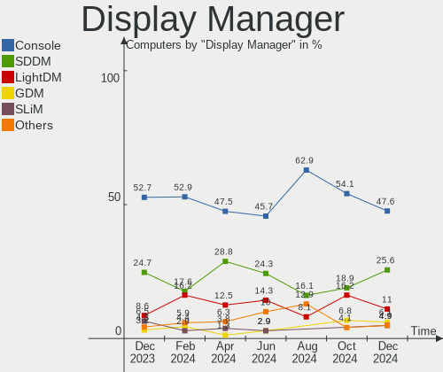
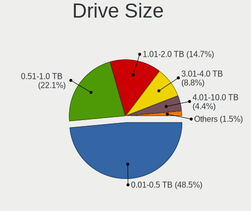
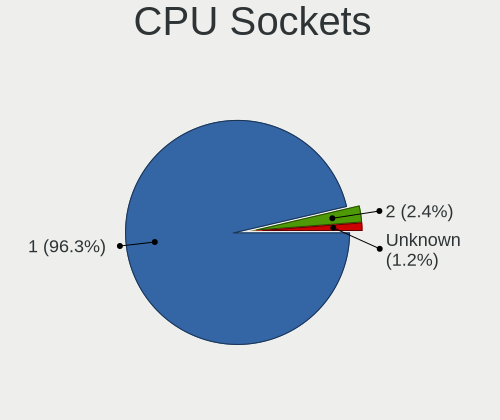
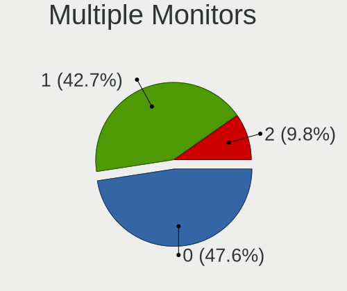

FreeBSD - Hardware Trends
-------------------------

A project to identify most popular hardware characteristics and track their change
over time based on data collected by BSD users at https://BSD-Hardware.info.

Anyone can contribute to this report by the [hw-probe](https://github.com/linuxhw/hw-probe/blob/master/INSTALL.BSD.md) tool:

    hw-probe -all -upload

This is a report for all computer types. See also reports for [desktops](/Dist/FreeBSD/Desktop/README.md) and [notebooks](/Dist/FreeBSD/Notebook/README.md).

This report is for one last month. Overall report since the beginning of time: [TestCoverage](https://github.com/bsdhw/TestCoverage)

Period: Sep, 2022.

Contents
--------

* [ System ](#system)
  - [ OS                       ](#os)
  - [ OS Family                ](#os-family)
  - [ Arch                     ](#arch)
  - [ DE                       ](#de)
  - [ Display Server           ](#display-server)
  - [ Display Manager          ](#display-manager)
  - [ OS Lang                  ](#os-lang)
  - [ Boot Mode                ](#boot-mode)
  - [ Filesystem               ](#filesystem)
  - [ Part. scheme             ](#part-scheme)

* [ Board ](#board)
  - [ Vendor                   ](#vendor)
  - [ Model                    ](#model)
  - [ Model Family             ](#model-family)
  - [ MFG Year                 ](#mfg-year)
  - [ Form Factor              ](#form-factor)
  - [ Coreboot                 ](#coreboot)
  - [ RAM Size                 ](#ram-size)
  - [ RAM Used                 ](#ram-used)
  - [ Total Drives             ](#total-drives)
  - [ Has CD-ROM               ](#has-cd-rom)
  - [ Has Ethernet             ](#has-ethernet)
  - [ Has WiFi                 ](#has-wifi)
  - [ Has Bluetooth            ](#has-bluetooth)

* [ Location ](#location)
  - [ Country                  ](#country)
  - [ City                     ](#city)

* [ Drives ](#drives)
  - [ Drive Vendor             ](#drive-vendor)
  - [ Drive Model              ](#drive-model)
  - [ HDD Vendor               ](#hdd-vendor)
  - [ SSD Vendor               ](#ssd-vendor)
  - [ Drive Kind               ](#drive-kind)
  - [ Drive Connector          ](#drive-connector)
  - [ Drive Size               ](#drive-size)
  - [ Space Total              ](#space-total)
  - [ Space Used               ](#space-used)
  - [ Malfunc. Drives          ](#malfunc-drives)
  - [ Malfunc. Drive Vendor    ](#malfunc-drive-vendor)
  - [ Malfunc. HDD Vendor      ](#malfunc-hdd-vendor)
  - [ Malfunc. Drive Kind      ](#malfunc-drive-kind)
  - [ Failed Drives            ](#failed-drives)
  - [ Failed Drive Vendor      ](#failed-drive-vendor)
  - [ Drive Status             ](#drive-status)

* [ Storage controller ](#storage-controller)
  - [ Storage Vendor           ](#storage-vendor)
  - [ Storage Model            ](#storage-model)
  - [ Storage Kind             ](#storage-kind)

* [ Processor ](#processor)
  - [ CPU Vendor               ](#cpu-vendor)
  - [ CPU Model                ](#cpu-model)
  - [ CPU Model Family         ](#cpu-model-family)
  - [ CPU Cores                ](#cpu-cores)
  - [ CPU Sockets              ](#cpu-sockets)
  - [ CPU Threads              ](#cpu-threads)
  - [ CPU Microarch            ](#cpu-microarch)

* [ Graphics ](#graphics)
  - [ GPU Vendor               ](#gpu-vendor)
  - [ GPU Model                ](#gpu-model)
  - [ GPU Combo                ](#gpu-combo)
  - [ GPU Driver               ](#gpu-driver)
  - [ GPU Memory               ](#gpu-memory)

* [ Monitor ](#monitor)
  - [ Monitor Vendor           ](#monitor-vendor)
  - [ Monitor Model            ](#monitor-model)
  - [ Monitor Resolution       ](#monitor-resolution)
  - [ Monitor Diagonal         ](#monitor-diagonal)
  - [ Monitor Width            ](#monitor-width)
  - [ Aspect Ratio             ](#aspect-ratio)
  - [ Monitor Area             ](#monitor-area)
  - [ Pixel Density            ](#pixel-density)
  - [ Multiple Monitors        ](#multiple-monitors)

* [ Network ](#network)
  - [ Net Controller Vendor    ](#net-controller-vendor)
  - [ Net Controller Model     ](#net-controller-model)
  - [ Wireless Vendor          ](#wireless-vendor)
  - [ Wireless Model           ](#wireless-model)
  - [ Ethernet Vendor          ](#ethernet-vendor)
  - [ Ethernet Model           ](#ethernet-model)
  - [ Net Controller Kind      ](#net-controller-kind)
  - [ Used Controller          ](#used-controller)
  - [ NICs                     ](#nics)
  - [ IPv6                     ](#ipv6)

* [ Bluetooth ](#bluetooth)
  - [ Bluetooth Vendor         ](#bluetooth-vendor)
  - [ Bluetooth Model          ](#bluetooth-model)

* [ Sound ](#sound)
  - [ Sound Vendor             ](#sound-vendor)
  - [ Sound Model              ](#sound-model)

* [ Memory ](#memory)
  - [ Memory Vendor            ](#memory-vendor)
  - [ Memory Model             ](#memory-model)
  - [ Memory Kind              ](#memory-kind)
  - [ Memory Form Factor       ](#memory-form-factor)
  - [ Memory Size              ](#memory-size)
  - [ Memory Speed             ](#memory-speed)

* [ Printers & scanners ](#printers--scanners)
  - [ Printer Vendor           ](#printer-vendor)
  - [ Printer Model            ](#printer-model)
  - [ Scanner Vendor           ](#scanner-vendor)
  - [ Scanner Model            ](#scanner-model)

* [ Camera ](#camera)
  - [ Camera Vendor            ](#camera-vendor)
  - [ Camera Model             ](#camera-model)

* [ Security ](#security)
  - [ Fingerprint Vendor       ](#fingerprint-vendor)
  - [ Fingerprint Model        ](#fingerprint-model)
  - [ Chipcard Vendor          ](#chipcard-vendor)
  - [ Chipcard Model           ](#chipcard-model)

* [ Unsupported ](#unsupported)
  - [ Unsupported Devices      ](#unsupported-devices)
  - [ Unsupported Device Types ](#unsupported-device-types)

System
------

OS
--

Installed operating systems

| Name                     | Computers | Percent |
|--------------------------|-----------|---------|
| FreeBSD 13.1-p2          | 35        | 50.72%  |
| FreeBSD 13.1             | 12        | 17.39%  |
| FreeBSD 12.3-p5          | 8         | 11.59%  |
| FreeBSD 14.0-CURRENT     | 5         | 7.25%   |
| FreeBSD 13.1-p1          | 4         | 5.8%    |
| FreeBSD 13.1-STABLE      | 3         | 4.35%   |
| FreeBSD 13.1-STABLE-HBSD | 1         | 1.45%   |
| FreeBSD 12.3-p7          | 1         | 1.45%   |

OS Family
---------

OS without a version

| Name    | Computers | Percent |
|---------|-----------|---------|
| FreeBSD | 69        | 100%    |

Arch
----

OS architecture (x86_64, i586, etc.)

| Name  | Computers | Percent |
|-------|-----------|---------|
| amd64 | 65        | 94.2%   |
| i386  | 3         | 4.35%   |
| arm   | 1         | 1.45%   |

DE
--

Desktop Environment

| Name          | Computers | Percent |
|---------------|-----------|---------|
| Console       | 25        | 36.23%  |
| KDE5          | 14        | 20.29%  |
| XFCE          | 13        | 18.84%  |
| TWM           | 3         | 4.35%   |
| MATE          | 3         | 4.35%   |
| GNOME         | 3         | 4.35%   |
| i3            | 2         | 2.9%    |
| spectrwm      | 1         | 1.45%   |
| plasma        | 1         | 1.45%   |
| Openbox       | 1         | 1.45%   |
| LXDE          | 1         | 1.45%   |
| Enlightenment | 1         | 1.45%   |
| AwesomeWM     | 1         | 1.45%   |

Display Server
--------------

X11 or Wayland

| Name    | Computers | Percent |
|---------|-----------|---------|
| X11     | 39        | 56.52%  |
| Console | 28        | 40.58%  |
| Wayland | 2         | 2.9%    |

Display Manager
---------------

SDDM, LightDM, etc.

| Name    | Computers | Percent |
|---------|-----------|---------|
| Console | 41        | 59.42%  |
| SDDM    | 14        | 20.29%  |
| SLiM    | 7         | 10.14%  |
| XDM     | 4         | 5.8%    |
| LightDM | 2         | 2.9%    |
| GDM     | 1         | 1.45%   |

OS Lang
-------

Language

| Lang    | Computers | Percent |
|---------|-----------|---------|
| C       | 42        | 60.87%  |
| Unknown | 13        | 18.84%  |
| ru_RU   | 4         | 5.8%    |
| en_US   | 4         | 5.8%    |
| zh_CN   | 3         | 4.35%   |
| de_DE   | 2         | 2.9%    |
| en_CA   | 1         | 1.45%   |

Boot Mode
---------

EFI or BIOS

| Mode | Computers | Percent |
|------|-----------|---------|
| EFI  | 40        | 57.97%  |
| BIOS | 29        | 42.03%  |

Filesystem
----------

Type of filesystem

| Type | Computers | Percent |
|------|-----------|---------|
| Zfs  | 43        | 62.32%  |
| Ufs  | 26        | 37.68%  |

Part. scheme
------------

Scheme of partitioning

| Type    | Computers | Percent |
|---------|-----------|---------|
| GPT     | 61        | 88.41%  |
| MBR     | 7         | 10.14%  |
| Unknown | 1         | 1.45%   |

Board
-----

Vendor
------

Motherboard manufacturer

| Name                | Computers | Percent |
|---------------------|-----------|---------|
| Dell                | 12        | 17.39%  |
| ASUSTek Computer    | 7         | 10.14%  |
| MSI                 | 6         | 8.7%    |
| Hewlett-Packard     | 6         | 8.7%    |
| Lenovo              | 5         | 7.25%   |
| Supermicro          | 4         | 5.8%    |
| Intel               | 3         | 4.35%   |
| Gigabyte Technology | 3         | 4.35%   |
| ASRockRack          | 3         | 4.35%   |
| Toshiba             | 2         | 2.9%    |
| System76            | 2         | 2.9%    |
| IBM                 | 2         | 2.9%    |
| Deciso              | 2         | 2.9%    |
| ASRock              | 2         | 2.9%    |
| Acer                | 2         | 2.9%    |
| Unknown             | 2         | 2.9%    |
| Valve               | 1         | 1.45%   |
| Pegatron            | 1         | 1.45%   |
| NITRINOnet          | 1         | 1.45%   |
| Google              | 1         | 1.45%   |
| Fujitsu             | 1         | 1.45%   |
| AMI                 | 1         | 1.45%   |

Model
-----

Motherboard model

| Name                                        | Computers | Percent |
|---------------------------------------------|-----------|---------|
| System76 Gazelle                            | 2         | 2.9%    |
| Gigabyte GB-BSi5A-6200                      | 2         | 2.9%    |
| Dell PowerEdge R710                         | 2         | 2.9%    |
| Deciso Netboard A10 V2                      | 2         | 2.9%    |
| ASRockRack 520001                           | 2         | 2.9%    |
| Unknown                                     | 2         | 2.9%    |
| Valve Jupiter                               | 1         | 1.45%   |
| Toshiba Satellite A200                      | 1         | 1.45%   |
| Toshiba PORTEGE R700                        | 1         | 1.45%   |
| Supermicro X8DT3                            | 1         | 1.45%   |
| Supermicro X7DB8                            | 1         | 1.45%   |
| Supermicro X10SLH-F/X10SLM+-F               | 1         | 1.45%   |
| Supermicro Super Server                     | 1         | 1.45%   |
| Pegatron TERRA_PC                           | 1         | 1.45%   |
| NITRINOnet M360RUS56                        | 1         | 1.45%   |
| MSI MS-7C96                                 | 1         | 1.45%   |
| MSI MS-7C79                                 | 1         | 1.45%   |
| MSI MS-7C75                                 | 1         | 1.45%   |
| MSI MS-7C37                                 | 1         | 1.45%   |
| MSI MS-7C36                                 | 1         | 1.45%   |
| MSI MS-7817                                 | 1         | 1.45%   |
| Lenovo YangTianM6880N                       | 1         | 1.45%   |
| Lenovo ThinkPad X250 20CL001GUS             | 1         | 1.45%   |
| Lenovo ThinkPad X1 Extreme Gen 3 20TKS0QB00 | 1         | 1.45%   |
| Lenovo ThinkPad P53 20QNCTO1WW              | 1         | 1.45%   |
| Lenovo ThinkPad L420 7829WDY                | 1         | 1.45%   |
| Intel S1200SP                               | 1         | 1.45%   |
| Intel NUC8i7BEH                             | 1         | 1.45%   |
| Intel D945GCLF2 AAE46416-106                | 1         | 1.45%   |
| IBM ThinkPad T43 18714AG                    | 1         | 1.45%   |
| IBM ThinkPad T40 23737CG                    | 1         | 1.45%   |
| HP Z600 Workstation                         | 1         | 1.45%   |
| HP Slim Desktop S01-aF2xxx                  | 1         | 1.45%   |
| HP ProLiant ML350p Gen8                     | 1         | 1.45%   |
| HP ProDesk 600 G1 DM                        | 1         | 1.45%   |
| HP EliteBook 8570p                          | 1         | 1.45%   |
| HP EliteBook 840 G3                         | 1         | 1.45%   |
| Google Peppy                                | 1         | 1.45%   |
| Gigabyte H410M S2 V2                        | 1         | 1.45%   |
| Fujitsu LIFEBOOK A532                       | 1         | 1.45%   |

Model Family
------------

Motherboard model prefix

| Name                   | Computers | Percent |
|------------------------|-----------|---------|
| Lenovo ThinkPad        | 4         | 5.8%    |
| Dell PowerEdge         | 4         | 5.8%    |
| System76 Gazelle       | 2         | 2.9%    |
| IBM ThinkPad           | 2         | 2.9%    |
| HP EliteBook           | 2         | 2.9%    |
| Gigabyte GB-BSi5A-6200 | 2         | 2.9%    |
| Dell Precision         | 2         | 2.9%    |
| Dell Latitude          | 2         | 2.9%    |
| Deciso Netboard        | 2         | 2.9%    |
| ASRockRack 520001      | 2         | 2.9%    |
| Unknown                | 2         | 2.9%    |
| Valve Jupiter          | 1         | 1.45%   |
| Toshiba Satellite      | 1         | 1.45%   |
| Toshiba PORTEGE        | 1         | 1.45%   |
| Supermicro X8DT3       | 1         | 1.45%   |
| Supermicro X7DB8       | 1         | 1.45%   |
| Supermicro X10SLH-F    | 1         | 1.45%   |
| Supermicro Super       | 1         | 1.45%   |
| Pegatron TERRA         | 1         | 1.45%   |
| NITRINOnet M360RUS56   | 1         | 1.45%   |
| MSI MS-7C96            | 1         | 1.45%   |
| MSI MS-7C79            | 1         | 1.45%   |
| MSI MS-7C75            | 1         | 1.45%   |
| MSI MS-7C37            | 1         | 1.45%   |
| MSI MS-7C36            | 1         | 1.45%   |
| MSI MS-7817            | 1         | 1.45%   |
| Lenovo YangTianM6880N  | 1         | 1.45%   |
| Intel S1200SP          | 1         | 1.45%   |
| Intel NUC8i7BEH        | 1         | 1.45%   |
| Intel D945GCLF2        | 1         | 1.45%   |
| HP Z600                | 1         | 1.45%   |
| HP Slim                | 1         | 1.45%   |
| HP ProLiant            | 1         | 1.45%   |
| HP ProDesk             | 1         | 1.45%   |
| Google Peppy           | 1         | 1.45%   |
| Gigabyte H410M         | 1         | 1.45%   |
| Fujitsu LIFEBOOK       | 1         | 1.45%   |
| Dell XPS               | 1         | 1.45%   |
| Dell Vostro            | 1         | 1.45%   |
| Dell System            | 1         | 1.45%   |

MFG Year
--------

Motherboard manufacture year

| Year    | Computers | Percent |
|---------|-----------|---------|
| 2021    | 12        | 17.39%  |
| 2020    | 7         | 10.14%  |
| 2019    | 7         | 10.14%  |
| 2022    | 5         | 7.25%   |
| 2017    | 5         | 7.25%   |
| 2015    | 5         | 7.25%   |
| 2016    | 4         | 5.8%    |
| 2014    | 4         | 5.8%    |
| 2013    | 4         | 5.8%    |
| 2012    | 3         | 4.35%   |
| 2010    | 3         | 4.35%   |
| 2009    | 2         | 2.9%    |
| 2008    | 2         | 2.9%    |
| 2018    | 1         | 1.45%   |
| 2011    | 1         | 1.45%   |
| 2007    | 1         | 1.45%   |
| 2006    | 1         | 1.45%   |
| 2003    | 1         | 1.45%   |
| Unknown | 1         | 1.45%   |

Form Factor
-----------

Physical design of the computer

| Name     | Computers | Percent |
|----------|-----------|---------|
| Desktop  | 30        | 43.48%  |
| Notebook | 29        | 42.03%  |
| Server   | 9         | 13.04%  |
| Mini pc  | 1         | 1.45%   |

Coreboot
--------

Have coreboot on board

| Used | Computers | Percent |
|------|-----------|---------|
| No   | 65        | 94.2%   |
| Yes  | 4         | 5.8%    |

RAM Size
--------

Total RAM memory

| Size in GB  | Computers | Percent |
|-------------|-----------|---------|
| 32.01-64.0  | 17        | 24.64%  |
| 8.01-16.0   | 17        | 24.64%  |
| 16.01-24.0  | 12        | 17.39%  |
| 64.01-256.0 | 9         | 13.04%  |
| 4.01-8.0    | 8         | 11.59%  |
| 2.01-3.0    | 2         | 2.9%    |
| 0.01-0.5    | 2         | 2.9%    |
| 3.01-4.0    | 1         | 1.45%   |
| 24.01-32.0  | 1         | 1.45%   |

RAM Used
--------

Used RAM memory

| Used GB  | Computers | Percent |
|----------|-----------|---------|
| 0.51-1.0 | 21        | 30.43%  |
| 0.01-0.5 | 20        | 28.99%  |
| 1.01-2.0 | 18        | 26.09%  |
| 2.01-3.0 | 4         | 5.8%    |
| 4.01-8.0 | 2         | 2.9%    |
| 3.01-4.0 | 2         | 2.9%    |
| 0        | 2         | 2.9%    |

Total Drives
------------

Number of drives on board

| Drives | Computers | Percent |
|--------|-----------|---------|
| 1      | 30        | 43.48%  |
| 2      | 14        | 20.29%  |
| 0      | 7         | 10.14%  |
| 3      | 6         | 8.7%    |
| 4      | 5         | 7.25%   |
| 6      | 2         | 2.9%    |
| 5      | 2         | 2.9%    |
| 13     | 1         | 1.45%   |
| 11     | 1         | 1.45%   |
| 10     | 1         | 1.45%   |

Has CD-ROM
----------

Has CD-ROM on board

| Presented | Computers | Percent |
|-----------|-----------|---------|
| No        | 47        | 68.12%  |
| Yes       | 22        | 31.88%  |

Has Ethernet
------------

Has Ethernet on board

| Presented | Computers | Percent |
|-----------|-----------|---------|
| Yes       | 61        | 88.41%  |
| No        | 8         | 11.59%  |

Has WiFi
--------

Has WiFi module

| Presented | Computers | Percent |
|-----------|-----------|---------|
| Yes       | 36        | 52.17%  |
| No        | 33        | 47.83%  |

Has Bluetooth
-------------

Has Bluetooth module

| Presented | Computers | Percent |
|-----------|-----------|---------|
| No        | 41        | 59.42%  |
| Yes       | 28        | 40.58%  |

Location
--------

Country
-------

Geographic location (country)

| Country     | Computers | Percent |
|-------------|-----------|---------|
| Germany     | 19        | 27.54%  |
| USA         | 13        | 18.84%  |
| Russia      | 7         | 10.14%  |
| China       | 5         | 7.25%   |
| Switzerland | 3         | 4.35%   |
| Canada      | 3         | 4.35%   |
| UK          | 2         | 2.9%    |
| Singapore   | 2         | 2.9%    |
| Poland      | 2         | 2.9%    |
| Italy       | 2         | 2.9%    |
| Turkey      | 1         | 1.45%   |
| Thailand    | 1         | 1.45%   |
| South Korea | 1         | 1.45%   |
| Slovakia    | 1         | 1.45%   |
| Romania     | 1         | 1.45%   |
| Japan       | 1         | 1.45%   |
| India       | 1         | 1.45%   |
| Greece      | 1         | 1.45%   |
| France      | 1         | 1.45%   |
| Brazil      | 1         | 1.45%   |
| Belgium     | 1         | 1.45%   |

City
----

Geographic location (city)

| City                    | Computers | Percent |
|-------------------------|-----------|---------|
| Habichtswald            | 6         | 8.7%    |
| Moscow                  | 4         | 5.8%    |
| Zurich                  | 3         | 4.35%   |
| Ludwigsburg             | 3         | 4.35%   |
| Xiamen                  | 2         | 2.9%    |
| Singapore               | 2         | 2.9%    |
| Salem                   | 2         | 2.9%    |
| Redmond                 | 2         | 2.9%    |
| Olympia                 | 2         | 2.9%    |
| London                  | 2         | 2.9%    |
| Kassel                  | 2         | 2.9%    |
| Gdynia                  | 2         | 2.9%    |
| Frankfurt am Main       | 2         | 2.9%    |
| Unknown                 | 2         | 2.9%    |
| Yangcheon-gu            | 1         | 1.45%   |
| Wenatchee               | 1         | 1.45%   |
| Twinsburg               | 1         | 1.45%   |
| Stratford               | 1         | 1.45%   |
| St Petersburg           | 1         | 1.45%   |
| Spangenberg             | 1         | 1.45%   |
| Setagaya-ku             | 1         | 1.45%   |
| Seattle                 | 1         | 1.45%   |
| Schildow                | 1         | 1.45%   |
| Satu Mare               | 1         | 1.45%   |
| San Antonio             | 1         | 1.45%   |
| Roswell                 | 1         | 1.45%   |
| Rio de Janeiro          | 1         | 1.45%   |
| Qinnan                  | 1         | 1.45%   |
| Princeton               | 1         | 1.45%   |
| Orenburg                | 1         | 1.45%   |
| Offenburg               | 1         | 1.45%   |
| Neustadt am Ruebenberge | 1         | 1.45%   |
| Nepean                  | 1         | 1.45%   |
| Milan                   | 1         | 1.45%   |
| Martin                  | 1         | 1.45%   |
| Kingsburg               | 1         | 1.45%   |
| Jinrongjie              | 1         | 1.45%   |
| Crema                   | 1         | 1.45%   |
| Chennai                 | 1         | 1.45%   |
| Chengdu                 | 1         | 1.45%   |

Drives
------

Drive Vendor
------------

Hard drive vendors

| Vendor              | Computers | Drives | Percent |
|---------------------|-----------|--------|---------|
| Samsung Electronics | 20        | 31     | 21.28%  |
| WDC                 | 17        | 35     | 18.09%  |
| Seagate             | 12        | 23     | 12.77%  |
| Intel               | 6         | 9      | 6.38%   |
| Toshiba             | 5         | 6      | 5.32%   |
| HGST                | 5         | 14     | 5.32%   |
| SanDisk             | 4         | 4      | 4.26%   |
| Kingston            | 3         | 3      | 3.19%   |
| Hitachi             | 3         | 4      | 3.19%   |
| Crucial             | 3         | 3      | 3.19%   |
| Transcend           | 2         | 2      | 2.13%   |
| Micron Technology   | 2         | 2      | 2.13%   |
| KIOXIA              | 2         | 2      | 2.13%   |
| A-DATA Technology   | 2         | 2      | 2.13%   |
| WD MediaMax         | 1         | 1      | 1.06%   |
| Silicon Motion      | 1         | 1      | 1.06%   |
| Phison              | 1         | 1      | 1.06%   |
| Lexar               | 1         | 1      | 1.06%   |
| KIOXIA-EXCERIA      | 1         | 1      | 1.06%   |
| Hikvision           | 1         | 1      | 1.06%   |
| Hewlett-Packard     | 1         | 5      | 1.06%   |
| Corsair             | 1         | 1      | 1.06%   |

Drive Model
-----------

Hard drive models

| Model                                | Computers | Percent |
|--------------------------------------|-----------|---------|
| Samsung SSD 970 EVO Plus 500GB       | 3         | 2.59%   |
| Transcend TS128GMSA370 128GB         | 2         | 1.72%   |
| Seagate ST500DM002-1BD142 500GB      | 2         | 1.72%   |
| Seagate ST4000DM000-1F2168 4TB       | 2         | 1.72%   |
| Seagate ST1000DM010-2EP102 1TB       | 2         | 1.72%   |
| Samsung SSD 970 EVO Plus 1TB         | 2         | 1.72%   |
| Samsung SSD 850 EVO 1TB              | 2         | 1.72%   |
| HGST HUS722T1TALA604 1TB             | 2         | 1.72%   |
| WDC WDS500G3X0C-00SJG0 500GB         | 1         | 0.86%   |
| WDC WDS480G2G0A-00JH30 480GB         | 1         | 0.86%   |
| WDC WDS250G2B0B-00YS70 250GB         | 1         | 0.86%   |
| WDC WDS100T3X0C-00SJG0 1TB           | 1         | 0.86%   |
| WDC WDS100T1X0E-00AFY0 1TB           | 1         | 0.86%   |
| WDC WD80EMAZ-00WJTA0 8TB             | 1         | 0.86%   |
| WDC WD80EFZX-68UW8N0 8TB             | 1         | 0.86%   |
| WDC WD80EFAX-68LHPN0 8TB             | 1         | 0.86%   |
| WDC WD80EDBZ-11B0ZA0 8TB             | 1         | 0.86%   |
| WDC WD800JD-75MSA3 80GB              | 1         | 0.86%   |
| WDC WD7500BPVX-00JC3T0 752GB         | 1         | 0.86%   |
| WDC WD60EZRZ-00GZ5B1 6TB             | 1         | 0.86%   |
| WDC WD6002FRYZ-01WD5B1 6TB           | 1         | 0.86%   |
| WDC WD5000LPCX-00VHAT0 500GB         | 1         | 0.86%   |
| WDC WD5000AAKS-00V1A0 500GB          | 1         | 0.86%   |
| WDC WD5000AAKS-00E4A0 500GB          | 1         | 0.86%   |
| WDC WD40EZRZ-22GXCB0 4TB             | 1         | 0.86%   |
| WDC WD4005FZBX-00K5WB0 4TB           | 1         | 0.86%   |
| WDC WD30EZRZ-00WN9B0 3TB             | 1         | 0.86%   |
| WDC WD15EADS-00P8B0 1.5TB            | 1         | 0.86%   |
| WDC WD120EMFZ-11A6JA0 12TB           | 1         | 0.86%   |
| WDC WD120EMAZ-11BLFA0 12TB           | 1         | 0.86%   |
| WDC WD10SPCX-00KHST0 1TB             | 1         | 0.86%   |
| WDC WD10EJRX-89N74Y0 1TB             | 1         | 0.86%   |
| WDC PC SN730 SDBQNTY-256G-1001 256GB | 1         | 0.86%   |
| WDC PC SN730 SDBQNTY-1T00-1001 1TB   | 1         | 0.86%   |
| WDC PC SN530 SDBPNPZ-256G-1006 256GB | 1         | 0.86%   |
| WD MediaMax WL1500GSA6472B 1.5TB     | 1         | 0.86%   |
| Toshiba MQ01UBD100 1TB               | 1         | 0.86%   |
| Toshiba MQ01ABD075 752GB             | 1         | 0.86%   |
| Toshiba KXG60ZNV512G 512GB           | 1         | 0.86%   |
| Toshiba HDWD110 1TB                  | 1         | 0.86%   |

HDD Vendor
----------

Hard disk drive vendors

| Vendor              | Computers | Drives | Percent |
|---------------------|-----------|--------|---------|
| Seagate             | 12        | 23     | 30.77%  |
| WDC                 | 10        | 27     | 25.64%  |
| HGST                | 5         | 14     | 12.82%  |
| Toshiba             | 4         | 5      | 10.26%  |
| Samsung Electronics | 3         | 4      | 7.69%   |
| Hitachi             | 3         | 4      | 7.69%   |
| WD MediaMax         | 1         | 1      | 2.56%   |
| Hewlett-Packard     | 1         | 5      | 2.56%   |

SSD Vendor
----------

Solid state drive vendors

| Vendor              | Computers | Drives | Percent |
|---------------------|-----------|--------|---------|
| Samsung Electronics | 13        | 16     | 38.24%  |
| Intel               | 5         | 8      | 14.71%  |
| SanDisk             | 4         | 4      | 11.76%  |
| WDC                 | 2         | 2      | 5.88%   |
| Transcend           | 2         | 2      | 5.88%   |
| Kingston            | 2         | 2      | 5.88%   |
| Crucial             | 2         | 2      | 5.88%   |
| A-DATA Technology   | 2         | 2      | 5.88%   |
| Lexar               | 1         | 1      | 2.94%   |
| Hikvision           | 1         | 1      | 2.94%   |

Drive Kind
----------

HDD or SSD

| Kind | Computers | Drives | Percent |
|------|-----------|--------|---------|
| SSD  | 30        | 40     | 36.59%  |
| HDD  | 29        | 83     | 35.37%  |
| NVMe | 23        | 29     | 28.05%  |

Drive Connector
---------------

SATA, SAS, NVMe, etc.

| Type | Computers | Drives | Percent |
|------|-----------|--------|---------|
| SATA | 51        | 123    | 68.92%  |
| NVMe | 23        | 29     | 31.08%  |

Drive Size
----------

Size of hard drive

| Size in TB | Computers | Drives | Percent |
|------------|-----------|--------|---------|
| 0.01-0.5   | 33        | 45     | 49.25%  |
| 0.51-1.0   | 14        | 22     | 20.9%   |
| 3.01-4.0   | 6         | 21     | 8.96%   |
| 1.01-2.0   | 6         | 12     | 8.96%   |
| 4.01-10.0  | 5         | 16     | 7.46%   |
| 2.01-3.0   | 2         | 5      | 2.99%   |
| 10.01-20.0 | 1         | 2      | 1.49%   |

Space Total
-----------

Amount of disk space available on the file system

| Size in GB     | Computers | Percent |
|----------------|-----------|---------|
| 101-250        | 30        | 43.48%  |
| 251-500        | 17        | 24.64%  |
| 501-1000       | 9         | 13.04%  |
| 51-100         | 3         | 4.35%   |
| Unknown        | 3         | 4.35%   |
| 21-50          | 2         | 2.9%    |
| 2001-3000      | 2         | 2.9%    |
| More than 3000 | 1         | 1.45%   |
| 1001-2000      | 1         | 1.45%   |
| 1-20           | 1         | 1.45%   |

Space Used
----------

Amount of used disk space

| Used GB        | Computers | Percent |
|----------------|-----------|---------|
| 1-20           | 44        | 63.77%  |
| 21-50          | 10        | 14.49%  |
| 101-250        | 4         | 5.8%    |
| 51-100         | 4         | 5.8%    |
| Unknown        | 3         | 4.35%   |
| 501-1000       | 2         | 2.9%    |
| More than 3000 | 1         | 1.45%   |
| 251-500        | 1         | 1.45%   |

Malfunc. Drives
---------------

Drive models with a malfunction

| Model                           | Computers | Drives | Percent |
|---------------------------------|-----------|--------|---------|
| WDC WD6002FRYZ-01WD5B1 6TB      | 1         | 1      | 8.33%   |
| WDC WD10EJRX-89N74Y0 1TB        | 1         | 1      | 8.33%   |
| Samsung Electronics HD204UI 2TB | 1         | 1      | 8.33%   |
| Samsung Electronics HD103SJ 1TB | 1         | 1      | 8.33%   |
| Kingston SNS4151S316GD 16GB     | 1         | 1      | 8.33%   |
| Intel SSDSCKKF256G8H 256GB      | 1         | 1      | 8.33%   |
| Intel SSDSC2BW240A4 240GB       | 1         | 1      | 8.33%   |
| Hitachi HUA722010CLA630 1TB     | 1         | 2      | 8.33%   |
| Hitachi HTS548040M9AT00 37GB    | 1         | 1      | 8.33%   |
| HGST HTS721010A9E630 1TB        | 1         | 1      | 8.33%   |
| HGST HTS541075A9E680 752GB      | 1         | 1      | 8.33%   |
| Crucial M4-CT064M4SSD2 64GB     | 1         | 1      | 8.33%   |

Malfunc. Drive Vendor
---------------------

Vendors of faulty drives

| Vendor              | Computers | Drives | Percent |
|---------------------|-----------|--------|---------|
| WDC                 | 2         | 2      | 16.67%  |
| Samsung Electronics | 2         | 2      | 16.67%  |
| Intel               | 2         | 2      | 16.67%  |
| Hitachi             | 2         | 3      | 16.67%  |
| HGST                | 2         | 2      | 16.67%  |
| Kingston            | 1         | 1      | 8.33%   |
| Crucial             | 1         | 1      | 8.33%   |

Malfunc. HDD Vendor
-------------------

Vendors of faulty HDD drives

| Vendor              | Computers | Drives | Percent |
|---------------------|-----------|--------|---------|
| WDC                 | 2         | 2      | 25%     |
| Samsung Electronics | 2         | 2      | 25%     |
| Hitachi             | 2         | 3      | 25%     |
| HGST                | 2         | 2      | 25%     |

Malfunc. Drive Kind
-------------------

Kinds of faulty drives

| Kind | Computers | Drives | Percent |
|------|-----------|--------|---------|
| HDD  | 8         | 9      | 66.67%  |
| SSD  | 4         | 4      | 33.33%  |

Failed Drives
-------------

Failed drive models

Zero info for selected period =(

Failed Drive Vendor
-------------------

Failed drive vendors

Zero info for selected period =(

Drive Status
------------

Number of failed and malfunc. drives

| Status  | Computers | Drives | Percent |
|---------|-----------|--------|---------|
| Works   | 60        | 139    | 85.71%  |
| Malfunc | 10        | 13     | 14.29%  |

Storage controller
------------------

Storage Vendor
--------------

Storage controller vendors

| Vendor                      | Computers | Percent |
|-----------------------------|-----------|---------|
| Intel                       | 44        | 44%     |
| AMD                         | 16        | 16%     |
| SanDisk                     | 8         | 8%      |
| Samsung Electronics         | 7         | 7%      |
| Broadcom / LSI              | 7         | 7%      |
| KIOXIA                      | 3         | 3%      |
| Phison Electronics          | 2         | 2%      |
| Micron Technology           | 2         | 2%      |
| ASMedia Technology          | 2         | 2%      |
| 3ware                       | 2         | 2%      |
| Toshiba                     | 1         | 1%      |
| Silicon Motion              | 1         | 1%      |
| Micron/Crucial Technology   | 1         | 1%      |
| Marvell Technology Group    | 1         | 1%      |
| Kingston Technology Company | 1         | 1%      |
| Hewlett-Packard             | 1         | 1%      |
| Adaptec                     | 1         | 1%      |

Storage Model
-------------

Storage controller models

| Model                                                                          | Computers | Percent |
|--------------------------------------------------------------------------------|-----------|---------|
| AMD FCH SATA Controller [AHCI mode]                                            | 15        | 13.64%  |
| Samsung NVMe SSD Controller SM981/PM981/PM983                                  | 5         | 4.55%   |
| Intel 8 Series/C220 Series Chipset Family 6-port SATA Controller 1 [AHCI mode] | 5         | 4.55%   |
| SanDisk WD Black SN750 / PC SN730 NVMe SSD                                     | 4         | 3.64%   |
| Intel Wildcat Point-LP SATA Controller [AHCI Mode]                             | 4         | 3.64%   |
| Unknown                                                                        | 4         | 3.64%   |
| Intel Sunrise Point-LP SATA Controller [AHCI mode]                             | 3         | 2.73%   |
| Intel Comet Lake SATA AHCI Controller                                          | 3         | 2.73%   |
| Samsung NVMe SSD Controller PM9A1/PM9A3/980PRO                                 | 2         | 1.82%   |
| KIOXIA NVMe SSD Controller BG4                                                 | 2         | 1.82%   |
| Intel Q170/Q150/B150/H170/H110/Z170/CM236 Chipset SATA Controller [AHCI Mode]  | 2         | 1.82%   |
| Intel NM10/ICH7 Family SATA Controller [IDE mode]                              | 2         | 1.82%   |
| Intel Cannon Lake Mobile PCH SATA AHCI Controller                              | 2         | 1.82%   |
| Intel 82801JI (ICH10 Family) SATA AHCI Controller                              | 2         | 1.82%   |
| Intel 82801IB (ICH9) 2 port SATA Controller [IDE mode]                         | 2         | 1.82%   |
| Intel 7 Series Chipset Family 6-port SATA Controller [AHCI mode]               | 2         | 1.82%   |
| Intel 6 Series/C200 Series Chipset Family 6 port Mobile SATA AHCI Controller   | 2         | 1.82%   |
| Broadcom / LSI MegaRAID SAS 2208 [Thunderbolt]                                 | 2         | 1.82%   |
| ASMedia ASM1062 Serial ATA Controller                                          | 2         | 1.82%   |
| AMD 400 Series Chipset SATA Controller                                         | 2         | 1.82%   |
| 3ware 9650SE SATA-II RAID PCIe                                                 | 2         | 1.82%   |
| Toshiba XG6 NVMe SSD Controller                                                | 1         | 0.91%   |
| Silicon Motion SM2263EN/SM2263XT SSD Controller                                | 1         | 0.91%   |
| SanDisk WD PC SN810 / Black SN850 NVMe SSD                                     | 1         | 0.91%   |
| SanDisk WD Blue SN570 NVMe SSD                                                 | 1         | 0.91%   |
| SanDisk WD Blue SN550 NVMe SSD                                                 | 1         | 0.91%   |
| SanDisk WD Black NVMe SSD                                                      | 1         | 0.91%   |
| Samsung NVMe SSD Controller SM961/PM961/SM963                                  | 1         | 0.91%   |
| Phison E16 PCIe4 NVMe Controller                                               | 1         | 0.91%   |
| Phison E12 NVMe Controller                                                     | 1         | 0.91%   |
| Micron/Crucial P1 NVMe PCIe SSD                                                | 1         | 0.91%   |
| Marvell Group 88SE6111/6121 SATA II / PATA Controller                          | 1         | 0.91%   |
| KIOXIA NVMe SSD                                                                | 1         | 0.91%   |
| Intel Tiger Lake-LP SATA Controller                                            | 1         | 0.91%   |
| Intel SATA Controller [RAID mode]                                              | 1         | 0.91%   |
| Intel Celeron/Pentium Silver Processor SATA Controller                         | 1         | 0.91%   |
| Intel Cannon Lake PCH SATA AHCI Controller                                     | 1         | 0.91%   |
| Intel C610/X99 series chipset 6-Port SATA Controller [AHCI mode]               | 1         | 0.91%   |
| Intel C600/X79 series chipset 6-Port SATA AHCI Controller                      | 1         | 0.91%   |
| Intel C600/X79 series chipset 4-Port SATA IDE Controller                       | 1         | 0.91%   |

Storage Kind
------------

Kind of storage controller (IDE, SATA, NVMe, SAS, ...)

| Kind | Computers | Percent |
|------|-----------|---------|
| SATA | 49        | 50.52%  |
| NVMe | 25        | 25.77%  |
| IDE  | 11        | 11.34%  |
| RAID | 10        | 10.31%  |
| SAS  | 2         | 2.06%   |

Processor
---------

CPU Vendor
----------

Processor vendors

| Vendor | Computers | Percent |
|--------|-----------|---------|
| Intel  | 51        | 73.91%  |
| AMD    | 17        | 24.64%  |
| ARM    | 1         | 1.45%   |

CPU Model
---------

Processor models

| Model                                    | Computers | Percent |
|------------------------------------------|-----------|---------|
| AMD Ryzen 9 3900X 12-Core Processor      | 3         | 4.35%   |
| Intel Xeon CPU E5-2609 0 @ 2.40GHz       | 2         | 2.9%    |
| Intel Pentium M processor                | 2         | 2.9%    |
| Intel Core i7-9750H CPU @ 2.60GHz        | 2         | 2.9%    |
| Intel Core i5-6200U CPU @ 2.30GHz        | 2         | 2.9%    |
| Intel Core i5-5200U CPU @ 2.20GHz        | 2         | 2.9%    |
| AMD Ryzen 5 PRO 3600 6-Core Processor    | 2         | 2.9%    |
| AMD GX-420MC SOC                         | 2         | 2.9%    |
| Intel Xeon processor                     | 1         | 1.45%   |
| Intel Xeon CPU E5630 @ 2.53GHz           | 1         | 1.45%   |
| Intel Xeon CPU E5620 @ 2.40GHz           | 1         | 1.45%   |
| Intel Xeon CPU E5530 @ 2.40GHz           | 1         | 1.45%   |
| Intel Xeon CPU E5506 @ 2.13GHz           | 1         | 1.45%   |
| Intel Xeon CPU E5-2620 v2 @ 2.10GHz      | 1         | 1.45%   |
| Intel Xeon CPU E5-2609 v4 @ 1.70GHz      | 1         | 1.45%   |
| Intel Xeon CPU E3-1231 v3 @ 3.40GHz      | 1         | 1.45%   |
| Intel Xeon CPU E3-1225 v3 @ 3.20GHz      | 1         | 1.45%   |
| Intel Pentium Silver J5040 CPU @ 2.00GHz | 1         | 1.45%   |
| Intel Pentium Gold G5400 CPU @ 3.70GHz   | 1         | 1.45%   |
| Intel Pentium CPU G3240T @ 2.70GHz       | 1         | 1.45%   |
| Intel Pentium CPU G3220 @ 3.00GHz        | 1         | 1.45%   |
| Intel Core i9-10885H CPU @ 2.40GHz       | 1         | 1.45%   |
| Intel Core i7-9850H CPU @ 2.60GHz        | 1         | 1.45%   |
| Intel Core i7-8559U CPU @ 2.70GHz        | 1         | 1.45%   |
| Intel Core i7-6600U CPU @ 2.60GHz        | 1         | 1.45%   |
| Intel Core i7-5600U CPU @ 2.60GHz        | 1         | 1.45%   |
| Intel Core i7-3520M CPU @ 2.90GHz        | 1         | 1.45%   |
| Intel Core i7-10750H CPU @ 2.60GHz       | 1         | 1.45%   |
| Intel Core i7-10700K CPU @ 3.80GHz       | 1         | 1.45%   |
| Intel Core i7-10700 CPU @ 2.90GHz        | 1         | 1.45%   |
| Intel Core i7-1065G7 CPU @ 1.30GHz       | 1         | 1.45%   |
| Intel Core i7-10610U CPU @ 1.80GHz       | 1         | 1.45%   |
| Intel Core i5-6300HQ CPU @ 2.30GHz       | 1         | 1.45%   |
| Intel Core i5-5300U CPU @ 2.30GHz        | 1         | 1.45%   |
| Intel Core i5-3230M CPU @ 2.60GHz        | 1         | 1.45%   |
| Intel Core i5-2540M CPU @ 2.60GHz        | 1         | 1.45%   |
| Intel Core i5-2410M CPU @ 2.30GHz        | 1         | 1.45%   |
| Intel Core i5 CPU M 520 @ 2.40GHz        | 1         | 1.45%   |
| Intel Core i3-6100 CPU @ 3.70GHz         | 1         | 1.45%   |
| Intel Core i3-4130 CPU @ 3.40GHz         | 1         | 1.45%   |

CPU Model Family
----------------

Processor model prefix

| Model                | Computers | Percent |
|----------------------|-----------|---------|
| Intel Core i7        | 12        | 17.39%  |
| Intel Xeon           | 11        | 15.94%  |
| Intel Core i5        | 10        | 14.49%  |
| Other                | 5         | 7.25%   |
| AMD Ryzen 9          | 5         | 7.25%   |
| Intel Pentium M      | 2         | 2.9%    |
| Intel Pentium        | 2         | 2.9%    |
| Intel Core i3        | 2         | 2.9%    |
| Intel Atom           | 2         | 2.9%    |
| AMD Ryzen 7          | 2         | 2.9%    |
| AMD Ryzen 5 PRO      | 2         | 2.9%    |
| AMD Ryzen 3          | 2         | 2.9%    |
| AMD GX               | 2         | 2.9%    |
| Intel Pentium Silver | 1         | 1.45%   |
| Intel Pentium Gold   | 1         | 1.45%   |
| Intel Core i9        | 1         | 1.45%   |
| Intel Core Duo       | 1         | 1.45%   |
| Intel Core 2 Quad    | 1         | 1.45%   |
| Intel Core 2 Duo     | 1         | 1.45%   |
| Intel Celeron        | 1         | 1.45%   |
| AMD Ryzen 7 PRO      | 1         | 1.45%   |
| AMD FX               | 1         | 1.45%   |
| AMD EPYC             | 1         | 1.45%   |

CPU Cores
---------

Number of processor cores

| Number  | Computers | Percent |
|---------|-----------|---------|
| 4       | 19        | 27.54%  |
| 2       | 19        | 27.54%  |
| 8       | 10        | 14.49%  |
| 6       | 5         | 7.25%   |
| 16      | 4         | 5.8%    |
| 24      | 3         | 4.35%   |
| 12      | 3         | 4.35%   |
| Unknown | 3         | 4.35%   |
| 1       | 2         | 2.9%    |
| 32      | 1         | 1.45%   |

CPU Sockets
-----------

Number of sockets

| Number  | Computers | Percent |
|---------|-----------|---------|
| 1       | 64        | 92.75%  |
| 2       | 4         | 5.8%    |
| Unknown | 1         | 1.45%   |

CPU Threads
-----------

Threads per core (Hyper-Threading)

| Number  | Computers | Percent |
|---------|-----------|---------|
| 2       | 33        | 47.83%  |
| 1       | 31        | 44.93%  |
| Unknown | 5         | 7.25%   |

CPU Microarch
-------------

Microarchitecture

| Name          | Computers | Percent |
|---------------|-----------|---------|
| Zen 2         | 7         | 10.14%  |
| KabyLake      | 6         | 8.7%    |
| Haswell       | 6         | 8.7%    |
| Skylake       | 5         | 7.25%   |
| Broadwell     | 5         | 7.25%   |
| Unknown       | 5         | 7.25%   |
| SandyBridge   | 4         | 5.8%    |
| CometLake     | 4         | 5.8%    |
| Westmere      | 3         | 4.35%   |
| P6            | 3         | 4.35%   |
| IvyBridge     | 3         | 4.35%   |
| Zen 3         | 2         | 2.9%    |
| Zen           | 2         | 2.9%    |
| Puma          | 2         | 2.9%    |
| Penryn        | 2         | 2.9%    |
| Nehalem       | 2         | 2.9%    |
| Zen+          | 1         | 1.45%   |
| TigerLake     | 1         | 1.45%   |
| Silvermont    | 1         | 1.45%   |
| IceLake       | 1         | 1.45%   |
| Goldmont plus | 1         | 1.45%   |
| Core          | 1         | 1.45%   |
| Bulldozer     | 1         | 1.45%   |
| Bonnell       | 1         | 1.45%   |

Graphics
--------

GPU Vendor
----------

Vendors of graphics cards

| Vendor                     | Computers | Percent |
|----------------------------|-----------|---------|
| Intel                      | 34        | 45.95%  |
| Nvidia                     | 15        | 20.27%  |
| AMD                        | 13        | 17.57%  |
| Matrox Electronics Systems | 7         | 9.46%   |
| ASPEED Technology          | 5         | 6.76%   |

GPU Model
---------

Graphics card models

| Model                                                                         | Computers | Percent |
|-------------------------------------------------------------------------------|-----------|---------|
| ASPEED Technology ASPEED Graphics Family                                      | 5         | 6.67%   |
| Intel HD Graphics 5500                                                        | 4         | 5.33%   |
| Matrox Electronics Systems MGA G200eW WPCM450                                 | 3         | 4%      |
| Intel Skylake GT2 [HD Graphics 520]                                           | 3         | 4%      |
| Nvidia GP108 [GeForce GT 1030]                                                | 2         | 2.67%   |
| Matrox Electronics Systems G200eR2                                            | 2         | 2.67%   |
| Intel Xeon E3-1200 v3/4th Gen Core Processor Integrated Graphics Controller   | 2         | 2.67%   |
| Intel HD Graphics 530                                                         | 2         | 2.67%   |
| Intel CometLake-H GT2 [UHD Graphics]                                          | 2         | 2.67%   |
| Intel CoffeeLake-H GT2 [UHD Graphics 630]                                     | 2         | 2.67%   |
| Intel 2nd Generation Core Processor Family Integrated Graphics Controller     | 2         | 2.67%   |
| Nvidia TU117M [GeForce GTX 1650 Ti Mobile]                                    | 1         | 1.33%   |
| Nvidia TU117GLM [Quadro T1000 Mobile]                                         | 1         | 1.33%   |
| Nvidia TU116M [GeForce GTX 1660 Ti Mobile]                                    | 1         | 1.33%   |
| Nvidia TU116 [GeForce GTX 1660]                                               | 1         | 1.33%   |
| Nvidia TU106GLM [Quadro RTX 3000 Mobile / Max-Q]                              | 1         | 1.33%   |
| Nvidia GT218 [NVS 300]                                                        | 1         | 1.33%   |
| Nvidia GP107 [GeForce GTX 1050]                                               | 1         | 1.33%   |
| Nvidia GP106 [GeForce GTX 1060 3GB]                                           | 1         | 1.33%   |
| Nvidia GM206 [GeForce GTX 960]                                                | 1         | 1.33%   |
| Nvidia GK208BM [GeForce 920M]                                                 | 1         | 1.33%   |
| Nvidia GF108M [GeForce GT 525M]                                               | 1         | 1.33%   |
| Nvidia GF108 [GeForce GT 630]                                                 | 1         | 1.33%   |
| Nvidia GA107M [GeForce RTX 3050 Ti Mobile]                                    | 1         | 1.33%   |
| Matrox Electronics Systems MGA G200EH                                         | 1         | 1.33%   |
| Matrox Electronics Systems MGA G200e [Pilot] ServerEngines (SEP1)             | 1         | 1.33%   |
| Intel TigerLake-LP GT2 [Iris Xe Graphics]                                     | 1         | 1.33%   |
| Intel TigerLake-H GT1 [UHD Graphics]                                          | 1         | 1.33%   |
| Intel Mobile 945GM/GMS/GME, 943/940GML Express Integrated Graphics Controller | 1         | 1.33%   |
| Intel Mobile 945GM/GMS, 943/940GML Express Integrated Graphics Controller     | 1         | 1.33%   |
| Intel Mobile 915GM/GMS/910GML Express Graphics Controller                     | 1         | 1.33%   |
| Intel Iris Plus Graphics G7                                                   | 1         | 1.33%   |
| Intel Haswell-ULT Integrated Graphics Controller                              | 1         | 1.33%   |
| Intel GeminiLake [UHD Graphics 605]                                           | 1         | 1.33%   |
| Intel Core Processor Integrated Graphics Controller                           | 1         | 1.33%   |
| Intel CometLake-U GT2 [UHD Graphics]                                          | 1         | 1.33%   |
| Intel CometLake-S GT2 [UHD Graphics 630]                                      | 1         | 1.33%   |
| Intel CoffeeLake-U GT3e [Iris Plus Graphics 655]                              | 1         | 1.33%   |
| Intel CoffeeLake-S GT1 [UHD Graphics 610]                                     | 1         | 1.33%   |
| Intel Atom Processor Z36xxx/Z37xxx Series Graphics & Display                  | 1         | 1.33%   |

GPU Combo
---------

Combinations of graphics cards

| Name           | Computers | Percent |
|----------------|-----------|---------|
| 1 x Intel      | 24        | 34.78%  |
| 1 x AMD        | 13        | 18.84%  |
| 1 x Nvidia     | 8         | 11.59%  |
| Intel + Nvidia | 7         | 10.14%  |
| 1 x Matrox     | 6         | 8.7%    |
| 1 x ASPEED     | 5         | 7.25%   |
| Other          | 3         | 4.35%   |
| 2 x Intel      | 2         | 2.9%    |
| Intel + Matrox | 1         | 1.45%   |

GPU Driver
----------

Free vs proprietary

| Driver      | Computers | Percent |
|-------------|-----------|---------|
| Free        | 57        | 82.61%  |
| Proprietary | 9         | 13.04%  |
| Unknown     | 3         | 4.35%   |

GPU Memory
----------

Total video memory

| Size in GB | Computers | Percent |
|------------|-----------|---------|
| Unknown    | 53        | 76.81%  |
| 1.01-2.0   | 5         | 7.25%   |
| 3.01-4.0   | 4         | 5.8%    |
| 0.51-1.0   | 3         | 4.35%   |
| 5.01-6.0   | 2         | 2.9%    |
| 7.01-8.0   | 1         | 1.45%   |
| 0.01-0.5   | 1         | 1.45%   |

Monitor
-------

Monitor Vendor
--------------

Monitor vendors

| Vendor               | Computers | Percent |
|----------------------|-----------|---------|
| LG Display           | 6         | 14.29%  |
| AU Optronics         | 6         | 14.29%  |
| Dell                 | 5         | 11.9%   |
| Samsung Electronics  | 3         | 7.14%   |
| Philips              | 3         | 7.14%   |
| BOE                  | 3         | 7.14%   |
| Goldstar             | 2         | 4.76%   |
| AOC                  | 2         | 4.76%   |
| Vizio                | 1         | 2.38%   |
| Unknown              | 1         | 2.38%   |
| Toshiba              | 1         | 2.38%   |
| Sharp                | 1         | 2.38%   |
| Lenovo               | 1         | 2.38%   |
| Iiyama               | 1         | 2.38%   |
| Hewlett-Packard      | 1         | 2.38%   |
| Chimei Innolux       | 1         | 2.38%   |
| Belinea              | 1         | 2.38%   |
| Aosiman              | 1         | 2.38%   |
| Ancor Communications | 1         | 2.38%   |
| Acer                 | 1         | 2.38%   |

Monitor Model
-------------

Monitor models

| Model                                                                | Computers | Percent |
|----------------------------------------------------------------------|-----------|---------|
| Vizio M260VA VIZ0067 1360x768 580x320mm 26.1-inch                    | 1         | 2.33%   |
| Unknown LCD Monitor KJT4K2K60DP 3840x2160                            | 1         | 2.33%   |
| Toshiba TV TSB0200 1360x768 530x300mm 24.0-inch                      | 1         | 2.33%   |
| Sharp LCD Monitor SHP1421 3200x1800 290x170mm 13.2-inch              | 1         | 2.33%   |
| Samsung Electronics SME1920NR SAM06A4 1280x1024 380x300mm 19.1-inch  | 1         | 2.33%   |
| Samsung Electronics LCD Monitor SEC3633 1280x800 330x210mm 15.4-inch | 1         | 2.33%   |
| Samsung Electronics C27F390 SAM0D32 1920x1080 600x340mm 27.2-inch    | 1         | 2.33%   |
| Philips LCD Monitor PHL08C3 1920x1080 600x340mm 27.2-inch            | 1         | 2.33%   |
| Philips LCD Monitor PHL086D 1440x900 400x250mm 18.6-inch             | 1         | 2.33%   |
| Philips LCD Monitor PHL BDM3470UP 3440x1440                          | 1         | 2.33%   |
| LG Display LCD Monitor LGD06FF 1920x1080 340x190mm 15.3-inch         | 1         | 2.33%   |
| LG Display LCD Monitor LGD05E5 1920x1080 340x190mm 15.3-inch         | 1         | 2.33%   |
| LG Display LCD Monitor LGD03CD 1366x768 280x160mm 12.7-inch          | 1         | 2.33%   |
| LG Display LCD Monitor LGD0353 1366x768 350x190mm 15.7-inch          | 1         | 2.33%   |
| LG Display LCD Monitor LGD0303 1600x900 380x210mm 17.1-inch          | 1         | 2.33%   |
| LG Display LCD Monitor LGD0258 1600x900 350x190mm 15.7-inch          | 1         | 2.33%   |
| Lenovo L197 Wide LEN1152 1440x900 410x260mm 19.1-inch                | 1         | 2.33%   |
| Iiyama PL4071UH IVM0009 3840x2160 880x490mm 39.7-inch                | 1         | 2.33%   |
| Iiyama PL4071UH IVM0006 3840x2160 880x490mm 39.7-inch                | 1         | 2.33%   |
| Hewlett-Packard LA2405 HWP284C 1920x1200 520x320mm 24.0-inch         | 1         | 2.33%   |
| Goldstar E2041 GSM4EC9 1600x900 450x250mm 20.3-inch                  | 1         | 2.33%   |
| Goldstar 27GL650F GSM5B71 1920x1080 530x300mm 24.0-inch              | 1         | 2.33%   |
| Dell U4021QW DEL4206 2560x1080 930x390mm 39.7-inch                   | 1         | 2.33%   |
| Dell U2415 DELA0B8 1920x1200 520x320mm 24.0-inch                     | 1         | 2.33%   |
| Dell U2414H DELA0A4 1920x1080 530x300mm 24.0-inch                    | 1         | 2.33%   |
| Dell S2240M DELD055 1920x1080 480x270mm 21.7-inch                    | 1         | 2.33%   |
| Dell LCD Monitor S2422HG 1920x1080                                   | 1         | 2.33%   |
| Chimei Innolux LCD Monitor CMN1132 1366x768 260x140mm 11.6-inch      | 1         | 2.33%   |
| BOE LCD Monitor BOE095F 2256x1504 280x190mm 13.3-inch                | 1         | 2.33%   |
| BOE LCD Monitor BOE08BC 2256x1504 280x190mm 13.3-inch                | 1         | 2.33%   |
| BOE LCD Monitor BOE086E 1920x1080 340x190mm 15.3-inch                | 1         | 2.33%   |
| Belinea LCD Monitor MAX0776 1280x1024 380x300mm 19.1-inch            | 1         | 2.33%   |
| AU Optronics LCD Monitor AUO562D 1920x1080 290x170mm 13.2-inch       | 1         | 2.33%   |
| AU Optronics LCD Monitor AUO363C 1366x768 310x170mm 13.9-inch        | 1         | 2.33%   |
| AU Optronics LCD Monitor AUO24ED 1920x1080 340x190mm 15.3-inch       | 1         | 2.33%   |
| AU Optronics LCD Monitor AUO21ED 1920x1080 340x190mm 15.3-inch       | 1         | 2.33%   |
| AU Optronics LCD Monitor AUO133D 1920x1080 310x170mm 13.9-inch       | 1         | 2.33%   |
| AU Optronics LCD Monitor AUO123D 1920x1080 310x170mm 13.9-inch       | 1         | 2.33%   |
| Aosiman ASM-156UC ASM1560 3840x2160 300x260mm 15.6-inch              | 1         | 2.33%   |
| AOC U3277WB AOC3277 3840x2160 700x390mm 31.5-inch                    | 1         | 2.33%   |

Monitor Resolution
------------------

Monitor screen resolution

| Resolution        | Computers | Percent |
|-------------------|-----------|---------|
| 1920x1080 (FHD)   | 15        | 36.59%  |
| 3840x2160 (4K)    | 4         | 9.76%   |
| 1366x768 (WXGA)   | 4         | 9.76%   |
| 1600x900 (HD+)    | 3         | 7.32%   |
| 2256x1504         | 2         | 4.88%   |
| 1920x1200 (WUXGA) | 2         | 4.88%   |
| 1440x900 (WXGA+)  | 2         | 4.88%   |
| 1360x768          | 2         | 4.88%   |
| 1280x1024 (SXGA)  | 2         | 4.88%   |
| 3440x1440         | 1         | 2.44%   |
| 3200x1800 (QHD+)  | 1         | 2.44%   |
| 2560x1440 (QHD)   | 1         | 2.44%   |
| 2560x1080         | 1         | 2.44%   |
| 1280x800 (WXGA)   | 1         | 2.44%   |

Monitor Diagonal
----------------

Diagonal size in inches

| Inches  | Computers | Percent |
|---------|-----------|---------|
| 15      | 8         | 19.51%  |
| 24      | 7         | 17.07%  |
| 13      | 7         | 17.07%  |
| 27      | 3         | 7.32%   |
| 19      | 3         | 7.32%   |
| Unknown | 3         | 7.32%   |
| 39      | 2         | 4.88%   |
| 32      | 1         | 2.44%   |
| 26      | 1         | 2.44%   |
| 21      | 1         | 2.44%   |
| 20      | 1         | 2.44%   |
| 18      | 1         | 2.44%   |
| 17      | 1         | 2.44%   |
| 12      | 1         | 2.44%   |
| 11      | 1         | 2.44%   |

Monitor Width
-------------

Physical width

| Width in mm | Computers | Percent |
|-------------|-----------|---------|
| 301-350     | 11        | 26.83%  |
| 501-600     | 10        | 24.39%  |
| 201-300     | 7         | 17.07%  |
| 351-400     | 4         | 9.76%   |
| 401-500     | 3         | 7.32%   |
| Unknown     | 3         | 7.32%   |
| 801-900     | 1         | 2.44%   |
| 701-800     | 1         | 2.44%   |
| 901-1000    | 1         | 2.44%   |

Aspect Ratio
------------

Proportional relationship between the width and the height

| Ratio   | Computers | Percent |
|---------|-----------|---------|
| 16/9    | 24        | 63.16%  |
| 16/10   | 5         | 13.16%  |
| Unknown | 3         | 7.89%   |
| 5/4     | 2         | 5.26%   |
| 3/2     | 2         | 5.26%   |
| 6/5     | 1         | 2.63%   |
| 21/9    | 1         | 2.63%   |

Monitor Area
------------

Area in inch

| Area in inch | Computers | Percent |
|----------------|-----------|---------|
| 201-250        | 6         | 14.29%  |
| 81-90          | 5         | 11.9%   |
| 151-200        | 5         | 11.9%   |
| 91-100         | 5         | 11.9%   |
| 301-350        | 3         | 7.14%   |
| 251-300        | 3         | 7.14%   |
| 101-110        | 3         | 7.14%   |
| Unknown        | 3         | 7.14%   |
| 71-80          | 2         | 4.76%   |
| 121-130        | 2         | 4.76%   |
| 501-1000       | 2         | 4.76%   |
| 61-70          | 1         | 2.38%   |
| 51-60          | 1         | 2.38%   |
| 351-500        | 1         | 2.38%   |

Pixel Density
-------------

Pixels per inch

| Density       | Computers | Percent |
|---------------|-----------|---------|
| 51-100        | 18        | 43.9%   |
| 121-160       | 9         | 21.95%  |
| 101-120       | 6         | 14.63%  |
| 161-240       | 3         | 7.32%   |
| Unknown       | 3         | 7.32%   |
| More than 240 | 2         | 4.88%   |

Multiple Monitors
-----------------

Total monitors connected

| Total | Computers | Percent |
|-------|-----------|---------|
| 1     | 33        | 47.83%  |
| 0     | 31        | 44.93%  |
| 2     | 4         | 5.8%    |
| 4     | 1         | 1.45%   |

Network
-------

Net Controller Vendor
---------------------

Controller vendors

| Vendor                   | Computers | Percent |
|--------------------------|-----------|---------|
| Intel                    | 48        | 51.06%  |
| Realtek Semiconductor    | 23        | 24.47%  |
| Broadcom                 | 9         | 9.57%   |
| Qualcomm Atheros         | 4         | 4.26%   |
| American Megatrends      | 3         | 3.19%   |
| Marvell Technology Group | 2         | 2.13%   |
| Xiaomi                   | 1         | 1.06%   |
| MediaTek                 | 1         | 1.06%   |
| IMC Networks             | 1         | 1.06%   |
| Hewlett-Packard          | 1         | 1.06%   |
| Aquantia                 | 1         | 1.06%   |

Net Controller Model
--------------------

Controller models

| Model                                                             | Computers | Percent |
|-------------------------------------------------------------------|-----------|---------|
| Realtek RTL8111/8168/8411 PCI Express Gigabit Ethernet Controller | 16        | 14.29%  |
| Intel I210 Gigabit Network Connection                             | 7         | 6.25%   |
| Intel I211 Gigabit Network Connection                             | 6         | 5.36%   |
| Intel Wi-Fi 6 AX200                                               | 4         | 3.57%   |
| Intel Ethernet Connection I219-LM                                 | 3         | 2.68%   |
| Intel Comet Lake PCH CNVi WiFi                                    | 3         | 2.68%   |
| American Megatrends Virtual Ethernet                              | 3         | 2.68%   |
| Realtek RTL8822CE 802.11ac PCIe Wireless Network Adapter          | 2         | 1.79%   |
| Realtek RTL8125 2.5GbE Controller                                 | 2         | 1.79%   |
| Marvell Group 88E8056 PCI-E Gigabit Ethernet Controller           | 2         | 1.79%   |
| Intel Wireless 8260                                               | 2         | 1.79%   |
| Intel Wireless 3165                                               | 2         | 1.79%   |
| Intel 82574L Gigabit Network Connection                           | 2         | 1.79%   |
| Broadcom NetXtreme II BCM5709 Gigabit Ethernet                    | 2         | 1.79%   |
| Broadcom NetXtreme BCM5720 Gigabit Ethernet PCIe                  | 2         | 1.79%   |
| Xiaomi Mi/Redmi series (RNDIS + ADB)                              | 1         | 0.89%   |
| Realtek RTL8821CE 802.11ac PCIe Wireless Network Adapter          | 1         | 0.89%   |
| Realtek RTL8192CU 802.11n WLAN Adapter                            | 1         | 0.89%   |
| Realtek RTL8191SU 802.11n WLAN Adapter                            | 1         | 0.89%   |
| Realtek RTL810xE PCI Express Fast Ethernet controller             | 1         | 0.89%   |
| Qualcomm Atheros QCA9377 802.11ac Wireless Network Adapter        | 1         | 0.89%   |
| Qualcomm Atheros QCA6174 802.11ac Wireless Network Adapter        | 1         | 0.89%   |
| Qualcomm Atheros AR9462 Wireless Network Adapter                  | 1         | 0.89%   |
| Qualcomm Atheros AR9285 Wireless Network Adapter (PCI-Express)    | 1         | 0.89%   |
| MediaTek MT7921K (RZ608) Wi-Fi 6E 80MHz                           | 1         | 0.89%   |
| Marvell Group 88E8001 Gigabit Ethernet Controller                 | 1         | 0.89%   |
| Intel Wireless-AC 9260                                            | 1         | 0.89%   |
| Intel Wireless 7265                                               | 1         | 0.89%   |
| Intel Wireless 7260                                               | 1         | 0.89%   |
| Intel Tiger Lake PCH CNVi WiFi                                    | 1         | 0.89%   |
| Intel PRO/Wireless 4965 AG or AGN [Kedron] Network Connection     | 1         | 0.89%   |
| Intel PRO/Wireless 2200BG [Calexico2] Network Connection          | 1         | 0.89%   |
| Intel Ice Lake-LP PCH CNVi WiFi                                   | 1         | 0.89%   |
| Intel I350 Gigabit Network Connection                             | 1         | 0.89%   |
| Intel Ethernet Controller X550                                    | 1         | 0.89%   |
| Intel Ethernet Controller I225-V                                  | 1         | 0.89%   |
| Intel Ethernet Connection I217-LM                                 | 1         | 0.89%   |
| Intel Ethernet Connection (7) I219-V                              | 1         | 0.89%   |
| Intel Ethernet Connection (7) I219-LM                             | 1         | 0.89%   |
| Intel Ethernet Connection (6) I219-V                              | 1         | 0.89%   |

Wireless Vendor
---------------

Wireless vendors

| Vendor                | Computers | Percent |
|-----------------------|-----------|---------|
| Intel                 | 25        | 65.79%  |
| Realtek Semiconductor | 5         | 13.16%  |
| Qualcomm Atheros      | 4         | 10.53%  |
| Broadcom              | 2         | 5.26%   |
| MediaTek              | 1         | 2.63%   |
| IMC Networks          | 1         | 2.63%   |

Wireless Model
--------------

Wireless models

| Model                                                          | Computers | Percent |
|----------------------------------------------------------------|-----------|---------|
| Intel Wi-Fi 6 AX200                                            | 4         | 10.53%  |
| Intel Comet Lake PCH CNVi WiFi                                 | 3         | 7.89%   |
| Realtek RTL8822CE 802.11ac PCIe Wireless Network Adapter       | 2         | 5.26%   |
| Intel Wireless 8260                                            | 2         | 5.26%   |
| Intel Wireless 3165                                            | 2         | 5.26%   |
| Realtek RTL8821CE 802.11ac PCIe Wireless Network Adapter       | 1         | 2.63%   |
| Realtek RTL8192CU 802.11n WLAN Adapter                         | 1         | 2.63%   |
| Realtek RTL8191SU 802.11n WLAN Adapter                         | 1         | 2.63%   |
| Qualcomm Atheros QCA9377 802.11ac Wireless Network Adapter     | 1         | 2.63%   |
| Qualcomm Atheros QCA6174 802.11ac Wireless Network Adapter     | 1         | 2.63%   |
| Qualcomm Atheros AR9462 Wireless Network Adapter               | 1         | 2.63%   |
| Qualcomm Atheros AR9285 Wireless Network Adapter (PCI-Express) | 1         | 2.63%   |
| MediaTek MT7921K (RZ608) Wi-Fi 6E 80MHz                        | 1         | 2.63%   |
| Intel Wireless-AC 9260                                         | 1         | 2.63%   |
| Intel Wireless 7265                                            | 1         | 2.63%   |
| Intel Wireless 7260                                            | 1         | 2.63%   |
| Intel Tiger Lake PCH CNVi WiFi                                 | 1         | 2.63%   |
| Intel PRO/Wireless 4965 AG or AGN [Kedron] Network Connection  | 1         | 2.63%   |
| Intel PRO/Wireless 2200BG [Calexico2] Network Connection       | 1         | 2.63%   |
| Intel Ice Lake-LP PCH CNVi WiFi                                | 1         | 2.63%   |
| Intel Dual Band Wireless-AC 3168NGW [Stone Peak]               | 1         | 2.63%   |
| Intel Comet Lake PCH-LP CNVi WiFi                              | 1         | 2.63%   |
| Intel Centrino Wireless-N 1030 [Rainbow Peak]                  | 1         | 2.63%   |
| Intel Centrino Wireless-N 1000 [Condor Peak]                   | 1         | 2.63%   |
| Intel Centrino Advanced-N 6205 [Taylor Peak]                   | 1         | 2.63%   |
| Intel Centrino Advanced-N 6200                                 | 1         | 2.63%   |
| Intel Cannon Point-LP CNVi [Wireless-AC]                       | 1         | 2.63%   |
| IMC Networks 802.11 n/g/b Wireless LAN USB Mini-Card           | 1         | 2.63%   |
| Broadcom BCM4360 802.11ac Wireless Network Adapter             | 1         | 2.63%   |
| Broadcom BCM43142 802.11b/g/n                                  | 1         | 2.63%   |

Ethernet Vendor
---------------

Ethernet vendors

| Vendor                   | Computers | Percent |
|--------------------------|-----------|---------|
| Intel                    | 37        | 53.62%  |
| Realtek Semiconductor    | 18        | 26.09%  |
| Broadcom                 | 7         | 10.14%  |
| American Megatrends      | 3         | 4.35%   |
| Marvell Technology Group | 2         | 2.9%    |
| Xiaomi                   | 1         | 1.45%   |
| Aquantia                 | 1         | 1.45%   |

Ethernet Model
--------------

Ethernet models

| Model                                                                         | Computers | Percent |
|-------------------------------------------------------------------------------|-----------|---------|
| Realtek RTL8111/8168/8411 PCI Express Gigabit Ethernet Controller             | 16        | 22.86%  |
| Intel I210 Gigabit Network Connection                                         | 7         | 10%     |
| Intel I211 Gigabit Network Connection                                         | 6         | 8.57%   |
| Intel Ethernet Connection I219-LM                                             | 3         | 4.29%   |
| American Megatrends Virtual Ethernet                                          | 3         | 4.29%   |
| Marvell Group 88E8056 PCI-E Gigabit Ethernet Controller                       | 2         | 2.86%   |
| Intel 82574L Gigabit Network Connection                                       | 2         | 2.86%   |
| Broadcom NetXtreme II BCM5709 Gigabit Ethernet                                | 2         | 2.86%   |
| Broadcom NetXtreme BCM5720 Gigabit Ethernet PCIe                              | 2         | 2.86%   |
| Xiaomi Mi/Redmi series (RNDIS + ADB)                                          | 1         | 1.43%   |
| Realtek RTL8125 2.5GbE Controller                                             | 1         | 1.43%   |
| Realtek RTL810xE PCI Express Fast Ethernet controller                         | 1         | 1.43%   |
| Marvell Group 88E8001 Gigabit Ethernet Controller                             | 1         | 1.43%   |
| Intel I350 Gigabit Network Connection                                         | 1         | 1.43%   |
| Intel Ethernet Controller X550                                                | 1         | 1.43%   |
| Intel Ethernet Controller I225-V                                              | 1         | 1.43%   |
| Intel Ethernet Connection I217-LM                                             | 1         | 1.43%   |
| Intel Ethernet Connection (7) I219-V                                          | 1         | 1.43%   |
| Intel Ethernet Connection (7) I219-LM                                         | 1         | 1.43%   |
| Intel Ethernet Connection (6) I219-V                                          | 1         | 1.43%   |
| Intel Ethernet Connection (3) I218-LM                                         | 1         | 1.43%   |
| Intel Ethernet Connection (2) I219-LM                                         | 1         | 1.43%   |
| Intel Ethernet Connection (11) I219-V                                         | 1         | 1.43%   |
| Intel Ethernet Connection (11) I219-LM                                        | 1         | 1.43%   |
| Intel Ethernet Connection (10) I219-LM                                        | 1         | 1.43%   |
| Intel 82801DB PRO/100 VE (MOB) Ethernet Controller                            | 1         | 1.43%   |
| Intel 82579LM Gigabit Network Connection (Lewisville)                         | 1         | 1.43%   |
| Intel 82577LM Gigabit Network Connection                                      | 1         | 1.43%   |
| Intel 82576 Gigabit Network Connection                                        | 1         | 1.43%   |
| Intel 82571EB/82571GB Gigabit Ethernet Controller D0/D1 (copper applications) | 1         | 1.43%   |
| Intel 82541PI Gigabit Ethernet Controller                                     | 1         | 1.43%   |
| Intel 80003ES2LAN Gigabit Ethernet Controller (Copper)                        | 1         | 1.43%   |
| Broadcom NetXtreme BCM5764M Gigabit Ethernet PCIe                             | 1         | 1.43%   |
| Broadcom NetXtreme BCM5751M Gigabit Ethernet PCI Express                      | 1         | 1.43%   |
| Broadcom NetXtreme BCM5719 Gigabit Ethernet PCIe                              | 1         | 1.43%   |
| Aquantia AQC107 NBase-T/IEEE 802.3bz Ethernet Controller [AQtion]             | 1         | 1.43%   |

Net Controller Kind
-------------------

Ethernet, WiFi or modem

| Kind     | Computers | Percent |
|----------|-----------|---------|
| Ethernet | 61        | 60.4%   |
| WiFi     | 36        | 35.64%  |
| Modem    | 3         | 2.97%   |
| Unknown  | 1         | 0.99%   |

Used Controller
---------------

Currently used network controller

| Kind     | Computers | Percent |
|----------|-----------|---------|
| Ethernet | 49        | 73.13%  |
| WiFi     | 18        | 26.87%  |

NICs
----

Total network controllers on board

| Total | Computers | Percent |
|-------|-----------|---------|
| 2     | 38        | 55.07%  |
| 1     | 19        | 27.54%  |
| 4     | 8         | 11.59%  |
| 3     | 3         | 4.35%   |
| 0     | 1         | 1.45%   |

IPv6
----

IPv6 vs IPv4

| Used | Computers | Percent |
|------|-----------|---------|
| No   | 48        | 69.57%  |
| Yes  | 21        | 30.43%  |

Bluetooth
---------

Bluetooth Vendor
----------------

Controller vendors

| Vendor                          | Computers | Percent |
|---------------------------------|-----------|---------|
| Intel                           | 16        | 57.14%  |
| Realtek Semiconductor           | 2         | 7.14%   |
| IMC Networks                    | 2         | 7.14%   |
| Foxconn / Hon Hai               | 2         | 7.14%   |
| Qualcomm Atheros Communications | 1         | 3.57%   |
| MediaTek                        | 1         | 3.57%   |
| Lite-On Technology              | 1         | 3.57%   |
| Broadcom                        | 1         | 3.57%   |
| ASUSTek Computer                | 1         | 3.57%   |
| Apple                           | 1         | 3.57%   |

Bluetooth Model
---------------

Controller models

| Model                                                       | Computers | Percent |
|-------------------------------------------------------------|-----------|---------|
| Intel AX201 Bluetooth                                       | 6         | 21.43%  |
| Intel Bluetooth wireless interface                          | 3         | 10.71%  |
| Intel AX200 Bluetooth                                       | 3         | 10.71%  |
| Realtek  Bluetooth 4.2 Adapter                              | 1         | 3.57%   |
| Realtek Bluetooth Radio                                     | 1         | 3.57%   |
| Qualcomm Atheros Dell Wireless 1820 Bluetooth 4.1LE         | 1         | 3.57%   |
| MediaTek Wireless_Device                                    | 1         | 3.57%   |
| Lite-On BCM43142A0 Bluetooth Module                         | 1         | 3.57%   |
| Intel Wireless-AC 9260 Bluetooth Adapter                    | 1         | 3.57%   |
| Intel Wireless-AC 3168 Bluetooth                            | 1         | 3.57%   |
| Intel Centrino Advanced-N 6230 Bluetooth adapter            | 1         | 3.57%   |
| Intel Bluetooth 9460/9560 Jefferson Peak (JfP)              | 1         | 3.57%   |
| IMC Networks Qualcomm Atheros Bluetooth 4.1                 | 1         | 3.57%   |
| IMC Networks Bluetooth Radio                                | 1         | 3.57%   |
| Foxconn / Hon Hai Qualcomm Atheros AR3011 Bluetooth Adapter | 1         | 3.57%   |
| Foxconn / Hon Hai Bluetooth USB Module                      | 1         | 3.57%   |
| Broadcom BCM2045B (BDC-2.1)                                 | 1         | 3.57%   |
| ASUS Broadcom BCM20702A0 Bluetooth                          | 1         | 3.57%   |
| Apple Apple Broadcom Built-in Bluetooth                     | 1         | 3.57%   |

Sound
-----

Sound Vendor
------------

Sound card vendors

| Vendor                | Computers | Percent |
|-----------------------|-----------|---------|
| Intel                 | 40        | 53.33%  |
| AMD                   | 20        | 26.67%  |
| Nvidia                | 13        | 17.33%  |
| Realtek Semiconductor | 1         | 1.33%   |
| C-Media Electronics   | 1         | 1.33%   |

Sound Model
-----------

Sound card models

| Model                                                                      | Computers | Percent |
|----------------------------------------------------------------------------|-----------|---------|
| AMD Starship/Matisse HD Audio Controller                                   | 7         | 8.14%   |
| Intel Comet Lake PCH cAVS                                                  | 4         | 4.65%   |
| Intel Cannon Lake PCH cAVS                                                 | 4         | 4.65%   |
| Intel Broadwell-U Audio Controller                                         | 4         | 4.65%   |
| AMD Family 17h/19h HD Audio Controller                                     | 4         | 4.65%   |
| Intel Wildcat Point-LP High Definition Audio Controller                    | 3         | 3.49%   |
| Intel Sunrise Point-LP HD Audio                                            | 3         | 3.49%   |
| Intel NM10/ICH7 Family High Definition Audio Controller                    | 3         | 3.49%   |
| Intel 8 Series/C220 Series Chipset High Definition Audio Controller        | 3         | 3.49%   |
| AMD Renoir Radeon High Definition Audio Controller                         | 3         | 3.49%   |
| Nvidia TU116 High Definition Audio Controller                              | 2         | 2.33%   |
| Nvidia TU107 GeForce GTX 1650 High Definition Audio Controller             | 2         | 2.33%   |
| Nvidia GP108 High Definition Audio Controller                              | 2         | 2.33%   |
| Intel Xeon E3-1200 v3/4th Gen Core Processor HD Audio Controller           | 2         | 2.33%   |
| Intel 82801JI (ICH10 Family) HD Audio Controller                           | 2         | 2.33%   |
| Intel 7 Series/C216 Chipset Family High Definition Audio Controller        | 2         | 2.33%   |
| Intel 6 Series/C200 Series Chipset Family High Definition Audio Controller | 2         | 2.33%   |
| AMD FCH Azalia Controller                                                  | 2         | 2.33%   |
| Unknown                                                                    | 2         | 2.33%   |
| Realtek Semiconductor USB Audio Maono Elf retrieving string failed         | 1         | 1.16%   |
| Nvidia TU106 High Definition Audio Controller                              | 1         | 1.16%   |
| Nvidia High Definition Audio Controller                                    | 1         | 1.16%   |
| Nvidia GP107GL High Definition Audio Controller                            | 1         | 1.16%   |
| Nvidia GP106 High Definition Audio Controller                              | 1         | 1.16%   |
| Nvidia GM206 High Definition Audio Controller                              | 1         | 1.16%   |
| Nvidia GF108 High Definition Audio Controller                              | 1         | 1.16%   |
| Intel Tiger Lake-LP Smart Sound Technology Audio Controller                | 1         | 1.16%   |
| Intel Tiger Lake-H HD Audio Controller                                     | 1         | 1.16%   |
| Intel Ice Lake-LP Smart Sound Technology Audio Controller                  | 1         | 1.16%   |
| Intel Haswell-ULT HD Audio Controller                                      | 1         | 1.16%   |
| Intel Comet Lake PCH-LP cAVS                                               | 1         | 1.16%   |
| Intel Celeron/Pentium Silver Processor High Definition Audio               | 1         | 1.16%   |
| Intel Cannon Point-LP High Definition Audio Controller                     | 1         | 1.16%   |
| Intel Atom Processor Z36xxx/Z37xxx Series High Definition Audio Controller | 1         | 1.16%   |
| Intel 82801FB/FBM/FR/FW/FRW (ICH6 Family) AC'97 Audio Controller           | 1         | 1.16%   |
| Intel 82801DB/DBL/DBM (ICH4/ICH4-L/ICH4-M) AC'97 Audio Controller          | 1         | 1.16%   |
| Intel 8 Series HD Audio Controller                                         | 1         | 1.16%   |
| Intel 5 Series/3400 Series Chipset High Definition Audio                   | 1         | 1.16%   |
| Intel 100 Series/C230 Series Chipset Family HD Audio Controller            | 1         | 1.16%   |
| C-Media Electronics Audio Adapter (Unitek Y-247A)                          | 1         | 1.16%   |

Memory
------

Memory Vendor
-------------

Memory module vendors

| Vendor              | Computers | Percent |
|---------------------|-----------|---------|
| Samsung Electronics | 19        | 27.54%  |
| Kingston            | 9         | 13.04%  |
| SK hynix            | 7         | 10.14%  |
| Unknown             | 6         | 8.7%    |
| Micron Technology   | 6         | 8.7%    |
| Crucial             | 5         | 7.25%   |
| G.Skill             | 4         | 5.8%    |
| Corsair             | 3         | 4.35%   |
| Unknown             | 3         | 4.35%   |
| Transcend           | 1         | 1.45%   |
| SK_Hynix            | 1         | 1.45%   |
| Neo Forza           | 1         | 1.45%   |
| Hewlett-Packard     | 1         | 1.45%   |
| Elpida              | 1         | 1.45%   |
| AMD                 | 1         | 1.45%   |
| A-DATA Technology   | 1         | 1.45%   |

Memory Model
------------

Memory module models

| Model                                                        | Computers | Percent |
|--------------------------------------------------------------|-----------|---------|
| SK hynix RAM HMT451S6BFR8A-PB 4GB SODIMM DDR3 1600MT/s       | 3         | 4%      |
| Samsung RAM M471A2K43DB1-CWE 16GB SODIMM DDR4 3200MT/s       | 3         | 4%      |
| Unknown                                                      | 3         | 4%      |
| Samsung RAM M393B1G70QH0-YK0 8GB DIMM DDR3 1600MT/s          | 2         | 2.67%   |
| Samsung RAM M391A2K43BB1-CTD 16GB DIMM DDR4 3200MT/s         | 2         | 2.67%   |
| Kingston RAM 9965745-002.A00G 16GB DIMM DDR4 3000MT/s        | 2         | 2.67%   |
| Unknown RAM Module 512MB SODIMM DDR                          | 1         | 1.33%   |
| Unknown RAM Module 4GB DIMM 1600MT/s                         | 1         | 1.33%   |
| Unknown RAM Module 2GB SODIMM DDR                            | 1         | 1.33%   |
| Unknown RAM Module 2GB DIMM DDR2 800MT/s                     | 1         | 1.33%   |
| Unknown RAM Module 2GB DIMM DDR 800MT/s                      | 1         | 1.33%   |
| Unknown RAM Module 1GB SODIMM DDR                            | 1         | 1.33%   |
| Transcend RAM TS1GLK72V6H 8GB DIMM DDR3 1600MT/s             | 1         | 1.33%   |
| SK_Hynix RAM Module 8GB SODIMM DDR4 2400MT/s                 | 1         | 1.33%   |
| SK hynix RAM HMT425S6AFR6A-PB 2GB SODIMM DDR3 3200MT/s       | 1         | 1.33%   |
| SK hynix RAM HMT325R7BFR8C-H9 2GB DIMM DDR3 1333MT/s         | 1         | 1.33%   |
| SK hynix RAM HMT31GR7BFR4C-H9 8GB DIMM DDR3 1333MT/s         | 1         | 1.33%   |
| SK hynix RAM HMAA1GS6CJR6N-XN 8GB SODIMM DDR4 3200MT/s       | 1         | 1.33%   |
| Samsung RAM Module 8GB SODIMM DDR4 2133MT/s                  | 1         | 1.33%   |
| Samsung RAM M471B5673FH0-CF8 2GB SODIMM DDR3 1067MT/s        | 1         | 1.33%   |
| Samsung RAM M471B5673EH1-CF8 2GB SODIMM DDR3 1067MT/s        | 1         | 1.33%   |
| Samsung RAM M471B5273DH0-CK0 4GB SODIMM DDR3 1600MT/s        | 1         | 1.33%   |
| Samsung RAM M471B5273CH0-CK0 4GB SODIMM DDR3 1600MT/s        | 1         | 1.33%   |
| Samsung RAM M471B1G73QH0-YK0 8GB SODIMM DDR3 1867MT/s        | 1         | 1.33%   |
| Samsung RAM M471A4G43MB1-CTD 32GB SODIMM DDR4 2667MT/s       | 1         | 1.33%   |
| Samsung RAM M471A4G43AB1-CWE 32GB SODIMM DDR4 3200MT/s       | 1         | 1.33%   |
| Samsung RAM M471A2K43EB1-CWE 16GB SODIMM DDR4 3200MT/s       | 1         | 1.33%   |
| Samsung RAM M471A2K43DB1-CTD 16GB SODIMM DDR4 2667MT/s       | 1         | 1.33%   |
| Samsung RAM M471A1K43BB1-CRC 8GB SODIMM DDR4 2400MT/s        | 1         | 1.33%   |
| Samsung RAM M471A1G44BB0-CWE 8GB SODIMM DDR4 3200MT/s        | 1         | 1.33%   |
| Samsung RAM M393B5673EH1-CF8 2GB DIMM DDR3 1066MT/s          | 1         | 1.33%   |
| Samsung RAM M393B1K70BH1-CH9 8GB DIMM DDR3 1333MT/s          | 1         | 1.33%   |
| Samsung RAM M391B1G73QH0-CK0 8GB DIMM DDR3 1600MT/s          | 1         | 1.33%   |
| Samsung RAM K4UBE3D4AA-MGCH 8GB Row Of Chips LPDDR4 3200MT/s | 1         | 1.33%   |
| Neo Forza RAM NMSO432F82-3200E 32GB SODIMM DDR4 3200MT/s     | 1         | 1.33%   |
| Micron RAM 8JTF51264AZ-1G6E1 4GB DIMM DDR3 1600MT/s          | 1         | 1.33%   |
| Micron RAM 72ASS8G72LZ-2G6B2 64GB DIMM DDR4 2667MT/s         | 1         | 1.33%   |
| Micron RAM 18ASF2G72AZ-2G3A1 16GB DIMM DDR4 2133MT/s         | 1         | 1.33%   |
| Micron RAM 16KTF1G64HZ-1G6N1 8GB DIMM DDR3 1600MT/s          | 1         | 1.33%   |
| Micron RAM 16KTF1G64HZ-1G6E1 8GB SODIMM DDR3 1600MT/s        | 1         | 1.33%   |

Memory Kind
-----------

Memory module kinds

| Kind    | Computers | Percent |
|---------|-----------|---------|
| DDR4    | 33        | 50.77%  |
| DDR3    | 23        | 35.38%  |
| DDR     | 4         | 6.15%   |
| DDR2    | 2         | 3.08%   |
| LPDDR5  | 1         | 1.54%   |
| LPDDR4  | 1         | 1.54%   |
| Unknown | 1         | 1.54%   |

Memory Form Factor
------------------

Physical design of the memory module

| Name         | Computers | Percent |
|--------------|-----------|---------|
| DIMM         | 32        | 49.23%  |
| SODIMM       | 31        | 47.69%  |
| Row Of Chips | 1         | 1.54%   |
| Chip         | 1         | 1.54%   |

Memory Size
-----------

Memory module size

| Size  | Computers | Percent |
|-------|-----------|---------|
| 8192  | 24        | 36.36%  |
| 16384 | 15        | 22.73%  |
| 4096  | 10        | 15.15%  |
| 2048  | 9         | 13.64%  |
| 32768 | 5         | 7.58%   |
| 65536 | 1         | 1.52%   |
| 1024  | 1         | 1.52%   |
| 512   | 1         | 1.52%   |

Memory Speed
------------

Memory module speed

| Speed   | Computers | Percent |
|---------|-----------|---------|
| 1600    | 14        | 21.21%  |
| 3200    | 13        | 19.7%   |
| 2667    | 7         | 10.61%  |
| 2133    | 6         | 9.09%   |
| 1333    | 5         | 7.58%   |
| 3000    | 3         | 4.55%   |
| 2400    | 3         | 4.55%   |
| Unknown | 3         | 4.55%   |
| 1067    | 2         | 3.03%   |
| 800     | 2         | 3.03%   |
| 4266    | 1         | 1.52%   |
| 3600    | 1         | 1.52%   |
| 3066    | 1         | 1.52%   |
| 2933    | 1         | 1.52%   |
| 2666    | 1         | 1.52%   |
| 1867    | 1         | 1.52%   |
| 1066    | 1         | 1.52%   |
| 533     | 1         | 1.52%   |

Printers & scanners
-------------------

Printer Vendor
--------------

Printer device vendors

Zero info for selected period =(

Printer Model
-------------

Printer device models

Zero info for selected period =(

Scanner Vendor
--------------

Scanner device vendors

Zero info for selected period =(

Scanner Model
-------------

Scanner device models

Zero info for selected period =(

Camera
------

Camera Vendor
-------------

Camera device vendors

| Vendor                        | Computers | Percent |
|-------------------------------|-----------|---------|
| Chicony Electronics           | 7         | 36.84%  |
| Realtek Semiconductor         | 5         | 26.32%  |
| Microdia                      | 2         | 10.53%  |
| Acer                          | 2         | 10.53%  |
| Sunplus Innovation Technology | 1         | 5.26%   |
| Sonix Technology              | 1         | 5.26%   |
| Logitech                      | 1         | 5.26%   |

Camera Model
------------

Camera device models

| Model                               | Computers | Percent |
|-------------------------------------|-----------|---------|
| Realtek Integrated_Webcam_HD        | 4         | 21.05%  |
| Microdia Integrated_Webcam_HD       | 2         | 10.53%  |
| Chicony HD WebCam                   | 2         | 10.53%  |
| Acer Integrated Camera              | 2         | 10.53%  |
| Sunplus Laptop Integrated WebCam HD | 1         | 5.26%   |
| Sonix USB2.0 HD UVC WebCam          | 1         | 5.26%   |
| Realtek Realtek USB2.0 PC Camera    | 1         | 5.26%   |
| Logitech Webcam C270                | 1         | 5.26%   |
| Chicony USB2.0 VGA UVC WebCam       | 1         | 5.26%   |
| Chicony USB 2.0 Camera              | 1         | 5.26%   |
| Chicony ThinkPad T490 Webcam        | 1         | 5.26%   |
| Chicony Integrated HP HD Webcam     | 1         | 5.26%   |
| Chicony HP Universal Camera         | 1         | 5.26%   |

Security
--------

Fingerprint Vendor
------------------

Fingerprint sensor vendors

| Vendor                | Computers | Percent |
|-----------------------|-----------|---------|
| Synaptics             | 2         | 40%     |
| Validity Sensors      | 1         | 20%     |
| LighTuning Technology | 1         | 20%     |
| AuthenTec             | 1         | 20%     |

Fingerprint Model
-----------------

Fingerprint sensor models

| Model                                             | Computers | Percent |
|---------------------------------------------------|-----------|---------|
| Synaptics Prometheus MIS Touch Fingerprint Reader | 2         | 40%     |
| Validity Sensors VFS 5011 fingerprint sensor      | 1         | 20%     |
| LighTuning EgisTec Touch Fingerprint Sensor       | 1         | 20%     |
| AuthenTec AuthenTec Inc. AES1660                  | 1         | 20%     |

Chipcard Vendor
---------------

Chipcard module vendors

Zero info for selected period =(

Chipcard Model
--------------

Chipcard module models

Zero info for selected period =(

Unsupported
-----------

Unsupported Devices
-------------------

Total unsupported devices on board

| Total | Computers | Percent |
|-------|-----------|---------|
| 1     | 22        | 31.88%  |
| 0     | 22        | 31.88%  |
| 2     | 18        | 26.09%  |
| 3     | 5         | 7.25%   |
| 4     | 2         | 2.9%    |

Unsupported Device Types
------------------------

Types of unsupported devices

| Type                     | Computers | Percent |
|--------------------------|-----------|---------|
| Communication controller | 37        | 52.11%  |
| Bluetooth                | 13        | 18.31%  |
| Net/wireless             | 6         | 8.45%   |
| Fingerprint reader       | 5         | 7.04%   |
| Firewire controller      | 3         | 4.23%   |
| Modem                    | 2         | 2.82%   |
| Storage                  | 1         | 1.41%   |
| Sound                    | 1         | 1.41%   |
| Network                  | 1         | 1.41%   |
| Net/ethernet             | 1         | 1.41%   |
| Dvb card                 | 1         | 1.41%   |

