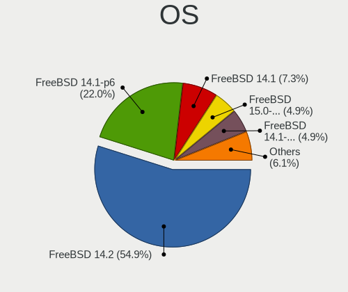
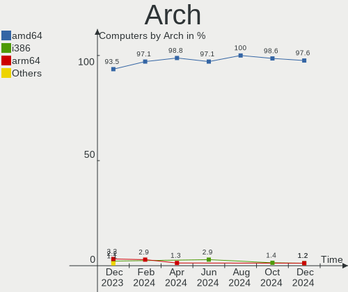
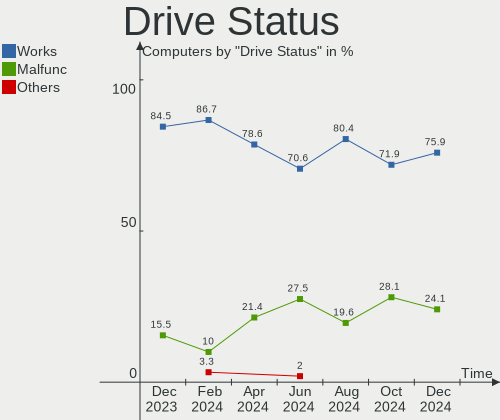
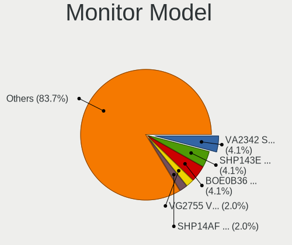
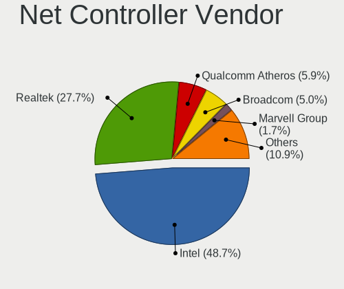
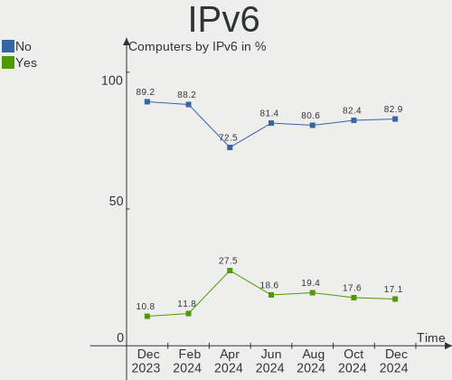
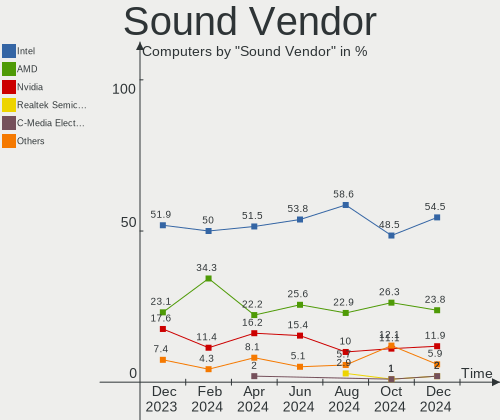
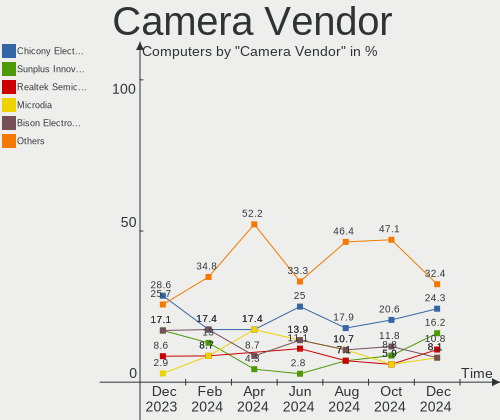
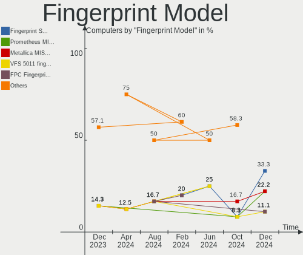

FreeBSD - Hardware Trends
-------------------------

A project to identify most popular hardware characteristics and track their change
over time based on data collected by BSD users at https://BSD-Hardware.info.

Anyone can contribute to this report by the [hw-probe](https://github.com/linuxhw/hw-probe/blob/master/INSTALL.BSD.md) tool:

    hw-probe -all -upload

This is a report for all computer types. See also reports for [desktops](/Dist/FreeBSD/Desktop/README.md) and [notebooks](/Dist/FreeBSD/Notebook/README.md).

This report is for one last month. Overall report since the beginning of time: [TestDays](https://github.com/bsdhw/TestDays)

Period: Nov, 2023.

Contents
--------

* [ System ](#system)
  - [ OS                       ](#os)
  - [ OS Family                ](#os-family)
  - [ Arch                     ](#arch)
  - [ DE                       ](#de)
  - [ Display Server           ](#display-server)
  - [ Display Manager          ](#display-manager)
  - [ OS Lang                  ](#os-lang)
  - [ Boot Mode                ](#boot-mode)
  - [ Filesystem               ](#filesystem)
  - [ Part. scheme             ](#part-scheme)

* [ Board ](#board)
  - [ Vendor                   ](#vendor)
  - [ Model                    ](#model)
  - [ Model Family             ](#model-family)
  - [ MFG Year                 ](#mfg-year)
  - [ Form Factor              ](#form-factor)
  - [ Coreboot                 ](#coreboot)
  - [ RAM Size                 ](#ram-size)
  - [ RAM Used                 ](#ram-used)
  - [ Total Drives             ](#total-drives)
  - [ Has CD-ROM               ](#has-cd-rom)
  - [ Has Ethernet             ](#has-ethernet)
  - [ Has WiFi                 ](#has-wifi)
  - [ Has Bluetooth            ](#has-bluetooth)

* [ Location ](#location)
  - [ Country                  ](#country)
  - [ City                     ](#city)

* [ Drives ](#drives)
  - [ Drive Vendor             ](#drive-vendor)
  - [ Drive Model              ](#drive-model)
  - [ HDD Vendor               ](#hdd-vendor)
  - [ SSD Vendor               ](#ssd-vendor)
  - [ Drive Kind               ](#drive-kind)
  - [ Drive Connector          ](#drive-connector)
  - [ Drive Size               ](#drive-size)
  - [ Space Total              ](#space-total)
  - [ Space Used               ](#space-used)
  - [ Malfunc. Drives          ](#malfunc-drives)
  - [ Malfunc. Drive Vendor    ](#malfunc-drive-vendor)
  - [ Malfunc. HDD Vendor      ](#malfunc-hdd-vendor)
  - [ Malfunc. Drive Kind      ](#malfunc-drive-kind)
  - [ Failed Drives            ](#failed-drives)
  - [ Failed Drive Vendor      ](#failed-drive-vendor)
  - [ Drive Status             ](#drive-status)

* [ Storage controller ](#storage-controller)
  - [ Storage Vendor           ](#storage-vendor)
  - [ Storage Model            ](#storage-model)
  - [ Storage Kind             ](#storage-kind)

* [ Processor ](#processor)
  - [ CPU Vendor               ](#cpu-vendor)
  - [ CPU Model                ](#cpu-model)
  - [ CPU Model Family         ](#cpu-model-family)
  - [ CPU Cores                ](#cpu-cores)
  - [ CPU Sockets              ](#cpu-sockets)
  - [ CPU Threads              ](#cpu-threads)
  - [ CPU Microarch            ](#cpu-microarch)

* [ Graphics ](#graphics)
  - [ GPU Vendor               ](#gpu-vendor)
  - [ GPU Model                ](#gpu-model)
  - [ GPU Combo                ](#gpu-combo)
  - [ GPU Driver               ](#gpu-driver)
  - [ GPU Memory               ](#gpu-memory)

* [ Monitor ](#monitor)
  - [ Monitor Vendor           ](#monitor-vendor)
  - [ Monitor Model            ](#monitor-model)
  - [ Monitor Resolution       ](#monitor-resolution)
  - [ Monitor Diagonal         ](#monitor-diagonal)
  - [ Monitor Width            ](#monitor-width)
  - [ Aspect Ratio             ](#aspect-ratio)
  - [ Monitor Area             ](#monitor-area)
  - [ Pixel Density            ](#pixel-density)
  - [ Multiple Monitors        ](#multiple-monitors)

* [ Network ](#network)
  - [ Net Controller Vendor    ](#net-controller-vendor)
  - [ Net Controller Model     ](#net-controller-model)
  - [ Wireless Vendor          ](#wireless-vendor)
  - [ Wireless Model           ](#wireless-model)
  - [ Ethernet Vendor          ](#ethernet-vendor)
  - [ Ethernet Model           ](#ethernet-model)
  - [ Net Controller Kind      ](#net-controller-kind)
  - [ Used Controller          ](#used-controller)
  - [ NICs                     ](#nics)
  - [ IPv6                     ](#ipv6)

* [ Bluetooth ](#bluetooth)
  - [ Bluetooth Vendor         ](#bluetooth-vendor)
  - [ Bluetooth Model          ](#bluetooth-model)

* [ Sound ](#sound)
  - [ Sound Vendor             ](#sound-vendor)
  - [ Sound Model              ](#sound-model)

* [ Memory ](#memory)
  - [ Memory Vendor            ](#memory-vendor)
  - [ Memory Model             ](#memory-model)
  - [ Memory Kind              ](#memory-kind)
  - [ Memory Form Factor       ](#memory-form-factor)
  - [ Memory Size              ](#memory-size)
  - [ Memory Speed             ](#memory-speed)

* [ Printers & scanners ](#printers--scanners)
  - [ Printer Vendor           ](#printer-vendor)
  - [ Printer Model            ](#printer-model)
  - [ Scanner Vendor           ](#scanner-vendor)
  - [ Scanner Model            ](#scanner-model)

* [ Camera ](#camera)
  - [ Camera Vendor            ](#camera-vendor)
  - [ Camera Model             ](#camera-model)

* [ Security ](#security)
  - [ Fingerprint Vendor       ](#fingerprint-vendor)
  - [ Fingerprint Model        ](#fingerprint-model)
  - [ Chipcard Vendor          ](#chipcard-vendor)
  - [ Chipcard Model           ](#chipcard-model)

* [ Unsupported ](#unsupported)
  - [ Unsupported Devices      ](#unsupported-devices)
  - [ Unsupported Device Types ](#unsupported-device-types)

System
------

OS
--

Installed operating systems

| Name                | Computers | Percent |
|---------------------|-----------|---------|
| FreeBSD 14.0        | 30        | 41.67%  |
| FreeBSD 13.2-p4     | 14        | 19.44%  |
| FreeBSD 14.0-BETA5  | 6         | 8.33%   |
| FreeBSD 13.2-p5     | 6         | 8.33%   |
| FreeBSD 13.2        | 5         | 6.94%   |
| FreeBSD 14.0-RC4    | 3         | 4.17%   |
| FreeBSD 14.0-RC4-p1 | 2         | 2.78%   |
| FreeBSD 13.2-p3     | 2         | 2.78%   |
| FreeBSD 14.0-STABLE | 1         | 1.39%   |
| FreeBSD 14.0-RC3    | 1         | 1.39%   |
| FreeBSD 14.0-RC2    | 1         | 1.39%   |
| FreeBSD 12.4        | 1         | 1.39%   |

OS Family
---------

OS without a version

| Name    | Computers | Percent |
|---------|-----------|---------|
| FreeBSD | 72        | 100%    |

Arch
----

OS architecture (x86_64, i586, etc.)

| Name  | Computers | Percent |
|-------|-----------|---------|
| amd64 | 71        | 98.61%  |
| i386  | 1         | 1.39%   |

DE
--

Desktop Environment

| Name      | Computers | Percent |
|-----------|-----------|---------|
| Console   | 23        | 31.94%  |
| KDE5      | 19        | 26.39%  |
| XFCE      | 12        | 16.67%  |
| GNOME     | 6         | 8.33%   |
| TWM       | 4         | 5.56%   |
| Cinnamon  | 2         | 2.78%   |
| Picom     | 1         | 1.39%   |
| Openbox   | 1         | 1.39%   |
| MATE      | 1         | 1.39%   |
| i3        | 1         | 1.39%   |
| Budgie    | 1         | 1.39%   |
| AwesomeWM | 1         | 1.39%   |

Display Server
--------------

X11 or Wayland

| Name    | Computers | Percent |
|---------|-----------|---------|
| X11     | 45        | 62.5%   |
| Console | 25        | 34.72%  |
| Wayland | 2         | 2.78%   |

Display Manager
---------------

SDDM, LightDM, etc.

| Name    | Computers | Percent |
|---------|-----------|---------|
| Console | 32        | 44.44%  |
| SDDM    | 19        | 26.39%  |
| LightDM | 10        | 13.89%  |
| SLiM    | 4         | 5.56%   |
| XDM     | 3         | 4.17%   |
| Ly      | 2         | 2.78%   |
| GDM     | 2         | 2.78%   |

OS Lang
-------

Language

| Lang    | Computers | Percent |
|---------|-----------|---------|
| C       | 49        | 68.06%  |
| en_US   | 10        | 13.89%  |
| Unknown | 7         | 9.72%   |
| ru_RU   | 1         | 1.39%   |
| pt_BR   | 1         | 1.39%   |
| fr_FR   | 1         | 1.39%   |
| es_AR   | 1         | 1.39%   |
| de_DE   | 1         | 1.39%   |
| de_CH   | 1         | 1.39%   |

Boot Mode
---------

EFI or BIOS

| Mode | Computers | Percent |
|------|-----------|---------|
| EFI  | 62        | 86.11%  |
| BIOS | 10        | 13.89%  |

Filesystem
----------

Type of filesystem

| Type | Computers | Percent |
|------|-----------|---------|
| Zfs  | 58        | 80.56%  |
| Ufs  | 14        | 19.44%  |

Part. scheme
------------

Scheme of partitioning

| Type | Computers | Percent |
|------|-----------|---------|
| GPT  | 72        | 100%    |

Board
-----

Vendor
------

Motherboard manufacturer

| Name                | Computers | Percent |
|---------------------|-----------|---------|
| ASUSTek Computer    | 13        | 18.06%  |
| Lenovo              | 11        | 15.28%  |
| Dell                | 11        | 15.28%  |
| Hewlett-Packard     | 5         | 6.94%   |
| ASRock              | 5         | 6.94%   |
| MSI                 | 4         | 5.56%   |
| Samsung Electronics | 2         | 2.78%   |
| ASRockRack          | 2         | 2.78%   |
| Unknown             | 2         | 2.78%   |
| ZOTAC               | 1         | 1.39%   |
| TUXEDO              | 1         | 1.39%   |
| Toshiba             | 1         | 1.39%   |
| Supermicro          | 1         | 1.39%   |
| Silicom             | 1         | 1.39%   |
| PICO PC             | 1         | 1.39%   |
| Panasonic           | 1         | 1.39%   |
| OnLogic             | 1         | 1.39%   |
| LG Electronics      | 1         | 1.39%   |
| Intel               | 1         | 1.39%   |
| Google              | 1         | 1.39%   |
| Fujitsu             | 1         | 1.39%   |
| CNCTION-IAF         | 1         | 1.39%   |
| AZW                 | 1         | 1.39%   |
| Apple               | 1         | 1.39%   |
| Acidanthera         | 1         | 1.39%   |
| Acer                | 1         | 1.39%   |

Model
-----

Motherboard model

| Name                                     | Computers | Percent |
|------------------------------------------|-----------|---------|
| ASRock X570 Phantom Gaming 4             | 2         | 2.78%   |
| Unknown                                  | 2         | 2.78%   |
| ZOTAC ZBOX-CI320NANO series              | 1         | 1.39%   |
| TUXEDO Pulse 15 Gen2                     | 1         | 1.39%   |
| Toshiba Satellite P300                   | 1         | 1.39%   |
| Supermicro H8DGU                         | 1         | 1.39%   |
| Silicom 6200                             | 1         | 1.39%   |
| Samsung DeskTop System                   | 1         | 1.39%   |
| Samsung 740U5M                           | 1         | 1.39%   |
| PICO PC MNHO-113                         | 1         | 1.39%   |
| Panasonic CF-31-5                        | 1         | 1.39%   |
| OnLogic HX401                            | 1         | 1.39%   |
| MSI MS-7D15                              | 1         | 1.39%   |
| MSI MS-7B89                              | 1         | 1.39%   |
| MSI MS-7817                              | 1         | 1.39%   |
| MSI MS-7693                              | 1         | 1.39%   |
| LG 16UD70R-G.AX59B                       | 1         | 1.39%   |
| Lenovo ThinkStation P520 30BFS44D00      | 1         | 1.39%   |
| Lenovo ThinkPad X270 20HN006CUS          | 1         | 1.39%   |
| Lenovo ThinkPad X260 20F6006XUK          | 1         | 1.39%   |
| Lenovo ThinkPad X1 Carbon 4th 20FCS43F00 | 1         | 1.39%   |
| Lenovo ThinkPad X1 Carbon 4th 20FB006FAU | 1         | 1.39%   |
| Lenovo ThinkPad W530 24411M9             | 1         | 1.39%   |
| Lenovo ThinkPad T480 20L6S5VP00          | 1         | 1.39%   |
| Lenovo ThinkPad T470 20HES0EV0A          | 1         | 1.39%   |
| Lenovo ThinkPad T450 20BV000BUS          | 1         | 1.39%   |
| Lenovo IdeaPad 320-15IKB Touch 81BH      | 1         | 1.39%   |
| Lenovo G50-80 80E5                       | 1         | 1.39%   |
| Intel NUC12WSKi3                         | 1         | 1.39%   |
| HP ProLiant ML350p Gen8                  | 1         | 1.39%   |
| HP ProDesk 600 G1 SFF                    | 1         | 1.39%   |
| HP Pavilion Gaming Laptop 15-cx0xxx      | 1         | 1.39%   |
| HP Notebook                              | 1         | 1.39%   |
| HP Laptop 15s-eq3xxx                     | 1         | 1.39%   |
| Google Dragonair                         | 1         | 1.39%   |
| Fujitsu ESPRIMO Q920                     | 1         | 1.39%   |
| Dell XPS 13 9360                         | 1         | 1.39%   |
| Dell Precision 7560                      | 1         | 1.39%   |
| Dell Precision 5510                      | 1         | 1.39%   |
| Dell PowerEdge R710                      | 1         | 1.39%   |

Model Family
------------

Motherboard model prefix

| Name                    | Computers | Percent |
|-------------------------|-----------|---------|
| Lenovo ThinkPad         | 8         | 11.11%  |
| Dell Latitude           | 3         | 4.17%   |
| ASUS PRIME              | 3         | 4.17%   |
| Dell Precision          | 2         | 2.78%   |
| Dell Inspiron           | 2         | 2.78%   |
| ASUS ROG                | 2         | 2.78%   |
| ASRock X570             | 2         | 2.78%   |
| Unknown                 | 2         | 2.78%   |
| ZOTAC ZBOX-CI320NANO    | 1         | 1.39%   |
| TUXEDO Pulse            | 1         | 1.39%   |
| Toshiba Satellite       | 1         | 1.39%   |
| Supermicro H8DGU        | 1         | 1.39%   |
| Silicom 6200            | 1         | 1.39%   |
| Samsung DeskTop         | 1         | 1.39%   |
| Samsung 740U5M          | 1         | 1.39%   |
| PICO PC MNHO-113        | 1         | 1.39%   |
| Panasonic CF-31-5       | 1         | 1.39%   |
| OnLogic HX401           | 1         | 1.39%   |
| MSI MS-7D15             | 1         | 1.39%   |
| MSI MS-7B89             | 1         | 1.39%   |
| MSI MS-7817             | 1         | 1.39%   |
| MSI MS-7693             | 1         | 1.39%   |
| LG 16UD70R-G.AX59B      | 1         | 1.39%   |
| Lenovo ThinkStation     | 1         | 1.39%   |
| Lenovo IdeaPad          | 1         | 1.39%   |
| Lenovo G50-80           | 1         | 1.39%   |
| Intel NUC12WSKi3        | 1         | 1.39%   |
| HP ProLiant             | 1         | 1.39%   |
| HP ProDesk              | 1         | 1.39%   |
| HP Pavilion             | 1         | 1.39%   |
| HP Notebook             | 1         | 1.39%   |
| HP Laptop               | 1         | 1.39%   |
| Google Dragonair        | 1         | 1.39%   |
| Fujitsu ESPRIMO         | 1         | 1.39%   |
| Dell XPS                | 1         | 1.39%   |
| Dell PowerEdge          | 1         | 1.39%   |
| Dell OptiPlex           | 1         | 1.39%   |
| Dell G5                 | 1         | 1.39%   |
| CNCTION-IAF CNCTION-IAF | 1         | 1.39%   |
| AZW SER                 | 1         | 1.39%   |

MFG Year
--------

Motherboard manufacture year

| Year | Computers | Percent |
|------|-----------|---------|
| 2023 | 13        | 18.06%  |
| 2021 | 9         | 12.5%   |
| 2020 | 6         | 8.33%   |
| 2019 | 6         | 8.33%   |
| 2014 | 6         | 8.33%   |
| 2017 | 5         | 6.94%   |
| 2015 | 5         | 6.94%   |
| 2022 | 4         | 5.56%   |
| 2018 | 4         | 5.56%   |
| 2013 | 4         | 5.56%   |
| 2010 | 3         | 4.17%   |
| 2011 | 2         | 2.78%   |
| 2008 | 2         | 2.78%   |
| 2016 | 1         | 1.39%   |
| 2012 | 1         | 1.39%   |
| 2009 | 1         | 1.39%   |

Form Factor
-----------

Physical design of the computer

| Name        | Computers | Percent |
|-------------|-----------|---------|
| Desktop     | 33        | 45.83%  |
| Notebook    | 33        | 45.83%  |
| Mini pc     | 3         | 4.17%   |
| Server      | 2         | 2.78%   |
| Convertible | 1         | 1.39%   |

Coreboot
--------

Have coreboot on board

| Used | Computers | Percent |
|------|-----------|---------|
| No   | 71        | 98.61%  |
| Yes  | 1         | 1.39%   |

RAM Size
--------

Total RAM memory

| Size in GB      | Computers | Percent |
|-----------------|-----------|---------|
| 16.01-24.0      | 25        | 34.72%  |
| 32.01-64.0      | 13        | 18.06%  |
| 8.01-16.0       | 13        | 18.06%  |
| 64.01-256.0     | 9         | 12.5%   |
| 4.01-8.0        | 6         | 8.33%   |
| More than 256.0 | 2         | 2.78%   |
| 24.01-32.0      | 2         | 2.78%   |
| 3.01-4.0        | 1         | 1.39%   |
| 2.01-3.0        | 1         | 1.39%   |

RAM Used
--------

Used RAM memory

| Used GB  | Computers | Percent |
|----------|-----------|---------|
| 0.51-1.0 | 26        | 36.11%  |
| 0.01-0.5 | 19        | 26.39%  |
| 1.01-2.0 | 15        | 20.83%  |
| 2.01-3.0 | 7         | 9.72%   |
| 3.01-4.0 | 3         | 4.17%   |
| 4.01-8.0 | 2         | 2.78%   |

Total Drives
------------

Number of drives on board

| Drives | Computers | Percent |
|--------|-----------|---------|
| 1      | 20        | 27.78%  |
| 2      | 18        | 25%     |
| 0      | 16        | 22.22%  |
| 4      | 7         | 9.72%   |
| 3      | 7         | 9.72%   |
| 17     | 1         | 1.39%   |
| 13     | 1         | 1.39%   |
| 7      | 1         | 1.39%   |
| 5      | 1         | 1.39%   |

Has CD-ROM
----------

Has CD-ROM on board

| Presented | Computers | Percent |
|-----------|-----------|---------|
| No        | 56        | 77.78%  |
| Yes       | 16        | 22.22%  |

Has Ethernet
------------

Has Ethernet on board

| Presented | Computers | Percent |
|-----------|-----------|---------|
| Yes       | 66        | 91.67%  |
| No        | 6         | 8.33%   |

Has WiFi
--------

Has WiFi module

| Presented | Computers | Percent |
|-----------|-----------|---------|
| Yes       | 42        | 58.33%  |
| No        | 30        | 41.67%  |

Has Bluetooth
-------------

Has Bluetooth module

| Presented | Computers | Percent |
|-----------|-----------|---------|
| Yes       | 39        | 54.17%  |
| No        | 33        | 45.83%  |

Location
--------

Country
-------

Geographic location (country)

| Country     | Computers | Percent |
|-------------|-----------|---------|
| USA         | 16        | 22.22%  |
| France      | 8         | 11.11%  |
| Switzerland | 6         | 8.33%   |
| Germany     | 5         | 6.94%   |
| Algeria     | 3         | 4.17%   |
| UK          | 2         | 2.78%   |
| Russia      | 2         | 2.78%   |
| Poland      | 2         | 2.78%   |
| Indonesia   | 2         | 2.78%   |
| Colombia    | 2         | 2.78%   |
| China       | 2         | 2.78%   |
| Australia   | 2         | 2.78%   |
| Vietnam     | 1         | 1.39%   |
| Uruguay     | 1         | 1.39%   |
| Turkey      | 1         | 1.39%   |
| Thailand    | 1         | 1.39%   |
| Spain       | 1         | 1.39%   |
| Slovakia    | 1         | 1.39%   |
| Portugal    | 1         | 1.39%   |
| Philippines | 1         | 1.39%   |
| New Zealand | 1         | 1.39%   |
| Netherlands | 1         | 1.39%   |
| Kazakhstan  | 1         | 1.39%   |
| Italy       | 1         | 1.39%   |
| India       | 1         | 1.39%   |
| Iceland     | 1         | 1.39%   |
| Egypt       | 1         | 1.39%   |
| Croatia     | 1         | 1.39%   |
| Chile       | 1         | 1.39%   |
| Canada      | 1         | 1.39%   |
| Brazil      | 1         | 1.39%   |
| Argentina   | 1         | 1.39%   |

City
----

Geographic location (city)

| City                  | Computers | Percent |
|-----------------------|-----------|---------|
| Urcuit                | 3         | 4.17%   |
| Tracy                 | 2         | 2.78%   |
| Sydney                | 2         | 2.78%   |
| Salem                 | 2         | 2.78%   |
| Redmond               | 2         | 2.78%   |
| Belmont-sur-Lausanne  | 2         | 2.78%   |
| Ypsilanti             | 1         | 1.39%   |
| Wroclaw               | 1         | 1.39%   |
| Wenatchee             | 1         | 1.39%   |
| Townsend              | 1         | 1.39%   |
| Talavera              | 1         | 1.39%   |
| Shenzhen              | 1         | 1.39%   |
| Shanghai              | 1         | 1.39%   |
| Seattle               | 1         | 1.39%   |
| Sao Paulo             | 1         | 1.39%   |
| Saint-Ouen-du-Tilleul | 1         | 1.39%   |
| Rostov-on-Don         | 1         | 1.39%   |
| Reykjavik             | 1         | 1.39%   |
| Redford               | 1         | 1.39%   |
| Plymouth              | 1         | 1.39%   |
| Perpignan             | 1         | 1.39%   |
| Payson                | 1         | 1.39%   |
| Paris                 | 1         | 1.39%   |
| Palezieux             | 1         | 1.39%   |
| Ozersk                | 1         | 1.39%   |
| Ostrzeszow            | 1         | 1.39%   |
| Oran                  | 1         | 1.39%   |
| Nuremberg             | 1         | 1.39%   |
| Noisy-le-Sec          | 1         | 1.39%   |
| New York              | 1         | 1.39%   |
| Neuengors             | 1         | 1.39%   |
| Nerviano              | 1         | 1.39%   |
| Mountain View         | 1         | 1.39%   |
| Mostaganem            | 1         | 1.39%   |
| Montería             | 1         | 1.39%   |
| Medellín             | 1         | 1.39%   |
| Medan                 | 1         | 1.39%   |
| Mascara               | 1         | 1.39%   |
| Maldonado             | 1         | 1.39%   |
| Los Realejos          | 1         | 1.39%   |

Drives
------

Drive Vendor
------------

Hard drive vendors

| Vendor              | Computers | Drives | Percent |
|---------------------|-----------|--------|---------|
| WDC                 | 18        | 39     | 19.57%  |
| Samsung Electronics | 17        | 29     | 18.48%  |
| Seagate             | 12        | 14     | 13.04%  |
| Crucial             | 6         | 6      | 6.52%   |
| Toshiba             | 5         | 5      | 5.43%   |
| Kingston            | 5         | 5      | 5.43%   |
| SanDisk             | 4         | 5      | 4.35%   |
| Intel               | 3         | 3      | 3.26%   |
| Gigabyte Technology | 3         | 5      | 3.26%   |
| SPCC                | 2         | 2      | 2.17%   |
| SK hynix            | 2         | 2      | 2.17%   |
| Hitachi             | 2         | 2      | 2.17%   |
| V-GeN               | 1         | 2      | 1.09%   |
| Transcend           | 1         | 1      | 1.09%   |
| PNY                 | 1         | 1      | 1.09%   |
| MidasForce          | 1         | 2      | 1.09%   |
| Micron Technology   | 1         | 1      | 1.09%   |
| LITEON              | 1         | 1      | 1.09%   |
| Integral            | 1         | 1      | 1.09%   |
| INNOVATION IT       | 1         | 1      | 1.09%   |
| HPE                 | 1         | 4      | 1.09%   |
| Hewlett-Packard     | 1         | 12     | 1.09%   |
| GOODRAM             | 1         | 2      | 1.09%   |
| Dogfish             | 1         | 1      | 1.09%   |
| Corsair             | 1         | 1      | 1.09%   |

Drive Model
-----------

Hard drive models

| Model                           | Computers | Percent |
|---------------------------------|-----------|---------|
| WDC WD10EZEX-08WN4A0 1TB        | 2         | 1.68%   |
| Seagate ST4000DM000-1F2168 4TB  | 2         | 1.68%   |
| Samsung SSD 860 EVO 500GB       | 2         | 1.68%   |
| Samsung SSD 850 EVO 500GB       | 2         | 1.68%   |
| Samsung SSD 850 EVO 250GB       | 2         | 1.68%   |
| Kingston SA400S37240G 240GB     | 2         | 1.68%   |
| Intel SSDSC2BF180A4L 180GB      | 2         | 1.68%   |
| WDC WDS480G2G0A-00JH30 480GB    | 1         | 0.84%   |
| WDC WDS240G2G0A-00JH30 240GB    | 1         | 0.84%   |
| WDC WDS100T3X0C-00SJG0 1TB      | 1         | 0.84%   |
| WDC WD80EMAZ-00WJTA0 8TB        | 1         | 0.84%   |
| WDC WD80EFZX-68UW8N0 8TB        | 1         | 0.84%   |
| WDC WD80EFAX-68LHPN0 8TB        | 1         | 0.84%   |
| WDC WD80EDBZ-11B0ZA0 8TB        | 1         | 0.84%   |
| WDC WD8002FZWX-00BKUA0 8TB      | 1         | 0.84%   |
| WDC WD5002ABYS-02B1B0 500GB     | 1         | 0.84%   |
| WDC WD5000AZLX-08K2TA0 500GB    | 1         | 0.84%   |
| WDC WD5000AAKX-75U6AA0 500GB    | 1         | 0.84%   |
| WDC WD5000AAKX-60U6AA0 500GB    | 1         | 0.84%   |
| WDC WD40EZRZ-22GXCB0 4TB        | 1         | 0.84%   |
| WDC WD40EZRZ-00GXCB0 4TB        | 1         | 0.84%   |
| WDC WD40EFRX-68WT0N0 4TB        | 1         | 0.84%   |
| WDC WD3200BEKT-00V5T0 320GB     | 1         | 0.84%   |
| WDC WD30EFRX-68N32N0 3TB        | 1         | 0.84%   |
| WDC WD20EZRX-00D8PB0 2TB        | 1         | 0.84%   |
| WDC WD20EFAX-68B2RN1 2TB        | 1         | 0.84%   |
| WDC WD2003FZEX-00SRLA0 2TB      | 1         | 0.84%   |
| WDC WD2003FYYS-18W0B0 2TB       | 1         | 0.84%   |
| WDC WD1600BEVT-75ZCT0 160GB     | 1         | 0.84%   |
| WDC WD15EADS-00P8B0 1.5TB       | 1         | 0.84%   |
| WDC WD120EMFZ-11A6JA0 12TB      | 1         | 0.84%   |
| WDC WD120EMAZ-11BLFA0 12TB      | 1         | 0.84%   |
| WDC WD10SMZW-11Y0TS0 1TB        | 1         | 0.84%   |
| WDC WD10EZEX-75WN4A1 1TB        | 1         | 0.84%   |
| WDC WD10EZEX-08M2NA0 1TB        | 1         | 0.84%   |
| WDC WD1000DHTZ-04N21V0 1TB      | 1         | 0.84%   |
| V-GeN V-GEN11SM20AR1024ITM2 1TB | 1         | 0.84%   |
| V-GeN V-GEN03SM22AR1024SDK 1TB  | 1         | 0.84%   |
| Transcend TS256GMTS400 256GB    | 1         | 0.84%   |
| Toshiba THNSNJ256GCSY 256GB     | 1         | 0.84%   |

HDD Vendor
----------

Hard disk drive vendors

| Vendor              | Computers | Drives | Percent |
|---------------------|-----------|--------|---------|
| WDC                 | 17        | 36     | 47.22%  |
| Seagate             | 10        | 12     | 27.78%  |
| Toshiba             | 4         | 4      | 11.11%  |
| Hitachi             | 2         | 2      | 5.56%   |
| Samsung Electronics | 1         | 1      | 2.78%   |
| HPE                 | 1         | 4      | 2.78%   |
| Hewlett-Packard     | 1         | 12     | 2.78%   |

SSD Vendor
----------

Solid state drive vendors

| Vendor              | Computers | Drives | Percent |
|---------------------|-----------|--------|---------|
| Samsung Electronics | 13        | 20     | 27.08%  |
| Kingston            | 5         | 5      | 10.42%  |
| SanDisk             | 4         | 5      | 8.33%   |
| Crucial             | 4         | 4      | 8.33%   |
| Intel               | 3         | 3      | 6.25%   |
| Gigabyte Technology | 3         | 5      | 6.25%   |
| SPCC                | 2         | 2      | 4.17%   |
| Seagate             | 2         | 2      | 4.17%   |
| WDC                 | 1         | 2      | 2.08%   |
| V-GeN               | 1         | 2      | 2.08%   |
| Transcend           | 1         | 1      | 2.08%   |
| Toshiba             | 1         | 1      | 2.08%   |
| PNY                 | 1         | 1      | 2.08%   |
| MidasForce          | 1         | 2      | 2.08%   |
| Micron Technology   | 1         | 1      | 2.08%   |
| LITEON              | 1         | 1      | 2.08%   |
| Integral            | 1         | 1      | 2.08%   |
| INNOVATION IT       | 1         | 1      | 2.08%   |
| GOODRAM             | 1         | 2      | 2.08%   |
| Dogfish             | 1         | 1      | 2.08%   |

Drive Kind
----------

HDD or SSD

| Kind | Computers | Drives | Percent |
|------|-----------|--------|---------|
| SSD  | 39        | 62     | 48.15%  |
| HDD  | 29        | 71     | 35.8%   |
| NVMe | 13        | 14     | 16.05%  |

Drive Connector
---------------

SATA, SAS, NVMe, etc.

| Type | Computers | Drives | Percent |
|------|-----------|--------|---------|
| SATA | 53        | 133    | 80.3%   |
| NVMe | 13        | 14     | 19.7%   |

Drive Size
----------

Size of hard drive

| Size in TB | Computers | Drives | Percent |
|------------|-----------|--------|---------|
| 0.01-0.5   | 38        | 56     | 46.34%  |
| 0.51-1.0   | 21        | 36     | 25.61%  |
| 1.01-2.0   | 11        | 16     | 13.41%  |
| 3.01-4.0   | 6         | 9      | 7.32%   |
| 4.01-10.0  | 3         | 11     | 3.66%   |
| 10.01-20.0 | 2         | 3      | 2.44%   |
| 2.01-3.0   | 1         | 2      | 1.22%   |

Space Total
-----------

Amount of disk space available on the file system

| Size in GB     | Computers | Percent |
|----------------|-----------|---------|
| 251-500        | 22        | 30.56%  |
| 101-250        | 20        | 27.78%  |
| 501-1000       | 13        | 18.06%  |
| 1001-2000      | 8         | 11.11%  |
| 51-100         | 4         | 5.56%   |
| More than 3000 | 2         | 2.78%   |
| 1-20           | 2         | 2.78%   |
| 21-50          | 1         | 1.39%   |

Space Used
----------

Amount of used disk space

| Used GB        | Computers | Percent |
|----------------|-----------|---------|
| 1-20           | 53        | 73.61%  |
| 21-50          | 12        | 16.67%  |
| 51-100         | 4         | 5.56%   |
| 101-250        | 2         | 2.78%   |
| More than 3000 | 1         | 1.39%   |

Malfunc. Drives
---------------

Drive models with a malfunction

| Model                               | Computers | Drives | Percent |
|-------------------------------------|-----------|--------|---------|
| WDC WD5000AAKX-60U6AA0 500GB        | 1         | 1      | 6.67%   |
| WDC WD40EFRX-68WT0N0 4TB            | 1         | 3      | 6.67%   |
| WDC WD20EZRX-00D8PB0 2TB            | 1         | 1      | 6.67%   |
| Toshiba MK3265GSX 320GB             | 1         | 1      | 6.67%   |
| Seagate ST9500325AS 500GB           | 1         | 1      | 6.67%   |
| Seagate ST500LM021-1KJ152 500GB     | 1         | 1      | 6.67%   |
| Seagate ST10000VN0004-1ZD101 10TB   | 1         | 2      | 6.67%   |
| Samsung Electronics SSD 870 EVO 1TB | 1         | 1      | 6.67%   |
| Samsung Electronics HM250HI 250GB   | 1         | 1      | 6.67%   |
| Kingston SH103S3240G 240GB          | 1         | 1      | 6.67%   |
| Kingston SA400S37240G 240GB         | 1         | 1      | 6.67%   |
| HPE MM1000GBKAL 1TB                 | 1         | 4      | 6.67%   |
| Crucial FCCT256M550SSD1 256GB       | 1         | 1      | 6.67%   |
| Crucial CT480M500SSD1 480GB         | 1         | 1      | 6.67%   |
| Crucial CT256MX100SSD1 256GB        | 1         | 1      | 6.67%   |

Malfunc. Drive Vendor
---------------------

Vendors of faulty drives

| Vendor              | Computers | Drives | Percent |
|---------------------|-----------|--------|---------|
| WDC                 | 3         | 5      | 20%     |
| Seagate             | 3         | 4      | 20%     |
| Crucial             | 3         | 3      | 20%     |
| Samsung Electronics | 2         | 2      | 13.33%  |
| Kingston            | 2         | 2      | 13.33%  |
| Toshiba             | 1         | 1      | 6.67%   |
| HPE                 | 1         | 4      | 6.67%   |

Malfunc. HDD Vendor
-------------------

Vendors of faulty HDD drives

| Vendor              | Computers | Drives | Percent |
|---------------------|-----------|--------|---------|
| WDC                 | 3         | 5      | 33.33%  |
| Seagate             | 3         | 4      | 33.33%  |
| Toshiba             | 1         | 1      | 11.11%  |
| Samsung Electronics | 1         | 1      | 11.11%  |
| HPE                 | 1         | 4      | 11.11%  |

Malfunc. Drive Kind
-------------------

Kinds of faulty drives

| Kind | Computers | Drives | Percent |
|------|-----------|--------|---------|
| HDD  | 9         | 15     | 60%     |
| SSD  | 6         | 6      | 40%     |

Failed Drives
-------------

Failed drive models

Zero info for selected period =(

Failed Drive Vendor
-------------------

Failed drive vendors

Zero info for selected period =(

Drive Status
------------

Number of failed and malfunc. drives

| Status  | Computers | Drives | Percent |
|---------|-----------|--------|---------|
| Works   | 53        | 126    | 79.1%   |
| Malfunc | 14        | 21     | 20.9%   |

Storage controller
------------------

Storage Vendor
--------------

Storage controller vendors

| Vendor                      | Computers | Percent |
|-----------------------------|-----------|---------|
| Intel                       | 40        | 38.46%  |
| AMD                         | 18        | 17.31%  |
| Samsung Electronics         | 12        | 11.54%  |
| SanDisk                     | 6         | 5.77%   |
| Micron/Crucial Technology   | 5         | 4.81%   |
| SK hynix                    | 4         | 3.85%   |
| Phison Electronics          | 3         | 2.88%   |
| Broadcom / LSI              | 3         | 2.88%   |
| ASMedia Technology          | 3         | 2.88%   |
| Silicon Motion              | 1         | 0.96%   |
| Seagate Technology          | 1         | 0.96%   |
| Realtek Semiconductor       | 1         | 0.96%   |
| Nvidia                      | 1         | 0.96%   |
| Micron Technology           | 1         | 0.96%   |
| Marvell Technology Group    | 1         | 0.96%   |
| KIOXIA                      | 1         | 0.96%   |
| Kingston Technology Company | 1         | 0.96%   |
| JMicron Technology          | 1         | 0.96%   |
| Hewlett-Packard             | 1         | 0.96%   |

Storage Model
-------------

Storage controller models

| Model                                                                          | Computers | Percent |
|--------------------------------------------------------------------------------|-----------|---------|
| AMD FCH SATA Controller [AHCI mode]                                            | 9         | 8.11%   |
| Intel Sunrise Point-LP SATA Controller [AHCI mode]                             | 6         | 5.41%   |
| Samsung NVMe SSD Controller SM981/PM981/PM983                                  | 5         | 4.5%    |
| Micron/Crucial P2 [Nick P2] / P3 / P3 Plus NVMe PCIe SSD (DRAM-less)           | 5         | 4.5%    |
| Intel 8 Series/C220 Series Chipset Family 6-port SATA Controller 1 [AHCI mode] | 4         | 3.6%    |
| Samsung NVMe SSD Controller SM961/PM961/SM963                                  | 3         | 2.7%    |
| Intel Wildcat Point-LP SATA Controller [AHCI Mode]                             | 3         | 2.7%    |
| Intel 500 Series Chipset Family SATA AHCI Controller                           | 3         | 2.7%    |
| AMD 500 Series Chipset SATA Controller                                         | 3         | 2.7%    |
| AMD 400 Series Chipset SATA Controller                                         | 3         | 2.7%    |
| SK hynix Gold P31/BC711/PC711 NVMe Solid State Drive                           | 2         | 1.8%    |
| Sandisk WD Black SN770 / PC SN740 256GB / PC SN560 (DRAM-less) NVMe SSD        | 2         | 1.8%    |
| Samsung NVMe SSD Controller PM9A1/PM9A3/980PRO                                 | 2         | 1.8%    |
| Phison E12 NVMe Controller                                                     | 2         | 1.8%    |
| Intel 82801IBM/IEM (ICH9M/ICH9M-E) 4 port SATA Controller [AHCI mode]          | 2         | 1.8%    |
| Intel 7 Series Chipset Family 6-port SATA Controller [AHCI mode]               | 2         | 1.8%    |
| Intel 5 Series/3400 Series Chipset 6 port SATA AHCI Controller                 | 2         | 1.8%    |
| AMD X370 Series Chipset SATA Controller                                        | 2         | 1.8%    |
| SK hynix BC901 NVMe Solid State Drive (DRAM-less)                              | 1         | 0.9%    |
| SK hynix BC501 NVMe Solid State Drive                                          | 1         | 0.9%    |
| Silicon Motion SM2262/SM2262EN SSD Controller                                  | 1         | 0.9%    |
| Seagate FireCuda 520/IronWolf 525 SSD                                          | 1         | 0.9%    |
| SanDisk Ultra 3D / WD Blue SN570 NVMe SSD (DRAM-less)                          | 1         | 0.9%    |
| SanDisk Ultra 3D / WD Blue SN550 NVMe SSD                                      | 1         | 0.9%    |
| SanDisk Extreme Pro / WD Black SN750 / PC SN730 / Red SN700 NVMe SSD           | 1         | 0.9%    |
| SanDisk Extreme Pro / WD Black 2018/SN750/PC SN720 NVMe SSD                    | 1         | 0.9%    |
| Samsung NVMe SSD Controller S4LV008[Pascal]                                    | 1         | 0.9%    |
| Samsung NVMe SSD Controller 980 (DRAM-less)                                    | 1         | 0.9%    |
| Realtek RTS5765DL NVMe SSD Controller (DRAM-less)                              | 1         | 0.9%    |
| Phison E16 PCIe4 NVMe Controller                                               | 1         | 0.9%    |
| Nvidia MCP89 SATA Controller (AHCI mode)                                       | 1         | 0.9%    |
| Micron/Crucial P5 Plus NVMe PCIe SSD                                           | 1         | 0.9%    |
| Micron 2300 NVMe SSD [Santana]                                                 | 1         | 0.9%    |
| Marvell Group 88SE6111/6121 SATA II / PATA Controller                          | 1         | 0.9%    |
| KIOXIA NVMe SSD Controller BG5 (DRAM-less)                                     | 1         | 0.9%    |
| Kingston Company NV1 NVMe SSD SM2263XT                                         | 1         | 0.9%    |
| JMicron JMB363 SATA/IDE Controller                                             | 1         | 0.9%    |
| Intel Volume Management Device NVMe RAID Controller                            | 1         | 0.9%    |
| Intel Q170/Q150/B150/H170/H110/Z170/CM236 Chipset SATA Controller [AHCI Mode]  | 1         | 0.9%    |
| Intel product 54d3                                                             | 1         | 0.9%    |

Storage Kind
------------

Kind of storage controller (IDE, SATA, NVMe, SAS, ...)

| Kind | Computers | Percent |
|------|-----------|---------|
| SATA | 55        | 56.12%  |
| NVMe | 32        | 32.65%  |
| RAID | 5         | 5.1%    |
| IDE  | 5         | 5.1%    |
| SAS  | 1         | 1.02%   |

Processor
---------

CPU Vendor
----------

Processor vendors

| Vendor | Computers | Percent |
|--------|-----------|---------|
| Intel  | 50        | 69.44%  |
| AMD    | 22        | 30.56%  |

CPU Model
---------

Processor models

| Model                                  | Computers | Percent |
|----------------------------------------|-----------|---------|
| Intel Core i5-7300U CPU @ 2.60GHz      | 3         | 4.17%   |
| Intel Core i5-6300U CPU @ 2.40GHz      | 2         | 2.78%   |
| AMD Ryzen 9 3900X 12-Core Processor    | 2         | 2.78%   |
| AMD Ryzen 7 5700U with Radeon Graphics | 2         | 2.78%   |
| AMD Ryzen 7 3700X 8-Core Processor     | 2         | 2.78%   |
| Intel Xeon W-2135 CPU @ 3.70GHz        | 1         | 1.39%   |
| Intel Xeon W-11855M CPU @ 3.20GHz      | 1         | 1.39%   |
| Intel Xeon CPU X5650 @ 2.67GHz         | 1         | 1.39%   |
| Intel Xeon CPU E5-2620 0 @ 2.00GHz     | 1         | 1.39%   |
| Intel Pentium Silver N6005 @ 2.00GHz   | 1         | 1.39%   |
| Intel Pentium Gold G6405 CPU @ 4.10GHz | 1         | 1.39%   |
| Intel Pentium CPU N4200 @ 1.10GHz      | 1         | 1.39%   |
| Intel Pentium CPU G3220 @ 3.00GHz      | 1         | 1.39%   |
| Intel Pentium CPU 3825U @ 1.90GHz      | 1         | 1.39%   |
| Intel N100                             | 1         | 1.39%   |
| Intel Genuine CPU U7300 @ 1.30GHz      | 1         | 1.39%   |
| Intel CPU Version                      | 1         | 1.39%   |
| Intel Core i7-8550U CPU @ 1.80GHz      | 1         | 1.39%   |
| Intel Core i7-7500U CPU @ 2.70GHz      | 1         | 1.39%   |
| Intel Core i7-6500U CPU @ 2.50GHz      | 1         | 1.39%   |
| Intel Core i7-4800MQ CPU @ 2.70GHz     | 1         | 1.39%   |
| Intel Core i7-4770 CPU @ 3.40GHz       | 1         | 1.39%   |
| Intel Core i7-3840QM CPU @ 2.80GHz     | 1         | 1.39%   |
| Intel Core i7-10700K CPU @ 3.80GHz     | 1         | 1.39%   |
| Intel Core i7 CPU 880 @ 3.07GHz        | 1         | 1.39%   |
| Intel Core i5-8350U CPU @ 1.70GHz      | 1         | 1.39%   |
| Intel Core i5-8300H CPU @ 2.30GHz      | 1         | 1.39%   |
| Intel Core i5-7200U CPU @ 2.50GHz      | 1         | 1.39%   |
| Intel Core i5-6300HQ CPU @ 2.30GHz     | 1         | 1.39%   |
| Intel Core i5-5300U CPU @ 2.30GHz      | 1         | 1.39%   |
| Intel Core i5-5200U CPU @ 2.20GHz      | 1         | 1.39%   |
| Intel Core i5-4590T CPU @ 2.00GHz      | 1         | 1.39%   |
| Intel Core i5-4570 CPU @ 3.20GHz       | 1         | 1.39%   |
| Intel Core i5-4300U CPU @ 1.90GHz      | 1         | 1.39%   |
| Intel Core i5-3317U CPU @ 1.70GHz      | 1         | 1.39%   |
| Intel Core i5-2500 CPU @ 3.30GHz       | 1         | 1.39%   |
| Intel Core i5-10400F CPU @ 2.90GHz     | 1         | 1.39%   |
| Intel Core i3-10110U CPU @ 2.10GHz     | 1         | 1.39%   |
| Intel Core i3 CPU M 350 @ 2.27GH       | 1         | 1.39%   |
| Intel Core 2 Quad CPU Q6600 @ 2.40GHz  | 1         | 1.39%   |

CPU Model Family
----------------

Processor model prefix

| Model                | Computers | Percent |
|----------------------|-----------|---------|
| Intel Core i5        | 17        | 23.61%  |
| AMD Ryzen 7          | 9         | 12.5%   |
| Other                | 8         | 11.11%  |
| Intel Core i7        | 8         | 11.11%  |
| AMD Ryzen 5          | 6         | 8.33%   |
| Intel Xeon           | 4         | 5.56%   |
| Intel Pentium        | 3         | 4.17%   |
| Intel Celeron        | 3         | 4.17%   |
| Intel Core i3        | 2         | 2.78%   |
| AMD Ryzen 9          | 2         | 2.78%   |
| Intel Pentium Silver | 1         | 1.39%   |
| Intel Pentium Gold   | 1         | 1.39%   |
| Intel Genuine        | 1         | 1.39%   |
| Intel Core 2 Quad    | 1         | 1.39%   |
| Intel Core 2 Duo     | 1         | 1.39%   |
| Intel Atom           | 1         | 1.39%   |
| AMD Ryzen 3          | 1         | 1.39%   |
| AMD FX               | 1         | 1.39%   |
| AMD EPYC             | 1         | 1.39%   |
| AMD Athlon           | 1         | 1.39%   |

CPU Cores
---------

Number of processor cores

| Number  | Computers | Percent |
|---------|-----------|---------|
| 4       | 21        | 29.17%  |
| 2       | 18        | 25%     |
| 16      | 9         | 12.5%   |
| 12      | 7         | 9.72%   |
| 8       | 5         | 6.94%   |
| 6       | 5         | 6.94%   |
| 24      | 3         | 4.17%   |
| Unknown | 2         | 2.78%   |
| 5       | 1         | 1.39%   |
| 1       | 1         | 1.39%   |

CPU Sockets
-----------

Number of sockets

| Number | Computers | Percent |
|--------|-----------|---------|
| 1      | 68        | 94.44%  |
| 2      | 4         | 5.56%   |

CPU Threads
-----------

Threads per core (Hyper-Threading)

| Number  | Computers | Percent |
|---------|-----------|---------|
| 1       | 37        | 51.39%  |
| 2       | 33        | 45.83%  |
| Unknown | 2         | 2.78%   |

CPU Microarch
-------------

Microarchitecture

| Name        | Computers | Percent |
|-------------|-----------|---------|
| Unknown     | 10        | 13.89%  |
| KabyLake    | 9         | 12.5%   |
| Zen 2       | 7         | 9.72%   |
| Haswell     | 6         | 8.33%   |
| Skylake     | 5         | 6.94%   |
| Zen+        | 4         | 5.56%   |
| Zen 3       | 4         | 5.56%   |
| Zen         | 3         | 4.17%   |
| Penryn      | 3         | 4.17%   |
| CometLake   | 3         | 4.17%   |
| Broadwell   | 3         | 4.17%   |
| Westmere    | 2         | 2.78%   |
| SandyBridge | 2         | 2.78%   |
| IvyBridge   | 2         | 2.78%   |
| Goldmont    | 2         | 2.78%   |
| Core        | 2         | 2.78%   |
| TigerLake   | 1         | 1.39%   |
| Silvermont  | 1         | 1.39%   |
| Piledriver  | 1         | 1.39%   |
| Nehalem     | 1         | 1.39%   |
| K10         | 1         | 1.39%   |

Graphics
--------

GPU Vendor
----------

Vendors of graphics cards

| Vendor                     | Computers | Percent |
|----------------------------|-----------|---------|
| Intel                      | 37        | 46.84%  |
| AMD                        | 21        | 26.58%  |
| Nvidia                     | 16        | 20.25%  |
| Matrox Electronics Systems | 3         | 3.8%    |
| ASPEED Technology          | 2         | 2.53%   |

GPU Model
---------

Graphics card models

| Model                                                                       | Computers | Percent |
|-----------------------------------------------------------------------------|-----------|---------|
| Intel HD Graphics 620                                                       | 5         | 6.02%   |
| Intel Xeon E3-1200 v3/4th Gen Core Processor Integrated Graphics Controller | 4         | 4.82%   |
| Intel Skylake GT2 [HD Graphics 520]                                         | 3         | 3.61%   |
| Nvidia GP108 [GeForce GT 1030]                                              | 2         | 2.41%   |
| Matrox Electronics Systems MGA G200eW WPCM450                               | 2         | 2.41%   |
| Intel UHD Graphics 620                                                      | 2         | 2.41%   |
| Intel HD Graphics 5500                                                      | 2         | 2.41%   |
| Intel Alder Lake-UP3 GT1 [UHD Graphics]                                     | 2         | 2.41%   |
| Intel 3rd Gen Core processor Graphics Controller                            | 2         | 2.41%   |
| ASPEED Technology ASPEED Graphics Family                                    | 2         | 2.41%   |
| AMD Vega 10 XL/XT [Radeon RX Vega 56/64]                                    | 2         | 2.41%   |
| AMD Picasso/Raven 2 [Radeon Vega Series / Radeon Vega Mobile Series]        | 2         | 2.41%   |
| AMD Lucienne                                                                | 2         | 2.41%   |
| AMD Barcelo                                                                 | 2         | 2.41%   |
| Nvidia TU117GL [T400 4GB]                                                   | 1         | 1.2%    |
| Nvidia TU117 [GeForce GTX 1650]                                             | 1         | 1.2%    |
| Nvidia MCP89 [GeForce 320M]                                                 | 1         | 1.2%    |
| Nvidia GT218 [NVS 300]                                                      | 1         | 1.2%    |
| Nvidia GP107M [GeForce GTX 1050 Mobile]                                     | 1         | 1.2%    |
| Nvidia GP107 [GeForce GTX 1050]                                             | 1         | 1.2%    |
| Nvidia GP106 [GeForce GTX 1060 3GB]                                         | 1         | 1.2%    |
| Nvidia GM108M [GeForce 940MX]                                               | 1         | 1.2%    |
| Nvidia GM107GLM [Quadro M1000M]                                             | 1         | 1.2%    |
| Nvidia GM107 [GeForce GTX 750 Ti]                                           | 1         | 1.2%    |
| Nvidia GK107M [GeForce GT 740M]                                             | 1         | 1.2%    |
| Nvidia GA104GLM [RTX A4000 Mobile]                                          | 1         | 1.2%    |
| Nvidia GA104 [GeForce RTX 3060 Ti Lite Hash Rate]                           | 1         | 1.2%    |
| Nvidia G96C [GeForce 9400 GT]                                               | 1         | 1.2%    |
| Matrox Electronics Systems MGA G200EH                                       | 1         | 1.2%    |
| Intel TigerLake-LP GT2 [Iris Xe Graphics]                                   | 1         | 1.2%    |
| Intel Raptor Lake-P [Iris Xe Graphics]                                      | 1         | 1.2%    |
| Intel Mobile GM965/GL960 Integrated Graphics Controller (secondary)         | 1         | 1.2%    |
| Intel Mobile GM965/GL960 Integrated Graphics Controller (primary)           | 1         | 1.2%    |
| Intel Mobile 4 Series Chipset Integrated Graphics Controller                | 1         | 1.2%    |
| Intel JasperLake [UHD Graphics]                                             | 1         | 1.2%    |
| Intel HD Graphics 530                                                       | 1         | 1.2%    |
| Intel HD Graphics                                                           | 1         | 1.2%    |
| Intel Haswell-ULT Integrated Graphics Controller                            | 1         | 1.2%    |
| Intel CometLake-U GT2 [UHD Graphics]                                        | 1         | 1.2%    |
| Intel CometLake-S GT2 [UHD Graphics 630]                                    | 1         | 1.2%    |

GPU Combo
---------

Combinations of graphics cards

| Name           | Computers | Percent |
|----------------|-----------|---------|
| 1 x Intel      | 27        | 37.5%   |
| 1 x AMD        | 16        | 22.22%  |
| 1 x Nvidia     | 10        | 13.89%  |
| Intel + Nvidia | 6         | 8.33%   |
| 2 x AMD        | 3         | 4.17%   |
| 1 x Matrox     | 3         | 4.17%   |
| 2 x Intel      | 2         | 2.78%   |
| Intel + AMD    | 2         | 2.78%   |
| 1 x ASPEED     | 2         | 2.78%   |
| Other          | 1         | 1.39%   |

GPU Driver
----------

Free vs proprietary

| Driver      | Computers | Percent |
|-------------|-----------|---------|
| Free        | 64        | 88.89%  |
| Proprietary | 6         | 8.33%   |
| Unknown     | 2         | 2.78%   |

GPU Memory
----------

Total video memory

| Size in GB | Computers | Percent |
|------------|-----------|---------|
| Unknown    | 50        | 69.44%  |
| 7.01-8.0   | 5         | 6.94%   |
| 3.01-4.0   | 5         | 6.94%   |
| 0.01-0.5   | 5         | 6.94%   |
| 1.01-2.0   | 4         | 5.56%   |
| 5.01-6.0   | 1         | 1.39%   |
| 2.01-3.0   | 1         | 1.39%   |
| 8.01-16.0  | 1         | 1.39%   |

Monitor
-------

Monitor Vendor
--------------

Monitor vendors

| Vendor               | Computers | Percent |
|----------------------|-----------|---------|
| AU Optronics         | 7         | 14.89%  |
| BOE                  | 6         | 12.77%  |
| ViewSonic            | 4         | 8.51%   |
| Dell                 | 4         | 8.51%   |
| Samsung Electronics  | 3         | 6.38%   |
| LG Display           | 3         | 6.38%   |
| Chimei Innolux       | 3         | 6.38%   |
| Sharp                | 2         | 4.26%   |
| Goldstar             | 2         | 4.26%   |
| Wacom                | 1         | 2.13%   |
| Sony                 | 1         | 2.13%   |
| MSI                  | 1         | 2.13%   |
| LG Philips           | 1         | 2.13%   |
| Iiyama               | 1         | 2.13%   |
| Hewlett-Packard      | 1         | 2.13%   |
| DENON                | 1         | 2.13%   |
| BOE Technology Group | 1         | 2.13%   |
| BenQ                 | 1         | 2.13%   |
| ASUSTek Computer     | 1         | 2.13%   |
| AOC                  | 1         | 2.13%   |
| Acer                 | 1         | 2.13%   |
| Unknown              | 1         | 2.13%   |

Monitor Model
-------------

Monitor models

| Model                                                                 | Computers | Percent |
|-----------------------------------------------------------------------|-----------|---------|
| Wacom One 13 WAC1070 1920x1080 290x170mm 13.2-inch                    | 1         | 2.08%   |
| ViewSonic VX2880-4K-HDU VSCA33A 3840x2160 630x360mm 28.6-inch         | 1         | 2.08%   |
| ViewSonic VX2457 VSCB931 1920x1080 520x290mm 23.4-inch                | 1         | 2.08%   |
| ViewSonic VG2439 Series VSCD22B 1920x1080 520x290mm 23.4-inch         | 1         | 2.08%   |
| ViewSonic VA2261 Series VSC0F30 1920x1080 480x270mm 21.7-inch         | 1         | 2.08%   |
| Sony TV SNY6804 1680x1050                                             | 1         | 2.08%   |
| Sharp LCD Monitor SHP1449 1920x1080 290x170mm 13.2-inch               | 1         | 2.08%   |
| Sharp LCD Monitor SHP143E 3840x2160 350x190mm 15.7-inch               | 1         | 2.08%   |
| Samsung Electronics SyncMaster SAM049C 1920x1080 480x270mm 21.7-inch  | 1         | 2.08%   |
| Samsung Electronics LCD Monitor SAM7032 1920x1080 700x390mm 31.5-inch | 1         | 2.08%   |
| Samsung Electronics LCD Monitor S19B150                               | 1         | 2.08%   |
| MSI G241 MSI3BA4 1920x1080 530x300mm 24.0-inch                        | 1         | 2.08%   |
| LG Philips LCD Monitor LPL0301 1280x800 330x210mm 15.4-inch           | 1         | 2.08%   |
| LG Display LCD Monitor LGD0773 1920x1200 340x220mm 15.9-inch          | 1         | 2.08%   |
| LG Display LCD Monitor LGD0563 1920x1080 340x190mm 15.3-inch          | 1         | 2.08%   |
| LG Display LCD Monitor LGD04FF 1920x1080 310x170mm 13.9-inch          | 1         | 2.08%   |
| Iiyama X2483_2481 IVM6128 1920x1080 530x300mm 24.0-inch               | 1         | 2.08%   |
| Hewlett-Packard E221 HWP3060 1920x1080 500x290mm 22.8-inch            | 1         | 2.08%   |
| Goldstar LG HDR 4K GSM7706 3840x2160 600x340mm 27.2-inch              | 1         | 2.08%   |
| Goldstar LG HD GSM5ACD 1366x768 410x230mm 18.5-inch                   | 1         | 2.08%   |
| DENON AVRHD DON003A 1920x1080 698x392mm 31.5-inch                     | 1         | 2.08%   |
| Dell U2717D DEL40EB 2560x1440 600x340mm 27.2-inch                     | 1         | 2.08%   |
| Dell LCD Monitor E2222H 2560x1080                                     | 1         | 2.08%   |
| Dell LCD Monitor E2222H                                               | 1         | 2.08%   |
| Dell LCD Monitor 1908FP 2390x1280                                     | 1         | 2.08%   |
| Dell 2001FP DELA008 1600x1200 410x310mm 20.2-inch                     | 1         | 2.08%   |
| Chimei Innolux LCD Monitor CMN15CC 1366x768 340x190mm 15.3-inch       | 1         | 2.08%   |
| Chimei Innolux LCD Monitor CMN15BA 1920x1080 340x190mm 15.3-inch      | 1         | 2.08%   |
| Chimei Innolux LCD Monitor CMN15B7 1366x768 340x190mm 15.3-inch       | 1         | 2.08%   |
| BOE Technology Group LCD Monitor 1920x1080                            | 1         | 2.08%   |
| BOE LCD Monitor BOE0991 1920x1080 340x190mm 15.3-inch                 | 1         | 2.08%   |
| BOE LCD Monitor BOE0974 2560x1440 340x190mm 15.3-inch                 | 1         | 2.08%   |
| BOE LCD Monitor BOE08EE 1920x1080 310x170mm 13.9-inch                 | 1         | 2.08%   |
| BOE LCD Monitor BOE070D 1366x768 310x170mm 13.9-inch                  | 1         | 2.08%   |
| BOE LCD Monitor BOE06B9 1920x1080 340x190mm 15.3-inch                 | 1         | 2.08%   |
| BOE LCD Monitor BOE063B 1366x768 340x190mm 15.3-inch                  | 1         | 2.08%   |
| BenQ PD3200Q BNQ8026 2560x1440 710x400mm 32.1-inch                    | 1         | 2.08%   |
| AU Optronics LCD Monitor AUO818B 1920x1080 310x170mm 13.9-inch        | 1         | 2.08%   |
| AU Optronics LCD Monitor AUO80ED 1920x1080 340x190mm 15.3-inch        | 1         | 2.08%   |
| AU Optronics LCD Monitor AUO45EC 1366x768 340x190mm 15.3-inch         | 1         | 2.08%   |

Monitor Resolution
------------------

Monitor screen resolution

| Resolution         | Computers | Percent |
|--------------------|-----------|---------|
| 1920x1080 (FHD)    | 25        | 53.19%  |
| 1366x768 (WXGA)    | 6         | 12.77%  |
| 2560x1440 (QHD)    | 4         | 8.51%   |
| 3840x2160 (4K)     | 3         | 6.38%   |
| Unknown            | 2         | 4.26%   |
| 3440x1440          | 1         | 2.13%   |
| 2560x1080          | 1         | 2.13%   |
| 2390x1280          | 1         | 2.13%   |
| 1920x1200 (WUXGA)  | 1         | 2.13%   |
| 1680x1050 (WSXGA+) | 1         | 2.13%   |
| 1600x1200          | 1         | 2.13%   |
| 1280x800 (WXGA)    | 1         | 2.13%   |

Monitor Diagonal
----------------

Diagonal size in inches

| Inches  | Computers | Percent |
|---------|-----------|---------|
| 15      | 14        | 31.11%  |
| 13      | 7         | 15.56%  |
| Unknown | 4         | 8.89%   |
| 23      | 3         | 6.67%   |
| 31      | 2         | 4.44%   |
| 27      | 2         | 4.44%   |
| 24      | 2         | 4.44%   |
| 21      | 2         | 4.44%   |
| 12      | 2         | 4.44%   |
| 35      | 1         | 2.22%   |
| 33      | 1         | 2.22%   |
| 32      | 1         | 2.22%   |
| 28      | 1         | 2.22%   |
| 22      | 1         | 2.22%   |
| 20      | 1         | 2.22%   |
| 18      | 1         | 2.22%   |

Monitor Width
-------------

Physical width

| Width in mm | Computers | Percent |
|-------------|-----------|---------|
| 301-350     | 19        | 42.22%  |
| 501-600     | 7         | 15.56%  |
| 401-500     | 5         | 11.11%  |
| 201-300     | 4         | 8.89%   |
| Unknown     | 4         | 8.89%   |
| 601-700     | 3         | 6.67%   |
| 701-800     | 2         | 4.44%   |
| 801-900     | 1         | 2.22%   |

Aspect Ratio
------------

Proportional relationship between the width and the height

| Ratio   | Computers | Percent |
|---------|-----------|---------|
| 16/9    | 35        | 81.4%   |
| Unknown | 3         | 6.98%   |
| 16/10   | 2         | 4.65%   |
| 4/3     | 1         | 2.33%   |
| 3/2     | 1         | 2.33%   |
| 21/9    | 1         | 2.33%   |

Monitor Area
------------

Area in inch²

| Area in inch² | Computers | Percent |
|----------------|-----------|---------|
| 91-100         | 11        | 24.44%  |
| 201-250        | 8         | 17.78%  |
| 351-500        | 6         | 13.33%  |
| 81-90          | 5         | 11.11%  |
| Unknown        | 4         | 8.89%   |
| 71-80          | 2         | 4.44%   |
| 61-70          | 2         | 4.44%   |
| 301-350        | 2         | 4.44%   |
| 101-110        | 2         | 4.44%   |
| 151-200        | 1         | 2.22%   |
| 141-150        | 1         | 2.22%   |
| 111-120        | 1         | 2.22%   |

Pixel Density
-------------

Pixels per inch

| Density       | Computers | Percent |
|---------------|-----------|---------|
| 51-100        | 13        | 29.55%  |
| 121-160       | 12        | 27.27%  |
| 101-120       | 9         | 20.45%  |
| 161-240       | 5         | 11.36%  |
| Unknown       | 4         | 9.09%   |
| More than 240 | 1         | 2.27%   |

Multiple Monitors
-----------------

Total monitors connected

| Total | Computers | Percent |
|-------|-----------|---------|
| 1     | 39        | 54.17%  |
| 0     | 28        | 38.89%  |
| 2     | 4         | 5.56%   |
| 3     | 1         | 1.39%   |

Network
-------

Net Controller Vendor
---------------------

Controller vendors

| Vendor                            | Computers | Percent |
|-----------------------------------|-----------|---------|
| Intel                             | 54        | 52.94%  |
| Realtek Semiconductor             | 27        | 26.47%  |
| Qualcomm Atheros                  | 5         | 4.9%    |
| Marvell Technology Group          | 3         | 2.94%   |
| Broadcom                          | 3         | 2.94%   |
| Sierra Wireless                   | 2         | 1.96%   |
| American Megatrends               | 2         | 1.96%   |
| ZyXEL Communications              | 1         | 0.98%   |
| TP-Link                           | 1         | 0.98%   |
| Samsung Electronics               | 1         | 0.98%   |
| Ralink Technology                 | 1         | 0.98%   |
| Mellanox Technologies             | 1         | 0.98%   |
| Ericsson Business Mobile Networks | 1         | 0.98%   |

Net Controller Model
--------------------

Controller models

| Model                                                             | Computers | Percent |
|-------------------------------------------------------------------|-----------|---------|
| Realtek RTL8111/8168/8411 PCI Express Gigabit Ethernet Controller | 18        | 14.06%  |
| Intel I211 Gigabit Network Connection                             | 7         | 5.47%   |
| Intel Wireless 8260                                               | 5         | 3.91%   |
| Intel Ethernet Controller I225-V                                  | 5         | 3.91%   |
| Realtek RTL8125 2.5GbE Controller                                 | 4         | 3.13%   |
| Intel Wireless 8265 / 8275                                        | 4         | 3.13%   |
| Intel Wi-Fi 6 AX200                                               | 4         | 3.13%   |
| Intel Ethernet Connection (4) I219-LM                             | 4         | 3.13%   |
| Intel Wi-Fi 6 AX210/AX211/AX411 160MHz                            | 3         | 2.34%   |
| Intel Ethernet Connection I217-LM                                 | 3         | 2.34%   |
| Realtek RTL810xE PCI Express Fast Ethernet controller             | 2         | 1.56%   |
| Intel Wireless 7265                                               | 2         | 1.56%   |
| Intel Wireless 3160                                               | 2         | 1.56%   |
| Intel WiFi Link 5100                                              | 2         | 1.56%   |
| Intel Ethernet Controller X550                                    | 2         | 1.56%   |
| Intel Ethernet Connection I219-LM                                 | 2         | 1.56%   |
| American Megatrends Virtual Ethernet                              | 2         | 1.56%   |
| ZyXEL NWD2105 802.11bgn Wireless Adapter [Ralink RT3070]          | 1         | 0.78%   |
| TP-Link TL-WN823N v2/v3 [Realtek RTL8192EU]                       | 1         | 0.78%   |
| TP-Link TL-WN722N v2/v3 [Realtek RTL8188EUS]                      | 1         | 0.78%   |
| Sierra Wireless EM7455                                            | 1         | 0.78%   |
| Sierra Wireless EM7305 Modem                                      | 1         | 0.78%   |
| Samsung Galaxy series, misc. (tethering mode)                     | 1         | 0.78%   |
| Realtek RTL8852BE PCIe 802.11ax Wireless Network Controller       | 1         | 0.78%   |
| Realtek RTL8723BE PCIe Wireless Network Adapter                   | 1         | 0.78%   |
| Realtek RTL8192EE PCIe Wireless Network Adapter                   | 1         | 0.78%   |
| Realtek RTL8188EE Wireless Network Adapter                        | 1         | 0.78%   |
| Realtek RTL8188CUS 802.11n WLAN Adapter                           | 1         | 0.78%   |
| Ralink RT2501/RT2573 Wireless Adapter                             | 1         | 0.78%   |
| Qualcomm Atheros QCA6174 802.11ac Wireless Network Adapter        | 1         | 0.78%   |
| Qualcomm Atheros Killer E220x Gigabit Ethernet Controller         | 1         | 0.78%   |
| Qualcomm Atheros AR9485 Wireless Network Adapter                  | 1         | 0.78%   |
| Qualcomm Atheros AR9462 Wireless Network Adapter                  | 1         | 0.78%   |
| Qualcomm Atheros AR8131 Gigabit Ethernet                          | 1         | 0.78%   |
| Mellanox MT27500 Family [ConnectX-3]                              | 1         | 0.78%   |
| Marvell Group 88E8056 PCI-E Gigabit Ethernet Controller           | 1         | 0.78%   |
| Marvell Group 88E8040T PCI-E Fast Ethernet Controller             | 1         | 0.78%   |
| Marvell Group 88E8040 PCI-E Fast Ethernet Controller              | 1         | 0.78%   |
| Marvell Group 88E8001 Gigabit Ethernet Controller                 | 1         | 0.78%   |
| Intel Wireless-AC 9260                                            | 1         | 0.78%   |

Wireless Vendor
---------------

Wireless vendors

| Vendor                | Computers | Percent |
|-----------------------|-----------|---------|
| Intel                 | 34        | 73.91%  |
| Realtek Semiconductor | 4         | 8.7%    |
| Qualcomm Atheros      | 3         | 6.52%   |
| ZyXEL Communications  | 1         | 2.17%   |
| TP-Link               | 1         | 2.17%   |
| Sierra Wireless       | 1         | 2.17%   |
| Ralink Technology     | 1         | 2.17%   |
| Broadcom              | 1         | 2.17%   |

Wireless Model
--------------

Wireless models

| Model                                                       | Computers | Percent |
|-------------------------------------------------------------|-----------|---------|
| Intel Wireless 8260                                         | 5         | 10.42%  |
| Intel Wireless 8265 / 8275                                  | 4         | 8.33%   |
| Intel Wi-Fi 6 AX200                                         | 4         | 8.33%   |
| Intel Wi-Fi 6 AX210/AX211/AX411 160MHz                      | 3         | 6.25%   |
| Intel Wireless 7265                                         | 2         | 4.17%   |
| Intel Wireless 3160                                         | 2         | 4.17%   |
| Intel WiFi Link 5100                                        | 2         | 4.17%   |
| ZyXEL NWD2105 802.11bgn Wireless Adapter [Ralink RT3070]    | 1         | 2.08%   |
| TP-Link TL-WN823N v2/v3 [Realtek RTL8192EU]                 | 1         | 2.08%   |
| TP-Link TL-WN722N v2/v3 [Realtek RTL8188EUS]                | 1         | 2.08%   |
| Sierra Wireless EM7455                                      | 1         | 2.08%   |
| Realtek RTL8852BE PCIe 802.11ax Wireless Network Controller | 1         | 2.08%   |
| Realtek RTL8723BE PCIe Wireless Network Adapter             | 1         | 2.08%   |
| Realtek RTL8192EE PCIe Wireless Network Adapter             | 1         | 2.08%   |
| Realtek RTL8188EE Wireless Network Adapter                  | 1         | 2.08%   |
| Realtek RTL8188CUS 802.11n WLAN Adapter                     | 1         | 2.08%   |
| Ralink RT2501/RT2573 Wireless Adapter                       | 1         | 2.08%   |
| Qualcomm Atheros QCA6174 802.11ac Wireless Network Adapter  | 1         | 2.08%   |
| Qualcomm Atheros AR9485 Wireless Network Adapter            | 1         | 2.08%   |
| Qualcomm Atheros AR9462 Wireless Network Adapter            | 1         | 2.08%   |
| Intel Wireless-AC 9260                                      | 1         | 2.08%   |
| Intel Wi-Fi 6 AX201 160MHz                                  | 1         | 2.08%   |
| Intel Wi-Fi 6 AX201                                         | 1         | 2.08%   |
| Intel Tiger Lake PCH CNVi WiFi                              | 1         | 2.08%   |
| Intel Raptor Lake PCH CNVi WiFi                             | 1         | 2.08%   |
| Intel PRO/Wireless 3945ABG [Golan] Network Connection       | 1         | 2.08%   |
| Intel Dual Band Wireless-AC 3165 Plus Bluetooth             | 1         | 2.08%   |
| Intel Comet Lake PCH-LP CNVi WiFi                           | 1         | 2.08%   |
| Intel CNVi: Wi-Fi                                           | 1         | 2.08%   |
| Intel Centrino Ultimate-N 6300                              | 1         | 2.08%   |
| Intel Cannon Lake PCH CNVi WiFi                             | 1         | 2.08%   |
| Intel Alder Lake-P PCH CNVi WiFi                            | 1         | 2.08%   |
| Broadcom BCM4322 802.11a/b/g/n Wireless LAN Controller      | 1         | 2.08%   |

Ethernet Vendor
---------------

Ethernet vendors

| Vendor                   | Computers | Percent |
|--------------------------|-----------|---------|
| Intel                    | 37        | 51.39%  |
| Realtek Semiconductor    | 24        | 33.33%  |
| Marvell Technology Group | 3         | 4.17%   |
| Broadcom                 | 3         | 4.17%   |
| Qualcomm Atheros         | 2         | 2.78%   |
| American Megatrends      | 2         | 2.78%   |
| Samsung Electronics      | 1         | 1.39%   |

Ethernet Model
--------------

Ethernet models

| Model                                                             | Computers | Percent |
|-------------------------------------------------------------------|-----------|---------|
| Realtek RTL8111/8168/8411 PCI Express Gigabit Ethernet Controller | 18        | 23.38%  |
| Intel I211 Gigabit Network Connection                             | 7         | 9.09%   |
| Intel Ethernet Controller I225-V                                  | 5         | 6.49%   |
| Realtek RTL8125 2.5GbE Controller                                 | 4         | 5.19%   |
| Intel Ethernet Connection (4) I219-LM                             | 4         | 5.19%   |
| Intel Ethernet Connection I217-LM                                 | 3         | 3.9%    |
| Realtek RTL810xE PCI Express Fast Ethernet controller             | 2         | 2.6%    |
| Intel Ethernet Controller X550                                    | 2         | 2.6%    |
| Intel Ethernet Connection I219-LM                                 | 2         | 2.6%    |
| American Megatrends Virtual Ethernet                              | 2         | 2.6%    |
| Samsung Galaxy series, misc. (tethering mode)                     | 1         | 1.3%    |
| Qualcomm Atheros Killer E220x Gigabit Ethernet Controller         | 1         | 1.3%    |
| Qualcomm Atheros AR8131 Gigabit Ethernet                          | 1         | 1.3%    |
| Marvell Group 88E8056 PCI-E Gigabit Ethernet Controller           | 1         | 1.3%    |
| Marvell Group 88E8040T PCI-E Fast Ethernet Controller             | 1         | 1.3%    |
| Marvell Group 88E8040 PCI-E Fast Ethernet Controller              | 1         | 1.3%    |
| Marvell Group 88E8001 Gigabit Ethernet Controller                 | 1         | 1.3%    |
| Intel I350 Gigabit Network Connection                             | 1         | 1.3%    |
| Intel I210 Gigabit Network Connection                             | 1         | 1.3%    |
| Intel Ethernet Controller I226-V                                  | 1         | 1.3%    |
| Intel Ethernet Controller 10G X550T                               | 1         | 1.3%    |
| Intel Ethernet Connection X553 1GbE                               | 1         | 1.3%    |
| Intel Ethernet Connection X553 10 GbE SFP+                        | 1         | 1.3%    |
| Intel Ethernet Connection I219-V                                  | 1         | 1.3%    |
| Intel Ethernet Connection I218-LM                                 | 1         | 1.3%    |
| Intel Ethernet Connection (3) I218-LM                             | 1         | 1.3%    |
| Intel Ethernet Connection (23) I219-LM                            | 1         | 1.3%    |
| Intel Ethernet Connection (2) I219-LM                             | 1         | 1.3%    |
| Intel Ethernet Connection (2) I218-V                              | 1         | 1.3%    |
| Intel Ethernet Connection (16) I219-LM                            | 1         | 1.3%    |
| Intel Ethernet Connection (14) I219-LM                            | 1         | 1.3%    |
| Intel 82579V Gigabit Network Connection                           | 1         | 1.3%    |
| Intel 82579LM Gigabit Network Connection (Lewisville)             | 1         | 1.3%    |
| Intel 82576 Gigabit Network Connection                            | 1         | 1.3%    |
| Intel 82574L Gigabit Network Connection                           | 1         | 1.3%    |
| Broadcom NetXtreme II BCM5709 Gigabit Ethernet                    | 1         | 1.3%    |
| Broadcom NetXtreme BCM5764M Gigabit Ethernet PCIe                 | 1         | 1.3%    |
| Broadcom NetXtreme BCM5719 Gigabit Ethernet PCIe                  | 1         | 1.3%    |

Net Controller Kind
-------------------

Ethernet, WiFi or modem

| Kind     | Computers | Percent |
|----------|-----------|---------|
| Ethernet | 66        | 59.46%  |
| WiFi     | 42        | 37.84%  |
| Unknown  | 2         | 1.8%    |
| Modem    | 1         | 0.9%    |

Used Controller
---------------

Currently used network controller

| Kind     | Computers | Percent |
|----------|-----------|---------|
| Ethernet | 50        | 73.53%  |
| WiFi     | 18        | 26.47%  |

NICs
----

Total network controllers on board

| Total | Computers | Percent |
|-------|-----------|---------|
| 2     | 39        | 54.17%  |
| 1     | 25        | 34.72%  |
| 4     | 4         | 5.56%   |
| 3     | 2         | 2.78%   |
| 8     | 1         | 1.39%   |
| 5     | 1         | 1.39%   |

IPv6
----

IPv6 vs IPv4

| Used | Computers | Percent |
|------|-----------|---------|
| No   | 59        | 81.94%  |
| Yes  | 13        | 18.06%  |

Bluetooth
---------

Bluetooth Vendor
----------------

Controller vendors

| Vendor                          | Computers | Percent |
|---------------------------------|-----------|---------|
| Intel                           | 28        | 71.79%  |
| Realtek Semiconductor           | 3         | 7.69%   |
| Cambridge Silicon Radio         | 3         | 7.69%   |
| Qualcomm Atheros Communications | 1         | 2.56%   |
| IMC Networks                    | 1         | 2.56%   |
| Fujitsu                         | 1         | 2.56%   |
| ASUSTek Computer                | 1         | 2.56%   |
| Apple                           | 1         | 2.56%   |

Bluetooth Model
---------------

Controller models

| Model                                                      | Computers | Percent |
|------------------------------------------------------------|-----------|---------|
| Intel Bluetooth wireless interface                         | 12        | 30.77%  |
| Intel AX201 Bluetooth                                      | 5         | 12.82%  |
| Intel AX200 Bluetooth                                      | 4         | 10.26%  |
| Intel AX210 Bluetooth                                      | 3         | 7.69%   |
| Cambridge Silicon Radio Bluetooth Dongle (HCI mode)        | 3         | 7.69%   |
| Intel AX211 Bluetooth                                      | 2         | 5.13%   |
| Realtek Wireless Bluetooth Adapter                         | 1         | 2.56%   |
| Realtek Bluetooth Adapter                                  | 1         | 2.56%   |
| Realtek Bluetooth 4.0 Adapter                              | 1         | 2.56%   |
| Qualcomm Atheros QCA61x4 Bluetooth 4.0                     | 1         | 2.56%   |
| Intel Wireless-AC 9260 Bluetooth Adapter                   | 1         | 2.56%   |
| Intel Bluetooth 9460/9560 Jefferson Peak (JfP)             | 1         | 2.56%   |
| IMC Networks Atheros AR3012 Bluetooth 4.0 Adapter          | 1         | 2.56%   |
| Fujitsu Qualcomm Atheros AR9462 Bluetooth 4.0 + HS Adapter | 1         | 2.56%   |
| ASUS USB-BT500                                             | 1         | 2.56%   |
| Apple Bluetooth Host Controller                            | 1         | 2.56%   |

Sound
-----

Sound Vendor
------------

Sound card vendors

| Vendor                                       | Computers | Percent |
|----------------------------------------------|-----------|---------|
| Intel                                        | 46        | 54.76%  |
| AMD                                          | 23        | 27.38%  |
| Nvidia                                       | 11        | 13.1%   |
| Zoran Co. Personal Media Division (Nogatech) | 1         | 1.19%   |
| Solid State Logic                            | 1         | 1.19%   |
| PS Audio                                     | 1         | 1.19%   |
| Unknown                                      | 1         | 1.19%   |

Sound Model
-----------

Sound card models

| Model                                                                      | Computers | Percent |
|----------------------------------------------------------------------------|-----------|---------|
| AMD Family 17h/19h HD Audio Controller                                     | 11        | 10.19%  |
| Intel Sunrise Point-LP HD Audio                                            | 10        | 9.26%   |
| AMD Renoir Radeon High Definition Audio Controller                         | 7         | 6.48%   |
| AMD Starship/Matisse HD Audio Controller                                   | 6         | 5.56%   |
| Intel Xeon E3-1200 v3/4th Gen Core Processor HD Audio Controller           | 4         | 3.7%    |
| Intel 8 Series/C220 Series Chipset High Definition Audio Controller        | 4         | 3.7%    |
| Intel Wildcat Point-LP High Definition Audio Controller                    | 3         | 2.78%   |
| Intel Broadwell-U Audio Controller                                         | 3         | 2.78%   |
| Intel 7 Series/C216 Chipset Family High Definition Audio Controller        | 3         | 2.78%   |
| AMD Raven/Raven2/Fenghuang HDMI/DP Audio Controller                        | 3         | 2.78%   |
| Nvidia TU107 GeForce GTX 1650 High Definition Audio Controller             | 2         | 1.85%   |
| Nvidia GP108 High Definition Audio Controller                              | 2         | 1.85%   |
| Nvidia GA104 High Definition Audio Controller                              | 2         | 1.85%   |
| Intel Tiger Lake-H HD Audio Controller                                     | 2         | 1.85%   |
| Intel Smart Sound Technology (SST) Audio Controller                        | 2         | 1.85%   |
| Intel Alder Lake PCH-P High Definition Audio Controller                    | 2         | 1.85%   |
| Intel 82801I (ICH9 Family) HD Audio Controller                             | 2         | 1.85%   |
| AMD Vega 10 HDMI Audio [Radeon Vega 56/64]                                 | 2         | 1.85%   |
| AMD Cedar HDMI Audio [Radeon HD 5400/6300/7300 Series]                     | 2         | 1.85%   |
| AMD Baffin HDMI/DP Audio [Radeon RX 550 640SP / RX 560/560X]               | 2         | 1.85%   |
| Zoran Co. Personal Media Division (Nogatech) USB Audio and HID             | 1         | 0.93%   |
| Solid State Logic SSL Connex                                               | 1         | 0.93%   |
| PS Audio PS Audio USB Audio 2.0                                            | 1         | 0.93%   |
| Nvidia MCP89 High Definition Audio                                         | 1         | 0.93%   |
| Nvidia High Definition Audio Controller                                    | 1         | 0.93%   |
| Nvidia GP107GL High Definition Audio Controller                            | 1         | 0.93%   |
| Nvidia GP106 High Definition Audio Controller                              | 1         | 0.93%   |
| Nvidia GM107 High Definition Audio Controller [GeForce 940MX]              | 1         | 0.93%   |
| Intel Tiger Lake-LP Smart Sound Technology Audio Controller                | 1         | 0.93%   |
| Intel Raptor Lake-P/U/H cAVS                                               | 1         | 0.93%   |
| Intel Jasper Lake HD Audio                                                 | 1         | 0.93%   |
| Intel Haswell-ULT HD Audio Controller                                      | 1         | 0.93%   |
| Intel Comet Lake PCH-V cAVS                                                | 1         | 0.93%   |
| Intel Comet Lake PCH-LP cAVS                                               | 1         | 0.93%   |
| Intel Celeron/Pentium Silver Processor High Definition Audio               | 1         | 0.93%   |
| Intel Celeron N3350/Pentium N4200/Atom E3900 Series Audio Cluster          | 1         | 0.93%   |
| Intel Cannon Lake PCH cAVS                                                 | 1         | 0.93%   |
| Intel Atom Processor Z36xxx/Z37xxx Series High Definition Audio Controller | 1         | 0.93%   |
| Intel Alder Lake-S HD Audio Controller                                     | 1         | 0.93%   |
| Intel Alder Lake-N HD Graphics SGPC                                        | 1         | 0.93%   |

Memory
------

Memory Vendor
-------------

Memory module vendors

| Vendor                       | Computers | Percent |
|------------------------------|-----------|---------|
| SK hynix                     | 14        | 16.67%  |
| Samsung Electronics          | 14        | 16.67%  |
| Kingston                     | 11        | 13.1%   |
| Micron Technology            | 9         | 10.71%  |
| Unknown                      | 6         | 7.14%   |
| G.Skill                      | 6         | 7.14%   |
| Crucial                      | 6         | 7.14%   |
| Corsair                      | 6         | 7.14%   |
| Ramaxel Technology           | 2         | 2.38%   |
| Nanya Technology             | 2         | 2.38%   |
| Unknown                      | 2         | 2.38%   |
| Transcend                    | 1         | 1.19%   |
| SanMax                       | 1         | 1.19%   |
| Patriot Memory (PDP Systems) | 1         | 1.19%   |
| KingFast                     | 1         | 1.19%   |
| Hewlett-Packard              | 1         | 1.19%   |
| ASint Technology             | 1         | 1.19%   |

Memory Model
------------

Memory module models

| Model                                                   | Computers | Percent |
|---------------------------------------------------------|-----------|---------|
| Kingston RAM KHX2666C16/8G 8GB DIMM DDR4 2933MT/s       | 2         | 2.22%   |
| Kingston RAM 9965745-002.A00G 16GB DIMM DDR4 3000MT/s   | 2         | 2.22%   |
| G.Skill RAM F4-3200C16-32GVK 32GB DIMM DDR4 3200MT/s    | 2         | 2.22%   |
| Unknown                                                 | 2         | 2.22%   |
| Unknown RAM Module 8GB DIMM DDR4 2400MT/s               | 1         | 1.11%   |
| Unknown RAM Module 8GB DIMM DDR3 1333MT/s               | 1         | 1.11%   |
| Unknown RAM Module 4GB SODIMM DDR4 2667MT/s             | 1         | 1.11%   |
| Unknown RAM Module 4GB DIMM DDR 1333MT/s                | 1         | 1.11%   |
| Unknown RAM Module 2GB DIMM DDR 800MT/s                 | 1         | 1.11%   |
| Unknown RAM Module 1GB SODIMM DDR                       | 1         | 1.11%   |
| Transcend RAM TS4GSA64V8E 32GB SODIMM DDR5 4800MT/s     | 1         | 1.11%   |
| SK hynix RAM Module 16GB SODIMM DDR4 2667MT/s           | 1         | 1.11%   |
| SK hynix RAM HYMP112S64CP6-Y5 1GB SODIMM DDR 667MT/s    | 1         | 1.11%   |
| SK hynix RAM HMT451U6BFR8C-PB 4GB DIMM DDR3 1600MT/s    | 1         | 1.11%   |
| SK hynix RAM HMT451S6BFR8A-PB 4GB SODIMM DDR3 1600MT/s  | 1         | 1.11%   |
| SK hynix RAM HMT42GR7AFR4A-H9 16GB DIMM DDR3 1333MT/s   | 1         | 1.11%   |
| SK hynix RAM HMT41GS6BFR8A-PB 8GB SODIMM DDR3 1600MT/s  | 1         | 1.11%   |
| SK hynix RAM HMT41GS6AFR8A-PB 8GB SODIMM DDR3 1600MT/s  | 1         | 1.11%   |
| SK hynix RAM HMAA2GU6CJR8N-XN 16GB DIMM DDR4 3200MT/s   | 1         | 1.11%   |
| SK hynix RAM HMAA2GS6CJR8N-XN 16GB SODIMM DDR4 3200MT/s | 1         | 1.11%   |
| SK hynix RAM HMA82GU6JJR8N-VK 16GB DIMM DDR4 2666MT/s   | 1         | 1.11%   |
| SK hynix RAM HMA81GS6CJR8N-VK 8GB SODIMM DDR4 2667MT/s  | 1         | 1.11%   |
| SK hynix RAM HMA81GS6CJR8N-VK 8GB DIMM DDR4 2666MT/s    | 1         | 1.11%   |
| SK hynix RAM HMA41GS6AFR8N-TF 8GB SODIMM DDR4 2667MT/s  | 1         | 1.11%   |
| SK hynix RAM H9CCNNNBJTMLAR 4GB SODIMM LPDDR3 1867MT/s  | 1         | 1.11%   |
| SK hynix RAM H9CCNNNBJTMLAR 4GB Chip LPDDR3 1867MT/s    | 1         | 1.11%   |
| SanMax RAM SMD-4G68CP-16KL-BK 4GB DIMM DDR3 1333MT/s    | 1         | 1.11%   |
| Samsung RAM M471B5273CH0-CK0 4GB SODIMM DDR3 1600MT/s   | 1         | 1.11%   |
| Samsung RAM M471B5173QH0-YK0 4GB SODIMM DDR3 1600MT/s   | 1         | 1.11%   |
| Samsung RAM M471B2873FHS-CH9 1GB SODIMM DDR3 1333MT/s   | 1         | 1.11%   |
| Samsung RAM M471B1G73QH0-YK0 8GB SODIMM DDR3 1867MT/s   | 1         | 1.11%   |
| Samsung RAM M471A5244CB0-CRC 4GB SODIMM DDR4 2400MT/s   | 1         | 1.11%   |
| Samsung RAM M471A5143EB0-CPB 4GB SODIMM DDR4 2133MT/s   | 1         | 1.11%   |
| Samsung RAM M471A4G43AB1-CWE 32GB SODIMM DDR4 3200MT/s  | 1         | 1.11%   |
| Samsung RAM M471A1K43EB1-CWE 8GB SODIMM DDR4 3200MT/s   | 1         | 1.11%   |
| Samsung RAM M471A1K43CB1-CTD 8GB SODIMM DDR4 2667MT/s   | 1         | 1.11%   |
| Samsung RAM M471A1K43CB1-CRC 8GB SODIMM DDR4 2667MT/s   | 1         | 1.11%   |
| Samsung RAM M471A1K43BB1-CRC 8GB SODIMM DDR4 2400MT/s   | 1         | 1.11%   |
| Samsung RAM M471A1K43BB0-CPB 8GB SODIMM DDR4 2133MT/s   | 1         | 1.11%   |
| Samsung RAM M471A1G44AB0-CWE 8GB SODIMM DDR4 3200MT/s   | 1         | 1.11%   |

Memory Kind
-----------

Memory module kinds

| Kind    | Computers | Percent |
|---------|-----------|---------|
| DDR4    | 41        | 56.94%  |
| DDR3    | 19        | 26.39%  |
| LPDDR3  | 3         | 4.17%   |
| DDR     | 3         | 4.17%   |
| LPDDR4  | 2         | 2.78%   |
| DDR2    | 2         | 2.78%   |
| DDR5    | 1         | 1.39%   |
| Unknown | 1         | 1.39%   |

Memory Form Factor
------------------

Physical design of the memory module

| Name         | Computers | Percent |
|--------------|-----------|---------|
| SODIMM       | 37        | 50.68%  |
| DIMM         | 32        | 43.84%  |
| Row Of Chips | 2         | 2.74%   |
| Chip         | 2         | 2.74%   |

Memory Size
-----------

Memory module size

| Size  | Computers | Percent |
|-------|-----------|---------|
| 8192  | 34        | 44.16%  |
| 16384 | 15        | 19.48%  |
| 4096  | 12        | 15.58%  |
| 32768 | 7         | 9.09%   |
| 2048  | 7         | 9.09%   |
| 1024  | 2         | 2.6%    |

Memory Speed
------------

Memory module speed

| Speed   | Computers | Percent |
|---------|-----------|---------|
| 3200    | 17        | 22.97%  |
| 2667    | 11        | 14.86%  |
| 1600    | 11        | 14.86%  |
| 1867    | 6         | 8.11%   |
| 1333    | 6         | 8.11%   |
| 2400    | 4         | 5.41%   |
| 2133    | 4         | 5.41%   |
| 3000    | 2         | 2.7%    |
| 2933    | 2         | 2.7%    |
| 2666    | 2         | 2.7%    |
| 800     | 2         | 2.7%    |
| 667     | 2         | 2.7%    |
| 4800    | 1         | 1.35%   |
| 4266    | 1         | 1.35%   |
| 3600    | 1         | 1.35%   |
| 1067    | 1         | 1.35%   |
| Unknown | 1         | 1.35%   |

Printers & scanners
-------------------

Printer Vendor
--------------

Printer device vendors

Zero info for selected period =(

Printer Model
-------------

Printer device models

Zero info for selected period =(

Scanner Vendor
--------------

Scanner device vendors

Zero info for selected period =(

Scanner Model
-------------

Scanner device models

Zero info for selected period =(

Camera
------

Camera Vendor
-------------

Camera device vendors

| Vendor                                 | Computers | Percent |
|----------------------------------------|-----------|---------|
| Chicony Electronics                    | 9         | 31.03%  |
| Microdia                               | 5         | 17.24%  |
| IMC Networks                           | 3         | 10.34%  |
| Sunplus Innovation Technology          | 2         | 6.9%    |
| Realtek Semiconductor                  | 2         | 6.9%    |
| Lite-On Technology                     | 2         | 6.9%    |
| Unknown                                | 1         | 3.45%   |
| OmniVision Technologies                | 1         | 3.45%   |
| Nam Tai E&E Products                   | 1         | 3.45%   |
| Luxvisions Innotech Limited            | 1         | 3.45%   |
| Cheng Uei Precision Industry (Foxlink) | 1         | 3.45%   |
| Bison Electronics                      | 1         | 3.45%   |

Camera Model
------------

Camera device models

| Model                                                           | Computers | Percent |
|-----------------------------------------------------------------|-----------|---------|
| Chicony Integrated Camera                                       | 5         | 17.24%  |
| Sunplus Integrated_Webcam_HD                                    | 2         | 6.9%    |
| Microdia Integrated_Webcam_HD                                   | 2         | 6.9%    |
| Unknown Realtek PC Camera                                       | 1         | 3.45%   |
| Realtek LG Camera                                               | 1         | 3.45%   |
| Realtek Integrated_Webcam_FHD                                   | 1         | 3.45%   |
| OmniVision OV2640 Webcam                                        | 1         | 3.45%   |
| Nam Tai E&E Products Sony Playstation Eye                       | 1         | 3.45%   |
| Microdia Lenovo EasyCamera                                      | 1         | 3.45%   |
| Microdia Integrated Webcam HD                                   | 1         | 3.45%   |
| Microdia 1.3 MPixel Integrated Webcam                           | 1         | 3.45%   |
| Luxvisions Innotech Limited HP TrueVision HD Camera             | 1         | 3.45%   |
| Lite-On Realtek DMFT RGB                                        | 1         | 3.45%   |
| Lite-On Integrated Camera                                       | 1         | 3.45%   |
| IMC Networks XHC Camera                                         | 1         | 3.45%   |
| IMC Networks Lenovo EasyCamera                                  | 1         | 3.45%   |
| IMC Networks ASUS EasyCamera                                    | 1         | 3.45%   |
| Chicony USB 2.0 Camera                                          | 1         | 3.45%   |
| Chicony Integrated IR Camera                                    | 1         | 3.45%   |
| Chicony Integrated Camera [ThinkPad]                            | 1         | 3.45%   |
| Chicony EasyCamera                                              | 1         | 3.45%   |
| Cheng Uei Precision Industry (Foxlink) HP Wide Vision HD Camera | 1         | 3.45%   |
| Bison SunplusIT Integrated Camera                               | 1         | 3.45%   |

Security
--------

Fingerprint Vendor
------------------

Fingerprint sensor vendors

| Vendor                | Computers | Percent |
|-----------------------|-----------|---------|
| Validity Sensors      | 7         | 77.78%  |
| Synaptics             | 1         | 11.11%  |
| Elan Microelectronics | 1         | 11.11%  |

Fingerprint Model
-----------------

Fingerprint sensor models

| Model                                             | Computers | Percent |
|---------------------------------------------------|-----------|---------|
| Validity Sensors VFS7500 Touch Fingerprint Sensor | 2         | 22.22%  |
| Validity Sensors Synaptics WBDI                   | 2         | 22.22%  |
| Validity Sensors VFS7552 Touch Fingerprint Sensor | 1         | 11.11%  |
| Validity Sensors VFS Fingerprint sensor           | 1         | 11.11%  |
| Validity Sensors VFS 5011 fingerprint sensor      | 1         | 11.11%  |
| Synaptics Metallica MIS Touch Fingerprint Reader  | 1         | 11.11%  |
| Elan Fingerprint Sensor                           | 1         | 11.11%  |

Chipcard Vendor
---------------

Chipcard module vendors

Zero info for selected period =(

Chipcard Model
--------------

Chipcard module models

Zero info for selected period =(

Unsupported
-----------

Unsupported Devices
-------------------

Total unsupported devices on board

| Total | Computers | Percent |
|-------|-----------|---------|
| 1     | 22        | 30.56%  |
| 0     | 20        | 27.78%  |
| 2     | 14        | 19.44%  |
| 3     | 12        | 16.67%  |
| 4     | 4         | 5.56%   |

Unsupported Device Types
------------------------

Types of unsupported devices

| Type                     | Computers | Percent |
|--------------------------|-----------|---------|
| Communication controller | 41        | 44.09%  |
| Bluetooth                | 24        | 25.81%  |
| Fingerprint reader       | 9         | 9.68%   |
| Firewire controller      | 6         | 6.45%   |
| Card reader              | 6         | 6.45%   |
| Net/wireless             | 3         | 3.23%   |
| Net/ethernet             | 3         | 3.23%   |
| Storage                  | 1         | 1.08%   |

