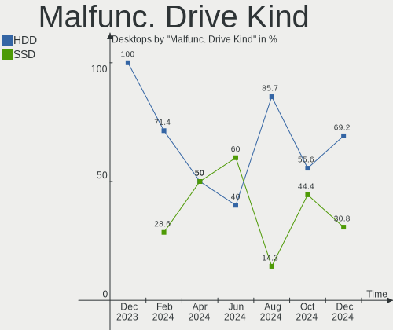
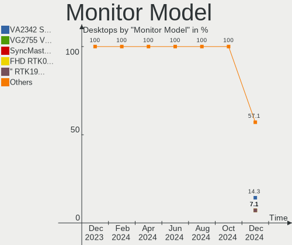
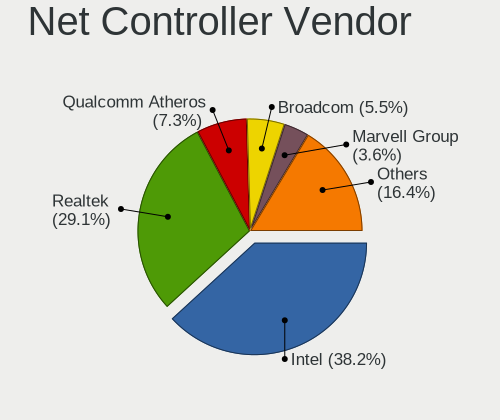

FreeBSD Hardware Trends (Desktops)
----------------------------------

A project to identify most popular hardware characteristics and track their change
over time based on data collected by FreeBSD users at https://BSD-Hardware.info.

Anyone can contribute to this report by the [hw-probe](https://github.com/linuxhw/hw-probe/blob/master/INSTALL.BSD.md) tool:

    hw-probe -all -upload

Full-feature report is available here: https://bsd-hardware.info/?view=trends&formfactor=desktop

Period: Aug, 2021.

Contents
--------

* [ System ](#system)
  - [ OS                       ](#os)
  - [ OS Family                ](#os-family)
  - [ Arch                     ](#arch)
  - [ DE                       ](#de)
  - [ Display Server           ](#display-server)
  - [ Display Manager          ](#display-manager)
  - [ OS Lang                  ](#os-lang)
  - [ Boot Mode                ](#boot-mode)
  - [ Filesystem               ](#filesystem)
  - [ Part. scheme             ](#part-scheme)

* [ Board ](#board)
  - [ Vendor                   ](#vendor)
  - [ Model                    ](#model)
  - [ Model Family             ](#model-family)
  - [ MFG Year                 ](#mfg-year)
  - [ Form Factor              ](#form-factor)
  - [ Coreboot                 ](#coreboot)
  - [ RAM Size                 ](#ram-size)
  - [ RAM Used                 ](#ram-used)
  - [ Total Drives             ](#total-drives)
  - [ Has CD-ROM               ](#has-cd-rom)
  - [ Has Ethernet             ](#has-ethernet)
  - [ Has WiFi                 ](#has-wifi)
  - [ Has Bluetooth            ](#has-bluetooth)

* [ Location ](#location)
  - [ Country                  ](#country)
  - [ City                     ](#city)

* [ Drives ](#drives)
  - [ Drive Vendor             ](#drive-vendor)
  - [ Drive Model              ](#drive-model)
  - [ HDD Vendor               ](#hdd-vendor)
  - [ SSD Vendor               ](#ssd-vendor)
  - [ Drive Kind               ](#drive-kind)
  - [ Drive Connector          ](#drive-connector)
  - [ Drive Size               ](#drive-size)
  - [ Space Total              ](#space-total)
  - [ Space Used               ](#space-used)
  - [ Malfunc. Drives          ](#malfunc-drives)
  - [ Malfunc. Drive Vendor    ](#malfunc-drive-vendor)
  - [ Malfunc. HDD Vendor      ](#malfunc-hdd-vendor)
  - [ Malfunc. Drive Kind      ](#malfunc-drive-kind)
  - [ Failed Drives            ](#failed-drives)
  - [ Failed Drive Vendor      ](#failed-drive-vendor)
  - [ Drive Status             ](#drive-status)

* [ Storage controller ](#storage-controller)
  - [ Storage Vendor           ](#storage-vendor)
  - [ Storage Model            ](#storage-model)
  - [ Storage Kind             ](#storage-kind)

* [ Processor ](#processor)
  - [ CPU Vendor               ](#cpu-vendor)
  - [ CPU Model                ](#cpu-model)
  - [ CPU Model Family         ](#cpu-model-family)
  - [ CPU Cores                ](#cpu-cores)
  - [ CPU Sockets              ](#cpu-sockets)
  - [ CPU Threads              ](#cpu-threads)
  - [ CPU Microarch            ](#cpu-microarch)

* [ Graphics ](#graphics)
  - [ GPU Vendor               ](#gpu-vendor)
  - [ GPU Model                ](#gpu-model)
  - [ GPU Combo                ](#gpu-combo)
  - [ GPU Driver               ](#gpu-driver)
  - [ GPU Memory               ](#gpu-memory)

* [ Monitor ](#monitor)
  - [ Monitor Vendor           ](#monitor-vendor)
  - [ Monitor Model            ](#monitor-model)
  - [ Monitor Resolution       ](#monitor-resolution)
  - [ Monitor Diagonal         ](#monitor-diagonal)
  - [ Monitor Width            ](#monitor-width)
  - [ Aspect Ratio             ](#aspect-ratio)
  - [ Monitor Area             ](#monitor-area)
  - [ Pixel Density            ](#pixel-density)
  - [ Multiple Monitors        ](#multiple-monitors)

* [ Network ](#network)
  - [ Net Controller Vendor    ](#net-controller-vendor)
  - [ Net Controller Model     ](#net-controller-model)
  - [ Wireless Vendor          ](#wireless-vendor)
  - [ Wireless Model           ](#wireless-model)
  - [ Ethernet Vendor          ](#ethernet-vendor)
  - [ Ethernet Model           ](#ethernet-model)
  - [ Net Controller Kind      ](#net-controller-kind)
  - [ Used Controller          ](#used-controller)
  - [ NICs                     ](#nics)
  - [ IPv6                     ](#ipv6)

* [ Bluetooth ](#bluetooth)
  - [ Bluetooth Vendor         ](#bluetooth-vendor)
  - [ Bluetooth Model          ](#bluetooth-model)

* [ Sound ](#sound)
  - [ Sound Vendor             ](#sound-vendor)
  - [ Sound Model              ](#sound-model)

* [ Memory ](#memory)
  - [ Memory Vendor            ](#memory-vendor)
  - [ Memory Model             ](#memory-model)
  - [ Memory Kind              ](#memory-kind)
  - [ Memory Form Factor       ](#memory-form-factor)
  - [ Memory Size              ](#memory-size)
  - [ Memory Speed             ](#memory-speed)

* [ Printers & scanners ](#printers--scanners)
  - [ Printer Vendor           ](#printer-vendor)
  - [ Printer Model            ](#printer-model)
  - [ Scanner Vendor           ](#scanner-vendor)
  - [ Scanner Model            ](#scanner-model)

* [ Camera ](#camera)
  - [ Camera Vendor            ](#camera-vendor)
  - [ Camera Model             ](#camera-model)

* [ Security ](#security)
  - [ Fingerprint Vendor       ](#fingerprint-vendor)
  - [ Fingerprint Model        ](#fingerprint-model)
  - [ Chipcard Vendor          ](#chipcard-vendor)
  - [ Chipcard Model           ](#chipcard-model)

* [ Unsupported ](#unsupported)
  - [ Unsupported Devices      ](#unsupported-devices)
  - [ Unsupported Device Types ](#unsupported-device-types)

System
------

OS
--

Installed operating systems

| Name                | Desktops | Percent |
|---------------------|----------|---------|
| FreeBSD 13.0-p3     | 10       | 35.71%  |
| FreeBSD 13.0        | 7        | 25%     |
| FreeBSD 13.0-p4     | 6        | 21.43%  |
| FreeBSD 13.0-STABLE | 1        | 3.57%   |
| FreeBSD 12.2-STABLE | 1        | 3.57%   |
| FreeBSD 12.2-p9     | 1        | 3.57%   |
| FreeBSD 12.2-p8     | 1        | 3.57%   |
| FreeBSD 12.2        | 1        | 3.57%   |

OS Family
---------

OS without a version

| Name    | Desktops | Percent |
|---------|----------|---------|
| FreeBSD | 28       | 100%    |

Arch
----

OS architecture (x86_64, i586, etc.)

| Name  | Desktops | Percent |
|-------|----------|---------|
| amd64 | 27       | 96.43%  |
| i386  | 1        | 3.57%   |

DE
--

Desktop Environment

| Name      | Desktops | Percent |
|-----------|----------|---------|
| Console   | 10       | 35.71%  |
| KDE5      | 6        | 21.43%  |
| XFCE      | 4        | 14.29%  |
| TWM       | 3        | 10.71%  |
| Picom     | 1        | 3.57%   |
| Lumina    | 1        | 3.57%   |
| i3        | 1        | 3.57%   |
| GNOME     | 1        | 3.57%   |
| AwesomeWM | 1        | 3.57%   |

Display Server
--------------

X11 or Wayland

| Name    | Desktops | Percent |
|---------|----------|---------|
| X11     | 17       | 60.71%  |
| Console | 11       | 39.29%  |

Display Manager
---------------

SDDM, LightDM, etc.

| Name    | Desktops | Percent |
|---------|----------|---------|
| Console | 18       | 64.29%  |
| SDDM    | 5        | 17.86%  |
| XDM     | 3        | 10.71%  |
| LightDM | 1        | 3.57%   |
| GDM     | 1        | 3.57%   |

OS Lang
-------

Language

| Lang           | Desktops | Percent |
|----------------|----------|---------|
| C              | 18       | 64.29%  |
| Unknown        | 3        | 10.71%  |
| ru_RU          | 1        | 3.57%   |
| pt_BR          | 1        | 3.57%   |
| fr_FR.US-ASCII | 1        | 3.57%   |
| es_AR          | 1        | 3.57%   |
| en_US          | 1        | 3.57%   |
| en_GB          | 1        | 3.57%   |
| de_DE          | 1        | 3.57%   |

Boot Mode
---------

EFI or BIOS

| Mode | Desktops | Percent |
|------|----------|---------|
| BIOS | 16       | 57.14%  |
| EFI  | 12       | 42.86%  |

Filesystem
----------

Type of filesystem

| Type | Desktops | Percent |
|------|----------|---------|
| Zfs  | 18       | 64.29%  |
| Ufs  | 10       | 35.71%  |

Part. scheme
------------

Scheme of partitioning

| Type    | Desktops | Percent |
|---------|----------|---------|
| GPT     | 25       | 89.29%  |
| MBR     | 2        | 7.14%   |
| Unknown | 1        | 3.57%   |

Board
-----

Vendor
------

Motherboard manufacturer

| Name                | Desktops | Percent |
|---------------------|----------|---------|
| ASUSTek Computer    | 6        | 21.43%  |
| ASRock              | 6        | 21.43%  |
| Gigabyte Technology | 3        | 10.71%  |
| MSI                 | 2        | 7.14%   |
| Hewlett-Packard     | 2        | 7.14%   |
| Dell                | 2        | 7.14%   |
| Supermicro          | 1        | 3.57%   |
| Medion              | 1        | 3.57%   |
| Lenovo              | 1        | 3.57%   |
| Intel               | 1        | 3.57%   |
| ECS-USA             | 1        | 3.57%   |
| Cisco Systems       | 1        | 3.57%   |
| Biostar             | 1        | 3.57%   |

Model
-----

Motherboard model

| Name                                   | Desktops | Percent |
|----------------------------------------|----------|---------|
| Supermicro X7SPA-HF                    | 1        | 3.57%   |
| MSI MS-7C02                            | 1        | 3.57%   |
| MSI MS-7817                            | 1        | 3.57%   |
| Medion MS-7616                         | 1        | 3.57%   |
| Lenovo IdeaCentre 5 14ARE05 90Q30008US | 1        | 3.57%   |
| Intel DG33BU AAD79951-408              | 1        | 3.57%   |
| HP Z620 Workstation                    | 1        | 3.57%   |
| HP Z420 Workstation                    | 1        | 3.57%   |
| Gigabyte X570 I AORUS PRO WIFI         | 1        | 3.57%   |
| Gigabyte X470 AORUS GAMING 5 WIFI      | 1        | 3.57%   |
| Gigabyte N3160ND3V                     | 1        | 3.57%   |
| ECS-USA GeForce6100PM-M2               | 1        | 3.57%   |
| Dell Studio XPS 8100                   | 1        | 3.57%   |
| Dell OptiPlex 960                      | 1        | 3.57%   |
| Cisco Systems UCSC-C240-M3L            | 1        | 3.57%   |
| Biostar TH55B HD                       | 1        | 3.57%   |
| ASUS ROG STRIX X570-E GAMING           | 1        | 3.57%   |
| ASUS PRIME Z590-P                      | 1        | 3.57%   |
| ASUS PRIME X370-PRO                    | 1        | 3.57%   |
| ASUS P5Q-E                             | 1        | 3.57%   |
| ASUS P5Q                               | 1        | 3.57%   |
| ASUS P4P800-VM                         | 1        | 3.57%   |
| ASRock X570 Phantom Gaming 4           | 1        | 3.57%   |
| ASRock H67M                            | 1        | 3.57%   |
| ASRock B450M-HDV                       | 1        | 3.57%   |
| ASRock B450M Pro4                      | 1        | 3.57%   |
| ASRock 990FX Killer                    | 1        | 3.57%   |
| ASRock 970 Extreme3                    | 1        | 3.57%   |

Model Family
------------

Motherboard model prefix

| Name                        | Desktops | Percent |
|-----------------------------|----------|---------|
| ASUS PRIME                  | 2        | 7.14%   |
| Supermicro X7SPA-HF         | 1        | 3.57%   |
| MSI MS-7C02                 | 1        | 3.57%   |
| MSI MS-7817                 | 1        | 3.57%   |
| Medion MS-7616              | 1        | 3.57%   |
| Lenovo IdeaCentre           | 1        | 3.57%   |
| Intel DG33BU                | 1        | 3.57%   |
| HP Z620                     | 1        | 3.57%   |
| HP Z420                     | 1        | 3.57%   |
| Gigabyte X570               | 1        | 3.57%   |
| Gigabyte X470               | 1        | 3.57%   |
| Gigabyte N3160ND3V          | 1        | 3.57%   |
| ECS-USA GeForce6100PM-M2    | 1        | 3.57%   |
| Dell Studio                 | 1        | 3.57%   |
| Dell OptiPlex               | 1        | 3.57%   |
| Cisco Systems UCSC-C240-M3L | 1        | 3.57%   |
| Biostar TH55B               | 1        | 3.57%   |
| ASUS ROG                    | 1        | 3.57%   |
| ASUS P5Q-E                  | 1        | 3.57%   |
| ASUS P5Q                    | 1        | 3.57%   |
| ASUS P4P800-VM              | 1        | 3.57%   |
| ASRock X570                 | 1        | 3.57%   |
| ASRock H67M                 | 1        | 3.57%   |
| ASRock B450M-HDV            | 1        | 3.57%   |
| ASRock B450M                | 1        | 3.57%   |
| ASRock 990FX                | 1        | 3.57%   |
| ASRock 970                  | 1        | 3.57%   |

MFG Year
--------

Motherboard manufacture year

| Year | Desktops | Percent |
|------|----------|---------|
| 2019 | 6        | 21.43%  |
| 2020 | 4        | 14.29%  |
| 2010 | 4        | 14.29%  |
| 2013 | 3        | 10.71%  |
| 2021 | 2        | 7.14%   |
| 2018 | 2        | 7.14%   |
| 2008 | 2        | 7.14%   |
| 2015 | 1        | 3.57%   |
| 2014 | 1        | 3.57%   |
| 2009 | 1        | 3.57%   |
| 2007 | 1        | 3.57%   |
| 2004 | 1        | 3.57%   |

Form Factor
-----------

Physical design of the computer

| Name    | Desktops | Percent |
|---------|----------|---------|
| Desktop | 28       | 100%    |

Coreboot
--------

Have coreboot on board

| Used | Desktops | Percent |
|------|----------|---------|
| No   | 28       | 100%    |

RAM Size
--------

Total RAM memory

| Size in GB  | Desktops | Percent |
|-------------|----------|---------|
| 8.01-16.0   | 8        | 28.57%  |
| 32.01-64.0  | 7        | 25%     |
| 4.01-8.0    | 6        | 21.43%  |
| 64.01-256.0 | 3        | 10.71%  |
| 16.01-24.0  | 3        | 10.71%  |
| 1.01-2.0    | 1        | 3.57%   |

RAM Used
--------

Used RAM memory

| Used GB   | Desktops | Percent |
|-----------|----------|---------|
| 0.01-0.5  | 10       | 35.71%  |
| 0.51-1.0  | 7        | 25%     |
| 1.01-2.0  | 6        | 21.43%  |
| 3.01-4.0  | 4        | 14.29%  |
| 8.01-16.0 | 1        | 3.57%   |

Total Drives
------------

Number of drives on board

| Drives | Desktops | Percent |
|--------|----------|---------|
| 2      | 10       | 35.71%  |
| 1      | 8        | 28.57%  |
| 3      | 4        | 14.29%  |
| 13     | 1        | 3.57%   |
| 12     | 1        | 3.57%   |
| 8      | 1        | 3.57%   |
| 6      | 1        | 3.57%   |
| 5      | 1        | 3.57%   |
| 0      | 1        | 3.57%   |

Has CD-ROM
----------

Has CD-ROM on board

| Presented | Desktops | Percent |
|-----------|----------|---------|
| No        | 16       | 57.14%  |
| Yes       | 12       | 42.86%  |

Has Ethernet
------------

Has Ethernet on board

| Presented | Desktops | Percent |
|-----------|----------|---------|
| Yes       | 27       | 96.43%  |
| No        | 1        | 3.57%   |

Has WiFi
--------

Has WiFi module

| Presented | Desktops | Percent |
|-----------|----------|---------|
| No        | 18       | 64.29%  |
| Yes       | 10       | 35.71%  |

Has Bluetooth
-------------

Has Bluetooth module

| Presented | Desktops | Percent |
|-----------|----------|---------|
| No        | 24       | 85.71%  |
| Yes       | 4        | 14.29%  |

Location
--------

Country
-------

Geographic location (country)

| Country   | Desktops | Percent |
|-----------|----------|---------|
| USA       | 9        | 32.14%  |
| Russia    | 3        | 10.71%  |
| Germany   | 3        | 10.71%  |
| UK        | 2        | 7.14%   |
| France    | 2        | 7.14%   |
| Brazil    | 2        | 7.14%   |
| Slovenia  | 1        | 3.57%   |
| Serbia    | 1        | 3.57%   |
| India     | 1        | 3.57%   |
| Canada    | 1        | 3.57%   |
| Belgium   | 1        | 3.57%   |
| Australia | 1        | 3.57%   |
| Argentina | 1        | 3.57%   |

City
----

Geographic location (city)

| City              | Desktops | Percent |
|-------------------|----------|---------|
| Salem             | 2        | 7.14%   |
| Kirkland          | 2        | 7.14%   |
| Barnaul           | 2        | 7.14%   |
| Wenatchee         | 1        | 3.57%   |
| Trebnje           | 1        | 3.57%   |
| S??o Paulo        | 1        | 3.57%   |
| San Miguel        | 1        | 3.57%   |
| Ringwood          | 1        | 3.57%   |
| Puisieulx         | 1        | 3.57%   |
| Portland          | 1        | 3.57%   |
| Mumbai            | 1        | 3.57%   |
| London            | 1        | 3.57%   |
| Lexington         | 1        | 3.57%   |
| Kamensk-Ural'skiy | 1        | 3.57%   |
| Hamburg           | 1        | 3.57%   |
| Guelph            | 1        | 3.57%   |
| Great Yarmouth    | 1        | 3.57%   |
| Gennevilliers     | 1        | 3.57%   |
| Geel              | 1        | 3.57%   |
| Fort Lauderdale   | 1        | 3.57%   |
| El Paso           | 1        | 3.57%   |
| Crici??ma         | 1        | 3.57%   |
| Berlin            | 1        | 3.57%   |
| Belgrade          | 1        | 3.57%   |
| Augsburg          | 1        | 3.57%   |

Drives
------

Drive Vendor
------------

Hard drive vendors

| Vendor              | Desktops | Drives | Percent |
|---------------------|----------|--------|---------|
| Seagate             | 13       | 27     | 26%     |
| WDC                 | 12       | 26     | 24%     |
| Samsung Electronics | 7        | 10     | 14%     |
| Toshiba             | 3        | 6      | 6%      |
| Kingston            | 3        | 3      | 6%      |
| SanDisk             | 2        | 2      | 4%      |
| A-DATA Technology   | 2        | 3      | 4%      |
| Phison              | 1        | 1      | 2%      |
| Micron Technology   | 1        | 1      | 2%      |
| KingDian            | 1        | 1      | 2%      |
| Intel               | 1        | 1      | 2%      |
| Hitachi             | 1        | 1      | 2%      |
| HGST                | 1        | 2      | 2%      |
| Crucial             | 1        | 1      | 2%      |
| Corsair             | 1        | 1      | 2%      |

Drive Model
-----------

Hard drive models

| Model                                | Desktops | Percent |
|--------------------------------------|----------|---------|
| Seagate ST4000DM000-1F2168 4TB       | 2        | 3.03%   |
| Seagate ST380815AS 80GB              | 2        | 3.03%   |
| Samsung SSD 850 EVO 250GB            | 2        | 3.03%   |
| WDC WDS500G2B0C-00PXH0 500GB         | 1        | 1.52%   |
| WDC WDS200T2B0A-00SM50 2TB           | 1        | 1.52%   |
| WDC WDS120G2G0A-00JH30 120GB         | 1        | 1.52%   |
| WDC WD80EMAZ-00WJTA0 8TB             | 1        | 1.52%   |
| WDC WD80EFZX-68UW8N0 8TB             | 1        | 1.52%   |
| WDC WD80EFAX-68LHPN0 8TB             | 1        | 1.52%   |
| WDC WD80EDBZ-11B0ZA0 8TB             | 1        | 1.52%   |
| WDC WD800AAJS-60WAA0 80GB            | 1        | 1.52%   |
| WDC WD5000LPVX-22V0TT0 500GB         | 1        | 1.52%   |
| WDC WD5000AAKS-00A7B2 500GB          | 1        | 1.52%   |
| WDC WD40EZRZ-22GXCB0 4TB             | 1        | 1.52%   |
| WDC WD400BB-00JHC0 40GB              | 1        | 1.52%   |
| WDC WD3000JS-63PDB1 304GB            | 1        | 1.52%   |
| WDC WD20EZRX-00D8PB0 2TB             | 1        | 1.52%   |
| WDC WD1600JS-00NCB1 160GB            | 1        | 1.52%   |
| WDC WD120EMFZ-11A6JA0 12TB           | 1        | 1.52%   |
| WDC WD120EMAZ-11BLFA0 12TB           | 1        | 1.52%   |
| WDC WD1003FZEX-00MK2A0 1TB           | 1        | 1.52%   |
| WDC WD1001FALS-00J7B0 1TB            | 1        | 1.52%   |
| WDC WD1001FAES-75W7A0 1TB            | 1        | 1.52%   |
| Toshiba MQ02ABD100H 1TB              | 1        | 1.52%   |
| Toshiba MK1234GSX 120GB              | 1        | 1.52%   |
| Toshiba HDWE140 4TB                  | 1        | 1.52%   |
| Seagate ST980313AS 80GB              | 1        | 1.52%   |
| Seagate ST9250827AS 250GB            | 1        | 1.52%   |
| Seagate ST8000VN004-2M2101 8TB       | 1        | 1.52%   |
| Seagate ST500LM012 HN-M500MBB 500GB  | 1        | 1.52%   |
| Seagate ST500LM000-1EJ162-SSHD 500GB | 1        | 1.52%   |
| Seagate ST500DM002-1BD142 500GB      | 1        | 1.52%   |
| Seagate ST4000NE001-2MA101 4TB       | 1        | 1.52%   |
| Seagate ST3500630NS 500GB            | 1        | 1.52%   |
| Seagate ST3500418AS 500GB            | 1        | 1.52%   |
| Seagate ST33000650SS 3TB             | 1        | 1.52%   |
| Seagate ST3160813AS 160GB            | 1        | 1.52%   |
| Seagate ST3120814A 120GB             | 1        | 1.52%   |
| Seagate ST2000DM008-2FR102 2TB       | 1        | 1.52%   |
| Seagate ST1000NM0023 1TB             | 1        | 1.52%   |
| Seagate ST1000DM010-2EP102 1TB       | 1        | 1.52%   |
| SanDisk SSD PLUS 480GB               | 1        | 1.52%   |
| SanDisk SD7TB3Q-256G-1006 256GB      | 1        | 1.52%   |
| Samsung SSD 960 EVO 500GB            | 1        | 1.52%   |
| Samsung SSD 860 QVO 1TB              | 1        | 1.52%   |
| Samsung SSD 860 EVO 500GB            | 1        | 1.52%   |
| Samsung SSD 850 PRO 256GB            | 1        | 1.52%   |
| Samsung SSD 850 EVO 1TB              | 1        | 1.52%   |
| Samsung SSD 750 EVO 250GB            | 1        | 1.52%   |
| Samsung HD501LJ 500GB                | 1        | 1.52%   |
| Phison Sabrent Rocket 4.0 1TB        | 1        | 1.52%   |
| Micron MTFDDAK256MBF-1AN15ABHA 256GB | 1        | 1.52%   |
| Kingston SH103S3240G 240GB           | 1        | 1.52%   |
| Kingston SA400S37240G 240GB          | 1        | 1.52%   |
| Kingston HyperX Fury 3D 240GB        | 1        | 1.52%   |
| KingDian S280-240GB                  | 1        | 1.52%   |
| Intel SSDSC2BF180A4L 180GB           | 1        | 1.52%   |
| Hitachi HDS725050KLA360 500GB        | 1        | 1.52%   |
| HGST HUS726060AL4215 6TB             | 1        | 1.52%   |
| Crucial CT275MX300SSD4 275GB         | 1        | 1.52%   |

HDD Vendor
----------

Hard disk drive vendors

| Vendor              | Desktops | Drives | Percent |
|---------------------|----------|--------|---------|
| Seagate             | 13       | 27     | 43.33%  |
| WDC                 | 11       | 23     | 36.67%  |
| Toshiba             | 3        | 6      | 10%     |
| Samsung Electronics | 1        | 1      | 3.33%   |
| Hitachi             | 1        | 1      | 3.33%   |
| HGST                | 1        | 2      | 3.33%   |

SSD Vendor
----------

Solid state drive vendors

| Vendor              | Desktops | Drives | Percent |
|---------------------|----------|--------|---------|
| Samsung Electronics | 6        | 8      | 33.33%  |
| Kingston            | 3        | 3      | 16.67%  |
| SanDisk             | 2        | 2      | 11.11%  |
| A-DATA Technology   | 2        | 3      | 11.11%  |
| WDC                 | 1        | 2      | 5.56%   |
| Micron Technology   | 1        | 1      | 5.56%   |
| KingDian            | 1        | 1      | 5.56%   |
| Intel               | 1        | 1      | 5.56%   |
| Crucial             | 1        | 1      | 5.56%   |

Drive Kind
----------

HDD or SSD

| Kind | Desktops | Drives | Percent |
|------|----------|--------|---------|
| HDD  | 23       | 60     | 57.5%   |
| SSD  | 13       | 22     | 32.5%   |
| NVMe | 4        | 4      | 10%     |

Drive Connector
---------------

SATA, SAS, NVMe, etc.

| Type | Desktops | Drives | Percent |
|------|----------|--------|---------|
| SATA | 26       | 82     | 86.67%  |
| NVMe | 4        | 4      | 13.33%  |

Drive Size
----------

Size of hard drive

| Size in TB | Desktops | Drives | Percent |
|------------|----------|--------|---------|
| 0.01-0.5   | 23       | 38     | 56.1%   |
| 0.51-1.0   | 7        | 11     | 17.07%  |
| 3.01-4.0   | 3        | 9      | 7.32%   |
| 1.01-2.0   | 3        | 3      | 7.32%   |
| 4.01-10.0  | 3        | 11     | 7.32%   |
| 2.01-3.0   | 1        | 8      | 2.44%   |
| 10.01-20.0 | 1        | 2      | 2.44%   |

Space Total
-----------

Amount of disk space available on the file system

| Size in GB | Desktops | Percent |
|------------|----------|---------|
| 101-250    | 11       | 39.29%  |
| 251-500    | 6        | 21.43%  |
| 501-1000   | 3        | 10.71%  |
| 2001-3000  | 2        | 7.14%   |
| 1001-2000  | 2        | 7.14%   |
| 1-20       | 2        | 7.14%   |
| 21-50      | 1        | 3.57%   |
| 51-100     | 1        | 3.57%   |

Space Used
----------

Amount of used disk space

| Used GB | Desktops | Percent |
|---------|----------|---------|
| 1-20    | 16       | 57.14%  |
| 21-50   | 5        | 17.86%  |
| 251-500 | 3        | 10.71%  |
| 101-250 | 2        | 7.14%   |
| 51-100  | 2        | 7.14%   |

Malfunc. Drives
---------------

Drive models with a malfunction

| Model                               | Desktops | Drives | Percent |
|-------------------------------------|----------|--------|---------|
| WDC WD800AAJS-60WAA0 80GB           | 1        | 1      | 9.09%   |
| WDC WD1001FAES-75W7A0 1TB           | 1        | 1      | 9.09%   |
| Toshiba MQ02ABD100H 1TB             | 1        | 1      | 9.09%   |
| Toshiba HDWE140 4TB                 | 1        | 4      | 9.09%   |
| Seagate ST9250827AS 250GB           | 1        | 1      | 9.09%   |
| Seagate ST500LM012 HN-M500MBB 500GB | 1        | 1      | 9.09%   |
| Seagate ST500DM002-1BD142 500GB     | 1        | 1      | 9.09%   |
| Seagate ST3500418AS 500GB           | 1        | 1      | 9.09%   |
| Seagate ST3120814A 120GB            | 1        | 1      | 9.09%   |
| Samsung Electronics HD501LJ 500GB   | 1        | 1      | 9.09%   |
| A-DATA Technology SU650 960GB       | 1        | 1      | 9.09%   |

Malfunc. Drive Vendor
---------------------

Vendors of faulty drives

| Vendor              | Desktops | Drives | Percent |
|---------------------|----------|--------|---------|
| Seagate             | 5        | 5      | 45.45%  |
| WDC                 | 2        | 2      | 18.18%  |
| Toshiba             | 2        | 5      | 18.18%  |
| Samsung Electronics | 1        | 1      | 9.09%   |
| A-DATA Technology   | 1        | 1      | 9.09%   |

Malfunc. HDD Vendor
-------------------

Vendors of faulty HDD drives

| Vendor              | Desktops | Drives | Percent |
|---------------------|----------|--------|---------|
| Seagate             | 5        | 5      | 50%     |
| WDC                 | 2        | 2      | 20%     |
| Toshiba             | 2        | 5      | 20%     |
| Samsung Electronics | 1        | 1      | 10%     |

Malfunc. Drive Kind
-------------------

Kinds of faulty drives

| Kind | Desktops | Drives | Percent |
|------|----------|--------|---------|
| HDD  | 8        | 13     | 88.89%  |
| SSD  | 1        | 1      | 11.11%  |

Failed Drives
-------------

Failed drive models

Zero info for selected period =(

Failed Drive Vendor
-------------------

Failed drive vendors

Zero info for selected period =(

Drive Status
------------

Number of failed and malfunc. drives

| Status  | Desktops | Drives | Percent |
|---------|----------|--------|---------|
| Works   | 24       | 72     | 75%     |
| Malfunc | 8        | 14     | 25%     |

Storage controller
------------------

Storage Vendor
--------------

Storage controller vendors

| Vendor                   | Desktops | Percent |
|--------------------------|----------|---------|
| Intel                    | 15       | 40.54%  |
| AMD                      | 11       | 29.73%  |
| Phison Electronics       | 2        | 5.41%   |
| Marvell Technology Group | 2        | 5.41%   |
| Broadcom / LSI           | 2        | 5.41%   |
| Sandisk                  | 1        | 2.7%    |
| Samsung Electronics      | 1        | 2.7%    |
| Nvidia                   | 1        | 2.7%    |
| JMicron Technology       | 1        | 2.7%    |
| ASMedia Technology       | 1        | 2.7%    |

Storage Model
-------------

Storage controller models

| Model                                                                            | Desktops | Percent |
|----------------------------------------------------------------------------------|----------|---------|
| AMD FCH SATA Controller [AHCI mode]                                              | 8        | 14.81%  |
| AMD 400 Series Chipset SATA Controller                                           | 4        | 7.41%   |
| Phison E16 PCIe4 NVMe Controller                                                 | 2        | 3.7%    |
| Intel C602 chipset 4-Port SATA Storage Control Unit                              | 2        | 3.7%    |
| Intel C600/X79 series chipset SATA RAID Controller                               | 2        | 3.7%    |
| Intel 82801JI (ICH10 Family) SATA AHCI Controller                                | 2        | 3.7%    |
| Intel 82801IR/IO/IH (ICH9R/DO/DH) 6 port SATA Controller [AHCI mode]             | 2        | 3.7%    |
| Intel 5 Series/3400 Series Chipset 4 port SATA IDE Controller                    | 2        | 3.7%    |
| Intel 5 Series/3400 Series Chipset 2 port SATA IDE Controller                    | 2        | 3.7%    |
| AMD SB7x0/SB8x0/SB9x0 SATA Controller [AHCI mode]                                | 2        | 3.7%    |
| AMD SB7x0/SB8x0/SB9x0 IDE Controller                                             | 2        | 3.7%    |
| Sandisk WD Blue SN550 NVMe SSD                                                   | 1        | 1.85%   |
| Samsung NVMe SSD Controller SM961/PM961/SM963                                    | 1        | 1.85%   |
| Nvidia MCP61 SATA Controller                                                     | 1        | 1.85%   |
| Nvidia MCP61 IDE                                                                 | 1        | 1.85%   |
| Marvell Group 88SE6111/6121 SATA II / PATA Controller                            | 1        | 1.85%   |
| Marvell Group 88SE6101/6102 single-port PATA133 interface                        | 1        | 1.85%   |
| JMicron JMB368 IDE controller                                                    | 1        | 1.85%   |
| Intel SATA Controller [RAID mode]                                                | 1        | 1.85%   |
| Intel C600/X79 series chipset IDE-r Controller                                   | 1        | 1.85%   |
| Intel Atom/Celeron/Pentium Processor x5-E8000/J3xxx/N3xxx Series SATA Controller | 1        | 1.85%   |
| Intel 82801EB/ER (ICH5/ICH5R) IDE Controller                                     | 1        | 1.85%   |
| Intel 82801EB (ICH5) SATA Controller                                             | 1        | 1.85%   |
| Intel 8 Series/C220 Series Chipset Family 6-port SATA Controller 1 [AHCI mode]   | 1        | 1.85%   |
| Intel 6 Series/C200 Series Chipset Family 6 port Desktop SATA AHCI Controller    | 1        | 1.85%   |
| Intel 500 Series Chipset Family SATA AHCI Controller                             | 1        | 1.85%   |
| Intel 5 Series/3400 Series Chipset 6 port SATA AHCI Controller                   | 1        | 1.85%   |
| Intel 4 Series Chipset PT IDER Controller                                        | 1        | 1.85%   |
| Broadcom / LSI SAS2308 PCI-Express Fusion-MPT SAS-2                              | 1        | 1.85%   |
| Broadcom / LSI SAS2008 PCI-Express Fusion-MPT SAS-2 [Falcon]                     | 1        | 1.85%   |
| Broadcom / LSI MegaRAID SAS 2208 [Thunderbolt]                                   | 1        | 1.85%   |
| Broadcom / LSI MegaRAID SAS 2008 [Falcon]                                        | 1        | 1.85%   |
| ASMedia ASM1062 Serial ATA Controller                                            | 1        | 1.85%   |
| AMD X370 Series Chipset SATA Controller                                          | 1        | 1.85%   |
| AMD Starship/Matisse Chipset SATA Controller [AHCI mode]                         | 1        | 1.85%   |

Storage Kind
------------

Kind of storage controller (IDE, SATA, NVMe, SAS, ...)

| Kind | Desktops | Percent |
|------|----------|---------|
| SATA | 20       | 47.62%  |
| IDE  | 10       | 23.81%  |
| RAID | 4        | 9.52%   |
| SAS  | 4        | 9.52%   |
| NVMe | 4        | 9.52%   |

Processor
---------

CPU Vendor
----------

Processor vendors

| Vendor | Desktops | Percent |
|--------|----------|---------|
| Intel  | 16       | 57.14%  |
| AMD    | 12       | 42.86%  |

CPU Model
---------

Processor models

| Model                                       | Desktops | Percent |
|---------------------------------------------|----------|---------|
| Intel Core i3 CPU 530 @ 2.93GHz             | 2        | 7.14%   |
| Intel Xeon CPU E5-2630 v2 @ 2.60GHz         | 1        | 3.57%   |
| Intel Xeon CPU E5-2620 v2 @ 2.10GHz         | 1        | 3.57%   |
| Intel Xeon CPU E5-1650 @ 3.20GHz            | 1        | 3.57%   |
| Intel Pentium CPU G3220 @ 3.00GHz           | 1        | 3.57%   |
| Intel Pentium 4 CPU 1.80GHz                 | 1        | 3.57%   |
| Intel Core i7-2600 CPU @ 3.40GHz            | 1        | 3.57%   |
| Intel Core i5 CPU 650 @ 3.20GHz             | 1        | 3.57%   |
| Intel Core 2 Quad CPU Q6600 @ 2.40GHz       | 1        | 3.57%   |
| Intel Core 2 Duo CPU E8400 @ 3.00GHz        | 1        | 3.57%   |
| Intel Core 2 Duo CPU E7200 @ 2.53GHz        | 1        | 3.57%   |
| Intel Core 2 Duo                            | 1        | 3.57%   |
| Intel Celeron CPU N3160 @ 1.60GHz           | 1        | 3.57%   |
| Intel Atom CPU D510 @ 1.66GHz               | 1        | 3.57%   |
| Intel 11th Gen Core i5-11600K @ 3.90GHz     | 1        | 3.57%   |
| AMD Ryzen 9 5900X 12-Core Processor         | 1        | 3.57%   |
| AMD Ryzen 9 3950X 16-Core Processor         | 1        | 3.57%   |
| AMD Ryzen 9 3900X 12-Core Processor         | 1        | 3.57%   |
| AMD Ryzen 7 4700G with Radeon Graphics      | 1        | 3.57%   |
| AMD Ryzen 7 1700X Eight-Core Processor      | 1        | 3.57%   |
| AMD Ryzen 7 1700 Eight-Core Processor       | 1        | 3.57%   |
| AMD Ryzen 5 3600 6-Core Processor           | 1        | 3.57%   |
| AMD Ryzen 5 2600X Six-Core Processor        | 1        | 3.57%   |
| AMD Ryzen 3 2200G with Radeon Vega Graphics | 1        | 3.57%   |
| AMD Phenom II X4 965 Processor              | 1        | 3.57%   |
| AMD Phenom 9650 Quad-Core Processor         | 1        | 3.57%   |
| AMD FX-8350 Eight-Core Processor            | 1        | 3.57%   |

CPU Model Family
----------------

Processor model prefix

| Model             | Desktops | Percent |
|-------------------|----------|---------|
| Intel Xeon        | 3        | 10.71%  |
| Intel Core 2 Duo  | 3        | 10.71%  |
| AMD Ryzen 9       | 3        | 10.71%  |
| AMD Ryzen 7       | 3        | 10.71%  |
| Intel Core i3     | 2        | 7.14%   |
| AMD Ryzen 5       | 2        | 7.14%   |
| Other             | 1        | 3.57%   |
| Intel Pentium 4   | 1        | 3.57%   |
| Intel Pentium     | 1        | 3.57%   |
| Intel Core i7     | 1        | 3.57%   |
| Intel Core i5     | 1        | 3.57%   |
| Intel Core 2 Quad | 1        | 3.57%   |
| Intel Celeron     | 1        | 3.57%   |
| Intel Atom        | 1        | 3.57%   |
| AMD Ryzen 3       | 1        | 3.57%   |
| AMD Phenom II X4  | 1        | 3.57%   |
| AMD Phenom        | 1        | 3.57%   |
| AMD FX            | 1        | 3.57%   |

CPU Cores
---------

Number of processor cores

| Number  | Desktops | Percent |
|---------|----------|---------|
| 2       | 7        | 25%     |
| 4       | 6        | 21.43%  |
| 16      | 3        | 10.71%  |
| 12      | 3        | 10.71%  |
| 6       | 3        | 10.71%  |
| 24      | 2        | 7.14%   |
| 32      | 1        | 3.57%   |
| 8       | 1        | 3.57%   |
| 1       | 1        | 3.57%   |
| Unknown | 1        | 3.57%   |

CPU Sockets
-----------

Number of sockets

| Number | Desktops | Percent |
|--------|----------|---------|
| 1      | 27       | 96.43%  |
| 2      | 1        | 3.57%   |

CPU Threads
-----------

Threads per core (Hyper-Threading)

| Number  | Desktops | Percent |
|---------|----------|---------|
| 1       | 17       | 60.71%  |
| 2       | 9        | 32.14%  |
| Unknown | 2        | 7.14%   |

CPU Microarch
-------------

Microarchitecture

| Name        | Desktops | Percent |
|-------------|----------|---------|
| Zen 2       | 4        | 14.29%  |
| Zen         | 3        | 10.71%  |
| Westmere    | 3        | 10.71%  |
| Penryn      | 3        | 10.71%  |
| SandyBridge | 2        | 7.14%   |
| K10         | 2        | 7.14%   |
| IvyBridge   | 2        | 7.14%   |
| Zen+        | 1        | 3.57%   |
| Zen 3       | 1        | 3.57%   |
| Silvermont  | 1        | 3.57%   |
| Piledriver  | 1        | 3.57%   |
| NetBurst    | 1        | 3.57%   |
| Haswell     | 1        | 3.57%   |
| Core        | 1        | 3.57%   |
| Bonnell     | 1        | 3.57%   |
| Unknown     | 1        | 3.57%   |

Graphics
--------

GPU Vendor
----------

Vendors of graphics cards

| Vendor                     | Desktops | Percent |
|----------------------------|----------|---------|
| Nvidia                     | 13       | 43.33%  |
| AMD                        | 10       | 33.33%  |
| Intel                      | 6        | 20%     |
| Matrox Electronics Systems | 1        | 3.33%   |

GPU Model
---------

Graphics card models

| Model                                                                                    | Desktops | Percent |
|------------------------------------------------------------------------------------------|----------|---------|
| Nvidia GM204 [GeForce GTX 970]                                                           | 2        | 6.45%   |
| Nvidia GK208B [GeForce GT 710]                                                           | 2        | 6.45%   |
| AMD Ellesmere [Radeon RX 470/480/570/570X/580/580X/590]                                  | 2        | 6.45%   |
| Nvidia GT218 [NVS 300]                                                                   | 1        | 3.23%   |
| Nvidia GP108 [GeForce GT 1030]                                                           | 1        | 3.23%   |
| Nvidia GP106 [GeForce GTX 1060 3GB]                                                      | 1        | 3.23%   |
| Nvidia GK107GL [Quadro K2000]                                                            | 1        | 3.23%   |
| Nvidia GF116 [GeForce GTX 550 Ti]                                                        | 1        | 3.23%   |
| Nvidia GF106 [GeForce GTS 450]                                                           | 1        | 3.23%   |
| Nvidia G98 [GeForce 8400 GS Rev. 2]                                                      | 1        | 3.23%   |
| Nvidia G92 [GeForce GTS 250]                                                             | 1        | 3.23%   |
| Nvidia G92 [GeForce GT 330]                                                              | 1        | 3.23%   |
| Matrox Electronics Systems MGA G200e [Pilot] ServerEngines (SEP1)                        | 1        | 3.23%   |
| Intel Xeon E3-1200 v3/4th Gen Core Processor Integrated Graphics Controller              | 1        | 3.23%   |
| Intel Atom/Celeron/Pentium Processor x5-E8000/J3xxx/N3xxx Integrated Graphics Controller | 1        | 3.23%   |
| Intel Atom Processor D4xx/D5xx/N4xx/N5xx Integrated Graphics Controller                  | 1        | 3.23%   |
| Intel 82G33/G31 Express Integrated Graphics Controller                                   | 1        | 3.23%   |
| Intel 82865G Integrated Graphics Controller                                              | 1        | 3.23%   |
| Intel 2nd Generation Core Processor Family Integrated Graphics Controller                | 1        | 3.23%   |
| AMD RV710 [Radeon HD 4350/4550]                                                          | 1        | 3.23%   |
| AMD Renoir                                                                               | 1        | 3.23%   |
| AMD Raven Ridge [Radeon Vega Series / Radeon Vega Mobile Series]                         | 1        | 3.23%   |
| AMD Lexa PRO [Radeon 540/540X/550/550X / RX 540X/550/550X]                               | 1        | 3.23%   |
| AMD Hawaii PRO [Radeon R9 290/390]                                                       | 1        | 3.23%   |
| AMD Caicos [Radeon HD 6450/7450/8450 / R5 230 OEM]                                       | 1        | 3.23%   |
| AMD Caicos XTX [Radeon HD 8490 / R5 235X OEM]                                            | 1        | 3.23%   |
| AMD Barts PRO [Radeon HD 6850]                                                           | 1        | 3.23%   |
| AMD Baffin [Radeon RX 550 640SP / RX 560/560X]                                           | 1        | 3.23%   |

GPU Combo
---------

Combinations of graphics cards

| Name        | Desktops | Percent |
|-------------|----------|---------|
| 1 x Nvidia  | 12       | 42.86%  |
| 1 x AMD     | 8        | 28.57%  |
| 1 x Intel   | 4        | 14.29%  |
| 2 x Intel   | 1        | 3.57%   |
| 2 x AMD     | 1        | 3.57%   |
| 1 x Matrox  | 1        | 3.57%   |
| Intel + AMD | 1        | 3.57%   |

GPU Driver
----------

Free vs proprietary

| Driver      | Desktops | Percent |
|-------------|----------|---------|
| Free        | 20       | 71.43%  |
| Proprietary | 8        | 28.57%  |

GPU Memory
----------

Total video memory

| Size in GB | Desktops | Percent |
|------------|----------|---------|
| Unknown    | 15       | 53.57%  |
| 3.01-4.0   | 5        | 17.86%  |
| 1.01-2.0   | 3        | 10.71%  |
| 0.51-1.0   | 3        | 10.71%  |
| 7.01-8.0   | 2        | 7.14%   |

Monitor
-------

Monitor Vendor
--------------

Monitor vendors

| Vendor               | Desktops | Percent |
|----------------------|----------|---------|
| Samsung Electronics  | 4        | 25%     |
| Hewlett-Packard      | 2        | 12.5%   |
| Goldstar             | 2        | 12.5%   |
| Dell                 | 2        | 12.5%   |
| AOC                  | 2        | 12.5%   |
| IBM                  | 1        | 6.25%   |
| Fujitsu Siemens      | 1        | 6.25%   |
| CKL                  | 1        | 6.25%   |
| Ancor Communications | 1        | 6.25%   |

Monitor Model
-------------

Monitor models

| Model                                                                | Desktops | Percent |
|----------------------------------------------------------------------|----------|---------|
| Samsung Electronics SyncMaster SAM030D 1680x1050 470x300mm 22.0-inch | 1        | 5.56%   |
| Samsung Electronics SyncMaster SAM0117 1280x1024 310x230mm 15.2-inch | 1        | 5.56%   |
| Samsung Electronics S24C650 SAM09E9 1920x1080 520x290mm 23.4-inch    | 1        | 5.56%   |
| Samsung Electronics S24C650 SAM09E8 1920x1080 520x290mm 23.4-inch    | 1        | 5.56%   |
| Samsung Electronics S20C200 SAM09B4 1600x900 440x250mm 19.9-inch     | 1        | 5.56%   |
| IBM L191p IBM24CB 1280x1024 380x300mm 19.1-inch                      | 1        | 5.56%   |
| Hewlett-Packard ZR24w HWP286A 1920x1200 540x350mm 25.3-inch          | 1        | 5.56%   |
| Hewlett-Packard w2207 HWP26A9 1680x1050 470x300mm 22.0-inch          | 1        | 5.56%   |
| Goldstar LCD Monitor GSM5AB8 1920x1080 480x270mm 21.7-inch           | 1        | 5.56%   |
| Goldstar L1751SQ GSM43F1 1280x1024 340x270mm 17.1-inch               | 1        | 5.56%   |
| Fujitsu Siemens P20-2S FUS0554 1600x1200 410x310mm 20.2-inch         | 1        | 5.56%   |
| Dell P2414H DELA09B 1920x1080 530x300mm 24.0-inch                    | 1        | 5.56%   |
| Dell LCD Monitor U2412M 3840x1200                                    | 1        | 5.56%   |
| Dell LCD Monitor U2412M                                              | 1        | 5.56%   |
| CKL LCD Monitor CKL0001 1920x1200 1150x650mm 52.0-inch               | 1        | 5.56%   |
| AOC 24G2W1G4 AOC2402 1920x1080 530x300mm 24.0-inch                   | 1        | 5.56%   |
| AOC 1970W AOC1970 1366x768 410x230mm 18.5-inch                       | 1        | 5.56%   |
| Ancor Communications LCD Monitor ASUS PB278 2560x1440                | 1        | 5.56%   |

Monitor Resolution
------------------

Monitor screen resolution

| Resolution         | Desktops | Percent |
|--------------------|----------|---------|
| 1920x1080 (FHD)    | 4        | 23.53%  |
| 1280x1024 (SXGA)   | 3        | 17.65%  |
| 1920x1200 (WUXGA)  | 2        | 11.76%  |
| 1680x1050 (WSXGA+) | 2        | 11.76%  |
| 3840x1200          | 1        | 5.88%   |
| 2560x1440 (QHD)    | 1        | 5.88%   |
| 1600x900 (HD+)     | 1        | 5.88%   |
| 1600x1200          | 1        | 5.88%   |
| 1366x768 (WXGA)    | 1        | 5.88%   |
| Unknown            | 1        | 5.88%   |

Monitor Diagonal
----------------

Diagonal size in inches

| Inches  | Desktops | Percent |
|---------|----------|---------|
| 24      | 2        | 12.5%   |
| 22      | 2        | 12.5%   |
| 19      | 2        | 12.5%   |
| Unknown | 2        | 12.5%   |
| 52      | 1        | 6.25%   |
| 25      | 1        | 6.25%   |
| 23      | 1        | 6.25%   |
| 21      | 1        | 6.25%   |
| 20      | 1        | 6.25%   |
| 18      | 1        | 6.25%   |
| 17      | 1        | 6.25%   |
| 15      | 1        | 6.25%   |

Monitor Width
-------------

Physical width

| Width in mm | Desktops | Percent |
|-------------|----------|---------|
| 401-500     | 6        | 37.5%   |
| 501-600     | 4        | 25%     |
| 301-350     | 2        | 12.5%   |
| Unknown     | 2        | 12.5%   |
| 351-400     | 1        | 6.25%   |
| 1001-1500   | 1        | 6.25%   |

Aspect Ratio
------------

Proportional relationship between the width and the height

| Ratio   | Desktops | Percent |
|---------|----------|---------|
| 16/9    | 7        | 43.75%  |
| 5/4     | 2        | 12.5%   |
| 4/3     | 2        | 12.5%   |
| 16/10   | 2        | 12.5%   |
| Unknown | 2        | 12.5%   |
| 3/2     | 1        | 6.25%   |

Monitor Area
------------

Area in inch

| Area in inch | Desktops | Percent |
|----------------|----------|---------|
| 201-250        | 6        | 37.5%   |
| 151-200        | 3        | 18.75%  |
| 141-150        | 2        | 12.5%   |
| Unknown        | 2        | 12.5%   |
| More than 1000 | 1        | 6.25%   |
| 251-300        | 1        | 6.25%   |
| 111-120        | 1        | 6.25%   |

Pixel Density
-------------

Pixels per inch

| Density | Desktops | Percent |
|---------|----------|---------|
| 51-100  | 11       | 68.75%  |
| 101-120 | 2        | 12.5%   |
| Unknown | 2        | 12.5%   |
| 1-50    | 1        | 6.25%   |

Multiple Monitors
-----------------

Total monitors connected

| Total | Desktops | Percent |
|-------|----------|---------|
| 1     | 14       | 50%     |
| 0     | 12       | 42.86%  |
| 2     | 2        | 7.14%   |

Network
-------

Net Controller Vendor
---------------------

Controller vendors

| Vendor                   | Desktops | Percent |
|--------------------------|----------|---------|
| Intel                    | 15       | 39.47%  |
| Realtek Semiconductor    | 12       | 31.58%  |
| Ralink Technology        | 2        | 5.26%   |
| Qualcomm Atheros         | 2        | 5.26%   |
| VIA Technologies         | 1        | 2.63%   |
| Ralink                   | 1        | 2.63%   |
| Marvell Technology Group | 1        | 2.63%   |
| IMC Networks             | 1        | 2.63%   |
| D-Link System            | 1        | 2.63%   |
| Broadcom                 | 1        | 2.63%   |
| 3Com                     | 1        | 2.63%   |

Net Controller Model
--------------------

Controller models

| Model                                                             | Desktops | Percent |
|-------------------------------------------------------------------|----------|---------|
| Realtek RTL8111/8168/8411 PCI Express Gigabit Ethernet Controller | 9        | 19.57%  |
| Intel I211 Gigabit Network Connection                             | 5        | 10.87%  |
| Intel 82574L Gigabit Network Connection                           | 3        | 6.52%   |
| Realtek RTL8125 2.5GbE Controller                                 | 2        | 4.35%   |
| Intel Wi-Fi 6 AX200                                               | 2        | 4.35%   |
| Intel 82579LM Gigabit Network Connection (Lewisville)             | 2        | 4.35%   |
| VIA VT6105/VT6106S [Rhine-III]                                    | 1        | 2.17%   |
| Realtek RTL8822CE 802.11ac PCIe Wireless Network Adapter          | 1        | 2.17%   |
| Realtek RTL8192EE PCIe Wireless Network Adapter                   | 1        | 2.17%   |
| Realtek RTL8169 PCI Gigabit Ethernet Controller                   | 1        | 2.17%   |
| Ralink RT5370 Wireless Adapter                                    | 1        | 2.17%   |
| Ralink RT2870/RT3070 Wireless Adapter                             | 1        | 2.17%   |
| Ralink RT3060 Wireless 802.11n 1T/1R                              | 1        | 2.17%   |
| Qualcomm Atheros Killer E220x Gigabit Ethernet Controller         | 1        | 2.17%   |
| Qualcomm Atheros AR93xx Wireless Network Adapter                  | 1        | 2.17%   |
| Qualcomm Atheros AR8121/AR8113/AR8114 Gigabit or Fast Ethernet    | 1        | 2.17%   |
| Marvell Group 88E8056 PCI-E Gigabit Ethernet Controller           | 1        | 2.17%   |
| Marvell Group 88E8001 Gigabit Ethernet Controller                 | 1        | 2.17%   |
| Intel Wireless-AC 9260                                            | 1        | 2.17%   |
| Intel I350 Gigabit Network Connection                             | 1        | 2.17%   |
| Intel 82599ES 10-Gigabit SFI/SFP+ Network Connection              | 1        | 2.17%   |
| Intel 82567LM-3 Gigabit Network Connection                        | 1        | 2.17%   |
| Intel 82566DC-2 Gigabit Network Connection                        | 1        | 2.17%   |
| Intel 82562EZ 10/100 Ethernet Controller                          | 1        | 2.17%   |
| Intel 82541GI Gigabit Ethernet Controller                         | 1        | 2.17%   |
| IMC Networks Mediao 802.11n WLAN [Realtek RTL8191SU]              | 1        | 2.17%   |
| D-Link System DL10050 Sundance Ethernet                           | 1        | 2.17%   |
| Broadcom NetLink BCM57780 Gigabit Ethernet PCIe                   | 1        | 2.17%   |
| 3Com 3c905B 100BaseTX [Cyclone]                                   | 1        | 2.17%   |

Wireless Vendor
---------------

Wireless vendors

| Vendor                | Desktops | Percent |
|-----------------------|----------|---------|
| Intel                 | 3        | 30%     |
| Realtek Semiconductor | 2        | 20%     |
| Ralink Technology     | 2        | 20%     |
| Ralink                | 1        | 10%     |
| Qualcomm Atheros      | 1        | 10%     |
| IMC Networks          | 1        | 10%     |

Wireless Model
--------------

Wireless models

| Model                                                    | Desktops | Percent |
|----------------------------------------------------------|----------|---------|
| Intel Wi-Fi 6 AX200                                      | 2        | 20%     |
| Realtek RTL8822CE 802.11ac PCIe Wireless Network Adapter | 1        | 10%     |
| Realtek RTL8192EE PCIe Wireless Network Adapter          | 1        | 10%     |
| Ralink RT5370 Wireless Adapter                           | 1        | 10%     |
| Ralink RT2870/RT3070 Wireless Adapter                    | 1        | 10%     |
| Ralink RT3060 Wireless 802.11n 1T/1R                     | 1        | 10%     |
| Qualcomm Atheros AR93xx Wireless Network Adapter         | 1        | 10%     |
| Intel Wireless-AC 9260                                   | 1        | 10%     |
| IMC Networks Mediao 802.11n WLAN [Realtek RTL8191SU]     | 1        | 10%     |

Ethernet Vendor
---------------

Ethernet vendors

| Vendor                   | Desktops | Percent |
|--------------------------|----------|---------|
| Intel                    | 15       | 45.45%  |
| Realtek Semiconductor    | 11       | 33.33%  |
| Qualcomm Atheros         | 2        | 6.06%   |
| VIA Technologies         | 1        | 3.03%   |
| Marvell Technology Group | 1        | 3.03%   |
| D-Link System            | 1        | 3.03%   |
| Broadcom                 | 1        | 3.03%   |
| 3Com                     | 1        | 3.03%   |

Ethernet Model
--------------

Ethernet models

| Model                                                             | Desktops | Percent |
|-------------------------------------------------------------------|----------|---------|
| Realtek RTL8111/8168/8411 PCI Express Gigabit Ethernet Controller | 9        | 25.71%  |
| Intel I211 Gigabit Network Connection                             | 5        | 14.29%  |
| Intel 82574L Gigabit Network Connection                           | 3        | 8.57%   |
| Intel 82579LM Gigabit Network Connection (Lewisville)             | 2        | 5.71%   |
| VIA VT6105/VT6106S [Rhine-III]                                    | 1        | 2.86%   |
| Realtek RTL8169 PCI Gigabit Ethernet Controller                   | 1        | 2.86%   |
| Realtek RTL8125 2.5GbE Controller                                 | 1        | 2.86%   |
| Qualcomm Atheros Killer E220x Gigabit Ethernet Controller         | 1        | 2.86%   |
| Qualcomm Atheros AR8121/AR8113/AR8114 Gigabit or Fast Ethernet    | 1        | 2.86%   |
| Marvell Group 88E8056 PCI-E Gigabit Ethernet Controller           | 1        | 2.86%   |
| Marvell Group 88E8001 Gigabit Ethernet Controller                 | 1        | 2.86%   |
| Intel I350 Gigabit Network Connection                             | 1        | 2.86%   |
| Intel 82599ES 10-Gigabit SFI/SFP+ Network Connection              | 1        | 2.86%   |
| Intel 82567LM-3 Gigabit Network Connection                        | 1        | 2.86%   |
| Intel 82566DC-2 Gigabit Network Connection                        | 1        | 2.86%   |
| Intel 82562EZ 10/100 Ethernet Controller                          | 1        | 2.86%   |
| Intel 82541GI Gigabit Ethernet Controller                         | 1        | 2.86%   |
| D-Link System DL10050 Sundance Ethernet                           | 1        | 2.86%   |
| Broadcom NetLink BCM57780 Gigabit Ethernet PCIe                   | 1        | 2.86%   |
| 3Com 3c905B 100BaseTX [Cyclone]                                   | 1        | 2.86%   |

Net Controller Kind
-------------------

Ethernet, WiFi or modem

| Kind     | Desktops | Percent |
|----------|----------|---------|
| Ethernet | 27       | 71.05%  |
| WiFi     | 10       | 26.32%  |
| Unknown  | 1        | 2.63%   |

Used Controller
---------------

Currently used network controller

| Kind     | Desktops | Percent |
|----------|----------|---------|
| Ethernet | 24       | 80%     |
| WiFi     | 6        | 20%     |

NICs
----

Total network controllers on board

| Total | Desktops | Percent |
|-------|----------|---------|
| 1     | 14       | 50%     |
| 2     | 8        | 28.57%  |
| 3     | 4        | 14.29%  |
| 7     | 1        | 3.57%   |
| 4     | 1        | 3.57%   |

IPv6
----

IPv6 vs IPv4

| Used | Desktops | Percent |
|------|----------|---------|
| No   | 20       | 71.43%  |
| Yes  | 8        | 28.57%  |

Bluetooth
---------

Bluetooth Vendor
----------------

Controller vendors

| Vendor                | Desktops | Percent |
|-----------------------|----------|---------|
| Intel                 | 3        | 75%     |
| Realtek Semiconductor | 1        | 25%     |

Bluetooth Model
---------------

Controller models

| Model                                    | Desktops | Percent |
|------------------------------------------|----------|---------|
| Intel AX200 Bluetooth                    | 2        | 50%     |
| Realtek  Bluetooth Adapter               | 1        | 25%     |
| Intel Wireless-AC 9260 Bluetooth Adapter | 1        | 25%     |

Sound
-----

Sound Vendor
------------

Sound card vendors

| Vendor              | Desktops | Percent |
|---------------------|----------|---------|
| Intel               | 14       | 34.15%  |
| AMD                 | 13       | 31.71%  |
| Nvidia              | 11       | 26.83%  |
| M-Audio             | 1        | 2.44%   |
| Creative Labs       | 1        | 2.44%   |
| C-Media Electronics | 1        | 2.44%   |

Sound Model
-----------

Sound card models

| Model                                                                                             | Desktops | Percent |
|---------------------------------------------------------------------------------------------------|----------|---------|
| AMD Starship/Matisse HD Audio Controller                                                          | 4        | 8.16%   |
| Intel 5 Series/3400 Series Chipset High Definition Audio                                          | 3        | 6.12%   |
| Nvidia GM204 High Definition Audio Controller                                                     | 2        | 4.08%   |
| Nvidia GK208 HDMI/DP Audio Controller                                                             | 2        | 4.08%   |
| Intel C600/X79 series chipset High Definition Audio Controller                                    | 2        | 4.08%   |
| Intel 82801JI (ICH10 Family) HD Audio Controller                                                  | 2        | 4.08%   |
| AMD SBx00 Azalia (Intel HDA)                                                                      | 2        | 4.08%   |
| AMD Family 17h (Models 10h-1fh) HD Audio Controller                                               | 2        | 4.08%   |
| AMD Family 17h (Models 00h-0fh) HD Audio Controller                                               | 2        | 4.08%   |
| AMD Ellesmere HDMI Audio [Radeon RX 470/480 / 570/580/590]                                        | 2        | 4.08%   |
| AMD Caicos HDMI Audio [Radeon HD 6450 / 7450/8450/8490 OEM / R5 230/235/235X OEM]                 | 2        | 4.08%   |
| AMD Baffin HDMI/DP Audio [Radeon RX 550 640SP / RX 560/560X]                                      | 2        | 4.08%   |
| Nvidia MCP61 High Definition Audio                                                                | 1        | 2.04%   |
| Nvidia High Definition Audio Controller                                                           | 1        | 2.04%   |
| Nvidia GP108 High Definition Audio Controller                                                     | 1        | 2.04%   |
| Nvidia GP106 High Definition Audio Controller                                                     | 1        | 2.04%   |
| Nvidia GK107 HDMI Audio Controller                                                                | 1        | 2.04%   |
| Nvidia GF116 High Definition Audio Controller                                                     | 1        | 2.04%   |
| Nvidia GF106 High Definition Audio Controller                                                     | 1        | 2.04%   |
| M-Audio AIR HUB                                                                                   | 1        | 2.04%   |
| Intel Tiger Lake-H HD Audio Controller                                                            | 1        | 2.04%   |
| Intel Atom/Celeron/Pentium Processor x5-E8000/J3xxx/N3xxx Series High Definition Audio Controller | 1        | 2.04%   |
| Intel 82801JD/DO (ICH10 Family) HD Audio Controller                                               | 1        | 2.04%   |
| Intel 82801I (ICH9 Family) HD Audio Controller                                                    | 1        | 2.04%   |
| Intel 82801EB/ER (ICH5/ICH5R) AC'97 Audio Controller                                              | 1        | 2.04%   |
| Intel 8 Series/C220 Series Chipset High Definition Audio Controller                               | 1        | 2.04%   |
| Intel 6 Series/C200 Series Chipset Family High Definition Audio Controller                        | 1        | 2.04%   |
| Creative Labs EMU10k1 [Sound Blaster Live! Series]                                                | 1        | 2.04%   |
| C-Media Electronics CM108 Audio Controller                                                        | 1        | 2.04%   |
| AMD RV710/730 HDMI Audio [Radeon HD 4000 series]                                                  | 1        | 2.04%   |
| AMD Renoir Radeon High Definition Audio Controller                                                | 1        | 2.04%   |
| AMD Raven/Raven2/Fenghuang HDMI/DP Audio Controller                                               | 1        | 2.04%   |
| AMD Hawaii HDMI Audio [Radeon R9 290/290X / 390/390X]                                             | 1        | 2.04%   |
| AMD Barts HDMI Audio [Radeon HD 6790/6850/6870 / 7720 OEM]                                        | 1        | 2.04%   |

Memory
------

Memory Vendor
-------------

Memory module vendors

| Vendor                       | Desktops | Percent |
|------------------------------|----------|---------|
| Unknown                      | 8        | 25%     |
| Kingston                     | 5        | 15.63%  |
| Corsair                      | 5        | 15.63%  |
| Samsung Electronics          | 3        | 9.38%   |
| SK Hynix                     | 2        | 6.25%   |
| Micron Technology            | 2        | 6.25%   |
| Crucial                      | 2        | 6.25%   |
| Team                         | 1        | 3.13%   |
| Patriot Memory (PDP Systems) | 1        | 3.13%   |
| G.Skill                      | 1        | 3.13%   |
| Elpida                       | 1        | 3.13%   |
| A-DATA Technology            | 1        | 3.13%   |

Memory Model
------------

Memory module models

| Model                                                                    | Desktops | Percent |
|--------------------------------------------------------------------------|----------|---------|
| Unknown RAM Module 2GB DIMM SDRAM                                        | 2        | 5.88%   |
| Corsair RAM CMK16GX4M2B3200C16 8GB DIMM DDR4 3200MT/s                    | 2        | 5.88%   |
| Unknown RAM Module 512MB DIMM SDRAM                                      | 1        | 2.94%   |
| Unknown RAM Module 4GB DIMM SDRAM                                        | 1        | 2.94%   |
| Unknown RAM Module 4GB DIMM DDR3 65535MT/s                               | 1        | 2.94%   |
| Unknown RAM Module 2GB SODIMM DDR2 667MT/s                               | 1        | 2.94%   |
| Unknown RAM Module 2GB DIMM DDR2 800MT/s                                 | 1        | 2.94%   |
| Unknown RAM Module 2GB DIMM DDR 800MT/s                                  | 1        | 2.94%   |
| Unknown RAM Module 2GB DIMM                                              | 1        | 2.94%   |
| Team RAM TEAMGROUP-UD4-3000 4GB DIMM DDR4 2400MT/s                       | 1        | 2.94%   |
| SK Hynix RAM HMT125U6TFR8C-H9 2GB DIMM 1333MT/s                          | 1        | 2.94%   |
| SK Hynix RAM HMP125U6EFR8C-S6 2GB DIMM DDR2 800MT/s                      | 1        | 2.94%   |
| Samsung RAM Module 16GB DIMM DDR3 1600MT/s                               | 1        | 2.94%   |
| Samsung RAM M471B5173QH0-YK0 4GB DIMM DDR3 1600MT/s                      | 1        | 2.94%   |
| Samsung RAM M391B5673DZ1-CH9 2GB DIMM 1333MT/s                           | 1        | 2.94%   |
| Patriot Memory (PDP Systems) RAM 3200 C16 Series 16GB DIMM DDR4 2400MT/s | 1        | 2.94%   |
| Micron RAM 36KSF1G72PZ-1G6K1 8GB DIMM DDR3 1600MT/s                      | 1        | 2.94%   |
| Micron RAM 18KDF51272PDZ1G4K 4GB DIMM DDR3 1333MT/s                      | 1        | 2.94%   |
| Kingston RAM Module 1GB DIMM DDR2 800MT/s                                | 1        | 2.94%   |
| Kingston RAM KHX3600C17D4/16GX 16GB DIMM DDR4 2400MT/s                   | 1        | 2.94%   |
| Kingston RAM 99U5471-028.A00LF 4GB DIMM DDR3 667MT/s                     | 1        | 2.94%   |
| Kingston RAM 9965745-002.A00G 16GB DIMM DDR4 3000MT/s                    | 1        | 2.94%   |
| Kingston RAM 9905471-011.A00LF 4GB DIMM DDR3 1333MT/s                    | 1        | 2.94%   |
| Kingston RAM 9905458-026.A00LF 4GB DIMM DDR3 1333MT/s                    | 1        | 2.94%   |
| G.Skill RAM F3-12800CL7-2GBRM 2GB DIMM DDR3 1600MT/s                     | 1        | 2.94%   |
| Elpida RAM EBJ10UE8BDF0-DJ-F 1GB DIMM 1333MT/s                           | 1        | 2.94%   |
| Crucial RAM BLT16G4D30AETA.K16FB 16GB DIMM DDR4 3000MT/s                 | 1        | 2.94%   |
| Crucial RAM BL32G36C16U4B.M16FB1 32GB DIMM DDR4 3600MT/s                 | 1        | 2.94%   |
| Corsair RAM CMZ16GX3M2A1600C9 8GB DIMM DDR3 1333MT/s                     | 1        | 2.94%   |
| Corsair RAM CMV4GX3M1A1333C9 4GB DIMM 1333MT/s                           | 1        | 2.94%   |
| Corsair RAM CMK8GX4M1D3000C16 8GB DIMM DDR4 3000MT/s                     | 1        | 2.94%   |
| A-DATA RAM Module 16GB DIMM DDR4 2667MT/s                                | 1        | 2.94%   |

Memory Kind
-----------

Memory module kinds

| Kind    | Desktops | Percent |
|---------|----------|---------|
| DDR4    | 10       | 34.48%  |
| DDR3    | 9        | 31.03%  |
| DDR2    | 4        | 13.79%  |
| SDRAM   | 3        | 10.34%  |
| Unknown | 2        | 6.9%    |
| DDR     | 1        | 3.45%   |

Memory Form Factor
------------------

Physical design of the memory module

| Name   | Desktops | Percent |
|--------|----------|---------|
| DIMM   | 27       | 96.43%  |
| SODIMM | 1        | 3.57%   |

Memory Size
-----------

Memory module size

| Size  | Desktops | Percent |
|-------|----------|---------|
| 2048  | 9        | 29.03%  |
| 4096  | 7        | 22.58%  |
| 16384 | 6        | 19.35%  |
| 8192  | 5        | 16.13%  |
| 1024  | 2        | 6.45%   |
| 32768 | 1        | 3.23%   |
| 512   | 1        | 3.23%   |

Memory Speed
------------

Memory module speed

| Speed   | Desktops | Percent |
|---------|----------|---------|
| 1333    | 5        | 16.67%  |
| 1600    | 4        | 13.33%  |
| 800     | 4        | 13.33%  |
| Unknown | 4        | 13.33%  |
| 3000    | 3        | 10%     |
| 2400    | 3        | 10%     |
| 3200    | 2        | 6.67%   |
| 667     | 2        | 6.67%   |
| 65535   | 1        | 3.33%   |
| 3600    | 1        | 3.33%   |
| 2667    | 1        | 3.33%   |

Printers & scanners
-------------------

Printer Vendor
--------------

Printer device vendors

| Vendor             | Desktops | Percent |
|--------------------|----------|---------|
| Seiko Epson        | 1        | 50%     |
| Brother Industries | 1        | 50%     |

Printer Model
-------------

Printer device models

| Model               | Desktops | Percent |
|---------------------|----------|---------|
| Seiko Epson Printer | 1        | 50%     |
| Brother MFC-7360N   | 1        | 50%     |

Scanner Vendor
--------------

Scanner device vendors

Zero info for selected period =(

Scanner Model
-------------

Scanner device models

Zero info for selected period =(

Camera
------

Camera Vendor
-------------

Camera device vendors

| Vendor            | Desktops | Percent |
|-------------------|----------|---------|
| Logitech          | 1        | 50%     |
| ARC International | 1        | 50%     |

Camera Model
------------

Camera device models

| Model                      | Desktops | Percent |
|----------------------------|----------|---------|
| Logitech Labtec Webcam Pro | 1        | 50%     |
| ARC International Camera   | 1        | 50%     |

Security
--------

Fingerprint Vendor
------------------

Fingerprint sensor vendors

Zero info for selected period =(

Fingerprint Model
-----------------

Fingerprint sensor models

Zero info for selected period =(

Chipcard Vendor
---------------

Chipcard module vendors

Zero info for selected period =(

Chipcard Model
--------------

Chipcard module models

Zero info for selected period =(

Unsupported
-----------

Unsupported Devices
-------------------

Total unsupported devices on board

| Total | Desktops | Percent |
|-------|----------|---------|
| 0     | 14       | 50%     |
| 1     | 9        | 32.14%  |
| 2     | 5        | 17.86%  |

Unsupported Device Types
------------------------

Types of unsupported devices

| Type                     | Desktops | Percent |
|--------------------------|----------|---------|
| Communication controller | 7        | 36.84%  |
| Firewire controller      | 5        | 26.32%  |
| Net/wireless             | 4        | 21.05%  |
| Bluetooth                | 2        | 10.53%  |
| Card reader              | 1        | 5.26%   |

