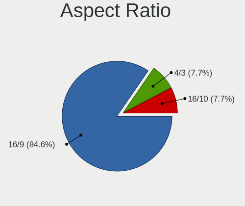
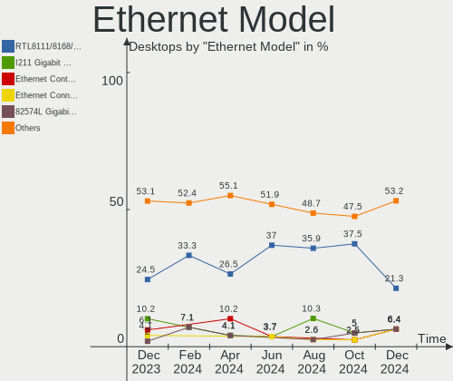
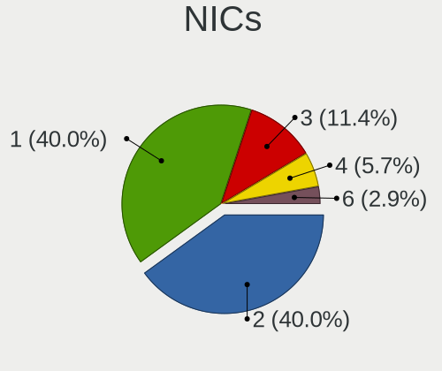
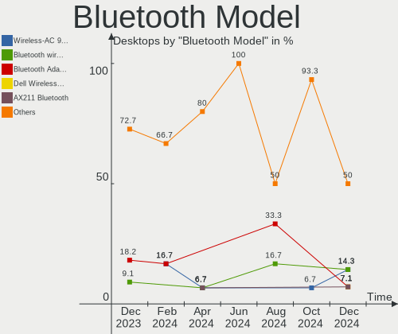

FreeBSD - Hardware Trends (Desktops)
------------------------------------

A project to identify most popular hardware characteristics and track their change
over time based on data collected by BSD users at https://BSD-Hardware.info.

Anyone can contribute to this report by the [hw-probe](https://github.com/linuxhw/hw-probe/blob/master/INSTALL.BSD.md) tool:

    hw-probe -all -upload

This report is for one last month. Overall report since the beginning of time: [TestDays](https://github.com/bsdhw/TestDays)

Period: Aug, 2023.

Contents
--------

* [ System ](#system)
  - [ OS                       ](#os)
  - [ OS Family                ](#os-family)
  - [ Arch                     ](#arch)
  - [ DE                       ](#de)
  - [ Display Server           ](#display-server)
  - [ Display Manager          ](#display-manager)
  - [ OS Lang                  ](#os-lang)
  - [ Boot Mode                ](#boot-mode)
  - [ Filesystem               ](#filesystem)
  - [ Part. scheme             ](#part-scheme)

* [ Board ](#board)
  - [ Vendor                   ](#vendor)
  - [ Model                    ](#model)
  - [ Model Family             ](#model-family)
  - [ MFG Year                 ](#mfg-year)
  - [ Form Factor              ](#form-factor)
  - [ Coreboot                 ](#coreboot)
  - [ RAM Size                 ](#ram-size)
  - [ RAM Used                 ](#ram-used)
  - [ Total Drives             ](#total-drives)
  - [ Has CD-ROM               ](#has-cd-rom)
  - [ Has Ethernet             ](#has-ethernet)
  - [ Has WiFi                 ](#has-wifi)
  - [ Has Bluetooth            ](#has-bluetooth)

* [ Location ](#location)
  - [ Country                  ](#country)
  - [ City                     ](#city)

* [ Drives ](#drives)
  - [ Drive Vendor             ](#drive-vendor)
  - [ Drive Model              ](#drive-model)
  - [ HDD Vendor               ](#hdd-vendor)
  - [ SSD Vendor               ](#ssd-vendor)
  - [ Drive Kind               ](#drive-kind)
  - [ Drive Connector          ](#drive-connector)
  - [ Drive Size               ](#drive-size)
  - [ Space Total              ](#space-total)
  - [ Space Used               ](#space-used)
  - [ Malfunc. Drives          ](#malfunc-drives)
  - [ Malfunc. Drive Vendor    ](#malfunc-drive-vendor)
  - [ Malfunc. HDD Vendor      ](#malfunc-hdd-vendor)
  - [ Malfunc. Drive Kind      ](#malfunc-drive-kind)
  - [ Failed Drives            ](#failed-drives)
  - [ Failed Drive Vendor      ](#failed-drive-vendor)
  - [ Drive Status             ](#drive-status)

* [ Storage controller ](#storage-controller)
  - [ Storage Vendor           ](#storage-vendor)
  - [ Storage Model            ](#storage-model)
  - [ Storage Kind             ](#storage-kind)

* [ Processor ](#processor)
  - [ CPU Vendor               ](#cpu-vendor)
  - [ CPU Model                ](#cpu-model)
  - [ CPU Model Family         ](#cpu-model-family)
  - [ CPU Cores                ](#cpu-cores)
  - [ CPU Sockets              ](#cpu-sockets)
  - [ CPU Threads              ](#cpu-threads)
  - [ CPU Microarch            ](#cpu-microarch)

* [ Graphics ](#graphics)
  - [ GPU Vendor               ](#gpu-vendor)
  - [ GPU Model                ](#gpu-model)
  - [ GPU Combo                ](#gpu-combo)
  - [ GPU Driver               ](#gpu-driver)
  - [ GPU Memory               ](#gpu-memory)

* [ Monitor ](#monitor)
  - [ Monitor Vendor           ](#monitor-vendor)
  - [ Monitor Model            ](#monitor-model)
  - [ Monitor Resolution       ](#monitor-resolution)
  - [ Monitor Diagonal         ](#monitor-diagonal)
  - [ Monitor Width            ](#monitor-width)
  - [ Aspect Ratio             ](#aspect-ratio)
  - [ Monitor Area             ](#monitor-area)
  - [ Pixel Density            ](#pixel-density)
  - [ Multiple Monitors        ](#multiple-monitors)

* [ Network ](#network)
  - [ Net Controller Vendor    ](#net-controller-vendor)
  - [ Net Controller Model     ](#net-controller-model)
  - [ Wireless Vendor          ](#wireless-vendor)
  - [ Wireless Model           ](#wireless-model)
  - [ Ethernet Vendor          ](#ethernet-vendor)
  - [ Ethernet Model           ](#ethernet-model)
  - [ Net Controller Kind      ](#net-controller-kind)
  - [ Used Controller          ](#used-controller)
  - [ NICs                     ](#nics)
  - [ IPv6                     ](#ipv6)

* [ Bluetooth ](#bluetooth)
  - [ Bluetooth Vendor         ](#bluetooth-vendor)
  - [ Bluetooth Model          ](#bluetooth-model)

* [ Sound ](#sound)
  - [ Sound Vendor             ](#sound-vendor)
  - [ Sound Model              ](#sound-model)

* [ Memory ](#memory)
  - [ Memory Vendor            ](#memory-vendor)
  - [ Memory Model             ](#memory-model)
  - [ Memory Kind              ](#memory-kind)
  - [ Memory Form Factor       ](#memory-form-factor)
  - [ Memory Size              ](#memory-size)
  - [ Memory Speed             ](#memory-speed)

* [ Printers & scanners ](#printers--scanners)
  - [ Printer Vendor           ](#printer-vendor)
  - [ Printer Model            ](#printer-model)
  - [ Scanner Vendor           ](#scanner-vendor)
  - [ Scanner Model            ](#scanner-model)

* [ Camera ](#camera)
  - [ Camera Vendor            ](#camera-vendor)
  - [ Camera Model             ](#camera-model)

* [ Security ](#security)
  - [ Fingerprint Vendor       ](#fingerprint-vendor)
  - [ Fingerprint Model        ](#fingerprint-model)
  - [ Chipcard Vendor          ](#chipcard-vendor)
  - [ Chipcard Model           ](#chipcard-model)

* [ Unsupported ](#unsupported)
  - [ Unsupported Devices      ](#unsupported-devices)
  - [ Unsupported Device Types ](#unsupported-device-types)

System
------

OS
--

Installed operating systems

| Name                 | Desktops | Percent |
|----------------------|----------|---------|
| FreeBSD 13.2-p2      | 13       | 52%     |
| FreeBSD 13.2         | 5        | 20%     |
| FreeBSD 15.0-CURRENT | 1        | 4%      |
| FreeBSD 14.0-CURRENT | 1        | 4%      |
| FreeBSD 14.0-ALPHA3  | 1        | 4%      |
| FreeBSD 13.2-STABLE  | 1        | 4%      |
| FreeBSD 13.2-p1      | 1        | 4%      |
| FreeBSD 13.1-p5      | 1        | 4%      |
| FreeBSD 13.0         | 1        | 4%      |

OS Family
---------

OS without a version

| Name    | Desktops | Percent |
|---------|----------|---------|
| FreeBSD | 25       | 100%    |

Arch
----

OS architecture (x86_64, i586, etc.)

| Name  | Desktops | Percent |
|-------|----------|---------|
| amd64 | 23       | 92%     |
| i386  | 1        | 4%      |
| arm64 | 1        | 4%      |

DE
--

Desktop Environment

| Name       | Desktops | Percent |
|------------|----------|---------|
| Console    | 15       | 60%     |
| KDE5       | 3        | 12%     |
| XFCE       | 2        | 8%      |
| MATE       | 2        | 8%      |
| X-Cinnamon | 1        | 4%      |
| TWM        | 1        | 4%      |
| GNOME      | 1        | 4%      |

Display Server
--------------

X11 or Wayland

| Name    | Desktops | Percent |
|---------|----------|---------|
| Console | 16       | 64%     |
| X11     | 8        | 32%     |
| Wayland | 1        | 4%      |

Display Manager
---------------

SDDM, LightDM, etc.

| Name    | Desktops | Percent |
|---------|----------|---------|
| Console | 19       | 76%     |
| SLiM    | 2        | 8%      |
| GDM     | 2        | 8%      |
| XDM     | 1        | 4%      |
| SDDM    | 1        | 4%      |

OS Lang
-------

Language

| Lang    | Desktops | Percent |
|---------|----------|---------|
| C       | 19       | 76%     |
| en_US   | 2        | 8%      |
| Unknown | 2        | 8%      |
| fr_FR   | 1        | 4%      |
| en_GB   | 1        | 4%      |

Boot Mode
---------

EFI or BIOS

| Mode | Desktops | Percent |
|------|----------|---------|
| EFI  | 17       | 68%     |
| BIOS | 8        | 32%     |

Filesystem
----------

Type of filesystem

| Type | Desktops | Percent |
|------|----------|---------|
| Zfs  | 18       | 72%     |
| Ufs  | 7        | 28%     |

Part. scheme
------------

Scheme of partitioning

| Type | Desktops | Percent |
|------|----------|---------|
| GPT  | 24       | 96%     |
| MBR  | 1        | 4%      |

Board
-----

Vendor
------

Motherboard manufacturer

| Name                | Desktops | Percent |
|---------------------|----------|---------|
| MSI                 | 6        | 24%     |
| ASUSTek Computer    | 3        | 12%     |
| Supermicro          | 2        | 8%      |
| PC Engines          | 2        | 8%      |
| Lenovo              | 2        | 8%      |
| Hewlett-Packard     | 2        | 8%      |
| Gigabyte Technology | 2        | 8%      |
| ASRock              | 2        | 8%      |
| SolidRun            | 1        | 4%      |
| Shuttle             | 1        | 4%      |
| Nvidia              | 1        | 4%      |
| ASRockRack          | 1        | 4%      |

Model
-----

Motherboard model

| Name                                   | Desktops | Percent |
|----------------------------------------|----------|---------|
| Supermicro SYS-6017R-TDF               | 1        | 4%      |
| Supermicro M12SWA-TF                   | 1        | 4%      |
| SolidRun CEX7 Platform                 | 1        | 4%      |
| Shuttle DS20U                          | 1        | 4%      |
| PC Engines APU2                        | 1        | 4%      |
| PC Engines apu1                        | 1        | 4%      |
| Nvidia MCP79                           | 1        | 4%      |
| MSI MS-7C37                            | 1        | 4%      |
| MSI MS-7C36                            | 1        | 4%      |
| MSI MS-7C35                            | 1        | 4%      |
| MSI MS-7817                            | 1        | 4%      |
| MSI MS-7529                            | 1        | 4%      |
| MSI 520A5GE                            | 1        | 4%      |
| Lenovo ThinkCentre M90p 3853RN9        | 1        | 4%      |
| Lenovo IdeaCentre 300-20ISH 90DA00HEMT | 1        | 4%      |
| HP Z240 Tower Workstation              | 1        | 4%      |
| HP EliteDesk 800 G3 TWR                | 1        | 4%      |
| Gigabyte Z390 AORUS PRO WIFI           | 1        | 4%      |
| Gigabyte AX370M-DS3H                   | 1        | 4%      |
| ASUS ROG CROSSHAIR VIII HERO           | 1        | 4%      |
| ASUS PRIME X370-PRO                    | 1        | 4%      |
| ASUS P5Q-E                             | 1        | 4%      |
| ASRockRack EPYC3101D4I-2T              | 1        | 4%      |
| ASRock X570 Phantom Gaming 4           | 1        | 4%      |
| ASRock B550 PG Velocita                | 1        | 4%      |

Model Family
------------

Motherboard model prefix

| Name                      | Desktops | Percent |
|---------------------------|----------|---------|
| Supermicro SYS-6017R-TDF  | 1        | 4%      |
| Supermicro M12SWA-TF      | 1        | 4%      |
| SolidRun CEX7             | 1        | 4%      |
| Shuttle DS20U             | 1        | 4%      |
| PC Engines APU2           | 1        | 4%      |
| PC Engines apu1           | 1        | 4%      |
| Nvidia MCP79              | 1        | 4%      |
| MSI MS-7C37               | 1        | 4%      |
| MSI MS-7C36               | 1        | 4%      |
| MSI MS-7C35               | 1        | 4%      |
| MSI MS-7817               | 1        | 4%      |
| MSI MS-7529               | 1        | 4%      |
| MSI 520A5GE               | 1        | 4%      |
| Lenovo ThinkCentre        | 1        | 4%      |
| Lenovo IdeaCentre         | 1        | 4%      |
| HP Z240                   | 1        | 4%      |
| HP EliteDesk              | 1        | 4%      |
| Gigabyte Z390             | 1        | 4%      |
| Gigabyte AX370M-DS3H      | 1        | 4%      |
| ASUS ROG                  | 1        | 4%      |
| ASUS PRIME                | 1        | 4%      |
| ASUS P5Q-E                | 1        | 4%      |
| ASRockRack EPYC3101D4I-2T | 1        | 4%      |
| ASRock X570               | 1        | 4%      |
| ASRock B550               | 1        | 4%      |

MFG Year
--------

Motherboard manufacture year

| Year | Desktops | Percent |
|------|----------|---------|
| 2023 | 6        | 24%     |
| 2019 | 4        | 16%     |
| 2022 | 2        | 8%      |
| 2021 | 2        | 8%      |
| 2016 | 2        | 8%      |
| 2014 | 2        | 8%      |
| 2010 | 2        | 8%      |
| 2020 | 1        | 4%      |
| 2017 | 1        | 4%      |
| 2015 | 1        | 4%      |
| 2009 | 1        | 4%      |
| 2008 | 1        | 4%      |

Form Factor
-----------

Physical design of the computer

| Name    | Desktops | Percent |
|---------|----------|---------|
| Desktop | 25       | 100%    |

Coreboot
--------

Have coreboot on board

| Used | Desktops | Percent |
|------|----------|---------|
| No   | 23       | 92%     |
| Yes  | 2        | 8%      |

RAM Size
--------

Total RAM memory

| Size in GB      | Desktops | Percent |
|-----------------|----------|---------|
| 32.01-64.0      | 8        | 32%     |
| 4.01-8.0        | 4        | 16%     |
| 64.01-256.0     | 4        | 16%     |
| 16.01-24.0      | 4        | 16%     |
| 2.01-3.0        | 2        | 8%      |
| 8.01-16.0       | 2        | 8%      |
| More than 256.0 | 1        | 4%      |

RAM Used
--------

Used RAM memory

| Used GB  | Desktops | Percent |
|----------|----------|---------|
| 0.51-1.0 | 8        | 32%     |
| 0.01-0.5 | 7        | 28%     |
| 1.01-2.0 | 5        | 20%     |
| 4.01-8.0 | 2        | 8%      |
| 3.01-4.0 | 2        | 8%      |
| 2.01-3.0 | 1        | 4%      |

Total Drives
------------

Number of drives on board

| Drives | Desktops | Percent |
|--------|----------|---------|
| 2      | 6        | 24%     |
| 1      | 5        | 20%     |
| 4      | 4        | 16%     |
| 3      | 4        | 16%     |
| 24     | 1        | 4%      |
| 13     | 1        | 4%      |
| 8      | 1        | 4%      |
| 7      | 1        | 4%      |
| 5      | 1        | 4%      |
| 0      | 1        | 4%      |

Has CD-ROM
----------

Has CD-ROM on board

| Presented | Desktops | Percent |
|-----------|----------|---------|
| No        | 16       | 64%     |
| Yes       | 9        | 36%     |

Has Ethernet
------------

Has Ethernet on board

| Presented | Desktops | Percent |
|-----------|----------|---------|
| Yes       | 24       | 96%     |
| No        | 1        | 4%      |

Has WiFi
--------

Has WiFi module

| Presented | Desktops | Percent |
|-----------|----------|---------|
| No        | 18       | 72%     |
| Yes       | 7        | 28%     |

Has Bluetooth
-------------

Has Bluetooth module

| Presented | Desktops | Percent |
|-----------|----------|---------|
| No        | 21       | 84%     |
| Yes       | 4        | 16%     |

Location
--------

Country
-------

Geographic location (country)

| Country     | Desktops | Percent |
|-------------|----------|---------|
| USA         | 8        | 32%     |
| Russia      | 3        | 12%     |
| Germany     | 3        | 12%     |
| Czechia     | 2        | 8%      |
| UK          | 1        | 4%      |
| Thailand    | 1        | 4%      |
| Sweden      | 1        | 4%      |
| Netherlands | 1        | 4%      |
| Japan       | 1        | 4%      |
| France      | 1        | 4%      |
| China       | 1        | 4%      |
| Canada      | 1        | 4%      |
| Brazil      | 1        | 4%      |

City
----

Geographic location (city)

| City          | Desktops | Percent |
|---------------|----------|---------|
| Hamburg       | 3        | 12%     |
| St Petersburg | 2        | 8%      |
| Salem         | 2        | 8%      |
| Redmond       | 2        | 8%      |
| York          | 1        | 4%      |
| Wenatchee     | 1        | 4%      |
| Vancouver     | 1        | 4%      |
| Umeda         | 1        | 4%      |
| Svanesund     | 1        | 4%      |
| Stourbridge   | 1        | 4%      |
| Prague        | 1        | 4%      |
| Osasco        | 1        | 4%      |
| Moscow        | 1        | 4%      |
| Lorient       | 1        | 4%      |
| Grand Rapids  | 1        | 4%      |
| Chongqing     | 1        | 4%      |
| Carbondale    | 1        | 4%      |
| Brdo          | 1        | 4%      |
| Bangkok       | 1        | 4%      |
| Amsterdam     | 1        | 4%      |

Drives
------

Drive Vendor
------------

Hard drive vendors

| Vendor              | Desktops | Drives | Percent |
|---------------------|----------|--------|---------|
| WDC                 | 11       | 33     | 24.44%  |
| Seagate             | 9        | 16     | 20%     |
| Samsung Electronics | 7        | 19     | 15.56%  |
| Crucial             | 4        | 4      | 8.89%   |
| Kingston            | 2        | 2      | 4.44%   |
| Intel               | 2        | 2      | 4.44%   |
| Hitachi             | 2        | 2      | 4.44%   |
| Toshiba             | 1        | 23     | 2.22%   |
| SK hynix            | 1        | 1      | 2.22%   |
| Micron Technology   | 1        | 1      | 2.22%   |
| Maxtor              | 1        | 1      | 2.22%   |
| KingSpec            | 1        | 1      | 2.22%   |
| HGST                | 1        | 1      | 2.22%   |
| Corsair             | 1        | 1      | 2.22%   |
| China               | 1        | 1      | 2.22%   |

Drive Model
-----------

Hard drive models

| Model                                  | Desktops | Percent |
|----------------------------------------|----------|---------|
| Seagate ST4000DM000-1F2168 4TB         | 2        | 2.86%   |
| Samsung SSD 860 EVO 500GB              | 2        | 2.86%   |
| Crucial CT1000P1SSD8 1TB               | 2        | 2.86%   |
| WDC WDS100T3X0C-00SJG0 1TB             | 1        | 1.43%   |
| WDC WDS100T1X0E-00AFY0 1TB             | 1        | 1.43%   |
| WDC WD80EZAZ-11TDBA0 8TB               | 1        | 1.43%   |
| WDC WD80EMAZ-00WJTA0 8TB               | 1        | 1.43%   |
| WDC WD80EFZX-68UW8N0 8TB               | 1        | 1.43%   |
| WDC WD80EFAX-68LHPN0 8TB               | 1        | 1.43%   |
| WDC WD80EDBZ-11B0ZA0 8TB               | 1        | 1.43%   |
| WDC WD60EZRZ-00GZ5B1 6TB               | 1        | 1.43%   |
| WDC WD5000HHTZ-04N21V0 500GB           | 1        | 1.43%   |
| WDC WD4500HLHX-01JJPV0 450GB           | 1        | 1.43%   |
| WDC WD40EZRZ-22GXCB0 4TB               | 1        | 1.43%   |
| WDC WD40EFRX-68N32N0 4TB               | 1        | 1.43%   |
| WDC WD4005FZBX-00K5WB0 4TB             | 1        | 1.43%   |
| WDC WD3003FZEX-00Z4SA0 3TB             | 1        | 1.43%   |
| WDC WD3000FYYZ-05UL1B0 3TB             | 1        | 1.43%   |
| WDC WD20EURX-63T0FY0 2TB               | 1        | 1.43%   |
| WDC WD1600AAJS-60WAA0 160GB            | 1        | 1.43%   |
| WDC WD15EARS-00Z5B1 1.5TB              | 1        | 1.43%   |
| WDC WD15EARS-00MVWB0 1.5TB             | 1        | 1.43%   |
| WDC WD15EADS-00P8B0 1.5TB              | 1        | 1.43%   |
| WDC WD120EMFZ-11A6JA0 12TB             | 1        | 1.43%   |
| WDC WD120EMAZ-11BLFA0 12TB             | 1        | 1.43%   |
| WDC WD1003FBYX-18Y7B0 1TB              | 1        | 1.43%   |
| Toshiba MG08ADA400E 4TB                | 1        | 1.43%   |
| Toshiba HDWQ140 4TB                    | 1        | 1.43%   |
| Toshiba HDWG440 4TB                    | 1        | 1.43%   |
| Toshiba HDWE140 4TB                    | 1        | 1.43%   |
| Toshiba HDWD130 3TB                    | 1        | 1.43%   |
| Toshiba DT01ACA300 3TB                 | 1        | 1.43%   |
| SK hynix SKHynix_HFS512GDE9X084N 512GB | 1        | 1.43%   |
| Seagate ST9100824AS 100GB              | 1        | 1.43%   |
| Seagate ST8000AS0002-1NA17Z 8TB        | 1        | 1.43%   |
| Seagate ST4000LM024-2AN17V 4TB         | 1        | 1.43%   |
| Seagate ST4000DM004-2U9104 4TB         | 1        | 1.43%   |
| Seagate ST4000DM004-2CV104 4TB         | 1        | 1.43%   |
| Seagate ST3450857SS 450GB              | 1        | 1.43%   |
| Seagate ST2000DM006-2DM164 2TB         | 1        | 1.43%   |

HDD Vendor
----------

Hard disk drive vendors

| Vendor  | Desktops | Drives | Percent |
|---------|----------|--------|---------|
| WDC     | 10       | 31     | 41.67%  |
| Seagate | 9        | 16     | 37.5%   |
| Hitachi | 2        | 2      | 8.33%   |
| Toshiba | 1        | 23     | 4.17%   |
| Maxtor  | 1        | 1      | 4.17%   |
| HGST    | 1        | 1      | 4.17%   |

SSD Vendor
----------

Solid state drive vendors

| Vendor              | Desktops | Drives | Percent |
|---------------------|----------|--------|---------|
| Samsung Electronics | 7        | 18     | 58.33%  |
| Micron Technology   | 1        | 1      | 8.33%   |
| KingSpec            | 1        | 1      | 8.33%   |
| Intel               | 1        | 1      | 8.33%   |
| Crucial             | 1        | 1      | 8.33%   |
| China               | 1        | 1      | 8.33%   |

Drive Kind
----------

HDD or SSD

| Kind | Desktops | Drives | Percent |
|------|----------|--------|---------|
| HDD  | 17       | 74     | 45.95%  |
| NVMe | 10       | 11     | 27.03%  |
| SSD  | 10       | 23     | 27.03%  |

Drive Connector
---------------

SATA, SAS, NVMe, etc.

| Type | Desktops | Drives | Percent |
|------|----------|--------|---------|
| SATA | 22       | 97     | 68.75%  |
| NVMe | 10       | 11     | 31.25%  |

Drive Size
----------

Size of hard drive

| Size in TB | Desktops | Drives | Percent |
|------------|----------|--------|---------|
| 0.01-0.5   | 11       | 18     | 28.95%  |
| 3.01-4.0   | 7        | 24     | 18.42%  |
| 1.01-2.0   | 7        | 11     | 18.42%  |
| 0.51-1.0   | 6        | 11     | 15.79%  |
| 4.01-10.0  | 4        | 21     | 10.53%  |
| 2.01-3.0   | 2        | 10     | 5.26%   |
| 10.01-20.0 | 1        | 2      | 2.63%   |

Space Total
-----------

Amount of disk space available on the file system

| Size in GB     | Desktops | Percent |
|----------------|----------|---------|
| 251-500        | 7        | 28%     |
| 101-250        | 6        | 24%     |
| 501-1000       | 5        | 20%     |
| 1001-2000      | 2        | 8%      |
| 51-100         | 2        | 8%      |
| More than 3000 | 1        | 4%      |
| 2001-3000      | 1        | 4%      |
| 1-20           | 1        | 4%      |

Space Used
----------

Amount of used disk space

| Used GB   | Desktops | Percent |
|-----------|----------|---------|
| 1-20      | 16       | 64%     |
| 21-50     | 5        | 20%     |
| 501-1000  | 2        | 8%      |
| 251-500   | 1        | 4%      |
| 1001-2000 | 1        | 4%      |

Malfunc. Drives
---------------

Drive models with a malfunction

| Model                           | Desktops | Drives | Percent |
|---------------------------------|----------|--------|---------|
| WDC WD4500HLHX-01JJPV0 450GB    | 1        | 1      | 9.09%   |
| WDC WD3000FYYZ-05UL1B0 3TB      | 1        | 1      | 9.09%   |
| WDC WD15EARS-00Z5B1 1.5TB       | 1        | 1      | 9.09%   |
| WDC WD15EARS-00MVWB0 1.5TB      | 1        | 1      | 9.09%   |
| Toshiba HDWE140 4TB             | 1        | 3      | 9.09%   |
| Seagate ST9100824AS 100GB       | 1        | 1      | 9.09%   |
| Seagate ST8000AS0002-1NA17Z 8TB | 1        | 1      | 9.09%   |
| Maxtor STM380215AS 80GB         | 1        | 1      | 9.09%   |
| Hitachi HDS721680PLA380 80GB    | 1        | 1      | 9.09%   |
| HGST HTS541010A7E630 1TB        | 1        | 1      | 9.09%   |
| Crucial CT2000MX500SSD1 2TB     | 1        | 1      | 9.09%   |

Malfunc. Drive Vendor
---------------------

Vendors of faulty drives

| Vendor  | Desktops | Drives | Percent |
|---------|----------|--------|---------|
| WDC     | 2        | 4      | 22.22%  |
| Seagate | 2        | 2      | 22.22%  |
| Toshiba | 1        | 3      | 11.11%  |
| Maxtor  | 1        | 1      | 11.11%  |
| Hitachi | 1        | 1      | 11.11%  |
| HGST    | 1        | 1      | 11.11%  |
| Crucial | 1        | 1      | 11.11%  |

Malfunc. HDD Vendor
-------------------

Vendors of faulty HDD drives

| Vendor  | Desktops | Drives | Percent |
|---------|----------|--------|---------|
| WDC     | 2        | 4      | 25%     |
| Seagate | 2        | 2      | 25%     |
| Toshiba | 1        | 3      | 12.5%   |
| Maxtor  | 1        | 1      | 12.5%   |
| Hitachi | 1        | 1      | 12.5%   |
| HGST    | 1        | 1      | 12.5%   |

Malfunc. Drive Kind
-------------------

Kinds of faulty drives

| Kind | Desktops | Drives | Percent |
|------|----------|--------|---------|
| HDD  | 6        | 12     | 85.71%  |
| SSD  | 1        | 1      | 14.29%  |

Failed Drives
-------------

Failed drive models

Zero info for selected period =(

Failed Drive Vendor
-------------------

Failed drive vendors

Zero info for selected period =(

Drive Status
------------

Number of failed and malfunc. drives

| Status  | Desktops | Drives | Percent |
|---------|----------|--------|---------|
| Works   | 22       | 95     | 75.86%  |
| Malfunc | 7        | 13     | 24.14%  |

Storage controller
------------------

Storage Vendor
--------------

Storage controller vendors

| Vendor                      | Desktops | Percent |
|-----------------------------|----------|---------|
| AMD                         | 13       | 26.53%  |
| Intel                       | 10       | 20.41%  |
| Broadcom / LSI              | 5        | 10.2%   |
| ASMedia Technology          | 4        | 8.16%   |
| Samsung Electronics         | 3        | 6.12%   |
| Micron/Crucial Technology   | 3        | 6.12%   |
| SK hynix                    | 2        | 4.08%   |
| SanDisk                     | 2        | 4.08%   |
| Marvell Technology Group    | 2        | 4.08%   |
| Kingston Technology Company | 2        | 4.08%   |
| Phison Electronics          | 1        | 2.04%   |
| Nvidia                      | 1        | 2.04%   |
| MAXIO Technology (Hangzhou) | 1        | 2.04%   |

Storage Model
-------------

Storage controller models

| Model                                                                          | Desktops | Percent |
|--------------------------------------------------------------------------------|----------|---------|
| AMD FCH SATA Controller [AHCI mode]                                            | 10       | 18.18%  |
| ASMedia ASM1062 Serial ATA Controller                                          | 3        | 5.45%   |
| Micron/Crucial P1 NVMe PCIe SSD[Frampton]                                      | 2        | 3.64%   |
| Intel Q170/Q150/B150/H170/H110/Z170/CM236 Chipset SATA Controller [AHCI Mode]  | 2        | 3.64%   |
| Broadcom / LSI SAS3008 PCI-Express Fusion-MPT SAS-3                            | 2        | 3.64%   |
| AMD X370 Series Chipset SATA Controller                                        | 2        | 3.64%   |
| AMD 500 Series Chipset SATA Controller                                         | 2        | 3.64%   |
| SK hynix Platinum P41/PC801 NVMe Solid State Drive                             | 1        | 1.82%   |
| SK hynix Gold P31/BC711/PC711 NVMe Solid State Drive                           | 1        | 1.82%   |
| SanDisk WD PC SN810 / Black SN850 NVMe SSD                                     | 1        | 1.82%   |
| SanDisk WD Black SN750 / PC SN730 NVMe SSD                                     | 1        | 1.82%   |
| Samsung NVMe SSD Controller SM981/PM981/PM983                                  | 1        | 1.82%   |
| Samsung NVMe SSD Controller SM961/PM961/SM963                                  | 1        | 1.82%   |
| Samsung NVMe SSD Controller PM9A1/PM9A3/980PRO                                 | 1        | 1.82%   |
| Phison E16 PCIe4 NVMe Controller                                               | 1        | 1.82%   |
| Nvidia MCP79 AHCI Controller                                                   | 1        | 1.82%   |
| Micron/Crucial P5 Plus NVMe PCIe SSD                                           | 1        | 1.82%   |
| MAXIO (Hangzhou) NVMe SSD Controller MAP1202                                   | 1        | 1.82%   |
| Marvell Group 88SE9215 PCIe 2.0 x1 4-port SATA 6 Gb/s Controller               | 1        | 1.82%   |
| Marvell Group 88SE6111/6121 SATA II / PATA Controller                          | 1        | 1.82%   |
| Kingston Company KC3000/Renegade NVMe SSD                                      | 1        | 1.82%   |
| Intel SSD 600P Series                                                          | 1        | 1.82%   |
| Intel NM10/ICH7 Family SATA Controller [IDE mode]                              | 1        | 1.82%   |
| Intel Comet Lake SATA AHCI Controller                                          | 1        | 1.82%   |
| Intel Cannon Lake PCH SATA AHCI Controller                                     | 1        | 1.82%   |
| Intel C602 chipset 4-Port SATA Storage Control Unit                            | 1        | 1.82%   |
| Intel C600/X79 series chipset 6-Port SATA AHCI Controller                      | 1        | 1.82%   |
| Intel 82801JI (ICH10 Family) 4 port SATA IDE Controller #1                     | 1        | 1.82%   |
| Intel 82801JI (ICH10 Family) 2 port SATA IDE Controller #2                     | 1        | 1.82%   |
| Intel 82801G (ICH7 Family) IDE Controller                                      | 1        | 1.82%   |
| Intel 8 Series/C220 Series Chipset Family 6-port SATA Controller 1 [AHCI mode] | 1        | 1.82%   |
| Intel 5 Series/3400 Series Chipset 6 port SATA AHCI Controller                 | 1        | 1.82%   |
| Intel 200 Series PCH SATA controller [AHCI mode]                               | 1        | 1.82%   |
| Broadcom / LSI SAS2308 PCI-Express Fusion-MPT SAS-2                            | 1        | 1.82%   |
| Broadcom / LSI SAS2008 PCI-Express Fusion-MPT SAS-2 [Falcon]                   | 1        | 1.82%   |
| Broadcom / LSI 53c1030 PCI-X Fusion-MPT Dual Ultra320 SCSI                     | 1        | 1.82%   |
| ASMedia ASM1166 Serial ATA Controller                                          | 1        | 1.82%   |
| AMD SB7x0/SB8x0/SB9x0 SATA Controller [AHCI mode]                              | 1        | 1.82%   |
| Unknown                                                                        | 1        | 1.82%   |

Storage Kind
------------

Kind of storage controller (IDE, SATA, NVMe, SAS, ...)

| Kind | Desktops | Percent |
|------|----------|---------|
| SATA | 22       | 51.16%  |
| NVMe | 13       | 30.23%  |
| SAS  | 5        | 11.63%  |
| IDE  | 2        | 4.65%   |
| SCSI | 1        | 2.33%   |

Processor
---------

CPU Vendor
----------

Processor vendors

| Vendor | Desktops | Percent |
|--------|----------|---------|
| AMD    | 13       | 52%     |
| Intel  | 11       | 44%     |
| NXP    | 1        | 4%      |

CPU Model
---------

Processor models

| Model                                      | Desktops | Percent |
|--------------------------------------------|----------|---------|
| AMD Ryzen 9 3900X 12-Core Processor        | 2        | 8%      |
| AMD Ryzen 7 1700 Eight-Core Processor      | 2        | 8%      |
| NXP Cortex-A72                             | 1        | 4%      |
| Intel Xeon CPU E5-2630 v2 @ 2.60GHz        | 1        | 4%      |
| Intel Pentium CPU G3220 @ 3.00GHz          | 1        | 4%      |
| Intel Core i7-9700K CPU @ 3.60GHz          | 1        | 4%      |
| Intel Core i7-7700K CPU @ 4.20GHz          | 1        | 4%      |
| Intel Core i7-7700 CPU @ 3.60GHz           | 1        | 4%      |
| Intel Core i5-6400 CPU @ 2.70GHz           | 1        | 4%      |
| Intel Core i5 CPU 650 @ 3.20GHz            | 1        | 4%      |
| Intel Core 2 Quad CPU Q8400 @ 2.66GHz      | 1        | 4%      |
| Intel Core 2 Quad CPU Q6600 @ 2.40GHz      | 1        | 4%      |
| Intel Celeron CPU 5205U @ 1.90GHz          | 1        | 4%      |
| Intel Atom CPU 230 @ 1.60GHz               | 1        | 4%      |
| AMD Ryzen Threadripper PRO 3975WX 32-Cores | 1        | 4%      |
| AMD Ryzen 9 5950X 16-Core Processor        | 1        | 4%      |
| AMD Ryzen 9 5900X 12-Core Processor        | 1        | 4%      |
| AMD Ryzen 7 3800X 8-Core Processor         | 1        | 4%      |
| AMD Ryzen 7 3700X 8-Core Processor         | 1        | 4%      |
| AMD Ryzen 5 5600G with Radeon Graphics     | 1        | 4%      |
| AMD GX-412TC SOC                           | 1        | 4%      |
| AMD G-T40E Processor                       | 1        | 4%      |
| AMD EPYC 3101 4-Core Processor             | 1        | 4%      |

CPU Model Family
----------------

Processor model prefix

| Model                  | Desktops | Percent |
|------------------------|----------|---------|
| AMD Ryzen 9            | 4        | 16%     |
| AMD Ryzen 7            | 4        | 16%     |
| Intel Core i7          | 3        | 12%     |
| Intel Core i5          | 2        | 8%      |
| Intel Core 2 Quad      | 2        | 8%      |
| Other                  | 1        | 4%      |
| Intel Xeon             | 1        | 4%      |
| Intel Pentium          | 1        | 4%      |
| Intel Celeron          | 1        | 4%      |
| Intel Atom             | 1        | 4%      |
| AMD Ryzen Threadripper | 1        | 4%      |
| AMD Ryzen 5            | 1        | 4%      |
| AMD GX                 | 1        | 4%      |
| AMD G                  | 1        | 4%      |
| AMD EPYC               | 1        | 4%      |

CPU Cores
---------

Number of processor cores

| Number  | Desktops | Percent |
|---------|----------|---------|
| 4       | 7        | 28%     |
| 16      | 4        | 16%     |
| 2       | 4        | 16%     |
| 24      | 3        | 12%     |
| 32      | 2        | 8%      |
| 12      | 2        | 8%      |
| 8       | 1        | 4%      |
| 1       | 1        | 4%      |
| Unknown | 1        | 4%      |

CPU Sockets
-----------

Number of sockets

| Number | Desktops | Percent |
|--------|----------|---------|
| 1      | 24       | 96%     |
| 2      | 1        | 4%      |

CPU Threads
-----------

Threads per core (Hyper-Threading)

| Number  | Desktops | Percent |
|---------|----------|---------|
| 1       | 19       | 76%     |
| 2       | 5        | 20%     |
| Unknown | 1        | 4%      |

CPU Microarch
-------------

Microarchitecture

| Name      | Desktops | Percent |
|-----------|----------|---------|
| Zen 2     | 5        | 20%     |
| KabyLake  | 4        | 16%     |
| Zen 3     | 3        | 12%     |
| Zen       | 3        | 12%     |
| Westmere  | 1        | 4%      |
| Skylake   | 1        | 4%      |
| Puma      | 1        | 4%      |
| Penryn    | 1        | 4%      |
| IvyBridge | 1        | 4%      |
| Haswell   | 1        | 4%      |
| Core      | 1        | 4%      |
| Bonnell   | 1        | 4%      |
| Bobcat    | 1        | 4%      |
| Unknown   | 1        | 4%      |

Graphics
--------

GPU Vendor
----------

Vendors of graphics cards

| Vendor            | Desktops | Percent |
|-------------------|----------|---------|
| Nvidia            | 8        | 36.36%  |
| Intel             | 7        | 31.82%  |
| AMD               | 5        | 22.73%  |
| ASPEED Technology | 2        | 9.09%   |

GPU Model
---------

Graphics card models

| Model                                                                       | Desktops | Percent |
|-----------------------------------------------------------------------------|----------|---------|
| Intel HD Graphics 630                                                       | 2        | 9.09%   |
| ASPEED Technology ASPEED Graphics Family                                    | 2        | 9.09%   |
| Nvidia TU104 [GeForce RTX 2080]                                             | 1        | 4.55%   |
| Nvidia GT218 [NVS 300]                                                      | 1        | 4.55%   |
| Nvidia GP108 [GeForce GT 1030]                                              | 1        | 4.55%   |
| Nvidia GP107 [GeForce GTX 1050]                                             | 1        | 4.55%   |
| Nvidia GP106 [GeForce GTX 1060 3GB]                                         | 1        | 4.55%   |
| Nvidia GM206 [GeForce GTX 960]                                              | 1        | 4.55%   |
| Nvidia GA102 [GeForce RTX 3080 12GB]                                        | 1        | 4.55%   |
| Nvidia C79 [ION]                                                            | 1        | 4.55%   |
| Intel Xeon E3-1200 v3/4th Gen Core Processor Integrated Graphics Controller | 1        | 4.55%   |
| Intel HD Graphics 530                                                       | 1        | 4.55%   |
| Intel Core Processor Integrated Graphics Controller                         | 1        | 4.55%   |
| Intel Comet Lake-U GT2 [UHD Graphics 620]                                   | 1        | 4.55%   |
| Intel 82G33/G31 Express Integrated Graphics Controller                      | 1        | 4.55%   |
| AMD RV730 XT [Radeon HD 4670]                                               | 1        | 4.55%   |
| AMD Pitcairn PRO [Radeon HD 7850 / R7 265 / R9 270 1024SP]                  | 1        | 4.55%   |
| AMD Navi 10 [Radeon RX 5600 OEM/5600 XT / 5700/5700 XT]                     | 1        | 4.55%   |
| AMD Cezanne [Radeon Vega Series / Radeon Vega Mobile Series]                | 1        | 4.55%   |
| AMD Cedar [Radeon HD 5000/6000/7350/8350 Series]                            | 1        | 4.55%   |

GPU Combo
---------

Combinations of graphics cards

| Name       | Desktops | Percent |
|------------|----------|---------|
| 1 x Nvidia | 8        | 32%     |
| 1 x Intel  | 7        | 28%     |
| 1 x AMD    | 5        | 20%     |
| Other      | 3        | 12%     |
| 1 x ASPEED | 2        | 8%      |

GPU Driver
----------

Free vs proprietary

| Driver      | Desktops | Percent |
|-------------|----------|---------|
| Free        | 18       | 72%     |
| Unknown     | 4        | 16%     |
| Proprietary | 3        | 12%     |

GPU Memory
----------

Total video memory

| Size in GB | Desktops | Percent |
|------------|----------|---------|
| Unknown    | 18       | 72%     |
| 1.01-2.0   | 2        | 8%      |
| 7.01-8.0   | 1        | 4%      |
| 3.01-4.0   | 1        | 4%      |
| 8.01-16.0  | 1        | 4%      |
| 0.51-1.0   | 1        | 4%      |
| 0.01-0.5   | 1        | 4%      |

Monitor
-------

Monitor Vendor
--------------

Monitor vendors

| Vendor          | Desktops | Percent |
|-----------------|----------|---------|
| Dell            | 4        | 40%     |
| Unknown         | 1        | 10%     |
| Microstep       | 1        | 10%     |
| Hewlett-Packard | 1        | 10%     |
| Goldstar        | 1        | 10%     |
| AOC             | 1        | 10%     |
| Acer            | 1        | 10%     |

Monitor Model
-------------

Monitor models

| Model                                                       | Desktops | Percent |
|-------------------------------------------------------------|----------|---------|
| Unknown LCD Monitor KJT4K2K60DP 3840x2160                   | 1        | 9.09%   |
| Microstep LCD Monitor MSI G2412 1920x1080                   | 1        | 9.09%   |
| Hewlett-Packard Z24i HWP309F 1920x1200 520x320mm 24.0-inch  | 1        | 9.09%   |
| Goldstar 2D FHD LG TV GSM59C4 1920x1080 510x290mm 23.1-inch | 1        | 9.09%   |
| Dell U2414H DELA0A4 1920x1080 530x300mm 24.0-inch           | 1        | 9.09%   |
| Dell U2412M DELA07A 1920x1200 520x320mm 24.0-inch           | 1        | 9.09%   |
| Dell U2311H DELA060 1920x1080 510x290mm 23.1-inch           | 1        | 9.09%   |
| Dell S2721DS DELA19C 2560x1440 590x330mm 26.6-inch          | 1        | 9.09%   |
| Dell LCD Monitor U2412M 1920x1200                           | 1        | 9.09%   |
| AOC U2790B AOC2790 3840x2160 600x340mm 27.2-inch            | 1        | 9.09%   |
| Acer S220HQL ACR0281 1920x1080 480x270mm 21.7-inch          | 1        | 9.09%   |

Monitor Resolution
------------------

Monitor screen resolution

| Resolution        | Desktops | Percent |
|-------------------|----------|---------|
| 1920x1080 (FHD)   | 5        | 50%     |
| 3840x2160 (4K)    | 2        | 20%     |
| 1920x1200 (WUXGA) | 2        | 20%     |
| 2560x1440 (QHD)   | 1        | 10%     |

Monitor Diagonal
----------------

Diagonal size in inches

| Inches  | Desktops | Percent |
|---------|----------|---------|
| 24      | 3        | 27.27%  |
| Unknown | 3        | 27.27%  |
| 23      | 2        | 18.18%  |
| 27      | 1        | 9.09%   |
| 26      | 1        | 9.09%   |
| 21      | 1        | 9.09%   |

Monitor Width
-------------

Physical width

| Width in mm | Desktops | Percent |
|-------------|----------|---------|
| 501-600     | 6        | 60%     |
| Unknown     | 3        | 30%     |
| 401-500     | 1        | 10%     |

Aspect Ratio
------------

Proportional relationship between the width and the height

| Ratio   | Desktops | Percent |
|---------|----------|---------|
| 16/9    | 6        | 54.55%  |
| Unknown | 3        | 27.27%  |
| 16/10   | 2        | 18.18%  |

Monitor Area
------------

Area in inch²

| Area in inch² | Desktops | Percent |
|----------------|----------|---------|
| 201-250        | 4        | 36.36%  |
| Unknown        | 3        | 27.27%  |
| 301-350        | 2        | 18.18%  |
| 251-300        | 2        | 18.18%  |

Pixel Density
-------------

Pixels per inch

| Density | Desktops | Percent |
|---------|----------|---------|
| 51-100  | 5        | 45.45%  |
| Unknown | 3        | 27.27%  |
| 101-120 | 2        | 18.18%  |
| 161-240 | 1        | 9.09%   |

Multiple Monitors
-----------------

Total monitors connected

| Total | Desktops | Percent |
|-------|----------|---------|
| 0     | 15       | 60%     |
| 1     | 9        | 36%     |
| 2     | 1        | 4%      |

Network
-------

Net Controller Vendor
---------------------

Controller vendors

| Vendor                   | Desktops | Percent |
|--------------------------|----------|---------|
| Intel                    | 16       | 44.44%  |
| Realtek Semiconductor    | 11       | 30.56%  |
| Qualcomm Atheros         | 2        | 5.56%   |
| Aquantia                 | 2        | 5.56%   |
| Nvidia                   | 1        | 2.78%   |
| MYRICOM                  | 1        | 2.78%   |
| Mellanox Technologies    | 1        | 2.78%   |
| Marvell Technology Group | 1        | 2.78%   |
| American Megatrends      | 1        | 2.78%   |

Net Controller Model
--------------------

Controller models

| Model                                                              | Desktops | Percent |
|--------------------------------------------------------------------|----------|---------|
| Realtek RTL8111/8168/8411 PCI Express Gigabit Ethernet Controller  | 6        | 14.29%  |
| Intel I211 Gigabit Network Connection                              | 6        | 14.29%  |
| Realtek RTL8125 2.5GbE Controller                                  | 3        | 7.14%   |
| Intel Wi-Fi 6 AX200                                                | 2        | 4.76%   |
| Intel I210 Gigabit Network Connection                              | 2        | 4.76%   |
| Realtek RTL8169 PCI Gigabit Ethernet Controller                    | 1        | 2.38%   |
| Realtek RTL810xE PCI Express Fast Ethernet controller              | 1        | 2.38%   |
| Realtek 8811CU Wireless LAN 802.11ac USB NIC                       | 1        | 2.38%   |
| Qualcomm Atheros AR9462 Wireless Network Adapter                   | 1        | 2.38%   |
| Qualcomm Atheros AR928X Wireless Network Adapter (PCI-Express)     | 1        | 2.38%   |
| Nvidia MCP79 Ethernet                                              | 1        | 2.38%   |
| MYRICOM Myri-10G Dual-Protocol NIC                                 | 1        | 2.38%   |
| Mellanox MT27500 Family [ConnectX-3]                               | 1        | 2.38%   |
| Marvell Group 88E8056 PCI-E Gigabit Ethernet Controller            | 1        | 2.38%   |
| Marvell Group 88E8001 Gigabit Ethernet Controller                  | 1        | 2.38%   |
| Intel I350 Gigabit Network Connection                              | 1        | 2.38%   |
| Intel Ethernet Controller X550                                     | 1        | 2.38%   |
| Intel Ethernet Connection (7) I219-V                               | 1        | 2.38%   |
| Intel Ethernet Connection (5) I219-LM                              | 1        | 2.38%   |
| Intel Ethernet Connection (2) I219-LM                              | 1        | 2.38%   |
| Intel Ethernet Connection (10) I219-LM                             | 1        | 2.38%   |
| Intel Dual Band Wireless-AC 3168NGW [Stone Peak]                   | 1        | 2.38%   |
| Intel Cannon Lake PCH CNVi WiFi                                    | 1        | 2.38%   |
| Intel 82578DM Gigabit Network Connection                           | 1        | 2.38%   |
| Intel 82574L Gigabit Network Connection                            | 1        | 2.38%   |
| Aquantia AQC113C NBase-T/IEEE 802.3bz Ethernet Controller [AQtion] | 1        | 2.38%   |
| Aquantia AQC107 NBase-T/IEEE 802.3bz Ethernet Controller [AQtion]  | 1        | 2.38%   |
| American Megatrends Virtual Ethernet                               | 1        | 2.38%   |

Wireless Vendor
---------------

Wireless vendors

| Vendor                | Desktops | Percent |
|-----------------------|----------|---------|
| Intel                 | 4        | 57.14%  |
| Qualcomm Atheros      | 2        | 28.57%  |
| Realtek Semiconductor | 1        | 14.29%  |

Wireless Model
--------------

Wireless models

| Model                                                          | Desktops | Percent |
|----------------------------------------------------------------|----------|---------|
| Intel Wi-Fi 6 AX200                                            | 2        | 28.57%  |
| Realtek 8811CU Wireless LAN 802.11ac USB NIC                   | 1        | 14.29%  |
| Qualcomm Atheros AR9462 Wireless Network Adapter               | 1        | 14.29%  |
| Qualcomm Atheros AR928X Wireless Network Adapter (PCI-Express) | 1        | 14.29%  |
| Intel Dual Band Wireless-AC 3168NGW [Stone Peak]               | 1        | 14.29%  |
| Intel Cannon Lake PCH CNVi WiFi                                | 1        | 14.29%  |

Ethernet Vendor
---------------

Ethernet vendors

| Vendor                   | Desktops | Percent |
|--------------------------|----------|---------|
| Intel                    | 15       | 48.39%  |
| Realtek Semiconductor    | 10       | 32.26%  |
| Aquantia                 | 2        | 6.45%   |
| Nvidia                   | 1        | 3.23%   |
| MYRICOM                  | 1        | 3.23%   |
| Marvell Technology Group | 1        | 3.23%   |
| American Megatrends      | 1        | 3.23%   |

Ethernet Model
--------------

Ethernet models

| Model                                                              | Desktops | Percent |
|--------------------------------------------------------------------|----------|---------|
| Realtek RTL8111/8168/8411 PCI Express Gigabit Ethernet Controller  | 6        | 18.18%  |
| Intel I211 Gigabit Network Connection                              | 6        | 18.18%  |
| Realtek RTL8125 2.5GbE Controller                                  | 2        | 6.06%   |
| Intel I210 Gigabit Network Connection                              | 2        | 6.06%   |
| Realtek RTL8169 PCI Gigabit Ethernet Controller                    | 1        | 3.03%   |
| Realtek RTL810xE PCI Express Fast Ethernet controller              | 1        | 3.03%   |
| Nvidia MCP79 Ethernet                                              | 1        | 3.03%   |
| MYRICOM Myri-10G Dual-Protocol NIC                                 | 1        | 3.03%   |
| Marvell Group 88E8056 PCI-E Gigabit Ethernet Controller            | 1        | 3.03%   |
| Marvell Group 88E8001 Gigabit Ethernet Controller                  | 1        | 3.03%   |
| Intel I350 Gigabit Network Connection                              | 1        | 3.03%   |
| Intel Ethernet Controller X550                                     | 1        | 3.03%   |
| Intel Ethernet Connection (7) I219-V                               | 1        | 3.03%   |
| Intel Ethernet Connection (5) I219-LM                              | 1        | 3.03%   |
| Intel Ethernet Connection (2) I219-LM                              | 1        | 3.03%   |
| Intel Ethernet Connection (10) I219-LM                             | 1        | 3.03%   |
| Intel 82578DM Gigabit Network Connection                           | 1        | 3.03%   |
| Intel 82574L Gigabit Network Connection                            | 1        | 3.03%   |
| Aquantia AQC113C NBase-T/IEEE 802.3bz Ethernet Controller [AQtion] | 1        | 3.03%   |
| Aquantia AQC107 NBase-T/IEEE 802.3bz Ethernet Controller [AQtion]  | 1        | 3.03%   |
| American Megatrends Virtual Ethernet                               | 1        | 3.03%   |

Net Controller Kind
-------------------

Ethernet, WiFi or modem

| Kind     | Desktops | Percent |
|----------|----------|---------|
| Ethernet | 24       | 72.73%  |
| WiFi     | 7        | 21.21%  |
| Unknown  | 2        | 6.06%   |

Used Controller
---------------

Currently used network controller

| Kind     | Desktops | Percent |
|----------|----------|---------|
| Ethernet | 23       | 95.83%  |
| WiFi     | 1        | 4.17%   |

NICs
----

Total network controllers on board

| Total | Desktops | Percent |
|-------|----------|---------|
| 1     | 11       | 44%     |
| 2     | 6        | 24%     |
| 3     | 5        | 20%     |
| 5     | 1        | 4%      |
| 4     | 1        | 4%      |
| 0     | 1        | 4%      |

IPv6
----

IPv6 vs IPv4

| Used | Desktops | Percent |
|------|----------|---------|
| No   | 21       | 84%     |
| Yes  | 4        | 16%     |

Bluetooth
---------

Bluetooth Vendor
----------------

Controller vendors

| Vendor             | Desktops | Percent |
|--------------------|----------|---------|
| Intel              | 3        | 75%     |
| Lite-On Technology | 1        | 25%     |

Bluetooth Model
---------------

Controller models

| Model                                          | Desktops | Percent |
|------------------------------------------------|----------|---------|
| Lite-On Atheros AR3012 Bluetooth               | 1        | 25%     |
| Intel Wireless-AC 3168 Bluetooth               | 1        | 25%     |
| Intel Bluetooth 9460/9560 Jefferson Peak (JfP) | 1        | 25%     |
| Intel AX200 Bluetooth                          | 1        | 25%     |

Sound
-----

Sound Vendor
------------

Sound card vendors

| Vendor              | Desktops | Percent |
|---------------------|----------|---------|
| AMD                 | 11       | 36.67%  |
| Intel               | 9        | 30%     |
| Nvidia              | 8        | 26.67%  |
| Trust International | 1        | 3.33%   |
| Creative Technology | 1        | 3.33%   |

Sound Model
-----------

Sound card models

| Model                                                                   | Desktops | Percent |
|-------------------------------------------------------------------------|----------|---------|
| AMD Starship/Matisse HD Audio Controller                                | 7        | 21.21%  |
| Intel 100 Series/C230 Series Chipset Family HD Audio Controller         | 2        | 6.06%   |
| Trust International Realtek USB Audio                                   | 1        | 3.03%   |
| Nvidia TU104 HD Audio Controller                                        | 1        | 3.03%   |
| Nvidia MCP79 High Definition Audio                                      | 1        | 3.03%   |
| Nvidia High Definition Audio Controller                                 | 1        | 3.03%   |
| Nvidia GP108 High Definition Audio Controller                           | 1        | 3.03%   |
| Nvidia GP107GL High Definition Audio Controller                         | 1        | 3.03%   |
| Nvidia GP106 High Definition Audio Controller                           | 1        | 3.03%   |
| Nvidia GM206 High Definition Audio Controller                           | 1        | 3.03%   |
| Nvidia GA102 High Definition Audio Controller                           | 1        | 3.03%   |
| Intel NM10/ICH7 Family High Definition Audio Controller                 | 1        | 3.03%   |
| Intel Comet Lake PCH-LP cAVS                                            | 1        | 3.03%   |
| Intel Cannon Lake PCH cAVS                                              | 1        | 3.03%   |
| Intel 82801JI (ICH10 Family) HD Audio Controller                        | 1        | 3.03%   |
| Intel 8 Series/C220 Series Chipset High Definition Audio Controller     | 1        | 3.03%   |
| Intel 5 Series/3400 Series Chipset High Definition Audio                | 1        | 3.03%   |
| Intel 200 Series PCH HD Audio                                           | 1        | 3.03%   |
| Creative Technology E-MU XMidi2X2                                       | 1        | 3.03%   |
| AMD RV710/730 HDMI Audio [Radeon HD 4000 series]                        | 1        | 3.03%   |
| AMD Renoir Radeon High Definition Audio Controller                      | 1        | 3.03%   |
| AMD Oland/Hainan/Cape Verde/Pitcairn HDMI Audio [Radeon HD 7000 Series] | 1        | 3.03%   |
| AMD Navi 10 HDMI Audio                                                  | 1        | 3.03%   |
| AMD Family 17h/19h HD Audio Controller                                  | 1        | 3.03%   |
| AMD Family 17h (Models 00h-0fh) HD Audio Controller                     | 1        | 3.03%   |
| AMD Cedar HDMI Audio [Radeon HD 5400/6300/7300 Series]                  | 1        | 3.03%   |

Memory
------

Memory Vendor
-------------

Memory module vendors

| Vendor              | Desktops | Percent |
|---------------------|----------|---------|
| Unknown             | 5        | 19.23%  |
| Kingston            | 5        | 19.23%  |
| Corsair             | 4        | 15.38%  |
| Micron Technology   | 3        | 11.54%  |
| G.Skill             | 3        | 11.54%  |
| Unknown             | 2        | 7.69%   |
| Samsung Electronics | 1        | 3.85%   |
| Ramaxel Technology  | 1        | 3.85%   |
| Patriot             | 1        | 3.85%   |
| Crucial             | 1        | 3.85%   |

Memory Model
------------

Memory module models

| Model                                                    | Desktops | Percent |
|----------------------------------------------------------|----------|---------|
| Unknown RAM Module 4GB SODIMM DDR3 1333MT/s              | 2        | 7.69%   |
| Kingston RAM 9965745-002.A00G 16GB DIMM DDR4 3000MT/s    | 2        | 7.69%   |
| Unknown                                                  | 2        | 7.69%   |
| Unknown RAM Module 2GB DIMM DDR 800MT/s                  | 1        | 3.85%   |
| Unknown RAM Module 1GB DIMM SDRAM 667MT/s                | 1        | 3.85%   |
| Unknown RAM Module 1GB DIMM SDRAM                        | 1        | 3.85%   |
| Samsung RAM Module 8GB DIMM DDR4 2400MT/s                | 1        | 3.85%   |
| Ramaxel RAM RMUA5120MB86H9F2400 4GB DIMM DDR4 2400MT/s   | 1        | 3.85%   |
| Patriot RAM 3200 C16 Series 8GB DIMM DDR4 3200MT/s       | 1        | 3.85%   |
| Micron RAM Module 8GB DIMM DDR4 2400MT/s                 | 1        | 3.85%   |
| Micron RAM 36KSF2G72PZ-1G6N1 16GB DIMM DDR3 1600MT/s     | 1        | 3.85%   |
| Micron RAM 16ATF2G64AZ-3G2E1 16GB DIMM DDR4 3200MT/s     | 1        | 3.85%   |
| Kingston RAM Module 1GB DIMM SDRAM 667MT/s               | 1        | 3.85%   |
| Kingston RAM KHX1866C10D3/8G 8GB DIMM DDR3 1867MT/s      | 1        | 3.85%   |
| Kingston RAM KF3200C20S4/32GX 32GB SODIMM DDR4 3200MT/s  | 1        | 3.85%   |
| G.Skill RAM F4-3400C16-8GTZ 8GB DIMM DDR4 2133MT/s       | 1        | 3.85%   |
| G.Skill RAM F4-3200C16-32GVK 32GB DIMM DDR4 3200MT/s     | 1        | 3.85%   |
| G.Skill RAM F3-12800CL7-2GBRM 2GB DIMM DDR3 1600MT/s     | 1        | 3.85%   |
| Crucial RAM BL16G36C16U4BL.M8FB1 16GB DIMM DDR4 3600MT/s | 1        | 3.85%   |
| Corsair RAM CMSO4GX3M1A1333C9 4GB DIMM DDR3 1333MT/s     | 1        | 3.85%   |
| Corsair RAM CMK64GX4M2D3000C16 32GB DIMM DDR4 3066MT/s   | 1        | 3.85%   |
| Corsair RAM CMK16GX4M2E3200C16 8GB DIMM DDR4 3200MT/s    | 1        | 3.85%   |
| Corsair RAM CMD32GX4M2C3200C16 16GB DIMM DDR4 2133MT/s   | 1        | 3.85%   |

Memory Kind
-----------

Memory module kinds

| Kind  | Desktops | Percent |
|-------|----------|---------|
| DDR4  | 16       | 64%     |
| DDR3  | 6        | 24%     |
| SDRAM | 2        | 8%      |
| DDR   | 1        | 4%      |

Memory Form Factor
------------------

Physical design of the memory module

| Name   | Desktops | Percent |
|--------|----------|---------|
| DIMM   | 22       | 88%     |
| SODIMM | 3        | 12%     |

Memory Size
-----------

Memory module size

| Size  | Desktops | Percent |
|-------|----------|---------|
| 16384 | 7        | 28%     |
| 32768 | 5        | 20%     |
| 8192  | 5        | 20%     |
| 4096  | 4        | 16%     |
| 2048  | 2        | 8%      |
| 1024  | 2        | 8%      |

Memory Speed
------------

Memory module speed

| Speed   | Desktops | Percent |
|---------|----------|---------|
| 3200    | 7        | 28%     |
| 2400    | 3        | 12%     |
| 1333    | 3        | 12%     |
| 3000    | 2        | 8%      |
| 2133    | 2        | 8%      |
| 1600    | 2        | 8%      |
| 3600    | 1        | 4%      |
| 3066    | 1        | 4%      |
| 1867    | 1        | 4%      |
| 800     | 1        | 4%      |
| 667     | 1        | 4%      |
| Unknown | 1        | 4%      |

Printers & scanners
-------------------

Printer Vendor
--------------

Printer device vendors

Zero info for selected period =(

Printer Model
-------------

Printer device models

Zero info for selected period =(

Scanner Vendor
--------------

Scanner device vendors

Zero info for selected period =(

Scanner Model
-------------

Scanner device models

Zero info for selected period =(

Camera
------

Camera Vendor
-------------

Camera device vendors

| Vendor   | Desktops | Percent |
|----------|----------|---------|
| Logitech | 1        | 100%    |

Camera Model
------------

Camera device models

| Model                           | Desktops | Percent |
|---------------------------------|----------|---------|
| Logitech C922 Pro Stream Webcam | 1        | 100%    |

Security
--------

Fingerprint Vendor
------------------

Fingerprint sensor vendors

Zero info for selected period =(

Fingerprint Model
-----------------

Fingerprint sensor models

Zero info for selected period =(

Chipcard Vendor
---------------

Chipcard module vendors

Zero info for selected period =(

Chipcard Model
--------------

Chipcard module models

Zero info for selected period =(

Unsupported
-----------

Unsupported Devices
-------------------

Total unsupported devices on board

| Total | Desktops | Percent |
|-------|----------|---------|
| 1     | 11       | 44%     |
| 0     | 11       | 44%     |
| 2     | 3        | 12%     |

Unsupported Device Types
------------------------

Types of unsupported devices

| Type                     | Desktops | Percent |
|--------------------------|----------|---------|
| Communication controller | 7        | 46.67%  |
| Net/ethernet             | 2        | 13.33%  |
| Sound                    | 1        | 6.67%   |
| Network                  | 1        | 6.67%   |
| Net/wireless             | 1        | 6.67%   |
| Firewire controller      | 1        | 6.67%   |
| Card reader              | 1        | 6.67%   |
| Bluetooth                | 1        | 6.67%   |

