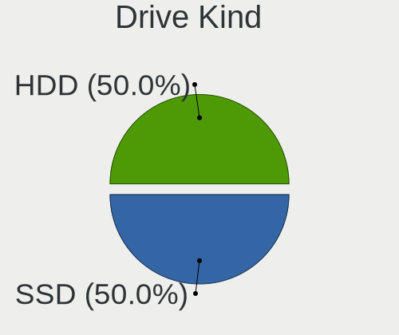
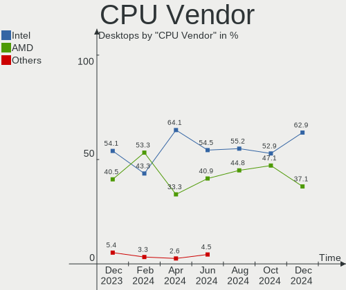
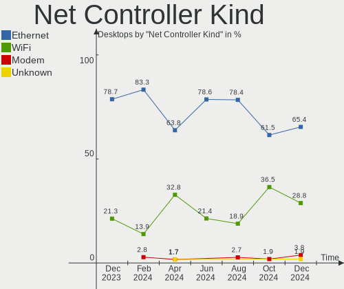
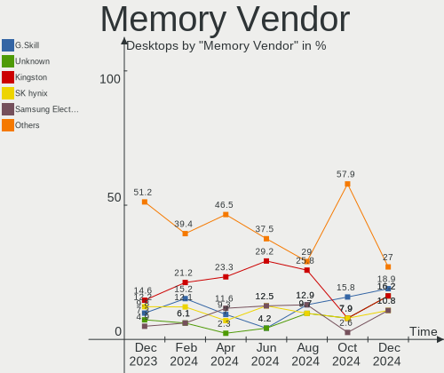

FreeBSD Hardware Trends (Desktops)
----------------------------------

A project to identify most popular hardware characteristics and track their change
over time based on data collected by FreeBSD users at https://BSD-Hardware.info.

Anyone can contribute to this report by the [hw-probe](https://github.com/linuxhw/hw-probe/blob/master/INSTALL.BSD.md) tool:

    hw-probe -all -upload

Full-feature report is available here: https://bsd-hardware.info/?view=trends

Period: Jan, 2022.

Contents
--------

* [ System ](#system)
  - [ OS                       ](#os)
  - [ OS Family                ](#os-family)
  - [ Arch                     ](#arch)
  - [ DE                       ](#de)
  - [ Display Server           ](#display-server)
  - [ Display Manager          ](#display-manager)
  - [ OS Lang                  ](#os-lang)
  - [ Boot Mode                ](#boot-mode)
  - [ Filesystem               ](#filesystem)
  - [ Part. scheme             ](#part-scheme)

* [ Board ](#board)
  - [ Vendor                   ](#vendor)
  - [ Model                    ](#model)
  - [ Model Family             ](#model-family)
  - [ MFG Year                 ](#mfg-year)
  - [ Form Factor              ](#form-factor)
  - [ Coreboot                 ](#coreboot)
  - [ RAM Size                 ](#ram-size)
  - [ RAM Used                 ](#ram-used)
  - [ Total Drives             ](#total-drives)
  - [ Has CD-ROM               ](#has-cd-rom)
  - [ Has Ethernet             ](#has-ethernet)
  - [ Has WiFi                 ](#has-wifi)
  - [ Has Bluetooth            ](#has-bluetooth)

* [ Location ](#location)
  - [ Country                  ](#country)
  - [ City                     ](#city)

* [ Drives ](#drives)
  - [ Drive Vendor             ](#drive-vendor)
  - [ Drive Model              ](#drive-model)
  - [ HDD Vendor               ](#hdd-vendor)
  - [ SSD Vendor               ](#ssd-vendor)
  - [ Drive Kind               ](#drive-kind)
  - [ Drive Connector          ](#drive-connector)
  - [ Drive Size               ](#drive-size)
  - [ Space Total              ](#space-total)
  - [ Space Used               ](#space-used)
  - [ Malfunc. Drives          ](#malfunc-drives)
  - [ Malfunc. Drive Vendor    ](#malfunc-drive-vendor)
  - [ Malfunc. HDD Vendor      ](#malfunc-hdd-vendor)
  - [ Malfunc. Drive Kind      ](#malfunc-drive-kind)
  - [ Failed Drives            ](#failed-drives)
  - [ Failed Drive Vendor      ](#failed-drive-vendor)
  - [ Drive Status             ](#drive-status)

* [ Storage controller ](#storage-controller)
  - [ Storage Vendor           ](#storage-vendor)
  - [ Storage Model            ](#storage-model)
  - [ Storage Kind             ](#storage-kind)

* [ Processor ](#processor)
  - [ CPU Vendor               ](#cpu-vendor)
  - [ CPU Model                ](#cpu-model)
  - [ CPU Model Family         ](#cpu-model-family)
  - [ CPU Cores                ](#cpu-cores)
  - [ CPU Sockets              ](#cpu-sockets)
  - [ CPU Threads              ](#cpu-threads)
  - [ CPU Microarch            ](#cpu-microarch)

* [ Graphics ](#graphics)
  - [ GPU Vendor               ](#gpu-vendor)
  - [ GPU Model                ](#gpu-model)
  - [ GPU Combo                ](#gpu-combo)
  - [ GPU Driver               ](#gpu-driver)
  - [ GPU Memory               ](#gpu-memory)

* [ Monitor ](#monitor)
  - [ Monitor Vendor           ](#monitor-vendor)
  - [ Monitor Model            ](#monitor-model)
  - [ Monitor Resolution       ](#monitor-resolution)
  - [ Monitor Diagonal         ](#monitor-diagonal)
  - [ Monitor Width            ](#monitor-width)
  - [ Aspect Ratio             ](#aspect-ratio)
  - [ Monitor Area             ](#monitor-area)
  - [ Pixel Density            ](#pixel-density)
  - [ Multiple Monitors        ](#multiple-monitors)

* [ Network ](#network)
  - [ Net Controller Vendor    ](#net-controller-vendor)
  - [ Net Controller Model     ](#net-controller-model)
  - [ Wireless Vendor          ](#wireless-vendor)
  - [ Wireless Model           ](#wireless-model)
  - [ Ethernet Vendor          ](#ethernet-vendor)
  - [ Ethernet Model           ](#ethernet-model)
  - [ Net Controller Kind      ](#net-controller-kind)
  - [ Used Controller          ](#used-controller)
  - [ NICs                     ](#nics)
  - [ IPv6                     ](#ipv6)

* [ Bluetooth ](#bluetooth)
  - [ Bluetooth Vendor         ](#bluetooth-vendor)
  - [ Bluetooth Model          ](#bluetooth-model)

* [ Sound ](#sound)
  - [ Sound Vendor             ](#sound-vendor)
  - [ Sound Model              ](#sound-model)

* [ Memory ](#memory)
  - [ Memory Vendor            ](#memory-vendor)
  - [ Memory Model             ](#memory-model)
  - [ Memory Kind              ](#memory-kind)
  - [ Memory Form Factor       ](#memory-form-factor)
  - [ Memory Size              ](#memory-size)
  - [ Memory Speed             ](#memory-speed)

* [ Printers & scanners ](#printers--scanners)
  - [ Printer Vendor           ](#printer-vendor)
  - [ Printer Model            ](#printer-model)
  - [ Scanner Vendor           ](#scanner-vendor)
  - [ Scanner Model            ](#scanner-model)

* [ Camera ](#camera)
  - [ Camera Vendor            ](#camera-vendor)
  - [ Camera Model             ](#camera-model)

* [ Security ](#security)
  - [ Fingerprint Vendor       ](#fingerprint-vendor)
  - [ Fingerprint Model        ](#fingerprint-model)
  - [ Chipcard Vendor          ](#chipcard-vendor)
  - [ Chipcard Model           ](#chipcard-model)

* [ Unsupported ](#unsupported)
  - [ Unsupported Devices      ](#unsupported-devices)
  - [ Unsupported Device Types ](#unsupported-device-types)

System
------

OS
--

Installed operating systems

| Name                 | Desktops | Percent |
|----------------------|----------|---------|
| FreeBSD 13.0-p5      | 11       | 25%     |
| FreeBSD 13.0-p6      | 9        | 20.45%  |
| FreeBSD 14.0-CURRENT | 4        | 9.09%   |
| FreeBSD 12.3-p1      | 4        | 9.09%   |
| FreeBSD 12.3         | 4        | 9.09%   |
| FreeBSD 13.0-p4      | 3        | 6.82%   |
| FreeBSD 13.0         | 3        | 6.82%   |
| FreeBSD 13.0-STABLE  | 2        | 4.55%   |
| FreeBSD 12.2-p11     | 2        | 4.55%   |
| FreeBSD 12.2-p12     | 1        | 2.27%   |
| FreeBSD 11.4-p13     | 1        | 2.27%   |

OS Family
---------

OS without a version

| Name    | Desktops | Percent |
|---------|----------|---------|
| FreeBSD | 44       | 100%    |

Arch
----

OS architecture (x86_64, i586, etc.)

| Name  | Desktops | Percent |
|-------|----------|---------|
| amd64 | 40       | 90.91%  |
| arm64 | 3        | 6.82%   |
| i386  | 1        | 2.27%   |

DE
--

Desktop Environment

| Name    | Desktops | Percent |
|---------|----------|---------|
| Console | 25       | 56.82%  |
| KDE5    | 7        | 15.91%  |
| GNOME   | 5        | 11.36%  |
| Openbox | 2        | 4.55%   |
| XFCE    | 1        | 2.27%   |
| TWM     | 1        | 2.27%   |
| MATE    | 1        | 2.27%   |
| i3      | 1        | 2.27%   |
| Fluxbox | 1        | 2.27%   |

Display Server
--------------

X11 or Wayland

| Name    | Desktops | Percent |
|---------|----------|---------|
| Console | 29       | 65.91%  |
| X11     | 14       | 31.82%  |
| Wayland | 1        | 2.27%   |

Display Manager
---------------

SDDM, LightDM, etc.

| Name    | Desktops | Percent |
|---------|----------|---------|
| Console | 32       | 72.73%  |
| SDDM    | 5        | 11.36%  |
| SLiM    | 3        | 6.82%   |
| GDM     | 2        | 4.55%   |
| XDM     | 1        | 2.27%   |
| LightDM | 1        | 2.27%   |

OS Lang
-------

Language

| Lang         | Desktops | Percent |
|--------------|----------|---------|
| C            | 26       | 59.09%  |
| Unknown      | 12       | 27.27%  |
| ru_RU        | 3        | 6.82%   |
| en_US        | 2        | 4.55%   |
| ru_RU.KOI8-R | 1        | 2.27%   |

Boot Mode
---------

EFI or BIOS

| Mode | Desktops | Percent |
|------|----------|---------|
| BIOS | 23       | 52.27%  |
| EFI  | 21       | 47.73%  |

Filesystem
----------

Type of filesystem

| Type | Desktops | Percent |
|------|----------|---------|
| Zfs  | 30       | 68.18%  |
| Ufs  | 14       | 31.82%  |

Part. scheme
------------

Scheme of partitioning

| Type | Desktops | Percent |
|------|----------|---------|
| GPT  | 39       | 88.64%  |
| MBR  | 5        | 11.36%  |

Board
-----

Vendor
------

Motherboard manufacturer

| Name                | Desktops | Percent |
|---------------------|----------|---------|
| ASUSTek Computer    | 16       | 36.36%  |
| Gigabyte Technology | 7        | 15.91%  |
| Intel               | 4        | 9.09%   |
| ASRock              | 4        | 9.09%   |
| Unknown             | 4        | 9.09%   |
| Dell                | 3        | 6.82%   |
| MSI                 | 2        | 4.55%   |
| Hewlett-Packard     | 2        | 4.55%   |
| Supermicro          | 1        | 2.27%   |
| Kontron             | 1        | 2.27%   |

Model
-----

Motherboard model

| Name                             | Desktops | Percent |
|----------------------------------|----------|---------|
| Unknown                          | 4        | 9.09%   |
| HP ProLiant MicroServer          | 2        | 4.55%   |
| Supermicro X7SBL                 | 1        | 2.27%   |
| MSI MS-7817                      | 1        | 2.27%   |
| MSI MS-7529                      | 1        | 2.27%   |
| Kontron KT965/ATXP               | 1        | 2.27%   |
| Intel pro396949                  | 1        | 2.27%   |
| Intel Nobilis                    | 1        | 2.27%   |
| Intel DQ35JO AAD82085-804        | 1        | 2.27%   |
| Intel D2500CC AAG81477-401       | 1        | 2.27%   |
| Gigabyte Z68X-UD7-B3             | 1        | 2.27%   |
| Gigabyte X570 I AORUS PRO WIFI   | 1        | 2.27%   |
| Gigabyte X470 AORUS ULTRA GAMING | 1        | 2.27%   |
| Gigabyte H470 HD3                | 1        | 2.27%   |
| Gigabyte H310M S2 2.0            | 1        | 2.27%   |
| Gigabyte B450M DS3H              | 1        | 2.27%   |
| Gigabyte B150-HD3P-CF            | 1        | 2.27%   |
| Dell OptiPlex FX160              | 1        | 2.27%   |
| Dell OptiPlex 790                | 1        | 2.27%   |
| Dell OptiPlex 7080               | 1        | 2.27%   |
| ASUS TUF GAMING B550-PLUS        | 1        | 2.27%   |
| ASUS TUF B365M-PLUS GAMING       | 1        | 2.27%   |
| ASUS ROG STRIX B550-I GAMING     | 1        | 2.27%   |
| ASUS ROG CROSSHAIR VIII HERO     | 1        | 2.27%   |
| ASUS PRIME Z590-P                | 1        | 2.27%   |
| ASUS PRIME X370-PRO              | 1        | 2.27%   |
| ASUS PRIME H410M-A               | 1        | 2.27%   |
| ASUS PRIME H310M-K R2.0          | 1        | 2.27%   |
| ASUS PRIME H310-PLUS             | 1        | 2.27%   |
| ASUS P8H67-M PRO                 | 1        | 2.27%   |
| ASUS P5Q-E                       | 1        | 2.27%   |
| ASUS P5M2                        | 1        | 2.27%   |
| ASUS P5G41T-M LX2/GB             | 1        | 2.27%   |
| ASUS M5A97 R2.0                  | 1        | 2.27%   |
| ASUS All Series                  | 1        | 2.27%   |
| ASUS A68HM-PLUS                  | 1        | 2.27%   |
| ASRock Z170M Extreme4            | 1        | 2.27%   |
| ASRock X570 Phantom Gaming 4     | 1        | 2.27%   |
| ASRock FM2A85X Extreme6          | 1        | 2.27%   |
| ASRock B450 Steel Legend         | 1        | 2.27%   |

Model Family
------------

Motherboard model prefix

| Name                  | Desktops | Percent |
|-----------------------|----------|---------|
| ASUS PRIME            | 5        | 11.36%  |
| Unknown               | 4        | 9.09%   |
| Dell OptiPlex         | 3        | 6.82%   |
| HP ProLiant           | 2        | 4.55%   |
| ASUS TUF              | 2        | 4.55%   |
| ASUS ROG              | 2        | 4.55%   |
| Supermicro X7SBL      | 1        | 2.27%   |
| MSI MS-7817           | 1        | 2.27%   |
| MSI MS-7529           | 1        | 2.27%   |
| Kontron KT965         | 1        | 2.27%   |
| Intel pro396949       | 1        | 2.27%   |
| Intel Nobilis         | 1        | 2.27%   |
| Intel DQ35JO          | 1        | 2.27%   |
| Intel D2500CC         | 1        | 2.27%   |
| Gigabyte Z68X-UD7-B3  | 1        | 2.27%   |
| Gigabyte X570         | 1        | 2.27%   |
| Gigabyte X470         | 1        | 2.27%   |
| Gigabyte H470         | 1        | 2.27%   |
| Gigabyte H310M        | 1        | 2.27%   |
| Gigabyte B450M        | 1        | 2.27%   |
| Gigabyte B150-HD3P-CF | 1        | 2.27%   |
| ASUS P8H67-M          | 1        | 2.27%   |
| ASUS P5Q-E            | 1        | 2.27%   |
| ASUS P5M2             | 1        | 2.27%   |
| ASUS P5G41T-M         | 1        | 2.27%   |
| ASUS M5A97            | 1        | 2.27%   |
| ASUS All              | 1        | 2.27%   |
| ASUS A68HM-PLUS       | 1        | 2.27%   |
| ASRock Z170M          | 1        | 2.27%   |
| ASRock X570           | 1        | 2.27%   |
| ASRock FM2A85X        | 1        | 2.27%   |
| ASRock B450           | 1        | 2.27%   |

MFG Year
--------

Motherboard manufacture year

| Year    | Desktops | Percent |
|---------|----------|---------|
| 2021    | 7        | 15.91%  |
| 2019    | 5        | 11.36%  |
| 2018    | 4        | 9.09%   |
| 2011    | 4        | 9.09%   |
| 2012    | 3        | 6.82%   |
| 2010    | 3        | 6.82%   |
| 2008    | 3        | 6.82%   |
| Unknown | 3        | 6.82%   |
| 2020    | 2        | 4.55%   |
| 2016    | 2        | 4.55%   |
| 2014    | 2        | 4.55%   |
| 2017    | 1        | 2.27%   |
| 2015    | 1        | 2.27%   |
| 2013    | 1        | 2.27%   |
| 2009    | 1        | 2.27%   |
| 2007    | 1        | 2.27%   |
| 2006    | 1        | 2.27%   |

Form Factor
-----------

Physical design of the computer

| Name    | Desktops | Percent |
|---------|----------|---------|
| Desktop | 44       | 100%    |

Coreboot
--------

Have coreboot on board

| Used | Desktops | Percent |
|------|----------|---------|
| No   | 44       | 100%    |

RAM Size
--------

Total RAM memory

| Size in GB  | Desktops | Percent |
|-------------|----------|---------|
| 32.01-64.0  | 11       | 25%     |
| 8.01-16.0   | 10       | 22.73%  |
| 16.01-24.0  | 8        | 18.18%  |
| 4.01-8.0    | 5        | 11.36%  |
| 64.01-256.0 | 4        | 9.09%   |
| 0.51-1.0    | 3        | 6.82%   |
| 2.01-3.0    | 2        | 4.55%   |
| 3.01-4.0    | 1        | 2.27%   |

RAM Used
--------

Used RAM memory

| Used GB     | Desktops | Percent |
|-------------|----------|---------|
| 0.01-0.5    | 14       | 31.82%  |
| 1.01-2.0    | 10       | 22.73%  |
| 0.51-1.0    | 9        | 20.45%  |
| 4.01-8.0    | 4        | 9.09%   |
| 2.01-3.0    | 2        | 4.55%   |
| 64.01-256.0 | 2        | 4.55%   |
| 0           | 2        | 4.55%   |
| 3.01-4.0    | 1        | 2.27%   |

Total Drives
------------

Number of drives on board

| Drives | Desktops | Percent |
|--------|----------|---------|
| 1      | 12       | 27.27%  |
| 2      | 8        | 18.18%  |
| 4      | 7        | 15.91%  |
| 3      | 6        | 13.64%  |
| 0      | 4        | 9.09%   |
| 6      | 2        | 4.55%   |
| 13     | 1        | 2.27%   |
| 12     | 1        | 2.27%   |
| 9      | 1        | 2.27%   |
| 7      | 1        | 2.27%   |
| 5      | 1        | 2.27%   |

Has CD-ROM
----------

Has CD-ROM on board

| Presented | Desktops | Percent |
|-----------|----------|---------|
| No        | 32       | 72.73%  |
| Yes       | 12       | 27.27%  |

Has Ethernet
------------

Has Ethernet on board

| Presented | Desktops | Percent |
|-----------|----------|---------|
| Yes       | 41       | 93.18%  |
| No        | 3        | 6.82%   |

Has WiFi
--------

Has WiFi module

| Presented | Desktops | Percent |
|-----------|----------|---------|
| No        | 38       | 86.36%  |
| Yes       | 6        | 13.64%  |

Has Bluetooth
-------------

Has Bluetooth module

| Presented | Desktops | Percent |
|-----------|----------|---------|
| No        | 40       | 90.91%  |
| Yes       | 4        | 9.09%   |

Location
--------

Country
-------

Geographic location (country)

| Country     | Desktops | Percent |
|-------------|----------|---------|
| USA         | 14       | 31.82%  |
| Russia      | 8        | 18.18%  |
| UK          | 4        | 9.09%   |
| Romania     | 3        | 6.82%   |
| UAE         | 2        | 4.55%   |
| Italy       | 2        | 4.55%   |
| Germany     | 2        | 4.55%   |
| Sweden      | 1        | 2.27%   |
| Poland      | 1        | 2.27%   |
| Netherlands | 1        | 2.27%   |
| Malaysia    | 1        | 2.27%   |
| Hungary     | 1        | 2.27%   |
| Canada      | 1        | 2.27%   |
| Belarus     | 1        | 2.27%   |
| Austria     | 1        | 2.27%   |
| Australia   | 1        | 2.27%   |

City
----

Geographic location (city)

| City              | Desktops | Percent |
|-------------------|----------|---------|
| Grand Rapids      | 4        | 9.09%   |
| Cluj-Napoca       | 3        | 6.82%   |
| Silea             | 2        | 4.55%   |
| Salem             | 2        | 4.55%   |
| Ruthin            | 2        | 4.55%   |
| Redmond           | 2        | 4.55%   |
| Egham             | 2        | 4.55%   |
| Dubai             | 2        | 4.55%   |
| Armavir           | 2        | 4.55%   |
| Wenatchee         | 1        | 2.27%   |
| Vienna            | 1        | 2.27%   |
| Ume??             | 1        | 2.27%   |
| Ulyanovsk         | 1        | 2.27%   |
| Thousand Oaks     | 1        | 2.27%   |
| Sydney            | 1        | 2.27%   |
| Smolenshchina     | 1        | 2.27%   |
| Sherwood Park     | 1        | 2.27%   |
| Palo Alto         | 1        | 2.27%   |
| Novosibirsk       | 1        | 2.27%   |
| Noordwijk aan Zee | 1        | 2.27%   |
| Moscow            | 1        | 2.27%   |
| Menlo Park        | 1        | 2.27%   |
| Krakow            | 1        | 2.27%   |
| Kamensk-Ural'skiy | 1        | 2.27%   |
| Jenjarum          | 1        | 2.27%   |
| Hrodna            | 1        | 2.27%   |
| Cologne           | 1        | 2.27%   |
| Chicago           | 1        | 2.27%   |
| Budapest          | 1        | 2.27%   |
| Berlin            | 1        | 2.27%   |
| Barnaul           | 1        | 2.27%   |
| Atlanta           | 1        | 2.27%   |

Drives
------

Drive Vendor
------------

Hard drive vendors

| Vendor              | Desktops | Drives | Percent |
|---------------------|----------|--------|---------|
| WDC                 | 23       | 49     | 32.39%  |
| Seagate             | 12       | 31     | 16.9%   |
| Samsung Electronics | 11       | 17     | 15.49%  |
| Toshiba             | 4        | 9      | 5.63%   |
| Hitachi             | 4        | 6      | 5.63%   |
| Crucial             | 3        | 3      | 4.23%   |
| A-DATA Technology   | 3        | 5      | 4.23%   |
| Intel               | 2        | 2      | 2.82%   |
| Vaseky              | 1        | 1      | 1.41%   |
| Silicon Motion      | 1        | 1      | 1.41%   |
| PNY                 | 1        | 1      | 1.41%   |
| PLEXTOR             | 1        | 1      | 1.41%   |
| Patriot             | 1        | 2      | 1.41%   |
| Kingston            | 1        | 1      | 1.41%   |
| EMTEC               | 1        | 1      | 1.41%   |
| Corsair             | 1        | 1      | 1.41%   |
| AMD                 | 1        | 2      | 1.41%   |

Drive Model
-----------

Hard drive models

| Model                                 | Desktops | Percent |
|---------------------------------------|----------|---------|
| WDC WD800JD-75MSA3 80GB               | 4        | 4.17%   |
| WDC WD80EFAX-68LHPN0 8TB              | 2        | 2.08%   |
| WDC WD20EZAZ-00GGJB0 2TB              | 2        | 2.08%   |
| WDC PC SN730 SDBQNTY-256G-1001 256GB  | 2        | 2.08%   |
| Seagate ST4000DM000-1F2168 4TB        | 2        | 2.08%   |
| WDC WDS240G2G0A-00JH30 240GB          | 1        | 1.04%   |
| WDC WD80EMAZ-00WJTA0 8TB              | 1        | 1.04%   |
| WDC WD80EFZX-68UW8N0 8TB              | 1        | 1.04%   |
| WDC WD80EDBZ-11B0ZA0 8TB              | 1        | 1.04%   |
| WDC WD60EFRX-68TGBN1 6TB              | 1        | 1.04%   |
| WDC WD5000LPCX-24C6HT0 500GB          | 1        | 1.04%   |
| WDC WD5000BPKT-00PK4T0 500GB          | 1        | 1.04%   |
| WDC WD5000AZRZ-00HTKB0 500GB          | 1        | 1.04%   |
| WDC WD40EZRZ-22GXCB0 4TB              | 1        | 1.04%   |
| WDC WD40EFRX-68N32N0 4TB              | 1        | 1.04%   |
| WDC WD2500AAJS-00V4A0 250GB           | 1        | 1.04%   |
| WDC WD20NMVW-11AV3S2 2TB              | 1        | 1.04%   |
| WDC WD20EZRX-00D8PB0 2TB              | 1        | 1.04%   |
| WDC WD20EFRX-68EUZN0 2TB              | 1        | 1.04%   |
| WDC WD20EARX-00PASB0 2TB              | 1        | 1.04%   |
| WDC WD20EARX-008FB0 2TB               | 1        | 1.04%   |
| WDC WD20EARS-00MVWB0 2TB              | 1        | 1.04%   |
| WDC WD2003FYYS-18W0B0 2TB             | 1        | 1.04%   |
| WDC WD2002FYPS-02W3B0 2TB             | 1        | 1.04%   |
| WDC WD1600AAJS-00YZCA0 160GB          | 1        | 1.04%   |
| WDC WD15EADS-00P8B0 1.5TB             | 1        | 1.04%   |
| WDC WD120EMFZ-11A6JA0 12TB            | 1        | 1.04%   |
| WDC WD120EMAZ-11BLFA0 12TB            | 1        | 1.04%   |
| WDC WD120EFBX-68B0EN0 12TB            | 1        | 1.04%   |
| WDC WD10EZEX-21M2NA0 1TB              | 1        | 1.04%   |
| WDC WD1005FBYZ-01YCBB3 1TB            | 1        | 1.04%   |
| WDC AC31600H 2GB                      | 1        | 1.04%   |
| Vaseky V800-120G                      | 1        | 1.04%   |
| Toshiba MK3263GSX 320GB               | 1        | 1.04%   |
| Toshiba MG09ACA18TE 18TB              | 1        | 1.04%   |
| Toshiba MG04ACA600E 6TB               | 1        | 1.04%   |
| Toshiba HDWN180 8TB                   | 1        | 1.04%   |
| Toshiba HDWG480 8TB                   | 1        | 1.04%   |
| Toshiba HDWG180 8TB                   | 1        | 1.04%   |
| Silicon Motion 512GB PCS PCIe M.2 SSD | 1        | 1.04%   |
| Seagate ST8000VN004-2M2101 8TB        | 1        | 1.04%   |
| Seagate ST8000AS0002-1NA17Z 8TB       | 1        | 1.04%   |
| Seagate ST4000VN000-1H4168 4TB        | 1        | 1.04%   |
| Seagate ST4000DM000-2AE166 4TB        | 1        | 1.04%   |
| Seagate ST3500413AS 500GB             | 1        | 1.04%   |
| Seagate ST3320620AS 320GB             | 1        | 1.04%   |
| Seagate ST3200822AS 200GB             | 1        | 1.04%   |
| Seagate ST32000645NS 2TB              | 1        | 1.04%   |
| Seagate ST3160815AS 160GB             | 1        | 1.04%   |
| Seagate ST2000NM0033-9ZM175 2TB       | 1        | 1.04%   |
| Seagate ST2000NM0008-2F3100 2TB       | 1        | 1.04%   |
| Seagate ST2000DM008-2FR102 2TB        | 1        | 1.04%   |
| Seagate ST18000NM000J-2TV103 18TB     | 1        | 1.04%   |
| Seagate ST16000NM001G-2KK103 16TB     | 1        | 1.04%   |
| Samsung SSD 980 500GB                 | 1        | 1.04%   |
| Samsung SSD 980 1TB                   | 1        | 1.04%   |
| Samsung SSD 970 EVO Plus 250GB        | 1        | 1.04%   |
| Samsung SSD 970 EVO 1TB               | 1        | 1.04%   |
| Samsung SSD 960 EVO 500GB             | 1        | 1.04%   |
| Samsung SSD 870 QVO 2TB               | 1        | 1.04%   |

HDD Vendor
----------

Hard disk drive vendors

| Vendor  | Desktops | Drives | Percent |
|---------|----------|--------|---------|
| WDC     | 21       | 46     | 51.22%  |
| Seagate | 12       | 31     | 29.27%  |
| Toshiba | 4        | 9      | 9.76%   |
| Hitachi | 4        | 6      | 9.76%   |

SSD Vendor
----------

Solid state drive vendors

| Vendor              | Desktops | Drives | Percent |
|---------------------|----------|--------|---------|
| Samsung Electronics | 7        | 12     | 38.89%  |
| Crucial             | 2        | 2      | 11.11%  |
| A-DATA Technology   | 2        | 3      | 11.11%  |
| WDC                 | 1        | 1      | 5.56%   |
| Vaseky              | 1        | 1      | 5.56%   |
| Patriot             | 1        | 2      | 5.56%   |
| Kingston            | 1        | 1      | 5.56%   |
| Intel               | 1        | 1      | 5.56%   |
| EMTEC               | 1        | 1      | 5.56%   |
| AMD                 | 1        | 2      | 5.56%   |

Drive Kind
----------

HDD or SSD

| Kind | Desktops | Drives | Percent |
|------|----------|--------|---------|
| HDD  | 29       | 92     | 49.15%  |
| SSD  | 17       | 26     | 28.81%  |
| NVMe | 13       | 15     | 22.03%  |

Drive Connector
---------------

SATA, SAS, NVMe, etc.

| Type | Desktops | Drives | Percent |
|------|----------|--------|---------|
| SATA | 34       | 118    | 72.34%  |
| NVMe | 13       | 15     | 27.66%  |

Drive Size
----------

Size of hard drive

| Size in TB | Desktops | Drives | Percent |
|------------|----------|--------|---------|
| 0.01-0.5   | 24       | 37     | 44.44%  |
| 1.01-2.0   | 9        | 20     | 16.67%  |
| 4.01-10.0  | 7        | 29     | 12.96%  |
| 3.01-4.0   | 5        | 12     | 9.26%   |
| 0.51-1.0   | 5        | 9      | 9.26%   |
| 10.01-20.0 | 4        | 11     | 7.41%   |

Space Total
-----------

Amount of disk space available on the file system

| Size in GB     | Desktops | Percent |
|----------------|----------|---------|
| 101-250        | 15       | 34.09%  |
| 251-500        | 8        | 18.18%  |
| 21-50          | 5        | 11.36%  |
| 51-100         | 5        | 11.36%  |
| 501-1000       | 4        | 9.09%   |
| 1001-2000      | 3        | 6.82%   |
| 1-20           | 2        | 4.55%   |
| More than 3000 | 1        | 2.27%   |
| 2001-3000      | 1        | 2.27%   |

Space Used
----------

Amount of used disk space

| Used GB  | Desktops | Percent |
|----------|----------|---------|
| 1-20     | 35       | 79.55%  |
| 21-50    | 5        | 11.36%  |
| 51-100   | 2        | 4.55%   |
| 501-1000 | 1        | 2.27%   |
| 0        | 1        | 2.27%   |

Malfunc. Drives
---------------

Drive models with a malfunction

| Model                        | Desktops | Drives | Percent |
|------------------------------|----------|--------|---------|
| WDC WD60EFRX-68TGBN1 6TB     | 1        | 3      | 10%     |
| WDC WD5000AZRZ-00HTKB0 500GB | 1        | 1      | 10%     |
| WDC WD20EARX-008FB0 2TB      | 1        | 1      | 10%     |
| WDC WD20EARS-00MVWB0 2TB     | 1        | 1      | 10%     |
| WDC WD2002FYPS-02W3B0 2TB    | 1        | 1      | 10%     |
| Toshiba MK3263GSX 320GB      | 1        | 1      | 10%     |
| Seagate ST3500413AS 500GB    | 1        | 1      | 10%     |
| Seagate ST3200822AS 200GB    | 1        | 1      | 10%     |
| Seagate ST3160815AS 160GB    | 1        | 1      | 10%     |
| AMD R5SL240G 240GB           | 1        | 2      | 10%     |

Malfunc. Drive Vendor
---------------------

Vendors of faulty drives

| Vendor  | Desktops | Drives | Percent |
|---------|----------|--------|---------|
| WDC     | 5        | 7      | 55.56%  |
| Seagate | 2        | 3      | 22.22%  |
| Toshiba | 1        | 1      | 11.11%  |
| AMD     | 1        | 2      | 11.11%  |

Malfunc. HDD Vendor
-------------------

Vendors of faulty HDD drives

| Vendor  | Desktops | Drives | Percent |
|---------|----------|--------|---------|
| WDC     | 5        | 7      | 62.5%   |
| Seagate | 2        | 3      | 25%     |
| Toshiba | 1        | 1      | 12.5%   |

Malfunc. Drive Kind
-------------------

Kinds of faulty drives

| Kind | Desktops | Drives | Percent |
|------|----------|--------|---------|
| HDD  | 8        | 11     | 88.89%  |
| SSD  | 1        | 2      | 11.11%  |

Failed Drives
-------------

Failed drive models

Zero info for selected period =(

Failed Drive Vendor
-------------------

Failed drive vendors

Zero info for selected period =(

Drive Status
------------

Number of failed and malfunc. drives

| Status   | Desktops | Drives | Percent |
|----------|----------|--------|---------|
| Works    | 39       | 119    | 79.59%  |
| Malfunc  | 9        | 13     | 18.37%  |
| Detected | 1        | 1      | 2.04%   |

Storage controller
------------------

Storage Vendor
--------------

Storage controller vendors

| Vendor                           | Desktops | Percent |
|----------------------------------|----------|---------|
| Intel                            | 26       | 38.81%  |
| AMD                              | 14       | 20.9%   |
| Samsung Electronics              | 6        | 8.96%   |
| Marvell Technology Group         | 3        | 4.48%   |
| ASMedia Technology               | 3        | 4.48%   |
| Sandisk                          | 2        | 2.99%   |
| Phison Electronics               | 2        | 2.99%   |
| Broadcom / LSI                   | 2        | 2.99%   |
| VIA Technologies                 | 1        | 1.49%   |
| Silicon Motion                   | 1        | 1.49%   |
| Silicon Integrated Systems [SiS] | 1        | 1.49%   |
| Silicon Image                    | 1        | 1.49%   |
| Nvidia                           | 1        | 1.49%   |
| Micron/Crucial Technology        | 1        | 1.49%   |
| Lite-On Technology               | 1        | 1.49%   |
| ADATA Technology                 | 1        | 1.49%   |
| Adaptec                          | 1        | 1.49%   |

Storage Model
-------------

Storage controller models

| Model                                                                                   | Desktops | Percent |
|-----------------------------------------------------------------------------------------|----------|---------|
| AMD FCH SATA Controller [AHCI mode]                                                     | 9        | 10.84%  |
| Samsung NVMe SSD Controller SM981/PM981/PM983                                           | 3        | 3.61%   |
| Intel 82801G (ICH7 Family) IDE Controller                                               | 3        | 3.61%   |
| Intel 6 Series/C200 Series Chipset Family 6 port Desktop SATA AHCI Controller           | 3        | 3.61%   |
| Intel 200 Series PCH SATA controller [AHCI mode]                                        | 3        | 3.61%   |
| AMD SB7x0/SB8x0/SB9x0 SATA Controller [AHCI mode]                                       | 3        | 3.61%   |
| AMD 400 Series Chipset SATA Controller                                                  | 3        | 3.61%   |
| Sandisk WD Black SN750 / PC SN730 NVMe SSD                                              | 2        | 2.41%   |
| Samsung NVMe SSD Controller 980                                                         | 2        | 2.41%   |
| Intel Q170/Q150/B150/H170/H110/Z170/CM236 Chipset SATA Controller [AHCI Mode]           | 2        | 2.41%   |
| Intel NM10/ICH7 Family SATA Controller [IDE mode]                                       | 2        | 2.41%   |
| Intel NM10/ICH7 Family SATA Controller [AHCI mode]                                      | 2        | 2.41%   |
| Intel Comet Lake SATA AHCI Controller                                                   | 2        | 2.41%   |
| Intel 82801IR/IO/IH (ICH9R/DO/DH) 4 port SATA Controller [IDE mode]                     | 2        | 2.41%   |
| Intel 82801I (ICH9 Family) 2 port SATA Controller [IDE mode]                            | 2        | 2.41%   |
| Intel 8 Series/C220 Series Chipset Family 6-port SATA Controller 1 [AHCI mode]          | 2        | 2.41%   |
| Broadcom / LSI SAS2008 PCI-Express Fusion-MPT SAS-2 [Falcon]                            | 2        | 2.41%   |
| ASMedia ASM1062 Serial ATA Controller                                                   | 2        | 2.41%   |
| AMD Starship/Matisse Chipset SATA Controller [AHCI mode]                                | 2        | 2.41%   |
| AMD SB7x0/SB8x0/SB9x0 IDE Controller                                                    | 2        | 2.41%   |
| VIA VT6415 PATA IDE Host Controller                                                     | 1        | 1.2%    |
| Silicon Motion SM2263EN/SM2263XT SSD Controller                                         | 1        | 1.2%    |
| Silicon Integrated Systems [SiS] AHCI IDE Controller (0106)                             | 1        | 1.2%    |
| Silicon Image AAR-1220SA Serial ATA HostRAID Controller                                 | 1        | 1.2%    |
| Samsung NVMe SSD Controller SM961/PM961/SM963                                           | 1        | 1.2%    |
| Phison E16 PCIe4 NVMe Controller                                                        | 1        | 1.2%    |
| Phison E12 NVMe Controller                                                              | 1        | 1.2%    |
| Nvidia MCP51 Serial ATA Controller                                                      | 1        | 1.2%    |
| Nvidia MCP51 IDE                                                                        | 1        | 1.2%    |
| Micron/Crucial P2 NVMe PCIe SSD                                                         | 1        | 1.2%    |
| Marvell Group 88SE9128 PCIe SATA 6 Gb/s RAID controller with HyperDuo                   | 1        | 1.2%    |
| Marvell Group 88SE6111/6121 SATA II / PATA Controller                                   | 1        | 1.2%    |
| Marvell Group 88SE6101/6102 single-port PATA133 interface                               | 1        | 1.2%    |
| Lite-On M8Pe Series NVMe SSD                                                            | 1        | 1.2%    |
| Intel SSD Pro 7600p/760p/E 6100p Series                                                 | 1        | 1.2%    |
| Intel SATA Controller [RAID mode]                                                       | 1        | 1.2%    |
| Intel Cannon Lake PCH SATA AHCI Controller                                              | 1        | 1.2%    |
| Intel 82Q35 Express PT IDER Controller                                                  | 1        | 1.2%    |
| Intel 82801JI (ICH10 Family) SATA AHCI Controller                                       | 1        | 1.2%    |
| Intel 82801HR/HO/HH (ICH8R/DO/DH) 2 port SATA Controller [IDE mode]                     | 1        | 1.2%    |
| Intel 82801H (ICH8 Family) 4 port SATA Controller [IDE mode]                            | 1        | 1.2%    |
| Intel 6 Series/C200 Series Chipset Family Desktop SATA Controller (IDE mode, ports 4-5) | 1        | 1.2%    |
| Intel 6 Series/C200 Series Chipset Family Desktop SATA Controller (IDE mode, ports 0-3) | 1        | 1.2%    |
| Intel 500 Series Chipset Family SATA AHCI Controller                                    | 1        | 1.2%    |
| Intel 400 Series Chipset Family SATA AHCI Controller                                    | 1        | 1.2%    |
| AMD X370 Series Chipset SATA Controller                                                 | 1        | 1.2%    |
| AMD FCH IDE Controller                                                                  | 1        | 1.2%    |
| ADATA XPG SX8200 Pro PCIe Gen3x4 M.2 2280 Solid State Drive                             | 1        | 1.2%    |
| Adaptec AHA-2930CU                                                                      | 1        | 1.2%    |
| Unknown                                                                                 | 1        | 1.2%    |

Storage Kind
------------

Kind of storage controller (IDE, SATA, NVMe, SAS, ...)

| Kind | Desktops | Percent |
|------|----------|---------|
| SATA | 34       | 51.52%  |
| NVMe | 14       | 21.21%  |
| IDE  | 13       | 19.7%   |
| RAID | 2        | 3.03%   |
| SAS  | 2        | 3.03%   |
| SCSI | 1        | 1.52%   |

Processor
---------

CPU Vendor
----------

Processor vendors

| Vendor | Desktops | Percent |
|--------|----------|---------|
| Intel  | 26       | 59.09%  |
| AMD    | 15       | 34.09%  |
| ARM    | 3        | 6.82%   |

CPU Model
---------

Processor models

| Model                                       | Desktops | Percent |
|---------------------------------------------|----------|---------|
| AMD Ryzen 5 5600G with Radeon Graphics      | 3        | 6.82%   |
| Intel Pentium Gold G5400 CPU @ 3.70GHz      | 2        | 4.55%   |
| Intel Core i5-2320 CPU @ 3.00GHz            | 2        | 4.55%   |
| Intel Core i5-10400 CPU @ 2.90GHz           | 2        | 4.55%   |
| Intel Core 2 Quad CPU Q6600 @ 2.40GHz       | 2        | 4.55%   |
| ARM Cortex-A53 r0p4                         | 2        | 4.55%   |
| AMD Turion II Neo N40L Dual-Core Processor  | 2        | 4.55%   |
| AMD Ryzen 9 3900X 12-Core Processor         | 2        | 4.55%   |
| Intel Pentium Dual-Core CPU E5800 @ 3.20GHz | 1        | 2.27%   |
| Intel Pentium CPU G3220 @ 3.00GHz           | 1        | 2.27%   |
| Intel Core i7-8700T CPU @ 2.40GHz           | 1        | 2.27%   |
| Intel Core i7-6700K CPU @ 4.00GHz           | 1        | 2.27%   |
| Intel Core i7-4770K CPU @ 3.50GHz           | 1        | 2.27%   |
| Intel Core i7-10700 CPU @ 2.90GHz           | 1        | 2.27%   |
| Intel Core i5-6600 CPU @ 3.30GHz            | 1        | 2.27%   |
| Intel Core i5-2400 CPU @ 3.10GHz            | 1        | 2.27%   |
| Intel Core i5-2400 CPU @ 3.10GH             | 1        | 2.27%   |
| Intel Core i5-2300 CPU                      | 1        | 2.27%   |
| Intel Core 2 Duo CPU E8500 @ 3.16GHz        | 1        | 2.27%   |
| Intel Core 2 Duo CPU E7300 @ 2.66GHz        | 1        | 2.27%   |
| Intel Celeron G4900 CPU @ 3.10GHz           | 1        | 2.27%   |
| Intel Celeron CPU E3300 @ 2.50GHz           | 1        | 2.27%   |
| Intel Atom CPU D2500 @ 1.86GHz              | 1        | 2.27%   |
| Intel Atom CPU 230 @ 1.60GHz                | 1        | 2.27%   |
| Intel 11th Gen Core i5-11600K @ 3.90GHz     | 1        | 2.27%   |
| Intel 00000000000000000000000000000000      | 1        | 2.27%   |
| ARM Cortex-A72 r0p3                         | 1        | 2.27%   |
| AMD Ryzen 9 5950X 16-Core Processor         | 1        | 2.27%   |
| AMD Ryzen 7 2700X Eight-Core Processor      | 1        | 2.27%   |
| AMD Ryzen 7 1700 Eight-Core Processor       | 1        | 2.27%   |
| AMD Ryzen 5 3500X 6-Core Processor          | 1        | 2.27%   |
| AMD Phenom II X6 1090T Processor            | 1        | 2.27%   |
| AMD Athlon X4 840 Quad Core Processor       | 1        | 2.27%   |
| AMD Athlon 64 X2 Dual Core Processor 4600+  | 1        | 2.27%   |
| AMD A10-5800K APU with Radeon HD Graphics   | 1        | 2.27%   |

CPU Model Family
----------------

Processor model prefix

| Model                   | Desktops | Percent |
|-------------------------|----------|---------|
| Intel Core i5           | 8        | 18.18%  |
| Intel Core i7           | 4        | 9.09%   |
| AMD Ryzen 5             | 4        | 9.09%   |
| ARM Cortex              | 3        | 6.82%   |
| AMD Ryzen 9             | 3        | 6.82%   |
| Other                   | 2        | 4.55%   |
| Intel Pentium Gold      | 2        | 4.55%   |
| Intel Core 2 Quad       | 2        | 4.55%   |
| Intel Core 2 Duo        | 2        | 4.55%   |
| Intel Celeron           | 2        | 4.55%   |
| Intel Atom              | 2        | 4.55%   |
| AMD Turion II Neo       | 2        | 4.55%   |
| AMD Ryzen 7             | 2        | 4.55%   |
| Intel Pentium Dual-Core | 1        | 2.27%   |
| Intel Pentium           | 1        | 2.27%   |
| AMD Phenom II X6        | 1        | 2.27%   |
| AMD Athlon X4           | 1        | 2.27%   |
| AMD Athlon 64 X2        | 1        | 2.27%   |
| AMD A10                 | 1        | 2.27%   |

CPU Cores
---------

Number of processor cores

| Number  | Desktops | Percent |
|---------|----------|---------|
| 4       | 11       | 25%     |
| 2       | 10       | 22.73%  |
| Unknown | 7        | 15.91%  |
| 6       | 6        | 13.64%  |
| 12      | 3        | 6.82%   |
| 24      | 2        | 4.55%   |
| 16      | 2        | 4.55%   |
| 32      | 1        | 2.27%   |
| 8       | 1        | 2.27%   |
| 1       | 1        | 2.27%   |

CPU Sockets
-----------

Number of sockets

| Number  | Desktops | Percent |
|---------|----------|---------|
| 1       | 41       | 93.18%  |
| Unknown | 3        | 6.82%   |

CPU Threads
-----------

Threads per core (Hyper-Threading)

| Number  | Desktops | Percent |
|---------|----------|---------|
| 1       | 27       | 61.36%  |
| 2       | 10       | 22.73%  |
| Unknown | 7        | 15.91%  |

CPU Microarch
-------------

Microarchitecture

| Name        | Desktops | Percent |
|-------------|----------|---------|
| SandyBridge | 5        | 11.36%  |
| Penryn      | 5        | 11.36%  |
| Zen 3       | 4        | 9.09%   |
| KabyLake    | 4        | 9.09%   |
| Unknown     | 4        | 9.09%   |
| Zen 2       | 3        | 6.82%   |
| K10         | 3        | 6.82%   |
| CometLake   | 3        | 6.82%   |
| Skylake     | 2        | 4.55%   |
| Haswell     | 2        | 4.55%   |
| Core        | 2        | 4.55%   |
| Bonnell     | 2        | 4.55%   |
| Zen+        | 1        | 2.27%   |
| Zen         | 1        | 2.27%   |
| Steamroller | 1        | 2.27%   |
| Piledriver  | 1        | 2.27%   |
| K8 Hammer   | 1        | 2.27%   |

Graphics
--------

GPU Vendor
----------

Vendors of graphics cards

| Vendor                                       | Desktops | Percent |
|----------------------------------------------|----------|---------|
| Intel                                        | 17       | 39.53%  |
| AMD                                          | 14       | 32.56%  |
| Nvidia                                       | 10       | 23.26%  |
| XGI Technology (eXtreme Graphics Innovation) | 1        | 2.33%   |
| Silicon Integrated Systems [SiS]             | 1        | 2.33%   |

GPU Model
---------

Graphics card models

| Model                                                                       | Desktops | Percent |
|-----------------------------------------------------------------------------|----------|---------|
| Intel CometLake-S GT2 [UHD Graphics 630]                                    | 3        | 6.98%   |
| Intel CoffeeLake-S GT1 [UHD Graphics 610]                                   | 3        | 6.98%   |
| Intel 2nd Generation Core Processor Family Integrated Graphics Controller   | 3        | 6.98%   |
| AMD Cezanne                                                                 | 3        | 6.98%   |
| Nvidia GK208B [GeForce GT 710]                                              | 2        | 4.65%   |
| Intel HD Graphics 530                                                       | 2        | 4.65%   |
| AMD RV730 XT [Radeon HD 4670]                                               | 2        | 4.65%   |
| AMD RS880M [Mobility Radeon HD 4225/4250]                                   | 2        | 4.65%   |
| AMD Ellesmere [Radeon RX 470/480/570/570X/580/580X/590]                     | 2        | 4.65%   |
| XGI Technology (eXtreme Graphics Innovation) Z9s/Z9m (XG21 core)            | 1        | 2.33%   |
| Silicon Integrated Systems [SiS] 771/671 PCIE VGA Display Adapter           | 1        | 2.33%   |
| Nvidia TU116 [GeForce GTX 1660 Ti]                                          | 1        | 2.33%   |
| Nvidia NV43 [GeForce 6600]                                                  | 1        | 2.33%   |
| Nvidia GT218 [NVS 300]                                                      | 1        | 2.33%   |
| Nvidia GT218 [GeForce 210]                                                  | 1        | 2.33%   |
| Nvidia GT215 [GeForce GT 240]                                               | 1        | 2.33%   |
| Nvidia GP108 [GeForce GT 1030]                                              | 1        | 2.33%   |
| Nvidia GP106 [GeForce GTX 1060 3GB]                                         | 1        | 2.33%   |
| Nvidia GK107 [GeForce GT 640]                                               | 1        | 2.33%   |
| Intel Xeon E3-1200 v3/4th Gen Core Processor Integrated Graphics Controller | 1        | 2.33%   |
| Intel CoffeeLake-S GT2 [UHD Graphics 630]                                   | 1        | 2.33%   |
| Intel Atom Processor D2xxx/N2xxx Integrated Graphics Controller             | 1        | 2.33%   |
| Intel 82Q963/Q965 Integrated Graphics Controller                            | 1        | 2.33%   |
| Intel 82G33/G31 Express Integrated Graphics Controller                      | 1        | 2.33%   |
| Intel 4 Series Chipset Integrated Graphics Controller                       | 1        | 2.33%   |
| AMD Trinity [Radeon HD 7660D]                                               | 1        | 2.33%   |
| AMD Navi 10 [Radeon RX 5600 OEM/5600 XT / 5700/5700 XT]                     | 1        | 2.33%   |
| AMD ES1000                                                                  | 1        | 2.33%   |
| AMD Cedar [Radeon HD 5000/6000/7350/8350 Series]                            | 1        | 2.33%   |
| AMD Cape Verde PRO [Radeon HD 7750/8740 / R7 250E]                          | 1        | 2.33%   |

GPU Combo
---------

Combinations of graphics cards

| Name        | Desktops | Percent |
|-------------|----------|---------|
| 1 x Intel   | 16       | 36.36%  |
| 1 x AMD     | 12       | 27.27%  |
| 1 x Nvidia  | 10       | 22.73%  |
| Other       | 3        | 6.82%   |
| 1 x XGI     | 1        | 2.27%   |
| 1 x SiS     | 1        | 2.27%   |
| Intel + AMD | 1        | 2.27%   |

GPU Driver
----------

Free vs proprietary

| Driver      | Desktops | Percent |
|-------------|----------|---------|
| Free        | 37       | 84.09%  |
| Unknown     | 4        | 9.09%   |
| Proprietary | 3        | 6.82%   |

GPU Memory
----------

Total video memory

| Size in GB | Desktops | Percent |
|------------|----------|---------|
| Unknown    | 37       | 84.09%  |
| 7.01-8.0   | 3        | 6.82%   |
| 1.01-2.0   | 2        | 4.55%   |
| 5.01-6.0   | 1        | 2.27%   |
| 0.01-0.5   | 1        | 2.27%   |

Monitor
-------

Monitor Vendor
--------------

Monitor vendors

| Vendor              | Desktops | Percent |
|---------------------|----------|---------|
| Dell                | 5        | 27.78%  |
| ViewSonic           | 2        | 11.11%  |
| Hewlett-Packard     | 2        | 11.11%  |
| Goldstar            | 2        | 11.11%  |
| Acer                | 2        | 11.11%  |
| Sony                | 1        | 5.56%   |
| Samsung Electronics | 1        | 5.56%   |
| NEC Computers       | 1        | 5.56%   |
| Lenovo              | 1        | 5.56%   |
| BenQ                | 1        | 5.56%   |

Monitor Model
-------------

Monitor models

| Model                                                                | Desktops | Percent |
|----------------------------------------------------------------------|----------|---------|
| ViewSonic LCD Monitor VX2451 SERIES 1920x1080                        | 1        | 5.56%   |
| ViewSonic LCD Monitor VSCFA2B 1920x1080 510x290mm 23.1-inch          | 1        | 5.56%   |
| Sony TV  *00 SNY7C04 3840x2160 1080x610mm 48.8-inch                  | 1        | 5.56%   |
| Samsung Electronics SyncMaster SAM027F 1680x1050 470x300mm 22.0-inch | 1        | 5.56%   |
| NEC Computers E438 NEC335C 3840x2160 940x530mm 42.5-inch             | 1        | 5.56%   |
| Lenovo LEN X24A LEN60CF 1920x1080 530x300mm 24.0-inch                | 1        | 5.56%   |
| Hewlett-Packard LE2002x HWP2963 1600x900 440x250mm 19.9-inch         | 1        | 5.56%   |
| Hewlett-Packard 24mq HPN366F 2560x1440 530x300mm 24.0-inch           | 1        | 5.56%   |
| Goldstar LG Ultra HD GSM5B08 3840x2160 600x340mm 27.2-inch           | 1        | 5.56%   |
| Goldstar LCD Monitor GSM5AB6 1920x1080 480x270mm 21.7-inch           | 1        | 5.56%   |
| Dell U3417W DELA0DF 3440x1440 800x330mm 34.1-inch                    | 1        | 5.56%   |
| Dell U3011 DEL4064 1920x1200 640x400mm 29.7-inch                     | 1        | 5.56%   |
| Dell U2515H DELD070 2560x1440 550x310mm 24.9-inch                    | 1        | 5.56%   |
| Dell S2419HGF DELD0E3 1920x1080 530x300mm 24.0-inch                  | 1        | 5.56%   |
| Dell LCD Monitor S2740L 1920x1080                                    | 1        | 5.56%   |
| BenQ GW2480 BNQ78E7 1920x1080 530x300mm 24.0-inch                    | 1        | 5.56%   |
| Acer V233H ACR0090 1920x1080 510x290mm 23.1-inch                     | 1        | 5.56%   |
| Acer ET241Y ACR056C 1920x1080 480x270mm 21.7-inch                    | 1        | 5.56%   |

Monitor Resolution
------------------

Monitor screen resolution

| Resolution         | Desktops | Percent |
|--------------------|----------|---------|
| 1920x1080 (FHD)    | 9        | 50%     |
| 3840x2160 (4K)     | 3        | 16.67%  |
| 2560x1440 (QHD)    | 2        | 11.11%  |
| 3440x1440          | 1        | 5.56%   |
| 1920x1200 (WUXGA)  | 1        | 5.56%   |
| 1680x1050 (WSXGA+) | 1        | 5.56%   |
| 1600x900 (HD+)     | 1        | 5.56%   |

Monitor Diagonal
----------------

Diagonal size in inches

| Inches  | Desktops | Percent |
|---------|----------|---------|
| 24      | 5        | 27.78%  |
| 23      | 2        | 11.11%  |
| 21      | 2        | 11.11%  |
| Unknown | 2        | 11.11%  |
| 48      | 1        | 5.56%   |
| 42      | 1        | 5.56%   |
| 34      | 1        | 5.56%   |
| 29      | 1        | 5.56%   |
| 27      | 1        | 5.56%   |
| 22      | 1        | 5.56%   |
| 19      | 1        | 5.56%   |

Monitor Width
-------------

Physical width

| Width in mm | Desktops | Percent |
|-------------|----------|---------|
| 501-600     | 8        | 44.44%  |
| 401-500     | 4        | 22.22%  |
| Unknown     | 2        | 11.11%  |
| 701-800     | 1        | 5.56%   |
| 601-700     | 1        | 5.56%   |
| 1001-1500   | 1        | 5.56%   |
| 901-1000    | 1        | 5.56%   |

Aspect Ratio
------------

Proportional relationship between the width and the height

| Ratio   | Desktops | Percent |
|---------|----------|---------|
| 16/9    | 12       | 70.59%  |
| 16/10   | 2        | 11.76%  |
| Unknown | 2        | 11.76%  |
| 21/9    | 1        | 5.88%   |

Monitor Area
------------

Area in inch

| Area in inch | Desktops | Percent |
|----------------|----------|---------|
| 201-250        | 9        | 50%     |
| 351-500        | 2        | 11.11%  |
| Unknown        | 2        | 11.11%  |
| More than 1000 | 1        | 5.56%   |
| 301-350        | 1        | 5.56%   |
| 251-300        | 1        | 5.56%   |
| 151-200        | 1        | 5.56%   |
| 501-1000       | 1        | 5.56%   |

Pixel Density
-------------

Pixels per inch

| Density | Desktops | Percent |
|---------|----------|---------|
| 51-100  | 9        | 52.94%  |
| 101-120 | 4        | 23.53%  |
| Unknown | 2        | 11.76%  |
| 161-240 | 1        | 5.88%   |
| 121-160 | 1        | 5.88%   |

Multiple Monitors
-----------------

Total monitors connected

| Total | Desktops | Percent |
|-------|----------|---------|
| 0     | 27       | 61.36%  |
| 1     | 16       | 36.36%  |
| 2     | 1        | 2.27%   |

Network
-------

Net Controller Vendor
---------------------

Controller vendors

| Vendor                   | Desktops | Percent |
|--------------------------|----------|---------|
| Intel                    | 23       | 40.35%  |
| Realtek Semiconductor    | 19       | 33.33%  |
| Broadcom                 | 7        | 12.28%  |
| Xiaomi                   | 1        | 1.75%   |
| TP-Link                  | 1        | 1.75%   |
| Ralink Technology        | 1        | 1.75%   |
| Qualcomm Atheros         | 1        | 1.75%   |
| Mellanox Technologies    | 1        | 1.75%   |
| Marvell Technology Group | 1        | 1.75%   |
| Dresden Elektronik       | 1        | 1.75%   |
| 3Com                     | 1        | 1.75%   |

Net Controller Model
--------------------

Controller models

| Model                                                             | Desktops | Percent |
|-------------------------------------------------------------------|----------|---------|
| Realtek RTL8111/8168/8411 PCI Express Gigabit Ethernet Controller | 15       | 23.44%  |
| Intel I211 Gigabit Network Connection                             | 5        | 7.81%   |
| Realtek RTL8125 2.5GbE Controller                                 | 3        | 4.69%   |
| Intel Ethernet Connection (2) I219-V                              | 3        | 4.69%   |
| Intel 82574L Gigabit Network Connection                           | 3        | 4.69%   |
| Intel Wi-Fi 6 AX200                                               | 2        | 3.13%   |
| Intel 82579V Gigabit Network Connection                           | 2        | 3.13%   |
| Intel 82572EI Gigabit Ethernet Controller (Copper)                | 2        | 3.13%   |
| Broadcom NetXtreme BCM5723 Gigabit Ethernet PCIe                  | 2        | 3.13%   |
| Xiaomi Mi/Redmi series (RNDIS + ADB)                              | 1        | 1.56%   |
| TP-Link Archer T2U PLUS [RTL8821AU]                               | 1        | 1.56%   |
| Realtek RTL8169 PCI Gigabit Ethernet Controller                   | 1        | 1.56%   |
| Realtek RTL810xE PCI Express Fast Ethernet controller             | 1        | 1.56%   |
| Realtek RTL-8100/8101L/8139 PCI Fast Ethernet Adapter             | 1        | 1.56%   |
| Ralink MT7601U Wireless Adapter                                   | 1        | 1.56%   |
| Qualcomm Atheros AR9462 Wireless Network Adapter                  | 1        | 1.56%   |
| Mellanox MT27500 Family [ConnectX-3]                              | 1        | 1.56%   |
| Marvell Group 88E8056 PCI-E Gigabit Ethernet Controller           | 1        | 1.56%   |
| Marvell Group 88E8001 Gigabit Ethernet Controller                 | 1        | 1.56%   |
| Intel I210 Gigabit Network Connection                             | 1        | 1.56%   |
| Intel Ethernet Controller I225-V                                  | 1        | 1.56%   |
| Intel Ethernet Connection I217-V                                  | 1        | 1.56%   |
| Intel Ethernet Connection (11) I219-V                             | 1        | 1.56%   |
| Intel Ethernet Connection (11) I219-LM                            | 1        | 1.56%   |
| Intel 82599ES 10-Gigabit SFI/SFP+ Network Connection              | 1        | 1.56%   |
| Intel 82579LM Gigabit Network Connection (Lewisville)             | 1        | 1.56%   |
| Intel 82573L Gigabit Ethernet Controller                          | 1        | 1.56%   |
| Intel 82573E Gigabit Ethernet Controller (Copper)                 | 1        | 1.56%   |
| Intel 82566DM-2 Gigabit Network Connection                        | 1        | 1.56%   |
| Dresden Elektronik ZigBee gateway [ConBee II]                     | 1        | 1.56%   |
| Broadcom NetXtreme BCM5764M Gigabit Ethernet PCIe                 | 1        | 1.56%   |
| Broadcom NetXtreme BCM5721 Gigabit Ethernet PCI Express           | 1        | 1.56%   |
| Broadcom NetXtreme BCM5705_2 Gigabit Ethernet                     | 1        | 1.56%   |
| Broadcom BCM4360 802.11ac Wireless Network Adapter                | 1        | 1.56%   |
| Broadcom BCM4321 802.11b/g/n                                      | 1        | 1.56%   |
| 3Com 3c905C-TX/TX-M [Tornado]                                     | 1        | 1.56%   |

Wireless Vendor
---------------

Wireless vendors

| Vendor            | Desktops | Percent |
|-------------------|----------|---------|
| Intel             | 2        | 28.57%  |
| Broadcom          | 2        | 28.57%  |
| TP-Link           | 1        | 14.29%  |
| Ralink Technology | 1        | 14.29%  |
| Qualcomm Atheros  | 1        | 14.29%  |

Wireless Model
--------------

Wireless models

| Model                                              | Desktops | Percent |
|----------------------------------------------------|----------|---------|
| Intel Wi-Fi 6 AX200                                | 2        | 28.57%  |
| TP-Link Archer T2U PLUS [RTL8821AU]                | 1        | 14.29%  |
| Ralink MT7601U Wireless Adapter                    | 1        | 14.29%  |
| Qualcomm Atheros AR9462 Wireless Network Adapter   | 1        | 14.29%  |
| Broadcom BCM4360 802.11ac Wireless Network Adapter | 1        | 14.29%  |
| Broadcom BCM4321 802.11b/g/n                       | 1        | 14.29%  |

Ethernet Vendor
---------------

Ethernet vendors

| Vendor                   | Desktops | Percent |
|--------------------------|----------|---------|
| Intel                    | 23       | 46%     |
| Realtek Semiconductor    | 19       | 38%     |
| Broadcom                 | 5        | 10%     |
| Xiaomi                   | 1        | 2%      |
| Marvell Technology Group | 1        | 2%      |
| 3Com                     | 1        | 2%      |

Ethernet Model
--------------

Ethernet models

| Model                                                             | Desktops | Percent |
|-------------------------------------------------------------------|----------|---------|
| Realtek RTL8111/8168/8411 PCI Express Gigabit Ethernet Controller | 15       | 27.27%  |
| Intel I211 Gigabit Network Connection                             | 5        | 9.09%   |
| Realtek RTL8125 2.5GbE Controller                                 | 3        | 5.45%   |
| Intel Ethernet Connection (2) I219-V                              | 3        | 5.45%   |
| Intel 82574L Gigabit Network Connection                           | 3        | 5.45%   |
| Intel 82579V Gigabit Network Connection                           | 2        | 3.64%   |
| Intel 82572EI Gigabit Ethernet Controller (Copper)                | 2        | 3.64%   |
| Broadcom NetXtreme BCM5723 Gigabit Ethernet PCIe                  | 2        | 3.64%   |
| Xiaomi Mi/Redmi series (RNDIS + ADB)                              | 1        | 1.82%   |
| Realtek RTL8169 PCI Gigabit Ethernet Controller                   | 1        | 1.82%   |
| Realtek RTL810xE PCI Express Fast Ethernet controller             | 1        | 1.82%   |
| Realtek RTL-8100/8101L/8139 PCI Fast Ethernet Adapter             | 1        | 1.82%   |
| Marvell Group 88E8056 PCI-E Gigabit Ethernet Controller           | 1        | 1.82%   |
| Marvell Group 88E8001 Gigabit Ethernet Controller                 | 1        | 1.82%   |
| Intel I210 Gigabit Network Connection                             | 1        | 1.82%   |
| Intel Ethernet Controller I225-V                                  | 1        | 1.82%   |
| Intel Ethernet Connection I217-V                                  | 1        | 1.82%   |
| Intel Ethernet Connection (11) I219-V                             | 1        | 1.82%   |
| Intel Ethernet Connection (11) I219-LM                            | 1        | 1.82%   |
| Intel 82599ES 10-Gigabit SFI/SFP+ Network Connection              | 1        | 1.82%   |
| Intel 82579LM Gigabit Network Connection (Lewisville)             | 1        | 1.82%   |
| Intel 82573L Gigabit Ethernet Controller                          | 1        | 1.82%   |
| Intel 82573E Gigabit Ethernet Controller (Copper)                 | 1        | 1.82%   |
| Intel 82566DM-2 Gigabit Network Connection                        | 1        | 1.82%   |
| Broadcom NetXtreme BCM5764M Gigabit Ethernet PCIe                 | 1        | 1.82%   |
| Broadcom NetXtreme BCM5721 Gigabit Ethernet PCI Express           | 1        | 1.82%   |
| Broadcom NetXtreme BCM5705_2 Gigabit Ethernet                     | 1        | 1.82%   |
| 3Com 3c905C-TX/TX-M [Tornado]                                     | 1        | 1.82%   |

Net Controller Kind
-------------------

Ethernet, WiFi or modem

| Kind     | Desktops | Percent |
|----------|----------|---------|
| Ethernet | 41       | 83.67%  |
| WiFi     | 6        | 12.24%  |
| Modem    | 1        | 2.04%   |
| Unknown  | 1        | 2.04%   |

Used Controller
---------------

Currently used network controller

| Kind     | Desktops | Percent |
|----------|----------|---------|
| Ethernet | 40       | 93.02%  |
| WiFi     | 3        | 6.98%   |

NICs
----

Total network controllers on board

| Total | Desktops | Percent |
|-------|----------|---------|
| 1     | 21       | 47.73%  |
| 2     | 14       | 31.82%  |
| 3     | 6        | 13.64%  |
| 0     | 3        | 6.82%   |

IPv6
----

IPv6 vs IPv4

| Used | Desktops | Percent |
|------|----------|---------|
| No   | 33       | 75%     |
| Yes  | 11       | 25%     |

Bluetooth
---------

Bluetooth Vendor
----------------

Controller vendors

| Vendor           | Desktops | Percent |
|------------------|----------|---------|
| ASUSTek Computer | 2        | 50%     |
| Intel            | 1        | 25%     |
| Apple            | 1        | 25%     |

Bluetooth Model
---------------

Controller models

| Model                                                   | Desktops | Percent |
|---------------------------------------------------------|----------|---------|
| Intel AX200 Bluetooth                                   | 1        | 25%     |
| ASUS Qualcomm Atheros AR9462 Bluetooth 4.0 + HS Adapter | 1        | 25%     |
| ASUS As}weUSB-BT500                                     | 1        | 25%     |
| Apple Apple Broadcom Built-in Bluetooth                 | 1        | 25%     |

Sound
-----

Sound Vendor
------------

Sound card vendors

| Vendor                           | Desktops | Percent |
|----------------------------------|----------|---------|
| Intel                            | 19       | 38%     |
| AMD                              | 15       | 30%     |
| Nvidia                           | 9        | 18%     |
| Creative Labs                    | 3        | 6%      |
| Silicon Integrated Systems [SiS] | 1        | 2%      |
| JMTek                            | 1        | 2%      |
| Huawei Technologies              | 1        | 2%      |
| BEHRINGER International          | 1        | 2%      |

Sound Model
-----------

Sound card models

| Model                                                                      | Desktops | Percent |
|----------------------------------------------------------------------------|----------|---------|
| AMD Starship/Matisse HD Audio Controller                                   | 4        | 7.02%   |
| Nvidia High Definition Audio Controller                                    | 3        | 5.26%   |
| Intel 6 Series/C200 Series Chipset Family High Definition Audio Controller | 3        | 5.26%   |
| Intel 200 Series PCH HD Audio                                              | 3        | 5.26%   |
| Creative Labs EMU10k2/CA0100/CA0102/CA10200 [Sound Blaster Audigy Series]  | 3        | 5.26%   |
| AMD Renoir Radeon High Definition Audio Controller                         | 3        | 5.26%   |
| AMD Family 17h (Models 10h-1fh) HD Audio Controller                        | 3        | 5.26%   |
| Nvidia GK208 HDMI/DP Audio Controller                                      | 2        | 3.51%   |
| Intel NM10/ICH7 Family High Definition Audio Controller                    | 2        | 3.51%   |
| Intel Comet Lake PCH cAVS                                                  | 2        | 3.51%   |
| Intel 8 Series/C220 Series Chipset High Definition Audio Controller        | 2        | 3.51%   |
| Intel 100 Series/C230 Series Chipset Family HD Audio Controller            | 2        | 3.51%   |
| AMD RV710/730 HDMI Audio [Radeon HD 4000 series]                           | 2        | 3.51%   |
| AMD FCH Azalia Controller                                                  | 2        | 3.51%   |
| AMD Ellesmere HDMI Audio [Radeon RX 470/480 / 570/580/590]                 | 2        | 3.51%   |
| Silicon Integrated Systems [SiS] Azalia Audio Controller                   | 1        | 1.75%   |
| Nvidia TU116 High Definition Audio Controller                              | 1        | 1.75%   |
| Nvidia MCP51 AC97 Audio Controller                                         | 1        | 1.75%   |
| Nvidia GP108 High Definition Audio Controller                              | 1        | 1.75%   |
| Nvidia GP106 High Definition Audio Controller                              | 1        | 1.75%   |
| Nvidia GK107 HDMI Audio Controller                                         | 1        | 1.75%   |
| JMTek USB PnP Audio Device                                                 | 1        | 1.75%   |
| Intel Tiger Lake-H HD Audio Controller                                     | 1        | 1.75%   |
| Intel Comet Lake PCH-V cAVS                                                | 1        | 1.75%   |
| Intel Cannon Lake PCH cAVS                                                 | 1        | 1.75%   |
| Intel 82801JI (ICH10 Family) HD Audio Controller                           | 1        | 1.75%   |
| Intel 82801H (ICH8 Family) HD Audio Controller                             | 1        | 1.75%   |
| Huawei Technologies KT USB Audio                                           | 1        | 1.75%   |
| BEHRINGER International X18/XR18                                           | 1        | 1.75%   |
| AMD Trinity HDMI Audio Controller                                          | 1        | 1.75%   |
| AMD Oland/Hainan/Cape Verde/Pitcairn HDMI Audio [Radeon HD 7000 Series]    | 1        | 1.75%   |
| AMD Navi 10 HDMI Audio                                                     | 1        | 1.75%   |
| AMD Family 17h (Models 00h-0fh) HD Audio Controller                        | 1        | 1.75%   |
| AMD Cedar HDMI Audio [Radeon HD 5400/6300/7300 Series]                     | 1        | 1.75%   |

Memory
------

Memory Vendor
-------------

Memory module vendors

| Vendor                       | Desktops | Percent |
|------------------------------|----------|---------|
| Kingston                     | 11       | 25%     |
| Unknown                      | 9        | 20.45%  |
| Corsair                      | 6        | 13.64%  |
| Crucial                      | 4        | 9.09%   |
| G.Skill                      | 3        | 6.82%   |
| TIMETEC                      | 1        | 2.27%   |
| Team                         | 1        | 2.27%   |
| SK Hynix                     | 1        | 2.27%   |
| Patriot Memory (PDP Systems) | 1        | 2.27%   |
| Patriot                      | 1        | 2.27%   |
| Micron Technology            | 1        | 2.27%   |
| Lexar                        | 1        | 2.27%   |
| GeIL                         | 1        | 2.27%   |
| AVEXIR                       | 1        | 2.27%   |
| A-DATA Technology            | 1        | 2.27%   |
| Unknown                      | 1        | 2.27%   |

Memory Model
------------

Memory module models

| Model                                                                    | Desktops | Percent |
|--------------------------------------------------------------------------|----------|---------|
| Unknown RAM Module 8GB DIMM 1333MT/s                                     | 2        | 4.44%   |
| Unknown RAM Module 1GB DIMM SDRAM                                        | 2        | 4.44%   |
| Kingston RAM KHX2400C15/16G 16GB DIMM DDR4 2400MT/s                      | 2        | 4.44%   |
| Corsair RAM CMK32GX4M2D3200C16 16GB DIMM DDR4 3200MT/s                   | 2        | 4.44%   |
| Unknown RAM Module 4GB DIMM 1333MT/s                                     | 1        | 2.22%   |
| Unknown RAM Module 2GB DIMM DDR3 1066MT/s                                | 1        | 2.22%   |
| Unknown RAM Module 2GB DIMM DDR2 800MT/s                                 | 1        | 2.22%   |
| Unknown RAM Module 2GB DIMM DDR2 667MT/s                                 | 1        | 2.22%   |
| Unknown RAM Module 2GB DIMM DDR 800MT/s                                  | 1        | 2.22%   |
| TIMETEC RAM UD3-1333 4GB DIMM DDR3 1333MT/s                              | 1        | 2.22%   |
| Team RAM TEAMGROUP-UD4-4133 8GB DIMM DDR4 4133MT/s                       | 1        | 2.22%   |
| SK Hynix RAM HYMP125U72CP8-S6 2GB DIMM DDR2 800MT/s                      | 1        | 2.22%   |
| Patriot RAM PSD34G13332 4GB DIMM DDR3 1333MT/s                           | 1        | 2.22%   |
| Patriot Memory (PDP Systems) RAM 3200 C16 Series 16GB DIMM DDR4 2400MT/s | 1        | 2.22%   |
| Micron RAM 16JTF51264AZ-1G4M1 4GB DIMM DDR3 1333MT/s                     | 1        | 2.22%   |
| Lexar RAM LD4AU016G-H3200GST 16GB DIMM DDR4 3200MT/s                     | 1        | 2.22%   |
| Kingston RAM KHX3200C16D4/8GX 8GB DIMM DDR4 3200MT/s                     | 1        | 2.22%   |
| Kingston RAM KHX2666C16/16G 16GB DIMM DDR4 2666MT/s                      | 1        | 2.22%   |
| Kingston RAM 99U5458-005.A01LF 4GB DIMM DDR3 1333MT/s                    | 1        | 2.22%   |
| Kingston RAM 9965745-020.A00G 32GB DIMM DDR4 3200MT/s                    | 1        | 2.22%   |
| Kingston RAM 9965745-017.A00G 16GB DIMM DDR4 3200MT/s                    | 1        | 2.22%   |
| Kingston RAM 9965745-002.A00G 16GB DIMM DDR4 3000MT/s                    | 1        | 2.22%   |
| Kingston RAM 9905584-029.A00LF 4GB DIMM DDR3 1600MT/s                    | 1        | 2.22%   |
| Kingston RAM 9905471-006.A00LF 4GB DIMM DDR3 1333MT/s                    | 1        | 2.22%   |
| Kingston RAM 9905403-149.A01LF 4GB DIMM DDR3 1333MT/s                    | 1        | 2.22%   |
| Kingston RAM 202020202020202020202020202020202020 1GB DIMM DDR2 667MT/s  | 1        | 2.22%   |
| GeIL RAM CL9-9-9 D3-1600 8GB DIMM DDR3 800MT/s                           | 1        | 2.22%   |
| G.Skill RAM F4-3600C16-16GTZN 16GB DIMM DDR4 3600MT/s                    | 1        | 2.22%   |
| G.Skill RAM F4-3200C16-32GVK 32GB DIMM DDR4 2666MT/s                     | 1        | 2.22%   |
| G.Skill RAM F3-12800CL7-2GBRM 2GB DIMM DDR3 1600MT/s                     | 1        | 2.22%   |
| Crucial RAM CT8G4DFS824A.M8FE 8GB DIMM DDR4 2933MT/s                     | 1        | 2.22%   |
| Crucial RAM CT8G4DFD8213.C16FBD1 8GB DIMM DDR4 2133MT/s                  | 1        | 2.22%   |
| Crucial RAM CT51264BD160BJ.M8F 4GB DIMM DDR3 1333MT/s                    | 1        | 2.22%   |
| Crucial RAM CT16G4DFD8266.M16FJ 16GB DIMM DDR4 2400MT/s                  | 1        | 2.22%   |
| Corsair RAM CMK64GX4M8Z2933C16 8GB DIMM DDR4 2133MT/s                    | 1        | 2.22%   |
| Corsair RAM CMK16GX4M2B3200C16 8GB DIMM DDR4 3200MT/s                    | 1        | 2.22%   |
| Corsair RAM CM4X8GF2666C16K4 8GB DIMM DDR4 2666MT/s                      | 1        | 2.22%   |
| Corsair RAM CM3B8G2C1600L9L 8GB DIMM DDR3 1600MT/s                       | 1        | 2.22%   |
| AVEXIR RAM DDR4-2133 CL15 8GB 8GB DIMM DDR4 2133MT/s                     | 1        | 2.22%   |
| A-DATA RAM Module 4GB DIMM DDR3 1333MT/s                                 | 1        | 2.22%   |
| Unknown                                                                  | 1        | 2.22%   |

Memory Kind
-----------

Memory module kinds

| Kind    | Desktops | Percent |
|---------|----------|---------|
| DDR4    | 19       | 47.5%   |
| DDR3    | 10       | 25%     |
| DDR2    | 4        | 10%     |
| Unknown | 4        | 10%     |
| SDRAM   | 2        | 5%      |
| DDR     | 1        | 2.5%    |

Memory Form Factor
------------------

Physical design of the memory module

| Name | Desktops | Percent |
|------|----------|---------|
| DIMM | 40       | 100%    |

Memory Size
-----------

Memory module size

| Size  | Desktops | Percent |
|-------|----------|---------|
| 16384 | 11       | 26.83%  |
| 8192  | 11       | 26.83%  |
| 4096  | 8        | 19.51%  |
| 2048  | 6        | 14.63%  |
| 1024  | 3        | 7.32%   |
| 32768 | 2        | 4.88%   |

Memory Speed
------------

Memory module speed

| Speed   | Desktops | Percent |
|---------|----------|---------|
| 1333    | 9        | 21.95%  |
| 3200    | 6        | 14.63%  |
| 800     | 5        | 12.2%   |
| 2400    | 4        | 9.76%   |
| 2666    | 3        | 7.32%   |
| 1600    | 3        | 7.32%   |
| 2133    | 2        | 4.88%   |
| 667     | 2        | 4.88%   |
| Unknown | 2        | 4.88%   |
| 4133    | 1        | 2.44%   |
| 3600    | 1        | 2.44%   |
| 3000    | 1        | 2.44%   |
| 2933    | 1        | 2.44%   |
| 1066    | 1        | 2.44%   |

Printers & scanners
-------------------

Printer Vendor
--------------

Printer device vendors

Zero info for selected period =(

Printer Model
-------------

Printer device models

Zero info for selected period =(

Scanner Vendor
--------------

Scanner device vendors

Zero info for selected period =(

Scanner Model
-------------

Scanner device models

Zero info for selected period =(

Camera
------

Camera Vendor
-------------

Camera device vendors

| Vendor   | Desktops | Percent |
|----------|----------|---------|
| Logitech | 3        | 75%     |
| YGTek    | 1        | 25%     |

Camera Model
------------

Camera device models

| Model                       | Desktops | Percent |
|-----------------------------|----------|---------|
| YGTek Webcam                | 1        | 25%     |
| Logitech Webcam C270        | 1        | 25%     |
| Logitech HD Pro Webcam C920 | 1        | 25%     |
| Logitech C920 PRO HD Webcam | 1        | 25%     |

Security
--------

Fingerprint Vendor
------------------

Fingerprint sensor vendors

Zero info for selected period =(

Fingerprint Model
-----------------

Fingerprint sensor models

Zero info for selected period =(

Chipcard Vendor
---------------

Chipcard module vendors

Zero info for selected period =(

Chipcard Model
--------------

Chipcard module models

Zero info for selected period =(

Unsupported
-----------

Unsupported Devices
-------------------

Total unsupported devices on board

| Total | Desktops | Percent |
|-------|----------|---------|
| 0     | 20       | 45.45%  |
| 1     | 17       | 38.64%  |
| 2     | 5        | 11.36%  |
| 3     | 2        | 4.55%   |

Unsupported Device Types
------------------------

Types of unsupported devices

| Type                     | Desktops | Percent |
|--------------------------|----------|---------|
| Communication controller | 18       | 56.25%  |
| Firewire controller      | 5        | 15.63%  |
| Net/wireless             | 4        | 12.5%   |
| Sound                    | 2        | 6.25%   |
| Net/ethernet             | 2        | 6.25%   |
| Bluetooth                | 1        | 3.13%   |

