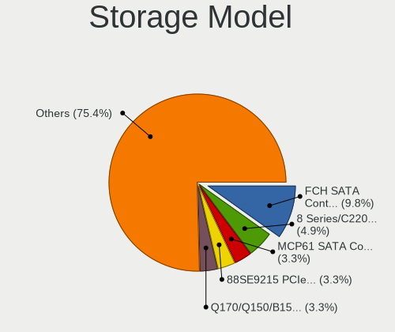
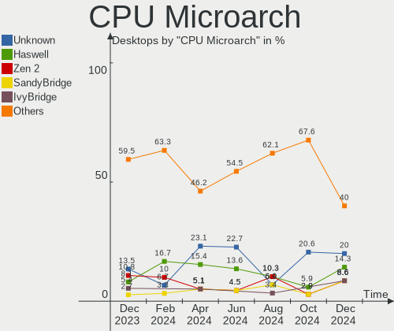

FreeBSD Hardware Trends (Desktop)
---------------------------------

A project to identify most popular hardware characteristics and track their change
over time based on data collected by FreeBSD users at https://BSD-Hardware.info.

Anyone can contribute to the study by uploading probes of their computers by
the [hw-probe](https://github.com/linuxhw/hw-probe/blob/master/INSTALL.BSD.md) tool:

    hw-probe -all -upload

Full-feature report is available here: https://bsd-hardware.info/?view=trends&formfactor=desktop

Period: Feb, 2021.

Contents
--------

- [ OS                       ](#os)
- [ OS Family                ](#os-family)
- [ Arch                     ](#arch)
- [ DE                       ](#de)
- [ Display Server           ](#display-server)
- [ Display Manager          ](#display-manager)
- [ OS Lang                  ](#os-lang)
- [ Boot Mode                ](#boot-mode)
- [ Filesystem               ](#filesystem)
- [ Part. scheme             ](#part-scheme)
- [ Country                  ](#country)
- [ City                     ](#city)
- [ Vendor                   ](#vendor)
- [ Model                    ](#model)
- [ Model Family             ](#model-family)
- [ MFG Year                 ](#mfg-year)
- [ Form Factor              ](#form-factor)
- [ Coreboot                 ](#coreboot)
- [ RAM Size                 ](#ram-size)
- [ RAM Used                 ](#ram-used)
- [ Has CD-ROM               ](#has-cd-rom)
- [ Total Drives             ](#total-drives)
- [ Has Ethernet             ](#has-ethernet)
- [ Drive Vendor             ](#drive-vendor)
- [ Drive Model              ](#drive-model)
- [ HDD Vendor               ](#hdd-vendor)
- [ SSD Vendor               ](#ssd-vendor)
- [ Drive Kind               ](#drive-kind)
- [ Drive Connector          ](#drive-connector)
- [ Drive Size               ](#drive-size)
- [ Space Total              ](#space-total)
- [ Space Used               ](#space-used)
- [ Malfunc. Drives          ](#malfunc-drives)
- [ Malfunc. Drive Vendor    ](#malfunc-drive-vendor)
- [ Malfunc. HDD Vendor      ](#malfunc-hdd-vendor)
- [ Malfunc. Drive Kind      ](#malfunc-drive-kind)
- [ Failed Drives            ](#failed-drives)
- [ Failed Drive Vendor      ](#failed-drive-vendor)
- [ Drive Status             ](#drive-status)
- [ Storage Vendor           ](#storage-vendor)
- [ Storage Model            ](#storage-model)
- [ Storage Kind             ](#storage-kind)
- [ CPU Vendor               ](#cpu-vendor)
- [ CPU Model                ](#cpu-model)
- [ CPU Model Family         ](#cpu-model-family)
- [ CPU Cores                ](#cpu-cores)
- [ CPU Sockets              ](#cpu-sockets)
- [ CPU Threads              ](#cpu-threads)
- [ CPU Microarch            ](#cpu-microarch)
- [ GPU Vendor               ](#gpu-vendor)
- [ GPU Model                ](#gpu-model)
- [ GPU Combo                ](#gpu-combo)
- [ GPU Driver               ](#gpu-driver)
- [ GPU Memory               ](#gpu-memory)
- [ Monitor Vendor           ](#monitor-vendor)
- [ Monitor Model            ](#monitor-model)
- [ Monitor Resolution       ](#monitor-resolution)
- [ Monitor Diagonal         ](#monitor-diagonal)
- [ Monitor Width            ](#monitor-width)
- [ Aspect Ratio             ](#aspect-ratio)
- [ Monitor Area             ](#monitor-area)
- [ Pixel Density            ](#pixel-density)
- [ Multiple Monitors        ](#multiple-monitors)
- [ Net Controller Vendor    ](#net-controller-vendor)
- [ Net Controller Model     ](#net-controller-model)
- [ Wireless Vendor          ](#wireless-vendor)
- [ Wireless Model           ](#wireless-model)
- [ Ethernet Vendor          ](#ethernet-vendor)
- [ Ethernet Model           ](#ethernet-model)
- [ Net Controller Kind      ](#net-controller-kind)
- [ Used Controller          ](#used-controller)
- [ NICs                     ](#nics)
- [ Memory Vendor            ](#memory-vendor)
- [ Memory Model             ](#memory-model)
- [ Memory Kind              ](#memory-kind)
- [ Memory Form Factor       ](#memory-form-factor)
- [ Memory Size              ](#memory-size)
- [ Memory Speed             ](#memory-speed)
- [ Sound Vendor             ](#sound-vendor)
- [ Sound Model              ](#sound-model)
- [ Camera Vendor            ](#camera-vendor)
- [ Camera Model             ](#camera-model)
- [ Fingerprint Vendor       ](#fingerprint-vendor)
- [ Fingerprint Model        ](#fingerprint-model)
- [ Chipcard Vendor          ](#chipcard-vendor)
- [ Chipcard Model           ](#chipcard-model)
- [ Printer Vendor           ](#printer-vendor)
- [ Printer Model            ](#printer-model)
- [ Scanner Vendor           ](#scanner-vendor)
- [ Scanner Model            ](#scanner-model)
- [ Bluetooth Vendor         ](#bluetooth-vendor)
- [ Bluetooth Model          ](#bluetooth-model)
- [ Unsupported Devices      ](#unsupported-devices)
- [ Unsupported Device Types ](#unsupported-device-types)

OS
--

Installed operating systems

| Name                 | Desktops | Percent |
|----------------------|----------|---------|
| FreeBSD 12.2-p3      | 19       | 35.19%  |
| FreeBSD 14.0-CURRENT | 6        | 11.11%  |
| FreeBSD 12.2         | 6        | 11.11%  |
| FreeBSD 13.0-STABLE  | 4        | 7.41%   |
| FreeBSD 13.0-BETA2   | 3        | 5.56%   |
| FreeBSD 12.2-STABLE  | 3        | 5.56%   |
| FreeBSD 12.1-p12     | 3        | 5.56%   |
| FreeBSD 13.0-CURRENT | 2        | 3.7%    |
| FreeBSD 13.0-BETA3   | 2        | 3.7%    |
| FreeBSD 12.2-p2      | 2        | 3.7%    |
| FreeBSD 13.0-BETA1   | 1        | 1.85%   |
| FreeBSD 13.0-ALPHA3  | 1        | 1.85%   |
| FreeBSD 12.2-p4      | 1        | 1.85%   |
| FreeBSD 12.1         | 1        | 1.85%   |

OS Family
---------

OS without a version

| Name    | Desktops | Percent |
|---------|----------|---------|
| FreeBSD | 54       | 100%    |

Arch
----

OS architecture (x86_64, i586, etc.)

| Name  | Desktops | Percent |
|-------|----------|---------|
| amd64 | 48       | 88.89%  |
| arm64 | 4        | 7.41%   |
| i386  | 2        | 3.7%    |

DE
--

Desktop Environment

| Name     | Desktops | Percent |
|----------|----------|---------|
| Console  | 18       | 33.33%  |
| XFCE     | 9        | 16.67%  |
| KDE5     | 8        | 14.81%  |
| TWM      | 6        | 11.11%  |
| GNOME    | 4        | 7.41%   |
| Openbox  | 3        | 5.56%   |
| MATE     | 2        | 3.7%    |
| i3       | 2        | 3.7%    |
| DWM      | 1        | 1.85%   |
| Cinnamon | 1        | 1.85%   |

Display Server
--------------

X11 or Wayland

| Name    | Desktops | Percent |
|---------|----------|---------|
| X11     | 31       | 57.41%  |
| Console | 22       | 40.74%  |
| Wayland | 1        | 1.85%   |

Display Manager
---------------

SDDM, LightDM, etc.

| Name    | Desktops | Percent |
|---------|----------|---------|
| Console | 30       | 55.56%  |
| SDDM    | 9        | 16.67%  |
| LightDM | 6        | 11.11%  |
| SLiM    | 5        | 9.26%   |
| XDM     | 2        | 3.7%    |
| GDM     | 2        | 3.7%    |

OS Lang
-------

Language

| Lang    | Desktops | Percent |
|---------|----------|---------|
| Unknown | 16       | 29.63%  |
| en_US   | 15       | 27.78%  |
| C       | 12       | 22.22%  |
| ru_RU   | 5        | 9.26%   |
| en_GB   | 3        | 5.56%   |
| pt_BR   | 1        | 1.85%   |
| pl_PL   | 1        | 1.85%   |
| de_DE   | 1        | 1.85%   |

Boot Mode
---------

EFI or BIOS

| Mode | Desktops | Percent |
|------|----------|---------|
| BIOS | 28       | 51.85%  |
| EFI  | 26       | 48.15%  |

Filesystem
----------

Type of filesystem

| Type | Desktops | Percent |
|------|----------|---------|
| Zfs  | 33       | 61.11%  |
| Ufs  | 21       | 38.89%  |

Part. scheme
------------

Scheme of partitioning

| Type | Desktops | Percent |
|------|----------|---------|
| GPT  | 50       | 92.59%  |
| MBR  | 4        | 7.41%   |

Country
-------

Geographic location (country)

| Country   | Desktops | Percent |
|-----------|----------|---------|
| USA       | 19       | 35.19%  |
| UK        | 6        | 11.11%  |
| Germany   | 6        | 11.11%  |
| Russia    | 5        | 9.26%   |
| Japan     | 4        | 7.41%   |
| France    | 3        | 5.56%   |
| Ukraine   | 2        | 3.7%    |
| Brazil    | 2        | 3.7%    |
| Poland    | 1        | 1.85%   |
| Indonesia | 1        | 1.85%   |
| Hungary   | 1        | 1.85%   |
| Finland   | 1        | 1.85%   |
| Canada    | 1        | 1.85%   |
| Belgium   | 1        | 1.85%   |
| Belarus   | 1        | 1.85%   |

City
----

Geographic location (city)

| City               | Desktops | Percent |
|--------------------|----------|---------|
| Tokyo              | 2        | 3.7%    |
| Seattle            | 2        | 3.7%    |
| Redmond            | 2        | 3.7%    |
| Palo Alto          | 2        | 3.7%    |
| Moscow             | 2        | 3.7%    |
| Hackney            | 2        | 3.7%    |
| Bellevue           | 2        | 3.7%    |
| Zaporizhia         | 1        | 1.85%   |
| Weybridge          | 1        | 1.85%   |
| West Greenwich     | 1        | 1.85%   |
| Valencia           | 1        | 1.85%   |
| Trowbridge         | 1        | 1.85%   |
| Teresina           | 1        | 1.85%   |
| Surgut             | 1        | 1.85%   |
| Sumida             | 1        | 1.85%   |
| Sint-Genesius-Rode | 1        | 1.85%   |
| Saint Paul         | 1        | 1.85%   |
| Rostock            | 1        | 1.85%   |
| Rochester          | 1        | 1.85%   |
| Pordic             | 1        | 1.85%   |
| Paris              | 1        | 1.85%   |
| Ome                | 1        | 1.85%   |
| Odesa              | 1        | 1.85%   |
| Novosibirsk        | 1        | 1.85%   |
| Meerbusch          | 1        | 1.85%   |
| Lübeck            | 1        | 1.85%   |
| Lodi               | 1        | 1.85%   |
| Lincoln            | 1        | 1.85%   |
| Langen             | 1        | 1.85%   |
| Jacksonville       | 1        | 1.85%   |
| Inhapim            | 1        | 1.85%   |
| Hrodna             | 1        | 1.85%   |
| Helsinki           | 1        | 1.85%   |
| Gilbert            | 1        | 1.85%   |
| Fort Worth         | 1        | 1.85%   |
| Fort Collins       | 1        | 1.85%   |
| Falkenstein        | 1        | 1.85%   |
| Ekaterinburg       | 1        | 1.85%   |
| Dieppe             | 1        | 1.85%   |
| Debrecen           | 1        | 1.85%   |
| Częstochowa       | 1        | 1.85%   |
| Chicago            | 1        | 1.85%   |
| Charfield          | 1        | 1.85%   |
| Birchington        | 1        | 1.85%   |
| Berlin             | 1        | 1.85%   |
| Bandung            | 1        | 1.85%   |
| Annecy             | 1        | 1.85%   |

Vendor
------

Motherboard manufacturer

| Name                    | Desktops | Percent |
|-------------------------|----------|---------|
| ASUSTek Computer        | 15       | 27.78%  |
| ASRock                  | 8        | 14.81%  |
| MSI                     | 5        | 9.26%   |
| Gigabyte Technology     | 5        | 9.26%   |
| Dell                    | 3        | 5.56%   |
| Lenovo                  | 2        | 3.7%    |
| Hewlett-Packard         | 2        | 3.7%    |
| Fujitsu                 | 2        | 3.7%    |
| Unknown                 | 2        | 3.7%    |
| Supermicro              | 1        | 1.85%   |
| Raspberry Pi Foundation | 1        | 1.85%   |
| pine64                  | 1        | 1.85%   |
| PC Engines              | 1        | 1.85%   |
| LattePanda              | 1        | 1.85%   |
| Huanan                  | 1        | 1.85%   |
| Gateway                 | 1        | 1.85%   |
| ECS                     | 1        | 1.85%   |
| Beckhoff Automation     | 1        | 1.85%   |
| Acer                    | 1        | 1.85%   |

Model
-----

Motherboard model

| Name                                                                  | Desktops | Percent |
|-----------------------------------------------------------------------|----------|---------|
| ASUS TUF GAMING X570-PLUS                                             | 2        | 3.7%    |
| ASUS All Series                                                       | 2        | 3.7%    |
| Unknown                                                               | 2        | 3.7%    |
| Supermicro X7SPA-HF                                                   | 1        | 1.85%   |
| RPi rpi                                                               | 1        | 1.85%   |
| pine64 pinebook-pro-rk3399                                            | 1        | 1.85%   |
| PC Engines apu2                                                       | 1        | 1.85%   |
| MSI MS-7C73                                                           | 1        | 1.85%   |
| MSI MS-7B38                                                           | 1        | 1.85%   |
| MSI MS-7817                                                           | 1        | 1.85%   |
| MSI MS-7816                                                           | 1        | 1.85%   |
| MSI MS-7599                                                           | 1        | 1.85%   |
| Lenovo ThinkCentre M91p 5067AT1                                       | 1        | 1.85%   |
| Lenovo ThinkCentre M700 10GRCTO1WW                                    | 1        | 1.85%   |
| LattePanda Alpha                                                      | 1        | 1.85%   |
| Huanan X79 INTEL (INTEL Xeon E5/Corei7 DMI2 - C600/C200 Cipset V2.49P | 1        | 1.85%   |
| HP Z800 Workstation                                                   | 1        | 1.85%   |
| HP Desktop M01-F0xxx                                                  | 1        | 1.85%   |
| Gigabyte Z97X-UD3H                                                    | 1        | 1.85%   |
| Gigabyte X570 AORUS MASTER                                            | 1        | 1.85%   |
| Gigabyte M68MT-S2                                                     | 1        | 1.85%   |
| Gigabyte F2A55M-DS2                                                   | 1        | 1.85%   |
| Gigabyte 990FXA-UD3                                                   | 1        | 1.85%   |
| Gateway DX4870                                                        | 1        | 1.85%   |
| Fujitsu D3417-B2 S26361-D3417-B2                                      | 1        | 1.85%   |
| Fujitsu D3417-B1                                                      | 1        | 1.85%   |
| ECS B672                                                              | 1        | 1.85%   |
| Dell OptiPlex 7040                                                    | 1        | 1.85%   |
| Dell OptiPlex 5080                                                    | 1        | 1.85%   |
| Dell Inspiron 5680                                                    | 1        | 1.85%   |
| Beckhoff Automation Industrial PC                                     | 1        | 1.85%   |
| ASUS TUF GAMING X570-PRO                                              | 1        | 1.85%   |
| ASUS SABERTOOTH 990FX R2.0                                            | 1        | 1.85%   |
| ASUS ROG ZENITH II EXTREME ALPHA                                      | 1        | 1.85%   |
| ASUS PRIME H310-PLUS                                                  | 1        | 1.85%   |
| ASUS PRIME B450M-A                                                    | 1        | 1.85%   |
| ASUS P5Q-E                                                            | 1        | 1.85%   |
| ASUS P5Q                                                              | 1        | 1.85%   |
| ASUS P5GDC Pro                                                        | 1        | 1.85%   |
| ASUS M4A88TD-V EVO/USB3                                               | 1        | 1.85%   |
| ASUS M2N-E SLI                                                        | 1        | 1.85%   |
| ASUS A0000001                                                         | 1        | 1.85%   |
| ASRock Z170M Extreme4                                                 | 1        | 1.85%   |
| ASRock H61M-S                                                         | 1        | 1.85%   |
| ASRock H470M-STX                                                      | 1        | 1.85%   |
| ASRock H110M-STX                                                      | 1        | 1.85%   |
| ASRock B550 Phantom Gaming 4                                          | 1        | 1.85%   |
| ASRock AM1H-ITX                                                       | 1        | 1.85%   |
| ASRock AB350 Pro4                                                     | 1        | 1.85%   |
| ASRock A320M-DGS                                                      | 1        | 1.85%   |
| Acer Aspire M1200/3200/5200                                           | 1        | 1.85%   |

Model Family
------------

Motherboard model prefix

| Name                           | Desktops | Percent |
|--------------------------------|----------|---------|
| ASUS TUF                       | 3        | 5.56%   |
| Lenovo ThinkCentre             | 2        | 3.7%    |
| Dell OptiPlex                  | 2        | 3.7%    |
| ASUS PRIME                     | 2        | 3.7%    |
| ASUS All                       | 2        | 3.7%    |
| Unknown                        | 2        | 3.7%    |
| Supermicro X7SPA-HF            | 1        | 1.85%   |
| RPi rpi                        | 1        | 1.85%   |
| pine64 pinebook-pro-rk3399     | 1        | 1.85%   |
| PC Engines apu2                | 1        | 1.85%   |
| MSI MS-7C73                    | 1        | 1.85%   |
| MSI MS-7B38                    | 1        | 1.85%   |
| MSI MS-7817                    | 1        | 1.85%   |
| MSI MS-7816                    | 1        | 1.85%   |
| MSI MS-7599                    | 1        | 1.85%   |
| LattePanda Alpha               | 1        | 1.85%   |
| Huanan X79                     | 1        | 1.85%   |
| HP Z800                        | 1        | 1.85%   |
| HP Desktop                     | 1        | 1.85%   |
| Gigabyte Z97X-UD3H             | 1        | 1.85%   |
| Gigabyte X570                  | 1        | 1.85%   |
| Gigabyte M68MT-S2              | 1        | 1.85%   |
| Gigabyte F2A55M-DS2            | 1        | 1.85%   |
| Gigabyte 990FXA-UD3            | 1        | 1.85%   |
| Gateway DX4870                 | 1        | 1.85%   |
| Fujitsu D3417-B2               | 1        | 1.85%   |
| Fujitsu D3417-B1               | 1        | 1.85%   |
| ECS B672                       | 1        | 1.85%   |
| Dell Inspiron                  | 1        | 1.85%   |
| Beckhoff Automation Industrial | 1        | 1.85%   |
| ASUS SABERTOOTH                | 1        | 1.85%   |
| ASUS ROG                       | 1        | 1.85%   |
| ASUS P5Q-E                     | 1        | 1.85%   |
| ASUS P5Q                       | 1        | 1.85%   |
| ASUS P5GDC                     | 1        | 1.85%   |
| ASUS M4A88TD-V                 | 1        | 1.85%   |
| ASUS M2N-E                     | 1        | 1.85%   |
| ASUS A0000001                  | 1        | 1.85%   |
| ASRock Z170M                   | 1        | 1.85%   |
| ASRock H61M-S                  | 1        | 1.85%   |
| ASRock H470M-STX               | 1        | 1.85%   |
| ASRock H110M-STX               | 1        | 1.85%   |
| ASRock B550                    | 1        | 1.85%   |
| ASRock AM1H-ITX                | 1        | 1.85%   |
| ASRock AB350                   | 1        | 1.85%   |
| ASRock A320M-DGS               | 1        | 1.85%   |
| Acer Aspire                    | 1        | 1.85%   |

MFG Year
--------

Motherboard manufacture year

| Year    | Desktops | Percent |
|---------|----------|---------|
| 2020    | 8        | 14.81%  |
| 2021    | 7        | 12.96%  |
| 2019    | 7        | 12.96%  |
| 2018    | 5        | 9.26%   |
| 2012    | 4        | 7.41%   |
| 2015    | 3        | 5.56%   |
| 2014    | 3        | 5.56%   |
| 2010    | 3        | 5.56%   |
| 2017    | 2        | 3.7%    |
| 2016    | 2        | 3.7%    |
| 2011    | 2        | 3.7%    |
| 2009    | 2        | 3.7%    |
| 2008    | 2        | 3.7%    |
| Unknown | 2        | 3.7%    |
| 2013    | 1        | 1.85%   |
| 2005    | 1        | 1.85%   |

Form Factor
-----------

Physical design of the computer

| Name    | Desktops | Percent |
|---------|----------|---------|
| Desktop | 54       | 100%    |

Coreboot
--------

Have coreboot on board

| Used | Desktops | Percent |
|------|----------|---------|
| No   | 53       | 98.15%  |
| Yes  | 1        | 1.85%   |

RAM Size
--------

Total RAM memory

| Size in GB  | Desktops | Percent |
|-------------|----------|---------|
| 8.01-16.0   | 17       | 31.48%  |
| 32.01-64.0  | 12       | 22.22%  |
| 16.01-24.0  | 9        | 16.67%  |
| 4.01-8.0    | 8        | 14.81%  |
| 64.01-256.0 | 5        | 9.26%   |
| 24.01-32.0  | 2        | 3.7%    |
| 2.01-3.0    | 1        | 1.85%   |

RAM Used
--------

Used RAM memory

| Used GB    | Desktops | Percent |
|------------|----------|---------|
| 0.01-0.5   | 16       | 29.63%  |
| 0.51-1.0   | 15       | 27.78%  |
| 1.01-2.0   | 10       | 18.52%  |
| 4.01-8.0   | 3        | 5.56%   |
| 3.01-4.0   | 3        | 5.56%   |
| 2.01-3.0   | 3        | 5.56%   |
| 8.01-16.0  | 3        | 5.56%   |
| 24.01-32.0 | 1        | 1.85%   |

Has CD-ROM
----------

Has CD-ROM on board

| Presented | Desktops | Percent |
|-----------|----------|---------|
| No        | 38       | 70.37%  |
| Yes       | 16       | 29.63%  |

Total Drives
------------

Number of drives on board

| Drives | Desktops | Percent |
|--------|----------|---------|
| 2      | 14       | 25.93%  |
| 1      | 13       | 24.07%  |
| 3      | 8        | 14.81%  |
| 5      | 5        | 9.26%   |
| 4      | 5        | 9.26%   |
| 0      | 3        | 5.56%   |
| 6      | 2        | 3.7%    |
| 11     | 1        | 1.85%   |
| 9      | 1        | 1.85%   |
| 8      | 1        | 1.85%   |
| 7      | 1        | 1.85%   |

Has Ethernet
------------

Has Ethernet on board

| Presented | Desktops | Percent |
|-----------|----------|---------|
| Yes       | 50       | 92.59%  |
| No        | 4        | 7.41%   |

Drive Vendor
------------

Hard drive vendors

| Vendor              | Desktops | Drives | Percent |
|---------------------|----------|--------|---------|
| Seagate             | 26       | 50     | 26.8%   |
| WDC                 | 23       | 44     | 23.71%  |
| Samsung Electronics | 14       | 20     | 14.43%  |
| Kingston            | 6        | 8      | 6.19%   |
| Toshiba             | 5        | 10     | 5.15%   |
| Crucial             | 5        | 5      | 5.15%   |
| Intel               | 3        | 3      | 3.09%   |
| A-DATA Technology   | 3        | 3      | 3.09%   |
| SanDisk             | 2        | 2      | 2.06%   |
| Hitachi             | 2        | 2      | 2.06%   |
| Transcend           | 1        | 1      | 1.03%   |
| T-FORCE             | 1        | 1      | 1.03%   |
| PLEXTOR             | 1        | 1      | 1.03%   |
| Phison              | 1        | 2      | 1.03%   |
| Patriot             | 1        | 1      | 1.03%   |
| OCZ                 | 1        | 1      | 1.03%   |
| KingSpec            | 1        | 1      | 1.03%   |
| Gigabyte Technology | 1        | 1      | 1.03%   |

Drive Model
-----------

Hard drive models

| Model                            | Desktops | Percent |
|----------------------------------|----------|---------|
| WDC WD40EZRZ-22GXCB0 4TB         | 2        | 1.79%   |
| WDC WD10EZRX-00A8LB0 1TB         | 2        | 1.79%   |
| Seagate ST8000AS0002-1NA17Z 8TB  | 2        | 1.79%   |
| Seagate ST4000DM000-1F2168 4TB   | 2        | 1.79%   |
| Seagate ST3500312CS 500GB        | 2        | 1.79%   |
| Seagate ST1000DM003-9YN162 1TB   | 2        | 1.79%   |
| Samsung SSD 850 EVO 250GB        | 2        | 1.79%   |
| Samsung MZVLV128HCGR-00000 128GB | 2        | 1.79%   |
| Kingston SV300S37A120G 120GB     | 2        | 1.79%   |
| Crucial CT250MX500SSD1 250GB     | 2        | 1.79%   |
| A-DATA SU650 240GB               | 2        | 1.79%   |
| WDC WDS250G2B0A-00SM50 250GB     | 1        | 0.89%   |
| WDC WDS100T1R0A-68A4W0 1TB       | 1        | 0.89%   |
| WDC WD80EFAX-68KNBN0 8TB         | 1        | 0.89%   |
| WDC WD60EFRX-68MYMN1 6TB         | 1        | 0.89%   |
| WDC WD5003AZEX-00MK2A0 500GB     | 1        | 0.89%   |
| WDC WD5003AZEX-00K3CA0 500GB     | 1        | 0.89%   |
| WDC WD5003AZEX-00K1GA0 500GB     | 1        | 0.89%   |
| WDC WD5002ABYS-18B1B0 500GB      | 1        | 0.89%   |
| WDC WD5000AAKS-00UU3A0 500GB     | 1        | 0.89%   |
| WDC WD40NDZW-11MR8S1 4TB         | 1        | 0.89%   |
| WDC WD40EFRX-68WT0N0 4TB         | 1        | 0.89%   |
| WDC WD4001FAEX-00MJRA0 4TB       | 1        | 0.89%   |
| WDC WD4000BEVT-00ZAT0 400GB      | 1        | 0.89%   |
| WDC WD360GD-00FLC0 37GB          | 1        | 0.89%   |
| WDC WD3200AAJS-22B4A0 320GB      | 1        | 0.89%   |
| WDC WD30EFRX-68EUZN0 3TB         | 1        | 0.89%   |
| WDC WD20EFRX-68EUZN0 2TB         | 1        | 0.89%   |
| WDC WD2001FASS-00W2B0 2TB        | 1        | 0.89%   |
| WDC WD2001FASS-00U0B0 2TB        | 1        | 0.89%   |
| WDC WD120EFAX-68UNTN0 12TB       | 1        | 0.89%   |
| WDC WD10EZEX-75WN4A1 1TB         | 1        | 0.89%   |
| WDC WD10EZEX-75WN4A0 1TB         | 1        | 0.89%   |
| WDC WD10EZEX-08WN4A0 1TB         | 1        | 0.89%   |
| WDC WD10EZEX-08M2NA0 1TB         | 1        | 0.89%   |
| WDC WD10EZEX-00WN4A0 1TB         | 1        | 0.89%   |
| WDC WD1001FALS-00J7B0 1TB        | 1        | 0.89%   |
| Transcend TS8GSSD500 8GB         | 1        | 0.89%   |
| Toshiba MN07ACA12T 12TB          | 1        | 0.89%   |
| Toshiba MK2555GSX 250GB          | 1        | 0.89%   |
| Toshiba MG04ACA400E 4TB          | 1        | 0.89%   |
| Toshiba HDWE140 4TB              | 1        | 0.89%   |
| Toshiba HDWD110 1TB              | 1        | 0.89%   |
| T-FORCE TM8FP7001T 1TB           | 1        | 0.89%   |
| Seagate ST8000VN004-2M2101 8TB   | 1        | 0.89%   |
| Seagate ST500LT012-1DG142 500GB  | 1        | 0.89%   |
| Seagate ST500DM002-1BD142 500GB  | 1        | 0.89%   |
| Seagate ST5000LM000-2AN170 5TB   | 1        | 0.89%   |
| Seagate ST4000NE001-2MA101 4TB   | 1        | 0.89%   |
| Seagate ST4000LM024-2AN17V 4TB   | 1        | 0.89%   |
| Seagate ST4000DM004-2CV104 4TB   | 1        | 0.89%   |
| Seagate ST380011A 80GB           | 1        | 0.89%   |
| Seagate ST3750528AS 752GB        | 1        | 0.89%   |
| Seagate ST3250318AS 250GB        | 1        | 0.89%   |
| Seagate ST32000641AS 2TB         | 1        | 0.89%   |
| Seagate ST3160812A 160GB         | 1        | 0.89%   |
| Seagate ST3160215ACE 160GB       | 1        | 0.89%   |
| Seagate ST31000524AS 1TB         | 1        | 0.89%   |
| Seagate ST3000DM008-2DM166 3TB   | 1        | 0.89%   |
| Seagate ST3000DM007-1WY10G 3TB   | 1        | 0.89%   |

HDD Vendor
----------

Hard disk drive vendors

| Vendor              | Desktops | Drives | Percent |
|---------------------|----------|--------|---------|
| Seagate             | 26       | 50     | 46.43%  |
| WDC                 | 22       | 41     | 39.29%  |
| Toshiba             | 5        | 10     | 8.93%   |
| Hitachi             | 2        | 2      | 3.57%   |
| Samsung Electronics | 1        | 1      | 1.79%   |

SSD Vendor
----------

Solid state drive vendors

| Vendor              | Desktops | Drives | Percent |
|---------------------|----------|--------|---------|
| Samsung Electronics | 7        | 12     | 25%     |
| Kingston            | 5        | 7      | 17.86%  |
| Crucial             | 3        | 3      | 10.71%  |
| A-DATA Technology   | 3        | 3      | 10.71%  |
| WDC                 | 2        | 3      | 7.14%   |
| SanDisk             | 2        | 2      | 7.14%   |
| Transcend           | 1        | 1      | 3.57%   |
| Patriot             | 1        | 1      | 3.57%   |
| OCZ                 | 1        | 1      | 3.57%   |
| KingSpec            | 1        | 1      | 3.57%   |
| Intel               | 1        | 1      | 3.57%   |
| Gigabyte Technology | 1        | 1      | 3.57%   |

Drive Kind
----------

HDD or SSD

| Kind | Desktops | Drives | Percent |
|------|----------|--------|---------|
| HDD  | 38       | 104    | 50.67%  |
| SSD  | 23       | 36     | 30.67%  |
| NVMe | 14       | 16     | 18.67%  |

Drive Connector
---------------

SATA, SAS, NVMe, etc.

| Type | Desktops | Drives | Percent |
|------|----------|--------|---------|
| SATA | 45       | 140    | 76.27%  |
| NVMe | 14       | 16     | 23.73%  |

Drive Size
----------

Size of hard drive

| Size in TB | Desktops | Drives | Percent |
|------------|----------|--------|---------|
| 0.01-0.5   | 27       | 58     | 40.91%  |
| 0.51-1.0   | 13       | 24     | 19.7%   |
| 3.01-4.0   | 9        | 19     | 13.64%  |
| 1.01-2.0   | 6        | 10     | 9.09%   |
| 4.01-10.0  | 5        | 14     | 7.58%   |
| 2.01-3.0   | 4        | 12     | 6.06%   |
| 10.01-20.0 | 2        | 3      | 3.03%   |

Space Total
-----------

Amount of disk space available on the file system

| Size in GB     | Desktops | Percent |
|----------------|----------|---------|
| 101-250        | 17       | 31.48%  |
| 501-1000       | 10       | 18.52%  |
| More than 3000 | 6        | 11.11%  |
| 251-500        | 6        | 11.11%  |
| 51-100         | 5        | 9.26%   |
| 21-50          | 3        | 5.56%   |
| 1001-2000      | 3        | 5.56%   |
| 2001-3000      | 2        | 3.7%    |
| 1-20           | 2        | 3.7%    |

Space Used
----------

Amount of used disk space

| Used GB        | Desktops | Percent |
|----------------|----------|---------|
| 1-20           | 30       | 55.56%  |
| 21-50          | 11       | 20.37%  |
| 101-250        | 4        | 7.41%   |
| More than 3000 | 2        | 3.7%    |
| 251-500        | 2        | 3.7%    |
| 1001-2000      | 2        | 3.7%    |
| 51-100         | 2        | 3.7%    |
| 501-1000       | 1        | 1.85%   |

Malfunc. Drives
---------------

Drive models with a malfunction

| Model                             | Desktops | Drives | Percent |
|-----------------------------------|----------|--------|---------|
| Seagate ST1000DM003-9YN162 1TB    | 2        | 4      | 16.67%  |
| WDC WD60EFRX-68MYMN1 6TB          | 1        | 1      | 8.33%   |
| WDC WD5002ABYS-18B1B0 500GB       | 1        | 1      | 8.33%   |
| WDC WD40EFRX-68WT0N0 4TB          | 1        | 2      | 8.33%   |
| WDC WD4001FAEX-00MJRA0 4TB        | 1        | 2      | 8.33%   |
| WDC WD3200AAJS-22B4A0 320GB       | 1        | 1      | 8.33%   |
| WDC WD20EFRX-68EUZN0 2TB          | 1        | 3      | 8.33%   |
| WDC WD2001FASS-00W2B0 2TB         | 1        | 1      | 8.33%   |
| Seagate ST3250318AS 250GB         | 1        | 1      | 8.33%   |
| Seagate ST3160812A 160GB          | 1        | 1      | 8.33%   |
| Samsung Electronics HD154UI 1.5TB | 1        | 1      | 8.33%   |

Malfunc. Drive Vendor
---------------------

Vendors of faulty drives

| Vendor              | Desktops | Drives | Percent |
|---------------------|----------|--------|---------|
| WDC                 | 7        | 11     | 58.33%  |
| Seagate             | 4        | 6      | 33.33%  |
| Samsung Electronics | 1        | 1      | 8.33%   |

Malfunc. HDD Vendor
-------------------

Vendors of faulty HDD drives

| Vendor              | Desktops | Drives | Percent |
|---------------------|----------|--------|---------|
| WDC                 | 7        | 11     | 58.33%  |
| Seagate             | 4        | 6      | 33.33%  |
| Samsung Electronics | 1        | 1      | 8.33%   |

Malfunc. Drive Kind
-------------------

Kinds of faulty drives

| Kind | Desktops | Drives | Percent |
|------|----------|--------|---------|
| HDD  | 12       | 18     | 100%    |

Failed Drives
-------------

Failed drive models

Zero info for selected period =(

Failed Drive Vendor
-------------------

Failed drive vendors

Zero info for selected period =(

Drive Status
------------

Number of failed and malfunc. drives

| Status   | Desktops | Drives | Percent |
|----------|----------|--------|---------|
| Works    | 49       | 135    | 79.03%  |
| Malfunc  | 12       | 18     | 19.35%  |
| Detected | 1        | 3      | 1.61%   |

Storage Vendor
--------------

Storage controller vendors

| Vendor                      | Desktops | Percent |
|-----------------------------|----------|---------|
| Intel                       | 29       | 38.67%  |
| AMD                         | 19       | 25.33%  |
| Samsung Electronics         | 6        | 8%      |
| ASMedia Technology          | 5        | 6.67%   |
| Marvell Technology Group    | 3        | 4%      |
| Sandisk                     | 2        | 2.67%   |
| Phison Electronics          | 2        | 2.67%   |
| Nvidia                      | 2        | 2.67%   |
| Broadcom / LSI              | 2        | 2.67%   |
| VIA Technologies            | 1        | 1.33%   |
| Micron/Crucial Technology   | 1        | 1.33%   |
| Micron Technology           | 1        | 1.33%   |
| Lite-On Technology          | 1        | 1.33%   |
| Kingston Technology Company | 1        | 1.33%   |

Storage Model
-------------

Storage controller models

| Model                                                                                   | Desktops | Percent |
|-----------------------------------------------------------------------------------------|----------|---------|
| AMD FCH SATA Controller [AHCI mode]                                                     | 12       | 13.48%  |
| Intel Q170/Q150/B150/H170/H110/Z170/CM236 Chipset SATA Controller [AHCI Mode]           | 6        | 6.74%   |
| ASMedia ASM1062 Serial ATA Controller                                                   | 5        | 5.62%   |
| AMD SB7x0/SB8x0/SB9x0 SATA Controller [AHCI mode]                                       | 5        | 5.62%   |
| Intel 8 Series/C220 Series Chipset Family 6-port SATA Controller 1 [AHCI mode]          | 4        | 4.49%   |
| Intel 400 Series Chipset Family SATA AHCI Controller                                    | 3        | 3.37%   |
| Unknown                                                                                 | 3        | 3.37%   |
| Samsung NVMe SSD Controller SM981/PM981/PM983                                           | 2        | 2.25%   |
| Samsung NVMe SSD Controller SM951/PM951                                                 | 2        | 2.25%   |
| Marvell Group 88SE6111/6121 SATA II / PATA Controller                                   | 2        | 2.25%   |
| Intel SSD 660P Series                                                                   | 2        | 2.25%   |
| Intel SATA Controller [RAID mode]                                                       | 2        | 2.25%   |
| Intel 7 Series/C210 Series Chipset Family 6-port SATA Controller [AHCI mode]            | 2        | 2.25%   |
| Intel 6 Series/C200 Series Chipset Family 6 port Desktop SATA AHCI Controller           | 2        | 2.25%   |
| AMD SB7x0/SB8x0/SB9x0 IDE Controller                                                    | 2        | 2.25%   |
| AMD FCH SATA Controller D                                                               | 2        | 2.25%   |
| AMD 400 Series Chipset SATA Controller                                                  | 2        | 2.25%   |
| VIA VT6415 PATA IDE Host Controller                                                     | 1        | 1.12%   |
| Sandisk WD Blue SN550 NVMe SSD                                                          | 1        | 1.12%   |
| Sandisk WD Black 2018/SN750 / PC SN720 NVMe SSD                                         | 1        | 1.12%   |
| Samsung NVMe SSD Controller SM961/PM961/SM963                                           | 1        | 1.12%   |
| Samsung NVMe SSD Controller PM9A1/980PRO                                                | 1        | 1.12%   |
| Phison E16 PCIe4 NVMe Controller                                                        | 1        | 1.12%   |
| Phison E12 NVMe Controller                                                              | 1        | 1.12%   |
| Nvidia MCP61 SATA Controller                                                            | 1        | 1.12%   |
| Nvidia CK804 Serial ATA Controller                                                      | 1        | 1.12%   |
| Nvidia CK804 IDE                                                                        | 1        | 1.12%   |
| Marvell Group 88SE9172 SATA 6Gb/s Controller                                            | 1        | 1.12%   |
| Lite-On M8Pe Series NVMe SSD                                                            | 1        | 1.12%   |
| Kingston Company A2000 NVMe SSD                                                         | 1        | 1.12%   |
| Intel NVMe Optane Memory Series                                                         | 1        | 1.12%   |
| Intel Cannon Lake PCH SATA AHCI Controller                                              | 1        | 1.12%   |
| Intel Atom Processor E3800 Series SATA AHCI Controller                                  | 1        | 1.12%   |
| Intel 9 Series Chipset Family SATA Controller [AHCI Mode]                               | 1        | 1.12%   |
| Intel 82801JI (ICH10 Family) SATA AHCI Controller                                       | 1        | 1.12%   |
| Intel 82801JI (ICH10 Family) 4 port SATA IDE Controller #1                              | 1        | 1.12%   |
| Intel 82801JI (ICH10 Family) 2 port SATA IDE Controller #2                              | 1        | 1.12%   |
| Intel 82801IR/IO/IH (ICH9R/DO/DH) 6 port SATA Controller [AHCI mode]                    | 1        | 1.12%   |
| Intel 82801FR/FRW (ICH6R/ICH6RW) SATA Controller                                        | 1        | 1.12%   |
| Intel 82801FB/FBM/FR/FW/FRW (ICH6 Family) IDE Controller                                | 1        | 1.12%   |
| Intel 6 Series/C200 Series Chipset Family Desktop SATA Controller (IDE mode, ports 4-5) | 1        | 1.12%   |
| Intel 6 Series/C200 Series Chipset Family Desktop SATA Controller (IDE mode, ports 0-3) | 1        | 1.12%   |
| Intel 200 Series PCH SATA controller [AHCI mode]                                        | 1        | 1.12%   |
| Broadcom / LSI SAS3008 PCI-Express Fusion-MPT SAS-3                                     | 1        | 1.12%   |
| Broadcom / LSI SAS1068E PCI-Express Fusion-MPT SAS                                      | 1        | 1.12%   |
| AMD FCH SATA Controller [IDE mode]                                                      | 1        | 1.12%   |
| AMD FCH IDE Controller                                                                  | 1        | 1.12%   |
| AMD 300 Series Chipset SATA Controller                                                  | 1        | 1.12%   |

Storage Kind
------------

Kind of storage controller (IDE, SATA, NVMe, SAS, ...)

| Kind | Desktops | Percent |
|------|----------|---------|
| SATA | 41       | 56.94%  |
| NVMe | 17       | 23.61%  |
| IDE  | 10       | 13.89%  |
| RAID | 2        | 2.78%   |
| SAS  | 1        | 1.39%   |
| SCSI | 1        | 1.39%   |

CPU Vendor
----------

Processor vendors

| Vendor  | Desktops | Percent |
|---------|----------|---------|
| Intel   | 29       | 53.7%   |
| AMD     | 21       | 38.89%  |
| ARM     | 3        | 5.56%   |
| Unknown | 1        | 1.85%   |

CPU Model
---------

Processor models

| Model                                           | Desktops | Percent |
|-------------------------------------------------|----------|---------|
| ARM Cortex-A72 r0p3                             | 2        | 3.7%    |
| AMD Ryzen 7 2700X Eight-Core Processor          | 2        | 3.7%    |
| Intel Xeon CPU X5660 @ 2.80GHz                  | 1        | 1.85%   |
| Intel Xeon CPU E5-1650 v2 @ 3.50GHz             | 1        | 1.85%   |
| Intel Xeon CPU E3-1275 v6 @ 3.80GHz             | 1        | 1.85%   |
| Intel Xeon CPU E3-1275 v5 @ 3.60GHz             | 1        | 1.85%   |
| Intel Pentium CPU G3220 @ 3.00GHz               | 1        | 1.85%   |
| Intel Pentium 4 CPU 3.20GHz                     | 1        | 1.85%   |
| Intel Core m3-7Y30 CPU @ 1.00GHz                | 1        | 1.85%   |
| Intel Core i7-6700T CPU @ 2.80GHz               | 1        | 1.85%   |
| Intel Core i7-6700K CPU @ 4.00GHz               | 1        | 1.85%   |
| Intel Core i7-6700 CPU @ 3.40GHz                | 1        | 1.85%   |
| Intel Core i7-4790K CPU @ 4.00GHz               | 1        | 1.85%   |
| Intel Core i7-4770K CPU @ 3.50GHz               | 1        | 1.85%   |
| Intel Core i7-4770 CPU @ 3.40GHz                | 1        | 1.85%   |
| Intel Core i7-10700 CPU @ 2.90GHz               | 1        | 1.85%   |
| Intel Core i5-9400 CPU @ 2.90GHz                | 1        | 1.85%   |
| Intel Core i5-8400 CPU @ 2.80GHz                | 1        | 1.85%   |
| Intel Core i5-4430 CPU @ 3.00GHz                | 1        | 1.85%   |
| Intel Core i5-3330 CPU @ 3.00GHz                | 1        | 1.85%   |
| Intel Core i5-2400 CPU @ 3.10GHz                | 1        | 1.85%   |
| Intel Core i5-2320 CPU @ 3.00GHz                | 1        | 1.85%   |
| Intel Core i5-10500T CPU @ 2.30GHz              | 1        | 1.85%   |
| Intel Core i5-10400 CPU @ 2.90GHz               | 1        | 1.85%   |
| Intel Core i3-6100 CPU @ 3.70GHz                | 1        | 1.85%   |
| Intel Core i3-3210 CPU @ 3.20GHz                | 1        | 1.85%   |
| Intel Core 2 Quad CPU Q6600 @ 2.40GHz           | 1        | 1.85%   |
| Intel Core 2 Duo CPU E6750 @ 2.66GHz            | 1        | 1.85%   |
| Intel Celeron G4900 CPU @ 3.10GHz               | 1        | 1.85%   |
| Intel Atom CPU E3845 @ 1.91GHz                  | 1        | 1.85%   |
| Intel Atom CPU D510 @ 1.66GHz                   | 1        | 1.85%   |
| ARM Cortex-A72 r0p2                             | 1        | 1.85%   |
| AMD Ryzen Threadripper 3960X 24-Core Processor  | 1        | 1.85%   |
| AMD Ryzen 9 5900X 12-Core Processor             | 1        | 1.85%   |
| AMD Ryzen 9 3950X 16-Core Processor             | 1        | 1.85%   |
| AMD Ryzen 9 3900X 12-Core Processor             | 1        | 1.85%   |
| AMD Ryzen 7 5800X 8-Core Processor              | 1        | 1.85%   |
| AMD Ryzen 7 1700 Eight-Core Processor           | 1        | 1.85%   |
| AMD Ryzen 5 3600 6-Core Processor               | 1        | 1.85%   |
| AMD Ryzen 5 1600 Six-Core Processor             | 1        | 1.85%   |
| AMD Ryzen 3 1200 Quad-Core Processor            | 1        | 1.85%   |
| AMD Phenom II X6 1090T Processor                | 1        | 1.85%   |
| AMD Phenom II X4 965 Processor                  | 1        | 1.85%   |
| AMD Phenom II X4 955 Processor                  | 1        | 1.85%   |
| AMD Phenom 9150e Quad-Core Processor            | 1        | 1.85%   |
| AMD GX-412TC SOC                                | 1        | 1.85%   |
| AMD FX-8350 Eight-Core Processor                | 1        | 1.85%   |
| AMD FX-6100 Six-Core Processor                  | 1        | 1.85%   |
| AMD Athlon Dual Core Processor 5050e            | 1        | 1.85%   |
| AMD Athlon 5350 APU with Radeon R3              | 1        | 1.85%   |
| AMD A10-7850K Radeon R7, 12 Compute Cores 4C+8G | 1        | 1.85%   |
|                                                 | 1        | 1.85%   |

CPU Model Family
----------------

Processor model prefix

| Model                  | Desktops | Percent |
|------------------------|----------|---------|
| Intel Core i5          | 8        | 14.81%  |
| Intel Core i7          | 7        | 12.96%  |
| Intel Xeon             | 4        | 7.41%   |
| AMD Ryzen 7            | 4        | 7.41%   |
| ARM Cortex             | 3        | 5.56%   |
| AMD Ryzen 9            | 3        | 5.56%   |
| Intel Core i3          | 2        | 3.7%    |
| Intel Atom             | 2        | 3.7%    |
| AMD Ryzen 5            | 2        | 3.7%    |
| AMD Phenom II X4       | 2        | 3.7%    |
| AMD FX                 | 2        | 3.7%    |
| Other                  | 1        | 1.85%   |
| Intel Pentium 4        | 1        | 1.85%   |
| Intel Pentium          | 1        | 1.85%   |
| Intel Core m3          | 1        | 1.85%   |
| Intel Core 2 Quad      | 1        | 1.85%   |
| Intel Core 2 Duo       | 1        | 1.85%   |
| Intel Celeron          | 1        | 1.85%   |
| AMD Ryzen Threadripper | 1        | 1.85%   |
| AMD Ryzen 3            | 1        | 1.85%   |
| AMD Phenom II X6       | 1        | 1.85%   |
| AMD Phenom             | 1        | 1.85%   |
| AMD GX                 | 1        | 1.85%   |
| AMD Athlon Dual Core   | 1        | 1.85%   |
| AMD Athlon             | 1        | 1.85%   |
| AMD A10                | 1        | 1.85%   |

CPU Cores
---------

Number of processor cores

| Number  | Desktops | Percent |
|---------|----------|---------|
| 4       | 21       | 38.89%  |
| 6       | 8        | 14.81%  |
| 2       | 8        | 14.81%  |
| Unknown | 5        | 9.26%   |
| 16      | 4        | 7.41%   |
| 24      | 2        | 3.7%    |
| 12      | 2        | 3.7%    |
| 8       | 2        | 3.7%    |
| 48      | 1        | 1.85%   |
| 32      | 1        | 1.85%   |

CPU Sockets
-----------

Number of sockets

| Number  | Desktops | Percent |
|---------|----------|---------|
| 1       | 51       | 94.44%  |
| Unknown | 3        | 5.56%   |

CPU Threads
-----------

Threads per core (Hyper-Threading)

| Number  | Desktops | Percent |
|---------|----------|---------|
| 1       | 32       | 59.26%  |
| 2       | 17       | 31.48%  |
| Unknown | 5        | 9.26%   |

CPU Microarch
-------------

Microarchitecture

| Name        | Desktops | Percent |
|-------------|----------|---------|
| Skylake     | 5        | 9.26%   |
| KabyLake    | 5        | 9.26%   |
| Haswell     | 5        | 9.26%   |
| Zen 2       | 4        | 7.41%   |
| K10         | 4        | 7.41%   |
| Unknown     | 4        | 7.41%   |
| Zen+        | 3        | 5.56%   |
| IvyBridge   | 3        | 5.56%   |
| CometLake   | 3        | 5.56%   |
| Zen 3       | 2        | 3.7%    |
| Zen         | 2        | 3.7%    |
| SandyBridge | 2        | 3.7%    |
| Core        | 2        | 3.7%    |
| Westmere    | 1        | 1.85%   |
| Steamroller | 1        | 1.85%   |
| Silvermont  | 1        | 1.85%   |
| Puma        | 1        | 1.85%   |
| Piledriver  | 1        | 1.85%   |
| NetBurst    | 1        | 1.85%   |
| K8 Hammer   | 1        | 1.85%   |
| Jaguar      | 1        | 1.85%   |
| Bulldozer   | 1        | 1.85%   |
| Bonnell     | 1        | 1.85%   |

GPU Vendor
----------

Vendors of graphics cards

| Vendor      | Desktops | Percent |
|-------------|----------|---------|
| Nvidia      | 18       | 36%     |
| Intel       | 18       | 36%     |
| AMD         | 13       | 26%     |
| S3 Graphics | 1        | 2%      |

GPU Model
---------

Graphics card models

| Model                                                                       | Desktops | Percent |
|-----------------------------------------------------------------------------|----------|---------|
| Intel Xeon E3-1200 v3/4th Gen Core Processor Integrated Graphics Controller | 4        | 8%      |
| Intel HD Graphics 530                                                       | 4        | 8%      |
| Nvidia TU116 [GeForce GTX 1660 SUPER]                                       | 2        | 4%      |
| Nvidia GP107 [GeForce GTX 1050 Ti]                                          | 2        | 4%      |
| Nvidia GP106 [GeForce GTX 1060 3GB]                                         | 2        | 4%      |
| Nvidia GK208B [GeForce GT 710]                                              | 2        | 4%      |
| Nvidia GK107 [GeForce GT 640]                                               | 2        | 4%      |
| Nvidia G84GL [Quadro FX 1700]                                               | 2        | 4%      |
| Intel CometLake-S GT2 [UHD Graphics 630]                                    | 2        | 4%      |
| Intel 2nd Generation Core Processor Family Integrated Graphics Controller   | 2        | 4%      |
| AMD Ellesmere [Radeon RX 470/480/570/570X/580/580X/590]                     | 2        | 4%      |
| AMD Baffin [Radeon RX 460/560D / Pro 450/455/460/555/555X/560/560X]         | 2        | 4%      |
| S3 Graphics 86c764/765 [Trio32/64/64V+]                                     | 1        | 2%      |
| Nvidia TU116 [GeForce GTX 1650 SUPER]                                       | 1        | 2%      |
| Nvidia GF119 [GeForce GT 610]                                               | 1        | 2%      |
| Nvidia GF119 [GeForce GT 520]                                               | 1        | 2%      |
| Nvidia GA102 [GeForce RTX 3090]                                             | 1        | 2%      |
| Nvidia GA102 [GeForce RTX 3080]                                             | 1        | 2%      |
| Nvidia G98 [GeForce 8400 GS Rev. 2]                                         | 1        | 2%      |
| Intel HD Graphics P630                                                      | 1        | 2%      |
| Intel HD Graphics P530                                                      | 1        | 2%      |
| Intel HD Graphics 615                                                       | 1        | 2%      |
| Intel CoffeeLake-S GT1 [UHD Graphics 610]                                   | 1        | 2%      |
| Intel Atom Processor Z36xxx/Z37xxx Series Graphics & Display                | 1        | 2%      |
| Intel Atom Processor D4xx/D5xx/N4xx/N5xx Integrated Graphics Controller     | 1        | 2%      |
| AMD RV730 PRO [Radeon HD 4650]                                              | 1        | 2%      |
| AMD RV710 [Radeon HD 4550]                                                  | 1        | 2%      |
| AMD Rage 3 [Rage XL PCI]                                                    | 1        | 2%      |
| AMD Oland PRO [Radeon R7 240/340]                                           | 1        | 2%      |
| AMD Lexa PRO [Radeon 540/540X/550/550X / RX 540X/550/550X]                  | 1        | 2%      |
| AMD Kaveri [Radeon R7 Graphics]                                             | 1        | 2%      |
| AMD Cypress PRO [Radeon HD 5850]                                            | 1        | 2%      |
| AMD Cedar [Radeon HD 5000/6000/7350/8350 Series]                            | 1        | 2%      |
| AMD Baffin [Radeon RX 550 640SP / RX 560/560X]                              | 1        | 2%      |

GPU Combo
---------

Combinations of graphics cards

| Name            | Desktops | Percent |
|-----------------|----------|---------|
| 1 x Nvidia      | 18       | 33.33%  |
| 1 x Intel       | 16       | 29.63%  |
| 1 x AMD         | 12       | 22.22%  |
| Other           | 5        | 9.26%   |
| 2 x Intel       | 1        | 1.85%   |
| 1 x S3 Graphics | 1        | 1.85%   |
| Intel + AMD     | 1        | 1.85%   |

GPU Driver
----------

Free vs proprietary

| Driver      | Desktops | Percent |
|-------------|----------|---------|
| Free        | 33       | 61.11%  |
| Proprietary | 15       | 27.78%  |
| Unknown     | 6        | 11.11%  |

GPU Memory
----------

Total video memory

| Size in GB | Desktops | Percent |
|------------|----------|---------|
| Unknown    | 33       | 61.11%  |
| 0.51-1.0   | 6        | 11.11%  |
| 1.01-2.0   | 5        | 9.26%   |
| 3.01-4.0   | 4        | 7.41%   |
| 5.01-6.0   | 2        | 3.7%    |
| 2.01-3.0   | 2        | 3.7%    |
| 7.01-8.0   | 1        | 1.85%   |
| 8.01-16.0  | 1        | 1.85%   |

Monitor Vendor
--------------

Monitor vendors

| Vendor              | Desktops | Percent |
|---------------------|----------|---------|
| Samsung Electronics | 7        | 21.21%  |
| Goldstar            | 5        | 15.15%  |
| Hewlett-Packard     | 3        | 9.09%   |
| Dell                | 3        | 9.09%   |
| AOC                 | 3        | 9.09%   |
| Acer                | 3        | 9.09%   |
| ViewSonic           | 2        | 6.06%   |
| Iiyama              | 2        | 6.06%   |
| Unknown             | 1        | 3.03%   |
| Sony                | 1        | 3.03%   |
| LG Electronics      | 1        | 3.03%   |
| Lenovo              | 1        | 3.03%   |
| Eizo                | 1        | 3.03%   |

Monitor Model
-------------

Monitor models

| Model                                                               | Desktops | Percent |
|---------------------------------------------------------------------|----------|---------|
| ViewSonic LCD Monitor VSCC42B 1920x1080 480x270mm 21.7-inch         | 1        | 2.78%   |
| ViewSonic LCD Monitor VSC5826 1366x768 410x230mm 18.5-inch          | 1        | 2.78%   |
| Unknown LCD Monitor YTH HS133PC 3840x2160                           | 1        | 2.78%   |
| Unknown LCD Monitor KJT4K2K60DP 3840x2160                           | 1        | 2.78%   |
| Sony TV SNY4B03 1920x1080 930x520mm 41.9-inch                       | 1        | 2.78%   |
| Samsung Electronics U32J59x SAM0F35 3840x2160 700x390mm 31.5-inch   | 1        | 2.78%   |
| Samsung Electronics U32H85x SAM0E3C 3840x2160 700x390mm 31.5-inch   | 1        | 2.78%   |
| Samsung Electronics SME1920NR SAM06A4 1280x1024 380x300mm 19.1-inch | 1        | 2.78%   |
| Samsung Electronics SAMTRON STN0028 1280x1024 380x300mm 19.1-inch   | 1        | 2.78%   |
| Samsung Electronics S27C750 SAM0A60 1920x1080 600x340mm 27.2-inch   | 1        | 2.78%   |
| Samsung Electronics LCD Monitor S24R35x 1920x1080                   | 1        | 2.78%   |
| Samsung Electronics C32JG5x SAM0FDF 2560x1440 700x390mm 31.5-inch   | 1        | 2.78%   |
| LG Electronics LCD Monitor LG Ultra HD 7680x2160                    | 1        | 2.78%   |
| LG Electronics LCD Monitor LG Ultra HD                              | 1        | 2.78%   |
| Lenovo LEN X24A LEN60CF 1920x1080 530x300mm 24.0-inch               | 1        | 2.78%   |
| Iiyama PL2783Q IVM661D 2560x1440 600x340mm 27.2-inch                | 1        | 2.78%   |
| Iiyama PL2473HD IVM6107 1920x1080 520x290mm 23.4-inch               | 1        | 2.78%   |
| Hewlett-Packard ZR24w HWP286A 1920x1200 540x350mm 25.3-inch         | 1        | 2.78%   |
| Hewlett-Packard Z24nf HWP3209 1920x1080 530x300mm 24.0-inch         | 1        | 2.78%   |
| Hewlett-Packard 27w HPN3494 1920x1080 600x340mm 27.2-inch           | 1        | 2.78%   |
| Goldstar M1721TA GSM4486 1280x1024 340x270mm 17.1-inch              | 1        | 2.78%   |
| Goldstar LCD Monitor GSM5AB6 1920x1080 480x270mm 21.7-inch          | 1        | 2.78%   |
| Goldstar L1753T GSM4433 1280x1024 340x270mm 17.1-inch               | 1        | 2.78%   |
| Goldstar 27GK750F GSM770F 1920x1080 600x340mm 27.2-inch             | 1        | 2.78%   |
| Goldstar 22EN33 GSM597C 1920x1080 480x270mm 21.7-inch               | 1        | 2.78%   |
| Eizo EV2455 ENC2533 1920x1200 520x330mm 24.2-inch                   | 1        | 2.78%   |
| Dell U2412M DELA07A 1920x1200 520x320mm 24.0-inch                   | 1        | 2.78%   |
| Dell LCD Monitor S2740L 1920x1080                                   | 1        | 2.78%   |
| Dell LCD Monitor P2214H 1920x1080                                   | 1        | 2.78%   |
| AOC Q3277 AOC3277 2560x1440 710x400mm 32.1-inch                     | 1        | 2.78%   |
| AOC N22W AOC220A 1680x1050 470x300mm 22.0-inch                      | 1        | 2.78%   |
| AOC G2460 AOC2460 1920x1080 530x300mm 24.0-inch                     | 1        | 2.78%   |
| AOC 2280W AOC2280 1920x1080 480x270mm 21.7-inch                     | 1        | 2.78%   |
| Acer P221W ACR0016 1680x1050 470x300mm 22.0-inch                    | 1        | 2.78%   |
| Acer KG281K ACR062D 3840x2160 620x340mm 27.8-inch                   | 1        | 2.78%   |
| Acer EB321HQU ACR0507 2560x1440 700x390mm 31.5-inch                 | 1        | 2.78%   |

Monitor Resolution
------------------

Monitor screen resolution

| Resolution         | Desktops | Percent |
|--------------------|----------|---------|
| 1920x1080 (FHD)    | 14       | 41.18%  |
| 3840x2160 (4K)     | 5        | 14.71%  |
| 1280x1024 (SXGA)   | 4        | 11.76%  |
| 2560x1440 (QHD)    | 3        | 8.82%   |
| 1920x1200 (WUXGA)  | 3        | 8.82%   |
| 1680x1050 (WSXGA+) | 2        | 5.88%   |
| 7680x2160          | 1        | 2.94%   |
| 1366x768 (WXGA)    | 1        | 2.94%   |
| Unknown            | 1        | 2.94%   |

Monitor Diagonal
----------------

Diagonal size in inches

| Inches  | Desktops | Percent |
|---------|----------|---------|
| 27      | 5        | 14.71%  |
| 24      | 5        | 14.71%  |
| Unknown | 5        | 14.71%  |
| 31      | 4        | 11.76%  |
| 21      | 4        | 11.76%  |
| 22      | 2        | 5.88%   |
| 19      | 2        | 5.88%   |
| 17      | 2        | 5.88%   |
| 41      | 1        | 2.94%   |
| 32      | 1        | 2.94%   |
| 25      | 1        | 2.94%   |
| 23      | 1        | 2.94%   |
| 18      | 1        | 2.94%   |

Monitor Width
-------------

Physical width

| Width in mm | Desktops | Percent |
|-------------|----------|---------|
| 501-600     | 10       | 31.25%  |
| 401-500     | 6        | 18.75%  |
| 601-700     | 5        | 15.63%  |
| Unknown     | 5        | 15.63%  |
| 351-400     | 2        | 6.25%   |
| 301-350     | 2        | 6.25%   |
| 701-800     | 1        | 3.13%   |
| 901-1000    | 1        | 3.13%   |

Aspect Ratio
------------

Proportional relationship between the width and the height

| Ratio   | Desktops | Percent |
|---------|----------|---------|
| 16/9    | 17       | 56.67%  |
| Unknown | 5        | 16.67%  |
| 5/4     | 4        | 13.33%  |
| 16/10   | 3        | 10%     |
| 3/2     | 1        | 3.33%   |

Monitor Area
------------

Area in inch²

| Area in inch² | Desktops | Percent |
|----------------|----------|---------|
| 201-250        | 9        | 27.27%  |
| 351-500        | 5        | 15.15%  |
| 301-350        | 5        | 15.15%  |
| Unknown        | 5        | 15.15%  |
| 251-300        | 3        | 9.09%   |
| 141-150        | 3        | 9.09%   |
| 151-200        | 2        | 6.06%   |
| 501-1000       | 1        | 3.03%   |

Pixel Density
-------------

Pixels per inch

| Density | Desktops | Percent |
|---------|----------|---------|
| 51-100  | 17       | 58.62%  |
| Unknown | 5        | 17.24%  |
| 101-120 | 4        | 13.79%  |
| 121-160 | 3        | 10.34%  |

Multiple Monitors
-----------------

Total monitors connected

| Total | Desktops | Percent |
|-------|----------|---------|
| 0     | 26       | 48.15%  |
| 1     | 22       | 40.74%  |
| 2     | 4        | 7.41%   |
| 3     | 2        | 3.7%    |

Net Controller Vendor
---------------------

Controller vendors

| Vendor                         | Desktops | Percent |
|--------------------------------|----------|---------|
| Realtek Semiconductor          | 27       | 39.71%  |
| Intel                          | 26       | 38.24%  |
| Qualcomm Atheros               | 5        | 7.35%   |
| Marvell Technology Group       | 3        | 4.41%   |
| Ralink Technology              | 2        | 2.94%   |
| Huawei Technologies            | 1        | 1.47%   |
| Exar                           | 1        | 1.47%   |
| Emulex                         | 1        | 1.47%   |
| Broadcom Inc. and subsidiaries | 1        | 1.47%   |
| Aquantia                       | 1        | 1.47%   |

Net Controller Model
--------------------

Controller models

| Model                                                                         | Desktops | Percent |
|-------------------------------------------------------------------------------|----------|---------|
| Realtek RTL8111/8168/8411 PCI Express Gigabit Ethernet Controller             | 24       | 30.77%  |
| Intel Wi-Fi 6 AX200                                                           | 3        | 3.85%   |
| Intel I210 Gigabit Network Connection                                         | 3        | 3.85%   |
| Intel Ethernet Connection (2) I219-LM                                         | 3        | 3.85%   |
| Realtek RTL8125 2.5GbE Controller                                             | 2        | 2.56%   |
| Qualcomm Atheros AR9462 Wireless Network Adapter                              | 2        | 2.56%   |
| Intel Wireless-AC 9260                                                        | 2        | 2.56%   |
| Intel I211 Gigabit Network Connection                                         | 2        | 2.56%   |
| Intel Ethernet Connection I217-V                                              | 2        | 2.56%   |
| Intel Ethernet Connection (2) I219-V                                          | 2        | 2.56%   |
| Intel 82574L Gigabit Network Connection                                       | 2        | 2.56%   |
| Intel 82571EB/82571GB Gigabit Ethernet Controller D0/D1 (copper applications) | 2        | 2.56%   |
| Realtek RTL8821CE 802.11ac PCIe Wireless Network Adapter                      | 1        | 1.28%   |
| Realtek RTL8812AE 802.11ac PCIe Wireless Network Adapter                      | 1        | 1.28%   |
| Realtek RTL8169 PCI Gigabit Ethernet Controller                               | 1        | 1.28%   |
| Ralink RT3072 Wireless Adapter                                                | 1        | 1.28%   |
| Ralink RT2501/RT2573 Wireless Adapter                                         | 1        | 1.28%   |
| Qualcomm Atheros QCA9377 802.11ac Wireless Network Adapter                    | 1        | 1.28%   |
| Qualcomm Atheros AR8152 v2.0 Fast Ethernet                                    | 1        | 1.28%   |
| Qualcomm Atheros AR8121/AR8113/AR8114 Gigabit or Fast Ethernet                | 1        | 1.28%   |
| Marvell Group 88E8071 PCI-E Gigabit Ethernet Controller                       | 1        | 1.28%   |
| Marvell Group 88E8056 PCI-E Gigabit Ethernet Controller                       | 1        | 1.28%   |
| Marvell Group 88E8053 PCI-E Gigabit Ethernet Controller                       | 1        | 1.28%   |
| Marvell Group 88E8001 Gigabit Ethernet Controller                             | 1        | 1.28%   |
| Intel Wireless 7265                                                           | 1        | 1.28%   |
| Intel Wireless 3160                                                           | 1        | 1.28%   |
| Intel Ethernet Controller I225-V                                              | 1        | 1.28%   |
| Intel Ethernet Connection (11) I219-V                                         | 1        | 1.28%   |
| Intel Ethernet Connection (11) I219-LM                                        | 1        | 1.28%   |
| Intel Dual Band Wireless-AC 3168NGW [Stone Peak]                              | 1        | 1.28%   |
| Intel Dual Band Wireless-AC 3165 Plus Bluetooth                               | 1        | 1.28%   |
| Intel Comet Lake PCH CNVi WiFi                                                | 1        | 1.28%   |
| Intel 82580 Gigabit Network Connection                                        | 1        | 1.28%   |
| Intel 82579V Gigabit Network Connection                                       | 1        | 1.28%   |
| Intel 82579LM Gigabit Network Connection (Lewisville)                         | 1        | 1.28%   |
| Intel 82572EI Gigabit Ethernet Controller (Copper)                            | 1        | 1.28%   |
| Huawei E353/E3131                                                             | 1        | 1.28%   |
| Exar XR21V1410 USB-UART IC                                                    | 1        | 1.28%   |
| Emulex OneConnect 10Gb NIC (be3)                                              | 1        | 1.28%   |
| Broadcom Inc. and subsidiaries NetXtreme BCM5764M Gigabit Ethernet PCIe       | 1        | 1.28%   |
| Aquantia AQC107 NBase-T/IEEE 802.3bz Ethernet Controller [AQtion]             | 1        | 1.28%   |

Wireless Vendor
---------------

Wireless vendors

| Vendor                | Desktops | Percent |
|-----------------------|----------|---------|
| Intel                 | 10       | 58.82%  |
| Qualcomm Atheros      | 3        | 17.65%  |
| Realtek Semiconductor | 2        | 11.76%  |
| Ralink Technology     | 2        | 11.76%  |

Wireless Model
--------------

Wireless models

| Model                                                      | Desktops | Percent |
|------------------------------------------------------------|----------|---------|
| Intel Wi-Fi 6 AX200                                        | 3        | 17.65%  |
| Qualcomm Atheros AR9462 Wireless Network Adapter           | 2        | 11.76%  |
| Intel Wireless-AC 9260                                     | 2        | 11.76%  |
| Realtek RTL8821CE 802.11ac PCIe Wireless Network Adapter   | 1        | 5.88%   |
| Realtek RTL8812AE 802.11ac PCIe Wireless Network Adapter   | 1        | 5.88%   |
| Ralink RT3072 Wireless Adapter                             | 1        | 5.88%   |
| Ralink RT2501/RT2573 Wireless Adapter                      | 1        | 5.88%   |
| Qualcomm Atheros QCA9377 802.11ac Wireless Network Adapter | 1        | 5.88%   |
| Intel Wireless 7265                                        | 1        | 5.88%   |
| Intel Wireless 3160                                        | 1        | 5.88%   |
| Intel Dual Band Wireless-AC 3168NGW [Stone Peak]           | 1        | 5.88%   |
| Intel Dual Band Wireless-AC 3165 Plus Bluetooth            | 1        | 5.88%   |
| Intel Comet Lake PCH CNVi WiFi                             | 1        | 5.88%   |

Ethernet Vendor
---------------

Ethernet vendors

| Vendor                         | Desktops | Percent |
|--------------------------------|----------|---------|
| Realtek Semiconductor          | 26       | 46.43%  |
| Intel                          | 22       | 39.29%  |
| Marvell Technology Group       | 3        | 5.36%   |
| Qualcomm Atheros               | 2        | 3.57%   |
| Emulex                         | 1        | 1.79%   |
| Broadcom Inc. and subsidiaries | 1        | 1.79%   |
| Aquantia                       | 1        | 1.79%   |

Ethernet Model
--------------

Ethernet models

| Model                                                                         | Desktops | Percent |
|-------------------------------------------------------------------------------|----------|---------|
| Realtek RTL8111/8168/8411 PCI Express Gigabit Ethernet Controller             | 24       | 41.38%  |
| Intel I210 Gigabit Network Connection                                         | 3        | 5.17%   |
| Intel Ethernet Connection (2) I219-LM                                         | 3        | 5.17%   |
| Intel I211 Gigabit Network Connection                                         | 2        | 3.45%   |
| Intel Ethernet Connection I217-V                                              | 2        | 3.45%   |
| Intel Ethernet Connection (2) I219-V                                          | 2        | 3.45%   |
| Intel 82574L Gigabit Network Connection                                       | 2        | 3.45%   |
| Intel 82571EB/82571GB Gigabit Ethernet Controller D0/D1 (copper applications) | 2        | 3.45%   |
| Realtek RTL8169 PCI Gigabit Ethernet Controller                               | 1        | 1.72%   |
| Realtek RTL8125 2.5GbE Controller                                             | 1        | 1.72%   |
| Qualcomm Atheros AR8152 v2.0 Fast Ethernet                                    | 1        | 1.72%   |
| Qualcomm Atheros AR8121/AR8113/AR8114 Gigabit or Fast Ethernet                | 1        | 1.72%   |
| Marvell Group 88E8071 PCI-E Gigabit Ethernet Controller                       | 1        | 1.72%   |
| Marvell Group 88E8056 PCI-E Gigabit Ethernet Controller                       | 1        | 1.72%   |
| Marvell Group 88E8053 PCI-E Gigabit Ethernet Controller                       | 1        | 1.72%   |
| Marvell Group 88E8001 Gigabit Ethernet Controller                             | 1        | 1.72%   |
| Intel Ethernet Controller I225-V                                              | 1        | 1.72%   |
| Intel Ethernet Connection (11) I219-V                                         | 1        | 1.72%   |
| Intel Ethernet Connection (11) I219-LM                                        | 1        | 1.72%   |
| Intel 82580 Gigabit Network Connection                                        | 1        | 1.72%   |
| Intel 82579V Gigabit Network Connection                                       | 1        | 1.72%   |
| Intel 82579LM Gigabit Network Connection (Lewisville)                         | 1        | 1.72%   |
| Intel 82572EI Gigabit Ethernet Controller (Copper)                            | 1        | 1.72%   |
| Emulex OneConnect 10Gb NIC (be3)                                              | 1        | 1.72%   |
| Broadcom Inc. and subsidiaries NetXtreme BCM5764M Gigabit Ethernet PCIe       | 1        | 1.72%   |
| Aquantia AQC107 NBase-T/IEEE 802.3bz Ethernet Controller [AQtion]             | 1        | 1.72%   |

Net Controller Kind
-------------------

Ethernet, WiFi or modem

| Kind     | Desktops | Percent |
|----------|----------|---------|
| Ethernet | 50       | 71.43%  |
| WiFi     | 17       | 24.29%  |
| Unknown  | 2        | 2.86%   |
| Modem    | 1        | 1.43%   |

Used Controller
---------------

Currently used network controller

| Kind     | Desktops | Percent |
|----------|----------|---------|
| Ethernet | 50       | 81.97%  |
| WiFi     | 10       | 16.39%  |
| Unknown  | 1        | 1.64%   |

NICs
----

Total network controllers on board

| Total | Desktops | Percent |
|-------|----------|---------|
| 1     | 23       | 42.59%  |
| 2     | 18       | 33.33%  |
| 3     | 8        | 14.81%  |
| 0     | 4        | 7.41%   |
| 4     | 1        | 1.85%   |

Memory Vendor
-------------

Memory module vendors

| Vendor              | Desktops | Percent |
|---------------------|----------|---------|
| Unknown             | 14       | 25.93%  |
| Kingston            | 9        | 16.67%  |
| Crucial             | 8        | 14.81%  |
| SK Hynix            | 6        | 11.11%  |
| Samsung Electronics | 6        | 11.11%  |
| Corsair             | 5        | 9.26%   |
| Micron Technology   | 3        | 5.56%   |
| Team                | 1        | 1.85%   |
| Golden Empire       | 1        | 1.85%   |
| A-DATA Technology   | 1        | 1.85%   |

Memory Model
------------

Memory module models

| Model                                                       | Desktops | Percent |
|-------------------------------------------------------------|----------|---------|
| Unknown RAM Module 4GB DIMM 1333MT/s                        | 2        | 3.64%   |
| SK Hynix RAM HMA81GS6AFR8N-UH 8GB SODIMM DDR4 2400MT/s      | 2        | 3.64%   |
| Unknown RAM Module 4GB SODIMM DDR3 1333MT/s                 | 1        | 1.82%   |
| Unknown RAM Module 4GB DIMM SDRAM 667MT/s                   | 1        | 1.82%   |
| Unknown RAM Module 4GB DIMM DDR3 1600MT/s                   | 1        | 1.82%   |
| Unknown RAM Module 4GB DIMM DDR3 1067MT/s                   | 1        | 1.82%   |
| Unknown RAM Module 4GB DIMM DDR 667MT/s                     | 1        | 1.82%   |
| Unknown RAM Module 2GB DIMM SDRAM 667MT/s                   | 1        | 1.82%   |
| Unknown RAM Module 2GB DIMM DDR2 800MT/s                    | 1        | 1.82%   |
| Unknown RAM Module 2GB DIMM DDR 800MT/s                     | 1        | 1.82%   |
| Unknown RAM Module 2048MB SODIMM DDR2 667MT/s               | 1        | 1.82%   |
| Unknown RAM Module 1GB DIMM SDRAM                           | 1        | 1.82%   |
| Unknown RAM Module 1GB DIMM DDR2 800MT/s                    | 1        | 1.82%   |
| Unknown RAM AG38G2130U2S 8GB DIMM DDR3 1866MT/s             | 1        | 1.82%   |
| Unknown RAM 992072 (99707 8GB DIMM DDR3 800MT/s             | 1        | 1.82%   |
| Team RAM TEAMGROUP-UD4-3200 32GB DIMM DDR4 3200MT/s         | 1        | 1.82%   |
| SK Hynix RAM Module 4GB Row Of Chips LPDDR3 1867MT/s        | 1        | 1.82%   |
| SK Hynix RAM HMA82GS6DJR8N-XN 16GB SODIMM DDR4 3200MT/s     | 1        | 1.82%   |
| SK Hynix RAM HMA81GU7AFR8N-UH 8GB DIMM DDR4 2400MT/s        | 1        | 1.82%   |
| SK Hynix RAM HMA41GS6AFR8N-TF 8GB SODIMM DDR4 2133MT/s      | 1        | 1.82%   |
| Samsung RAM Module 8GB DIMM DDR4 2667MT/s                   | 1        | 1.82%   |
| Samsung RAM M471A1K43CB1-CRC 8192MB SODIMM DDR4 2400MT/s    | 1        | 1.82%   |
| Samsung RAM M393B2G70BH0-CK0 16GB DIMM DDR3 1600MT/s        | 1        | 1.82%   |
| Samsung RAM M393B1K70QB0 8192MB DIMM DDR3 1866MT/s          | 1        | 1.82%   |
| Samsung RAM M391A2K43BB1-CRC 16GB DIMM DDR4 2400MT/s        | 1        | 1.82%   |
| Samsung RAM M391A2K43BB1-CPB 16GB DIMM DDR4 2133MT/s        | 1        | 1.82%   |
| Micron RAM 9ASF1G72AZ-2G3B1 8GB DIMM DDR4 2400MT/s          | 1        | 1.82%   |
| Micron RAM 8JSF25664HZ-1G4D1 2GB DIMM DDR3 1333MT/s         | 1        | 1.82%   |
| Micron RAM 16ATF2G64HZ-2G6J1 16GB SODIMM DDR4 2667MT/s      | 1        | 1.82%   |
| Kingston RAM Module 4GB DIMM DDR3 1600MT/s                  | 1        | 1.82%   |
| Kingston RAM KHX2666C16/16G 16GB DIMM DDR4 2666MT/s         | 1        | 1.82%   |
| Kingston RAM KHX2666C15/32GX 32GB DIMM DDR4 2400MT/s        | 1        | 1.82%   |
| Kingston RAM KHX2400C15/16G 16384MB DIMM DDR4 2400MT/s      | 1        | 1.82%   |
| Kingston RAM KHX2133C11D3/8GX 8GB DIMM DDR3 1600MT/s        | 1        | 1.82%   |
| Kingston RAM KHX1866C10D3/8G 8192MB DIMM DDR3 1867MT/s      | 1        | 1.82%   |
| Kingston RAM 99U5471-012.A00LF 4GB DIMM DDR3 1333MT/s       | 1        | 1.82%   |
| Kingston RAM 99U5429-007.A00LF 2GB DIMM DDR2 800MT/s        | 1        | 1.82%   |
| Kingston RAM 9905665-020.A00G 4GB DIMM DDR4 2667MT/s        | 1        | 1.82%   |
| Golden Empire RAM CL16-18-18 D4-3200 8GB DIMM DDR4 3200MT/s | 1        | 1.82%   |
| Crucial RAM CT8G4DFS824A.M8FE 8GB DIMM DDR4 2400MT/s        | 1        | 1.82%   |
| Crucial RAM CT4G4DFS824A.C8FF 4GB DIMM DDR4 2667MT/s        | 1        | 1.82%   |
| Crucial RAM CT16G4DFD824A.C16FAD 16GB DIMM DDR4 2133MT/s    | 1        | 1.82%   |
| Crucial RAM CT16G4DFD8213.C16FBR 16GB DIMM DDR4 2800MT/s    | 1        | 1.82%   |
| Crucial RAM CT102464BA160B.C16 8GB DIMM DDR3 1600MT/s       | 1        | 1.82%   |
| Crucial RAM BLS8G4D26BFSBK.8FD 8GB DIMM DDR4 2666MT/s       | 1        | 1.82%   |
| Crucial RAM BLS8G3D1609DS1S00. 8GB DIMM DDR3 1600MT/s       | 1        | 1.82%   |
| Crucial RAM BL16G36C16U4B.M8FB1 16GB DIMM DDR4 3600MT/s     | 1        | 1.82%   |
| Corsair RAM CMV8GX3M1A1600C11 8192MB DIMM DDR3 1600MT/s     | 1        | 1.82%   |
| Corsair RAM CMK32GX4M2Z3600C18 16GB DIMM DDR4 2666MT/s      | 1        | 1.82%   |
| Corsair RAM CMK16GX4M2Z3200C16 8GB DIMM DDR4 3200MT/s       | 1        | 1.82%   |
| Corsair RAM CMK16GX4M1A2666C16 16GB DIMM DDR4 2666MT/s      | 1        | 1.82%   |
| Corsair RAM CM3B8G2C1600L9L 8GB DIMM DDR3 1600MT/s          | 1        | 1.82%   |
| A-DATA RAM AD63I1C1624EV 4GB DIMM DDR3 1333MT/s             | 1        | 1.82%   |

Memory Kind
-----------

Memory module kinds

| Kind    | Desktops | Percent |
|---------|----------|---------|
| DDR4    | 22       | 45.83%  |
| DDR3    | 16       | 33.33%  |
| DDR2    | 3        | 6.25%   |
| SDRAM   | 2        | 4.17%   |
| DDR     | 2        | 4.17%   |
| Unknown | 2        | 4.17%   |
| LPDDR3  | 1        | 2.08%   |

Memory Form Factor
------------------

Physical design of the memory module

| Name         | Desktops | Percent |
|--------------|----------|---------|
| DIMM         | 41       | 85.42%  |
| SODIMM       | 6        | 12.5%   |
| Row Of Chips | 1        | 2.08%   |

Memory Size
-----------

Memory module size

| Size  | Desktops | Percent |
|-------|----------|---------|
| 8192  | 18       | 36.73%  |
| 16384 | 11       | 22.45%  |
| 4096  | 11       | 22.45%  |
| 2048  | 5        | 10.2%   |
| 32768 | 2        | 4.08%   |
| 1024  | 2        | 4.08%   |

Memory Speed
------------

Memory module speed

| Speed   | Desktops | Percent |
|---------|----------|---------|
| 2400    | 8        | 15.69%  |
| 1600    | 8        | 15.69%  |
| 1333    | 6        | 11.76%  |
| 3200    | 4        | 7.84%   |
| 2666    | 4        | 7.84%   |
| 800     | 4        | 7.84%   |
| 2667    | 3        | 5.88%   |
| 2133    | 3        | 5.88%   |
| 667     | 3        | 5.88%   |
| 1867    | 2        | 3.92%   |
| 1866    | 2        | 3.92%   |
| 3600    | 1        | 1.96%   |
| 2800    | 1        | 1.96%   |
| 1067    | 1        | 1.96%   |
| Unknown | 1        | 1.96%   |

Sound Vendor
------------

Sound card vendors

| Vendor              | Desktops | Percent |
|---------------------|----------|---------|
| Intel               | 25       | 35.21%  |
| AMD                 | 20       | 28.17%  |
| Nvidia              | 15       | 21.13%  |
| C-Media Electronics | 3        | 4.23%   |
| Yamaha              | 1        | 1.41%   |
| Texas Instruments   | 1        | 1.41%   |
| Sony                | 1        | 1.41%   |
| Microsoft           | 1        | 1.41%   |
| JMTek               | 1        | 1.41%   |
| AudioQuest          | 1        | 1.41%   |
| Audio-Technica      | 1        | 1.41%   |
| ASUSTek Computer    | 1        | 1.41%   |

Sound Model
-----------

Sound card models

| Model                                                                      | Desktops | Percent |
|----------------------------------------------------------------------------|----------|---------|
| AMD Starship/Matisse HD Audio Controller                                   | 6        | 7.32%   |
| AMD SBx00 Azalia (Intel HDA)                                               | 5        | 6.1%    |
| Intel 100 Series/C230 Series Chipset Family HD Audio Controller            | 4        | 4.88%   |
| AMD Family 17h (Models 00h-0fh) HD Audio Controller                        | 4        | 4.88%   |
| AMD Baffin HDMI/DP Audio [Radeon RX 550 640SP / RX 560/560X]               | 4        | 4.88%   |
| Nvidia TU116 High Definition Audio Controller                              | 3        | 3.66%   |
| Intel Comet Lake PCH cAVS                                                  | 3        | 3.66%   |
| Intel 82801JI (ICH10 Family) HD Audio Controller                           | 3        | 3.66%   |
| Intel 8 Series/C220 Series Chipset High Definition Audio Controller        | 3        | 3.66%   |
| Intel 6 Series/C200 Series Chipset Family High Definition Audio Controller | 3        | 3.66%   |
| Nvidia GP107GL High Definition Audio Controller                            | 2        | 2.44%   |
| Nvidia GP106 High Definition Audio Controller                              | 2        | 2.44%   |
| Nvidia GK208 HDMI/DP Audio Controller                                      | 2        | 2.44%   |
| Nvidia GK107 HDMI Audio Controller                                         | 2        | 2.44%   |
| Nvidia GF119 HDMI Audio Controller                                         | 2        | 2.44%   |
| Nvidia GA102 High Definition Audio Controller                              | 2        | 2.44%   |
| Intel Xeon E3-1200 v3/4th Gen Core Processor HD Audio Controller           | 2        | 2.44%   |
| Intel 7 Series/C216 Chipset Family High Definition Audio Controller        | 2        | 2.44%   |
| Intel 200 Series PCH HD Audio                                              | 2        | 2.44%   |
| AMD RV710/730 HDMI Audio [Radeon HD 4000 series]                           | 2        | 2.44%   |
| AMD FCH Azalia Controller                                                  | 2        | 2.44%   |
| AMD Ellesmere HDMI Audio [Radeon RX 470/480 / 570/580/590]                 | 2        | 2.44%   |
| Yamaha Steinberg UR12                                                      | 1        | 1.22%   |
| Texas Instruments PCM2902 Audio Codec                                      | 1        | 1.22%   |
| Sony DualShock 4 [CUH-ZCT2x]                                               | 1        | 1.22%   |
| Nvidia MCP61 High Definition Audio                                         | 1        | 1.22%   |
| Microsoft LifeChat LX-3000 Headset                                         | 1        | 1.22%   |
| JMTek USB PnP Audio Device                                                 | 1        | 1.22%   |
| Intel Sunrise Point-LP HD Audio                                            | 1        | 1.22%   |
| Intel Cannon Lake PCH cAVS                                                 | 1        | 1.22%   |
| Intel Atom Processor Z36xxx/Z37xxx Series High Definition Audio Controller | 1        | 1.22%   |
| Intel 9 Series Chipset Family HD Audio Controller                          | 1        | 1.22%   |
| Intel 82801FB/FBM/FR/FW/FRW (ICH6 Family) High Definition Audio Controller | 1        | 1.22%   |
| C-Media Electronics CMI8788 [Oxygen HD Audio]                              | 1        | 1.22%   |
| C-Media Electronics CM6501                                                 | 1        | 1.22%   |
| C-Media Electronics BIRD UM1                                               | 1        | 1.22%   |
| AudioQuest DragonFly                                                       | 1        | 1.22%   |
| Audio-Technica AT2020USB+                                                  | 1        | 1.22%   |
| ASUSTek Computer USB Audio                                                 | 1        | 1.22%   |
| AMD Oland/Hainan/Cape Verde/Pitcairn HDMI Audio [Radeon HD 7000 Series]    | 1        | 1.22%   |
| AMD Cypress HDMI Audio [Radeon HD 5830/5850/5870 / 6850/6870 Rebrand]      | 1        | 1.22%   |
| AMD Cedar HDMI Audio [Radeon HD 5400/6300/7300 Series]                     | 1        | 1.22%   |

Camera Vendor
-------------

Camera device vendors

| Vendor              | Desktops | Percent |
|---------------------|----------|---------|
| Logitech            | 2        | 40%     |
| WCM_USB             | 1        | 20%     |
| Microdia            | 1        | 20%     |
| Huawei Technologies | 1        | 20%     |

Camera Model
------------

Camera device models

| Model                         | Desktops | Percent |
|-------------------------------|----------|---------|
| WCM_USB WEB CAM               | 1        | 20%     |
| Microdia HP Integrated Webcam | 1        | 20%     |
| Logitech Webcam C310          | 1        | 20%     |
| Logitech Labtec Webcam Pro    | 1        | 20%     |
| Huawei HiCamera               | 1        | 20%     |

Fingerprint Vendor
------------------

Fingerprint sensor vendors

Zero info for selected period =(

Fingerprint Model
-----------------

Fingerprint sensor models

Zero info for selected period =(

Chipcard Vendor
---------------

Chipcard module vendors

Zero info for selected period =(

Chipcard Model
--------------

Chipcard module models

Zero info for selected period =(

Printer Vendor
--------------

Printer device vendors

Zero info for selected period =(

Printer Model
-------------

Printer device models

Zero info for selected period =(

Scanner Vendor
--------------

Scanner device vendors

Zero info for selected period =(

Scanner Model
-------------

Scanner device models

Zero info for selected period =(

Bluetooth Vendor
----------------

Controller vendors

| Vendor                  | Desktops | Percent |
|-------------------------|----------|---------|
| Intel                   | 11       | 73.33%  |
| Realtek Semiconductor   | 1        | 6.67%   |
| Lite-On Technology      | 1        | 6.67%   |
| Cambridge Silicon Radio | 1        | 6.67%   |
| ASUSTek Computer        | 1        | 6.67%   |

Bluetooth Model
---------------

Controller models

| Model                                                   | Desktops | Percent |
|---------------------------------------------------------|----------|---------|
| Intel AX200 Bluetooth                                   | 4        | 26.67%  |
| Intel Bluetooth wireless interface                      | 3        | 20%     |
| Intel Wireless-AC 9260 Bluetooth Adapter                | 2        | 13.33%  |
| Realtek  Bluetooth 4.2 Adapter                          | 1        | 6.67%   |
| Lite-On Bluetooth USB Module                            | 1        | 6.67%   |
| Intel Wireless-AC 3168 Bluetooth                        | 1        | 6.67%   |
| Intel Intel Wireless Bluetooth                          | 1        | 6.67%   |
| Cambridge Silicon Radio Bluetooth Dongle (HCI mode)     | 1        | 6.67%   |
| ASUS Qualcomm Atheros AR9462 Bluetooth 4.0 + HS Adapter | 1        | 6.67%   |

Unsupported Devices
-------------------

Total unsupported devices on board

| Total | Desktops | Percent |
|-------|----------|---------|
| 1     | 23       | 42.59%  |
| 0     | 19       | 35.19%  |
| 2     | 8        | 14.81%  |
| 3     | 3        | 5.56%   |
| 4     | 1        | 1.85%   |

Unsupported Device Types
------------------------

Types of unsupported devices

| Type                     | Desktops | Percent |
|--------------------------|----------|---------|
| Communication controller | 22       | 45.83%  |
| Net/wireless             | 7        | 14.58%  |
| Bluetooth                | 7        | 14.58%  |
| Firewire controller      | 6        | 12.5%   |
| Sound                    | 2        | 4.17%   |
| Net/ethernet             | 2        | 4.17%   |
| Network                  | 1        | 2.08%   |
| Card reader              | 1        | 2.08%   |

