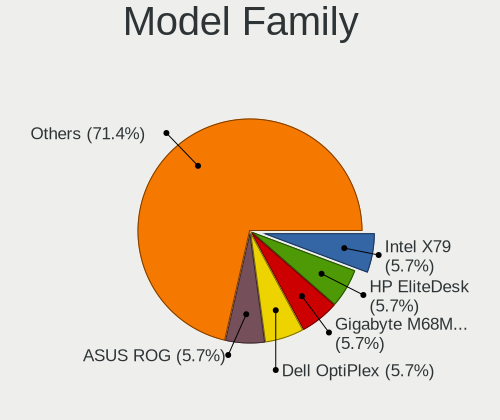
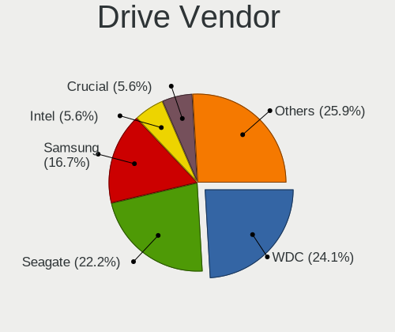
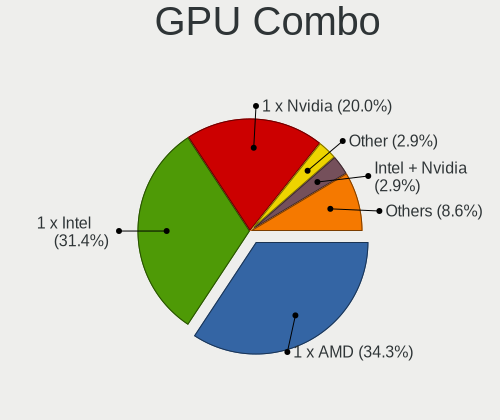
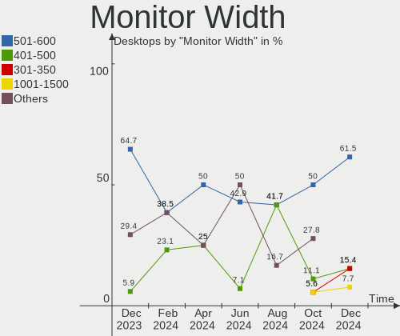
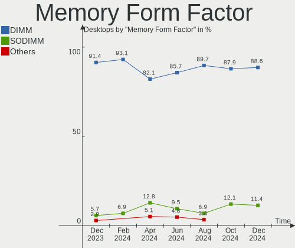

FreeBSD - Hardware Trends (Desktops)
------------------------------------

A project to identify most popular hardware characteristics and track their change
over time based on data collected by BSD users at https://BSD-Hardware.info.

Anyone can contribute to this report by the [hw-probe](https://github.com/linuxhw/hw-probe/blob/master/INSTALL.BSD.md) tool:

    hw-probe -all -upload

This report is for one last month. Overall report since the beginning of time: [TestDays](https://github.com/bsdhw/TestDays)

Period: Dec, 2023.

Contents
--------

* [ System ](#system)
  - [ OS                       ](#os)
  - [ OS Family                ](#os-family)
  - [ Arch                     ](#arch)
  - [ DE                       ](#de)
  - [ Display Server           ](#display-server)
  - [ Display Manager          ](#display-manager)
  - [ OS Lang                  ](#os-lang)
  - [ Boot Mode                ](#boot-mode)
  - [ Filesystem               ](#filesystem)
  - [ Part. scheme             ](#part-scheme)

* [ Board ](#board)
  - [ Vendor                   ](#vendor)
  - [ Model                    ](#model)
  - [ Model Family             ](#model-family)
  - [ MFG Year                 ](#mfg-year)
  - [ Form Factor              ](#form-factor)
  - [ Coreboot                 ](#coreboot)
  - [ RAM Size                 ](#ram-size)
  - [ RAM Used                 ](#ram-used)
  - [ Total Drives             ](#total-drives)
  - [ Has CD-ROM               ](#has-cd-rom)
  - [ Has Ethernet             ](#has-ethernet)
  - [ Has WiFi                 ](#has-wifi)
  - [ Has Bluetooth            ](#has-bluetooth)

* [ Location ](#location)
  - [ Country                  ](#country)
  - [ City                     ](#city)

* [ Drives ](#drives)
  - [ Drive Vendor             ](#drive-vendor)
  - [ Drive Model              ](#drive-model)
  - [ HDD Vendor               ](#hdd-vendor)
  - [ SSD Vendor               ](#ssd-vendor)
  - [ Drive Kind               ](#drive-kind)
  - [ Drive Connector          ](#drive-connector)
  - [ Drive Size               ](#drive-size)
  - [ Space Total              ](#space-total)
  - [ Space Used               ](#space-used)
  - [ Malfunc. Drives          ](#malfunc-drives)
  - [ Malfunc. Drive Vendor    ](#malfunc-drive-vendor)
  - [ Malfunc. HDD Vendor      ](#malfunc-hdd-vendor)
  - [ Malfunc. Drive Kind      ](#malfunc-drive-kind)
  - [ Failed Drives            ](#failed-drives)
  - [ Failed Drive Vendor      ](#failed-drive-vendor)
  - [ Drive Status             ](#drive-status)

* [ Storage controller ](#storage-controller)
  - [ Storage Vendor           ](#storage-vendor)
  - [ Storage Model            ](#storage-model)
  - [ Storage Kind             ](#storage-kind)

* [ Processor ](#processor)
  - [ CPU Vendor               ](#cpu-vendor)
  - [ CPU Model                ](#cpu-model)
  - [ CPU Model Family         ](#cpu-model-family)
  - [ CPU Cores                ](#cpu-cores)
  - [ CPU Sockets              ](#cpu-sockets)
  - [ CPU Threads              ](#cpu-threads)
  - [ CPU Microarch            ](#cpu-microarch)

* [ Graphics ](#graphics)
  - [ GPU Vendor               ](#gpu-vendor)
  - [ GPU Model                ](#gpu-model)
  - [ GPU Combo                ](#gpu-combo)
  - [ GPU Driver               ](#gpu-driver)
  - [ GPU Memory               ](#gpu-memory)

* [ Monitor ](#monitor)
  - [ Monitor Vendor           ](#monitor-vendor)
  - [ Monitor Model            ](#monitor-model)
  - [ Monitor Resolution       ](#monitor-resolution)
  - [ Monitor Diagonal         ](#monitor-diagonal)
  - [ Monitor Width            ](#monitor-width)
  - [ Aspect Ratio             ](#aspect-ratio)
  - [ Monitor Area             ](#monitor-area)
  - [ Pixel Density            ](#pixel-density)
  - [ Multiple Monitors        ](#multiple-monitors)

* [ Network ](#network)
  - [ Net Controller Vendor    ](#net-controller-vendor)
  - [ Net Controller Model     ](#net-controller-model)
  - [ Wireless Vendor          ](#wireless-vendor)
  - [ Wireless Model           ](#wireless-model)
  - [ Ethernet Vendor          ](#ethernet-vendor)
  - [ Ethernet Model           ](#ethernet-model)
  - [ Net Controller Kind      ](#net-controller-kind)
  - [ Used Controller          ](#used-controller)
  - [ NICs                     ](#nics)
  - [ IPv6                     ](#ipv6)

* [ Bluetooth ](#bluetooth)
  - [ Bluetooth Vendor         ](#bluetooth-vendor)
  - [ Bluetooth Model          ](#bluetooth-model)

* [ Sound ](#sound)
  - [ Sound Vendor             ](#sound-vendor)
  - [ Sound Model              ](#sound-model)

* [ Memory ](#memory)
  - [ Memory Vendor            ](#memory-vendor)
  - [ Memory Model             ](#memory-model)
  - [ Memory Kind              ](#memory-kind)
  - [ Memory Form Factor       ](#memory-form-factor)
  - [ Memory Size              ](#memory-size)
  - [ Memory Speed             ](#memory-speed)

* [ Printers & scanners ](#printers--scanners)
  - [ Printer Vendor           ](#printer-vendor)
  - [ Printer Model            ](#printer-model)
  - [ Scanner Vendor           ](#scanner-vendor)
  - [ Scanner Model            ](#scanner-model)

* [ Camera ](#camera)
  - [ Camera Vendor            ](#camera-vendor)
  - [ Camera Model             ](#camera-model)

* [ Security ](#security)
  - [ Fingerprint Vendor       ](#fingerprint-vendor)
  - [ Fingerprint Model        ](#fingerprint-model)
  - [ Chipcard Vendor          ](#chipcard-vendor)
  - [ Chipcard Model           ](#chipcard-model)

* [ Unsupported ](#unsupported)
  - [ Unsupported Devices      ](#unsupported-devices)
  - [ Unsupported Device Types ](#unsupported-device-types)

System
------

OS
--

Installed operating systems

| Name                 | Desktops | Percent |
|----------------------|----------|---------|
| FreeBSD 14.0-p4      | 8        | 21.62%  |
| FreeBSD 14.0-p2      | 7        | 18.92%  |
| FreeBSD 14.0         | 4        | 10.81%  |
| FreeBSD 13.2-p5      | 4        | 10.81%  |
| FreeBSD 14.0-p1      | 3        | 8.11%   |
| FreeBSD 15.0-CURRENT | 1        | 2.7%    |
| FreeBSD 14.0-STABLE  | 1        | 2.7%    |
| FreeBSD 14.0-p3      | 1        | 2.7%    |
| FreeBSD 13.2-p6      | 1        | 2.7%    |
| FreeBSD 13.2-p3      | 1        | 2.7%    |
| FreeBSD 13.2         | 1        | 2.7%    |
| FreeBSD 13.1         | 1        | 2.7%    |
| FreeBSD 12.4-p5      | 1        | 2.7%    |
| FreeBSD 12.4-p3      | 1        | 2.7%    |
| FreeBSD 12.4-p2      | 1        | 2.7%    |
| FreeBSD 12.4         | 1        | 2.7%    |

OS Family
---------

OS without a version

| Name    | Desktops | Percent |
|---------|----------|---------|
| FreeBSD | 37       | 100%    |

Arch
----

OS architecture (x86_64, i586, etc.)

| Name    | Desktops | Percent |
|---------|----------|---------|
| amd64   | 34       | 91.89%  |
| powerpc | 1        | 2.7%    |
| i386    | 1        | 2.7%    |
| arm64   | 1        | 2.7%    |

DE
--

Desktop Environment

| Name    | Desktops | Percent |
|---------|----------|---------|
| Console | 16       | 43.24%  |
| KDE5    | 10       | 27.03%  |
| GNOME   | 3        | 8.11%   |
| XFCE    | 2        | 5.41%   |
| MATE    | 2        | 5.41%   |
| TWM     | 1        | 2.7%    |
| ICEWM   | 1        | 2.7%    |
| i3      | 1        | 2.7%    |
| fvwm2   | 1        | 2.7%    |

Display Server
--------------

X11 or Wayland

| Name    | Desktops | Percent |
|---------|----------|---------|
| X11     | 18       | 48.65%  |
| Console | 17       | 45.95%  |
| Wayland | 2        | 5.41%   |

Display Manager
---------------

SDDM, LightDM, etc.

| Name    | Desktops | Percent |
|---------|----------|---------|
| Console | 20       | 54.05%  |
| SDDM    | 11       | 29.73%  |
| LightDM | 4        | 10.81%  |
| XDM     | 1        | 2.7%    |
| GDM     | 1        | 2.7%    |

OS Lang
-------

Language

| Lang    | Desktops | Percent |
|---------|----------|---------|
| C       | 27       | 72.97%  |
| en_US   | 5        | 13.51%  |
| Unknown | 3        | 8.11%   |
| ru      | 1        | 2.7%    |
| de_DE   | 1        | 2.7%    |

Boot Mode
---------

EFI or BIOS

| Mode | Desktops | Percent |
|------|----------|---------|
| EFI  | 31       | 83.78%  |
| BIOS | 6        | 16.22%  |

Filesystem
----------

Type of filesystem

| Type | Desktops | Percent |
|------|----------|---------|
| Zfs  | 28       | 75.68%  |
| Ufs  | 9        | 24.32%  |

Part. scheme
------------

Scheme of partitioning

| Type    | Desktops | Percent |
|---------|----------|---------|
| GPT     | 34       | 91.89%  |
| MBR     | 2        | 5.41%   |
| Unknown | 1        | 2.7%    |

Board
-----

Vendor
------

Motherboard manufacturer

| Name                | Desktops | Percent |
|---------------------|----------|---------|
| ASUSTek Computer    | 12       | 32.43%  |
| MSI                 | 5        | 13.51%  |
| Dell                | 5        | 13.51%  |
| ASRock              | 3        | 8.11%   |
| Gigabyte Technology | 2        | 5.41%   |
| AZW                 | 2        | 5.41%   |
| Unknown             | 2        | 5.41%   |
| Lenovo              | 1        | 2.7%    |
| Hewlett-Packard     | 1        | 2.7%    |
| EVGA                | 1        | 2.7%    |
| ECS                 | 1        | 2.7%    |
| ASRockRack          | 1        | 2.7%    |
| Acer                | 1        | 2.7%    |

Model
-----

Motherboard model

| Name                               | Desktops | Percent |
|------------------------------------|----------|---------|
| Dell OptiPlex 7050                 | 2        | 5.41%   |
| AZW EQ                             | 2        | 5.41%   |
| Unknown                            | 2        | 5.41%   |
| MSI NC683AA-ABA m9500y             | 1        | 2.7%    |
| MSI MS-7C96                        | 1        | 2.7%    |
| MSI MS-7C37                        | 1        | 2.7%    |
| MSI MS-7817                        | 1        | 2.7%    |
| MSI MS-7529                        | 1        | 2.7%    |
| Lenovo ThinkCentre M700 10GRCTO1WW | 1        | 2.7%    |
| HP Compaq Elite 8300 SFF           | 1        | 2.7%    |
| Gigabyte H61M-S2PV                 | 1        | 2.7%    |
| Gigabyte B650 AORUS ELITE AX V2    | 1        | 2.7%    |
| EVGA X570 DARK                     | 1        | 2.7%    |
| ECS MCP61M-M3                      | 1        | 2.7%    |
| Dell Precision Tower 7910          | 1        | 2.7%    |
| Dell PowerEdge T20                 | 1        | 2.7%    |
| Dell OptiPlex 7060                 | 1        | 2.7%    |
| ASUS Z10PE-D16 WS                  | 1        | 2.7%    |
| ASUS TUF Gaming X570-PLUS          | 1        | 2.7%    |
| ASUS TUF Gaming B560M-PLUS         | 1        | 2.7%    |
| ASUS TUF Gaming B550M-PLUS         | 1        | 2.7%    |
| ASUS ROG STRIX B460-G GAMING       | 1        | 2.7%    |
| ASUS ROG CROSSHAIR VIII HERO       | 1        | 2.7%    |
| ASUS Pro WS X570-ACE               | 1        | 2.7%    |
| ASUS PRO B460M-C                   | 1        | 2.7%    |
| ASUS PRIME X399-A                  | 1        | 2.7%    |
| ASUS PRIME X370-PRO                | 1        | 2.7%    |
| ASUS P5Q-E                         | 1        | 2.7%    |
| ASUS CM6870                        | 1        | 2.7%    |
| ASRockRack EPYC3101D4I-2T          | 1        | 2.7%    |
| ASRock Z590 Pro4                   | 1        | 2.7%    |
| ASRock X570 Phantom Gaming 4       | 1        | 2.7%    |
| ASRock B450 Gaming K4              | 1        | 2.7%    |
| Acer Veriton X490G                 | 1        | 2.7%    |

Model Family
------------

Motherboard model prefix

| Name                      | Desktops | Percent |
|---------------------------|----------|---------|
| Dell OptiPlex             | 3        | 8.11%   |
| ASUS TUF                  | 3        | 8.11%   |
| AZW EQ                    | 2        | 5.41%   |
| ASUS ROG                  | 2        | 5.41%   |
| ASUS Pro                  | 2        | 5.41%   |
| ASUS PRIME                | 2        | 5.41%   |
| Unknown                   | 2        | 5.41%   |
| MSI NC683AA-ABA           | 1        | 2.7%    |
| MSI MS-7C96               | 1        | 2.7%    |
| MSI MS-7C37               | 1        | 2.7%    |
| MSI MS-7817               | 1        | 2.7%    |
| MSI MS-7529               | 1        | 2.7%    |
| Lenovo ThinkCentre        | 1        | 2.7%    |
| HP Compaq                 | 1        | 2.7%    |
| Gigabyte H61M-S2PV        | 1        | 2.7%    |
| Gigabyte B650             | 1        | 2.7%    |
| EVGA X570                 | 1        | 2.7%    |
| ECS MCP61M-M3             | 1        | 2.7%    |
| Dell Precision            | 1        | 2.7%    |
| Dell PowerEdge            | 1        | 2.7%    |
| ASUS Z10PE-D16            | 1        | 2.7%    |
| ASUS P5Q-E                | 1        | 2.7%    |
| ASUS CM6870               | 1        | 2.7%    |
| ASRockRack EPYC3101D4I-2T | 1        | 2.7%    |
| ASRock Z590               | 1        | 2.7%    |
| ASRock X570               | 1        | 2.7%    |
| ASRock B450               | 1        | 2.7%    |
| Acer Veriton              | 1        | 2.7%    |

MFG Year
--------

Motherboard manufacture year

| Year    | Desktops | Percent |
|---------|----------|---------|
| 2021    | 7        | 18.92%  |
| 2019    | 6        | 16.22%  |
| 2012    | 6        | 16.22%  |
| 2023    | 3        | 8.11%   |
| 2022    | 3        | 8.11%   |
| 2017    | 2        | 5.41%   |
| 2010    | 2        | 5.41%   |
| 2009    | 2        | 5.41%   |
| Unknown | 2        | 5.41%   |
| 2020    | 1        | 2.7%    |
| 2014    | 1        | 2.7%    |
| 2013    | 1        | 2.7%    |
| 2008    | 1        | 2.7%    |

Form Factor
-----------

Physical design of the computer

| Name    | Desktops | Percent |
|---------|----------|---------|
| Desktop | 37       | 100%    |

Coreboot
--------

Have coreboot on board

| Used | Desktops | Percent |
|------|----------|---------|
| No   | 37       | 100%    |

RAM Size
--------

Total RAM memory

| Size in GB  | Desktops | Percent |
|-------------|----------|---------|
| 64.01-256.0 | 11       | 29.73%  |
| 32.01-64.0  | 8        | 21.62%  |
| 16.01-24.0  | 6        | 16.22%  |
| 4.01-8.0    | 5        | 13.51%  |
| 8.01-16.0   | 5        | 13.51%  |
| 24.01-32.0  | 1        | 2.7%    |
| 0.51-1.0    | 1        | 2.7%    |

RAM Used
--------

Used RAM memory

| Used GB  | Desktops | Percent |
|----------|----------|---------|
| 1.01-2.0 | 12       | 32.43%  |
| 0.51-1.0 | 10       | 27.03%  |
| 0.01-0.5 | 8        | 21.62%  |
| 3.01-4.0 | 3        | 8.11%   |
| 2.01-3.0 | 2        | 5.41%   |
| 4.01-8.0 | 1        | 2.7%    |
| 0        | 1        | 2.7%    |

Total Drives
------------

Number of drives on board

| Drives | Desktops | Percent |
|--------|----------|---------|
| 1      | 11       | 29.73%  |
| 3      | 8        | 21.62%  |
| 2      | 7        | 18.92%  |
| 4      | 4        | 10.81%  |
| 0      | 4        | 10.81%  |
| 13     | 1        | 2.7%    |
| 12     | 1        | 2.7%    |
| 6      | 1        | 2.7%    |

Has CD-ROM
----------

Has CD-ROM on board

| Presented | Desktops | Percent |
|-----------|----------|---------|
| No        | 23       | 62.16%  |
| Yes       | 14       | 37.84%  |

Has Ethernet
------------

Has Ethernet on board

| Presented | Desktops | Percent |
|-----------|----------|---------|
| Yes       | 37       | 100%    |

Has WiFi
--------

Has WiFi module

| Presented | Desktops | Percent |
|-----------|----------|---------|
| No        | 28       | 75.68%  |
| Yes       | 9        | 24.32%  |

Has Bluetooth
-------------

Has Bluetooth module

| Presented | Desktops | Percent |
|-----------|----------|---------|
| No        | 27       | 72.97%  |
| Yes       | 10       | 27.03%  |

Location
--------

Country
-------

Geographic location (country)

| Country    | Desktops | Percent |
|------------|----------|---------|
| USA        | 15       | 40.54%  |
| Germany    | 4        | 10.81%  |
| Russia     | 2        | 5.41%   |
| Mexico     | 2        | 5.41%   |
| China      | 2        | 5.41%   |
| Venezuela  | 1        | 2.7%    |
| Thailand   | 1        | 2.7%    |
| Taiwan     | 1        | 2.7%    |
| Romania    | 1        | 2.7%    |
| Luxembourg | 1        | 2.7%    |
| Indonesia  | 1        | 2.7%    |
| Greece     | 1        | 2.7%    |
| Czechia    | 1        | 2.7%    |
| Chile      | 1        | 2.7%    |
| Canada     | 1        | 2.7%    |
| Bulgaria   | 1        | 2.7%    |
| Brazil     | 1        | 2.7%    |

City
----

Geographic location (city)

| City                  | Desktops | Percent |
|-----------------------|----------|---------|
| San Luis Potosí City | 2        | 5.41%   |
| Salem                 | 2        | 5.41%   |
| Redmond               | 2        | 5.41%   |
| Wenatchee             | 1        | 2.7%    |
| Timișoara            | 1        | 2.7%    |
| Thessaloniki          | 1        | 2.7%    |
| Taipei                | 1        | 2.7%    |
| Sutton                | 1        | 2.7%    |
| Sterling              | 1        | 2.7%    |
| Stavropol             | 1        | 2.7%    |
| Sorocaba              | 1        | 2.7%    |
| Solden                | 1        | 2.7%    |
| Shoreham              | 1        | 2.7%    |
| Shijiazhuang          | 1        | 2.7%    |
| Santiago              | 1        | 2.7%    |
| Sandweiler            | 1        | 2.7%    |
| Rüsselsheim am Main  | 1        | 2.7%    |
| Prague                | 1        | 2.7%    |
| O'Fallon              | 1        | 2.7%    |
| Munfordville          | 1        | 2.7%    |
| Medan                 | 1        | 2.7%    |
| Maracay               | 1        | 2.7%    |
| Los Angeles           | 1        | 2.7%    |
| Lafayette             | 1        | 2.7%    |
| Kamensk-Ural'skiy     | 1        | 2.7%    |
| Ithaca                | 1        | 2.7%    |
| Hanover               | 1        | 2.7%    |
| Frankfurt am Main     | 1        | 2.7%    |
| Booneville            | 1        | 2.7%    |
| Beijing               | 1        | 2.7%    |
| Bankya                | 1        | 2.7%    |
| Bangkok               | 1        | 2.7%    |
| Austin                | 1        | 2.7%    |
| Atlanta               | 1        | 2.7%    |

Drives
------

Drive Vendor
------------

Hard drive vendors

| Vendor              | Desktops | Drives | Percent |
|---------------------|----------|--------|---------|
| Seagate             | 15       | 26     | 25%     |
| Samsung Electronics | 12       | 22     | 20%     |
| WDC                 | 8        | 18     | 13.33%  |
| Toshiba             | 5        | 5      | 8.33%   |
| Kingston            | 4        | 5      | 6.67%   |
| Crucial             | 3        | 3      | 5%      |
| Intel               | 2        | 3      | 3.33%   |
| Hitachi             | 2        | 2      | 3.33%   |
| Corsair             | 2        | 2      | 3.33%   |
| WD MediaMax         | 1        | 1      | 1.67%   |
| SK hynix            | 1        | 1      | 1.67%   |
| Phison              | 1        | 1      | 1.67%   |
| Patriot             | 1        | 1      | 1.67%   |
| OWC                 | 1        | 3      | 1.67%   |
| MidasForce          | 1        | 2      | 1.67%   |
| Fujitsu             | 1        | 1      | 1.67%   |

Drive Model
-----------

Hard drive models

| Model                                     | Desktops | Percent |
|-------------------------------------------|----------|---------|
| Kingston SA400S37480G 480GB               | 3        | 3.85%   |
| WDC WD40EZRZ-22GXCB0 4TB                  | 2        | 2.56%   |
| Seagate ST4000DM000-1F2168 4TB            | 2        | 2.56%   |
| Seagate ST2000DM008-2FR102 2TB            | 2        | 2.56%   |
| Samsung SSD 860 QVO 1TB                   | 2        | 2.56%   |
| Crucial CT500MX500SSD1 500GB              | 2        | 2.56%   |
| WDC WD80EMAZ-00WJTA0 8TB                  | 1        | 1.28%   |
| WDC WD80EFZX-68UW8N0 8TB                  | 1        | 1.28%   |
| WDC WD80EFAX-68LHPN0 8TB                  | 1        | 1.28%   |
| WDC WD80EDBZ-11B0ZA0 8TB                  | 1        | 1.28%   |
| WDC WD5000AAKX-00ERMA0 500GB              | 1        | 1.28%   |
| WDC WD4005FZBX-00K5WB0 4TB                | 1        | 1.28%   |
| WDC WD3200AVJS-00WDA0 320GB               | 1        | 1.28%   |
| WDC WD15EADS-00P8B0 1.5TB                 | 1        | 1.28%   |
| WDC WD120EMFZ-11A6JA0 12TB                | 1        | 1.28%   |
| WDC WD120EMAZ-11BLFA0 12TB                | 1        | 1.28%   |
| WDC WD10EZEX-00RKKA0 1TB                  | 1        | 1.28%   |
| WDC WD10EALX-009BA0 1TB                   | 1        | 1.28%   |
| WD MediaMax WL1500GSA6472B 1.5TB          | 1        | 1.28%   |
| Toshiba MQ01ABD100 1TB                    | 1        | 1.28%   |
| Toshiba HDWR180 8TB                       | 1        | 1.28%   |
| Toshiba HDWG480 8TB                       | 1        | 1.28%   |
| Toshiba DT01ACA100 1TB                    | 1        | 1.28%   |
| Toshiba DT01ABA200V 2TB                   | 1        | 1.28%   |
| SK hynix SKHynix_HFS512GDE9X084N 512GB    | 1        | 1.28%   |
| Seagate ST940110A 40GB                    | 1        | 1.28%   |
| Seagate ST8000NM0055-1RM112 8TB           | 1        | 1.28%   |
| Seagate ST8000AS0002-1NA17Z 8TB           | 1        | 1.28%   |
| Seagate ST6000VX001-2BD186 6TB            | 1        | 1.28%   |
| Seagate ST4000VN000-1H4168 4TB            | 1        | 1.28%   |
| Seagate ST4000LM024-2AN17V 4TB            | 1        | 1.28%   |
| Seagate ST4000DM004-2CV104 4TB            | 1        | 1.28%   |
| Seagate ST320LT012-1DG14C 320GB           | 1        | 1.28%   |
| Seagate ST2000VX000-1ES164 2TB            | 1        | 1.28%   |
| Seagate ST18000NM000J-2TV103 18TB         | 1        | 1.28%   |
| Seagate ST1500DM003-1CH16G 1.5TB          | 1        | 1.28%   |
| Seagate ST1000LM035-1RK172 1TB            | 1        | 1.28%   |
| Seagate ST1000DM003-1ER162 1TB            | 1        | 1.28%   |
| Seagate ST10000NM0086-2AA101 10TB         | 1        | 1.28%   |
| Seagate IronWolf ZA1000NM10002-2ZG102 1TB | 1        | 1.28%   |

HDD Vendor
----------

Hard disk drive vendors

| Vendor              | Desktops | Drives | Percent |
|---------------------|----------|--------|---------|
| Seagate             | 14       | 25     | 42.42%  |
| WDC                 | 8        | 18     | 24.24%  |
| Toshiba             | 5        | 5      | 15.15%  |
| Samsung Electronics | 2        | 3      | 6.06%   |
| Hitachi             | 2        | 2      | 6.06%   |
| WD MediaMax         | 1        | 1      | 3.03%   |
| Fujitsu             | 1        | 1      | 3.03%   |

SSD Vendor
----------

Solid state drive vendors

| Vendor              | Desktops | Drives | Percent |
|---------------------|----------|--------|---------|
| Samsung Electronics | 10       | 18     | 43.48%  |
| Kingston            | 3        | 4      | 13.04%  |
| Crucial             | 3        | 3      | 13.04%  |
| Intel               | 2        | 3      | 8.7%    |
| Seagate             | 1        | 1      | 4.35%   |
| Patriot             | 1        | 1      | 4.35%   |
| OWC                 | 1        | 3      | 4.35%   |
| MidasForce          | 1        | 2      | 4.35%   |
| Corsair             | 1        | 1      | 4.35%   |

Drive Kind
----------

HDD or SSD

| Kind | Desktops | Drives | Percent |
|------|----------|--------|---------|
| HDD  | 24       | 55     | 50%     |
| SSD  | 20       | 36     | 41.67%  |
| NVMe | 4        | 5      | 8.33%   |

Drive Connector
---------------

SATA, SAS, NVMe, etc.

| Type | Desktops | Drives | Percent |
|------|----------|--------|---------|
| SATA | 33       | 91     | 89.19%  |
| NVMe | 4        | 5      | 10.81%  |

Drive Size
----------

Size of hard drive

| Size in TB | Desktops | Drives | Percent |
|------------|----------|--------|---------|
| 0.01-0.5   | 17       | 26     | 30.91%  |
| 0.51-1.0   | 14       | 20     | 25.45%  |
| 1.01-2.0   | 11       | 14     | 20%     |
| 3.01-4.0   | 6        | 8      | 10.91%  |
| 4.01-10.0  | 5        | 20     | 9.09%   |
| 10.01-20.0 | 2        | 3      | 3.64%   |

Space Total
-----------

Amount of disk space available on the file system

| Size in GB     | Desktops | Percent |
|----------------|----------|---------|
| 251-500        | 12       | 32.43%  |
| 501-1000       | 10       | 27.03%  |
| 101-250        | 5        | 13.51%  |
| 21-50          | 3        | 8.11%   |
| 1001-2000      | 3        | 8.11%   |
| More than 3000 | 2        | 5.41%   |
| 51-100         | 2        | 5.41%   |

Space Used
----------

Amount of used disk space

| Used GB        | Desktops | Percent |
|----------------|----------|---------|
| 1-20           | 25       | 67.57%  |
| 21-50          | 7        | 18.92%  |
| 51-100         | 2        | 5.41%   |
| More than 3000 | 1        | 2.7%    |
| 251-500        | 1        | 2.7%    |
| 1001-2000      | 1        | 2.7%    |

Malfunc. Drives
---------------

Drive models with a malfunction

| Model                           | Desktops | Drives | Percent |
|---------------------------------|----------|--------|---------|
| WDC WD5000AAKX-00ERMA0 500GB    | 1        | 1      | 12.5%   |
| WDC WD10EZEX-00RKKA0 1TB        | 1        | 1      | 12.5%   |
| WDC WD10EALX-009BA0 1TB         | 1        | 1      | 12.5%   |
| Toshiba MQ01ABD100 1TB          | 1        | 1      | 12.5%   |
| Seagate ST4000VN000-1H4168 4TB  | 1        | 1      | 12.5%   |
| Seagate ST320LT012-1DG14C 320GB | 1        | 2      | 12.5%   |
| Samsung Electronics HD204UI 2TB | 1        | 1      | 12.5%   |
| Hitachi HUA722020ALA330 2TB     | 1        | 1      | 12.5%   |

Malfunc. Drive Vendor
---------------------

Vendors of faulty drives

| Vendor              | Desktops | Drives | Percent |
|---------------------|----------|--------|---------|
| WDC                 | 2        | 3      | 28.57%  |
| Seagate             | 2        | 3      | 28.57%  |
| Toshiba             | 1        | 1      | 14.29%  |
| Samsung Electronics | 1        | 1      | 14.29%  |
| Hitachi             | 1        | 1      | 14.29%  |

Malfunc. HDD Vendor
-------------------

Vendors of faulty HDD drives

| Vendor              | Desktops | Drives | Percent |
|---------------------|----------|--------|---------|
| WDC                 | 2        | 3      | 28.57%  |
| Seagate             | 2        | 3      | 28.57%  |
| Toshiba             | 1        | 1      | 14.29%  |
| Samsung Electronics | 1        | 1      | 14.29%  |
| Hitachi             | 1        | 1      | 14.29%  |

Malfunc. Drive Kind
-------------------

Kinds of faulty drives

| Kind | Desktops | Drives | Percent |
|------|----------|--------|---------|
| HDD  | 7        | 9      | 100%    |

Failed Drives
-------------

Failed drive models

Zero info for selected period =(

Failed Drive Vendor
-------------------

Failed drive vendors

Zero info for selected period =(

Drive Status
------------

Number of failed and malfunc. drives

| Status  | Desktops | Drives | Percent |
|---------|----------|--------|---------|
| Works   | 30       | 87     | 81.08%  |
| Malfunc | 7        | 9      | 18.92%  |

Storage controller
------------------

Storage Vendor
--------------

Storage controller vendors

| Vendor                      | Desktops | Percent |
|-----------------------------|----------|---------|
| Intel                       | 20       | 31.25%  |
| AMD                         | 14       | 21.88%  |
| SanDisk                     | 5        | 7.81%   |
| Samsung Electronics         | 4        | 6.25%   |
| ASMedia Technology          | 4        | 6.25%   |
| Micron/Crucial Technology   | 3        | 4.69%   |
| Kingston Technology Company | 3        | 4.69%   |
| SK hynix                    | 2        | 3.13%   |
| Phison Electronics          | 2        | 3.13%   |
| Marvell Technology Group    | 2        | 3.13%   |
| KIOXIA                      | 2        | 3.13%   |
| Broadcom / LSI              | 2        | 3.13%   |
| Nvidia                      | 1        | 1.56%   |

Storage Model
-------------

Storage controller models

| Model                                                                          | Desktops | Percent |
|--------------------------------------------------------------------------------|----------|---------|
| AMD FCH SATA Controller [AHCI mode]                                            | 11       | 14.67%  |
| Sandisk WD Black SN770 / PC SN740 256GB / PC SN560 (DRAM-less) NVMe SSD        | 3        | 4%      |
| ASMedia ASM1062 Serial ATA Controller                                          | 3        | 4%      |
| SK hynix Gold P31/BC711/PC711 NVMe Solid State Drive                           | 2        | 2.67%   |
| Samsung NVMe SSD Controller 980 (DRAM-less)                                    | 2        | 2.67%   |
| Micron/Crucial P1 NVMe PCIe SSD[Frampton]                                      | 2        | 2.67%   |
| KIOXIA NVMe SSD                                                                | 2        | 2.67%   |
| Intel unknown                                                                  | 2        | 2.67%   |
| Intel 8 Series/C220 Series Chipset Family 6-port SATA Controller 1 [AHCI mode] | 2        | 2.67%   |
| Intel 7 Series/C210 Series Chipset Family 4-port SATA Controller [IDE mode]    | 2        | 2.67%   |
| Intel 7 Series/C210 Series Chipset Family 2-port SATA Controller [IDE mode]    | 2        | 2.67%   |
| Intel 500 Series Chipset Family SATA AHCI Controller                           | 2        | 2.67%   |
| Intel 400 Series Chipset Family SATA AHCI Controller                           | 2        | 2.67%   |
| AMD 500 Series Chipset SATA Controller                                         | 2        | 2.67%   |
| SanDisk Ultra 3D / WD Blue SN550 NVMe SSD                                      | 1        | 1.33%   |
| SanDisk Extreme Pro / WD Black SN750 / PC SN730 / Red SN700 NVMe SSD           | 1        | 1.33%   |
| Samsung NVMe SSD Controller SM961/PM961/SM963                                  | 1        | 1.33%   |
| Samsung NVMe SSD Controller S4LV008[Pascal]                                    | 1        | 1.33%   |
| Phison PS5015-E15 PCIe3 NVMe Controller (DRAM-less)                            | 1        | 1.33%   |
| Phison E16 PCIe4 NVMe Controller                                               | 1        | 1.33%   |
| Nvidia MCP61 SATA Controller                                                   | 1        | 1.33%   |
| Nvidia MCP61 IDE                                                               | 1        | 1.33%   |
| Micron/Crucial P2 [Nick P2] / P3 / P3 Plus NVMe PCIe SSD (DRAM-less)           | 1        | 1.33%   |
| Marvell Group 88SE9128 PCIe SATA 6 Gb/s RAID controller                        | 1        | 1.33%   |
| Marvell Group 88SE6111/6121 SATA II / PATA Controller                          | 1        | 1.33%   |
| Kingston Company NV2 NVMe SSD SM2267XT                                         | 1        | 1.33%   |
| Kingston Company DC1000B NVMe SSD E12DC                                        | 1        | 1.33%   |
| Kingston Company A2000 NVMe SSD SM2263EN                                       | 1        | 1.33%   |
| Intel SATA Controller [RAID mode]                                              | 1        | 1.33%   |
| Intel Q170/Q150/B150/H170/H110/Z170/CM236 Chipset SATA Controller [AHCI Mode]  | 1        | 1.33%   |
| Intel NM10/ICH7 Family SATA Controller [IDE mode]                              | 1        | 1.33%   |
| Intel Cannon Lake PCH SATA AHCI Controller                                     | 1        | 1.33%   |
| Intel C610/X99 series chipset sSATA Controller [AHCI mode]                     | 1        | 1.33%   |
| Intel C610/X99 series chipset 6-Port SATA Controller [AHCI mode]               | 1        | 1.33%   |
| Intel C610/X99 series chipset 4-port SATA Controller [IDE mode]                | 1        | 1.33%   |
| Intel 82801JI (ICH10 Family) 4 port SATA IDE Controller #1                     | 1        | 1.33%   |
| Intel 82801JI (ICH10 Family) 2 port SATA IDE Controller #2                     | 1        | 1.33%   |
| Intel 82801G (ICH7 Family) IDE Controller                                      | 1        | 1.33%   |
| Intel 6 Series/C200 Series Chipset Family 6 port Desktop SATA AHCI Controller  | 1        | 1.33%   |
| Intel 5 Series/3400 Series Chipset PT IDER Controller                          | 1        | 1.33%   |

Storage Kind
------------

Kind of storage controller (IDE, SATA, NVMe, SAS, ...)

| Kind | Desktops | Percent |
|------|----------|---------|
| SATA | 29       | 50%     |
| NVMe | 18       | 31.03%  |
| IDE  | 8        | 13.79%  |
| SAS  | 2        | 3.45%   |
| RAID | 1        | 1.72%   |

Processor
---------

CPU Vendor
----------

Processor vendors

| Vendor  | Desktops | Percent |
|---------|----------|---------|
| Intel   | 20       | 54.05%  |
| AMD     | 15       | 40.54%  |
| ARM     | 1        | 2.7%    |
| Unknown | 1        | 2.7%    |

CPU Model
---------

Processor models

| Model                                          | Desktops | Percent |
|------------------------------------------------|----------|---------|
| Intel N100                                     | 2        | 5.41%   |
| Intel Core i7-7700 CPU @ 3.60GHz               | 2        | 5.41%   |
| AMD Ryzen 9 3900X 12-Core Processor            | 2        | 5.41%   |
| Intel Xeon CPU E5-2699 v3 @ 2.30GHz            | 1        | 2.7%    |
| Intel Xeon CPU E5-2696 v4 @ 2.20GHz            | 1        | 2.7%    |
| Intel Xeon CPU E3-1225 v3 @ 3.20GHz            | 1        | 2.7%    |
| Intel Pentium Dual-Core CPU E5200 @ 2.50GHz    | 1        | 2.7%    |
| Intel Pentium CPU G640 @ 2.80GHz               | 1        | 2.7%    |
| Intel Pentium CPU G3220 @ 3.00GHz              | 1        | 2.7%    |
| Intel Core i7-3770 CPU @ 3.40GHz               | 1        | 2.7%    |
| Intel Core i7-10700K CPU @ 3.80GHz             | 1        | 2.7%    |
| Intel Core i7-10700 CPU @ 2.90GHz              | 1        | 2.7%    |
| Intel Core i5-8500 CPU @ 3.00GHz               | 1        | 2.7%    |
| Intel Core i5-3470 CPU @ 3.20GHz               | 1        | 2.7%    |
| Intel Core i5-10600K CPU @ 4.10GHz             | 1        | 2.7%    |
| Intel Core i3-6100 CPU @ 3.70GHz               | 1        | 2.7%    |
| Intel Core i3-10100 CPU @ 3.60GHz              | 1        | 2.7%    |
| Intel Core i3 CPU 550 @ 3.20GHz                | 1        | 2.7%    |
| Intel Core 2 Quad CPU Q6600 @ 2.40GHz          | 1        | 2.7%    |
| ARM Cortex-A55 r2p0                            | 1        | 2.7%    |
| AMD Ryzen Threadripper 1950X 16-Core Processor | 1        | 2.7%    |
| AMD Ryzen 9 7950X3D 16-Core Processor          | 1        | 2.7%    |
| AMD Ryzen 9 5950X 16-Core Processor            | 1        | 2.7%    |
| AMD Ryzen 7 PRO 4750G with Radeon Graphics     | 1        | 2.7%    |
| AMD Ryzen 7 5800X3D 8-Core Processor           | 1        | 2.7%    |
| AMD Ryzen 7 5700X 8-Core Processor             | 1        | 2.7%    |
| AMD Ryzen 7 5700G with Radeon Graphics         | 1        | 2.7%    |
| AMD Ryzen 7 3700X 8-Core Processor             | 1        | 2.7%    |
| AMD Ryzen 7 1700 Eight-Core Processor          | 1        | 2.7%    |
| AMD Ryzen 3 3200G with Radeon Vega Graphics    | 1        | 2.7%    |
| AMD Phenom 9750 Quad-Core Processor            | 1        | 2.7%    |
| AMD EPYC 3101 4-Core Processor                 | 1        | 2.7%    |
| AMD Athlon II X2 260 Processor                 | 1        | 2.7%    |
|                                                | 1        | 2.7%    |

CPU Model Family
----------------

Processor model prefix

| Model                   | Desktops | Percent |
|-------------------------|----------|---------|
| Intel Core i7           | 5        | 13.51%  |
| AMD Ryzen 7             | 5        | 13.51%  |
| AMD Ryzen 9             | 4        | 10.81%  |
| Other                   | 3        | 8.11%   |
| Intel Xeon              | 3        | 8.11%   |
| Intel Core i5           | 3        | 8.11%   |
| Intel Core i3           | 3        | 8.11%   |
| Intel Pentium           | 2        | 5.41%   |
| Intel Pentium Dual-Core | 1        | 2.7%    |
| Intel Core 2 Quad       | 1        | 2.7%    |
| ARM Cortex              | 1        | 2.7%    |
| AMD Ryzen Threadripper  | 1        | 2.7%    |
| AMD Ryzen 7 PRO         | 1        | 2.7%    |
| AMD Ryzen 3             | 1        | 2.7%    |
| AMD Phenom              | 1        | 2.7%    |
| AMD EPYC                | 1        | 2.7%    |
| AMD Athlon II X2        | 1        | 2.7%    |

CPU Cores
---------

Number of processor cores

| Number  | Desktops | Percent |
|---------|----------|---------|
| 4       | 12       | 32.43%  |
| 16      | 6        | 16.22%  |
| 2       | 6        | 16.22%  |
| 32      | 3        | 8.11%   |
| 24      | 2        | 5.41%   |
| 8       | 2        | 5.41%   |
| 6       | 2        | 5.41%   |
| 36      | 1        | 2.7%    |
| 22      | 1        | 2.7%    |
| 1       | 1        | 2.7%    |
| Unknown | 1        | 2.7%    |

CPU Sockets
-----------

Number of sockets

| Number  | Desktops | Percent |
|---------|----------|---------|
| 1       | 34       | 91.89%  |
| Unknown | 2        | 5.41%   |
| 2       | 1        | 2.7%    |

CPU Threads
-----------

Threads per core (Hyper-Threading)

| Number  | Desktops | Percent |
|---------|----------|---------|
| 1       | 24       | 64.86%  |
| 2       | 11       | 29.73%  |
| Unknown | 2        | 5.41%   |

CPU Microarch
-------------

Microarchitecture

| Name        | Desktops | Percent |
|-------------|----------|---------|
| Unknown     | 5        | 13.51%  |
| Zen 3       | 4        | 10.81%  |
| Zen 2       | 4        | 10.81%  |
| CometLake   | 4        | 10.81%  |
| Zen         | 3        | 8.11%   |
| KabyLake    | 3        | 8.11%   |
| Haswell     | 3        | 8.11%   |
| K10         | 2        | 5.41%   |
| IvyBridge   | 2        | 5.41%   |
| Zen+        | 1        | 2.7%    |
| Westmere    | 1        | 2.7%    |
| Skylake     | 1        | 2.7%    |
| SandyBridge | 1        | 2.7%    |
| Penryn      | 1        | 2.7%    |
| Core        | 1        | 2.7%    |
| Broadwell   | 1        | 2.7%    |

Graphics
--------

GPU Vendor
----------

Vendors of graphics cards

| Vendor            | Desktops | Percent |
|-------------------|----------|---------|
| Intel             | 14       | 34.15%  |
| AMD               | 14       | 34.15%  |
| Nvidia            | 11       | 26.83%  |
| ASPEED Technology | 2        | 4.88%   |

GPU Model
---------

Graphics card models

| Model                                                                       | Desktops | Percent |
|-----------------------------------------------------------------------------|----------|---------|
| Intel CometLake-S GT2 [UHD Graphics 630]                                    | 3        | 7.32%   |
| Nvidia GP107 [GeForce GTX 1050 Ti]                                          | 2        | 4.88%   |
| Intel HD Graphics 630                                                       | 2        | 4.88%   |
| Intel Alder Lake-N [UHD Graphics]                                           | 2        | 4.88%   |
| ASPEED Technology ASPEED Graphics Family                                    | 2        | 4.88%   |
| AMD Navi 10 [Radeon RX 5600 OEM/5600 XT / 5700/5700 XT]                     | 2        | 4.88%   |
| AMD Ellesmere [Radeon RX 470/480/570/570X/580/580X/590]                     | 2        | 4.88%   |
| Nvidia TU117 [GeForce GTX 1650]                                             | 1        | 2.44%   |
| Nvidia GT218 [NVS 300]                                                      | 1        | 2.44%   |
| Nvidia GP108 [GeForce GT 1030]                                              | 1        | 2.44%   |
| Nvidia GP106 [GeForce GTX 1060 3GB]                                         | 1        | 2.44%   |
| Nvidia GP104 [GeForce GTX 1080]                                             | 1        | 2.44%   |
| Nvidia GK208 [GeForce GT 630 Rev. 2]                                        | 1        | 2.44%   |
| Nvidia GA104 [GeForce RTX 3060 Ti Lite Hash Rate]                           | 1        | 2.44%   |
| Nvidia C61 [GeForce 6150SE nForce 430]                                      | 1        | 2.44%   |
| Nvidia AD103 [GeForce RTX 4080]                                             | 1        | 2.44%   |
| Intel Xeon E3-1200 v3/4th Gen Core Processor Integrated Graphics Controller | 1        | 2.44%   |
| Intel IvyBridge GT2 [HD Graphics 4000]                                      | 1        | 2.44%   |
| Intel HD Graphics 530                                                       | 1        | 2.44%   |
| Intel Core Processor Integrated Graphics Controller                         | 1        | 2.44%   |
| Intel CoffeeLake-S GT2 [UHD Graphics 630]                                   | 1        | 2.44%   |
| Intel 82G33/G31 Express Integrated Graphics Controller                      | 1        | 2.44%   |
| Intel 2nd Generation Core Processor Family Integrated Graphics Controller   | 1        | 2.44%   |
| AMD RV280 [Radeon 9200]                                                     | 1        | 2.44%   |
| AMD RS780 [Radeon HD 3200]                                                  | 1        | 2.44%   |
| AMD Renoir [Radeon RX Vega 6 (Ryzen 4000/5000 Mobile Series)]               | 1        | 2.44%   |
| AMD Raphael                                                                 | 1        | 2.44%   |
| AMD Oland [Radeon HD 8570 / R5 430 OEM / R7 240/340 / Radeon 520 OEM]       | 1        | 2.44%   |
| AMD Navi 22 [Radeon RX 6700/6700 XT/6750 XT / 6800M/6850M XT]               | 1        | 2.44%   |
| AMD Navi 21 [Radeon RX 6900 XT]                                             | 1        | 2.44%   |
| AMD Lexa PRO [Radeon 540/540X/550/550X / RX 540X/550/550X]                  | 1        | 2.44%   |
| AMD Cezanne [Radeon Vega Series / Radeon Vega Mobile Series]                | 1        | 2.44%   |
| AMD Cedar [Radeon HD 5000/6000/7350/8350 Series]                            | 1        | 2.44%   |

GPU Combo
---------

Combinations of graphics cards

| Name            | Desktops | Percent |
|-----------------|----------|---------|
| 1 x Intel       | 12       | 32.43%  |
| 1 x AMD         | 12       | 32.43%  |
| 1 x Nvidia      | 7        | 18.92%  |
| Other           | 1        | 2.7%    |
| Nvidia + ASPEED | 1        | 2.7%    |
| Intel + Nvidia  | 1        | 2.7%    |
| Intel + AMD     | 1        | 2.7%    |
| 1 x ASPEED      | 1        | 2.7%    |
| AMD + Nvidia    | 1        | 2.7%    |

GPU Driver
----------

Free vs proprietary

| Driver      | Desktops | Percent |
|-------------|----------|---------|
| Free        | 28       | 75.68%  |
| Proprietary | 7        | 18.92%  |
| Unknown     | 2        | 5.41%   |

GPU Memory
----------

Total video memory

| Size in GB | Desktops | Percent |
|------------|----------|---------|
| Unknown    | 23       | 62.16%  |
| 7.01-8.0   | 4        | 10.81%  |
| 3.01-4.0   | 3        | 8.11%   |
| 8.01-16.0  | 3        | 8.11%   |
| 0.01-0.5   | 2        | 5.41%   |
| 1.01-2.0   | 1        | 2.7%    |
| 0.51-1.0   | 1        | 2.7%    |

Monitor
-------

Monitor Vendor
--------------

Monitor vendors

| Vendor               | Desktops | Percent |
|----------------------|----------|---------|
| Dell                 | 4        | 21.05%  |
| Samsung Electronics  | 3        | 15.79%  |
| Hewlett-Packard      | 2        | 10.53%  |
| Acer                 | 2        | 10.53%  |
| MSI                  | 1        | 5.26%   |
| Lenovo               | 1        | 5.26%   |
| ITE                  | 1        | 5.26%   |
| Idek Iiyama          | 1        | 5.26%   |
| Gigabyte Technology  | 1        | 5.26%   |
| Ancor Communications | 1        | 5.26%   |
| AGO                  | 1        | 5.26%   |
| Unknown              | 1        | 5.26%   |

Monitor Model
-------------

Monitor models

| Model                                                                | Desktops | Percent |
|----------------------------------------------------------------------|----------|---------|
| Samsung Electronics SyncMaster SAM0587 1920x1200 520x320mm 24.0-inch | 1        | 5%      |
| Samsung Electronics SyncMaster SAM00A4 1024x768 300x230mm 14.9-inch  | 1        | 5%      |
| Samsung Electronics S24C31x SAM7311 1920x1080 520x310mm 23.8-inch    | 1        | 5%      |
| MSI G241 MSI3BA4 1920x1080 530x300mm 24.0-inch                       | 1        | 5%      |
| Lenovo LEN T24i-20 LEN61F7 1920x1080 530x300mm 24.0-inch             | 1        | 5%      |
| ITE DP2VGA  V205 ITE6512 1920x1080 600x340mm 27.2-inch               | 1        | 5%      |
| Idek Iiyama LCD Monitor PL2710HD(D) 8960x1440                        | 1        | 5%      |
| Hewlett-Packard Z24i HWP309F 1920x1200 520x320mm 24.0-inch           | 1        | 5%      |
| Hewlett-Packard X24ih HPN36D9 1920x1080 530x300mm 24.0-inch          | 1        | 5%      |
| Gigabyte Technology M27Q P GBT2718 2560x1440 600x340mm 27.2-inch     | 1        | 5%      |
| Dell U2414H DELA0A4 1920x1080 530x300mm 24.0-inch                    | 1        | 5%      |
| Dell P2219H DELA115 1920x1080 480x270mm 21.7-inch                    | 1        | 5%      |
| Dell AW2521HFA DELA161 1920x1080 540x300mm 24.3-inch                 | 1        | 5%      |
| Dell 2408WFP DELA02C 1920x1200 520x320mm 24.0-inch                   | 1        | 5%      |
| Ancor Communications LCD Monitor VE228 3840x1080                     | 1        | 5%      |
| Ancor Communications LCD Monitor VE228                               | 1        | 5%      |
| AGO LCD Monitor AGO0001 1920x1080 300x230mm 14.9-inch                | 1        | 5%      |
| Acer XV272U X ACR0832 2560x1440 600x340mm 27.2-inch                  | 1        | 5%      |
| Acer ED322Q ACR0574 1920x1080 700x390mm 31.5-inch                    | 1        | 5%      |
| Unknown                                                              | 1        | 5%      |

Monitor Resolution
------------------

Monitor screen resolution

| Resolution        | Desktops | Percent |
|-------------------|----------|---------|
| 1920x1080 (FHD)   | 9        | 47.37%  |
| 1920x1200 (WUXGA) | 3        | 15.79%  |
| 2560x1440 (QHD)   | 2        | 10.53%  |
| Unknown           | 2        | 10.53%  |
| 8960x1440         | 1        | 5.26%   |
| 3840x1080         | 1        | 5.26%   |
| 1024x768 (XGA)    | 1        | 5.26%   |

Monitor Diagonal
----------------

Diagonal size in inches

| Inches  | Desktops | Percent |
|---------|----------|---------|
| 24      | 8        | 44.44%  |
| 27      | 3        | 16.67%  |
| 14      | 2        | 11.11%  |
| Unknown | 2        | 11.11%  |
| 31      | 1        | 5.56%   |
| 23      | 1        | 5.56%   |
| 21      | 1        | 5.56%   |

Monitor Width
-------------

Physical width

| Width in mm | Desktops | Percent |
|-------------|----------|---------|
| 501-600     | 11       | 64.71%  |
| 201-300     | 2        | 11.76%  |
| Unknown     | 2        | 11.76%  |
| 601-700     | 1        | 5.88%   |
| 401-500     | 1        | 5.88%   |

Aspect Ratio
------------

Proportional relationship between the width and the height

| Ratio   | Desktops | Percent |
|---------|----------|---------|
| 16/9    | 10       | 58.82%  |
| 16/10   | 3        | 17.65%  |
| 4/3     | 2        | 11.76%  |
| Unknown | 2        | 11.76%  |

Monitor Area
------------

Area in inch²

| Area in inch² | Desktops | Percent |
|----------------|----------|---------|
| 201-250        | 5        | 29.41%  |
| 251-300        | 4        | 23.53%  |
| 301-350        | 3        | 17.65%  |
| 101-110        | 2        | 11.76%  |
| Unknown        | 2        | 11.76%  |
| 351-500        | 1        | 5.88%   |

Pixel Density
-------------

Pixels per inch

| Density | Desktops | Percent |
|---------|----------|---------|
| 51-100  | 12       | 66.67%  |
| 101-120 | 3        | 16.67%  |
| Unknown | 2        | 11.11%  |
| 121-160 | 1        | 5.56%   |

Multiple Monitors
-----------------

Total monitors connected

| Total | Desktops | Percent |
|-------|----------|---------|
| 0     | 20       | 54.05%  |
| 1     | 13       | 35.14%  |
| 2     | 4        | 10.81%  |

Network
-------

Net Controller Vendor
---------------------

Controller vendors

| Vendor                            | Desktops | Percent |
|-----------------------------------|----------|---------|
| Intel                             | 22       | 44%     |
| Realtek Semiconductor             | 19       | 38%     |
| TP-Link                           | 1        | 2%      |
| Sundance Technology Inc / IC Plus | 1        | 2%      |
| Samsung Electronics               | 1        | 2%      |
| Qualcomm Atheros                  | 1        | 2%      |
| OPPO Electronics                  | 1        | 2%      |
| Marvell Technology Group          | 1        | 2%      |
| ASUSTek Computer                  | 1        | 2%      |
| Apple                             | 1        | 2%      |
| American Megatrends               | 1        | 2%      |

Net Controller Model
--------------------

Controller models

| Model                                                             | Desktops | Percent |
|-------------------------------------------------------------------|----------|---------|
| Realtek RTL8111/8168/8411 PCI Express Gigabit Ethernet Controller | 12       | 20.34%  |
| Realtek RTL8125 2.5GbE Controller                                 | 5        | 8.47%   |
| Intel I211 Gigabit Network Connection                             | 5        | 8.47%   |
| Intel Ethernet Controller I225-V                                  | 3        | 5.08%   |
| Intel I210 Gigabit Network Connection                             | 2        | 3.39%   |
| Intel Ethernet Connection I217-LM                                 | 2        | 3.39%   |
| Intel Ethernet Connection (5) I219-LM                             | 2        | 3.39%   |
| Intel Ethernet Connection (12) I219-V                             | 2        | 3.39%   |
| Intel CNVi: Wi-Fi                                                 | 2        | 3.39%   |
| TP-Link AC600 wireless Realtek RTL8811AU [Archer T2U Nano]        | 1        | 1.69%   |
| Sundance Inc / IC Plus IP1000 Family Gigabit Ethernet             | 1        | 1.69%   |
| Samsung Galaxy series, misc. (tethering mode)                     | 1        | 1.69%   |
| Realtek RTL8192EE PCIe Wireless Network Adapter                   | 1        | 1.69%   |
| Realtek RTL8188CUS 802.11n WLAN Adapter                           | 1        | 1.69%   |
| Realtek RTL810xE PCI Express Fast Ethernet controller             | 1        | 1.69%   |
| Realtek RTL-8100/8101L/8139 PCI Fast Ethernet Adapter             | 1        | 1.69%   |
| Qualcomm Atheros AR9462 Wireless Network Adapter                  | 1        | 1.69%   |
| OPPO OnePlus Android ADB Interface                                | 1        | 1.69%   |
| Marvell Group 88E8056 PCI-E Gigabit Ethernet Controller           | 1        | 1.69%   |
| Marvell Group 88E8001 Gigabit Ethernet Controller                 | 1        | 1.69%   |
| Intel Ethernet Controller X550                                    | 1        | 1.69%   |
| Intel Ethernet Connection (7) I219-LM                             | 1        | 1.69%   |
| Intel Dual Band Wireless-AC 3168NGW [Stone Peak]                  | 1        | 1.69%   |
| Intel Dual Band Wireless-AC 3165 Plus Bluetooth                   | 1        | 1.69%   |
| Intel 82580 Gigabit Network Connection                            | 1        | 1.69%   |
| Intel 82579LM Gigabit Network Connection (Lewisville)             | 1        | 1.69%   |
| Intel 82578DC Gigabit Network Connection                          | 1        | 1.69%   |
| Intel 82576 Gigabit Network Connection                            | 1        | 1.69%   |
| Intel 82574L Gigabit Network Connection                           | 1        | 1.69%   |
| ASUS N10 Nano 802.11n Network Adapter [Realtek RTL8192CU]         | 1        | 1.69%   |
| Apple UniNorth 2 GMAC (Sun GEM)                                   | 1        | 1.69%   |
| American Megatrends Virtual Ethernet                              | 1        | 1.69%   |
| Unknown                                                           | 1        | 1.69%   |

Wireless Vendor
---------------

Wireless vendors

| Vendor                | Desktops | Percent |
|-----------------------|----------|---------|
| Intel                 | 4        | 44.44%  |
| Realtek Semiconductor | 2        | 22.22%  |
| TP-Link               | 1        | 11.11%  |
| Qualcomm Atheros      | 1        | 11.11%  |
| ASUSTek Computer      | 1        | 11.11%  |

Wireless Model
--------------

Wireless models

| Model                                                      | Desktops | Percent |
|------------------------------------------------------------|----------|---------|
| Intel CNVi: Wi-Fi                                          | 2        | 22.22%  |
| TP-Link AC600 wireless Realtek RTL8811AU [Archer T2U Nano] | 1        | 11.11%  |
| Realtek RTL8192EE PCIe Wireless Network Adapter            | 1        | 11.11%  |
| Realtek RTL8188CUS 802.11n WLAN Adapter                    | 1        | 11.11%  |
| Qualcomm Atheros AR9462 Wireless Network Adapter           | 1        | 11.11%  |
| Intel Dual Band Wireless-AC 3168NGW [Stone Peak]           | 1        | 11.11%  |
| Intel Dual Band Wireless-AC 3165 Plus Bluetooth            | 1        | 11.11%  |
| ASUS N10 Nano 802.11n Network Adapter [Realtek RTL8192CU]  | 1        | 11.11%  |

Ethernet Vendor
---------------

Ethernet vendors

| Vendor                            | Desktops | Percent |
|-----------------------------------|----------|---------|
| Intel                             | 20       | 46.51%  |
| Realtek Semiconductor             | 17       | 39.53%  |
| Sundance Technology Inc / IC Plus | 1        | 2.33%   |
| Samsung Electronics               | 1        | 2.33%   |
| OPPO Electronics                  | 1        | 2.33%   |
| Marvell Technology Group          | 1        | 2.33%   |
| Apple                             | 1        | 2.33%   |
| American Megatrends               | 1        | 2.33%   |

Ethernet Model
--------------

Ethernet models

| Model                                                             | Desktops | Percent |
|-------------------------------------------------------------------|----------|---------|
| Realtek RTL8111/8168/8411 PCI Express Gigabit Ethernet Controller | 12       | 24.49%  |
| Realtek RTL8125 2.5GbE Controller                                 | 5        | 10.2%   |
| Intel I211 Gigabit Network Connection                             | 5        | 10.2%   |
| Intel Ethernet Controller I225-V                                  | 3        | 6.12%   |
| Intel I210 Gigabit Network Connection                             | 2        | 4.08%   |
| Intel Ethernet Connection I217-LM                                 | 2        | 4.08%   |
| Intel Ethernet Connection (5) I219-LM                             | 2        | 4.08%   |
| Intel Ethernet Connection (12) I219-V                             | 2        | 4.08%   |
| Sundance Inc / IC Plus IP1000 Family Gigabit Ethernet             | 1        | 2.04%   |
| Samsung Galaxy series, misc. (tethering mode)                     | 1        | 2.04%   |
| Realtek RTL810xE PCI Express Fast Ethernet controller             | 1        | 2.04%   |
| Realtek RTL-8100/8101L/8139 PCI Fast Ethernet Adapter             | 1        | 2.04%   |
| OPPO OnePlus Android ADB Interface                                | 1        | 2.04%   |
| Marvell Group 88E8056 PCI-E Gigabit Ethernet Controller           | 1        | 2.04%   |
| Marvell Group 88E8001 Gigabit Ethernet Controller                 | 1        | 2.04%   |
| Intel Ethernet Controller X550                                    | 1        | 2.04%   |
| Intel Ethernet Connection (7) I219-LM                             | 1        | 2.04%   |
| Intel 82580 Gigabit Network Connection                            | 1        | 2.04%   |
| Intel 82579LM Gigabit Network Connection (Lewisville)             | 1        | 2.04%   |
| Intel 82578DC Gigabit Network Connection                          | 1        | 2.04%   |
| Intel 82576 Gigabit Network Connection                            | 1        | 2.04%   |
| Intel 82574L Gigabit Network Connection                           | 1        | 2.04%   |
| Apple UniNorth 2 GMAC (Sun GEM)                                   | 1        | 2.04%   |
| American Megatrends Virtual Ethernet                              | 1        | 2.04%   |

Net Controller Kind
-------------------

Ethernet, WiFi or modem

| Kind     | Desktops | Percent |
|----------|----------|---------|
| Ethernet | 37       | 78.72%  |
| WiFi     | 9        | 19.15%  |
| Unknown  | 1        | 2.13%   |

Used Controller
---------------

Currently used network controller

| Kind     | Desktops | Percent |
|----------|----------|---------|
| Ethernet | 32       | 96.97%  |
| WiFi     | 1        | 3.03%   |

NICs
----

Total network controllers on board

| Total | Desktops | Percent |
|-------|----------|---------|
| 1     | 20       | 54.05%  |
| 2     | 9        | 24.32%  |
| 3     | 7        | 18.92%  |
| 5     | 1        | 2.7%    |

IPv6
----

IPv6 vs IPv4

| Used | Desktops | Percent |
|------|----------|---------|
| No   | 32       | 86.49%  |
| Yes  | 5        | 13.51%  |

Bluetooth
---------

Bluetooth Vendor
----------------

Controller vendors

| Vendor                  | Desktops | Percent |
|-------------------------|----------|---------|
| Intel                   | 5        | 45.45%  |
| Realtek Semiconductor   | 2        | 18.18%  |
| Cambridge Silicon Radio | 2        | 18.18%  |
| IMC Networks            | 1        | 9.09%   |
| Unknown                 | 1        | 9.09%   |

Bluetooth Model
---------------

Controller models

| Model                                               | Desktops | Percent |
|-----------------------------------------------------|----------|---------|
| Realtek Bluetooth Adapter                           | 2        | 18.18%  |
| Intel AX201 Bluetooth                               | 2        | 18.18%  |
| Cambridge Silicon Radio Bluetooth Dongle (HCI mode) | 2        | 18.18%  |
| Intel Wireless-AC 3168 Bluetooth                    | 1        | 9.09%   |
| Intel Bluetooth wireless interface                  | 1        | 9.09%   |
| Intel AX200 Bluetooth                               | 1        | 9.09%   |
| IMC Networks Qualcomm Atheros AR9462 Bluetooth 4.0  | 1        | 9.09%   |
| Unknown                                             | 1        | 9.09%   |

Sound
-----

Sound Vendor
------------

Sound card vendors

| Vendor                 | Desktops | Percent |
|------------------------|----------|---------|
| Intel                  | 16       | 33.33%  |
| AMD                    | 15       | 31.25%  |
| Nvidia                 | 11       | 22.92%  |
| Logitech               | 2        | 4.17%   |
| Universal Audio        | 1        | 2.08%   |
| Generalplus Technology | 1        | 2.08%   |
| Focusrite-Novation     | 1        | 2.08%   |
| Audient                | 1        | 2.08%   |

Sound Model
-----------

Sound card models

| Model                                                                   | Desktops | Percent |
|-------------------------------------------------------------------------|----------|---------|
| AMD Starship/Matisse HD Audio Controller                                | 6        | 10.53%  |
| AMD Family 17h/19h HD Audio Controller                                  | 4        | 7.02%   |
| Nvidia GP107GL High Definition Audio Controller                         | 2        | 3.51%   |
| Intel C610/X99 series chipset HD Audio Controller                       | 2        | 3.51%   |
| Intel Alder Lake-N HD Graphics SGPC                                     | 2        | 3.51%   |
| Intel 8 Series/C220 Series Chipset High Definition Audio Controller     | 2        | 3.51%   |
| Intel 200 Series PCH HD Audio                                           | 2        | 3.51%   |
| AMD Renoir Radeon High Definition Audio Controller                      | 2        | 3.51%   |
| AMD Navi 21/23 HDMI/DP Audio Controller                                 | 2        | 3.51%   |
| AMD Navi 10 HDMI Audio                                                  | 2        | 3.51%   |
| AMD Ellesmere HDMI Audio [Radeon RX 470/480 / 570/580/590]              | 2        | 3.51%   |
| Universal Audio Volt 176                                                | 1        | 1.75%   |
| Nvidia TU107 GeForce GTX 1650 High Definition Audio Controller          | 1        | 1.75%   |
| Nvidia MCP61 High Definition Audio                                      | 1        | 1.75%   |
| Nvidia High Definition Audio Controller                                 | 1        | 1.75%   |
| Nvidia GP108 High Definition Audio Controller                           | 1        | 1.75%   |
| Nvidia GP106 High Definition Audio Controller                           | 1        | 1.75%   |
| Nvidia GP104 High Definition Audio Controller                           | 1        | 1.75%   |
| Nvidia GK208 HDMI/DP Audio Controller                                   | 1        | 1.75%   |
| Nvidia GA104 High Definition Audio Controller                           | 1        | 1.75%   |
| Logitech Headset H390                                                   | 1        | 1.75%   |
| Logitech HD Webcam C910                                                 | 1        | 1.75%   |
| Intel Smart Sound Technology (SST) Audio Controller                     | 1        | 1.75%   |
| Intel NM10/ICH7 Family High Definition Audio Controller                 | 1        | 1.75%   |
| Intel Comet Lake PCH-V cAVS                                             | 1        | 1.75%   |
| Intel Cannon Lake PCH cAVS                                              | 1        | 1.75%   |
| Intel 82801JI (ICH10 Family) HD Audio Controller                        | 1        | 1.75%   |
| Intel 7 Series/C216 Chipset Family High Definition Audio Controller     | 1        | 1.75%   |
| Intel 5 Series/3400 Series Chipset High Definition Audio                | 1        | 1.75%   |
| Intel 100 Series/C230 Series Chipset Family HD Audio Controller         | 1        | 1.75%   |
| Generalplus Technology USB Audio Device                                 | 1        | 1.75%   |
| Focusrite-Novation Scarlett 2i2 3rd Gen                                 | 1        | 1.75%   |
| Audient EVO4                                                            | 1        | 1.75%   |
| AMD SBx00 Azalia (Intel HDA)                                            | 1        | 1.75%   |
| AMD Rembrandt Radeon High Definition Audio Controller                   | 1        | 1.75%   |
| AMD Oland/Hainan/Cape Verde/Pitcairn HDMI Audio [Radeon HD 7000 Series] | 1        | 1.75%   |
| AMD Family 17h (Models 00h-0fh) HD Audio Controller                     | 1        | 1.75%   |
| AMD Cedar HDMI Audio [Radeon HD 5400/6300/7300 Series]                  | 1        | 1.75%   |
| AMD Baffin HDMI/DP Audio [Radeon RX 550 640SP / RX 560/560X]            | 1        | 1.75%   |
| Unknown                                                                 | 1        | 1.75%   |

Memory
------

Memory Vendor
-------------

Memory module vendors

| Vendor              | Desktops | Percent |
|---------------------|----------|---------|
| Kingston            | 6        | 14.63%  |
| Crucial             | 6        | 14.63%  |
| SK hynix            | 5        | 12.2%   |
| Corsair             | 5        | 12.2%   |
| G.Skill             | 4        | 9.76%   |
| Unknown             | 3        | 7.32%   |
| Samsung Electronics | 2        | 4.88%   |
| Micron Technology   | 2        | 4.88%   |
| A-DATA Technology   | 2        | 4.88%   |
| Unknown             | 2        | 4.88%   |
| Transcend           | 1        | 2.44%   |
| Silicon Power       | 1        | 2.44%   |
| Ramaxel Technology  | 1        | 2.44%   |
| ASint Technology    | 1        | 2.44%   |

Memory Model
------------

Memory module models

| Model                                                      | Desktops | Percent |
|------------------------------------------------------------|----------|---------|
| Samsung RAM M378A4G43MB1-CTD 32GB DIMM DDR4 2666MT/s       | 2        | 4.76%   |
| Kingston RAM 9965745-002.A00G 16GB DIMM DDR4 3000MT/s      | 2        | 4.76%   |
| Unknown                                                    | 2        | 4.76%   |
| Unknown RAM Module 2GB DIMM SDRAM 667MT/s                  | 1        | 2.38%   |
| Unknown RAM Module 2GB DIMM DDR3 1067MT/s                  | 1        | 2.38%   |
| Unknown RAM Module 2GB DIMM DDR 800MT/s                    | 1        | 2.38%   |
| Transcend RAM JM1333KLN-2G 2GB DIMM 1333MT/s               | 1        | 2.38%   |
| SK hynix RAM HYMP125U64CP8-S6 2GB DIMM DDR2 800MT/s        | 1        | 2.38%   |
| SK hynix RAM HMT451U7AFR8A-PB 4GB DIMM DDR3 1600MT/s       | 1        | 2.38%   |
| SK hynix RAM HMT451U6AFR8C-PB 4GB DIMM DDR3 1600MT/s       | 1        | 2.38%   |
| SK hynix RAM HMA82GU7MFR8N-TF 16GB DIMM DDR4 2133MT/s      | 1        | 2.38%   |
| SK hynix RAM HMA81GR7AFR8N-UH 8GB RIMM DDR4 2400MT/s       | 1        | 2.38%   |
| Silicon Power RAM SP016GBLFU266F02 16GB DIMM DDR4 2133MT/s | 1        | 2.38%   |
| Ramaxel RAM RMUA5090KB78HAF2133 8GB DIMM DDR4 2133MT/s     | 1        | 2.38%   |
| Micron RAM 8ATF1G64AZ-2G6E1 8GB DIMM DDR4 2667MT/s         | 1        | 2.38%   |
| Micron RAM 8ATF1G64AZ-2G3B1 8GB DIMM DDR4 2400MT/s         | 1        | 2.38%   |
| Kingston RAM KF3200C16D4/32GX 32GB DIMM DDR4 3200MT/s      | 1        | 2.38%   |
| Kingston RAM K531R8-ETB 4GB DIMM DDR3 1600MT/s             | 1        | 2.38%   |
| Kingston RAM 9965525-024.A00LF 8GB DIMM DDR3 1600MT/s      | 1        | 2.38%   |
| Kingston RAM 9905584-022.A00LF 4GB DIMM DDR3 1067MT/s      | 1        | 2.38%   |
| G.Skill RAM F5-6000J3040G32G 32GB DIMM DDR5 4800MT/s       | 1        | 2.38%   |
| G.Skill RAM F4-3600C18-16GTZR 16GB DIMM DDR4 3600MT/s      | 1        | 2.38%   |
| G.Skill RAM F4-3200C16-32GVK 32GB DIMM DDR4 3200MT/s       | 1        | 2.38%   |
| G.Skill RAM F3-12800CL7-2GBRM 2GB DIMM DDR3 1600MT/s       | 1        | 2.38%   |
| Crucial RAM CT8G4DFS8266.M8FD 8GB DIMM DDR4 2667MT/s       | 1        | 2.38%   |
| Crucial RAM CT8G4DFD824A.M16FE 8GB DIMM DDR4 2400MT/s      | 1        | 2.38%   |
| Crucial RAM CT8G48C40S5.M4A1 8GB SODIMM DDR5 4800MT/s      | 1        | 2.38%   |
| Crucial RAM CT16G56C46S5.M8G1 16GB SODIMM DDR5 5600MT/s    | 1        | 2.38%   |
| Crucial RAM CT16G4DFRA266.M16FR 16GB DIMM DDR4 2667MT/s    | 1        | 2.38%   |
| Crucial RAM CT16G4DFD824A.C16FAD 16GB DIMM DDR4 2133MT/s   | 1        | 2.38%   |
| Crucial RAM BL16G36C16U4BL.M8FB1 16GB DIMM DDR4 3600MT/s   | 1        | 2.38%   |
| Corsair RAM CMV4GX3M1A1333C9 4GB DIMM DDR3 1333MT/s        | 1        | 2.38%   |
| Corsair RAM CMK16GX4M2E3200C16 8GB DIMM DDR4 3200MT/s      | 1        | 2.38%   |
| Corsair RAM CMK16GX4M1B3000C15 16GB DIMM DDR4 2133MT/s     | 1        | 2.38%   |
| Corsair RAM CMH32GX4M2D3600C18 16GB DIMM DDR4 2133MT/s     | 1        | 2.38%   |
| Corsair RAM CMD32GX4M2C3200C16 16GB DIMM DDR4 2133MT/s     | 1        | 2.38%   |
| ASint RAM SLA302G08-GGNNG 4GB DIMM DDR3 1600MT/s           | 1        | 2.38%   |
| A-DATA RAM Module 4GB DIMM DDR3 1334MT/s                   | 1        | 2.38%   |
| A-DATA RAM Module 16GB DIMM DDR4 2666MT/s                  | 1        | 2.38%   |

Memory Kind
-----------

Memory module kinds

| Kind  | Desktops | Percent |
|-------|----------|---------|
| DDR4  | 22       | 62.86%  |
| DDR3  | 7        | 20%     |
| DDR5  | 3        | 8.57%   |
| SDRAM | 1        | 2.86%   |
| DDR2  | 1        | 2.86%   |
| DDR   | 1        | 2.86%   |

Memory Form Factor
------------------

Physical design of the memory module

| Name   | Desktops | Percent |
|--------|----------|---------|
| DIMM   | 32       | 91.43%  |
| SODIMM | 2        | 5.71%   |
| RIMM   | 1        | 2.86%   |

Memory Size
-----------

Memory module size

| Size  | Desktops | Percent |
|-------|----------|---------|
| 16384 | 12       | 30.77%  |
| 8192  | 8        | 20.51%  |
| 32768 | 7        | 17.95%  |
| 4096  | 6        | 15.38%  |
| 2048  | 6        | 15.38%  |

Memory Speed
------------

Memory module speed

| Speed | Desktops | Percent |
|-------|----------|---------|
| 2133  | 5        | 13.89%  |
| 2667  | 4        | 11.11%  |
| 2400  | 4        | 11.11%  |
| 1600  | 4        | 11.11%  |
| 3200  | 3        | 8.33%   |
| 2666  | 3        | 8.33%   |
| 4800  | 2        | 5.56%   |
| 3600  | 2        | 5.56%   |
| 3000  | 2        | 5.56%   |
| 800   | 2        | 5.56%   |
| 5600  | 1        | 2.78%   |
| 1334  | 1        | 2.78%   |
| 1333  | 1        | 2.78%   |
| 1067  | 1        | 2.78%   |
| 667   | 1        | 2.78%   |

Printers & scanners
-------------------

Printer Vendor
--------------

Printer device vendors

| Vendor              | Desktops | Percent |
|---------------------|----------|---------|
| Prolific Technology | 1        | 100%    |

Printer Model
-------------

Printer device models

| Model                         | Desktops | Percent |
|-------------------------------|----------|---------|
| Prolific PL2305 Parallel Port | 1        | 100%    |

Scanner Vendor
--------------

Scanner device vendors

Zero info for selected period =(

Scanner Model
-------------

Scanner device models

Zero info for selected period =(

Camera
------

Camera Vendor
-------------

Camera device vendors

Zero info for selected period =(

Camera Model
------------

Camera device models

Zero info for selected period =(

Security
--------

Fingerprint Vendor
------------------

Fingerprint sensor vendors

Zero info for selected period =(

Fingerprint Model
-----------------

Fingerprint sensor models

Zero info for selected period =(

Chipcard Vendor
---------------

Chipcard module vendors

Zero info for selected period =(

Chipcard Model
--------------

Chipcard module models

Zero info for selected period =(

Unsupported
-----------

Unsupported Devices
-------------------

Total unsupported devices on board

| Total | Desktops | Percent |
|-------|----------|---------|
| 1     | 15       | 40.54%  |
| 0     | 15       | 40.54%  |
| 2     | 5        | 13.51%  |
| 4     | 1        | 2.7%    |
| 3     | 1        | 2.7%    |

Unsupported Device Types
------------------------

Types of unsupported devices

| Type                     | Desktops | Percent |
|--------------------------|----------|---------|
| Communication controller | 17       | 58.62%  |
| Net/ethernet             | 3        | 10.34%  |
| Bluetooth                | 3        | 10.34%  |
| Net/wireless             | 2        | 6.9%    |
| Sound                    | 1        | 3.45%   |
| Network                  | 1        | 3.45%   |
| Firewire controller      | 1        | 3.45%   |
| Dvb card                 | 1        | 3.45%   |

