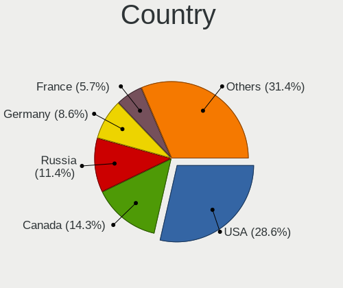
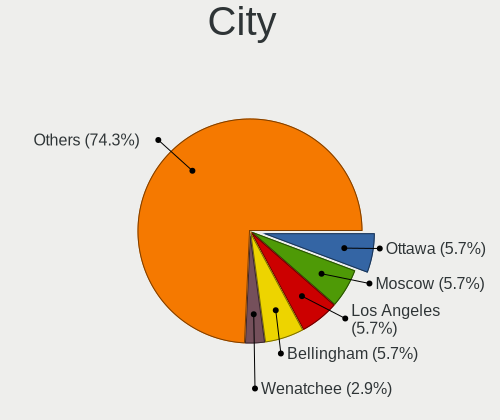
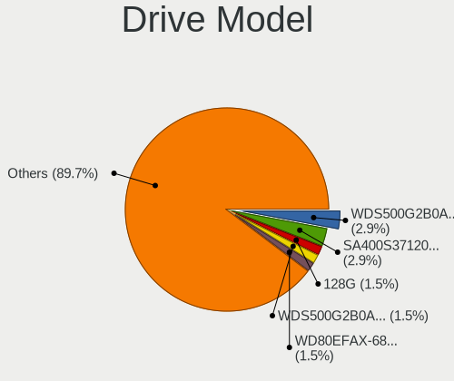
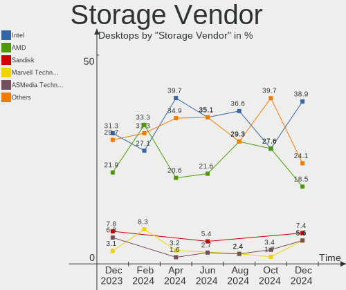
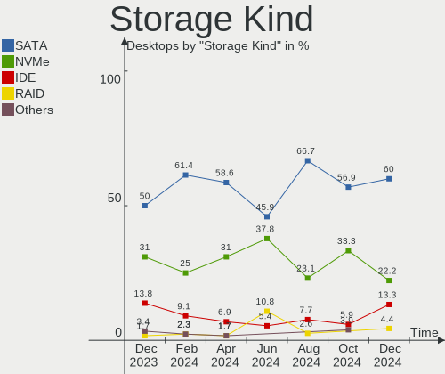
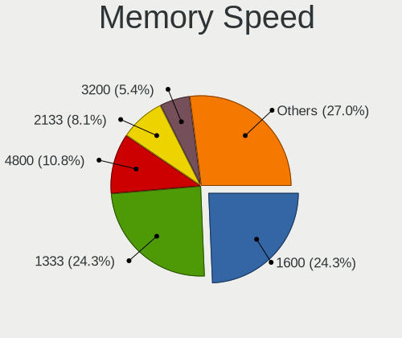

FreeBSD Hardware Trends (Desktop)
---------------------------------

A project to identify most popular hardware characteristics and track their change
over time based on data collected by FreeBSD users at https://BSD-Hardware.info.

Anyone can contribute to the study by uploading probes of their computers by
the [hw-probe](https://github.com/linuxhw/hw-probe/blob/master/INSTALL.BSD.md) tool:

    hw-probe -all -upload

Full-feature report is available here: https://bsd-hardware.info/?view=trends&formfactor=desktop

Period: Mar, 2021.

Contents
--------

- [ OS                       ](#os)
- [ OS Family                ](#os-family)
- [ Arch                     ](#arch)
- [ DE                       ](#de)
- [ Display Server           ](#display-server)
- [ Display Manager          ](#display-manager)
- [ OS Lang                  ](#os-lang)
- [ Boot Mode                ](#boot-mode)
- [ Filesystem               ](#filesystem)
- [ Part. scheme             ](#part-scheme)
- [ Country                  ](#country)
- [ City                     ](#city)
- [ Vendor                   ](#vendor)
- [ Model                    ](#model)
- [ Model Family             ](#model-family)
- [ MFG Year                 ](#mfg-year)
- [ Form Factor              ](#form-factor)
- [ Coreboot                 ](#coreboot)
- [ RAM Size                 ](#ram-size)
- [ RAM Used                 ](#ram-used)
- [ Has CD-ROM               ](#has-cd-rom)
- [ Total Drives             ](#total-drives)
- [ Has Ethernet             ](#has-ethernet)
- [ Has WiFi                 ](#has-wifi)
- [ Has Bluetooth            ](#has-bluetooth)
- [ Drive Vendor             ](#drive-vendor)
- [ Drive Model              ](#drive-model)
- [ HDD Vendor               ](#hdd-vendor)
- [ SSD Vendor               ](#ssd-vendor)
- [ Drive Kind               ](#drive-kind)
- [ Drive Connector          ](#drive-connector)
- [ Drive Size               ](#drive-size)
- [ Space Total              ](#space-total)
- [ Space Used               ](#space-used)
- [ Malfunc. Drives          ](#malfunc-drives)
- [ Malfunc. Drive Vendor    ](#malfunc-drive-vendor)
- [ Malfunc. HDD Vendor      ](#malfunc-hdd-vendor)
- [ Malfunc. Drive Kind      ](#malfunc-drive-kind)
- [ Failed Drives            ](#failed-drives)
- [ Failed Drive Vendor      ](#failed-drive-vendor)
- [ Drive Status             ](#drive-status)
- [ Storage Vendor           ](#storage-vendor)
- [ Storage Model            ](#storage-model)
- [ Storage Kind             ](#storage-kind)
- [ CPU Vendor               ](#cpu-vendor)
- [ CPU Model                ](#cpu-model)
- [ CPU Model Family         ](#cpu-model-family)
- [ CPU Cores                ](#cpu-cores)
- [ CPU Sockets              ](#cpu-sockets)
- [ CPU Threads              ](#cpu-threads)
- [ CPU Microarch            ](#cpu-microarch)
- [ GPU Vendor               ](#gpu-vendor)
- [ GPU Model                ](#gpu-model)
- [ GPU Combo                ](#gpu-combo)
- [ GPU Driver               ](#gpu-driver)
- [ GPU Memory               ](#gpu-memory)
- [ Monitor Vendor           ](#monitor-vendor)
- [ Monitor Model            ](#monitor-model)
- [ Monitor Resolution       ](#monitor-resolution)
- [ Monitor Diagonal         ](#monitor-diagonal)
- [ Monitor Width            ](#monitor-width)
- [ Aspect Ratio             ](#aspect-ratio)
- [ Monitor Area             ](#monitor-area)
- [ Pixel Density            ](#pixel-density)
- [ Multiple Monitors        ](#multiple-monitors)
- [ Net Controller Vendor    ](#net-controller-vendor)
- [ Net Controller Model     ](#net-controller-model)
- [ Wireless Vendor          ](#wireless-vendor)
- [ Wireless Model           ](#wireless-model)
- [ Ethernet Vendor          ](#ethernet-vendor)
- [ Ethernet Model           ](#ethernet-model)
- [ Net Controller Kind      ](#net-controller-kind)
- [ Used Controller          ](#used-controller)
- [ NICs                     ](#nics)
- [ IPv6                     ](#ipv6)
- [ Memory Vendor            ](#memory-vendor)
- [ Memory Model             ](#memory-model)
- [ Memory Kind              ](#memory-kind)
- [ Memory Form Factor       ](#memory-form-factor)
- [ Memory Size              ](#memory-size)
- [ Memory Speed             ](#memory-speed)
- [ Sound Vendor             ](#sound-vendor)
- [ Sound Model              ](#sound-model)
- [ Camera Vendor            ](#camera-vendor)
- [ Camera Model             ](#camera-model)
- [ Fingerprint Vendor       ](#fingerprint-vendor)
- [ Fingerprint Model        ](#fingerprint-model)
- [ Chipcard Vendor          ](#chipcard-vendor)
- [ Chipcard Model           ](#chipcard-model)
- [ Printer Vendor           ](#printer-vendor)
- [ Printer Model            ](#printer-model)
- [ Scanner Vendor           ](#scanner-vendor)
- [ Scanner Model            ](#scanner-model)
- [ Bluetooth Vendor         ](#bluetooth-vendor)
- [ Bluetooth Model          ](#bluetooth-model)
- [ Unsupported Devices      ](#unsupported-devices)
- [ Unsupported Device Types ](#unsupported-device-types)

OS
--

Installed operating systems

| Name                  | Desktops | Percent |
|-----------------------|----------|---------|
| FreeBSD 12.2-p4       | 15       | 38.46%  |
| FreeBSD 14.0-CURRENT  | 4        | 10.26%  |
| FreeBSD 13.0-RC2      | 4        | 10.26%  |
| FreeBSD 12.2          | 4        | 10.26%  |
| FreeBSD 12.2-p3       | 3        | 7.69%   |
| FreeBSD 13.0-STABLE   | 2        | 5.13%   |
| FreeBSD 12.2-STABLE   | 2        | 5.13%   |
| FreeBSD 13.0-RC1      | 1        | 2.56%   |
| FreeBSD 13.0-BETA4    | 1        | 2.56%   |
| FreeBSD 13.0-BETA3-p1 | 1        | 2.56%   |
| FreeBSD 12.2-p2       | 1        | 2.56%   |
| FreeBSD 12.1-p12-HBSD | 1        | 2.56%   |

OS Family
---------

OS without a version

| Name    | Desktops | Percent |
|---------|----------|---------|
| FreeBSD | 39       | 100%    |

Arch
----

OS architecture (x86_64, i586, etc.)

| Name  | Desktops | Percent |
|-------|----------|---------|
| amd64 | 33       | 84.62%  |
| arm64 | 4        | 10.26%  |
| i386  | 1        | 2.56%   |
| arm   | 1        | 2.56%   |

DE
--

Desktop Environment

| Name     | Desktops | Percent |
|----------|----------|---------|
| Console  | 14       | 35.9%   |
| KDE5     | 10       | 25.64%  |
| XFCE     | 5        | 12.82%  |
| MATE     | 3        | 7.69%   |
| GNOME    | 3        | 7.69%   |
| TWM      | 1        | 2.56%   |
| Lumina   | 1        | 2.56%   |
| Cinnamon | 1        | 2.56%   |
| CDE      | 1        | 2.56%   |

Display Server
--------------

X11 or Wayland

| Name    | Desktops | Percent |
|---------|----------|---------|
| X11     | 23       | 58.97%  |
| Console | 16       | 41.03%  |

Display Manager
---------------

SDDM, LightDM, etc.

| Name    | Desktops | Percent |
|---------|----------|---------|
| Console | 19       | 48.72%  |
| SDDM    | 7        | 17.95%  |
| XDM     | 4        | 10.26%  |
| LightDM | 4        | 10.26%  |
| GDM     | 3        | 7.69%   |
| SLiM    | 2        | 5.13%   |

OS Lang
-------

Language

| Lang           | Desktops | Percent |
|----------------|----------|---------|
| Unknown        | 14       | 35.9%   |
| en_US          | 9        | 23.08%  |
| C              | 8        | 20.51%  |
| ru_RU          | 2        | 5.13%   |
| zh_CN          | 1        | 2.56%   |
| sv_SE.US-ASCII | 1        | 2.56%   |
| sv_SE          | 1        | 2.56%   |
| pt_BR          | 1        | 2.56%   |
| en_AU          | 1        | 2.56%   |
| cv_RU.US-ASCII | 1        | 2.56%   |

Boot Mode
---------

EFI or BIOS

| Mode | Desktops | Percent |
|------|----------|---------|
| EFI  | 24       | 61.54%  |
| BIOS | 15       | 38.46%  |

Filesystem
----------

Type of filesystem

| Type | Desktops | Percent |
|------|----------|---------|
| Ufs  | 21       | 53.85%  |
| Zfs  | 18       | 46.15%  |

Part. scheme
------------

Scheme of partitioning

| Type | Desktops | Percent |
|------|----------|---------|
| GPT  | 33       | 84.62%  |
| MBR  | 5        | 12.82%  |
| BSD  | 1        | 2.56%   |

Country
-------

Geographic location (country)

| Country     | Desktops | Percent |
|-------------|----------|---------|
| USA         | 13       | 33.33%  |
| Russia      | 6        | 15.38%  |
| Japan       | 3        | 7.69%   |
| Germany     | 3        | 7.69%   |
| Sweden      | 2        | 5.13%   |
| Czechia     | 2        | 5.13%   |
| Brazil      | 2        | 5.13%   |
| Ukraine     | 1        | 2.56%   |
| Switzerland | 1        | 2.56%   |
| Netherlands | 1        | 2.56%   |
| Indonesia   | 1        | 2.56%   |
| France      | 1        | 2.56%   |
| China       | 1        | 2.56%   |
| Austria     | 1        | 2.56%   |
| Australia   | 1        | 2.56%   |

City
----

Geographic location (city)

| City                    | Desktops | Percent |
|-------------------------|----------|---------|
| Ulyanovsk               | 2        | 5.13%   |
| Redmond                 | 2        | 5.13%   |
| Hazel Green             | 2        | 5.13%   |
| Ōta-ku                 | 1        | 2.56%   |
| Yokohama                | 1        | 2.56%   |
| Yekaterinburg           | 1        | 2.56%   |
| Wenatchee               | 1        | 2.56%   |
| Vienna                  | 1        | 2.56%   |
| Tongshan                | 1        | 2.56%   |
| Tangerang               | 1        | 2.56%   |
| Södertälje            | 1        | 2.56%   |
| Stockholm               | 1        | 2.56%   |
| Springe                 | 1        | 2.56%   |
| Shibuya                 | 1        | 2.56%   |
| Seattle                 | 1        | 2.56%   |
| Santa Monica            | 1        | 2.56%   |
| Prague                  | 1        | 2.56%   |
| Perth                   | 1        | 2.56%   |
| Opfikon                 | 1        | 2.56%   |
| Moscow                  | 1        | 2.56%   |
| Louisville              | 1        | 2.56%   |
| Kyiv                    | 1        | 2.56%   |
| Kingman                 | 1        | 2.56%   |
| Khimki                  | 1        | 2.56%   |
| João Pessoa            | 1        | 2.56%   |
| Jaboatao dos Guararapes | 1        | 2.56%   |
| Horovice                | 1        | 2.56%   |
| Hamburg                 | 1        | 2.56%   |
| Englewood               | 1        | 2.56%   |
| Dallas                  | 1        | 2.56%   |
| Charlotte               | 1        | 2.56%   |
| Borne                   | 1        | 2.56%   |
| Berlin                  | 1        | 2.56%   |
| Beaumes-de-Venise       | 1        | 2.56%   |
| Balakovo                | 1        | 2.56%   |
| Austin                  | 1        | 2.56%   |

Vendor
------

Motherboard manufacturer

| Name                    | Desktops | Percent |
|-------------------------|----------|---------|
| Gigabyte Technology     | 8        | 20.51%  |
| ASUSTek Computer        | 7        | 17.95%  |
| MSI                     | 5        | 12.82%  |
| Hewlett-Packard         | 4        | 10.26%  |
| ASRock                  | 4        | 10.26%  |
| Unknown                 | 4        | 10.26%  |
| Intel                   | 2        | 5.13%   |
| Supermicro              | 1        | 2.56%   |
| Raspberry Pi Foundation | 1        | 2.56%   |
| pine64                  | 1        | 2.56%   |
| Kontron                 | 1        | 2.56%   |
| Dell                    | 1        | 2.56%   |

Model
-----

Motherboard model

| Name                       | Desktops | Percent |
|----------------------------|----------|---------|
| Unknown                    | 4        | 10.26%  |
| Supermicro X7SPA-HF        | 1        | 2.56%   |
| RPi rpi                    | 1        | 2.56%   |
| pine64 pinebook-pro-rk3399 | 1        | 2.56%   |
| MSI MS-7C36                | 1        | 2.56%   |
| MSI MS-7B86                | 1        | 2.56%   |
| MSI MS-7972                | 1        | 2.56%   |
| MSI MS-7817                | 1        | 2.56%   |
| MSI MS-7693                | 1        | 2.56%   |
| Kontron KT965/ATXP         | 1        | 2.56%   |
| Intel X64                  | 1        | 2.56%   |
| Intel Q3XXG4-P V1.0        | 1        | 2.56%   |
| HP Z600 Workstation        | 1        | 2.56%   |
| HP Slim Desktop 290-p0xxx  | 1        | 2.56%   |
| HP EliteDesk 800 G2 TWR    | 1        | 2.56%   |
| HP EliteDesk 800 G1 SFF    | 1        | 2.56%   |
| Gigabyte Z87-D3HP          | 1        | 2.56%   |
| Gigabyte H61M-DS2 x.x      | 1        | 2.56%   |
| Gigabyte B360 HD3P-LM      | 1        | 2.56%   |
| Gigabyte AB350M-Gaming 3   | 1        | 2.56%   |
| Gigabyte 990FXA-UD3 R5     | 1        | 2.56%   |
| Gigabyte 970A-UD3P         | 1        | 2.56%   |
| Gigabyte 970A-DS3P         | 1        | 2.56%   |
| Gigabyte 8IG1000MK         | 1        | 2.56%   |
| Dell XPS 8940              | 1        | 2.56%   |
| ASUS STRIX B250F GAMING    | 1        | 2.56%   |
| ASUS RJ030AV-ABA a1750y    | 1        | 2.56%   |
| ASUS P8Z68-V LX            | 1        | 2.56%   |
| ASUS P8H77-I               | 1        | 2.56%   |
| ASUS P8H67-V               | 1        | 2.56%   |
| ASUS P5Q-E                 | 1        | 2.56%   |
| ASUS All Series            | 1        | 2.56%   |
| ASRock Z490M Pro4          | 1        | 2.56%   |
| ASRock X370 Pro4           | 1        | 2.56%   |
| ASRock Q1900M              | 1        | 2.56%   |
| ASRock N3150B-ITX          | 1        | 2.56%   |

Model Family
------------

Motherboard model prefix

| Name                       | Desktops | Percent |
|----------------------------|----------|---------|
| Unknown                    | 4        | 10.26%  |
| HP EliteDesk               | 2        | 5.13%   |
| Supermicro X7SPA-HF        | 1        | 2.56%   |
| RPi rpi                    | 1        | 2.56%   |
| pine64 pinebook-pro-rk3399 | 1        | 2.56%   |
| MSI MS-7C36                | 1        | 2.56%   |
| MSI MS-7B86                | 1        | 2.56%   |
| MSI MS-7972                | 1        | 2.56%   |
| MSI MS-7817                | 1        | 2.56%   |
| MSI MS-7693                | 1        | 2.56%   |
| Kontron KT965              | 1        | 2.56%   |
| Intel X64                  | 1        | 2.56%   |
| Intel Q3XXG4-P             | 1        | 2.56%   |
| HP Z600                    | 1        | 2.56%   |
| HP Slim                    | 1        | 2.56%   |
| Gigabyte Z87-D3HP          | 1        | 2.56%   |
| Gigabyte H61M-DS2          | 1        | 2.56%   |
| Gigabyte B360              | 1        | 2.56%   |
| Gigabyte AB350M-Gaming     | 1        | 2.56%   |
| Gigabyte 990FXA-UD3        | 1        | 2.56%   |
| Gigabyte 970A-UD3P         | 1        | 2.56%   |
| Gigabyte 970A-DS3P         | 1        | 2.56%   |
| Gigabyte 8IG1000MK         | 1        | 2.56%   |
| Dell XPS                   | 1        | 2.56%   |
| ASUS STRIX                 | 1        | 2.56%   |
| ASUS RJ030AV-ABA           | 1        | 2.56%   |
| ASUS P8Z68-V               | 1        | 2.56%   |
| ASUS P8H77-I               | 1        | 2.56%   |
| ASUS P8H67-V               | 1        | 2.56%   |
| ASUS P5Q-E                 | 1        | 2.56%   |
| ASUS All                   | 1        | 2.56%   |
| ASRock Z490M               | 1        | 2.56%   |
| ASRock X370                | 1        | 2.56%   |
| ASRock Q1900M              | 1        | 2.56%   |
| ASRock N3150B-ITX          | 1        | 2.56%   |

MFG Year
--------

Motherboard manufacture year

| Year    | Desktops | Percent |
|---------|----------|---------|
| 2020    | 6        | 15.38%  |
| 2018    | 5        | 12.82%  |
| 2014    | 4        | 10.26%  |
| 2021    | 3        | 7.69%   |
| 2019    | 3        | 7.69%   |
| 2015    | 3        | 7.69%   |
| 2013    | 3        | 7.69%   |
| Unknown | 3        | 7.69%   |
| 2017    | 2        | 5.13%   |
| 2016    | 2        | 5.13%   |
| 2008    | 2        | 5.13%   |
| 2010    | 1        | 2.56%   |
| 2007    | 1        | 2.56%   |
| 2005    | 1        | 2.56%   |

Form Factor
-----------

Physical design of the computer

| Name    | Desktops | Percent |
|---------|----------|---------|
| Desktop | 39       | 100%    |

Coreboot
--------

Have coreboot on board

| Used | Desktops | Percent |
|------|----------|---------|
| No   | 39       | 100%    |

RAM Size
--------

Total RAM memory

| Size in GB      | Desktops | Percent |
|-----------------|----------|---------|
| 16.01-24.0      | 12       | 30.77%  |
| 4.01-8.0        | 6        | 15.38%  |
| 8.01-16.0       | 6        | 15.38%  |
| 32.01-64.0      | 5        | 12.82%  |
| 64.01-256.0     | 3        | 7.69%   |
| 3.01-4.0        | 2        | 5.13%   |
| More than 256.0 | 1        | 2.56%   |
| 24.01-32.0      | 1        | 2.56%   |
| 2.01-3.0        | 1        | 2.56%   |
| 0.51-1.0        | 1        | 2.56%   |
| 0.01-0.5        | 1        | 2.56%   |

RAM Used
--------

Used RAM memory

| Used GB    | Desktops | Percent |
|------------|----------|---------|
| 0.51-1.0   | 14       | 35.9%   |
| 0.01-0.5   | 10       | 25.64%  |
| 1.01-2.0   | 5        | 12.82%  |
| 3.01-4.0   | 4        | 10.26%  |
| 4.01-8.0   | 2        | 5.13%   |
| 8.01-16.0  | 2        | 5.13%   |
| 24.01-32.0 | 1        | 2.56%   |
| 0          | 1        | 2.56%   |

Has CD-ROM
----------

Has CD-ROM on board

| Presented | Desktops | Percent |
|-----------|----------|---------|
| No        | 25       | 64.1%   |
| Yes       | 14       | 35.9%   |

Total Drives
------------

Number of drives on board

| Drives | Desktops | Percent |
|--------|----------|---------|
| 1      | 12       | 30.77%  |
| 2      | 9        | 23.08%  |
| 3      | 6        | 15.38%  |
| 4      | 4        | 10.26%  |
| 0      | 4        | 10.26%  |
| 5      | 2        | 5.13%   |
| 7      | 1        | 2.56%   |
| 6      | 1        | 2.56%   |

Has Ethernet
------------

Has Ethernet on board

| Presented | Desktops | Percent |
|-----------|----------|---------|
| Yes       | 34       | 87.18%  |
| No        | 5        | 12.82%  |

Has WiFi
--------

Has WiFi module

| Presented | Desktops | Percent |
|-----------|----------|---------|
| No        | 29       | 74.36%  |
| Yes       | 10       | 25.64%  |

Has Bluetooth
-------------

Has Bluetooth module

| Presented | Desktops | Percent |
|-----------|----------|---------|
| No        | 32       | 82.05%  |
| Yes       | 7        | 17.95%  |

Drive Vendor
------------

Hard drive vendors

| Vendor              | Desktops | Drives | Percent |
|---------------------|----------|--------|---------|
| WDC                 | 16       | 30     | 26.67%  |
| Seagate             | 11       | 16     | 18.33%  |
| Toshiba             | 6        | 9      | 10%     |
| Samsung Electronics | 5        | 7      | 8.33%   |
| Intel               | 4        | 5      | 6.67%   |
| Hitachi             | 3        | 3      | 5%      |
| Crucial             | 3        | 3      | 5%      |
| Kingston            | 2        | 2      | 3.33%   |
| SanDisk             | 1        | 1      | 1.67%   |
| OCZ                 | 1        | 1      | 1.67%   |
| Micron Technology   | 1        | 1      | 1.67%   |
| LITEON              | 1        | 1      | 1.67%   |
| LEXAR               | 1        | 1      | 1.67%   |
| Kston               | 1        | 1      | 1.67%   |
| Hoodisk             | 1        | 1      | 1.67%   |
| HGST                | 1        | 2      | 1.67%   |
| GOODRAM             | 1        | 1      | 1.67%   |
| Apple               | 1        | 2      | 1.67%   |

Drive Model
-----------

Hard drive models

| Model                           | Desktops | Percent |
|---------------------------------|----------|---------|
| Seagate ST4000DM000-1F2168 4TB  | 3        | 4.17%   |
| Seagate ST1000DM003-1SB102 1TB  | 3        | 4.17%   |
| WDC WDS100T2B0A-00SM50 1TB      | 2        | 2.78%   |
| Seagate ST500DM002-1BD142 500GB | 2        | 2.78%   |
| WDC WDS120G2G0A-00JH30 120GB    | 1        | 1.39%   |
| WDC WDS100T1X0E-00AFY0 1TB      | 1        | 1.39%   |
| WDC WD7501AALS-00E8B0 752GB     | 1        | 1.39%   |
| WDC WD60EZRZ-00GZ5B1 6TB        | 1        | 1.39%   |
| WDC WD6002FRYZ-01WD5B1 6TB      | 1        | 1.39%   |
| WDC WD5003AZEX-00MK2A0 500GB    | 1        | 1.39%   |
| WDC WD5000AZLX-60K2TA0 500GB    | 1        | 1.39%   |
| WDC WD40EZRZ-22GXCB0 4TB        | 1        | 1.39%   |
| WDC WD40E31X-00HY4A0 4TB        | 1        | 1.39%   |
| WDC WD30EZRX-00SPEB0 3TB        | 1        | 1.39%   |
| WDC WD20EZRZ-00Z5HB0 2TB        | 1        | 1.39%   |
| WDC WD20EARX-00PASB0 2TB        | 1        | 1.39%   |
| WDC WD2002FAEX-007BA0 2TB       | 1        | 1.39%   |
| WDC WD1600YD-01NVB1 164GB       | 1        | 1.39%   |
| WDC WD10SPZX-21Z10T0 1TB        | 1        | 1.39%   |
| WDC WD10JMVW-11AJGS1 1TB        | 1        | 1.39%   |
| WDC WD10EZEX-08WN4A0 1TB        | 1        | 1.39%   |
| WDC WD10EZEX-00RKKA0 1TB        | 1        | 1.39%   |
| WDC WD10EADS-00L5B1 1TB         | 1        | 1.39%   |
| WDC WD1001FALS-00J7B0 1TB       | 1        | 1.39%   |
| Toshiba MQ01ABD050 500GB        | 1        | 1.39%   |
| Toshiba KXG60ZNV1T02 1TB        | 1        | 1.39%   |
| Toshiba HDWQ140 4TB             | 1        | 1.39%   |
| Toshiba HDWE160 6TB             | 1        | 1.39%   |
| Toshiba HDWD120 2TB             | 1        | 1.39%   |
| Toshiba A100 240GB              | 1        | 1.39%   |
| Seagate ST3000DM007-1WY10G 3TB  | 1        | 1.39%   |
| Seagate ST2000LM007-1R8174 2TB  | 1        | 1.39%   |
| Seagate ST2000DM006-2DM164 2TB  | 1        | 1.39%   |
| Seagate ST2000DM001-1CH164 2TB  | 1        | 1.39%   |
| Seagate ST1000VM002-1SD102 1TB  | 1        | 1.39%   |
| Seagate ST1000VM002-1ET162 1TB  | 1        | 1.39%   |
| Seagate ST1000DM010-2EP102 1TB  | 1        | 1.39%   |
| SanDisk SDSSDA240G 240GB        | 1        | 1.39%   |
| Samsung SSD 970 EVO 1TB         | 1        | 1.39%   |
| Samsung SSD 860 QVO 1TB         | 1        | 1.39%   |
| Samsung SSD 850 EVO 500GB       | 1        | 1.39%   |
| Samsung SSD 850 EVO 1TB         | 1        | 1.39%   |
| Samsung SSD 840 EVO 500GB       | 1        | 1.39%   |
| Samsung HD103UJ 1TB             | 1        | 1.39%   |
| OCZ VERTEX3 120GB               | 1        | 1.39%   |
| Micron 5200_MTFDDAK480TDC 480GB | 1        | 1.39%   |
| LITEON CV3-CE128-HP 128GB       | 1        | 1.39%   |
| LEXAR CFAST 64GB CARD           | 1        | 1.39%   |
| Kston SSD 128GB                 | 1        | 1.39%   |
| Kingston SA400S37240G 240GB     | 1        | 1.39%   |
| Kingston SA2000M8500G 500GB     | 1        | 1.39%   |
| Intel SSDSC2CW060A3 64GB        | 1        | 1.39%   |
| Intel SSDSC2BW480A4 480GB       | 1        | 1.39%   |
| Intel SSDSC2BW240A4 240GB       | 1        | 1.39%   |
| Intel SSDSC2BW120A4 120GB       | 1        | 1.39%   |
| Intel SSDSA2CT040G3 40GB        | 1        | 1.39%   |
| Hoodisk SSD 64GB                | 1        | 1.39%   |
| Hitachi HUA721010KLA330 1TB     | 1        | 1.39%   |
| Hitachi HDS725050KLA360 500GB   | 1        | 1.39%   |
| Hitachi HDP725025GLA380 250GB   | 1        | 1.39%   |

HDD Vendor
----------

Hard disk drive vendors

| Vendor              | Desktops | Drives | Percent |
|---------------------|----------|--------|---------|
| WDC                 | 14       | 25     | 40%     |
| Seagate             | 11       | 16     | 31.43%  |
| Toshiba             | 4        | 6      | 11.43%  |
| Hitachi             | 3        | 3      | 8.57%   |
| Samsung Electronics | 1        | 1      | 2.86%   |
| HGST                | 1        | 2      | 2.86%   |
| Apple               | 1        | 2      | 2.86%   |

SSD Vendor
----------

Solid state drive vendors

| Vendor              | Desktops | Drives | Percent |
|---------------------|----------|--------|---------|
| Intel               | 4        | 5      | 19.05%  |
| Samsung Electronics | 3        | 5      | 14.29%  |
| WDC                 | 2        | 4      | 9.52%   |
| Crucial             | 2        | 2      | 9.52%   |
| Toshiba             | 1        | 1      | 4.76%   |
| SanDisk             | 1        | 1      | 4.76%   |
| OCZ                 | 1        | 1      | 4.76%   |
| Micron Technology   | 1        | 1      | 4.76%   |
| LITEON              | 1        | 1      | 4.76%   |
| LEXAR               | 1        | 1      | 4.76%   |
| Kston               | 1        | 1      | 4.76%   |
| Kingston            | 1        | 1      | 4.76%   |
| Hoodisk             | 1        | 1      | 4.76%   |
| GOODRAM             | 1        | 1      | 4.76%   |

Drive Kind
----------

HDD or SSD

| Kind | Desktops | Drives | Percent |
|------|----------|--------|---------|
| HDD  | 26       | 55     | 53.06%  |
| SSD  | 18       | 26     | 36.73%  |
| NVMe | 5        | 6      | 10.2%   |

Drive Connector
---------------

SATA, SAS, NVMe, etc.

| Type | Desktops | Drives | Percent |
|------|----------|--------|---------|
| SATA | 34       | 81     | 87.18%  |
| NVMe | 5        | 6      | 12.82%  |

Drive Size
----------

Size of hard drive

| Size in TB | Desktops | Drives | Percent |
|------------|----------|--------|---------|
| 0.01-0.5   | 23       | 30     | 45.1%   |
| 0.51-1.0   | 13       | 24     | 25.49%  |
| 1.01-2.0   | 6        | 10     | 11.76%  |
| 3.01-4.0   | 4        | 8      | 7.84%   |
| 4.01-10.0  | 3        | 7      | 5.88%   |
| 2.01-3.0   | 2        | 2      | 3.92%   |

Space Total
-----------

Amount of disk space available on the file system

| Size in GB     | Desktops | Percent |
|----------------|----------|---------|
| 251-500        | 9        | 23.08%  |
| 101-250        | 7        | 17.95%  |
| 501-1000       | 6        | 15.38%  |
| 1-20           | 4        | 10.26%  |
| 21-50          | 3        | 7.69%   |
| 1001-2000      | 3        | 7.69%   |
| 51-100         | 3        | 7.69%   |
| 2001-3000      | 2        | 5.13%   |
| More than 3000 | 1        | 2.56%   |
| Unknown        | 1        | 2.56%   |

Space Used
----------

Amount of used disk space

| Used GB   | Desktops | Percent |
|-----------|----------|---------|
| 1-20      | 20       | 51.28%  |
| 21-50     | 9        | 23.08%  |
| 251-500   | 3        | 7.69%   |
| 101-250   | 3        | 7.69%   |
| 2001-3000 | 1        | 2.56%   |
| 501-1000  | 1        | 2.56%   |
| 51-100    | 1        | 2.56%   |
| Unknown   | 1        | 2.56%   |

Malfunc. Drives
---------------

Drive models with a malfunction

| Model                          | Desktops | Drives | Percent |
|--------------------------------|----------|--------|---------|
| WDC WD7501AALS-00E8B0 752GB    | 1        | 1      | 14.29%  |
| WDC WD6002FRYZ-01WD5B1 6TB     | 1        | 1      | 14.29%  |
| WDC WD10JMVW-11AJGS1 1TB       | 1        | 1      | 14.29%  |
| Toshiba MQ01ABD050 500GB       | 1        | 1      | 14.29%  |
| Seagate ST2000DM006-2DM164 2TB | 1        | 1      | 14.29%  |
| LEXAR CFAST 64GB CARD          | 1        | 1      | 14.29%  |
| Intel SSDSC2BW480A4 480GB      | 1        | 1      | 14.29%  |

Malfunc. Drive Vendor
---------------------

Vendors of faulty drives

| Vendor  | Desktops | Drives | Percent |
|---------|----------|--------|---------|
| WDC     | 3        | 3      | 42.86%  |
| Toshiba | 1        | 1      | 14.29%  |
| Seagate | 1        | 1      | 14.29%  |
| LEXAR   | 1        | 1      | 14.29%  |
| Intel   | 1        | 1      | 14.29%  |

Malfunc. HDD Vendor
-------------------

Vendors of faulty HDD drives

| Vendor  | Desktops | Drives | Percent |
|---------|----------|--------|---------|
| WDC     | 3        | 3      | 60%     |
| Toshiba | 1        | 1      | 20%     |
| Seagate | 1        | 1      | 20%     |

Malfunc. Drive Kind
-------------------

Kinds of faulty drives

| Kind | Desktops | Drives | Percent |
|------|----------|--------|---------|
| HDD  | 4        | 5      | 66.67%  |
| SSD  | 2        | 2      | 33.33%  |

Failed Drives
-------------

Failed drive models

Zero info for selected period =(

Failed Drive Vendor
-------------------

Failed drive vendors

Zero info for selected period =(

Drive Status
------------

Number of failed and malfunc. drives

| Status   | Desktops | Drives | Percent |
|----------|----------|--------|---------|
| Works    | 32       | 76     | 82.05%  |
| Malfunc  | 5        | 7      | 12.82%  |
| Detected | 2        | 4      | 5.13%   |

Storage Vendor
--------------

Storage controller vendors

| Vendor                      | Desktops | Percent |
|-----------------------------|----------|---------|
| Intel                       | 26       | 54.17%  |
| AMD                         | 8        | 16.67%  |
| ASMedia Technology          | 3        | 6.25%   |
| Sandisk                     | 2        | 4.17%   |
| Marvell Technology Group    | 2        | 4.17%   |
| VIA Technologies            | 1        | 2.08%   |
| Toshiba                     | 1        | 2.08%   |
| Silicon Motion              | 1        | 2.08%   |
| Samsung Electronics         | 1        | 2.08%   |
| Micron/Crucial Technology   | 1        | 2.08%   |
| Kingston Technology Company | 1        | 2.08%   |
| Areca Technology            | 1        | 2.08%   |

Storage Model
-------------

Storage controller models

| Model                                                                            | Desktops | Percent |
|----------------------------------------------------------------------------------|----------|---------|
| AMD SB7x0/SB8x0/SB9x0 SATA Controller [AHCI mode]                                | 4        | 7.41%   |
| AMD FCH SATA Controller [AHCI mode]                                              | 4        | 7.41%   |
| Intel Atom Processor E3800 Series SATA AHCI Controller                           | 3        | 5.56%   |
| Intel 8 Series/C220 Series Chipset Family 6-port SATA Controller 1 [AHCI mode]   | 3        | 5.56%   |
| Intel 6 Series/C200 Series Chipset Family 6 port Desktop SATA AHCI Controller    | 3        | 5.56%   |
| ASMedia ASM1062 Serial ATA Controller                                            | 3        | 5.56%   |
| Intel Q170/Q150/B150/H170/H110/Z170/CM236 Chipset SATA Controller [AHCI Mode]    | 2        | 3.7%    |
| Intel Cannon Lake PCH SATA AHCI Controller                                       | 2        | 3.7%    |
| VIA VT6421 IDE/SATA Controller                                                   | 1        | 1.85%   |
| Toshiba XG6 NVMe SSD Controller                                                  | 1        | 1.85%   |
| Silicon Motion SM2263EN/SM2263XT SSD Controller                                  | 1        | 1.85%   |
| Sandisk WD Blue SN550 NVMe SSD                                                   | 1        | 1.85%   |
| Sandisk WD Black SN850                                                           | 1        | 1.85%   |
| Samsung NVMe SSD Controller SM981/PM981/PM983                                    | 1        | 1.85%   |
| Micron/Crucial P1 NVMe PCIe SSD                                                  | 1        | 1.85%   |
| Marvell Group 88SE9172 SATA 6Gb/s Controller                                     | 1        | 1.85%   |
| Marvell Group 88SE6111/6121 SATA II / PATA Controller                            | 1        | 1.85%   |
| Kingston Company A2000 NVMe SSD                                                  | 1        | 1.85%   |
| Intel SATA Controller [RAID mode]                                                | 1        | 1.85%   |
| Intel Comet Lake SATA AHCI Controller                                            | 1        | 1.85%   |
| Intel C610/X99 series chipset 6-Port SATA Controller [AHCI mode]                 | 1        | 1.85%   |
| Intel Atom/Celeron/Pentium Processor x5-E8000/J3xxx/N3xxx Series SATA Controller | 1        | 1.85%   |
| Intel 82801JI (ICH10 Family) SATA AHCI Controller                                | 1        | 1.85%   |
| Intel 82801IR/IO/IH (ICH9R/DO/DH) 6 port SATA Controller [AHCI mode]             | 1        | 1.85%   |
| Intel 82801HR/HO/HH (ICH8R/DO/DH) 2 port SATA Controller [IDE mode]              | 1        | 1.85%   |
| Intel 82801H (ICH8 Family) 4 port SATA Controller [IDE mode]                     | 1        | 1.85%   |
| Intel 82801GR/GDH (ICH7R/ICH7DH) SATA Controller [RAID mode]                     | 1        | 1.85%   |
| Intel 82801G (ICH7 Family) IDE Controller                                        | 1        | 1.85%   |
| Intel 82801EB (ICH5) SATA Controller                                             | 1        | 1.85%   |
| Intel 8 Series SATA Controller 1 [AHCI mode]                                     | 1        | 1.85%   |
| Intel 7 Series/C210 Series Chipset Family 6-port SATA Controller [AHCI mode]     | 1        | 1.85%   |
| Intel 400 Series Chipset Family SATA RAID Controller                             | 1        | 1.85%   |
| Intel 200 Series PCH SATA controller [AHCI mode]                                 | 1        | 1.85%   |
| Areca ARC-1280/1280ML 24-Port PCI-Express to SATA II RAID Controller             | 1        | 1.85%   |
| AMD X370 Series Chipset SATA Controller                                          | 1        | 1.85%   |
| AMD SB7x0/SB8x0/SB9x0 IDE Controller                                             | 1        | 1.85%   |
| AMD 400 Series Chipset SATA Controller                                           | 1        | 1.85%   |
| AMD 300 Series Chipset SATA Controller                                           | 1        | 1.85%   |

Storage Kind
------------

Kind of storage controller (IDE, SATA, NVMe, SAS, ...)

| Kind | Desktops | Percent |
|------|----------|---------|
| SATA | 29       | 64.44%  |
| NVMe | 7        | 15.56%  |
| IDE  | 5        | 11.11%  |
| RAID | 4        | 8.89%   |

CPU Vendor
----------

Processor vendors

| Vendor  | Desktops | Percent |
|---------|----------|---------|
| Intel   | 26       | 66.67%  |
| AMD     | 8        | 20.51%  |
| Unknown | 3        | 7.69%   |
| ARM     | 2        | 5.13%   |

CPU Model
---------

Processor models

| Model                                 | Desktops | Percent |
|---------------------------------------|----------|---------|
|                                       | 3        | 7.69%   |
| Intel Core i7-8700 CPU @ 3.20GHz      | 2        | 5.13%   |
| AMD FX-8320E Eight-Core Processor     | 2        | 5.13%   |
| Intel Xeon CPU E5630 @ 2.53GHz        | 1        | 2.56%   |
| Intel Xeon CPU E5-1650 v4 @ 3.60GHz   | 1        | 2.56%   |
| Intel Pentium CPU G3220 @ 3.00GHz     | 1        | 2.56%   |
| Intel Pentium 4 CPU                   | 1        | 2.56%   |
| Intel Core i7-7700K CPU @ 4.20GHz     | 1        | 2.56%   |
| Intel Core i7-6700 CPU @ 3.40GHz      | 1        | 2.56%   |
| Intel Core i7-3770 CPU @ 3.40GHz      | 1        | 2.56%   |
| Intel Core i7-2600K CPU @ 3.40GHz     | 1        | 2.56%   |
| Intel Core i7-10700 CPU @ 2.90GHz     | 1        | 2.56%   |
| Intel Core i5-6500 CPU @ 3.20GHz      | 1        | 2.56%   |
| Intel Core i5-4690 CPU @ 3.50GHz      | 1        | 2.56%   |
| Intel Core i5-4670K CPU @ 3.40GHz     | 1        | 2.56%   |
| Intel Core i5-2500 CPU @ 3.30GHz      | 1        | 2.56%   |
| Intel Core i5-10600K CPU @ 4.10GHz    | 1        | 2.56%   |
| Intel Core i3-4030U CPU @ 1.90GHz     | 1        | 2.56%   |
| Intel Core i3-3220 CPU @ 3.30GHz      | 1        | 2.56%   |
| Intel Core 2 Quad CPU Q6600 @ 2.40GHz | 1        | 2.56%   |
| Intel Core 2 Duo CPU E7300 @ 2.66GHz  | 1        | 2.56%   |
| Intel Core 2 CPU 4300 @ 1.80GHz       | 1        | 2.56%   |
| Intel Celeron CPU N3150 @ 1.60GHz     | 1        | 2.56%   |
| Intel Celeron CPU N2930 @ 1.83GHz     | 1        | 2.56%   |
| Intel Celeron CPU J1900 @ 1.99GHz     | 1        | 2.56%   |
| Intel Celeron CPU J1800 @ 2.41GHz     | 1        | 2.56%   |
| Intel Atom CPU D510 @ 1.66GHz         | 1        | 2.56%   |
| ARM Cortex-A72 r0p3                   | 1        | 2.56%   |
| ARM ARM1176 r0p7 (ECO: 0x00000000)    | 1        | 2.56%   |
| AMD Ryzen 9 5950X 16-Core Processor   | 1        | 2.56%   |
| AMD Ryzen 7 1700 Eight-Core Processor | 1        | 2.56%   |
| AMD Ryzen 5 2600X Six-Core Processor  | 1        | 2.56%   |
| AMD Ryzen 5 1500X Quad-Core Processor | 1        | 2.56%   |
| AMD FX-8370 Eight-Core Processor      | 1        | 2.56%   |
| AMD FX-6300 Six-Core Processor        | 1        | 2.56%   |

CPU Model Family
----------------

Processor model prefix

| Model             | Desktops | Percent |
|-------------------|----------|---------|
| Intel Core i7     | 7        | 17.95%  |
| Intel Core i5     | 5        | 12.82%  |
| Other             | 4        | 10.26%  |
| Intel Celeron     | 4        | 10.26%  |
| AMD FX            | 4        | 10.26%  |
| Intel Xeon        | 2        | 5.13%   |
| Intel Core i3     | 2        | 5.13%   |
| AMD Ryzen 5       | 2        | 5.13%   |
| Intel Pentium 4   | 1        | 2.56%   |
| Intel Pentium     | 1        | 2.56%   |
| Intel Core 2 Quad | 1        | 2.56%   |
| Intel Core 2 Duo  | 1        | 2.56%   |
| Intel Core 2      | 1        | 2.56%   |
| Intel Atom        | 1        | 2.56%   |
| ARM Cortex        | 1        | 2.56%   |
| AMD Ryzen 9       | 1        | 2.56%   |
| AMD Ryzen 7       | 1        | 2.56%   |

CPU Cores
---------

Number of processor cores

| Number  | Desktops | Percent |
|---------|----------|---------|
| 4       | 12       | 30.77%  |
| Unknown | 8        | 20.51%  |
| 8       | 6        | 15.38%  |
| 6       | 5        | 12.82%  |
| 2       | 5        | 12.82%  |
| 32      | 1        | 2.56%   |
| 16      | 1        | 2.56%   |
| 12      | 1        | 2.56%   |

CPU Sockets
-----------

Number of sockets

| Number  | Desktops | Percent |
|---------|----------|---------|
| 1       | 34       | 87.18%  |
| Unknown | 3        | 7.69%   |
| 2       | 2        | 5.13%   |

CPU Threads
-----------

Threads per core (Hyper-Threading)

| Number  | Desktops | Percent |
|---------|----------|---------|
| 1       | 18       | 46.15%  |
| 2       | 13       | 33.33%  |
| Unknown | 8        | 20.51%  |

CPU Microarch
-------------

Microarchitecture

| Name        | Desktops | Percent |
|-------------|----------|---------|
| Unknown     | 5        | 12.82%  |
| Silvermont  | 4        | 10.26%  |
| Piledriver  | 4        | 10.26%  |
| Haswell     | 4        | 10.26%  |
| KabyLake    | 3        | 7.69%   |
| Zen         | 2        | 5.13%   |
| Skylake     | 2        | 5.13%   |
| SandyBridge | 2        | 5.13%   |
| IvyBridge   | 2        | 5.13%   |
| Core        | 2        | 5.13%   |
| CometLake   | 2        | 5.13%   |
| Zen+        | 1        | 2.56%   |
| Zen 3       | 1        | 2.56%   |
| Westmere    | 1        | 2.56%   |
| Penryn      | 1        | 2.56%   |
| NetBurst    | 1        | 2.56%   |
| Broadwell   | 1        | 2.56%   |
| Bonnell     | 1        | 2.56%   |

GPU Vendor
----------

Vendors of graphics cards

| Vendor            | Desktops | Percent |
|-------------------|----------|---------|
| Intel             | 17       | 47.22%  |
| Nvidia            | 14       | 38.89%  |
| AMD               | 4        | 11.11%  |
| ASPEED Technology | 1        | 2.78%   |

GPU Model
---------

Graphics card models

| Model                                                                                    | Desktops | Percent |
|------------------------------------------------------------------------------------------|----------|---------|
| Intel CometLake-S GT2 [UHD Graphics 630]                                                 | 4        | 11.11%  |
| Intel Atom Processor Z36xxx/Z37xxx Series Graphics & Display                             | 3        | 8.33%   |
| Nvidia GP104 [GeForce GTX 1070]                                                          | 2        | 5.56%   |
| Nvidia GK208B [GeForce GT 710]                                                           | 2        | 5.56%   |
| Intel Xeon E3-1200 v3/4th Gen Core Processor Integrated Graphics Controller              | 2        | 5.56%   |
| Intel Xeon E3-1200 v2/3rd Gen Core processor Graphics Controller                         | 2        | 5.56%   |
| Nvidia TU116 [GeForce GTX 1650 SUPER]                                                    | 1        | 2.78%   |
| Nvidia GT218 [GeForce 210]                                                               | 1        | 2.78%   |
| Nvidia GT200GL [Quadro FX 3800]                                                          | 1        | 2.78%   |
| Nvidia GP107 [GeForce GTX 1050 Ti]                                                       | 1        | 2.78%   |
| Nvidia GP104 [GeForce GTX 1080]                                                          | 1        | 2.78%   |
| Nvidia GM206 [GeForce GTX 960]                                                           | 1        | 2.78%   |
| Nvidia GM107 [GeForce GTX 750 Ti]                                                        | 1        | 2.78%   |
| Nvidia GK107 [GeForce GTX 650]                                                           | 1        | 2.78%   |
| Nvidia GF108 [GeForce GT 430]                                                            | 1        | 2.78%   |
| Nvidia G98 [GeForce 8400 GS Rev. 2]                                                      | 1        | 2.78%   |
| Intel HD Graphics 530                                                                    | 1        | 2.78%   |
| Intel Haswell-ULT Integrated Graphics Controller                                         | 1        | 2.78%   |
| Intel Atom/Celeron/Pentium Processor x5-E8000/J3xxx/N3xxx Integrated Graphics Controller | 1        | 2.78%   |
| Intel Atom Processor D4xx/D5xx/N4xx/N5xx Integrated Graphics Controller                  | 1        | 2.78%   |
| Intel 82Q963/Q965 Integrated Graphics Controller                                         | 1        | 2.78%   |
| Intel 82865G Integrated Graphics Controller                                              | 1        | 2.78%   |
| ASPEED Technology ASPEED Graphics Family                                                 | 1        | 2.78%   |
| AMD Tonga PRO GL [FirePro W7100]                                                         | 1        | 2.78%   |
| AMD Hawaii XT / Grenada XT [Radeon R9 290X/390X]                                         | 1        | 2.78%   |
| AMD Ellesmere [Radeon RX 470/480/570/570X/580/580X/590]                                  | 1        | 2.78%   |
| AMD Baffin [Radeon RX 460/560D / Pro 450/455/460/555/555X/560/560X]                      | 1        | 2.78%   |

GPU Combo
---------

Combinations of graphics cards

| Name           | Desktops | Percent |
|----------------|----------|---------|
| 1 x Intel      | 15       | 38.46%  |
| 1 x Nvidia     | 13       | 33.33%  |
| Other          | 4        | 10.26%  |
| 1 x AMD        | 4        | 10.26%  |
| 2 x Intel      | 1        | 2.56%   |
| Intel + Nvidia | 1        | 2.56%   |
| 1 x ASPEED     | 1        | 2.56%   |

GPU Driver
----------

Free vs proprietary

| Driver      | Desktops | Percent |
|-------------|----------|---------|
| Free        | 23       | 58.97%  |
| Proprietary | 12       | 30.77%  |
| Unknown     | 4        | 10.26%  |

GPU Memory
----------

Total video memory

| Size in GB | Desktops | Percent |
|------------|----------|---------|
| Unknown    | 22       | 56.41%  |
| 7.01-8.0   | 5        | 12.82%  |
| 1.01-2.0   | 4        | 10.26%  |
| 0.51-1.0   | 4        | 10.26%  |
| 3.01-4.0   | 3        | 7.69%   |
| 0.01-0.5   | 1        | 2.56%   |

Monitor Vendor
--------------

Monitor vendors

| Vendor               | Desktops | Percent |
|----------------------|----------|---------|
| Samsung Electronics  | 4        | 16.67%  |
| Hewlett-Packard      | 4        | 16.67%  |
| Dell                 | 3        | 12.5%   |
| AOC                  | 3        | 12.5%   |
| Goldstar             | 2        | 8.33%   |
| ViewSonic            | 1        | 4.17%   |
| Unknown              | 1        | 4.17%   |
| LG Electronics       | 1        | 4.17%   |
| Iiyama               | 1        | 4.17%   |
| Eizo                 | 1        | 4.17%   |
| BenQ                 | 1        | 4.17%   |
| Ancor Communications | 1        | 4.17%   |
| Acer                 | 1        | 4.17%   |

Monitor Model
-------------

Monitor models

| Model                                                             | Desktops | Percent |
|-------------------------------------------------------------------|----------|---------|
| ViewSonic LCD Monitor VSCDC2E 1920x1080 480x270mm 21.7-inch       | 1        | 3.85%   |
| Unknown LCD Monitor KJT4K2K60DP 3840x2160                         | 1        | 3.85%   |
| Samsung Electronics SyncMaster SAM05FC 1920x1080                  | 1        | 3.85%   |
| Samsung Electronics S27D590 SAM0B49 1920x1080 600x340mm 27.2-inch | 1        | 3.85%   |
| Samsung Electronics LCD Monitor SMT27A550 1920x1080               | 1        | 3.85%   |
| Samsung Electronics C27F390 SAM0D32 1920x1080 600x340mm 27.2-inch | 1        | 3.85%   |
| LG Electronics LCD Monitor LG TV SSCR 1280x1024                   | 1        | 3.85%   |
| Iiyama PL2740HS IVM6662 1920x1080 600x340mm 27.2-inch             | 1        | 3.85%   |
| Hewlett-Packard w2216 HWP280C 1680x1050 470x290mm 21.7-inch       | 1        | 3.85%   |
| Hewlett-Packard vp17 HWP2699 1280x1024 340x270mm 17.1-inch        | 1        | 3.85%   |
| Hewlett-Packard LCD Monitor Z24n 1920x1200                        | 1        | 3.85%   |
| Hewlett-Packard L2335 HWP2615 1920x1200 500x310mm 23.2-inch       | 1        | 3.85%   |
| Hewlett-Packard 2310e HWP2909 1920x1080 510x290mm 23.1-inch       | 1        | 3.85%   |
| Goldstar LG HDR WQHD GSM7716 3840x1600 880x370mm 37.6-inch        | 1        | 3.85%   |
| Goldstar E2211 GSM5839 1920x1080 480x270mm 21.7-inch              | 1        | 3.85%   |
| Eizo L767 ENC1687 1280x1024 380x300mm 19.1-inch                   | 1        | 3.85%   |
| Dell U2518D DEL413C 2560x1440 550x310mm 24.9-inch                 | 1        | 3.85%   |
| Dell U2412M DELA07B 1920x1200 520x320mm 24.0-inch                 | 1        | 3.85%   |
| Dell P2414H DELA09A 1920x1080 530x300mm 24.0-inch                 | 1        | 3.85%   |
| Dell LCD Monitor ST2220L 1920x1080                                | 1        | 3.85%   |
| BenQ GW2280 BNQ78E8 1920x1080 480x270mm 21.7-inch                 | 1        | 3.85%   |
| AOC 2769M AOC2769 1920x1080 600x340mm 27.2-inch                   | 1        | 3.85%   |
| AOC 2479W AOC2479 1920x1080 520x290mm 23.4-inch                   | 1        | 3.85%   |
| AOC 2476WM AOC2476 1920x1080 520x290mm 23.4-inch                  | 1        | 3.85%   |
| Ancor Communications VX228 ACI22C1 1920x1080 480x270mm 21.7-inch  | 1        | 3.85%   |
| Acer XB271HU A ACR052F 2560x1440 600x340mm 27.2-inch              | 1        | 3.85%   |

Monitor Resolution
------------------

Monitor screen resolution

| Resolution         | Desktops | Percent |
|--------------------|----------|---------|
| 1920x1080 (FHD)    | 13       | 54.17%  |
| 1920x1200 (WUXGA)  | 3        | 12.5%   |
| 1280x1024 (SXGA)   | 3        | 12.5%   |
| 2560x1440 (QHD)    | 2        | 8.33%   |
| 3840x2160 (4K)     | 1        | 4.17%   |
| 3840x1600          | 1        | 4.17%   |
| 1680x1050 (WSXGA+) | 1        | 4.17%   |

Monitor Diagonal
----------------

Diagonal size in inches

| Inches  | Desktops | Percent |
|---------|----------|---------|
| Unknown | 6        | 25%     |
| 21      | 5        | 20.83%  |
| 27      | 4        | 16.67%  |
| 23      | 4        | 16.67%  |
| 24      | 2        | 8.33%   |
| 37      | 1        | 4.17%   |
| 19      | 1        | 4.17%   |
| 17      | 1        | 4.17%   |

Monitor Width
-------------

Physical width

| Width in mm | Desktops | Percent |
|-------------|----------|---------|
| 501-600     | 9        | 39.13%  |
| Unknown     | 6        | 26.09%  |
| 401-500     | 5        | 21.74%  |
| 801-900     | 1        | 4.35%   |
| 351-400     | 1        | 4.35%   |
| 301-350     | 1        | 4.35%   |

Aspect Ratio
------------

Proportional relationship between the width and the height

| Ratio   | Desktops | Percent |
|---------|----------|---------|
| 16/9    | 12       | 54.55%  |
| Unknown | 5        | 22.73%  |
| 5/4     | 2        | 9.09%   |
| 16/10   | 2        | 9.09%   |
| 21/9    | 1        | 4.55%   |

Monitor Area
------------

Area in inch²

| Area in inch² | Desktops | Percent |
|----------------|----------|---------|
| 201-250        | 8        | 34.78%  |
| Unknown        | 6        | 26.09%  |
| 301-350        | 4        | 17.39%  |
| 251-300        | 2        | 8.7%    |
| 151-200        | 1        | 4.35%   |
| 141-150        | 1        | 4.35%   |
| 501-1000       | 1        | 4.35%   |

Pixel Density
-------------

Pixels per inch

| Density | Desktops | Percent |
|---------|----------|---------|
| 51-100  | 10       | 45.45%  |
| 101-120 | 6        | 27.27%  |
| Unknown | 6        | 27.27%  |

Multiple Monitors
-----------------

Total monitors connected

| Total | Desktops | Percent |
|-------|----------|---------|
| 0     | 18       | 46.15%  |
| 1     | 16       | 41.03%  |
| 2     | 5        | 12.82%  |

Net Controller Vendor
---------------------

Controller vendors

| Vendor                         | Desktops | Percent |
|--------------------------------|----------|---------|
| Realtek Semiconductor          | 18       | 40.91%  |
| Intel                          | 16       | 36.36%  |
| Qualcomm Atheros               | 4        | 9.09%   |
| Broadcom Inc. and subsidiaries | 2        | 4.55%   |
| Mellanox Technologies          | 1        | 2.27%   |
| Marvell Technology Group       | 1        | 2.27%   |
| Dresden Elektronik             | 1        | 2.27%   |
| Aquantia                       | 1        | 2.27%   |

Net Controller Model
--------------------

Controller models

| Model                                                                                         | Desktops | Percent |
|-----------------------------------------------------------------------------------------------|----------|---------|
| Realtek RTL8111/8168/8411 PCI Express Gigabit Ethernet Controller                             | 16       | 29.63%  |
| Realtek RTL8188EUS 802.11n Wireless Network Adapter                                           | 2        | 3.7%    |
| Intel I211 Gigabit Network Connection                                                         | 2        | 3.7%    |
| Intel 82574L Gigabit Network Connection                                                       | 2        | 3.7%    |
| Realtek RTL8821CE 802.11ac PCIe Wireless Network Adapter                                      | 1        | 1.85%   |
| Realtek RTL8821AE 802.11ac PCIe Wireless Network Adapter                                      | 1        | 1.85%   |
| Realtek RTL8169 PCI Gigabit Ethernet Controller                                               | 1        | 1.85%   |
| Realtek Realtek 8812AU/8821AU 802.11ac WLAN Adapter [USB Wireless Dual-Band Adapter 2.4/5Ghz] | 1        | 1.85%   |
| Realtek Killer E2600 Gigabit Ethernet Controller                                              | 1        | 1.85%   |
| Qualcomm Atheros Killer E220x Gigabit Ethernet Controller                                     | 1        | 1.85%   |
| Qualcomm Atheros AR9485 Wireless Network Adapter                                              | 1        | 1.85%   |
| Qualcomm Atheros AR9287 Wireless Network Adapter (PCI-Express)                                | 1        | 1.85%   |
| Qualcomm Atheros AR8151 v2.0 Gigabit Ethernet                                                 | 1        | 1.85%   |
| Mellanox MT27710 Family [ConnectX-4 Lx]                                                       | 1        | 1.85%   |
| Marvell Group 88E8056 PCI-E Gigabit Ethernet Controller                                       | 1        | 1.85%   |
| Marvell Group 88E8001 Gigabit Ethernet Controller                                             | 1        | 1.85%   |
| Intel Wireless 8260                                                                           | 1        | 1.85%   |
| Intel Wi-Fi 6 AX200                                                                           | 1        | 1.85%   |
| Intel NM10/ICH7 Family LAN Controller                                                         | 1        | 1.85%   |
| Intel I210 Gigabit Network Connection                                                         | 1        | 1.85%   |
| Intel Ethernet Controller 10G X550T                                                           | 1        | 1.85%   |
| Intel Ethernet Connection I217-V                                                              | 1        | 1.85%   |
| Intel Ethernet Connection I217-LM                                                             | 1        | 1.85%   |
| Intel Ethernet Connection (7) I219-LM                                                         | 1        | 1.85%   |
| Intel Ethernet Connection (2) I219-V                                                          | 1        | 1.85%   |
| Intel Ethernet Connection (2) I219-LM                                                         | 1        | 1.85%   |
| Intel Ethernet Connection (11) I219-V                                                         | 1        | 1.85%   |
| Intel Comet Lake PCH CNVi WiFi                                                                | 1        | 1.85%   |
| Intel 82572EI Gigabit Ethernet Controller (Copper)                                            | 1        | 1.85%   |
| Intel 82571EB/82571GB Gigabit Ethernet Controller D0/D1 (copper applications)                 | 1        | 1.85%   |
| Intel 82562EZ 10/100 Ethernet Controller                                                      | 1        | 1.85%   |
| Intel 82540EM Gigabit Ethernet Controller                                                     | 1        | 1.85%   |
| Dresden Elektronik ZigBee gateway [ConBee II]                                                 | 1        | 1.85%   |
| Broadcom Inc. and subsidiaries NetXtreme BCM5764M Gigabit Ethernet PCIe                       | 1        | 1.85%   |
| Broadcom Inc. and subsidiaries BCM43228 802.11a/b/g/n                                         | 1        | 1.85%   |
| Aquantia AQC107 NBase-T/IEEE 802.3bz Ethernet Controller [AQtion]                             | 1        | 1.85%   |

Wireless Vendor
---------------

Wireless vendors

| Vendor                         | Desktops | Percent |
|--------------------------------|----------|---------|
| Realtek Semiconductor          | 5        | 45.45%  |
| Intel                          | 3        | 27.27%  |
| Qualcomm Atheros               | 2        | 18.18%  |
| Broadcom Inc. and subsidiaries | 1        | 9.09%   |

Wireless Model
--------------

Wireless models

| Model                                                                                         | Desktops | Percent |
|-----------------------------------------------------------------------------------------------|----------|---------|
| Realtek RTL8188EUS 802.11n Wireless Network Adapter                                           | 2        | 18.18%  |
| Realtek RTL8821CE 802.11ac PCIe Wireless Network Adapter                                      | 1        | 9.09%   |
| Realtek RTL8821AE 802.11ac PCIe Wireless Network Adapter                                      | 1        | 9.09%   |
| Realtek Realtek 8812AU/8821AU 802.11ac WLAN Adapter [USB Wireless Dual-Band Adapter 2.4/5Ghz] | 1        | 9.09%   |
| Qualcomm Atheros AR9485 Wireless Network Adapter                                              | 1        | 9.09%   |
| Qualcomm Atheros AR9287 Wireless Network Adapter (PCI-Express)                                | 1        | 9.09%   |
| Intel Wireless 8260                                                                           | 1        | 9.09%   |
| Intel Wi-Fi 6 AX200                                                                           | 1        | 9.09%   |
| Intel Comet Lake PCH CNVi WiFi                                                                | 1        | 9.09%   |
| Broadcom Inc. and subsidiaries BCM43228 802.11a/b/g/n                                         | 1        | 9.09%   |

Ethernet Vendor
---------------

Ethernet vendors

| Vendor                         | Desktops | Percent |
|--------------------------------|----------|---------|
| Realtek Semiconductor          | 17       | 44.74%  |
| Intel                          | 16       | 42.11%  |
| Qualcomm Atheros               | 2        | 5.26%   |
| Marvell Technology Group       | 1        | 2.63%   |
| Broadcom Inc. and subsidiaries | 1        | 2.63%   |
| Aquantia                       | 1        | 2.63%   |

Ethernet Model
--------------

Ethernet models

| Model                                                                         | Desktops | Percent |
|-------------------------------------------------------------------------------|----------|---------|
| Realtek RTL8111/8168/8411 PCI Express Gigabit Ethernet Controller             | 16       | 39.02%  |
| Intel I211 Gigabit Network Connection                                         | 2        | 4.88%   |
| Intel 82574L Gigabit Network Connection                                       | 2        | 4.88%   |
| Realtek RTL8169 PCI Gigabit Ethernet Controller                               | 1        | 2.44%   |
| Realtek Killer E2600 Gigabit Ethernet Controller                              | 1        | 2.44%   |
| Qualcomm Atheros Killer E220x Gigabit Ethernet Controller                     | 1        | 2.44%   |
| Qualcomm Atheros AR8151 v2.0 Gigabit Ethernet                                 | 1        | 2.44%   |
| Marvell Group 88E8056 PCI-E Gigabit Ethernet Controller                       | 1        | 2.44%   |
| Marvell Group 88E8001 Gigabit Ethernet Controller                             | 1        | 2.44%   |
| Intel NM10/ICH7 Family LAN Controller                                         | 1        | 2.44%   |
| Intel I210 Gigabit Network Connection                                         | 1        | 2.44%   |
| Intel Ethernet Controller 10G X550T                                           | 1        | 2.44%   |
| Intel Ethernet Connection I217-V                                              | 1        | 2.44%   |
| Intel Ethernet Connection I217-LM                                             | 1        | 2.44%   |
| Intel Ethernet Connection (7) I219-LM                                         | 1        | 2.44%   |
| Intel Ethernet Connection (2) I219-V                                          | 1        | 2.44%   |
| Intel Ethernet Connection (2) I219-LM                                         | 1        | 2.44%   |
| Intel Ethernet Connection (11) I219-V                                         | 1        | 2.44%   |
| Intel 82572EI Gigabit Ethernet Controller (Copper)                            | 1        | 2.44%   |
| Intel 82571EB/82571GB Gigabit Ethernet Controller D0/D1 (copper applications) | 1        | 2.44%   |
| Intel 82562EZ 10/100 Ethernet Controller                                      | 1        | 2.44%   |
| Intel 82540EM Gigabit Ethernet Controller                                     | 1        | 2.44%   |
| Broadcom Inc. and subsidiaries NetXtreme BCM5764M Gigabit Ethernet PCIe       | 1        | 2.44%   |
| Aquantia AQC107 NBase-T/IEEE 802.3bz Ethernet Controller [AQtion]             | 1        | 2.44%   |

Net Controller Kind
-------------------

Ethernet, WiFi or modem

| Kind     | Desktops | Percent |
|----------|----------|---------|
| Ethernet | 34       | 73.91%  |
| WiFi     | 10       | 21.74%  |
| Modem    | 1        | 2.17%   |
| Unknown  | 1        | 2.17%   |

Used Controller
---------------

Currently used network controller

| Kind     | Desktops | Percent |
|----------|----------|---------|
| Ethernet | 34       | 89.47%  |
| WiFi     | 4        | 10.53%  |

NICs
----

Total network controllers on board

| Total | Desktops | Percent |
|-------|----------|---------|
| 1     | 17       | 43.59%  |
| 3     | 9        | 23.08%  |
| 2     | 7        | 17.95%  |
| 0     | 5        | 12.82%  |
| 5     | 1        | 2.56%   |

IPv6
----

IPv6 vs IPv4

| Used | Desktops | Percent |
|------|----------|---------|
| No   | 33       | 84.62%  |
| Yes  | 6        | 15.38%  |

Memory Vendor
-------------

Memory module vendors

| Vendor              | Desktops | Percent |
|---------------------|----------|---------|
| Corsair             | 7        | 19.44%  |
| Kingston            | 6        | 16.67%  |
| Unknown             | 5        | 13.89%  |
| Crucial             | 5        | 13.89%  |
| Samsung Electronics | 4        | 11.11%  |
| SK Hynix            | 3        | 8.33%   |
| G.Skill             | 3        | 8.33%   |
| Micron Technology   | 2        | 5.56%   |
| Unknown (0A94)      | 1        | 2.78%   |

Memory Model
------------

Memory module models

| Model                                                    | Desktops | Percent |
|----------------------------------------------------------|----------|---------|
| Unknown RAM Module 512MB DIMM 400MT/s                    | 1        | 2.38%   |
| Unknown RAM Module 2GB SODIMM DDR2 667MT/s               | 1        | 2.38%   |
| Unknown RAM Module 2GB DIMM DDR 800MT/s                  | 1        | 2.38%   |
| Unknown RAM Module 2048MB SODIMM DDR2 667MT/s            | 1        | 2.38%   |
| Unknown RAM Module 1GB DIMM SDRAM                        | 1        | 2.38%   |
| Unknown RAM Module 1GB DIMM DDR2 533MT/s                 | 1        | 2.38%   |
| Unknown (0A94) RAM D3R8GL16A8R 8GB DIMM DDR3 1600MT/s    | 1        | 2.38%   |
| SK Hynix RAM MPPU8GBPC1600 8GB SODIMM DDR3 1600MT/s      | 1        | 2.38%   |
| SK Hynix RAM HMT451U6BFR8C-PB 4GB DIMM DDR3 1600MT/s     | 1        | 2.38%   |
| SK Hynix RAM HMT451U6AFR8C-PB 4GB DIMM DDR3 1600MT/s     | 1        | 2.38%   |
| SK Hynix RAM HMA82GU6DJR8N-XN 16GB DIMM DDR4 3200MT/s    | 1        | 2.38%   |
| Samsung RAM Module 8GB DIMM DDR3 1600MT/s                | 1        | 2.38%   |
| Samsung RAM Module 4GB DIMM DDR4 2133MT/s                | 1        | 2.38%   |
| Samsung RAM M393B1K70BH1-CH9 8GB DIMM DDR3 1333MT/s      | 1        | 2.38%   |
| Samsung RAM M378A4G43AB2-CWE 32GB DIMM DDR4 2666MT/s     | 1        | 2.38%   |
| Micron RAM 16KTF51264HZ-1G6K1 4GB DIMM DDR3 1600MT/s     | 1        | 2.38%   |
| Micron RAM 16ATF2G64AZ-3G2J1 16GB DIMM DDR4 3200MT/s     | 1        | 2.38%   |
| Kingston RAM Module 8GB DIMM DDR4 2666MT/s               | 1        | 2.38%   |
| Kingston RAM KHX2133C14/8G 8GB DIMM DDR4 2133MT/s        | 1        | 2.38%   |
| Kingston RAM KHX1600C10D3/ 8GB DIMM DDR3 1600MT/s        | 1        | 2.38%   |
| Kingston RAM 99U5403-465.A00LF 8GB DIMM DDR3 1333MT/s    | 1        | 2.38%   |
| Kingston RAM 9965600-033.A00G 16GB RIMM DDR4 2133MT/s    | 1        | 2.38%   |
| Kingston RAM 9905702-027.A00G 8GB DIMM DDR4 2666MT/s     | 1        | 2.38%   |
| Kingston RAM 9905403-447.A00LF 4GB DIMM DDR3 1600MT/s    | 1        | 2.38%   |
| G.Skill RAM F4-2666C19-8GNT 8192MB DIMM DDR4 2666MT/s    | 1        | 2.38%   |
| G.Skill RAM F4-2400C15-8GRK 8192MB DIMM DDR4 2133MT/s    | 1        | 2.38%   |
| G.Skill RAM F3-12800CL9-4GBRL 4GB DIMM DDR3 1600MT/s     | 1        | 2.38%   |
| G.Skill RAM F3-10666CL9-4GBXL 4GB DIMM DDR3 1333MT/s     | 1        | 2.38%   |
| Crucial RAM CT16G4DFD8213.C16FDD 16GB DIMM DDR4 2133MT/s | 1        | 2.38%   |
| Crucial RAM CT102464BF160B.M16 8GB DIMM DDR3 1600MT/s    | 1        | 2.38%   |
| Crucial RAM CT102464BA160B.C16 8GB DIMM DDR3 1600MT/s    | 1        | 2.38%   |
| Crucial RAM CT102464BA1339.M16 8GB DIMM DDR3 1333MT/s    | 1        | 2.38%   |
| Crucial RAM BLS8G3D1609DS 8GB DIMM DDR3 800MT/s          | 1        | 2.38%   |
| Crucial RAM BLS4G3D1609DS1S00. 4GB DIMM DDR3 1600MT/s    | 1        | 2.38%   |
| Crucial RAM BLS4G3D1609DS 4GB DIMM DDR3 800MT/s          | 1        | 2.38%   |
| Corsair RAM CMZ16GX3M2A16 8GB DIMM DDR3 800MT/s          | 1        | 2.38%   |
| Corsair RAM CMX8GX3M2A1600C9 4GB DIMM DDR3 667MT/s       | 1        | 2.38%   |
| Corsair RAM CMU32GX4M2C3000C15 16GB DIMM DDR4 2400MT/s   | 1        | 2.38%   |
| Corsair RAM CMK64GX4M2D3000C16 32GB DIMM DDR4 3066MT/s   | 1        | 2.38%   |
| Corsair RAM CMK16GX4M2C3600C20 8GB DIMM DDR4 2133MT/s    | 1        | 2.38%   |
| Corsair RAM CMK16GX4M2B3200C16 8GB DIMM DDR4 3200MT/s    | 1        | 2.38%   |
| Corsair RAM CM3X2G1333C9 2GB DIMM DDR3 1333MT/s          | 1        | 2.38%   |

Memory Kind
-----------

Memory module kinds

| Kind    | Desktops | Percent |
|---------|----------|---------|
| DDR3    | 14       | 45.16%  |
| DDR4    | 12       | 38.71%  |
| DDR2    | 2        | 6.45%   |
| SDRAM   | 1        | 3.23%   |
| DDR     | 1        | 3.23%   |
| Unknown | 1        | 3.23%   |

Memory Form Factor
------------------

Physical design of the memory module

| Name   | Desktops | Percent |
|--------|----------|---------|
| DIMM   | 29       | 90.63%  |
| SODIMM | 2        | 6.25%   |
| RIMM   | 1        | 3.13%   |

Memory Size
-----------

Memory module size

| Size  | Desktops | Percent |
|-------|----------|---------|
| 8192  | 14       | 41.18%  |
| 4096  | 7        | 20.59%  |
| 16384 | 5        | 14.71%  |
| 2048  | 3        | 8.82%   |
| 32768 | 2        | 5.88%   |
| 1024  | 2        | 5.88%   |
| 512   | 1        | 2.94%   |

Memory Speed
------------

Memory module speed

| Speed   | Desktops | Percent |
|---------|----------|---------|
| 1600    | 9        | 26.47%  |
| 2133    | 5        | 14.71%  |
| 1333    | 4        | 11.76%  |
| 3200    | 3        | 8.82%   |
| 2666    | 3        | 8.82%   |
| 800     | 3        | 8.82%   |
| 667     | 2        | 5.88%   |
| 3066    | 1        | 2.94%   |
| 2400    | 1        | 2.94%   |
| 533     | 1        | 2.94%   |
| 400     | 1        | 2.94%   |
| Unknown | 1        | 2.94%   |

Sound Vendor
------------

Sound card vendors

| Vendor                 | Desktops | Percent |
|------------------------|----------|---------|
| Intel                  | 22       | 46.81%  |
| Nvidia                 | 12       | 25.53%  |
| AMD                    | 9        | 19.15%  |
| Realtek Semiconductor  | 1        | 2.13%   |
| Kingston Technology    | 1        | 2.13%   |
| Generalplus Technology | 1        | 2.13%   |
| Cirrus Logic           | 1        | 2.13%   |

Sound Model
-----------

Sound card models

| Model                                                                                             | Desktops | Percent |
|---------------------------------------------------------------------------------------------------|----------|---------|
| Nvidia GP104 High Definition Audio Controller                                                     | 3        | 5.88%   |
| Intel Atom Processor Z36xxx/Z37xxx Series High Definition Audio Controller                        | 3        | 5.88%   |
| Intel 8 Series/C220 Series Chipset High Definition Audio Controller                               | 3        | 5.88%   |
| Intel 6 Series/C200 Series Chipset Family High Definition Audio Controller                        | 3        | 5.88%   |
| AMD SBx00 Azalia (Intel HDA)                                                                      | 3        | 5.88%   |
| AMD Family 17h (Models 00h-0fh) HD Audio Controller                                               | 3        | 5.88%   |
| Nvidia GK208 HDMI/DP Audio Controller                                                             | 2        | 3.92%   |
| Intel Comet Lake PCH cAVS                                                                         | 2        | 3.92%   |
| Intel 82801JI (ICH10 Family) HD Audio Controller                                                  | 2        | 3.92%   |
| Intel 100 Series/C230 Series Chipset Family HD Audio Controller                                   | 2        | 3.92%   |
| Realtek Semiconductor USB Audio Maono Elf retrieving string failed                                | 1        | 1.96%   |
| Nvidia TU116 High Definition Audio Controller                                                     | 1        | 1.96%   |
| Nvidia High Definition Audio Controller                                                           | 1        | 1.96%   |
| Nvidia GP107GL High Definition Audio Controller                                                   | 1        | 1.96%   |
| Nvidia GM206 High Definition Audio Controller                                                     | 1        | 1.96%   |
| Nvidia GM107 High Definition Audio Controller [GeForce 940MX]                                     | 1        | 1.96%   |
| Nvidia GK107 HDMI Audio Controller                                                                | 1        | 1.96%   |
| Nvidia GF108 High Definition Audio Controller                                                     | 1        | 1.96%   |
| Kingston Technology HyperX 7.1 Audio                                                              | 1        | 1.96%   |
| Intel Xeon E3-1200 v3/4th Gen Core Processor HD Audio Controller                                  | 1        | 1.96%   |
| Intel NM10/ICH7 Family High Definition Audio Controller                                           | 1        | 1.96%   |
| Intel Haswell-ULT HD Audio Controller                                                             | 1        | 1.96%   |
| Intel Cannon Lake PCH cAVS                                                                        | 1        | 1.96%   |
| Intel C610/X99 series chipset HD Audio Controller                                                 | 1        | 1.96%   |
| Intel Atom/Celeron/Pentium Processor x5-E8000/J3xxx/N3xxx Series High Definition Audio Controller | 1        | 1.96%   |
| Intel 82801H (ICH8 Family) HD Audio Controller                                                    | 1        | 1.96%   |
| Intel 8 Series HD Audio Controller                                                                | 1        | 1.96%   |
| Intel 200 Series PCH HD Audio                                                                     | 1        | 1.96%   |
| Generalplus Technology USB Audio Device                                                           | 1        | 1.96%   |
| Cirrus Logic CS 4614/22/24/30 [CrystalClear SoundFusion Audio Accelerator]                        | 1        | 1.96%   |
| AMD Tonga HDMI Audio [Radeon R9 285/380]                                                          | 1        | 1.96%   |
| AMD Starship/Matisse HD Audio Controller                                                          | 1        | 1.96%   |
| AMD Hawaii HDMI Audio [Radeon R9 290/290X / 390/390X]                                             | 1        | 1.96%   |
| AMD Ellesmere HDMI Audio [Radeon RX 470/480 / 570/580/590]                                        | 1        | 1.96%   |
| AMD Baffin HDMI/DP Audio [Radeon RX 550 640SP / RX 560/560X]                                      | 1        | 1.96%   |

Camera Vendor
-------------

Camera device vendors

| Vendor                | Desktops | Percent |
|-----------------------|----------|---------|
| Microdia              | 2        | 40%     |
| Realtek Semiconductor | 1        | 20%     |
| Logitech              | 1        | 20%     |
| Aveo Technology       | 1        | 20%     |

Camera Model
------------

Camera device models

| Model                         | Desktops | Percent |
|-------------------------------|----------|---------|
| Realtek USB Video Device      | 1        | 20%     |
| Microdia Webcam Vitade AF     | 1        | 20%     |
| Microdia HP Integrated Webcam | 1        | 20%     |
| Logitech Webcam C270          | 1        | 20%     |
| Aveo USB2.0 Camera            | 1        | 20%     |

Fingerprint Vendor
------------------

Fingerprint sensor vendors

Zero info for selected period =(

Fingerprint Model
-----------------

Fingerprint sensor models

Zero info for selected period =(

Chipcard Vendor
---------------

Chipcard module vendors

Zero info for selected period =(

Chipcard Model
--------------

Chipcard module models

Zero info for selected period =(

Printer Vendor
--------------

Printer device vendors

Zero info for selected period =(

Printer Model
-------------

Printer device models

Zero info for selected period =(

Scanner Vendor
--------------

Scanner device vendors

Zero info for selected period =(

Scanner Model
-------------

Scanner device models

Zero info for selected period =(

Bluetooth Vendor
----------------

Controller vendors

| Vendor                  | Desktops | Percent |
|-------------------------|----------|---------|
| Intel                   | 2        | 28.57%  |
| Cambridge Silicon Radio | 2        | 28.57%  |
| Realtek Semiconductor   | 1        | 14.29%  |
| IMC Networks            | 1        | 14.29%  |
| ASUSTek Computer        | 1        | 14.29%  |

Bluetooth Model
---------------

Controller models

| Model                                                | Desktops | Percent |
|------------------------------------------------------|----------|---------|
| Cambridge Silicon Radio Bluetooth Dongle (HCI mode)  | 2        | 28.57%  |
| Realtek  Bluetooth 4.2 Adapter                       | 1        | 14.29%  |
| Intel Intel Wireless Bluetooth                       | 1        | 14.29%  |
| Intel Bluetooth wireless interface                   | 1        | 14.29%  |
| IMC Networks Realtek Bluetooth 4.0 + High Speed Chip | 1        | 14.29%  |
| ASUS Broadcom BCM20702A0 Bluetooth                   | 1        | 14.29%  |

Unsupported Devices
-------------------

Total unsupported devices on board

| Total | Desktops | Percent |
|-------|----------|---------|
| 1     | 18       | 46.15%  |
| 0     | 17       | 43.59%  |
| 2     | 2        | 5.13%   |
| 6     | 1        | 2.56%   |
| 3     | 1        | 2.56%   |

Unsupported Device Types
------------------------

Types of unsupported devices

| Type                     | Desktops | Percent |
|--------------------------|----------|---------|
| Communication controller | 16       | 55.17%  |
| Net/wireless             | 6        | 20.69%  |
| Firewire controller      | 3        | 10.34%  |
| Storage/raid             | 1        | 3.45%   |
| Net/ethernet             | 1        | 3.45%   |
| Card reader              | 1        | 3.45%   |
| Bluetooth                | 1        | 3.45%   |

