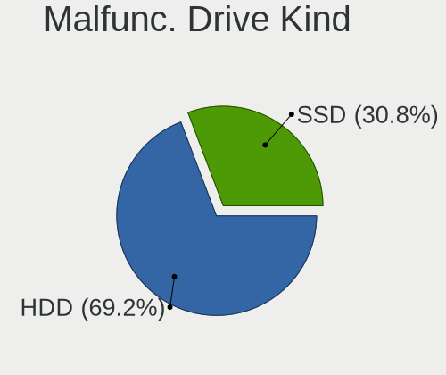
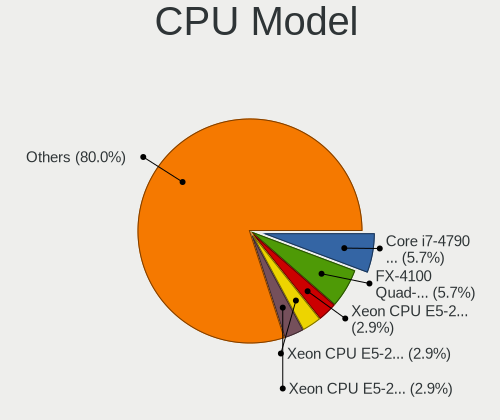
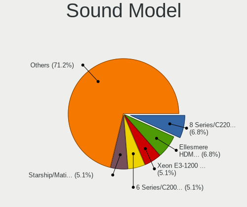
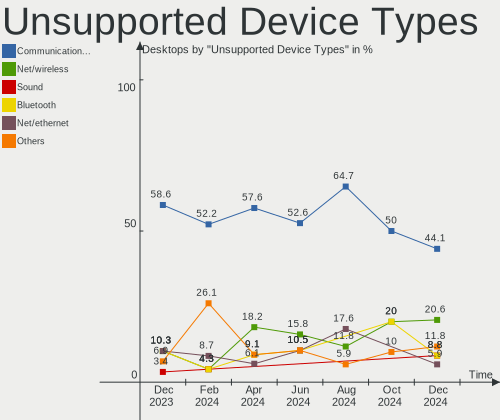

FreeBSD - Hardware Trends (Desktops)
------------------------------------

A project to identify most popular hardware characteristics and track their change
over time based on data collected by BSD users at https://BSD-Hardware.info.

Anyone can contribute to this report by the [hw-probe](https://github.com/linuxhw/hw-probe/blob/master/INSTALL.BSD.md) tool:

    hw-probe -all -upload

This report is for one last month. Overall report since the beginning of time: [TestCoverage](https://github.com/bsdhw/TestCoverage)

Period: Dec, 2022.

Contents
--------

* [ System ](#system)
  - [ OS                       ](#os)
  - [ OS Family                ](#os-family)
  - [ Arch                     ](#arch)
  - [ DE                       ](#de)
  - [ Display Server           ](#display-server)
  - [ Display Manager          ](#display-manager)
  - [ OS Lang                  ](#os-lang)
  - [ Boot Mode                ](#boot-mode)
  - [ Filesystem               ](#filesystem)
  - [ Part. scheme             ](#part-scheme)

* [ Board ](#board)
  - [ Vendor                   ](#vendor)
  - [ Model                    ](#model)
  - [ Model Family             ](#model-family)
  - [ MFG Year                 ](#mfg-year)
  - [ Form Factor              ](#form-factor)
  - [ Coreboot                 ](#coreboot)
  - [ RAM Size                 ](#ram-size)
  - [ RAM Used                 ](#ram-used)
  - [ Total Drives             ](#total-drives)
  - [ Has CD-ROM               ](#has-cd-rom)
  - [ Has Ethernet             ](#has-ethernet)
  - [ Has WiFi                 ](#has-wifi)
  - [ Has Bluetooth            ](#has-bluetooth)

* [ Location ](#location)
  - [ Country                  ](#country)
  - [ City                     ](#city)

* [ Drives ](#drives)
  - [ Drive Vendor             ](#drive-vendor)
  - [ Drive Model              ](#drive-model)
  - [ HDD Vendor               ](#hdd-vendor)
  - [ SSD Vendor               ](#ssd-vendor)
  - [ Drive Kind               ](#drive-kind)
  - [ Drive Connector          ](#drive-connector)
  - [ Drive Size               ](#drive-size)
  - [ Space Total              ](#space-total)
  - [ Space Used               ](#space-used)
  - [ Malfunc. Drives          ](#malfunc-drives)
  - [ Malfunc. Drive Vendor    ](#malfunc-drive-vendor)
  - [ Malfunc. HDD Vendor      ](#malfunc-hdd-vendor)
  - [ Malfunc. Drive Kind      ](#malfunc-drive-kind)
  - [ Failed Drives            ](#failed-drives)
  - [ Failed Drive Vendor      ](#failed-drive-vendor)
  - [ Drive Status             ](#drive-status)

* [ Storage controller ](#storage-controller)
  - [ Storage Vendor           ](#storage-vendor)
  - [ Storage Model            ](#storage-model)
  - [ Storage Kind             ](#storage-kind)

* [ Processor ](#processor)
  - [ CPU Vendor               ](#cpu-vendor)
  - [ CPU Model                ](#cpu-model)
  - [ CPU Model Family         ](#cpu-model-family)
  - [ CPU Cores                ](#cpu-cores)
  - [ CPU Sockets              ](#cpu-sockets)
  - [ CPU Threads              ](#cpu-threads)
  - [ CPU Microarch            ](#cpu-microarch)

* [ Graphics ](#graphics)
  - [ GPU Vendor               ](#gpu-vendor)
  - [ GPU Model                ](#gpu-model)
  - [ GPU Combo                ](#gpu-combo)
  - [ GPU Driver               ](#gpu-driver)
  - [ GPU Memory               ](#gpu-memory)

* [ Monitor ](#monitor)
  - [ Monitor Vendor           ](#monitor-vendor)
  - [ Monitor Model            ](#monitor-model)
  - [ Monitor Resolution       ](#monitor-resolution)
  - [ Monitor Diagonal         ](#monitor-diagonal)
  - [ Monitor Width            ](#monitor-width)
  - [ Aspect Ratio             ](#aspect-ratio)
  - [ Monitor Area             ](#monitor-area)
  - [ Pixel Density            ](#pixel-density)
  - [ Multiple Monitors        ](#multiple-monitors)

* [ Network ](#network)
  - [ Net Controller Vendor    ](#net-controller-vendor)
  - [ Net Controller Model     ](#net-controller-model)
  - [ Wireless Vendor          ](#wireless-vendor)
  - [ Wireless Model           ](#wireless-model)
  - [ Ethernet Vendor          ](#ethernet-vendor)
  - [ Ethernet Model           ](#ethernet-model)
  - [ Net Controller Kind      ](#net-controller-kind)
  - [ Used Controller          ](#used-controller)
  - [ NICs                     ](#nics)
  - [ IPv6                     ](#ipv6)

* [ Bluetooth ](#bluetooth)
  - [ Bluetooth Vendor         ](#bluetooth-vendor)
  - [ Bluetooth Model          ](#bluetooth-model)

* [ Sound ](#sound)
  - [ Sound Vendor             ](#sound-vendor)
  - [ Sound Model              ](#sound-model)

* [ Memory ](#memory)
  - [ Memory Vendor            ](#memory-vendor)
  - [ Memory Model             ](#memory-model)
  - [ Memory Kind              ](#memory-kind)
  - [ Memory Form Factor       ](#memory-form-factor)
  - [ Memory Size              ](#memory-size)
  - [ Memory Speed             ](#memory-speed)

* [ Printers & scanners ](#printers--scanners)
  - [ Printer Vendor           ](#printer-vendor)
  - [ Printer Model            ](#printer-model)
  - [ Scanner Vendor           ](#scanner-vendor)
  - [ Scanner Model            ](#scanner-model)

* [ Camera ](#camera)
  - [ Camera Vendor            ](#camera-vendor)
  - [ Camera Model             ](#camera-model)

* [ Security ](#security)
  - [ Fingerprint Vendor       ](#fingerprint-vendor)
  - [ Fingerprint Model        ](#fingerprint-model)
  - [ Chipcard Vendor          ](#chipcard-vendor)
  - [ Chipcard Model           ](#chipcard-model)

* [ Unsupported ](#unsupported)
  - [ Unsupported Devices      ](#unsupported-devices)
  - [ Unsupported Device Types ](#unsupported-device-types)

System
------

OS
--

Installed operating systems

| Name                 | Desktops | Percent |
|----------------------|----------|---------|
| FreeBSD 13.1-p5      | 16       | 53.33%  |
| FreeBSD 13.1-STABLE  | 5        | 16.67%  |
| FreeBSD 14.0-CURRENT | 3        | 10%     |
| FreeBSD 13.1         | 3        | 10%     |
| FreeBSD 13.1-p2      | 2        | 6.67%   |
| FreeBSD 12.4         | 1        | 3.33%   |

OS Family
---------

OS without a version

| Name    | Desktops | Percent |
|---------|----------|---------|
| FreeBSD | 30       | 100%    |

Arch
----

OS architecture (x86_64, i586, etc.)

| Name  | Desktops | Percent |
|-------|----------|---------|
| amd64 | 28       | 93.33%  |
| arm64 | 2        | 6.67%   |

DE
--

Desktop Environment

| Name    | Desktops | Percent |
|---------|----------|---------|
| Console | 15       | 50%     |
| XFCE    | 5        | 16.67%  |
| KDE5    | 4        | 13.33%  |
| GNOME   | 2        | 6.67%   |
| TWM     | 1        | 3.33%   |
| MATE    | 1        | 3.33%   |
| LXQt    | 1        | 3.33%   |
| bspwm   | 1        | 3.33%   |

Display Server
--------------

X11 or Wayland

| Name    | Desktops | Percent |
|---------|----------|---------|
| Console | 16       | 53.33%  |
| X11     | 13       | 43.33%  |
| Wayland | 1        | 3.33%   |

Display Manager
---------------

SDDM, LightDM, etc.

| Name    | Desktops | Percent |
|---------|----------|---------|
| Console | 17       | 56.67%  |
| LightDM | 5        | 16.67%  |
| SDDM    | 4        | 13.33%  |
| SLiM    | 3        | 10%     |
| XDM     | 1        | 3.33%   |

OS Lang
-------

Language

| Lang    | Desktops | Percent |
|---------|----------|---------|
| C       | 20       | 66.67%  |
| en_US   | 5        | 16.67%  |
| Unknown | 4        | 13.33%  |
| zh_CN   | 1        | 3.33%   |

Boot Mode
---------

EFI or BIOS

| Mode | Desktops | Percent |
|------|----------|---------|
| EFI  | 22       | 73.33%  |
| BIOS | 8        | 26.67%  |

Filesystem
----------

Type of filesystem

| Type | Desktops | Percent |
|------|----------|---------|
| Zfs  | 25       | 83.33%  |
| Ufs  | 5        | 16.67%  |

Part. scheme
------------

Scheme of partitioning

| Type | Desktops | Percent |
|------|----------|---------|
| GPT  | 30       | 100%    |

Board
-----

Vendor
------

Motherboard manufacturer

| Name                       | Desktops | Percent |
|----------------------------|----------|---------|
| ASUSTek Computer           | 9        | 30%     |
| Hewlett-Packard            | 4        | 13.33%  |
| Supermicro                 | 2        | 6.67%   |
| MSI                        | 2        | 6.67%   |
| ASRock                     | 2        | 6.67%   |
| Unknown                    | 2        | 6.67%   |
| ShenZhen MinWin Technology | 1        | 3.33%   |
| Lenovo                     | 1        | 3.33%   |
| Huanan                     | 1        | 3.33%   |
| Gigabyte Technology        | 1        | 3.33%   |
| Dell                       | 1        | 3.33%   |
| Biostar                    | 1        | 3.33%   |
| BESSTAR Tech               | 1        | 3.33%   |
| ASRockRack                 | 1        | 3.33%   |
| Acer                       | 1        | 3.33%   |

Model
-----

Motherboard model

| Name                               | Desktops | Percent |
|------------------------------------|----------|---------|
| HP ProLiant MicroServer Gen8       | 2        | 6.67%   |
| ASUS PRIME B550-PLUS               | 2        | 6.67%   |
| Unknown                            | 2        | 6.67%   |
| Supermicro X9DR3-F                 | 1        | 3.33%   |
| Supermicro SSG-5028R-E1CR12L-CE010 | 1        | 3.33%   |
| ShenZhen MinWin MW-NANO-APL-4L     | 1        | 3.33%   |
| MSI MS-7A62                        | 1        | 3.33%   |
| MSI MS-7817                        | 1        | 3.33%   |
| Lenovo ThinkCentre M700 10GRCTO1WW | 1        | 3.33%   |
| Huanan X99-F8D V2.4                | 1        | 3.33%   |
| HP ProLiant MicroServer            | 1        | 3.33%   |
| HP ProDesk 400 G4 SFF              | 1        | 3.33%   |
| Gigabyte B550M AORUS PRO-P         | 1        | 3.33%   |
| Dell Precision WorkStation T3500   | 1        | 3.33%   |
| Biostar A68N-5600E                 | 1        | 3.33%   |
| BESSTAR Tech UM350                 | 1        | 3.33%   |
| ASUS ROG STRIX X470-F GAMING       | 1        | 3.33%   |
| ASUS ROG STRIX B550-F GAMING       | 1        | 3.33%   |
| ASUS ROG CROSSHAIR VIII HERO       | 1        | 3.33%   |
| ASUS PRIME X370-PRO                | 1        | 3.33%   |
| ASUS PRIME H410M-A                 | 1        | 3.33%   |
| ASUS P8H77-V LE                    | 1        | 3.33%   |
| ASUS P5Q-E                         | 1        | 3.33%   |
| ASRockRack EPYC3101D4I-2T          | 1        | 3.33%   |
| ASRock B660M-ITX/ac                | 1        | 3.33%   |
| ASRock 4X4 BOX                     | 1        | 3.33%   |
| Acer Veriton M680G                 | 1        | 3.33%   |

Model Family
------------

Motherboard model prefix

| Name                               | Desktops | Percent |
|------------------------------------|----------|---------|
| ASUS PRIME                         | 4        | 13.33%  |
| HP ProLiant                        | 3        | 10%     |
| ASUS ROG                           | 3        | 10%     |
| Unknown                            | 2        | 6.67%   |
| Supermicro X9DR3-F                 | 1        | 3.33%   |
| Supermicro SSG-5028R-E1CR12L-CE010 | 1        | 3.33%   |
| ShenZhen MinWin MW-NANO-APL-4L     | 1        | 3.33%   |
| MSI MS-7A62                        | 1        | 3.33%   |
| MSI MS-7817                        | 1        | 3.33%   |
| Lenovo ThinkCentre                 | 1        | 3.33%   |
| Huanan X99-F8D                     | 1        | 3.33%   |
| HP ProDesk                         | 1        | 3.33%   |
| Gigabyte B550M                     | 1        | 3.33%   |
| Dell Precision                     | 1        | 3.33%   |
| Biostar A68N-5600E                 | 1        | 3.33%   |
| BESSTAR Tech UM350                 | 1        | 3.33%   |
| ASUS P8H77-V                       | 1        | 3.33%   |
| ASUS P5Q-E                         | 1        | 3.33%   |
| ASRockRack EPYC3101D4I-2T          | 1        | 3.33%   |
| ASRock B660M-ITX                   | 1        | 3.33%   |
| ASRock 4X4                         | 1        | 3.33%   |
| Acer Veriton                       | 1        | 3.33%   |

MFG Year
--------

Motherboard manufacture year

| Year    | Desktops | Percent |
|---------|----------|---------|
| 2020    | 7        | 23.33%  |
| 2019    | 6        | 20%     |
| 2021    | 3        | 10%     |
| 2017    | 2        | 6.67%   |
| 2014    | 2        | 6.67%   |
| 2013    | 2        | 6.67%   |
| 2011    | 2        | 6.67%   |
| Unknown | 2        | 6.67%   |
| 2022    | 1        | 3.33%   |
| 2016    | 1        | 3.33%   |
| 2010    | 1        | 3.33%   |
| 2008    | 1        | 3.33%   |

Form Factor
-----------

Physical design of the computer

| Name    | Desktops | Percent |
|---------|----------|---------|
| Desktop | 30       | 100%    |

Coreboot
--------

Have coreboot on board

| Used | Desktops | Percent |
|------|----------|---------|
| No   | 30       | 100%    |

RAM Size
--------

Total RAM memory

| Size in GB  | Desktops | Percent |
|-------------|----------|---------|
| 16.01-24.0  | 8        | 26.67%  |
| 64.01-256.0 | 7        | 23.33%  |
| 4.01-8.0    | 5        | 16.67%  |
| 32.01-64.0  | 5        | 16.67%  |
| 3.01-4.0    | 2        | 6.67%   |
| 8.01-16.0   | 2        | 6.67%   |
| 24.01-32.0  | 1        | 3.33%   |

RAM Used
--------

Used RAM memory

| Used GB  | Desktops | Percent |
|----------|----------|---------|
| 0.51-1.0 | 12       | 40%     |
| 1.01-2.0 | 7        | 23.33%  |
| 0.01-0.5 | 6        | 20%     |
| 2.01-3.0 | 3        | 10%     |
| 3.01-4.0 | 2        | 6.67%   |

Total Drives
------------

Number of drives on board

| Drives | Desktops | Percent |
|--------|----------|---------|
| 3      | 7        | 23.33%  |
| 1      | 6        | 20%     |
| 4      | 5        | 16.67%  |
| 2      | 4        | 13.33%  |
| 0      | 2        | 6.67%   |
| 13     | 1        | 3.33%   |
| 10     | 1        | 3.33%   |
| 8      | 1        | 3.33%   |
| 7      | 1        | 3.33%   |
| 6      | 1        | 3.33%   |
| 5      | 1        | 3.33%   |

Has CD-ROM
----------

Has CD-ROM on board

| Presented | Desktops | Percent |
|-----------|----------|---------|
| No        | 20       | 66.67%  |
| Yes       | 10       | 33.33%  |

Has Ethernet
------------

Has Ethernet on board

| Presented | Desktops | Percent |
|-----------|----------|---------|
| Yes       | 30       | 100%    |

Has WiFi
--------

Has WiFi module

| Presented | Desktops | Percent |
|-----------|----------|---------|
| No        | 23       | 76.67%  |
| Yes       | 7        | 23.33%  |

Has Bluetooth
-------------

Has Bluetooth module

| Presented | Desktops | Percent |
|-----------|----------|---------|
| No        | 22       | 73.33%  |
| Yes       | 8        | 26.67%  |

Location
--------

Country
-------

Geographic location (country)

| Country     | Desktops | Percent |
|-------------|----------|---------|
| USA         | 7        | 23.33%  |
| Russia      | 4        | 13.33%  |
| Switzerland | 3        | 10%     |
| Thailand    | 2        | 6.67%   |
| Mexico      | 2        | 6.67%   |
| Germany     | 2        | 6.67%   |
| Canada      | 2        | 6.67%   |
| Australia   | 2        | 6.67%   |
| Sweden      | 1        | 3.33%   |
| Netherlands | 1        | 3.33%   |
| Greece      | 1        | 3.33%   |
| France      | 1        | 3.33%   |
| China       | 1        | 3.33%   |
| Belgium     | 1        | 3.33%   |

City
----

Geographic location (city)

| City                | Desktops | Percent |
|---------------------|----------|---------|
| Redmond             | 2        | 6.67%   |
| Krasnodar           | 2        | 6.67%   |
| Bangkok             | 2        | 6.67%   |
| Wenzhou             | 1        | 3.33%   |
| Wenatchee           | 1        | 3.33%   |
| Toronto             | 1        | 3.33%   |
| Tlalpan             | 1        | 3.33%   |
| Sydney              | 1        | 3.33%   |
| Stolberg            | 1        | 3.33%   |
| Stockholm           | 1        | 3.33%   |
| Siggenthal Station  | 1        | 3.33%   |
| Salem               | 1        | 3.33%   |
| Nuremberg           | 1        | 3.33%   |
| Nootdorp            | 1        | 3.33%   |
| New York            | 1        | 3.33%   |
| Moscow              | 1        | 3.33%   |
| Grenoble            | 1        | 3.33%   |
| Geneva              | 1        | 3.33%   |
| Fremont             | 1        | 3.33%   |
| Dietikon            | 1        | 3.33%   |
| Ciudad Lopez Mateos | 1        | 3.33%   |
| Chelyabinsk         | 1        | 3.33%   |
| Canberra            | 1        | 3.33%   |
| Cambridge           | 1        | 3.33%   |
| Boston              | 1        | 3.33%   |
| Athens              | 1        | 3.33%   |
| Antwerp             | 1        | 3.33%   |

Drives
------

Drive Vendor
------------

Hard drive vendors

| Vendor              | Desktops | Drives | Percent |
|---------------------|----------|--------|---------|
| WDC                 | 16       | 47     | 27.59%  |
| Seagate             | 14       | 21     | 24.14%  |
| Samsung Electronics | 13       | 20     | 22.41%  |
| Kingston            | 4        | 5      | 6.9%    |
| Crucial             | 4        | 5      | 6.9%    |
| Transcend           | 1        | 1      | 1.72%   |
| Toshiba             | 1        | 2      | 1.72%   |
| Silicon Motion      | 1        | 1      | 1.72%   |
| PNY                 | 1        | 1      | 1.72%   |
| Intel               | 1        | 1      | 1.72%   |
| HGST                | 1        | 1      | 1.72%   |
| Corsair             | 1        | 1      | 1.72%   |

Drive Model
-----------

Hard drive models

| Model                                 | Desktops | Percent |
|---------------------------------------|----------|---------|
| WDC WD30EFRX-68EUZN0 3TB              | 3        | 3.66%   |
| WDC WD40EZRZ-22GXCB0 4TB              | 2        | 2.44%   |
| Seagate ST4000DM000-1F2168 4TB        | 2        | 2.44%   |
| Seagate ST2000DM008-2FR102 2TB        | 2        | 2.44%   |
| Samsung SSD 860 EVO 500GB             | 2        | 2.44%   |
| Crucial CT500MX500SSD1 500GB          | 2        | 2.44%   |
| WDC WDS500G1R0A-68A4W0 500GB          | 1        | 1.22%   |
| WDC WDS120G2G0A-00JH30 120GB          | 1        | 1.22%   |
| WDC WDS100T3X0C-00SJG0 1TB            | 1        | 1.22%   |
| WDC WDS100T2G0A-00JH30 1TB            | 1        | 1.22%   |
| WDC WD80EMAZ-00WJTA0 8TB              | 1        | 1.22%   |
| WDC WD80EFZX-68UW8N0 8TB              | 1        | 1.22%   |
| WDC WD80EFAX-68LHPN0 8TB              | 1        | 1.22%   |
| WDC WD80EDBZ-11B0ZA0 8TB              | 1        | 1.22%   |
| WDC WD800AAJS-00PSA0 80GB             | 1        | 1.22%   |
| WDC WD8004FRYZ-01VAEB0 8TB            | 1        | 1.22%   |
| WDC WD8003FFBX-68B9AN0 8TB            | 1        | 1.22%   |
| WDC WD6400AAKS-22A7B2 640GB           | 1        | 1.22%   |
| WDC WD60EFRX-68L0BN1 6TB              | 1        | 1.22%   |
| WDC WD5000BPKT-00PK4T0 500GB          | 1        | 1.22%   |
| WDC WD40EFZX-68AWUN0 4TB              | 1        | 1.22%   |
| WDC WD30EFRX-68AX9N0 3TB              | 1        | 1.22%   |
| WDC WD20EZRX-00D8PB0 2TB              | 1        | 1.22%   |
| WDC WD20EZAZ-00GGJB0 2TB              | 1        | 1.22%   |
| WDC WD20EARX-00PASB0 2TB              | 1        | 1.22%   |
| WDC WD20EARX-008FB0 2TB               | 1        | 1.22%   |
| WDC WD15EADS-00P8B0 1.5TB             | 1        | 1.22%   |
| WDC WD120EMFZ-11A6JA0 12TB            | 1        | 1.22%   |
| WDC WD120EMAZ-11BLFA0 12TB            | 1        | 1.22%   |
| WDC WD10EZEX-22MFCA0 1TB              | 1        | 1.22%   |
| WDC WD10EFRX-68PJCN0 1TB              | 1        | 1.22%   |
| WDC WD10EFRX-68FYTN0 1TB              | 1        | 1.22%   |
| WDC WD100EZAZ-11TDBA0 10TB            | 1        | 1.22%   |
| Transcend TS32GSSD340K 32GB           | 1        | 1.22%   |
| Toshiba HDWN180 8TB                   | 1        | 1.22%   |
| Toshiba HDWG480UZSVB 8TB              | 1        | 1.22%   |
| Silicon Motion 512GB PCS PCIe M.2 SSD | 1        | 1.22%   |
| Seagate ST8000VN004-2M2101 8TB        | 1        | 1.22%   |
| Seagate ST4000VX007-2DT166 4TB        | 1        | 1.22%   |
| Seagate ST4000LM024-2AN17V 4TB        | 1        | 1.22%   |

HDD Vendor
----------

Hard disk drive vendors

| Vendor              | Desktops | Drives | Percent |
|---------------------|----------|--------|---------|
| Seagate             | 14       | 21     | 46.67%  |
| WDC                 | 13       | 42     | 43.33%  |
| Toshiba             | 1        | 2      | 3.33%   |
| Samsung Electronics | 1        | 1      | 3.33%   |
| HGST                | 1        | 1      | 3.33%   |

SSD Vendor
----------

Solid state drive vendors

| Vendor              | Desktops | Drives | Percent |
|---------------------|----------|--------|---------|
| Samsung Electronics | 9        | 14     | 39.13%  |
| Crucial             | 4        | 5      | 17.39%  |
| WDC                 | 3        | 4      | 13.04%  |
| Kingston            | 3        | 3      | 13.04%  |
| Transcend           | 1        | 1      | 4.35%   |
| PNY                 | 1        | 1      | 4.35%   |
| Intel               | 1        | 1      | 4.35%   |
| Corsair             | 1        | 1      | 4.35%   |

Drive Kind
----------

HDD or SSD

| Kind | Desktops | Drives | Percent |
|------|----------|--------|---------|
| HDD  | 20       | 67     | 42.55%  |
| SSD  | 19       | 30     | 40.43%  |
| NVMe | 8        | 9      | 17.02%  |

Drive Connector
---------------

SATA, SAS, NVMe, etc.

| Type | Desktops | Drives | Percent |
|------|----------|--------|---------|
| SATA | 26       | 97     | 76.47%  |
| NVMe | 8        | 9      | 23.53%  |

Drive Size
----------

Size of hard drive

| Size in TB | Desktops | Drives | Percent |
|------------|----------|--------|---------|
| 0.01-0.5   | 16       | 25     | 33.33%  |
| 1.01-2.0   | 10       | 20     | 20.83%  |
| 0.51-1.0   | 7        | 14     | 14.58%  |
| 3.01-4.0   | 6        | 9      | 12.5%   |
| 2.01-3.0   | 4        | 8      | 8.33%   |
| 4.01-10.0  | 4        | 19     | 8.33%   |
| 10.01-20.0 | 1        | 2      | 2.08%   |

Space Total
-----------

Amount of disk space available on the file system

| Size in GB     | Desktops | Percent |
|----------------|----------|---------|
| 251-500        | 9        | 30%     |
| 101-250        | 5        | 16.67%  |
| 501-1000       | 5        | 16.67%  |
| More than 3000 | 2        | 6.67%   |
| 21-50          | 2        | 6.67%   |
| 2001-3000      | 2        | 6.67%   |
| 1-20           | 2        | 6.67%   |
| 51-100         | 2        | 6.67%   |
| 1001-2000      | 1        | 3.33%   |

Space Used
----------

Amount of used disk space

| Used GB   | Desktops | Percent |
|-----------|----------|---------|
| 1-20      | 22       | 73.33%  |
| 21-50     | 5        | 16.67%  |
| 51-100    | 2        | 6.67%   |
| 1001-2000 | 1        | 3.33%   |

Malfunc. Drives
---------------

Drive models with a malfunction

| Model                               | Desktops | Drives | Percent |
|-------------------------------------|----------|--------|---------|
| WDC WD6400AAKS-22A7B2 640GB         | 1        | 1      | 12.5%   |
| WDC WD30EFRX-68EUZN0 3TB            | 1        | 1      | 12.5%   |
| WDC WD20EARX-008FB0 2TB             | 1        | 1      | 12.5%   |
| Seagate ST8000VN004-2M2101 8TB      | 1        | 1      | 12.5%   |
| Seagate ST2000VN004-2E4164 2TB      | 1        | 2      | 12.5%   |
| Samsung Electronics SSD 870 EVO 1TB | 1        | 1      | 12.5%   |
| Samsung Electronics HD204UI 2TB     | 1        | 1      | 12.5%   |
| Kingston SA400S37120G 120GB         | 1        | 1      | 12.5%   |

Malfunc. Drive Vendor
---------------------

Vendors of faulty drives

| Vendor              | Desktops | Drives | Percent |
|---------------------|----------|--------|---------|
| WDC                 | 3        | 3      | 37.5%   |
| Seagate             | 2        | 3      | 25%     |
| Samsung Electronics | 2        | 2      | 25%     |
| Kingston            | 1        | 1      | 12.5%   |

Malfunc. HDD Vendor
-------------------

Vendors of faulty HDD drives

| Vendor              | Desktops | Drives | Percent |
|---------------------|----------|--------|---------|
| WDC                 | 3        | 3      | 50%     |
| Seagate             | 2        | 3      | 33.33%  |
| Samsung Electronics | 1        | 1      | 16.67%  |

Malfunc. Drive Kind
-------------------

Kinds of faulty drives

| Kind | Desktops | Drives | Percent |
|------|----------|--------|---------|
| HDD  | 5        | 7      | 71.43%  |
| SSD  | 2        | 2      | 28.57%  |

Failed Drives
-------------

Failed drive models

Zero info for selected period =(

Failed Drive Vendor
-------------------

Failed drive vendors

Zero info for selected period =(

Drive Status
------------

Number of failed and malfunc. drives

| Status  | Desktops | Drives | Percent |
|---------|----------|--------|---------|
| Works   | 28       | 97     | 80%     |
| Malfunc | 7        | 9      | 20%     |

Storage controller
------------------

Storage Vendor
--------------

Storage controller vendors

| Vendor                      | Desktops | Percent |
|-----------------------------|----------|---------|
| Intel                       | 16       | 34.04%  |
| AMD                         | 12       | 25.53%  |
| Samsung Electronics         | 5        | 10.64%  |
| Broadcom / LSI              | 4        | 8.51%   |
| Silicon Motion              | 2        | 4.26%   |
| SanDisk                     | 2        | 4.26%   |
| Kingston Technology Company | 2        | 4.26%   |
| JMicron Technology          | 2        | 4.26%   |
| Silicon Image               | 1        | 2.13%   |
| Marvell Technology Group    | 1        | 2.13%   |

Storage Model
-------------

Storage controller models

| Model                                                                          | Desktops | Percent |
|--------------------------------------------------------------------------------|----------|---------|
| AMD FCH SATA Controller [AHCI mode]                                            | 7        | 12.73%  |
| AMD 500 Series Chipset SATA Controller                                         | 4        | 7.27%   |
| Broadcom / LSI SAS2008 PCI-Express Fusion-MPT SAS-2 [Falcon]                   | 3        | 5.45%   |
| Silicon Motion SM2263EN/SM2263XT SSD Controller                                | 2        | 3.64%   |
| Samsung NVMe SSD Controller PM9A1/PM9A3/980PRO                                 | 2        | 3.64%   |
| JMicron JMB58x AHCI SATA controller                                            | 2        | 3.64%   |
| Intel C610/X99 series chipset sSATA Controller [AHCI mode]                     | 2        | 3.64%   |
| Intel 6 Series/C200 Series Chipset Family 6 port Desktop SATA AHCI Controller  | 2        | 3.64%   |
| Intel 200 Series PCH SATA controller [AHCI mode]                               | 2        | 3.64%   |
| Silicon Image AAR-1220SA Serial ATA HostRAID Controller                        | 1        | 1.82%   |
| SanDisk WD Blue SN570 NVMe SSD                                                 | 1        | 1.82%   |
| SanDisk WD Black SN750 / PC SN730 NVMe SSD                                     | 1        | 1.82%   |
| Samsung NVMe SSD Controller SM981/PM981/PM983                                  | 1        | 1.82%   |
| Samsung NVMe SSD Controller SM961/PM961/SM963                                  | 1        | 1.82%   |
| Samsung NVMe SSD Controller 980                                                | 1        | 1.82%   |
| Marvell Group 88SE6111/6121 SATA II / PATA Controller                          | 1        | 1.82%   |
| Kingston Company OM3PDP3 NVMe SSD                                              | 1        | 1.82%   |
| Kingston Company A2000 NVMe SSD                                                | 1        | 1.82%   |
| Intel Q170/Q150/B150/H170/H110/Z170/CM236 Chipset SATA Controller [AHCI Mode]  | 1        | 1.82%   |
| Intel Celeron N3350/Pentium N4200/Atom E3900 Series SATA AHCI Controller       | 1        | 1.82%   |
| Intel C610/X99 series chipset 6-Port SATA Controller [AHCI mode]               | 1        | 1.82%   |
| Intel C602 chipset 4-Port SATA Storage Control Unit                            | 1        | 1.82%   |
| Intel C600/X79 series chipset 6-Port SATA AHCI Controller                      | 1        | 1.82%   |
| Intel Alder Lake-S PCH SATA Controller [AHCI Mode]                             | 1        | 1.82%   |
| Intel 82801JI (ICH10 Family) SATA AHCI Controller                              | 1        | 1.82%   |
| Intel 82801JI (ICH10 Family) 4 port SATA IDE Controller #1                     | 1        | 1.82%   |
| Intel 82801JI (ICH10 Family) 2 port SATA IDE Controller #2                     | 1        | 1.82%   |
| Intel 8 Series/C220 Series Chipset Family 6-port SATA Controller 1 [AHCI mode] | 1        | 1.82%   |
| Intel 7 Series/C210 Series Chipset Family 6-port SATA Controller [AHCI mode]   | 1        | 1.82%   |
| Intel 5 Series/3400 Series Chipset PT IDER Controller                          | 1        | 1.82%   |
| Intel 5 Series/3400 Series Chipset 6 port SATA AHCI Controller                 | 1        | 1.82%   |
| Intel 400 Series Chipset Family SATA AHCI Controller                           | 1        | 1.82%   |
| Broadcom / LSI SAS3008 PCI-Express Fusion-MPT SAS-3                            | 1        | 1.82%   |
| Broadcom / LSI SAS2004 PCI-Express Fusion-MPT SAS-2 [Spitfire]                 | 1        | 1.82%   |
| AMD X370 Series Chipset SATA Controller                                        | 1        | 1.82%   |
| AMD SB7x0/SB8x0/SB9x0 SATA Controller [AHCI mode]                              | 1        | 1.82%   |
| AMD SB7x0/SB8x0/SB9x0 IDE Controller                                           | 1        | 1.82%   |
| AMD 400 Series Chipset SATA Controller                                         | 1        | 1.82%   |

Storage Kind
------------

Kind of storage controller (IDE, SATA, NVMe, SAS, ...)

| Kind | Desktops | Percent |
|------|----------|---------|
| SATA | 27       | 58.7%   |
| NVMe | 10       | 21.74%  |
| SAS  | 5        | 10.87%  |
| IDE  | 3        | 6.52%   |
| RAID | 1        | 2.17%   |

Processor
---------

CPU Vendor
----------

Processor vendors

| Vendor | Desktops | Percent |
|--------|----------|---------|
| Intel  | 16       | 53.33%  |
| AMD    | 12       | 40%     |
| ARM    | 2        | 6.67%   |

CPU Model
---------

Processor models

| Model                                         | Desktops | Percent |
|-----------------------------------------------|----------|---------|
| Intel Core i7-7700 CPU @ 3.60GHz              | 2        | 6.67%   |
| ARM Cortex-A55 r2p0                           | 2        | 6.67%   |
| Intel Xeon CPU E5-2697 v2 @ 2.70GHz           | 1        | 3.33%   |
| Intel Xeon CPU E5-2680 v4 @ 2.40GHz           | 1        | 3.33%   |
| Intel Xeon CPU E5-2650 v3 @ 2.30GHz           | 1        | 3.33%   |
| Intel Xeon CPU E3-1220L V2 @ 2.30GHz          | 1        | 3.33%   |
| Intel Xeon CPU E3-1220 V2 @ 3.10GHz           | 1        | 3.33%   |
| Intel Xeon                                    | 1        | 3.33%   |
| Intel Pentium CPU G3220 @ 3.00GHz             | 1        | 3.33%   |
| Intel Core i5-10400 CPU @ 2.90GHz             | 1        | 3.33%   |
| Intel Core i5 CPU 650 @ 3.20GHz               | 1        | 3.33%   |
| Intel Core i3-6100 CPU @ 3.70GHz              | 1        | 3.33%   |
| Intel Core i3-3220 CPU @ 3.30GHz              | 1        | 3.33%   |
| Intel Core 2 Quad CPU Q6600 @ 2.40GHz         | 1        | 3.33%   |
| Intel Celeron CPU J3455 @ 1.50GHz             | 1        | 3.33%   |
| Intel 12th Gen Core i5-12400                  | 1        | 3.33%   |
| AMD Turion II Neo N40L Dual-Core Processor    | 1        | 3.33%   |
| AMD Ryzen 9 3900X 12-Core Processor           | 1        | 3.33%   |
| AMD Ryzen 7 PRO 5750GE with Radeon Graphics   | 1        | 3.33%   |
| AMD Ryzen 7 5800X 8-Core Processor            | 1        | 3.33%   |
| AMD Ryzen 7 5700X 8-Core Processor            | 1        | 3.33%   |
| AMD Ryzen 7 4800U with Radeon Graphics        | 1        | 3.33%   |
| AMD Ryzen 7 3700X 8-Core Processor            | 1        | 3.33%   |
| AMD Ryzen 7 2700 Eight-Core Processor         | 1        | 3.33%   |
| AMD Ryzen 7 1700 Eight-Core Processor         | 1        | 3.33%   |
| AMD Ryzen 5 3550H with Radeon Vega Mobile Gfx | 1        | 3.33%   |
| AMD PRO A4-3350B APU with Radeon R4 Graphics  | 1        | 3.33%   |
| AMD EPYC 3101 4-Core Processor                | 1        | 3.33%   |

CPU Model Family
----------------

Processor model prefix

| Model             | Desktops | Percent |
|-------------------|----------|---------|
| Intel Xeon        | 6        | 20%     |
| AMD Ryzen 7       | 6        | 20%     |
| Other             | 2        | 6.67%   |
| Intel Core i7     | 2        | 6.67%   |
| Intel Core i5     | 2        | 6.67%   |
| Intel Core i3     | 2        | 6.67%   |
| ARM Cortex        | 2        | 6.67%   |
| Intel Pentium     | 1        | 3.33%   |
| Intel Core 2 Quad | 1        | 3.33%   |
| Intel Celeron     | 1        | 3.33%   |
| AMD Turion II Neo | 1        | 3.33%   |
| AMD Ryzen 9       | 1        | 3.33%   |
| AMD Ryzen 7 PRO   | 1        | 3.33%   |
| AMD Ryzen 5       | 1        | 3.33%   |
| AMD EPYC          | 1        | 3.33%   |

CPU Cores
---------

Number of processor cores

| Number  | Desktops | Percent |
|---------|----------|---------|
| 16      | 7        | 23.33%  |
| 4       | 7        | 23.33%  |
| 2       | 6        | 20%     |
| 6       | 3        | 10%     |
| 24      | 2        | 6.67%   |
| Unknown | 2        | 6.67%   |
| 28      | 1        | 3.33%   |
| 10      | 1        | 3.33%   |
| 8       | 1        | 3.33%   |

CPU Sockets
-----------

Number of sockets

| Number  | Desktops | Percent |
|---------|----------|---------|
| 1       | 26       | 86.67%  |
| 2       | 2        | 6.67%   |
| Unknown | 2        | 6.67%   |

CPU Threads
-----------

Threads per core (Hyper-Threading)

| Number  | Desktops | Percent |
|---------|----------|---------|
| 1       | 16       | 53.33%  |
| 2       | 12       | 40%     |
| Unknown | 2        | 6.67%   |

CPU Microarch
-------------

Microarchitecture

| Name      | Desktops | Percent |
|-----------|----------|---------|
| IvyBridge | 4        | 13.33%  |
| Zen 3     | 3        | 10%     |
| Zen 2     | 3        | 10%     |
| Unknown   | 3        | 10%     |
| Zen+      | 2        | 6.67%   |
| Zen       | 2        | 6.67%   |
| Westmere  | 2        | 6.67%   |
| KabyLake  | 2        | 6.67%   |
| Haswell   | 2        | 6.67%   |
| Skylake   | 1        | 3.33%   |
| Puma      | 1        | 3.33%   |
| K10       | 1        | 3.33%   |
| Goldmont  | 1        | 3.33%   |
| Core      | 1        | 3.33%   |
| CometLake | 1        | 3.33%   |
| Broadwell | 1        | 3.33%   |

Graphics
--------

GPU Vendor
----------

Vendors of graphics cards

| Vendor                     | Desktops | Percent |
|----------------------------|----------|---------|
| AMD                        | 11       | 39.29%  |
| Intel                      | 7        | 25%     |
| Nvidia                     | 6        | 21.43%  |
| Matrox Electronics Systems | 2        | 7.14%   |
| ASPEED Technology          | 2        | 7.14%   |

GPU Model
---------

Graphics card models

| Model                                                                       | Desktops | Percent |
|-----------------------------------------------------------------------------|----------|---------|
| Matrox Electronics Systems MGA G200EH                                       | 2        | 6.9%    |
| ASPEED Technology ASPEED Graphics Family                                    | 2        | 6.9%    |
| AMD Ellesmere [Radeon RX 470/480/570/570X/580/580X/590]                     | 2        | 6.9%    |
| Nvidia TU116 [GeForce GTX 1660 Ti]                                          | 1        | 3.45%   |
| Nvidia GT218 [NVS 300]                                                      | 1        | 3.45%   |
| Nvidia GP108 [GeForce GT 1030]                                              | 1        | 3.45%   |
| Nvidia GP106 [GeForce GTX 1060 6GB]                                         | 1        | 3.45%   |
| Nvidia GK208B [GeForce GT 710]                                              | 1        | 3.45%   |
| Nvidia GF108 [GeForce GT 430]                                               | 1        | 3.45%   |
| Nvidia GA106 [GeForce RTX 3060 Lite Hash Rate]                              | 1        | 3.45%   |
| Intel Xeon E3-1200 v3/4th Gen Core Processor Integrated Graphics Controller | 1        | 3.45%   |
| Intel Xeon E3-1200 v2/3rd Gen Core processor Graphics Controller            | 1        | 3.45%   |
| Intel HD Graphics 630                                                       | 1        | 3.45%   |
| Intel HD Graphics 530                                                       | 1        | 3.45%   |
| Intel HD Graphics 500                                                       | 1        | 3.45%   |
| Intel CometLake-S GT2 [UHD Graphics 630]                                    | 1        | 3.45%   |
| Intel Alder Lake-S GT1 [UHD Graphics 730]                                   | 1        | 3.45%   |
| AMD Vega 10 XL/XT [Radeon RX Vega 56/64]                                    | 1        | 3.45%   |
| AMD Turks [Radeon HD 7600 Series]                                           | 1        | 3.45%   |
| AMD RV770 [Radeon HD 4850]                                                  | 1        | 3.45%   |
| AMD RS880M [Mobility Radeon HD 4225/4250]                                   | 1        | 3.45%   |
| AMD Renoir                                                                  | 1        | 3.45%   |
| AMD Picasso/Raven 2 [Radeon Vega Series / Radeon Vega Mobile Series]        | 1        | 3.45%   |
| AMD Mullins [Radeon R4/R5 Graphics]                                         | 1        | 3.45%   |
| AMD Cezanne [Radeon Vega Series / Radeon Vega Mobile Series]                | 1        | 3.45%   |
| AMD Cedar [Radeon HD 5000/6000/7350/8350 Series]                            | 1        | 3.45%   |

GPU Combo
---------

Combinations of graphics cards

| Name       | Desktops | Percent |
|------------|----------|---------|
| 1 x AMD    | 11       | 36.67%  |
| 1 x Intel  | 7        | 23.33%  |
| 1 x Nvidia | 5        | 16.67%  |
| Other      | 3        | 10%     |
| 1 x Matrox | 2        | 6.67%   |
| 1 x ASPEED | 2        | 6.67%   |

GPU Driver
----------

Free vs proprietary

| Driver      | Desktops | Percent |
|-------------|----------|---------|
| Free        | 25       | 83.33%  |
| Unknown     | 3        | 10%     |
| Proprietary | 2        | 6.67%   |

GPU Memory
----------

Total video memory

| Size in GB | Desktops | Percent |
|------------|----------|---------|
| Unknown    | 20       | 66.67%  |
| 7.01-8.0   | 2        | 6.67%   |
| 5.01-6.0   | 2        | 6.67%   |
| 0.51-1.0   | 2        | 6.67%   |
| 0.01-0.5   | 2        | 6.67%   |
| 3.01-4.0   | 1        | 3.33%   |
| 1.01-2.0   | 1        | 3.33%   |

Monitor
-------

Monitor Vendor
--------------

Monitor vendors

| Vendor              | Desktops | Percent |
|---------------------|----------|---------|
| Samsung Electronics | 4        | 25%     |
| Hewlett-Packard     | 3        | 18.75%  |
| ASUSTek Computer    | 2        | 12.5%   |
| SGT                 | 1        | 6.25%   |
| Philips             | 1        | 6.25%   |
| Idek Iiyama         | 1        | 6.25%   |
| Goldstar            | 1        | 6.25%   |
| Dell                | 1        | 6.25%   |
| BenQ                | 1        | 6.25%   |
| Acer                | 1        | 6.25%   |

Monitor Model
-------------

Monitor models

| Model                                                                | Desktops | Percent |
|----------------------------------------------------------------------|----------|---------|
| SGT LC156LF1L_03 SGT1560 1920x1080 300x260mm 15.6-inch               | 1        | 6.25%   |
| Samsung Electronics U32E850 SAM0CE3 3840x2160 700x390mm 31.5-inch    | 1        | 6.25%   |
| Samsung Electronics SyncMaster SAM027F 1680x1050 470x300mm 22.0-inch | 1        | 6.25%   |
| Samsung Electronics LCD Monitor SAM04FB 1920x1080                    | 1        | 6.25%   |
| Samsung Electronics C24F390 SAM0D2C 1920x1080 520x290mm 23.4-inch    | 1        | 6.25%   |
| Philips PHL 221V8 PHLC211 1920x1080 480x270mm 21.7-inch              | 1        | 6.25%   |
| Idek Iiyama LCD Monitor PLX2783H 1920x1080                           | 1        | 6.25%   |
| Hewlett-Packard LCD Monitor 22es 1920x1080                           | 1        | 6.25%   |
| Hewlett-Packard 27er HWP3325 1920x1080 600x340mm 27.2-inch           | 1        | 6.25%   |
| Hewlett-Packard 24fw HPN3545 1920x1080 530x300mm 24.0-inch           | 1        | 6.25%   |
| Goldstar 22EN33 GSM597C 1920x1080 480x270mm 21.7-inch                | 1        | 6.25%   |
| Dell U2719DC DEL417C 2560x1440 600x340mm 27.2-inch                   | 1        | 6.25%   |
| BenQ G900HD BNQ7816 1366x768 410x230mm 18.5-inch                     | 1        | 6.25%   |
| ASUSTek Computer VP247 AUS24CA 1920x1080 520x290mm 23.4-inch         | 1        | 6.25%   |
| ASUSTek Computer ROG PG259QN AUS25B4 1920x1080 540x300mm 24.3-inch   | 1        | 6.25%   |
| Acer V233H ACR0090 1920x1080 510x290mm 23.1-inch                     | 1        | 6.25%   |

Monitor Resolution
------------------

Monitor screen resolution

| Resolution         | Desktops | Percent |
|--------------------|----------|---------|
| 1920x1080 (FHD)    | 10       | 71.43%  |
| 3840x2160 (4K)     | 1        | 7.14%   |
| 2560x1440 (QHD)    | 1        | 7.14%   |
| 1680x1050 (WSXGA+) | 1        | 7.14%   |
| 1366x768 (WXGA)    | 1        | 7.14%   |

Monitor Diagonal
----------------

Diagonal size in inches

| Inches  | Desktops | Percent |
|---------|----------|---------|
| 23      | 3        | 18.75%  |
| Unknown | 3        | 18.75%  |
| 27      | 2        | 12.5%   |
| 24      | 2        | 12.5%   |
| 21      | 2        | 12.5%   |
| 31      | 1        | 6.25%   |
| 22      | 1        | 6.25%   |
| 18      | 1        | 6.25%   |
| 15      | 1        | 6.25%   |

Monitor Width
-------------

Physical width

| Width in mm | Desktops | Percent |
|-------------|----------|---------|
| 501-600     | 6        | 40%     |
| 401-500     | 4        | 26.67%  |
| Unknown     | 3        | 20%     |
| 601-700     | 1        | 6.67%   |
| 201-300     | 1        | 6.67%   |

Aspect Ratio
------------

Proportional relationship between the width and the height

| Ratio   | Desktops | Percent |
|---------|----------|---------|
| 16/9    | 10       | 71.43%  |
| Unknown | 2        | 14.29%  |
| 6/5     | 1        | 7.14%   |
| 16/10   | 1        | 7.14%   |

Monitor Area
------------

Area in inch

| Area in inch | Desktops | Percent |
|----------------|----------|---------|
| 201-250        | 6        | 40%     |
| Unknown        | 3        | 20%     |
| 301-350        | 2        | 13.33%  |
| 351-500        | 1        | 6.67%   |
| 251-300        | 1        | 6.67%   |
| 141-150        | 1        | 6.67%   |
| 121-130        | 1        | 6.67%   |

Pixel Density
-------------

Pixels per inch

| Density | Desktops | Percent |
|---------|----------|---------|
| 51-100  | 7        | 46.67%  |
| 101-120 | 3        | 20%     |
| Unknown | 3        | 20%     |
| 121-160 | 2        | 13.33%  |

Multiple Monitors
-----------------

Total monitors connected

| Total | Desktops | Percent |
|-------|----------|---------|
| 0     | 15       | 50%     |
| 1     | 14       | 46.67%  |
| 2     | 1        | 3.33%   |

Network
-------

Net Controller Vendor
---------------------

Controller vendors

| Vendor                   | Desktops | Percent |
|--------------------------|----------|---------|
| Intel                    | 15       | 41.67%  |
| Realtek Semiconductor    | 14       | 38.89%  |
| Broadcom                 | 4        | 11.11%  |
| Qualcomm Atheros         | 1        | 2.78%   |
| Marvell Technology Group | 1        | 2.78%   |
| American Megatrends      | 1        | 2.78%   |

Net Controller Model
--------------------

Controller models

| Model                                                                         | Desktops | Percent |
|-------------------------------------------------------------------------------|----------|---------|
| Realtek RTL8111/8168/8411 PCI Express Gigabit Ethernet Controller             | 10       | 22.73%  |
| Realtek RTL8125 2.5GbE Controller                                             | 5        | 11.36%  |
| Intel I211 Gigabit Network Connection                                         | 4        | 9.09%   |
| Intel Wi-Fi 6 AX200                                                           | 3        | 6.82%   |
| Intel Wireless 7265                                                           | 2        | 4.55%   |
| Intel I350 Gigabit Network Connection                                         | 2        | 4.55%   |
| Intel Ethernet Controller I225-V                                              | 2        | 4.55%   |
| Broadcom NetXtreme BCM5720 Gigabit Ethernet PCIe                              | 2        | 4.55%   |
| Qualcomm Atheros Killer E2500 Gigabit Ethernet Controller                     | 1        | 2.27%   |
| Marvell Group 88E8056 PCI-E Gigabit Ethernet Controller                       | 1        | 2.27%   |
| Marvell Group 88E8001 Gigabit Ethernet Controller                             | 1        | 2.27%   |
| Intel Wireless 8260                                                           | 1        | 2.27%   |
| Intel Ethernet Controller X550                                                | 1        | 2.27%   |
| Intel Ethernet Connection (17) I219-V                                         | 1        | 2.27%   |
| Intel Dual Band Wireless-AC 3165 Plus Bluetooth                               | 1        | 2.27%   |
| Intel Alder Lake-S PCH CNVi WiFi                                              | 1        | 2.27%   |
| Intel 82578DM Gigabit Network Connection                                      | 1        | 2.27%   |
| Intel 82574L Gigabit Network Connection                                       | 1        | 2.27%   |
| Intel 82571EB/82571GB Gigabit Ethernet Controller D0/D1 (copper applications) | 1        | 2.27%   |
| Broadcom NetXtreme BCM5761 Gigabit Ethernet PCIe                              | 1        | 2.27%   |
| Broadcom NetXtreme BCM5723 Gigabit Ethernet PCIe                              | 1        | 2.27%   |
| American Megatrends Virtual Ethernet                                          | 1        | 2.27%   |

Wireless Vendor
---------------

Wireless vendors

| Vendor | Desktops | Percent |
|--------|----------|---------|
| Intel  | 7        | 100%    |

Wireless Model
--------------

Wireless models

| Model                                           | Desktops | Percent |
|-------------------------------------------------|----------|---------|
| Intel Wi-Fi 6 AX200                             | 3        | 37.5%   |
| Intel Wireless 7265                             | 2        | 25%     |
| Intel Wireless 8260                             | 1        | 12.5%   |
| Intel Dual Band Wireless-AC 3165 Plus Bluetooth | 1        | 12.5%   |
| Intel Alder Lake-S PCH CNVi WiFi                | 1        | 12.5%   |

Ethernet Vendor
---------------

Ethernet vendors

| Vendor                   | Desktops | Percent |
|--------------------------|----------|---------|
| Realtek Semiconductor    | 14       | 41.18%  |
| Intel                    | 13       | 38.24%  |
| Broadcom                 | 4        | 11.76%  |
| Qualcomm Atheros         | 1        | 2.94%   |
| Marvell Technology Group | 1        | 2.94%   |
| American Megatrends      | 1        | 2.94%   |

Ethernet Model
--------------

Ethernet models

| Model                                                                         | Desktops | Percent |
|-------------------------------------------------------------------------------|----------|---------|
| Realtek RTL8111/8168/8411 PCI Express Gigabit Ethernet Controller             | 10       | 27.78%  |
| Realtek RTL8125 2.5GbE Controller                                             | 5        | 13.89%  |
| Intel I211 Gigabit Network Connection                                         | 4        | 11.11%  |
| Intel I350 Gigabit Network Connection                                         | 2        | 5.56%   |
| Intel Ethernet Controller I225-V                                              | 2        | 5.56%   |
| Broadcom NetXtreme BCM5720 Gigabit Ethernet PCIe                              | 2        | 5.56%   |
| Qualcomm Atheros Killer E2500 Gigabit Ethernet Controller                     | 1        | 2.78%   |
| Marvell Group 88E8056 PCI-E Gigabit Ethernet Controller                       | 1        | 2.78%   |
| Marvell Group 88E8001 Gigabit Ethernet Controller                             | 1        | 2.78%   |
| Intel Ethernet Controller X550                                                | 1        | 2.78%   |
| Intel Ethernet Connection (17) I219-V                                         | 1        | 2.78%   |
| Intel 82578DM Gigabit Network Connection                                      | 1        | 2.78%   |
| Intel 82574L Gigabit Network Connection                                       | 1        | 2.78%   |
| Intel 82571EB/82571GB Gigabit Ethernet Controller D0/D1 (copper applications) | 1        | 2.78%   |
| Broadcom NetXtreme BCM5761 Gigabit Ethernet PCIe                              | 1        | 2.78%   |
| Broadcom NetXtreme BCM5723 Gigabit Ethernet PCIe                              | 1        | 2.78%   |
| American Megatrends Virtual Ethernet                                          | 1        | 2.78%   |

Net Controller Kind
-------------------

Ethernet, WiFi or modem

| Kind     | Desktops | Percent |
|----------|----------|---------|
| Ethernet | 30       | 81.08%  |
| WiFi     | 7        | 18.92%  |

Used Controller
---------------

Currently used network controller

| Kind     | Desktops | Percent |
|----------|----------|---------|
| Ethernet | 27       | 90%     |
| WiFi     | 3        | 10%     |

NICs
----

Total network controllers on board

| Total | Desktops | Percent |
|-------|----------|---------|
| 1     | 14       | 46.67%  |
| 2     | 10       | 33.33%  |
| 4     | 3        | 10%     |
| 3     | 3        | 10%     |

IPv6
----

IPv6 vs IPv4

| Used | Desktops | Percent |
|------|----------|---------|
| No   | 20       | 66.67%  |
| Yes  | 10       | 33.33%  |

Bluetooth
---------

Bluetooth Vendor
----------------

Controller vendors

| Vendor                  | Desktops | Percent |
|-------------------------|----------|---------|
| Intel                   | 7        | 87.5%   |
| Cambridge Silicon Radio | 1        | 12.5%   |

Bluetooth Model
---------------

Controller models

| Model                                               | Desktops | Percent |
|-----------------------------------------------------|----------|---------|
| Intel Bluetooth wireless interface                  | 3        | 37.5%   |
| Intel AX200 Bluetooth                               | 3        | 37.5%   |
| Intel Bluetooth 9460/9560 Jefferson Peak (JfP)      | 1        | 12.5%   |
| Cambridge Silicon Radio Bluetooth Dongle (HCI mode) | 1        | 12.5%   |

Sound
-----

Sound Vendor
------------

Sound card vendors

| Vendor              | Desktops | Percent |
|---------------------|----------|---------|
| AMD                 | 13       | 36.11%  |
| Intel               | 12       | 33.33%  |
| Nvidia              | 6        | 16.67%  |
| JMTek               | 1        | 2.78%   |
| Focusrite-Novation  | 1        | 2.78%   |
| C-Media Electronics | 1        | 2.78%   |
| Blue Microphones    | 1        | 2.78%   |
| ASUSTek Computer    | 1        | 2.78%   |

Sound Model
-----------

Sound card models

| Model                                                               | Desktops | Percent |
|---------------------------------------------------------------------|----------|---------|
| AMD Starship/Matisse HD Audio Controller                            | 4        | 9.52%   |
| AMD Family 17h/19h HD Audio Controller                              | 3        | 7.14%   |
| Intel 82801JI (ICH10 Family) HD Audio Controller                    | 2        | 4.76%   |
| Intel 200 Series PCH HD Audio                                       | 2        | 4.76%   |
| AMD Renoir Radeon High Definition Audio Controller                  | 2        | 4.76%   |
| AMD Ellesmere HDMI Audio [Radeon RX 470/480 / 570/580/590]          | 2        | 4.76%   |
| Nvidia TU116 High Definition Audio Controller                       | 1        | 2.38%   |
| Nvidia High Definition Audio Controller                             | 1        | 2.38%   |
| Nvidia GP108 High Definition Audio Controller                       | 1        | 2.38%   |
| Nvidia GP106 High Definition Audio Controller                       | 1        | 2.38%   |
| Nvidia GK208 HDMI/DP Audio Controller                               | 1        | 2.38%   |
| Nvidia GF108 High Definition Audio Controller                       | 1        | 2.38%   |
| Nvidia GA106 High Definition Audio Controller                       | 1        | 2.38%   |
| JMTek Lioncast USB Gaming Headset                                   | 1        | 2.38%   |
| Intel Comet Lake PCH-V cAVS                                         | 1        | 2.38%   |
| Intel Celeron N3350/Pentium N4200/Atom E3900 Series Audio Cluster   | 1        | 2.38%   |
| Intel C610/X99 series chipset HD Audio Controller                   | 1        | 2.38%   |
| Intel Alder Lake-S HD Audio Controller                              | 1        | 2.38%   |
| Intel 8 Series/C220 Series Chipset High Definition Audio Controller | 1        | 2.38%   |
| Intel 7 Series/C216 Chipset Family High Definition Audio Controller | 1        | 2.38%   |
| Intel 5 Series/3400 Series Chipset High Definition Audio            | 1        | 2.38%   |
| Intel 100 Series/C230 Series Chipset Family HD Audio Controller     | 1        | 2.38%   |
| Focusrite-Novation Scarlett 2i4 USB                                 | 1        | 2.38%   |
| C-Media Electronics Audio Adapter (Unitek Y-247A)                   | 1        | 2.38%   |
| Blue Microphones Yeti Stereo Microphone                             | 1        | 2.38%   |
| ASUSTek Computer Xonar SoundCard                                    | 1        | 2.38%   |
| AMD Vega 10 HDMI Audio [Radeon Vega 56/64]                          | 1        | 2.38%   |
| AMD Turks HDMI Audio [Radeon HD 6500/6600 / 6700M Series]           | 1        | 2.38%   |
| AMD RV770 HDMI Audio [Radeon HD 4850/4870]                          | 1        | 2.38%   |
| AMD Raven/Raven2/Fenghuang HDMI/DP Audio Controller                 | 1        | 2.38%   |
| AMD Kabini HDMI/DP Audio                                            | 1        | 2.38%   |
| AMD Family 17h (Models 00h-0fh) HD Audio Controller                 | 1        | 2.38%   |
| AMD Cedar HDMI Audio [Radeon HD 5400/6300/7300 Series]              | 1        | 2.38%   |

Memory
------

Memory Vendor
-------------

Memory module vendors

| Vendor              | Desktops | Percent |
|---------------------|----------|---------|
| Corsair             | 7        | 21.88%  |
| Samsung Electronics | 5        | 15.63%  |
| Kingston            | 4        | 12.5%   |
| G.Skill             | 3        | 9.38%   |
| Unknown             | 2        | 6.25%   |
| SK hynix            | 2        | 6.25%   |
| Micron Technology   | 2        | 6.25%   |
| Hewlett-Packard     | 2        | 6.25%   |
| Crucial             | 2        | 6.25%   |
| Ramaxel Technology  | 1        | 3.13%   |
| Nanya Technology    | 1        | 3.13%   |
| A-DATA Technology   | 1        | 3.13%   |

Memory Model
------------

Memory module models

| Model                                                    | Desktops | Percent |
|----------------------------------------------------------|----------|---------|
| Kingston RAM 9965745-002.A00G 16GB DIMM DDR4 3000MT/s    | 2        | 5.88%   |
| HP RAM 669239-081 8GB DIMM DDR3 1600MT/s                 | 2        | 5.88%   |
| Unknown RAM Module 4GB DIMM 1333MT/s                     | 1        | 2.94%   |
| Unknown RAM Module 2GB DIMM DDR 800MT/s                  | 1        | 2.94%   |
| SK hynix RAM HMT42GR7AFR4A 16GB DIMM DDR3 1600MT/s       | 1        | 2.94%   |
| SK hynix RAM HMT112U6AFP8C-H9 1GB DIMM DDR3 1333MT/s     | 1        | 2.94%   |
| Samsung RAM Module 2GB DIMM DDR3 1334MT/s                | 1        | 2.94%   |
| Samsung RAM M471B1G73DH0-YK0 8GB SODIMM DDR3 1600MT/s    | 1        | 2.94%   |
| Samsung RAM M471A4G43AB1-CWE 32GB SODIMM DDR4 3200MT/s   | 1        | 2.94%   |
| Samsung RAM M393A2G40EB1-CPB 16GB DIMM DDR4 2133MT/s     | 1        | 2.94%   |
| Samsung RAM M391B5673GB0-CH9 2GB DIMM DDR3 1333MT/s      | 1        | 2.94%   |
| Samsung RAM M391B5673FH0-CH9 2GB DIMM DDR3 1333MT/s      | 1        | 2.94%   |
| Ramaxel RAM RMUA5090KB78HAF2133 8GB DIMM DDR4 2133MT/s   | 1        | 2.94%   |
| Nanya RAM Module 2GB DIMM DDR3 1334MT/s                  | 1        | 2.94%   |
| Micron RAM 18JSF25672AZ-1G4G1 2GB DIMM DDR3 1333MT/s     | 1        | 2.94%   |
| Micron RAM 18ASF1G72PZ-2G1A2 8GB DIMM DDR4 2133MT/s      | 1        | 2.94%   |
| Kingston RAM KHX1600C9D3/4GX 4GB DIMM DDR3 1600MT/s      | 1        | 2.94%   |
| Kingston RAM 9965745-026.A00G 16GB DIMM DDR4 3200MT/s    | 1        | 2.94%   |
| Kingston RAM 9905403-011.A03LF 2GB DIMM DDR3 1333MT/s    | 1        | 2.94%   |
| G.Skill RAM F4-3200C16-32GVK 32GB DIMM DDR4 2666MT/s     | 1        | 2.94%   |
| G.Skill RAM F3-12800CL7-2GBRM 2GB DIMM DDR3 1600MT/s     | 1        | 2.94%   |
| G.Skill RAM F3-12800CL7-2GBECO 2GB DIMM DDR3 1333MT/s    | 1        | 2.94%   |
| Crucial RAM CT8G4DFS824A.M8FE 8GB DIMM DDR4 2933MT/s     | 1        | 2.94%   |
| Crucial RAM CT16G4DFD824A.C16FAD 16GB DIMM DDR4 2133MT/s | 1        | 2.94%   |
| Corsair RAM Module 16GB DIMM DDR4 2133MT/s               | 1        | 2.94%   |
| Corsair RAM CMK64GX4M2D3600C18 32GB DIMM DDR4 2133MT/s   | 1        | 2.94%   |
| Corsair RAM CMK32GX4M2B3200C16 16GB DIMM DDR4 3200MT/s   | 1        | 2.94%   |
| Corsair RAM CMK32GX4M2A2666C16 16GB DIMM DDR4 3000MT/s   | 1        | 2.94%   |
| Corsair RAM CMK16GX4M2Z3200C16 8GB DIMM DDR4 3200MT/s    | 1        | 2.94%   |
| Corsair RAM CMK16GX4M2A2400C14 8GB DIMM DDR4 2133MT/s    | 1        | 2.94%   |
| Corsair RAM CM4X8GF2666C16K4 8GB DIMM DDR4 2666MT/s      | 1        | 2.94%   |
| A-DATA RAM Module 8GB SODIMM DDR4 2667MT/s               | 1        | 2.94%   |

Memory Kind
-----------

Memory module kinds

| Kind    | Desktops | Percent |
|---------|----------|---------|
| DDR4    | 17       | 60.71%  |
| DDR3    | 9        | 32.14%  |
| DDR     | 1        | 3.57%   |
| Unknown | 1        | 3.57%   |

Memory Form Factor
------------------

Physical design of the memory module

| Name   | Desktops | Percent |
|--------|----------|---------|
| DIMM   | 25       | 89.29%  |
| SODIMM | 3        | 10.71%  |

Memory Size
-----------

Memory module size

| Size  | Desktops | Percent |
|-------|----------|---------|
| 8192  | 10       | 32.26%  |
| 16384 | 9        | 29.03%  |
| 2048  | 6        | 19.35%  |
| 32768 | 3        | 9.68%   |
| 4096  | 2        | 6.45%   |
| 1024  | 1        | 3.23%   |

Memory Speed
------------

Memory module speed

| Speed | Desktops | Percent |
|-------|----------|---------|
| 2133  | 6        | 20.69%  |
| 1600  | 6        | 20.69%  |
| 3200  | 4        | 13.79%  |
| 1333  | 4        | 13.79%  |
| 3000  | 3        | 10.34%  |
| 2666  | 2        | 6.9%    |
| 2933  | 1        | 3.45%   |
| 2667  | 1        | 3.45%   |
| 1334  | 1        | 3.45%   |
| 800   | 1        | 3.45%   |

Printers & scanners
-------------------

Printer Vendor
--------------

Printer device vendors

Zero info for selected period =(

Printer Model
-------------

Printer device models

Zero info for selected period =(

Scanner Vendor
--------------

Scanner device vendors

Zero info for selected period =(

Scanner Model
-------------

Scanner device models

Zero info for selected period =(

Camera
------

Camera Vendor
-------------

Camera device vendors

| Vendor   | Desktops | Percent |
|----------|----------|---------|
| Logitech | 3        | 100%    |

Camera Model
------------

Camera device models

| Model                           | Desktops | Percent |
|---------------------------------|----------|---------|
| Logitech Webcam C270            | 1        | 33.33%  |
| Logitech C922 Pro Stream Webcam | 1        | 33.33%  |
| Logitech C920 PRO HD Webcam     | 1        | 33.33%  |

Security
--------

Fingerprint Vendor
------------------

Fingerprint sensor vendors

Zero info for selected period =(

Fingerprint Model
-----------------

Fingerprint sensor models

Zero info for selected period =(

Chipcard Vendor
---------------

Chipcard module vendors

Zero info for selected period =(

Chipcard Model
--------------

Chipcard module models

Zero info for selected period =(

Unsupported
-----------

Unsupported Devices
-------------------

Total unsupported devices on board

| Total | Desktops | Percent |
|-------|----------|---------|
| 0     | 13       | 43.33%  |
| 1     | 12       | 40%     |
| 2     | 3        | 10%     |
| 4     | 2        | 6.67%   |

Unsupported Device Types
------------------------

Types of unsupported devices

| Type                     | Desktops | Percent |
|--------------------------|----------|---------|
| Communication controller | 12       | 54.55%  |
| Bluetooth                | 6        | 27.27%  |
| Net/ethernet             | 2        | 9.09%   |
| Network                  | 1        | 4.55%   |
| Firewire controller      | 1        | 4.55%   |

