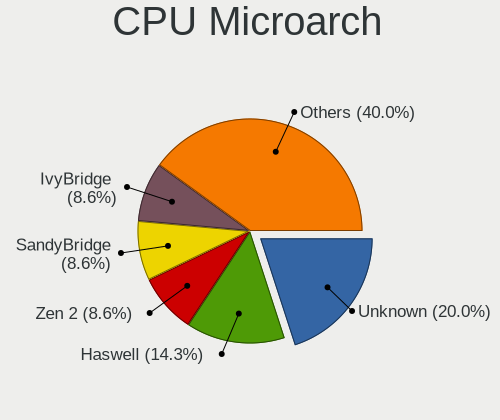
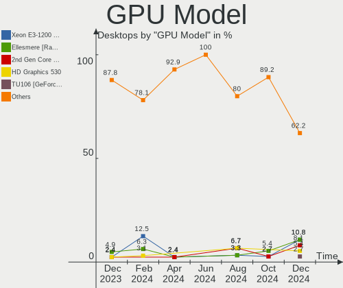
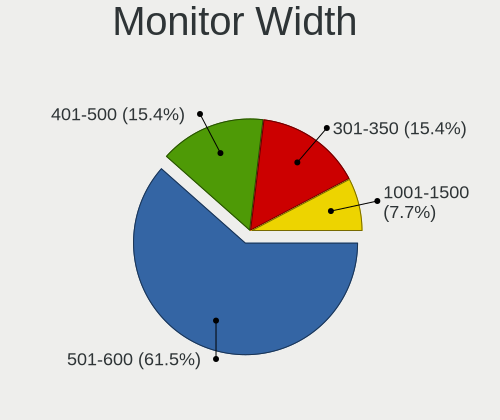
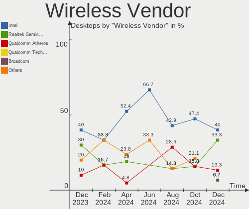
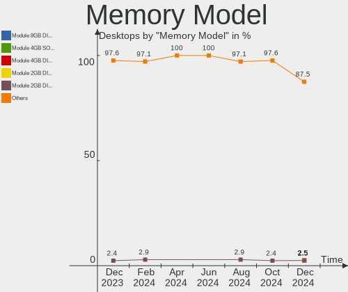

FreeBSD - Hardware Trends (Desktops)
------------------------------------

A project to identify most popular hardware characteristics and track their change
over time based on data collected by BSD users at https://BSD-Hardware.info.

Anyone can contribute to this report by the [hw-probe](https://github.com/linuxhw/hw-probe/blob/master/INSTALL.BSD.md) tool:

    hw-probe -all -upload

This report is for one last month. Overall report since the beginning of time: [TestCoverage](https://github.com/bsdhw/TestCoverage)

Period: Sep, 2022.

Contents
--------

* [ System ](#system)
  - [ OS                       ](#os)
  - [ OS Family                ](#os-family)
  - [ Arch                     ](#arch)
  - [ DE                       ](#de)
  - [ Display Server           ](#display-server)
  - [ Display Manager          ](#display-manager)
  - [ OS Lang                  ](#os-lang)
  - [ Boot Mode                ](#boot-mode)
  - [ Filesystem               ](#filesystem)
  - [ Part. scheme             ](#part-scheme)

* [ Board ](#board)
  - [ Vendor                   ](#vendor)
  - [ Model                    ](#model)
  - [ Model Family             ](#model-family)
  - [ MFG Year                 ](#mfg-year)
  - [ Form Factor              ](#form-factor)
  - [ Coreboot                 ](#coreboot)
  - [ RAM Size                 ](#ram-size)
  - [ RAM Used                 ](#ram-used)
  - [ Total Drives             ](#total-drives)
  - [ Has CD-ROM               ](#has-cd-rom)
  - [ Has Ethernet             ](#has-ethernet)
  - [ Has WiFi                 ](#has-wifi)
  - [ Has Bluetooth            ](#has-bluetooth)

* [ Location ](#location)
  - [ Country                  ](#country)
  - [ City                     ](#city)

* [ Drives ](#drives)
  - [ Drive Vendor             ](#drive-vendor)
  - [ Drive Model              ](#drive-model)
  - [ HDD Vendor               ](#hdd-vendor)
  - [ SSD Vendor               ](#ssd-vendor)
  - [ Drive Kind               ](#drive-kind)
  - [ Drive Connector          ](#drive-connector)
  - [ Drive Size               ](#drive-size)
  - [ Space Total              ](#space-total)
  - [ Space Used               ](#space-used)
  - [ Malfunc. Drives          ](#malfunc-drives)
  - [ Malfunc. Drive Vendor    ](#malfunc-drive-vendor)
  - [ Malfunc. HDD Vendor      ](#malfunc-hdd-vendor)
  - [ Malfunc. Drive Kind      ](#malfunc-drive-kind)
  - [ Failed Drives            ](#failed-drives)
  - [ Failed Drive Vendor      ](#failed-drive-vendor)
  - [ Drive Status             ](#drive-status)

* [ Storage controller ](#storage-controller)
  - [ Storage Vendor           ](#storage-vendor)
  - [ Storage Model            ](#storage-model)
  - [ Storage Kind             ](#storage-kind)

* [ Processor ](#processor)
  - [ CPU Vendor               ](#cpu-vendor)
  - [ CPU Model                ](#cpu-model)
  - [ CPU Model Family         ](#cpu-model-family)
  - [ CPU Cores                ](#cpu-cores)
  - [ CPU Sockets              ](#cpu-sockets)
  - [ CPU Threads              ](#cpu-threads)
  - [ CPU Microarch            ](#cpu-microarch)

* [ Graphics ](#graphics)
  - [ GPU Vendor               ](#gpu-vendor)
  - [ GPU Model                ](#gpu-model)
  - [ GPU Combo                ](#gpu-combo)
  - [ GPU Driver               ](#gpu-driver)
  - [ GPU Memory               ](#gpu-memory)

* [ Monitor ](#monitor)
  - [ Monitor Vendor           ](#monitor-vendor)
  - [ Monitor Model            ](#monitor-model)
  - [ Monitor Resolution       ](#monitor-resolution)
  - [ Monitor Diagonal         ](#monitor-diagonal)
  - [ Monitor Width            ](#monitor-width)
  - [ Aspect Ratio             ](#aspect-ratio)
  - [ Monitor Area             ](#monitor-area)
  - [ Pixel Density            ](#pixel-density)
  - [ Multiple Monitors        ](#multiple-monitors)

* [ Network ](#network)
  - [ Net Controller Vendor    ](#net-controller-vendor)
  - [ Net Controller Model     ](#net-controller-model)
  - [ Wireless Vendor          ](#wireless-vendor)
  - [ Wireless Model           ](#wireless-model)
  - [ Ethernet Vendor          ](#ethernet-vendor)
  - [ Ethernet Model           ](#ethernet-model)
  - [ Net Controller Kind      ](#net-controller-kind)
  - [ Used Controller          ](#used-controller)
  - [ NICs                     ](#nics)
  - [ IPv6                     ](#ipv6)

* [ Bluetooth ](#bluetooth)
  - [ Bluetooth Vendor         ](#bluetooth-vendor)
  - [ Bluetooth Model          ](#bluetooth-model)

* [ Sound ](#sound)
  - [ Sound Vendor             ](#sound-vendor)
  - [ Sound Model              ](#sound-model)

* [ Memory ](#memory)
  - [ Memory Vendor            ](#memory-vendor)
  - [ Memory Model             ](#memory-model)
  - [ Memory Kind              ](#memory-kind)
  - [ Memory Form Factor       ](#memory-form-factor)
  - [ Memory Size              ](#memory-size)
  - [ Memory Speed             ](#memory-speed)

* [ Printers & scanners ](#printers--scanners)
  - [ Printer Vendor           ](#printer-vendor)
  - [ Printer Model            ](#printer-model)
  - [ Scanner Vendor           ](#scanner-vendor)
  - [ Scanner Model            ](#scanner-model)

* [ Camera ](#camera)
  - [ Camera Vendor            ](#camera-vendor)
  - [ Camera Model             ](#camera-model)

* [ Security ](#security)
  - [ Fingerprint Vendor       ](#fingerprint-vendor)
  - [ Fingerprint Model        ](#fingerprint-model)
  - [ Chipcard Vendor          ](#chipcard-vendor)
  - [ Chipcard Model           ](#chipcard-model)

* [ Unsupported ](#unsupported)
  - [ Unsupported Devices      ](#unsupported-devices)
  - [ Unsupported Device Types ](#unsupported-device-types)

System
------

OS
--

Installed operating systems

| Name                 | Desktops | Percent |
|----------------------|----------|---------|
| FreeBSD 13.1-p2      | 17       | 56.67%  |
| FreeBSD 13.1         | 4        | 13.33%  |
| FreeBSD 13.1-p1      | 3        | 10%     |
| FreeBSD 12.3-p5      | 3        | 10%     |
| FreeBSD 14.0-CURRENT | 2        | 6.67%   |
| FreeBSD 13.1-STABLE  | 1        | 3.33%   |

OS Family
---------

OS without a version

| Name    | Desktops | Percent |
|---------|----------|---------|
| FreeBSD | 30       | 100%    |

Arch
----

OS architecture (x86_64, i586, etc.)

| Name  | Desktops | Percent |
|-------|----------|---------|
| amd64 | 29       | 96.67%  |
| arm   | 1        | 3.33%   |

DE
--

Desktop Environment

| Name          | Desktops | Percent |
|---------------|----------|---------|
| Console       | 15       | 50%     |
| KDE5          | 5        | 16.67%  |
| XFCE          | 2        | 6.67%   |
| MATE          | 2        | 6.67%   |
| TWM           | 1        | 3.33%   |
| spectrwm      | 1        | 3.33%   |
| plasma        | 1        | 3.33%   |
| LXDE          | 1        | 3.33%   |
| Enlightenment | 1        | 3.33%   |
| AwesomeWM     | 1        | 3.33%   |

Display Server
--------------

X11 or Wayland

| Name    | Desktops | Percent |
|---------|----------|---------|
| Console | 17       | 56.67%  |
| X11     | 13       | 43.33%  |

Display Manager
---------------

SDDM, LightDM, etc.

| Name    | Desktops | Percent |
|---------|----------|---------|
| Console | 21       | 70%     |
| SDDM    | 6        | 20%     |
| XDM     | 1        | 3.33%   |
| SLiM    | 1        | 3.33%   |
| LightDM | 1        | 3.33%   |

OS Lang
-------

Language

| Lang    | Desktops | Percent |
|---------|----------|---------|
| C       | 16       | 53.33%  |
| Unknown | 5        | 16.67%  |
| ru_RU   | 3        | 10%     |
| en_US   | 3        | 10%     |
| zh_CN   | 2        | 6.67%   |
| de_DE   | 1        | 3.33%   |

Boot Mode
---------

EFI or BIOS

| Mode | Desktops | Percent |
|------|----------|---------|
| EFI  | 17       | 56.67%  |
| BIOS | 13       | 43.33%  |

Filesystem
----------

Type of filesystem

| Type | Desktops | Percent |
|------|----------|---------|
| Zfs  | 17       | 56.67%  |
| Ufs  | 13       | 43.33%  |

Part. scheme
------------

Scheme of partitioning

| Type | Desktops | Percent |
|------|----------|---------|
| GPT  | 25       | 83.33%  |
| MBR  | 5        | 16.67%  |

Board
-----

Vendor
------

Motherboard manufacturer

| Name                | Desktops | Percent |
|---------------------|----------|---------|
| MSI                 | 6        | 20%     |
| Hewlett-Packard     | 4        | 13.33%  |
| ASUSTek Computer    | 4        | 13.33%  |
| ASRockRack          | 3        | 10%     |
| Deciso              | 2        | 6.67%   |
| ASRock              | 2        | 6.67%   |
| Unknown             | 2        | 6.67%   |
| Supermicro          | 1        | 3.33%   |
| Pegatron            | 1        | 3.33%   |
| NITRINOnet          | 1        | 3.33%   |
| Lenovo              | 1        | 3.33%   |
| Intel               | 1        | 3.33%   |
| Gigabyte Technology | 1        | 3.33%   |
| AMI                 | 1        | 3.33%   |

Model
-----

Motherboard model

| Name                         | Desktops | Percent |
|------------------------------|----------|---------|
| Deciso Netboard A10 V2       | 2        | 6.67%   |
| ASRockRack 520001            | 2        | 6.67%   |
| Unknown                      | 2        | 6.67%   |
| Supermicro X7DB8             | 1        | 3.33%   |
| Pegatron TERRA_PC            | 1        | 3.33%   |
| NITRINOnet M360RUS56         | 1        | 3.33%   |
| MSI MS-7C96                  | 1        | 3.33%   |
| MSI MS-7C79                  | 1        | 3.33%   |
| MSI MS-7C75                  | 1        | 3.33%   |
| MSI MS-7C37                  | 1        | 3.33%   |
| MSI MS-7C36                  | 1        | 3.33%   |
| MSI MS-7817                  | 1        | 3.33%   |
| Lenovo YangTianM6880N        | 1        | 3.33%   |
| Intel D945GCLF2 AAE46416-106 | 1        | 3.33%   |
| HP Z600 Workstation          | 1        | 3.33%   |
| HP Slim Desktop S01-aF2xxx   | 1        | 3.33%   |
| HP ProLiant ML350p Gen8      | 1        | 3.33%   |
| HP ProDesk 600 G1 DM         | 1        | 3.33%   |
| Gigabyte H410M S2 V2         | 1        | 3.33%   |
| ASUS ROG CROSSHAIR VIII HERO | 1        | 3.33%   |
| ASUS PRIME X370-PRO          | 1        | 3.33%   |
| ASUS P5Q-E                   | 1        | 3.33%   |
| ASUS M5A88-M                 | 1        | 3.33%   |
| ASRockRack EPYC3101D4I-2T    | 1        | 3.33%   |
| ASRock X570M Pro4            | 1        | 3.33%   |
| ASRock X570 Phantom Gaming 4 | 1        | 3.33%   |
| AMI MNHO-048                 | 1        | 3.33%   |

Model Family
------------

Motherboard model prefix

| Name                      | Desktops | Percent |
|---------------------------|----------|---------|
| Deciso Netboard           | 2        | 6.67%   |
| ASRockRack 520001         | 2        | 6.67%   |
| Unknown                   | 2        | 6.67%   |
| Supermicro X7DB8          | 1        | 3.33%   |
| Pegatron TERRA            | 1        | 3.33%   |
| NITRINOnet M360RUS56      | 1        | 3.33%   |
| MSI MS-7C96               | 1        | 3.33%   |
| MSI MS-7C79               | 1        | 3.33%   |
| MSI MS-7C75               | 1        | 3.33%   |
| MSI MS-7C37               | 1        | 3.33%   |
| MSI MS-7C36               | 1        | 3.33%   |
| MSI MS-7817               | 1        | 3.33%   |
| Lenovo YangTianM6880N     | 1        | 3.33%   |
| Intel D945GCLF2           | 1        | 3.33%   |
| HP Z600                   | 1        | 3.33%   |
| HP Slim                   | 1        | 3.33%   |
| HP ProLiant               | 1        | 3.33%   |
| HP ProDesk                | 1        | 3.33%   |
| Gigabyte H410M            | 1        | 3.33%   |
| ASUS ROG                  | 1        | 3.33%   |
| ASUS PRIME                | 1        | 3.33%   |
| ASUS P5Q-E                | 1        | 3.33%   |
| ASUS M5A88-M              | 1        | 3.33%   |
| ASRockRack EPYC3101D4I-2T | 1        | 3.33%   |
| ASRock X570M              | 1        | 3.33%   |
| ASRock X570               | 1        | 3.33%   |
| AMI MNHO-048              | 1        | 3.33%   |

MFG Year
--------

Motherboard manufacture year

| Year    | Desktops | Percent |
|---------|----------|---------|
| 2021    | 7        | 23.33%  |
| 2019    | 4        | 13.33%  |
| 2017    | 4        | 13.33%  |
| 2020    | 3        | 10%     |
| 2014    | 2        | 6.67%   |
| 2010    | 2        | 6.67%   |
| 2008    | 2        | 6.67%   |
| 2022    | 1        | 3.33%   |
| 2018    | 1        | 3.33%   |
| 2015    | 1        | 3.33%   |
| 2013    | 1        | 3.33%   |
| 2012    | 1        | 3.33%   |
| Unknown | 1        | 3.33%   |

Form Factor
-----------

Physical design of the computer

| Name    | Desktops | Percent |
|---------|----------|---------|
| Desktop | 30       | 100%    |

Coreboot
--------

Have coreboot on board

| Used | Desktops | Percent |
|------|----------|---------|
| No   | 28       | 93.33%  |
| Yes  | 2        | 6.67%   |

RAM Size
--------

Total RAM memory

| Size in GB  | Desktops | Percent |
|-------------|----------|---------|
| 32.01-64.0  | 11       | 36.67%  |
| 8.01-16.0   | 8        | 26.67%  |
| 4.01-8.0    | 4        | 13.33%  |
| 64.01-256.0 | 4        | 13.33%  |
| 2.01-3.0    | 1        | 3.33%   |
| 16.01-24.0  | 1        | 3.33%   |
| 0.01-0.5    | 1        | 3.33%   |

RAM Used
--------

Used RAM memory

| Used GB  | Desktops | Percent |
|----------|----------|---------|
| 1.01-2.0 | 10       | 33.33%  |
| 0.01-0.5 | 9        | 30%     |
| 0.51-1.0 | 7        | 23.33%  |
| 3.01-4.0 | 2        | 6.67%   |
| 4.01-8.0 | 1        | 3.33%   |
| 0        | 1        | 3.33%   |

Total Drives
------------

Number of drives on board

| Drives | Desktops | Percent |
|--------|----------|---------|
| 1      | 9        | 30%     |
| 2      | 6        | 20%     |
| 4      | 5        | 16.67%  |
| 3      | 4        | 13.33%  |
| 5      | 2        | 6.67%   |
| 0      | 2        | 6.67%   |
| 13     | 1        | 3.33%   |
| 6      | 1        | 3.33%   |

Has CD-ROM
----------

Has CD-ROM on board

| Presented | Desktops | Percent |
|-----------|----------|---------|
| No        | 21       | 70%     |
| Yes       | 9        | 30%     |

Has Ethernet
------------

Has Ethernet on board

| Presented | Desktops | Percent |
|-----------|----------|---------|
| Yes       | 29       | 96.67%  |
| No        | 1        | 3.33%   |

Has WiFi
--------

Has WiFi module

| Presented | Desktops | Percent |
|-----------|----------|---------|
| No        | 23       | 76.67%  |
| Yes       | 7        | 23.33%  |

Has Bluetooth
-------------

Has Bluetooth module

| Presented | Desktops | Percent |
|-----------|----------|---------|
| No        | 24       | 80%     |
| Yes       | 6        | 20%     |

Location
--------

Country
-------

Geographic location (country)

| Country     | Desktops | Percent |
|-------------|----------|---------|
| Germany     | 9        | 30%     |
| USA         | 6        | 20%     |
| Russia      | 3        | 10%     |
| China       | 3        | 10%     |
| Switzerland | 2        | 6.67%   |
| Italy       | 2        | 6.67%   |
| Thailand    | 1        | 3.33%   |
| Romania     | 1        | 3.33%   |
| Japan       | 1        | 3.33%   |
| France      | 1        | 3.33%   |
| Brazil      | 1        | 3.33%   |

City
----

Geographic location (city)

| City                    | Desktops | Percent |
|-------------------------|----------|---------|
| Zurich                  | 2        | 6.67%   |
| Salem                   | 2        | 6.67%   |
| Redmond                 | 2        | 6.67%   |
| Moscow                  | 2        | 6.67%   |
| Kassel                  | 2        | 6.67%   |
| Frankfurt am Main       | 2        | 6.67%   |
| Xiamen                  | 1        | 3.33%   |
| Wenatchee               | 1        | 3.33%   |
| Twinsburg               | 1        | 3.33%   |
| Spangenberg             | 1        | 3.33%   |
| Setagaya-ku             | 1        | 3.33%   |
| Schildow                | 1        | 3.33%   |
| Satu Mare               | 1        | 3.33%   |
| Rio de Janeiro          | 1        | 3.33%   |
| Orenburg                | 1        | 3.33%   |
| Neustadt am Ruebenberge | 1        | 3.33%   |
| Milan                   | 1        | 3.33%   |
| Ludwigsburg             | 1        | 3.33%   |
| Jinrongjie              | 1        | 3.33%   |
| Habichtswald            | 1        | 3.33%   |
| Crema                   | 1        | 3.33%   |
| Chengdu                 | 1        | 3.33%   |
| Bangkok                 | 1        | 3.33%   |
| Annecy                  | 1        | 3.33%   |

Drives
------

Drive Vendor
------------

Hard drive vendors

| Vendor              | Desktops | Drives | Percent |
|---------------------|----------|--------|---------|
| Samsung Electronics | 12       | 21     | 25%     |
| WDC                 | 10       | 27     | 20.83%  |
| Seagate             | 9        | 10     | 18.75%  |
| HGST                | 3        | 5      | 6.25%   |
| Crucial             | 3        | 3      | 6.25%   |
| Transcend           | 2        | 2      | 4.17%   |
| Intel               | 2        | 3      | 4.17%   |
| WD MediaMax         | 1        | 1      | 2.08%   |
| Toshiba             | 1        | 1      | 2.08%   |
| SanDisk             | 1        | 1      | 2.08%   |
| KIOXIA-EXCERIA      | 1        | 1      | 2.08%   |
| Hewlett-Packard     | 1        | 5      | 2.08%   |
| Corsair             | 1        | 1      | 2.08%   |
| A-DATA Technology   | 1        | 1      | 2.08%   |

Drive Model
-----------

Hard drive models

| Model                                | Desktops | Percent |
|--------------------------------------|----------|---------|
| Transcend TS128GMSA370 128GB         | 2        | 3.08%   |
| Seagate ST500DM002-1BD142 500GB      | 2        | 3.08%   |
| Seagate ST4000DM000-1F2168 4TB       | 2        | 3.08%   |
| Seagate ST1000DM010-2EP102 1TB       | 2        | 3.08%   |
| Samsung SSD 970 EVO Plus 500GB       | 2        | 3.08%   |
| HGST HUS722T1TALA604 1TB             | 2        | 3.08%   |
| WDC WDS100T3X0C-00SJG0 1TB           | 1        | 1.54%   |
| WDC WDS100T1X0E-00AFY0 1TB           | 1        | 1.54%   |
| WDC WD80EMAZ-00WJTA0 8TB             | 1        | 1.54%   |
| WDC WD80EFZX-68UW8N0 8TB             | 1        | 1.54%   |
| WDC WD80EFAX-68LHPN0 8TB             | 1        | 1.54%   |
| WDC WD80EDBZ-11B0ZA0 8TB             | 1        | 1.54%   |
| WDC WD800JD-75MSA3 80GB              | 1        | 1.54%   |
| WDC WD60EZRZ-00GZ5B1 6TB             | 1        | 1.54%   |
| WDC WD6002FRYZ-01WD5B1 6TB           | 1        | 1.54%   |
| WDC WD5000LPCX-00VHAT0 500GB         | 1        | 1.54%   |
| WDC WD40EZRZ-22GXCB0 4TB             | 1        | 1.54%   |
| WDC WD4005FZBX-00K5WB0 4TB           | 1        | 1.54%   |
| WDC WD30EZRZ-00WN9B0 3TB             | 1        | 1.54%   |
| WDC WD15EADS-00P8B0 1.5TB            | 1        | 1.54%   |
| WDC WD120EMFZ-11A6JA0 12TB           | 1        | 1.54%   |
| WDC WD120EMAZ-11BLFA0 12TB           | 1        | 1.54%   |
| WDC WD10SPCX-00KHST0 1TB             | 1        | 1.54%   |
| WDC WD10EJRX-89N74Y0 1TB             | 1        | 1.54%   |
| WDC PC SN530 SDBPNPZ-256G-1006 256GB | 1        | 1.54%   |
| WD MediaMax WL1500GSA6472B 1.5TB     | 1        | 1.54%   |
| Toshiba MQ01ABD075 752GB             | 1        | 1.54%   |
| Seagate ST500DM002-1SB10A 500GB      | 1        | 1.54%   |
| Seagate ST5000LM000-2U8170 5TB       | 1        | 1.54%   |
| Seagate ST4000LM024-2AN17V 4TB       | 1        | 1.54%   |
| Seagate ST2000VX002-1AH166 2TB       | 1        | 1.54%   |
| SanDisk SSD PLUS 120GB               | 1        | 1.54%   |
| Samsung SSD 970 PRO 1TB              | 1        | 1.54%   |
| Samsung SSD 960 EVO 500GB            | 1        | 1.54%   |
| Samsung SSD 870 QVO 2TB              | 1        | 1.54%   |
| Samsung SSD 860 QVO 1TB              | 1        | 1.54%   |
| Samsung SSD 860 PRO 4TB              | 1        | 1.54%   |
| Samsung SSD 860 EVO mSATA 250GB      | 1        | 1.54%   |
| Samsung SSD 860 EVO 500GB            | 1        | 1.54%   |
| Samsung SSD 860 EVO 250GB            | 1        | 1.54%   |

HDD Vendor
----------

Hard disk drive vendors

| Vendor              | Desktops | Drives | Percent |
|---------------------|----------|--------|---------|
| Seagate             | 9        | 10     | 34.62%  |
| WDC                 | 8        | 24     | 30.77%  |
| Samsung Electronics | 3        | 4      | 11.54%  |
| HGST                | 3        | 5      | 11.54%  |
| WD MediaMax         | 1        | 1      | 3.85%   |
| Toshiba             | 1        | 1      | 3.85%   |
| Hewlett-Packard     | 1        | 5      | 3.85%   |

SSD Vendor
----------

Solid state drive vendors

| Vendor              | Desktops | Drives | Percent |
|---------------------|----------|--------|---------|
| Samsung Electronics | 8        | 11     | 50%     |
| Transcend           | 2        | 2      | 12.5%   |
| Intel               | 2        | 3      | 12.5%   |
| Crucial             | 2        | 2      | 12.5%   |
| SanDisk             | 1        | 1      | 6.25%   |
| A-DATA Technology   | 1        | 1      | 6.25%   |

Drive Kind
----------

HDD or SSD

| Kind | Desktops | Drives | Percent |
|------|----------|--------|---------|
| HDD  | 19       | 50     | 43.18%  |
| SSD  | 15       | 20     | 34.09%  |
| NVMe | 10       | 12     | 22.73%  |

Drive Connector
---------------

SATA, SAS, NVMe, etc.

| Type | Desktops | Drives | Percent |
|------|----------|--------|---------|
| SATA | 27       | 70     | 72.97%  |
| NVMe | 10       | 12     | 27.03%  |

Drive Size
----------

Size of hard drive

| Size in TB | Desktops | Drives | Percent |
|------------|----------|--------|---------|
| 0.01-0.5   | 16       | 22     | 41.03%  |
| 0.51-1.0   | 7        | 13     | 17.95%  |
| 1.01-2.0   | 5        | 11     | 12.82%  |
| 4.01-10.0  | 5        | 16     | 12.82%  |
| 3.01-4.0   | 4        | 5      | 10.26%  |
| 2.01-3.0   | 1        | 1      | 2.56%   |
| 10.01-20.0 | 1        | 2      | 2.56%   |

Space Total
-----------

Amount of disk space available on the file system

| Size in GB     | Desktops | Percent |
|----------------|----------|---------|
| 101-250        | 11       | 36.67%  |
| 501-1000       | 7        | 23.33%  |
| 251-500        | 6        | 20%     |
| More than 3000 | 1        | 3.33%   |
| 21-50          | 1        | 3.33%   |
| 2001-3000      | 1        | 3.33%   |
| 1001-2000      | 1        | 3.33%   |
| 1-20           | 1        | 3.33%   |
| 51-100         | 1        | 3.33%   |

Space Used
----------

Amount of used disk space

| Used GB        | Desktops | Percent |
|----------------|----------|---------|
| 1-20           | 19       | 63.33%  |
| 21-50          | 4        | 13.33%  |
| 51-100         | 3        | 10%     |
| More than 3000 | 1        | 3.33%   |
| 251-500        | 1        | 3.33%   |
| 101-250        | 1        | 3.33%   |
| 501-1000       | 1        | 3.33%   |

Malfunc. Drives
---------------

Drive models with a malfunction

| Model                           | Desktops | Drives | Percent |
|---------------------------------|----------|--------|---------|
| WDC WD6002FRYZ-01WD5B1 6TB      | 1        | 1      | 14.29%  |
| WDC WD10EJRX-89N74Y0 1TB        | 1        | 1      | 14.29%  |
| Samsung Electronics HD204UI 2TB | 1        | 1      | 14.29%  |
| Samsung Electronics HD103SJ 1TB | 1        | 1      | 14.29%  |
| Intel SSDSC2BW240A4 240GB       | 1        | 1      | 14.29%  |
| HGST HTS541075A9E680 752GB      | 1        | 1      | 14.29%  |
| Crucial M4-CT064M4SSD2 64GB     | 1        | 1      | 14.29%  |

Malfunc. Drive Vendor
---------------------

Vendors of faulty drives

| Vendor              | Desktops | Drives | Percent |
|---------------------|----------|--------|---------|
| WDC                 | 2        | 2      | 28.57%  |
| Samsung Electronics | 2        | 2      | 28.57%  |
| Intel               | 1        | 1      | 14.29%  |
| HGST                | 1        | 1      | 14.29%  |
| Crucial             | 1        | 1      | 14.29%  |

Malfunc. HDD Vendor
-------------------

Vendors of faulty HDD drives

| Vendor              | Desktops | Drives | Percent |
|---------------------|----------|--------|---------|
| WDC                 | 2        | 2      | 40%     |
| Samsung Electronics | 2        | 2      | 40%     |
| HGST                | 1        | 1      | 20%     |

Malfunc. Drive Kind
-------------------

Kinds of faulty drives

| Kind | Desktops | Drives | Percent |
|------|----------|--------|---------|
| HDD  | 5        | 5      | 71.43%  |
| SSD  | 2        | 2      | 28.57%  |

Failed Drives
-------------

Failed drive models

Zero info for selected period =(

Failed Drive Vendor
-------------------

Failed drive vendors

Zero info for selected period =(

Drive Status
------------

Number of failed and malfunc. drives

| Status  | Desktops | Drives | Percent |
|---------|----------|--------|---------|
| Works   | 28       | 75     | 84.85%  |
| Malfunc | 5        | 7      | 15.15%  |

Storage controller
------------------

Storage Vendor
--------------

Storage controller vendors

| Vendor                    | Desktops | Percent |
|---------------------------|----------|---------|
| Intel                     | 15       | 32.61%  |
| AMD                       | 14       | 30.43%  |
| SanDisk                   | 4        | 8.7%    |
| Samsung Electronics       | 4        | 8.7%    |
| ASMedia Technology        | 2        | 4.35%   |
| Phison Electronics        | 1        | 2.17%   |
| Micron/Crucial Technology | 1        | 2.17%   |
| Marvell Technology Group  | 1        | 2.17%   |
| KIOXIA                    | 1        | 2.17%   |
| Hewlett-Packard           | 1        | 2.17%   |
| Broadcom / LSI            | 1        | 2.17%   |
| 3ware                     | 1        | 2.17%   |

Storage Model
-------------

Storage controller models

| Model                                                                          | Desktops | Percent |
|--------------------------------------------------------------------------------|----------|---------|
| AMD FCH SATA Controller [AHCI mode]                                            | 13       | 24.07%  |
| Intel Comet Lake SATA AHCI Controller                                          | 3        | 5.56%   |
| Intel 8 Series/C220 Series Chipset Family 6-port SATA Controller 1 [AHCI mode] | 3        | 5.56%   |
| Samsung NVMe SSD Controller SM981/PM981/PM983                                  | 2        | 3.7%    |
| Intel NM10/ICH7 Family SATA Controller [IDE mode]                              | 2        | 3.7%    |
| ASMedia ASM1062 Serial ATA Controller                                          | 2        | 3.7%    |
| AMD 400 Series Chipset SATA Controller                                         | 2        | 3.7%    |
| SanDisk WD PC SN810 / Black SN850 NVMe SSD                                     | 1        | 1.85%   |
| SanDisk WD Blue SN570 NVMe SSD                                                 | 1        | 1.85%   |
| SanDisk WD Blue SN550 NVMe SSD                                                 | 1        | 1.85%   |
| SanDisk WD Black SN750 / PC SN730 NVMe SSD                                     | 1        | 1.85%   |
| Samsung NVMe SSD Controller SM961/PM961/SM963                                  | 1        | 1.85%   |
| Samsung NVMe SSD Controller PM9A1/PM9A3/980PRO                                 | 1        | 1.85%   |
| Phison E16 PCIe4 NVMe Controller                                               | 1        | 1.85%   |
| Micron/Crucial P1 NVMe PCIe SSD                                                | 1        | 1.85%   |
| Marvell Group 88SE6111/6121 SATA II / PATA Controller                          | 1        | 1.85%   |
| KIOXIA NVMe SSD                                                                | 1        | 1.85%   |
| Intel SATA Controller [RAID mode]                                              | 1        | 1.85%   |
| Intel Celeron/Pentium Silver Processor SATA Controller                         | 1        | 1.85%   |
| Intel Cannon Lake PCH SATA AHCI Controller                                     | 1        | 1.85%   |
| Intel C600/X79 series chipset 4-Port SATA IDE Controller                       | 1        | 1.85%   |
| Intel C600/X79 series chipset 2-Port SATA IDE Controller                       | 1        | 1.85%   |
| Intel Atom Processor E3800 Series SATA AHCI Controller                         | 1        | 1.85%   |
| Intel 82801JI (ICH10 Family) SATA AHCI Controller                              | 1        | 1.85%   |
| Intel 82801G (ICH7 Family) IDE Controller                                      | 1        | 1.85%   |
| Intel 631xESB/632xESB/3100 Chipset SATA IDE Controller                         | 1        | 1.85%   |
| Intel 631xESB/632xESB IDE Controller                                           | 1        | 1.85%   |
| HP Smart Array Gen8 Controllers                                                | 1        | 1.85%   |
| Broadcom / LSI SAS2008 PCI-Express Fusion-MPT SAS-2 [Falcon]                   | 1        | 1.85%   |
| AMD X370 Series Chipset SATA Controller                                        | 1        | 1.85%   |
| AMD SB7x0/SB8x0/SB9x0 SATA Controller [IDE mode]                               | 1        | 1.85%   |
| AMD SB7x0/SB8x0/SB9x0 IDE Controller                                           | 1        | 1.85%   |
| AMD 500 Series Chipset SATA Controller                                         | 1        | 1.85%   |
| 3ware 9650SE SATA-II RAID PCIe                                                 | 1        | 1.85%   |

Storage Kind
------------

Kind of storage controller (IDE, SATA, NVMe, SAS, ...)

| Kind | Desktops | Percent |
|------|----------|---------|
| SATA | 23       | 52.27%  |
| NVMe | 11       | 25%     |
| IDE  | 6        | 13.64%  |
| RAID | 3        | 6.82%   |
| SAS  | 1        | 2.27%   |

Processor
---------

CPU Vendor
----------

Processor vendors

| Vendor | Desktops | Percent |
|--------|----------|---------|
| Intel  | 15       | 50%     |
| AMD    | 14       | 46.67%  |
| ARM    | 1        | 3.33%   |

CPU Model
---------

Processor models

| Model                                      | Desktops | Percent |
|--------------------------------------------|----------|---------|
| AMD Ryzen 9 3900X 12-Core Processor        | 3        | 10%     |
| AMD Ryzen 5 PRO 3600 6-Core Processor      | 2        | 6.67%   |
| AMD GX-420MC SOC                           | 2        | 6.67%   |
| Intel Xeon processor                       | 1        | 3.33%   |
| Intel Xeon CPU E5630 @ 2.53GHz             | 1        | 3.33%   |
| Intel Xeon CPU E5-2609 0 @ 2.40GHz         | 1        | 3.33%   |
| Intel Pentium Silver J5040 CPU @ 2.00GHz   | 1        | 3.33%   |
| Intel Pentium Gold G5400 CPU @ 3.70GHz     | 1        | 3.33%   |
| Intel Pentium CPU G3240T @ 2.70GHz         | 1        | 3.33%   |
| Intel Pentium CPU G3220 @ 3.00GHz          | 1        | 3.33%   |
| Intel Core i7-10700K CPU @ 3.80GHz         | 1        | 3.33%   |
| Intel Core i7-10700 CPU @ 2.90GHz          | 1        | 3.33%   |
| Intel Core i3-4130 CPU @ 3.40GHz           | 1        | 3.33%   |
| Intel Core 2 Quad CPU Q6600 @ 2.40GHz      | 1        | 3.33%   |
| Intel Core 2 Duo CPU E7500 @ 2.93GHz       | 1        | 3.33%   |
| Intel Atom CPU E3845 @ 1.91GHz             | 1        | 3.33%   |
| Intel Atom CPU 330 @ 1.60GHz               | 1        | 3.33%   |
| Intel 11th Gen Core i5-11400 @ 2.60GHz     | 1        | 3.33%   |
| ARM ARM1176 r0p7 (ECO: 0x00000000)         | 1        | 3.33%   |
| AMD Ryzen 9 5950X 16-Core Processor        | 1        | 3.33%   |
| AMD Ryzen 9 5900HX with Radeon Graphics    | 1        | 3.33%   |
| AMD Ryzen 7 PRO 4750G with Radeon Graphics | 1        | 3.33%   |
| AMD Ryzen 7 3700X 8-Core Processor         | 1        | 3.33%   |
| AMD Ryzen 7 1700 Eight-Core Processor      | 1        | 3.33%   |
| AMD FX-8120 Eight-Core Processor           | 1        | 3.33%   |
| AMD EPYC 3101 4-Core Processor             | 1        | 3.33%   |

CPU Model Family
----------------

Processor model prefix

| Model                | Desktops | Percent |
|----------------------|----------|---------|
| AMD Ryzen 9          | 5        | 16.67%  |
| Intel Xeon           | 3        | 10%     |
| Other                | 2        | 6.67%   |
| Intel Pentium        | 2        | 6.67%   |
| Intel Core i7        | 2        | 6.67%   |
| Intel Atom           | 2        | 6.67%   |
| AMD Ryzen 7          | 2        | 6.67%   |
| AMD Ryzen 5 PRO      | 2        | 6.67%   |
| AMD GX               | 2        | 6.67%   |
| Intel Pentium Silver | 1        | 3.33%   |
| Intel Pentium Gold   | 1        | 3.33%   |
| Intel Core i3        | 1        | 3.33%   |
| Intel Core 2 Quad    | 1        | 3.33%   |
| Intel Core 2 Duo     | 1        | 3.33%   |
| AMD Ryzen 7 PRO      | 1        | 3.33%   |
| AMD FX               | 1        | 3.33%   |
| AMD EPYC             | 1        | 3.33%   |

CPU Cores
---------

Number of processor cores

| Number  | Desktops | Percent |
|---------|----------|---------|
| 4       | 8        | 26.67%  |
| 2       | 5        | 16.67%  |
| 16      | 4        | 13.33%  |
| 8       | 4        | 13.33%  |
| 24      | 3        | 10%     |
| 12      | 2        | 6.67%   |
| Unknown | 2        | 6.67%   |
| 32      | 1        | 3.33%   |
| 6       | 1        | 3.33%   |

CPU Sockets
-----------

Number of sockets

| Number  | Desktops | Percent |
|---------|----------|---------|
| 1       | 27       | 90%     |
| 2       | 2        | 6.67%   |
| Unknown | 1        | 3.33%   |

CPU Threads
-----------

Threads per core (Hyper-Threading)

| Number  | Desktops | Percent |
|---------|----------|---------|
| 1       | 22       | 73.33%  |
| 2       | 6        | 20%     |
| Unknown | 2        | 6.67%   |

CPU Microarch
-------------

Microarchitecture

| Name          | Desktops | Percent |
|---------------|----------|---------|
| Zen 2         | 7        | 23.33%  |
| Haswell       | 3        | 10%     |
| Zen 3         | 2        | 6.67%   |
| Zen           | 2        | 6.67%   |
| Puma          | 2        | 6.67%   |
| Penryn        | 2        | 6.67%   |
| CometLake     | 2        | 6.67%   |
| Unknown       | 2        | 6.67%   |
| Westmere      | 1        | 3.33%   |
| Silvermont    | 1        | 3.33%   |
| SandyBridge   | 1        | 3.33%   |
| KabyLake      | 1        | 3.33%   |
| Goldmont plus | 1        | 3.33%   |
| Core          | 1        | 3.33%   |
| Bulldozer     | 1        | 3.33%   |
| Bonnell       | 1        | 3.33%   |

Graphics
--------

GPU Vendor
----------

Vendors of graphics cards

| Vendor                     | Desktops | Percent |
|----------------------------|----------|---------|
| Intel                      | 9        | 33.33%  |
| Nvidia                     | 8        | 29.63%  |
| AMD                        | 6        | 22.22%  |
| ASPEED Technology          | 3        | 11.11%  |
| Matrox Electronics Systems | 1        | 3.7%    |

GPU Model
---------

Graphics card models

| Model                                                                       | Desktops | Percent |
|-----------------------------------------------------------------------------|----------|---------|
| ASPEED Technology ASPEED Graphics Family                                    | 3        | 11.11%  |
| Nvidia GP108 [GeForce GT 1030]                                              | 2        | 7.41%   |
| Intel Xeon E3-1200 v3/4th Gen Core Processor Integrated Graphics Controller | 2        | 7.41%   |
| Nvidia TU116 [GeForce GTX 1660]                                             | 1        | 3.7%    |
| Nvidia GT218 [NVS 300]                                                      | 1        | 3.7%    |
| Nvidia GP107 [GeForce GTX 1050]                                             | 1        | 3.7%    |
| Nvidia GP106 [GeForce GTX 1060 3GB]                                         | 1        | 3.7%    |
| Nvidia GM206 [GeForce GTX 960]                                              | 1        | 3.7%    |
| Nvidia GF108 [GeForce GT 630]                                               | 1        | 3.7%    |
| Matrox Electronics Systems MGA G200EH                                       | 1        | 3.7%    |
| Intel GeminiLake [UHD Graphics 605]                                         | 1        | 3.7%    |
| Intel CometLake-S GT2 [UHD Graphics 630]                                    | 1        | 3.7%    |
| Intel CoffeeLake-S GT1 [UHD Graphics 610]                                   | 1        | 3.7%    |
| Intel Atom Processor Z36xxx/Z37xxx Series Graphics & Display                | 1        | 3.7%    |
| Intel 82G33/G31 Express Integrated Graphics Controller                      | 1        | 3.7%    |
| Intel 82945G/GZ Integrated Graphics Controller                              | 1        | 3.7%    |
| Intel 4th Generation Core Processor Family Integrated Graphics Controller   | 1        | 3.7%    |
| AMD Renoir                                                                  | 1        | 3.7%    |
| AMD Navi 10 [Radeon RX 5600 OEM/5600 XT / 5700/5700 XT]                     | 1        | 3.7%    |
| AMD ES1000                                                                  | 1        | 3.7%    |
| AMD Ellesmere [Radeon RX 470/480/570/570X/580/580X/590]                     | 1        | 3.7%    |
| AMD Cezanne                                                                 | 1        | 3.7%    |
| AMD Cedar [Radeon HD 5000/6000/7350/8350 Series]                            | 1        | 3.7%    |

GPU Combo
---------

Combinations of graphics cards

| Name       | Desktops | Percent |
|------------|----------|---------|
| 1 x Intel  | 9        | 30%     |
| 1 x Nvidia | 8        | 26.67%  |
| 1 x AMD    | 6        | 20%     |
| Other      | 3        | 10%     |
| 1 x ASPEED | 3        | 10%     |
| 1 x Matrox | 1        | 3.33%   |

GPU Driver
----------

Free vs proprietary

| Driver      | Desktops | Percent |
|-------------|----------|---------|
| Free        | 22       | 73.33%  |
| Proprietary | 5        | 16.67%  |
| Unknown     | 3        | 10%     |

GPU Memory
----------

Total video memory

| Size in GB | Desktops | Percent |
|------------|----------|---------|
| Unknown    | 21       | 70%     |
| 1.01-2.0   | 3        | 10%     |
| 3.01-4.0   | 2        | 6.67%   |
| 7.01-8.0   | 1        | 3.33%   |
| 5.01-6.0   | 1        | 3.33%   |
| 0.51-1.0   | 1        | 3.33%   |
| 0.01-0.5   | 1        | 3.33%   |

Monitor
-------

Monitor Vendor
--------------

Monitor vendors

| Vendor              | Desktops | Percent |
|---------------------|----------|---------|
| Dell                | 4        | 30.77%  |
| Philips             | 2        | 15.38%  |
| Goldstar            | 2        | 15.38%  |
| Unknown             | 1        | 7.69%   |
| Samsung Electronics | 1        | 7.69%   |
| Lenovo              | 1        | 7.69%   |
| AOC                 | 1        | 7.69%   |
| Acer                | 1        | 7.69%   |

Monitor Model
-------------

Monitor models

| Model                                                               | Desktops | Percent |
|---------------------------------------------------------------------|----------|---------|
| Unknown LCD Monitor KJT4K2K60DP 3840x2160                           | 1        | 7.69%   |
| Samsung Electronics SME1920NR SAM06A4 1280x1024 380x300mm 19.1-inch | 1        | 7.69%   |
| Philips LCD Monitor PHL086D 1440x900 400x250mm 18.6-inch            | 1        | 7.69%   |
| Philips LCD Monitor PHL BDM3470UP 3440x1440                         | 1        | 7.69%   |
| Lenovo L197 Wide LEN1152 1440x900 410x260mm 19.1-inch               | 1        | 7.69%   |
| Goldstar E2041 GSM4EC9 1600x900 450x250mm 20.3-inch                 | 1        | 7.69%   |
| Goldstar 27GL650F GSM5B71 1920x1080 530x300mm 24.0-inch             | 1        | 7.69%   |
| Dell U4021QW DEL4206 2560x1080 930x390mm 39.7-inch                  | 1        | 7.69%   |
| Dell U2414H DELA0A4 1920x1080 530x300mm 24.0-inch                   | 1        | 7.69%   |
| Dell S2240M DELD055 1920x1080 480x270mm 21.7-inch                   | 1        | 7.69%   |
| Dell LCD Monitor S2422HG 1920x1080                                  | 1        | 7.69%   |
| AOC 24P1X AOC2401 1920x1200 520x320mm 24.0-inch                     | 1        | 7.69%   |
| Acer XB271HU A ACR052F 2560x1440 600x340mm 27.2-inch                | 1        | 7.69%   |

Monitor Resolution
------------------

Monitor screen resolution

| Resolution       | Desktops | Percent |
|------------------|----------|---------|
| 1920x1080 (FHD)  | 5        | 38.46%  |
| 1440x900 (WXGA+) | 2        | 15.38%  |
| 3840x2160 (4K)   | 1        | 7.69%   |
| 3440x1440        | 1        | 7.69%   |
| 2560x1440 (QHD)  | 1        | 7.69%   |
| 2560x1080        | 1        | 7.69%   |
| 1600x900 (HD+)   | 1        | 7.69%   |
| 1280x1024 (SXGA) | 1        | 7.69%   |

Monitor Diagonal
----------------

Diagonal size in inches

| Inches  | Desktops | Percent |
|---------|----------|---------|
| 24      | 3        | 23.08%  |
| Unknown | 3        | 23.08%  |
| 19      | 2        | 15.38%  |
| 39      | 1        | 7.69%   |
| 27      | 1        | 7.69%   |
| 21      | 1        | 7.69%   |
| 20      | 1        | 7.69%   |
| 18      | 1        | 7.69%   |

Monitor Width
-------------

Physical width

| Width in mm | Desktops | Percent |
|-------------|----------|---------|
| 501-600     | 4        | 30.77%  |
| 401-500     | 3        | 23.08%  |
| Unknown     | 3        | 23.08%  |
| 351-400     | 2        | 15.38%  |
| 901-1000    | 1        | 7.69%   |

Aspect Ratio
------------

Proportional relationship between the width and the height

| Ratio   | Desktops | Percent |
|---------|----------|---------|
| 16/9    | 6        | 46.15%  |
| Unknown | 3        | 23.08%  |
| 16/10   | 2        | 15.38%  |
| 5/4     | 1        | 7.69%   |
| 21/9    | 1        | 7.69%   |

Monitor Area
------------

Area in inch²

| Area in inch² | Desktops | Percent |
|----------------|----------|---------|
| 201-250        | 4        | 30.77%  |
| 151-200        | 4        | 30.77%  |
| Unknown        | 3        | 23.08%  |
| 301-350        | 1        | 7.69%   |
| 501-1000       | 1        | 7.69%   |

Pixel Density
-------------

Pixels per inch

| Density | Desktops | Percent |
|---------|----------|---------|
| 51-100  | 8        | 61.54%  |
| Unknown | 3        | 23.08%  |
| 101-120 | 2        | 15.38%  |

Multiple Monitors
-----------------

Total monitors connected

| Total | Desktops | Percent |
|-------|----------|---------|
| 0     | 17       | 56.67%  |
| 1     | 13       | 43.33%  |

Network
-------

Net Controller Vendor
---------------------

Controller vendors

| Vendor                   | Desktops | Percent |
|--------------------------|----------|---------|
| Intel                    | 20       | 46.51%  |
| Realtek Semiconductor    | 11       | 25.58%  |
| Broadcom                 | 3        | 6.98%   |
| American Megatrends      | 3        | 6.98%   |
| Marvell Technology Group | 2        | 4.65%   |
| Xiaomi                   | 1        | 2.33%   |
| MediaTek                 | 1        | 2.33%   |
| IMC Networks             | 1        | 2.33%   |
| Aquantia                 | 1        | 2.33%   |

Net Controller Model
--------------------

Controller models

| Model                                                                         | Desktops | Percent |
|-------------------------------------------------------------------------------|----------|---------|
| Realtek RTL8111/8168/8411 PCI Express Gigabit Ethernet Controller             | 8        | 17.02%  |
| Intel I211 Gigabit Network Connection                                         | 6        | 12.77%  |
| Intel I210 Gigabit Network Connection                                         | 4        | 8.51%   |
| American Megatrends Virtual Ethernet                                          | 3        | 6.38%   |
| Realtek RTL8125 2.5GbE Controller                                             | 2        | 4.26%   |
| Marvell Group 88E8056 PCI-E Gigabit Ethernet Controller                       | 2        | 4.26%   |
| Intel 82574L Gigabit Network Connection                                       | 2        | 4.26%   |
| Xiaomi Mi/Redmi series (RNDIS + ADB)                                          | 1        | 2.13%   |
| Realtek RTL8822CE 802.11ac PCIe Wireless Network Adapter                      | 1        | 2.13%   |
| Realtek RTL8191SU 802.11n WLAN Adapter                                        | 1        | 2.13%   |
| MediaTek MT7921K (RZ608) Wi-Fi 6E 80MHz                                       | 1        | 2.13%   |
| Marvell Group 88E8001 Gigabit Ethernet Controller                             | 1        | 2.13%   |
| Intel Wi-Fi 6 AX200                                                           | 1        | 2.13%   |
| Intel Ethernet Controller X550                                                | 1        | 2.13%   |
| Intel Ethernet Controller I225-V                                              | 1        | 2.13%   |
| Intel Ethernet Connection I217-LM                                             | 1        | 2.13%   |
| Intel Ethernet Connection (11) I219-V                                         | 1        | 2.13%   |
| Intel Dual Band Wireless-AC 3168NGW [Stone Peak]                              | 1        | 2.13%   |
| Intel Comet Lake PCH CNVi WiFi                                                | 1        | 2.13%   |
| Intel 82571EB/82571GB Gigabit Ethernet Controller D0/D1 (copper applications) | 1        | 2.13%   |
| Intel 82541PI Gigabit Ethernet Controller                                     | 1        | 2.13%   |
| Intel 80003ES2LAN Gigabit Ethernet Controller (Copper)                        | 1        | 2.13%   |
| IMC Networks 802.11 n/g/b Wireless LAN USB Mini-Card                          | 1        | 2.13%   |
| Broadcom NetXtreme BCM5764M Gigabit Ethernet PCIe                             | 1        | 2.13%   |
| Broadcom NetXtreme BCM5719 Gigabit Ethernet PCIe                              | 1        | 2.13%   |
| Broadcom BCM4360 802.11ac Wireless Network Adapter                            | 1        | 2.13%   |
| Aquantia AQC107 NBase-T/IEEE 802.3bz Ethernet Controller [AQtion]             | 1        | 2.13%   |

Wireless Vendor
---------------

Wireless vendors

| Vendor                | Desktops | Percent |
|-----------------------|----------|---------|
| Intel                 | 3        | 37.5%   |
| Realtek Semiconductor | 2        | 25%     |
| MediaTek              | 1        | 12.5%   |
| IMC Networks          | 1        | 12.5%   |
| Broadcom              | 1        | 12.5%   |

Wireless Model
--------------

Wireless models

| Model                                                    | Desktops | Percent |
|----------------------------------------------------------|----------|---------|
| Realtek RTL8822CE 802.11ac PCIe Wireless Network Adapter | 1        | 12.5%   |
| Realtek RTL8191SU 802.11n WLAN Adapter                   | 1        | 12.5%   |
| MediaTek MT7921K (RZ608) Wi-Fi 6E 80MHz                  | 1        | 12.5%   |
| Intel Wi-Fi 6 AX200                                      | 1        | 12.5%   |
| Intel Dual Band Wireless-AC 3168NGW [Stone Peak]         | 1        | 12.5%   |
| Intel Comet Lake PCH CNVi WiFi                           | 1        | 12.5%   |
| IMC Networks 802.11 n/g/b Wireless LAN USB Mini-Card     | 1        | 12.5%   |
| Broadcom BCM4360 802.11ac Wireless Network Adapter       | 1        | 12.5%   |

Ethernet Vendor
---------------

Ethernet vendors

| Vendor                   | Desktops | Percent |
|--------------------------|----------|---------|
| Intel                    | 19       | 51.35%  |
| Realtek Semiconductor    | 9        | 24.32%  |
| American Megatrends      | 3        | 8.11%   |
| Marvell Technology Group | 2        | 5.41%   |
| Broadcom                 | 2        | 5.41%   |
| Xiaomi                   | 1        | 2.7%    |
| Aquantia                 | 1        | 2.7%    |

Ethernet Model
--------------

Ethernet models

| Model                                                                         | Desktops | Percent |
|-------------------------------------------------------------------------------|----------|---------|
| Realtek RTL8111/8168/8411 PCI Express Gigabit Ethernet Controller             | 8        | 21.05%  |
| Intel I211 Gigabit Network Connection                                         | 6        | 15.79%  |
| Intel I210 Gigabit Network Connection                                         | 4        | 10.53%  |
| American Megatrends Virtual Ethernet                                          | 3        | 7.89%   |
| Marvell Group 88E8056 PCI-E Gigabit Ethernet Controller                       | 2        | 5.26%   |
| Intel 82574L Gigabit Network Connection                                       | 2        | 5.26%   |
| Xiaomi Mi/Redmi series (RNDIS + ADB)                                          | 1        | 2.63%   |
| Realtek RTL8125 2.5GbE Controller                                             | 1        | 2.63%   |
| Marvell Group 88E8001 Gigabit Ethernet Controller                             | 1        | 2.63%   |
| Intel Ethernet Controller X550                                                | 1        | 2.63%   |
| Intel Ethernet Controller I225-V                                              | 1        | 2.63%   |
| Intel Ethernet Connection I217-LM                                             | 1        | 2.63%   |
| Intel Ethernet Connection (11) I219-V                                         | 1        | 2.63%   |
| Intel 82571EB/82571GB Gigabit Ethernet Controller D0/D1 (copper applications) | 1        | 2.63%   |
| Intel 82541PI Gigabit Ethernet Controller                                     | 1        | 2.63%   |
| Intel 80003ES2LAN Gigabit Ethernet Controller (Copper)                        | 1        | 2.63%   |
| Broadcom NetXtreme BCM5764M Gigabit Ethernet PCIe                             | 1        | 2.63%   |
| Broadcom NetXtreme BCM5719 Gigabit Ethernet PCIe                              | 1        | 2.63%   |
| Aquantia AQC107 NBase-T/IEEE 802.3bz Ethernet Controller [AQtion]             | 1        | 2.63%   |

Net Controller Kind
-------------------

Ethernet, WiFi or modem

| Kind     | Desktops | Percent |
|----------|----------|---------|
| Ethernet | 29       | 78.38%  |
| WiFi     | 7        | 18.92%  |
| Unknown  | 1        | 2.7%    |

Used Controller
---------------

Currently used network controller

| Kind     | Desktops | Percent |
|----------|----------|---------|
| Ethernet | 26       | 96.3%   |
| WiFi     | 1        | 3.7%    |

NICs
----

Total network controllers on board

| Total | Desktops | Percent |
|-------|----------|---------|
| 2     | 11       | 36.67%  |
| 1     | 11       | 36.67%  |
| 4     | 4        | 13.33%  |
| 3     | 3        | 10%     |
| 0     | 1        | 3.33%   |

IPv6
----

IPv6 vs IPv4

| Used | Desktops | Percent |
|------|----------|---------|
| No   | 21       | 70%     |
| Yes  | 9        | 30%     |

Bluetooth
---------

Bluetooth Vendor
----------------

Controller vendors

| Vendor                | Desktops | Percent |
|-----------------------|----------|---------|
| Intel                 | 2        | 33.33%  |
| Realtek Semiconductor | 1        | 16.67%  |
| MediaTek              | 1        | 16.67%  |
| ASUSTek Computer      | 1        | 16.67%  |
| Apple                 | 1        | 16.67%  |

Bluetooth Model
---------------

Controller models

| Model                                   | Desktops | Percent |
|-----------------------------------------|----------|---------|
| Realtek  Bluetooth 4.2 Adapter          | 1        | 16.67%  |
| MediaTek Wireless_Device                | 1        | 16.67%  |
| Intel Wireless-AC 3168 Bluetooth        | 1        | 16.67%  |
| Intel AX201 Bluetooth                   | 1        | 16.67%  |
| ASUS Broadcom BCM20702A0 Bluetooth      | 1        | 16.67%  |
| Apple Apple Broadcom Built-in Bluetooth | 1        | 16.67%  |

Sound
-----

Sound Vendor
------------

Sound card vendors

| Vendor                | Desktops | Percent |
|-----------------------|----------|---------|
| AMD                   | 14       | 37.84%  |
| Intel                 | 13       | 35.14%  |
| Nvidia                | 8        | 21.62%  |
| Realtek Semiconductor | 1        | 2.7%    |
| C-Media Electronics   | 1        | 2.7%    |

Sound Model
-----------

Sound card models

| Model                                                                      | Desktops | Percent |
|----------------------------------------------------------------------------|----------|---------|
| AMD Starship/Matisse HD Audio Controller                                   | 7        | 16.67%  |
| Intel 8 Series/C220 Series Chipset High Definition Audio Controller        | 3        | 7.14%   |
| Nvidia GP108 High Definition Audio Controller                              | 2        | 4.76%   |
| Intel Xeon E3-1200 v3/4th Gen Core Processor HD Audio Controller           | 2        | 4.76%   |
| Intel NM10/ICH7 Family High Definition Audio Controller                    | 2        | 4.76%   |
| Intel Comet Lake PCH cAVS                                                  | 2        | 4.76%   |
| Intel 82801JI (ICH10 Family) HD Audio Controller                           | 2        | 4.76%   |
| AMD Renoir Radeon High Definition Audio Controller                         | 2        | 4.76%   |
| AMD FCH Azalia Controller                                                  | 2        | 4.76%   |
| AMD Family 17h/19h HD Audio Controller                                     | 2        | 4.76%   |
| Realtek Semiconductor USB Audio Maono Elf retrieving string failed         | 1        | 2.38%   |
| Nvidia TU116 High Definition Audio Controller                              | 1        | 2.38%   |
| Nvidia High Definition Audio Controller                                    | 1        | 2.38%   |
| Nvidia GP107GL High Definition Audio Controller                            | 1        | 2.38%   |
| Nvidia GP106 High Definition Audio Controller                              | 1        | 2.38%   |
| Nvidia GM206 High Definition Audio Controller                              | 1        | 2.38%   |
| Nvidia GF108 High Definition Audio Controller                              | 1        | 2.38%   |
| Intel Celeron/Pentium Silver Processor High Definition Audio               | 1        | 2.38%   |
| Intel Cannon Lake PCH cAVS                                                 | 1        | 2.38%   |
| Intel Atom Processor Z36xxx/Z37xxx Series High Definition Audio Controller | 1        | 2.38%   |
| C-Media Electronics Audio Adapter (Unitek Y-247A)                          | 1        | 2.38%   |
| AMD SBx00 Azalia (Intel HDA)                                               | 1        | 2.38%   |
| AMD Navi 10 HDMI Audio                                                     | 1        | 2.38%   |
| AMD Ellesmere HDMI Audio [Radeon RX 470/480 / 570/580/590]                 | 1        | 2.38%   |
| AMD Cedar HDMI Audio [Radeon HD 5400/6300/7300 Series]                     | 1        | 2.38%   |
| Unknown                                                                    | 1        | 2.38%   |

Memory
------

Memory Vendor
-------------

Memory module vendors

| Vendor              | Desktops | Percent |
|---------------------|----------|---------|
| Samsung Electronics | 4        | 14.81%  |
| G.Skill             | 4        | 14.81%  |
| Unknown             | 3        | 11.11%  |
| Kingston            | 3        | 11.11%  |
| Corsair             | 3        | 11.11%  |
| Micron Technology   | 2        | 7.41%   |
| Crucial             | 2        | 7.41%   |
| SK_Hynix            | 1        | 3.7%    |
| SK hynix            | 1        | 3.7%    |
| Hewlett-Packard     | 1        | 3.7%    |
| AMD                 | 1        | 3.7%    |
| A-DATA Technology   | 1        | 3.7%    |
| Unknown             | 1        | 3.7%    |

Memory Model
------------

Memory module models

| Model                                                    | Desktops | Percent |
|----------------------------------------------------------|----------|---------|
| Samsung RAM M391A2K43BB1-CTD 16GB DIMM DDR4 3200MT/s     | 2        | 6.9%    |
| Kingston RAM 9965745-002.A00G 16GB DIMM DDR4 3000MT/s    | 2        | 6.9%    |
| Unknown RAM Module 4GB DIMM 1600MT/s                     | 1        | 3.45%   |
| Unknown RAM Module 2GB DIMM DDR2 800MT/s                 | 1        | 3.45%   |
| Unknown RAM Module 2GB DIMM DDR 800MT/s                  | 1        | 3.45%   |
| SK_Hynix RAM Module 8GB SODIMM DDR4 2400MT/s             | 1        | 3.45%   |
| SK hynix RAM HMT451S6BFR8A-PB 4GB SODIMM DDR3 1600MT/s   | 1        | 3.45%   |
| Samsung RAM M471A2K43EB1-CWE 16GB SODIMM DDR4 3200MT/s   | 1        | 3.45%   |
| Samsung RAM M471A2K43DB1-CWE 16GB SODIMM DDR4 3200MT/s   | 1        | 3.45%   |
| Samsung RAM M393B1K70BH1-CH9 8GB DIMM DDR3 1333MT/s      | 1        | 3.45%   |
| Micron RAM 8JTF51264AZ-1G6E1 4GB DIMM DDR3 1600MT/s      | 1        | 3.45%   |
| Micron RAM 16KTF1G64HZ-1G6N1 8GB DIMM DDR3 1600MT/s      | 1        | 3.45%   |
| Kingston RAM KF3200C16D4/16GX 16GB DIMM DDR4 2933MT/s    | 1        | 3.45%   |
| HP RAM 647647-071 4GB DIMM DDR3 1333MT/s                 | 1        | 3.45%   |
| G.Skill RAM F4-3200C16-32GVK 32GB DIMM DDR4 2666MT/s     | 1        | 3.45%   |
| G.Skill RAM F4-3200C14-16GVR 16GB DIMM DDR4 3000MT/s     | 1        | 3.45%   |
| G.Skill RAM F4-3200C14-16GVK 16GB DIMM DDR4 3000MT/s     | 1        | 3.45%   |
| G.Skill RAM F3-1600C11-8GRSL 8GB SODIMM DDR3 1600MT/s    | 1        | 3.45%   |
| G.Skill RAM F3-12800CL7-2GBRM 2GB DIMM DDR3 1600MT/s     | 1        | 3.45%   |
| Crucial RAM CT16G4DFRA266.M16FR 16GB DIMM DDR4 2667MT/s  | 1        | 3.45%   |
| Crucial RAM BL16G36C16U4RL.M16FE 16GB DIMM DDR4 3600MT/s | 1        | 3.45%   |
| Corsair RAM CMK64GX4M2D3000C16 32GB DIMM DDR4 3066MT/s   | 1        | 3.45%   |
| Corsair RAM CMK16GX4M2B3200C16 8GB DIMM DDR4 3200MT/s    | 1        | 3.45%   |
| Corsair RAM CMD32GX4M2C3200C16 16GB DIMM DDR4 2133MT/s   | 1        | 3.45%   |
| AMD RAM R748G2400U2S 8GB DIMM DDR4 2400MT/s              | 1        | 3.45%   |
| A-DATA RAM Module 8GB DIMM DDR4 2667MT/s                 | 1        | 3.45%   |
| Unknown                                                  | 1        | 3.45%   |

Memory Kind
-----------

Memory module kinds

| Kind    | Desktops | Percent |
|---------|----------|---------|
| DDR4    | 16       | 61.54%  |
| DDR3    | 6        | 23.08%  |
| DDR2    | 2        | 7.69%   |
| DDR     | 1        | 3.85%   |
| Unknown | 1        | 3.85%   |

Memory Form Factor
------------------

Physical design of the memory module

| Name   | Desktops | Percent |
|--------|----------|---------|
| DIMM   | 23       | 88.46%  |
| SODIMM | 3        | 11.54%  |

Memory Size
-----------

Memory module size

| Size  | Desktops | Percent |
|-------|----------|---------|
| 16384 | 10       | 37.04%  |
| 8192  | 7        | 25.93%  |
| 4096  | 4        | 14.81%  |
| 2048  | 4        | 14.81%  |
| 32768 | 2        | 7.41%   |

Memory Speed
------------

Memory module speed

| Speed | Desktops | Percent |
|-------|----------|---------|
| 1600  | 5        | 19.23%  |
| 3200  | 4        | 15.38%  |
| 3000  | 3        | 11.54%  |
| 2667  | 2        | 7.69%   |
| 2400  | 2        | 7.69%   |
| 1333  | 2        | 7.69%   |
| 800   | 2        | 7.69%   |
| 3600  | 1        | 3.85%   |
| 3066  | 1        | 3.85%   |
| 2933  | 1        | 3.85%   |
| 2666  | 1        | 3.85%   |
| 2133  | 1        | 3.85%   |
| 533   | 1        | 3.85%   |

Printers & scanners
-------------------

Printer Vendor
--------------

Printer device vendors

Zero info for selected period =(

Printer Model
-------------

Printer device models

Zero info for selected period =(

Scanner Vendor
--------------

Scanner device vendors

Zero info for selected period =(

Scanner Model
-------------

Scanner device models

Zero info for selected period =(

Camera
------

Camera Vendor
-------------

Camera device vendors

| Vendor   | Desktops | Percent |
|----------|----------|---------|
| Logitech | 1        | 100%    |

Camera Model
------------

Camera device models

| Model                | Desktops | Percent |
|----------------------|----------|---------|
| Logitech Webcam C270 | 1        | 100%    |

Security
--------

Fingerprint Vendor
------------------

Fingerprint sensor vendors

Zero info for selected period =(

Fingerprint Model
-----------------

Fingerprint sensor models

Zero info for selected period =(

Chipcard Vendor
---------------

Chipcard module vendors

Zero info for selected period =(

Chipcard Model
--------------

Chipcard module models

Zero info for selected period =(

Unsupported
-----------

Unsupported Devices
-------------------

Total unsupported devices on board

| Total | Desktops | Percent |
|-------|----------|---------|
| 0     | 17       | 56.67%  |
| 1     | 9        | 30%     |
| 2     | 4        | 13.33%  |

Unsupported Device Types
------------------------

Types of unsupported devices

| Type                     | Desktops | Percent |
|--------------------------|----------|---------|
| Communication controller | 8        | 50%     |
| Net/wireless             | 3        | 18.75%  |
| Firewire controller      | 2        | 12.5%   |
| Network                  | 1        | 6.25%   |
| Net/ethernet             | 1        | 6.25%   |
| Dvb card                 | 1        | 6.25%   |

