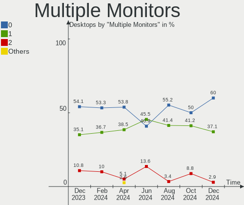
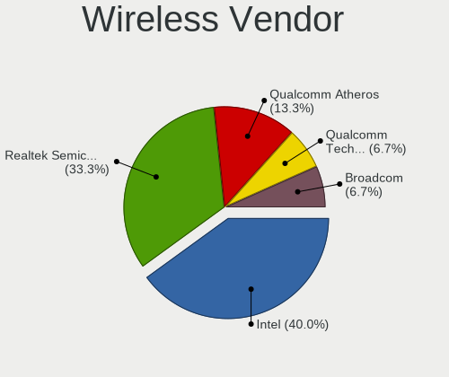

FreeBSD Hardware Trends (Desktops)
----------------------------------

A project to identify most popular hardware characteristics and track their change
over time based on data collected by FreeBSD users at https://BSD-Hardware.info.

Anyone can contribute to this report by the [hw-probe](https://github.com/linuxhw/hw-probe/blob/master/INSTALL.BSD.md) tool:

    hw-probe -all -upload

Full-feature report is available here: https://bsd-hardware.info/?view=trends

Period: Mar, 2022.

Contents
--------

* [ System ](#system)
  - [ OS                       ](#os)
  - [ OS Family                ](#os-family)
  - [ Arch                     ](#arch)
  - [ DE                       ](#de)
  - [ Display Server           ](#display-server)
  - [ Display Manager          ](#display-manager)
  - [ OS Lang                  ](#os-lang)
  - [ Boot Mode                ](#boot-mode)
  - [ Filesystem               ](#filesystem)
  - [ Part. scheme             ](#part-scheme)

* [ Board ](#board)
  - [ Vendor                   ](#vendor)
  - [ Model                    ](#model)
  - [ Model Family             ](#model-family)
  - [ MFG Year                 ](#mfg-year)
  - [ Form Factor              ](#form-factor)
  - [ Coreboot                 ](#coreboot)
  - [ RAM Size                 ](#ram-size)
  - [ RAM Used                 ](#ram-used)
  - [ Total Drives             ](#total-drives)
  - [ Has CD-ROM               ](#has-cd-rom)
  - [ Has Ethernet             ](#has-ethernet)
  - [ Has WiFi                 ](#has-wifi)
  - [ Has Bluetooth            ](#has-bluetooth)

* [ Location ](#location)
  - [ Country                  ](#country)
  - [ City                     ](#city)

* [ Drives ](#drives)
  - [ Drive Vendor             ](#drive-vendor)
  - [ Drive Model              ](#drive-model)
  - [ HDD Vendor               ](#hdd-vendor)
  - [ SSD Vendor               ](#ssd-vendor)
  - [ Drive Kind               ](#drive-kind)
  - [ Drive Connector          ](#drive-connector)
  - [ Drive Size               ](#drive-size)
  - [ Space Total              ](#space-total)
  - [ Space Used               ](#space-used)
  - [ Malfunc. Drives          ](#malfunc-drives)
  - [ Malfunc. Drive Vendor    ](#malfunc-drive-vendor)
  - [ Malfunc. HDD Vendor      ](#malfunc-hdd-vendor)
  - [ Malfunc. Drive Kind      ](#malfunc-drive-kind)
  - [ Failed Drives            ](#failed-drives)
  - [ Failed Drive Vendor      ](#failed-drive-vendor)
  - [ Drive Status             ](#drive-status)

* [ Storage controller ](#storage-controller)
  - [ Storage Vendor           ](#storage-vendor)
  - [ Storage Model            ](#storage-model)
  - [ Storage Kind             ](#storage-kind)

* [ Processor ](#processor)
  - [ CPU Vendor               ](#cpu-vendor)
  - [ CPU Model                ](#cpu-model)
  - [ CPU Model Family         ](#cpu-model-family)
  - [ CPU Cores                ](#cpu-cores)
  - [ CPU Sockets              ](#cpu-sockets)
  - [ CPU Threads              ](#cpu-threads)
  - [ CPU Microarch            ](#cpu-microarch)

* [ Graphics ](#graphics)
  - [ GPU Vendor               ](#gpu-vendor)
  - [ GPU Model                ](#gpu-model)
  - [ GPU Combo                ](#gpu-combo)
  - [ GPU Driver               ](#gpu-driver)
  - [ GPU Memory               ](#gpu-memory)

* [ Monitor ](#monitor)
  - [ Monitor Vendor           ](#monitor-vendor)
  - [ Monitor Model            ](#monitor-model)
  - [ Monitor Resolution       ](#monitor-resolution)
  - [ Monitor Diagonal         ](#monitor-diagonal)
  - [ Monitor Width            ](#monitor-width)
  - [ Aspect Ratio             ](#aspect-ratio)
  - [ Monitor Area             ](#monitor-area)
  - [ Pixel Density            ](#pixel-density)
  - [ Multiple Monitors        ](#multiple-monitors)

* [ Network ](#network)
  - [ Net Controller Vendor    ](#net-controller-vendor)
  - [ Net Controller Model     ](#net-controller-model)
  - [ Wireless Vendor          ](#wireless-vendor)
  - [ Wireless Model           ](#wireless-model)
  - [ Ethernet Vendor          ](#ethernet-vendor)
  - [ Ethernet Model           ](#ethernet-model)
  - [ Net Controller Kind      ](#net-controller-kind)
  - [ Used Controller          ](#used-controller)
  - [ NICs                     ](#nics)
  - [ IPv6                     ](#ipv6)

* [ Bluetooth ](#bluetooth)
  - [ Bluetooth Vendor         ](#bluetooth-vendor)
  - [ Bluetooth Model          ](#bluetooth-model)

* [ Sound ](#sound)
  - [ Sound Vendor             ](#sound-vendor)
  - [ Sound Model              ](#sound-model)

* [ Memory ](#memory)
  - [ Memory Vendor            ](#memory-vendor)
  - [ Memory Model             ](#memory-model)
  - [ Memory Kind              ](#memory-kind)
  - [ Memory Form Factor       ](#memory-form-factor)
  - [ Memory Size              ](#memory-size)
  - [ Memory Speed             ](#memory-speed)

* [ Printers & scanners ](#printers--scanners)
  - [ Printer Vendor           ](#printer-vendor)
  - [ Printer Model            ](#printer-model)
  - [ Scanner Vendor           ](#scanner-vendor)
  - [ Scanner Model            ](#scanner-model)

* [ Camera ](#camera)
  - [ Camera Vendor            ](#camera-vendor)
  - [ Camera Model             ](#camera-model)

* [ Security ](#security)
  - [ Fingerprint Vendor       ](#fingerprint-vendor)
  - [ Fingerprint Model        ](#fingerprint-model)
  - [ Chipcard Vendor          ](#chipcard-vendor)
  - [ Chipcard Model           ](#chipcard-model)

* [ Unsupported ](#unsupported)
  - [ Unsupported Devices      ](#unsupported-devices)
  - [ Unsupported Device Types ](#unsupported-device-types)

System
------

OS
--

Installed operating systems

| Name                    | Desktops | Percent |
|-------------------------|----------|---------|
| FreeBSD 13.0-p10        | 7        | 22.58%  |
| FreeBSD 13.0-p7         | 6        | 19.35%  |
| FreeBSD 13.0            | 5        | 16.13%  |
| FreeBSD 13.0-p8         | 4        | 12.9%   |
| FreeBSD 13.1-BETA2      | 2        | 6.45%   |
| FreeBSD 13.1-PRERELEASE | 1        | 3.23%   |
| FreeBSD 13.1-BETA1      | 1        | 3.23%   |
| FreeBSD 13.0-STABLE     | 1        | 3.23%   |
| FreeBSD 13.0-p5         | 1        | 3.23%   |
| FreeBSD 13.0-p4         | 1        | 3.23%   |
| FreeBSD 12.3-p2         | 1        | 3.23%   |
| FreeBSD 12.1-p22-HBSD   | 1        | 3.23%   |

OS Family
---------

OS without a version

| Name    | Desktops | Percent |
|---------|----------|---------|
| FreeBSD | 31       | 100%    |

Arch
----

OS architecture (x86_64, i586, etc.)

| Name  | Desktops | Percent |
|-------|----------|---------|
| amd64 | 29       | 93.55%  |
| i386  | 2        | 6.45%   |

DE
--

Desktop Environment

| Name      | Desktops | Percent |
|-----------|----------|---------|
| Console   | 14       | 45.16%  |
| KDE5      | 5        | 16.13%  |
| XFCE      | 4        | 12.9%   |
| MATE      | 3        | 9.68%   |
| TWM       | 2        | 6.45%   |
| Openbox   | 2        | 6.45%   |
| AwesomeWM | 1        | 3.23%   |

Display Server
--------------

X11 or Wayland

| Name    | Desktops | Percent |
|---------|----------|---------|
| X11     | 17       | 54.84%  |
| Console | 14       | 45.16%  |

Display Manager
---------------

SDDM, LightDM, etc.

| Name    | Desktops | Percent |
|---------|----------|---------|
| Console | 21       | 67.74%  |
| SDDM    | 6        | 19.35%  |
| SLiM    | 2        | 6.45%   |
| XDM     | 1        | 3.23%   |
| LightDM | 1        | 3.23%   |

OS Lang
-------

Language

| Lang    | Desktops | Percent |
|---------|----------|---------|
| C       | 22       | 70.97%  |
| en_US   | 4        | 12.9%   |
| Unknown | 3        | 9.68%   |
| es_MX   | 1        | 3.23%   |
| de_DE   | 1        | 3.23%   |

Boot Mode
---------

EFI or BIOS

| Mode | Desktops | Percent |
|------|----------|---------|
| EFI  | 22       | 70.97%  |
| BIOS | 9        | 29.03%  |

Filesystem
----------

Type of filesystem

| Type | Desktops | Percent |
|------|----------|---------|
| Zfs  | 21       | 67.74%  |
| Ufs  | 10       | 32.26%  |

Part. scheme
------------

Scheme of partitioning

| Type | Desktops | Percent |
|------|----------|---------|
| GPT  | 29       | 93.55%  |
| MBR  | 1        | 3.23%   |
| BSD  | 1        | 3.23%   |

Board
-----

Vendor
------

Motherboard manufacturer

| Name                | Desktops | Percent |
|---------------------|----------|---------|
| ASUSTek Computer    | 13       | 41.94%  |
| MSI                 | 4        | 12.9%   |
| Gigabyte Technology | 4        | 12.9%   |
| ASRock              | 4        | 12.9%   |
| Intel               | 2        | 6.45%   |
| Supermicro          | 1        | 3.23%   |
| Huanan              | 1        | 3.23%   |
| Hewlett-Packard     | 1        | 3.23%   |
| Unknown             | 1        | 3.23%   |

Model
-----

Motherboard model

| Name                                 | Desktops | Percent |
|--------------------------------------|----------|---------|
| ASUS PRO B460M-C                     | 2        | 6.45%   |
| ASUS PRIME B550M-A                   | 2        | 6.45%   |
| Supermicro SYS-5019A-12TN4           | 1        | 3.23%   |
| MSI U-100                            | 1        | 3.23%   |
| MSI MS-A62211                        | 1        | 3.23%   |
| MSI MS-7C02                          | 1        | 3.23%   |
| MSI MS-7817                          | 1        | 3.23%   |
| Intel DX79TO AAG28805-401            | 1        | 3.23%   |
| Intel D865PERL AAC27646-213          | 1        | 3.23%   |
| Huanan X99-F8D V2.4                  | 1        | 3.23%   |
| HP Z620 Workstation                  | 1        | 3.23%   |
| Gigabyte GA-78LMT-USB3 6.0           | 1        | 3.23%   |
| Gigabyte C246-WU4                    | 1        | 3.23%   |
| Gigabyte B550I AORUS PRO AX          | 1        | 3.23%   |
| Gigabyte AB350M-Gaming 3             | 1        | 3.23%   |
| ASUS ROG CROSSHAIR VIII HERO         | 1        | 3.23%   |
| ASUS PRIME Z590-P                    | 1        | 3.23%   |
| ASUS PRIME X370-PRO                  | 1        | 3.23%   |
| ASUS PRIME B350M-A                   | 1        | 3.23%   |
| ASUS P5Q-E                           | 1        | 3.23%   |
| ASUS P5KPL-CM                        | 1        | 3.23%   |
| ASUS P5K PRO                         | 1        | 3.23%   |
| ASUS M4A78T-E                        | 1        | 3.23%   |
| ASUS ASUS EXPERTCENTER D700SA_D700SA | 1        | 3.23%   |
| ASRock X570 Pro4                     | 1        | 3.23%   |
| ASRock X570 Phantom Gaming 4         | 1        | 3.23%   |
| ASRock Q1900B-ITX                    | 1        | 3.23%   |
| ASRock H61M-VG3                      | 1        | 3.23%   |
| Unknown                              | 1        | 3.23%   |

Model Family
------------

Motherboard model prefix

| Name                       | Desktops | Percent |
|----------------------------|----------|---------|
| ASUS PRIME                 | 5        | 16.13%  |
| ASUS PRO                   | 2        | 6.45%   |
| ASRock X570                | 2        | 6.45%   |
| Supermicro SYS-5019A-12TN4 | 1        | 3.23%   |
| MSI U-100                  | 1        | 3.23%   |
| MSI MS-A62211              | 1        | 3.23%   |
| MSI MS-7C02                | 1        | 3.23%   |
| MSI MS-7817                | 1        | 3.23%   |
| Intel DX79TO               | 1        | 3.23%   |
| Intel D865PERL             | 1        | 3.23%   |
| Huanan X99-F8D             | 1        | 3.23%   |
| HP Z620                    | 1        | 3.23%   |
| Gigabyte GA-78LMT-USB3     | 1        | 3.23%   |
| Gigabyte C246-WU4          | 1        | 3.23%   |
| Gigabyte B550I             | 1        | 3.23%   |
| Gigabyte AB350M-Gaming     | 1        | 3.23%   |
| ASUS ROG                   | 1        | 3.23%   |
| ASUS P5Q-E                 | 1        | 3.23%   |
| ASUS P5KPL-CM              | 1        | 3.23%   |
| ASUS P5K                   | 1        | 3.23%   |
| ASUS M4A78T-E              | 1        | 3.23%   |
| ASUS ASUS                  | 1        | 3.23%   |
| ASRock Q1900B-ITX          | 1        | 3.23%   |
| ASRock H61M-VG3            | 1        | 3.23%   |
| Unknown                    | 1        | 3.23%   |

MFG Year
--------

Motherboard manufacture year

| Year | Desktops | Percent |
|------|----------|---------|
| 2021 | 6        | 19.35%  |
| 2019 | 5        | 16.13%  |
| 2020 | 4        | 12.9%   |
| 2014 | 4        | 12.9%   |
| 2017 | 3        | 9.68%   |
| 2008 | 3        | 9.68%   |
| 2015 | 1        | 3.23%   |
| 2013 | 1        | 3.23%   |
| 2012 | 1        | 3.23%   |
| 2011 | 1        | 3.23%   |
| 2009 | 1        | 3.23%   |
| 2004 | 1        | 3.23%   |

Form Factor
-----------

Physical design of the computer

| Name    | Desktops | Percent |
|---------|----------|---------|
| Desktop | 31       | 100%    |

Coreboot
--------

Have coreboot on board

| Used | Desktops | Percent |
|------|----------|---------|
| No   | 31       | 100%    |

RAM Size
--------

Total RAM memory

| Size in GB  | Desktops | Percent |
|-------------|----------|---------|
| 4.01-8.0    | 9        | 29.03%  |
| 32.01-64.0  | 9        | 29.03%  |
| 64.01-256.0 | 6        | 19.35%  |
| 16.01-24.0  | 4        | 12.9%   |
| 8.01-16.0   | 2        | 6.45%   |
| 2.01-3.0    | 1        | 3.23%   |

RAM Used
--------

Used RAM memory

| Used GB     | Desktops | Percent |
|-------------|----------|---------|
| 0.01-0.5    | 11       | 35.48%  |
| 0.51-1.0    | 7        | 22.58%  |
| 1.01-2.0    | 6        | 19.35%  |
| 3.01-4.0    | 3        | 9.68%   |
| 2.01-3.0    | 3        | 9.68%   |
| 64.01-256.0 | 1        | 3.23%   |

Total Drives
------------

Number of drives on board

| Drives | Desktops | Percent |
|--------|----------|---------|
| 1      | 12       | 38.71%  |
| 3      | 7        | 22.58%  |
| 2      | 6        | 19.35%  |
| 4      | 3        | 9.68%   |
| 13     | 1        | 3.23%   |
| 9      | 1        | 3.23%   |
| 5      | 1        | 3.23%   |

Has CD-ROM
----------

Has CD-ROM on board

| Presented | Desktops | Percent |
|-----------|----------|---------|
| No        | 22       | 70.97%  |
| Yes       | 9        | 29.03%  |

Has Ethernet
------------

Has Ethernet on board

| Presented | Desktops | Percent |
|-----------|----------|---------|
| Yes       | 31       | 100%    |

Has WiFi
--------

Has WiFi module

| Presented | Desktops | Percent |
|-----------|----------|---------|
| No        | 24       | 77.42%  |
| Yes       | 7        | 22.58%  |

Has Bluetooth
-------------

Has Bluetooth module

| Presented | Desktops | Percent |
|-----------|----------|---------|
| No        | 25       | 80.65%  |
| Yes       | 6        | 19.35%  |

Location
--------

Country
-------

Geographic location (country)

| Country  | Desktops | Percent |
|----------|----------|---------|
| USA      | 13       | 41.94%  |
| Germany  | 5        | 16.13%  |
| France   | 2        | 6.45%   |
| Sweden   | 1        | 3.23%   |
| Spain    | 1        | 3.23%   |
| Serbia   | 1        | 3.23%   |
| Russia   | 1        | 3.23%   |
| Poland   | 1        | 3.23%   |
| Mexico   | 1        | 3.23%   |
| Hungary  | 1        | 3.23%   |
| Croatia  | 1        | 3.23%   |
| Canada   | 1        | 3.23%   |
| Bulgaria | 1        | 3.23%   |
| Brazil   | 1        | 3.23%   |

City
----

Geographic location (city)

| City           | Desktops | Percent |
|----------------|----------|---------|
| Tamm           | 2        | 6.45%   |
| Salem          | 2        | 6.45%   |
| Redmond        | 2        | 6.45%   |
| Zagreb         | 1        | 3.23%   |
| Wenatchee      | 1        | 3.23%   |
| Toronto        | 1        | 3.23%   |
| Teaneck        | 1        | 3.23%   |
| Stockholm      | 1        | 3.23%   |
| Sofia          | 1        | 3.23%   |
| Rochefort      | 1        | 3.23%   |
| Rio de Janeiro | 1        | 3.23%   |
| Portland       | 1        | 3.23%   |
| Paris          | 1        | 3.23%   |
| Oviedo         | 1        | 3.23%   |
| Moscow         | 1        | 3.23%   |
| Mexico City    | 1        | 3.23%   |
| Mexico         | 1        | 3.23%   |
| Majadahonda    | 1        | 3.23%   |
| Lüneburg      | 1        | 3.23%   |
| Gdansk         | 1        | 3.23%   |
| Frisco         | 1        | 3.23%   |
| Clovis         | 1        | 3.23%   |
| Chicago        | 1        | 3.23%   |
| Canton         | 1        | 3.23%   |
| Budapest       | 1        | 3.23%   |
| Bonn           | 1        | 3.23%   |
| Belgrade       | 1        | 3.23%   |
| Augsburg       | 1        | 3.23%   |

Drives
------

Drive Vendor
------------

Hard drive vendors

| Vendor              | Desktops | Drives | Percent |
|---------------------|----------|--------|---------|
| WDC                 | 13       | 27     | 24.07%  |
| Samsung Electronics | 12       | 17     | 22.22%  |
| Seagate             | 8        | 16     | 14.81%  |
| Kingston            | 4        | 4      | 7.41%   |
| Intel               | 3        | 3      | 5.56%   |
| KIOXIA-EXCERIA      | 2        | 4      | 3.7%    |
| Hitachi             | 2        | 2      | 3.7%    |
| Toshiba             | 1        | 1      | 1.85%   |
| SPCC                | 1        | 1      | 1.85%   |
| SanDisk             | 1        | 1      | 1.85%   |
| LDLC                | 1        | 1      | 1.85%   |
| Hoodisk             | 1        | 1      | 1.85%   |
| Hewlett-Packard     | 1        | 1      | 1.85%   |
| GOODRAM             | 1        | 1      | 1.85%   |
| Crucial             | 1        | 2      | 1.85%   |
| Corsair             | 1        | 1      | 1.85%   |
| A-DATA Technology   | 1        | 1      | 1.85%   |

Drive Model
-----------

Hard drive models

| Model                                      | Desktops | Percent |
|--------------------------------------------|----------|---------|
| Seagate ST4000DM000-1F2168 4TB             | 2        | 2.82%   |
| KIOXIA-EXCERIA SSD 500GB                   | 2        | 2.82%   |
| WDC WDS500G3X0C-00SJG0 500GB               | 1        | 1.41%   |
| WDC WDBRPG5000ANC-WRSN 500GB               | 1        | 1.41%   |
| WDC WD80EMAZ-00WJTA0 8TB                   | 1        | 1.41%   |
| WDC WD80EFZX-68UW8N0 8TB                   | 1        | 1.41%   |
| WDC WD80EFAX-68LHPN0 8TB                   | 1        | 1.41%   |
| WDC WD80EDBZ-11B0ZA0 8TB                   | 1        | 1.41%   |
| WDC WD50EFRX-68L0BN1 5TB                   | 1        | 1.41%   |
| WDC WD40EZRZ-22GXCB0 4TB                   | 1        | 1.41%   |
| WDC WD3200AAJS-65B4A0 320GB                | 1        | 1.41%   |
| WDC WD20SDZW-11JJ8S0 2TB                   | 1        | 1.41%   |
| WDC WD20SDRW-11VUUS0 2TB                   | 1        | 1.41%   |
| WDC WD20NMVW-59EDZS7 2TB                   | 1        | 1.41%   |
| WDC WD20NMVW-11AV3S2 2TB                   | 1        | 1.41%   |
| WDC WD20EZRZ-00Z5HB0 2TB                   | 1        | 1.41%   |
| WDC WD2000JD-00FYB0 200GB                  | 1        | 1.41%   |
| WDC WD181KFGX-68AFPN0 18TB                 | 1        | 1.41%   |
| WDC WD15EADS-00P8B0 1.5TB                  | 1        | 1.41%   |
| WDC WD120EMFZ-11A6JA0 12TB                 | 1        | 1.41%   |
| WDC WD120EMAZ-11BLFA0 12TB                 | 1        | 1.41%   |
| WDC WD1200BEVT-22ZCT0 120GB                | 1        | 1.41%   |
| WDC WD10EZEX-08WN4A0 1TB                   | 1        | 1.41%   |
| WDC WD10EZEX-00RKKA0 1TB                   | 1        | 1.41%   |
| WDC WD10EZEX-00BBHA0 1TB                   | 1        | 1.41%   |
| Toshiba DT01ACA100 1TB                     | 1        | 1.41%   |
| SPCC SPCCSolidStateDisk 256GB              | 1        | 1.41%   |
| Seagate ST3500418AS 500GB                  | 1        | 1.41%   |
| Seagate ST3160023AS 160GB                  | 1        | 1.41%   |
| Seagate ST2000DM008-2FR102 2TB             | 1        | 1.41%   |
| Seagate ST20000NM007D-3DJ103 20TB          | 1        | 1.41%   |
| Seagate ST14000NM0018-2H4101 14TB          | 1        | 1.41%   |
| Seagate ST12000NM0007-2A1101 12TB          | 1        | 1.41%   |
| Seagate ST1000LM024 HN-M101MBB 1TB         | 1        | 1.41%   |
| Seagate ST1000LM014-1EJ164-SSHD 1TB        | 1        | 1.41%   |
| Seagate FireCuda 120 SSD ZA2000GM10001 2TB | 1        | 1.41%   |
| Seagate FireCuda 120 SSD ZA1000GM10001 1TB | 1        | 1.41%   |
| SanDisk SDSSDH3500G 500GB                  | 1        | 1.41%   |
| Samsung SSD 980 PRO 500GB                  | 1        | 1.41%   |
| Samsung SSD 970 EVO Plus 500GB             | 1        | 1.41%   |
| Samsung SSD 970 EVO 1TB                    | 1        | 1.41%   |
| Samsung SSD 960 EVO 500GB                  | 1        | 1.41%   |
| Samsung SSD 960 EVO 250GB                  | 1        | 1.41%   |
| Samsung SSD 960 EVO 1TB                    | 1        | 1.41%   |
| Samsung SSD 870 QVO 2TB                    | 1        | 1.41%   |
| Samsung SSD 870 EVO 500GB                  | 1        | 1.41%   |
| Samsung SSD 860 QVO 1TB                    | 1        | 1.41%   |
| Samsung SSD 860 EVO 500GB                  | 1        | 1.41%   |
| Samsung SSD 850 EVO 1TB                    | 1        | 1.41%   |
| Samsung SSD 840 EVO 500GB                  | 1        | 1.41%   |
| Samsung MZVLB256HBHQ-00000 256GB           | 1        | 1.41%   |
| Samsung HD250HJ 250GB                      | 1        | 1.41%   |
| Samsung HD161GJ 160GB                      | 1        | 1.41%   |
| LDLC F8+M.2 480 480GB                      | 1        | 1.41%   |
| Kingston SV300S37A120G 120GB               | 1        | 1.41%   |
| Kingston SKC2500M8250G 250GB               | 1        | 1.41%   |
| Kingston SA400S37960G 960GB                | 1        | 1.41%   |
| Kingston SA400S37120G 120GB                | 1        | 1.41%   |
| Intel SSDSC2BF180A4L 180GB                 | 1        | 1.41%   |
| Intel SSDSC2BB120G4 120GB                  | 1        | 1.41%   |

HDD Vendor
----------

Hard disk drive vendors

| Vendor              | Desktops | Drives | Percent |
|---------------------|----------|--------|---------|
| WDC                 | 12       | 25     | 46.15%  |
| Seagate             | 8        | 13     | 30.77%  |
| Samsung Electronics | 2        | 2      | 7.69%   |
| Hitachi             | 2        | 2      | 7.69%   |
| Toshiba             | 1        | 1      | 3.85%   |
| Hewlett-Packard     | 1        | 1      | 3.85%   |

SSD Vendor
----------

Solid state drive vendors

| Vendor              | Desktops | Drives | Percent |
|---------------------|----------|--------|---------|
| Samsung Electronics | 5        | 8      | 31.25%  |
| Kingston            | 3        | 3      | 18.75%  |
| Intel               | 2        | 2      | 12.5%   |
| SPCC                | 1        | 1      | 6.25%   |
| Seagate             | 1        | 3      | 6.25%   |
| SanDisk             | 1        | 1      | 6.25%   |
| Hoodisk             | 1        | 1      | 6.25%   |
| Crucial             | 1        | 2      | 6.25%   |
| A-DATA Technology   | 1        | 1      | 6.25%   |

Drive Kind
----------

HDD or SSD

| Kind | Desktops | Drives | Percent |
|------|----------|--------|---------|
| HDD  | 20       | 44     | 42.55%  |
| SSD  | 14       | 22     | 29.79%  |
| NVMe | 13       | 18     | 27.66%  |

Drive Connector
---------------

SATA, SAS, NVMe, etc.

| Type | Desktops | Drives | Percent |
|------|----------|--------|---------|
| SATA | 24       | 66     | 64.86%  |
| NVMe | 13       | 18     | 35.14%  |

Drive Size
----------

Size of hard drive

| Size in TB | Desktops | Drives | Percent |
|------------|----------|--------|---------|
| 0.01-0.5   | 16       | 22     | 41.03%  |
| 0.51-1.0   | 10       | 12     | 25.64%  |
| 1.01-2.0   | 6        | 11     | 15.38%  |
| 10.01-20.0 | 3        | 9      | 7.69%   |
| 3.01-4.0   | 2        | 3      | 5.13%   |
| 4.01-10.0  | 2        | 9      | 5.13%   |

Space Total
-----------

Amount of disk space available on the file system

| Size in GB     | Desktops | Percent |
|----------------|----------|---------|
| 251-500        | 12       | 38.71%  |
| 101-250        | 11       | 35.48%  |
| 501-1000       | 4        | 12.9%   |
| 51-100         | 2        | 6.45%   |
| More than 3000 | 1        | 3.23%   |
| 2001-3000      | 1        | 3.23%   |

Space Used
----------

Amount of used disk space

| Used GB   | Desktops | Percent |
|-----------|----------|---------|
| 1-20      | 27       | 87.1%   |
| 21-50     | 2        | 6.45%   |
| 2001-3000 | 1        | 3.23%   |
| 101-250   | 1        | 3.23%   |

Malfunc. Drives
---------------

Drive models with a malfunction

| Model                           | Desktops | Drives | Percent |
|---------------------------------|----------|--------|---------|
| WDC WD50EFRX-68L0BN1 5TB        | 1        | 1      | 33.33%  |
| Seagate ST3160023AS 160GB       | 1        | 1      | 33.33%  |
| Hewlett-Packard MB1000GCWCV 1TB | 1        | 1      | 33.33%  |

Malfunc. Drive Vendor
---------------------

Vendors of faulty drives

| Vendor          | Desktops | Drives | Percent |
|-----------------|----------|--------|---------|
| WDC             | 1        | 1      | 33.33%  |
| Seagate         | 1        | 1      | 33.33%  |
| Hewlett-Packard | 1        | 1      | 33.33%  |

Malfunc. HDD Vendor
-------------------

Vendors of faulty HDD drives

| Vendor          | Desktops | Drives | Percent |
|-----------------|----------|--------|---------|
| WDC             | 1        | 1      | 33.33%  |
| Seagate         | 1        | 1      | 33.33%  |
| Hewlett-Packard | 1        | 1      | 33.33%  |

Malfunc. Drive Kind
-------------------

Kinds of faulty drives

| Kind | Desktops | Drives | Percent |
|------|----------|--------|---------|
| HDD  | 3        | 3      | 100%    |

Failed Drives
-------------

Failed drive models

Zero info for selected period =(

Failed Drive Vendor
-------------------

Failed drive vendors

Zero info for selected period =(

Drive Status
------------

Number of failed and malfunc. drives

| Status   | Desktops | Drives | Percent |
|----------|----------|--------|---------|
| Works    | 29       | 78     | 85.29%  |
| Malfunc  | 3        | 3      | 8.82%   |
| Detected | 2        | 3      | 5.88%   |

Storage controller
------------------

Storage Vendor
--------------

Storage controller vendors

| Vendor                      | Desktops | Percent |
|-----------------------------|----------|---------|
| Intel                       | 21       | 40.38%  |
| AMD                         | 12       | 23.08%  |
| Samsung Electronics         | 6        | 11.54%  |
| Marvell Technology Group    | 3        | 5.77%   |
| Silicon Motion              | 2        | 3.85%   |
| Sandisk                     | 2        | 3.85%   |
| KIOXIA                      | 2        | 3.85%   |
| Phison Electronics          | 1        | 1.92%   |
| Kingston Technology Company | 1        | 1.92%   |
| Broadcom / LSI              | 1        | 1.92%   |
| ASMedia Technology          | 1        | 1.92%   |

Storage Model
-------------

Storage controller models

| Model                                                                          | Desktops | Percent |
|--------------------------------------------------------------------------------|----------|---------|
| AMD FCH SATA Controller [AHCI mode]                                            | 7        | 11.11%  |
| Samsung NVMe SSD Controller SM981/PM981/PM983                                  | 3        | 4.76%   |
| Samsung NVMe SSD Controller SM961/PM961/SM963                                  | 3        | 4.76%   |
| Intel 400 Series Chipset Family SATA AHCI Controller                           | 3        | 4.76%   |
| AMD 500 Series Chipset SATA Controller                                         | 3        | 4.76%   |
| Silicon Motion SM2263EN/SM2263XT SSD Controller                                | 2        | 3.17%   |
| Sandisk WD Black SN750 / PC SN730 NVMe SSD                                     | 2        | 3.17%   |
| KIOXIA NVMe SSD                                                                | 2        | 3.17%   |
| Intel Atom Processor E3800 Series SATA AHCI Controller                         | 2        | 3.17%   |
| AMD SB7x0/SB8x0/SB9x0 IDE Controller                                           | 2        | 3.17%   |
| AMD 300 Series Chipset SATA Controller                                         | 2        | 3.17%   |
| Samsung NVMe SSD Controller PM9A1/PM9A3/980PRO                                 | 1        | 1.59%   |
| Phison E16 PCIe4 NVMe Controller                                               | 1        | 1.59%   |
| Marvell Group 88SE9235 PCIe 2.0 x2 4-port SATA 6 Gb/s Controller               | 1        | 1.59%   |
| Marvell Group 88SE6111/6121 SATA II / PATA Controller                          | 1        | 1.59%   |
| Marvell Group 88SE6101/6102 single-port PATA133 interface                      | 1        | 1.59%   |
| Kingston Company KC2000 NVMe SSD                                               | 1        | 1.59%   |
| Intel Sunrise Point-LP SATA Controller [AHCI mode]                             | 1        | 1.59%   |
| Intel SSD 660P Series                                                          | 1        | 1.59%   |
| Intel NM10/ICH7 Family SATA Controller [IDE mode]                              | 1        | 1.59%   |
| Intel Jasper Lake SATA AHCI Controller                                         | 1        | 1.59%   |
| Intel Cannon Lake PCH SATA AHCI Controller                                     | 1        | 1.59%   |
| Intel C610/X99 series chipset sSATA Controller [AHCI mode]                     | 1        | 1.59%   |
| Intel C602 chipset 4-Port SATA Storage Control Unit                            | 1        | 1.59%   |
| Intel C600/X79 series chipset SATA RAID Controller                             | 1        | 1.59%   |
| Intel C600/X79 series chipset IDE-r Controller                                 | 1        | 1.59%   |
| Intel C600/X79 series chipset 6-Port SATA AHCI Controller                      | 1        | 1.59%   |
| Intel Atom Processor C3000 Series SATA Controller 1                            | 1        | 1.59%   |
| Intel 82801JI (ICH10 Family) SATA AHCI Controller                              | 1        | 1.59%   |
| Intel 82801IR/IO/IH (ICH9R/DO/DH) 6 port SATA Controller [AHCI mode]           | 1        | 1.59%   |
| Intel 82801GBM/GHM (ICH7-M Family) SATA Controller [IDE mode]                  | 1        | 1.59%   |
| Intel 82801G (ICH7 Family) IDE Controller                                      | 1        | 1.59%   |
| Intel 82801EB/ER (ICH5/ICH5R) IDE Controller                                   | 1        | 1.59%   |
| Intel 82801EB (ICH5) SATA Controller                                           | 1        | 1.59%   |
| Intel 8 Series/C220 Series Chipset Family 6-port SATA Controller 1 [AHCI mode] | 1        | 1.59%   |
| Intel 6 Series/C200 Series Chipset Family 6 port Desktop SATA AHCI Controller  | 1        | 1.59%   |
| Intel 500 Series Chipset Family SATA AHCI Controller                           | 1        | 1.59%   |
| Broadcom / LSI SAS2008 PCI-Express Fusion-MPT SAS-2 [Falcon]                   | 1        | 1.59%   |
| ASMedia ASM1062 Serial ATA Controller                                          | 1        | 1.59%   |
| AMD X370 Series Chipset SATA Controller                                        | 1        | 1.59%   |
| AMD SB7x0/SB8x0/SB9x0 SATA Controller [IDE mode]                               | 1        | 1.59%   |
| AMD SB7x0/SB8x0/SB9x0 SATA Controller [AHCI mode]                              | 1        | 1.59%   |
| AMD 400 Series Chipset SATA Controller                                         | 1        | 1.59%   |

Storage Kind
------------

Kind of storage controller (IDE, SATA, NVMe, SAS, ...)

| Kind | Desktops | Percent |
|------|----------|---------|
| SATA | 27       | 52.94%  |
| NVMe | 13       | 25.49%  |
| IDE  | 8        | 15.69%  |
| SAS  | 2        | 3.92%   |
| RAID | 1        | 1.96%   |

Processor
---------

CPU Vendor
----------

Processor vendors

| Vendor | Desktops | Percent |
|--------|----------|---------|
| Intel  | 19       | 61.29%  |
| AMD    | 12       | 38.71%  |

CPU Model
---------

Processor models

| Model                                       | Desktops | Percent |
|---------------------------------------------|----------|---------|
| Intel Core i3-10100 CPU @ 3.60GHz           | 3        | 9.68%   |
| Intel Celeron CPU J1900 @ 1.99GHz           | 2        | 6.45%   |
| AMD Ryzen 9 3900X 12-Core Processor         | 2        | 6.45%   |
| AMD Ryzen 7 1700 Eight-Core Processor       | 2        | 6.45%   |
| Intel Xeon CPU E5-2680 v4 @ 2.40GHz         | 1        | 3.23%   |
| Intel Xeon CPU E5-2670 @ 2.60GHz            | 1        | 3.23%   |
| Intel Xeon CPU E5-1620 0 @ 3.60GHz          | 1        | 3.23%   |
| Intel Pentium CPU G3220 @ 3.00GHz           | 1        | 3.23%   |
| Intel Pentium CPU G2030 @ 3.00GHz           | 1        | 3.23%   |
| Intel Pentium 4 processor                   | 1        | 3.23%   |
| Intel Pentium 4 CPU 3.40GHz                 | 1        | 3.23%   |
| Intel Core i9-9900K CPU @ 3.60GHz           | 1        | 3.23%   |
| Intel Core 2 Quad CPU Q6600 @ 2.40GHz       | 1        | 3.23%   |
| Intel Core 2 Duo CPU E6750 @ 2.66GHz        | 1        | 3.23%   |
| Intel Celeron CPU 3865U @ 1.80GHz           | 1        | 3.23%   |
| Intel Atom CPU N270 @ 1.60GH                | 1        | 3.23%   |
| Intel Atom CPU C3850 @ 2.10GHz              | 1        | 3.23%   |
| Intel 11th Gen Core i7-11700 @ 2.50GHz      | 1        | 3.23%   |
| AMD Ryzen 7 5700G with Radeon Graphics      | 1        | 3.23%   |
| AMD Ryzen 7 3800X 8-Core Processor          | 1        | 3.23%   |
| AMD Ryzen 7 3700X 8-Core Processor          | 1        | 3.23%   |
| AMD Ryzen 7 2700X Eight-Core Processor      | 1        | 3.23%   |
| AMD Ryzen 5 5600G with Radeon Graphics      | 1        | 3.23%   |
| AMD Ryzen 5 2400G with Radeon Vega Graphics | 1        | 3.23%   |
| AMD Phenom II X3 720 Processor              | 1        | 3.23%   |
| AMD FX-6300 Six-Core Processor              | 1        | 3.23%   |

CPU Model Family
----------------

Processor model prefix

| Model             | Desktops | Percent |
|-------------------|----------|---------|
| AMD Ryzen 7       | 6        | 19.35%  |
| Intel Xeon        | 3        | 9.68%   |
| Intel Core i3     | 3        | 9.68%   |
| Intel Celeron     | 3        | 9.68%   |
| Intel Pentium 4   | 2        | 6.45%   |
| Intel Pentium     | 2        | 6.45%   |
| Intel Atom        | 2        | 6.45%   |
| AMD Ryzen 9       | 2        | 6.45%   |
| AMD Ryzen 5       | 2        | 6.45%   |
| Other             | 1        | 3.23%   |
| Intel Core i9     | 1        | 3.23%   |
| Intel Core 2 Quad | 1        | 3.23%   |
| Intel Core 2 Duo  | 1        | 3.23%   |
| AMD Phenom II X3  | 1        | 3.23%   |
| AMD FX            | 1        | 3.23%   |

CPU Cores
---------

Number of processor cores

| Number  | Desktops | Percent |
|---------|----------|---------|
| 4       | 7        | 22.58%  |
| 16      | 6        | 19.35%  |
| 8       | 4        | 12.9%   |
| 2       | 3        | 9.68%   |
| Unknown | 3        | 9.68%   |
| 24      | 2        | 6.45%   |
| 12      | 2        | 6.45%   |
| 28      | 1        | 3.23%   |
| 6       | 1        | 3.23%   |
| 3       | 1        | 3.23%   |
| 1       | 1        | 3.23%   |

CPU Sockets
-----------

Number of sockets

| Number | Desktops | Percent |
|--------|----------|---------|
| 1      | 30       | 96.77%  |
| 2      | 1        | 3.23%   |

CPU Threads
-----------

Threads per core (Hyper-Threading)

| Number  | Desktops | Percent |
|---------|----------|---------|
| 1       | 19       | 61.29%  |
| 2       | 8        | 25.81%  |
| Unknown | 4        | 12.9%   |

CPU Microarch
-------------

Microarchitecture

| Name        | Desktops | Percent |
|-------------|----------|---------|
| Zen 2       | 4        | 12.9%   |
| Zen         | 3        | 9.68%   |
| CometLake   | 3        | 9.68%   |
| Zen 3       | 2        | 6.45%   |
| Silvermont  | 2        | 6.45%   |
| SandyBridge | 2        | 6.45%   |
| NetBurst    | 2        | 6.45%   |
| KabyLake    | 2        | 6.45%   |
| Core        | 2        | 6.45%   |
| Zen+        | 1        | 3.23%   |
| Piledriver  | 1        | 3.23%   |
| K10         | 1        | 3.23%   |
| IvyBridge   | 1        | 3.23%   |
| Haswell     | 1        | 3.23%   |
| Goldmont    | 1        | 3.23%   |
| Broadwell   | 1        | 3.23%   |
| Bonnell     | 1        | 3.23%   |
| Unknown     | 1        | 3.23%   |

Graphics
--------

GPU Vendor
----------

Vendors of graphics cards

| Vendor            | Desktops | Percent |
|-------------------|----------|---------|
| Intel             | 12       | 38.71%  |
| Nvidia            | 10       | 32.26%  |
| AMD               | 8        | 25.81%  |
| ASPEED Technology | 1        | 3.23%   |

GPU Model
---------

Graphics card models

| Model                                                                         | Desktops | Percent |
|-------------------------------------------------------------------------------|----------|---------|
| Nvidia GK208B [GeForce GT 710]                                                | 3        | 9.38%   |
| Intel CometLake-S GT2 [UHD Graphics 630]                                      | 3        | 9.38%   |
| Intel Atom Processor Z36xxx/Z37xxx Series Graphics & Display                  | 2        | 6.25%   |
| AMD Cezanne                                                                   | 2        | 6.25%   |
| Nvidia TU104GL [Quadro RTX 4000]                                              | 1        | 3.13%   |
| Nvidia NV34 [GeForce FX 5200]                                                 | 1        | 3.13%   |
| Nvidia GT218 [NVS 300]                                                        | 1        | 3.13%   |
| Nvidia GP108 [GeForce GT 1030]                                                | 1        | 3.13%   |
| Nvidia GP107 [GeForce GTX 1050 Ti]                                            | 1        | 3.13%   |
| Nvidia GP106 [GeForce GTX 1060 3GB]                                           | 1        | 3.13%   |
| Nvidia GM107GL [Quadro K2200]                                                 | 1        | 3.13%   |
| Intel Xeon E3-1200 v3/4th Gen Core Processor Integrated Graphics Controller   | 1        | 3.13%   |
| Intel Xeon E3-1200 v2/3rd Gen Core processor Graphics Controller              | 1        | 3.13%   |
| Intel RocketLake-S GT1 [UHD Graphics 750]                                     | 1        | 3.13%   |
| Intel Mobile 945GSE Express Integrated Graphics Controller                    | 1        | 3.13%   |
| Intel Mobile 945GM/GMS/GME, 943/940GML Express Integrated Graphics Controller | 1        | 3.13%   |
| Intel Kaby Lake-U GT1 Integrated Graphics Controller                          | 1        | 3.13%   |
| Intel JasperLake [UHD Graphics]                                               | 1        | 3.13%   |
| Intel 82G33/G31 Express Integrated Graphics Controller                        | 1        | 3.13%   |
| ASPEED Technology ASPEED Graphics Family                                      | 1        | 3.13%   |
| AMD RV710 [Radeon HD 4350/4550]                                               | 1        | 3.13%   |
| AMD Raven Ridge [Radeon Vega Series / Radeon Vega Mobile Series]              | 1        | 3.13%   |
| AMD Navi 10 [Radeon RX 5600 OEM/5600 XT / 5700/5700 XT]                       | 1        | 3.13%   |
| AMD Ellesmere [Radeon RX 470/480/570/570X/580/580X/590]                       | 1        | 3.13%   |
| AMD Cedar [Radeon HD 5000/6000/7350/8350 Series]                              | 1        | 3.13%   |
| AMD Caicos PRO [Radeon HD 7450]                                               | 1        | 3.13%   |

GPU Combo
---------

Combinations of graphics cards

| Name       | Desktops | Percent |
|------------|----------|---------|
| 1 x Nvidia | 10       | 32.26%  |
| 1 x Intel  | 10       | 32.26%  |
| 1 x AMD    | 8        | 25.81%  |
| Other      | 1        | 3.23%   |
| 2 x Intel  | 1        | 3.23%   |
| 1 x ASPEED | 1        | 3.23%   |

GPU Driver
----------

Free vs proprietary

| Driver      | Desktops | Percent |
|-------------|----------|---------|
| Free        | 24       | 77.42%  |
| Proprietary | 6        | 19.35%  |
| Unknown     | 1        | 3.23%   |

GPU Memory
----------

Total video memory

| Size in GB | Desktops | Percent |
|------------|----------|---------|
| Unknown    | 20       | 64.52%  |
| 7.01-8.0   | 3        | 9.68%   |
| 1.01-2.0   | 3        | 9.68%   |
| 3.01-4.0   | 2        | 6.45%   |
| 0.01-0.5   | 2        | 6.45%   |
| 0.51-1.0   | 1        | 3.23%   |

Monitor
-------

Monitor Vendor
--------------

Monitor vendors

| Vendor              | Desktops | Percent |
|---------------------|----------|---------|
| Dell                | 4        | 25%     |
| ViewSonic           | 2        | 12.5%   |
| Samsung Electronics | 2        | 12.5%   |
| Sony                | 1        | 6.25%   |
| Philips             | 1        | 6.25%   |
| Mi                  | 1        | 6.25%   |
| LG Electronics      | 1        | 6.25%   |
| Hewlett-Packard     | 1        | 6.25%   |
| Goldstar            | 1        | 6.25%   |
| BOE                 | 1        | 6.25%   |
| Acer                | 1        | 6.25%   |

Monitor Model
-------------

Monitor models

| Model                                                             | Desktops | Percent |
|-------------------------------------------------------------------|----------|---------|
| ViewSonic LCD Monitor VSCFA2B 1920x1080 510x290mm 23.1-inch       | 1        | 6.25%   |
| ViewSonic LCD Monitor VSCD22B 1920x1080 520x290mm 23.4-inch       | 1        | 6.25%   |
| Sony TV  *00 SNYF903 3840x2160 950x540mm 43.0-inch                | 1        | 6.25%   |
| Samsung Electronics S22B300 SAM08AC 1920x1080 480x270mm 21.7-inch | 1        | 6.25%   |
| Samsung Electronics C24F390 SAM0D2C 1920x1080 520x290mm 23.4-inch | 1        | 6.25%   |
| Philips 190S PHL083F 1280x1024 380x300mm 19.1-inch                | 1        | 6.25%   |
| Mi Monitor XMI23C3 1920x1080 530x290mm 23.8-inch                  | 1        | 6.25%   |
| LG Electronics LCD Monitor LG HDR QHD 2560x1440                   | 1        | 6.25%   |
| Hewlett-Packard 27wm HWP3355 1920x1080 600x340mm 27.2-inch        | 1        | 6.25%   |
| Goldstar L1730S GSM438D 1280x1024 340x270mm 17.1-inch             | 1        | 6.25%   |
| Dell U2518D DEL413C 2560x1440 550x310mm 24.9-inch                 | 1        | 6.25%   |
| Dell U2412M DELA079 1920x1200 520x320mm 24.0-inch                 | 1        | 6.25%   |
| Dell LCD Monitor DELF004 1440x900 410x260mm 19.1-inch             | 1        | 6.25%   |
| Dell E197FP DELA024 1280x1024 380x300mm 19.1-inch                 | 1        | 6.25%   |
| BOE LCD Monitor BOE075A 1366x768 310x170mm 13.9-inch              | 1        | 6.25%   |
| Acer S202HL ACR020B 1600x900 440x250mm 19.9-inch                  | 1        | 6.25%   |

Monitor Resolution
------------------

Monitor screen resolution

| Resolution        | Desktops | Percent |
|-------------------|----------|---------|
| 1920x1080 (FHD)   | 6        | 37.5%   |
| 1280x1024 (SXGA)  | 3        | 18.75%  |
| 2560x1440 (QHD)   | 2        | 12.5%   |
| 3840x2160 (4K)    | 1        | 6.25%   |
| 1920x1200 (WUXGA) | 1        | 6.25%   |
| 1600x900 (HD+)    | 1        | 6.25%   |
| 1440x900 (WXGA+)  | 1        | 6.25%   |
| 1366x768 (WXGA)   | 1        | 6.25%   |

Monitor Diagonal
----------------

Diagonal size in inches

| Inches  | Desktops | Percent |
|---------|----------|---------|
| 23      | 4        | 25%     |
| 19      | 4        | 25%     |
| 24      | 2        | 12.5%   |
| 43      | 1        | 6.25%   |
| 27      | 1        | 6.25%   |
| 21      | 1        | 6.25%   |
| 17      | 1        | 6.25%   |
| 13      | 1        | 6.25%   |
| Unknown | 1        | 6.25%   |

Monitor Width
-------------

Physical width

| Width in mm | Desktops | Percent |
|-------------|----------|---------|
| 501-600     | 7        | 43.75%  |
| 401-500     | 3        | 18.75%  |
| 351-400     | 2        | 12.5%   |
| 301-350     | 2        | 12.5%   |
| 901-1000    | 1        | 6.25%   |
| Unknown     | 1        | 6.25%   |

Aspect Ratio
------------

Proportional relationship between the width and the height

| Ratio   | Desktops | Percent |
|---------|----------|---------|
| 16/9    | 9        | 60%     |
| 5/4     | 3        | 20%     |
| 16/10   | 2        | 13.33%  |
| Unknown | 1        | 6.67%   |

Monitor Area
------------

Area in inch²

| Area in inch² | Desktops | Percent |
|----------------|----------|---------|
| 201-250        | 5        | 31.25%  |
| 151-200        | 4        | 25%     |
| 251-300        | 2        | 12.5%   |
| 81-90          | 1        | 6.25%   |
| 301-350        | 1        | 6.25%   |
| 141-150        | 1        | 6.25%   |
| 501-1000       | 1        | 6.25%   |
| Unknown        | 1        | 6.25%   |

Pixel Density
-------------

Pixels per inch

| Density | Desktops | Percent |
|---------|----------|---------|
| 51-100  | 11       | 68.75%  |
| 101-120 | 4        | 25%     |
| Unknown | 1        | 6.25%   |

Multiple Monitors
-----------------

Total monitors connected

| Total | Desktops | Percent |
|-------|----------|---------|
| 0     | 17       | 54.84%  |
| 1     | 14       | 45.16%  |

Network
-------

Net Controller Vendor
---------------------

Controller vendors

| Vendor                    | Desktops | Percent |
|---------------------------|----------|---------|
| Intel                     | 18       | 40.91%  |
| Realtek Semiconductor     | 16       | 36.36%  |
| TP-Link                   | 2        | 4.55%   |
| Qualcomm Atheros          | 2        | 4.55%   |
| Marvell Technology Group  | 2        | 4.55%   |
| Solarflare Communications | 1        | 2.27%   |
| Ralink Technology         | 1        | 2.27%   |
| MEDIATEK                  | 1        | 2.27%   |
| Huawei Technologies       | 1        | 2.27%   |

Net Controller Model
--------------------

Controller models

| Model                                                             | Desktops | Percent |
|-------------------------------------------------------------------|----------|---------|
| Realtek RTL8111/8168/8411 PCI Express Gigabit Ethernet Controller | 12       | 23.08%  |
| Intel I211 Gigabit Network Connection                             | 5        | 9.62%   |
| Realtek RTL8125 2.5GbE Controller                                 | 3        | 5.77%   |
| Intel Wi-Fi 6 AX200                                               | 3        | 5.77%   |
| Intel Ethernet Connection (12) I219-V                             | 3        | 5.77%   |
| Qualcomm Atheros AR8121/AR8113/AR8114 Gigabit or Fast Ethernet    | 2        | 3.85%   |
| Marvell Group 88E8056 PCI-E Gigabit Ethernet Controller           | 2        | 3.85%   |
| Intel 82579LM Gigabit Network Connection (Lewisville)             | 2        | 3.85%   |
| Intel 82574L Gigabit Network Connection                           | 2        | 3.85%   |
| TP-Link Archer T3U [Realtek RTL8812BU]                            | 1        | 1.92%   |
| TP-Link AC600 wireless Realtek RTL8811AU [Archer T2U Nano]        | 1        | 1.92%   |
| Solarflare SFC9020 10G Ethernet Controller                        | 1        | 1.92%   |
| Realtek RTL8187SE Wireless LAN Controller                         | 1        | 1.92%   |
| Realtek RTL810xE PCI Express Fast Ethernet controller             | 1        | 1.92%   |
| Realtek Realtek 8811CU Wireless LAN 802.11ac USB NIC              | 1        | 1.92%   |
| Ralink RT5572 Wireless Adapter                                    | 1        | 1.92%   |
| MEDIATEK RZ608 Wi-Fi 6E 80MHz                                     | 1        | 1.92%   |
| Marvell Group 88E8001 Gigabit Ethernet Controller                 | 1        | 1.92%   |
| Intel Wireless 3160                                               | 1        | 1.92%   |
| Intel Wi-Fi 6 AX201 160MHz                                        | 1        | 1.92%   |
| Intel I350 Gigabit Network Connection                             | 1        | 1.92%   |
| Intel I210 Gigabit Network Connection                             | 1        | 1.92%   |
| Intel Ethernet Controller X710 for 10GbE SFP+                     | 1        | 1.92%   |
| Intel Ethernet Controller 10G X550T                               | 1        | 1.92%   |
| Intel Ethernet Connection (7) I219-LM                             | 1        | 1.92%   |
| Intel 82562EZ 10/100 Ethernet Controller                          | 1        | 1.92%   |
| Huawei USB Composite Device                                       | 1        | 1.92%   |

Wireless Vendor
---------------

Wireless vendors

| Vendor                | Desktops | Percent |
|-----------------------|----------|---------|
| Intel                 | 5        | 50%     |
| TP-Link               | 2        | 20%     |
| Realtek Semiconductor | 2        | 20%     |
| Ralink Technology     | 1        | 10%     |

Wireless Model
--------------

Wireless models

| Model                                                      | Desktops | Percent |
|------------------------------------------------------------|----------|---------|
| Intel Wi-Fi 6 AX200                                        | 3        | 30%     |
| TP-Link Archer T3U [Realtek RTL8812BU]                     | 1        | 10%     |
| TP-Link AC600 wireless Realtek RTL8811AU [Archer T2U Nano] | 1        | 10%     |
| Realtek RTL8187SE Wireless LAN Controller                  | 1        | 10%     |
| Realtek Realtek 8811CU Wireless LAN 802.11ac USB NIC       | 1        | 10%     |
| Ralink RT5572 Wireless Adapter                             | 1        | 10%     |
| Intel Wireless 3160                                        | 1        | 10%     |
| Intel Wi-Fi 6 AX201 160MHz                                 | 1        | 10%     |

Ethernet Vendor
---------------

Ethernet vendors

| Vendor                    | Desktops | Percent |
|---------------------------|----------|---------|
| Realtek Semiconductor     | 16       | 44.44%  |
| Intel                     | 14       | 38.89%  |
| Qualcomm Atheros          | 2        | 5.56%   |
| Marvell Technology Group  | 2        | 5.56%   |
| Solarflare Communications | 1        | 2.78%   |
| Huawei Technologies       | 1        | 2.78%   |

Ethernet Model
--------------

Ethernet models

| Model                                                             | Desktops | Percent |
|-------------------------------------------------------------------|----------|---------|
| Realtek RTL8111/8168/8411 PCI Express Gigabit Ethernet Controller | 12       | 29.27%  |
| Intel I211 Gigabit Network Connection                             | 5        | 12.2%   |
| Realtek RTL8125 2.5GbE Controller                                 | 3        | 7.32%   |
| Intel Ethernet Connection (12) I219-V                             | 3        | 7.32%   |
| Qualcomm Atheros AR8121/AR8113/AR8114 Gigabit or Fast Ethernet    | 2        | 4.88%   |
| Marvell Group 88E8056 PCI-E Gigabit Ethernet Controller           | 2        | 4.88%   |
| Intel 82579LM Gigabit Network Connection (Lewisville)             | 2        | 4.88%   |
| Intel 82574L Gigabit Network Connection                           | 2        | 4.88%   |
| Solarflare SFC9020 10G Ethernet Controller                        | 1        | 2.44%   |
| Realtek RTL810xE PCI Express Fast Ethernet controller             | 1        | 2.44%   |
| Marvell Group 88E8001 Gigabit Ethernet Controller                 | 1        | 2.44%   |
| Intel I350 Gigabit Network Connection                             | 1        | 2.44%   |
| Intel I210 Gigabit Network Connection                             | 1        | 2.44%   |
| Intel Ethernet Controller X710 for 10GbE SFP+                     | 1        | 2.44%   |
| Intel Ethernet Controller 10G X550T                               | 1        | 2.44%   |
| Intel Ethernet Connection (7) I219-LM                             | 1        | 2.44%   |
| Intel 82562EZ 10/100 Ethernet Controller                          | 1        | 2.44%   |
| Huawei USB Composite Device                                       | 1        | 2.44%   |

Net Controller Kind
-------------------

Ethernet, WiFi or modem

| Kind     | Desktops | Percent |
|----------|----------|---------|
| Ethernet | 32       | 78.05%  |
| WiFi     | 8        | 19.51%  |
| Unknown  | 1        | 2.44%   |

Used Controller
---------------

Currently used network controller

| Kind     | Desktops | Percent |
|----------|----------|---------|
| Ethernet | 31       | 91.18%  |
| WiFi     | 3        | 8.82%   |

NICs
----

Total network controllers on board

| Total | Desktops | Percent |
|-------|----------|---------|
| 1     | 17       | 54.84%  |
| 2     | 9        | 29.03%  |
| 6     | 2        | 6.45%   |
| 3     | 2        | 6.45%   |
| 4     | 1        | 3.23%   |

IPv6
----

IPv6 vs IPv4

| Used | Desktops | Percent |
|------|----------|---------|
| No   | 27       | 87.1%   |
| Yes  | 4        | 12.9%   |

Bluetooth
---------

Bluetooth Vendor
----------------

Controller vendors

| Vendor                  | Desktops | Percent |
|-------------------------|----------|---------|
| Intel                   | 2        | 33.33%  |
| Cambridge Silicon Radio | 2        | 33.33%  |
| MediaTek                | 1        | 16.67%  |
| Broadcom                | 1        | 16.67%  |

Bluetooth Model
---------------

Controller models

| Model                                               | Desktops | Percent |
|-----------------------------------------------------|----------|---------|
| Intel AX200 Bluetooth                               | 2        | 33.33%  |
| Cambridge Silicon Radio Bluetooth Dongle (HCI mode) | 2        | 33.33%  |
| MediaTek Wireless_Device                            | 1        | 16.67%  |
| Broadcom BCM20702A0 Bluetooth 4.0                   | 1        | 16.67%  |

Sound
-----

Sound Vendor
------------

Sound card vendors

| Vendor             | Desktops | Percent |
|--------------------|----------|---------|
| Intel              | 15       | 38.46%  |
| AMD                | 13       | 33.33%  |
| Nvidia             | 9        | 23.08%  |
| XMOS               | 1        | 2.56%   |
| Focusrite-Novation | 1        | 2.56%   |

Sound Model
-----------

Sound card models

| Model                                                                             | Desktops | Percent |
|-----------------------------------------------------------------------------------|----------|---------|
| Nvidia GK208 HDMI/DP Audio Controller                                             | 3        | 6.98%   |
| AMD Starship/Matisse HD Audio Controller                                          | 3        | 6.98%   |
| AMD Family 17h/19h HD Audio Controller                                            | 3        | 6.98%   |
| Intel NM10/ICH7 Family High Definition Audio Controller                           | 2        | 4.65%   |
| Intel C600/X79 series chipset High Definition Audio Controller                    | 2        | 4.65%   |
| AMD Renoir Radeon High Definition Audio Controller                                | 2        | 4.65%   |
| AMD Family 17h (Models 00h-0fh) HD Audio Controller                               | 2        | 4.65%   |
| XMOS XMOS XS1-U8 MFA (ST)                                                         | 1        | 2.33%   |
| Nvidia TU104 HD Audio Controller                                                  | 1        | 2.33%   |
| Nvidia High Definition Audio Controller                                           | 1        | 2.33%   |
| Nvidia GP108 High Definition Audio Controller                                     | 1        | 2.33%   |
| Nvidia GP107GL High Definition Audio Controller                                   | 1        | 2.33%   |
| Nvidia GP106 High Definition Audio Controller                                     | 1        | 2.33%   |
| Nvidia GM107 High Definition Audio Controller [GeForce 940MX]                     | 1        | 2.33%   |
| Intel Tiger Lake-H HD Audio Controller                                            | 1        | 2.33%   |
| Intel Sunrise Point-LP HD Audio                                                   | 1        | 2.33%   |
| Intel Jasper Lake HD Audio                                                        | 1        | 2.33%   |
| Intel Comet Lake PCH-V cAVS                                                       | 1        | 2.33%   |
| Intel Cannon Lake PCH cAVS                                                        | 1        | 2.33%   |
| Intel C610/X99 series chipset HD Audio Controller                                 | 1        | 2.33%   |
| Intel 82801JI (ICH10 Family) HD Audio Controller                                  | 1        | 2.33%   |
| Intel 82801I (ICH9 Family) HD Audio Controller                                    | 1        | 2.33%   |
| Intel 82801EB/ER (ICH5/ICH5R) AC'97 Audio Controller                              | 1        | 2.33%   |
| Intel 8 Series/C220 Series Chipset High Definition Audio Controller               | 1        | 2.33%   |
| Intel 6 Series/C200 Series Chipset Family High Definition Audio Controller        | 1        | 2.33%   |
| Focusrite-Novation Scarlett Solo USB                                              | 1        | 2.33%   |
| AMD SBx00 Azalia (Intel HDA)                                                      | 1        | 2.33%   |
| AMD RV710/730 HDMI Audio [Radeon HD 4000 series]                                  | 1        | 2.33%   |
| AMD Raven/Raven2/Fenghuang HDMI/DP Audio Controller                               | 1        | 2.33%   |
| AMD Navi 10 HDMI Audio                                                            | 1        | 2.33%   |
| AMD Ellesmere HDMI Audio [Radeon RX 470/480 / 570/580/590]                        | 1        | 2.33%   |
| AMD Cedar HDMI Audio [Radeon HD 5400/6300/7300 Series]                            | 1        | 2.33%   |
| AMD Caicos HDMI Audio [Radeon HD 6450 / 7450/8450/8490 OEM / R5 230/235/235X OEM] | 1        | 2.33%   |

Memory
------

Memory Vendor
-------------

Memory module vendors

| Vendor              | Desktops | Percent |
|---------------------|----------|---------|
| Unknown             | 6        | 19.35%  |
| Corsair             | 6        | 19.35%  |
| Kingston            | 5        | 16.13%  |
| Samsung Electronics | 4        | 12.9%   |
| G.Skill             | 4        | 12.9%   |
| SK Hynix            | 3        | 9.68%   |
| Micron Technology   | 1        | 3.23%   |
| GOODRAM             | 1        | 3.23%   |
| Crucial             | 1        | 3.23%   |

Memory Model
------------

Memory module models

| Model                                                   | Desktops | Percent |
|---------------------------------------------------------|----------|---------|
| Unknown RAM Module 2GB DIMM DDR2 800MT/s                | 2        | 5.71%   |
| Corsair RAM CMK16GX4M2B3200C16 8GB DIMM DDR4 3200MT/s   | 2        | 5.71%   |
| Unknown RAM Module 8GB DIMM 1333MT/s                    | 1        | 2.86%   |
| Unknown RAM Module 4GB DIMM 1333MT/s                    | 1        | 2.86%   |
| Unknown RAM Module 2GB DIMM DDR 800MT/s                 | 1        | 2.86%   |
| Unknown RAM Module 2GB DIMM DDR 1066MT/s                | 1        | 2.86%   |
| Unknown RAM Module 1GB DIMM DDR2 800MT/s                | 1        | 2.86%   |
| Unknown RAM Module 1GB DIMM DDR 400MT/s                 | 1        | 2.86%   |
| SK Hynix RAM Module 2GB DIMM DDR3 1600MT/s              | 1        | 2.86%   |
| SK Hynix RAM HMT451S6BFR8A-PB 4GB DIMM DDR3 1600MT/s    | 1        | 2.86%   |
| SK Hynix RAM HMT31GR7BFR4C-H9 8GB DIMM DDR3 1333MT/s    | 1        | 2.86%   |
| SK Hynix RAM HMT31GR7AFR4C-H9 8GB DIMM DDR3 1333MT/s    | 1        | 2.86%   |
| Samsung RAM M471A5244BB0-CWE 4GB SODIMM DDR4 3200MT/s   | 1        | 2.86%   |
| Samsung RAM M471A2K43DB1-CWE 16GB SODIMM DDR4 3200MT/s  | 1        | 2.86%   |
| Samsung RAM M393A2G40EB1-CPB 16GB DIMM DDR4 2133MT/s    | 1        | 2.86%   |
| Samsung RAM M378A4G43MB1-CTD 32GB DIMM DDR4 2666MT/s    | 1        | 2.86%   |
| Micron RAM 8ATF1G64AZ-3G2J1 8GB DIMM DDR4 3200MT/s      | 1        | 2.86%   |
| Kingston RAM KHX3200C16D4/32GX 32GB DIMM DDR4 3200MT/s  | 1        | 2.86%   |
| Kingston RAM KHX3000C15D4/8GX 8GB DIMM DDR4 2933MT/s    | 1        | 2.86%   |
| Kingston RAM 99U5469-055.A00LF 4GB DIMM DDR3 1333MT/s   | 1        | 2.86%   |
| Kingston RAM 99U5469-045.A00LF 4GB DIMM DDR3 1600MT/s   | 1        | 2.86%   |
| Kingston RAM 9965745-002.A00G 16GB DIMM DDR4 3000MT/s   | 1        | 2.86%   |
| Kingston RAM 9905711-017.A00G 4GB SODIMM DDR4 2667MT/s  | 1        | 2.86%   |
| GOODRAM RAM GR1333D364L9/4G 4GB DIMM DDR3 1067MT/s      | 1        | 2.86%   |
| G.Skill RAM F4-3600C19-16GVRB 16GB DIMM DDR4 2133MT/s   | 1        | 2.86%   |
| G.Skill RAM F4-3200C16-32GVK 32GB DIMM DDR4 2666MT/s    | 1        | 2.86%   |
| G.Skill RAM F4-3000C16-16GISB 16GB DIMM DDR4 2666MT/s   | 1        | 2.86%   |
| G.Skill RAM F3-12800CL7-2GBRM 2GB DIMM DDR3 1600MT/s    | 1        | 2.86%   |
| Crucial RAM CT16G4DFD8266.M16FJ 16GB DIMM DDR4 2667MT/s | 1        | 2.86%   |
| Corsair RAM CMK64GX4M2E3200C16 32GB DIMM DDR4 2133MT/s  | 1        | 2.86%   |
| Corsair RAM CMK32GX4M2D3600C18 16GB DIMM DDR4 3600MT/s  | 1        | 2.86%   |
| Corsair RAM CMK16GX4M2Z2666C16 8GB DIMM DDR4 2666MT/s   | 1        | 2.86%   |
| Corsair RAM CMK128GX4M4A2666C16 32GB DIMM DDR4 2133MT/s | 1        | 2.86%   |

Memory Kind
-----------

Memory module kinds

| Kind    | Desktops | Percent |
|---------|----------|---------|
| DDR4    | 19       | 61.29%  |
| DDR3    | 6        | 19.35%  |
| DDR     | 3        | 9.68%   |
| DDR2    | 2        | 6.45%   |
| Unknown | 1        | 3.23%   |

Memory Form Factor
------------------

Physical design of the memory module

| Name   | Desktops | Percent |
|--------|----------|---------|
| DIMM   | 28       | 90.32%  |
| SODIMM | 3        | 9.68%   |

Memory Size
-----------

Memory module size

| Size  | Desktops | Percent |
|-------|----------|---------|
| 16384 | 7        | 21.21%  |
| 8192  | 7        | 21.21%  |
| 4096  | 6        | 18.18%  |
| 2048  | 6        | 18.18%  |
| 32768 | 5        | 15.15%  |
| 1024  | 2        | 6.06%   |

Memory Speed
------------

Memory module speed

| Speed | Desktops | Percent |
|-------|----------|---------|
| 3200  | 6        | 18.75%  |
| 2666  | 4        | 12.5%   |
| 2133  | 4        | 12.5%   |
| 1600  | 4        | 12.5%   |
| 1333  | 3        | 9.38%   |
| 800   | 3        | 9.38%   |
| 2667  | 2        | 6.25%   |
| 3600  | 1        | 3.13%   |
| 3000  | 1        | 3.13%   |
| 2933  | 1        | 3.13%   |
| 1067  | 1        | 3.13%   |
| 1066  | 1        | 3.13%   |
| 400   | 1        | 3.13%   |

Printers & scanners
-------------------

Printer Vendor
--------------

Printer device vendors

Zero info for selected period =(

Printer Model
-------------

Printer device models

Zero info for selected period =(

Scanner Vendor
--------------

Scanner device vendors

Zero info for selected period =(

Scanner Model
-------------

Scanner device models

Zero info for selected period =(

Camera
------

Camera Vendor
-------------

Camera device vendors

Zero info for selected period =(

Camera Model
------------

Camera device models

Zero info for selected period =(

Security
--------

Fingerprint Vendor
------------------

Fingerprint sensor vendors

Zero info for selected period =(

Fingerprint Model
-----------------

Fingerprint sensor models

Zero info for selected period =(

Chipcard Vendor
---------------

Chipcard module vendors

Zero info for selected period =(

Chipcard Model
--------------

Chipcard module models

Zero info for selected period =(

Unsupported
-----------

Unsupported Devices
-------------------

Total unsupported devices on board

| Total | Desktops | Percent |
|-------|----------|---------|
| 1     | 18       | 58.06%  |
| 0     | 8        | 25.81%  |
| 2     | 5        | 16.13%  |

Unsupported Device Types
------------------------

Types of unsupported devices

| Type                     | Desktops | Percent |
|--------------------------|----------|---------|
| Communication controller | 12       | 41.38%  |
| Net/wireless             | 6        | 20.69%  |
| Firewire controller      | 5        | 17.24%  |
| Bluetooth                | 3        | 10.34%  |
| Network                  | 1        | 3.45%   |
| Net/ethernet             | 1        | 3.45%   |
| Card reader              | 1        | 3.45%   |

