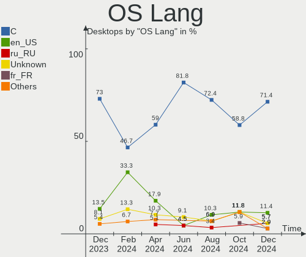
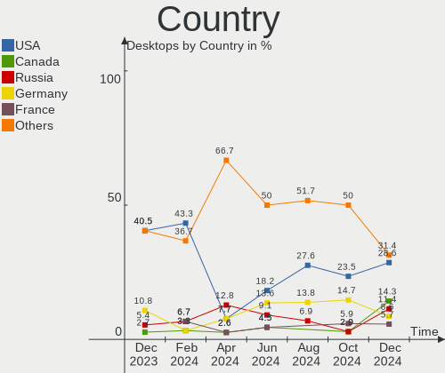
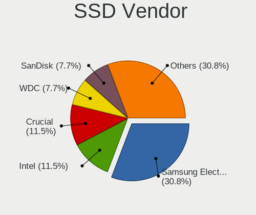
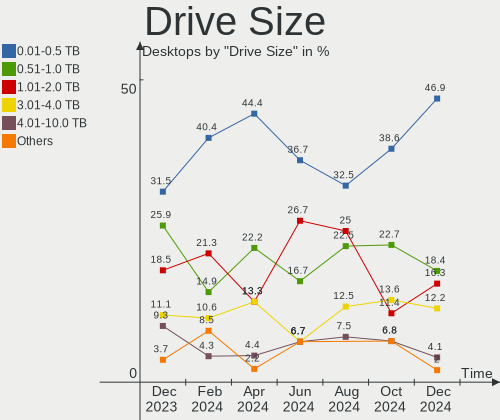
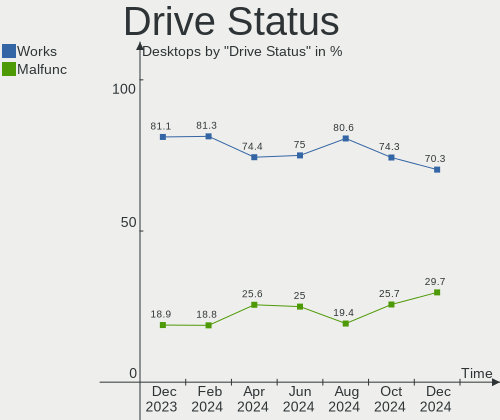

FreeBSD - Hardware Trends (Desktops)
------------------------------------

A project to identify most popular hardware characteristics and track their change
over time based on data collected by BSD users at https://BSD-Hardware.info.

Anyone can contribute to this report by the [hw-probe](https://github.com/linuxhw/hw-probe/blob/master/INSTALL.BSD.md) tool:

    hw-probe -all -upload

This report is for one last month. Overall report since the beginning of time: [TestDays](https://github.com/bsdhw/TestDays)

Period: Sep, 2023.

Contents
--------

* [ System ](#system)
  - [ OS                       ](#os)
  - [ OS Family                ](#os-family)
  - [ Arch                     ](#arch)
  - [ DE                       ](#de)
  - [ Display Server           ](#display-server)
  - [ Display Manager          ](#display-manager)
  - [ OS Lang                  ](#os-lang)
  - [ Boot Mode                ](#boot-mode)
  - [ Filesystem               ](#filesystem)
  - [ Part. scheme             ](#part-scheme)

* [ Board ](#board)
  - [ Vendor                   ](#vendor)
  - [ Model                    ](#model)
  - [ Model Family             ](#model-family)
  - [ MFG Year                 ](#mfg-year)
  - [ Form Factor              ](#form-factor)
  - [ Coreboot                 ](#coreboot)
  - [ RAM Size                 ](#ram-size)
  - [ RAM Used                 ](#ram-used)
  - [ Total Drives             ](#total-drives)
  - [ Has CD-ROM               ](#has-cd-rom)
  - [ Has Ethernet             ](#has-ethernet)
  - [ Has WiFi                 ](#has-wifi)
  - [ Has Bluetooth            ](#has-bluetooth)

* [ Location ](#location)
  - [ Country                  ](#country)
  - [ City                     ](#city)

* [ Drives ](#drives)
  - [ Drive Vendor             ](#drive-vendor)
  - [ Drive Model              ](#drive-model)
  - [ HDD Vendor               ](#hdd-vendor)
  - [ SSD Vendor               ](#ssd-vendor)
  - [ Drive Kind               ](#drive-kind)
  - [ Drive Connector          ](#drive-connector)
  - [ Drive Size               ](#drive-size)
  - [ Space Total              ](#space-total)
  - [ Space Used               ](#space-used)
  - [ Malfunc. Drives          ](#malfunc-drives)
  - [ Malfunc. Drive Vendor    ](#malfunc-drive-vendor)
  - [ Malfunc. HDD Vendor      ](#malfunc-hdd-vendor)
  - [ Malfunc. Drive Kind      ](#malfunc-drive-kind)
  - [ Failed Drives            ](#failed-drives)
  - [ Failed Drive Vendor      ](#failed-drive-vendor)
  - [ Drive Status             ](#drive-status)

* [ Storage controller ](#storage-controller)
  - [ Storage Vendor           ](#storage-vendor)
  - [ Storage Model            ](#storage-model)
  - [ Storage Kind             ](#storage-kind)

* [ Processor ](#processor)
  - [ CPU Vendor               ](#cpu-vendor)
  - [ CPU Model                ](#cpu-model)
  - [ CPU Model Family         ](#cpu-model-family)
  - [ CPU Cores                ](#cpu-cores)
  - [ CPU Sockets              ](#cpu-sockets)
  - [ CPU Threads              ](#cpu-threads)
  - [ CPU Microarch            ](#cpu-microarch)

* [ Graphics ](#graphics)
  - [ GPU Vendor               ](#gpu-vendor)
  - [ GPU Model                ](#gpu-model)
  - [ GPU Combo                ](#gpu-combo)
  - [ GPU Driver               ](#gpu-driver)
  - [ GPU Memory               ](#gpu-memory)

* [ Monitor ](#monitor)
  - [ Monitor Vendor           ](#monitor-vendor)
  - [ Monitor Model            ](#monitor-model)
  - [ Monitor Resolution       ](#monitor-resolution)
  - [ Monitor Diagonal         ](#monitor-diagonal)
  - [ Monitor Width            ](#monitor-width)
  - [ Aspect Ratio             ](#aspect-ratio)
  - [ Monitor Area             ](#monitor-area)
  - [ Pixel Density            ](#pixel-density)
  - [ Multiple Monitors        ](#multiple-monitors)

* [ Network ](#network)
  - [ Net Controller Vendor    ](#net-controller-vendor)
  - [ Net Controller Model     ](#net-controller-model)
  - [ Wireless Vendor          ](#wireless-vendor)
  - [ Wireless Model           ](#wireless-model)
  - [ Ethernet Vendor          ](#ethernet-vendor)
  - [ Ethernet Model           ](#ethernet-model)
  - [ Net Controller Kind      ](#net-controller-kind)
  - [ Used Controller          ](#used-controller)
  - [ NICs                     ](#nics)
  - [ IPv6                     ](#ipv6)

* [ Bluetooth ](#bluetooth)
  - [ Bluetooth Vendor         ](#bluetooth-vendor)
  - [ Bluetooth Model          ](#bluetooth-model)

* [ Sound ](#sound)
  - [ Sound Vendor             ](#sound-vendor)
  - [ Sound Model              ](#sound-model)

* [ Memory ](#memory)
  - [ Memory Vendor            ](#memory-vendor)
  - [ Memory Model             ](#memory-model)
  - [ Memory Kind              ](#memory-kind)
  - [ Memory Form Factor       ](#memory-form-factor)
  - [ Memory Size              ](#memory-size)
  - [ Memory Speed             ](#memory-speed)

* [ Printers & scanners ](#printers--scanners)
  - [ Printer Vendor           ](#printer-vendor)
  - [ Printer Model            ](#printer-model)
  - [ Scanner Vendor           ](#scanner-vendor)
  - [ Scanner Model            ](#scanner-model)

* [ Camera ](#camera)
  - [ Camera Vendor            ](#camera-vendor)
  - [ Camera Model             ](#camera-model)

* [ Security ](#security)
  - [ Fingerprint Vendor       ](#fingerprint-vendor)
  - [ Fingerprint Model        ](#fingerprint-model)
  - [ Chipcard Vendor          ](#chipcard-vendor)
  - [ Chipcard Model           ](#chipcard-model)

* [ Unsupported ](#unsupported)
  - [ Unsupported Devices      ](#unsupported-devices)
  - [ Unsupported Device Types ](#unsupported-device-types)

System
------

OS
--

Installed operating systems

| Name                 | Desktops | Percent |
|----------------------|----------|---------|
| FreeBSD 13.2-p3      | 7        | 28%     |
| FreeBSD 13.2         | 4        | 16%     |
| FreeBSD 13.2-p2      | 3        | 12%     |
| FreeBSD 14.0-BETA1   | 2        | 8%      |
| FreeBSD 14.0-ALPHA3  | 2        | 8%      |
| FreeBSD 13.1         | 2        | 8%      |
| FreeBSD 15.0-CURRENT | 1        | 4%      |
| FreeBSD 14.0-STABLE  | 1        | 4%      |
| FreeBSD 13.2-STABLE  | 1        | 4%      |
| FreeBSD 13.2-p1      | 1        | 4%      |
| FreeBSD 13.0         | 1        | 4%      |

OS Family
---------

OS without a version

| Name    | Desktops | Percent |
|---------|----------|---------|
| FreeBSD | 25       | 100%    |

Arch
----

OS architecture (x86_64, i586, etc.)

| Name  | Desktops | Percent |
|-------|----------|---------|
| amd64 | 23       | 92%     |
| arm   | 2        | 8%      |

DE
--

Desktop Environment

| Name    | Desktops | Percent |
|---------|----------|---------|
| Console | 13       | 52%     |
| XFCE    | 3        | 12%     |
| TWM     | 2        | 8%      |
| MATE    | 2        | 8%      |
| KDE5    | 1        | 4%      |
| i3      | 1        | 4%      |
| GNOME   | 1        | 4%      |
| Fluxbox | 1        | 4%      |
| DWM     | 1        | 4%      |

Display Server
--------------

X11 or Wayland

| Name    | Desktops | Percent |
|---------|----------|---------|
| Console | 15       | 60%     |
| X11     | 10       | 40%     |

Display Manager
---------------

SDDM, LightDM, etc.

| Name    | Desktops | Percent |
|---------|----------|---------|
| Console | 15       | 60%     |
| LightDM | 4        | 16%     |
| SDDM    | 3        | 12%     |
| SLiM    | 2        | 8%      |
| XDM     | 1        | 4%      |

OS Lang
-------

Language

| Lang    | Desktops | Percent |
|---------|----------|---------|
| C       | 17       | 68%     |
| en_US   | 5        | 20%     |
| ru_RU   | 2        | 8%      |
| Unknown | 1        | 4%      |

Boot Mode
---------

EFI or BIOS

| Mode | Desktops | Percent |
|------|----------|---------|
| EFI  | 19       | 76%     |
| BIOS | 6        | 24%     |

Filesystem
----------

Type of filesystem

| Type | Desktops | Percent |
|------|----------|---------|
| Zfs  | 20       | 80%     |
| Ufs  | 5        | 20%     |

Part. scheme
------------

Scheme of partitioning

| Type | Desktops | Percent |
|------|----------|---------|
| GPT  | 22       | 88%     |
| MBR  | 3        | 12%     |

Board
-----

Vendor
------

Motherboard manufacturer

| Name                | Desktops | Percent |
|---------------------|----------|---------|
| ASUSTek Computer    | 6        | 24%     |
| Unknown             | 4        | 16%     |
| Gigabyte Technology | 3        | 12%     |
| MSI                 | 2        | 8%      |
| Shuttle             | 1        | 4%      |
| Lenovo              | 1        | 4%      |
| Intel               | 1        | 4%      |
| Hewlett-Packard     | 1        | 4%      |
| Dell                | 1        | 4%      |
| Biostar             | 1        | 4%      |
| AZW                 | 1        | 4%      |
| ASRockRack          | 1        | 4%      |
| ASRock              | 1        | 4%      |
| AAEON               | 1        | 4%      |

Model
-----

Motherboard model

| Name                               | Desktops | Percent |
|------------------------------------|----------|---------|
| Unknown                            | 4        | 16%     |
| Shuttle DS20U                      | 1        | 4%      |
| MSI MS-7C36                        | 1        | 4%      |
| MSI MS-7817                        | 1        | 4%      |
| Lenovo ThinkCentre M93p 10AAS4EN00 | 1        | 4%      |
| Intel HM570                        | 1        | 4%      |
| HP Z440 Workstation                | 1        | 4%      |
| Gigabyte X470 AORUS ULTRA GAMING   | 1        | 4%      |
| Gigabyte GA-870A-UD3               | 1        | 4%      |
| Gigabyte B450M S2H V2              | 1        | 4%      |
| Dell PowerEdge T30                 | 1        | 4%      |
| Biostar A55MLC2                    | 1        | 4%      |
| AZW SEi                            | 1        | 4%      |
| ASUS SABERTOOTH 990FX R2.0         | 1        | 4%      |
| ASUS ROG CROSSHAIR VIII HERO       | 1        | 4%      |
| ASUS Pro WS WRX80E-SAGE SE WIFI    | 1        | 4%      |
| ASUS PRIME X370-PRO                | 1        | 4%      |
| ASUS PRIME B550M-A                 | 1        | 4%      |
| ASUS P5Q-E                         | 1        | 4%      |
| ASRockRack EPYC3101D4I-2T          | 1        | 4%      |
| ASRock X570 Phantom Gaming 4       | 1        | 4%      |
| AAEON m70                          | 1        | 4%      |

Model Family
------------

Motherboard model prefix

| Name                      | Desktops | Percent |
|---------------------------|----------|---------|
| Unknown                   | 4        | 16%     |
| ASUS PRIME                | 2        | 8%      |
| Shuttle DS20U             | 1        | 4%      |
| MSI MS-7C36               | 1        | 4%      |
| MSI MS-7817               | 1        | 4%      |
| Lenovo ThinkCentre        | 1        | 4%      |
| Intel HM570               | 1        | 4%      |
| HP Z440                   | 1        | 4%      |
| Gigabyte X470             | 1        | 4%      |
| Gigabyte GA-870A-UD3      | 1        | 4%      |
| Gigabyte B450M            | 1        | 4%      |
| Dell PowerEdge            | 1        | 4%      |
| Biostar A55MLC2           | 1        | 4%      |
| AZW SEi                   | 1        | 4%      |
| ASUS SABERTOOTH           | 1        | 4%      |
| ASUS ROG                  | 1        | 4%      |
| ASUS Pro                  | 1        | 4%      |
| ASUS P5Q-E                | 1        | 4%      |
| ASRockRack EPYC3101D4I-2T | 1        | 4%      |
| ASRock X570               | 1        | 4%      |
| AAEON m70                 | 1        | 4%      |

MFG Year
--------

Motherboard manufacture year

| Year    | Desktops | Percent |
|---------|----------|---------|
| 2022    | 4        | 16%     |
| 2021    | 3        | 12%     |
| 2020    | 3        | 12%     |
| 2019    | 3        | 12%     |
| Unknown | 3        | 12%     |
| 2017    | 2        | 8%      |
| 2015    | 2        | 8%      |
| 2016    | 1        | 4%      |
| 2014    | 1        | 4%      |
| 2012    | 1        | 4%      |
| 2011    | 1        | 4%      |
| 2008    | 1        | 4%      |

Form Factor
-----------

Physical design of the computer

| Name    | Desktops | Percent |
|---------|----------|---------|
| Desktop | 25       | 100%    |

Coreboot
--------

Have coreboot on board

| Used | Desktops | Percent |
|------|----------|---------|
| No   | 25       | 100%    |

RAM Size
--------

Total RAM memory

| Size in GB  | Desktops | Percent |
|-------------|----------|---------|
| 64.01-256.0 | 7        | 28%     |
| 16.01-24.0  | 6        | 24%     |
| 32.01-64.0  | 5        | 20%     |
| 4.01-8.0    | 4        | 16%     |
| 0.01-0.5    | 2        | 8%      |
| 8.01-16.0   | 1        | 4%      |

RAM Used
--------

Used RAM memory

| Used GB  | Desktops | Percent |
|----------|----------|---------|
| 1.01-2.0 | 7        | 28%     |
| 0.51-1.0 | 7        | 28%     |
| 0.01-0.5 | 4        | 16%     |
| 3.01-4.0 | 3        | 12%     |
| 2.01-3.0 | 2        | 8%      |
| 0        | 2        | 8%      |

Total Drives
------------

Number of drives on board

| Drives | Desktops | Percent |
|--------|----------|---------|
| 3      | 6        | 24%     |
| 1      | 6        | 24%     |
| 2      | 4        | 16%     |
| 5      | 3        | 12%     |
| 0      | 3        | 12%     |
| 13     | 1        | 4%      |
| 11     | 1        | 4%      |
| 4      | 1        | 4%      |

Has CD-ROM
----------

Has CD-ROM on board

| Presented | Desktops | Percent |
|-----------|----------|---------|
| No        | 18       | 72%     |
| Yes       | 7        | 28%     |

Has Ethernet
------------

Has Ethernet on board

| Presented | Desktops | Percent |
|-----------|----------|---------|
| Yes       | 23       | 92%     |
| No        | 2        | 8%      |

Has WiFi
--------

Has WiFi module

| Presented | Desktops | Percent |
|-----------|----------|---------|
| No        | 19       | 76%     |
| Yes       | 6        | 24%     |

Has Bluetooth
-------------

Has Bluetooth module

| Presented | Desktops | Percent |
|-----------|----------|---------|
| No        | 19       | 76%     |
| Yes       | 6        | 24%     |

Location
--------

Country
-------

Geographic location (country)

| Country   | Desktops | Percent |
|-----------|----------|---------|
| USA       | 9        | 36%     |
| Russia    | 3        | 12%     |
| Germany   | 3        | 12%     |
| UAE       | 1        | 4%      |
| Thailand  | 1        | 4%      |
| Serbia    | 1        | 4%      |
| Romania   | 1        | 4%      |
| Lithuania | 1        | 4%      |
| Japan     | 1        | 4%      |
| France    | 1        | 4%      |
| China     | 1        | 4%      |
| Brazil    | 1        | 4%      |
| Argentina | 1        | 4%      |

City
----

Geographic location (city)

| City                 | Desktops | Percent |
|----------------------|----------|---------|
| Salem                | 2        | 8%      |
| Redmond              | 2        | 8%      |
| Wenatchee            | 1        | 4%      |
| Vilnius              | 1        | 4%      |
| Umeda                | 1        | 4%      |
| Simpsonville         | 1        | 4%      |
| Shenyang             | 1        | 4%      |
| Sao Bento do Sul     | 1        | 4%      |
| San Francisco        | 1        | 4%      |
| Saint Paul           | 1        | 4%      |
| Remseck am Neckar    | 1        | 4%      |
| Ploieşti            | 1        | 4%      |
| Ozersk               | 1        | 4%      |
| Moscow               | 1        | 4%      |
| Heidelberg           | 1        | 4%      |
| Grenoble             | 1        | 4%      |
| Flushing             | 1        | 4%      |
| Dubai                | 1        | 4%      |
| Coronel Pringles     | 1        | 4%      |
| Bietigheim-Bissingen | 1        | 4%      |
| Belgrade             | 1        | 4%      |
| Bangkok              | 1        | 4%      |
| Arzamas              | 1        | 4%      |

Drives
------

Drive Vendor
------------

Hard drive vendors

| Vendor              | Desktops | Drives | Percent |
|---------------------|----------|--------|---------|
| WDC                 | 10       | 33     | 22.22%  |
| Samsung Electronics | 9        | 16     | 20%     |
| Seagate             | 7        | 7      | 15.56%  |
| Kingston            | 6        | 6      | 13.33%  |
| Hewlett-Packard     | 2        | 2      | 4.44%   |
| Transcend           | 1        | 1      | 2.22%   |
| SPCC                | 1        | 1      | 2.22%   |
| SK hynix            | 1        | 1      | 2.22%   |
| SATADOM             | 1        | 1      | 2.22%   |
| Micron Technology   | 1        | 1      | 2.22%   |
| LITEON              | 1        | 1      | 2.22%   |
| Intel               | 1        | 1      | 2.22%   |
| Hitachi             | 1        | 1      | 2.22%   |
| Crucial             | 1        | 1      | 2.22%   |
| Corsair             | 1        | 1      | 2.22%   |
| Apple               | 1        | 1      | 2.22%   |

Drive Model
-----------

Hard drive models

| Model                                  | Desktops | Percent |
|----------------------------------------|----------|---------|
| WDC WD80EFAX-68LHPN0 8TB               | 2        | 3.51%   |
| Seagate ST4000DM000-1F2168 4TB         | 2        | 3.51%   |
| WDC WDS500G2B0A-00SM50 500GB           | 1        | 1.75%   |
| WDC WDS100T3X0C-00SJG0 1TB             | 1        | 1.75%   |
| WDC WD80EMAZ-00WJTA0 8TB               | 1        | 1.75%   |
| WDC WD80EFZX-68UW8N0 8TB               | 1        | 1.75%   |
| WDC WD80EDBZ-11B0ZA0 8TB               | 1        | 1.75%   |
| WDC WD80EDAZ-11TA3A0 8TB               | 1        | 1.75%   |
| WDC WD80EAZZ-00BKLB0 8TB               | 1        | 1.75%   |
| WDC WD60EZRZ-00GZ5B1 6TB               | 1        | 1.75%   |
| WDC WD5003AZEX-00MK2A0 500GB           | 1        | 1.75%   |
| WDC WD5003AZEX-00K3CA0 500GB           | 1        | 1.75%   |
| WDC WD5003AZEX-00K1GA0 500GB           | 1        | 1.75%   |
| WDC WD5000AAKX-083CA0 500GB            | 1        | 1.75%   |
| WDC WD40EZRZ-22GXCB0 4TB               | 1        | 1.75%   |
| WDC WD15EADS-00P8B0 1.5TB              | 1        | 1.75%   |
| WDC WD120EMFZ-11A6JA0 12TB             | 1        | 1.75%   |
| WDC WD120EMAZ-11BLFA0 12TB             | 1        | 1.75%   |
| WDC WD10SPZX-60Z10T0 1TB               | 1        | 1.75%   |
| Transcend TS8GSSD500 8GB               | 1        | 1.75%   |
| SPCC M.2 PCIe SSD 2TB                  | 1        | 1.75%   |
| SK hynix SKHynix_HFS512GDE9X084N 512GB | 1        | 1.75%   |
| Seagate ST4000LM024-2AN17V 4TB         | 1        | 1.75%   |
| Seagate ST4000DM004-2U9104 4TB         | 1        | 1.75%   |
| Seagate ST320DM000-1BD14C 320GB        | 1        | 1.75%   |
| Seagate ST1000DM010-2EP102 1TB         | 1        | 1.75%   |
| Seagate ST1000DM003-1ER162 1TB         | 1        | 1.75%   |
| SATADOM SH 3ME3 32GB                   | 1        | 1.75%   |
| Samsung SSD 980 500GB                  | 1        | 1.75%   |
| Samsung SSD 970 EVO 500GB              | 1        | 1.75%   |
| Samsung SSD 960 EVO 500GB              | 1        | 1.75%   |
| Samsung SSD 870 QVO 2TB                | 1        | 1.75%   |
| Samsung SSD 860 QVO 1TB                | 1        | 1.75%   |
| Samsung SSD 860 EVO 500GB              | 1        | 1.75%   |
| Samsung SSD 850 EVO 250GB              | 1        | 1.75%   |
| Samsung SSD 850 EVO 1TB                | 1        | 1.75%   |
| Samsung SSD 850 EVO 120GB              | 1        | 1.75%   |
| Samsung SSD 840 EVO 500GB              | 1        | 1.75%   |
| Samsung MZ7LH240HAHQ-00005 240GB       | 1        | 1.75%   |
| Samsung HD322HJ 320GB                  | 1        | 1.75%   |

HDD Vendor
----------

Hard disk drive vendors

| Vendor              | Desktops | Drives | Percent |
|---------------------|----------|--------|---------|
| WDC                 | 8        | 31     | 44.44%  |
| Seagate             | 7        | 7      | 38.89%  |
| Samsung Electronics | 1        | 1      | 5.56%   |
| Hitachi             | 1        | 1      | 5.56%   |
| Apple               | 1        | 1      | 5.56%   |

SSD Vendor
----------

Solid state drive vendors

| Vendor              | Desktops | Drives | Percent |
|---------------------|----------|--------|---------|
| Samsung Electronics | 7        | 11     | 38.89%  |
| Kingston            | 3        | 3      | 16.67%  |
| WDC                 | 1        | 1      | 5.56%   |
| Transcend           | 1        | 1      | 5.56%   |
| SATADOM             | 1        | 1      | 5.56%   |
| Micron Technology   | 1        | 1      | 5.56%   |
| LITEON              | 1        | 1      | 5.56%   |
| Intel               | 1        | 1      | 5.56%   |
| Hewlett-Packard     | 1        | 1      | 5.56%   |
| Crucial             | 1        | 1      | 5.56%   |

Drive Kind
----------

HDD or SSD

| Kind | Desktops | Drives | Percent |
|------|----------|--------|---------|
| SSD  | 16       | 22     | 40%     |
| HDD  | 14       | 41     | 35%     |
| NVMe | 10       | 12     | 25%     |

Drive Connector
---------------

SATA, SAS, NVMe, etc.

| Type | Desktops | Drives | Percent |
|------|----------|--------|---------|
| SATA | 19       | 63     | 65.52%  |
| NVMe | 10       | 12     | 34.48%  |

Drive Size
----------

Size of hard drive

| Size in TB | Desktops | Drives | Percent |
|------------|----------|--------|---------|
| 0.01-0.5   | 13       | 27     | 43.33%  |
| 0.51-1.0   | 5        | 7      | 16.67%  |
| 3.01-4.0   | 4        | 5      | 13.33%  |
| 1.01-2.0   | 3        | 5      | 10%     |
| 4.01-10.0  | 3        | 16     | 10%     |
| 2.01-3.0   | 1        | 1      | 3.33%   |
| 10.01-20.0 | 1        | 2      | 3.33%   |

Space Total
-----------

Amount of disk space available on the file system

| Size in GB | Desktops | Percent |
|------------|----------|---------|
| 251-500    | 7        | 28%     |
| 101-250    | 6        | 24%     |
| 501-1000   | 5        | 20%     |
| 21-50      | 3        | 12%     |
| 1001-2000  | 3        | 12%     |
| 51-100     | 1        | 4%      |

Space Used
----------

Amount of used disk space

| Used GB  | Desktops | Percent |
|----------|----------|---------|
| 1-20     | 20       | 80%     |
| 501-1000 | 2        | 8%      |
| 251-500  | 1        | 4%      |
| 21-50    | 1        | 4%      |
| 51-100   | 1        | 4%      |

Malfunc. Drives
---------------

Drive models with a malfunction

| Model                       | Desktops | Drives | Percent |
|-----------------------------|----------|--------|---------|
| WDC WD80EDAZ-11TA3A0 8TB    | 1        | 1      | 50%     |
| WDC WD5000AAKX-083CA0 500GB | 1        | 1      | 50%     |

Malfunc. Drive Vendor
---------------------

Vendors of faulty drives

| Vendor | Desktops | Drives | Percent |
|--------|----------|--------|---------|
| WDC    | 2        | 2      | 100%    |

Malfunc. HDD Vendor
-------------------

Vendors of faulty HDD drives

| Vendor | Desktops | Drives | Percent |
|--------|----------|--------|---------|
| WDC    | 2        | 2      | 100%    |

Malfunc. Drive Kind
-------------------

Kinds of faulty drives

| Kind | Desktops | Drives | Percent |
|------|----------|--------|---------|
| HDD  | 2        | 2      | 100%    |

Failed Drives
-------------

Failed drive models

Zero info for selected period =(

Failed Drive Vendor
-------------------

Failed drive vendors

Zero info for selected period =(

Drive Status
------------

Number of failed and malfunc. drives

| Status   | Desktops | Drives | Percent |
|----------|----------|--------|---------|
| Works    | 20       | 71     | 86.96%  |
| Malfunc  | 2        | 2      | 8.7%    |
| Detected | 1        | 2      | 4.35%   |

Storage controller
------------------

Storage Vendor
--------------

Storage controller vendors

| Vendor                      | Desktops | Percent |
|-----------------------------|----------|---------|
| AMD                         | 12       | 27.27%  |
| Intel                       | 10       | 22.73%  |
| Samsung Electronics         | 5        | 11.36%  |
| Kingston Technology Company | 3        | 6.82%   |
| ASMedia Technology          | 3        | 6.82%   |
| SanDisk                     | 2        | 4.55%   |
| Broadcom / LSI              | 2        | 4.55%   |
| SK hynix                    | 1        | 2.27%   |
| Realtek Semiconductor       | 1        | 2.27%   |
| Phison Electronics          | 1        | 2.27%   |
| Micron/Crucial Technology   | 1        | 2.27%   |
| Marvell Technology Group    | 1        | 2.27%   |
| JMicron Technology          | 1        | 2.27%   |
| Biwin Storage Technology    | 1        | 2.27%   |

Storage Model
-------------

Storage controller models

| Model                                                                          | Desktops | Percent |
|--------------------------------------------------------------------------------|----------|---------|
| AMD FCH SATA Controller [AHCI mode]                                            | 7        | 13.21%  |
| ASMedia ASM1062 Serial ATA Controller                                          | 3        | 5.66%   |
| Samsung NVMe SSD Controller SM981/PM981/PM983                                  | 2        | 3.77%   |
| Samsung NVMe SSD Controller SM961/PM961/SM963                                  | 2        | 3.77%   |
| Intel 8 Series/C220 Series Chipset Family 6-port SATA Controller 1 [AHCI mode] | 2        | 3.77%   |
| AMD 400 Series Chipset SATA Controller                                         | 2        | 3.77%   |
| SK hynix Gold P31/BC711/PC711 NVMe Solid State Drive                           | 1        | 1.89%   |
| SanDisk WD PC SN810 / Black SN850 NVMe SSD                                     | 1        | 1.89%   |
| SanDisk WD Black SN750 / PC SN730 NVMe SSD                                     | 1        | 1.89%   |
| Samsung NVMe SSD Controller PM9A1/PM9A3/980PRO                                 | 1        | 1.89%   |
| Samsung NVMe SSD Controller 980                                                | 1        | 1.89%   |
| Realtek RTS5765DL NVMe SSD Controller (DRAM-less)                              | 1        | 1.89%   |
| Phison E16 PCIe4 NVMe Controller                                               | 1        | 1.89%   |
| Micron/Crucial P2 [Nick P2] / P3 / P3 Plus NVMe PCIe SSD (DRAM-less)           | 1        | 1.89%   |
| Marvell Group 88SE6111/6121 SATA II / PATA Controller                          | 1        | 1.89%   |
| Kingston Company KC3000/Renegade NVMe SSD                                      | 1        | 1.89%   |
| Kingston Company Design-In PCIe 4 NVMe SSD (QLC)                               | 1        | 1.89%   |
| JMicron JMB363 SATA/IDE Controller                                             | 1        | 1.89%   |
| Intel Tiger Lake-LP SATA Controller                                            | 1        | 1.89%   |
| Intel Tiger Lake SATA AHCI Controller                                          | 1        | 1.89%   |
| Intel SATA Controller [RAID mode]                                              | 1        | 1.89%   |
| Intel product 54d3                                                             | 1        | 1.89%   |
| Intel Comet Lake SATA AHCI Controller                                          | 1        | 1.89%   |
| Intel C610/X99 series chipset sSATA Controller [AHCI mode]                     | 1        | 1.89%   |
| Intel C610/X99 series chipset 6-Port SATA Controller [AHCI mode]               | 1        | 1.89%   |
| Intel Atom Processor C3000 Series SATA Controller 0                            | 1        | 1.89%   |
| Intel 82801JI (ICH10 Family) 4 port SATA IDE Controller #1                     | 1        | 1.89%   |
| Intel 82801JI (ICH10 Family) 2 port SATA IDE Controller #2                     | 1        | 1.89%   |
| Broadcom / LSI SAS3008 PCI-Express Fusion-MPT SAS-3                            | 1        | 1.89%   |
| Broadcom / LSI SAS2008 PCI-Express Fusion-MPT SAS-2 [Falcon]                   | 1        | 1.89%   |
| Biwin Storage EX900 NVMe SSD (DRAM-less)                                       | 1        | 1.89%   |
| AMD X370 Series Chipset SATA Controller                                        | 1        | 1.89%   |
| AMD SB7x0/SB8x0/SB9x0 SATA Controller [IDE mode]                               | 1        | 1.89%   |
| AMD SB7x0/SB8x0/SB9x0 SATA Controller [AHCI mode]                              | 1        | 1.89%   |
| AMD SB7x0/SB8x0/SB9x0 IDE Controller                                           | 1        | 1.89%   |
| AMD SB600 Non-Raid-5 SATA                                                      | 1        | 1.89%   |
| AMD SB600 IDE                                                                  | 1        | 1.89%   |
| AMD FCH SATA Controller [IDE mode]                                             | 1        | 1.89%   |
| AMD FCH IDE Controller                                                         | 1        | 1.89%   |
| AMD 500 Series Chipset SATA Controller                                         | 1        | 1.89%   |

Storage Kind
------------

Kind of storage controller (IDE, SATA, NVMe, SAS, ...)

| Kind | Desktops | Percent |
|------|----------|---------|
| SATA | 19       | 47.5%   |
| NVMe | 14       | 35%     |
| IDE  | 4        | 10%     |
| SAS  | 2        | 5%      |
| RAID | 1        | 2.5%    |

Processor
---------

CPU Vendor
----------

Processor vendors

| Vendor | Desktops | Percent |
|--------|----------|---------|
| AMD    | 13       | 52%     |
| Intel  | 10       | 40%     |
| ARM    | 2        | 8%      |

CPU Model
---------

Processor models

| Model                                      | Desktops | Percent |
|--------------------------------------------|----------|---------|
| ARM ARM1176 r0p7 (ECO: 0x00000000)         | 2        | 8%      |
| AMD Ryzen 9 3900X 12-Core Processor        | 2        | 8%      |
| AMD Ryzen 5 2600 Six-Core Processor        | 2        | 8%      |
| Intel Xeon CPU E5-2690 v4 @ 2.60GHz        | 1        | 4%      |
| Intel Xeon CPU E3-1225 v5 @ 3.30GHz        | 1        | 4%      |
| Intel Pentium CPU G3220 @ 3.00GHz          | 1        | 4%      |
| Intel N100                                 | 1        | 4%      |
| Intel Genuine CPU 0000 @ 1.80GHz           | 1        | 4%      |
| Intel Core i5-4590T CPU @ 2.00GHz          | 1        | 4%      |
| Intel Core 2 Quad CPU Q6600 @ 2.40GHz      | 1        | 4%      |
| Intel Celeron CPU 5205U @ 1.90GHz          | 1        | 4%      |
| Intel Atom CPU C3758 @ 2.20GHz             | 1        | 4%      |
| Intel 11th Gen Core i5-11320H @ 3.20GHz    | 1        | 4%      |
| AMD Ryzen Threadripper PRO 5975WX 32-Cores | 1        | 4%      |
| AMD Ryzen 9 5950X 16-Core Processor        | 1        | 4%      |
| AMD Ryzen 7 1700 Eight-Core Processor      | 1        | 4%      |
| AMD Ryzen 5 5600G with Radeon Graphics     | 1        | 4%      |
| AMD Phenom II X6 1090T Processor           | 1        | 4%      |
| AMD Phenom II X4 955 Processor             | 1        | 4%      |
| AMD EPYC 3101 4-Core Processor             | 1        | 4%      |
| AMD Athlon II X4 641 Quad-Core Processor   | 1        | 4%      |
| AMD Athlon 64 X2 Dual Core Processor 6000+ | 1        | 4%      |

CPU Model Family
----------------

Processor model prefix

| Model                  | Desktops | Percent |
|------------------------|----------|---------|
| Other                  | 4        | 16%     |
| AMD Ryzen 9            | 3        | 12%     |
| AMD Ryzen 5            | 3        | 12%     |
| Intel Xeon             | 2        | 8%      |
| Intel Pentium          | 1        | 4%      |
| Intel Genuine          | 1        | 4%      |
| Intel Core i5          | 1        | 4%      |
| Intel Core 2 Quad      | 1        | 4%      |
| Intel Celeron          | 1        | 4%      |
| Intel Atom             | 1        | 4%      |
| AMD Ryzen Threadripper | 1        | 4%      |
| AMD Ryzen 7            | 1        | 4%      |
| AMD Phenom II X6       | 1        | 4%      |
| AMD Phenom II X4       | 1        | 4%      |
| AMD EPYC               | 1        | 4%      |
| AMD Athlon II X4       | 1        | 4%      |
| AMD Athlon 64 X2       | 1        | 4%      |

CPU Cores
---------

Number of processor cores

| Number  | Desktops | Percent |
|---------|----------|---------|
| 4       | 8        | 32%     |
| 12      | 3        | 12%     |
| 2       | 3        | 12%     |
| 24      | 2        | 8%      |
| 6       | 2        | 8%      |
| Unknown | 2        | 8%      |
| 64      | 1        | 4%      |
| 32      | 1        | 4%      |
| 16      | 1        | 4%      |
| 14      | 1        | 4%      |
| 8       | 1        | 4%      |

CPU Sockets
-----------

Number of sockets

| Number  | Desktops | Percent |
|---------|----------|---------|
| 1       | 23       | 92%     |
| Unknown | 2        | 8%      |

CPU Threads
-----------

Threads per core (Hyper-Threading)

| Number  | Desktops | Percent |
|---------|----------|---------|
| 1       | 20       | 80%     |
| 2       | 3        | 12%     |
| Unknown | 2        | 8%      |

CPU Microarch
-------------

Microarchitecture

| Name      | Desktops | Percent |
|-----------|----------|---------|
| Unknown   | 5        | 20%     |
| Zen+      | 2        | 8%      |
| Zen 3     | 2        | 8%      |
| Zen 2     | 2        | 8%      |
| Zen       | 2        | 8%      |
| K10       | 2        | 8%      |
| Haswell   | 2        | 8%      |
| TigerLake | 1        | 4%      |
| Skylake   | 1        | 4%      |
| KabyLake  | 1        | 4%      |
| K8 Hammer | 1        | 4%      |
| K10 Llano | 1        | 4%      |
| Goldmont  | 1        | 4%      |
| Core      | 1        | 4%      |
| Broadwell | 1        | 4%      |

Graphics
--------

GPU Vendor
----------

Vendors of graphics cards

| Vendor            | Desktops | Percent |
|-------------------|----------|---------|
| Nvidia            | 9        | 40.91%  |
| Intel             | 7        | 31.82%  |
| AMD               | 5        | 22.73%  |
| ASPEED Technology | 1        | 4.55%   |

GPU Model
---------

Graphics card models

| Model                                                                       | Desktops | Percent |
|-----------------------------------------------------------------------------|----------|---------|
| Intel Xeon E3-1200 v3/4th Gen Core Processor Integrated Graphics Controller | 2        | 9.09%   |
| Nvidia TU116 [GeForce GTX 1660 Ti]                                          | 1        | 4.55%   |
| Nvidia GT218 [NVS 300]                                                      | 1        | 4.55%   |
| Nvidia GP108 [GeForce GT 1030]                                              | 1        | 4.55%   |
| Nvidia GP106 [GeForce GTX 1060 3GB]                                         | 1        | 4.55%   |
| Nvidia GM206 [GeForce GTX 960]                                              | 1        | 4.55%   |
| Nvidia GM204 [GeForce GTX 970]                                              | 1        | 4.55%   |
| Nvidia GK107 [GeForce GT 640]                                               | 1        | 4.55%   |
| Nvidia GF108 [GeForce GT 630]                                               | 1        | 4.55%   |
| Nvidia G84 [GeForce 8600 GT]                                                | 1        | 4.55%   |
| Intel TigerLake-LP GT2 [Iris Xe Graphics]                                   | 1        | 4.55%   |
| Intel TigerLake-H GT1 [UHD Graphics]                                        | 1        | 4.55%   |
| Intel HD Graphics P530                                                      | 1        | 4.55%   |
| Intel Comet Lake-U GT2 [UHD Graphics 620]                                   | 1        | 4.55%   |
| Intel Alder Lake-N [UHD Graphics]                                           | 1        | 4.55%   |
| ASPEED Technology ASPEED Graphics Family                                    | 1        | 4.55%   |
| AMD Navi 31 [Radeon RX 7900 XT/7900 XTX]                                    | 1        | 4.55%   |
| AMD Ellesmere [Radeon RX 470/480/570/570X/580/580X/590]                     | 1        | 4.55%   |
| AMD Cezanne [Radeon Vega Series / Radeon Vega Mobile Series]                | 1        | 4.55%   |
| AMD Cedar [Radeon HD 5000/6000/7350/8350 Series]                            | 1        | 4.55%   |
| AMD Caicos [Radeon HD 6450/7450/8450 / R5 230 OEM]                          | 1        | 4.55%   |

GPU Combo
---------

Combinations of graphics cards

| Name       | Desktops | Percent |
|------------|----------|---------|
| 1 x Nvidia | 9        | 36%     |
| 1 x Intel  | 7        | 28%     |
| 1 x AMD    | 5        | 20%     |
| Other      | 3        | 12%     |
| 1 x ASPEED | 1        | 4%      |

GPU Driver
----------

Free vs proprietary

| Driver      | Desktops | Percent |
|-------------|----------|---------|
| Free        | 16       | 64%     |
| Proprietary | 5        | 20%     |
| Unknown     | 4        | 16%     |

GPU Memory
----------

Total video memory

| Size in GB | Desktops | Percent |
|------------|----------|---------|
| Unknown    | 17       | 68%     |
| 1.01-2.0   | 2        | 8%      |
| 0.01-0.5   | 2        | 8%      |
| 7.01-8.0   | 1        | 4%      |
| 5.01-6.0   | 1        | 4%      |
| 3.01-4.0   | 1        | 4%      |
| 0.51-1.0   | 1        | 4%      |

Monitor
-------

Monitor Vendor
--------------

Monitor vendors

| Vendor              | Desktops | Percent |
|---------------------|----------|---------|
| Samsung Electronics | 3        | 30%     |
| Dell                | 2        | 20%     |
| Unknown             | 1        | 10%     |
| Lenovo              | 1        | 10%     |
| Iiyama              | 1        | 10%     |
| CVT                 | 1        | 10%     |
| AOC                 | 1        | 10%     |

Monitor Model
-------------

Monitor models

| Model                                                                | Desktops | Percent |
|----------------------------------------------------------------------|----------|---------|
| Unknown LCD Monitor KJT4K2K60DP 3840x2160                            | 1        | 8.33%   |
| Samsung Electronics U32J59x SAM0F35 3840x2160 700x390mm 31.5-inch    | 1        | 8.33%   |
| Samsung Electronics SyncMaster SAM04E4 1600x900 440x250mm 19.9-inch  | 1        | 8.33%   |
| Samsung Electronics SyncMaster SAM011F 1280x1024 380x300mm 19.1-inch | 1        | 8.33%   |
| Samsung Electronics S23C550 SAM0A42 1920x1080 510x290mm 23.1-inch    | 1        | 8.33%   |
| Lenovo LEN S22e-19 LEN61C9 1920x1080 480x270mm 21.7-inch             | 1        | 8.33%   |
| Iiyama PLX2283H IVM5638 1920x1080 480x270mm 21.7-inch                | 1        | 8.33%   |
| Iiyama PL1980 IVM4844 1280x1024 380x300mm 19.1-inch                  | 1        | 8.33%   |
| Dell U3417W DELA0DF 3440x1440 800x330mm 34.1-inch                    | 1        | 8.33%   |
| Dell P2419H DELD0DA 1920x1080 530x300mm 24.0-inch                    | 1        | 8.33%   |
| CVT CVTE TV CVT0003 1360x768 1000x610mm 46.1-inch                    | 1        | 8.33%   |
| AOC 2770 AOC2770 1920x1080 600x340mm 27.2-inch                       | 1        | 8.33%   |

Monitor Resolution
------------------

Monitor screen resolution

| Resolution       | Desktops | Percent |
|------------------|----------|---------|
| 1920x1080 (FHD)  | 5        | 41.67%  |
| 3840x2160 (4K)   | 2        | 16.67%  |
| 1280x1024 (SXGA) | 2        | 16.67%  |
| 3440x1440        | 1        | 8.33%   |
| 1600x900 (HD+)   | 1        | 8.33%   |
| 1360x768         | 1        | 8.33%   |

Monitor Diagonal
----------------

Diagonal size in inches

| Inches  | Desktops | Percent |
|---------|----------|---------|
| 19      | 3        | 25%     |
| 21      | 2        | 16.67%  |
| 46      | 1        | 8.33%   |
| 34      | 1        | 8.33%   |
| 31      | 1        | 8.33%   |
| 27      | 1        | 8.33%   |
| 24      | 1        | 8.33%   |
| 23      | 1        | 8.33%   |
| Unknown | 1        | 8.33%   |

Monitor Width
-------------

Physical width

| Width in mm | Desktops | Percent |
|-------------|----------|---------|
| 501-600     | 3        | 25%     |
| 401-500     | 3        | 25%     |
| 351-400     | 2        | 16.67%  |
| 701-800     | 1        | 8.33%   |
| 601-700     | 1        | 8.33%   |
| 901-1000    | 1        | 8.33%   |
| Unknown     | 1        | 8.33%   |

Aspect Ratio
------------

Proportional relationship between the width and the height

| Ratio   | Desktops | Percent |
|---------|----------|---------|
| 16/9    | 6        | 54.55%  |
| 5/4     | 2        | 18.18%  |
| 21/9    | 1        | 9.09%   |
| 16/10   | 1        | 9.09%   |
| Unknown | 1        | 9.09%   |

Monitor Area
------------

Area in inch²

| Area in inch² | Desktops | Percent |
|----------------|----------|---------|
| 201-250        | 4        | 33.33%  |
| 151-200        | 3        | 25%     |
| 351-500        | 2        | 16.67%  |
| 301-350        | 1        | 8.33%   |
| 501-1000       | 1        | 8.33%   |
| Unknown        | 1        | 8.33%   |

Pixel Density
-------------

Pixels per inch

| Density | Desktops | Percent |
|---------|----------|---------|
| 51-100  | 5        | 45.45%  |
| 101-120 | 3        | 27.27%  |
| 1-50    | 1        | 9.09%   |
| 121-160 | 1        | 9.09%   |
| Unknown | 1        | 9.09%   |

Multiple Monitors
-----------------

Total monitors connected

| Total | Desktops | Percent |
|-------|----------|---------|
| 0     | 15       | 60%     |
| 1     | 8        | 32%     |
| 2     | 2        | 8%      |

Network
-------

Net Controller Vendor
---------------------

Controller vendors

| Vendor                   | Desktops | Percent |
|--------------------------|----------|---------|
| Intel                    | 17       | 56.67%  |
| Realtek Semiconductor    | 9        | 30%     |
| Qualcomm Atheros         | 1        | 3.33%   |
| Marvell Technology Group | 1        | 3.33%   |
| Aquantia                 | 1        | 3.33%   |
| American Megatrends      | 1        | 3.33%   |

Net Controller Model
--------------------

Controller models

| Model                                                                         | Desktops | Percent |
|-------------------------------------------------------------------------------|----------|---------|
| Realtek RTL8111/8168/8411 PCI Express Gigabit Ethernet Controller             | 7        | 18.92%  |
| Intel I211 Gigabit Network Connection                                         | 7        | 18.92%  |
| Intel Wi-Fi 6 AX200                                                           | 3        | 8.11%   |
| Intel Ethernet Controller X550                                                | 2        | 5.41%   |
| Realtek RTL8125 2.5GbE Controller                                             | 1        | 2.7%    |
| Realtek RTL810xE PCI Express Fast Ethernet controller                         | 1        | 2.7%    |
| Realtek RTL-8110SC/8169SC Gigabit Ethernet                                    | 1        | 2.7%    |
| Qualcomm Atheros AR9462 Wireless Network Adapter                              | 1        | 2.7%    |
| Marvell Group 88E8056 PCI-E Gigabit Ethernet Controller                       | 1        | 2.7%    |
| Marvell Group 88E8001 Gigabit Ethernet Controller                             | 1        | 2.7%    |
| Intel Wi-Fi 6 AX201                                                           | 1        | 2.7%    |
| Intel Ethernet Controller I225-V                                              | 1        | 2.7%    |
| Intel Ethernet Connection X553 1GbE                                           | 1        | 2.7%    |
| Intel Ethernet Connection I217-LM                                             | 1        | 2.7%    |
| Intel Ethernet Connection (2) I219-LM                                         | 1        | 2.7%    |
| Intel Ethernet Connection (2) I218-LM                                         | 1        | 2.7%    |
| Intel Ethernet Connection (10) I219-LM                                        | 1        | 2.7%    |
| Intel CNVi: Wi-Fi                                                             | 1        | 2.7%    |
| Intel 82574L Gigabit Network Connection                                       | 1        | 2.7%    |
| Intel 82571EB/82571GB Gigabit Ethernet Controller D0/D1 (copper applications) | 1        | 2.7%    |
| Aquantia AQC107 NBase-T/IEEE 802.3bz Ethernet Controller [AQtion]             | 1        | 2.7%    |
| American Megatrends Virtual Ethernet                                          | 1        | 2.7%    |

Wireless Vendor
---------------

Wireless vendors

| Vendor           | Desktops | Percent |
|------------------|----------|---------|
| Intel            | 5        | 83.33%  |
| Qualcomm Atheros | 1        | 16.67%  |

Wireless Model
--------------

Wireless models

| Model                                            | Desktops | Percent |
|--------------------------------------------------|----------|---------|
| Intel Wi-Fi 6 AX200                              | 3        | 50%     |
| Qualcomm Atheros AR9462 Wireless Network Adapter | 1        | 16.67%  |
| Intel Wi-Fi 6 AX201                              | 1        | 16.67%  |
| Intel CNVi: Wi-Fi                                | 1        | 16.67%  |

Ethernet Vendor
---------------

Ethernet vendors

| Vendor                   | Desktops | Percent |
|--------------------------|----------|---------|
| Intel                    | 15       | 55.56%  |
| Realtek Semiconductor    | 9        | 33.33%  |
| Marvell Technology Group | 1        | 3.7%    |
| Aquantia                 | 1        | 3.7%    |
| American Megatrends      | 1        | 3.7%    |

Ethernet Model
--------------

Ethernet models

| Model                                                                         | Desktops | Percent |
|-------------------------------------------------------------------------------|----------|---------|
| Realtek RTL8111/8168/8411 PCI Express Gigabit Ethernet Controller             | 7        | 22.58%  |
| Intel I211 Gigabit Network Connection                                         | 7        | 22.58%  |
| Intel Ethernet Controller X550                                                | 2        | 6.45%   |
| Realtek RTL8125 2.5GbE Controller                                             | 1        | 3.23%   |
| Realtek RTL810xE PCI Express Fast Ethernet controller                         | 1        | 3.23%   |
| Realtek RTL-8110SC/8169SC Gigabit Ethernet                                    | 1        | 3.23%   |
| Marvell Group 88E8056 PCI-E Gigabit Ethernet Controller                       | 1        | 3.23%   |
| Marvell Group 88E8001 Gigabit Ethernet Controller                             | 1        | 3.23%   |
| Intel Ethernet Controller I225-V                                              | 1        | 3.23%   |
| Intel Ethernet Connection X553 1GbE                                           | 1        | 3.23%   |
| Intel Ethernet Connection I217-LM                                             | 1        | 3.23%   |
| Intel Ethernet Connection (2) I219-LM                                         | 1        | 3.23%   |
| Intel Ethernet Connection (2) I218-LM                                         | 1        | 3.23%   |
| Intel Ethernet Connection (10) I219-LM                                        | 1        | 3.23%   |
| Intel 82574L Gigabit Network Connection                                       | 1        | 3.23%   |
| Intel 82571EB/82571GB Gigabit Ethernet Controller D0/D1 (copper applications) | 1        | 3.23%   |
| Aquantia AQC107 NBase-T/IEEE 802.3bz Ethernet Controller [AQtion]             | 1        | 3.23%   |
| American Megatrends Virtual Ethernet                                          | 1        | 3.23%   |

Net Controller Kind
-------------------

Ethernet, WiFi or modem

| Kind     | Desktops | Percent |
|----------|----------|---------|
| Ethernet | 23       | 79.31%  |
| WiFi     | 6        | 20.69%  |

Used Controller
---------------

Currently used network controller

| Kind     | Desktops | Percent |
|----------|----------|---------|
| Ethernet | 22       | 95.65%  |
| WiFi     | 1        | 4.35%   |

NICs
----

Total network controllers on board

| Total | Desktops | Percent |
|-------|----------|---------|
| 1     | 11       | 44%     |
| 2     | 7        | 28%     |
| 3     | 4        | 16%     |
| 0     | 2        | 8%      |
| 6     | 1        | 4%      |

IPv6
----

IPv6 vs IPv4

| Used | Desktops | Percent |
|------|----------|---------|
| No   | 22       | 88%     |
| Yes  | 3        | 12%     |

Bluetooth
---------

Bluetooth Vendor
----------------

Controller vendors

| Vendor                | Desktops | Percent |
|-----------------------|----------|---------|
| Intel                 | 4        | 50%     |
| TP-Link               | 1        | 12.5%   |
| Realtek Semiconductor | 1        | 12.5%   |
| Lite-On Technology    | 1        | 12.5%   |
| Corsair               | 1        | 12.5%   |

Bluetooth Model
---------------

Controller models

| Model                                 | Desktops | Percent |
|---------------------------------------|----------|---------|
| Intel AX201 Bluetooth                 | 2        | 25%     |
| Intel AX200 Bluetooth                 | 2        | 25%     |
| TP-Link Bluetooth 5.0 USB Adapter     | 1        | 12.5%   |
| Realtek Bluetooth Adapter             | 1        | 12.5%   |
| Lite-On Atheros AR3012 Bluetooth      | 1        | 12.5%   |
| Corsair HS70 BLUETOOTH Gaming Headset | 1        | 12.5%   |

Sound
-----

Sound Vendor
------------

Sound card vendors

| Vendor                                       | Desktops | Percent |
|----------------------------------------------|----------|---------|
| AMD                                          | 13       | 35.14%  |
| Intel                                        | 9        | 24.32%  |
| Nvidia                                       | 8        | 21.62%  |
| Zoran Co. Personal Media Division (Nogatech) | 1        | 2.7%    |
| Texas Instruments                            | 1        | 2.7%    |
| DSEA A/S                                     | 1        | 2.7%    |
| C-Media Electronics                          | 1        | 2.7%    |
| BEHRINGER International                      | 1        | 2.7%    |
| ASUSTek Computer                             | 1        | 2.7%    |
| Alesis                                       | 1        | 2.7%    |

Sound Model
-----------

Sound card models

| Model                                                                             | Desktops | Percent |
|-----------------------------------------------------------------------------------|----------|---------|
| AMD Starship/Matisse HD Audio Controller                                          | 4        | 9.76%   |
| AMD SBx00 Azalia (Intel HDA)                                                      | 3        | 7.32%   |
| Intel 8 Series/C220 Series Chipset High Definition Audio Controller               | 2        | 4.88%   |
| AMD Family 17h (Models 00h-0fh) HD Audio Controller                               | 2        | 4.88%   |
| Zoran Co. Personal Media Division (Nogatech) USB Audio and HID                    | 1        | 2.44%   |
| Texas Instruments PCM2902 Audio Codec                                             | 1        | 2.44%   |
| Nvidia TU116 High Definition Audio Controller                                     | 1        | 2.44%   |
| Nvidia High Definition Audio Controller                                           | 1        | 2.44%   |
| Nvidia GP108 High Definition Audio Controller                                     | 1        | 2.44%   |
| Nvidia GP106 High Definition Audio Controller                                     | 1        | 2.44%   |
| Nvidia GM206 High Definition Audio Controller                                     | 1        | 2.44%   |
| Nvidia GM204 High Definition Audio Controller                                     | 1        | 2.44%   |
| Nvidia GK107 HDMI Audio Controller                                                | 1        | 2.44%   |
| Nvidia GF108 High Definition Audio Controller                                     | 1        | 2.44%   |
| Intel Xeon E3-1200 v3/4th Gen Core Processor HD Audio Controller                  | 1        | 2.44%   |
| Intel Tiger Lake-LP Smart Sound Technology Audio Controller                       | 1        | 2.44%   |
| Intel Tiger Lake-H HD Audio Controller                                            | 1        | 2.44%   |
| Intel Comet Lake PCH-LP cAVS                                                      | 1        | 2.44%   |
| Intel C610/X99 series chipset HD Audio Controller                                 | 1        | 2.44%   |
| Intel Alder Lake-N HD Graphics SGPC                                               | 1        | 2.44%   |
| Intel 82801JI (ICH10 Family) HD Audio Controller                                  | 1        | 2.44%   |
| Intel 100 Series/C230 Series Chipset Family HD Audio Controller                   | 1        | 2.44%   |
| DSEA A/S SC60 for Lync                                                            | 1        | 2.44%   |
| C-Media Electronics Audio Adapter                                                 | 1        | 2.44%   |
| BEHRINGER International X18/XR18                                                  | 1        | 2.44%   |
| ASUSTek Computer OEM Device Extension                                             | 1        | 2.44%   |
| AMD Renoir Radeon High Definition Audio Controller                                | 1        | 2.44%   |
| AMD Navi 31 HDMI/DP Audio                                                         | 1        | 2.44%   |
| AMD FCH Azalia Controller                                                         | 1        | 2.44%   |
| AMD Family 17h/19h HD Audio Controller                                            | 1        | 2.44%   |
| AMD Ellesmere HDMI Audio [Radeon RX 470/480 / 570/580/590]                        | 1        | 2.44%   |
| AMD Cedar HDMI Audio [Radeon HD 5400/6300/7300 Series]                            | 1        | 2.44%   |
| AMD Caicos HDMI Audio [Radeon HD 6450 / 7450/8450/8490 OEM / R5 230/235/235X OEM] | 1        | 2.44%   |
| Alesis Q49                                                                        | 1        | 2.44%   |

Memory
------

Memory Vendor
-------------

Memory module vendors

| Vendor              | Desktops | Percent |
|---------------------|----------|---------|
| Kingston            | 6        | 27.27%  |
| SK hynix            | 3        | 13.64%  |
| Crucial             | 3        | 13.64%  |
| Corsair             | 3        | 13.64%  |
| Unknown             | 2        | 9.09%   |
| G.Skill             | 2        | 9.09%   |
| Samsung Electronics | 1        | 4.55%   |
| GeIL                | 1        | 4.55%   |
| A-DATA Technology   | 1        | 4.55%   |

Memory Model
------------

Memory module models

| Model                                                    | Desktops | Percent |
|----------------------------------------------------------|----------|---------|
| Kingston RAM 9965745-002.A00G 16GB DIMM DDR4 3000MT/s    | 2        | 8.33%   |
| Unknown RAM Module 2GB DIMM DDR 800MT/s                  | 1        | 4.17%   |
| Unknown RAM Module 2GB DIMM 1333MT/s                     | 1        | 4.17%   |
| SK hynix RAM HMT41GS6BFR8A-PB 8GB SODIMM DDR3 1600MT/s   | 1        | 4.17%   |
| SK hynix RAM HMT351S6EFR8A-PB 4GB SODIMM DDR3 1600MT/s   | 1        | 4.17%   |
| SK hynix RAM HMA82GS7AFR8N-UH 16GB SODIMM DDR4 2400MT/s  | 1        | 4.17%   |
| SK hynix RAM HMA82GS6DJR8N-XN 16GB DIMM DDR4 3200MT/s    | 1        | 4.17%   |
| Samsung RAM M393A2K40CB1-CRC 16GB DIMM DDR4 2400MT/s     | 1        | 4.17%   |
| Samsung RAM M393A2K40BB1-CRC 16GB DIMM DDR4 2400MT/s     | 1        | 4.17%   |
| Kingston RAM KHX2133C11D3/8GX 8GB DIMM DDR3 1600MT/s     | 1        | 4.17%   |
| Kingston RAM KF3200C20S4/32GX 32GB SODIMM DDR4 3200MT/s  | 1        | 4.17%   |
| Kingston RAM KF3200C16D4/16GX 16GB DIMM DDR4 3200MT/s    | 1        | 4.17%   |
| Kingston RAM 9965669-033.A00G 16GB DIMM DDR4 2400MT/s    | 1        | 4.17%   |
| GeIL RAM CL11-11-11 D3-1600 4GB DIMM DDR3 1600MT/s       | 1        | 4.17%   |
| G.Skill RAM F4-3200C16-32GVK 32GB DIMM DDR4 3200MT/s     | 1        | 4.17%   |
| G.Skill RAM F3-12800CL7-2GBRM 2GB DIMM DDR3 1600MT/s     | 1        | 4.17%   |
| Crucial RAM CT8G4SFS832A.M8FR 8GB SODIMM DDR4 3200MT/s   | 1        | 4.17%   |
| Crucial RAM CT16G4SFS832A.C8FF 16GB SODIMM DDR4 3200MT/s | 1        | 4.17%   |
| Crucial RAM BL16G36C16U4BL.M8FB1 16GB DIMM DDR4 3600MT/s | 1        | 4.17%   |
| Corsair RAM CMK64GX4M2D3000C16 32GB DIMM DDR4 3066MT/s   | 1        | 4.17%   |
| Corsair RAM CMK16GX4M2D3000C16 8GB DIMM DDR4 3200MT/s    | 1        | 4.17%   |
| Corsair RAM CMK16GX4M2B3200C16 8GB DIMM DDR4 3200MT/s    | 1        | 4.17%   |
| A-DATA RAM DDR4 2133 2OZ 8GB DIMM DDR4 2133MT/s          | 1        | 4.17%   |

Memory Kind
-----------

Memory module kinds

| Kind    | Desktops | Percent |
|---------|----------|---------|
| DDR4    | 16       | 72.73%  |
| DDR3    | 4        | 18.18%  |
| DDR     | 1        | 4.55%   |
| Unknown | 1        | 4.55%   |

Memory Form Factor
------------------

Physical design of the memory module

| Name   | Desktops | Percent |
|--------|----------|---------|
| DIMM   | 17       | 77.27%  |
| SODIMM | 5        | 22.73%  |

Memory Size
-----------

Memory module size

| Size  | Desktops | Percent |
|-------|----------|---------|
| 16384 | 9        | 40.91%  |
| 8192  | 6        | 27.27%  |
| 32768 | 3        | 13.64%  |
| 2048  | 3        | 13.64%  |
| 4096  | 1        | 4.55%   |

Memory Speed
------------

Memory module speed

| Speed | Desktops | Percent |
|-------|----------|---------|
| 3200  | 8        | 36.36%  |
| 1600  | 4        | 18.18%  |
| 2400  | 3        | 13.64%  |
| 3000  | 2        | 9.09%   |
| 3600  | 1        | 4.55%   |
| 3066  | 1        | 4.55%   |
| 2133  | 1        | 4.55%   |
| 1333  | 1        | 4.55%   |
| 800   | 1        | 4.55%   |

Printers & scanners
-------------------

Printer Vendor
--------------

Printer device vendors

Zero info for selected period =(

Printer Model
-------------

Printer device models

Zero info for selected period =(

Scanner Vendor
--------------

Scanner device vendors

Zero info for selected period =(

Scanner Model
-------------

Scanner device models

Zero info for selected period =(

Camera
------

Camera Vendor
-------------

Camera device vendors

| Vendor                  | Desktops | Percent |
|-------------------------|----------|---------|
| Z-Star Microelectronics | 1        | 50%     |
| Logitech                | 1        | 50%     |

Camera Model
------------

Camera device models

| Model                       | Desktops | Percent |
|-----------------------------|----------|---------|
| Z-Star Venus USB2.0 Camera  | 1        | 50%     |
| Logitech C920 PRO HD Webcam | 1        | 50%     |

Security
--------

Fingerprint Vendor
------------------

Fingerprint sensor vendors

Zero info for selected period =(

Fingerprint Model
-----------------

Fingerprint sensor models

Zero info for selected period =(

Chipcard Vendor
---------------

Chipcard module vendors

Zero info for selected period =(

Chipcard Model
--------------

Chipcard module models

Zero info for selected period =(

Unsupported
-----------

Unsupported Devices
-------------------

Total unsupported devices on board

| Total | Desktops | Percent |
|-------|----------|---------|
| 0     | 14       | 56%     |
| 1     | 8        | 32%     |
| 2     | 2        | 8%      |
| 3     | 1        | 4%      |

Unsupported Device Types
------------------------

Types of unsupported devices

| Type                     | Desktops | Percent |
|--------------------------|----------|---------|
| Communication controller | 8        | 61.54%  |
| Firewire controller      | 2        | 15.38%  |
| Bluetooth                | 2        | 15.38%  |
| Net/ethernet             | 1        | 7.69%   |

