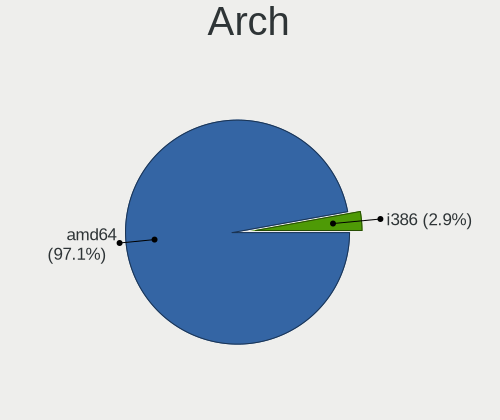
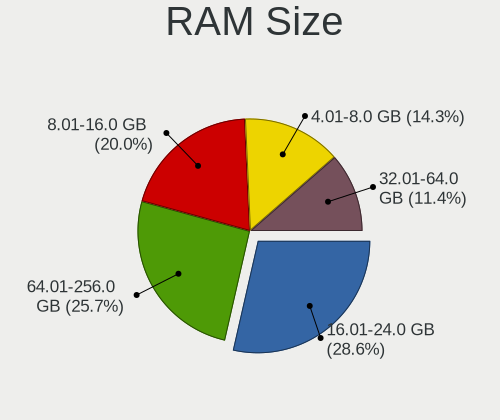
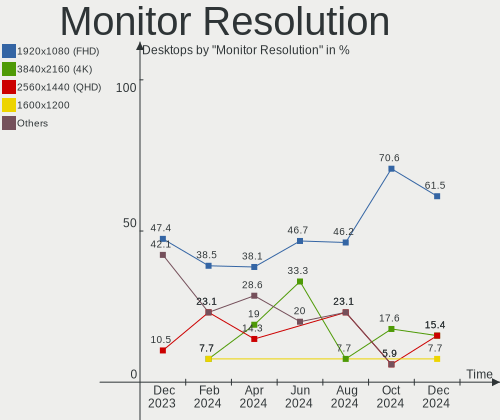
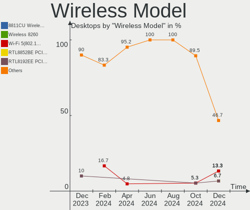
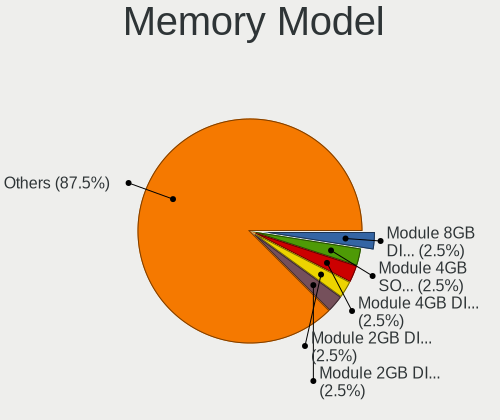
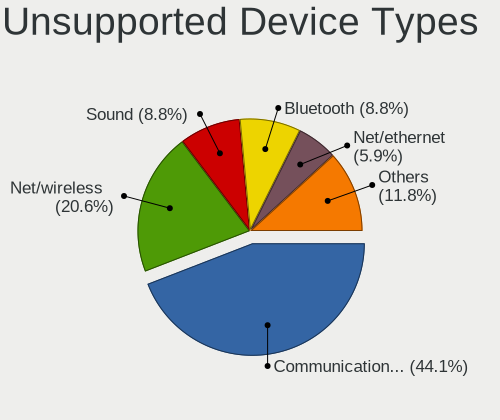

FreeBSD Hardware Trends (Desktop)
---------------------------------

A project to identify most popular hardware characteristics and track their change
over time based on data collected by FreeBSD users at https://BSD-Hardware.info.

Anyone can contribute to the study by uploading probes of their computers by
the [hw-probe](https://github.com/linuxhw/hw-probe/blob/master/INSTALL.BSD.md) tool:

    hw-probe -all -upload

Full-feature report is available here: https://bsd-hardware.info/?view=trends&formfactor=desktop

Period: Jun, 2021.

Contents
--------

- [ OS                       ](#os)
- [ OS Family                ](#os-family)
- [ Arch                     ](#arch)
- [ DE                       ](#de)
- [ Display Server           ](#display-server)
- [ Display Manager          ](#display-manager)
- [ OS Lang                  ](#os-lang)
- [ Boot Mode                ](#boot-mode)
- [ Filesystem               ](#filesystem)
- [ Part. scheme             ](#part-scheme)
- [ Country                  ](#country)
- [ City                     ](#city)
- [ Vendor                   ](#vendor)
- [ Model                    ](#model)
- [ Model Family             ](#model-family)
- [ MFG Year                 ](#mfg-year)
- [ Form Factor              ](#form-factor)
- [ Coreboot                 ](#coreboot)
- [ RAM Size                 ](#ram-size)
- [ RAM Used                 ](#ram-used)
- [ Has CD-ROM               ](#has-cd-rom)
- [ Total Drives             ](#total-drives)
- [ Has Ethernet             ](#has-ethernet)
- [ Has WiFi                 ](#has-wifi)
- [ Has Bluetooth            ](#has-bluetooth)
- [ Drive Vendor             ](#drive-vendor)
- [ Drive Model              ](#drive-model)
- [ HDD Vendor               ](#hdd-vendor)
- [ SSD Vendor               ](#ssd-vendor)
- [ Drive Kind               ](#drive-kind)
- [ Drive Connector          ](#drive-connector)
- [ Drive Size               ](#drive-size)
- [ Space Total              ](#space-total)
- [ Space Used               ](#space-used)
- [ Malfunc. Drives          ](#malfunc-drives)
- [ Malfunc. Drive Vendor    ](#malfunc-drive-vendor)
- [ Malfunc. HDD Vendor      ](#malfunc-hdd-vendor)
- [ Malfunc. Drive Kind      ](#malfunc-drive-kind)
- [ Failed Drives            ](#failed-drives)
- [ Failed Drive Vendor      ](#failed-drive-vendor)
- [ Drive Status             ](#drive-status)
- [ Storage Vendor           ](#storage-vendor)
- [ Storage Model            ](#storage-model)
- [ Storage Kind             ](#storage-kind)
- [ CPU Vendor               ](#cpu-vendor)
- [ CPU Model                ](#cpu-model)
- [ CPU Model Family         ](#cpu-model-family)
- [ CPU Cores                ](#cpu-cores)
- [ CPU Sockets              ](#cpu-sockets)
- [ CPU Threads              ](#cpu-threads)
- [ CPU Microarch            ](#cpu-microarch)
- [ GPU Vendor               ](#gpu-vendor)
- [ GPU Model                ](#gpu-model)
- [ GPU Combo                ](#gpu-combo)
- [ GPU Driver               ](#gpu-driver)
- [ GPU Memory               ](#gpu-memory)
- [ Monitor Vendor           ](#monitor-vendor)
- [ Monitor Model            ](#monitor-model)
- [ Monitor Resolution       ](#monitor-resolution)
- [ Monitor Diagonal         ](#monitor-diagonal)
- [ Monitor Width            ](#monitor-width)
- [ Aspect Ratio             ](#aspect-ratio)
- [ Monitor Area             ](#monitor-area)
- [ Pixel Density            ](#pixel-density)
- [ Multiple Monitors        ](#multiple-monitors)
- [ Net Controller Vendor    ](#net-controller-vendor)
- [ Net Controller Model     ](#net-controller-model)
- [ Wireless Vendor          ](#wireless-vendor)
- [ Wireless Model           ](#wireless-model)
- [ Ethernet Vendor          ](#ethernet-vendor)
- [ Ethernet Model           ](#ethernet-model)
- [ Net Controller Kind      ](#net-controller-kind)
- [ Used Controller          ](#used-controller)
- [ NICs                     ](#nics)
- [ IPv6                     ](#ipv6)
- [ Memory Vendor            ](#memory-vendor)
- [ Memory Model             ](#memory-model)
- [ Memory Kind              ](#memory-kind)
- [ Memory Form Factor       ](#memory-form-factor)
- [ Memory Size              ](#memory-size)
- [ Memory Speed             ](#memory-speed)
- [ Sound Vendor             ](#sound-vendor)
- [ Sound Model              ](#sound-model)
- [ Camera Vendor            ](#camera-vendor)
- [ Camera Model             ](#camera-model)
- [ Fingerprint Vendor       ](#fingerprint-vendor)
- [ Fingerprint Model        ](#fingerprint-model)
- [ Chipcard Vendor          ](#chipcard-vendor)
- [ Chipcard Model           ](#chipcard-model)
- [ Printer Vendor           ](#printer-vendor)
- [ Printer Model            ](#printer-model)
- [ Scanner Vendor           ](#scanner-vendor)
- [ Scanner Model            ](#scanner-model)
- [ Bluetooth Vendor         ](#bluetooth-vendor)
- [ Bluetooth Model          ](#bluetooth-model)
- [ Unsupported Devices      ](#unsupported-devices)
- [ Unsupported Device Types ](#unsupported-device-types)

OS
--

Installed operating systems

| Name                 | Desktops | Percent |
|----------------------|----------|---------|
| FreeBSD 13.0-p2      | 10       | 29.41%  |
| FreeBSD 13.0         | 9        | 26.47%  |
| FreeBSD 12.2-STABLE  | 3        | 8.82%   |
| FreeBSD 13.0-STABLE  | 2        | 5.88%   |
| FreeBSD 12.2-p8      | 2        | 5.88%   |
| FreeBSD 12.2         | 2        | 5.88%   |
| FreeBSD 14.0-CURRENT | 1        | 2.94%   |
| FreeBSD 13.0-p3      | 1        | 2.94%   |
| FreeBSD 13.0-p1      | 1        | 2.94%   |
| FreeBSD 12.1-p8      | 1        | 2.94%   |
| FreeBSD 12.1-p10     | 1        | 2.94%   |
| FreeBSD 11.4         | 1        | 2.94%   |

OS Family
---------

OS without a version

| Name    | Desktops | Percent |
|---------|----------|---------|
| FreeBSD | 34       | 100%    |

Arch
----

OS architecture (x86_64, i586, etc.)

| Name  | Desktops | Percent |
|-------|----------|---------|
| amd64 | 32       | 94.12%  |
| i386  | 1        | 2.94%   |
| arm64 | 1        | 2.94%   |

DE
--

Desktop Environment

| Name     | Desktops | Percent |
|----------|----------|---------|
| Console  | 15       | 44.12%  |
| KDE5     | 5        | 14.71%  |
| XFCE     | 4        | 11.76%  |
| MATE     | 4        | 11.76%  |
| TWM      | 1        | 2.94%   |
| Openbox  | 1        | 2.94%   |
| Lumina   | 1        | 2.94%   |
| GNOME    | 1        | 2.94%   |
| Fluxbox  | 1        | 2.94%   |
| Cinnamon | 1        | 2.94%   |

Display Server
--------------

X11 or Wayland

| Name    | Desktops | Percent |
|---------|----------|---------|
| X11     | 21       | 61.76%  |
| Console | 13       | 38.24%  |

Display Manager
---------------

SDDM, LightDM, etc.

| Name    | Desktops | Percent |
|---------|----------|---------|
| Console | 20       | 58.82%  |
| SDDM    | 6        | 17.65%  |
| XDM     | 3        | 8.82%   |
| SLiM    | 3        | 8.82%   |
| LightDM | 1        | 2.94%   |
| GDM     | 1        | 2.94%   |

OS Lang
-------

Language

| Lang    | Desktops | Percent |
|---------|----------|---------|
| C       | 16       | 47.06%  |
| Unknown | 6        | 17.65%  |
| en_US   | 5        | 14.71%  |
| de_DE   | 4        | 11.76%  |
| ru_RU   | 1        | 2.94%   |
| en_GB   | 1        | 2.94%   |
| en_CA   | 1        | 2.94%   |

Boot Mode
---------

EFI or BIOS

| Mode | Desktops | Percent |
|------|----------|---------|
| EFI  | 21       | 61.76%  |
| BIOS | 13       | 38.24%  |

Filesystem
----------

Type of filesystem

| Type | Desktops | Percent |
|------|----------|---------|
| Zfs  | 24       | 70.59%  |
| Ufs  | 10       | 29.41%  |

Part. scheme
------------

Scheme of partitioning

| Type | Desktops | Percent |
|------|----------|---------|
| GPT  | 32       | 94.12%  |
| MBR  | 2        | 5.88%   |

Country
-------

Geographic location (country)

| Country      | Desktops | Percent |
|--------------|----------|---------|
| USA          | 10       | 29.41%  |
| Russia       | 4        | 11.76%  |
| Germany      | 4        | 11.76%  |
| UK           | 3        | 8.82%   |
| Japan        | 3        | 8.82%   |
| Netherlands  | 2        | 5.88%   |
| Sweden       | 1        | 2.94%   |
| Spain        | 1        | 2.94%   |
| South Africa | 1        | 2.94%   |
| Lithuania    | 1        | 2.94%   |
| France       | 1        | 2.94%   |
| Brazil       | 1        | 2.94%   |
| Austria      | 1        | 2.94%   |
| Australia    | 1        | 2.94%   |

City
----

Geographic location (city)

| City                | Desktops | Percent |
|---------------------|----------|---------|
| Kamensk-Ural'skiy   | 3        | 8.82%   |
| Morris              | 2        | 5.88%   |
| Kirkland            | 2        | 5.88%   |
| Inzai               | 2        | 5.88%   |
| Hamburg             | 2        | 5.88%   |
| Yokohama            | 1        | 2.94%   |
| Wenatchee           | 1        | 2.94%   |
| Vilnius             | 1        | 2.94%   |
| Teteghem            | 1        | 2.94%   |
| Stuttgart           | 1        | 2.94%   |
| Stockholm           | 1        | 2.94%   |
| Slough              | 1        | 2.94%   |
| Salem               | 1        | 2.94%   |
| Rio de Janeiro      | 1        | 2.94%   |
| Novosibirsk         | 1        | 2.94%   |
| Minneapolis         | 1        | 2.94%   |
| Melle               | 1        | 2.94%   |
| Madrid              | 1        | 2.94%   |
| London              | 1        | 2.94%   |
| Lexington           | 1        | 2.94%   |
| Hoofddorp           | 1        | 2.94%   |
| Gambrills           | 1        | 2.94%   |
| Ferndorf            | 1        | 2.94%   |
| Coppell             | 1        | 2.94%   |
| Canberra            | 1        | 2.94%   |
| Burgess Hill        | 1        | 2.94%   |
| Barberton           | 1        | 2.94%   |
| Alphen aan den Rijn | 1        | 2.94%   |

Vendor
------

Motherboard manufacturer

| Name                    | Desktops | Percent |
|-------------------------|----------|---------|
| ASUSTek Computer        | 10       | 29.41%  |
| MSI                     | 5        | 14.71%  |
| ASRock                  | 5        | 14.71%  |
| Gigabyte Technology     | 3        | 8.82%   |
| Supermicro              | 2        | 5.88%   |
| Lenovo                  | 2        | 5.88%   |
| Dell                    | 2        | 5.88%   |
| Wistron                 | 1        | 2.94%   |
| Raspberry Pi Foundation | 1        | 2.94%   |
| Hewlett-Packard         | 1        | 2.94%   |
| GVC                     | 1        | 2.94%   |
| Biostar                 | 1        | 2.94%   |

Model
-----

Motherboard model

| Name                                    | Desktops | Percent |
|-----------------------------------------|----------|---------|
| Supermicro X7SPA-HF                     | 2        | 5.88%   |
| ASUS P5Q-E                              | 2        | 5.88%   |
| Wistron ProLiant ML110 G6               | 1        | 2.94%   |
| RPi rpi                                 | 1        | 2.94%   |
| MSI MS-7C36                             | 1        | 2.94%   |
| MSI MS-7B22                             | 1        | 2.94%   |
| MSI MS-7A32                             | 1        | 2.94%   |
| MSI MS-7918                             | 1        | 2.94%   |
| MSI MS-7817                             | 1        | 2.94%   |
| Lenovo ThinkStation P330 30CY008AGE     | 1        | 2.94%   |
| Lenovo IdeaCentre 510A-15ICB 90HV0005US | 1        | 2.94%   |
| HP ProLiant ML310 G5p                   | 1        | 2.94%   |
| GVC EQUIUM 3200M                        | 1        | 2.94%   |
| Gigabyte X570 I AORUS PRO WIFI          | 1        | 2.94%   |
| Gigabyte X470 AORUS GAMING 5 WIFI       | 1        | 2.94%   |
| Gigabyte A320M-S2H                      | 1        | 2.94%   |
| Dell PowerEdge T40                      | 1        | 2.94%   |
| Dell OptiPlex 5040                      | 1        | 2.94%   |
| Biostar TH67B                           | 1        | 2.94%   |
| ASUS TUF B450M-PRO GAMING               | 1        | 2.94%   |
| ASUS PRIME Z590M-PLUS                   | 1        | 2.94%   |
| ASUS PRIME Z590-P                       | 1        | 2.94%   |
| ASUS PRIME Z270-A                       | 1        | 2.94%   |
| ASUS PRIME X370-PRO                     | 1        | 2.94%   |
| ASUS PRIME B450M-GAMING/BR              | 1        | 2.94%   |
| ASUS P5K SE/EPU                         | 1        | 2.94%   |
| ASUS All Series                         | 1        | 2.94%   |
| ASRock X399M Taichi                     | 1        | 2.94%   |
| ASRock X370 Taichi                      | 1        | 2.94%   |
| ASRock B550 Phantom Gaming 4            | 1        | 2.94%   |
| ASRock B450M Pro4                       | 1        | 2.94%   |
| ASRock AMZ-FREENASMINI-DISKLESS-IXN     | 1        | 2.94%   |

Model Family
------------

Motherboard model prefix

| Name                                | Desktops | Percent |
|-------------------------------------|----------|---------|
| ASUS PRIME                          | 5        | 14.71%  |
| Supermicro X7SPA-HF                 | 2        | 5.88%   |
| ASUS P5Q-E                          | 2        | 5.88%   |
| Wistron ProLiant                    | 1        | 2.94%   |
| RPi rpi                             | 1        | 2.94%   |
| MSI MS-7C36                         | 1        | 2.94%   |
| MSI MS-7B22                         | 1        | 2.94%   |
| MSI MS-7A32                         | 1        | 2.94%   |
| MSI MS-7918                         | 1        | 2.94%   |
| MSI MS-7817                         | 1        | 2.94%   |
| Lenovo ThinkStation                 | 1        | 2.94%   |
| Lenovo IdeaCentre                   | 1        | 2.94%   |
| HP ProLiant                         | 1        | 2.94%   |
| GVC EQUIUM                          | 1        | 2.94%   |
| Gigabyte X570                       | 1        | 2.94%   |
| Gigabyte X470                       | 1        | 2.94%   |
| Gigabyte A320M-S2H                  | 1        | 2.94%   |
| Dell PowerEdge                      | 1        | 2.94%   |
| Dell OptiPlex                       | 1        | 2.94%   |
| Biostar TH67B                       | 1        | 2.94%   |
| ASUS TUF                            | 1        | 2.94%   |
| ASUS P5K                            | 1        | 2.94%   |
| ASUS All                            | 1        | 2.94%   |
| ASRock X399M                        | 1        | 2.94%   |
| ASRock X370                         | 1        | 2.94%   |
| ASRock B550                         | 1        | 2.94%   |
| ASRock B450M                        | 1        | 2.94%   |
| ASRock AMZ-FREENASMINI-DISKLESS-IXN | 1        | 2.94%   |

MFG Year
--------

Motherboard manufacture year

| Year    | Desktops | Percent |
|---------|----------|---------|
| 2019    | 9        | 26.47%  |
| 2020    | 6        | 17.65%  |
| 2021    | 4        | 11.76%  |
| 2012    | 3        | 8.82%   |
| 2018    | 2        | 5.88%   |
| 2017    | 2        | 5.88%   |
| 2014    | 2        | 5.88%   |
| 2009    | 2        | 5.88%   |
| 2011    | 1        | 2.94%   |
| 2010    | 1        | 2.94%   |
| 2008    | 1        | 2.94%   |
| Unknown | 1        | 2.94%   |

Form Factor
-----------

Physical design of the computer

| Name    | Desktops | Percent |
|---------|----------|---------|
| Desktop | 34       | 100%    |

Coreboot
--------

Have coreboot on board

| Used | Desktops | Percent |
|------|----------|---------|
| No   | 34       | 100%    |

RAM Size
--------

Total RAM memory

| Size in GB  | Desktops | Percent |
|-------------|----------|---------|
| 32.01-64.0  | 10       | 29.41%  |
| 4.01-8.0    | 7        | 20.59%  |
| 8.01-16.0   | 7        | 20.59%  |
| 16.01-24.0  | 5        | 14.71%  |
| 64.01-256.0 | 4        | 11.76%  |
| 0.01-0.5    | 1        | 2.94%   |

RAM Used
--------

Used RAM memory

| Used GB     | Desktops | Percent |
|-------------|----------|---------|
| 0.01-0.5    | 8        | 23.53%  |
| 0.51-1.0    | 6        | 17.65%  |
| 1.01-2.0    | 5        | 14.71%  |
| 4.01-8.0    | 3        | 8.82%   |
| 3.01-4.0    | 3        | 8.82%   |
| 8.01-16.0   | 3        | 8.82%   |
| 32.01-64.0  | 1        | 2.94%   |
| 24.01-32.0  | 1        | 2.94%   |
| 2.01-3.0    | 1        | 2.94%   |
| 64.01-256.0 | 1        | 2.94%   |
| 16.01-24.0  | 1        | 2.94%   |
| 0           | 1        | 2.94%   |

Has CD-ROM
----------

Has CD-ROM on board

| Presented | Desktops | Percent |
|-----------|----------|---------|
| No        | 21       | 61.76%  |
| Yes       | 13       | 38.24%  |

Total Drives
------------

Number of drives on board

| Drives | Desktops | Percent |
|--------|----------|---------|
| 3      | 9        | 26.47%  |
| 2      | 7        | 20.59%  |
| 1      | 6        | 17.65%  |
| 7      | 3        | 8.82%   |
| 6      | 2        | 5.88%   |
| 4      | 2        | 5.88%   |
| 0      | 2        | 5.88%   |
| 13     | 1        | 2.94%   |
| 10     | 1        | 2.94%   |
| 5      | 1        | 2.94%   |

Has Ethernet
------------

Has Ethernet on board

| Presented | Desktops | Percent |
|-----------|----------|---------|
| Yes       | 32       | 94.12%  |
| No        | 2        | 5.88%   |

Has WiFi
--------

Has WiFi module

| Presented | Desktops | Percent |
|-----------|----------|---------|
| No        | 26       | 76.47%  |
| Yes       | 8        | 23.53%  |

Has Bluetooth
-------------

Has Bluetooth module

| Presented | Desktops | Percent |
|-----------|----------|---------|
| No        | 25       | 73.53%  |
| Yes       | 9        | 26.47%  |

Drive Vendor
------------

Hard drive vendors

| Vendor              | Desktops | Drives | Percent |
|---------------------|----------|--------|---------|
| WDC                 | 14       | 42     | 22.22%  |
| Seagate             | 14       | 30     | 22.22%  |
| Samsung Electronics | 11       | 16     | 17.46%  |
| Toshiba             | 5        | 7      | 7.94%   |
| Crucial             | 3        | 3      | 4.76%   |
| Kingston            | 2        | 3      | 3.17%   |
| Intel               | 2        | 2      | 3.17%   |
| SK Hynix            | 1        | 1      | 1.59%   |
| SanDisk             | 1        | 1      | 1.59%   |
| Phison              | 1        | 1      | 1.59%   |
| Micron Technology   | 1        | 1      | 1.59%   |
| MAXTOR              | 1        | 1      | 1.59%   |
| KingDian            | 1        | 1      | 1.59%   |
| Hitachi             | 1        | 1      | 1.59%   |
| HGST                | 1        | 1      | 1.59%   |
| Hewlett-Packard     | 1        | 1      | 1.59%   |
| Apacer              | 1        | 1      | 1.59%   |
| AMD                 | 1        | 1      | 1.59%   |
| A-DATA Technology   | 1        | 2      | 1.59%   |

Drive Model
-----------

Hard drive models

| Model                                        | Desktops | Percent |
|----------------------------------------------|----------|---------|
| Seagate ST4000DM000-1F2168 4TB               | 4        | 4.82%   |
| Seagate ST500LM000-1EJ162-SSHD 500GB         | 2        | 2.41%   |
| Samsung SSD 960 EVO 500GB                    | 2        | 2.41%   |
| Samsung SSD 860 EVO 1TB                      | 2        | 2.41%   |
| Samsung SSD 850 PRO 512GB                    | 2        | 2.41%   |
| Samsung SSD 850 EVO 250GB                    | 2        | 2.41%   |
| WDC WDS500G2B0B-00YS70 500GB                 | 1        | 1.2%    |
| WDC WDS500G1X0E-00AFY0 500GB                 | 1        | 1.2%    |
| WDC WDS100T3X0C-00SJG0 1TB                   | 1        | 1.2%    |
| WDC WDS100T2X0C-00L350 1TB                   | 1        | 1.2%    |
| WDC WDS100T1X0E-00AFY0 1TB                   | 1        | 1.2%    |
| WDC WD80EMAZ-00WJTA0 8TB                     | 1        | 1.2%    |
| WDC WD80EFZX-68UW8N0 8TB                     | 1        | 1.2%    |
| WDC WD80EFAX-68LHPN0 8TB                     | 1        | 1.2%    |
| WDC WD80EFAX-68KNBN0 8TB                     | 1        | 1.2%    |
| WDC WD8003FFBX-68B9AN0 8TB                   | 1        | 1.2%    |
| WDC WD60EZRZ-00GZ5B1 6TB                     | 1        | 1.2%    |
| WDC WD40PURZ-85TTDY0 4TB                     | 1        | 1.2%    |
| WDC WD40EZRZ-22GXCB0 4TB                     | 1        | 1.2%    |
| WDC WD4003FFBX-68MU3N0 4TB                   | 1        | 1.2%    |
| WDC WD120EMFZ-11A6JA0 12TB                   | 1        | 1.2%    |
| WDC WD120EMAZ-11BLFA0 12TB                   | 1        | 1.2%    |
| WDC WD10EZEX-00RKKA0 1TB                     | 1        | 1.2%    |
| WDC WD10EACS-65D6B0 1TB                      | 1        | 1.2%    |
| WDC WD101KFBX-68R56N0 10TB                   | 1        | 1.2%    |
| WDC WD1001FALS-00J7B0 1TB                    | 1        | 1.2%    |
| WDC PC SN730 SDBQNTY-512G-1001 512GB         | 1        | 1.2%    |
| WDC PC SN520 SDAPNUW-256G-1006 256GB         | 1        | 1.2%    |
| Toshiba MQ02ABF050H 500GB                    | 1        | 1.2%    |
| Toshiba MQ02ABD100H 1TB                      | 1        | 1.2%    |
| Toshiba MQ01ACF032 320GB                     | 1        | 1.2%    |
| Toshiba MQ01ABD050 500GB                     | 1        | 1.2%    |
| Toshiba MD04ACA400 4TB                       | 1        | 1.2%    |
| Toshiba DT01ACA300 3TB                       | 1        | 1.2%    |
| SK Hynix SHGS31-500GS-2 500GB                | 1        | 1.2%    |
| Seagate ST8000NM0055-1RM112 8TB              | 1        | 1.2%    |
| Seagate ST4000VN008-2DR166 4TB               | 1        | 1.2%    |
| Seagate ST4000DM005-2DP166 4TB               | 1        | 1.2%    |
| Seagate ST4000DM004-2CV104 4TB               | 1        | 1.2%    |
| Seagate ST380013AS 80GB                      | 1        | 1.2%    |
| Seagate ST3500418AS 500GB                    | 1        | 1.2%    |
| Seagate ST3000VN007-2E4166 3TB               | 1        | 1.2%    |
| Seagate ST3000VN007-2AH16M 3TB               | 1        | 1.2%    |
| Seagate ST2000DM001-1ER164 2TB               | 1        | 1.2%    |
| Seagate ST2000DM001-1CH164 2TB               | 1        | 1.2%    |
| Seagate ST1000DM010-2EP102 1TB               | 1        | 1.2%    |
| Seagate ST1000DL002-9TT153 1TB               | 1        | 1.2%    |
| Seagate ST10000NM0086-2AA101 10TB            | 1        | 1.2%    |
| Seagate BarraCuda 120 SSD ZA500CM10003 500GB | 1        | 1.2%    |
| SanDisk SD7TB3Q-256G-1006 256GB              | 1        | 1.2%    |
| Samsung SSD 970 EVO 1TB                      | 1        | 1.2%    |
| Samsung SSD 860 QVO 1TB                      | 1        | 1.2%    |
| Samsung SSD 860 EVO 500GB                    | 1        | 1.2%    |
| Samsung SSD 850 PRO 128GB                    | 1        | 1.2%    |
| Samsung SSD 850 EVO 1TB                      | 1        | 1.2%    |
| Samsung HM500JI 500GB                        | 1        | 1.2%    |
| Samsung HD501LJ 500GB                        | 1        | 1.2%    |
| Phison Sabrent 1TB                           | 1        | 1.2%    |
| Micron MTFDDAK256MBF-1AN15ABHA 256GB         | 1        | 1.2%    |
| MAXTOR STM3160815AS 160GB                    | 1        | 1.2%    |

HDD Vendor
----------

Hard disk drive vendors

| Vendor              | Desktops | Drives | Percent |
|---------------------|----------|--------|---------|
| Seagate             | 14       | 29     | 38.89%  |
| WDC                 | 11       | 33     | 30.56%  |
| Toshiba             | 5        | 7      | 13.89%  |
| Samsung Electronics | 2        | 2      | 5.56%   |
| MAXTOR              | 1        | 1      | 2.78%   |
| Hitachi             | 1        | 1      | 2.78%   |
| HGST                | 1        | 1      | 2.78%   |
| Hewlett-Packard     | 1        | 1      | 2.78%   |

SSD Vendor
----------

Solid state drive vendors

| Vendor              | Desktops | Drives | Percent |
|---------------------|----------|--------|---------|
| Samsung Electronics | 9        | 11     | 37.5%   |
| Kingston            | 2        | 3      | 8.33%   |
| Intel               | 2        | 2      | 8.33%   |
| Crucial             | 2        | 2      | 8.33%   |
| WDC                 | 1        | 1      | 4.17%   |
| SK Hynix            | 1        | 1      | 4.17%   |
| Seagate             | 1        | 1      | 4.17%   |
| SanDisk             | 1        | 1      | 4.17%   |
| Micron Technology   | 1        | 1      | 4.17%   |
| KingDian            | 1        | 1      | 4.17%   |
| Apacer              | 1        | 1      | 4.17%   |
| AMD                 | 1        | 1      | 4.17%   |
| A-DATA Technology   | 1        | 1      | 4.17%   |

Drive Kind
----------

HDD or SSD

| Kind | Desktops | Drives | Percent |
|------|----------|--------|---------|
| HDD  | 24       | 75     | 48.98%  |
| SSD  | 15       | 27     | 30.61%  |
| NVMe | 10       | 14     | 20.41%  |

Drive Connector
---------------

SATA, SAS, NVMe, etc.

| Type | Desktops | Drives | Percent |
|------|----------|--------|---------|
| SATA | 31       | 102    | 75.61%  |
| NVMe | 10       | 14     | 24.39%  |

Drive Size
----------

Size of hard drive

| Size in TB | Desktops | Drives | Percent |
|------------|----------|--------|---------|
| 0.01-0.5   | 16       | 37     | 38.1%   |
| 0.51-1.0   | 9        | 15     | 21.43%  |
| 4.01-10.0  | 7        | 25     | 16.67%  |
| 3.01-4.0   | 6        | 17     | 14.29%  |
| 2.01-3.0   | 2        | 4      | 4.76%   |
| 10.01-20.0 | 1        | 2      | 2.38%   |
| 1.01-2.0   | 1        | 2      | 2.38%   |

Space Total
-----------

Amount of disk space available on the file system

| Size in GB     | Desktops | Percent |
|----------------|----------|---------|
| 101-250        | 8        | 23.53%  |
| 251-500        | 5        | 14.71%  |
| 1-20           | 5        | 14.71%  |
| 501-1000       | 5        | 14.71%  |
| 21-50          | 4        | 11.76%  |
| 2001-3000      | 2        | 5.88%   |
| 1001-2000      | 2        | 5.88%   |
| Unknown        | 2        | 5.88%   |
| More than 3000 | 1        | 2.94%   |

Space Used
----------

Amount of used disk space

| Used GB | Desktops | Percent |
|---------|----------|---------|
| 1-20    | 27       | 79.41%  |
| 21-50   | 4        | 11.76%  |
| Unknown | 2        | 5.88%   |
| 101-250 | 1        | 2.94%   |

Malfunc. Drives
---------------

Drive models with a malfunction

| Model                      | Desktops | Drives | Percent |
|----------------------------|----------|--------|---------|
| Toshiba MQ02ABD100H 1TB    | 1        | 1      | 20%     |
| Seagate ST380013AS 80GB    | 1        | 2      | 20%     |
| Seagate ST3500418AS 500GB  | 1        | 2      | 20%     |
| MAXTOR STM3160815AS 160GB  | 1        | 1      | 20%     |
| HGST HTS725050A7E630 500GB | 1        | 1      | 20%     |

Malfunc. Drive Vendor
---------------------

Vendors of faulty drives

| Vendor  | Desktops | Drives | Percent |
|---------|----------|--------|---------|
| Seagate | 2        | 4      | 40%     |
| Toshiba | 1        | 1      | 20%     |
| MAXTOR  | 1        | 1      | 20%     |
| HGST    | 1        | 1      | 20%     |

Malfunc. HDD Vendor
-------------------

Vendors of faulty HDD drives

| Vendor  | Desktops | Drives | Percent |
|---------|----------|--------|---------|
| Seagate | 2        | 4      | 40%     |
| Toshiba | 1        | 1      | 20%     |
| MAXTOR  | 1        | 1      | 20%     |
| HGST    | 1        | 1      | 20%     |

Malfunc. Drive Kind
-------------------

Kinds of faulty drives

| Kind | Desktops | Drives | Percent |
|------|----------|--------|---------|
| HDD  | 5        | 7      | 100%    |

Failed Drives
-------------

Failed drive models

Zero info for selected period =(

Failed Drive Vendor
-------------------

Failed drive vendors

Zero info for selected period =(

Drive Status
------------

Number of failed and malfunc. drives

| Status   | Desktops | Drives | Percent |
|----------|----------|--------|---------|
| Works    | 30       | 107    | 81.08%  |
| Malfunc  | 5        | 7      | 13.51%  |
| Detected | 2        | 2      | 5.41%   |

Storage Vendor
--------------

Storage controller vendors

| Vendor                    | Desktops | Percent |
|---------------------------|----------|---------|
| Intel                     | 21       | 39.62%  |
| AMD                       | 12       | 22.64%  |
| Sandisk                   | 5        | 9.43%   |
| Samsung Electronics       | 3        | 5.66%   |
| Marvell Technology Group  | 3        | 5.66%   |
| Broadcom / LSI            | 2        | 3.77%   |
| ASMedia Technology        | 2        | 3.77%   |
| Phison Electronics        | 1        | 1.89%   |
| Micron/Crucial Technology | 1        | 1.89%   |
| Hewlett-Packard           | 1        | 1.89%   |
| Chelsio Communications    | 1        | 1.89%   |
| ADATA Technology          | 1        | 1.89%   |

Storage Model
-------------

Storage controller models

| Model                                                                          | Desktops | Percent |
|--------------------------------------------------------------------------------|----------|---------|
| AMD FCH SATA Controller [AHCI mode]                                            | 11       | 16.42%  |
| Intel Cannon Lake PCH SATA AHCI Controller                                     | 4        | 5.97%   |
| AMD 400 Series Chipset SATA Controller                                         | 4        | 5.97%   |
| AMD X370 Series Chipset SATA Controller                                        | 3        | 4.48%   |
| Sandisk WD Black SN850                                                         | 2        | 2.99%   |
| Sandisk WD Black SN750 / PC SN730 NVMe SSD                                     | 2        | 2.99%   |
| Samsung NVMe SSD Controller SM961/PM961/SM963                                  | 2        | 2.99%   |
| Marvell Group 88SE6111/6121 SATA II / PATA Controller                          | 2        | 2.99%   |
| Intel 82801JI (ICH10 Family) SATA AHCI Controller                              | 2        | 2.99%   |
| Intel 82801IR/IO/IH (ICH9R/DO/DH) 6 port SATA Controller [AHCI mode]           | 2        | 2.99%   |
| Intel 500 Series Chipset Family SATA AHCI Controller                           | 2        | 2.99%   |
| ASMedia ASM1062 Serial ATA Controller                                          | 2        | 2.99%   |
| Sandisk WD Blue SN500 / PC SN520 NVMe SSD                                      | 1        | 1.49%   |
| Sandisk WD Black 2018/SN750 / PC SN720 NVMe SSD                                | 1        | 1.49%   |
| Samsung NVMe SSD Controller SM981/PM981/PM983                                  | 1        | 1.49%   |
| Phison E12 NVMe Controller                                                     | 1        | 1.49%   |
| Micron/Crucial P2 NVMe PCIe SSD                                                | 1        | 1.49%   |
| Marvell Group 88SE9230 PCIe 2.0 x2 4-port SATA 6 Gb/s RAID Controller          | 1        | 1.49%   |
| Marvell Group 88SE9172 SATA 6Gb/s Controller                                   | 1        | 1.49%   |
| Intel Q170/Q150/B150/H170/H110/Z170/CM236 Chipset SATA Controller [AHCI Mode]  | 1        | 1.49%   |
| Intel C610/X99 series chipset sSATA Controller [AHCI mode]                     | 1        | 1.49%   |
| Intel C610/X99 series chipset 6-Port SATA Controller [AHCI mode]               | 1        | 1.49%   |
| Intel Atom processor C2000 AHCI SATA3 Controller                               | 1        | 1.49%   |
| Intel Atom processor C2000 AHCI SATA2 Controller                               | 1        | 1.49%   |
| Intel 9 Series Chipset Family SATA Controller [AHCI Mode]                      | 1        | 1.49%   |
| Intel 82801IR/IO/IH (ICH9R/DO/DH) 4 port SATA Controller [IDE mode]            | 1        | 1.49%   |
| Intel 82801IB (ICH9) 4 port SATA Controller [AHCI mode]                        | 1        | 1.49%   |
| Intel 82801I (ICH9 Family) 2 port SATA Controller [IDE mode]                   | 1        | 1.49%   |
| Intel 82371AB/EB/MB PIIX4 IDE                                                  | 1        | 1.49%   |
| Intel 8 Series/C220 Series Chipset Family 6-port SATA Controller 1 [AHCI mode] | 1        | 1.49%   |
| Intel 6 Series/C200 Series Chipset Family 6 port Desktop SATA AHCI Controller  | 1        | 1.49%   |
| Intel 5 Series/3400 Series Chipset 6 port SATA AHCI Controller                 | 1        | 1.49%   |
| Intel 200 Series PCH SATA controller [AHCI mode]                               | 1        | 1.49%   |
| HP Smart Array Controller                                                      | 1        | 1.49%   |
| Chelsio T420-CR Unified Wire Storage Controller                                | 1        | 1.49%   |
| Broadcom / LSI SAS2008 PCI-Express Fusion-MPT SAS-2 [Falcon]                   | 1        | 1.49%   |
| Broadcom / LSI SAS2004 PCI-Express Fusion-MPT SAS-2 [Spitfire]                 | 1        | 1.49%   |
| AMD X399 Series Chipset SATA Controller                                        | 1        | 1.49%   |
| AMD Starship/Matisse Chipset SATA Controller [AHCI mode]                       | 1        | 1.49%   |
| AMD FCH SATA Controller D                                                      | 1        | 1.49%   |
| ADATA XPG SX8200 Pro PCIe Gen3x4 M.2 2280 Solid State Drive                    | 1        | 1.49%   |

Storage Kind
------------

Kind of storage controller (IDE, SATA, NVMe, SAS, ...)

| Kind | Desktops | Percent |
|------|----------|---------|
| SATA | 31       | 63.27%  |
| NVMe | 10       | 20.41%  |
| IDE  | 4        | 8.16%   |
| SAS  | 2        | 4.08%   |
| RAID | 1        | 2.04%   |
| SCSI | 1        | 2.04%   |

CPU Vendor
----------

Processor vendors

| Vendor  | Desktops | Percent |
|---------|----------|---------|
| Intel   | 21       | 61.76%  |
| AMD     | 12       | 35.29%  |
| Unknown | 1        | 2.94%   |

CPU Model
---------

Processor models

| Model                                          | Desktops | Percent |
|------------------------------------------------|----------|---------|
| AMD Ryzen 5 2600 Six-Core Processor            | 3        | 8.82%   |
| AMD Ryzen 5 5600X 6-Core Processor             | 2        | 5.88%   |
| Intel Xeon E-2224G CPU @ 3.50GHz               | 1        | 2.94%   |
| Intel Xeon CPU X5460 @ 3.16GHz                 | 1        | 2.94%   |
| Intel Xeon CPU E3-1265L V2 @ 2.50GHz           | 1        | 2.94%   |
| Intel Xeon                                     | 1        | 2.94%   |
| Intel Pentium II                               | 1        | 2.94%   |
| Intel Pentium CPU G3220 @ 3.00GHz              | 1        | 2.94%   |
| Intel Core i7-9700K CPU @ 3.60GHz              | 1        | 2.94%   |
| Intel Core i7-8700 CPU @ 3.20GHz               | 1        | 2.94%   |
| Intel Core i7-6800K CPU @ 3.40GHz              | 1        | 2.94%   |
| Intel Core i5-6500 CPU @ 3.20GHz               | 1        | 2.94%   |
| Intel Core i5-4690K CPU @ 3.50GHz              | 1        | 2.94%   |
| Intel Core i3-8100 CPU @ 3.60GHz               | 1        | 2.94%   |
| Intel Core 2 Quad CPU Q6600 @ 2.40GHz          | 1        | 2.94%   |
| Intel Core 2 Duo CPU E7300 @ 2.66GHz           | 1        | 2.94%   |
| Intel Celeron CPU G3900 @ 2.80GHz              | 1        | 2.94%   |
| Intel Celeron CPU G1101 @ 2.27GHz              | 1        | 2.94%   |
| Intel Atom CPU D525 @ 1.80GHz                  | 1        | 2.94%   |
| Intel Atom CPU D510 @ 1.66GHz                  | 1        | 2.94%   |
| Intel Atom CPU C2750 @ 2.40GHz                 | 1        | 2.94%   |
| Intel 11th Gen Core i9-11900T @ 1.50GHz        | 1        | 2.94%   |
| Intel 11th Gen Core i5-11600K @ 3.90GHz        | 1        | 2.94%   |
| AMD Ryzen Threadripper 2920X 12-Core Processor | 1        | 2.94%   |
| AMD Ryzen 9 5950X 16-Core Processor            | 1        | 2.94%   |
| AMD Ryzen 7 1800X Eight-Core Processor         | 1        | 2.94%   |
| AMD Ryzen 7 1700X Eight-Core Processor         | 1        | 2.94%   |
| AMD Ryzen 7 1700 Eight-Core Processor          | 1        | 2.94%   |
| AMD Ryzen 5 2400G with Radeon Vega Graphics    | 1        | 2.94%   |
| AMD Ryzen 3 3200G with Radeon Vega Graphics    | 1        | 2.94%   |
|                                                | 1        | 2.94%   |

CPU Model Family
----------------

Processor model prefix

| Model                  | Desktops | Percent |
|------------------------|----------|---------|
| AMD Ryzen 5            | 6        | 17.65%  |
| Intel Xeon             | 4        | 11.76%  |
| Other                  | 3        | 8.82%   |
| Intel Core i7          | 3        | 8.82%   |
| Intel Atom             | 3        | 8.82%   |
| AMD Ryzen 7            | 3        | 8.82%   |
| Intel Pentium          | 2        | 5.88%   |
| Intel Core i5          | 2        | 5.88%   |
| Intel Celeron          | 2        | 5.88%   |
| Intel Core i3          | 1        | 2.94%   |
| Intel Core 2 Quad      | 1        | 2.94%   |
| Intel Core 2 Duo       | 1        | 2.94%   |
| AMD Ryzen Threadripper | 1        | 2.94%   |
| AMD Ryzen 9            | 1        | 2.94%   |
| AMD Ryzen 3            | 1        | 2.94%   |

CPU Cores
---------

Number of processor cores

| Number  | Desktops | Percent |
|---------|----------|---------|
| 4       | 9        | 26.47%  |
| 12      | 5        | 14.71%  |
| 2       | 5        | 14.71%  |
| 8       | 4        | 11.76%  |
| 16      | 3        | 8.82%   |
| 6       | 3        | 8.82%   |
| Unknown | 2        | 5.88%   |
| 32      | 1        | 2.94%   |
| 24      | 1        | 2.94%   |
| 1       | 1        | 2.94%   |

CPU Sockets
-----------

Number of sockets

| Number | Desktops | Percent |
|--------|----------|---------|
| 1      | 34       | 100%    |

CPU Threads
-----------

Threads per core (Hyper-Threading)

| Number  | Desktops | Percent |
|---------|----------|---------|
| 1       | 24       | 70.59%  |
| 2       | 7        | 20.59%  |
| Unknown | 3        | 8.82%   |

CPU Microarch
-------------

Microarchitecture

| Name       | Desktops | Percent |
|------------|----------|---------|
| Zen+       | 5        | 14.71%  |
| Zen        | 4        | 11.76%  |
| KabyLake   | 4        | 11.76%  |
| Zen 3      | 3        | 8.82%   |
| Unknown    | 3        | 8.82%   |
| Skylake    | 2        | 5.88%   |
| Penryn     | 2        | 5.88%   |
| Haswell    | 2        | 5.88%   |
| Core       | 2        | 5.88%   |
| Bonnell    | 2        | 5.88%   |
| Westmere   | 1        | 2.94%   |
| Silvermont | 1        | 2.94%   |
| P6         | 1        | 2.94%   |
| IvyBridge  | 1        | 2.94%   |
| Broadwell  | 1        | 2.94%   |

GPU Vendor
----------

Vendors of graphics cards

| Vendor                               | Desktops | Percent |
|--------------------------------------|----------|---------|
| Nvidia                               | 15       | 44.12%  |
| Intel                                | 10       | 29.41%  |
| AMD                                  | 5        | 14.71%  |
| Matrox Electronics Systems           | 2        | 5.88%   |
| NVidia / SGS Thomson (Joint Venture) | 1        | 2.94%   |
| ASPEED Technology                    | 1        | 2.94%   |

GPU Model
---------

Graphics card models

| Model                                                                       | Desktops | Percent |
|-----------------------------------------------------------------------------|----------|---------|
| Nvidia GP108 [GeForce GT 1030]                                              | 2        | 5.88%   |
| Nvidia GP107 [GeForce GTX 1050 Ti]                                          | 2        | 5.88%   |
| Nvidia GM206 [GeForce GTX 960]                                              | 2        | 5.88%   |
| Intel RocketLake-S GT1 [UHD Graphics 750]                                   | 2        | 5.88%   |
| Nvidia TU104 [GeForce RTX 2080 Rev. A]                                      | 1        | 2.94%   |
| Nvidia NV43 [GeForce 6600]                                                  | 1        | 2.94%   |
| Nvidia GT218 [NVS 300]                                                      | 1        | 2.94%   |
| Nvidia GP106GL [Quadro P2000]                                               | 1        | 2.94%   |
| Nvidia GP104 [GeForce GTX 1070]                                             | 1        | 2.94%   |
| Nvidia GM107 [GeForce GTX 750 Ti]                                           | 1        | 2.94%   |
| Nvidia GK208B [GeForce GT 710]                                              | 1        | 2.94%   |
| Nvidia G98 [GeForce 8400 GS Rev. 2]                                         | 1        | 2.94%   |
| Nvidia G72 [GeForce 7200 GS / 7300 SE]                                      | 1        | 2.94%   |
| NVidia / SGS Thomson (Joint Venture) Riva128                                | 1        | 2.94%   |
| Matrox Electronics Systems MGA G200eW WPCM450                               | 1        | 2.94%   |
| Matrox Electronics Systems MGA G200e [Pilot] ServerEngines (SEP1)           | 1        | 2.94%   |
| Intel Xeon E3-1200 v3/4th Gen Core Processor Integrated Graphics Controller | 1        | 2.94%   |
| Intel Xeon E3-1200 v2/Ivy Bridge Graphics Controller                        | 1        | 2.94%   |
| Intel HD Graphics 530                                                       | 1        | 2.94%   |
| Intel HD Graphics 510                                                       | 1        | 2.94%   |
| Intel CometLake-S GT2 [UHD Graphics 630]                                    | 1        | 2.94%   |
| Intel CoffeeLake-S GT2 [UHD Graphics P630]                                  | 1        | 2.94%   |
| Intel CoffeeLake-S GT2 [UHD Graphics 630]                                   | 1        | 2.94%   |
| Intel Atom Processor D4xx/D5xx/N4xx/N5xx Integrated Graphics Controller     | 1        | 2.94%   |
| ASPEED Technology ASPEED Graphics Family                                    | 1        | 2.94%   |
| AMD Raven Ridge [Radeon Vega Series / Radeon Vega Mobile Series]            | 1        | 2.94%   |
| AMD ES1000                                                                  | 1        | 2.94%   |
| AMD Ellesmere [Radeon RX 470/480/570/570X/580/580X/590]                     | 1        | 2.94%   |
| AMD Caicos [Radeon HD 6450/7450/8450 / R5 230 OEM]                          | 1        | 2.94%   |
| AMD Baffin [Radeon RX 550 640SP / RX 560/560X]                              | 1        | 2.94%   |

GPU Combo
---------

Combinations of graphics cards

| Name                                     | Desktops | Percent |
|------------------------------------------|----------|---------|
| 1 x Nvidia                               | 14       | 41.18%  |
| 1 x Intel                                | 8        | 23.53%  |
| 1 x AMD                                  | 5        | 14.71%  |
| 1 x Matrox                               | 2        | 5.88%   |
| Other                                    | 1        | 2.94%   |
| 2 x Intel                                | 1        | 2.94%   |
| 1 x NVidia / SGS Thomson (Joint Venture) | 1        | 2.94%   |
| Intel + Nvidia                           | 1        | 2.94%   |
| 1 x ASPEED                               | 1        | 2.94%   |

GPU Driver
----------

Free vs proprietary

| Driver      | Desktops | Percent |
|-------------|----------|---------|
| Free        | 21       | 61.76%  |
| Proprietary | 12       | 35.29%  |
| Unknown     | 1        | 2.94%   |

GPU Memory
----------

Total video memory

| Size in GB | Desktops | Percent |
|------------|----------|---------|
| Unknown    | 21       | 61.76%  |
| 1.01-2.0   | 5        | 14.71%  |
| 7.01-8.0   | 2        | 5.88%   |
| 3.01-4.0   | 2        | 5.88%   |
| 0.51-1.0   | 2        | 5.88%   |
| 4.01-5.0   | 1        | 2.94%   |
| 0.01-0.5   | 1        | 2.94%   |

Monitor Vendor
--------------

Monitor vendors

| Vendor              | Desktops | Percent |
|---------------------|----------|---------|
| Samsung Electronics | 6        | 27.27%  |
| Goldstar            | 4        | 18.18%  |
| Dell                | 3        | 13.64%  |
| ASUSTek Computer    | 2        | 9.09%   |
| Acer                | 2        | 9.09%   |
| Unknown             | 1        | 4.55%   |
| Sony                | 1        | 4.55%   |
| Sceptre Tech        | 1        | 4.55%   |
| Iiyama              | 1        | 4.55%   |
| AOC                 | 1        | 4.55%   |

Monitor Model
-------------

Monitor models

| Model                                                                | Desktops | Percent |
|----------------------------------------------------------------------|----------|---------|
| Unknown LCD Monitor KJT4K2K60DP 3840x2160                            | 1        | 4%      |
| Sony LCD Monitor TV  *00 3840x2160                                   | 1        | 4%      |
| Sceptre Tech Sceptre E20 SPT080D 1600x900 410x280mm 19.5-inch        | 1        | 4%      |
| Samsung Electronics U28D590 SAM0B80 3840x2160 610x350mm 27.7-inch    | 1        | 4%      |
| Samsung Electronics SyncMaster SAM021E 1680x1050 430x270mm 20.0-inch | 1        | 4%      |
| Samsung Electronics S24F350 SAM0D20 1920x1080 520x290mm 23.4-inch    | 1        | 4%      |
| Samsung Electronics S24D390 SAM0B65 1920x1080 520x290mm 23.4-inch    | 1        | 4%      |
| Samsung Electronics S24C650 SAM09E8 1920x1080 520x290mm 23.4-inch    | 1        | 4%      |
| Samsung Electronics S24C650 SAM09E7 1920x1080 520x290mm 23.4-inch    | 1        | 4%      |
| Iiyama PL2283H IVM562E 1920x1080 500x290mm 22.8-inch                 | 1        | 4%      |
| Iiyama PL2273HD IVM561A 1920x1080 480x270mm 21.7-inch                | 1        | 4%      |
| Goldstar LG Ultra HD GSM5B09 3840x2160 600x340mm 27.2-inch           | 1        | 4%      |
| Goldstar LG HDR 4K GSM7707 3840x2160 600x340mm 27.2-inch             | 1        | 4%      |
| Goldstar 23EA53 GSM59A8 1920x1080 510x290mm 23.1-inch                | 1        | 4%      |
| Goldstar 22EA53 GSM59A4 1920x1080 480x270mm 21.7-inch                | 1        | 4%      |
| Dell U2415 DELA0BA 1920x1200 520x320mm 24.0-inch                     | 1        | 4%      |
| Dell U2312HM DEL4073 1920x1080 510x290mm 23.1-inch                   | 1        | 4%      |
| Dell SE2216H DELF070 1920x1080 480x270mm 21.7-inch                   | 1        | 4%      |
| ASUSTek Computer VG32V AUS32A3 2560x1440 700x390mm 31.5-inch         | 1        | 4%      |
| ASUSTek Computer VG245 AUS24A1 1920x1080 530x300mm 24.0-inch         | 1        | 4%      |
| AOC 2350 AOC2350 1920x1080 510x290mm 23.1-inch                       | 1        | 4%      |
| Acer LCD Monitor X233H 5760x1080                                     | 1        | 4%      |
| Acer LCD Monitor X233H                                               | 1        | 4%      |
| Acer LCD Monitor K272HL 5760x1080                                    | 1        | 4%      |
| Acer K202HQL ACR03E0 1600x900 430x240mm 19.4-inch                    | 1        | 4%      |

Monitor Resolution
------------------

Monitor screen resolution

| Resolution         | Desktops | Percent |
|--------------------|----------|---------|
| 1920x1080 (FHD)    | 9        | 45%     |
| 3840x2160 (4K)     | 5        | 25%     |
| 5760x1080          | 1        | 5%      |
| 2560x1440 (QHD)    | 1        | 5%      |
| 1920x1200 (WUXGA)  | 1        | 5%      |
| 1680x1050 (WSXGA+) | 1        | 5%      |
| 1600x900 (HD+)     | 1        | 5%      |
| Unknown            | 1        | 5%      |

Monitor Diagonal
----------------

Diagonal size in inches

| Inches  | Desktops | Percent |
|---------|----------|---------|
| 23      | 6        | 28.57%  |
| 27      | 3        | 14.29%  |
| 21      | 3        | 14.29%  |
| Unknown | 3        | 14.29%  |
| 24      | 2        | 9.52%   |
| 31      | 1        | 4.76%   |
| 22      | 1        | 4.76%   |
| 20      | 1        | 4.76%   |
| 19      | 1        | 4.76%   |

Monitor Width
-------------

Physical width

| Width in mm | Desktops | Percent |
|-------------|----------|---------|
| 501-600     | 9        | 47.37%  |
| 401-500     | 5        | 26.32%  |
| Unknown     | 3        | 15.79%  |
| 601-700     | 2        | 10.53%  |

Aspect Ratio
------------

Proportional relationship between the width and the height

| Ratio   | Desktops | Percent |
|---------|----------|---------|
| 16/9    | 14       | 70%     |
| Unknown | 3        | 15%     |
| 16/10   | 2        | 10%     |
| 3/2     | 1        | 5%      |

Monitor Area
------------

Area in inch

| Area in inch | Desktops | Percent |
|----------------|----------|---------|
| 201-250        | 9        | 47.37%  |
| 301-350        | 3        | 15.79%  |
| Unknown        | 3        | 15.79%  |
| 151-200        | 2        | 10.53%  |
| 351-500        | 1        | 5.26%   |
| 251-300        | 1        | 5.26%   |

Pixel Density
-------------

Pixels per inch

| Density | Desktops | Percent |
|---------|----------|---------|
| 51-100  | 11       | 55%     |
| 101-120 | 3        | 15%     |
| Unknown | 3        | 15%     |
| 161-240 | 2        | 10%     |
| 121-160 | 1        | 5%      |

Multiple Monitors
-----------------

Total monitors connected

| Total | Desktops | Percent |
|-------|----------|---------|
| 0     | 15       | 44.12%  |
| 1     | 14       | 41.18%  |
| 2     | 4        | 11.76%  |
| 3     | 1        | 2.94%   |

Net Controller Vendor
---------------------

Controller vendors

| Vendor                   | Desktops | Percent |
|--------------------------|----------|---------|
| Intel                    | 22       | 53.66%  |
| Realtek Semiconductor    | 8        | 19.51%  |
| Qualcomm Atheros         | 3        | 7.32%   |
| Marvell Technology Group | 2        | 4.88%   |
| Broadcom                 | 2        | 4.88%   |
| LG Electronics           | 1        | 2.44%   |
| Chelsio Communications   | 1        | 2.44%   |
| Arduino SA               | 1        | 2.44%   |
| Aquantia                 | 1        | 2.44%   |

Net Controller Model
--------------------

Controller models

| Model                                                             | Desktops | Percent |
|-------------------------------------------------------------------|----------|---------|
| Realtek RTL8111/8168/8411 PCI Express Gigabit Ethernet Controller | 7        | 12.96%  |
| Intel I211 Gigabit Network Connection                             | 7        | 12.96%  |
| Intel 82574L Gigabit Network Connection                           | 5        | 9.26%   |
| Intel Wi-Fi 6 AX200                                               | 3        | 5.56%   |
| Marvell Group 88E8056 PCI-E Gigabit Ethernet Controller           | 2        | 3.7%    |
| Marvell Group 88E8001 Gigabit Ethernet Controller                 | 2        | 3.7%    |
| Intel Ethernet Connection (7) I219-V                              | 2        | 3.7%    |
| Intel Ethernet Connection (7) I219-LM                             | 2        | 3.7%    |
| Intel Ethernet Connection (2) I219-V                              | 2        | 3.7%    |
| Intel Dual Band Wireless-AC 3168NGW [Stone Peak]                  | 2        | 3.7%    |
| Realtek RTL8125 2.5GbE Controller                                 | 1        | 1.85%   |
| Qualcomm Atheros Killer E220x Gigabit Ethernet Controller         | 1        | 1.85%   |
| Qualcomm Atheros Attansic L1 Gigabit Ethernet                     | 1        | 1.85%   |
| Qualcomm Atheros AR9227 Wireless Network Adapter                  | 1        | 1.85%   |
| LG Optimus Android Phone [USB tethering mode]                     | 1        | 1.85%   |
| Intel Wireless-AC 9260                                            | 1        | 1.85%   |
| Intel Wireless 7265                                               | 1        | 1.85%   |
| Intel I210 Gigabit Network Connection                             | 1        | 1.85%   |
| Intel Ethernet Connection (2) I218-V                              | 1        | 1.85%   |
| Intel Ethernet Connection (14) I219-V                             | 1        | 1.85%   |
| Intel 82580 Gigabit Network Connection                            | 1        | 1.85%   |
| Intel 82576 Gigabit Network Connection                            | 1        | 1.85%   |
| Intel 82575GB Gigabit Network Connection                          | 1        | 1.85%   |
| Intel 82571EB/82571GB Gigabit Ethernet Controller (Copper)        | 1        | 1.85%   |
| Chelsio T420-CR Unified Wire Ethernet Controller                  | 1        | 1.85%   |
| Broadcom NetXtreme BCM5723 Gigabit Ethernet PCIe                  | 1        | 1.85%   |
| Broadcom NetXtreme BCM5715 Gigabit Ethernet                       | 1        | 1.85%   |
| Arduino SA Uno R3 (CDC ACM)                                       | 1        | 1.85%   |
| Aquantia AQC107 NBase-T/IEEE 802.3bz Ethernet Controller [AQtion] | 1        | 1.85%   |
| Unknown                                                           | 1        | 1.85%   |

Wireless Vendor
---------------

Wireless vendors

| Vendor           | Desktops | Percent |
|------------------|----------|---------|
| Intel            | 7        | 87.5%   |
| Qualcomm Atheros | 1        | 12.5%   |

Wireless Model
--------------

Wireless models

| Model                                            | Desktops | Percent |
|--------------------------------------------------|----------|---------|
| Intel Wi-Fi 6 AX200                              | 3        | 37.5%   |
| Intel Dual Band Wireless-AC 3168NGW [Stone Peak] | 2        | 25%     |
| Qualcomm Atheros AR9227 Wireless Network Adapter | 1        | 12.5%   |
| Intel Wireless-AC 9260                           | 1        | 12.5%   |
| Intel Wireless 7265                              | 1        | 12.5%   |

Ethernet Vendor
---------------

Ethernet vendors

| Vendor                   | Desktops | Percent |
|--------------------------|----------|---------|
| Intel                    | 21       | 56.76%  |
| Realtek Semiconductor    | 8        | 21.62%  |
| Qualcomm Atheros         | 2        | 5.41%   |
| Marvell Technology Group | 2        | 5.41%   |
| Broadcom                 | 2        | 5.41%   |
| Chelsio Communications   | 1        | 2.7%    |
| Aquantia                 | 1        | 2.7%    |

Ethernet Model
--------------

Ethernet models

| Model                                                             | Desktops | Percent |
|-------------------------------------------------------------------|----------|---------|
| Realtek RTL8111/8168/8411 PCI Express Gigabit Ethernet Controller | 7        | 16.28%  |
| Intel I211 Gigabit Network Connection                             | 7        | 16.28%  |
| Intel 82574L Gigabit Network Connection                           | 5        | 11.63%  |
| Marvell Group 88E8056 PCI-E Gigabit Ethernet Controller           | 2        | 4.65%   |
| Marvell Group 88E8001 Gigabit Ethernet Controller                 | 2        | 4.65%   |
| Intel Ethernet Connection (7) I219-V                              | 2        | 4.65%   |
| Intel Ethernet Connection (7) I219-LM                             | 2        | 4.65%   |
| Intel Ethernet Connection (2) I219-V                              | 2        | 4.65%   |
| Realtek RTL8125 2.5GbE Controller                                 | 1        | 2.33%   |
| Qualcomm Atheros Killer E220x Gigabit Ethernet Controller         | 1        | 2.33%   |
| Qualcomm Atheros Attansic L1 Gigabit Ethernet                     | 1        | 2.33%   |
| Intel I210 Gigabit Network Connection                             | 1        | 2.33%   |
| Intel Ethernet Connection (2) I218-V                              | 1        | 2.33%   |
| Intel Ethernet Connection (14) I219-V                             | 1        | 2.33%   |
| Intel 82580 Gigabit Network Connection                            | 1        | 2.33%   |
| Intel 82576 Gigabit Network Connection                            | 1        | 2.33%   |
| Intel 82575GB Gigabit Network Connection                          | 1        | 2.33%   |
| Intel 82571EB/82571GB Gigabit Ethernet Controller (Copper)        | 1        | 2.33%   |
| Chelsio T420-CR Unified Wire Ethernet Controller                  | 1        | 2.33%   |
| Broadcom NetXtreme BCM5723 Gigabit Ethernet PCIe                  | 1        | 2.33%   |
| Broadcom NetXtreme BCM5715 Gigabit Ethernet                       | 1        | 2.33%   |
| Aquantia AQC107 NBase-T/IEEE 802.3bz Ethernet Controller [AQtion] | 1        | 2.33%   |

Net Controller Kind
-------------------

Ethernet, WiFi or modem

| Kind     | Desktops | Percent |
|----------|----------|---------|
| Ethernet | 32       | 74.42%  |
| WiFi     | 8        | 18.6%   |
| Modem    | 2        | 4.65%   |
| Unknown  | 1        | 2.33%   |

Used Controller
---------------

Currently used network controller

| Kind     | Desktops | Percent |
|----------|----------|---------|
| Ethernet | 29       | 90.63%  |
| WiFi     | 3        | 9.38%   |

NICs
----

Total network controllers on board

| Total | Desktops | Percent |
|-------|----------|---------|
| 1     | 16       | 47.06%  |
| 2     | 7        | 20.59%  |
| 3     | 5        | 14.71%  |
| 5     | 2        | 5.88%   |
| 8     | 1        | 2.94%   |
| 6     | 1        | 2.94%   |
| 4     | 1        | 2.94%   |
| 0     | 1        | 2.94%   |

IPv6
----

IPv6 vs IPv4

| Used | Desktops | Percent |
|------|----------|---------|
| No   | 31       | 91.18%  |
| Yes  | 3        | 8.82%   |

Memory Vendor
-------------

Memory module vendors

| Vendor                       | Desktops | Percent |
|------------------------------|----------|---------|
| Unknown                      | 9        | 26.47%  |
| Kingston                     | 5        | 14.71%  |
| Corsair                      | 5        | 14.71%  |
| G.Skill                      | 4        | 11.76%  |
| SK Hynix                     | 3        | 8.82%   |
| Micron Technology            | 3        | 8.82%   |
| Samsung Electronics          | 2        | 5.88%   |
| Crucial                      | 2        | 5.88%   |
| Patriot Memory (PDP Systems) | 1        | 2.94%   |

Memory Model
------------

Memory module models

| Model                                                                    | Desktops | Percent |
|--------------------------------------------------------------------------|----------|---------|
| Micron RAM 18ASF2G72AZ-2G6D1 16GB DIMM DDR4 2667MT/s                     | 2        | 5.56%   |
| Unknown RAM Module 8192MB DIMM DDR3 1600MT/s                             | 1        | 2.78%   |
| Unknown RAM Module 2GB SODIMM DDR3 800MT/s                               | 1        | 2.78%   |
| Unknown RAM Module 2GB SODIMM DDR2 667MT/s                               | 1        | 2.78%   |
| Unknown RAM Module 2GB DIMM DDR3 1332MT/s                                | 1        | 2.78%   |
| Unknown RAM Module 2GB DIMM DDR2 800MT/s                                 | 1        | 2.78%   |
| Unknown RAM Module 2GB DIMM DDR 800MT/s                                  | 1        | 2.78%   |
| Unknown RAM Module 2GB DIMM DDR 667MT/s                                  | 1        | 2.78%   |
| Unknown RAM Module 1GB DIMM DDR2 800MT/s                                 | 1        | 2.78%   |
| Unknown RAM 2400 C15 Series 16GB DIMM DDR4 2133MT/s                      | 1        | 2.78%   |
| SK Hynix RAM HMT451U6DFR8A-PB 4GB DIMM DDR3 1600MT/s                     | 1        | 2.78%   |
| SK Hynix RAM HMT41GU6MFR8C-PB 8192MB DIMM DDR3 1600MT/s                  | 1        | 2.78%   |
| SK Hynix RAM HMT41GU6BFR8C-PB 8192MB DIMM DDR3 1600MT/s                  | 1        | 2.78%   |
| SK Hynix RAM HMA81GU7DJR8N-VK 8GB DIMM DDR4 2666MT/s                     | 1        | 2.78%   |
| Samsung RAM M378A2K43DB1-CTD 16GB DIMM DDR4 2667MT/s                     | 1        | 2.78%   |
| Samsung RAM M378A1K43BB1-CPB 8GB DIMM DDR4 2133MT/s                      | 1        | 2.78%   |
| Patriot Memory (PDP Systems) RAM 3200 C16 Series 16GB DIMM DDR4 2400MT/s | 1        | 2.78%   |
| Micron RAM 8ATF1G64AZ-3G2J1 8GB DIMM DDR4 3200MT/s                       | 1        | 2.78%   |
| Micron RAM 4ATF51264AZ-3G2J1 4GB DIMM DDR4 3200MT/s                      | 1        | 2.78%   |
| Kingston RAM KY7N41-MIE 8GB DIMM DDR4 2666MT/s                           | 1        | 2.78%   |
| Kingston RAM KHX3200C16D4/32GX 32GB DIMM DDR4 3200MT/s                   | 1        | 2.78%   |
| Kingston RAM 99U5471-020.A00LF 4GB DIMM DDR3 1333MT/s                    | 1        | 2.78%   |
| Kingston RAM 9965745-002.A00G 16GB DIMM DDR4 3000MT/s                    | 1        | 2.78%   |
| Kingston RAM 9905713-030.A00G 8GB DIMM DDR4 2666MT/s                     | 1        | 2.78%   |
| G.Skill RAM F4-3600C19-16GVRB 16GB DIMM DDR4 2133MT/s                    | 1        | 2.78%   |
| G.Skill RAM F4-3200C16-8GTZR 8GB DIMM DDR4 3200MT/s                      | 1        | 2.78%   |
| G.Skill RAM F4-2133C15-8GNT 8GB DIMM DDR4 2133MT/s                       | 1        | 2.78%   |
| G.Skill RAM F3-12800CL7-2GBRM 2GB DIMM DDR3 1600MT/s                     | 1        | 2.78%   |
| Crucial RAM CT8G4DFS824A.C8FHD1 8GB DIMM DDR4 2400MT/s                   | 1        | 2.78%   |
| Crucial RAM BLT16G4D30AETA.K16FB 16GB DIMM DDR4 3000MT/s                 | 1        | 2.78%   |
| Corsair RAM CML8GX3M2A1600C9 4GB DIMM DDR3 1600MT/s                      | 1        | 2.78%   |
| Corsair RAM CMK64GX4M2D3000C16 32GB DIMM DDR4 3066MT/s                   | 1        | 2.78%   |
| Corsair RAM CMK32GX4M2Z3600C18 16GB DIMM DDR4 2666MT/s                   | 1        | 2.78%   |
| Corsair RAM CMK32GX4M2B3200C16 16GB DIMM DDR4 2933MT/s                   | 1        | 2.78%   |
| Corsair RAM CMK16GX4M2D3600C16 8GB DIMM DDR4 2133MT/s                    | 1        | 2.78%   |

Memory Kind
-----------

Memory module kinds

| Kind | Desktops | Percent |
|------|----------|---------|
| DDR4 | 20       | 62.5%   |
| DDR3 | 7        | 21.88%  |
| DDR2 | 3        | 9.38%   |
| DDR  | 2        | 6.25%   |

Memory Form Factor
------------------

Physical design of the memory module

| Name   | Desktops | Percent |
|--------|----------|---------|
| DIMM   | 30       | 93.75%  |
| SODIMM | 2        | 6.25%   |

Memory Size
-----------

Memory module size

| Size  | Desktops | Percent |
|-------|----------|---------|
| 8192  | 10       | 30.3%   |
| 16384 | 9        | 27.27%  |
| 2048  | 7        | 21.21%  |
| 4096  | 4        | 12.12%  |
| 32768 | 2        | 6.06%   |
| 1024  | 1        | 3.03%   |

Memory Speed
------------

Memory module speed

| Speed | Desktops | Percent |
|-------|----------|---------|
| 2666  | 4        | 12.5%   |
| 2133  | 4        | 12.5%   |
| 1600  | 4        | 12.5%   |
| 800   | 4        | 12.5%   |
| 3200  | 3        | 9.38%   |
| 2667  | 3        | 9.38%   |
| 3000  | 2        | 6.25%   |
| 2400  | 2        | 6.25%   |
| 667   | 2        | 6.25%   |
| 3066  | 1        | 3.13%   |
| 2933  | 1        | 3.13%   |
| 1333  | 1        | 3.13%   |
| 1332  | 1        | 3.13%   |

Sound Vendor
------------

Sound card vendors

| Vendor                               | Desktops | Percent |
|--------------------------------------|----------|---------|
| Nvidia                               | 12       | 30%     |
| Intel                                | 12       | 30%     |
| AMD                                  | 11       | 27.5%   |
| Thesycon Systemsoftware & Consulting | 1        | 2.5%    |
| SteelSeries ApS                      | 1        | 2.5%    |
| Ensoniq                              | 1        | 2.5%    |
| Corsair                              | 1        | 2.5%    |
| C-Media Electronics                  | 1        | 2.5%    |

Sound Model
-----------

Sound card models

| Model                                                                                 | Desktops | Percent |
|---------------------------------------------------------------------------------------|----------|---------|
| AMD Family 17h (Models 00h-0fh) HD Audio Controller                                   | 6        | 13.64%  |
| Intel Cannon Lake PCH cAVS                                                            | 3        | 6.82%   |
| AMD Starship/Matisse HD Audio Controller                                              | 3        | 6.82%   |
| Nvidia GP108 High Definition Audio Controller                                         | 2        | 4.55%   |
| Nvidia GP107GL High Definition Audio Controller                                       | 2        | 4.55%   |
| Nvidia GM206 High Definition Audio Controller                                         | 2        | 4.55%   |
| Intel Tiger Lake-H HD Audio Controller                                                | 2        | 4.55%   |
| AMD Family 17h (Models 10h-1fh) HD Audio Controller                                   | 2        | 4.55%   |
| Thesycon Systemsoftware & Consulting Topping DX3 Pro Audio Control                    | 1        | 2.27%   |
| SteelSeries ApS SteelSeries Arctis 7 Arctis 7 Chat Arctis 7 Game SteelSeries Arctis 7 | 1        | 2.27%   |
| Nvidia TU104 HD Audio Controller                                                      | 1        | 2.27%   |
| Nvidia High Definition Audio Controller                                               | 1        | 2.27%   |
| Nvidia GP106 High Definition Audio Controller                                         | 1        | 2.27%   |
| Nvidia GP104 High Definition Audio Controller                                         | 1        | 2.27%   |
| Nvidia GM107 High Definition Audio Controller [GeForce 940MX]                         | 1        | 2.27%   |
| Nvidia GK208 HDMI/DP Audio Controller                                                 | 1        | 2.27%   |
| Intel C610/X99 series chipset HD Audio Controller                                     | 1        | 2.27%   |
| Intel 9 Series Chipset Family HD Audio Controller                                     | 1        | 2.27%   |
| Intel 82801JI (ICH10 Family) HD Audio Controller                                      | 1        | 2.27%   |
| Intel 82801I (ICH9 Family) HD Audio Controller                                        | 1        | 2.27%   |
| Intel 8 Series/C220 Series Chipset High Definition Audio Controller                   | 1        | 2.27%   |
| Intel 200 Series PCH HD Audio                                                         | 1        | 2.27%   |
| Intel 100 Series/C230 Series Chipset Family HD Audio Controller                       | 1        | 2.27%   |
| Ensoniq 5880B / Creative Labs CT5880                                                  | 1        | 2.27%   |
| Corsair Corsair VOID PRO Wireless Gaming Headset                                      | 1        | 2.27%   |
| C-Media Electronics Audio Adapter (Unitek Y-247A)                                     | 1        | 2.27%   |
| AMD Raven/Raven2/Fenghuang HDMI/DP Audio Controller                                   | 1        | 2.27%   |
| AMD Ellesmere HDMI Audio [Radeon RX 470/480 / 570/580/590]                            | 1        | 2.27%   |
| AMD Caicos HDMI Audio [Radeon HD 6450 / 7450/8450/8490 OEM / R5 230/235/235X OEM]     | 1        | 2.27%   |
| AMD Baffin HDMI/DP Audio [Radeon RX 550 640SP / RX 560/560X]                          | 1        | 2.27%   |

Camera Vendor
-------------

Camera device vendors

| Vendor   | Desktops | Percent |
|----------|----------|---------|
| Logitech | 2        | 100%    |

Camera Model
------------

Camera device models

| Model                | Desktops | Percent |
|----------------------|----------|---------|
| Logitech Webcam C270 | 2        | 100%    |

Fingerprint Vendor
------------------

Fingerprint sensor vendors

Zero info for selected period =(

Fingerprint Model
-----------------

Fingerprint sensor models

Zero info for selected period =(

Chipcard Vendor
---------------

Chipcard module vendors

Zero info for selected period =(

Chipcard Model
--------------

Chipcard module models

Zero info for selected period =(

Printer Vendor
--------------

Printer device vendors

Zero info for selected period =(

Printer Model
-------------

Printer device models

Zero info for selected period =(

Scanner Vendor
--------------

Scanner device vendors

Zero info for selected period =(

Scanner Model
-------------

Scanner device models

Zero info for selected period =(

Bluetooth Vendor
----------------

Controller vendors

| Vendor                  | Desktops | Percent |
|-------------------------|----------|---------|
| Intel                   | 6        | 66.67%  |
| Cambridge Silicon Radio | 3        | 33.33%  |

Bluetooth Model
---------------

Controller models

| Model                                               | Desktops | Percent |
|-----------------------------------------------------|----------|---------|
| Cambridge Silicon Radio Bluetooth Dongle (HCI mode) | 3        | 33.33%  |
| Intel Wireless-AC 3168 Bluetooth                    | 2        | 22.22%  |
| Intel AX200 Bluetooth                               | 2        | 22.22%  |
| Intel Wireless-AC 9260 Bluetooth Adapter            | 1        | 11.11%  |
| Intel Bluetooth wireless interface                  | 1        | 11.11%  |

Unsupported Devices
-------------------

Total unsupported devices on board

| Total | Desktops | Percent |
|-------|----------|---------|
| 0     | 15       | 44.12%  |
| 1     | 13       | 38.24%  |
| 2     | 4        | 11.76%  |
| 3     | 2        | 5.88%   |

Unsupported Device Types
------------------------

Types of unsupported devices

| Type                     | Desktops | Percent |
|--------------------------|----------|---------|
| Communication controller | 12       | 52.17%  |
| Net/wireless             | 4        | 17.39%  |
| Bluetooth                | 3        | 13.04%  |
| Network                  | 1        | 4.35%   |
| Firewire controller      | 1        | 4.35%   |
| Dvb card                 | 1        | 4.35%   |
| Card reader              | 1        | 4.35%   |

