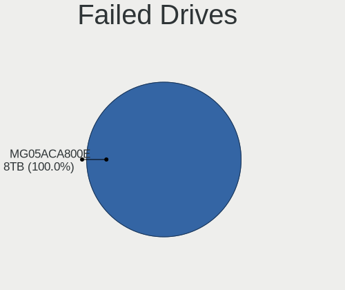
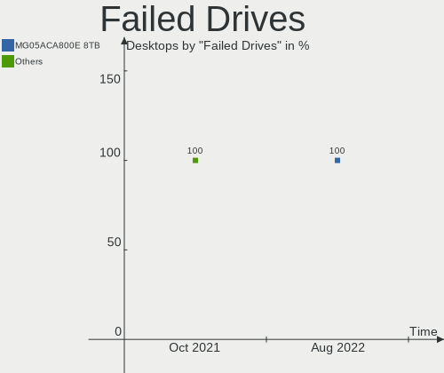
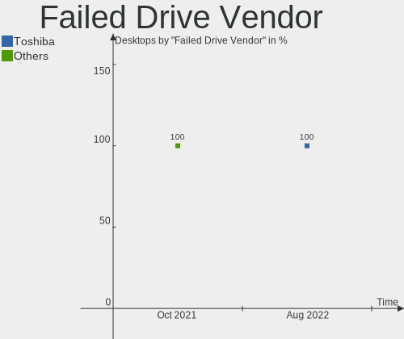

FreeBSD Hardware Trends (Desktops)
----------------------------------

A project to identify most popular hardware characteristics and track their change
over time based on data collected by FreeBSD users at https://BSD-Hardware.info.

Anyone can contribute to this report by the [hw-probe](https://github.com/linuxhw/hw-probe/blob/master/INSTALL.BSD.md) tool:

    hw-probe -all -upload

Full-feature report is available here: https://bsd-hardware.info/?view=trends&formfactor=desktop

Period: Oct, 2021.

Contents
--------

* [ System ](#system)
  - [ OS                       ](#os)
  - [ OS Family                ](#os-family)
  - [ Arch                     ](#arch)
  - [ DE                       ](#de)
  - [ Display Server           ](#display-server)
  - [ Display Manager          ](#display-manager)
  - [ OS Lang                  ](#os-lang)
  - [ Boot Mode                ](#boot-mode)
  - [ Filesystem               ](#filesystem)
  - [ Part. scheme             ](#part-scheme)

* [ Board ](#board)
  - [ Vendor                   ](#vendor)
  - [ Model                    ](#model)
  - [ Model Family             ](#model-family)
  - [ MFG Year                 ](#mfg-year)
  - [ Form Factor              ](#form-factor)
  - [ Coreboot                 ](#coreboot)
  - [ RAM Size                 ](#ram-size)
  - [ RAM Used                 ](#ram-used)
  - [ Total Drives             ](#total-drives)
  - [ Has CD-ROM               ](#has-cd-rom)
  - [ Has Ethernet             ](#has-ethernet)
  - [ Has WiFi                 ](#has-wifi)
  - [ Has Bluetooth            ](#has-bluetooth)

* [ Location ](#location)
  - [ Country                  ](#country)
  - [ City                     ](#city)

* [ Drives ](#drives)
  - [ Drive Vendor             ](#drive-vendor)
  - [ Drive Model              ](#drive-model)
  - [ HDD Vendor               ](#hdd-vendor)
  - [ SSD Vendor               ](#ssd-vendor)
  - [ Drive Kind               ](#drive-kind)
  - [ Drive Connector          ](#drive-connector)
  - [ Drive Size               ](#drive-size)
  - [ Space Total              ](#space-total)
  - [ Space Used               ](#space-used)
  - [ Malfunc. Drives          ](#malfunc-drives)
  - [ Malfunc. Drive Vendor    ](#malfunc-drive-vendor)
  - [ Malfunc. HDD Vendor      ](#malfunc-hdd-vendor)
  - [ Malfunc. Drive Kind      ](#malfunc-drive-kind)
  - [ Failed Drives            ](#failed-drives)
  - [ Failed Drive Vendor      ](#failed-drive-vendor)
  - [ Drive Status             ](#drive-status)

* [ Storage controller ](#storage-controller)
  - [ Storage Vendor           ](#storage-vendor)
  - [ Storage Model            ](#storage-model)
  - [ Storage Kind             ](#storage-kind)

* [ Processor ](#processor)
  - [ CPU Vendor               ](#cpu-vendor)
  - [ CPU Model                ](#cpu-model)
  - [ CPU Model Family         ](#cpu-model-family)
  - [ CPU Cores                ](#cpu-cores)
  - [ CPU Sockets              ](#cpu-sockets)
  - [ CPU Threads              ](#cpu-threads)
  - [ CPU Microarch            ](#cpu-microarch)

* [ Graphics ](#graphics)
  - [ GPU Vendor               ](#gpu-vendor)
  - [ GPU Model                ](#gpu-model)
  - [ GPU Combo                ](#gpu-combo)
  - [ GPU Driver               ](#gpu-driver)
  - [ GPU Memory               ](#gpu-memory)

* [ Monitor ](#monitor)
  - [ Monitor Vendor           ](#monitor-vendor)
  - [ Monitor Model            ](#monitor-model)
  - [ Monitor Resolution       ](#monitor-resolution)
  - [ Monitor Diagonal         ](#monitor-diagonal)
  - [ Monitor Width            ](#monitor-width)
  - [ Aspect Ratio             ](#aspect-ratio)
  - [ Monitor Area             ](#monitor-area)
  - [ Pixel Density            ](#pixel-density)
  - [ Multiple Monitors        ](#multiple-monitors)

* [ Network ](#network)
  - [ Net Controller Vendor    ](#net-controller-vendor)
  - [ Net Controller Model     ](#net-controller-model)
  - [ Wireless Vendor          ](#wireless-vendor)
  - [ Wireless Model           ](#wireless-model)
  - [ Ethernet Vendor          ](#ethernet-vendor)
  - [ Ethernet Model           ](#ethernet-model)
  - [ Net Controller Kind      ](#net-controller-kind)
  - [ Used Controller          ](#used-controller)
  - [ NICs                     ](#nics)
  - [ IPv6                     ](#ipv6)

* [ Bluetooth ](#bluetooth)
  - [ Bluetooth Vendor         ](#bluetooth-vendor)
  - [ Bluetooth Model          ](#bluetooth-model)

* [ Sound ](#sound)
  - [ Sound Vendor             ](#sound-vendor)
  - [ Sound Model              ](#sound-model)

* [ Memory ](#memory)
  - [ Memory Vendor            ](#memory-vendor)
  - [ Memory Model             ](#memory-model)
  - [ Memory Kind              ](#memory-kind)
  - [ Memory Form Factor       ](#memory-form-factor)
  - [ Memory Size              ](#memory-size)
  - [ Memory Speed             ](#memory-speed)

* [ Printers & scanners ](#printers--scanners)
  - [ Printer Vendor           ](#printer-vendor)
  - [ Printer Model            ](#printer-model)
  - [ Scanner Vendor           ](#scanner-vendor)
  - [ Scanner Model            ](#scanner-model)

* [ Camera ](#camera)
  - [ Camera Vendor            ](#camera-vendor)
  - [ Camera Model             ](#camera-model)

* [ Security ](#security)
  - [ Fingerprint Vendor       ](#fingerprint-vendor)
  - [ Fingerprint Model        ](#fingerprint-model)
  - [ Chipcard Vendor          ](#chipcard-vendor)
  - [ Chipcard Model           ](#chipcard-model)

* [ Unsupported ](#unsupported)
  - [ Unsupported Devices      ](#unsupported-devices)
  - [ Unsupported Device Types ](#unsupported-device-types)

System
------

OS
--

Installed operating systems

| Name                 | Desktops | Percent |
|----------------------|----------|---------|
| FreeBSD 13.0-p4      | 13       | 41.94%  |
| FreeBSD 13.0-STABLE  | 5        | 16.13%  |
| FreeBSD 13.0         | 5        | 16.13%  |
| FreeBSD 12.2-p10     | 3        | 9.68%   |
| FreeBSD 14.0-CURRENT | 2        | 6.45%   |
| FreeBSD 13.0-p2      | 1        | 3.23%   |
| FreeBSD 12.2-p6      | 1        | 3.23%   |
| FreeBSD 12.2         | 1        | 3.23%   |

OS Family
---------

OS without a version

| Name    | Desktops | Percent |
|---------|----------|---------|
| FreeBSD | 31       | 100%    |

Arch
----

OS architecture (x86_64, i586, etc.)

| Name  | Desktops | Percent |
|-------|----------|---------|
| amd64 | 28       | 90.32%  |
| arm64 | 3        | 9.68%   |

DE
--

Desktop Environment

| Name     | Desktops | Percent |
|----------|----------|---------|
| Console  | 13       | 41.94%  |
| XFCE     | 4        | 12.9%   |
| Openbox  | 3        | 9.68%   |
| MATE     | 3        | 9.68%   |
| KDE5     | 2        | 6.45%   |
| i3       | 2        | 6.45%   |
| TWM      | 1        | 3.23%   |
| LXQt     | 1        | 3.23%   |
| GNOME    | 1        | 3.23%   |
| Cinnamon | 1        | 3.23%   |

Display Server
--------------

X11 or Wayland

| Name    | Desktops | Percent |
|---------|----------|---------|
| X11     | 18       | 58.06%  |
| Console | 13       | 41.94%  |

Display Manager
---------------

SDDM, LightDM, etc.

| Name    | Desktops | Percent |
|---------|----------|---------|
| Console | 20       | 64.52%  |
| SLiM    | 4        | 12.9%   |
| XDM     | 2        | 6.45%   |
| SDDM    | 2        | 6.45%   |
| GDM     | 2        | 6.45%   |
| LightDM | 1        | 3.23%   |

OS Lang
-------

Language

| Lang    | Desktops | Percent |
|---------|----------|---------|
| C       | 17       | 54.84%  |
| en_US   | 4        | 12.9%   |
| Unknown | 4        | 12.9%   |
| de_DE   | 3        | 9.68%   |
| ru_RU   | 1        | 3.23%   |
| en_GB   | 1        | 3.23%   |
| en_AU   | 1        | 3.23%   |

Boot Mode
---------

EFI or BIOS

| Mode | Desktops | Percent |
|------|----------|---------|
| EFI  | 21       | 67.74%  |
| BIOS | 10       | 32.26%  |

Filesystem
----------

Type of filesystem

| Type | Desktops | Percent |
|------|----------|---------|
| Zfs  | 22       | 70.97%  |
| Ufs  | 9        | 29.03%  |

Part. scheme
------------

Scheme of partitioning

| Type | Desktops | Percent |
|------|----------|---------|
| GPT  | 31       | 100%    |

Board
-----

Vendor
------

Motherboard manufacturer

| Name                | Desktops | Percent |
|---------------------|----------|---------|
| ASUSTek Computer    | 8        | 25.81%  |
| MSI                 | 4        | 12.9%   |
| Gigabyte Technology | 3        | 9.68%   |
| Supermicro          | 2        | 6.45%   |
| Hewlett-Packard     | 2        | 6.45%   |
| Dell                | 2        | 6.45%   |
| Beckhoff Automation | 2        | 6.45%   |
| ASRock              | 2        | 6.45%   |
| Apple               | 2        | 6.45%   |
| Unknown             | 2        | 6.45%   |
| radxa               | 1        | 3.23%   |
| ADI Engineering     | 1        | 3.23%   |

Model
-----

Motherboard model

| Name                               | Desktops | Percent |
|------------------------------------|----------|---------|
| Unknown                            | 2        | 6.45%   |
| Supermicro X7SPA-HF                | 1        | 3.23%   |
| Supermicro SSG-5028R-E1CR12L-CE010 | 1        | 3.23%   |
| radxa rock-pi-4                    | 1        | 3.23%   |
| MSI MS-7C36                        | 1        | 3.23%   |
| MSI MS-7A72                        | 1        | 3.23%   |
| MSI MS-7817                        | 1        | 3.23%   |
| MSI MS-7693                        | 1        | 3.23%   |
| HP Z420 Workstation                | 1        | 3.23%   |
| HP ProDesk 600 G1 TWR              | 1        | 3.23%   |
| Gigabyte Z77X-UD3H                 | 1        | 3.23%   |
| Gigabyte H110M-H                   | 1        | 3.23%   |
| Gigabyte B450M S2H                 | 1        | 3.23%   |
| Dell OptiPlex 9020                 | 1        | 3.23%   |
| Dell OptiPlex 7040                 | 1        | 3.23%   |
| Beckhoff Automation CX2033-0185    | 1        | 3.23%   |
| Beckhoff Automation CBxx63         | 1        | 3.23%   |
| ASUS TUF B350M-PLUS GAMING         | 1        | 3.23%   |
| ASUS SABERTOOTH 990FX R2.0         | 1        | 3.23%   |
| ASUS ROG STRIX X470-F GAMING       | 1        | 3.23%   |
| ASUS PRIME X370-PRO                | 1        | 3.23%   |
| ASUS P9X79                         | 1        | 3.23%   |
| ASUS P5Q-E                         | 1        | 3.23%   |
| ASUS P10S WS                       | 1        | 3.23%   |
| ASUS All Series                    | 1        | 3.23%   |
| ASRock X570 Phantom Gaming 4       | 1        | 3.23%   |
| ASRock AB350 Gaming-ITX/ac         | 1        | 3.23%   |
| Apple MacPro5,1                    | 1        | 3.23%   |
| Apple MacPro3,1                    | 1        | 3.23%   |
| ADI Engineering RCC-VE             | 1        | 3.23%   |

Model Family
------------

Motherboard model prefix

| Name                               | Desktops | Percent |
|------------------------------------|----------|---------|
| Dell OptiPlex                      | 2        | 6.45%   |
| Unknown                            | 2        | 6.45%   |
| Supermicro X7SPA-HF                | 1        | 3.23%   |
| Supermicro SSG-5028R-E1CR12L-CE010 | 1        | 3.23%   |
| radxa rock-pi-4                    | 1        | 3.23%   |
| MSI MS-7C36                        | 1        | 3.23%   |
| MSI MS-7A72                        | 1        | 3.23%   |
| MSI MS-7817                        | 1        | 3.23%   |
| MSI MS-7693                        | 1        | 3.23%   |
| HP Z420                            | 1        | 3.23%   |
| HP ProDesk                         | 1        | 3.23%   |
| Gigabyte Z77X-UD3H                 | 1        | 3.23%   |
| Gigabyte H110M-H                   | 1        | 3.23%   |
| Gigabyte B450M                     | 1        | 3.23%   |
| Beckhoff Automation CX2033-0185    | 1        | 3.23%   |
| Beckhoff Automation CBxx63         | 1        | 3.23%   |
| ASUS TUF                           | 1        | 3.23%   |
| ASUS SABERTOOTH                    | 1        | 3.23%   |
| ASUS ROG                           | 1        | 3.23%   |
| ASUS PRIME                         | 1        | 3.23%   |
| ASUS P9X79                         | 1        | 3.23%   |
| ASUS P5Q-E                         | 1        | 3.23%   |
| ASUS P10S                          | 1        | 3.23%   |
| ASUS All                           | 1        | 3.23%   |
| ASRock X570                        | 1        | 3.23%   |
| ASRock AB350                       | 1        | 3.23%   |
| Apple MacPro5                      | 1        | 3.23%   |
| Apple MacPro3                      | 1        | 3.23%   |
| ADI Engineering RCC-VE             | 1        | 3.23%   |

MFG Year
--------

Motherboard manufacture year

| Year    | Desktops | Percent |
|---------|----------|---------|
| 2019    | 7        | 22.58%  |
| 2018    | 6        | 19.35%  |
| 2021    | 4        | 12.9%   |
| 2014    | 4        | 12.9%   |
| 2020    | 3        | 9.68%   |
| 2016    | 2        | 6.45%   |
| 2008    | 2        | 6.45%   |
| 2017    | 1        | 3.23%   |
| 2010    | 1        | 3.23%   |
| Unknown | 1        | 3.23%   |

Form Factor
-----------

Physical design of the computer

| Name    | Desktops | Percent |
|---------|----------|---------|
| Desktop | 31       | 100%    |

Coreboot
--------

Have coreboot on board

| Used | Desktops | Percent |
|------|----------|---------|
| No   | 30       | 96.77%  |
| Yes  | 1        | 3.23%   |

RAM Size
--------

Total RAM memory

| Size in GB  | Desktops | Percent |
|-------------|----------|---------|
| 4.01-8.0    | 8        | 25.81%  |
| 32.01-64.0  | 8        | 25.81%  |
| 16.01-24.0  | 7        | 22.58%  |
| 8.01-16.0   | 6        | 19.35%  |
| 24.01-32.0  | 1        | 3.23%   |
| 64.01-256.0 | 1        | 3.23%   |

RAM Used
--------

Used RAM memory

| Used GB    | Desktops | Percent |
|------------|----------|---------|
| 0.51-1.0   | 10       | 32.26%  |
| 0.01-0.5   | 10       | 32.26%  |
| 1.01-2.0   | 6        | 19.35%  |
| 3.01-4.0   | 3        | 9.68%   |
| 24.01-32.0 | 1        | 3.23%   |
| 2.01-3.0   | 1        | 3.23%   |

Total Drives
------------

Number of drives on board

| Drives | Desktops | Percent |
|--------|----------|---------|
| 1      | 9        | 29.03%  |
| 2      | 5        | 16.13%  |
| 3      | 4        | 12.9%   |
| 5      | 3        | 9.68%   |
| 0      | 3        | 9.68%   |
| 6      | 2        | 6.45%   |
| 14     | 1        | 3.23%   |
| 13     | 1        | 3.23%   |
| 9      | 1        | 3.23%   |
| 7      | 1        | 3.23%   |
| 4      | 1        | 3.23%   |

Has CD-ROM
----------

Has CD-ROM on board

| Presented | Desktops | Percent |
|-----------|----------|---------|
| No        | 20       | 64.52%  |
| Yes       | 11       | 35.48%  |

Has Ethernet
------------

Has Ethernet on board

| Presented | Desktops | Percent |
|-----------|----------|---------|
| Yes       | 28       | 90.32%  |
| No        | 3        | 9.68%   |

Has WiFi
--------

Has WiFi module

| Presented | Desktops | Percent |
|-----------|----------|---------|
| No        | 26       | 83.87%  |
| Yes       | 5        | 16.13%  |

Has Bluetooth
-------------

Has Bluetooth module

| Presented | Desktops | Percent |
|-----------|----------|---------|
| No        | 27       | 87.1%   |
| Yes       | 4        | 12.9%   |

Location
--------

Country
-------

Geographic location (country)

| Country     | Desktops | Percent |
|-------------|----------|---------|
| USA         | 10       | 32.26%  |
| Russia      | 5        | 16.13%  |
| Germany     | 5        | 16.13%  |
| Japan       | 2        | 6.45%   |
| France      | 2        | 6.45%   |
| Australia   | 2        | 6.45%   |
| Switzerland | 1        | 3.23%   |
| Serbia      | 1        | 3.23%   |
| Poland      | 1        | 3.23%   |
| New Zealand | 1        | 3.23%   |
| Canada      | 1        | 3.23%   |

City
----

Geographic location (city)

| City              | Desktops | Percent |
|-------------------|----------|---------|
| Krasnodar         | 3        | 9.68%   |
| Seyssinet-Pariset | 2        | 6.45%   |
| Salem             | 2        | 6.45%   |
| Rochester         | 2        | 6.45%   |
| Rietberg          | 2        | 6.45%   |
| New York          | 2        | 6.45%   |
| Kirkland          | 2        | 6.45%   |
| Yokohama          | 1        | 3.23%   |
| Wiesbaden         | 1        | 3.23%   |
| Wenatchee         | 1        | 3.23%   |
| Vienna            | 1        | 3.23%   |
| Sydney            | 1        | 3.23%   |
| St. Catharines    | 1        | 3.23%   |
| Riehen            | 1        | 3.23%   |
| Podolsk           | 1        | 3.23%   |
| Perth             | 1        | 3.23%   |
| Moscow            | 1        | 3.23%   |
| Krakow            | 1        | 3.23%   |
| Inzai             | 1        | 3.23%   |
| Halle             | 1        | 3.23%   |
| Gisborne          | 1        | 3.23%   |
| Berlin            | 1        | 3.23%   |
| Belgrade          | 1        | 3.23%   |

Drives
------

Drive Vendor
------------

Hard drive vendors

| Vendor              | Desktops | Drives | Percent |
|---------------------|----------|--------|---------|
| WDC                 | 11       | 42     | 20.75%  |
| Seagate             | 10       | 13     | 18.87%  |
| Samsung Electronics | 7        | 11     | 13.21%  |
| Intel               | 4        | 7      | 7.55%   |
| Toshiba             | 3        | 7      | 5.66%   |
| Kingston            | 3        | 3      | 5.66%   |
| Hitachi             | 3        | 4      | 5.66%   |
| HGST                | 2        | 8      | 3.77%   |
| Crucial             | 2        | 3      | 3.77%   |
| Corsair             | 2        | 2      | 3.77%   |
| Apacer              | 2        | 2      | 3.77%   |
| A-DATA Technology   | 2        | 2      | 3.77%   |
| Silicon Motion      | 1        | 1      | 1.89%   |
| PLEXTOR             | 1        | 1      | 1.89%   |

Drive Model
-----------

Hard drive models

| Model                           | Desktops | Percent |
|---------------------------------|----------|---------|
| Seagate ST4000DM000-1F2168 4TB  | 3        | 3.95%   |
| Kingston SA400S37240G 240GB     | 3        | 3.95%   |
| WDC WD10EZEX-08WN4A0 1TB        | 2        | 2.63%   |
| Seagate ST1000LM048-2E7172 1TB  | 2        | 2.63%   |
| Samsung SSD 860 QVO 1TB         | 2        | 2.63%   |
| Samsung SSD 860 EVO 250GB       | 2        | 2.63%   |
| Intel SSDSC2KW256G8 256GB       | 2        | 2.63%   |
| WDC WDS250G2B0A 250GB           | 1        | 1.32%   |
| WDC WDS100T1X0E-00AFY0 1TB      | 1        | 1.32%   |
| WDC WD80EMAZ-00WJTA0 8TB        | 1        | 1.32%   |
| WDC WD80EFZX-68UW8N0 8TB        | 1        | 1.32%   |
| WDC WD80EFAX-68LHPN0 8TB        | 1        | 1.32%   |
| WDC WD80EDBZ-11B0ZA0 8TB        | 1        | 1.32%   |
| WDC WD60EZRZ-00GZ5B1 6TB        | 1        | 1.32%   |
| WDC WD6003FZBX-00K5WB0 6TB      | 1        | 1.32%   |
| WDC WD40EZRZ-22GXCB0 4TB        | 1        | 1.32%   |
| WDC WD4002FYYZ-01B7CB0 4TB      | 1        | 1.32%   |
| WDC WD30PURX-64P6ZY0 3TB        | 1        | 1.32%   |
| WDC WD30EFRX-68EUZN0 3TB        | 1        | 1.32%   |
| WDC WD20EURX-63T0FY0 2TB        | 1        | 1.32%   |
| WDC WD20EARX-00PASB0 2TB        | 1        | 1.32%   |
| WDC WD2002FYPS-02W3B0 2TB       | 1        | 1.32%   |
| WDC WD2000FYYZ-01UL1B1 2TB      | 1        | 1.32%   |
| WDC WD1500HLFS-01G6U4 150GB     | 1        | 1.32%   |
| WDC WD120EMFZ-11A6JA0 12TB      | 1        | 1.32%   |
| WDC WD120EMAZ-11BLFA0 12TB      | 1        | 1.32%   |
| WDC WD10EZEX-00BN5A0 1TB        | 1        | 1.32%   |
| WDC WD10EFRX-68FYTN0 1TB        | 1        | 1.32%   |
| WDC WD102KRYZ-01A5AB0 10TB      | 1        | 1.32%   |
| WDC WD1002FBYS-02A6B0 1TB       | 1        | 1.32%   |
| WDC WD1001FALS-00J7B0 1TB       | 1        | 1.32%   |
| Toshiba HDWD130 3TB             | 1        | 1.32%   |
| Toshiba HDWA130 3TB             | 1        | 1.32%   |
| Toshiba DT01ACA300 3TB          | 1        | 1.32%   |
| Toshiba DT01ACA100 1TB          | 1        | 1.32%   |
| Toshiba DT01ACA050 500GB        | 1        | 1.32%   |
| Silicon Motion NE-256 256GB     | 1        | 1.32%   |
| Seagate ST4000VX007-2DT166 4TB  | 1        | 1.32%   |
| Seagate ST4000NE0025-2EW107 4TB | 1        | 1.32%   |
| Seagate ST4000DM005-2DP166 4TB  | 1        | 1.32%   |
| Seagate ST2000NM000A-2J2100 2TB | 1        | 1.32%   |
| Seagate ST2000DM001-9YN164 2TB  | 1        | 1.32%   |
| Seagate ST2000DL003-9VT166 2TB  | 1        | 1.32%   |
| Samsung SSD 970 EVO Plus 250GB  | 1        | 1.32%   |
| Samsung SSD 960 EVO 500GB       | 1        | 1.32%   |
| Samsung SSD 860 EVO 500GB       | 1        | 1.32%   |
| Samsung SSD 850 EVO 1TB         | 1        | 1.32%   |
| Samsung HM320JI 320GB           | 1        | 1.32%   |
| Samsung HM251JI 250GB           | 1        | 1.32%   |
| PLEXTOR PX-256M5Pro 256GB       | 1        | 1.32%   |
| Intel SSDSC2KB240G8 240GB       | 1        | 1.32%   |
| Intel SSDSC2BF180A4L 180GB      | 1        | 1.32%   |
| Intel SSDMCEAC030B3 32GB        | 1        | 1.32%   |
| Hitachi HUA722020ALA330 2TB     | 1        | 1.32%   |
| Hitachi HDS725050KLA360 500GB   | 1        | 1.32%   |
| Hitachi HDS721050CLA360 500GB   | 1        | 1.32%   |
| HGST HUS726020ALE610 2TB        | 1        | 1.32%   |
| HGST HDN726040ALE614 4TB        | 1        | 1.32%   |
| HGST HDN724030ALE640 3TB        | 1        | 1.32%   |
| Crucial M4-CT256M4SSD1 256GB    | 1        | 1.32%   |

HDD Vendor
----------

Hard disk drive vendors

| Vendor              | Desktops | Drives | Percent |
|---------------------|----------|--------|---------|
| WDC                 | 11       | 40     | 36.67%  |
| Seagate             | 10       | 13     | 33.33%  |
| Toshiba             | 3        | 7      | 10%     |
| Hitachi             | 3        | 4      | 10%     |
| HGST                | 2        | 8      | 6.67%   |
| Samsung Electronics | 1        | 2      | 3.33%   |

SSD Vendor
----------

Solid state drive vendors

| Vendor              | Desktops | Drives | Percent |
|---------------------|----------|--------|---------|
| Samsung Electronics | 5        | 7      | 26.32%  |
| Intel               | 4        | 7      | 21.05%  |
| Kingston            | 3        | 3      | 15.79%  |
| Apacer              | 2        | 2      | 10.53%  |
| WDC                 | 1        | 1      | 5.26%   |
| PLEXTOR             | 1        | 1      | 5.26%   |
| Crucial             | 1        | 1      | 5.26%   |
| Corsair             | 1        | 1      | 5.26%   |
| A-DATA Technology   | 1        | 1      | 5.26%   |

Drive Kind
----------

HDD or SSD

| Kind | Desktops | Drives | Percent |
|------|----------|--------|---------|
| HDD  | 22       | 74     | 48.89%  |
| SSD  | 16       | 24     | 35.56%  |
| NVMe | 7        | 8      | 15.56%  |

Drive Connector
---------------

SATA, SAS, NVMe, etc.

| Type | Desktops | Drives | Percent |
|------|----------|--------|---------|
| SATA | 27       | 98     | 79.41%  |
| NVMe | 7        | 8      | 20.59%  |

Drive Size
----------

Size of hard drive

| Size in TB | Desktops | Drives | Percent |
|------------|----------|--------|---------|
| 0.01-0.5   | 19       | 27     | 41.3%   |
| 0.51-1.0   | 8        | 16     | 17.39%  |
| 1.01-2.0   | 7        | 11     | 15.22%  |
| 3.01-4.0   | 6        | 13     | 13.04%  |
| 4.01-10.0  | 3        | 17     | 6.52%   |
| 2.01-3.0   | 2        | 12     | 4.35%   |
| 10.01-20.0 | 1        | 2      | 2.17%   |

Space Total
-----------

Amount of disk space available on the file system

| Size in GB     | Desktops | Percent |
|----------------|----------|---------|
| 101-250        | 8        | 25.81%  |
| 1-20           | 6        | 19.35%  |
| 251-500        | 4        | 12.9%   |
| 501-1000       | 4        | 12.9%   |
| 1001-2000      | 3        | 9.68%   |
| 51-100         | 3        | 9.68%   |
| 2001-3000      | 2        | 6.45%   |
| More than 3000 | 1        | 3.23%   |

Space Used
----------

Amount of used disk space

| Used GB  | Desktops | Percent |
|----------|----------|---------|
| 1-20     | 19       | 61.29%  |
| 21-50    | 5        | 16.13%  |
| 251-500  | 3        | 9.68%   |
| 101-250  | 2        | 6.45%   |
| 501-1000 | 1        | 3.23%   |
| 51-100   | 1        | 3.23%   |

Malfunc. Drives
---------------

Drive models with a malfunction

| Model                             | Desktops | Drives | Percent |
|-----------------------------------|----------|--------|---------|
| WDC WD20EURX-63T0FY0 2TB          | 1        | 1      | 20%     |
| WDC WD2002FYPS-02W3B0 2TB         | 1        | 1      | 20%     |
| Seagate ST2000DL003-9VT166 2TB    | 1        | 1      | 20%     |
| Samsung Electronics HM320JI 320GB | 1        | 1      | 20%     |
| Hitachi HUA722020ALA330 2TB       | 1        | 2      | 20%     |

Malfunc. Drive Vendor
---------------------

Vendors of faulty drives

| Vendor              | Desktops | Drives | Percent |
|---------------------|----------|--------|---------|
| WDC                 | 2        | 2      | 40%     |
| Seagate             | 1        | 1      | 20%     |
| Samsung Electronics | 1        | 1      | 20%     |
| Hitachi             | 1        | 2      | 20%     |

Malfunc. HDD Vendor
-------------------

Vendors of faulty HDD drives

| Vendor              | Desktops | Drives | Percent |
|---------------------|----------|--------|---------|
| WDC                 | 2        | 2      | 40%     |
| Seagate             | 1        | 1      | 20%     |
| Samsung Electronics | 1        | 1      | 20%     |
| Hitachi             | 1        | 2      | 20%     |

Malfunc. Drive Kind
-------------------

Kinds of faulty drives

| Kind | Desktops | Drives | Percent |
|------|----------|--------|---------|
| HDD  | 5        | 6      | 100%    |

Failed Drives
-------------

Failed drive models

| Model                        | Desktops | Drives | Percent |
|------------------------------|----------|--------|---------|
| Crucial M4-CT256M4SSD1 256GB | 1        | 1      | 100%    |

Failed Drive Vendor
-------------------

Failed drive vendors

| Vendor  | Desktops | Drives | Percent |
|---------|----------|--------|---------|
| Crucial | 1        | 1      | 100%    |

Drive Status
------------

Number of failed and malfunc. drives

| Status  | Desktops | Drives | Percent |
|---------|----------|--------|---------|
| Works   | 28       | 99     | 82.35%  |
| Malfunc | 5        | 6      | 14.71%  |
| Failed  | 1        | 1      | 2.94%   |

Storage controller
------------------

Storage Vendor
--------------

Storage controller vendors

| Vendor                    | Desktops | Percent |
|---------------------------|----------|---------|
| Intel                     | 18       | 38.3%   |
| AMD                       | 10       | 21.28%  |
| ASMedia Technology        | 5        | 10.64%  |
| Silicon Motion            | 2        | 4.26%   |
| Silicon Image             | 2        | 4.26%   |
| Samsung Electronics       | 2        | 4.26%   |
| Marvell Technology Group  | 2        | 4.26%   |
| Broadcom / LSI            | 2        | 4.26%   |
| Sandisk                   | 1        | 2.13%   |
| Realtek Semiconductor     | 1        | 2.13%   |
| Phison Electronics        | 1        | 2.13%   |
| Micron/Crucial Technology | 1        | 2.13%   |

Storage Model
-------------

Storage controller models

| Model                                                                          | Desktops | Percent |
|--------------------------------------------------------------------------------|----------|---------|
| AMD FCH SATA Controller [AHCI mode]                                            | 7        | 12.28%  |
| Intel 8 Series/C220 Series Chipset Family 6-port SATA Controller 1 [AHCI mode] | 4        | 7.02%   |
| Intel Q170/Q150/B150/H170/H110/Z170/CM236 Chipset SATA Controller [AHCI Mode]  | 3        | 5.26%   |
| ASMedia ASM1062 Serial ATA Controller                                          | 3        | 5.26%   |
| Silicon Motion SM2263EN/SM2263XT SSD Controller                                | 2        | 3.51%   |
| Intel 82801JI (ICH10 Family) SATA AHCI Controller                              | 2        | 3.51%   |
| AMD SB7x0/SB8x0/SB9x0 SATA Controller [AHCI mode]                              | 2        | 3.51%   |
| AMD 400 Series Chipset SATA Controller                                         | 2        | 3.51%   |
| AMD 300 Series Chipset SATA Controller                                         | 2        | 3.51%   |
| Unknown                                                                        | 2        | 3.51%   |
| Silicon Image SiI 3512 [SATALink/SATARaid] Serial ATA Controller               | 1        | 1.75%   |
| Silicon Image SiI 3114 [SATALink/SATARaid] Serial ATA Controller               | 1        | 1.75%   |
| Sandisk WD Black SN850                                                         | 1        | 1.75%   |
| Samsung NVMe SSD Controller SM981/PM981/PM983                                  | 1        | 1.75%   |
| Samsung NVMe SSD Controller SM961/PM961/SM963                                  | 1        | 1.75%   |
| Phison E16 PCIe4 NVMe Controller                                               | 1        | 1.75%   |
| Micron/Crucial P2 NVMe PCIe SSD                                                | 1        | 1.75%   |
| Marvell Group 88SE9172 SATA 6Gb/s Controller                                   | 1        | 1.75%   |
| Marvell Group 88SE6111/6121 SATA II / PATA Controller                          | 1        | 1.75%   |
| Intel C610/X99 series chipset sSATA Controller [AHCI mode]                     | 1        | 1.75%   |
| Intel C610/X99 series chipset 6-Port SATA Controller [AHCI mode]               | 1        | 1.75%   |
| Intel C602 chipset 4-Port SATA Storage Control Unit                            | 1        | 1.75%   |
| Intel C600/X79 series chipset SATA RAID Controller                             | 1        | 1.75%   |
| Intel C600/X79 series chipset IDE-r Controller                                 | 1        | 1.75%   |
| Intel C600/X79 series chipset 6-Port SATA AHCI Controller                      | 1        | 1.75%   |
| Intel Atom Processor E3800 Series SATA AHCI Controller                         | 1        | 1.75%   |
| Intel Atom processor C2000 AHCI SATA3 Controller                               | 1        | 1.75%   |
| Intel Atom processor C2000 AHCI SATA2 Controller                               | 1        | 1.75%   |
| Intel 82801IR/IO/IH (ICH9R/DO/DH) 6 port SATA Controller [AHCI mode]           | 1        | 1.75%   |
| Intel 7 Series/C210 Series Chipset Family 6-port SATA Controller [AHCI mode]   | 1        | 1.75%   |
| Intel 631xESB/632xESB SATA AHCI Controller                                     | 1        | 1.75%   |
| Intel 631xESB/632xESB IDE Controller                                           | 1        | 1.75%   |
| Intel 200 Series PCH SATA controller [AHCI mode]                               | 1        | 1.75%   |
| Broadcom / LSI SAS3008 PCI-Express Fusion-MPT SAS-3                            | 1        | 1.75%   |
| Broadcom / LSI SAS2008 PCI-Express Fusion-MPT SAS-2 [Falcon]                   | 1        | 1.75%   |
| ASMedia 106x SATA/RAID Controller                                              | 1        | 1.75%   |
| AMD X370 Series Chipset SATA Controller                                        | 1        | 1.75%   |
| AMD FCH SATA Controller [IDE mode]                                             | 1        | 1.75%   |

Storage Kind
------------

Kind of storage controller (IDE, SATA, NVMe, SAS, ...)

| Kind | Desktops | Percent |
|------|----------|---------|
| SATA | 27       | 60%     |
| NVMe | 8        | 17.78%  |
| IDE  | 4        | 8.89%   |
| RAID | 3        | 6.67%   |
| SAS  | 3        | 6.67%   |

Processor
---------

CPU Vendor
----------

Processor vendors

| Vendor  | Desktops | Percent |
|---------|----------|---------|
| Intel   | 18       | 58.06%  |
| AMD     | 10       | 32.26%  |
| ARM     | 2        | 6.45%   |
| Unknown | 1        | 3.23%   |

CPU Model
---------

Processor models

| Model                                           | Desktops | Percent |
|-------------------------------------------------|----------|---------|
| Intel Xeon CPU X5675 @ 3.07GHz                  | 1        | 3.23%   |
| Intel Xeon CPU E5-2650 v3 @ 2.30GHz             | 1        | 3.23%   |
| Intel Xeon CPU E5-1650 @ 3.20GHz                | 1        | 3.23%   |
| Intel Xeon CPU E3-1230 v5 @ 3.40GHz             | 1        | 3.23%   |
| Intel Xeon CPU E                                | 1        | 3.23%   |
| Intel Pentium CPU G3220 @ 3.00GHz               | 1        | 3.23%   |
| Intel Core i7-7700K CPU @ 4.20GHz               | 1        | 3.23%   |
| Intel Core i7-6700 CPU @ 3.40GHz                | 1        | 3.23%   |
| Intel Core i7-3820 CPU @ 3.60GHz                | 1        | 3.23%   |
| Intel Core i5-7400 CPU @ 3.00GHz                | 1        | 3.23%   |
| Intel Core i5-4590S CPU @ 3.00GHz               | 1        | 3.23%   |
| Intel Core i5-4460 CPU @ 3.20GHz                | 1        | 3.23%   |
| Intel Core i5-3470 CPU @ 3.20GHz                | 1        | 3.23%   |
| Intel Core i3-4160 CPU @ 3.60GHz                | 1        | 3.23%   |
| Intel Core 2 Quad CPU Q6600 @ 2.40GHz           | 1        | 3.23%   |
| Intel Atom CPU E3827 @ 1.74GHz                  | 1        | 3.23%   |
| Intel Atom CPU D510 @ 1.66GHz                   | 1        | 3.23%   |
| Intel Atom CPU C2358 @ 1.74GHz                  | 1        | 3.23%   |
| ARM Cortex-A72 r0p2                             | 1        | 3.23%   |
| ARM Cortex-A57 r1p3                             | 1        | 3.23%   |
| AMD Ryzen Embedded V1202B with Radeon Vega Gfx  | 1        | 3.23%   |
| AMD Ryzen 9 5950X 16-Core Processor             | 1        | 3.23%   |
| AMD Ryzen 9 3900X 12-Core Processor             | 1        | 3.23%   |
| AMD Ryzen 7 2700 Eight-Core Processor           | 1        | 3.23%   |
| AMD Ryzen 7 1700 Eight-Core Processor           | 1        | 3.23%   |
| AMD Ryzen 5 2400G with Radeon Vega Graphics     | 1        | 3.23%   |
| AMD Ryzen 5 1600X Six-Core Processor            | 1        | 3.23%   |
| AMD FX-8370 Eight-Core Processor                | 1        | 3.23%   |
| AMD FX-8320 Eight-Core Processor                | 1        | 3.23%   |
| AMD A10-9700E RADEON R7, 10 COMPUTE CORES 4C+6G | 1        | 3.23%   |
|                                                 | 1        | 3.23%   |

CPU Model Family
----------------

Processor model prefix

| Model              | Desktops | Percent |
|--------------------|----------|---------|
| Intel Xeon         | 5        | 16.13%  |
| Intel Core i5      | 4        | 12.9%   |
| Intel Core i7      | 3        | 9.68%   |
| Intel Atom         | 3        | 9.68%   |
| ARM Cortex         | 2        | 6.45%   |
| AMD Ryzen 9        | 2        | 6.45%   |
| AMD Ryzen 7        | 2        | 6.45%   |
| AMD Ryzen 5        | 2        | 6.45%   |
| AMD FX             | 2        | 6.45%   |
| Other              | 1        | 3.23%   |
| Intel Pentium      | 1        | 3.23%   |
| Intel Core i3      | 1        | 3.23%   |
| Intel Core 2 Quad  | 1        | 3.23%   |
| AMD Ryzen Embedded | 1        | 3.23%   |
| AMD A10            | 1        | 3.23%   |

CPU Cores
---------

Number of processor cores

| Number  | Desktops | Percent |
|---------|----------|---------|
| 4       | 10       | 32.26%  |
| 2       | 6        | 19.35%  |
| Unknown | 4        | 12.9%   |
| 8       | 3        | 9.68%   |
| 16      | 2        | 6.45%   |
| 12      | 2        | 6.45%   |
| 32      | 1        | 3.23%   |
| 24      | 1        | 3.23%   |
| 10      | 1        | 3.23%   |
| 6       | 1        | 3.23%   |

CPU Sockets
-----------

Number of sockets

| Number  | Desktops | Percent |
|---------|----------|---------|
| 1       | 27       | 87.1%   |
| Unknown | 2        | 6.45%   |
| 4       | 1        | 3.23%   |
| 2       | 1        | 3.23%   |

CPU Threads
-----------

Threads per core (Hyper-Threading)

| Number  | Desktops | Percent |
|---------|----------|---------|
| 1       | 18       | 58.06%  |
| 2       | 9        | 29.03%  |
| Unknown | 4        | 12.9%   |

CPU Microarch
-------------

Microarchitecture

| Name        | Desktops | Percent |
|-------------|----------|---------|
| Haswell     | 5        | 16.13%  |
| Zen         | 4        | 12.9%   |
| Unknown     | 3        | 9.68%   |
| Skylake     | 2        | 6.45%   |
| Silvermont  | 2        | 6.45%   |
| SandyBridge | 2        | 6.45%   |
| Piledriver  | 2        | 6.45%   |
| KabyLake    | 2        | 6.45%   |
| Zen+        | 1        | 3.23%   |
| Zen 3       | 1        | 3.23%   |
| Zen 2       | 1        | 3.23%   |
| Westmere    | 1        | 3.23%   |
| Penryn      | 1        | 3.23%   |
| IvyBridge   | 1        | 3.23%   |
| Excavator   | 1        | 3.23%   |
| Core        | 1        | 3.23%   |
| Bonnell     | 1        | 3.23%   |

Graphics
--------

GPU Vendor
----------

Vendors of graphics cards

| Vendor            | Desktops | Percent |
|-------------------|----------|---------|
| Nvidia            | 10       | 33.33%  |
| AMD               | 10       | 33.33%  |
| Intel             | 9        | 30%     |
| ASPEED Technology | 1        | 3.33%   |

GPU Model
---------

Graphics card models

| Model                                                                       | Desktops | Percent |
|-----------------------------------------------------------------------------|----------|---------|
| AMD Ellesmere [Radeon RX 470/480/570/570X/580/580X/590]                     | 4        | 13.33%  |
| Intel Xeon E3-1200 v3/4th Gen Core Processor Integrated Graphics Controller | 3        | 10%     |
| Nvidia TU116 [GeForce GTX 1660 Ti]                                          | 2        | 6.67%   |
| AMD Raven Ridge [Radeon Vega Series / Radeon Vega Mobile Series]            | 2        | 6.67%   |
| Nvidia GT218 [NVS 300]                                                      | 1        | 3.33%   |
| Nvidia GP108 [GeForce GT 1030]                                              | 1        | 3.33%   |
| Nvidia GP106 [GeForce GTX 1060 3GB]                                         | 1        | 3.33%   |
| Nvidia GM206 [GeForce GTX 960]                                              | 1        | 3.33%   |
| Nvidia GM204 [GeForce GTX 970]                                              | 1        | 3.33%   |
| Nvidia GK208B [GeForce GT 730]                                              | 1        | 3.33%   |
| Nvidia GK208B [GeForce GT 720]                                              | 1        | 3.33%   |
| Nvidia G98 [GeForce 8400 GS Rev. 2]                                         | 1        | 3.33%   |
| Intel Xeon E3-1200 v2/3rd Gen Core processor Graphics Controller            | 1        | 3.33%   |
| Intel HD Graphics 630                                                       | 1        | 3.33%   |
| Intel HD Graphics 530                                                       | 1        | 3.33%   |
| Intel Atom Processor Z36xxx/Z37xxx Series Graphics & Display                | 1        | 3.33%   |
| Intel Atom Processor D4xx/D5xx/N4xx/N5xx Integrated Graphics Controller     | 1        | 3.33%   |
| Intel 4th Generation Core Processor Family Integrated Graphics Controller   | 1        | 3.33%   |
| ASPEED Technology ASPEED Graphics Family                                    | 1        | 3.33%   |
| AMD Wani [Radeon R5/R6/R7 Graphics]                                         | 1        | 3.33%   |
| AMD RV630 XT [Radeon HD 2600 XT]                                            | 1        | 3.33%   |
| AMD Oland XT [Radeon HD 8670 / R5 340X OEM / R7 250/350/350X OEM]           | 1        | 3.33%   |
| AMD Lexa XT [Radeon PRO WX 2100]                                            | 1        | 3.33%   |

GPU Combo
---------

Combinations of graphics cards

| Name           | Desktops | Percent |
|----------------|----------|---------|
| 1 x Nvidia     | 9        | 29.03%  |
| 1 x AMD        | 8        | 25.81%  |
| 1 x Intel      | 6        | 19.35%  |
| Other          | 4        | 12.9%   |
| 2 x Intel      | 1        | 3.23%   |
| Intel + Nvidia | 1        | 3.23%   |
| Intel + AMD    | 1        | 3.23%   |
| AMD + ASPEED   | 1        | 3.23%   |

GPU Driver
----------

Free vs proprietary

| Driver      | Desktops | Percent |
|-------------|----------|---------|
| Free        | 20       | 64.52%  |
| Proprietary | 7        | 22.58%  |
| Unknown     | 4        | 12.9%   |

GPU Memory
----------

Total video memory

| Size in GB | Desktops | Percent |
|------------|----------|---------|
| Unknown    | 18       | 58.06%  |
| 3.01-4.0   | 5        | 16.13%  |
| 1.01-2.0   | 5        | 16.13%  |
| 5.01-6.0   | 2        | 6.45%   |
| 7.01-8.0   | 1        | 3.23%   |

Monitor
-------

Monitor Vendor
--------------

Monitor vendors

| Vendor               | Desktops | Percent |
|----------------------|----------|---------|
| Dell                 | 4        | 26.67%  |
| Unknown              | 1        | 6.67%   |
| Samsung Electronics  | 1        | 6.67%   |
| NEC Computers        | 1        | 6.67%   |
| Idek Iiyama          | 1        | 6.67%   |
| Hewlett-Packard      | 1        | 6.67%   |
| Goldstar             | 1        | 6.67%   |
| Fujitsu Siemens      | 1        | 6.67%   |
| BenQ                 | 1        | 6.67%   |
| ASUSTek Computer     | 1        | 6.67%   |
| AOC                  | 1        | 6.67%   |
| Ancor Communications | 1        | 6.67%   |

Monitor Model
-------------

Monitor models

| Model                                                             | Desktops | Percent |
|-------------------------------------------------------------------|----------|---------|
| Unknown LCD Monitor KJT4K2K60DP 3840x2160                         | 1        | 5.88%   |
| Samsung Electronics U28E590 SAM0C4D 3840x2160 610x350mm 27.7-inch | 1        | 5.88%   |
| NEC Computers LCD4020 NEC66EA 1920x540 890x500mm 40.2-inch        | 1        | 5.88%   |
| Idek Iiyama LCD Monitor PLX2783H 1920x1080                        | 1        | 5.88%   |
| Hewlett-Packard LP2475w HWP26F9 1920x1200 540x350mm 25.3-inch     | 1        | 5.88%   |
| Hewlett-Packard LP2475w HWP26F8 1920x1200 540x350mm 25.3-inch     | 1        | 5.88%   |
| Goldstar W2052 GSM4E88 1680x1050 470x300mm 22.0-inch              | 1        | 5.88%   |
| Fujitsu Siemens P20-2S FUS0554 1600x1200 410x310mm 20.2-inch      | 1        | 5.88%   |
| Dell U2518D DEL413C 2560x1440 550x310mm 24.9-inch                 | 1        | 5.88%   |
| Dell U2414H DELA0A2 1920x1080 530x300mm 24.0-inch                 | 1        | 5.88%   |
| Dell U2412M DELA07B 1920x1200 520x320mm 24.0-inch                 | 1        | 5.88%   |
| Dell S2721Q DELA195 3840x2160 600x340mm 27.2-inch                 | 1        | 5.88%   |
| Dell E2417H DELA0E1 1920x1080 530x300mm 24.0-inch                 | 1        | 5.88%   |
| BenQ GW2255 BNQ78CD 1920x1080 480x270mm 21.7-inch                 | 1        | 5.88%   |
| ASUSTek Computer VP247 AUS24CA 1920x1080 520x290mm 23.4-inch      | 1        | 5.88%   |
| AOC U2879G6 AOC2879 3840x2160 620x340mm 27.8-inch                 | 1        | 5.88%   |
| Ancor Communications LCD Monitor PA248 1920x1200                  | 1        | 5.88%   |

Monitor Resolution
------------------

Monitor screen resolution

| Resolution         | Desktops | Percent |
|--------------------|----------|---------|
| 1920x1080 (FHD)    | 5        | 35.71%  |
| 1920x1200 (WUXGA)  | 3        | 21.43%  |
| 3840x2160 (4K)     | 2        | 14.29%  |
| 2560x1440 (QHD)    | 1        | 7.14%   |
| 1920x540           | 1        | 7.14%   |
| 1680x1050 (WSXGA+) | 1        | 7.14%   |
| 1600x1200          | 1        | 7.14%   |

Monitor Diagonal
----------------

Diagonal size in inches

| Inches  | Desktops | Percent |
|---------|----------|---------|
| 24      | 3        | 23.08%  |
| Unknown | 3        | 23.08%  |
| 40      | 1        | 7.69%   |
| 27      | 1        | 7.69%   |
| 25      | 1        | 7.69%   |
| 23      | 1        | 7.69%   |
| 22      | 1        | 7.69%   |
| 21      | 1        | 7.69%   |
| 20      | 1        | 7.69%   |

Monitor Width
-------------

Physical width

| Width in mm | Desktops | Percent |
|-------------|----------|---------|
| 501-600     | 6        | 42.86%  |
| 401-500     | 3        | 21.43%  |
| Unknown     | 3        | 21.43%  |
| 801-900     | 1        | 7.14%   |
| 601-700     | 1        | 7.14%   |

Aspect Ratio
------------

Proportional relationship between the width and the height

| Ratio   | Desktops | Percent |
|---------|----------|---------|
| 16/9    | 7        | 50%     |
| Unknown | 3        | 21.43%  |
| 16/10   | 2        | 14.29%  |
| 4/3     | 1        | 7.14%   |
| 3/2     | 1        | 7.14%   |

Monitor Area
------------

Area in inch

| Area in inch | Desktops | Percent |
|----------------|----------|---------|
| 201-250        | 5        | 35.71%  |
| 251-300        | 3        | 21.43%  |
| Unknown        | 3        | 21.43%  |
| 301-350        | 1        | 7.14%   |
| 151-200        | 1        | 7.14%   |
| 501-1000       | 1        | 7.14%   |

Pixel Density
-------------

Pixels per inch

| Density | Desktops | Percent |
|---------|----------|---------|
| 51-100  | 6        | 42.86%  |
| Unknown | 3        | 21.43%  |
| 101-120 | 2        | 14.29%  |
| 1-50    | 1        | 7.14%   |
| 161-240 | 1        | 7.14%   |
| 121-160 | 1        | 7.14%   |

Multiple Monitors
-----------------

Total monitors connected

| Total | Desktops | Percent |
|-------|----------|---------|
| 0     | 16       | 51.61%  |
| 1     | 12       | 38.71%  |
| 2     | 2        | 6.45%   |
| 3     | 1        | 3.23%   |

Network
-------

Net Controller Vendor
---------------------

Controller vendors

| Vendor                   | Desktops | Percent |
|--------------------------|----------|---------|
| Intel                    | 20       | 58.82%  |
| Realtek Semiconductor    | 10       | 29.41%  |
| Qualcomm Atheros         | 1        | 2.94%   |
| Marvell Technology Group | 1        | 2.94%   |
| Broadcom                 | 1        | 2.94%   |
| Aquantia                 | 1        | 2.94%   |

Net Controller Model
--------------------

Controller models

| Model                                                                                         | Desktops | Percent |
|-----------------------------------------------------------------------------------------------|----------|---------|
| Realtek RTL8111/8168/8411 PCI Express Gigabit Ethernet Controller                             | 8        | 19.51%  |
| Intel I211 Gigabit Network Connection                                                         | 5        | 12.2%   |
| Intel 82574L Gigabit Network Connection                                                       | 4        | 9.76%   |
| Intel I210 Gigabit Network Connection                                                         | 3        | 7.32%   |
| Intel Wi-Fi 6 AX200                                                                           | 2        | 4.88%   |
| Intel Ethernet Connection I217-LM                                                             | 2        | 4.88%   |
| Realtek Realtek Bluetooth Adapter                                                             | 1        | 2.44%   |
| Realtek Realtek 8812AU/8821AU 802.11ac WLAN Adapter [USB Wireless Dual-Band Adapter 2.4/5Ghz] | 1        | 2.44%   |
| Qualcomm Atheros AR8151 v2.0 Gigabit Ethernet                                                 | 1        | 2.44%   |
| Marvell Group 88E8056 PCI-E Gigabit Ethernet Controller                                       | 1        | 2.44%   |
| Marvell Group 88E8001 Gigabit Ethernet Controller                                             | 1        | 2.44%   |
| Intel Wireless 8260                                                                           | 1        | 2.44%   |
| Intel I350 Gigabit Network Connection                                                         | 1        | 2.44%   |
| Intel Ethernet Connection I354                                                                | 1        | 2.44%   |
| Intel Ethernet Connection (2) I219-V                                                          | 1        | 2.44%   |
| Intel Ethernet Connection (2) I219-LM                                                         | 1        | 2.44%   |
| Intel Dual Band Wireless-AC 3168NGW [Stone Peak]                                              | 1        | 2.44%   |
| Intel 82579V Gigabit Network Connection                                                       | 1        | 2.44%   |
| Intel 82579LM Gigabit Network Connection (Lewisville)                                         | 1        | 2.44%   |
| Intel 82571EB/82571GB Gigabit Ethernet Controller D0/D1 (copper applications)                 | 1        | 2.44%   |
| Intel 80003ES2LAN Gigabit Ethernet Controller (Copper)                                        | 1        | 2.44%   |
| Broadcom NetXtreme BCM5720 Gigabit Ethernet PCIe                                              | 1        | 2.44%   |
| Aquantia AQC107 NBase-T/IEEE 802.3bz Ethernet Controller [AQtion]                             | 1        | 2.44%   |

Wireless Vendor
---------------

Wireless vendors

| Vendor                | Desktops | Percent |
|-----------------------|----------|---------|
| Intel                 | 4        | 66.67%  |
| Realtek Semiconductor | 2        | 33.33%  |

Wireless Model
--------------

Wireless models

| Model                                                                                         | Desktops | Percent |
|-----------------------------------------------------------------------------------------------|----------|---------|
| Intel Wi-Fi 6 AX200                                                                           | 2        | 33.33%  |
| Realtek Realtek Bluetooth Adapter                                                             | 1        | 16.67%  |
| Realtek Realtek 8812AU/8821AU 802.11ac WLAN Adapter [USB Wireless Dual-Band Adapter 2.4/5Ghz] | 1        | 16.67%  |
| Intel Wireless 8260                                                                           | 1        | 16.67%  |
| Intel Dual Band Wireless-AC 3168NGW [Stone Peak]                                              | 1        | 16.67%  |

Ethernet Vendor
---------------

Ethernet vendors

| Vendor                   | Desktops | Percent |
|--------------------------|----------|---------|
| Intel                    | 20       | 62.5%   |
| Realtek Semiconductor    | 8        | 25%     |
| Qualcomm Atheros         | 1        | 3.13%   |
| Marvell Technology Group | 1        | 3.13%   |
| Broadcom                 | 1        | 3.13%   |
| Aquantia                 | 1        | 3.13%   |

Ethernet Model
--------------

Ethernet models

| Model                                                                         | Desktops | Percent |
|-------------------------------------------------------------------------------|----------|---------|
| Realtek RTL8111/8168/8411 PCI Express Gigabit Ethernet Controller             | 8        | 22.86%  |
| Intel I211 Gigabit Network Connection                                         | 5        | 14.29%  |
| Intel 82574L Gigabit Network Connection                                       | 4        | 11.43%  |
| Intel I210 Gigabit Network Connection                                         | 3        | 8.57%   |
| Intel Ethernet Connection I217-LM                                             | 2        | 5.71%   |
| Qualcomm Atheros AR8151 v2.0 Gigabit Ethernet                                 | 1        | 2.86%   |
| Marvell Group 88E8056 PCI-E Gigabit Ethernet Controller                       | 1        | 2.86%   |
| Marvell Group 88E8001 Gigabit Ethernet Controller                             | 1        | 2.86%   |
| Intel I350 Gigabit Network Connection                                         | 1        | 2.86%   |
| Intel Ethernet Connection I354                                                | 1        | 2.86%   |
| Intel Ethernet Connection (2) I219-V                                          | 1        | 2.86%   |
| Intel Ethernet Connection (2) I219-LM                                         | 1        | 2.86%   |
| Intel 82579V Gigabit Network Connection                                       | 1        | 2.86%   |
| Intel 82579LM Gigabit Network Connection (Lewisville)                         | 1        | 2.86%   |
| Intel 82571EB/82571GB Gigabit Ethernet Controller D0/D1 (copper applications) | 1        | 2.86%   |
| Intel 80003ES2LAN Gigabit Ethernet Controller (Copper)                        | 1        | 2.86%   |
| Broadcom NetXtreme BCM5720 Gigabit Ethernet PCIe                              | 1        | 2.86%   |
| Aquantia AQC107 NBase-T/IEEE 802.3bz Ethernet Controller [AQtion]             | 1        | 2.86%   |

Net Controller Kind
-------------------

Ethernet, WiFi or modem

| Kind     | Desktops | Percent |
|----------|----------|---------|
| Ethernet | 28       | 84.85%  |
| WiFi     | 5        | 15.15%  |

Used Controller
---------------

Currently used network controller

| Kind     | Desktops | Percent |
|----------|----------|---------|
| Ethernet | 28       | 93.33%  |
| WiFi     | 2        | 6.67%   |

NICs
----

Total network controllers on board

| Total | Desktops | Percent |
|-------|----------|---------|
| 1     | 13       | 41.94%  |
| 2     | 7        | 22.58%  |
| 4     | 4        | 12.9%   |
| 3     | 4        | 12.9%   |
| 0     | 3        | 9.68%   |

IPv6
----

IPv6 vs IPv4

| Used | Desktops | Percent |
|------|----------|---------|
| No   | 23       | 74.19%  |
| Yes  | 8        | 25.81%  |

Bluetooth
---------

Bluetooth Vendor
----------------

Controller vendors

| Vendor | Desktops | Percent |
|--------|----------|---------|
| Intel  | 3        | 75%     |
| Apple  | 1        | 25%     |

Bluetooth Model
---------------

Controller models

| Model                                | Desktops | Percent |
|--------------------------------------|----------|---------|
| Intel Wireless-AC 3168 Bluetooth     | 1        | 25%     |
| Intel Bluetooth wireless interface   | 1        | 25%     |
| Intel AX200 Bluetooth                | 1        | 25%     |
| Apple Built-in Bluetooth 2.0+EDR HCI | 1        | 25%     |

Sound
-----

Sound Vendor
------------

Sound card vendors

| Vendor                | Desktops | Percent |
|-----------------------|----------|---------|
| Intel                 | 13       | 33.33%  |
| AMD                   | 13       | 33.33%  |
| Nvidia                | 9        | 23.08%  |
| Trust                 | 1        | 2.56%   |
| Tenx Technology       | 1        | 2.56%   |
| Realtek Semiconductor | 1        | 2.56%   |
| Creative Labs         | 1        | 2.56%   |

Sound Model
-----------

Sound card models

| Model                                                                      | Desktops | Percent |
|----------------------------------------------------------------------------|----------|---------|
| Intel 8 Series/C220 Series Chipset High Definition Audio Controller        | 4        | 8.7%    |
| AMD Ellesmere HDMI Audio [Radeon RX 470/480 / 570/580/590]                 | 4        | 8.7%    |
| Nvidia TU116 High Definition Audio Controller                              | 2        | 4.35%   |
| Nvidia GK208 HDMI/DP Audio Controller                                      | 2        | 4.35%   |
| Intel Xeon E3-1200 v3/4th Gen Core Processor HD Audio Controller           | 2        | 4.35%   |
| Intel 82801JI (ICH10 Family) HD Audio Controller                           | 2        | 4.35%   |
| Intel 100 Series/C230 Series Chipset Family HD Audio Controller            | 2        | 4.35%   |
| AMD Starship/Matisse HD Audio Controller                                   | 2        | 4.35%   |
| AMD SBx00 Azalia (Intel HDA)                                               | 2        | 4.35%   |
| AMD Raven/Raven2/Fenghuang HDMI/DP Audio Controller                        | 2        | 4.35%   |
| AMD Family 17h (Models 10h-1fh) HD Audio Controller                        | 2        | 4.35%   |
| AMD Family 17h (Models 00h-0fh) HD Audio Controller                        | 2        | 4.35%   |
| Trust Trust PC Headset                                                     | 1        | 2.17%   |
| Tenx Technology USB  AUDIO                                                 | 1        | 2.17%   |
| Realtek Semiconductor TX-384Khz Hifi Type-C Audio                          | 1        | 2.17%   |
| Nvidia High Definition Audio Controller                                    | 1        | 2.17%   |
| Nvidia GP108 High Definition Audio Controller                              | 1        | 2.17%   |
| Nvidia GP106 High Definition Audio Controller                              | 1        | 2.17%   |
| Nvidia GM206 High Definition Audio Controller                              | 1        | 2.17%   |
| Nvidia GM204 High Definition Audio Controller                              | 1        | 2.17%   |
| Intel C600/X79 series chipset High Definition Audio Controller             | 1        | 2.17%   |
| Intel Atom Processor Z36xxx/Z37xxx Series High Definition Audio Controller | 1        | 2.17%   |
| Intel 7 Series/C216 Chipset Family High Definition Audio Controller        | 1        | 2.17%   |
| Intel 631xESB/632xESB High Definition Audio Controller                     | 1        | 2.17%   |
| Intel 200 Series PCH HD Audio                                              | 1        | 2.17%   |
| Creative Labs EMU10k2/CA0100/CA0102/CA10200 [Sound Blaster Audigy Series]  | 1        | 2.17%   |
| AMD Oland/Hainan/Cape Verde/Pitcairn HDMI Audio [Radeon HD 7000 Series]    | 1        | 2.17%   |
| AMD Kabini HDMI/DP Audio                                                   | 1        | 2.17%   |
| AMD Family 15h (Models 60h-6fh) Audio Controller                           | 1        | 2.17%   |
| AMD Baffin HDMI/DP Audio [Radeon RX 550 640SP / RX 560/560X]               | 1        | 2.17%   |

Memory
------

Memory Vendor
-------------

Memory module vendors

| Vendor              | Desktops | Percent |
|---------------------|----------|---------|
| Corsair             | 7        | 23.33%  |
| SK Hynix            | 5        | 16.67%  |
| Crucial             | 4        | 13.33%  |
| Unknown             | 3        | 10%     |
| Micron Technology   | 3        | 10%     |
| Kingston            | 2        | 6.67%   |
| Unknown (0x05F7)    | 1        | 3.33%   |
| Transcend           | 1        | 3.33%   |
| Samsung Electronics | 1        | 3.33%   |
| PNY                 | 1        | 3.33%   |
| G.Skill             | 1        | 3.33%   |
| Unknown             | 1        | 3.33%   |

Memory Model
------------

Memory module models

| Model                                                  | Desktops | Percent |
|--------------------------------------------------------|----------|---------|
| Unknown RAM Module 2GB SODIMM DDR2 667MT/s             | 1        | 3.33%   |
| Unknown RAM Module 2GB DIMM DDR 800MT/s                | 1        | 3.33%   |
| Unknown RAM 2G-08-10-12-1333 2GB DIMM DDR3 1333MT/s    | 1        | 3.33%   |
| Unknown (0x05F7) RAM Module 1GB FB-DIMM DDR2 800MT/s   | 1        | 3.33%   |
| Transcend RAM TS1GLH72V1H 8GB DIMM DDR4 2133MT/s       | 1        | 3.33%   |
| SK Hynix RAM Module 1GB FB-DIMM DDR2 800MT/s           | 1        | 3.33%   |
| SK Hynix RAM HMT451U6BFR8C-PB 4GB DIMM DDR3 1600MT/s   | 1        | 3.33%   |
| SK Hynix RAM HMT451U6BFR8A-PB 4GB DIMM DDR3 1600MT/s   | 1        | 3.33%   |
| SK Hynix RAM HMT351U6CFR8C-H9 4GB DIMM DDR3 1333MT/s   | 1        | 3.33%   |
| SK Hynix RAM HMA82GU6MFR8N-TF 16GB DIMM DDR4 2133MT/s  | 1        | 3.33%   |
| Samsung RAM Module 8GB DIMM DDR3 1333MT/s              | 1        | 3.33%   |
| PNY RAM 8GBF2X04HEEE35-12-K 8GB DIMM DDR4 2133MT/s     | 1        | 3.33%   |
| Micron RAM 18KDF51272PDZ1G4K 4GB DIMM DDR3 1333MT/s    | 1        | 3.33%   |
| Micron RAM 18ASF1G72PZ-2G1A2 8GB DIMM DDR4 2133MT/s    | 1        | 3.33%   |
| Micron RAM 18ASF1G72AZ-2G1B1 8GB DIMM DDR4 2133MT/s    | 1        | 3.33%   |
| Kingston RAM KHX2400C15/8G 8GB DIMM DDR4 2400MT/s      | 1        | 3.33%   |
| Kingston RAM 9965745-002.A00G 16GB DIMM DDR4 3000MT/s  | 1        | 3.33%   |
| G.Skill RAM F3-12800CL7-2GBRM 2GB DIMM DDR3 1600MT/s   | 1        | 3.33%   |
| Crucial RAM CT8G4DFS8266.C8FD1 8GB DIMM DDR4 2666MT/s  | 1        | 3.33%   |
| Crucial RAM CT8G4DFS824A.M8FE 8GB DIMM DDR4 2933MT/s   | 1        | 3.33%   |
| Crucial RAM CT51264BD160B.C16F 4GB DIMM DDR3 1600MT/s  | 1        | 3.33%   |
| Crucial RAM BLS8G3D1609DS1S00. 8GB DIMM DDR3 1600MT/s  | 1        | 3.33%   |
| Corsair RAM CMZ8GX3M2A1600C9 4GB DIMM DDR3 1600MT/s    | 1        | 3.33%   |
| Corsair RAM CMX16GX3M2A1600C11 8GB DIMM DDR3 1333MT/s  | 1        | 3.33%   |
| Corsair RAM CMV4GX4M1A2400C16 4GB DIMM DDR4 2400MT/s   | 1        | 3.33%   |
| Corsair RAM CML16GX3M2A1600C10 8GB DIMM DDR3 1600MT/s  | 1        | 3.33%   |
| Corsair RAM CMK64GX4M2D3000C16 32GB DIMM DDR4 3066MT/s | 1        | 3.33%   |
| Corsair RAM CMK16GX4M2B3200C16 8GB DIMM DDR4 3200MT/s  | 1        | 3.33%   |
| Corsair RAM CMD16GX3M2A1866C9 8GB DIMM DDR3 1333MT/s   | 1        | 3.33%   |
| Unknown                                                | 1        | 3.33%   |

Memory Kind
-----------

Memory module kinds

| Kind | Desktops | Percent |
|------|----------|---------|
| DDR4 | 12       | 46.15%  |
| DDR3 | 11       | 42.31%  |
| DDR2 | 2        | 7.69%   |
| DDR  | 1        | 3.85%   |

Memory Form Factor
------------------

Physical design of the memory module

| Name    | Desktops | Percent |
|---------|----------|---------|
| DIMM    | 23       | 88.46%  |
| SODIMM  | 2        | 7.69%   |
| FB-DIMM | 1        | 3.85%   |

Memory Size
-----------

Memory module size

| Size  | Desktops | Percent |
|-------|----------|---------|
| 8192  | 12       | 44.44%  |
| 4096  | 7        | 25.93%  |
| 2048  | 4        | 14.81%  |
| 16384 | 2        | 7.41%   |
| 32768 | 1        | 3.7%    |
| 1024  | 1        | 3.7%    |

Memory Speed
------------

Memory module speed

| Speed | Desktops | Percent |
|-------|----------|---------|
| 1600  | 6        | 21.43%  |
| 1333  | 6        | 21.43%  |
| 2133  | 5        | 17.86%  |
| 2933  | 2        | 7.14%   |
| 2400  | 2        | 7.14%   |
| 800   | 2        | 7.14%   |
| 3200  | 1        | 3.57%   |
| 3066  | 1        | 3.57%   |
| 3000  | 1        | 3.57%   |
| 2666  | 1        | 3.57%   |
| 667   | 1        | 3.57%   |

Printers & scanners
-------------------

Printer Vendor
--------------

Printer device vendors

Zero info for selected period =(

Printer Model
-------------

Printer device models

Zero info for selected period =(

Scanner Vendor
--------------

Scanner device vendors

Zero info for selected period =(

Scanner Model
-------------

Scanner device models

Zero info for selected period =(

Camera
------

Camera Vendor
-------------

Camera device vendors

| Vendor   | Desktops | Percent |
|----------|----------|---------|
| Microdia | 1        | 50%     |
| Logitech | 1        | 50%     |

Camera Model
------------

Camera device models

| Model                   | Desktops | Percent |
|-------------------------|----------|---------|
| Microdia USB 2.0 Camera | 1        | 50%     |
| Logitech Webcam C270    | 1        | 50%     |

Security
--------

Fingerprint Vendor
------------------

Fingerprint sensor vendors

Zero info for selected period =(

Fingerprint Model
-----------------

Fingerprint sensor models

Zero info for selected period =(

Chipcard Vendor
---------------

Chipcard module vendors

Zero info for selected period =(

Chipcard Model
--------------

Chipcard module models

Zero info for selected period =(

Unsupported
-----------

Unsupported Devices
-------------------

Total unsupported devices on board

| Total | Desktops | Percent |
|-------|----------|---------|
| 1     | 12       | 38.71%  |
| 0     | 12       | 38.71%  |
| 2     | 6        | 19.35%  |
| 3     | 1        | 3.23%   |

Unsupported Device Types
------------------------

Types of unsupported devices

| Type                     | Desktops | Percent |
|--------------------------|----------|---------|
| Communication controller | 12       | 50%     |
| Firewire controller      | 6        | 25%     |
| Sound                    | 2        | 8.33%   |
| Net/wireless             | 2        | 8.33%   |
| Bluetooth                | 2        | 8.33%   |

