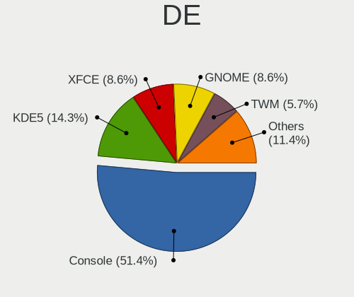
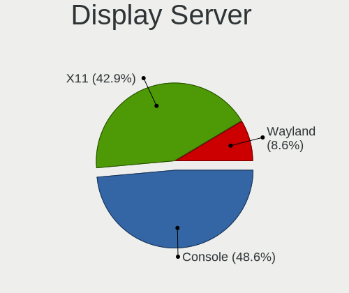
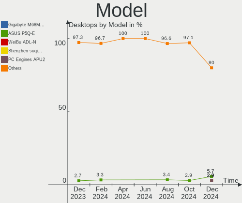
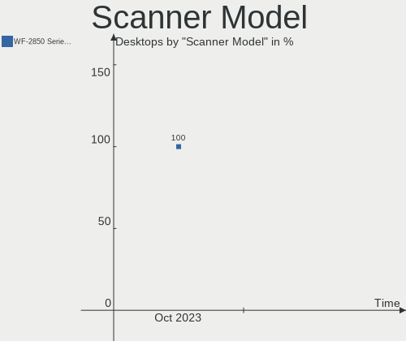

FreeBSD Hardware Trends (Desktops)
----------------------------------

A project to identify most popular hardware characteristics and track their change
over time based on data collected by FreeBSD users at https://BSD-Hardware.info.

Anyone can contribute to this report by the [hw-probe](https://github.com/linuxhw/hw-probe/blob/master/INSTALL.BSD.md) tool:

    hw-probe -all -upload

Full-feature report is available here: https://bsd-hardware.info/?view=trends&formfactor=desktop

Period: Sep, 2021.

Contents
--------

* [ System ](#system)
  - [ OS                       ](#os)
  - [ OS Family                ](#os-family)
  - [ Arch                     ](#arch)
  - [ DE                       ](#de)
  - [ Display Server           ](#display-server)
  - [ Display Manager          ](#display-manager)
  - [ OS Lang                  ](#os-lang)
  - [ Boot Mode                ](#boot-mode)
  - [ Filesystem               ](#filesystem)
  - [ Part. scheme             ](#part-scheme)

* [ Board ](#board)
  - [ Vendor                   ](#vendor)
  - [ Model                    ](#model)
  - [ Model Family             ](#model-family)
  - [ MFG Year                 ](#mfg-year)
  - [ Form Factor              ](#form-factor)
  - [ Coreboot                 ](#coreboot)
  - [ RAM Size                 ](#ram-size)
  - [ RAM Used                 ](#ram-used)
  - [ Total Drives             ](#total-drives)
  - [ Has CD-ROM               ](#has-cd-rom)
  - [ Has Ethernet             ](#has-ethernet)
  - [ Has WiFi                 ](#has-wifi)
  - [ Has Bluetooth            ](#has-bluetooth)

* [ Location ](#location)
  - [ Country                  ](#country)
  - [ City                     ](#city)

* [ Drives ](#drives)
  - [ Drive Vendor             ](#drive-vendor)
  - [ Drive Model              ](#drive-model)
  - [ HDD Vendor               ](#hdd-vendor)
  - [ SSD Vendor               ](#ssd-vendor)
  - [ Drive Kind               ](#drive-kind)
  - [ Drive Connector          ](#drive-connector)
  - [ Drive Size               ](#drive-size)
  - [ Space Total              ](#space-total)
  - [ Space Used               ](#space-used)
  - [ Malfunc. Drives          ](#malfunc-drives)
  - [ Malfunc. Drive Vendor    ](#malfunc-drive-vendor)
  - [ Malfunc. HDD Vendor      ](#malfunc-hdd-vendor)
  - [ Malfunc. Drive Kind      ](#malfunc-drive-kind)
  - [ Failed Drives            ](#failed-drives)
  - [ Failed Drive Vendor      ](#failed-drive-vendor)
  - [ Drive Status             ](#drive-status)

* [ Storage controller ](#storage-controller)
  - [ Storage Vendor           ](#storage-vendor)
  - [ Storage Model            ](#storage-model)
  - [ Storage Kind             ](#storage-kind)

* [ Processor ](#processor)
  - [ CPU Vendor               ](#cpu-vendor)
  - [ CPU Model                ](#cpu-model)
  - [ CPU Model Family         ](#cpu-model-family)
  - [ CPU Cores                ](#cpu-cores)
  - [ CPU Sockets              ](#cpu-sockets)
  - [ CPU Threads              ](#cpu-threads)
  - [ CPU Microarch            ](#cpu-microarch)

* [ Graphics ](#graphics)
  - [ GPU Vendor               ](#gpu-vendor)
  - [ GPU Model                ](#gpu-model)
  - [ GPU Combo                ](#gpu-combo)
  - [ GPU Driver               ](#gpu-driver)
  - [ GPU Memory               ](#gpu-memory)

* [ Monitor ](#monitor)
  - [ Monitor Vendor           ](#monitor-vendor)
  - [ Monitor Model            ](#monitor-model)
  - [ Monitor Resolution       ](#monitor-resolution)
  - [ Monitor Diagonal         ](#monitor-diagonal)
  - [ Monitor Width            ](#monitor-width)
  - [ Aspect Ratio             ](#aspect-ratio)
  - [ Monitor Area             ](#monitor-area)
  - [ Pixel Density            ](#pixel-density)
  - [ Multiple Monitors        ](#multiple-monitors)

* [ Network ](#network)
  - [ Net Controller Vendor    ](#net-controller-vendor)
  - [ Net Controller Model     ](#net-controller-model)
  - [ Wireless Vendor          ](#wireless-vendor)
  - [ Wireless Model           ](#wireless-model)
  - [ Ethernet Vendor          ](#ethernet-vendor)
  - [ Ethernet Model           ](#ethernet-model)
  - [ Net Controller Kind      ](#net-controller-kind)
  - [ Used Controller          ](#used-controller)
  - [ NICs                     ](#nics)
  - [ IPv6                     ](#ipv6)

* [ Bluetooth ](#bluetooth)
  - [ Bluetooth Vendor         ](#bluetooth-vendor)
  - [ Bluetooth Model          ](#bluetooth-model)

* [ Sound ](#sound)
  - [ Sound Vendor             ](#sound-vendor)
  - [ Sound Model              ](#sound-model)

* [ Memory ](#memory)
  - [ Memory Vendor            ](#memory-vendor)
  - [ Memory Model             ](#memory-model)
  - [ Memory Kind              ](#memory-kind)
  - [ Memory Form Factor       ](#memory-form-factor)
  - [ Memory Size              ](#memory-size)
  - [ Memory Speed             ](#memory-speed)

* [ Printers & scanners ](#printers--scanners)
  - [ Printer Vendor           ](#printer-vendor)
  - [ Printer Model            ](#printer-model)
  - [ Scanner Vendor           ](#scanner-vendor)
  - [ Scanner Model            ](#scanner-model)

* [ Camera ](#camera)
  - [ Camera Vendor            ](#camera-vendor)
  - [ Camera Model             ](#camera-model)

* [ Security ](#security)
  - [ Fingerprint Vendor       ](#fingerprint-vendor)
  - [ Fingerprint Model        ](#fingerprint-model)
  - [ Chipcard Vendor          ](#chipcard-vendor)
  - [ Chipcard Model           ](#chipcard-model)

* [ Unsupported ](#unsupported)
  - [ Unsupported Devices      ](#unsupported-devices)
  - [ Unsupported Device Types ](#unsupported-device-types)

System
------

OS
--

Installed operating systems

| Name                 | Desktops | Percent |
|----------------------|----------|---------|
| FreeBSD 13.0-p4      | 12       | 34.29%  |
| FreeBSD 13.0         | 7        | 20%     |
| FreeBSD 13.0-STABLE  | 6        | 17.14%  |
| FreeBSD 13.0-p3      | 5        | 14.29%  |
| FreeBSD 12.2-p10     | 3        | 8.57%   |
| FreeBSD 14.0-CURRENT | 2        | 5.71%   |

OS Family
---------

OS without a version

| Name    | Desktops | Percent |
|---------|----------|---------|
| FreeBSD | 35       | 100%    |

Arch
----

OS architecture (x86_64, i586, etc.)

| Name  | Desktops | Percent |
|-------|----------|---------|
| amd64 | 30       | 85.71%  |
| arm64 | 5        | 14.29%  |

DE
--

Desktop Environment

| Name      | Desktops | Percent |
|-----------|----------|---------|
| Console   | 12       | 34.29%  |
| MATE      | 6        | 17.14%  |
| KDE5      | 6        | 17.14%  |
| GNOME     | 3        | 8.57%   |
| Cinnamon  | 2        | 5.71%   |
| XFCE      | 1        | 2.86%   |
| TWM       | 1        | 2.86%   |
| Openbox   | 1        | 2.86%   |
| Lumina    | 1        | 2.86%   |
| i3        | 1        | 2.86%   |
| AwesomeWM | 1        | 2.86%   |

Display Server
--------------

X11 or Wayland

| Name    | Desktops | Percent |
|---------|----------|---------|
| X11     | 23       | 65.71%  |
| Console | 12       | 34.29%  |

Display Manager
---------------

SDDM, LightDM, etc.

| Name    | Desktops | Percent |
|---------|----------|---------|
| Console | 19       | 54.29%  |
| SLiM    | 6        | 17.14%  |
| XDM     | 4        | 11.43%  |
| SDDM    | 3        | 8.57%   |
| GDM     | 3        | 8.57%   |

OS Lang
-------

Language

| Lang    | Desktops | Percent |
|---------|----------|---------|
| C       | 20       | 57.14%  |
| en_US   | 5        | 14.29%  |
| Unknown | 4        | 11.43%  |
| en_GB   | 2        | 5.71%   |
| ru_RU   | 1        | 2.86%   |
| en_AU   | 1        | 2.86%   |
| de_DE   | 1        | 2.86%   |
| de_CH   | 1        | 2.86%   |

Boot Mode
---------

EFI or BIOS

| Mode | Desktops | Percent |
|------|----------|---------|
| EFI  | 22       | 62.86%  |
| BIOS | 13       | 37.14%  |

Filesystem
----------

Type of filesystem

| Type | Desktops | Percent |
|------|----------|---------|
| Zfs  | 27       | 77.14%  |
| Ufs  | 8        | 22.86%  |

Part. scheme
------------

Scheme of partitioning

| Type | Desktops | Percent |
|------|----------|---------|
| GPT  | 32       | 91.43%  |
| MBR  | 3        | 8.57%   |

Board
-----

Vendor
------

Motherboard manufacturer

| Name                | Desktops | Percent |
|---------------------|----------|---------|
| ASUSTek Computer    | 8        | 22.86%  |
| MSI                 | 5        | 14.29%  |
| Gigabyte Technology | 5        | 14.29%  |
| Unknown             | 5        | 14.29%  |
| Dell                | 4        | 11.43%  |
| Hewlett-Packard     | 3        | 8.57%   |
| ASRock              | 2        | 5.71%   |
| Supermicro          | 1        | 2.86%   |
| QTQD                | 1        | 2.86%   |
| Foxconn             | 1        | 2.86%   |

Model
-----

Motherboard model

| Name                              | Desktops | Percent |
|-----------------------------------|----------|---------|
| Unknown                           | 5        | 14.29%  |
| Dell Precision 3630 Tower         | 2        | 5.71%   |
| Supermicro X7SPA-HF               | 1        | 2.86%   |
| QTQD Board                        | 1        | 2.86%   |
| MSI MS-7D09                       | 1        | 2.86%   |
| MSI MS-7C36                       | 1        | 2.86%   |
| MSI MS-7C02                       | 1        | 2.86%   |
| MSI MS-7B22                       | 1        | 2.86%   |
| MSI MS-7817                       | 1        | 2.86%   |
| HP Z620 Workstation               | 1        | 2.86%   |
| HP Z600 Workstation               | 1        | 2.86%   |
| HP Z440 Workstation               | 1        | 2.86%   |
| Gigabyte Z68P-DS3                 | 1        | 2.86%   |
| Gigabyte X470 AORUS GAMING 5 WIFI | 1        | 2.86%   |
| Gigabyte X399 DESIGNARE EX        | 1        | 2.86%   |
| Gigabyte F2A88XM-D3H              | 1        | 2.86%   |
| Gigabyte EP45-UD3R                | 1        | 2.86%   |
| Foxconn HPE-570f                  | 1        | 2.86%   |
| Dell OptiPlex 980                 | 1        | 2.86%   |
| Dell OptiPlex 9020                | 1        | 2.86%   |
| ASUS ROG STRIX X570-F GAMING      | 1        | 2.86%   |
| ASUS PRIME Z590-A                 | 1        | 2.86%   |
| ASUS PRIME X370-PRO               | 1        | 2.86%   |
| ASUS PRIME H310M-D R2.0           | 1        | 2.86%   |
| ASUS P8Z68-V LX                   | 1        | 2.86%   |
| ASUS P8H61-M LE/USB3              | 1        | 2.86%   |
| ASUS P5Q-E                        | 1        | 2.86%   |
| ASUS All Series                   | 1        | 2.86%   |
| ASRock X58 Extreme3               | 1        | 2.86%   |
| ASRock X570 Phantom Gaming 4      | 1        | 2.86%   |

Model Family
------------

Motherboard model prefix

| Name                 | Desktops | Percent |
|----------------------|----------|---------|
| Unknown              | 5        | 14.29%  |
| ASUS PRIME           | 3        | 8.57%   |
| Dell Precision       | 2        | 5.71%   |
| Dell OptiPlex        | 2        | 5.71%   |
| Supermicro X7SPA-HF  | 1        | 2.86%   |
| QTQD Board           | 1        | 2.86%   |
| MSI MS-7D09          | 1        | 2.86%   |
| MSI MS-7C36          | 1        | 2.86%   |
| MSI MS-7C02          | 1        | 2.86%   |
| MSI MS-7B22          | 1        | 2.86%   |
| MSI MS-7817          | 1        | 2.86%   |
| HP Z620              | 1        | 2.86%   |
| HP Z600              | 1        | 2.86%   |
| HP Z440              | 1        | 2.86%   |
| Gigabyte Z68P-DS3    | 1        | 2.86%   |
| Gigabyte X470        | 1        | 2.86%   |
| Gigabyte X399        | 1        | 2.86%   |
| Gigabyte F2A88XM-D3H | 1        | 2.86%   |
| Gigabyte EP45-UD3R   | 1        | 2.86%   |
| Foxconn HPE-570f     | 1        | 2.86%   |
| ASUS ROG             | 1        | 2.86%   |
| ASUS P8Z68-V         | 1        | 2.86%   |
| ASUS P8H61-M         | 1        | 2.86%   |
| ASUS P5Q-E           | 1        | 2.86%   |
| ASUS All             | 1        | 2.86%   |
| ASRock X58           | 1        | 2.86%   |
| ASRock X570          | 1        | 2.86%   |

MFG Year
--------

Motherboard manufacture year

| Year    | Desktops | Percent |
|---------|----------|---------|
| 2020    | 6        | 17.14%  |
| 2019    | 5        | 14.29%  |
| 2021    | 4        | 11.43%  |
| 2011    | 4        | 11.43%  |
| Unknown | 4        | 11.43%  |
| 2018    | 3        | 8.57%   |
| 2014    | 2        | 5.71%   |
| 2012    | 2        | 5.71%   |
| 2010    | 2        | 5.71%   |
| 2015    | 1        | 2.86%   |
| 2013    | 1        | 2.86%   |
| 2008    | 1        | 2.86%   |

Form Factor
-----------

Physical design of the computer

| Name    | Desktops | Percent |
|---------|----------|---------|
| Desktop | 35       | 100%    |

Coreboot
--------

Have coreboot on board

| Used | Desktops | Percent |
|------|----------|---------|
| No   | 35       | 100%    |

RAM Size
--------

Total RAM memory

| Size in GB  | Desktops | Percent |
|-------------|----------|---------|
| 32.01-64.0  | 8        | 22.86%  |
| 16.01-24.0  | 7        | 20%     |
| 4.01-8.0    | 6        | 17.14%  |
| 64.01-256.0 | 6        | 17.14%  |
| 8.01-16.0   | 6        | 17.14%  |
| 24.01-32.0  | 1        | 2.86%   |
| 2.01-3.0    | 1        | 2.86%   |

RAM Used
--------

Used RAM memory

| Used GB    | Desktops | Percent |
|------------|----------|---------|
| 0.01-0.5   | 12       | 34.29%  |
| 1.01-2.0   | 11       | 31.43%  |
| 0.51-1.0   | 6        | 17.14%  |
| 3.01-4.0   | 3        | 8.57%   |
| 16.01-24.0 | 2        | 5.71%   |
| 2.01-3.0   | 1        | 2.86%   |

Total Drives
------------

Number of drives on board

| Drives | Desktops | Percent |
|--------|----------|---------|
| 1      | 8        | 22.86%  |
| 2      | 7        | 20%     |
| 6      | 5        | 14.29%  |
| 5      | 4        | 11.43%  |
| 4      | 4        | 11.43%  |
| 3      | 4        | 11.43%  |
| 0      | 2        | 5.71%   |
| 13     | 1        | 2.86%   |

Has CD-ROM
----------

Has CD-ROM on board

| Presented | Desktops | Percent |
|-----------|----------|---------|
| No        | 19       | 54.29%  |
| Yes       | 16       | 45.71%  |

Has Ethernet
------------

Has Ethernet on board

| Presented | Desktops | Percent |
|-----------|----------|---------|
| Yes       | 32       | 91.43%  |
| No        | 3        | 8.57%   |

Has WiFi
--------

Has WiFi module

| Presented | Desktops | Percent |
|-----------|----------|---------|
| No        | 29       | 82.86%  |
| Yes       | 6        | 17.14%  |

Has Bluetooth
-------------

Has Bluetooth module

| Presented | Desktops | Percent |
|-----------|----------|---------|
| No        | 32       | 91.43%  |
| Yes       | 3        | 8.57%   |

Location
--------

Country
-------

Geographic location (country)

| Country      | Desktops | Percent |
|--------------|----------|---------|
| USA          | 16       | 45.71%  |
| Russia       | 4        | 11.43%  |
| Germany      | 2        | 5.71%   |
| France       | 2        | 5.71%   |
| Canada       | 2        | 5.71%   |
| Australia    | 2        | 5.71%   |
| UK           | 1        | 2.86%   |
| Switzerland  | 1        | 2.86%   |
| Sweden       | 1        | 2.86%   |
| South Africa | 1        | 2.86%   |
| Slovakia     | 1        | 2.86%   |
| Poland       | 1        | 2.86%   |
| Japan        | 1        | 2.86%   |

City
----

Geographic location (city)

| City                 | Desktops | Percent |
|----------------------|----------|---------|
| Seattle              | 2        | 5.71%   |
| Salem                | 2        | 5.71%   |
| Moscow               | 2        | 5.71%   |
| Lake Forest          | 2        | 5.71%   |
| Kirkland             | 2        | 5.71%   |
| Zurich               | 1        | 2.86%   |
| Yokohama             | 1        | 2.86%   |
| West Kelowna         | 1        | 2.86%   |
| Wenatchee            | 1        | 2.86%   |
| V?¤ster??s           | 1        | 2.86%   |
| St. Catharines       | 1        | 2.86%   |
| Spring               | 1        | 2.86%   |
| Spokane              | 1        | 2.86%   |
| Shell Cove           | 1        | 2.86%   |
| Plouzane             | 1        | 2.86%   |
| Minneapolis          | 1        | 2.86%   |
| Metz                 | 1        | 2.86%   |
| Krasnoyarsk          | 1        | 2.86%   |
| Krasnodar            | 1        | 2.86%   |
| Ko??ice              | 1        | 2.86%   |
| Hull                 | 1        | 2.86%   |
| Highland Park        | 1        | 2.86%   |
| Hamburg              | 1        | 2.86%   |
| Green Valley         | 1        | 2.86%   |
| Garching bei Munchen | 1        | 2.86%   |
| Frisco               | 1        | 2.86%   |
| Fairfax              | 1        | 2.86%   |
| Chrzan??w            | 1        | 2.86%   |
| Barberton            | 1        | 2.86%   |
| Adelaide             | 1        | 2.86%   |

Drives
------

Drive Vendor
------------

Hard drive vendors

| Vendor              | Desktops | Drives | Percent |
|---------------------|----------|--------|---------|
| Seagate             | 14       | 17     | 21.21%  |
| WDC                 | 13       | 40     | 19.7%   |
| Samsung Electronics | 11       | 16     | 16.67%  |
| Toshiba             | 3        | 5      | 4.55%   |
| SanDisk             | 3        | 3      | 4.55%   |
| Kingston            | 3        | 3      | 4.55%   |
| Hitachi             | 3        | 5      | 4.55%   |
| Crucial             | 3        | 10     | 4.55%   |
| Micron Technology   | 2        | 3      | 3.03%   |
| Intel               | 2        | 3      | 3.03%   |
| VMware              | 1        | 1      | 1.52%   |
| SK Hynix            | 1        | 1      | 1.52%   |
| PNY                 | 1        | 1      | 1.52%   |
| PLEXTOR             | 1        | 1      | 1.52%   |
| KingSpec            | 1        | 1      | 1.52%   |
| KingDian            | 1        | 1      | 1.52%   |
| Hewlett-Packard     | 1        | 1      | 1.52%   |
| Corsair             | 1        | 1      | 1.52%   |
| A-DATA Technology   | 1        | 1      | 1.52%   |

Drive Model
-----------

Hard drive models

| Model                                | Desktops | Percent |
|--------------------------------------|----------|---------|
| WDC WD10EZEX-08WN4A0 1TB             | 2        | 2.44%   |
| Seagate ST4000DM000-1F2168 4TB       | 2        | 2.44%   |
| Seagate ST3000DM001-1ER166 3TB       | 2        | 2.44%   |
| Seagate ST1000DM010-2EP102 1TB       | 2        | 2.44%   |
| Samsung SSD 860 QVO 1TB              | 2        | 2.44%   |
| Samsung SSD 860 EVO 1TB              | 2        | 2.44%   |
| Kingston SA400S37240G 240GB          | 2        | 2.44%   |
| WDC WDS250G2B0A 250GB                | 1        | 1.22%   |
| WDC WDS100T1X0E-00AFY0 1TB           | 1        | 1.22%   |
| WDC WD80EMAZ-00WJTA0 8TB             | 1        | 1.22%   |
| WDC WD80EFZX-68UW8N0 8TB             | 1        | 1.22%   |
| WDC WD80EFAX-68LHPN0 8TB             | 1        | 1.22%   |
| WDC WD80EDBZ-11B0ZA0 8TB             | 1        | 1.22%   |
| WDC WD60EZRZ-00GZ5B1 6TB             | 1        | 1.22%   |
| WDC WD6003FZBX-00K5WB0 6TB           | 1        | 1.22%   |
| WDC WD40EZRZ-22GXCB0 4TB             | 1        | 1.22%   |
| WDC WD40EFRX-68N32N0 4TB             | 1        | 1.22%   |
| WDC WD4003FFBX-68MU3N0 4TB           | 1        | 1.22%   |
| WDC WD4000AAKS-00TMA0 400GB          | 1        | 1.22%   |
| WDC WD20EARS-60MVWB0 2TB             | 1        | 1.22%   |
| WDC WD120EMFZ-11A6JA0 12TB           | 1        | 1.22%   |
| WDC WD120EMAZ-11BLFA0 12TB           | 1        | 1.22%   |
| WDC WD10JMVW-11AJGS3 1TB             | 1        | 1.22%   |
| WDC WD10EZEX-00UD2A0 1TB             | 1        | 1.22%   |
| WDC WD102KRYZ-01A5AB0 10TB           | 1        | 1.22%   |
| WDC WD1003FBYX-01Y7B0 1TB            | 1        | 1.22%   |
| WDC WD1001FALS-00J7B0 1TB            | 1        | 1.22%   |
| VMware Virtual disk 112GB            | 1        | 1.22%   |
| Toshiba HDWQ140 4TB                  | 1        | 1.22%   |
| Toshiba HDWD120 2TB                  | 1        | 1.22%   |
| Toshiba DT01ACA200 2TB               | 1        | 1.22%   |
| Toshiba DT01ACA100 1TB               | 1        | 1.22%   |
| SK Hynix SC401 SATA 512GB            | 1        | 1.22%   |
| Seagate ST500LM000-1EJ162-SSHD 500GB | 1        | 1.22%   |
| Seagate ST500DM002-1BD142 500GB      | 1        | 1.22%   |
| Seagate ST4000VN008-2DR166 4TB       | 1        | 1.22%   |
| Seagate ST4000DM004-2CV104 4TB       | 1        | 1.22%   |
| Seagate ST3320620AS 320GB            | 1        | 1.22%   |
| Seagate ST32000542AS 2TB             | 1        | 1.22%   |
| Seagate ST2000DM008-2FR102 2TB       | 1        | 1.22%   |
| Seagate ST2000DM001-9YN164 2TB       | 1        | 1.22%   |
| Seagate ST1000DM003-1ER162 1TB       | 1        | 1.22%   |
| SanDisk SSD PLUS 480GB               | 1        | 1.22%   |
| SanDisk SSD i110 16GB                | 1        | 1.22%   |
| SanDisk SD7TB3Q-256G-1006 256GB      | 1        | 1.22%   |
| Samsung SSD 970 EVO Plus 500GB       | 1        | 1.22%   |
| Samsung SSD 960 EVO 500GB            | 1        | 1.22%   |
| Samsung SSD 960 EVO 1TB              | 1        | 1.22%   |
| Samsung SSD 870 QVO 1TB              | 1        | 1.22%   |
| Samsung SSD 870 EVO 1TB              | 1        | 1.22%   |
| Samsung SSD 860 EVO 500GB            | 1        | 1.22%   |
| Samsung SSD 850 EVO 500GB            | 1        | 1.22%   |
| Samsung SSD 850 EVO 250GB            | 1        | 1.22%   |
| Samsung SSD 850 EVO 1TB              | 1        | 1.22%   |
| Samsung HD502HI 500GB                | 1        | 1.22%   |
| Samsung HD204UI 2TB                  | 1        | 1.22%   |
| Samsung HD103UJ 1TB                  | 1        | 1.22%   |
| PNY CS3030 500GB SSD                 | 1        | 1.22%   |
| PLEXTOR PX-128M7VC 128GB             | 1        | 1.22%   |
| Micron MTFDDAK256MBF-1AN15ABHA 256GB | 1        | 1.22%   |

HDD Vendor
----------

Hard disk drive vendors

| Vendor              | Desktops | Drives | Percent |
|---------------------|----------|--------|---------|
| Seagate             | 14       | 17     | 38.89%  |
| WDC                 | 13       | 38     | 36.11%  |
| Toshiba             | 3        | 5      | 8.33%   |
| Hitachi             | 3        | 5      | 8.33%   |
| Samsung Electronics | 2        | 3      | 5.56%   |
| Hewlett-Packard     | 1        | 1      | 2.78%   |

SSD Vendor
----------

Solid state drive vendors

| Vendor              | Desktops | Drives | Percent |
|---------------------|----------|--------|---------|
| Samsung Electronics | 8        | 10     | 29.63%  |
| SanDisk             | 3        | 3      | 11.11%  |
| Kingston            | 3        | 3      | 11.11%  |
| Crucial             | 3        | 10     | 11.11%  |
| Intel               | 2        | 3      | 7.41%   |
| WDC                 | 1        | 1      | 3.7%    |
| VMware              | 1        | 1      | 3.7%    |
| SK Hynix            | 1        | 1      | 3.7%    |
| PLEXTOR             | 1        | 1      | 3.7%    |
| Micron Technology   | 1        | 1      | 3.7%    |
| KingSpec            | 1        | 1      | 3.7%    |
| KingDian            | 1        | 1      | 3.7%    |
| A-DATA Technology   | 1        | 1      | 3.7%    |

Drive Kind
----------

HDD or SSD

| Kind | Desktops | Drives | Percent |
|------|----------|--------|---------|
| HDD  | 26       | 69     | 50%     |
| SSD  | 19       | 37     | 36.54%  |
| NVMe | 7        | 8      | 13.46%  |

Drive Connector
---------------

SATA, SAS, NVMe, etc.

| Type | Desktops | Drives | Percent |
|------|----------|--------|---------|
| SATA | 32       | 106    | 82.05%  |
| NVMe | 7        | 8      | 17.95%  |

Drive Size
----------

Size of hard drive

| Size in TB | Desktops | Drives | Percent |
|------------|----------|--------|---------|
| 0.01-0.5   | 18       | 35     | 36.73%  |
| 0.51-1.0   | 12       | 26     | 24.49%  |
| 3.01-4.0   | 7        | 13     | 14.29%  |
| 1.01-2.0   | 6        | 10     | 12.24%  |
| 4.01-10.0  | 3        | 17     | 6.12%   |
| 2.01-3.0   | 2        | 3      | 4.08%   |
| 10.01-20.0 | 1        | 2      | 2.04%   |

Space Total
-----------

Amount of disk space available on the file system

| Size in GB     | Desktops | Percent |
|----------------|----------|---------|
| 251-500        | 9        | 25.71%  |
| 501-1000       | 7        | 20%     |
| 101-250        | 5        | 14.29%  |
| 1001-2000      | 5        | 14.29%  |
| 1-20           | 4        | 11.43%  |
| 2001-3000      | 2        | 5.71%   |
| 51-100         | 2        | 5.71%   |
| More than 3000 | 1        | 2.86%   |

Space Used
----------

Amount of used disk space

| Used GB   | Desktops | Percent |
|-----------|----------|---------|
| 1-20      | 23       | 65.71%  |
| 21-50     | 5        | 14.29%  |
| 101-250   | 2        | 5.71%   |
| 51-100    | 2        | 5.71%   |
| 251-500   | 1        | 2.86%   |
| 2001-3000 | 1        | 2.86%   |
| 1001-2000 | 1        | 2.86%   |

Malfunc. Drives
---------------

Drive models with a malfunction

| Model                               | Desktops | Drives | Percent |
|-------------------------------------|----------|--------|---------|
| WDC WD10EZEX-08WN4A0 1TB            | 1        | 1      | 9.09%   |
| Toshiba DT01ACA200 2TB              | 1        | 1      | 9.09%   |
| Seagate ST32000542AS 2TB            | 1        | 1      | 9.09%   |
| Seagate ST3000DM001-1ER166 3TB      | 1        | 1      | 9.09%   |
| Seagate ST2000DM001-9YN164 2TB      | 1        | 1      | 9.09%   |
| SanDisk SSD PLUS 480GB              | 1        | 1      | 9.09%   |
| Samsung Electronics SSD 870 EVO 1TB | 1        | 1      | 9.09%   |
| Samsung Electronics HD103UJ 1TB     | 1        | 1      | 9.09%   |
| Hitachi HDT721010SLA360 1TB         | 1        | 1      | 9.09%   |
| Hewlett-Packard MB1000GCWCV 1TB     | 1        | 1      | 9.09%   |
| Crucial CT275MX300SSD1 275GB        | 1        | 3      | 9.09%   |

Malfunc. Drive Vendor
---------------------

Vendors of faulty drives

| Vendor              | Desktops | Drives | Percent |
|---------------------|----------|--------|---------|
| Seagate             | 3        | 3      | 27.27%  |
| Samsung Electronics | 2        | 2      | 18.18%  |
| WDC                 | 1        | 1      | 9.09%   |
| Toshiba             | 1        | 1      | 9.09%   |
| SanDisk             | 1        | 1      | 9.09%   |
| Hitachi             | 1        | 1      | 9.09%   |
| Hewlett-Packard     | 1        | 1      | 9.09%   |
| Crucial             | 1        | 3      | 9.09%   |

Malfunc. HDD Vendor
-------------------

Vendors of faulty HDD drives

| Vendor              | Desktops | Drives | Percent |
|---------------------|----------|--------|---------|
| Seagate             | 3        | 3      | 37.5%   |
| WDC                 | 1        | 1      | 12.5%   |
| Toshiba             | 1        | 1      | 12.5%   |
| Samsung Electronics | 1        | 1      | 12.5%   |
| Hitachi             | 1        | 1      | 12.5%   |
| Hewlett-Packard     | 1        | 1      | 12.5%   |

Malfunc. Drive Kind
-------------------

Kinds of faulty drives

| Kind | Desktops | Drives | Percent |
|------|----------|--------|---------|
| HDD  | 7        | 8      | 70%     |
| SSD  | 3        | 5      | 30%     |

Failed Drives
-------------

Failed drive models

Zero info for selected period =(

Failed Drive Vendor
-------------------

Failed drive vendors

Zero info for selected period =(

Drive Status
------------

Number of failed and malfunc. drives

| Status   | Desktops | Drives | Percent |
|----------|----------|--------|---------|
| Works    | 30       | 98     | 75%     |
| Malfunc  | 8        | 13     | 20%     |
| Detected | 2        | 3      | 5%      |

Storage controller
------------------

Storage Vendor
--------------

Storage controller vendors

| Vendor                   | Desktops | Percent |
|--------------------------|----------|---------|
| Intel                    | 21       | 43.75%  |
| AMD                      | 9        | 18.75%  |
| Samsung Electronics      | 4        | 8.33%   |
| Marvell Technology Group | 3        | 6.25%   |
| VMware                   | 2        | 4.17%   |
| Phison Electronics       | 2        | 4.17%   |
| ASMedia Technology       | 2        | 4.17%   |
| Sandisk                  | 1        | 2.08%   |
| Micron Technology        | 1        | 2.08%   |
| JMicron Technology       | 1        | 2.08%   |
| Broadcom / LSI           | 1        | 2.08%   |
| Adaptec                  | 1        | 2.08%   |

Storage Model
-------------

Storage controller models

| Model                                                                          | Desktops | Percent |
|--------------------------------------------------------------------------------|----------|---------|
| AMD FCH SATA Controller [AHCI mode]                                            | 7        | 12.07%  |
| Intel SATA Controller [RAID mode]                                              | 4        | 6.9%    |
| Samsung NVMe SSD Controller SM961/PM961/SM963                                  | 3        | 5.17%   |
| Intel 82801JI (ICH10 Family) SATA AHCI Controller                              | 3        | 5.17%   |
| Intel 6 Series/C200 Series Chipset Family 6 port Desktop SATA AHCI Controller  | 3        | 5.17%   |
| Unknown                                                                        | 3        | 5.17%   |
| VMware SATA AHCI controller                                                    | 2        | 3.45%   |
| Intel Cannon Lake PCH SATA AHCI Controller                                     | 2        | 3.45%   |
| Intel 8 Series/C220 Series Chipset Family 6-port SATA Controller 1 [AHCI mode] | 2        | 3.45%   |
| Intel 500 Series Chipset Family SATA AHCI Controller                           | 2        | 3.45%   |
| AMD 400 Series Chipset SATA Controller                                         | 2        | 3.45%   |
| VMware PVSCSI SCSI Controller                                                  | 1        | 1.72%   |
| Sandisk WD Black SN850                                                         | 1        | 1.72%   |
| Samsung NVMe SSD Controller SM981/PM981/PM983                                  | 1        | 1.72%   |
| Phison E16 PCIe4 NVMe Controller                                               | 1        | 1.72%   |
| Phison E12 NVMe Controller                                                     | 1        | 1.72%   |
| Marvell Group 88SE9215 PCIe 2.0 x1 4-port SATA 6 Gb/s Controller               | 1        | 1.72%   |
| Marvell Group 88SE912x IDE Controller                                          | 1        | 1.72%   |
| Marvell Group 88SE9123 PCIe SATA 6.0 Gb/s controller                           | 1        | 1.72%   |
| Marvell Group 88SE6111/6121 SATA II / PATA Controller                          | 1        | 1.72%   |
| JMicron JMB363 SATA/IDE Controller                                             | 1        | 1.72%   |
| Intel C610/X99 series chipset sSATA Controller [AHCI mode]                     | 1        | 1.72%   |
| Intel C610/X99 series chipset 6-Port SATA Controller [AHCI mode]               | 1        | 1.72%   |
| Intel C602 chipset 4-Port SATA Storage Control Unit                            | 1        | 1.72%   |
| Intel C600/X79 series chipset SATA RAID Controller                             | 1        | 1.72%   |
| Intel C600/X79 series chipset IDE-r Controller                                 | 1        | 1.72%   |
| Intel 82801IR/IO/IH (ICH9R/DO/DH) 6 port SATA Controller [AHCI mode]           | 1        | 1.72%   |
| Intel 7 Series Chipset Family 6-port SATA Controller [AHCI mode]               | 1        | 1.72%   |
| Intel 5 Series/3400 Series Chipset PT IDER Controller                          | 1        | 1.72%   |
| Intel 200 Series PCH SATA controller [AHCI mode]                               | 1        | 1.72%   |
| Broadcom / LSI SAS2008 PCI-Express Fusion-MPT SAS-2 [Falcon]                   | 1        | 1.72%   |
| ASMedia ASM1062 Serial ATA Controller                                          | 1        | 1.72%   |
| AMD X399 Series Chipset SATA Controller                                        | 1        | 1.72%   |
| AMD X370 Series Chipset SATA Controller                                        | 1        | 1.72%   |
| AMD SB7x0/SB8x0/SB9x0 SATA Controller [Non-RAID5 mode]                         | 1        | 1.72%   |
| Adaptec AIC-7870P/7881U [AHA-2940U/UW/D/S76]                                   | 1        | 1.72%   |

Storage Kind
------------

Kind of storage controller (IDE, SATA, NVMe, SAS, ...)

| Kind | Desktops | Percent |
|------|----------|---------|
| SATA | 27       | 52.94%  |
| NVMe | 9        | 17.65%  |
| RAID | 6        | 11.76%  |
| IDE  | 5        | 9.8%    |
| SAS  | 3        | 5.88%   |
| SCSI | 1        | 1.96%   |

Processor
---------

CPU Vendor
----------

Processor vendors

| Vendor  | Desktops | Percent |
|---------|----------|---------|
| Intel   | 21       | 60%     |
| AMD     | 9        | 25.71%  |
| ARM     | 3        | 8.57%   |
| Unknown | 1        | 2.86%   |
| Unknown | 1        | 2.86%   |

CPU Model
---------

Processor models

| Model                                          | Desktops | Percent |
|------------------------------------------------|----------|---------|
| ARM Cortex-A57 r1p3                            | 2        | 5.71%   |
| AMD Ryzen 9 3900X 12-Core Processor            | 2        | 5.71%   |
| Unknown Implementer Processor r0p0             | 1        | 2.86%   |
| Intel Xeon CPU X5570 @ 2.93GHz                 | 1        | 2.86%   |
| Intel Xeon CPU E5-2670 @ 2.60GHz               | 1        | 2.86%   |
| Intel Xeon CPU E5-1620 v3 @ 3.50GHz            | 1        | 2.86%   |
| Intel Pentium CPU G3220 @ 3.00GHz              | 1        | 2.86%   |
| Intel Core i7-9700 CPU @ 3.00GHz               | 1        | 2.86%   |
| Intel Core i7-10700K CPU @ 3.80GHz             | 1        | 2.86%   |
| Intel Core i7-10700 CPU @ 2.90GHz              | 1        | 2.86%   |
| Intel Core i7 CPU 960 @ 3.20GHz                | 1        | 2.86%   |
| Intel Core i5-9600 CPU @ 3.10GHz               | 1        | 2.86%   |
| Intel Core i5-4590 CPU @ 3.30GHz               | 1        | 2.86%   |
| Intel Core i5-4460 CPU @ 3.20GHz               | 1        | 2.86%   |
| Intel Core i5-3570 CPU                         | 1        | 2.86%   |
| Intel Core i5-3317U CPU @ 1.70GHz              | 1        | 2.86%   |
| Intel Core i5-2500 CPU @ 3.30GHz               | 1        | 2.86%   |
| Intel Core i5-2400 CPU @ 3.10GHz               | 1        | 2.86%   |
| Intel Core i5                                  | 1        | 2.86%   |
| Intel Core i3-9100F CPU @ 3.60GHz              | 1        | 2.86%   |
| Intel Core i3-8100 CPU @ 3.60GHz               | 1        | 2.86%   |
| Intel Core 2 Quad CPU Q6600 @ 2.40GHz          | 1        | 2.86%   |
| Intel Core 2 Quad CPU Q6600 @                  | 1        | 2.86%   |
| Intel Atom CPU D510 @ 1.66GHz                  | 1        | 2.86%   |
| ARM Cortex-A72 r0p3                            | 1        | 2.86%   |
| AMD Ryzen Threadripper 1950X 16-Core Processor | 1        | 2.86%   |
| AMD Ryzen 9 5950X 16-Core Processor            | 1        | 2.86%   |
| AMD Ryzen 7 3700X 8-Core Processor             | 1        | 2.86%   |
| AMD Ryzen 7 1700X Eight-Core Processor         | 1        | 2.86%   |
| AMD Ryzen 7 1700 Eight-Core Processor          | 1        | 2.86%   |
| AMD Phenom II X6 1090T Processor               | 1        | 2.86%   |
| AMD A8-7600 Radeon R7, 10 Compute Cores 4C+6G  | 1        | 2.86%   |
|                                                | 1        | 2.86%   |

CPU Model Family
----------------

Processor model prefix

| Model                  | Desktops | Percent |
|------------------------|----------|---------|
| Intel Core i5          | 8        | 22.86%  |
| Intel Core i7          | 4        | 11.43%  |
| Intel Xeon             | 3        | 8.57%   |
| ARM Cortex             | 3        | 8.57%   |
| AMD Ryzen 9            | 3        | 8.57%   |
| AMD Ryzen 7            | 3        | 8.57%   |
| Other                  | 2        | 5.71%   |
| Intel Core i3          | 2        | 5.71%   |
| Intel Core 2 Quad      | 2        | 5.71%   |
| Intel Pentium          | 1        | 2.86%   |
| Intel Atom             | 1        | 2.86%   |
| AMD Ryzen Threadripper | 1        | 2.86%   |
| AMD Phenom II X6       | 1        | 2.86%   |
| AMD A8                 | 1        | 2.86%   |

CPU Cores
---------

Number of processor cores

| Number  | Desktops | Percent |
|---------|----------|---------|
| 4       | 11       | 31.43%  |
| Unknown | 6        | 17.14%  |
| 8       | 5        | 14.29%  |
| 2       | 4        | 11.43%  |
| 16      | 3        | 8.57%   |
| 32      | 2        | 5.71%   |
| 24      | 2        | 5.71%   |
| 6       | 2        | 5.71%   |

CPU Sockets
-----------

Number of sockets

| Number  | Desktops | Percent |
|---------|----------|---------|
| 1       | 30       | 85.71%  |
| Unknown | 4        | 11.43%  |
| 2       | 1        | 2.86%   |

CPU Threads
-----------

Threads per core (Hyper-Threading)

| Number  | Desktops | Percent |
|---------|----------|---------|
| 1       | 20       | 57.14%  |
| 2       | 9        | 25.71%  |
| Unknown | 6        | 17.14%  |

CPU Microarch
-------------

Microarchitecture

| Name        | Desktops | Percent |
|-------------|----------|---------|
| Unknown     | 5        | 14.29%  |
| KabyLake    | 4        | 11.43%  |
| Haswell     | 4        | 11.43%  |
| Zen 2       | 3        | 8.57%   |
| Zen         | 3        | 8.57%   |
| SandyBridge | 3        | 8.57%   |
| Nehalem     | 2        | 5.71%   |
| IvyBridge   | 2        | 5.71%   |
| Core        | 2        | 5.71%   |
| CometLake   | 2        | 5.71%   |
| Zen 3       | 1        | 2.86%   |
| Westmere    | 1        | 2.86%   |
| Steamroller | 1        | 2.86%   |
| K10         | 1        | 2.86%   |
| Bonnell     | 1        | 2.86%   |

Graphics
--------

GPU Vendor
----------

Vendors of graphics cards

| Vendor | Desktops | Percent |
|--------|----------|---------|
| Nvidia | 16       | 47.06%  |
| Intel  | 10       | 29.41%  |
| AMD    | 6        | 17.65%  |
| VMware | 2        | 5.88%   |

GPU Model
---------

Graphics card models

| Model                                                                       | Desktops | Percent |
|-----------------------------------------------------------------------------|----------|---------|
| Nvidia GM206 [GeForce GTX 960]                                              | 3        | 8.57%   |
| Nvidia GK208B [GeForce GT 710]                                              | 3        | 8.57%   |
| Intel Xeon E3-1200 v3/4th Gen Core Processor Integrated Graphics Controller | 3        | 8.57%   |
| Intel CometLake-S GT2 [UHD Graphics 630]                                    | 2        | 5.71%   |
| Unknown                                                                     | 2        | 5.71%   |
| Nvidia GT218 [NVS 300]                                                      | 1        | 2.86%   |
| Nvidia GT216 [GeForce GT 220]                                               | 1        | 2.86%   |
| Nvidia GP108 [GeForce GT 1030]                                              | 1        | 2.86%   |
| Nvidia GP107GL [Quadro P620]                                                | 1        | 2.86%   |
| Nvidia GP106 [GeForce GTX 1060 3GB]                                         | 1        | 2.86%   |
| Nvidia GM107GL [Quadro K620]                                                | 1        | 2.86%   |
| Nvidia GM107GL [Quadro K2200]                                               | 1        | 2.86%   |
| Nvidia GM107 [GeForce GTX 750]                                              | 1        | 2.86%   |
| Nvidia GK208B [GeForce GT 730]                                              | 1        | 2.86%   |
| Nvidia G98 [GeForce 8400 GS Rev. 2]                                         | 1        | 2.86%   |
| Intel Xeon E3-1200 v2/3rd Gen Core processor Graphics Controller            | 1        | 2.86%   |
| Intel Core Processor Integrated Graphics Controller                         | 1        | 2.86%   |
| Intel CoffeeLake-S GT2 [UHD Graphics 630]                                   | 1        | 2.86%   |
| Intel Atom Processor D4xx/D5xx/N4xx/N5xx Integrated Graphics Controller     | 1        | 2.86%   |
| Intel 3rd Gen Core processor Graphics Controller                            | 1        | 2.86%   |
| AMD RV560 [Radeon X1650 XT] (Secondary)                                     | 1        | 2.86%   |
| AMD RV560 [Radeon X1650 XT]                                                 | 1        | 2.86%   |
| AMD Navi 10 [Radeon RX 5600 OEM/5600 XT / 5700/5700 XT]                     | 1        | 2.86%   |
| AMD Lexa XT [Radeon PRO WX 2100]                                            | 1        | 2.86%   |
| AMD Kaveri [Radeon R7 Graphics]                                             | 1        | 2.86%   |
| AMD Juniper XT [Radeon HD 5770]                                             | 1        | 2.86%   |
| AMD Baffin [Radeon RX 550 640SP / RX 560/560X]                              | 1        | 2.86%   |

GPU Combo
---------

Combinations of graphics cards

| Name           | Desktops | Percent |
|----------------|----------|---------|
| 1 x Nvidia     | 15       | 42.86%  |
| 1 x Intel      | 7        | 20%     |
| 1 x AMD        | 4        | 11.43%  |
| Other          | 3        | 8.57%   |
| 1 x VMware     | 2        | 5.71%   |
| 2 x Intel      | 1        | 2.86%   |
| 2 x AMD        | 1        | 2.86%   |
| Intel + Nvidia | 1        | 2.86%   |
| Intel + AMD    | 1        | 2.86%   |

GPU Driver
----------

Free vs proprietary

| Driver      | Desktops | Percent |
|-------------|----------|---------|
| Free        | 21       | 60%     |
| Proprietary | 11       | 31.43%  |
| Unknown     | 3        | 8.57%   |

GPU Memory
----------

Total video memory

| Size in GB | Desktops | Percent |
|------------|----------|---------|
| Unknown    | 20       | 57.14%  |
| 1.01-2.0   | 6        | 17.14%  |
| 0.51-1.0   | 5        | 14.29%  |
| 3.01-4.0   | 3        | 8.57%   |
| 5.01-6.0   | 1        | 2.86%   |

Monitor
-------

Monitor Vendor
--------------

Monitor vendors

| Vendor              | Desktops | Percent |
|---------------------|----------|---------|
| Goldstar            | 4        | 20%     |
| Dell                | 3        | 15%     |
| Samsung Electronics | 2        | 10%     |
| Philips             | 2        | 10%     |
| LG Electronics      | 2        | 10%     |
| BenQ                | 2        | 10%     |
| Unknown             | 1        | 5%      |
| NEC Computers       | 1        | 5%      |
| Idek Iiyama         | 1        | 5%      |
| AOC                 | 1        | 5%      |
| Acer                | 1        | 5%      |

Monitor Model
-------------

Monitor models

| Model                                                              | Desktops | Percent |
|--------------------------------------------------------------------|----------|---------|
| Unknown LCD Monitor KJT4K2K60DP 3840x2160                          | 1        | 4.55%   |
| Samsung Electronics S24C650 SAM09E9 1920x1080 520x290mm 23.4-inch  | 1        | 4.55%   |
| Samsung Electronics S24C650 SAM09E8 1920x1080 520x290mm 23.4-inch  | 1        | 4.55%   |
| Samsung Electronics LF32TU87 SAM706B 3840x2160 700x400mm 31.7-inch | 1        | 4.55%   |
| Philips PHL 276E8V PHLC18F 3840x2160 600x340mm 27.2-inch           | 1        | 4.55%   |
| Philips PHL 273V7 PHLC156 1920x1080 600x340mm 27.2-inch            | 1        | 4.55%   |
| NEC Computers LCD24WMCX NEC6720 1920x1200 520x320mm 24.0-inch      | 1        | 4.55%   |
| LG Electronics LCD Monitor LG Ultra HD 11520x2160                  | 1        | 4.55%   |
| LG Electronics LCD Monitor LG Ultra HD                             | 1        | 4.55%   |
| LG Electronics LCD Monitor LG HDR QHD 2560x1440                    | 1        | 4.55%   |
| Idek Iiyama LCD Monitor PL2206W 1680x1050                          | 1        | 4.55%   |
| Goldstar W2246 GSM5784 1920x1080 480x270mm 21.7-inch               | 1        | 4.55%   |
| Goldstar W2052 GSM4E88 1680x1050 470x300mm 22.0-inch               | 1        | 4.55%   |
| Goldstar MP59G GSM5B34 1920x1080 480x270mm 21.7-inch               | 1        | 4.55%   |
| Goldstar LG Ultra HD GSM5B09 3840x2160 600x340mm 27.2-inch         | 1        | 4.55%   |
| Dell U2412M DELA07A 1920x1200 520x320mm 24.0-inch                  | 1        | 4.55%   |
| Dell SE2216H DELF070 1920x1080 480x270mm 21.7-inch                 | 1        | 4.55%   |
| Dell 2408WFP DELA02B 1920x1200 520x320mm 24.0-inch                 | 1        | 4.55%   |
| BenQ GW2475H BNQ78EE 1920x1080 530x300mm 24.0-inch                 | 1        | 4.55%   |
| BenQ GW2270 BNQ78DB 1920x1080 480x270mm 21.7-inch                  | 1        | 4.55%   |
| AOC 24B1W AOC2401 1920x1080 520x290mm 23.4-inch                    | 1        | 4.55%   |
| Acer V246HQL ACR0424 1920x1080 520x290mm 23.4-inch                 | 1        | 4.55%   |

Monitor Resolution
------------------

Monitor screen resolution

| Resolution         | Desktops | Percent |
|--------------------|----------|---------|
| 1920x1080 (FHD)    | 9        | 42.86%  |
| 3840x2160 (4K)     | 4        | 19.05%  |
| 1920x1200 (WUXGA)  | 3        | 14.29%  |
| 1680x1050 (WSXGA+) | 2        | 9.52%   |
| 2560x1440 (QHD)    | 1        | 4.76%   |
| 11520x2160         | 1        | 4.76%   |
| Unknown            | 1        | 4.76%   |

Monitor Diagonal
----------------

Diagonal size in inches

| Inches  | Desktops | Percent |
|---------|----------|---------|
| 24      | 4        | 20%     |
| 21      | 4        | 20%     |
| Unknown | 4        | 20%     |
| 27      | 3        | 15%     |
| 23      | 3        | 15%     |
| 31      | 1        | 5%      |
| 22      | 1        | 5%      |

Monitor Width
-------------

Physical width

| Width in mm | Desktops | Percent |
|-------------|----------|---------|
| 501-600     | 10       | 50%     |
| 401-500     | 5        | 25%     |
| Unknown     | 4        | 20%     |
| 601-700     | 1        | 5%      |

Aspect Ratio
------------

Proportional relationship between the width and the height

| Ratio   | Desktops | Percent |
|---------|----------|---------|
| 16/9    | 12       | 60%     |
| 16/10   | 4        | 20%     |
| Unknown | 4        | 20%     |

Monitor Area
------------

Area in inch²

| Area in inch² | Desktops | Percent |
|----------------|----------|---------|
| 201-250        | 9        | 45%     |
| Unknown        | 4        | 20%     |
| 301-350        | 3        | 15%     |
| 251-300        | 3        | 15%     |
| 351-500        | 1        | 5%      |

Pixel Density
-------------

Pixels per inch

| Density | Desktops | Percent |
|---------|----------|---------|
| 51-100  | 9        | 45%     |
| 101-120 | 4        | 20%     |
| Unknown | 4        | 20%     |
| 161-240 | 2        | 10%     |
| 121-160 | 1        | 5%      |

Multiple Monitors
-----------------

Total monitors connected

| Total | Desktops | Percent |
|-------|----------|---------|
| 1     | 16       | 45.71%  |
| 0     | 16       | 45.71%  |
| 2     | 3        | 8.57%   |

Network
-------

Net Controller Vendor
---------------------

Controller vendors

| Vendor                   | Desktops | Percent |
|--------------------------|----------|---------|
| Intel                    | 19       | 47.5%   |
| Realtek Semiconductor    | 15       | 37.5%   |
| Ralink                   | 1        | 2.5%    |
| Qualcomm Atheros         | 1        | 2.5%    |
| Marvell Technology Group | 1        | 2.5%    |
| Broadcom                 | 1        | 2.5%    |
| Aquantia                 | 1        | 2.5%    |
| Accton Technology        | 1        | 2.5%    |

Net Controller Model
--------------------

Controller models

| Model                                                             | Desktops | Percent |
|-------------------------------------------------------------------|----------|---------|
| Realtek RTL8111/8168/8411 PCI Express Gigabit Ethernet Controller | 14       | 30.43%  |
| Intel I211 Gigabit Network Connection                             | 6        | 13.04%  |
| Intel 82574L Gigabit Network Connection                           | 5        | 10.87%  |
| Intel Ethernet Controller I225-V                                  | 2        | 4.35%   |
| Intel Ethernet Connection (7) I219-LM                             | 2        | 4.35%   |
| Realtek Realtek Bluetooth Adapter                                 | 1        | 2.17%   |
| Ralink RT3090 Wireless 802.11n 1T/1R PCIe                         | 1        | 2.17%   |
| Qualcomm Atheros AR9285 Wireless Network Adapter (PCI-Express)    | 1        | 2.17%   |
| Marvell Group 88E8056 PCI-E Gigabit Ethernet Controller           | 1        | 2.17%   |
| Marvell Group 88E8001 Gigabit Ethernet Controller                 | 1        | 2.17%   |
| Intel Wireless-AC 9260                                            | 1        | 2.17%   |
| Intel Wireless 8265 / 8275                                        | 1        | 2.17%   |
| Intel Wi-Fi 6 AX200                                               | 1        | 2.17%   |
| Intel Ethernet Connection I217-LM                                 | 1        | 2.17%   |
| Intel Ethernet Connection (7) I219-V                              | 1        | 2.17%   |
| Intel Ethernet Connection (2) I218-LM                             | 1        | 2.17%   |
| Intel 82579LM Gigabit Network Connection (Lewisville)             | 1        | 2.17%   |
| Intel 82578DM Gigabit Network Connection                          | 1        | 2.17%   |
| Intel 82571EB/82571GB Gigabit Ethernet Controller (Copper)        | 1        | 2.17%   |
| Broadcom NetXtreme BCM5764M Gigabit Ethernet PCIe                 | 1        | 2.17%   |
| Aquantia AQC107 NBase-T/IEEE 802.3bz Ethernet Controller [AQtion] | 1        | 2.17%   |
| Accton SMC2-1211TX                                                | 1        | 2.17%   |

Wireless Vendor
---------------

Wireless vendors

| Vendor                | Desktops | Percent |
|-----------------------|----------|---------|
| Intel                 | 3        | 50%     |
| Realtek Semiconductor | 1        | 16.67%  |
| Ralink                | 1        | 16.67%  |
| Qualcomm Atheros      | 1        | 16.67%  |

Wireless Model
--------------

Wireless models

| Model                                                          | Desktops | Percent |
|----------------------------------------------------------------|----------|---------|
| Realtek Realtek Bluetooth Adapter                              | 1        | 16.67%  |
| Ralink RT3090 Wireless 802.11n 1T/1R PCIe                      | 1        | 16.67%  |
| Qualcomm Atheros AR9285 Wireless Network Adapter (PCI-Express) | 1        | 16.67%  |
| Intel Wireless-AC 9260                                         | 1        | 16.67%  |
| Intel Wireless 8265 / 8275                                     | 1        | 16.67%  |
| Intel Wi-Fi 6 AX200                                            | 1        | 16.67%  |

Ethernet Vendor
---------------

Ethernet vendors

| Vendor                   | Desktops | Percent |
|--------------------------|----------|---------|
| Intel                    | 19       | 52.78%  |
| Realtek Semiconductor    | 14       | 38.89%  |
| Marvell Technology Group | 1        | 2.78%   |
| Broadcom                 | 1        | 2.78%   |
| Aquantia                 | 1        | 2.78%   |

Ethernet Model
--------------

Ethernet models

| Model                                                             | Desktops | Percent |
|-------------------------------------------------------------------|----------|---------|
| Realtek RTL8111/8168/8411 PCI Express Gigabit Ethernet Controller | 14       | 35.9%   |
| Intel I211 Gigabit Network Connection                             | 6        | 15.38%  |
| Intel 82574L Gigabit Network Connection                           | 5        | 12.82%  |
| Intel Ethernet Controller I225-V                                  | 2        | 5.13%   |
| Intel Ethernet Connection (7) I219-LM                             | 2        | 5.13%   |
| Marvell Group 88E8056 PCI-E Gigabit Ethernet Controller           | 1        | 2.56%   |
| Marvell Group 88E8001 Gigabit Ethernet Controller                 | 1        | 2.56%   |
| Intel Ethernet Connection I217-LM                                 | 1        | 2.56%   |
| Intel Ethernet Connection (7) I219-V                              | 1        | 2.56%   |
| Intel Ethernet Connection (2) I218-LM                             | 1        | 2.56%   |
| Intel 82579LM Gigabit Network Connection (Lewisville)             | 1        | 2.56%   |
| Intel 82578DM Gigabit Network Connection                          | 1        | 2.56%   |
| Intel 82571EB/82571GB Gigabit Ethernet Controller (Copper)        | 1        | 2.56%   |
| Broadcom NetXtreme BCM5764M Gigabit Ethernet PCIe                 | 1        | 2.56%   |
| Aquantia AQC107 NBase-T/IEEE 802.3bz Ethernet Controller [AQtion] | 1        | 2.56%   |

Net Controller Kind
-------------------

Ethernet, WiFi or modem

| Kind     | Desktops | Percent |
|----------|----------|---------|
| Ethernet | 32       | 82.05%  |
| WiFi     | 6        | 15.38%  |
| Unknown  | 1        | 2.56%   |

Used Controller
---------------

Currently used network controller

| Kind     | Desktops | Percent |
|----------|----------|---------|
| Ethernet | 29       | 87.88%  |
| WiFi     | 4        | 12.12%  |

NICs
----

Total network controllers on board

| Total | Desktops | Percent |
|-------|----------|---------|
| 1     | 20       | 57.14%  |
| 2     | 7        | 20%     |
| 3     | 3        | 8.57%   |
| 0     | 3        | 8.57%   |
| 7     | 1        | 2.86%   |
| 5     | 1        | 2.86%   |

IPv6
----

IPv6 vs IPv4

| Used | Desktops | Percent |
|------|----------|---------|
| No   | 25       | 71.43%  |
| Yes  | 10       | 28.57%  |

Bluetooth
---------

Bluetooth Vendor
----------------

Controller vendors

| Vendor | Desktops | Percent |
|--------|----------|---------|
| Intel  | 2        | 66.67%  |
| VMware | 1        | 33.33%  |

Bluetooth Model
---------------

Controller models

| Model                                    | Desktops | Percent |
|------------------------------------------|----------|---------|
| VMware Virtual Bluetooth Adapter         | 1        | 33.33%  |
| Intel Wireless-AC 9260 Bluetooth Adapter | 1        | 33.33%  |
| Intel Bluetooth wireless interface       | 1        | 33.33%  |

Sound
-----

Sound Vendor
------------

Sound card vendors

| Vendor                  | Desktops | Percent |
|-------------------------|----------|---------|
| Intel                   | 16       | 36.36%  |
| Nvidia                  | 15       | 34.09%  |
| AMD                     | 9        | 20.45%  |
| XMOS                    | 1        | 2.27%   |
| VMware                  | 1        | 2.27%   |
| Texas Instruments       | 1        | 2.27%   |
| AKAI  Professional M.I. | 1        | 2.27%   |

Sound Model
-----------

Sound card models

| Model                                                                      | Desktops | Percent |
|----------------------------------------------------------------------------|----------|---------|
| Nvidia GK208 HDMI/DP Audio Controller                                      | 4        | 8.16%   |
| AMD Starship/Matisse HD Audio Controller                                   | 4        | 8.16%   |
| Nvidia GM206 High Definition Audio Controller                              | 3        | 6.12%   |
| Nvidia GM107 High Definition Audio Controller [GeForce 940MX]              | 3        | 6.12%   |
| Intel Cannon Lake PCH cAVS                                                 | 3        | 6.12%   |
| Intel 82801JI (ICH10 Family) HD Audio Controller                           | 3        | 6.12%   |
| Intel 8 Series/C220 Series Chipset High Definition Audio Controller        | 3        | 6.12%   |
| Intel 6 Series/C200 Series Chipset Family High Definition Audio Controller | 3        | 6.12%   |
| AMD Family 17h (Models 00h-0fh) HD Audio Controller                        | 2        | 4.08%   |
| AMD Baffin HDMI/DP Audio [Radeon RX 550 640SP / RX 560/560X]               | 2        | 4.08%   |
| XMOS XMOS XS1-U8 MFA (ST)                                                  | 1        | 2.04%   |
| VMware HD Audio Controller                                                 | 1        | 2.04%   |
| Texas Instruments PCM2902 Audio Codec                                      | 1        | 2.04%   |
| Nvidia High Definition Audio Controller                                    | 1        | 2.04%   |
| Nvidia GT216 HDMI Audio Controller                                         | 1        | 2.04%   |
| Nvidia GP108 High Definition Audio Controller                              | 1        | 2.04%   |
| Nvidia GP107GL High Definition Audio Controller                            | 1        | 2.04%   |
| Nvidia GP106 High Definition Audio Controller                              | 1        | 2.04%   |
| Intel Xeon E3-1200 v3/4th Gen Core Processor HD Audio Controller           | 1        | 2.04%   |
| Intel C600/X79 series chipset High Definition Audio Controller             | 1        | 2.04%   |
| Intel 5 Series/3400 Series Chipset High Definition Audio                   | 1        | 2.04%   |
| Intel 200 Series PCH HD Audio                                              | 1        | 2.04%   |
| AMD SBx00 Azalia (Intel HDA)                                               | 1        | 2.04%   |
| AMD Navi 10 HDMI Audio                                                     | 1        | 2.04%   |
| AMD Kaveri HDMI/DP Audio Controller                                        | 1        | 2.04%   |
| AMD Juniper HDMI Audio [Radeon HD 5700 Series]                             | 1        | 2.04%   |
| AMD FCH Azalia Controller                                                  | 1        | 2.04%   |
| AKAI  Professional M.I. LPK25 MIDI Keyboard                                | 1        | 2.04%   |
| Unknown                                                                    | 1        | 2.04%   |

Memory
------

Memory Vendor
-------------

Memory module vendors

| Vendor                       | Desktops | Percent |
|------------------------------|----------|---------|
| Unknown                      | 7        | 18.92%  |
| G.Skill                      | 6        | 16.22%  |
| Kingston                     | 5        | 13.51%  |
| Corsair                      | 5        | 13.51%  |
| SK Hynix                     | 4        | 10.81%  |
| Samsung Electronics          | 4        | 10.81%  |
| Crucial                      | 3        | 8.11%   |
| Tigo                         | 1        | 2.7%    |
| Patriot Memory (PDP Systems) | 1        | 2.7%    |
| Nanya Technology             | 1        | 2.7%    |

Memory Model
------------

Memory module models

| Model                                                                   | Desktops | Percent |
|-------------------------------------------------------------------------|----------|---------|
| Unknown RAM Module 4GB DIMM 1333MT/s                                    | 2        | 4.65%   |
| Unknown RAM Module 8GB DIMM DDR4 2666MT/s                               | 1        | 2.33%   |
| Unknown RAM Module 8GB DIMM DDR3 1333MT/s                               | 1        | 2.33%   |
| Unknown RAM Module 8GB DIMM 1333MT/s                                    | 1        | 2.33%   |
| Unknown RAM Module 2GB SODIMM DDR2 667MT/s                              | 1        | 2.33%   |
| Unknown RAM Module 2GB DIMM DDR 800MT/s                                 | 1        | 2.33%   |
| Unknown RAM Module 2GB DIMM 800MT/s                                     | 1        | 2.33%   |
| Unknown RAM Module 1GB DIMM 800MT/s                                     | 1        | 2.33%   |
| Unknown RAM Module 1GB DIMM 1333MT/s                                    | 1        | 2.33%   |
| Tigo RAM 1600MHz-4G 4GB SODIMM DDR3 1600MT/s                            | 1        | 2.33%   |
| SK Hynix RAM HMT31GR7BFR4C-H9 8GB DIMM DDR3 1333MT/s                    | 1        | 2.33%   |
| SK Hynix RAM HMT31GR7AFR4C-H9 8GB DIMM DDR3 1333MT/s                    | 1        | 2.33%   |
| SK Hynix RAM HMT125U6TFR8C-H9 2GB DIMM DDR3 1333MT/s                    | 1        | 2.33%   |
| SK Hynix RAM HMA81GU6JJR8N-VK 8GB DIMM DDR4 2666MT/s                    | 1        | 2.33%   |
| SK Hynix RAM HMA81GU6DJR8N-VK 8GB DIMM DDR4 2666MT/s                    | 1        | 2.33%   |
| Samsung RAM M393A1G40DB0-CPB 8GB DIMM DDR4 2133MT/s                     | 1        | 2.33%   |
| Samsung RAM M378B5773DH0-CH9 2GB DIMM DDR3 1333MT/s                     | 1        | 2.33%   |
| Samsung RAM M378B5773CH0-CH9 2GB DIMM DDR3 1333MT/s                     | 1        | 2.33%   |
| Samsung RAM M378A1K43BB1-CPB 8GB DIMM DDR4 3000MT/s                     | 1        | 2.33%   |
| Patriot Memory (PDP Systems) RAM 3733 C17 Series 8GB DIMM DDR4 2133MT/s | 1        | 2.33%   |
| Nanya RAM NT2GC64B88B0NF-CG 2GB DIMM DDR3 1333MT/s                      | 1        | 2.33%   |
| Kingston RAM Module 8GB DIMM DDR3 800MT/s                               | 1        | 2.33%   |
| Kingston RAM KHX2400C15/8G 8GB DIMM DDR4 2400MT/s                       | 1        | 2.33%   |
| Kingston RAM KHX1866C10D3/8G 8GB DIMM DDR3 1867MT/s                     | 1        | 2.33%   |
| Kingston RAM 99U5471-059.A00LF 8GB DIMM DDR3 1333MT/s                   | 1        | 2.33%   |
| Kingston RAM 9965745-002.A00G 16GB DIMM DDR4 3000MT/s                   | 1        | 2.33%   |
| Kingston RAM 9905471-074.A00LF 8GB DIMM DDR3 1600MT/s                   | 1        | 2.33%   |
| G.Skill RAM F4-3600C18-16GVK 16GB DIMM DDR4 2133MT/s                    | 1        | 2.33%   |
| G.Skill RAM F4-3200C16-16GVK 16GB DIMM DDR4 3200MT/s                    | 1        | 2.33%   |
| G.Skill RAM F3-1600C11-8G 8GB DIMM DDR3 1600MT/s                        | 1        | 2.33%   |
| G.Skill RAM F3-1600C11-4GIS 4GB DIMM DDR3 1333MT/s                      | 1        | 2.33%   |
| G.Skill RAM F3-12800CL7-2GBRM 2GB DIMM DDR3 1600MT/s                    | 1        | 2.33%   |
| G.Skill RAM F3-10666CL9-4GBRL 4GB DIMM 1333MT/s                         | 1        | 2.33%   |
| G.Skill RAM F3-10666CL9-2GBNQ 2GB DIMM DDR3 1333MT/s                    | 1        | 2.33%   |
| Crucial RAM CT8G4DFS824A.C8FHD1 8GB DIMM DDR4 2400MT/s                  | 1        | 2.33%   |
| Crucial RAM CT16G4DFD832A.C16FP 16GB DIMM DDR4 3200MT/s                 | 1        | 2.33%   |
| Crucial RAM BLT16G4D30AETA.K16FB 16GB DIMM DDR4 3000MT/s                | 1        | 2.33%   |
| Corsair RAM CML8GX3M2A1600C9 4GB DIMM DDR3 1600MT/s                     | 1        | 2.33%   |
| Corsair RAM CML16GX3M2A1600C10 8GB DIMM DDR3 1600MT/s                   | 1        | 2.33%   |
| Corsair RAM CMK64GX4M2D3000C16 32GB DIMM DDR4 3066MT/s                  | 1        | 2.33%   |
| Corsair RAM CMK16GX4M2B3200C16 8GB DIMM DDR4 3200MT/s                   | 1        | 2.33%   |
| Corsair RAM CMD128GX4M8A2400C14 16GB DIMM DDR4 2133MT/s                 | 1        | 2.33%   |

Memory Kind
-----------

Memory module kinds

| Kind    | Desktops | Percent |
|---------|----------|---------|
| DDR4    | 14       | 45.16%  |
| DDR3    | 12       | 38.71%  |
| Unknown | 3        | 9.68%   |
| DDR2    | 1        | 3.23%   |
| DDR     | 1        | 3.23%   |

Memory Form Factor
------------------

Physical design of the memory module

| Name   | Desktops | Percent |
|--------|----------|---------|
| DIMM   | 28       | 93.33%  |
| SODIMM | 2        | 6.67%   |

Memory Size
-----------

Memory module size

| Size  | Desktops | Percent |
|-------|----------|---------|
| 8192  | 15       | 42.86%  |
| 2048  | 7        | 20%     |
| 16384 | 6        | 17.14%  |
| 4096  | 4        | 11.43%  |
| 1024  | 2        | 5.71%   |
| 32768 | 1        | 2.86%   |

Memory Speed
------------

Memory module speed

| Speed | Desktops | Percent |
|-------|----------|---------|
| 1333  | 7        | 21.88%  |
| 1600  | 6        | 18.75%  |
| 2133  | 4        | 12.5%   |
| 3200  | 3        | 9.38%   |
| 800   | 3        | 9.38%   |
| 3000  | 2        | 6.25%   |
| 2666  | 2        | 6.25%   |
| 2400  | 2        | 6.25%   |
| 3066  | 1        | 3.13%   |
| 1867  | 1        | 3.13%   |
| 667   | 1        | 3.13%   |

Printers & scanners
-------------------

Printer Vendor
--------------

Printer device vendors

| Vendor              | Desktops | Percent |
|---------------------|----------|---------|
| Prolific Technology | 1        | 100%    |

Printer Model
-------------

Printer device models

| Model                         | Desktops | Percent |
|-------------------------------|----------|---------|
| Prolific PL2305 Parallel Port | 1        | 100%    |

Scanner Vendor
--------------

Scanner device vendors

| Vendor | Desktops | Percent |
|--------|----------|---------|
| Canon  | 1        | 100%    |

Scanner Model
-------------

Scanner device models

| Model                  | Desktops | Percent |
|------------------------|----------|---------|
| Canon CanoScan LIDE 25 | 1        | 100%    |

Camera
------

Camera Vendor
-------------

Camera device vendors

| Vendor                    | Desktops | Percent |
|---------------------------|----------|---------|
| SHENZHEN EMEET TECHNOLOGY | 1        | 100%    |

Camera Model
------------

Camera device models

| Model                                          | Desktops | Percent |
|------------------------------------------------|----------|---------|
| SHENZHEN EMEET TECHNOLOGY HD Webcam eMeet C960 | 1        | 100%    |

Security
--------

Fingerprint Vendor
------------------

Fingerprint sensor vendors

Zero info for selected period =(

Fingerprint Model
-----------------

Fingerprint sensor models

Zero info for selected period =(

Chipcard Vendor
---------------

Chipcard module vendors

Zero info for selected period =(

Chipcard Model
--------------

Chipcard module models

Zero info for selected period =(

Unsupported
-----------

Unsupported Devices
-------------------

Total unsupported devices on board

| Total | Desktops | Percent |
|-------|----------|---------|
| 1     | 19       | 54.29%  |
| 0     | 14       | 40%     |
| 2     | 2        | 5.71%   |

Unsupported Device Types
------------------------

Types of unsupported devices

| Type                     | Desktops | Percent |
|--------------------------|----------|---------|
| Communication controller | 15       | 65.22%  |
| Firewire controller      | 4        | 17.39%  |
| Sound                    | 1        | 4.35%   |
| Net/wireless             | 1        | 4.35%   |
| Net/ethernet             | 1        | 4.35%   |
| Bluetooth                | 1        | 4.35%   |

