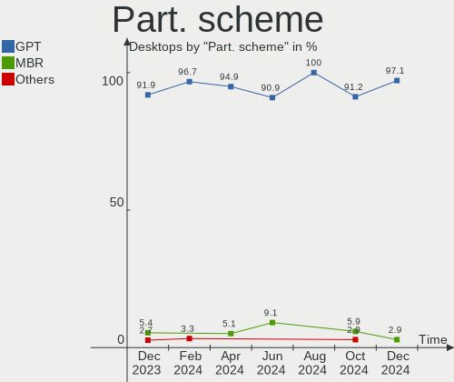
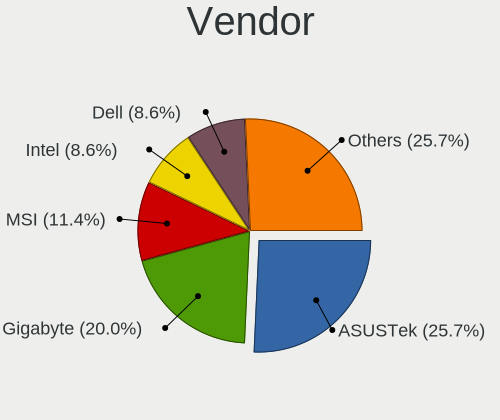
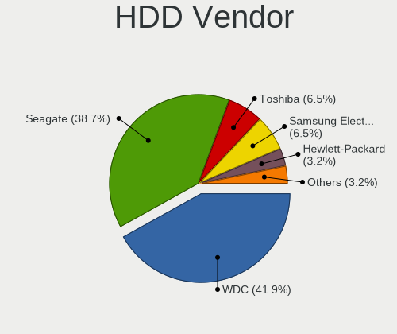
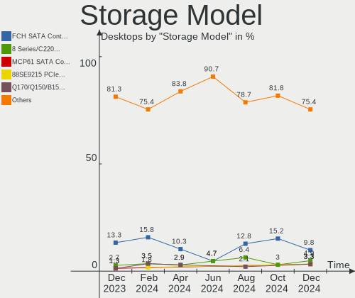
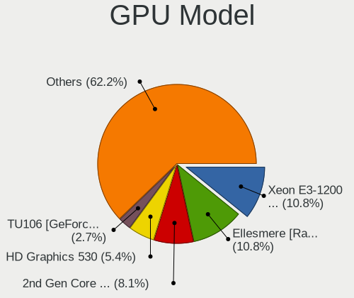
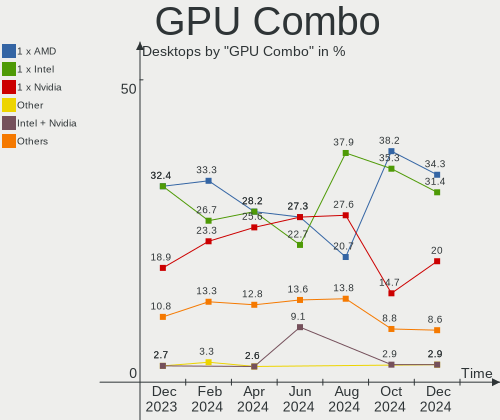
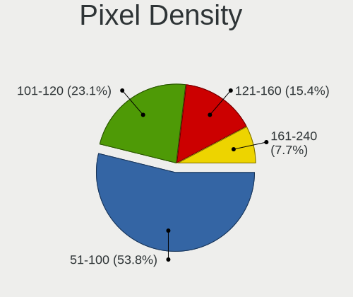
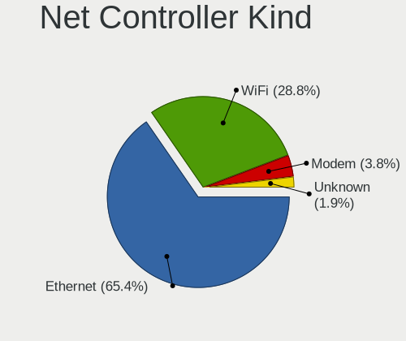
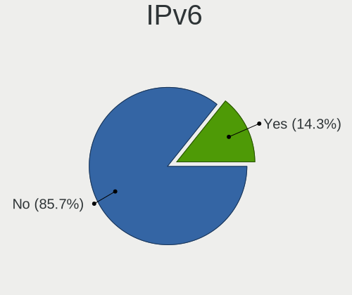
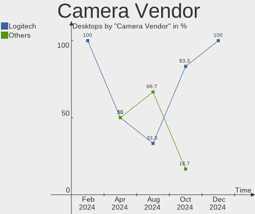

FreeBSD - Hardware Trends (Desktops)
------------------------------------

A project to identify most popular hardware characteristics and track their change
over time based on data collected by BSD users at https://BSD-Hardware.info.

Anyone can contribute to this report by the [hw-probe](https://github.com/linuxhw/hw-probe/blob/master/INSTALL.BSD.md) tool:

    hw-probe -all -upload

This report is for one last month. Overall report since the beginning of time: [TestDays](https://github.com/bsdhw/TestDays)

Period: Jun, 2023.

Contents
--------

* [ System ](#system)
  - [ OS                       ](#os)
  - [ OS Family                ](#os-family)
  - [ Arch                     ](#arch)
  - [ DE                       ](#de)
  - [ Display Server           ](#display-server)
  - [ Display Manager          ](#display-manager)
  - [ OS Lang                  ](#os-lang)
  - [ Boot Mode                ](#boot-mode)
  - [ Filesystem               ](#filesystem)
  - [ Part. scheme             ](#part-scheme)

* [ Board ](#board)
  - [ Vendor                   ](#vendor)
  - [ Model                    ](#model)
  - [ Model Family             ](#model-family)
  - [ MFG Year                 ](#mfg-year)
  - [ Form Factor              ](#form-factor)
  - [ Coreboot                 ](#coreboot)
  - [ RAM Size                 ](#ram-size)
  - [ RAM Used                 ](#ram-used)
  - [ Total Drives             ](#total-drives)
  - [ Has CD-ROM               ](#has-cd-rom)
  - [ Has Ethernet             ](#has-ethernet)
  - [ Has WiFi                 ](#has-wifi)
  - [ Has Bluetooth            ](#has-bluetooth)

* [ Location ](#location)
  - [ Country                  ](#country)
  - [ City                     ](#city)

* [ Drives ](#drives)
  - [ Drive Vendor             ](#drive-vendor)
  - [ Drive Model              ](#drive-model)
  - [ HDD Vendor               ](#hdd-vendor)
  - [ SSD Vendor               ](#ssd-vendor)
  - [ Drive Kind               ](#drive-kind)
  - [ Drive Connector          ](#drive-connector)
  - [ Drive Size               ](#drive-size)
  - [ Space Total              ](#space-total)
  - [ Space Used               ](#space-used)
  - [ Malfunc. Drives          ](#malfunc-drives)
  - [ Malfunc. Drive Vendor    ](#malfunc-drive-vendor)
  - [ Malfunc. HDD Vendor      ](#malfunc-hdd-vendor)
  - [ Malfunc. Drive Kind      ](#malfunc-drive-kind)
  - [ Failed Drives            ](#failed-drives)
  - [ Failed Drive Vendor      ](#failed-drive-vendor)
  - [ Drive Status             ](#drive-status)

* [ Storage controller ](#storage-controller)
  - [ Storage Vendor           ](#storage-vendor)
  - [ Storage Model            ](#storage-model)
  - [ Storage Kind             ](#storage-kind)

* [ Processor ](#processor)
  - [ CPU Vendor               ](#cpu-vendor)
  - [ CPU Model                ](#cpu-model)
  - [ CPU Model Family         ](#cpu-model-family)
  - [ CPU Cores                ](#cpu-cores)
  - [ CPU Sockets              ](#cpu-sockets)
  - [ CPU Threads              ](#cpu-threads)
  - [ CPU Microarch            ](#cpu-microarch)

* [ Graphics ](#graphics)
  - [ GPU Vendor               ](#gpu-vendor)
  - [ GPU Model                ](#gpu-model)
  - [ GPU Combo                ](#gpu-combo)
  - [ GPU Driver               ](#gpu-driver)
  - [ GPU Memory               ](#gpu-memory)

* [ Monitor ](#monitor)
  - [ Monitor Vendor           ](#monitor-vendor)
  - [ Monitor Model            ](#monitor-model)
  - [ Monitor Resolution       ](#monitor-resolution)
  - [ Monitor Diagonal         ](#monitor-diagonal)
  - [ Monitor Width            ](#monitor-width)
  - [ Aspect Ratio             ](#aspect-ratio)
  - [ Monitor Area             ](#monitor-area)
  - [ Pixel Density            ](#pixel-density)
  - [ Multiple Monitors        ](#multiple-monitors)

* [ Network ](#network)
  - [ Net Controller Vendor    ](#net-controller-vendor)
  - [ Net Controller Model     ](#net-controller-model)
  - [ Wireless Vendor          ](#wireless-vendor)
  - [ Wireless Model           ](#wireless-model)
  - [ Ethernet Vendor          ](#ethernet-vendor)
  - [ Ethernet Model           ](#ethernet-model)
  - [ Net Controller Kind      ](#net-controller-kind)
  - [ Used Controller          ](#used-controller)
  - [ NICs                     ](#nics)
  - [ IPv6                     ](#ipv6)

* [ Bluetooth ](#bluetooth)
  - [ Bluetooth Vendor         ](#bluetooth-vendor)
  - [ Bluetooth Model          ](#bluetooth-model)

* [ Sound ](#sound)
  - [ Sound Vendor             ](#sound-vendor)
  - [ Sound Model              ](#sound-model)

* [ Memory ](#memory)
  - [ Memory Vendor            ](#memory-vendor)
  - [ Memory Model             ](#memory-model)
  - [ Memory Kind              ](#memory-kind)
  - [ Memory Form Factor       ](#memory-form-factor)
  - [ Memory Size              ](#memory-size)
  - [ Memory Speed             ](#memory-speed)

* [ Printers & scanners ](#printers--scanners)
  - [ Printer Vendor           ](#printer-vendor)
  - [ Printer Model            ](#printer-model)
  - [ Scanner Vendor           ](#scanner-vendor)
  - [ Scanner Model            ](#scanner-model)

* [ Camera ](#camera)
  - [ Camera Vendor            ](#camera-vendor)
  - [ Camera Model             ](#camera-model)

* [ Security ](#security)
  - [ Fingerprint Vendor       ](#fingerprint-vendor)
  - [ Fingerprint Model        ](#fingerprint-model)
  - [ Chipcard Vendor          ](#chipcard-vendor)
  - [ Chipcard Model           ](#chipcard-model)

* [ Unsupported ](#unsupported)
  - [ Unsupported Devices      ](#unsupported-devices)
  - [ Unsupported Device Types ](#unsupported-device-types)

System
------

OS
--

Installed operating systems

| Name                 | Desktops | Percent |
|----------------------|----------|---------|
| FreeBSD 13.2         | 13       | 59.09%  |
| FreeBSD 14.0-CURRENT | 5        | 22.73%  |
| FreeBSD 13.2-STABLE  | 1        | 4.55%   |
| FreeBSD 13.2-p1      | 1        | 4.55%   |
| FreeBSD 13.1-p5      | 1        | 4.55%   |
| FreeBSD 13.1         | 1        | 4.55%   |

OS Family
---------

OS without a version

| Name    | Desktops | Percent |
|---------|----------|---------|
| FreeBSD | 22       | 100%    |

Arch
----

OS architecture (x86_64, i586, etc.)

| Name  | Desktops | Percent |
|-------|----------|---------|
| amd64 | 16       | 72.73%  |
| arm64 | 4        | 18.18%  |
| i386  | 2        | 9.09%   |

DE
--

Desktop Environment

| Name    | Desktops | Percent |
|---------|----------|---------|
| Console | 12       | 54.55%  |
| MATE    | 3        | 13.64%  |
| KDE5    | 2        | 9.09%   |
| KDE     | 2        | 9.09%   |
| i3      | 1        | 4.55%   |
| GNOME   | 1        | 4.55%   |
| Budgie  | 1        | 4.55%   |

Display Server
--------------

X11 or Wayland

| Name    | Desktops | Percent |
|---------|----------|---------|
| Console | 13       | 59.09%  |
| X11     | 9        | 40.91%  |

Display Manager
---------------

SDDM, LightDM, etc.

| Name    | Desktops | Percent |
|---------|----------|---------|
| Console | 13       | 59.09%  |
| SDDM    | 4        | 18.18%  |
| LightDM | 3        | 13.64%  |
| SLiM    | 1        | 4.55%   |
| GDM     | 1        | 4.55%   |

OS Lang
-------

Language

| Lang    | Desktops | Percent |
|---------|----------|---------|
| C       | 15       | 68.18%  |
| en_US   | 5        | 22.73%  |
| pl_PL   | 1        | 4.55%   |
| Unknown | 1        | 4.55%   |

Boot Mode
---------

EFI or BIOS

| Mode | Desktops | Percent |
|------|----------|---------|
| EFI  | 19       | 86.36%  |
| BIOS | 3        | 13.64%  |

Filesystem
----------

Type of filesystem

| Type | Desktops | Percent |
|------|----------|---------|
| Zfs  | 14       | 63.64%  |
| Ufs  | 8        | 36.36%  |

Part. scheme
------------

Scheme of partitioning

| Type | Desktops | Percent |
|------|----------|---------|
| GPT  | 21       | 95.45%  |
| MBR  | 1        | 4.55%   |

Board
-----

Vendor
------

Motherboard manufacturer

| Name                | Desktops | Percent |
|---------------------|----------|---------|
| ASUSTek Computer    | 6        | 27.27%  |
| ASRock              | 4        | 18.18%  |
| Unknown             | 4        | 18.18%  |
| MSI                 | 2        | 9.09%   |
| Lenovo              | 2        | 9.09%   |
| Hewlett-Packard     | 1        | 4.55%   |
| Gigabyte Technology | 1        | 4.55%   |
| Dell                | 1        | 4.55%   |
| ASRockRack          | 1        | 4.55%   |

Model
-----

Motherboard model

| Name                               | Desktops | Percent |
|------------------------------------|----------|---------|
| Unknown                            | 4        | 18.18%  |
| ASRock Z590 Pro4                   | 2        | 9.09%   |
| ASRock X570 Phantom Gaming 4       | 2        | 9.09%   |
| MSI MS-7C36                        | 1        | 4.55%   |
| MSI MS-7817                        | 1        | 4.55%   |
| Lenovo ThinkCentre M700 10HYS0Q400 | 1        | 4.55%   |
| Lenovo ThinkCentre A70 7099A5P     | 1        | 4.55%   |
| HP Z440 Workstation                | 1        | 4.55%   |
| Gigabyte B360M-D2V                 | 1        | 4.55%   |
| Dell Vostro 3681                   | 1        | 4.55%   |
| ASUS TUF Gaming B450-PLUS II       | 1        | 4.55%   |
| ASUS ROG STRIX X570-F GAMING       | 1        | 4.55%   |
| ASUS ROG CROSSHAIR VIII HERO       | 1        | 4.55%   |
| ASUS PRIME X370-PRO                | 1        | 4.55%   |
| ASUS P5Q-E                         | 1        | 4.55%   |
| ASUS P5K PRO                       | 1        | 4.55%   |
| ASRockRack EPYC3101D4I-2T          | 1        | 4.55%   |

Model Family
------------

Motherboard model prefix

| Name                      | Desktops | Percent |
|---------------------------|----------|---------|
| Unknown                   | 4        | 18.18%  |
| Lenovo ThinkCentre        | 2        | 9.09%   |
| ASUS ROG                  | 2        | 9.09%   |
| ASRock Z590               | 2        | 9.09%   |
| ASRock X570               | 2        | 9.09%   |
| MSI MS-7C36               | 1        | 4.55%   |
| MSI MS-7817               | 1        | 4.55%   |
| HP Z440                   | 1        | 4.55%   |
| Gigabyte B360M-D2V        | 1        | 4.55%   |
| Dell Vostro               | 1        | 4.55%   |
| ASUS TUF                  | 1        | 4.55%   |
| ASUS PRIME                | 1        | 4.55%   |
| ASUS P5Q-E                | 1        | 4.55%   |
| ASUS P5K                  | 1        | 4.55%   |
| ASRockRack EPYC3101D4I-2T | 1        | 4.55%   |

MFG Year
--------

Motherboard manufacture year

| Year    | Desktops | Percent |
|---------|----------|---------|
| 2021    | 4        | 18.18%  |
| 2019    | 4        | 18.18%  |
| Unknown | 4        | 18.18%  |
| 2008    | 2        | 9.09%   |
| 2022    | 1        | 4.55%   |
| 2020    | 1        | 4.55%   |
| 2018    | 1        | 4.55%   |
| 2017    | 1        | 4.55%   |
| 2016    | 1        | 4.55%   |
| 2015    | 1        | 4.55%   |
| 2014    | 1        | 4.55%   |
| 2010    | 1        | 4.55%   |

Form Factor
-----------

Physical design of the computer

| Name    | Desktops | Percent |
|---------|----------|---------|
| Desktop | 22       | 100%    |

Coreboot
--------

Have coreboot on board

| Used | Desktops | Percent |
|------|----------|---------|
| No   | 22       | 100%    |

RAM Size
--------

Total RAM memory

| Size in GB  | Desktops | Percent |
|-------------|----------|---------|
| 64.01-256.0 | 7        | 31.82%  |
| 32.01-64.0  | 4        | 18.18%  |
| 4.01-8.0    | 3        | 13.64%  |
| 16.01-24.0  | 2        | 9.09%   |
| 8.01-16.0   | 2        | 9.09%   |
| 0.51-1.0    | 2        | 9.09%   |
| 3.01-4.0    | 1        | 4.55%   |
| 2.01-3.0    | 1        | 4.55%   |

RAM Used
--------

Used RAM memory

| Used GB  | Desktops | Percent |
|----------|----------|---------|
| 0.01-0.5 | 9        | 40.91%  |
| 1.01-2.0 | 6        | 27.27%  |
| 3.01-4.0 | 3        | 13.64%  |
| 0.51-1.0 | 3        | 13.64%  |
| 2.01-3.0 | 1        | 4.55%   |

Total Drives
------------

Number of drives on board

| Drives | Desktops | Percent |
|--------|----------|---------|
| 2      | 6        | 27.27%  |
| 3      | 4        | 18.18%  |
| 0      | 4        | 18.18%  |
| 6      | 2        | 9.09%   |
| 1      | 2        | 9.09%   |
| 13     | 1        | 4.55%   |
| 7      | 1        | 4.55%   |
| 5      | 1        | 4.55%   |
| 4      | 1        | 4.55%   |

Has CD-ROM
----------

Has CD-ROM on board

| Presented | Desktops | Percent |
|-----------|----------|---------|
| No        | 17       | 77.27%  |
| Yes       | 5        | 22.73%  |

Has Ethernet
------------

Has Ethernet on board

| Presented | Desktops | Percent |
|-----------|----------|---------|
| Yes       | 20       | 90.91%  |
| No        | 2        | 9.09%   |

Has WiFi
--------

Has WiFi module

| Presented | Desktops | Percent |
|-----------|----------|---------|
| No        | 17       | 77.27%  |
| Yes       | 5        | 22.73%  |

Has Bluetooth
-------------

Has Bluetooth module

| Presented | Desktops | Percent |
|-----------|----------|---------|
| No        | 18       | 81.82%  |
| Yes       | 4        | 18.18%  |

Location
--------

Country
-------

Geographic location (country)

| Country     | Desktops | Percent |
|-------------|----------|---------|
| USA         | 8        | 36.36%  |
| Russia      | 3        | 13.64%  |
| Poland      | 2        | 9.09%   |
| Indonesia   | 2        | 9.09%   |
| Brazil      | 2        | 9.09%   |
| Thailand    | 1        | 4.55%   |
| Spain       | 1        | 4.55%   |
| Netherlands | 1        | 4.55%   |
| Japan       | 1        | 4.55%   |
| Australia   | 1        | 4.55%   |

City
----

Geographic location (city)

| City                  | Desktops | Percent |
|-----------------------|----------|---------|
| Salem                 | 2        | 9.09%   |
| Redmond               | 2        | 9.09%   |
| Medan                 | 2        | 9.09%   |
| Choroszcz             | 2        | 9.09%   |
| Wenatchee             | 1        | 4.55%   |
| Umeda                 | 1        | 4.55%   |
| Sydney                | 1        | 4.55%   |
| Stavropol             | 1        | 4.55%   |
| Saratov               | 1        | 4.55%   |
| Santa Barbara d'Oeste | 1        | 4.55%   |
| Nieuw-Vennep          | 1        | 4.55%   |
| Madrid                | 1        | 4.55%   |
| Krasnodar             | 1        | 4.55%   |
| Flushing              | 1        | 4.55%   |
| Edmond                | 1        | 4.55%   |
| Cordeiropolis         | 1        | 4.55%   |
| Bessemer              | 1        | 4.55%   |
| Bangkok               | 1        | 4.55%   |

Drives
------

Drive Vendor
------------

Hard drive vendors

| Vendor              | Desktops | Drives | Percent |
|---------------------|----------|--------|---------|
| WDC                 | 9        | 26     | 24.32%  |
| Samsung Electronics | 8        | 16     | 21.62%  |
| Seagate             | 6        | 6      | 16.22%  |
| Toshiba             | 3        | 7      | 8.11%   |
| MidasForce          | 2        | 2      | 5.41%   |
| Kingston            | 2        | 2      | 5.41%   |
| SPCC                | 1        | 1      | 2.7%    |
| SK hynix            | 1        | 1      | 2.7%    |
| Phison              | 1        | 2      | 2.7%    |
| MSI                 | 1        | 1      | 2.7%    |
| Intel               | 1        | 1      | 2.7%    |
| Corsair             | 1        | 1      | 2.7%    |
| A-DATA Technology   | 1        | 1      | 2.7%    |

Drive Model
-----------

Hard drive models

| Model                                  | Desktops | Percent |
|----------------------------------------|----------|---------|
| WDC WD80EFAX-68LHPN0 8TB               | 2        | 3.92%   |
| Toshiba MK5076GSXN 500GB               | 2        | 3.92%   |
| Seagate ST4000DM000-1F2168 4TB         | 2        | 3.92%   |
| Samsung SSD 970 EVO Plus 1TB           | 2        | 3.92%   |
| MidasForce SSD 512GB                   | 2        | 3.92%   |
| WDC WDS100T3X0C-00SJG0 1TB             | 1        | 1.96%   |
| WDC WDS100T1X0E-00AFY0 1TB             | 1        | 1.96%   |
| WDC WD80EMAZ-00WJTA0 8TB               | 1        | 1.96%   |
| WDC WD80EFZX-68UW8N0 8TB               | 1        | 1.96%   |
| WDC WD80EDBZ-11B0ZA0 8TB               | 1        | 1.96%   |
| WDC WD80EDAZ-11TA3A0 8TB               | 1        | 1.96%   |
| WDC WD80EAZZ-00BKLB0 8TB               | 1        | 1.96%   |
| WDC WD60EZRZ-00GZ5B1 6TB               | 1        | 1.96%   |
| WDC WD40EZRZ-22GXCB0 4TB               | 1        | 1.96%   |
| WDC WD2003FZEX-00SRLA0 2TB             | 1        | 1.96%   |
| WDC WD15EADS-00P8B0 1.5TB              | 1        | 1.96%   |
| WDC WD140EDGZ-11B2DA2 14TB             | 1        | 1.96%   |
| WDC WD120EMFZ-11A6JA0 12TB             | 1        | 1.96%   |
| WDC WD120EMAZ-11BLFA0 12TB             | 1        | 1.96%   |
| WDC WD10EZRZ-00HTKB0 1TB               | 1        | 1.96%   |
| WDC WD10EZEX-00BBHA0 1TB               | 1        | 1.96%   |
| Toshiba MG07ACA14TE 14TB               | 1        | 1.96%   |
| SPCC Solid State Disk 240GB            | 1        | 1.96%   |
| SK hynix SKHynix_HFS512GDE9X084N 512GB | 1        | 1.96%   |
| Seagate ST500LM021-1KJ152 500GB        | 1        | 1.96%   |
| Seagate ST4000LM024-2AN17V 4TB         | 1        | 1.96%   |
| Seagate ST3500418AS 500GB              | 1        | 1.96%   |
| Seagate ST2000DM008-2FR102 2TB         | 1        | 1.96%   |
| Samsung SSD 960 EVO 500GB              | 1        | 1.96%   |
| Samsung SSD 870 QVO 2TB                | 1        | 1.96%   |
| Samsung SSD 860 QVO 1TB                | 1        | 1.96%   |
| Samsung SSD 860 EVO 500GB              | 1        | 1.96%   |
| Samsung SSD 850 EVO 1TB                | 1        | 1.96%   |
| Samsung SSD 840 EVO 500GB              | 1        | 1.96%   |
| Samsung MZVLW512HMJP-000H1 512GB       | 1        | 1.96%   |
| Samsung MZ7LM3T8HMLP-00005 3.5TB       | 1        | 1.96%   |
| Samsung HD321HJ 320GB                  | 1        | 1.96%   |
| Samsung HD250HJ 250GB                  | 1        | 1.96%   |
| Samsung HD203WI 2TB                    | 1        | 1.96%   |
| Phison Sabrent 1TB                     | 1        | 1.96%   |

HDD Vendor
----------

Hard disk drive vendors

| Vendor              | Desktops | Drives | Percent |
|---------------------|----------|--------|---------|
| WDC                 | 8        | 24     | 42.11%  |
| Seagate             | 6        | 6      | 31.58%  |
| Toshiba             | 3        | 7      | 15.79%  |
| Samsung Electronics | 2        | 3      | 10.53%  |

SSD Vendor
----------

Solid state drive vendors

| Vendor              | Desktops | Drives | Percent |
|---------------------|----------|--------|---------|
| Samsung Electronics | 5        | 8      | 41.67%  |
| MidasForce          | 2        | 2      | 16.67%  |
| Kingston            | 2        | 2      | 16.67%  |
| SPCC                | 1        | 1      | 8.33%   |
| MSI                 | 1        | 1      | 8.33%   |
| Intel               | 1        | 1      | 8.33%   |

Drive Kind
----------

HDD or SSD

| Kind | Desktops | Drives | Percent |
|------|----------|--------|---------|
| HDD  | 14       | 40     | 42.42%  |
| SSD  | 11       | 15     | 33.33%  |
| NVMe | 8        | 12     | 24.24%  |

Drive Connector
---------------

SATA, SAS, NVMe, etc.

| Type | Desktops | Drives | Percent |
|------|----------|--------|---------|
| SATA | 17       | 55     | 68%     |
| NVMe | 8        | 12     | 32%     |

Drive Size
----------

Size of hard drive

| Size in TB | Desktops | Drives | Percent |
|------------|----------|--------|---------|
| 0.01-0.5   | 11       | 13     | 36.67%  |
| 0.51-1.0   | 5        | 6      | 16.67%  |
| 3.01-4.0   | 4        | 5      | 13.33%  |
| 1.01-2.0   | 4        | 7      | 13.33%  |
| 10.01-20.0 | 3        | 8      | 10%     |
| 4.01-10.0  | 3        | 16     | 10%     |

Space Total
-----------

Amount of disk space available on the file system

| Size in GB | Desktops | Percent |
|------------|----------|---------|
| 251-500    | 8        | 36.36%  |
| 501-1000   | 6        | 27.27%  |
| 21-50      | 3        | 13.64%  |
| 101-250    | 3        | 13.64%  |
| 2001-3000  | 2        | 9.09%   |

Space Used
----------

Amount of used disk space

| Used GB  | Desktops | Percent |
|----------|----------|---------|
| 1-20     | 18       | 81.82%  |
| 101-250  | 2        | 9.09%   |
| 21-50    | 1        | 4.55%   |
| 501-1000 | 1        | 4.55%   |

Malfunc. Drives
---------------

Drive models with a malfunction

| Model                           | Desktops | Drives | Percent |
|---------------------------------|----------|--------|---------|
| Toshiba MK5076GSXN 500GB        | 2        | 2      | 33.33%  |
| WDC WD80EDAZ-11TA3A0 8TB        | 1        | 1      | 16.67%  |
| WDC WD10EZRZ-00HTKB0 1TB        | 1        | 1      | 16.67%  |
| Seagate ST500LM021-1KJ152 500GB | 1        | 1      | 16.67%  |
| Samsung Electronics HD203WI 2TB | 1        | 1      | 16.67%  |

Malfunc. Drive Vendor
---------------------

Vendors of faulty drives

| Vendor              | Desktops | Drives | Percent |
|---------------------|----------|--------|---------|
| WDC                 | 2        | 2      | 33.33%  |
| Toshiba             | 2        | 2      | 33.33%  |
| Seagate             | 1        | 1      | 16.67%  |
| Samsung Electronics | 1        | 1      | 16.67%  |

Malfunc. HDD Vendor
-------------------

Vendors of faulty HDD drives

| Vendor              | Desktops | Drives | Percent |
|---------------------|----------|--------|---------|
| WDC                 | 2        | 2      | 33.33%  |
| Toshiba             | 2        | 2      | 33.33%  |
| Seagate             | 1        | 1      | 16.67%  |
| Samsung Electronics | 1        | 1      | 16.67%  |

Malfunc. Drive Kind
-------------------

Kinds of faulty drives

| Kind | Desktops | Drives | Percent |
|------|----------|--------|---------|
| HDD  | 6        | 6      | 100%    |

Failed Drives
-------------

Failed drive models

Zero info for selected period =(

Failed Drive Vendor
-------------------

Failed drive vendors

Zero info for selected period =(

Drive Status
------------

Number of failed and malfunc. drives

| Status  | Desktops | Drives | Percent |
|---------|----------|--------|---------|
| Works   | 17       | 61     | 73.91%  |
| Malfunc | 6        | 6      | 26.09%  |

Storage controller
------------------

Storage Vendor
--------------

Storage controller vendors

| Vendor                   | Desktops | Percent |
|--------------------------|----------|---------|
| Intel                    | 10       | 27.78%  |
| AMD                      | 8        | 22.22%  |
| Sandisk                  | 4        | 11.11%  |
| Samsung Electronics      | 3        | 8.33%   |
| SK hynix                 | 2        | 5.56%   |
| Realtek Semiconductor    | 2        | 5.56%   |
| Phison Electronics       | 2        | 5.56%   |
| Marvell Technology Group | 2        | 5.56%   |
| Broadcom / LSI           | 2        | 5.56%   |
| ASMedia Technology       | 1        | 2.78%   |

Storage Model
-------------

Storage controller models

| Model                                                                          | Desktops | Percent |
|--------------------------------------------------------------------------------|----------|---------|
| AMD FCH SATA Controller [AHCI mode]                                            | 7        | 17.5%   |
| Sandisk WD Black SN770 NVMe SSD                                                | 2        | 5%      |
| Samsung NVMe SSD Controller SM981/PM981/PM983                                  | 2        | 5%      |
| Samsung NVMe SSD Controller SM961/PM961/SM963                                  | 2        | 5%      |
| Realtek NVMe Controller                                                        | 2        | 5%      |
| Intel 500 Series Chipset Family SATA AHCI Controller                           | 2        | 5%      |
| Broadcom / LSI SAS2008 PCI-Express Fusion-MPT SAS-2 [Falcon]                   | 2        | 5%      |
| SK hynix Gold P31/BC711/PC711 NVMe Solid State Drive                           | 1        | 2.5%    |
| SK hynix BC511 NVMe SSD                                                        | 1        | 2.5%    |
| SanDisk WD PC SN810 / Black SN850 NVMe SSD                                     | 1        | 2.5%    |
| SanDisk WD Black SN750 / PC SN730 NVMe SSD                                     | 1        | 2.5%    |
| Phison E16 PCIe4 NVMe Controller                                               | 1        | 2.5%    |
| Phison E12 NVMe Controller                                                     | 1        | 2.5%    |
| Marvell Group 88SE6111/6121 SATA II / PATA Controller                          | 1        | 2.5%    |
| Marvell Group 88SE6101/6102 single-port PATA133 interface                      | 1        | 2.5%    |
| Intel Q170/Q150/B150/H170/H110/Z170/CM236 Chipset SATA Controller [AHCI Mode]  | 1        | 2.5%    |
| Intel NM10/ICH7 Family SATA Controller [IDE mode]                              | 1        | 2.5%    |
| Intel Cannon Lake PCH SATA AHCI Controller                                     | 1        | 2.5%    |
| Intel C610/X99 series chipset sSATA Controller [AHCI mode]                     | 1        | 2.5%    |
| Intel 82801JI (ICH10 Family) 4 port SATA IDE Controller #1                     | 1        | 2.5%    |
| Intel 82801JI (ICH10 Family) 2 port SATA IDE Controller #2                     | 1        | 2.5%    |
| Intel 82801IR/IO/IH (ICH9R/DO/DH) 4 port SATA Controller [IDE mode]            | 1        | 2.5%    |
| Intel 82801I (ICH9 Family) 2 port SATA Controller [IDE mode]                   | 1        | 2.5%    |
| Intel 8 Series/C220 Series Chipset Family 6-port SATA Controller 1 [AHCI mode] | 1        | 2.5%    |
| Intel 400 Series Chipset Family SATA AHCI Controller                           | 1        | 2.5%    |
| ASMedia ASM1062 Serial ATA Controller                                          | 1        | 2.5%    |
| AMD X370 Series Chipset SATA Controller                                        | 1        | 2.5%    |
| AMD 400 Series Chipset SATA Controller                                         | 1        | 2.5%    |

Storage Kind
------------

Kind of storage controller (IDE, SATA, NVMe, SAS, ...)

| Kind | Desktops | Percent |
|------|----------|---------|
| SATA | 15       | 46.88%  |
| NVMe | 12       | 37.5%   |
| IDE  | 3        | 9.38%   |
| SAS  | 2        | 6.25%   |

Processor
---------

CPU Vendor
----------

Processor vendors

| Vendor | Desktops | Percent |
|--------|----------|---------|
| Intel  | 10       | 45.45%  |
| AMD    | 8        | 36.36%  |
| ARM    | 4        | 18.18%  |

CPU Model
---------

Processor models

| Model                                  | Desktops | Percent |
|----------------------------------------|----------|---------|
| ARM Cortex-A55 r2p0                    | 4        | 18.18%  |
| Intel Core i7-10700K CPU @ 3.80GHz     | 2        | 9.09%   |
| AMD Ryzen 9 5950X 16-Core Processor    | 2        | 9.09%   |
| AMD Ryzen 9 3900X 12-Core Processor    | 2        | 9.09%   |
| Intel Xeon CPU E5-2690 v4 @ 2.60GHz    | 1        | 4.55%   |
| Intel Pentium CPU G3220 @ 3.00GHz      | 1        | 4.55%   |
| Intel Core i5-9400F CPU @ 2.90GHz      | 1        | 4.55%   |
| Intel Core i5-6400T CPU @ 2.20GHz      | 1        | 4.55%   |
| Intel Core i5-10400 CPU @ 2.90GHz      | 1        | 4.55%   |
| Intel Core 2 Quad CPU Q6600 @ 2.40GHz  | 1        | 4.55%   |
| Intel Core 2 Duo CPU E7500 @ 2.93GHz   | 1        | 4.55%   |
| Intel Core 2 Duo CPU E6750 @ 2.66GHz   | 1        | 4.55%   |
| AMD Ryzen 7 3700X 8-Core Processor     | 1        | 4.55%   |
| AMD Ryzen 7 2700X Eight-Core Processor | 1        | 4.55%   |
| AMD Ryzen 7 1700 Eight-Core Processor  | 1        | 4.55%   |
| AMD EPYC 3101 4-Core Processor         | 1        | 4.55%   |

CPU Model Family
----------------

Processor model prefix

| Model             | Desktops | Percent |
|-------------------|----------|---------|
| ARM Cortex        | 4        | 18.18%  |
| AMD Ryzen 9       | 4        | 18.18%  |
| Intel Core i5     | 3        | 13.64%  |
| AMD Ryzen 7       | 3        | 13.64%  |
| Intel Core i7     | 2        | 9.09%   |
| Intel Core 2 Duo  | 2        | 9.09%   |
| Intel Xeon        | 1        | 4.55%   |
| Intel Pentium     | 1        | 4.55%   |
| Intel Core 2 Quad | 1        | 4.55%   |
| AMD EPYC          | 1        | 4.55%   |

CPU Cores
---------

Number of processor cores

| Number  | Desktops | Percent |
|---------|----------|---------|
| Unknown | 5        | 22.73%  |
| 16      | 3        | 13.64%  |
| 4       | 3        | 13.64%  |
| 32      | 2        | 9.09%   |
| 24      | 2        | 9.09%   |
| 8       | 2        | 9.09%   |
| 6       | 2        | 9.09%   |
| 2       | 2        | 9.09%   |
| 14      | 1        | 4.55%   |

CPU Sockets
-----------

Number of sockets

| Number  | Desktops | Percent |
|---------|----------|---------|
| 1       | 18       | 81.82%  |
| Unknown | 4        | 18.18%  |

CPU Threads
-----------

Threads per core (Hyper-Threading)

| Number  | Desktops | Percent |
|---------|----------|---------|
| 1       | 13       | 59.09%  |
| Unknown | 5        | 22.73%  |
| 2       | 4        | 18.18%  |

CPU Microarch
-------------

Microarchitecture

| Name      | Desktops | Percent |
|-----------|----------|---------|
| Unknown   | 4        | 18.18%  |
| Zen 2     | 3        | 13.64%  |
| CometLake | 3        | 13.64%  |
| Zen 3     | 2        | 9.09%   |
| Zen       | 2        | 9.09%   |
| Core      | 2        | 9.09%   |
| Zen+      | 1        | 4.55%   |
| Skylake   | 1        | 4.55%   |
| Penryn    | 1        | 4.55%   |
| KabyLake  | 1        | 4.55%   |
| Haswell   | 1        | 4.55%   |
| Broadwell | 1        | 4.55%   |

Graphics
--------

GPU Vendor
----------

Vendors of graphics cards

| Vendor            | Desktops | Percent |
|-------------------|----------|---------|
| Nvidia            | 10       | 50%     |
| Intel             | 6        | 30%     |
| AMD               | 3        | 15%     |
| ASPEED Technology | 1        | 5%      |

GPU Model
---------

Graphics card models

| Model                                                                       | Desktops | Percent |
|-----------------------------------------------------------------------------|----------|---------|
| Intel CometLake-S GT2 [UHD Graphics 630]                                    | 3        | 15%     |
| Nvidia GK208B [GeForce GT 710]                                              | 2        | 10%     |
| Nvidia GA104 [GeForce RTX 3060 Ti Lite Hash Rate]                           | 2        | 10%     |
| Nvidia GT218 [NVS 300]                                                      | 1        | 5%      |
| Nvidia GP108 [GeForce GT 1030]                                              | 1        | 5%      |
| Nvidia GP107 [GeForce GTX 1050 Ti]                                          | 1        | 5%      |
| Nvidia GP106 [GeForce GTX 1060 3GB]                                         | 1        | 5%      |
| Nvidia GM206 [GeForce GTX 960]                                              | 1        | 5%      |
| Nvidia GA104 [GeForce RTX 3070 Ti]                                          | 1        | 5%      |
| Intel Xeon E3-1200 v3/4th Gen Core Processor Integrated Graphics Controller | 1        | 5%      |
| Intel HD Graphics 530                                                       | 1        | 5%      |
| Intel 4 Series Chipset Integrated Graphics Controller                       | 1        | 5%      |
| ASPEED Technology ASPEED Graphics Family                                    | 1        | 5%      |
| AMD Navi 22 [Radeon RX 6700/6700 XT/6750 XT / 6800M/6850M XT]               | 1        | 5%      |
| AMD Cedar [Radeon HD 5000/6000/7350/8350 Series]                            | 1        | 5%      |
| AMD Caicos [Radeon HD 6450/7450/8450 / R5 230 OEM]                          | 1        | 5%      |

GPU Combo
---------

Combinations of graphics cards

| Name           | Desktops | Percent |
|----------------|----------|---------|
| 1 x Nvidia     | 8        | 36.36%  |
| Other          | 4        | 18.18%  |
| 1 x Intel      | 4        | 18.18%  |
| 1 x AMD        | 3        | 13.64%  |
| Intel + Nvidia | 2        | 9.09%   |
| 1 x ASPEED     | 1        | 4.55%   |

GPU Driver
----------

Free vs proprietary

| Driver      | Desktops | Percent |
|-------------|----------|---------|
| Free        | 11       | 50%     |
| Proprietary | 6        | 27.27%  |
| Unknown     | 5        | 22.73%  |

GPU Memory
----------

Total video memory

| Size in GB | Desktops | Percent |
|------------|----------|---------|
| Unknown    | 14       | 63.64%  |
| 7.01-8.0   | 3        | 13.64%  |
| 1.01-2.0   | 2        | 9.09%   |
| 3.01-4.0   | 1        | 4.55%   |
| 8.01-16.0  | 1        | 4.55%   |
| 0.51-1.0   | 1        | 4.55%   |

Monitor
-------

Monitor Vendor
--------------

Monitor vendors

| Vendor   | Desktops | Percent |
|----------|----------|---------|
| MSI      | 2        | 20%     |
| Goldstar | 2        | 20%     |
| Acer     | 2        | 20%     |
| Unknown  | 1        | 10%     |
| Konka    | 1        | 10%     |
| Dell     | 1        | 10%     |
| BenQ     | 1        | 10%     |

Monitor Model
-------------

Monitor models

| Model                                                      | Desktops | Percent |
|------------------------------------------------------------|----------|---------|
| MSI G241 MSI3BA4 1920x1080 530x300mm 24.0-inch             | 2        | 20%     |
| Unknown LCD Monitor KJT4K2K60DP 3840x2160                  | 1        | 10%     |
| Konka TV_MONITOR KOA0030 2288x1430 1150x650mm 52.0-inch    | 1        | 10%     |
| Goldstar LG HDR WQHD GSM772B 3440x1440 800x340mm 34.2-inch | 1        | 10%     |
| Goldstar LG HDR WFHD GSM7714 2560x1080 800x340mm 34.2-inch | 1        | 10%     |
| Dell P2417H DELA0DB 1920x1080 530x300mm 24.0-inch          | 1        | 10%     |
| BenQ PD3200Q BNQ8026 2560x1440 710x400mm 32.1-inch         | 1        | 10%     |
| Acer QG241Y ACR079C 1920x1080 520x320mm 24.0-inch          | 1        | 10%     |
| Acer KA240Y ACR0970 1920x1080 530x300mm 24.0-inch          | 1        | 10%     |

Monitor Resolution
------------------

Monitor screen resolution

| Resolution      | Desktops | Percent |
|-----------------|----------|---------|
| 1920x1080 (FHD) | 5        | 50%     |
| 3840x2160 (4K)  | 1        | 10%     |
| 3440x1440       | 1        | 10%     |
| 2560x1440 (QHD) | 1        | 10%     |
| 2560x1080       | 1        | 10%     |
| 2288x1430       | 1        | 10%     |

Monitor Diagonal
----------------

Diagonal size in inches

| Inches  | Desktops | Percent |
|---------|----------|---------|
| 24      | 5        | 50%     |
| 34      | 2        | 20%     |
| 52      | 1        | 10%     |
| 32      | 1        | 10%     |
| Unknown | 1        | 10%     |

Monitor Width
-------------

Physical width

| Width in mm | Desktops | Percent |
|-------------|----------|---------|
| 501-600     | 5        | 50%     |
| 701-800     | 3        | 30%     |
| 1001-1500   | 1        | 10%     |
| Unknown     | 1        | 10%     |

Aspect Ratio
------------

Proportional relationship between the width and the height

| Ratio   | Desktops | Percent |
|---------|----------|---------|
| 16/9    | 6        | 60%     |
| 21/9    | 2        | 20%     |
| 16/10   | 1        | 10%     |
| Unknown | 1        | 10%     |

Monitor Area
------------

Area in inch²

| Area in inch² | Desktops | Percent |
|----------------|----------|---------|
| 201-250        | 4        | 40%     |
| 351-500        | 3        | 30%     |
| More than 1000 | 1        | 10%     |
| 251-300        | 1        | 10%     |
| Unknown        | 1        | 10%     |

Pixel Density
-------------

Pixels per inch

| Density | Desktops | Percent |
|---------|----------|---------|
| 51-100  | 8        | 80%     |
| 101-120 | 1        | 10%     |
| Unknown | 1        | 10%     |

Multiple Monitors
-----------------

Total monitors connected

| Total | Desktops | Percent |
|-------|----------|---------|
| 0     | 13       | 59.09%  |
| 1     | 8        | 36.36%  |
| 2     | 1        | 4.55%   |

Network
-------

Net Controller Vendor
---------------------

Controller vendors

| Vendor                   | Desktops | Percent |
|--------------------------|----------|---------|
| Intel                    | 11       | 39.29%  |
| Realtek Semiconductor    | 10       | 35.71%  |
| Samsung Electronics      | 2        | 7.14%   |
| Marvell Technology Group | 2        | 7.14%   |
| Ralink                   | 1        | 3.57%   |
| Aquantia                 | 1        | 3.57%   |
| American Megatrends      | 1        | 3.57%   |

Net Controller Model
--------------------

Controller models

| Model                                                                         | Desktops | Percent |
|-------------------------------------------------------------------------------|----------|---------|
| Intel I211 Gigabit Network Connection                                         | 6        | 18.75%  |
| Realtek RTL8111/8168/8411 PCI Express Gigabit Ethernet Controller             | 5        | 15.63%  |
| Realtek RTL8125 2.5GbE Controller                                             | 3        | 9.38%   |
| Samsung Galaxy series, misc. (tethering mode)                                 | 2        | 6.25%   |
| Realtek RTL8192EE PCIe Wireless Network Adapter                               | 2        | 6.25%   |
| Marvell Group 88E8056 PCI-E Gigabit Ethernet Controller                       | 2        | 6.25%   |
| Ralink RT3290 Wireless 802.11n 1T/1R PCIe                                     | 1        | 3.13%   |
| Marvell Group 88E8001 Gigabit Ethernet Controller                             | 1        | 3.13%   |
| Intel Wi-Fi 6 AX210/AX211/AX411 160MHz                                        | 1        | 3.13%   |
| Intel Wi-Fi 6 AX200                                                           | 1        | 3.13%   |
| Intel Ethernet Controller X550                                                | 1        | 3.13%   |
| Intel Ethernet Connection (2) I219-V                                          | 1        | 3.13%   |
| Intel Ethernet Connection (2) I218-LM                                         | 1        | 3.13%   |
| Intel 82599ES 10-Gigabit SFI/SFP+ Network Connection                          | 1        | 3.13%   |
| Intel 82574L Gigabit Network Connection                                       | 1        | 3.13%   |
| Intel 82571EB/82571GB Gigabit Ethernet Controller D0/D1 (copper applications) | 1        | 3.13%   |
| Aquantia AQC107 NBase-T/IEEE 802.3bz Ethernet Controller [AQtion]             | 1        | 3.13%   |
| American Megatrends Virtual Ethernet                                          | 1        | 3.13%   |

Wireless Vendor
---------------

Wireless vendors

| Vendor                | Desktops | Percent |
|-----------------------|----------|---------|
| Realtek Semiconductor | 2        | 40%     |
| Intel                 | 2        | 40%     |
| Ralink                | 1        | 20%     |

Wireless Model
--------------

Wireless models

| Model                                           | Desktops | Percent |
|-------------------------------------------------|----------|---------|
| Realtek RTL8192EE PCIe Wireless Network Adapter | 2        | 40%     |
| Ralink RT3290 Wireless 802.11n 1T/1R PCIe       | 1        | 20%     |
| Intel Wi-Fi 6 AX210/AX211/AX411 160MHz          | 1        | 20%     |
| Intel Wi-Fi 6 AX200                             | 1        | 20%     |

Ethernet Vendor
---------------

Ethernet vendors

| Vendor                   | Desktops | Percent |
|--------------------------|----------|---------|
| Intel                    | 11       | 44%     |
| Realtek Semiconductor    | 8        | 32%     |
| Samsung Electronics      | 2        | 8%      |
| Marvell Technology Group | 2        | 8%      |
| Aquantia                 | 1        | 4%      |
| American Megatrends      | 1        | 4%      |

Ethernet Model
--------------

Ethernet models

| Model                                                                         | Desktops | Percent |
|-------------------------------------------------------------------------------|----------|---------|
| Intel I211 Gigabit Network Connection                                         | 6        | 22.22%  |
| Realtek RTL8111/8168/8411 PCI Express Gigabit Ethernet Controller             | 5        | 18.52%  |
| Realtek RTL8125 2.5GbE Controller                                             | 3        | 11.11%  |
| Samsung Galaxy series, misc. (tethering mode)                                 | 2        | 7.41%   |
| Marvell Group 88E8056 PCI-E Gigabit Ethernet Controller                       | 2        | 7.41%   |
| Marvell Group 88E8001 Gigabit Ethernet Controller                             | 1        | 3.7%    |
| Intel Ethernet Controller X550                                                | 1        | 3.7%    |
| Intel Ethernet Connection (2) I219-V                                          | 1        | 3.7%    |
| Intel Ethernet Connection (2) I218-LM                                         | 1        | 3.7%    |
| Intel 82599ES 10-Gigabit SFI/SFP+ Network Connection                          | 1        | 3.7%    |
| Intel 82574L Gigabit Network Connection                                       | 1        | 3.7%    |
| Intel 82571EB/82571GB Gigabit Ethernet Controller D0/D1 (copper applications) | 1        | 3.7%    |
| Aquantia AQC107 NBase-T/IEEE 802.3bz Ethernet Controller [AQtion]             | 1        | 3.7%    |
| American Megatrends Virtual Ethernet                                          | 1        | 3.7%    |

Net Controller Kind
-------------------

Ethernet, WiFi or modem

| Kind     | Desktops | Percent |
|----------|----------|---------|
| Ethernet | 20       | 80%     |
| WiFi     | 5        | 20%     |

Used Controller
---------------

Currently used network controller

| Kind     | Desktops | Percent |
|----------|----------|---------|
| Ethernet | 18       | 100%    |

NICs
----

Total network controllers on board

| Total | Desktops | Percent |
|-------|----------|---------|
| 1     | 12       | 54.55%  |
| 3     | 4        | 18.18%  |
| 2     | 3        | 13.64%  |
| 0     | 2        | 9.09%   |
| 4     | 1        | 4.55%   |

IPv6
----

IPv6 vs IPv4

| Used | Desktops | Percent |
|------|----------|---------|
| No   | 19       | 86.36%  |
| Yes  | 3        | 13.64%  |

Bluetooth
---------

Bluetooth Vendor
----------------

Controller vendors

| Vendor                  | Desktops | Percent |
|-------------------------|----------|---------|
| Cambridge Silicon Radio | 2        | 50%     |
| Ralink                  | 1        | 25%     |
| Intel                   | 1        | 25%     |

Bluetooth Model
---------------

Controller models

| Model                                               | Desktops | Percent |
|-----------------------------------------------------|----------|---------|
| Cambridge Silicon Radio Bluetooth Dongle (HCI mode) | 2        | 50%     |
| Ralink RT3290 Bluetooth                             | 1        | 25%     |
| Intel AX210 Bluetooth                               | 1        | 25%     |

Sound
-----

Sound Vendor
------------

Sound card vendors

| Vendor | Desktops | Percent |
|--------|----------|---------|
| Nvidia | 10       | 37.04%  |
| Intel  | 9        | 33.33%  |
| AMD    | 8        | 29.63%  |

Sound Model
-----------

Sound card models

| Model                                                                             | Desktops | Percent |
|-----------------------------------------------------------------------------------|----------|---------|
| AMD Starship/Matisse HD Audio Controller                                          | 5        | 17.86%  |
| Nvidia GA104 High Definition Audio Controller                                     | 3        | 10.71%  |
| Nvidia GK208 HDMI/DP Audio Controller                                             | 2        | 7.14%   |
| Intel Smart Sound Technology (SST) Audio Controller                               | 2        | 7.14%   |
| Nvidia High Definition Audio Controller                                           | 1        | 3.57%   |
| Nvidia GP108 High Definition Audio Controller                                     | 1        | 3.57%   |
| Nvidia GP107GL High Definition Audio Controller                                   | 1        | 3.57%   |
| Nvidia GP106 High Definition Audio Controller                                     | 1        | 3.57%   |
| Nvidia GM206 High Definition Audio Controller                                     | 1        | 3.57%   |
| Intel Comet Lake PCH-V cAVS                                                       | 1        | 3.57%   |
| Intel Cannon Lake PCH cAVS                                                        | 1        | 3.57%   |
| Intel C610/X99 series chipset HD Audio Controller                                 | 1        | 3.57%   |
| Intel 82801JI (ICH10 Family) HD Audio Controller                                  | 1        | 3.57%   |
| Intel 82801I (ICH9 Family) HD Audio Controller                                    | 1        | 3.57%   |
| Intel 8 Series/C220 Series Chipset High Definition Audio Controller               | 1        | 3.57%   |
| Intel 100 Series/C230 Series Chipset Family HD Audio Controller                   | 1        | 3.57%   |
| AMD Navi 21/23 HDMI/DP Audio Controller                                           | 1        | 3.57%   |
| AMD Family 17h (Models 00h-0fh) HD Audio Controller                               | 1        | 3.57%   |
| AMD Cedar HDMI Audio [Radeon HD 5400/6300/7300 Series]                            | 1        | 3.57%   |
| AMD Caicos HDMI Audio [Radeon HD 6450 / 7450/8450/8490 OEM / R5 230/235/235X OEM] | 1        | 3.57%   |

Memory
------

Memory Vendor
-------------

Memory module vendors

| Vendor              | Desktops | Percent |
|---------------------|----------|---------|
| Corsair             | 5        | 27.78%  |
| Kingston            | 3        | 16.67%  |
| G.Skill             | 3        | 16.67%  |
| Unknown             | 2        | 11.11%  |
| Samsung Electronics | 2        | 11.11%  |
| GOODRAM             | 1        | 5.56%   |
| Crucial             | 1        | 5.56%   |
| Unknown             | 1        | 5.56%   |

Memory Model
------------

Memory module models

| Model                                                    | Desktops | Percent |
|----------------------------------------------------------|----------|---------|
| Kingston RAM 9965745-002.A00G 16GB DIMM DDR4 3000MT/s    | 2        | 10%     |
| Corsair RAM CMK16GX4M2E3200C16 8GB DIMM DDR4 3200MT/s    | 2        | 10%     |
| Unknown RAM Module 2GB DIMM DDR2 800MT/s                 | 1        | 5%      |
| Unknown RAM Module 2GB DIMM DDR 800MT/s                  | 1        | 5%      |
| Unknown RAM Module 1GB DIMM DDR2 800MT/s                 | 1        | 5%      |
| Samsung RAM M471A1K43CB1-CRC 8GB SODIMM DDR4 2667MT/s    | 1        | 5%      |
| Samsung RAM M393A2K40CB1-CRC 16GB DIMM DDR4 2400MT/s     | 1        | 5%      |
| Samsung RAM M393A2K40BB1-CRC 16GB DIMM DDR4 2400MT/s     | 1        | 5%      |
| Kingston RAM KF3000C16D4/32GX 32GB DIMM DDR4 2400MT/s    | 1        | 5%      |
| GOODRAM RAM GR2400D464L17S/8G 8GB DIMM DDR4 2400MT/s     | 1        | 5%      |
| G.Skill RAM F4-3200C16-8GVGB 8GB DIMM DDR4 3200MT/s      | 1        | 5%      |
| G.Skill RAM F4-3200C16-32GVK 32GB DIMM DDR4 3200MT/s     | 1        | 5%      |
| G.Skill RAM F3-12800CL7-2GBRM 2GB DIMM DDR3 1600MT/s     | 1        | 5%      |
| Crucial RAM BL16G36C16U4BL.M8FB1 16GB DIMM DDR4 3600MT/s | 1        | 5%      |
| Corsair RAM CMK64GX4M2E3200C16 32GB DIMM DDR4 2133MT/s   | 1        | 5%      |
| Corsair RAM CMK64GX4M2D3000C16 32GB DIMM DDR4 3066MT/s   | 1        | 5%      |
| Corsair RAM CMK32GX4M2D3600C18 16GB DIMM DDR4 3600MT/s   | 1        | 5%      |
| Unknown                                                  | 1        | 5%      |

Memory Kind
-----------

Memory module kinds

| Kind  | Desktops | Percent |
|-------|----------|---------|
| DDR4  | 14       | 77.78%  |
| SDRAM | 1        | 5.56%   |
| DDR3  | 1        | 5.56%   |
| DDR2  | 1        | 5.56%   |
| DDR   | 1        | 5.56%   |

Memory Form Factor
------------------

Physical design of the memory module

| Name   | Desktops | Percent |
|--------|----------|---------|
| DIMM   | 17       | 94.44%  |
| SODIMM | 1        | 5.56%   |

Memory Size
-----------

Memory module size

| Size  | Desktops | Percent |
|-------|----------|---------|
| 16384 | 5        | 26.32%  |
| 8192  | 5        | 26.32%  |
| 32768 | 4        | 21.05%  |
| 2048  | 4        | 21.05%  |
| 1024  | 1        | 5.26%   |

Memory Speed
------------

Memory module speed

| Speed | Desktops | Percent |
|-------|----------|---------|
| 3200  | 4        | 22.22%  |
| 2400  | 3        | 16.67%  |
| 3600  | 2        | 11.11%  |
| 3000  | 2        | 11.11%  |
| 800   | 2        | 11.11%  |
| 3066  | 1        | 5.56%   |
| 2667  | 1        | 5.56%   |
| 2133  | 1        | 5.56%   |
| 1600  | 1        | 5.56%   |
| 1066  | 1        | 5.56%   |

Printers & scanners
-------------------

Printer Vendor
--------------

Printer device vendors

Zero info for selected period =(

Printer Model
-------------

Printer device models

Zero info for selected period =(

Scanner Vendor
--------------

Scanner device vendors

Zero info for selected period =(

Scanner Model
-------------

Scanner device models

Zero info for selected period =(

Camera
------

Camera Vendor
-------------

Camera device vendors

| Vendor   | Desktops | Percent |
|----------|----------|---------|
| Logitech | 1        | 100%    |

Camera Model
------------

Camera device models

| Model                         | Desktops | Percent |
|-------------------------------|----------|---------|
| Logitech BRIO Ultra HD Webcam | 1        | 100%    |

Security
--------

Fingerprint Vendor
------------------

Fingerprint sensor vendors

Zero info for selected period =(

Fingerprint Model
-----------------

Fingerprint sensor models

Zero info for selected period =(

Chipcard Vendor
---------------

Chipcard module vendors

Zero info for selected period =(

Chipcard Model
--------------

Chipcard module models

Zero info for selected period =(

Unsupported
-----------

Unsupported Devices
-------------------

Total unsupported devices on board

| Total | Desktops | Percent |
|-------|----------|---------|
| 0     | 11       | 50%     |
| 1     | 8        | 36.36%  |
| 2     | 3        | 13.64%  |

Unsupported Device Types
------------------------

Types of unsupported devices

| Type                     | Desktops | Percent |
|--------------------------|----------|---------|
| Communication controller | 6        | 42.86%  |
| Net/wireless             | 3        | 21.43%  |
| Firewire controller      | 2        | 14.29%  |
| Bluetooth                | 2        | 14.29%  |
| Net/ethernet             | 1        | 7.14%   |

