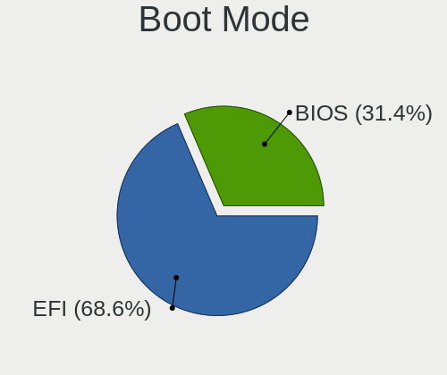
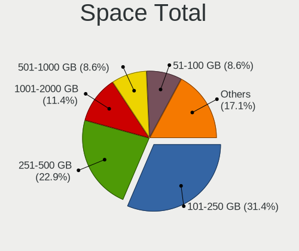
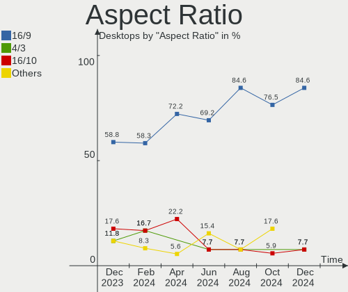
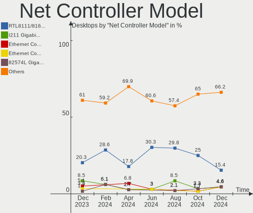

FreeBSD - Hardware Trends (Desktops)
------------------------------------

A project to identify most popular hardware characteristics and track their change
over time based on data collected by BSD users at https://BSD-Hardware.info.

Anyone can contribute to this report by the [hw-probe](https://github.com/linuxhw/hw-probe/blob/master/INSTALL.BSD.md) tool:

    hw-probe -all -upload

This report is for one last month. Overall report since the beginning of time: [TestCoverage](https://github.com/bsdhw/TestCoverage)

Period: Nov, 2022.

Contents
--------

* [ System ](#system)
  - [ OS                       ](#os)
  - [ OS Family                ](#os-family)
  - [ Arch                     ](#arch)
  - [ DE                       ](#de)
  - [ Display Server           ](#display-server)
  - [ Display Manager          ](#display-manager)
  - [ OS Lang                  ](#os-lang)
  - [ Boot Mode                ](#boot-mode)
  - [ Filesystem               ](#filesystem)
  - [ Part. scheme             ](#part-scheme)

* [ Board ](#board)
  - [ Vendor                   ](#vendor)
  - [ Model                    ](#model)
  - [ Model Family             ](#model-family)
  - [ MFG Year                 ](#mfg-year)
  - [ Form Factor              ](#form-factor)
  - [ Coreboot                 ](#coreboot)
  - [ RAM Size                 ](#ram-size)
  - [ RAM Used                 ](#ram-used)
  - [ Total Drives             ](#total-drives)
  - [ Has CD-ROM               ](#has-cd-rom)
  - [ Has Ethernet             ](#has-ethernet)
  - [ Has WiFi                 ](#has-wifi)
  - [ Has Bluetooth            ](#has-bluetooth)

* [ Location ](#location)
  - [ Country                  ](#country)
  - [ City                     ](#city)

* [ Drives ](#drives)
  - [ Drive Vendor             ](#drive-vendor)
  - [ Drive Model              ](#drive-model)
  - [ HDD Vendor               ](#hdd-vendor)
  - [ SSD Vendor               ](#ssd-vendor)
  - [ Drive Kind               ](#drive-kind)
  - [ Drive Connector          ](#drive-connector)
  - [ Drive Size               ](#drive-size)
  - [ Space Total              ](#space-total)
  - [ Space Used               ](#space-used)
  - [ Malfunc. Drives          ](#malfunc-drives)
  - [ Malfunc. Drive Vendor    ](#malfunc-drive-vendor)
  - [ Malfunc. HDD Vendor      ](#malfunc-hdd-vendor)
  - [ Malfunc. Drive Kind      ](#malfunc-drive-kind)
  - [ Failed Drives            ](#failed-drives)
  - [ Failed Drive Vendor      ](#failed-drive-vendor)
  - [ Drive Status             ](#drive-status)

* [ Storage controller ](#storage-controller)
  - [ Storage Vendor           ](#storage-vendor)
  - [ Storage Model            ](#storage-model)
  - [ Storage Kind             ](#storage-kind)

* [ Processor ](#processor)
  - [ CPU Vendor               ](#cpu-vendor)
  - [ CPU Model                ](#cpu-model)
  - [ CPU Model Family         ](#cpu-model-family)
  - [ CPU Cores                ](#cpu-cores)
  - [ CPU Sockets              ](#cpu-sockets)
  - [ CPU Threads              ](#cpu-threads)
  - [ CPU Microarch            ](#cpu-microarch)

* [ Graphics ](#graphics)
  - [ GPU Vendor               ](#gpu-vendor)
  - [ GPU Model                ](#gpu-model)
  - [ GPU Combo                ](#gpu-combo)
  - [ GPU Driver               ](#gpu-driver)
  - [ GPU Memory               ](#gpu-memory)

* [ Monitor ](#monitor)
  - [ Monitor Vendor           ](#monitor-vendor)
  - [ Monitor Model            ](#monitor-model)
  - [ Monitor Resolution       ](#monitor-resolution)
  - [ Monitor Diagonal         ](#monitor-diagonal)
  - [ Monitor Width            ](#monitor-width)
  - [ Aspect Ratio             ](#aspect-ratio)
  - [ Monitor Area             ](#monitor-area)
  - [ Pixel Density            ](#pixel-density)
  - [ Multiple Monitors        ](#multiple-monitors)

* [ Network ](#network)
  - [ Net Controller Vendor    ](#net-controller-vendor)
  - [ Net Controller Model     ](#net-controller-model)
  - [ Wireless Vendor          ](#wireless-vendor)
  - [ Wireless Model           ](#wireless-model)
  - [ Ethernet Vendor          ](#ethernet-vendor)
  - [ Ethernet Model           ](#ethernet-model)
  - [ Net Controller Kind      ](#net-controller-kind)
  - [ Used Controller          ](#used-controller)
  - [ NICs                     ](#nics)
  - [ IPv6                     ](#ipv6)

* [ Bluetooth ](#bluetooth)
  - [ Bluetooth Vendor         ](#bluetooth-vendor)
  - [ Bluetooth Model          ](#bluetooth-model)

* [ Sound ](#sound)
  - [ Sound Vendor             ](#sound-vendor)
  - [ Sound Model              ](#sound-model)

* [ Memory ](#memory)
  - [ Memory Vendor            ](#memory-vendor)
  - [ Memory Model             ](#memory-model)
  - [ Memory Kind              ](#memory-kind)
  - [ Memory Form Factor       ](#memory-form-factor)
  - [ Memory Size              ](#memory-size)
  - [ Memory Speed             ](#memory-speed)

* [ Printers & scanners ](#printers--scanners)
  - [ Printer Vendor           ](#printer-vendor)
  - [ Printer Model            ](#printer-model)
  - [ Scanner Vendor           ](#scanner-vendor)
  - [ Scanner Model            ](#scanner-model)

* [ Camera ](#camera)
  - [ Camera Vendor            ](#camera-vendor)
  - [ Camera Model             ](#camera-model)

* [ Security ](#security)
  - [ Fingerprint Vendor       ](#fingerprint-vendor)
  - [ Fingerprint Model        ](#fingerprint-model)
  - [ Chipcard Vendor          ](#chipcard-vendor)
  - [ Chipcard Model           ](#chipcard-model)

* [ Unsupported ](#unsupported)
  - [ Unsupported Devices      ](#unsupported-devices)
  - [ Unsupported Device Types ](#unsupported-device-types)

System
------

OS
--

Installed operating systems

| Name                 | Desktops | Percent |
|----------------------|----------|---------|
| FreeBSD 13.1-p3      | 10       | 23.81%  |
| FreeBSD 13.1-p2      | 8        | 19.05%  |
| FreeBSD 13.1-p4      | 7        | 16.67%  |
| FreeBSD 13.1         | 6        | 14.29%  |
| FreeBSD 12.3-p2      | 4        | 9.52%   |
| FreeBSD 14.0-CURRENT | 1        | 2.38%   |
| FreeBSD 13.1-STABLE  | 1        | 2.38%   |
| FreeBSD 13.1-RC4     | 1        | 2.38%   |
| FreeBSD 12.3-p9      | 1        | 2.38%   |
| FreeBSD 12.3-p8      | 1        | 2.38%   |
| FreeBSD 12.3-p7      | 1        | 2.38%   |
| FreeBSD 12.1-p13     | 1        | 2.38%   |

OS Family
---------

OS without a version

| Name    | Desktops | Percent |
|---------|----------|---------|
| FreeBSD | 42       | 100%    |

Arch
----

OS architecture (x86_64, i586, etc.)

| Name  | Desktops | Percent |
|-------|----------|---------|
| amd64 | 41       | 97.62%  |
| arm   | 1        | 2.38%   |

DE
--

Desktop Environment

| Name    | Desktops | Percent |
|---------|----------|---------|
| Console | 25       | 59.52%  |
| XFCE    | 5        | 11.9%   |
| KDE5    | 5        | 11.9%   |
| MATE    | 2        | 4.76%   |
| i3      | 2        | 4.76%   |
| LXQt    | 1        | 2.38%   |
| GNUstep | 1        | 2.38%   |
| Fluxbox | 1        | 2.38%   |

Display Server
--------------

X11 or Wayland

| Name    | Desktops | Percent |
|---------|----------|---------|
| Console | 27       | 64.29%  |
| X11     | 14       | 33.33%  |
| Wayland | 1        | 2.38%   |

Display Manager
---------------

SDDM, LightDM, etc.

| Name    | Desktops | Percent |
|---------|----------|---------|
| Console | 29       | 69.05%  |
| SDDM    | 5        | 11.9%   |
| XDM     | 3        | 7.14%   |
| SLiM    | 3        | 7.14%   |
| LightDM | 1        | 2.38%   |
| GDM     | 1        | 2.38%   |

OS Lang
-------

Language

| Lang    | Desktops | Percent |
|---------|----------|---------|
| C       | 26       | 61.9%   |
| Unknown | 9        | 21.43%  |
| en_US   | 4        | 9.52%   |
| zh_CN   | 2        | 4.76%   |
| nl_NL   | 1        | 2.38%   |

Boot Mode
---------

EFI or BIOS

| Mode | Desktops | Percent |
|------|----------|---------|
| EFI  | 26       | 61.9%   |
| BIOS | 16       | 38.1%   |

Filesystem
----------

Type of filesystem

| Type | Desktops | Percent |
|------|----------|---------|
| Zfs  | 36       | 85.71%  |
| Ufs  | 6        | 14.29%  |

Part. scheme
------------

Scheme of partitioning

| Type | Desktops | Percent |
|------|----------|---------|
| GPT  | 40       | 95.24%  |
| MBR  | 2        | 4.76%   |

Board
-----

Vendor
------

Motherboard manufacturer

| Name                | Desktops | Percent |
|---------------------|----------|---------|
| ASUSTek Computer    | 8        | 19.05%  |
| ASRock              | 6        | 14.29%  |
| Shuttle             | 3        | 7.14%   |
| MSI                 | 3        | 7.14%   |
| Hewlett-Packard     | 3        | 7.14%   |
| Dell                | 3        | 7.14%   |
| Lenovo              | 2        | 4.76%   |
| Gigabyte Technology | 2        | 4.76%   |
| Fujitsu             | 2        | 4.76%   |
| ASRockRack          | 2        | 4.76%   |
| TOPFEEL             | 1        | 2.38%   |
| ONDA                | 1        | 2.38%   |
| Huanan              | 1        | 2.38%   |
| Google              | 1        | 2.38%   |
| Foxconn             | 1        | 2.38%   |
| BESSTAR Tech        | 1        | 2.38%   |
| Acer                | 1        | 2.38%   |
| Unknown             | 1        | 2.38%   |

Model
-----

Motherboard model

| Name                             | Desktops | Percent |
|----------------------------------|----------|---------|
| HP t620 Quad Core TC             | 3        | 7.14%   |
| ASRock Q1900B-ITX                | 3        | 7.14%   |
| Fujitsu FUTRO S920               | 2        | 4.76%   |
| TOPFEEL Topone series            | 1        | 2.38%   |
| Shuttle XH270                    | 1        | 2.38%   |
| Shuttle SZ270R9                  | 1        | 2.38%   |
| Shuttle SZ270                    | 1        | 2.38%   |
| ONDA N78G5D3 Ver:5.00            | 1        | 2.38%   |
| MSI MS-7D46                      | 1        | 2.38%   |
| MSI MS-7B89                      | 1        | 2.38%   |
| MSI MS-7817                      | 1        | 2.38%   |
| Lenovo YangTianM6880N            | 1        | 2.38%   |
| Lenovo ThinkStation E31 255526G  | 1        | 2.38%   |
| Huanan X99-F8D V2.4              | 1        | 2.38%   |
| Google Zako                      | 1        | 2.38%   |
| Gigabyte Z97X-UD5H               | 1        | 2.38%   |
| Gigabyte Z590I AORUS ULTRA       | 1        | 2.38%   |
| Foxconn p6823w                   | 1        | 2.38%   |
| Dell Precision WorkStation T3500 | 1        | 2.38%   |
| Dell Precision T3600             | 1        | 2.38%   |
| Dell OptiPlex 5040               | 1        | 2.38%   |
| BESSTAR Tech HM80                | 1        | 2.38%   |
| ASUS SABERTOOTH 990FX R2.0       | 1        | 2.38%   |
| ASUS ROG CROSSHAIR VIII HERO     | 1        | 2.38%   |
| ASUS Pro WS 565-ACE              | 1        | 2.38%   |
| ASUS PRIME X370-PRO              | 1        | 2.38%   |
| ASUS PRIME B450M-A               | 1        | 2.38%   |
| ASUS P5Q-E                       | 1        | 2.38%   |
| ASUS P5B-Deluxe                  | 1        | 2.38%   |
| ASUS All Series                  | 1        | 2.38%   |
| ASRockRack X470D4U               | 1        | 2.38%   |
| ASRockRack EPYC3101D4I-2T        | 1        | 2.38%   |
| ASRock X570 Phantom Gaming 4     | 1        | 2.38%   |
| ASRock B450M-HDV                 | 1        | 2.38%   |
| ASRock B450 Gaming K4            | 1        | 2.38%   |
| Acer Veriton M430                | 1        | 2.38%   |
| Unknown                          | 1        | 2.38%   |

Model Family
------------

Motherboard model prefix

| Name                      | Desktops | Percent |
|---------------------------|----------|---------|
| HP t620                   | 3        | 7.14%   |
| ASRock Q1900B-ITX         | 3        | 7.14%   |
| Fujitsu FUTRO             | 2        | 4.76%   |
| Dell Precision            | 2        | 4.76%   |
| ASUS PRIME                | 2        | 4.76%   |
| TOPFEEL Topone            | 1        | 2.38%   |
| Shuttle XH270             | 1        | 2.38%   |
| Shuttle SZ270R9           | 1        | 2.38%   |
| Shuttle SZ270             | 1        | 2.38%   |
| ONDA N78G5D3              | 1        | 2.38%   |
| MSI MS-7D46               | 1        | 2.38%   |
| MSI MS-7B89               | 1        | 2.38%   |
| MSI MS-7817               | 1        | 2.38%   |
| Lenovo YangTianM6880N     | 1        | 2.38%   |
| Lenovo ThinkStation       | 1        | 2.38%   |
| Huanan X99-F8D            | 1        | 2.38%   |
| Google Zako               | 1        | 2.38%   |
| Gigabyte Z97X-UD5H        | 1        | 2.38%   |
| Gigabyte Z590I            | 1        | 2.38%   |
| Foxconn p6823w            | 1        | 2.38%   |
| Dell OptiPlex             | 1        | 2.38%   |
| BESSTAR Tech HM80         | 1        | 2.38%   |
| ASUS SABERTOOTH           | 1        | 2.38%   |
| ASUS ROG                  | 1        | 2.38%   |
| ASUS Pro                  | 1        | 2.38%   |
| ASUS P5Q-E                | 1        | 2.38%   |
| ASUS P5B-Deluxe           | 1        | 2.38%   |
| ASUS All                  | 1        | 2.38%   |
| ASRockRack X470D4U        | 1        | 2.38%   |
| ASRockRack EPYC3101D4I-2T | 1        | 2.38%   |
| ASRock X570               | 1        | 2.38%   |
| ASRock B450M-HDV          | 1        | 2.38%   |
| ASRock B450               | 1        | 2.38%   |
| Acer Veriton              | 1        | 2.38%   |
| Unknown                   | 1        | 2.38%   |

MFG Year
--------

Motherboard manufacture year

| Year    | Desktops | Percent |
|---------|----------|---------|
| 2019    | 7        | 16.67%  |
| 2014    | 7        | 16.67%  |
| 2021    | 4        | 9.52%   |
| 2018    | 4        | 9.52%   |
| 2017    | 4        | 9.52%   |
| 2016    | 3        | 7.14%   |
| 2022    | 2        | 4.76%   |
| 2015    | 2        | 4.76%   |
| 2011    | 2        | 4.76%   |
| 2010    | 2        | 4.76%   |
| 2008    | 2        | 4.76%   |
| 2020    | 1        | 2.38%   |
| 2012    | 1        | 2.38%   |
| Unknown | 1        | 2.38%   |

Form Factor
-----------

Physical design of the computer

| Name    | Desktops | Percent |
|---------|----------|---------|
| Desktop | 42       | 100%    |

Coreboot
--------

Have coreboot on board

| Used | Desktops | Percent |
|------|----------|---------|
| No   | 41       | 97.62%  |
| Yes  | 1        | 2.38%   |

RAM Size
--------

Total RAM memory

| Size in GB  | Desktops | Percent |
|-------------|----------|---------|
| 4.01-8.0    | 11       | 26.19%  |
| 8.01-16.0   | 10       | 23.81%  |
| 16.01-24.0  | 8        | 19.05%  |
| 32.01-64.0  | 7        | 16.67%  |
| 64.01-256.0 | 5        | 11.9%   |
| 2.01-3.0    | 1        | 2.38%   |

RAM Used
--------

Used RAM memory

| Used GB   | Desktops | Percent |
|-----------|----------|---------|
| 0.51-1.0  | 15       | 35.71%  |
| 0.01-0.5  | 14       | 33.33%  |
| 1.01-2.0  | 8        | 19.05%  |
| 3.01-4.0  | 3        | 7.14%   |
| 2.01-3.0  | 1        | 2.38%   |
| 8.01-16.0 | 1        | 2.38%   |

Total Drives
------------

Number of drives on board

| Drives | Desktops | Percent |
|--------|----------|---------|
| 1      | 14       | 33.33%  |
| 2      | 9        | 21.43%  |
| 3      | 8        | 19.05%  |
| 4      | 6        | 14.29%  |
| 0      | 2        | 4.76%   |
| 13     | 1        | 2.38%   |
| 11     | 1        | 2.38%   |
| 5      | 1        | 2.38%   |

Has CD-ROM
----------

Has CD-ROM on board

| Presented | Desktops | Percent |
|-----------|----------|---------|
| No        | 33       | 78.57%  |
| Yes       | 9        | 21.43%  |

Has Ethernet
------------

Has Ethernet on board

| Presented | Desktops | Percent |
|-----------|----------|---------|
| Yes       | 41       | 97.62%  |
| No        | 1        | 2.38%   |

Has WiFi
--------

Has WiFi module

| Presented | Desktops | Percent |
|-----------|----------|---------|
| No        | 37       | 88.1%   |
| Yes       | 5        | 11.9%   |

Has Bluetooth
-------------

Has Bluetooth module

| Presented | Desktops | Percent |
|-----------|----------|---------|
| No        | 35       | 83.33%  |
| Yes       | 7        | 16.67%  |

Location
--------

Country
-------

Geographic location (country)

| Country     | Desktops | Percent |
|-------------|----------|---------|
| USA         | 8        | 19.05%  |
| Poland      | 6        | 14.29%  |
| Germany     | 6        | 14.29%  |
| Russia      | 4        | 9.52%   |
| China       | 3        | 7.14%   |
| UK          | 2        | 4.76%   |
| Netherlands | 2        | 4.76%   |
| Canada      | 2        | 4.76%   |
| Thailand    | 1        | 2.38%   |
| Spain       | 1        | 2.38%   |
| Slovenia    | 1        | 2.38%   |
| Japan       | 1        | 2.38%   |
| Italy       | 1        | 2.38%   |
| Greece      | 1        | 2.38%   |
| Finland     | 1        | 2.38%   |
| Denmark     | 1        | 2.38%   |
| Austria     | 1        | 2.38%   |

City
----

Geographic location (city)

| City                   | Desktops | Percent |
|------------------------|----------|---------|
| Ludwigsburg            | 6        | 14.29%  |
| Lezno                  | 3        | 7.14%   |
| Gdansk                 | 3        | 7.14%   |
| Salem                  | 2        | 4.76%   |
| Redmond                | 2        | 4.76%   |
| Papendrecht            | 2        | 4.76%   |
| Moscow                 | 2        | 4.76%   |
| Xanthi                 | 1        | 2.38%   |
| Winnipeg               | 1        | 2.38%   |
| Wenatchee              | 1        | 2.38%   |
| Toronto                | 1        | 2.38%   |
| Taastrup               | 1        | 2.38%   |
| St Petersburg          | 1        | 2.38%   |
| Springfield            | 1        | 2.38%   |
| Shenzhen               | 1        | 2.38%   |
| Sant Cugat del Vallès | 1        | 2.38%   |
| San Vincenzo La Costa  | 1        | 2.38%   |
| Salisbury              | 1        | 2.38%   |
| Saint Paul             | 1        | 2.38%   |
| Narashino-shi          | 1        | 2.38%   |
| Jiangbei               | 1        | 2.38%   |
| Irkutsk                | 1        | 2.38%   |
| Innsbruck              | 1        | 2.38%   |
| Hindman                | 1        | 2.38%   |
| Helsinki               | 1        | 2.38%   |
| Great Yarmouth         | 1        | 2.38%   |
| Chengdu                | 1        | 2.38%   |
| Bucka                  | 1        | 2.38%   |
| Bangkok                | 1        | 2.38%   |

Drives
------

Drive Vendor
------------

Hard drive vendors

| Vendor              | Desktops | Drives | Percent |
|---------------------|----------|--------|---------|
| WDC                 | 13       | 43     | 20.97%  |
| Seagate             | 10       | 13     | 16.13%  |
| Samsung Electronics | 7        | 15     | 11.29%  |
| SanDisk             | 4        | 4      | 6.45%   |
| Intel               | 4        | 4      | 6.45%   |
| Crucial             | 4        | 5      | 6.45%   |
| GOODRAM             | 3        | 4      | 4.84%   |
| Kingston            | 2        | 3      | 3.23%   |
| Intenso             | 2        | 2      | 3.23%   |
| Innodisk            | 2        | 2      | 3.23%   |
| HGST                | 2        | 3      | 3.23%   |
| Transcend           | 1        | 1      | 1.61%   |
| Toshiba             | 1        | 3      | 1.61%   |
| SK hynix            | 1        | 1      | 1.61%   |
| Silicon Motion      | 1        | 1      | 1.61%   |
| Phison              | 1        | 1      | 1.61%   |
| Patriot             | 1        | 1      | 1.61%   |
| LITEON              | 1        | 1      | 1.61%   |
| Hitachi             | 1        | 1      | 1.61%   |
| Corsair             | 1        | 1      | 1.61%   |

Drive Model
-----------

Hard drive models

| Model                                       | Desktops | Percent |
|---------------------------------------------|----------|---------|
| SanDisk SDSA6MM-008G-1006 8GB               | 3        | 3.85%   |
| Seagate ST4000DM000-1F2168 4TB              | 2        | 2.56%   |
| Innodisk DEMSR- 08GB mSATA 3ME3             | 2        | 2.56%   |
| WDC WDS500G2B0C-00PXH0 500GB                | 1        | 1.28%   |
| WDC WDS240G2G0A-00JH30 240GB                | 1        | 1.28%   |
| WDC WDS100T3X0C-00SJG0 1TB                  | 1        | 1.28%   |
| WDC WD80EMAZ-00WJTA0 8TB                    | 1        | 1.28%   |
| WDC WD80EFZX-68UW8N0 8TB                    | 1        | 1.28%   |
| WDC WD80EFAX-68LHPN0 8TB                    | 1        | 1.28%   |
| WDC WD80EDBZ-11B0ZA0 8TB                    | 1        | 1.28%   |
| WDC WD5003AZEX-00MK2A0 500GB                | 1        | 1.28%   |
| WDC WD5003AZEX-00K3CA0 500GB                | 1        | 1.28%   |
| WDC WD5003AZEX-00K1GA0 500GB                | 1        | 1.28%   |
| WDC WD5000LPCX-24C6HT0 500GB                | 1        | 1.28%   |
| WDC WD5000AAKX-603CA0 500GB                 | 1        | 1.28%   |
| WDC WD5000AAKS-00A7B2 500GB                 | 1        | 1.28%   |
| WDC WD40EZRZ-22GXCB0 4TB                    | 1        | 1.28%   |
| WDC WD30EZRX-00D8PB0 3TB                    | 1        | 1.28%   |
| WDC WD3000JS-63PDB1 304GB                   | 1        | 1.28%   |
| WDC WD20SDZW-11JJ8S0 2TB                    | 1        | 1.28%   |
| WDC WD20SDRW-11VUUS0 2TB                    | 1        | 1.28%   |
| WDC WD20NMVW-59EDZS7 2TB                    | 1        | 1.28%   |
| WDC WD2000FYYZ-01UL1B0 2TB                  | 1        | 1.28%   |
| WDC WD15EADS-00P8B0 1.5TB                   | 1        | 1.28%   |
| WDC WD120EMFZ-11A6JA0 12TB                  | 1        | 1.28%   |
| WDC WD120EMAZ-11BLFA0 12TB                  | 1        | 1.28%   |
| WDC WD10EZEX-60WN4A1 1TB                    | 1        | 1.28%   |
| WDC WD10EFRX-68FYTN0 1TB                    | 1        | 1.28%   |
| Transcend TS8GSSD500 8GB                    | 1        | 1.28%   |
| Toshiba MQ01ABF050 500GB                    | 1        | 1.28%   |
| SK hynix SC308 SATA 128GB                   | 1        | 1.28%   |
| Silicon Motion PCIe SSD 256GB               | 1        | 1.28%   |
| Seagate ST500DM002-1SB10A 500GB             | 1        | 1.28%   |
| Seagate ST500DM002-1BD142 500GB             | 1        | 1.28%   |
| Seagate ST4000LM024-2AN17V 4TB              | 1        | 1.28%   |
| Seagate ST3500312CS 500GB                   | 1        | 1.28%   |
| Seagate ST3000VN000-1HJ166 3TB              | 1        | 1.28%   |
| Seagate ST2000DM008-2FR102 2TB              | 1        | 1.28%   |
| Seagate ST1000DM010-2EP102 1TB              | 1        | 1.28%   |
| Seagate BarraCuda 120 SSD ZA1000CM10003 1TB | 1        | 1.28%   |

HDD Vendor
----------

Hard disk drive vendors

| Vendor  | Desktops | Drives | Percent |
|---------|----------|--------|---------|
| WDC     | 11       | 37     | 45.83%  |
| Seagate | 9        | 12     | 37.5%   |
| HGST    | 2        | 3      | 8.33%   |
| Toshiba | 1        | 3      | 4.17%   |
| Hitachi | 1        | 1      | 4.17%   |

SSD Vendor
----------

Solid state drive vendors

| Vendor              | Desktops | Drives | Percent |
|---------------------|----------|--------|---------|
| Samsung Electronics | 6        | 12     | 18.75%  |
| SanDisk             | 4        | 4      | 12.5%   |
| Crucial             | 4        | 5      | 12.5%   |
| Intel               | 3        | 3      | 9.38%   |
| GOODRAM             | 3        | 4      | 9.38%   |
| Kingston            | 2        | 3      | 6.25%   |
| Intenso             | 2        | 2      | 6.25%   |
| Innodisk            | 2        | 2      | 6.25%   |
| WDC                 | 1        | 4      | 3.13%   |
| Transcend           | 1        | 1      | 3.13%   |
| SK hynix            | 1        | 1      | 3.13%   |
| Seagate             | 1        | 1      | 3.13%   |
| Patriot             | 1        | 1      | 3.13%   |
| LITEON              | 1        | 1      | 3.13%   |

Drive Kind
----------

HDD or SSD

| Kind | Desktops | Drives | Percent |
|------|----------|--------|---------|
| SSD  | 26       | 44     | 47.27%  |
| HDD  | 21       | 56     | 38.18%  |
| NVMe | 8        | 9      | 14.55%  |

Drive Connector
---------------

SATA, SAS, NVMe, etc.

| Type | Desktops | Drives | Percent |
|------|----------|--------|---------|
| SATA | 37       | 100    | 82.22%  |
| NVMe | 8        | 9      | 17.78%  |

Drive Size
----------

Size of hard drive

| Size in TB | Desktops | Drives | Percent |
|------------|----------|--------|---------|
| 0.01-0.5   | 28       | 53     | 54.9%   |
| 0.51-1.0   | 10       | 18     | 19.61%  |
| 1.01-2.0   | 5        | 11     | 9.8%    |
| 3.01-4.0   | 4        | 6      | 7.84%   |
| 2.01-3.0   | 2        | 2      | 3.92%   |
| 10.01-20.0 | 1        | 2      | 1.96%   |
| 4.01-10.0  | 1        | 8      | 1.96%   |

Space Total
-----------

Amount of disk space available on the file system

| Size in GB | Desktops | Percent |
|------------|----------|---------|
| 251-500    | 14       | 33.33%  |
| 51-100     | 9        | 21.43%  |
| 1-20       | 6        | 14.29%  |
| 501-1000   | 5        | 11.9%   |
| 101-250    | 4        | 9.52%   |
| 1001-2000  | 2        | 4.76%   |
| 21-50      | 1        | 2.38%   |
| 2001-3000  | 1        | 2.38%   |

Space Used
----------

Amount of used disk space

| Used GB | Desktops | Percent |
|---------|----------|---------|
| 1-20    | 35       | 83.33%  |
| 251-500 | 3        | 7.14%   |
| 21-50   | 3        | 7.14%   |
| 51-100  | 1        | 2.38%   |

Malfunc. Drives
---------------

Drive models with a malfunction

| Model                       | Desktops | Drives | Percent |
|-----------------------------|----------|--------|---------|
| WDC WD30EZRX-00D8PB0 3TB    | 1        | 1      | 14.29%  |
| WDC WD10EZEX-60WN4A1 1TB    | 1        | 1      | 14.29%  |
| SK hynix SC308 SATA 128GB   | 1        | 1      | 14.29%  |
| LITEON IT LST-16S9G-HP 16GB | 1        | 1      | 14.29%  |
| Intel SSDSC2CT120A3 120GB   | 1        | 1      | 14.29%  |
| Hitachi HDS721010CLA332 1TB | 1        | 1      | 14.29%  |
| HGST HTS725050A7E630 500GB  | 1        | 1      | 14.29%  |

Malfunc. Drive Vendor
---------------------

Vendors of faulty drives

| Vendor   | Desktops | Drives | Percent |
|----------|----------|--------|---------|
| WDC      | 2        | 2      | 28.57%  |
| SK hynix | 1        | 1      | 14.29%  |
| LITEON   | 1        | 1      | 14.29%  |
| Intel    | 1        | 1      | 14.29%  |
| Hitachi  | 1        | 1      | 14.29%  |
| HGST     | 1        | 1      | 14.29%  |

Malfunc. HDD Vendor
-------------------

Vendors of faulty HDD drives

| Vendor  | Desktops | Drives | Percent |
|---------|----------|--------|---------|
| WDC     | 2        | 2      | 50%     |
| Hitachi | 1        | 1      | 25%     |
| HGST    | 1        | 1      | 25%     |

Malfunc. Drive Kind
-------------------

Kinds of faulty drives

| Kind | Desktops | Drives | Percent |
|------|----------|--------|---------|
| HDD  | 4        | 4      | 57.14%  |
| SSD  | 3        | 3      | 42.86%  |

Failed Drives
-------------

Failed drive models

Zero info for selected period =(

Failed Drive Vendor
-------------------

Failed drive vendors

Zero info for selected period =(

Drive Status
------------

Number of failed and malfunc. drives

| Status   | Desktops | Drives | Percent |
|----------|----------|--------|---------|
| Works    | 37       | 101    | 86.05%  |
| Malfunc  | 5        | 7      | 11.63%  |
| Detected | 1        | 1      | 2.33%   |

Storage controller
------------------

Storage Vendor
--------------

Storage controller vendors

| Vendor                   | Desktops | Percent |
|--------------------------|----------|---------|
| Intel                    | 22       | 39.29%  |
| AMD                      | 19       | 33.93%  |
| ASMedia Technology       | 3        | 5.36%   |
| SanDisk                  | 2        | 3.57%   |
| Samsung Electronics      | 2        | 3.57%   |
| Phison Electronics       | 2        | 3.57%   |
| Marvell Technology Group | 2        | 3.57%   |
| Broadcom / LSI           | 2        | 3.57%   |
| Silicon Motion           | 1        | 1.79%   |
| Nvidia                   | 1        | 1.79%   |

Storage Model
-------------

Storage controller models

| Model                                                                          | Desktops | Percent |
|--------------------------------------------------------------------------------|----------|---------|
| AMD FCH SATA Controller [AHCI mode]                                            | 12       | 19.67%  |
| AMD 400 Series Chipset SATA Controller                                         | 5        | 8.2%    |
| Intel Atom Processor E3800 Series SATA AHCI Controller                         | 3        | 4.92%   |
| Intel 200 Series PCH SATA controller [AHCI mode]                               | 3        | 4.92%   |
| ASMedia ASM1062 Serial ATA Controller                                          | 3        | 4.92%   |
| Intel Q170/Q150/B150/H170/H110/Z170/CM236 Chipset SATA Controller [AHCI Mode]  | 2        | 3.28%   |
| Intel C610/X99 series chipset sSATA Controller [AHCI mode]                     | 2        | 3.28%   |
| Intel 82801JI (ICH10 Family) SATA AHCI Controller                              | 2        | 3.28%   |
| AMD SB7x0/SB8x0/SB9x0 SATA Controller [AHCI mode]                              | 2        | 3.28%   |
| Silicon Motion SM2263EN/SM2263XT SSD Controller                                | 1        | 1.64%   |
| SanDisk WD Blue SN550 NVMe SSD                                                 | 1        | 1.64%   |
| SanDisk WD Black SN750 / PC SN730 NVMe SSD                                     | 1        | 1.64%   |
| Samsung NVMe SSD Controller SM981/PM981/PM983                                  | 1        | 1.64%   |
| Samsung NVMe SSD Controller SM961/PM961/SM963                                  | 1        | 1.64%   |
| Phison PS5013 E13 NVMe Controller                                              | 1        | 1.64%   |
| Phison E16 PCIe4 NVMe Controller                                               | 1        | 1.64%   |
| Nvidia MCP61 SATA Controller                                                   | 1        | 1.64%   |
| Nvidia MCP61 IDE                                                               | 1        | 1.64%   |
| Marvell Group 88SE9172 SATA 6Gb/s Controller                                   | 1        | 1.64%   |
| Marvell Group 88SE6111/6121 SATA II / PATA Controller                          | 1        | 1.64%   |
| Intel SSD 660P Series                                                          | 1        | 1.64%   |
| Intel NM10/ICH7 Family SATA Controller [IDE mode]                              | 1        | 1.64%   |
| Intel C600/X79 series chipset 6-Port SATA AHCI Controller                      | 1        | 1.64%   |
| Intel Alder Lake-S PCH SATA Controller [AHCI Mode]                             | 1        | 1.64%   |
| Intel 9 Series Chipset Family SATA Controller [AHCI Mode]                      | 1        | 1.64%   |
| Intel 82801HR/HO/HH (ICH8R/DO/DH) 6 port SATA Controller [AHCI mode]           | 1        | 1.64%   |
| Intel 8 Series/C220 Series Chipset Family 6-port SATA Controller 1 [AHCI mode] | 1        | 1.64%   |
| Intel 8 Series SATA Controller 1 [AHCI mode]                                   | 1        | 1.64%   |
| Intel 7 Series/C210 Series Chipset Family 6-port SATA Controller [AHCI mode]   | 1        | 1.64%   |
| Intel 500 Series Chipset Family SATA AHCI Controller                           | 1        | 1.64%   |
| Broadcom / LSI SAS3008 PCI-Express Fusion-MPT SAS-3                            | 1        | 1.64%   |
| Broadcom / LSI SAS2008 PCI-Express Fusion-MPT SAS-2 [Falcon]                   | 1        | 1.64%   |
| AMD X370 Series Chipset SATA Controller                                        | 1        | 1.64%   |
| AMD SB7x0/SB8x0/SB9x0 SATA Controller [IDE mode]                               | 1        | 1.64%   |
| AMD SB7x0/SB8x0/SB9x0 IDE Controller                                           | 1        | 1.64%   |
| AMD 500 Series Chipset SATA Controller                                         | 1        | 1.64%   |

Storage Kind
------------

Kind of storage controller (IDE, SATA, NVMe, SAS, ...)

| Kind | Desktops | Percent |
|------|----------|---------|
| SATA | 38       | 73.08%  |
| NVMe | 8        | 15.38%  |
| IDE  | 4        | 7.69%   |
| SAS  | 2        | 3.85%   |

Processor
---------

CPU Vendor
----------

Processor vendors

| Vendor | Desktops | Percent |
|--------|----------|---------|
| Intel  | 21       | 50%     |
| AMD    | 20       | 47.62%  |
| ARM    | 1        | 2.38%   |

CPU Model
---------

Processor models

| Model                                       | Desktops | Percent |
|---------------------------------------------|----------|---------|
| Intel Celeron CPU J1900 @ 1.99GHz           | 3        | 7.14%   |
| AMD GX-415GA SOC with Radeon HD Graphics    | 3        | 7.14%   |
| Intel Core i3-6100 CPU @ 3.70GHz            | 2        | 4.76%   |
| AMD Ryzen 9 3900X 12-Core Processor         | 2        | 4.76%   |
| AMD Ryzen 3 2200G with Radeon Vega Graphics | 2        | 4.76%   |
| AMD GX-222GC SOC with Radeon R5E Graphics   | 2        | 4.76%   |
| Intel Xeon CPU E5450 @ 3.00GHz              | 1        | 2.38%   |
| Intel Xeon CPU E5-2680 v4 @ 2.40GHz         | 1        | 2.38%   |
| Intel Xeon CPU E5-1620 0 @ 3.60GH           | 1        | 2.38%   |
| Intel Xeon                                  | 1        | 2.38%   |
| Intel Pentium CPU G3220 @ 3.00GHz           | 1        | 2.38%   |
| Intel Core i7-6900K CPU @ 3.20GHz           | 1        | 2.38%   |
| Intel Core i7-4790K CPU @ 4.00GHz           | 1        | 2.38%   |
| Intel Core i5-6600 CPU @ 3.30GHz            | 1        | 2.38%   |
| Intel Core i5-6500 CPU @ 3.20GHz            | 1        | 2.38%   |
| Intel Core i5-3550 CPU @ 3.30GHz            | 1        | 2.38%   |
| Intel Core i3-7100 CPU @ 3.90GHz            | 1        | 2.38%   |
| Intel Core 2 Quad CPU Q6600 @ 2.40GHz       | 1        | 2.38%   |
| Intel Core 2 Duo CPU E7500 @ 2.93GHz        | 1        | 2.38%   |
| Intel Celeron 2955U @ 1.40GHz               | 1        | 2.38%   |
| Intel 12th Gen Core i5-12400                | 1        | 2.38%   |
| Intel 11th Gen Core i7-11700 @ 2.50GHz      | 1        | 2.38%   |
| ARM Cortex-A7 r0p5 (ECO: 0x00000000)        | 1        | 2.38%   |
| AMD Ryzen 7 4800U with Radeon Graphics      | 1        | 2.38%   |
| AMD Ryzen 7 3700X 8-Core Processor          | 1        | 2.38%   |
| AMD Ryzen 7 1700 Eight-Core Processor       | 1        | 2.38%   |
| AMD Ryzen 5 3600 6-Core Processor           | 1        | 2.38%   |
| AMD Ryzen 3 3200G with Radeon Vega Graphics | 1        | 2.38%   |
| AMD Phenom II X6 1090T Processor            | 1        | 2.38%   |
| AMD Phenom II X6 1045T Processor            | 1        | 2.38%   |
| AMD Phenom II X2 521 Processor              | 1        | 2.38%   |
| AMD EPYC 3101 4-Core Processor              | 1        | 2.38%   |
| AMD Athlon II X4 630 Processor              | 1        | 2.38%   |
| AMD Athlon 3000G with Radeon Vega Graphics  | 1        | 2.38%   |

CPU Model Family
----------------

Processor model prefix

| Model             | Desktops | Percent |
|-------------------|----------|---------|
| AMD GX            | 5        | 11.9%   |
| Intel Xeon        | 4        | 9.52%   |
| Intel Celeron     | 4        | 9.52%   |
| Intel Core i5     | 3        | 7.14%   |
| Intel Core i3     | 3        | 7.14%   |
| AMD Ryzen 7       | 3        | 7.14%   |
| AMD Ryzen 3       | 3        | 7.14%   |
| Other             | 2        | 4.76%   |
| Intel Core i7     | 2        | 4.76%   |
| AMD Ryzen 9       | 2        | 4.76%   |
| AMD Phenom II X6  | 2        | 4.76%   |
| Intel Pentium     | 1        | 2.38%   |
| Intel Core 2 Quad | 1        | 2.38%   |
| Intel Core 2 Duo  | 1        | 2.38%   |
| ARM Cortex        | 1        | 2.38%   |
| AMD Ryzen 5       | 1        | 2.38%   |
| AMD Phenom II X2  | 1        | 2.38%   |
| AMD EPYC          | 1        | 2.38%   |
| AMD Athlon II X4  | 1        | 2.38%   |
| AMD Athlon        | 1        | 2.38%   |

CPU Cores
---------

Number of processor cores

| Number  | Desktops | Percent |
|---------|----------|---------|
| 4       | 18       | 42.86%  |
| 2       | 9        | 21.43%  |
| 6       | 4        | 9.52%   |
| 16      | 3        | 7.14%   |
| 24      | 2        | 4.76%   |
| 8       | 2        | 4.76%   |
| Unknown | 2        | 4.76%   |
| 28      | 1        | 2.38%   |
| 12      | 1        | 2.38%   |

CPU Sockets
-----------

Number of sockets

| Number  | Desktops | Percent |
|---------|----------|---------|
| 1       | 40       | 95.24%  |
| 2       | 1        | 2.38%   |
| Unknown | 1        | 2.38%   |

CPU Threads
-----------

Threads per core (Hyper-Threading)

| Number  | Desktops | Percent |
|---------|----------|---------|
| 1       | 30       | 71.43%  |
| 2       | 10       | 23.81%  |
| Unknown | 2        | 4.76%   |

CPU Microarch
-------------

Microarchitecture

| Name        | Desktops | Percent |
|-------------|----------|---------|
| Zen 2       | 5        | 11.9%   |
| Zen         | 4        | 9.52%   |
| Skylake     | 4        | 9.52%   |
| K10         | 4        | 9.52%   |
| Silvermont  | 3        | 7.14%   |
| Jaguar      | 3        | 7.14%   |
| Haswell     | 3        | 7.14%   |
| Unknown     | 3        | 7.14%   |
| Zen+        | 2        | 4.76%   |
| Puma        | 2        | 4.76%   |
| Penryn      | 2        | 4.76%   |
| Broadwell   | 2        | 4.76%   |
| Westmere    | 1        | 2.38%   |
| SandyBridge | 1        | 2.38%   |
| KabyLake    | 1        | 2.38%   |
| IvyBridge   | 1        | 2.38%   |
| Core        | 1        | 2.38%   |

Graphics
--------

GPU Vendor
----------

Vendors of graphics cards

| Vendor            | Desktops | Percent |
|-------------------|----------|---------|
| AMD               | 18       | 45%     |
| Intel             | 13       | 32.5%   |
| Nvidia            | 6        | 15%     |
| ASPEED Technology | 3        | 7.5%    |

GPU Model
---------

Graphics card models

| Model                                                                       | Desktops | Percent |
|-----------------------------------------------------------------------------|----------|---------|
| Intel HD Graphics 530                                                       | 4        | 10%     |
| Intel Atom Processor Z36xxx/Z37xxx Series Graphics & Display                | 3        | 7.5%    |
| ASPEED Technology ASPEED Graphics Family                                    | 3        | 7.5%    |
| AMD Kabini [Radeon HD 8330E]                                                | 3        | 7.5%    |
| AMD Mullins [Radeon R4/R5 Graphics]                                         | 2        | 5%      |
| AMD Ellesmere [Radeon RX 470/480/570/570X/580/580X/590]                     | 2        | 5%      |
| Nvidia TU117 [GeForce GTX 1650]                                             | 1        | 2.5%    |
| Nvidia GT218 [NVS 300]                                                      | 1        | 2.5%    |
| Nvidia GP108 [GeForce GT 1030]                                              | 1        | 2.5%    |
| Nvidia GP106 [GeForce GTX 1060 3GB]                                         | 1        | 2.5%    |
| Nvidia GF108 [GeForce GT 620]                                               | 1        | 2.5%    |
| Nvidia C61 [GeForce 7025 / nForce 630a]                                     | 1        | 2.5%    |
| Intel Xeon E3-1200 v3/4th Gen Core Processor Integrated Graphics Controller | 1        | 2.5%    |
| Intel RocketLake-S GT1 [UHD Graphics 750]                                   | 1        | 2.5%    |
| Intel HD Graphics 630                                                       | 1        | 2.5%    |
| Intel Haswell-ULT Integrated Graphics Controller                            | 1        | 2.5%    |
| Intel Alder Lake-S GT1 [UHD Graphics 730]                                   | 1        | 2.5%    |
| Intel 82G33/G31 Express Integrated Graphics Controller                      | 1        | 2.5%    |
| AMD Turks [Radeon HD 7600 Series]                                           | 1        | 2.5%    |
| AMD RV770 [Radeon HD 4850]                                                  | 1        | 2.5%    |
| AMD RS880 [Radeon HD 4250]                                                  | 1        | 2.5%    |
| AMD RS880 [Radeon HD 4200]                                                  | 1        | 2.5%    |
| AMD Renoir                                                                  | 1        | 2.5%    |
| AMD Raven Ridge [Radeon Vega Series / Radeon Vega Mobile Series]            | 1        | 2.5%    |
| AMD Picasso/Raven 2 [Radeon Vega Series / Radeon Vega Mobile Series]        | 1        | 2.5%    |
| AMD Curacao PRO [Radeon R7 370 / R9 270/370 OEM]                            | 1        | 2.5%    |
| AMD Cedar [Radeon HD 5000/6000/7350/8350 Series]                            | 1        | 2.5%    |
| AMD Barts XT [Radeon HD 6870]                                               | 1        | 2.5%    |
| AMD Barts PRO [Radeon HD 6850]                                              | 1        | 2.5%    |

GPU Combo
---------

Combinations of graphics cards

| Name       | Desktops | Percent |
|------------|----------|---------|
| 1 x AMD    | 18       | 42.86%  |
| 1 x Intel  | 13       | 30.95%  |
| 1 x Nvidia | 6        | 14.29%  |
| 1 x ASPEED | 3        | 7.14%   |
| Other      | 2        | 4.76%   |

GPU Driver
----------

Free vs proprietary

| Driver      | Desktops | Percent |
|-------------|----------|---------|
| Free        | 37       | 88.1%   |
| Proprietary | 3        | 7.14%   |
| Unknown     | 2        | 4.76%   |

GPU Memory
----------

Total video memory

| Size in GB | Desktops | Percent |
|------------|----------|---------|
| Unknown    | 35       | 83.33%  |
| 0.51-1.0   | 4        | 9.52%   |
| 7.01-8.0   | 1        | 2.38%   |
| 3.01-4.0   | 1        | 2.38%   |
| 1.01-2.0   | 1        | 2.38%   |

Monitor
-------

Monitor Vendor
--------------

Monitor vendors

| Vendor              | Desktops | Percent |
|---------------------|----------|---------|
| Samsung Electronics | 3        | 25%     |
| Dell                | 2        | 16.67%  |
| ViewSonic           | 1        | 8.33%   |
| unknown             | 1        | 8.33%   |
| Mi                  | 1        | 8.33%   |
| Lenovo              | 1        | 8.33%   |
| Iiyama              | 1        | 8.33%   |
| Chimei Innolux      | 1        | 8.33%   |
| AOC                 | 1        | 8.33%   |

Monitor Model
-------------

Monitor models

| Model                                                                | Desktops | Percent |
|----------------------------------------------------------------------|----------|---------|
| ViewSonic LCD Monitor VX3276-QHD 2560x1440                           | 1        | 7.69%   |
| unknown LCD Monitor SAMSUNG 1920x1080                                | 1        | 7.69%   |
| Samsung Electronics SyncMaster SAM030D 1680x1050 470x300mm 22.0-inch | 1        | 7.69%   |
| Samsung Electronics SyncMaster SAM021E 1680x1050 430x270mm 20.0-inch | 1        | 7.69%   |
| Samsung Electronics S24B300 SAM08B3 1920x1080 520x290mm 23.4-inch    | 1        | 7.69%   |
| Mi 27 NFGL XMIB004 1920x1080 600x330mm 27.0-inch                     | 1        | 7.69%   |
| Lenovo L197 Wide LEN1152 1440x900 410x260mm 19.1-inch                | 1        | 7.69%   |
| Iiyama PL2280 IVM562F 1920x1080 480x270mm 21.7-inch                  | 1        | 7.69%   |
| Dell UP3216Q DEL40C1 3840x2160 700x400mm 31.7-inch                   | 1        | 7.69%   |
| Dell U2413 DELF046 1920x1200 520x320mm 24.0-inch                     | 1        | 7.69%   |
| Dell P2415Q DELA0C0 3840x2160 530x300mm 24.0-inch                    | 1        | 7.69%   |
| Chimei Innolux LCD Monitor CMN14A8 1920x1080 310x170mm 13.9-inch     | 1        | 7.69%   |
| AOC 24G1WG4 AOC2401 1920x1080 520x290mm 23.4-inch                    | 1        | 7.69%   |

Monitor Resolution
------------------

Monitor screen resolution

| Resolution         | Desktops | Percent |
|--------------------|----------|---------|
| 1920x1080 (FHD)    | 6        | 46.15%  |
| 3840x2160 (4K)     | 2        | 15.38%  |
| 1680x1050 (WSXGA+) | 2        | 15.38%  |
| 2560x1440 (QHD)    | 1        | 7.69%   |
| 1920x1200 (WUXGA)  | 1        | 7.69%   |
| 1440x900 (WXGA+)   | 1        | 7.69%   |

Monitor Diagonal
----------------

Diagonal size in inches

| Inches  | Desktops | Percent |
|---------|----------|---------|
| 24      | 3        | 23.08%  |
| Unknown | 2        | 15.38%  |
| 31      | 1        | 7.69%   |
| 27      | 1        | 7.69%   |
| 23      | 1        | 7.69%   |
| 22      | 1        | 7.69%   |
| 21      | 1        | 7.69%   |
| 20      | 1        | 7.69%   |
| 19      | 1        | 7.69%   |
| 13      | 1        | 7.69%   |

Monitor Width
-------------

Physical width

| Width in mm | Desktops | Percent |
|-------------|----------|---------|
| 501-600     | 5        | 38.46%  |
| 401-500     | 4        | 30.77%  |
| Unknown     | 2        | 15.38%  |
| 601-700     | 1        | 7.69%   |
| 301-350     | 1        | 7.69%   |

Aspect Ratio
------------

Proportional relationship between the width and the height

| Ratio   | Desktops | Percent |
|---------|----------|---------|
| 16/9    | 7        | 53.85%  |
| 16/10   | 4        | 30.77%  |
| Unknown | 2        | 15.38%  |

Monitor Area
------------

Area in inch²

| Area in inch² | Desktops | Percent |
|----------------|----------|---------|
| 201-250        | 5        | 38.46%  |
| 151-200        | 2        | 15.38%  |
| Unknown        | 2        | 15.38%  |
| 81-90          | 1        | 7.69%   |
| 351-500        | 1        | 7.69%   |
| 301-350        | 1        | 7.69%   |
| 251-300        | 1        | 7.69%   |

Pixel Density
-------------

Pixels per inch

| Density | Desktops | Percent |
|---------|----------|---------|
| 51-100  | 7        | 53.85%  |
| 121-160 | 2        | 15.38%  |
| Unknown | 2        | 15.38%  |
| 161-240 | 1        | 7.69%   |
| 101-120 | 1        | 7.69%   |

Multiple Monitors
-----------------

Total monitors connected

| Total | Desktops | Percent |
|-------|----------|---------|
| 0     | 29       | 69.05%  |
| 1     | 12       | 28.57%  |
| 2     | 1        | 2.38%   |

Network
-------

Net Controller Vendor
---------------------

Controller vendors

| Vendor                   | Desktops | Percent |
|--------------------------|----------|---------|
| Realtek Semiconductor    | 21       | 39.62%  |
| Intel                    | 21       | 39.62%  |
| Marvell Technology Group | 3        | 5.66%   |
| Qualcomm Atheros         | 2        | 3.77%   |
| Broadcom                 | 2        | 3.77%   |
| TP-Link                  | 1        | 1.89%   |
| MediaTek                 | 1        | 1.89%   |
| LG Electronics           | 1        | 1.89%   |
| American Megatrends      | 1        | 1.89%   |

Net Controller Model
--------------------

Controller models

| Model                                                                         | Desktops | Percent |
|-------------------------------------------------------------------------------|----------|---------|
| Realtek RTL8111/8168/8411 PCI Express Gigabit Ethernet Controller             | 18       | 30.51%  |
| Intel I211 Gigabit Network Connection                                         | 7        | 11.86%  |
| Marvell Group 88E8056 PCI-E Gigabit Ethernet Controller                       | 3        | 5.08%   |
| Realtek RTL810xE PCI Express Fast Ethernet controller                         | 2        | 3.39%   |
| Marvell Group 88E8001 Gigabit Ethernet Controller                             | 2        | 3.39%   |
| Intel I210 Gigabit Network Connection                                         | 2        | 3.39%   |
| Intel Ethernet Controller I225-V                                              | 2        | 3.39%   |
| Intel 82579LM Gigabit Network Connection (Lewisville)                         | 2        | 3.39%   |
| Intel 82571EB/82571GB Gigabit Ethernet Controller D0/D1 (copper applications) | 2        | 3.39%   |
| TP-Link TL-WN823N v2/v3 [Realtek RTL8192EU]                                   | 1        | 1.69%   |
| Realtek RTL8125 2.5GbE Controller                                             | 1        | 1.69%   |
| Qualcomm Atheros Killer E220x Gigabit Ethernet Controller                     | 1        | 1.69%   |
| Qualcomm Atheros AR9462 Wireless Network Adapter                              | 1        | 1.69%   |
| MediaTek MT7921K (RZ608) Wi-Fi 6E 80MHz                                       | 1        | 1.69%   |
| LG Optimus Android Phone [USB tethering mode]                                 | 1        | 1.69%   |
| Intel Wireless 3165                                                           | 1        | 1.69%   |
| Intel Wi-Fi 6 AX200                                                           | 1        | 1.69%   |
| Intel I350 Gigabit Network Connection                                         | 1        | 1.69%   |
| Intel Ethernet Controller X550                                                | 1        | 1.69%   |
| Intel Ethernet Connection I217-V                                              | 1        | 1.69%   |
| Intel Ethernet Connection (2) I219-V                                          | 1        | 1.69%   |
| Intel Ethernet Connection (2) I218-V                                          | 1        | 1.69%   |
| Intel Ethernet Connection (17) I219-V                                         | 1        | 1.69%   |
| Intel 82574L Gigabit Network Connection                                       | 1        | 1.69%   |
| Intel 82572EI Gigabit Ethernet Controller (Copper)                            | 1        | 1.69%   |
| Broadcom NetXtreme BCM5761 Gigabit Ethernet PCIe                              | 1        | 1.69%   |
| Broadcom BCM4360 802.11ac Wireless Network Adapter                            | 1        | 1.69%   |
| American Megatrends Virtual Ethernet                                          | 1        | 1.69%   |

Wireless Vendor
---------------

Wireless vendors

| Vendor           | Desktops | Percent |
|------------------|----------|---------|
| Intel            | 2        | 33.33%  |
| TP-Link          | 1        | 16.67%  |
| Qualcomm Atheros | 1        | 16.67%  |
| MediaTek         | 1        | 16.67%  |
| Broadcom         | 1        | 16.67%  |

Wireless Model
--------------

Wireless models

| Model                                              | Desktops | Percent |
|----------------------------------------------------|----------|---------|
| TP-Link TL-WN823N v2/v3 [Realtek RTL8192EU]        | 1        | 16.67%  |
| Qualcomm Atheros AR9462 Wireless Network Adapter   | 1        | 16.67%  |
| MediaTek MT7921K (RZ608) Wi-Fi 6E 80MHz            | 1        | 16.67%  |
| Intel Wireless 3165                                | 1        | 16.67%  |
| Intel Wi-Fi 6 AX200                                | 1        | 16.67%  |
| Broadcom BCM4360 802.11ac Wireless Network Adapter | 1        | 16.67%  |

Ethernet Vendor
---------------

Ethernet vendors

| Vendor                   | Desktops | Percent |
|--------------------------|----------|---------|
| Realtek Semiconductor    | 21       | 44.68%  |
| Intel                    | 20       | 42.55%  |
| Marvell Technology Group | 3        | 6.38%   |
| Qualcomm Atheros         | 1        | 2.13%   |
| Broadcom                 | 1        | 2.13%   |
| American Megatrends      | 1        | 2.13%   |

Ethernet Model
--------------

Ethernet models

| Model                                                                         | Desktops | Percent |
|-------------------------------------------------------------------------------|----------|---------|
| Realtek RTL8111/8168/8411 PCI Express Gigabit Ethernet Controller             | 18       | 34.62%  |
| Intel I211 Gigabit Network Connection                                         | 7        | 13.46%  |
| Marvell Group 88E8056 PCI-E Gigabit Ethernet Controller                       | 3        | 5.77%   |
| Realtek RTL810xE PCI Express Fast Ethernet controller                         | 2        | 3.85%   |
| Marvell Group 88E8001 Gigabit Ethernet Controller                             | 2        | 3.85%   |
| Intel I210 Gigabit Network Connection                                         | 2        | 3.85%   |
| Intel Ethernet Controller I225-V                                              | 2        | 3.85%   |
| Intel 82579LM Gigabit Network Connection (Lewisville)                         | 2        | 3.85%   |
| Intel 82571EB/82571GB Gigabit Ethernet Controller D0/D1 (copper applications) | 2        | 3.85%   |
| Realtek RTL8125 2.5GbE Controller                                             | 1        | 1.92%   |
| Qualcomm Atheros Killer E220x Gigabit Ethernet Controller                     | 1        | 1.92%   |
| Intel I350 Gigabit Network Connection                                         | 1        | 1.92%   |
| Intel Ethernet Controller X550                                                | 1        | 1.92%   |
| Intel Ethernet Connection I217-V                                              | 1        | 1.92%   |
| Intel Ethernet Connection (2) I219-V                                          | 1        | 1.92%   |
| Intel Ethernet Connection (2) I218-V                                          | 1        | 1.92%   |
| Intel Ethernet Connection (17) I219-V                                         | 1        | 1.92%   |
| Intel 82574L Gigabit Network Connection                                       | 1        | 1.92%   |
| Intel 82572EI Gigabit Ethernet Controller (Copper)                            | 1        | 1.92%   |
| Broadcom NetXtreme BCM5761 Gigabit Ethernet PCIe                              | 1        | 1.92%   |
| American Megatrends Virtual Ethernet                                          | 1        | 1.92%   |

Net Controller Kind
-------------------

Ethernet, WiFi or modem

| Kind     | Desktops | Percent |
|----------|----------|---------|
| Ethernet | 41       | 87.23%  |
| WiFi     | 5        | 10.64%  |
| Modem    | 1        | 2.13%   |

Used Controller
---------------

Currently used network controller

| Kind     | Desktops | Percent |
|----------|----------|---------|
| Ethernet | 39       | 97.5%   |
| WiFi     | 1        | 2.5%    |

NICs
----

Total network controllers on board

| Total | Desktops | Percent |
|-------|----------|---------|
| 1     | 24       | 57.14%  |
| 2     | 12       | 28.57%  |
| 3     | 3        | 7.14%   |
| 4     | 2        | 4.76%   |
| 0     | 1        | 2.38%   |

IPv6
----

IPv6 vs IPv4

| Used | Desktops | Percent |
|------|----------|---------|
| No   | 38       | 90.48%  |
| Yes  | 4        | 9.52%   |

Bluetooth
---------

Bluetooth Vendor
----------------

Controller vendors

| Vendor                          | Desktops | Percent |
|---------------------------------|----------|---------|
| Intel                           | 2        | 28.57%  |
| Cambridge Silicon Radio         | 2        | 28.57%  |
| Qualcomm Atheros Communications | 1        | 14.29%  |
| MediaTek                        | 1        | 14.29%  |
| ASUSTek Computer                | 1        | 14.29%  |

Bluetooth Model
---------------

Controller models

| Model                                                      | Desktops | Percent |
|------------------------------------------------------------|----------|---------|
| Cambridge Silicon Radio Bluetooth Dongle (HCI mode)        | 2        | 28.57%  |
| Qualcomm Atheros Atheros AR9462 Bluetooth 3.0 + HS Adapter | 1        | 14.29%  |
| MediaTek Wireless_Device                                   | 1        | 14.29%  |
| Intel Bluetooth wireless interface                         | 1        | 14.29%  |
| Intel AX200 Bluetooth                                      | 1        | 14.29%  |
| ASUS Broadcom BCM20702 Single-Chip Bluetooth 4.0 + LE      | 1        | 14.29%  |

Sound
-----

Sound Vendor
------------

Sound card vendors

| Vendor              | Desktops | Percent |
|---------------------|----------|---------|
| AMD                 | 21       | 46.67%  |
| Intel               | 16       | 35.56%  |
| Nvidia              | 6        | 13.33%  |
| Logitech            | 1        | 2.22%   |
| C-Media Electronics | 1        | 2.22%   |

Sound Model
-----------

Sound card models

| Model                                                                      | Desktops | Percent |
|----------------------------------------------------------------------------|----------|---------|
| AMD Kabini HDMI/DP Audio                                                   | 5        | 8.93%   |
| AMD Family 17h/19h HD Audio Controller                                     | 5        | 8.93%   |
| AMD Starship/Matisse HD Audio Controller                                   | 3        | 5.36%   |
| AMD SBx00 Azalia (Intel HDA)                                               | 3        | 5.36%   |
| Intel C610/X99 series chipset HD Audio Controller                          | 2        | 3.57%   |
| Intel 82801JI (ICH10 Family) HD Audio Controller                           | 2        | 3.57%   |
| Intel 100 Series/C230 Series Chipset Family HD Audio Controller            | 2        | 3.57%   |
| AMD RS880 HDMI Audio [Radeon HD 4200 Series]                               | 2        | 3.57%   |
| AMD Raven/Raven2/Fenghuang HDMI/DP Audio Controller                        | 2        | 3.57%   |
| AMD FCH Azalia Controller                                                  | 2        | 3.57%   |
| AMD Ellesmere HDMI Audio [Radeon RX 470/480 / 570/580/590]                 | 2        | 3.57%   |
| AMD Barts HDMI Audio [Radeon HD 6790/6850/6870 / 7720 OEM]                 | 2        | 3.57%   |
| Nvidia TU107 GeForce GTX 1650 High Definition Audio Controller             | 1        | 1.79%   |
| Nvidia MCP61 High Definition Audio                                         | 1        | 1.79%   |
| Nvidia High Definition Audio Controller                                    | 1        | 1.79%   |
| Nvidia GP108 High Definition Audio Controller                              | 1        | 1.79%   |
| Nvidia GP106 High Definition Audio Controller                              | 1        | 1.79%   |
| Nvidia GF108 High Definition Audio Controller                              | 1        | 1.79%   |
| Logitech G433 Gaming Headset                                               | 1        | 1.79%   |
| Intel Tiger Lake-H HD Audio Controller                                     | 1        | 1.79%   |
| Intel NM10/ICH7 Family High Definition Audio Controller                    | 1        | 1.79%   |
| Intel Haswell-ULT HD Audio Controller                                      | 1        | 1.79%   |
| Intel C600/X79 series chipset High Definition Audio Controller             | 1        | 1.79%   |
| Intel Atom Processor Z36xxx/Z37xxx Series High Definition Audio Controller | 1        | 1.79%   |
| Intel Alder Lake-S HD Audio Controller                                     | 1        | 1.79%   |
| Intel 9 Series Chipset Family HD Audio Controller                          | 1        | 1.79%   |
| Intel 82801H (ICH8 Family) HD Audio Controller                             | 1        | 1.79%   |
| Intel 8 Series/C220 Series Chipset High Definition Audio Controller        | 1        | 1.79%   |
| Intel 8 Series HD Audio Controller                                         | 1        | 1.79%   |
| Intel 7 Series/C216 Chipset Family High Definition Audio Controller        | 1        | 1.79%   |
| C-Media Electronics Audio Adapter (Unitek Y-247A)                          | 1        | 1.79%   |
| AMD Turks HDMI Audio [Radeon HD 6500/6600 / 6700M Series]                  | 1        | 1.79%   |
| AMD RV770 HDMI Audio [Radeon HD 4850/4870]                                 | 1        | 1.79%   |
| AMD Renoir Radeon High Definition Audio Controller                         | 1        | 1.79%   |
| AMD Oland/Hainan/Cape Verde/Pitcairn HDMI Audio [Radeon HD 7000 Series]    | 1        | 1.79%   |
| AMD Cedar HDMI Audio [Radeon HD 5400/6300/7300 Series]                     | 1        | 1.79%   |

Memory
------

Memory Vendor
-------------

Memory module vendors

| Vendor                                  | Desktops | Percent |
|-----------------------------------------|----------|---------|
| Samsung Electronics                     | 8        | 18.6%   |
| Kingston                                | 8        | 18.6%   |
| Unknown                                 | 4        | 9.3%    |
| GOODRAM                                 | 4        | 9.3%    |
| G.Skill                                 | 4        | 9.3%    |
| SK hynix                                | 3        | 6.98%   |
| Corsair                                 | 3        | 6.98%   |
| Micron Technology                       | 2        | 4.65%   |
| A-DATA Technology                       | 2        | 4.65%   |
| Team                                    | 1        | 2.33%   |
| Silicon Power Computer & Communications | 1        | 2.33%   |
| Silicon Power                           | 1        | 2.33%   |
| Crucial                                 | 1        | 2.33%   |
| Unknown                                 | 1        | 2.33%   |

Memory Model
------------

Memory module models

| Model                                                      | Desktops | Percent |
|------------------------------------------------------------|----------|---------|
| SK hynix RAM HMT451S6BFR8A-PB 4GB SODIMM DDR3 1600MT/s     | 2        | 4.35%   |
| Samsung RAM M471B5173EB0-YK0 4GB SODIMM DDR3 1600MT/s      | 2        | 4.35%   |
| Kingston RAM 9965745-002.A00G 16GB DIMM DDR4 3000MT/s      | 2        | 4.35%   |
| GOODRAM RAM GR2400D464L17S/8G 8GB DIMM DDR4 2400MT/s       | 2        | 4.35%   |
| Unknown RAM Module 4GB SODIMM DDR3 1600MT/s                | 1        | 2.17%   |
| Unknown RAM Module 2GB DIMM SDRAM 533MT/s                  | 1        | 2.17%   |
| Unknown RAM Module 2GB DIMM DDR2 800MT/s                   | 1        | 2.17%   |
| Unknown RAM Module 2GB DIMM DDR 800MT/s                    | 1        | 2.17%   |
| Team RAM TEAMGROUP-UD4-3000 4GB DIMM DDR4 2400MT/s         | 1        | 2.17%   |
| SK hynix RAM HMT451U6DFR8A-PB 4GB DIMM DDR3 1600MT/s       | 1        | 2.17%   |
| Silicon Power RAM SP016GBLFU266F02 16GB DIMM DDR4 2133MT/s | 1        | 2.17%   |
| Silicon Power & RAM Module 8GB DIMM DDR4 3200MT/s          | 1        | 2.17%   |
| Samsung RAM Module 2GB DIMM DDR3 533MT/s                   | 1        | 2.17%   |
| Samsung RAM M393B5273DH0-CK0 4GB DIMM DDR3 1600MT/s        | 1        | 2.17%   |
| Samsung RAM M393A2G40EB1-CPB 16GB DIMM DDR4 2133MT/s       | 1        | 2.17%   |
| Samsung RAM M391A2K43BB1-CTD 16GB DIMM DDR4 3200MT/s       | 1        | 2.17%   |
| Samsung RAM M378B5273DH0-CK0 4GB DIMM DDR3 1600MT/s        | 1        | 2.17%   |
| Samsung RAM M378A4G43AB2-CWE 32GB DIMM DDR4 3200MT/s       | 1        | 2.17%   |
| Micron RAM 8KTF51264HZ-1G9P1 4GB SODIMM DDR3 1867MT/s      | 1        | 2.17%   |
| Micron RAM 16JTF51264AZ-1G4D1 4GB DIMM DDR3 1333MT/s       | 1        | 2.17%   |
| Kingston RAM KHX2133C11D3/8GX 8GB DIMM DDR3 1600MT/s       | 1        | 2.17%   |
| Kingston RAM KHX1600C9D3/4GX 4GB DIMM DDR3 1600MT/s        | 1        | 2.17%   |
| Kingston RAM 99U5469-055.A00LF 4GB DIMM DDR3 1333MT/s      | 1        | 2.17%   |
| Kingston RAM 99U5469-045.A00LF 4GB DIMM DDR3 1600MT/s      | 1        | 2.17%   |
| Kingston RAM 99U5428-082.A00LF 8GB DIMM DDR3 1600MT/s      | 1        | 2.17%   |
| Kingston RAM 9905624-009.A00G 8GB SODIMM DDR4 2133MT/s     | 1        | 2.17%   |
| Kingston RAM 9905471-074.A00LF 8GB DIMM DDR3 1600MT/s      | 1        | 2.17%   |
| Kingston RAM 9905403-518.A00LF 8GB DIMM DDR3 1600MT/s      | 1        | 2.17%   |
| Kingston RAM 9905403-011.A03LF 2GB DIMM DDR3 1333MT/s      | 1        | 2.17%   |
| GOODRAM RAM GR2400S464L17S/8G 8GB SODIMM DDR4 2400MT/s     | 1        | 2.17%   |
| GOODRAM RAM GR1333S364L9S/4G 4GB DIMM DDR3 1333MT/s        | 1        | 2.17%   |
| G.Skill RAM F4-3200C16-32GVK 32GB DIMM DDR4 2666MT/s       | 1        | 2.17%   |
| G.Skill RAM F4-2800C15-16GRKD 16GB DIMM DDR4 2133MT/s      | 1        | 2.17%   |
| G.Skill RAM F4-2400C17-8GNT 8GB DIMM DDR4 2400MT/s         | 1        | 2.17%   |
| G.Skill RAM F3-12800CL7-2GBRM 2GB DIMM DDR3 1600MT/s       | 1        | 2.17%   |
| Crucial RAM CT16G4DFRA32A.C8FF 16GB DIMM DDR4 3200MT/s     | 1        | 2.17%   |
| Corsair RAM CMZ16GX3M2A1866C9 8GB DIMM DDR3 1333MT/s       | 1        | 2.17%   |
| Corsair RAM CMK16GX4M2B3200C16 8GB DIMM DDR4 3200MT/s      | 1        | 2.17%   |
| Corsair RAM CMK16GX4M1B3000C15 16GB DIMM DDR4 2133MT/s     | 1        | 2.17%   |
| A-DATA RAM Module 16GB SODIMM DDR4 3200MT/s                | 1        | 2.17%   |

Memory Kind
-----------

Memory module kinds

| Kind    | Desktops | Percent |
|---------|----------|---------|
| DDR4    | 19       | 46.34%  |
| DDR3    | 18       | 43.9%   |
| SDRAM   | 1        | 2.44%   |
| DDR2    | 1        | 2.44%   |
| DDR     | 1        | 2.44%   |
| Unknown | 1        | 2.44%   |

Memory Form Factor
------------------

Physical design of the memory module

| Name   | Desktops | Percent |
|--------|----------|---------|
| DIMM   | 32       | 78.05%  |
| SODIMM | 9        | 21.95%  |

Memory Size
-----------

Memory module size

| Size  | Desktops | Percent |
|-------|----------|---------|
| 4096  | 14       | 32.56%  |
| 8192  | 12       | 27.91%  |
| 16384 | 9        | 20.93%  |
| 2048  | 6        | 13.95%  |
| 32768 | 2        | 4.65%   |

Memory Speed
------------

Memory module speed

| Speed | Desktops | Percent |
|-------|----------|---------|
| 1600  | 13       | 30.23%  |
| 3200  | 6        | 13.95%  |
| 2400  | 5        | 11.63%  |
| 1333  | 5        | 11.63%  |
| 2133  | 4        | 9.3%    |
| 3000  | 2        | 4.65%   |
| 800   | 2        | 4.65%   |
| 533   | 2        | 4.65%   |
| 3400  | 1        | 2.33%   |
| 2666  | 1        | 2.33%   |
| 1867  | 1        | 2.33%   |
| 667   | 1        | 2.33%   |

Printers & scanners
-------------------

Printer Vendor
--------------

Printer device vendors

Zero info for selected period =(

Printer Model
-------------

Printer device models

Zero info for selected period =(

Scanner Vendor
--------------

Scanner device vendors

Zero info for selected period =(

Scanner Model
-------------

Scanner device models

Zero info for selected period =(

Camera
------

Camera Vendor
-------------

Camera device vendors

| Vendor           | Desktops | Percent |
|------------------|----------|---------|
| Sonix Technology | 1        | 50%     |
| Microdia         | 1        | 50%     |

Camera Model
------------

Camera device models

| Model               | Desktops | Percent |
|---------------------|----------|---------|
| Sonix FHD Webcam    | 1        | 50%     |
| Microdia FHD Webcam | 1        | 50%     |

Security
--------

Fingerprint Vendor
------------------

Fingerprint sensor vendors

| Vendor         | Desktops | Percent |
|----------------|----------|---------|
| DigitalPersona | 1        | 100%    |

Fingerprint Model
-----------------

Fingerprint sensor models

| Model                             | Desktops | Percent |
|-----------------------------------|----------|---------|
| DigitalPersona Fingerprint Reader | 1        | 100%    |

Chipcard Vendor
---------------

Chipcard module vendors

Zero info for selected period =(

Chipcard Model
--------------

Chipcard module models

Zero info for selected period =(

Unsupported
-----------

Unsupported Devices
-------------------

Total unsupported devices on board

| Total | Desktops | Percent |
|-------|----------|---------|
| 0     | 24       | 57.14%  |
| 1     | 15       | 35.71%  |
| 2     | 2        | 4.76%   |
| 6     | 1        | 2.38%   |

Unsupported Device Types
------------------------

Types of unsupported devices

| Type                     | Desktops | Percent |
|--------------------------|----------|---------|
| Communication controller | 13       | 56.52%  |
| Bluetooth                | 3        | 13.04%  |
| Net/wireless             | 2        | 8.7%    |
| Firewire controller      | 2        | 8.7%    |
| Sound                    | 1        | 4.35%   |
| Net/ethernet             | 1        | 4.35%   |
| Fingerprint reader       | 1        | 4.35%   |

