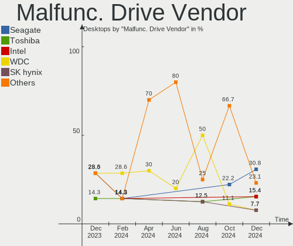
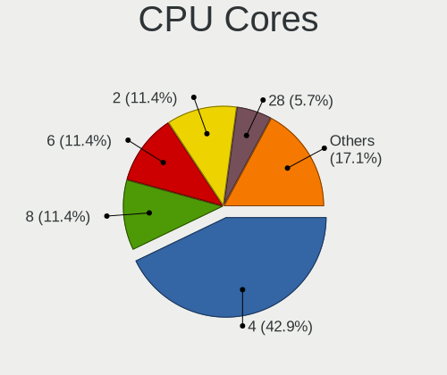

FreeBSD - Hardware Trends (Desktops)
------------------------------------

A project to identify most popular hardware characteristics and track their change
over time based on data collected by BSD users at https://BSD-Hardware.info.

Anyone can contribute to this report by the [hw-probe](https://github.com/linuxhw/hw-probe/blob/master/INSTALL.BSD.md) tool:

    hw-probe -all -upload

This report is for one last month. Overall report since the beginning of time: [TestDays](https://github.com/bsdhw/TestDays)

Period: May, 2023.

Contents
--------

* [ System ](#system)
  - [ OS                       ](#os)
  - [ OS Family                ](#os-family)
  - [ Arch                     ](#arch)
  - [ DE                       ](#de)
  - [ Display Server           ](#display-server)
  - [ Display Manager          ](#display-manager)
  - [ OS Lang                  ](#os-lang)
  - [ Boot Mode                ](#boot-mode)
  - [ Filesystem               ](#filesystem)
  - [ Part. scheme             ](#part-scheme)

* [ Board ](#board)
  - [ Vendor                   ](#vendor)
  - [ Model                    ](#model)
  - [ Model Family             ](#model-family)
  - [ MFG Year                 ](#mfg-year)
  - [ Form Factor              ](#form-factor)
  - [ Coreboot                 ](#coreboot)
  - [ RAM Size                 ](#ram-size)
  - [ RAM Used                 ](#ram-used)
  - [ Total Drives             ](#total-drives)
  - [ Has CD-ROM               ](#has-cd-rom)
  - [ Has Ethernet             ](#has-ethernet)
  - [ Has WiFi                 ](#has-wifi)
  - [ Has Bluetooth            ](#has-bluetooth)

* [ Location ](#location)
  - [ Country                  ](#country)
  - [ City                     ](#city)

* [ Drives ](#drives)
  - [ Drive Vendor             ](#drive-vendor)
  - [ Drive Model              ](#drive-model)
  - [ HDD Vendor               ](#hdd-vendor)
  - [ SSD Vendor               ](#ssd-vendor)
  - [ Drive Kind               ](#drive-kind)
  - [ Drive Connector          ](#drive-connector)
  - [ Drive Size               ](#drive-size)
  - [ Space Total              ](#space-total)
  - [ Space Used               ](#space-used)
  - [ Malfunc. Drives          ](#malfunc-drives)
  - [ Malfunc. Drive Vendor    ](#malfunc-drive-vendor)
  - [ Malfunc. HDD Vendor      ](#malfunc-hdd-vendor)
  - [ Malfunc. Drive Kind      ](#malfunc-drive-kind)
  - [ Failed Drives            ](#failed-drives)
  - [ Failed Drive Vendor      ](#failed-drive-vendor)
  - [ Drive Status             ](#drive-status)

* [ Storage controller ](#storage-controller)
  - [ Storage Vendor           ](#storage-vendor)
  - [ Storage Model            ](#storage-model)
  - [ Storage Kind             ](#storage-kind)

* [ Processor ](#processor)
  - [ CPU Vendor               ](#cpu-vendor)
  - [ CPU Model                ](#cpu-model)
  - [ CPU Model Family         ](#cpu-model-family)
  - [ CPU Cores                ](#cpu-cores)
  - [ CPU Sockets              ](#cpu-sockets)
  - [ CPU Threads              ](#cpu-threads)
  - [ CPU Microarch            ](#cpu-microarch)

* [ Graphics ](#graphics)
  - [ GPU Vendor               ](#gpu-vendor)
  - [ GPU Model                ](#gpu-model)
  - [ GPU Combo                ](#gpu-combo)
  - [ GPU Driver               ](#gpu-driver)
  - [ GPU Memory               ](#gpu-memory)

* [ Monitor ](#monitor)
  - [ Monitor Vendor           ](#monitor-vendor)
  - [ Monitor Model            ](#monitor-model)
  - [ Monitor Resolution       ](#monitor-resolution)
  - [ Monitor Diagonal         ](#monitor-diagonal)
  - [ Monitor Width            ](#monitor-width)
  - [ Aspect Ratio             ](#aspect-ratio)
  - [ Monitor Area             ](#monitor-area)
  - [ Pixel Density            ](#pixel-density)
  - [ Multiple Monitors        ](#multiple-monitors)

* [ Network ](#network)
  - [ Net Controller Vendor    ](#net-controller-vendor)
  - [ Net Controller Model     ](#net-controller-model)
  - [ Wireless Vendor          ](#wireless-vendor)
  - [ Wireless Model           ](#wireless-model)
  - [ Ethernet Vendor          ](#ethernet-vendor)
  - [ Ethernet Model           ](#ethernet-model)
  - [ Net Controller Kind      ](#net-controller-kind)
  - [ Used Controller          ](#used-controller)
  - [ NICs                     ](#nics)
  - [ IPv6                     ](#ipv6)

* [ Bluetooth ](#bluetooth)
  - [ Bluetooth Vendor         ](#bluetooth-vendor)
  - [ Bluetooth Model          ](#bluetooth-model)

* [ Sound ](#sound)
  - [ Sound Vendor             ](#sound-vendor)
  - [ Sound Model              ](#sound-model)

* [ Memory ](#memory)
  - [ Memory Vendor            ](#memory-vendor)
  - [ Memory Model             ](#memory-model)
  - [ Memory Kind              ](#memory-kind)
  - [ Memory Form Factor       ](#memory-form-factor)
  - [ Memory Size              ](#memory-size)
  - [ Memory Speed             ](#memory-speed)

* [ Printers & scanners ](#printers--scanners)
  - [ Printer Vendor           ](#printer-vendor)
  - [ Printer Model            ](#printer-model)
  - [ Scanner Vendor           ](#scanner-vendor)
  - [ Scanner Model            ](#scanner-model)

* [ Camera ](#camera)
  - [ Camera Vendor            ](#camera-vendor)
  - [ Camera Model             ](#camera-model)

* [ Security ](#security)
  - [ Fingerprint Vendor       ](#fingerprint-vendor)
  - [ Fingerprint Model        ](#fingerprint-model)
  - [ Chipcard Vendor          ](#chipcard-vendor)
  - [ Chipcard Model           ](#chipcard-model)

* [ Unsupported ](#unsupported)
  - [ Unsupported Devices      ](#unsupported-devices)
  - [ Unsupported Device Types ](#unsupported-device-types)

System
------

OS
--

Installed operating systems

| Name                 | Desktops | Percent |
|----------------------|----------|---------|
| FreeBSD 13.2         | 20       | 74.07%  |
| FreeBSD 14.0-CURRENT | 3        | 11.11%  |
| FreeBSD 13.1-p5      | 2        | 7.41%   |
| FreeBSD 13.2-STABLE  | 1        | 3.7%    |
| FreeBSD 13.1         | 1        | 3.7%    |

OS Family
---------

OS without a version

| Name    | Desktops | Percent |
|---------|----------|---------|
| FreeBSD | 27       | 100%    |

Arch
----

OS architecture (x86_64, i586, etc.)

| Name  | Desktops | Percent |
|-------|----------|---------|
| amd64 | 26       | 96.3%   |
| arm64 | 1        | 3.7%    |

DE
--

Desktop Environment

| Name      | Desktops | Percent |
|-----------|----------|---------|
| Console   | 12       | 44.44%  |
| XFCE      | 4        | 14.81%  |
| KDE5      | 4        | 14.81%  |
| i3        | 2        | 7.41%   |
| MATE      | 1        | 3.7%    |
| GNOME     | 1        | 3.7%    |
| Cinnamon  | 1        | 3.7%    |
| Blackbox  | 1        | 3.7%    |
| AwesomeWM | 1        | 3.7%    |

Display Server
--------------

X11 or Wayland

| Name    | Desktops | Percent |
|---------|----------|---------|
| X11     | 15       | 55.56%  |
| Console | 11       | 40.74%  |
| Wayland | 1        | 3.7%    |

Display Manager
---------------

SDDM, LightDM, etc.

| Name    | Desktops | Percent |
|---------|----------|---------|
| Console | 16       | 59.26%  |
| SDDM    | 4        | 14.81%  |
| SLiM    | 2        | 7.41%   |
| GDM     | 2        | 7.41%   |
| XDM     | 1        | 3.7%    |
| Ly      | 1        | 3.7%    |
| LightDM | 1        | 3.7%    |

OS Lang
-------

Language

| Lang    | Desktops | Percent |
|---------|----------|---------|
| C       | 15       | 55.56%  |
| en_US   | 4        | 14.81%  |
| fr_FR   | 2        | 7.41%   |
| en_IE   | 2        | 7.41%   |
| ru_RU   | 1        | 3.7%    |
| it_IT   | 1        | 3.7%    |
| de_DE   | 1        | 3.7%    |
| Unknown | 1        | 3.7%    |

Boot Mode
---------

EFI or BIOS

| Mode | Desktops | Percent |
|------|----------|---------|
| EFI  | 20       | 74.07%  |
| BIOS | 7        | 25.93%  |

Filesystem
----------

Type of filesystem

| Type | Desktops | Percent |
|------|----------|---------|
| Zfs  | 22       | 81.48%  |
| Ufs  | 5        | 18.52%  |

Part. scheme
------------

Scheme of partitioning

| Type | Desktops | Percent |
|------|----------|---------|
| GPT  | 26       | 96.3%   |
| MBR  | 1        | 3.7%    |

Board
-----

Vendor
------

Motherboard manufacturer

| Name                | Desktops | Percent |
|---------------------|----------|---------|
| ASUSTek Computer    | 7        | 25.93%  |
| ASRock              | 5        | 18.52%  |
| Hewlett-Packard     | 4        | 14.81%  |
| MSI                 | 3        | 11.11%  |
| ASRockRack          | 2        | 7.41%   |
| Unknown             | 2        | 7.41%   |
| Supermicro          | 1        | 3.7%    |
| Lenovo              | 1        | 3.7%    |
| Gigabyte Technology | 1        | 3.7%    |
| Fujitsu             | 1        | 3.7%    |

Model
-----

Motherboard model

| Name                               | Desktops | Percent |
|------------------------------------|----------|---------|
| ASRock Z590 Pro4                   | 2        | 7.41%   |
| ASRock X570 Phantom Gaming 4       | 2        | 7.41%   |
| Unknown                            | 2        | 7.41%   |
| Supermicro SYS-6028R-TRT           | 1        | 3.7%    |
| MSI MS-7B89                        | 1        | 3.7%    |
| MSI MS-7823                        | 1        | 3.7%    |
| MSI MS-7817                        | 1        | 3.7%    |
| Lenovo ThinkCentre M900 10FLS0FU00 | 1        | 3.7%    |
| HP Z820 Workstation                | 1        | 3.7%    |
| HP Z420 Workstation                | 1        | 3.7%    |
| HP Z240 Tower Workstation          | 1        | 3.7%    |
| HP ProDesk 600 G2 SFF              | 1        | 3.7%    |
| Gigabyte H170-D3HP                 | 1        | 3.7%    |
| Fujitsu ESPRIMO P400               | 1        | 3.7%    |
| ASUS ROG STRIX X670E-F GAMING WIFI | 1        | 3.7%    |
| ASUS ROG CROSSHAIR VIII HERO       | 1        | 3.7%    |
| ASUS PRO B460M-C                   | 1        | 3.7%    |
| ASUS PRIME X370-PRO                | 1        | 3.7%    |
| ASUS PRIME A520M-A II              | 1        | 3.7%    |
| ASUS P5Q-E                         | 1        | 3.7%    |
| ASUS P5K SE/EPU                    | 1        | 3.7%    |
| ASRockRack EPYC3101D4I-2T          | 1        | 3.7%    |
| ASRockRack 1U4L4E-GENOA/2T         | 1        | 3.7%    |
| ASRock Z790M-ITX WiFi              | 1        | 3.7%    |

Model Family
------------

Motherboard model prefix

| Name                      | Desktops | Percent |
|---------------------------|----------|---------|
| ASUS ROG                  | 2        | 7.41%   |
| ASUS PRIME                | 2        | 7.41%   |
| ASRock Z590               | 2        | 7.41%   |
| ASRock X570               | 2        | 7.41%   |
| Unknown                   | 2        | 7.41%   |
| Supermicro SYS-6028R-TRT  | 1        | 3.7%    |
| MSI MS-7B89               | 1        | 3.7%    |
| MSI MS-7823               | 1        | 3.7%    |
| MSI MS-7817               | 1        | 3.7%    |
| Lenovo ThinkCentre        | 1        | 3.7%    |
| HP Z820                   | 1        | 3.7%    |
| HP Z420                   | 1        | 3.7%    |
| HP Z240                   | 1        | 3.7%    |
| HP ProDesk                | 1        | 3.7%    |
| Gigabyte H170-D3HP        | 1        | 3.7%    |
| Fujitsu ESPRIMO           | 1        | 3.7%    |
| ASUS PRO                  | 1        | 3.7%    |
| ASUS P5Q-E                | 1        | 3.7%    |
| ASUS P5K                  | 1        | 3.7%    |
| ASRockRack EPYC3101D4I-2T | 1        | 3.7%    |
| ASRockRack 1U4L4E-GENOA   | 1        | 3.7%    |
| ASRock Z790M-ITX          | 1        | 3.7%    |

MFG Year
--------

Motherboard manufacture year

| Year    | Desktops | Percent |
|---------|----------|---------|
| 2021    | 6        | 22.22%  |
| 2019    | 4        | 14.81%  |
| 2023    | 3        | 11.11%  |
| 2022    | 2        | 7.41%   |
| 2017    | 2        | 7.41%   |
| 2013    | 2        | 7.41%   |
| 2008    | 2        | 7.41%   |
| 2018    | 1        | 3.7%    |
| 2016    | 1        | 3.7%    |
| 2015    | 1        | 3.7%    |
| 2014    | 1        | 3.7%    |
| 2012    | 1        | 3.7%    |
| Unknown | 1        | 3.7%    |

Form Factor
-----------

Physical design of the computer

| Name    | Desktops | Percent |
|---------|----------|---------|
| Desktop | 27       | 100%    |

Coreboot
--------

Have coreboot on board

| Used | Desktops | Percent |
|------|----------|---------|
| No   | 27       | 100%    |

RAM Size
--------

Total RAM memory

| Size in GB      | Desktops | Percent |
|-----------------|----------|---------|
| 32.01-64.0      | 8        | 29.63%  |
| 64.01-256.0     | 8        | 29.63%  |
| 16.01-24.0      | 4        | 14.81%  |
| 4.01-8.0        | 3        | 11.11%  |
| More than 256.0 | 2        | 7.41%   |
| 3.01-4.0        | 1        | 3.7%    |
| 8.01-16.0       | 1        | 3.7%    |

RAM Used
--------

Used RAM memory

| Used GB  | Desktops | Percent |
|----------|----------|---------|
| 1.01-2.0 | 13       | 48.15%  |
| 0.51-1.0 | 4        | 14.81%  |
| 0.01-0.5 | 4        | 14.81%  |
| 2.01-3.0 | 3        | 11.11%  |
| 4.01-8.0 | 2        | 7.41%   |
| 3.01-4.0 | 1        | 3.7%    |

Total Drives
------------

Number of drives on board

| Drives | Desktops | Percent |
|--------|----------|---------|
| 2      | 7        | 25.93%  |
| 3      | 6        | 22.22%  |
| 1      | 5        | 18.52%  |
| 5      | 3        | 11.11%  |
| 4      | 3        | 11.11%  |
| 13     | 1        | 3.7%    |
| 8      | 1        | 3.7%    |
| 0      | 1        | 3.7%    |

Has CD-ROM
----------

Has CD-ROM on board

| Presented | Desktops | Percent |
|-----------|----------|---------|
| No        | 20       | 74.07%  |
| Yes       | 7        | 25.93%  |

Has Ethernet
------------

Has Ethernet on board

| Presented | Desktops | Percent |
|-----------|----------|---------|
| Yes       | 26       | 96.3%   |
| No        | 1        | 3.7%    |

Has WiFi
--------

Has WiFi module

| Presented | Desktops | Percent |
|-----------|----------|---------|
| No        | 19       | 70.37%  |
| Yes       | 8        | 29.63%  |

Has Bluetooth
-------------

Has Bluetooth module

| Presented | Desktops | Percent |
|-----------|----------|---------|
| No        | 25       | 92.59%  |
| Yes       | 2        | 7.41%   |

Location
--------

Country
-------

Geographic location (country)

| Country   | Desktops | Percent |
|-----------|----------|---------|
| USA       | 7        | 25.93%  |
| Germany   | 5        | 18.52%  |
| Russia    | 2        | 7.41%   |
| Ireland   | 2        | 7.41%   |
| Indonesia | 2        | 7.41%   |
| France    | 2        | 7.41%   |
| Thailand  | 1        | 3.7%    |
| Taiwan    | 1        | 3.7%    |
| Slovakia  | 1        | 3.7%    |
| Italy     | 1        | 3.7%    |
| Czechia   | 1        | 3.7%    |
| Croatia   | 1        | 3.7%    |
| Canada    | 1        | 3.7%    |

City
----

Geographic location (city)

| City               | Desktops | Percent |
|--------------------|----------|---------|
| Salem              | 2        | 7.41%   |
| Redmond            | 2        | 7.41%   |
| Medan              | 2        | 7.41%   |
| Dublin             | 2        | 7.41%   |
| Berlin             | 2        | 7.41%   |
| Wenatchee          | 1        | 3.7%    |
| Taipei             | 1        | 3.7%    |
| St. Albert         | 1        | 3.7%    |
| Sesto San Giovanni | 1        | 3.7%    |
| Ludwigsburg        | 1        | 3.7%    |
| Lorient            | 1        | 3.7%    |
| Lepoglava          | 1        | 3.7%    |
| Krasnodar          | 1        | 3.7%    |
| Ivanovo            | 1        | 3.7%    |
| Falkenstein        | 1        | 3.7%    |
| Denver             | 1        | 3.7%    |
| Brno               | 1        | 3.7%    |
| Bratislava         | 1        | 3.7%    |
| Bordeaux           | 1        | 3.7%    |
| Bangkok            | 1        | 3.7%    |
| Baden-Baden        | 1        | 3.7%    |
| Abingdon           | 1        | 3.7%    |

Drives
------

Drive Vendor
------------

Hard drive vendors

| Vendor              | Desktops | Drives | Percent |
|---------------------|----------|--------|---------|
| Samsung Electronics | 12       | 18     | 23.53%  |
| WDC                 | 8        | 22     | 15.69%  |
| Seagate             | 8        | 10     | 15.69%  |
| Intel               | 4        | 6      | 7.84%   |
| Kingston            | 3        | 3      | 5.88%   |
| Toshiba             | 2        | 3      | 3.92%   |
| MidasForce          | 2        | 2      | 3.92%   |
| Hitachi             | 2        | 9      | 3.92%   |
| SK hynix            | 1        | 1      | 1.96%   |
| SanDisk             | 1        | 1      | 1.96%   |
| PNY                 | 1        | 1      | 1.96%   |
| Phison              | 1        | 1      | 1.96%   |
| Patriot             | 1        | 1      | 1.96%   |
| Maxtor              | 1        | 1      | 1.96%   |
| KIOXIA-EXCERIA      | 1        | 2      | 1.96%   |
| HGST                | 1        | 1      | 1.96%   |
| Corsair             | 1        | 1      | 1.96%   |
| addlink             | 1        | 1      | 1.96%   |

Drive Model
-----------

Hard drive models

| Model                                  | Desktops | Percent |
|----------------------------------------|----------|---------|
| Samsung SSD 970 EVO Plus 1TB           | 3        | 4.92%   |
| Seagate ST4000DM000-1F2168 4TB         | 2        | 3.28%   |
| Samsung SSD 850 EVO 1TB                | 2        | 3.28%   |
| MidasForce SSD 512GB                   | 2        | 3.28%   |
| WDC WDS100T3X0C-00SJG0 1TB             | 1        | 1.64%   |
| WDC WDBA3V5000ANC-WRSN 500GB           | 1        | 1.64%   |
| WDC WD80EMAZ-00WJTA0 8TB               | 1        | 1.64%   |
| WDC WD80EFZX-68UW8N0 8TB               | 1        | 1.64%   |
| WDC WD80EFAX-68LHPN0 8TB               | 1        | 1.64%   |
| WDC WD80EDBZ-11B0ZA0 8TB               | 1        | 1.64%   |
| WDC WD40EZRZ-22GXCB0 4TB               | 1        | 1.64%   |
| WDC WD40EFZX-68AWUN0 4TB               | 1        | 1.64%   |
| WDC WD40EFRX-68N32N0 4TB               | 1        | 1.64%   |
| WDC WD20EFRX-68EUZN0 2TB               | 1        | 1.64%   |
| WDC WD2000FYYZ-01UL1B2 2TB             | 1        | 1.64%   |
| WDC WD15EADS-00P8B0 1.5TB              | 1        | 1.64%   |
| WDC WD120EMFZ-11A6JA0 12TB             | 1        | 1.64%   |
| WDC WD120EMAZ-11BLFA0 12TB             | 1        | 1.64%   |
| WDC WD10EFRX-68FYTN0 1TB               | 1        | 1.64%   |
| Toshiba HDWD105 500GB                  | 1        | 1.64%   |
| Toshiba DT01ACA050 500GB               | 1        | 1.64%   |
| SK hynix SKHynix_HFS512GDE9X084N 512GB | 1        | 1.64%   |
| Seagate ST500DM002-1BD142 500GB        | 1        | 1.64%   |
| Seagate ST5000LM000-2U8170 5TB         | 1        | 1.64%   |
| Seagate ST4000VX007-2DT166 4TB         | 1        | 1.64%   |
| Seagate ST4000LM024-2AN17V 4TB         | 1        | 1.64%   |
| Seagate ST2000VN000-1HJ164 2TB         | 1        | 1.64%   |
| Seagate ST1000DM003-1SB10C 1TB         | 1        | 1.64%   |
| SanDisk SSD PLUS 1000GB                | 1        | 1.64%   |
| Samsung SSD 980 PRO with Heatsink 2TB  | 1        | 1.64%   |
| Samsung SSD 960 EVO 500GB              | 1        | 1.64%   |
| Samsung SSD 870 QVO 2TB                | 1        | 1.64%   |
| Samsung SSD 870 EVO 1TB                | 1        | 1.64%   |
| Samsung SSD 860 QVO 1TB                | 1        | 1.64%   |
| Samsung SSD 860 EVO 500GB              | 1        | 1.64%   |
| Samsung SSD 850 EVO 500GB              | 1        | 1.64%   |
| Samsung SSD 840 EVO 500GB              | 1        | 1.64%   |
| Samsung HD154UI 1.5TB                  | 1        | 1.64%   |
| Samsung 980 PRO with Heatsink 2TB      | 1        | 1.64%   |
| PNY 120GB SATA SSD                     | 1        | 1.64%   |

HDD Vendor
----------

Hard disk drive vendors

| Vendor              | Desktops | Drives | Percent |
|---------------------|----------|--------|---------|
| Seagate             | 8        | 10     | 38.1%   |
| WDC                 | 6        | 20     | 28.57%  |
| Toshiba             | 2        | 3      | 9.52%   |
| Hitachi             | 2        | 9      | 9.52%   |
| Samsung Electronics | 1        | 2      | 4.76%   |
| Maxtor              | 1        | 1      | 4.76%   |
| HGST                | 1        | 1      | 4.76%   |

SSD Vendor
----------

Solid state drive vendors

| Vendor              | Desktops | Drives | Percent |
|---------------------|----------|--------|---------|
| Samsung Electronics | 7        | 10     | 41.18%  |
| Kingston            | 3        | 3      | 17.65%  |
| MidasForce          | 2        | 2      | 11.76%  |
| Intel               | 2        | 3      | 11.76%  |
| SanDisk             | 1        | 1      | 5.88%   |
| PNY                 | 1        | 1      | 5.88%   |
| Patriot             | 1        | 1      | 5.88%   |

Drive Kind
----------

HDD or SSD

| Kind | Desktops | Drives | Percent |
|------|----------|--------|---------|
| HDD  | 16       | 46     | 35.56%  |
| SSD  | 15       | 21     | 33.33%  |
| NVMe | 14       | 17     | 31.11%  |

Drive Connector
---------------

SATA, SAS, NVMe, etc.

| Type | Desktops | Drives | Percent |
|------|----------|--------|---------|
| SATA | 23       | 67     | 62.16%  |
| NVMe | 14       | 17     | 37.84%  |

Drive Size
----------

Size of hard drive

| Size in TB | Desktops | Drives | Percent |
|------------|----------|--------|---------|
| 0.01-0.5   | 12       | 25     | 35.29%  |
| 0.51-1.0   | 8        | 9      | 23.53%  |
| 1.01-2.0   | 6        | 12     | 17.65%  |
| 3.01-4.0   | 5        | 10     | 14.71%  |
| 4.01-10.0  | 2        | 9      | 5.88%   |
| 10.01-20.0 | 1        | 2      | 2.94%   |

Space Total
-----------

Amount of disk space available on the file system

| Size in GB     | Desktops | Percent |
|----------------|----------|---------|
| 251-500        | 8        | 29.63%  |
| 501-1000       | 8        | 29.63%  |
| 2001-3000      | 2        | 7.41%   |
| 101-250        | 2        | 7.41%   |
| 1001-2000      | 2        | 7.41%   |
| 51-100         | 2        | 7.41%   |
| More than 3000 | 1        | 3.7%    |
| 21-50          | 1        | 3.7%    |
| 1-20           | 1        | 3.7%    |

Space Used
----------

Amount of used disk space

| Used GB  | Desktops | Percent |
|----------|----------|---------|
| 1-20     | 19       | 70.37%  |
| 21-50    | 4        | 14.81%  |
| 251-500  | 2        | 7.41%   |
| 501-1000 | 1        | 3.7%    |
| 0        | 1        | 3.7%    |

Malfunc. Drives
---------------

Drive models with a malfunction

| Model                             | Desktops | Drives | Percent |
|-----------------------------------|----------|--------|---------|
| WDC WD2000FYYZ-01UL1B2 2TB        | 1        | 1      | 25%     |
| Samsung Electronics HD154UI 1.5TB | 1        | 2      | 25%     |
| Maxtor 7B300S0 304GB              | 1        | 1      | 25%     |
| Kingston SHPM2280P2H-240G         | 1        | 1      | 25%     |

Malfunc. Drive Vendor
---------------------

Vendors of faulty drives

| Vendor              | Desktops | Drives | Percent |
|---------------------|----------|--------|---------|
| WDC                 | 1        | 1      | 25%     |
| Samsung Electronics | 1        | 2      | 25%     |
| Maxtor              | 1        | 1      | 25%     |
| Kingston            | 1        | 1      | 25%     |

Malfunc. HDD Vendor
-------------------

Vendors of faulty HDD drives

| Vendor              | Desktops | Drives | Percent |
|---------------------|----------|--------|---------|
| WDC                 | 1        | 1      | 33.33%  |
| Samsung Electronics | 1        | 2      | 33.33%  |
| Maxtor              | 1        | 1      | 33.33%  |

Malfunc. Drive Kind
-------------------

Kinds of faulty drives

| Kind | Desktops | Drives | Percent |
|------|----------|--------|---------|
| HDD  | 3        | 4      | 75%     |
| SSD  | 1        | 1      | 25%     |

Failed Drives
-------------

Failed drive models

Zero info for selected period =(

Failed Drive Vendor
-------------------

Failed drive vendors

Zero info for selected period =(

Drive Status
------------

Number of failed and malfunc. drives

| Status  | Desktops | Drives | Percent |
|---------|----------|--------|---------|
| Works   | 26       | 79     | 89.66%  |
| Malfunc | 3        | 5      | 10.34%  |

Storage controller
------------------

Storage Vendor
--------------

Storage controller vendors

| Vendor                      | Desktops | Percent |
|-----------------------------|----------|---------|
| Intel                       | 17       | 36.17%  |
| AMD                         | 10       | 21.28%  |
| Samsung Electronics         | 5        | 10.64%  |
| SanDisk                     | 4        | 8.51%   |
| Phison Electronics          | 3        | 6.38%   |
| Broadcom / LSI              | 3        | 6.38%   |
| Marvell Technology Group    | 2        | 4.26%   |
| SK hynix                    | 1        | 2.13%   |
| KIOXIA                      | 1        | 2.13%   |
| Kingston Technology Company | 1        | 2.13%   |

Storage Model
-------------

Storage controller models

| Model                                                                          | Desktops | Percent |
|--------------------------------------------------------------------------------|----------|---------|
| AMD FCH SATA Controller [AHCI mode]                                            | 7        | 12.28%  |
| Intel Q170/Q150/B150/H170/H110/Z170/CM236 Chipset SATA Controller [AHCI Mode]  | 4        | 7.02%   |
| Samsung NVMe SSD Controller SM981/PM981/PM983                                  | 3        | 5.26%   |
| Sandisk WD Black SN770 NVMe SSD                                                | 2        | 3.51%   |
| Marvell Group 88SE6111/6121 SATA II / PATA Controller                          | 2        | 3.51%   |
| Intel C602 chipset 4-Port SATA Storage Control Unit                            | 2        | 3.51%   |
| Intel C600/X79 series chipset IDE-r Controller                                 | 2        | 3.51%   |
| Intel 8 Series/C220 Series Chipset Family 6-port SATA Controller 1 [AHCI mode] | 2        | 3.51%   |
| Intel 500 Series Chipset Family SATA AHCI Controller                           | 2        | 3.51%   |
| Broadcom / LSI SAS2308 PCI-Express Fusion-MPT SAS-2                            | 2        | 3.51%   |
| SK hynix Gold P31/PC711 NVMe Solid State Drive                                 | 1        | 1.75%   |
| SanDisk WD Blue SN550 NVMe SSD                                                 | 1        | 1.75%   |
| SanDisk WD Black SN750 / PC SN730 NVMe SSD                                     | 1        | 1.75%   |
| Samsung NVMe SSD Controller SM961/PM961/SM963                                  | 1        | 1.75%   |
| Samsung NVMe SSD Controller PM9A1/PM9A3/980PRO                                 | 1        | 1.75%   |
| Phison E16 PCIe4 NVMe Controller                                               | 1        | 1.75%   |
| Phison E12 NVMe Controller                                                     | 1        | 1.75%   |
| KIOXIA NVMe SSD                                                                | 1        | 1.75%   |
| Kingston Company HyperX Predator PCIe AHCI SSD                                 | 1        | 1.75%   |
| Intel SSD Pro 7600p/760p/E 6100p Series                                        | 1        | 1.75%   |
| Intel NVMe DC SSD [3DNAND, Sentinel Rock Controller]                           | 1        | 1.75%   |
| Intel NVMe Datacenter SSD [3DNAND, Beta Rock Controller]                       | 1        | 1.75%   |
| Intel C610/X99 series chipset 6-Port SATA Controller [AHCI mode]               | 1        | 1.75%   |
| Intel C600/X79 series chipset SATA RAID Controller                             | 1        | 1.75%   |
| Intel C600/X79 series chipset 6-Port SATA AHCI Controller                      | 1        | 1.75%   |
| Intel 82801JI (ICH10 Family) 4 port SATA IDE Controller #1                     | 1        | 1.75%   |
| Intel 82801JI (ICH10 Family) 2 port SATA IDE Controller #2                     | 1        | 1.75%   |
| Intel 82801IB (ICH9) 2 port SATA Controller [IDE mode]                         | 1        | 1.75%   |
| Intel 82801I (ICH9 Family) 2 port SATA Controller [IDE mode]                   | 1        | 1.75%   |
| Intel 700 Series Chipset Family SATA AHCI Controller                           | 1        | 1.75%   |
| Intel 6 Series/C200 Series Chipset Family 6 port Desktop SATA AHCI Controller  | 1        | 1.75%   |
| Intel 400 Series Chipset Family SATA AHCI Controller                           | 1        | 1.75%   |
| Broadcom / LSI SAS2008 PCI-Express Fusion-MPT SAS-2 [Falcon]                   | 1        | 1.75%   |
| AMD X370 Series Chipset SATA Controller                                        | 1        | 1.75%   |
| AMD FCH SATA Controller [RAID Bottom]                                          | 1        | 1.75%   |
| AMD FCH RAID Controller                                                        | 1        | 1.75%   |
| AMD 500 Series Chipset SATA Controller                                         | 1        | 1.75%   |
| AMD 400 Series Chipset SATA Controller                                         | 1        | 1.75%   |
| Unknown                                                                        | 1        | 1.75%   |

Storage Kind
------------

Kind of storage controller (IDE, SATA, NVMe, SAS, ...)

| Kind | Desktops | Percent |
|------|----------|---------|
| SATA | 22       | 46.81%  |
| NVMe | 16       | 34.04%  |
| IDE  | 4        | 8.51%   |
| SAS  | 3        | 6.38%   |
| RAID | 2        | 4.26%   |

Processor
---------

CPU Vendor
----------

Processor vendors

| Vendor | Desktops | Percent |
|--------|----------|---------|
| Intel  | 16       | 59.26%  |
| AMD    | 10       | 37.04%  |
| ARM    | 1        | 3.7%    |

CPU Model
---------

Processor models

| Model                                       | Desktops | Percent |
|---------------------------------------------|----------|---------|
| Intel Core i7-10700K CPU @ 3.80GHz          | 2        | 7.41%   |
| Intel Core 2 Quad CPU Q6600 @ 2.40GHz       | 2        | 7.41%   |
| AMD Ryzen 9 3900X 12-Core Processor         | 2        | 7.41%   |
| Intel Xeon CPU E5-2697 v2 @ 2.70GHz         | 1        | 3.7%    |
| Intel Xeon CPU E5-2630 v4 @ 2.20GHz         | 1        | 3.7%    |
| Intel Xeon CPU E5-1650 v2 @ 3.50GHz         | 1        | 3.7%    |
| Intel Xeon CPU E3-1246 v3 @ 3.50GHz         | 1        | 3.7%    |
| Intel Pentium CPU G3220 @ 3.00GHz           | 1        | 3.7%    |
| Intel Core i7-7700K CPU @ 4.20GHz           | 1        | 3.7%    |
| Intel Core i7-6700T CPU @ 2.80GHz           | 1        | 3.7%    |
| Intel Core i7-6700 CPU @ 3.40GHz            | 1        | 3.7%    |
| Intel Core i5-3470 CPU @ 3.20GHz            | 1        | 3.7%    |
| Intel Core i3-6100 CPU @ 3.70GHz            | 1        | 3.7%    |
| Intel Core i3-10100 CPU @ 3.60GHz           | 1        | 3.7%    |
| Intel 13th Gen Core i5-13400                | 1        | 3.7%    |
| ARM Cortex-A55 r2p0                         | 1        | 3.7%    |
| AMD Ryzen 9 7950X 16-Core Processor         | 1        | 3.7%    |
| AMD Ryzen 9 5900HX with Radeon Graphics     | 1        | 3.7%    |
| AMD Ryzen 7 5700G with Radeon Graphics      | 1        | 3.7%    |
| AMD Ryzen 7 1700 Eight-Core Processor       | 1        | 3.7%    |
| AMD Ryzen 5 5600G with Radeon Graphics      | 1        | 3.7%    |
| AMD Ryzen 5 3400G with Radeon Vega Graphics | 1        | 3.7%    |
| AMD EPYC 9354 32-Core Processor             | 1        | 3.7%    |
| AMD EPYC 3101 4-Core Processor              | 1        | 3.7%    |

CPU Model Family
----------------

Processor model prefix

| Model             | Desktops | Percent |
|-------------------|----------|---------|
| Intel Core i7     | 5        | 18.52%  |
| Intel Xeon        | 4        | 14.81%  |
| AMD Ryzen 9       | 4        | 14.81%  |
| Intel Core i3     | 2        | 7.41%   |
| Intel Core 2 Quad | 2        | 7.41%   |
| AMD Ryzen 7       | 2        | 7.41%   |
| AMD Ryzen 5       | 2        | 7.41%   |
| AMD EPYC          | 2        | 7.41%   |
| Other             | 1        | 3.7%    |
| Intel Pentium     | 1        | 3.7%    |
| Intel Core i5     | 1        | 3.7%    |
| ARM Cortex        | 1        | 3.7%    |

CPU Cores
---------

Number of processor cores

| Number  | Desktops | Percent |
|---------|----------|---------|
| 4       | 8        | 29.63%  |
| 8       | 4        | 14.81%  |
| 16      | 3        | 11.11%  |
| 24      | 2        | 7.41%   |
| 12      | 2        | 7.41%   |
| 2       | 2        | 7.41%   |
| Unknown | 2        | 7.41%   |
| 64      | 1        | 3.7%    |
| 32      | 1        | 3.7%    |
| 20      | 1        | 3.7%    |
| 6       | 1        | 3.7%    |

CPU Sockets
-----------

Number of sockets

| Number  | Desktops | Percent |
|---------|----------|---------|
| 1       | 25       | 92.59%  |
| 2       | 1        | 3.7%    |
| Unknown | 1        | 3.7%    |

CPU Threads
-----------

Threads per core (Hyper-Threading)

| Number  | Desktops | Percent |
|---------|----------|---------|
| 1       | 13       | 48.15%  |
| 2       | 12       | 44.44%  |
| Unknown | 2        | 7.41%   |

CPU Microarch
-------------

Microarchitecture

| Name      | Desktops | Percent |
|-----------|----------|---------|
| Unknown   | 4        | 14.81%  |
| Zen 3     | 3        | 11.11%  |
| Skylake   | 3        | 11.11%  |
| IvyBridge | 3        | 11.11%  |
| CometLake | 3        | 11.11%  |
| Zen 2     | 2        | 7.41%   |
| Zen       | 2        | 7.41%   |
| Haswell   | 2        | 7.41%   |
| Core      | 2        | 7.41%   |
| Zen+      | 1        | 3.7%    |
| KabyLake  | 1        | 3.7%    |
| Broadwell | 1        | 3.7%    |

Graphics
--------

GPU Vendor
----------

Vendors of graphics cards

| Vendor            | Desktops | Percent |
|-------------------|----------|---------|
| Nvidia            | 10       | 34.48%  |
| Intel             | 10       | 34.48%  |
| AMD               | 6        | 20.69%  |
| ASPEED Technology | 3        | 10.34%  |

GPU Model
---------

Graphics card models

| Model                                                                       | Desktops | Percent |
|-----------------------------------------------------------------------------|----------|---------|
| Intel CometLake-S GT2 [UHD Graphics 630]                                    | 3        | 10%     |
| ASPEED Technology ASPEED Graphics Family                                    | 3        | 10%     |
| Nvidia GP108 [GeForce GT 1030]                                              | 2        | 6.67%   |
| Nvidia GA104 [GeForce RTX 3060 Ti Lite Hash Rate]                           | 2        | 6.67%   |
| Intel HD Graphics 530                                                       | 2        | 6.67%   |
| AMD Cezanne [Radeon Vega Series / Radeon Vega Mobile Series]                | 2        | 6.67%   |
| Nvidia GT218 [NVS 300]                                                      | 1        | 3.33%   |
| Nvidia GT215 [GeForce GT 240]                                               | 1        | 3.33%   |
| Nvidia GP106 [GeForce GTX 1060 3GB]                                         | 1        | 3.33%   |
| Nvidia GP104 [GeForce GTX 1070]                                             | 1        | 3.33%   |
| Nvidia GK107GL [Quadro K600]                                                | 1        | 3.33%   |
| Nvidia GF119 [NVS 310]                                                      | 1        | 3.33%   |
| Intel Xeon E3-1200 v3/4th Gen Core Processor Integrated Graphics Controller | 1        | 3.33%   |
| Intel Xeon E3-1200 v3 Processor Integrated Graphics Controller              | 1        | 3.33%   |
| Intel Xeon E3-1200 v2/3rd Gen Core processor Graphics Controller            | 1        | 3.33%   |
| Intel HD Graphics 630                                                       | 1        | 3.33%   |
| Intel Alder Lake-S GT1 [UHD Graphics 730]                                   | 1        | 3.33%   |
| AMD Raphael                                                                 | 1        | 3.33%   |
| AMD Picasso/Raven 2 [Radeon Vega Series / Radeon Vega Mobile Series]        | 1        | 3.33%   |
| AMD Navi 31 [Radeon RX 7900 XT/7900 XTX]                                    | 1        | 3.33%   |
| AMD Navi 23 [Radeon RX 6650 XT / 6700S / 6800S]                             | 1        | 3.33%   |
| AMD Cedar [Radeon HD 5000/6000/7350/8350 Series]                            | 1        | 3.33%   |

GPU Combo
---------

Combinations of graphics cards

| Name           | Desktops | Percent |
|----------------|----------|---------|
| 1 x Intel      | 8        | 29.63%  |
| 1 x Nvidia     | 7        | 25.93%  |
| 1 x AMD        | 5        | 18.52%  |
| 1 x ASPEED     | 3        | 11.11%  |
| Intel + Nvidia | 2        | 7.41%   |
| Other          | 1        | 3.7%    |
| 2 x AMD        | 1        | 3.7%    |

GPU Driver
----------

Free vs proprietary

| Driver      | Desktops | Percent |
|-------------|----------|---------|
| Free        | 19       | 70.37%  |
| Proprietary | 6        | 22.22%  |
| Unknown     | 2        | 7.41%   |

GPU Memory
----------

Total video memory

| Size in GB | Desktops | Percent |
|------------|----------|---------|
| Unknown    | 18       | 66.67%  |
| 0.01-0.5   | 4        | 14.81%  |
| 7.01-8.0   | 2        | 7.41%   |
| 0.51-1.0   | 2        | 7.41%   |
| 1.01-2.0   | 1        | 3.7%    |

Monitor
-------

Monitor Vendor
--------------

Monitor vendors

| Vendor           | Desktops | Percent |
|------------------|----------|---------|
| Hewlett-Packard  | 3        | 20%     |
| Goldstar         | 3        | 20%     |
| MSI              | 2        | 13.33%  |
| ViewSonic        | 1        | 6.67%   |
| Microstep        | 1        | 6.67%   |
| Insignia         | 1        | 6.67%   |
| IBM              | 1        | 6.67%   |
| Dell             | 1        | 6.67%   |
| ASUSTek Computer | 1        | 6.67%   |
| Acer             | 1        | 6.67%   |

Monitor Model
-------------

Monitor models

| Model                                                          | Desktops | Percent |
|----------------------------------------------------------------|----------|---------|
| MSI G241 MSI3BA4 1920x1080 530x300mm 24.0-inch                 | 2        | 12.5%   |
| ViewSonic VA2403-FHD VSCF136 1920x1080 520x290mm 23.4-inch     | 1        | 6.25%   |
| Microstep LCD Monitor MSI G241 1920x1080                       | 1        | 6.25%   |
| Insignia TV BBY0030 3840x2160 940x530mm 42.5-inch              | 1        | 6.25%   |
| IBM L150 IBM19EC 1024x768 300x230mm 14.9-inch                  | 1        | 6.25%   |
| Hewlett-Packard Z24i HWP309F 1920x1200 520x320mm 24.0-inch     | 1        | 6.25%   |
| Hewlett-Packard LP2475w HWP26F9 1920x1200 540x350mm 25.3-inch  | 1        | 6.25%   |
| Hewlett-Packard LP2475w HWP26F8 1920x1200 540x350mm 25.3-inch  | 1        | 6.25%   |
| Hewlett-Packard E272q HWP326B 2560x1440 600x340mm 27.2-inch    | 1        | 6.25%   |
| Goldstar LG HDR 4K GSM7707 3840x2160 600x340mm 27.2-inch       | 1        | 6.25%   |
| Goldstar LG HDR 4K GSM7706 3840x2160 600x340mm 27.2-inch       | 1        | 6.25%   |
| Goldstar LG FULL HD GSM5B55 1920x1080 480x270mm 21.7-inch      | 1        | 6.25%   |
| Dell S2721DS DELA19C 2560x1440 590x330mm 26.6-inch             | 1        | 6.25%   |
| ASUSTek Computer PA248QV AUS2400 1920x1200 520x320mm 24.0-inch | 1        | 6.25%   |
| Acer KA242Y ACR0743 1920x1080 530x300mm 24.0-inch              | 1        | 6.25%   |

Monitor Resolution
------------------

Monitor screen resolution

| Resolution        | Desktops | Percent |
|-------------------|----------|---------|
| 1920x1080 (FHD)   | 5        | 35.71%  |
| 3840x2160 (4K)    | 3        | 21.43%  |
| 1920x1200 (WUXGA) | 3        | 21.43%  |
| 2560x1440 (QHD)   | 2        | 14.29%  |
| 1024x768 (XGA)    | 1        | 7.14%   |

Monitor Diagonal
----------------

Diagonal size in inches

| Inches  | Desktops | Percent |
|---------|----------|---------|
| 24      | 5        | 33.33%  |
| 27      | 3        | 20%     |
| 42      | 1        | 6.67%   |
| 26      | 1        | 6.67%   |
| 25      | 1        | 6.67%   |
| 23      | 1        | 6.67%   |
| 21      | 1        | 6.67%   |
| 14      | 1        | 6.67%   |
| Unknown | 1        | 6.67%   |

Monitor Width
-------------

Physical width

| Width in mm | Desktops | Percent |
|-------------|----------|---------|
| 501-600     | 10       | 71.43%  |
| 401-500     | 1        | 7.14%   |
| 201-300     | 1        | 7.14%   |
| 901-1000    | 1        | 7.14%   |
| Unknown     | 1        | 7.14%   |

Aspect Ratio
------------

Proportional relationship between the width and the height

| Ratio   | Desktops | Percent |
|---------|----------|---------|
| 16/9    | 9        | 64.29%  |
| 16/10   | 2        | 14.29%  |
| 4/3     | 1        | 7.14%   |
| 3/2     | 1        | 7.14%   |
| Unknown | 1        | 7.14%   |

Monitor Area
------------

Area in inch²

| Area in inch² | Desktops | Percent |
|----------------|----------|---------|
| 201-250        | 5        | 33.33%  |
| 301-350        | 4        | 26.67%  |
| 251-300        | 3        | 20%     |
| 101-110        | 1        | 6.67%   |
| 501-1000       | 1        | 6.67%   |
| Unknown        | 1        | 6.67%   |

Pixel Density
-------------

Pixels per inch

| Density | Desktops | Percent |
|---------|----------|---------|
| 51-100  | 8        | 57.14%  |
| 101-120 | 3        | 21.43%  |
| 161-240 | 2        | 14.29%  |
| Unknown | 1        | 7.14%   |

Multiple Monitors
-----------------

Total monitors connected

| Total | Desktops | Percent |
|-------|----------|---------|
| 0     | 14       | 51.85%  |
| 1     | 11       | 40.74%  |
| 2     | 2        | 7.41%   |

Network
-------

Net Controller Vendor
---------------------

Controller vendors

| Vendor                   | Desktops | Percent |
|--------------------------|----------|---------|
| Intel                    | 18       | 45%     |
| Realtek Semiconductor    | 8        | 20%     |
| Qualcomm Atheros         | 3        | 7.5%    |
| Samsung Electronics      | 2        | 5%      |
| MediaTek                 | 2        | 5%      |
| American Megatrends      | 2        | 5%      |
| TP-Link                  | 1        | 2.5%    |
| Sigma Designs            | 1        | 2.5%    |
| Mellanox Technologies    | 1        | 2.5%    |
| Marvell Technology Group | 1        | 2.5%    |
| D-Link                   | 1        | 2.5%    |

Net Controller Model
--------------------

Controller models

| Model                                                                                 | Desktops | Percent |
|---------------------------------------------------------------------------------------|----------|---------|
| Realtek RTL8111/8168/8411 PCI Express Gigabit Ethernet Controller                     | 4        | 8.89%   |
| Intel I211 Gigabit Network Connection                                                 | 4        | 8.89%   |
| Intel 82574L Gigabit Network Connection                                               | 3        | 6.67%   |
| Samsung Galaxy series, misc. (tethering mode)                                         | 2        | 4.44%   |
| Realtek RTL8192EE PCIe Wireless Network Adapter                                       | 2        | 4.44%   |
| Realtek RTL8125 2.5GbE Controller                                                     | 2        | 4.44%   |
| Intel Ethernet Controller X550                                                        | 2        | 4.44%   |
| Intel Ethernet Controller I225-V                                                      | 2        | 4.44%   |
| Intel Ethernet Connection (2) I219-LM                                                 | 2        | 4.44%   |
| Intel 82579LM Gigabit Network Connection (Lewisville)                                 | 2        | 4.44%   |
| American Megatrends Virtual Ethernet                                                  | 2        | 4.44%   |
| TP-Link TL-WN722N v2/v3 [Realtek RTL8188EUS]                                          | 1        | 2.22%   |
| Sigma Designs Aeotec Z-Stick Gen5 (ZW090) - UZB                                       | 1        | 2.22%   |
| Qualcomm Atheros Attansic L1 Gigabit Ethernet                                         | 1        | 2.22%   |
| Qualcomm Atheros AR928X Wireless Network Adapter (PCI-Express)                        | 1        | 2.22%   |
| Qualcomm Atheros AR5418 Wireless Network Adapter [AR5008E 802.11(a)bgn] (PCI-Express) | 1        | 2.22%   |
| Mellanox MT27500 Family [ConnectX-3]                                                  | 1        | 2.22%   |
| MediaTek MT7922 802.11ax PCI Express Wireless Network Adapter                         | 1        | 2.22%   |
| MediaTek MT7921K (RZ608) Wi-Fi 6E 80MHz                                               | 1        | 2.22%   |
| Marvell Group 88E8056 PCI-E Gigabit Ethernet Controller                               | 1        | 2.22%   |
| Marvell Group 88E8001 Gigabit Ethernet Controller                                     | 1        | 2.22%   |
| Intel I210 Gigabit Network Connection                                                 | 1        | 2.22%   |
| Intel Ethernet Controller I226-V                                                      | 1        | 2.22%   |
| Intel Ethernet Controller I219-V                                                      | 1        | 2.22%   |
| Intel Ethernet Controller 10-Gigabit X540-AT2                                         | 1        | 2.22%   |
| Intel Ethernet Connection (2) I219-V                                                  | 1        | 2.22%   |
| Intel Ethernet Connection (12) I219-V                                                 | 1        | 2.22%   |
| Intel 82580 Gigabit Network Connection                                                | 1        | 2.22%   |
| D-Link DWA-162 Wireless N900 Dual Band Adapter                                        | 1        | 2.22%   |

Wireless Vendor
---------------

Wireless vendors

| Vendor                | Desktops | Percent |
|-----------------------|----------|---------|
| Realtek Semiconductor | 2        | 25%     |
| Qualcomm Atheros      | 2        | 25%     |
| MediaTek              | 2        | 25%     |
| TP-Link               | 1        | 12.5%   |
| D-Link                | 1        | 12.5%   |

Wireless Model
--------------

Wireless models

| Model                                                                                 | Desktops | Percent |
|---------------------------------------------------------------------------------------|----------|---------|
| Realtek RTL8192EE PCIe Wireless Network Adapter                                       | 2        | 25%     |
| TP-Link TL-WN722N v2/v3 [Realtek RTL8188EUS]                                          | 1        | 12.5%   |
| Qualcomm Atheros AR928X Wireless Network Adapter (PCI-Express)                        | 1        | 12.5%   |
| Qualcomm Atheros AR5418 Wireless Network Adapter [AR5008E 802.11(a)bgn] (PCI-Express) | 1        | 12.5%   |
| MediaTek MT7922 802.11ax PCI Express Wireless Network Adapter                         | 1        | 12.5%   |
| MediaTek MT7921K (RZ608) Wi-Fi 6E 80MHz                                               | 1        | 12.5%   |
| D-Link DWA-162 Wireless N900 Dual Band Adapter                                        | 1        | 12.5%   |

Ethernet Vendor
---------------

Ethernet vendors

| Vendor                   | Desktops | Percent |
|--------------------------|----------|---------|
| Intel                    | 18       | 60%     |
| Realtek Semiconductor    | 6        | 20%     |
| Samsung Electronics      | 2        | 6.67%   |
| American Megatrends      | 2        | 6.67%   |
| Qualcomm Atheros         | 1        | 3.33%   |
| Marvell Technology Group | 1        | 3.33%   |

Ethernet Model
--------------

Ethernet models

| Model                                                             | Desktops | Percent |
|-------------------------------------------------------------------|----------|---------|
| Realtek RTL8111/8168/8411 PCI Express Gigabit Ethernet Controller | 4        | 11.43%  |
| Intel I211 Gigabit Network Connection                             | 4        | 11.43%  |
| Intel 82574L Gigabit Network Connection                           | 3        | 8.57%   |
| Samsung Galaxy series, misc. (tethering mode)                     | 2        | 5.71%   |
| Realtek RTL8125 2.5GbE Controller                                 | 2        | 5.71%   |
| Intel Ethernet Controller X550                                    | 2        | 5.71%   |
| Intel Ethernet Controller I225-V                                  | 2        | 5.71%   |
| Intel Ethernet Connection (2) I219-LM                             | 2        | 5.71%   |
| Intel 82579LM Gigabit Network Connection (Lewisville)             | 2        | 5.71%   |
| American Megatrends Virtual Ethernet                              | 2        | 5.71%   |
| Qualcomm Atheros Attansic L1 Gigabit Ethernet                     | 1        | 2.86%   |
| Marvell Group 88E8056 PCI-E Gigabit Ethernet Controller           | 1        | 2.86%   |
| Marvell Group 88E8001 Gigabit Ethernet Controller                 | 1        | 2.86%   |
| Intel I210 Gigabit Network Connection                             | 1        | 2.86%   |
| Intel Ethernet Controller I226-V                                  | 1        | 2.86%   |
| Intel Ethernet Controller I219-V                                  | 1        | 2.86%   |
| Intel Ethernet Controller 10-Gigabit X540-AT2                     | 1        | 2.86%   |
| Intel Ethernet Connection (2) I219-V                              | 1        | 2.86%   |
| Intel Ethernet Connection (12) I219-V                             | 1        | 2.86%   |
| Intel 82580 Gigabit Network Connection                            | 1        | 2.86%   |

Net Controller Kind
-------------------

Ethernet, WiFi or modem

| Kind     | Desktops | Percent |
|----------|----------|---------|
| Ethernet | 26       | 72.22%  |
| WiFi     | 8        | 22.22%  |
| Modem    | 1        | 2.78%   |
| Unknown  | 1        | 2.78%   |

Used Controller
---------------

Currently used network controller

| Kind     | Desktops | Percent |
|----------|----------|---------|
| Ethernet | 23       | 95.83%  |
| WiFi     | 1        | 4.17%   |

NICs
----

Total network controllers on board

| Total | Desktops | Percent |
|-------|----------|---------|
| 1     | 13       | 48.15%  |
| 2     | 8        | 29.63%  |
| 3     | 4        | 14.81%  |
| 5     | 1        | 3.7%    |
| 0     | 1        | 3.7%    |

IPv6
----

IPv6 vs IPv4

| Used | Desktops | Percent |
|------|----------|---------|
| No   | 23       | 85.19%  |
| Yes  | 4        | 14.81%  |

Bluetooth
---------

Bluetooth Vendor
----------------

Controller vendors

| Vendor            | Desktops | Percent |
|-------------------|----------|---------|
| MediaTek          | 1        | 50%     |
| Foxconn / Hon Hai | 1        | 50%     |

Bluetooth Model
---------------

Controller models

| Model                                     | Desktops | Percent |
|-------------------------------------------|----------|---------|
| MediaTek RZ608 Bluetooth Adapter          | 1        | 50%     |
| Foxconn / Hon Hai RZ616 Bluetooth Adapter | 1        | 50%     |

Sound
-----

Sound Vendor
------------

Sound card vendors

| Vendor              | Desktops | Percent |
|---------------------|----------|---------|
| Intel               | 12       | 31.58%  |
| Nvidia              | 10       | 26.32%  |
| AMD                 | 9        | 23.68%  |
| C-Media Electronics | 2        | 5.26%   |
| Texas Instruments   | 1        | 2.63%   |
| RODE Microphones    | 1        | 2.63%   |
| Plantronics         | 1        | 2.63%   |
| GN Netcom           | 1        | 2.63%   |
| ASUSTek Computer    | 1        | 2.63%   |

Sound Model
-----------

Sound card models

| Model                                                                        | Desktops | Percent |
|------------------------------------------------------------------------------|----------|---------|
| AMD Family 17h/19h HD Audio Controller                                       | 4        | 9.3%    |
| Intel 100 Series/C230 Series Chipset Family HD Audio Controller              | 3        | 6.98%   |
| AMD Renoir Radeon High Definition Audio Controller                           | 3        | 6.98%   |
| Nvidia High Definition Audio Controller                                      | 2        | 4.65%   |
| Nvidia GP108 High Definition Audio Controller                                | 2        | 4.65%   |
| Nvidia GA104 High Definition Audio Controller                                | 2        | 4.65%   |
| Intel Smart Sound Technology (SST) Audio Controller                          | 2        | 4.65%   |
| Intel C600/X79 series chipset High Definition Audio Controller               | 2        | 4.65%   |
| AMD Starship/Matisse HD Audio Controller                                     | 2        | 4.65%   |
| Texas Instruments PCM2902 Audio Codec                                        | 1        | 2.33%   |
| RODE Microphones RODE AI-1                                                   | 1        | 2.33%   |
| Plantronics Blackwire C5220 headset (remote control and 3.5mm audio adapter) | 1        | 2.33%   |
| Nvidia GP106 High Definition Audio Controller                                | 1        | 2.33%   |
| Nvidia GP104 High Definition Audio Controller                                | 1        | 2.33%   |
| Nvidia GK107 HDMI Audio Controller                                           | 1        | 2.33%   |
| Nvidia GF119 HDMI Audio Controller                                           | 1        | 2.33%   |
| Intel 82801JI (ICH10 Family) HD Audio Controller                             | 1        | 2.33%   |
| Intel 82801I (ICH9 Family) HD Audio Controller                               | 1        | 2.33%   |
| Intel 8 Series/C220 Series Chipset High Definition Audio Controller          | 1        | 2.33%   |
| Intel 700 Series Chipset Family Precise Touch and Stylus Port #1             | 1        | 2.33%   |
| Intel 6 Series/C200 Series Chipset Family High Definition Audio Controller   | 1        | 2.33%   |
| GN Netcom GN 2000 Stereo Corded Headset                                      | 1        | 2.33%   |
| C-Media Electronics CM108 Audio Controller                                   | 1        | 2.33%   |
| C-Media Electronics Audio Adapter (Unitek Y-247A)                            | 1        | 2.33%   |
| ASUSTek Computer Realtek USB Audio                                           | 1        | 2.33%   |
| AMD Rembrandt Radeon High Definition Audio Controller                        | 1        | 2.33%   |
| AMD Raven/Raven2/Fenghuang HDMI/DP Audio Controller                          | 1        | 2.33%   |
| AMD Navi 31 [Radeon RX 7000 HDMI Audio]                                      | 1        | 2.33%   |
| AMD Navi 21/23 HDMI/DP Audio Controller                                      | 1        | 2.33%   |
| AMD Cedar HDMI Audio [Radeon HD 5400/6300/7300 Series]                       | 1        | 2.33%   |

Memory
------

Memory Vendor
-------------

Memory module vendors

| Vendor              | Desktops | Percent |
|---------------------|----------|---------|
| Corsair             | 7        | 26.92%  |
| Samsung Electronics | 4        | 15.38%  |
| Micron Technology   | 3        | 11.54%  |
| Kingston            | 3        | 11.54%  |
| Crucial             | 3        | 11.54%  |
| Unknown             | 2        | 7.69%   |
| G.Skill             | 2        | 7.69%   |
| Team                | 1        | 3.85%   |
| SK hynix            | 1        | 3.85%   |

Memory Model
------------

Memory module models

| Model                                                    | Desktops | Percent |
|----------------------------------------------------------|----------|---------|
| Kingston RAM 9965745-002.A00G 16GB DIMM DDR4 3000MT/s    | 2        | 7.14%   |
| Corsair RAM CMK16GX4M2E3200C16 8GB DIMM DDR4 3200MT/s    | 2        | 7.14%   |
| Unknown RAM Module 2GB DIMM DDR2 800MT/s                 | 1        | 3.57%   |
| Unknown RAM Module 2GB DIMM DDR 800MT/s                  | 1        | 3.57%   |
| Team RAM TEAMGROUP-SD4-3200 32GB SODIMM DDR4 3200MT/s    | 1        | 3.57%   |
| SK hynix RAM HMT41GR7AFR4C-RD 8GB DIMM DDR3 1866MT/s     | 1        | 3.57%   |
| Samsung RAM M471A2K43EB1-CWE 16GB SODIMM DDR4 3200MT/s   | 1        | 3.57%   |
| Samsung RAM M471A2K43DB1-CWE 16GB SODIMM DDR4 3200MT/s   | 1        | 3.57%   |
| Samsung RAM M386B4G70DM0-CMA4 32GB DIMM DDR3 1866MT/s    | 1        | 3.57%   |
| Samsung RAM M378A5143DB0-CPB 4GB DIMM DDR4 2133MT/s      | 1        | 3.57%   |
| Samsung RAM M378A4G43MB1-CTD 32GB DIMM DDR4 2666MT/s     | 1        | 3.57%   |
| Micron RAM MTC10F1084S1RC48BA1 16GB DIMM DDR5 4800MT/s   | 1        | 3.57%   |
| Micron RAM Module 8GB DIMM DDR4 2400MT/s                 | 1        | 3.57%   |
| Micron RAM 36ASF4G72PZ-2G6E1 32GB DIMM DDR4 2667MT/s     | 1        | 3.57%   |
| Kingston RAM KHX2666C16D4/16GX 16GB DIMM DDR4 2667MT/s   | 1        | 3.57%   |
| Kingston RAM KHX2133C14/16G 16GB DIMM DDR4 2133MT/s      | 1        | 3.57%   |
| G.Skill RAM F4-3200C16-32GVK 32GB DIMM DDR4 3200MT/s     | 1        | 3.57%   |
| G.Skill RAM F3-12800CL7-2GBRM 2GB DIMM DDR3 1600MT/s     | 1        | 3.57%   |
| Crucial RAM CT8G4DFRA32A.M4FE 8GB DIMM DDR4 3200MT/s     | 1        | 3.57%   |
| Crucial RAM CT102464BA160B.M16 8GB DIMM DDR3 1600MT/s    | 1        | 3.57%   |
| Crucial RAM BL16G36C16U4BL.M8FB1 16GB DIMM DDR4 3600MT/s | 1        | 3.57%   |
| Corsair RAM CML16GX3M2A1600C10 8GB DIMM DDR3 1600MT/s    | 1        | 3.57%   |
| Corsair RAM CMK64GX5M2A4800C40 32GB DIMM DDR5 4800MT/s   | 1        | 3.57%   |
| Corsair RAM CMK32GX4M2B3000C15 16GB DIMM DDR4 2933MT/s   | 1        | 3.57%   |
| Corsair RAM CMK16GX4M2B3200C16 8GB DIMM DDR4 3200MT/s    | 1        | 3.57%   |
| Corsair RAM CMH64GX5M2B6000C40 32GB DIMM DDR5 4800MT/s   | 1        | 3.57%   |

Memory Kind
-----------

Memory module kinds

| Kind | Desktops | Percent |
|------|----------|---------|
| DDR4 | 16       | 61.54%  |
| DDR3 | 5        | 19.23%  |
| DDR5 | 3        | 11.54%  |
| DDR2 | 1        | 3.85%   |
| DDR  | 1        | 3.85%   |

Memory Form Factor
------------------

Physical design of the memory module

| Name   | Desktops | Percent |
|--------|----------|---------|
| DIMM   | 24       | 92.31%  |
| SODIMM | 2        | 7.69%   |

Memory Size
-----------

Memory module size

| Size  | Desktops | Percent |
|-------|----------|---------|
| 8192  | 8        | 30.77%  |
| 32768 | 7        | 26.92%  |
| 16384 | 7        | 26.92%  |
| 2048  | 3        | 11.54%  |
| 4096  | 1        | 3.85%   |

Memory Speed
------------

Memory module speed

| Speed | Desktops | Percent |
|-------|----------|---------|
| 3200  | 7        | 25.93%  |
| 4800  | 3        | 11.11%  |
| 1600  | 3        | 11.11%  |
| 3000  | 2        | 7.41%   |
| 2667  | 2        | 7.41%   |
| 2133  | 2        | 7.41%   |
| 1866  | 2        | 7.41%   |
| 800   | 2        | 7.41%   |
| 3600  | 1        | 3.7%    |
| 2933  | 1        | 3.7%    |
| 2666  | 1        | 3.7%    |
| 2400  | 1        | 3.7%    |

Printers & scanners
-------------------

Printer Vendor
--------------

Printer device vendors

Zero info for selected period =(

Printer Model
-------------

Printer device models

Zero info for selected period =(

Scanner Vendor
--------------

Scanner device vendors

Zero info for selected period =(

Scanner Model
-------------

Scanner device models

Zero info for selected period =(

Camera
------

Camera Vendor
-------------

Camera device vendors

| Vendor   | Desktops | Percent |
|----------|----------|---------|
| Logitech | 2        | 100%    |

Camera Model
------------

Camera device models

| Model                          | Desktops | Percent |
|--------------------------------|----------|---------|
| Logitech Webcam C270           | 1        | 50%     |
| Logitech Logitech Webcam C925e | 1        | 50%     |

Security
--------

Fingerprint Vendor
------------------

Fingerprint sensor vendors

Zero info for selected period =(

Fingerprint Model
-----------------

Fingerprint sensor models

Zero info for selected period =(

Chipcard Vendor
---------------

Chipcard module vendors

Zero info for selected period =(

Chipcard Model
--------------

Chipcard module models

Zero info for selected period =(

Unsupported
-----------

Unsupported Devices
-------------------

Total unsupported devices on board

| Total | Desktops | Percent |
|-------|----------|---------|
| 0     | 11       | 40.74%  |
| 1     | 9        | 33.33%  |
| 2     | 6        | 22.22%  |
| 3     | 1        | 3.7%    |

Unsupported Device Types
------------------------

Types of unsupported devices

| Type                     | Desktops | Percent |
|--------------------------|----------|---------|
| Communication controller | 11       | 50%     |
| Net/wireless             | 5        | 22.73%  |
| Firewire controller      | 3        | 13.64%  |
| Storage/raid             | 1        | 4.55%   |
| Net/ethernet             | 1        | 4.55%   |
| Dvb card                 | 1        | 4.55%   |

