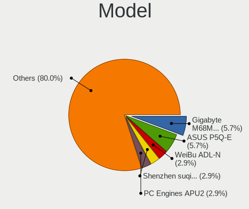
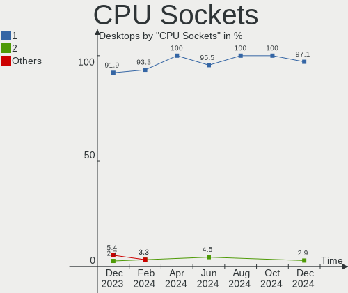
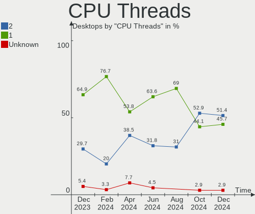
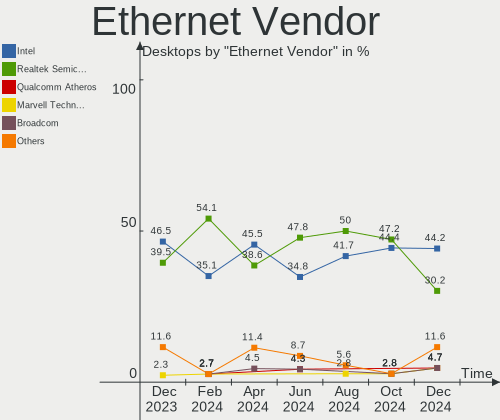

FreeBSD - Hardware Trends (Desktops)
------------------------------------

A project to identify most popular hardware characteristics and track their change
over time based on data collected by BSD users at https://BSD-Hardware.info.

Anyone can contribute to this report by the [hw-probe](https://github.com/linuxhw/hw-probe/blob/master/INSTALL.BSD.md) tool:

    hw-probe -all -upload

This report is for one last month. Overall report since the beginning of time: [TestCoverage](https://github.com/bsdhw/TestCoverage)

Period: Aug, 2022.

Contents
--------

* [ System ](#system)
  - [ OS                       ](#os)
  - [ OS Family                ](#os-family)
  - [ Arch                     ](#arch)
  - [ DE                       ](#de)
  - [ Display Server           ](#display-server)
  - [ Display Manager          ](#display-manager)
  - [ OS Lang                  ](#os-lang)
  - [ Boot Mode                ](#boot-mode)
  - [ Filesystem               ](#filesystem)
  - [ Part. scheme             ](#part-scheme)

* [ Board ](#board)
  - [ Vendor                   ](#vendor)
  - [ Model                    ](#model)
  - [ Model Family             ](#model-family)
  - [ MFG Year                 ](#mfg-year)
  - [ Form Factor              ](#form-factor)
  - [ Coreboot                 ](#coreboot)
  - [ RAM Size                 ](#ram-size)
  - [ RAM Used                 ](#ram-used)
  - [ Total Drives             ](#total-drives)
  - [ Has CD-ROM               ](#has-cd-rom)
  - [ Has Ethernet             ](#has-ethernet)
  - [ Has WiFi                 ](#has-wifi)
  - [ Has Bluetooth            ](#has-bluetooth)

* [ Location ](#location)
  - [ Country                  ](#country)
  - [ City                     ](#city)

* [ Drives ](#drives)
  - [ Drive Vendor             ](#drive-vendor)
  - [ Drive Model              ](#drive-model)
  - [ HDD Vendor               ](#hdd-vendor)
  - [ SSD Vendor               ](#ssd-vendor)
  - [ Drive Kind               ](#drive-kind)
  - [ Drive Connector          ](#drive-connector)
  - [ Drive Size               ](#drive-size)
  - [ Space Total              ](#space-total)
  - [ Space Used               ](#space-used)
  - [ Malfunc. Drives          ](#malfunc-drives)
  - [ Malfunc. Drive Vendor    ](#malfunc-drive-vendor)
  - [ Malfunc. HDD Vendor      ](#malfunc-hdd-vendor)
  - [ Malfunc. Drive Kind      ](#malfunc-drive-kind)
  - [ Failed Drives            ](#failed-drives)
  - [ Failed Drive Vendor      ](#failed-drive-vendor)
  - [ Drive Status             ](#drive-status)

* [ Storage controller ](#storage-controller)
  - [ Storage Vendor           ](#storage-vendor)
  - [ Storage Model            ](#storage-model)
  - [ Storage Kind             ](#storage-kind)

* [ Processor ](#processor)
  - [ CPU Vendor               ](#cpu-vendor)
  - [ CPU Model                ](#cpu-model)
  - [ CPU Model Family         ](#cpu-model-family)
  - [ CPU Cores                ](#cpu-cores)
  - [ CPU Sockets              ](#cpu-sockets)
  - [ CPU Threads              ](#cpu-threads)
  - [ CPU Microarch            ](#cpu-microarch)

* [ Graphics ](#graphics)
  - [ GPU Vendor               ](#gpu-vendor)
  - [ GPU Model                ](#gpu-model)
  - [ GPU Combo                ](#gpu-combo)
  - [ GPU Driver               ](#gpu-driver)
  - [ GPU Memory               ](#gpu-memory)

* [ Monitor ](#monitor)
  - [ Monitor Vendor           ](#monitor-vendor)
  - [ Monitor Model            ](#monitor-model)
  - [ Monitor Resolution       ](#monitor-resolution)
  - [ Monitor Diagonal         ](#monitor-diagonal)
  - [ Monitor Width            ](#monitor-width)
  - [ Aspect Ratio             ](#aspect-ratio)
  - [ Monitor Area             ](#monitor-area)
  - [ Pixel Density            ](#pixel-density)
  - [ Multiple Monitors        ](#multiple-monitors)

* [ Network ](#network)
  - [ Net Controller Vendor    ](#net-controller-vendor)
  - [ Net Controller Model     ](#net-controller-model)
  - [ Wireless Vendor          ](#wireless-vendor)
  - [ Wireless Model           ](#wireless-model)
  - [ Ethernet Vendor          ](#ethernet-vendor)
  - [ Ethernet Model           ](#ethernet-model)
  - [ Net Controller Kind      ](#net-controller-kind)
  - [ Used Controller          ](#used-controller)
  - [ NICs                     ](#nics)
  - [ IPv6                     ](#ipv6)

* [ Bluetooth ](#bluetooth)
  - [ Bluetooth Vendor         ](#bluetooth-vendor)
  - [ Bluetooth Model          ](#bluetooth-model)

* [ Sound ](#sound)
  - [ Sound Vendor             ](#sound-vendor)
  - [ Sound Model              ](#sound-model)

* [ Memory ](#memory)
  - [ Memory Vendor            ](#memory-vendor)
  - [ Memory Model             ](#memory-model)
  - [ Memory Kind              ](#memory-kind)
  - [ Memory Form Factor       ](#memory-form-factor)
  - [ Memory Size              ](#memory-size)
  - [ Memory Speed             ](#memory-speed)

* [ Printers & scanners ](#printers--scanners)
  - [ Printer Vendor           ](#printer-vendor)
  - [ Printer Model            ](#printer-model)
  - [ Scanner Vendor           ](#scanner-vendor)
  - [ Scanner Model            ](#scanner-model)

* [ Camera ](#camera)
  - [ Camera Vendor            ](#camera-vendor)
  - [ Camera Model             ](#camera-model)

* [ Security ](#security)
  - [ Fingerprint Vendor       ](#fingerprint-vendor)
  - [ Fingerprint Model        ](#fingerprint-model)
  - [ Chipcard Vendor          ](#chipcard-vendor)
  - [ Chipcard Model           ](#chipcard-model)

* [ Unsupported ](#unsupported)
  - [ Unsupported Devices      ](#unsupported-devices)
  - [ Unsupported Device Types ](#unsupported-device-types)

System
------

OS
--

Installed operating systems

| Name                 | Desktops | Percent |
|----------------------|----------|---------|
| FreeBSD 13.1-p1      | 10       | 37.04%  |
| FreeBSD 13.1         | 8        | 29.63%  |
| FreeBSD 14.0-CURRENT | 2        | 7.41%   |
| FreeBSD 13.0-p12     | 2        | 7.41%   |
| FreeBSD 13.0-p11     | 2        | 7.41%   |
| FreeBSD 13.1-STABLE  | 1        | 3.7%    |
| FreeBSD 12.3-p5      | 1        | 3.7%    |
| FreeBSD 12.1-p2      | 1        | 3.7%    |

OS Family
---------

OS without a version

| Name    | Desktops | Percent |
|---------|----------|---------|
| FreeBSD | 27       | 100%    |

Arch
----

OS architecture (x86_64, i586, etc.)

| Name  | Desktops | Percent |
|-------|----------|---------|
| amd64 | 25       | 92.59%  |
| i386  | 1        | 3.7%    |
| arm64 | 1        | 3.7%    |

DE
--

Desktop Environment

| Name    | Desktops | Percent |
|---------|----------|---------|
| Console | 15       | 55.56%  |
| KDE5    | 6        | 22.22%  |
| MATE    | 3        | 11.11%  |
| XFCE    | 2        | 7.41%   |
| i3      | 1        | 3.7%    |

Display Server
--------------

X11 or Wayland

| Name    | Desktops | Percent |
|---------|----------|---------|
| Console | 17       | 62.96%  |
| X11     | 10       | 37.04%  |

Display Manager
---------------

SDDM, LightDM, etc.

| Name    | Desktops | Percent |
|---------|----------|---------|
| Console | 17       | 62.96%  |
| SDDM    | 6        | 22.22%  |
| LightDM | 2        | 7.41%   |
| XDM     | 1        | 3.7%    |
| GDM     | 1        | 3.7%    |

OS Lang
-------

Language

| Lang    | Desktops | Percent |
|---------|----------|---------|
| C       | 14       | 51.85%  |
| en_US   | 5        | 18.52%  |
| Unknown | 3        | 11.11%  |
| ru_RU   | 2        | 7.41%   |
| en_GB   | 1        | 3.7%    |
| de_DE   | 1        | 3.7%    |
| da_DK   | 1        | 3.7%    |

Boot Mode
---------

EFI or BIOS

| Mode | Desktops | Percent |
|------|----------|---------|
| EFI  | 15       | 55.56%  |
| BIOS | 12       | 44.44%  |

Filesystem
----------

Type of filesystem

| Type | Desktops | Percent |
|------|----------|---------|
| Zfs  | 18       | 66.67%  |
| Ufs  | 9        | 33.33%  |

Part. scheme
------------

Scheme of partitioning

| Type | Desktops | Percent |
|------|----------|---------|
| GPT  | 24       | 88.89%  |
| MBR  | 3        | 11.11%  |

Board
-----

Vendor
------

Motherboard manufacturer

| Name                | Desktops | Percent |
|---------------------|----------|---------|
| ASUSTek Computer    | 7        | 25.93%  |
| Gigabyte Technology | 5        | 18.52%  |
| ASRock              | 5        | 18.52%  |
| Dell                | 4        | 14.81%  |
| Unknown             | 2        | 7.41%   |
| MSI                 | 1        | 3.7%    |
| Lenovo              | 1        | 3.7%    |
| Intel               | 1        | 3.7%    |
| GVC                 | 1        | 3.7%    |

Model
-----

Motherboard model

| Name                            | Desktops | Percent |
|---------------------------------|----------|---------|
| Gigabyte H61M-DS2               | 2        | 7.41%   |
| Dell PowerEdge T30              | 2        | 7.41%   |
| ASUS PRIME X370-PRO             | 2        | 7.41%   |
| Unknown                         | 2        | 7.41%   |
| MSI MS-7817                     | 1        | 3.7%    |
| Lenovo ThinkCentre M91p 4512A47 | 1        | 3.7%    |
| Intel X79 V2.72A                | 1        | 3.7%    |
| GVC EQUIUM 3200M                | 1        | 3.7%    |
| Gigabyte P85-D3                 | 1        | 3.7%    |
| Gigabyte H97M-HD3               | 1        | 3.7%    |
| Gigabyte H81M-DS2               | 1        | 3.7%    |
| Dell OptiPlex 5090              | 1        | 3.7%    |
| Dell OptiPlex 3010              | 1        | 3.7%    |
| ASUS ROG CROSSHAIR VIII HERO    | 1        | 3.7%    |
| ASUS PRIME Z690-P D4            | 1        | 3.7%    |
| ASUS P5Q-E                      | 1        | 3.7%    |
| ASUS M4A87TD EVO                | 1        | 3.7%    |
| ASUS All Series                 | 1        | 3.7%    |
| ASRock X570 Phantom Gaming 4    | 1        | 3.7%    |
| ASRock X399 Taichi              | 1        | 3.7%    |
| ASRock H110M-DGS R3.0           | 1        | 3.7%    |
| ASRock B550 Extreme4            | 1        | 3.7%    |
| ASRock AD2550-ITX               | 1        | 3.7%    |

Model Family
------------

Motherboard model prefix

| Name               | Desktops | Percent |
|--------------------|----------|---------|
| ASUS PRIME         | 3        | 11.11%  |
| Gigabyte H61M-DS2  | 2        | 7.41%   |
| Dell PowerEdge     | 2        | 7.41%   |
| Dell OptiPlex      | 2        | 7.41%   |
| Unknown            | 2        | 7.41%   |
| MSI MS-7817        | 1        | 3.7%    |
| Lenovo ThinkCentre | 1        | 3.7%    |
| Intel X79          | 1        | 3.7%    |
| GVC EQUIUM         | 1        | 3.7%    |
| Gigabyte P85-D3    | 1        | 3.7%    |
| Gigabyte H97M-HD3  | 1        | 3.7%    |
| Gigabyte H81M-DS2  | 1        | 3.7%    |
| ASUS ROG           | 1        | 3.7%    |
| ASUS P5Q-E         | 1        | 3.7%    |
| ASUS M4A87TD       | 1        | 3.7%    |
| ASUS All           | 1        | 3.7%    |
| ASRock X570        | 1        | 3.7%    |
| ASRock X399        | 1        | 3.7%    |
| ASRock H110M-DGS   | 1        | 3.7%    |
| ASRock B550        | 1        | 3.7%    |
| ASRock AD2550-ITX  | 1        | 3.7%    |

MFG Year
--------

Motherboard manufacture year

| Year    | Desktops | Percent |
|---------|----------|---------|
| 2018    | 3        | 11.11%  |
| 2017    | 3        | 11.11%  |
| 2014    | 3        | 11.11%  |
| 2022    | 2        | 7.41%   |
| 2021    | 2        | 7.41%   |
| 2019    | 2        | 7.41%   |
| 2015    | 2        | 7.41%   |
| 2011    | 2        | 7.41%   |
| 2009    | 2        | 7.41%   |
| Unknown | 2        | 7.41%   |
| 2020    | 1        | 3.7%    |
| 2016    | 1        | 3.7%    |
| 2013    | 1        | 3.7%    |
| 2008    | 1        | 3.7%    |

Form Factor
-----------

Physical design of the computer

| Name    | Desktops | Percent |
|---------|----------|---------|
| Desktop | 27       | 100%    |

Coreboot
--------

Have coreboot on board

| Used | Desktops | Percent |
|------|----------|---------|
| No   | 27       | 100%    |

RAM Size
--------

Total RAM memory

| Size in GB  | Desktops | Percent |
|-------------|----------|---------|
| 16.01-24.0  | 6        | 22.22%  |
| 8.01-16.0   | 6        | 22.22%  |
| 64.01-256.0 | 5        | 18.52%  |
| 32.01-64.0  | 4        | 14.81%  |
| 4.01-8.0    | 2        | 7.41%   |
| 24.01-32.0  | 2        | 7.41%   |
| 2.01-3.0    | 1        | 3.7%    |
| 0.01-0.5    | 1        | 3.7%    |

RAM Used
--------

Used RAM memory

| Used GB  | Desktops | Percent |
|----------|----------|---------|
| 0.01-0.5 | 11       | 40.74%  |
| 0.51-1.0 | 7        | 25.93%  |
| 1.01-2.0 | 4        | 14.81%  |
| 3.01-4.0 | 2        | 7.41%   |
| 2.01-3.0 | 2        | 7.41%   |
| 0        | 1        | 3.7%    |

Total Drives
------------

Number of drives on board

| Drives | Desktops | Percent |
|--------|----------|---------|
| 3      | 8        | 29.63%  |
| 4      | 6        | 22.22%  |
| 2      | 4        | 14.81%  |
| 1      | 4        | 14.81%  |
| 0      | 2        | 7.41%   |
| 19     | 1        | 3.7%    |
| 13     | 1        | 3.7%    |
| 6      | 1        | 3.7%    |

Has CD-ROM
----------

Has CD-ROM on board

| Presented | Desktops | Percent |
|-----------|----------|---------|
| No        | 19       | 70.37%  |
| Yes       | 8        | 29.63%  |

Has Ethernet
------------

Has Ethernet on board

| Presented | Desktops | Percent |
|-----------|----------|---------|
| Yes       | 26       | 96.3%   |
| No        | 1        | 3.7%    |

Has WiFi
--------

Has WiFi module

| Presented | Desktops | Percent |
|-----------|----------|---------|
| No        | 21       | 77.78%  |
| Yes       | 6        | 22.22%  |

Has Bluetooth
-------------

Has Bluetooth module

| Presented | Desktops | Percent |
|-----------|----------|---------|
| No        | 25       | 92.59%  |
| Yes       | 2        | 7.41%   |

Location
--------

Country
-------

Geographic location (country)

| Country   | Desktops | Percent |
|-----------|----------|---------|
| USA       | 6        | 22.22%  |
| Russia    | 6        | 22.22%  |
| Germany   | 4        | 14.81%  |
| Spain     | 2        | 7.41%   |
| Czechia   | 2        | 7.41%   |
| UK        | 1        | 3.7%    |
| Sweden    | 1        | 3.7%    |
| Lithuania | 1        | 3.7%    |
| Italy     | 1        | 3.7%    |
| India     | 1        | 3.7%    |
| Denmark   | 1        | 3.7%    |
| Australia | 1        | 3.7%    |

City
----

Geographic location (city)

| City              | Desktops | Percent |
|-------------------|----------|---------|
| Salem             | 2        | 7.41%   |
| Redmond           | 2        | 7.41%   |
| Moscow            | 2        | 7.41%   |
| Kamensk-Ural'skiy | 2        | 7.41%   |
| Brno              | 2        | 7.41%   |
| Wenatchee         | 1        | 3.7%    |
| Waldbrunn         | 1        | 3.7%    |
| Vilnius           | 1        | 3.7%    |
| Valladolid        | 1        | 3.7%    |
| St Petersburg     | 1        | 3.7%    |
| Sayre             | 1        | 3.7%    |
| Oviedo            | 1        | 3.7%    |
| Nakhodka          | 1        | 3.7%    |
| Münster          | 1        | 3.7%    |
| Milan             | 1        | 3.7%    |
| Melbourne         | 1        | 3.7%    |
| Göttingen        | 1        | 3.7%    |
| Esbjerg           | 1        | 3.7%    |
| Düsseldorf       | 1        | 3.7%    |
| Chennai           | 1        | 3.7%    |
| Cambridge         | 1        | 3.7%    |
| Bromma            | 1        | 3.7%    |

Drives
------

Drive Vendor
------------

Hard drive vendors

| Vendor              | Desktops | Drives | Percent |
|---------------------|----------|--------|---------|
| WDC                 | 14       | 33     | 28%     |
| Seagate             | 12       | 33     | 24%     |
| Samsung Electronics | 8        | 14     | 16%     |
| Kingston            | 3        | 3      | 6%      |
| Toshiba             | 1        | 1      | 2%      |
| SPCC                | 1        | 1      | 2%      |
| SK hynix            | 1        | 1      | 2%      |
| SanDisk             | 1        | 1      | 2%      |
| PNY                 | 1        | 1      | 2%      |
| Patriot             | 1        | 1      | 2%      |
| Maxtor              | 1        | 1      | 2%      |
| Lenovo              | 1        | 1      | 2%      |
| Kston               | 1        | 1      | 2%      |
| Intel               | 1        | 1      | 2%      |
| Hitachi             | 1        | 3      | 2%      |
| Crucial             | 1        | 2      | 2%      |
| Corsair             | 1        | 1      | 2%      |

Drive Model
-----------

Hard drive models

| Model                             | Desktops | Percent |
|-----------------------------------|----------|---------|
| WDC WD40EFRX-68N32N0 4TB          | 2        | 2.7%    |
| Seagate ST4000DM000-1F2168 4TB    | 2        | 2.7%    |
| Seagate ST2000DM008-2FR102 2TB    | 2        | 2.7%    |
| Seagate ST1000DM010-2EP102 1TB    | 2        | 2.7%    |
| WDC WD80EMAZ-00WJTA0 8TB          | 1        | 1.35%   |
| WDC WD80EFZZ-68BTXN0 8TB          | 1        | 1.35%   |
| WDC WD80EFZX-68UW8N0 8TB          | 1        | 1.35%   |
| WDC WD80EFAX-68LHPN0 8TB          | 1        | 1.35%   |
| WDC WD80EDBZ-11B0ZA0 8TB          | 1        | 1.35%   |
| WDC WD800AAJS-00PSA0 80GB         | 1        | 1.35%   |
| WDC WD6400AARS-00Y5B1 640GB       | 1        | 1.35%   |
| WDC WD5000LUCT-63Y8HY0 500GB      | 1        | 1.35%   |
| WDC WD5000LPLX-00ZNTT0 500GB      | 1        | 1.35%   |
| WDC WD40EZRZ-22GXCB0 4TB          | 1        | 1.35%   |
| WDC WD40EFRX-68WT0N0 4TB          | 1        | 1.35%   |
| WDC WD4003FRYZ-01F0DB0 4TB        | 1        | 1.35%   |
| WDC WD30NMRW-11YL9S4 3TB          | 1        | 1.35%   |
| WDC WD20EZRZ-00Z5HB0 2TB          | 1        | 1.35%   |
| WDC WD20EFRX-68EUZN0 2TB          | 1        | 1.35%   |
| WDC WD15EADS-00P8B0 1.5TB         | 1        | 1.35%   |
| WDC WD120EMFZ-11A6JA0 12TB        | 1        | 1.35%   |
| WDC WD120EMAZ-11BLFA0 12TB        | 1        | 1.35%   |
| WDC WD10EZEX-00RKKA0 1TB          | 1        | 1.35%   |
| WDC WD10EZEX-00MFCA0 1TB          | 1        | 1.35%   |
| WDC WD10EZEX-00BBHA0 1TB          | 1        | 1.35%   |
| WDC WD10EURX-63UY4Y0 1TB          | 1        | 1.35%   |
| WDC WD1000FYPS-01ZKB0 1TB         | 1        | 1.35%   |
| WDC WD1000DHTZ-04N21V1 1TB        | 1        | 1.35%   |
| Toshiba MG05ACA800E 8TB           | 1        | 1.35%   |
| SPCC M.2 SSD 256GB                | 1        | 1.35%   |
| SK hynix PC801 NVMe 2TB           | 1        | 1.35%   |
| Seagate ST9500325AS 500GB         | 1        | 1.35%   |
| Seagate ST9200420ASG 200GB        | 1        | 1.35%   |
| Seagate ST4000DM004-2U9104 4TB    | 1        | 1.35%   |
| Seagate ST4000DM004-2CV104 4TB    | 1        | 1.35%   |
| Seagate ST3160318AS 160GB         | 1        | 1.35%   |
| Seagate ST250DM000-1BD141 250GB   | 1        | 1.35%   |
| Seagate ST2000VM003-1CT164 2TB    | 1        | 1.35%   |
| Seagate ST2000DM001-9YN164 2TB    | 1        | 1.35%   |
| Seagate ST2000DM001-1ER164 2TB    | 1        | 1.35%   |
| Seagate ST2000DM001-1CH164 2TB    | 1        | 1.35%   |
| Seagate ST16000NM001G-2KK103 16TB | 1        | 1.35%   |
| Seagate ST1000LM048-2E7172 1TB    | 1        | 1.35%   |
| Seagate ST1000DM003-9YN162 1TB    | 1        | 1.35%   |
| Seagate ST1000DM003-1CH162 1TB    | 1        | 1.35%   |
| Seagate ST1000DL002-9TT153 1TB    | 1        | 1.35%   |
| SanDisk SD8SB8U256G1001 256GB     | 1        | 1.35%   |
| Samsung SSD 980 1TB               | 1        | 1.35%   |
| Samsung SSD 960 EVO 500GB         | 1        | 1.35%   |
| Samsung SSD 870 QVO 2TB           | 1        | 1.35%   |
| Samsung SSD 870 EVO 500GB         | 1        | 1.35%   |
| Samsung SSD 870 EVO 250GB         | 1        | 1.35%   |
| Samsung SSD 860 QVO 1TB           | 1        | 1.35%   |
| Samsung SSD 860 EVO 500GB         | 1        | 1.35%   |
| Samsung SSD 850 PRO 256GB         | 1        | 1.35%   |
| Samsung SSD 850 EVO 1TB           | 1        | 1.35%   |
| Samsung SSD 840 EVO 500GB         | 1        | 1.35%   |
| Samsung SSD 840 EVO 120GB         | 1        | 1.35%   |
| PNY CS2130 1TB SSD                | 1        | 1.35%   |
| Patriot Blaze 64GB                | 1        | 1.35%   |

HDD Vendor
----------

Hard disk drive vendors

| Vendor  | Desktops | Drives | Percent |
|---------|----------|--------|---------|
| WDC     | 14       | 33     | 48.28%  |
| Seagate | 12       | 33     | 41.38%  |
| Toshiba | 1        | 1      | 3.45%   |
| Maxtor  | 1        | 1      | 3.45%   |
| Hitachi | 1        | 3      | 3.45%   |

SSD Vendor
----------

Solid state drive vendors

| Vendor              | Desktops | Drives | Percent |
|---------------------|----------|--------|---------|
| Samsung Electronics | 7        | 12     | 50%     |
| SPCC                | 1        | 1      | 7.14%   |
| SanDisk             | 1        | 1      | 7.14%   |
| Patriot             | 1        | 1      | 7.14%   |
| Kston               | 1        | 1      | 7.14%   |
| Kingston            | 1        | 1      | 7.14%   |
| Intel               | 1        | 1      | 7.14%   |
| Crucial             | 1        | 2      | 7.14%   |

Drive Kind
----------

HDD or SSD

| Kind | Desktops | Drives | Percent |
|------|----------|--------|---------|
| HDD  | 21       | 71     | 51.22%  |
| SSD  | 13       | 20     | 31.71%  |
| NVMe | 7        | 8      | 17.07%  |

Drive Connector
---------------

SATA, SAS, NVMe, etc.

| Type | Desktops | Drives | Percent |
|------|----------|--------|---------|
| SATA | 23       | 91     | 76.67%  |
| NVMe | 7        | 8      | 23.33%  |

Drive Size
----------

Size of hard drive

| Size in TB | Desktops | Drives | Percent |
|------------|----------|--------|---------|
| 0.01-0.5   | 16       | 23     | 33.33%  |
| 0.51-1.0   | 12       | 16     | 25%     |
| 1.01-2.0   | 8        | 26     | 16.67%  |
| 3.01-4.0   | 6        | 10     | 12.5%   |
| 4.01-10.0  | 3        | 10     | 6.25%   |
| 10.01-20.0 | 2        | 5      | 4.17%   |
| 2.01-3.0   | 1        | 1      | 2.08%   |

Space Total
-----------

Amount of disk space available on the file system

| Size in GB     | Desktops | Percent |
|----------------|----------|---------|
| 251-500        | 7        | 25.93%  |
| 21-50          | 4        | 14.81%  |
| 101-250        | 4        | 14.81%  |
| 501-1000       | 3        | 11.11%  |
| 2001-3000      | 2        | 7.41%   |
| 1-20           | 2        | 7.41%   |
| 51-100         | 2        | 7.41%   |
| More than 3000 | 1        | 3.7%    |
| 1001-2000      | 1        | 3.7%    |
| Unknown        | 1        | 3.7%    |

Space Used
----------

Amount of used disk space

| Used GB   | Desktops | Percent |
|-----------|----------|---------|
| 1-20      | 20       | 74.07%  |
| 21-50     | 3        | 11.11%  |
| 2001-3000 | 1        | 3.7%    |
| 1001-2000 | 1        | 3.7%    |
| 51-100    | 1        | 3.7%    |
| Unknown   | 1        | 3.7%    |

Malfunc. Drives
---------------

Drive models with a malfunction

| Model                                 | Desktops | Drives | Percent |
|---------------------------------------|----------|--------|---------|
| WDC WD6400AARS-00Y5B1 640GB           | 1        | 1      | 10%     |
| WDC WD40EFRX-68N32N0 4TB              | 1        | 2      | 10%     |
| WDC WD20EFRX-68EUZN0 2TB              | 1        | 2      | 10%     |
| WDC WD1000DHTZ-04N21V1 1TB            | 1        | 2      | 10%     |
| SPCC M.2 SSD 256GB                    | 1        | 1      | 10%     |
| Seagate ST9500325AS 500GB             | 1        | 1      | 10%     |
| Seagate ST2000DM001-9YN164 2TB        | 1        | 1      | 10%     |
| Seagate ST1000DM003-1CH162 1TB        | 1        | 1      | 10%     |
| Samsung Electronics SSD 870 EVO 500GB | 1        | 2      | 10%     |
| Hitachi HDS723020BLA642 2TB           | 1        | 3      | 10%     |

Malfunc. Drive Vendor
---------------------

Vendors of faulty drives

| Vendor              | Desktops | Drives | Percent |
|---------------------|----------|--------|---------|
| Seagate             | 3        | 3      | 37.5%   |
| WDC                 | 2        | 7      | 25%     |
| SPCC                | 1        | 1      | 12.5%   |
| Samsung Electronics | 1        | 2      | 12.5%   |
| Hitachi             | 1        | 3      | 12.5%   |

Malfunc. HDD Vendor
-------------------

Vendors of faulty HDD drives

| Vendor  | Desktops | Drives | Percent |
|---------|----------|--------|---------|
| Seagate | 3        | 3      | 50%     |
| WDC     | 2        | 7      | 33.33%  |
| Hitachi | 1        | 3      | 16.67%  |

Malfunc. Drive Kind
-------------------

Kinds of faulty drives

| Kind | Desktops | Drives | Percent |
|------|----------|--------|---------|
| HDD  | 5        | 13     | 71.43%  |
| SSD  | 2        | 3      | 28.57%  |

Failed Drives
-------------

Failed drive models

| Model                   | Desktops | Drives | Percent |
|-------------------------|----------|--------|---------|
| Toshiba MG05ACA800E 8TB | 1        | 1      | 100%    |

Failed Drive Vendor
-------------------

Failed drive vendors

| Vendor  | Desktops | Drives | Percent |
|---------|----------|--------|---------|
| Toshiba | 1        | 1      | 100%    |

Drive Status
------------

Number of failed and malfunc. drives

| Status  | Desktops | Drives | Percent |
|---------|----------|--------|---------|
| Works   | 25       | 82     | 78.13%  |
| Malfunc | 6        | 16     | 18.75%  |
| Failed  | 1        | 1      | 3.13%   |

Storage controller
------------------

Storage Vendor
--------------

Storage controller vendors

| Vendor                      | Desktops | Percent |
|-----------------------------|----------|---------|
| Intel                       | 19       | 47.5%   |
| AMD                         | 7        | 17.5%   |
| Marvell Technology Group    | 3        | 7.5%    |
| Samsung Electronics         | 2        | 5%      |
| Phison Electronics          | 2        | 5%      |
| Kingston Technology Company | 2        | 5%      |
| SK hynix                    | 1        | 2.5%    |
| Lenovo                      | 1        | 2.5%    |
| JMicron Technology          | 1        | 2.5%    |
| Broadcom / LSI              | 1        | 2.5%    |
| ASMedia Technology          | 1        | 2.5%    |

Storage Model
-------------

Storage controller models

| Model                                                                          | Desktops | Percent |
|--------------------------------------------------------------------------------|----------|---------|
| AMD FCH SATA Controller [AHCI mode]                                            | 5        | 11.36%  |
| Intel 8 Series/C220 Series Chipset Family 6-port SATA Controller 1 [AHCI mode] | 4        | 9.09%   |
| Intel 6 Series/C200 Series Chipset Family 6 port Desktop SATA AHCI Controller  | 4        | 9.09%   |
| Kingston Company A2000 NVMe SSD                                                | 2        | 4.55%   |
| Intel Q170/Q150/B150/H170/H110/Z170/CM236 Chipset SATA Controller [AHCI Mode]  | 2        | 4.55%   |
| AMD X370 Series Chipset SATA Controller                                        | 2        | 4.55%   |
| Samsung NVMe SSD Controller SM961/PM961/SM963                                  | 1        | 2.27%   |
| Samsung NVMe SSD Controller 980                                                | 1        | 2.27%   |
| Phison E16 PCIe4 NVMe Controller                                               | 1        | 2.27%   |
| Phison E12 NVMe Controller                                                     | 1        | 2.27%   |
| Marvell Group 88SE9215 PCIe 2.0 x1 4-port SATA 6 Gb/s Controller               | 1        | 2.27%   |
| Marvell Group 88SE9170 PCIe 2.0 x1 2-port SATA 6 Gb/s Controller               | 1        | 2.27%   |
| Marvell Group 88SE6111/6121 SATA II / PATA Controller                          | 1        | 2.27%   |
| Lenovo unknown                                                                 | 1        | 2.27%   |
| JMicron JMB361 AHCI/IDE                                                        | 1        | 2.27%   |
| Intel Volume Management Device NVMe RAID Controller                            | 1        | 2.27%   |
| Intel SATA Controller [RAID mode]                                              | 1        | 2.27%   |
| Intel NM10/ICH7 Family SATA Controller [IDE mode]                              | 1        | 2.27%   |
| Intel C600/X79 series chipset 6-Port SATA AHCI Controller                      | 1        | 2.27%   |
| Intel Atom Processor E3800 Series SATA AHCI Controller                         | 1        | 2.27%   |
| Intel Alder Lake-S PCH SATA Controller [AHCI Mode]                             | 1        | 2.27%   |
| Intel 9 Series Chipset Family SATA Controller [AHCI Mode]                      | 1        | 2.27%   |
| Intel 82801JI (ICH10 Family) SATA AHCI Controller                              | 1        | 2.27%   |
| Intel 82371AB/EB/MB PIIX4 IDE                                                  | 1        | 2.27%   |
| Intel 500 Series Chipset Family SATA AHCI Controller                           | 1        | 2.27%   |
| Broadcom / LSI SAS2008 PCI-Express Fusion-MPT SAS-2 [Falcon]                   | 1        | 2.27%   |
| ASMedia ASM1062 Serial ATA Controller                                          | 1        | 2.27%   |
| AMD X399 Series Chipset SATA Controller                                        | 1        | 2.27%   |
| AMD SB7x0/SB8x0/SB9x0 SATA Controller [AHCI mode]                              | 1        | 2.27%   |
| AMD 500 Series Chipset SATA Controller                                         | 1        | 2.27%   |
| Unknown                                                                        | 1        | 2.27%   |

Storage Kind
------------

Kind of storage controller (IDE, SATA, NVMe, SAS, ...)

| Kind | Desktops | Percent |
|------|----------|---------|
| SATA | 24       | 63.16%  |
| NVMe | 7        | 18.42%  |
| IDE  | 4        | 10.53%  |
| RAID | 2        | 5.26%   |
| SAS  | 1        | 2.63%   |

Processor
---------

CPU Vendor
----------

Processor vendors

| Vendor   | Desktops | Percent |
|----------|----------|---------|
| Intel    | 19       | 70.37%  |
| AMD      | 7        | 25.93%  |
| Research | 1        | 3.7%    |

CPU Model
---------

Processor models

| Model                                          | Desktops | Percent |
|------------------------------------------------|----------|---------|
| Intel Xeon CPU E31270 @ 3.40GHz                | 2        | 7.41%   |
| Intel Xeon CPU E3-1225 v5 @ 3.30GHz            | 2        | 7.41%   |
| AMD Ryzen 9 3900X 12-Core Processor            | 2        | 7.41%   |
| AMD Ryzen 7 1700 Eight-Core Processor          | 2        | 7.41%   |
| Research Morello SoC r0p0                      | 1        | 3.7%    |
| Intel Xeon CPU E5-2620 v2 @ 2.10GHz            | 1        | 3.7%    |
| Intel Pentium II                               | 1        | 3.7%    |
| Intel Pentium CPU G3220 @ 3.00GHz              | 1        | 3.7%    |
| Intel Core i7-4785T CPU @ 2.20GHz              | 1        | 3.7%    |
| Intel Core i5-4670K CPU @ 3.40GHz              | 1        | 3.7%    |
| Intel Core i5-4440 CPU @ 3.10GHz               | 1        | 3.7%    |
| Intel Core i5-3470 CPU @ 3.20GHz               | 1        | 3.7%    |
| Intel Core i5-2400 CPU @ 3.10GHz               | 1        | 3.7%    |
| Intel Core i3-7100 CPU @ 3.90GHz               | 1        | 3.7%    |
| Intel Core 2 Quad CPU Q6600 @ 2.40GHz          | 1        | 3.7%    |
| Intel Celeron CPU J1900 @ 1.99GHz              | 1        | 3.7%    |
| Intel Celeron CPU G1840 @ 2.80GHz              | 1        | 3.7%    |
| Intel Atom CPU D2550 @ 1.86GHz                 | 1        | 3.7%    |
| Intel 12th Gen Core i7-12700K                  | 1        | 3.7%    |
| Intel 11th Gen Core i7-11700 @ 2.50GHz         | 1        | 3.7%    |
| AMD Ryzen Threadripper 1920X 12-Core Processor | 1        | 3.7%    |
| AMD Ryzen 7 3800XT 8-Core Processor            | 1        | 3.7%    |
| AMD Phenom II X4 965 Processor                 | 1        | 3.7%    |

CPU Model Family
----------------

Processor model prefix

| Model                  | Desktops | Percent |
|------------------------|----------|---------|
| Intel Xeon             | 5        | 18.52%  |
| Intel Core i5          | 4        | 14.81%  |
| Other                  | 3        | 11.11%  |
| AMD Ryzen 7            | 3        | 11.11%  |
| Intel Pentium          | 2        | 7.41%   |
| Intel Celeron          | 2        | 7.41%   |
| AMD Ryzen 9            | 2        | 7.41%   |
| Intel Core i7          | 1        | 3.7%    |
| Intel Core i3          | 1        | 3.7%    |
| Intel Core 2 Quad      | 1        | 3.7%    |
| Intel Atom             | 1        | 3.7%    |
| AMD Ryzen Threadripper | 1        | 3.7%    |
| AMD Phenom II X4       | 1        | 3.7%    |

CPU Cores
---------

Number of processor cores

| Number  | Desktops | Percent |
|---------|----------|---------|
| 4       | 12       | 44.44%  |
| 2       | 4        | 14.81%  |
| 24      | 3        | 11.11%  |
| 16      | 3        | 11.11%  |
| 10      | 1        | 3.7%    |
| 8       | 1        | 3.7%    |
| 6       | 1        | 3.7%    |
| 1       | 1        | 3.7%    |
| Unknown | 1        | 3.7%    |

CPU Sockets
-----------

Number of sockets

| Number  | Desktops | Percent |
|---------|----------|---------|
| 1       | 26       | 96.3%   |
| Unknown | 1        | 3.7%    |

CPU Threads
-----------

Threads per core (Hyper-Threading)

| Number  | Desktops | Percent |
|---------|----------|---------|
| 1       | 18       | 66.67%  |
| 2       | 7        | 25.93%  |
| Unknown | 2        | 7.41%   |

CPU Microarch
-------------

Microarchitecture

| Name        | Desktops | Percent |
|-------------|----------|---------|
| Haswell     | 5        | 18.52%  |
| Zen 2       | 3        | 11.11%  |
| Zen         | 3        | 11.11%  |
| SandyBridge | 3        | 11.11%  |
| Unknown     | 3        | 11.11%  |
| Skylake     | 2        | 7.41%   |
| IvyBridge   | 2        | 7.41%   |
| Silvermont  | 1        | 3.7%    |
| P6          | 1        | 3.7%    |
| KabyLake    | 1        | 3.7%    |
| K10         | 1        | 3.7%    |
| Core        | 1        | 3.7%    |
| Bonnell     | 1        | 3.7%    |

Graphics
--------

GPU Vendor
----------

Vendors of graphics cards

| Vendor                               | Desktops | Percent |
|--------------------------------------|----------|---------|
| Intel                                | 11       | 39.29%  |
| Nvidia                               | 10       | 35.71%  |
| AMD                                  | 6        | 21.43%  |
| NVidia / SGS Thomson (Joint Venture) | 1        | 3.57%   |

GPU Model
---------

Graphics card models

| Model                                                                       | Desktops | Percent |
|-----------------------------------------------------------------------------|----------|---------|
| Intel Xeon E3-1200 v3/4th Gen Core Processor Integrated Graphics Controller | 4        | 14.29%  |
| Nvidia GP108 [GeForce GT 1030]                                              | 2        | 7.14%   |
| Intel HD Graphics P530                                                      | 2        | 7.14%   |
| AMD Cedar [Radeon HD 5000/6000/7350/8350 Series]                            | 2        | 7.14%   |
| Nvidia TU104 [GeForce RTX 2060]                                             | 1        | 3.57%   |
| Nvidia NV43 [GeForce 6600]                                                  | 1        | 3.57%   |
| Nvidia GT218 [NVS 300]                                                      | 1        | 3.57%   |
| Nvidia GP107 [GeForce GTX 1050]                                             | 1        | 3.57%   |
| Nvidia GP106 [GeForce GTX 1060 3GB]                                         | 1        | 3.57%   |
| Nvidia GP104 [GeForce GTX 1080]                                             | 1        | 3.57%   |
| Nvidia GM107 [GeForce GTX 750 Ti]                                           | 1        | 3.57%   |
| Nvidia GF119 [GeForce GT 520]                                               | 1        | 3.57%   |
| NVidia / SGS Thomson (Joint Venture) Riva128                                | 1        | 3.57%   |
| Intel RocketLake-S GT1 [UHD Graphics 750]                                   | 1        | 3.57%   |
| Intel HD Graphics 630                                                       | 1        | 3.57%   |
| Intel Atom Processor Z36xxx/Z37xxx Series Graphics & Display                | 1        | 3.57%   |
| Intel Atom Processor D2xxx/N2xxx Integrated Graphics Controller             | 1        | 3.57%   |
| Intel 2nd Generation Core Processor Family Integrated Graphics Controller   | 1        | 3.57%   |
| AMD Turks XT [Radeon HD 6670/7670]                                          | 1        | 3.57%   |
| AMD Turks PRO [Radeon HD 7570]                                              | 1        | 3.57%   |
| AMD Pitcairn PRO [Radeon HD 7850 / R7 265 / R9 270 1024SP]                  | 1        | 3.57%   |
| AMD Baffin [Radeon RX 550 640SP / RX 560/560X]                              | 1        | 3.57%   |

GPU Combo
---------

Combinations of graphics cards

| Name                                     | Desktops | Percent |
|------------------------------------------|----------|---------|
| 1 x Intel                                | 9        | 33.33%  |
| 1 x Nvidia                               | 8        | 29.63%  |
| 1 x AMD                                  | 6        | 22.22%  |
| Intel + Nvidia                           | 2        | 7.41%   |
| Other                                    | 1        | 3.7%    |
| 1 x NVidia / SGS Thomson (Joint Venture) | 1        | 3.7%    |

GPU Driver
----------

Free vs proprietary

| Driver      | Desktops | Percent |
|-------------|----------|---------|
| Free        | 20       | 74.07%  |
| Proprietary | 6        | 22.22%  |
| Unknown     | 1        | 3.7%    |

GPU Memory
----------

Total video memory

| Size in GB | Desktops | Percent |
|------------|----------|---------|
| Unknown    | 18       | 66.67%  |
| 1.01-2.0   | 4        | 14.81%  |
| 0.51-1.0   | 2        | 7.41%   |
| 7.01-8.0   | 1        | 3.7%    |
| 5.01-6.0   | 1        | 3.7%    |
| 3.01-4.0   | 1        | 3.7%    |

Monitor
-------

Monitor Vendor
--------------

Monitor vendors

| Vendor              | Desktops | Percent |
|---------------------|----------|---------|
| Philips             | 3        | 25%     |
| Samsung Electronics | 2        | 16.67%  |
| Sceptre Tech        | 1        | 8.33%   |
| Panasonic           | 1        | 8.33%   |
| LG Electronics      | 1        | 8.33%   |
| Goldstar            | 1        | 8.33%   |
| Dell                | 1        | 8.33%   |
| AOC                 | 1        | 8.33%   |
| Acer                | 1        | 8.33%   |

Monitor Model
-------------

Monitor models

| Model                                                             | Desktops | Percent |
|-------------------------------------------------------------------|----------|---------|
| Sceptre Tech C305W-2560UN SPT0C0D 2560x1080 690x290mm 29.5-inch   | 1        | 8.33%   |
| Samsung Electronics S22B300 SAM08AC 1920x1080 480x270mm 21.7-inch | 1        | 8.33%   |
| Samsung Electronics LCD Monitor T27C370 1920x1080                 | 1        | 8.33%   |
| Philips PHL 243V5 PHLC0D1 1920x1080 520x290mm 23.4-inch           | 1        | 8.33%   |
| Philips PHL 240V5 PHLC10A 1920x1080 530x300mm 24.0-inch           | 1        | 8.33%   |
| Philips PHL 221B6Q PHL08DF 1920x1080 480x270mm 21.7-inch          | 1        | 8.33%   |
| Panasonic TV MEIA296 1920x1080 1280x720mm 57.8-inch               | 1        | 8.33%   |
| LG Electronics LCD Monitor E2360 1920x1080                        | 1        | 8.33%   |
| Goldstar LG ULTRAWIDE GSM76F9 2560x1080 800x340mm 34.2-inch       | 1        | 8.33%   |
| Dell U2412M DELA07A 1920x1200 520x320mm 24.0-inch                 | 1        | 8.33%   |
| AOC Q32G2WG3 AOC3202 2560x1440 700x390mm 31.5-inch                | 1        | 8.33%   |
| Acer H223HQ ACR0086 1920x1080 480x270mm 21.7-inch                 | 1        | 8.33%   |

Monitor Resolution
------------------

Monitor screen resolution

| Resolution        | Desktops | Percent |
|-------------------|----------|---------|
| 1920x1080 (FHD)   | 7        | 63.64%  |
| 2560x1080         | 2        | 18.18%  |
| 2560x1440 (QHD)   | 1        | 9.09%   |
| 1920x1200 (WUXGA) | 1        | 9.09%   |

Monitor Diagonal
----------------

Diagonal size in inches

| Inches  | Desktops | Percent |
|---------|----------|---------|
| 21      | 3        | 25%     |
| 24      | 2        | 16.67%  |
| Unknown | 2        | 16.67%  |
| 57      | 1        | 8.33%   |
| 34      | 1        | 8.33%   |
| 31      | 1        | 8.33%   |
| 29      | 1        | 8.33%   |
| 23      | 1        | 8.33%   |

Monitor Width
-------------

Physical width

| Width in mm | Desktops | Percent |
|-------------|----------|---------|
| 501-600     | 3        | 25%     |
| 401-500     | 3        | 25%     |
| 601-700     | 2        | 16.67%  |
| Unknown     | 2        | 16.67%  |
| 701-800     | 1        | 8.33%   |
| 1001-1500   | 1        | 8.33%   |

Aspect Ratio
------------

Proportional relationship between the width and the height

| Ratio   | Desktops | Percent |
|---------|----------|---------|
| 16/9    | 6        | 54.55%  |
| 21/9    | 2        | 18.18%  |
| Unknown | 2        | 18.18%  |
| 16/10   | 1        | 9.09%   |

Monitor Area
------------

Area in inch²

| Area in inch² | Desktops | Percent |
|----------------|----------|---------|
| 201-250        | 5        | 41.67%  |
| 351-500        | 2        | 16.67%  |
| Unknown        | 2        | 16.67%  |
| More than 1000 | 1        | 8.33%   |
| 301-350        | 1        | 8.33%   |
| 251-300        | 1        | 8.33%   |

Pixel Density
-------------

Pixels per inch

| Density | Desktops | Percent |
|---------|----------|---------|
| 51-100  | 6        | 50%     |
| 101-120 | 3        | 25%     |
| Unknown | 2        | 16.67%  |
| 1-50    | 1        | 8.33%   |

Multiple Monitors
-----------------

Total monitors connected

| Total | Desktops | Percent |
|-------|----------|---------|
| 0     | 15       | 55.56%  |
| 1     | 11       | 40.74%  |
| 2     | 1        | 3.7%    |

Network
-------

Net Controller Vendor
---------------------

Controller vendors

| Vendor                   | Desktops | Percent |
|--------------------------|----------|---------|
| Realtek Semiconductor    | 16       | 47.06%  |
| Intel                    | 14       | 41.18%  |
| Qualcomm Atheros         | 2        | 5.88%   |
| Marvell Technology Group | 1        | 2.94%   |
| Broadcom                 | 1        | 2.94%   |

Net Controller Model
--------------------

Controller models

| Model                                                                         | Desktops | Percent |
|-------------------------------------------------------------------------------|----------|---------|
| Realtek RTL8111/8168/8411 PCI Express Gigabit Ethernet Controller             | 13       | 35.14%  |
| Intel I211 Gigabit Network Connection                                         | 5        | 13.51%  |
| Realtek RTL8125 2.5GbE Controller                                             | 3        | 8.11%   |
| Intel Ethernet Connection (2) I219-LM                                         | 2        | 5.41%   |
| Realtek RTL8191SU 802.11n WLAN Adapter                                        | 1        | 2.7%    |
| Qualcomm Atheros AR93xx Wireless Network Adapter                              | 1        | 2.7%    |
| Qualcomm Atheros AR9227 Wireless Network Adapter                              | 1        | 2.7%    |
| Marvell Group 88E8056 PCI-E Gigabit Ethernet Controller                       | 1        | 2.7%    |
| Marvell Group 88E8001 Gigabit Ethernet Controller                             | 1        | 2.7%    |
| Intel Ethernet Connection I217-V                                              | 1        | 2.7%    |
| Intel Ethernet Connection (14) I219-LM                                        | 1        | 2.7%    |
| Intel Dual Band Wireless-AC 3168NGW [Stone Peak]                              | 1        | 2.7%    |
| Intel Centrino Advanced-N 6235                                                | 1        | 2.7%    |
| Intel 82579LM Gigabit Network Connection (Lewisville)                         | 1        | 2.7%    |
| Intel 82576 Gigabit Network Connection                                        | 1        | 2.7%    |
| Intel 82574L Gigabit Network Connection                                       | 1        | 2.7%    |
| Intel 82571EB/82571GB Gigabit Ethernet Controller D0/D1 (copper applications) | 1        | 2.7%    |
| Broadcom BCM4360 802.11ac Wireless Network Adapter                            | 1        | 2.7%    |

Wireless Vendor
---------------

Wireless vendors

| Vendor                | Desktops | Percent |
|-----------------------|----------|---------|
| Qualcomm Atheros      | 2        | 33.33%  |
| Intel                 | 2        | 33.33%  |
| Realtek Semiconductor | 1        | 16.67%  |
| Broadcom              | 1        | 16.67%  |

Wireless Model
--------------

Wireless models

| Model                                              | Desktops | Percent |
|----------------------------------------------------|----------|---------|
| Realtek RTL8191SU 802.11n WLAN Adapter             | 1        | 16.67%  |
| Qualcomm Atheros AR93xx Wireless Network Adapter   | 1        | 16.67%  |
| Qualcomm Atheros AR9227 Wireless Network Adapter   | 1        | 16.67%  |
| Intel Dual Band Wireless-AC 3168NGW [Stone Peak]   | 1        | 16.67%  |
| Intel Centrino Advanced-N 6235                     | 1        | 16.67%  |
| Broadcom BCM4360 802.11ac Wireless Network Adapter | 1        | 16.67%  |

Ethernet Vendor
---------------

Ethernet vendors

| Vendor                   | Desktops | Percent |
|--------------------------|----------|---------|
| Realtek Semiconductor    | 16       | 53.33%  |
| Intel                    | 13       | 43.33%  |
| Marvell Technology Group | 1        | 3.33%   |

Ethernet Model
--------------

Ethernet models

| Model                                                                         | Desktops | Percent |
|-------------------------------------------------------------------------------|----------|---------|
| Realtek RTL8111/8168/8411 PCI Express Gigabit Ethernet Controller             | 13       | 41.94%  |
| Intel I211 Gigabit Network Connection                                         | 5        | 16.13%  |
| Realtek RTL8125 2.5GbE Controller                                             | 3        | 9.68%   |
| Intel Ethernet Connection (2) I219-LM                                         | 2        | 6.45%   |
| Marvell Group 88E8056 PCI-E Gigabit Ethernet Controller                       | 1        | 3.23%   |
| Marvell Group 88E8001 Gigabit Ethernet Controller                             | 1        | 3.23%   |
| Intel Ethernet Connection I217-V                                              | 1        | 3.23%   |
| Intel Ethernet Connection (14) I219-LM                                        | 1        | 3.23%   |
| Intel 82579LM Gigabit Network Connection (Lewisville)                         | 1        | 3.23%   |
| Intel 82576 Gigabit Network Connection                                        | 1        | 3.23%   |
| Intel 82574L Gigabit Network Connection                                       | 1        | 3.23%   |
| Intel 82571EB/82571GB Gigabit Ethernet Controller D0/D1 (copper applications) | 1        | 3.23%   |

Net Controller Kind
-------------------

Ethernet, WiFi or modem

| Kind     | Desktops | Percent |
|----------|----------|---------|
| Ethernet | 26       | 81.25%  |
| WiFi     | 6        | 18.75%  |

Used Controller
---------------

Currently used network controller

| Kind     | Desktops | Percent |
|----------|----------|---------|
| Ethernet | 26       | 96.3%   |
| WiFi     | 1        | 3.7%    |

NICs
----

Total network controllers on board

| Total | Desktops | Percent |
|-------|----------|---------|
| 1     | 18       | 66.67%  |
| 2     | 5        | 18.52%  |
| 3     | 3        | 11.11%  |
| 4     | 1        | 3.7%    |

IPv6
----

IPv6 vs IPv4

| Used | Desktops | Percent |
|------|----------|---------|
| No   | 22       | 81.48%  |
| Yes  | 5        | 18.52%  |

Bluetooth
---------

Bluetooth Vendor
----------------

Controller vendors

| Vendor | Desktops | Percent |
|--------|----------|---------|
| Intel  | 2        | 100%    |

Bluetooth Model
---------------

Controller models

| Model                                         | Desktops | Percent |
|-----------------------------------------------|----------|---------|
| Intel Wireless-AC 3168 Bluetooth              | 1        | 50%     |
| Intel Centrino Bluetooth Wireless Transceiver | 1        | 50%     |

Sound
-----

Sound Vendor
------------

Sound card vendors

| Vendor  | Desktops | Percent |
|---------|----------|---------|
| Intel   | 18       | 47.37%  |
| AMD     | 10       | 26.32%  |
| Nvidia  | 9        | 23.68%  |
| Ensoniq | 1        | 2.63%   |

Sound Model
-----------

Sound card models

| Model                                                                      | Desktops | Percent |
|----------------------------------------------------------------------------|----------|---------|
| Intel 6 Series/C200 Series Chipset Family High Definition Audio Controller | 4        | 9.3%    |
| Intel Xeon E3-1200 v3/4th Gen Core Processor HD Audio Controller           | 3        | 6.98%   |
| Intel 8 Series/C220 Series Chipset High Definition Audio Controller        | 3        | 6.98%   |
| Intel 100 Series/C230 Series Chipset Family HD Audio Controller            | 3        | 6.98%   |
| AMD Starship/Matisse HD Audio Controller                                   | 3        | 6.98%   |
| Nvidia GP108 High Definition Audio Controller                              | 2        | 4.65%   |
| AMD Turks HDMI Audio [Radeon HD 6500/6600 / 6700M Series]                  | 2        | 4.65%   |
| AMD Family 17h (Models 00h-0fh) HD Audio Controller                        | 2        | 4.65%   |
| AMD Cedar HDMI Audio [Radeon HD 5400/6300/7300 Series]                     | 2        | 4.65%   |
| Nvidia TU104 HD Audio Controller                                           | 1        | 2.33%   |
| Nvidia High Definition Audio Controller                                    | 1        | 2.33%   |
| Nvidia GP107GL High Definition Audio Controller                            | 1        | 2.33%   |
| Nvidia GP106 High Definition Audio Controller                              | 1        | 2.33%   |
| Nvidia GP104 High Definition Audio Controller                              | 1        | 2.33%   |
| Nvidia GM107 High Definition Audio Controller [GeForce 940MX]              | 1        | 2.33%   |
| Nvidia GF119 HDMI Audio Controller                                         | 1        | 2.33%   |
| Intel Tiger Lake-H HD Audio Controller                                     | 1        | 2.33%   |
| Intel NM10/ICH7 Family High Definition Audio Controller                    | 1        | 2.33%   |
| Intel C600/X79 series chipset High Definition Audio Controller             | 1        | 2.33%   |
| Intel Atom Processor Z36xxx/Z37xxx Series LPE Audio Controller             | 1        | 2.33%   |
| Intel Atom Processor Z36xxx/Z37xxx Series High Definition Audio Controller | 1        | 2.33%   |
| Intel Alder Lake-S HD Audio Controller                                     | 1        | 2.33%   |
| Intel 9 Series Chipset Family HD Audio Controller                          | 1        | 2.33%   |
| Intel 82801JI (ICH10 Family) HD Audio Controller                           | 1        | 2.33%   |
| Ensoniq 5880B / Creative Labs CT5880                                       | 1        | 2.33%   |
| AMD SBx00 Azalia (Intel HDA)                                               | 1        | 2.33%   |
| AMD Oland/Hainan/Cape Verde/Pitcairn HDMI Audio [Radeon HD 7000 Series]    | 1        | 2.33%   |
| AMD Baffin HDMI/DP Audio [Radeon RX 550 640SP / RX 560/560X]               | 1        | 2.33%   |

Memory
------

Memory Vendor
-------------

Memory module vendors

| Vendor              | Desktops | Percent |
|---------------------|----------|---------|
| Kingston            | 6        | 18.18%  |
| SK hynix            | 4        | 12.12%  |
| Unknown             | 3        | 9.09%   |
| Micron Technology   | 3        | 9.09%   |
| Samsung Electronics | 2        | 6.06%   |
| Goldkey             | 2        | 6.06%   |
| G.Skill             | 2        | 6.06%   |
| Crucial             | 2        | 6.06%   |
| Corsair             | 2        | 6.06%   |
| Transcend           | 1        | 3.03%   |
| Ramaxel Technology  | 1        | 3.03%   |
| Patriot             | 1        | 3.03%   |
| Kingmax             | 1        | 3.03%   |
| Apacer              | 1        | 3.03%   |
| AMD                 | 1        | 3.03%   |
| A-DATA Technology   | 1        | 3.03%   |

Memory Model
------------

Memory module models

| Model                                                   | Desktops | Percent |
|---------------------------------------------------------|----------|---------|
| SK hynix RAM HMT351S6BFR8C-H9 4GB SODIMM DDR3 1333MT/s  | 2        | 5.13%   |
| Goldkey RAM BKH400SO51208-1333 4GB SODIMM DDR3 1333MT/s | 2        | 5.13%   |
| Unknown RAM Module 8GB DIMM DDR3 1600MT/s               | 1        | 2.56%   |
| Unknown RAM Module 8GB DIMM DDR3 1333MT/s               | 1        | 2.56%   |
| Unknown RAM Module 2GB DIMM DDR 800MT/s                 | 1        | 2.56%   |
| Transcend RAM JM1333KSN-2G 2GB SODIMM DDR3 1066MT/s     | 1        | 2.56%   |
| SK hynix RAM HMAA4GU6CJR8N-XN 32GB DIMM DDR4 3200MT/s   | 1        | 2.56%   |
| SK hynix RAM HMA41GU7AFR8N-TF 8GB DIMM DDR4 2133MT/s    | 1        | 2.56%   |
| Samsung RAM M393B5170GB0 4GB DIMM DDR3 1333MT/s         | 1        | 2.56%   |
| Samsung RAM M378B5273DH0-CK0 4GB DIMM DDR3 1600MT/s     | 1        | 2.56%   |
| Ramaxel RAM RMR5030ME68F9F1600 4GB DIMM DDR3 1600MT/s   | 1        | 2.56%   |
| Ramaxel RAM RMR1870EC58E9F1333 4GB DIMM DDR3 1333MT/s   | 1        | 2.56%   |
| Patriot RAM PSD38G16002 8GB DIMM DDR3 1600MT/s          | 1        | 2.56%   |
| Patriot RAM PSD34G160081 4GB DIMM DDR3 1333MT/s         | 1        | 2.56%   |
| Micron RAM 9ASF1G72AZ-2G3B1 8GB DIMM DDR4 2400MT/s      | 1        | 2.56%   |
| Micron RAM 8JTF51264AZ-1G6E1 4GB DIMM DDR3 1600MT/s     | 1        | 2.56%   |
| Micron RAM 36KSF1G72PZ-1 8GB DIMM DDR3 1333MT/s         | 1        | 2.56%   |
| Micron RAM 16JTF1G64AZ-1G6E1 8GB DIMM DDR3 1600MT/s     | 1        | 2.56%   |
| Kingston RAM 99U5474-016.A00LF 4GB DIMM 667MT/s         | 1        | 2.56%   |
| Kingston RAM 99U5471-047.A00LF 8GB DIMM DDR3 1333MT/s   | 1        | 2.56%   |
| Kingston RAM 99U5469-046.A00LF 4GB DIMM 1333MT/s        | 1        | 2.56%   |
| Kingston RAM 9965745-020.A00G 32GB DIMM DDR4 3200MT/s   | 1        | 2.56%   |
| Kingston RAM 9965745-002.A00G 16GB DIMM DDR4 3000MT/s   | 1        | 2.56%   |
| Kingston RAM 9965669-033.A00G 16GB DIMM DDR4 2400MT/s   | 1        | 2.56%   |
| Kingston RAM 9905734-060.A00G 16GB DIMM DDR4 2400MT/s   | 1        | 2.56%   |
| Kingston RAM 9905471-006.A01LF 4GB DIMM 1333MT/s        | 1        | 2.56%   |
| Kingmax RAM FLFF65F-C8KL9 4GB DIMM DDR3 1333MT/s        | 1        | 2.56%   |
| G.Skill RAM F4-3200C16-32GVK 32GB DIMM DDR4 2666MT/s    | 1        | 2.56%   |
| G.Skill RAM F3-12800CL7-2GBRM 2GB DIMM DDR3 1600MT/s    | 1        | 2.56%   |
| Crucial RAM CT16G4DFRA266.C16FP 16GB DIMM DDR4 2400MT/s | 1        | 2.56%   |
| Crucial RAM CT16G4DFRA266.C16FE 16GB DIMM DDR4 2400MT/s | 1        | 2.56%   |
| Crucial RAM BLS4G3D1609DS1S00. 4GB DIMM DDR3 1600MT/s   | 1        | 2.56%   |
| Corsair RAM CMK32GX4M2E3200C16 16GB DIMM DDR4 3200MT/s  | 1        | 2.56%   |
| Corsair RAM CMK16GX4M2B3200C16 8GB DIMM DDR4 3200MT/s   | 1        | 2.56%   |
| Apacer RAM 78.C1GET.AU10C 8GB DIMM DDR3 1333MT/s        | 1        | 2.56%   |
| AMD RAM R748G2400U2S 8GB DIMM DDR4 2400MT/s             | 1        | 2.56%   |
| A-DATA RAM DDR4 3600 8GB DIMM DDR4 3200MT/s             | 1        | 2.56%   |

Memory Kind
-----------

Memory module kinds

| Kind    | Desktops | Percent |
|---------|----------|---------|
| DDR3    | 14       | 51.85%  |
| DDR4    | 11       | 40.74%  |
| DDR     | 1        | 3.7%    |
| Unknown | 1        | 3.7%    |

Memory Form Factor
------------------

Physical design of the memory module

| Name   | Desktops | Percent |
|--------|----------|---------|
| DIMM   | 23       | 88.46%  |
| SODIMM | 3        | 11.54%  |

Memory Size
-----------

Memory module size

| Size  | Desktops | Percent |
|-------|----------|---------|
| 8192  | 11       | 35.48%  |
| 4096  | 9        | 29.03%  |
| 16384 | 5        | 16.13%  |
| 32768 | 3        | 9.68%   |
| 2048  | 3        | 9.68%   |

Memory Speed
------------

Memory module speed

| Speed | Desktops | Percent |
|-------|----------|---------|
| 1333  | 8        | 26.67%  |
| 1600  | 7        | 23.33%  |
| 3200  | 5        | 16.67%  |
| 2400  | 4        | 13.33%  |
| 3000  | 1        | 3.33%   |
| 2666  | 1        | 3.33%   |
| 2133  | 1        | 3.33%   |
| 1066  | 1        | 3.33%   |
| 800   | 1        | 3.33%   |
| 667   | 1        | 3.33%   |

Printers & scanners
-------------------

Printer Vendor
--------------

Printer device vendors

| Vendor             | Desktops | Percent |
|--------------------|----------|---------|
| Brother Industries | 1        | 100%    |

Printer Model
-------------

Printer device models

| Model                         | Desktops | Percent |
|-------------------------------|----------|---------|
| Brother HL-1430 Laser Printer | 1        | 100%    |

Scanner Vendor
--------------

Scanner device vendors

Zero info for selected period =(

Scanner Model
-------------

Scanner device models

Zero info for selected period =(

Camera
------

Camera Vendor
-------------

Camera device vendors

| Vendor   | Desktops | Percent |
|----------|----------|---------|
| Logitech | 3        | 100%    |

Camera Model
------------

Camera device models

| Model                   | Desktops | Percent |
|-------------------------|----------|---------|
| Logitech Webcam C270    | 1        | 33.33%  |
| Logitech HD Webcam C525 | 1        | 33.33%  |
| Logitech C505 HD Webcam | 1        | 33.33%  |

Security
--------

Fingerprint Vendor
------------------

Fingerprint sensor vendors

Zero info for selected period =(

Fingerprint Model
-----------------

Fingerprint sensor models

Zero info for selected period =(

Chipcard Vendor
---------------

Chipcard module vendors

Zero info for selected period =(

Chipcard Model
--------------

Chipcard module models

Zero info for selected period =(

Unsupported
-----------

Unsupported Devices
-------------------

Total unsupported devices on board

| Total | Desktops | Percent |
|-------|----------|---------|
| 1     | 19       | 70.37%  |
| 0     | 7        | 25.93%  |
| 2     | 1        | 3.7%    |

Unsupported Device Types
------------------------

Types of unsupported devices

| Type                     | Desktops | Percent |
|--------------------------|----------|---------|
| Communication controller | 14       | 66.67%  |
| Sound                    | 2        | 9.52%   |
| Net/wireless             | 2        | 9.52%   |
| Firewire controller      | 2        | 9.52%   |
| Net/ethernet             | 1        | 4.76%   |

