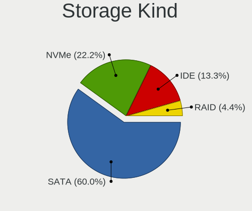
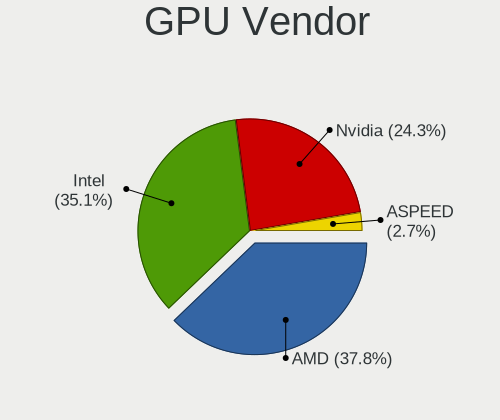

FreeBSD - Hardware Trends (Desktops)
------------------------------------

A project to identify most popular hardware characteristics and track their change
over time based on data collected by BSD users at https://BSD-Hardware.info.

Anyone can contribute to this report by the [hw-probe](https://github.com/linuxhw/hw-probe/blob/master/INSTALL.BSD.md) tool:

    hw-probe -all -upload

This report is for one last month. Overall report since the beginning of time: [TestDays](https://github.com/bsdhw/TestDays)

Period: Oct, 2023.

Contents
--------

* [ System ](#system)
  - [ OS                       ](#os)
  - [ OS Family                ](#os-family)
  - [ Arch                     ](#arch)
  - [ DE                       ](#de)
  - [ Display Server           ](#display-server)
  - [ Display Manager          ](#display-manager)
  - [ OS Lang                  ](#os-lang)
  - [ Boot Mode                ](#boot-mode)
  - [ Filesystem               ](#filesystem)
  - [ Part. scheme             ](#part-scheme)

* [ Board ](#board)
  - [ Vendor                   ](#vendor)
  - [ Model                    ](#model)
  - [ Model Family             ](#model-family)
  - [ MFG Year                 ](#mfg-year)
  - [ Form Factor              ](#form-factor)
  - [ Coreboot                 ](#coreboot)
  - [ RAM Size                 ](#ram-size)
  - [ RAM Used                 ](#ram-used)
  - [ Total Drives             ](#total-drives)
  - [ Has CD-ROM               ](#has-cd-rom)
  - [ Has Ethernet             ](#has-ethernet)
  - [ Has WiFi                 ](#has-wifi)
  - [ Has Bluetooth            ](#has-bluetooth)

* [ Location ](#location)
  - [ Country                  ](#country)
  - [ City                     ](#city)

* [ Drives ](#drives)
  - [ Drive Vendor             ](#drive-vendor)
  - [ Drive Model              ](#drive-model)
  - [ HDD Vendor               ](#hdd-vendor)
  - [ SSD Vendor               ](#ssd-vendor)
  - [ Drive Kind               ](#drive-kind)
  - [ Drive Connector          ](#drive-connector)
  - [ Drive Size               ](#drive-size)
  - [ Space Total              ](#space-total)
  - [ Space Used               ](#space-used)
  - [ Malfunc. Drives          ](#malfunc-drives)
  - [ Malfunc. Drive Vendor    ](#malfunc-drive-vendor)
  - [ Malfunc. HDD Vendor      ](#malfunc-hdd-vendor)
  - [ Malfunc. Drive Kind      ](#malfunc-drive-kind)
  - [ Failed Drives            ](#failed-drives)
  - [ Failed Drive Vendor      ](#failed-drive-vendor)
  - [ Drive Status             ](#drive-status)

* [ Storage controller ](#storage-controller)
  - [ Storage Vendor           ](#storage-vendor)
  - [ Storage Model            ](#storage-model)
  - [ Storage Kind             ](#storage-kind)

* [ Processor ](#processor)
  - [ CPU Vendor               ](#cpu-vendor)
  - [ CPU Model                ](#cpu-model)
  - [ CPU Model Family         ](#cpu-model-family)
  - [ CPU Cores                ](#cpu-cores)
  - [ CPU Sockets              ](#cpu-sockets)
  - [ CPU Threads              ](#cpu-threads)
  - [ CPU Microarch            ](#cpu-microarch)

* [ Graphics ](#graphics)
  - [ GPU Vendor               ](#gpu-vendor)
  - [ GPU Model                ](#gpu-model)
  - [ GPU Combo                ](#gpu-combo)
  - [ GPU Driver               ](#gpu-driver)
  - [ GPU Memory               ](#gpu-memory)

* [ Monitor ](#monitor)
  - [ Monitor Vendor           ](#monitor-vendor)
  - [ Monitor Model            ](#monitor-model)
  - [ Monitor Resolution       ](#monitor-resolution)
  - [ Monitor Diagonal         ](#monitor-diagonal)
  - [ Monitor Width            ](#monitor-width)
  - [ Aspect Ratio             ](#aspect-ratio)
  - [ Monitor Area             ](#monitor-area)
  - [ Pixel Density            ](#pixel-density)
  - [ Multiple Monitors        ](#multiple-monitors)

* [ Network ](#network)
  - [ Net Controller Vendor    ](#net-controller-vendor)
  - [ Net Controller Model     ](#net-controller-model)
  - [ Wireless Vendor          ](#wireless-vendor)
  - [ Wireless Model           ](#wireless-model)
  - [ Ethernet Vendor          ](#ethernet-vendor)
  - [ Ethernet Model           ](#ethernet-model)
  - [ Net Controller Kind      ](#net-controller-kind)
  - [ Used Controller          ](#used-controller)
  - [ NICs                     ](#nics)
  - [ IPv6                     ](#ipv6)

* [ Bluetooth ](#bluetooth)
  - [ Bluetooth Vendor         ](#bluetooth-vendor)
  - [ Bluetooth Model          ](#bluetooth-model)

* [ Sound ](#sound)
  - [ Sound Vendor             ](#sound-vendor)
  - [ Sound Model              ](#sound-model)

* [ Memory ](#memory)
  - [ Memory Vendor            ](#memory-vendor)
  - [ Memory Model             ](#memory-model)
  - [ Memory Kind              ](#memory-kind)
  - [ Memory Form Factor       ](#memory-form-factor)
  - [ Memory Size              ](#memory-size)
  - [ Memory Speed             ](#memory-speed)

* [ Printers & scanners ](#printers--scanners)
  - [ Printer Vendor           ](#printer-vendor)
  - [ Printer Model            ](#printer-model)
  - [ Scanner Vendor           ](#scanner-vendor)
  - [ Scanner Model            ](#scanner-model)

* [ Camera ](#camera)
  - [ Camera Vendor            ](#camera-vendor)
  - [ Camera Model             ](#camera-model)

* [ Security ](#security)
  - [ Fingerprint Vendor       ](#fingerprint-vendor)
  - [ Fingerprint Model        ](#fingerprint-model)
  - [ Chipcard Vendor          ](#chipcard-vendor)
  - [ Chipcard Model           ](#chipcard-model)

* [ Unsupported ](#unsupported)
  - [ Unsupported Devices      ](#unsupported-devices)
  - [ Unsupported Device Types ](#unsupported-device-types)

System
------

OS
--

Installed operating systems

| Name                 | Desktops | Percent |
|----------------------|----------|---------|
| FreeBSD 13.2-p4      | 7        | 28%     |
| FreeBSD 13.2-p3      | 4        | 16%     |
| FreeBSD 14.0-RC1     | 3        | 12%     |
| FreeBSD 14.0-RC3     | 2        | 8%      |
| FreeBSD 14.0-RC2     | 2        | 8%      |
| FreeBSD 15.0-CURRENT | 1        | 4%      |
| FreeBSD 14.0-STABLE  | 1        | 4%      |
| FreeBSD 14.0-BETA2   | 1        | 4%      |
| FreeBSD 13.2-STABLE  | 1        | 4%      |
| FreeBSD 13.2         | 1        | 4%      |
| FreeBSD 12.4-p6      | 1        | 4%      |
| FreeBSD 12.3-p12     | 1        | 4%      |

OS Family
---------

OS without a version

| Name    | Desktops | Percent |
|---------|----------|---------|
| FreeBSD | 25       | 100%    |

Arch
----

OS architecture (x86_64, i586, etc.)

| Name  | Desktops | Percent |
|-------|----------|---------|
| amd64 | 21       | 84%     |
| arm64 | 3        | 12%     |
| i386  | 1        | 4%      |

DE
--

Desktop Environment

| Name    | Desktops | Percent |
|---------|----------|---------|
| Console | 15       | 60%     |
| XFCE    | 4        | 16%     |
| TWM     | 2        | 8%      |
| KDE5    | 2        | 8%      |
| Picom   | 1        | 4%      |
| MATE    | 1        | 4%      |

Display Server
--------------

X11 or Wayland

| Name    | Desktops | Percent |
|---------|----------|---------|
| Console | 15       | 60%     |
| X11     | 10       | 40%     |

Display Manager
---------------

SDDM, LightDM, etc.

| Name    | Desktops | Percent |
|---------|----------|---------|
| Console | 17       | 68%     |
| XDM     | 3        | 12%     |
| LightDM | 3        | 12%     |
| SDDM    | 2        | 8%      |

OS Lang
-------

Language

| Lang    | Desktops | Percent |
|---------|----------|---------|
| C       | 15       | 60%     |
| en_US   | 5        | 20%     |
| Unknown | 3        | 12%     |
| ru_RU   | 1        | 4%      |
| pl_PL   | 1        | 4%      |

Boot Mode
---------

EFI or BIOS

| Mode | Desktops | Percent |
|------|----------|---------|
| EFI  | 19       | 76%     |
| BIOS | 6        | 24%     |

Filesystem
----------

Type of filesystem

| Type | Desktops | Percent |
|------|----------|---------|
| Zfs  | 18       | 72%     |
| Ufs  | 7        | 28%     |

Part. scheme
------------

Scheme of partitioning

| Type | Desktops | Percent |
|------|----------|---------|
| GPT  | 24       | 96%     |
| MBR  | 1        | 4%      |

Board
-----

Vendor
------

Motherboard manufacturer

| Name             | Desktops | Percent |
|------------------|----------|---------|
| ASUSTek Computer | 9        | 36%     |
| Unknown          | 4        | 16%     |
| MSI              | 3        | 12%     |
| Dell             | 2        | 8%      |
| ASRock           | 2        | 8%      |
| Shuttle          | 1        | 4%      |
| GVC              | 1        | 4%      |
| EVGA             | 1        | 4%      |
| ASRockRack       | 1        | 4%      |
| ANGXUN           | 1        | 4%      |

Model
-----

Motherboard model

| Name                           | Desktops | Percent |
|--------------------------------|----------|---------|
| Unknown                        | 4        | 16%     |
| ASRock X570 Phantom Gaming 4   | 2        | 8%      |
| Shuttle SZ270                  | 1        | 4%      |
| MSI NC683AA-ABA m9500y         | 1        | 4%      |
| MSI MS-7D46                    | 1        | 4%      |
| MSI MS-7817                    | 1        | 4%      |
| GVC EQUIUM 3200M               | 1        | 4%      |
| EVGA X299 MICRO                | 1        | 4%      |
| Dell OptiPlex 7050             | 1        | 4%      |
| Dell OptiPlex 7020             | 1        | 4%      |
| ASUS ROG CROSSHAIR VIII HERO   | 1        | 4%      |
| ASUS ProArt X670E-CREATOR WIFI | 1        | 4%      |
| ASUS Pro WS X570-ACE           | 1        | 4%      |
| ASUS Pro WS W680-ACE IPMI      | 1        | 4%      |
| ASUS PRIME X370-PRO            | 1        | 4%      |
| ASUS PRIME H470M-PLUS          | 1        | 4%      |
| ASUS PRIME A520M-K             | 1        | 4%      |
| ASUS P5Q-E                     | 1        | 4%      |
| ASUS All Series                | 1        | 4%      |
| ASRockRack EPYC3101D4I-2T      | 1        | 4%      |
| ANGXUN X79-VG2 V1.3            | 1        | 4%      |

Model Family
------------

Motherboard model prefix

| Name                      | Desktops | Percent |
|---------------------------|----------|---------|
| Unknown                   | 4        | 16%     |
| ASUS PRIME                | 3        | 12%     |
| Dell OptiPlex             | 2        | 8%      |
| ASUS Pro                  | 2        | 8%      |
| ASRock X570               | 2        | 8%      |
| Shuttle SZ270             | 1        | 4%      |
| MSI NC683AA-ABA           | 1        | 4%      |
| MSI MS-7D46               | 1        | 4%      |
| MSI MS-7817               | 1        | 4%      |
| GVC EQUIUM                | 1        | 4%      |
| EVGA X299                 | 1        | 4%      |
| ASUS ROG                  | 1        | 4%      |
| ASUS ProArt               | 1        | 4%      |
| ASUS P5Q-E                | 1        | 4%      |
| ASUS All                  | 1        | 4%      |
| ASRockRack EPYC3101D4I-2T | 1        | 4%      |
| ANGXUN X79-VG2            | 1        | 4%      |

MFG Year
--------

Motherboard manufacture year

| Year    | Desktops | Percent |
|---------|----------|---------|
| 2023    | 4        | 16%     |
| 2019    | 4        | 16%     |
| Unknown | 4        | 16%     |
| 2022    | 2        | 8%      |
| 2021    | 2        | 8%      |
| 2020    | 2        | 8%      |
| 2014    | 2        | 8%      |
| 2018    | 1        | 4%      |
| 2017    | 1        | 4%      |
| 2012    | 1        | 4%      |
| 2009    | 1        | 4%      |
| 2008    | 1        | 4%      |

Form Factor
-----------

Physical design of the computer

| Name    | Desktops | Percent |
|---------|----------|---------|
| Desktop | 25       | 100%    |

Coreboot
--------

Have coreboot on board

| Used | Desktops | Percent |
|------|----------|---------|
| No   | 25       | 100%    |

RAM Size
--------

Total RAM memory

| Size in GB  | Desktops | Percent |
|-------------|----------|---------|
| 64.01-256.0 | 6        | 24%     |
| 16.01-24.0  | 6        | 24%     |
| 32.01-64.0  | 5        | 20%     |
| 8.01-16.0   | 3        | 12%     |
| 4.01-8.0    | 2        | 8%      |
| 3.01-4.0    | 1        | 4%      |
| 0.51-1.0    | 1        | 4%      |
| 0.01-0.5    | 1        | 4%      |

RAM Used
--------

Used RAM memory

| Used GB  | Desktops | Percent |
|----------|----------|---------|
| 1.01-2.0 | 8        | 32%     |
| 0.51-1.0 | 8        | 32%     |
| 0.01-0.5 | 5        | 20%     |
| 2.01-3.0 | 2        | 8%      |
| 3.01-4.0 | 1        | 4%      |
| 0        | 1        | 4%      |

Total Drives
------------

Number of drives on board

| Drives | Desktops | Percent |
|--------|----------|---------|
| 3      | 6        | 24%     |
| 2      | 5        | 20%     |
| 1      | 5        | 20%     |
| 0      | 4        | 16%     |
| 4      | 2        | 8%      |
| 13     | 1        | 4%      |
| 6      | 1        | 4%      |
| 5      | 1        | 4%      |

Has CD-ROM
----------

Has CD-ROM on board

| Presented | Desktops | Percent |
|-----------|----------|---------|
| No        | 18       | 72%     |
| Yes       | 7        | 28%     |

Has Ethernet
------------

Has Ethernet on board

| Presented | Desktops | Percent |
|-----------|----------|---------|
| Yes       | 22       | 88%     |
| No        | 3        | 12%     |

Has WiFi
--------

Has WiFi module

| Presented | Desktops | Percent |
|-----------|----------|---------|
| No        | 20       | 80%     |
| Yes       | 5        | 20%     |

Has Bluetooth
-------------

Has Bluetooth module

| Presented | Desktops | Percent |
|-----------|----------|---------|
| No        | 23       | 92%     |
| Yes       | 2        | 8%      |

Location
--------

Country
-------

Geographic location (country)

| Country  | Desktops | Percent |
|----------|----------|---------|
| USA      | 11       | 44%     |
| Russia   | 5        | 20%     |
| Poland   | 3        | 12%     |
| Turkey   | 1        | 4%      |
| Thailand | 1        | 4%      |
| Sweden   | 1        | 4%      |
| Spain    | 1        | 4%      |
| Slovakia | 1        | 4%      |
| Italy    | 1        | 4%      |

City
----

Geographic location (city)

| City           | Desktops | Percent |
|----------------|----------|---------|
| Salem          | 2        | 8%      |
| Redmond        | 2        | 8%      |
| Krasnodar      | 2        | 8%      |
| Chicago        | 2        | 8%      |
| Wenatchee      | 1        | 4%      |
| Warsaw         | 1        | 4%      |
| Valladolid     | 1        | 4%      |
| Upplands Vasby | 1        | 4%      |
| Tosno          | 1        | 4%      |
| St Petersburg  | 1        | 4%      |
| Pepowo         | 1        | 4%      |
| Pavia          | 1        | 4%      |
| Ozersk         | 1        | 4%      |
| O'Fallon       | 1        | 4%      |
| Lafayette      | 1        | 4%      |
| Istanbul       | 1        | 4%      |
| Gdansk         | 1        | 4%      |
| Concord        | 1        | 4%      |
| Bratislava     | 1        | 4%      |
| Bessemer       | 1        | 4%      |
| Bangkok        | 1        | 4%      |

Drives
------

Drive Vendor
------------

Hard drive vendors

| Vendor              | Desktops | Drives | Percent |
|---------------------|----------|--------|---------|
| WDC                 | 10       | 25     | 25.64%  |
| Samsung Electronics | 9        | 14     | 23.08%  |
| Seagate             | 6        | 7      | 15.38%  |
| Toshiba             | 2        | 3      | 5.13%   |
| Team                | 1        | 2      | 2.56%   |
| SK hynix            | 1        | 1      | 2.56%   |
| SanDisk             | 1        | 2      | 2.56%   |
| Netac               | 1        | 1      | 2.56%   |
| Kingston            | 1        | 2      | 2.56%   |
| Intel               | 1        | 1      | 2.56%   |
| HGST                | 1        | 1      | 2.56%   |
| Gigabyte Technology | 1        | 2      | 2.56%   |
| Fujitsu             | 1        | 1      | 2.56%   |
| Crucial             | 1        | 1      | 2.56%   |
| Corsair             | 1        | 1      | 2.56%   |
| A-DATA Technology   | 1        | 1      | 2.56%   |

Drive Model
-----------

Hard drive models

| Model                                       | Desktops | Percent |
|---------------------------------------------|----------|---------|
| Seagate ST4000DM000-1F2168 4TB              | 2        | 4.08%   |
| Samsung SSD 860 EVO 1TB                     | 2        | 4.08%   |
| Samsung SSD 850 EVO 1TB                     | 2        | 4.08%   |
| WDC WDS100T3X0C-00SJG0 1TB                  | 1        | 2.04%   |
| WDC WD80EMAZ-00WJTA0 8TB                    | 1        | 2.04%   |
| WDC WD80EFZX-68UW8N0 8TB                    | 1        | 2.04%   |
| WDC WD80EFAX-68LHPN0 8TB                    | 1        | 2.04%   |
| WDC WD80EDBZ-11B0ZA0 8TB                    | 1        | 2.04%   |
| WDC WD8002FZWX-00BKUA0 8TB                  | 1        | 2.04%   |
| WDC WD40EZRZ-22GXCB0 4TB                    | 1        | 2.04%   |
| WDC WD40EZAZ-22SF3B0 4TB                    | 1        | 2.04%   |
| WDC WD40EFRX-68WT0N0 4TB                    | 1        | 2.04%   |
| WDC WD3200AVJS-00WDA0 320GB                 | 1        | 2.04%   |
| WDC WD2003FZEX-00SRLA0 2TB                  | 1        | 2.04%   |
| WDC WD15EADS-00P8B0 1.5TB                   | 1        | 2.04%   |
| WDC WD120EMFZ-11A6JA0 12TB                  | 1        | 2.04%   |
| WDC WD120EMAZ-11BLFA0 12TB                  | 1        | 2.04%   |
| WDC WD10EZEX-08WN4A0 1TB                    | 1        | 2.04%   |
| WDC WD10EZEX-00WN4A0 1TB                    | 1        | 2.04%   |
| Toshiba MD04ACA500 5TB                      | 1        | 2.04%   |
| Toshiba HDWR11A 10TB                        | 1        | 2.04%   |
| Team TM8PS7512G 512GB                       | 1        | 2.04%   |
| SK hynix SKHynix_HFS512GDE9X084N 512GB      | 1        | 2.04%   |
| Seagate ST4000LM024-2AN17V 4TB              | 1        | 2.04%   |
| Seagate ST2000DM008-2FR102 2TB              | 1        | 2.04%   |
| Seagate ST1000DM010-2EP102 1TB              | 1        | 2.04%   |
| Seagate FireCuda 520 SSD ZP500GM30002 500GB | 1        | 2.04%   |
| SanDisk SDSSDHP256G 256GB                   | 1        | 2.04%   |
| SanDisk SDSSDH2256G 256GB                   | 1        | 2.04%   |
| Samsung SSD PM851 M.2 2280 256GB            | 1        | 2.04%   |
| Samsung SSD 980 1TB                         | 1        | 2.04%   |
| Samsung SSD 960 EVO 500GB                   | 1        | 2.04%   |
| Samsung SSD 870 QVO 2TB                     | 1        | 2.04%   |
| Samsung SSD 870 EVO 1TB                     | 1        | 2.04%   |
| Samsung SSD 860 QVO 1TB                     | 1        | 2.04%   |
| Samsung SSD 860 EVO 500GB                   | 1        | 2.04%   |
| Samsung SSD 840 EVO 500GB                   | 1        | 2.04%   |
| Netac NVMe SSD 256GB                        | 1        | 2.04%   |
| Kingston SA400S37960G 960GB                 | 1        | 2.04%   |
| Intel SSDSC2BF180A4L 180GB                  | 1        | 2.04%   |

HDD Vendor
----------

Hard disk drive vendors

| Vendor  | Desktops | Drives | Percent |
|---------|----------|--------|---------|
| WDC     | 9        | 24     | 50%     |
| Seagate | 5        | 6      | 27.78%  |
| Toshiba | 2        | 3      | 11.11%  |
| HGST    | 1        | 1      | 5.56%   |
| Fujitsu | 1        | 1      | 5.56%   |

SSD Vendor
----------

Solid state drive vendors

| Vendor              | Desktops | Drives | Percent |
|---------------------|----------|--------|---------|
| Samsung Electronics | 8        | 12     | 57.14%  |
| Team                | 1        | 2      | 7.14%   |
| SanDisk             | 1        | 2      | 7.14%   |
| Kingston            | 1        | 2      | 7.14%   |
| Intel               | 1        | 1      | 7.14%   |
| Gigabyte Technology | 1        | 2      | 7.14%   |
| A-DATA Technology   | 1        | 1      | 7.14%   |

Drive Kind
----------

HDD or SSD

| Kind | Desktops | Drives | Percent |
|------|----------|--------|---------|
| HDD  | 13       | 35     | 40.63%  |
| SSD  | 12       | 22     | 37.5%   |
| NVMe | 7        | 8      | 21.88%  |

Drive Connector
---------------

SATA, SAS, NVMe, etc.

| Type | Desktops | Drives | Percent |
|------|----------|--------|---------|
| SATA | 19       | 57     | 73.08%  |
| NVMe | 7        | 8      | 26.92%  |

Drive Size
----------

Size of hard drive

| Size in TB | Desktops | Drives | Percent |
|------------|----------|--------|---------|
| 0.51-1.0   | 9        | 14     | 30%     |
| 0.01-0.5   | 7        | 11     | 23.33%  |
| 3.01-4.0   | 5        | 11     | 16.67%  |
| 1.01-2.0   | 4        | 7      | 13.33%  |
| 4.01-10.0  | 4        | 12     | 13.33%  |
| 10.01-20.0 | 1        | 2      | 3.33%   |

Space Total
-----------

Amount of disk space available on the file system

| Size in GB     | Desktops | Percent |
|----------------|----------|---------|
| 251-500        | 7        | 28%     |
| 501-1000       | 6        | 24%     |
| 101-250        | 4        | 16%     |
| 51-100         | 3        | 12%     |
| 1001-2000      | 2        | 8%      |
| 1-20           | 2        | 8%      |
| More than 3000 | 1        | 4%      |

Space Used
----------

Amount of used disk space

| Used GB | Desktops | Percent |
|---------|----------|---------|
| 1-20    | 20       | 80%     |
| 101-250 | 3        | 12%     |
| 21-50   | 1        | 4%      |
| 51-100  | 1        | 4%      |

Malfunc. Drives
---------------

Drive models with a malfunction

| Model                               | Desktops | Drives | Percent |
|-------------------------------------|----------|--------|---------|
| WDC WD40EFRX-68WT0N0 4TB            | 1        | 3      | 25%     |
| Toshiba MD04ACA500 5TB              | 1        | 1      | 25%     |
| Samsung Electronics SSD 870 EVO 1TB | 1        | 1      | 25%     |
| HGST HTS545050A7E680 500GB          | 1        | 1      | 25%     |

Malfunc. Drive Vendor
---------------------

Vendors of faulty drives

| Vendor              | Desktops | Drives | Percent |
|---------------------|----------|--------|---------|
| WDC                 | 1        | 3      | 25%     |
| Toshiba             | 1        | 1      | 25%     |
| Samsung Electronics | 1        | 1      | 25%     |
| HGST                | 1        | 1      | 25%     |

Malfunc. HDD Vendor
-------------------

Vendors of faulty HDD drives

| Vendor  | Desktops | Drives | Percent |
|---------|----------|--------|---------|
| WDC     | 1        | 3      | 33.33%  |
| Toshiba | 1        | 1      | 33.33%  |
| HGST    | 1        | 1      | 33.33%  |

Malfunc. Drive Kind
-------------------

Kinds of faulty drives

| Kind | Desktops | Drives | Percent |
|------|----------|--------|---------|
| HDD  | 3        | 5      | 75%     |
| SSD  | 1        | 1      | 25%     |

Failed Drives
-------------

Failed drive models

Zero info for selected period =(

Failed Drive Vendor
-------------------

Failed drive vendors

Zero info for selected period =(

Drive Status
------------

Number of failed and malfunc. drives

| Status  | Desktops | Drives | Percent |
|---------|----------|--------|---------|
| Works   | 20       | 59     | 83.33%  |
| Malfunc | 4        | 6      | 16.67%  |

Storage controller
------------------

Storage Vendor
--------------

Storage controller vendors

| Vendor                      | Desktops | Percent |
|-----------------------------|----------|---------|
| Intel                       | 13       | 32.5%   |
| AMD                         | 9        | 22.5%   |
| Phison Electronics          | 3        | 7.5%    |
| Silicon Motion              | 2        | 5%      |
| Samsung Electronics         | 2        | 5%      |
| SK hynix                    | 1        | 2.5%    |
| Seagate Technology          | 1        | 2.5%    |
| SanDisk                     | 1        | 2.5%    |
| Realtek Semiconductor       | 1        | 2.5%    |
| O2 Micro                    | 1        | 2.5%    |
| Micron/Crucial Technology   | 1        | 2.5%    |
| Marvell Technology Group    | 1        | 2.5%    |
| Kingston Technology Company | 1        | 2.5%    |
| JMicron Technology          | 1        | 2.5%    |
| Broadcom / LSI              | 1        | 2.5%    |
| ASMedia Technology          | 1        | 2.5%    |

Storage Model
-------------

Storage controller models

| Model                                                                          | Desktops | Percent |
|--------------------------------------------------------------------------------|----------|---------|
| AMD FCH SATA Controller [AHCI mode]                                            | 7        | 15.56%  |
| Intel 200 Series PCH SATA controller [AHCI mode]                               | 3        | 6.67%   |
| Silicon Motion SM2263EN/SM2263XT (DRAM-less) NVMe SSD Controllers              | 2        | 4.44%   |
| Phison E16 PCIe4 NVMe Controller                                               | 2        | 4.44%   |
| Intel Alder Lake-S PCH SATA Controller [AHCI Mode]                             | 2        | 4.44%   |
| Intel 8 Series/C220 Series Chipset Family 6-port SATA Controller 1 [AHCI mode] | 2        | 4.44%   |
| SK hynix Gold P31/BC711/PC711 NVMe Solid State Drive                           | 1        | 2.22%   |
| Seagate FireCuda 520/IronWolf 525 SSD                                          | 1        | 2.22%   |
| SanDisk Extreme Pro / WD Black SN750 / PC SN730 / Red SN700 NVMe SSD           | 1        | 2.22%   |
| Samsung NVMe SSD Controller SM961/PM961/SM963                                  | 1        | 2.22%   |
| Samsung NVMe SSD Controller 980 (DRAM-less)                                    | 1        | 2.22%   |
| Realtek RTS5765DL NVMe SSD Controller (DRAM-less)                              | 1        | 2.22%   |
| Phison E12 NVMe Controller                                                     | 1        | 2.22%   |
| O2 Micro FORESEE E2M2 NVMe SSD                                                 | 1        | 2.22%   |
| Micron/Crucial P2 [Nick P2] / P3 / P3 Plus NVMe PCIe SSD (DRAM-less)           | 1        | 2.22%   |
| Marvell Group 88SE6111/6121 SATA II / PATA Controller                          | 1        | 2.22%   |
| Kingston Company FURY Renegade NVMe SSD with heatsink                          | 1        | 2.22%   |
| JMicron JMB58x AHCI SATA controller                                            | 1        | 2.22%   |
| Intel Volume Management Device NVMe RAID Controller Intel Corporation          | 1        | 2.22%   |
| Intel product 54d3                                                             | 1        | 2.22%   |
| Intel Comet Lake SATA AHCI Controller                                          | 1        | 2.22%   |
| Intel C610/X99 series chipset sSATA Controller [AHCI mode]                     | 1        | 2.22%   |
| Intel C610/X99 series chipset 6-Port SATA Controller [AHCI mode]               | 1        | 2.22%   |
| Intel 82801JI (ICH10 Family) 4 port SATA IDE Controller #1                     | 1        | 2.22%   |
| Intel 82801JI (ICH10 Family) 2 port SATA IDE Controller #2                     | 1        | 2.22%   |
| Intel 82371AB/EB/MB PIIX4 IDE                                                  | 1        | 2.22%   |
| Intel 6 Series/C200 Series Chipset Family 6 port Desktop SATA AHCI Controller  | 1        | 2.22%   |
| Broadcom / LSI SAS2008 PCI-Express Fusion-MPT SAS-2 [Falcon]                   | 1        | 2.22%   |
| ASMedia ASM1166 Serial ATA Controller                                          | 1        | 2.22%   |
| AMD X370 Series Chipset SATA Controller                                        | 1        | 2.22%   |
| AMD SB7x0/SB8x0/SB9x0 SATA Controller [AHCI mode]                              | 1        | 2.22%   |
| AMD SB7x0/SB8x0/SB9x0 IDE Controller                                           | 1        | 2.22%   |
| AMD 500 Series Chipset SATA Controller                                         | 1        | 2.22%   |

Storage Kind
------------

Kind of storage controller (IDE, SATA, NVMe, SAS, ...)

| Kind | Desktops | Percent |
|------|----------|---------|
| SATA | 21       | 53.85%  |
| NVMe | 13       | 33.33%  |
| IDE  | 3        | 7.69%   |
| RAID | 1        | 2.56%   |
| SAS  | 1        | 2.56%   |

Processor
---------

CPU Vendor
----------

Processor vendors

| Vendor | Desktops | Percent |
|--------|----------|---------|
| Intel  | 13       | 52%     |
| AMD    | 9        | 36%     |
| ARM    | 3        | 12%     |

CPU Model
---------

Processor models

| Model                                   | Desktops | Percent |
|-----------------------------------------|----------|---------|
| ARM Cortex-A55 r2p0                     | 3        | 12%     |
| AMD Ryzen 9 3900X 12-Core Processor     | 2        | 8%      |
| Intel Xeon CPU E5-2667 v2 @ 3.30GHz     | 1        | 4%      |
| Intel Pentium II                        | 1        | 4%      |
| Intel Pentium CPU G3220 @ 3.00GHz       | 1        | 4%      |
| Intel N100                              | 1        | 4%      |
| Intel Core i9-9820X CPU @ 3.30GHz       | 1        | 4%      |
| Intel Core i7-5820K CPU @ 3.30GHz       | 1        | 4%      |
| Intel Core i7-4790K CPU @ 4.00GHz       | 1        | 4%      |
| Intel Core i5-7500 CPU @ 3.40GHz        | 1        | 4%      |
| Intel Core i5-10400 CPU @ 2.90GHz       | 1        | 4%      |
| Intel Core i3-6100 CPU @ 3.70GHz        | 1        | 4%      |
| Intel Core 2 Quad CPU Q6600 @ 2.40GHz   | 1        | 4%      |
| Intel 13th Gen Core i7-13700K           | 1        | 4%      |
| Intel 12th Gen Core i5-12400            | 1        | 4%      |
| AMD Ryzen 9 7950X3D 16-Core Processor   | 1        | 4%      |
| AMD Ryzen 7 5800X 8-Core Processor      | 1        | 4%      |
| AMD Ryzen 7 2700X Eight-Core Processor  | 1        | 4%      |
| AMD Ryzen 7 1700 Eight-Core Processor   | 1        | 4%      |
| AMD Ryzen 3 4300GE with Radeon Graphics | 1        | 4%      |
| AMD Phenom 9750 Quad-Core Processor     | 1        | 4%      |
| AMD EPYC 3101 4-Core Processor          | 1        | 4%      |

CPU Model Family
----------------

Processor model prefix

| Model             | Desktops | Percent |
|-------------------|----------|---------|
| Other             | 3        | 12%     |
| ARM Cortex        | 3        | 12%     |
| AMD Ryzen 9       | 3        | 12%     |
| AMD Ryzen 7       | 3        | 12%     |
| Intel Pentium     | 2        | 8%      |
| Intel Core i7     | 2        | 8%      |
| Intel Core i5     | 2        | 8%      |
| Intel Xeon        | 1        | 4%      |
| Intel Core i9     | 1        | 4%      |
| Intel Core i3     | 1        | 4%      |
| Intel Core 2 Quad | 1        | 4%      |
| AMD Ryzen 3       | 1        | 4%      |
| AMD Phenom        | 1        | 4%      |
| AMD EPYC          | 1        | 4%      |

CPU Cores
---------

Number of processor cores

| Number  | Desktops | Percent |
|---------|----------|---------|
| 4       | 6        | 24%     |
| 24      | 3        | 12%     |
| 16      | 3        | 12%     |
| 6       | 3        | 12%     |
| Unknown | 3        | 12%     |
| 8       | 2        | 8%      |
| 2       | 2        | 8%      |
| 32      | 1        | 4%      |
| 10      | 1        | 4%      |
| 1       | 1        | 4%      |

CPU Sockets
-----------

Number of sockets

| Number  | Desktops | Percent |
|---------|----------|---------|
| 1       | 22       | 88%     |
| Unknown | 3        | 12%     |

CPU Threads
-----------

Threads per core (Hyper-Threading)

| Number  | Desktops | Percent |
|---------|----------|---------|
| 1       | 14       | 56%     |
| 2       | 7        | 28%     |
| Unknown | 4        | 16%     |

CPU Microarch
-------------

Microarchitecture

| Name      | Desktops | Percent |
|-----------|----------|---------|
| Unknown   | 7        | 28%     |
| Zen 2     | 3        | 12%     |
| Haswell   | 3        | 12%     |
| Zen       | 2        | 8%      |
| Skylake   | 2        | 8%      |
| Zen+      | 1        | 4%      |
| Zen 3     | 1        | 4%      |
| P6        | 1        | 4%      |
| KabyLake  | 1        | 4%      |
| K10       | 1        | 4%      |
| IvyBridge | 1        | 4%      |
| Core      | 1        | 4%      |
| CometLake | 1        | 4%      |

Graphics
--------

GPU Vendor
----------

Vendors of graphics cards

| Vendor                               | Desktops | Percent |
|--------------------------------------|----------|---------|
| Nvidia                               | 7        | 29.17%  |
| Intel                                | 7        | 29.17%  |
| AMD                                  | 7        | 29.17%  |
| ASPEED Technology                    | 2        | 8.33%   |
| NVidia / SGS Thomson (Joint Venture) | 1        | 4.17%   |

GPU Model
---------

Graphics card models

| Model                                                                       | Desktops | Percent |
|-----------------------------------------------------------------------------|----------|---------|
| Intel Xeon E3-1200 v3/4th Gen Core Processor Integrated Graphics Controller | 2        | 8%      |
| ASPEED Technology ASPEED Graphics Family                                    | 2        | 8%      |
| AMD Lexa XT [Radeon PRO WX 3200]                                            | 2        | 8%      |
| Nvidia GT218 [NVS 300]                                                      | 1        | 4%      |
| Nvidia GP108 [GeForce GT 1030]                                              | 1        | 4%      |
| Nvidia GP107GL [Quadro P1000]                                               | 1        | 4%      |
| Nvidia GP106 [GeForce GTX 1060 3GB]                                         | 1        | 4%      |
| Nvidia GK208B [GeForce GT 710]                                              | 1        | 4%      |
| Nvidia GK107GL [Quadro K2000]                                               | 1        | 4%      |
| Nvidia AD106 [GeForce RTX 4060 Ti]                                          | 1        | 4%      |
| NVidia / SGS Thomson (Joint Venture) Riva128                                | 1        | 4%      |
| Intel HD Graphics 630                                                       | 1        | 4%      |
| Intel HD Graphics 530                                                       | 1        | 4%      |
| Intel CometLake-S GT2 [UHD Graphics 630]                                    | 1        | 4%      |
| Intel Alder Lake-S GT1 [UHD Graphics 730]                                   | 1        | 4%      |
| Intel Alder Lake-N [UHD Graphics]                                           | 1        | 4%      |
| AMD RS780 [Radeon HD 3200]                                                  | 1        | 4%      |
| AMD Renoir [Radeon RX Vega 6 (Ryzen 4000/5000 Mobile Series)]               | 1        | 4%      |
| AMD Raphael                                                                 | 1        | 4%      |
| AMD Navi 22 [Radeon RX 6700/6700 XT/6750 XT / 6800M/6850M XT]               | 1        | 4%      |
| AMD Navi 10 [Radeon RX 5600 OEM/5600 XT / 5700/5700 XT]                     | 1        | 4%      |
| AMD Cedar [Radeon HD 5000/6000/7350/8350 Series]                            | 1        | 4%      |

GPU Combo
---------

Combinations of graphics cards

| Name                                     | Desktops | Percent |
|------------------------------------------|----------|---------|
| 1 x Intel                                | 7        | 28%     |
| 1 x Nvidia                               | 5        | 20%     |
| 1 x AMD                                  | 5        | 20%     |
| Other                                    | 3        | 12%     |
| 2 x AMD                                  | 1        | 4%      |
| 1 x NVidia / SGS Thomson (Joint Venture) | 1        | 4%      |
| Nvidia + ASPEED                          | 1        | 4%      |
| 1 x ASPEED                               | 1        | 4%      |
| AMD + Nvidia                             | 1        | 4%      |

GPU Driver
----------

Free vs proprietary

| Driver      | Desktops | Percent |
|-------------|----------|---------|
| Free        | 18       | 72%     |
| Unknown     | 4        | 16%     |
| Proprietary | 3        | 12%     |

GPU Memory
----------

Total video memory

| Size in GB | Desktops | Percent |
|------------|----------|---------|
| Unknown    | 17       | 68%     |
| 3.01-4.0   | 3        | 12%     |
| 0.01-0.5   | 2        | 8%      |
| 7.01-8.0   | 1        | 4%      |
| 1.01-2.0   | 1        | 4%      |
| 8.01-16.0  | 1        | 4%      |

Monitor
-------

Monitor Vendor
--------------

Monitor vendors

| Vendor               | Desktops | Percent |
|----------------------|----------|---------|
| Samsung Electronics  | 2        | 16.67%  |
| Lenovo               | 2        | 16.67%  |
| Dell                 | 2        | 16.67%  |
| Wacom                | 1        | 8.33%   |
| LG Electronics       | 1        | 8.33%   |
| Impression           | 1        | 8.33%   |
| Daewoo               | 1        | 8.33%   |
| BenQ                 | 1        | 8.33%   |
| Ancor Communications | 1        | 8.33%   |

Monitor Model
-------------

Monitor models

| Model                                                                | Desktops | Percent |
|----------------------------------------------------------------------|----------|---------|
| Lenovo LEN X24A LEN60CF 1920x1080 530x300mm 24.0-inch                | 2        | 16.67%  |
| Wacom One 13 WAC1070 1920x1080 290x170mm 13.2-inch                   | 1        | 8.33%   |
| Samsung Electronics SyncMaster SAM00A4 1024x768 300x230mm 14.9-inch  | 1        | 8.33%   |
| Samsung Electronics S27D590C SAM0BEA 1920x1080 600x340mm 27.2-inch   | 1        | 8.33%   |
| LG Electronics LCD Monitor LG HDR WQHD+ 3840x1600                    | 1        | 8.33%   |
| Impression *19W1*B IMP19C1 1440x900 410x260mm 19.1-inch              | 1        | 8.33%   |
| Dell U2717D DEL40EB 2560x1440 600x340mm 27.2-inch                    | 1        | 8.33%   |
| Dell P2412H DELA07D 1920x1080 530x300mm 24.0-inch                    | 1        | 8.33%   |
| Daewoo HDMI DWE2100 1280x1024 470x260mm 21.1-inch                    | 1        | 8.33%   |
| BenQ PD3200Q BNQ8026 2560x1440 710x400mm 32.1-inch                   | 1        | 8.33%   |
| Ancor Communications ASUS VS197 ACI19F2 1366x768 410x230mm 18.5-inch | 1        | 8.33%   |

Monitor Resolution
------------------

Monitor screen resolution

| Resolution       | Desktops | Percent |
|------------------|----------|---------|
| 1920x1080 (FHD)  | 4        | 36.36%  |
| 2560x1440 (QHD)  | 2        | 18.18%  |
| 3840x1600        | 1        | 9.09%   |
| 1440x900 (WXGA+) | 1        | 9.09%   |
| 1366x768 (WXGA)  | 1        | 9.09%   |
| 1280x1024 (SXGA) | 1        | 9.09%   |
| 1024x768 (XGA)   | 1        | 9.09%   |

Monitor Diagonal
----------------

Diagonal size in inches

| Inches  | Desktops | Percent |
|---------|----------|---------|
| 24      | 3        | 25%     |
| 27      | 2        | 16.67%  |
| 32      | 1        | 8.33%   |
| 21      | 1        | 8.33%   |
| 19      | 1        | 8.33%   |
| 18      | 1        | 8.33%   |
| 14      | 1        | 8.33%   |
| 13      | 1        | 8.33%   |
| Unknown | 1        | 8.33%   |

Monitor Width
-------------

Physical width

| Width in mm | Desktops | Percent |
|-------------|----------|---------|
| 501-600     | 4        | 36.36%  |
| 401-500     | 3        | 27.27%  |
| 201-300     | 2        | 18.18%  |
| 701-800     | 1        | 9.09%   |
| Unknown     | 1        | 9.09%   |

Aspect Ratio
------------

Proportional relationship between the width and the height

| Ratio   | Desktops | Percent |
|---------|----------|---------|
| 16/9    | 7        | 70%     |
| 4/3     | 1        | 10%     |
| 16/10   | 1        | 10%     |
| Unknown | 1        | 10%     |

Monitor Area
------------

Area in inch²

| Area in inch² | Desktops | Percent |
|----------------|----------|---------|
| 201-250        | 3        | 25%     |
| 301-350        | 2        | 16.67%  |
| 151-200        | 2        | 16.67%  |
| 71-80          | 1        | 8.33%   |
| 351-500        | 1        | 8.33%   |
| 141-150        | 1        | 8.33%   |
| 101-110        | 1        | 8.33%   |
| Unknown        | 1        | 8.33%   |

Pixel Density
-------------

Pixels per inch

| Density | Desktops | Percent |
|---------|----------|---------|
| 51-100  | 8        | 72.73%  |
| 161-240 | 1        | 9.09%   |
| 101-120 | 1        | 9.09%   |
| Unknown | 1        | 9.09%   |

Multiple Monitors
-----------------

Total monitors connected

| Total | Desktops | Percent |
|-------|----------|---------|
| 0     | 16       | 64%     |
| 1     | 7        | 28%     |
| 2     | 2        | 8%      |

Network
-------

Net Controller Vendor
---------------------

Controller vendors

| Vendor                   | Desktops | Percent |
|--------------------------|----------|---------|
| Intel                    | 16       | 48.48%  |
| Realtek Semiconductor    | 8        | 24.24%  |
| Qualcomm Atheros         | 3        | 9.09%   |
| American Megatrends      | 2        | 6.06%   |
| Mellanox Technologies    | 1        | 3.03%   |
| MediaTek                 | 1        | 3.03%   |
| Marvell Technology Group | 1        | 3.03%   |
| Aquantia                 | 1        | 3.03%   |

Net Controller Model
--------------------

Controller models

| Model                                                               | Desktops | Percent |
|---------------------------------------------------------------------|----------|---------|
| Intel I211 Gigabit Network Connection                               | 6        | 16.22%  |
| Realtek RTL8111/8168/8411 PCI Express Gigabit Ethernet Controller   | 5        | 13.51%  |
| Realtek RTL8125 2.5GbE Controller                                   | 3        | 8.11%   |
| Intel Ethernet Controller I225-V                                    | 2        | 5.41%   |
| American Megatrends Virtual Ethernet                                | 2        | 5.41%   |
| Realtek RTL8852BE PCIe 802.11ax Wireless Network Controller         | 1        | 2.7%    |
| Qualcomm Atheros AR9462 Wireless Network Adapter                    | 1        | 2.7%    |
| Qualcomm Atheros AR928X Wireless Network Adapter (PCI-Express)      | 1        | 2.7%    |
| Qualcomm Atheros AR9227 Wireless Network Adapter                    | 1        | 2.7%    |
| Mellanox MT27500 Family [ConnectX-3]                                | 1        | 2.7%    |
| MediaTek MT7922 802.11ax PCI Express Wireless Network Adapter       | 1        | 2.7%    |
| Marvell Group 88E8056 PCI-E Gigabit Ethernet Controller             | 1        | 2.7%    |
| Marvell Group 88E8001 Gigabit Ethernet Controller                   | 1        | 2.7%    |
| Intel I350 Gigabit Network Connection                               | 1        | 2.7%    |
| Intel Ethernet Controller X550                                      | 1        | 2.7%    |
| Intel Ethernet Controller I226-LM                                   | 1        | 2.7%    |
| Intel Ethernet Connection I217-LM                                   | 1        | 2.7%    |
| Intel Ethernet Connection (5) I219-LM                               | 1        | 2.7%    |
| Intel Ethernet Connection (2) I218-V                                | 1        | 2.7%    |
| Intel Ethernet Connection (17) I219-V                               | 1        | 2.7%    |
| Intel Ethernet Connection (11) I219-V                               | 1        | 2.7%    |
| Intel CNVi: Wi-Fi                                                   | 1        | 2.7%    |
| Intel 82574L Gigabit Network Connection                             | 1        | 2.7%    |
| Aquantia AQC113CS NBase-T/IEEE 802.3bz Ethernet Controller [AQtion] | 1        | 2.7%    |

Wireless Vendor
---------------

Wireless vendors

| Vendor                | Desktops | Percent |
|-----------------------|----------|---------|
| Qualcomm Atheros      | 3        | 50%     |
| Realtek Semiconductor | 1        | 16.67%  |
| MediaTek              | 1        | 16.67%  |
| Intel                 | 1        | 16.67%  |

Wireless Model
--------------

Wireless models

| Model                                                          | Desktops | Percent |
|----------------------------------------------------------------|----------|---------|
| Realtek RTL8852BE PCIe 802.11ax Wireless Network Controller    | 1        | 16.67%  |
| Qualcomm Atheros AR9462 Wireless Network Adapter               | 1        | 16.67%  |
| Qualcomm Atheros AR928X Wireless Network Adapter (PCI-Express) | 1        | 16.67%  |
| Qualcomm Atheros AR9227 Wireless Network Adapter               | 1        | 16.67%  |
| MediaTek MT7922 802.11ax PCI Express Wireless Network Adapter  | 1        | 16.67%  |
| Intel CNVi: Wi-Fi                                              | 1        | 16.67%  |

Ethernet Vendor
---------------

Ethernet vendors

| Vendor                   | Desktops | Percent |
|--------------------------|----------|---------|
| Intel                    | 16       | 57.14%  |
| Realtek Semiconductor    | 8        | 28.57%  |
| American Megatrends      | 2        | 7.14%   |
| Marvell Technology Group | 1        | 3.57%   |
| Aquantia                 | 1        | 3.57%   |

Ethernet Model
--------------

Ethernet models

| Model                                                               | Desktops | Percent |
|---------------------------------------------------------------------|----------|---------|
| Intel I211 Gigabit Network Connection                               | 6        | 20%     |
| Realtek RTL8111/8168/8411 PCI Express Gigabit Ethernet Controller   | 5        | 16.67%  |
| Realtek RTL8125 2.5GbE Controller                                   | 3        | 10%     |
| Intel Ethernet Controller I225-V                                    | 2        | 6.67%   |
| American Megatrends Virtual Ethernet                                | 2        | 6.67%   |
| Marvell Group 88E8056 PCI-E Gigabit Ethernet Controller             | 1        | 3.33%   |
| Marvell Group 88E8001 Gigabit Ethernet Controller                   | 1        | 3.33%   |
| Intel I350 Gigabit Network Connection                               | 1        | 3.33%   |
| Intel Ethernet Controller X550                                      | 1        | 3.33%   |
| Intel Ethernet Controller I226-LM                                   | 1        | 3.33%   |
| Intel Ethernet Connection I217-LM                                   | 1        | 3.33%   |
| Intel Ethernet Connection (5) I219-LM                               | 1        | 3.33%   |
| Intel Ethernet Connection (2) I218-V                                | 1        | 3.33%   |
| Intel Ethernet Connection (17) I219-V                               | 1        | 3.33%   |
| Intel Ethernet Connection (11) I219-V                               | 1        | 3.33%   |
| Intel 82574L Gigabit Network Connection                             | 1        | 3.33%   |
| Aquantia AQC113CS NBase-T/IEEE 802.3bz Ethernet Controller [AQtion] | 1        | 3.33%   |

Net Controller Kind
-------------------

Ethernet, WiFi or modem

| Kind     | Desktops | Percent |
|----------|----------|---------|
| Ethernet | 22       | 78.57%  |
| WiFi     | 5        | 17.86%  |
| Unknown  | 1        | 3.57%   |

Used Controller
---------------

Currently used network controller

| Kind     | Desktops | Percent |
|----------|----------|---------|
| Ethernet | 22       | 91.67%  |
| WiFi     | 1        | 4.17%   |
| Unknown  | 1        | 4.17%   |

NICs
----

Total network controllers on board

| Total | Desktops | Percent |
|-------|----------|---------|
| 1     | 14       | 56%     |
| 2     | 5        | 20%     |
| 3     | 4        | 16%     |
| 4     | 1        | 4%      |
| 0     | 1        | 4%      |

IPv6
----

IPv6 vs IPv4

| Used | Desktops | Percent |
|------|----------|---------|
| No   | 21       | 84%     |
| Yes  | 4        | 16%     |

Bluetooth
---------

Bluetooth Vendor
----------------

Controller vendors

| Vendor                | Desktops | Percent |
|-----------------------|----------|---------|
| Realtek Semiconductor | 1        | 33.33%  |
| Intel                 | 1        | 33.33%  |
| IMC Networks          | 1        | 33.33%  |

Bluetooth Model
---------------

Controller models

| Model                                              | Desktops | Percent |
|----------------------------------------------------|----------|---------|
| Realtek Bluetooth Adapter                          | 1        | 33.33%  |
| Intel AX201 Bluetooth                              | 1        | 33.33%  |
| IMC Networks Qualcomm Atheros AR9462 Bluetooth 4.0 | 1        | 33.33%  |

Sound
-----

Sound Vendor
------------

Sound card vendors

| Vendor                                       | Desktops | Percent |
|----------------------------------------------|----------|---------|
| Intel                                        | 12       | 38.71%  |
| AMD                                          | 9        | 29.03%  |
| Nvidia                                       | 7        | 22.58%  |
| Zoran Co. Personal Media Division (Nogatech) | 1        | 3.23%   |
| Generalplus Technology                       | 1        | 3.23%   |
| Ensoniq                                      | 1        | 3.23%   |

Sound Model
-----------

Sound card models

| Model                                                                      | Desktops | Percent |
|----------------------------------------------------------------------------|----------|---------|
| Intel 200 Series PCH HD Audio                                              | 3        | 7.89%   |
| AMD Starship/Matisse HD Audio Controller                                   | 3        | 7.89%   |
| Intel Alder Lake-S HD Audio Controller                                     | 2        | 5.26%   |
| Intel 8 Series/C220 Series Chipset High Definition Audio Controller        | 2        | 5.26%   |
| AMD Family 17h/19h HD Audio Controller                                     | 2        | 5.26%   |
| AMD Baffin HDMI/DP Audio [Radeon RX 550 640SP / RX 560/560X]               | 2        | 5.26%   |
| Zoran Co. Personal Media Division (Nogatech) USB Audio and HID             | 1        | 2.63%   |
| Nvidia High Definition Audio Controller                                    | 1        | 2.63%   |
| Nvidia GP108 High Definition Audio Controller                              | 1        | 2.63%   |
| Nvidia GP107GL High Definition Audio Controller                            | 1        | 2.63%   |
| Nvidia GP106 High Definition Audio Controller                              | 1        | 2.63%   |
| Nvidia GK208 HDMI/DP Audio Controller                                      | 1        | 2.63%   |
| Nvidia GK107 HDMI Audio Controller                                         | 1        | 2.63%   |
| Intel Xeon E3-1200 v3/4th Gen Core Processor HD Audio Controller           | 1        | 2.63%   |
| Intel Modiotek USB Headset                                                 | 1        | 2.63%   |
| Intel Comet Lake PCH cAVS                                                  | 1        | 2.63%   |
| Intel C610/X99 series chipset HD Audio Controller                          | 1        | 2.63%   |
| Intel Alder Lake-N HD Graphics SGPC                                        | 1        | 2.63%   |
| Intel 82801JI (ICH10 Family) HD Audio Controller                           | 1        | 2.63%   |
| Intel 6 Series/C200 Series Chipset Family High Definition Audio Controller | 1        | 2.63%   |
| Generalplus Technology USB Audio Device                                    | 1        | 2.63%   |
| Ensoniq 5880B / Creative Labs CT5880                                       | 1        | 2.63%   |
| AMD SBx00 Azalia (Intel HDA)                                               | 1        | 2.63%   |
| AMD Renoir Radeon High Definition Audio Controller                         | 1        | 2.63%   |
| AMD Rembrandt Radeon High Definition Audio Controller                      | 1        | 2.63%   |
| AMD Navi 21/23 HDMI/DP Audio Controller                                    | 1        | 2.63%   |
| AMD Navi 10 HDMI Audio                                                     | 1        | 2.63%   |
| AMD Family 17h (Models 00h-0fh) HD Audio Controller                        | 1        | 2.63%   |
| AMD Cedar HDMI Audio [Radeon HD 5400/6300/7300 Series]                     | 1        | 2.63%   |
| Unknown                                                                    | 1        | 2.63%   |

Memory
------

Memory Vendor
-------------

Memory module vendors

| Vendor                                  | Desktops | Percent |
|-----------------------------------------|----------|---------|
| G.Skill                                 | 4        | 16.67%  |
| Unknown                                 | 3        | 12.5%   |
| SK hynix                                | 3        | 12.5%   |
| Kingston                                | 3        | 12.5%   |
| Samsung Electronics                     | 2        | 8.33%   |
| Crucial                                 | 2        | 8.33%   |
| Transcend                               | 1        | 4.17%   |
| Team                                    | 1        | 4.17%   |
| Silicon Power Computer & Communications | 1        | 4.17%   |
| Micron Technology                       | 1        | 4.17%   |
| Lexar Co Limited                        | 1        | 4.17%   |
| GOODRAM                                 | 1        | 4.17%   |
| Apacer                                  | 1        | 4.17%   |

Memory Model
------------

Memory module models

| Model                                                          | Desktops | Percent |
|----------------------------------------------------------------|----------|---------|
| Kingston RAM 9965745-002.A00G 16GB DIMM DDR4 3000MT/s          | 2        | 7.69%   |
| Unknown RAM Module 8GB DIMM DDR4 2400MT/s                      | 1        | 3.85%   |
| Unknown RAM Module 8GB DIMM DDR3 1600MT/s                      | 1        | 3.85%   |
| Unknown RAM Module 2GB DIMM DDR 800MT/s                        | 1        | 3.85%   |
| Transcend RAM JM2666HLE-32G 32GB DIMM DDR4 2666MT/s            | 1        | 3.85%   |
| Team RAM UD5-6000 16GB DIMM DDR5 4800MT/s                      | 1        | 3.85%   |
| SK hynix RAM HYMP125U64CP8-S6 2GB DIMM DDR2 800MT/s            | 1        | 3.85%   |
| SK hynix RAM HMA82GU6JJR8N-VK 16GB DIMM DDR4 2666MT/s          | 1        | 3.85%   |
| SK hynix RAM HMA81GU6AFR8N-UH 8GB DIMM DDR4 2400MT/s           | 1        | 3.85%   |
| Silicon Power & RAM Module 8GB DIMM DDR4 3200MT/s              | 1        | 3.85%   |
| Samsung RAM M471B5773CHS-CH9 2GB SODIMM DDR3 1333MT/s          | 1        | 3.85%   |
| Samsung RAM M471B5273CM0-CH9 4GB SODIMM DDR3 1333MT/s          | 1        | 3.85%   |
| Samsung RAM M393B1G70QH0 8GB DIMM DDR3 1600MT/s                | 1        | 3.85%   |
| Samsung RAM M393B1G70BH0 8GB DIMM DDR3 1600MT/s                | 1        | 3.85%   |
| Micron RAM 8ATF1G64AZ-3G2J1 8GB DIMM DDR4 3200MT/s             | 1        | 3.85%   |
| Lexar Co Limited RAM LD4AU008G-H3200GST 8GB DIMM DDR4 3200MT/s | 1        | 3.85%   |
| Kingston RAM KF556C36-32 32GB DIMM DDR5 4800MT/s               | 1        | 3.85%   |
| GOODRAM RAM GR2400D464L17S/8G 8GB DIMM DDR4 2400MT/s           | 1        | 3.85%   |
| G.Skill RAM F4-3200C16-8GVGB 8GB DIMM DDR4 3200MT/s            | 1        | 3.85%   |
| G.Skill RAM F4-3200C16-32GVK 32GB DIMM DDR4 3200MT/s           | 1        | 3.85%   |
| G.Skill RAM F4-2400C15-8GRR 8GB DIMM DDR4 2133MT/s             | 1        | 3.85%   |
| G.Skill RAM F3-12800CL7-2GBRM 2GB DIMM DDR3 1600MT/s           | 1        | 3.85%   |
| Crucial RAM CT16G4SFS832A.C8FF 16GB SODIMM DDR4 3200MT/s       | 1        | 3.85%   |
| Crucial RAM BL16G36C16U4BL.M8FB1 16GB DIMM DDR4 3600MT/s       | 1        | 3.85%   |
| Apacer RAM 78.C1GET.AU10C 8GB DIMM DDR3 1600MT/s               | 1        | 3.85%   |

Memory Kind
-----------

Memory module kinds

| Kind | Desktops | Percent |
|------|----------|---------|
| DDR4 | 14       | 63.64%  |
| DDR3 | 4        | 18.18%  |
| DDR5 | 2        | 9.09%   |
| DDR2 | 1        | 4.55%   |
| DDR  | 1        | 4.55%   |

Memory Form Factor
------------------

Physical design of the memory module

| Name   | Desktops | Percent |
|--------|----------|---------|
| DIMM   | 20       | 90.91%  |
| SODIMM | 2        | 9.09%   |

Memory Size
-----------

Memory module size

| Size  | Desktops | Percent |
|-------|----------|---------|
| 8192  | 9        | 39.13%  |
| 16384 | 6        | 26.09%  |
| 2048  | 4        | 17.39%  |
| 32768 | 3        | 13.04%  |
| 4096  | 1        | 4.35%   |

Memory Speed
------------

Memory module speed

| Speed | Desktops | Percent |
|-------|----------|---------|
| 3200  | 6        | 26.09%  |
| 2400  | 3        | 13.04%  |
| 1600  | 3        | 13.04%  |
| 4800  | 2        | 8.7%    |
| 3000  | 2        | 8.7%    |
| 2666  | 2        | 8.7%    |
| 800   | 2        | 8.7%    |
| 3600  | 1        | 4.35%   |
| 2133  | 1        | 4.35%   |
| 1333  | 1        | 4.35%   |

Printers & scanners
-------------------

Printer Vendor
--------------

Printer device vendors

Zero info for selected period =(

Printer Model
-------------

Printer device models

Zero info for selected period =(

Scanner Vendor
--------------

Scanner device vendors

| Vendor      | Desktops | Percent |
|-------------|----------|---------|
| Seiko Epson | 1        | 100%    |

Scanner Model
-------------

Scanner device models

| Model                                                                               | Desktops | Percent |
|-------------------------------------------------------------------------------------|----------|---------|
| Seiko Epson WF-2850 Series EPSON Scanner USB2.0 Printer EPSON Utility USB2.0 Faxout | 1        | 100%    |

Camera
------

Camera Vendor
-------------

Camera device vendors

Zero info for selected period =(

Camera Model
------------

Camera device models

Zero info for selected period =(

Security
--------

Fingerprint Vendor
------------------

Fingerprint sensor vendors

Zero info for selected period =(

Fingerprint Model
-----------------

Fingerprint sensor models

Zero info for selected period =(

Chipcard Vendor
---------------

Chipcard module vendors

Zero info for selected period =(

Chipcard Model
--------------

Chipcard module models

Zero info for selected period =(

Unsupported
-----------

Unsupported Devices
-------------------

Total unsupported devices on board

| Total | Desktops | Percent |
|-------|----------|---------|
| 1     | 12       | 48%     |
| 0     | 8        | 32%     |
| 2     | 5        | 20%     |

Unsupported Device Types
------------------------

Types of unsupported devices

| Type                     | Desktops | Percent |
|--------------------------|----------|---------|
| Communication controller | 11       | 55%     |
| Net/wireless             | 3        | 15%     |
| Net/ethernet             | 3        | 15%     |
| Firewire controller      | 2        | 10%     |
| Bluetooth                | 1        | 5%      |

