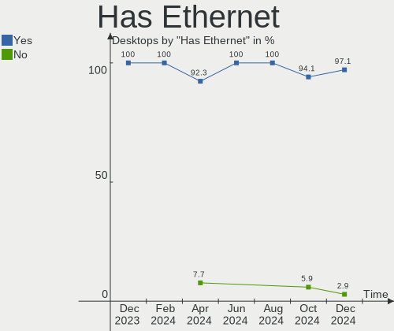

FreeBSD - Hardware Trends (Desktops)
------------------------------------

A project to identify most popular hardware characteristics and track their change
over time based on data collected by BSD users at https://BSD-Hardware.info.

Anyone can contribute to this report by the [hw-probe](https://github.com/linuxhw/hw-probe/blob/master/INSTALL.BSD.md) tool:

    hw-probe -all -upload

This report is for one last month. Overall report since the beginning of time: [TestCoverage](https://github.com/bsdhw/TestCoverage)

Period: Oct, 2022.

Contents
--------

* [ System ](#system)
  - [ OS                       ](#os)
  - [ OS Family                ](#os-family)
  - [ Arch                     ](#arch)
  - [ DE                       ](#de)
  - [ Display Server           ](#display-server)
  - [ Display Manager          ](#display-manager)
  - [ OS Lang                  ](#os-lang)
  - [ Boot Mode                ](#boot-mode)
  - [ Filesystem               ](#filesystem)
  - [ Part. scheme             ](#part-scheme)

* [ Board ](#board)
  - [ Vendor                   ](#vendor)
  - [ Model                    ](#model)
  - [ Model Family             ](#model-family)
  - [ MFG Year                 ](#mfg-year)
  - [ Form Factor              ](#form-factor)
  - [ Coreboot                 ](#coreboot)
  - [ RAM Size                 ](#ram-size)
  - [ RAM Used                 ](#ram-used)
  - [ Total Drives             ](#total-drives)
  - [ Has CD-ROM               ](#has-cd-rom)
  - [ Has Ethernet             ](#has-ethernet)
  - [ Has WiFi                 ](#has-wifi)
  - [ Has Bluetooth            ](#has-bluetooth)

* [ Location ](#location)
  - [ Country                  ](#country)
  - [ City                     ](#city)

* [ Drives ](#drives)
  - [ Drive Vendor             ](#drive-vendor)
  - [ Drive Model              ](#drive-model)
  - [ HDD Vendor               ](#hdd-vendor)
  - [ SSD Vendor               ](#ssd-vendor)
  - [ Drive Kind               ](#drive-kind)
  - [ Drive Connector          ](#drive-connector)
  - [ Drive Size               ](#drive-size)
  - [ Space Total              ](#space-total)
  - [ Space Used               ](#space-used)
  - [ Malfunc. Drives          ](#malfunc-drives)
  - [ Malfunc. Drive Vendor    ](#malfunc-drive-vendor)
  - [ Malfunc. HDD Vendor      ](#malfunc-hdd-vendor)
  - [ Malfunc. Drive Kind      ](#malfunc-drive-kind)
  - [ Failed Drives            ](#failed-drives)
  - [ Failed Drive Vendor      ](#failed-drive-vendor)
  - [ Drive Status             ](#drive-status)

* [ Storage controller ](#storage-controller)
  - [ Storage Vendor           ](#storage-vendor)
  - [ Storage Model            ](#storage-model)
  - [ Storage Kind             ](#storage-kind)

* [ Processor ](#processor)
  - [ CPU Vendor               ](#cpu-vendor)
  - [ CPU Model                ](#cpu-model)
  - [ CPU Model Family         ](#cpu-model-family)
  - [ CPU Cores                ](#cpu-cores)
  - [ CPU Sockets              ](#cpu-sockets)
  - [ CPU Threads              ](#cpu-threads)
  - [ CPU Microarch            ](#cpu-microarch)

* [ Graphics ](#graphics)
  - [ GPU Vendor               ](#gpu-vendor)
  - [ GPU Model                ](#gpu-model)
  - [ GPU Combo                ](#gpu-combo)
  - [ GPU Driver               ](#gpu-driver)
  - [ GPU Memory               ](#gpu-memory)

* [ Monitor ](#monitor)
  - [ Monitor Vendor           ](#monitor-vendor)
  - [ Monitor Model            ](#monitor-model)
  - [ Monitor Resolution       ](#monitor-resolution)
  - [ Monitor Diagonal         ](#monitor-diagonal)
  - [ Monitor Width            ](#monitor-width)
  - [ Aspect Ratio             ](#aspect-ratio)
  - [ Monitor Area             ](#monitor-area)
  - [ Pixel Density            ](#pixel-density)
  - [ Multiple Monitors        ](#multiple-monitors)

* [ Network ](#network)
  - [ Net Controller Vendor    ](#net-controller-vendor)
  - [ Net Controller Model     ](#net-controller-model)
  - [ Wireless Vendor          ](#wireless-vendor)
  - [ Wireless Model           ](#wireless-model)
  - [ Ethernet Vendor          ](#ethernet-vendor)
  - [ Ethernet Model           ](#ethernet-model)
  - [ Net Controller Kind      ](#net-controller-kind)
  - [ Used Controller          ](#used-controller)
  - [ NICs                     ](#nics)
  - [ IPv6                     ](#ipv6)

* [ Bluetooth ](#bluetooth)
  - [ Bluetooth Vendor         ](#bluetooth-vendor)
  - [ Bluetooth Model          ](#bluetooth-model)

* [ Sound ](#sound)
  - [ Sound Vendor             ](#sound-vendor)
  - [ Sound Model              ](#sound-model)

* [ Memory ](#memory)
  - [ Memory Vendor            ](#memory-vendor)
  - [ Memory Model             ](#memory-model)
  - [ Memory Kind              ](#memory-kind)
  - [ Memory Form Factor       ](#memory-form-factor)
  - [ Memory Size              ](#memory-size)
  - [ Memory Speed             ](#memory-speed)

* [ Printers & scanners ](#printers--scanners)
  - [ Printer Vendor           ](#printer-vendor)
  - [ Printer Model            ](#printer-model)
  - [ Scanner Vendor           ](#scanner-vendor)
  - [ Scanner Model            ](#scanner-model)

* [ Camera ](#camera)
  - [ Camera Vendor            ](#camera-vendor)
  - [ Camera Model             ](#camera-model)

* [ Security ](#security)
  - [ Fingerprint Vendor       ](#fingerprint-vendor)
  - [ Fingerprint Model        ](#fingerprint-model)
  - [ Chipcard Vendor          ](#chipcard-vendor)
  - [ Chipcard Model           ](#chipcard-model)

* [ Unsupported ](#unsupported)
  - [ Unsupported Devices      ](#unsupported-devices)
  - [ Unsupported Device Types ](#unsupported-device-types)

System
------

OS
--

Installed operating systems

| Name                 | Desktops | Percent |
|----------------------|----------|---------|
| FreeBSD 13.1-p2      | 16       | 64%     |
| FreeBSD 13.1         | 3        | 12%     |
| FreeBSD 13.1-p1      | 2        | 8%      |
| FreeBSD 14.0-CURRENT | 1        | 4%      |
| FreeBSD 13.0-p10     | 1        | 4%      |
| FreeBSD 12.4-BETA1   | 1        | 4%      |
| FreeBSD 12.3         | 1        | 4%      |

OS Family
---------

OS without a version

| Name    | Desktops | Percent |
|---------|----------|---------|
| FreeBSD | 25       | 100%    |

Arch
----

OS architecture (x86_64, i586, etc.)

| Name  | Desktops | Percent |
|-------|----------|---------|
| amd64 | 22       | 88%     |
| i386  | 2        | 8%      |
| arm64 | 1        | 4%      |

DE
--

Desktop Environment

| Name    | Desktops | Percent |
|---------|----------|---------|
| Console | 12       | 48%     |
| TWM     | 5        | 20%     |
| XFCE    | 3        | 12%     |
| MATE    | 2        | 8%      |
| KDE5    | 2        | 8%      |
| LXQt    | 1        | 4%      |

Display Server
--------------

X11 or Wayland

| Name    | Desktops | Percent |
|---------|----------|---------|
| X11     | 13       | 52%     |
| Console | 12       | 48%     |

Display Manager
---------------

SDDM, LightDM, etc.

| Name    | Desktops | Percent |
|---------|----------|---------|
| Console | 21       | 84%     |
| XDM     | 1        | 4%      |
| SLiM    | 1        | 4%      |
| SDDM    | 1        | 4%      |
| LightDM | 1        | 4%      |

OS Lang
-------

Language

| Lang    | Desktops | Percent |
|---------|----------|---------|
| C       | 18       | 72%     |
| en_US   | 3        | 12%     |
| ru_RU   | 1        | 4%      |
| it_IT   | 1        | 4%      |
| fi_FI   | 1        | 4%      |
| Unknown | 1        | 4%      |

Boot Mode
---------

EFI or BIOS

| Mode | Desktops | Percent |
|------|----------|---------|
| EFI  | 14       | 56%     |
| BIOS | 11       | 44%     |

Filesystem
----------

Type of filesystem

| Type | Desktops | Percent |
|------|----------|---------|
| Zfs  | 20       | 80%     |
| Ufs  | 5        | 20%     |

Part. scheme
------------

Scheme of partitioning

| Type | Desktops | Percent |
|------|----------|---------|
| GPT  | 25       | 100%    |

Board
-----

Vendor
------

Motherboard manufacturer

| Name             | Desktops | Percent |
|------------------|----------|---------|
| ASUSTek Computer | 5        | 20%     |
| ASRock           | 4        | 16%     |
| Hewlett-Packard  | 3        | 12%     |
| MSI              | 2        | 8%      |
| ASRockRack       | 2        | 8%      |
| Unknown          | 2        | 8%      |
| TYAN Computer    | 1        | 4%      |
| Lenovo           | 1        | 4%      |
| IBM              | 1        | 4%      |
| HPE              | 1        | 4%      |
| Fujitsu          | 1        | 4%      |
| Dell             | 1        | 4%      |
| Acer             | 1        | 4%      |

Model
-----

Motherboard model

| Name                               | Desktops | Percent |
|------------------------------------|----------|---------|
| Unknown                            | 2        | 8%      |
| TYAN Intel 440BX/GX Rev. 4         | 1        | 4%      |
| MSI MS-7D08                        | 1        | 4%      |
| MSI MS-7817                        | 1        | 4%      |
| Lenovo ThinkCentre M900 10FLS3XG00 | 1        | 4%      |
| IBM 9210MML                        | 1        | 4%      |
| HPE ProLiant ML30 Gen10            | 1        | 4%      |
| HP Z440 Workstation                | 1        | 4%      |
| HP Z420 Workstation                | 1        | 4%      |
| HP EliteDesk 800 G1 TWR            | 1        | 4%      |
| Fujitsu D3401-H2 S26361-D3401-H2   | 1        | 4%      |
| Dell Dimension 2400                | 1        | 4%      |
| ASUS ROG CROSSHAIR VIII HERO       | 1        | 4%      |
| ASUS PRIME X370-PRO                | 1        | 4%      |
| ASUS Pentino G-Series              | 1        | 4%      |
| ASUS P8B75-M                       | 1        | 4%      |
| ASUS P5Q-E                         | 1        | 4%      |
| ASRockRack EPYC3101D4I-2T          | 1        | 4%      |
| ASRockRack EP2C612D16FM            | 1        | 4%      |
| ASRock Z77 Extreme4                | 1        | 4%      |
| ASRock X570 Phantom Gaming 4       | 1        | 4%      |
| ASRock X399 Taichi                 | 1        | 4%      |
| ASRock G41C-GS R2.0                | 1        | 4%      |
| Acer Revo RN86                     | 1        | 4%      |

Model Family
------------

Motherboard model prefix

| Name                      | Desktops | Percent |
|---------------------------|----------|---------|
| Unknown                   | 2        | 8%      |
| TYAN Intel                | 1        | 4%      |
| MSI MS-7D08               | 1        | 4%      |
| MSI MS-7817               | 1        | 4%      |
| Lenovo ThinkCentre        | 1        | 4%      |
| IBM 9210MML               | 1        | 4%      |
| HPE ProLiant              | 1        | 4%      |
| HP Z440                   | 1        | 4%      |
| HP Z420                   | 1        | 4%      |
| HP EliteDesk              | 1        | 4%      |
| Fujitsu D3401-H2          | 1        | 4%      |
| Dell Dimension            | 1        | 4%      |
| ASUS ROG                  | 1        | 4%      |
| ASUS PRIME                | 1        | 4%      |
| ASUS Pentino              | 1        | 4%      |
| ASUS P8B75-M              | 1        | 4%      |
| ASUS P5Q-E                | 1        | 4%      |
| ASRockRack EPYC3101D4I-2T | 1        | 4%      |
| ASRockRack EP2C612D16FM   | 1        | 4%      |
| ASRock Z77                | 1        | 4%      |
| ASRock X570               | 1        | 4%      |
| ASRock X399               | 1        | 4%      |
| ASRock G41C-GS            | 1        | 4%      |
| Acer Revo                 | 1        | 4%      |

MFG Year
--------

Motherboard manufacture year

| Year    | Desktops | Percent |
|---------|----------|---------|
| 2019    | 3        | 12%     |
| 2013    | 3        | 12%     |
| Unknown | 3        | 12%     |
| 2021    | 2        | 8%      |
| 2020    | 2        | 8%      |
| 2018    | 2        | 8%      |
| 2017    | 2        | 8%      |
| 2015    | 2        | 8%      |
| 2014    | 2        | 8%      |
| 2012    | 1        | 4%      |
| 2008    | 1        | 4%      |
| 2006    | 1        | 4%      |
| 2003    | 1        | 4%      |

Form Factor
-----------

Physical design of the computer

| Name    | Desktops | Percent |
|---------|----------|---------|
| Desktop | 25       | 100%    |

Coreboot
--------

Have coreboot on board

| Used | Desktops | Percent |
|------|----------|---------|
| No   | 25       | 100%    |

RAM Size
--------

Total RAM memory

| Size in GB  | Desktops | Percent |
|-------------|----------|---------|
| 32.01-64.0  | 7        | 28%     |
| 8.01-16.0   | 6        | 24%     |
| 64.01-256.0 | 4        | 16%     |
| 4.01-8.0    | 3        | 12%     |
| 0.51-1.0    | 3        | 12%     |
| 16.01-24.0  | 2        | 8%      |

RAM Used
--------

Used RAM memory

| Used GB  | Desktops | Percent |
|----------|----------|---------|
| 0.01-0.5 | 10       | 40%     |
| 1.01-2.0 | 8        | 32%     |
| 0.51-1.0 | 4        | 16%     |
| 2.01-3.0 | 2        | 8%      |
| 3.01-4.0 | 1        | 4%      |

Total Drives
------------

Number of drives on board

| Drives | Desktops | Percent |
|--------|----------|---------|
| 1      | 7        | 28%     |
| 3      | 4        | 16%     |
| 2      | 4        | 16%     |
| 4      | 3        | 12%     |
| 6      | 2        | 8%      |
| 5      | 2        | 8%      |
| 0      | 2        | 8%      |
| 13     | 1        | 4%      |

Has CD-ROM
----------

Has CD-ROM on board

| Presented | Desktops | Percent |
|-----------|----------|---------|
| No        | 16       | 64%     |
| Yes       | 9        | 36%     |

Has Ethernet
------------

Has Ethernet on board

| Presented | Desktops | Percent |
|-----------|----------|---------|
| Yes       | 24       | 96%     |
| No        | 1        | 4%      |

Has WiFi
--------

Has WiFi module

| Presented | Desktops | Percent |
|-----------|----------|---------|
| No        | 22       | 88%     |
| Yes       | 3        | 12%     |

Has Bluetooth
-------------

Has Bluetooth module

| Presented | Desktops | Percent |
|-----------|----------|---------|
| No        | 22       | 88%     |
| Yes       | 3        | 12%     |

Location
--------

Country
-------

Geographic location (country)

| Country   | Desktops | Percent |
|-----------|----------|---------|
| USA       | 11       | 44%     |
| Poland    | 2        | 8%      |
| Germany   | 2        | 8%      |
| Finland   | 2        | 8%      |
| Canada    | 2        | 8%      |
| Venezuela | 1        | 4%      |
| Thailand  | 1        | 4%      |
| Russia    | 1        | 4%      |
| Italy     | 1        | 4%      |
| Denmark   | 1        | 4%      |
| Australia | 1        | 4%      |

City
----

Geographic location (city)

| City                 | Desktops | Percent |
|----------------------|----------|---------|
| City of Saint Peters | 3        | 12%     |
| Salem                | 2        | 8%      |
| Redmond              | 2        | 8%      |
| Portland             | 2        | 8%      |
| Wenatchee            | 1        | 4%      |
| Vancouver            | 1        | 4%      |
| Sherbrooke           | 1        | 4%      |
| Reading              | 1        | 4%      |
| Radzionkow           | 1        | 4%      |
| Pontecagnano         | 1        | 4%      |
| Ozersk               | 1        | 4%      |
| Maracaibo            | 1        | 4%      |
| Lubin                | 1        | 4%      |
| Lahti                | 1        | 4%      |
| Kongens Lyngby       | 1        | 4%      |
| Helsinki             | 1        | 4%      |
| Freiburg im Breisgau | 1        | 4%      |
| Chaloem Phra Kiat    | 1        | 4%      |
| Berlin               | 1        | 4%      |
| Adelaide             | 1        | 4%      |

Drives
------

Drive Vendor
------------

Hard drive vendors

| Vendor              | Desktops | Drives | Percent |
|---------------------|----------|--------|---------|
| WDC                 | 12       | 26     | 29.27%  |
| Samsung Electronics | 10       | 19     | 24.39%  |
| Seagate             | 6        | 11     | 14.63%  |
| Toshiba             | 3        | 7      | 7.32%   |
| Kingston            | 2        | 2      | 4.88%   |
| Intel               | 2        | 3      | 4.88%   |
| Crucial             | 2        | 2      | 4.88%   |
| QUANTUM             | 1        | 1      | 2.44%   |
| Maxtor              | 1        | 1      | 2.44%   |
| Hitachi             | 1        | 1      | 2.44%   |
| Corsair             | 1        | 1      | 2.44%   |

Drive Model
-----------

Hard drive models

| Model                            | Desktops | Percent |
|----------------------------------|----------|---------|
| Seagate ST4000DM000-1F2168 4TB   | 2        | 3.7%    |
| Seagate ST1000DM003-1CH162 1TB   | 2        | 3.7%    |
| WDC WDS100T3X0C-00SJG0 1TB       | 1        | 1.85%   |
| WDC WDS100T2B0A-00SM50 1TB       | 1        | 1.85%   |
| WDC WD80EMAZ-00WJTA0 8TB         | 1        | 1.85%   |
| WDC WD80EFZX-68UW8N0 8TB         | 1        | 1.85%   |
| WDC WD80EFAX-68LHPN0 8TB         | 1        | 1.85%   |
| WDC WD80EDBZ-11B0ZA0 8TB         | 1        | 1.85%   |
| WDC WD5000LPLX-08ZNTT0 500GB     | 1        | 1.85%   |
| WDC WD40EZRZ-22GXCB0 4TB         | 1        | 1.85%   |
| WDC WD30EFRX-68EUZN0 3TB         | 1        | 1.85%   |
| WDC WD30EFRX-68AX9N0 3TB         | 1        | 1.85%   |
| WDC WD15EADS-00P8B0 1.5TB        | 1        | 1.85%   |
| WDC WD120EMFZ-11A6JA0 12TB       | 1        | 1.85%   |
| WDC WD120EMAZ-11BLFA0 12TB       | 1        | 1.85%   |
| WDC WD10EZEX-00BN5A0 1TB         | 1        | 1.85%   |
| WDC WD10EFRX-68FYTN0 1TB         | 1        | 1.85%   |
| WDC WD1003FZEX-00K3CA0 1TB       | 1        | 1.85%   |
| WDC WD1000DHTZ-04N21V0 1TB       | 1        | 1.85%   |
| WDC AC313000R 16GB               | 1        | 1.85%   |
| Toshiba MG08ACA16TE 16TB         | 1        | 1.85%   |
| Toshiba KXG50ZNV512G 512GB       | 1        | 1.85%   |
| Toshiba DT01ACA100 1TB           | 1        | 1.85%   |
| Seagate ST4000NM0033-9ZM170 4TB  | 1        | 1.85%   |
| Seagate ST4000LM024-2AN17V 4TB   | 1        | 1.85%   |
| Seagate ST1000DM010-2EP102 1TB   | 1        | 1.85%   |
| Samsung SSD 980 1TB              | 1        | 1.85%   |
| Samsung SSD 970 EVO Plus 1TB     | 1        | 1.85%   |
| Samsung SSD 970 EVO 250GB        | 1        | 1.85%   |
| Samsung SSD 960 EVO 500GB        | 1        | 1.85%   |
| Samsung SSD 870 QVO 2TB          | 1        | 1.85%   |
| Samsung SSD 860 QVO 1TB          | 1        | 1.85%   |
| Samsung SSD 860 EVO 500GB        | 1        | 1.85%   |
| Samsung SSD 850 EVO 250GB        | 1        | 1.85%   |
| Samsung SSD 850 EVO 1TB          | 1        | 1.85%   |
| Samsung SSD 840 EVO 500GB        | 1        | 1.85%   |
| Samsung SSD 840 EVO 120GB        | 1        | 1.85%   |
| Samsung SSD 750 EVO 120GB        | 1        | 1.85%   |
| Samsung MZVLQ256HAJD-00000 256GB | 1        | 1.85%   |
| Samsung MZ7KM960HAHP-00005 960GB | 1        | 1.85%   |

HDD Vendor
----------

Hard disk drive vendors

| Vendor              | Desktops | Drives | Percent |
|---------------------|----------|--------|---------|
| WDC                 | 10       | 22     | 45.45%  |
| Seagate             | 6        | 11     | 27.27%  |
| Toshiba             | 2        | 5      | 9.09%   |
| Samsung Electronics | 1        | 1      | 4.55%   |
| QUANTUM             | 1        | 1      | 4.55%   |
| Maxtor              | 1        | 1      | 4.55%   |
| Hitachi             | 1        | 1      | 4.55%   |

SSD Vendor
----------

Solid state drive vendors

| Vendor              | Desktops | Drives | Percent |
|---------------------|----------|--------|---------|
| Samsung Electronics | 7        | 11     | 53.85%  |
| Kingston            | 2        | 2      | 15.38%  |
| Crucial             | 2        | 2      | 15.38%  |
| WDC                 | 1        | 3      | 7.69%   |
| Intel               | 1        | 1      | 7.69%   |

Drive Kind
----------

HDD or SSD

| Kind | Desktops | Drives | Percent |
|------|----------|--------|---------|
| HDD  | 15       | 42     | 41.67%  |
| SSD  | 12       | 19     | 33.33%  |
| NVMe | 9        | 13     | 25%     |

Drive Connector
---------------

SATA, SAS, NVMe, etc.

| Type | Desktops | Drives | Percent |
|------|----------|--------|---------|
| SATA | 20       | 61     | 68.97%  |
| NVMe | 9        | 13     | 31.03%  |

Drive Size
----------

Size of hard drive

| Size in TB | Desktops | Drives | Percent |
|------------|----------|--------|---------|
| 0.01-0.5   | 9        | 15     | 32.14%  |
| 0.51-1.0   | 8        | 18     | 28.57%  |
| 3.01-4.0   | 4        | 6      | 14.29%  |
| 2.01-3.0   | 2        | 4      | 7.14%   |
| 10.01-20.0 | 2        | 6      | 7.14%   |
| 1.01-2.0   | 2        | 4      | 7.14%   |
| 4.01-10.0  | 1        | 8      | 3.57%   |

Space Total
-----------

Amount of disk space available on the file system

| Size in GB     | Desktops | Percent |
|----------------|----------|---------|
| 101-250        | 11       | 44%     |
| 251-500        | 6        | 24%     |
| 501-1000       | 4        | 16%     |
| More than 3000 | 1        | 4%      |
| 21-50          | 1        | 4%      |
| 2001-3000      | 1        | 4%      |
| 51-100         | 1        | 4%      |

Space Used
----------

Amount of used disk space

| Used GB | Desktops | Percent |
|---------|----------|---------|
| 1-20    | 19       | 76%     |
| 21-50   | 3        | 12%     |
| 51-100  | 2        | 8%      |
| 101-250 | 1        | 4%      |

Malfunc. Drives
---------------

Drive models with a malfunction

| Model                             | Desktops | Drives | Percent |
|-----------------------------------|----------|--------|---------|
| Seagate ST4000NM0033-9ZM170 4TB   | 1        | 2      | 20%     |
| Seagate ST1000DM003-1CH162 1TB    | 1        | 1      | 20%     |
| Samsung Electronics HD501LJ 500GB | 1        | 1      | 20%     |
| Maxtor 6E030L0 32GB               | 1        | 1      | 20%     |
| Kingston SV300S37A120G 120GB      | 1        | 1      | 20%     |

Malfunc. Drive Vendor
---------------------

Vendors of faulty drives

| Vendor              | Desktops | Drives | Percent |
|---------------------|----------|--------|---------|
| Seagate             | 2        | 3      | 40%     |
| Samsung Electronics | 1        | 1      | 20%     |
| Maxtor              | 1        | 1      | 20%     |
| Kingston            | 1        | 1      | 20%     |

Malfunc. HDD Vendor
-------------------

Vendors of faulty HDD drives

| Vendor              | Desktops | Drives | Percent |
|---------------------|----------|--------|---------|
| Seagate             | 2        | 3      | 50%     |
| Samsung Electronics | 1        | 1      | 25%     |
| Maxtor              | 1        | 1      | 25%     |

Malfunc. Drive Kind
-------------------

Kinds of faulty drives

| Kind | Desktops | Drives | Percent |
|------|----------|--------|---------|
| HDD  | 3        | 5      | 75%     |
| SSD  | 1        | 1      | 25%     |

Failed Drives
-------------

Failed drive models

Zero info for selected period =(

Failed Drive Vendor
-------------------

Failed drive vendors

Zero info for selected period =(

Drive Status
------------

Number of failed and malfunc. drives

| Status   | Desktops | Drives | Percent |
|----------|----------|--------|---------|
| Works    | 19       | 61     | 73.08%  |
| Malfunc  | 4        | 6      | 15.38%  |
| Detected | 3        | 7      | 11.54%  |

Storage controller
------------------

Storage Vendor
--------------

Storage controller vendors

| Vendor                      | Desktops | Percent |
|-----------------------------|----------|---------|
| Intel                       | 19       | 47.5%   |
| Samsung Electronics         | 5        | 12.5%   |
| AMD                         | 5        | 12.5%   |
| Sandisk                     | 2        | 5%      |
| ASMedia Technology          | 2        | 5%      |
| Adaptec                     | 2        | 5%      |
| Toshiba                     | 1        | 2.5%    |
| Phison Electronics          | 1        | 2.5%    |
| Marvell Technology Group    | 1        | 2.5%    |
| Kingston Technology Company | 1        | 2.5%    |
| Broadcom / LSI              | 1        | 2.5%    |

Storage Model
-------------

Storage controller models

| Model                                                                          | Desktops | Percent |
|--------------------------------------------------------------------------------|----------|---------|
| AMD FCH SATA Controller [AHCI mode]                                            | 5        | 10%     |
| Samsung NVMe SSD Controller SM981/PM981/PM983                                  | 2        | 4%      |
| Samsung NVMe SSD Controller 980                                                | 2        | 4%      |
| Intel Q170/Q150/B150/H170/H110/Z170/CM236 Chipset SATA Controller [AHCI Mode]  | 2        | 4%      |
| Intel NM10/ICH7 Family SATA Controller [IDE mode]                              | 2        | 4%      |
| Intel Cannon Lake PCH SATA AHCI Controller                                     | 2        | 4%      |
| Intel C610/X99 series chipset sSATA Controller [AHCI mode]                     | 2        | 4%      |
| Intel C610/X99 series chipset 6-Port SATA Controller [AHCI mode]               | 2        | 4%      |
| Intel 8 Series/C220 Series Chipset Family 6-port SATA Controller 1 [AHCI mode] | 2        | 4%      |
| ASMedia ASM1062 Serial ATA Controller                                          | 2        | 4%      |
| Toshiba unknown                                                                | 1        | 2%      |
| SanDisk WD Black SN750 / PC SN730 NVMe SSD                                     | 1        | 2%      |
| Samsung NVMe SSD Controller SM961/PM961/SM963                                  | 1        | 2%      |
| Phison E16 PCIe4 NVMe Controller                                               | 1        | 2%      |
| Marvell Group 88SE6111/6121 SATA II / PATA Controller                          | 1        | 2%      |
| Kingston Company A2000 NVMe SSD                                                | 1        | 2%      |
| Intel SATA Controller [RAID mode]                                              | 1        | 2%      |
| Intel Optane SSD 900P Series                                                   | 1        | 2%      |
| Intel NVMe Optane Memory Series                                                | 1        | 2%      |
| Intel Celeron/Pentium Silver Processor SATA Controller                         | 1        | 2%      |
| Intel C602 chipset 4-Port SATA Storage Control Unit                            | 1        | 2%      |
| Intel C600/X79 series chipset IDE-r Controller                                 | 1        | 2%      |
| Intel C600/X79 series chipset 6-Port SATA AHCI Controller                      | 1        | 2%      |
| Intel 82801JI (ICH10 Family) SATA AHCI Controller                              | 1        | 2%      |
| Intel 82801G (ICH7 Family) IDE Controller                                      | 1        | 2%      |
| Intel 82801DB (ICH4) IDE Controller                                            | 1        | 2%      |
| Intel 82371AB/EB/MB PIIX4 IDE                                                  | 1        | 2%      |
| Intel 7 Series/C210 Series Chipset Family 6-port SATA Controller [AHCI mode]   | 1        | 2%      |
| Intel 7 Series/C210 Series Chipset Family 4-port SATA Controller [IDE mode]    | 1        | 2%      |
| Intel 7 Series/C210 Series Chipset Family 2-port SATA Controller [IDE mode]    | 1        | 2%      |
| Intel 500 Series Chipset Family SATA AHCI Controller                           | 1        | 2%      |
| Broadcom / LSI SAS2008 PCI-Express Fusion-MPT SAS-2 [Falcon]                   | 1        | 2%      |
| AMD X399 Series Chipset SATA Controller                                        | 1        | 2%      |
| AMD X370 Series Chipset SATA Controller                                        | 1        | 2%      |
| Adaptec Smart Storage PQI SAS                                                  | 1        | 2%      |
| Adaptec AIC-7870P/7881U [AHA-2940U/UW/D/S76]                                   | 1        | 2%      |
| Unknown                                                                        | 1        | 2%      |

Storage Kind
------------

Kind of storage controller (IDE, SATA, NVMe, SAS, ...)

| Kind | Desktops | Percent |
|------|----------|---------|
| SATA | 19       | 45.24%  |
| NVMe | 11       | 26.19%  |
| IDE  | 7        | 16.67%  |
| SAS  | 3        | 7.14%   |
| RAID | 1        | 2.38%   |
| SCSI | 1        | 2.38%   |

Processor
---------

CPU Vendor
----------

Processor vendors

| Vendor | Desktops | Percent |
|--------|----------|---------|
| Intel  | 18       | 72%     |
| AMD    | 5        | 20%     |
| i      | 1        | 4%      |
| ARM    | 1        | 4%      |

CPU Model
---------

Processor models

| Model                                          | Desktops | Percent |
|------------------------------------------------|----------|---------|
| Intel Core i7-3770 CPU @ 3.40GHz               | 2        | 8%      |
| AMD Ryzen 9 3900X 12-Core Processor            | 2        | 8%      |
| Intel Xeon E-2276G CPU @ 3.80GHz               | 1        | 4%      |
| Intel Xeon CPU E5-2683 v4 @ 2.10GHz            | 1        | 4%      |
| Intel Xeon CPU E5-2650 v3 @ 2.30GHz            | 1        | 4%      |
| Intel Xeon CPU E5-1620 @ 3.60GHz               | 1        | 4%      |
| Intel Pentium D CPU 3.00GHz                    | 1        | 4%      |
| Intel Pentium CPU G3220 @ 3.00GHz              | 1        | 4%      |
| Intel Pentium 4 CPU 3.20GHz                    | 1        | 4%      |
| Intel Core i7-7700 CPU @ 3.60GHz               | 1        | 4%      |
| Intel Core i5-9400T CPU @ 1.80GHz              | 1        | 4%      |
| Intel Core i5-6500T CPU @ 2.50GHz              | 1        | 4%      |
| Intel Core i5-4670 CPU @ 3.40GHz               | 1        | 4%      |
| Intel Core i5-3470 CPU @ 3.20GHz               | 1        | 4%      |
| Intel Core 2 Quad CPU Q6600 @ 2.40GHz          | 1        | 4%      |
| Intel Celeron J4105 CPU @ 1.50GHz              | 1        | 4%      |
| Intel Celeron                                  | 1        | 4%      |
| Intel 11th Gen Core i5-11600K @ 3.90GHz        | 1        | 4%      |
| i Pentium II                                   | 1        | 4%      |
| ARM Cortex-A53 r0p4                            | 1        | 4%      |
| AMD Ryzen Threadripper 2950X 16-Core Processor | 1        | 4%      |
| AMD Ryzen 7 1700 Eight-Core Processor          | 1        | 4%      |
| AMD EPYC 3101 4-Core Processor                 | 1        | 4%      |

CPU Model Family
----------------

Processor model prefix

| Model                  | Desktops | Percent |
|------------------------|----------|---------|
| Intel Xeon             | 4        | 16%     |
| Intel Core i5          | 4        | 16%     |
| Intel Core i7          | 3        | 12%     |
| Other                  | 2        | 8%      |
| Intel Celeron          | 2        | 8%      |
| AMD Ryzen 9            | 2        | 8%      |
| Intel Pentium D        | 1        | 4%      |
| Intel Pentium 4        | 1        | 4%      |
| Intel Pentium          | 1        | 4%      |
| Intel Core 2 Quad      | 1        | 4%      |
| ARM Cortex             | 1        | 4%      |
| AMD Ryzen Threadripper | 1        | 4%      |
| AMD Ryzen 7            | 1        | 4%      |
| AMD EPYC               | 1        | 4%      |

CPU Cores
---------

Number of processor cores

| Number  | Desktops | Percent |
|---------|----------|---------|
| 4       | 10       | 40%     |
| 6       | 3        | 12%     |
| Unknown | 3        | 12%     |
| 24      | 2        | 8%      |
| 16      | 2        | 8%      |
| 2       | 2        | 8%      |
| 32      | 1        | 4%      |
| 20      | 1        | 4%      |
| 1       | 1        | 4%      |

CPU Sockets
-----------

Number of sockets

| Number  | Desktops | Percent |
|---------|----------|---------|
| 1       | 22       | 88%     |
| 2       | 2        | 8%      |
| Unknown | 1        | 4%      |

CPU Threads
-----------

Threads per core (Hyper-Threading)

| Number  | Desktops | Percent |
|---------|----------|---------|
| 1       | 13       | 52%     |
| 2       | 8        | 32%     |
| Unknown | 4        | 16%     |

CPU Microarch
-------------

Microarchitecture

| Name          | Desktops | Percent |
|---------------|----------|---------|
| NetBurst      | 3        | 12%     |
| KabyLake      | 3        | 12%     |
| IvyBridge     | 3        | 12%     |
| Haswell       | 3        | 12%     |
| Unknown       | 3        | 12%     |
| Zen 2         | 2        | 8%      |
| Zen           | 2        | 8%      |
| Zen+          | 1        | 4%      |
| Skylake       | 1        | 4%      |
| SandyBridge   | 1        | 4%      |
| Goldmont plus | 1        | 4%      |
| Core          | 1        | 4%      |
| Broadwell     | 1        | 4%      |

Graphics
--------

GPU Vendor
----------

Vendors of graphics cards

| Vendor                     | Desktops | Percent |
|----------------------------|----------|---------|
| Intel                      | 13       | 48.15%  |
| Nvidia                     | 8        | 29.63%  |
| AMD                        | 3        | 11.11%  |
| ASPEED Technology          | 2        | 7.41%   |
| Matrox Electronics Systems | 1        | 3.7%    |

GPU Model
---------

Graphics card models

| Model                                                                       | Desktops | Percent |
|-----------------------------------------------------------------------------|----------|---------|
| Intel Xeon E3-1200 v3/4th Gen Core Processor Integrated Graphics Controller | 2        | 7.41%   |
| Intel IvyBridge GT2 [HD Graphics 4000]                                      | 2        | 7.41%   |
| ASPEED Technology ASPEED Graphics Family                                    | 2        | 7.41%   |
| Nvidia TU104 [GeForce RTX 2080 Rev. A]                                      | 1        | 3.7%    |
| Nvidia GT218 [NVS 300]                                                      | 1        | 3.7%    |
| Nvidia GP108 [GeForce GT 1030]                                              | 1        | 3.7%    |
| Nvidia GP106 [GeForce GTX 1060 3GB]                                         | 1        | 3.7%    |
| Nvidia GP104GL [Quadro P4000]                                               | 1        | 3.7%    |
| Nvidia GK208B [GeForce GT 710]                                              | 1        | 3.7%    |
| Nvidia GK106 [GeForce GTX 660]                                              | 1        | 3.7%    |
| Nvidia GF110 [GeForce GTX 580]                                              | 1        | 3.7%    |
| Matrox Electronics Systems MGA G200eH3                                      | 1        | 3.7%    |
| Intel Xeon E3-1200 v2/3rd Gen Core processor Graphics Controller            | 1        | 3.7%    |
| Intel RocketLake-S GT1 [UHD Graphics 750]                                   | 1        | 3.7%    |
| Intel HD Graphics 630                                                       | 1        | 3.7%    |
| Intel HD Graphics 530                                                       | 1        | 3.7%    |
| Intel GeminiLake [UHD Graphics 600]                                         | 1        | 3.7%    |
| Intel CoffeeLake-S GT2 [UHD Graphics 630]                                   | 1        | 3.7%    |
| Intel 82945G/GZ Integrated Graphics Controller                              | 1        | 3.7%    |
| Intel 82845G/GL[Brookdale-G]/GE Chipset Integrated Graphics Device          | 1        | 3.7%    |
| Intel 4 Series Chipset Integrated Graphics Controller                       | 1        | 3.7%    |
| AMD RV200 [Radeon 7500/7500 LE]                                             | 1        | 3.7%    |
| AMD Navi 24 [Radeon RX 6400 / 6500 XT]                                      | 1        | 3.7%    |
| AMD Cedar [Radeon HD 5000/6000/7350/8350 Series]                            | 1        | 3.7%    |

GPU Combo
---------

Combinations of graphics cards

| Name            | Desktops | Percent |
|-----------------|----------|---------|
| 1 x Intel       | 10       | 40%     |
| 1 x Nvidia      | 5        | 20%     |
| 1 x AMD         | 3        | 12%     |
| Intel + Nvidia  | 2        | 8%      |
| Other           | 1        | 4%      |
| 2 x Intel       | 1        | 4%      |
| Nvidia + ASPEED | 1        | 4%      |
| 1 x Matrox      | 1        | 4%      |
| 1 x ASPEED      | 1        | 4%      |

GPU Driver
----------

Free vs proprietary

| Driver      | Desktops | Percent |
|-------------|----------|---------|
| Free        | 19       | 76%     |
| Proprietary | 5        | 20%     |
| Unknown     | 1        | 4%      |

GPU Memory
----------

Total video memory

| Size in GB | Desktops | Percent |
|------------|----------|---------|
| Unknown    | 21       | 84%     |
| 1.01-2.0   | 2        | 8%      |
| 7.01-8.0   | 1        | 4%      |
| 2.01-3.0   | 1        | 4%      |

Monitor
-------

Monitor Vendor
--------------

Monitor vendors

| Vendor               | Desktops | Percent |
|----------------------|----------|---------|
| Goldstar             | 4        | 30.77%  |
| Samsung Electronics  | 2        | 15.38%  |
| Dell                 | 2        | 15.38%  |
| ViewSonic            | 1        | 7.69%   |
| Toshiba              | 1        | 7.69%   |
| Iiyama               | 1        | 7.69%   |
| BOE                  | 1        | 7.69%   |
| Ancor Communications | 1        | 7.69%   |

Monitor Model
-------------

Monitor models

| Model                                                                 | Desktops | Percent |
|-----------------------------------------------------------------------|----------|---------|
| ViewSonic LCD Monitor VSCD22B 1920x1080 520x290mm 23.4-inch           | 1        | 6.67%   |
| Toshiba TV TSB0200 1920x1080 530x300mm 24.0-inch                      | 1        | 6.67%   |
| Samsung Electronics SyncMaster SAM00A4 1024x768 300x230mm 14.9-inch   | 1        | 6.67%   |
| Samsung Electronics LCD Monitor S27D850                               | 1        | 6.67%   |
| Iiyama PL2773HD IVM6606 1920x1080 600x340mm 27.2-inch                 | 1        | 6.67%   |
| Goldstar W2261 GSM56CF 1920x1080 530x300mm 24.0-inch                  | 1        | 6.67%   |
| Goldstar MP59G GSM5B35 1920x1080 600x340mm 27.2-inch                  | 1        | 6.67%   |
| Goldstar MP59G GSM5B34 1920x1080 480x270mm 21.7-inch                  | 1        | 6.67%   |
| Goldstar LG ULTRAWIDE GSM59F2 2560x1080 800x340mm 34.2-inch           | 1        | 6.67%   |
| Goldstar 34GL750 GSM773B 2560x1080 800x340mm 34.2-inch                | 1        | 6.67%   |
| Dell LCD Monitor U2412M 3840x1200                                     | 1        | 6.67%   |
| Dell LCD Monitor U2412M                                               | 1        | 6.67%   |
| Dell LCD Monitor P2314H 2560x2520                                     | 1        | 6.67%   |
| BOE LCD Monitor BOE06E2 1920x1080 310x170mm 13.9-inch                 | 1        | 6.67%   |
| Ancor Communications ASUS VE278 ACI27F6 1920x1080 600x340mm 27.2-inch | 1        | 6.67%   |

Monitor Resolution
------------------

Monitor screen resolution

| Resolution      | Desktops | Percent |
|-----------------|----------|---------|
| 1920x1080 (FHD) | 7        | 50%     |
| 2560x1080       | 2        | 14.29%  |
| Unknown         | 2        | 14.29%  |
| 3840x1200       | 1        | 7.14%   |
| 2560x2520       | 1        | 7.14%   |
| 1024x768 (XGA)  | 1        | 7.14%   |

Monitor Diagonal
----------------

Diagonal size in inches

| Inches  | Desktops | Percent |
|---------|----------|---------|
| 27      | 3        | 23.08%  |
| 34      | 2        | 15.38%  |
| 24      | 2        | 15.38%  |
| Unknown | 2        | 15.38%  |
| 23      | 1        | 7.69%   |
| 21      | 1        | 7.69%   |
| 14      | 1        | 7.69%   |
| 13      | 1        | 7.69%   |

Monitor Width
-------------

Physical width

| Width in mm | Desktops | Percent |
|-------------|----------|---------|
| 501-600     | 6        | 46.15%  |
| 701-800     | 2        | 15.38%  |
| Unknown     | 2        | 15.38%  |
| 401-500     | 1        | 7.69%   |
| 301-350     | 1        | 7.69%   |
| 201-300     | 1        | 7.69%   |

Aspect Ratio
------------

Proportional relationship between the width and the height

| Ratio   | Desktops | Percent |
|---------|----------|---------|
| 16/9    | 7        | 58.33%  |
| 21/9    | 2        | 16.67%  |
| Unknown | 2        | 16.67%  |
| 4/3     | 1        | 8.33%   |

Monitor Area
------------

Area in inch²

| Area in inch² | Desktops | Percent |
|----------------|----------|---------|
| 201-250        | 4        | 30.77%  |
| 301-350        | 3        | 23.08%  |
| 351-500        | 2        | 15.38%  |
| Unknown        | 2        | 15.38%  |
| 81-90          | 1        | 7.69%   |
| 101-110        | 1        | 7.69%   |

Pixel Density
-------------

Pixels per inch

| Density | Desktops | Percent |
|---------|----------|---------|
| 51-100  | 9        | 69.23%  |
| Unknown | 2        | 15.38%  |
| 121-160 | 1        | 7.69%   |
| 101-120 | 1        | 7.69%   |

Multiple Monitors
-----------------

Total monitors connected

| Total | Desktops | Percent |
|-------|----------|---------|
| 0     | 13       | 52%     |
| 1     | 9        | 36%     |
| 2     | 3        | 12%     |

Network
-------

Net Controller Vendor
---------------------

Controller vendors

| Vendor                   | Desktops | Percent |
|--------------------------|----------|---------|
| Intel                    | 18       | 54.55%  |
| Realtek Semiconductor    | 7        | 21.21%  |
| Broadcom                 | 3        | 9.09%   |
| Marvell Technology Group | 1        | 3.03%   |
| Aquantia                 | 1        | 3.03%   |
| American Megatrends      | 1        | 3.03%   |
| ADMtek                   | 1        | 3.03%   |
| 3Com                     | 1        | 3.03%   |

Net Controller Model
--------------------

Controller models

| Model                                                             | Desktops | Percent |
|-------------------------------------------------------------------|----------|---------|
| Realtek RTL8111/8168/8411 PCI Express Gigabit Ethernet Controller | 6        | 16.67%  |
| Intel I211 Gigabit Network Connection                             | 4        | 11.11%  |
| Intel Ethernet Connection (2) I219-LM                             | 2        | 5.56%   |
| Intel 82574L Gigabit Network Connection                           | 2        | 5.56%   |
| Realtek RTL8125 2.5GbE Controller                                 | 1        | 2.78%   |
| Marvell Group 88E8056 PCI-E Gigabit Ethernet Controller           | 1        | 2.78%   |
| Marvell Group 88E8001 Gigabit Ethernet Controller                 | 1        | 2.78%   |
| Intel Wi-Fi 6 AX210/AX211/AX411 160MHz                            | 1        | 2.78%   |
| Intel I210 Gigabit Network Connection                             | 1        | 2.78%   |
| Intel Ethernet Controller X550                                    | 1        | 2.78%   |
| Intel Ethernet Controller I225-V                                  | 1        | 2.78%   |
| Intel Ethernet Connection I217-LM                                 | 1        | 2.78%   |
| Intel Ethernet Connection (2) I218-LM                             | 1        | 2.78%   |
| Intel Dual Band Wireless-AC 3168NGW [Stone Peak]                  | 1        | 2.78%   |
| Intel Cannon Lake PCH CNVi WiFi                                   | 1        | 2.78%   |
| Intel 82579V Gigabit Network Connection                           | 1        | 2.78%   |
| Intel 82579LM Gigabit Network Connection (Lewisville)             | 1        | 2.78%   |
| Intel 82573E Gigabit Ethernet Controller (Copper)                 | 1        | 2.78%   |
| Intel 82546GB Gigabit Ethernet Controller                         | 1        | 2.78%   |
| Broadcom NetXtreme BCM5720 Gigabit Ethernet PCIe                  | 1        | 2.78%   |
| Broadcom NetLink BCM57781 Gigabit Ethernet PCIe                   | 1        | 2.78%   |
| Broadcom BCM4401 100Base-T                                        | 1        | 2.78%   |
| Aquantia AQC107 NBase-T/IEEE 802.3bz Ethernet Controller [AQtion] | 1        | 2.78%   |
| American Megatrends Virtual Ethernet                              | 1        | 2.78%   |
| ADMtek NC100 Network Everywhere Fast Ethernet 10/100              | 1        | 2.78%   |
| 3Com 3c905B 100BaseTX [Cyclone]                                   | 1        | 2.78%   |

Wireless Vendor
---------------

Wireless vendors

| Vendor | Desktops | Percent |
|--------|----------|---------|
| Intel  | 3        | 100%    |

Wireless Model
--------------

Wireless models

| Model                                            | Desktops | Percent |
|--------------------------------------------------|----------|---------|
| Intel Wi-Fi 6 AX210/AX211/AX411 160MHz           | 1        | 33.33%  |
| Intel Dual Band Wireless-AC 3168NGW [Stone Peak] | 1        | 33.33%  |
| Intel Cannon Lake PCH CNVi WiFi                  | 1        | 33.33%  |

Ethernet Vendor
---------------

Ethernet vendors

| Vendor                   | Desktops | Percent |
|--------------------------|----------|---------|
| Intel                    | 17       | 53.13%  |
| Realtek Semiconductor    | 7        | 21.88%  |
| Broadcom                 | 3        | 9.38%   |
| Marvell Technology Group | 1        | 3.13%   |
| Aquantia                 | 1        | 3.13%   |
| American Megatrends      | 1        | 3.13%   |
| ADMtek                   | 1        | 3.13%   |
| 3Com                     | 1        | 3.13%   |

Ethernet Model
--------------

Ethernet models

| Model                                                             | Desktops | Percent |
|-------------------------------------------------------------------|----------|---------|
| Realtek RTL8111/8168/8411 PCI Express Gigabit Ethernet Controller | 6        | 18.18%  |
| Intel I211 Gigabit Network Connection                             | 4        | 12.12%  |
| Intel Ethernet Connection (2) I219-LM                             | 2        | 6.06%   |
| Intel 82574L Gigabit Network Connection                           | 2        | 6.06%   |
| Realtek RTL8125 2.5GbE Controller                                 | 1        | 3.03%   |
| Marvell Group 88E8056 PCI-E Gigabit Ethernet Controller           | 1        | 3.03%   |
| Marvell Group 88E8001 Gigabit Ethernet Controller                 | 1        | 3.03%   |
| Intel I210 Gigabit Network Connection                             | 1        | 3.03%   |
| Intel Ethernet Controller X550                                    | 1        | 3.03%   |
| Intel Ethernet Controller I225-V                                  | 1        | 3.03%   |
| Intel Ethernet Connection I217-LM                                 | 1        | 3.03%   |
| Intel Ethernet Connection (2) I218-LM                             | 1        | 3.03%   |
| Intel 82579V Gigabit Network Connection                           | 1        | 3.03%   |
| Intel 82579LM Gigabit Network Connection (Lewisville)             | 1        | 3.03%   |
| Intel 82573E Gigabit Ethernet Controller (Copper)                 | 1        | 3.03%   |
| Intel 82546GB Gigabit Ethernet Controller                         | 1        | 3.03%   |
| Broadcom NetXtreme BCM5720 Gigabit Ethernet PCIe                  | 1        | 3.03%   |
| Broadcom NetLink BCM57781 Gigabit Ethernet PCIe                   | 1        | 3.03%   |
| Broadcom BCM4401 100Base-T                                        | 1        | 3.03%   |
| Aquantia AQC107 NBase-T/IEEE 802.3bz Ethernet Controller [AQtion] | 1        | 3.03%   |
| American Megatrends Virtual Ethernet                              | 1        | 3.03%   |
| ADMtek NC100 Network Everywhere Fast Ethernet 10/100              | 1        | 3.03%   |
| 3Com 3c905B 100BaseTX [Cyclone]                                   | 1        | 3.03%   |

Net Controller Kind
-------------------

Ethernet, WiFi or modem

| Kind     | Desktops | Percent |
|----------|----------|---------|
| Ethernet | 24       | 88.89%  |
| WiFi     | 3        | 11.11%  |

Used Controller
---------------

Currently used network controller

| Kind     | Desktops | Percent |
|----------|----------|---------|
| Ethernet | 23       | 95.83%  |
| WiFi     | 1        | 4.17%   |

NICs
----

Total network controllers on board

| Total | Desktops | Percent |
|-------|----------|---------|
| 1     | 11       | 44%     |
| 2     | 9        | 36%     |
| 3     | 4        | 16%     |
| 0     | 1        | 4%      |

IPv6
----

IPv6 vs IPv4

| Used | Desktops | Percent |
|------|----------|---------|
| No   | 19       | 76%     |
| Yes  | 6        | 24%     |

Bluetooth
---------

Bluetooth Vendor
----------------

Controller vendors

| Vendor | Desktops | Percent |
|--------|----------|---------|
| Intel  | 3        | 100%    |

Bluetooth Model
---------------

Controller models

| Model                                          | Desktops | Percent |
|------------------------------------------------|----------|---------|
| Intel Wireless-AC 3168 Bluetooth               | 1        | 33.33%  |
| Intel Bluetooth 9460/9560 Jefferson Peak (JfP) | 1        | 33.33%  |
| Intel AX210 Bluetooth                          | 1        | 33.33%  |

Sound
-----

Sound Vendor
------------

Sound card vendors

| Vendor                   | Desktops | Percent |
|--------------------------|----------|---------|
| Intel                    | 14       | 48.28%  |
| Nvidia                   | 8        | 27.59%  |
| AMD                      | 5        | 17.24%  |
| Micro Star International | 1        | 3.45%   |
| Creative Labs            | 1        | 3.45%   |

Sound Model
-----------

Sound card models

| Model                                                               | Desktops | Percent |
|---------------------------------------------------------------------|----------|---------|
| Intel 7 Series/C216 Chipset Family High Definition Audio Controller | 3        | 10%     |
| Intel NM10/ICH7 Family High Definition Audio Controller             | 2        | 6.67%   |
| Intel 8 Series/C220 Series Chipset High Definition Audio Controller | 2        | 6.67%   |
| AMD Starship/Matisse HD Audio Controller                            | 2        | 6.67%   |
| Nvidia TU104 HD Audio Controller                                    | 1        | 3.33%   |
| Nvidia High Definition Audio Controller                             | 1        | 3.33%   |
| Nvidia GP108 High Definition Audio Controller                       | 1        | 3.33%   |
| Nvidia GP106 High Definition Audio Controller                       | 1        | 3.33%   |
| Nvidia GP104 High Definition Audio Controller                       | 1        | 3.33%   |
| Nvidia GK208 HDMI/DP Audio Controller                               | 1        | 3.33%   |
| Nvidia GK106 HDMI Audio Controller                                  | 1        | 3.33%   |
| Nvidia GF110 High Definition Audio Controller                       | 1        | 3.33%   |
| Micro Star International USB Audio                                  | 1        | 3.33%   |
| Intel Xeon E3-1200 v3/4th Gen Core Processor HD Audio Controller    | 1        | 3.33%   |
| Intel Celeron/Pentium Silver Processor High Definition Audio        | 1        | 3.33%   |
| Intel Cannon Lake PCH cAVS                                          | 1        | 3.33%   |
| Intel C610/X99 series chipset HD Audio Controller                   | 1        | 3.33%   |
| Intel C600/X79 series chipset High Definition Audio Controller      | 1        | 3.33%   |
| Intel 82801JI (ICH10 Family) HD Audio Controller                    | 1        | 3.33%   |
| Intel 82801DB/DBL/DBM (ICH4/ICH4-L/ICH4-M) AC'97 Audio Controller   | 1        | 3.33%   |
| Intel 100 Series/C230 Series Chipset Family HD Audio Controller     | 1        | 3.33%   |
| Creative Labs EMU10k1 [Sound Blaster Live! Series]                  | 1        | 3.33%   |
| AMD Navi 21/23 HDMI/DP Audio Controller                             | 1        | 3.33%   |
| AMD Family 17h (Models 00h-0fh) HD Audio Controller                 | 1        | 3.33%   |
| AMD Cedar HDMI Audio [Radeon HD 5400/6300/7300 Series]              | 1        | 3.33%   |

Memory
------

Memory Vendor
-------------

Memory module vendors

| Vendor              | Desktops | Percent |
|---------------------|----------|---------|
| SK hynix            | 4        | 15.38%  |
| Kingston            | 4        | 15.38%  |
| Corsair             | 4        | 15.38%  |
| Unknown             | 3        | 11.54%  |
| Samsung Electronics | 3        | 11.54%  |
| G.Skill             | 3        | 11.54%  |
| Patriot             | 1        | 3.85%   |
| Micron Technology   | 1        | 3.85%   |
| HPE                 | 1        | 3.85%   |
| Crucial             | 1        | 3.85%   |
| Unknown             | 1        | 3.85%   |

Memory Model
------------

Memory module models

| Model                                                    | Desktops | Percent |
|----------------------------------------------------------|----------|---------|
| Kingston RAM 9965745-002.A00G 16GB DIMM DDR4 3000MT/s    | 2        | 7.69%   |
| Unknown RAM Module 4GB DIMM SDRAM                        | 1        | 3.85%   |
| Unknown RAM Module 2GB DIMM DDR 800MT/s                  | 1        | 3.85%   |
| Unknown RAM Module 1GB DIMM DDR 400MT/s                  | 1        | 3.85%   |
| SK hynix RAM HMT351U6BFR8C-H9 4GB DIMM DDR3 1333MT/s     | 1        | 3.85%   |
| SK hynix RAM HMT31GR7BFR4C-H9 8GB DIMM DDR3 1333MT/s     | 1        | 3.85%   |
| SK hynix RAM HMA451R7MFR8N-TF 4GB RIMM DDR4 2133MT/s     | 1        | 3.85%   |
| SK hynix RAM HMA42GR7AFR4N-TF 16GB DIMM DDR4 2133MT/s    | 1        | 3.85%   |
| Samsung RAM M471A1G43DB0-CPB 8GB SODIMM DDR4 2133MT/s    | 1        | 3.85%   |
| Samsung RAM M393B1K70CHD-CH9 8GB DIMM DDR3 1333MT/s      | 1        | 3.85%   |
| Samsung RAM M378B5273DH0-CH9 4GB DIMM DDR3 1333MT/s      | 1        | 3.85%   |
| Patriot RAM 1600 CL9 Series 8GB DIMM DDR3 1600MT/s       | 1        | 3.85%   |
| Micron RAM 36JSZF1G72PZ-1G4D 8GB DIMM DDR3 1333MT/s      | 1        | 3.85%   |
| Kingston RAM KHX1866C10D3/8G 8GB DIMM DDR3 1867MT/s      | 1        | 3.85%   |
| Kingston RAM ACR26D4S9S8ME-8 8GB SODIMM DDR4 2667MT/s    | 1        | 3.85%   |
| HPE RAM 879526-091 8GB DIMM DDR4 2666MT/s                | 1        | 3.85%   |
| G.Skill RAM F4-3200C16-32GVK 32GB DIMM DDR4 2666MT/s     | 1        | 3.85%   |
| G.Skill RAM F3-12800CL9-4GBSR 4GB DIMM DDR3 1600MT/s     | 1        | 3.85%   |
| G.Skill RAM F3-12800CL7-2GBRM 2GB DIMM DDR3 1600MT/s     | 1        | 3.85%   |
| Crucial RAM CT16G4DFD824A.C16FHD 16GB DIMM DDR4 2400MT/s | 1        | 3.85%   |
| Corsair RAM CMZ32GX3M4X1600C10 8GB DIMM DDR3 1333MT/s    | 1        | 3.85%   |
| Corsair RAM CMK32GX4M2D3000C16 16GB DIMM DDR4 2133MT/s   | 1        | 3.85%   |
| Corsair RAM CMK16GX4M2E3200C16 8GB DIMM DDR4 2133MT/s    | 1        | 3.85%   |
| Corsair RAM CMK16GX4M2B3200C16 8GB DIMM DDR4 3200MT/s    | 1        | 3.85%   |
| Unknown                                                  | 1        | 3.85%   |

Memory Kind
-----------

Memory module kinds

| Kind  | Desktops | Percent |
|-------|----------|---------|
| DDR4  | 12       | 54.55%  |
| DDR3  | 6        | 27.27%  |
| SDRAM | 2        | 9.09%   |
| DDR   | 2        | 9.09%   |

Memory Form Factor
------------------

Physical design of the memory module

| Name   | Desktops | Percent |
|--------|----------|---------|
| DIMM   | 19       | 86.36%  |
| SODIMM | 2        | 9.09%   |
| RIMM   | 1        | 4.55%   |

Memory Size
-----------

Memory module size

| Size  | Desktops | Percent |
|-------|----------|---------|
| 8192  | 8        | 36.36%  |
| 16384 | 5        | 22.73%  |
| 4096  | 4        | 18.18%  |
| 2048  | 2        | 9.09%   |
| 32768 | 1        | 4.55%   |
| 1024  | 1        | 4.55%   |
| 512   | 1        | 4.55%   |

Memory Speed
------------

Memory module speed

| Speed   | Desktops | Percent |
|---------|----------|---------|
| 2133    | 5        | 21.74%  |
| 1600    | 3        | 13.04%  |
| 1333    | 3        | 13.04%  |
| 3000    | 2        | 8.7%    |
| 2666    | 2        | 8.7%    |
| 3200    | 1        | 4.35%   |
| 2667    | 1        | 4.35%   |
| 2400    | 1        | 4.35%   |
| 1867    | 1        | 4.35%   |
| 800     | 1        | 4.35%   |
| 400     | 1        | 4.35%   |
| 266     | 1        | 4.35%   |
| Unknown | 1        | 4.35%   |

Printers & scanners
-------------------

Printer Vendor
--------------

Printer device vendors

Zero info for selected period =(

Printer Model
-------------

Printer device models

Zero info for selected period =(

Scanner Vendor
--------------

Scanner device vendors

Zero info for selected period =(

Scanner Model
-------------

Scanner device models

Zero info for selected period =(

Camera
------

Camera Vendor
-------------

Camera device vendors

| Vendor   | Desktops | Percent |
|----------|----------|---------|
| Microdia | 1        | 100%    |

Camera Model
------------

Camera device models

| Model                         | Desktops | Percent |
|-------------------------------|----------|---------|
| Microdia HP Integrated Webcam | 1        | 100%    |

Security
--------

Fingerprint Vendor
------------------

Fingerprint sensor vendors

Zero info for selected period =(

Fingerprint Model
-----------------

Fingerprint sensor models

Zero info for selected period =(

Chipcard Vendor
---------------

Chipcard module vendors

Zero info for selected period =(

Chipcard Model
--------------

Chipcard module models

Zero info for selected period =(

Unsupported
-----------

Unsupported Devices
-------------------

Total unsupported devices on board

| Total | Desktops | Percent |
|-------|----------|---------|
| 1     | 11       | 44%     |
| 0     | 8        | 32%     |
| 2     | 4        | 16%     |
| 3     | 2        | 8%      |

Unsupported Device Types
------------------------

Types of unsupported devices

| Type                     | Desktops | Percent |
|--------------------------|----------|---------|
| Communication controller | 14       | 66.67%  |
| Net/ethernet             | 2        | 9.52%   |
| Firewire controller      | 2        | 9.52%   |
| Bluetooth                | 2        | 9.52%   |
| Dvb card                 | 1        | 4.76%   |

