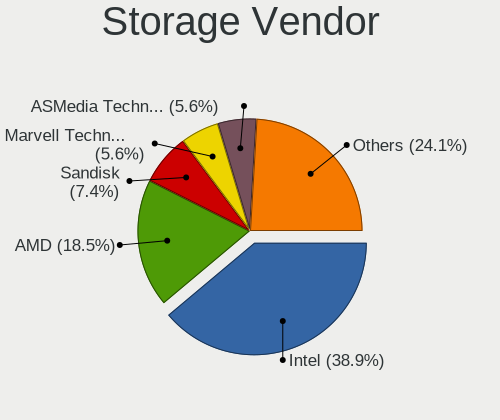
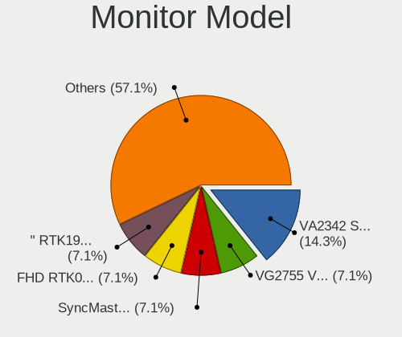
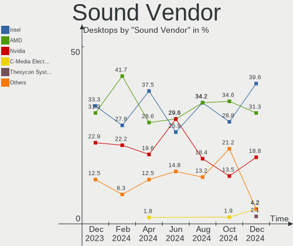
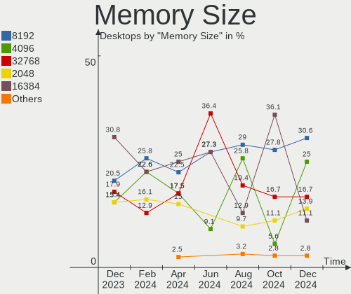

FreeBSD - Hardware Trends (Desktops)
------------------------------------

A project to identify most popular hardware characteristics and track their change
over time based on data collected by BSD users at https://BSD-Hardware.info.

Anyone can contribute to this report by the [hw-probe](https://github.com/linuxhw/hw-probe/blob/master/INSTALL.BSD.md) tool:

    hw-probe -all -upload

This report is for one last month. Overall report since the beginning of time: [TestDays](https://github.com/bsdhw/TestDays)

Period: Feb, 2023.

Contents
--------

* [ System ](#system)
  - [ OS                       ](#os)
  - [ OS Family                ](#os-family)
  - [ Arch                     ](#arch)
  - [ DE                       ](#de)
  - [ Display Server           ](#display-server)
  - [ Display Manager          ](#display-manager)
  - [ OS Lang                  ](#os-lang)
  - [ Boot Mode                ](#boot-mode)
  - [ Filesystem               ](#filesystem)
  - [ Part. scheme             ](#part-scheme)

* [ Board ](#board)
  - [ Vendor                   ](#vendor)
  - [ Model                    ](#model)
  - [ Model Family             ](#model-family)
  - [ MFG Year                 ](#mfg-year)
  - [ Form Factor              ](#form-factor)
  - [ Coreboot                 ](#coreboot)
  - [ RAM Size                 ](#ram-size)
  - [ RAM Used                 ](#ram-used)
  - [ Total Drives             ](#total-drives)
  - [ Has CD-ROM               ](#has-cd-rom)
  - [ Has Ethernet             ](#has-ethernet)
  - [ Has WiFi                 ](#has-wifi)
  - [ Has Bluetooth            ](#has-bluetooth)

* [ Location ](#location)
  - [ Country                  ](#country)
  - [ City                     ](#city)

* [ Drives ](#drives)
  - [ Drive Vendor             ](#drive-vendor)
  - [ Drive Model              ](#drive-model)
  - [ HDD Vendor               ](#hdd-vendor)
  - [ SSD Vendor               ](#ssd-vendor)
  - [ Drive Kind               ](#drive-kind)
  - [ Drive Connector          ](#drive-connector)
  - [ Drive Size               ](#drive-size)
  - [ Space Total              ](#space-total)
  - [ Space Used               ](#space-used)
  - [ Malfunc. Drives          ](#malfunc-drives)
  - [ Malfunc. Drive Vendor    ](#malfunc-drive-vendor)
  - [ Malfunc. HDD Vendor      ](#malfunc-hdd-vendor)
  - [ Malfunc. Drive Kind      ](#malfunc-drive-kind)
  - [ Failed Drives            ](#failed-drives)
  - [ Failed Drive Vendor      ](#failed-drive-vendor)
  - [ Drive Status             ](#drive-status)

* [ Storage controller ](#storage-controller)
  - [ Storage Vendor           ](#storage-vendor)
  - [ Storage Model            ](#storage-model)
  - [ Storage Kind             ](#storage-kind)

* [ Processor ](#processor)
  - [ CPU Vendor               ](#cpu-vendor)
  - [ CPU Model                ](#cpu-model)
  - [ CPU Model Family         ](#cpu-model-family)
  - [ CPU Cores                ](#cpu-cores)
  - [ CPU Sockets              ](#cpu-sockets)
  - [ CPU Threads              ](#cpu-threads)
  - [ CPU Microarch            ](#cpu-microarch)

* [ Graphics ](#graphics)
  - [ GPU Vendor               ](#gpu-vendor)
  - [ GPU Model                ](#gpu-model)
  - [ GPU Combo                ](#gpu-combo)
  - [ GPU Driver               ](#gpu-driver)
  - [ GPU Memory               ](#gpu-memory)

* [ Monitor ](#monitor)
  - [ Monitor Vendor           ](#monitor-vendor)
  - [ Monitor Model            ](#monitor-model)
  - [ Monitor Resolution       ](#monitor-resolution)
  - [ Monitor Diagonal         ](#monitor-diagonal)
  - [ Monitor Width            ](#monitor-width)
  - [ Aspect Ratio             ](#aspect-ratio)
  - [ Monitor Area             ](#monitor-area)
  - [ Pixel Density            ](#pixel-density)
  - [ Multiple Monitors        ](#multiple-monitors)

* [ Network ](#network)
  - [ Net Controller Vendor    ](#net-controller-vendor)
  - [ Net Controller Model     ](#net-controller-model)
  - [ Wireless Vendor          ](#wireless-vendor)
  - [ Wireless Model           ](#wireless-model)
  - [ Ethernet Vendor          ](#ethernet-vendor)
  - [ Ethernet Model           ](#ethernet-model)
  - [ Net Controller Kind      ](#net-controller-kind)
  - [ Used Controller          ](#used-controller)
  - [ NICs                     ](#nics)
  - [ IPv6                     ](#ipv6)

* [ Bluetooth ](#bluetooth)
  - [ Bluetooth Vendor         ](#bluetooth-vendor)
  - [ Bluetooth Model          ](#bluetooth-model)

* [ Sound ](#sound)
  - [ Sound Vendor             ](#sound-vendor)
  - [ Sound Model              ](#sound-model)

* [ Memory ](#memory)
  - [ Memory Vendor            ](#memory-vendor)
  - [ Memory Model             ](#memory-model)
  - [ Memory Kind              ](#memory-kind)
  - [ Memory Form Factor       ](#memory-form-factor)
  - [ Memory Size              ](#memory-size)
  - [ Memory Speed             ](#memory-speed)

* [ Printers & scanners ](#printers--scanners)
  - [ Printer Vendor           ](#printer-vendor)
  - [ Printer Model            ](#printer-model)
  - [ Scanner Vendor           ](#scanner-vendor)
  - [ Scanner Model            ](#scanner-model)

* [ Camera ](#camera)
  - [ Camera Vendor            ](#camera-vendor)
  - [ Camera Model             ](#camera-model)

* [ Security ](#security)
  - [ Fingerprint Vendor       ](#fingerprint-vendor)
  - [ Fingerprint Model        ](#fingerprint-model)
  - [ Chipcard Vendor          ](#chipcard-vendor)
  - [ Chipcard Model           ](#chipcard-model)

* [ Unsupported ](#unsupported)
  - [ Unsupported Devices      ](#unsupported-devices)
  - [ Unsupported Device Types ](#unsupported-device-types)

System
------

OS
--

Installed operating systems

| Name                 | Desktops | Percent |
|----------------------|----------|---------|
| FreeBSD 13.1         | 8        | 29.63%  |
| FreeBSD 13.1-p7      | 5        | 18.52%  |
| FreeBSD 13.1-p5      | 4        | 14.81%  |
| FreeBSD 14.0-CURRENT | 3        | 11.11%  |
| FreeBSD 13.1-p6      | 3        | 11.11%  |
| FreeBSD 13.2-BETA2   | 2        | 7.41%   |
| FreeBSD 13.1-p2      | 1        | 3.7%    |
| FreeBSD 12.4         | 1        | 3.7%    |

OS Family
---------

OS without a version

| Name    | Desktops | Percent |
|---------|----------|---------|
| FreeBSD | 27       | 100%    |

Arch
----

OS architecture (x86_64, i586, etc.)

| Name    | Desktops | Percent |
|---------|----------|---------|
| amd64   | 26       | 96.3%   |
| powerpc | 1        | 3.7%    |

DE
--

Desktop Environment

| Name      | Desktops | Percent |
|-----------|----------|---------|
| Console   | 11       | 40.74%  |
| XFCE      | 6        | 22.22%  |
| KDE5      | 4        | 14.81%  |
| MATE      | 2        | 7.41%   |
| TWM       | 1        | 3.7%    |
| LXQt      | 1        | 3.7%    |
| DWM       | 1        | 3.7%    |
| AwesomeWM | 1        | 3.7%    |

Display Server
--------------

X11 or Wayland

| Name    | Desktops | Percent |
|---------|----------|---------|
| X11     | 14       | 51.85%  |
| Console | 12       | 44.44%  |
| Tty     | 1        | 3.7%    |

Display Manager
---------------

SDDM, LightDM, etc.

| Name    | Desktops | Percent |
|---------|----------|---------|
| Console | 16       | 59.26%  |
| SDDM    | 4        | 14.81%  |
| LightDM | 3        | 11.11%  |
| SLiM    | 2        | 7.41%   |
| XDM     | 1        | 3.7%    |
| Ly      | 1        | 3.7%    |

OS Lang
-------

Language

| Lang    | Desktops | Percent |
|---------|----------|---------|
| C       | 20       | 74.07%  |
| en_US   | 3        | 11.11%  |
| ru_RU   | 2        | 7.41%   |
| de_DE   | 1        | 3.7%    |
| Unknown | 1        | 3.7%    |

Boot Mode
---------

EFI or BIOS

| Mode | Desktops | Percent |
|------|----------|---------|
| EFI  | 22       | 81.48%  |
| BIOS | 5        | 18.52%  |

Filesystem
----------

Type of filesystem

| Type | Desktops | Percent |
|------|----------|---------|
| Zfs  | 21       | 77.78%  |
| Ufs  | 6        | 22.22%  |

Part. scheme
------------

Scheme of partitioning

| Type | Desktops | Percent |
|------|----------|---------|
| GPT  | 27       | 100%    |

Board
-----

Vendor
------

Motherboard manufacturer

| Name                | Desktops | Percent |
|---------------------|----------|---------|
| ASUSTek Computer    | 10       | 37.04%  |
| Gigabyte Technology | 4        | 14.81%  |
| ASRock              | 3        | 11.11%  |
| MSI                 | 2        | 7.41%   |
| Seeed Studio        | 1        | 3.7%    |
| Lenovo              | 1        | 3.7%    |
| Intel               | 1        | 3.7%    |
| Hewlett-Packard     | 1        | 3.7%    |
| Fujitsu             | 1        | 3.7%    |
| Dell                | 1        | 3.7%    |
| ASRockRack          | 1        | 3.7%    |
| Unknown             | 1        | 3.7%    |

Model
-----

Motherboard model

| Name                          | Desktops | Percent |
|-------------------------------|----------|---------|
| Seeed Studio ODYSSEY-X86J4105 | 1        | 3.7%    |
| MSI MS-7B89                   | 1        | 3.7%    |
| MSI MS-7817                   | 1        | 3.7%    |
| Lenovo H515 10125             | 1        | 3.7%    |
| Intel DN2820FYK H24582-203    | 1        | 3.7%    |
| HP Z440 Workstation           | 1        | 3.7%    |
| Gigabyte Z87X-OC              | 1        | 3.7%    |
| Gigabyte Z490 VISION G        | 1        | 3.7%    |
| Gigabyte X670E AORUS MASTER   | 1        | 3.7%    |
| Gigabyte H61M-S2V-B3          | 1        | 3.7%    |
| Fujitsu ESPRIMO Q956          | 1        | 3.7%    |
| Dell Precision Tower 5810     | 1        | 3.7%    |
| ASUS TUF Gaming B450M-PRO S   | 1        | 3.7%    |
| ASUS STRIX Z270F GAMING       | 1        | 3.7%    |
| ASUS ROG STRIX Z390-I GAMING  | 1        | 3.7%    |
| ASUS ROG CROSSHAIR VIII HERO  | 1        | 3.7%    |
| ASUS PRIME X370-PRO           | 1        | 3.7%    |
| ASUS PRIME H410M-K            | 1        | 3.7%    |
| ASUS P8Z68 DELUXE             | 1        | 3.7%    |
| ASUS P7P55D DELUXE            | 1        | 3.7%    |
| ASUS P5Q-E                    | 1        | 3.7%    |
| ASUS H170I-PRO                | 1        | 3.7%    |
| ASRockRack EPYC3101D4I-2T     | 1        | 3.7%    |
| ASRock X570 Taichi            | 1        | 3.7%    |
| ASRock X570 Phantom Gaming 4  | 1        | 3.7%    |
| ASRock A520M-ITX/ac           | 1        | 3.7%    |
| Unknown                       | 1        | 3.7%    |

Model Family
------------

Motherboard model prefix

| Name                          | Desktops | Percent |
|-------------------------------|----------|---------|
| ASUS ROG                      | 2        | 7.41%   |
| ASUS PRIME                    | 2        | 7.41%   |
| ASRock X570                   | 2        | 7.41%   |
| Seeed Studio ODYSSEY-X86J4105 | 1        | 3.7%    |
| MSI MS-7B89                   | 1        | 3.7%    |
| MSI MS-7817                   | 1        | 3.7%    |
| Lenovo H515                   | 1        | 3.7%    |
| Intel DN2820FYK               | 1        | 3.7%    |
| HP Z440                       | 1        | 3.7%    |
| Gigabyte Z87X-OC              | 1        | 3.7%    |
| Gigabyte Z490                 | 1        | 3.7%    |
| Gigabyte X670E                | 1        | 3.7%    |
| Gigabyte H61M-S2V-B3          | 1        | 3.7%    |
| Fujitsu ESPRIMO               | 1        | 3.7%    |
| Dell Precision                | 1        | 3.7%    |
| ASUS TUF                      | 1        | 3.7%    |
| ASUS STRIX                    | 1        | 3.7%    |
| ASUS P8Z68                    | 1        | 3.7%    |
| ASUS P7P55D                   | 1        | 3.7%    |
| ASUS P5Q-E                    | 1        | 3.7%    |
| ASUS H170I-PRO                | 1        | 3.7%    |
| ASRockRack EPYC3101D4I-2T     | 1        | 3.7%    |
| ASRock A520M-ITX              | 1        | 3.7%    |
| Unknown                       | 1        | 3.7%    |

MFG Year
--------

Motherboard manufacture year

| Year    | Desktops | Percent |
|---------|----------|---------|
| 2019    | 6        | 22.22%  |
| 2022    | 3        | 11.11%  |
| 2020    | 3        | 11.11%  |
| 2018    | 2        | 7.41%   |
| 2014    | 2        | 7.41%   |
| 2012    | 2        | 7.41%   |
| 2023    | 1        | 3.7%    |
| 2021    | 1        | 3.7%    |
| 2017    | 1        | 3.7%    |
| 2016    | 1        | 3.7%    |
| 2015    | 1        | 3.7%    |
| 2013    | 1        | 3.7%    |
| 2011    | 1        | 3.7%    |
| 2008    | 1        | 3.7%    |
| Unknown | 1        | 3.7%    |

Form Factor
-----------

Physical design of the computer

| Name    | Desktops | Percent |
|---------|----------|---------|
| Desktop | 27       | 100%    |

Coreboot
--------

Have coreboot on board

| Used | Desktops | Percent |
|------|----------|---------|
| No   | 27       | 100%    |

RAM Size
--------

Total RAM memory

| Size in GB  | Desktops | Percent |
|-------------|----------|---------|
| 64.01-256.0 | 7        | 25.93%  |
| 16.01-24.0  | 7        | 25.93%  |
| 32.01-64.0  | 6        | 22.22%  |
| 4.01-8.0    | 4        | 14.81%  |
| 8.01-16.0   | 3        | 11.11%  |

RAM Used
--------

Used RAM memory

| Used GB  | Desktops | Percent |
|----------|----------|---------|
| 1.01-2.0 | 10       | 37.04%  |
| 0.51-1.0 | 7        | 25.93%  |
| 0.01-0.5 | 7        | 25.93%  |
| 4.01-8.0 | 1        | 3.7%    |
| 3.01-4.0 | 1        | 3.7%    |
| 2.01-3.0 | 1        | 3.7%    |

Total Drives
------------

Number of drives on board

| Drives | Desktops | Percent |
|--------|----------|---------|
| 2      | 8        | 29.63%  |
| 1      | 7        | 25.93%  |
| 4      | 5        | 18.52%  |
| 3      | 2        | 7.41%   |
| 13     | 1        | 3.7%    |
| 9      | 1        | 3.7%    |
| 7      | 1        | 3.7%    |
| 5      | 1        | 3.7%    |
| 0      | 1        | 3.7%    |

Has CD-ROM
----------

Has CD-ROM on board

| Presented | Desktops | Percent |
|-----------|----------|---------|
| No        | 18       | 66.67%  |
| Yes       | 9        | 33.33%  |

Has Ethernet
------------

Has Ethernet on board

| Presented | Desktops | Percent |
|-----------|----------|---------|
| Yes       | 27       | 100%    |

Has WiFi
--------

Has WiFi module

| Presented | Desktops | Percent |
|-----------|----------|---------|
| No        | 15       | 55.56%  |
| Yes       | 12       | 44.44%  |

Has Bluetooth
-------------

Has Bluetooth module

| Presented | Desktops | Percent |
|-----------|----------|---------|
| No        | 19       | 70.37%  |
| Yes       | 8        | 29.63%  |

Location
--------

Country
-------

Geographic location (country)

| Country   | Desktops | Percent |
|-----------|----------|---------|
| USA       | 13       | 48.15%  |
| Russia    | 5        | 18.52%  |
| Germany   | 4        | 14.81%  |
| Turkey    | 1        | 3.7%    |
| Thailand  | 1        | 3.7%    |
| Poland    | 1        | 3.7%    |
| Canada    | 1        | 3.7%    |
| Australia | 1        | 3.7%    |

City
----

Geographic location (city)

| City           | Desktops | Percent |
|----------------|----------|---------|
| Salem          | 2        | 7.41%   |
| Redmond        | 2        | 7.41%   |
| Moscow         | 2        | 7.41%   |
| West Kelowna   | 1        | 3.7%    |
| Wenatchee      | 1        | 3.7%    |
| Waldsee        | 1        | 3.7%    |
| Tucson         | 1        | 3.7%    |
| Rostov-on-Don  | 1        | 3.7%    |
| Radzionkow     | 1        | 3.7%    |
| Poplar Grove   | 1        | 3.7%    |
| Perth          | 1        | 3.7%    |
| Palo Alto      | 1        | 3.7%    |
| Ozersk         | 1        | 3.7%    |
| Osnabrück     | 1        | 3.7%    |
| Noblesville    | 1        | 3.7%    |
| Newport        | 1        | 3.7%    |
| Mt. Pleasant   | 1        | 3.7%    |
| Ludwigsburg    | 1        | 3.7%    |
| Little Compton | 1        | 3.7%    |
| Kazan’       | 1        | 3.7%    |
| Istanbul       | 1        | 3.7%    |
| Ilmenau        | 1        | 3.7%    |
| Bangkok        | 1        | 3.7%    |
| Albuquerque    | 1        | 3.7%    |

Drives
------

Drive Vendor
------------

Hard drive vendors

| Vendor              | Desktops | Drives | Percent |
|---------------------|----------|--------|---------|
| WDC                 | 12       | 23     | 25.53%  |
| Seagate             | 9        | 18     | 19.15%  |
| Samsung Electronics | 8        | 14     | 17.02%  |
| Intel               | 2        | 3      | 4.26%   |
| Crucial             | 2        | 4      | 4.26%   |
| Transcend           | 1        | 1      | 2.13%   |
| Team                | 1        | 1      | 2.13%   |
| T-FORCE             | 1        | 1      | 2.13%   |
| PNY                 | 1        | 1      | 2.13%   |
| Patriot             | 1        | 1      | 2.13%   |
| Netac               | 1        | 1      | 2.13%   |
| Kingston            | 1        | 1      | 2.13%   |
| Kimtigo             | 1        | 1      | 2.13%   |
| Intenso             | 1        | 1      | 2.13%   |
| HPT                 | 1        | 8      | 2.13%   |
| Hitachi             | 1        | 1      | 2.13%   |
| Gigabyte Technology | 1        | 1      | 2.13%   |
| FORESEE             | 1        | 1      | 2.13%   |
| Corsair             | 1        | 1      | 2.13%   |

Drive Model
-----------

Hard drive models

| Model                             | Desktops | Percent |
|-----------------------------------|----------|---------|
| Seagate ST4000DM000-1F2168 4TB    | 2        | 3.08%   |
| WDC WDS100T3X0C-00SJG0 1TB        | 1        | 1.54%   |
| WDC WD80EMAZ-00WJTA0 8TB          | 1        | 1.54%   |
| WDC WD80EFZX-68UW8N0 8TB          | 1        | 1.54%   |
| WDC WD80EFAX-68LHPN0 8TB          | 1        | 1.54%   |
| WDC WD80EDBZ-11B0ZA0 8TB          | 1        | 1.54%   |
| WDC WD5000LPLX-00ZNTT0 500GB      | 1        | 1.54%   |
| WDC WD40PURZ-85AKKY0 4TB          | 1        | 1.54%   |
| WDC WD40EZRZ-22GXCB0 4TB          | 1        | 1.54%   |
| WDC WD40EZRZ-00GXCB0 4TB          | 1        | 1.54%   |
| WDC WD40EFAX-68JH4N1 4TB          | 1        | 1.54%   |
| WDC WD30EURX-63T0FY0 3TB          | 1        | 1.54%   |
| WDC WD20EARS-00MVWB1 2TB          | 1        | 1.54%   |
| WDC WD1600JS-23MHB0 160GB         | 1        | 1.54%   |
| WDC WD15EADS-00P8B0 1.5TB         | 1        | 1.54%   |
| WDC WD120EMFZ-11A6JA0 12TB        | 1        | 1.54%   |
| WDC WD120EMAZ-11BLFA0 12TB        | 1        | 1.54%   |
| WDC WD10EZEX-21WN4A0 1TB          | 1        | 1.54%   |
| WDC WD10EZEX-08RKKA0 1TB          | 1        | 1.54%   |
| WDC WD10EALX-759BA1 1TB           | 1        | 1.54%   |
| Transcend TS128GMTS800 128GB      | 1        | 1.54%   |
| Team T253X5480G 480GB             | 1        | 1.54%   |
| T-FORCE TM8FP7001T 1TB            | 1        | 1.54%   |
| Seagate ST4000VN008-2DR166 4TB    | 1        | 1.54%   |
| Seagate ST4000NM0035-1V4107 4TB   | 1        | 1.54%   |
| Seagate ST4000LM024-2AN17V 4TB    | 1        | 1.54%   |
| Seagate ST2000LM015-2E8174 2TB    | 1        | 1.54%   |
| Seagate ST12000VN0008-2PH103 12TB | 1        | 1.54%   |
| Seagate ST1000LM035-1RK172 1TB    | 1        | 1.54%   |
| Seagate ST1000DX001-1CM162 1TB    | 1        | 1.54%   |
| Seagate ST1000DM003-1CH162 1TB    | 1        | 1.54%   |
| Samsung SSD 970 EVO Plus 500GB    | 1        | 1.54%   |
| Samsung SSD 960 EVO 500GB         | 1        | 1.54%   |
| Samsung SSD 870 QVO 2TB           | 1        | 1.54%   |
| Samsung SSD 870 EVO 500GB         | 1        | 1.54%   |
| Samsung SSD 870 EVO 1TB           | 1        | 1.54%   |
| Samsung SSD 860 QVO 1TB           | 1        | 1.54%   |
| Samsung SSD 860 EVO 500GB         | 1        | 1.54%   |
| Samsung SSD 860 EVO 250GB         | 1        | 1.54%   |
| Samsung SSD 850 EVO 1TB           | 1        | 1.54%   |

HDD Vendor
----------

Hard disk drive vendors

| Vendor  | Desktops | Drives | Percent |
|---------|----------|--------|---------|
| WDC     | 11       | 22     | 50%     |
| Seagate | 9        | 18     | 40.91%  |
| HPT     | 1        | 8      | 4.55%   |
| Hitachi | 1        | 1      | 4.55%   |

SSD Vendor
----------

Solid state drive vendors

| Vendor              | Desktops | Drives | Percent |
|---------------------|----------|--------|---------|
| Samsung Electronics | 7        | 12     | 41.18%  |
| Intel               | 2        | 3      | 11.76%  |
| Crucial             | 2        | 4      | 11.76%  |
| Transcend           | 1        | 1      | 5.88%   |
| Team                | 1        | 1      | 5.88%   |
| PNY                 | 1        | 1      | 5.88%   |
| Patriot             | 1        | 1      | 5.88%   |
| Intenso             | 1        | 1      | 5.88%   |
| FORESEE             | 1        | 1      | 5.88%   |

Drive Kind
----------

HDD or SSD

| Kind | Desktops | Drives | Percent |
|------|----------|--------|---------|
| HDD  | 18       | 49     | 42.86%  |
| SSD  | 16       | 25     | 38.1%   |
| NVMe | 8        | 9      | 19.05%  |

Drive Connector
---------------

SATA, SAS, NVMe, etc.

| Type | Desktops | Drives | Percent |
|------|----------|--------|---------|
| SATA | 24       | 74     | 75%     |
| NVMe | 8        | 9      | 25%     |

Drive Size
----------

Size of hard drive

| Size in TB | Desktops | Drives | Percent |
|------------|----------|--------|---------|
| 0.01-0.5   | 14       | 18     | 36.84%  |
| 0.51-1.0   | 8        | 18     | 21.05%  |
| 3.01-4.0   | 6        | 10     | 15.79%  |
| 1.01-2.0   | 6        | 11     | 15.79%  |
| 10.01-20.0 | 2        | 8      | 5.26%   |
| 2.01-3.0   | 1        | 1      | 2.63%   |
| 4.01-10.0  | 1        | 8      | 2.63%   |

Space Total
-----------

Amount of disk space available on the file system

| Size in GB     | Desktops | Percent |
|----------------|----------|---------|
| 101-250        | 9        | 33.33%  |
| 251-500        | 6        | 22.22%  |
| 501-1000       | 6        | 22.22%  |
| More than 3000 | 2        | 7.41%   |
| 51-100         | 2        | 7.41%   |
| 21-50          | 1        | 3.7%    |
| 2001-3000      | 1        | 3.7%    |

Space Used
----------

Amount of used disk space

| Used GB        | Desktops | Percent |
|----------------|----------|---------|
| 1-20           | 21       | 77.78%  |
| 21-50          | 4        | 14.81%  |
| More than 3000 | 1        | 3.7%    |
| 2001-3000      | 1        | 3.7%    |

Malfunc. Drives
---------------

Drive models with a malfunction

| Model                          | Desktops | Drives | Percent |
|--------------------------------|----------|--------|---------|
| WDC WD5000LPLX-00ZNTT0 500GB   | 1        | 1      | 33.33%  |
| Seagate ST1000DX001-1CM162 1TB | 1        | 1      | 33.33%  |
| Seagate ST1000DM003-1CH162 1TB | 1        | 1      | 33.33%  |

Malfunc. Drive Vendor
---------------------

Vendors of faulty drives

| Vendor  | Desktops | Drives | Percent |
|---------|----------|--------|---------|
| Seagate | 2        | 2      | 66.67%  |
| WDC     | 1        | 1      | 33.33%  |

Malfunc. HDD Vendor
-------------------

Vendors of faulty HDD drives

| Vendor  | Desktops | Drives | Percent |
|---------|----------|--------|---------|
| Seagate | 2        | 2      | 66.67%  |
| WDC     | 1        | 1      | 33.33%  |

Malfunc. Drive Kind
-------------------

Kinds of faulty drives

| Kind | Desktops | Drives | Percent |
|------|----------|--------|---------|
| HDD  | 3        | 3      | 100%    |

Failed Drives
-------------

Failed drive models

Zero info for selected period =(

Failed Drive Vendor
-------------------

Failed drive vendors

Zero info for selected period =(

Drive Status
------------

Number of failed and malfunc. drives

| Status   | Desktops | Drives | Percent |
|----------|----------|--------|---------|
| Works    | 25       | 72     | 86.21%  |
| Malfunc  | 3        | 3      | 10.34%  |
| Detected | 1        | 8      | 3.45%   |

Storage controller
------------------

Storage Vendor
--------------

Storage controller vendors

| Vendor                      | Desktops | Percent |
|-----------------------------|----------|---------|
| Intel                       | 16       | 35.56%  |
| AMD                         | 10       | 22.22%  |
| Marvell Technology Group    | 4        | 8.89%   |
| Silicon Motion              | 3        | 6.67%   |
| Phison Electronics          | 3        | 6.67%   |
| SanDisk                     | 2        | 4.44%   |
| Samsung Electronics         | 2        | 4.44%   |
| JMicron Technology          | 2        | 4.44%   |
| Kingston Technology Company | 1        | 2.22%   |
| HighPoint Technologies      | 1        | 2.22%   |
| Broadcom / LSI              | 1        | 2.22%   |

Storage Model
-------------

Storage controller models

| Model                                                                          | Desktops | Percent |
|--------------------------------------------------------------------------------|----------|---------|
| AMD FCH SATA Controller [AHCI mode]                                            | 7        | 14%     |
| Silicon Motion SM2263EN/SM2263XT SSD Controller                                | 3        | 6%      |
| Phison E16 PCIe4 NVMe Controller                                               | 2        | 4%      |
| Intel Q170/Q150/B150/H170/H110/Z170/CM236 Chipset SATA Controller [AHCI Mode]  | 2        | 4%      |
| Intel C610/X99 series chipset sSATA Controller [AHCI mode]                     | 2        | 4%      |
| Intel 8 Series/C220 Series Chipset Family 6-port SATA Controller 1 [AHCI mode] | 2        | 4%      |
| Intel 6 Series/C200 Series Chipset Family 6 port Desktop SATA AHCI Controller  | 2        | 4%      |
| AMD 400 Series Chipset SATA Controller                                         | 2        | 4%      |
| SanDisk WD Black SN750 / PC SN730 NVMe SSD                                     | 1        | 2%      |
| Sandisk unknown                                                                | 1        | 2%      |
| Samsung NVMe SSD Controller SM981/PM981/PM983                                  | 1        | 2%      |
| Samsung NVMe SSD Controller SM961/PM961/SM963                                  | 1        | 2%      |
| Phison PS5013 E13 NVMe Controller                                              | 1        | 2%      |
| Marvell Group 88SE9235 PCIe 2.0 x2 4-port SATA 6 Gb/s Controller               | 1        | 2%      |
| Marvell Group 88SE9215 PCIe 2.0 x1 4-port SATA 6 Gb/s Controller               | 1        | 2%      |
| Marvell Group 88SE9128 PCIe SATA 6 Gb/s RAID controller with HyperDuo          | 1        | 2%      |
| Marvell Group 88SE6111/6121 SATA II / PATA Controller                          | 1        | 2%      |
| Kingston Company A2000 NVMe SSD                                                | 1        | 2%      |
| JMicron JMB363 SATA/IDE Controller                                             | 1        | 2%      |
| JMicron JMB362 SATA Controller                                                 | 1        | 2%      |
| Intel Comet Lake SATA AHCI Controller                                          | 1        | 2%      |
| Intel Celeron/Pentium Silver Processor SATA Controller                         | 1        | 2%      |
| Intel Cannon Lake PCH SATA AHCI Controller                                     | 1        | 2%      |
| Intel C610/X99 series chipset 6-Port SATA Controller [AHCI mode]               | 1        | 2%      |
| Intel C600/X79 series chipset SATA RAID Controller                             | 1        | 2%      |
| Intel Atom Processor E3800 Series SATA AHCI Controller                         | 1        | 2%      |
| Intel 82801JI (ICH10 Family) 4 port SATA IDE Controller #1                     | 1        | 2%      |
| Intel 82801JI (ICH10 Family) 2 port SATA IDE Controller #2                     | 1        | 2%      |
| Intel 5 Series/3400 Series Chipset 6 port SATA AHCI Controller                 | 1        | 2%      |
| Intel 400 Series Chipset Family SATA AHCI Controller                           | 1        | 2%      |
| Intel 200 Series PCH SATA controller [AHCI mode]                               | 1        | 2%      |
| HighPoint RocketRAID 2720 SAS Controller                                       | 1        | 2%      |
| Broadcom / LSI SAS2008 PCI-Express Fusion-MPT SAS-2 [Falcon]                   | 1        | 2%      |
| AMD X370 Series Chipset SATA Controller                                        | 1        | 2%      |
| AMD 500 Series Chipset SATA Controller                                         | 1        | 2%      |
| Unknown                                                                        | 1        | 2%      |

Storage Kind
------------

Kind of storage controller (IDE, SATA, NVMe, SAS, ...)

| Kind | Desktops | Percent |
|------|----------|---------|
| SATA | 26       | 61.9%   |
| NVMe | 10       | 23.81%  |
| IDE  | 3        | 7.14%   |
| RAID | 2        | 4.76%   |
| SAS  | 1        | 2.38%   |

Processor
---------

CPU Vendor
----------

Processor vendors

| Vendor | Desktops | Percent |
|--------|----------|---------|
| Intel  | 16       | 59.26%  |
| AMD    | 10       | 37.04%  |
| IBM    | 1        | 3.7%    |

CPU Model
---------

Processor models

| Model                                      | Desktops | Percent |
|--------------------------------------------|----------|---------|
| Intel Core i5-10400 CPU @ 2.90GHz          | 2        | 7.41%   |
| AMD Ryzen 9 3900X 12-Core Processor        | 2        | 7.41%   |
| Intel Xeon CPU E5-1650 v3 @ 3.50GHz        | 1        | 3.7%    |
| Intel Xeon CPU E5-1620 v3 @ 3.50GHz        | 1        | 3.7%    |
| Intel Xeon CPU                             | 1        | 3.7%    |
| Intel Pentium CPU G3220 @ 3.00GHz          | 1        | 3.7%    |
| Intel Core i9-9900K CPU @ 3.60GHz          | 1        | 3.7%    |
| Intel Core i7-6700K CPU @ 4.00GHz          | 1        | 3.7%    |
| Intel Core i7-4770K CPU @ 3.50GHz          | 1        | 3.7%    |
| Intel Core i7 CPU 860 @ 2.80GHz            | 1        | 3.7%    |
| Intel Core i5-6500T CPU @ 2.50GHz          | 1        | 3.7%    |
| Intel Core i5-6500 CPU @ 3.20GHz           | 1        | 3.7%    |
| Intel Core i5-2500K CPU @ 3.30GHz          | 1        | 3.7%    |
| Intel Core 2 Quad CPU Q6600 @ 2.40GHz      | 1        | 3.7%    |
| Intel Celeron J4105 CPU @ 1.50GHz          | 1        | 3.7%    |
| Intel Celeron CPU N2830 @ 2.16GHz          | 1        | 3.7%    |
| IBM POWER9                                 | 1        | 3.7%    |
| AMD Ryzen 9 7950X 16-Core Processor        | 1        | 3.7%    |
| AMD Ryzen 9 5950X 16-Core Processor        | 1        | 3.7%    |
| AMD Ryzen 7 3700X 8-Core Processor         | 1        | 3.7%    |
| AMD Ryzen 7 1700 Eight-Core Processor      | 1        | 3.7%    |
| AMD Ryzen 5 4600G with Radeon Graphics     | 1        | 3.7%    |
| AMD EPYC 3101 4-Core Processor             | 1        | 3.7%    |
| AMD E2-3800 APU with Radeon HD Graphics    | 1        | 3.7%    |
| AMD Athlon 3000G with Radeon Vega Graphics | 1        | 3.7%    |

CPU Model Family
----------------

Processor model prefix

| Model             | Desktops | Percent |
|-------------------|----------|---------|
| Intel Core i5     | 5        | 18.52%  |
| AMD Ryzen 9       | 4        | 14.81%  |
| Intel Xeon        | 3        | 11.11%  |
| Intel Core i7     | 3        | 11.11%  |
| Intel Celeron     | 2        | 7.41%   |
| AMD Ryzen 7       | 2        | 7.41%   |
| Other             | 1        | 3.7%    |
| Intel Pentium     | 1        | 3.7%    |
| Intel Core i9     | 1        | 3.7%    |
| Intel Core 2 Quad | 1        | 3.7%    |
| AMD Ryzen 5       | 1        | 3.7%    |
| AMD EPYC          | 1        | 3.7%    |
| AMD E2            | 1        | 3.7%    |
| AMD Athlon        | 1        | 3.7%    |

CPU Cores
---------

Number of processor cores

| Number  | Desktops | Percent |
|---------|----------|---------|
| 4       | 13       | 48.15%  |
| 6       | 3        | 11.11%  |
| 32      | 2        | 7.41%   |
| 24      | 2        | 7.41%   |
| 16      | 2        | 7.41%   |
| 2       | 2        | 7.41%   |
| 12      | 1        | 3.7%    |
| 8       | 1        | 3.7%    |
| Unknown | 1        | 3.7%    |

CPU Sockets
-----------

Number of sockets

| Number  | Desktops | Percent |
|---------|----------|---------|
| 1       | 26       | 96.3%   |
| Unknown | 1        | 3.7%    |

CPU Threads
-----------

Threads per core (Hyper-Threading)

| Number  | Desktops | Percent |
|---------|----------|---------|
| 1       | 18       | 66.67%  |
| 2       | 8        | 29.63%  |
| Unknown | 1        | 3.7%    |

CPU Microarch
-------------

Microarchitecture

| Name          | Desktops | Percent |
|---------------|----------|---------|
| Zen 2         | 4        | 14.81%  |
| Haswell       | 4        | 14.81%  |
| Skylake       | 3        | 11.11%  |
| Zen           | 2        | 7.41%   |
| SandyBridge   | 2        | 7.41%   |
| CometLake     | 2        | 7.41%   |
| Unknown       | 2        | 7.41%   |
| Zen+          | 1        | 3.7%    |
| Zen 3         | 1        | 3.7%    |
| Silvermont    | 1        | 3.7%    |
| Nehalem       | 1        | 3.7%    |
| KabyLake      | 1        | 3.7%    |
| Jaguar        | 1        | 3.7%    |
| Goldmont plus | 1        | 3.7%    |
| Core          | 1        | 3.7%    |

Graphics
--------

GPU Vendor
----------

Vendors of graphics cards

| Vendor            | Desktops | Percent |
|-------------------|----------|---------|
| Nvidia            | 11       | 36.67%  |
| AMD               | 9        | 30%     |
| Intel             | 8        | 26.67%  |
| ASPEED Technology | 2        | 6.67%   |

GPU Model
---------

Graphics card models

| Model                                                                       | Desktops | Percent |
|-----------------------------------------------------------------------------|----------|---------|
| Intel HD Graphics 530                                                       | 3        | 10%     |
| Nvidia TU117 [GeForce GTX 1650]                                             | 2        | 6.67%   |
| Nvidia GP108 [GeForce GT 1030]                                              | 2        | 6.67%   |
| Intel Xeon E3-1200 v3/4th Gen Core Processor Integrated Graphics Controller | 2        | 6.67%   |
| ASPEED Technology ASPEED Graphics Family                                    | 2        | 6.67%   |
| Nvidia TU106 [GeForce RTX 2070]                                             | 1        | 3.33%   |
| Nvidia GT218 [NVS 300]                                                      | 1        | 3.33%   |
| Nvidia GP107 [GeForce GTX 1050]                                             | 1        | 3.33%   |
| Nvidia GP106 [GeForce GTX 1060 3GB]                                         | 1        | 3.33%   |
| Nvidia GP104 [GeForce GTX 1080]                                             | 1        | 3.33%   |
| Nvidia GM107GL [Quadro K620]                                                | 1        | 3.33%   |
| Nvidia GF119 [NVS 310]                                                      | 1        | 3.33%   |
| Intel GeminiLake [UHD Graphics 600]                                         | 1        | 3.33%   |
| Intel Atom Processor Z36xxx/Z37xxx Series Graphics & Display                | 1        | 3.33%   |
| Intel 2nd Generation Core Processor Family Integrated Graphics Controller   | 1        | 3.33%   |
| AMD Renoir                                                                  | 1        | 3.33%   |
| AMD Raphael                                                                 | 1        | 3.33%   |
| AMD Picasso/Raven 2 [Radeon Vega Series / Radeon Vega Mobile Series]        | 1        | 3.33%   |
| AMD Navi 23 [Radeon RX 6600/6600 XT/6600M]                                  | 1        | 3.33%   |
| AMD Navi 22 [Radeon RX 6700/6700 XT/6750 XT / 6800M/6850M XT]               | 1        | 3.33%   |
| AMD Kabini [Radeon HD 8280 / R3 Series]                                     | 1        | 3.33%   |
| AMD Ellesmere [Radeon RX 470/480/570/570X/580/580X/590]                     | 1        | 3.33%   |
| AMD Cedar [Radeon HD 5000/6000/7350/8350 Series]                            | 1        | 3.33%   |
| AMD Baffin [Radeon RX 550 640SP / RX 560/560X]                              | 1        | 3.33%   |

GPU Combo
---------

Combinations of graphics cards

| Name           | Desktops | Percent |
|----------------|----------|---------|
| 1 x Nvidia     | 9        | 33.33%  |
| 1 x AMD        | 7        | 25.93%  |
| 1 x Intel      | 6        | 22.22%  |
| 1 x ASPEED     | 2        | 7.41%   |
| Intel + Nvidia | 1        | 3.7%    |
| Intel + AMD    | 1        | 3.7%    |
| AMD + Nvidia   | 1        | 3.7%    |

GPU Driver
----------

Free vs proprietary

| Driver      | Desktops | Percent |
|-------------|----------|---------|
| Free        | 21       | 77.78%  |
| Proprietary | 6        | 22.22%  |

GPU Memory
----------

Total video memory

| Size in GB | Desktops | Percent |
|------------|----------|---------|
| Unknown    | 19       | 70.37%  |
| 3.01-4.0   | 3        | 11.11%  |
| 7.01-8.0   | 2        | 7.41%   |
| 1.01-2.0   | 2        | 7.41%   |
| 0.51-1.0   | 1        | 3.7%    |

Monitor
-------

Monitor Vendor
--------------

Monitor vendors

| Vendor               | Desktops | Percent |
|----------------------|----------|---------|
| LG Electronics       | 2        | 33.33%  |
| Samsung Electronics  | 1        | 16.67%  |
| Idek Iiyama          | 1        | 16.67%  |
| Dell                 | 1        | 16.67%  |
| Ancor Communications | 1        | 16.67%  |

Monitor Model
-------------

Monitor models

| Model                                             | Desktops | Percent |
|---------------------------------------------------|----------|---------|
| Samsung Electronics LCD Monitor S22C300 1920x1080 | 1        | 16.67%  |
| LG Electronics LCD Monitor LG FULL HD 1920x1080   | 1        | 16.67%  |
| LG Electronics LCD Monitor 23MP55 1920x1080       | 1        | 16.67%  |
| Idek Iiyama LCD Monitor PL2792UH 3840x2160        | 1        | 16.67%  |
| Dell LCD Monitor SE2719H 1920x1080                | 1        | 16.67%  |
| Ancor Communications LCD Monitor PA249 1920x1200  | 1        | 16.67%  |

Monitor Resolution
------------------

Monitor screen resolution

| Resolution        | Desktops | Percent |
|-------------------|----------|---------|
| 1920x1080 (FHD)   | 4        | 66.67%  |
| 3840x2160 (4K)    | 1        | 16.67%  |
| 1920x1200 (WUXGA) | 1        | 16.67%  |

Monitor Diagonal
----------------

Diagonal size in inches

| Inches  | Desktops | Percent |
|---------|----------|---------|
| Unknown | 6        | 100%    |

Monitor Width
-------------

Physical width

| Width in mm | Desktops | Percent |
|-------------|----------|---------|
| Unknown     | 6        | 100%    |

Aspect Ratio
------------

Proportional relationship between the width and the height

| Ratio   | Desktops | Percent |
|---------|----------|---------|
| Unknown | 6        | 100%    |

Monitor Area
------------

Area in inch²

| Area in inch² | Desktops | Percent |
|----------------|----------|---------|
| Unknown        | 6        | 100%    |

Pixel Density
-------------

Pixels per inch

| Density | Desktops | Percent |
|---------|----------|---------|
| Unknown | 6        | 100%    |

Multiple Monitors
-----------------

Total monitors connected

| Total | Desktops | Percent |
|-------|----------|---------|
| 0     | 16       | 59.26%  |
| 1     | 11       | 40.74%  |

Network
-------

Net Controller Vendor
---------------------

Controller vendors

| Vendor                          | Desktops | Percent |
|---------------------------------|----------|---------|
| Intel                           | 19       | 47.5%   |
| Realtek Semiconductor           | 13       | 32.5%   |
| Qualcomm Atheros                | 2        | 5%      |
| TP-Link                         | 1        | 2.5%    |
| Qualcomm Atheros Communications | 1        | 2.5%    |
| Mellanox Technologies           | 1        | 2.5%    |
| Marvell Technology Group        | 1        | 2.5%    |
| Broadcom                        | 1        | 2.5%    |
| American Megatrends             | 1        | 2.5%    |

Net Controller Model
--------------------

Controller models

| Model                                                                         | Desktops | Percent |
|-------------------------------------------------------------------------------|----------|---------|
| Realtek RTL8111/8168/8411 PCI Express Gigabit Ethernet Controller             | 9        | 18.37%  |
| Intel I211 Gigabit Network Connection                                         | 5        | 10.2%   |
| Realtek RTL8125 2.5GbE Controller                                             | 2        | 4.08%   |
| Intel Wi-Fi 6 AX200                                                           | 2        | 4.08%   |
| Intel Ethernet Controller I225-V                                              | 2        | 4.08%   |
| Intel Ethernet Connection (2) I219-V                                          | 2        | 4.08%   |
| TP-Link TP-Link Wireless MU-MIMO USB Adapter                                  | 1        | 2.04%   |
| Realtek RTL8192CE PCIe Wireless Network Adapter                               | 1        | 2.04%   |
| Realtek RTL8188EE Wireless Network Adapter                                    | 1        | 2.04%   |
| Realtek RTL810xE PCI Express Fast Ethernet controller                         | 1        | 2.04%   |
| Qualcomm Atheros QCA6174 802.11ac Wireless Network Adapter                    | 1        | 2.04%   |
| Qualcomm Atheros TP-Link TL-WN322G v3 / TL-WN422G v2 802.11g [Atheros AR9271] | 1        | 2.04%   |
| Qualcomm Atheros AR9485 Wireless Network Adapter                              | 1        | 2.04%   |
| Mellanox MT27500 Family [ConnectX-3]                                          | 1        | 2.04%   |
| Marvell Group 88E8056 PCI-E Gigabit Ethernet Controller                       | 1        | 2.04%   |
| Marvell Group 88E8001 Gigabit Ethernet Controller                             | 1        | 2.04%   |
| Intel Wi-Fi 6 AX210/AX211/AX411 160MHz                                        | 1        | 2.04%   |
| Intel Gemini Lake PCH CNVi WiFi                                               | 1        | 2.04%   |
| Intel Ethernet Controller X550                                                | 1        | 2.04%   |
| Intel Ethernet Controller 10-Gigabit X540-AT2                                 | 1        | 2.04%   |
| Intel Ethernet Connection I217-V                                              | 1        | 2.04%   |
| Intel Ethernet Connection I217-LM                                             | 1        | 2.04%   |
| Intel Ethernet Connection (7) I219-V                                          | 1        | 2.04%   |
| Intel Ethernet Connection (2) I219-LM                                         | 1        | 2.04%   |
| Intel Ethernet Connection (2) I218-LM                                         | 1        | 2.04%   |
| Intel Dual Band Wireless-AC 3168NGW [Stone Peak]                              | 1        | 2.04%   |
| Intel Cannon Lake PCH CNVi WiFi                                               | 1        | 2.04%   |
| Intel 82599 10 Gigabit Network Connection                                     | 1        | 2.04%   |
| Intel 82579V Gigabit Network Connection                                       | 1        | 2.04%   |
| Intel 82574L Gigabit Network Connection                                       | 1        | 2.04%   |
| Intel 82572EI Gigabit Ethernet Controller (Copper)                            | 1        | 2.04%   |
| Broadcom NetXtreme BCM5719 Gigabit Ethernet PCIe                              | 1        | 2.04%   |
| American Megatrends Virtual Ethernet                                          | 1        | 2.04%   |

Wireless Vendor
---------------

Wireless vendors

| Vendor                          | Desktops | Percent |
|---------------------------------|----------|---------|
| Intel                           | 6        | 50%     |
| Realtek Semiconductor           | 2        | 16.67%  |
| Qualcomm Atheros                | 2        | 16.67%  |
| TP-Link                         | 1        | 8.33%   |
| Qualcomm Atheros Communications | 1        | 8.33%   |

Wireless Model
--------------

Wireless models

| Model                                                                         | Desktops | Percent |
|-------------------------------------------------------------------------------|----------|---------|
| Intel Wi-Fi 6 AX200                                                           | 2        | 16.67%  |
| TP-Link TP-Link Wireless MU-MIMO USB Adapter                                  | 1        | 8.33%   |
| Realtek RTL8192CE PCIe Wireless Network Adapter                               | 1        | 8.33%   |
| Realtek RTL8188EE Wireless Network Adapter                                    | 1        | 8.33%   |
| Qualcomm Atheros QCA6174 802.11ac Wireless Network Adapter                    | 1        | 8.33%   |
| Qualcomm Atheros TP-Link TL-WN322G v3 / TL-WN422G v2 802.11g [Atheros AR9271] | 1        | 8.33%   |
| Qualcomm Atheros AR9485 Wireless Network Adapter                              | 1        | 8.33%   |
| Intel Wi-Fi 6 AX210/AX211/AX411 160MHz                                        | 1        | 8.33%   |
| Intel Gemini Lake PCH CNVi WiFi                                               | 1        | 8.33%   |
| Intel Dual Band Wireless-AC 3168NGW [Stone Peak]                              | 1        | 8.33%   |
| Intel Cannon Lake PCH CNVi WiFi                                               | 1        | 8.33%   |

Ethernet Vendor
---------------

Ethernet vendors

| Vendor                   | Desktops | Percent |
|--------------------------|----------|---------|
| Intel                    | 18       | 54.55%  |
| Realtek Semiconductor    | 12       | 36.36%  |
| Marvell Technology Group | 1        | 3.03%   |
| Broadcom                 | 1        | 3.03%   |
| American Megatrends      | 1        | 3.03%   |

Ethernet Model
--------------

Ethernet models

| Model                                                             | Desktops | Percent |
|-------------------------------------------------------------------|----------|---------|
| Realtek RTL8111/8168/8411 PCI Express Gigabit Ethernet Controller | 9        | 25%     |
| Intel I211 Gigabit Network Connection                             | 5        | 13.89%  |
| Realtek RTL8125 2.5GbE Controller                                 | 2        | 5.56%   |
| Intel Ethernet Controller I225-V                                  | 2        | 5.56%   |
| Intel Ethernet Connection (2) I219-V                              | 2        | 5.56%   |
| Realtek RTL810xE PCI Express Fast Ethernet controller             | 1        | 2.78%   |
| Marvell Group 88E8056 PCI-E Gigabit Ethernet Controller           | 1        | 2.78%   |
| Marvell Group 88E8001 Gigabit Ethernet Controller                 | 1        | 2.78%   |
| Intel Ethernet Controller X550                                    | 1        | 2.78%   |
| Intel Ethernet Controller 10-Gigabit X540-AT2                     | 1        | 2.78%   |
| Intel Ethernet Connection I217-V                                  | 1        | 2.78%   |
| Intel Ethernet Connection I217-LM                                 | 1        | 2.78%   |
| Intel Ethernet Connection (7) I219-V                              | 1        | 2.78%   |
| Intel Ethernet Connection (2) I219-LM                             | 1        | 2.78%   |
| Intel Ethernet Connection (2) I218-LM                             | 1        | 2.78%   |
| Intel 82599 10 Gigabit Network Connection                         | 1        | 2.78%   |
| Intel 82579V Gigabit Network Connection                           | 1        | 2.78%   |
| Intel 82574L Gigabit Network Connection                           | 1        | 2.78%   |
| Intel 82572EI Gigabit Ethernet Controller (Copper)                | 1        | 2.78%   |
| Broadcom NetXtreme BCM5719 Gigabit Ethernet PCIe                  | 1        | 2.78%   |
| American Megatrends Virtual Ethernet                              | 1        | 2.78%   |

Net Controller Kind
-------------------

Ethernet, WiFi or modem

| Kind     | Desktops | Percent |
|----------|----------|---------|
| Ethernet | 27       | 67.5%   |
| WiFi     | 12       | 30%     |
| Unknown  | 1        | 2.5%    |

Used Controller
---------------

Currently used network controller

| Kind     | Desktops | Percent |
|----------|----------|---------|
| Ethernet | 26       | 100%    |

NICs
----

Total network controllers on board

| Total | Desktops | Percent |
|-------|----------|---------|
| 2     | 11       | 40.74%  |
| 1     | 11       | 40.74%  |
| 3     | 4        | 14.81%  |
| 5     | 1        | 3.7%    |

IPv6
----

IPv6 vs IPv4

| Used | Desktops | Percent |
|------|----------|---------|
| No   | 19       | 70.37%  |
| Yes  | 8        | 29.63%  |

Bluetooth
---------

Bluetooth Vendor
----------------

Controller vendors

| Vendor                          | Desktops | Percent |
|---------------------------------|----------|---------|
| Intel                           | 5        | 62.5%   |
| Qualcomm Atheros Communications | 1        | 12.5%   |
| Cambridge Silicon Radio         | 1        | 12.5%   |
| ASUSTek Computer                | 1        | 12.5%   |

Bluetooth Model
---------------

Controller models

| Model                                               | Desktops | Percent |
|-----------------------------------------------------|----------|---------|
| Intel Bluetooth 9460/9560 Jefferson Peak (JfP)      | 2        | 25%     |
| Intel AX200 Bluetooth                               | 2        | 25%     |
| Qualcomm Atheros AR3011 Bluetooth (no firmware)     | 1        | 12.5%   |
| Intel AX210 Bluetooth                               | 1        | 12.5%   |
| Cambridge Silicon Radio Bluetooth Dongle (HCI mode) | 1        | 12.5%   |
| ASUS Qualcomm Bluetooth 4.1                         | 1        | 12.5%   |

Sound
-----

Sound Vendor
------------

Sound card vendors

| Vendor   | Desktops | Percent |
|----------|----------|---------|
| Intel    | 14       | 37.84%  |
| Nvidia   | 11       | 29.73%  |
| AMD      | 11       | 29.73%  |
| Logitech | 1        | 2.7%    |

Sound Model
-----------

Sound card models

| Model                                                                      | Desktops | Percent |
|----------------------------------------------------------------------------|----------|---------|
| AMD Starship/Matisse HD Audio Controller                                   | 4        | 9.3%    |
| Nvidia TU107 GeForce GTX 1650 High Definition Audio Controller             | 2        | 4.65%   |
| Nvidia GP108 High Definition Audio Controller                              | 2        | 4.65%   |
| Intel 8 Series/C220 Series Chipset High Definition Audio Controller        | 2        | 4.65%   |
| Intel 6 Series/C200 Series Chipset Family High Definition Audio Controller | 2        | 4.65%   |
| Intel 100 Series/C230 Series Chipset Family HD Audio Controller            | 2        | 4.65%   |
| AMD Navi 21/23 HDMI/DP Audio Controller                                    | 2        | 4.65%   |
| AMD Family 17h/19h HD Audio Controller                                     | 2        | 4.65%   |
| Nvidia TU106 High Definition Audio Controller                              | 1        | 2.33%   |
| Nvidia High Definition Audio Controller                                    | 1        | 2.33%   |
| Nvidia GP107GL High Definition Audio Controller                            | 1        | 2.33%   |
| Nvidia GP106 High Definition Audio Controller                              | 1        | 2.33%   |
| Nvidia GP104 High Definition Audio Controller                              | 1        | 2.33%   |
| Nvidia GM107 High Definition Audio Controller [GeForce 940MX]              | 1        | 2.33%   |
| Nvidia GF119 HDMI Audio Controller                                         | 1        | 2.33%   |
| Logitech G432 Gaming Headset                                               | 1        | 2.33%   |
| Intel Xeon E3-1200 v3/4th Gen Core Processor HD Audio Controller           | 1        | 2.33%   |
| Intel Comet Lake PCH-V cAVS                                                | 1        | 2.33%   |
| Intel Comet Lake PCH cAVS                                                  | 1        | 2.33%   |
| Intel Celeron/Pentium Silver Processor High Definition Audio               | 1        | 2.33%   |
| Intel Cannon Lake PCH cAVS                                                 | 1        | 2.33%   |
| Intel C610/X99 series chipset HD Audio Controller                          | 1        | 2.33%   |
| Intel Atom Processor Z36xxx/Z37xxx Series High Definition Audio Controller | 1        | 2.33%   |
| Intel 82801JI (ICH10 Family) HD Audio Controller                           | 1        | 2.33%   |
| Intel 5 Series/3400 Series Chipset High Definition Audio                   | 1        | 2.33%   |
| AMD Renoir Radeon High Definition Audio Controller                         | 1        | 2.33%   |
| AMD Rembrandt Radeon High Definition Audio Controller                      | 1        | 2.33%   |
| AMD Raven/Raven2/Fenghuang HDMI/DP Audio Controller                        | 1        | 2.33%   |
| AMD Kabini HDMI/DP Audio                                                   | 1        | 2.33%   |
| AMD FCH Azalia Controller                                                  | 1        | 2.33%   |
| AMD Ellesmere HDMI Audio [Radeon RX 470/480 / 570/580/590]                 | 1        | 2.33%   |
| AMD Cedar HDMI Audio [Radeon HD 5400/6300/7300 Series]                     | 1        | 2.33%   |
| AMD Baffin HDMI/DP Audio [Radeon RX 550 640SP / RX 560/560X]               | 1        | 2.33%   |

Memory
------

Memory Vendor
-------------

Memory module vendors

| Vendor              | Desktops | Percent |
|---------------------|----------|---------|
| Kingston            | 6        | 21.43%  |
| Unknown             | 3        | 10.71%  |
| Samsung Electronics | 3        | 10.71%  |
| G.Skill             | 3        | 10.71%  |
| Crucial             | 3        | 10.71%  |
| SK hynix            | 2        | 7.14%   |
| Corsair             | 2        | 7.14%   |
| Unknown (ABCD)      | 1        | 3.57%   |
| Unknown (8A5D)      | 1        | 3.57%   |
| Team                | 1        | 3.57%   |
| Ramaxel Technology  | 1        | 3.57%   |
| Patriot             | 1        | 3.57%   |
| Golden Empire       | 1        | 3.57%   |

Memory Model
------------

Memory module models

| Model                                                             | Desktops | Percent |
|-------------------------------------------------------------------|----------|---------|
| Kingston RAM 9965745-002.A00G 16GB DIMM DDR4 3000MT/s             | 2        | 7.14%   |
| Unknown RAM Module 4GB DIMM DDR 1333MT/s                          | 1        | 3.57%   |
| Unknown RAM Module 4GB DIMM 1333MT/s                              | 1        | 3.57%   |
| Unknown RAM Module 2GB DIMM DDR 800MT/s                           | 1        | 3.57%   |
| Unknown (ABCD) RAM 123456789012345678 1536MB DIMM LPDDR4 2400MT/s | 1        | 3.57%   |
| Unknown (8A5D) RAM SKIHOTAR-8GB-2666 8GB SODIMM DDR4 2133MT/s     | 1        | 3.57%   |
| Team RAM TEAMGROUP-UD4-3600 32GB DIMM DDR4 3600MT/s               | 1        | 3.57%   |
| SK hynix RAM HMA81GR7AFR8N-UH 8GB RIMM DDR4 2400MT/s              | 1        | 3.57%   |
| SK hynix RAM HMA42GR7MFR4N-TF 16GB DIMM DDR4 2133MT/s             | 1        | 3.57%   |
| Samsung RAM M471A1K43BB1-CRC 8GB SODIMM DDR4 2400MT/s             | 1        | 3.57%   |
| Samsung RAM M378A4G43MB1-CTD 32GB DIMM DDR4 2666MT/s              | 1        | 3.57%   |
| Samsung RAM FRD4AA8Z3Z1ABZZ02 16GB DIMM DDR4 2667MT/s             | 1        | 3.57%   |
| Ramaxel RAM RMR5030EF68F9W1600 4GB DIMM DDR3 1600MT/s             | 1        | 3.57%   |
| Patriot RAM 1866 CL9 Series 4GB DIMM DDR3 1600MT/s                | 1        | 3.57%   |
| Kingston RAM KHX3200C16D4/16GX 16GB DIMM DDR4 3200MT/s            | 1        | 3.57%   |
| Kingston RAM KHX1600C9D3L/8GX 8GB DIMM DDR3 1600MT/s              | 1        | 3.57%   |
| Kingston RAM KF556C40-32 32GB DIMM DDR5 5200MT/s                  | 1        | 3.57%   |
| Kingston RAM ACR16D3LS1KFG/4G 4GB DIMM DDR3 1600MT/s              | 1        | 3.57%   |
| Golden Empire RAM D4U0830160B 8GB DIMM DDR4 2400MT/s              | 1        | 3.57%   |
| G.Skill RAM F4-3200C16-32GVK 32GB DIMM DDR4 2666MT/s              | 1        | 3.57%   |
| G.Skill RAM F4-2400C17-8GNT 8GB DIMM DDR4 2400MT/s                | 1        | 3.57%   |
| G.Skill RAM F3-12800CL7-2GBRM 2GB DIMM DDR3 1600MT/s              | 1        | 3.57%   |
| Crucial RAM CT8G4DFS8213.M8FB 8GB DIMM DDR4 2133MT/s              | 1        | 3.57%   |
| Crucial RAM BL8G36C16U4B.M8FE1 8GB DIMM DDR4 3600MT/s             | 1        | 3.57%   |
| Crucial RAM BL8G24C16U4B.8FB 8GB DIMM DDR4 2400MT/s               | 1        | 3.57%   |
| Corsair RAM CMK32GX4M2A2666C16 16GB DIMM DDR4 3000MT/s            | 1        | 3.57%   |
| Corsair RAM CMK16GX4M2B3200C16 8GB DIMM DDR4 3200MT/s             | 1        | 3.57%   |

Memory Kind
-----------

Memory module kinds

| Kind    | Desktops | Percent |
|---------|----------|---------|
| DDR4    | 16       | 61.54%  |
| DDR3    | 5        | 19.23%  |
| DDR     | 2        | 7.69%   |
| LPDDR4  | 1        | 3.85%   |
| DDR5    | 1        | 3.85%   |
| Unknown | 1        | 3.85%   |

Memory Form Factor
------------------

Physical design of the memory module

| Name   | Desktops | Percent |
|--------|----------|---------|
| DIMM   | 24       | 92.31%  |
| SODIMM | 1        | 3.85%   |
| RIMM   | 1        | 3.85%   |

Memory Size
-----------

Memory module size

| Size  | Desktops | Percent |
|-------|----------|---------|
| 16384 | 8        | 29.63%  |
| 8192  | 8        | 29.63%  |
| 4096  | 5        | 18.52%  |
| 32768 | 4        | 14.81%  |
| 2048  | 2        | 7.41%   |

Memory Speed
------------

Memory module speed

| Speed | Desktops | Percent |
|-------|----------|---------|
| 2400  | 5        | 18.52%  |
| 1600  | 5        | 18.52%  |
| 3000  | 3        | 11.11%  |
| 2133  | 3        | 11.11%  |
| 3600  | 2        | 7.41%   |
| 3200  | 2        | 7.41%   |
| 2666  | 2        | 7.41%   |
| 1333  | 2        | 7.41%   |
| 5200  | 1        | 3.7%    |
| 2667  | 1        | 3.7%    |
| 800   | 1        | 3.7%    |

Printers & scanners
-------------------

Printer Vendor
--------------

Printer device vendors

Zero info for selected period =(

Printer Model
-------------

Printer device models

Zero info for selected period =(

Scanner Vendor
--------------

Scanner device vendors

Zero info for selected period =(

Scanner Model
-------------

Scanner device models

Zero info for selected period =(

Camera
------

Camera Vendor
-------------

Camera device vendors

Zero info for selected period =(

Camera Model
------------

Camera device models

Zero info for selected period =(

Security
--------

Fingerprint Vendor
------------------

Fingerprint sensor vendors

Zero info for selected period =(

Fingerprint Model
-----------------

Fingerprint sensor models

Zero info for selected period =(

Chipcard Vendor
---------------

Chipcard module vendors

Zero info for selected period =(

Chipcard Model
--------------

Chipcard module models

Zero info for selected period =(

Unsupported
-----------

Unsupported Devices
-------------------

Total unsupported devices on board

| Total | Desktops | Percent |
|-------|----------|---------|
| 1     | 11       | 40.74%  |
| 0     | 10       | 37.04%  |
| 2     | 4        | 14.81%  |
| 3     | 2        | 7.41%   |

Unsupported Device Types
------------------------

Types of unsupported devices

| Type                     | Desktops | Percent |
|--------------------------|----------|---------|
| Communication controller | 12       | 48%     |
| Bluetooth                | 5        | 20%     |
| Net/wireless             | 3        | 12%     |
| Firewire controller      | 3        | 12%     |
| Net/ethernet             | 1        | 4%      |
| Card reader              | 1        | 4%      |

